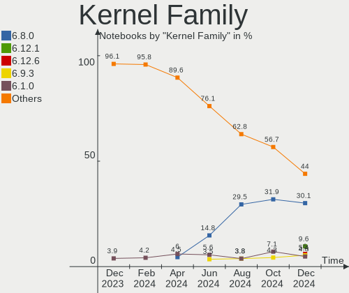
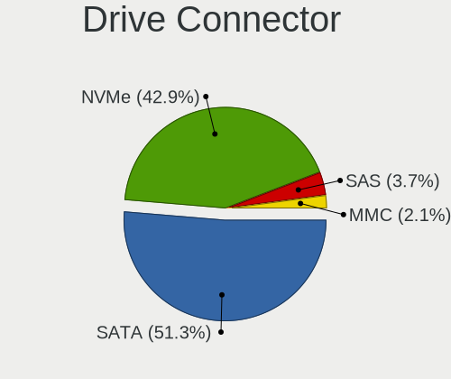
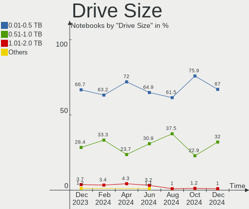
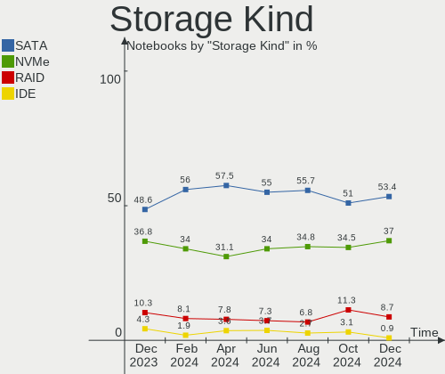
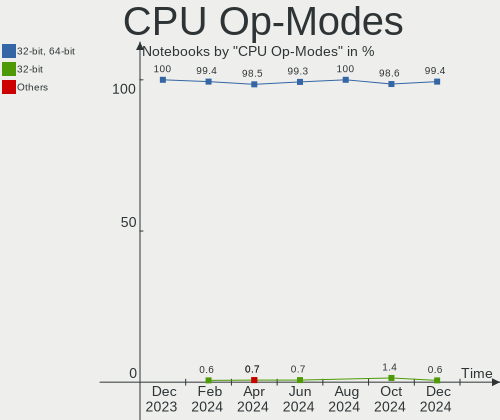
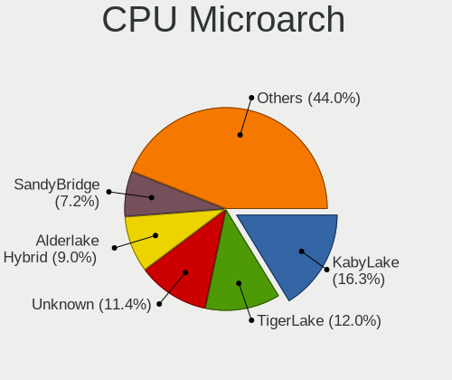
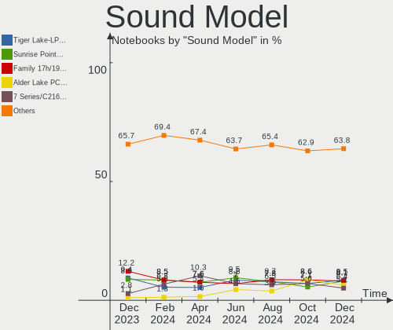
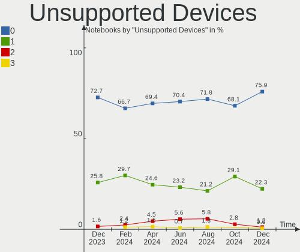

Linux in Brazil - Hardware Trends (Notebooks)
---------------------------------------------

A project to identify most popular hardware characteristics and track their change
over time based on data collected by Linux users at https://Linux-Hardware.org.

Anyone can contribute to this report by the [hw-probe](https://github.com/linuxhw/hw-probe) tool:

    sudo -E hw-probe -all -upload

Period: Sep, 2023.

Contents
--------

* [ System ](#system)
  - [ OS                       ](#os)
  - [ OS Family                ](#os-family)
  - [ Kernel                   ](#kernel)
  - [ Kernel Family            ](#kernel-family)
  - [ Kernel Major Ver.        ](#kernel-major-ver)
  - [ Arch                     ](#arch)
  - [ DE                       ](#de)
  - [ Display Server           ](#display-server)
  - [ Display Manager          ](#display-manager)
  - [ OS Lang                  ](#os-lang)
  - [ Boot Mode                ](#boot-mode)
  - [ Filesystem               ](#filesystem)
  - [ Part. scheme             ](#part-scheme)
  - [ Dual Boot with Linux/BSD ](#dual-boot-with-linuxbsd)
  - [ Dual Boot (Win)          ](#dual-boot-win)

* [ Board ](#board)
  - [ Vendor                   ](#vendor)
  - [ Model                    ](#model)
  - [ Model Family             ](#model-family)
  - [ MFG Year                 ](#mfg-year)
  - [ Form Factor              ](#form-factor)
  - [ Secure Boot              ](#secure-boot)
  - [ Coreboot                 ](#coreboot)
  - [ RAM Size                 ](#ram-size)
  - [ RAM Used                 ](#ram-used)
  - [ Total Drives             ](#total-drives)
  - [ Has CD-ROM               ](#has-cd-rom)
  - [ Has Ethernet             ](#has-ethernet)
  - [ Has WiFi                 ](#has-wifi)
  - [ Has Bluetooth            ](#has-bluetooth)

* [ Location ](#location)
  - [ Country                  ](#country)
  - [ City                     ](#city)

* [ Drives ](#drives)
  - [ Drive Vendor             ](#drive-vendor)
  - [ Drive Model              ](#drive-model)
  - [ HDD Vendor               ](#hdd-vendor)
  - [ SSD Vendor               ](#ssd-vendor)
  - [ Drive Kind               ](#drive-kind)
  - [ Drive Connector          ](#drive-connector)
  - [ Drive Size               ](#drive-size)
  - [ Space Total              ](#space-total)
  - [ Space Used               ](#space-used)
  - [ Malfunc. Drives          ](#malfunc-drives)
  - [ Malfunc. Drive Vendor    ](#malfunc-drive-vendor)
  - [ Malfunc. HDD Vendor      ](#malfunc-hdd-vendor)
  - [ Malfunc. Drive Kind      ](#malfunc-drive-kind)
  - [ Failed Drives            ](#failed-drives)
  - [ Failed Drive Vendor      ](#failed-drive-vendor)
  - [ Drive Status             ](#drive-status)

* [ Storage controller ](#storage-controller)
  - [ Storage Vendor           ](#storage-vendor)
  - [ Storage Model            ](#storage-model)
  - [ Storage Kind             ](#storage-kind)

* [ Processor ](#processor)
  - [ CPU Vendor               ](#cpu-vendor)
  - [ CPU Model                ](#cpu-model)
  - [ CPU Model Family         ](#cpu-model-family)
  - [ CPU Cores                ](#cpu-cores)
  - [ CPU Sockets              ](#cpu-sockets)
  - [ CPU Threads              ](#cpu-threads)
  - [ CPU Op-Modes             ](#cpu-op-modes)
  - [ CPU Microcode            ](#cpu-microcode)
  - [ CPU Microarch            ](#cpu-microarch)

* [ Graphics ](#graphics)
  - [ GPU Vendor               ](#gpu-vendor)
  - [ GPU Model                ](#gpu-model)
  - [ GPU Combo                ](#gpu-combo)
  - [ GPU Driver               ](#gpu-driver)
  - [ GPU Memory               ](#gpu-memory)

* [ Monitor ](#monitor)
  - [ Monitor Vendor           ](#monitor-vendor)
  - [ Monitor Model            ](#monitor-model)
  - [ Monitor Resolution       ](#monitor-resolution)
  - [ Monitor Diagonal         ](#monitor-diagonal)
  - [ Monitor Width            ](#monitor-width)
  - [ Aspect Ratio             ](#aspect-ratio)
  - [ Monitor Area             ](#monitor-area)
  - [ Pixel Density            ](#pixel-density)
  - [ Multiple Monitors        ](#multiple-monitors)

* [ Network ](#network)
  - [ Net Controller Vendor    ](#net-controller-vendor)
  - [ Net Controller Model     ](#net-controller-model)
  - [ Wireless Vendor          ](#wireless-vendor)
  - [ Wireless Model           ](#wireless-model)
  - [ Ethernet Vendor          ](#ethernet-vendor)
  - [ Ethernet Model           ](#ethernet-model)
  - [ Net Controller Kind      ](#net-controller-kind)
  - [ Used Controller          ](#used-controller)
  - [ NICs                     ](#nics)
  - [ IPv6                     ](#ipv6)

* [ Bluetooth ](#bluetooth)
  - [ Bluetooth Vendor         ](#bluetooth-vendor)
  - [ Bluetooth Model          ](#bluetooth-model)

* [ Sound ](#sound)
  - [ Sound Vendor             ](#sound-vendor)
  - [ Sound Model              ](#sound-model)

* [ Memory ](#memory)
  - [ Memory Vendor            ](#memory-vendor)
  - [ Memory Model             ](#memory-model)
  - [ Memory Kind              ](#memory-kind)
  - [ Memory Form Factor       ](#memory-form-factor)
  - [ Memory Size              ](#memory-size)
  - [ Memory Speed             ](#memory-speed)

* [ Printers & scanners ](#printers--scanners)
  - [ Printer Vendor           ](#printer-vendor)
  - [ Printer Model            ](#printer-model)
  - [ Scanner Vendor           ](#scanner-vendor)
  - [ Scanner Model            ](#scanner-model)

* [ Camera ](#camera)
  - [ Camera Vendor            ](#camera-vendor)
  - [ Camera Model             ](#camera-model)

* [ Security ](#security)
  - [ Fingerprint Vendor       ](#fingerprint-vendor)
  - [ Fingerprint Model        ](#fingerprint-model)
  - [ Chipcard Vendor          ](#chipcard-vendor)
  - [ Chipcard Model           ](#chipcard-model)

* [ Unsupported ](#unsupported)
  - [ Unsupported Devices      ](#unsupported-devices)
  - [ Unsupported Device Types ](#unsupported-device-types)

System
------

OS
--

Installed operating systems

| Name                         | Notebooks | Percent |
|------------------------------|-----------|---------|
| Ubuntu 22.04                 | 19        | 11.88%  |
| OpenMandriva 23.08           | 14        | 8.75%   |
| Fedora 38                    | 14        | 8.75%   |
| Linux Mint 21.2              | 12        | 7.5%    |
| Pop!_OS 22.04                | 9         | 5.63%   |
| OpenMandriva 23.09           | 8         | 5%      |
| Ubuntu 23.04                 | 7         | 4.38%   |
| Debian 12                    | 6         | 3.75%   |
| ArcoLinux Rolling            | 6         | 3.75%   |
| Arch Rolling                 | 6         | 3.75%   |
| Zorin 16                     | 4         | 2.5%    |
| Manjaro                      | 4         | 2.5%    |
| Linux Mint 21.1              | 4         | 2.5%    |
| SteamOS 3.4.10               | 3         | 1.88%   |
| OpenMandriva 23.01           | 3         | 1.88%   |
| Endless 3.9.3-nexthw1        | 3         | 1.88%   |
| Xero Rolling                 | 2         | 1.25%   |
| openSUSE Tumbleweed-XXXXXXXX | 2         | 1.25%   |
| openSUSE Leap-15.5           | 2         | 1.25%   |
| OpenMandriva 4.2             | 2         | 1.25%   |
| OpenMandriva 23.90           | 2         | 1.25%   |
| OpenMandriva 23.03           | 2         | 1.25%   |
| KDE neon 22.04               | 2         | 1.25%   |
| Kali 2023.3                  | 2         | 1.25%   |
| Garuda Linux Soaring         | 2         | 1.25%   |
| ChimeraOS 43-1               | 2         | 1.25%   |
| Xubuntu 22.04                | 1         | 0.63%   |
| Ubuntu MATE 22.04            | 1         | 0.63%   |
| Ubuntu 20.04                 | 1         | 0.63%   |
| Ubuntu 18.04                 | 1         | 0.63%   |
| ROSA 12.4                    | 1         | 0.63%   |
| OpenMandriva 4.3             | 1         | 0.63%   |
| Nobara 38                    | 1         | 0.63%   |
| NixOS 23.05                  | 1         | 0.63%   |
| LMDE 5                       | 1         | 0.63%   |
| Linux Mint 21                | 1         | 0.63%   |
| Linux Mint 20.3              | 1         | 0.63%   |
| Endless 5.0.5                | 1         | 0.63%   |
| Endless 3.8.3-nexthw1        | 1         | 0.63%   |
| Elementary 5.1.7             | 1         | 0.63%   |

OS Family
---------

OS without a version

| Name         | Notebooks | Percent |
|--------------|-----------|---------|
| OpenMandriva | 32        | 20%     |
| Ubuntu       | 28        | 17.5%   |
| Linux Mint   | 18        | 11.25%  |
| Fedora       | 14        | 8.75%   |
| Pop!_OS      | 9         | 5.63%   |
| Debian       | 8         | 5%      |
| ArcoLinux    | 6         | 3.75%   |
| Arch         | 6         | 3.75%   |
| Endless      | 5         | 3.13%   |
| Zorin        | 4         | 2.5%    |
| openSUSE     | 4         | 2.5%    |
| Manjaro      | 4         | 2.5%    |
| SteamOS      | 3         | 1.88%   |
| Xero         | 2         | 1.25%   |
| KDE neon     | 2         | 1.25%   |
| Kali         | 2         | 1.25%   |
| Garuda Linux | 2         | 1.25%   |
| ChimeraOS    | 2         | 1.25%   |
| Xubuntu      | 1         | 0.63%   |
| Ubuntu MATE  | 1         | 0.63%   |
| ROSA         | 1         | 0.63%   |
| Nobara       | 1         | 0.63%   |
| NixOS        | 1         | 0.63%   |
| LMDE         | 1         | 0.63%   |
| Elementary   | 1         | 0.63%   |
| Devuan       | 1         | 0.63%   |
| BunsenLabs   | 1         | 0.63%   |

Kernel
------

Version of the Linux kernel

| Version                      | Notebooks | Percent |
|------------------------------|-----------|---------|
| 6.4.11-desktop-1omv2390      | 14        | 8.75%   |
| 6.2.0-32-generic             | 11        | 6.88%   |
| 5.15.0-83-generic            | 10        | 6.25%   |
| 6.4.15-200.fc38.x86_64       | 7         | 4.38%   |
| 6.5.0-desktop-1omv2390       | 5         | 3.13%   |
| 6.4.6-76060406-generic       | 5         | 3.13%   |
| 6.2.0-33-generic             | 5         | 3.13%   |
| 6.2.0-31-generic             | 5         | 3.13%   |
| 6.1.0-12-amd64               | 5         | 3.13%   |
| 6.4.12-arch1-1               | 4         | 2.5%    |
| 6.2.6-76060206-generic       | 4         | 2.5%    |
| 5.15.0-82-generic            | 4         | 2.5%    |
| 6.4.8-desktop-2omv2390       | 3         | 1.88%   |
| 6.4.14-200.fc38.x86_64       | 3         | 1.88%   |
| 6.4.12-zen1-1-zen            | 3         | 1.88%   |
| 6.1.1-desktop-1omv2290       | 3         | 1.88%   |
| 5.15.0-84-generic            | 3         | 1.88%   |
| 5.15.0-76-generic            | 3         | 1.88%   |
| 5.13.0-valve37-1-neptune     | 3         | 1.88%   |
| 5.11.0-12-generic            | 3         | 1.88%   |
| 6.5.4-arch2-1                | 2         | 1.25%   |
| 6.5.3-1-MANJARO              | 2         | 1.25%   |
| 6.4.9-arch1-1                | 2         | 1.25%   |
| 6.4.13-200.fc38.x86_64       | 2         | 1.25%   |
| 6.4.11-arch1-1               | 2         | 1.25%   |
| 6.3.9-chimeraos-1            | 2         | 1.25%   |
| 6.2.6-desktop-1omv2390       | 2         | 1.25%   |
| 6.2.0-34-generic             | 2         | 1.25%   |
| 5.14.21-150500.55.19-default | 2         | 1.25%   |
| 5.10.14-desktop-1omv4002     | 2         | 1.25%   |
| 6.5.5-zen1-1-zen             | 1         | 0.63%   |
| 6.5.5-arch1-1                | 1         | 0.63%   |
| 6.5.5-200.fsync.fc38.x86_64  | 1         | 0.63%   |
| 6.5.5-200.fc38.x86_64        | 1         | 0.63%   |
| 6.5.4-1-default              | 1         | 0.63%   |
| 6.5.3-desktop-1omv2390       | 1         | 0.63%   |
| 6.5.2-desktop-1omv2390       | 1         | 0.63%   |
| 6.5.1-1-MANJARO              | 1         | 0.63%   |
| 6.5.1-060501-generic         | 1         | 0.63%   |
| 6.5.0-kali1-amd64            | 1         | 0.63%   |

Kernel Family
-------------

Linux kernel without a distro release

| Version | Notebooks | Percent |
|---------|-----------|---------|
| 6.2.0   | 26        | 16.25%  |
| 5.15.0  | 24        | 15%     |
| 6.4.11  | 16        | 10%     |
| 6.4.15  | 8         | 5%      |
| 6.4.12  | 8         | 5%      |
| 6.1.0   | 8         | 5%      |
| 6.5.0   | 7         | 4.38%   |
| 6.2.6   | 6         | 3.75%   |
| 6.4.6   | 5         | 3.13%   |
| 6.5.5   | 4         | 2.5%    |
| 6.5.4   | 3         | 1.88%   |
| 6.5.3   | 3         | 1.88%   |
| 6.4.8   | 3         | 1.88%   |
| 6.4.14  | 3         | 1.88%   |
| 6.1.1   | 3         | 1.88%   |
| 5.13.0  | 3         | 1.88%   |
| 5.11.0  | 3         | 1.88%   |
| 6.5.1   | 2         | 1.25%   |
| 6.4.9   | 2         | 1.25%   |
| 6.4.13  | 2         | 1.25%   |
| 6.3.9   | 2         | 1.25%   |
| 6.2.9   | 2         | 1.25%   |
| 5.4.0   | 2         | 1.25%   |
| 5.19.0  | 2         | 1.25%   |
| 5.14.21 | 2         | 1.25%   |
| 5.10.14 | 2         | 1.25%   |
| 5.10.0  | 2         | 1.25%   |
| 6.5.2   | 1         | 0.63%   |
| 6.4.0   | 1         | 0.63%   |
| 6.1.53  | 1         | 0.63%   |
| 6.1.38  | 1         | 0.63%   |
| 5.6.0   | 1         | 0.63%   |
| 5.16.13 | 1         | 0.63%   |
| 4.15.0  | 1         | 0.63%   |

Kernel Major Ver.
-----------------

Linux kernel major version

| Version | Notebooks | Percent |
|---------|-----------|---------|
| 6.4     | 48        | 30%     |
| 6.2     | 34        | 21.25%  |
| 5.15    | 24        | 15%     |
| 6.5     | 20        | 12.5%   |
| 6.1     | 13        | 8.13%   |
| 5.10    | 4         | 2.5%    |
| 5.13    | 3         | 1.88%   |
| 5.11    | 3         | 1.88%   |
| 6.3     | 2         | 1.25%   |
| 5.4     | 2         | 1.25%   |
| 5.19    | 2         | 1.25%   |
| 5.14    | 2         | 1.25%   |
| 5.6     | 1         | 0.63%   |
| 5.16    | 1         | 0.63%   |
| 4.15    | 1         | 0.63%   |

Arch
----

OS architecture (x86_64, i586, etc.)

| Name   | Notebooks | Percent |
|--------|-----------|---------|
| x86_64 | 159       | 99.38%  |
| i686   | 1         | 0.63%   |

DE
--

Desktop Environment

| Name       | Notebooks | Percent |
|------------|-----------|---------|
| GNOME      | 76        | 47.5%   |
| KDE5       | 44        | 27.5%   |
| X-Cinnamon | 13        | 8.13%   |
| XFCE       | 10        | 6.25%   |
| MATE       | 5         | 3.13%   |
| Unknown    | 5         | 3.13%   |
| LXQt       | 3         | 1.88%   |
| Pantheon   | 2         | 1.25%   |
| chadwm     | 1         | 0.63%   |
| awesome    | 1         | 0.63%   |

Display Server
--------------

X11 or Wayland

| Name    | Notebooks | Percent |
|---------|-----------|---------|
| X11     | 85        | 53.13%  |
| Wayland | 73        | 45.63%  |
| Unknown | 2         | 1.25%   |

Display Manager
---------------

SDDM, LightDM, etc.

| Name    | Notebooks | Percent |
|---------|-----------|---------|
| Unknown | 64        | 40%     |
| SDDM    | 39        | 24.38%  |
| GDM3    | 32        | 20%     |
| LightDM | 14        | 8.75%   |
| GDM     | 11        | 6.88%   |

OS Lang
-------

Language

| Lang  | Notebooks | Percent |
|-------|-----------|---------|
| pt_BR | 111       | 69.38%  |
| en_US | 42        | 26.25%  |
| C     | 3         | 1.88%   |
| UTF-8 | 1         | 0.63%   |
| fr_FR | 1         | 0.63%   |
| en_CA | 1         | 0.63%   |
| de_DE | 1         | 0.63%   |

Boot Mode
---------

EFI or BIOS

| Mode | Notebooks | Percent |
|------|-----------|---------|
| BIOS | 84        | 52.5%   |
| EFI  | 76        | 47.5%   |

Filesystem
----------

Type of filesystem

| Type    | Notebooks | Percent |
|---------|-----------|---------|
| Ext4    | 87        | 54.38%  |
| Btrfs   | 36        | 22.5%   |
| Tmpfs   | 18        | 11.25%  |
| Overlay | 16        | 10%     |
| Xfs     | 2         | 1.25%   |
| Ext2    | 1         | 0.63%   |

Part. scheme
------------

Scheme of partitioning

| Type    | Notebooks | Percent |
|---------|-----------|---------|
| GPT     | 74        | 46.25%  |
| Unknown | 65        | 40.63%  |
| MBR     | 21        | 13.13%  |

Dual Boot with Linux/BSD
------------------------

Hosting more than one Linux/BSD

| Dual boot | Notebooks | Percent |
|-----------|-----------|---------|
| No        | 146       | 91.25%  |
| Yes       | 14        | 8.75%   |

Dual Boot (Win)
---------------

Hosting Linux and Windows

| Dual boot | Notebooks | Percent |
|-----------|-----------|---------|
| No        | 125       | 78.13%  |
| Yes       | 35        | 21.88%  |

Board
-----

Vendor
------

Motherboard manufacturer

| Name                | Notebooks | Percent |
|---------------------|-----------|---------|
| Dell                | 44        | 27.5%   |
| Samsung Electronics | 22        | 13.75%  |
| Lenovo              | 22        | 13.75%  |
| Acer                | 18        | 11.25%  |
| ASUSTek Computer    | 17        | 10.63%  |
| Hewlett-Packard     | 10        | 6.25%   |
| Positivo            | 5         | 3.13%   |
| Valve               | 3         | 1.88%   |
| Digibras            | 2         | 1.25%   |
| Compaq              | 2         | 1.25%   |
| Apple               | 2         | 1.25%   |
| Tectoy              | 1         | 0.63%   |
| Standard            | 1         | 0.63%   |
| Sony                | 1         | 0.63%   |
| Notebook            | 1         | 0.63%   |
| Multilaser          | 1         | 0.63%   |
| LG Electronics      | 1         | 0.63%   |
| Itautec             | 1         | 0.63%   |
| Intel               | 1         | 0.63%   |
| Google              | 1         | 0.63%   |
| EUROCOM             | 1         | 0.63%   |
| Daten Tecnologia    | 1         | 0.63%   |
| Chuwi               | 1         | 0.63%   |
| Alienware           | 1         | 0.63%   |

Model
-----

Motherboard model

| Name                                     | Notebooks | Percent |
|------------------------------------------|-----------|---------|
| Samsung 340XAA/350XAA/550XAA             | 4         | 2.5%    |
| Valve Jupiter                            | 3         | 1.88%   |
| Samsung 550XDA                           | 3         | 1.88%   |
| Samsung 550XBE/350XBE                    | 3         | 1.88%   |
| ASUS VivoBook_ASUSLaptop X515EA_X515EA   | 3         | 1.88%   |
| Samsung 550XED                           | 2         | 1.25%   |
| Samsung 530XBB                           | 2         | 1.25%   |
| Lenovo IdeaPad 310-15ISK 80UH            | 2         | 1.25%   |
| HP Presario CQ43                         | 2         | 1.25%   |
| Dell Vostro 5470                         | 2         | 1.25%   |
| Dell Inspiron 5566                       | 2         | 1.25%   |
| Dell Inspiron 15 7000 Gaming             | 2         | 1.25%   |
| Dell G15 5520                            | 2         | 1.25%   |
| ASUS VivoBook_ASUSLaptop X515JA_X515JA   | 2         | 1.25%   |
| ASUS VivoBook_ASUSLaptop X513EAN_X513EAN | 2         | 1.25%   |
| Acer Aspire E5-571                       | 2         | 1.25%   |
| Tectoy Pense Bem Notebook                | 1         | 0.63%   |
| Standard MB45II/MB45IN                   | 1         | 0.63%   |
| Sony VGN-FZ140E                          | 1         | 0.63%   |
| Samsung RV415                            | 1         | 0.63%   |
| Samsung RF511/RF411/RF711                | 1         | 0.63%   |
| Samsung 960XFH                           | 1         | 0.63%   |
| Samsung 500R5L/501R5L/500R5P             | 1         | 0.63%   |
| Samsung 370E4K                           | 1         | 0.63%   |
| Samsung 300E5M/300E5L                    | 1         | 0.63%   |
| Samsung 300E4M/300E4S/300E4L             | 1         | 0.63%   |
| Samsung 270E5K/270E5Q/271E5K/2570EK      | 1         | 0.63%   |
| Positivo S14CT01                         | 1         | 0.63%   |
| Positivo Mobile                          | 1         | 0.63%   |
| Positivo C464F                           | 1         | 0.63%   |
| Positivo C14CR21                         | 1         | 0.63%   |
| Positivo C14CR01                         | 1         | 0.63%   |
| Notebook NJx0MU                          | 1         | 0.63%   |
| Multilaser PC31X                         | 1         | 0.63%   |
| LG C400-G.BC22P1                         | 1         | 0.63%   |
| Lenovo V720-14 80Y1                      | 1         | 0.63%   |
| Lenovo ThinkPad X220 4286BB2             | 1         | 0.63%   |
| Lenovo ThinkPad Edge E431 627793P        | 1         | 0.63%   |
| Lenovo ThinkPad E490 20N9001RBR          | 1         | 0.63%   |
| Lenovo ThinkPad E14 Gen 3 20YD001DBO     | 1         | 0.63%   |

Model Family
------------

Motherboard model prefix

| Name             | Notebooks | Percent |
|------------------|-----------|---------|
| Dell Inspiron    | 19        | 11.88%  |
| Lenovo IdeaPad   | 14        | 8.75%   |
| Acer Aspire      | 14        | 8.75%   |
| Dell Latitude    | 9         | 5.63%   |
| ASUS VivoBook    | 9         | 5.63%   |
| Dell Vostro      | 6         | 3.75%   |
| Samsung 340XAA   | 4         | 2.5%    |
| Lenovo ThinkPad  | 4         | 2.5%    |
| Dell XPS         | 4         | 2.5%    |
| Dell G15         | 4         | 2.5%    |
| Valve Jupiter    | 3         | 1.88%   |
| Samsung 550XDA   | 3         | 1.88%   |
| Samsung 550XBE   | 3         | 1.88%   |
| Samsung 550XED   | 2         | 1.25%   |
| Samsung 530XBB   | 2         | 1.25%   |
| HP Presario      | 2         | 1.25%   |
| HP EliteBook     | 2         | 1.25%   |
| HP Compaq        | 2         | 1.25%   |
| Acer Nitro       | 2         | 1.25%   |
| Tectoy Pense     | 1         | 0.63%   |
| Standard MB45II  | 1         | 0.63%   |
| Sony VGN-FZ140E  | 1         | 0.63%   |
| Samsung RV415    | 1         | 0.63%   |
| Samsung RF511    | 1         | 0.63%   |
| Samsung 960XFH   | 1         | 0.63%   |
| Samsung 500R5L   | 1         | 0.63%   |
| Samsung 370E4K   | 1         | 0.63%   |
| Samsung 300E5M   | 1         | 0.63%   |
| Samsung 300E4M   | 1         | 0.63%   |
| Samsung 270E5K   | 1         | 0.63%   |
| Positivo S14CT01 | 1         | 0.63%   |
| Positivo Mobile  | 1         | 0.63%   |
| Positivo C464F   | 1         | 0.63%   |
| Positivo C14CR21 | 1         | 0.63%   |
| Positivo C14CR01 | 1         | 0.63%   |
| Notebook NJx0MU  | 1         | 0.63%   |
| Multilaser PC31X | 1         | 0.63%   |
| LG C400-G.BC22P1 | 1         | 0.63%   |
| Lenovo V720-14   | 1         | 0.63%   |
| Lenovo Slim      | 1         | 0.63%   |

MFG Year
--------

Motherboard manufacture year

| Year    | Notebooks | Percent |
|---------|-----------|---------|
| 2021    | 25        | 15.63%  |
| 2019    | 17        | 10.63%  |
| 2011    | 15        | 9.38%   |
| 2013    | 13        | 8.13%   |
| 2018    | 12        | 7.5%    |
| 2016    | 12        | 7.5%    |
| 2022    | 10        | 6.25%   |
| 2017    | 10        | 6.25%   |
| 2012    | 10        | 6.25%   |
| 2020    | 7         | 4.38%   |
| 2023    | 6         | 3.75%   |
| 2010    | 5         | 3.13%   |
| 2008    | 5         | 3.13%   |
| 2015    | 4         | 2.5%    |
| 2014    | 4         | 2.5%    |
| 2009    | 3         | 1.88%   |
| 2007    | 1         | 0.63%   |
| Unknown | 1         | 0.63%   |

Form Factor
-----------

Physical design of the computer

| Name     | Notebooks | Percent |
|----------|-----------|---------|
| Notebook | 160       | 100%    |

Secure Boot
-----------

Enabled or disabled

| State    | Notebooks | Percent |
|----------|-----------|---------|
| Disabled | 154       | 96.25%  |
| Enabled  | 6         | 3.75%   |

Coreboot
--------

Have coreboot on board

| Used | Notebooks | Percent |
|------|-----------|---------|
| No   | 159       | 99.38%  |
| Yes  | 1         | 0.63%   |

RAM Size
--------

Total RAM memory

| Size in GB  | Notebooks | Percent |
|-------------|-----------|---------|
| 4.01-8.0    | 51        | 31.88%  |
| 3.01-4.0    | 40        | 25%     |
| 16.01-24.0  | 26        | 16.25%  |
| 8.01-16.0   | 25        | 15.63%  |
| 1.01-2.0    | 7         | 4.38%   |
| 32.01-64.0  | 6         | 3.75%   |
| 24.01-32.0  | 2         | 1.25%   |
| 2.01-3.0    | 2         | 1.25%   |
| 64.01-256.0 | 1         | 0.63%   |

RAM Used
--------

Used RAM memory

| Used GB    | Notebooks | Percent |
|------------|-----------|---------|
| 1.01-2.0   | 54        | 33.75%  |
| 2.01-3.0   | 39        | 24.38%  |
| 4.01-8.0   | 28        | 17.5%   |
| 3.01-4.0   | 27        | 16.88%  |
| 0.51-1.0   | 8         | 5%      |
| 8.01-16.0  | 3         | 1.88%   |
| 24.01-32.0 | 1         | 0.63%   |

Total Drives
------------

Number of drives on board

| Drives | Notebooks | Percent |
|--------|-----------|---------|
| 1      | 101       | 63.13%  |
| 2      | 52        | 32.5%   |
| 3      | 3         | 1.88%   |
| 0      | 3         | 1.88%   |
| 6      | 1         | 0.63%   |

Has CD-ROM
----------

Has CD-ROM on board

| Presented | Notebooks | Percent |
|-----------|-----------|---------|
| No        | 119       | 74.38%  |
| Yes       | 41        | 25.63%  |

Has Ethernet
------------

Has Ethernet on board

| Presented | Notebooks | Percent |
|-----------|-----------|---------|
| Yes       | 122       | 76.25%  |
| No        | 38        | 23.75%  |

Has WiFi
--------

Has WiFi module

| Presented | Notebooks | Percent |
|-----------|-----------|---------|
| Yes       | 158       | 98.75%  |
| No        | 2         | 1.25%   |

Has Bluetooth
-------------

Has Bluetooth module

| Presented | Notebooks | Percent |
|-----------|-----------|---------|
| Yes       | 127       | 79.38%  |
| No        | 33        | 20.63%  |

Location
--------

Country
-------

Geographic location (country)

| Country | Notebooks | Percent |
|---------|-----------|---------|
| Brazil  | 160       | 100%    |

City
----

Geographic location (city)

| City                   | Notebooks | Percent |
|------------------------|-----------|---------|
| Sao Paulo              | 19        | 11.88%  |
| Rio de Janeiro         | 7         | 4.38%   |
| Curitiba               | 7         | 4.38%   |
| Brasília              | 7         | 4.38%   |
| Fortaleza              | 5         | 3.13%   |
| Porto Alegre           | 4         | 2.5%    |
| Osasco                 | 4         | 2.5%    |
| Manaus                 | 4         | 2.5%    |
| Campinas               | 4         | 2.5%    |
| Marília               | 3         | 1.88%   |
| Joinville              | 3         | 1.88%   |
| Sobral                 | 2         | 1.25%   |
| Sao Vicente            | 2         | 1.25%   |
| Salvador               | 2         | 1.25%   |
| Recife                 | 2         | 1.25%   |
| Joao Pessoa            | 2         | 1.25%   |
| Belo Horizonte         | 2         | 1.25%   |
| Vila Velha             | 1         | 0.63%   |
| Varginha               | 1         | 0.63%   |
| Valparaiso de Goias    | 1         | 0.63%   |
| Vacaria                | 1         | 0.63%   |
| Uberlândia            | 1         | 0.63%   |
| Trairi                 | 1         | 0.63%   |
| Teresina               | 1         | 0.63%   |
| Taubate                | 1         | 0.63%   |
| Sapucaia do Sul        | 1         | 0.63%   |
| Sao Luís              | 1         | 0.63%   |
| Sao José dos Campos   | 1         | 0.63%   |
| Sao Jeronimo da Serra  | 1         | 0.63%   |
| Sao Goncalo do Sapucai | 1         | 0.63%   |
| Santarém              | 1         | 0.63%   |
| Santa Rita do Sapucai  | 1         | 0.63%   |
| Santa Maria            | 1         | 0.63%   |
| Santa Barbara d'Oeste  | 1         | 0.63%   |
| Rio Largo              | 1         | 0.63%   |
| Ribeirao Preto         | 1         | 0.63%   |
| Ribeirao das Neves     | 1         | 0.63%   |
| Presidente Venceslau   | 1         | 0.63%   |
| Ponta Grossa           | 1         | 0.63%   |
| Piracicaba             | 1         | 0.63%   |

Drives
------

Drive Vendor
------------

Hard drive vendors

| Vendor                         | Notebooks | Drives | Percent |
|--------------------------------|-----------|--------|---------|
| WDC                            | 32        | 34     | 15.76%  |
| Kingston                       | 21        | 22     | 10.34%  |
| Samsung Electronics            | 16        | 17     | 7.88%   |
| Seagate                        | 15        | 15     | 7.39%   |
| Toshiba                        | 12        | 12     | 5.91%   |
| Unknown                        | 10        | 11     | 4.93%   |
| SanDisk                        | 10        | 10     | 4.93%   |
| China                          | 9         | 9      | 4.43%   |
| A-DATA Technology              | 9         | 9      | 4.43%   |
| ADATA Technology               | 8         | 8      | 3.94%   |
| Intel                          | 6         | 6      | 2.96%   |
| Crucial                        | 6         | 7      | 2.96%   |
| SK hynix                       | 4         | 4      | 1.97%   |
| LITEON                         | 4         | 4      | 1.97%   |
| Hitachi                        | 4         | 4      | 1.97%   |
| Netac                          | 3         | 3      | 1.48%   |
| SSSTC                          | 2         | 2      | 0.99%   |
| Solid State Storage            | 2         | 2      | 0.99%   |
| Silicon Motion                 | 2         | 2      | 0.99%   |
| Realtek Semiconductor          | 2         | 2      | 0.99%   |
| Micron Technology              | 2         | 2      | 0.99%   |
| Kingston Technology Company    | 2         | 2      | 0.99%   |
| KingSpec                       | 2         | 2      | 0.99%   |
| HS-SSD-C100                    | 2         | 2      | 0.99%   |
| HGST                           | 2         | 2      | 0.99%   |
| XrayDisk                       | 1         | 1      | 0.49%   |
| WALRAM                         | 1         | 1      | 0.49%   |
| USB3.0                         | 1         | 1      | 0.49%   |
| UP                             | 1         | 1      | 0.49%   |
| Solid State Storage Technology | 1         | 1      | 0.49%   |
| S3+                            | 1         | 1      | 0.49%   |
| PNY                            | 1         | 1      | 0.49%   |
| Phison Electronics             | 1         | 1      | 0.49%   |
| O2 Micro                       | 1         | 1      | 0.49%   |
| Mass                           | 1         | 1      | 0.49%   |
| KIOXIA                         | 1         | 1      | 0.49%   |
| HUSKY                          | 1         | 1      | 0.49%   |
| Gigabyte Technology            | 1         | 1      | 0.49%   |
| Fujitsu                        | 1         | 1      | 0.49%   |
| Apple                          | 1         | 1      | 0.49%   |

Drive Model
-----------

Hard drive models

| Model                               | Notebooks | Percent |
|-------------------------------------|-----------|---------|
| Kingston SA400S37480G 480GB SSD     | 7         | 3.37%   |
| Kingston SA400S37240G 240GB SSD     | 5         | 2.4%    |
| ADATA SM2P32A8-256GC1 256GB         | 5         | 2.4%    |
| WDC WD10SPZX-35Z10T0 1TB            | 4         | 1.92%   |
| WDC WD10SPZX-21Z10T0 1TB            | 3         | 1.44%   |
| Seagate ST500LM012 HN-M500MBB 500GB | 3         | 1.44%   |
| Seagate ST1000LM035-1RK172 1TB      | 3         | 1.44%   |
| Kingston SA400S37960G 960GB SSD     | 3         | 1.44%   |
| WDC WDS480G2G0B-00EPW0 480GB SSD    | 2         | 0.96%   |
| WDC WDS240G2G0A-00JH30 240GB SSD    | 2         | 0.96%   |
| WDC WD5000LPVX-22V0TT0 500GB        | 2         | 0.96%   |
| WDC WD5000BPVT-22HXZT3 500GB        | 2         | 0.96%   |
| WDC WD10SPZX-75Z10T2 1TB            | 2         | 0.96%   |
| WDC WD10SPZX-75Z10T1 1TB            | 2         | 0.96%   |
| Unknown MMC Card  64GB              | 2         | 0.96%   |
| Unknown MMC Card  32GB              | 2         | 0.96%   |
| Toshiba MQ01ABD100 1TB              | 2         | 0.96%   |
| Seagate ST1000LM024 HN-M101MBB 1TB  | 2         | 0.96%   |
| SanDisk SSD PLUS 120GB              | 2         | 0.96%   |
| Samsung MZVLQ512HBLU-00B00 512GB    | 2         | 0.96%   |
| Samsung MZVLQ256HBJD-00B 256GB      | 2         | 0.96%   |
| Samsung M3 Portable 1TB             | 2         | 0.96%   |
| Netac SSD 128GB                     | 2         | 0.96%   |
| Kingston SV300S37A120G 120GB SSD    | 2         | 0.96%   |
| Hitachi HTS547550A9E384 500GB       | 2         | 0.96%   |
| Crucial CT240BX500SSD1 240GB        | 2         | 0.96%   |
| China SSD 128GB                     | 2         | 0.96%   |
| A-DATA SU650 240GB SSD              | 2         | 0.96%   |
| A-DATA IM2P33F3A NVMe 512GB         | 2         | 0.96%   |
| A-DATA IM2P33F3 NVMe 256GB          | 2         | 0.96%   |
| XrayDisk 512GB SSD                  | 1         | 0.48%   |
| WDC WDS500G2B0A-00SM50 500GB SSD    | 1         | 0.48%   |
| WDC WDS240G2G0C-00AJM0 240GB        | 1         | 0.48%   |
| WDC WDS240G2G0B-00EPW0 240GB SSD    | 1         | 0.48%   |
| WDC WD7500BPKT-75PK4T0 752GB        | 1         | 0.48%   |
| WDC WD5000LPCX-24VHAT0 500GB        | 1         | 0.48%   |
| WDC WD3200BPVT-00JJ5T0 320GB        | 1         | 0.48%   |
| WDC WD3200BEVT-60ZCT1 320GB         | 1         | 0.48%   |
| WDC WD1600BEVT-22ZCT0 160GB         | 1         | 0.48%   |
| WDC WD10SPZX-80Z10T2 1TB            | 1         | 0.48%   |

HDD Vendor
----------

Hard disk drive vendors

| Vendor              | Notebooks | Drives | Percent |
|---------------------|-----------|--------|---------|
| WDC                 | 25        | 25     | 39.06%  |
| Seagate             | 15        | 15     | 23.44%  |
| Toshiba             | 10        | 10     | 15.63%  |
| Samsung Electronics | 5         | 5      | 7.81%   |
| Hitachi             | 4         | 4      | 6.25%   |
| HGST                | 2         | 2      | 3.13%   |
| USB3.0              | 1         | 1      | 1.56%   |
| Unknown             | 1         | 1      | 1.56%   |
| Fujitsu             | 1         | 1      | 1.56%   |

SSD Vendor
----------

Solid state drive vendors

| Vendor              | Notebooks | Drives | Percent |
|---------------------|-----------|--------|---------|
| Kingston            | 19        | 20     | 27.54%  |
| China               | 9         | 9      | 13.04%  |
| WDC                 | 7         | 8      | 10.14%  |
| SanDisk             | 6         | 6      | 8.7%    |
| Crucial             | 5         | 6      | 7.25%   |
| LITEON              | 4         | 4      | 5.8%    |
| Samsung Electronics | 3         | 3      | 4.35%   |
| A-DATA Technology   | 3         | 3      | 4.35%   |
| Netac               | 2         | 2      | 2.9%    |
| KingSpec            | 2         | 2      | 2.9%    |
| Intel               | 2         | 2      | 2.9%    |
| XrayDisk            | 1         | 1      | 1.45%   |
| S3+                 | 1         | 1      | 1.45%   |
| PNY                 | 1         | 1      | 1.45%   |
| HUSKY               | 1         | 1      | 1.45%   |
| HS-SSD-C100         | 1         | 1      | 1.45%   |
| Gigabyte Technology | 1         | 1      | 1.45%   |
| Apple               | 1         | 1      | 1.45%   |

Drive Kind
----------

HDD or SSD

| Kind    | Notebooks | Drives | Percent |
|---------|-----------|--------|---------|
| SSD     | 67        | 72     | 34.36%  |
| HDD     | 60        | 64     | 30.77%  |
| NVMe    | 53        | 57     | 27.18%  |
| MMC     | 10        | 11     | 5.13%   |
| Unknown | 5         | 5      | 2.56%   |

Drive Connector
---------------

SATA, SAS, NVMe, etc.

| Type | Notebooks | Drives | Percent |
|------|-----------|--------|---------|
| SATA | 114       | 135    | 62.3%   |
| NVMe | 53        | 57     | 28.96%  |
| MMC  | 10        | 11     | 5.46%   |
| SAS  | 6         | 6      | 3.28%   |

Drive Size
----------

Size of hard drive

| Size in TB | Notebooks | Drives | Percent |
|------------|-----------|--------|---------|
| 0.01-0.5   | 83        | 93     | 67.48%  |
| 0.51-1.0   | 39        | 42     | 31.71%  |
| 1.01-2.0   | 1         | 1      | 0.81%   |

Space Total
-----------

Amount of disk space available on the file system

| Size in GB     | Notebooks | Percent |
|----------------|-----------|---------|
| 251-500        | 46        | 28.75%  |
| 101-250        | 36        | 22.5%   |
| 501-1000       | 23        | 14.38%  |
| 1-20           | 18        | 11.25%  |
| 1001-2000      | 14        | 8.75%   |
| 21-50          | 7         | 4.38%   |
| 51-100         | 6         | 3.75%   |
| 2001-3000      | 4         | 2.5%    |
| More than 3000 | 3         | 1.88%   |
| Unknown        | 3         | 1.88%   |

Space Used
----------

Amount of used disk space

| Used GB   | Notebooks | Percent |
|-----------|-----------|---------|
| 1-20      | 70        | 43.75%  |
| 21-50     | 23        | 14.38%  |
| 51-100    | 23        | 14.38%  |
| 101-250   | 17        | 10.63%  |
| 251-500   | 13        | 8.13%   |
| 501-1000  | 7         | 4.38%   |
| 1001-2000 | 4         | 2.5%    |
| Unknown   | 3         | 1.88%   |

Malfunc. Drives
---------------

Drive models with a malfunction

| Model                             | Notebooks | Drives | Percent |
|-----------------------------------|-----------|--------|---------|
| WDC WDS480G2G0B-00EPW0 480GB SSD  | 1         | 1      | 7.69%   |
| WDC WDS240G2G0A-00JH30 240GB SSD  | 1         | 1      | 7.69%   |
| WDC WD10SPZX-75Z10T2 1TB          | 1         | 1      | 7.69%   |
| WDC WD10SPZX-75Z10T1 1TB          | 1         | 1      | 7.69%   |
| Toshiba MK5059GSXP 500GB          | 1         | 1      | 7.69%   |
| Toshiba MK3259GSXP 320GB          | 1         | 1      | 7.69%   |
| Samsung Electronics HM500JI 500GB | 1         | 1      | 7.69%   |
| LITEON CV8-8E128-HP 128GB SSD     | 1         | 1      | 7.69%   |
| Kingston SV300S37A120G 120GB SSD  | 1         | 1      | 7.69%   |
| Intel SSDSC2KW480H6 480GB         | 1         | 1      | 7.69%   |
| HGST HTS545050A7E680 500GB        | 1         | 1      | 7.69%   |
| HGST HCC545050A7E380 500GB        | 1         | 1      | 7.69%   |
| China SSD 240GB                   | 1         | 1      | 7.69%   |

Malfunc. Drive Vendor
---------------------

Vendors of faulty drives

| Vendor              | Notebooks | Drives | Percent |
|---------------------|-----------|--------|---------|
| WDC                 | 4         | 4      | 30.77%  |
| Toshiba             | 2         | 2      | 15.38%  |
| HGST                | 2         | 2      | 15.38%  |
| Samsung Electronics | 1         | 1      | 7.69%   |
| LITEON              | 1         | 1      | 7.69%   |
| Kingston            | 1         | 1      | 7.69%   |
| Intel               | 1         | 1      | 7.69%   |
| China               | 1         | 1      | 7.69%   |

Malfunc. HDD Vendor
-------------------

Vendors of faulty HDD drives

| Vendor              | Notebooks | Drives | Percent |
|---------------------|-----------|--------|---------|
| WDC                 | 2         | 2      | 28.57%  |
| Toshiba             | 2         | 2      | 28.57%  |
| HGST                | 2         | 2      | 28.57%  |
| Samsung Electronics | 1         | 1      | 14.29%  |

Malfunc. Drive Kind
-------------------

Kinds of faulty drives

| Kind | Notebooks | Drives | Percent |
|------|-----------|--------|---------|
| HDD  | 7         | 7      | 53.85%  |
| SSD  | 6         | 6      | 46.15%  |

Failed Drives
-------------

Failed drive models

Zero info for selected period =(

Failed Drive Vendor
-------------------

Failed drive vendors

Zero info for selected period =(

Drive Status
------------

Number of failed and malfunc. drives

| Status   | Notebooks | Drives | Percent |
|----------|-----------|--------|---------|
| Detected | 87        | 119    | 52.73%  |
| Works    | 65        | 77     | 39.39%  |
| Malfunc  | 13        | 13     | 7.88%   |

Storage controller
------------------

Storage Vendor
--------------

Storage controller vendors

| Vendor                         | Notebooks | Percent |
|--------------------------------|-----------|---------|
| Intel                          | 130       | 67.01%  |
| ADATA Technology               | 14        | 7.22%   |
| Samsung Electronics            | 9         | 4.64%   |
| AMD                            | 9         | 4.64%   |
| Sandisk                        | 5         | 2.58%   |
| Solid State Storage Technology | 4         | 2.06%   |
| SK hynix                       | 4         | 2.06%   |
| Kingston Technology Company    | 4         | 2.06%   |
| Toshiba America Info Systems   | 3         | 1.55%   |
| Silicon Motion                 | 2         | 1.03%   |
| Realtek Semiconductor          | 2         | 1.03%   |
| Nvidia                         | 2         | 1.03%   |
| Micron Technology              | 2         | 1.03%   |
| Phison Electronics             | 1         | 0.52%   |
| O2 Micro                       | 1         | 0.52%   |
| Netac Technology               | 1         | 0.52%   |
| Micron/Crucial Technology      | 1         | 0.52%   |

Storage Model
-------------

Storage controller models

| Model                                                                            | Notebooks | Percent |
|----------------------------------------------------------------------------------|-----------|---------|
| Intel Sunrise Point-LP SATA Controller [AHCI mode]                               | 25        | 12.02%  |
| Intel 7 Series Chipset Family 6-port SATA Controller [AHCI mode]                 | 16        | 7.69%   |
| Intel Tiger Lake-LP SATA Controller                                              | 11        | 5.29%   |
| Intel 82801 Mobile SATA Controller [RAID mode]                                   | 11        | 5.29%   |
| Intel Volume Management Device NVMe RAID Controller                              | 9         | 4.33%   |
| Intel 6 Series/C200 Series Chipset Family 6 port Mobile SATA AHCI Controller     | 9         | 4.33%   |
| Intel Cannon Point-LP SATA Controller [AHCI Mode]                                | 7         | 3.37%   |
| Intel 8 Series SATA Controller 1 [AHCI mode]                                     | 7         | 3.37%   |
| AMD FCH SATA Controller [AHCI mode]                                              | 6         | 2.88%   |
| ADATA A Non-Volatile memory controller                                           | 6         | 2.88%   |
| Intel Wildcat Point-LP SATA Controller [AHCI Mode]                               | 5         | 2.4%    |
| Intel Celeron/Pentium Silver Processor SATA Controller                           | 5         | 2.4%    |
| Samsung NVMe SSD Controller 980                                                  | 4         | 1.92%   |
| Intel 82801IBM/IEM (ICH9M/ICH9M-E) 4 port SATA Controller [AHCI mode]            | 4         | 1.92%   |
| Intel 82801HM/HEM (ICH8M/ICH8M-E) SATA Controller [AHCI mode]                    | 4         | 1.92%   |
| Intel 82801HM/HEM (ICH8M/ICH8M-E) IDE Controller                                 | 4         | 1.92%   |
| Intel 5 Series/3400 Series Chipset 4 port SATA AHCI Controller                   | 4         | 1.92%   |
| ADATA IM2P33F3 NVMe SSD (DRAM-less)                                              | 4         | 1.92%   |
| Solid State Storage CL1-3D256-Q11 NVMe SSD M.2                                   | 3         | 1.44%   |
| SanDisk WD Green SN350 NVMe SSD 240GB (DRAM-less)                                | 3         | 1.44%   |
| Intel Ice Lake-LP SATA Controller [AHCI mode]                                    | 3         | 1.44%   |
| Toshiba America Info Systems XG6 NVMe SSD Controller                             | 2         | 0.96%   |
| SK hynix Platinum P41/PC801 NVMe Solid State Drive                               | 2         | 0.96%   |
| Silicon Motion SM2263EN/SM2263XT (DRAM-less) NVMe SSD Controllers                | 2         | 0.96%   |
| Samsung NVMe SSD Controller SM981/PM981/PM983                                    | 2         | 0.96%   |
| Samsung NVMe SSD Controller PM9A1/PM9A3/980PRO                                   | 2         | 0.96%   |
| Realtek RTS5765DL NVMe SSD Controller (DRAM-less)                                | 2         | 0.96%   |
| Intel SSD 670p Series [Keystone Harbor]                                          | 2         | 0.96%   |
| Intel HM170/QM170 Chipset SATA Controller [AHCI Mode]                            | 2         | 0.96%   |
| Intel Comet Lake SATA AHCI Controller                                            | 2         | 0.96%   |
| Intel Atom/Celeron/Pentium Processor x5-E8000/J3xxx/N3xxx Series SATA Controller | 2         | 0.96%   |
| Intel Alder Lake-P SATA AHCI Controller                                          | 2         | 0.96%   |
| AMD SB7x0/SB8x0/SB9x0 SATA Controller [AHCI mode]                                | 2         | 0.96%   |
| ADATA IM2P33F8ABR1 NVMe SSD                                                      | 2         | 0.96%   |
| Toshiba America Info Systems XG5 NVMe SSD Controller                             | 1         | 0.48%   |
| Solid State Storage CL4-8D512 NVMe SSD M.2 (DRAM-less)                           | 1         | 0.48%   |
| SK hynix Gold P31/BC711/PC711 NVMe Solid State Drive                             | 1         | 0.48%   |
| SK hynix BC501 NVMe Solid State Drive                                            | 1         | 0.48%   |
| SanDisk WD Blue SN500 / PC SN520 NVMe SSD                                        | 1         | 0.48%   |
| Sandisk PC SN740 NVMe SSD (DRAM-less)                                            | 1         | 0.48%   |

Storage Kind
------------

Kind of storage controller (IDE, SATA, NVMe, SAS, ...)

| Kind | Notebooks | Percent |
|------|-----------|---------|
| SATA | 124       | 61.08%  |
| NVMe | 53        | 26.11%  |
| RAID | 21        | 10.34%  |
| IDE  | 5         | 2.46%   |

Processor
---------

CPU Vendor
----------

Processor vendors

| Vendor | Notebooks | Percent |
|--------|-----------|---------|
| Intel  | 145       | 90.63%  |
| AMD    | 15        | 9.38%   |

CPU Model
---------

Processor models

| Model                                         | Notebooks | Percent |
|-----------------------------------------------|-----------|---------|
| Intel 11th Gen Core i5-1135G7 @ 2.40GHz       | 6         | 3.75%   |
| Intel Core i5-8250U CPU @ 1.60GHz             | 5         | 3.13%   |
| Intel Core i7-8565U CPU @ 1.80GHz             | 4         | 2.5%    |
| Intel Core i7-7500U CPU @ 2.70GHz             | 4         | 2.5%    |
| Intel Core i5-1035G1 CPU @ 1.00GHz            | 4         | 2.5%    |
| Intel Core i3-6006U CPU @ 2.00GHz             | 4         | 2.5%    |
| Intel Pentium CPU N3700 @ 1.60GHz             | 3         | 1.88%   |
| Intel Core i7-8550U CPU @ 1.80GHz             | 3         | 1.88%   |
| Intel Core i7-7700HQ CPU @ 2.80GHz            | 3         | 1.88%   |
| Intel Core i7-6500U CPU @ 2.50GHz             | 3         | 1.88%   |
| Intel Core i7-3610QM CPU @ 2.30GHz            | 3         | 1.88%   |
| Intel Core i5-8265U CPU @ 1.60GHz             | 3         | 1.88%   |
| Intel Core i5-7200U CPU @ 2.50GHz             | 3         | 1.88%   |
| Intel Core i5-5200U CPU @ 2.20GHz             | 3         | 1.88%   |
| Intel Core i5-4200U CPU @ 1.60GHz             | 3         | 1.88%   |
| Intel Core i5-2410M CPU @ 2.30GHz             | 3         | 1.88%   |
| Intel Celeron N4000 CPU @ 1.10GHz             | 3         | 1.88%   |
| Intel 11th Gen Core i7-1165G7 @ 2.80GHz       | 3         | 1.88%   |
| Intel 11th Gen Core i3-1115G4 @ 3.00GHz       | 3         | 1.88%   |
| AMD Ryzen 5 3500U with Radeon Vega Mobile Gfx | 3         | 1.88%   |
| AMD Custom APU 0405                           | 3         | 1.88%   |
| Intel Core i7-2630QM CPU @ 2.00GHz            | 2         | 1.25%   |
| Intel Core i5-4310U CPU @ 2.00GHz             | 2         | 1.25%   |
| Intel Core i5-4210U CPU @ 1.70GHz             | 2         | 1.25%   |
| Intel Core i5-2467M CPU @ 1.60GHz             | 2         | 1.25%   |
| Intel Core i5 CPU M 460 @ 2.53GHz             | 2         | 1.25%   |
| Intel Core i3-5005U CPU @ 2.00GHz             | 2         | 1.25%   |
| Intel Core i3-1005G1 CPU @ 1.20GHz            | 2         | 1.25%   |
| Intel Celeron CPU B800 @ 1.50GHz              | 2         | 1.25%   |
| Intel Celeron CPU 560 @ 2.13GHz               | 2         | 1.25%   |
| Intel Atom CPU N455 @ 1.66GHz                 | 2         | 1.25%   |
| Intel 12th Gen Core i7-12700H                 | 2         | 1.25%   |
| Intel 12th Gen Core i5-12500H                 | 2         | 1.25%   |
| Intel 12th Gen Core i5-1235U                  | 2         | 1.25%   |
| Intel Pentium Dual-Core CPU T4200 @ 2.00GHz   | 1         | 0.63%   |
| Intel Pentium CPU B950 @ 2.10GHz              | 1         | 0.63%   |
| Intel Core i7-8750H CPU @ 2.20GHz             | 1         | 0.63%   |
| Intel Core i7-8665U CPU @ 1.90GHz             | 1         | 0.63%   |
| Intel Core i7-4500U CPU @ 1.80GHz             | 1         | 0.63%   |
| Intel Core i7-3632QM CPU @ 2.20GHz            | 1         | 0.63%   |

CPU Model Family
----------------

Processor model prefix

| Model                   | Notebooks | Percent |
|-------------------------|-----------|---------|
| Intel Core i5           | 46        | 28.75%  |
| Intel Core i7           | 29        | 18.13%  |
| Other                   | 26        | 16.25%  |
| Intel Core i3           | 18        | 11.25%  |
| Intel Celeron           | 14        | 8.75%   |
| Intel Core 2 Duo        | 6         | 3.75%   |
| Intel Pentium           | 4         | 2.5%    |
| Intel Atom              | 4         | 2.5%    |
| AMD Ryzen 5             | 4         | 2.5%    |
| AMD Ryzen 7             | 3         | 1.88%   |
| Intel Pentium Dual-Core | 1         | 0.63%   |
| AMD Ryzen 9             | 1         | 0.63%   |
| AMD Ryzen 3             | 1         | 0.63%   |
| AMD E                   | 1         | 0.63%   |
| AMD C-60                | 1         | 0.63%   |
| AMD A4                  | 1         | 0.63%   |

CPU Cores
---------

Number of processor cores

| Number | Notebooks | Percent |
|--------|-----------|---------|
| 2      | 80        | 50%     |
| 4      | 58        | 36.25%  |
| 1      | 5         | 3.13%   |
| 14     | 4         | 2.5%    |
| 6      | 4         | 2.5%    |
| 12     | 3         | 1.88%   |
| 10     | 3         | 1.88%   |
| 8      | 3         | 1.88%   |

CPU Sockets
-----------

Number of sockets

| Number | Notebooks | Percent |
|--------|-----------|---------|
| 1      | 160       | 100%    |

CPU Threads
-----------

Threads per core (Hyper-Threading)

| Number | Notebooks | Percent |
|--------|-----------|---------|
| 2      | 130       | 81.25%  |
| 1      | 30        | 18.75%  |

CPU Op-Modes
------------

CPU Operation Modes (32-bit, 64-bit)

| Op mode        | Notebooks | Percent |
|----------------|-----------|---------|
| 32-bit, 64-bit | 159       | 99.38%  |
| 32-bit         | 1         | 0.63%   |

CPU Microcode
-------------

Microcode number

| Number     | Notebooks | Percent |
|------------|-----------|---------|
| Unknown    | 111       | 69.38%  |
| 0x806c1    | 7         | 4.38%   |
| 0x40651    | 5         | 3.13%   |
| 0x206a7    | 5         | 3.13%   |
| 0x806ea    | 3         | 1.88%   |
| 0x406e3    | 3         | 1.88%   |
| 0x306a9    | 3         | 1.88%   |
| 0x906a3    | 2         | 1.25%   |
| 0x706e5    | 2         | 1.25%   |
| 0x406c3    | 2         | 1.25%   |
| 0x0a50000c | 2         | 1.25%   |
| 0x08608103 | 2         | 1.25%   |
| 0x906ea    | 1         | 0.63%   |
| 0x906a4    | 1         | 0.63%   |
| 0x806ec    | 1         | 0.63%   |
| 0x806e9    | 1         | 0.63%   |
| 0x706a8    | 1         | 0.63%   |
| 0x6fd      | 1         | 0.63%   |
| 0x1067a    | 1         | 0.63%   |
| 0x10676    | 1         | 0.63%   |
| 0x10661    | 1         | 0.63%   |
| 0x08108109 | 1         | 0.63%   |
| 0x08108102 | 1         | 0.63%   |
| 0x06006705 | 1         | 0.63%   |
| 0x05000101 | 1         | 0.63%   |

CPU Microarch
-------------

Microarchitecture

| Name             | Notebooks | Percent |
|------------------|-----------|---------|
| KabyLake         | 36        | 22.5%   |
| SandyBridge      | 15        | 9.38%   |
| IvyBridge        | 14        | 8.75%   |
| TigerLake        | 12        | 7.5%    |
| Unknown          | 10        | 6.25%   |
| Skylake          | 9         | 5.63%   |
| Haswell          | 9         | 5.63%   |
| IceLake          | 7         | 4.38%   |
| Alderlake Hybrid | 6         | 3.75%   |
| Penryn           | 5         | 3.13%   |
| Goldmont plus    | 5         | 3.13%   |
| Broadwell        | 5         | 3.13%   |
| Zen+             | 4         | 2.5%    |
| Westmere         | 4         | 2.5%    |
| Silvermont       | 4         | 2.5%    |
| Core             | 4         | 2.5%    |
| Bonnell          | 3         | 1.88%   |
| Zen 3            | 2         | 1.25%   |
| Bobcat           | 2         | 1.25%   |
| Zen 2            | 1         | 0.63%   |
| Goldmont         | 1         | 0.63%   |
| Excavator        | 1         | 0.63%   |
| CometLake        | 1         | 0.63%   |

Graphics
--------

GPU Vendor
----------

Vendors of graphics cards

| Vendor | Notebooks | Percent |
|--------|-----------|---------|
| Intel  | 143       | 69.76%  |
| Nvidia | 43        | 20.98%  |
| AMD    | 19        | 9.27%   |

GPU Model
---------

Graphics card models

| Model                                                                                    | Notebooks | Percent |
|------------------------------------------------------------------------------------------|-----------|---------|
| Intel 2nd Generation Core Processor Family Integrated Graphics Controller                | 15        | 7.18%   |
| Intel 3rd Gen Core processor Graphics Controller                                         | 14        | 6.7%    |
| Intel UHD Graphics 620                                                                   | 10        | 4.78%   |
| Intel WhiskeyLake-U GT2 [UHD Graphics 620]                                               | 9         | 4.31%   |
| Intel TigerLake-LP GT2 [Iris Xe Graphics]                                                | 9         | 4.31%   |
| Intel Haswell-ULT Integrated Graphics Controller                                         | 9         | 4.31%   |
| Intel HD Graphics 620                                                                    | 8         | 3.83%   |
| Intel Skylake GT2 [HD Graphics 520]                                                      | 6         | 2.87%   |
| Intel Iris Plus Graphics G1 (Ice Lake)                                                   | 6         | 2.87%   |
| Nvidia GM108M [GeForce MX110]                                                            | 5         | 2.39%   |
| Intel HD Graphics 5500                                                                   | 5         | 2.39%   |
| Intel GeminiLake [UHD Graphics 600]                                                      | 5         | 2.39%   |
| Nvidia GM108M [GeForce 940MX]                                                            | 4         | 1.91%   |
| Intel Mobile GM965/GL960 Integrated Graphics Controller (secondary)                      | 4         | 1.91%   |
| Intel Mobile GM965/GL960 Integrated Graphics Controller (primary)                        | 4         | 1.91%   |
| Intel Mobile 4 Series Chipset Integrated Graphics Controller                             | 4         | 1.91%   |
| Intel HD Graphics 630                                                                    | 4         | 1.91%   |
| Intel Core Processor Integrated Graphics Controller                                      | 4         | 1.91%   |
| Intel Atom/Celeron/Pentium Processor x5-E8000/J3xxx/N3xxx Integrated Graphics Controller | 4         | 1.91%   |
| Intel Alder Lake-P Integrated Graphics Controller                                        | 4         | 1.91%   |
| AMD Picasso/Raven 2 [Radeon Vega Series / Radeon Vega Mobile Series]                     | 4         | 1.91%   |
| Nvidia GP107M [GeForce GTX 1050 Mobile]                                                  | 3         | 1.44%   |
| Nvidia GK208M [GeForce GT 740M]                                                          | 3         | 1.44%   |
| Nvidia GA107BM [GeForce RTX 3050 Mobile]                                                 | 3         | 1.44%   |
| Nvidia AD107M [GeForce RTX 4050 Max-Q / Mobile]                                          | 3         | 1.44%   |
| Intel Tiger Lake-LP GT2 [UHD Graphics G4]                                                | 3         | 1.44%   |
| AMD VanGogh [AMD Custom GPU 0405]                                                        | 3         | 1.44%   |
| Nvidia TU117M [GeForce GTX 1650 Mobile / Max-Q]                                          | 2         | 0.96%   |
| Nvidia GP108M [GeForce MX150]                                                            | 2         | 0.96%   |
| Nvidia GP107M [GeForce GTX 1050 Ti Mobile]                                               | 2         | 0.96%   |
| Nvidia GF108M [GeForce GT 540M]                                                          | 2         | 0.96%   |
| Nvidia GA107M [GeForce RTX 3050 Mobile]                                                  | 2         | 0.96%   |
| Intel TigerLake-H GT1 [UHD Graphics]                                                     | 2         | 0.96%   |
| Intel Raptor Lake-P [Iris Xe Graphics]                                                   | 2         | 0.96%   |
| Intel HD Graphics 520                                                                    | 2         | 0.96%   |
| Intel CometLake-U GT2 [UHD Graphics]                                                     | 2         | 0.96%   |
| Intel CoffeeLake-H GT2 [UHD Graphics 630]                                                | 2         | 0.96%   |
| Intel Atom Processor D4xx/D5xx/N4xx/N5xx Integrated Graphics Controller                  | 2         | 0.96%   |
| Intel Alder Lake-UP3 GT2 [Iris Xe Graphics]                                              | 2         | 0.96%   |
| AMD Topaz XT [Radeon R7 M260/M265 / M340/M360 / M440/M445 / 530/535 / 620/625 Mobile]    | 2         | 0.96%   |

GPU Combo
---------

Combinations of graphics cards

| Name           | Notebooks | Percent |
|----------------|-----------|---------|
| 1 x Intel      | 99        | 61.88%  |
| Intel + Nvidia | 36        | 22.5%   |
| 1 x AMD        | 11        | 6.88%   |
| Intel + AMD    | 5         | 3.13%   |
| 1 x Nvidia     | 4         | 2.5%    |
| AMD + Nvidia   | 3         | 1.88%   |
| 2 x Intel      | 2         | 1.25%   |

GPU Driver
----------

Free vs proprietary

| Driver      | Notebooks | Percent |
|-------------|-----------|---------|
| Free        | 128       | 80%     |
| Proprietary | 27        | 16.88%  |
| Unknown     | 5         | 3.13%   |

GPU Memory
----------

Total video memory

| Size in GB | Notebooks | Percent |
|------------|-----------|---------|
| Unknown    | 138       | 86.25%  |
| 1.01-2.0   | 10        | 6.25%   |
| 3.01-4.0   | 5         | 3.13%   |
| 0.01-0.5   | 4         | 2.5%    |
| 0.51-1.0   | 2         | 1.25%   |
| 5.01-6.0   | 1         | 0.63%   |

Monitor
-------

Monitor Vendor
--------------

Monitor vendors

| Vendor                  | Notebooks | Percent |
|-------------------------|-----------|---------|
| AU Optronics            | 41        | 21.69%  |
| Chimei Innolux          | 31        | 16.4%   |
| BOE                     | 30        | 15.87%  |
| LG Display              | 24        | 12.7%   |
| Samsung Electronics     | 15        | 7.94%   |
| Goldstar                | 9         | 4.76%   |
| PANDA                   | 6         | 3.17%   |
| Dell                    | 6         | 3.17%   |
| Valve                   | 3         | 1.59%   |
| Lenovo                  | 3         | 1.59%   |
| Chi Mei Optoelectronics | 3         | 1.59%   |
| Sharp                   | 2         | 1.06%   |
| Philips                 | 2         | 1.06%   |
| AOC                     | 2         | 1.06%   |
| ZTR                     | 1         | 0.53%   |
| VIE                     | 1         | 0.53%   |
| Unknown (XXX)           | 1         | 0.53%   |
| Sony                    | 1         | 0.53%   |
| Panasonic               | 1         | 0.53%   |
| InfoVision              | 1         | 0.53%   |
| HJW                     | 1         | 0.53%   |
| GameMax                 | 1         | 0.53%   |
| Denver                  | 1         | 0.53%   |
| CSO                     | 1         | 0.53%   |
| CPT                     | 1         | 0.53%   |
| Apple                   | 1         | 0.53%   |

Monitor Model
-------------

Monitor models

| Model                                                                 | Notebooks | Percent |
|-----------------------------------------------------------------------|-----------|---------|
| Chimei Innolux LCD Monitor CMN15F5 1920x1080 344x193mm 15.5-inch      | 6         | 3.17%   |
| AU Optronics LCD Monitor AUO71EC 1366x768 344x193mm 15.5-inch         | 5         | 2.65%   |
| BOE LCD Monitor BOE0757 1366x768 344x194mm 15.5-inch                  | 4         | 2.12%   |
| Valve ANX7530 U VLV3001 800x1280 100x150mm 7.1-inch                   | 3         | 1.59%   |
| BOE LCD Monitor BOE0812 1920x1080 344x194mm 15.5-inch                 | 3         | 1.59%   |
| AU Optronics LCD Monitor AUO38ED 1920x1080 344x193mm 15.5-inch        | 3         | 1.59%   |
| AU Optronics LCD Monitor AUO103C 1366x768 309x173mm 13.9-inch         | 3         | 1.59%   |
| Samsung Electronics LCD Monitor SDC5441 1366x768 309x174mm 14.0-inch  | 2         | 1.06%   |
| LG Display LCD Monitor LGD0385 1366x768 309x174mm 14.0-inch           | 2         | 1.06%   |
| Goldstar HDR WFHD GSM7714 2560x1080 798x334mm 34.1-inch               | 2         | 1.06%   |
| Chimei Innolux LCD Monitor CMN15DC 1366x768 344x193mm 15.5-inch       | 2         | 1.06%   |
| Chimei Innolux LCD Monitor CMN15DB 1366x768 344x193mm 15.5-inch       | 2         | 1.06%   |
| Chimei Innolux LCD Monitor CMN15C6 1366x768 344x193mm 15.5-inch       | 2         | 1.06%   |
| Chimei Innolux LCD Monitor CMN1493 1366x768 309x173mm 13.9-inch       | 2         | 1.06%   |
| BOE LCD Monitor BOE0A06 1920x1080 344x194mm 15.5-inch                 | 2         | 1.06%   |
| BOE LCD Monitor BOE0672 1366x768 344x194mm 15.5-inch                  | 2         | 1.06%   |
| AU Optronics LCD Monitor AUOED8F 1920x1080 344x193mm 15.5-inch        | 2         | 1.06%   |
| AU Optronics LCD Monitor AUO61ED 1920x1080 340x190mm 15.3-inch        | 2         | 1.06%   |
| AU Optronics LCD Monitor AUO40EC 1366x768 344x193mm 15.5-inch         | 2         | 1.06%   |
| AU Optronics LCD Monitor AUO2E3C 1366x768 309x173mm 13.9-inch         | 2         | 1.06%   |
| AU Optronics LCD Monitor AUO22EC 1366x768 344x193mm 15.5-inch         | 2         | 1.06%   |
| ZTR LCD Monitor ZTR0001 1366x768 309x173mm 13.9-inch                  | 1         | 0.53%   |
| VIE C78 VIEE003 1920x1080 600x330mm 27.0-inch                         | 1         | 0.53%   |
| Unknown (XXX) Union TV XXX2841 1920x1080 1209x680mm 54.6-inch         | 1         | 0.53%   |
| Sony AVAMP SNY8B02 1920x540                                           | 1         | 0.53%   |
| Sharp LCD Monitor SHP14CB 1920x1200 288x180mm 13.4-inch               | 1         | 0.53%   |
| Sharp LCD Monitor SHP1453 1920x1080 346x194mm 15.6-inch               | 1         | 0.53%   |
| Samsung Electronics S23B550 SAM091A 1920x1080 510x287mm 23.0-inch     | 1         | 0.53%   |
| Samsung Electronics S22A33x SAM7122 1920x1080 479x260mm 21.5-inch     | 1         | 0.53%   |
| Samsung Electronics S19E310 SAM0C2B 1366x768 410x230mm 18.5-inch      | 1         | 0.53%   |
| Samsung Electronics LF24T35 SAM707D 1920x1080 528x297mm 23.9-inch     | 1         | 0.53%   |
| Samsung Electronics LCD Monitor SEC5441 1366x768 344x194mm 15.5-inch  | 1         | 0.53%   |
| Samsung Electronics LCD Monitor SEC5142 1280x800 303x190mm 14.1-inch  | 1         | 0.53%   |
| Samsung Electronics LCD Monitor SEC364A 1366x768 344x194mm 15.5-inch  | 1         | 0.53%   |
| Samsung Electronics LCD Monitor SEC3649 1366x768 309x174mm 14.0-inch  | 1         | 0.53%   |
| Samsung Electronics LCD Monitor SEC3053 1366x768 256x144mm 11.6-inch  | 1         | 0.53%   |
| Samsung Electronics LCD Monitor SDC4185 2880x1800 344x215mm 16.0-inch | 1         | 0.53%   |
| Samsung Electronics LCD Monitor SDC414D 3456x2160 336x210mm 15.6-inch | 1         | 0.53%   |
| Samsung Electronics LCD Monitor SAM0B7C 1920x1080 886x498mm 40.0-inch | 1         | 0.53%   |
| Samsung Electronics EPSON PJ SECA60D 1920x1080                        | 1         | 0.53%   |

Monitor Resolution
------------------

Monitor screen resolution

| Resolution        | Notebooks | Percent |
|-------------------|-----------|---------|
| 1366x768 (WXGA)   | 85        | 47.22%  |
| 1920x1080 (FHD)   | 62        | 34.44%  |
| 2560x1080         | 7         | 3.89%   |
| 1280x800 (WXGA)   | 7         | 3.89%   |
| 800x1280          | 3         | 1.67%   |
| 3840x2160 (4K)    | 3         | 1.67%   |
| 2560x1440 (QHD)   | 2         | 1.11%   |
| 1600x900 (HD+)    | 2         | 1.11%   |
| 3456x2160         | 1         | 0.56%   |
| 3440x1440         | 1         | 0.56%   |
| 3072x1920         | 1         | 0.56%   |
| 2880x1800         | 1         | 0.56%   |
| 2288x1287         | 1         | 0.56%   |
| 2160x1440         | 1         | 0.56%   |
| 1920x540          | 1         | 0.56%   |
| 1920x1200 (WUXGA) | 1         | 0.56%   |
| 1280x960          | 1         | 0.56%   |

Monitor Diagonal
----------------

Diagonal size in inches

| Inches | Notebooks | Percent |
|--------|-----------|---------|
| 15     | 86        | 45.5%   |
| 14     | 31        | 16.4%   |
| 13     | 26        | 13.76%  |
| 34     | 7         | 3.7%    |
| 21     | 7         | 3.7%    |
| 11     | 4         | 2.12%   |
| 27     | 3         | 1.59%   |
| 23     | 3         | 1.59%   |
| 7      | 3         | 1.59%   |
| 24     | 2         | 1.06%   |
| 19     | 2         | 1.06%   |
| 18     | 2         | 1.06%   |
| 12     | 2         | 1.06%   |
| 84     | 1         | 0.53%   |
| 72     | 1         | 0.53%   |
| 65     | 1         | 0.53%   |
| 58     | 1         | 0.53%   |
| 54     | 1         | 0.53%   |
| 36     | 1         | 0.53%   |
| 31     | 1         | 0.53%   |
| 28     | 1         | 0.53%   |
| 17     | 1         | 0.53%   |
| 16     | 1         | 0.53%   |
| 10     | 1         | 0.53%   |

Monitor Width
-------------

Physical width

| Width in mm | Notebooks | Percent |
|-------------|-----------|---------|
| 301-350     | 133       | 70.74%  |
| 201-300     | 16        | 8.51%   |
| 401-500     | 10        | 5.32%   |
| 701-800     | 8         | 4.26%   |
| 501-600     | 8         | 4.26%   |
| 351-400     | 3         | 1.6%    |
| 1001-1500   | 3         | 1.6%    |
| 1-100       | 3         | 1.6%    |
| 601-700     | 2         | 1.06%   |
| 1501-2000   | 2         | 1.06%   |

Aspect Ratio
------------

Proportional relationship between the width and the height

| Ratio | Notebooks | Percent |
|-------|-----------|---------|
| 16/9  | 143       | 85.63%  |
| 16/10 | 11        | 6.59%   |
| 21/9  | 8         | 4.79%   |
| 0.67  | 3         | 1.8%    |
| 5/4   | 1         | 0.6%    |
| 3/2   | 1         | 0.6%    |

Monitor Area
------------

Area in inch²

| Area in inch² | Notebooks | Percent |
|----------------|-----------|---------|
| 101-110        | 86        | 45.5%   |
| 81-90          | 49        | 25.93%  |
| 201-250        | 10        | 5.29%   |
| 351-500        | 8         | 4.23%   |
| 71-80          | 7         | 3.7%    |
| More than 1000 | 5         | 2.65%   |
| 51-60          | 4         | 2.12%   |
| 151-200        | 4         | 2.12%   |
| 1-40           | 3         | 1.59%   |
| 301-350        | 3         | 1.59%   |
| 61-70          | 2         | 1.06%   |
| 141-150        | 2         | 1.06%   |
| 41-50          | 1         | 0.53%   |
| 251-300        | 1         | 0.53%   |
| 121-130        | 1         | 0.53%   |
| 111-120        | 1         | 0.53%   |
| 501-1000       | 1         | 0.53%   |
| 91-100         | 1         | 0.53%   |

Pixel Density
-------------

Pixels per inch

| Density       | Notebooks | Percent |
|---------------|-----------|---------|
| 101-120       | 85        | 45.45%  |
| 121-160       | 60        | 32.09%  |
| 51-100        | 25        | 13.37%  |
| 161-240       | 10        | 5.35%   |
| 1-50          | 5         | 2.67%   |
| More than 240 | 2         | 1.07%   |

Multiple Monitors
-----------------

Total monitors connected

| Total | Notebooks | Percent |
|-------|-----------|---------|
| 1     | 123       | 76.88%  |
| 2     | 33        | 20.63%  |
| 3     | 2         | 1.25%   |
| 0     | 2         | 1.25%   |

Network
-------

Net Controller Vendor
---------------------

Controller vendors

| Vendor                   | Notebooks | Percent |
|--------------------------|-----------|---------|
| Realtek Semiconductor    | 106       | 41.41%  |
| Intel                    | 65        | 25.39%  |
| Qualcomm Atheros         | 54        | 21.09%  |
| Broadcom                 | 14        | 5.47%   |
| Samsung Electronics      | 2         | 0.78%   |
| Marvell Technology Group | 2         | 0.78%   |
| JMicron Technology       | 2         | 0.78%   |
| Broadcom Limited         | 2         | 0.78%   |
| TP-Link                  | 1         | 0.39%   |
| Ralink                   | 1         | 0.39%   |
| QinHeng Electronics      | 1         | 0.39%   |
| Nvidia                   | 1         | 0.39%   |
| Microsoft                | 1         | 0.39%   |
| MediaTek                 | 1         | 0.39%   |
| INGENICO                 | 1         | 0.39%   |
| D-Link System            | 1         | 0.39%   |
| ASIX Electronics         | 1         | 0.39%   |

Net Controller Model
--------------------

Controller models

| Model                                                             | Notebooks | Percent |
|-------------------------------------------------------------------|-----------|---------|
| Realtek RTL8111/8168/8411 PCI Express Gigabit Ethernet Controller | 59        | 20.21%  |
| Realtek RTL810xE PCI Express Fast Ethernet controller             | 30        | 10.27%  |
| Qualcomm Atheros QCA9565 / AR9565 Wireless Network Adapter        | 16        | 5.48%   |
| Qualcomm Atheros QCA9377 802.11ac Wireless Network Adapter        | 15        | 5.14%   |
| Intel Wi-Fi 6 AX201                                               | 11        | 3.77%   |
| Qualcomm Atheros QCA6174 802.11ac Wireless Network Adapter        | 8         | 2.74%   |
| Qualcomm Atheros AR9485 Wireless Network Adapter                  | 8         | 2.74%   |
| Realtek RTL8188CE 802.11b/g/n WiFi Adapter                        | 6         | 2.05%   |
| Intel Alder Lake-P PCH CNVi WiFi                                  | 6         | 2.05%   |
| Realtek RTL8822CE 802.11ac PCIe Wireless Network Adapter          | 5         | 1.71%   |
| Intel Wireless 7260                                               | 5         | 1.71%   |
| Intel Ice Lake-LP PCH CNVi WiFi                                   | 5         | 1.71%   |
| Realtek RTL8153 Gigabit Ethernet Adapter                          | 4         | 1.37%   |
| Realtek 802.11n WLAN Adapter                                      | 4         | 1.37%   |
| Realtek 802.11ac NIC                                              | 4         | 1.37%   |
| Qualcomm Atheros AR9285 Wireless Network Adapter (PCI-Express)    | 4         | 1.37%   |
| Intel Dual Band Wireless-AC 3165 Plus Bluetooth                   | 4         | 1.37%   |
| Intel 82579LM Gigabit Network Connection (Lewisville)             | 4         | 1.37%   |
| Intel Wireless 8265 / 8275                                        | 3         | 1.03%   |
| Intel Wi-Fi 6 AX200                                               | 3         | 1.03%   |
| Broadcom NetLink BCM57785 Gigabit Ethernet PCIe                   | 3         | 1.03%   |
| Broadcom BCM4312 802.11b/g LP-PHY                                 | 3         | 1.03%   |
| Samsung GT-I9070 (network tethering, USB debugging enabled)       | 2         | 0.68%   |
| Realtek RTL8852AE 802.11ax PCIe Wireless Network Adapter          | 2         | 0.68%   |
| Realtek RTL8821CE 802.11ac PCIe Wireless Network Adapter          | 2         | 0.68%   |
| Qualcomm Atheros AR9287 Wireless Network Adapter (PCI-Express)    | 2         | 0.68%   |
| JMicron JMC250 PCI Express Gigabit Ethernet Controller            | 2         | 0.68%   |
| Intel Wireless 8260                                               | 2         | 0.68%   |
| Intel Wireless 7265                                               | 2         | 0.68%   |
| Intel Wi-Fi 6 AX210/AX211/AX411 160MHz                            | 2         | 0.68%   |
| Intel Tiger Lake PCH CNVi WiFi                                    | 2         | 0.68%   |
| Intel Raptor Lake PCH CNVi WiFi                                   | 2         | 0.68%   |
| Intel Gemini Lake PCH CNVi WiFi                                   | 2         | 0.68%   |
| Intel Ethernet Connection I218-LM                                 | 2         | 0.68%   |
| Intel Comet Lake PCH-LP CNVi WiFi                                 | 2         | 0.68%   |
| Intel Centrino Advanced-N 6205 [Taylor Peak]                      | 2         | 0.68%   |
| Intel Cannon Point-LP CNVi [Wireless-AC]                          | 2         | 0.68%   |
| Broadcom BCM43142 802.11b/g/n                                     | 2         | 0.68%   |
| Broadcom BCM4313 802.11bgn Wireless Network Adapter               | 2         | 0.68%   |
| TP-Link AC600 wireless Realtek RTL8811AU [Archer T2U Nano]        | 1         | 0.34%   |

Wireless Vendor
---------------

Wireless vendors

| Vendor                | Notebooks | Percent |
|-----------------------|-----------|---------|
| Intel                 | 64        | 39.26%  |
| Qualcomm Atheros      | 54        | 33.13%  |
| Realtek Semiconductor | 30        | 18.4%   |
| Broadcom              | 10        | 6.13%   |
| TP-Link               | 1         | 0.61%   |
| Ralink                | 1         | 0.61%   |
| Microsoft             | 1         | 0.61%   |
| D-Link System         | 1         | 0.61%   |
| Broadcom Limited      | 1         | 0.61%   |

Wireless Model
--------------

Wireless models

| Model                                                          | Notebooks | Percent |
|----------------------------------------------------------------|-----------|---------|
| Qualcomm Atheros QCA9565 / AR9565 Wireless Network Adapter     | 16        | 9.82%   |
| Qualcomm Atheros QCA9377 802.11ac Wireless Network Adapter     | 15        | 9.2%    |
| Intel Wi-Fi 6 AX201                                            | 11        | 6.75%   |
| Qualcomm Atheros QCA6174 802.11ac Wireless Network Adapter     | 8         | 4.91%   |
| Qualcomm Atheros AR9485 Wireless Network Adapter               | 8         | 4.91%   |
| Realtek RTL8188CE 802.11b/g/n WiFi Adapter                     | 6         | 3.68%   |
| Intel Alder Lake-P PCH CNVi WiFi                               | 6         | 3.68%   |
| Realtek RTL8822CE 802.11ac PCIe Wireless Network Adapter       | 5         | 3.07%   |
| Intel Wireless 7260                                            | 5         | 3.07%   |
| Intel Ice Lake-LP PCH CNVi WiFi                                | 5         | 3.07%   |
| Realtek 802.11n WLAN Adapter                                   | 4         | 2.45%   |
| Realtek 802.11ac NIC                                           | 4         | 2.45%   |
| Qualcomm Atheros AR9285 Wireless Network Adapter (PCI-Express) | 4         | 2.45%   |
| Intel Dual Band Wireless-AC 3165 Plus Bluetooth                | 4         | 2.45%   |
| Intel Wireless 8265 / 8275                                     | 3         | 1.84%   |
| Intel Wi-Fi 6 AX200                                            | 3         | 1.84%   |
| Broadcom BCM4312 802.11b/g LP-PHY                              | 3         | 1.84%   |
| Realtek RTL8852AE 802.11ax PCIe Wireless Network Adapter       | 2         | 1.23%   |
| Realtek RTL8821CE 802.11ac PCIe Wireless Network Adapter       | 2         | 1.23%   |
| Qualcomm Atheros AR9287 Wireless Network Adapter (PCI-Express) | 2         | 1.23%   |
| Intel Wireless 8260                                            | 2         | 1.23%   |
| Intel Wireless 7265                                            | 2         | 1.23%   |
| Intel Wi-Fi 6 AX210/AX211/AX411 160MHz                         | 2         | 1.23%   |
| Intel Tiger Lake PCH CNVi WiFi                                 | 2         | 1.23%   |
| Intel Raptor Lake PCH CNVi WiFi                                | 2         | 1.23%   |
| Intel Gemini Lake PCH CNVi WiFi                                | 2         | 1.23%   |
| Intel Comet Lake PCH-LP CNVi WiFi                              | 2         | 1.23%   |
| Intel Centrino Advanced-N 6205 [Taylor Peak]                   | 2         | 1.23%   |
| Intel Cannon Point-LP CNVi [Wireless-AC]                       | 2         | 1.23%   |
| Broadcom BCM43142 802.11b/g/n                                  | 2         | 1.23%   |
| Broadcom BCM4313 802.11bgn Wireless Network Adapter            | 2         | 1.23%   |
| TP-Link AC600 wireless Realtek RTL8811AU [Archer T2U Nano]     | 1         | 0.61%   |
| Realtek RTL8852BE PCIe 802.11ax Wireless Network Controller    | 1         | 0.61%   |
| Realtek RTL8822BE 802.11a/b/g/n/ac WiFi adapter                | 1         | 0.61%   |
| Realtek RTL8723DE Wireless Network Adapter                     | 1         | 0.61%   |
| Realtek RTL8723BE PCIe Wireless Network Adapter                | 1         | 0.61%   |
| Realtek RTL8723AE PCIe Wireless Network Adapter                | 1         | 0.61%   |
| Realtek RTL8191SEvA Wireless LAN Controller                    | 1         | 0.61%   |
| Realtek RTL8187B Wireless 802.11g 54Mbps Network Adapter       | 1         | 0.61%   |
| Ralink RT3290 Wireless 802.11n 1T/1R PCIe                      | 1         | 0.61%   |

Ethernet Vendor
---------------

Ethernet vendors

| Vendor                   | Notebooks | Percent |
|--------------------------|-----------|---------|
| Realtek Semiconductor    | 93        | 75%     |
| Intel                    | 11        | 8.87%   |
| Broadcom                 | 6         | 4.84%   |
| Qualcomm Atheros         | 4         | 3.23%   |
| Samsung Electronics      | 2         | 1.61%   |
| Marvell Technology Group | 2         | 1.61%   |
| JMicron Technology       | 2         | 1.61%   |
| Nvidia                   | 1         | 0.81%   |
| MediaTek                 | 1         | 0.81%   |
| Broadcom Limited         | 1         | 0.81%   |
| ASIX Electronics         | 1         | 0.81%   |

Ethernet Model
--------------

Ethernet models

| Model                                                             | Notebooks | Percent |
|-------------------------------------------------------------------|-----------|---------|
| Realtek RTL8111/8168/8411 PCI Express Gigabit Ethernet Controller | 59        | 46.46%  |
| Realtek RTL810xE PCI Express Fast Ethernet controller             | 30        | 23.62%  |
| Realtek RTL8153 Gigabit Ethernet Adapter                          | 4         | 3.15%   |
| Intel 82579LM Gigabit Network Connection (Lewisville)             | 4         | 3.15%   |
| Broadcom NetLink BCM57785 Gigabit Ethernet PCIe                   | 3         | 2.36%   |
| Samsung GT-I9070 (network tethering, USB debugging enabled)       | 2         | 1.57%   |
| JMicron JMC250 PCI Express Gigabit Ethernet Controller            | 2         | 1.57%   |
| Intel Ethernet Connection I218-LM                                 | 2         | 1.57%   |
| Realtek RTL8125 2.5GbE Controller                                 | 1         | 0.79%   |
| Realtek Killer E3000 2.5GbE Controller                            | 1         | 0.79%   |
| Realtek Killer E2500 Gigabit Ethernet Controller                  | 1         | 0.79%   |
| Qualcomm Atheros AR8162 Fast Ethernet                             | 1         | 0.79%   |
| Qualcomm Atheros AR8161 Gigabit Ethernet                          | 1         | 0.79%   |
| Qualcomm Atheros AR8152 v2.0 Fast Ethernet                        | 1         | 0.79%   |
| Qualcomm Atheros AR8152 v1.1 Fast Ethernet                        | 1         | 0.79%   |
| Nvidia MCP79 Ethernet                                             | 1         | 0.79%   |
| MediaTek Infinix SMART 6 HD                                       | 1         | 0.79%   |
| Marvell Group 88E8039 PCI-E Fast Ethernet Controller              | 1         | 0.79%   |
| Marvell Group 88E8036 PCI-E Fast Ethernet Controller              | 1         | 0.79%   |
| Intel I211 Gigabit Network Connection                             | 1         | 0.79%   |
| Intel Ethernet Connection (6) I219-LM                             | 1         | 0.79%   |
| Intel Ethernet Connection (4) I219-LM                             | 1         | 0.79%   |
| Intel Ethernet Connection (13) I219-V                             | 1         | 0.79%   |
| Intel 82567LM Gigabit Network Connection                          | 1         | 0.79%   |
| Broadcom NetXtreme BCM57765 Gigabit Ethernet PCIe                 | 1         | 0.79%   |
| Broadcom NetXtreme BCM57760 Gigabit Ethernet PCIe                 | 1         | 0.79%   |
| Broadcom NetLink BCM5906M Fast Ethernet PCI Express               | 1         | 0.79%   |
| Broadcom Limited NetLink BCM57780 Gigabit Ethernet PCIe           | 1         | 0.79%   |
| ASIX AX88179 Gigabit Ethernet                                     | 1         | 0.79%   |

Net Controller Kind
-------------------

Ethernet, WiFi or modem

| Kind     | Notebooks | Percent |
|----------|-----------|---------|
| WiFi     | 157       | 55.87%  |
| Ethernet | 122       | 43.42%  |
| Modem    | 2         | 0.71%   |

Used Controller
---------------

Currently used network controller

| Kind     | Notebooks | Percent |
|----------|-----------|---------|
| WiFi     | 127       | 77.91%  |
| Ethernet | 36        | 22.09%  |

NICs
----

Total network controllers on board

| Total | Notebooks | Percent |
|-------|-----------|---------|
| 2     | 112       | 70%     |
| 1     | 43        | 26.88%  |
| 0     | 4         | 2.5%    |
| 3     | 1         | 0.63%   |

IPv6
----

IPv6 vs IPv4

| Used | Notebooks | Percent |
|------|-----------|---------|
| No   | 81        | 50.63%  |
| Yes  | 79        | 49.38%  |

Bluetooth
---------

Bluetooth Vendor
----------------

Controller vendors

| Vendor                          | Notebooks | Percent |
|---------------------------------|-----------|---------|
| Intel                           | 58        | 45.31%  |
| Qualcomm Atheros Communications | 32        | 25%     |
| Realtek Semiconductor           | 9         | 7.03%   |
| Lite-On Technology              | 8         | 6.25%   |
| IMC Networks                    | 5         | 3.91%   |
| Dell                            | 3         | 2.34%   |
| Hewlett-Packard                 | 2         | 1.56%   |
| Foxconn International           | 2         | 1.56%   |
| Broadcom                        | 2         | 1.56%   |
| Apple                           | 2         | 1.56%   |
| USI                             | 1         | 0.78%   |
| Smart Modular Technologies      | 1         | 0.78%   |
| Ralink                          | 1         | 0.78%   |
| Foxconn / Hon Hai               | 1         | 0.78%   |
| Cambridge Silicon Radio         | 1         | 0.78%   |

Bluetooth Model
---------------

Controller models

| Model                                               | Notebooks | Percent |
|-----------------------------------------------------|-----------|---------|
| Qualcomm Atheros  Bluetooth Device                  | 23        | 17.97%  |
| Intel Bluetooth 9460/9560 Jefferson Peak (JfP)      | 20        | 15.63%  |
| Intel Bluetooth wireless interface                  | 16        | 12.5%   |
| Intel AX201 Bluetooth                               | 11        | 8.59%   |
| Realtek Bluetooth Radio                             | 6         | 4.69%   |
| IMC Networks Bluetooth Radio                        | 5         | 3.91%   |
| Qualcomm Atheros AR9462 Bluetooth                   | 4         | 3.13%   |
| Qualcomm Atheros AR3012 Bluetooth 4.0               | 3         | 2.34%   |
| Intel Bluetooth Device                              | 3         | 2.34%   |
| Intel AX200 Bluetooth                               | 3         | 2.34%   |
| Lite-On Qualcomm Atheros QCA9377 Bluetooth          | 2         | 1.56%   |
| Lite-On Qualcomm Atheros Bluetooth                  | 2         | 1.56%   |
| Lite-On Bluetooth Device                            | 2         | 1.56%   |
| Lite-On Atheros AR3012 Bluetooth                    | 2         | 1.56%   |
| Intel Centrino Advanced-N 6230 Bluetooth adapter    | 2         | 1.56%   |
| Intel AX210 Bluetooth                               | 2         | 1.56%   |
| HP Broadcom 2070 Bluetooth Combo                    | 2         | 1.56%   |
| Foxconn International BCM43142A0 Bluetooth module   | 2         | 1.56%   |
| Dell DW375 Bluetooth Module                         | 2         | 1.56%   |
| Apple Bluetooth USB Host Controller                 | 2         | 1.56%   |
| USI Bluetooth Module BCM92070                       | 1         | 0.78%   |
| Smart Modular Bluetooth Device                      | 1         | 0.78%   |
| Realtek RTL8822BE Bluetooth 4.2 Adapter             | 1         | 0.78%   |
| Realtek RTL8723A Bluetooth                          | 1         | 0.78%   |
| Realtek 802.11n WLAN Adapter                        | 1         | 0.78%   |
| Ralink RT3290 Bluetooth                             | 1         | 0.78%   |
| Qualcomm Atheros Bluetooth USB Host Controller      | 1         | 0.78%   |
| Qualcomm Atheros AR3011 Bluetooth                   | 1         | 0.78%   |
| Intel Wireless-AC 9260 Bluetooth Adapter            | 1         | 0.78%   |
| Foxconn / Hon Hai Bluetooth Device                  | 1         | 0.78%   |
| Dell BCM20702A0 Bluetooth Module                    | 1         | 0.78%   |
| Cambridge Silicon Radio Bluetooth Dongle (HCI mode) | 1         | 0.78%   |
| Broadcom HP Portable SoftSailing                    | 1         | 0.78%   |
| Broadcom BCM2045B (BDC-2.1)                         | 1         | 0.78%   |

Sound
-----

Sound Vendor
------------

Sound card vendors

| Vendor                 | Notebooks | Percent |
|------------------------|-----------|---------|
| Intel                  | 142       | 72.08%  |
| Nvidia                 | 22        | 11.17%  |
| AMD                    | 15        | 7.61%   |
| C-Media Electronics    | 4         | 2.03%   |
| Logitech               | 2         | 1.02%   |
| Kingston Technology    | 2         | 1.02%   |
| Sony                   | 1         | 0.51%   |
| Realtek Semiconductor  | 1         | 0.51%   |
| Microchip Technology   | 1         | 0.51%   |
| Meizu                  | 1         | 0.51%   |
| JMTek                  | 1         | 0.51%   |
| Jieli Technology       | 1         | 0.51%   |
| Generalplus Technology | 1         | 0.51%   |
| Elgato Systems         | 1         | 0.51%   |
| Audio-Technica         | 1         | 0.51%   |
| Anlya.cn               | 1         | 0.51%   |

Sound Model
-----------

Sound card models

| Model                                                                                             | Notebooks | Percent |
|---------------------------------------------------------------------------------------------------|-----------|---------|
| Intel Sunrise Point-LP HD Audio                                                                   | 27        | 12.27%  |
| Intel 7 Series/C216 Chipset Family High Definition Audio Controller                               | 18        | 8.18%   |
| Intel Tiger Lake-LP Smart Sound Technology Audio Controller                                       | 12        | 5.45%   |
| Intel 6 Series/C200 Series Chipset Family High Definition Audio Controller                        | 11        | 5%      |
| Intel Cannon Point-LP High Definition Audio Controller                                            | 10        | 4.55%   |
| Intel Haswell-ULT HD Audio Controller                                                             | 9         | 4.09%   |
| Intel 8 Series HD Audio Controller                                                                | 9         | 4.09%   |
| AMD Family 17h/19h HD Audio Controller                                                            | 8         | 3.64%   |
| Nvidia Audio device                                                                               | 7         | 3.18%   |
| Intel Ice Lake-LP Smart Sound Technology Audio Controller                                         | 6         | 2.73%   |
| Intel Alder Lake PCH-P High Definition Audio Controller                                           | 6         | 2.73%   |
| Intel Wildcat Point-LP High Definition Audio Controller                                           | 5         | 2.27%   |
| Intel Celeron/Pentium Silver Processor High Definition Audio                                      | 5         | 2.27%   |
| Intel Broadwell-U Audio Controller                                                                | 5         | 2.27%   |
| Intel CM238 HD Audio Controller                                                                   | 4         | 1.82%   |
| Intel 82801I (ICH9 Family) HD Audio Controller                                                    | 4         | 1.82%   |
| Intel 82801H (ICH8 Family) HD Audio Controller                                                    | 4         | 1.82%   |
| Intel 5 Series/3400 Series Chipset High Definition Audio                                          | 4         | 1.82%   |
| AMD Raven/Raven2/Fenghuang HDMI/DP Audio Controller                                               | 4         | 1.82%   |
| Nvidia GP107GL High Definition Audio Controller                                                   | 3         | 1.36%   |
| Nvidia GF108 High Definition Audio Controller                                                     | 3         | 1.36%   |
| Intel Atom/Celeron/Pentium Processor x5-E8000/J3xxx/N3xxx Series High Definition Audio Controller | 3         | 1.36%   |
| AMD Renoir Radeon High Definition Audio Controller                                                | 3         | 1.36%   |
| AMD Rembrandt Radeon High Definition Audio Controller                                             | 3         | 1.36%   |
| Intel Tiger Lake-H HD Audio Controller                                                            | 2         | 0.91%   |
| Intel NM10/ICH7 Family High Definition Audio Controller                                           | 2         | 0.91%   |
| Intel Comet Lake PCH-LP cAVS                                                                      | 2         | 0.91%   |
| Intel Cannon Lake PCH cAVS                                                                        | 2         | 0.91%   |
| C-Media Electronics USB Audio Device                                                              | 2         | 0.91%   |
| AMD Wrestler HDMI Audio                                                                           | 2         | 0.91%   |
| AMD SBx00 Azalia (Intel HDA)                                                                      | 2         | 0.91%   |
| Sony DualSense wireless controller (PS5)                                                          | 1         | 0.45%   |
| Realtek Semiconductor USB Audio                                                                   | 1         | 0.45%   |
| Nvidia TU106 High Definition Audio Controller                                                     | 1         | 0.45%   |
| Nvidia MCP89 High Definition Audio                                                                | 1         | 0.45%   |
| Nvidia MCP79 High Definition Audio                                                                | 1         | 0.45%   |
| Nvidia High Definition Audio Controller                                                           | 1         | 0.45%   |
| Nvidia GP102 HDMI Audio Controller                                                                | 1         | 0.45%   |
| Nvidia GM107 High Definition Audio Controller [GeForce 940MX]                                     | 1         | 0.45%   |
| Nvidia GK107 HDMI Audio Controller                                                                | 1         | 0.45%   |

Memory
------

Memory Vendor
-------------

Memory module vendors

| Vendor                 | Notebooks | Percent |
|------------------------|-----------|---------|
| Smart                  | 16        | 17.02%  |
| SK hynix               | 12        | 12.77%  |
| Samsung Electronics    | 12        | 12.77%  |
| Kingston               | 11        | 11.7%   |
| Teikon                 | 6         | 6.38%   |
| Micron Technology      | 5         | 5.32%   |
| Unknown                | 4         | 4.26%   |
| A-DATA Technology      | 4         | 4.26%   |
| Unknown (ABCD)         | 3         | 3.19%   |
| Smart Brazil           | 2         | 2.13%   |
| High Bridge            | 2         | 2.13%   |
| Crucial                | 2         | 2.13%   |
| Apacer                 | 2         | 2.13%   |
| Unknown (00000000802C) | 1         | 1.06%   |
| Transcend              | 1         | 1.06%   |
| Team                   | 1         | 1.06%   |
| SpecTek Incorporated   | 1         | 1.06%   |
| Smart Modular          | 1         | 1.06%   |
| Ramaxel Technology     | 1         | 1.06%   |
| Nanya Technology       | 1         | 1.06%   |
| Kllisre                | 1         | 1.06%   |
| HT Micron              | 1         | 1.06%   |
| HANA                   | 1         | 1.06%   |
| Corsair                | 1         | 1.06%   |
| 48spaces               | 1         | 1.06%   |
| Unknown                | 1         | 1.06%   |

Memory Model
------------

Memory module models

| Model                                                                 | Notebooks | Percent |
|-----------------------------------------------------------------------|-----------|---------|
| Unknown (ABCD) RAM 123456789012345678 1GB SODIMM LPDDR4 2400MT/s      | 3         | 3.13%   |
| Smart RAM SH564128FH8NZPHSCG 4GB SODIMM DDR3 1334MT/s                 | 3         | 3.13%   |
| Smart RAM SF4641G8CK8IEGKSBG 8GB SODIMM DDR4 2400MT/s                 | 3         | 3.13%   |
| Smart RAM SMS4WEC8C1K0446FCG 8GB SODIMM DDR4 3200MT/s                 | 2         | 2.08%   |
| SK hynix RAM HMA81GS6AFR8N-UH 8GB SODIMM DDR4 2667MT/s                | 2         | 2.08%   |
| Kingston RAM Module 8GB SODIMM DDR3 1600MT/s                          | 2         | 2.08%   |
| Unknown RAM Module 8GB SODIMM DDR4 3200MT/s                           | 1         | 1.04%   |
| Unknown RAM Module 4GB SODIMM DDR4 2667MT/s                           | 1         | 1.04%   |
| Unknown RAM Module 4GB SODIMM DDR3 1333MT/s                           | 1         | 1.04%   |
| Unknown RAM Module 4GB Row Of Chips LPDDR4 4267MT/s                   | 1         | 1.04%   |
| Unknown (00000000802C) RAM HB3SU002GFM8DMA33 2GB SODIMM DDR3 1333MT/s | 1         | 1.04%   |
| Transcend RAM TS512MSK64V3N 4GB SODIMM DDR3 1333MT/s                  | 1         | 1.04%   |
| Teikon RAM TMT451S6BFR8A-PBHJ 4GB SODIMM DDR3 1600MT/s                | 1         | 1.04%   |
| Teikon RAM TMT451S6BFR8A-PBHC 4GB SODIMM DDR3 1600MT/s                | 1         | 1.04%   |
| Teikon RAM TMT451S6AFR8A-PBSC 4GB SODIMM DDR3 1600MT/s                | 1         | 1.04%   |
| Teikon RAM TMT451S6AFR8A-PBHJ 4GB SODIMM DDR3 1600MT/s                | 1         | 1.04%   |
| Teikon RAM TMT225S6FR8C-H9HJ 2GB SODIMM DDR3 1067MT/s                 | 1         | 1.04%   |
| Teikon RAM TMA81GS6CJR8N-VKSC 8GB SODIMM DDR4 2667MT/s                | 1         | 1.04%   |
| Team RAM TEAMGROUP-SD4-2400 8GB SODIMM DDR4 8400MT/s                  | 1         | 1.04%   |
| SpecTek Incorporated RAM Module 16GB SODIMM DDR4 3200MT/s             | 1         | 1.04%   |
| Smart RAM SMS4TDC3C0K0446SCG 4GB SODIMM DDR4 2667MT/s                 | 1         | 1.04%   |
| Smart RAM SH5641G8FJ8NWRNSQG 8GB SODIMM DDR3 1600MT/s                 | 1         | 1.04%   |
| Smart RAM SH564128FJ8NWRNSQG 4GB SODIMM DDR3 1600MT/s                 | 1         | 1.04%   |
| Smart RAM SH564128FH8NZQNSCG 4GB SODIMM DDR3 1600MT/s                 | 1         | 1.04%   |
| Smart RAM SH564128FH8NZPHSCR 4GB SODIMM DDR3 1333MT/s                 | 1         | 1.04%   |
| Smart RAM SF5641G8CJ8NWMNSEG 8GB SODIMM DDR3 1600MT/s                 | 1         | 1.04%   |
| Smart RAM SF4642G8CK8IEHLSBG 16384MB SODIMM DDR4 2667MT/s             | 1         | 1.04%   |
| Smart RAM SF4641G8CK8IEHLSBG 8GB SODIMM DDR4 2667MT/s                 | 1         | 1.04%   |
| Smart RAM SF464128CKHIWDFSEG 4GB SODIMM DDR4 2133MT/s                 | 1         | 1.04%   |
| Smart Modular RAM SF464128CKHIWDFSEG 4GB SODIMM DDR4 2133MT/s         | 1         | 1.04%   |
| Smart Brazil RAM SMS4TDC3C0K0446SCG 4GB SODIMM DDR4 2667MT/s          | 1         | 1.04%   |
| Smart Brazil RAM Module 4GB Row Of Chips DDR4 3200MT/s                | 1         | 1.04%   |
| SK hynix RAM HMT451S6BFR8A-PB 4GB SODIMM DDR3 1600MT/s                | 1         | 1.04%   |
| SK hynix RAM HMT451S6AFR8A-PB 4GB SODIMM DDR3 1600MT/s                | 1         | 1.04%   |
| SK hynix RAM HMT351S6CFR8C-PB 4GB SODIMM DDR3 1600MT/s                | 1         | 1.04%   |
| SK hynix RAM HMT125S6TFR8C-H9 2GB SODIMM DDR3 1334MT/s                | 1         | 1.04%   |
| SK hynix RAM HMCG78MEBSA095N 16GB SODIMM DDR5 4800MT/s                | 1         | 1.04%   |
| SK hynix RAM HMCG66MEBSA092N 8GB SODIMM DDR5 4800MT/s                 | 1         | 1.04%   |
| SK hynix RAM HMAG68EXNSA051N 8GB SODIMM DDR4 3200MT/s                 | 1         | 1.04%   |
| SK hynix RAM HMA851S6AFR6N-UH 4GB SODIMM DDR4 2667MT/s                | 1         | 1.04%   |

Memory Kind
-----------

Memory module kinds

| Kind   | Notebooks | Percent |
|--------|-----------|---------|
| DDR4   | 37        | 47.44%  |
| DDR3   | 27        | 34.62%  |
| LPDDR4 | 5         | 6.41%   |
| LPDDR3 | 3         | 3.85%   |
| LPDDR5 | 2         | 2.56%   |
| DDR5   | 2         | 2.56%   |
| SDRAM  | 1         | 1.28%   |
| DDR    | 1         | 1.28%   |

Memory Form Factor
------------------

Physical design of the memory module

| Name         | Notebooks | Percent |
|--------------|-----------|---------|
| SODIMM       | 72        | 92.31%  |
| Row Of Chips | 6         | 7.69%   |

Memory Size
-----------

Memory module size

| Size  | Notebooks | Percent |
|-------|-----------|---------|
| 4096  | 38        | 43.18%  |
| 8192  | 34        | 38.64%  |
| 16384 | 8         | 9.09%   |
| 2048  | 6         | 6.82%   |
| 32768 | 1         | 1.14%   |
| 1024  | 1         | 1.14%   |

Memory Speed
------------

Memory module speed

| Speed | Notebooks | Percent |
|-------|-----------|---------|
| 1600  | 18        | 20.22%  |
| 2667  | 16        | 17.98%  |
| 3200  | 14        | 15.73%  |
| 2400  | 12        | 13.48%  |
| 1334  | 6         | 6.74%   |
| 1333  | 6         | 6.74%   |
| 2133  | 5         | 5.62%   |
| 6400  | 2         | 2.25%   |
| 4800  | 2         | 2.25%   |
| 8400  | 1         | 1.12%   |
| 4267  | 1         | 1.12%   |
| 4199  | 1         | 1.12%   |
| 3266  | 1         | 1.12%   |
| 1867  | 1         | 1.12%   |
| 1067  | 1         | 1.12%   |
| 1066  | 1         | 1.12%   |
| 667   | 1         | 1.12%   |

Printers & scanners
-------------------

Printer Vendor
--------------

Printer device vendors

| Vendor          | Notebooks | Percent |
|-----------------|-----------|---------|
| Hewlett-Packard | 1         | 100%    |

Printer Model
-------------

Printer device models

| Model                       | Notebooks | Percent |
|-----------------------------|-----------|---------|
| HP DeskJet Plus 6400 series | 1         | 100%    |

Scanner Vendor
--------------

Scanner device vendors

Zero info for selected period =(

Scanner Model
-------------

Scanner device models

Zero info for selected period =(

Camera
------

Camera Vendor
-------------

Camera device vendors

| Vendor                                 | Notebooks | Percent |
|----------------------------------------|-----------|---------|
| Chicony Electronics                    | 25        | 16.78%  |
| Microdia                               | 21        | 14.09%  |
| Realtek Semiconductor                  | 17        | 11.41%  |
| Silicon Motion                         | 15        | 10.07%  |
| Sunplus Innovation Technology          | 10        | 6.71%   |
| IMC Networks                           | 9         | 6.04%   |
| Bison Electronics                      | 7         | 4.7%    |
| Quanta                                 | 6         | 4.03%   |
| Suyin                                  | 5         | 3.36%   |
| Syntek                                 | 4         | 2.68%   |
| Cheng Uei Precision Industry (Foxlink) | 4         | 2.68%   |
| Acer                                   | 4         | 2.68%   |
| SunplusIT                              | 3         | 2.01%   |
| Sonix Technology                       | 3         | 2.01%   |
| Apple                                  | 3         | 2.01%   |
| Unknown                                | 2         | 1.34%   |
| Alcor Micro                            | 2         | 1.34%   |
| Sunplus Technology                     | 1         | 0.67%   |
| Samsung Electronics                    | 1         | 0.67%   |
| Ricoh                                  | 1         | 0.67%   |
| Primax Electronics                     | 1         | 0.67%   |
| Luxvisions Innotech Limited            | 1         | 0.67%   |
| Logitech                               | 1         | 0.67%   |
| icSpring                               | 1         | 0.67%   |
| Generalplus Technology                 | 1         | 0.67%   |
| Arkmicro Technologies                  | 1         | 0.67%   |

Camera Model
------------

Camera device models

| Model                                             | Notebooks | Percent |
|---------------------------------------------------|-----------|---------|
| Silicon Motion Web Camera                         | 11        | 7.38%   |
| Microdia Integrated_Webcam_HD                     | 9         | 6.04%   |
| Realtek Integrated_Webcam_HD                      | 8         | 5.37%   |
| Chicony Integrated Camera                         | 6         | 4.03%   |
| Sunplus Integrated_Webcam_HD                      | 4         | 2.68%   |
| Realtek Integrated Webcam                         | 4         | 2.68%   |
| IMC Networks USB2.0 HD UVC WebCam                 | 4         | 2.68%   |
| Sonix USB2.0 HD UVC WebCam                        | 3         | 2.01%   |
| Microdia Integrated Webcam                        | 3         | 2.01%   |
| Chicony HD WebCam                                 | 3         | 2.01%   |
| Unknown ATIV VGA CAMERA                           | 2         | 1.34%   |
| Syntek Integrated Camera                          | 2         | 1.34%   |
| SunplusIT 720p HD Camera                          | 2         | 1.34%   |
| Realtek USB2.0 camera                             | 2         | 1.34%   |
| Realtek HD WebCam                                 | 2         | 1.34%   |
| Quanta VGA WebCam                                 | 2         | 1.34%   |
| Quanta USB2.0 HD UVC WebCam                       | 2         | 1.34%   |
| Microdia Sonix Integrated Webcam                  | 2         | 1.34%   |
| Microdia Dell Laptop Integrated Webcam HD         | 2         | 1.34%   |
| Chicony HD User Facing                            | 2         | 1.34%   |
| Cheng Uei Precision Industry (Foxlink) VGA Camera | 2         | 1.34%   |
| Acer EasyCamera                                   | 2         | 1.34%   |
| Syntek USB Camera Device                          | 1         | 0.67%   |
| Syntek EasyCamera                                 | 1         | 0.67%   |
| Suyin UVC HD Webcam                               | 1         | 0.67%   |
| Suyin Integrated_Webcam_HD                        | 1         | 0.67%   |
| Suyin HP Webcam-101                               | 1         | 0.67%   |
| Suyin HP TrueVision HD Integrated Webcam          | 1         | 0.67%   |
| Suyin Acer CrystalEye Webcam                      | 1         | 0.67%   |
| SunplusIT MTD camera                              | 1         | 0.67%   |
| Sunplus 1.3M HD WebCam                            | 1         | 0.67%   |
| Sunplus Laptop_Integrated_Webcam_FHD              | 1         | 0.67%   |
| Sunplus Integrated Webcam                         | 1         | 0.67%   |
| Sunplus Hy HD Camera                              | 1         | 0.67%   |
| Sunplus HP TrueVision HD                          | 1         | 0.67%   |
| Sunplus HD WebCam                                 | 1         | 0.67%   |
| Sunplus Asus Webcam                               | 1         | 0.67%   |
| Silicon Motion WebCam SCB-1100N                   | 1         | 0.67%   |
| Silicon Motion Silicon Motion Camera              | 1         | 0.67%   |
| Silicon Motion HP Webcam-50                       | 1         | 0.67%   |

Security
--------

Fingerprint Vendor
------------------

Fingerprint sensor vendors

| Vendor                     | Notebooks | Percent |
|----------------------------|-----------|---------|
| Validity Sensors           | 5         | 33.33%  |
| Upek                       | 3         | 20%     |
| Shenzhen Goodix Technology | 3         | 20%     |
| Synaptics                  | 2         | 13.33%  |
| Samsung Electronics        | 2         | 13.33%  |

Fingerprint Model
-----------------

Fingerprint sensor models

| Model                                                  | Notebooks | Percent |
|--------------------------------------------------------|-----------|---------|
| Validity Sensors VFS5011 Fingerprint Reader            | 4         | 26.67%  |
| Upek Biometric Touchchip/Touchstrip Fingerprint Sensor | 3         | 20%     |
| Samsung Fingerprint Device                             | 2         | 13.33%  |
| Validity Sensors VFS491                                | 1         | 6.67%   |
| Synaptics  WBDI                                        | 1         | 6.67%   |
| Synaptics Metallica MOH Touch Fingerprint Reader       | 1         | 6.67%   |
| Shenzhen Goodix  FingerPrint Device                    | 1         | 6.67%   |
| Shenzhen Goodix Fingerprint Reader                     | 1         | 6.67%   |
| Shenzhen Goodix FingerPrint                            | 1         | 6.67%   |

Chipcard Vendor
---------------

Chipcard module vendors

| Vendor   | Notebooks | Percent |
|----------|-----------|---------|
| Broadcom | 6         | 100%    |

Chipcard Model
--------------

Chipcard module models

| Model                                                                        | Notebooks | Percent |
|------------------------------------------------------------------------------|-----------|---------|
| Broadcom BCM5880 Secure Applications Processor with fingerprint swipe sensor | 2         | 33.33%  |
| Broadcom BCM5880 Secure Applications Processor                               | 2         | 33.33%  |
| Broadcom 5880                                                                | 1         | 16.67%  |
| Broadcom 58200                                                               | 1         | 16.67%  |

Unsupported
-----------

Unsupported Devices
-------------------

Total unsupported devices on board

| Total | Notebooks | Percent |
|-------|-----------|---------|
| 0     | 117       | 73.13%  |
| 1     | 31        | 19.38%  |
| 2     | 9         | 5.63%   |
| 3     | 3         | 1.88%   |

Unsupported Device Types
------------------------

Types of unsupported devices

| Type                     | Notebooks | Percent |
|--------------------------|-----------|---------|
| Fingerprint reader       | 15        | 27.27%  |
| Graphics card            | 11        | 20%     |
| Net/wireless             | 6         | 10.91%  |
| Chipcard                 | 6         | 10.91%  |
| Camera                   | 6         | 10.91%  |
| Multimedia controller    | 4         | 7.27%   |
| Storage                  | 3         | 5.45%   |
| Communication controller | 2         | 3.64%   |
| Bluetooth                | 2         | 3.64%   |

