Linux in Brazil - Hardware Trends (Notebooks)
---------------------------------------------

A project to identify most popular hardware characteristics and track their change
over time based on data collected by Linux users at https://Linux-Hardware.org.

Anyone can contribute to this report by the [hw-probe](https://github.com/linuxhw/hw-probe) tool:

    sudo -E hw-probe -all -upload

Period: Jul, 2023.

Contents
--------

* [ System ](#system)
  - [ OS                       ](#os)
  - [ OS Family                ](#os-family)
  - [ Kernel                   ](#kernel)
  - [ Kernel Family            ](#kernel-family)
  - [ Kernel Major Ver.        ](#kernel-major-ver)
  - [ Arch                     ](#arch)
  - [ DE                       ](#de)
  - [ Display Server           ](#display-server)
  - [ Display Manager          ](#display-manager)
  - [ OS Lang                  ](#os-lang)
  - [ Boot Mode                ](#boot-mode)
  - [ Filesystem               ](#filesystem)
  - [ Part. scheme             ](#part-scheme)
  - [ Dual Boot with Linux/BSD ](#dual-boot-with-linuxbsd)
  - [ Dual Boot (Win)          ](#dual-boot-win)

* [ Board ](#board)
  - [ Vendor                   ](#vendor)
  - [ Model                    ](#model)
  - [ Model Family             ](#model-family)
  - [ MFG Year                 ](#mfg-year)
  - [ Form Factor              ](#form-factor)
  - [ Secure Boot              ](#secure-boot)
  - [ Coreboot                 ](#coreboot)
  - [ RAM Size                 ](#ram-size)
  - [ RAM Used                 ](#ram-used)
  - [ Total Drives             ](#total-drives)
  - [ Has CD-ROM               ](#has-cd-rom)
  - [ Has Ethernet             ](#has-ethernet)
  - [ Has WiFi                 ](#has-wifi)
  - [ Has Bluetooth            ](#has-bluetooth)

* [ Location ](#location)
  - [ Country                  ](#country)
  - [ City                     ](#city)

* [ Drives ](#drives)
  - [ Drive Vendor             ](#drive-vendor)
  - [ Drive Model              ](#drive-model)
  - [ HDD Vendor               ](#hdd-vendor)
  - [ SSD Vendor               ](#ssd-vendor)
  - [ Drive Kind               ](#drive-kind)
  - [ Drive Connector          ](#drive-connector)
  - [ Drive Size               ](#drive-size)
  - [ Space Total              ](#space-total)
  - [ Space Used               ](#space-used)
  - [ Malfunc. Drives          ](#malfunc-drives)
  - [ Malfunc. Drive Vendor    ](#malfunc-drive-vendor)
  - [ Malfunc. HDD Vendor      ](#malfunc-hdd-vendor)
  - [ Malfunc. Drive Kind      ](#malfunc-drive-kind)
  - [ Failed Drives            ](#failed-drives)
  - [ Failed Drive Vendor      ](#failed-drive-vendor)
  - [ Drive Status             ](#drive-status)

* [ Storage controller ](#storage-controller)
  - [ Storage Vendor           ](#storage-vendor)
  - [ Storage Model            ](#storage-model)
  - [ Storage Kind             ](#storage-kind)

* [ Processor ](#processor)
  - [ CPU Vendor               ](#cpu-vendor)
  - [ CPU Model                ](#cpu-model)
  - [ CPU Model Family         ](#cpu-model-family)
  - [ CPU Cores                ](#cpu-cores)
  - [ CPU Sockets              ](#cpu-sockets)
  - [ CPU Threads              ](#cpu-threads)
  - [ CPU Op-Modes             ](#cpu-op-modes)
  - [ CPU Microcode            ](#cpu-microcode)
  - [ CPU Microarch            ](#cpu-microarch)

* [ Graphics ](#graphics)
  - [ GPU Vendor               ](#gpu-vendor)
  - [ GPU Model                ](#gpu-model)
  - [ GPU Combo                ](#gpu-combo)
  - [ GPU Driver               ](#gpu-driver)
  - [ GPU Memory               ](#gpu-memory)

* [ Monitor ](#monitor)
  - [ Monitor Vendor           ](#monitor-vendor)
  - [ Monitor Model            ](#monitor-model)
  - [ Monitor Resolution       ](#monitor-resolution)
  - [ Monitor Diagonal         ](#monitor-diagonal)
  - [ Monitor Width            ](#monitor-width)
  - [ Aspect Ratio             ](#aspect-ratio)
  - [ Monitor Area             ](#monitor-area)
  - [ Pixel Density            ](#pixel-density)
  - [ Multiple Monitors        ](#multiple-monitors)

* [ Network ](#network)
  - [ Net Controller Vendor    ](#net-controller-vendor)
  - [ Net Controller Model     ](#net-controller-model)
  - [ Wireless Vendor          ](#wireless-vendor)
  - [ Wireless Model           ](#wireless-model)
  - [ Ethernet Vendor          ](#ethernet-vendor)
  - [ Ethernet Model           ](#ethernet-model)
  - [ Net Controller Kind      ](#net-controller-kind)
  - [ Used Controller          ](#used-controller)
  - [ NICs                     ](#nics)
  - [ IPv6                     ](#ipv6)

* [ Bluetooth ](#bluetooth)
  - [ Bluetooth Vendor         ](#bluetooth-vendor)
  - [ Bluetooth Model          ](#bluetooth-model)

* [ Sound ](#sound)
  - [ Sound Vendor             ](#sound-vendor)
  - [ Sound Model              ](#sound-model)

* [ Memory ](#memory)
  - [ Memory Vendor            ](#memory-vendor)
  - [ Memory Model             ](#memory-model)
  - [ Memory Kind              ](#memory-kind)
  - [ Memory Form Factor       ](#memory-form-factor)
  - [ Memory Size              ](#memory-size)
  - [ Memory Speed             ](#memory-speed)

* [ Printers & scanners ](#printers--scanners)
  - [ Printer Vendor           ](#printer-vendor)
  - [ Printer Model            ](#printer-model)
  - [ Scanner Vendor           ](#scanner-vendor)
  - [ Scanner Model            ](#scanner-model)

* [ Camera ](#camera)
  - [ Camera Vendor            ](#camera-vendor)
  - [ Camera Model             ](#camera-model)

* [ Security ](#security)
  - [ Fingerprint Vendor       ](#fingerprint-vendor)
  - [ Fingerprint Model        ](#fingerprint-model)
  - [ Chipcard Vendor          ](#chipcard-vendor)
  - [ Chipcard Model           ](#chipcard-model)

* [ Unsupported ](#unsupported)
  - [ Unsupported Devices      ](#unsupported-devices)
  - [ Unsupported Device Types ](#unsupported-device-types)

System
------

OS
--

Installed operating systems

| Name                         | Notebooks | Percent |
|------------------------------|-----------|---------|
| Fedora 38                    | 18        | 9.68%   |
| Ubuntu 22.04                 | 17        | 9.14%   |
| Linux Mint 21.1              | 12        | 6.45%   |
| Arch Rolling                 | 11        | 5.91%   |
| Ubuntu 23.04                 | 8         | 4.3%    |
| Debian 12                    | 8         | 4.3%    |
| Pop!_OS 22.04                | 7         | 3.76%   |
| OpenMandriva 23.03           | 7         | 3.76%   |
| Linux Mint 21.2              | 7         | 3.76%   |
| Zorin 16                     | 6         | 3.23%   |
| Ubuntu 20.04                 | 5         | 2.69%   |
| openSUSE Tumbleweed-XXXXXXXX | 4         | 2.15%   |
| ArcoLinux Rolling            | 4         | 2.15%   |
| Ubuntu 22.10                 | 3         | 1.61%   |
| OpenMandriva 23.07           | 3         | 1.61%   |
| Manjaro 23.0.0               | 3         | 1.61%   |
| Manjaro                      | 3         | 1.61%   |
| KDE neon 22.04               | 3         | 1.61%   |
| Endless 5.0.5                | 3         | 1.61%   |
| Endless 5.0.4                | 3         | 1.61%   |
| Debian 11                    | 3         | 1.61%   |
| Zorin 15                     | 2         | 1.08%   |
| Xubuntu 22.04                | 2         | 1.08%   |
| org.kde.Platform 5.15-21.08  | 2         | 1.08%   |
| OpenMandriva 23.06           | 2         | 1.08%   |
| Linux Mint 21                | 2         | 1.08%   |
| Linux Mint 20.3              | 2         | 1.08%   |
| Kubuntu 23.04                | 2         | 1.08%   |
| Elementary 7                 | 2         | 1.08%   |
| Debian                       | 2         | 1.08%   |
| Ubuntu Unity 16.04           | 1         | 0.54%   |
| Ubuntu MATE 22.04            | 1         | 0.54%   |
| TUXEDO OS 22.04              | 1         | 0.54%   |
| SteamOS 3.4.8                | 1         | 0.54%   |
| SteamOS 3.4                  | 1         | 0.54%   |
| Sparky 6.3                   | 1         | 0.54%   |
| ROSA 12.4                    | 1         | 0.54%   |
| Pop!_OS 21.10                | 1         | 0.54%   |
| Pop!_OS 20.04                | 1         | 0.54%   |
| Parrot 5.3                   | 1         | 0.54%   |

OS Family
---------

OS without a version

| Name             | Notebooks | Percent |
|------------------|-----------|---------|
| Ubuntu           | 33        | 17.74%  |
| Linux Mint       | 24        | 12.9%   |
| Fedora           | 18        | 9.68%   |
| OpenMandriva     | 14        | 7.53%   |
| Debian           | 13        | 6.99%   |
| Arch             | 11        | 5.91%   |
| Pop!_OS          | 9         | 4.84%   |
| Zorin            | 8         | 4.3%    |
| Endless          | 8         | 4.3%    |
| Manjaro          | 6         | 3.23%   |
| openSUSE         | 5         | 2.69%   |
| ArcoLinux        | 5         | 2.69%   |
| Kubuntu          | 3         | 1.61%   |
| KDE neon         | 3         | 1.61%   |
| BigLinux         | 3         | 1.61%   |
| Xubuntu          | 2         | 1.08%   |
| SteamOS          | 2         | 1.08%   |
| org.kde.Platform | 2         | 1.08%   |
| Lubuntu          | 2         | 1.08%   |
| Elementary       | 2         | 1.08%   |
| Ubuntu Unity     | 1         | 0.54%   |
| Ubuntu MATE      | 1         | 0.54%   |
| TUXEDO OS        | 1         | 0.54%   |
| Sparky           | 1         | 0.54%   |
| ROSA             | 1         | 0.54%   |
| Parrot           | 1         | 0.54%   |
| LMDE             | 1         | 0.54%   |
| Kali             | 1         | 0.54%   |
| EndeavourOS      | 1         | 0.54%   |
| Devuan           | 1         | 0.54%   |
| BuildRoot        | 1         | 0.54%   |
| Artix            | 1         | 0.54%   |
| Amarok Linux     | 1         | 0.54%   |

Kernel
------

Version of the Linux kernel

| Version                | Notebooks | Percent |
|------------------------|-----------|---------|
| 5.15.0-76-generic      | 25        | 13.44%  |
| 5.19.0-46-generic      | 18        | 9.68%   |
| 6.2.6-desktop-1omv2390 | 7         | 3.76%   |
| 6.1.0-10-amd64         | 7         | 3.76%   |
| 6.3.12-200.fc38.x86_64 | 6         | 3.23%   |
| 6.2.6-76060206-generic | 6         | 3.23%   |
| 5.15.0-47-generic      | 6         | 3.23%   |
| 6.4.4-200.fc38.x86_64  | 5         | 2.69%   |
| 6.3.5-desktop-3omv2390 | 5         | 2.69%   |
| 6.1.31-2-MANJARO       | 5         | 2.69%   |
| 5.15.0-78-generic      | 5         | 2.69%   |
| 5.10.0-23-amd64        | 5         | 2.69%   |
| 6.2.0-25-generic       | 4         | 2.15%   |
| 5.19.0-50-generic      | 4         | 2.15%   |
| 6.4.6-200.fc38.x86_64  | 3         | 1.61%   |
| 6.3.11-200.fc38.x86_64 | 3         | 1.61%   |
| 6.2.0-24-generic       | 3         | 1.61%   |
| 5.15.0-56-generic      | 3         | 1.61%   |
| 6.4.3-arch1-1          | 2         | 1.08%   |
| 6.4.1-arch1-1          | 2         | 1.08%   |
| 6.4.0-060400-generic   | 2         | 1.08%   |
| 6.3.9-1-default        | 2         | 1.08%   |
| 6.2.0-20-generic       | 2         | 1.08%   |
| 6.1.39-1-lts           | 2         | 1.08%   |
| 6.1.38-1-lts           | 2         | 1.08%   |
| 5.4.0-153-generic      | 2         | 1.08%   |
| 5.19.0-32-generic      | 2         | 1.08%   |
| 6.4.7-arch1-1          | 1         | 0.54%   |
| 6.4.6-zen1-1-zen       | 1         | 0.54%   |
| 6.4.6-arch1-1          | 1         | 0.54%   |
| 6.4.6-1-default        | 1         | 0.54%   |
| 6.4.5-arch1-1          | 1         | 0.54%   |
| 6.4.3-zen1-2-zen       | 1         | 0.54%   |
| 6.4.3-desktop-2omv2390 | 1         | 0.54%   |
| 6.4.3-1-default        | 1         | 0.54%   |
| 6.4.2-zen1-1-zen       | 1         | 0.54%   |
| 6.4.2-arch1-1          | 1         | 0.54%   |
| 6.4.1-arch2-1          | 1         | 0.54%   |
| 6.4.1                  | 1         | 0.54%   |
| 6.4.0-1-amd64          | 1         | 0.54%   |

Kernel Family
-------------

Linux kernel without a distro release

| Version | Notebooks | Percent |
|---------|-----------|---------|
| 5.15.0  | 39        | 20.97%  |
| 5.19.0  | 27        | 14.52%  |
| 6.2.6   | 13        | 6.99%   |
| 6.1.0   | 11        | 5.91%   |
| 6.2.0   | 10        | 5.38%   |
| 6.4.6   | 6         | 3.23%   |
| 6.3.5   | 6         | 3.23%   |
| 6.3.12  | 6         | 3.23%   |
| 5.10.0  | 6         | 3.23%   |
| 6.4.4   | 5         | 2.69%   |
| 6.4.3   | 5         | 2.69%   |
| 6.1.31  | 5         | 2.69%   |
| 5.4.0   | 5         | 2.69%   |
| 6.4.1   | 4         | 2.15%   |
| 6.1.38  | 4         | 2.15%   |
| 6.4.0   | 3         | 1.61%   |
| 6.3.9   | 3         | 1.61%   |
| 6.3.11  | 3         | 1.61%   |
| 5.13.0  | 3         | 1.61%   |
| 6.4.2   | 2         | 1.08%   |
| 6.1.39  | 2         | 1.08%   |
| 6.4.7   | 1         | 0.54%   |
| 6.4.5   | 1         | 0.54%   |
| 6.3.6   | 1         | 0.54%   |
| 6.3.0   | 1         | 0.54%   |
| 6.2.9   | 1         | 0.54%   |
| 6.1.41  | 1         | 0.54%   |
| 6.1.36  | 1         | 0.54%   |
| 6.1.26  | 1         | 0.54%   |
| 6.0.12  | 1         | 0.54%   |
| 5.8.0   | 1         | 0.54%   |
| 5.16.13 | 1         | 0.54%   |
| 5.16.11 | 1         | 0.54%   |
| 5.15.77 | 1         | 0.54%   |
| 5.14.21 | 1         | 0.54%   |
| 5.14.0  | 1         | 0.54%   |
| 5.11.0  | 1         | 0.54%   |
| 4.9.0   | 1         | 0.54%   |
| 4.15.0  | 1         | 0.54%   |

Kernel Major Ver.
-----------------

Linux kernel major version

| Version | Notebooks | Percent |
|---------|-----------|---------|
| 5.15    | 40        | 21.51%  |
| 6.4     | 27        | 14.52%  |
| 5.19    | 27        | 14.52%  |
| 6.1     | 25        | 13.44%  |
| 6.2     | 24        | 12.9%   |
| 6.3     | 20        | 10.75%  |
| 5.10    | 6         | 3.23%   |
| 5.4     | 5         | 2.69%   |
| 5.13    | 3         | 1.61%   |
| 5.16    | 2         | 1.08%   |
| 5.14    | 2         | 1.08%   |
| 6.0     | 1         | 0.54%   |
| 5.8     | 1         | 0.54%   |
| 5.11    | 1         | 0.54%   |
| 4.9     | 1         | 0.54%   |
| 4.15    | 1         | 0.54%   |

Arch
----

OS architecture (x86_64, i586, etc.)

| Name   | Notebooks | Percent |
|--------|-----------|---------|
| x86_64 | 184       | 98.92%  |
| i686   | 2         | 1.08%   |

DE
--

Desktop Environment

| Name          | Notebooks | Percent |
|---------------|-----------|---------|
| GNOME         | 89        | 47.85%  |
| KDE5          | 39        | 20.97%  |
| X-Cinnamon    | 20        | 10.75%  |
| XFCE          | 17        | 9.14%   |
| MATE          | 3         | 1.61%   |
| Cinnamon      | 3         | 1.61%   |
| Unknown       | 3         | 1.61%   |
| Pantheon      | 2         | 1.08%   |
| LXQt          | 2         | 1.08%   |
| i3            | 2         | 1.08%   |
| Unity         | 1         | 0.54%   |
| sway          | 1         | 0.54%   |
| openbox       | 1         | 0.54%   |
| LXDE          | 1         | 0.54%   |
| GNOME-Classic | 1         | 0.54%   |
| Deepin        | 1         | 0.54%   |

Display Server
--------------

X11 or Wayland

| Name    | Notebooks | Percent |
|---------|-----------|---------|
| X11     | 122       | 65.59%  |
| Wayland | 61        | 32.8%   |
| Tty     | 2         | 1.08%   |
| Unknown | 1         | 0.54%   |

Display Manager
---------------

SDDM, LightDM, etc.

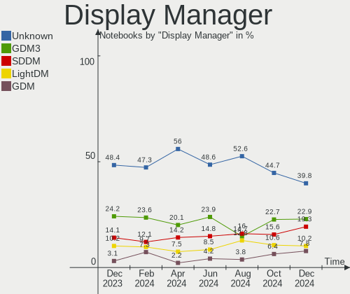

| Name    | Notebooks | Percent |
|---------|-----------|---------|
| Unknown | 93        | 50%     |
| GDM3    | 35        | 18.82%  |
| SDDM    | 26        | 13.98%  |
| LightDM | 24        | 12.9%   |
| GDM     | 7         | 3.76%   |
| SLiM    | 1         | 0.54%   |

OS Lang
-------

Language

| Lang  | Notebooks | Percent |
|-------|-----------|---------|
| pt_BR | 129       | 69.35%  |
| en_US | 50        | 26.88%  |
| C     | 5         | 2.69%   |
| en_GB | 1         | 0.54%   |
| en_CA | 1         | 0.54%   |

Boot Mode
---------

EFI or BIOS

| Mode | Notebooks | Percent |
|------|-----------|---------|
| BIOS | 102       | 54.84%  |
| EFI  | 84        | 45.16%  |

Filesystem
----------

Type of filesystem

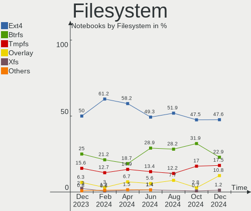

| Type    | Notebooks | Percent |
|---------|-----------|---------|
| Ext4    | 104       | 55.91%  |
| Btrfs   | 39        | 20.97%  |
| Tmpfs   | 29        | 15.59%  |
| Overlay | 9         | 4.84%   |
| Xfs     | 2         | 1.08%   |
| Zfs     | 1         | 0.54%   |
| F2fs    | 1         | 0.54%   |
| Unknown | 1         | 0.54%   |

Part. scheme
------------

Scheme of partitioning

| Type    | Notebooks | Percent |
|---------|-----------|---------|
| Unknown | 91        | 48.92%  |
| GPT     | 73        | 39.25%  |
| MBR     | 22        | 11.83%  |

Dual Boot with Linux/BSD
------------------------

Hosting more than one Linux/BSD

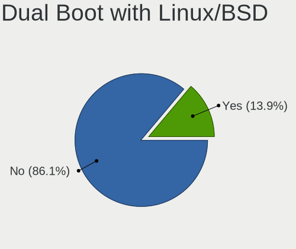

| Dual boot | Notebooks | Percent |
|-----------|-----------|---------|
| No        | 172       | 92.47%  |
| Yes       | 14        | 7.53%   |

Dual Boot (Win)
---------------

Hosting Linux and Windows

| Dual boot | Notebooks | Percent |
|-----------|-----------|---------|
| No        | 156       | 83.87%  |
| Yes       | 30        | 16.13%  |

Board
-----

Vendor
------

Motherboard manufacturer

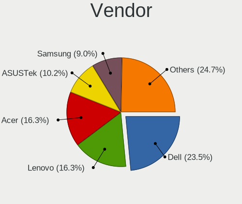

| Name                   | Notebooks | Percent |
|------------------------|-----------|---------|
| Dell                   | 39        | 20.97%  |
| Acer                   | 30        | 16.13%  |
| Lenovo                 | 28        | 15.05%  |
| Hewlett-Packard        | 19        | 10.22%  |
| Samsung Electronics    | 10        | 5.38%   |
| Positivo               | 10        | 5.38%   |
| ASUSTek Computer       | 7         | 3.76%   |
| Apple                  | 6         | 3.23%   |
| LG Electronics         | 4         | 2.15%   |
| Multilaser             | 3         | 1.61%   |
| Compaq                 | 3         | 1.61%   |
| Avell High Performance | 3         | 1.61%   |
| Unknown                | 3         | 1.61%   |
| Sony                   | 2         | 1.08%   |
| Semp Toshiba           | 2         | 1.08%   |
| Positivo Bahia - VAIO  | 2         | 1.08%   |
| Digibras               | 2         | 1.08%   |
| Alienware              | 2         | 1.08%   |
| Valve                  | 1         | 0.54%   |
| Timi                   | 1         | 0.54%   |
| Standard               | 1         | 0.54%   |
| OEM                    | 1         | 0.54%   |
| Notebook               | 1         | 0.54%   |
| Itautec                | 1         | 0.54%   |
| Intel                  | 1         | 0.54%   |
| GPD                    | 1         | 0.54%   |
| Gateway                | 1         | 0.54%   |
| Biostar                | 1         | 0.54%   |
| A14CR                  | 1         | 0.54%   |

Model
-----

Motherboard model

| Name                                           | Notebooks | Percent |
|------------------------------------------------|-----------|---------|
| Unknown                                        | 6         | 3.23%   |
| Positivo Mobile                                | 3         | 1.61%   |
| Lenovo IdeaPad 3 15ALC6 82MF                   | 3         | 1.61%   |
| Acer Nitro AN515-44                            | 3         | 1.61%   |
| Samsung 550XDA                                 | 2         | 1.08%   |
| Samsung 300E5M/300E5L                          | 2         | 1.08%   |
| Lenovo IdeaPad S145-15IWL 81S9                 | 2         | 1.08%   |
| Lenovo IdeaPad S145-15API 81V7                 | 2         | 1.08%   |
| HP Pavilion 11 x360 PC                         | 2         | 1.08%   |
| HP Folio 13                                    | 2         | 1.08%   |
| Dell Latitude 3420                             | 2         | 1.08%   |
| Dell Inspiron 5566                             | 2         | 1.08%   |
| Dell Inspiron 3501                             | 2         | 1.08%   |
| Dell Inspiron 13-5378                          | 2         | 1.08%   |
| Avell High Performance B.ON                    | 2         | 1.08%   |
| ASUS VivoBook_ASUSLaptop X515JA_X515JA         | 2         | 1.08%   |
| ASUS VivoBook_ASUSLaptop X515DA_X515DA         | 2         | 1.08%   |
| Acer Aspire A515-45                            | 2         | 1.08%   |
| Acer Aspire A315-53                            | 2         | 1.08%   |
| Valve Jupiter                                  | 1         | 0.54%   |
| Timi RedmiBook Pro 14S                         | 1         | 0.54%   |
| Standard ECT                                   | 1         | 0.54%   |
| Sony VPCSB25FB                                 | 1         | 0.54%   |
| Sony SVF15213CBB                               | 1         | 0.54%   |
| Semp Toshiba IS 1442                           | 1         | 0.54%   |
| Semp Toshiba IS 1413G                          | 1         | 0.54%   |
| Samsung 950XDB/951XDB/950XDY                   | 1         | 0.54%   |
| Samsung 340XAA/350XAA/550XAA                   | 1         | 0.54%   |
| Samsung 305E4A/305E5A/305E7A                   | 1         | 0.54%   |
| Samsung 300E5K/300E5Q                          | 1         | 0.54%   |
| Samsung 300E5EV/300E4EV/270E5EV/270E4EV/2470EV | 1         | 0.54%   |
| Samsung 300E4C/300E5C/300E7C                   | 1         | 0.54%   |
| Positivo W942SW_SW1                            | 1         | 0.54%   |
| Positivo S14SL01                               | 1         | 0.54%   |
| Positivo Q464B                                 | 1         | 0.54%   |
| Positivo N4340                                 | 1         | 0.54%   |
| Positivo Donatello                             | 1         | 0.54%   |
| Positivo C14CU51                               | 1         | 0.54%   |
| Positivo Bahia - VAIO VJFE59F11X-B0411H        | 1         | 0.54%   |
| Positivo Bahia - VAIO VJFE42F11X-XXXXXX        | 1         | 0.54%   |

Model Family
------------

Motherboard model prefix

| Name                                    | Notebooks | Percent |
|-----------------------------------------|-----------|---------|
| Dell Inspiron                           | 23        | 12.37%  |
| Acer Aspire                             | 19        | 10.22%  |
| Lenovo IdeaPad                          | 13        | 6.99%   |
| Acer Nitro                              | 9         | 4.84%   |
| Lenovo ThinkPad                         | 8         | 4.3%    |
| Dell Latitude                           | 8         | 4.3%    |
| HP Pavilion                             | 6         | 3.23%   |
| Unknown                                 | 6         | 3.23%   |
| Dell Vostro                             | 4         | 2.15%   |
| ASUS VivoBook                           | 4         | 2.15%   |
| Positivo Mobile                         | 3         | 1.61%   |
| HP ProBook                              | 3         | 1.61%   |
| HP EliteBook                            | 3         | 1.61%   |
| Semp Toshiba IS                         | 2         | 1.08%   |
| Samsung 550XDA                          | 2         | 1.08%   |
| Samsung 300E5M                          | 2         | 1.08%   |
| Lenovo Legion                           | 2         | 1.08%   |
| HP Folio                                | 2         | 1.08%   |
| Dell G3                                 | 2         | 1.08%   |
| Dell G15                                | 2         | 1.08%   |
| Avell High Performance B.ON             | 2         | 1.08%   |
| Alienware m15                           | 2         | 1.08%   |
| Valve Jupiter                           | 1         | 0.54%   |
| Timi RedmiBook                          | 1         | 0.54%   |
| Standard ECT                            | 1         | 0.54%   |
| Sony VPCSB25FB                          | 1         | 0.54%   |
| Sony SVF15213CBB                        | 1         | 0.54%   |
| Samsung 950XDB                          | 1         | 0.54%   |
| Samsung 340XAA                          | 1         | 0.54%   |
| Samsung 305E4A                          | 1         | 0.54%   |
| Samsung 300E5K                          | 1         | 0.54%   |
| Samsung 300E5EV                         | 1         | 0.54%   |
| Samsung 300E4C                          | 1         | 0.54%   |
| Positivo W942SW                         | 1         | 0.54%   |
| Positivo S14SL01                        | 1         | 0.54%   |
| Positivo Q464B                          | 1         | 0.54%   |
| Positivo N4340                          | 1         | 0.54%   |
| Positivo Donatello                      | 1         | 0.54%   |
| Positivo C14CU51                        | 1         | 0.54%   |
| Positivo Bahia - VAIO VJFE59F11X-B0411H | 1         | 0.54%   |

MFG Year
--------

Motherboard manufacture year

| Year    | Notebooks | Percent |
|---------|-----------|---------|
| 2021    | 29        | 15.59%  |
| 2020    | 18        | 9.68%   |
| 2011    | 16        | 8.6%    |
| 2019    | 14        | 7.53%   |
| 2016    | 14        | 7.53%   |
| 2013    | 14        | 7.53%   |
| 2012    | 13        | 6.99%   |
| 2018    | 12        | 6.45%   |
| 2017    | 11        | 5.91%   |
| 2010    | 11        | 5.91%   |
| 2014    | 9         | 4.84%   |
| 2022    | 6         | 3.23%   |
| 2015    | 5         | 2.69%   |
| 2008    | 5         | 2.69%   |
| 2009    | 4         | 2.15%   |
| 2007    | 3         | 1.61%   |
| 2006    | 1         | 0.54%   |
| Unknown | 1         | 0.54%   |

Form Factor
-----------

Physical design of the computer

| Name     | Notebooks | Percent |
|----------|-----------|---------|
| Notebook | 186       | 100%    |

Secure Boot
-----------

Enabled or disabled

| State    | Notebooks | Percent |
|----------|-----------|---------|
| Disabled | 163       | 87.63%  |
| Enabled  | 23        | 12.37%  |

Coreboot
--------

Have coreboot on board

| Used | Notebooks | Percent |
|------|-----------|---------|
| No   | 186       | 100%    |

RAM Size
--------

Total RAM memory

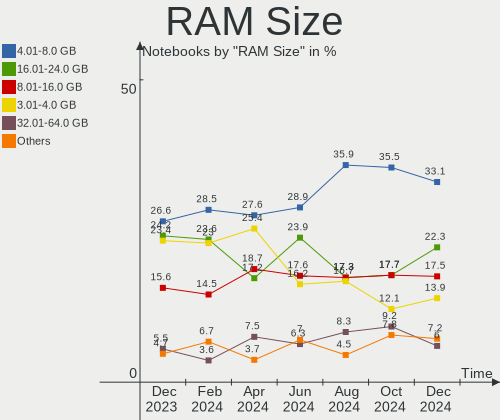

| Size in GB  | Notebooks | Percent |
|-------------|-----------|---------|
| 4.01-8.0    | 54        | 29.03%  |
| 3.01-4.0    | 53        | 28.49%  |
| 16.01-24.0  | 34        | 18.28%  |
| 8.01-16.0   | 24        | 12.9%   |
| 32.01-64.0  | 11        | 5.91%   |
| 1.01-2.0    | 6         | 3.23%   |
| 24.01-32.0  | 1         | 0.54%   |
| 2.01-3.0    | 1         | 0.54%   |
| 64.01-256.0 | 1         | 0.54%   |
| 0.51-1.0    | 1         | 0.54%   |

RAM Used
--------

Used RAM memory

| Used GB    | Notebooks | Percent |
|------------|-----------|---------|
| 2.01-3.0   | 59        | 31.72%  |
| 1.01-2.0   | 59        | 31.72%  |
| 4.01-8.0   | 33        | 17.74%  |
| 3.01-4.0   | 18        | 9.68%   |
| 8.01-16.0  | 9         | 4.84%   |
| 0.51-1.0   | 7         | 3.76%   |
| 16.01-24.0 | 1         | 0.54%   |

Total Drives
------------

Number of drives on board

| Drives | Notebooks | Percent |
|--------|-----------|---------|
| 1      | 125       | 67.2%   |
| 2      | 53        | 28.49%  |
| 3      | 5         | 2.69%   |
| 0      | 2         | 1.08%   |
| 4      | 1         | 0.54%   |

Has CD-ROM
----------

Has CD-ROM on board

| Presented | Notebooks | Percent |
|-----------|-----------|---------|
| No        | 134       | 72.04%  |
| Yes       | 52        | 27.96%  |

Has Ethernet
------------

Has Ethernet on board

| Presented | Notebooks | Percent |
|-----------|-----------|---------|
| Yes       | 160       | 86.02%  |
| No        | 26        | 13.98%  |

Has WiFi
--------

Has WiFi module

| Presented | Notebooks | Percent |
|-----------|-----------|---------|
| Yes       | 179       | 96.24%  |
| No        | 7         | 3.76%   |

Has Bluetooth
-------------

Has Bluetooth module

| Presented | Notebooks | Percent |
|-----------|-----------|---------|
| Yes       | 139       | 74.73%  |
| No        | 47        | 25.27%  |

Location
--------

Country
-------

Geographic location (country)

| Country | Notebooks | Percent |
|---------|-----------|---------|
| Brazil  | 186       | 100%    |

City
----

Geographic location (city)

| City                    | Notebooks | Percent |
|-------------------------|-----------|---------|
| Sao Paulo               | 19        | 10.22%  |
| Rio de Janeiro          | 10        | 5.38%   |
| Curitiba                | 9         | 4.84%   |
| Brasília               | 9         | 4.84%   |
| Fortaleza               | 6         | 3.23%   |
| Belo Horizonte          | 6         | 3.23%   |
| Campo Grande            | 5         | 2.69%   |
| Campinas                | 4         | 2.15%   |
| Porto Alegre            | 3         | 1.61%   |
| Osasco                  | 3         | 1.61%   |
| Florianópolis          | 3         | 1.61%   |
| Vila Velha              | 2         | 1.08%   |
| Uberlândia             | 2         | 1.08%   |
| Sorocaba                | 2         | 1.08%   |
| Sao Vicente             | 2         | 1.08%   |
| Sao José dos Campos    | 2         | 1.08%   |
| Sao Jose do Rio Preto   | 2         | 1.08%   |
| Santos                  | 2         | 1.08%   |
| Santo André            | 2         | 1.08%   |
| Salvador                | 2         | 1.08%   |
| Recife                  | 2         | 1.08%   |
| Natal                   | 2         | 1.08%   |
| Manaus                  | 2         | 1.08%   |
| Jaboatao dos Guararapes | 2         | 1.08%   |
| Imbituba                | 2         | 1.08%   |
| Ilhéus                 | 2         | 1.08%   |
| Goiânia                | 2         | 1.08%   |
| Cuiabá                 | 2         | 1.08%   |
| Bauru                   | 2         | 1.08%   |
| Ananindeua              | 2         | 1.08%   |
| Vicosa                  | 1         | 0.54%   |
| Vianopolis              | 1         | 0.54%   |
| Ubatuba                 | 1         | 0.54%   |
| Tobias Barreto          | 1         | 0.54%   |
| Teresopolis             | 1         | 0.54%   |
| Sapiranga               | 1         | 0.54%   |
| Sao Miguel do Oeste     | 1         | 0.54%   |
| Sao Luís               | 1         | 0.54%   |
| Sao Lourenco do Oeste   | 1         | 0.54%   |
| Sao José dos Pinhais   | 1         | 0.54%   |

Drives
------

Drive Vendor
------------

Hard drive vendors

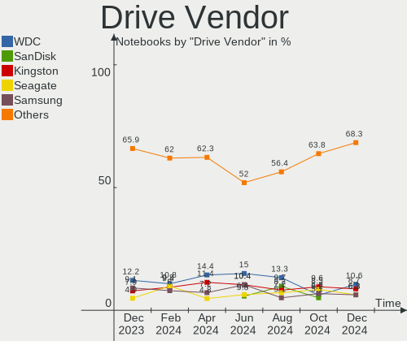

| Vendor                       | Notebooks | Drives | Percent |
|------------------------------|-----------|--------|---------|
| Seagate                      | 25        | 25     | 10.82%  |
| WDC                          | 24        | 26     | 10.39%  |
| Kingston                     | 24        | 25     | 10.39%  |
| Samsung Electronics          | 19        | 21     | 8.23%   |
| China                        | 19        | 21     | 8.23%   |
| Toshiba                      | 15        | 15     | 6.49%   |
| SanDisk                      | 15        | 15     | 6.49%   |
| A-DATA Technology            | 14        | 14     | 6.06%   |
| SK hynix                     | 8         | 8      | 3.46%   |
| Unknown                      | 7         | 7      | 3.03%   |
| Kingston Technology Company  | 5         | 5      | 2.16%   |
| Intel                        | 5         | 5      | 2.16%   |
| KingSpec                     | 4         | 4      | 1.73%   |
| Hitachi                      | 4         | 4      | 1.73%   |
| ADATA Technology             | 4         | 4      | 1.73%   |
| XrayDisk                     | 3         | 3      | 1.3%    |
| WALRAM                       | 3         | 3      | 1.3%    |
| Solid State Storage          | 3         | 3      | 1.3%    |
| KIOXIA                       | 3         | 3      | 1.3%    |
| Crucial                      | 3         | 3      | 1.3%    |
| SSSTC                        | 2         | 2      | 0.87%   |
| Netac                        | 2         | 2      | 0.87%   |
| HGST                         | 2         | 2      | 0.87%   |
| Fujitsu                      | 2         | 2      | 0.87%   |
| Apple                        | 2         | 2      | 0.87%   |
| Unknown                      | 2         | 2      | 0.87%   |
| SSD 60GB                     | 1         | 1      | 0.43%   |
| Silicon Motion               | 1         | 1      | 0.43%   |
| Shenzhen Longsys Electronics | 1         | 1      | 0.43%   |
| PALIDE                       | 1         | 1      | 0.43%   |
| MAXIO Technology (Hangzhou)  | 1         | 1      | 0.43%   |
| LITEON                       | 1         | 1      | 0.43%   |
| Lexar                        | 1         | 1      | 0.43%   |
| Lenovo                       | 1         | 1      | 0.43%   |
| JMicron Technology           | 1         | 1      | 0.43%   |
| Gigabyte Technology          | 1         | 1      | 0.43%   |
| Dahua                        | 1         | 1      | 0.43%   |
| BIWIN                        | 1         | 1      | 0.43%   |

Drive Model
-----------

Hard drive models

| Model                                | Notebooks | Percent |
|--------------------------------------|-----------|---------|
| Kingston SA400S37240G 240GB SSD      | 7         | 2.95%   |
| Kingston SA400S37480G 480GB SSD      | 6         | 2.53%   |
| WDC WD10SPZX-21Z10T0 1TB             | 5         | 2.11%   |
| Sandisk WD Blue SN550 NVMe SSD 250GB | 5         | 2.11%   |
| Seagate ST500LM012 HN-M500MBB 500GB  | 4         | 1.69%   |
| Seagate ST1000LM035-1RK172 1TB       | 4         | 1.69%   |
| Seagate ST1000LM024 HN-M101MBB 1TB   | 4         | 1.69%   |
| China SSD 120GB                      | 4         | 1.69%   |
| Toshiba MQ04ABF100 1TB               | 3         | 1.27%   |
| Samsung M3 Portable 1TB              | 3         | 1.27%   |
| Kingston Company SNV2S1000G 1TB      | 3         | 1.27%   |
| Kingston SV300S37A240G 240GB SSD     | 3         | 1.27%   |
| Intel SSD 660P Series 1024GB         | 3         | 1.27%   |
| A-DATA IM2P33F3A NVMe 256GB          | 3         | 1.27%   |
| WDC WD10SPZX-24Z10 1TB               | 2         | 0.84%   |
| Toshiba MQ01ABD100 1TB               | 2         | 0.84%   |
| Toshiba MQ01ABD050 500GB             | 2         | 0.84%   |
| SSSTC CL1-4D256 256GB                | 2         | 0.84%   |
| SK hynix BC511 512GB                 | 2         | 0.84%   |
| Seagate ST1000LX015-1U7172 1TB       | 2         | 0.84%   |
| SanDisk SSD PLUS 240GB               | 2         | 0.84%   |
| Samsung MZMPC128HBFU-000H1 128GB SSD | 2         | 0.84%   |
| Samsung HM321HI 320GB                | 2         | 0.84%   |
| Samsung HM160HI 160GB                | 2         | 0.84%   |
| KIOXIA KBG40ZNS256G NVMe 256GB       | 2         | 0.84%   |
| Kingston SA400S37960G 960GB SSD      | 2         | 0.84%   |
| China SSD 256GB                      | 2         | 0.84%   |
| China SSD 240GB                      | 2         | 0.84%   |
| China SSD 128GB                      | 2         | 0.84%   |
| ADATA SM2P32A8-256GC1 256GB          | 2         | 0.84%   |
| A-DATA IM2P33F8A-512GD 512GB         | 2         | 0.84%   |
| Unknown                              | 2         | 0.84%   |
| XrayDisk SSD 256GB                   | 1         | 0.42%   |
| XrayDisk 240GB                       | 1         | 0.42%   |
| XrayDisk 128GB                       | 1         | 0.42%   |
| WDC WDS500G1X0E-00AFY0 500GB         | 1         | 0.42%   |
| WDC WDS240G2G0B-00EPW0 240GB SSD     | 1         | 0.42%   |
| WDC WDS240G2G0A-00JH30 240GB SSD     | 1         | 0.42%   |
| WDC WDS100T2G0A-00JH30 1TB SSD       | 1         | 0.42%   |
| WDC WD7500BPVX-55JC3T3 752GB         | 1         | 0.42%   |

HDD Vendor
----------

Hard disk drive vendors

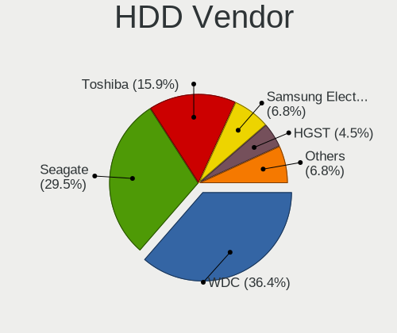

| Vendor              | Notebooks | Drives | Percent |
|---------------------|-----------|--------|---------|
| Seagate             | 25        | 25     | 33.33%  |
| WDC                 | 19        | 19     | 25.33%  |
| Toshiba             | 14        | 14     | 18.67%  |
| Samsung Electronics | 8         | 8      | 10.67%  |
| Hitachi             | 4         | 4      | 5.33%   |
| HGST                | 2         | 2      | 2.67%   |
| Fujitsu             | 2         | 2      | 2.67%   |
| JMicron Technology  | 1         | 1      | 1.33%   |

SSD Vendor
----------

Solid state drive vendors

| Vendor              | Notebooks | Drives | Percent |
|---------------------|-----------|--------|---------|
| Kingston            | 23        | 23     | 28.4%   |
| China               | 19        | 21     | 23.46%  |
| SanDisk             | 6         | 6      | 7.41%   |
| Samsung Electronics | 5         | 5      | 6.17%   |
| WDC                 | 4         | 4      | 4.94%   |
| A-DATA Technology   | 4         | 4      | 4.94%   |
| KingSpec            | 3         | 3      | 3.7%    |
| Netac               | 2         | 2      | 2.47%   |
| Crucial             | 2         | 2      | 2.47%   |
| Apple               | 2         | 2      | 2.47%   |
| XrayDisk            | 1         | 1      | 1.23%   |
| WALRAM              | 1         | 1      | 1.23%   |
| Toshiba             | 1         | 1      | 1.23%   |
| PALIDE              | 1         | 1      | 1.23%   |
| LITEON              | 1         | 1      | 1.23%   |
| Lexar               | 1         | 1      | 1.23%   |
| Lenovo              | 1         | 1      | 1.23%   |
| Gigabyte Technology | 1         | 1      | 1.23%   |
| Dahua               | 1         | 1      | 1.23%   |
| BIWIN               | 1         | 1      | 1.23%   |
| Unknown             | 1         | 1      | 1.23%   |

Drive Kind
----------

HDD or SSD

| Kind    | Notebooks | Drives | Percent |
|---------|-----------|--------|---------|
| SSD     | 75        | 83     | 33.94%  |
| HDD     | 73        | 75     | 33.03%  |
| NVMe    | 59        | 66     | 26.7%   |
| MMC     | 8         | 8      | 3.62%   |
| Unknown | 6         | 6      | 2.71%   |

Drive Connector
---------------

SATA, SAS, NVMe, etc.

| Type | Notebooks | Drives | Percent |
|------|-----------|--------|---------|
| SATA | 138       | 156    | 64.79%  |
| NVMe | 59        | 66     | 27.7%   |
| SAS  | 8         | 8      | 3.76%   |
| MMC  | 8         | 8      | 3.76%   |

Drive Size
----------

Size of hard drive

| Size in TB | Notebooks | Drives | Percent |
|------------|-----------|--------|---------|
| 0.01-0.5   | 97        | 108    | 65.99%  |
| 0.51-1.0   | 46        | 46     | 31.29%  |
| 1.01-2.0   | 4         | 4      | 2.72%   |

Space Total
-----------

Amount of disk space available on the file system

| Size in GB     | Notebooks | Percent |
|----------------|-----------|---------|
| 101-250        | 58        | 31.18%  |
| 251-500        | 44        | 23.66%  |
| 501-1000       | 26        | 13.98%  |
| 51-100         | 17        | 9.14%   |
| 1001-2000      | 13        | 6.99%   |
| 1-20           | 10        | 5.38%   |
| 21-50          | 8         | 4.3%    |
| 2001-3000      | 5         | 2.69%   |
| Unknown        | 3         | 1.61%   |
| More than 3000 | 2         | 1.08%   |

Space Used
----------

Amount of used disk space

| Used GB   | Notebooks | Percent |
|-----------|-----------|---------|
| 1-20      | 70        | 37.63%  |
| 21-50     | 50        | 26.88%  |
| 101-250   | 30        | 16.13%  |
| 251-500   | 15        | 8.06%   |
| 51-100    | 9         | 4.84%   |
| 1001-2000 | 4         | 2.15%   |
| 501-1000  | 4         | 2.15%   |
| Unknown   | 3         | 1.61%   |
| 2001-3000 | 1         | 0.54%   |

Malfunc. Drives
---------------

Drive models with a malfunction

| Model                              | Notebooks | Drives | Percent |
|------------------------------------|-----------|--------|---------|
| Toshiba MK5065GSXF 500GB           | 1         | 1      | 11.11%  |
| Seagate ST9640320AS 640GB          | 1         | 1      | 11.11%  |
| Seagate ST500LT012-9WS142 500GB    | 1         | 1      | 11.11%  |
| Seagate ST1000LM024 HN-M101MBB 1TB | 1         | 1      | 11.11%  |
| Samsung Electronics HM160HI 160GB  | 1         | 1      | 11.11%  |
| KingSpec Q-360 360GB SSD           | 1         | 1      | 11.11%  |
| Hitachi HTS542516K9SA00 160GB      | 1         | 1      | 11.11%  |
| HGST HTS545050A7E380 500GB         | 1         | 1      | 11.11%  |
| China SATA SSD 240GB               | 1         | 1      | 11.11%  |

Malfunc. Drive Vendor
---------------------

Vendors of faulty drives

| Vendor              | Notebooks | Drives | Percent |
|---------------------|-----------|--------|---------|
| Seagate             | 3         | 3      | 33.33%  |
| Toshiba             | 1         | 1      | 11.11%  |
| Samsung Electronics | 1         | 1      | 11.11%  |
| KingSpec            | 1         | 1      | 11.11%  |
| Hitachi             | 1         | 1      | 11.11%  |
| HGST                | 1         | 1      | 11.11%  |
| China               | 1         | 1      | 11.11%  |

Malfunc. HDD Vendor
-------------------

Vendors of faulty HDD drives

| Vendor              | Notebooks | Drives | Percent |
|---------------------|-----------|--------|---------|
| Seagate             | 3         | 3      | 42.86%  |
| Toshiba             | 1         | 1      | 14.29%  |
| Samsung Electronics | 1         | 1      | 14.29%  |
| Hitachi             | 1         | 1      | 14.29%  |
| HGST                | 1         | 1      | 14.29%  |

Malfunc. Drive Kind
-------------------

Kinds of faulty drives

| Kind | Notebooks | Drives | Percent |
|------|-----------|--------|---------|
| HDD  | 7         | 7      | 77.78%  |
| SSD  | 2         | 2      | 22.22%  |

Failed Drives
-------------

Failed drive models

| Model                             | Notebooks | Drives | Percent |
|-----------------------------------|-----------|--------|---------|
| Samsung Electronics HM250HI 250GB | 1         | 1      | 100%    |

Failed Drive Vendor
-------------------

Failed drive vendors

| Vendor              | Notebooks | Drives | Percent |
|---------------------|-----------|--------|---------|
| Samsung Electronics | 1         | 1      | 100%    |

Drive Status
------------

Number of failed and malfunc. drives

| Status   | Notebooks | Drives | Percent |
|----------|-----------|--------|---------|
| Detected | 132       | 165    | 69.47%  |
| Works    | 48        | 63     | 25.26%  |
| Malfunc  | 9         | 9      | 4.74%   |
| Failed   | 1         | 1      | 0.53%   |

Storage controller
------------------

Storage Vendor
--------------

Storage controller vendors

| Vendor                           | Notebooks | Percent |
|----------------------------------|-----------|---------|
| Intel                            | 142       | 60.94%  |
| AMD                              | 25        | 10.73%  |
| ADATA Technology                 | 14        | 6.01%   |
| SanDisk                          | 10        | 4.29%   |
| Samsung Electronics              | 9         | 3.86%   |
| SK hynix                         | 8         | 3.43%   |
| Kingston Technology Company      | 7         | 3%      |
| Solid State Storage Technology   | 5         | 2.15%   |
| Silicon Integrated Systems [SiS] | 4         | 1.72%   |
| KIOXIA                           | 3         | 1.29%   |
| TenaFe                           | 1         | 0.43%   |
| Silicon Motion                   | 1         | 0.43%   |
| Shenzhen Longsys Electronics     | 1         | 0.43%   |
| Nvidia                           | 1         | 0.43%   |
| Micron/Crucial Technology        | 1         | 0.43%   |
| MAXIO Technology (Hangzhou)      | 1         | 0.43%   |

Storage Model
-------------

Storage controller models

| Model                                                                            | Notebooks | Percent |
|----------------------------------------------------------------------------------|-----------|---------|
| Intel Sunrise Point-LP SATA Controller [AHCI mode]                               | 27        | 10.55%  |
| AMD FCH SATA Controller [AHCI mode]                                              | 22        | 8.59%   |
| Intel 7 Series Chipset Family 6-port SATA Controller [AHCI mode]                 | 16        | 6.25%   |
| Intel 6 Series/C200 Series Chipset Family 6 port Mobile SATA AHCI Controller     | 14        | 5.47%   |
| Intel Tiger Lake-LP SATA Controller                                              | 9         | 3.52%   |
| Intel 82801 Mobile SATA Controller [RAID mode]                                   | 9         | 3.52%   |
| Intel Volume Management Device NVMe RAID Controller                              | 8         | 3.13%   |
| Intel 8 Series SATA Controller 1 [AHCI mode]                                     | 8         | 3.13%   |
| ADATA IM2P33F8ABR1 NVMe SSD                                                      | 7         | 2.73%   |
| SanDisk WD Blue SN550 NVMe SSD                                                   | 6         | 2.34%   |
| Intel 5 Series/3400 Series Chipset 4 port SATA AHCI Controller                   | 6         | 2.34%   |
| Solid State Storage CL1-3D256-Q11 NVMe SSD M.2                                   | 5         | 1.95%   |
| Intel 82801HM/HEM (ICH8M/ICH8M-E) SATA Controller [AHCI mode]                    | 5         | 1.95%   |
| Intel 82801HM/HEM (ICH8M/ICH8M-E) IDE Controller                                 | 5         | 1.95%   |
| Silicon Integrated Systems [SiS] SATA Controller / IDE mode                      | 4         | 1.56%   |
| Silicon Integrated Systems [SiS] 5513 IDE Controller                             | 4         | 1.56%   |
| Samsung NVMe SSD Controller 980                                                  | 4         | 1.56%   |
| Kingston Company Company Non-Volatile memory controller                          | 4         | 1.56%   |
| Intel Wildcat Point-LP SATA Controller [AHCI Mode]                               | 4         | 1.56%   |
| Intel Comet Lake SATA AHCI Controller                                            | 4         | 1.56%   |
| Intel Cannon Point-LP SATA Controller [AHCI Mode]                                | 4         | 1.56%   |
| Intel Atom Processor E3800 Series SATA AHCI Controller                           | 4         | 1.56%   |
| Intel 400 Series Chipset Family SATA AHCI Controller                             | 4         | 1.56%   |
| ADATA IM2P33F3 NVMe SSD (DRAM-less)                                              | 4         | 1.56%   |
| SK hynix Gold P31/BC711/PC711 NVMe Solid State Drive                             | 3         | 1.17%   |
| Intel Tiger Lake SATA AHCI Controller                                            | 3         | 1.17%   |
| Intel SSD 660P Series                                                            | 3         | 1.17%   |
| Intel 82801IBM/IEM (ICH9M/ICH9M-E) 4 port SATA Controller [AHCI mode]            | 3         | 1.17%   |
| ADATA A Non-Volatile memory controller                                           | 3         | 1.17%   |
| SK hynix BC511 NVMe SSD                                                          | 2         | 0.78%   |
| SK hynix BC501 NVMe Solid State Drive                                            | 2         | 0.78%   |
| SanDisk WD Black SN750 / PC SN730 NVMe SSD                                       | 2         | 0.78%   |
| Samsung NVMe SSD Controller SM961/PM961/SM963                                    | 2         | 0.78%   |
| Samsung NVMe SSD Controller PM9A1/PM9A3/980PRO                                   | 2         | 0.78%   |
| KIOXIA NVMe SSD Controller BG4 (DRAM-less)                                       | 2         | 0.78%   |
| Intel HM170/QM170 Chipset SATA Controller [AHCI Mode]                            | 2         | 0.78%   |
| Intel Cannon Lake Mobile PCH SATA AHCI Controller                                | 2         | 0.78%   |
| Intel Atom/Celeron/Pentium Processor x5-E8000/J3xxx/N3xxx Series SATA Controller | 2         | 0.78%   |
| Intel 82801IBM/IEM (ICH9M/ICH9M-E) 2 port SATA Controller [IDE mode]             | 2         | 0.78%   |
| Intel 8 Series/C220 Series Chipset Family 6-port SATA Controller 1 [AHCI mode]   | 2         | 0.78%   |

Storage Kind
------------

Kind of storage controller (IDE, SATA, NVMe, SAS, ...)

| Kind | Notebooks | Percent |
|------|-----------|---------|
| SATA | 152       | 62.81%  |
| NVMe | 59        | 24.38%  |
| RAID | 16        | 6.61%   |
| IDE  | 15        | 6.2%    |

Processor
---------

CPU Vendor
----------

Processor vendors

| Vendor | Notebooks | Percent |
|--------|-----------|---------|
| Intel  | 159       | 85.48%  |
| AMD    | 27        | 14.52%  |

CPU Model
---------

Processor models

| Model                                         | Notebooks | Percent |
|-----------------------------------------------|-----------|---------|
| Intel Core i7-7500U CPU @ 2.70GHz             | 6         | 3.23%   |
| Intel 11th Gen Core i7-1165G7 @ 2.80GHz       | 6         | 3.23%   |
| Intel Core i3-7020U CPU @ 2.30GHz             | 4         | 2.15%   |
| Intel Core 2 Duo CPU T6600 @ 2.20GHz          | 4         | 2.15%   |
| Intel 11th Gen Core i5-1135G7 @ 2.40GHz       | 4         | 2.15%   |
| AMD Ryzen 7 3700U with Radeon Vega Mobile Gfx | 4         | 2.15%   |
| AMD Ryzen 5 5500U with Radeon Graphics        | 4         | 2.15%   |
| Intel Core i7-8750H CPU @ 2.20GHz             | 3         | 1.61%   |
| Intel Core i7-6500U CPU @ 2.50GHz             | 3         | 1.61%   |
| Intel Core i7-2620M CPU @ 2.70GHz             | 3         | 1.61%   |
| Intel Core i7-10510U CPU @ 1.80GHz            | 3         | 1.61%   |
| Intel Core i5-8250U CPU @ 1.60GHz             | 3         | 1.61%   |
| Intel Core i3-6006U CPU @ 2.00GHz             | 3         | 1.61%   |
| Intel Core i3-1005G1 CPU @ 1.20GHz            | 3         | 1.61%   |
| Intel Core i3 CPU M 370 @ 2.40GHz             | 3         | 1.61%   |
| Intel Celeron CPU 847 @ 1.10GHz               | 3         | 1.61%   |
| Intel Atom x5-Z8350 CPU @ 1.44GHz             | 3         | 1.61%   |
| AMD Ryzen 5 3500U with Radeon Vega Mobile Gfx | 3         | 1.61%   |
| Intel Core i7-7700HQ CPU @ 2.80GHz            | 2         | 1.08%   |
| Intel Core i7-5500U CPU @ 2.40GHz             | 2         | 1.08%   |
| Intel Core i7-10750H CPU @ 2.60GHz            | 2         | 1.08%   |
| Intel Core i5-8265U CPU @ 1.60GHz             | 2         | 1.08%   |
| Intel Core i5-7200U CPU @ 2.50GHz             | 2         | 1.08%   |
| Intel Core i5-6300U CPU @ 2.40GHz             | 2         | 1.08%   |
| Intel Core i5-4200U CPU @ 1.60GHz             | 2         | 1.08%   |
| Intel Core i5-2520M CPU @ 2.50GHz             | 2         | 1.08%   |
| Intel Core i5-2467M CPU @ 1.60GHz             | 2         | 1.08%   |
| Intel Core i5-10300H CPU @ 2.50GHz            | 2         | 1.08%   |
| Intel Core i5-10210U CPU @ 1.60GHz            | 2         | 1.08%   |
| Intel Core i3-4005U CPU @ 1.70GHz             | 2         | 1.08%   |
| Intel Core i3-3217U CPU @ 1.80GHz             | 2         | 1.08%   |
| Intel Core i3-3110M CPU @ 2.40GHz             | 2         | 1.08%   |
| Intel Core i3-2330M CPU @ 2.20GHz             | 2         | 1.08%   |
| Intel Core i3-2310M CPU @ 2.10GHz             | 2         | 1.08%   |
| Intel Core i3 CPU M 380 @ 2.53GHz             | 2         | 1.08%   |
| Intel Core i3 CPU M 330 @ 2.13GHz             | 2         | 1.08%   |
| Intel Celeron CPU N3060 @ 1.60GHz             | 2         | 1.08%   |
| Intel Celeron CPU N2830 @ 2.16GHz             | 2         | 1.08%   |
| Intel 11th Gen Core i7-11800H @ 2.30GHz       | 2         | 1.08%   |
| Intel 11th Gen Core i7-11390H @ 3.40GHz       | 2         | 1.08%   |

CPU Model Family
----------------

Processor model prefix

| Model                   | Notebooks | Percent |
|-------------------------|-----------|---------|
| Intel Core i7           | 41        | 22.04%  |
| Intel Core i5           | 35        | 18.82%  |
| Intel Core i3           | 30        | 16.13%  |
| Other                   | 21        | 11.29%  |
| Intel Celeron           | 15        | 8.06%   |
| AMD Ryzen 7             | 11        | 5.91%   |
| Intel Core 2 Duo        | 10        | 5.38%   |
| AMD Ryzen 5             | 9         | 4.84%   |
| Intel Atom              | 5         | 2.69%   |
| Intel Pentium Dual      | 2         | 1.08%   |
| Intel Pentium           | 1         | 0.54%   |
| AMD Turion Neo X2       | 1         | 0.54%   |
| AMD Turion 64 X2 Mobile | 1         | 0.54%   |
| AMD Ryzen 3             | 1         | 0.54%   |
| AMD E1                  | 1         | 0.54%   |
| AMD A4                  | 1         | 0.54%   |
| AMD A12                 | 1         | 0.54%   |

CPU Cores
---------

Number of processor cores

| Number | Notebooks | Percent |
|--------|-----------|---------|
| 2      | 104       | 55.91%  |
| 4      | 52        | 27.96%  |
| 6      | 14        | 7.53%   |
| 8      | 8         | 4.3%    |
| 1      | 5         | 2.69%   |
| 12     | 2         | 1.08%   |
| 14     | 1         | 0.54%   |

CPU Sockets
-----------

Number of sockets

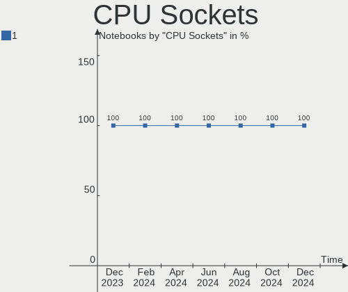

| Number | Notebooks | Percent |
|--------|-----------|---------|
| 1      | 186       | 100%    |

CPU Threads
-----------

Threads per core (Hyper-Threading)

| Number | Notebooks | Percent |
|--------|-----------|---------|
| 2      | 150       | 80.65%  |
| 1      | 36        | 19.35%  |

CPU Op-Modes
------------

CPU Operation Modes (32-bit, 64-bit)

| Op mode        | Notebooks | Percent |
|----------------|-----------|---------|
| 32-bit, 64-bit | 186       | 100%    |

CPU Microcode
-------------

Microcode number

| Number     | Notebooks | Percent |
|------------|-----------|---------|
| Unknown    | 105       | 56.45%  |
| 0x20655    | 7         | 3.76%   |
| 0x806ea    | 5         | 2.69%   |
| 0x206a7    | 5         | 2.69%   |
| 0x6fd      | 4         | 2.15%   |
| 0x406e3    | 4         | 2.15%   |
| 0x406c4    | 4         | 2.15%   |
| 0x306a9    | 4         | 2.15%   |
| 0x08608103 | 4         | 2.15%   |
| 0x806ec    | 3         | 1.61%   |
| 0x806c1    | 3         | 1.61%   |
| 0x40651    | 3         | 1.61%   |
| 0x1067a    | 3         | 1.61%   |
| 0x08600103 | 3         | 1.61%   |
| 0xa0652    | 2         | 1.08%   |
| 0x906ea    | 2         | 1.08%   |
| 0x806e9    | 2         | 1.08%   |
| 0x706e5    | 2         | 1.08%   |
| 0x306d4    | 2         | 1.08%   |
| 0x30678    | 2         | 1.08%   |
| 0x10661    | 2         | 1.08%   |
| 0x0a50000c | 2         | 1.08%   |
| 0x08108109 | 2         | 1.08%   |
| 0x906a3    | 1         | 0.54%   |
| 0x806d1    | 1         | 0.54%   |
| 0x306c3    | 1         | 0.54%   |
| 0x20652    | 1         | 0.54%   |
| 0x10676    | 1         | 0.54%   |
| 0x08608104 | 1         | 0.54%   |
| 0x08608102 | 1         | 0.54%   |
| 0x08600106 | 1         | 0.54%   |
| 0x08108102 | 1         | 0.54%   |
| 0x0700010f | 1         | 0.54%   |
| 0x03000027 | 1         | 0.54%   |

CPU Microarch
-------------

Microarchitecture

| Name             | Notebooks | Percent |
|------------------|-----------|---------|
| KabyLake         | 34        | 18.28%  |
| SandyBridge      | 20        | 10.75%  |
| TigerLake        | 14        | 7.53%   |
| IvyBridge        | 13        | 6.99%   |
| Unknown          | 11        | 5.91%   |
| Westmere         | 10        | 5.38%   |
| Silvermont       | 10        | 5.38%   |
| Haswell          | 10        | 5.38%   |
| Skylake          | 9         | 4.84%   |
| Zen+             | 8         | 4.3%    |
| Penryn           | 8         | 4.3%    |
| Core             | 7         | 3.76%   |
| CometLake        | 6         | 3.23%   |
| Broadwell        | 6         | 3.23%   |
| Zen 2            | 4         | 2.15%   |
| IceLake          | 4         | 2.15%   |
| Zen 3            | 2         | 1.08%   |
| K8 Hammer        | 2         | 1.08%   |
| Bonnell          | 2         | 1.08%   |
| Alderlake Hybrid | 2         | 1.08%   |
| K10 Llano        | 1         | 0.54%   |
| Jaguar           | 1         | 0.54%   |
| Goldmont plus    | 1         | 0.54%   |
| Excavator        | 1         | 0.54%   |

Graphics
--------

GPU Vendor
----------

Vendors of graphics cards

| Vendor                           | Notebooks | Percent |
|----------------------------------|-----------|---------|
| Intel                            | 149       | 64.78%  |
| Nvidia                           | 46        | 20%     |
| AMD                              | 31        | 13.48%  |
| Silicon Integrated Systems [SiS] | 4         | 1.74%   |

GPU Model
---------

Graphics card models

| Model                                                                                    | Notebooks | Percent |
|------------------------------------------------------------------------------------------|-----------|---------|
| Intel 2nd Generation Core Processor Family Integrated Graphics Controller                | 19        | 8.02%   |
| Intel HD Graphics 620                                                                    | 13        | 5.49%   |
| Intel 3rd Gen Core processor Graphics Controller                                         | 13        | 5.49%   |
| Intel TigerLake-LP GT2 [Iris Xe Graphics]                                                | 12        | 5.06%   |
| Intel Skylake GT2 [HD Graphics 520]                                                      | 9         | 3.8%    |
| Intel Core Processor Integrated Graphics Controller                                      | 9         | 3.8%    |
| Intel Haswell-ULT Integrated Graphics Controller                                         | 8         | 3.38%   |
| AMD Picasso/Raven 2 [Radeon Vega Series / Radeon Vega Mobile Series]                     | 8         | 3.38%   |
| AMD Lucienne                                                                             | 7         | 2.95%   |
| Nvidia TU117M [GeForce GTX 1650 Mobile / Max-Q]                                          | 6         | 2.53%   |
| Intel Atom/Celeron/Pentium Processor x5-E8000/J3xxx/N3xxx Integrated Graphics Controller | 6         | 2.53%   |
| Intel UHD Graphics 620                                                                   | 5         | 2.11%   |
| Intel HD Graphics 5500                                                                   | 5         | 2.11%   |
| Intel CometLake-U GT2 [UHD Graphics]                                                     | 5         | 2.11%   |
| Intel CometLake-H GT2 [UHD Graphics]                                                     | 5         | 2.11%   |
| Silicon Integrated Systems [SiS] 771/671 PCIE VGA Display Adapter                        | 4         | 1.69%   |
| Nvidia TU117M                                                                            | 4         | 1.69%   |
| Intel WhiskeyLake-U GT2 [UHD Graphics 620]                                               | 4         | 1.69%   |
| Intel Mobile GM965/GL960 Integrated Graphics Controller (secondary)                      | 4         | 1.69%   |
| Intel Mobile GM965/GL960 Integrated Graphics Controller (primary)                        | 4         | 1.69%   |
| Intel Mobile 4 Series Chipset Integrated Graphics Controller                             | 4         | 1.69%   |
| Intel CoffeeLake-H GT2 [UHD Graphics 630]                                                | 4         | 1.69%   |
| Intel Atom Processor Z36xxx/Z37xxx Series Graphics & Display                             | 4         | 1.69%   |
| AMD Renoir                                                                               | 4         | 1.69%   |
| Nvidia GM108M [GeForce MX110]                                                            | 3         | 1.27%   |
| Nvidia GM108M [GeForce 940MX]                                                            | 3         | 1.27%   |
| Intel TigerLake-H GT1 [UHD Graphics]                                                     | 3         | 1.27%   |
| Intel Iris Plus Graphics G1 (Ice Lake)                                                   | 3         | 1.27%   |
| Intel Alder Lake-P Integrated Graphics Controller                                        | 3         | 1.27%   |
| AMD Topaz XT [Radeon R7 M260/M265 / M340/M360 / M440/M445 / 530/535 / 620/625 Mobile]    | 3         | 1.27%   |
| Nvidia TU117M [GeForce MX450]                                                            | 2         | 0.84%   |
| Nvidia TU117M [GeForce GTX 1650 Ti Mobile]                                               | 2         | 0.84%   |
| Nvidia GP107M [GeForce GTX 1050 Ti Mobile]                                               | 2         | 0.84%   |
| Nvidia GP107M [GeForce GTX 1050 Mobile]                                                  | 2         | 0.84%   |
| Nvidia GA107BM [GeForce RTX 3050 Mobile]                                                 | 2         | 0.84%   |
| Intel Tiger Lake-LP GT2 [UHD Graphics G4]                                                | 2         | 0.84%   |
| Intel HD Graphics 630                                                                    | 2         | 0.84%   |
| Intel 4th Gen Core Processor Integrated Graphics Controller                              | 2         | 0.84%   |
| AMD Sun XT [Radeon HD 8670A/8670M/8690M / R5 M330 / M430 / Radeon 520 Mobile]            | 2         | 0.84%   |
| Nvidia TU117GLM [Quadro T2000 Mobile / Max-Q]                                            | 1         | 0.42%   |

GPU Combo
---------

Combinations of graphics cards

| Name           | Notebooks | Percent |
|----------------|-----------|---------|
| 1 x Intel      | 108       | 58.06%  |
| Intel + Nvidia | 34        | 18.28%  |
| 1 x AMD        | 18        | 9.68%   |
| 1 x Nvidia     | 7         | 3.76%   |
| Intel + AMD    | 5         | 2.69%   |
| AMD + Nvidia   | 5         | 2.69%   |
| 1 x SiS        | 4         | 2.15%   |
| 2 x AMD        | 3         | 1.61%   |
| 2 x Intel      | 2         | 1.08%   |

GPU Driver
----------

Free vs proprietary

| Driver      | Notebooks | Percent |
|-------------|-----------|---------|
| Free        | 151       | 81.18%  |
| Proprietary | 26        | 13.98%  |
| Unknown     | 9         | 4.84%   |

GPU Memory
----------

Total video memory

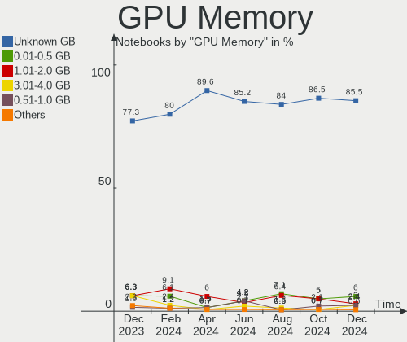

| Size in GB | Notebooks | Percent |
|------------|-----------|---------|
| Unknown    | 159       | 85.48%  |
| 0.01-0.5   | 10        | 5.38%   |
| 1.01-2.0   | 8         | 4.3%    |
| 3.01-4.0   | 4         | 2.15%   |
| 0.51-1.0   | 3         | 1.61%   |
| 5.01-6.0   | 1         | 0.54%   |
| 2.01-3.0   | 1         | 0.54%   |

Monitor
-------

Monitor Vendor
--------------

Monitor vendors

| Vendor                  | Notebooks | Percent |
|-------------------------|-----------|---------|
| AU Optronics            | 45        | 21.95%  |
| BOE                     | 43        | 20.98%  |
| Chimei Innolux          | 31        | 15.12%  |
| LG Display              | 22        | 10.73%  |
| Samsung Electronics     | 20        | 9.76%   |
| Goldstar                | 10        | 4.88%   |
| Dell                    | 6         | 2.93%   |
| Apple                   | 6         | 2.93%   |
| InfoVision              | 3         | 1.46%   |
| PANDA                   | 2         | 0.98%   |
| LG Philips              | 2         | 0.98%   |
| Chi Mei Optoelectronics | 2         | 0.98%   |
| VIE                     | 1         | 0.49%   |
| Valve                   | 1         | 0.49%   |
| Toppoly                 | 1         | 0.49%   |
| STA                     | 1         | 0.49%   |
| Sony                    | 1         | 0.49%   |
| SLD                     | 1         | 0.49%   |
| Sharp                   | 1         | 0.49%   |
| Philips                 | 1         | 0.49%   |
| JRY                     | 1         | 0.49%   |
| ITE                     | 1         | 0.49%   |
| Hewlett-Packard         | 1         | 0.49%   |
| AOC                     | 1         | 0.49%   |
| Acer                    | 1         | 0.49%   |

Monitor Model
-------------

Monitor models

| Model                                                                | Notebooks | Percent |
|----------------------------------------------------------------------|-----------|---------|
| Samsung Electronics LCD Monitor SEC5441 1366x768 344x194mm 15.5-inch | 5         | 2.43%   |
| AU Optronics LCD Monitor AUOAF90 1920x1080 344x193mm 15.5-inch       | 5         | 2.43%   |
| BOE LCD Monitor BOE0812 1920x1080 344x194mm 15.5-inch                | 4         | 1.94%   |
| AU Optronics LCD Monitor AUO61ED 1920x1080 344x193mm 15.5-inch       | 4         | 1.94%   |
| LG Display LCD Monitor LGD0385 1366x768 309x174mm 14.0-inch          | 3         | 1.46%   |
| LG Display LCD Monitor LGD033C 1366x768 309x174mm 14.0-inch          | 3         | 1.46%   |
| Chimei Innolux LCD Monitor CMN15DB 1366x768 344x193mm 15.5-inch      | 3         | 1.46%   |
| BOE LCD Monitor BOE07AA 1366x768 344x194mm 15.5-inch                 | 3         | 1.46%   |
| AU Optronics LCD Monitor AUO81EC 1366x768 344x193mm 15.5-inch        | 3         | 1.46%   |
| LG Display LCD Monitor LGD0312 1366x768 294x166mm 13.3-inch          | 2         | 0.97%   |
| LG Display LCD Monitor LGD02E9 1366x768 309x174mm 14.0-inch          | 2         | 0.97%   |
| Chimei Innolux LCD Monitor CMN15E7 1920x1080 344x193mm 15.5-inch     | 2         | 0.97%   |
| Chimei Innolux LCD Monitor CMN15E6 1366x768 344x193mm 15.5-inch      | 2         | 0.97%   |
| Chimei Innolux LCD Monitor CMN14E5 1920x1080 309x173mm 13.9-inch     | 2         | 0.97%   |
| Chimei Innolux LCD Monitor CMN14D6 1366x768 309x173mm 13.9-inch      | 2         | 0.97%   |
| Chimei Innolux LCD Monitor CMN14C3 1366x768 309x173mm 13.9-inch      | 2         | 0.97%   |
| Chimei Innolux LCD Monitor CMN1496 1366x768 309x173mm 13.9-inch      | 2         | 0.97%   |
| BOE LCD Monitor BOE08F5 1920x1080 344x194mm 15.5-inch                | 2         | 0.97%   |
| BOE LCD Monitor BOE08E8 1920x1080 344x194mm 15.5-inch                | 2         | 0.97%   |
| BOE LCD Monitor BOE0757 1366x768 344x194mm 15.5-inch                 | 2         | 0.97%   |
| BOE LCD Monitor BOE0672 1366x768 344x194mm 15.5-inch                 | 2         | 0.97%   |
| BOE LCD Monitor BOE0671 1366x768 344x194mm 15.5-inch                 | 2         | 0.97%   |
| AU Optronics LCD Monitor AUO4999 1920x1080 344x193mm 15.5-inch       | 2         | 0.97%   |
| AU Optronics LCD Monitor AUO10ED 1920x1080 344x193mm 15.5-inch       | 2         | 0.97%   |
| AU Optronics LCD Monitor AUO106C 1366x768 277x156mm 12.5-inch        | 2         | 0.97%   |
| Apple Color LCD APP9CC7 1280x800 286x179mm 13.3-inch                 | 2         | 0.97%   |
| VIE HORIZON Z27 VIE2700 1920x1080 598x336mm 27.0-inch                | 1         | 0.49%   |
| Valve ANX7530 U VLV3001 800x1280 100x150mm 7.1-inch                  | 1         | 0.49%   |
| Toppoly LCD Monitor TNJ0260 1280x800 303x190mm 14.1-inch             | 1         | 0.49%   |
| STA SEMP LEDTV STA0030 1920x540                                      | 1         | 0.49%   |
| Sony TV SNY2A03 1920x1080                                            | 1         | 0.49%   |
| SLD LCD Monitor SLD003C 1366x768 309x173mm 13.9-inch                 | 1         | 0.49%   |
| Sharp LCD Monitor SHP151C 1920x1080 344x194mm 15.5-inch              | 1         | 0.49%   |
| Samsung Electronics U28E590 SAM0C4C 3840x2160 608x345mm 27.5-inch    | 1         | 0.49%   |
| Samsung Electronics T24B301 SAM098E 1920x1080 521x293mm 23.5-inch    | 1         | 0.49%   |
| Samsung Electronics SyncMaster SAM055C 1920x1200                     | 1         | 0.49%   |
| Samsung Electronics SyncMaster SAM0471 1360x768 344x194mm 15.5-inch  | 1         | 0.49%   |
| Samsung Electronics SyncMaster SAM03E0 1440x900 410x257mm 19.1-inch  | 1         | 0.49%   |
| Samsung Electronics SMT24A550 SAM07B3 1920x1080 531x299mm 24.0-inch  | 1         | 0.49%   |
| Samsung Electronics S22F350 SAM0D1A 1920x1080 477x268mm 21.5-inch    | 1         | 0.49%   |

Monitor Resolution
------------------

Monitor screen resolution

| Resolution        | Notebooks | Percent |
|-------------------|-----------|---------|
| 1366x768 (WXGA)   | 92        | 47.18%  |
| 1920x1080 (FHD)   | 66        | 33.85%  |
| 1280x800 (WXGA)   | 10        | 5.13%   |
| 1440x900 (WXGA+)  | 5         | 2.56%   |
| 3840x2160 (4K)    | 3         | 1.54%   |
| 2560x1440 (QHD)   | 3         | 1.54%   |
| 2560x1080         | 3         | 1.54%   |
| 1600x900 (HD+)    | 3         | 1.54%   |
| 2880x1800         | 2         | 1.03%   |
| 2560x1600         | 2         | 1.03%   |
| 1920x1200 (WUXGA) | 2         | 1.03%   |
| 800x1280          | 1         | 0.51%   |
| 1920x540          | 1         | 0.51%   |
| 1360x768          | 1         | 0.51%   |
| 1280x1024 (SXGA)  | 1         | 0.51%   |

Monitor Diagonal
----------------

Diagonal size in inches

| Inches  | Notebooks | Percent |
|---------|-----------|---------|
| 15      | 89        | 43.63%  |
| 14      | 40        | 19.61%  |
| 13      | 31        | 15.2%   |
| 23      | 7         | 3.43%   |
| 21      | 6         | 2.94%   |
| 27      | 5         | 2.45%   |
| 18      | 4         | 1.96%   |
| 17      | 4         | 1.96%   |
| 12      | 4         | 1.96%   |
| 34      | 3         | 1.47%   |
| 11      | 3         | 1.47%   |
| 24      | 2         | 0.98%   |
| 72      | 1         | 0.49%   |
| 37      | 1         | 0.49%   |
| 26      | 1         | 0.49%   |
| 19      | 1         | 0.49%   |
| 7       | 1         | 0.49%   |
| Unknown | 1         | 0.49%   |

Monitor Width
-------------

Physical width

| Width in mm | Notebooks | Percent |
|-------------|-----------|---------|
| 301-350     | 148       | 72.55%  |
| 201-300     | 15        | 7.35%   |
| 501-600     | 14        | 6.86%   |
| 401-500     | 11        | 5.39%   |
| 351-400     | 8         | 3.92%   |
| 701-800     | 3         | 1.47%   |
| 801-900     | 1         | 0.49%   |
| 601-700     | 1         | 0.49%   |
| 1501-2000   | 1         | 0.49%   |
| 1-100       | 1         | 0.49%   |
| Unknown     | 1         | 0.49%   |

Aspect Ratio
------------

Proportional relationship between the width and the height

| Ratio | Notebooks | Percent |
|-------|-----------|---------|
| 16/9  | 159       | 86.41%  |
| 16/10 | 20        | 10.87%  |
| 21/9  | 3         | 1.63%   |
| 5/4   | 1         | 0.54%   |
| 0.67  | 1         | 0.54%   |

Monitor Area
------------

Area in inch²

| Area in inch² | Notebooks | Percent |
|----------------|-----------|---------|
| 101-110        | 89        | 43.84%  |
| 81-90          | 67        | 33%     |
| 201-250        | 13        | 6.4%    |
| 301-350        | 6         | 2.96%   |
| 71-80          | 4         | 1.97%   |
| 61-70          | 4         | 1.97%   |
| 141-150        | 4         | 1.97%   |
| 51-60          | 3         | 1.48%   |
| 351-500        | 3         | 1.48%   |
| 151-200        | 3         | 1.48%   |
| 121-130        | 2         | 0.99%   |
| More than 1000 | 1         | 0.49%   |
| 1-40           | 1         | 0.49%   |
| 131-140        | 1         | 0.49%   |
| 501-1000       | 1         | 0.49%   |
| Unknown        | 1         | 0.49%   |

Pixel Density
-------------

Pixels per inch

| Density       | Notebooks | Percent |
|---------------|-----------|---------|
| 101-120       | 93        | 47.21%  |
| 121-160       | 66        | 33.5%   |
| 51-100        | 28        | 14.21%  |
| 161-240       | 7         | 3.55%   |
| More than 240 | 1         | 0.51%   |
| 1-50          | 1         | 0.51%   |
| Unknown       | 1         | 0.51%   |

Multiple Monitors
-----------------

Total monitors connected

| Total | Notebooks | Percent |
|-------|-----------|---------|
| 1     | 144       | 77.42%  |
| 2     | 31        | 16.67%  |
| 0     | 9         | 4.84%   |
| 3     | 2         | 1.08%   |

Network
-------

Net Controller Vendor
---------------------

Controller vendors

| Vendor                           | Notebooks | Percent |
|----------------------------------|-----------|---------|
| Realtek Semiconductor            | 129       | 41.35%  |
| Intel                            | 80        | 25.64%  |
| Qualcomm Atheros                 | 47        | 15.06%  |
| Broadcom                         | 24        | 7.69%   |
| Ralink                           | 7         | 2.24%   |
| Silicon Integrated Systems [SiS] | 4         | 1.28%   |
| MediaTek                         | 4         | 1.28%   |
| JMicron Technology               | 4         | 1.28%   |
| Broadcom Limited                 | 4         | 1.28%   |
| Ralink Technology                | 2         | 0.64%   |
| Marvell Technology Group         | 2         | 0.64%   |
| ASIX Electronics                 | 2         | 0.64%   |
| TP-Link                          | 1         | 0.32%   |
| Microsoft                        | 1         | 0.32%   |
| ICS Advent                       | 1         | 0.32%   |

Net Controller Model
--------------------

Controller models

| Model                                                             | Notebooks | Percent |
|-------------------------------------------------------------------|-----------|---------|
| Realtek RTL8111/8168/8411 PCI Express Gigabit Ethernet Controller | 75        | 21.68%  |
| Realtek RTL810xE PCI Express Fast Ethernet controller             | 25        | 7.23%   |
| Qualcomm Atheros QCA9377 802.11ac Wireless Network Adapter        | 17        | 4.91%   |
| Intel Wi-Fi 6 AX201                                               | 11        | 3.18%   |
| Qualcomm Atheros QCA9565 / AR9565 Wireless Network Adapter        | 9         | 2.6%    |
| Realtek Killer E2600 Gigabit Ethernet Controller                  | 8         | 2.31%   |
| Qualcomm Atheros AR9485 Wireless Network Adapter                  | 8         | 2.31%   |
| Realtek RTL8821CE 802.11ac PCIe Wireless Network Adapter          | 6         | 1.73%   |
| Intel Wireless 7260                                               | 6         | 1.73%   |
| Intel Comet Lake PCH CNVi WiFi                                    | 6         | 1.73%   |
| Ralink RT3290 Wireless 802.11n 1T/1R PCIe                         | 5         | 1.45%   |
| Qualcomm Atheros QCA6174 802.11ac Wireless Network Adapter        | 5         | 1.45%   |
| Intel Wireless 7265                                               | 5         | 1.45%   |
| Intel Wi-Fi 6 AX200                                               | 5         | 1.45%   |
| Intel Comet Lake PCH-LP CNVi WiFi                                 | 5         | 1.45%   |
| Broadcom BCM4312 802.11b/g LP-PHY                                 | 5         | 1.45%   |
| Silicon Integrated Systems [SiS] 191 Gigabit Ethernet Adapter     | 4         | 1.16%   |
| Realtek RTL8822CE 802.11ac PCIe Wireless Network Adapter          | 4         | 1.16%   |
| Realtek RTL8188CE 802.11b/g/n WiFi Adapter                        | 4         | 1.16%   |
| MediaTek MT7921 802.11ax PCI Express Wireless Network Adapter     | 4         | 1.16%   |
| JMicron JMC250 PCI Express Gigabit Ethernet Controller            | 4         | 1.16%   |
| Intel Wireless 3165                                               | 4         | 1.16%   |
| Intel Dual Band Wireless-AC 3165 Plus Bluetooth                   | 4         | 1.16%   |
| Broadcom BCM4313 802.11bgn Wireless Network Adapter               | 4         | 1.16%   |
| Realtek RTL8187B Wireless 802.11g 54Mbps Network Adapter          | 3         | 0.87%   |
| Intel Wireless 8265 / 8275                                        | 3         | 0.87%   |
| Intel Wireless 8260                                               | 3         | 0.87%   |
| Intel Tiger Lake PCH CNVi WiFi                                    | 3         | 0.87%   |
| Intel Alder Lake-P PCH CNVi WiFi                                  | 3         | 0.87%   |
| Intel 82579LM Gigabit Network Connection (Lewisville)             | 3         | 0.87%   |
| Broadcom NetLink BCM57785 Gigabit Ethernet PCIe                   | 3         | 0.87%   |
| Realtek RTL8188EE Wireless Network Adapter                        | 2         | 0.58%   |
| Realtek RTL8153 Gigabit Ethernet Adapter                          | 2         | 0.58%   |
| Ralink MT7601U Wireless Adapter                                   | 2         | 0.58%   |
| Ralink RT3090 Wireless 802.11n 1T/1R PCIe                         | 2         | 0.58%   |
| Qualcomm Atheros AR8151 v2.0 Gigabit Ethernet                     | 2         | 0.58%   |
| Qualcomm Atheros AR8131 Gigabit Ethernet                          | 2         | 0.58%   |
| Intel Wireless 3160                                               | 2         | 0.58%   |
| Intel Ethernet Connection I219-LM                                 | 2         | 0.58%   |
| Intel Ethernet Connection (3) I218-LM                             | 2         | 0.58%   |

Wireless Vendor
---------------

Wireless vendors

| Vendor                | Notebooks | Percent |
|-----------------------|-----------|---------|
| Intel                 | 78        | 42.86%  |
| Qualcomm Atheros      | 42        | 23.08%  |
| Realtek Semiconductor | 29        | 15.93%  |
| Broadcom              | 17        | 9.34%   |
| Ralink                | 7         | 3.85%   |
| MediaTek              | 4         | 2.2%    |
| Ralink Technology     | 2         | 1.1%    |
| Broadcom Limited      | 2         | 1.1%    |
| Microsoft             | 1         | 0.55%   |

Wireless Model
--------------

Wireless models

| Model                                                         | Notebooks | Percent |
|---------------------------------------------------------------|-----------|---------|
| Qualcomm Atheros QCA9377 802.11ac Wireless Network Adapter    | 17        | 9.29%   |
| Intel Wi-Fi 6 AX201                                           | 11        | 6.01%   |
| Qualcomm Atheros QCA9565 / AR9565 Wireless Network Adapter    | 9         | 4.92%   |
| Qualcomm Atheros AR9485 Wireless Network Adapter              | 8         | 4.37%   |
| Realtek RTL8821CE 802.11ac PCIe Wireless Network Adapter      | 6         | 3.28%   |
| Intel Wireless 7260                                           | 6         | 3.28%   |
| Intel Comet Lake PCH CNVi WiFi                                | 6         | 3.28%   |
| Ralink RT3290 Wireless 802.11n 1T/1R PCIe                     | 5         | 2.73%   |
| Qualcomm Atheros QCA6174 802.11ac Wireless Network Adapter    | 5         | 2.73%   |
| Intel Wireless 7265                                           | 5         | 2.73%   |
| Intel Wi-Fi 6 AX200                                           | 5         | 2.73%   |
| Intel Comet Lake PCH-LP CNVi WiFi                             | 5         | 2.73%   |
| Broadcom BCM4312 802.11b/g LP-PHY                             | 5         | 2.73%   |
| Realtek RTL8822CE 802.11ac PCIe Wireless Network Adapter      | 4         | 2.19%   |
| Realtek RTL8188CE 802.11b/g/n WiFi Adapter                    | 4         | 2.19%   |
| MediaTek MT7921 802.11ax PCI Express Wireless Network Adapter | 4         | 2.19%   |
| Intel Wireless 3165                                           | 4         | 2.19%   |
| Intel Dual Band Wireless-AC 3165 Plus Bluetooth               | 4         | 2.19%   |
| Broadcom BCM4313 802.11bgn Wireless Network Adapter           | 4         | 2.19%   |
| Realtek RTL8187B Wireless 802.11g 54Mbps Network Adapter      | 3         | 1.64%   |
| Intel Wireless 8265 / 8275                                    | 3         | 1.64%   |
| Intel Wireless 8260                                           | 3         | 1.64%   |
| Intel Tiger Lake PCH CNVi WiFi                                | 3         | 1.64%   |
| Intel Alder Lake-P PCH CNVi WiFi                              | 3         | 1.64%   |
| Realtek RTL8188EE Wireless Network Adapter                    | 2         | 1.09%   |
| Ralink MT7601U Wireless Adapter                               | 2         | 1.09%   |
| Ralink RT3090 Wireless 802.11n 1T/1R PCIe                     | 2         | 1.09%   |
| Intel Wireless 3160                                           | 2         | 1.09%   |
| Intel Dual Band Wireless-AC 3168NGW [Stone Peak]              | 2         | 1.09%   |
| Intel Centrino Wireless-N 1030 [Rainbow Peak]                 | 2         | 1.09%   |
| Intel Centrino Wireless-N 1000 [Condor Peak]                  | 2         | 1.09%   |
| Intel Centrino Advanced-N 6205 [Taylor Peak]                  | 2         | 1.09%   |
| Broadcom BCM4331 802.11a/b/g/n                                | 2         | 1.09%   |
| Broadcom BCM43142 802.11b/g/n                                 | 2         | 1.09%   |
| Realtek RTL8852BE PCIe 802.11ax Wireless Network Controller   | 1         | 0.55%   |
| Realtek RTL8822BE 802.11a/b/g/n/ac WiFi adapter               | 1         | 0.55%   |
| Realtek RTL8814AU 802.11a/b/g/n/ac Wireless Adapter           | 1         | 0.55%   |
| Realtek RTL8723BU 802.11b/g/n WLAN Adapter                    | 1         | 0.55%   |
| Realtek RTL8723BE PCIe Wireless Network Adapter               | 1         | 0.55%   |
| Realtek RTL8723AE PCIe Wireless Network Adapter               | 1         | 0.55%   |

Ethernet Vendor
---------------

Ethernet vendors

| Vendor                           | Notebooks | Percent |
|----------------------------------|-----------|---------|
| Realtek Semiconductor            | 110       | 67.9%   |
| Intel                            | 18        | 11.11%  |
| Broadcom                         | 11        | 6.79%   |
| Qualcomm Atheros                 | 6         | 3.7%    |
| Silicon Integrated Systems [SiS] | 4         | 2.47%   |
| JMicron Technology               | 4         | 2.47%   |
| Broadcom Limited                 | 3         | 1.85%   |
| Marvell Technology Group         | 2         | 1.23%   |
| ASIX Electronics                 | 2         | 1.23%   |
| TP-Link                          | 1         | 0.62%   |
| ICS Advent                       | 1         | 0.62%   |

Ethernet Model
--------------

Ethernet models

| Model                                                             | Notebooks | Percent |
|-------------------------------------------------------------------|-----------|---------|
| Realtek RTL8111/8168/8411 PCI Express Gigabit Ethernet Controller | 75        | 46.01%  |
| Realtek RTL810xE PCI Express Fast Ethernet controller             | 25        | 15.34%  |
| Realtek Killer E2600 Gigabit Ethernet Controller                  | 8         | 4.91%   |
| Silicon Integrated Systems [SiS] 191 Gigabit Ethernet Adapter     | 4         | 2.45%   |
| JMicron JMC250 PCI Express Gigabit Ethernet Controller            | 4         | 2.45%   |
| Intel 82579LM Gigabit Network Connection (Lewisville)             | 3         | 1.84%   |
| Broadcom NetLink BCM57785 Gigabit Ethernet PCIe                   | 3         | 1.84%   |
| Realtek RTL8153 Gigabit Ethernet Adapter                          | 2         | 1.23%   |
| Qualcomm Atheros AR8151 v2.0 Gigabit Ethernet                     | 2         | 1.23%   |
| Qualcomm Atheros AR8131 Gigabit Ethernet                          | 2         | 1.23%   |
| Intel Ethernet Connection I219-LM                                 | 2         | 1.23%   |
| Intel Ethernet Connection (3) I218-LM                             | 2         | 1.23%   |
| Intel 82577LM Gigabit Network Connection                          | 2         | 1.23%   |
| Broadcom NetXtreme BCM57765 Gigabit Ethernet PCIe                 | 2         | 1.23%   |
| Broadcom NetXtreme BCM5764M Gigabit Ethernet PCIe                 | 2         | 1.23%   |
| ASIX AX88179 Gigabit Ethernet                                     | 2         | 1.23%   |
| TP-Link UE300 10/100/1000 LAN (ethernet mode) [Realtek RTL8153]   | 1         | 0.61%   |
| Realtek Killer E3000 2.5GbE Controller                            | 1         | 0.61%   |
| Qualcomm Atheros AR8162 Fast Ethernet                             | 1         | 0.61%   |
| Qualcomm Atheros AR8152 v2.0 Fast Ethernet                        | 1         | 0.61%   |
| Marvell Group 88E8058 PCI-E Gigabit Ethernet Controller           | 1         | 0.61%   |
| Marvell Group 88E8040 PCI-E Fast Ethernet Controller              | 1         | 0.61%   |
| Intel Ethernet Connection I219-V                                  | 1         | 0.61%   |
| Intel Ethernet Connection I218-LM                                 | 1         | 0.61%   |
| Intel Ethernet Connection I217-V                                  | 1         | 0.61%   |
| Intel Ethernet Connection I217-LM                                 | 1         | 0.61%   |
| Intel Ethernet Connection (6) I219-LM                             | 1         | 0.61%   |
| Intel Ethernet Connection (4) I219-LM                             | 1         | 0.61%   |
| Intel Ethernet Connection (13) I219-V                             | 1         | 0.61%   |
| Intel Ethernet Connection (11) I219-LM                            | 1         | 0.61%   |
| Intel 82567LM Gigabit Network Connection                          | 1         | 0.61%   |
| ICS Advent DM9601 Fast Ethernet Adapter                           | 1         | 0.61%   |
| Broadcom NetXtreme BCM57786 Gigabit Ethernet PCIe                 | 1         | 0.61%   |
| Broadcom NetXtreme BCM5761e Gigabit Ethernet PCIe                 | 1         | 0.61%   |
| Broadcom NetLink BCM5906M Fast Ethernet PCI Express               | 1         | 0.61%   |
| Broadcom NetLink BCM5787M Gigabit Ethernet PCI Express            | 1         | 0.61%   |
| Broadcom Limited NetXtreme BCM5761e Gigabit Ethernet PCIe         | 1         | 0.61%   |
| Broadcom Limited NetLink BCM57780 Gigabit Ethernet PCIe           | 1         | 0.61%   |
| Broadcom Limited BCM4401-B0 100Base-TX                            | 1         | 0.61%   |

Net Controller Kind
-------------------

Ethernet, WiFi or modem

| Kind     | Notebooks | Percent |
|----------|-----------|---------|
| WiFi     | 179       | 52.8%   |
| Ethernet | 160       | 47.2%   |

Used Controller
---------------

Currently used network controller

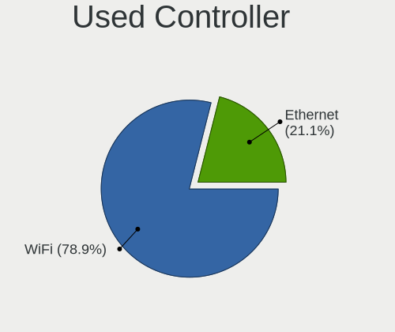

| Kind     | Notebooks | Percent |
|----------|-----------|---------|
| WiFi     | 145       | 75.13%  |
| Ethernet | 48        | 24.87%  |

NICs
----

Total network controllers on board

| Total | Notebooks | Percent |
|-------|-----------|---------|
| 2     | 147       | 79.03%  |
| 1     | 35        | 18.82%  |
| 0     | 4         | 2.15%   |

IPv6
----

IPv6 vs IPv4

| Used | Notebooks | Percent |
|------|-----------|---------|
| No   | 98        | 52.69%  |
| Yes  | 88        | 47.31%  |

Bluetooth
---------

Bluetooth Vendor
----------------

Controller vendors

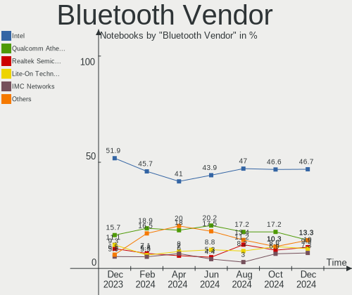

| Vendor                          | Notebooks | Percent |
|---------------------------------|-----------|---------|
| Intel                           | 64        | 45.71%  |
| Qualcomm Atheros Communications | 25        | 17.86%  |
| Lite-On Technology              | 11        | 7.86%   |
| IMC Networks                    | 9         | 6.43%   |
| Realtek Semiconductor           | 6         | 4.29%   |
| Apple                           | 6         | 4.29%   |
| Ralink                          | 5         | 3.57%   |
| Hewlett-Packard                 | 4         | 2.86%   |
| Cambridge Silicon Radio         | 4         | 2.86%   |
| Broadcom                        | 2         | 1.43%   |
| Smart Modular Technologies      | 1         | 0.71%   |
| Qcom                            | 1         | 0.71%   |
| Opticis                         | 1         | 0.71%   |
| Foxconn / Hon Hai               | 1         | 0.71%   |

Bluetooth Model
---------------

Controller models

| Model                                               | Notebooks | Percent |
|-----------------------------------------------------|-----------|---------|
| Intel Bluetooth wireless interface                  | 24        | 17.14%  |
| Qualcomm Atheros  Bluetooth Device                  | 18        | 12.86%  |
| Intel AX201 Bluetooth                               | 17        | 12.14%  |
| Intel Bluetooth 9460/9560 Jefferson Peak (JfP)      | 10        | 7.14%   |
| IMC Networks Bluetooth Radio                        | 7         | 5%      |
| Lite-On Qualcomm Atheros QCA9377 Bluetooth          | 6         | 4.29%   |
| Ralink RT3290 Bluetooth                             | 5         | 3.57%   |
| Intel AX200 Bluetooth                               | 5         | 3.57%   |
| Realtek Bluetooth Radio                             | 4         | 2.86%   |
| Qualcomm Atheros AR3012 Bluetooth 4.0               | 4         | 2.86%   |
| Cambridge Silicon Radio Bluetooth Dongle (HCI mode) | 4         | 2.86%   |
| Apple Bluetooth Host Controller                     | 4         | 2.86%   |
| Lite-On Wireless_Device                             | 3         | 2.14%   |
| Qualcomm Atheros AR9462 Bluetooth                   | 2         | 1.43%   |
| Intel Wireless-AC 3168 Bluetooth                    | 2         | 1.43%   |
| Intel Centrino Advanced-N 6230 Bluetooth adapter    | 2         | 1.43%   |
| Intel Bluetooth Device                              | 2         | 1.43%   |
| IMC Networks Bluetooth Device                       | 2         | 1.43%   |
| HP Broadcom 2070 Bluetooth Combo                    | 2         | 1.43%   |
| HP Bluetooth 2.0 Interface [Broadcom BCM2045]       | 2         | 1.43%   |
| Smart Modular Bluetooth Device                      | 1         | 0.71%   |
| Realtek RTL8723A Bluetooth                          | 1         | 0.71%   |
| Realtek  Bluetooth 4.2 Adapter                      | 1         | 0.71%   |
| Qualcomm Atheros Bluetooth USB Host Controller      | 1         | 0.71%   |
| Qcom Broadcom Bluetooth USB                         | 1         | 0.71%   |
| Opticis Bluetooth Radio                             | 1         | 0.71%   |
| Lite-On Bluetooth Device                            | 1         | 0.71%   |
| Lite-On Atheros AR3012 Bluetooth                    | 1         | 0.71%   |
| Intel Wireless-AC 9260 Bluetooth Adapter            | 1         | 0.71%   |
| Intel AX210 Bluetooth                               | 1         | 0.71%   |
| Foxconn / Hon Hai MediaTek Bluetooth Adapter        | 1         | 0.71%   |
| Broadcom BCM2070 Bluetooth 2.1 + EDR                | 1         | 0.71%   |
| Broadcom BCM2045B (BDC-2.1)                         | 1         | 0.71%   |
| Apple Bluetooth USB Host Controller                 | 1         | 0.71%   |
| Apple Bluetooth HCI                                 | 1         | 0.71%   |

Sound
-----

Sound Vendor
------------

Sound card vendors

| Vendor                           | Notebooks | Percent |
|----------------------------------|-----------|---------|
| Intel                            | 151       | 68.33%  |
| AMD                              | 27        | 12.22%  |
| Nvidia                           | 26        | 11.76%  |
| Silicon Integrated Systems [SiS] | 4         | 1.81%   |
| Microsoft                        | 2         | 0.9%    |
| Logitech                         | 2         | 0.9%    |
| Generalplus Technology           | 2         | 0.9%    |
| Dell                             | 2         | 0.9%    |
| Texas Instruments                | 1         | 0.45%   |
| Meizu                            | 1         | 0.45%   |
| Kingston Technology              | 1         | 0.45%   |
| C-Media Electronics              | 1         | 0.45%   |
| BigBen Interactive               | 1         | 0.45%   |

Sound Model
-----------

Sound card models

| Model                                                                                             | Notebooks | Percent |
|---------------------------------------------------------------------------------------------------|-----------|---------|
| Intel Sunrise Point-LP HD Audio                                                                   | 28        | 10.89%  |
| AMD Family 17h/19h HD Audio Controller                                                            | 21        | 8.17%   |
| Intel 7 Series/C216 Chipset Family High Definition Audio Controller                               | 18        | 7%      |
| Intel 6 Series/C200 Series Chipset Family High Definition Audio Controller                        | 15        | 5.84%   |
| Intel Tiger Lake-LP Smart Sound Technology Audio Controller                                       | 14        | 5.45%   |
| Nvidia TU107 GeForce GTX 1650 High Definition Audio Controller                                    | 12        | 4.67%   |
| Intel 5 Series/3400 Series Chipset High Definition Audio                                          | 10        | 3.89%   |
| Intel Haswell-ULT HD Audio Controller                                                             | 8         | 3.11%   |
| Intel 8 Series HD Audio Controller                                                                | 8         | 3.11%   |
| AMD Renoir Radeon High Definition Audio Controller                                                | 8         | 3.11%   |
| AMD Raven/Raven2/Fenghuang HDMI/DP Audio Controller                                               | 8         | 3.11%   |
| Intel Wildcat Point-LP High Definition Audio Controller                                           | 6         | 2.33%   |
| Intel Comet Lake PCH cAVS                                                                         | 6         | 2.33%   |
| Intel Broadwell-U Audio Controller                                                                | 6         | 2.33%   |
| Intel Comet Lake PCH-LP cAVS                                                                      | 5         | 1.95%   |
| Intel 82801I (ICH9 Family) HD Audio Controller                                                    | 5         | 1.95%   |
| Intel 82801H (ICH8 Family) HD Audio Controller                                                    | 5         | 1.95%   |
| Silicon Integrated Systems [SiS] Azalia Audio Controller                                          | 4         | 1.56%   |
| Intel Cannon Point-LP High Definition Audio Controller                                            | 4         | 1.56%   |
| Intel Cannon Lake PCH cAVS                                                                        | 4         | 1.56%   |
| Intel Atom Processor Z36xxx/Z37xxx Series High Definition Audio Controller                        | 4         | 1.56%   |
| Intel Tiger Lake-H HD Audio Controller                                                            | 3         | 1.17%   |
| Intel Ice Lake-LP Smart Sound Technology Audio Controller                                         | 3         | 1.17%   |
| Intel Atom/Celeron/Pentium Processor x5-E8000/J3xxx/N3xxx Series High Definition Audio Controller | 3         | 1.17%   |
| Intel Alder Lake PCH-P High Definition Audio Controller                                           | 3         | 1.17%   |
| Nvidia GP107GL High Definition Audio Controller                                                   | 2         | 0.78%   |
| Nvidia GK208 HDMI/DP Audio Controller                                                             | 2         | 0.78%   |
| Nvidia GA104 High Definition Audio Controller                                                     | 2         | 0.78%   |
| Nvidia Audio device                                                                               | 2         | 0.78%   |
| Microsoft LifeChat LX-3000 Headset                                                                | 2         | 0.78%   |
| Intel Xeon E3-1200 v3/4th Gen Core Processor HD Audio Controller                                  | 2         | 0.78%   |
| Intel NM10/ICH7 Family High Definition Audio Controller                                           | 2         | 0.78%   |
| Intel CM238 HD Audio Controller                                                                   | 2         | 0.78%   |
| Intel 8 Series/C220 Series Chipset High Definition Audio Controller                               | 2         | 0.78%   |
| Generalplus Technology USB Audio Device                                                           | 2         | 0.78%   |
| AMD SBx00 Azalia (Intel HDA)                                                                      | 2         | 0.78%   |
| AMD Kabini HDMI/DP Audio                                                                          | 2         | 0.78%   |
| AMD FCH Azalia Controller                                                                         | 2         | 0.78%   |
| Texas Instruments PCM2902 Audio Codec                                                             | 1         | 0.39%   |
| Nvidia TU106 High Definition Audio Controller                                                     | 1         | 0.39%   |

Memory
------

Memory Vendor
-------------

Memory module vendors

| Vendor              | Notebooks | Percent |
|---------------------|-----------|---------|
| Smart               | 18        | 20%     |
| SK hynix            | 12        | 13.33%  |
| Kingston            | 11        | 12.22%  |
| Samsung Electronics | 9         | 10%     |
| A-DATA Technology   | 9         | 10%     |
| Unknown             | 7         | 7.78%   |
| Teikon              | 4         | 4.44%   |
| Smart Brazil        | 4         | 4.44%   |
| Micron Technology   | 3         | 3.33%   |
| Unknown             | 3         | 3.33%   |
| High Bridge         | 2         | 2.22%   |
| Walton Chaintech    | 1         | 1.11%   |
| Team                | 1         | 1.11%   |
| Kembona             | 1         | 1.11%   |
| HT Micron           | 1         | 1.11%   |
| Elpida              | 1         | 1.11%   |
| Corsair             | 1         | 1.11%   |
| Avant               | 1         | 1.11%   |
| 48spaces            | 1         | 1.11%   |

Memory Model
------------

Memory module models

| Model                                                           | Notebooks | Percent |
|-----------------------------------------------------------------|-----------|---------|
| Smart RAM SMS4WEC8C1K0446FCG 8GB SODIMM DDR4 3200MT/s           | 4         | 4.21%   |
| Teikon RAM TMA81GS6AFR8N-UHSC 8GB SODIMM DDR4 2400MT/s          | 3         | 3.16%   |
| Unknown                                                         | 3         | 3.16%   |
| Unknown RAM Module 4GB SODIMM DDR3 1333MT/s                     | 2         | 2.11%   |
| Unknown RAM Module 2GB SODIMM DRAM                              | 2         | 2.11%   |
| Smart RAM SH564568FH8NZPHSCR 2GB SODIMM DDR3 1333MT/s           | 2         | 2.11%   |
| Smart RAM SH564568FH8NZPHSCG 2GB SODIMM DDR3 1333MT/s           | 2         | 2.11%   |
| Smart RAM SH564128FJ8NZRNSDR 4GB SODIMM DDR3 1600MT/s           | 2         | 2.11%   |
| Smart RAM SH564128FJ8NWRNSQR 4GB SODIMM DDR3 1600MT/s           | 2         | 2.11%   |
| Smart Brazil RAM SMS4TDC3C0K0446SCG 4096MB SODIMM DDR4 2667MT/s | 2         | 2.11%   |
| SK hynix RAM Module 4GB SODIMM DDR3 1066MT/s                    | 2         | 2.11%   |
| SK hynix RAM HMT351S6CFR8C-PB 4GB SODIMM DDR3 1600MT/s          | 2         | 2.11%   |
| Kingston RAM KF3200C20S4/16G 16GB SODIMM DDR4 3200MT/s          | 2         | 2.11%   |
| Kingston RAM 9905428-155.A00LF 8GB SODIMM DDR3 1600MT/s         | 2         | 2.11%   |
| A-DATA RAM AM1P26KC8T1-BAAS 8GB SODIMM DDR4 2667MT/s            | 2         | 2.11%   |
| Walton Chaintech RAM AS2G733-13GH905 2GB SODIMM DDR3 1333MT/s   | 1         | 1.05%   |
| Unknown RAM Module 4GB SODIMM DDR3                              | 1         | 1.05%   |
| Unknown RAM Module 32GB SODIMM DDR4 2667MT/s                    | 1         | 1.05%   |
| Unknown RAM Module 1GB SODIMM DDR2 667MT/s                      | 1         | 1.05%   |
| Teikon RAM TMT41GS6AFR8A-PBSC 8GB SODIMM DDR3 1600MT/s          | 1         | 1.05%   |
| Team RAM TEAMGROUP-UD4-3000 8GB DIMM DDR4 3000MT/s              | 1         | 1.05%   |
| Smart RAM SH564568FH8NWPHSFG 2GB SODIMM DDR3 1333MT/s           | 1         | 1.05%   |
| Smart RAM SH5641G8FJ8NWRNSQG 8GB SODIMM DDR3 1600MT/s           | 1         | 1.05%   |
| Smart RAM SH564128FH8NZQNSCG 4GB SODIMM DDR3 1600MT/s           | 1         | 1.05%   |
| Smart RAM SF5641G8CJ8NWMNSEG 8GB SODIMM DDR3 1600MT/s           | 1         | 1.05%   |
| Smart RAM SF4642G8CK8IEHLSBG 16GB SODIMM DDR4 2667MT/s          | 1         | 1.05%   |
| Smart RAM SF4641G8CK8IEGKSBG 8GB SODIMM DDR4 2400MT/s           | 1         | 1.05%   |
| Smart RAM SF464128CKHIWDFSEG 4GB SODIMM DDR4 2133MT/s           | 1         | 1.05%   |
| Smart Brazil RAM SF464128CK8IWGKFEG 4GB SODIMM DDR4 2400MT/s    | 1         | 1.05%   |
| Smart Brazil RAM Module 4GB Row Of Chips DDR4 3200MT/s          | 1         | 1.05%   |
| SK hynix RAM Module 4GB SODIMM DDR3 1600MT/s                    | 1         | 1.05%   |
| SK hynix RAM HMT41GS6BFR8A-PB 8GB SODIMM DDR3 1600MT/s          | 1         | 1.05%   |
| SK hynix RAM HMT325S6BFR8C-H9 2GB SODIMM DDR3 1333MT/s          | 1         | 1.05%   |
| SK hynix RAM HMT125S6BFR8C-H9 2GB SODIMM DDR3 1333MT/s          | 1         | 1.05%   |
| SK hynix RAM HMCG66MEBSA092N 8GB SODIMM DDR5 4800MT/s           | 1         | 1.05%   |
| SK hynix RAM HMA851S6CJR6N-VK 4GB SODIMM DDR4 2667MT/s          | 1         | 1.05%   |
| SK hynix RAM HMA82GS6MFR8N-TF 16GB SODIMM DDR4 2133MT/s         | 1         | 1.05%   |
| SK hynix RAM HMA81GS6CJR8N-VK 8GB SODIMM DDR4 2667MT/s          | 1         | 1.05%   |
| SK hynix RAM HMA81GS6AFR8N-UH 8GB SODIMM DDR4 2667MT/s          | 1         | 1.05%   |
| SK hynix RAM H9JCNNNCP3MLYR-N6E 2GB Row Of Chips 6400MT/s       | 1         | 1.05%   |

Memory Kind
-----------

Memory module kinds

| Kind   | Notebooks | Percent |
|--------|-----------|---------|
| DDR4   | 33        | 44.59%  |
| DDR3   | 31        | 41.89%  |
| SDRAM  | 2         | 2.7%    |
| DRAM   | 2         | 2.7%    |
| DDR2   | 2         | 2.7%    |
| LPDDR5 | 1         | 1.35%   |
| LPDDR4 | 1         | 1.35%   |
| LPDDR3 | 1         | 1.35%   |
| DDR5   | 1         | 1.35%   |

Memory Form Factor
------------------

Physical design of the memory module

| Name         | Notebooks | Percent |
|--------------|-----------|---------|
| SODIMM       | 67        | 90.54%  |
| Row Of Chips | 6         | 8.11%   |
| DIMM         | 1         | 1.35%   |

Memory Size
-----------

Memory module size

| Size  | Notebooks | Percent |
|-------|-----------|---------|
| 4096  | 29        | 36.25%  |
| 8192  | 23        | 28.75%  |
| 2048  | 16        | 20%     |
| 16384 | 10        | 12.5%   |
| 32768 | 1         | 1.25%   |
| 1024  | 1         | 1.25%   |

Memory Speed
------------

Memory module speed

| Speed   | Notebooks | Percent |
|---------|-----------|---------|
| 1600    | 17        | 20.73%  |
| 3200    | 13        | 15.85%  |
| 1333    | 12        | 14.63%  |
| 2667    | 11        | 13.41%  |
| 2400    | 8         | 9.76%   |
| 1334    | 5         | 6.1%    |
| Unknown | 3         | 3.66%   |
| 2133    | 2         | 2.44%   |
| 1066    | 2         | 2.44%   |
| 667     | 2         | 2.44%   |
| 6400    | 1         | 1.22%   |
| 4800    | 1         | 1.22%   |
| 4267    | 1         | 1.22%   |
| 4199    | 1         | 1.22%   |
| 3000    | 1         | 1.22%   |
| 2048    | 1         | 1.22%   |
| 800     | 1         | 1.22%   |

Printers & scanners
-------------------

Printer Vendor
--------------

Printer device vendors

| Vendor          | Notebooks | Percent |
|-----------------|-----------|---------|
| Canon           | 2         | 66.67%  |
| Hewlett-Packard | 1         | 33.33%  |

Printer Model
-------------

Printer device models

| Model                     | Notebooks | Percent |
|---------------------------|-----------|---------|
| Canon PIXMA MG3600 Series | 2         | 66.67%  |
| HP LaserJet P2015 series  | 1         | 33.33%  |

Scanner Vendor
--------------

Scanner device vendors

Zero info for selected period =(

Scanner Model
-------------

Scanner device models

Zero info for selected period =(

Camera
------

Camera Vendor
-------------

Camera device vendors

| Vendor                                 | Notebooks | Percent |
|----------------------------------------|-----------|---------|
| Chicony Electronics                    | 38        | 24.05%  |
| Microdia                               | 19        | 12.03%  |
| Realtek Semiconductor                  | 16        | 10.13%  |
| Quanta                                 | 11        | 6.96%   |
| Syntek                                 | 10        | 6.33%   |
| Sunplus Innovation Technology          | 9         | 5.7%    |
| Silicon Motion                         | 8         | 5.06%   |
| Bison Electronics                      | 7         | 4.43%   |
| Apple                                  | 5         | 3.16%   |
| IMC Networks                           | 4         | 2.53%   |
| Alcor Micro                            | 4         | 2.53%   |
| Sonix Technology                       | 3         | 1.9%    |
| Lite-On Technology                     | 3         | 1.9%    |
| Cheng Uei Precision Industry (Foxlink) | 3         | 1.9%    |
| Acer                                   | 3         | 1.9%    |
| Suyin                                  | 2         | 1.27%   |
| Luxvisions Innotech Limited            | 2         | 1.27%   |
| Y Media                                | 1         | 0.63%   |
| SunplusIT                              | 1         | 0.63%   |
| Shenzhen Kingcome Optoelectronic       | 1         | 0.63%   |
| OmniVision Technologies                | 1         | 0.63%   |
| Novatek Microelectronics               | 1         | 0.63%   |
| kingcome                               | 1         | 0.63%   |
| Image Processor                        | 1         | 0.63%   |
| icSpring                               | 1         | 0.63%   |
| GEMBIRD                                | 1         | 0.63%   |
| Camera                                 | 1         | 0.63%   |
| Unknown                                | 1         | 0.63%   |

Camera Model
------------

Camera device models

| Model                                | Notebooks | Percent |
|--------------------------------------|-----------|---------|
| Microdia Integrated_Webcam_HD        | 8         | 5.06%   |
| Chicony HD User Facing               | 8         | 5.06%   |
| Chicony Integrated Camera            | 7         | 4.43%   |
| Syntek Integrated Camera             | 6         | 3.8%    |
| Sunplus Integrated_Webcam_HD         | 6         | 3.8%    |
| Realtek Integrated_Webcam_HD         | 6         | 3.8%    |
| Quanta HD User Facing                | 5         | 3.16%   |
| Realtek Integrated Webcam            | 4         | 2.53%   |
| Chicony VGA WebCam                   | 4         | 2.53%   |
| Sonix USB2.0 HD UVC WebCam           | 3         | 1.9%    |
| Silicon Motion Web Camera            | 3         | 1.9%    |
| Realtek Integrated Webcam HD         | 3         | 1.9%    |
| Quanta HD Webcam                     | 3         | 1.9%    |
| Lite-On Integrated Camera            | 3         | 1.9%    |
| Bison EasyCamera                     | 3         | 1.9%    |
| Syntek USB Camera Device             | 2         | 1.27%   |
| Sunplus HP TrueVision HD             | 2         | 1.27%   |
| Quanta VGA WebCam                    | 2         | 1.27%   |
| Microdia Laptop_Integrated_Webcam_HD | 2         | 1.27%   |
| Microdia Integrated Webcam HD        | 2         | 1.27%   |
| IMC Networks USB2.0 HD UVC WebCam    | 2         | 1.27%   |
| Chicony USB2.0 Camera                | 2         | 1.27%   |
| Chicony HP Webcam [2 MP Macro]       | 2         | 1.27%   |
| Chicony HP Truevision HD camera      | 2         | 1.27%   |
| Chicony HP Truevision HD             | 2         | 1.27%   |
| Chicony HD WebCam                    | 2         | 1.27%   |
| Apple FaceTime HD Camera             | 2         | 1.27%   |
| Apple Built-in iSight                | 2         | 1.27%   |
| Alcor Micro Acer Integrated Webcam   | 2         | 1.27%   |
| Acer Integrated Camera               | 2         | 1.27%   |
| Y Media USB Camera                   | 1         | 0.63%   |
| Syntek Lenovo EasyCamera             | 1         | 0.63%   |
| Syntek EasyCamera                    | 1         | 0.63%   |
| Suyin LG Webcam                      | 1         | 0.63%   |
| Suyin Acer CrystalEye Webcam         | 1         | 0.63%   |
| SunplusIT HBT Camera                 | 1         | 0.63%   |
| Sunplus XiaoMi USB 2.0 Webcam        | 1         | 0.63%   |
| Silicon Motion WebCam SCB-1100N      | 1         | 0.63%   |
| Silicon Motion WebCam SC-13HDL11939N | 1         | 0.63%   |
| Silicon Motion WebCam SC-10HDD12636N | 1         | 0.63%   |

Security
--------

Fingerprint Vendor
------------------

Fingerprint sensor vendors

| Vendor                     | Notebooks | Percent |
|----------------------------|-----------|---------|
| Validity Sensors           | 9         | 69.23%  |
| AuthenTec                  | 2         | 15.38%  |
| Synaptics                  | 1         | 7.69%   |
| Shenzhen Goodix Technology | 1         | 7.69%   |

Fingerprint Model
-----------------

Fingerprint sensor models

| Model                                                       | Notebooks | Percent |
|-------------------------------------------------------------|-----------|---------|
| Validity Sensors VFS 5011 fingerprint sensor                | 3         | 23.08%  |
| Validity Sensors VFS495 Fingerprint Reader                  | 2         | 15.38%  |
| Validity Sensors VFS5011 Fingerprint Reader                 | 1         | 7.69%   |
| Validity Sensors VFS451 Fingerprint Reader                  | 1         | 7.69%   |
| Validity Sensors VFS301 Fingerprint Reader                  | 1         | 7.69%   |
| Validity Sensors Synaptics VFS7552 Touch Fingerprint Sensor | 1         | 7.69%   |
| Synaptics Prometheus MIS Touch Fingerprint Reader           | 1         | 7.69%   |
| Shenzhen Goodix  FingerPrint Device                         | 1         | 7.69%   |
| AuthenTec AES2810                                           | 1         | 7.69%   |
| AuthenTec AES1660 Fingerprint Sensor                        | 1         | 7.69%   |

Chipcard Vendor
---------------

Chipcard module vendors

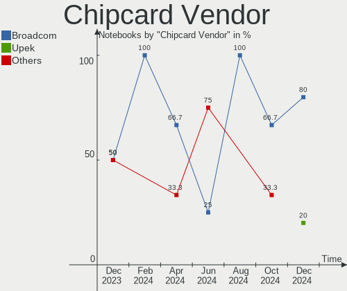

| Vendor   | Notebooks | Percent |
|----------|-----------|---------|
| Broadcom | 3         | 75%     |
| Lenovo   | 1         | 25%     |

Chipcard Model
--------------

Chipcard module models

| Model                                          | Notebooks | Percent |
|------------------------------------------------|-----------|---------|
| Lenovo Integrated Smart Card Reader            | 1         | 25%     |
| Broadcom BCM5880 Secure Applications Processor | 1         | 25%     |
| Broadcom 5880                                  | 1         | 25%     |
| Broadcom 58200                                 | 1         | 25%     |

Unsupported
-----------

Unsupported Devices
-------------------

Total unsupported devices on board

| Total | Notebooks | Percent |
|-------|-----------|---------|
| 0     | 132       | 70.97%  |
| 1     | 47        | 25.27%  |
| 2     | 6         | 3.23%   |
| 3     | 1         | 0.54%   |

Unsupported Device Types
------------------------

Types of unsupported devices

| Type                  | Notebooks | Percent |
|-----------------------|-----------|---------|
| Graphics card         | 18        | 30%     |
| Fingerprint reader    | 13        | 21.67%  |
| Multimedia controller | 9         | 15%     |
| Bluetooth             | 5         | 8.33%   |
| Net/wireless          | 4         | 6.67%   |
| Chipcard              | 4         | 6.67%   |
| Net/ethernet          | 3         | 5%      |
| Storage               | 2         | 3.33%   |
| Camera                | 2         | 3.33%   |

