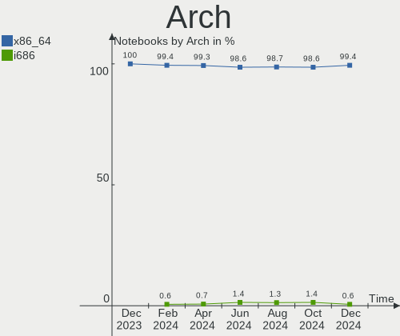
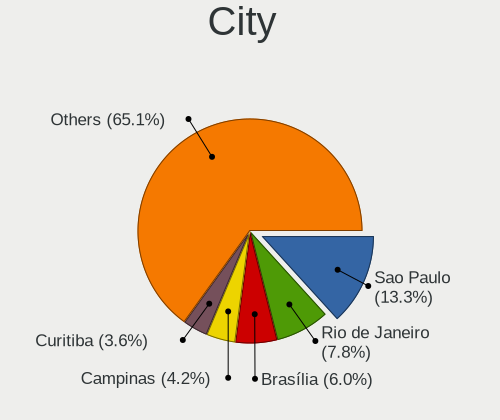
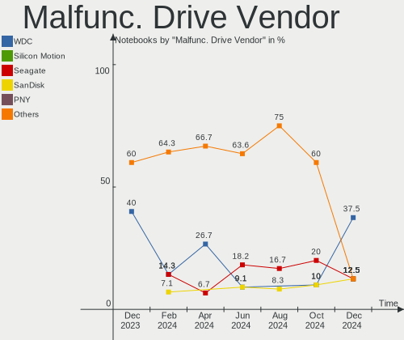
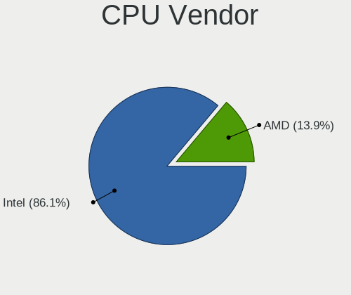
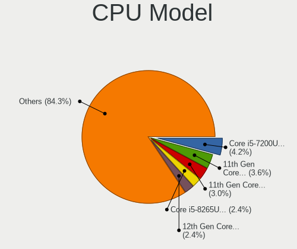
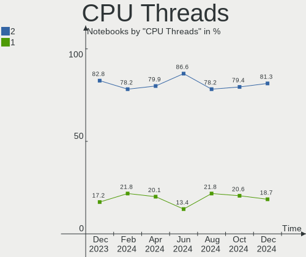
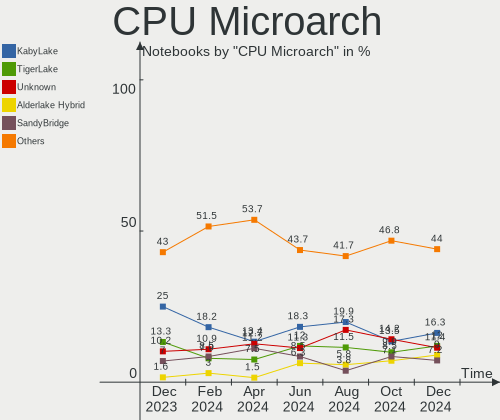
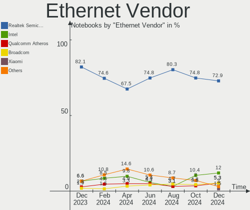

Linux in Brazil - Hardware Trends (Notebooks)
---------------------------------------------

A project to identify most popular hardware characteristics and track their change
over time based on data collected by Linux users at https://Linux-Hardware.org.

Anyone can contribute to this report by the [hw-probe](https://github.com/linuxhw/hw-probe) tool:

    sudo -E hw-probe -all -upload

Period: Feb, 2023.

Contents
--------

* [ System ](#system)
  - [ OS                       ](#os)
  - [ OS Family                ](#os-family)
  - [ Kernel                   ](#kernel)
  - [ Kernel Family            ](#kernel-family)
  - [ Kernel Major Ver.        ](#kernel-major-ver)
  - [ Arch                     ](#arch)
  - [ DE                       ](#de)
  - [ Display Server           ](#display-server)
  - [ Display Manager          ](#display-manager)
  - [ OS Lang                  ](#os-lang)
  - [ Boot Mode                ](#boot-mode)
  - [ Filesystem               ](#filesystem)
  - [ Part. scheme             ](#part-scheme)
  - [ Dual Boot with Linux/BSD ](#dual-boot-with-linuxbsd)
  - [ Dual Boot (Win)          ](#dual-boot-win)

* [ Board ](#board)
  - [ Vendor                   ](#vendor)
  - [ Model                    ](#model)
  - [ Model Family             ](#model-family)
  - [ MFG Year                 ](#mfg-year)
  - [ Form Factor              ](#form-factor)
  - [ Secure Boot              ](#secure-boot)
  - [ Coreboot                 ](#coreboot)
  - [ RAM Size                 ](#ram-size)
  - [ RAM Used                 ](#ram-used)
  - [ Total Drives             ](#total-drives)
  - [ Has CD-ROM               ](#has-cd-rom)
  - [ Has Ethernet             ](#has-ethernet)
  - [ Has WiFi                 ](#has-wifi)
  - [ Has Bluetooth            ](#has-bluetooth)

* [ Location ](#location)
  - [ Country                  ](#country)
  - [ City                     ](#city)

* [ Drives ](#drives)
  - [ Drive Vendor             ](#drive-vendor)
  - [ Drive Model              ](#drive-model)
  - [ HDD Vendor               ](#hdd-vendor)
  - [ SSD Vendor               ](#ssd-vendor)
  - [ Drive Kind               ](#drive-kind)
  - [ Drive Connector          ](#drive-connector)
  - [ Drive Size               ](#drive-size)
  - [ Space Total              ](#space-total)
  - [ Space Used               ](#space-used)
  - [ Malfunc. Drives          ](#malfunc-drives)
  - [ Malfunc. Drive Vendor    ](#malfunc-drive-vendor)
  - [ Malfunc. HDD Vendor      ](#malfunc-hdd-vendor)
  - [ Malfunc. Drive Kind      ](#malfunc-drive-kind)
  - [ Failed Drives            ](#failed-drives)
  - [ Failed Drive Vendor      ](#failed-drive-vendor)
  - [ Drive Status             ](#drive-status)

* [ Storage controller ](#storage-controller)
  - [ Storage Vendor           ](#storage-vendor)
  - [ Storage Model            ](#storage-model)
  - [ Storage Kind             ](#storage-kind)

* [ Processor ](#processor)
  - [ CPU Vendor               ](#cpu-vendor)
  - [ CPU Model                ](#cpu-model)
  - [ CPU Model Family         ](#cpu-model-family)
  - [ CPU Cores                ](#cpu-cores)
  - [ CPU Sockets              ](#cpu-sockets)
  - [ CPU Threads              ](#cpu-threads)
  - [ CPU Op-Modes             ](#cpu-op-modes)
  - [ CPU Microcode            ](#cpu-microcode)
  - [ CPU Microarch            ](#cpu-microarch)

* [ Graphics ](#graphics)
  - [ GPU Vendor               ](#gpu-vendor)
  - [ GPU Model                ](#gpu-model)
  - [ GPU Combo                ](#gpu-combo)
  - [ GPU Driver               ](#gpu-driver)
  - [ GPU Memory               ](#gpu-memory)

* [ Monitor ](#monitor)
  - [ Monitor Vendor           ](#monitor-vendor)
  - [ Monitor Model            ](#monitor-model)
  - [ Monitor Resolution       ](#monitor-resolution)
  - [ Monitor Diagonal         ](#monitor-diagonal)
  - [ Monitor Width            ](#monitor-width)
  - [ Aspect Ratio             ](#aspect-ratio)
  - [ Monitor Area             ](#monitor-area)
  - [ Pixel Density            ](#pixel-density)
  - [ Multiple Monitors        ](#multiple-monitors)

* [ Network ](#network)
  - [ Net Controller Vendor    ](#net-controller-vendor)
  - [ Net Controller Model     ](#net-controller-model)
  - [ Wireless Vendor          ](#wireless-vendor)
  - [ Wireless Model           ](#wireless-model)
  - [ Ethernet Vendor          ](#ethernet-vendor)
  - [ Ethernet Model           ](#ethernet-model)
  - [ Net Controller Kind      ](#net-controller-kind)
  - [ Used Controller          ](#used-controller)
  - [ NICs                     ](#nics)
  - [ IPv6                     ](#ipv6)

* [ Bluetooth ](#bluetooth)
  - [ Bluetooth Vendor         ](#bluetooth-vendor)
  - [ Bluetooth Model          ](#bluetooth-model)

* [ Sound ](#sound)
  - [ Sound Vendor             ](#sound-vendor)
  - [ Sound Model              ](#sound-model)

* [ Memory ](#memory)
  - [ Memory Vendor            ](#memory-vendor)
  - [ Memory Model             ](#memory-model)
  - [ Memory Kind              ](#memory-kind)
  - [ Memory Form Factor       ](#memory-form-factor)
  - [ Memory Size              ](#memory-size)
  - [ Memory Speed             ](#memory-speed)

* [ Printers & scanners ](#printers--scanners)
  - [ Printer Vendor           ](#printer-vendor)
  - [ Printer Model            ](#printer-model)
  - [ Scanner Vendor           ](#scanner-vendor)
  - [ Scanner Model            ](#scanner-model)

* [ Camera ](#camera)
  - [ Camera Vendor            ](#camera-vendor)
  - [ Camera Model             ](#camera-model)

* [ Security ](#security)
  - [ Fingerprint Vendor       ](#fingerprint-vendor)
  - [ Fingerprint Model        ](#fingerprint-model)
  - [ Chipcard Vendor          ](#chipcard-vendor)
  - [ Chipcard Model           ](#chipcard-model)

* [ Unsupported ](#unsupported)
  - [ Unsupported Devices      ](#unsupported-devices)
  - [ Unsupported Device Types ](#unsupported-device-types)

System
------

OS
--

Installed operating systems

| Name                         | Notebooks | Percent |
|------------------------------|-----------|---------|
| Ubuntu 22.04                 | 25        | 16.13%  |
| Linux Mint 21.1              | 19        | 12.26%  |
| OpenMandriva 23.01           | 16        | 10.32%  |
| Zorin 16                     | 10        | 6.45%   |
| Fedora 37                    | 9         | 5.81%   |
| Pop!_OS 22.04                | 8         | 5.16%   |
| Arch Rolling                 | 8         | 5.16%   |
| Ubuntu 22.10                 | 6         | 3.87%   |
| Debian 11                    | 4         | 2.58%   |
| OpenMandriva 4.3             | 3         | 1.94%   |
| Kubuntu 22.04                | 3         | 1.94%   |
| KDE neon 22.04               | 3         | 1.94%   |
| Endless 3.9.7                | 3         | 1.94%   |
| Xubuntu 22.04                | 2         | 1.29%   |
| Ubuntu 23.04                 | 2         | 1.29%   |
| Ubuntu 20.04                 | 2         | 1.29%   |
| Ubuntu 18.04                 | 2         | 1.29%   |
| Manjaro                      | 2         | 1.29%   |
| Linux Mint 20.3              | 2         | 1.29%   |
| Endless 5.0.0                | 2         | 1.29%   |
| Debian                       | 2         | 1.29%   |
| Ubuntu MATE 22.04            | 1         | 0.65%   |
| Sparky 6.6                   | 1         | 0.65%   |
| Rocky Linux 9.1              | 1         | 0.65%   |
| RHEL 8                       | 1         | 0.65%   |
| Parrot 5.2                   | 1         | 0.65%   |
| openSUSE Tumbleweed-XXXXXXXX | 1         | 0.65%   |
| openSUSE Leap-15.4           | 1         | 0.65%   |
| OpenMandriva 4.2             | 1         | 0.65%   |
| Nobara 37                    | 1         | 0.65%   |
| Manjaro 22.0.2               | 1         | 0.65%   |
| Lubuntu 22.10                | 1         | 0.65%   |
| Lubuntu 22.04                | 1         | 0.65%   |
| Kubuntu 22.10                | 1         | 0.65%   |
| Kali 2022.4                  | 1         | 0.65%   |
| Kaisen 2.2                   | 1         | 0.65%   |
| Endless 4.0.14               | 1         | 0.65%   |
| Endless 4.0.13               | 1         | 0.65%   |
| Endless 3.9.3-nexthw1        | 1         | 0.65%   |
| Endless 3.8.7-nexthw2        | 1         | 0.65%   |

OS Family
---------

OS without a version

| Name         | Notebooks | Percent |
|--------------|-----------|---------|
| Ubuntu       | 37        | 23.87%  |
| Linux Mint   | 21        | 13.55%  |
| OpenMandriva | 20        | 12.9%   |
| Zorin        | 10        | 6.45%   |
| Fedora       | 9         | 5.81%   |
| Endless      | 9         | 5.81%   |
| Pop!_OS      | 8         | 5.16%   |
| Arch         | 8         | 5.16%   |
| Debian       | 6         | 3.87%   |
| Kubuntu      | 4         | 2.58%   |
| Manjaro      | 3         | 1.94%   |
| KDE neon     | 3         | 1.94%   |
| Xubuntu      | 2         | 1.29%   |
| openSUSE     | 2         | 1.29%   |
| Lubuntu      | 2         | 1.29%   |
| Ubuntu MATE  | 1         | 0.65%   |
| Sparky       | 1         | 0.65%   |
| Rocky Linux  | 1         | 0.65%   |
| RHEL         | 1         | 0.65%   |
| Parrot       | 1         | 0.65%   |
| Nobara       | 1         | 0.65%   |
| Kali         | 1         | 0.65%   |
| Kaisen       | 1         | 0.65%   |
| EndeavourOS  | 1         | 0.65%   |
| Elementary   | 1         | 0.65%   |
| ChimeraOS    | 1         | 0.65%   |

Kernel
------

Version of the Linux kernel

| Version                     | Notebooks | Percent |
|-----------------------------|-----------|---------|
| 5.15.0-60-generic           | 26        | 16.77%  |
| 5.15.0-58-generic           | 15        | 9.68%   |
| 6.1.1-desktop-1omv2290      | 14        | 9.03%   |
| 5.19.0-32-generic           | 9         | 5.81%   |
| 6.0.12-76060006-generic     | 6         | 3.87%   |
| 5.19.0-31-generic           | 6         | 3.87%   |
| 5.10.0-21-amd64             | 5         | 3.23%   |
| 5.8.0-14-generic            | 4         | 2.58%   |
| 5.15.0-56-generic           | 4         | 2.58%   |
| 6.1.11-76060111-generic     | 3         | 1.94%   |
| 6.1.11-200.fc37.x86_64      | 3         | 1.94%   |
| 5.4.0-139-generic           | 3         | 1.94%   |
| 5.16.7-desktop-1omv4003     | 3         | 1.94%   |
| 6.1.9-1-MANJARO             | 2         | 1.29%   |
| 6.1.4-desktop-1omv2301      | 2         | 1.29%   |
| 6.1.12-arch1-1              | 2         | 1.29%   |
| 6.0.7-301.fc37.x86_64       | 2         | 1.29%   |
| 5.4.0-137-generic           | 2         | 1.29%   |
| 5.15.0-52-generic           | 2         | 1.29%   |
| 5.15.0-47-generic           | 2         | 1.29%   |
| 5.15.0-43-generic           | 2         | 1.29%   |
| 5.11.0-35-generic           | 2         | 1.29%   |
| 6.2.1-arch1-1               | 1         | 0.65%   |
| 6.2.0-060200-generic        | 1         | 0.65%   |
| 6.1.9-arch1-2               | 1         | 0.65%   |
| 6.1.9-200.fc37.x86_64       | 1         | 0.65%   |
| 6.1.8-arch1-1               | 1         | 0.65%   |
| 6.1.8-202.fsync.fc37.x86_64 | 1         | 0.65%   |
| 6.1.8-1-default             | 1         | 0.65%   |
| 6.1.7-060107-generic        | 1         | 0.65%   |
| 6.1.6-200.fc37.x86_64       | 1         | 0.65%   |
| 6.1.13-200.fc37.x86_64      | 1         | 0.65%   |
| 6.1.13-1-lts                | 1         | 0.65%   |
| 6.1.11-arch1-1              | 1         | 0.65%   |
| 6.1.10-arch1-1              | 1         | 0.65%   |
| 6.1.10-200.fc37.x86_64      | 1         | 0.65%   |
| 6.1.1-arch1-1               | 1         | 0.65%   |
| 6.1.0-kali5-amd64           | 1         | 0.65%   |
| 6.1.0-3-amd64               | 1         | 0.65%   |
| 6.1.0-2-amd64               | 1         | 0.65%   |

Kernel Family
-------------

Linux kernel without a distro release

| Version | Notebooks | Percent |
|---------|-----------|---------|
| 5.15.0  | 52        | 33.55%  |
| 5.19.0  | 18        | 11.61%  |
| 6.1.1   | 15        | 9.68%   |
| 6.1.11  | 7         | 4.52%   |
| 6.0.12  | 6         | 3.87%   |
| 5.4.0   | 5         | 3.23%   |
| 5.10.0  | 5         | 3.23%   |
| 6.1.9   | 4         | 2.58%   |
| 5.8.0   | 4         | 2.58%   |
| 6.1.8   | 3         | 1.94%   |
| 6.1.0   | 3         | 1.94%   |
| 5.16.7  | 3         | 1.94%   |
| 5.11.0  | 3         | 1.94%   |
| 6.1.4   | 2         | 1.29%   |
| 6.1.13  | 2         | 1.29%   |
| 6.1.12  | 2         | 1.29%   |
| 6.1.10  | 2         | 1.29%   |
| 6.0.7   | 2         | 1.29%   |
| 6.0.0   | 2         | 1.29%   |
| 5.17.0  | 2         | 1.29%   |
| 5.14.0  | 2         | 1.29%   |
| 5.13.0  | 2         | 1.29%   |
| 6.2.1   | 1         | 0.65%   |
| 6.2.0   | 1         | 0.65%   |
| 6.1.7   | 1         | 0.65%   |
| 6.1.6   | 1         | 0.65%   |
| 5.15.94 | 1         | 0.65%   |
| 5.15.93 | 1         | 0.65%   |
| 5.14.21 | 1         | 0.65%   |
| 5.11.12 | 1         | 0.65%   |
| 4.18.0  | 1         | 0.65%   |

Kernel Major Ver.
-----------------

Linux kernel major version

| Version | Notebooks | Percent |
|---------|-----------|---------|
| 5.15    | 54        | 34.84%  |
| 6.1     | 42        | 27.1%   |
| 5.19    | 18        | 11.61%  |
| 6.0     | 10        | 6.45%   |
| 5.4     | 5         | 3.23%   |
| 5.10    | 5         | 3.23%   |
| 5.8     | 4         | 2.58%   |
| 5.11    | 4         | 2.58%   |
| 5.16    | 3         | 1.94%   |
| 5.14    | 3         | 1.94%   |
| 6.2     | 2         | 1.29%   |
| 5.17    | 2         | 1.29%   |
| 5.13    | 2         | 1.29%   |
| 4.18    | 1         | 0.65%   |

Arch
----

OS architecture (x86_64, i586, etc.)

| Name   | Notebooks | Percent |
|--------|-----------|---------|
| x86_64 | 155       | 100%    |

DE
--

Desktop Environment

| Name          | Notebooks | Percent |
|---------------|-----------|---------|
| GNOME         | 77        | 49.68%  |
| KDE5          | 34        | 21.94%  |
| X-Cinnamon    | 16        | 10.32%  |
| XFCE          | 13        | 8.39%   |
| Unknown       | 5         | 3.23%   |
| MATE          | 4         | 2.58%   |
| LXQt          | 2         | 1.29%   |
| Pantheon      | 1         | 0.65%   |
| LXDE          | 1         | 0.65%   |
| KDE           | 1         | 0.65%   |
| GNOME Classic | 1         | 0.65%   |

Display Server
--------------

X11 or Wayland

| Name    | Notebooks | Percent |
|---------|-----------|---------|
| X11     | 113       | 72.9%   |
| Wayland | 35        | 22.58%  |
| Unknown | 5         | 3.23%   |
| Tty     | 2         | 1.29%   |

Display Manager
---------------

SDDM, LightDM, etc.

| Name    | Notebooks | Percent |
|---------|-----------|---------|
| Unknown | 65        | 41.94%  |
| GDM3    | 33        | 21.29%  |
| SDDM    | 27        | 17.42%  |
| LightDM | 20        | 12.9%   |
| GDM     | 10        | 6.45%   |

OS Lang
-------

Language

| Lang      | Notebooks | Percent |
|-----------|-----------|---------|
| pt_BR     | 103       | 66.45%  |
| en_US     | 39        | 25.16%  |
| C         | 4         | 2.58%   |
| pt_PT     | 2         | 1.29%   |
| pt_BRutf8 | 1         | 0.65%   |
| fr_FR     | 1         | 0.65%   |
| es_ES     | 1         | 0.65%   |
| en_GB     | 1         | 0.65%   |
| en_DK     | 1         | 0.65%   |
| en_CA     | 1         | 0.65%   |
| Unknown   | 1         | 0.65%   |

Boot Mode
---------

EFI or BIOS

| Mode | Notebooks | Percent |
|------|-----------|---------|
| EFI  | 90        | 58.06%  |
| BIOS | 65        | 41.94%  |

Filesystem
----------

Type of filesystem

| Type    | Notebooks | Percent |
|---------|-----------|---------|
| Ext4    | 116       | 74.84%  |
| Btrfs   | 20        | 12.9%   |
| Overlay | 14        | 9.03%   |
| Xfs     | 4         | 2.58%   |
| Zfs     | 1         | 0.65%   |

Part. scheme
------------

Scheme of partitioning

| Type    | Notebooks | Percent |
|---------|-----------|---------|
| GPT     | 82        | 52.9%   |
| Unknown | 60        | 38.71%  |
| MBR     | 13        | 8.39%   |

Dual Boot with Linux/BSD
------------------------

Hosting more than one Linux/BSD

| Dual boot | Notebooks | Percent |
|-----------|-----------|---------|
| No        | 137       | 88.39%  |
| Yes       | 18        | 11.61%  |

Dual Boot (Win)
---------------

Hosting Linux and Windows

| Dual boot | Notebooks | Percent |
|-----------|-----------|---------|
| No        | 127       | 81.94%  |
| Yes       | 28        | 18.06%  |

Board
-----

Vendor
------

Motherboard manufacturer

| Name                           | Notebooks | Percent |
|--------------------------------|-----------|---------|
| Dell                           | 31        | 20%     |
| Acer                           | 25        | 16.13%  |
| Lenovo                         | 23        | 14.84%  |
| Samsung Electronics            | 15        | 9.68%   |
| ASUSTek Computer               | 12        | 7.74%   |
| Positivo                       | 11        | 7.1%    |
| Hewlett-Packard                | 6         | 3.87%   |
| Sony                           | 3         | 1.94%   |
| Multilaser                     | 3         | 1.94%   |
| Avell High Performance         | 3         | 1.94%   |
| Unknown                        | 3         | 1.94%   |
| Semp Toshiba                   | 2         | 1.29%   |
| Philco                         | 2         | 1.29%   |
| Intel                          | 2         | 1.29%   |
| Digibras                       | 2         | 1.29%   |
| Apple                          | 2         | 1.29%   |
| Toshiba                        | 1         | 0.65%   |
| Timi                           | 1         | 0.65%   |
| System76                       | 1         | 0.65%   |
| SmbiosType1_SystemManufacturer | 1         | 0.65%   |
| Quanta                         | 1         | 0.65%   |
| Notebook                       | 1         | 0.65%   |
| Insyde                         | 1         | 0.65%   |
| Evolute                        | 1         | 0.65%   |
| Daten Tecnologia               | 1         | 0.65%   |
| Compaq                         | 1         | 0.65%   |

Model
-----

Motherboard model

| Name                                                         | Notebooks | Percent |
|--------------------------------------------------------------|-----------|---------|
| ASUS VivoBook_ASUSLaptop X515JA_X515JA                       | 4         | 2.58%   |
| Samsung 550XDA                                               | 3         | 1.94%   |
| Lenovo IdeaPad S145-15API 81V7                               | 3         | 1.94%   |
| ASUS VivoBook_ASUSLaptop X515DA_X515DA                       | 3         | 1.94%   |
| Acer Aspire E1-572                                           | 3         | 1.94%   |
| Unknown                                                      | 3         | 1.94%   |
| Samsung 370E4K                                               | 2         | 1.29%   |
| Samsung 340XAA/350XAA/550XAA                                 | 2         | 1.29%   |
| Positivo CHT14B                                              | 2         | 1.29%   |
| Lenovo IdeaPad S145-15IWL 81S9                               | 2         | 1.29%   |
| Lenovo IdeaPad S145-15IIL 82DJ                               | 2         | 1.29%   |
| Lenovo IdeaPad 3 15ALC6 82MF                                 | 2         | 1.29%   |
| Lenovo G40-80 80JE                                           | 2         | 1.29%   |
| Intel HuronRiver Platform                                    | 2         | 1.29%   |
| Digibras NH4CU03                                             | 2         | 1.29%   |
| Dell Inspiron 5566                                           | 2         | 1.29%   |
| Dell Inspiron 3583                                           | 2         | 1.29%   |
| Dell G15 5515                                                | 2         | 1.29%   |
| Dell G15 5510                                                | 2         | 1.29%   |
| Acer Nitro AN515-54                                          | 2         | 1.29%   |
| Acer Aspire A515-51                                          | 2         | 1.29%   |
| Toshiba Satellite C855-233                                   | 1         | 0.65%   |
| Timi Redmi Book Pro 15 2022                                  | 1         | 0.65%   |
| System76 Gazelle                                             | 1         | 0.65%   |
| Sony VPCEG27FM                                               | 1         | 0.65%   |
| Sony VPCCW13FB                                               | 1         | 0.65%   |
| Sony SVE15125CBW                                             | 1         | 0.65%   |
| SmbiosType1_SystemManufacturer SmbiosType1_SystemProductName | 1         | 0.65%   |
| Semp Toshiba IS 1413G                                        | 1         | 0.65%   |
| Semp Toshiba IS 1412                                         | 1         | 0.65%   |
| Samsung RV419/RV420                                          | 1         | 0.65%   |
| Samsung RV415/RV515                                          | 1         | 0.65%   |
| Samsung 767XCL                                               | 1         | 0.65%   |
| Samsung 550XBE/350XBE                                        | 1         | 0.65%   |
| Samsung 530U3C/530U4C/532U3C                                 | 1         | 0.65%   |
| Samsung 305E4A/305E5A/305E7A                                 | 1         | 0.65%   |
| Samsung 300E4A/300E5A/300E7A/3430EA/3530EA                   | 1         | 0.65%   |
| Samsung 270E5G/270E5U                                        | 1         | 0.65%   |
| Quanta TWS                                                   | 1         | 0.65%   |
| Positivo Smash2                                              | 1         | 0.65%   |

Model Family
------------

Motherboard model prefix

| Name                                       | Notebooks | Percent |
|--------------------------------------------|-----------|---------|
| Dell Inspiron                              | 19        | 12.26%  |
| Lenovo IdeaPad                             | 15        | 9.68%   |
| Acer Aspire                                | 15        | 9.68%   |
| ASUS VivoBook                              | 9         | 5.81%   |
| Dell G15                                   | 5         | 3.23%   |
| Acer Nitro                                 | 5         | 3.23%   |
| Acer Predator                              | 4         | 2.58%   |
| Samsung 550XDA                             | 3         | 1.94%   |
| Lenovo ThinkPad                            | 3         | 1.94%   |
| Dell Vostro                                | 3         | 1.94%   |
| Unknown                                    | 3         | 1.94%   |
| Semp Toshiba IS                            | 2         | 1.29%   |
| Samsung 370E4K                             | 2         | 1.29%   |
| Samsung 340XAA                             | 2         | 1.29%   |
| Positivo CHT14B                            | 2         | 1.29%   |
| Lenovo G40-80                              | 2         | 1.29%   |
| Intel HuronRiver                           | 2         | 1.29%   |
| HP Compaq                                  | 2         | 1.29%   |
| Digibras NH4CU03                           | 2         | 1.29%   |
| Dell Latitude                              | 2         | 1.29%   |
| Toshiba Satellite                          | 1         | 0.65%   |
| Timi Redmi                                 | 1         | 0.65%   |
| System76 Gazelle                           | 1         | 0.65%   |
| Sony VPCEG27FM                             | 1         | 0.65%   |
| Sony VPCCW13FB                             | 1         | 0.65%   |
| Sony SVE15125CBW                           | 1         | 0.65%   |
| SmbiosType1_SystemManufacturer SmbiosType1 | 1         | 0.65%   |
| Samsung RV419                              | 1         | 0.65%   |
| Samsung RV415                              | 1         | 0.65%   |
| Samsung 767XCL                             | 1         | 0.65%   |
| Samsung 550XBE                             | 1         | 0.65%   |
| Samsung 530U3C                             | 1         | 0.65%   |
| Samsung 305E4A                             | 1         | 0.65%   |
| Samsung 300E4A                             | 1         | 0.65%   |
| Samsung 270E5G                             | 1         | 0.65%   |
| Quanta TWS                                 | 1         | 0.65%   |
| Positivo Smash2                            | 1         | 0.65%   |
| Positivo S14SL01                           | 1         | 0.65%   |
| Positivo S14CT01                           | 1         | 0.65%   |
| Positivo S14BW01                           | 1         | 0.65%   |

MFG Year
--------

Motherboard manufacture year

| Year | Notebooks | Percent |
|------|-----------|---------|
| 2021 | 33        | 21.29%  |
| 2019 | 16        | 10.32%  |
| 2017 | 14        | 9.03%   |
| 2020 | 13        | 8.39%   |
| 2011 | 13        | 8.39%   |
| 2016 | 9         | 5.81%   |
| 2013 | 9         | 5.81%   |
| 2012 | 9         | 5.81%   |
| 2015 | 8         | 5.16%   |
| 2022 | 7         | 4.52%   |
| 2018 | 7         | 4.52%   |
| 2014 | 4         | 2.58%   |
| 2010 | 4         | 2.58%   |
| 2009 | 4         | 2.58%   |
| 2007 | 3         | 1.94%   |
| 2008 | 2         | 1.29%   |

Form Factor
-----------

Physical design of the computer

| Name     | Notebooks | Percent |
|----------|-----------|---------|
| Notebook | 155       | 100%    |

Secure Boot
-----------

Enabled or disabled

| State    | Notebooks | Percent |
|----------|-----------|---------|
| Disabled | 143       | 92.26%  |
| Enabled  | 12        | 7.74%   |

Coreboot
--------

Have coreboot on board

| Used | Notebooks | Percent |
|------|-----------|---------|
| No   | 155       | 100%    |

RAM Size
--------

Total RAM memory

| Size in GB  | Notebooks | Percent |
|-------------|-----------|---------|
| 4.01-8.0    | 45        | 29.03%  |
| 3.01-4.0    | 34        | 21.94%  |
| 16.01-24.0  | 28        | 18.06%  |
| 8.01-16.0   | 26        | 16.77%  |
| 1.01-2.0    | 9         | 5.81%   |
| 2.01-3.0    | 5         | 3.23%   |
| 32.01-64.0  | 4         | 2.58%   |
| 24.01-32.0  | 3         | 1.94%   |
| 64.01-256.0 | 1         | 0.65%   |

RAM Used
--------

Used RAM memory

| Used GB   | Notebooks | Percent |
|-----------|-----------|---------|
| 2.01-3.0  | 48        | 30.97%  |
| 1.01-2.0  | 48        | 30.97%  |
| 4.01-8.0  | 25        | 16.13%  |
| 3.01-4.0  | 17        | 10.97%  |
| 8.01-16.0 | 10        | 6.45%   |
| 0.51-1.0  | 7         | 4.52%   |

Total Drives
------------

Number of drives on board

| Drives | Notebooks | Percent |
|--------|-----------|---------|
| 1      | 105       | 67.74%  |
| 2      | 45        | 29.03%  |
| 3      | 4         | 2.58%   |
| 0      | 1         | 0.65%   |

Has CD-ROM
----------

Has CD-ROM on board

| Presented | Notebooks | Percent |
|-----------|-----------|---------|
| No        | 114       | 73.55%  |
| Yes       | 41        | 26.45%  |

Has Ethernet
------------

Has Ethernet on board

| Presented | Notebooks | Percent |
|-----------|-----------|---------|
| Yes       | 120       | 77.42%  |
| No        | 35        | 22.58%  |

Has WiFi
--------

Has WiFi module

| Presented | Notebooks | Percent |
|-----------|-----------|---------|
| Yes       | 148       | 95.48%  |
| No        | 7         | 4.52%   |

Has Bluetooth
-------------

Has Bluetooth module

| Presented | Notebooks | Percent |
|-----------|-----------|---------|
| Yes       | 118       | 76.13%  |
| No        | 37        | 23.87%  |

Location
--------

Country
-------

Geographic location (country)

| Country | Notebooks | Percent |
|---------|-----------|---------|
| Brazil  | 155       | 100%    |

City
----

Geographic location (city)

| City                 | Notebooks | Percent |
|----------------------|-----------|---------|
| Rio de Janeiro       | 11        | 7.1%    |
| Sao Paulo            | 10        | 6.45%   |
| Joao Pessoa          | 6         | 3.87%   |
| Florianópolis       | 5         | 3.23%   |
| Santo André         | 4         | 2.58%   |
| Osasco               | 4         | 2.58%   |
| Manaus               | 4         | 2.58%   |
| Campinas             | 4         | 2.58%   |
| Porto Alegre         | 3         | 1.94%   |
| Natal                | 3         | 1.94%   |
| Fortaleza            | 3         | 1.94%   |
| Curitiba             | 3         | 1.94%   |
| Brasília            | 3         | 1.94%   |
| Belo Horizonte       | 3         | 1.94%   |
| Bauru                | 3         | 1.94%   |
| Uberlândia          | 2         | 1.29%   |
| Sao Luís            | 2         | 1.29%   |
| Sao José dos Campos | 2         | 1.29%   |
| Marília             | 2         | 1.29%   |
| Juiz de Fora         | 2         | 1.29%   |
| Blumenau             | 2         | 1.29%   |
| Belém               | 2         | 1.29%   |
| Volta Redonda        | 1         | 0.65%   |
| Vitória             | 1         | 0.65%   |
| Vila Velha           | 1         | 0.65%   |
| Vicosa               | 1         | 0.65%   |
| Tubarao              | 1         | 0.65%   |
| Toledo               | 1         | 0.65%   |
| Timbauba             | 1         | 0.65%   |
| Teresina             | 1         | 0.65%   |
| Sao Joao das Missoes | 1         | 0.65%   |
| Sao Goncalo          | 1         | 0.65%   |
| Sao Borja            | 1         | 0.65%   |
| Salvador             | 1         | 0.65%   |
| Rio Branco           | 1         | 0.65%   |
| Ribeirao das Neves   | 1         | 0.65%   |
| Resende              | 1         | 0.65%   |
| Recife               | 1         | 0.65%   |
| Presidente Prudente  | 1         | 0.65%   |
| Presidente Epitacio  | 1         | 0.65%   |

Drives
------

Drive Vendor
------------

Hard drive vendors

| Vendor                      | Notebooks | Drives | Percent |
|-----------------------------|-----------|--------|---------|
| WDC                         | 30        | 31     | 15%     |
| Seagate                     | 17        | 17     | 8.5%    |
| Kingston                    | 16        | 16     | 8%      |
| Unknown                     | 14        | 15     | 7%      |
| Samsung Electronics         | 14        | 15     | 7%      |
| China                       | 13        | 14     | 6.5%    |
| Sandisk                     | 12        | 13     | 6%      |
| A-DATA Technology           | 11        | 11     | 5.5%    |
| ADATA Technology            | 9         | 9      | 4.5%    |
| Toshiba                     | 6         | 6      | 3%      |
| Intel                       | 5         | 5      | 2.5%    |
| Crucial                     | 5         | 5      | 2.5%    |
| Solid State Storage         | 4         | 4      | 2%      |
| HGST                        | 4         | 4      | 2%      |
| SK hynix                    | 3         | 4      | 1.5%    |
| Silicon Motion              | 3         | 3      | 1.5%    |
| MAXIO Technology (Hangzhou) | 3         | 3      | 1.5%    |
| LITEON                      | 3         | 3      | 1.5%    |
| KingSpec                    | 3         | 3      | 1.5%    |
| Phison                      | 2         | 2      | 1%      |
| Netac                       | 2         | 2      | 1%      |
| JMicron Technology          | 2         | 2      | 1%      |
| Hitachi                     | 2         | 2      | 1%      |
| XPG                         | 1         | 1      | 0.5%    |
| USB3.0                      | 1         | 1      | 0.5%    |
| UMIS                        | 1         | 1      | 0.5%    |
| Team                        | 1         | 1      | 0.5%    |
| SSSTC                       | 1         | 1      | 0.5%    |
| ShiJi                       | 1         | 1      | 0.5%    |
| Realtek Semiconductor       | 1         | 2      | 0.5%    |
| PNY                         | 1         | 1      | 0.5%    |
| Patriot                     | 1         | 1      | 0.5%    |
| MACROVIP                    | 1         | 1      | 0.5%    |
| Lite-On Technology          | 1         | 1      | 0.5%    |
| KIOXIA                      | 1         | 1      | 0.5%    |
| Kingston Technology Company | 1         | 1      | 0.5%    |
| HUSKY                       | 1         | 1      | 0.5%    |
| Corsair                     | 1         | 1      | 0.5%    |
| Apple                       | 1         | 1      | 0.5%    |
| Unknown                     | 1         | 1      | 0.5%    |

Drive Model
-----------

Hard drive models

| Model                                                 | Notebooks | Percent |
|-------------------------------------------------------|-----------|---------|
| WDC WD10SPZX-21Z10T0 1TB                              | 8         | 3.88%   |
| Seagate ST500LM012 HN-M500MBB 500GB                   | 6         | 2.91%   |
| ADATA SM2P32A8-256GC1 256GB                           | 6         | 2.91%   |
| Kingston SA400S37480G 480GB SSD                       | 5         | 2.43%   |
| China SATA SSD 120GB                                  | 5         | 2.43%   |
| Unknown MMC Card  64GB                                | 4         | 1.94%   |
| Unknown MMC Card  32GB                                | 4         | 1.94%   |
| Solid State Storage SSSTC CL1-4D256 256GB             | 4         | 1.94%   |
| Kingston SA400S37240G 240GB SSD                       | 4         | 1.94%   |
| Crucial CT240BX500SSD1 240GB                          | 4         | 1.94%   |
| Kingston SA400S37120G 120GB SSD                       | 3         | 1.46%   |
| China SSD 120GB                                       | 3         | 1.46%   |
| A-DATA IM2P33F3A NVMe 256GB                           | 3         | 1.46%   |
| WDC WDS500G2B0A-00SM50 500GB SSD                      | 2         | 0.97%   |
| WDC WD10SPZX-75Z10T2 1TB                              | 2         | 0.97%   |
| WDC WD10JPCX-24UE4T0 1TB                              | 2         | 0.97%   |
| Unknown SD/MMC/MS PRO 16GB                            | 2         | 0.97%   |
| Toshiba MQ04ABF100 1TB                                | 2         | 0.97%   |
| SK hynix BC511 512GB                                  | 2         | 0.97%   |
| Silicon Motion SM2263EN/SM2263XT SSD Controller 512GB | 2         | 0.97%   |
| Seagate ST2000LM007-1R8174 2TB                        | 2         | 0.97%   |
| Seagate ST1000LM048-2E7172 1TB                        | 2         | 0.97%   |
| Seagate Expansion 1TB                                 | 2         | 0.97%   |
| Sandisk WD Blue SN550 NVMe SSD 1TB                    | 2         | 0.97%   |
| SanDisk NVMe SSD Drive 512GB                          | 2         | 0.97%   |
| Samsung MZALQ256HAJD-000L2 256GB                      | 2         | 0.97%   |
| MAXIO (Hangzhou) NVMe SSD Controller MAP1202 256GB    | 2         | 0.97%   |
| JMicron Generic 200GB                                 | 2         | 0.97%   |
| Intel SSD 660P Series 1024GB                          | 2         | 0.97%   |
| HGST HTS541010A9E680 1TB                              | 2         | 0.97%   |
| China SSD 256GB                                       | 2         | 0.97%   |
| China SATA3 480GB SSD                                 | 2         | 0.97%   |
| A-DATA SU650 240GB SSD                                | 2         | 0.97%   |
| A-DATA IM2P33F3A NVMe 512GB                           | 2         | 0.97%   |
| XPG GAMMIX S70 BLADE 2TB                              | 1         | 0.49%   |
| WDC WDS500G2B0B-00YS70 500GB SSD                      | 1         | 0.49%   |
| WDC WDS240G2G0A-00JH30 240GB SSD                      | 1         | 0.49%   |
| WDC WD7500BPVT-80HXZT3 752GB                          | 1         | 0.49%   |
| WDC WD5000LPVX-80V0TT0 500GB                          | 1         | 0.49%   |
| WDC WD5000LPCX-35VHAT0 500GB                          | 1         | 0.49%   |

HDD Vendor
----------

Hard disk drive vendors

| Vendor              | Notebooks | Drives | Percent |
|---------------------|-----------|--------|---------|
| WDC                 | 27        | 27     | 43.55%  |
| Seagate             | 17        | 17     | 27.42%  |
| Toshiba             | 4         | 4      | 6.45%   |
| HGST                | 4         | 4      | 6.45%   |
| Samsung Electronics | 3         | 3      | 4.84%   |
| Unknown             | 2         | 2      | 3.23%   |
| JMicron Technology  | 2         | 2      | 3.23%   |
| Hitachi             | 2         | 2      | 3.23%   |
| USB3.0              | 1         | 1      | 1.61%   |

SSD Vendor
----------

Solid state drive vendors

| Vendor              | Notebooks | Drives | Percent |
|---------------------|-----------|--------|---------|
| Kingston            | 15        | 15     | 23.08%  |
| China               | 13        | 14     | 20%     |
| Crucial             | 5         | 5      | 7.69%   |
| WDC                 | 4         | 4      | 6.15%   |
| SanDisk             | 4         | 4      | 6.15%   |
| Samsung Electronics | 4         | 4      | 6.15%   |
| LITEON              | 3         | 3      | 4.62%   |
| KingSpec            | 3         | 3      | 4.62%   |
| A-DATA Technology   | 3         | 3      | 4.62%   |
| Netac               | 2         | 2      | 3.08%   |
| Toshiba             | 1         | 1      | 1.54%   |
| Team                | 1         | 1      | 1.54%   |
| PNY                 | 1         | 1      | 1.54%   |
| Patriot             | 1         | 1      | 1.54%   |
| MACROVIP            | 1         | 1      | 1.54%   |
| HUSKY               | 1         | 1      | 1.54%   |
| Corsair             | 1         | 1      | 1.54%   |
| Apple               | 1         | 1      | 1.54%   |
| Unknown             | 1         | 1      | 1.54%   |

Drive Kind
----------

HDD or SSD

| Kind    | Notebooks | Drives | Percent |
|---------|-----------|--------|---------|
| SSD     | 63        | 66     | 32.64%  |
| HDD     | 60        | 62     | 31.09%  |
| NVMe    | 55        | 63     | 28.5%   |
| MMC     | 14        | 15     | 7.25%   |
| Unknown | 1         | 1      | 0.52%   |

Drive Connector
---------------

SATA, SAS, NVMe, etc.

| Type | Notebooks | Drives | Percent |
|------|-----------|--------|---------|
| SATA | 101       | 120    | 56.42%  |
| NVMe | 55        | 63     | 30.73%  |
| MMC  | 14        | 15     | 7.82%   |
| SAS  | 9         | 9      | 5.03%   |

Drive Size
----------

Size of hard drive

| Size in TB | Notebooks | Drives | Percent |
|------------|-----------|--------|---------|
| 0.01-0.5   | 77        | 88     | 66.38%  |
| 0.51-1.0   | 37        | 38     | 31.9%   |
| 1.01-2.0   | 2         | 2      | 1.72%   |

Space Total
-----------

Amount of disk space available on the file system

| Size in GB     | Notebooks | Percent |
|----------------|-----------|---------|
| 101-250        | 46        | 29.68%  |
| 251-500        | 39        | 25.16%  |
| 501-1000       | 20        | 12.9%   |
| 1-20           | 14        | 9.03%   |
| 1001-2000      | 13        | 8.39%   |
| 51-100         | 9         | 5.81%   |
| 21-50          | 6         | 3.87%   |
| Unknown        | 4         | 2.58%   |
| 2001-3000      | 3         | 1.94%   |
| More than 3000 | 1         | 0.65%   |

Space Used
----------

Amount of used disk space

| Used GB   | Notebooks | Percent |
|-----------|-----------|---------|
| 1-20      | 52        | 33.55%  |
| 21-50     | 39        | 25.16%  |
| 101-250   | 23        | 14.84%  |
| 51-100    | 14        | 9.03%   |
| 251-500   | 11        | 7.1%    |
| 501-1000  | 8         | 5.16%   |
| 1001-2000 | 4         | 2.58%   |
| Unknown   | 4         | 2.58%   |

Malfunc. Drives
---------------

Drive models with a malfunction

| Model                                  | Notebooks | Drives | Percent |
|----------------------------------------|-----------|--------|---------|
| WDC WD3200BEKT-60PVMT0 320GB           | 1         | 1      | 14.29%  |
| Seagate ST500LM012 HN-M500MBB 500GB    | 1         | 1      | 14.29%  |
| Seagate ST1000LM048-2E7172 1TB         | 1         | 1      | 14.29%  |
| Samsung Electronics HM500JI 500GB      | 1         | 1      | 14.29%  |
| KingSpec NT-256 256GB SSD              | 1         | 1      | 14.29%  |
| JMicron Technology Generic 200GB       | 1         | 1      | 14.29%  |
| A-DATA Technology IM2P33F3A NVMe 256GB | 1         | 1      | 14.29%  |

Malfunc. Drive Vendor
---------------------

Vendors of faulty drives

| Vendor              | Notebooks | Drives | Percent |
|---------------------|-----------|--------|---------|
| Seagate             | 2         | 2      | 28.57%  |
| WDC                 | 1         | 1      | 14.29%  |
| Samsung Electronics | 1         | 1      | 14.29%  |
| KingSpec            | 1         | 1      | 14.29%  |
| JMicron Technology  | 1         | 1      | 14.29%  |
| A-DATA Technology   | 1         | 1      | 14.29%  |

Malfunc. HDD Vendor
-------------------

Vendors of faulty HDD drives

| Vendor              | Notebooks | Drives | Percent |
|---------------------|-----------|--------|---------|
| Seagate             | 2         | 2      | 40%     |
| WDC                 | 1         | 1      | 20%     |
| Samsung Electronics | 1         | 1      | 20%     |
| JMicron Technology  | 1         | 1      | 20%     |

Malfunc. Drive Kind
-------------------

Kinds of faulty drives

| Kind | Notebooks | Drives | Percent |
|------|-----------|--------|---------|
| HDD  | 5         | 5      | 71.43%  |
| NVMe | 1         | 1      | 14.29%  |
| SSD  | 1         | 1      | 14.29%  |

Failed Drives
-------------

Failed drive models

Zero info for selected period =(

Failed Drive Vendor
-------------------

Failed drive vendors

Zero info for selected period =(

Drive Status
------------

Number of failed and malfunc. drives

| Status   | Notebooks | Drives | Percent |
|----------|-----------|--------|---------|
| Detected | 98        | 131    | 59.76%  |
| Works    | 60        | 69     | 36.59%  |
| Malfunc  | 6         | 7      | 3.66%   |

Storage controller
------------------

Storage Vendor
--------------

Storage controller vendors

| Vendor                         | Notebooks | Percent |
|--------------------------------|-----------|---------|
| Intel                          | 116       | 61.05%  |
| AMD                            | 19        | 10%     |
| ADATA Technology               | 18        | 9.47%   |
| Samsung Electronics            | 8         | 4.21%   |
| SanDisk                        | 7         | 3.68%   |
| Solid State Storage Technology | 5         | 2.63%   |
| Silicon Motion                 | 3         | 1.58%   |
| MAXIO Technology (Hangzhou)    | 3         | 1.58%   |
| SK hynix                       | 2         | 1.05%   |
| Phison Electronics             | 2         | 1.05%   |
| Kingston Technology Company    | 2         | 1.05%   |
| Union Memory (Shenzhen)        | 1         | 0.53%   |
| Toshiba America Info Systems   | 1         | 0.53%   |
| Realtek Semiconductor          | 1         | 0.53%   |
| Lite-On Technology             | 1         | 0.53%   |
| KIOXIA                         | 1         | 0.53%   |

Storage Model
-------------

Storage controller models

| Model                                                                          | Notebooks | Percent |
|--------------------------------------------------------------------------------|-----------|---------|
| Intel Sunrise Point-LP SATA Controller [AHCI mode]                             | 21        | 10.29%  |
| AMD FCH SATA Controller [AHCI mode]                                            | 17        | 8.33%   |
| Intel 82801 Mobile SATA Controller [RAID mode]                                 | 11        | 5.39%   |
| Intel 7 Series Chipset Family 6-port SATA Controller [AHCI mode]               | 10        | 4.9%    |
| Intel 6 Series/C200 Series Chipset Family 6 port Mobile SATA AHCI Controller   | 10        | 4.9%    |
| ADATA A Non-Volatile memory controller                                         | 10        | 4.9%    |
| Intel Tiger Lake-LP SATA Controller                                            | 9         | 4.41%   |
| Intel Wildcat Point-LP SATA Controller [AHCI Mode]                             | 6         | 2.94%   |
| Intel 8 Series SATA Controller 1 [AHCI mode]                                   | 6         | 2.94%   |
| Solid State Storage Non-Volatile memory controller                             | 5         | 2.45%   |
| Intel Cannon Point-LP SATA Controller [AHCI Mode]                              | 5         | 2.45%   |
| ADATA Non-Volatile memory controller                                           | 5         | 2.45%   |
| Intel Volume Management Device NVMe RAID Controller                            | 4         | 1.96%   |
| Intel Celeron/Pentium Silver Processor SATA Controller                         | 4         | 1.96%   |
| Intel 82801IBM/IEM (ICH9M/ICH9M-E) 4 port SATA Controller [AHCI mode]          | 4         | 1.96%   |
| Silicon Motion SM2263EN/SM2263XT SSD Controller                                | 3         | 1.47%   |
| Samsung NVMe SSD Controller SM981/PM981/PM983                                  | 3         | 1.47%   |
| Samsung NVMe SSD Controller 980                                                | 3         | 1.47%   |
| MAXIO (Hangzhou) NVMe SSD Controller MAP1202                                   | 3         | 1.47%   |
| Intel Cannon Lake Mobile PCH SATA AHCI Controller                              | 3         | 1.47%   |
| Intel 82801HM/HEM (ICH8M/ICH8M-E) SATA Controller [AHCI mode]                  | 3         | 1.47%   |
| Intel 82801HM/HEM (ICH8M/ICH8M-E) IDE Controller                               | 3         | 1.47%   |
| Intel 500 Series Chipset Family SATA AHCI Controller                           | 3         | 1.47%   |
| ADATA IM2P33F8ABR1 NVMe SSD                                                    | 3         | 1.47%   |
| SK hynix BC511                                                                 | 2         | 0.98%   |
| SanDisk WD PC SN810 / Black SN850 NVMe SSD                                     | 2         | 0.98%   |
| SanDisk WD Blue SN550 NVMe SSD                                                 | 2         | 0.98%   |
| Phison PS5013 E13 NVMe Controller                                              | 2         | 0.98%   |
| Kingston Company Company Non-Volatile memory controller                        | 2         | 0.98%   |
| Intel SSD 660P Series                                                          | 2         | 0.98%   |
| Intel PROSet/Wireless WiFi Software extension                                  | 2         | 0.98%   |
| Intel Ice Lake-LP SATA Controller [AHCI mode]                                  | 2         | 0.98%   |
| Intel HM170/QM170 Chipset SATA Controller [AHCI Mode]                          | 2         | 0.98%   |
| Intel Comet Lake SATA AHCI Controller                                          | 2         | 0.98%   |
| Intel 82801IBM/IEM (ICH9M/ICH9M-E) 2 port SATA Controller [IDE mode]           | 2         | 0.98%   |
| Intel 8 Series/C220 Series Chipset Family 6-port SATA Controller 1 [AHCI mode] | 2         | 0.98%   |
| Intel 5 Series/3400 Series Chipset 6 port SATA AHCI Controller                 | 2         | 0.98%   |
| Intel 5 Series/3400 Series Chipset 4 port SATA IDE Controller                  | 2         | 0.98%   |
| Intel 5 Series/3400 Series Chipset 2 port SATA IDE Controller                  | 2         | 0.98%   |
| AMD SB7x0/SB8x0/SB9x0 SATA Controller [AHCI mode]                              | 2         | 0.98%   |

Storage Kind
------------

Kind of storage controller (IDE, SATA, NVMe, SAS, ...)

| Kind | Notebooks | Percent |
|------|-----------|---------|
| SATA | 122       | 61.62%  |
| NVMe | 55        | 27.78%  |
| RAID | 13        | 6.57%   |
| IDE  | 8         | 4.04%   |

Processor
---------

CPU Vendor
----------

Processor vendors

| Vendor | Notebooks | Percent |
|--------|-----------|---------|
| Intel  | 135       | 87.1%   |
| AMD    | 20        | 12.9%   |

CPU Model
---------

Processor models

| Model                                         | Notebooks | Percent |
|-----------------------------------------------|-----------|---------|
| Intel Core i7-7500U CPU @ 2.70GHz             | 6         | 3.87%   |
| Intel Atom x5-Z8350 CPU @ 1.44GHz             | 6         | 3.87%   |
| AMD Ryzen 5 3500U with Radeon Vega Mobile Gfx | 6         | 3.87%   |
| Intel 11th Gen Core i7-1165G7 @ 2.80GHz       | 5         | 3.23%   |
| Intel Core i5-7200U CPU @ 2.50GHz             | 4         | 2.58%   |
| Intel Core i3-3217U CPU @ 1.80GHz             | 4         | 2.58%   |
| Intel 11th Gen Core i3-1115G4 @ 3.00GHz       | 4         | 2.58%   |
| Intel Core i7-8565U CPU @ 1.80GHz             | 3         | 1.94%   |
| Intel Core i5-1035G1 CPU @ 1.00GHz            | 3         | 1.94%   |
| Intel Core i3-7020U CPU @ 2.30GHz             | 3         | 1.94%   |
| Intel Celeron N4020 CPU @ 1.10GHz             | 3         | 1.94%   |
| Intel 11th Gen Core i7-11800H @ 2.30GHz       | 3         | 1.94%   |
| Intel Core i7-9750H CPU @ 2.60GHz             | 2         | 1.29%   |
| Intel Core i7-8750H CPU @ 2.20GHz             | 2         | 1.29%   |
| Intel Core i7-8550U CPU @ 1.80GHz             | 2         | 1.29%   |
| Intel Core i7-5500U CPU @ 2.40GHz             | 2         | 1.29%   |
| Intel Core i7-4510U CPU @ 2.00GHz             | 2         | 1.29%   |
| Intel Core i7-10510U CPU @ 1.80GHz            | 2         | 1.29%   |
| Intel Core i5-9300H CPU @ 2.40GHz             | 2         | 1.29%   |
| Intel Core i5-8265U CPU @ 1.60GHz             | 2         | 1.29%   |
| Intel Core i5-8250U CPU @ 1.60GHz             | 2         | 1.29%   |
| Intel Core i5-10500H CPU @ 2.50GHz            | 2         | 1.29%   |
| Intel Core i3-6006U CPU @ 2.00GHz             | 2         | 1.29%   |
| Intel Core i3-5005U CPU @ 2.00GHz             | 2         | 1.29%   |
| Intel Core i3-4010U CPU @ 1.70GHz             | 2         | 1.29%   |
| Intel Core i3-3110M CPU @ 2.40GHz             | 2         | 1.29%   |
| Intel Core i3-1005G1 CPU @ 1.20GHz            | 2         | 1.29%   |
| Intel Atom x5-Z8300 CPU @ 1.44GHz             | 2         | 1.29%   |
| AMD Ryzen 9 5900HX with Radeon Graphics       | 2         | 1.29%   |
| AMD Ryzen 7 5800H with Radeon Graphics        | 2         | 1.29%   |
| AMD Ryzen 5 5500U with Radeon Graphics        | 2         | 1.29%   |
| Intel Pentium Dual-Core CPU T4200 @ 2.00GHz   | 1         | 0.65%   |
| Intel Pentium Dual CPU T2390 @ 1.86GHz        | 1         | 0.65%   |
| Intel Core i7-7700HQ CPU @ 2.80GHz            | 1         | 0.65%   |
| Intel Core i7-7600U CPU @ 2.80GHz             | 1         | 0.65%   |
| Intel Core i7-4810MQ CPU @ 2.80GHz            | 1         | 0.65%   |
| Intel Core i7-3630QM CPU @ 2.40GHz            | 1         | 0.65%   |
| Intel Core i7-3610QM CPU @ 2.30GHz            | 1         | 0.65%   |
| Intel Core i7-2820QM CPU @ 2.30GHz            | 1         | 0.65%   |
| Intel Core i7-2630QM CPU @ 2.00GHz            | 1         | 0.65%   |

CPU Model Family
----------------

Processor model prefix

| Model                   | Notebooks | Percent |
|-------------------------|-----------|---------|
| Intel Core i5           | 31        | 20%     |
| Intel Core i7           | 29        | 18.71%  |
| Intel Core i3           | 27        | 17.42%  |
| Other                   | 17        | 10.97%  |
| Intel Celeron           | 12        | 7.74%   |
| Intel Atom              | 9         | 5.81%   |
| AMD Ryzen 5             | 8         | 5.16%   |
| Intel Core 2 Duo        | 6         | 3.87%   |
| AMD Ryzen 7             | 5         | 3.23%   |
| AMD Ryzen 9             | 2         | 1.29%   |
| Intel Pentium Dual-Core | 1         | 0.65%   |
| Intel Pentium Dual      | 1         | 0.65%   |
| Intel Core 2            | 1         | 0.65%   |
| Intel Celeron Dual-Core | 1         | 0.65%   |
| AMD E                   | 1         | 0.65%   |
| AMD C-70                | 1         | 0.65%   |
| AMD A6                  | 1         | 0.65%   |
| AMD A12                 | 1         | 0.65%   |
| AMD A10                 | 1         | 0.65%   |

CPU Cores
---------

Number of processor cores

| Number | Notebooks | Percent |
|--------|-----------|---------|
| 2      | 83        | 53.55%  |
| 4      | 52        | 33.55%  |
| 8      | 9         | 5.81%   |
| 6      | 8         | 5.16%   |
| 14     | 1         | 0.65%   |
| 12     | 1         | 0.65%   |
| 5      | 1         | 0.65%   |

CPU Sockets
-----------

Number of sockets

| Number | Notebooks | Percent |
|--------|-----------|---------|
| 1      | 155       | 100%    |

CPU Threads
-----------

Threads per core (Hyper-Threading)

| Number | Notebooks | Percent |
|--------|-----------|---------|
| 2      | 120       | 77.42%  |
| 1      | 35        | 22.58%  |

CPU Op-Modes
------------

CPU Operation Modes (32-bit, 64-bit)

| Op mode        | Notebooks | Percent |
|----------------|-----------|---------|
| 32-bit, 64-bit | 155       | 100%    |

CPU Microcode
-------------

Microcode number

| Number     | Notebooks | Percent |
|------------|-----------|---------|
| Unknown    | 38        | 24.52%  |
| 0x806e9    | 12        | 7.74%   |
| 0x806c1    | 12        | 7.74%   |
| 0x406c4    | 8         | 5.16%   |
| 0x206a7    | 8         | 5.16%   |
| 0x306d4    | 6         | 3.87%   |
| 0x706e5    | 5         | 3.23%   |
| 0x40651    | 5         | 3.23%   |
| 0x306a9    | 5         | 3.23%   |
| 0x806ec    | 4         | 2.58%   |
| 0x706a8    | 4         | 2.58%   |
| 0x1067a    | 4         | 2.58%   |
| 0x08108109 | 4         | 2.58%   |
| 0x906ea    | 3         | 1.94%   |
| 0x406c3    | 3         | 1.94%   |
| 0xa0652    | 2         | 1.29%   |
| 0x906a3    | 2         | 1.29%   |
| 0x806ea    | 2         | 1.29%   |
| 0x6fd      | 2         | 1.29%   |
| 0x406e3    | 2         | 1.29%   |
| 0x306c3    | 2         | 1.29%   |
| 0x20655    | 2         | 1.29%   |
| 0x0a50000c | 2         | 1.29%   |
| 0x08108102 | 2         | 1.29%   |
| 0x0600611a | 2         | 1.29%   |
| 0x906ed    | 1         | 0.65%   |
| 0x806eb    | 1         | 0.65%   |
| 0x806d1    | 1         | 0.65%   |
| 0x806a1    | 1         | 0.65%   |
| 0x6fa      | 1         | 0.65%   |
| 0x6f6      | 1         | 0.65%   |
| 0x506e3    | 1         | 0.65%   |
| 0x30661    | 1         | 0.65%   |
| 0x0a50000d | 1         | 0.65%   |
| 0x0a404101 | 1         | 0.65%   |
| 0x08608102 | 1         | 0.65%   |
| 0x05000119 | 1         | 0.65%   |
| 0x0500010d | 1         | 0.65%   |
| 0x03000027 | 1         | 0.65%   |

CPU Microarch
-------------

Microarchitecture

| Name             | Notebooks | Percent |
|------------------|-----------|---------|
| KabyLake         | 35        | 22.58%  |
| TigerLake        | 13        | 8.39%   |
| SandyBridge      | 12        | 7.74%   |
| Silvermont       | 11        | 7.1%    |
| IvyBridge        | 10        | 6.45%   |
| Haswell          | 8         | 5.16%   |
| Unknown          | 8         | 5.16%   |
| Zen+             | 7         | 4.52%   |
| IceLake          | 7         | 4.52%   |
| Broadwell        | 7         | 4.52%   |
| Penryn           | 6         | 3.87%   |
| Zen 3            | 4         | 2.58%   |
| Westmere         | 4         | 2.58%   |
| Skylake          | 4         | 2.58%   |
| Goldmont plus    | 4         | 2.58%   |
| Core             | 4         | 2.58%   |
| CometLake        | 3         | 1.94%   |
| Excavator        | 2         | 1.29%   |
| Bobcat           | 2         | 1.29%   |
| Alderlake Hybrid | 2         | 1.29%   |
| K10 Llano        | 1         | 0.65%   |
| Bonnell          | 1         | 0.65%   |

Graphics
--------

GPU Vendor
----------

Vendors of graphics cards

| Vendor | Notebooks | Percent |
|--------|-----------|---------|
| Intel  | 133       | 66.83%  |
| Nvidia | 38        | 19.1%   |
| AMD    | 28        | 14.07%  |

GPU Model
---------

Graphics card models

| Model                                                                                    | Notebooks | Percent |
|------------------------------------------------------------------------------------------|-----------|---------|
| Intel HD Graphics 620                                                                    | 14        | 6.83%   |
| Intel 2nd Generation Core Processor Family Integrated Graphics Controller                | 12        | 5.85%   |
| Intel Atom/Celeron/Pentium Processor x5-E8000/J3xxx/N3xxx Integrated Graphics Controller | 11        | 5.37%   |
| Intel 3rd Gen Core processor Graphics Controller                                         | 9         | 4.39%   |
| Intel TigerLake-LP GT2 [Iris Xe Graphics]                                                | 8         | 3.9%    |
| Nvidia TU117M [GeForce GTX 1650 Mobile / Max-Q]                                          | 7         | 3.41%   |
| Intel CoffeeLake-H GT2 [UHD Graphics 630]                                                | 7         | 3.41%   |
| AMD Picasso/Raven 2 [Radeon Vega Series / Radeon Vega Mobile Series]                     | 7         | 3.41%   |
| Intel Haswell-ULT Integrated Graphics Controller                                         | 6         | 2.93%   |
| Intel WhiskeyLake-U GT2 [UHD Graphics 620]                                               | 5         | 2.44%   |
| Intel Tiger Lake-LP GT2 [UHD Graphics G4]                                                | 5         | 2.44%   |
| Intel Mobile 4 Series Chipset Integrated Graphics Controller                             | 5         | 2.44%   |
| Intel Iris Plus Graphics G1 (Ice Lake)                                                   | 5         | 2.44%   |
| Intel HD Graphics 5500                                                                   | 5         | 2.44%   |
| Nvidia GM108M [GeForce MX110]                                                            | 4         | 1.95%   |
| Intel UHD Graphics 620                                                                   | 4         | 1.95%   |
| Intel GeminiLake [UHD Graphics 600]                                                      | 4         | 1.95%   |
| Intel Core Processor Integrated Graphics Controller                                      | 4         | 1.95%   |
| AMD Cezanne [Radeon Vega Series / Radeon Vega Mobile Series]                             | 4         | 1.95%   |
| Nvidia GM108M [GeForce 940MX]                                                            | 3         | 1.46%   |
| Nvidia GA106M [GeForce RTX 3060 Mobile / Max-Q]                                          | 3         | 1.46%   |
| Intel TigerLake-H GT1 [UHD Graphics]                                                     | 3         | 1.46%   |
| Intel Mobile GM965/GL960 Integrated Graphics Controller (secondary)                      | 3         | 1.46%   |
| Intel Mobile GM965/GL960 Integrated Graphics Controller (primary)                        | 3         | 1.46%   |
| Intel CometLake-U GT2 [UHD Graphics]                                                     | 3         | 1.46%   |
| Intel CometLake-H GT2 [UHD Graphics]                                                     | 3         | 1.46%   |
| AMD Sun LE [Radeon HD 8550M / R5 M230]                                                   | 3         | 1.46%   |
| AMD Lucienne                                                                             | 3         | 1.46%   |
| Nvidia TU117M [GeForce MX450]                                                            | 2         | 0.98%   |
| Nvidia GP108M [GeForce MX150]                                                            | 2         | 0.98%   |
| Nvidia GP107M [GeForce GTX 1050 Ti Mobile]                                               | 2         | 0.98%   |
| Intel Skylake GT2 [HD Graphics 520]                                                      | 2         | 0.98%   |
| Intel Alder Lake-P Integrated Graphics Controller                                        | 2         | 0.98%   |
| Intel 4th Gen Core Processor Integrated Graphics Controller                              | 2         | 0.98%   |
| AMD Wani [Radeon R5/R6/R7 Graphics]                                                      | 2         | 0.98%   |
| Nvidia TU117M [GeForce GTX 1650 Ti Mobile]                                               | 1         | 0.49%   |
| Nvidia TU106M [GeForce RTX 2060 Mobile]                                                  | 1         | 0.49%   |
| Nvidia GT218M [GeForce G210M]                                                            | 1         | 0.49%   |
| Nvidia GT218M [GeForce 310M]                                                             | 1         | 0.49%   |
| Nvidia GP108M [GeForce MX330]                                                            | 1         | 0.49%   |

GPU Combo
---------

Combinations of graphics cards

| Name           | Notebooks | Percent |
|----------------|-----------|---------|
| 1 x Intel      | 89        | 57.42%  |
| Intel + Nvidia | 35        | 22.58%  |
| 1 x AMD        | 17        | 10.97%  |
| Intel + AMD    | 7         | 4.52%   |
| 2 x Intel      | 2         | 1.29%   |
| 2 x AMD        | 2         | 1.29%   |
| AMD + Nvidia   | 2         | 1.29%   |
| 1 x Nvidia     | 1         | 0.65%   |

GPU Driver
----------

Free vs proprietary

| Driver      | Notebooks | Percent |
|-------------|-----------|---------|
| Free        | 128       | 82.58%  |
| Proprietary | 23        | 14.84%  |
| Unknown     | 4         | 2.58%   |

GPU Memory
----------

Total video memory

| Size in GB | Notebooks | Percent |
|------------|-----------|---------|
| Unknown    | 124       | 80%     |
| 1.01-2.0   | 11        | 7.1%    |
| 0.01-0.5   | 10        | 6.45%   |
| 3.01-4.0   | 6         | 3.87%   |
| 0.51-1.0   | 3         | 1.94%   |
| 5.01-6.0   | 1         | 0.65%   |

Monitor
-------

Monitor Vendor
--------------

Monitor vendors

| Vendor                  | Notebooks | Percent |
|-------------------------|-----------|---------|
| BOE                     | 41        | 24.12%  |
| AU Optronics            | 35        | 20.59%  |
| Chimei Innolux          | 25        | 14.71%  |
| Samsung Electronics     | 16        | 9.41%   |
| LG Display              | 16        | 9.41%   |
| AOC                     | 5         | 2.94%   |
| Goldstar                | 4         | 2.35%   |
| Philips                 | 3         | 1.76%   |
| Chi Mei Optoelectronics | 3         | 1.76%   |
| Acer                    | 3         | 1.76%   |
| SLD                     | 2         | 1.18%   |
| KDC                     | 2         | 1.18%   |
| Dell                    | 2         | 1.18%   |
| Apple                   | 2         | 1.18%   |
| Toshiba                 | 1         | 0.59%   |
| TMX                     | 1         | 0.59%   |
| PANDA                   | 1         | 0.59%   |
| MTD                     | 1         | 0.59%   |
| LG Electronics          | 1         | 0.59%   |
| ITE                     | 1         | 0.59%   |
| InfoVision              | 1         | 0.59%   |
| Denver                  | 1         | 0.59%   |
| CPT                     | 1         | 0.59%   |
| ASUSTek Computer        | 1         | 0.59%   |
| Unknown                 | 1         | 0.59%   |

Monitor Model
-------------

Monitor models

| Model                                                                  | Notebooks | Percent |
|------------------------------------------------------------------------|-----------|---------|
| Chimei Innolux LCD Monitor CMN15F5 1920x1080 344x193mm 15.5-inch       | 8         | 4.65%   |
| BOE LCD Monitor BOE0812 1920x1080 344x194mm 15.5-inch                  | 5         | 2.91%   |
| BOE LCD Monitor BOE07AA 1366x768 344x194mm 15.5-inch                   | 5         | 2.91%   |
| AU Optronics LCD Monitor AUO183C 1366x768 309x173mm 13.9-inch          | 5         | 2.91%   |
| AU Optronics LCD Monitor AUO71EC 1366x768 344x193mm 15.5-inch          | 4         | 2.33%   |
| AU Optronics LCD Monitor AUO61ED 1920x1080 344x193mm 15.5-inch         | 4         | 2.33%   |
| LG Display LCD Monitor LGD0385 1366x768 309x174mm 14.0-inch            | 3         | 1.74%   |
| Chimei Innolux LCD Monitor CMN15DC 1366x768 344x193mm 15.5-inch        | 3         | 1.74%   |
| Chimei Innolux LCD Monitor CMN1521 1920x1080 344x193mm 15.5-inch       | 3         | 1.74%   |
| AU Optronics LCD Monitor AUOED8F 1920x1080 344x193mm 15.5-inch         | 3         | 1.74%   |
| AU Optronics LCD Monitor AUO2E3C 1366x768 309x173mm 13.9-inch          | 3         | 1.74%   |
| SLD LCD Monitor SLD003C 1366x768 309x173mm 13.9-inch                   | 2         | 1.16%   |
| Samsung Electronics LCD Monitor SEC5441 1366x768 293x165mm 13.2-inch   | 2         | 1.16%   |
| Samsung Electronics LCD Monitor SEC4249 1366x768 309x174mm 14.0-inch   | 2         | 1.16%   |
| Philips PHL 242V8 PHLC219 1920x1080 527x296mm 23.8-inch                | 2         | 1.16%   |
| LG Display LCD Monitor LGD018B 1366x768 310x174mm 14.0-inch            | 2         | 1.16%   |
| Chimei Innolux LCD Monitor CMN15DB 1366x768 344x193mm 15.5-inch        | 2         | 1.16%   |
| BOE LCD Monitor BOE0808 1366x768 344x194mm 15.5-inch                   | 2         | 1.16%   |
| BOE LCD Monitor BOE0757 1366x768 344x194mm 15.5-inch                   | 2         | 1.16%   |
| BOE LCD Monitor BOE05FE 1366x768 309x173mm 13.9-inch                   | 2         | 1.16%   |
| AU Optronics LCD Monitor AUOB49B 1920x1080 344x193mm 15.5-inch         | 2         | 1.16%   |
| AU Optronics LCD Monitor AUO48EC 1366x768 344x193mm 15.5-inch          | 2         | 1.16%   |
| Toshiba ScreenXpert TSB8888 1080x2160                                  | 1         | 0.58%   |
| TMX TL156MDMP01-0 TMX1560 3200x2000 336x210mm 15.6-inch                | 1         | 0.58%   |
| Samsung Electronics SyncMaster SAM0598 1360x768 410x230mm 18.5-inch    | 1         | 0.58%   |
| Samsung Electronics SMT27A550 SAM07B8 1920x1080 598x336mm 27.0-inch    | 1         | 0.58%   |
| Samsung Electronics S22E310 SAM0C2D 1920x1080 477x268mm 21.5-inch      | 1         | 0.58%   |
| Samsung Electronics LCD Monitor SEC4D42 1280x800 303x190mm 14.1-inch   | 1         | 0.58%   |
| Samsung Electronics LCD Monitor SEC3945 1280x800 331x207mm 15.4-inch   | 1         | 0.58%   |
| Samsung Electronics LCD Monitor SEC384A 1366x768 344x194mm 15.5-inch   | 1         | 0.58%   |
| Samsung Electronics LCD Monitor SEC3541 1366x768 344x194mm 15.5-inch   | 1         | 0.58%   |
| Samsung Electronics LCD Monitor SEC3358 1280x800 331x207mm 15.4-inch   | 1         | 0.58%   |
| Samsung Electronics LCD Monitor SDC5441 1366x768 344x194mm 15.5-inch   | 1         | 0.58%   |
| Samsung Electronics LCD Monitor SDC4852 1366x768 344x194mm 15.5-inch   | 1         | 0.58%   |
| Samsung Electronics LCD Monitor SAM7106 1920x1080 1210x680mm 54.6-inch | 1         | 0.58%   |
| Samsung Electronics LC34G55T SAM7119 3440x1440 798x334mm 34.1-inch     | 1         | 0.58%   |
| Samsung Electronics C24F390 SAM0D2C 1920x1080 521x293mm 23.5-inch      | 1         | 0.58%   |
| Philips PHL 276E8V PHLC18F 3840x2160 597x336mm 27.0-inch               | 1         | 0.58%   |
| Philips 170CW PHLC01D 1440x900 367x230mm 17.1-inch                     | 1         | 0.58%   |
| PANDA LCD Monitor NCP0027 1920x1080 344x194mm 15.5-inch                | 1         | 0.58%   |

Monitor Resolution
------------------

Monitor screen resolution

| Resolution        | Notebooks | Percent |
|-------------------|-----------|---------|
| 1366x768 (WXGA)   | 76        | 46.06%  |
| 1920x1080 (FHD)   | 62        | 37.58%  |
| 1280x800 (WXGA)   | 7         | 4.24%   |
| 3840x2160 (4K)    | 3         | 1.82%   |
| 1440x900 (WXGA+)  | 3         | 1.82%   |
| 1360x768          | 3         | 1.82%   |
| 3440x1440         | 2         | 1.21%   |
| 2560x1080         | 2         | 1.21%   |
| 3926x1080         | 1         | 0.61%   |
| 3200x2000         | 1         | 0.61%   |
| 2560x1440 (QHD)   | 1         | 0.61%   |
| 1920x1200 (WUXGA) | 1         | 0.61%   |
| 1600x900 (HD+)    | 1         | 0.61%   |
| 1280x1024 (SXGA)  | 1         | 0.61%   |
| Unknown           | 1         | 0.61%   |

Monitor Diagonal
----------------

Diagonal size in inches

| Inches  | Notebooks | Percent |
|---------|-----------|---------|
| 15      | 87        | 50.88%  |
| 13      | 30        | 17.54%  |
| 14      | 23        | 13.45%  |
| 27      | 5         | 2.92%   |
| 24      | 5         | 2.92%   |
| 18      | 4         | 2.34%   |
| 34      | 3         | 1.75%   |
| 23      | 3         | 1.75%   |
| 17      | 3         | 1.75%   |
| 21      | 2         | 1.17%   |
| 54      | 1         | 0.58%   |
| 28      | 1         | 0.58%   |
| 26      | 1         | 0.58%   |
| 25      | 1         | 0.58%   |
| 19      | 1         | 0.58%   |
| Unknown | 1         | 0.58%   |

Monitor Width
-------------

Physical width

| Width in mm | Notebooks | Percent |
|-------------|-----------|---------|
| 301-350     | 135       | 79.41%  |
| 501-600     | 14        | 8.24%   |
| 401-500     | 7         | 4.12%   |
| 351-400     | 5         | 2.94%   |
| 701-800     | 3         | 1.76%   |
| 201-300     | 3         | 1.76%   |
| 601-700     | 1         | 0.59%   |
| 1001-1500   | 1         | 0.59%   |
| Unknown     | 1         | 0.59%   |

Aspect Ratio
------------

Proportional relationship between the width and the height

| Ratio   | Notebooks | Percent |
|---------|-----------|---------|
| 16/9    | 135       | 88.24%  |
| 16/10   | 12        | 7.84%   |
| 21/9    | 4         | 2.61%   |
| 4/3     | 1         | 0.65%   |
| Unknown | 1         | 0.65%   |

Monitor Area
------------

Area in inch²

| Area in inch² | Notebooks | Percent |
|----------------|-----------|---------|
| 101-110        | 87        | 50.88%  |
| 81-90          | 51        | 29.82%  |
| 201-250        | 9         | 5.26%   |
| 301-350        | 6         | 3.51%   |
| 141-150        | 4         | 2.34%   |
| 351-500        | 3         | 1.75%   |
| 71-80          | 2         | 1.17%   |
| 251-300        | 2         | 1.17%   |
| 151-200        | 2         | 1.17%   |
| 121-130        | 2         | 1.17%   |
| More than 1000 | 1         | 0.58%   |
| 131-140        | 1         | 0.58%   |
| Unknown        | 1         | 0.58%   |

Pixel Density
-------------

Pixels per inch

| Density       | Notebooks | Percent |
|---------------|-----------|---------|
| 101-120       | 83        | 49.4%   |
| 121-160       | 54        | 32.14%  |
| 51-100        | 26        | 15.48%  |
| 161-240       | 2         | 1.19%   |
| More than 240 | 1         | 0.6%    |
| 1-50          | 1         | 0.6%    |
| Unknown       | 1         | 0.6%    |

Multiple Monitors
-----------------

Total monitors connected

| Total | Notebooks | Percent |
|-------|-----------|---------|
| 1     | 123       | 79.35%  |
| 2     | 25        | 16.13%  |
| 0     | 6         | 3.87%   |
| 3     | 1         | 0.65%   |

Network
-------

Net Controller Vendor
---------------------

Controller vendors

| Vendor                            | Notebooks | Percent |
|-----------------------------------|-----------|---------|
| Realtek Semiconductor             | 105       | 41.67%  |
| Intel                             | 66        | 26.19%  |
| Qualcomm Atheros                  | 54        | 21.43%  |
| Broadcom                          | 8         | 3.17%   |
| JMicron Technology                | 4         | 1.59%   |
| Marvell Technology Group          | 3         | 1.19%   |
| ASIX Electronics                  | 3         | 1.19%   |
| Xiaomi                            | 2         | 0.79%   |
| TP-Link                           | 1         | 0.4%    |
| Qualcomm                          | 1         | 0.4%    |
| MediaTek                          | 1         | 0.4%    |
| LG Electronics                    | 1         | 0.4%    |
| Ericsson Business Mobile Networks | 1         | 0.4%    |
| Edimax Technology                 | 1         | 0.4%    |
| Broadcom Limited                  | 1         | 0.4%    |

Net Controller Model
--------------------

Controller models

| Model                                                             | Notebooks | Percent |
|-------------------------------------------------------------------|-----------|---------|
| Realtek RTL8111/8168/8411 PCI Express Gigabit Ethernet Controller | 53        | 19.13%  |
| Realtek RTL810xE PCI Express Fast Ethernet controller             | 26        | 9.39%   |
| Qualcomm Atheros QCA9565 / AR9565 Wireless Network Adapter        | 15        | 5.42%   |
| Qualcomm Atheros QCA9377 802.11ac Wireless Network Adapter        | 15        | 5.42%   |
| Intel Wi-Fi 6 AX201                                               | 11        | 3.97%   |
| Realtek RTL8821CE 802.11ac PCIe Wireless Network Adapter          | 7         | 2.53%   |
| Qualcomm Atheros AR9485 Wireless Network Adapter                  | 7         | 2.53%   |
| Qualcomm Atheros AR9285 Wireless Network Adapter (PCI-Express)    | 7         | 2.53%   |
| Intel Wi-Fi 6 AX200                                               | 7         | 2.53%   |
| Realtek RTL8188CE 802.11b/g/n WiFi Adapter                        | 5         | 1.81%   |
| Qualcomm Atheros QCA6174 802.11ac Wireless Network Adapter        | 5         | 1.81%   |
| Realtek RTL8125 2.5GbE Controller                                 | 4         | 1.44%   |
| Realtek Killer E2600 Gigabit Ethernet Controller                  | 4         | 1.44%   |
| JMicron JMC250 PCI Express Gigabit Ethernet Controller            | 4         | 1.44%   |
| Intel Cannon Lake PCH CNVi WiFi                                   | 4         | 1.44%   |
| Realtek RTL8191SEvA Wireless LAN Controller                       | 3         | 1.08%   |
| Realtek 802.11n WLAN Adapter                                      | 3         | 1.08%   |
| Intel Wireless 7265                                               | 3         | 1.08%   |
| Intel Tiger Lake PCH CNVi WiFi                                    | 3         | 1.08%   |
| Intel Ice Lake-LP PCH CNVi WiFi                                   | 3         | 1.08%   |
| Intel Dual Band Wireless-AC 3168NGW [Stone Peak]                  | 3         | 1.08%   |
| Intel Dual Band Wireless-AC 3165 Plus Bluetooth                   | 3         | 1.08%   |
| Intel Comet Lake PCH-LP CNVi WiFi                                 | 3         | 1.08%   |
| Intel Comet Lake PCH CNVi WiFi                                    | 3         | 1.08%   |
| Broadcom NetXtreme BCM57786 Gigabit Ethernet PCIe                 | 3         | 1.08%   |
| Realtek RTL8822CE 802.11ac PCIe Wireless Network Adapter          | 2         | 0.72%   |
| Realtek RTL8723BU 802.11b/g/n WLAN Adapter                        | 2         | 0.72%   |
| Qualcomm Atheros AR8162 Fast Ethernet                             | 2         | 0.72%   |
| Intel Wireless 7260                                               | 2         | 0.72%   |
| Intel Wireless 3165                                               | 2         | 0.72%   |
| Intel Wireless 3160                                               | 2         | 0.72%   |
| Intel PRO/Wireless 3945ABG [Golan] Network Connection             | 2         | 0.72%   |
| Intel Ethernet Connection (13) I219-V                             | 2         | 0.72%   |
| Intel Cannon Point-LP CNVi [Wireless-AC]                          | 2         | 0.72%   |
| Intel Alder Lake-P PCH CNVi WiFi                                  | 2         | 0.72%   |
| Intel 82579LM Gigabit Network Connection (Lewisville)             | 2         | 0.72%   |
| ASIX AX88179 Gigabit Ethernet                                     | 2         | 0.72%   |
| Xiaomi Mi/Redmi series (RNDIS)                                    | 1         | 0.36%   |
| Xiaomi Mi/Redmi series (RNDIS + ADB)                              | 1         | 0.36%   |
| TP-Link AC600 wireless Realtek RTL8811AU [Archer T2U Nano]        | 1         | 0.36%   |

Wireless Vendor
---------------

Wireless vendors

| Vendor                            | Notebooks | Percent |
|-----------------------------------|-----------|---------|
| Intel                             | 64        | 42.38%  |
| Qualcomm Atheros                  | 51        | 33.77%  |
| Realtek Semiconductor             | 28        | 18.54%  |
| Broadcom                          | 3         | 1.99%   |
| TP-Link                           | 1         | 0.66%   |
| MediaTek                          | 1         | 0.66%   |
| Ericsson Business Mobile Networks | 1         | 0.66%   |
| Edimax Technology                 | 1         | 0.66%   |
| Broadcom Limited                  | 1         | 0.66%   |

Wireless Model
--------------

Wireless models

| Model                                                                                 | Notebooks | Percent |
|---------------------------------------------------------------------------------------|-----------|---------|
| Qualcomm Atheros QCA9565 / AR9565 Wireless Network Adapter                            | 15        | 9.8%    |
| Qualcomm Atheros QCA9377 802.11ac Wireless Network Adapter                            | 15        | 9.8%    |
| Intel Wi-Fi 6 AX201                                                                   | 11        | 7.19%   |
| Realtek RTL8821CE 802.11ac PCIe Wireless Network Adapter                              | 7         | 4.58%   |
| Qualcomm Atheros AR9485 Wireless Network Adapter                                      | 7         | 4.58%   |
| Qualcomm Atheros AR9285 Wireless Network Adapter (PCI-Express)                        | 7         | 4.58%   |
| Intel Wi-Fi 6 AX200                                                                   | 7         | 4.58%   |
| Realtek RTL8188CE 802.11b/g/n WiFi Adapter                                            | 5         | 3.27%   |
| Qualcomm Atheros QCA6174 802.11ac Wireless Network Adapter                            | 5         | 3.27%   |
| Intel Cannon Lake PCH CNVi WiFi                                                       | 4         | 2.61%   |
| Realtek RTL8191SEvA Wireless LAN Controller                                           | 3         | 1.96%   |
| Realtek 802.11n WLAN Adapter                                                          | 3         | 1.96%   |
| Intel Wireless 7265                                                                   | 3         | 1.96%   |
| Intel Tiger Lake PCH CNVi WiFi                                                        | 3         | 1.96%   |
| Intel Ice Lake-LP PCH CNVi WiFi                                                       | 3         | 1.96%   |
| Intel Dual Band Wireless-AC 3168NGW [Stone Peak]                                      | 3         | 1.96%   |
| Intel Dual Band Wireless-AC 3165 Plus Bluetooth                                       | 3         | 1.96%   |
| Intel Comet Lake PCH-LP CNVi WiFi                                                     | 3         | 1.96%   |
| Intel Comet Lake PCH CNVi WiFi                                                        | 3         | 1.96%   |
| Realtek RTL8822CE 802.11ac PCIe Wireless Network Adapter                              | 2         | 1.31%   |
| Realtek RTL8723BU 802.11b/g/n WLAN Adapter                                            | 2         | 1.31%   |
| Intel Wireless 7260                                                                   | 2         | 1.31%   |
| Intel Wireless 3165                                                                   | 2         | 1.31%   |
| Intel Wireless 3160                                                                   | 2         | 1.31%   |
| Intel PRO/Wireless 3945ABG [Golan] Network Connection                                 | 2         | 1.31%   |
| Intel Cannon Point-LP CNVi [Wireless-AC]                                              | 2         | 1.31%   |
| Intel Alder Lake-P PCH CNVi WiFi                                                      | 2         | 1.31%   |
| TP-Link AC600 wireless Realtek RTL8811AU [Archer T2U Nano]                            | 1         | 0.65%   |
| Realtek RTL8723BE PCIe Wireless Network Adapter                                       | 1         | 0.65%   |
| Realtek RTL8723AE PCIe Wireless Network Adapter                                       | 1         | 0.65%   |
| Realtek RTL8191SEvB Wireless LAN Controller                                           | 1         | 0.65%   |
| Realtek RTL8188EUS 802.11n Wireless Network Adapter                                   | 1         | 0.65%   |
| Realtek RTL8187B Wireless 802.11g 54Mbps Network Adapter                              | 1         | 0.65%   |
| Realtek Realtek Network controller                                                    | 1         | 0.65%   |
| Realtek 802.11ac NIC                                                                  | 1         | 0.65%   |
| Qualcomm Atheros AR5418 Wireless Network Adapter [AR5008E 802.11(a)bgn] (PCI-Express) | 1         | 0.65%   |
| Qualcomm Atheros AR242x / AR542x Wireless Network Adapter (PCI-Express)               | 1         | 0.65%   |
| MediaTek MT7921 802.11ax PCI Express Wireless Network Adapter                         | 1         | 0.65%   |
| Intel Wireless-AC 9260                                                                | 1         | 0.65%   |
| Intel Wireless 8265 / 8275                                                            | 1         | 0.65%   |

Ethernet Vendor
---------------

Ethernet vendors

| Vendor                   | Notebooks | Percent |
|--------------------------|-----------|---------|
| Realtek Semiconductor    | 87        | 71.31%  |
| Intel                    | 10        | 8.2%    |
| Qualcomm Atheros         | 6         | 4.92%   |
| Broadcom                 | 5         | 4.1%    |
| JMicron Technology       | 4         | 3.28%   |
| Marvell Technology Group | 3         | 2.46%   |
| ASIX Electronics         | 3         | 2.46%   |
| Xiaomi                   | 2         | 1.64%   |
| Qualcomm                 | 1         | 0.82%   |
| LG Electronics           | 1         | 0.82%   |

Ethernet Model
--------------

Ethernet models

| Model                                                             | Notebooks | Percent |
|-------------------------------------------------------------------|-----------|---------|
| Realtek RTL8111/8168/8411 PCI Express Gigabit Ethernet Controller | 53        | 42.74%  |
| Realtek RTL810xE PCI Express Fast Ethernet controller             | 26        | 20.97%  |
| Realtek RTL8125 2.5GbE Controller                                 | 4         | 3.23%   |
| Realtek Killer E2600 Gigabit Ethernet Controller                  | 4         | 3.23%   |
| JMicron JMC250 PCI Express Gigabit Ethernet Controller            | 4         | 3.23%   |
| Broadcom NetXtreme BCM57786 Gigabit Ethernet PCIe                 | 3         | 2.42%   |
| Qualcomm Atheros AR8162 Fast Ethernet                             | 2         | 1.61%   |
| Intel Ethernet Connection (13) I219-V                             | 2         | 1.61%   |
| Intel 82579LM Gigabit Network Connection (Lewisville)             | 2         | 1.61%   |
| ASIX AX88179 Gigabit Ethernet                                     | 2         | 1.61%   |
| Xiaomi Mi/Redmi series (RNDIS)                                    | 1         | 0.81%   |
| Xiaomi Mi/Redmi series (RNDIS + ADB)                              | 1         | 0.81%   |
| Realtek RTL8153 Gigabit Ethernet Adapter                          | 1         | 0.81%   |
| Realtek RTL8152 Fast Ethernet Adapter                             | 1         | 0.81%   |
| Qualcomm Redmi Note 7                                             | 1         | 0.81%   |
| Qualcomm Atheros Killer E2500 Gigabit Ethernet Controller         | 1         | 0.81%   |
| Qualcomm Atheros Killer E2400 Gigabit Ethernet Controller         | 1         | 0.81%   |
| Qualcomm Atheros AR8152 v2.0 Fast Ethernet                        | 1         | 0.81%   |
| Qualcomm Atheros AR8151 v2.0 Gigabit Ethernet                     | 1         | 0.81%   |
| Marvell Group 88E8057 PCI-E Gigabit Ethernet Controller           | 1         | 0.81%   |
| Marvell Group 88E8053 PCI-E Gigabit Ethernet Controller           | 1         | 0.81%   |
| Marvell Group 88E8040 PCI-E Fast Ethernet Controller              | 1         | 0.81%   |
| LG G2 Android Phone [tethering mode]                              | 1         | 0.81%   |
| Intel Ethernet Controller I225-V                                  | 1         | 0.81%   |
| Intel Ethernet Connection I219-V                                  | 1         | 0.81%   |
| Intel Ethernet Connection I217-LM                                 | 1         | 0.81%   |
| Intel Ethernet Connection (4) I219-V                              | 1         | 0.81%   |
| Intel Ethernet Connection (4) I219-LM                             | 1         | 0.81%   |
| Intel Ethernet Connection (13) I219-LM                            | 1         | 0.81%   |
| Broadcom NetLink BCM5906M Fast Ethernet PCI Express               | 1         | 0.81%   |
| Broadcom NetLink BCM5787M Gigabit Ethernet PCI Express            | 1         | 0.81%   |
| ASIX AX88772B                                                     | 1         | 0.81%   |

Net Controller Kind
-------------------

Ethernet, WiFi or modem

| Kind     | Notebooks | Percent |
|----------|-----------|---------|
| WiFi     | 148       | 55.43%  |
| Ethernet | 119       | 44.57%  |

Used Controller
---------------

Currently used network controller

| Kind     | Notebooks | Percent |
|----------|-----------|---------|
| WiFi     | 128       | 80.5%   |
| Ethernet | 31        | 19.5%   |

NICs
----

Total network controllers on board

| Total | Notebooks | Percent |
|-------|-----------|---------|
| 2     | 108       | 69.68%  |
| 1     | 34        | 21.94%  |
| 0     | 11        | 7.1%    |
| 3     | 2         | 1.29%   |

IPv6
----

IPv6 vs IPv4

| Used | Notebooks | Percent |
|------|-----------|---------|
| No   | 83        | 53.55%  |
| Yes  | 72        | 46.45%  |

Bluetooth
---------

Bluetooth Vendor
----------------

Controller vendors

| Vendor                          | Notebooks | Percent |
|---------------------------------|-----------|---------|
| Intel                           | 57        | 48.31%  |
| Qualcomm Atheros Communications | 28        | 23.73%  |
| Lite-On Technology              | 11        | 9.32%   |
| IMC Networks                    | 6         | 5.08%   |
| Realtek Semiconductor           | 4         | 3.39%   |
| Dell                            | 4         | 3.39%   |
| Foxconn / Hon Hai               | 2         | 1.69%   |
| Unknown                         | 1         | 0.85%   |
| Opticis                         | 1         | 0.85%   |
| Hewlett-Packard                 | 1         | 0.85%   |
| Cambridge Silicon Radio         | 1         | 0.85%   |
| Apple                           | 1         | 0.85%   |
| Alps Electric                   | 1         | 0.85%   |

Bluetooth Model
---------------

Controller models

| Model                                               | Notebooks | Percent |
|-----------------------------------------------------|-----------|---------|
| Intel Bluetooth 9460/9560 Jefferson Peak (JfP)      | 18        | 15.25%  |
| Qualcomm Atheros  Bluetooth Device                  | 17        | 14.41%  |
| Intel Bluetooth wireless interface                  | 13        | 11.02%  |
| Intel AX201 Bluetooth                               | 13        | 11.02%  |
| Qualcomm Atheros AR3012 Bluetooth 4.0               | 7         | 5.93%   |
| Lite-On Qualcomm Atheros QCA9377 Bluetooth          | 6         | 5.08%   |
| Intel AX200 Bluetooth                               | 6         | 5.08%   |
| IMC Networks Bluetooth Radio                        | 6         | 5.08%   |
| Realtek Bluetooth Radio                             | 4         | 3.39%   |
| Lite-On Atheros AR3012 Bluetooth                    | 4         | 3.39%   |
| Qualcomm Atheros AR3011 Bluetooth                   | 3         | 2.54%   |
| Intel Wireless-AC 3168 Bluetooth                    | 3         | 2.54%   |
| Intel Centrino Bluetooth Wireless Transceiver       | 2         | 1.69%   |
| Dell Wireless 365 Bluetooth                         | 2         | 1.69%   |
| Unknown Bluetooth Device                            | 1         | 0.85%   |
| Qualcomm Atheros AR9462 Bluetooth                   | 1         | 0.85%   |
| Opticis Bluetooth Radio                             | 1         | 0.85%   |
| Lite-On Wireless_Device                             | 1         | 0.85%   |
| Intel Wireless-AC 9260 Bluetooth Adapter            | 1         | 0.85%   |
| Intel Bluetooth Device                              | 1         | 0.85%   |
| HP Broadcom 2070 Bluetooth Combo                    | 1         | 0.85%   |
| Foxconn / Hon Hai Broadcom Bluetooth 2.1 Device     | 1         | 0.85%   |
| Foxconn / Hon Hai Bluetooth USB Host Controller     | 1         | 0.85%   |
| Dell Wireless 355 Bluetooth                         | 1         | 0.85%   |
| Dell DW375 Bluetooth Module                         | 1         | 0.85%   |
| Cambridge Silicon Radio Bluetooth Dongle (HCI mode) | 1         | 0.85%   |
| Apple Bluetooth USB Host Controller                 | 1         | 0.85%   |
| Alps Electric BCM2046 Bluetooth Device              | 1         | 0.85%   |

Sound
-----

Sound Vendor
------------

Sound card vendors

| Vendor                                       | Notebooks | Percent |
|----------------------------------------------|-----------|---------|
| Intel                                        | 127       | 71.35%  |
| Nvidia                                       | 21        | 11.8%   |
| AMD                                          | 21        | 11.8%   |
| Texas Instruments                            | 3         | 1.69%   |
| Zoran Co. Personal Media Division (Nogatech) | 1         | 0.56%   |
| Meizu                                        | 1         | 0.56%   |
| Logitech                                     | 1         | 0.56%   |
| Generalplus Technology                       | 1         | 0.56%   |
| Corsair                                      | 1         | 0.56%   |
| C-Media Electronics                          | 1         | 0.56%   |

Sound Model
-----------

Sound card models

| Model                                                                                             | Notebooks | Percent |
|---------------------------------------------------------------------------------------------------|-----------|---------|
| Intel Sunrise Point-LP HD Audio                                                                   | 21        | 9.95%   |
| AMD Family 17h/19h HD Audio Controller                                                            | 15        | 7.11%   |
| Intel Tiger Lake-LP Smart Sound Technology Audio Controller                                       | 13        | 6.16%   |
| Intel 7 Series/C216 Chipset Family High Definition Audio Controller                               | 11        | 5.21%   |
| Intel 6 Series/C200 Series Chipset Family High Definition Audio Controller                        | 11        | 5.21%   |
| Nvidia TU107 GeForce GTX 1650 High Definition Audio Controller                                    | 7         | 3.32%   |
| Intel Wildcat Point-LP High Definition Audio Controller                                           | 7         | 3.32%   |
| Intel Cannon Lake PCH cAVS                                                                        | 7         | 3.32%   |
| Intel Broadwell-U Audio Controller                                                                | 7         | 3.32%   |
| AMD Raven/Raven2/Fenghuang HDMI/DP Audio Controller                                               | 7         | 3.32%   |
| Intel Ice Lake-LP Smart Sound Technology Audio Controller                                         | 6         | 2.84%   |
| Intel Haswell-ULT HD Audio Controller                                                             | 6         | 2.84%   |
| Intel Cannon Point-LP High Definition Audio Controller                                            | 6         | 2.84%   |
| Intel 82801I (ICH9 Family) HD Audio Controller                                                    | 6         | 2.84%   |
| Intel 8 Series HD Audio Controller                                                                | 6         | 2.84%   |
| AMD Renoir Radeon High Definition Audio Controller                                                | 5         | 2.37%   |
| Intel Celeron/Pentium Silver Processor High Definition Audio                                      | 4         | 1.9%    |
| Intel 5 Series/3400 Series Chipset High Definition Audio                                          | 4         | 1.9%    |
| Texas Instruments PCM2902 Audio Codec                                                             | 3         | 1.42%   |
| Nvidia GP107GL High Definition Audio Controller                                                   | 3         | 1.42%   |
| Nvidia GA106 High Definition Audio Controller                                                     | 3         | 1.42%   |
| Intel Tiger Lake-H HD Audio Controller                                                            | 3         | 1.42%   |
| Intel Comet Lake PCH-LP cAVS                                                                      | 3         | 1.42%   |
| Intel Comet Lake PCH cAVS                                                                         | 3         | 1.42%   |
| Intel Atom/Celeron/Pentium Processor x5-E8000/J3xxx/N3xxx Series High Definition Audio Controller | 3         | 1.42%   |
| Intel 82801H (ICH8 Family) HD Audio Controller                                                    | 3         | 1.42%   |
| Nvidia High Definition Audio Controller                                                           | 2         | 0.95%   |
| Nvidia Audio device                                                                               | 2         | 0.95%   |
| Intel Xeon E3-1200 v3/4th Gen Core Processor HD Audio Controller                                  | 2         | 0.95%   |
| Intel NM10/ICH7 Family High Definition Audio Controller                                           | 2         | 0.95%   |
| Intel Alder Lake PCH-P High Definition Audio Controller                                           | 2         | 0.95%   |
| Intel 8 Series/C220 Series Chipset High Definition Audio Controller                               | 2         | 0.95%   |
| AMD Wrestler HDMI Audio                                                                           | 2         | 0.95%   |
| AMD SBx00 Azalia (Intel HDA)                                                                      | 2         | 0.95%   |
| AMD Kabini HDMI/DP Audio                                                                          | 2         | 0.95%   |
| AMD Family 15h (Models 60h-6fh) Audio Controller                                                  | 2         | 0.95%   |
| Zoran Co. Personal Media Division (Nogatech) USB Audio and HID                                    | 1         | 0.47%   |
| Nvidia TU106 High Definition Audio Controller                                                     | 1         | 0.47%   |
| Nvidia GP106 High Definition Audio Controller                                                     | 1         | 0.47%   |
| Nvidia GF108 High Definition Audio Controller                                                     | 1         | 0.47%   |

Memory
------

Memory Vendor
-------------

Memory module vendors

| Vendor              | Notebooks | Percent |
|---------------------|-----------|---------|
| Smart               | 16        | 17.98%  |
| Samsung Electronics | 13        | 14.61%  |
| SK hynix            | 11        | 12.36%  |
| Unknown             | 9         | 10.11%  |
| A-DATA Technology   | 8         | 8.99%   |
| Kingston            | 5         | 5.62%   |
| Unknown             | 4         | 4.49%   |
| Smart Brazil        | 3         | 3.37%   |
| Micron Technology   | 3         | 3.37%   |
| Unknown (0x0B5E)    | 2         | 2.25%   |
| Multilaser          | 2         | 2.25%   |
| Kllisre             | 2         | 2.25%   |
| Elpida              | 2         | 2.25%   |
| Crucial             | 2         | 2.25%   |
| Unknown (ABCD)      | 1         | 1.12%   |
| Teikon              | 1         | 1.12%   |
| Super Talent        | 1         | 1.12%   |
| PUSKILL             | 1         | 1.12%   |
| High Bridge         | 1         | 1.12%   |
| Daten Tecnologia    | 1         | 1.12%   |
| 8A020000802C        | 1         | 1.12%   |

Memory Model
------------

Memory module models

| Model                                                              | Notebooks | Percent |
|--------------------------------------------------------------------|-----------|---------|
| Unknown                                                            | 4         | 4.17%   |
| Unknown RAM Module 2GB SODIMM DDR3 1066MT/s                        | 2         | 2.08%   |
| Unknown (0x0B5E) RAM HEMA81GS6DJR8N-XN 8GB SODIMM DDR4 3200MT/s    | 2         | 2.08%   |
| Smart RAM SH564128FJ8NZRNSDG 4GB SODIMM DDR3 1600MT/s              | 2         | 2.08%   |
| Smart RAM SH564128FJ8NWRNSQG 4GB SODIMM DDR3 1600MT/s              | 2         | 2.08%   |
| Smart RAM SG564568FG8NWKFSQR 2GB SODIMM DDR2 800MT/s               | 2         | 2.08%   |
| Smart Brazil RAM SMS4TDC3C0K0446SCG 4GB SODIMM DDR4 2667MT/s       | 2         | 2.08%   |
| Samsung RAM M471B1G73DB0-YK0 8192MB SODIMM DDR3 1600MT/s           | 2         | 2.08%   |
| Multilaser RAM MS3512NSZ-CA3G1 4GB SODIMM DDR3 1600MT/s            | 2         | 2.08%   |
| A-DATA RAM AD4S3200J4G22-BHYD 4GB SODIMM DDR4 3200MT/s             | 2         | 2.08%   |
| A-DATA RAM AD4S320038G22-BHYD 8GB SODIMM DDR4 3200MT/s             | 2         | 2.08%   |
| Unknown RAM Module 8GB SODIMM DDR4 2667MT/s                        | 1         | 1.04%   |
| Unknown RAM Module 8GB SODIMM DDR4 2400MT/s                        | 1         | 1.04%   |
| Unknown RAM Module 4GB SODIMM DDR4 2667MT/s                        | 1         | 1.04%   |
| Unknown RAM Module 4GB SODIMM DDR3 1600MT/s                        | 1         | 1.04%   |
| Unknown RAM Module 2GB SODIMM DDR3 1600MT/s                        | 1         | 1.04%   |
| Unknown RAM Module 2GB SODIMM DDR3                                 | 1         | 1.04%   |
| Unknown RAM Module 2048MB SODIMM DDR3 1333MT/s                     | 1         | 1.04%   |
| Unknown (ABCD) RAM 123456789012345678 2GB SODIMM LPDDR4 2400MT/s   | 1         | 1.04%   |
| Teikon RAM TMA81GS6AFR8N-UHSC 8GB SODIMM DDR4 2400MT/s             | 1         | 1.04%   |
| Super Talent RAM Module 2GB DIMM DDR2 533MT/s                      | 1         | 1.04%   |
| Smart RAM SMS4TDC3C0K0446SCG 4GB SODIMM DDR4 2667MT/s              | 1         | 1.04%   |
| Smart RAM SH564568FJ8NZRNSDG 2GB SODIMM DDR3 1600MT/s              | 1         | 1.04%   |
| Smart RAM SH564568FH8NZPHSCR 2GB SODIMM DDR3 1333MT/s              | 1         | 1.04%   |
| Smart RAM SH564128FJ8NZRNSDR 4GB SODIMM DDR3 1600MT/s              | 1         | 1.04%   |
| Smart RAM SH564128FJ8NWRNSQR 4GB SODIMM DDR3 1600MT/s              | 1         | 1.04%   |
| Smart RAM SH564128FH8NZQNSCG 4GB SODIMM DDR3 1600MT/s              | 1         | 1.04%   |
| Smart RAM SH564128FH8NZPHSCR 4GB SODIMM DDR3 1333MT/s              | 1         | 1.04%   |
| Smart RAM SH564128FH8NZPHSCG 4096MB SODIMM DDR3 1334MT/s           | 1         | 1.04%   |
| Smart RAM SG564283FG8NWKFSQR 1GB SODIMM DDR2 800MT/s               | 1         | 1.04%   |
| Smart RAM SF564128CJ8NWMNSEG 4GB SODIMM DDR3 1600MT/s              | 1         | 1.04%   |
| Smart RAM SF4642G8CK8IEHLSBG 16GB SODIMM DDR4 2667MT/s             | 1         | 1.04%   |
| Smart RAM SF4641G8CK8IEHLSBG 8GB SODIMM DDR4 2667MT/s              | 1         | 1.04%   |
| Smart RAM SF4641G8CK8IEGKSBG 8192MB SODIMM DDR4 2400MT/s           | 1         | 1.04%   |
| Smart Brazil RAM SMS4TDC3C0K0446SCG 4GB Row Of Chips DDR4 2667MT/s | 1         | 1.04%   |
| Smart Brazil RAM Module 4096MB Row Of Chips DDR4 2400MT/s          | 1         | 1.04%   |
| SK hynix RAM Module 4GB Row Of Chips LPDDR4 4267MT/s               | 1         | 1.04%   |
| SK hynix RAM Module 2GB SODIMM DDR3 1600MT/s                       | 1         | 1.04%   |
| SK hynix RAM Module 2GB SODIMM DDR3 1066MT/s                       | 1         | 1.04%   |
| SK hynix RAM Module 1GB DIMM DDR2 533MT/s                          | 1         | 1.04%   |

Memory Kind
-----------

Memory module kinds

| Kind   | Notebooks | Percent |
|--------|-----------|---------|
| DDR4   | 37        | 47.44%  |
| DDR3   | 25        | 32.05%  |
| LPDDR4 | 5         | 6.41%   |
| DDR2   | 5         | 6.41%   |
| SDRAM  | 2         | 2.56%   |
| DDR5   | 2         | 2.56%   |
| LPDDR5 | 1         | 1.28%   |
| LPDDR3 | 1         | 1.28%   |

Memory Form Factor
------------------

Physical design of the memory module

| Name         | Notebooks | Percent |
|--------------|-----------|---------|
| SODIMM       | 68        | 87.18%  |
| Row Of Chips | 8         | 10.26%  |
| DIMM         | 2         | 2.56%   |

Memory Size
-----------

Memory module size

| Size  | Notebooks | Percent |
|-------|-----------|---------|
| 8192  | 31        | 35.23%  |
| 4096  | 27        | 30.68%  |
| 2048  | 16        | 18.18%  |
| 16384 | 9         | 10.23%  |
| 1024  | 4         | 4.55%   |
| 32768 | 1         | 1.14%   |

Memory Speed
------------

Memory module speed

| Speed   | Notebooks | Percent |
|---------|-----------|---------|
| 1600    | 17        | 21.52%  |
| 3200    | 16        | 20.25%  |
| 2667    | 14        | 17.72%  |
| 2400    | 8         | 10.13%  |
| 1066    | 3         | 3.8%    |
| 4800    | 2         | 2.53%   |
| 4267    | 2         | 2.53%   |
| 2133    | 2         | 2.53%   |
| 1334    | 2         | 2.53%   |
| 1333    | 2         | 2.53%   |
| 800     | 2         | 2.53%   |
| 667     | 2         | 2.53%   |
| 6400    | 1         | 1.27%   |
| 4199    | 1         | 1.27%   |
| 3733    | 1         | 1.27%   |
| 2048    | 1         | 1.27%   |
| 1200    | 1         | 1.27%   |
| 533     | 1         | 1.27%   |
| Unknown | 1         | 1.27%   |

Printers & scanners
-------------------

Printer Vendor
--------------

Printer device vendors

| Vendor      | Notebooks | Percent |
|-------------|-----------|---------|
| Seiko Epson | 1         | 100%    |

Printer Model
-------------

Printer device models

| Model                                        | Notebooks | Percent |
|----------------------------------------------|-----------|---------|
| Seiko Epson Thermal Receipt Printer [TM-T20] | 1         | 100%    |

Scanner Vendor
--------------

Scanner device vendors

Zero info for selected period =(

Scanner Model
-------------

Scanner device models

Zero info for selected period =(

Camera
------

Camera Vendor
-------------

Camera device vendors

| Vendor                        | Notebooks | Percent |
|-------------------------------|-----------|---------|
| Chicony Electronics           | 20        | 14.49%  |
| Microdia                      | 15        | 10.87%  |
| Acer                          | 15        | 10.87%  |
| Silicon Motion                | 12        | 8.7%    |
| Realtek Semiconductor         | 12        | 8.7%    |
| Sunplus Innovation Technology | 11        | 7.97%   |
| Quanta                        | 10        | 7.25%   |
| IMC Networks                  | 7         | 5.07%   |
| Sonix Technology              | 6         | 4.35%   |
| Syntek                        | 5         | 3.62%   |
| Alcor Micro                   | 5         | 3.62%   |
| Y Media                       | 2         | 1.45%   |
| Suyin                         | 2         | 1.45%   |
| icSpring                      | 2         | 1.45%   |
| Samsung Electronics           | 1         | 0.72%   |
| Ricoh                         | 1         | 0.72%   |
| Primax Electronics            | 1         | 0.72%   |
| Pixart Imaging                | 1         | 0.72%   |
| OmniVision Technologies       | 1         | 0.72%   |
| Logitech                      | 1         | 0.72%   |
| Lite-On Technology            | 1         | 0.72%   |
| kingcome                      | 1         | 0.72%   |
| JMicron Technology            | 1         | 0.72%   |
| Jieli Technology              | 1         | 0.72%   |
| Image Processor               | 1         | 0.72%   |
| BRS 2Mp Camera                | 1         | 0.72%   |
| Bison Electronics             | 1         | 0.72%   |
| Apple                         | 1         | 0.72%   |

Camera Model
------------

Camera device models

| Model                                | Notebooks | Percent |
|--------------------------------------|-----------|---------|
| Microdia Integrated_Webcam_HD        | 8         | 5.8%    |
| Sonix USB2.0 HD UVC WebCam           | 6         | 4.35%   |
| Quanta HD User Facing                | 6         | 4.35%   |
| Acer Integrated Camera               | 6         | 4.35%   |
| Realtek Integrated_Webcam_HD         | 5         | 3.62%   |
| Chicony HD WebCam                    | 5         | 3.62%   |
| Sunplus Integrated_Webcam_HD         | 4         | 2.9%    |
| Chicony Integrated Camera            | 4         | 2.9%    |
| Acer Lenovo EasyCamera               | 4         | 2.9%    |
| Syntek Integrated Camera             | 3         | 2.17%   |
| Silicon Motion Web Camera            | 3         | 2.17%   |
| Chicony VGA WebCam                   | 3         | 2.17%   |
| Chicony HD User Facing               | 3         | 2.17%   |
| Alcor Micro USB Camera               | 3         | 2.17%   |
| Y Media USB Camera                   | 2         | 1.45%   |
| Sunplus HD WebCam                    | 2         | 1.45%   |
| Silicon Motion WebCam SCB-1100N      | 2         | 1.45%   |
| Silicon Motion ATIV VGA Camera       | 2         | 1.45%   |
| Realtek Integrated Webcam HD         | 2         | 1.45%   |
| Realtek Integrated Webcam            | 2         | 1.45%   |
| Quanta HD Webcam                     | 2         | 1.45%   |
| Microdia CameraA                     | 2         | 1.45%   |
| IMC Networks VGA camera              | 2         | 1.45%   |
| IMC Networks USB2.0 VGA UVC WebCam   | 2         | 1.45%   |
| icSpring camera                      | 2         | 1.45%   |
| Chicony USB2.0 Camera                | 2         | 1.45%   |
| Syntek Lenovo EasyCamera             | 1         | 0.72%   |
| Syntek EasyCamera                    | 1         | 0.72%   |
| Suyin HP Webcam-101                  | 1         | 0.72%   |
| Suyin HD WebCam                      | 1         | 0.72%   |
| Sunplus XiaoMi USB 2.0 Webcam        | 1         | 0.72%   |
| Sunplus Laptop_Integrated_Webcam_HD  | 1         | 0.72%   |
| Sunplus Laptop_Integrated_Webcam_FHD | 1         | 0.72%   |
| Sunplus Hy HD Camera                 | 1         | 0.72%   |
| Sunplus HP Truevision HD             | 1         | 0.72%   |
| Silicon Motion WebCam SCB-0385N      | 1         | 0.72%   |
| Silicon Motion WebCam SC-13HDL12131N | 1         | 0.72%   |
| Silicon Motion WebCam SC-10HDD12636N | 1         | 0.72%   |
| Silicon Motion WebCam SC-0311139N    | 1         | 0.72%   |
| Silicon Motion 300k Pixel Camera     | 1         | 0.72%   |

Security
--------

Fingerprint Vendor
------------------

Fingerprint sensor vendors

| Vendor             | Notebooks | Percent |
|--------------------|-----------|---------|
| Validity Sensors   | 3         | 60%     |
| Synaptics          | 1         | 20%     |
| STMicroelectronics | 1         | 20%     |

Fingerprint Model
-----------------

Fingerprint sensor models

| Model                                             | Notebooks | Percent |
|---------------------------------------------------|-----------|---------|
| Validity Sensors VFS495 Fingerprint Reader        | 1         | 20%     |
| Validity Sensors VFS471 Fingerprint Reader        | 1         | 20%     |
| Validity Sensors VFS 5011 fingerprint sensor      | 1         | 20%     |
| Synaptics Prometheus MIS Touch Fingerprint Reader | 1         | 20%     |
| STMicroelectronics Fingerprint Reader             | 1         | 20%     |

Chipcard Vendor
---------------

Chipcard module vendors

| Vendor    | Notebooks | Percent |
|-----------|-----------|---------|
| Broadcom  | 2         | 66.67%  |
| Watchdata | 1         | 33.33%  |

Chipcard Model
--------------

Chipcard module models

| Model                                          | Notebooks | Percent |
|------------------------------------------------|-----------|---------|
| Watchdata USB Key                              | 1         | 33.33%  |
| Broadcom BCM5880 Secure Applications Processor | 1         | 33.33%  |
| Broadcom 5880                                  | 1         | 33.33%  |

Unsupported
-----------

Unsupported Devices
-------------------

Total unsupported devices on board

| Total | Notebooks | Percent |
|-------|-----------|---------|
| 0     | 117       | 75.48%  |
| 1     | 33        | 21.29%  |
| 2     | 3         | 1.94%   |
| 5     | 1         | 0.65%   |
| 3     | 1         | 0.65%   |

Unsupported Device Types
------------------------

Types of unsupported devices

| Type                     | Notebooks | Percent |
|--------------------------|-----------|---------|
| Graphics card            | 13        | 28.26%  |
| Multimedia controller    | 12        | 26.09%  |
| Fingerprint reader       | 5         | 10.87%  |
| Storage                  | 3         | 6.52%   |
| Net/wireless             | 3         | 6.52%   |
| Sound                    | 2         | 4.35%   |
| Communication controller | 2         | 4.35%   |
| Chipcard                 | 2         | 4.35%   |
| Storage/nvme             | 1         | 2.17%   |
| Net/ethernet             | 1         | 2.17%   |
| Camera                   | 1         | 2.17%   |
| Bluetooth                | 1         | 2.17%   |

