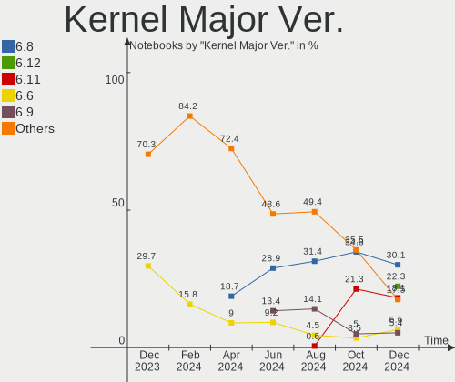
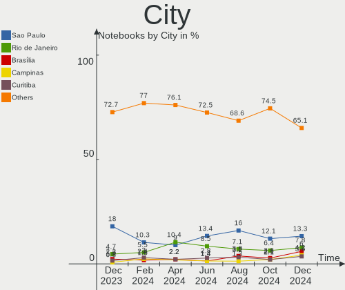
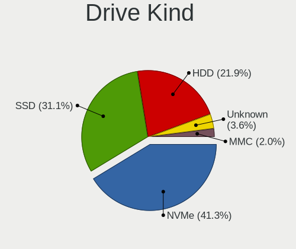
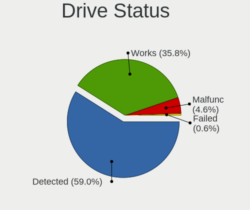
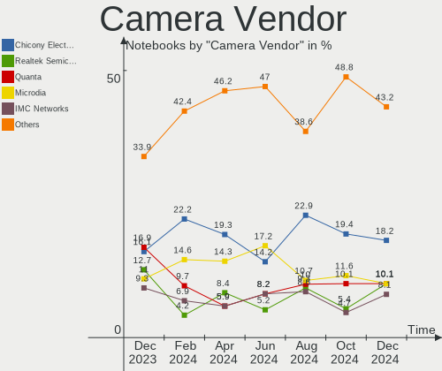

Linux in Brazil - Hardware Trends (Notebooks)
---------------------------------------------

A project to identify most popular hardware characteristics and track their change
over time based on data collected by Linux users at https://Linux-Hardware.org.

Anyone can contribute to this report by the [hw-probe](https://github.com/linuxhw/hw-probe) tool:

    sudo -E hw-probe -all -upload

Period: Jun, 2023.

Contents
--------

* [ System ](#system)
  - [ OS                       ](#os)
  - [ OS Family                ](#os-family)
  - [ Kernel                   ](#kernel)
  - [ Kernel Family            ](#kernel-family)
  - [ Kernel Major Ver.        ](#kernel-major-ver)
  - [ Arch                     ](#arch)
  - [ DE                       ](#de)
  - [ Display Server           ](#display-server)
  - [ Display Manager          ](#display-manager)
  - [ OS Lang                  ](#os-lang)
  - [ Boot Mode                ](#boot-mode)
  - [ Filesystem               ](#filesystem)
  - [ Part. scheme             ](#part-scheme)
  - [ Dual Boot with Linux/BSD ](#dual-boot-with-linuxbsd)
  - [ Dual Boot (Win)          ](#dual-boot-win)

* [ Board ](#board)
  - [ Vendor                   ](#vendor)
  - [ Model                    ](#model)
  - [ Model Family             ](#model-family)
  - [ MFG Year                 ](#mfg-year)
  - [ Form Factor              ](#form-factor)
  - [ Secure Boot              ](#secure-boot)
  - [ Coreboot                 ](#coreboot)
  - [ RAM Size                 ](#ram-size)
  - [ RAM Used                 ](#ram-used)
  - [ Total Drives             ](#total-drives)
  - [ Has CD-ROM               ](#has-cd-rom)
  - [ Has Ethernet             ](#has-ethernet)
  - [ Has WiFi                 ](#has-wifi)
  - [ Has Bluetooth            ](#has-bluetooth)

* [ Location ](#location)
  - [ Country                  ](#country)
  - [ City                     ](#city)

* [ Drives ](#drives)
  - [ Drive Vendor             ](#drive-vendor)
  - [ Drive Model              ](#drive-model)
  - [ HDD Vendor               ](#hdd-vendor)
  - [ SSD Vendor               ](#ssd-vendor)
  - [ Drive Kind               ](#drive-kind)
  - [ Drive Connector          ](#drive-connector)
  - [ Drive Size               ](#drive-size)
  - [ Space Total              ](#space-total)
  - [ Space Used               ](#space-used)
  - [ Malfunc. Drives          ](#malfunc-drives)
  - [ Malfunc. Drive Vendor    ](#malfunc-drive-vendor)
  - [ Malfunc. HDD Vendor      ](#malfunc-hdd-vendor)
  - [ Malfunc. Drive Kind      ](#malfunc-drive-kind)
  - [ Failed Drives            ](#failed-drives)
  - [ Failed Drive Vendor      ](#failed-drive-vendor)
  - [ Drive Status             ](#drive-status)

* [ Storage controller ](#storage-controller)
  - [ Storage Vendor           ](#storage-vendor)
  - [ Storage Model            ](#storage-model)
  - [ Storage Kind             ](#storage-kind)

* [ Processor ](#processor)
  - [ CPU Vendor               ](#cpu-vendor)
  - [ CPU Model                ](#cpu-model)
  - [ CPU Model Family         ](#cpu-model-family)
  - [ CPU Cores                ](#cpu-cores)
  - [ CPU Sockets              ](#cpu-sockets)
  - [ CPU Threads              ](#cpu-threads)
  - [ CPU Op-Modes             ](#cpu-op-modes)
  - [ CPU Microcode            ](#cpu-microcode)
  - [ CPU Microarch            ](#cpu-microarch)

* [ Graphics ](#graphics)
  - [ GPU Vendor               ](#gpu-vendor)
  - [ GPU Model                ](#gpu-model)
  - [ GPU Combo                ](#gpu-combo)
  - [ GPU Driver               ](#gpu-driver)
  - [ GPU Memory               ](#gpu-memory)

* [ Monitor ](#monitor)
  - [ Monitor Vendor           ](#monitor-vendor)
  - [ Monitor Model            ](#monitor-model)
  - [ Monitor Resolution       ](#monitor-resolution)
  - [ Monitor Diagonal         ](#monitor-diagonal)
  - [ Monitor Width            ](#monitor-width)
  - [ Aspect Ratio             ](#aspect-ratio)
  - [ Monitor Area             ](#monitor-area)
  - [ Pixel Density            ](#pixel-density)
  - [ Multiple Monitors        ](#multiple-monitors)

* [ Network ](#network)
  - [ Net Controller Vendor    ](#net-controller-vendor)
  - [ Net Controller Model     ](#net-controller-model)
  - [ Wireless Vendor          ](#wireless-vendor)
  - [ Wireless Model           ](#wireless-model)
  - [ Ethernet Vendor          ](#ethernet-vendor)
  - [ Ethernet Model           ](#ethernet-model)
  - [ Net Controller Kind      ](#net-controller-kind)
  - [ Used Controller          ](#used-controller)
  - [ NICs                     ](#nics)
  - [ IPv6                     ](#ipv6)

* [ Bluetooth ](#bluetooth)
  - [ Bluetooth Vendor         ](#bluetooth-vendor)
  - [ Bluetooth Model          ](#bluetooth-model)

* [ Sound ](#sound)
  - [ Sound Vendor             ](#sound-vendor)
  - [ Sound Model              ](#sound-model)

* [ Memory ](#memory)
  - [ Memory Vendor            ](#memory-vendor)
  - [ Memory Model             ](#memory-model)
  - [ Memory Kind              ](#memory-kind)
  - [ Memory Form Factor       ](#memory-form-factor)
  - [ Memory Size              ](#memory-size)
  - [ Memory Speed             ](#memory-speed)

* [ Printers & scanners ](#printers--scanners)
  - [ Printer Vendor           ](#printer-vendor)
  - [ Printer Model            ](#printer-model)
  - [ Scanner Vendor           ](#scanner-vendor)
  - [ Scanner Model            ](#scanner-model)

* [ Camera ](#camera)
  - [ Camera Vendor            ](#camera-vendor)
  - [ Camera Model             ](#camera-model)

* [ Security ](#security)
  - [ Fingerprint Vendor       ](#fingerprint-vendor)
  - [ Fingerprint Model        ](#fingerprint-model)
  - [ Chipcard Vendor          ](#chipcard-vendor)
  - [ Chipcard Model           ](#chipcard-model)

* [ Unsupported ](#unsupported)
  - [ Unsupported Devices      ](#unsupported-devices)
  - [ Unsupported Device Types ](#unsupported-device-types)

System
------

OS
--

Installed operating systems

| Name                         | Notebooks | Percent |
|------------------------------|-----------|---------|
| Linux Mint 21.1              | 18        | 12.08%  |
| Pop!_OS 22.04                | 14        | 9.4%    |
| Ubuntu 22.04                 | 12        | 8.05%   |
| Fedora 38                    | 11        | 7.38%   |
| Debian 12                    | 10        | 6.71%   |
| Arch Rolling                 | 8         | 5.37%   |
| Ubuntu 23.04                 | 6         | 4.03%   |
| OpenMandriva 23.03           | 6         | 4.03%   |
| Manjaro                      | 6         | 4.03%   |
| Debian 11                    | 5         | 3.36%   |
| Zorin 16                     | 4         | 2.68%   |
| Ubuntu 22.10                 | 4         | 2.68%   |
| Ubuntu 20.04                 | 4         | 2.68%   |
| Kali 2023.2                  | 4         | 2.68%   |
| openSUSE Tumbleweed-XXXXXXXX | 3         | 2.01%   |
| OpenMandriva 23.06           | 3         | 2.01%   |
| KDE neon 22.04               | 3         | 2.01%   |
| Endless 5.0.4                | 3         | 2.01%   |
| Manjaro 23.0.0               | 2         | 1.34%   |
| Linux Mint 20.3              | 2         | 1.34%   |
| Fedora 36                    | 2         | 1.34%   |
| ArcoLinux Rolling            | 2         | 1.34%   |
| Zorin 15                     | 1         | 0.67%   |
| Xubuntu 22.04                | 1         | 0.67%   |
| Ubuntu MATE 23.04            | 1         | 0.67%   |
| Ubuntu MATE 22.04            | 1         | 0.67%   |
| SteamOS 3.4.8                | 1         | 0.67%   |
| Solus 4.3                    | 1         | 0.67%   |
| OpenMandriva 4.3             | 1         | 0.67%   |
| OpenMandriva 23.01           | 1         | 0.67%   |
| Lubuntu 23.04                | 1         | 0.67%   |
| Linux Mint 20.2              | 1         | 0.67%   |
| Linux Mint 19.3              | 1         | 0.67%   |
| Kubuntu 22.04                | 1         | 0.67%   |
| Endless 5.0.1                | 1         | 0.67%   |
| Endless 3.9.7                | 1         | 0.67%   |
| EndeavourOS Rolling          | 1         | 0.67%   |
| BigLinux 23.0.0              | 1         | 0.67%   |
| BigLinux 2023-06-23_06-21    | 1         | 0.67%   |

OS Family
---------

OS without a version

| Name         | Notebooks | Percent |
|--------------|-----------|---------|
| Ubuntu       | 26        | 17.45%  |
| Linux Mint   | 22        | 14.77%  |
| Debian       | 15        | 10.07%  |
| Pop!_OS      | 14        | 9.4%    |
| Fedora       | 13        | 8.72%   |
| OpenMandriva | 11        | 7.38%   |
| Manjaro      | 8         | 5.37%   |
| Arch         | 8         | 5.37%   |
| Zorin        | 5         | 3.36%   |
| Endless      | 5         | 3.36%   |
| Kali         | 4         | 2.68%   |
| openSUSE     | 3         | 2.01%   |
| KDE neon     | 3         | 2.01%   |
| Ubuntu MATE  | 2         | 1.34%   |
| BigLinux     | 2         | 1.34%   |
| ArcoLinux    | 2         | 1.34%   |
| Xubuntu      | 1         | 0.67%   |
| SteamOS      | 1         | 0.67%   |
| Solus        | 1         | 0.67%   |
| Lubuntu      | 1         | 0.67%   |
| Kubuntu      | 1         | 0.67%   |
| EndeavourOS  | 1         | 0.67%   |

Kernel
------

Version of the Linux kernel

| Version                | Notebooks | Percent |
|------------------------|-----------|---------|
| 6.2.6-76060206-generic | 13        | 8.72%   |
| 5.15.0-73-generic      | 13        | 8.72%   |
| 5.19.0-43-generic      | 11        | 7.38%   |
| 6.1.0-9-amd64          | 10        | 6.71%   |
| 5.15.0-75-generic      | 8         | 5.37%   |
| 6.2.6-desktop-1omv2390 | 6         | 4.03%   |
| 6.1.31-2-MANJARO       | 6         | 4.03%   |
| 5.19.0-45-generic      | 5         | 3.36%   |
| 5.15.0-56-generic      | 5         | 3.36%   |
| 6.3.8-200.fc38.x86_64  | 4         | 2.68%   |
| 5.15.0-47-generic      | 4         | 2.68%   |
| 6.3.5-desktop-3omv2390 | 3         | 2.01%   |
| 6.2.0-23-generic       | 3         | 2.01%   |
| 6.2.0-20-generic       | 3         | 2.01%   |
| 6.1.30-1-MANJARO       | 3         | 2.01%   |
| 5.10.0-23-amd64        | 3         | 2.01%   |
| 6.3.6-arch1-1          | 2         | 1.34%   |
| 6.3.6-200.fc38.x86_64  | 2         | 1.34%   |
| 6.3.4-1-default        | 2         | 1.34%   |
| 6.2.0-24-generic       | 2         | 1.34%   |
| 6.1.0-kali9-amd64      | 2         | 1.34%   |
| 5.4.0-150-generic      | 2         | 1.34%   |
| 5.19.0-32-generic      | 2         | 1.34%   |
| 6.3.9-zen1-1-zen       | 1         | 0.67%   |
| 6.3.9-arch1-1          | 1         | 0.67%   |
| 6.3.9-200.fc38.x86_64  | 1         | 0.67%   |
| 6.3.9-1-default        | 1         | 0.67%   |
| 6.3.8-arch1-1          | 1         | 0.67%   |
| 6.3.7-arch1-1          | 1         | 0.67%   |
| 6.3.7-060307-generic   | 1         | 0.67%   |
| 6.3.5-zen2-1-zen       | 1         | 0.67%   |
| 6.3.5-arch1-1          | 1         | 0.67%   |
| 6.3.5-200.fc38.x86_64  | 1         | 0.67%   |
| 6.3.4-arch1-1          | 1         | 0.67%   |
| 6.3.4-201.fc38.x86_64  | 1         | 0.67%   |
| 6.2.2-arch1-1          | 1         | 0.67%   |
| 6.2.15-300.fc38.x86_64 | 1         | 0.67%   |
| 6.2.15-100.fc36.x86_64 | 1         | 0.67%   |
| 6.2.14-300.fc38.x86_64 | 1         | 0.67%   |
| 6.2.12-100.fc36.x86_64 | 1         | 0.67%   |

Kernel Family
-------------

Linux kernel without a distro release

| Version  | Notebooks | Percent |
|----------|-----------|---------|
| 5.15.0   | 30        | 20.13%  |
| 5.19.0   | 21        | 14.09%  |
| 6.2.6    | 19        | 12.75%  |
| 6.1.0    | 14        | 9.4%    |
| 6.2.0    | 8         | 5.37%   |
| 6.3.5    | 6         | 4.03%   |
| 6.1.31   | 6         | 4.03%   |
| 6.3.8    | 5         | 3.36%   |
| 5.4.0    | 5         | 3.36%   |
| 5.10.0   | 5         | 3.36%   |
| 6.3.9    | 4         | 2.68%   |
| 6.3.6    | 4         | 2.68%   |
| 6.3.4    | 4         | 2.68%   |
| 6.1.30   | 3         | 2.01%   |
| 6.3.7    | 2         | 1.34%   |
| 6.2.15   | 2         | 1.34%   |
| 6.2.2    | 1         | 0.67%   |
| 6.2.14   | 1         | 0.67%   |
| 6.2.12   | 1         | 0.67%   |
| 6.1.33   | 1         | 0.67%   |
| 6.1.1    | 1         | 0.67%   |
| 6.0.12   | 1         | 0.67%   |
| 5.8.0    | 1         | 0.67%   |
| 5.16.7   | 1         | 0.67%   |
| 5.15.114 | 1         | 0.67%   |
| 5.13.1   | 1         | 0.67%   |
| 5.13.0   | 1         | 0.67%   |

Kernel Major Ver.
-----------------

Linux kernel major version

| Version | Notebooks | Percent |
|---------|-----------|---------|
| 6.2     | 32        | 21.48%  |
| 5.15    | 31        | 20.81%  |
| 6.3     | 25        | 16.78%  |
| 6.1     | 25        | 16.78%  |
| 5.19    | 21        | 14.09%  |
| 5.4     | 5         | 3.36%   |
| 5.10    | 5         | 3.36%   |
| 5.13    | 2         | 1.34%   |
| 6.0     | 1         | 0.67%   |
| 5.8     | 1         | 0.67%   |
| 5.16    | 1         | 0.67%   |

Arch
----

OS architecture (x86_64, i586, etc.)

| Name   | Notebooks | Percent |
|--------|-----------|---------|
| x86_64 | 148       | 99.33%  |
| i686   | 1         | 0.67%   |

DE
--

Desktop Environment

| Name       | Notebooks | Percent |
|------------|-----------|---------|
| GNOME      | 78        | 52.35%  |
| KDE5       | 29        | 19.46%  |
| X-Cinnamon | 17        | 11.41%  |
| XFCE       | 14        | 9.4%    |
| MATE       | 6         | 4.03%   |
| Unknown    | 2         | 1.34%   |
| LXQt       | 1         | 0.67%   |
| i3         | 1         | 0.67%   |
| Budgie     | 1         | 0.67%   |

Display Server
--------------

X11 or Wayland

| Name    | Notebooks | Percent |
|---------|-----------|---------|
| X11     | 108       | 72.48%  |
| Wayland | 39        | 26.17%  |
| Tty     | 1         | 0.67%   |
| Unknown | 1         | 0.67%   |

Display Manager
---------------

SDDM, LightDM, etc.

| Name    | Notebooks | Percent |
|---------|-----------|---------|
| Unknown | 70        | 46.98%  |
| GDM3    | 31        | 20.81%  |
| LightDM | 23        | 15.44%  |
| SDDM    | 19        | 12.75%  |
| GDM     | 6         | 4.03%   |

OS Lang
-------

Language

| Lang    | Notebooks | Percent |
|---------|-----------|---------|
| pt_BR   | 101       | 67.79%  |
| en_US   | 41        | 27.52%  |
| en_GB   | 2         | 1.34%   |
| pt_PT   | 1         | 0.67%   |
| pt_BR~  | 1         | 0.67%   |
| en_CA   | 1         | 0.67%   |
| C       | 1         | 0.67%   |
| Unknown | 1         | 0.67%   |

Boot Mode
---------

EFI or BIOS

| Mode | Notebooks | Percent |
|------|-----------|---------|
| BIOS | 76        | 51.01%  |
| EFI  | 73        | 48.99%  |

Filesystem
----------

Type of filesystem

| Type    | Notebooks | Percent |
|---------|-----------|---------|
| Ext4    | 96        | 64.43%  |
| Btrfs   | 23        | 15.44%  |
| Tmpfs   | 17        | 11.41%  |
| Overlay | 11        | 7.38%   |
| Xfs     | 2         | 1.34%   |

Part. scheme
------------

Scheme of partitioning

| Type    | Notebooks | Percent |
|---------|-----------|---------|
| Unknown | 69        | 46.31%  |
| GPT     | 66        | 44.3%   |
| MBR     | 14        | 9.4%    |

Dual Boot with Linux/BSD
------------------------

Hosting more than one Linux/BSD

| Dual boot | Notebooks | Percent |
|-----------|-----------|---------|
| No        | 138       | 92.62%  |
| Yes       | 11        | 7.38%   |

Dual Boot (Win)
---------------

Hosting Linux and Windows

| Dual boot | Notebooks | Percent |
|-----------|-----------|---------|
| No        | 114       | 76.51%  |
| Yes       | 35        | 23.49%  |

Board
-----

Vendor
------

Motherboard manufacturer

| Name                   | Notebooks | Percent |
|------------------------|-----------|---------|
| Dell                   | 37        | 24.83%  |
| Acer                   | 24        | 16.11%  |
| Lenovo                 | 22        | 14.77%  |
| Samsung Electronics    | 13        | 8.72%   |
| ASUSTek Computer       | 8         | 5.37%   |
| Positivo               | 7         | 4.7%    |
| Hewlett-Packard        | 6         | 4.03%   |
| Apple                  | 5         | 3.36%   |
| Sony                   | 4         | 2.68%   |
| Semp Toshiba           | 3         | 2.01%   |
| eMachines              | 3         | 2.01%   |
| Toshiba                | 2         | 1.34%   |
| Positivo Bahia - VAIO  | 2         | 1.34%   |
| Daten Tecnologia       | 2         | 1.34%   |
| Compaq                 | 2         | 1.34%   |
| Valve                  | 1         | 0.67%   |
| System76               | 1         | 0.67%   |
| Notebook               | 1         | 0.67%   |
| Multilaser             | 1         | 0.67%   |
| Google                 | 1         | 0.67%   |
| Digibras               | 1         | 0.67%   |
| Clevo                  | 1         | 0.67%   |
| Avell High Performance | 1         | 0.67%   |
| Unknown                | 1         | 0.67%   |

Model
-----

Motherboard model

| Name                                        | Notebooks | Percent |
|---------------------------------------------|-----------|---------|
| Samsung 550XCJ/550XCR                       | 3         | 2.01%   |
| Positivo Mobile                             | 3         | 2.01%   |
| Lenovo IdeaPad S145-15IWL 81S9              | 3         | 2.01%   |
| Dell G15 5520                               | 3         | 2.01%   |
| ASUS VivoBook_ASUSLaptop X515DA_X515DA      | 3         | 2.01%   |
| Semp Toshiba IS 1413G                       | 2         | 1.34%   |
| Samsung 670Z5E                              | 2         | 1.34%   |
| Positivo Bahia - VAIO VJFE43F11X-XXXXXX     | 2         | 1.34%   |
| Lenovo IdeaPad S145-15API 81V7              | 2         | 1.34%   |
| Dell Vostro 15 3510                         | 2         | 1.34%   |
| Dell Latitude 3420                          | 2         | 1.34%   |
| Dell Inspiron N4030                         | 2         | 1.34%   |
| Dell Inspiron 3583                          | 2         | 1.34%   |
| Dell Inspiron 3501                          | 2         | 1.34%   |
| Acer Nitro AN515-44                         | 2         | 1.34%   |
| Valve Jupiter                               | 1         | 0.67%   |
| Toshiba Satellite C855-233                  | 1         | 0.67%   |
| Toshiba PORTEGE R500                        | 1         | 0.67%   |
| System76 Gazelle                            | 1         | 0.67%   |
| Sony VPCEA23FB                              | 1         | 0.67%   |
| Sony VPCCA15FX                              | 1         | 0.67%   |
| Sony SVF15213CBW                            | 1         | 0.67%   |
| Sony SVE17137CXB                            | 1         | 0.67%   |
| Semp Toshiba IS 1412                        | 1         | 0.67%   |
| Samsung RV411/RV511/E3511/S3511/RV711/E3411 | 1         | 0.67%   |
| Samsung 950XEE                              | 1         | 0.67%   |
| Samsung 550XDA                              | 1         | 0.67%   |
| Samsung 340XAA/350XAA/550XAA                | 1         | 0.67%   |
| Samsung 305U1A                              | 1         | 0.67%   |
| Samsung 300E5M/300E5L                       | 1         | 0.67%   |
| Samsung 300E5K/300E5Q                       | 1         | 0.67%   |
| Samsung 270E5K/270E5Q/271E5K/2570EK         | 1         | 0.67%   |
| Positivo S14CT01                            | 1         | 0.67%   |
| Positivo Q4128C-S                           | 1         | 0.67%   |
| Positivo H14CU02                            | 1         | 0.67%   |
| Positivo C14CR01                            | 1         | 0.67%   |
| Notebook NJx0MU                             | 1         | 0.67%   |
| Multilaser MLSH1H LINUX                     | 1         | 0.67%   |
| Lenovo V15 G2 ITL 82ME                      | 1         | 0.67%   |
| Lenovo V14 G2 ITL 82NM                      | 1         | 0.67%   |

Model Family
------------

Motherboard model prefix

| Name                                    | Notebooks | Percent |
|-----------------------------------------|-----------|---------|
| Dell Inspiron                           | 19        | 12.75%  |
| Lenovo IdeaPad                          | 15        | 10.07%  |
| Acer Aspire                             | 13        | 8.72%   |
| Acer Nitro                              | 8         | 5.37%   |
| Dell Vostro                             | 6         | 4.03%   |
| Dell Latitude                           | 6         | 4.03%   |
| ASUS VivoBook                           | 5         | 3.36%   |
| Lenovo ThinkPad                         | 4         | 2.68%   |
| Semp Toshiba IS                         | 3         | 2.01%   |
| Samsung 550XCJ                          | 3         | 2.01%   |
| Positivo Mobile                         | 3         | 2.01%   |
| HP Pavilion                             | 3         | 2.01%   |
| Dell G15                                | 3         | 2.01%   |
| Samsung 670Z5E                          | 2         | 1.34%   |
| Positivo Bahia - VAIO VJFE43F11X-XXXXXX | 2         | 1.34%   |
| Acer Predator                           | 2         | 1.34%   |
| Valve Jupiter                           | 1         | 0.67%   |
| Toshiba Satellite                       | 1         | 0.67%   |
| Toshiba PORTEGE                         | 1         | 0.67%   |
| System76 Gazelle                        | 1         | 0.67%   |
| Sony VPCEA23FB                          | 1         | 0.67%   |
| Sony VPCCA15FX                          | 1         | 0.67%   |
| Sony SVF15213CBW                        | 1         | 0.67%   |
| Sony SVE17137CXB                        | 1         | 0.67%   |
| Samsung RV411                           | 1         | 0.67%   |
| Samsung 950XEE                          | 1         | 0.67%   |
| Samsung 550XDA                          | 1         | 0.67%   |
| Samsung 340XAA                          | 1         | 0.67%   |
| Samsung 305U1A                          | 1         | 0.67%   |
| Samsung 300E5M                          | 1         | 0.67%   |
| Samsung 300E5K                          | 1         | 0.67%   |
| Samsung 270E5K                          | 1         | 0.67%   |
| Positivo S14CT01                        | 1         | 0.67%   |
| Positivo Q4128C-S                       | 1         | 0.67%   |
| Positivo H14CU02                        | 1         | 0.67%   |
| Positivo C14CR01                        | 1         | 0.67%   |
| Notebook NJx0MU                         | 1         | 0.67%   |
| Multilaser MLSH1H                       | 1         | 0.67%   |
| Lenovo V15                              | 1         | 0.67%   |
| Lenovo V14                              | 1         | 0.67%   |

MFG Year
--------

Motherboard manufacture year

| Year    | Notebooks | Percent |
|---------|-----------|---------|
| 2021    | 21        | 14.09%  |
| 2020    | 20        | 13.42%  |
| 2019    | 17        | 11.41%  |
| 2013    | 13        | 8.72%   |
| 2012    | 11        | 7.38%   |
| 2011    | 10        | 6.71%   |
| 2022    | 9         | 6.04%   |
| 2017    | 9         | 6.04%   |
| 2018    | 6         | 4.03%   |
| 2010    | 6         | 4.03%   |
| 2016    | 5         | 3.36%   |
| 2015    | 5         | 3.36%   |
| 2014    | 5         | 3.36%   |
| 2009    | 5         | 3.36%   |
| 2008    | 4         | 2.68%   |
| 2023    | 1         | 0.67%   |
| 2007    | 1         | 0.67%   |
| Unknown | 1         | 0.67%   |

Form Factor
-----------

Physical design of the computer

| Name     | Notebooks | Percent |
|----------|-----------|---------|
| Notebook | 149       | 100%    |

Secure Boot
-----------

Enabled or disabled

| State    | Notebooks | Percent |
|----------|-----------|---------|
| Disabled | 132       | 88.59%  |
| Enabled  | 17        | 11.41%  |

Coreboot
--------

Have coreboot on board

| Used | Notebooks | Percent |
|------|-----------|---------|
| No   | 148       | 99.33%  |
| Yes  | 1         | 0.67%   |

RAM Size
--------

Total RAM memory

| Size in GB | Notebooks | Percent |
|------------|-----------|---------|
| 4.01-8.0   | 46        | 30.87%  |
| 3.01-4.0   | 33        | 22.15%  |
| 16.01-24.0 | 30        | 20.13%  |
| 8.01-16.0  | 18        | 12.08%  |
| 32.01-64.0 | 11        | 7.38%   |
| 1.01-2.0   | 7         | 4.7%    |
| 2.01-3.0   | 3         | 2.01%   |
| 24.01-32.0 | 1         | 0.67%   |

RAM Used
--------

Used RAM memory

| Used GB    | Notebooks | Percent |
|------------|-----------|---------|
| 1.01-2.0   | 43        | 28.86%  |
| 2.01-3.0   | 40        | 26.85%  |
| 4.01-8.0   | 28        | 18.79%  |
| 3.01-4.0   | 24        | 16.11%  |
| 8.01-16.0  | 6         | 4.03%   |
| 0.51-1.0   | 5         | 3.36%   |
| 16.01-24.0 | 2         | 1.34%   |
| 0.01-0.5   | 1         | 0.67%   |

Total Drives
------------

Number of drives on board

| Drives | Notebooks | Percent |
|--------|-----------|---------|
| 1      | 107       | 71.81%  |
| 2      | 39        | 26.17%  |
| 3      | 3         | 2.01%   |

Has CD-ROM
----------

Has CD-ROM on board

| Presented | Notebooks | Percent |
|-----------|-----------|---------|
| No        | 111       | 74.5%   |
| Yes       | 38        | 25.5%   |

Has Ethernet
------------

Has Ethernet on board

| Presented | Notebooks | Percent |
|-----------|-----------|---------|
| Yes       | 129       | 86.58%  |
| No        | 20        | 13.42%  |

Has WiFi
--------

Has WiFi module

| Presented | Notebooks | Percent |
|-----------|-----------|---------|
| Yes       | 143       | 95.97%  |
| No        | 6         | 4.03%   |

Has Bluetooth
-------------

Has Bluetooth module

| Presented | Notebooks | Percent |
|-----------|-----------|---------|
| Yes       | 113       | 75.84%  |
| No        | 36        | 24.16%  |

Location
--------

Country
-------

Geographic location (country)

| Country | Notebooks | Percent |
|---------|-----------|---------|
| Brazil  | 149       | 100%    |

City
----

Geographic location (city)

| City                  | Notebooks | Percent |
|-----------------------|-----------|---------|
| Sao Paulo             | 20        | 13.42%  |
| Rio de Janeiro        | 8         | 5.37%   |
| Brasília             | 8         | 5.37%   |
| Porto Alegre          | 7         | 4.7%    |
| Fortaleza             | 6         | 4.03%   |
| Vila Velha            | 5         | 3.36%   |
| Osasco                | 5         | 3.36%   |
| Belo Horizonte        | 5         | 3.36%   |
| Natal                 | 4         | 2.68%   |
| Maceió               | 3         | 2.01%   |
| Curitiba              | 3         | 2.01%   |
| Uberlândia           | 2         | 1.34%   |
| Sao Goncalo           | 2         | 1.34%   |
| Salvador              | 2         | 1.34%   |
| Praia Grande          | 2         | 1.34%   |
| Manaus                | 2         | 1.34%   |
| Londrina              | 2         | 1.34%   |
| Joao Pessoa           | 2         | 1.34%   |
| Goiânia              | 2         | 1.34%   |
| Araçatuba            | 2         | 1.34%   |
| Xanxere               | 1         | 0.67%   |
| Volta Redonda         | 1         | 0.67%   |
| Vitória              | 1         | 0.67%   |
| Vilhena               | 1         | 0.67%   |
| Vespasiano            | 1         | 0.67%   |
| Varginha              | 1         | 0.67%   |
| Uruguaiana            | 1         | 0.67%   |
| Sete Lagoas           | 1         | 0.67%   |
| Sapucaia do Sul       | 1         | 0.67%   |
| Sao Luís             | 1         | 0.67%   |
| Sao José dos Campos  | 1         | 0.67%   |
| Sao Jose do Rio Preto | 1         | 0.67%   |
| Sao Joao Nepomuceno   | 1         | 0.67%   |
| Sao Carlos            | 1         | 0.67%   |
| Santos                | 1         | 0.67%   |
| Santa Luzia           | 1         | 0.67%   |
| Rolante               | 1         | 0.67%   |
| Presidente Prudente   | 1         | 0.67%   |
| Ponta Grossa          | 1         | 0.67%   |
| Petrópolis           | 1         | 0.67%   |

Drives
------

Drive Vendor
------------

Hard drive vendors

| Vendor                         | Notebooks | Drives | Percent |
|--------------------------------|-----------|--------|---------|
| WDC                            | 26        | 27     | 14.21%  |
| Seagate                        | 19        | 19     | 10.38%  |
| Kingston                       | 17        | 17     | 9.29%   |
| Samsung Electronics            | 11        | 13     | 6.01%   |
| China                          | 11        | 12     | 6.01%   |
| A-DATA Technology              | 10        | 10     | 5.46%   |
| Sandisk                        | 9         | 10     | 4.92%   |
| Toshiba                        | 8         | 8      | 4.37%   |
| ADATA Technology               | 8         | 8      | 4.37%   |
| Unknown                        | 5         | 5      | 2.73%   |
| SK hynix                       | 5         | 5      | 2.73%   |
| SSSTC                          | 4         | 4      | 2.19%   |
| Solid State Storage            | 4         | 4      | 2.19%   |
| Silicon Motion                 | 4         | 4      | 2.19%   |
| KingSpec                       | 4         | 4      | 2.19%   |
| PNY                            | 3         | 3      | 1.64%   |
| Kingston Technology Company    | 3         | 3      | 1.64%   |
| Intel                          | 3         | 3      | 1.64%   |
| Crucial                        | 3         | 3      | 1.64%   |
| Apple                          | 3         | 3      | 1.64%   |
| Solid State Storage Technology | 2         | 2      | 1.09%   |
| KIOXIA                         | 2         | 2      | 1.09%   |
| JMicron Technology             | 2         | 2      | 1.09%   |
| XrayDisk                       | 1         | 1      | 0.55%   |
| XPG                            | 1         | 1      | 0.55%   |
| Win Memory                     | 1         | 1      | 0.55%   |
| Super Talent                   | 1         | 1      | 0.55%   |
| ShiJi                          | 1         | 1      | 0.55%   |
| Realtek Semiconductor          | 1         | 1      | 0.55%   |
| Phison                         | 1         | 1      | 0.55%   |
| Netac                          | 1         | 1      | 0.55%   |
| Micron Technology              | 1         | 1      | 0.55%   |
| MAXIO Technology (Hangzhou)    | 1         | 1      | 0.55%   |
| LITEONIT                       | 1         | 1      | 0.55%   |
| LITEON                         | 1         | 1      | 0.55%   |
| Lenovo                         | 1         | 1      | 0.55%   |
| Hitachi                        | 1         | 1      | 0.55%   |
| HGST                           | 1         | 1      | 0.55%   |
| Hewlett-Packard                | 1         | 1      | 0.55%   |
| Unknown                        | 1         | 1      | 0.55%   |

Drive Model
-----------

Hard drive models

| Model                                                 | Notebooks | Percent |
|-------------------------------------------------------|-----------|---------|
| Kingston SA400S37240G 240GB SSD                       | 8         | 4.28%   |
| Seagate ST9500325AS 500GB                             | 4         | 2.14%   |
| A-DATA IM2P33F3A NVMe 256GB                           | 4         | 2.14%   |
| WDC WD10SPZX-21Z10T0 1TB                              | 3         | 1.6%    |
| Toshiba MQ04ABF100 1TB                                | 3         | 1.6%    |
| Solid State Storage SSSTC CL1-4D256 256GB             | 3         | 1.6%    |
| Silicon Motion SM2263EN/SM2263XT SSD Controller 256GB | 3         | 1.6%    |
| Seagate ST1000LM024 HN-M101MBB 1TB                    | 3         | 1.6%    |
| PNY CS900 240GB SSD                                   | 3         | 1.6%    |
| China SSD 120GB                                       | 3         | 1.6%    |
| ADATA SM2P32A8-256GC1 256GB                           | 3         | 1.6%    |
| WDC WDS240G2G0A-00JH30 240GB SSD                      | 2         | 1.07%   |
| WDC WD5000LPVX-80V0TT0 500GB                          | 2         | 1.07%   |
| WDC WD10SPZX-35Z10T0 1TB                              | 2         | 1.07%   |
| WDC WD10SPZX-24Z10 1TB                                | 2         | 1.07%   |
| WDC WD10JPVX-22JC3T0 1TB                              | 2         | 1.07%   |
| Unknown MMC Card  32GB                                | 2         | 1.07%   |
| Toshiba MQ01ABD100 1TB                                | 2         | 1.07%   |
| SSSTC CL1-8D128 128GB                                 | 2         | 1.07%   |
| SK hynix BC511 256GB                                  | 2         | 1.07%   |
| Seagate ST500LM012 HN-M500MBB 500GB                   | 2         | 1.07%   |
| Seagate ST320LM001 HN-M320MBB 320GB                   | 2         | 1.07%   |
| Seagate ST1000LM035-1RK172 1TB                        | 2         | 1.07%   |
| Sandisk WD Blue SN550 NVMe SSD 1TB                    | 2         | 1.07%   |
| Kingston Company SNV2S1000G 1TB                       | 2         | 1.07%   |
| JMicron Generic 240GB                                 | 2         | 1.07%   |
| China SSD 256GB                                       | 2         | 1.07%   |
| China SSD 128GB                                       | 2         | 1.07%   |
| China SATA SSD 240GB                                  | 2         | 1.07%   |
| ADATA NVMe IM2P33F4 256GB                             | 2         | 1.07%   |
| A-DATA IM2P33F8BR1-128GB                              | 2         | 1.07%   |
| A-DATA IM2P33F8ABR2-256GB                             | 2         | 1.07%   |
| XrayDisk 120GB                                        | 1         | 0.53%   |
| XPG NVMe SSD Drive 1024GB                             | 1         | 0.53%   |
| Win Memory SWR256G-301II 256GB                        | 1         | 0.53%   |
| WDC WDS500G2B0A-00SM50 500GB SSD                      | 1         | 0.53%   |
| WDC WDS480G2G0A-00JH30 480GB SSD                      | 1         | 0.53%   |
| WDC WDS120G1G0A-00SS50 120GB SSD                      | 1         | 0.53%   |
| WDC WDS100T2G0A-00JH30 1TB SSD                        | 1         | 0.53%   |
| WDC WD5000LPVX-75V0TT0 500GB                          | 1         | 0.53%   |

HDD Vendor
----------

Hard disk drive vendors

| Vendor              | Notebooks | Drives | Percent |
|---------------------|-----------|--------|---------|
| WDC                 | 20        | 20     | 40%     |
| Seagate             | 19        | 19     | 38%     |
| Toshiba             | 7         | 7      | 14%     |
| Samsung Electronics | 2         | 2      | 4%      |
| Hitachi             | 1         | 1      | 2%      |
| HGST                | 1         | 1      | 2%      |

SSD Vendor
----------

Solid state drive vendors

| Vendor              | Notebooks | Drives | Percent |
|---------------------|-----------|--------|---------|
| Kingston            | 15        | 15     | 23.81%  |
| China               | 11        | 12     | 17.46%  |
| WDC                 | 6         | 6      | 9.52%   |
| SanDisk             | 4         | 4      | 6.35%   |
| Samsung Electronics | 4         | 5      | 6.35%   |
| KingSpec            | 4         | 4      | 6.35%   |
| PNY                 | 3         | 3      | 4.76%   |
| Crucial             | 3         | 3      | 4.76%   |
| Apple               | 3         | 3      | 4.76%   |
| Win Memory          | 1         | 1      | 1.59%   |
| Toshiba             | 1         | 1      | 1.59%   |
| Super Talent        | 1         | 1      | 1.59%   |
| Netac               | 1         | 1      | 1.59%   |
| LITEONIT            | 1         | 1      | 1.59%   |
| LITEON              | 1         | 1      | 1.59%   |
| Lenovo              | 1         | 1      | 1.59%   |
| Intel               | 1         | 1      | 1.59%   |
| Hewlett-Packard     | 1         | 1      | 1.59%   |
| A-DATA Technology   | 1         | 1      | 1.59%   |

Drive Kind
----------

HDD or SSD

| Kind    | Notebooks | Drives | Percent |
|---------|-----------|--------|---------|
| NVMe    | 59        | 67     | 34.3%   |
| SSD     | 57        | 65     | 33.14%  |
| HDD     | 50        | 50     | 29.07%  |
| MMC     | 4         | 4      | 2.33%   |
| Unknown | 2         | 2      | 1.16%   |

Drive Connector
---------------

SATA, SAS, NVMe, etc.

| Type | Notebooks | Drives | Percent |
|------|-----------|--------|---------|
| SATA | 101       | 115    | 60.48%  |
| NVMe | 58        | 65     | 34.73%  |
| SAS  | 4         | 4      | 2.4%    |
| MMC  | 4         | 4      | 2.4%    |

Drive Size
----------

Size of hard drive

| Size in TB | Notebooks | Drives | Percent |
|------------|-----------|--------|---------|
| 0.01-0.5   | 76        | 82     | 69.72%  |
| 0.51-1.0   | 30        | 30     | 27.52%  |
| 1.01-2.0   | 2         | 2      | 1.83%   |
| 4.01-10.0  | 1         | 1      | 0.92%   |

Space Total
-----------

Amount of disk space available on the file system

| Size in GB     | Notebooks | Percent |
|----------------|-----------|---------|
| 101-250        | 48        | 32.21%  |
| 251-500        | 32        | 21.48%  |
| 501-1000       | 19        | 12.75%  |
| 1001-2000      | 12        | 8.05%   |
| 1-20           | 12        | 8.05%   |
| 21-50          | 10        | 6.71%   |
| 51-100         | 8         | 5.37%   |
| Unknown        | 4         | 2.68%   |
| More than 3000 | 2         | 1.34%   |
| 2001-3000      | 2         | 1.34%   |

Space Used
----------

Amount of used disk space

| Used GB        | Notebooks | Percent |
|----------------|-----------|---------|
| 1-20           | 52        | 34.9%   |
| 21-50          | 33        | 22.15%  |
| 101-250        | 20        | 13.42%  |
| 51-100         | 20        | 13.42%  |
| 501-1000       | 11        | 7.38%   |
| 251-500        | 5         | 3.36%   |
| Unknown        | 4         | 2.68%   |
| More than 3000 | 2         | 1.34%   |
| 1001-2000      | 1         | 0.67%   |
| 0              | 1         | 0.67%   |

Malfunc. Drives
---------------

Drive models with a malfunction

| Model                              | Notebooks | Drives | Percent |
|------------------------------------|-----------|--------|---------|
| Seagate ST1000LM024 HN-M101MBB 1TB | 2         | 2      | 15.38%  |
| WDC WD5000LPVX-80V0TT0 500GB       | 1         | 1      | 7.69%   |
| WDC WD3200BPVT-24JJ5T0 320GB       | 1         | 1      | 7.69%   |
| Toshiba MQ04ABF100 1TB             | 1         | 1      | 7.69%   |
| Toshiba MK8037GSX 80GB             | 1         | 1      | 7.69%   |
| Silicon Motion NE-256 256GB        | 1         | 1      | 7.69%   |
| ShiJi 1TB                          | 1         | 1      | 7.69%   |
| LITEON CV8-8E128-HP 128GB SSD      | 1         | 1      | 7.69%   |
| Hitachi HTS545032B9A300 320GB      | 1         | 1      | 7.69%   |
| HGST HTS545050A7E680 500GB         | 1         | 1      | 7.69%   |
| China SSD 240GB                    | 1         | 1      | 7.69%   |
| China SSD 120GB                    | 1         | 1      | 7.69%   |

Malfunc. Drive Vendor
---------------------

Vendors of faulty drives

| Vendor         | Notebooks | Drives | Percent |
|----------------|-----------|--------|---------|
| WDC            | 2         | 2      | 15.38%  |
| Toshiba        | 2         | 2      | 15.38%  |
| Seagate        | 2         | 2      | 15.38%  |
| China          | 2         | 2      | 15.38%  |
| Silicon Motion | 1         | 1      | 7.69%   |
| ShiJi          | 1         | 1      | 7.69%   |
| LITEON         | 1         | 1      | 7.69%   |
| Hitachi        | 1         | 1      | 7.69%   |
| HGST           | 1         | 1      | 7.69%   |

Malfunc. HDD Vendor
-------------------

Vendors of faulty HDD drives

| Vendor  | Notebooks | Drives | Percent |
|---------|-----------|--------|---------|
| WDC     | 2         | 2      | 25%     |
| Toshiba | 2         | 2      | 25%     |
| Seagate | 2         | 2      | 25%     |
| Hitachi | 1         | 1      | 12.5%   |
| HGST    | 1         | 1      | 12.5%   |

Malfunc. Drive Kind
-------------------

Kinds of faulty drives

| Kind | Notebooks | Drives | Percent |
|------|-----------|--------|---------|
| HDD  | 8         | 8      | 61.54%  |
| SSD  | 3         | 3      | 23.08%  |
| NVMe | 2         | 2      | 15.38%  |

Failed Drives
-------------

Failed drive models

Zero info for selected period =(

Failed Drive Vendor
-------------------

Failed drive vendors

Zero info for selected period =(

Drive Status
------------

Number of failed and malfunc. drives

| Status   | Notebooks | Drives | Percent |
|----------|-----------|--------|---------|
| Detected | 92        | 114    | 59.74%  |
| Works    | 49        | 61     | 31.82%  |
| Malfunc  | 13        | 13     | 8.44%   |

Storage controller
------------------

Storage Vendor
--------------

Storage controller vendors

| Vendor                           | Notebooks | Percent |
|----------------------------------|-----------|---------|
| Intel                            | 113       | 57.65%  |
| AMD                              | 18        | 9.18%   |
| ADATA Technology                 | 17        | 8.67%   |
| Solid State Storage Technology   | 10        | 5.1%    |
| SanDisk                          | 6         | 3.06%   |
| Samsung Electronics              | 6         | 3.06%   |
| SK hynix                         | 5         | 2.55%   |
| Silicon Motion                   | 5         | 2.55%   |
| Kingston Technology Company      | 5         | 2.55%   |
| KIOXIA                           | 2         | 1.02%   |
| TenaFe                           | 1         | 0.51%   |
| Silicon Integrated Systems [SiS] | 1         | 0.51%   |
| Realtek Semiconductor            | 1         | 0.51%   |
| Phison Electronics               | 1         | 0.51%   |
| Nvidia                           | 1         | 0.51%   |
| Micron Technology                | 1         | 0.51%   |
| MAXIO Technology (Hangzhou)      | 1         | 0.51%   |
| Marvell Technology Group         | 1         | 0.51%   |
| INNOGRIT                         | 1         | 0.51%   |

Storage Model
-------------

Storage controller models

| Model                                                                            | Notebooks | Percent |
|----------------------------------------------------------------------------------|-----------|---------|
| AMD FCH SATA Controller [AHCI mode]                                              | 16        | 7.58%   |
| Intel 7 Series Chipset Family 6-port SATA Controller [AHCI mode]                 | 14        | 6.64%   |
| Intel Tiger Lake-LP SATA Controller                                              | 13        | 6.16%   |
| Intel Sunrise Point-LP SATA Controller [AHCI mode]                               | 13        | 6.16%   |
| Solid State Storage CL1-3D256-Q11 NVMe SSD M.2                                   | 10        | 4.74%   |
| Intel 6 Series/C200 Series Chipset Family 6 port Mobile SATA AHCI Controller     | 8         | 3.79%   |
| ADATA A Non-Volatile memory controller                                           | 8         | 3.79%   |
| Intel Volume Management Device NVMe RAID Controller                              | 7         | 3.32%   |
| Intel 8 Series SATA Controller 1 [AHCI mode]                                     | 7         | 3.32%   |
| Intel 82801 Mobile SATA Controller [RAID mode]                                   | 6         | 2.84%   |
| Silicon Motion SM2263EN/SM2263XT SSD Controller                                  | 5         | 2.37%   |
| Intel Comet Lake SATA AHCI Controller                                            | 5         | 2.37%   |
| Intel Cannon Point-LP SATA Controller [AHCI Mode]                                | 5         | 2.37%   |
| Intel 82801IBM/IEM (ICH9M/ICH9M-E) 4 port SATA Controller [AHCI mode]            | 5         | 2.37%   |
| ADATA Non-Volatile memory controller                                             | 5         | 2.37%   |
| Intel Wildcat Point-LP SATA Controller [AHCI Mode]                               | 4         | 1.9%    |
| Intel Ice Lake-LP SATA Controller [AHCI mode]                                    | 4         | 1.9%    |
| Intel Cannon Lake Mobile PCH SATA AHCI Controller                                | 4         | 1.9%    |
| ADATA IM2P33F8ABR1 NVMe SSD                                                      | 4         | 1.9%    |
| SanDisk WD Blue SN550 NVMe SSD                                                   | 3         | 1.42%   |
| Samsung NVMe SSD Controller 980                                                  | 3         | 1.42%   |
| Intel HM170/QM170 Chipset SATA Controller [AHCI Mode]                            | 3         | 1.42%   |
| Intel 82801IBM/IEM (ICH9M/ICH9M-E) 2 port SATA Controller [IDE mode]             | 3         | 1.42%   |
| Intel 5 Series/3400 Series Chipset 6 port SATA AHCI Controller                   | 3         | 1.42%   |
| SK hynix BC511 NVMe SSD                                                          | 2         | 0.95%   |
| SK hynix BC501 NVMe Solid State Drive                                            | 2         | 0.95%   |
| SanDisk WD PC SN810 / Black SN850 NVMe SSD                                       | 2         | 0.95%   |
| Kingston Company Company Non-Volatile memory controller                          | 2         | 0.95%   |
| Intel Tiger Lake SATA AHCI Controller                                            | 2         | 0.95%   |
| Intel Atom/Celeron/Pentium Processor x5-E8000/J3xxx/N3xxx Series SATA Controller | 2         | 0.95%   |
| Intel 82801HM/HEM (ICH8M/ICH8M-E) SATA Controller [AHCI mode]                    | 2         | 0.95%   |
| Intel 82801HM/HEM (ICH8M/ICH8M-E) IDE Controller                                 | 2         | 0.95%   |
| Intel 5 Series/3400 Series Chipset 4 port SATA AHCI Controller                   | 2         | 0.95%   |
| Intel 400 Series Chipset Family SATA AHCI Controller                             | 2         | 0.95%   |
| AMD SB7x0/SB8x0/SB9x0 SATA Controller [AHCI mode]                                | 2         | 0.95%   |
| TenaFe Non-Volatile memory controller                                            | 1         | 0.47%   |
| SK hynix BC901 NVMe Solid State Drive (DRAM-less)                                | 1         | 0.47%   |
| Silicon Integrated Systems [SiS] AHCI IDE Controller (0106)                      | 1         | 0.47%   |
| Silicon Integrated Systems [SiS] 5513 IDE Controller                             | 1         | 0.47%   |
| SanDisk WD Blue SN570 NVMe SSD 1TB                                               | 1         | 0.47%   |

Storage Kind
------------

Kind of storage controller (IDE, SATA, NVMe, SAS, ...)

| Kind | Notebooks | Percent |
|------|-----------|---------|
| SATA | 122       | 60.4%   |
| NVMe | 58        | 28.71%  |
| RAID | 13        | 6.44%   |
| IDE  | 9         | 4.46%   |

Processor
---------

CPU Vendor
----------

Processor vendors

| Vendor | Notebooks | Percent |
|--------|-----------|---------|
| Intel  | 128       | 85.91%  |
| AMD    | 21        | 14.09%  |

CPU Model
---------

Processor models

| Model                                         | Notebooks | Percent |
|-----------------------------------------------|-----------|---------|
| Intel 11th Gen Core i5-1135G7 @ 2.40GHz       | 8         | 5.37%   |
| AMD Ryzen 5 3500U with Radeon Vega Mobile Gfx | 7         | 4.7%    |
| Intel 11th Gen Core i7-1165G7 @ 2.80GHz       | 5         | 3.36%   |
| Intel Core i7-10510U CPU @ 1.80GHz            | 4         | 2.68%   |
| Intel Core i5-3230M CPU @ 2.60GHz             | 4         | 2.68%   |
| Intel Core i7-9750H CPU @ 2.60GHz             | 3         | 2.01%   |
| Intel Core i7-8565U CPU @ 1.80GHz             | 3         | 2.01%   |
| Intel Core i7-7700HQ CPU @ 2.80GHz            | 3         | 2.01%   |
| Intel Core i5-8250U CPU @ 1.60GHz             | 3         | 2.01%   |
| Intel Core i5-1035G1 CPU @ 1.00GHz            | 3         | 2.01%   |
| Intel 12th Gen Core i5-12500H                 | 3         | 2.01%   |
| Intel Pentium Dual-Core CPU T4500 @ 2.30GHz   | 2         | 1.34%   |
| Intel Core i7-7500U CPU @ 2.70GHz             | 2         | 1.34%   |
| Intel Core i7-3632QM CPU @ 2.20GHz            | 2         | 1.34%   |
| Intel Core i5-7200U CPU @ 2.50GHz             | 2         | 1.34%   |
| Intel Core i5-6200U CPU @ 2.30GHz             | 2         | 1.34%   |
| Intel Core i5-5200U CPU @ 2.20GHz             | 2         | 1.34%   |
| Intel Core i5-10300H CPU @ 2.50GHz            | 2         | 1.34%   |
| Intel Core i3-7020U CPU @ 2.30GHz             | 2         | 1.34%   |
| Intel Core i3-3217U CPU @ 1.80GHz             | 2         | 1.34%   |
| Intel Core i3-3110M CPU @ 2.40GHz             | 2         | 1.34%   |
| Intel Core i3 CPU M 330 @ 2.13GHz             | 2         | 1.34%   |
| Intel Core 2 Duo CPU T6600 @ 2.20GHz          | 2         | 1.34%   |
| Intel 12th Gen Core i7-12700H                 | 2         | 1.34%   |
| Intel 11th Gen Core i7-11800H @ 2.30GHz       | 2         | 1.34%   |
| AMD Ryzen 7 5800H with Radeon Graphics        | 2         | 1.34%   |
| AMD Ryzen 7 4800H with Radeon Graphics        | 2         | 1.34%   |
| AMD Ryzen 7 3700U with Radeon Vega Mobile Gfx | 2         | 1.34%   |
| Intel Pentium Dual-Core CPU T4400 @ 2.20GHz   | 1         | 0.67%   |
| Intel Pentium Dual-Core CPU T4300 @ 2.10GHz   | 1         | 0.67%   |
| Intel Pentium Dual CPU T3200 @ 2.00GHz        | 1         | 0.67%   |
| Intel Pentium Dual CPU T2330 @ 1.60GHz        | 1         | 0.67%   |
| Intel Pentium CPU N3710 @ 1.60GHz             | 1         | 0.67%   |
| Intel Pentium CPU N3700 @ 1.60GHz             | 1         | 0.67%   |
| Intel Genuine CPU T1600 @ 1.66GHz             | 1         | 0.67%   |
| Intel Core m7-6Y75 CPU @ 1.20GHz              | 1         | 0.67%   |
| Intel Core i7-8750H CPU @ 2.20GHz             | 1         | 0.67%   |
| Intel Core i7-7600U CPU @ 2.80GHz             | 1         | 0.67%   |
| Intel Core i7-6500U CPU @ 2.50GHz             | 1         | 0.67%   |
| Intel Core i7-5650U CPU @ 2.20GHz             | 1         | 0.67%   |

CPU Model Family
----------------

Processor model prefix

| Model                   | Notebooks | Percent |
|-------------------------|-----------|---------|
| Intel Core i5           | 33        | 22.15%  |
| Intel Core i7           | 31        | 20.81%  |
| Other                   | 25        | 16.78%  |
| Intel Core i3           | 18        | 12.08%  |
| AMD Ryzen 7             | 7         | 4.7%    |
| AMD Ryzen 5             | 7         | 4.7%    |
| Intel Celeron           | 5         | 3.36%   |
| Intel Pentium Dual-Core | 4         | 2.68%   |
| Intel Core 2 Duo        | 4         | 2.68%   |
| Intel Pentium Dual      | 2         | 1.34%   |
| Intel Pentium           | 2         | 1.34%   |
| Intel Atom              | 2         | 1.34%   |
| Intel Genuine           | 1         | 0.67%   |
| Intel Core m7           | 1         | 0.67%   |
| Intel Celeron Dual-Core | 1         | 0.67%   |
| AMD Ryzen 9             | 1         | 0.67%   |
| AMD Ryzen 5 PRO         | 1         | 0.67%   |
| AMD E                   | 1         | 0.67%   |
| AMD C-60                | 1         | 0.67%   |
| AMD C-50                | 1         | 0.67%   |
| AMD Athlon 64 X2        | 1         | 0.67%   |

CPU Cores
---------

Number of processor cores

| Number | Notebooks | Percent |
|--------|-----------|---------|
| 2      | 71        | 47.65%  |
| 4      | 60        | 40.27%  |
| 8      | 8         | 5.37%   |
| 12     | 4         | 2.68%   |
| 6      | 4         | 2.68%   |
| 14     | 2         | 1.34%   |

CPU Sockets
-----------

Number of sockets

| Number | Notebooks | Percent |
|--------|-----------|---------|
| 1      | 149       | 100%    |

CPU Threads
-----------

Threads per core (Hyper-Threading)

| Number | Notebooks | Percent |
|--------|-----------|---------|
| 2      | 122       | 81.88%  |
| 1      | 27        | 18.12%  |

CPU Op-Modes
------------

CPU Operation Modes (32-bit, 64-bit)

| Op mode        | Notebooks | Percent |
|----------------|-----------|---------|
| 32-bit, 64-bit | 149       | 100%    |

CPU Microcode
-------------

Microcode number

| Number     | Notebooks | Percent |
|------------|-----------|---------|
| Unknown    | 83        | 55.7%   |
| 0x806c1    | 8         | 5.37%   |
| 0x206a7    | 6         | 4.03%   |
| 0x1067a    | 5         | 3.36%   |
| 0x08108109 | 5         | 3.36%   |
| 0x806e9    | 4         | 2.68%   |
| 0x806ec    | 3         | 2.01%   |
| 0x6fd      | 3         | 2.01%   |
| 0x306d4    | 3         | 2.01%   |
| 0x306a9    | 3         | 2.01%   |
| 0x08108102 | 3         | 2.01%   |
| 0x706e5    | 2         | 1.34%   |
| 0x40651    | 2         | 1.34%   |
| 0x20655    | 2         | 1.34%   |
| 0x0a50000c | 2         | 1.34%   |
| 0x08600103 | 2         | 1.34%   |
| 0xa0652    | 1         | 0.67%   |
| 0x906ea    | 1         | 0.67%   |
| 0x906e9    | 1         | 0.67%   |
| 0x906a3    | 1         | 0.67%   |
| 0x806d1    | 1         | 0.67%   |
| 0x406e3    | 1         | 0.67%   |
| 0x406c4    | 1         | 0.67%   |
| 0x406c3    | 1         | 0.67%   |
| 0x306c3    | 1         | 0.67%   |
| 0x20652    | 1         | 0.67%   |
| 0x08608102 | 1         | 0.67%   |
| 0x05000119 | 1         | 0.67%   |
| 0x0500010d | 1         | 0.67%   |

CPU Microarch
-------------

Microarchitecture

| Name             | Notebooks | Percent |
|------------------|-----------|---------|
| KabyLake         | 31        | 20.81%  |
| TigerLake        | 16        | 10.74%  |
| IvyBridge        | 14        | 9.4%    |
| Zen+             | 10        | 6.71%   |
| SandyBridge      | 9         | 6.04%   |
| Haswell          | 9         | 6.04%   |
| Penryn           | 7         | 4.7%    |
| Westmere         | 6         | 4.03%   |
| Silvermont       | 6         | 4.03%   |
| Icelake          | 6         | 4.03%   |
| Core             | 5         | 3.36%   |
| Broadwell        | 5         | 3.36%   |
| Unknown          | 5         | 3.36%   |
| Skylake          | 4         | 2.68%   |
| Alderlake Hybrid | 4         | 2.68%   |
| Zen 3            | 3         | 2.01%   |
| CometLake        | 3         | 2.01%   |
| Bobcat           | 3         | 2.01%   |
| Zen 2            | 2         | 1.34%   |
| K8 Hammer        | 1         | 0.67%   |

Graphics
--------

GPU Vendor
----------

Vendors of graphics cards

| Vendor                           | Notebooks | Percent |
|----------------------------------|-----------|---------|
| Intel                            | 124       | 62.94%  |
| Nvidia                           | 43        | 21.83%  |
| AMD                              | 29        | 14.72%  |
| Silicon Integrated Systems [SiS] | 1         | 0.51%   |

GPU Model
---------

Graphics card models

| Model                                                                                    | Notebooks | Percent |
|------------------------------------------------------------------------------------------|-----------|---------|
| Intel TigerLake-LP GT2 [Iris Xe Graphics]                                                | 15        | 7.39%   |
| Intel 3rd Gen Core processor Graphics Controller                                         | 12        | 5.91%   |
| AMD Picasso/Raven 2 [Radeon Vega Series / Radeon Vega Mobile Series]                     | 10        | 4.93%   |
| Intel Mobile 4 Series Chipset Integrated Graphics Controller                             | 8         | 3.94%   |
| Intel HD Graphics 620                                                                    | 8         | 3.94%   |
| Intel Haswell-ULT Integrated Graphics Controller                                         | 8         | 3.94%   |
| Intel 2nd Generation Core Processor Family Integrated Graphics Controller                | 8         | 3.94%   |
| Nvidia TU117M [GeForce GTX 1650 Mobile / Max-Q]                                          | 7         | 3.45%   |
| Intel Core Processor Integrated Graphics Controller                                      | 6         | 2.96%   |
| Intel CoffeeLake-H GT2 [UHD Graphics 630]                                                | 6         | 2.96%   |
| Intel Alder Lake-P Integrated Graphics Controller                                        | 6         | 2.96%   |
| Nvidia GM108M [GeForce MX110]                                                            | 5         | 2.46%   |
| Intel UHD Graphics 620                                                                   | 4         | 1.97%   |
| Intel Iris Plus Graphics G1 (Ice Lake)                                                   | 4         | 1.97%   |
| Intel HD Graphics 5500                                                                   | 4         | 1.97%   |
| Intel CometLake-U GT2 [UHD Graphics]                                                     | 4         | 1.97%   |
| Intel Atom/Celeron/Pentium Processor x5-E8000/J3xxx/N3xxx Integrated Graphics Controller | 4         | 1.97%   |
| Nvidia TU117M                                                                            | 3         | 1.48%   |
| Nvidia GP107M [GeForce GTX 1050 Ti Mobile]                                               | 3         | 1.48%   |
| Nvidia GP107M [GeForce GTX 1050 Mobile]                                                  | 3         | 1.48%   |
| Nvidia GA107BM [GeForce RTX 3050 Mobile]                                                 | 3         | 1.48%   |
| Intel WhiskeyLake-U GT2 [UHD Graphics 620]                                               | 3         | 1.48%   |
| Intel Skylake GT2 [HD Graphics 520]                                                      | 3         | 1.48%   |
| Intel HD Graphics 630                                                                    | 3         | 1.48%   |
| AMD Cezanne [Radeon Vega Series / Radeon Vega Mobile Series]                             | 3         | 1.48%   |
| Nvidia GP107M [GeForce MX350]                                                            | 2         | 0.99%   |
| Nvidia GA106M [GeForce RTX 3060 Mobile / Max-Q]                                          | 2         | 0.99%   |
| Intel Whiskey Lake-U GT1 [UHD Graphics 610]                                              | 2         | 0.99%   |
| Intel TigerLake-H GT1 [UHD Graphics]                                                     | 2         | 0.99%   |
| Intel Mobile GM965/GL960 Integrated Graphics Controller (secondary)                      | 2         | 0.99%   |
| Intel Mobile GM965/GL960 Integrated Graphics Controller (primary)                        | 2         | 0.99%   |
| Intel CometLake-H GT2 [UHD Graphics]                                                     | 2         | 0.99%   |
| Intel Atom Processor Z36xxx/Z37xxx Series Graphics & Display                             | 2         | 0.99%   |
| AMD Venus XT [Radeon HD 8870M / R9 M270X/M370X]                                          | 2         | 0.99%   |
| AMD Topaz XT [Radeon R7 M260/M265 / M340/M360 / M440/M445 / 530/535 / 620/625 Mobile]    | 2         | 0.99%   |
| AMD Seymour [Radeon HD 6400M/7400M Series]                                               | 2         | 0.99%   |
| AMD Renoir                                                                               | 2         | 0.99%   |
| Silicon Integrated Systems [SiS] 771/671 PCIE VGA Display Adapter                        | 1         | 0.49%   |
| Nvidia TU116M [GeForce GTX 1660 Ti Mobile]                                               | 1         | 0.49%   |
| Nvidia TU106M [GeForce RTX 2060 Mobile]                                                  | 1         | 0.49%   |

GPU Combo
---------

Combinations of graphics cards

| Name           | Notebooks | Percent |
|----------------|-----------|---------|
| 1 x Intel      | 80        | 53.69%  |
| Intel + Nvidia | 36        | 24.16%  |
| 1 x AMD        | 15        | 10.07%  |
| Intel + AMD    | 7         | 4.7%    |
| AMD + Nvidia   | 5         | 3.36%   |
| 2 x AMD        | 2         | 1.34%   |
| 1 x Nvidia     | 2         | 1.34%   |
| 2 x Intel      | 1         | 0.67%   |
| 1 x SiS        | 1         | 0.67%   |

GPU Driver
----------

Free vs proprietary

| Driver      | Notebooks | Percent |
|-------------|-----------|---------|
| Free        | 122       | 81.88%  |
| Proprietary | 25        | 16.78%  |
| Unknown     | 2         | 1.34%   |

GPU Memory
----------

Total video memory

| Size in GB | Notebooks | Percent |
|------------|-----------|---------|
| Unknown    | 115       | 77.18%  |
| 1.01-2.0   | 15        | 10.07%  |
| 0.01-0.5   | 8         | 5.37%   |
| 3.01-4.0   | 7         | 4.7%    |
| 0.51-1.0   | 2         | 1.34%   |
| 7.01-8.0   | 1         | 0.67%   |
| 2.01-3.0   | 1         | 0.67%   |

Monitor
-------

Monitor Vendor
--------------

Monitor vendors

| Vendor                  | Notebooks | Percent |
|-------------------------|-----------|---------|
| BOE                     | 37        | 20.9%   |
| AU Optronics            | 33        | 18.64%  |
| Chimei Innolux          | 23        | 12.99%  |
| LG Display              | 20        | 11.3%   |
| Samsung Electronics     | 15        | 8.47%   |
| Goldstar                | 12        | 6.78%   |
| Apple                   | 5         | 2.82%   |
| AOC                     | 5         | 2.82%   |
| PANDA                   | 4         | 2.26%   |
| Dell                    | 4         | 2.26%   |
| Philips                 | 3         | 1.69%   |
| Hewlett-Packard         | 3         | 1.69%   |
| Chi Mei Optoelectronics | 3         | 1.69%   |
| Acer                    | 3         | 1.69%   |
| MTD                     | 2         | 1.13%   |
| BenQ                    | 2         | 1.13%   |
| Sony                    | 1         | 0.56%   |
| SLD                     | 1         | 0.56%   |
| CPT                     | 1         | 0.56%   |

Monitor Model
-------------

Monitor models

| Model                                                                 | Notebooks | Percent |
|-----------------------------------------------------------------------|-----------|---------|
| Chimei Innolux LCD Monitor CMN15E6 1366x768 344x193mm 15.5-inch       | 4         | 2.25%   |
| AU Optronics LCD Monitor AUO183C 1366x768 309x173mm 13.9-inch         | 4         | 2.25%   |
| BOE LCD Monitor BOE0812 1920x1080 344x194mm 15.5-inch                 | 3         | 1.69%   |
| BOE LCD Monitor BOE0757 1366x768 344x194mm 15.5-inch                  | 3         | 1.69%   |
| AU Optronics LCD Monitor AUO81EC 1366x768 344x193mm 15.5-inch         | 3         | 1.69%   |
| Samsung Electronics LCD Monitor SEC5441 1366x768 293x165mm 13.2-inch  | 2         | 1.12%   |
| Philips PHL 242V8 PHLC219 1920x1080 527x296mm 23.8-inch               | 2         | 1.12%   |
| PANDA LCD Monitor NCP005F 1920x1080 344x194mm 15.5-inch               | 2         | 1.12%   |
| PANDA LCD Monitor NCP004D 1920x1080 344x194mm 15.5-inch               | 2         | 1.12%   |
| MTD LCD Monitor MTD0001 1280x800 303x190mm 14.1-inch                  | 2         | 1.12%   |
| LG Display LCD Monitor LGD053F 1920x1080 344x194mm 15.5-inch          | 2         | 1.12%   |
| LG Display LCD Monitor LGD02E9 1366x768 309x174mm 14.0-inch           | 2         | 1.12%   |
| Goldstar HDR WFHD GSM7714 2560x1080 798x334mm 34.1-inch               | 2         | 1.12%   |
| Goldstar FULL HD GSM5B55 1920x1080 480x270mm 21.7-inch                | 2         | 1.12%   |
| Chimei Innolux LCD Monitor CMN15E5 1920x1080 344x193mm 15.5-inch      | 2         | 1.12%   |
| Chimei Innolux LCD Monitor CMN15CA 1366x768 344x193mm 15.5-inch       | 2         | 1.12%   |
| Chimei Innolux LCD Monitor CMN15BF 1366x768 344x193mm 15.5-inch       | 2         | 1.12%   |
| Chimei Innolux LCD Monitor CMN1470 1366x768 309x174mm 14.0-inch       | 2         | 1.12%   |
| BOE LCD Monitor BOE0974 2560x1440 344x194mm 15.5-inch                 | 2         | 1.12%   |
| BOE LCD Monitor BOE091D 1920x1080 309x174mm 14.0-inch                 | 2         | 1.12%   |
| BOE LCD Monitor BOE08EF 1366x768 344x194mm 15.5-inch                  | 2         | 1.12%   |
| BOE LCD Monitor BOE08D5 1920x1080 344x194mm 15.5-inch                 | 2         | 1.12%   |
| BOE LCD Monitor BOE07F6 1920x1080 309x174mm 14.0-inch                 | 2         | 1.12%   |
| BOE LCD Monitor BOE07AA 1366x768 344x194mm 15.5-inch                  | 2         | 1.12%   |
| AU Optronics LCD Monitor AUO61ED 1920x1080 344x194mm 15.5-inch        | 2         | 1.12%   |
| AU Optronics LCD Monitor AUO46EC 1366x768 344x193mm 15.5-inch         | 2         | 1.12%   |
| AU Optronics LCD Monitor AUO44EC 1366x768 344x193mm 15.5-inch         | 2         | 1.12%   |
| AU Optronics LCD Monitor AUO38ED 1920x1080 344x193mm 15.5-inch        | 2         | 1.12%   |
| AU Optronics LCD Monitor AUO103C 1366x768 309x173mm 13.9-inch         | 2         | 1.12%   |
| Sony TV *01 SNYD902 1920x1080 1218x685mm 55.0-inch                    | 1         | 0.56%   |
| SLD LCD Monitor SLD003C 1366x768 309x173mm 13.9-inch                  | 1         | 0.56%   |
| Samsung Electronics SyncMaster SAM02E3 1440x900 367x229mm 17.0-inch   | 1         | 0.56%   |
| Samsung Electronics SMB2230 SAM063E 1920x1080 477x268mm 21.5-inch     | 1         | 0.56%   |
| Samsung Electronics LCD Monitor SEC3953 1366x768 256x144mm 11.6-inch  | 1         | 0.56%   |
| Samsung Electronics LCD Monitor SEC3052 1366x768 256x144mm 11.6-inch  | 1         | 0.56%   |
| Samsung Electronics LCD Monitor SEC3046 1366x768 344x193mm 15.5-inch  | 1         | 0.56%   |
| Samsung Electronics LCD Monitor SDC4552 1366x768 344x194mm 15.5-inch  | 1         | 0.56%   |
| Samsung Electronics LCD Monitor SDC415A 3200x1800 293x165mm 13.2-inch | 1         | 0.56%   |
| Samsung Electronics LCD Monitor SDC4159 1920x1080 344x194mm 15.5-inch | 1         | 0.56%   |
| Samsung Electronics LCD Monitor SAM0E8C 1920x1080 890x500mm 40.2-inch | 1         | 0.56%   |

Monitor Resolution
------------------

Monitor screen resolution

| Resolution       | Notebooks | Percent |
|------------------|-----------|---------|
| 1366x768 (WXGA)  | 72        | 42.35%  |
| 1920x1080 (FHD)  | 69        | 40.59%  |
| 2560x1080        | 5         | 2.94%   |
| 1600x900 (HD+)   | 5         | 2.94%   |
| 1280x800 (WXGA)  | 5         | 2.94%   |
| 3840x2160 (4K)   | 4         | 2.35%   |
| 1440x900 (WXGA+) | 4         | 2.35%   |
| 2560x1440 (QHD)  | 3         | 1.76%   |
| 3840x2400        | 1         | 0.59%   |
| 3840x1600        | 1         | 0.59%   |
| 2560x1600        | 1         | 0.59%   |

Monitor Diagonal
----------------

Diagonal size in inches

| Inches | Notebooks | Percent |
|--------|-----------|---------|
| 15     | 78        | 44.32%  |
| 14     | 30        | 17.05%  |
| 13     | 21        | 11.93%  |
| 21     | 9         | 5.11%   |
| 24     | 6         | 3.41%   |
| 34     | 5         | 2.84%   |
| 23     | 5         | 2.84%   |
| 17     | 5         | 2.84%   |
| 27     | 3         | 1.7%    |
| 11     | 3         | 1.7%    |
| 20     | 2         | 1.14%   |
| 84     | 1         | 0.57%   |
| 55     | 1         | 0.57%   |
| 43     | 1         | 0.57%   |
| 40     | 1         | 0.57%   |
| 37     | 1         | 0.57%   |
| 31     | 1         | 0.57%   |
| 19     | 1         | 0.57%   |
| 18     | 1         | 0.57%   |
| 12     | 1         | 0.57%   |

Monitor Width
-------------

Physical width

| Width in mm | Notebooks | Percent |
|-------------|-----------|---------|
| 301-350     | 123       | 70.69%  |
| 501-600     | 13        | 7.47%   |
| 401-500     | 12        | 6.9%    |
| 201-300     | 8         | 4.6%    |
| 351-400     | 7         | 4.02%   |
| 701-800     | 5         | 2.87%   |
| 801-900     | 2         | 1.15%   |
| 601-700     | 1         | 0.57%   |
| 1501-2000   | 1         | 0.57%   |
| 1001-1500   | 1         | 0.57%   |
| 901-1000    | 1         | 0.57%   |

Aspect Ratio
------------

Proportional relationship between the width and the height

| Ratio | Notebooks | Percent |
|-------|-----------|---------|
| 16/9  | 130       | 88.44%  |
| 16/10 | 11        | 7.48%   |
| 21/9  | 6         | 4.08%   |

Monitor Area
------------

Area in inch²

| Area in inch² | Notebooks | Percent |
|----------------|-----------|---------|
| 101-110        | 78        | 44.07%  |
| 81-90          | 49        | 27.68%  |
| 201-250        | 20        | 11.3%   |
| 351-500        | 6         | 3.39%   |
| 151-200        | 4         | 2.26%   |
| 51-60          | 3         | 1.69%   |
| 301-350        | 3         | 1.69%   |
| 121-130        | 3         | 1.69%   |
| 501-1000       | 3         | 1.69%   |
| More than 1000 | 2         | 1.13%   |
| 71-80          | 2         | 1.13%   |
| 131-140        | 2         | 1.13%   |
| 61-70          | 1         | 0.56%   |
| 141-150        | 1         | 0.56%   |

Pixel Density
-------------

Pixels per inch

| Density       | Notebooks | Percent |
|---------------|-----------|---------|
| 101-120       | 79        | 45.4%   |
| 121-160       | 60        | 34.48%  |
| 51-100        | 29        | 16.67%  |
| 161-240       | 4         | 2.3%    |
| More than 240 | 1         | 0.57%   |
| 1-50          | 1         | 0.57%   |

Multiple Monitors
-----------------

Total monitors connected

| Total | Notebooks | Percent |
|-------|-----------|---------|
| 1     | 109       | 73.15%  |
| 2     | 34        | 22.82%  |
| 0     | 4         | 2.68%   |
| 3     | 2         | 1.34%   |

Network
-------

Net Controller Vendor
---------------------

Controller vendors

| Vendor                           | Notebooks | Percent |
|----------------------------------|-----------|---------|
| Realtek Semiconductor            | 107       | 41.96%  |
| Intel                            | 71        | 27.84%  |
| Qualcomm Atheros                 | 41        | 16.08%  |
| Broadcom                         | 14        | 5.49%   |
| MediaTek                         | 4         | 1.57%   |
| Broadcom Limited                 | 4         | 1.57%   |
| JMicron Technology               | 3         | 1.18%   |
| ASIX Electronics                 | 3         | 1.18%   |
| Ralink                           | 2         | 0.78%   |
| Marvell Technology Group         | 2         | 0.78%   |
| Xiaomi                           | 1         | 0.39%   |
| Silicon Integrated Systems [SiS] | 1         | 0.39%   |
| Nvidia                           | 1         | 0.39%   |
| DisplayLink                      | 1         | 0.39%   |

Net Controller Model
--------------------

Controller models

| Model                                                             | Notebooks | Percent |
|-------------------------------------------------------------------|-----------|---------|
| Realtek RTL8111/8168/8411 PCI Express Gigabit Ethernet Controller | 64        | 22.54%  |
| Realtek RTL810xE PCI Express Fast Ethernet controller             | 20        | 7.04%   |
| Intel Wi-Fi 6 AX201                                               | 13        | 4.58%   |
| Qualcomm Atheros QCA9377 802.11ac Wireless Network Adapter        | 10        | 3.52%   |
| Qualcomm Atheros QCA9565 / AR9565 Wireless Network Adapter        | 8         | 2.82%   |
| Qualcomm Atheros AR9485 Wireless Network Adapter                  | 7         | 2.46%   |
| Realtek Killer E2600 Gigabit Ethernet Controller                  | 6         | 2.11%   |
| Intel Wi-Fi 6 AX200                                               | 6         | 2.11%   |
| Intel Alder Lake-P PCH CNVi WiFi                                  | 6         | 2.11%   |
| Realtek RTL8821CE 802.11ac PCIe Wireless Network Adapter          | 5         | 1.76%   |
| Intel Wireless 7265                                               | 5         | 1.76%   |
| Intel Comet Lake PCH-LP CNVi WiFi                                 | 5         | 1.76%   |
| Realtek RTL8188CE 802.11b/g/n WiFi Adapter                        | 4         | 1.41%   |
| Qualcomm Atheros QCA6174 802.11ac Wireless Network Adapter        | 4         | 1.41%   |
| Qualcomm Atheros AR8152 v2.0 Fast Ethernet                        | 4         | 1.41%   |
| Intel Wireless 7260                                               | 4         | 1.41%   |
| Intel Dual Band Wireless-AC 3165 Plus Bluetooth                   | 4         | 1.41%   |
| Broadcom BCM4313 802.11bgn Wireless Network Adapter               | 4         | 1.41%   |
| Realtek RTL8125 2.5GbE Controller                                 | 3         | 1.06%   |
| Realtek 802.11ac NIC                                              | 3         | 1.06%   |
| MediaTek MT7921 802.11ax PCI Express Wireless Network Adapter     | 3         | 1.06%   |
| Intel Ice Lake-LP PCH CNVi WiFi                                   | 3         | 1.06%   |
| Intel Cannon Lake PCH CNVi WiFi                                   | 3         | 1.06%   |
| ASIX AX88179 Gigabit Ethernet                                     | 3         | 1.06%   |
| Realtek RTL8822CE 802.11ac PCIe Wireless Network Adapter          | 2         | 0.7%    |
| Realtek RTL8723BU 802.11b/g/n WLAN Adapter                        | 2         | 0.7%    |
| Realtek RTL8191SEvA Wireless LAN Controller                       | 2         | 0.7%    |
| Realtek RTL8188EE Wireless Network Adapter                        | 2         | 0.7%    |
| Realtek RTL8152 Fast Ethernet Adapter                             | 2         | 0.7%    |
| Qualcomm Atheros AR9287 Wireless Network Adapter (PCI-Express)    | 2         | 0.7%    |
| Qualcomm Atheros AR9285 Wireless Network Adapter (PCI-Express)    | 2         | 0.7%    |
| Qualcomm Atheros AR8161 Gigabit Ethernet                          | 2         | 0.7%    |
| JMicron JMC250 PCI Express Gigabit Ethernet Controller            | 2         | 0.7%    |
| Intel Tiger Lake PCH CNVi WiFi                                    | 2         | 0.7%    |
| Intel Ethernet Connection I218-LM                                 | 2         | 0.7%    |
| Intel Ethernet Connection (13) I219-V                             | 2         | 0.7%    |
| Intel Dual Band Wireless-AC 3168NGW [Stone Peak]                  | 2         | 0.7%    |
| Intel Comet Lake PCH CNVi WiFi                                    | 2         | 0.7%    |
| Intel Centrino Advanced-N 6235                                    | 2         | 0.7%    |
| Intel Cannon Point-LP CNVi [Wireless-AC]                          | 2         | 0.7%    |

Wireless Vendor
---------------

Wireless vendors

| Vendor                | Notebooks | Percent |
|-----------------------|-----------|---------|
| Intel                 | 68        | 46.26%  |
| Qualcomm Atheros      | 35        | 23.81%  |
| Realtek Semiconductor | 25        | 17.01%  |
| Broadcom              | 11        | 7.48%   |
| MediaTek              | 3         | 2.04%   |
| Broadcom Limited      | 3         | 2.04%   |
| Ralink                | 2         | 1.36%   |

Wireless Model
--------------

Wireless models

| Model                                                          | Notebooks | Percent |
|----------------------------------------------------------------|-----------|---------|
| Intel Wi-Fi 6 AX201                                            | 13        | 8.78%   |
| Qualcomm Atheros QCA9377 802.11ac Wireless Network Adapter     | 10        | 6.76%   |
| Qualcomm Atheros QCA9565 / AR9565 Wireless Network Adapter     | 8         | 5.41%   |
| Qualcomm Atheros AR9485 Wireless Network Adapter               | 7         | 4.73%   |
| Intel Wi-Fi 6 AX200                                            | 6         | 4.05%   |
| Intel Alder Lake-P PCH CNVi WiFi                               | 6         | 4.05%   |
| Realtek RTL8821CE 802.11ac PCIe Wireless Network Adapter       | 5         | 3.38%   |
| Intel Wireless 7265                                            | 5         | 3.38%   |
| Intel Comet Lake PCH-LP CNVi WiFi                              | 5         | 3.38%   |
| Realtek RTL8188CE 802.11b/g/n WiFi Adapter                     | 4         | 2.7%    |
| Qualcomm Atheros QCA6174 802.11ac Wireless Network Adapter     | 4         | 2.7%    |
| Intel Wireless 7260                                            | 4         | 2.7%    |
| Intel Dual Band Wireless-AC 3165 Plus Bluetooth                | 4         | 2.7%    |
| Broadcom BCM4313 802.11bgn Wireless Network Adapter            | 4         | 2.7%    |
| Realtek 802.11ac NIC                                           | 3         | 2.03%   |
| MediaTek MT7921 802.11ax PCI Express Wireless Network Adapter  | 3         | 2.03%   |
| Intel Ice Lake-LP PCH CNVi WiFi                                | 3         | 2.03%   |
| Intel Cannon Lake PCH CNVi WiFi                                | 3         | 2.03%   |
| Realtek RTL8822CE 802.11ac PCIe Wireless Network Adapter       | 2         | 1.35%   |
| Realtek RTL8723BU 802.11b/g/n WLAN Adapter                     | 2         | 1.35%   |
| Realtek RTL8191SEvA Wireless LAN Controller                    | 2         | 1.35%   |
| Realtek RTL8188EE Wireless Network Adapter                     | 2         | 1.35%   |
| Qualcomm Atheros AR9287 Wireless Network Adapter (PCI-Express) | 2         | 1.35%   |
| Qualcomm Atheros AR9285 Wireless Network Adapter (PCI-Express) | 2         | 1.35%   |
| Intel Tiger Lake PCH CNVi WiFi                                 | 2         | 1.35%   |
| Intel Dual Band Wireless-AC 3168NGW [Stone Peak]               | 2         | 1.35%   |
| Intel Comet Lake PCH CNVi WiFi                                 | 2         | 1.35%   |
| Intel Centrino Advanced-N 6235                                 | 2         | 1.35%   |
| Intel Cannon Point-LP CNVi [Wireless-AC]                       | 2         | 1.35%   |
| Broadcom Limited BCM4360 802.11ac Wireless Network Adapter     | 2         | 1.35%   |
| Broadcom BCM4331 802.11a/b/g/n                                 | 2         | 1.35%   |
| Broadcom BCM4312 802.11b/g LP-PHY                              | 2         | 1.35%   |
| Realtek RTL8723AE PCIe Wireless Network Adapter                | 1         | 0.68%   |
| Realtek RTL8191SEvB Wireless LAN Controller                    | 1         | 0.68%   |
| Realtek RTL8188EUS 802.11n Wireless Network Adapter            | 1         | 0.68%   |
| Realtek RTL8188CUS 802.11n WLAN Adapter                        | 1         | 0.68%   |
| Realtek RTL8187B Wireless 802.11g 54Mbps Network Adapter       | 1         | 0.68%   |
| Realtek 802.11n WLAN Adapter                                   | 1         | 0.68%   |
| Ralink RT5390 Wireless 802.11n 1T/1R PCIe                      | 1         | 0.68%   |
| Ralink RT3290 Wireless 802.11n 1T/1R PCIe                      | 1         | 0.68%   |

Ethernet Vendor
---------------

Ethernet vendors

| Vendor                           | Notebooks | Percent |
|----------------------------------|-----------|---------|
| Realtek Semiconductor            | 95        | 70.9%   |
| Qualcomm Atheros                 | 10        | 7.46%   |
| Intel                            | 10        | 7.46%   |
| Broadcom                         | 5         | 3.73%   |
| JMicron Technology               | 3         | 2.24%   |
| ASIX Electronics                 | 3         | 2.24%   |
| Marvell Technology Group         | 2         | 1.49%   |
| Xiaomi                           | 1         | 0.75%   |
| Silicon Integrated Systems [SiS] | 1         | 0.75%   |
| Nvidia                           | 1         | 0.75%   |
| MediaTek                         | 1         | 0.75%   |
| DisplayLink                      | 1         | 0.75%   |
| Broadcom Limited                 | 1         | 0.75%   |

Ethernet Model
--------------

Ethernet models

| Model                                                                          | Notebooks | Percent |
|--------------------------------------------------------------------------------|-----------|---------|
| Realtek RTL8111/8168/8411 PCI Express Gigabit Ethernet Controller              | 64        | 47.06%  |
| Realtek RTL810xE PCI Express Fast Ethernet controller                          | 20        | 14.71%  |
| Realtek Killer E2600 Gigabit Ethernet Controller                               | 6         | 4.41%   |
| Qualcomm Atheros AR8152 v2.0 Fast Ethernet                                     | 4         | 2.94%   |
| Realtek RTL8125 2.5GbE Controller                                              | 3         | 2.21%   |
| ASIX AX88179 Gigabit Ethernet                                                  | 3         | 2.21%   |
| Realtek RTL8152 Fast Ethernet Adapter                                          | 2         | 1.47%   |
| Qualcomm Atheros AR8161 Gigabit Ethernet                                       | 2         | 1.47%   |
| JMicron JMC250 PCI Express Gigabit Ethernet Controller                         | 2         | 1.47%   |
| Intel Ethernet Connection I218-LM                                              | 2         | 1.47%   |
| Intel Ethernet Connection (13) I219-V                                          | 2         | 1.47%   |
| Intel 82579LM Gigabit Network Connection (Lewisville)                          | 2         | 1.47%   |
| Broadcom NetXtreme BCM57765 Gigabit Ethernet PCIe                              | 2         | 1.47%   |
| Xiaomi Mi/Redmi series (RNDIS + ADB)                                           | 1         | 0.74%   |
| Silicon Integrated Systems [SiS] 191 Gigabit Ethernet Adapter                  | 1         | 0.74%   |
| Realtek RTL8153 Gigabit Ethernet Adapter                                       | 1         | 0.74%   |
| Realtek Killer E2500 Gigabit Ethernet Controller                               | 1         | 0.74%   |
| Qualcomm Atheros Killer E2500 Gigabit Ethernet Controller                      | 1         | 0.74%   |
| Qualcomm Atheros AR8162 Fast Ethernet                                          | 1         | 0.74%   |
| Qualcomm Atheros AR8151 v2.0 Gigabit Ethernet                                  | 1         | 0.74%   |
| Qualcomm Atheros AR8132 Fast Ethernet                                          | 1         | 0.74%   |
| Nvidia MCP67 Ethernet                                                          | 1         | 0.74%   |
| MediaTek Armor X10 Pro                                                         | 1         | 0.74%   |
| Marvell Group Yukon Optima 88E8059 [PCIe Gigabit Ethernet Controller with AVB] | 1         | 0.74%   |
| Marvell Group 88E8040 PCI-E Fast Ethernet Controller                           | 1         | 0.74%   |
| JMicron JMC260 PCI Express Fast Ethernet Controller                            | 1         | 0.74%   |
| Intel Ethernet Connection I219-LM                                              | 1         | 0.74%   |
| Intel Ethernet Connection I217-LM                                              | 1         | 0.74%   |
| Intel Ethernet Connection (4) I219-LM                                          | 1         | 0.74%   |
| Intel 82573L Gigabit Ethernet Controller                                       | 1         | 0.74%   |
| DisplayLink Dell Universal Dock D6000                                          | 1         | 0.74%   |
| Broadcom NetXtreme BCM57786 Gigabit Ethernet PCIe                              | 1         | 0.74%   |
| Broadcom NetXtreme BCM57762 Gigabit Ethernet PCIe                              | 1         | 0.74%   |
| Broadcom NetLink BCM57785 Gigabit Ethernet PCIe                                | 1         | 0.74%   |
| Broadcom Limited NetLink BCM57780 Gigabit Ethernet PCIe                        | 1         | 0.74%   |

Net Controller Kind
-------------------

Ethernet, WiFi or modem

| Kind     | Notebooks | Percent |
|----------|-----------|---------|
| WiFi     | 143       | 52.57%  |
| Ethernet | 129       | 47.43%  |

Used Controller
---------------

Currently used network controller

| Kind     | Notebooks | Percent |
|----------|-----------|---------|
| WiFi     | 122       | 80.79%  |
| Ethernet | 29        | 19.21%  |

NICs
----

Total network controllers on board

| Total | Notebooks | Percent |
|-------|-----------|---------|
| 2     | 119       | 79.87%  |
| 1     | 26        | 17.45%  |
| 0     | 3         | 2.01%   |
| 3     | 1         | 0.67%   |

IPv6
----

IPv6 vs IPv4

| Used | Notebooks | Percent |
|------|-----------|---------|
| No   | 79        | 53.02%  |
| Yes  | 70        | 46.98%  |

Bluetooth
---------

Bluetooth Vendor
----------------

Controller vendors

| Vendor                          | Notebooks | Percent |
|---------------------------------|-----------|---------|
| Intel                           | 65        | 57.52%  |
| Qualcomm Atheros Communications | 20        | 17.7%   |
| Lite-On Technology              | 7         | 6.19%   |
| IMC Networks                    | 5         | 4.42%   |
| Apple                           | 5         | 4.42%   |
| Realtek Semiconductor           | 3         | 2.65%   |
| Toshiba                         | 2         | 1.77%   |
| Foxconn / Hon Hai               | 2         | 1.77%   |
| Dell                            | 2         | 1.77%   |
| Ralink                          | 1         | 0.88%   |
| Cambridge Silicon Radio         | 1         | 0.88%   |

Bluetooth Model
---------------

Controller models

| Model                                               | Notebooks | Percent |
|-----------------------------------------------------|-----------|---------|
| Intel Bluetooth 9460/9560 Jefferson Peak (JfP)      | 20        | 17.7%   |
| Intel Bluetooth wireless interface                  | 15        | 13.27%  |
| Intel AX201 Bluetooth                               | 15        | 13.27%  |
| Qualcomm Atheros  Bluetooth Device                  | 14        | 12.39%  |
| Intel AX200 Bluetooth                               | 6         | 5.31%   |
| IMC Networks Bluetooth Radio                        | 5         | 4.42%   |
| Intel Centrino Bluetooth Wireless Transceiver       | 4         | 3.54%   |
| Lite-On Qualcomm Atheros QCA9377 Bluetooth          | 3         | 2.65%   |
| Qualcomm Atheros AR9462 Bluetooth                   | 2         | 1.77%   |
| Qualcomm Atheros AR3012 Bluetooth 4.0               | 2         | 1.77%   |
| Lite-On Wireless_Device                             | 2         | 1.77%   |
| Intel Wireless-AC 3168 Bluetooth                    | 2         | 1.77%   |
| Apple Bluetooth USB Host Controller                 | 2         | 1.77%   |
| Apple Bluetooth Host Controller                     | 2         | 1.77%   |
| Toshiba RT Bluetooth Radio                          | 1         | 0.88%   |
| Toshiba Integrated Bluetooth HCI                    | 1         | 0.88%   |
| Realtek  Bluetooth 4.2 Adapter                      | 1         | 0.88%   |
| Realtek CSR BS8510                                  | 1         | 0.88%   |
| Realtek Bluetooth Radio                             | 1         | 0.88%   |
| Ralink RT3290 Bluetooth                             | 1         | 0.88%   |
| Qualcomm Atheros Bluetooth USB Host Controller      | 1         | 0.88%   |
| Qualcomm Atheros AR3011 Bluetooth                   | 1         | 0.88%   |
| Lite-On Qualcomm Atheros Bluetooth                  | 1         | 0.88%   |
| Lite-On Atheros AR3012 Bluetooth                    | 1         | 0.88%   |
| Intel Wireless-AC 9260 Bluetooth Adapter            | 1         | 0.88%   |
| Intel Centrino Advanced-N 6230 Bluetooth adapter    | 1         | 0.88%   |
| Intel Bluetooth Device                              | 1         | 0.88%   |
| Foxconn / Hon Hai MediaTek Bluetooth Adapter        | 1         | 0.88%   |
| Foxconn / Hon Hai BCM43142A0                        | 1         | 0.88%   |
| Dell Wireless 365 Bluetooth                         | 1         | 0.88%   |
| Dell Wireless 360 Bluetooth                         | 1         | 0.88%   |
| Cambridge Silicon Radio Bluetooth Dongle (HCI mode) | 1         | 0.88%   |
| Apple Built-in Bluetooth 2.0+EDR HCI                | 1         | 0.88%   |

Sound
-----

Sound Vendor
------------

Sound card vendors

| Vendor                           | Notebooks | Percent |
|----------------------------------|-----------|---------|
| Intel                            | 126       | 65.28%  |
| Nvidia                           | 24        | 12.44%  |
| AMD                              | 23        | 11.92%  |
| C-Media Electronics              | 7         | 3.63%   |
| Generalplus Technology           | 3         | 1.55%   |
| Logitech                         | 2         | 1.04%   |
| Texas Instruments                | 1         | 0.52%   |
| Silicon Integrated Systems [SiS] | 1         | 0.52%   |
| Meizu                            | 1         | 0.52%   |
| Megawin Technology               | 1         | 0.52%   |
| JMTek                            | 1         | 0.52%   |
| Goldvish                         | 1         | 0.52%   |
| Focusrite-Novation               | 1         | 0.52%   |
| Unknown                          | 1         | 0.52%   |

Sound Model
-----------

Sound card models

| Model                                                                                             | Notebooks | Percent |
|---------------------------------------------------------------------------------------------------|-----------|---------|
| Intel Sunrise Point-LP HD Audio                                                                   | 17        | 7.66%   |
| Intel Tiger Lake-LP Smart Sound Technology Audio Controller                                       | 16        | 7.21%   |
| AMD Family 17h/19h HD Audio Controller                                                            | 16        | 7.21%   |
| Intel 7 Series/C216 Chipset Family High Definition Audio Controller                               | 14        | 6.31%   |
| AMD Raven/Raven2/Fenghuang HDMI/DP Audio Controller                                               | 10        | 4.5%    |
| Intel 6 Series/C200 Series Chipset Family High Definition Audio Controller                        | 9         | 4.05%   |
| Nvidia TU107 GeForce GTX 1650 High Definition Audio Controller                                    | 8         | 3.6%    |
| Intel Haswell-ULT HD Audio Controller                                                             | 8         | 3.6%    |
| Intel 82801I (ICH9 Family) HD Audio Controller                                                    | 8         | 3.6%    |
| Intel 8 Series HD Audio Controller                                                                | 8         | 3.6%    |
| Intel Cannon Lake PCH cAVS                                                                        | 6         | 2.7%    |
| Intel Alder Lake PCH-P High Definition Audio Controller                                           | 6         | 2.7%    |
| Intel 5 Series/3400 Series Chipset High Definition Audio                                          | 6         | 2.7%    |
| Intel Wildcat Point-LP High Definition Audio Controller                                           | 5         | 2.25%   |
| Intel Ice Lake-LP Smart Sound Technology Audio Controller                                         | 5         | 2.25%   |
| Intel Comet Lake PCH-LP cAVS                                                                      | 5         | 2.25%   |
| Intel Cannon Point-LP High Definition Audio Controller                                            | 5         | 2.25%   |
| Intel Broadwell-U Audio Controller                                                                | 5         | 2.25%   |
| Nvidia GP107GL High Definition Audio Controller                                                   | 4         | 1.8%    |
| C-Media Electronics USB Audio Device                                                              | 4         | 1.8%    |
| Intel CM238 HD Audio Controller                                                                   | 3         | 1.35%   |
| Generalplus Technology USB Audio Device                                                           | 3         | 1.35%   |
| AMD Renoir Radeon High Definition Audio Controller                                                | 3         | 1.35%   |
| Nvidia GK208 HDMI/DP Audio Controller                                                             | 2         | 0.9%    |
| Nvidia GA106 High Definition Audio Controller                                                     | 2         | 0.9%    |
| Nvidia Audio device                                                                               | 2         | 0.9%    |
| Intel Tiger Lake-H HD Audio Controller                                                            | 2         | 0.9%    |
| Intel Comet Lake PCH cAVS                                                                         | 2         | 0.9%    |
| Intel Atom/Celeron/Pentium Processor x5-E8000/J3xxx/N3xxx Series High Definition Audio Controller | 2         | 0.9%    |
| Intel Atom Processor Z36xxx/Z37xxx Series High Definition Audio Controller                        | 2         | 0.9%    |
| Intel 82801H (ICH8 Family) HD Audio Controller                                                    | 2         | 0.9%    |
| C-Media Electronics Audio Adapter (Unitek Y-247A)                                                 | 2         | 0.9%    |
| AMD Wrestler HDMI Audio                                                                           | 2         | 0.9%    |
| AMD Turks HDMI Audio [Radeon HD 6500/6600 / 6700M Series]                                         | 2         | 0.9%    |
| AMD SBx00 Azalia (Intel HDA)                                                                      | 2         | 0.9%    |
| Texas Instruments PCM2902 Audio Codec                                                             | 1         | 0.45%   |
| Silicon Integrated Systems [SiS] Azalia Audio Controller                                          | 1         | 0.45%   |
| Nvidia TU116 High Definition Audio Controller                                                     | 1         | 0.45%   |
| Nvidia TU106 High Definition Audio Controller                                                     | 1         | 0.45%   |
| Nvidia MCP67 High Definition Audio                                                                | 1         | 0.45%   |

Memory
------

Memory Vendor
-------------

Memory module vendors

| Vendor              | Notebooks | Percent |
|---------------------|-----------|---------|
| Samsung Electronics | 17        | 20.99%  |
| Kingston            | 11        | 13.58%  |
| Smart               | 9         | 11.11%  |
| A-DATA Technology   | 9         | 11.11%  |
| Unknown             | 5         | 6.17%   |
| SK hynix            | 4         | 4.94%   |
| Micron Technology   | 4         | 4.94%   |
| Teikon              | 3         | 3.7%    |
| Smart Brazil        | 3         | 3.7%    |
| Crucial             | 2         | 2.47%   |
| Unknown             | 2         | 2.47%   |
| Unknown (88F1)      | 1         | 1.23%   |
| Unknown (0x0B5E)    | 1         | 1.23%   |
| Ramaxel Technology  | 1         | 1.23%   |
| PUSKILL             | 1         | 1.23%   |
| Multilaser          | 1         | 1.23%   |
| Kembona             | 1         | 1.23%   |
| High Bridge         | 1         | 1.23%   |
| HBS                 | 1         | 1.23%   |
| Digiboard           | 1         | 1.23%   |
| Daten Tecnologia    | 1         | 1.23%   |
| Corsair             | 1         | 1.23%   |
| Apacer              | 1         | 1.23%   |

Memory Model
------------

Memory module models

| Model                                                              | Notebooks | Percent |
|--------------------------------------------------------------------|-----------|---------|
| Smart RAM SH5641G8FJ8NWRNSQG 8GB SODIMM DDR3 1600MT/s              | 2         | 2.27%   |
| Smart RAM SF4641G8CK8IEHLSBG 8GB SODIMM DDR4 2667MT/s              | 2         | 2.27%   |
| Smart Brazil RAM SMS4TDC3C0K0446SCG 4GB SODIMM DDR4 2667MT/s       | 2         | 2.27%   |
| Samsung RAM M471A1G44AB0-CWE 8GB Row Of Chips DDR4 3200MT/s        | 2         | 2.27%   |
| Samsung RAM K4A8G165WB-BCRC 4GB SODIMM DDR4 2400MT/s               | 2         | 2.27%   |
| A-DATA RAM AM1P26KC4U1-BACS 4GB SODIMM DDR4 2667MT/s               | 2         | 2.27%   |
| A-DATA RAM AD4S320038G22-BHYD 8GB SODIMM DDR4 3200MT/s             | 2         | 2.27%   |
| Unknown                                                            | 2         | 2.27%   |
| Unknown RAM Module 8GB SODIMM DDR4 2667MT/s                        | 1         | 1.14%   |
| Unknown RAM Module 4GB SODIMM DDR4 2667MT/s                        | 1         | 1.14%   |
| Unknown RAM Module 4GB SODIMM DDR3 1600MT/s                        | 1         | 1.14%   |
| Unknown RAM Module 2GB SODIMM DDR2 667MT/s                         | 1         | 1.14%   |
| Unknown RAM Module 2GB DIMM DRAM                                   | 1         | 1.14%   |
| Unknown RAM Module 2048MB SODIMM DDR3                              | 1         | 1.14%   |
| Unknown RAM Module 1GB SODIMM DDR2 667MT/s                         | 1         | 1.14%   |
| Unknown (88F1) RAM VMA42SG-MIC1U22-A 8GB SODIMM DDR4 2667MT/s      | 1         | 1.14%   |
| Unknown (0x0B5E) RAM HEMA81GS6DJR8N-XN 8GB SODIMM DDR4 3200MT/s    | 1         | 1.14%   |
| Teikon RAM TMT41GS6BFR8A-PBHJ 8GB SODIMM DDR3 1600MT/s             | 1         | 1.14%   |
| Teikon RAM TMT351S6EFR8A-PBHJ 4GB SODIMM DDR3 1600MT/s             | 1         | 1.14%   |
| Teikon RAM TMA81GS6AFR8N-UHSC 8GB SODIMM DDR4 2400MT/s             | 1         | 1.14%   |
| Smart RAM SMS4TDC8C1K0446FCG 8GB DDR4 2667MT/s                     | 1         | 1.14%   |
| Smart RAM SMS4TDC3C0K0446SCG 4GB DDR4 2667MT/s                     | 1         | 1.14%   |
| Smart RAM SH564128FH8NZQNSCG 4GB SODIMM DDR3 1600MT/s              | 1         | 1.14%   |
| Smart RAM SH564128FH8NZPHSCG 4GB SODIMM DDR3 1334MT/s              | 1         | 1.14%   |
| Smart RAM SG564568FG8NWKFSQR 2GB SODIMM DDR2 800MT/s               | 1         | 1.14%   |
| Smart RAM SF4641G8CK8IEHLSBG 8GB DDR4 2667MT/s                     | 1         | 1.14%   |
| Smart Brazil RAM SMS4TDC3C0K0446SCG 4GB Row Of Chips DDR4 2667MT/s | 1         | 1.14%   |
| SK hynix RAM Module 1GB SODIMM DDR3 1333MT/s                       | 1         | 1.14%   |
| SK hynix RAM HMCG66MEBSA092N 8GB SODIMM DDR5 4800MT/s              | 1         | 1.14%   |
| SK hynix RAM HMCG66AEBSA092N 8GB SODIMM DDR5 4800MT/s              | 1         | 1.14%   |
| SK hynix RAM HMA82GS6CJR8N-VK 16GB SODIMM DDR4 2667MT/s            | 1         | 1.14%   |
| Samsung RAM Module 4GB SODIMM LPDDR3 1600MT/s                      | 1         | 1.14%   |
| Samsung RAM Module 4GB SODIMM DDR3 1600MT/s                        | 1         | 1.14%   |
| Samsung RAM Module 2GB Row Of Chips LPDDR3 1600MT/s                | 1         | 1.14%   |
| Samsung RAM M471B5773CHS-CH9 2GB SODIMM DDR3 4199MT/s              | 1         | 1.14%   |
| Samsung RAM M471B5173EB0-YK0 4096MB SODIMM DDR3 1600MT/s           | 1         | 1.14%   |
| Samsung RAM M471A5244CB0-CWE 4GB Row Of Chips DDR4 3200MT/s        | 1         | 1.14%   |
| Samsung RAM M471A5244CB0-CTD 4GB SODIMM DDR4 3266MT/s              | 1         | 1.14%   |
| Samsung RAM M471A5244BB0-CPB 4GB SODIMM DDR4 2400MT/s              | 1         | 1.14%   |
| Samsung RAM M471A2K43CB1-CTD 16GB SODIMM DDR4 8400MT/s             | 1         | 1.14%   |

Memory Kind
-----------

Memory module kinds

| Kind   | Notebooks | Percent |
|--------|-----------|---------|
| DDR4   | 30        | 46.15%  |
| DDR3   | 21        | 32.31%  |
| DDR5   | 4         | 6.15%   |
| DDR2   | 4         | 6.15%   |
| LPDDR3 | 3         | 4.62%   |
| SDRAM  | 2         | 3.08%   |
| DRAM   | 1         | 1.54%   |

Memory Form Factor
------------------

Physical design of the memory module

| Name         | Notebooks | Percent |
|--------------|-----------|---------|
| SODIMM       | 54        | 84.38%  |
| Row Of Chips | 5         | 7.81%   |
| Unknown      | 4         | 6.25%   |
| DIMM         | 1         | 1.56%   |

Memory Size
-----------

Memory module size

| Size  | Notebooks | Percent |
|-------|-----------|---------|
| 8192  | 27        | 38.57%  |
| 4096  | 20        | 28.57%  |
| 16384 | 11        | 15.71%  |
| 2048  | 10        | 14.29%  |
| 1024  | 2         | 2.86%   |

Memory Speed
------------

Memory module speed

| Speed   | Notebooks | Percent |
|---------|-----------|---------|
| 1600    | 18        | 24.32%  |
| 2667    | 15        | 20.27%  |
| 3200    | 9         | 12.16%  |
| 2400    | 8         | 10.81%  |
| 4800    | 4         | 5.41%   |
| 1333    | 4         | 5.41%   |
| 800     | 3         | 4.05%   |
| 667     | 3         | 4.05%   |
| 2133    | 2         | 2.7%    |
| Unknown | 2         | 2.7%    |
| 8400    | 1         | 1.35%   |
| 4199    | 1         | 1.35%   |
| 3266    | 1         | 1.35%   |
| 2048    | 1         | 1.35%   |
| 1867    | 1         | 1.35%   |
| 1334    | 1         | 1.35%   |

Printers & scanners
-------------------

Printer Vendor
--------------

Printer device vendors

Zero info for selected period =(

Printer Model
-------------

Printer device models

Zero info for selected period =(

Scanner Vendor
--------------

Scanner device vendors

Zero info for selected period =(

Scanner Model
-------------

Scanner device models

Zero info for selected period =(

Camera
------

Camera Vendor
-------------

Camera device vendors

| Vendor                                 | Notebooks | Percent |
|----------------------------------------|-----------|---------|
| Microdia                               | 27        | 19.57%  |
| Chicony Electronics                    | 22        | 15.94%  |
| Quanta                                 | 14        | 10.14%  |
| Realtek Semiconductor                  | 10        | 7.25%   |
| Sunplus Innovation Technology          | 9         | 6.52%   |
| Silicon Motion                         | 9         | 6.52%   |
| Syntek                                 | 8         | 5.8%    |
| Suyin                                  | 5         | 3.62%   |
| IMC Networks                           | 5         | 3.62%   |
| Logitech                               | 4         | 2.9%    |
| Bison Electronics                      | 4         | 2.9%    |
| Apple                                  | 4         | 2.9%    |
| Sonix Technology                       | 3         | 2.17%   |
| Alcor Micro                            | 3         | 2.17%   |
| Lite-On Technology                     | 2         | 1.45%   |
| Y Media                                | 1         | 0.72%   |
| Unknown                                | 1         | 0.72%   |
| SunplusIT                              | 1         | 0.72%   |
| Primax Electronics                     | 1         | 0.72%   |
| Luxvisions Innotech Limited            | 1         | 0.72%   |
| Cheng Uei Precision Industry (Foxlink) | 1         | 0.72%   |
| ALi                                    | 1         | 0.72%   |
| Acer                                   | 1         | 0.72%   |
| Unknown                                | 1         | 0.72%   |

Camera Model
------------

Camera device models

| Model                                                                 | Notebooks | Percent |
|-----------------------------------------------------------------------|-----------|---------|
| Microdia Integrated_Webcam_HD                                         | 16        | 11.59%  |
| Quanta HD User Facing                                                 | 8         | 5.8%    |
| Syntek Integrated Camera                                              | 6         | 4.35%   |
| Silicon Motion Web Camera                                             | 5         | 3.62%   |
| Chicony Integrated Camera                                             | 4         | 2.9%    |
| Chicony HD Webcam                                                     | 4         | 2.9%    |
| Chicony HD User Facing                                                | 4         | 2.9%    |
| Sunplus Integrated_Webcam_HD                                          | 3         | 2.17%   |
| Sunplus HD WebCam                                                     | 3         | 2.17%   |
| Sonix USB2.0 HD UVC WebCam                                            | 3         | 2.17%   |
| Realtek Integrated_Webcam_HD                                          | 3         | 2.17%   |
| Realtek Integrated Webcam                                             | 3         | 2.17%   |
| Quanta VGA WebCam                                                     | 3         | 2.17%   |
| Alcor Micro USB 2.0 PC Camera                                         | 3         | 2.17%   |
| Syntek Lenovo EasyCamera                                              | 2         | 1.45%   |
| Silicon Motion WebCam SC-10HDP12631N                                  | 2         | 1.45%   |
| Microdia Laptop_Integrated_Webcam_7645BB9590586C77DC683CD9114697FF.3M | 2         | 1.45%   |
| Logitech C922 Pro Stream Webcam                                       | 2         | 1.45%   |
| IMC Networks USB2.0 VGA UVC WebCam                                    | 2         | 1.45%   |
| IMC Networks Integrated Camera                                        | 2         | 1.45%   |
| Chicony USB2.0 Camera                                                 | 2         | 1.45%   |
| Apple FaceTime HD Camera                                              | 2         | 1.45%   |
| Y Media USB Camera                                                    | 1         | 0.72%   |
| Unknown ATIV VGA CAMERA                                               | 1         | 0.72%   |
| Suyin WebCam                                                          | 1         | 0.72%   |
| Suyin UVC HD Webcam                                                   | 1         | 0.72%   |
| Suyin HP TrueVision HD Integrated Webcam                              | 1         | 0.72%   |
| Suyin HP Truevision HD                                                | 1         | 0.72%   |
| Suyin Acer/HP Integrated Webcam [CN0314]                              | 1         | 0.72%   |
| SunplusIT 1080p FHD Camera                                            | 1         | 0.72%   |
| Sunplus Laptop_Integrated_Webcam_HD                                   | 1         | 0.72%   |
| Sunplus Hy HD Camera                                                  | 1         | 0.72%   |
| Sunplus Camera                                                        | 1         | 0.72%   |
| Silicon Motion WebCam SCB-1100N                                       | 1         | 0.72%   |
| Silicon Motion WebCam SC-0311139N                                     | 1         | 0.72%   |
| Realtek USB2.0 camera                                                 | 1         | 0.72%   |
| Realtek USB Camera                                                    | 1         | 0.72%   |
| Realtek Lenovo EasyCamera                                             | 1         | 0.72%   |
| Realtek 2SF022                                                        | 1         | 0.72%   |
| Quanta HP TrueVision HD Camera                                        | 1         | 0.72%   |

Security
--------

Fingerprint Vendor
------------------

Fingerprint sensor vendors

| Vendor                     | Notebooks | Percent |
|----------------------------|-----------|---------|
| Validity Sensors           | 4         | 36.36%  |
| Synaptics                  | 2         | 18.18%  |
| AuthenTec                  | 2         | 18.18%  |
| Upek                       | 1         | 9.09%   |
| Shenzhen Goodix Technology | 1         | 9.09%   |
| LighTuning Technology      | 1         | 9.09%   |

Fingerprint Model
-----------------

Fingerprint sensor models

| Model                                                  | Notebooks | Percent |
|--------------------------------------------------------|-----------|---------|
| Validity Sensors VFS5011 Fingerprint Reader            | 2         | 18.18%  |
| AuthenTec AES1600                                      | 2         | 18.18%  |
| Validity Sensors VFS471 Fingerprint Reader             | 1         | 9.09%   |
| Validity Sensors Fingerprint scanner                   | 1         | 9.09%   |
| Upek Biometric Touchchip/Touchstrip Fingerprint Sensor | 1         | 9.09%   |
| Synaptics  WBDI                                        | 1         | 9.09%   |
| Synaptics Prometheus MIS Touch Fingerprint Reader      | 1         | 9.09%   |
| Shenzhen Goodix  FingerPrint Device                    | 1         | 9.09%   |
| LighTuning EgisTec Touch Fingerprint Sensor            | 1         | 9.09%   |

Chipcard Vendor
---------------

Chipcard module vendors

| Vendor      | Notebooks | Percent |
|-------------|-----------|---------|
| Broadcom    | 1         | 50%     |
| Alcor Micro | 1         | 50%     |

Chipcard Model
--------------

Chipcard module models

| Model                               | Notebooks | Percent |
|-------------------------------------|-----------|---------|
| Broadcom 5880                       | 1         | 50%     |
| Alcor Micro AU9540 Smartcard Reader | 1         | 50%     |

Unsupported
-----------

Unsupported Devices
-------------------

Total unsupported devices on board

| Total | Notebooks | Percent |
|-------|-----------|---------|
| 0     | 112       | 75.17%  |
| 1     | 31        | 20.81%  |
| 2     | 6         | 4.03%   |

Unsupported Device Types
------------------------

Types of unsupported devices

| Type                  | Notebooks | Percent |
|-----------------------|-----------|---------|
| Fingerprint reader    | 11        | 25.58%  |
| Graphics card         | 10        | 23.26%  |
| Multimedia controller | 7         | 16.28%  |
| Net/wireless          | 6         | 13.95%  |
| Sound                 | 3         | 6.98%   |
| Chipcard              | 2         | 4.65%   |
| Camera                | 2         | 4.65%   |
| Storage               | 1         | 2.33%   |
| Bluetooth             | 1         | 2.33%   |

