Linux in Brazil - Hardware Trends (Notebooks)
---------------------------------------------

A project to identify most popular hardware characteristics and track their change
over time based on data collected by Linux users at https://Linux-Hardware.org.

Anyone can contribute to this report by the [hw-probe](https://github.com/linuxhw/hw-probe) tool:

    sudo -E hw-probe -all -upload

Contents
--------

* [ System ](#system)
  - [ OS                       ](#os)
  - [ OS Family                ](#os-family)
  - [ Kernel                   ](#kernel)
  - [ Kernel Family            ](#kernel-family)
  - [ Kernel Major Ver.        ](#kernel-major-ver)
  - [ Arch                     ](#arch)
  - [ DE                       ](#de)
  - [ Display Server           ](#display-server)
  - [ Display Manager          ](#display-manager)
  - [ OS Lang                  ](#os-lang)
  - [ Boot Mode                ](#boot-mode)
  - [ Filesystem               ](#filesystem)
  - [ Part. scheme             ](#part-scheme)
  - [ Dual Boot with Linux/BSD ](#dual-boot-with-linuxbsd)
  - [ Dual Boot (Win)          ](#dual-boot-win)

* [ Board ](#board)
  - [ Vendor                   ](#vendor)
  - [ Model                    ](#model)
  - [ Model Family             ](#model-family)
  - [ MFG Year                 ](#mfg-year)
  - [ Form Factor              ](#form-factor)
  - [ Secure Boot              ](#secure-boot)
  - [ Coreboot                 ](#coreboot)
  - [ RAM Size                 ](#ram-size)
  - [ RAM Used                 ](#ram-used)
  - [ Total Drives             ](#total-drives)
  - [ Has CD-ROM               ](#has-cd-rom)
  - [ Has Ethernet             ](#has-ethernet)
  - [ Has WiFi                 ](#has-wifi)
  - [ Has Bluetooth            ](#has-bluetooth)

* [ Location ](#location)
  - [ Country                  ](#country)
  - [ City                     ](#city)

* [ Drives ](#drives)
  - [ Drive Vendor             ](#drive-vendor)
  - [ Drive Model              ](#drive-model)
  - [ HDD Vendor               ](#hdd-vendor)
  - [ SSD Vendor               ](#ssd-vendor)
  - [ Drive Kind               ](#drive-kind)
  - [ Drive Connector          ](#drive-connector)
  - [ Drive Size               ](#drive-size)
  - [ Space Total              ](#space-total)
  - [ Space Used               ](#space-used)
  - [ Malfunc. Drives          ](#malfunc-drives)
  - [ Malfunc. Drive Vendor    ](#malfunc-drive-vendor)
  - [ Malfunc. HDD Vendor      ](#malfunc-hdd-vendor)
  - [ Malfunc. Drive Kind      ](#malfunc-drive-kind)
  - [ Failed Drives            ](#failed-drives)
  - [ Failed Drive Vendor      ](#failed-drive-vendor)
  - [ Drive Status             ](#drive-status)

* [ Storage controller ](#storage-controller)
  - [ Storage Vendor           ](#storage-vendor)
  - [ Storage Model            ](#storage-model)
  - [ Storage Kind             ](#storage-kind)

* [ Processor ](#processor)
  - [ CPU Vendor               ](#cpu-vendor)
  - [ CPU Model                ](#cpu-model)
  - [ CPU Model Family         ](#cpu-model-family)
  - [ CPU Cores                ](#cpu-cores)
  - [ CPU Sockets              ](#cpu-sockets)
  - [ CPU Threads              ](#cpu-threads)
  - [ CPU Op-Modes             ](#cpu-op-modes)
  - [ CPU Microcode            ](#cpu-microcode)
  - [ CPU Microarch            ](#cpu-microarch)

* [ Graphics ](#graphics)
  - [ GPU Vendor               ](#gpu-vendor)
  - [ GPU Model                ](#gpu-model)
  - [ GPU Combo                ](#gpu-combo)
  - [ GPU Driver               ](#gpu-driver)
  - [ GPU Memory               ](#gpu-memory)

* [ Monitor ](#monitor)
  - [ Monitor Vendor           ](#monitor-vendor)
  - [ Monitor Model            ](#monitor-model)
  - [ Monitor Resolution       ](#monitor-resolution)
  - [ Monitor Diagonal         ](#monitor-diagonal)
  - [ Monitor Width            ](#monitor-width)
  - [ Aspect Ratio             ](#aspect-ratio)
  - [ Monitor Area             ](#monitor-area)
  - [ Pixel Density            ](#pixel-density)
  - [ Multiple Monitors        ](#multiple-monitors)

* [ Network ](#network)
  - [ Net Controller Vendor    ](#net-controller-vendor)
  - [ Net Controller Model     ](#net-controller-model)
  - [ Wireless Vendor          ](#wireless-vendor)
  - [ Wireless Model           ](#wireless-model)
  - [ Ethernet Vendor          ](#ethernet-vendor)
  - [ Ethernet Model           ](#ethernet-model)
  - [ Net Controller Kind      ](#net-controller-kind)
  - [ Used Controller          ](#used-controller)
  - [ NICs                     ](#nics)
  - [ IPv6                     ](#ipv6)

* [ Bluetooth ](#bluetooth)
  - [ Bluetooth Vendor         ](#bluetooth-vendor)
  - [ Bluetooth Model          ](#bluetooth-model)

* [ Sound ](#sound)
  - [ Sound Vendor             ](#sound-vendor)
  - [ Sound Model              ](#sound-model)

* [ Memory ](#memory)
  - [ Memory Vendor            ](#memory-vendor)
  - [ Memory Model             ](#memory-model)
  - [ Memory Kind              ](#memory-kind)
  - [ Memory Form Factor       ](#memory-form-factor)
  - [ Memory Size              ](#memory-size)
  - [ Memory Speed             ](#memory-speed)

* [ Printers & scanners ](#printers--scanners)
  - [ Printer Vendor           ](#printer-vendor)
  - [ Printer Model            ](#printer-model)
  - [ Scanner Vendor           ](#scanner-vendor)
  - [ Scanner Model            ](#scanner-model)

* [ Camera ](#camera)
  - [ Camera Vendor            ](#camera-vendor)
  - [ Camera Model             ](#camera-model)

* [ Security ](#security)
  - [ Fingerprint Vendor       ](#fingerprint-vendor)
  - [ Fingerprint Model        ](#fingerprint-model)
  - [ Chipcard Vendor          ](#chipcard-vendor)
  - [ Chipcard Model           ](#chipcard-model)

* [ Unsupported ](#unsupported)
  - [ Unsupported Devices      ](#unsupported-devices)
  - [ Unsupported Device Types ](#unsupported-device-types)

System
------

OS
--

Installed operating systems

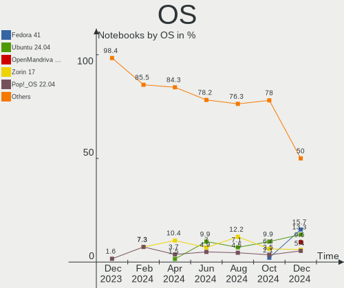

| Name                  | Notebooks | Percent |
|-----------------------|-----------|---------|
| Ubuntu 22.04          | 20        | 11.76%  |
| Linux Mint 20.3       | 18        | 10.59%  |
| Fedora 36             | 18        | 10.59%  |
| Pop!_OS 22.04         | 13        | 7.65%   |
| OpenMandriva 4.3      | 10        | 5.88%   |
| Ubuntu 20.04          | 9         | 5.29%   |
| Zorin 16              | 7         | 4.12%   |
| Manjaro               | 5         | 2.94%   |
| LMDE 5                | 4         | 2.35%   |
| Fedora 35             | 4         | 2.35%   |
| Endless 4.0.6         | 4         | 2.35%   |
| Endless 3.9.7         | 4         | 2.35%   |
| Debian 11             | 4         | 2.35%   |
| Manjaro 21.2.6        | 3         | 1.76%   |
| KDE neon 20.04        | 3         | 1.76%   |
| ArcoLinux Rolling     | 3         | 1.76%   |
| Arch                  | 3         | 1.76%   |
| Ubuntu MATE 20.04     | 2         | 1.18%   |
| Ubuntu Budgie 22.04   | 2         | 1.18%   |
| ROSA 12.2             | 2         | 1.18%   |
| Linux Mint 20.2       | 2         | 1.18%   |
| Elementary 6.1        | 2         | 1.18%   |
| Ubuntu 14.04          | 1         | 0.59%   |
| SteamOS Snapshot      | 1         | 0.59%   |
| Pop!_OS 20.04         | 1         | 0.59%   |
| Parrot 5.0            | 1         | 0.59%   |
| openSUSE Leap-15.4    | 1         | 0.59%   |
| OpenMandriva 4.2      | 1         | 0.59%   |
| Lubuntu 22.04         | 1         | 0.59%   |
| Lubuntu 20.04         | 1         | 0.59%   |
| LinuxFX 11            | 1         | 0.59%   |
| Linux Mint 20.1       | 1         | 0.59%   |
| Linux Mint 20         | 1         | 0.59%   |
| Kubuntu 22.04         | 1         | 0.59%   |
| Kubuntu 21.10         | 1         | 0.59%   |
| Kali 2022.2           | 1         | 0.59%   |
| Fedora 34             | 1         | 0.59%   |
| Endless 3.9.1         | 1         | 0.59%   |
| Endless 3.8.7-nexthw2 | 1         | 0.59%   |
| Endless 3.8.3-nexthw1 | 1         | 0.59%   |
| EndeavourOS Rolling   | 1         | 0.59%   |
| EndeavourOS           | 1         | 0.59%   |
| Devuan 4              | 1         | 0.59%   |
| Debian Unstable       | 1         | 0.59%   |
| Debian Testing        | 1         | 0.59%   |
| Debian 10             | 1         | 0.59%   |
| Clear Linux 36410     | 1         | 0.59%   |
| Clear Linux 36250     | 1         | 0.59%   |
| Artix Rolling         | 1         | 0.59%   |
| Arch Rolling          | 1         | 0.59%   |

OS Family
---------

OS without a version

| Name          | Notebooks | Percent |
|---------------|-----------|---------|
| Ubuntu        | 30        | 17.65%  |
| Fedora        | 23        | 13.53%  |
| Linux Mint    | 22        | 12.94%  |
| Pop!_OS       | 14        | 8.24%   |
| OpenMandriva  | 11        | 6.47%   |
| Endless       | 11        | 6.47%   |
| Manjaro       | 8         | 4.71%   |
| Zorin         | 7         | 4.12%   |
| Debian        | 7         | 4.12%   |
| LMDE          | 4         | 2.35%   |
| Arch          | 4         | 2.35%   |
| KDE neon      | 3         | 1.76%   |
| ArcoLinux     | 3         | 1.76%   |
| Ubuntu MATE   | 2         | 1.18%   |
| Ubuntu Budgie | 2         | 1.18%   |
| ROSA          | 2         | 1.18%   |
| Lubuntu       | 2         | 1.18%   |
| Kubuntu       | 2         | 1.18%   |
| EndeavourOS   | 2         | 1.18%   |
| Elementary    | 2         | 1.18%   |
| Clear Linux   | 2         | 1.18%   |
| SteamOS       | 1         | 0.59%   |
| Parrot        | 1         | 0.59%   |
| openSUSE      | 1         | 0.59%   |
| LinuxFX       | 1         | 0.59%   |
| Kali          | 1         | 0.59%   |
| Devuan        | 1         | 0.59%   |
| Artix         | 1         | 0.59%   |

Kernel
------

Version of the Linux kernel

| Version                                            | Notebooks | Percent |
|----------------------------------------------------|-----------|---------|
| 5.13.0-41-generic                                  | 11        | 6.47%   |
| 5.4.0-110-generic                                  | 10        | 5.88%   |
| 5.17.5-76051705-generic                            | 10        | 5.88%   |
| 5.16.7-desktop-1omv4003                            | 10        | 5.88%   |
| 5.15.0-27-generic                                  | 8         | 4.71%   |
| 5.15.0-30-generic                                  | 7         | 4.12%   |
| 5.8.0-14-generic                                   | 6         | 3.53%   |
| 5.13.0-44-generic                                  | 6         | 3.53%   |
| 5.17.9-300.fc36.x86_64                             | 4         | 2.35%   |
| 5.16.19-76051619-generic                           | 4         | 2.35%   |
| 5.15.0-33-generic                                  | 4         | 2.35%   |
| 5.13.0-40-generic                                  | 4         | 2.35%   |
| 5.11.0-35-generic                                  | 4         | 2.35%   |
| 5.10.0-14-amd64                                    | 4         | 2.35%   |
| 5.4.0-113-generic                                  | 3         | 1.76%   |
| 5.17.9-arch1-1                                     | 3         | 1.76%   |
| 5.17.7-300.fc36.x86_64                             | 3         | 1.76%   |
| 5.17.5-300.fc36.x86_64                             | 3         | 1.76%   |
| 5.17.11-300.fc36.x86_64                            | 3         | 1.76%   |
| 5.15.32-1-MANJARO                                  | 3         | 1.76%   |
| 5.4.0-107-generic                                  | 2         | 1.18%   |
| 5.17.8-300.fc36.x86_64                             | 2         | 1.18%   |
| 5.17.6-300.fc36.x86_64                             | 2         | 1.18%   |
| 5.17.5-zen1-1-zen                                  | 2         | 1.18%   |
| 5.17.5-200.fc35.x86_64                             | 2         | 1.18%   |
| 5.15.38-1-MANJARO                                  | 2         | 1.18%   |
| 5.15.0-25-generic                                  | 2         | 1.18%   |
| 5.13.0-35-generic                                  | 2         | 1.18%   |
| 5.10.74-generic-2rosa2021.1-x86_64                 | 2         | 1.18%   |
| 5.8.0-3-amd64                                      | 1         | 0.59%   |
| 5.6.0-7-generic                                    | 1         | 0.59%   |
| 5.4.0-99-generic                                   | 1         | 0.59%   |
| 5.4.0-91-generic                                   | 1         | 0.59%   |
| 5.4.0-109-generic                                  | 1         | 0.59%   |
| 5.4.0-1071-gke                                     | 1         | 0.59%   |
| 5.17.9-100.fc34.x86_64                             | 1         | 0.59%   |
| 5.17.8-zen1-1-zen                                  | 1         | 0.59%   |
| 5.17.8-200.fc35.x86_64                             | 1         | 0.59%   |
| 5.17.7-zen1-1-zen                                  | 1         | 0.59%   |
| 5.17.6-1-MANJARO                                   | 1         | 0.59%   |
| 5.17.4-200.fc35.x86_64                             | 1         | 0.59%   |
| 5.17.3-302.fc36.x86_64                             | 1         | 0.59%   |
| 5.17.0-9.1-liquorix-amd64                          | 1         | 0.59%   |
| 5.17.0-3-amd64                                     | 1         | 0.59%   |
| 5.17.0-1-amd64                                     | 1         | 0.59%   |
| 5.17.0-051700rc7-generic                           | 1         | 0.59%   |
| 5.16.13-1132.native                                | 1         | 0.59%   |
| 5.16.0-kali7-amd64                                 | 1         | 0.59%   |
| 5.16.0-12parrot1-amd64                             | 1         | 0.59%   |
| 5.15.41-1-MANJARO                                  | 1         | 0.59%   |
| 5.15.37-1-lts                                      | 1         | 0.59%   |
| 5.15.36-1-lts                                      | 1         | 0.59%   |
| 5.15.35-xanmod1                                    | 1         | 0.59%   |
| 5.15.10-arch1-1                                    | 1         | 0.59%   |
| 5.14.21-150400.19-default                          | 1         | 0.59%   |
| 5.14.0-1038-oem                                    | 1         | 0.59%   |
| 5.14.0-1034-oem                                    | 1         | 0.59%   |
| 5.13.0-valve10.1-2-neptune-dri-02144-g7fffaf925dfb | 1         | 0.59%   |
| 5.13.0-39-generic                                  | 1         | 0.59%   |
| 5.13.0-30-generic                                  | 1         | 0.59%   |

Kernel Family
-------------

Linux kernel without a distro release

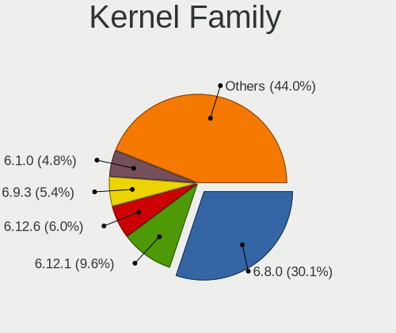

| Version  | Notebooks | Percent |
|----------|-----------|---------|
| 5.13.0   | 28        | 16.47%  |
| 5.15.0   | 21        | 12.35%  |
| 5.4.0    | 19        | 11.18%  |
| 5.17.5   | 17        | 10%     |
| 5.16.7   | 10        | 5.88%   |
| 5.17.9   | 8         | 4.71%   |
| 5.8.0    | 7         | 4.12%   |
| 5.10.0   | 7         | 4.12%   |
| 5.11.0   | 5         | 2.94%   |
| 5.17.8   | 4         | 2.35%   |
| 5.17.7   | 4         | 2.35%   |
| 5.17.0   | 4         | 2.35%   |
| 5.16.19  | 4         | 2.35%   |
| 5.17.6   | 3         | 1.76%   |
| 5.17.11  | 3         | 1.76%   |
| 5.15.32  | 3         | 1.76%   |
| 5.16.0   | 2         | 1.18%   |
| 5.15.38  | 2         | 1.18%   |
| 5.14.0   | 2         | 1.18%   |
| 5.10.74  | 2         | 1.18%   |
| 5.6.0    | 1         | 0.59%   |
| 5.17.4   | 1         | 0.59%   |
| 5.17.3   | 1         | 0.59%   |
| 5.16.13  | 1         | 0.59%   |
| 5.15.41  | 1         | 0.59%   |
| 5.15.37  | 1         | 0.59%   |
| 5.15.36  | 1         | 0.59%   |
| 5.15.35  | 1         | 0.59%   |
| 5.15.10  | 1         | 0.59%   |
| 5.14.21  | 1         | 0.59%   |
| 5.10.60  | 1         | 0.59%   |
| 5.10.14  | 1         | 0.59%   |
| 5.10.113 | 1         | 0.59%   |
| 5.10.109 | 1         | 0.59%   |
| 4.4.0    | 1         | 0.59%   |

Kernel Major Ver.
-----------------

Linux kernel major version

| Version | Notebooks | Percent |
|---------|-----------|---------|
| 5.17    | 45        | 26.47%  |
| 5.15    | 31        | 18.24%  |
| 5.13    | 28        | 16.47%  |
| 5.4     | 19        | 11.18%  |
| 5.16    | 17        | 10%     |
| 5.10    | 13        | 7.65%   |
| 5.8     | 7         | 4.12%   |
| 5.11    | 5         | 2.94%   |
| 5.14    | 3         | 1.76%   |
| 5.6     | 1         | 0.59%   |
| 4.4     | 1         | 0.59%   |

Arch
----

OS architecture (x86_64, i586, etc.)

| Name   | Notebooks | Percent |
|--------|-----------|---------|
| x86_64 | 167       | 98.24%  |
| i686   | 3         | 1.76%   |

DE
--

Desktop Environment

| Name          | Notebooks | Percent |
|---------------|-----------|---------|
| GNOME         | 89        | 52.35%  |
| KDE5          | 27        | 15.88%  |
| X-Cinnamon    | 25        | 14.71%  |
| XFCE          | 11        | 6.47%   |
| LXQt          | 4         | 2.35%   |
| Unknown       | 4         | 2.35%   |
| Pantheon      | 2         | 1.18%   |
| MATE          | 2         | 1.18%   |
| Unity         | 1         | 0.59%   |
| GNOME Classic | 1         | 0.59%   |
| Deepin        | 1         | 0.59%   |
| Cinnamon      | 1         | 0.59%   |
| Budgie        | 1         | 0.59%   |
| awesome       | 1         | 0.59%   |

Display Server
--------------

X11 or Wayland

| Name    | Notebooks | Percent |
|---------|-----------|---------|
| X11     | 127       | 74.71%  |
| Wayland | 40        | 23.53%  |
| Unknown | 2         | 1.18%   |
| Tty     | 1         | 0.59%   |

Display Manager
---------------

SDDM, LightDM, etc.

| Name    | Notebooks | Percent |
|---------|-----------|---------|
| Unknown | 91        | 53.53%  |
| GDM3    | 27        | 15.88%  |
| SDDM    | 23        | 13.53%  |
| LightDM | 19        | 11.18%  |
| GDM     | 9         | 5.29%   |
| SLiM    | 1         | 0.59%   |

OS Lang
-------

Language

| Lang    | Notebooks | Percent |
|---------|-----------|---------|
| pt_BR   | 126       | 74.12%  |
| en_US   | 38        | 22.35%  |
| Unknown | 2         | 1.18%   |
| pt_PT   | 1         | 0.59%   |
| fr_FR   | 1         | 0.59%   |
| es_ES   | 1         | 0.59%   |
| en_GB   | 1         | 0.59%   |

Boot Mode
---------

EFI or BIOS

| Mode | Notebooks | Percent |
|------|-----------|---------|
| EFI  | 87        | 51.18%  |
| BIOS | 83        | 48.82%  |

Filesystem
----------

Type of filesystem

| Type    | Notebooks | Percent |
|---------|-----------|---------|
| Ext4    | 123       | 72.35%  |
| Btrfs   | 35        | 20.59%  |
| Overlay | 10        | 5.88%   |
| Zfs     | 1         | 0.59%   |
| F2fs    | 1         | 0.59%   |

Part. scheme
------------

Scheme of partitioning

| Type    | Notebooks | Percent |
|---------|-----------|---------|
| Unknown | 110       | 64.71%  |
| GPT     | 48        | 28.24%  |
| MBR     | 12        | 7.06%   |

Dual Boot with Linux/BSD
------------------------

Hosting more than one Linux/BSD

| Dual boot | Notebooks | Percent |
|-----------|-----------|---------|
| No        | 154       | 90.59%  |
| Yes       | 16        | 9.41%   |

Dual Boot (Win)
---------------

Hosting Linux and Windows

| Dual boot | Notebooks | Percent |
|-----------|-----------|---------|
| No        | 145       | 85.29%  |
| Yes       | 25        | 14.71%  |

Board
-----

Vendor
------

Motherboard manufacturer

| Name                   | Notebooks | Percent |
|------------------------|-----------|---------|
| Dell                   | 37        | 21.76%  |
| Acer                   | 28        | 16.47%  |
| Lenovo                 | 23        | 13.53%  |
| Samsung Electronics    | 21        | 12.35%  |
| Hewlett-Packard        | 15        | 8.82%   |
| ASUSTek Computer       | 11        | 6.47%   |
| Positivo               | 8         | 4.71%   |
| Avell High Performance | 5         | 2.94%   |
| Compaq                 | 3         | 1.76%   |
| Sony                   | 2         | 1.18%   |
| Positivo Bahia - VAIO  | 2         | 1.18%   |
| Philco                 | 2         | 1.18%   |
| LG Electronics         | 2         | 1.18%   |
| Gateway                | 2         | 1.18%   |
| Toshiba                | 1         | 0.59%   |
| Standard               | 1         | 0.59%   |
| Semp Toshiba           | 1         | 0.59%   |
| Multilaser             | 1         | 0.59%   |
| Login Informatica      | 1         | 0.59%   |
| Itautec                | 1         | 0.59%   |
| Intel                  | 1         | 0.59%   |
| Apple                  | 1         | 0.59%   |
| AMI                    | 1         | 0.59%   |

Model
-----

Motherboard model

| Name                                        | Notebooks | Percent |
|---------------------------------------------|-----------|---------|
| Samsung 550XDA                              | 8         | 4.71%   |
| Acer Nitro AN515-44                         | 6         | 3.53%   |
| Lenovo IdeaPad S145-15IWL 81S9              | 3         | 1.76%   |
| Dell Inspiron 5566                          | 3         | 1.76%   |
| Dell Inspiron 15-3567                       | 3         | 1.76%   |
| ASUS VivoBook_ASUSLaptop X515JA_X515JA      | 3         | 1.76%   |
| Samsung 550XCJ/550XCR                       | 2         | 1.18%   |
| Samsung 340XAA/350XAA/550XAA                | 2         | 1.18%   |
| Positivo S14CT01                            | 2         | 1.18%   |
| Philco 10D                                  | 2         | 1.18%   |
| Lenovo IdeaPad 310-14ISK 80UG               | 2         | 1.18%   |
| HP Pavilion g4                              | 2         | 1.18%   |
| Gateway NV55C                               | 2         | 1.18%   |
| Dell Vostro 5470                            | 2         | 1.18%   |
| Dell Inspiron 5557                          | 2         | 1.18%   |
| Dell Inspiron 3583                          | 2         | 1.18%   |
| Compaq Presario CQ-25                       | 2         | 1.18%   |
| Avell High Performance B.ON                 | 2         | 1.18%   |
| Avell High Performance A70 MOB              | 2         | 1.18%   |
| Acer Aspire E1-532                          | 2         | 1.18%   |
| Unknown                                     | 2         | 1.18%   |
| Toshiba Satellite M55                       | 1         | 0.59%   |
| Standard B14HM21                            | 1         | 0.59%   |
| Sony VPCEB23FM                              | 1         | 0.59%   |
| Sony VPCCA17FX                              | 1         | 0.59%   |
| Semp Toshiba IS 1413G                       | 1         | 0.59%   |
| Samsung RV415/RV515                         | 1         | 0.59%   |
| Samsung RV411/RV511/E3511/S3511/RV711/E3411 | 1         | 0.59%   |
| Samsung RV411/RV511/E3511/S3511/RV711       | 1         | 0.59%   |
| Samsung RF511/RF411/RF711                   | 1         | 0.59%   |
| Samsung 800G5M/800G5W                       | 1         | 0.59%   |
| Samsung 670Z5E                              | 1         | 0.59%   |
| Samsung 530XBB                              | 1         | 0.59%   |
| Samsung 270E5J/2570EJ                       | 1         | 0.59%   |
| Samsung 270E5G/270E5U                       | 1         | 0.59%   |
| Positivo S15KL                              | 1         | 0.59%   |
| Positivo Mobile                             | 1         | 0.59%   |
| Positivo H14BU08                            | 1         | 0.59%   |
| Positivo CHT14B                             | 1         | 0.59%   |
| Positivo C41TB                              | 1         | 0.59%   |
| Positivo C14CR21TV                          | 1         | 0.59%   |
| Positivo Bahia - VAIO VJFE51F11X-B0111H     | 1         | 0.59%   |
| Positivo Bahia - VAIO VJFE43F11X-XXXXXX     | 1         | 0.59%   |
| Multilaser PC130                            | 1         | 0.59%   |
| Login Informatica LOG-QAL30                 | 1         | 0.59%   |
| LG P430-G.BC41P1                            | 1         | 0.59%   |
| LG A410-G.BC48P1                            | 1         | 0.59%   |
| Lenovo V14 G2 ITL 82NM                      | 1         | 0.59%   |
| Lenovo ThinkPad X240 20AM0040BR             | 1         | 0.59%   |
| Lenovo ThinkPad T480s 20L8S2N70H            | 1         | 0.59%   |
| Lenovo ThinkPad T480 MFG_IN_GO              | 1         | 0.59%   |
| Lenovo ThinkPad P15 Gen 1 20STS1JK00        | 1         | 0.59%   |
| Lenovo ThinkPad E15 Gen 2 20T8005BUS        | 1         | 0.59%   |
| Lenovo ThinkPad E14 20RBS25S00              | 1         | 0.59%   |
| Lenovo IdeaPad Z400 Touch VIWZ1             | 1         | 0.59%   |
| Lenovo IdeaPad S145-15IGM 81WT              | 1         | 0.59%   |
| Lenovo IdeaPad S145-15API 81V7              | 1         | 0.59%   |
| Lenovo IdeaPad 330S-14IKB 81JM              | 1         | 0.59%   |
| Lenovo IdeaPad 330-15IKB 81FE               | 1         | 0.59%   |
| Lenovo IdeaPad 330-15IKB 81FD               | 1         | 0.59%   |

Model Family
------------

Motherboard model prefix

| Name                                    | Notebooks | Percent |
|-----------------------------------------|-----------|---------|
| Dell Inspiron                           | 22        | 12.94%  |
| Acer Aspire                             | 20        | 11.76%  |
| Lenovo IdeaPad                          | 13        | 7.65%   |
| Samsung 550XDA                          | 8         | 4.71%   |
| Dell Vostro                             | 8         | 4.71%   |
| Acer Nitro                              | 7         | 4.12%   |
| Lenovo ThinkPad                         | 6         | 3.53%   |
| HP Pavilion                             | 6         | 3.53%   |
| Dell Latitude                           | 5         | 2.94%   |
| ASUS VivoBook                           | 5         | 2.94%   |
| Samsung RV411                           | 2         | 1.18%   |
| Samsung 550XCJ                          | 2         | 1.18%   |
| Samsung 340XAA                          | 2         | 1.18%   |
| Positivo S14CT01                        | 2         | 1.18%   |
| Philco 10D                              | 2         | 1.18%   |
| HP ProBook                              | 2         | 1.18%   |
| Gateway NV55C                           | 2         | 1.18%   |
| Compaq Presario                         | 2         | 1.18%   |
| Avell High Performance B.ON             | 2         | 1.18%   |
| Avell High Performance A70              | 2         | 1.18%   |
| Unknown                                 | 2         | 1.18%   |
| Toshiba Satellite                       | 1         | 0.59%   |
| Standard B14HM21                        | 1         | 0.59%   |
| Sony VPCEB23FM                          | 1         | 0.59%   |
| Sony VPCCA17FX                          | 1         | 0.59%   |
| Semp Toshiba IS                         | 1         | 0.59%   |
| Samsung RV415                           | 1         | 0.59%   |
| Samsung RF511                           | 1         | 0.59%   |
| Samsung 800G5M                          | 1         | 0.59%   |
| Samsung 670Z5E                          | 1         | 0.59%   |
| Samsung 530XBB                          | 1         | 0.59%   |
| Samsung 270E5J                          | 1         | 0.59%   |
| Samsung 270E5G                          | 1         | 0.59%   |
| Positivo S15KL                          | 1         | 0.59%   |
| Positivo Mobile                         | 1         | 0.59%   |
| Positivo H14BU08                        | 1         | 0.59%   |
| Positivo CHT14B                         | 1         | 0.59%   |
| Positivo C41TB                          | 1         | 0.59%   |
| Positivo C14CR21TV                      | 1         | 0.59%   |
| Positivo Bahia - VAIO VJFE51F11X-B0111H | 1         | 0.59%   |
| Positivo Bahia - VAIO VJFE43F11X-XXXXXX | 1         | 0.59%   |
| Multilaser PC130                        | 1         | 0.59%   |
| Login Informatica LOG-QAL30             | 1         | 0.59%   |
| LG P430-G.BC41P1                        | 1         | 0.59%   |
| LG A410-G.BC48P1                        | 1         | 0.59%   |
| Lenovo V14                              | 1         | 0.59%   |
| Lenovo G450                             | 1         | 0.59%   |
| Lenovo B490                             | 1         | 0.59%   |
| Lenovo B40-70                           | 1         | 0.59%   |
| Itautec Infoway                         | 1         | 0.59%   |
| Intel Infoway                           | 1         | 0.59%   |
| HP Mini                                 | 1         | 0.59%   |
| HP Folio                                | 1         | 0.59%   |
| HP EliteBook                            | 1         | 0.59%   |
| HP 250                                  | 1         | 0.59%   |
| HP 240                                  | 1         | 0.59%   |
| Dell System                             | 1         | 0.59%   |
| Dell G3                                 | 1         | 0.59%   |
| Compaq 420                              | 1         | 0.59%   |
| Avell High Performance A62              | 1         | 0.59%   |

MFG Year
--------

Motherboard manufacture year

| Year    | Notebooks | Percent |
|---------|-----------|---------|
| 2020    | 24        | 14.12%  |
| 2021    | 23        | 13.53%  |
| 2016    | 20        | 11.76%  |
| 2019    | 19        | 11.18%  |
| 2011    | 14        | 8.24%   |
| 2013    | 12        | 7.06%   |
| 2018    | 11        | 6.47%   |
| 2010    | 11        | 6.47%   |
| 2012    | 9         | 5.29%   |
| 2017    | 7         | 4.12%   |
| 2014    | 7         | 4.12%   |
| 2015    | 4         | 2.35%   |
| 2008    | 4         | 2.35%   |
| 2009    | 3         | 1.76%   |
| 2006    | 1         | 0.59%   |
| Unknown | 1         | 0.59%   |

Form Factor
-----------

Physical design of the computer

| Name     | Notebooks | Percent |
|----------|-----------|---------|
| Notebook | 170       | 100%    |

Secure Boot
-----------

Enabled or disabled

| State    | Notebooks | Percent |
|----------|-----------|---------|
| Disabled | 146       | 85.88%  |
| Enabled  | 24        | 14.12%  |

Coreboot
--------

Have coreboot on board

| Used | Notebooks | Percent |
|------|-----------|---------|
| No   | 170       | 100%    |

RAM Size
--------

Total RAM memory

| Size in GB  | Notebooks | Percent |
|-------------|-----------|---------|
| 4.01-8.0    | 58        | 34.12%  |
| 3.01-4.0    | 41        | 24.12%  |
| 16.01-24.0  | 27        | 15.88%  |
| 8.01-16.0   | 26        | 15.29%  |
| 1.01-2.0    | 8         | 4.71%   |
| 2.01-3.0    | 5         | 2.94%   |
| 32.01-64.0  | 2         | 1.18%   |
| 64.01-256.0 | 2         | 1.18%   |
| 24.01-32.0  | 1         | 0.59%   |

RAM Used
--------

Used RAM memory

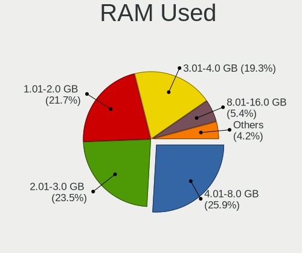

| Used GB   | Notebooks | Percent |
|-----------|-----------|---------|
| 1.01-2.0  | 60        | 35.29%  |
| 2.01-3.0  | 51        | 30%     |
| 4.01-8.0  | 24        | 14.12%  |
| 3.01-4.0  | 22        | 12.94%  |
| 0.51-1.0  | 7         | 4.12%   |
| 8.01-16.0 | 6         | 3.53%   |

Total Drives
------------

Number of drives on board

| Drives | Notebooks | Percent |
|--------|-----------|---------|
| 1      | 122       | 71.76%  |
| 2      | 46        | 27.06%  |
| 3      | 1         | 0.59%   |
| 0      | 1         | 0.59%   |

Has CD-ROM
----------

Has CD-ROM on board

| Presented | Notebooks | Percent |
|-----------|-----------|---------|
| No        | 117       | 68.82%  |
| Yes       | 53        | 31.18%  |

Has Ethernet
------------

Has Ethernet on board

| Presented | Notebooks | Percent |
|-----------|-----------|---------|
| Yes       | 143       | 84.12%  |
| No        | 27        | 15.88%  |

Has WiFi
--------

Has WiFi module

| Presented | Notebooks | Percent |
|-----------|-----------|---------|
| Yes       | 164       | 96.47%  |
| No        | 6         | 3.53%   |

Has Bluetooth
-------------

Has Bluetooth module

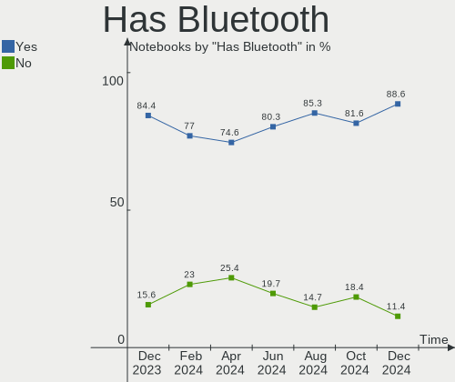

| Presented | Notebooks | Percent |
|-----------|-----------|---------|
| Yes       | 135       | 79.41%  |
| No        | 35        | 20.59%  |

Location
--------

Country
-------

Geographic location (country)

| Country | Notebooks | Percent |
|---------|-----------|---------|
| Brazil  | 170       | 100%    |

City
----

Geographic location (city)

| City                    | Notebooks | Percent |
|-------------------------|-----------|---------|
| Sao Paulo               | 34        | 20%     |
| Rio de Janeiro          | 11        | 6.47%   |
| Salvador                | 4         | 2.35%   |
| Recife                  | 4         | 2.35%   |
| Londrina                | 4         | 2.35%   |
| Curitiba                | 4         | 2.35%   |
| Maceió                 | 3         | 1.76%   |
| Fortaleza               | 3         | 1.76%   |
| Americana               | 3         | 1.76%   |
| Vila Velha              | 2         | 1.18%   |
| Teresina                | 2         | 1.18%   |
| Santo André            | 2         | 1.18%   |
| Ribeirao Preto          | 2         | 1.18%   |
| Praia Grande            | 2         | 1.18%   |
| Pontes e Lacerda        | 2         | 1.18%   |
| Natal                   | 2         | 1.18%   |
| Juiz de Fora            | 2         | 1.18%   |
| Joinville               | 2         | 1.18%   |
| Itajaí                 | 2         | 1.18%   |
| Catunda                 | 2         | 1.18%   |
| Campinas                | 2         | 1.18%   |
| Brasília               | 2         | 1.18%   |
| Vitória da Conquista   | 1         | 0.59%   |
| Vitória                | 1         | 0.59%   |
| Viamao                  | 1         | 0.59%   |
| Venancio Aires          | 1         | 0.59%   |
| Várzea Grande          | 1         | 0.59%   |
| Valparaiso de Goias     | 1         | 0.59%   |
| Valinhos                | 1         | 0.59%   |
| Uberlândia             | 1         | 0.59%   |
| Tatuí                  | 1         | 0.59%   |
| Tabira                  | 1         | 0.59%   |
| Sumaré                 | 1         | 0.59%   |
| Sirinhaem               | 1         | 0.59%   |
| Sertaozinho             | 1         | 0.59%   |
| Serra da Raiz           | 1         | 0.59%   |
| Sao Luís               | 1         | 0.59%   |
| Sao José dos Campos    | 1         | 0.59%   |
| Sao Jose                | 1         | 0.59%   |
| Sao Goncalo do Amarante | 1         | 0.59%   |
| Sao Goncalo             | 1         | 0.59%   |
| Sao Carlos              | 1         | 0.59%   |
| Santa Cruz do Sul       | 1         | 0.59%   |
| Rosario do Sul          | 1         | 0.59%   |
| Porto Alegre            | 1         | 0.59%   |
| Ponta Grossa            | 1         | 0.59%   |
| Poços de Caldas        | 1         | 0.59%   |
| Piracicaba              | 1         | 0.59%   |
| Picos                   | 1         | 0.59%   |
| Paulinia                | 1         | 0.59%   |
| Palma                   | 1         | 0.59%   |
| Osasco                  | 1         | 0.59%   |
| Novo Gama               | 1         | 0.59%   |
| Nova Palmeira           | 1         | 0.59%   |
| Navegantes              | 1         | 0.59%   |
| Muriaé                 | 1         | 0.59%   |
| Montes Claros           | 1         | 0.59%   |
| Mogi das Cruzes         | 1         | 0.59%   |
| Mesquita                | 1         | 0.59%   |
| Massaranduba            | 1         | 0.59%   |

Drives
------

Drive Vendor
------------

Hard drive vendors

| Vendor                         | Notebooks | Drives | Percent |
|--------------------------------|-----------|--------|---------|
| WDC                            | 31        | 33     | 15.12%  |
| Seagate                        | 25        | 25     | 12.2%   |
| SanDisk                        | 14        | 15     | 6.83%   |
| Samsung Electronics            | 13        | 13     | 6.34%   |
| Kingston                       | 10        | 11     | 4.88%   |
| A-DATA Technology              | 10        | 10     | 4.88%   |
| Unknown                        | 9         | 11     | 4.39%   |
| Toshiba                        | 9         | 9      | 4.39%   |
| China                          | 8         | 8      | 3.9%    |
| Solid State Storage Technology | 7         | 7      | 3.41%   |
| Silicon Motion                 | 7         | 7      | 3.41%   |
| SK Hynix                       | 5         | 5      | 2.44%   |
| Crucial                        | 5         | 5      | 2.44%   |
| ADATA Technology               | 5         | 5      | 2.44%   |
| XPG                            | 4         | 4      | 1.95%   |
| Phison                         | 4         | 4      | 1.95%   |
| SSSTC                          | 3         | 3      | 1.46%   |
| LITEON                         | 3         | 3      | 1.46%   |
| JMicron                        | 3         | 3      | 1.46%   |
| Intel                          | 3         | 3      | 1.46%   |
| Hitachi                        | 3         | 3      | 1.46%   |
| S3+                            | 2         | 2      | 0.98%   |
| Netac                          | 2         | 2      | 0.98%   |
| Lexar                          | 2         | 2      | 0.98%   |
| KIOXIA                         | 2         | 2      | 0.98%   |
| KingSpec                       | 2         | 2      | 0.98%   |
| HGST                           | 2         | 2      | 0.98%   |
| Gigabyte Technology            | 2         | 2      | 0.98%   |
| walram                         | 1         | 1      | 0.49%   |
| sage                           | 1         | 1      | 0.49%   |
| Realtek Semiconductor          | 1         | 1      | 0.49%   |
| Patriot                        | 1         | 1      | 0.49%   |
| Lite-On                        | 1         | 1      | 0.49%   |
| KingDian                       | 1         | 1      | 0.49%   |
| HS-SSD-C100                    | 1         | 1      | 0.49%   |
| Hewlett-Packard                | 1         | 1      | 0.49%   |
| Fujitsu                        | 1         | 1      | 0.49%   |
| FORESEE                        | 1         | 1      | 0.49%   |

Drive Model
-----------

Hard drive models

| Model                                    | Notebooks | Percent |
|------------------------------------------|-----------|---------|
| Solid State Storage NVMe SSD Drive 256GB | 5         | 2.37%   |
| Seagate ST1000LM024 HN-M101MBB 1TB       | 5         | 2.37%   |
| Unknown MMC Card  32GB                   | 4         | 1.9%    |
| Silicon Motion NVMe SSD Drive 256GB      | 4         | 1.9%    |
| SanDisk SSD PLUS 120GB                   | 4         | 1.9%    |
| Sandisk NVMe SSD Drive 512GB             | 4         | 1.9%    |
| Kingston SA400S37480G 480GB SSD          | 4         | 1.9%    |
| Kingston SA400S37240G 240GB SSD          | 4         | 1.9%    |
| Crucial CT240BX500SSD1 240GB             | 4         | 1.9%    |
| ADATA NVMe SSD Drive 256GB               | 4         | 1.9%    |
| WDC WD3200BPVT-22JJ5T0 320GB             | 3         | 1.42%   |
| WDC WD10SPZX-21Z10T0 1TB                 | 3         | 1.42%   |
| Toshiba MQ04ABF100 1TB                   | 3         | 1.42%   |
| SSSTC CL1-8D256 256GB                    | 3         | 1.42%   |
| SK Hynix NVMe SSD Drive 256GB            | 3         | 1.42%   |
| Seagate ST500LM012 HN-M500MBB 500GB      | 3         | 1.42%   |
| Phison NVMe SSD Drive 256GB              | 3         | 1.42%   |
| WDC WD5000LPCX-24VHAT0 500GB             | 2         | 0.95%   |
| WDC WD10SPZX-35Z10T0 1TB                 | 2         | 0.95%   |
| WDC WD10SPZX-24Z10 1TB                   | 2         | 0.95%   |
| Unknown SD16G  64GB                      | 2         | 0.95%   |
| Unknown MMC Card  16GB                   | 2         | 0.95%   |
| Toshiba MQ01ABF050 500GB                 | 2         | 0.95%   |
| Toshiba MQ01ABD100 1TB                   | 2         | 0.95%   |
| Silicon Motion NVMe SSD Drive 512GB      | 2         | 0.95%   |
| Seagate ST9500325AS 500GB                | 2         | 0.95%   |
| Seagate ST500VT000-1DK142 500GB          | 2         | 0.95%   |
| Seagate ST320LM001 HN-M320MBB 320GB      | 2         | 0.95%   |
| Kingston SA400S37120G 120GB SSD          | 2         | 0.95%   |
| JMicron Generic 128GB                    | 2         | 0.95%   |
| Hitachi HTS543232A7A384 320GB            | 2         | 0.95%   |
| China SATA SSD 120GB                     | 2         | 0.95%   |
| A-DATA IM2P33F3A NVMe 512GB              | 2         | 0.95%   |
| XPG NVMe SSD Drive 2TB                   | 1         | 0.47%   |
| XPG NVMe SSD Drive 256GB                 | 1         | 0.47%   |
| XPG NVMe SSD Drive 1024GB                | 1         | 0.47%   |
| XPG GAMMIX S11 Pro 256GB                 | 1         | 0.47%   |
| WDC WDS480G2G0C-00AJM0 480GB             | 1         | 0.47%   |
| WDC WDS480G2G0A-00JH30 480GB SSD         | 1         | 0.47%   |
| WDC WDS240G2G0A-00JH30 240GB SSD         | 1         | 0.47%   |
| WDC WD5000LPVX-22V0TT0 500GB             | 1         | 0.47%   |
| WDC WD5000LPVT-75G33T0 500GB             | 1         | 0.47%   |
| WDC WD5000LPLX-60ZNTT2 500GB             | 1         | 0.47%   |
| WDC WD5000LPCX-80VHAT0 500GB             | 1         | 0.47%   |
| WDC WD5000LPCX-75VHAT0 500GB             | 1         | 0.47%   |
| WDC WD5000BPVT-22HXZT3 500GB             | 1         | 0.47%   |
| WDC WD5000BEVT-00A0RT0 500GB             | 1         | 0.47%   |
| WDC WD3200BPVT-24JJ5T0 320GB             | 1         | 0.47%   |
| WDC WD10SPZX-75Z10T3 1TB                 | 1         | 0.47%   |
| WDC WD10SPZX-22Z10T1 1TB                 | 1         | 0.47%   |
| WDC WD10SPZX-22Z10T0 1TB                 | 1         | 0.47%   |
| WDC WD10JPVX-75JC3T0 1TB                 | 1         | 0.47%   |
| WDC WD10JPVX-22JC3T0 1TB                 | 1         | 0.47%   |
| WDC WD10JPVX-00JC3T0 1TB                 | 1         | 0.47%   |
| WDC PC SN730 SDBQNTY-512G-1001 512GB     | 1         | 0.47%   |
| WDC PC SN530 SDBPNPZ-512G-1014 512GB     | 1         | 0.47%   |
| WDC PC SN520 SDAPNUW-256G-1006 256GB     | 1         | 0.47%   |
| WDC PC SN520 NVMe 128GB                  | 1         | 0.47%   |
| walram SSD 128G                          | 1         | 0.47%   |
| Unknown MMC Card  8GB                    | 1         | 0.47%   |

HDD Vendor
----------

Hard disk drive vendors

| Vendor              | Notebooks | Drives | Percent |
|---------------------|-----------|--------|---------|
| WDC                 | 26        | 26     | 37.14%  |
| Seagate             | 24        | 24     | 34.29%  |
| Toshiba             | 9         | 9      | 12.86%  |
| Samsung Electronics | 4         | 4      | 5.71%   |
| Hitachi             | 3         | 3      | 4.29%   |
| HGST                | 2         | 2      | 2.86%   |
| sage                | 1         | 1      | 1.43%   |
| Fujitsu             | 1         | 1      | 1.43%   |

SSD Vendor
----------

Solid state drive vendors

| Vendor              | Notebooks | Drives | Percent |
|---------------------|-----------|--------|---------|
| SanDisk             | 10        | 10     | 15.87%  |
| Kingston            | 10        | 11     | 15.87%  |
| China               | 8         | 8      | 12.7%   |
| Samsung Electronics | 6         | 6      | 9.52%   |
| Crucial             | 5         | 5      | 7.94%   |
| WDC                 | 2         | 2      | 3.17%   |
| S3+                 | 2         | 2      | 3.17%   |
| Netac               | 2         | 2      | 3.17%   |
| LITEON              | 2         | 2      | 3.17%   |
| Lexar               | 2         | 2      | 3.17%   |
| KingSpec            | 2         | 2      | 3.17%   |
| JMicron             | 2         | 2      | 3.17%   |
| Gigabyte Technology | 2         | 2      | 3.17%   |
| A-DATA Technology   | 2         | 2      | 3.17%   |
| walram              | 1         | 1      | 1.59%   |
| Seagate             | 1         | 1      | 1.59%   |
| Patriot             | 1         | 1      | 1.59%   |
| KingDian            | 1         | 1      | 1.59%   |
| Hewlett-Packard     | 1         | 1      | 1.59%   |
| FORESEE             | 1         | 1      | 1.59%   |

Drive Kind
----------

HDD or SSD

| Kind    | Notebooks | Drives | Percent |
|---------|-----------|--------|---------|
| HDD     | 70        | 70     | 35%     |
| NVMe    | 60        | 63     | 30%     |
| SSD     | 59        | 64     | 29.5%   |
| MMC     | 9         | 12     | 4.5%    |
| Unknown | 2         | 2      | 1%      |

Drive Connector
---------------

SATA, SAS, NVMe, etc.

| Type | Notebooks | Drives | Percent |
|------|-----------|--------|---------|
| SATA | 121       | 132    | 62.37%  |
| NVMe | 60        | 63     | 30.93%  |
| MMC  | 9         | 12     | 4.64%   |
| SAS  | 4         | 4      | 2.06%   |

Drive Size
----------

Size of hard drive

| Size in TB | Notebooks | Drives | Percent |
|------------|-----------|--------|---------|
| 0.01-0.5   | 92        | 99     | 72.44%  |
| 0.51-1.0   | 34        | 34     | 26.77%  |
| 1.01-2.0   | 1         | 1      | 0.79%   |

Space Total
-----------

Amount of disk space available on the file system

| Size in GB | Notebooks | Percent |
|------------|-----------|---------|
| 101-250    | 57        | 33.53%  |
| 251-500    | 45        | 26.47%  |
| 501-1000   | 23        | 13.53%  |
| 1001-2000  | 12        | 7.06%   |
| 51-100     | 12        | 7.06%   |
| 1-20       | 11        | 6.47%   |
| Unknown    | 5         | 2.94%   |
| 21-50      | 3         | 1.76%   |
| 2001-3000  | 2         | 1.18%   |

Space Used
----------

Amount of used disk space

| Used GB   | Notebooks | Percent |
|-----------|-----------|---------|
| 1-20      | 59        | 34.71%  |
| 21-50     | 36        | 21.18%  |
| 101-250   | 26        | 15.29%  |
| 51-100    | 26        | 15.29%  |
| 251-500   | 12        | 7.06%   |
| Unknown   | 5         | 2.94%   |
| 501-1000  | 4         | 2.35%   |
| 1001-2000 | 2         | 1.18%   |

Malfunc. Drives
---------------

Drive models with a malfunction

| Model                              | Notebooks | Drives | Percent |
|------------------------------------|-----------|--------|---------|
| China SATA SSD 120GB               | 2         | 2      | 18.18%  |
| WDC WD5000BEVT-00A0RT0 500GB       | 1         | 1      | 9.09%   |
| WDC WD3200BPVT-24JJ5T0 320GB       | 1         | 1      | 9.09%   |
| WDC WD10JPVX-00JC3T0 1TB           | 1         | 1      | 9.09%   |
| Toshiba MQ01ABD100 1TB             | 1         | 1      | 9.09%   |
| Seagate ST500LT012-9WS142 500GB    | 1         | 1      | 9.09%   |
| Seagate ST500LM030-2E717D 500GB    | 1         | 1      | 9.09%   |
| Seagate ST1000LM024 HN-M101MBB 1TB | 1         | 1      | 9.09%   |
| Samsung Electronics HM121HI 120GB  | 1         | 1      | 9.09%   |
| Kingston SA400S37240G 240GB SSD    | 1         | 1      | 9.09%   |

Malfunc. Drive Vendor
---------------------

Vendors of faulty drives

| Vendor              | Notebooks | Drives | Percent |
|---------------------|-----------|--------|---------|
| WDC                 | 3         | 3      | 27.27%  |
| Seagate             | 3         | 3      | 27.27%  |
| China               | 2         | 2      | 18.18%  |
| Toshiba             | 1         | 1      | 9.09%   |
| Samsung Electronics | 1         | 1      | 9.09%   |
| Kingston            | 1         | 1      | 9.09%   |

Malfunc. HDD Vendor
-------------------

Vendors of faulty HDD drives

| Vendor              | Notebooks | Drives | Percent |
|---------------------|-----------|--------|---------|
| WDC                 | 3         | 3      | 37.5%   |
| Seagate             | 3         | 3      | 37.5%   |
| Toshiba             | 1         | 1      | 12.5%   |
| Samsung Electronics | 1         | 1      | 12.5%   |

Malfunc. Drive Kind
-------------------

Kinds of faulty drives

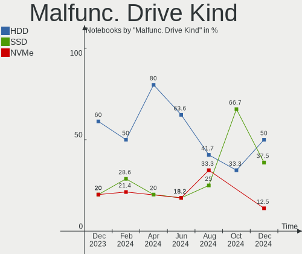

| Kind | Notebooks | Drives | Percent |
|------|-----------|--------|---------|
| HDD  | 8         | 8      | 72.73%  |
| SSD  | 3         | 3      | 27.27%  |

Failed Drives
-------------

Failed drive models

Zero info for selected period =(

Failed Drive Vendor
-------------------

Failed drive vendors

Zero info for selected period =(

Drive Status
------------

Number of failed and malfunc. drives

| Status   | Notebooks | Drives | Percent |
|----------|-----------|--------|---------|
| Detected | 115       | 140    | 64.97%  |
| Works    | 51        | 60     | 28.81%  |
| Malfunc  | 11        | 11     | 6.21%   |

Storage controller
------------------

Storage Vendor
--------------

Storage controller vendors

| Vendor                           | Notebooks | Percent |
|----------------------------------|-----------|---------|
| Intel                            | 137       | 62.84%  |
| AMD                              | 21        | 9.63%   |
| ADATA Technology                 | 17        | 7.8%    |
| Sandisk                          | 10        | 4.59%   |
| Solid State Storage Technology   | 9         | 4.13%   |
| Silicon Motion                   | 7         | 3.21%   |
| SK Hynix                         | 4         | 1.83%   |
| Phison Electronics               | 4         | 1.83%   |
| Samsung Electronics              | 3         | 1.38%   |
| KIOXIA                           | 2         | 0.92%   |
| Silicon Integrated Systems [SiS] | 1         | 0.46%   |
| Realtek Semiconductor            | 1         | 0.46%   |
| Nvidia                           | 1         | 0.46%   |
| Lite-On Technology               | 1         | 0.46%   |

Storage Model
-------------

Storage controller models

| Model                                                                            | Notebooks | Percent |
|----------------------------------------------------------------------------------|-----------|---------|
| Intel Sunrise Point-LP SATA Controller [AHCI mode]                               | 24        | 10.43%  |
| AMD FCH SATA Controller [AHCI mode]                                              | 18        | 7.83%   |
| ADATA Non-Volatile memory controller                                             | 13        | 5.65%   |
| Intel Tiger Lake-LP SATA Controller [AHCI mode]                                  | 12        | 5.22%   |
| Intel 7 Series Chipset Family 6-port SATA Controller [AHCI mode]                 | 12        | 5.22%   |
| Intel 8 Series SATA Controller 1 [AHCI mode]                                     | 11        | 4.78%   |
| Intel 82801 Mobile SATA Controller [RAID mode]                                   | 10        | 4.35%   |
| Solid State Storage Non-Volatile memory controller                               | 9         | 3.91%   |
| Intel 6 Series/C200 Series Chipset Family 6 port Mobile SATA AHCI Controller     | 9         | 3.91%   |
| Intel 5 Series/3400 Series Chipset 4 port SATA AHCI Controller                   | 8         | 3.48%   |
| Silicon Motion SM2263EN/SM2263XT SSD Controller                                  | 7         | 3.04%   |
| Intel Volume Management Device NVMe RAID Controller                              | 7         | 3.04%   |
| Intel Cannon Point-LP SATA Controller [AHCI Mode]                                | 7         | 3.04%   |
| Sandisk WD Blue SN550 NVMe SSD                                                   | 5         | 2.17%   |
| Intel Comet Lake SATA AHCI Controller                                            | 5         | 2.17%   |
| Intel Celeron/Pentium Silver Processor SATA Controller                           | 5         | 2.17%   |
| Intel Atom/Celeron/Pentium Processor x5-E8000/J3xxx/N3xxx Series SATA Controller | 5         | 2.17%   |
| Intel 5 Series/3400 Series Chipset 6 port SATA AHCI Controller                   | 4         | 1.74%   |
| ADATA XPG SX8200 Pro PCIe Gen3x4 M.2 2280 Solid State Drive                      | 4         | 1.74%   |
| SK Hynix BC511                                                                   | 3         | 1.3%    |
| Samsung NVMe SSD Controller SM981/PM981/PM983                                    | 3         | 1.3%    |
| Phison PS5013 E13 NVMe Controller                                                | 3         | 1.3%    |
| Intel Wildcat Point-LP SATA Controller [AHCI Mode]                               | 3         | 1.3%    |
| Intel NM10/ICH7 Family SATA Controller [AHCI mode]                               | 3         | 1.3%    |
| Intel 82801IBM/IEM (ICH9M/ICH9M-E) 4 port SATA Controller [AHCI mode]            | 3         | 1.3%    |
| AMD SB7x0/SB8x0/SB9x0 SATA Controller [AHCI mode]                                | 3         | 1.3%    |
| Sandisk PC SN520 NVMe SSD                                                        | 2         | 0.87%   |
| KIOXIA Non-Volatile memory controller                                            | 2         | 0.87%   |
| Intel SSD 660P Series                                                            | 2         | 0.87%   |
| Intel Ice Lake-LP SATA Controller [AHCI mode]                                    | 2         | 0.87%   |
| Intel 500 Series Chipset Family SATA AHCI Controller                             | 2         | 0.87%   |
| SK Hynix BC501 NVMe Solid State Drive                                            | 1         | 0.43%   |
| Silicon Integrated Systems [SiS] AHCI IDE Controller (0106)                      | 1         | 0.43%   |
| Silicon Integrated Systems [SiS] 5513 IDE Controller                             | 1         | 0.43%   |
| Sandisk WD Blue SN500 / PC SN520 NVMe SSD                                        | 1         | 0.43%   |
| Sandisk WD Black SN750 / PC SN730 NVMe SSD                                       | 1         | 0.43%   |
| Sandisk Non-Volatile memory controller                                           | 1         | 0.43%   |
| Realtek Realtek Non-Volatile memory controller                                   | 1         | 0.43%   |
| Phison E12 NVMe Controller                                                       | 1         | 0.43%   |
| Nvidia MCP79 SATA Controller                                                     | 1         | 0.43%   |
| Lite-On Non-Volatile memory controller                                           | 1         | 0.43%   |
| Intel PROSet/Wireless WiFi Software extension                                    | 1         | 0.43%   |
| Intel HM170/QM170 Chipset SATA Controller [AHCI Mode]                            | 1         | 0.43%   |
| Intel Celeron N3350/Pentium N4200/Atom E3900 Series SATA AHCI Controller         | 1         | 0.43%   |
| Intel Cannon Lake Mobile PCH SATA AHCI Controller                                | 1         | 0.43%   |
| Intel Atom Processor E3800 Series SATA AHCI Controller                           | 1         | 0.43%   |
| Intel 82801IBM/IEM (ICH9M/ICH9M-E) 2 port SATA Controller [IDE mode]             | 1         | 0.43%   |
| Intel 82801HM/HEM (ICH8M/ICH8M-E) SATA Controller [AHCI mode]                    | 1         | 0.43%   |
| Intel 82801HM/HEM (ICH8M/ICH8M-E) IDE Controller                                 | 1         | 0.43%   |
| Intel 82801FBM (ICH6M) SATA Controller                                           | 1         | 0.43%   |
| Intel 5 Series/3400 Series Chipset 4 port SATA IDE Controller                    | 1         | 0.43%   |
| Intel 5 Series/3400 Series Chipset 2 port SATA IDE Controller                    | 1         | 0.43%   |
| Intel 400 Series Chipset Family SATA AHCI Controller                             | 1         | 0.43%   |
| AMD SB7x0/SB8x0/SB9x0 IDE Controller                                             | 1         | 0.43%   |
| AMD FCH IDE Controller                                                           | 1         | 0.43%   |

Storage Kind
------------

Kind of storage controller (IDE, SATA, NVMe, SAS, ...)

| Kind | Notebooks | Percent |
|------|-----------|---------|
| SATA | 144       | 63.16%  |
| NVMe | 60        | 26.32%  |
| RAID | 16        | 7.02%   |
| IDE  | 8         | 3.51%   |

Processor
---------

CPU Vendor
----------

Processor vendors

| Vendor | Notebooks | Percent |
|--------|-----------|---------|
| Intel  | 148       | 87.06%  |
| AMD    | 22        | 12.94%  |

CPU Model
---------

Processor models

| Model                                         | Notebooks | Percent |
|-----------------------------------------------|-----------|---------|
| Intel 11th Gen Core i7-1165G7 @ 2.80GHz       | 7         | 4.12%   |
| Intel 11th Gen Core i5-1135G7 @ 2.40GHz       | 6         | 3.53%   |
| AMD Ryzen 7 4800H with Radeon Graphics        | 6         | 3.53%   |
| Intel Core i7-7500U CPU @ 2.70GHz             | 5         | 2.94%   |
| Intel Core i5-8265U CPU @ 1.60GHz             | 5         | 2.94%   |
| Intel Core i5-7200U CPU @ 2.50GHz             | 5         | 2.94%   |
| Intel Core i5-4200U CPU @ 1.60GHz             | 5         | 2.94%   |
| Intel Pentium CPU N3700 @ 1.60GHz             | 4         | 2.35%   |
| Intel Core i3-6006U CPU @ 2.00GHz             | 4         | 2.35%   |
| Intel Core i7-8565U CPU @ 1.80GHz             | 3         | 1.76%   |
| Intel Core i7-8550U CPU @ 1.80GHz             | 3         | 1.76%   |
| Intel Core i5-1035G1 CPU @ 1.00GHz            | 3         | 1.76%   |
| Intel Core i3 CPU M 380 @ 2.53GHz             | 3         | 1.76%   |
| AMD Ryzen 5 3500U with Radeon Vega Mobile Gfx | 3         | 1.76%   |
| Intel Pentium CPU P6100 @ 2.00GHz             | 2         | 1.18%   |
| Intel Core i7-6500U CPU @ 2.50GHz             | 2         | 1.18%   |
| Intel Core i7-10750H CPU @ 2.60GHz            | 2         | 1.18%   |
| Intel Core i5-6200U CPU @ 2.30GHz             | 2         | 1.18%   |
| Intel Core i5-4210U CPU @ 1.70GHz             | 2         | 1.18%   |
| Intel Core i5-3230M CPU @ 2.60GHz             | 2         | 1.18%   |
| Intel Core i5-3210M CPU @ 2.50GHz             | 2         | 1.18%   |
| Intel Core i5-2450M CPU @ 2.50GHz             | 2         | 1.18%   |
| Intel Core i5-2410M CPU @ 2.30GHz             | 2         | 1.18%   |
| Intel Core i5-10210U CPU @ 1.60GHz            | 2         | 1.18%   |
| Intel Core i5 CPU M 460 @ 2.53GHz             | 2         | 1.18%   |
| Intel Core i3-3110M CPU @ 2.40GHz             | 2         | 1.18%   |
| Intel Core i3-2350M CPU @ 2.30GHz             | 2         | 1.18%   |
| Intel Core i3-1005G1 CPU @ 1.20GHz            | 2         | 1.18%   |
| Intel Celeron N4020 CPU @ 1.10GHz             | 2         | 1.18%   |
| Intel Celeron N4000 CPU @ 1.10GHz             | 2         | 1.18%   |
| Intel Celeron 2955U @ 1.40GHz                 | 2         | 1.18%   |
| Intel Atom x5-Z8350 CPU @ 1.44GHz             | 2         | 1.18%   |
| Intel Atom x5-Z8300 CPU @ 1.44GHz             | 2         | 1.18%   |
| Intel Atom CPU N2600 @ 1.60GHz                | 2         | 1.18%   |
| Intel 11th Gen Core i7-11800H @ 2.30GHz       | 2         | 1.18%   |
| Intel 11th Gen Core i3-1115G4 @ 3.00GHz       | 2         | 1.18%   |
| AMD A6-3420M APU with Radeon HD Graphics      | 2         | 1.18%   |
| Intel Pentium M processor 1.73GHz             | 1         | 0.59%   |
| Intel Pentium Gold 7505 @ 2.00GHz             | 1         | 0.59%   |
| Intel Pentium Dual-Core CPU T4300 @ 2.10GHz   | 1         | 0.59%   |
| Intel Core i7-9750H CPU @ 2.60GHz             | 1         | 0.59%   |
| Intel Core i7-8650U CPU @ 1.90GHz             | 1         | 0.59%   |
| Intel Core i7-7700HQ CPU @ 2.80GHz            | 1         | 0.59%   |
| Intel Core i7-5500U CPU @ 2.40GHz             | 1         | 0.59%   |
| Intel Core i7-4500U CPU @ 1.80GHz             | 1         | 0.59%   |
| Intel Core i7-3520M CPU @ 2.90GHz             | 1         | 0.59%   |
| Intel Core i7-2670QM CPU @ 2.20GHz            | 1         | 0.59%   |
| Intel Core i7-1065G7 CPU @ 1.30GHz            | 1         | 0.59%   |
| Intel Core i7-10610U CPU @ 1.80GHz            | 1         | 0.59%   |
| Intel Core i7-10510U CPU @ 1.80GHz            | 1         | 0.59%   |
| Intel Core i5-9300H CPU @ 2.40GHz             | 1         | 0.59%   |
| Intel Core i5-8350U CPU @ 1.70GHz             | 1         | 0.59%   |
| Intel Core i5-8250U CPU @ 1.60GHz             | 1         | 0.59%   |
| Intel Core i5-4300U CPU @ 1.90GHz             | 1         | 0.59%   |
| Intel Core i5-3317U CPU @ 1.70GHz             | 1         | 0.59%   |
| Intel Core i5-2467M CPU @ 1.60GHz             | 1         | 0.59%   |
| Intel Core i5 CPU M 560 @ 2.67GHz             | 1         | 0.59%   |
| Intel Core i5 CPU M 520 @ 2.40GHz             | 1         | 0.59%   |
| Intel Core i5 CPU M 430 @ 2.27GHz             | 1         | 0.59%   |
| Intel Core i3-8130U CPU @ 2.20GHz             | 1         | 0.59%   |

CPU Model Family
----------------

Processor model prefix

| Model                          | Notebooks | Percent |
|--------------------------------|-----------|---------|
| Intel Core i5                  | 43        | 25.29%  |
| Intel Core i7                  | 25        | 14.71%  |
| Intel Core i3                  | 25        | 14.71%  |
| Other                          | 19        | 11.18%  |
| Intel Celeron                  | 16        | 9.41%   |
| AMD Ryzen 7                    | 8         | 4.71%   |
| Intel Atom                     | 7         | 4.12%   |
| Intel Pentium                  | 6         | 3.53%   |
| AMD Ryzen 5                    | 6         | 3.53%   |
| Intel Core 2 Duo               | 4         | 2.35%   |
| AMD A6                         | 2         | 1.18%   |
| AMD A10                        | 2         | 1.18%   |
| Intel Pentium M                | 1         | 0.59%   |
| Intel Pentium Gold             | 1         | 0.59%   |
| Intel Pentium Dual-Core        | 1         | 0.59%   |
| AMD Turion X2 Dual-Core Mobile | 1         | 0.59%   |
| AMD Ryzen 3                    | 1         | 0.59%   |
| AMD Phenom II                  | 1         | 0.59%   |
| AMD E                          | 1         | 0.59%   |

CPU Cores
---------

Number of processor cores

| Number | Notebooks | Percent |
|--------|-----------|---------|
| 2      | 95        | 55.88%  |
| 4      | 57        | 33.53%  |
| 8      | 10        | 5.88%   |
| 6      | 5         | 2.94%   |
| 1      | 3         | 1.76%   |

CPU Sockets
-----------

Number of sockets

| Number | Notebooks | Percent |
|--------|-----------|---------|
| 1      | 170       | 100%    |

CPU Threads
-----------

Threads per core (Hyper-Threading)

| Number | Notebooks | Percent |
|--------|-----------|---------|
| 2      | 130       | 76.47%  |
| 1      | 40        | 23.53%  |

CPU Op-Modes
------------

CPU Operation Modes (32-bit, 64-bit)

| Op mode        | Notebooks | Percent |
|----------------|-----------|---------|
| 32-bit, 64-bit | 169       | 99.41%  |
| 32-bit         | 1         | 0.59%   |

CPU Microcode
-------------

Microcode number

| Number     | Notebooks | Percent |
|------------|-----------|---------|
| Unknown    | 46        | 27.06%  |
| 0x806c1    | 15        | 8.82%   |
| 0x40651    | 11        | 6.47%   |
| 0x206a7    | 10        | 5.88%   |
| 0x306a9    | 7         | 4.12%   |
| 0x08600103 | 7         | 4.12%   |
| 0x806ec    | 6         | 3.53%   |
| 0x806ea    | 6         | 3.53%   |
| 0x406c3    | 6         | 3.53%   |
| 0x20655    | 6         | 3.53%   |
| 0x706e5    | 5         | 2.94%   |
| 0x406e3    | 5         | 2.94%   |
| 0x806e9    | 4         | 2.35%   |
| 0x706a8    | 3         | 1.76%   |
| 0x406c4    | 3         | 1.76%   |
| 0x306d4    | 3         | 1.76%   |
| 0x1067a    | 3         | 1.76%   |
| 0xa0652    | 2         | 1.18%   |
| 0x906ea    | 2         | 1.18%   |
| 0x30661    | 2         | 1.18%   |
| 0x08108109 | 2         | 1.18%   |
| 0x806d1    | 1         | 0.59%   |
| 0x806c2    | 1         | 0.59%   |
| 0x706a1    | 1         | 0.59%   |
| 0x6fa      | 1         | 0.59%   |
| 0x6d8      | 1         | 0.59%   |
| 0x506c9    | 1         | 0.59%   |
| 0x30678    | 1         | 0.59%   |
| 0x20652    | 1         | 0.59%   |
| 0x106ca    | 1         | 0.59%   |
| 0x10661    | 1         | 0.59%   |
| 0x08608103 | 1         | 0.59%   |
| 0x08600106 | 1         | 0.59%   |
| 0x0810100b | 1         | 0.59%   |
| 0x0600611a | 1         | 0.59%   |
| 0x05000119 | 1         | 0.59%   |
| 0x03000027 | 1         | 0.59%   |

CPU Microarch
-------------

Microarchitecture

| Name            | Notebooks | Percent |
|-----------------|-----------|---------|
| KabyLake        | 32        | 18.82%  |
| TigerLake       | 19        | 11.18%  |
| Westmere        | 13        | 7.65%   |
| SandyBridge     | 13        | 7.65%   |
| Haswell         | 12        | 7.06%   |
| Silvermont      | 10        | 5.88%   |
| Skylake         | 9         | 5.29%   |
| IvyBridge       | 9         | 5.29%   |
| Zen 2           | 8         | 4.71%   |
| IceLake         | 7         | 4.12%   |
| Goldmont plus   | 5         | 2.94%   |
| Zen+            | 4         | 2.35%   |
| Penryn          | 4         | 2.35%   |
| CometLake       | 4         | 2.35%   |
| Broadwell       | 3         | 1.76%   |
| Bonnell         | 3         | 1.76%   |
| Unknown         | 3         | 1.76%   |
| K10 Llano       | 2         | 1.18%   |
| Core            | 2         | 1.18%   |
| Zen             | 1         | 0.59%   |
| Piledriver      | 1         | 0.59%   |
| P6              | 1         | 0.59%   |
| K8 & K10 hybrid | 1         | 0.59%   |
| K10             | 1         | 0.59%   |
| Goldmont        | 1         | 0.59%   |
| Excavator       | 1         | 0.59%   |
| Bobcat          | 1         | 0.59%   |

Graphics
--------

GPU Vendor
----------

Vendors of graphics cards

| Vendor                           | Notebooks | Percent |
|----------------------------------|-----------|---------|
| Intel                            | 144       | 66.98%  |
| Nvidia                           | 42        | 19.53%  |
| AMD                              | 28        | 13.02%  |
| Silicon Integrated Systems [SiS] | 1         | 0.47%   |

GPU Model
---------

Graphics card models

| Model                                                                                    | Notebooks | Percent |
|------------------------------------------------------------------------------------------|-----------|---------|
| Intel TigerLake-LP GT2 [Iris Xe Graphics]                                                | 15        | 6.79%   |
| Intel Core Processor Integrated Graphics Controller                                      | 13        | 5.88%   |
| Intel 2nd Generation Core Processor Family Integrated Graphics Controller                | 13        | 5.88%   |
| Intel Haswell-ULT Integrated Graphics Controller                                         | 12        | 5.43%   |
| Intel HD Graphics 620                                                                    | 11        | 4.98%   |
| Intel Atom/Celeron/Pentium Processor x5-E8000/J3xxx/N3xxx Integrated Graphics Controller | 9         | 4.07%   |
| Intel 3rd Gen Core processor Graphics Controller                                         | 9         | 4.07%   |
| Intel WhiskeyLake-U GT2 [UHD Graphics 620]                                               | 8         | 3.62%   |
| AMD Renoir                                                                               | 8         | 3.62%   |
| Intel UHD Graphics 620                                                                   | 7         | 3.17%   |
| Intel Skylake GT2 [HD Graphics 520]                                                      | 7         | 3.17%   |
| Nvidia TU117M                                                                            | 6         | 2.71%   |
| Nvidia GM108M [GeForce MX110]                                                            | 5         | 2.26%   |
| Nvidia GF117M [GeForce 610M/710M/810M/820M / GT 620M/625M/630M/720M]                     | 5         | 2.26%   |
| Intel Iris Plus Graphics G1 (Ice Lake)                                                   | 5         | 2.26%   |
| Intel GeminiLake [UHD Graphics 600]                                                      | 5         | 2.26%   |
| Intel Tiger Lake UHD Graphics                                                            | 4         | 1.81%   |
| AMD Picasso/Raven 2 [Radeon Vega Series / Radeon Vega Mobile Series]                     | 4         | 1.81%   |
| Intel HD Graphics 5500                                                                   | 3         | 1.36%   |
| Intel CometLake-U GT2 [UHD Graphics]                                                     | 3         | 1.36%   |
| AMD Whistler [Radeon HD 6630M/6650M/6750M/7670M/7690M]                                   | 3         | 1.36%   |
| AMD Topaz XT [Radeon R7 M260/M265 / M340/M360 / M440/M445 / 530/535 / 620/625 Mobile]    | 3         | 1.36%   |
| Nvidia TU117M [GeForce GTX 1650 Mobile / Max-Q]                                          | 2         | 0.9%    |
| Nvidia GM108M [GeForce 930M]                                                             | 2         | 0.9%    |
| Nvidia GK208M [GeForce GT 740M]                                                          | 2         | 0.9%    |
| Intel Mobile 4 Series Chipset Integrated Graphics Controller                             | 2         | 0.9%    |
| Intel HD Graphics 520                                                                    | 2         | 0.9%    |
| Intel CometLake-H GT2 [UHD Graphics]                                                     | 2         | 0.9%    |
| Intel Comet Lake UHD Graphics                                                            | 2         | 0.9%    |
| Intel CoffeeLake-H GT2 [UHD Graphics 630]                                                | 2         | 0.9%    |
| Intel Atom Processor D2xxx/N2xxx Integrated Graphics Controller                          | 2         | 0.9%    |
| AMD Sumo [Radeon HD 6520G]                                                               | 2         | 0.9%    |
| AMD Lucienne                                                                             | 2         | 0.9%    |
| Silicon Integrated Systems [SiS] 771/671 PCIE VGA Display Adapter                        | 1         | 0.45%   |
| Nvidia TU117M [GeForce MX450]                                                            | 1         | 0.45%   |
| Nvidia TU117M [GeForce GTX 1650 Ti Mobile]                                               | 1         | 0.45%   |
| Nvidia TU117GLM [Quadro T1000 Mobile]                                                    | 1         | 0.45%   |
| Nvidia GP108M [GeForce MX330]                                                            | 1         | 0.45%   |
| Nvidia GP108M [GeForce MX230]                                                            | 1         | 0.45%   |
| Nvidia GP108M [GeForce MX150]                                                            | 1         | 0.45%   |
| Nvidia GP107M [GeForce MX350]                                                            | 1         | 0.45%   |
| Nvidia GP107M [GeForce GTX 1050 Mobile]                                                  | 1         | 0.45%   |
| Nvidia GM108M [GeForce MX130]                                                            | 1         | 0.45%   |
| Nvidia GM108M [GeForce 940MX]                                                            | 1         | 0.45%   |
| Nvidia GM108M [GeForce 930MX]                                                            | 1         | 0.45%   |
| Nvidia GM107 [GeForce 940MX]                                                             | 1         | 0.45%   |
| Nvidia GK208BM [GeForce 920M]                                                            | 1         | 0.45%   |
| Nvidia GF108M [GeForce GT 635M]                                                          | 1         | 0.45%   |
| Nvidia GF108M [GeForce GT 620M/630M/635M/640M LE]                                        | 1         | 0.45%   |
| Nvidia GF108M [GeForce GT 540M]                                                          | 1         | 0.45%   |
| Nvidia GA107M [GeForce RTX 3050 Mobile]                                                  | 1         | 0.45%   |
| Nvidia GA106M [GeForce RTX 3060 Mobile / Max-Q]                                          | 1         | 0.45%   |
| Nvidia G96CM [GeForce 9600M GT]                                                          | 1         | 0.45%   |
| Nvidia C79 [GeForce 9400M]                                                               | 1         | 0.45%   |
| Intel TigerLake-H GT1 [UHD Graphics]                                                     | 1         | 0.45%   |
| Intel Mobile GM965/GL960 Integrated Graphics Controller (secondary)                      | 1         | 0.45%   |
| Intel Mobile GM965/GL960 Integrated Graphics Controller (primary)                        | 1         | 0.45%   |
| Intel Mobile 915GM/GMS/910GML Express Graphics Controller                                | 1         | 0.45%   |
| Intel Iris Plus Graphics G7                                                              | 1         | 0.45%   |
| Intel HD Graphics 630                                                                    | 1         | 0.45%   |

GPU Combo
---------

Combinations of graphics cards

| Name           | Notebooks | Percent |
|----------------|-----------|---------|
| 1 x Intel      | 105       | 61.76%  |
| Intel + Nvidia | 33        | 19.41%  |
| 1 x AMD        | 11        | 6.47%   |
| Intel + AMD    | 6         | 3.53%   |
| AMD + Nvidia   | 6         | 3.53%   |
| 2 x AMD        | 5         | 2.94%   |
| 1 x Nvidia     | 3         | 1.76%   |
| 1 x SiS        | 1         | 0.59%   |

GPU Driver
----------

Free vs proprietary

| Driver      | Notebooks | Percent |
|-------------|-----------|---------|
| Free        | 138       | 81.18%  |
| Proprietary | 24        | 14.12%  |
| Unknown     | 8         | 4.71%   |

GPU Memory
----------

Total video memory

| Size in GB | Notebooks | Percent |
|------------|-----------|---------|
| Unknown    | 135       | 79.41%  |
| 1.01-2.0   | 15        | 8.82%   |
| 0.01-0.5   | 11        | 6.47%   |
| 3.01-4.0   | 4         | 2.35%   |
| 0.51-1.0   | 4         | 2.35%   |
| 5.01-6.0   | 1         | 0.59%   |

Monitor
-------

Monitor Vendor
--------------

Monitor vendors

| Vendor                  | Notebooks | Percent |
|-------------------------|-----------|---------|
| BOE                     | 51        | 26.02%  |
| AU Optronics            | 31        | 15.82%  |
| Chimei Innolux          | 28        | 14.29%  |
| LG Display              | 19        | 9.69%   |
| Samsung Electronics     | 14        | 7.14%   |
| Dell                    | 8         | 4.08%   |
| PANDA                   | 7         | 3.57%   |
| Goldstar                | 6         | 3.06%   |
| Philips                 | 4         | 2.04%   |
| Chi Mei Optoelectronics | 4         | 2.04%   |
| InfoVision              | 3         | 1.53%   |
| SLD                     | 2         | 1.02%   |
| SKY                     | 2         | 1.02%   |
| Lenovo                  | 2         | 1.02%   |
| HannStar                | 2         | 1.02%   |
| AOC                     | 2         | 1.02%   |
| Unknown                 | 1         | 0.51%   |
| Toshiba                 | 1         | 0.51%   |
| LG Philips              | 1         | 0.51%   |
| InnoLux Display         | 1         | 0.51%   |
| HJC                     | 1         | 0.51%   |
| Hewlett-Packard         | 1         | 0.51%   |
| HB@                     | 1         | 0.51%   |
| CPT                     | 1         | 0.51%   |
| CCE                     | 1         | 0.51%   |
| ASUSTek Computer        | 1         | 0.51%   |
| Apple                   | 1         | 0.51%   |

Monitor Model
-------------

Monitor models

| Model                                                                    | Notebooks | Percent |
|--------------------------------------------------------------------------|-----------|---------|
| BOE LCD Monitor BOE0812 1920x1080 344x194mm 15.5-inch                    | 7         | 3.55%   |
| BOE LCD Monitor BOE0757 1366x768 344x194mm 15.5-inch                     | 4         | 2.03%   |
| PANDA LCD Monitor NCP004D 1920x1080 344x194mm 15.5-inch                  | 3         | 1.52%   |
| LG Display LCD Monitor LGD02DC 1366x768 344x194mm 15.5-inch              | 3         | 1.52%   |
| Chimei Innolux LCD Monitor CMN15DB 1366x768 344x193mm 15.5-inch          | 3         | 1.52%   |
| BOE LCD Monitor BOE07AA 1366x768 344x194mm 15.5-inch                     | 3         | 1.52%   |
| BOE LCD Monitor BOE0671 1366x768 344x194mm 15.5-inch                     | 3         | 1.52%   |
| AU Optronics LCD Monitor AUOAF90 1920x1080 344x193mm 15.5-inch           | 3         | 1.52%   |
| AU Optronics LCD Monitor AUO71EC 1366x768 344x193mm 15.5-inch            | 3         | 1.52%   |
| SLD LCD Monitor SLD003C 1366x768 309x173mm 13.9-inch                     | 2         | 1.02%   |
| SKY TV-PHILCO SKY0104 1920x1080 885x498mm 40.0-inch                      | 2         | 1.02%   |
| Samsung Electronics LCD Monitor SEC5441 1366x768 309x174mm 14.0-inch     | 2         | 1.02%   |
| Samsung Electronics LCD Monitor SEC4542 1366x768 309x174mm 14.0-inch     | 2         | 1.02%   |
| LG Display LCD Monitor LGD0505 1366x768 344x194mm 15.5-inch              | 2         | 1.02%   |
| LG Display LCD Monitor LGD02E9 1366x768 309x174mm 14.0-inch              | 2         | 1.02%   |
| InfoVision LCD Monitor IVO03F4 1024x600 223x125mm 10.1-inch              | 2         | 1.02%   |
| HannStar HSD140PHW1 HSD0583 1366x768 309x174mm 14.0-inch                 | 2         | 1.02%   |
| Dell P2419H DELD0DA 1920x1080 527x296mm 23.8-inch                        | 2         | 1.02%   |
| Dell P2317H DEL40F4 1920x1080 509x286mm 23.0-inch                        | 2         | 1.02%   |
| Chimei Innolux LCD Monitor CMN15F5 1920x1080 344x193mm 15.5-inch         | 2         | 1.02%   |
| Chimei Innolux LCD Monitor CMN15E6 1366x768 344x193mm 15.5-inch          | 2         | 1.02%   |
| Chimei Innolux LCD Monitor CMN14D4 1920x1080 309x173mm 13.9-inch         | 2         | 1.02%   |
| Chimei Innolux LCD Monitor CMN14C8 1920x1080 309x173mm 13.9-inch         | 2         | 1.02%   |
| Chimei Innolux LCD Monitor CMN1476 1366x768 309x174mm 14.0-inch          | 2         | 1.02%   |
| Chi Mei Optoelectronics LCD Monitor CMO15A3 1366x768 344x193mm 15.5-inch | 2         | 1.02%   |
| BOE LCD Monitor BOE08F5 1920x1080 344x194mm 15.5-inch                    | 2         | 1.02%   |
| BOE LCD Monitor BOE0808 1366x768 344x194mm 15.5-inch                     | 2         | 1.02%   |
| BOE LCD Monitor BOE0698 1366x768 309x173mm 13.9-inch                     | 2         | 1.02%   |
| AU Optronics LCD Monitor AUO81EC 1366x768 344x193mm 15.5-inch            | 2         | 1.02%   |
| AU Optronics LCD Monitor AUO48EC 1366x768 344x193mm 15.5-inch            | 2         | 1.02%   |
| AU Optronics LCD Monitor AUO38ED 1920x1080 344x193mm 15.5-inch           | 2         | 1.02%   |
| AU Optronics LCD Monitor AUO26EC 1366x768 344x193mm 15.5-inch            | 2         | 1.02%   |
| AU Optronics LCD Monitor AUO103C 1366x768 309x173mm 13.9-inch            | 2         | 1.02%   |
| Unknown SMART TV 0563 1920x1080 1209x680mm 54.6-inch                     | 1         | 0.51%   |
| Toshiba H2C TSB8888 1280x1024 531x398mm 26.1-inch                        | 1         | 0.51%   |
| Samsung Electronics U32J59x SAM0F33 3840x2160 697x392mm 31.5-inch        | 1         | 0.51%   |
| Samsung Electronics SMT24A550 SAM07B5 1920x1080 531x299mm 24.0-inch      | 1         | 0.51%   |
| Samsung Electronics LCD Monitor SEC4E45 1280x800 331x207mm 15.4-inch     | 1         | 0.51%   |
| Samsung Electronics LCD Monitor SEC4449 1366x768 309x174mm 14.0-inch     | 1         | 0.51%   |
| Samsung Electronics LCD Monitor SEC364A 1366x768 344x194mm 15.5-inch     | 1         | 0.51%   |
| Samsung Electronics LCD Monitor SDC5441 1366x768 344x193mm 15.5-inch     | 1         | 0.51%   |
| Samsung Electronics LCD Monitor SAM7106 1920x1080 530x300mm 24.0-inch    | 1         | 0.51%   |
| Samsung Electronics LCD Monitor SAM0C45 3840x2160 1050x590mm 47.4-inch   | 1         | 0.51%   |
| Samsung Electronics LCD Monitor SAM0B54 1366x768 609x347mm 27.6-inch     | 1         | 0.51%   |
| Samsung Electronics LCD Monitor SAM067A 1360x768                         | 1         | 0.51%   |
| Philips PHL 284E5 PHLC0DE 1920x1080 621x341mm 27.9-inch                  | 1         | 0.51%   |
| Philips PHL 276E8V PHLC18F 3840x2160 597x336mm 27.0-inch                 | 1         | 0.51%   |
| Philips PHL 223V5LH PHLC114 1920x1080 477x268mm 21.5-inch                | 1         | 0.51%   |
| Philips LCD Monitor PHLC0B3 1920x1080 510x290mm 23.1-inch                | 1         | 0.51%   |
| PANDA LCD Monitor NCP005F 1920x1080 344x194mm 15.5-inch                  | 1         | 0.51%   |
| PANDA LCD Monitor NCP0036 1920x1080 344x194mm 15.5-inch                  | 1         | 0.51%   |
| PANDA LCD Monitor NCP002B 1920x1080 309x174mm 14.0-inch                  | 1         | 0.51%   |
| PANDA LCD Monitor NCP0004 1920x1080 294x165mm 13.3-inch                  | 1         | 0.51%   |
| LG Philips LCD Monitor LPL0001 1280x768 305x183mm 14.0-inch              | 1         | 0.51%   |
| LG Display LCD Monitor LGD065A 1920x1080 344x194mm 15.5-inch             | 1         | 0.51%   |
| LG Display LCD Monitor LGD060F 1920x1080 309x174mm 14.0-inch             | 1         | 0.51%   |
| LG Display LCD Monitor LGD05F2 1920x1080 344x194mm 15.5-inch             | 1         | 0.51%   |
| LG Display LCD Monitor LGD045E 1366x768 310x174mm 14.0-inch              | 1         | 0.51%   |
| LG Display LCD Monitor LGD0458 1366x768 310x174mm 14.0-inch              | 1         | 0.51%   |
| LG Display LCD Monitor LGD0312 1366x768 294x166mm 13.3-inch              | 1         | 0.51%   |

Monitor Resolution
------------------

Monitor screen resolution

| Resolution         | Notebooks | Percent |
|--------------------|-----------|---------|
| 1366x768 (WXGA)    | 101       | 54.59%  |
| 1920x1080 (FHD)    | 62        | 33.51%  |
| 1280x800 (WXGA)    | 5         | 2.7%    |
| 3840x2160 (4K)     | 4         | 2.16%   |
| 1920x1200 (WUXGA)  | 2         | 1.08%   |
| 1360x768           | 2         | 1.08%   |
| 2560x1440 (QHD)    | 1         | 0.54%   |
| 2560x1080          | 1         | 0.54%   |
| 1920x540           | 1         | 0.54%   |
| 1680x1050 (WSXGA+) | 1         | 0.54%   |
| 1600x900 (HD+)     | 1         | 0.54%   |
| 1440x900 (WXGA+)   | 1         | 0.54%   |
| 1280x768           | 1         | 0.54%   |
| 1280x1024 (SXGA)   | 1         | 0.54%   |
| 1024x600           | 1         | 0.54%   |

Monitor Diagonal
----------------

Diagonal size in inches

| Inches  | Notebooks | Percent |
|---------|-----------|---------|
| 15      | 93        | 47.21%  |
| 13      | 35        | 17.77%  |
| 14      | 30        | 15.23%  |
| 24      | 6         | 3.05%   |
| 21      | 6         | 3.05%   |
| 27      | 5         | 2.54%   |
| 23      | 3         | 1.52%   |
| 18      | 3         | 1.52%   |
| 54      | 2         | 1.02%   |
| 40      | 2         | 1.02%   |
| 12      | 2         | 1.02%   |
| 47      | 1         | 0.51%   |
| 34      | 1         | 0.51%   |
| 32      | 1         | 0.51%   |
| 31      | 1         | 0.51%   |
| 26      | 1         | 0.51%   |
| 22      | 1         | 0.51%   |
| 20      | 1         | 0.51%   |
| 11      | 1         | 0.51%   |
| 10      | 1         | 0.51%   |
| Unknown | 1         | 0.51%   |

Monitor Width
-------------

Physical width

| Width in mm | Notebooks | Percent |
|-------------|-----------|---------|
| 301-350     | 152       | 77.16%  |
| 501-600     | 13        | 6.6%    |
| 401-500     | 11        | 5.58%   |
| 201-300     | 8         | 4.06%   |
| 601-700     | 3         | 1.52%   |
| 1001-1500   | 3         | 1.52%   |
| 801-900     | 2         | 1.02%   |
| 701-800     | 2         | 1.02%   |
| 351-400     | 2         | 1.02%   |
| Unknown     | 1         | 0.51%   |

Aspect Ratio
------------

Proportional relationship between the width and the height

| Ratio | Notebooks | Percent |
|-------|-----------|---------|
| 16/9  | 157       | 92.9%   |
| 16/10 | 9         | 5.33%   |
| 4/3   | 1         | 0.59%   |
| 3/2   | 1         | 0.59%   |
| 21/9  | 1         | 0.59%   |

Monitor Area
------------

Area in inch²

| Area in inch² | Notebooks | Percent |
|----------------|-----------|---------|
| 101-110        | 93        | 47.21%  |
| 81-90          | 62        | 31.47%  |
| 201-250        | 14        | 7.11%   |
| 301-350        | 6         | 3.05%   |
| 71-80          | 3         | 1.52%   |
| 351-500        | 3         | 1.52%   |
| 151-200        | 3         | 1.52%   |
| 501-1000       | 3         | 1.52%   |
| More than 1000 | 2         | 1.02%   |
| 61-70          | 2         | 1.02%   |
| 141-150        | 2         | 1.02%   |
| 51-60          | 1         | 0.51%   |
| 41-50          | 1         | 0.51%   |
| 251-300        | 1         | 0.51%   |
| Unknown        | 1         | 0.51%   |

Pixel Density
-------------

Pixels per inch

| Density | Notebooks | Percent |
|---------|-----------|---------|
| 101-120 | 104       | 53.33%  |
| 121-160 | 55        | 28.21%  |
| 51-100  | 29        | 14.87%  |
| 161-240 | 4         | 2.05%   |
| 1-50    | 2         | 1.03%   |
| Unknown | 1         | 0.51%   |

Multiple Monitors
-----------------

Total monitors connected

| Total | Notebooks | Percent |
|-------|-----------|---------|
| 1     | 133       | 78.24%  |
| 2     | 29        | 17.06%  |
| 0     | 5         | 2.94%   |
| 3     | 3         | 1.76%   |

Network
-------

Net Controller Vendor
---------------------

Controller vendors

| Vendor                           | Notebooks | Percent |
|----------------------------------|-----------|---------|
| Realtek Semiconductor            | 125       | 41.95%  |
| Intel                            | 74        | 24.83%  |
| Qualcomm Atheros                 | 60        | 20.13%  |
| Broadcom                         | 17        | 5.7%    |
| JMicron Technology               | 5         | 1.68%   |
| Ralink                           | 3         | 1.01%   |
| Marvell Technology Group         | 3         | 1.01%   |
| Ralink Technology                | 2         | 0.67%   |
| Broadcom Limited                 | 2         | 0.67%   |
| Xiaomi                           | 1         | 0.34%   |
| TP-Link                          | 1         | 0.34%   |
| Silicon Integrated Systems [SiS] | 1         | 0.34%   |
| OPPO Electronics                 | 1         | 0.34%   |
| Nvidia                           | 1         | 0.34%   |
| MEDIATEK                         | 1         | 0.34%   |
| Lenovo                           | 1         | 0.34%   |

Net Controller Model
--------------------

Controller models

| Model                                                                          | Notebooks | Percent |
|--------------------------------------------------------------------------------|-----------|---------|
| Realtek RTL8111/8168/8411 PCI Express Gigabit Ethernet Controller              | 70        | 21.94%  |
| Realtek RTL810xE PCI Express Fast Ethernet controller                          | 29        | 9.09%   |
| Qualcomm Atheros QCA9565 / AR9565 Wireless Network Adapter                     | 19        | 5.96%   |
| Intel Wi-Fi 6 AX201                                                            | 19        | 5.96%   |
| Qualcomm Atheros QCA9377 802.11ac Wireless Network Adapter                     | 14        | 4.39%   |
| Qualcomm Atheros AR9485 Wireless Network Adapter                               | 13        | 4.08%   |
| Intel Wi-Fi 6 AX200                                                            | 8         | 2.51%   |
| Realtek Killer E2600 Gigabit Ethernet Controller                               | 6         | 1.88%   |
| Intel Dual Band Wireless-AC 3165 Plus Bluetooth                                | 6         | 1.88%   |
| Broadcom BCM4313 802.11bgn Wireless Network Adapter                            | 6         | 1.88%   |
| Qualcomm Atheros QCA6174 802.11ac Wireless Network Adapter                     | 5         | 1.57%   |
| Qualcomm Atheros AR9285 Wireless Network Adapter (PCI-Express)                 | 5         | 1.57%   |
| JMicron JMC250 PCI Express Gigabit Ethernet Controller                         | 5         | 1.57%   |
| Intel Comet Lake PCH-LP CNVi WiFi                                              | 5         | 1.57%   |
| Intel Ice Lake-LP PCH CNVi WiFi                                                | 4         | 1.25%   |
| Intel Cannon Point-LP CNVi [Wireless-AC]                                       | 4         | 1.25%   |
| Realtek RTL88x2bu [AC1200 Techkey]                                             | 3         | 0.94%   |
| Realtek RTL8821CE 802.11ac PCIe Wireless Network Adapter                       | 3         | 0.94%   |
| Realtek RTL8723BU 802.11b/g/n WLAN Adapter                                     | 3         | 0.94%   |
| Realtek RTL8188CE 802.11b/g/n WiFi Adapter                                     | 3         | 0.94%   |
| Realtek RTL8187B Wireless 802.11g 54Mbps Network Adapter                       | 3         | 0.94%   |
| Realtek RTL8153 Gigabit Ethernet Adapter                                       | 3         | 0.94%   |
| Intel Wireless 7260                                                            | 3         | 0.94%   |
| Intel Wireless 3165                                                            | 3         | 0.94%   |
| Intel Gemini Lake PCH CNVi WiFi                                                | 3         | 0.94%   |
| Intel Centrino Advanced-N 6200                                                 | 3         | 0.94%   |
| Broadcom NetXtreme BCM57786 Gigabit Ethernet PCIe                              | 3         | 0.94%   |
| Broadcom NetLink BCM57785 Gigabit Ethernet PCIe                                | 3         | 0.94%   |
| Realtek RTL8822CE 802.11ac PCIe Wireless Network Adapter                       | 2         | 0.63%   |
| Realtek RTL8192EU 802.11b/g/n WLAN Adapter                                     | 2         | 0.63%   |
| Realtek RTL8191SEvB Wireless LAN Controller                                    | 2         | 0.63%   |
| Realtek RTL8125 2.5GbE Controller                                              | 2         | 0.63%   |
| Ralink RT3090 Wireless 802.11n 1T/1R PCIe                                      | 2         | 0.63%   |
| Intel Tiger Lake PCH CNVi WiFi                                                 | 2         | 0.63%   |
| Intel Ethernet Connection (4) I219-LM                                          | 2         | 0.63%   |
| Intel Comet Lake PCH CNVi WiFi                                                 | 2         | 0.63%   |
| Intel Centrino Wireless-N 1030 [Rainbow Peak]                                  | 2         | 0.63%   |
| Intel 82577LM Gigabit Network Connection                                       | 2         | 0.63%   |
| Broadcom Limited NetLink BCM57780 Gigabit Ethernet PCIe                        | 2         | 0.63%   |
| Broadcom BCM4312 802.11b/g LP-PHY                                              | 2         | 0.63%   |
| Xiaomi Mi/Redmi series (RNDIS)                                                 | 1         | 0.31%   |
| TP-Link TL-WN823N v2/v3 [Realtek RTL8192EU]                                    | 1         | 0.31%   |
| Silicon Integrated Systems [SiS] 191 Gigabit Ethernet Adapter                  | 1         | 0.31%   |
| Realtek RTL8723BE PCIe Wireless Network Adapter                                | 1         | 0.31%   |
| Realtek RTL8191SEvA Wireless LAN Controller                                    | 1         | 0.31%   |
| Realtek RTL8188EE Wireless Network Adapter                                     | 1         | 0.31%   |
| Ralink RT5370 Wireless Adapter                                                 | 1         | 0.31%   |
| Ralink MT7601U Wireless Adapter                                                | 1         | 0.31%   |
| Ralink RT3290 Wireless 802.11n 1T/1R PCIe                                      | 1         | 0.31%   |
| Qualcomm Atheros AR9462 Wireless Network Adapter                               | 1         | 0.31%   |
| Qualcomm Atheros AR8162 Fast Ethernet                                          | 1         | 0.31%   |
| Qualcomm Atheros AR8152 v2.0 Fast Ethernet                                     | 1         | 0.31%   |
| Qualcomm Atheros AR8152 v1.1 Fast Ethernet                                     | 1         | 0.31%   |
| Qualcomm Atheros AR8151 v2.0 Gigabit Ethernet                                  | 1         | 0.31%   |
| Qualcomm Atheros AR8131 Gigabit Ethernet                                       | 1         | 0.31%   |
| OPPO realme X50 5G                                                             | 1         | 0.31%   |
| Nvidia MCP79 Ethernet                                                          | 1         | 0.31%   |
| MEDIATEK MT7921 802.11ax PCI Express Wireless Network Adapter                  | 1         | 0.31%   |
| Marvell Group Yukon Optima 88E8059 [PCIe Gigabit Ethernet Controller with AVB] | 1         | 0.31%   |
| Marvell Group 88E8055 PCI-E Gigabit Ethernet Controller                        | 1         | 0.31%   |

Wireless Vendor
---------------

Wireless vendors

| Vendor                | Notebooks | Percent |
|-----------------------|-----------|---------|
| Intel                 | 72        | 42.35%  |
| Qualcomm Atheros      | 57        | 33.53%  |
| Realtek Semiconductor | 23        | 13.53%  |
| Broadcom              | 11        | 6.47%   |
| Ralink                | 3         | 1.76%   |
| Ralink Technology     | 2         | 1.18%   |
| TP-Link               | 1         | 0.59%   |
| MEDIATEK              | 1         | 0.59%   |

Wireless Model
--------------

Wireless models

| Model                                                          | Notebooks | Percent |
|----------------------------------------------------------------|-----------|---------|
| Qualcomm Atheros QCA9565 / AR9565 Wireless Network Adapter     | 19        | 11.11%  |
| Intel Wi-Fi 6 AX201                                            | 19        | 11.11%  |
| Qualcomm Atheros QCA9377 802.11ac Wireless Network Adapter     | 14        | 8.19%   |
| Qualcomm Atheros AR9485 Wireless Network Adapter               | 13        | 7.6%    |
| Intel Wi-Fi 6 AX200                                            | 8         | 4.68%   |
| Intel Dual Band Wireless-AC 3165 Plus Bluetooth                | 6         | 3.51%   |
| Broadcom BCM4313 802.11bgn Wireless Network Adapter            | 6         | 3.51%   |
| Qualcomm Atheros QCA6174 802.11ac Wireless Network Adapter     | 5         | 2.92%   |
| Qualcomm Atheros AR9285 Wireless Network Adapter (PCI-Express) | 5         | 2.92%   |
| Intel Comet Lake PCH-LP CNVi WiFi                              | 5         | 2.92%   |
| Intel Ice Lake-LP PCH CNVi WiFi                                | 4         | 2.34%   |
| Intel Cannon Point-LP CNVi [Wireless-AC]                       | 4         | 2.34%   |
| Realtek RTL88x2bu [AC1200 Techkey]                             | 3         | 1.75%   |
| Realtek RTL8821CE 802.11ac PCIe Wireless Network Adapter       | 3         | 1.75%   |
| Realtek RTL8723BU 802.11b/g/n WLAN Adapter                     | 3         | 1.75%   |
| Realtek RTL8188CE 802.11b/g/n WiFi Adapter                     | 3         | 1.75%   |
| Realtek RTL8187B Wireless 802.11g 54Mbps Network Adapter       | 3         | 1.75%   |
| Intel Wireless 7260                                            | 3         | 1.75%   |
| Intel Wireless 3165                                            | 3         | 1.75%   |
| Intel Gemini Lake PCH CNVi WiFi                                | 3         | 1.75%   |
| Intel Centrino Advanced-N 6200                                 | 3         | 1.75%   |
| Realtek RTL8822CE 802.11ac PCIe Wireless Network Adapter       | 2         | 1.17%   |
| Realtek RTL8192EU 802.11b/g/n WLAN Adapter                     | 2         | 1.17%   |
| Realtek RTL8191SEvB Wireless LAN Controller                    | 2         | 1.17%   |
| Ralink RT3090 Wireless 802.11n 1T/1R PCIe                      | 2         | 1.17%   |
| Intel Tiger Lake PCH CNVi WiFi                                 | 2         | 1.17%   |
| Intel Comet Lake PCH CNVi WiFi                                 | 2         | 1.17%   |
| Intel Centrino Wireless-N 1030 [Rainbow Peak]                  | 2         | 1.17%   |
| Broadcom BCM4312 802.11b/g LP-PHY                              | 2         | 1.17%   |
| TP-Link TL-WN823N v2/v3 [Realtek RTL8192EU]                    | 1         | 0.58%   |
| Realtek RTL8723BE PCIe Wireless Network Adapter                | 1         | 0.58%   |
| Realtek RTL8191SEvA Wireless LAN Controller                    | 1         | 0.58%   |
| Realtek RTL8188EE Wireless Network Adapter                     | 1         | 0.58%   |
| Ralink RT5370 Wireless Adapter                                 | 1         | 0.58%   |
| Ralink MT7601U Wireless Adapter                                | 1         | 0.58%   |
| Ralink RT3290 Wireless 802.11n 1T/1R PCIe                      | 1         | 0.58%   |
| Qualcomm Atheros AR9462 Wireless Network Adapter               | 1         | 0.58%   |
| MEDIATEK MT7921 802.11ax PCI Express Wireless Network Adapter  | 1         | 0.58%   |
| Intel Wireless 8265 / 8275                                     | 1         | 0.58%   |
| Intel Wireless 7265                                            | 1         | 0.58%   |
| Intel PRO/Wireless 2200BG [Calexico2] Network Connection       | 1         | 0.58%   |
| Intel Dual Band Wireless-AC 3168NGW [Stone Peak]               | 1         | 0.58%   |
| Intel Centrino Wireless-N 2230                                 | 1         | 0.58%   |
| Intel Centrino Wireless-N 1000 [Condor Peak]                   | 1         | 0.58%   |
| Intel Centrino Advanced-N 6235                                 | 1         | 0.58%   |
| Intel Centrino Advanced-N 6205 [Taylor Peak]                   | 1         | 0.58%   |
| Broadcom BCM43228 802.11a/b/g/n                                | 1         | 0.58%   |
| Broadcom BCM43225 802.11b/g/n                                  | 1         | 0.58%   |
| Broadcom BCM43142 802.11b/g/n                                  | 1         | 0.58%   |

Ethernet Vendor
---------------

Ethernet vendors

| Vendor                           | Notebooks | Percent |
|----------------------------------|-----------|---------|
| Realtek Semiconductor            | 110       | 74.83%  |
| Intel                            | 9         | 6.12%   |
| Broadcom                         | 8         | 5.44%   |
| Qualcomm Atheros                 | 5         | 3.4%    |
| JMicron Technology               | 5         | 3.4%    |
| Marvell Technology Group         | 3         | 2.04%   |
| Broadcom Limited                 | 2         | 1.36%   |
| Xiaomi                           | 1         | 0.68%   |
| Silicon Integrated Systems [SiS] | 1         | 0.68%   |
| OPPO Electronics                 | 1         | 0.68%   |
| Nvidia                           | 1         | 0.68%   |
| Lenovo                           | 1         | 0.68%   |

Ethernet Model
--------------

Ethernet models

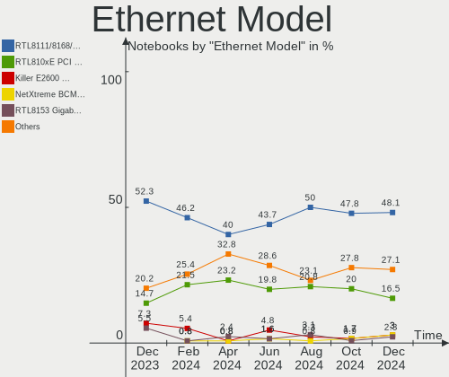

| Model                                                                          | Notebooks | Percent |
|--------------------------------------------------------------------------------|-----------|---------|
| Realtek RTL8111/8168/8411 PCI Express Gigabit Ethernet Controller              | 70        | 47.62%  |
| Realtek RTL810xE PCI Express Fast Ethernet controller                          | 29        | 19.73%  |
| Realtek Killer E2600 Gigabit Ethernet Controller                               | 6         | 4.08%   |
| JMicron JMC250 PCI Express Gigabit Ethernet Controller                         | 5         | 3.4%    |
| Realtek RTL8153 Gigabit Ethernet Adapter                                       | 3         | 2.04%   |
| Broadcom NetXtreme BCM57786 Gigabit Ethernet PCIe                              | 3         | 2.04%   |
| Broadcom NetLink BCM57785 Gigabit Ethernet PCIe                                | 3         | 2.04%   |
| Realtek RTL8125 2.5GbE Controller                                              | 2         | 1.36%   |
| Intel Ethernet Connection (4) I219-LM                                          | 2         | 1.36%   |
| Intel 82577LM Gigabit Network Connection                                       | 2         | 1.36%   |
| Broadcom Limited NetLink BCM57780 Gigabit Ethernet PCIe                        | 2         | 1.36%   |
| Xiaomi Mi/Redmi series (RNDIS)                                                 | 1         | 0.68%   |
| Silicon Integrated Systems [SiS] 191 Gigabit Ethernet Adapter                  | 1         | 0.68%   |
| Qualcomm Atheros AR8162 Fast Ethernet                                          | 1         | 0.68%   |
| Qualcomm Atheros AR8152 v2.0 Fast Ethernet                                     | 1         | 0.68%   |
| Qualcomm Atheros AR8152 v1.1 Fast Ethernet                                     | 1         | 0.68%   |
| Qualcomm Atheros AR8151 v2.0 Gigabit Ethernet                                  | 1         | 0.68%   |
| Qualcomm Atheros AR8131 Gigabit Ethernet                                       | 1         | 0.68%   |
| OPPO realme X50 5G                                                             | 1         | 0.68%   |
| Nvidia MCP79 Ethernet                                                          | 1         | 0.68%   |
| Marvell Group Yukon Optima 88E8059 [PCIe Gigabit Ethernet Controller with AVB] | 1         | 0.68%   |
| Marvell Group 88E8055 PCI-E Gigabit Ethernet Controller                        | 1         | 0.68%   |
| Marvell Group 88E8036 PCI-E Fast Ethernet Controller                           | 1         | 0.68%   |
| Lenovo ThinkPad TBT 3 Dock                                                     | 1         | 0.68%   |
| Intel Ethernet Connection I218-LM                                              | 1         | 0.68%   |
| Intel Ethernet Connection (6) I219-V                                           | 1         | 0.68%   |
| Intel Ethernet Connection (13) I219-LM                                         | 1         | 0.68%   |
| Intel Ethernet Connection (11) I219-V                                          | 1         | 0.68%   |
| Intel Ethernet Connection (10) I219-LM                                         | 1         | 0.68%   |
| Broadcom NetLink BCM5906M Fast Ethernet PCI Express                            | 1         | 0.68%   |
| Broadcom NetLink BCM57780 Gigabit Ethernet PCIe                                | 1         | 0.68%   |

Net Controller Kind
-------------------

Ethernet, WiFi or modem

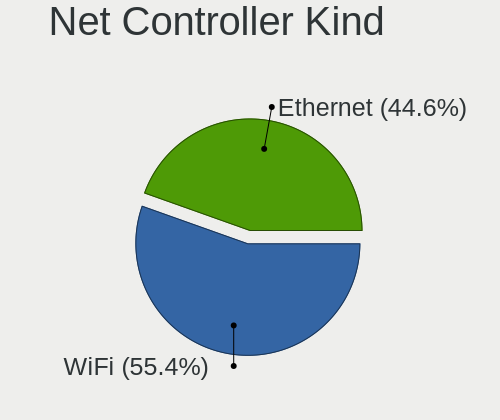

| Kind     | Notebooks | Percent |
|----------|-----------|---------|
| WiFi     | 164       | 53.25%  |
| Ethernet | 143       | 46.43%  |
| Modem    | 1         | 0.32%   |

Used Controller
---------------

Currently used network controller

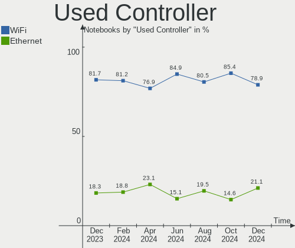

| Kind     | Notebooks | Percent |
|----------|-----------|---------|
| WiFi     | 135       | 80.84%  |
| Ethernet | 32        | 19.16%  |

NICs
----

Total network controllers on board

| Total | Notebooks | Percent |
|-------|-----------|---------|
| 2     | 135       | 79.41%  |
| 1     | 28        | 16.47%  |
| 0     | 7         | 4.12%   |

IPv6
----

IPv6 vs IPv4

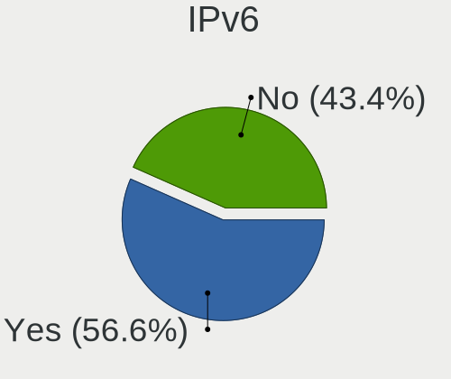

| Used | Notebooks | Percent |
|------|-----------|---------|
| No   | 88        | 51.76%  |
| Yes  | 82        | 48.24%  |

Bluetooth
---------

Bluetooth Vendor
----------------

Controller vendors

| Vendor                          | Notebooks | Percent |
|---------------------------------|-----------|---------|
| Intel                           | 66        | 48.18%  |
| Qualcomm Atheros Communications | 30        | 21.9%   |
| Lite-On Technology              | 11        | 8.03%   |
| Broadcom                        | 9         | 6.57%   |
| IMC Networks                    | 5         | 3.65%   |
| Realtek Semiconductor           | 3         | 2.19%   |
| Hewlett-Packard                 | 3         | 2.19%   |
| Cambridge Silicon Radio         | 3         | 2.19%   |
| Unknown                         | 1         | 0.73%   |
| Ralink                          | 1         | 0.73%   |
| Qcom                            | 1         | 0.73%   |
| Foxconn International           | 1         | 0.73%   |
| Foxconn / Hon Hai               | 1         | 0.73%   |
| Dell                            | 1         | 0.73%   |
| Apple                           | 1         | 0.73%   |

Bluetooth Model
---------------

Controller models

| Model                                               | Notebooks | Percent |
|-----------------------------------------------------|-----------|---------|
| Intel Bluetooth 9460/9560 Jefferson Peak (JfP)      | 26        | 18.98%  |
| Qualcomm Atheros  Bluetooth Device                  | 23        | 16.79%  |
| Intel Bluetooth wireless interface                  | 14        | 10.22%  |
| Intel AX201 Bluetooth                               | 13        | 9.49%   |
| Intel AX200 Bluetooth                               | 8         | 5.84%   |
| Lite-On Qualcomm Atheros QCA9377 Bluetooth          | 5         | 3.65%   |
| Broadcom BCM2070 Bluetooth 2.1 + EDR                | 4         | 2.92%   |
| Realtek Bluetooth Radio                             | 3         | 2.19%   |
| Qualcomm Atheros AR3012 Bluetooth 4.0               | 3         | 2.19%   |
| Qualcomm Atheros AR3011 Bluetooth                   | 3         | 2.19%   |
| Lite-On Qualcomm Atheros Bluetooth                  | 3         | 2.19%   |
| IMC Networks Bluetooth Radio                        | 3         | 2.19%   |
| Cambridge Silicon Radio Bluetooth Dongle (HCI mode) | 3         | 2.19%   |
| Intel Centrino Bluetooth Wireless Transceiver       | 2         | 1.46%   |
| Intel Centrino Advanced-N 6230 Bluetooth adapter    | 2         | 1.46%   |
| IMC Networks Bluetooth Device                       | 2         | 1.46%   |
| HP Bluetooth 2.0 Interface [Broadcom BCM2045]       | 2         | 1.46%   |
| Broadcom BCM2070 Bluetooth Device                   | 2         | 1.46%   |
| Unknown Bluetooth Device                            | 1         | 0.73%   |
| Ralink RT3290 Bluetooth                             | 1         | 0.73%   |
| Qualcomm Atheros Bluetooth USB Host Controller      | 1         | 0.73%   |
| Qcom Bluetooth USB                                  | 1         | 0.73%   |
| Lite-On Wireless_Device                             | 1         | 0.73%   |
| Lite-On Atheros Bluetooth                           | 1         | 0.73%   |
| Lite-On Atheros AR3012 Bluetooth                    | 1         | 0.73%   |
| Intel Wireless-AC 3168 Bluetooth                    | 1         | 0.73%   |
| HP Broadcom 2070 Bluetooth Combo                    | 1         | 0.73%   |
| Foxconn International BCM43142A0 Bluetooth module   | 1         | 0.73%   |
| Foxconn / Hon Hai Bluetooth Device                  | 1         | 0.73%   |
| Dell Wireless 365 Bluetooth                         | 1         | 0.73%   |
| Broadcom HP Portable Bumble Bee                     | 1         | 0.73%   |
| Broadcom Bluetooth 3.0+HS USB Adapter               | 1         | 0.73%   |
| Broadcom BCM2046 Bluetooth Device                   | 1         | 0.73%   |
| Apple Bluetooth Host Controller                     | 1         | 0.73%   |

Sound
-----

Sound Vendor
------------

Sound card vendors

| Vendor                           | Notebooks | Percent |
|----------------------------------|-----------|---------|
| Intel                            | 142       | 73.96%  |
| AMD                              | 22        | 11.46%  |
| Nvidia                           | 18        | 9.38%   |
| C-Media Electronics              | 3         | 1.56%   |
| Silicon Integrated Systems [SiS] | 1         | 0.52%   |
| Realtek Semiconductor            | 1         | 0.52%   |
| Razer USA                        | 1         | 0.52%   |
| Lenovo                           | 1         | 0.52%   |
| Kingston Technology              | 1         | 0.52%   |
| Generalplus Technology           | 1         | 0.52%   |
| Corsair                          | 1         | 0.52%   |

Sound Model
-----------

Sound card models

| Model                                                                                             | Notebooks | Percent |
|---------------------------------------------------------------------------------------------------|-----------|---------|
| Intel Sunrise Point-LP HD Audio                                                                   | 27        | 12.16%  |
| Intel Tiger Lake-LP Smart Sound Technology Audio Controller                                       | 19        | 8.56%   |
| AMD Family 17h/19h HD Audio Controller                                                            | 15        | 6.76%   |
| Intel 7 Series/C216 Chipset Family High Definition Audio Controller                               | 13        | 5.86%   |
| Intel 5 Series/3400 Series Chipset High Definition Audio                                          | 13        | 5.86%   |
| Intel Haswell-ULT HD Audio Controller                                                             | 12        | 5.41%   |
| Intel 8 Series HD Audio Controller                                                                | 12        | 5.41%   |
| Nvidia TU107 GeForce GTX 1650 High Definition Audio Controller                                    | 10        | 4.5%    |
| Intel 6 Series/C200 Series Chipset Family High Definition Audio Controller                        | 9         | 4.05%   |
| Intel Cannon Point-LP High Definition Audio Controller                                            | 8         | 3.6%    |
| Intel Ice Lake-LP Smart Sound Technology Audio Controller                                         | 6         | 2.7%    |
| Intel Comet Lake PCH-LP cAVS                                                                      | 5         | 2.25%   |
| Intel Celeron/Pentium Silver Processor High Definition Audio                                      | 5         | 2.25%   |
| Intel Atom/Celeron/Pentium Processor x5-E8000/J3xxx/N3xxx Series High Definition Audio Controller | 5         | 2.25%   |
| AMD Raven/Raven2/Fenghuang HDMI/DP Audio Controller                                               | 5         | 2.25%   |
| AMD Renoir Radeon High Definition Audio Controller                                                | 4         | 1.8%    |
| Nvidia GF108 High Definition Audio Controller                                                     | 3         | 1.35%   |
| Intel Wildcat Point-LP High Definition Audio Controller                                           | 3         | 1.35%   |
| Intel NM10/ICH7 Family High Definition Audio Controller                                           | 3         | 1.35%   |
| Intel Broadwell-U Audio Controller                                                                | 3         | 1.35%   |
| Intel 82801I (ICH9 Family) HD Audio Controller                                                    | 3         | 1.35%   |
| AMD SBx00 Azalia (Intel HDA)                                                                      | 3         | 1.35%   |
| AMD FCH Azalia Controller                                                                         | 3         | 1.35%   |
| Nvidia Audio device                                                                               | 2         | 0.9%    |
| Intel Tiger Lake-H HD Audio Controller                                                            | 2         | 0.9%    |
| Intel Comet Lake PCH cAVS                                                                         | 2         | 0.9%    |
| Intel Cannon Lake PCH cAVS                                                                        | 2         | 0.9%    |
| C-Media Electronics SADES Luna                                                                    | 2         | 0.9%    |
| AMD BeaverCreek HDMI Audio [Radeon HD 6500D and 6400G-6600G series]                               | 2         | 0.9%    |
| Silicon Integrated Systems [SiS] Azalia Audio Controller                                          | 1         | 0.45%   |
| Realtek Semiconductor USB Audio                                                                   | 1         | 0.45%   |
| Razer USA Nari (Wireless)                                                                         | 1         | 0.45%   |
| Nvidia MCP79 High Definition Audio                                                                | 1         | 0.45%   |
| Nvidia GM107 High Definition Audio Controller [GeForce 940MX]                                     | 1         | 0.45%   |
| Nvidia GK208 HDMI/DP Audio Controller                                                             | 1         | 0.45%   |
| Lenovo ThinkPad Thunderbolt 3 Dock USB Audio                                                      | 1         | 0.45%   |
| Kingston Technology HyperX Amp                                                                    | 1         | 0.45%   |
| Intel CM238 HD Audio Controller                                                                   | 1         | 0.45%   |
| Intel Celeron N3350/Pentium N4200/Atom E3900 Series Audio Cluster                                 | 1         | 0.45%   |
| Intel Atom Processor Z36xxx/Z37xxx Series High Definition Audio Controller                        | 1         | 0.45%   |
| Intel 82801H (ICH8 Family) HD Audio Controller                                                    | 1         | 0.45%   |
| Intel 82801FB/FBM/FR/FW/FRW (ICH6 Family) AC'97 Audio Controller                                  | 1         | 0.45%   |
| Generalplus Technology Usb Audio Device                                                           | 1         | 0.45%   |
| Corsair Slipstream Multi-Device Receiver                                                          | 1         | 0.45%   |
| C-Media Electronics CM108 Audio Controller                                                        | 1         | 0.45%   |
| AMD Wrestler HDMI Audio                                                                           | 1         | 0.45%   |
| AMD Trinity HDMI Audio Controller                                                                 | 1         | 0.45%   |
| AMD Kabini HDMI/DP Audio                                                                          | 1         | 0.45%   |
| AMD Family 15h (Models 60h-6fh) Audio Controller                                                  | 1         | 0.45%   |
| AMD Cedar HDMI Audio [Radeon HD 5400/6300/7300 Series]                                            | 1         | 0.45%   |

Memory
------

Memory Vendor
-------------

Memory module vendors

| Vendor              | Notebooks | Percent |
|---------------------|-----------|---------|
| Smart               | 17        | 21.25%  |
| Unknown             | 12        | 15%     |
| SK Hynix            | 11        | 13.75%  |
| Kingston            | 11        | 13.75%  |
| A-DATA Technology   | 7         | 8.75%   |
| Samsung Electronics | 6         | 7.5%    |
| Micron Technology   | 3         | 3.75%   |
| Teikon              | 2         | 2.5%    |
| SMART Brazil        | 2         | 2.5%    |
| Unknown (8A02)      | 1         | 1.25%   |
| Team                | 1         | 1.25%   |
| Patriot             | 1         | 1.25%   |
| Kreton              | 1         | 1.25%   |
| Kllisre             | 1         | 1.25%   |
| HT Micron           | 1         | 1.25%   |
| High Bridge         | 1         | 1.25%   |
| Crucial             | 1         | 1.25%   |
| Corsair             | 1         | 1.25%   |

Memory Model
------------

Memory module models

| Model                                                         | Notebooks | Percent |
|---------------------------------------------------------------|-----------|---------|
| Smart RAM SH564128FJ8NWRNSQG 4096MB SODIMM DDR3 1600MT/s      | 4         | 4.65%   |
| Unknown RAM Module 8GB SODIMM DDR4 2667MT/s                   | 3         | 3.49%   |
| Unknown RAM Module 2GB SODIMM DDR3 1600MT/s                   | 2         | 2.33%   |
| Smart RAM SH5641G8FJ8NWRNSQG 8192MB SODIMM DDR3 1600MT/s      | 2         | 2.33%   |
| SMART Brazil RAM SMS4TDC3C0K0446SCG 4GB SODIMM DDR4 2667MT/s  | 2         | 2.33%   |
| Samsung RAM M471A5244BB0-CPB 4GB SODIMM DDR4 2400MT/s         | 2         | 2.33%   |
| Micron RAM 53E512M32D2NP-046 1GB Row Of Chips LPDDR4 4267MT/s | 2         | 2.33%   |
| Unknown RAM Module 8GB SODIMM DDR3                            | 1         | 1.16%   |
| Unknown RAM Module 8192MB SODIMM DDR4 2667MT/s                | 1         | 1.16%   |
| Unknown RAM Module 512MB SODIMM DDR                           | 1         | 1.16%   |
| Unknown RAM Module 4GB SODIMM DDR4 2400MT/s                   | 1         | 1.16%   |
| Unknown RAM Module 4GB SODIMM DDR3 1333MT/s                   | 1         | 1.16%   |
| Unknown RAM Module 4096MB SODIMM DDR4 2667MT/s                | 1         | 1.16%   |
| Unknown RAM Module 2GB SODIMM DRAM                            | 1         | 1.16%   |
| Unknown RAM Module 2GB SODIMM DDR3                            | 1         | 1.16%   |
| Unknown RAM Module 2GB SODIMM DDR2 667MT/s                    | 1         | 1.16%   |
| Unknown RAM Module 1GB SODIMM DDR2 667MT/s                    | 1         | 1.16%   |
| Unknown RAM Module 1GB SODIMM DDR                             | 1         | 1.16%   |
| Unknown (8A02) RAM 8G2400MHz 8GB SODIMM DDR4 2667MT/s         | 1         | 1.16%   |
| Teikon RAM TMT451S6BFR8A-PBHJ 4GB SODIMM DDR3 1600MT/s        | 1         | 1.16%   |
| Teikon RAM TMA851S6AFR6N-UHHC 4GB SODIMM DDR4 2400MT/s        | 1         | 1.16%   |
| Team RAM TEAMGROUP-Ind-2400 4GB SODIMM DDR4 2400MT/s          | 1         | 1.16%   |
| Smart RAM SMS4WEC8C1K0446FCG 8GB SODIMM DDR4 3200MT/s         | 1         | 1.16%   |
| Smart RAM SH564568FH8NZPHSCR 2GB SODIMM DDR3 1333MT/s         | 1         | 1.16%   |
| Smart RAM SH564568FH8NWPHSFR 2GB SODIMM DDR3 1334MT/s         | 1         | 1.16%   |
| Smart RAM SH5641G8FJ8NWRNSQR 8GB SODIMM DDR3 1600MT/s         | 1         | 1.16%   |
| Smart RAM SH564128FJ8NWRNSQR 4GB SODIMM DDR3 1600MT/s         | 1         | 1.16%   |
| Smart RAM SH564128FH8NZPHSCG 4096MB SODIMM DDR3 1334MT/s      | 1         | 1.16%   |
| Smart RAM SG564568FG8NWKFSQR 2GB SODIMM DDR2 800MT/s          | 1         | 1.16%   |
| Smart RAM SG564568FG8NWKF-Z1 2GB SODIMM DDR2 800MT/s          | 1         | 1.16%   |
| Smart RAM SF4641G8CKHIWDFSEG 8GB SODIMM DDR4 2133MT/s         | 1         | 1.16%   |
| Smart RAM SF4641G8CK8IWGKSEG 8GB SODIMM DDR4 2400MT/s         | 1         | 1.16%   |
| Smart RAM SF4641G8CK8IEGKSBG 8192MB SODIMM DDR4 2400MT/s      | 1         | 1.16%   |
| Smart RAM SF464128CKHIWDFSEG 4GB SODIMM DDR4 2133MT/s         | 1         | 1.16%   |
| SK Hynix RAM Module 8GB SODIMM DDR4 3200MT/s                  | 1         | 1.16%   |
| SK Hynix RAM Module 4GB SODIMM DDR3 1600MT/s                  | 1         | 1.16%   |
| SK Hynix RAM Module 2048MB SODIMM DDR3 1600MT/s               | 1         | 1.16%   |
| SK Hynix RAM HMT351S6CFR8C-PB 4GB SODIMM DDR3 1600MT/s        | 1         | 1.16%   |
| SK Hynix RAM HMT351S6CFR8C-H9 4096MB SODIMM DDR3 1334MT/s     | 1         | 1.16%   |
| SK Hynix RAM HMT325S6CFR8C-H9 2048MB SODIMM DDR3 1334MT/s     | 1         | 1.16%   |
| SK Hynix RAM HMAA2GS6CJR8N-XN 16384MB SODIMM DDR4 3200MT/s    | 1         | 1.16%   |
| SK Hynix RAM HMA851S6AFR6N-UH 4GB SODIMM DDR4 2667MT/s        | 1         | 1.16%   |
| SK Hynix RAM HMA82GS6MFR8N-TF 16GB SODIMM DDR4 2133MT/s       | 1         | 1.16%   |
| SK Hynix RAM HMA82GS6CJR8N-VK 16GB SODIMM DDR4 2667MT/s       | 1         | 1.16%   |
| SK Hynix RAM HMA451S6AFR8N-TF 4GB SODIMM DDR4 2133MT/s        | 1         | 1.16%   |
| Samsung RAM M471B5173EB0-YK0 4GB SODIMM DDR3 1600MT/s         | 1         | 1.16%   |
| Samsung RAM M471A1K43DB1-CWE 8GB SODIMM DDR4 3200MT/s         | 1         | 1.16%   |
| Samsung RAM M471A1G44AB0-CWE 8GB SODIMM DDR4 3200MT/s         | 1         | 1.16%   |
| Samsung RAM M4 70T5663QZ3-CF7 2GB SODIMM DDR2 2048MT/s        | 1         | 1.16%   |
| Patriot RAM PSD44G240081S 4GB SODIMM DDR4 2400MT/s            | 1         | 1.16%   |
| Micron RAM 53E1G32D4NQ-046 2GB Row Of Chips LPDDR4 4267MT/s   | 1         | 1.16%   |
| Kreton RAM 53634xxxx68x6507xx 2GB SODIMM DDR3 1334MT/s        | 1         | 1.16%   |
| Kllisre RAM KRE-D3S1600M/8G 8192MB SODIMM DDR3 1600MT/s       | 1         | 1.16%   |
| Kingston RAM KHX2400C14S4/8G 8GB SODIMM DDR4 2400MT/s         | 1         | 1.16%   |
| Kingston RAM KF3200C20S4/16G 16GB SODIMM DDR4 3200MT/s        | 1         | 1.16%   |
| Kingston RAM ACR24D4S7S8MB-8 8192MB SODIMM DDR4 2400MT/s      | 1         | 1.16%   |
| Kingston RAM 99U5469-046.A00LF 4096MB SODIMM DDR3 1333MT/s    | 1         | 1.16%   |
| Kingston RAM 99U5428-096.A00LF 8GB SODIMM DDR3 1600MT/s       | 1         | 1.16%   |
| Kingston RAM 99U5428-046.A00LF 4GB SODIMM DDR3 1600MT/s       | 1         | 1.16%   |
| Kingston RAM 9905744-005.A00G 16GB SODIMM DDR4 2400MT/s       | 1         | 1.16%   |

Memory Kind
-----------

Memory module kinds

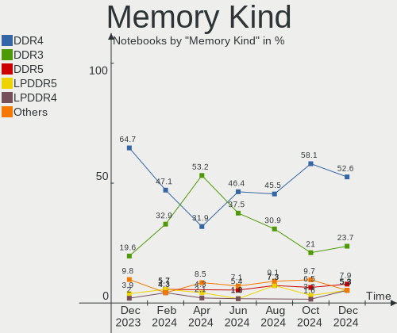

| Kind   | Notebooks | Percent |
|--------|-----------|---------|
| DDR4   | 30        | 46.88%  |
| DDR3   | 23        | 35.94%  |
| LPDDR4 | 4         | 6.25%   |
| DDR2   | 3         | 4.69%   |
| SDRAM  | 2         | 3.13%   |
| DRAM   | 1         | 1.56%   |
| DDR    | 1         | 1.56%   |

Memory Form Factor
------------------

Physical design of the memory module

| Name         | Notebooks | Percent |
|--------------|-----------|---------|
| SODIMM       | 58        | 95.08%  |
| Row Of Chips | 3         | 4.92%   |

Memory Size
-----------

Memory module size

| Size  | Notebooks | Percent |
|-------|-----------|---------|
| 8192  | 25        | 34.25%  |
| 4096  | 24        | 32.88%  |
| 2048  | 13        | 17.81%  |
| 16384 | 7         | 9.59%   |
| 1024  | 2         | 2.74%   |
| 32768 | 1         | 1.37%   |
| 512   | 1         | 1.37%   |

Memory Speed
------------

Memory module speed

| Speed   | Notebooks | Percent |
|---------|-----------|---------|
| 1600    | 17        | 23.29%  |
| 2667    | 12        | 16.44%  |
| 2400    | 12        | 16.44%  |
| 3200    | 7         | 9.59%   |
| 2133    | 5         | 6.85%   |
| 1334    | 5         | 6.85%   |
| 4267    | 3         | 4.11%   |
| Unknown | 3         | 4.11%   |
| 1333    | 2         | 2.74%   |
| 800     | 2         | 2.74%   |
| 4199    | 1         | 1.37%   |
| 2048    | 1         | 1.37%   |
| 1200    | 1         | 1.37%   |
| 1067    | 1         | 1.37%   |
| 667     | 1         | 1.37%   |

Printers & scanners
-------------------

Printer Vendor
--------------

Printer device vendors

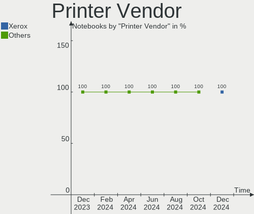

| Vendor          | Notebooks | Percent |
|-----------------|-----------|---------|
| Hewlett-Packard | 1         | 50%     |
| Canon           | 1         | 50%     |

Printer Model
-------------

Printer device models

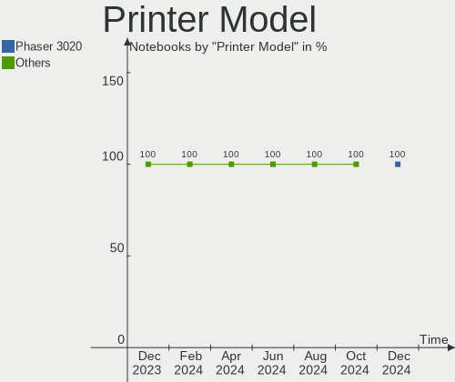

| Model                  | Notebooks | Percent |
|------------------------|-----------|---------|
| HP DeskJet 2700 series | 1         | 50%     |
| Canon G3000 series     | 1         | 50%     |

Scanner Vendor
--------------

Scanner device vendors

Zero info for selected period =(

Scanner Model
-------------

Scanner device models

Zero info for selected period =(

Camera
------

Camera Vendor
-------------

Camera device vendors

| Vendor                                 | Notebooks | Percent |
|----------------------------------------|-----------|---------|
| Chicony Electronics                    | 33        | 19.88%  |
| Realtek Semiconductor                  | 19        | 11.45%  |
| Sunplus Innovation Technology          | 16        | 9.64%   |
| Silicon Motion                         | 16        | 9.64%   |
| Microdia                               | 15        | 9.04%   |
| IMC Networks                           | 14        | 8.43%   |
| Quanta                                 | 11        | 6.63%   |
| Suyin                                  | 8         | 4.82%   |
| Cheng Uei Precision Industry (Foxlink) | 7         | 4.22%   |
| Acer                                   | 7         | 4.22%   |
| Syntek                                 | 5         | 3.01%   |
| Samsung Electronics                    | 5         | 3.01%   |
| Logitech                               | 2         | 1.2%    |
| Generalplus Technology                 | 2         | 1.2%    |
| ALi                                    | 2         | 1.2%    |
| Alcor Micro                            | 2         | 1.2%    |
| Pixart Imaging                         | 1         | 0.6%    |
| Apple                                  | 1         | 0.6%    |

Camera Model
------------

Camera device models

| Model                                             | Notebooks | Percent |
|---------------------------------------------------|-----------|---------|
| Realtek Integrated_Webcam_HD                      | 9         | 5.42%   |
| Sunplus Integrated_Webcam_HD                      | 8         | 4.82%   |
| Silicon Motion Web Camera                         | 6         | 3.61%   |
| Microdia Integrated_Webcam_HD                     | 6         | 3.61%   |
| Chicony HD WebCam                                 | 6         | 3.61%   |
| Samsung Galaxy A5 (MTP)                           | 5         | 3.01%   |
| Quanta VGA WebCam                                 | 5         | 3.01%   |
| Quanta HD User Facing                             | 5         | 3.01%   |
| IMC Networks USB2.0 VGA UVC WebCam                | 5         | 3.01%   |
| Chicony Integrated Camera                         | 5         | 3.01%   |
| Cheng Uei Precision Industry (Foxlink) VGA Camera | 5         | 3.01%   |
| Syntek Integrated Camera                          | 4         | 2.41%   |
| Chicony HD User Facing                            | 4         | 2.41%   |
| Sunplus HD WebCam                                 | 3         | 1.81%   |
| Realtek Integrated Webcam                         | 3         | 1.81%   |
| IMC Networks VGA camera                           | 3         | 1.81%   |
| IMC Networks Integrated Camera                    | 3         | 1.81%   |
| Suyin Integrated_Webcam_HD                        | 2         | 1.2%    |
| Suyin HD WebCam                                   | 2         | 1.2%    |
| Silicon Motion WebCam SCB-0385N                   | 2         | 1.2%    |
| Silicon Motion HP Webcam-50                       | 2         | 1.2%    |
| Realtek USB2.0-Camera                             | 2         | 1.2%    |
| Realtek HD WebCam                                 | 2         | 1.2%    |
| Microdia USB 2.0 Camera                           | 2         | 1.2%    |
| Chicony USB 2.0 Camera                            | 2         | 1.2%    |
| Chicony EasyCamera                                | 2         | 1.2%    |
| Chicony 1.3M HD WebCam                            | 2         | 1.2%    |
| Acer VGA WebCam                                   | 2         | 1.2%    |
| Acer EasyCamera                                   | 2         | 1.2%    |
| Syntek EasyCamera                                 | 1         | 0.6%    |
| Suyin Laptop_Integrated_Webcam_HD                 | 1         | 0.6%    |
| Suyin Integrated Webcam                           | 1         | 0.6%    |
| Suyin HP Truevision HD                            | 1         | 0.6%    |
| Suyin 1.3M HD WebCam                              | 1         | 0.6%    |
| Sunplus SunplusIT PC Camera                       | 1         | 0.6%    |
| Sunplus Laptop_Integrated_Webcam_FHD              | 1         | 0.6%    |
| Sunplus HP TrueVision HD                          | 1         | 0.6%    |
| Sunplus HK 1080P K20Pro                           | 1         | 0.6%    |
| Sunplus 1.3M HD WebCam                            | 1         | 0.6%    |
| Silicon Motion WebCam SCB-1100N                   | 1         | 0.6%    |
| Silicon Motion WebCam SC-10HDP12631N              | 1         | 0.6%    |
| Silicon Motion WebCam SC-10HDD12636N              | 1         | 0.6%    |
| Silicon Motion WebCam SC-0311139N                 | 1         | 0.6%    |
| Silicon Motion Lenovo EasyCamera                  | 1         | 0.6%    |
| Silicon Motion HD WebCam                          | 1         | 0.6%    |
| Realtek USB Camera                                | 1         | 0.6%    |
| Realtek MTD camera                                | 1         | 0.6%    |
| Realtek HP Truevision HD integrated webcam        | 1         | 0.6%    |
| Quanta HP Webcam                                  | 1         | 0.6%    |
| Pixart Imaging VGA Webcam                         | 1         | 0.6%    |
| Microdia Webcam Vitade AF                         | 1         | 0.6%    |
| Microdia Webcam SC-10HDD12636P                    | 1         | 0.6%    |
| Microdia Lenovo EasyCamera                        | 1         | 0.6%    |
| Microdia Laptop_Integrated_Webcam_HD              | 1         | 0.6%    |
| Microdia Integrated Webcam HD                     | 1         | 0.6%    |
| Microdia Dell Laptop Integrated Webcam HD         | 1         | 0.6%    |
| Microdia 1.3 MPixel Integrated Webcam             | 1         | 0.6%    |
| Logitech HD Pro Webcam C920                       | 1         | 0.6%    |
| Logitech C922 Pro Stream Webcam                   | 1         | 0.6%    |
| IMC Networks VGA UVC WebCam                       | 1         | 0.6%    |

Security
--------

Fingerprint Vendor
------------------

Fingerprint sensor vendors

| Vendor                     | Notebooks | Percent |
|----------------------------|-----------|---------|
| Validity Sensors           | 7         | 53.85%  |
| Shenzhen Goodix Technology | 2         | 15.38%  |
| Upek                       | 1         | 7.69%   |
| Synaptics                  | 1         | 7.69%   |
| Samsung Electronics        | 1         | 7.69%   |
| AuthenTec                  | 1         | 7.69%   |

Fingerprint Model
-----------------

Fingerprint sensor models

| Model                                                  | Notebooks | Percent |
|--------------------------------------------------------|-----------|---------|
| Validity Sensors VFS5011 Fingerprint Reader            | 4         | 30.77%  |
| Validity Sensors VFS451 Fingerprint Reader             | 2         | 15.38%  |
| Validity Sensors Fingerprint scanner                   | 1         | 7.69%   |
| Upek Biometric Touchchip/Touchstrip Fingerprint Sensor | 1         | 7.69%   |
| Synaptics Prometheus MIS Touch Fingerprint Reader      | 1         | 7.69%   |
| Shenzhen Goodix  FingerPrint Device                    | 1         | 7.69%   |
| Shenzhen Goodix Fingerprint Reader                     | 1         | 7.69%   |
| Samsung Fingerprint Device                             | 1         | 7.69%   |
| AuthenTec AES1600                                      | 1         | 7.69%   |

Chipcard Vendor
---------------

Chipcard module vendors

| Vendor   | Notebooks | Percent |
|----------|-----------|---------|
| Broadcom | 1         | 100%    |

Chipcard Model
--------------

Chipcard module models

| Model          | Notebooks | Percent |
|----------------|-----------|---------|
| Broadcom 58200 | 1         | 100%    |

Unsupported
-----------

Unsupported Devices
-------------------

Total unsupported devices on board

| Total | Notebooks | Percent |
|-------|-----------|---------|
| 0     | 126       | 74.12%  |
| 1     | 35        | 20.59%  |
| 2     | 6         | 3.53%   |
| 8     | 1         | 0.59%   |
| 7     | 1         | 0.59%   |
| 3     | 1         | 0.59%   |

Unsupported Device Types
------------------------

Types of unsupported devices

| Type                     | Notebooks | Percent |
|--------------------------|-----------|---------|
| Graphics card            | 15        | 23.44%  |
| Multimedia controller    | 13        | 20.31%  |
| Fingerprint reader       | 13        | 20.31%  |
| Net/wireless             | 6         | 9.38%   |
| Bluetooth                | 5         | 7.81%   |
| Camera                   | 4         | 6.25%   |
| Sound                    | 2         | 3.13%   |
| Communication controller | 2         | 3.13%   |
| Net/ethernet             | 1         | 1.56%   |
| Firewire controller      | 1         | 1.56%   |
| Chipcard                 | 1         | 1.56%   |
| Card reader              | 1         | 1.56%   |

