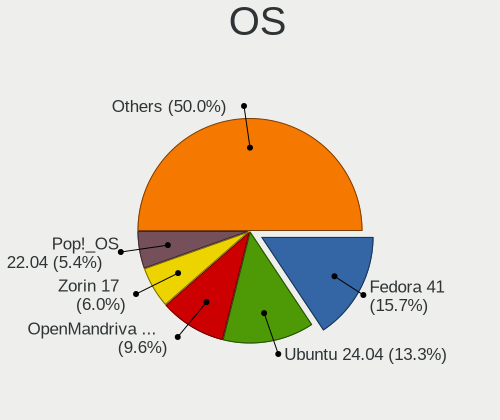
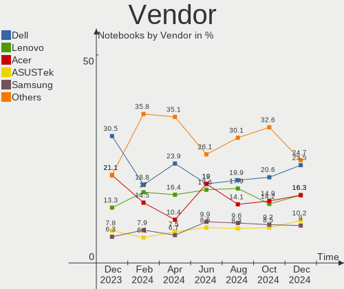
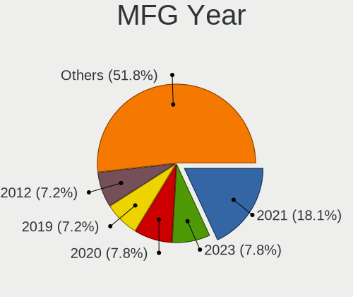
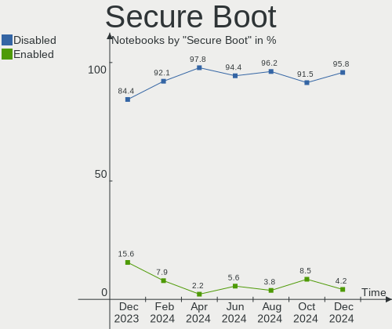
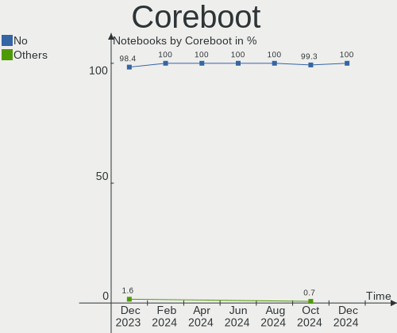
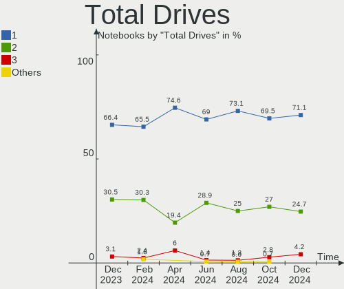
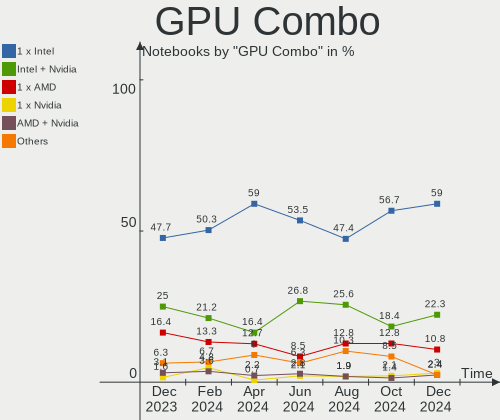
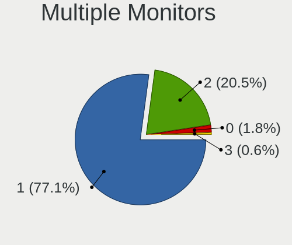
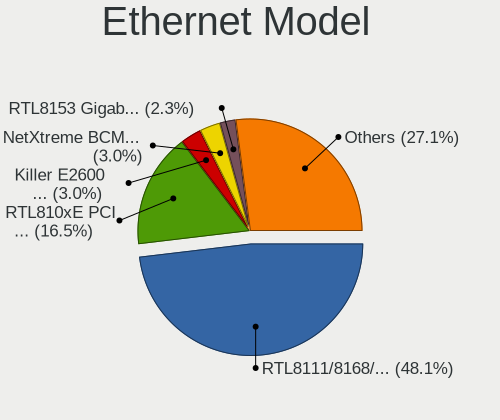
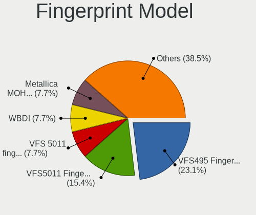

Linux in Brazil - Hardware Trends (Notebooks)
---------------------------------------------

A project to identify most popular hardware characteristics and track their change
over time based on data collected by Linux users at https://Linux-Hardware.org.

Anyone can contribute to this report by the [hw-probe](https://github.com/linuxhw/hw-probe) tool:

    sudo -E hw-probe -all -upload

Period: Jun, 2022.

Contents
--------

* [ System ](#system)
  - [ OS                       ](#os)
  - [ OS Family                ](#os-family)
  - [ Kernel                   ](#kernel)
  - [ Kernel Family            ](#kernel-family)
  - [ Kernel Major Ver.        ](#kernel-major-ver)
  - [ Arch                     ](#arch)
  - [ DE                       ](#de)
  - [ Display Server           ](#display-server)
  - [ Display Manager          ](#display-manager)
  - [ OS Lang                  ](#os-lang)
  - [ Boot Mode                ](#boot-mode)
  - [ Filesystem               ](#filesystem)
  - [ Part. scheme             ](#part-scheme)
  - [ Dual Boot with Linux/BSD ](#dual-boot-with-linuxbsd)
  - [ Dual Boot (Win)          ](#dual-boot-win)

* [ Board ](#board)
  - [ Vendor                   ](#vendor)
  - [ Model                    ](#model)
  - [ Model Family             ](#model-family)
  - [ MFG Year                 ](#mfg-year)
  - [ Form Factor              ](#form-factor)
  - [ Secure Boot              ](#secure-boot)
  - [ Coreboot                 ](#coreboot)
  - [ RAM Size                 ](#ram-size)
  - [ RAM Used                 ](#ram-used)
  - [ Total Drives             ](#total-drives)
  - [ Has CD-ROM               ](#has-cd-rom)
  - [ Has Ethernet             ](#has-ethernet)
  - [ Has WiFi                 ](#has-wifi)
  - [ Has Bluetooth            ](#has-bluetooth)

* [ Location ](#location)
  - [ Country                  ](#country)
  - [ City                     ](#city)

* [ Drives ](#drives)
  - [ Drive Vendor             ](#drive-vendor)
  - [ Drive Model              ](#drive-model)
  - [ HDD Vendor               ](#hdd-vendor)
  - [ SSD Vendor               ](#ssd-vendor)
  - [ Drive Kind               ](#drive-kind)
  - [ Drive Connector          ](#drive-connector)
  - [ Drive Size               ](#drive-size)
  - [ Space Total              ](#space-total)
  - [ Space Used               ](#space-used)
  - [ Malfunc. Drives          ](#malfunc-drives)
  - [ Malfunc. Drive Vendor    ](#malfunc-drive-vendor)
  - [ Malfunc. HDD Vendor      ](#malfunc-hdd-vendor)
  - [ Malfunc. Drive Kind      ](#malfunc-drive-kind)
  - [ Failed Drives            ](#failed-drives)
  - [ Failed Drive Vendor      ](#failed-drive-vendor)
  - [ Drive Status             ](#drive-status)

* [ Storage controller ](#storage-controller)
  - [ Storage Vendor           ](#storage-vendor)
  - [ Storage Model            ](#storage-model)
  - [ Storage Kind             ](#storage-kind)

* [ Processor ](#processor)
  - [ CPU Vendor               ](#cpu-vendor)
  - [ CPU Model                ](#cpu-model)
  - [ CPU Model Family         ](#cpu-model-family)
  - [ CPU Cores                ](#cpu-cores)
  - [ CPU Sockets              ](#cpu-sockets)
  - [ CPU Threads              ](#cpu-threads)
  - [ CPU Op-Modes             ](#cpu-op-modes)
  - [ CPU Microcode            ](#cpu-microcode)
  - [ CPU Microarch            ](#cpu-microarch)

* [ Graphics ](#graphics)
  - [ GPU Vendor               ](#gpu-vendor)
  - [ GPU Model                ](#gpu-model)
  - [ GPU Combo                ](#gpu-combo)
  - [ GPU Driver               ](#gpu-driver)
  - [ GPU Memory               ](#gpu-memory)

* [ Monitor ](#monitor)
  - [ Monitor Vendor           ](#monitor-vendor)
  - [ Monitor Model            ](#monitor-model)
  - [ Monitor Resolution       ](#monitor-resolution)
  - [ Monitor Diagonal         ](#monitor-diagonal)
  - [ Monitor Width            ](#monitor-width)
  - [ Aspect Ratio             ](#aspect-ratio)
  - [ Monitor Area             ](#monitor-area)
  - [ Pixel Density            ](#pixel-density)
  - [ Multiple Monitors        ](#multiple-monitors)

* [ Network ](#network)
  - [ Net Controller Vendor    ](#net-controller-vendor)
  - [ Net Controller Model     ](#net-controller-model)
  - [ Wireless Vendor          ](#wireless-vendor)
  - [ Wireless Model           ](#wireless-model)
  - [ Ethernet Vendor          ](#ethernet-vendor)
  - [ Ethernet Model           ](#ethernet-model)
  - [ Net Controller Kind      ](#net-controller-kind)
  - [ Used Controller          ](#used-controller)
  - [ NICs                     ](#nics)
  - [ IPv6                     ](#ipv6)

* [ Bluetooth ](#bluetooth)
  - [ Bluetooth Vendor         ](#bluetooth-vendor)
  - [ Bluetooth Model          ](#bluetooth-model)

* [ Sound ](#sound)
  - [ Sound Vendor             ](#sound-vendor)
  - [ Sound Model              ](#sound-model)

* [ Memory ](#memory)
  - [ Memory Vendor            ](#memory-vendor)
  - [ Memory Model             ](#memory-model)
  - [ Memory Kind              ](#memory-kind)
  - [ Memory Form Factor       ](#memory-form-factor)
  - [ Memory Size              ](#memory-size)
  - [ Memory Speed             ](#memory-speed)

* [ Printers & scanners ](#printers--scanners)
  - [ Printer Vendor           ](#printer-vendor)
  - [ Printer Model            ](#printer-model)
  - [ Scanner Vendor           ](#scanner-vendor)
  - [ Scanner Model            ](#scanner-model)

* [ Camera ](#camera)
  - [ Camera Vendor            ](#camera-vendor)
  - [ Camera Model             ](#camera-model)

* [ Security ](#security)
  - [ Fingerprint Vendor       ](#fingerprint-vendor)
  - [ Fingerprint Model        ](#fingerprint-model)
  - [ Chipcard Vendor          ](#chipcard-vendor)
  - [ Chipcard Model           ](#chipcard-model)

* [ Unsupported ](#unsupported)
  - [ Unsupported Devices      ](#unsupported-devices)
  - [ Unsupported Device Types ](#unsupported-device-types)

System
------

OS
--

Installed operating systems

| Name                  | Notebooks | Percent |
|-----------------------|-----------|---------|
| Ubuntu 22.04          | 19        | 13.1%   |
| Linux Mint 20.3       | 17        | 11.72%  |
| Ubuntu 20.04          | 13        | 8.97%   |
| Pop!_OS 22.04         | 12        | 8.28%   |
| OpenMandriva 4.3      | 9         | 6.21%   |
| Fedora 36             | 9         | 6.21%   |
| Endless 4.0.6         | 7         | 4.83%   |
| Arch                  | 7         | 4.83%   |
| Zorin 16              | 5         | 3.45%   |
| KDE neon 20.04        | 5         | 3.45%   |
| Debian 11             | 5         | 3.45%   |
| Manjaro               | 3         | 2.07%   |
| Lubuntu 22.04         | 3         | 2.07%   |
| Ubuntu 18.04          | 2         | 1.38%   |
| Elementary 6.1        | 2         | 1.38%   |
| Arch Rolling          | 2         | 1.38%   |
| Xubuntu 22.04         | 1         | 0.69%   |
| Ubuntu Budgie 22.04   | 1         | 0.69%   |
| Ubuntu Budgie 21.10   | 1         | 0.69%   |
| ROSA 12.2             | 1         | 0.69%   |
| Rocky Linux 8.5       | 1         | 0.69%   |
| Parrot 5.0            | 1         | 0.69%   |
| openSUSE Leap-15.4    | 1         | 0.69%   |
| MX 21                 | 1         | 0.69%   |
| LMDE 5                | 1         | 0.69%   |
| Linux Mint 20.2       | 1         | 0.69%   |
| Linux Mint 20.1       | 1         | 0.69%   |
| Linux Lite 5.8        | 1         | 0.69%   |
| Kubuntu 2.0           | 1         | 0.69%   |
| Kubuntu 11            | 1         | 0.69%   |
| Fedora 35             | 1         | 0.69%   |
| Endless 4.0.7         | 1         | 0.69%   |
| Endless 4.0.4         | 1         | 0.69%   |
| Endless 3.9.7         | 1         | 0.69%   |
| Endless 3.9.3-nexthw1 | 1         | 0.69%   |
| Endless 3.9.1         | 1         | 0.69%   |
| Endless 3.8.3-nexthw1 | 1         | 0.69%   |
| Debian Testing        | 1         | 0.69%   |
| Clear Linux 36510     | 1         | 0.69%   |
| CentOS 8              | 1         | 0.69%   |
| Archcraft             | 1         | 0.69%   |

OS Family
---------

OS without a version

| Name          | Notebooks | Percent |
|---------------|-----------|---------|
| Ubuntu        | 34        | 23.45%  |
| Linux Mint    | 19        | 13.1%   |
| Endless       | 13        | 8.97%   |
| Pop!_OS       | 12        | 8.28%   |
| Fedora        | 10        | 6.9%    |
| OpenMandriva  | 9         | 6.21%   |
| Arch          | 9         | 6.21%   |
| Debian        | 6         | 4.14%   |
| Zorin         | 5         | 3.45%   |
| KDE neon      | 5         | 3.45%   |
| Manjaro       | 3         | 2.07%   |
| Lubuntu       | 3         | 2.07%   |
| Ubuntu Budgie | 2         | 1.38%   |
| Kubuntu       | 2         | 1.38%   |
| Elementary    | 2         | 1.38%   |
| Xubuntu       | 1         | 0.69%   |
| ROSA          | 1         | 0.69%   |
| Rocky Linux   | 1         | 0.69%   |
| Parrot        | 1         | 0.69%   |
| openSUSE      | 1         | 0.69%   |
| MX            | 1         | 0.69%   |
| LMDE          | 1         | 0.69%   |
| Linux Lite    | 1         | 0.69%   |
| Clear Linux   | 1         | 0.69%   |
| CentOS        | 1         | 0.69%   |
| Archcraft     | 1         | 0.69%   |

Kernel
------

Version of the Linux kernel

| Version                             | Notebooks | Percent |
|-------------------------------------|-----------|---------|
| 5.17.5-76051705-generic             | 12        | 8.28%   |
| 5.13.0-44-generic                   | 11        | 7.59%   |
| 5.11.0-35-generic                   | 9         | 6.21%   |
| 5.4.0-113-generic                   | 7         | 4.83%   |
| 5.16.7-desktop-1omv4003             | 7         | 4.83%   |
| 5.13.0-48-generic                   | 7         | 4.83%   |
| 5.15.0-40-generic                   | 5         | 3.45%   |
| 5.13.0-51-generic                   | 5         | 3.45%   |
| 5.10.0-14-amd64                     | 5         | 3.45%   |
| 5.4.0-91-generic                    | 4         | 2.76%   |
| 5.4.0-117-generic                   | 4         | 2.76%   |
| 5.17.13-300.fc36.x86_64             | 4         | 2.76%   |
| 5.15.0-35-generic                   | 4         | 2.76%   |
| 5.15.0-33-generic                   | 4         | 2.76%   |
| 5.4.0-120-generic                   | 3         | 2.07%   |
| 5.15.0-39-generic                   | 3         | 2.07%   |
| 5.15.0-37-generic                   | 3         | 2.07%   |
| 5.15.0-25-generic                   | 3         | 2.07%   |
| 5.8.0-14-generic                    | 2         | 1.38%   |
| 5.18.5-200.fc36.x86_64              | 2         | 1.38%   |
| 5.18.1-zen1-1-zen                   | 2         | 1.38%   |
| 5.18.1-arch1-1                      | 2         | 1.38%   |
| 5.17.12-300.fc36.x86_64             | 2         | 1.38%   |
| 5.16.13-desktop-1omv4003            | 2         | 1.38%   |
| 5.6.0-7-generic                     | 1         | 0.69%   |
| 5.4.0-74-generic                    | 1         | 0.69%   |
| 5.4.0-121-generic                   | 1         | 0.69%   |
| 5.4.0-110-generic                   | 1         | 0.69%   |
| 5.4.0-109-generic                   | 1         | 0.69%   |
| 5.18.7-arch1-1                      | 1         | 0.69%   |
| 5.18.6-arch1-1                      | 1         | 0.69%   |
| 5.18.5-arch1-1                      | 1         | 0.69%   |
| 5.18.4-xm1.0.fc35.x86_64            | 1         | 0.69%   |
| 5.18.4-125.vanilla.1.fc36.x86_64    | 1         | 0.69%   |
| 5.18.3-zen1-1-zen                   | 1         | 0.69%   |
| 5.18.3-arch1-1                      | 1         | 0.69%   |
| 5.18.0-2-amd64                      | 1         | 0.69%   |
| 5.18.0-051800-generic               | 1         | 0.69%   |
| 5.16.13-1132.native                 | 1         | 0.69%   |
| 5.16.0-12parrot1-amd64              | 1         | 0.69%   |
| 5.15.48-1-MANJARO                   | 1         | 0.69%   |
| 5.15.46-1-MANJARO                   | 1         | 0.69%   |
| 5.15.43-1-lts                       | 1         | 0.69%   |
| 5.15.41-1-MANJARO                   | 1         | 0.69%   |
| 5.15.0-36-generic                   | 1         | 0.69%   |
| 5.15.0-30-generic                   | 1         | 0.69%   |
| 5.14.21-150400.22-default           | 1         | 0.69%   |
| 5.14.0-1042-oem                     | 1         | 0.69%   |
| 5.13.0-52-generic                   | 1         | 0.69%   |
| 5.13.0-19-generic                   | 1         | 0.69%   |
| 5.11.0-12-generic                   | 1         | 0.69%   |
| 5.10.89-1.el8.x86_64                | 1         | 0.69%   |
| 5.10.118-generic-2rosa2021.1-x86_64 | 1         | 0.69%   |
| 5.10.0-13-amd64                     | 1         | 0.69%   |
| 5.10.0-13-686-pae                   | 1         | 0.69%   |
| 4.18.0-348.7.1.el8_5.x86_64         | 1         | 0.69%   |
| 4.15.0-180-generic                  | 1         | 0.69%   |

Kernel Family
-------------

Linux kernel without a distro release

| Version  | Notebooks | Percent |
|----------|-----------|---------|
| 5.13.0   | 25        | 17.24%  |
| 5.15.0   | 24        | 16.55%  |
| 5.4.0    | 22        | 15.17%  |
| 5.17.5   | 12        | 8.28%   |
| 5.11.0   | 10        | 6.9%    |
| 5.16.7   | 7         | 4.83%   |
| 5.10.0   | 7         | 4.83%   |
| 5.18.1   | 4         | 2.76%   |
| 5.17.13  | 4         | 2.76%   |
| 5.18.5   | 3         | 2.07%   |
| 5.16.13  | 3         | 2.07%   |
| 5.8.0    | 2         | 1.38%   |
| 5.18.4   | 2         | 1.38%   |
| 5.18.3   | 2         | 1.38%   |
| 5.18.0   | 2         | 1.38%   |
| 5.17.12  | 2         | 1.38%   |
| 5.6.0    | 1         | 0.69%   |
| 5.18.7   | 1         | 0.69%   |
| 5.18.6   | 1         | 0.69%   |
| 5.16.0   | 1         | 0.69%   |
| 5.15.48  | 1         | 0.69%   |
| 5.15.46  | 1         | 0.69%   |
| 5.15.43  | 1         | 0.69%   |
| 5.15.41  | 1         | 0.69%   |
| 5.14.21  | 1         | 0.69%   |
| 5.14.0   | 1         | 0.69%   |
| 5.10.89  | 1         | 0.69%   |
| 5.10.118 | 1         | 0.69%   |
| 4.18.0   | 1         | 0.69%   |
| 4.15.0   | 1         | 0.69%   |

Kernel Major Ver.
-----------------

Linux kernel major version

| Version | Notebooks | Percent |
|---------|-----------|---------|
| 5.15    | 28        | 19.31%  |
| 5.13    | 25        | 17.24%  |
| 5.4     | 22        | 15.17%  |
| 5.17    | 18        | 12.41%  |
| 5.18    | 15        | 10.34%  |
| 5.16    | 11        | 7.59%   |
| 5.11    | 10        | 6.9%    |
| 5.10    | 9         | 6.21%   |
| 5.8     | 2         | 1.38%   |
| 5.14    | 2         | 1.38%   |
| 5.6     | 1         | 0.69%   |
| 4.18    | 1         | 0.69%   |
| 4.15    | 1         | 0.69%   |

Arch
----

OS architecture (x86_64, i586, etc.)

| Name   | Notebooks | Percent |
|--------|-----------|---------|
| x86_64 | 143       | 98.62%  |
| i686   | 2         | 1.38%   |

DE
--

Desktop Environment

| Name       | Notebooks | Percent |
|------------|-----------|---------|
| GNOME      | 79        | 54.48%  |
| KDE5       | 24        | 16.55%  |
| X-Cinnamon | 16        | 11.03%  |
| XFCE       | 12        | 8.28%   |
| LXQt       | 3         | 2.07%   |
| Pantheon   | 2         | 1.38%   |
| i3         | 2         | 1.38%   |
| Budgie     | 2         | 1.38%   |
| Unknown    | 2         | 1.38%   |
| Unity      | 1         | 0.69%   |
| sway       | 1         | 0.69%   |
| MATE       | 1         | 0.69%   |

Display Server
--------------

X11 or Wayland

| Name    | Notebooks | Percent |
|---------|-----------|---------|
| X11     | 119       | 82.07%  |
| Wayland | 25        | 17.24%  |
| Unknown | 1         | 0.69%   |

Display Manager
---------------

SDDM, LightDM, etc.

| Name    | Notebooks | Percent |
|---------|-----------|---------|
| Unknown | 77        | 53.1%   |
| GDM3    | 28        | 19.31%  |
| LightDM | 19        | 13.1%   |
| SDDM    | 15        | 10.34%  |
| GDM     | 6         | 4.14%   |

OS Lang
-------

Language

| Lang  | Notebooks | Percent |
|-------|-----------|---------|
| pt_BR | 114       | 78.62%  |
| en_US | 26        | 17.93%  |
| C     | 3         | 2.07%   |
| pt_PT | 1         | 0.69%   |
| en_GB | 1         | 0.69%   |

Boot Mode
---------

EFI or BIOS

| Mode | Notebooks | Percent |
|------|-----------|---------|
| BIOS | 73        | 50.34%  |
| EFI  | 72        | 49.66%  |

Filesystem
----------

Type of filesystem

| Type    | Notebooks | Percent |
|---------|-----------|---------|
| Ext4    | 116       | 80%     |
| Btrfs   | 16        | 11.03%  |
| Overlay | 11        | 7.59%   |
| Xfs     | 1         | 0.69%   |
| Tmpfs   | 1         | 0.69%   |

Part. scheme
------------

Scheme of partitioning

| Type    | Notebooks | Percent |
|---------|-----------|---------|
| Unknown | 103       | 71.03%  |
| GPT     | 30        | 20.69%  |
| MBR     | 12        | 8.28%   |

Dual Boot with Linux/BSD
------------------------

Hosting more than one Linux/BSD

| Dual boot | Notebooks | Percent |
|-----------|-----------|---------|
| No        | 135       | 93.1%   |
| Yes       | 10        | 6.9%    |

Dual Boot (Win)
---------------

Hosting Linux and Windows

| Dual boot | Notebooks | Percent |
|-----------|-----------|---------|
| No        | 120       | 82.76%  |
| Yes       | 25        | 17.24%  |

Board
-----

Vendor
------

Motherboard manufacturer

| Name                   | Notebooks | Percent |
|------------------------|-----------|---------|
| Dell                   | 39        | 26.9%   |
| Acer                   | 28        | 19.31%  |
| Samsung Electronics    | 15        | 10.34%  |
| Positivo               | 13        | 8.97%   |
| Lenovo                 | 12        | 8.28%   |
| ASUSTek Computer       | 10        | 6.9%    |
| LG Electronics         | 5         | 3.45%   |
| Hewlett-Packard        | 3         | 2.07%   |
| Avell High Performance | 3         | 2.07%   |
| Itautec                | 2         | 1.38%   |
| Toshiba                | 1         | 0.69%   |
| Timi                   | 1         | 0.69%   |
| Teclast                | 1         | 0.69%   |
| Standard               | 1         | 0.69%   |
| Philco                 | 1         | 0.69%   |
| Multilaser             | 1         | 0.69%   |
| Login Informatica      | 1         | 0.69%   |
| Intel                  | 1         | 0.69%   |
| Daten Tecnologia       | 1         | 0.69%   |
| Compaq                 | 1         | 0.69%   |
| Chuwi                  | 1         | 0.69%   |
| BenQ                   | 1         | 0.69%   |
| Apple                  | 1         | 0.69%   |
| A14CR                  | 1         | 0.69%   |
| Unknown                | 1         | 0.69%   |

Model
-----

Motherboard model

| Name                                                  | Notebooks | Percent |
|-------------------------------------------------------|-----------|---------|
| Acer Nitro AN515-44                                   | 6         | 4.14%   |
| Positivo S14CT01                                      | 3         | 2.07%   |
| LG 15Z970-E.BH71P1                                    | 3         | 2.07%   |
| Unknown                                               | 3         | 2.07%   |
| Samsung 300E5M/300E5L                                 | 2         | 1.38%   |
| Samsung 300E5K/300E5Q                                 | 2         | 1.38%   |
| Positivo Q464C                                        | 2         | 1.38%   |
| Positivo CHT14B                                       | 2         | 1.38%   |
| Itautec Infoway w7430                                 | 2         | 1.38%   |
| Dell Vostro 5470                                      | 2         | 1.38%   |
| Dell Vostro 3460                                      | 2         | 1.38%   |
| Dell Inspiron N4050                                   | 2         | 1.38%   |
| Dell Inspiron 7520                                    | 2         | 1.38%   |
| Dell Inspiron 5537                                    | 2         | 1.38%   |
| Dell Inspiron 5437                                    | 2         | 1.38%   |
| Dell Inspiron 1545                                    | 2         | 1.38%   |
| Dell Inspiron 1525                                    | 2         | 1.38%   |
| Dell Inspiron 15-3567                                 | 2         | 1.38%   |
| Dell G3 3500                                          | 2         | 1.38%   |
| ASUS VivoBook_ASUSLaptop X515JA_X515JA                | 2         | 1.38%   |
| Acer Predator G3-572                                  | 2         | 1.38%   |
| Acer Aspire ES1-572                                   | 2         | 1.38%   |
| Acer Aspire E1-571                                    | 2         | 1.38%   |
| Toshiba Satellite C845                                | 1         | 0.69%   |
| Timi RedmiBook Pro 14S                                | 1         | 0.69%   |
| Teclast F7S                                           | 1         | 0.69%   |
| Samsung RV411                                         | 1         | 0.69%   |
| Samsung 670Z5E                                        | 1         | 0.69%   |
| Samsung 550XDA                                        | 1         | 0.69%   |
| Samsung 550XBE/350XBE                                 | 1         | 0.69%   |
| Samsung 530XBB                                        | 1         | 0.69%   |
| Samsung 530U3C/530U4C/532U3C                          | 1         | 0.69%   |
| Samsung 500R5M/500R5W/501R5M                          | 1         | 0.69%   |
| Samsung 370E4K                                        | 1         | 0.69%   |
| Samsung 340XAA/350XAA/550XAA                          | 1         | 0.69%   |
| Samsung 300E5EV/300E4EV/270E5EV/270E4EV/2470EV/2470EE | 1         | 0.69%   |
| Samsung 270E5K/270E5Q/271E5K/2570EK                   | 1         | 0.69%   |
| Positivo W540EU                                       | 1         | 0.69%   |
| Positivo Q232A                                        | 1         | 0.69%   |
| Positivo Mobile                                       | 1         | 0.69%   |
| Positivo J14GL11                                      | 1         | 0.69%   |
| Positivo C4500D                                       | 1         | 0.69%   |
| Positivo C4120F-AX                                    | 1         | 0.69%   |
| Philco OEM                                            | 1         | 0.69%   |
| Multilaser PC150                                      | 1         | 0.69%   |
| Login Informatica LOG-MB47II7                         | 1         | 0.69%   |
| LG P420-G.BC43P1                                      | 1         | 0.69%   |
| LG A410-G.BC48P1                                      | 1         | 0.69%   |
| Lenovo V14 G2 ITL 82NM                                | 1         | 0.69%   |
| Lenovo ThinkPad E14 Gen 2 20TB0029BO                  | 1         | 0.69%   |
| Lenovo IdeaPad Z460 0913                              | 1         | 0.69%   |
| Lenovo IdeaPad S145-15IWL 81S9                        | 1         | 0.69%   |
| Lenovo IdeaPad S145-15IKB 81XM                        | 1         | 0.69%   |
| Lenovo IdeaPad S145-15IIL 82DJ                        | 1         | 0.69%   |
| Lenovo IdeaPad S145-15API 81V7                        | 1         | 0.69%   |
| Lenovo IdeaPad L340-15IRH Gaming 81TR                 | 1         | 0.69%   |
| Lenovo IdeaPad Gaming 3 15IMH05 82CG                  | 1         | 0.69%   |
| Lenovo IdeaPad 110-14IBR 80UJ                         | 1         | 0.69%   |
| Lenovo G450 2949                                      | 1         | 0.69%   |
| Lenovo G400s VILG1                                    | 1         | 0.69%   |

Model Family
------------

Motherboard model prefix

| Name                          | Notebooks | Percent |
|-------------------------------|-----------|---------|
| Dell Inspiron                 | 25        | 17.24%  |
| Acer Aspire                   | 16        | 11.03%  |
| Dell Vostro                   | 9         | 6.21%   |
| Acer Nitro                    | 9         | 6.21%   |
| Lenovo IdeaPad                | 8         | 5.52%   |
| Positivo S14CT01              | 3         | 2.07%   |
| LG 15Z970-E.BH71P1            | 3         | 2.07%   |
| ASUS VivoBook                 | 3         | 2.07%   |
| Acer Predator                 | 3         | 2.07%   |
| Unknown                       | 3         | 2.07%   |
| Samsung 300E5M                | 2         | 1.38%   |
| Samsung 300E5K                | 2         | 1.38%   |
| Positivo Q464C                | 2         | 1.38%   |
| Positivo CHT14B               | 2         | 1.38%   |
| Itautec Infoway               | 2         | 1.38%   |
| HP ProBook                    | 2         | 1.38%   |
| Dell G3                       | 2         | 1.38%   |
| Toshiba Satellite             | 1         | 0.69%   |
| Timi RedmiBook                | 1         | 0.69%   |
| Teclast F7S                   | 1         | 0.69%   |
| Samsung RV411                 | 1         | 0.69%   |
| Samsung 670Z5E                | 1         | 0.69%   |
| Samsung 550XDA                | 1         | 0.69%   |
| Samsung 550XBE                | 1         | 0.69%   |
| Samsung 530XBB                | 1         | 0.69%   |
| Samsung 530U3C                | 1         | 0.69%   |
| Samsung 500R5M                | 1         | 0.69%   |
| Samsung 370E4K                | 1         | 0.69%   |
| Samsung 340XAA                | 1         | 0.69%   |
| Samsung 300E5EV               | 1         | 0.69%   |
| Samsung 270E5K                | 1         | 0.69%   |
| Positivo W540EU               | 1         | 0.69%   |
| Positivo Q232A                | 1         | 0.69%   |
| Positivo Mobile               | 1         | 0.69%   |
| Positivo J14GL11              | 1         | 0.69%   |
| Positivo C4500D               | 1         | 0.69%   |
| Positivo C4120F-AX            | 1         | 0.69%   |
| Philco OEM                    | 1         | 0.69%   |
| Multilaser PC150              | 1         | 0.69%   |
| Login Informatica LOG-MB47II7 | 1         | 0.69%   |
| LG P420-G.BC43P1              | 1         | 0.69%   |
| LG A410-G.BC48P1              | 1         | 0.69%   |
| Lenovo V14                    | 1         | 0.69%   |
| Lenovo ThinkPad               | 1         | 0.69%   |
| Lenovo G450                   | 1         | 0.69%   |
| Lenovo G400s                  | 1         | 0.69%   |
| Intel Infoway                 | 1         | 0.69%   |
| HP Pavilion                   | 1         | 0.69%   |
| Dell Studio                   | 1         | 0.69%   |
| Dell Latitude                 | 1         | 0.69%   |
| Dell G7                       | 1         | 0.69%   |
| Daten Tecnologia DT02-M4      | 1         | 0.69%   |
| Compaq Presario               | 1         | 0.69%   |
| Chuwi HeroBook                | 1         | 0.69%   |
| BenQ Joybook                  | 1         | 0.69%   |
| Avell High Performance B.ON   | 1         | 0.69%   |
| Avell High Performance A62    | 1         | 0.69%   |
| Avell High Performance 1513   | 1         | 0.69%   |
| ASUS Z550SA                   | 1         | 0.69%   |
| ASUS X551MA                   | 1         | 0.69%   |

MFG Year
--------

Motherboard manufacture year

| Year | Notebooks | Percent |
|------|-----------|---------|
| 2020 | 22        | 15.17%  |
| 2012 | 16        | 11.03%  |
| 2017 | 15        | 10.34%  |
| 2016 | 15        | 10.34%  |
| 2013 | 14        | 9.66%   |
| 2021 | 11        | 7.59%   |
| 2019 | 9         | 6.21%   |
| 2018 | 8         | 5.52%   |
| 2011 | 7         | 4.83%   |
| 2010 | 7         | 4.83%   |
| 2008 | 7         | 4.83%   |
| 2014 | 5         | 3.45%   |
| 2015 | 4         | 2.76%   |
| 2009 | 3         | 2.07%   |
| 2022 | 2         | 1.38%   |

Form Factor
-----------

Physical design of the computer

| Name     | Notebooks | Percent |
|----------|-----------|---------|
| Notebook | 145       | 100%    |

Secure Boot
-----------

Enabled or disabled

| State    | Notebooks | Percent |
|----------|-----------|---------|
| Disabled | 125       | 86.21%  |
| Enabled  | 20        | 13.79%  |

Coreboot
--------

Have coreboot on board

| Used | Notebooks | Percent |
|------|-----------|---------|
| No   | 145       | 100%    |

RAM Size
--------

Total RAM memory

| Size in GB | Notebooks | Percent |
|------------|-----------|---------|
| 4.01-8.0   | 53        | 36.55%  |
| 3.01-4.0   | 35        | 24.14%  |
| 8.01-16.0  | 24        | 16.55%  |
| 16.01-24.0 | 16        | 11.03%  |
| 1.01-2.0   | 10        | 6.9%    |
| 32.01-64.0 | 4         | 2.76%   |
| 2.01-3.0   | 2         | 1.38%   |
| 0.51-1.0   | 1         | 0.69%   |

RAM Used
--------

Used RAM memory

| Used GB   | Notebooks | Percent |
|-----------|-----------|---------|
| 1.01-2.0  | 53        | 36.55%  |
| 2.01-3.0  | 43        | 29.66%  |
| 3.01-4.0  | 25        | 17.24%  |
| 4.01-8.0  | 18        | 12.41%  |
| 0.51-1.0  | 5         | 3.45%   |
| 8.01-16.0 | 1         | 0.69%   |

Total Drives
------------

Number of drives on board

| Drives | Notebooks | Percent |
|--------|-----------|---------|
| 1      | 87        | 60%     |
| 2      | 51        | 35.17%  |
| 3      | 6         | 4.14%   |
| 0      | 1         | 0.69%   |

Has CD-ROM
----------

Has CD-ROM on board

| Presented | Notebooks | Percent |
|-----------|-----------|---------|
| No        | 101       | 69.66%  |
| Yes       | 44        | 30.34%  |

Has Ethernet
------------

Has Ethernet on board

| Presented | Notebooks | Percent |
|-----------|-----------|---------|
| Yes       | 118       | 81.38%  |
| No        | 27        | 18.62%  |

Has WiFi
--------

Has WiFi module

| Presented | Notebooks | Percent |
|-----------|-----------|---------|
| Yes       | 137       | 94.48%  |
| No        | 8         | 5.52%   |

Has Bluetooth
-------------

Has Bluetooth module

| Presented | Notebooks | Percent |
|-----------|-----------|---------|
| Yes       | 108       | 74.48%  |
| No        | 37        | 25.52%  |

Location
--------

Country
-------

Geographic location (country)

| Country | Notebooks | Percent |
|---------|-----------|---------|
| Brazil  | 145       | 100%    |

City
----

Geographic location (city)

| City                        | Notebooks | Percent |
|-----------------------------|-----------|---------|
| Sao Paulo                   | 8         | 5.52%   |
| Rio de Janeiro              | 7         | 4.83%   |
| Curitiba                    | 5         | 3.45%   |
| Brasília                   | 5         | 3.45%   |
| Teresopolis                 | 3         | 2.07%   |
| Sao Luís                   | 3         | 2.07%   |
| Ribeirao Preto              | 3         | 2.07%   |
| Natal                       | 3         | 2.07%   |
| Fortaleza                   | 3         | 2.07%   |
| Florianópolis              | 3         | 2.07%   |
| Campo Grande                | 3         | 2.07%   |
| Vitória                    | 2         | 1.38%   |
| Uberlândia                 | 2         | 1.38%   |
| Sao Carlos                  | 2         | 1.38%   |
| Salvador                    | 2         | 1.38%   |
| Recife                      | 2         | 1.38%   |
| Passo Fundo                 | 2         | 1.38%   |
| Maringá                    | 2         | 1.38%   |
| Manaus                      | 2         | 1.38%   |
| Joinville                   | 2         | 1.38%   |
| Cabo Frio                   | 2         | 1.38%   |
| Belo Horizonte              | 2         | 1.38%   |
| Volta Redonda               | 1         | 0.69%   |
| Vila Velha                  | 1         | 0.69%   |
| Vicosa do Ceara             | 1         | 0.69%   |
| Uba                         | 1         | 0.69%   |
| Tres Rios                   | 1         | 0.69%   |
| Sombrio                     | 1         | 0.69%   |
| Serra                       | 1         | 0.69%   |
| Senhor do Bonfim            | 1         | 0.69%   |
| Sao Miguel do Guama         | 1         | 0.69%   |
| Sao José dos Campos        | 1         | 0.69%   |
| Sao Jose do Rio Preto       | 1         | 0.69%   |
| Sao Jose                    | 1         | 0.69%   |
| Sao Goncalo do Amarante     | 1         | 0.69%   |
| Sao Francisco de Itabapoana | 1         | 0.69%   |
| Sao Cristovao               | 1         | 0.69%   |
| Sao Caetano do Sul          | 1         | 0.69%   |
| Santana de Parnaiba         | 1         | 0.69%   |
| Santa Cruz do Sul           | 1         | 0.69%   |
| Sabara                      | 1         | 0.69%   |
| Resende                     | 1         | 0.69%   |
| Porto Velho                 | 1         | 0.69%   |
| Porto Ferreira              | 1         | 0.69%   |
| Porto Alegre                | 1         | 0.69%   |
| Padre Paraiso               | 1         | 0.69%   |
| Ouro Branco                 | 1         | 0.69%   |
| Osasco                      | 1         | 0.69%   |
| Novo Gama                   | 1         | 0.69%   |
| Nova Iguaçu                | 1         | 0.69%   |
| Muriaé                     | 1         | 0.69%   |
| Mossoro                     | 1         | 0.69%   |
| Montes Claros               | 1         | 0.69%   |
| Maua                        | 1         | 0.69%   |
| Mata de Sao Joao            | 1         | 0.69%   |
| Marília                    | 1         | 0.69%   |
| Maracanau                   | 1         | 0.69%   |
| Mamanguape                  | 1         | 0.69%   |
| Londrina                    | 1         | 0.69%   |
| Lagoa Nova                  | 1         | 0.69%   |

Drives
------

Drive Vendor
------------

Hard drive vendors

| Vendor                         | Notebooks | Drives | Percent |
|--------------------------------|-----------|--------|---------|
| WDC                            | 28        | 28     | 14.36%  |
| Seagate                        | 27        | 27     | 13.85%  |
| Samsung Electronics            | 18        | 19     | 9.23%   |
| Kingston                       | 18        | 19     | 9.23%   |
| Unknown                        | 14        | 16     | 7.18%   |
| Toshiba                        | 13        | 13     | 6.67%   |
| SanDisk                        | 11        | 12     | 5.64%   |
| LITEON                         | 6         | 6      | 3.08%   |
| Crucial                        | 6         | 6      | 3.08%   |
| ADATA Technology               | 5         | 5      | 2.56%   |
| JMicron Technology             | 4         | 4      | 2.05%   |
| China                          | 4         | 5      | 2.05%   |
| A-DATA Technology              | 4         | 4      | 2.05%   |
| Solid State Storage Technology | 3         | 3      | 1.54%   |
| SK hynix                       | 3         | 3      | 1.54%   |
| Hitachi                        | 3         | 3      | 1.54%   |
| PNY                            | 2         | 2      | 1.03%   |
| Phison                         | 2         | 2      | 1.03%   |
| Netac                          | 2         | 2      | 1.03%   |
| KingSpec                       | 2         | 2      | 1.03%   |
| Intel                          | 2         | 2      | 1.03%   |
| HGST                           | 2         | 2      | 1.03%   |
| Fujitsu                        | 2         | 2      | 1.03%   |
| BIWIN                          | 2         | 2      | 1.03%   |
| Teclast                        | 1         | 1      | 0.51%   |
| SSSTC                          | 1         | 1      | 0.51%   |
| Silicon Motion                 | 1         | 1      | 0.51%   |
| ShiJi                          | 1         | 1      | 0.51%   |
| S3+                            | 1         | 1      | 0.51%   |
| OEM                            | 1         | 1      | 0.51%   |
| Lexar                          | 1         | 1      | 0.51%   |
| KingDian                       | 1         | 1      | 0.51%   |
| Faspeed                        | 1         | 1      | 0.51%   |
| ASMT                           | 1         | 1      | 0.51%   |
| AFOX                           | 1         | 1      | 0.51%   |
| AEGO                           | 1         | 1      | 0.51%   |

Drive Model
-----------

Hard drive models

| Model                                    | Notebooks | Percent |
|------------------------------------------|-----------|---------|
| Kingston SA400S37240G 240GB SSD          | 8         | 3.98%   |
| Unknown MMC Card  32GB                   | 7         | 3.48%   |
| Seagate ST1000LM024 HN-M101MBB 1TB       | 6         | 2.99%   |
| WDC WD10SPZX-75Z10T2 1TB                 | 5         | 2.49%   |
| WDC WD10SPZX-21Z10T0 1TB                 | 5         | 2.49%   |
| Kingston SA400S37120G 120GB SSD          | 5         | 2.49%   |
| Toshiba MQ01ABD100 1TB                   | 4         | 1.99%   |
| Seagate ST500LM012 HN-M500MBB 500GB      | 4         | 1.99%   |
| SanDisk NVMe SSD Drive 512GB             | 4         | 1.99%   |
| WDC WD10JPVX-22JC3T0 1TB                 | 3         | 1.49%   |
| Toshiba MQ01ABF050 500GB                 | 3         | 1.49%   |
| Solid State Storage NVMe SSD Drive 256GB | 3         | 1.49%   |
| Seagate ST2000LM007-1R8174 2TB           | 3         | 1.49%   |
| Seagate ST1000LM048-2E7172 1TB           | 3         | 1.49%   |
| Samsung NVMe SSD Drive 256GB             | 3         | 1.49%   |
| Samsung MZMPC032HBCD-000D1 32GB SSD      | 3         | 1.49%   |
| LITEON CV1-8B128 128GB SSD               | 3         | 1.49%   |
| JMicron Generic 2TB                      | 3         | 1.49%   |
| Crucial CT240BX500SSD1 240GB             | 3         | 1.49%   |
| ADATA NVMe SSD Drive 256GB               | 3         | 1.49%   |
| WDC WDS480G2G0A-00JH30 480GB SSD         | 2         | 1%      |
| WDC WDS240G2G0A-00JH30 240GB SSD         | 2         | 1%      |
| WDC WD5000LPVX-22V0TT0 500GB             | 2         | 1%      |
| WDC WD5000LPCX-80VHAT0 500GB             | 2         | 1%      |
| WDC WD10SPZX-24Z10 1TB                   | 2         | 1%      |
| Toshiba MK3259GSXP 320GB                 | 2         | 1%      |
| SK hynix NVMe SSD Drive 256GB            | 2         | 1%      |
| Seagate ST9750420AS 752GB                | 2         | 1%      |
| Seagate ST9500325AS 500GB                | 2         | 1%      |
| Seagate Expansion 1TB                    | 2         | 1%      |
| SanDisk SSD PLUS 480GB                   | 2         | 1%      |
| SanDisk SSD PLUS 240GB                   | 2         | 1%      |
| Samsung NVMe SSD Drive 512GB             | 2         | 1%      |
| Phison NVMe SSD Drive 256GB              | 2         | 1%      |
| HGST HTS545050A7E680 500GB               | 2         | 1%      |
| Crucial CT480BX500SSD1 480GB             | 2         | 1%      |
| ADATA NVMe SSD Drive 512GB               | 2         | 1%      |
| WDC WDS120G2G0A-00JH30 120GB SSD         | 1         | 0.5%    |
| WDC WD5000LPVX-80V0TT0 500GB             | 1         | 0.5%    |
| WDC WD5000LPCX-35VHAT0 500GB             | 1         | 0.5%    |
| WDC WD5000LPCX-24VHAT0 500GB             | 1         | 0.5%    |
| WDC WD3200BPVT-22JJ5T0 320GB             | 1         | 0.5%    |
| Unknown T52732  32GB                     | 1         | 0.5%    |
| Unknown SLD64G  64GB                     | 1         | 0.5%    |
| Unknown SB128  128GB                     | 1         | 0.5%    |
| Unknown MMC128  128GB                    | 1         | 0.5%    |
| Unknown MMC Card  942MB                  | 1         | 0.5%    |
| Unknown MMC Card  64GB                   | 1         | 0.5%    |
| Unknown MMC Card  2GB                    | 1         | 0.5%    |
| Unknown DA4064  64GB                     | 1         | 0.5%    |
| Unknown Biwin  64GB                      | 1         | 0.5%    |
| Toshiba MQ04ABF100 1TB                   | 1         | 0.5%    |
| Toshiba MQ01ABF032 320GB                 | 1         | 0.5%    |
| Toshiba MQ01ABD050 500GB                 | 1         | 0.5%    |
| Toshiba MK7559GSXF 752GB                 | 1         | 0.5%    |
| Teclast 128GB NS550-2242 SSD             | 1         | 0.5%    |
| SSSTC CL1-4D256 256GB                    | 1         | 0.5%    |
| SK hynix BC511 NVMe 512GB                | 1         | 0.5%    |
| Silicon Motion NVMe SSD Drive 256GB      | 1         | 0.5%    |
| ShiJi 512GB M.2-NVMe                     | 1         | 0.5%    |

HDD Vendor
----------

Hard disk drive vendors

| Vendor              | Notebooks | Drives | Percent |
|---------------------|-----------|--------|---------|
| Seagate             | 27        | 27     | 34.18%  |
| WDC                 | 23        | 23     | 29.11%  |
| Toshiba             | 13        | 13     | 16.46%  |
| Samsung Electronics | 5         | 5      | 6.33%   |
| JMicron Technology  | 3         | 3      | 3.8%    |
| Hitachi             | 3         | 3      | 3.8%    |
| HGST                | 2         | 2      | 2.53%   |
| Fujitsu             | 2         | 2      | 2.53%   |
| ASMT                | 1         | 1      | 1.27%   |

SSD Vendor
----------

Solid state drive vendors

| Vendor              | Notebooks | Drives | Percent |
|---------------------|-----------|--------|---------|
| Kingston            | 17        | 18     | 25.76%  |
| Samsung Electronics | 7         | 7      | 10.61%  |
| SanDisk             | 6         | 7      | 9.09%   |
| LITEON              | 6         | 6      | 9.09%   |
| Crucial             | 6         | 6      | 9.09%   |
| WDC                 | 5         | 5      | 7.58%   |
| China               | 4         | 5      | 6.06%   |
| PNY                 | 2         | 2      | 3.03%   |
| Netac               | 2         | 2      | 3.03%   |
| KingSpec            | 2         | 2      | 3.03%   |
| BIWIN               | 2         | 2      | 3.03%   |
| Teclast             | 1         | 1      | 1.52%   |
| S3+                 | 1         | 1      | 1.52%   |
| Lexar               | 1         | 1      | 1.52%   |
| KingDian            | 1         | 1      | 1.52%   |
| AFOX                | 1         | 1      | 1.52%   |
| AEGO                | 1         | 1      | 1.52%   |
| A-DATA Technology   | 1         | 1      | 1.52%   |

Drive Kind
----------

HDD or SSD

| Kind    | Notebooks | Drives | Percent |
|---------|-----------|--------|---------|
| HDD     | 78        | 79     | 41.71%  |
| SSD     | 59        | 69     | 31.55%  |
| NVMe    | 34        | 34     | 18.18%  |
| MMC     | 14        | 17     | 7.49%   |
| Unknown | 2         | 2      | 1.07%   |

Drive Connector
---------------

SATA, SAS, NVMe, etc.

| Type | Notebooks | Drives | Percent |
|------|-----------|--------|---------|
| SATA | 113       | 141    | 66.47%  |
| NVMe | 34        | 34     | 20%     |
| MMC  | 14        | 17     | 8.24%   |
| SAS  | 9         | 9      | 5.29%   |

Drive Size
----------

Size of hard drive

| Size in TB | Notebooks | Drives | Percent |
|------------|-----------|--------|---------|
| 0.01-0.5   | 86        | 97     | 64.18%  |
| 0.51-1.0   | 41        | 44     | 30.6%   |
| 1.01-2.0   | 6         | 6      | 4.48%   |
| 3.01-4.0   | 1         | 1      | 0.75%   |

Space Total
-----------

Amount of disk space available on the file system

| Size in GB     | Notebooks | Percent |
|----------------|-----------|---------|
| 101-250        | 54        | 37.24%  |
| 251-500        | 29        | 20%     |
| 501-1000       | 22        | 15.17%  |
| 1001-2000      | 12        | 8.28%   |
| 51-100         | 9         | 6.21%   |
| 1-20           | 8         | 5.52%   |
| 21-50          | 7         | 4.83%   |
| Unknown        | 3         | 2.07%   |
| More than 3000 | 1         | 0.69%   |

Space Used
----------

Amount of used disk space

| Used GB        | Notebooks | Percent |
|----------------|-----------|---------|
| 1-20           | 53        | 36.55%  |
| 21-50          | 38        | 26.21%  |
| 51-100         | 18        | 12.41%  |
| 101-250        | 17        | 11.72%  |
| 251-500        | 12        | 8.28%   |
| 501-1000       | 3         | 2.07%   |
| Unknown        | 3         | 2.07%   |
| More than 3000 | 1         | 0.69%   |

Malfunc. Drives
---------------

Drive models with a malfunction

| Model                              | Notebooks | Drives | Percent |
|------------------------------------|-----------|--------|---------|
| WDC WDS480G2G0A-00JH30 480GB SSD   | 1         | 1      | 14.29%  |
| Seagate ST9750420AS 752GB          | 1         | 1      | 14.29%  |
| Seagate ST9500325AS 500GB          | 1         | 1      | 14.29%  |
| Seagate ST1000LM024 HN-M101MBB 1TB | 1         | 1      | 14.29%  |
| SanDisk SSD PLUS 480GB             | 1         | 1      | 14.29%  |
| Samsung Electronics HM121HI 120GB  | 1         | 1      | 14.29%  |
| China SATA3 1TB SSD                | 1         | 1      | 14.29%  |

Malfunc. Drive Vendor
---------------------

Vendors of faulty drives

| Vendor              | Notebooks | Drives | Percent |
|---------------------|-----------|--------|---------|
| Seagate             | 3         | 3      | 42.86%  |
| WDC                 | 1         | 1      | 14.29%  |
| SanDisk             | 1         | 1      | 14.29%  |
| Samsung Electronics | 1         | 1      | 14.29%  |
| China               | 1         | 1      | 14.29%  |

Malfunc. HDD Vendor
-------------------

Vendors of faulty HDD drives

| Vendor              | Notebooks | Drives | Percent |
|---------------------|-----------|--------|---------|
| Seagate             | 3         | 3      | 75%     |
| Samsung Electronics | 1         | 1      | 25%     |

Malfunc. Drive Kind
-------------------

Kinds of faulty drives

| Kind | Notebooks | Drives | Percent |
|------|-----------|--------|---------|
| HDD  | 4         | 4      | 57.14%  |
| SSD  | 3         | 3      | 42.86%  |

Failed Drives
-------------

Failed drive models

Zero info for selected period =(

Failed Drive Vendor
-------------------

Failed drive vendors

Zero info for selected period =(

Drive Status
------------

Number of failed and malfunc. drives

| Status   | Notebooks | Drives | Percent |
|----------|-----------|--------|---------|
| Detected | 109       | 153    | 74.15%  |
| Works    | 31        | 41     | 21.09%  |
| Malfunc  | 7         | 7      | 4.76%   |

Storage controller
------------------

Storage Vendor
--------------

Storage controller vendors

| Vendor                         | Notebooks | Percent |
|--------------------------------|-----------|---------|
| Intel                          | 120       | 72.73%  |
| AMD                            | 12        | 7.27%   |
| ADATA Technology               | 8         | 4.85%   |
| Samsung Electronics            | 7         | 4.24%   |
| Solid State Storage Technology | 4         | 2.42%   |
| SanDisk                        | 4         | 2.42%   |
| SK hynix                       | 3         | 1.82%   |
| Silicon Motion                 | 2         | 1.21%   |
| Phison Electronics             | 2         | 1.21%   |
| Shenzhen Longsys Electronics   | 1         | 0.61%   |
| Nvidia                         | 1         | 0.61%   |
| Kingston Technology Company    | 1         | 0.61%   |

Storage Model
-------------

Storage controller models

| Model                                                                                  | Notebooks | Percent |
|----------------------------------------------------------------------------------------|-----------|---------|
| Intel 7 Series Chipset Family 6-port SATA Controller [AHCI mode]                       | 19        | 10.73%  |
| Intel Sunrise Point-LP SATA Controller [AHCI mode]                                     | 18        | 10.17%  |
| AMD FCH SATA Controller [AHCI mode]                                                    | 12        | 6.78%   |
| Intel 82801 Mobile SATA Controller [RAID mode]                                         | 9         | 5.08%   |
| Intel Wildcat Point-LP SATA Controller [AHCI Mode]                                     | 8         | 4.52%   |
| ADATA Non-Volatile memory controller                                                   | 8         | 4.52%   |
| Intel 8 Series SATA Controller 1 [AHCI mode]                                           | 7         | 3.95%   |
| Intel 400 Series Chipset Family SATA AHCI Controller                                   | 6         | 3.39%   |
| Intel Tiger Lake-LP SATA Controller [AHCI mode]                                        | 5         | 2.82%   |
| Intel 82801IBM/IEM (ICH9M/ICH9M-E) 4 port SATA Controller [AHCI mode]                  | 5         | 2.82%   |
| Intel 6 Series/C200 Series Chipset Family 6 port Mobile SATA AHCI Controller           | 5         | 2.82%   |
| Intel 5 Series/3400 Series Chipset 4 port SATA AHCI Controller                         | 5         | 2.82%   |
| Solid State Storage Non-Volatile memory controller                                     | 4         | 2.26%   |
| SanDisk WD Blue SN550 NVMe SSD                                                         | 4         | 2.26%   |
| Samsung NVMe SSD Controller SM981/PM981/PM983                                          | 4         | 2.26%   |
| Intel Celeron/Pentium Silver Processor SATA Controller                                 | 4         | 2.26%   |
| Intel Celeron N3350/Pentium N4200/Atom E3900 Series SATA AHCI Controller               | 4         | 2.26%   |
| Intel Cannon Point-LP SATA Controller [AHCI Mode]                                      | 4         | 2.26%   |
| Samsung NVMe SSD Controller 980                                                        | 3         | 1.69%   |
| Intel Volume Management Device NVMe RAID Controller                                    | 3         | 1.69%   |
| Intel HM170/QM170 Chipset SATA Controller [AHCI Mode]                                  | 3         | 1.69%   |
| Intel 82801HM/HEM (ICH8M/ICH8M-E) SATA Controller [AHCI mode]                          | 3         | 1.69%   |
| Intel 82801HM/HEM (ICH8M/ICH8M-E) IDE Controller                                       | 3         | 1.69%   |
| SK hynix BC511                                                                         | 2         | 1.13%   |
| Silicon Motion SM2263EN/SM2263XT SSD Controller                                        | 2         | 1.13%   |
| Phison PS5013 E13 NVMe Controller                                                      | 2         | 1.13%   |
| Intel Ice Lake-LP SATA Controller [AHCI mode]                                          | 2         | 1.13%   |
| Intel Atom/Celeron/Pentium Processor x5-E8000/J3xxx/N3xxx Series SATA Controller       | 2         | 1.13%   |
| Intel Atom Processor E3800 Series SATA AHCI Controller                                 | 2         | 1.13%   |
| Intel 8 Series/C220 Series Chipset Family 6-port SATA Controller 1 [AHCI mode]         | 2         | 1.13%   |
| Intel 5 Series/3400 Series Chipset 4 port SATA IDE Controller                          | 2         | 1.13%   |
| Intel 5 Series/3400 Series Chipset 2 port SATA IDE Controller                          | 2         | 1.13%   |
| SK hynix Gold P31 SSD                                                                  | 1         | 0.56%   |
| Shenzhen Longsys SM2263EN/SM2263XT-based OEM SSD                                       | 1         | 0.56%   |
| Nvidia MCP79 AHCI Controller                                                           | 1         | 0.56%   |
| Kingston Company A2000 NVMe SSD                                                        | 1         | 0.56%   |
| Intel SSD 660P Series                                                                  | 1         | 0.56%   |
| Intel PROSet/Wireless WiFi Software extension                                          | 1         | 0.56%   |
| Intel NM10/ICH7 Family SATA Controller [AHCI mode]                                     | 1         | 0.56%   |
| Intel Cannon Lake Mobile PCH SATA AHCI Controller                                      | 1         | 0.56%   |
| Intel 82801GBM/GHM (ICH7-M Family) SATA Controller [AHCI mode]                         | 1         | 0.56%   |
| Intel 82801G (ICH7 Family) IDE Controller                                              | 1         | 0.56%   |
| Intel 6 Series/C200 Series Chipset Family Mobile SATA Controller (IDE mode, ports 4-5) | 1         | 0.56%   |
| Intel 6 Series/C200 Series Chipset Family Mobile SATA Controller (IDE mode, ports 0-3) | 1         | 0.56%   |
| Intel 5 Series/3400 Series Chipset 6 port SATA AHCI Controller                         | 1         | 0.56%   |

Storage Kind
------------

Kind of storage controller (IDE, SATA, NVMe, SAS, ...)

| Kind | Notebooks | Percent |
|------|-----------|---------|
| SATA | 122       | 70.11%  |
| NVMe | 34        | 19.54%  |
| RAID | 11        | 6.32%   |
| IDE  | 7         | 4.02%   |

Processor
---------

CPU Vendor
----------

Processor vendors

| Vendor | Notebooks | Percent |
|--------|-----------|---------|
| Intel  | 131       | 90.34%  |
| AMD    | 14        | 9.66%   |

CPU Model
---------

Processor models

| Model                                         | Notebooks | Percent |
|-----------------------------------------------|-----------|---------|
| Intel Core i5-7200U CPU @ 2.50GHz             | 6         | 4.14%   |
| AMD Ryzen 7 4800H with Radeon Graphics        | 6         | 4.14%   |
| Intel Atom x5-Z8350 CPU @ 1.44GHz             | 5         | 3.45%   |
| Intel 11th Gen Core i7-1165G7 @ 2.80GHz       | 5         | 3.45%   |
| Intel Core i5-5200U CPU @ 2.20GHz             | 4         | 2.76%   |
| Intel Core i5-10300H CPU @ 2.50GHz            | 4         | 2.76%   |
| Intel Core i7-7700HQ CPU @ 2.80GHz            | 3         | 2.07%   |
| Intel Core i7-7500U CPU @ 2.70GHz             | 3         | 2.07%   |
| Intel Core i7-10750H CPU @ 2.60GHz            | 3         | 2.07%   |
| Intel Core i5-4200U CPU @ 1.60GHz             | 3         | 2.07%   |
| Intel Core i5-3230M CPU @ 2.60GHz             | 3         | 2.07%   |
| Intel Core i3-6006U CPU @ 2.00GHz             | 3         | 2.07%   |
| Intel Core i3 CPU M 370 @ 2.40GHz             | 3         | 2.07%   |
| Intel Atom x5-Z8300 CPU @ 1.44GHz             | 3         | 2.07%   |
| Intel Pentium Dual-Core CPU T4300 @ 2.10GHz   | 2         | 1.38%   |
| Intel Core i7-8565U CPU @ 1.80GHz             | 2         | 1.38%   |
| Intel Core i7-8550U CPU @ 1.80GHz             | 2         | 1.38%   |
| Intel Core i7-4500U CPU @ 1.80GHz             | 2         | 1.38%   |
| Intel Core i7-3632QM CPU @ 2.20GHz            | 2         | 1.38%   |
| Intel Core i7-3612QM CPU @ 2.10GHz            | 2         | 1.38%   |
| Intel Core i7-3517U CPU @ 1.90GHz             | 2         | 1.38%   |
| Intel Core i5-4210U CPU @ 1.70GHz             | 2         | 1.38%   |
| Intel Core i5-2450M CPU @ 2.50GHz             | 2         | 1.38%   |
| Intel Core i5-1035G1 CPU @ 1.00GHz            | 2         | 1.38%   |
| Intel Core i3-5005U CPU @ 2.00GHz             | 2         | 1.38%   |
| Intel Core i3-1005G1 CPU @ 1.20GHz            | 2         | 1.38%   |
| Intel Celeron N4020 CPU @ 1.10GHz             | 2         | 1.38%   |
| Intel Celeron N4000 CPU @ 1.10GHz             | 2         | 1.38%   |
| Intel Celeron CPU N3450 @ 1.10GHz             | 2         | 1.38%   |
| Intel Celeron CPU N3350 @ 1.10GHz             | 2         | 1.38%   |
| Intel Celeron CPU 847 @ 1.10GHz               | 2         | 1.38%   |
| Intel 11th Gen Core i5-1135G7 @ 2.40GHz       | 2         | 1.38%   |
| AMD Ryzen 5 3500U with Radeon Vega Mobile Gfx | 2         | 1.38%   |
| Intel Pentium Dual-Core CPU T4500 @ 2.30GHz   | 1         | 0.69%   |
| Intel Pentium Dual CPU T2390 @ 1.86GHz        | 1         | 0.69%   |
| Intel Pentium CPU B960 @ 2.20GHz              | 1         | 0.69%   |
| Intel Pentium CPU 5405U @ 2.30GHz             | 1         | 0.69%   |
| Intel Core i7-8750H CPU @ 2.20GHz             | 1         | 0.69%   |
| Intel Core i7-6500U CPU @ 2.50GHz             | 1         | 0.69%   |
| Intel Core i7-5500U CPU @ 2.40GHz             | 1         | 0.69%   |
| Intel Core i7-4710HQ CPU @ 2.50GHz            | 1         | 0.69%   |
| Intel Core i7-4600M CPU @ 2.90GHz             | 1         | 0.69%   |
| Intel Core i7-3537U CPU @ 2.00GHz             | 1         | 0.69%   |
| Intel Core i7-2670QM CPU @ 2.20GHz            | 1         | 0.69%   |
| Intel Core i7-2630QM CPU @ 2.00GHz            | 1         | 0.69%   |
| Intel Core i5-9300HF CPU @ 2.40GHz            | 1         | 0.69%   |
| Intel Core i5-9300H CPU @ 2.40GHz             | 1         | 0.69%   |
| Intel Core i5-8265U CPU @ 1.60GHz             | 1         | 0.69%   |
| Intel Core i5-8250U CPU @ 1.60GHz             | 1         | 0.69%   |
| Intel Core i5-6300HQ CPU @ 2.30GHz            | 1         | 0.69%   |
| Intel Core i5-3337U CPU @ 1.80GHz             | 1         | 0.69%   |
| Intel Core i5-3210M CPU @ 2.50GHz             | 1         | 0.69%   |
| Intel Core i5-2410M CPU @ 2.30GHz             | 1         | 0.69%   |
| Intel Core i5 CPU M 560 @ 2.67GHz             | 1         | 0.69%   |
| Intel Core i5 CPU M 520 @ 2.40GHz             | 1         | 0.69%   |
| Intel Core i5 CPU M 480 @ 2.67GHz             | 1         | 0.69%   |
| Intel Core i3-8130U CPU @ 2.20GHz             | 1         | 0.69%   |
| Intel Core i3-7020U CPU @ 2.30GHz             | 1         | 0.69%   |
| Intel Core i3-6100U CPU @ 2.30GHz             | 1         | 0.69%   |
| Intel Core i3-3217U CPU @ 1.80GHz             | 1         | 0.69%   |

CPU Model Family
----------------

Processor model prefix

| Model                   | Notebooks | Percent |
|-------------------------|-----------|---------|
| Intel Core i5           | 37        | 25.52%  |
| Intel Core i7           | 29        | 20%     |
| Intel Core i3           | 19        | 13.1%   |
| Intel Celeron           | 18        | 12.41%  |
| Intel Atom              | 10        | 6.9%    |
| Other                   | 7         | 4.83%   |
| AMD Ryzen 7             | 7         | 4.83%   |
| Intel Core 2 Duo        | 5         | 3.45%   |
| Intel Pentium Dual-Core | 3         | 2.07%   |
| AMD Ryzen 5             | 3         | 2.07%   |
| Intel Pentium           | 2         | 1.38%   |
| Intel Pentium Dual      | 1         | 0.69%   |
| AMD Ryzen 9             | 1         | 0.69%   |
| AMD E1                  | 1         | 0.69%   |
| AMD A4                  | 1         | 0.69%   |
| AMD A12                 | 1         | 0.69%   |

CPU Cores
---------

Number of processor cores

| Number | Notebooks | Percent |
|--------|-----------|---------|
| 2      | 84        | 57.93%  |
| 4      | 47        | 32.41%  |
| 8      | 8         | 5.52%   |
| 6      | 4         | 2.76%   |
| 1      | 2         | 1.38%   |

CPU Sockets
-----------

Number of sockets

| Number | Notebooks | Percent |
|--------|-----------|---------|
| 1      | 145       | 100%    |

CPU Threads
-----------

Threads per core (Hyper-Threading)

| Number | Notebooks | Percent |
|--------|-----------|---------|
| 2      | 106       | 73.1%   |
| 1      | 39        | 26.9%   |

CPU Op-Modes
------------

CPU Operation Modes (32-bit, 64-bit)

| Op mode        | Notebooks | Percent |
|----------------|-----------|---------|
| 32-bit, 64-bit | 144       | 99.31%  |
| 32-bit         | 1         | 0.69%   |

CPU Microcode
-------------

Microcode number

| Number     | Notebooks | Percent |
|------------|-----------|---------|
| Unknown    | 40        | 27.59%  |
| 0x306a9    | 10        | 6.9%    |
| 0x206a7    | 9         | 6.21%   |
| 0x806e9    | 6         | 4.14%   |
| 0x806c1    | 6         | 4.14%   |
| 0x306d4    | 6         | 4.14%   |
| 0x08600103 | 6         | 4.14%   |
| 0xa0652    | 5         | 3.45%   |
| 0x406c4    | 5         | 3.45%   |
| 0x40651    | 5         | 3.45%   |
| 0x706e5    | 4         | 2.76%   |
| 0x20655    | 4         | 2.76%   |
| 0x1067a    | 4         | 2.76%   |
| 0x906e9    | 3         | 2.07%   |
| 0x406e3    | 3         | 2.07%   |
| 0x406c3    | 3         | 2.07%   |
| 0x806ea    | 2         | 1.38%   |
| 0x706a8    | 2         | 1.38%   |
| 0x706a1    | 2         | 1.38%   |
| 0x6fd      | 2         | 1.38%   |
| 0x506c9    | 2         | 1.38%   |
| 0x30678    | 2         | 1.38%   |
| 0x906ed    | 1         | 0.69%   |
| 0x806ec    | 1         | 0.69%   |
| 0x806eb    | 1         | 0.69%   |
| 0x6fa      | 1         | 0.69%   |
| 0x506ca    | 1         | 0.69%   |
| 0x306c3    | 1         | 0.69%   |
| 0x20652    | 1         | 0.69%   |
| 0x106ca    | 1         | 0.69%   |
| 0x106c2    | 1         | 0.69%   |
| 0x0a50000c | 1         | 0.69%   |
| 0x08108109 | 1         | 0.69%   |
| 0x06006705 | 1         | 0.69%   |
| 0x0600611a | 1         | 0.69%   |
| 0x05000119 | 1         | 0.69%   |

CPU Microarch
-------------

Microarchitecture

| Name          | Notebooks | Percent |
|---------------|-----------|---------|
| KabyLake      | 24        | 16.55%  |
| IvyBridge     | 16        | 11.03%  |
| Silvermont    | 12        | 8.28%   |
| SandyBridge   | 11        | 7.59%   |
| Haswell       | 9         | 6.21%   |
| Westmere      | 8         | 5.52%   |
| Broadwell     | 8         | 5.52%   |
| TigerLake     | 7         | 4.83%   |
| CometLake     | 7         | 4.83%   |
| Zen 2         | 6         | 4.14%   |
| Skylake       | 6         | 4.14%   |
| Penryn        | 6         | 4.14%   |
| IceLake       | 4         | 2.76%   |
| Goldmont plus | 4         | 2.76%   |
| Goldmont      | 4         | 2.76%   |
| Zen+          | 3         | 2.07%   |
| Core          | 3         | 2.07%   |
| Excavator     | 2         | 1.38%   |
| Bonnell       | 2         | 1.38%   |
| Zen 3         | 1         | 0.69%   |
| Bobcat        | 1         | 0.69%   |
| Unknown       | 1         | 0.69%   |

Graphics
--------

GPU Vendor
----------

Vendors of graphics cards

| Vendor | Notebooks | Percent |
|--------|-----------|---------|
| Intel  | 127       | 66.84%  |
| Nvidia | 43        | 22.63%  |
| AMD    | 20        | 10.53%  |

GPU Model
---------

Graphics card models

| Model                                                                                    | Notebooks | Percent |
|------------------------------------------------------------------------------------------|-----------|---------|
| Intel 3rd Gen Core processor Graphics Controller                                         | 16        | 8.16%   |
| Intel 2nd Generation Core Processor Family Integrated Graphics Controller                | 11        | 5.61%   |
| Intel Atom/Celeron/Pentium Processor x5-E8000/J3xxx/N3xxx Integrated Graphics Controller | 10        | 5.1%    |
| Intel HD Graphics 620                                                                    | 9         | 4.59%   |
| Intel Core Processor Integrated Graphics Controller                                      | 8         | 4.08%   |
| Nvidia TU117M                                                                            | 7         | 3.57%   |
| Intel TigerLake-LP GT2 [Iris Xe Graphics]                                                | 7         | 3.57%   |
| Intel HD Graphics 5500                                                                   | 7         | 3.57%   |
| Intel Haswell-ULT Integrated Graphics Controller                                         | 7         | 3.57%   |
| Intel CometLake-H GT2 [UHD Graphics]                                                     | 7         | 3.57%   |
| AMD Renoir                                                                               | 6         | 3.06%   |
| Intel Skylake GT2 [HD Graphics 520]                                                      | 5         | 2.55%   |
| Nvidia GK208M [GeForce GT 740M]                                                          | 4         | 2.04%   |
| Intel UHD Graphics 620                                                                   | 4         | 2.04%   |
| Intel Mobile 4 Series Chipset Integrated Graphics Controller                             | 4         | 2.04%   |
| Intel Iris Plus Graphics G1 (Ice Lake)                                                   | 4         | 2.04%   |
| Intel HD Graphics 500                                                                    | 4         | 2.04%   |
| Intel GeminiLake [UHD Graphics 600]                                                      | 4         | 2.04%   |
| Nvidia TU117M [GeForce GTX 1650 Ti Mobile]                                               | 3         | 1.53%   |
| Nvidia TU117M [GeForce GTX 1650 Mobile / Max-Q]                                          | 3         | 1.53%   |
| Nvidia GM108M [GeForce MX110]                                                            | 3         | 1.53%   |
| Nvidia GM108M [GeForce 940MX]                                                            | 3         | 1.53%   |
| Intel WhiskeyLake-U GT2 [UHD Graphics 620]                                               | 3         | 1.53%   |
| Intel Mobile GM965/GL960 Integrated Graphics Controller (secondary)                      | 3         | 1.53%   |
| Intel Mobile GM965/GL960 Integrated Graphics Controller (primary)                        | 3         | 1.53%   |
| Intel HD Graphics 630                                                                    | 3         | 1.53%   |
| AMD Picasso/Raven 2 [Radeon Vega Series / Radeon Vega Mobile Series]                     | 3         | 1.53%   |
| Nvidia GP108M [GeForce MX150]                                                            | 2         | 1.02%   |
| Nvidia GP107M [GeForce GTX 1050 Ti Mobile]                                               | 2         | 1.02%   |
| Nvidia GP106M [GeForce GTX 1060 Mobile]                                                  | 2         | 1.02%   |
| Intel CoffeeLake-H GT2 [UHD Graphics 630]                                                | 2         | 1.02%   |
| Intel Atom Processor Z36xxx/Z37xxx Series Graphics & Display                             | 2         | 1.02%   |
| AMD Sun XT [Radeon HD 8670A/8670M/8690M / R5 M330 / M430 / Radeon 520 Mobile]            | 2         | 1.02%   |
| AMD Chelsea LP [Radeon HD 7730M]                                                         | 2         | 1.02%   |
| Nvidia TU117M [GeForce MX450]                                                            | 1         | 0.51%   |
| Nvidia TU106M [GeForce RTX 2070 Mobile / Max-Q Refresh]                                  | 1         | 0.51%   |
| Nvidia GT218M [GeForce 310M]                                                             | 1         | 0.51%   |
| Nvidia GP107M [GeForce GTX 1050 3 GB Max-Q]                                              | 1         | 0.51%   |
| Nvidia GM204M [GeForce GTX 970M]                                                         | 1         | 0.51%   |
| Nvidia GM108M [GeForce 940M]                                                             | 1         | 0.51%   |
| Nvidia GM108M [GeForce 920MX]                                                            | 1         | 0.51%   |
| Nvidia GM108M [GeForce 830M]                                                             | 1         | 0.51%   |
| Nvidia GM107M [GeForce GTX 960M]                                                         | 1         | 0.51%   |
| Nvidia GK208BM [GeForce 920M]                                                            | 1         | 0.51%   |
| Nvidia GK107M [GeForce GT 740M]                                                          | 1         | 0.51%   |
| Nvidia GF117M [GeForce 610M/710M/810M/820M / GT 620M/625M/630M/720M]                     | 1         | 0.51%   |
| Nvidia GF108M [GeForce GT 620M/630M/635M/640M LE]                                        | 1         | 0.51%   |
| Nvidia C79 [GeForce 9400M G]                                                             | 1         | 0.51%   |
| Intel Mobile 945GSE Express Integrated Graphics Controller                               | 1         | 0.51%   |
| Intel Mobile 945GM/GMS/GME, 943/940GML Express Integrated Graphics Controller            | 1         | 0.51%   |
| Intel Kaby Lake-U GT2f HD 620 Graphics Controller                                        | 1         | 0.51%   |
| Intel HD Graphics 530                                                                    | 1         | 0.51%   |
| Intel HD Graphics                                                                        | 1         | 0.51%   |
| Intel Coffee Lake UHD 610 Graphics Controller                                            | 1         | 0.51%   |
| Intel Atom Processor D4xx/D5xx/N4xx/N5xx Integrated Graphics Controller                  | 1         | 0.51%   |
| Intel 4th Gen Core Processor Integrated Graphics Controller                              | 1         | 0.51%   |
| AMD Wrestler [Radeon HD 7310]                                                            | 1         | 0.51%   |
| AMD Wani [Radeon R5/R6/R7 Graphics]                                                      | 1         | 0.51%   |
| AMD Venus XT [Radeon HD 8870M / R9 M270X/M370X]                                          | 1         | 0.51%   |
| AMD Topaz XT [Radeon R7 M260/M265 / M340/M360 / M440/M445 / 530/535 / 620/625 Mobile]    | 1         | 0.51%   |

GPU Combo
---------

Combinations of graphics cards

| Name           | Notebooks | Percent |
|----------------|-----------|---------|
| 1 x Intel      | 89        | 61.38%  |
| Intel + Nvidia | 33        | 22.76%  |
| 1 x AMD        | 7         | 4.83%   |
| AMD + Nvidia   | 6         | 4.14%   |
| Intel + AMD    | 5         | 3.45%   |
| 1 x Nvidia     | 3         | 2.07%   |
| 2 x AMD        | 2         | 1.38%   |

GPU Driver
----------

Free vs proprietary

| Driver      | Notebooks | Percent |
|-------------|-----------|---------|
| Free        | 117       | 80.69%  |
| Proprietary | 25        | 17.24%  |
| Unknown     | 3         | 2.07%   |

GPU Memory
----------

Total video memory

| Size in GB | Notebooks | Percent |
|------------|-----------|---------|
| Unknown    | 112       | 77.24%  |
| 1.01-2.0   | 11        | 7.59%   |
| 0.01-0.5   | 11        | 7.59%   |
| 3.01-4.0   | 7         | 4.83%   |
| 5.01-6.0   | 2         | 1.38%   |
| 7.01-8.0   | 1         | 0.69%   |
| 2.01-3.0   | 1         | 0.69%   |

Monitor
-------

Monitor Vendor
--------------

Monitor vendors

| Vendor                  | Notebooks | Percent |
|-------------------------|-----------|---------|
| AU Optronics            | 32        | 18.5%   |
| Chimei Innolux          | 29        | 16.76%  |
| BOE                     | 27        | 15.61%  |
| LG Display              | 24        | 13.87%  |
| Samsung Electronics     | 14        | 8.09%   |
| Goldstar                | 11        | 6.36%   |
| PANDA                   | 7         | 4.05%   |
| Philips                 | 5         | 2.89%   |
| Dell                    | 5         | 2.89%   |
| Hewlett-Packard         | 3         | 1.73%   |
| Chi Mei Optoelectronics | 3         | 1.73%   |
| Lenovo                  | 2         | 1.16%   |
| InfoVision              | 2         | 1.16%   |
| HannStar                | 2         | 1.16%   |
| CPT                     | 2         | 1.16%   |
| Unknown (XXX)           | 1         | 0.58%   |
| Panasonic               | 1         | 0.58%   |
| GJX                     | 1         | 0.58%   |
| Apple                   | 1         | 0.58%   |
| AOC                     | 1         | 0.58%   |

Monitor Model
-------------

Monitor models

| Model                                                                 | Notebooks | Percent |
|-----------------------------------------------------------------------|-----------|---------|
| PANDA LCD Monitor NCP004D 1920x1080 344x194mm 15.5-inch               | 6         | 3.43%   |
| LG Display LCD Monitor LGD04EB 1920x1080 344x194mm 15.5-inch          | 3         | 1.71%   |
| Hewlett-Packard LA1905 HWP2845 1440x900 408x255mm 18.9-inch           | 3         | 1.71%   |
| Dell P2219H DELA115 1920x1080 476x267mm 21.5-inch                     | 3         | 1.71%   |
| Chimei Innolux LCD Monitor CMN1470 1366x768 309x174mm 14.0-inch       | 3         | 1.71%   |
| AU Optronics LCD Monitor AUO2E3C 1366x768 309x173mm 13.9-inch         | 3         | 1.71%   |
| AU Optronics LCD Monitor AUO233C 1366x768 309x173mm 13.9-inch         | 3         | 1.71%   |
| AU Optronics LCD Monitor AUO183C 1366x768 310x170mm 13.9-inch         | 3         | 1.71%   |
| Samsung Electronics LCD Monitor SEC5441 1366x768 344x194mm 15.5-inch  | 2         | 1.14%   |
| Samsung Electronics LCD Monitor SEC3050 1366x768 309x174mm 14.0-inch  | 2         | 1.14%   |
| LG Display LCD Monitor LGD05E5 1920x1080 340x190mm 15.3-inch          | 2         | 1.14%   |
| LG Display LCD Monitor LGD0456 1366x768 344x194mm 15.5-inch           | 2         | 1.14%   |
| LG Display LCD Monitor LGD02DC 1366x768 344x194mm 15.5-inch           | 2         | 1.14%   |
| HannStar HSD140PHW1 HSD0583 1366x768 309x174mm 14.0-inch              | 2         | 1.14%   |
| Goldstar ULTRAWIDE GSM59F1 2560x1080 673x284mm 28.8-inch              | 2         | 1.14%   |
| CPT LCD Monitor CPT1415 1280x800 331x207mm 15.4-inch                  | 2         | 1.14%   |
| Chimei Innolux LCD Monitor CMN15E2 1920x1080 344x193mm 15.5-inch      | 2         | 1.14%   |
| Chimei Innolux LCD Monitor CMN15DC 1366x768 340x190mm 15.3-inch       | 2         | 1.14%   |
| Chimei Innolux LCD Monitor CMN15CA 1366x768 344x193mm 15.5-inch       | 2         | 1.14%   |
| Chimei Innolux LCD Monitor CMN15B6 1366x768 344x194mm 15.5-inch       | 2         | 1.14%   |
| Chimei Innolux LCD Monitor CMN14C4 1366x768 309x173mm 13.9-inch       | 2         | 1.14%   |
| Chimei Innolux LCD Monitor CMN1472 1366x768 309x174mm 14.0-inch       | 2         | 1.14%   |
| BOE LCD Monitor BOE07AA 1366x768 344x194mm 15.5-inch                  | 2         | 1.14%   |
| BOE LCD Monitor BOE0757 1366x768 344x194mm 15.5-inch                  | 2         | 1.14%   |
| AU Optronics LCD Monitor AUO71EC 1366x768 344x193mm 15.5-inch         | 2         | 1.14%   |
| AU Optronics LCD Monitor AUO61ED 1920x1080 344x194mm 15.5-inch        | 2         | 1.14%   |
| AU Optronics LCD Monitor AUO44EC 1366x768 344x193mm 15.5-inch         | 2         | 1.14%   |
| AU Optronics LCD Monitor AUO21ED 1920x1080 344x193mm 15.5-inch        | 2         | 1.14%   |
| Unknown (XXX) Beyond TV XXX2851 3840x2160 1209x680mm 54.6-inch        | 1         | 0.57%   |
| Samsung Electronics T24B350 SAM093E 1920x1080 531x299mm 24.0-inch     | 1         | 0.57%   |
| Samsung Electronics S23C550 SAM0A42 1920x1080 510x287mm 23.0-inch     | 1         | 0.57%   |
| Samsung Electronics LCD Monitor SEC4542 1366x768 309x174mm 14.0-inch  | 1         | 0.57%   |
| Samsung Electronics LCD Monitor SEC4449 1366x768 309x174mm 14.0-inch  | 1         | 0.57%   |
| Samsung Electronics LCD Monitor SEC3741 1366x768 309x174mm 14.0-inch  | 1         | 0.57%   |
| Samsung Electronics LCD Monitor SEC345A 1366x768 309x174mm 14.0-inch  | 1         | 0.57%   |
| Samsung Electronics LCD Monitor SEC3358 1280x800 330x210mm 15.4-inch  | 1         | 0.57%   |
| Samsung Electronics LCD Monitor SEC3157 1280x800 261x163mm 12.1-inch  | 1         | 0.57%   |
| Samsung Electronics LCD Monitor SAM7106 1920x1080 530x300mm 24.0-inch | 1         | 0.57%   |
| Samsung Electronics LCD Monitor SAM7048 1360x768 522x293mm 23.6-inch  | 1         | 0.57%   |
| Philips PHL 272V8 PHLC21A 1920x1080 598x336mm 27.0-inch               | 1         | 0.57%   |
| Philips PHL 242V8 PHLC219 1920x1080 527x296mm 23.8-inch               | 1         | 0.57%   |
| Philips PHL 223G5 PHLC106 1920x1080 477x268mm 21.5-inch               | 1         | 0.57%   |
| Philips FTV PHL01EA 1920x1080 1440x810mm 65.0-inch                    | 1         | 0.57%   |
| Philips 166VL PHLC07E 1366x768 344x194mm 15.5-inch                    | 1         | 0.57%   |
| PANDA LCD Monitor NCP0004 1920x1080 294x165mm 13.3-inch               | 1         | 0.57%   |
| Panasonic TV MEIA296 3840x2160 698x392mm 31.5-inch                    | 1         | 0.57%   |
| LG Display LCD Monitor LGD06FF 1920x1080 344x194mm 15.5-inch          | 1         | 0.57%   |
| LG Display LCD Monitor LGD065A 1920x1080 344x194mm 15.5-inch          | 1         | 0.57%   |
| LG Display LCD Monitor LGD0590 1920x1080 344x194mm 15.5-inch          | 1         | 0.57%   |
| LG Display LCD Monitor LGD053C 1920x1080 309x174mm 14.0-inch          | 1         | 0.57%   |
| LG Display LCD Monitor LGD0525 1366x768 344x194mm 15.5-inch           | 1         | 0.57%   |
| LG Display LCD Monitor LGD051F 1920x1080 344x194mm 15.5-inch          | 1         | 0.57%   |
| LG Display LCD Monitor LGD047C 1366x768 310x174mm 14.0-inch           | 1         | 0.57%   |
| LG Display LCD Monitor LGD046F 1920x1080 344x194mm 15.5-inch          | 1         | 0.57%   |
| LG Display LCD Monitor LGD046C 1920x1080 382x215mm 17.3-inch          | 1         | 0.57%   |
| LG Display LCD Monitor LGD033C 1366x768 309x174mm 14.0-inch           | 1         | 0.57%   |
| LG Display LCD Monitor LGD0304 1366x768 310x174mm 14.0-inch           | 1         | 0.57%   |
| LG Display LCD Monitor LGD02F8 1366x768 309x174mm 14.0-inch           | 1         | 0.57%   |
| LG Display LCD Monitor LGD02EE 1366x768 309x174mm 14.0-inch           | 1         | 0.57%   |
| LG Display LCD Monitor LGD02E9 1366x768 309x174mm 14.0-inch           | 1         | 0.57%   |

Monitor Resolution
------------------

Monitor screen resolution

| Resolution       | Notebooks | Percent |
|------------------|-----------|---------|
| 1366x768 (WXGA)  | 88        | 53.66%  |
| 1920x1080 (FHD)  | 55        | 33.54%  |
| 1280x800 (WXGA)  | 5         | 3.05%   |
| 3840x2160 (4K)   | 4         | 2.44%   |
| 2560x1080        | 4         | 2.44%   |
| 1440x900 (WXGA+) | 4         | 2.44%   |
| 2560x1600        | 1         | 0.61%   |
| 1600x900 (HD+)   | 1         | 0.61%   |
| 1280x1024 (SXGA) | 1         | 0.61%   |
| 1024x600         | 1         | 0.61%   |

Monitor Diagonal
----------------

Diagonal size in inches

| Inches | Notebooks | Percent |
|--------|-----------|---------|
| 15     | 76        | 43.68%  |
| 14     | 33        | 18.97%  |
| 13     | 26        | 14.94%  |
| 23     | 8         | 4.6%    |
| 21     | 7         | 4.02%   |
| 34     | 4         | 2.3%    |
| 18     | 4         | 2.3%    |
| 27     | 3         | 1.72%   |
| 24     | 3         | 1.72%   |
| 17     | 3         | 1.72%   |
| 54     | 2         | 1.15%   |
| 84     | 1         | 0.57%   |
| 65     | 1         | 0.57%   |
| 19     | 1         | 0.57%   |
| 11     | 1         | 0.57%   |
| 10     | 1         | 0.57%   |

Monitor Width
-------------

Physical width

| Width in mm | Notebooks | Percent |
|-------------|-----------|---------|
| 301-350     | 131       | 75.29%  |
| 501-600     | 14        | 8.05%   |
| 401-500     | 11        | 6.32%   |
| 351-400     | 6         | 3.45%   |
| 701-800     | 4         | 2.3%    |
| 201-300     | 4         | 2.3%    |
| 1001-1500   | 3         | 1.72%   |
| 1501-2000   | 1         | 0.57%   |

Aspect Ratio
------------

Proportional relationship between the width and the height

| Ratio | Notebooks | Percent |
|-------|-----------|---------|
| 16/9  | 133       | 88.67%  |
| 16/10 | 12        | 8%      |
| 21/9  | 4         | 2.67%   |
| 5/4   | 1         | 0.67%   |

Monitor Area
------------

Area in inch²

| Area in inch² | Notebooks | Percent |
|----------------|-----------|---------|
| 101-110        | 76        | 43.93%  |
| 81-90          | 56        | 32.37%  |
| 201-250        | 16        | 9.25%   |
| 151-200        | 5         | 2.89%   |
| More than 1000 | 4         | 2.31%   |
| 351-500        | 4         | 2.31%   |
| 301-350        | 3         | 1.73%   |
| 121-130        | 2         | 1.16%   |
| 91-100         | 2         | 1.16%   |
| 71-80          | 1         | 0.58%   |
| 51-60          | 1         | 0.58%   |
| 41-50          | 1         | 0.58%   |
| 141-150        | 1         | 0.58%   |
| 131-140        | 1         | 0.58%   |

Pixel Density
-------------

Pixels per inch

| Density | Notebooks | Percent |
|---------|-----------|---------|
| 101-120 | 92        | 53.8%   |
| 121-160 | 44        | 25.73%  |
| 51-100  | 31        | 18.13%  |
| 1-50    | 2         | 1.17%   |
| 161-240 | 2         | 1.17%   |

Multiple Monitors
-----------------

Total monitors connected

| Total | Notebooks | Percent |
|-------|-----------|---------|
| 1     | 110       | 75.86%  |
| 2     | 31        | 21.38%  |
| 3     | 2         | 1.38%   |
| 0     | 2         | 1.38%   |

Network
-------

Net Controller Vendor
---------------------

Controller vendors

| Vendor                   | Notebooks | Percent |
|--------------------------|-----------|---------|
| Realtek Semiconductor    | 105       | 40.86%  |
| Qualcomm Atheros         | 61        | 23.74%  |
| Intel                    | 51        | 19.84%  |
| Broadcom                 | 14        | 5.45%   |
| Marvell Technology Group | 5         | 1.95%   |
| TP-Link                  | 3         | 1.17%   |
| Ralink Technology        | 3         | 1.17%   |
| JMicron Technology       | 3         | 1.17%   |
| Broadcom Limited         | 3         | 1.17%   |
| Xiaomi                   | 2         | 0.78%   |
| Motorola PCS             | 2         | 0.78%   |
| Samsung Electronics      | 1         | 0.39%   |
| Nvidia                   | 1         | 0.39%   |
| Edimax Technology        | 1         | 0.39%   |
| D-Link System            | 1         | 0.39%   |
| ASIX Electronics         | 1         | 0.39%   |

Net Controller Model
--------------------

Controller models

| Model                                                             | Notebooks | Percent |
|-------------------------------------------------------------------|-----------|---------|
| Realtek RTL8111/8168/8411 PCI Express Gigabit Ethernet Controller | 50        | 18.12%  |
| Realtek RTL810xE PCI Express Fast Ethernet controller             | 28        | 10.14%  |
| Qualcomm Atheros QCA9565 / AR9565 Wireless Network Adapter        | 17        | 6.16%   |
| Qualcomm Atheros AR9485 Wireless Network Adapter                  | 15        | 5.43%   |
| Qualcomm Atheros QCA9377 802.11ac Wireless Network Adapter        | 11        | 3.99%   |
| Realtek Killer E2600 Gigabit Ethernet Controller                  | 9         | 3.26%   |
| Intel Wi-Fi 6 AX200                                               | 8         | 2.9%    |
| Intel Wi-Fi 6 AX201                                               | 7         | 2.54%   |
| Intel Comet Lake PCH CNVi WiFi                                    | 7         | 2.54%   |
| Qualcomm Atheros QCA6174 802.11ac Wireless Network Adapter        | 6         | 2.17%   |
| Intel Wireless 7265                                               | 5         | 1.81%   |
| Realtek RTL8723BU 802.11b/g/n WLAN Adapter                        | 4         | 1.45%   |
| Realtek RTL8188CE 802.11b/g/n WiFi Adapter                        | 4         | 1.45%   |
| Qualcomm Atheros AR9285 Wireless Network Adapter (PCI-Express)    | 4         | 1.45%   |
| Marvell Group 88E8040 PCI-E Fast Ethernet Controller              | 4         | 1.45%   |
| Intel Wireless 7260                                               | 4         | 1.45%   |
| Broadcom BCM4312 802.11b/g LP-PHY                                 | 4         | 1.45%   |
| Realtek RTL8152 Fast Ethernet Adapter                             | 3         | 1.09%   |
| Qualcomm Atheros AR8151 v2.0 Gigabit Ethernet                     | 3         | 1.09%   |
| Intel Wireless 8265 / 8275                                        | 3         | 1.09%   |
| Intel Ice Lake-LP PCH CNVi WiFi                                   | 3         | 1.09%   |
| Intel Dual Band Wireless-AC 3165 Plus Bluetooth                   | 3         | 1.09%   |
| Broadcom NetLink BCM57785 Gigabit Ethernet PCIe                   | 3         | 1.09%   |
| Broadcom BCM4313 802.11bgn Wireless Network Adapter               | 3         | 1.09%   |
| Xiaomi Mi/Redmi series (RNDIS)                                    | 2         | 0.72%   |
| Realtek RTL8723BE PCIe Wireless Network Adapter                   | 2         | 0.72%   |
| Realtek RTL8191SEvB Wireless LAN Controller                       | 2         | 0.72%   |
| Realtek RTL8153 Gigabit Ethernet Adapter                          | 2         | 0.72%   |
| Realtek 802.11n WLAN Adapter                                      | 2         | 0.72%   |
| Ralink MT7601U Wireless Adapter                                   | 2         | 0.72%   |
| Qualcomm Atheros AR928X Wireless Network Adapter (PCI-Express)    | 2         | 0.72%   |
| Qualcomm Atheros AR8162 Fast Ethernet                             | 2         | 0.72%   |
| Qualcomm Atheros AR8152 v2.0 Fast Ethernet                        | 2         | 0.72%   |
| Qualcomm Atheros AR8131 Gigabit Ethernet                          | 2         | 0.72%   |
| Motorola PCS Moto G (5S) Plus                                     | 2         | 0.72%   |
| JMicron JMC250 PCI Express Gigabit Ethernet Controller            | 2         | 0.72%   |
| Intel Centrino Advanced-N 6235                                    | 2         | 0.72%   |
| Intel Cannon Point-LP CNVi [Wireless-AC]                          | 2         | 0.72%   |
| Broadcom Limited BCM4312 802.11b/g LP-PHY                         | 2         | 0.72%   |
| Broadcom BCM4322 802.11a/b/g/n Wireless LAN Controller            | 2         | 0.72%   |
| TP-Link UE300 10/100/1000 LAN (ethernet mode) [Realtek RTL8153]   | 1         | 0.36%   |
| TP-Link TL-WN823N v2/v3 [Realtek RTL8192EU]                       | 1         | 0.36%   |
| TP-Link AC600 wireless Realtek RTL8811AU [Archer T2U Nano]        | 1         | 0.36%   |
| Samsung GT-I9070 (network tethering, USB debugging enabled)       | 1         | 0.36%   |
| Realtek RTL88x2bu [AC1200 Techkey]                                | 1         | 0.36%   |
| Realtek RTL8821CE 802.11ac PCIe Wireless Network Adapter          | 1         | 0.36%   |
| Realtek RTL8191SEvA Wireless LAN Controller                       | 1         | 0.36%   |
| Realtek RTL8188SU 802.11n WLAN Adapter                            | 1         | 0.36%   |
| Realtek RTL8188EUS 802.11n Wireless Network Adapter               | 1         | 0.36%   |
| Realtek RTL8188EE Wireless Network Adapter                        | 1         | 0.36%   |
| Realtek RTL8187B Wireless 802.11g 54Mbps Network Adapter          | 1         | 0.36%   |
| Realtek RTL8125 2.5GbE Controller                                 | 1         | 0.36%   |
| Realtek Realtek Network controller                                | 1         | 0.36%   |
| Realtek 802.11ac NIC                                              | 1         | 0.36%   |
| Ralink RT5370 Wireless Adapter                                    | 1         | 0.36%   |
| Qualcomm Atheros Killer E2400 Gigabit Ethernet Controller         | 1         | 0.36%   |
| Qualcomm Atheros AR9462 Wireless Network Adapter                  | 1         | 0.36%   |
| Qualcomm Atheros AR8161 Gigabit Ethernet                          | 1         | 0.36%   |
| Nvidia MCP79 Ethernet                                             | 1         | 0.36%   |
| Marvell Group 88E8055 PCI-E Gigabit Ethernet Controller           | 1         | 0.36%   |

Wireless Vendor
---------------

Wireless vendors

| Vendor                | Notebooks | Percent |
|-----------------------|-----------|---------|
| Qualcomm Atheros      | 56        | 38.36%  |
| Intel                 | 51        | 34.93%  |
| Realtek Semiconductor | 21        | 14.38%  |
| Broadcom              | 9         | 6.16%   |
| Ralink Technology     | 3         | 2.05%   |
| TP-Link               | 2         | 1.37%   |
| Broadcom Limited      | 2         | 1.37%   |
| Edimax Technology     | 1         | 0.68%   |
| D-Link System         | 1         | 0.68%   |

Wireless Model
--------------

Wireless models

| Model                                                                | Notebooks | Percent |
|----------------------------------------------------------------------|-----------|---------|
| Qualcomm Atheros QCA9565 / AR9565 Wireless Network Adapter           | 17        | 11.56%  |
| Qualcomm Atheros AR9485 Wireless Network Adapter                     | 15        | 10.2%   |
| Qualcomm Atheros QCA9377 802.11ac Wireless Network Adapter           | 11        | 7.48%   |
| Intel Wi-Fi 6 AX200                                                  | 8         | 5.44%   |
| Intel Wi-Fi 6 AX201                                                  | 7         | 4.76%   |
| Intel Comet Lake PCH CNVi WiFi                                       | 7         | 4.76%   |
| Qualcomm Atheros QCA6174 802.11ac Wireless Network Adapter           | 6         | 4.08%   |
| Intel Wireless 7265                                                  | 5         | 3.4%    |
| Realtek RTL8723BU 802.11b/g/n WLAN Adapter                           | 4         | 2.72%   |
| Realtek RTL8188CE 802.11b/g/n WiFi Adapter                           | 4         | 2.72%   |
| Qualcomm Atheros AR9285 Wireless Network Adapter (PCI-Express)       | 4         | 2.72%   |
| Intel Wireless 7260                                                  | 4         | 2.72%   |
| Broadcom BCM4312 802.11b/g LP-PHY                                    | 4         | 2.72%   |
| Intel Wireless 8265 / 8275                                           | 3         | 2.04%   |
| Intel Ice Lake-LP PCH CNVi WiFi                                      | 3         | 2.04%   |
| Intel Dual Band Wireless-AC 3165 Plus Bluetooth                      | 3         | 2.04%   |
| Broadcom BCM4313 802.11bgn Wireless Network Adapter                  | 3         | 2.04%   |
| Realtek RTL8723BE PCIe Wireless Network Adapter                      | 2         | 1.36%   |
| Realtek RTL8191SEvB Wireless LAN Controller                          | 2         | 1.36%   |
| Realtek 802.11n WLAN Adapter                                         | 2         | 1.36%   |
| Ralink MT7601U Wireless Adapter                                      | 2         | 1.36%   |
| Qualcomm Atheros AR928X Wireless Network Adapter (PCI-Express)       | 2         | 1.36%   |
| Intel Centrino Advanced-N 6235                                       | 2         | 1.36%   |
| Intel Cannon Point-LP CNVi [Wireless-AC]                             | 2         | 1.36%   |
| Broadcom Limited BCM4312 802.11b/g LP-PHY                            | 2         | 1.36%   |
| Broadcom BCM4322 802.11a/b/g/n Wireless LAN Controller               | 2         | 1.36%   |
| TP-Link TL-WN823N v2/v3 [Realtek RTL8192EU]                          | 1         | 0.68%   |
| TP-Link AC600 wireless Realtek RTL8811AU [Archer T2U Nano]           | 1         | 0.68%   |
| Realtek RTL88x2bu [AC1200 Techkey]                                   | 1         | 0.68%   |
| Realtek RTL8821CE 802.11ac PCIe Wireless Network Adapter             | 1         | 0.68%   |
| Realtek RTL8191SEvA Wireless LAN Controller                          | 1         | 0.68%   |
| Realtek RTL8188SU 802.11n WLAN Adapter                               | 1         | 0.68%   |
| Realtek RTL8188EUS 802.11n Wireless Network Adapter                  | 1         | 0.68%   |
| Realtek RTL8188EE Wireless Network Adapter                           | 1         | 0.68%   |
| Realtek RTL8187B Wireless 802.11g 54Mbps Network Adapter             | 1         | 0.68%   |
| Realtek 802.11ac NIC                                                 | 1         | 0.68%   |
| Ralink RT5370 Wireless Adapter                                       | 1         | 0.68%   |
| Qualcomm Atheros AR9462 Wireless Network Adapter                     | 1         | 0.68%   |
| Intel Wireless 8260                                                  | 1         | 0.68%   |
| Intel Wireless 3165                                                  | 1         | 0.68%   |
| Intel WiFi Link 5100                                                 | 1         | 0.68%   |
| Intel PRO/Wireless 4965 AG or AGN [Kedron] Network Connection        | 1         | 0.68%   |
| Intel Gemini Lake PCH CNVi WiFi                                      | 1         | 0.68%   |
| Intel Centrino Wireless-N 135                                        | 1         | 0.68%   |
| Intel Centrino Wireless-N 1030 [Rainbow Peak]                        | 1         | 0.68%   |
| Edimax 802.11ac WLAN Adapter                                         | 1         | 0.68%   |
| D-Link System DWA-125 Wireless N 150 Adapter(rev.A2) [Ralink RT3070] | 1         | 0.68%   |

Ethernet Vendor
---------------

Ethernet vendors

| Vendor                   | Notebooks | Percent |
|--------------------------|-----------|---------|
| Realtek Semiconductor    | 90        | 73.17%  |
| Qualcomm Atheros         | 11        | 8.94%   |
| Broadcom                 | 6         | 4.88%   |
| Marvell Technology Group | 5         | 4.07%   |
| JMicron Technology       | 3         | 2.44%   |
| Xiaomi                   | 2         | 1.63%   |
| TP-Link                  | 1         | 0.81%   |
| Samsung Electronics      | 1         | 0.81%   |
| Nvidia                   | 1         | 0.81%   |
| Intel                    | 1         | 0.81%   |
| Broadcom Limited         | 1         | 0.81%   |
| ASIX Electronics         | 1         | 0.81%   |

Ethernet Model
--------------

Ethernet models

| Model                                                             | Notebooks | Percent |
|-------------------------------------------------------------------|-----------|---------|
| Realtek RTL8111/8168/8411 PCI Express Gigabit Ethernet Controller | 50        | 39.68%  |
| Realtek RTL810xE PCI Express Fast Ethernet controller             | 28        | 22.22%  |
| Realtek Killer E2600 Gigabit Ethernet Controller                  | 9         | 7.14%   |
| Marvell Group 88E8040 PCI-E Fast Ethernet Controller              | 4         | 3.17%   |
| Realtek RTL8152 Fast Ethernet Adapter                             | 3         | 2.38%   |
| Qualcomm Atheros AR8151 v2.0 Gigabit Ethernet                     | 3         | 2.38%   |
| Broadcom NetLink BCM57785 Gigabit Ethernet PCIe                   | 3         | 2.38%   |
| Xiaomi Mi/Redmi series (RNDIS)                                    | 2         | 1.59%   |
| Realtek RTL8153 Gigabit Ethernet Adapter                          | 2         | 1.59%   |
| Qualcomm Atheros AR8162 Fast Ethernet                             | 2         | 1.59%   |
| Qualcomm Atheros AR8152 v2.0 Fast Ethernet                        | 2         | 1.59%   |
| Qualcomm Atheros AR8131 Gigabit Ethernet                          | 2         | 1.59%   |
| JMicron JMC250 PCI Express Gigabit Ethernet Controller            | 2         | 1.59%   |
| TP-Link UE300 10/100/1000 LAN (ethernet mode) [Realtek RTL8153]   | 1         | 0.79%   |
| Samsung GT-I9070 (network tethering, USB debugging enabled)       | 1         | 0.79%   |
| Realtek RTL8125 2.5GbE Controller                                 | 1         | 0.79%   |
| Qualcomm Atheros Killer E2400 Gigabit Ethernet Controller         | 1         | 0.79%   |
| Qualcomm Atheros AR8161 Gigabit Ethernet                          | 1         | 0.79%   |
| Nvidia MCP79 Ethernet                                             | 1         | 0.79%   |
| Marvell Group 88E8055 PCI-E Gigabit Ethernet Controller           | 1         | 0.79%   |
| JMicron JMC260 PCI Express Fast Ethernet Controller               | 1         | 0.79%   |
| Intel Ethernet Connection I217-V                                  | 1         | 0.79%   |
| Broadcom NetLink BCM5906M Fast Ethernet PCI Express               | 1         | 0.79%   |
| Broadcom NetLink BCM5784M Gigabit Ethernet PCIe                   | 1         | 0.79%   |
| Broadcom NetLink BCM57780 Gigabit Ethernet PCIe                   | 1         | 0.79%   |
| Broadcom Limited NetLink BCM57780 Gigabit Ethernet PCIe           | 1         | 0.79%   |
| ASIX AX88179 Gigabit Ethernet                                     | 1         | 0.79%   |

Net Controller Kind
-------------------

Ethernet, WiFi or modem

| Kind     | Notebooks | Percent |
|----------|-----------|---------|
| WiFi     | 137       | 53.1%   |
| Ethernet | 118       | 45.74%  |
| Unknown  | 3         | 1.16%   |

Used Controller
---------------

Currently used network controller

| Kind     | Notebooks | Percent |
|----------|-----------|---------|
| WiFi     | 116       | 79.45%  |
| Ethernet | 30        | 20.55%  |

NICs
----

Total network controllers on board

| Total | Notebooks | Percent |
|-------|-----------|---------|
| 2     | 111       | 76.55%  |
| 1     | 18        | 12.41%  |
| 0     | 14        | 9.66%   |
| 3     | 2         | 1.38%   |

IPv6
----

IPv6 vs IPv4

| Used | Notebooks | Percent |
|------|-----------|---------|
| Yes  | 73        | 50.34%  |
| No   | 72        | 49.66%  |

Bluetooth
---------

Bluetooth Vendor
----------------

Controller vendors

| Vendor                          | Notebooks | Percent |
|---------------------------------|-----------|---------|
| Intel                           | 49        | 45.37%  |
| Qualcomm Atheros Communications | 35        | 32.41%  |
| Lite-On Technology              | 7         | 6.48%   |
| Realtek Semiconductor           | 3         | 2.78%   |
| Foxconn / Hon Hai               | 3         | 2.78%   |
| Broadcom                        | 3         | 2.78%   |
| Qcom                            | 2         | 1.85%   |
| Cambridge Silicon Radio         | 2         | 1.85%   |
| Opticis                         | 1         | 0.93%   |
| IMC Networks                    | 1         | 0.93%   |
| Dell                            | 1         | 0.93%   |
| Apple                           | 1         | 0.93%   |

Bluetooth Model
---------------

Controller models

| Model                                               | Notebooks | Percent |
|-----------------------------------------------------|-----------|---------|
| Qualcomm Atheros  Bluetooth Device                  | 18        | 16.67%  |
| Intel Bluetooth wireless interface                  | 18        | 16.67%  |
| Intel Bluetooth 9460/9560 Jefferson Peak (JfP)      | 13        | 12.04%  |
| Intel AX200 Bluetooth                               | 8         | 7.41%   |
| Intel Bluetooth Device                              | 7         | 6.48%   |
| Qualcomm Atheros Bluetooth USB Host Controller      | 5         | 4.63%   |
| Qualcomm Atheros AR9462 Bluetooth                   | 4         | 3.7%    |
| Qualcomm Atheros AR3012 Bluetooth 4.0               | 4         | 3.7%    |
| Realtek Bluetooth Radio                             | 3         | 2.78%   |
| Qualcomm Atheros AR3011 Bluetooth                   | 3         | 2.78%   |
| Lite-On Qualcomm Atheros QCA9377 Bluetooth          | 3         | 2.78%   |
| Qcom Bluetooth USB                                  | 2         | 1.85%   |
| Lite-On Qualcomm Atheros Bluetooth                  | 2         | 1.85%   |
| Intel Centrino Bluetooth Wireless Transceiver       | 2         | 1.85%   |
| Foxconn / Hon Hai Bluetooth Device                  | 2         | 1.85%   |
| Cambridge Silicon Radio Bluetooth Dongle (HCI mode) | 2         | 1.85%   |
| Broadcom BCM2070 Bluetooth Device                   | 2         | 1.85%   |
| Qualcomm Atheros Bluetooth                          | 1         | 0.93%   |
| Opticis Bluetooth Radio                             | 1         | 0.93%   |
| Lite-On Atheros Bluetooth                           | 1         | 0.93%   |
| Lite-On Atheros AR3012 Bluetooth                    | 1         | 0.93%   |
| Intel Centrino Advanced-N 6230 Bluetooth adapter    | 1         | 0.93%   |
| IMC Networks Atheros AR3012 Bluetooth 4.0 Adapter   | 1         | 0.93%   |
| Foxconn / Hon Hai Broadcom Bluetooth 2.1 Device     | 1         | 0.93%   |
| Dell Wireless 355 Bluetooth                         | 1         | 0.93%   |
| Broadcom BCM2046 Bluetooth Device                   | 1         | 0.93%   |
| Apple Built-in Bluetooth 2.0+EDR HCI                | 1         | 0.93%   |

Sound
-----

Sound Vendor
------------

Sound card vendors

| Vendor                 | Notebooks | Percent |
|------------------------|-----------|---------|
| Intel                  | 123       | 73.65%  |
| Nvidia                 | 24        | 14.37%  |
| AMD                    | 15        | 8.98%   |
| C-Media Electronics    | 2         | 1.2%    |
| Texas Instruments      | 1         | 0.6%    |
| Logitech               | 1         | 0.6%    |
| Generalplus Technology | 1         | 0.6%    |

Sound Model
-----------

Sound card models

| Model                                                                                             | Notebooks | Percent |
|---------------------------------------------------------------------------------------------------|-----------|---------|
| Intel 7 Series/C216 Chipset Family High Definition Audio Controller                               | 21        | 10.99%  |
| Intel Sunrise Point-LP HD Audio                                                                   | 19        | 9.95%   |
| Nvidia TU107 GeForce GTX 1650 High Definition Audio Controller                                    | 12        | 6.28%   |
| AMD Family 17h/19h HD Audio Controller                                                            | 11        | 5.76%   |
| Intel Wildcat Point-LP High Definition Audio Controller                                           | 8         | 4.19%   |
| Intel Broadwell-U Audio Controller                                                                | 8         | 4.19%   |
| Intel 5 Series/3400 Series Chipset High Definition Audio                                          | 8         | 4.19%   |
| Intel Tiger Lake-LP Smart Sound Technology Audio Controller                                       | 7         | 3.66%   |
| Intel Haswell-ULT HD Audio Controller                                                             | 7         | 3.66%   |
| Intel Comet Lake PCH cAVS                                                                         | 7         | 3.66%   |
| Intel 8 Series HD Audio Controller                                                                | 7         | 3.66%   |
| Intel 6 Series/C200 Series Chipset Family High Definition Audio Controller                        | 6         | 3.14%   |
| Intel 82801I (ICH9 Family) HD Audio Controller                                                    | 5         | 2.62%   |
| Intel Ice Lake-LP Smart Sound Technology Audio Controller                                         | 4         | 2.09%   |
| Intel Celeron/Pentium Silver Processor High Definition Audio                                      | 4         | 2.09%   |
| Intel Celeron N3350/Pentium N4200/Atom E3900 Series Audio Cluster                                 | 4         | 2.09%   |
| Intel Cannon Point-LP High Definition Audio Controller                                            | 4         | 2.09%   |
| Nvidia GP107GL High Definition Audio Controller                                                   | 3         | 1.57%   |
| Intel CM238 HD Audio Controller                                                                   | 3         | 1.57%   |
| Intel Cannon Lake PCH cAVS                                                                        | 3         | 1.57%   |
| Intel 82801H (ICH8 Family) HD Audio Controller                                                    | 3         | 1.57%   |
| AMD Raven/Raven2/Fenghuang HDMI/DP Audio Controller                                               | 3         | 1.57%   |
| Nvidia GP106 High Definition Audio Controller                                                     | 2         | 1.05%   |
| Intel NM10/ICH7 Family High Definition Audio Controller                                           | 2         | 1.05%   |
| Intel Atom/Celeron/Pentium Processor x5-E8000/J3xxx/N3xxx Series High Definition Audio Controller | 2         | 1.05%   |
| Intel Atom Processor Z36xxx/Z37xxx Series High Definition Audio Controller                        | 2         | 1.05%   |
| Intel 8 Series/C220 Series Chipset High Definition Audio Controller                               | 2         | 1.05%   |
| AMD Renoir Radeon High Definition Audio Controller                                                | 2         | 1.05%   |
| AMD Family 15h (Models 60h-6fh) Audio Controller                                                  | 2         | 1.05%   |
| Texas Instruments PCM2902 Audio Codec                                                             | 1         | 0.52%   |
| Nvidia TU106 High Definition Audio Controller                                                     | 1         | 0.52%   |
| Nvidia MCP79 High Definition Audio                                                                | 1         | 0.52%   |
| Nvidia High Definition Audio Controller                                                           | 1         | 0.52%   |
| Nvidia GM204 High Definition Audio Controller                                                     | 1         | 0.52%   |
| Nvidia GK208 HDMI/DP Audio Controller                                                             | 1         | 0.52%   |
| Nvidia GK107 HDMI Audio Controller                                                                | 1         | 0.52%   |
| Nvidia GF108 High Definition Audio Controller                                                     | 1         | 0.52%   |
| Logitech USB Headset                                                                              | 1         | 0.52%   |
| Intel Xeon E3-1200 v3/4th Gen Core Processor HD Audio Controller                                  | 1         | 0.52%   |
| Intel Atom/Celeron/Pentium Processor x5-E8000/J3xxx/N3xxx Series Low Power Engine Audio           | 1         | 0.52%   |
| Intel 100 Series/C230 Series Chipset Family HD Audio Controller                                   | 1         | 0.52%   |
| Generalplus Technology IMYB 7.1 Channel                                                           | 1         | 0.52%   |
| C-Media Electronics USB Audio Device                                                              | 1         | 0.52%   |
| C-Media Electronics CM108 Audio Controller                                                        | 1         | 0.52%   |
| AMD Wrestler HDMI Audio                                                                           | 1         | 0.52%   |
| AMD RV620 HDMI Audio [Radeon HD 3450/3470/3550/3570]                                              | 1         | 0.52%   |
| AMD Kabini HDMI/DP Audio                                                                          | 1         | 0.52%   |
| AMD High Definition Audio Controller                                                              | 1         | 0.52%   |
| AMD FCH Azalia Controller                                                                         | 1         | 0.52%   |

Memory
------

Memory Vendor
-------------

Memory module vendors

| Vendor              | Notebooks | Percent |
|---------------------|-----------|---------|
| Smart               | 13        | 24.53%  |
| Kingston            | 11        | 20.75%  |
| Samsung Electronics | 6         | 11.32%  |
| Teikon              | 4         | 7.55%   |
| SK hynix            | 4         | 7.55%   |
| Unknown (ABCD)      | 3         | 5.66%   |
| High Bridge         | 3         | 5.66%   |
| Micron Technology   | 2         | 3.77%   |
| A-DATA Technology   | 2         | 3.77%   |
| Unknown (0xAD0A)    | 1         | 1.89%   |
| Unknown             | 1         | 1.89%   |
| Smart Brazil        | 1         | 1.89%   |
| Patriot             | 1         | 1.89%   |
| Apacer              | 1         | 1.89%   |

Memory Model
------------

Memory module models

| Model                                                               | Notebooks | Percent |
|---------------------------------------------------------------------|-----------|---------|
| Unknown (ABCD) RAM 123456789012345678 2048MB SODIMM LPDDR4 2400MT/s | 3         | 5%      |
| Smart RAM SF4641G8CKHIWDFSEG 8GB SODIMM DDR4 2133MT/s               | 3         | 5%      |
| Smart RAM SH564568FH8NZPHSCG 2GB SODIMM DDR3 1333MT/s               | 2         | 3.33%   |
| Kingston RAM Module 8GB SODIMM DDR3 1600MT/s                        | 2         | 3.33%   |
| Unknown RAM Module 2GB SODIMM DDR2 667MT/s                          | 1         | 1.67%   |
| Unknown RAM Module 1GB SODIMM DDR2 667MT/s                          | 1         | 1.67%   |
| Unknown (0xAD0A) RAM PJ16TFK1GM8 16GB SODIMM DDR4 2400MT/s          | 1         | 1.67%   |
| Teikon RAM TMT41GS6BFR8A-PBHJ 8GB SODIMM DDR3 1600MT/s              | 1         | 1.67%   |
| Teikon RAM TMT351S6EFR8A-PBHJ 4GB SODIMM DDR3 1600MT/s              | 1         | 1.67%   |
| Teikon RAM TMT251S6FR8C-H9HC 4GB SODIMM DDR3 1333MT/s               | 1         | 1.67%   |
| Teikon RAM TMT251S6CFR8C-PBHC 4GB SODIMM DDR3 1600MT/s              | 1         | 1.67%   |
| Teikon RAM TMA81GS6CJR8N-VKSC 8GB SODIMM DDR4 2667MT/s              | 1         | 1.67%   |
| Smart RAM SMS4WEC8C1K0446FCG 8GB SODIMM DDR4 3200MT/s               | 1         | 1.67%   |
| Smart RAM SH564568FH8NZPHSCR 2048MB SODIMM DDR3 1333MT/s            | 1         | 1.67%   |
| Smart RAM SH564128FJ8NWRNSQR 4GB SODIMM DDR3 1600MT/s               | 1         | 1.67%   |
| Smart RAM SH564128FJ8NWRNSQG 4GB SODIMM DDR3 1600MT/s               | 1         | 1.67%   |
| Smart RAM SH564128FH8NZQNSCR 4096MB SODIMM DDR3 1600MT/s            | 1         | 1.67%   |
| Smart RAM SH564128FH8NZPHSCR 4GB SODIMM DDR3 1333MT/s               | 1         | 1.67%   |
| Smart RAM SH564128FH8NZPHSCG 4GB SODIMM DDR3 1334MT/s               | 1         | 1.67%   |
| Smart RAM SF564128CJ8NWMNSEG 4GB SODIMM DDR3 1600MT/s               | 1         | 1.67%   |
| Smart RAM Module 2048MB SODIMM DDR2 800MT/s                         | 1         | 1.67%   |
| Smart Brazil RAM SMS4TDC3C0K0446SCG 4GB SODIMM DDR4 2667MT/s        | 1         | 1.67%   |
| SK hynix RAM Module 4096MB SODIMM DDR3 1066MT/s                     | 1         | 1.67%   |
| SK hynix RAM Module 2GB SODIMM DDR3 1600MT/s                        | 1         | 1.67%   |
| SK hynix RAM HYMP125S64CP8-S6 2048MB SODIMM DDR2 975MT/s            | 1         | 1.67%   |
| SK hynix RAM HMA82GS6AFR8N-UH 16GB SODIMM DDR4 2667MT/s             | 1         | 1.67%   |
| Samsung RAM Module 1GB SODIMM DDR2 533MT/s                          | 1         | 1.67%   |
| Samsung RAM M471B5273DH0-CK0 4GB SODIMM DDR3 1600MT/s               | 1         | 1.67%   |
| Samsung RAM M471B1G73DHO-CH9 8GB SODIMM DDR3 1333MT/s               | 1         | 1.67%   |
| Samsung RAM M471A3243BB0-CP50 8GB SODIMM DDR4 3200MT/s              | 1         | 1.67%   |
| Samsung RAM M471A1G44AB0-CWE 8GB Row Of Chips DDR4 3200MT/s         | 1         | 1.67%   |
| Samsung RAM K4E6E304EB-EGCG 4096MB SODIMM LPDDR3 1600MT/s           | 1         | 1.67%   |
| Patriot RAM PSD416G26662S 16GB SODIMM DDR4 2667MT/s                 | 1         | 1.67%   |
| Micron RAM BRA6G2622164S-075 16GB SODIMM DDR4 2667MT/s              | 1         | 1.67%   |
| Micron RAM 53E1G32D4NQ-046 2GB Row Of Chips LPDDR4 4267MT/s         | 1         | 1.67%   |
| Kingston RAM Module 8GB SODIMM DDR3 1333MT/s                        | 1         | 1.67%   |
| Kingston RAM Module 8192MB SODIMM DDR3 1600MT/s                     | 1         | 1.67%   |
| Kingston RAM Module 4GB SODIMM DDR3 1333MT/s                        | 1         | 1.67%   |
| Kingston RAM KHX3200C20S4/16G 16GB SODIMM DDR4 3200MT/s             | 1         | 1.67%   |
| Kingston RAM KHX2400C14S4/8G 8GB SODIMM DDR4 2400MT/s               | 1         | 1.67%   |
| Kingston RAM KF3200C20S4/16G 16384MB SODIMM DDR4 3200MT/s           | 1         | 1.67%   |
| Kingston RAM 99U5428-101.A00LF 8192MB SODIMM DDR3 1600MT/s          | 1         | 1.67%   |
| Kingston RAM 99U5428-063.A00LF 8GB SODIMM DDR3 1600MT/s             | 1         | 1.67%   |
| Kingston RAM 99U5428-041.A01G 4GB SODIMM DDR3 1067MT/s              | 1         | 1.67%   |
| Kingston RAM 99U5428-018.A00LF 8GB SODIMM DDR3 1600MT/s             | 1         | 1.67%   |
| Kingston RAM 9905711-007.A00G 4GB SODIMM DDR4 2400MT/s              | 1         | 1.67%   |
| Kingston RAM 9905428-417.A00LF 8GB SODIMM DDR3 1600MT/s             | 1         | 1.67%   |
| High Bridge RAM HB3SU004GFM8MMD33 4GB SODIMM DDR3 1333MT/s          | 1         | 1.67%   |
| High Bridge RAM HB3SU004GFM8MMB33. 4096MB SODIMM DDR3 1333MT/s      | 1         | 1.67%   |
| High Bridge RAM HB3SU004GFM8DMB33. 4GB SODIMM DDR3 1333MT/s         | 1         | 1.67%   |
| Apacer RAM 76.B346G.C280C 4GB SODIMM DDR3 1334MT/s                  | 1         | 1.67%   |
| A-DATA RAM Module 4GB SODIMM DDR4 2667MT/s                          | 1         | 1.67%   |
| A-DATA RAM AM1P26KC4U1-BACS 4GB SODIMM DDR4 2667MT/s                | 1         | 1.67%   |
| A-DATA RAM AD4S320038G22-BHYD 8GB SODIMM DDR4 3200MT/s              | 1         | 1.67%   |

Memory Kind
-----------

Memory module kinds

| Kind   | Notebooks | Percent |
|--------|-----------|---------|
| DDR3   | 21        | 46.67%  |
| DDR4   | 15        | 33.33%  |
| LPDDR4 | 4         | 8.89%   |
| DDR2   | 4         | 8.89%   |
| LPDDR3 | 1         | 2.22%   |

Memory Form Factor
------------------

Physical design of the memory module

| Name         | Notebooks | Percent |
|--------------|-----------|---------|
| SODIMM       | 43        | 95.56%  |
| Row Of Chips | 2         | 4.44%   |

Memory Size
-----------

Memory module size

| Size  | Notebooks | Percent |
|-------|-----------|---------|
| 4096  | 21        | 41.18%  |
| 8192  | 15        | 29.41%  |
| 2048  | 8         | 15.69%  |
| 16384 | 5         | 9.8%    |
| 1024  | 2         | 3.92%   |

Memory Speed
------------

Memory module speed

| Speed | Notebooks | Percent |
|-------|-----------|---------|
| 1600  | 14        | 26.92%  |
| 1333  | 8         | 15.38%  |
| 2667  | 6         | 11.54%  |
| 2400  | 6         | 11.54%  |
| 3200  | 4         | 7.69%   |
| 1334  | 4         | 7.69%   |
| 2133  | 3         | 5.77%   |
| 4267  | 1         | 1.92%   |
| 1067  | 1         | 1.92%   |
| 1066  | 1         | 1.92%   |
| 975   | 1         | 1.92%   |
| 800   | 1         | 1.92%   |
| 667   | 1         | 1.92%   |
| 533   | 1         | 1.92%   |

Printers & scanners
-------------------

Printer Vendor
--------------

Printer device vendors

Zero info for selected period =(

Printer Model
-------------

Printer device models

Zero info for selected period =(

Scanner Vendor
--------------

Scanner device vendors

Zero info for selected period =(

Scanner Model
-------------

Scanner device models

Zero info for selected period =(

Camera
------

Camera Vendor
-------------

Camera device vendors

| Vendor                                 | Notebooks | Percent |
|----------------------------------------|-----------|---------|
| Microdia                               | 21        | 15.33%  |
| Silicon Motion                         | 19        | 13.87%  |
| Chicony Electronics                    | 19        | 13.87%  |
| Quanta                                 | 18        | 13.14%  |
| Sunplus Innovation Technology          | 11        | 8.03%   |
| Realtek Semiconductor                  | 11        | 8.03%   |
| Suyin                                  | 6         | 4.38%   |
| Alcor Micro                            | 5         | 3.65%   |
| Acer                                   | 5         | 3.65%   |
| IMC Networks                           | 4         | 2.92%   |
| Syntek                                 | 2         | 1.46%   |
| Sonix Technology                       | 2         | 1.46%   |
| Cheng Uei Precision Industry (Foxlink) | 2         | 1.46%   |
| Y Media                                | 1         | 0.73%   |
| Unknown                                | 1         | 0.73%   |
| SunplusIT                              | 1         | 0.73%   |
| Samsung Electronics                    | 1         | 0.73%   |
| Pixart Imaging                         | 1         | 0.73%   |
| OmniVision Technologies                | 1         | 0.73%   |
| Logitech                               | 1         | 0.73%   |
| Leopard Imaging                        | 1         | 0.73%   |
| icSpring                               | 1         | 0.73%   |
| Generalplus Technology                 | 1         | 0.73%   |
| Apple                                  | 1         | 0.73%   |
| 8SSC20F27145V1SR1BX02P8                | 1         | 0.73%   |

Camera Model
------------

Camera device models

| Model                                                       | Notebooks | Percent |
|-------------------------------------------------------------|-----------|---------|
| Quanta HD User Facing                                       | 10        | 7.3%    |
| Silicon Motion Web Camera                                   | 8         | 5.84%   |
| Microdia Integrated_Webcam_HD                               | 6         | 4.38%   |
| Sunplus HD WebCam                                           | 5         | 3.65%   |
| Realtek Integrated Webcam                                   | 5         | 3.65%   |
| Realtek Integrated_Webcam_HD                                | 4         | 2.92%   |
| Microdia Laptop_Integrated_Webcam_HD                        | 4         | 2.92%   |
| Chicony Integrated Camera                                   | 4         | 2.92%   |
| Chicony HD Webcam                                           | 4         | 2.92%   |
| Alcor Micro USB 2.0 Camera                                  | 4         | 2.92%   |
| Silicon Motion LG HD WebCam                                 | 3         | 2.19%   |
| Quanta VGA WebCam                                           | 3         | 2.19%   |
| Microdia Dell Laptop Integrated Webcam HD                   | 3         | 2.19%   |
| Acer VGA WebCam                                             | 3         | 2.19%   |
| Syntek Integrated Camera                                    | 2         | 1.46%   |
| Suyin LG Webcam                                             | 2         | 1.46%   |
| Sunplus MTD Camera                                          | 2         | 1.46%   |
| Sonix USB2.0 HD UVC WebCam                                  | 2         | 1.46%   |
| Silicon Motion Lenovo EasyCamera                            | 2         | 1.46%   |
| Quanta USB Webcam                                           | 2         | 1.46%   |
| Quanta HD Webcam                                            | 2         | 1.46%   |
| Microdia Integrated_Webcam_1.3M                             | 2         | 1.46%   |
| IMC Networks USB Camera                                     | 2         | 1.46%   |
| Chicony VGA Webcam                                          | 2         | 1.46%   |
| Chicony USB2.0 HD UVC WebCam                                | 2         | 1.46%   |
| Chicony USB 2.0 Camera                                      | 2         | 1.46%   |
| Y Media USB Camera                                          | 1         | 0.73%   |
| Unknown ATIV VGA CAMERA                                     | 1         | 0.73%   |
| Suyin Integrated Webcam                                     | 1         | 0.73%   |
| Suyin HP TrueVision HD Integrated Webcam                    | 1         | 0.73%   |
| Suyin HD WebCam                                             | 1         | 0.73%   |
| Suyin 1.3M WebCam (notebook emachines E730, Acer sub-brand) | 1         | 0.73%   |
| SunplusIT MTD camera                                        | 1         | 0.73%   |
| Sunplus XiaoMi USB 2.0 Webcam                               | 1         | 0.73%   |
| Sunplus Integrated_Webcam_HD                                | 1         | 0.73%   |
| Sunplus Integrated Webcam                                   | 1         | 0.73%   |
| Sunplus HP HD Webcam [Fixed]                                | 1         | 0.73%   |
| Silicon Motion WebCam SC-13HDL12131N                        | 1         | 0.73%   |
| Silicon Motion WebCam SC-10HDP12631N                        | 1         | 0.73%   |
| Silicon Motion WebCam SC-10HDD12636N                        | 1         | 0.73%   |
| Silicon Motion WebCam SC-0311139N                           | 1         | 0.73%   |
| Silicon Motion ATIV VGA Camera                              | 1         | 0.73%   |
| Silicon Motion 300k Pixel Camera                            | 1         | 0.73%   |
| Samsung Galaxy series, misc. (MTP mode)                     | 1         | 0.73%   |
| Realtek Lenovo EasyCamera                                   | 1         | 0.73%   |
| Realtek HD WebCam                                           | 1         | 0.73%   |
| Quanta USB2.0 HD UVC WebCam                                 | 1         | 0.73%   |
| Pixart Imaging VGA Webcam                                   | 1         | 0.73%   |
| OmniVision OV2640 Webcam                                    | 1         | 0.73%   |
| Microdia Webcam                                             | 1         | 0.73%   |
| Microdia Laptop_Integrated_Webcam_2M                        | 1         | 0.73%   |
| Microdia Laptop_Integrated_Webcam_1.3M                      | 1         | 0.73%   |
| Microdia Integrated Webcam HD                               | 1         | 0.73%   |
| Microdia Integrated Webcam                                  | 1         | 0.73%   |
| Microdia Dell Integrated HD Webcam                          | 1         | 0.73%   |
| Logitech Webcam C925e                                       | 1         | 0.73%   |
| Leopard Imaging TheEyeTribe                                 | 1         | 0.73%   |
| IMC Networks USB2.0 VGA UVC WebCam                          | 1         | 0.73%   |
| IMC Networks Integrated Camera                              | 1         | 0.73%   |
| icSpring camera                                             | 1         | 0.73%   |

Security
--------

Fingerprint Vendor
------------------

Fingerprint sensor vendors

| Vendor                     | Notebooks | Percent |
|----------------------------|-----------|---------|
| Validity Sensors           | 9         | 69.23%  |
| Shenzhen Goodix Technology | 3         | 23.08%  |
| Samsung Electronics        | 1         | 7.69%   |

Fingerprint Model
-----------------

Fingerprint sensor models

| Model                                       | Notebooks | Percent |
|---------------------------------------------|-----------|---------|
| Validity Sensors VFS5011 Fingerprint Reader | 5         | 38.46%  |
| Shenzhen Goodix Fingerprint Reader          | 2         | 15.38%  |
| Validity Sensors VFS495 Fingerprint Reader  | 1         | 7.69%   |
| Validity Sensors VFS491                     | 1         | 7.69%   |
| Validity Sensors VFS300 Fingerprint Reader  | 1         | 7.69%   |
| Validity Sensors Fingerprint scanner        | 1         | 7.69%   |
| Shenzhen Goodix  FingerPrint Device         | 1         | 7.69%   |
| Samsung Fingerprint Device                  | 1         | 7.69%   |

Chipcard Vendor
---------------

Chipcard module vendors

| Vendor      | Notebooks | Percent |
|-------------|-----------|---------|
| Alcor Micro | 1         | 100%    |

Chipcard Model
--------------

Chipcard module models

| Model                               | Notebooks | Percent |
|-------------------------------------|-----------|---------|
| Alcor Micro AU9540 Smartcard Reader | 1         | 100%    |

Unsupported
-----------

Unsupported Devices
-------------------

Total unsupported devices on board

| Total | Notebooks | Percent |
|-------|-----------|---------|
| 0     | 104       | 71.72%  |
| 1     | 38        | 26.21%  |
| 4     | 1         | 0.69%   |
| 3     | 1         | 0.69%   |
| 2     | 1         | 0.69%   |

Unsupported Device Types
------------------------

Types of unsupported devices

| Type                  | Notebooks | Percent |
|-----------------------|-----------|---------|
| Fingerprint reader    | 13        | 28.89%  |
| Graphics card         | 9         | 20%     |
| Multimedia controller | 8         | 17.78%  |
| Bluetooth             | 5         | 11.11%  |
| Net/wireless          | 4         | 8.89%   |
| Sound                 | 2         | 4.44%   |
| Network               | 2         | 4.44%   |
| Storage               | 1         | 2.22%   |
| Camera                | 1         | 2.22%   |

