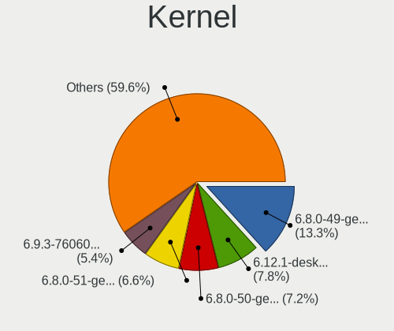
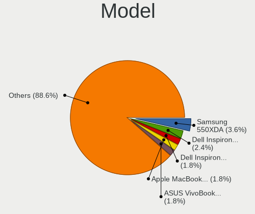
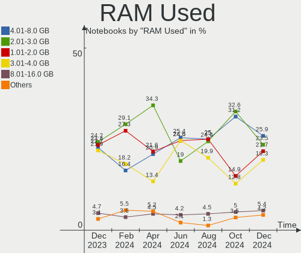
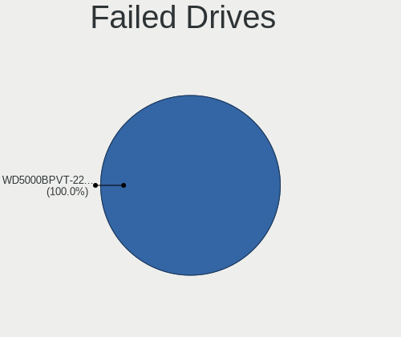
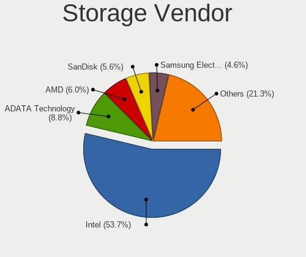
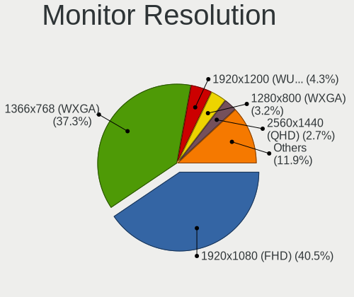
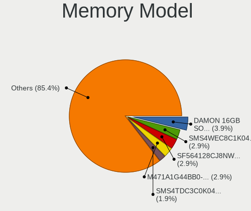
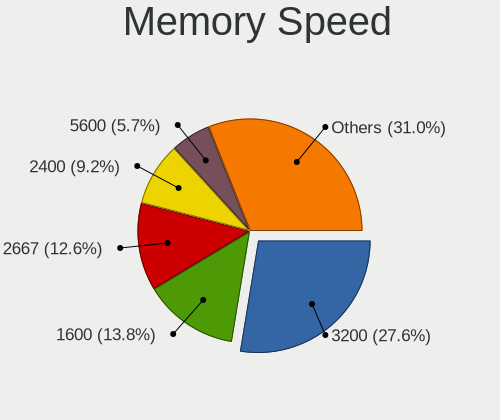
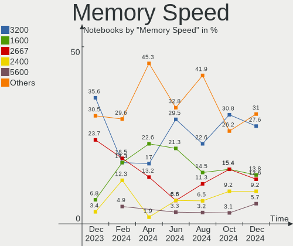

Linux in Brazil - Hardware Trends (Notebooks)
---------------------------------------------

A project to identify most popular hardware characteristics and track their change
over time based on data collected by Linux users at https://Linux-Hardware.org.

Anyone can contribute to this report by the [hw-probe](https://github.com/linuxhw/hw-probe) tool:

    sudo -E hw-probe -all -upload

Period: Jul, 2022.

Contents
--------

* [ System ](#system)
  - [ OS                       ](#os)
  - [ OS Family                ](#os-family)
  - [ Kernel                   ](#kernel)
  - [ Kernel Family            ](#kernel-family)
  - [ Kernel Major Ver.        ](#kernel-major-ver)
  - [ Arch                     ](#arch)
  - [ DE                       ](#de)
  - [ Display Server           ](#display-server)
  - [ Display Manager          ](#display-manager)
  - [ OS Lang                  ](#os-lang)
  - [ Boot Mode                ](#boot-mode)
  - [ Filesystem               ](#filesystem)
  - [ Part. scheme             ](#part-scheme)
  - [ Dual Boot with Linux/BSD ](#dual-boot-with-linuxbsd)
  - [ Dual Boot (Win)          ](#dual-boot-win)

* [ Board ](#board)
  - [ Vendor                   ](#vendor)
  - [ Model                    ](#model)
  - [ Model Family             ](#model-family)
  - [ MFG Year                 ](#mfg-year)
  - [ Form Factor              ](#form-factor)
  - [ Secure Boot              ](#secure-boot)
  - [ Coreboot                 ](#coreboot)
  - [ RAM Size                 ](#ram-size)
  - [ RAM Used                 ](#ram-used)
  - [ Total Drives             ](#total-drives)
  - [ Has CD-ROM               ](#has-cd-rom)
  - [ Has Ethernet             ](#has-ethernet)
  - [ Has WiFi                 ](#has-wifi)
  - [ Has Bluetooth            ](#has-bluetooth)

* [ Location ](#location)
  - [ Country                  ](#country)
  - [ City                     ](#city)

* [ Drives ](#drives)
  - [ Drive Vendor             ](#drive-vendor)
  - [ Drive Model              ](#drive-model)
  - [ HDD Vendor               ](#hdd-vendor)
  - [ SSD Vendor               ](#ssd-vendor)
  - [ Drive Kind               ](#drive-kind)
  - [ Drive Connector          ](#drive-connector)
  - [ Drive Size               ](#drive-size)
  - [ Space Total              ](#space-total)
  - [ Space Used               ](#space-used)
  - [ Malfunc. Drives          ](#malfunc-drives)
  - [ Malfunc. Drive Vendor    ](#malfunc-drive-vendor)
  - [ Malfunc. HDD Vendor      ](#malfunc-hdd-vendor)
  - [ Malfunc. Drive Kind      ](#malfunc-drive-kind)
  - [ Failed Drives            ](#failed-drives)
  - [ Failed Drive Vendor      ](#failed-drive-vendor)
  - [ Drive Status             ](#drive-status)

* [ Storage controller ](#storage-controller)
  - [ Storage Vendor           ](#storage-vendor)
  - [ Storage Model            ](#storage-model)
  - [ Storage Kind             ](#storage-kind)

* [ Processor ](#processor)
  - [ CPU Vendor               ](#cpu-vendor)
  - [ CPU Model                ](#cpu-model)
  - [ CPU Model Family         ](#cpu-model-family)
  - [ CPU Cores                ](#cpu-cores)
  - [ CPU Sockets              ](#cpu-sockets)
  - [ CPU Threads              ](#cpu-threads)
  - [ CPU Op-Modes             ](#cpu-op-modes)
  - [ CPU Microcode            ](#cpu-microcode)
  - [ CPU Microarch            ](#cpu-microarch)

* [ Graphics ](#graphics)
  - [ GPU Vendor               ](#gpu-vendor)
  - [ GPU Model                ](#gpu-model)
  - [ GPU Combo                ](#gpu-combo)
  - [ GPU Driver               ](#gpu-driver)
  - [ GPU Memory               ](#gpu-memory)

* [ Monitor ](#monitor)
  - [ Monitor Vendor           ](#monitor-vendor)
  - [ Monitor Model            ](#monitor-model)
  - [ Monitor Resolution       ](#monitor-resolution)
  - [ Monitor Diagonal         ](#monitor-diagonal)
  - [ Monitor Width            ](#monitor-width)
  - [ Aspect Ratio             ](#aspect-ratio)
  - [ Monitor Area             ](#monitor-area)
  - [ Pixel Density            ](#pixel-density)
  - [ Multiple Monitors        ](#multiple-monitors)

* [ Network ](#network)
  - [ Net Controller Vendor    ](#net-controller-vendor)
  - [ Net Controller Model     ](#net-controller-model)
  - [ Wireless Vendor          ](#wireless-vendor)
  - [ Wireless Model           ](#wireless-model)
  - [ Ethernet Vendor          ](#ethernet-vendor)
  - [ Ethernet Model           ](#ethernet-model)
  - [ Net Controller Kind      ](#net-controller-kind)
  - [ Used Controller          ](#used-controller)
  - [ NICs                     ](#nics)
  - [ IPv6                     ](#ipv6)

* [ Bluetooth ](#bluetooth)
  - [ Bluetooth Vendor         ](#bluetooth-vendor)
  - [ Bluetooth Model          ](#bluetooth-model)

* [ Sound ](#sound)
  - [ Sound Vendor             ](#sound-vendor)
  - [ Sound Model              ](#sound-model)

* [ Memory ](#memory)
  - [ Memory Vendor            ](#memory-vendor)
  - [ Memory Model             ](#memory-model)
  - [ Memory Kind              ](#memory-kind)
  - [ Memory Form Factor       ](#memory-form-factor)
  - [ Memory Size              ](#memory-size)
  - [ Memory Speed             ](#memory-speed)

* [ Printers & scanners ](#printers--scanners)
  - [ Printer Vendor           ](#printer-vendor)
  - [ Printer Model            ](#printer-model)
  - [ Scanner Vendor           ](#scanner-vendor)
  - [ Scanner Model            ](#scanner-model)

* [ Camera ](#camera)
  - [ Camera Vendor            ](#camera-vendor)
  - [ Camera Model             ](#camera-model)

* [ Security ](#security)
  - [ Fingerprint Vendor       ](#fingerprint-vendor)
  - [ Fingerprint Model        ](#fingerprint-model)
  - [ Chipcard Vendor          ](#chipcard-vendor)
  - [ Chipcard Model           ](#chipcard-model)

* [ Unsupported ](#unsupported)
  - [ Unsupported Devices      ](#unsupported-devices)
  - [ Unsupported Device Types ](#unsupported-device-types)

System
------

OS
--

Installed operating systems

| Name                  | Notebooks | Percent |
|-----------------------|-----------|---------|
| Ubuntu 22.04          | 23        | 14.65%  |
| Linux Mint 20.3       | 17        | 10.83%  |
| Ubuntu 20.04          | 13        | 8.28%   |
| OpenMandriva 4.3      | 13        | 8.28%   |
| Pop!_OS 22.04         | 9         | 5.73%   |
| Fedora 36             | 9         | 5.73%   |
| KDE neon 20.04        | 6         | 3.82%   |
| Zorin 16              | 5         | 3.18%   |
| Debian 11             | 5         | 3.18%   |
| Arch                  | 5         | 3.18%   |
| OpenMandriva 4.90     | 4         | 2.55%   |
| Manjaro               | 4         | 2.55%   |
| Xubuntu 20.04         | 3         | 1.91%   |
| Ubuntu 18.04          | 3         | 1.91%   |
| Endless 3.9.7         | 3         | 1.91%   |
| Elementary 6.1        | 3         | 1.91%   |
| Kali 2022.2           | 2         | 1.27%   |
| Endless 4.0.7         | 2         | 1.27%   |
| Xubuntu 22.04         | 1         | 0.64%   |
| Ubuntu MATE 22.04     | 1         | 0.64%   |
| Ubuntu MATE 20.04     | 1         | 0.64%   |
| Ubuntu 16.04          | 1         | 0.64%   |
| SteamOS 3.3           | 1         | 0.64%   |
| Solus 4.3             | 1         | 0.64%   |
| ROSA 12.2             | 1         | 0.64%   |
| Pop!_OS 20.04         | 1         | 0.64%   |
| Parrot 5.0            | 1         | 0.64%   |
| openSUSE Leap-15.4    | 1         | 0.64%   |
| OpenMandriva 4.2      | 1         | 0.64%   |
| Manjaro 21.3.5        | 1         | 0.64%   |
| Manjaro 21.3.4        | 1         | 0.64%   |
| Manjaro 21.3.1        | 1         | 0.64%   |
| Manjaro 21.2.6        | 1         | 0.64%   |
| Linux Mint 20.1       | 1         | 0.64%   |
| Kubuntu 22.04         | 1         | 0.64%   |
| Kubuntu 21.04         | 1         | 0.64%   |
| Kubuntu 20.04         | 1         | 0.64%   |
| Kali 2022.3           | 1         | 0.64%   |
| Fedora 37             | 1         | 0.64%   |
| Endless 3.8.7-nexthw2 | 1         | 0.64%   |
| Debian Testing        | 1         | 0.64%   |
| Clear Linux 36010     | 1         | 0.64%   |
| CentOS 8              | 1         | 0.64%   |
| BuildRoot 2021.08.2   | 1         | 0.64%   |
| BigLinux 21.3.5       | 1         | 0.64%   |
| Artix Rolling         | 1         | 0.64%   |

OS Family
---------

OS without a version

| Name         | Notebooks | Percent |
|--------------|-----------|---------|
| Ubuntu       | 40        | 25.48%  |
| OpenMandriva | 18        | 11.46%  |
| Linux Mint   | 18        | 11.46%  |
| Pop!_OS      | 10        | 6.37%   |
| Fedora       | 10        | 6.37%   |
| Manjaro      | 8         | 5.1%    |
| KDE neon     | 6         | 3.82%   |
| Endless      | 6         | 3.82%   |
| Debian       | 6         | 3.82%   |
| Zorin        | 5         | 3.18%   |
| Arch         | 5         | 3.18%   |
| Xubuntu      | 4         | 2.55%   |
| Kubuntu      | 3         | 1.91%   |
| Kali         | 3         | 1.91%   |
| Elementary   | 3         | 1.91%   |
| Ubuntu MATE  | 2         | 1.27%   |
| SteamOS      | 1         | 0.64%   |
| Solus        | 1         | 0.64%   |
| ROSA         | 1         | 0.64%   |
| Parrot       | 1         | 0.64%   |
| openSUSE     | 1         | 0.64%   |
| Clear Linux  | 1         | 0.64%   |
| CentOS       | 1         | 0.64%   |
| BuildRoot    | 1         | 0.64%   |
| BigLinux     | 1         | 0.64%   |
| Artix        | 1         | 0.64%   |

Kernel
------

Version of the Linux kernel

| Version                                             | Notebooks | Percent |
|-----------------------------------------------------|-----------|---------|
| 5.15.0-41-generic                                   | 23        | 14.65%  |
| 5.16.7-desktop-1omv4003                             | 12        | 7.64%   |
| 5.13.0-52-generic                                   | 12        | 7.64%   |
| 5.15.0-40-generic                                   | 8         | 5.1%    |
| 5.4.0-121-generic                                   | 7         | 4.46%   |
| 5.4.0-122-generic                                   | 6         | 3.82%   |
| 5.17.15-76051715-generic                            | 5         | 3.18%   |
| 5.8.0-14-generic                                    | 4         | 2.55%   |
| 5.18.12-desktop-3omv4090                            | 4         | 2.55%   |
| 5.4.0-91-generic                                    | 3         | 1.91%   |
| 5.18.10-76051810-generic                            | 3         | 1.91%   |
| 5.15.55-1-MANJARO                                   | 3         | 1.91%   |
| 5.15.0-43-generic                                   | 3         | 1.91%   |
| 5.18.9-200.fc36.x86_64                              | 2         | 1.27%   |
| 5.18.11-200.fc36.x86_64                             | 2         | 1.27%   |
| 5.17.5-76051705-generic                             | 2         | 1.27%   |
| 5.15.0-25-generic                                   | 2         | 1.27%   |
| 5.14.0-1045-oem                                     | 2         | 1.27%   |
| 5.11.0-35-generic                                   | 2         | 1.27%   |
| 5.10.0-15-amd64                                     | 2         | 1.27%   |
| 5.8.0-43-generic                                    | 1         | 0.64%   |
| 5.4.0-58-generic                                    | 1         | 0.64%   |
| 5.4.0-122-lowlatency                                | 1         | 0.64%   |
| 5.4.0-120-generic                                   | 1         | 0.64%   |
| 5.3.0-40-generic                                    | 1         | 0.64%   |
| 5.19.0-0.rc6.20220714git4a57a8400075.49.fc37.x86_64 | 1         | 0.64%   |
| 5.18.9-zen1-1-zen                                   | 1         | 0.64%   |
| 5.18.8-zen1-1-zen                                   | 1         | 0.64%   |
| 5.18.7-arch1-1                                      | 1         | 0.64%   |
| 5.18.7-200.fc36.x86_64                              | 1         | 0.64%   |
| 5.18.14-arch1-1                                     | 1         | 0.64%   |
| 5.18.13-arch1-1                                     | 1         | 0.64%   |
| 5.18.13-200.fc36.x86_64                             | 1         | 0.64%   |
| 5.18.12-arch1-1                                     | 1         | 0.64%   |
| 5.18.10-250.vanilla.1.fc36.x86_64                   | 1         | 0.64%   |
| 5.18.10-200.fc36.x86_64                             | 1         | 0.64%   |
| 5.18.1-arch1_testHoloISO_20220606.1811              | 1         | 0.64%   |
| 5.18.0-kali5-amd64                                  | 1         | 0.64%   |
| 5.18.0-2-amd64                                      | 1         | 0.64%   |
| 5.18.0-1parrot1-amd64                               | 1         | 0.64%   |
| 5.18.0-1-rt11-MANJARO                               | 1         | 0.64%   |
| 5.17.5-300.fc36.x86_64                              | 1         | 0.64%   |
| 5.17.0-051700rc7-generic                            | 1         | 0.64%   |
| 5.16.13-desktop-1omv4003                            | 1         | 0.64%   |
| 5.16.13-1132.native                                 | 1         | 0.64%   |
| 5.16.0-kali7-amd64                                  | 1         | 0.64%   |
| 5.16.0-3-amd64                                      | 1         | 0.64%   |
| 5.15.50-216.current                                 | 1         | 0.64%   |
| 5.15.50-1-MANJARO                                   | 1         | 0.64%   |
| 5.15.49-1-MANJARO                                   | 1         | 0.64%   |
| 5.15.11                                             | 1         | 0.64%   |
| 5.15.0-kali3-amd64                                  | 1         | 0.64%   |
| 5.15.0-42-lowlatency                                | 1         | 0.64%   |
| 5.15.0-33-generic                                   | 1         | 0.64%   |
| 5.14.21-150400.22-default                           | 1         | 0.64%   |
| 5.14.0-1044-oem                                     | 1         | 0.64%   |
| 5.14.0-1042-oem                                     | 1         | 0.64%   |
| 5.13.19-2-MANJARO                                   | 1         | 0.64%   |
| 5.13.0-30-generic                                   | 1         | 0.64%   |
| 5.11.0-49-generic                                   | 1         | 0.64%   |

Kernel Family
-------------

Linux kernel without a distro release

| Version  | Notebooks | Percent |
|----------|-----------|---------|
| 5.15.0   | 39        | 24.84%  |
| 5.4.0    | 19        | 12.1%   |
| 5.13.0   | 13        | 8.28%   |
| 5.16.7   | 12        | 7.64%   |
| 5.8.0    | 5         | 3.18%   |
| 5.18.12  | 5         | 3.18%   |
| 5.18.10  | 5         | 3.18%   |
| 5.17.15  | 5         | 3.18%   |
| 5.18.0   | 4         | 2.55%   |
| 5.14.0   | 4         | 2.55%   |
| 5.18.9   | 3         | 1.91%   |
| 5.17.5   | 3         | 1.91%   |
| 5.15.55  | 3         | 1.91%   |
| 5.11.0   | 3         | 1.91%   |
| 5.10.0   | 3         | 1.91%   |
| 5.18.7   | 2         | 1.27%   |
| 5.18.13  | 2         | 1.27%   |
| 5.18.11  | 2         | 1.27%   |
| 5.16.13  | 2         | 1.27%   |
| 5.16.0   | 2         | 1.27%   |
| 5.15.50  | 2         | 1.27%   |
| 4.15.0   | 2         | 1.27%   |
| 5.3.0    | 1         | 0.64%   |
| 5.19.0   | 1         | 0.64%   |
| 5.18.8   | 1         | 0.64%   |
| 5.18.14  | 1         | 0.64%   |
| 5.18.1   | 1         | 0.64%   |
| 5.17.0   | 1         | 0.64%   |
| 5.15.49  | 1         | 0.64%   |
| 5.15.11  | 1         | 0.64%   |
| 5.14.21  | 1         | 0.64%   |
| 5.13.19  | 1         | 0.64%   |
| 5.10.60  | 1         | 0.64%   |
| 5.10.14  | 1         | 0.64%   |
| 5.10.131 | 1         | 0.64%   |
| 5.10.124 | 1         | 0.64%   |
| 5.10.118 | 1         | 0.64%   |
| 4.4.0    | 1         | 0.64%   |
| 4.18.0   | 1         | 0.64%   |

Kernel Major Ver.
-----------------

Linux kernel major version

| Version | Notebooks | Percent |
|---------|-----------|---------|
| 5.15    | 46        | 29.3%   |
| 5.18    | 26        | 16.56%  |
| 5.4     | 19        | 12.1%   |
| 5.16    | 16        | 10.19%  |
| 5.13    | 14        | 8.92%   |
| 5.17    | 9         | 5.73%   |
| 5.10    | 8         | 5.1%    |
| 5.8     | 5         | 3.18%   |
| 5.14    | 5         | 3.18%   |
| 5.11    | 3         | 1.91%   |
| 4.15    | 2         | 1.27%   |
| 5.3     | 1         | 0.64%   |
| 5.19    | 1         | 0.64%   |
| 4.4     | 1         | 0.64%   |
| 4.18    | 1         | 0.64%   |

Arch
----

OS architecture (x86_64, i586, etc.)

| Name   | Notebooks | Percent |
|--------|-----------|---------|
| x86_64 | 155       | 98.73%  |
| i686   | 2         | 1.27%   |

DE
--

Desktop Environment

| Name            | Notebooks | Percent |
|-----------------|-----------|---------|
| GNOME           | 77        | 49.04%  |
| KDE5            | 34        | 21.66%  |
| XFCE            | 19        | 12.1%   |
| X-Cinnamon      | 7         | 4.46%   |
| MATE            | 7         | 4.46%   |
| Unknown         | 6         | 3.82%   |
| Pantheon        | 3         | 1.91%   |
| Unity           | 1         | 0.64%   |
| GNOME Flashback | 1         | 0.64%   |
| Cinnamon        | 1         | 0.64%   |
| Budgie          | 1         | 0.64%   |

Display Server
--------------

X11 or Wayland

| Name    | Notebooks | Percent |
|---------|-----------|---------|
| X11     | 125       | 79.62%  |
| Wayland | 29        | 18.47%  |
| Unknown | 3         | 1.91%   |

Display Manager
---------------

SDDM, LightDM, etc.

| Name    | Notebooks | Percent |
|---------|-----------|---------|
| Unknown | 70        | 44.59%  |
| GDM3    | 29        | 18.47%  |
| SDDM    | 28        | 17.83%  |
| LightDM | 16        | 10.19%  |
| GDM     | 14        | 8.92%   |

OS Lang
-------

Language

| Lang    | Notebooks | Percent |
|---------|-----------|---------|
| pt_BR   | 105       | 66.88%  |
| en_US   | 45        | 28.66%  |
| Unknown | 4         | 2.55%   |
| C       | 2         | 1.27%   |
| pt_PT   | 1         | 0.64%   |

Boot Mode
---------

EFI or BIOS

| Mode | Notebooks | Percent |
|------|-----------|---------|
| EFI  | 81        | 51.59%  |
| BIOS | 76        | 48.41%  |

Filesystem
----------

Type of filesystem

| Type    | Notebooks | Percent |
|---------|-----------|---------|
| Ext4    | 116       | 73.89%  |
| Overlay | 20        | 12.74%  |
| Btrfs   | 16        | 10.19%  |
| Zfs     | 2         | 1.27%   |
| Xfs     | 2         | 1.27%   |
| Ext2    | 1         | 0.64%   |

Part. scheme
------------

Scheme of partitioning

| Type    | Notebooks | Percent |
|---------|-----------|---------|
| Unknown | 95        | 60.51%  |
| GPT     | 54        | 34.39%  |
| MBR     | 8         | 5.1%    |

Dual Boot with Linux/BSD
------------------------

Hosting more than one Linux/BSD

| Dual boot | Notebooks | Percent |
|-----------|-----------|---------|
| No        | 137       | 87.26%  |
| Yes       | 20        | 12.74%  |

Dual Boot (Win)
---------------

Hosting Linux and Windows

| Dual boot | Notebooks | Percent |
|-----------|-----------|---------|
| No        | 125       | 79.62%  |
| Yes       | 32        | 20.38%  |

Board
-----

Vendor
------

Motherboard manufacturer

| Name                   | Notebooks | Percent |
|------------------------|-----------|---------|
| Dell                   | 37        | 23.57%  |
| Lenovo                 | 24        | 15.29%  |
| Acer                   | 21        | 13.38%  |
| Samsung Electronics    | 17        | 10.83%  |
| ASUSTek Computer       | 11        | 7.01%   |
| Positivo               | 7         | 4.46%   |
| Hewlett-Packard        | 7         | 4.46%   |
| Sony                   | 4         | 2.55%   |
| Digibras               | 3         | 1.91%   |
| Avell High Performance | 3         | 1.91%   |
| Unknown                | 3         | 1.91%   |
| Semp Toshiba           | 2         | 1.27%   |
| Intel                  | 2         | 1.27%   |
| Compaq                 | 2         | 1.27%   |
| TPVAOC                 | 1         | 0.64%   |
| OEM                    | 1         | 0.64%   |
| Notebook               | 1         | 0.64%   |
| Multilaser             | 1         | 0.64%   |
| Megaware               | 1         | 0.64%   |
| Gateway                | 1         | 0.64%   |
| eMachines              | 1         | 0.64%   |
| Daten Tecnologia       | 1         | 0.64%   |
| Coradir                | 1         | 0.64%   |
| Clevo                  | 1         | 0.64%   |
| Chuwi                  | 1         | 0.64%   |
| Apple                  | 1         | 0.64%   |
| AMI                    | 1         | 0.64%   |
| A14CR                  | 1         | 0.64%   |

Model
-----

Motherboard model

| Name                                              | Notebooks | Percent |
|---------------------------------------------------|-----------|---------|
| Unknown                                           | 6         | 3.82%   |
| Lenovo IdeaPad S145-15API 81V7                    | 3         | 1.91%   |
| Dell Vostro 15 3510                               | 3         | 1.91%   |
| Samsung 550XBE/350XBE                             | 2         | 1.27%   |
| Samsung 340XAA/350XAA/550XAA                      | 2         | 1.27%   |
| Samsung 300E5M/300E5L                             | 2         | 1.27%   |
| Samsung 270E5G/270E5U                             | 2         | 1.27%   |
| Positivo C14CU51                                  | 2         | 1.27%   |
| Lenovo IdeaPad 330-15IKB 81FE                     | 2         | 1.27%   |
| Lenovo IdeaPad 330-15IKB 81FD                     | 2         | 1.27%   |
| Lenovo IdeaPad 320-15IKB 80YH                     | 2         | 1.27%   |
| Lenovo IdeaPad 3 15ALC6 82MF                      | 2         | 1.27%   |
| Digibras NH4CU03                                  | 2         | 1.27%   |
| Dell Vostro 5470                                  | 2         | 1.27%   |
| Dell Latitude 5420                                | 2         | 1.27%   |
| Dell Inspiron 3583                                | 2         | 1.27%   |
| Dell Inspiron 3501                                | 2         | 1.27%   |
| Compaq Presario CQ-23                             | 2         | 1.27%   |
| Avell High Performance B.ON                       | 2         | 1.27%   |
| ASUS VivoBook_ASUSLaptop X515JA_X515JA            | 2         | 1.27%   |
| ASUS VivoBook_ASUSLaptop X513EAN_X513EAN          | 2         | 1.27%   |
| Acer Nitro AN515-44                               | 2         | 1.27%   |
| TPVAOC AA183M                                     | 1         | 0.64%   |
| Sony VPCEG27FM                                    | 1         | 0.64%   |
| Sony VPCCW13FB                                    | 1         | 0.64%   |
| Sony VJF153                                       | 1         | 0.64%   |
| Sony VGN-NW270F                                   | 1         | 0.64%   |
| Semp Toshiba IS-1253                              | 1         | 0.64%   |
| Semp Toshiba IS 1413G                             | 1         | 0.64%   |
| Samsung RV420/RV520/RV720/E3530/S3530/E3420/E3520 | 1         | 0.64%   |
| Samsung RV411/RV511/E3511/S3511/RV711/E3411       | 1         | 0.64%   |
| Samsung R430/R480/R440                            | 1         | 0.64%   |
| Samsung 550XDA                                    | 1         | 0.64%   |
| Samsung 500R5M/500R5W/501R5M                      | 1         | 0.64%   |
| Samsung 370E4K                                    | 1         | 0.64%   |
| Samsung 300E4C/300E5C/300E7C                      | 1         | 0.64%   |
| Samsung 300E4A/300E5A/300E7A/3430EA/3530EA        | 1         | 0.64%   |
| Samsung 270E5K/270E5Q/271E5K/2570EK               | 1         | 0.64%   |
| Positivo S14CT01                                  | 1         | 0.64%   |
| Positivo Mobile                                   | 1         | 0.64%   |
| Positivo J14AL11                                  | 1         | 0.64%   |
| Positivo H14BT58                                  | 1         | 0.64%   |
| Positivo C4128E-S                                 | 1         | 0.64%   |
| OEM S20II1                                        | 1         | 0.64%   |
| Notebook P65xHP                                   | 1         | 0.64%   |
| Multilaser PC150                                  | 1         | 0.64%   |
| Megaware Mega netbook                             | 1         | 0.64%   |
| Lenovo Z40-70 80E6                                | 1         | 0.64%   |
| Lenovo Yoga S740-14IIL 81RM                       | 1         | 0.64%   |
| Lenovo ThinkPad T480 20L6S9WY00                   | 1         | 0.64%   |
| Lenovo ThinkPad T420 4180M8P                      | 1         | 0.64%   |
| Lenovo ThinkPad E480 20KQ000EBR                   | 1         | 0.64%   |
| Lenovo ThinkPad E14 Gen 3 20Y70093US              | 1         | 0.64%   |
| Lenovo IdeaPad Z460 0913                          | 1         | 0.64%   |
| Lenovo IdeaPad S400 VIUS3                         | 1         | 0.64%   |
| Lenovo IdeaPad S145-15IWL 81S9                    | 1         | 0.64%   |
| Lenovo IdeaPad 5 15ARE05 81YQ                     | 1         | 0.64%   |
| Lenovo IdeaPad 3 15IGL05 82BU                     | 1         | 0.64%   |
| Lenovo IdeaPad 120S-11IAP 81A4                    | 1         | 0.64%   |
| Lenovo G400s VILG1                                | 1         | 0.64%   |

Model Family
------------

Motherboard model prefix

| Name                        | Notebooks | Percent |
|-----------------------------|-----------|---------|
| Dell Inspiron               | 18        | 11.46%  |
| Lenovo IdeaPad              | 17        | 10.83%  |
| Acer Aspire                 | 16        | 10.19%  |
| Dell Vostro                 | 8         | 5.1%    |
| Dell Latitude               | 8         | 5.1%    |
| ASUS VivoBook               | 6         | 3.82%   |
| Unknown                     | 6         | 3.82%   |
| Lenovo ThinkPad             | 4         | 2.55%   |
| Acer Nitro                  | 4         | 2.55%   |
| Samsung 550XBE              | 2         | 1.27%   |
| Samsung 340XAA              | 2         | 1.27%   |
| Samsung 300E5M              | 2         | 1.27%   |
| Samsung 270E5G              | 2         | 1.27%   |
| Positivo C14CU51            | 2         | 1.27%   |
| HP Pavilion                 | 2         | 1.27%   |
| Digibras NH4CU03            | 2         | 1.27%   |
| Compaq Presario             | 2         | 1.27%   |
| Avell High Performance B.ON | 2         | 1.27%   |
| TPVAOC AA183M               | 1         | 0.64%   |
| Sony VPCEG27FM              | 1         | 0.64%   |
| Sony VPCCW13FB              | 1         | 0.64%   |
| Sony VJF153                 | 1         | 0.64%   |
| Sony VGN-NW270F             | 1         | 0.64%   |
| Semp Toshiba IS-1253        | 1         | 0.64%   |
| Semp Toshiba IS             | 1         | 0.64%   |
| Samsung RV420               | 1         | 0.64%   |
| Samsung RV411               | 1         | 0.64%   |
| Samsung R430                | 1         | 0.64%   |
| Samsung 550XDA              | 1         | 0.64%   |
| Samsung 500R5M              | 1         | 0.64%   |
| Samsung 370E4K              | 1         | 0.64%   |
| Samsung 300E4C              | 1         | 0.64%   |
| Samsung 300E4A              | 1         | 0.64%   |
| Samsung 270E5K              | 1         | 0.64%   |
| Positivo S14CT01            | 1         | 0.64%   |
| Positivo Mobile             | 1         | 0.64%   |
| Positivo J14AL11            | 1         | 0.64%   |
| Positivo H14BT58            | 1         | 0.64%   |
| Positivo C4128E-S           | 1         | 0.64%   |
| OEM S20II1                  | 1         | 0.64%   |
| Notebook P65xHP             | 1         | 0.64%   |
| Multilaser PC150            | 1         | 0.64%   |
| Megaware Mega               | 1         | 0.64%   |
| Lenovo Z40-70               | 1         | 0.64%   |
| Lenovo Yoga                 | 1         | 0.64%   |
| Lenovo G400s                | 1         | 0.64%   |
| Intel powered               | 1         | 0.64%   |
| Intel HuronRiver            | 1         | 0.64%   |
| HP Notebook                 | 1         | 0.64%   |
| HP G42                      | 1         | 0.64%   |
| HP EliteBook                | 1         | 0.64%   |
| HP Compaq                   | 1         | 0.64%   |
| Gateway NE56R               | 1         | 0.64%   |
| eMachines E725              | 1         | 0.64%   |
| Digibras NH4CU53            | 1         | 0.64%   |
| Dell Precision              | 1         | 0.64%   |
| Dell G5                     | 1         | 0.64%   |
| Dell G15                    | 1         | 0.64%   |
| Daten Tecnologia DT02-M4    | 1         | 0.64%   |
| Coradir Coradir             | 1         | 0.64%   |

MFG Year
--------

Motherboard manufacture year

| Year | Notebooks | Percent |
|------|-----------|---------|
| 2021 | 24        | 15.29%  |
| 2019 | 17        | 10.83%  |
| 2017 | 15        | 9.55%   |
| 2013 | 15        | 9.55%   |
| 2020 | 14        | 8.92%   |
| 2016 | 11        | 7.01%   |
| 2011 | 11        | 7.01%   |
| 2018 | 10        | 6.37%   |
| 2012 | 10        | 6.37%   |
| 2014 | 6         | 3.82%   |
| 2010 | 6         | 3.82%   |
| 2009 | 6         | 3.82%   |
| 2015 | 4         | 2.55%   |
| 2008 | 3         | 1.91%   |
| 2007 | 2         | 1.27%   |
| 2006 | 2         | 1.27%   |
| 2022 | 1         | 0.64%   |

Form Factor
-----------

Physical design of the computer

| Name     | Notebooks | Percent |
|----------|-----------|---------|
| Notebook | 157       | 100%    |

Secure Boot
-----------

Enabled or disabled

| State    | Notebooks | Percent |
|----------|-----------|---------|
| Disabled | 140       | 89.17%  |
| Enabled  | 17        | 10.83%  |

Coreboot
--------

Have coreboot on board

| Used | Notebooks | Percent |
|------|-----------|---------|
| No   | 157       | 100%    |

RAM Size
--------

Total RAM memory

| Size in GB  | Notebooks | Percent |
|-------------|-----------|---------|
| 4.01-8.0    | 60        | 38.22%  |
| 3.01-4.0    | 34        | 21.66%  |
| 8.01-16.0   | 22        | 14.01%  |
| 16.01-24.0  | 16        | 10.19%  |
| 1.01-2.0    | 12        | 7.64%   |
| 32.01-64.0  | 5         | 3.18%   |
| 24.01-32.0  | 4         | 2.55%   |
| 2.01-3.0    | 2         | 1.27%   |
| 64.01-256.0 | 1         | 0.64%   |
| 0.51-1.0    | 1         | 0.64%   |

RAM Used
--------

Used RAM memory

| Used GB    | Notebooks | Percent |
|------------|-----------|---------|
| 1.01-2.0   | 59        | 37.58%  |
| 2.01-3.0   | 43        | 27.39%  |
| 3.01-4.0   | 23        | 14.65%  |
| 4.01-8.0   | 22        | 14.01%  |
| 0.51-1.0   | 6         | 3.82%   |
| 16.01-24.0 | 2         | 1.27%   |
| 8.01-16.0  | 1         | 0.64%   |
| 0.01-0.5   | 1         | 0.64%   |

Total Drives
------------

Number of drives on board

| Drives | Notebooks | Percent |
|--------|-----------|---------|
| 1      | 113       | 71.97%  |
| 2      | 38        | 24.2%   |
| 3      | 6         | 3.82%   |

Has CD-ROM
----------

Has CD-ROM on board

| Presented | Notebooks | Percent |
|-----------|-----------|---------|
| No        | 108       | 68.79%  |
| Yes       | 49        | 31.21%  |

Has Ethernet
------------

Has Ethernet on board

| Presented | Notebooks | Percent |
|-----------|-----------|---------|
| Yes       | 129       | 82.17%  |
| No        | 28        | 17.83%  |

Has WiFi
--------

Has WiFi module

| Presented | Notebooks | Percent |
|-----------|-----------|---------|
| Yes       | 156       | 99.36%  |
| No        | 1         | 0.64%   |

Has Bluetooth
-------------

Has Bluetooth module

| Presented | Notebooks | Percent |
|-----------|-----------|---------|
| Yes       | 108       | 68.79%  |
| No        | 49        | 31.21%  |

Location
--------

Country
-------

Geographic location (country)

| Country | Notebooks | Percent |
|---------|-----------|---------|
| Brazil  | 157       | 100%    |

City
----

Geographic location (city)

| City                    | Notebooks | Percent |
|-------------------------|-----------|---------|
| Sao Paulo               | 15        | 9.55%   |
| Rio de Janeiro          | 10        | 6.37%   |
| Belo Horizonte          | 8         | 5.1%    |
| Brasília               | 6         | 3.82%   |
| Porto Alegre            | 5         | 3.18%   |
| Fortaleza               | 5         | 3.18%   |
| Uberlândia             | 3         | 1.91%   |
| Sao Carlos              | 3         | 1.91%   |
| Salvador                | 3         | 1.91%   |
| Recife                  | 3         | 1.91%   |
| Joao Pessoa             | 3         | 1.91%   |
| Curitiba                | 3         | 1.91%   |
| Maringá                | 2         | 1.27%   |
| Manaus                  | 2         | 1.27%   |
| Limeira                 | 2         | 1.27%   |
| Guarulhos               | 2         | 1.27%   |
| Cuiabá                 | 2         | 1.27%   |
| Campo Grande            | 2         | 1.27%   |
| Campinas                | 2         | 1.27%   |
| Barueri                 | 2         | 1.27%   |
| Aracaju                 | 2         | 1.27%   |
| Americana               | 2         | 1.27%   |
| Vitória                | 1         | 0.64%   |
| Vila Velha              | 1         | 0.64%   |
| Videira                 | 1         | 0.64%   |
| Viamao                  | 1         | 0.64%   |
| Várzea Grande          | 1         | 0.64%   |
| Valparaiso de Goias     | 1         | 0.64%   |
| Timoteo                 | 1         | 0.64%   |
| Teresina                | 1         | 0.64%   |
| Taubate                 | 1         | 0.64%   |
| Taquari                 | 1         | 0.64%   |
| Sorocaba                | 1         | 0.64%   |
| Serra                   | 1         | 0.64%   |
| Sao José dos Campos    | 1         | 0.64%   |
| Sao Goncalo do Amarante | 1         | 0.64%   |
| Sao Cristovao           | 1         | 0.64%   |
| Sao Bernardo do Campo   | 1         | 0.64%   |
| Santo André            | 1         | 0.64%   |
| Rio Claro               | 1         | 0.64%   |
| Petrópolis             | 1         | 0.64%   |
| Patrocinio              | 1         | 0.64%   |
| Patos de Minas          | 1         | 0.64%   |
| Passo Fundo             | 1         | 0.64%   |
| Palotina                | 1         | 0.64%   |
| Palmas                  | 1         | 0.64%   |
| Osorio                  | 1         | 0.64%   |
| Osasco                  | 1         | 0.64%   |
| Novo Hamburgo           | 1         | 0.64%   |
| Natal                   | 1         | 0.64%   |
| Montes Claros           | 1         | 0.64%   |
| Monte Mor               | 1         | 0.64%   |
| Maua                    | 1         | 0.64%   |
| Marechal Candido Rondon | 1         | 0.64%   |
| Maceió                 | 1         | 0.64%   |
| Lavras                  | 1         | 0.64%   |
| Lages                   | 1         | 0.64%   |
| Jaú                    | 1         | 0.64%   |
| Jaraguá do Sul         | 1         | 0.64%   |
| Jandira                 | 1         | 0.64%   |

Drives
------

Drive Vendor
------------

Hard drive vendors

| Vendor                         | Notebooks | Drives | Percent |
|--------------------------------|-----------|--------|---------|
| WDC                            | 36        | 37     | 18.95%  |
| Kingston                       | 20        | 22     | 10.53%  |
| Seagate                        | 19        | 19     | 10%     |
| A-DATA Technology              | 15        | 17     | 7.89%   |
| Samsung Electronics            | 12        | 12     | 6.32%   |
| Toshiba                        | 11        | 12     | 5.79%   |
| SanDisk                        | 8         | 8      | 4.21%   |
| ADATA Technology               | 7         | 7      | 3.68%   |
| Crucial                        | 6         | 7      | 3.16%   |
| China                          | 5         | 5      | 2.63%   |
| Unknown                        | 4         | 6      | 2.11%   |
| SK hynix                       | 4         | 4      | 2.11%   |
| KIOXIA                         | 4         | 4      | 2.11%   |
| Silicon Motion                 | 3         | 3      | 1.58%   |
| LITEON                         | 3         | 3      | 1.58%   |
| Lexar                          | 3         | 3      | 1.58%   |
| Hitachi                        | 3         | 3      | 1.58%   |
| SSSTC                          | 2         | 2      | 1.05%   |
| ShiJi                          | 2         | 2      | 1.05%   |
| Phison                         | 2         | 2      | 1.05%   |
| KingSpec                       | 2         | 2      | 1.05%   |
| Intel                          | 2         | 2      | 1.05%   |
| HGST                           | 2         | 2      | 1.05%   |
| ZTE                            | 1         | 1      | 0.53%   |
| Win Memory                     | 1         | 1      | 0.53%   |
| Solid State Storage Technology | 1         | 1      | 0.53%   |
| SAGE                           | 1         | 1      | 0.53%   |
| RZX                            | 1         | 1      | 0.53%   |
| PNY                            | 1         | 1      | 0.53%   |
| Netac                          | 1         | 1      | 0.53%   |
| MAXIO Technology (Hangzhou)    | 1         | 1      | 0.53%   |
| LITEONIT                       | 1         | 1      | 0.53%   |
| JMicron Technology             | 1         | 1      | 0.53%   |
| Gigabyte Technology            | 1         | 1      | 0.53%   |
| faspeed                        | 1         | 1      | 0.53%   |
| BIWIN                          | 1         | 1      | 0.53%   |
| AEGO                           | 1         | 1      | 0.53%   |
| Unknown                        | 1         | 1      | 0.53%   |

Drive Model
-----------

Hard drive models

| Model                                | Notebooks | Percent |
|--------------------------------------|-----------|---------|
| ADATA NVMe SSD Drive 256GB           | 7         | 3.55%   |
| Kingston SA400S37480G 480GB SSD      | 6         | 3.05%   |
| WDC WD10SPZX-21Z10T0 1TB             | 4         | 2.03%   |
| Toshiba MQ01ABD100 1TB               | 4         | 2.03%   |
| Seagate ST500LM012 HN-M500MBB 500GB  | 4         | 2.03%   |
| Kingston SA400S37240G 240GB SSD      | 4         | 2.03%   |
| A-DATA IM2P33F3A NVMe 256GB          | 4         | 2.03%   |
| WDC WD5000LPVX-22V0TT0 500GB         | 3         | 1.52%   |
| WDC WD10JPVX-22JC3T0 1TB             | 3         | 1.52%   |
| Unknown MMC Card  32GB               | 3         | 1.52%   |
| Toshiba MQ04ABF100 1TB               | 3         | 1.52%   |
| Seagate ST1000LM035-1RK172 1TB       | 3         | 1.52%   |
| WDC WDS240G2G0A-00JH30 240GB SSD     | 2         | 1.02%   |
| WDC WD10SPZX-24Z10 1TB               | 2         | 1.02%   |
| Toshiba MQ01ABF050 500GB             | 2         | 1.02%   |
| Seagate ST320LM001 HN-M320MBB 320GB  | 2         | 1.02%   |
| SanDisk SSD PLUS 480GB               | 2         | 1.02%   |
| SanDisk SSD PLUS 240GB               | 2         | 1.02%   |
| Samsung NVMe SSD Drive 256GB         | 2         | 1.02%   |
| Samsung HM321HI 320GB                | 2         | 1.02%   |
| KIOXIA NVMe SSD Drive 128GB          | 2         | 1.02%   |
| Kingston SV300S37A240G 240GB SSD     | 2         | 1.02%   |
| Kingston SV300S37A120G 120GB SSD     | 2         | 1.02%   |
| Hitachi HTS547550A9E384 500GB        | 2         | 1.02%   |
| HGST HTS545050A7E380 500GB           | 2         | 1.02%   |
| Crucial CT1000BX500SSD1 1TB          | 2         | 1.02%   |
| China SSD 128GB                      | 2         | 1.02%   |
| China SATA SSD 120GB                 | 2         | 1.02%   |
| A-DATA IM2P33F8BR2-256GB             | 2         | 1.02%   |
| A-DATA IM2P33F8BR1-128GB             | 2         | 1.02%   |
| ZTE MMC Storage 942MB                | 1         | 0.51%   |
| Win Memory SWR256G-301II 256GB       | 1         | 0.51%   |
| WDC WDS480G1G0A-00SS50 480GB SSD     | 1         | 0.51%   |
| WDC WD6400BPVT-22HXZT1 640GB         | 1         | 0.51%   |
| WDC WD5000LPVT-08G33T1 500GB         | 1         | 0.51%   |
| WDC WD5000LPCX-80VHAT0 500GB         | 1         | 0.51%   |
| WDC WD5000LPCX-35VHAT0 500GB         | 1         | 0.51%   |
| WDC WD5000BPVT-60HXZT3 500GB         | 1         | 0.51%   |
| WDC WD5000BPVT-22HXZT3 500GB         | 1         | 0.51%   |
| WDC WD5000BPVT-00HXZT3 500GB         | 1         | 0.51%   |
| WDC WD5000BEVT-22ZAT0 500GB          | 1         | 0.51%   |
| WDC WD5000BEVT-22A0RT0 500GB         | 1         | 0.51%   |
| WDC WD3200BEVT-75ZCT2 320GB          | 1         | 0.51%   |
| WDC WD3200BEVT-60ZCT1 320GB          | 1         | 0.51%   |
| WDC WD3200BEKT-60PVMT0 320GB         | 1         | 0.51%   |
| WDC WD1200BEVS-22UST0 120GB          | 1         | 0.51%   |
| WDC WD1200BEVS-00RST0 120GB          | 1         | 0.51%   |
| WDC WD10SPZX-75Z10T3 1TB             | 1         | 0.51%   |
| WDC WD10SPZX-75Z10T2 1TB             | 1         | 0.51%   |
| WDC WD10SPZX-35Z10T0 1TB             | 1         | 0.51%   |
| WDC WD10SPZX-24Z 1TB                 | 1         | 0.51%   |
| WDC WD10SPZX-00Z10T0 1TB             | 1         | 0.51%   |
| WDC WD10JPVX-75JC3T0 1TB             | 1         | 0.51%   |
| WDC WD10JPVX-60JC3T0 1TB             | 1         | 0.51%   |
| WDC PC SN530 SDBPMPZ-256G-1001 256GB | 1         | 0.51%   |
| Unknown MMC Card  1GB                | 1         | 0.51%   |
| Unknown MMC Card  16GB               | 1         | 0.51%   |
| Unknown MMC Card  128GB              | 1         | 0.51%   |
| Toshiba NVMe SSD Drive 1024GB        | 1         | 0.51%   |
| Toshiba MK1235GSL 120GB              | 1         | 0.51%   |

HDD Vendor
----------

Hard disk drive vendors

| Vendor              | Notebooks | Drives | Percent |
|---------------------|-----------|--------|---------|
| WDC                 | 33        | 33     | 45.21%  |
| Seagate             | 19        | 19     | 26.03%  |
| Toshiba             | 10        | 10     | 13.7%   |
| Samsung Electronics | 5         | 5      | 6.85%   |
| Hitachi             | 3         | 3      | 4.11%   |
| HGST                | 2         | 2      | 2.74%   |
| SAGE                | 1         | 1      | 1.37%   |

SSD Vendor
----------

Solid state drive vendors

| Vendor              | Notebooks | Drives | Percent |
|---------------------|-----------|--------|---------|
| Kingston            | 18        | 18     | 30.51%  |
| SanDisk             | 5         | 5      | 8.47%   |
| Crucial             | 5         | 6      | 8.47%   |
| China               | 5         | 5      | 8.47%   |
| WDC                 | 3         | 3      | 5.08%   |
| LITEON              | 3         | 3      | 5.08%   |
| A-DATA Technology   | 3         | 3      | 5.08%   |
| Samsung Electronics | 2         | 2      | 3.39%   |
| Lexar               | 2         | 2      | 3.39%   |
| KingSpec            | 2         | 2      | 3.39%   |
| Win Memory          | 1         | 1      | 1.69%   |
| SK hynix            | 1         | 1      | 1.69%   |
| RZX                 | 1         | 1      | 1.69%   |
| PNY                 | 1         | 1      | 1.69%   |
| Netac               | 1         | 1      | 1.69%   |
| LITEONIT            | 1         | 1      | 1.69%   |
| Intel               | 1         | 1      | 1.69%   |
| Gigabyte Technology | 1         | 1      | 1.69%   |
| BIWIN               | 1         | 1      | 1.69%   |
| AEGO                | 1         | 1      | 1.69%   |
| Unknown             | 1         | 1      | 1.69%   |

Drive Kind
----------

HDD or SSD

| Kind    | Notebooks | Drives | Percent |
|---------|-----------|--------|---------|
| HDD     | 73        | 73     | 39.04%  |
| SSD     | 56        | 60     | 29.95%  |
| NVMe    | 52        | 58     | 27.81%  |
| MMC     | 4         | 6      | 2.14%   |
| Unknown | 2         | 2      | 1.07%   |

Drive Connector
---------------

SATA, SAS, NVMe, etc.

| Type | Notebooks | Drives | Percent |
|------|-----------|--------|---------|
| SATA | 117       | 132    | 66.1%   |
| NVMe | 52        | 57     | 29.38%  |
| SAS  | 4         | 4      | 2.26%   |
| MMC  | 4         | 6      | 2.26%   |

Drive Size
----------

Size of hard drive

| Size in TB | Notebooks | Drives | Percent |
|------------|-----------|--------|---------|
| 0.01-0.5   | 89        | 95     | 71.2%   |
| 0.51-1.0   | 36        | 38     | 28.8%   |

Space Total
-----------

Amount of disk space available on the file system

| Size in GB     | Notebooks | Percent |
|----------------|-----------|---------|
| 101-250        | 55        | 35.03%  |
| 251-500        | 36        | 22.93%  |
| 501-1000       | 19        | 12.1%   |
| 1-20           | 18        | 11.46%  |
| 1001-2000      | 10        | 6.37%   |
| 51-100         | 8         | 5.1%    |
| 21-50          | 5         | 3.18%   |
| Unknown        | 4         | 2.55%   |
| More than 3000 | 1         | 0.64%   |
| 2001-3000      | 1         | 0.64%   |

Space Used
----------

Amount of used disk space

| Used GB        | Notebooks | Percent |
|----------------|-----------|---------|
| 1-20           | 62        | 39.49%  |
| 21-50          | 32        | 20.38%  |
| 51-100         | 27        | 17.2%   |
| 101-250        | 17        | 10.83%  |
| 251-500        | 10        | 6.37%   |
| Unknown        | 4         | 2.55%   |
| 501-1000       | 3         | 1.91%   |
| More than 3000 | 1         | 0.64%   |
| 1001-2000      | 1         | 0.64%   |

Malfunc. Drives
---------------

Drive models with a malfunction

| Model                                 | Notebooks | Drives | Percent |
|---------------------------------------|-----------|--------|---------|
| WDC WD5000LPVX-22V0TT0 500GB          | 2         | 2      | 12.5%   |
| Toshiba MQ01ABD100 1TB                | 1         | 1      | 6.25%   |
| SK hynix HFS256G39TND-N210A 256GB SSD | 1         | 1      | 6.25%   |
| ShiJi 1TB                             | 1         | 1      | 6.25%   |
| Seagate ST500LT012-9WS142 500GB       | 1         | 1      | 6.25%   |
| Seagate ST500LT012-1DG142 500GB       | 1         | 1      | 6.25%   |
| Seagate ST500LM012 HN-M500MBB 500GB   | 1         | 1      | 6.25%   |
| Seagate ST320LM001 HN-M320MBB 320GB   | 1         | 1      | 6.25%   |
| Seagate ST1000LM024 HN-M101MBB 1TB    | 1         | 1      | 6.25%   |
| SanDisk SSD PLUS 480GB                | 1         | 1      | 6.25%   |
| Samsung Electronics HM500JJ 500GB     | 1         | 1      | 6.25%   |
| Kingston SV300S37A120G 120GB SSD      | 1         | 1      | 6.25%   |
| Kingston SA400S37480G 480GB SSD       | 1         | 1      | 6.25%   |
| Hitachi HTS542525K9A300 250GB         | 1         | 1      | 6.25%   |
| China SSD 128GB                       | 1         | 1      | 6.25%   |

Malfunc. Drive Vendor
---------------------

Vendors of faulty drives

| Vendor              | Notebooks | Drives | Percent |
|---------------------|-----------|--------|---------|
| Seagate             | 5         | 5      | 31.25%  |
| WDC                 | 2         | 2      | 12.5%   |
| Kingston            | 2         | 2      | 12.5%   |
| Toshiba             | 1         | 1      | 6.25%   |
| SK hynix            | 1         | 1      | 6.25%   |
| ShiJi               | 1         | 1      | 6.25%   |
| SanDisk             | 1         | 1      | 6.25%   |
| Samsung Electronics | 1         | 1      | 6.25%   |
| Hitachi             | 1         | 1      | 6.25%   |
| China               | 1         | 1      | 6.25%   |

Malfunc. HDD Vendor
-------------------

Vendors of faulty HDD drives

| Vendor              | Notebooks | Drives | Percent |
|---------------------|-----------|--------|---------|
| Seagate             | 5         | 5      | 50%     |
| WDC                 | 2         | 2      | 20%     |
| Toshiba             | 1         | 1      | 10%     |
| Samsung Electronics | 1         | 1      | 10%     |
| Hitachi             | 1         | 1      | 10%     |

Malfunc. Drive Kind
-------------------

Kinds of faulty drives

| Kind | Notebooks | Drives | Percent |
|------|-----------|--------|---------|
| HDD  | 10        | 10     | 62.5%   |
| SSD  | 5         | 5      | 31.25%  |
| NVMe | 1         | 1      | 6.25%   |

Failed Drives
-------------

Failed drive models

| Model                  | Notebooks | Drives | Percent |
|------------------------|-----------|--------|---------|
| Toshiba MQ01ABD100 1TB | 1         | 1      | 100%    |

Failed Drive Vendor
-------------------

Failed drive vendors

| Vendor  | Notebooks | Drives | Percent |
|---------|-----------|--------|---------|
| Toshiba | 1         | 1      | 100%    |

Drive Status
------------

Number of failed and malfunc. drives

| Status   | Notebooks | Drives | Percent |
|----------|-----------|--------|---------|
| Detected | 96        | 118    | 60%     |
| Works    | 48        | 64     | 30%     |
| Malfunc  | 15        | 16     | 9.38%   |
| Failed   | 1         | 1      | 0.63%   |

Storage controller
------------------

Storage Vendor
--------------

Storage controller vendors

| Vendor                           | Notebooks | Percent |
|----------------------------------|-----------|---------|
| Intel                            | 124       | 62.31%  |
| AMD                              | 19        | 9.55%   |
| ADATA Technology                 | 19        | 9.55%   |
| Silicon Motion                   | 5         | 2.51%   |
| Samsung Electronics              | 5         | 2.51%   |
| SanDisk                          | 4         | 2.01%   |
| KIOXIA                           | 4         | 2.01%   |
| Kingston Technology Company      | 4         | 2.01%   |
| Solid State Storage Technology   | 3         | 1.51%   |
| SK hynix                         | 3         | 1.51%   |
| Realtek Semiconductor            | 2         | 1.01%   |
| Phison Electronics               | 2         | 1.01%   |
| Toshiba America Info Systems     | 1         | 0.5%    |
| Silicon Integrated Systems [SiS] | 1         | 0.5%    |
| Shenzhen Longsys Electronics     | 1         | 0.5%    |
| Micron/Crucial Technology        | 1         | 0.5%    |
| MAXIO Technology (Hangzhou)      | 1         | 0.5%    |

Storage Model
-------------

Storage controller models

| Model                                                                                  | Notebooks | Percent |
|----------------------------------------------------------------------------------------|-----------|---------|
| Intel Sunrise Point-LP SATA Controller [AHCI mode]                                     | 21        | 9.81%   |
| Intel 7 Series Chipset Family 6-port SATA Controller [AHCI mode]                       | 18        | 8.41%   |
| ADATA Non-Volatile memory controller                                                   | 17        | 7.94%   |
| AMD FCH SATA Controller [AHCI mode]                                                    | 15        | 7.01%   |
| Intel Volume Management Device NVMe RAID Controller                                    | 8         | 3.74%   |
| Intel Tiger Lake-LP SATA Controller                                                    | 8         | 3.74%   |
| Intel 8 Series SATA Controller 1 [AHCI mode]                                           | 8         | 3.74%   |
| Intel Cannon Point-LP SATA Controller [AHCI Mode]                                      | 7         | 3.27%   |
| Intel 82801IBM/IEM (ICH9M/ICH9M-E) 4 port SATA Controller [AHCI mode]                  | 7         | 3.27%   |
| Intel 6 Series/C200 Series Chipset Family 6 port Mobile SATA AHCI Controller           | 7         | 3.27%   |
| Intel 82801 Mobile SATA Controller [RAID mode]                                         | 6         | 2.8%    |
| Silicon Motion SM2263EN/SM2263XT SSD Controller                                        | 5         | 2.34%   |
| Intel Wildcat Point-LP SATA Controller [AHCI Mode]                                     | 5         | 2.34%   |
| Intel 5 Series/3400 Series Chipset 4 port SATA AHCI Controller                         | 5         | 2.34%   |
| KIOXIA NVMe SSD Controller BG4                                                         | 4         | 1.87%   |
| Intel Celeron/Pentium Silver Processor SATA Controller                                 | 4         | 1.87%   |
| Intel Atom Processor E3800 Series SATA AHCI Controller                                 | 4         | 1.87%   |
| Solid State Storage Non-Volatile memory controller                                     | 3         | 1.4%    |
| Samsung NVMe SSD Controller SM981/PM981/PM983                                          | 3         | 1.4%    |
| Intel NM10/ICH7 Family SATA Controller [AHCI mode]                                     | 3         | 1.4%    |
| Intel Celeron N3350/Pentium N4200/Atom E3900 Series SATA AHCI Controller               | 3         | 1.4%    |
| SanDisk WD Blue SN550 NVMe SSD                                                         | 2         | 0.93%   |
| Samsung NVMe SSD Controller 980                                                        | 2         | 0.93%   |
| Phison PS5013 E13 NVMe Controller                                                      | 2         | 0.93%   |
| Intel Ice Lake-LP SATA Controller [AHCI mode]                                          | 2         | 0.93%   |
| Intel HM170/QM170 Chipset SATA Controller [AHCI Mode]                                  | 2         | 0.93%   |
| Intel Comet Lake SATA AHCI Controller                                                  | 2         | 0.93%   |
| Intel Cannon Lake Mobile PCH SATA AHCI Controller                                      | 2         | 0.93%   |
| Intel 82801HM/HEM (ICH8M/ICH8M-E) SATA Controller [AHCI mode]                          | 2         | 0.93%   |
| Intel 82801HM/HEM (ICH8M/ICH8M-E) IDE Controller                                       | 2         | 0.93%   |
| Intel 400 Series Chipset Family SATA AHCI Controller                                   | 2         | 0.93%   |
| ADATA A Non-Volatile memory controller                                                 | 2         | 0.93%   |
| Toshiba America Info Systems XG6 NVMe SSD Controller                                   | 1         | 0.47%   |
| SK hynix Gold P31 SSD                                                                  | 1         | 0.47%   |
| SK hynix BC511                                                                         | 1         | 0.47%   |
| SK hynix BC501 NVMe Solid State Drive                                                  | 1         | 0.47%   |
| Silicon Integrated Systems [SiS] SATA Controller / IDE mode                            | 1         | 0.47%   |
| Silicon Integrated Systems [SiS] 5513 IDE Controller                                   | 1         | 0.47%   |
| Shenzhen Longsys Electronics Non-Volatile memory controller                            | 1         | 0.47%   |
| SanDisk WD Blue SN500 / PC SN520 NVMe SSD                                              | 1         | 0.47%   |
| SanDisk Non-Volatile memory controller                                                 | 1         | 0.47%   |
| Realtek RTS5763DL NVMe SSD Controller                                                  | 1         | 0.47%   |
| Realtek Realtek Non-Volatile memory controller                                         | 1         | 0.47%   |
| Micron/Crucial P2 NVMe PCIe SSD                                                        | 1         | 0.47%   |
| MAXIO (Hangzhou) NVMe SSD Controller MAP1001                                           | 1         | 0.47%   |
| Kingston Company U-SNS8154P3 NVMe SSD                                                  | 1         | 0.47%   |
| Kingston Company Company Non-Volatile memory controller                                | 1         | 0.47%   |
| Kingston Company SNVS2000G [NV1 NVMe PCIe SSD 2TB]                                     | 1         | 0.47%   |
| Kingston Company A2000 NVMe SSD                                                        | 1         | 0.47%   |
| Intel SSD 660P Series                                                                  | 1         | 0.47%   |
| Intel Mobile 4 Series Chipset PT IDER Controller                                       | 1         | 0.47%   |
| Intel 82801IBM/IEM (ICH9M/ICH9M-E) 2 port SATA Controller [IDE mode]                   | 1         | 0.47%   |
| Intel 82801GBM/GHM (ICH7-M Family) SATA Controller [IDE mode]                          | 1         | 0.47%   |
| Intel 8 Series/C220 Series Chipset Family 6-port SATA Controller 1 [AHCI mode]         | 1         | 0.47%   |
| Intel 6 Series/C200 Series Chipset Family Mobile SATA Controller (IDE mode, ports 4-5) | 1         | 0.47%   |
| Intel 6 Series/C200 Series Chipset Family Mobile SATA Controller (IDE mode, ports 0-3) | 1         | 0.47%   |
| AMD SB7x0/SB8x0/SB9x0 SATA Controller [IDE mode]                                       | 1         | 0.47%   |
| AMD SB7x0/SB8x0/SB9x0 SATA Controller [AHCI mode]                                      | 1         | 0.47%   |
| AMD SB7x0/SB8x0/SB9x0 IDE Controller                                                   | 1         | 0.47%   |
| AMD SB600 Non-Raid-5 SATA                                                              | 1         | 0.47%   |

Storage Kind
------------

Kind of storage controller (IDE, SATA, NVMe, SAS, ...)

| Kind | Notebooks | Percent |
|------|-----------|---------|
| SATA | 131       | 63.29%  |
| NVMe | 52        | 25.12%  |
| RAID | 14        | 6.76%   |
| IDE  | 10        | 4.83%   |

Processor
---------

CPU Vendor
----------

Processor vendors

| Vendor | Notebooks | Percent |
|--------|-----------|---------|
| Intel  | 134       | 85.35%  |
| AMD    | 23        | 14.65%  |

CPU Model
---------

Processor models

| Model                                         | Notebooks | Percent |
|-----------------------------------------------|-----------|---------|
| Intel Core i7-7500U CPU @ 2.70GHz             | 6         | 3.82%   |
| Intel 11th Gen Core i7-1165G7 @ 2.80GHz       | 6         | 3.82%   |
| Intel Core i5-8250U CPU @ 1.60GHz             | 5         | 3.18%   |
| AMD Ryzen 5 3500U with Radeon Vega Mobile Gfx | 5         | 3.18%   |
| Intel Core i5-7200U CPU @ 2.50GHz             | 4         | 2.55%   |
| Intel Core i3-3217U CPU @ 1.80GHz             | 4         | 2.55%   |
| Intel Celeron N4020 CPU @ 1.10GHz             | 4         | 2.55%   |
| Intel Core i7-8565U CPU @ 1.80GHz             | 3         | 1.91%   |
| Intel Core i7-8550U CPU @ 1.80GHz             | 3         | 1.91%   |
| Intel Core i5-8265U CPU @ 1.60GHz             | 3         | 1.91%   |
| Intel Core i5-4200U CPU @ 1.60GHz             | 3         | 1.91%   |
| Intel Core i5-3230M CPU @ 2.60GHz             | 3         | 1.91%   |
| Intel Core i5-1035G1 CPU @ 1.00GHz            | 3         | 1.91%   |
| AMD Ryzen 5 5500U with Radeon Graphics        | 3         | 1.91%   |
| Intel Core i7-4510U CPU @ 2.00GHz             | 2         | 1.27%   |
| Intel Core i7-4500U CPU @ 1.80GHz             | 2         | 1.27%   |
| Intel Core i7-2630QM CPU @ 2.00GHz            | 2         | 1.27%   |
| Intel Core i5-5200U CPU @ 2.20GHz             | 2         | 1.27%   |
| Intel Core i5-2430M CPU @ 2.40GHz             | 2         | 1.27%   |
| Intel Core i3-7020U CPU @ 2.30GHz             | 2         | 1.27%   |
| Intel Core i3-3110M CPU @ 2.40GHz             | 2         | 1.27%   |
| Intel Core i3-2310M CPU @ 2.10GHz             | 2         | 1.27%   |
| Intel Core i3 CPU M 350 @ 2.27GHz             | 2         | 1.27%   |
| Intel Core 2 Duo CPU T6600 @ 2.20GHz          | 2         | 1.27%   |
| Intel Celeron CPU N3350 @ 1.10GHz             | 2         | 1.27%   |
| Intel Celeron CPU N2830 @ 2.16GHz             | 2         | 1.27%   |
| Intel Celeron CPU 847 @ 1.10GHz               | 2         | 1.27%   |
| Intel Atom CPU N2600 @ 1.60GHz                | 2         | 1.27%   |
| Intel 11th Gen Core i7-1185G7 @ 3.00GHz       | 2         | 1.27%   |
| Intel 11th Gen Core i5-1135G7 @ 2.40GHz       | 2         | 1.27%   |
| Intel 11th Gen Core i3-1115G4 @ 3.00GHz       | 2         | 1.27%   |
| AMD Ryzen 9 5900HX with Radeon Graphics       | 2         | 1.27%   |
| AMD Ryzen 7 4800H with Radeon Graphics        | 2         | 1.27%   |
| AMD Ryzen 7 3700U with Radeon Vega Mobile Gfx | 2         | 1.27%   |
| Intel Pentium Gold 7505 @ 2.00GHz             | 1         | 0.64%   |
| Intel Pentium Dual-Core CPU T4300 @ 2.10GHz   | 1         | 0.64%   |
| Intel Pentium Dual-Core CPU T4200 @ 2.00GHz   | 1         | 0.64%   |
| Intel Pentium Dual CPU T2390 @ 1.86GHz        | 1         | 0.64%   |
| Intel Pentium CPU B950 @ 2.10GHz              | 1         | 0.64%   |
| Intel Pentium CPU 5405U @ 2.30GHz             | 1         | 0.64%   |
| Intel Genuine CPU T2130 @ 1.86GHz             | 1         | 0.64%   |
| Intel Core i7-9750H CPU @ 2.60GHz             | 1         | 0.64%   |
| Intel Core i7-7700HQ CPU @ 2.80GHz            | 1         | 0.64%   |
| Intel Core i7-7600U CPU @ 2.80GHz             | 1         | 0.64%   |
| Intel Core i7-5500U CPU @ 2.40GHz             | 1         | 0.64%   |
| Intel Core i7-4600U CPU @ 2.10GHz             | 1         | 0.64%   |
| Intel Core i7-3612QM CPU @ 2.10GHz            | 1         | 0.64%   |
| Intel Core i7-3537U CPU @ 2.00GHz             | 1         | 0.64%   |
| Intel Core i7-10875H CPU @ 2.30GHz            | 1         | 0.64%   |
| Intel Core i7-10750H CPU @ 2.60GHz            | 1         | 0.64%   |
| Intel Core i7-1065G7 CPU @ 1.30GHz            | 1         | 0.64%   |
| Intel Core i7-10510U CPU @ 1.80GHz            | 1         | 0.64%   |
| Intel Core i5-9300H CPU @ 2.40GHz             | 1         | 0.64%   |
| Intel Core i5-8350U CPU @ 1.70GHz             | 1         | 0.64%   |
| Intel Core i5-7300HQ CPU @ 2.50GHz            | 1         | 0.64%   |
| Intel Core i5-5250U CPU @ 1.60GHz             | 1         | 0.64%   |
| Intel Core i5-4210U CPU @ 1.70GHz             | 1         | 0.64%   |
| Intel Core i5-4200M CPU @ 2.50GHz             | 1         | 0.64%   |
| Intel Core i5-3210M CPU @ 2.50GHz             | 1         | 0.64%   |
| Intel Core i5-2450M CPU @ 2.50GHz             | 1         | 0.64%   |

CPU Model Family
----------------

Processor model prefix

| Model                   | Notebooks | Percent |
|-------------------------|-----------|---------|
| Intel Core i5           | 37        | 23.57%  |
| Intel Core i7           | 29        | 18.47%  |
| Intel Core i3           | 19        | 12.1%   |
| Intel Celeron           | 17        | 10.83%  |
| Other                   | 12        | 7.64%   |
| AMD Ryzen 5             | 10        | 6.37%   |
| Intel Core 2 Duo        | 8         | 5.1%    |
| Intel Atom              | 5         | 3.18%   |
| AMD Ryzen 7             | 5         | 3.18%   |
| Intel Pentium Dual-Core | 2         | 1.27%   |
| Intel Pentium           | 2         | 1.27%   |
| AMD Ryzen 9             | 2         | 1.27%   |
| Intel Pentium Gold      | 1         | 0.64%   |
| Intel Pentium Dual      | 1         | 0.64%   |
| Intel Genuine           | 1         | 0.64%   |
| AMD Turion 64 X2 Mobile | 1         | 0.64%   |
| AMD Turion 64 Mobile    | 1         | 0.64%   |
| AMD C-60                | 1         | 0.64%   |
| AMD Athlon Neo X2       | 1         | 0.64%   |
| AMD A4                  | 1         | 0.64%   |
| AMD A12                 | 1         | 0.64%   |

CPU Cores
---------

Number of processor cores

| Number | Notebooks | Percent |
|--------|-----------|---------|
| 2      | 93        | 59.24%  |
| 4      | 50        | 31.85%  |
| 8      | 6         | 3.82%   |
| 6      | 6         | 3.82%   |
| 1      | 2         | 1.27%   |

CPU Sockets
-----------

Number of sockets

| Number | Notebooks | Percent |
|--------|-----------|---------|
| 1      | 157       | 100%    |

CPU Threads
-----------

Threads per core (Hyper-Threading)

| Number | Notebooks | Percent |
|--------|-----------|---------|
| 2      | 118       | 75.16%  |
| 1      | 39        | 24.84%  |

CPU Op-Modes
------------

CPU Operation Modes (32-bit, 64-bit)

| Op mode        | Notebooks | Percent |
|----------------|-----------|---------|
| 32-bit, 64-bit | 156       | 99.36%  |
| 32-bit         | 1         | 0.64%   |

CPU Microcode
-------------

Microcode number

| Number     | Notebooks | Percent |
|------------|-----------|---------|
| Unknown    | 45        | 28.66%  |
| 0x806c1    | 11        | 7.01%   |
| 0x306a9    | 11        | 7.01%   |
| 0x206a7    | 9         | 5.73%   |
| 0x806ec    | 6         | 3.82%   |
| 0x806e9    | 6         | 3.82%   |
| 0x40651    | 6         | 3.82%   |
| 0x1067a    | 6         | 3.82%   |
| 0x706e5    | 5         | 3.18%   |
| 0x806ea    | 4         | 2.55%   |
| 0x20655    | 4         | 2.55%   |
| 0x08108109 | 4         | 2.55%   |
| 0xa0652    | 3         | 1.91%   |
| 0x6fd      | 3         | 1.91%   |
| 0x306d4    | 3         | 1.91%   |
| 0x0a50000c | 3         | 1.91%   |
| 0x08608103 | 3         | 1.91%   |
| 0x706a8    | 2         | 1.27%   |
| 0x506c9    | 2         | 1.27%   |
| 0x406e3    | 2         | 1.27%   |
| 0x406c4    | 2         | 1.27%   |
| 0x30678    | 2         | 1.27%   |
| 0x30661    | 2         | 1.27%   |
| 0x08600103 | 2         | 1.27%   |
| 0x906ea    | 1         | 0.64%   |
| 0x806eb    | 1         | 0.64%   |
| 0x6fb      | 1         | 0.64%   |
| 0x6ec      | 1         | 0.64%   |
| 0x306c3    | 1         | 0.64%   |
| 0x30673    | 1         | 0.64%   |
| 0x106ca    | 1         | 0.64%   |
| 0x08600106 | 1         | 0.64%   |
| 0x08108102 | 1         | 0.64%   |
| 0x0600611a | 1         | 0.64%   |
| 0x05000119 | 1         | 0.64%   |

CPU Microarch
-------------

Microarchitecture

| Name          | Notebooks | Percent |
|---------------|-----------|---------|
| KabyLake      | 36        | 22.93%  |
| TigerLake     | 13        | 8.28%   |
| SandyBridge   | 13        | 8.28%   |
| IvyBridge     | 13        | 8.28%   |
| Haswell       | 10        | 6.37%   |
| Zen+          | 8         | 5.1%    |
| Penryn        | 7         | 4.46%   |
| Silvermont    | 6         | 3.82%   |
| Broadwell     | 6         | 3.82%   |
| Westmere      | 5         | 3.18%   |
| IceLake       | 5         | 3.18%   |
| Goldmont plus | 4         | 2.55%   |
| Core          | 4         | 2.55%   |
| Zen 3         | 3         | 1.91%   |
| Zen 2         | 3         | 1.91%   |
| K8 Hammer     | 3         | 1.91%   |
| Goldmont      | 3         | 1.91%   |
| CometLake     | 3         | 1.91%   |
| Bonnell       | 3         | 1.91%   |
| Unknown       | 3         | 1.91%   |
| Skylake       | 2         | 1.27%   |
| Excavator     | 2         | 1.27%   |
| P6            | 1         | 0.64%   |
| Bobcat        | 1         | 0.64%   |

Graphics
--------

GPU Vendor
----------

Vendors of graphics cards

| Vendor                           | Notebooks | Percent |
|----------------------------------|-----------|---------|
| Intel                            | 131       | 65.83%  |
| Nvidia                           | 40        | 20.1%   |
| AMD                              | 27        | 13.57%  |
| Silicon Integrated Systems [SiS] | 1         | 0.5%    |

GPU Model
---------

Graphics card models

| Model                                                                                    | Notebooks | Percent |
|------------------------------------------------------------------------------------------|-----------|---------|
| Intel HD Graphics 620                                                                    | 13        | 6.4%    |
| Intel 3rd Gen Core processor Graphics Controller                                         | 13        | 6.4%    |
| Intel 2nd Generation Core Processor Family Integrated Graphics Controller                | 13        | 6.4%    |
| Intel TigerLake-LP GT2 [Iris Xe Graphics]                                                | 10        | 4.93%   |
| Intel UHD Graphics 620                                                                   | 9         | 4.43%   |
| Intel Haswell-ULT Integrated Graphics Controller                                         | 9         | 4.43%   |
| AMD Picasso/Raven 2 [Radeon Vega Series / Radeon Vega Mobile Series]                     | 8         | 3.94%   |
| Intel Mobile 4 Series Chipset Integrated Graphics Controller                             | 7         | 3.45%   |
| Intel WhiskeyLake-U GT2 [UHD Graphics 620]                                               | 6         | 2.96%   |
| Nvidia GM108M [GeForce 940MX]                                                            | 5         | 2.46%   |
| Intel Core Processor Integrated Graphics Controller                                      | 5         | 2.46%   |
| Nvidia GP108M [GeForce MX250]                                                            | 4         | 1.97%   |
| Nvidia GM108M [GeForce MX110]                                                            | 4         | 1.97%   |
| Intel Iris Plus Graphics G1 (Ice Lake)                                                   | 4         | 1.97%   |
| Intel HD Graphics 5500                                                                   | 4         | 1.97%   |
| Intel GeminiLake [UHD Graphics 600]                                                      | 4         | 1.97%   |
| Intel Atom Processor Z36xxx/Z37xxx Series Graphics & Display                             | 4         | 1.97%   |
| Nvidia GP108M [GeForce MX150]                                                            | 3         | 1.48%   |
| Intel Tiger Lake UHD Graphics                                                            | 3         | 1.48%   |
| Intel HD Graphics 500                                                                    | 3         | 1.48%   |
| Intel CometLake-H GT2 [UHD Graphics]                                                     | 3         | 1.48%   |
| AMD Topaz XT [Radeon R7 M260/M265 / M340/M360 / M440/M445 / 530/535 / 620/625 Mobile]    | 3         | 1.48%   |
| AMD Renoir                                                                               | 3         | 1.48%   |
| AMD Lucienne                                                                             | 3         | 1.48%   |
| AMD Cezanne                                                                              | 3         | 1.48%   |
| Nvidia TU117M [GeForce GTX 1650 Mobile / Max-Q]                                          | 2         | 0.99%   |
| Nvidia TU117M                                                                            | 2         | 0.99%   |
| Nvidia GP108M [GeForce MX330]                                                            | 2         | 0.99%   |
| Nvidia GK208M [GeForce GT 740M]                                                          | 2         | 0.99%   |
| Nvidia GF117M [GeForce 610M/710M/810M/820M / GT 620M/625M/630M/720M]                     | 2         | 0.99%   |
| Intel Skylake GT2 [HD Graphics 520]                                                      | 2         | 0.99%   |
| Intel Mobile GM965/GL960 Integrated Graphics Controller (secondary)                      | 2         | 0.99%   |
| Intel Mobile GM965/GL960 Integrated Graphics Controller (primary)                        | 2         | 0.99%   |
| Intel CometLake-U GT2 [UHD Graphics]                                                     | 2         | 0.99%   |
| Intel CoffeeLake-H GT2 [UHD Graphics 630]                                                | 2         | 0.99%   |
| Intel Atom/Celeron/Pentium Processor x5-E8000/J3xxx/N3xxx Integrated Graphics Controller | 2         | 0.99%   |
| Intel Atom Processor D2xxx/N2xxx Integrated Graphics Controller                          | 2         | 0.99%   |
| AMD RS482M [Mobility Radeon Xpress 200]                                                  | 2         | 0.99%   |
| Silicon Integrated Systems [SiS] 771/671 PCIE VGA Display Adapter                        | 1         | 0.49%   |
| Nvidia TU117M [GeForce MX450]                                                            | 1         | 0.49%   |
| Nvidia TU106M [GeForce RTX 2070 Mobile / Max-Q Refresh]                                  | 1         | 0.49%   |
| Nvidia TU106M [GeForce RTX 2060 Mobile]                                                  | 1         | 0.49%   |
| Nvidia TU106GLM [Quadro RTX 3000 Mobile / Max-Q]                                         | 1         | 0.49%   |
| Nvidia GT218M [GeForce G210M]                                                            | 1         | 0.49%   |
| Nvidia GP107M [GeForce GTX 1050 Mobile]                                                  | 1         | 0.49%   |
| Nvidia GP106BM [GeForce GTX 1060 Mobile 6GB]                                             | 1         | 0.49%   |
| Nvidia GM108M [GeForce 920MX]                                                            | 1         | 0.49%   |
| Nvidia GM108M [GeForce 840M]                                                             | 1         | 0.49%   |
| Nvidia GM108M [GeForce 830M]                                                             | 1         | 0.49%   |
| Nvidia GM107 [GeForce 940MX]                                                             | 1         | 0.49%   |
| Nvidia GK208BM [GeForce 920M]                                                            | 1         | 0.49%   |
| Nvidia GK107M [GeForce GT 730M]                                                          | 1         | 0.49%   |
| Nvidia GA107M [GeForce RTX 3050 Mobile]                                                  | 1         | 0.49%   |
| Intel Mobile 945GM/GMS/GME, 943/940GML Express Integrated Graphics Controller            | 1         | 0.49%   |
| Intel Mobile 945GM/GMS, 943/940GML Express Integrated Graphics Controller                | 1         | 0.49%   |
| Intel Kaby Lake-U GT1 Integrated Graphics Controller                                     | 1         | 0.49%   |
| Intel Iris Plus Graphics G7                                                              | 1         | 0.49%   |
| Intel HD Graphics 630                                                                    | 1         | 0.49%   |
| Intel HD Graphics 6000                                                                   | 1         | 0.49%   |
| Intel HD Graphics                                                                        | 1         | 0.49%   |

GPU Combo
---------

Combinations of graphics cards

| Name           | Notebooks | Percent |
|----------------|-----------|---------|
| 1 x Intel      | 93        | 59.24%  |
| Intel + Nvidia | 34        | 21.66%  |
| 1 x AMD        | 18        | 11.46%  |
| Intel + AMD    | 4         | 2.55%   |
| AMD + Nvidia   | 4         | 2.55%   |
| 1 x Nvidia     | 2         | 1.27%   |
| 2 x AMD        | 1         | 0.64%   |
| 1 x SiS        | 1         | 0.64%   |

GPU Driver
----------

Free vs proprietary

| Driver      | Notebooks | Percent |
|-------------|-----------|---------|
| Free        | 133       | 84.71%  |
| Proprietary | 22        | 14.01%  |
| Unknown     | 2         | 1.27%   |

GPU Memory
----------

Total video memory

| Size in GB | Notebooks | Percent |
|------------|-----------|---------|
| Unknown    | 119       | 75.8%   |
| 1.01-2.0   | 18        | 11.46%  |
| 0.01-0.5   | 12        | 7.64%   |
| 3.01-4.0   | 4         | 2.55%   |
| 5.01-6.0   | 2         | 1.27%   |
| 7.01-8.0   | 1         | 0.64%   |
| 0.51-1.0   | 1         | 0.64%   |

Monitor
-------

Monitor Vendor
--------------

Monitor vendors

| Vendor                  | Notebooks | Percent |
|-------------------------|-----------|---------|
| BOE                     | 39        | 20.74%  |
| AU Optronics            | 36        | 19.15%  |
| Chimei Innolux          | 32        | 17.02%  |
| LG Display              | 19        | 10.11%  |
| Samsung Electronics     | 15        | 7.98%   |
| Goldstar                | 12        | 6.38%   |
| Chi Mei Optoelectronics | 7         | 3.72%   |
| AOC                     | 6         | 3.19%   |
| Dell                    | 5         | 2.66%   |
| Philips                 | 4         | 2.13%   |
| Sony                    | 1         | 0.53%   |
| SLD                     | 1         | 0.53%   |
| Sharp                   | 1         | 0.53%   |
| PANDA                   | 1         | 0.53%   |
| MLT                     | 1         | 0.53%   |
| LG Philips              | 1         | 0.53%   |
| Lenovo                  | 1         | 0.53%   |
| InnoLux Display         | 1         | 0.53%   |
| InfoVision              | 1         | 0.53%   |
| HB@                     | 1         | 0.53%   |
| CPT                     | 1         | 0.53%   |
| Apple                   | 1         | 0.53%   |
| Acer                    | 1         | 0.53%   |

Monitor Model
-------------

Monitor models

| Model                                                                    | Notebooks | Percent |
|--------------------------------------------------------------------------|-----------|---------|
| Chimei Innolux LCD Monitor CMN15F5 1920x1080 344x193mm 15.5-inch         | 4         | 2.13%   |
| Chimei Innolux LCD Monitor CMN15E6 1366x768 344x193mm 15.5-inch          | 4         | 2.13%   |
| AU Optronics LCD Monitor AUO71EC 1366x768 344x193mm 15.5-inch            | 4         | 2.13%   |
| AU Optronics LCD Monitor AUO26EC 1366x768 344x193mm 15.5-inch            | 4         | 2.13%   |
| LG Display LCD Monitor LGD06FF 1920x1080 344x194mm 15.5-inch             | 3         | 1.6%    |
| LG Display LCD Monitor LGD0385 1366x768 309x174mm 14.0-inch              | 3         | 1.6%    |
| Goldstar ULTRAWIDE GSM76F9 2560x1080 531x298mm 24.0-inch                 | 3         | 1.6%    |
| Chimei Innolux LCD Monitor CMN15DB 1366x768 344x193mm 15.5-inch          | 3         | 1.6%    |
| AU Optronics LCD Monitor AUO61ED 1920x1080 344x193mm 15.5-inch           | 3         | 1.6%    |
| Samsung Electronics LCD Monitor SEC4542 1366x768 309x174mm 14.0-inch     | 2         | 1.06%   |
| LG Display LCD Monitor LGD03B7 1366x768 309x174mm 14.0-inch              | 2         | 1.06%   |
| LG Display LCD Monitor LGD033C 1366x768 309x174mm 14.0-inch              | 2         | 1.06%   |
| Goldstar HDR WFHD GSM7714 2560x1080 798x334mm 34.1-inch                  | 2         | 1.06%   |
| Goldstar 22MP55 GSM5A26 1920x1080 477x268mm 21.5-inch                    | 2         | 1.06%   |
| Dell P2416D DELA0C3 2560x1440 527x296mm 23.8-inch                        | 2         | 1.06%   |
| Chimei Innolux LCD Monitor CMN1491 1366x768 309x174mm 14.0-inch          | 2         | 1.06%   |
| Chimei Innolux LCD Monitor CMN1490 1366x768 309x173mm 13.9-inch          | 2         | 1.06%   |
| Chimei Innolux LCD Monitor CMN1476 1366x768 309x174mm 14.0-inch          | 2         | 1.06%   |
| Chi Mei Optoelectronics LCD Monitor CMO15A3 1366x768 344x194mm 15.5-inch | 2         | 1.06%   |
| BOE LCD Monitor BOE0A23 1366x768 344x194mm 15.5-inch                     | 2         | 1.06%   |
| BOE LCD Monitor BOE08F5 1920x1080 344x194mm 15.5-inch                    | 2         | 1.06%   |
| BOE LCD Monitor BOE082E 1920x1080 309x174mm 14.0-inch                    | 2         | 1.06%   |
| BOE LCD Monitor BOE0812 1920x1080 344x194mm 15.5-inch                    | 2         | 1.06%   |
| BOE LCD Monitor BOE07AA 1366x768 344x194mm 15.5-inch                     | 2         | 1.06%   |
| BOE LCD Monitor BOE0757 1366x768 344x194mm 15.5-inch                     | 2         | 1.06%   |
| BOE LCD Monitor BOE06B4 1920x1080 344x194mm 15.5-inch                    | 2         | 1.06%   |
| BOE LCD Monitor BOE05B1 1366x768 309x173mm 13.9-inch                     | 2         | 1.06%   |
| AU Optronics LCD Monitor AUO81EC 1366x768 344x193mm 15.5-inch            | 2         | 1.06%   |
| AU Optronics LCD Monitor AUO44EC 1366x768 344x193mm 15.5-inch            | 2         | 1.06%   |
| AU Optronics LCD Monitor AUO38ED 1920x1080 344x193mm 15.5-inch           | 2         | 1.06%   |
| AU Optronics LCD Monitor AUO323C 1366x768 309x173mm 13.9-inch            | 2         | 1.06%   |
| Sony LCD Monitor SNY05FA 1366x768 310x170mm 13.9-inch                    | 1         | 0.53%   |
| SLD LCD Monitor SLD003C 1366x768 309x173mm 13.9-inch                     | 1         | 0.53%   |
| Sharp LCD Monitor SHP14D6 3840x2400 366x229mm 17.0-inch                  | 1         | 0.53%   |
| Samsung Electronics SyncMaster SAM060B 1920x1080 510x290mm 23.1-inch     | 1         | 0.53%   |
| Samsung Electronics SyncMaster SAM03E1 1440x900 410x257mm 19.1-inch      | 1         | 0.53%   |
| Samsung Electronics SyncMaster SAM0364 1360x768 344x194mm 15.5-inch      | 1         | 0.53%   |
| Samsung Electronics SMT22A550 SAM07AF 1920x1080 477x268mm 21.5-inch      | 1         | 0.53%   |
| Samsung Electronics S24D332 SAM0F5E 1920x1080 531x299mm 24.0-inch        | 1         | 0.53%   |
| Samsung Electronics S22F350 SAM0D1A 1920x1080 477x268mm 21.5-inch        | 1         | 0.53%   |
| Samsung Electronics S22E310 SAM0C2C 1920x1080 477x268mm 21.5-inch        | 1         | 0.53%   |
| Samsung Electronics S19B300 SAM08A5 1366x768 410x230mm 18.5-inch         | 1         | 0.53%   |
| Samsung Electronics LCD Monitor SEC5441 1366x768 344x194mm 15.5-inch     | 1         | 0.53%   |
| Samsung Electronics LCD Monitor SEC3649 1366x768 310x170mm 13.9-inch     | 1         | 0.53%   |
| Samsung Electronics LCD Monitor SEC335A 1366x768 309x174mm 14.0-inch     | 1         | 0.53%   |
| Samsung Electronics LCD Monitor SEC3030 1024x600 223x125mm 10.1-inch     | 1         | 0.53%   |
| Samsung Electronics C24F390 SAM0D2C 1920x1080 521x293mm 23.5-inch        | 1         | 0.53%   |
| Philips PHL 288P6L PHL08F2 3840x2160 621x341mm 27.9-inch                 | 1         | 0.53%   |
| Philips PHL 242V8 PHLC219 1920x1080 527x296mm 23.8-inch                  | 1         | 0.53%   |
| Philips PHL 193V5 PHLC0CD 1366x768 410x230mm 18.5-inch                   | 1         | 0.53%   |
| Philips 196V4 PHLC0AF 1366x768 410x230mm 18.5-inch                       | 1         | 0.53%   |
| PANDA LCD Monitor NCP004D 1920x1080 344x194mm 15.5-inch                  | 1         | 0.53%   |
| MLT MN101 MLT0236 1920x1080 530x280mm 23.6-inch                          | 1         | 0.53%   |
| LG Philips LCD Monitor LPLE800 1280x800 304x190mm 14.1-inch              | 1         | 0.53%   |
| LG Display LP156WH1-TLA1 LGD6301 1366x768 344x194mm 15.5-inch            | 1         | 0.53%   |
| LG Display LCD Monitor LGD0557 1920x1080 309x174mm 14.0-inch             | 1         | 0.53%   |
| LG Display LCD Monitor LGD0525 1366x768 344x194mm 15.5-inch              | 1         | 0.53%   |
| LG Display LCD Monitor LGD0503 1366x768 344x194mm 15.5-inch              | 1         | 0.53%   |
| LG Display LCD Monitor LGD046F 1920x1080 345x194mm 15.6-inch             | 1         | 0.53%   |
| LG Display LCD Monitor LGD03F8 1366x768 345x194mm 15.6-inch              | 1         | 0.53%   |

Monitor Resolution
------------------

Monitor screen resolution

| Resolution         | Notebooks | Percent |
|--------------------|-----------|---------|
| 1366x768 (WXGA)    | 90        | 52.02%  |
| 1920x1080 (FHD)    | 59        | 34.1%   |
| 1280x800 (WXGA)    | 6         | 3.47%   |
| 2560x1080          | 5         | 2.89%   |
| 2560x1440 (QHD)    | 2         | 1.16%   |
| 3840x2400          | 1         | 0.58%   |
| 3840x2160 (4K)     | 1         | 0.58%   |
| 2288x1287          | 1         | 0.58%   |
| 1920x1200 (WUXGA)  | 1         | 0.58%   |
| 1680x1050 (WSXGA+) | 1         | 0.58%   |
| 1600x900 (HD+)     | 1         | 0.58%   |
| 1440x900 (WXGA+)   | 1         | 0.58%   |
| 1360x768           | 1         | 0.58%   |
| 1360x765           | 1         | 0.58%   |
| 1280x720 (HD)      | 1         | 0.58%   |
| 1280x1024 (SXGA)   | 1         | 0.58%   |

Monitor Diagonal
----------------

Diagonal size in inches

| Inches | Notebooks | Percent |
|--------|-----------|---------|
| 15     | 82        | 43.85%  |
| 14     | 38        | 20.32%  |
| 13     | 22        | 11.76%  |
| 21     | 9         | 4.81%   |
| 23     | 7         | 3.74%   |
| 24     | 6         | 3.21%   |
| 18     | 6         | 3.21%   |
| 34     | 5         | 2.67%   |
| 11     | 4         | 2.14%   |
| 17     | 3         | 1.6%    |
| 12     | 2         | 1.07%   |
| 27     | 1         | 0.53%   |
| 19     | 1         | 0.53%   |
| 16     | 1         | 0.53%   |

Monitor Width
-------------

Physical width

| Width in mm | Notebooks | Percent |
|-------------|-----------|---------|
| 301-350     | 140       | 75.27%  |
| 401-500     | 15        | 8.06%   |
| 501-600     | 13        | 6.99%   |
| 201-300     | 7         | 3.76%   |
| 701-800     | 5         | 2.69%   |
| 351-400     | 5         | 2.69%   |
| 601-700     | 1         | 0.54%   |

Aspect Ratio
------------

Proportional relationship between the width and the height

| Ratio | Notebooks | Percent |
|-------|-----------|---------|
| 16/9  | 142       | 88.2%   |
| 16/10 | 12        | 7.45%   |
| 21/9  | 5         | 3.11%   |
| 5/4   | 1         | 0.62%   |
| 4/3   | 1         | 0.62%   |

Monitor Area
------------

Area in inch²

| Area in inch² | Notebooks | Percent |
|----------------|-----------|---------|
| 101-110        | 81        | 43.32%  |
| 81-90          | 59        | 31.55%  |
| 201-250        | 18        | 9.63%   |
| 141-150        | 6         | 3.21%   |
| 351-500        | 5         | 2.67%   |
| 151-200        | 5         | 2.67%   |
| 51-60          | 4         | 2.14%   |
| 121-130        | 3         | 1.6%    |
| 61-70          | 2         | 1.07%   |
| 71-80          | 1         | 0.53%   |
| 301-350        | 1         | 0.53%   |
| 251-300        | 1         | 0.53%   |
| 91-100         | 1         | 0.53%   |

Pixel Density
-------------

Pixels per inch

| Density       | Notebooks | Percent |
|---------------|-----------|---------|
| 101-120       | 91        | 50.84%  |
| 121-160       | 56        | 31.28%  |
| 51-100        | 30        | 16.76%  |
| More than 240 | 1         | 0.56%   |
| 161-240       | 1         | 0.56%   |

Multiple Monitors
-----------------

Total monitors connected

| Total | Notebooks | Percent |
|-------|-----------|---------|
| 1     | 117       | 74.52%  |
| 2     | 37        | 23.57%  |
| 0     | 2         | 1.27%   |
| 3     | 1         | 0.64%   |

Network
-------

Net Controller Vendor
---------------------

Controller vendors

| Vendor                           | Notebooks | Percent |
|----------------------------------|-----------|---------|
| Realtek Semiconductor            | 111       | 42.37%  |
| Intel                            | 59        | 22.52%  |
| Qualcomm Atheros                 | 58        | 22.14%  |
| Broadcom                         | 10        | 3.82%   |
| Marvell Technology Group         | 4         | 1.53%   |
| Ralink                           | 3         | 1.15%   |
| JMicron Technology               | 3         | 1.15%   |
| Broadcom Limited                 | 3         | 1.15%   |
| TP-Link                          | 2         | 0.76%   |
| ASIX Electronics                 | 2         | 0.76%   |
| ZTE WCDMA Technologies MSM       | 1         | 0.38%   |
| Silicon Integrated Systems [SiS] | 1         | 0.38%   |
| Samsung Electronics              | 1         | 0.38%   |
| Ralink Technology                | 1         | 0.38%   |
| NetGear                          | 1         | 0.38%   |
| Motorola PCS                     | 1         | 0.38%   |
| Micro Star International         | 1         | 0.38%   |

Net Controller Model
--------------------

Controller models

| Model                                                             | Notebooks | Percent |
|-------------------------------------------------------------------|-----------|---------|
| Realtek RTL8111/8168/8411 PCI Express Gigabit Ethernet Controller | 56        | 18.73%  |
| Realtek RTL810xE PCI Express Fast Ethernet controller             | 33        | 11.04%  |
| Qualcomm Atheros QCA9377 802.11ac Wireless Network Adapter        | 18        | 6.02%   |
| Qualcomm Atheros QCA9565 / AR9565 Wireless Network Adapter        | 13        | 4.35%   |
| Intel Wi-Fi 6 AX201                                               | 13        | 4.35%   |
| Qualcomm Atheros AR9485 Wireless Network Adapter                  | 10        | 3.34%   |
| Qualcomm Atheros QCA6174 802.11ac Wireless Network Adapter        | 6         | 2.01%   |
| Intel Wireless 7260                                               | 6         | 2.01%   |
| Intel Wi-Fi 6 AX200                                               | 6         | 2.01%   |
| Intel Dual Band Wireless-AC 3165 Plus Bluetooth                   | 6         | 2.01%   |
| Realtek RTL88x2bu [AC1200 Techkey]                                | 5         | 1.67%   |
| Realtek RTL8188EE Wireless Network Adapter                        | 5         | 1.67%   |
| Qualcomm Atheros AR9285 Wireless Network Adapter (PCI-Express)    | 5         | 1.67%   |
| Intel Ice Lake-LP PCH CNVi WiFi                                   | 5         | 1.67%   |
| Realtek Killer E2600 Gigabit Ethernet Controller                  | 4         | 1.34%   |
| Broadcom NetLink BCM57785 Gigabit Ethernet PCIe                   | 4         | 1.34%   |
| Realtek RTL8821CE 802.11ac PCIe Wireless Network Adapter          | 3         | 1%      |
| Realtek RTL8191SEvB Wireless LAN Controller                       | 3         | 1%      |
| Realtek RTL8188CE 802.11b/g/n WiFi Adapter                        | 3         | 1%      |
| Realtek RTL8125 2.5GbE Controller                                 | 3         | 1%      |
| Qualcomm Atheros AR8162 Fast Ethernet                             | 3         | 1%      |
| Intel Wireless 7265                                               | 3         | 1%      |
| Intel Comet Lake PCH CNVi WiFi                                    | 3         | 1%      |
| Realtek RTL8822CE 802.11ac PCIe Wireless Network Adapter          | 2         | 0.67%   |
| Realtek RTL8723BU 802.11b/g/n WLAN Adapter                        | 2         | 0.67%   |
| Realtek RTL8191SEvA Wireless LAN Controller                       | 2         | 0.67%   |
| Realtek RTL8152 Fast Ethernet Adapter                             | 2         | 0.67%   |
| Realtek 802.11n WLAN Adapter                                      | 2         | 0.67%   |
| Ralink RT3290 Wireless 802.11n 1T/1R PCIe                         | 2         | 0.67%   |
| Qualcomm Atheros AR9287 Wireless Network Adapter (PCI-Express)    | 2         | 0.67%   |
| Marvell Group 88E8057 PCI-E Gigabit Ethernet Controller           | 2         | 0.67%   |
| JMicron JMC260 PCI Express Fast Ethernet Controller               | 2         | 0.67%   |
| Intel Wireless 8265 / 8275                                        | 2         | 0.67%   |
| Intel Ethernet Connection (4) I219-LM                             | 2         | 0.67%   |
| Intel Ethernet Connection (13) I219-LM                            | 2         | 0.67%   |
| Intel Dual Band Wireless-AC 3168NGW [Stone Peak]                  | 2         | 0.67%   |
| Intel Centrino Advanced-N 6205 [Taylor Peak]                      | 2         | 0.67%   |
| Intel Cannon Point-LP CNVi [Wireless-AC]                          | 2         | 0.67%   |
| Broadcom BCM4313 802.11bgn Wireless Network Adapter               | 2         | 0.67%   |
| Broadcom BCM4311 802.11b/g WLAN                                   | 2         | 0.67%   |
| ASIX AX88179 Gigabit Ethernet                                     | 2         | 0.67%   |
| ZTE WCDMA MSM ZTE MSM                                             | 1         | 0.33%   |
| TP-Link AC600 wireless Realtek RTL8811AU [Archer T2U Nano]        | 1         | 0.33%   |
| TP-Link 802.11ac NIC                                              | 1         | 0.33%   |
| Silicon Integrated Systems [SiS] 191 Gigabit Ethernet Adapter     | 1         | 0.33%   |
| Samsung Galaxy series, misc. (tethering mode)                     | 1         | 0.33%   |
| Realtek RTL8822BE 802.11a/b/g/n/ac WiFi adapter                   | 1         | 0.33%   |
| Realtek RTL8723BE PCIe Wireless Network Adapter                   | 1         | 0.33%   |
| Realtek RTL8192CE PCIe Wireless Network Adapter                   | 1         | 0.33%   |
| Realtek RTL8188EUS 802.11n Wireless Network Adapter               | 1         | 0.33%   |
| Realtek RTL8187B Wireless 802.11g 54Mbps Network Adapter          | 1         | 0.33%   |
| Realtek RTL8153 Gigabit Ethernet Adapter                          | 1         | 0.33%   |
| Realtek RTL-8100/8101L/8139 PCI Fast Ethernet Adapter             | 1         | 0.33%   |
| Realtek Killer E2500 Gigabit Ethernet Controller                  | 1         | 0.33%   |
| Realtek 802.11ac NIC                                              | 1         | 0.33%   |
| Ralink RT5370 Wireless Adapter                                    | 1         | 0.33%   |
| Ralink RT3090 Wireless 802.11n 1T/1R PCIe                         | 1         | 0.33%   |
| Qualcomm Atheros QCA8171 Gigabit Ethernet                         | 1         | 0.33%   |
| Qualcomm Atheros AR9462 Wireless Network Adapter                  | 1         | 0.33%   |
| Qualcomm Atheros AR8151 v2.0 Gigabit Ethernet                     | 1         | 0.33%   |

Wireless Vendor
---------------

Wireless vendors

| Vendor                   | Notebooks | Percent |
|--------------------------|-----------|---------|
| Intel                    | 57        | 35.19%  |
| Qualcomm Atheros         | 56        | 34.57%  |
| Realtek Semiconductor    | 32        | 19.75%  |
| Broadcom                 | 7         | 4.32%   |
| Ralink                   | 3         | 1.85%   |
| TP-Link                  | 2         | 1.23%   |
| Broadcom Limited         | 2         | 1.23%   |
| Ralink Technology        | 1         | 0.62%   |
| NetGear                  | 1         | 0.62%   |
| Micro Star International | 1         | 0.62%   |

Wireless Model
--------------

Wireless models

| Model                                                                   | Notebooks | Percent |
|-------------------------------------------------------------------------|-----------|---------|
| Qualcomm Atheros QCA9377 802.11ac Wireless Network Adapter              | 18        | 10.98%  |
| Qualcomm Atheros QCA9565 / AR9565 Wireless Network Adapter              | 13        | 7.93%   |
| Intel Wi-Fi 6 AX201                                                     | 13        | 7.93%   |
| Qualcomm Atheros AR9485 Wireless Network Adapter                        | 10        | 6.1%    |
| Qualcomm Atheros QCA6174 802.11ac Wireless Network Adapter              | 6         | 3.66%   |
| Intel Wireless 7260                                                     | 6         | 3.66%   |
| Intel Wi-Fi 6 AX200                                                     | 6         | 3.66%   |
| Intel Dual Band Wireless-AC 3165 Plus Bluetooth                         | 6         | 3.66%   |
| Realtek RTL88x2bu [AC1200 Techkey]                                      | 5         | 3.05%   |
| Realtek RTL8188EE Wireless Network Adapter                              | 5         | 3.05%   |
| Qualcomm Atheros AR9285 Wireless Network Adapter (PCI-Express)          | 5         | 3.05%   |
| Intel Ice Lake-LP PCH CNVi WiFi                                         | 5         | 3.05%   |
| Realtek RTL8821CE 802.11ac PCIe Wireless Network Adapter                | 3         | 1.83%   |
| Realtek RTL8191SEvB Wireless LAN Controller                             | 3         | 1.83%   |
| Realtek RTL8188CE 802.11b/g/n WiFi Adapter                              | 3         | 1.83%   |
| Intel Wireless 7265                                                     | 3         | 1.83%   |
| Intel Comet Lake PCH CNVi WiFi                                          | 3         | 1.83%   |
| Realtek RTL8822CE 802.11ac PCIe Wireless Network Adapter                | 2         | 1.22%   |
| Realtek RTL8723BU 802.11b/g/n WLAN Adapter                              | 2         | 1.22%   |
| Realtek RTL8191SEvA Wireless LAN Controller                             | 2         | 1.22%   |
| Realtek 802.11n WLAN Adapter                                            | 2         | 1.22%   |
| Ralink RT3290 Wireless 802.11n 1T/1R PCIe                               | 2         | 1.22%   |
| Qualcomm Atheros AR9287 Wireless Network Adapter (PCI-Express)          | 2         | 1.22%   |
| Intel Wireless 8265 / 8275                                              | 2         | 1.22%   |
| Intel Dual Band Wireless-AC 3168NGW [Stone Peak]                        | 2         | 1.22%   |
| Intel Centrino Advanced-N 6205 [Taylor Peak]                            | 2         | 1.22%   |
| Intel Cannon Point-LP CNVi [Wireless-AC]                                | 2         | 1.22%   |
| Broadcom BCM4313 802.11bgn Wireless Network Adapter                     | 2         | 1.22%   |
| Broadcom BCM4311 802.11b/g WLAN                                         | 2         | 1.22%   |
| TP-Link AC600 wireless Realtek RTL8811AU [Archer T2U Nano]              | 1         | 0.61%   |
| TP-Link 802.11ac NIC                                                    | 1         | 0.61%   |
| Realtek RTL8822BE 802.11a/b/g/n/ac WiFi adapter                         | 1         | 0.61%   |
| Realtek RTL8723BE PCIe Wireless Network Adapter                         | 1         | 0.61%   |
| Realtek RTL8192CE PCIe Wireless Network Adapter                         | 1         | 0.61%   |
| Realtek RTL8188EUS 802.11n Wireless Network Adapter                     | 1         | 0.61%   |
| Realtek RTL8187B Wireless 802.11g 54Mbps Network Adapter                | 1         | 0.61%   |
| Realtek 802.11ac NIC                                                    | 1         | 0.61%   |
| Ralink RT5370 Wireless Adapter                                          | 1         | 0.61%   |
| Ralink RT3090 Wireless 802.11n 1T/1R PCIe                               | 1         | 0.61%   |
| Qualcomm Atheros AR9462 Wireless Network Adapter                        | 1         | 0.61%   |
| Qualcomm Atheros AR242x / AR542x Wireless Network Adapter (PCI-Express) | 1         | 0.61%   |
| NetGear WNA1100 Wireless-N 150 [Atheros AR9271]                         | 1         | 0.61%   |
| Micro Star International RT2573                                         | 1         | 0.61%   |
| Intel Wireless 3165                                                     | 1         | 0.61%   |
| Intel WiFi Link 5100                                                    | 1         | 0.61%   |
| Intel PRO/Wireless 5100 AGN [Shiloh] Network Connection                 | 1         | 0.61%   |
| Intel PRO/Wireless 4965 AG or AGN [Kedron] Network Connection           | 1         | 0.61%   |
| Intel Gemini Lake PCH CNVi WiFi                                         | 1         | 0.61%   |
| Intel Comet Lake PCH-LP CNVi WiFi                                       | 1         | 0.61%   |
| Intel Centrino Wireless-N 6150                                          | 1         | 0.61%   |
| Intel Centrino Wireless-N + WiMAX 6150                                  | 1         | 0.61%   |
| Broadcom Limited BCM4360 802.11ac Wireless Network Adapter              | 1         | 0.61%   |
| Broadcom Limited BCM4312 802.11b/g LP-PHY                               | 1         | 0.61%   |
| Broadcom BCM4356 802.11ac Wireless Network Adapter                      | 1         | 0.61%   |
| Broadcom BCM43227 802.11b/g/n                                           | 1         | 0.61%   |
| Broadcom BCM4312 802.11b/g LP-PHY                                       | 1         | 0.61%   |

Ethernet Vendor
---------------

Ethernet vendors

| Vendor                           | Notebooks | Percent |
|----------------------------------|-----------|---------|
| Realtek Semiconductor            | 98        | 74.24%  |
| Intel                            | 9         | 6.82%   |
| Qualcomm Atheros                 | 6         | 4.55%   |
| Broadcom                         | 5         | 3.79%   |
| Marvell Technology Group         | 4         | 3.03%   |
| JMicron Technology               | 3         | 2.27%   |
| ASIX Electronics                 | 2         | 1.52%   |
| ZTE WCDMA Technologies MSM       | 1         | 0.76%   |
| Silicon Integrated Systems [SiS] | 1         | 0.76%   |
| Samsung Electronics              | 1         | 0.76%   |
| Motorola PCS                     | 1         | 0.76%   |
| Broadcom Limited                 | 1         | 0.76%   |

Ethernet Model
--------------

Ethernet models

| Model                                                             | Notebooks | Percent |
|-------------------------------------------------------------------|-----------|---------|
| Realtek RTL8111/8168/8411 PCI Express Gigabit Ethernet Controller | 56        | 41.48%  |
| Realtek RTL810xE PCI Express Fast Ethernet controller             | 33        | 24.44%  |
| Realtek Killer E2600 Gigabit Ethernet Controller                  | 4         | 2.96%   |
| Broadcom NetLink BCM57785 Gigabit Ethernet PCIe                   | 4         | 2.96%   |
| Realtek RTL8125 2.5GbE Controller                                 | 3         | 2.22%   |
| Qualcomm Atheros AR8162 Fast Ethernet                             | 3         | 2.22%   |
| Realtek RTL8152 Fast Ethernet Adapter                             | 2         | 1.48%   |
| Marvell Group 88E8057 PCI-E Gigabit Ethernet Controller           | 2         | 1.48%   |
| JMicron JMC260 PCI Express Fast Ethernet Controller               | 2         | 1.48%   |
| Intel Ethernet Connection (4) I219-LM                             | 2         | 1.48%   |
| Intel Ethernet Connection (13) I219-LM                            | 2         | 1.48%   |
| ASIX AX88179 Gigabit Ethernet                                     | 2         | 1.48%   |
| ZTE WCDMA MSM ZTE MSM                                             | 1         | 0.74%   |
| Silicon Integrated Systems [SiS] 191 Gigabit Ethernet Adapter     | 1         | 0.74%   |
| Samsung Galaxy series, misc. (tethering mode)                     | 1         | 0.74%   |
| Realtek RTL8153 Gigabit Ethernet Adapter                          | 1         | 0.74%   |
| Realtek RTL-8100/8101L/8139 PCI Fast Ethernet Adapter             | 1         | 0.74%   |
| Realtek Killer E2500 Gigabit Ethernet Controller                  | 1         | 0.74%   |
| Qualcomm Atheros QCA8171 Gigabit Ethernet                         | 1         | 0.74%   |
| Qualcomm Atheros AR8151 v2.0 Gigabit Ethernet                     | 1         | 0.74%   |
| Qualcomm Atheros AR8132 Fast Ethernet                             | 1         | 0.74%   |
| Motorola PCS moto g(9) play                                       | 1         | 0.74%   |
| Marvell Group 88E8040 PCI-E Fast Ethernet Controller              | 1         | 0.74%   |
| Marvell Group 88E8039 PCI-E Fast Ethernet Controller              | 1         | 0.74%   |
| JMicron JMC250 PCI Express Gigabit Ethernet Controller            | 1         | 0.74%   |
| Intel PRO/100 VE Network Connection                               | 1         | 0.74%   |
| Intel Ethernet Connection I218-LM                                 | 1         | 0.74%   |
| Intel Ethernet Connection I217-V                                  | 1         | 0.74%   |
| Intel 82579LM Gigabit Network Connection (Lewisville)             | 1         | 0.74%   |
| Intel 82567LM Gigabit Network Connection                          | 1         | 0.74%   |
| Broadcom Limited NetLink BCM57780 Gigabit Ethernet PCIe           | 1         | 0.74%   |
| Broadcom BCM4401-B0 100Base-TX                                    | 1         | 0.74%   |

Net Controller Kind
-------------------

Ethernet, WiFi or modem

| Kind     | Notebooks | Percent |
|----------|-----------|---------|
| WiFi     | 156       | 54.74%  |
| Ethernet | 129       | 45.26%  |

Used Controller
---------------

Currently used network controller

| Kind     | Notebooks | Percent |
|----------|-----------|---------|
| WiFi     | 130       | 79.27%  |
| Ethernet | 34        | 20.73%  |

NICs
----

Total network controllers on board

| Total | Notebooks | Percent |
|-------|-----------|---------|
| 2     | 121       | 77.07%  |
| 1     | 31        | 19.75%  |
| 0     | 5         | 3.18%   |

IPv6
----

IPv6 vs IPv4

| Used | Notebooks | Percent |
|------|-----------|---------|
| Yes  | 83        | 52.87%  |
| No   | 74        | 47.13%  |

Bluetooth
---------

Bluetooth Vendor
----------------

Controller vendors

| Vendor                          | Notebooks | Percent |
|---------------------------------|-----------|---------|
| Intel                           | 52        | 48.15%  |
| Qualcomm Atheros Communications | 34        | 31.48%  |
| Lite-On Technology              | 6         | 5.56%   |
| Realtek Semiconductor           | 4         | 3.7%    |
| Cambridge Silicon Radio         | 3         | 2.78%   |
| Ralink                          | 2         | 1.85%   |
| IMC Networks                    | 2         | 1.85%   |
| Broadcom                        | 2         | 1.85%   |
| Unknown                         | 1         | 0.93%   |
| Hewlett-Packard                 | 1         | 0.93%   |
| Apple                           | 1         | 0.93%   |

Bluetooth Model
---------------

Controller models

| Model                                               | Notebooks | Percent |
|-----------------------------------------------------|-----------|---------|
| Qualcomm Atheros  Bluetooth Device                  | 24        | 22.22%  |
| Intel Bluetooth wireless interface                  | 20        | 18.52%  |
| Intel Bluetooth 9460/9560 Jefferson Peak (JfP)      | 15        | 13.89%  |
| Intel AX201 Bluetooth                               | 10        | 9.26%   |
| Qualcomm Atheros AR3012 Bluetooth 4.0               | 6         | 5.56%   |
| Intel AX200 Bluetooth                               | 6         | 5.56%   |
| Realtek Bluetooth Radio                             | 4         | 3.7%    |
| Lite-On Qualcomm Atheros QCA9377 Bluetooth          | 3         | 2.78%   |
| Cambridge Silicon Radio Bluetooth Dongle (HCI mode) | 3         | 2.78%   |
| Ralink RT3290 Bluetooth                             | 2         | 1.85%   |
| Qualcomm Atheros Bluetooth USB Host Controller      | 2         | 1.85%   |
| Lite-On Qualcomm Atheros Bluetooth                  | 2         | 1.85%   |
| IMC Networks Bluetooth Radio                        | 2         | 1.85%   |
| Unknown Bluetooth Device                            | 1         | 0.93%   |
| Qualcomm Atheros AR9462 Bluetooth                   | 1         | 0.93%   |
| Qualcomm Atheros AR3011 Bluetooth                   | 1         | 0.93%   |
| Lite-On Atheros AR3012 Bluetooth                    | 1         | 0.93%   |
| Intel Wireless-AC 3168 Bluetooth                    | 1         | 0.93%   |
| HP Atheros AR9285 Malbec Bluetooth Adapter          | 1         | 0.93%   |
| Broadcom BCM2070 Bluetooth Device                   | 1         | 0.93%   |
| Broadcom BCM2045B (BDC-2.1)                         | 1         | 0.93%   |
| Apple Bluetooth USB Host Controller                 | 1         | 0.93%   |

Sound
-----

Sound Vendor
------------

Sound card vendors

| Vendor                           | Notebooks | Percent |
|----------------------------------|-----------|---------|
| Intel                            | 131       | 75.29%  |
| AMD                              | 23        | 13.22%  |
| Nvidia                           | 12        | 6.9%    |
| C-Media Electronics              | 3         | 1.72%   |
| Logitech                         | 2         | 1.15%   |
| Silicon Integrated Systems [SiS] | 1         | 0.57%   |
| GN Netcom                        | 1         | 0.57%   |
| Generalplus Technology           | 1         | 0.57%   |

Sound Model
-----------

Sound card models

| Model                                                                      | Notebooks | Percent |
|----------------------------------------------------------------------------|-----------|---------|
| Intel Sunrise Point-LP HD Audio                                            | 25        | 11.9%   |
| Intel 7 Series/C216 Chipset Family High Definition Audio Controller        | 18        | 8.57%   |
| AMD Family 17h/19h HD Audio Controller                                     | 17        | 8.1%    |
| Intel Tiger Lake-LP Smart Sound Technology Audio Controller                | 13        | 6.19%   |
| Intel Haswell-ULT HD Audio Controller                                      | 9         | 4.29%   |
| Intel 8 Series HD Audio Controller                                         | 9         | 4.29%   |
| Intel 82801I (ICH9 Family) HD Audio Controller                             | 8         | 3.81%   |
| Intel 6 Series/C200 Series Chipset Family High Definition Audio Controller | 8         | 3.81%   |
| AMD Raven/Raven2/Fenghuang HDMI/DP Audio Controller                        | 8         | 3.81%   |
| Intel Cannon Point-LP High Definition Audio Controller                     | 7         | 3.33%   |
| AMD Renoir Radeon High Definition Audio Controller                         | 7         | 3.33%   |
| Intel Wildcat Point-LP High Definition Audio Controller                    | 6         | 2.86%   |
| Intel Broadwell-U Audio Controller                                         | 6         | 2.86%   |
| Intel Ice Lake-LP Smart Sound Technology Audio Controller                  | 5         | 2.38%   |
| Intel 5 Series/3400 Series Chipset High Definition Audio                   | 5         | 2.38%   |
| Nvidia TU107 GeForce GTX 1650 High Definition Audio Controller             | 4         | 1.9%    |
| Intel NM10/ICH7 Family High Definition Audio Controller                    | 4         | 1.9%    |
| Intel Celeron/Pentium Silver Processor High Definition Audio               | 4         | 1.9%    |
| Intel Atom Processor Z36xxx/Z37xxx Series High Definition Audio Controller | 4         | 1.9%    |
| Nvidia TU106 High Definition Audio Controller                              | 3         | 1.43%   |
| Intel Comet Lake PCH cAVS                                                  | 3         | 1.43%   |
| Intel Celeron N3350/Pentium N4200/Atom E3900 Series Audio Cluster          | 3         | 1.43%   |
| AMD SBx00 Azalia (Intel HDA)                                               | 3         | 1.43%   |
| Intel Comet Lake PCH-LP cAVS                                               | 2         | 0.95%   |
| Intel CM238 HD Audio Controller                                            | 2         | 0.95%   |
| Intel Cannon Lake PCH cAVS                                                 | 2         | 0.95%   |
| Intel 82801H (ICH8 Family) HD Audio Controller                             | 2         | 0.95%   |
| C-Media Electronics USB Audio Device                                       | 2         | 0.95%   |
| AMD Family 15h (Models 60h-6fh) Audio Controller                           | 2         | 0.95%   |
| Silicon Integrated Systems [SiS] Azalia Audio Controller                   | 1         | 0.48%   |
| Nvidia High Definition Audio Controller                                    | 1         | 0.48%   |
| Nvidia GP106 High Definition Audio Controller                              | 1         | 0.48%   |
| Nvidia GM107 High Definition Audio Controller [GeForce 940MX]              | 1         | 0.48%   |
| Nvidia GK208 HDMI/DP Audio Controller                                      | 1         | 0.48%   |
| Nvidia Audio device                                                        | 1         | 0.48%   |
| Logitech Zone Receiver                                                     | 1         | 0.48%   |
| Logitech USB Headset                                                       | 1         | 0.48%   |
| Intel Xeon E3-1200 v3/4th Gen Core Processor HD Audio Controller           | 1         | 0.48%   |
| Intel UNA USB audio                                                        | 1         | 0.48%   |
| Intel 8 Series/C220 Series Chipset High Definition Audio Controller        | 1         | 0.48%   |
| GN Netcom Jabra BIZ 1100                                                   | 1         | 0.48%   |
| Generalplus Technology USB Audio Device                                    | 1         | 0.48%   |
| C-Media Electronics Audio Adapter (Unitek Y-247A)                          | 1         | 0.48%   |
| AMD Wrestler HDMI Audio                                                    | 1         | 0.48%   |
| AMD RS780 HDMI Audio [Radeon 3000/3100 / HD 3200/3300]                     | 1         | 0.48%   |
| AMD Kabini HDMI/DP Audio                                                   | 1         | 0.48%   |
| AMD IXP SB4x0 High Definition Audio Controller                             | 1         | 0.48%   |
| AMD High Definition Audio Controller                                       | 1         | 0.48%   |

Memory
------

Memory Vendor
-------------

Memory module vendors

| Vendor              | Notebooks | Percent |
|---------------------|-----------|---------|
| Smart               | 24        | 28.92%  |
| A-DATA Technology   | 10        | 12.05%  |
| Unknown             | 8         | 9.64%   |
| Samsung Electronics | 8         | 9.64%   |
| Teikon              | 6         | 7.23%   |
| Micron Technology   | 5         | 6.02%   |
| Kingston            | 5         | 6.02%   |
| Smart Brazil        | 3         | 3.61%   |
| SK hynix            | 3         | 3.61%   |
| Kllisre             | 2         | 2.41%   |
| Elpida              | 2         | 2.41%   |
| Crucial             | 2         | 2.41%   |
| Corsair             | 2         | 2.41%   |
| Unknown (ABCD)      | 1         | 1.2%    |
| Atermiter           | 1         | 1.2%    |
| Unknown             | 1         | 1.2%    |

Memory Model
------------

Memory module models

| Model                                                            | Notebooks | Percent |
|------------------------------------------------------------------|-----------|---------|
| Smart RAM SH564128FJ8NWRNSQR 4GB SODIMM DDR3 1600MT/s            | 3         | 3.41%   |
| Smart RAM SH564128FH8NZPHSCR 4GB SODIMM DDR3 1333MT/s            | 3         | 3.41%   |
| Smart RAM SF4641G8CK8IEHLSBG 8GB SODIMM DDR4 2667MT/s            | 3         | 3.41%   |
| Teikon RAM TMT451S6BFR8A-PBHJ 4GB SODIMM DDR3 1600MT/s           | 2         | 2.27%   |
| Teikon RAM TMT325S6EFR8A-PBHJ 2GB SODIMM DDR3 1600MT/s           | 2         | 2.27%   |
| Smart RAM SMS4WEC8C1K0446FCG 8GB SODIMM DDR4 3200MT/s            | 2         | 2.27%   |
| Smart RAM SH5641G8FJ8NWRNSQG 8GB SODIMM DDR3 1600MT/s            | 2         | 2.27%   |
| Smart RAM SH564128FJ8NWRNSQG 4GB SODIMM DDR3 1600MT/s            | 2         | 2.27%   |
| Smart RAM SH564128FH8NZQNSCG 4GB SODIMM DDR3 1600MT/s            | 2         | 2.27%   |
| Smart Brazil RAM SMS4TDC3C0K0446SCG 4GB SODIMM DDR4 2667MT/s     | 2         | 2.27%   |
| A-DATA RAM AO1P32NCST2-B85S 16GB SODIMM DDR4 3200MT/s            | 2         | 2.27%   |
| Unknown RAM Module 8GB SODIMM DDR3 1333MT/s                      | 1         | 1.14%   |
| Unknown RAM Module 4GB SODIMM DDR3 1333MT/s                      | 1         | 1.14%   |
| Unknown RAM Module 2GB SODIMM DDR3                               | 1         | 1.14%   |
| Unknown RAM Module 2GB SODIMM DDR2 667MT/s                       | 1         | 1.14%   |
| Unknown RAM Module 2GB SODIMM DDR2                               | 1         | 1.14%   |
| Unknown RAM Module 2048MB SODIMM DDR3 1067MT/s                   | 1         | 1.14%   |
| Unknown RAM Module 2048MB DIMM DDR2 400MT/s                      | 1         | 1.14%   |
| Unknown RAM Module 1GB SODIMM DRAM                               | 1         | 1.14%   |
| Unknown RAM Module 1GB SODIMM DDR2 667MT/s                       | 1         | 1.14%   |
| Unknown (ABCD) RAM 123456789012345678 4GB SODIMM LPDDR4 2400MT/s | 1         | 1.14%   |
| Teikon RAM TMT41GS6BFR8A-PBHC 8GB SODIMM DDR3 1600MT/s           | 1         | 1.14%   |
| Teikon RAM TML251S6EFR8A-PBHC 4GB SODIMM DDR3 1600MT/s           | 1         | 1.14%   |
| Teikon RAM TMA851S6AFR6N-UHHC 4096MB SODIMM DDR4 2400MT/s        | 1         | 1.14%   |
| Smart RAM SMS4TDC3C0K0446SCG 4GB SODIMM DDR4 2667MT/s            | 1         | 1.14%   |
| Smart RAM SH564568FH8NWPHSFR 2GB SODIMM DDR3 1334MT/s            | 1         | 1.14%   |
| Smart RAM SH564568FH8NWPHSFG 2048MB SODIMM DDR3 1333MT/s         | 1         | 1.14%   |
| Smart RAM SH564128FJ8NZRNSDG 4GB SODIMM DDR3 1600MT/s            | 1         | 1.14%   |
| Smart RAM SH564128FH8NZPHSCG 4GB SODIMM DDR3 1334MT/s            | 1         | 1.14%   |
| Smart RAM SF564128CJ8NWMNSEG 4GB SODIMM DDR3 1600MT/s            | 1         | 1.14%   |
| Smart RAM SF4641G8CK8IWGKSEG 8GB SODIMM DDR4 2400MT/s            | 1         | 1.14%   |
| Smart RAM SF464128CKHIWDFSEG 4GB SODIMM DDR4 2133MT/s            | 1         | 1.14%   |
| Smart Brazil RAM SMS4WEC3C0K0446SCG 4GB SODIMM DDR4 3200MT/s     | 1         | 1.14%   |
| Smart Brazil RAM Module 4GB Row Of Chips DDR4 3200MT/s           | 1         | 1.14%   |
| SK hynix RAM HMAA1GS6CJR6N-XN 8GB SODIMM DDR4 3200MT/s           | 1         | 1.14%   |
| SK hynix RAM HMA82GS6JJR8N-VK 16GB SODIMM DDR4 2667MT/s          | 1         | 1.14%   |
| SK hynix RAM HMA81GS6MFR8N-UH 8192MB SODIMM DDR4 2400MT/s        | 1         | 1.14%   |
| Samsung RAM Module 2GB SODIMM DDR3 1600MT/s                      | 1         | 1.14%   |
| Samsung RAM M471B5273DH0-CK0 4GB SODIMM DDR3 1600MT/s            | 1         | 1.14%   |
| Samsung RAM M471A5244CB0-CRC 4GB SODIMM DDR4 2667MT/s            | 1         | 1.14%   |
| Samsung RAM M471A2K43CB1-CTD 16GB SODIMM DDR4 8400MT/s           | 1         | 1.14%   |
| Samsung RAM M471A2K43BB1-CRC 16GB SODIMM DDR4 2400MT/s           | 1         | 1.14%   |
| Samsung RAM M471A1K43BB1-CRC 8GB SODIMM DDR4 2667MT/s            | 1         | 1.14%   |
| Samsung RAM M471A1K43BB0-CPB 8GB SODIMM DDR4 2133MT/s            | 1         | 1.14%   |
| Samsung RAM M471A1G44AB0-CWE 8GB Row Of Chips DDR4 3200MT/s      | 1         | 1.14%   |
| Micron RAM Module 4GB Row Of Chips LPDDR4 3733MT/s               | 1         | 1.14%   |
| Micron RAM BRA6G2622164S-075 16384MB SODIMM DDR4 2667MT/s        | 1         | 1.14%   |
| Micron RAM 53E512M32D2NP-046 1GB Row Of Chips LPDDR4 4267MT/s    | 1         | 1.14%   |
| Micron RAM 53E1G32D4NQ-046 2GB Row Of Chips LPDDR4 4267MT/s      | 1         | 1.14%   |
| Micron RAM 16KTF1G64HZ-1G6E1 8GB SODIMM DDR3 1600MT/s            | 1         | 1.14%   |
| Kllisre RAM Module 8GB SODIMM DDR4 2667MT/s                      | 1         | 1.14%   |
| Kllisre RAM DDR4 NB 8G 2666 8192MB SODIMM DDR4 2667MT/s          | 1         | 1.14%   |
| Kingston RAM Module 4GB SODIMM DDR3 1333MT/s                     | 1         | 1.14%   |
| Kingston RAM KHX2400C14S4/8G 8GB SODIMM DDR4 2400MT/s            | 1         | 1.14%   |
| Kingston RAM KF2666C16S4/16G 16GB SODIMM DDR4 2667MT/s           | 1         | 1.14%   |
| Kingston RAM 99U5428-083.A00LF 8GB SODIMM DDR3 1333MT/s          | 1         | 1.14%   |
| Kingston RAM 9905428-045.A00LF 4GB SODIMM DDR3 1334MT/s          | 1         | 1.14%   |
| Elpida RAM Module 2GB SODIMM DDR3 1600MT/s                       | 1         | 1.14%   |
| Elpida RAM EBJ21UE8BFU0-DJ-F 2GB SODIMM DDR3 1334MT/s            | 1         | 1.14%   |
| Crucial RAM CT4G4SFS824A.C8FF 4GB SODIMM DDR4 2400MT/s           | 1         | 1.14%   |

Memory Kind
-----------

Memory module kinds

| Kind   | Notebooks | Percent |
|--------|-----------|---------|
| DDR4   | 30        | 44.78%  |
| DDR3   | 29        | 43.28%  |
| LPDDR4 | 4         | 5.97%   |
| DDR2   | 3         | 4.48%   |
| DRAM   | 1         | 1.49%   |

Memory Form Factor
------------------

Physical design of the memory module

| Name         | Notebooks | Percent |
|--------------|-----------|---------|
| SODIMM       | 62        | 91.18%  |
| Row Of Chips | 5         | 7.35%   |
| DIMM         | 1         | 1.47%   |

Memory Size
-----------

Memory module size

| Size  | Notebooks | Percent |
|-------|-----------|---------|
| 4096  | 32        | 42.11%  |
| 8192  | 20        | 26.32%  |
| 2048  | 12        | 15.79%  |
| 16384 | 10        | 13.16%  |
| 1024  | 2         | 2.63%   |

Memory Speed
------------

Memory module speed

| Speed   | Notebooks | Percent |
|---------|-----------|---------|
| 1600    | 20        | 26.32%  |
| 2667    | 15        | 19.74%  |
| 3200    | 9         | 11.84%  |
| 2400    | 7         | 9.21%   |
| 1334    | 7         | 9.21%   |
| 1333    | 6         | 7.89%   |
| Unknown | 3         | 3.95%   |
| 4267    | 2         | 2.63%   |
| 2133    | 2         | 2.63%   |
| 8400    | 1         | 1.32%   |
| 3733    | 1         | 1.32%   |
| 1067    | 1         | 1.32%   |
| 667     | 1         | 1.32%   |
| 400     | 1         | 1.32%   |

Printers & scanners
-------------------

Printer Vendor
--------------

Printer device vendors

Zero info for selected period =(

Printer Model
-------------

Printer device models

Zero info for selected period =(

Scanner Vendor
--------------

Scanner device vendors

Zero info for selected period =(

Scanner Model
-------------

Scanner device models

Zero info for selected period =(

Camera
------

Camera Vendor
-------------

Camera device vendors

| Vendor                                 | Notebooks | Percent |
|----------------------------------------|-----------|---------|
| Chicony Electronics                    | 32        | 22.7%   |
| Microdia                               | 20        | 14.18%  |
| Silicon Motion                         | 14        | 9.93%   |
| Realtek Semiconductor                  | 13        | 9.22%   |
| Quanta                                 | 11        | 7.8%    |
| Acer                                   | 11        | 7.8%    |
| IMC Networks                           | 9         | 6.38%   |
| Sunplus Innovation Technology          | 6         | 4.26%   |
| Syntek                                 | 5         | 3.55%   |
| Suyin                                  | 3         | 2.13%   |
| Alcor Micro                            | 3         | 2.13%   |
| Logitech                               | 2         | 1.42%   |
| Jieli Technology                       | 2         | 1.42%   |
| Z-Star Microelectronics                | 1         | 0.71%   |
| Y Media                                | 1         | 0.71%   |
| Unknown                                | 1         | 0.71%   |
| SunplusIT                              | 1         | 0.71%   |
| Sonix Technology                       | 1         | 0.71%   |
| Ricoh                                  | 1         | 0.71%   |
| Microsoft                              | 1         | 0.71%   |
| Importek                               | 1         | 0.71%   |
| icSpring                               | 1         | 0.71%   |
| Cheng Uei Precision Industry (Foxlink) | 1         | 0.71%   |

Camera Model
------------

Camera device models

| Model                                     | Notebooks | Percent |
|-------------------------------------------|-----------|---------|
| Microdia Integrated_Webcam_HD             | 11        | 7.8%    |
| Chicony HD WebCam                         | 10        | 7.09%   |
| Realtek Integrated_Webcam_HD              | 8         | 5.67%   |
| Silicon Motion Web Camera                 | 7         | 4.96%   |
| Quanta HD User Facing                     | 5         | 3.55%   |
| Chicony Integrated Camera                 | 5         | 3.55%   |
| Sunplus Integrated_Webcam_HD              | 4         | 2.84%   |
| IMC Networks USB2.0 VGA UVC WebCam        | 4         | 2.84%   |
| Chicony USB 2.0 Camera                    | 4         | 2.84%   |
| Quanta VGA WebCam                         | 3         | 2.13%   |
| Syntek Integrated Camera                  | 2         | 1.42%   |
| Syntek EasyCamera                         | 2         | 1.42%   |
| Quanta USB2.0 HD UVC WebCam               | 2         | 1.42%   |
| Microdia Laptop_Integrated_Webcam_HD      | 2         | 1.42%   |
| Microdia Dell Laptop Integrated Webcam HD | 2         | 1.42%   |
| Jieli USB PHY 2.0                         | 2         | 1.42%   |
| IMC Networks Integrated Camera            | 2         | 1.42%   |
| Chicony VGA WebCam                        | 2         | 1.42%   |
| Chicony EasyCamera                        | 2         | 1.42%   |
| Acer Integrated Camera                    | 2         | 1.42%   |
| Acer EasyCamera                           | 2         | 1.42%   |
| Acer BisonCam, NB Pro                     | 2         | 1.42%   |
| Z-Star Webcam                             | 1         | 0.71%   |
| Y Media USB Camera                        | 1         | 0.71%   |
| Unknown ATIV VGA CAMERA                   | 1         | 0.71%   |
| Syntek Lenovo EasyCamera                  | 1         | 0.71%   |
| Suyin HP Webcam 101                       | 1         | 0.71%   |
| Suyin HP TrueVision HD Integrated Webcam  | 1         | 0.71%   |
| Suyin 1.3M HD WebCam                      | 1         | 0.71%   |
| SunplusIT MTD camera                      | 1         | 0.71%   |
| Sunplus Laptop_Integrated_Webcam_FHD      | 1         | 0.71%   |
| Sunplus HD WebCam                         | 1         | 0.71%   |
| Sonix USB2.0 HD UVC WebCam                | 1         | 0.71%   |
| Silicon Motion WebCam SCB-1100N           | 1         | 0.71%   |
| Silicon Motion WebCam SCB-0385N           | 1         | 0.71%   |
| Silicon Motion WebCam SC-13HDL11939N      | 1         | 0.71%   |
| Silicon Motion WebCam SC-10HDD12636N      | 1         | 0.71%   |
| Silicon Motion WebCam SC-0311139N         | 1         | 0.71%   |
| Silicon Motion Lenovo EasyCamera          | 1         | 0.71%   |
| Silicon Motion ATIV VGA Camera            | 1         | 0.71%   |
| Ricoh Sony Vaio Integrated Webcam         | 1         | 0.71%   |
| Realtek Lenovo EasyCamera                 | 1         | 0.71%   |
| Realtek Lenovo easy camera                | 1         | 0.71%   |
| Realtek Integrated Webcam                 | 1         | 0.71%   |
| Realtek HD WebCam                         | 1         | 0.71%   |
| Realtek Front Camera                      | 1         | 0.71%   |
| Quanta HD Webcam                          | 1         | 0.71%   |
| Microsoft LifeCam HD-3000                 | 1         | 0.71%   |
| Microdia Sony Visual Communication Camera | 1         | 0.71%   |
| Microdia Integrated_Webcam_1.3M           | 1         | 0.71%   |
| Microdia Integrated Webcam HD             | 1         | 0.71%   |
| Microdia Integrated Webcam                | 1         | 0.71%   |
| Microdia Integrated Camera                | 1         | 0.71%   |
| Logitech Logi Webcam C920e                | 1         | 0.71%   |
| Logitech C505 HD Webcam                   | 1         | 0.71%   |
| Importek USB 2.0 Camera                   | 1         | 0.71%   |
| IMC Networks VGA UVC WebCam               | 1         | 0.71%   |
| IMC Networks VGA camera                   | 1         | 0.71%   |
| IMC Networks USB2.0 UVC HD Webcam         | 1         | 0.71%   |
| icSpring camera                           | 1         | 0.71%   |

Security
--------

Fingerprint Vendor
------------------

Fingerprint sensor vendors

| Vendor                     | Notebooks | Percent |
|----------------------------|-----------|---------|
| Validity Sensors           | 4         | 26.67%  |
| Shenzhen Goodix Technology | 4         | 26.67%  |
| Upek                       | 2         | 13.33%  |
| Synaptics                  | 2         | 13.33%  |
| AuthenTec                  | 2         | 13.33%  |
| LighTuning Technology      | 1         | 6.67%   |

Fingerprint Model
-----------------

Fingerprint sensor models

| Model                                                  | Notebooks | Percent |
|--------------------------------------------------------|-----------|---------|
| Validity Sensors VFS5011 Fingerprint Reader            | 3         | 20%     |
| Upek Biometric Touchchip/Touchstrip Fingerprint Sensor | 2         | 13.33%  |
| Shenzhen Goodix  FingerPrint Device                    | 2         | 13.33%  |
| Validity Sensors VFS495 Fingerprint Reader             | 1         | 6.67%   |
| Synaptics Metallica MOH Touch Fingerprint Reader       | 1         | 6.67%   |
| Synaptics Metallica MIS Touch Fingerprint Reader       | 1         | 6.67%   |
| Shenzhen Goodix Fingerprint Reader                     | 1         | 6.67%   |
| Shenzhen Goodix FingerPrint                            | 1         | 6.67%   |
| LighTuning ES603 Swipe Fingerprint Sensor              | 1         | 6.67%   |
| AuthenTec AES2810                                      | 1         | 6.67%   |
| AuthenTec AES2501 Fingerprint Sensor                   | 1         | 6.67%   |

Chipcard Vendor
---------------

Chipcard module vendors

| Vendor   | Notebooks | Percent |
|----------|-----------|---------|
| Broadcom | 3         | 75%     |
| Lenovo   | 1         | 25%     |

Chipcard Model
--------------

Chipcard module models

| Model                                                                        | Notebooks | Percent |
|------------------------------------------------------------------------------|-----------|---------|
| Lenovo Integrated Smart Card Reader                                          | 1         | 25%     |
| Broadcom BCM5880 Secure Applications Processor with fingerprint swipe sensor | 1         | 25%     |
| Broadcom 5880                                                                | 1         | 25%     |
| Broadcom 58200                                                               | 1         | 25%     |

Unsupported
-----------

Unsupported Devices
-------------------

Total unsupported devices on board

| Total | Notebooks | Percent |
|-------|-----------|---------|
| 0     | 109       | 69.43%  |
| 1     | 40        | 25.48%  |
| 2     | 7         | 4.46%   |
| 5     | 1         | 0.64%   |

Unsupported Device Types
------------------------

Types of unsupported devices

| Type                     | Notebooks | Percent |
|--------------------------|-----------|---------|
| Fingerprint reader       | 15        | 26.32%  |
| Graphics card            | 13        | 22.81%  |
| Net/wireless             | 8         | 14.04%  |
| Multimedia controller    | 6         | 10.53%  |
| Chipcard                 | 4         | 7.02%   |
| Bluetooth                | 4         | 7.02%   |
| Communication controller | 2         | 3.51%   |
| Camera                   | 2         | 3.51%   |
| Storage                  | 1         | 1.75%   |
| Sound                    | 1         | 1.75%   |
| Flash memory             | 1         | 1.75%   |

