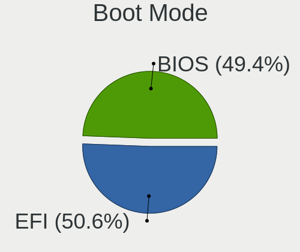
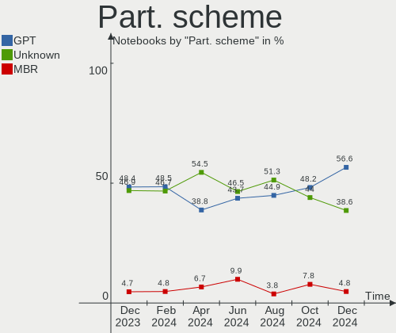
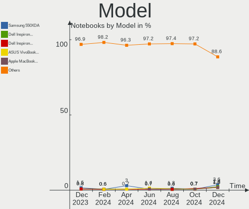
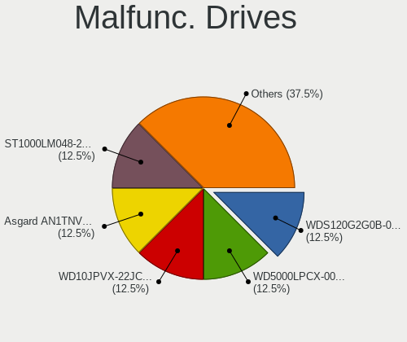
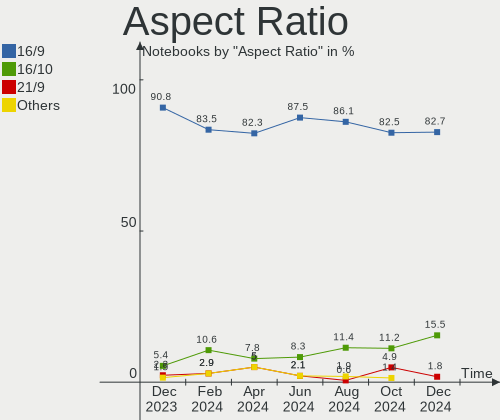
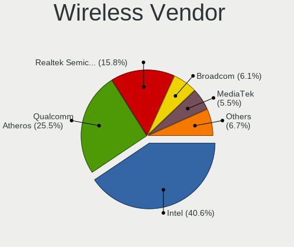
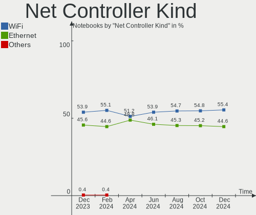
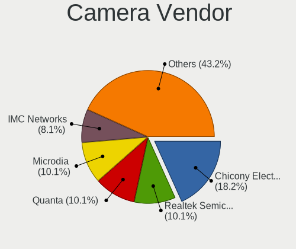

Linux in Brazil - Hardware Trends (Notebooks)
---------------------------------------------

A project to identify most popular hardware characteristics and track their change
over time based on data collected by Linux users at https://Linux-Hardware.org.

Anyone can contribute to this report by the [hw-probe](https://github.com/linuxhw/hw-probe) tool:

    sudo -E hw-probe -all -upload

Period: Jan, 2024.

Contents
--------

* [ System ](#system)
  - [ OS                       ](#os)
  - [ OS Family                ](#os-family)
  - [ Kernel                   ](#kernel)
  - [ Kernel Family            ](#kernel-family)
  - [ Kernel Major Ver.        ](#kernel-major-ver)
  - [ Arch                     ](#arch)
  - [ DE                       ](#de)
  - [ Display Server           ](#display-server)
  - [ Display Manager          ](#display-manager)
  - [ OS Lang                  ](#os-lang)
  - [ Boot Mode                ](#boot-mode)
  - [ Filesystem               ](#filesystem)
  - [ Part. scheme             ](#part-scheme)
  - [ Dual Boot with Linux/BSD ](#dual-boot-with-linuxbsd)
  - [ Dual Boot (Win)          ](#dual-boot-win)

* [ Board ](#board)
  - [ Vendor                   ](#vendor)
  - [ Model                    ](#model)
  - [ Model Family             ](#model-family)
  - [ MFG Year                 ](#mfg-year)
  - [ Form Factor              ](#form-factor)
  - [ Secure Boot              ](#secure-boot)
  - [ Coreboot                 ](#coreboot)
  - [ RAM Size                 ](#ram-size)
  - [ RAM Used                 ](#ram-used)
  - [ Total Drives             ](#total-drives)
  - [ Has CD-ROM               ](#has-cd-rom)
  - [ Has Ethernet             ](#has-ethernet)
  - [ Has WiFi                 ](#has-wifi)
  - [ Has Bluetooth            ](#has-bluetooth)

* [ Location ](#location)
  - [ Country                  ](#country)
  - [ City                     ](#city)

* [ Drives ](#drives)
  - [ Drive Vendor             ](#drive-vendor)
  - [ Drive Model              ](#drive-model)
  - [ HDD Vendor               ](#hdd-vendor)
  - [ SSD Vendor               ](#ssd-vendor)
  - [ Drive Kind               ](#drive-kind)
  - [ Drive Connector          ](#drive-connector)
  - [ Drive Size               ](#drive-size)
  - [ Space Total              ](#space-total)
  - [ Space Used               ](#space-used)
  - [ Malfunc. Drives          ](#malfunc-drives)
  - [ Malfunc. Drive Vendor    ](#malfunc-drive-vendor)
  - [ Malfunc. HDD Vendor      ](#malfunc-hdd-vendor)
  - [ Malfunc. Drive Kind      ](#malfunc-drive-kind)
  - [ Failed Drives            ](#failed-drives)
  - [ Failed Drive Vendor      ](#failed-drive-vendor)
  - [ Drive Status             ](#drive-status)

* [ Storage controller ](#storage-controller)
  - [ Storage Vendor           ](#storage-vendor)
  - [ Storage Model            ](#storage-model)
  - [ Storage Kind             ](#storage-kind)

* [ Processor ](#processor)
  - [ CPU Vendor               ](#cpu-vendor)
  - [ CPU Model                ](#cpu-model)
  - [ CPU Model Family         ](#cpu-model-family)
  - [ CPU Cores                ](#cpu-cores)
  - [ CPU Sockets              ](#cpu-sockets)
  - [ CPU Threads              ](#cpu-threads)
  - [ CPU Op-Modes             ](#cpu-op-modes)
  - [ CPU Microcode            ](#cpu-microcode)
  - [ CPU Microarch            ](#cpu-microarch)

* [ Graphics ](#graphics)
  - [ GPU Vendor               ](#gpu-vendor)
  - [ GPU Model                ](#gpu-model)
  - [ GPU Combo                ](#gpu-combo)
  - [ GPU Driver               ](#gpu-driver)
  - [ GPU Memory               ](#gpu-memory)

* [ Monitor ](#monitor)
  - [ Monitor Vendor           ](#monitor-vendor)
  - [ Monitor Model            ](#monitor-model)
  - [ Monitor Resolution       ](#monitor-resolution)
  - [ Monitor Diagonal         ](#monitor-diagonal)
  - [ Monitor Width            ](#monitor-width)
  - [ Aspect Ratio             ](#aspect-ratio)
  - [ Monitor Area             ](#monitor-area)
  - [ Pixel Density            ](#pixel-density)
  - [ Multiple Monitors        ](#multiple-monitors)

* [ Network ](#network)
  - [ Net Controller Vendor    ](#net-controller-vendor)
  - [ Net Controller Model     ](#net-controller-model)
  - [ Wireless Vendor          ](#wireless-vendor)
  - [ Wireless Model           ](#wireless-model)
  - [ Ethernet Vendor          ](#ethernet-vendor)
  - [ Ethernet Model           ](#ethernet-model)
  - [ Net Controller Kind      ](#net-controller-kind)
  - [ Used Controller          ](#used-controller)
  - [ NICs                     ](#nics)
  - [ IPv6                     ](#ipv6)

* [ Bluetooth ](#bluetooth)
  - [ Bluetooth Vendor         ](#bluetooth-vendor)
  - [ Bluetooth Model          ](#bluetooth-model)

* [ Sound ](#sound)
  - [ Sound Vendor             ](#sound-vendor)
  - [ Sound Model              ](#sound-model)

* [ Memory ](#memory)
  - [ Memory Vendor            ](#memory-vendor)
  - [ Memory Model             ](#memory-model)
  - [ Memory Kind              ](#memory-kind)
  - [ Memory Form Factor       ](#memory-form-factor)
  - [ Memory Size              ](#memory-size)
  - [ Memory Speed             ](#memory-speed)

* [ Printers & scanners ](#printers--scanners)
  - [ Printer Vendor           ](#printer-vendor)
  - [ Printer Model            ](#printer-model)
  - [ Scanner Vendor           ](#scanner-vendor)
  - [ Scanner Model            ](#scanner-model)

* [ Camera ](#camera)
  - [ Camera Vendor            ](#camera-vendor)
  - [ Camera Model             ](#camera-model)

* [ Security ](#security)
  - [ Fingerprint Vendor       ](#fingerprint-vendor)
  - [ Fingerprint Model        ](#fingerprint-model)
  - [ Chipcard Vendor          ](#chipcard-vendor)
  - [ Chipcard Model           ](#chipcard-model)

* [ Unsupported ](#unsupported)
  - [ Unsupported Devices      ](#unsupported-devices)
  - [ Unsupported Device Types ](#unsupported-device-types)

System
------

OS
--

Installed operating systems

| Name                         | Notebooks | Percent |
|------------------------------|-----------|---------|
| Fedora 39                    | 19        | 13.87%  |
| Ubuntu 22.04                 | 12        | 8.76%   |
| OpenMandriva 23.08           | 11        | 8.03%   |
| Pop!_OS 22.04                | 8         | 5.84%   |
| Zorin 17                     | 7         | 5.11%   |
| Arch Rolling                 | 6         | 4.38%   |
| Ubuntu 23.10                 | 5         | 3.65%   |
| Linux Mint 21.2              | 4         | 2.92%   |
| Endless 5.1.1                | 4         | 2.92%   |
| Debian 12                    | 4         | 2.92%   |
| Nobara 39                    | 3         | 2.19%   |
| Linux Mint 21.3              | 3         | 2.19%   |
| SteamOS 3.5.7                | 2         | 1.46%   |
| openSUSE Tumbleweed-XXXXXXXX | 2         | 1.46%   |
| OpenMandriva 24.01           | 2         | 1.46%   |
| Manjaro 23.1.2               | 2         | 1.46%   |
| LMDE 6                       | 2         | 1.46%   |
| Linux Mint 21.1              | 2         | 1.46%   |
| Kubuntu 23.10                | 2         | 1.46%   |
| KDE neon 22.04               | 2         | 1.46%   |
| Elementary 7.1               | 2         | 1.46%   |
| BigLinux                     | 2         | 1.46%   |
| Zorin 16                     | 1         | 0.73%   |
| Xubuntu 18.04                | 1         | 0.73%   |
| Xero Rolling                 | 1         | 0.73%   |
| Ubuntu MATE 22.04            | 1         | 0.73%   |
| Ubuntu 23.04                 | 1         | 0.73%   |
| Ubuntu 18.04                 | 1         | 0.73%   |
| TUXEDO OS 22.04              | 1         | 0.73%   |
| SteamOS 4                    | 1         | 0.73%   |
| SteamOS 3.5.13               | 1         | 0.73%   |
| Regata OS 23                 | 1         | 0.73%   |
| Pop!_OS 20.04                | 1         | 0.73%   |
| org.kde.Platform 5.15-21.08  | 1         | 0.73%   |
| openSUSE Leap-15.5           | 1         | 0.73%   |
| OpenMandriva 5.0             | 1         | 0.73%   |
| NixOS 24.05                  | 1         | 0.73%   |
| NixOS 23.11                  | 1         | 0.73%   |
| Manjaro 23.1.3               | 1         | 0.73%   |
| Manjaro                      | 1         | 0.73%   |

OS Family
---------

OS without a version

| Name             | Notebooks | Percent |
|------------------|-----------|---------|
| Fedora           | 20        | 14.6%   |
| Ubuntu           | 19        | 13.87%  |
| OpenMandriva     | 14        | 10.22%  |
| Linux Mint       | 10        | 7.3%    |
| Pop!_OS          | 9         | 6.57%   |
| Zorin            | 8         | 5.84%   |
| Arch             | 6         | 4.38%   |
| Debian           | 5         | 3.65%   |
| SteamOS          | 4         | 2.92%   |
| Manjaro          | 4         | 2.92%   |
| Endless          | 4         | 2.92%   |
| openSUSE         | 3         | 2.19%   |
| Nobara           | 3         | 2.19%   |
| NixOS            | 2         | 1.46%   |
| Lubuntu          | 2         | 1.46%   |
| LMDE             | 2         | 1.46%   |
| Kubuntu          | 2         | 1.46%   |
| KDE neon         | 2         | 1.46%   |
| Elementary       | 2         | 1.46%   |
| Clear Linux      | 2         | 1.46%   |
| BigLinux         | 2         | 1.46%   |
| Xubuntu          | 1         | 0.73%   |
| Xero             | 1         | 0.73%   |
| Ubuntu MATE      | 1         | 0.73%   |
| TUXEDO OS        | 1         | 0.73%   |
| Regata OS        | 1         | 0.73%   |
| org.kde.Platform | 1         | 0.73%   |
| Linux Lite       | 1         | 0.73%   |
| Lilidog          | 1         | 0.73%   |
| Gentoo           | 1         | 0.73%   |
| EndeavourOS      | 1         | 0.73%   |
| Artix            | 1         | 0.73%   |
| ArcoLinux        | 1         | 0.73%   |

Kernel
------

Version of the Linux kernel

| Version                      | Notebooks | Percent |
|------------------------------|-----------|---------|
| 6.5.0-14-generic             | 17        | 12.41%  |
| 6.6.9-200.fc39.x86_64        | 10        | 7.3%    |
| 6.4.11-desktop-1omv2390      | 10        | 7.3%    |
| 6.2.0-39-generic             | 10        | 7.3%    |
| 5.15.0-91-generic            | 9         | 6.57%   |
| 6.6.6-76060606-generic       | 6         | 4.38%   |
| 6.5.0-10-generic             | 4         | 2.92%   |
| 6.1.0-17-amd64               | 4         | 2.92%   |
| 6.6.8-arch1-1                | 3         | 2.19%   |
| 6.6.2-desktop-1omv2390       | 3         | 2.19%   |
| 6.6.13-200.fc39.x86_64       | 3         | 2.19%   |
| 6.7.0-arch3-1                | 2         | 1.46%   |
| 6.6.8-200.fc39.x86_64        | 2         | 1.46%   |
| 6.6.8-2-MANJARO              | 2         | 1.46%   |
| 6.6.11-200.fc39.x86_64       | 2         | 1.46%   |
| 6.6.10-1-MANJARO             | 2         | 1.46%   |
| 6.5.0-15-generic             | 2         | 1.46%   |
| 6.1.52-valve9-1-neptune-61   | 2         | 1.46%   |
| 6.7.1-arch1-1                | 1         | 0.73%   |
| 6.7.1-200.1.ipu6.fc39.x86_64 | 1         | 0.73%   |
| 6.7.0-zen3-1-zen             | 1         | 0.73%   |
| 6.7.0-keepos                 | 1         | 0.73%   |
| 6.7.0-cachyos                | 1         | 0.73%   |
| 6.7.0-204.fsync.fc39.x86_64  | 1         | 0.73%   |
| 6.7.0-201.fsync.fc39.x86_64  | 1         | 0.73%   |
| 6.6.9-1394.native            | 1         | 0.73%   |
| 6.6.8-200.fsync.fc39.x86_64  | 1         | 0.73%   |
| 6.6.7-1-default              | 1         | 0.73%   |
| 6.6.13-x64v2-xanmod1         | 1         | 0.73%   |
| 6.6.13-060613-generic        | 1         | 0.73%   |
| 6.6.12-100.fc38.x86_64       | 1         | 0.73%   |
| 6.6.11-1-default             | 1         | 0.73%   |
| 6.6.10-zen1-1-zen            | 1         | 0.73%   |
| 6.6.10-x64v2-xanmod1-1       | 1         | 0.73%   |
| 6.6.10-arch1-1               | 1         | 0.73%   |
| 6.6.10-1398.native           | 1         | 0.73%   |
| 6.5.9-lp154.6-default        | 1         | 0.73%   |
| 6.5.6-76060506-generic       | 1         | 0.73%   |
| 6.5.6-300.fc39.x86_64        | 1         | 0.73%   |
| 6.5.0-14-lowlatency          | 1         | 0.73%   |

Kernel Family
-------------

Linux kernel without a distro release

| Version | Notebooks | Percent |
|---------|-----------|---------|
| 6.5.0   | 27        | 19.71%  |
| 6.2.0   | 12        | 8.76%   |
| 5.15.0  | 12        | 8.76%   |
| 6.6.9   | 11        | 8.03%   |
| 6.4.11  | 10        | 7.3%    |
| 6.6.8   | 8         | 5.84%   |
| 6.7.0   | 7         | 5.11%   |
| 6.6.6   | 6         | 4.38%   |
| 6.6.10  | 6         | 4.38%   |
| 6.6.13  | 5         | 3.65%   |
| 6.1.0   | 5         | 3.65%   |
| 6.6.2   | 3         | 2.19%   |
| 6.6.11  | 3         | 2.19%   |
| 6.1.52  | 3         | 2.19%   |
| 6.7.1   | 2         | 1.46%   |
| 6.5.6   | 2         | 1.46%   |
| 6.1.69  | 2         | 1.46%   |
| 5.4.0   | 2         | 1.46%   |
| 6.6.7   | 1         | 0.73%   |
| 6.6.12  | 1         | 0.73%   |
| 6.5.9   | 1         | 0.73%   |
| 6.4.8   | 1         | 0.73%   |
| 6.3.7   | 1         | 0.73%   |
| 6.2.6   | 1         | 0.73%   |
| 6.1.71  | 1         | 0.73%   |
| 6.0.12  | 1         | 0.73%   |
| 5.15.77 | 1         | 0.73%   |
| 5.14.21 | 1         | 0.73%   |
| 4.15.0  | 1         | 0.73%   |

Kernel Major Ver.
-----------------

Linux kernel major version

| Version | Notebooks | Percent |
|---------|-----------|---------|
| 6.6     | 44        | 32.12%  |
| 6.5     | 30        | 21.9%   |
| 6.2     | 13        | 9.49%   |
| 5.15    | 13        | 9.49%   |
| 6.4     | 11        | 8.03%   |
| 6.1     | 11        | 8.03%   |
| 6.7     | 9         | 6.57%   |
| 5.4     | 2         | 1.46%   |
| 6.3     | 1         | 0.73%   |
| 6.0     | 1         | 0.73%   |
| 5.14    | 1         | 0.73%   |
| 4.15    | 1         | 0.73%   |

Arch
----

OS architecture (x86_64, i586, etc.)

| Name   | Notebooks | Percent |
|--------|-----------|---------|
| x86_64 | 136       | 99.27%  |
| i686   | 1         | 0.73%   |

DE
--

Desktop Environment

| Name          | Notebooks | Percent |
|---------------|-----------|---------|
| GNOME         | 62        | 45.26%  |
| KDE5          | 35        | 25.55%  |
| X-Cinnamon    | 13        | 9.49%   |
| XFCE          | 6         | 4.38%   |
| LXQt          | 4         | 2.92%   |
| Endless:GNOME | 4         | 2.92%   |
| Pantheon      | 2         | 1.46%   |
| i3            | 2         | 1.46%   |
| Unknown       | 2         | 1.46%   |
| sway          | 1         | 0.73%   |
| openbox       | 1         | 0.73%   |
| MATE          | 1         | 0.73%   |
| KDE           | 1         | 0.73%   |
| Deepin        | 1         | 0.73%   |
| Cinnamon      | 1         | 0.73%   |
| Budgie        | 1         | 0.73%   |

Display Server
--------------

X11 or Wayland

| Name    | Notebooks | Percent |
|---------|-----------|---------|
| Wayland | 68        | 49.64%  |
| X11     | 66        | 48.18%  |
| Unknown | 3         | 2.19%   |

Display Manager
---------------

SDDM, LightDM, etc.

| Name    | Notebooks | Percent |
|---------|-----------|---------|
| Unknown | 80        | 58.39%  |
| SDDM    | 23        | 16.79%  |
| GDM3    | 16        | 11.68%  |
| LightDM | 11        | 8.03%   |
| GDM     | 7         | 5.11%   |

OS Lang
-------

Language

| Lang       | Notebooks | Percent |
|------------|-----------|---------|
| pt_BR      | 83        | 60.58%  |
| en_US      | 49        | 35.77%  |
| es_ES      | 1         | 0.73%   |
| en_IE.UTF8 | 1         | 0.73%   |
| en_CA      | 1         | 0.73%   |
| C          | 1         | 0.73%   |
| Unknown    | 1         | 0.73%   |

Boot Mode
---------

EFI or BIOS

| Mode | Notebooks | Percent |
|------|-----------|---------|
| BIOS | 72        | 52.55%  |
| EFI  | 65        | 47.45%  |

Filesystem
----------

Type of filesystem

| Type    | Notebooks | Percent |
|---------|-----------|---------|
| Ext4    | 80        | 58.39%  |
| Btrfs   | 39        | 28.47%  |
| Tmpfs   | 10        | 7.3%    |
| Overlay | 7         | 5.11%   |
| Zfs     | 1         | 0.73%   |

Part. scheme
------------

Scheme of partitioning

| Type    | Notebooks | Percent |
|---------|-----------|---------|
| Unknown | 78        | 56.93%  |
| GPT     | 48        | 35.04%  |
| MBR     | 11        | 8.03%   |

Dual Boot with Linux/BSD
------------------------

Hosting more than one Linux/BSD

| Dual boot | Notebooks | Percent |
|-----------|-----------|---------|
| No        | 125       | 91.24%  |
| Yes       | 12        | 8.76%   |

Dual Boot (Win)
---------------

Hosting Linux and Windows

| Dual boot | Notebooks | Percent |
|-----------|-----------|---------|
| No        | 121       | 88.32%  |
| Yes       | 16        | 11.68%  |

Board
-----

Vendor
------

Motherboard manufacturer

| Name                   | Notebooks | Percent |
|------------------------|-----------|---------|
| Dell                   | 28        | 20.44%  |
| Lenovo                 | 26        | 18.98%  |
| Acer                   | 22        | 16.06%  |
| Samsung Electronics    | 10        | 7.3%    |
| Hewlett-Packard        | 10        | 7.3%    |
| Positivo               | 7         | 5.11%   |
| ASUSTek Computer       | 5         | 3.65%   |
| Valve                  | 3         | 2.19%   |
| Semp Toshiba           | 2         | 1.46%   |
| Positivo Bahia - VAIO  | 2         | 1.46%   |
| LG Electronics         | 2         | 1.46%   |
| Gigabyte Technology    | 2         | 1.46%   |
| Digibras               | 2         | 1.46%   |
| Compaq                 | 2         | 1.46%   |
| Apple                  | 2         | 1.46%   |
| Timi                   | 1         | 0.73%   |
| Sony                   | 1         | 0.73%   |
| Philco                 | 1         | 0.73%   |
| ODM                    | 1         | 0.73%   |
| Notebook               | 1         | 0.73%   |
| Multilaser             | 1         | 0.73%   |
| Login Informatica      | 1         | 0.73%   |
| Gigazone               | 1         | 0.73%   |
| Evolute                | 1         | 0.73%   |
| Avell High Performance | 1         | 0.73%   |
| Avell                  | 1         | 0.73%   |
| Unknown                | 1         | 0.73%   |

Model
-----

Motherboard model

| Name                                        | Notebooks | Percent |
|---------------------------------------------|-----------|---------|
| Dell Inspiron 15-3567                       | 4         | 2.92%   |
| Valve Jupiter                               | 3         | 2.19%   |
| Samsung RV415/RV515                         | 2         | 1.46%   |
| Positivo Mobile                             | 2         | 1.46%   |
| Lenovo IdeaPad S145-15IWL 81S9              | 2         | 1.46%   |
| Lenovo IdeaPad 330-15IKB 81FE               | 2         | 1.46%   |
| Lenovo IdeaPad 3 15ITL6 82MD                | 2         | 1.46%   |
| Lenovo IdeaPad 3 15ALC6 82MF                | 2         | 1.46%   |
| HP Pavilion 14                              | 2         | 1.46%   |
| Digibras NH4CU03                            | 2         | 1.46%   |
| Acer Nitro AN515-44                         | 2         | 1.46%   |
| Acer Aspire A315-58                         | 2         | 1.46%   |
| Unknown                                     | 2         | 1.46%   |
| Timi RedmiBook Pro 14S                      | 1         | 0.73%   |
| Sony VJF153                                 | 1         | 0.73%   |
| Semp Toshiba STI NI 1401                    | 1         | 0.73%   |
| Semp Toshiba IS 1413G                       | 1         | 0.73%   |
| Samsung RV411/RV511/E3511/S3511/RV711/E3411 | 1         | 0.73%   |
| Samsung 960XFH                              | 1         | 0.73%   |
| Samsung 670Z5E                              | 1         | 0.73%   |
| Samsung 550XED                              | 1         | 0.73%   |
| Samsung 550XCJ/550XCR                       | 1         | 0.73%   |
| Samsung 550XBE/350XBE                       | 1         | 0.73%   |
| Samsung 300E5M/300E5L                       | 1         | 0.73%   |
| Samsung 270E5K/270E5Q/271E5K/2570EK         | 1         | 0.73%   |
| Positivo S14SL01                            | 1         | 0.73%   |
| Positivo Q4128CI                            | 1         | 0.73%   |
| Positivo Harrison                           | 1         | 0.73%   |
| Positivo C4128A-15                          | 1         | 0.73%   |
| Positivo C14CU51                            | 1         | 0.73%   |
| Positivo Bahia - VAIO VJFE53F11X-XXXXXX     | 1         | 0.73%   |
| Positivo Bahia - VAIO VJFE42F11X-B2891H     | 1         | 0.73%   |
| Philco 14M2                                 | 1         | 0.73%   |
| Notebook NJx0MU                             | 1         | 0.73%   |
| Multilaser MLGW08                           | 1         | 0.73%   |
| Login Informatica LOG-QAL30                 | 1         | 0.73%   |
| LG A530-U.BE54P1                            | 1         | 0.73%   |
| LG 23V545-G.BK55P1                          | 1         | 0.73%   |
| Lenovo Yoga Slim 6 14IAP8 83C7              | 1         | 0.73%   |
| Lenovo Yoga 300-11IBR 80M1                  | 1         | 0.73%   |

Model Family
------------

Motherboard model prefix

| Name                                    | Notebooks | Percent |
|-----------------------------------------|-----------|---------|
| Dell Inspiron                           | 18        | 13.14%  |
| Lenovo IdeaPad                          | 15        | 10.95%  |
| Acer Aspire                             | 14        | 10.22%  |
| Lenovo ThinkPad                         | 6         | 4.38%   |
| Dell Latitude                           | 6         | 4.38%   |
| Acer Nitro                              | 6         | 4.38%   |
| HP Pavilion                             | 5         | 3.65%   |
| Valve Jupiter                           | 3         | 2.19%   |
| Samsung RV415                           | 2         | 1.46%   |
| Positivo Mobile                         | 2         | 1.46%   |
| Lenovo Yoga                             | 2         | 1.46%   |
| Lenovo G460                             | 2         | 1.46%   |
| HP Presario                             | 2         | 1.46%   |
| Digibras NH4CU03                        | 2         | 1.46%   |
| Unknown                                 | 2         | 1.46%   |
| Timi RedmiBook                          | 1         | 0.73%   |
| Sony VJF153                             | 1         | 0.73%   |
| Semp Toshiba STI                        | 1         | 0.73%   |
| Semp Toshiba IS                         | 1         | 0.73%   |
| Samsung RV411                           | 1         | 0.73%   |
| Samsung 960XFH                          | 1         | 0.73%   |
| Samsung 670Z5E                          | 1         | 0.73%   |
| Samsung 550XED                          | 1         | 0.73%   |
| Samsung 550XCJ                          | 1         | 0.73%   |
| Samsung 550XBE                          | 1         | 0.73%   |
| Samsung 300E5M                          | 1         | 0.73%   |
| Samsung 270E5K                          | 1         | 0.73%   |
| Positivo S14SL01                        | 1         | 0.73%   |
| Positivo Q4128CI                        | 1         | 0.73%   |
| Positivo Harrison                       | 1         | 0.73%   |
| Positivo C4128A-15                      | 1         | 0.73%   |
| Positivo C14CU51                        | 1         | 0.73%   |
| Positivo Bahia - VAIO VJFE53F11X-XXXXXX | 1         | 0.73%   |
| Positivo Bahia - VAIO VJFE42F11X-B2891H | 1         | 0.73%   |
| Philco 14M2                             | 1         | 0.73%   |
| Notebook NJx0MU                         | 1         | 0.73%   |
| Multilaser MLGW08                       | 1         | 0.73%   |
| Login Informatica LOG-QAL30             | 1         | 0.73%   |
| LG A530-U.BE54P1                        | 1         | 0.73%   |
| LG 23V545-G.BK55P1                      | 1         | 0.73%   |

MFG Year
--------

Motherboard manufacture year

| Year | Notebooks | Percent |
|------|-----------|---------|
| 2021 | 24        | 17.52%  |
| 2011 | 12        | 8.76%   |
| 2019 | 11        | 8.03%   |
| 2020 | 10        | 7.3%    |
| 2013 | 10        | 7.3%    |
| 2016 | 9         | 6.57%   |
| 2014 | 9         | 6.57%   |
| 2022 | 8         | 5.84%   |
| 2023 | 7         | 5.11%   |
| 2017 | 7         | 5.11%   |
| 2012 | 7         | 5.11%   |
| 2018 | 6         | 4.38%   |
| 2015 | 6         | 4.38%   |
| 2010 | 5         | 3.65%   |
| 2009 | 3         | 2.19%   |
| 2008 | 2         | 1.46%   |
| 2007 | 1         | 0.73%   |

Form Factor
-----------

Physical design of the computer

| Name     | Notebooks | Percent |
|----------|-----------|---------|
| Notebook | 137       | 100%    |

Secure Boot
-----------

Enabled or disabled

| State    | Notebooks | Percent |
|----------|-----------|---------|
| Disabled | 128       | 93.43%  |
| Enabled  | 9         | 6.57%   |

Coreboot
--------

Have coreboot on board

| Used | Notebooks | Percent |
|------|-----------|---------|
| No   | 137       | 100%    |

RAM Size
--------

Total RAM memory

| Size in GB  | Notebooks | Percent |
|-------------|-----------|---------|
| 4.01-8.0    | 38        | 27.74%  |
| 3.01-4.0    | 29        | 21.17%  |
| 8.01-16.0   | 27        | 19.71%  |
| 16.01-24.0  | 24        | 17.52%  |
| 32.01-64.0  | 10        | 7.3%    |
| 1.01-2.0    | 5         | 3.65%   |
| 2.01-3.0    | 2         | 1.46%   |
| 24.01-32.0  | 1         | 0.73%   |
| 64.01-256.0 | 1         | 0.73%   |

RAM Used
--------

Used RAM memory

| Used GB    | Notebooks | Percent |
|------------|-----------|---------|
| 2.01-3.0   | 36        | 26.28%  |
| 1.01-2.0   | 32        | 23.36%  |
| 3.01-4.0   | 28        | 20.44%  |
| 4.01-8.0   | 27        | 19.71%  |
| 8.01-16.0  | 5         | 3.65%   |
| 0.51-1.0   | 5         | 3.65%   |
| 16.01-24.0 | 2         | 1.46%   |
| 0.01-0.5   | 2         | 1.46%   |

Total Drives
------------

Number of drives on board

| Drives | Notebooks | Percent |
|--------|-----------|---------|
| 1      | 98        | 71.53%  |
| 2      | 34        | 24.82%  |
| 3      | 4         | 2.92%   |
| 4      | 1         | 0.73%   |

Has CD-ROM
----------

Has CD-ROM on board

| Presented | Notebooks | Percent |
|-----------|-----------|---------|
| No        | 100       | 72.99%  |
| Yes       | 37        | 27.01%  |

Has Ethernet
------------

Has Ethernet on board

| Presented | Notebooks | Percent |
|-----------|-----------|---------|
| Yes       | 117       | 85.4%   |
| No        | 20        | 14.6%   |

Has WiFi
--------

Has WiFi module

| Presented | Notebooks | Percent |
|-----------|-----------|---------|
| Yes       | 131       | 95.62%  |
| No        | 6         | 4.38%   |

Has Bluetooth
-------------

Has Bluetooth module

| Presented | Notebooks | Percent |
|-----------|-----------|---------|
| Yes       | 109       | 79.56%  |
| No        | 28        | 20.44%  |

Location
--------

Country
-------

Geographic location (country)

| Country | Notebooks | Percent |
|---------|-----------|---------|
| Brazil  | 137       | 100%    |

City
----

Geographic location (city)

| City                  | Notebooks | Percent |
|-----------------------|-----------|---------|
| Fortaleza             | 6         | 4.38%   |
| Salvador              | 5         | 3.65%   |
| Rio de Janeiro        | 5         | 3.65%   |
| Sao Paulo             | 4         | 2.92%   |
| Campo Grande          | 4         | 2.92%   |
| Belém                | 4         | 2.92%   |
| Manaus                | 3         | 2.19%   |
| Brasília             | 3         | 2.19%   |
| Sapezal               | 2         | 1.46%   |
| Sao Luís             | 2         | 1.46%   |
| Sao Goncalo           | 2         | 1.46%   |
| Santo André          | 2         | 1.46%   |
| Osasco                | 2         | 1.46%   |
| Maceió               | 2         | 1.46%   |
| Guarulhos             | 2         | 1.46%   |
| Feira de Santana      | 2         | 1.46%   |
| Curitiba              | 2         | 1.46%   |
| Cascavel              | 2         | 1.46%   |
| Campinas              | 2         | 1.46%   |
| Belo Horizonte        | 2         | 1.46%   |
| Vitória              | 1         | 0.73%   |
| Vicosa                | 1         | 0.73%   |
| Umbauba               | 1         | 0.73%   |
| Tres Pontas           | 1         | 0.73%   |
| Tramandai             | 1         | 0.73%   |
| Toledo                | 1         | 0.73%   |
| Terra Nova do Norte   | 1         | 0.73%   |
| Tangara Da Serra      | 1         | 0.73%   |
| Sumaré               | 1         | 0.73%   |
| Sorocaba              | 1         | 0.73%   |
| Serafina Correa       | 1         | 0.73%   |
| Sao Leopoldo          | 1         | 0.73%   |
| Sao José dos Pinhais | 1         | 0.73%   |
| Sao Joao dos Patos    | 1         | 0.73%   |
| Sao Joao del Rei      | 1         | 0.73%   |
| Santos                | 1         | 0.73%   |
| Santana de Parnaiba   | 1         | 0.73%   |
| Santa Luzia           | 1         | 0.73%   |
| Rosario               | 1         | 0.73%   |
| Rio das Pedras        | 1         | 0.73%   |

Drives
------

Drive Vendor
------------

Hard drive vendors

| Vendor                         | Notebooks | Drives | Percent |
|--------------------------------|-----------|--------|---------|
| WDC                            | 23        | 23     | 13.14%  |
| Kingston                       | 21        | 22     | 12%     |
| Sandisk                        | 13        | 14     | 7.43%   |
| Samsung Electronics            | 13        | 13     | 7.43%   |
| A-DATA Technology              | 12        | 12     | 6.86%   |
| Seagate                        | 11        | 11     | 6.29%   |
| China                          | 9         | 10     | 5.14%   |
| Unknown                        | 6         | 6      | 3.43%   |
| Toshiba                        | 6         | 6      | 3.43%   |
| SK hynix                       | 4         | 4      | 2.29%   |
| Realtek Semiconductor          | 4         | 5      | 2.29%   |
| Netac                          | 4         | 5      | 2.29%   |
| Micron Technology              | 4         | 4      | 2.29%   |
| Crucial                        | 4         | 4      | 2.29%   |
| Solid State Storage Technology | 3         | 3      | 1.71%   |
| Kingston Technology Company    | 3         | 3      | 1.71%   |
| KingSpec                       | 3         | 3      | 1.71%   |
| XrayDisk                       | 2         | 2      | 1.14%   |
| SSSTC                          | 2         | 2      | 1.14%   |
| Silicon Motion                 | 2         | 2      | 1.14%   |
| Lexar                          | 2         | 2      | 1.14%   |
| JMicron Technology             | 2         | 2      | 1.14%   |
| Intel                          | 2         | 2      | 1.14%   |
| Hitachi                        | 2         | 2      | 1.14%   |
| HGST                           | 2         | 2      | 1.14%   |
| Apple                          | 2         | 2      | 1.14%   |
| ADATA Technology               | 2         | 2      | 1.14%   |
| Union Memory (Shenzhen)        | 1         | 1      | 0.57%   |
| Solid State Storage            | 1         | 1      | 0.57%   |
| Smart                          | 1         | 1      | 0.57%   |
| Shenzhen Longsys Electronics   | 1         | 1      | 0.57%   |
| Micron/Crucial Technology      | 1         | 1      | 0.57%   |
| LITEON                         | 1         | 1      | 0.57%   |
| Lite-On Technology             | 1         | 1      | 0.57%   |
| Kross Elegance                 | 1         | 1      | 0.57%   |
| KBM                            | 1         | 1      | 0.57%   |
| HUSKY                          | 1         | 1      | 0.57%   |
| Gigabyte Technology            | 1         | 1      | 0.57%   |
| BIWIN                          | 1         | 1      | 0.57%   |

Drive Model
-----------

Hard drive models

| Model                                     | Notebooks | Percent |
|-------------------------------------------|-----------|---------|
| Kingston SA400S37480G 480GB SSD           | 7         | 3.91%   |
| Kingston SA400S37240G 240GB SSD           | 6         | 3.35%   |
| Seagate ST500LM012 HN-M500MBB 500GB       | 4         | 2.23%   |
| WDC WD10SPZX-21Z10T0 1TB                  | 3         | 1.68%   |
| Kingston SA400S37120G 120GB SSD           | 3         | 1.68%   |
| WDC WD5000LPVX-80V0TT0 500GB              | 2         | 1.12%   |
| WDC WD5000LPCX-00VHAT0 500GB              | 2         | 1.12%   |
| WDC WD10SPZX-75Z10T1 1TB                  | 2         | 1.12%   |
| Unknown xD/SD/M.S.                        | 2         | 1.12%   |
| Unknown MMC Card  128GB                   | 2         | 1.12%   |
| Toshiba MQ01ABD050 500GB                  | 2         | 1.12%   |
| Seagate ST1000LM035-1RK172 1TB            | 2         | 1.12%   |
| Sandisk WD Blue SN550 NVMe SSD 512GB      | 2         | 1.12%   |
| SanDisk SDSSDA120G 120GB                  | 2         | 1.12%   |
| Realtek RTS5763DL NVMe SSD Controller 2TB | 2         | 1.12%   |
| Crucial CT1000BX500SSD1 1TB               | 2         | 1.12%   |
| China SSD 512GB                           | 2         | 1.12%   |
| China SSD 500GB                           | 2         | 1.12%   |
| A-DATA SU650 480GB SSD                    | 2         | 1.12%   |
| A-DATA IM2P33F8ABR2-256GB                 | 2         | 1.12%   |
| A-DATA IM2P33F8ABR1-256GB                 | 2         | 1.12%   |
| A-DATA IM2P33F3A NVMe 256GB               | 2         | 1.12%   |
| XrayDisk 512GB SSD                        | 1         | 0.56%   |
| XrayDisk 256GB SSD                        | 1         | 0.56%   |
| WDC WDS240G2G0A-00JH30 240GB SSD          | 1         | 0.56%   |
| WDC WD5000LUCT-63RC2Y0 500GB              | 1         | 0.56%   |
| WDC WD5000LPZX-75Z10T0 500GB              | 1         | 0.56%   |
| WDC WD5000LPCX-75VHAT1 500GB              | 1         | 0.56%   |
| WDC WD5000BPVT-00HXZT3 500GB              | 1         | 0.56%   |
| WDC WD3200BPVT-22JJ5T0 320GB              | 1         | 0.56%   |
| WDC WD3200BPVT-00ZEST0 320GB              | 1         | 0.56%   |
| WDC WD10SPZX-75Z10T2 1TB                  | 1         | 0.56%   |
| WDC WD10SPZX-35Z10T0 1TB                  | 1         | 0.56%   |
| WDC WD10SPZX-24Z10T0 1TB                  | 1         | 0.56%   |
| WDC WD10SPZX-24Z10 1TB                    | 1         | 0.56%   |
| WDC WD10JPVX-75JC3T0 1TB                  | 1         | 0.56%   |
| WDC WD10JPVX-22JC3T0 1TB                  | 1         | 0.56%   |
| WDC WD10JPCX-24UE4T0 1TB                  | 1         | 0.56%   |
| Unknown MMC Card  498GB                   | 1         | 0.56%   |
| Unknown CGND3R  64GB                      | 1         | 0.56%   |

HDD Vendor
----------

Hard disk drive vendors

| Vendor              | Notebooks | Drives | Percent |
|---------------------|-----------|--------|---------|
| WDC                 | 22        | 22     | 46.81%  |
| Seagate             | 11        | 11     | 23.4%   |
| Toshiba             | 6         | 6      | 12.77%  |
| Samsung Electronics | 3         | 3      | 6.38%   |
| Hitachi             | 2         | 2      | 4.26%   |
| HGST                | 2         | 2      | 4.26%   |
| JMicron Technology  | 1         | 1      | 2.13%   |

SSD Vendor
----------

Solid state drive vendors

| Vendor              | Notebooks | Drives | Percent |
|---------------------|-----------|--------|---------|
| Kingston            | 19        | 20     | 30.16%  |
| China               | 9         | 10     | 14.29%  |
| SanDisk             | 4         | 5      | 6.35%   |
| Samsung Electronics | 4         | 4      | 6.35%   |
| Crucial             | 4         | 4      | 6.35%   |
| A-DATA Technology   | 4         | 4      | 6.35%   |
| KingSpec            | 3         | 3      | 4.76%   |
| XrayDisk            | 2         | 2      | 3.17%   |
| Netac               | 2         | 2      | 3.17%   |
| Apple               | 2         | 2      | 3.17%   |
| WDC                 | 1         | 1      | 1.59%   |
| Smart               | 1         | 1      | 1.59%   |
| LITEON              | 1         | 1      | 1.59%   |
| Lexar               | 1         | 1      | 1.59%   |
| Kross Elegance      | 1         | 1      | 1.59%   |
| KBM                 | 1         | 1      | 1.59%   |
| Intel               | 1         | 1      | 1.59%   |
| HUSKY               | 1         | 1      | 1.59%   |
| Gigabyte Technology | 1         | 1      | 1.59%   |
| BIWIN               | 1         | 1      | 1.59%   |

Drive Kind
----------

HDD or SSD

| Kind    | Notebooks | Drives | Percent |
|---------|-----------|--------|---------|
| SSD     | 60        | 66     | 35.93%  |
| NVMe    | 54        | 60     | 32.34%  |
| HDD     | 46        | 47     | 27.54%  |
| MMC     | 4         | 4      | 2.4%    |
| Unknown | 3         | 3      | 1.8%    |

Drive Connector
---------------

SATA, SAS, NVMe, etc.

| Type | Notebooks | Drives | Percent |
|------|-----------|--------|---------|
| SATA | 100       | 112    | 61.73%  |
| NVMe | 54        | 60     | 33.33%  |
| SAS  | 4         | 4      | 2.47%   |
| MMC  | 4         | 4      | 2.47%   |

Drive Size
----------

Size of hard drive

| Size in TB | Notebooks | Drives | Percent |
|------------|-----------|--------|---------|
| 0.01-0.5   | 70        | 78     | 67.31%  |
| 0.51-1.0   | 31        | 32     | 29.81%  |
| 1.01-2.0   | 3         | 3      | 2.88%   |

Space Total
-----------

Amount of disk space available on the file system

| Size in GB     | Notebooks | Percent |
|----------------|-----------|---------|
| 251-500        | 36        | 26.28%  |
| 101-250        | 36        | 26.28%  |
| 501-1000       | 21        | 15.33%  |
| 1001-2000      | 11        | 8.03%   |
| 1-20           | 10        | 7.3%    |
| 51-100         | 10        | 7.3%    |
| More than 3000 | 4         | 2.92%   |
| Unknown        | 4         | 2.92%   |
| 2001-3000      | 3         | 2.19%   |
| 21-50          | 2         | 1.46%   |

Space Used
----------

Amount of used disk space

| Used GB   | Notebooks | Percent |
|-----------|-----------|---------|
| 1-20      | 44        | 32.12%  |
| 101-250   | 23        | 16.79%  |
| 21-50     | 22        | 16.06%  |
| 51-100    | 22        | 16.06%  |
| 251-500   | 10        | 7.3%    |
| 501-1000  | 7         | 5.11%   |
| 1001-2000 | 4         | 2.92%   |
| Unknown   | 4         | 2.92%   |
| 2001-3000 | 1         | 0.73%   |

Malfunc. Drives
---------------

Drive models with a malfunction

| Model                          | Notebooks | Drives | Percent |
|--------------------------------|-----------|--------|---------|
| WDC WD5000LPVX-80V0TT0 500GB   | 1         | 1      | 12.5%   |
| WDC WD5000BPVT-00HXZT3 500GB   | 1         | 1      | 12.5%   |
| WDC WD10SPZX-75Z10T2 1TB       | 1         | 1      | 12.5%   |
| WDC WD10SPZX-24Z10T0 1TB       | 1         | 1      | 12.5%   |
| Toshiba MQ01ABD050 500GB       | 1         | 1      | 12.5%   |
| Seagate ST1000LX015-1U7172 1TB | 1         | 1      | 12.5%   |
| Hitachi HTS547564A9E384 640GB  | 1         | 1      | 12.5%   |
| China SSD 512GB                | 1         | 1      | 12.5%   |

Malfunc. Drive Vendor
---------------------

Vendors of faulty drives

| Vendor  | Notebooks | Drives | Percent |
|---------|-----------|--------|---------|
| WDC     | 4         | 4      | 50%     |
| Toshiba | 1         | 1      | 12.5%   |
| Seagate | 1         | 1      | 12.5%   |
| Hitachi | 1         | 1      | 12.5%   |
| China   | 1         | 1      | 12.5%   |

Malfunc. HDD Vendor
-------------------

Vendors of faulty HDD drives

| Vendor  | Notebooks | Drives | Percent |
|---------|-----------|--------|---------|
| WDC     | 4         | 4      | 57.14%  |
| Toshiba | 1         | 1      | 14.29%  |
| Seagate | 1         | 1      | 14.29%  |
| Hitachi | 1         | 1      | 14.29%  |

Malfunc. Drive Kind
-------------------

Kinds of faulty drives

| Kind | Notebooks | Drives | Percent |
|------|-----------|--------|---------|
| HDD  | 7         | 7      | 87.5%   |
| SSD  | 1         | 1      | 12.5%   |

Failed Drives
-------------

Failed drive models

| Model                    | Notebooks | Drives | Percent |
|--------------------------|-----------|--------|---------|
| Toshiba MQ01ABD050 500GB | 1         | 1      | 100%    |

Failed Drive Vendor
-------------------

Failed drive vendors

| Vendor  | Notebooks | Drives | Percent |
|---------|-----------|--------|---------|
| Toshiba | 1         | 1      | 100%    |

Drive Status
------------

Number of failed and malfunc. drives

| Status   | Notebooks | Drives | Percent |
|----------|-----------|--------|---------|
| Detected | 91        | 121    | 63.64%  |
| Works    | 43        | 50     | 30.07%  |
| Malfunc  | 8         | 8      | 5.59%   |
| Failed   | 1         | 1      | 0.7%    |

Storage controller
------------------

Storage Vendor
--------------

Storage controller vendors

| Vendor                         | Notebooks | Percent |
|--------------------------------|-----------|---------|
| Intel                          | 106       | 59.22%  |
| AMD                            | 14        | 7.82%   |
| ADATA Technology               | 10        | 5.59%   |
| Sandisk                        | 9         | 5.03%   |
| Solid State Storage Technology | 6         | 3.35%   |
| Samsung Electronics            | 6         | 3.35%   |
| Kingston Technology Company    | 5         | 2.79%   |
| SK hynix                       | 4         | 2.23%   |
| Realtek Semiconductor          | 4         | 2.23%   |
| Micron Technology              | 4         | 2.23%   |
| Netac Technology               | 3         | 1.68%   |
| Silicon Motion                 | 2         | 1.12%   |
| Union Memory (Shenzhen)        | 1         | 0.56%   |
| Shenzhen Longsys Electronics   | 1         | 0.56%   |
| Micron/Crucial Technology      | 1         | 0.56%   |
| MAXIO Technology (Hangzhou)    | 1         | 0.56%   |
| Marvell Technology Group       | 1         | 0.56%   |
| Lite-On Technology             | 1         | 0.56%   |

Storage Model
-------------

Storage controller models

| Model                                                                            | Notebooks | Percent |
|----------------------------------------------------------------------------------|-----------|---------|
| Intel Sunrise Point-LP SATA Controller [AHCI mode]                               | 17        | 8.85%   |
| Intel Volume Management Device NVMe RAID Controller                              | 11        | 5.73%   |
| Intel Tiger Lake-LP SATA Controller                                              | 11        | 5.73%   |
| AMD FCH SATA Controller [AHCI mode]                                              | 11        | 5.73%   |
| Intel 7 Series Chipset Family 6-port SATA Controller [AHCI mode]                 | 10        | 5.21%   |
| Intel 82801 Mobile SATA Controller [RAID mode]                                   | 8         | 4.17%   |
| Intel 8 Series SATA Controller 1 [AHCI mode]                                     | 8         | 4.17%   |
| Intel Comet Lake SATA AHCI Controller                                            | 6         | 3.13%   |
| Intel 6 Series/C200 Series Chipset Family 6 port Mobile SATA AHCI Controller     | 6         | 3.13%   |
| Intel Wildcat Point-LP SATA Controller [AHCI Mode]                               | 5         | 2.6%    |
| Intel Cannon Point-LP SATA Controller [AHCI Mode]                                | 5         | 2.6%    |
| ADATA IM2P33F8 series NVMe SSD (DRAM-less)                                       | 5         | 2.6%    |
| Solid State Storage CL1-3D256-Q11 NVMe SSD M.2                                   | 4         | 2.08%   |
| Intel 82801IBM/IEM (ICH9M/ICH9M-E) 4 port SATA Controller [AHCI mode]            | 4         | 2.08%   |
| Intel 5 Series/3400 Series Chipset 4 port SATA AHCI Controller                   | 4         | 2.08%   |
| Sandisk PC SN740 NVMe SSD (DRAM-less)                                            | 3         | 1.56%   |
| Samsung NVMe SSD Controller 980 (DRAM-less)                                      | 3         | 1.56%   |
| Netac PCIe 3 NVMe SSD (DRAM-less)                                                | 3         | 1.56%   |
| Intel Alder Lake-P SATA AHCI Controller                                          | 3         | 1.56%   |
| Intel 400 Series Chipset Family SATA AHCI Controller                             | 3         | 1.56%   |
| ADATA IM2P33F3 NVMe SSD (DRAM-less)                                              | 3         | 1.56%   |
| Solid State Storage CL4-8D512 NVMe SSD M.2 (DRAM-less)                           | 2         | 1.04%   |
| SK hynix Gold P31/BC711/PC711 NVMe Solid State Drive                             | 2         | 1.04%   |
| Silicon Motion SM2263EN/SM2263XT (DRAM-less) NVMe SSD Controllers                | 2         | 1.04%   |
| SanDisk Ultra 3D / WD Blue SN550 NVMe SSD                                        | 2         | 1.04%   |
| Samsung NVMe SSD Controller PM9A1/PM9A3/980PRO                                   | 2         | 1.04%   |
| Realtek RTS5763DL NVMe SSD Controller (DRAM-less)                                | 2         | 1.04%   |
| Realtek RTS5762 NVMe SSD Controller                                              | 2         | 1.04%   |
| Intel Celeron/Pentium Silver Processor SATA Controller                           | 2         | 1.04%   |
| Intel Atom/Celeron/Pentium Processor x5-E8000/J3xxx/N3xxx Series SATA Controller | 2         | 1.04%   |
| Intel 82801HM/HEM (ICH8M/ICH8M-E) SATA Controller [AHCI mode]                    | 2         | 1.04%   |
| Intel 82801HM/HEM (ICH8M/ICH8M-E) IDE Controller                                 | 2         | 1.04%   |
| AMD SB7x0/SB8x0/SB9x0 SATA Controller [AHCI mode]                                | 2         | 1.04%   |
| Union Memory (Shenzhen) AM630 PCIe 4.0 x4 NVMe SSD Controller                    | 1         | 0.52%   |
| SK hynix Platinum P41/PC801 NVMe Solid State Drive                               | 1         | 0.52%   |
| SK hynix BC501 NVMe Solid State Drive                                            | 1         | 0.52%   |
| Shenzhen Longsys SM2263EN/SM2263XT-based OEM NVME SSD (DRAM-less)                | 1         | 0.52%   |
| SanDisk WD PC SN810 / Black SN850 NVMe SSD                                       | 1         | 0.52%   |
| SanDisk WD Green SN350 240GB (DRAM-less) / SN560E NVMe SSD                       | 1         | 0.52%   |
| Sandisk WD Black SN850X NVMe SSD                                                 | 1         | 0.52%   |

Storage Kind
------------

Kind of storage controller (IDE, SATA, NVMe, SAS, ...)

| Kind | Notebooks | Percent |
|------|-----------|---------|
| SATA | 111       | 59.36%  |
| NVMe | 54        | 28.88%  |
| RAID | 18        | 9.63%   |
| IDE  | 4         | 2.14%   |

Processor
---------

CPU Vendor
----------

Processor vendors

| Vendor | Notebooks | Percent |
|--------|-----------|---------|
| Intel  | 117       | 85.4%   |
| AMD    | 20        | 14.6%   |

CPU Model
---------

Processor models

| Model                                       | Notebooks | Percent |
|---------------------------------------------|-----------|---------|
| Intel Core i5-7200U CPU @ 2.50GHz           | 5         | 3.65%   |
| Intel 11th Gen Core i5-1135G7 @ 2.40GHz     | 5         | 3.65%   |
| Intel Core i7-8565U CPU @ 1.80GHz           | 3         | 2.19%   |
| Intel Core i7-8550U CPU @ 1.80GHz           | 3         | 2.19%   |
| Intel Core i7-10750H CPU @ 2.60GHz          | 3         | 2.19%   |
| Intel Core i5-8250U CPU @ 1.60GHz           | 3         | 2.19%   |
| Intel Core i5-10210U CPU @ 1.60GHz          | 3         | 2.19%   |
| Intel Core i3-6006U CPU @ 2.00GHz           | 3         | 2.19%   |
| Intel 11th Gen Core i7-1165G7 @ 2.80GHz     | 3         | 2.19%   |
| Intel 11th Gen Core i3-1115G4 @ 3.00GHz     | 3         | 2.19%   |
| AMD Custom APU 0405                         | 3         | 2.19%   |
| Intel Pentium CPU P6100 @ 2.00GHz           | 2         | 1.46%   |
| Intel Core i7-5500U CPU @ 2.40GHz           | 2         | 1.46%   |
| Intel Core i7-4500U CPU @ 1.80GHz           | 2         | 1.46%   |
| Intel Core i7-10510U CPU @ 1.80GHz          | 2         | 1.46%   |
| Intel Core i5-8265U CPU @ 1.60GHz           | 2         | 1.46%   |
| Intel Core i5-5200U CPU @ 2.20GHz           | 2         | 1.46%   |
| Intel Core i5-4210U CPU @ 1.70GHz           | 2         | 1.46%   |
| Intel Core i5-4200U CPU @ 1.60GHz           | 2         | 1.46%   |
| Intel Core i5-2430M CPU @ 2.40GHz           | 2         | 1.46%   |
| Intel Core i5-2410M CPU @ 2.30GHz           | 2         | 1.46%   |
| Intel Core i3-6100U CPU @ 2.30GHz           | 2         | 1.46%   |
| Intel Core i3-3217U CPU @ 1.80GHz           | 2         | 1.46%   |
| Intel Core i3-10110U CPU @ 2.10GHz          | 2         | 1.46%   |
| Intel Core 2 Duo CPU T6600 @ 2.20GHz        | 2         | 1.46%   |
| Intel Celeron CPU N3060 @ 1.60GHz           | 2         | 1.46%   |
| Intel 12th Gen Core i5-1240P                | 2         | 1.46%   |
| Intel 12th Gen Core i5-1235U                | 2         | 1.46%   |
| AMD Ryzen 7 4800H with Radeon Graphics      | 2         | 1.46%   |
| AMD Ryzen 5 5600H with Radeon Graphics      | 2         | 1.46%   |
| AMD Ryzen 5 5500U with Radeon Graphics      | 2         | 1.46%   |
| AMD E-300 APU with Radeon HD Graphics       | 2         | 1.46%   |
| Intel Pentium Dual-Core CPU T4500 @ 2.30GHz | 1         | 0.73%   |
| Intel Pentium CPU N3710 @ 1.60GHz           | 1         | 0.73%   |
| Intel Pentium CPU 5405U @ 2.30GHz           | 1         | 0.73%   |
| Intel Core i7-7500U CPU @ 2.70GHz           | 1         | 0.73%   |
| Intel Core i7-4600U CPU @ 2.10GHz           | 1         | 0.73%   |
| Intel Core i7-3632QM CPU @ 2.20GHz          | 1         | 0.73%   |
| Intel Core i7-3615QM CPU @ 2.30GHz          | 1         | 0.73%   |
| Intel Core i7-1065G7 CPU @ 1.30GHz          | 1         | 0.73%   |

CPU Model Family
----------------

Processor model prefix

| Model                   | Notebooks | Percent |
|-------------------------|-----------|---------|
| Intel Core i5           | 36        | 26.28%  |
| Other                   | 25        | 18.25%  |
| Intel Core i7           | 21        | 15.33%  |
| Intel Core i3           | 18        | 13.14%  |
| Intel Celeron           | 7         | 5.11%   |
| AMD Ryzen 5             | 6         | 4.38%   |
| Intel Core 2 Duo        | 5         | 3.65%   |
| Intel Pentium           | 4         | 2.92%   |
| AMD Ryzen 7             | 4         | 2.92%   |
| Intel Atom              | 3         | 2.19%   |
| AMD E                   | 2         | 1.46%   |
| Intel Pentium Dual-Core | 1         | 0.73%   |
| Intel Celeron M         | 1         | 0.73%   |
| AMD Ryzen 9             | 1         | 0.73%   |
| AMD Ryzen 7 PRO         | 1         | 0.73%   |
| AMD E1                  | 1         | 0.73%   |
| AMD A6                  | 1         | 0.73%   |

CPU Cores
---------

Number of processor cores

| Number | Notebooks | Percent |
|--------|-----------|---------|
| 2      | 73        | 53.28%  |
| 4      | 39        | 28.47%  |
| 6      | 10        | 7.3%    |
| 8      | 5         | 3.65%   |
| 12     | 3         | 2.19%   |
| 10     | 3         | 2.19%   |
| 1      | 3         | 2.19%   |
| 14     | 1         | 0.73%   |

CPU Sockets
-----------

Number of sockets

| Number | Notebooks | Percent |
|--------|-----------|---------|
| 1      | 137       | 100%    |

CPU Threads
-----------

Threads per core (Hyper-Threading)

| Number | Notebooks | Percent |
|--------|-----------|---------|
| 2      | 115       | 83.94%  |
| 1      | 22        | 16.06%  |

CPU Op-Modes
------------

CPU Operation Modes (32-bit, 64-bit)

| Op mode        | Notebooks | Percent |
|----------------|-----------|---------|
| 32-bit, 64-bit | 136       | 99.27%  |
| 32-bit         | 1         | 0.73%   |

CPU Microcode
-------------

Microcode number

| Number     | Notebooks | Percent |
|------------|-----------|---------|
| Unknown    | 107       | 78.1%   |
| 0x08608103 | 3         | 2.19%   |
| 0x806ec    | 2         | 1.46%   |
| 0x406e3    | 2         | 1.46%   |
| 0x306a9    | 2         | 1.46%   |
| 0x0a50000c | 2         | 1.46%   |
| 0x08600103 | 2         | 1.46%   |
| 0x08108109 | 2         | 1.46%   |
| 0xa0660    | 1         | 0.73%   |
| 0x806ea    | 1         | 0.73%   |
| 0x806e9    | 1         | 0.73%   |
| 0x806c1    | 1         | 0.73%   |
| 0x706a8    | 1         | 0.73%   |
| 0x40651    | 1         | 0.73%   |
| 0x306d4    | 1         | 0.73%   |
| 0x206a7    | 1         | 0.73%   |
| 0x106ca    | 1         | 0.73%   |
| 0x106c2    | 1         | 0.73%   |
| 0x1067a    | 1         | 0.73%   |
| 0x0a50000d | 1         | 0.73%   |
| 0x0700010b | 1         | 0.73%   |
| 0x06001119 | 1         | 0.73%   |
| 0x05000119 | 1         | 0.73%   |

CPU Microarch
-------------

Microarchitecture

| Name             | Notebooks | Percent |
|------------------|-----------|---------|
| KabyLake         | 27        | 19.71%  |
| TigerLake        | 13        | 9.49%   |
| Haswell          | 10        | 7.3%    |
| Unknown          | 10        | 7.3%    |
| SandyBridge      | 9         | 6.57%   |
| IvyBridge        | 8         | 5.84%   |
| Skylake          | 7         | 5.11%   |
| Broadwell        | 6         | 4.38%   |
| Westmere         | 5         | 3.65%   |
| Silvermont       | 5         | 3.65%   |
| Penryn           | 5         | 3.65%   |
| CometLake        | 5         | 3.65%   |
| Alderlake Hybrid | 5         | 3.65%   |
| Zen 3            | 4         | 2.92%   |
| IceLake          | 3         | 2.19%   |
| Zen+             | 2         | 1.46%   |
| Zen 2            | 2         | 1.46%   |
| Goldmont plus    | 2         | 1.46%   |
| Core             | 2         | 1.46%   |
| Bonnell          | 2         | 1.46%   |
| Bobcat           | 2         | 1.46%   |
| Piledriver       | 1         | 0.73%   |
| Jaguar           | 1         | 0.73%   |
| Excavator        | 1         | 0.73%   |

Graphics
--------

GPU Vendor
----------

Vendors of graphics cards

| Vendor | Notebooks | Percent |
|--------|-----------|---------|
| Intel  | 115       | 67.25%  |
| Nvidia | 28        | 16.37%  |
| AMD    | 28        | 16.37%  |

GPU Model
---------

Graphics card models

| Model                                                                                    | Notebooks | Percent |
|------------------------------------------------------------------------------------------|-----------|---------|
| Intel TigerLake-LP GT2 [Iris Xe Graphics]                                                | 10        | 5.71%   |
| Intel Haswell-ULT Integrated Graphics Controller                                         | 9         | 5.14%   |
| Intel 2nd Generation Core Processor Family Integrated Graphics Controller                | 9         | 5.14%   |
| Nvidia TU117M [GeForce GTX 1650 Mobile / Max-Q]                                          | 8         | 4.57%   |
| Intel 3rd Gen Core processor Graphics Controller                                         | 8         | 4.57%   |
| Intel UHD Graphics 620                                                                   | 7         | 4%      |
| Intel CometLake-U GT2 [UHD Graphics]                                                     | 7         | 4%      |
| Intel HD Graphics 620                                                                    | 6         | 3.43%   |
| Intel HD Graphics 5500                                                                   | 6         | 3.43%   |
| Intel WhiskeyLake-U GT2 [UHD Graphics 620]                                               | 5         | 2.86%   |
| Intel Skylake GT2 [HD Graphics 520]                                                      | 5         | 2.86%   |
| Intel Core Processor Integrated Graphics Controller                                      | 5         | 2.86%   |
| Intel Mobile 4 Series Chipset Integrated Graphics Controller                             | 4         | 2.29%   |
| Intel CometLake-H GT2 [UHD Graphics]                                                     | 4         | 2.29%   |
| Intel Atom/Celeron/Pentium Processor x5-E8000/J3xxx/N3xxx Integrated Graphics Controller | 4         | 2.29%   |
| Nvidia GM108M [GeForce MX110]                                                            | 3         | 1.71%   |
| Intel Tiger Lake-LP GT2 [UHD Graphics G4]                                                | 3         | 1.71%   |
| AMD VanGogh [AMD Custom GPU 0405]                                                        | 3         | 1.71%   |
| AMD Picasso/Raven 2 [Radeon Vega Series / Radeon Vega Mobile Series]                     | 3         | 1.71%   |
| AMD Lucienne                                                                             | 3         | 1.71%   |
| Nvidia GP108M [GeForce MX230]                                                            | 2         | 1.14%   |
| Nvidia GF117M [GeForce 610M/710M/810M/820M / GT 620M/625M/630M/720M]                     | 2         | 1.14%   |
| Nvidia GA107M [GeForce RTX 3050 Mobile]                                                  | 2         | 1.14%   |
| Intel Raptor Lake-P [Iris Xe Graphics]                                                   | 2         | 1.14%   |
| Intel Mobile GM965/GL960 Integrated Graphics Controller (secondary)                      | 2         | 1.14%   |
| Intel Mobile GM965/GL960 Integrated Graphics Controller (primary)                        | 2         | 1.14%   |
| Intel Iris Plus Graphics G1 (Ice Lake)                                                   | 2         | 1.14%   |
| Intel GeminiLake [UHD Graphics 600]                                                      | 2         | 1.14%   |
| Intel Alder Lake-UP3 GT2 [Iris Xe Graphics]                                              | 2         | 1.14%   |
| Intel Alder Lake-P GT2 [Iris Xe Graphics]                                                | 2         | 1.14%   |
| AMD Wrestler [Radeon HD 6310]                                                            | 2         | 1.14%   |
| AMD Sun XT [Radeon HD 8670A/8670M/8690M / R5 M330 / M430 / Radeon 520 Mobile]            | 2         | 1.14%   |
| AMD Renoir [Radeon RX Vega 6 (Ryzen 4000/5000 Mobile Series)]                            | 2         | 1.14%   |
| AMD Cezanne [Radeon Vega Series / Radeon Vega Mobile Series]                             | 2         | 1.14%   |
| Nvidia TU116 [GeForce GTX 1660 SUPER]                                                    | 1         | 0.57%   |
| Nvidia TU106M [GeForce RTX 2070 Mobile / Max-Q Refresh]                                  | 1         | 0.57%   |
| Nvidia GP108M [GeForce MX150]                                                            | 1         | 0.57%   |
| Nvidia GP107M [GeForce MX350]                                                            | 1         | 0.57%   |
| Nvidia GP107M [GeForce GTX 1050 Mobile]                                                  | 1         | 0.57%   |
| Nvidia GM108M [GeForce MX130]                                                            | 1         | 0.57%   |

GPU Combo
---------

Combinations of graphics cards

| Name           | Notebooks | Percent |
|----------------|-----------|---------|
| 1 x Intel      | 84        | 61.31%  |
| Intel + Nvidia | 22        | 16.06%  |
| 1 x AMD        | 15        | 10.95%  |
| Intel + AMD    | 6         | 4.38%   |
| AMD + Nvidia   | 5         | 3.65%   |
| 2 x Intel      | 3         | 2.19%   |
| 2 x AMD        | 1         | 0.73%   |
| 1 x Nvidia     | 1         | 0.73%   |

GPU Driver
----------

Free vs proprietary

| Driver      | Notebooks | Percent |
|-------------|-----------|---------|
| Free        | 118       | 86.13%  |
| Proprietary | 18        | 13.14%  |
| Unknown     | 1         | 0.73%   |

GPU Memory
----------

Total video memory

| Size in GB | Notebooks | Percent |
|------------|-----------|---------|
| Unknown    | 112       | 81.75%  |
| 1.01-2.0   | 11        | 8.03%   |
| 0.01-0.5   | 6         | 4.38%   |
| 3.01-4.0   | 3         | 2.19%   |
| 0.51-1.0   | 3         | 2.19%   |
| 7.01-8.0   | 1         | 0.73%   |
| 8.01-16.0  | 1         | 0.73%   |

Monitor
-------

Monitor Vendor
--------------

Monitor vendors

| Vendor                  | Notebooks | Percent |
|-------------------------|-----------|---------|
| BOE                     | 39        | 22.94%  |
| Chimei Innolux          | 30        | 17.65%  |
| AU Optronics            | 27        | 15.88%  |
| LG Display              | 13        | 7.65%   |
| Samsung Electronics     | 12        | 7.06%   |
| Goldstar                | 11        | 6.47%   |
| Valve                   | 3         | 1.76%   |
| Philips                 | 3         | 1.76%   |
| PANDA                   | 3         | 1.76%   |
| Lenovo                  | 3         | 1.76%   |
| Dell                    | 3         | 1.76%   |
| AOC                     | 3         | 1.76%   |
| InfoVision              | 2         | 1.18%   |
| Hewlett-Packard         | 2         | 1.18%   |
| HannStar                | 2         | 1.18%   |
| Apple                   | 2         | 1.18%   |
| VIE                     | 1         | 0.59%   |
| SLD                     | 1         | 0.59%   |
| Sharp                   | 1         | 0.59%   |
| Semp Toshiba            | 1         | 0.59%   |
| Roku                    | 1         | 0.59%   |
| MTD                     | 1         | 0.59%   |
| ITE                     | 1         | 0.59%   |
| IPS                     | 1         | 0.59%   |
| InnoLux Display         | 1         | 0.59%   |
| Denver                  | 1         | 0.59%   |
| Chi Mei Optoelectronics | 1         | 0.59%   |
| AMG                     | 1         | 0.59%   |

Monitor Model
-------------

Monitor models

| Model                                                                 | Notebooks | Percent |
|-----------------------------------------------------------------------|-----------|---------|
| Chimei Innolux LCD Monitor CMN15F5 1920x1080 344x193mm 15.5-inch      | 5         | 2.92%   |
| Chimei Innolux LCD Monitor CMN15DB 1366x768 344x193mm 15.5-inch       | 4         | 2.34%   |
| Valve ANX7530 U VLV3001 800x1280 100x150mm 7.1-inch                   | 3         | 1.75%   |
| Chimei Innolux LCD Monitor CMN14D4 1920x1080 309x173mm 13.9-inch      | 3         | 1.75%   |
| BOE LCD Monitor BOE08D5 1920x1080 344x194mm 15.5-inch                 | 3         | 1.75%   |
| BOE LCD Monitor BOE0812 1920x1080 344x194mm 15.5-inch                 | 3         | 1.75%   |
| Philips PHL 242V8 PHLC219 1920x1080 527x296mm 23.8-inch               | 2         | 1.17%   |
| PANDA LCD Monitor NCP004D 1920x1080 344x194mm 15.5-inch               | 2         | 1.17%   |
| LG Display LCD Monitor LGD0385 1366x768 309x174mm 14.0-inch           | 2         | 1.17%   |
| InfoVision M140NWR2 R1 IVO057A 1366x768 309x174mm 14.0-inch           | 2         | 1.17%   |
| HannStar HSD140PHW1 HSD0583 1366x768 309x174mm 14.0-inch              | 2         | 1.17%   |
| Chimei Innolux LCD Monitor CMN15E6 1366x768 344x193mm 15.5-inch       | 2         | 1.17%   |
| Chimei Innolux LCD Monitor CMN1521 1920x1080 344x193mm 15.5-inch      | 2         | 1.17%   |
| Chimei Innolux LCD Monitor CMN14D6 1366x768 309x173mm 13.9-inch       | 2         | 1.17%   |
| BOE LCD Monitor BOE07F6 1920x1080 309x174mm 14.0-inch                 | 2         | 1.17%   |
| BOE LCD Monitor BOE0757 1366x768 344x194mm 15.5-inch                  | 2         | 1.17%   |
| BOE LCD Monitor BOE05C4 1366x768 309x173mm 13.9-inch                  | 2         | 1.17%   |
| BOE LCD Monitor BOE05B1 1366x768 309x173mm 13.9-inch                  | 2         | 1.17%   |
| AU Optronics LCD Monitor AUO61ED 1920x1080 344x194mm 15.5-inch        | 2         | 1.17%   |
| VIE EZCOOL EZ24 VIE2380 1920x1080 598x336mm 27.0-inch                 | 1         | 0.58%   |
| SLD LCD Monitor SLD003C 1366x768 309x173mm 13.9-inch                  | 1         | 0.58%   |
| Sharp LCD Monitor SHP14CC 3840x2400 288x180mm 13.4-inch               | 1         | 0.58%   |
| Semp Toshiba MLE1951 STI1951 1366x768 410x230mm 18.5-inch             | 1         | 0.58%   |
| Samsung Electronics SMT24A550 SAM07B5 1920x1080 531x299mm 24.0-inch   | 1         | 0.58%   |
| Samsung Electronics S24C36x SAM7314 1920x1080 521x293mm 23.5-inch     | 1         | 0.58%   |
| Samsung Electronics S22F350 SAM0D1A 1920x1080 477x268mm 21.5-inch     | 1         | 0.58%   |
| Samsung Electronics LU28R55 SAM1015 3840x2160 632x360mm 28.6-inch     | 1         | 0.58%   |
| Samsung Electronics LF24T35 SAM707D 1920x1080 528x297mm 23.9-inch     | 1         | 0.58%   |
| Samsung Electronics LCD Monitor SEC5448 1920x1080 344x194mm 15.5-inch | 1         | 0.58%   |
| Samsung Electronics LCD Monitor SEC4545 1280x800 331x207mm 15.4-inch  | 1         | 0.58%   |
| Samsung Electronics LCD Monitor SEC4449 1366x768 309x174mm 14.0-inch  | 1         | 0.58%   |
| Samsung Electronics LCD Monitor SDC4852 1366x768 344x194mm 15.5-inch  | 1         | 0.58%   |
| Samsung Electronics LCD Monitor SDC4185 2880x1800 344x215mm 16.0-inch | 1         | 0.58%   |
| Samsung Electronics LCD Monitor SAM0A7A 1920x1080 480x270mm 21.7-inch | 1         | 0.58%   |
| Samsung Electronics LCD Monitor SAM0659 1920x1080                     | 1         | 0.58%   |
| Roku Philco TV RKUC507 3840x2160 800x450mm 36.1-inch                  | 1         | 0.58%   |
| Philips PHL 223V5LH PHLC114 1920x1080 477x268mm 21.5-inch             | 1         | 0.58%   |
| PANDA LCD Monitor NCP006A 2560x1600 302x189mm 14.0-inch               | 1         | 0.58%   |
| MTD LCD Monitor MTD0001 1280x800 303x190mm 14.1-inch                  | 1         | 0.58%   |
| LG Display LCD Monitor LGD40A9 1920x1080 309x174mm 14.0-inch          | 1         | 0.58%   |

Monitor Resolution
------------------

Monitor screen resolution

| Resolution        | Notebooks | Percent |
|-------------------|-----------|---------|
| 1366x768 (WXGA)   | 72        | 45.57%  |
| 1920x1080 (FHD)   | 53        | 33.54%  |
| 3840x2160 (4K)    | 5         | 3.16%   |
| 1280x800 (WXGA)   | 5         | 3.16%   |
| 800x1280          | 3         | 1.9%    |
| 2560x1440 (QHD)   | 3         | 1.9%    |
| 1600x900 (HD+)    | 3         | 1.9%    |
| 2880x1800         | 2         | 1.27%   |
| 2560x1600         | 2         | 1.27%   |
| 2560x1080         | 2         | 1.27%   |
| 1920x1200 (WUXGA) | 2         | 1.27%   |
| 1360x768          | 2         | 1.27%   |
| 3840x2400         | 1         | 0.63%   |
| 2240x1400         | 1         | 0.63%   |
| 1280x1024 (SXGA)  | 1         | 0.63%   |
| 1024x600          | 1         | 0.63%   |

Monitor Diagonal
----------------

Diagonal size in inches

| Inches  | Notebooks | Percent |
|---------|-----------|---------|
| 15      | 63        | 37.28%  |
| 13      | 31        | 18.34%  |
| 14      | 27        | 15.98%  |
| 23      | 7         | 4.14%   |
| 21      | 5         | 2.96%   |
| 18      | 5         | 2.96%   |
| 27      | 4         | 2.37%   |
| 24      | 4         | 2.37%   |
| 11      | 3         | 1.78%   |
| 7       | 3         | 1.78%   |
| 34      | 2         | 1.18%   |
| 31      | 2         | 1.18%   |
| 20      | 2         | 1.18%   |
| 17      | 2         | 1.18%   |
| 49      | 1         | 0.59%   |
| 48      | 1         | 0.59%   |
| 36      | 1         | 0.59%   |
| 28      | 1         | 0.59%   |
| 26      | 1         | 0.59%   |
| 16      | 1         | 0.59%   |
| 12      | 1         | 0.59%   |
| 10      | 1         | 0.59%   |
| Unknown | 1         | 0.59%   |

Monitor Width
-------------

Physical width

| Width in mm | Notebooks | Percent |
|-------------|-----------|---------|
| 301-350     | 115       | 68.86%  |
| 501-600     | 15        | 8.98%   |
| 401-500     | 12        | 7.19%   |
| 201-300     | 12        | 7.19%   |
| 701-800     | 3         | 1.8%    |
| 601-700     | 3         | 1.8%    |
| 1-100       | 3         | 1.8%    |
| 1001-1500   | 2         | 1.2%    |
| 351-400     | 1         | 0.6%    |
| Unknown     | 1         | 0.6%    |

Aspect Ratio
------------

Proportional relationship between the width and the height

| Ratio | Notebooks | Percent |
|-------|-----------|---------|
| 16/9  | 124       | 86.11%  |
| 16/10 | 13        | 9.03%   |
| 0.67  | 3         | 2.08%   |
| 21/9  | 2         | 1.39%   |
| 4/3   | 1         | 0.69%   |
| 32/9  | 1         | 0.69%   |

Monitor Area
------------

Area in inch²

| Area in inch² | Notebooks | Percent |
|----------------|-----------|---------|
| 101-110        | 63        | 37.06%  |
| 81-90          | 52        | 30.59%  |
| 201-250        | 14        | 8.24%   |
| 71-80          | 6         | 3.53%   |
| 141-150        | 6         | 3.53%   |
| 351-500        | 5         | 2.94%   |
| 301-350        | 5         | 2.94%   |
| 51-60          | 3         | 1.76%   |
| 1-40           | 3         | 1.76%   |
| 151-200        | 3         | 1.76%   |
| 501-1000       | 2         | 1.18%   |
| 91-100         | 2         | 1.18%   |
| More than 1000 | 1         | 0.59%   |
| 61-70          | 1         | 0.59%   |
| 41-50          | 1         | 0.59%   |
| 121-130        | 1         | 0.59%   |
| 111-120        | 1         | 0.59%   |
| Unknown        | 1         | 0.59%   |

Pixel Density
-------------

Pixels per inch

| Density       | Notebooks | Percent |
|---------------|-----------|---------|
| 101-120       | 74        | 44.85%  |
| 121-160       | 47        | 28.48%  |
| 51-100        | 29        | 17.58%  |
| 161-240       | 12        | 7.27%   |
| More than 240 | 1         | 0.61%   |
| 1-50          | 1         | 0.61%   |
| Unknown       | 1         | 0.61%   |

Multiple Monitors
-----------------

Total monitors connected

| Total | Notebooks | Percent |
|-------|-----------|---------|
| 1     | 103       | 75.18%  |
| 2     | 31        | 22.63%  |
| 3     | 2         | 1.46%   |
| 0     | 1         | 0.73%   |

Network
-------

Net Controller Vendor
---------------------

Controller vendors

| Vendor                            | Notebooks | Percent |
|-----------------------------------|-----------|---------|
| Realtek Semiconductor             | 105       | 45.06%  |
| Intel                             | 57        | 24.46%  |
| Qualcomm Atheros                  | 39        | 16.74%  |
| Broadcom                          | 9         | 3.86%   |
| Ralink                            | 5         | 2.15%   |
| MediaTek                          | 3         | 1.29%   |
| JMicron Technology                | 3         | 1.29%   |
| TP-Link                           | 2         | 0.86%   |
| Broadcom Limited                  | 2         | 0.86%   |
| ASIX Electronics                  | 2         | 0.86%   |
| Xiaomi                            | 1         | 0.43%   |
| Samsung Electronics               | 1         | 0.43%   |
| Ralink Technology                 | 1         | 0.43%   |
| Google                            | 1         | 0.43%   |
| Ericsson Business Mobile Networks | 1         | 0.43%   |
| Dell                              | 1         | 0.43%   |

Net Controller Model
--------------------

Controller models

| Model                                                                  | Notebooks | Percent |
|------------------------------------------------------------------------|-----------|---------|
| Realtek RTL8111/8168/8211/8411 PCI Express Gigabit Ethernet Controller | 53        | 20.7%   |
| Realtek RTL810xE PCI Express Fast Ethernet controller                  | 29        | 11.33%  |
| Qualcomm Atheros QCA9565 / AR9565 Wireless Network Adapter             | 15        | 5.86%   |
| Intel Wi-Fi 6 AX201                                                    | 10        | 3.91%   |
| Qualcomm Atheros QCA9377 802.11ac Wireless Network Adapter             | 9         | 3.52%   |
| Intel Comet Lake PCH-LP CNVi WiFi                                      | 7         | 2.73%   |
| Realtek RTL8822CE 802.11ac PCIe Wireless Network Adapter               | 6         | 2.34%   |
| Realtek Killer E2600 GbE Controller                                    | 6         | 2.34%   |
| Qualcomm Atheros AR9285 Wireless Network Adapter (PCI-Express)         | 6         | 2.34%   |
| Intel Wi-Fi 6 AX200                                                    | 5         | 1.95%   |
| Intel Alder Lake-P PCH CNVi WiFi                                       | 5         | 1.95%   |
| Qualcomm Atheros QCA6174 802.11ac Wireless Network Adapter             | 4         | 1.56%   |
| Broadcom BCM4313 802.11bgn Wireless Network Adapter                    | 4         | 1.56%   |
| Realtek RTL8821CE 802.11ac PCIe Wireless Network Adapter               | 3         | 1.17%   |
| Realtek RTL8153 Gigabit Ethernet Adapter                               | 3         | 1.17%   |
| Ralink RT3290 Wireless 802.11n 1T/1R PCIe                              | 3         | 1.17%   |
| Intel Wireless 7265                                                    | 3         | 1.17%   |
| Intel Ice Lake-LP PCH CNVi WiFi                                        | 3         | 1.17%   |
| Intel Comet Lake PCH CNVi WiFi                                         | 3         | 1.17%   |
| Intel Cannon Point-LP CNVi [Wireless-AC]                               | 3         | 1.17%   |
| TP-Link UE300 10/100/1000 LAN (ethernet mode) [Realtek RTL8153]        | 2         | 0.78%   |
| Realtek RTL8188EE Wireless Network Adapter                             | 2         | 0.78%   |
| Realtek RTL8188CE 802.11b/g/n WiFi Adapter                             | 2         | 0.78%   |
| Qualcomm Atheros AR9485 Wireless Network Adapter                       | 2         | 0.78%   |
| Qualcomm Atheros AR8151 v2.0 Gigabit Ethernet                          | 2         | 0.78%   |
| MediaTek MT7922 802.11ax PCI Express Wireless Network Adapter          | 2         | 0.78%   |
| JMicron JMC250 PCI Express Gigabit Ethernet Controller                 | 2         | 0.78%   |
| Intel Wireless 7260                                                    | 2         | 0.78%   |
| Intel Wireless 3165                                                    | 2         | 0.78%   |
| Intel Wireless 3160                                                    | 2         | 0.78%   |
| Intel Raptor Lake PCH CNVi WiFi                                        | 2         | 0.78%   |
| Intel Ethernet Connection (13) I219-V                                  | 2         | 0.78%   |
| Intel Dual Band Wireless-AC 3165 Plus Bluetooth                        | 2         | 0.78%   |
| Broadcom NetXtreme BCM57786 Gigabit Ethernet PCIe                      | 2         | 0.78%   |
| ASIX AX88179 Gigabit Ethernet                                          | 2         | 0.78%   |
| Xiaomi Mi/Redmi series (RNDIS)                                         | 1         | 0.39%   |
| Samsung Galaxy series, misc. (tethering mode)                          | 1         | 0.39%   |
| Realtek RTL8852BE PCIe 802.11ax Wireless Network Controller            | 1         | 0.39%   |
| Realtek RTL8852AE 802.11ax PCIe Wireless Network Adapter               | 1         | 0.39%   |
| Realtek RTL8822BE 802.11a/b/g/n/ac WiFi adapter                        | 1         | 0.39%   |

Wireless Vendor
---------------

Wireless vendors

| Vendor                            | Notebooks | Percent |
|-----------------------------------|-----------|---------|
| Intel                             | 56        | 41.48%  |
| Qualcomm Atheros                  | 38        | 28.15%  |
| Realtek Semiconductor             | 24        | 17.78%  |
| Ralink                            | 5         | 3.7%    |
| Broadcom                          | 5         | 3.7%    |
| MediaTek                          | 2         | 1.48%   |
| Broadcom Limited                  | 2         | 1.48%   |
| Ralink Technology                 | 1         | 0.74%   |
| Ericsson Business Mobile Networks | 1         | 0.74%   |
| Dell                              | 1         | 0.74%   |

Wireless Model
--------------

Wireless models

| Model                                                          | Notebooks | Percent |
|----------------------------------------------------------------|-----------|---------|
| Qualcomm Atheros QCA9565 / AR9565 Wireless Network Adapter     | 15        | 11.03%  |
| Intel Wi-Fi 6 AX201                                            | 10        | 7.35%   |
| Qualcomm Atheros QCA9377 802.11ac Wireless Network Adapter     | 9         | 6.62%   |
| Intel Comet Lake PCH-LP CNVi WiFi                              | 7         | 5.15%   |
| Realtek RTL8822CE 802.11ac PCIe Wireless Network Adapter       | 6         | 4.41%   |
| Qualcomm Atheros AR9285 Wireless Network Adapter (PCI-Express) | 6         | 4.41%   |
| Intel Wi-Fi 6 AX200                                            | 5         | 3.68%   |
| Intel Alder Lake-P PCH CNVi WiFi                               | 5         | 3.68%   |
| Qualcomm Atheros QCA6174 802.11ac Wireless Network Adapter     | 4         | 2.94%   |
| Broadcom BCM4313 802.11bgn Wireless Network Adapter            | 4         | 2.94%   |
| Realtek RTL8821CE 802.11ac PCIe Wireless Network Adapter       | 3         | 2.21%   |
| Ralink RT3290 Wireless 802.11n 1T/1R PCIe                      | 3         | 2.21%   |
| Intel Wireless 7265                                            | 3         | 2.21%   |
| Intel Ice Lake-LP PCH CNVi WiFi                                | 3         | 2.21%   |
| Intel Comet Lake PCH CNVi WiFi                                 | 3         | 2.21%   |
| Intel Cannon Point-LP CNVi [Wireless-AC]                       | 3         | 2.21%   |
| Realtek RTL8188EE Wireless Network Adapter                     | 2         | 1.47%   |
| Realtek RTL8188CE 802.11b/g/n WiFi Adapter                     | 2         | 1.47%   |
| Qualcomm Atheros AR9485 Wireless Network Adapter               | 2         | 1.47%   |
| MediaTek MT7922 802.11ax PCI Express Wireless Network Adapter  | 2         | 1.47%   |
| Intel Wireless 7260                                            | 2         | 1.47%   |
| Intel Wireless 3165                                            | 2         | 1.47%   |
| Intel Wireless 3160                                            | 2         | 1.47%   |
| Intel Raptor Lake PCH CNVi WiFi                                | 2         | 1.47%   |
| Intel Dual Band Wireless-AC 3165 Plus Bluetooth                | 2         | 1.47%   |
| Realtek RTL8852BE PCIe 802.11ax Wireless Network Controller    | 1         | 0.74%   |
| Realtek RTL8852AE 802.11ax PCIe Wireless Network Adapter       | 1         | 0.74%   |
| Realtek RTL8822BE 802.11a/b/g/n/ac WiFi adapter                | 1         | 0.74%   |
| Realtek RTL8723BU 802.11b/g/n WLAN Adapter                     | 1         | 0.74%   |
| Realtek RTL8723BE PCIe Wireless Network Adapter                | 1         | 0.74%   |
| Realtek RTL8723AE PCIe Wireless Network Adapter                | 1         | 0.74%   |
| Realtek RTL8191SEvB Wireless LAN Controller                    | 1         | 0.74%   |
| Realtek RTL8191SEvA Wireless LAN Controller                    | 1         | 0.74%   |
| Realtek RTL8187SE Wireless LAN Controller                      | 1         | 0.74%   |
| Realtek RTL8187B Wireless 802.11g 54Mbps Network Adapter       | 1         | 0.74%   |
| Realtek 802.11n WLAN Adapter                                   | 1         | 0.74%   |
| Realtek 802.11ac NIC                                           | 1         | 0.74%   |
| Ralink MT7601U Wireless Adapter                                | 1         | 0.74%   |
| Ralink RT5390 Wireless 802.11n 1T/1R PCIe                      | 1         | 0.74%   |
| Ralink RT3090 Wireless 802.11n 1T/1R PCIe                      | 1         | 0.74%   |

Ethernet Vendor
---------------

Ethernet vendors

| Vendor                | Notebooks | Percent |
|-----------------------|-----------|---------|
| Realtek Semiconductor | 93        | 77.5%   |
| Intel                 | 9         | 7.5%    |
| Broadcom              | 4         | 3.33%   |
| Qualcomm Atheros      | 3         | 2.5%    |
| JMicron Technology    | 3         | 2.5%    |
| TP-Link               | 2         | 1.67%   |
| ASIX Electronics      | 2         | 1.67%   |
| Xiaomi                | 1         | 0.83%   |
| Samsung Electronics   | 1         | 0.83%   |
| MediaTek              | 1         | 0.83%   |
| Google                | 1         | 0.83%   |

Ethernet Model
--------------

Ethernet models

| Model                                                                  | Notebooks | Percent |
|------------------------------------------------------------------------|-----------|---------|
| Realtek RTL8111/8168/8211/8411 PCI Express Gigabit Ethernet Controller | 53        | 44.17%  |
| Realtek RTL810xE PCI Express Fast Ethernet controller                  | 29        | 24.17%  |
| Realtek Killer E2600 GbE Controller                                    | 6         | 5%      |
| Realtek RTL8153 Gigabit Ethernet Adapter                               | 3         | 2.5%    |
| TP-Link UE300 10/100/1000 LAN (ethernet mode) [Realtek RTL8153]        | 2         | 1.67%   |
| Qualcomm Atheros AR8151 v2.0 Gigabit Ethernet                          | 2         | 1.67%   |
| JMicron JMC250 PCI Express Gigabit Ethernet Controller                 | 2         | 1.67%   |
| Intel Ethernet Connection (13) I219-V                                  | 2         | 1.67%   |
| Broadcom NetXtreme BCM57786 Gigabit Ethernet PCIe                      | 2         | 1.67%   |
| ASIX AX88179 Gigabit Ethernet                                          | 2         | 1.67%   |
| Xiaomi Mi/Redmi series (RNDIS)                                         | 1         | 0.83%   |
| Samsung Galaxy series, misc. (tethering mode)                          | 1         | 0.83%   |
| Realtek RTL8125 2.5GbE Controller                                      | 1         | 0.83%   |
| Realtek RTL-8100/8101L/8139 PCI Fast Ethernet Adapter                  | 1         | 0.83%   |
| Qualcomm Atheros AR8161 Gigabit Ethernet                               | 1         | 0.83%   |
| MediaTek File-CD Gadget                                                | 1         | 0.83%   |
| JMicron JMC260 PCI Express Fast Ethernet Controller                    | 1         | 0.83%   |
| Intel Ethernet Connection I219-V                                       | 1         | 0.83%   |
| Intel Ethernet Connection I218-LM                                      | 1         | 0.83%   |
| Intel Ethernet Connection (3) I218-LM                                  | 1         | 0.83%   |
| Intel Ethernet Connection (13) I219-LM                                 | 1         | 0.83%   |
| Intel Ethernet Connection (10) I219-LM                                 | 1         | 0.83%   |
| Intel 82577LM Gigabit Network Connection                               | 1         | 0.83%   |
| Intel 82567LM Gigabit Network Connection                               | 1         | 0.83%   |
| Google Pixel 8                                                         | 1         | 0.83%   |
| Broadcom NetLink BCM5784M Gigabit Ethernet PCIe                        | 1         | 0.83%   |
| Broadcom NetLink BCM57785 Gigabit Ethernet PCIe                        | 1         | 0.83%   |

Net Controller Kind
-------------------

Ethernet, WiFi or modem

| Kind     | Notebooks | Percent |
|----------|-----------|---------|
| WiFi     | 132       | 53.01%  |
| Ethernet | 117       | 46.99%  |

Used Controller
---------------

Currently used network controller

| Kind     | Notebooks | Percent |
|----------|-----------|---------|
| WiFi     | 110       | 76.39%  |
| Ethernet | 34        | 23.61%  |

NICs
----

Total network controllers on board

| Total | Notebooks | Percent |
|-------|-----------|---------|
| 2     | 102       | 74.45%  |
| 1     | 33        | 24.09%  |
| 0     | 2         | 1.46%   |

IPv6
----

IPv6 vs IPv4

| Used | Notebooks | Percent |
|------|-----------|---------|
| No   | 69        | 50.36%  |
| Yes  | 68        | 49.64%  |

Bluetooth
---------

Bluetooth Vendor
----------------

Controller vendors

| Vendor                          | Notebooks | Percent |
|---------------------------------|-----------|---------|
| Intel                           | 50        | 45.45%  |
| Qualcomm Atheros Communications | 21        | 19.09%  |
| Realtek Semiconductor           | 10        | 9.09%   |
| Lite-On Technology              | 8         | 7.27%   |
| IMC Networks                    | 5         | 4.55%   |
| Ralink                          | 3         | 2.73%   |
| Broadcom                        | 3         | 2.73%   |
| Foxconn / Hon Hai               | 2         | 1.82%   |
| Cambridge Silicon Radio         | 2         | 1.82%   |
| Apple                           | 2         | 1.82%   |
| Smart Modular Technologies      | 1         | 0.91%   |
| Opticis                         | 1         | 0.91%   |
| Dell                            | 1         | 0.91%   |
| Askey Computer                  | 1         | 0.91%   |

Bluetooth Model
---------------

Controller models

| Model                                               | Notebooks | Percent |
|-----------------------------------------------------|-----------|---------|
| Intel Bluetooth 9460/9560 Jefferson Peak (JfP)      | 16        | 14.55%  |
| Qualcomm Atheros  Bluetooth Device                  | 15        | 13.64%  |
| Intel AX201 Bluetooth                               | 12        | 10.91%  |
| Intel Bluetooth wireless interface                  | 11        | 10%     |
| Realtek Bluetooth Radio                             | 8         | 7.27%   |
| Intel Bluetooth Device                              | 5         | 4.55%   |
| Intel AX200 Bluetooth                               | 5         | 4.55%   |
| Ralink RT3290 Bluetooth                             | 3         | 2.73%   |
| Lite-On Qualcomm Atheros QCA9377 Bluetooth          | 3         | 2.73%   |
| Lite-On Qualcomm Atheros Bluetooth                  | 3         | 2.73%   |
| IMC Networks Bluetooth Radio                        | 3         | 2.73%   |
| Qualcomm Atheros AR9462 Bluetooth                   | 2         | 1.82%   |
| Qualcomm Atheros AR3012 Bluetooth 4.0               | 2         | 1.82%   |
| Foxconn / Hon Hai Wireless_Device                   | 2         | 1.82%   |
| Cambridge Silicon Radio Bluetooth Dongle (HCI mode) | 2         | 1.82%   |
| Apple Bluetooth Host Controller                     | 2         | 1.82%   |
| Smart Modular Bluetooth Device                      | 1         | 0.91%   |
| Realtek RTL8822BE Bluetooth 4.2 Adapter             | 1         | 0.91%   |
| Realtek RTL8723A Bluetooth                          | 1         | 0.91%   |
| Qualcomm Atheros Bluetooth USB Host Controller      | 1         | 0.91%   |
| Qualcomm Atheros AR3011 Bluetooth                   | 1         | 0.91%   |
| Opticis Bluetooth Radio                             | 1         | 0.91%   |
| Lite-On Bluetooth Device                            | 1         | 0.91%   |
| Lite-On Atheros AR3012 Bluetooth                    | 1         | 0.91%   |
| Intel Centrino Bluetooth Wireless Transceiver       | 1         | 0.91%   |
| IMC Networks Bluetooth USB Host Controller          | 1         | 0.91%   |
| IMC Networks Bluetooth Device                       | 1         | 0.91%   |
| Dell Wireless 365 Bluetooth                         | 1         | 0.91%   |
| Broadcom BCM20702A0                                 | 1         | 0.91%   |
| Broadcom BCM2070 Bluetooth Device                   | 1         | 0.91%   |
| Broadcom BCM2070 Bluetooth 2.1 + EDR                | 1         | 0.91%   |
| Askey Bluetooth Device                              | 1         | 0.91%   |

Sound
-----

Sound Vendor
------------

Sound card vendors

| Vendor                 | Notebooks | Percent |
|------------------------|-----------|---------|
| Intel                  | 116       | 68.64%  |
| AMD                    | 22        | 13.02%  |
| Nvidia                 | 14        | 8.28%   |
| Sony                   | 2         | 1.18%   |
| Logitech               | 2         | 1.18%   |
| Generalplus Technology | 2         | 1.18%   |
| C-Media Electronics    | 2         | 1.18%   |
| USB-MIC                | 1         | 0.59%   |
| Texas Instruments      | 1         | 0.59%   |
| Silicon Motion         | 1         | 0.59%   |
| Meizu                  | 1         | 0.59%   |
| M-Audio                | 1         | 0.59%   |
| JMTek                  | 1         | 0.59%   |
| Focusrite-Novation     | 1         | 0.59%   |
| Astro Gaming           | 1         | 0.59%   |
| Unknown                | 1         | 0.59%   |

Sound Model
-----------

Sound card models

| Model                                                                                             | Notebooks | Percent |
|---------------------------------------------------------------------------------------------------|-----------|---------|
| Intel Sunrise Point-LP HD Audio                                                                   | 20        | 10%     |
| Intel Tiger Lake-LP Smart Sound Technology Audio Controller                                       | 13        | 6.5%    |
| AMD Family 17h/19h HD Audio Controller                                                            | 12        | 6%      |
| Intel 7 Series/C216 Chipset Family High Definition Audio Controller                               | 11        | 5.5%    |
| Intel Haswell-ULT HD Audio Controller                                                             | 9         | 4.5%    |
| Intel 8 Series HD Audio Controller                                                                | 9         | 4.5%    |
| Intel Comet Lake PCH-LP cAVS                                                                      | 8         | 4%      |
| Nvidia TU107 GeForce GTX 1650 High Definition Audio Controller                                    | 6         | 3%      |
| Intel Wildcat Point-LP High Definition Audio Controller                                           | 6         | 3%      |
| Intel Cannon Point-LP High Definition Audio Controller                                            | 6         | 3%      |
| Intel Broadwell-U Audio Controller                                                                | 6         | 3%      |
| Intel 6 Series/C200 Series Chipset Family High Definition Audio Controller                        | 6         | 3%      |
| Intel Alder Lake PCH-P High Definition Audio Controller                                           | 5         | 2.5%    |
| Intel 82801I (ICH9 Family) HD Audio Controller                                                    | 5         | 2.5%    |
| Intel 5 Series/3400 Series Chipset High Definition Audio                                          | 5         | 2.5%    |
| AMD Renoir Radeon High Definition Audio Controller                                                | 5         | 2.5%    |
| Intel Comet Lake PCH cAVS                                                                         | 4         | 2%      |
| AMD Rembrandt Radeon High Definition Audio Controller                                             | 4         | 2%      |
| Intel Ice Lake-LP Smart Sound Technology Audio Controller                                         | 3         | 1.5%    |
| Intel Atom/Celeron/Pentium Processor x5-E8000/J3xxx/N3xxx Series High Definition Audio Controller | 3         | 1.5%    |
| AMD Raven/Raven2/Fenghuang HDMI/DP Audio Controller                                               | 3         | 1.5%    |
| Sony DualSense wireless controller (PS5)                                                          | 2         | 1%      |
| Nvidia Audio device                                                                               | 2         | 1%      |
| Intel Raptor Lake-P/U/H cAVS                                                                      | 2         | 1%      |
| Intel NM10/ICH7 Family High Definition Audio Controller                                           | 2         | 1%      |
| Intel Celeron/Pentium Silver Processor High Definition Audio                                      | 2         | 1%      |
| Intel 82801H (ICH8 Family) HD Audio Controller                                                    | 2         | 1%      |
| Generalplus Technology USB Audio Device                                                           | 2         | 1%      |
| C-Media Electronics USB Advanced Audio Device                                                     | 2         | 1%      |
| AMD Wrestler HDMI Audio                                                                           | 2         | 1%      |
| AMD SBx00 Azalia (Intel HDA)                                                                      | 2         | 1%      |
| AMD FCH Azalia Controller                                                                         | 2         | 1%      |
| USB-MIC USB-MIC                                                                                   | 1         | 0.5%    |
| Texas Instruments PCM2902 Audio Codec                                                             | 1         | 0.5%    |
| Silicon Motion SMI USB Display                                                                    | 1         | 0.5%    |
| Nvidia TU116 High Definition Audio Controller                                                     | 1         | 0.5%    |
| Nvidia TU106 High Definition Audio Controller                                                     | 1         | 0.5%    |
| Nvidia GP107GL High Definition Audio Controller                                                   | 1         | 0.5%    |
| Nvidia GM107 High Definition Audio Controller [GeForce 940MX]                                     | 1         | 0.5%    |
| Nvidia GK107 HDMI Audio Controller                                                                | 1         | 0.5%    |

Memory
------

Memory Vendor
-------------

Memory module vendors

| Vendor              | Notebooks | Percent |
|---------------------|-----------|---------|
| Smart               | 11        | 16.42%  |
| Samsung Electronics | 10        | 14.93%  |
| Kingston            | 10        | 14.93%  |
| A-DATA Technology   | 6         | 8.96%   |
| Unknown             | 5         | 7.46%   |
| SK hynix            | 4         | 5.97%   |
| Smart Brazil        | 3         | 4.48%   |
| Micron Technology   | 3         | 4.48%   |
| Teikon              | 2         | 2.99%   |
| Elpida              | 2         | 2.99%   |
| Crucial             | 2         | 2.99%   |
| Unknown             | 2         | 2.99%   |
| Unknown (0x0B5E)    | 1         | 1.49%   |
| Transcend           | 1         | 1.49%   |
| Standard            | 1         | 1.49%   |
| Nanya Technology    | 1         | 1.49%   |
| HT Micron           | 1         | 1.49%   |
| Gold Key            | 1         | 1.49%   |
| Avant               | 1         | 1.49%   |

Memory Model
------------

Memory module models

| Model                                                           | Notebooks | Percent |
|-----------------------------------------------------------------|-----------|---------|
| Smart RAM SH564568FH8NZPHSCR 2GB SODIMM DDR3 1334MT/s           | 2         | 2.78%   |
| Smart RAM SH564128FJ8NZRNSDR 4GB SODIMM DDR3 1600MT/s           | 2         | 2.78%   |
| Smart RAM SH564128FJ8NWRNSQR 4GB SODIMM DDR3 1600MT/s           | 2         | 2.78%   |
| Smart Brazil RAM SMS4TDC3C0K0446SCG 4GB SODIMM DDR4 2667MT/s    | 2         | 2.78%   |
| Samsung RAM M471A5244CB0-CWE 4GB Row Of Chips DDR4 3200MT/s     | 2         | 2.78%   |
| Unknown                                                         | 2         | 2.78%   |
| Unknown RAM Module 8GB SODIMM DDR4 2667MT/s                     | 1         | 1.39%   |
| Unknown RAM Module 2GB SODIMM DDR2 800MT/s                      | 1         | 1.39%   |
| Unknown RAM Module 2GB SODIMM DDR2                              | 1         | 1.39%   |
| Unknown RAM Module 2GB DIMM SDRAM                               | 1         | 1.39%   |
| Unknown RAM Module 16GB SODIMM DDR4 2400MT/s                    | 1         | 1.39%   |
| Unknown (0x0B5E) RAM HEMA81GS6DJR8N-XN 8GB SODIMM DDR4 3200MT/s | 1         | 1.39%   |
| Transcend RAM JM1333KSN-4G 4GB SODIMM DDR3 1333MT/s             | 1         | 1.39%   |
| Teikon RAM TMT451S6BFR8A-PBHJ 4GB SODIMM DDR3 1600MT/s          | 1         | 1.39%   |
| Teikon RAM TMA851S6AFR6N-UHHC 4GB SODIMM DDR4 2400MT/s          | 1         | 1.39%   |
| Standard RAM TMT451S6AFR8A-PBHJ 4GB SODIMM DDR3 800MT/s         | 1         | 1.39%   |
| Standard RAM SH564128FJ8NWRNSQR 4GB SODIMM DDR3 800MT/s         | 1         | 1.39%   |
| Smart RAM SH564288FH8NWPHSFG 1GB SODIMM DDR3 1334MT/s           | 1         | 1.39%   |
| Smart RAM SH5641G8FJ8NWRNSQG 8GB SODIMM DDR3 1600MT/s           | 1         | 1.39%   |
| Smart RAM SH564128FJ8NWRNSQG 4GB SODIMM DDR3 1600MT/s           | 1         | 1.39%   |
| Smart RAM SH564128FH8NZPHSCR 4GB SODIMM DDR3 1333MT/s           | 1         | 1.39%   |
| Smart RAM SH564128FH8NZPHSCG 4GB SODIMM DDR3 1334MT/s           | 1         | 1.39%   |
| Smart RAM SF564128CJ8NWMNSEG 4GB SODIMM DDR3 1600MT/s           | 1         | 1.39%   |
| Smart RAM SF4641G8CK8IEHLSBG 8GB SODIMM DDR4 2667MT/s           | 1         | 1.39%   |
| Smart Brazil RAM Module 4GB Row Of Chips DDR4 3200MT/s          | 1         | 1.39%   |
| SK hynix RAM HMT425S6AFR6A-PB 2GB SODIMM DDR3 3200MT/s          | 1         | 1.39%   |
| SK hynix RAM HMT351S6CFR8C-PB 4GB SODIMM DDR3 1600MT/s          | 1         | 1.39%   |
| SK hynix RAM HMA851S6AFR6N-UH 4GB SODIMM DDR4 2667MT/s          | 1         | 1.39%   |
| SK hynix RAM HMA81GS6JJR8N-VK 8GB SODIMM DDR4 2667MT/s          | 1         | 1.39%   |
| Samsung RAM M471B5673EH1-CF8 2048MB SODIMM 4199MT/s             | 1         | 1.39%   |
| Samsung RAM M471B5273CH0-CH9 4GB SODIMM DDR3 1334MT/s           | 1         | 1.39%   |
| Samsung RAM M471B5173EB0-YK0 4GB SODIMM DDR3 1600MT/s           | 1         | 1.39%   |
| Samsung RAM M471A1G44AB0-CWE 8GB Row Of Chips DDR4 3200MT/s     | 1         | 1.39%   |
| Samsung RAM K4E6E304EB-EGCG 4GB SODIMM DDR3 1600MT/s            | 1         | 1.39%   |
| Samsung RAM K4A8G165WB-BCRC 4GB SODIMM DDR4 2400MT/s            | 1         | 1.39%   |
| Samsung RAM K3LKBKB@BM-MGCP 2GB Row Of Chips LPDDR5 6400MT/s    | 1         | 1.39%   |
| Samsung RAM K3KL9L90CM-MGCT 4GB Row Of Chips LPDDR5 7467MT/s    | 1         | 1.39%   |
| Nanya RAM Module 2GB SODIMM DDR2 533MT/s                        | 1         | 1.39%   |
| Micron RAM 8KTF51264HZ-1G6D 1 4GB SODIMM DDR3 1600MT/s          | 1         | 1.39%   |
| Micron RAM 53E1G32D4NQ-046 2GB Row Of Chips LPDDR4 4267MT/s     | 1         | 1.39%   |

Memory Kind
-----------

Memory module kinds

| Kind   | Notebooks | Percent |
|--------|-----------|---------|
| DDR4   | 24        | 45.28%  |
| DDR3   | 19        | 35.85%  |
| DDR2   | 3         | 5.66%   |
| SDRAM  | 2         | 3.77%   |
| LPDDR5 | 2         | 3.77%   |
| LPDDR4 | 2         | 3.77%   |
| LPDDR3 | 1         | 1.89%   |

Memory Form Factor
------------------

Physical design of the memory module

| Name         | Notebooks | Percent |
|--------------|-----------|---------|
| SODIMM       | 47        | 83.93%  |
| Row Of Chips | 7         | 12.5%   |
| DIMM         | 2         | 3.57%   |

Memory Size
-----------

Memory module size

| Size  | Notebooks | Percent |
|-------|-----------|---------|
| 4096  | 25        | 40.98%  |
| 8192  | 18        | 29.51%  |
| 2048  | 10        | 16.39%  |
| 16384 | 5         | 8.2%    |
| 1024  | 2         | 3.28%   |
| 32768 | 1         | 1.64%   |

Memory Speed
------------

Memory module speed

| Speed   | Notebooks | Percent |
|---------|-----------|---------|
| 1600    | 13        | 20.97%  |
| 3200    | 12        | 19.35%  |
| 2667    | 10        | 16.13%  |
| 2400    | 7         | 11.29%  |
| 1334    | 6         | 9.68%   |
| 1333    | 2         | 3.23%   |
| 800     | 2         | 3.23%   |
| Unknown | 2         | 3.23%   |
| 7467    | 1         | 1.61%   |
| 6400    | 1         | 1.61%   |
| 4267    | 1         | 1.61%   |
| 4199    | 1         | 1.61%   |
| 2133    | 1         | 1.61%   |
| 1067    | 1         | 1.61%   |
| 1066    | 1         | 1.61%   |
| 533     | 1         | 1.61%   |

Printers & scanners
-------------------

Printer Vendor
--------------

Printer device vendors

Zero info for selected period =(

Printer Model
-------------

Printer device models

Zero info for selected period =(

Scanner Vendor
--------------

Scanner device vendors

Zero info for selected period =(

Scanner Model
-------------

Scanner device models

Zero info for selected period =(

Camera
------

Camera Vendor
-------------

Camera device vendors

| Vendor                                 | Notebooks | Percent |
|----------------------------------------|-----------|---------|
| Chicony Electronics                    | 24        | 19.35%  |
| Microdia                               | 18        | 14.52%  |
| Realtek Semiconductor                  | 12        | 9.68%   |
| Quanta                                 | 12        | 9.68%   |
| Bison Electronics                      | 11        | 8.87%   |
| Silicon Motion                         | 9         | 7.26%   |
| Sunplus Innovation Technology          | 8         | 6.45%   |
| IMC Networks                           | 6         | 4.84%   |
| Logitech                               | 3         | 2.42%   |
| Alcor Micro                            | 3         | 2.42%   |
| Syntek                                 | 2         | 1.61%   |
| Suyin                                  | 2         | 1.61%   |
| SunplusIT                              | 2         | 1.61%   |
| Sonix Technology                       | 2         | 1.61%   |
| Apple                                  | 2         | 1.61%   |
| Acer                                   | 2         | 1.61%   |
| Unknown                                | 2         | 1.61%   |
| Z-Star Microelectronics                | 1         | 0.81%   |
| Unknown                                | 1         | 0.81%   |
| Luxvisions Innotech Limited            | 1         | 0.81%   |
| Cheng Uei Precision Industry (Foxlink) | 1         | 0.81%   |

Camera Model
------------

Camera device models

| Model                                     | Notebooks | Percent |
|-------------------------------------------|-----------|---------|
| Microdia Integrated_Webcam_HD             | 9         | 7.26%   |
| Quanta HD User Facing                     | 8         | 6.45%   |
| Realtek Integrated_Webcam_HD              | 7         | 5.65%   |
| Chicony Integrated Camera                 | 5         | 4.03%   |
| IMC Networks Integrated Camera            | 4         | 3.23%   |
| Silicon Motion WebCam SC-0311139N         | 3         | 2.42%   |
| Chicony USB 2.0 Camera                    | 3         | 2.42%   |
| Chicony HD WebCam                         | 3         | 2.42%   |
| Chicony ACER HD User Facing               | 3         | 2.42%   |
| Bison Lenovo EasyCamera                   | 3         | 2.42%   |
| Syntek Integrated Camera                  | 2         | 1.61%   |
| Sunplus Integrated_Webcam_HD              | 2         | 1.61%   |
| Silicon Motion Web Camera                 | 2         | 1.61%   |
| Realtek USB Camera                        | 2         | 1.61%   |
| Realtek Integrated Webcam                 | 2         | 1.61%   |
| Quanta HD Webcam                          | 2         | 1.61%   |
| Microdia Dell Laptop Integrated Webcam HD | 2         | 1.61%   |
| Chicony VGA WebCam                        | 2         | 1.61%   |
| Bison Integrated Camera                   | 2         | 1.61%   |
| Bison EasyCamera                          | 2         | 1.61%   |
| Acer Integrated Camera                    | 2         | 1.61%   |
| Unknown                                   | 2         | 1.61%   |
| Z-Star Venus USB2.0 Camera                | 1         | 0.81%   |
| Unknown ATIV VGA CAMERA                   | 1         | 0.81%   |
| Suyin Integrated_Webcam_HD                | 1         | 0.81%   |
| Suyin HP Truevision HD                    | 1         | 0.81%   |
| SunplusIT MTD camera                      | 1         | 0.81%   |
| SunplusIT 720p HD Camera                  | 1         | 0.81%   |
| Sunplus XiaoMi WebCam                     | 1         | 0.81%   |
| Sunplus XiaoMi USB 2.0 Webcam             | 1         | 0.81%   |
| Sunplus MTD Camera                        | 1         | 0.81%   |
| Sunplus Laptop Integrated Webcam HD       | 1         | 0.81%   |
| Sunplus HP TrueVision HD                  | 1         | 0.81%   |
| Sunplus Asus Webcam                       | 1         | 0.81%   |
| Sonix USB2.0 HD UVC WebCam                | 1         | 0.81%   |
| Sonix GENERAL WEBCAM                      | 1         | 0.81%   |
| Silicon Motion WebCam SC-10HDP12631N      | 1         | 0.81%   |
| Silicon Motion LG 1.3M WebCam             | 1         | 0.81%   |
| Silicon Motion Lenovo EasyCamera          | 1         | 0.81%   |
| Silicon Motion HD WebCam                  | 1         | 0.81%   |

Security
--------

Fingerprint Vendor
------------------

Fingerprint sensor vendors

| Vendor                     | Notebooks | Percent |
|----------------------------|-----------|---------|
| Synaptics                  | 3         | 42.86%  |
| Validity Sensors           | 2         | 28.57%  |
| Shenzhen Goodix Technology | 1         | 14.29%  |
| AuthenTec                  | 1         | 14.29%  |

Fingerprint Model
-----------------

Fingerprint sensor models

| Model                                             | Notebooks | Percent |
|---------------------------------------------------|-----------|---------|
| Validity Sensors VFS451 Fingerprint Reader        | 1         | 14.29%  |
| Validity Sensors VFS 5011 fingerprint sensor      | 1         | 14.29%  |
| Synaptics UWP WBDI Device                         | 1         | 14.29%  |
| Synaptics Prometheus MIS Touch Fingerprint Reader | 1         | 14.29%  |
| Synaptics Metallica MOH Touch Fingerprint Reader  | 1         | 14.29%  |
| Shenzhen Goodix FingerPrint                       | 1         | 14.29%  |
| AuthenTec Fingerprint Sensor                      | 1         | 14.29%  |

Chipcard Vendor
---------------

Chipcard module vendors

| Vendor                | Notebooks | Percent |
|-----------------------|-----------|---------|
| Lenovo                | 1         | 25%     |
| Gemalto (was Gemplus) | 1         | 25%     |
| Broadcom              | 1         | 25%     |
| Alcor Micro           | 1         | 25%     |

Chipcard Model
--------------

Chipcard module models

| Model                                             | Notebooks | Percent |
|---------------------------------------------------|-----------|---------|
| Lenovo Integrated Smart Card Reader               | 1         | 25%     |
| Gemalto (was Gemplus) GemPC Twin SmartCard Reader | 1         | 25%     |
| Broadcom 58200                                    | 1         | 25%     |
| Alcor Micro AU9540 Smartcard Reader               | 1         | 25%     |

Unsupported
-----------

Unsupported Devices
-------------------

Total unsupported devices on board

| Total | Notebooks | Percent |
|-------|-----------|---------|
| 0     | 110       | 80.29%  |
| 1     | 26        | 18.98%  |
| 3     | 1         | 0.73%   |

Unsupported Device Types
------------------------

Types of unsupported devices

| Type                  | Notebooks | Percent |
|-----------------------|-----------|---------|
| Graphics card         | 11        | 37.93%  |
| Fingerprint reader    | 7         | 24.14%  |
| Multimedia controller | 6         | 20.69%  |
| Chipcard              | 2         | 6.9%    |
| Bluetooth             | 2         | 6.9%    |
| Net/ethernet          | 1         | 3.45%   |

