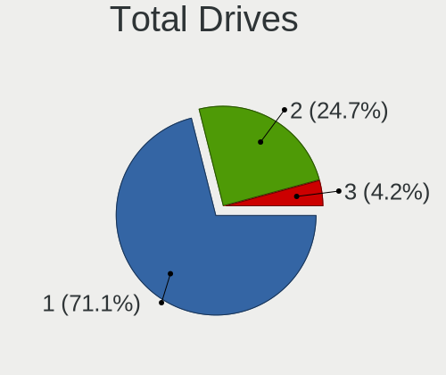
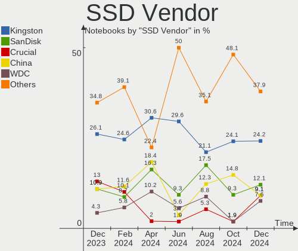
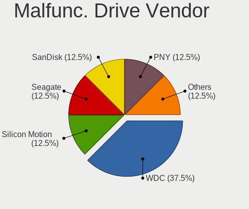
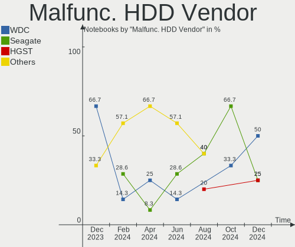
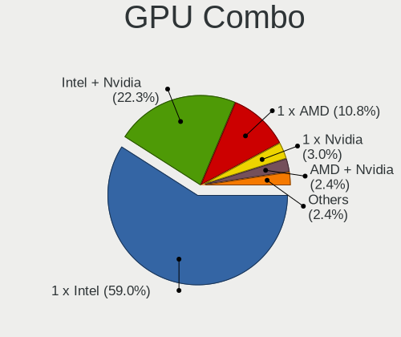
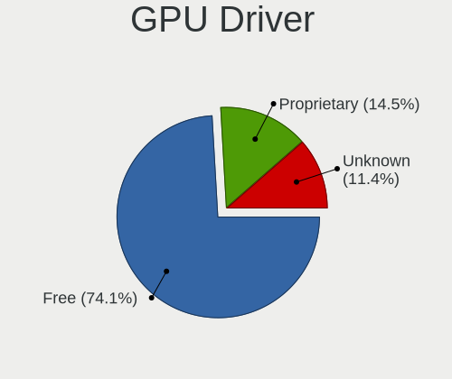
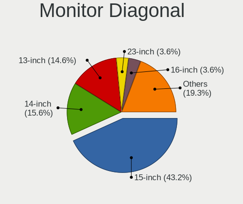
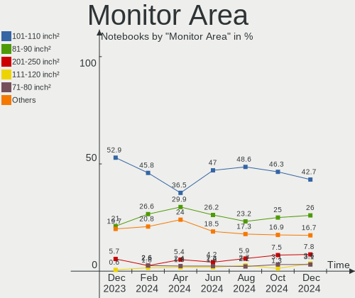
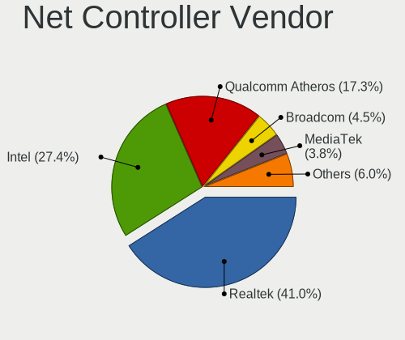
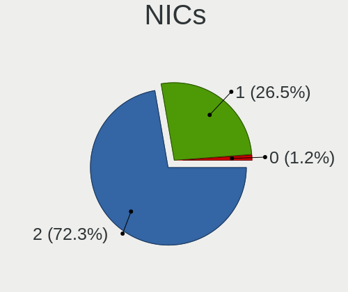

Linux in Brazil - Hardware Trends (Notebooks)
---------------------------------------------

A project to identify most popular hardware characteristics and track their change
over time based on data collected by Linux users at https://Linux-Hardware.org.

Anyone can contribute to this report by the [hw-probe](https://github.com/linuxhw/hw-probe) tool:

    sudo -E hw-probe -all -upload

Period: Aug, 2022.

Contents
--------

* [ System ](#system)
  - [ OS                       ](#os)
  - [ OS Family                ](#os-family)
  - [ Kernel                   ](#kernel)
  - [ Kernel Family            ](#kernel-family)
  - [ Kernel Major Ver.        ](#kernel-major-ver)
  - [ Arch                     ](#arch)
  - [ DE                       ](#de)
  - [ Display Server           ](#display-server)
  - [ Display Manager          ](#display-manager)
  - [ OS Lang                  ](#os-lang)
  - [ Boot Mode                ](#boot-mode)
  - [ Filesystem               ](#filesystem)
  - [ Part. scheme             ](#part-scheme)
  - [ Dual Boot with Linux/BSD ](#dual-boot-with-linuxbsd)
  - [ Dual Boot (Win)          ](#dual-boot-win)

* [ Board ](#board)
  - [ Vendor                   ](#vendor)
  - [ Model                    ](#model)
  - [ Model Family             ](#model-family)
  - [ MFG Year                 ](#mfg-year)
  - [ Form Factor              ](#form-factor)
  - [ Secure Boot              ](#secure-boot)
  - [ Coreboot                 ](#coreboot)
  - [ RAM Size                 ](#ram-size)
  - [ RAM Used                 ](#ram-used)
  - [ Total Drives             ](#total-drives)
  - [ Has CD-ROM               ](#has-cd-rom)
  - [ Has Ethernet             ](#has-ethernet)
  - [ Has WiFi                 ](#has-wifi)
  - [ Has Bluetooth            ](#has-bluetooth)

* [ Location ](#location)
  - [ Country                  ](#country)
  - [ City                     ](#city)

* [ Drives ](#drives)
  - [ Drive Vendor             ](#drive-vendor)
  - [ Drive Model              ](#drive-model)
  - [ HDD Vendor               ](#hdd-vendor)
  - [ SSD Vendor               ](#ssd-vendor)
  - [ Drive Kind               ](#drive-kind)
  - [ Drive Connector          ](#drive-connector)
  - [ Drive Size               ](#drive-size)
  - [ Space Total              ](#space-total)
  - [ Space Used               ](#space-used)
  - [ Malfunc. Drives          ](#malfunc-drives)
  - [ Malfunc. Drive Vendor    ](#malfunc-drive-vendor)
  - [ Malfunc. HDD Vendor      ](#malfunc-hdd-vendor)
  - [ Malfunc. Drive Kind      ](#malfunc-drive-kind)
  - [ Failed Drives            ](#failed-drives)
  - [ Failed Drive Vendor      ](#failed-drive-vendor)
  - [ Drive Status             ](#drive-status)

* [ Storage controller ](#storage-controller)
  - [ Storage Vendor           ](#storage-vendor)
  - [ Storage Model            ](#storage-model)
  - [ Storage Kind             ](#storage-kind)

* [ Processor ](#processor)
  - [ CPU Vendor               ](#cpu-vendor)
  - [ CPU Model                ](#cpu-model)
  - [ CPU Model Family         ](#cpu-model-family)
  - [ CPU Cores                ](#cpu-cores)
  - [ CPU Sockets              ](#cpu-sockets)
  - [ CPU Threads              ](#cpu-threads)
  - [ CPU Op-Modes             ](#cpu-op-modes)
  - [ CPU Microcode            ](#cpu-microcode)
  - [ CPU Microarch            ](#cpu-microarch)

* [ Graphics ](#graphics)
  - [ GPU Vendor               ](#gpu-vendor)
  - [ GPU Model                ](#gpu-model)
  - [ GPU Combo                ](#gpu-combo)
  - [ GPU Driver               ](#gpu-driver)
  - [ GPU Memory               ](#gpu-memory)

* [ Monitor ](#monitor)
  - [ Monitor Vendor           ](#monitor-vendor)
  - [ Monitor Model            ](#monitor-model)
  - [ Monitor Resolution       ](#monitor-resolution)
  - [ Monitor Diagonal         ](#monitor-diagonal)
  - [ Monitor Width            ](#monitor-width)
  - [ Aspect Ratio             ](#aspect-ratio)
  - [ Monitor Area             ](#monitor-area)
  - [ Pixel Density            ](#pixel-density)
  - [ Multiple Monitors        ](#multiple-monitors)

* [ Network ](#network)
  - [ Net Controller Vendor    ](#net-controller-vendor)
  - [ Net Controller Model     ](#net-controller-model)
  - [ Wireless Vendor          ](#wireless-vendor)
  - [ Wireless Model           ](#wireless-model)
  - [ Ethernet Vendor          ](#ethernet-vendor)
  - [ Ethernet Model           ](#ethernet-model)
  - [ Net Controller Kind      ](#net-controller-kind)
  - [ Used Controller          ](#used-controller)
  - [ NICs                     ](#nics)
  - [ IPv6                     ](#ipv6)

* [ Bluetooth ](#bluetooth)
  - [ Bluetooth Vendor         ](#bluetooth-vendor)
  - [ Bluetooth Model          ](#bluetooth-model)

* [ Sound ](#sound)
  - [ Sound Vendor             ](#sound-vendor)
  - [ Sound Model              ](#sound-model)

* [ Memory ](#memory)
  - [ Memory Vendor            ](#memory-vendor)
  - [ Memory Model             ](#memory-model)
  - [ Memory Kind              ](#memory-kind)
  - [ Memory Form Factor       ](#memory-form-factor)
  - [ Memory Size              ](#memory-size)
  - [ Memory Speed             ](#memory-speed)

* [ Printers & scanners ](#printers--scanners)
  - [ Printer Vendor           ](#printer-vendor)
  - [ Printer Model            ](#printer-model)
  - [ Scanner Vendor           ](#scanner-vendor)
  - [ Scanner Model            ](#scanner-model)

* [ Camera ](#camera)
  - [ Camera Vendor            ](#camera-vendor)
  - [ Camera Model             ](#camera-model)

* [ Security ](#security)
  - [ Fingerprint Vendor       ](#fingerprint-vendor)
  - [ Fingerprint Model        ](#fingerprint-model)
  - [ Chipcard Vendor          ](#chipcard-vendor)
  - [ Chipcard Model           ](#chipcard-model)

* [ Unsupported ](#unsupported)
  - [ Unsupported Devices      ](#unsupported-devices)
  - [ Unsupported Device Types ](#unsupported-device-types)

System
------

OS
--

Installed operating systems

| Name                         | Notebooks | Percent |
|------------------------------|-----------|---------|
| Ubuntu 22.04                 | 22        | 12.64%  |
| Ubuntu 20.04                 | 16        | 9.2%    |
| Pop!_OS 22.04                | 16        | 9.2%    |
| OpenMandriva 4.3             | 10        | 5.75%   |
| Linux Mint 21                | 10        | 5.75%   |
| Linux Mint 20.3              | 10        | 5.75%   |
| Fedora 36                    | 8         | 4.6%    |
| Debian 11                    | 8         | 4.6%    |
| Zorin 16                     | 6         | 3.45%   |
| Manjaro                      | 6         | 3.45%   |
| KDE neon 20.04               | 5         | 2.87%   |
| Elementary 6.1               | 5         | 2.87%   |
| Endless 4.0.7                | 4         | 2.3%    |
| Lubuntu 22.04                | 3         | 1.72%   |
| Endless 4.0.8                | 3         | 1.72%   |
| ArcoLinux Rolling            | 3         | 1.72%   |
| Arch                         | 3         | 1.72%   |
| Xubuntu 20.04                | 2         | 1.15%   |
| ROSA 12.2                    | 2         | 1.15%   |
| OpenMandriva 4.90            | 2         | 1.15%   |
| Fedora 35                    | 2         | 1.15%   |
| Endless 3.9.7                | 2         | 1.15%   |
| Endless 3.9.1                | 2         | 1.15%   |
| BigLinux 21.3.7              | 2         | 1.15%   |
| Arch Rolling                 | 2         | 1.15%   |
| Xubuntu 21.10                | 1         | 0.57%   |
| Xubuntu 18.04                | 1         | 0.57%   |
| Ubuntu MATE 22.04            | 1         | 0.57%   |
| Ubuntu 22.10                 | 1         | 0.57%   |
| Ubuntu 18.04                 | 1         | 0.57%   |
| Oracle Linux 9.0             | 1         | 0.57%   |
| openSUSE Tumbleweed-XXXXXXXX | 1         | 0.57%   |
| OpenMandriva 4.2             | 1         | 0.57%   |
| LMDE 5                       | 1         | 0.57%   |
| Linux Mint 20.2              | 1         | 0.57%   |
| Linux Mint 19.3              | 1         | 0.57%   |
| Garuda Linux Soaring         | 1         | 0.57%   |
| Endless 4.0.6                | 1         | 0.57%   |
| Endless 3.9.1-nexthw2        | 1         | 0.57%   |
| Endless 3.7.7-nexthw1        | 1         | 0.57%   |
| EndeavourOS Rolling          | 1         | 0.57%   |
| EndeavourOS                  | 1         | 0.57%   |
| Devuan 4                     | 1         | 0.57%   |
| BigLinux 21.3.6              | 1         | 0.57%   |
| ArcoLinux                    | 1         | 0.57%   |

OS Family
---------

OS without a version

| Name         | Notebooks | Percent |
|--------------|-----------|---------|
| Ubuntu       | 40        | 22.99%  |
| Linux Mint   | 22        | 12.64%  |
| Pop!_OS      | 16        | 9.2%    |
| Endless      | 14        | 8.05%   |
| OpenMandriva | 13        | 7.47%   |
| Fedora       | 10        | 5.75%   |
| Debian       | 8         | 4.6%    |
| Zorin        | 6         | 3.45%   |
| Manjaro      | 6         | 3.45%   |
| KDE neon     | 5         | 2.87%   |
| Elementary   | 5         | 2.87%   |
| Arch         | 5         | 2.87%   |
| Xubuntu      | 4         | 2.3%    |
| ArcoLinux    | 4         | 2.3%    |
| Lubuntu      | 3         | 1.72%   |
| BigLinux     | 3         | 1.72%   |
| ROSA         | 2         | 1.15%   |
| EndeavourOS  | 2         | 1.15%   |
| Ubuntu MATE  | 1         | 0.57%   |
| Oracle Linux | 1         | 0.57%   |
| openSUSE     | 1         | 0.57%   |
| LMDE         | 1         | 0.57%   |
| Garuda Linux | 1         | 0.57%   |
| Devuan       | 1         | 0.57%   |

Kernel
------

Version of the Linux kernel

| Version                             | Notebooks | Percent |
|-------------------------------------|-----------|---------|
| 5.15.0-46-generic                   | 30        | 17.24%  |
| 5.15.0-43-generic                   | 22        | 12.64%  |
| 5.18.10-76051810-generic            | 9         | 5.17%   |
| 5.16.7-desktop-1omv4003             | 9         | 5.17%   |
| 5.4.0-124-generic                   | 8         | 4.6%    |
| 5.11.0-35-generic                   | 8         | 4.6%    |
| 5.19.0-76051900-generic             | 7         | 4.02%   |
| 5.8.0-14-generic                    | 4         | 2.3%    |
| 5.15.60-1-MANJARO                   | 4         | 2.3%    |
| 5.15.0-41-generic                   | 4         | 2.3%    |
| 5.4.0-122-generic                   | 3         | 1.72%   |
| 5.18.19-200.fc36.x86_64             | 3         | 1.72%   |
| 5.18.17-200.fc36.x86_64             | 3         | 1.72%   |
| 5.18.16-arch1-1                     | 3         | 1.72%   |
| 5.10.0-17-amd64                     | 3         | 1.72%   |
| 5.10.0-16-amd64                     | 3         | 1.72%   |
| 5.4.0-125-generic                   | 2         | 1.15%   |
| 5.19.2-arch1-1                      | 2         | 1.15%   |
| 5.19.1-arch2-1                      | 2         | 1.15%   |
| 5.18.12-desktop-3omv4090            | 2         | 1.15%   |
| 5.15.53-1-MANJARO                   | 2         | 1.15%   |
| 5.15.0-25-generic                   | 2         | 1.15%   |
| 5.10.0-13-amd64                     | 2         | 1.15%   |
| 5.4.0-91-generic                    | 1         | 0.57%   |
| 5.4.0-73-generic                    | 1         | 0.57%   |
| 5.4.0-7-generic                     | 1         | 0.57%   |
| 5.4.0-65-generic                    | 1         | 0.57%   |
| 5.4.0-122-lowlatency                | 1         | 0.57%   |
| 5.19.3-arch1-1                      | 1         | 0.57%   |
| 5.19.2-1-default                    | 1         | 0.57%   |
| 5.19.1-051901-generic               | 1         | 0.57%   |
| 5.19.0-15-generic                   | 1         | 0.57%   |
| 5.19.0-051900-generic               | 1         | 0.57%   |
| 5.18.7-arch1-1                      | 1         | 0.57%   |
| 5.18.18-200.fc36.x86_64             | 1         | 0.57%   |
| 5.18.16-zen1-1-zen                  | 1         | 0.57%   |
| 5.18.16-200.fc36.x86_64             | 1         | 0.57%   |
| 5.18.16-100.fc35.x86_64             | 1         | 0.57%   |
| 5.18.15-arch1-2                     | 1         | 0.57%   |
| 5.18.11-100.fc35.x86_64             | 1         | 0.57%   |
| 5.18.0-14.2-liquorix-amd64          | 1         | 0.57%   |
| 5.17.9-arch1-1                      | 1         | 0.57%   |
| 5.16.13-desktop-1omv4003            | 1         | 0.57%   |
| 5.15.41-1-MANJARO                   | 1         | 0.57%   |
| 5.15.0-47-generic                   | 1         | 0.57%   |
| 5.15.0-46-lowlatency                | 1         | 0.57%   |
| 5.15.0-40-generic                   | 1         | 0.57%   |
| 5.15.0-0.30.20.1.el9uek.x86_64      | 1         | 0.57%   |
| 5.14.0-1049-oem                     | 1         | 0.57%   |
| 5.14.0-1045-oem                     | 1         | 0.57%   |
| 5.13.0-52-generic                   | 1         | 0.57%   |
| 5.11.0-40-generic                   | 1         | 0.57%   |
| 5.10.74-generic-2rosa2021.1-x86_64  | 1         | 0.57%   |
| 5.10.60                             | 1         | 0.57%   |
| 5.10.14-desktop-1omv4002            | 1         | 0.57%   |
| 5.10.136-1-MANJARO                  | 1         | 0.57%   |
| 5.10.129-1-MANJARO                  | 1         | 0.57%   |
| 5.10.118-generic-2rosa2021.1-x86_64 | 1         | 0.57%   |
| 5.10.0-12-amd64                     | 1         | 0.57%   |
| 5.10.0-10-generic                   | 1         | 0.57%   |

Kernel Family
-------------

Linux kernel without a distro release

| Version  | Notebooks | Percent |
|----------|-----------|---------|
| 5.15.0   | 62        | 35.63%  |
| 5.4.0    | 18        | 10.34%  |
| 5.10.0   | 10        | 5.75%   |
| 5.19.0   | 9         | 5.17%   |
| 5.18.10  | 9         | 5.17%   |
| 5.16.7   | 9         | 5.17%   |
| 5.11.0   | 9         | 5.17%   |
| 5.18.16  | 6         | 3.45%   |
| 5.8.0    | 4         | 2.3%    |
| 5.15.60  | 4         | 2.3%    |
| 5.19.2   | 3         | 1.72%   |
| 5.19.1   | 3         | 1.72%   |
| 5.18.19  | 3         | 1.72%   |
| 5.18.17  | 3         | 1.72%   |
| 5.18.12  | 2         | 1.15%   |
| 5.15.53  | 2         | 1.15%   |
| 5.14.0   | 2         | 1.15%   |
| 5.19.3   | 1         | 0.57%   |
| 5.18.7   | 1         | 0.57%   |
| 5.18.18  | 1         | 0.57%   |
| 5.18.15  | 1         | 0.57%   |
| 5.18.11  | 1         | 0.57%   |
| 5.18.0   | 1         | 0.57%   |
| 5.17.9   | 1         | 0.57%   |
| 5.16.13  | 1         | 0.57%   |
| 5.15.41  | 1         | 0.57%   |
| 5.13.0   | 1         | 0.57%   |
| 5.10.74  | 1         | 0.57%   |
| 5.10.60  | 1         | 0.57%   |
| 5.10.14  | 1         | 0.57%   |
| 5.10.136 | 1         | 0.57%   |
| 5.10.129 | 1         | 0.57%   |
| 5.10.118 | 1         | 0.57%   |

Kernel Major Ver.
-----------------

Linux kernel major version

| Version | Notebooks | Percent |
|---------|-----------|---------|
| 5.15    | 69        | 39.66%  |
| 5.18    | 28        | 16.09%  |
| 5.4     | 18        | 10.34%  |
| 5.19    | 16        | 9.2%    |
| 5.10    | 16        | 9.2%    |
| 5.16    | 10        | 5.75%   |
| 5.11    | 9         | 5.17%   |
| 5.8     | 4         | 2.3%    |
| 5.14    | 2         | 1.15%   |
| 5.17    | 1         | 0.57%   |
| 5.13    | 1         | 0.57%   |

Arch
----

OS architecture (x86_64, i586, etc.)

| Name   | Notebooks | Percent |
|--------|-----------|---------|
| x86_64 | 173       | 99.43%  |
| i686   | 1         | 0.57%   |

DE
--

Desktop Environment

| Name       | Notebooks | Percent |
|------------|-----------|---------|
| GNOME      | 97        | 55.75%  |
| KDE5       | 29        | 16.67%  |
| X-Cinnamon | 16        | 9.2%    |
| XFCE       | 14        | 8.05%   |
| Pantheon   | 5         | 2.87%   |
| MATE       | 4         | 2.3%    |
| LXQt       | 3         | 1.72%   |
| Cinnamon   | 2         | 1.15%   |
| Unknown    | 2         | 1.15%   |
| Deepin     | 1         | 0.57%   |
| bspwm      | 1         | 0.57%   |

Display Server
--------------

X11 or Wayland

| Name    | Notebooks | Percent |
|---------|-----------|---------|
| X11     | 130       | 74.71%  |
| Wayland | 40        | 22.99%  |
| Unknown | 4         | 2.3%    |

Display Manager
---------------

SDDM, LightDM, etc.

| Name    | Notebooks | Percent |
|---------|-----------|---------|
| Unknown | 86        | 49.43%  |
| GDM3    | 31        | 17.82%  |
| SDDM    | 22        | 12.64%  |
| LightDM | 18        | 10.34%  |
| GDM     | 17        | 9.77%   |

OS Lang
-------

Language

| Lang  | Notebooks | Percent |
|-------|-----------|---------|
| pt_BR | 131       | 75.29%  |
| en_US | 38        | 21.84%  |
| C     | 2         | 1.15%   |
| pt_PT | 1         | 0.57%   |
| es_ES | 1         | 0.57%   |
| en_GB | 1         | 0.57%   |

Boot Mode
---------

EFI or BIOS

| Mode | Notebooks | Percent |
|------|-----------|---------|
| EFI  | 96        | 55.17%  |
| BIOS | 78        | 44.83%  |

Filesystem
----------

Type of filesystem

| Type    | Notebooks | Percent |
|---------|-----------|---------|
| Ext4    | 130       | 74.71%  |
| Btrfs   | 24        | 13.79%  |
| Overlay | 14        | 8.05%   |
| Xfs     | 4         | 2.3%    |
| Zfs     | 1         | 0.57%   |
| Tmpfs   | 1         | 0.57%   |

Part. scheme
------------

Scheme of partitioning

| Type    | Notebooks | Percent |
|---------|-----------|---------|
| Unknown | 107       | 61.49%  |
| GPT     | 50        | 28.74%  |
| MBR     | 17        | 9.77%   |

Dual Boot with Linux/BSD
------------------------

Hosting more than one Linux/BSD

| Dual boot | Notebooks | Percent |
|-----------|-----------|---------|
| No        | 160       | 91.95%  |
| Yes       | 14        | 8.05%   |

Dual Boot (Win)
---------------

Hosting Linux and Windows

| Dual boot | Notebooks | Percent |
|-----------|-----------|---------|
| No        | 137       | 78.74%  |
| Yes       | 37        | 21.26%  |

Board
-----

Vendor
------

Motherboard manufacturer

| Name                   | Notebooks | Percent |
|------------------------|-----------|---------|
| Dell                   | 33        | 18.97%  |
| Acer                   | 27        | 15.52%  |
| Lenovo                 | 24        | 13.79%  |
| ASUSTek Computer       | 17        | 9.77%   |
| Positivo               | 16        | 9.2%    |
| Samsung Electronics    | 14        | 8.05%   |
| Hewlett-Packard        | 11        | 6.32%   |
| Sony                   | 4         | 2.3%    |
| Daten Tecnologia       | 3         | 1.72%   |
| Avell High Performance | 3         | 1.72%   |
| Positivo Bahia - VAIO  | 2         | 1.15%   |
| Compaq                 | 2         | 1.15%   |
| Apple                  | 2         | 1.15%   |
| Alienware              | 2         | 1.15%   |
| TPVAOC                 | 1         | 0.57%   |
| Toshiba                | 1         | 0.57%   |
| Notebook               | 1         | 0.57%   |
| MSI                    | 1         | 0.57%   |
| LG Electronics         | 1         | 0.57%   |
| Itautec                | 1         | 0.57%   |
| Intel                  | 1         | 0.57%   |
| Google                 | 1         | 0.57%   |
| Gateway                | 1         | 0.57%   |
| Clevo                  | 1         | 0.57%   |
| Chuwi                  | 1         | 0.57%   |
| CCE                    | 1         | 0.57%   |
| AMI                    | 1         | 0.57%   |
| Unknown                | 1         | 0.57%   |

Model
-----

Motherboard model

| Name                                     | Notebooks | Percent |
|------------------------------------------|-----------|---------|
| Acer Nitro AN515-44                      | 4         | 2.3%    |
| Samsung 340XAA/350XAA/550XAA             | 3         | 1.72%   |
| Positivo Mobile                          | 3         | 1.72%   |
| Lenovo IdeaPad S145-15API 81V7           | 3         | 1.72%   |
| Dell Inspiron 3583                       | 3         | 1.72%   |
| Daten Tecnologia DT02-M4                 | 3         | 1.72%   |
| Acer Nitro AN515-54                      | 3         | 1.72%   |
| Unknown                                  | 3         | 1.72%   |
| Samsung 550XDA                           | 2         | 1.15%   |
| Samsung 300E5M/300E5L                    | 2         | 1.15%   |
| Samsung 300E4C/300E5C/300E7C             | 2         | 1.15%   |
| Positivo Q4128C-S                        | 2         | 1.15%   |
| Lenovo IdeaPad S145-15IWL 81S9           | 2         | 1.15%   |
| Lenovo IdeaPad S145-15IIL 82DJ           | 2         | 1.15%   |
| Lenovo IdeaPad 3 15ALC6 82MF             | 2         | 1.15%   |
| HP Mini 110-3100                         | 2         | 1.15%   |
| Dell Vostro 15 5510                      | 2         | 1.15%   |
| Dell Inspiron 5547                       | 2         | 1.15%   |
| Avell High Performance B.ON              | 2         | 1.15%   |
| ASUS VivoBook_ASUSLaptop X515JA_X515JA   | 2         | 1.15%   |
| ASUS VivoBook_ASUSLaptop X515DA_X515DA   | 2         | 1.15%   |
| ASUS VivoBook 15_ASUS Laptop X540UAR     | 2         | 1.15%   |
| Acer Aspire E1-571                       | 2         | 1.15%   |
| Acer Aspire A515-51G                     | 2         | 1.15%   |
| Acer Aspire A315-56                      | 2         | 1.15%   |
| Acer Aspire A315-23G                     | 2         | 1.15%   |
| TPVAOC AA183M                            | 1         | 0.57%   |
| Toshiba PORTEGE Z930                     | 1         | 0.57%   |
| Sony VPCSB35FB                           | 1         | 0.57%   |
| Sony VPCEB36GM                           | 1         | 0.57%   |
| Sony VPCCW13FB                           | 1         | 0.57%   |
| Sony VGN-NR230AE                         | 1         | 0.57%   |
| Samsung RV411/RV511/E3511/S3511/RV711    | 1         | 0.57%   |
| Samsung R430/R480/R440                   | 1         | 0.57%   |
| Samsung 670Z5E                           | 1         | 0.57%   |
| Samsung 550XCJ/550XCR                    | 1         | 0.57%   |
| Samsung 3570R/370R/470R/450R/510R/4450RV | 1         | 0.57%   |
| Positivo W942SW_SW1                      | 1         | 0.57%   |
| Positivo W942SV_SV1                      | 1         | 0.57%   |
| Positivo Smash                           | 1         | 0.57%   |
| Positivo S14CT01                         | 1         | 0.57%   |
| Positivo S14BW01                         | 1         | 0.57%   |
| Positivo Q232A                           | 1         | 0.57%   |
| Positivo EC10IS1                         | 1         | 0.57%   |
| Positivo C14RV01                         | 1         | 0.57%   |
| Positivo C14CU51                         | 1         | 0.57%   |
| Positivo C14CR21                         | 1         | 0.57%   |
| Positivo C14CR01                         | 1         | 0.57%   |
| Positivo Bahia - VAIO VJFE52F11X-B0611H  | 1         | 0.57%   |
| Positivo Bahia - VAIO S14SL03            | 1         | 0.57%   |
| Notebook NJx0MU                          | 1         | 0.57%   |
| MSI Katana GF66 11UC                     | 1         | 0.57%   |
| LG S430-G.BC33P1                         | 1         | 0.57%   |
| Lenovo ThinkPad T480 20L6S9WY00          | 1         | 0.57%   |
| Lenovo ThinkPad T460 20FMS271BR          | 1         | 0.57%   |
| Lenovo ThinkPad T400 2767E53             | 1         | 0.57%   |
| Lenovo ThinkPad L450 20DSS0DH1N          | 1         | 0.57%   |
| Lenovo ThinkPad L440 20ASA1V8BP          | 1         | 0.57%   |
| Lenovo ThinkPad E470 20H2A02NBR          | 1         | 0.57%   |
| Lenovo ThinkPad E14 Gen 2 20TB0029BO     | 1         | 0.57%   |

Model Family
------------

Motherboard model prefix

| Name                                    | Notebooks | Percent |
|-----------------------------------------|-----------|---------|
| Dell Inspiron                           | 19        | 10.92%  |
| Acer Aspire                             | 17        | 9.77%   |
| Lenovo IdeaPad                          | 15        | 8.62%   |
| Dell Vostro                             | 8         | 4.6%    |
| ASUS VivoBook                           | 8         | 4.6%    |
| Acer Nitro                              | 8         | 4.6%    |
| Lenovo ThinkPad                         | 7         | 4.02%   |
| HP ProBook                              | 4         | 2.3%    |
| Samsung 340XAA                          | 3         | 1.72%   |
| Positivo Mobile                         | 3         | 1.72%   |
| Daten Tecnologia DT02-M4                | 3         | 1.72%   |
| Unknown                                 | 3         | 1.72%   |
| Samsung 550XDA                          | 2         | 1.15%   |
| Samsung 300E5M                          | 2         | 1.15%   |
| Samsung 300E4C                          | 2         | 1.15%   |
| Positivo Q4128C-S                       | 2         | 1.15%   |
| HP Mini                                 | 2         | 1.15%   |
| Dell Latitude                           | 2         | 1.15%   |
| Avell High Performance B.ON             | 2         | 1.15%   |
| TPVAOC AA183M                           | 1         | 0.57%   |
| Toshiba PORTEGE                         | 1         | 0.57%   |
| Sony VPCSB35FB                          | 1         | 0.57%   |
| Sony VPCEB36GM                          | 1         | 0.57%   |
| Sony VPCCW13FB                          | 1         | 0.57%   |
| Sony VGN-NR230AE                        | 1         | 0.57%   |
| Samsung RV411                           | 1         | 0.57%   |
| Samsung R430                            | 1         | 0.57%   |
| Samsung 670Z5E                          | 1         | 0.57%   |
| Samsung 550XCJ                          | 1         | 0.57%   |
| Samsung 3570R                           | 1         | 0.57%   |
| Positivo W942SW                         | 1         | 0.57%   |
| Positivo W942SV                         | 1         | 0.57%   |
| Positivo Smash                          | 1         | 0.57%   |
| Positivo S14CT01                        | 1         | 0.57%   |
| Positivo S14BW01                        | 1         | 0.57%   |
| Positivo Q232A                          | 1         | 0.57%   |
| Positivo EC10IS1                        | 1         | 0.57%   |
| Positivo C14RV01                        | 1         | 0.57%   |
| Positivo C14CU51                        | 1         | 0.57%   |
| Positivo C14CR21                        | 1         | 0.57%   |
| Positivo C14CR01                        | 1         | 0.57%   |
| Positivo Bahia - VAIO VJFE52F11X-B0611H | 1         | 0.57%   |
| Positivo Bahia - VAIO S14SL03           | 1         | 0.57%   |
| Notebook NJx0MU                         | 1         | 0.57%   |
| MSI Katana                              | 1         | 0.57%   |
| LG S430-G.BC33P1                        | 1         | 0.57%   |
| Lenovo Legion                           | 1         | 0.57%   |
| Lenovo G470                             | 1         | 0.57%   |
| Itautec Infoway                         | 1         | 0.57%   |
| Intel Infoway                           | 1         | 0.57%   |
| HP OMEN                                 | 1         | 0.57%   |
| HP Laptop                               | 1         | 0.57%   |
| HP ENVY                                 | 1         | 0.57%   |
| HP EliteBook                            | 1         | 0.57%   |
| HP 14                                   | 1         | 0.57%   |
| Google Eve                              | 1         | 0.57%   |
| Gateway NV55C                           | 1         | 0.57%   |
| Dell XPS                                | 1         | 0.57%   |
| Dell System                             | 1         | 0.57%   |
| Dell G3                                 | 1         | 0.57%   |

MFG Year
--------

Motherboard manufacture year

| Year    | Notebooks | Percent |
|---------|-----------|---------|
| 2021    | 22        | 12.64%  |
| 2020    | 22        | 12.64%  |
| 2019    | 21        | 12.07%  |
| 2012    | 18        | 10.34%  |
| 2018    | 17        | 9.77%   |
| 2011    | 14        | 8.05%   |
| 2010    | 11        | 6.32%   |
| 2017    | 9         | 5.17%   |
| 2016    | 9         | 5.17%   |
| 2014    | 8         | 4.6%    |
| 2013    | 7         | 4.02%   |
| 2022    | 6         | 3.45%   |
| 2009    | 3         | 1.72%   |
| 2008    | 3         | 1.72%   |
| 2015    | 2         | 1.15%   |
| 2007    | 1         | 0.57%   |
| Unknown | 1         | 0.57%   |

Form Factor
-----------

Physical design of the computer

| Name     | Notebooks | Percent |
|----------|-----------|---------|
| Notebook | 174       | 100%    |

Secure Boot
-----------

Enabled or disabled

| State    | Notebooks | Percent |
|----------|-----------|---------|
| Disabled | 145       | 83.33%  |
| Enabled  | 29        | 16.67%  |

Coreboot
--------

Have coreboot on board

| Used | Notebooks | Percent |
|------|-----------|---------|
| No   | 173       | 99.43%  |
| Yes  | 1         | 0.57%   |

RAM Size
--------

Total RAM memory

| Size in GB | Notebooks | Percent |
|------------|-----------|---------|
| 4.01-8.0   | 61        | 35.06%  |
| 3.01-4.0   | 40        | 22.99%  |
| 16.01-24.0 | 29        | 16.67%  |
| 8.01-16.0  | 20        | 11.49%  |
| 1.01-2.0   | 10        | 5.75%   |
| 32.01-64.0 | 6         | 3.45%   |
| 2.01-3.0   | 6         | 3.45%   |
| 24.01-32.0 | 2         | 1.15%   |

RAM Used
--------

Used RAM memory

| Used GB    | Notebooks | Percent |
|------------|-----------|---------|
| 1.01-2.0   | 62        | 35.63%  |
| 2.01-3.0   | 46        | 26.44%  |
| 4.01-8.0   | 25        | 14.37%  |
| 3.01-4.0   | 25        | 14.37%  |
| 8.01-16.0  | 7         | 4.02%   |
| 0.51-1.0   | 7         | 4.02%   |
| 16.01-24.0 | 1         | 0.57%   |
| 0.01-0.5   | 1         | 0.57%   |

Total Drives
------------

Number of drives on board

| Drives | Notebooks | Percent |
|--------|-----------|---------|
| 1      | 126       | 72.41%  |
| 2      | 42        | 24.14%  |
| 0      | 3         | 1.72%   |
| 3      | 2         | 1.15%   |
| 4      | 1         | 0.57%   |

Has CD-ROM
----------

Has CD-ROM on board

| Presented | Notebooks | Percent |
|-----------|-----------|---------|
| No        | 126       | 72.41%  |
| Yes       | 48        | 27.59%  |

Has Ethernet
------------

Has Ethernet on board

| Presented | Notebooks | Percent |
|-----------|-----------|---------|
| Yes       | 139       | 79.89%  |
| No        | 35        | 20.11%  |

Has WiFi
--------

Has WiFi module

| Presented | Notebooks | Percent |
|-----------|-----------|---------|
| Yes       | 167       | 95.98%  |
| No        | 7         | 4.02%   |

Has Bluetooth
-------------

Has Bluetooth module

| Presented | Notebooks | Percent |
|-----------|-----------|---------|
| Yes       | 129       | 74.14%  |
| No        | 45        | 25.86%  |

Location
--------

Country
-------

Geographic location (country)

| Country | Notebooks | Percent |
|---------|-----------|---------|
| Brazil  | 174       | 100%    |

City
----

Geographic location (city)

| City                     | Notebooks | Percent |
|--------------------------|-----------|---------|
| Sao Paulo                | 17        | 9.77%   |
| Fortaleza                | 12        | 6.9%    |
| Rio de Janeiro           | 11        | 6.32%   |
| Porto Alegre             | 5         | 2.87%   |
| Salvador                 | 4         | 2.3%    |
| Florianópolis           | 4         | 2.3%    |
| Ribeirao Preto           | 3         | 1.72%   |
| Pelotas                  | 3         | 1.72%   |
| Campos dos Goytacazes    | 3         | 1.72%   |
| Uberlândia              | 2         | 1.15%   |
| Soure                    | 2         | 1.15%   |
| Sao Luís                | 2         | 1.15%   |
| Sao Goncalo              | 2         | 1.15%   |
| Recife                   | 2         | 1.15%   |
| Natal                    | 2         | 1.15%   |
| Muriaé                  | 2         | 1.15%   |
| Marília                 | 2         | 1.15%   |
| Mage                     | 2         | 1.15%   |
| Limeira                  | 2         | 1.15%   |
| Lages                    | 2         | 1.15%   |
| Itatiba                  | 2         | 1.15%   |
| Curitiba                 | 2         | 1.15%   |
| Cuiabá                  | 2         | 1.15%   |
| Castanhal                | 2         | 1.15%   |
| Brasília                | 2         | 1.15%   |
| Belo Horizonte           | 2         | 1.15%   |
| Barueri                  | 2         | 1.15%   |
| Araquari                 | 2         | 1.15%   |
| Anápolis                | 2         | 1.15%   |
| Volta Redonda            | 1         | 0.57%   |
| Vieiras                  | 1         | 0.57%   |
| Unai                     | 1         | 0.57%   |
| Ubatuba                  | 1         | 0.57%   |
| Três Lagoas             | 1         | 0.57%   |
| Timbauba                 | 1         | 0.57%   |
| Teresopolis              | 1         | 0.57%   |
| Teresina                 | 1         | 0.57%   |
| Taubate                  | 1         | 0.57%   |
| Sorocaba                 | 1         | 0.57%   |
| Sete Lagoas              | 1         | 0.57%   |
| Sao José dos Campos     | 1         | 0.57%   |
| Sao Jose                 | 1         | 0.57%   |
| Sao Goncalo do Amarante  | 1         | 0.57%   |
| Sao Cristovao            | 1         | 0.57%   |
| Sao Bernardo do Campo    | 1         | 0.57%   |
| Santos                   | 1         | 0.57%   |
| Santo André             | 1         | 0.57%   |
| Santa Maria da Boa Vista | 1         | 0.57%   |
| Rio Claro                | 1         | 0.57%   |
| Resende                  | 1         | 0.57%   |
| Propria                  | 1         | 0.57%   |
| Porto Velho              | 1         | 0.57%   |
| Petrópolis              | 1         | 0.57%   |
| Petrolina                | 1         | 0.57%   |
| Peruibe                  | 1         | 0.57%   |
| Osasco                   | 1         | 0.57%   |
| Novo Gama                | 1         | 0.57%   |
| Montes Claros            | 1         | 0.57%   |
| Marica                   | 1         | 0.57%   |
| Londrina                 | 1         | 0.57%   |

Drives
------

Drive Vendor
------------

Hard drive vendors

| Vendor                         | Notebooks | Drives | Percent |
|--------------------------------|-----------|--------|---------|
| WDC                            | 32        | 32     | 15.09%  |
| Seagate                        | 27        | 27     | 12.74%  |
| Samsung Electronics            | 17        | 18     | 8.02%   |
| Kingston                       | 17        | 18     | 8.02%   |
| A-DATA Technology              | 13        | 13     | 6.13%   |
| ADATA Technology               | 12        | 12     | 5.66%   |
| SanDisk                        | 11        | 11     | 5.19%   |
| Unknown                        | 10        | 10     | 4.72%   |
| Toshiba                        | 7         | 7      | 3.3%    |
| SK hynix                       | 6         | 6      | 2.83%   |
| HGST                           | 5         | 5      | 2.36%   |
| Crucial                        | 5         | 5      | 2.36%   |
| China                          | 5         | 5      | 2.36%   |
| KingSpec                       | 4         | 4      | 1.89%   |
| Intel                          | 4         | 4      | 1.89%   |
| Win Memory                     | 3         | 3      | 1.42%   |
| Patriot                        | 3         | 3      | 1.42%   |
| Hitachi                        | 3         | 3      | 1.42%   |
| Unknown                        | 3         | 3      | 1.42%   |
| Silicon Motion                 | 2         | 3      | 0.94%   |
| Phison                         | 2         | 2      | 0.94%   |
| KIOXIA                         | 2         | 2      | 0.94%   |
| JMicron Technology             | 2         | 2      | 0.94%   |
| HUSKY                          | 2         | 2      | 0.94%   |
| Gigabyte Technology            | 2         | 2      | 0.94%   |
| Vaseky                         | 1         | 1      | 0.47%   |
| SSSTC                          | 1         | 1      | 0.47%   |
| Solid State Storage Technology | 1         | 1      | 0.47%   |
| Realtek Semiconductor          | 1         | 1      | 0.47%   |
| Netac                          | 1         | 1      | 0.47%   |
| Micron/Crucial Technology      | 1         | 1      | 0.47%   |
| Micron Technology              | 1         | 1      | 0.47%   |
| Lite-On                        | 1         | 1      | 0.47%   |
| Lexar                          | 1         | 1      | 0.47%   |
| Hjwdz                          | 1         | 1      | 0.47%   |
| Fujitsu                        | 1         | 1      | 0.47%   |
| Corsair                        | 1         | 1      | 0.47%   |
| BIWIN                          | 1         | 1      | 0.47%   |

Drive Model
-----------

Hard drive models

| Model                                    | Notebooks | Percent |
|------------------------------------------|-----------|---------|
| ADATA NVMe SSD Drive 256GB               | 9         | 4.21%   |
| WDC WD10SPZX-21Z10T0 1TB                 | 8         | 3.74%   |
| WDC WD10SPZX-24Z10 1TB                   | 6         | 2.8%    |
| Kingston SA400S37240G 240GB SSD          | 6         | 2.8%    |
| Seagate ST500LM012 HN-M500MBB 500GB      | 4         | 1.87%   |
| Seagate ST1000LM024 HN-M101MBB 1TB       | 4         | 1.87%   |
| SanDisk NVMe SSD Drive 512GB             | 4         | 1.87%   |
| Kingston SA400S37480G 480GB SSD          | 4         | 1.87%   |
| Seagate Expansion 500GB                  | 3         | 1.4%    |
| Intel NVMe SSD Drive 512GB               | 3         | 1.4%    |
| A-DATA IM2P33F3A NVMe 256GB              | 3         | 1.4%    |
| Unknown                                  | 3         | 1.4%    |
| Win Memory SWR256G-301II 256GB           | 2         | 0.93%   |
| WDC WD5000LPCX-24VHAT0 500GB             | 2         | 0.93%   |
| WDC WD3200BPVT-00JJ5T0 320GB             | 2         | 0.93%   |
| WDC WD10SPZX-35Z10T0 1TB                 | 2         | 0.93%   |
| Unknown SD/MMC/MS PRO 128GB              | 2         | 0.93%   |
| Unknown MMC Card  128GB                  | 2         | 0.93%   |
| Toshiba MQ04ABF100 1TB                   | 2         | 0.93%   |
| Toshiba MQ01ABF050 500GB                 | 2         | 0.93%   |
| SK hynix NVMe SSD Drive 256GB            | 2         | 0.93%   |
| Seagate ST9750420AS 752GB                | 2         | 0.93%   |
| Seagate ST1000LM014-1EJ164 1TB           | 2         | 0.93%   |
| SanDisk SSD PLUS 240GB                   | 2         | 0.93%   |
| Samsung SSD 850 EVO 500GB                | 2         | 0.93%   |
| Samsung MZVL2512HCJQ-00B00 512GB         | 2         | 0.93%   |
| Phison NVMe SSD Drive 256GB              | 2         | 0.93%   |
| Patriot Burst Elite 120GB SSD            | 2         | 0.93%   |
| KingSpec P4-120 120GB                    | 2         | 0.93%   |
| HGST HTS545050A7E680 500GB               | 2         | 0.93%   |
| China SATA SSD 120GB                     | 2         | 0.93%   |
| ADATA NVMe SSD Drive 128GB               | 2         | 0.93%   |
| A-DATA IM2P33F8BR1-128GB                 | 2         | 0.93%   |
| Win Memory SWR256G-201II 256GB           | 1         | 0.47%   |
| WDC WDS240G2G0A-00JH30 240GB SSD         | 1         | 0.47%   |
| WDC WD5000LUCT-63RC2Y0 500GB             | 1         | 0.47%   |
| WDC WD5000LPCX-80VHAT0 500GB             | 1         | 0.47%   |
| WDC WD5000LPCX-35VHAT0 500GB             | 1         | 0.47%   |
| WDC WD5000BPKX-60HPJT0 500GB             | 1         | 0.47%   |
| WDC WD5000BEVT-22A0RT0 500GB             | 1         | 0.47%   |
| WDC WD3200BPVT-80JJ5T0 320GB             | 1         | 0.47%   |
| WDC WD3200BPVT-00ZEST0 320GB             | 1         | 0.47%   |
| WDC WD10SPZX-80Z10T2 1TB                 | 1         | 0.47%   |
| WDC WD10SPZX-24Z10T0 1TB                 | 1         | 0.47%   |
| WDC WD10SPZX-08Z10 1TB                   | 1         | 0.47%   |
| WDC WD10SPZX-00Z10T0 1TB                 | 1         | 0.47%   |
| Vaseky V800/240G 240GB                   | 1         | 0.47%   |
| Unknown SLD32G  32GB                     | 1         | 0.47%   |
| Unknown MMC Card  32GB                   | 1         | 0.47%   |
| Unknown MMC Card  238MB                  | 1         | 0.47%   |
| Unknown MMC Card  16GB                   | 1         | 0.47%   |
| Unknown External 120GB                   | 1         | 0.47%   |
| Unknown DA4032  32GB                     | 1         | 0.47%   |
| Toshiba MQ01ABF050M 500GB                | 1         | 0.47%   |
| Toshiba MQ01ABD050V 500GB                | 1         | 0.47%   |
| Toshiba MK5065GSX 500GB                  | 1         | 0.47%   |
| SSSTC CL1-4D256 256GB                    | 1         | 0.47%   |
| Solid State Storage NVMe SSD Drive 256GB | 1         | 0.47%   |
| SK hynix NVMe SSD Drive 128GB            | 1         | 0.47%   |
| SK hynix NVMe SSD Drive 1024GB           | 1         | 0.47%   |

HDD Vendor
----------

Hard disk drive vendors

| Vendor              | Notebooks | Drives | Percent |
|---------------------|-----------|--------|---------|
| WDC                 | 31        | 31     | 39.24%  |
| Seagate             | 26        | 26     | 32.91%  |
| Toshiba             | 7         | 7      | 8.86%   |
| HGST                | 5         | 5      | 6.33%   |
| Unknown             | 3         | 3      | 3.8%    |
| Hitachi             | 3         | 3      | 3.8%    |
| Samsung Electronics | 2         | 2      | 2.53%   |
| JMicron Technology  | 1         | 1      | 1.27%   |
| Fujitsu             | 1         | 1      | 1.27%   |

SSD Vendor
----------

Solid state drive vendors

| Vendor              | Notebooks | Drives | Percent |
|---------------------|-----------|--------|---------|
| Kingston            | 14        | 15     | 23.73%  |
| SanDisk             | 7         | 7      | 11.86%  |
| China               | 5         | 5      | 8.47%   |
| Samsung Electronics | 4         | 4      | 6.78%   |
| KingSpec            | 4         | 4      | 6.78%   |
| Crucial             | 4         | 4      | 6.78%   |
| A-DATA Technology   | 4         | 4      | 6.78%   |
| Win Memory          | 3         | 3      | 5.08%   |
| Patriot             | 3         | 3      | 5.08%   |
| HUSKY               | 2         | 2      | 3.39%   |
| WDC                 | 1         | 1      | 1.69%   |
| Vaseky              | 1         | 1      | 1.69%   |
| Netac               | 1         | 1      | 1.69%   |
| Micron Technology   | 1         | 1      | 1.69%   |
| Lexar               | 1         | 1      | 1.69%   |
| JMicron Technology  | 1         | 1      | 1.69%   |
| Gigabyte Technology | 1         | 1      | 1.69%   |
| BIWIN               | 1         | 1      | 1.69%   |
| Unknown             | 1         | 1      | 1.69%   |

Drive Kind
----------

HDD or SSD

| Kind    | Notebooks | Drives | Percent |
|---------|-----------|--------|---------|
| HDD     | 76        | 79     | 37.07%  |
| NVMe    | 60        | 65     | 29.27%  |
| SSD     | 58        | 60     | 28.29%  |
| MMC     | 8         | 8      | 3.9%    |
| Unknown | 3         | 3      | 1.46%   |

Drive Connector
---------------

SATA, SAS, NVMe, etc.

| Type | Notebooks | Drives | Percent |
|------|-----------|--------|---------|
| SATA | 121       | 131    | 61.42%  |
| NVMe | 60        | 65     | 30.46%  |
| SAS  | 8         | 11     | 4.06%   |
| MMC  | 8         | 8      | 4.06%   |

Drive Size
----------

Size of hard drive

| Size in TB | Notebooks | Drives | Percent |
|------------|-----------|--------|---------|
| 0.01-0.5   | 89        | 99     | 68.99%  |
| 0.51-1.0   | 39        | 39     | 30.23%  |
| 1.01-2.0   | 1         | 1      | 0.78%   |

Space Total
-----------

Amount of disk space available on the file system

| Size in GB     | Notebooks | Percent |
|----------------|-----------|---------|
| 101-250        | 68        | 39.08%  |
| 251-500        | 42        | 24.14%  |
| 501-1000       | 27        | 15.52%  |
| 1-20           | 12        | 6.9%    |
| 1001-2000      | 10        | 5.75%   |
| 21-50          | 6         | 3.45%   |
| 51-100         | 6         | 3.45%   |
| 2001-3000      | 2         | 1.15%   |
| More than 3000 | 1         | 0.57%   |

Space Used
----------

Amount of used disk space

| Used GB   | Notebooks | Percent |
|-----------|-----------|---------|
| 1-20      | 54        | 31.03%  |
| 21-50     | 46        | 26.44%  |
| 51-100    | 26        | 14.94%  |
| 101-250   | 24        | 13.79%  |
| 251-500   | 14        | 8.05%   |
| 501-1000  | 7         | 4.02%   |
| 1001-2000 | 3         | 1.72%   |

Malfunc. Drives
---------------

Drive models with a malfunction

| Model                                 | Notebooks | Drives | Percent |
|---------------------------------------|-----------|--------|---------|
| HGST HTS545050A7E680 500GB            | 2         | 2      | 11.11%  |
| WDC WD3200BPVT-00ZEST0 320GB          | 1         | 1      | 5.56%   |
| WDC WD3200BPVT-00JJ5T0 320GB          | 1         | 1      | 5.56%   |
| WDC WD10SPZX-24Z10T0 1TB              | 1         | 1      | 5.56%   |
| WDC WD10SPZX-08Z10 1TB                | 1         | 1      | 5.56%   |
| Toshiba MQ01ABF050M 500GB             | 1         | 1      | 5.56%   |
| Seagate STM980215AS 80GB              | 1         | 1      | 5.56%   |
| Seagate ST500LM012 HN-M500MBB 500GB   | 1         | 1      | 5.56%   |
| Seagate ST1000LM024 HN-M101MBB 1TB    | 1         | 1      | 5.56%   |
| Seagate ST1000LM014-1EJ164 1TB        | 1         | 1      | 5.56%   |
| Samsung Electronics SSD 850 EVO 500GB | 1         | 1      | 5.56%   |
| Samsung Electronics HM121HI 120GB     | 1         | 1      | 5.56%   |
| Kingston SV300S37A120G 120GB SSD      | 1         | 1      | 5.56%   |
| Kingston SUV400S37480G 480GB SSD      | 1         | 1      | 5.56%   |
| Kingston SA400S37240G 240GB SSD       | 1         | 1      | 5.56%   |
| Hitachi HTS545032A7E380 320GB         | 1         | 1      | 5.56%   |
| HGST HCC545050A7E380 500GB            | 1         | 1      | 5.56%   |

Malfunc. Drive Vendor
---------------------

Vendors of faulty drives

| Vendor              | Notebooks | Drives | Percent |
|---------------------|-----------|--------|---------|
| WDC                 | 4         | 4      | 22.22%  |
| Seagate             | 4         | 4      | 22.22%  |
| Kingston            | 3         | 3      | 16.67%  |
| HGST                | 3         | 3      | 16.67%  |
| Samsung Electronics | 2         | 2      | 11.11%  |
| Toshiba             | 1         | 1      | 5.56%   |
| Hitachi             | 1         | 1      | 5.56%   |

Malfunc. HDD Vendor
-------------------

Vendors of faulty HDD drives

| Vendor              | Notebooks | Drives | Percent |
|---------------------|-----------|--------|---------|
| WDC                 | 4         | 4      | 28.57%  |
| Seagate             | 4         | 4      | 28.57%  |
| HGST                | 3         | 3      | 21.43%  |
| Toshiba             | 1         | 1      | 7.14%   |
| Samsung Electronics | 1         | 1      | 7.14%   |
| Hitachi             | 1         | 1      | 7.14%   |

Malfunc. Drive Kind
-------------------

Kinds of faulty drives

| Kind | Notebooks | Drives | Percent |
|------|-----------|--------|---------|
| HDD  | 14        | 14     | 77.78%  |
| SSD  | 4         | 4      | 22.22%  |

Failed Drives
-------------

Failed drive models

| Model                             | Notebooks | Drives | Percent |
|-----------------------------------|-----------|--------|---------|
| Samsung Electronics HM321HI 320GB | 1         | 1      | 100%    |

Failed Drive Vendor
-------------------

Failed drive vendors

| Vendor              | Notebooks | Drives | Percent |
|---------------------|-----------|--------|---------|
| Samsung Electronics | 1         | 1      | 100%    |

Drive Status
------------

Number of failed and malfunc. drives

| Status   | Notebooks | Drives | Percent |
|----------|-----------|--------|---------|
| Detected | 115       | 138    | 62.84%  |
| Works    | 49        | 58     | 26.78%  |
| Malfunc  | 18        | 18     | 9.84%   |
| Failed   | 1         | 1      | 0.55%   |

Storage controller
------------------

Storage Vendor
--------------

Storage controller vendors

| Vendor                           | Notebooks | Percent |
|----------------------------------|-----------|---------|
| Intel                            | 132       | 62.26%  |
| AMD                              | 21        | 9.91%   |
| ADATA Technology                 | 20        | 9.43%   |
| Samsung Electronics              | 11        | 5.19%   |
| SK hynix                         | 6         | 2.83%   |
| SanDisk                          | 4         | 1.89%   |
| Phison Electronics               | 4         | 1.89%   |
| Kingston Technology Company      | 3         | 1.42%   |
| Solid State Storage Technology   | 2         | 0.94%   |
| Silicon Motion                   | 2         | 0.94%   |
| Toshiba America Info Systems     | 1         | 0.47%   |
| Silicon Integrated Systems [SiS] | 1         | 0.47%   |
| Realtek Semiconductor            | 1         | 0.47%   |
| Nvidia                           | 1         | 0.47%   |
| Micron/Crucial Technology        | 1         | 0.47%   |
| Lite-On Technology               | 1         | 0.47%   |
| KIOXIA                           | 1         | 0.47%   |

Storage Model
-------------

Storage controller models

| Model                                                                                  | Notebooks | Percent |
|----------------------------------------------------------------------------------------|-----------|---------|
| Intel Sunrise Point-LP SATA Controller [AHCI mode]                                     | 21        | 9.42%   |
| AMD FCH SATA Controller [AHCI mode]                                                    | 18        | 8.07%   |
| Intel 7 Series Chipset Family 6-port SATA Controller [AHCI mode]                       | 16        | 7.17%   |
| ADATA Non-Volatile memory controller                                                   | 16        | 7.17%   |
| Intel 6 Series/C200 Series Chipset Family 6 port Mobile SATA AHCI Controller           | 9         | 4.04%   |
| Intel 82801 Mobile SATA Controller [RAID mode]                                         | 8         | 3.59%   |
| Intel Tiger Lake-LP SATA Controller                                                    | 7         | 3.14%   |
| Intel 5 Series/3400 Series Chipset 4 port SATA AHCI Controller                         | 7         | 3.14%   |
| Intel Cannon Point-LP SATA Controller [AHCI Mode]                                      | 6         | 2.69%   |
| Intel 82801IBM/IEM (ICH9M/ICH9M-E) 4 port SATA Controller [AHCI mode]                  | 6         | 2.69%   |
| Intel 8 Series SATA Controller 1 [AHCI mode]                                           | 6         | 2.69%   |
| Intel Volume Management Device NVMe RAID Controller                                    | 5         | 2.24%   |
| Intel Celeron/Pentium Silver Processor SATA Controller                                 | 5         | 2.24%   |
| Intel Atom/Celeron/Pentium Processor x5-E8000/J3xxx/N3xxx Series SATA Controller       | 5         | 2.24%   |
| Intel 8 Series/C220 Series Chipset Family 6-port SATA Controller 1 [AHCI mode]         | 5         | 2.24%   |
| SanDisk WD Blue SN550 NVMe SSD                                                         | 4         | 1.79%   |
| Samsung NVMe SSD Controller PM9A1/PM9A3/980PRO                                         | 4         | 1.79%   |
| Samsung NVMe SSD Controller 980                                                        | 4         | 1.79%   |
| Intel Ice Lake-LP SATA Controller [AHCI mode]                                          | 4         | 1.79%   |
| ADATA A Non-Volatile memory controller                                                 | 4         | 1.79%   |
| Intel Comet Lake SATA AHCI Controller                                                  | 3         | 1.35%   |
| Intel Cannon Lake Mobile PCH SATA AHCI Controller                                      | 3         | 1.35%   |
| Intel 82801HM/HEM (ICH8M/ICH8M-E) SATA Controller [AHCI mode]                          | 3         | 1.35%   |
| Intel 82801HM/HEM (ICH8M/ICH8M-E) IDE Controller                                       | 3         | 1.35%   |
| Solid State Storage Non-Volatile memory controller                                     | 2         | 0.9%    |
| SK hynix Gold P31 SSD                                                                  | 2         | 0.9%    |
| SK hynix BC511                                                                         | 2         | 0.9%    |
| Silicon Motion SM2263EN/SM2263XT SSD Controller                                        | 2         | 0.9%    |
| Samsung NVMe SSD Controller SM981/PM981/PM983                                          | 2         | 0.9%    |
| Phison PS5013 E13 NVMe Controller                                                      | 2         | 0.9%    |
| Kingston Company Company Non-Volatile memory controller                                | 2         | 0.9%    |
| Intel SSD 660P Series                                                                  | 2         | 0.9%    |
| Intel NM10/ICH7 Family SATA Controller [AHCI mode]                                     | 2         | 0.9%    |
| Intel Celeron N3350/Pentium N4200/Atom E3900 Series SATA AHCI Controller               | 2         | 0.9%    |
| Intel 500 Series Chipset Family SATA AHCI Controller                                   | 2         | 0.9%    |
| Intel 400 Series Chipset Family SATA AHCI Controller                                   | 2         | 0.9%    |
| AMD SB7x0/SB8x0/SB9x0 SATA Controller [AHCI mode]                                      | 2         | 0.9%    |
| Toshiba America Info Systems XG6 NVMe SSD Controller                                   | 1         | 0.45%   |
| SK hynix Non-Volatile memory controller                                                | 1         | 0.45%   |
| SK hynix BC501 NVMe Solid State Drive                                                  | 1         | 0.45%   |
| Silicon Integrated Systems [SiS] SATA Controller / IDE mode                            | 1         | 0.45%   |
| Silicon Integrated Systems [SiS] 5513 IDE Controller                                   | 1         | 0.45%   |
| Samsung Electronics Non-Volatile memory controller                                     | 1         | 0.45%   |
| Realtek Realtek Non-Volatile memory controller                                         | 1         | 0.45%   |
| Phison E16 PCIe4 NVMe Controller                                                       | 1         | 0.45%   |
| Phison E12 NVMe Controller                                                             | 1         | 0.45%   |
| Nvidia MCP89 SATA Controller (AHCI mode)                                               | 1         | 0.45%   |
| Micron/Crucial P1 NVMe PCIe SSD                                                        | 1         | 0.45%   |
| Lite-On Non-Volatile memory controller                                                 | 1         | 0.45%   |
| KIOXIA NVMe SSD Controller BG4                                                         | 1         | 0.45%   |
| Kingston Company SNVS2000G [NV1 NVMe PCIe SSD 2TB]                                     | 1         | 0.45%   |
| Intel SATA Controller [RAID mode]                                                      | 1         | 0.45%   |
| Intel PROSet/Wireless WiFi Software extension                                          | 1         | 0.45%   |
| Intel NM10/ICH7 Family SATA Controller [IDE mode]                                      | 1         | 0.45%   |
| Intel Comet Lake PCH-LP SATA RAID Premium Controller                                   | 1         | 0.45%   |
| Intel 82801IBM/IEM (ICH9M/ICH9M-E) 2 port SATA Controller [IDE mode]                   | 1         | 0.45%   |
| Intel 7 Series Chipset Family 4-port SATA Controller [IDE mode]                        | 1         | 0.45%   |
| Intel 7 Series Chipset Family 2-port SATA Controller [IDE mode]                        | 1         | 0.45%   |
| Intel 6 Series/C200 Series Chipset Family Mobile SATA Controller (IDE mode, ports 4-5) | 1         | 0.45%   |
| Intel 6 Series/C200 Series Chipset Family Mobile SATA Controller (IDE mode, ports 0-3) | 1         | 0.45%   |

Storage Kind
------------

Kind of storage controller (IDE, SATA, NVMe, SAS, ...)

| Kind | Notebooks | Percent |
|------|-----------|---------|
| SATA | 137       | 62.56%  |
| NVMe | 59        | 26.94%  |
| RAID | 14        | 6.39%   |
| IDE  | 9         | 4.11%   |

Processor
---------

CPU Vendor
----------

Processor vendors

| Vendor | Notebooks | Percent |
|--------|-----------|---------|
| Intel  | 151       | 86.78%  |
| AMD    | 23        | 13.22%  |

CPU Model
---------

Processor models

| Model                                         | Notebooks | Percent |
|-----------------------------------------------|-----------|---------|
| Intel 11th Gen Core i7-1165G7 @ 2.80GHz       | 7         | 4.02%   |
| AMD Ryzen 5 3500U with Radeon Vega Mobile Gfx | 6         | 3.45%   |
| Intel Core i5-7200U CPU @ 2.50GHz             | 5         | 2.87%   |
| Intel Core i5-3230M CPU @ 2.60GHz             | 5         | 2.87%   |
| Intel Celeron N4020 CPU @ 1.10GHz             | 5         | 2.87%   |
| Intel Core i5-9300H CPU @ 2.40GHz             | 4         | 2.3%    |
| Intel Core i5-8265U CPU @ 1.60GHz             | 4         | 2.3%    |
| Intel Core i5-8250U CPU @ 1.60GHz             | 4         | 2.3%    |
| Intel Core i5-3210M CPU @ 2.50GHz             | 4         | 2.3%    |
| Intel Core i5-1035G1 CPU @ 1.00GHz            | 4         | 2.3%    |
| Intel 11th Gen Core i5-1135G7 @ 2.40GHz       | 4         | 2.3%    |
| AMD Ryzen 7 4800H with Radeon Graphics        | 4         | 2.3%    |
| Intel Core i7-7500U CPU @ 2.70GHz             | 3         | 1.72%   |
| Intel Core i7-4510U CPU @ 2.00GHz             | 3         | 1.72%   |
| Intel Core i5-2450M CPU @ 2.50GHz             | 3         | 1.72%   |
| Intel Core i5-10210U CPU @ 1.60GHz            | 3         | 1.72%   |
| Intel Core i3-6006U CPU @ 2.00GHz             | 3         | 1.72%   |
| Intel Celeron CPU N3060 @ 1.60GHz             | 3         | 1.72%   |
| Intel Atom x5-Z8350 CPU @ 1.44GHz             | 3         | 1.72%   |
| Intel Pentium CPU B950 @ 2.10GHz              | 2         | 1.15%   |
| Intel Pentium CPU 5405U @ 2.30GHz             | 2         | 1.15%   |
| Intel Core i7-8565U CPU @ 1.80GHz             | 2         | 1.15%   |
| Intel Core i7-4600M CPU @ 2.90GHz             | 2         | 1.15%   |
| Intel Core i7-10750H CPU @ 2.60GHz            | 2         | 1.15%   |
| Intel Core i5-2430M CPU @ 2.40GHz             | 2         | 1.15%   |
| Intel Core i5 CPU M 460 @ 2.53GHz             | 2         | 1.15%   |
| Intel Core i3-4000M CPU @ 2.40GHz             | 2         | 1.15%   |
| Intel Core i3-1005G1 CPU @ 1.20GHz            | 2         | 1.15%   |
| Intel Core i3 CPU M 380 @ 2.53GHz             | 2         | 1.15%   |
| Intel Core 2 Duo CPU T7500 @ 2.20GHz          | 2         | 1.15%   |
| Intel Core 2 Duo CPU P8600 @ 2.40GHz          | 2         | 1.15%   |
| Intel Atom CPU N455 @ 1.66GHz                 | 2         | 1.15%   |
| Intel 12th Gen Core i7-12700H                 | 2         | 1.15%   |
| Intel 11th Gen Core i7-11800H @ 2.30GHz       | 2         | 1.15%   |
| Intel 11th Gen Core i7-11390H @ 3.40GHz       | 2         | 1.15%   |
| AMD Ryzen 7 3700U with Radeon Vega Mobile Gfx | 2         | 1.15%   |
| Intel Pentium Gold 7505 @ 2.00GHz             | 1         | 0.57%   |
| Intel Pentium Dual-Core CPU T4300 @ 2.10GHz   | 1         | 0.57%   |
| Intel Pentium Dual CPU T2330 @ 1.60GHz        | 1         | 0.57%   |
| Intel Pentium CPU P6100 @ 2.00GHz             | 1         | 0.57%   |
| Intel Pentium CPU N3710 @ 1.60GHz             | 1         | 0.57%   |
| Intel Genuine CPU 575 @ 2.00GHz               | 1         | 0.57%   |
| Intel Core i7-8750H CPU @ 2.20GHz             | 1         | 0.57%   |
| Intel Core i7-8550U CPU @ 1.80GHz             | 1         | 0.57%   |
| Intel Core i7-7Y75 CPU @ 1.30GHz              | 1         | 0.57%   |
| Intel Core i7-6820HQ CPU @ 2.70GHz            | 1         | 0.57%   |
| Intel Core i7-4610M CPU @ 3.00GHz             | 1         | 0.57%   |
| Intel Core i7-4500U CPU @ 1.80GHz             | 1         | 0.57%   |
| Intel Core i7-3630QM CPU @ 2.40GHz            | 1         | 0.57%   |
| Intel Core i7-3612QM CPU @ 2.10GHz            | 1         | 0.57%   |
| Intel Core i7-10510U CPU @ 1.80GHz            | 1         | 0.57%   |
| Intel Core i5-8350U CPU @ 1.70GHz             | 1         | 0.57%   |
| Intel Core i5-6300U CPU @ 2.40GHz             | 1         | 0.57%   |
| Intel Core i5-6287U CPU @ 3.10GHz             | 1         | 0.57%   |
| Intel Core i5-6200U CPU @ 2.30GHz             | 1         | 0.57%   |
| Intel Core i5-4300U CPU @ 1.90GHz             | 1         | 0.57%   |
| Intel Core i5-4210U CPU @ 1.70GHz             | 1         | 0.57%   |
| Intel Core i5-3320M CPU @ 2.60GHz             | 1         | 0.57%   |
| Intel Core i5-2520M CPU @ 2.50GHz             | 1         | 0.57%   |
| Intel Core i5-10500H CPU @ 2.50GHz            | 1         | 0.57%   |

CPU Model Family
----------------

Processor model prefix

| Model                   | Notebooks | Percent |
|-------------------------|-----------|---------|
| Intel Core i5           | 50        | 28.74%  |
| Intel Core i7           | 21        | 12.07%  |
| Other                   | 20        | 11.49%  |
| Intel Core i3           | 18        | 10.34%  |
| Intel Celeron           | 14        | 8.05%   |
| Intel Atom              | 9         | 5.17%   |
| AMD Ryzen 5             | 9         | 5.17%   |
| Intel Core 2 Duo        | 8         | 4.6%    |
| AMD Ryzen 7             | 8         | 4.6%    |
| Intel Pentium           | 6         | 3.45%   |
| AMD C-60                | 2         | 1.15%   |
| Intel Pentium Gold      | 1         | 0.57%   |
| Intel Pentium Dual-Core | 1         | 0.57%   |
| Intel Pentium Dual      | 1         | 0.57%   |
| Intel Genuine           | 1         | 0.57%   |
| Intel Celeron Dual-Core | 1         | 0.57%   |
| AMD Turion Neo X2       | 1         | 0.57%   |
| AMD Ryzen 3             | 1         | 0.57%   |
| AMD C-70                | 1         | 0.57%   |
| AMD A10                 | 1         | 0.57%   |

CPU Cores
---------

Number of processor cores

| Number | Notebooks | Percent |
|--------|-----------|---------|
| 2      | 95        | 54.6%   |
| 4      | 61        | 35.06%  |
| 8      | 8         | 4.6%    |
| 6      | 5         | 2.87%   |
| 1      | 3         | 1.72%   |
| 14     | 2         | 1.15%   |

CPU Sockets
-----------

Number of sockets

| Number | Notebooks | Percent |
|--------|-----------|---------|
| 1      | 174       | 100%    |

CPU Threads
-----------

Threads per core (Hyper-Threading)

| Number | Notebooks | Percent |
|--------|-----------|---------|
| 2      | 131       | 75.29%  |
| 1      | 43        | 24.71%  |

CPU Op-Modes
------------

CPU Operation Modes (32-bit, 64-bit)

| Op mode        | Notebooks | Percent |
|----------------|-----------|---------|
| 32-bit, 64-bit | 174       | 100%    |

CPU Microcode
-------------

Microcode number

| Number     | Notebooks | Percent |
|------------|-----------|---------|
| Unknown    | 45        | 25.86%  |
| 0x806c1    | 11        | 6.32%   |
| 0x206a7    | 10        | 5.75%   |
| 0x406c4    | 9         | 5.17%   |
| 0x806ec    | 8         | 4.6%    |
| 0x806e9    | 8         | 4.6%    |
| 0x406e3    | 6         | 3.45%   |
| 0x306a9    | 6         | 3.45%   |
| 0x806ea    | 5         | 2.87%   |
| 0x08108109 | 5         | 2.87%   |
| 0x706e5    | 4         | 2.3%    |
| 0x6fd      | 4         | 2.3%    |
| 0x40651    | 4         | 2.3%    |
| 0x306c3    | 4         | 2.3%    |
| 0x20655    | 4         | 2.3%    |
| 0x1067a    | 4         | 2.3%    |
| 0x08600103 | 4         | 2.3%    |
| 0xa0652    | 3         | 1.72%   |
| 0x806d1    | 3         | 1.72%   |
| 0x706a8    | 3         | 1.72%   |
| 0x05000119 | 3         | 1.72%   |
| 0x906ed    | 2         | 1.15%   |
| 0x906ea    | 2         | 1.15%   |
| 0x906a3    | 2         | 1.15%   |
| 0x506c9    | 2         | 1.15%   |
| 0x08608103 | 2         | 1.15%   |
| 0xa0660    | 1         | 0.57%   |
| 0x806eb    | 1         | 0.57%   |
| 0x806c2    | 1         | 0.57%   |
| 0x6fb      | 1         | 0.57%   |
| 0x6fa      | 1         | 0.57%   |
| 0x506e3    | 1         | 0.57%   |
| 0x406c3    | 1         | 0.57%   |
| 0x30661    | 1         | 0.57%   |
| 0x106ca    | 1         | 0.57%   |
| 0x08108102 | 1         | 0.57%   |
| 0x08101016 | 1         | 0.57%   |

CPU Microarch
-------------

Microarchitecture

| Name             | Notebooks | Percent |
|------------------|-----------|---------|
| KabyLake         | 34        | 19.54%  |
| TigerLake        | 16        | 9.2%    |
| SandyBridge      | 14        | 8.05%   |
| IvyBridge        | 14        | 8.05%   |
| Zen+             | 11        | 6.32%   |
| Silvermont       | 11        | 6.32%   |
| Haswell          | 11        | 6.32%   |
| IceLake          | 9         | 5.17%   |
| Westmere         | 7         | 4.02%   |
| Skylake          | 7         | 4.02%   |
| Penryn           | 6         | 3.45%   |
| Core             | 6         | 3.45%   |
| Goldmont plus    | 5         | 2.87%   |
| Zen 2            | 4         | 2.3%    |
| CometLake        | 4         | 2.3%    |
| Bonnell          | 3         | 1.72%   |
| Bobcat           | 3         | 1.72%   |
| Goldmont         | 2         | 1.15%   |
| Alderlake Hybrid | 2         | 1.15%   |
| Unknown          | 2         | 1.15%   |
| Zen              | 1         | 0.57%   |
| Piledriver       | 1         | 0.57%   |
| K8 Hammer        | 1         | 0.57%   |

Graphics
--------

GPU Vendor
----------

Vendors of graphics cards

| Vendor                           | Notebooks | Percent |
|----------------------------------|-----------|---------|
| Intel                            | 147       | 67.12%  |
| Nvidia                           | 36        | 16.44%  |
| AMD                              | 35        | 15.98%  |
| Silicon Integrated Systems [SiS] | 1         | 0.46%   |

GPU Model
---------

Graphics card models

| Model                                                                                    | Notebooks | Percent |
|------------------------------------------------------------------------------------------|-----------|---------|
| Intel TigerLake-LP GT2 [Iris Xe Graphics]                                                | 14        | 6.22%   |
| Intel 3rd Gen Core processor Graphics Controller                                         | 14        | 6.22%   |
| Intel 2nd Generation Core Processor Family Integrated Graphics Controller                | 14        | 6.22%   |
| Intel Atom/Celeron/Pentium Processor x5-E8000/J3xxx/N3xxx Integrated Graphics Controller | 11        | 4.89%   |
| AMD Picasso/Raven 2 [Radeon Vega Series / Radeon Vega Mobile Series]                     | 11        | 4.89%   |
| Intel HD Graphics 620                                                                    | 9         | 4%      |
| Intel UHD Graphics 620                                                                   | 7         | 3.11%   |
| Intel Core Processor Integrated Graphics Controller                                      | 7         | 3.11%   |
| AMD Topaz XT [Radeon R7 M260/M265 / M340/M360 / M440/M445 / 530/535 / 620/625 Mobile]    | 7         | 3.11%   |
| Intel WhiskeyLake-U GT2 [UHD Graphics 620]                                               | 6         | 2.67%   |
| Intel Mobile 4 Series Chipset Integrated Graphics Controller                             | 6         | 2.67%   |
| Intel Iris Plus Graphics G1 (Ice Lake)                                                   | 6         | 2.67%   |
| Intel Haswell-ULT Integrated Graphics Controller                                         | 6         | 2.67%   |
| Nvidia TU117M [GeForce GTX 1650 Mobile / Max-Q]                                          | 5         | 2.22%   |
| Nvidia TU117M                                                                            | 5         | 2.22%   |
| Nvidia GM108M [GeForce MX110]                                                            | 5         | 2.22%   |
| Intel Skylake GT2 [HD Graphics 520]                                                      | 5         | 2.22%   |
| Intel GeminiLake [UHD Graphics 600]                                                      | 5         | 2.22%   |
| Intel CoffeeLake-H GT2 [UHD Graphics 630]                                                | 5         | 2.22%   |
| Intel 4th Gen Core Processor Integrated Graphics Controller                              | 5         | 2.22%   |
| AMD Renoir                                                                               | 4         | 1.78%   |
| Intel TigerLake-H GT1 [UHD Graphics]                                                     | 3         | 1.33%   |
| Intel Mobile GM965/GL960 Integrated Graphics Controller (secondary)                      | 3         | 1.33%   |
| Intel Mobile GM965/GL960 Integrated Graphics Controller (primary)                        | 3         | 1.33%   |
| Intel CometLake-U GT2 [UHD Graphics]                                                     | 3         | 1.33%   |
| Nvidia TU117M [GeForce MX450]                                                            | 2         | 0.89%   |
| Nvidia GP108M [GeForce MX230]                                                            | 2         | 0.89%   |
| Nvidia GM108M [GeForce 940MX]                                                            | 2         | 0.89%   |
| Nvidia GA104M [GeForce RTX 3070 Mobile / Max-Q]                                          | 2         | 0.89%   |
| Intel Tiger Lake UHD Graphics                                                            | 2         | 0.89%   |
| Intel HD Graphics 500                                                                    | 2         | 0.89%   |
| Intel CometLake-H GT2 [UHD Graphics]                                                     | 2         | 0.89%   |
| Intel Coffee Lake UHD 610 Graphics Controller                                            | 2         | 0.89%   |
| Intel Atom Processor D4xx/D5xx/N4xx/N5xx Integrated Graphics Controller                  | 2         | 0.89%   |
| Intel Alder Lake-P Integrated Graphics Controller                                        | 2         | 0.89%   |
| AMD Wrestler [Radeon HD 6290]                                                            | 2         | 0.89%   |
| AMD Seymour [Radeon HD 6400M/7400M Series]                                               | 2         | 0.89%   |
| AMD Lucienne                                                                             | 2         | 0.89%   |
| Silicon Integrated Systems [SiS] 771/671 PCIE VGA Display Adapter                        | 1         | 0.44%   |
| Nvidia TU106M [GeForce RTX 2060 Mobile]                                                  | 1         | 0.44%   |
| Nvidia MCP89 [GeForce 320M]                                                              | 1         | 0.44%   |
| Nvidia GT218M [GeForce G210M]                                                            | 1         | 0.44%   |
| Nvidia GP108M [GeForce MX250]                                                            | 1         | 0.44%   |
| Nvidia GP107M [GeForce MX350]                                                            | 1         | 0.44%   |
| Nvidia GP107M [GeForce GTX 1050 Ti Mobile]                                               | 1         | 0.44%   |
| Nvidia GP107M [GeForce GTX 1050 3 GB Max-Q]                                              | 1         | 0.44%   |
| Nvidia GM108M [GeForce MX130]                                                            | 1         | 0.44%   |
| Nvidia GM108M [GeForce 930MX]                                                            | 1         | 0.44%   |
| Nvidia GM108M [GeForce 920MX]                                                            | 1         | 0.44%   |
| Nvidia GF117M [GeForce 610M/710M/810M/820M / GT 620M/625M/630M/720M]                     | 1         | 0.44%   |
| Nvidia GA107M [GeForce RTX 3050 Mobile]                                                  | 1         | 0.44%   |
| Nvidia GA106M [GeForce RTX 3060 Mobile / Max-Q]                                          | 1         | 0.44%   |
| Intel Kaby Lake-U GT1 Integrated Graphics Controller                                     | 1         | 0.44%   |
| Intel Iris Graphics 550                                                                  | 1         | 0.44%   |
| Intel HD Graphics 615                                                                    | 1         | 0.44%   |
| Intel HD Graphics 530                                                                    | 1         | 0.44%   |
| Intel Comet Lake UHD Graphics                                                            | 1         | 0.44%   |
| Intel Atom Processor D2xxx/N2xxx Integrated Graphics Controller                          | 1         | 0.44%   |
| AMD Wrestler [Radeon HD 7290]                                                            | 1         | 0.44%   |
| AMD Whistler [Radeon HD 6630M/6650M/6750M/7670M/7690M]                                   | 1         | 0.44%   |

GPU Combo
---------

Combinations of graphics cards

| Name           | Notebooks | Percent |
|----------------|-----------|---------|
| 1 x Intel      | 106       | 60.92%  |
| Intel + Nvidia | 28        | 16.09%  |
| 1 x AMD        | 15        | 8.62%   |
| Intel + AMD    | 12        | 6.9%    |
| AMD + Nvidia   | 5         | 2.87%   |
| 2 x AMD        | 3         | 1.72%   |
| 1 x Nvidia     | 3         | 1.72%   |
| 2 x Intel      | 1         | 0.57%   |
| 1 x SiS        | 1         | 0.57%   |

GPU Driver
----------

Free vs proprietary

| Driver      | Notebooks | Percent |
|-------------|-----------|---------|
| Free        | 150       | 86.21%  |
| Proprietary | 21        | 12.07%  |
| Unknown     | 3         | 1.72%   |

GPU Memory
----------

Total video memory

| Size in GB | Notebooks | Percent |
|------------|-----------|---------|
| Unknown    | 138       | 79.31%  |
| 1.01-2.0   | 17        | 9.77%   |
| 0.01-0.5   | 11        | 6.32%   |
| 3.01-4.0   | 3         | 1.72%   |
| 5.01-6.0   | 2         | 1.15%   |
| 0.51-1.0   | 2         | 1.15%   |
| 7.01-8.0   | 1         | 0.57%   |

Monitor
-------

Monitor Vendor
--------------

Monitor vendors

| Vendor                  | Notebooks | Percent |
|-------------------------|-----------|---------|
| BOE                     | 51        | 24.88%  |
| AU Optronics            | 38        | 18.54%  |
| Chimei Innolux          | 27        | 13.17%  |
| LG Display              | 21        | 10.24%  |
| Samsung Electronics     | 14        | 6.83%   |
| Goldstar                | 9         | 4.39%   |
| AOC                     | 6         | 2.93%   |
| InfoVision              | 5         | 2.44%   |
| Dell                    | 5         | 2.44%   |
| PANDA                   | 4         | 1.95%   |
| Acer                    | 4         | 1.95%   |
| SLD                     | 2         | 0.98%   |
| Sharp                   | 2         | 0.98%   |
| Panasonic               | 2         | 0.98%   |
| Chi Mei Optoelectronics | 2         | 0.98%   |
| Apple                   | 2         | 0.98%   |
| STA                     | 1         | 0.49%   |
| Sony                    | 1         | 0.49%   |
| Pixio                   | 1         | 0.49%   |
| Philips                 | 1         | 0.49%   |
| Lenovo                  | 1         | 0.49%   |
| InnoLux Display         | 1         | 0.49%   |
| HJW                     | 1         | 0.49%   |
| HannStar                | 1         | 0.49%   |
| CPT                     | 1         | 0.49%   |
| ASUSTek Computer        | 1         | 0.49%   |
| AGO                     | 1         | 0.49%   |

Monitor Model
-------------

Monitor models

| Model                                                                 | Notebooks | Percent |
|-----------------------------------------------------------------------|-----------|---------|
| Chimei Innolux LCD Monitor CMN15E6 1366x768 344x193mm 15.5-inch       | 8         | 3.86%   |
| AU Optronics LCD Monitor AUO81EC 1366x768 344x193mm 15.5-inch         | 5         | 2.42%   |
| Chimei Innolux LCD Monitor CMN15F5 1920x1080 344x193mm 15.5-inch      | 4         | 1.93%   |
| PANDA LCD Monitor NCP004D 1920x1080 344x194mm 15.5-inch               | 3         | 1.45%   |
| LG Display LCD Monitor LGD045E 1366x768 310x174mm 14.0-inch           | 3         | 1.45%   |
| LG Display LCD Monitor LGD02DC 1366x768 344x194mm 15.5-inch           | 3         | 1.45%   |
| InfoVision LCD Monitor IVO03F4 1024x600 223x125mm 10.1-inch           | 3         | 1.45%   |
| Goldstar HDR WFHD GSM7714 2560x1080 798x334mm 34.1-inch               | 3         | 1.45%   |
| BOE LCD Monitor BOE0A23 1366x768 344x194mm 15.5-inch                  | 3         | 1.45%   |
| BOE LCD Monitor BOE07AA 1366x768 344x194mm 15.5-inch                  | 3         | 1.45%   |
| AU Optronics LCD Monitor AUO71EC 1366x768 344x193mm 15.5-inch         | 3         | 1.45%   |
| SLD LCD Monitor SLD003C 1366x768 309x173mm 13.9-inch                  | 2         | 0.97%   |
| Samsung Electronics LCD Monitor SEC5441 1366x768 344x194mm 15.5-inch  | 2         | 0.97%   |
| Panasonic TV MEIC10C 1920x540 697x392mm 31.5-inch                     | 2         | 0.97%   |
| LG Display LCD Monitor LGD065A 1920x1080 344x194mm 15.5-inch          | 2         | 0.97%   |
| LG Display LCD Monitor LGD0385 1366x768 309x174mm 14.0-inch           | 2         | 0.97%   |
| LG Display LCD Monitor LGD02E9 1366x768 309x174mm 14.0-inch           | 2         | 0.97%   |
| InfoVision M140NWR2 R1 IVO057A 1366x768 309x174mm 14.0-inch           | 2         | 0.97%   |
| Goldstar ULTRAWIDE GSM59F1 2560x1080 673x284mm 28.8-inch              | 2         | 0.97%   |
| Dell P2317H DEL40F4 1920x1080 509x286mm 23.0-inch                     | 2         | 0.97%   |
| Chimei Innolux LCD Monitor CMN15DB 1366x768 344x193mm 15.5-inch       | 2         | 0.97%   |
| Chimei Innolux LCD Monitor CMN1470 1366x768 309x174mm 14.0-inch       | 2         | 0.97%   |
| BOE LCD Monitor BOE0928 1920x1080 344x194mm 15.5-inch                 | 2         | 0.97%   |
| BOE LCD Monitor BOE08F5 1920x1080 344x194mm 15.5-inch                 | 2         | 0.97%   |
| BOE LCD Monitor BOE0819 1920x1080 344x194mm 15.5-inch                 | 2         | 0.97%   |
| BOE LCD Monitor BOE0818 1920x1080 344x194mm 15.5-inch                 | 2         | 0.97%   |
| BOE LCD Monitor BOE0812 1920x1080 344x194mm 15.5-inch                 | 2         | 0.97%   |
| BOE LCD Monitor BOE0757 1366x768 344x194mm 15.5-inch                  | 2         | 0.97%   |
| BOE LCD Monitor BOE06A4 1366x768 344x194mm 15.5-inch                  | 2         | 0.97%   |
| BOE LCD Monitor BOE0697 1366x768 309x173mm 13.9-inch                  | 2         | 0.97%   |
| AU Optronics LCD Monitor AUOAF90 1920x1080 344x193mm 15.5-inch        | 2         | 0.97%   |
| AU Optronics LCD Monitor AUO46EC 1366x768 344x193mm 15.5-inch         | 2         | 0.97%   |
| AU Optronics LCD Monitor AUO38ED 1920x1080 344x193mm 15.5-inch        | 2         | 0.97%   |
| AU Optronics LCD Monitor AUO193C 1366x768 309x173mm 13.9-inch         | 2         | 0.97%   |
| AU Optronics LCD Monitor AUO183C 1366x768 309x173mm 13.9-inch         | 2         | 0.97%   |
| AU Optronics LCD Monitor AUO10ED 1920x1080 344x193mm 15.5-inch        | 2         | 0.97%   |
| Acer VA270H ACR0516 1920x1080 598x336mm 27.0-inch                     | 2         | 0.97%   |
| STA SEMP LEDTV STA0030 1920x1080 708x398mm 32.0-inch                  | 1         | 0.48%   |
| Sony LCD Monitor SNY05FA 1366x768 340x190mm 15.3-inch                 | 1         | 0.48%   |
| Sharp LQ123P1JX32 SHP148A 2400x1600 259x173mm 12.3-inch               | 1         | 0.48%   |
| Sharp LCD Monitor SHP14F9 1920x1200 288x180mm 13.4-inch               | 1         | 0.48%   |
| Samsung Electronics SyncMaster SAM060B 1920x1080 510x290mm 23.1-inch  | 1         | 0.48%   |
| Samsung Electronics SyncMaster SAM055C 1920x1200                      | 1         | 0.48%   |
| Samsung Electronics SMB2030N SAM0634 1600x900 443x249mm 20.0-inch     | 1         | 0.48%   |
| Samsung Electronics LCD Monitor SEC544B 1600x900 382x215mm 17.3-inch  | 1         | 0.48%   |
| Samsung Electronics LCD Monitor SEC4542 1366x768 309x174mm 14.0-inch  | 1         | 0.48%   |
| Samsung Electronics LCD Monitor SEC345A 1366x768 309x174mm 14.0-inch  | 1         | 0.48%   |
| Samsung Electronics LCD Monitor SEC3358 1280x800 331x207mm 15.4-inch  | 1         | 0.48%   |
| Samsung Electronics LCD Monitor SDC4154 2880x1800 302x189mm 14.0-inch | 1         | 0.48%   |
| Samsung Electronics LCD Monitor SAM0C3C 1366x768 609x347mm 27.6-inch  | 1         | 0.48%   |
| Samsung Electronics LC49G95T SAM7052 3840x1080 1190x340mm 48.7-inch   | 1         | 0.48%   |
| Samsung Electronics C27F390 SAM0D33 1920x1080 598x336mm 27.0-inch     | 1         | 0.48%   |
| Samsung Electronics C24F390 SAM0D2C 1920x1080 520x290mm 23.4-inch     | 1         | 0.48%   |
| Pixio MN24-ALT01 WAM2500 1920x1080 500x390mm 25.0-inch                | 1         | 0.48%   |
| Philips PHL 242V8 PHLC219 1920x1080 527x296mm 23.8-inch               | 1         | 0.48%   |
| PANDA LCD Monitor NCP002B 1920x1080 309x174mm 14.0-inch               | 1         | 0.48%   |
| LG Display LCD Monitor LGD067E 1920x1080 344x194mm 15.5-inch          | 1         | 0.48%   |
| LG Display LCD Monitor LGD05E5 1920x1080 344x194mm 15.5-inch          | 1         | 0.48%   |
| LG Display LCD Monitor LGD0573 1920x1080 344x194mm 15.5-inch          | 1         | 0.48%   |
| LG Display LCD Monitor LGD0551 1920x1080 309x174mm 14.0-inch          | 1         | 0.48%   |

Monitor Resolution
------------------

Monitor screen resolution

| Resolution        | Notebooks | Percent |
|-------------------|-----------|---------|
| 1366x768 (WXGA)   | 107       | 54.04%  |
| 1920x1080 (FHD)   | 57        | 28.79%  |
| 2560x1080         | 6         | 3.03%   |
| 1920x1200 (WUXGA) | 5         | 2.53%   |
| 1280x800 (WXGA)   | 5         | 2.53%   |
| 1600x900 (HD+)    | 4         | 2.02%   |
| 1920x540          | 3         | 1.52%   |
| 3840x2160 (4K)    | 2         | 1.01%   |
| 2560x1440 (QHD)   | 2         | 1.01%   |
| 1440x900 (WXGA+)  | 2         | 1.01%   |
| 3840x1080         | 1         | 0.51%   |
| 2880x1800         | 1         | 0.51%   |
| 2400x1600         | 1         | 0.51%   |
| 1360x768          | 1         | 0.51%   |
| 1280x960          | 1         | 0.51%   |

Monitor Diagonal
----------------

Diagonal size in inches

| Inches  | Notebooks | Percent |
|---------|-----------|---------|
| 15      | 97        | 47.09%  |
| 13      | 34        | 16.5%   |
| 14      | 28        | 13.59%  |
| 34      | 6         | 2.91%   |
| 31      | 6         | 2.91%   |
| 27      | 6         | 2.91%   |
| 23      | 6         | 2.91%   |
| 18      | 5         | 2.43%   |
| 11      | 4         | 1.94%   |
| 21      | 2         | 0.97%   |
| 20      | 2         | 0.97%   |
| 19      | 2         | 0.97%   |
| 17      | 2         | 0.97%   |
| 12      | 2         | 0.97%   |
| 48      | 1         | 0.49%   |
| 37      | 1         | 0.49%   |
| 24      | 1         | 0.49%   |
| Unknown | 1         | 0.49%   |

Monitor Width
-------------

Physical width

| Width in mm | Notebooks | Percent |
|-------------|-----------|---------|
| 301-350     | 153       | 75%     |
| 501-600     | 12        | 5.88%   |
| 401-500     | 10        | 4.9%    |
| 201-300     | 10        | 4.9%    |
| 701-800     | 6         | 2.94%   |
| 601-700     | 6         | 2.94%   |
| 351-400     | 4         | 1.96%   |
| 801-900     | 1         | 0.49%   |
| 1001-1500   | 1         | 0.49%   |
| Unknown     | 1         | 0.49%   |

Aspect Ratio
------------

Proportional relationship between the width and the height

| Ratio | Notebooks | Percent |
|-------|-----------|---------|
| 16/9  | 158       | 88.76%  |
| 16/10 | 11        | 6.18%   |
| 21/9  | 6         | 3.37%   |
| 4/3   | 1         | 0.56%   |
| 32/9  | 1         | 0.56%   |
| 3/2   | 1         | 0.56%   |

Monitor Area
------------

Area in inch²

| Area in inch² | Notebooks | Percent |
|----------------|-----------|---------|
| 101-110        | 95        | 46.12%  |
| 81-90          | 60        | 29.13%  |
| 351-500        | 12        | 5.83%   |
| 201-250        | 8         | 3.88%   |
| 301-350        | 6         | 2.91%   |
| 151-200        | 6         | 2.91%   |
| 51-60          | 4         | 1.94%   |
| 141-150        | 4         | 1.94%   |
| 71-80          | 3         | 1.46%   |
| 121-130        | 2         | 0.97%   |
| 501-1000       | 2         | 0.97%   |
| 91-100         | 2         | 0.97%   |
| 61-70          | 1         | 0.49%   |
| Unknown        | 1         | 0.49%   |

Pixel Density
-------------

Pixels per inch

| Density       | Notebooks | Percent |
|---------------|-----------|---------|
| 101-120       | 106       | 52.22%  |
| 121-160       | 52        | 25.62%  |
| 51-100        | 36        | 17.73%  |
| 161-240       | 6         | 2.96%   |
| More than 240 | 1         | 0.49%   |
| 1-50          | 1         | 0.49%   |
| Unknown       | 1         | 0.49%   |

Multiple Monitors
-----------------

Total monitors connected

| Total | Notebooks | Percent |
|-------|-----------|---------|
| 1     | 135       | 77.59%  |
| 2     | 33        | 18.97%  |
| 3     | 4         | 2.3%    |
| 0     | 2         | 1.15%   |

Network
-------

Net Controller Vendor
---------------------

Controller vendors

| Vendor                           | Notebooks | Percent |
|----------------------------------|-----------|---------|
| Realtek Semiconductor            | 117       | 40.63%  |
| Intel                            | 71        | 24.65%  |
| Qualcomm Atheros                 | 55        | 19.1%   |
| Broadcom                         | 15        | 5.21%   |
| JMicron Technology               | 7         | 2.43%   |
| Samsung Electronics              | 6         | 2.08%   |
| Marvell Technology Group         | 6         | 2.08%   |
| Ralink                           | 2         | 0.69%   |
| Motorola PCS                     | 2         | 0.69%   |
| TP-Link                          | 1         | 0.35%   |
| Silicon Integrated Systems [SiS] | 1         | 0.35%   |
| Ralink Technology                | 1         | 0.35%   |
| Nvidia                           | 1         | 0.35%   |
| Microsoft                        | 1         | 0.35%   |
| ICS Advent                       | 1         | 0.35%   |
| Broadcom Limited                 | 1         | 0.35%   |

Net Controller Model
--------------------

Controller models

| Model                                                             | Notebooks | Percent |
|-------------------------------------------------------------------|-----------|---------|
| Realtek RTL8111/8168/8411 PCI Express Gigabit Ethernet Controller | 56        | 17.55%  |
| Realtek RTL810xE PCI Express Fast Ethernet controller             | 27        | 8.46%   |
| Qualcomm Atheros QCA9377 802.11ac Wireless Network Adapter        | 22        | 6.9%    |
| Intel Wi-Fi 6 AX201                                               | 13        | 4.08%   |
| Qualcomm Atheros AR9485 Wireless Network Adapter                  | 10        | 3.13%   |
| Qualcomm Atheros QCA9565 / AR9565 Wireless Network Adapter        | 9         | 2.82%   |
| Intel Wi-Fi 6 AX200                                               | 8         | 2.51%   |
| Realtek RTL8821CE 802.11ac PCIe Wireless Network Adapter          | 7         | 2.19%   |
| Qualcomm Atheros AR9285 Wireless Network Adapter (PCI-Express)    | 7         | 2.19%   |
| Realtek RTL8188CE 802.11b/g/n WiFi Adapter                        | 5         | 1.57%   |
| Realtek RTL8153 Gigabit Ethernet Adapter                          | 5         | 1.57%   |
| Realtek Killer E2600 Gigabit Ethernet Controller                  | 5         | 1.57%   |
| Broadcom BCM4313 802.11bgn Wireless Network Adapter               | 5         | 1.57%   |
| Samsung Galaxy series, misc. (tethering mode)                     | 4         | 1.25%   |
| Realtek RTL8188EE Wireless Network Adapter                        | 4         | 1.25%   |
| Realtek 802.11n WLAN Adapter                                      | 4         | 1.25%   |
| JMicron JMC250 PCI Express Gigabit Ethernet Controller            | 4         | 1.25%   |
| Intel Cannon Point-LP CNVi [Wireless-AC]                          | 4         | 1.25%   |
| Qualcomm Atheros AR8162 Fast Ethernet                             | 3         | 0.94%   |
| JMicron JMC260 PCI Express Fast Ethernet Controller               | 3         | 0.94%   |
| Intel Wireless 7265                                               | 3         | 0.94%   |
| Intel Wireless 7260                                               | 3         | 0.94%   |
| Intel Wi-Fi 6 AX210/AX211/AX411 160MHz                            | 3         | 0.94%   |
| Intel Ethernet Connection I217-V                                  | 3         | 0.94%   |
| Intel Dual Band Wireless-AC 3168NGW [Stone Peak]                  | 3         | 0.94%   |
| Intel Dual Band Wireless-AC 3165 Plus Bluetooth                   | 3         | 0.94%   |
| Intel Comet Lake PCH-LP CNVi WiFi                                 | 3         | 0.94%   |
| Intel Comet Lake PCH CNVi WiFi                                    | 3         | 0.94%   |
| Intel Centrino Advanced-N 6235                                    | 3         | 0.94%   |
| Samsung GT-I9070 (network tethering, USB debugging enabled)       | 2         | 0.63%   |
| Realtek RTL8822CE 802.11ac PCIe Wireless Network Adapter          | 2         | 0.63%   |
| Realtek RTL8723BE PCIe Wireless Network Adapter                   | 2         | 0.63%   |
| Realtek RTL8188EUS 802.11n Wireless Network Adapter               | 2         | 0.63%   |
| Realtek RTL8187B Wireless 802.11g 54Mbps Network Adapter          | 2         | 0.63%   |
| Realtek 802.11ac NIC                                              | 2         | 0.63%   |
| Qualcomm Atheros QCA6174 802.11ac Wireless Network Adapter        | 2         | 0.63%   |
| Qualcomm Atheros AR9287 Wireless Network Adapter (PCI-Express)    | 2         | 0.63%   |
| Qualcomm Atheros AR8151 v2.0 Gigabit Ethernet                     | 2         | 0.63%   |
| Marvell Group 88E8040 PCI-E Fast Ethernet Controller              | 2         | 0.63%   |
| Intel Wireless 8265 / 8275                                        | 2         | 0.63%   |
| Intel Wireless 3165                                               | 2         | 0.63%   |
| Intel Tiger Lake PCH CNVi WiFi                                    | 2         | 0.63%   |
| Intel Ice Lake-LP PCH CNVi WiFi                                   | 2         | 0.63%   |
| Intel Ethernet Connection I217-LM                                 | 2         | 0.63%   |
| Intel Alder Lake-P PCH CNVi WiFi                                  | 2         | 0.63%   |
| Intel 82579LM Gigabit Network Connection (Lewisville)             | 2         | 0.63%   |
| Broadcom NetLink BCM57785 Gigabit Ethernet PCIe                   | 2         | 0.63%   |
| Broadcom NetLink BCM57780 Gigabit Ethernet PCIe                   | 2         | 0.63%   |
| Broadcom BCM43228 802.11a/b/g/n                                   | 2         | 0.63%   |
| TP-Link AC600 wireless Realtek RTL8811AU [Archer T2U Nano]        | 1         | 0.31%   |
| Silicon Integrated Systems [SiS] 191 Gigabit Ethernet Adapter     | 1         | 0.31%   |
| Realtek RTL8822BE 802.11a/b/g/n/ac WiFi adapter                   | 1         | 0.31%   |
| Realtek RTL8814AU 802.11a/b/g/n/ac Wireless Adapter               | 1         | 0.31%   |
| Realtek RTL8723BU 802.11b/g/n WLAN Adapter                        | 1         | 0.31%   |
| Realtek RTL8191SEvB Wireless LAN Controller                       | 1         | 0.31%   |
| Realtek RTL8188ETV Wireless LAN 802.11n Network Adapter           | 1         | 0.31%   |
| Realtek RTL8187SE Wireless LAN Controller                         | 1         | 0.31%   |
| Realtek RTL8125 2.5GbE Controller                                 | 1         | 0.31%   |
| Ralink MT7601U Wireless Adapter                                   | 1         | 0.31%   |
| Ralink RT5390 Wireless 802.11n 1T/1R PCIe                         | 1         | 0.31%   |

Wireless Vendor
---------------

Wireless vendors

| Vendor                | Notebooks | Percent |
|-----------------------|-----------|---------|
| Intel                 | 67        | 38.73%  |
| Qualcomm Atheros      | 54        | 31.21%  |
| Realtek Semiconductor | 36        | 20.81%  |
| Broadcom              | 10        | 5.78%   |
| Ralink                | 2         | 1.16%   |
| TP-Link               | 1         | 0.58%   |
| Ralink Technology     | 1         | 0.58%   |
| Microsoft             | 1         | 0.58%   |
| Broadcom Limited      | 1         | 0.58%   |

Wireless Model
--------------

Wireless models

| Model                                                                   | Notebooks | Percent |
|-------------------------------------------------------------------------|-----------|---------|
| Qualcomm Atheros QCA9377 802.11ac Wireless Network Adapter              | 22        | 12.72%  |
| Intel Wi-Fi 6 AX201                                                     | 13        | 7.51%   |
| Qualcomm Atheros AR9485 Wireless Network Adapter                        | 10        | 5.78%   |
| Qualcomm Atheros QCA9565 / AR9565 Wireless Network Adapter              | 9         | 5.2%    |
| Intel Wi-Fi 6 AX200                                                     | 8         | 4.62%   |
| Realtek RTL8821CE 802.11ac PCIe Wireless Network Adapter                | 7         | 4.05%   |
| Qualcomm Atheros AR9285 Wireless Network Adapter (PCI-Express)          | 7         | 4.05%   |
| Realtek RTL8188CE 802.11b/g/n WiFi Adapter                              | 5         | 2.89%   |
| Broadcom BCM4313 802.11bgn Wireless Network Adapter                     | 5         | 2.89%   |
| Realtek RTL8188EE Wireless Network Adapter                              | 4         | 2.31%   |
| Realtek 802.11n WLAN Adapter                                            | 4         | 2.31%   |
| Intel Cannon Point-LP CNVi [Wireless-AC]                                | 4         | 2.31%   |
| Intel Wireless 7265                                                     | 3         | 1.73%   |
| Intel Wireless 7260                                                     | 3         | 1.73%   |
| Intel Wi-Fi 6 AX210/AX211/AX411 160MHz                                  | 3         | 1.73%   |
| Intel Dual Band Wireless-AC 3168NGW [Stone Peak]                        | 3         | 1.73%   |
| Intel Dual Band Wireless-AC 3165 Plus Bluetooth                         | 3         | 1.73%   |
| Intel Comet Lake PCH-LP CNVi WiFi                                       | 3         | 1.73%   |
| Intel Comet Lake PCH CNVi WiFi                                          | 3         | 1.73%   |
| Intel Centrino Advanced-N 6235                                          | 3         | 1.73%   |
| Realtek RTL8822CE 802.11ac PCIe Wireless Network Adapter                | 2         | 1.16%   |
| Realtek RTL8723BE PCIe Wireless Network Adapter                         | 2         | 1.16%   |
| Realtek RTL8188EUS 802.11n Wireless Network Adapter                     | 2         | 1.16%   |
| Realtek RTL8187B Wireless 802.11g 54Mbps Network Adapter                | 2         | 1.16%   |
| Realtek 802.11ac NIC                                                    | 2         | 1.16%   |
| Qualcomm Atheros QCA6174 802.11ac Wireless Network Adapter              | 2         | 1.16%   |
| Qualcomm Atheros AR9287 Wireless Network Adapter (PCI-Express)          | 2         | 1.16%   |
| Intel Wireless 8265 / 8275                                              | 2         | 1.16%   |
| Intel Wireless 3165                                                     | 2         | 1.16%   |
| Intel Tiger Lake PCH CNVi WiFi                                          | 2         | 1.16%   |
| Intel Ice Lake-LP PCH CNVi WiFi                                         | 2         | 1.16%   |
| Intel Alder Lake-P PCH CNVi WiFi                                        | 2         | 1.16%   |
| Broadcom BCM43228 802.11a/b/g/n                                         | 2         | 1.16%   |
| TP-Link AC600 wireless Realtek RTL8811AU [Archer T2U Nano]              | 1         | 0.58%   |
| Realtek RTL8822BE 802.11a/b/g/n/ac WiFi adapter                         | 1         | 0.58%   |
| Realtek RTL8814AU 802.11a/b/g/n/ac Wireless Adapter                     | 1         | 0.58%   |
| Realtek RTL8723BU 802.11b/g/n WLAN Adapter                              | 1         | 0.58%   |
| Realtek RTL8191SEvB Wireless LAN Controller                             | 1         | 0.58%   |
| Realtek RTL8188ETV Wireless LAN 802.11n Network Adapter                 | 1         | 0.58%   |
| Realtek RTL8187SE Wireless LAN Controller                               | 1         | 0.58%   |
| Ralink MT7601U Wireless Adapter                                         | 1         | 0.58%   |
| Ralink RT5390 Wireless 802.11n 1T/1R PCIe                               | 1         | 0.58%   |
| Ralink RT3090 Wireless 802.11n 1T/1R PCIe                               | 1         | 0.58%   |
| Qualcomm Atheros AR928X Wireless Network Adapter (PCI-Express)          | 1         | 0.58%   |
| Qualcomm Atheros AR242x / AR542x Wireless Network Adapter (PCI-Express) | 1         | 0.58%   |
| Microsoft Xbox 360 Wireless Adapter                                     | 1         | 0.58%   |
| Intel Wireless-AC 9260                                                  | 1         | 0.58%   |
| Intel Wireless 8260                                                     | 1         | 0.58%   |
| Intel Wireless 3160                                                     | 1         | 0.58%   |
| Intel WiFi Link 5100                                                    | 1         | 0.58%   |
| Intel PRO/Wireless 5100 AGN [Shiloh] Network Connection                 | 1         | 0.58%   |
| Intel Centrino Advanced-N 6205 [Taylor Peak]                            | 1         | 0.58%   |
| Intel Centrino Advanced-N + WiMAX 6250 [Kilmer Peak]                    | 1         | 0.58%   |
| Intel Cannon Lake PCH CNVi WiFi                                         | 1         | 0.58%   |
| Broadcom Limited BCM4312 802.11b/g LP-PHY                               | 1         | 0.58%   |
| Broadcom BCM4356 802.11ac Wireless Network Adapter                      | 1         | 0.58%   |
| Broadcom BCM43224 802.11a/b/g/n                                         | 1         | 0.58%   |
| Broadcom BCM4312 802.11b/g LP-PHY                                       | 1         | 0.58%   |

Ethernet Vendor
---------------

Ethernet vendors

| Vendor                           | Notebooks | Percent |
|----------------------------------|-----------|---------|
| Realtek Semiconductor            | 94        | 64.83%  |
| Intel                            | 16        | 11.03%  |
| Qualcomm Atheros                 | 7         | 4.83%   |
| JMicron Technology               | 7         | 4.83%   |
| Samsung Electronics              | 6         | 4.14%   |
| Marvell Technology Group         | 6         | 4.14%   |
| Broadcom                         | 5         | 3.45%   |
| Silicon Integrated Systems [SiS] | 1         | 0.69%   |
| Nvidia                           | 1         | 0.69%   |
| Motorola PCS                     | 1         | 0.69%   |
| ICS Advent                       | 1         | 0.69%   |

Ethernet Model
--------------

Ethernet models

| Model                                                                          | Notebooks | Percent |
|--------------------------------------------------------------------------------|-----------|---------|
| Realtek RTL8111/8168/8411 PCI Express Gigabit Ethernet Controller              | 56        | 38.62%  |
| Realtek RTL810xE PCI Express Fast Ethernet controller                          | 27        | 18.62%  |
| Realtek RTL8153 Gigabit Ethernet Adapter                                       | 5         | 3.45%   |
| Realtek Killer E2600 Gigabit Ethernet Controller                               | 5         | 3.45%   |
| Samsung Galaxy series, misc. (tethering mode)                                  | 4         | 2.76%   |
| JMicron JMC250 PCI Express Gigabit Ethernet Controller                         | 4         | 2.76%   |
| Qualcomm Atheros AR8162 Fast Ethernet                                          | 3         | 2.07%   |
| JMicron JMC260 PCI Express Fast Ethernet Controller                            | 3         | 2.07%   |
| Intel Ethernet Connection I217-V                                               | 3         | 2.07%   |
| Samsung GT-I9070 (network tethering, USB debugging enabled)                    | 2         | 1.38%   |
| Qualcomm Atheros AR8151 v2.0 Gigabit Ethernet                                  | 2         | 1.38%   |
| Marvell Group 88E8040 PCI-E Fast Ethernet Controller                           | 2         | 1.38%   |
| Intel Ethernet Connection I217-LM                                              | 2         | 1.38%   |
| Intel 82579LM Gigabit Network Connection (Lewisville)                          | 2         | 1.38%   |
| Broadcom NetLink BCM57785 Gigabit Ethernet PCIe                                | 2         | 1.38%   |
| Broadcom NetLink BCM57780 Gigabit Ethernet PCIe                                | 2         | 1.38%   |
| Silicon Integrated Systems [SiS] 191 Gigabit Ethernet Adapter                  | 1         | 0.69%   |
| Realtek RTL8125 2.5GbE Controller                                              | 1         | 0.69%   |
| Qualcomm Atheros AR8161 Gigabit Ethernet                                       | 1         | 0.69%   |
| Qualcomm Atheros AR8152 v2.0 Fast Ethernet                                     | 1         | 0.69%   |
| Nvidia MCP89 Ethernet                                                          | 1         | 0.69%   |
| Motorola PCS Moto E (4) Plus                                                   | 1         | 0.69%   |
| Marvell Group Yukon Optima 88E8059 [PCIe Gigabit Ethernet Controller with AVB] | 1         | 0.69%   |
| Marvell Group 88E8057 PCI-E Gigabit Ethernet Controller                        | 1         | 0.69%   |
| Marvell Group 88E8055 PCI-E Gigabit Ethernet Controller                        | 1         | 0.69%   |
| Marvell Group 88E8039 PCI-E Fast Ethernet Controller                           | 1         | 0.69%   |
| Intel WiMAX Connection 2400m                                                   | 1         | 0.69%   |
| Intel Ethernet Controller I225-V                                               | 1         | 0.69%   |
| Intel Ethernet Connection I219-LM                                              | 1         | 0.69%   |
| Intel Ethernet Connection I218-LM                                              | 1         | 0.69%   |
| Intel Ethernet Connection (6) I219-V                                           | 1         | 0.69%   |
| Intel Ethernet Connection (4) I219-LM                                          | 1         | 0.69%   |
| Intel Ethernet Connection (2) I219-LM                                          | 1         | 0.69%   |
| Intel Ethernet Connection (13) I219-V                                          | 1         | 0.69%   |
| Intel 82567LM Gigabit Network Connection                                       | 1         | 0.69%   |
| ICS Advent DM9601 Fast Ethernet Adapter                                        | 1         | 0.69%   |
| Broadcom NetXtreme BCM57765 Gigabit Ethernet PCIe                              | 1         | 0.69%   |

Net Controller Kind
-------------------

Ethernet, WiFi or modem

| Kind     | Notebooks | Percent |
|----------|-----------|---------|
| WiFi     | 167       | 54.4%   |
| Ethernet | 139       | 45.28%  |
| Unknown  | 1         | 0.33%   |

Used Controller
---------------

Currently used network controller

| Kind     | Notebooks | Percent |
|----------|-----------|---------|
| WiFi     | 144       | 83.72%  |
| Ethernet | 28        | 16.28%  |

NICs
----

Total network controllers on board

| Total | Notebooks | Percent |
|-------|-----------|---------|
| 2     | 124       | 71.26%  |
| 1     | 40        | 22.99%  |
| 0     | 10        | 5.75%   |

IPv6
----

IPv6 vs IPv4

| Used | Notebooks | Percent |
|------|-----------|---------|
| No   | 99        | 56.9%   |
| Yes  | 75        | 43.1%   |

Bluetooth
---------

Bluetooth Vendor
----------------

Controller vendors

| Vendor                          | Notebooks | Percent |
|---------------------------------|-----------|---------|
| Intel                           | 62        | 48.06%  |
| Qualcomm Atheros Communications | 31        | 24.03%  |
| Lite-On Technology              | 9         | 6.98%   |
| Realtek Semiconductor           | 7         | 5.43%   |
| Broadcom                        | 7         | 5.43%   |
| IMC Networks                    | 5         | 3.88%   |
| Cambridge Silicon Radio         | 4         | 3.1%    |
| Hewlett-Packard                 | 1         | 0.78%   |
| Foxconn / Hon Hai               | 1         | 0.78%   |
| Apple                           | 1         | 0.78%   |
| Alps Electric                   | 1         | 0.78%   |

Bluetooth Model
---------------

Controller models

| Model                                               | Notebooks | Percent |
|-----------------------------------------------------|-----------|---------|
| Qualcomm Atheros  Bluetooth Device                  | 21        | 16.28%  |
| Intel Bluetooth 9460/9560 Jefferson Peak (JfP)      | 17        | 13.18%  |
| Intel Bluetooth wireless interface                  | 13        | 10.08%  |
| Intel AX201 Bluetooth                               | 13        | 10.08%  |
| Intel AX200 Bluetooth                               | 8         | 6.2%    |
| Lite-On Qualcomm Atheros QCA9377 Bluetooth          | 7         | 5.43%   |
| Realtek Bluetooth Radio                             | 5         | 3.88%   |
| IMC Networks Bluetooth Radio                        | 5         | 3.88%   |
| Cambridge Silicon Radio Bluetooth Dongle (HCI mode) | 4         | 3.1%    |
| Qualcomm Atheros AR3011 Bluetooth                   | 3         | 2.33%   |
| Intel Wireless-AC 3168 Bluetooth                    | 3         | 2.33%   |
| Intel Centrino Bluetooth Wireless Transceiver       | 3         | 2.33%   |
| Intel AX210 Bluetooth                               | 3         | 2.33%   |
| Qualcomm Atheros Bluetooth USB Host Controller      | 2         | 1.55%   |
| Qualcomm Atheros AR9462 Bluetooth                   | 2         | 1.55%   |
| Qualcomm Atheros AR3012 Bluetooth 4.0               | 2         | 1.55%   |
| Broadcom HP Portable Bumble Bee                     | 2         | 1.55%   |
| Broadcom BCM2070 Bluetooth Device                   | 2         | 1.55%   |
| Broadcom BCM2070 Bluetooth 2.1 + EDR                | 2         | 1.55%   |
| Realtek RTL8822BE Bluetooth 4.2 Adapter             | 1         | 0.78%   |
| Realtek  Bluetooth 4.2 Adapter                      | 1         | 0.78%   |
| Qualcomm Atheros Bluetooth                          | 1         | 0.78%   |
| Lite-On Bluetooth Device                            | 1         | 0.78%   |
| Lite-On Atheros AR3012 Bluetooth                    | 1         | 0.78%   |
| Intel Wireless-AC 9260 Bluetooth Adapter            | 1         | 0.78%   |
| Intel Bluetooth Device                              | 1         | 0.78%   |
| HP Broadcom 2070 Bluetooth Combo                    | 1         | 0.78%   |
| Foxconn / Hon Hai Broadcom Bluetooth 2.1 Device     | 1         | 0.78%   |
| Broadcom Bluetooth 2.0+eDR dongle                   | 1         | 0.78%   |
| Apple Bluetooth Host Controller                     | 1         | 0.78%   |
| Alps Electric BCM2046 Bluetooth Device              | 1         | 0.78%   |

Sound
-----

Sound Vendor
------------

Sound card vendors

| Vendor                           | Notebooks | Percent |
|----------------------------------|-----------|---------|
| Intel                            | 143       | 74.09%  |
| AMD                              | 23        | 11.92%  |
| Nvidia                           | 17        | 8.81%   |
| Generalplus Technology           | 3         | 1.55%   |
| Silicon Integrated Systems [SiS] | 1         | 0.52%   |
| Samsung Electronics              | 1         | 0.52%   |
| Meizu                            | 1         | 0.52%   |
| Logitech                         | 1         | 0.52%   |
| Kingston Technology              | 1         | 0.52%   |
| C-Media Electronics              | 1         | 0.52%   |
| BR25                             | 1         | 0.52%   |

Sound Model
-----------

Sound card models

| Model                                                                                             | Notebooks | Percent |
|---------------------------------------------------------------------------------------------------|-----------|---------|
| Intel Sunrise Point-LP HD Audio                                                                   | 24        | 10.76%  |
| Intel 7 Series/C216 Chipset Family High Definition Audio Controller                               | 18        | 8.07%   |
| AMD Family 17h/19h HD Audio Controller                                                            | 18        | 8.07%   |
| Intel Tiger Lake-LP Smart Sound Technology Audio Controller                                       | 16        | 7.17%   |
| AMD Raven/Raven2/Fenghuang HDMI/DP Audio Controller                                               | 12        | 5.38%   |
| Intel 6 Series/C200 Series Chipset Family High Definition Audio Controller                        | 10        | 4.48%   |
| Nvidia TU107 GeForce GTX 1650 High Definition Audio Controller                                    | 9         | 4.04%   |
| Intel Cannon Point-LP High Definition Audio Controller                                            | 8         | 3.59%   |
| Intel 82801I (ICH9 Family) HD Audio Controller                                                    | 7         | 3.14%   |
| Intel 5 Series/3400 Series Chipset High Definition Audio                                          | 7         | 3.14%   |
| Intel Ice Lake-LP Smart Sound Technology Audio Controller                                         | 6         | 2.69%   |
| Intel Haswell-ULT HD Audio Controller                                                             | 6         | 2.69%   |
| Intel 8 Series HD Audio Controller                                                                | 6         | 2.69%   |
| Intel Xeon E3-1200 v3/4th Gen Core Processor HD Audio Controller                                  | 5         | 2.24%   |
| Intel Celeron/Pentium Silver Processor High Definition Audio                                      | 5         | 2.24%   |
| Intel Cannon Lake PCH cAVS                                                                        | 5         | 2.24%   |
| Intel Atom/Celeron/Pentium Processor x5-E8000/J3xxx/N3xxx Series High Definition Audio Controller | 5         | 2.24%   |
| Intel 8 Series/C220 Series Chipset High Definition Audio Controller                               | 5         | 2.24%   |
| Intel Comet Lake PCH-LP cAVS                                                                      | 4         | 1.79%   |
| Intel Tiger Lake-H HD Audio Controller                                                            | 3         | 1.35%   |
| Intel NM10/ICH7 Family High Definition Audio Controller                                           | 3         | 1.35%   |
| Intel Comet Lake PCH cAVS                                                                         | 3         | 1.35%   |
| Intel 82801H (ICH8 Family) HD Audio Controller                                                    | 3         | 1.35%   |
| Generalplus Technology USB Audio Device                                                           | 3         | 1.35%   |
| AMD Wrestler HDMI Audio                                                                           | 3         | 1.35%   |
| AMD SBx00 Azalia (Intel HDA)                                                                      | 3         | 1.35%   |
| Nvidia GP107GL High Definition Audio Controller                                                   | 2         | 0.9%    |
| Nvidia GA104 High Definition Audio Controller                                                     | 2         | 0.9%    |
| Intel Celeron N3350/Pentium N4200/Atom E3900 Series Audio Cluster                                 | 2         | 0.9%    |
| Intel Alder Lake PCH-P High Definition Audio Controller                                           | 2         | 0.9%    |
| AMD Renoir Radeon High Definition Audio Controller                                                | 2         | 0.9%    |
| AMD FCH Azalia Controller                                                                         | 2         | 0.9%    |
| Silicon Integrated Systems [SiS] Azalia Audio Controller                                          | 1         | 0.45%   |
| Samsung Electronics USBC Headset                                                                  | 1         | 0.45%   |
| Nvidia TU106 High Definition Audio Controller                                                     | 1         | 0.45%   |
| Nvidia MCP89 High Definition Audio                                                                | 1         | 0.45%   |
| Nvidia High Definition Audio Controller                                                           | 1         | 0.45%   |
| Nvidia GA106 High Definition Audio Controller                                                     | 1         | 0.45%   |
| Meizu HiFi DAC Headphone Amplifier                                                                | 1         | 0.45%   |
| Logitech Headset H390                                                                             | 1         | 0.45%   |
| Kingston Technology HyperX 7.1 Audio                                                              | 1         | 0.45%   |
| Intel 100 Series/C230 Series Chipset Family HD Audio Controller                                   | 1         | 0.45%   |
| C-Media Electronics USB Advanced Audio Device                                                     | 1         | 0.45%   |
| BR25 USB Composite Device                                                                         | 1         | 0.45%   |
| AMD Trinity HDMI Audio Controller                                                                 | 1         | 0.45%   |
| AMD RS780 HDMI Audio [Radeon 3000/3100 / HD 3200/3300]                                            | 1         | 0.45%   |

Memory
------

Memory Vendor
-------------

Memory module vendors

| Vendor              | Notebooks | Percent |
|---------------------|-----------|---------|
| Unknown             | 13        | 15.85%  |
| A-DATA Technology   | 12        | 14.63%  |
| Kingston            | 10        | 12.2%   |
| Smart               | 9         | 10.98%  |
| SK hynix            | 8         | 9.76%   |
| Samsung Electronics | 6         | 7.32%   |
| Micron Technology   | 4         | 4.88%   |
| Crucial             | 4         | 4.88%   |
| Teikon              | 3         | 3.66%   |
| Multilaser          | 3         | 3.66%   |
| Unknown (ABCD)      | 2         | 2.44%   |
| Smart Brazil        | 2         | 2.44%   |
| Nanya Technology    | 2         | 2.44%   |
| Ramaxel Technology  | 1         | 1.22%   |
| Patriot             | 1         | 1.22%   |
| Kreton              | 1         | 1.22%   |
| Kllisre             | 1         | 1.22%   |

Memory Model
------------

Memory module models

| Model                                                                    | Notebooks | Percent |
|--------------------------------------------------------------------------|-----------|---------|
| Unknown RAM Module 8GB SODIMM DDR4 2667MT/s                              | 2         | 2.25%   |
| Unknown RAM Module 4GB SODIMM DDR4 2667MT/s                              | 2         | 2.25%   |
| Unknown (ABCD) RAM 123456789012345678 2048MB SODIMM LPDDR4 2400MT/s      | 2         | 2.25%   |
| Teikon RAM TMT451S6BFR8A-PBHC 4GB SODIMM DDR3 1600MT/s                   | 2         | 2.25%   |
| Smart RAM SH564128FJ8NWRNSQG 4GB SODIMM DDR3 1600MT/s                    | 2         | 2.25%   |
| Smart RAM SF4641G8CK8IEHLSBG 8192MB SODIMM DDR4 2667MT/s                 | 2         | 2.25%   |
| Multilaser RAM MS3512NSZ-CA3G1 4GB SODIMM DDR3 1600MT/s                  | 2         | 2.25%   |
| Micron RAM 53E1G32D4NQ-046 2GB Row Of Chips LPDDR4 4267MT/s              | 2         | 2.25%   |
| Kingston RAM KHX2400C14S4/8G 8GB SODIMM DDR4 2400MT/s                    | 2         | 2.25%   |
| A-DATA RAM AM1P26KC8T1-BAAS 8GB SODIMM DDR4 2667MT/s                     | 2         | 2.25%   |
| A-DATA RAM AM1P26KC4U1-BACS 4GB SODIMM DDR4 2667MT/s                     | 2         | 2.25%   |
| A-DATA RAM AL1P32NC8T1-B91S 8GB SODIMM DDR4 3200MT/s                     | 2         | 2.25%   |
| Unknown RAM Module 512MB SODIMM DDR2                                     | 1         | 1.12%   |
| Unknown RAM Module 4GB SODIMM DDR4 2400MT/s                              | 1         | 1.12%   |
| Unknown RAM Module 2GB SODIMM DRAM                                       | 1         | 1.12%   |
| Unknown RAM Module 2GB SODIMM DDR3 1600MT/s                              | 1         | 1.12%   |
| Unknown RAM Module 2GB SODIMM DDR3                                       | 1         | 1.12%   |
| Unknown RAM Module 2GB SODIMM DDR2 667MT/s                               | 1         | 1.12%   |
| Unknown RAM Module 2GB SODIMM DDR2                                       | 1         | 1.12%   |
| Unknown RAM Module 2GB Row Of Chips LPDDR4 4267MT/s                      | 1         | 1.12%   |
| Unknown RAM Module 2GB DIMM DDR2 400MT/s                                 | 1         | 1.12%   |
| Unknown RAM Module 2048MB SODIMM DDR2 667MT/s                            | 1         | 1.12%   |
| Unknown RAM Module 1GB SODIMM DDR2 667MT/s                               | 1         | 1.12%   |
| Unknown RAM Module 1GB DIMM DDR2 400MT/s                                 | 1         | 1.12%   |
| Teikon RAM TMT451S6BFR8A-PBHJ 4096MB SODIMM DDR3 1600MT/s                | 1         | 1.12%   |
| Smart RAM SMS4TDC3C0K0446SCG 4GB SODIMM DDR4 2667MT/s                    | 1         | 1.12%   |
| Smart RAM SH5641G8FJ8NWRNSQG 8GB SODIMM DDR3 1600MT/s                    | 1         | 1.12%   |
| Smart RAM SH564128FH8NZQNSCG 4GB SODIMM DDR3 1600MT/s                    | 1         | 1.12%   |
| Smart RAM SH564128FH8NZPHSCG 4GB SODIMM DDR3 1334MT/s                    | 1         | 1.12%   |
| Smart RAM SG564568FG8NWKF-Z1 2GB SODIMM DDR2 800MT/s                     | 1         | 1.12%   |
| Smart RAM SF4641G8CK8IEGKSBG 8GB SODIMM DDR4 2400MT/s                    | 1         | 1.12%   |
| Smart Brazil RAM SMS4WEC3C0K0446SCG 4GB SODIMM DDR4 3200MT/s             | 1         | 1.12%   |
| Smart Brazil RAM SMS4TDC3C0K0446SCG 4GB SODIMM DDR4 2667MT/s             | 1         | 1.12%   |
| SK hynix RAM Module 4GB SODIMM DDR3 1066MT/s                             | 1         | 1.12%   |
| SK hynix RAM Module 2GB SODIMM DDR3 1066MT/s                             | 1         | 1.12%   |
| SK hynix RAM Module 2048MB SODIMM DDR3 1066MT/s                          | 1         | 1.12%   |
| SK hynix RAM HMAB2GS6AMR6N-XN 16GB Row Of Chips DDR4 3200MT/s            | 1         | 1.12%   |
| SK hynix RAM HMA851S6CJR6N-UH 4096MB SODIMM DDR4 2400MT/s                | 1         | 1.12%   |
| SK hynix RAM HMA851S6AFR6N-UH 4GB SODIMM DDR4 2667MT/s                   | 1         | 1.12%   |
| SK hynix RAM H9JCNNNCP3MLYR-N6E 2GB Row Of Chips 6400MT/s                | 1         | 1.12%   |
| SK hynix RAM H9CCNNNCLTMLAR-NUD 8GB 1867MT/s                             | 1         | 1.12%   |
| Samsung RAM M471B5273DH0-CK0 4GB SODIMM DDR3 1600MT/s                    | 1         | 1.12%   |
| Samsung RAM M471B5273CH0-CH9 4096MB SODIMM DDR3 1334MT/s                 | 1         | 1.12%   |
| Samsung RAM M471B5173QH0-YK0 4GB SODIMM DDR3 1600MT/s                    | 1         | 1.12%   |
| Samsung RAM M471A5244CB0-CTD 4096MB SODIMM DDR4 3266MT/s                 | 1         | 1.12%   |
| Samsung RAM M471A5244CB0-CRC 4GB SODIMM DDR4 2667MT/s                    | 1         | 1.12%   |
| Samsung RAM M4 70T5663FB3-CF7 2048MB SODIMM DDR2 975MT/s                 | 1         | 1.12%   |
| Samsung RAM 898989898989898989898989898989898989 1GB SODIMM DDR2 667MT/s | 1         | 1.12%   |
| Ramaxel RAM RMSA3320MR78HAF-3200 8GB SODIMM DDR4 3200MT/s                | 1         | 1.12%   |
| Patriot RAM PSD44G240081S 4GB SODIMM DDR4 2400MT/s                       | 1         | 1.12%   |
| Nanya RAM NT4GC64B8HB0NS-CG 4GB SODIMM DDR3 1334MT/s                     | 1         | 1.12%   |
| Nanya RAM NT2GT64U8HD0BN-AD 2GB SODIMM DDR2 2048MT/s                     | 1         | 1.12%   |
| Multilaser RAM MS301GNSA-CA3G1 8GB SODIMM DDR3 1600MT/s                  | 1         | 1.12%   |
| Micron RAM 53E512M32D2NP-046 1GB Row Of Chips LPDDR4 4267MT/s            | 1         | 1.12%   |
| Micron RAM 4ATF51264HZ-2G6E1 4GB SODIMM DDR4 2667MT/s                    | 1         | 1.12%   |
| Kreton RAM 494949494949494949494949494949494949 1GB SODIMM DDR2 667MT/s  | 1         | 1.12%   |
| Kllisre RAM KRE-D3S1600M/8G 8192MB SODIMM DDR3 1600MT/s                  | 1         | 1.12%   |
| Kingston RAM Module 8GB SODIMM DDR3 1600MT/s                             | 1         | 1.12%   |
| Kingston RAM Module 4GB SODIMM DDR3 1333MT/s                             | 1         | 1.12%   |
| Kingston RAM KHX2933C17S4/16G 16384MB SODIMM DDR4 2933MT/s               | 1         | 1.12%   |

Memory Kind
-----------

Memory module kinds

| Kind    | Notebooks | Percent |
|---------|-----------|---------|
| DDR4    | 29        | 43.28%  |
| DDR3    | 19        | 28.36%  |
| DDR2    | 8         | 11.94%  |
| LPDDR4  | 7         | 10.45%  |
| SDRAM   | 1         | 1.49%   |
| LPDDR5  | 1         | 1.49%   |
| DRAM    | 1         | 1.49%   |
| Unknown | 1         | 1.49%   |

Memory Form Factor
------------------

Physical design of the memory module

| Name         | Notebooks | Percent |
|--------------|-----------|---------|
| SODIMM       | 58        | 86.57%  |
| Row Of Chips | 7         | 10.45%  |
| DIMM         | 1         | 1.49%   |
| Unknown      | 1         | 1.49%   |

Memory Size
-----------

Memory module size

| Size  | Notebooks | Percent |
|-------|-----------|---------|
| 4096  | 28        | 35.9%   |
| 8192  | 21        | 26.92%  |
| 2048  | 17        | 21.79%  |
| 16384 | 8         | 10.26%  |
| 1024  | 3         | 3.85%   |
| 512   | 1         | 1.28%   |

Memory Speed
------------

Memory module speed

| Speed   | Notebooks | Percent |
|---------|-----------|---------|
| 2667    | 19        | 23.75%  |
| 1600    | 14        | 17.5%   |
| 2400    | 12        | 15%     |
| 3200    | 7         | 8.75%   |
| 4267    | 4         | 5%      |
| 1334    | 4         | 5%      |
| Unknown | 4         | 5%      |
| 1066    | 3         | 3.75%   |
| 667     | 3         | 3.75%   |
| 6400    | 1         | 1.25%   |
| 3266    | 1         | 1.25%   |
| 2933    | 1         | 1.25%   |
| 2133    | 1         | 1.25%   |
| 2048    | 1         | 1.25%   |
| 1867    | 1         | 1.25%   |
| 1333    | 1         | 1.25%   |
| 975     | 1         | 1.25%   |
| 800     | 1         | 1.25%   |
| 400     | 1         | 1.25%   |

Printers & scanners
-------------------

Printer Vendor
--------------

Printer device vendors

| Vendor          | Notebooks | Percent |
|-----------------|-----------|---------|
| Hewlett-Packard | 1         | 100%    |

Printer Model
-------------

Printer device models

| Model                           | Notebooks | Percent |
|---------------------------------|-----------|---------|
| HP Ink Tank Wireless 410 series | 1         | 100%    |

Scanner Vendor
--------------

Scanner device vendors

Zero info for selected period =(

Scanner Model
-------------

Scanner device models

Zero info for selected period =(

Camera
------

Camera Vendor
-------------

Camera device vendors

| Vendor                                 | Notebooks | Percent |
|----------------------------------------|-----------|---------|
| Chicony Electronics                    | 31        | 18.79%  |
| Microdia                               | 21        | 12.73%  |
| Quanta                                 | 17        | 10.3%   |
| Sunplus Innovation Technology          | 15        | 9.09%   |
| IMC Networks                           | 14        | 8.48%   |
| Realtek Semiconductor                  | 13        | 7.88%   |
| Silicon Motion                         | 10        | 6.06%   |
| Acer                                   | 9         | 5.45%   |
| Syntek                                 | 6         | 3.64%   |
| Sonix Technology                       | 4         | 2.42%   |
| Y Media                                | 3         | 1.82%   |
| Apple                                  | 3         | 1.82%   |
| Suyin                                  | 2         | 1.21%   |
| Ricoh                                  | 2         | 1.21%   |
| Logitech                               | 2         | 1.21%   |
| Lite-On Technology                     | 2         | 1.21%   |
| icSpring                               | 2         | 1.21%   |
| ALi                                    | 2         | 1.21%   |
| Alcor Micro                            | 2         | 1.21%   |
| Z-Star Microelectronics                | 1         | 0.61%   |
| OmniVision Technologies                | 1         | 0.61%   |
| Lenovo                                 | 1         | 0.61%   |
| Cheng Uei Precision Industry (Foxlink) | 1         | 0.61%   |
| ANYKA                                  | 1         | 0.61%   |

Camera Model
------------

Camera device models

| Model                                    | Notebooks | Percent |
|------------------------------------------|-----------|---------|
| Microdia Integrated_Webcam_HD            | 11        | 6.67%   |
| Realtek Integrated_Webcam_HD             | 9         | 5.45%   |
| Chicony Integrated Camera                | 9         | 5.45%   |
| Quanta HD User Facing                    | 7         | 4.24%   |
| Syntek Integrated Camera                 | 6         | 3.64%   |
| Silicon Motion Web Camera                | 6         | 3.64%   |
| Quanta VGA WebCam                        | 6         | 3.64%   |
| Sunplus Integrated_Webcam_HD             | 4         | 2.42%   |
| Sonix USB2.0 HD UVC WebCam               | 4         | 2.42%   |
| IMC Networks USB2.0 VGA UVC WebCam       | 4         | 2.42%   |
| Chicony VGA WebCam                       | 4         | 2.42%   |
| Chicony HD WebCam                        | 4         | 2.42%   |
| Chicony HD User Facing                   | 4         | 2.42%   |
| Y Media USB Camera                       | 3         | 1.82%   |
| Quanta HD Webcam                         | 3         | 1.82%   |
| Microdia Laptop_Integrated_Webcam_HD     | 3         | 1.82%   |
| Chicony USB 2.0 Camera                   | 3         | 1.82%   |
| Acer BisonCam, NB Pro                    | 3         | 1.82%   |
| Sunplus Dell HD Webcam                   | 2         | 1.21%   |
| Silicon Motion WebCam SC-13HDL11939N     | 2         | 1.21%   |
| IMC Networks VGA camera                  | 2         | 1.21%   |
| IMC Networks USB2.0 HD UVC WebCam        | 2         | 1.21%   |
| icSpring camera                          | 2         | 1.21%   |
| Apple iPhone 5/5C/5S/6/SE                | 2         | 1.21%   |
| Acer Integrated Camera                   | 2         | 1.21%   |
| Acer HD Webcam                           | 2         | 1.21%   |
| Z-Star Webcam                            | 1         | 0.61%   |
| Suyin Acer/HP Integrated Webcam [CN0314] | 1         | 0.61%   |
| Suyin 1.3M HD WebCam                     | 1         | 0.61%   |
| Sunplus TOSHIBA Web Camera - HD          | 1         | 0.61%   |
| Sunplus MTD Camera                       | 1         | 0.61%   |
| Sunplus Laptop_Integrated_Webcam_FHD     | 1         | 0.61%   |
| Sunplus Integrated Webcam                | 1         | 0.61%   |
| Sunplus Integrated Camera                | 1         | 0.61%   |
| Sunplus HP Universal Camera              | 1         | 0.61%   |
| Sunplus HP HD Webcam [Fixed]             | 1         | 0.61%   |
| Sunplus HD WebCam                        | 1         | 0.61%   |
| Sunplus Full HD webcam                   | 1         | 0.61%   |
| Silicon Motion WebCam SCB-0385N          | 1         | 0.61%   |
| Silicon Motion WebCam SC-10HDP12631N     | 1         | 0.61%   |
| Ricoh USB2.0 Camera                      | 1         | 0.61%   |
| Ricoh Sony Vaio Integrated Webcam        | 1         | 0.61%   |
| Realtek WebCamera                        | 1         | 0.61%   |
| Realtek USB2.0 camera                    | 1         | 0.61%   |
| Realtek Integrated Webcam HD             | 1         | 0.61%   |
| Realtek EasyCamera                       | 1         | 0.61%   |
| Quanta HP TrueVision HD Camera           | 1         | 0.61%   |
| OmniVision OV2640 Webcam                 | 1         | 0.61%   |
| Microdia Webcam Vitade AF                | 1         | 0.61%   |
| Microdia Webcam SC-10HDD12636P           | 1         | 0.61%   |
| Microdia Webcam                          | 1         | 0.61%   |
| Microdia Sonix USB 2.0 Camera            | 1         | 0.61%   |
| Microdia Sonix Integrated Webcam         | 1         | 0.61%   |
| Microdia Integrated Camera               | 1         | 0.61%   |
| Microdia HP Integrated Webcam            | 1         | 0.61%   |
| Logitech C505 HD Webcam                  | 1         | 0.61%   |
| Logitech BRIO Ultra HD Webcam            | 1         | 0.61%   |
| Lite-On HP Wide Vision HD Camera         | 1         | 0.61%   |
| Lite-On HP HD Webcam                     | 1         | 0.61%   |
| Lenovo Integrated Webcam                 | 1         | 0.61%   |

Security
--------

Fingerprint Vendor
------------------

Fingerprint sensor vendors

| Vendor                     | Notebooks | Percent |
|----------------------------|-----------|---------|
| Validity Sensors           | 8         | 47.06%  |
| Shenzhen Goodix Technology | 3         | 17.65%  |
| AuthenTec                  | 3         | 17.65%  |
| LighTuning Technology      | 2         | 11.76%  |
| Synaptics                  | 1         | 5.88%   |

Fingerprint Model
-----------------

Fingerprint sensor models

| Model                                            | Notebooks | Percent |
|--------------------------------------------------|-----------|---------|
| Validity Sensors VFS5011 Fingerprint Reader      | 2         | 11.76%  |
| Validity Sensors VFS495 Fingerprint Reader       | 2         | 11.76%  |
| LighTuning ES603 Swipe Fingerprint Sensor        | 2         | 11.76%  |
| Validity Sensors VFS491                          | 1         | 5.88%   |
| Validity Sensors VFS471 Fingerprint Reader       | 1         | 5.88%   |
| Validity Sensors VFS 5011 fingerprint sensor     | 1         | 5.88%   |
| Validity Sensors Fingerprint scanner             | 1         | 5.88%   |
| Synaptics Metallica MIS Touch Fingerprint Reader | 1         | 5.88%   |
| Shenzhen Goodix  FingerPrint Device              | 1         | 5.88%   |
| Shenzhen Goodix Fingerprint Reader               | 1         | 5.88%   |
| Shenzhen Goodix FingerPrint                      | 1         | 5.88%   |
| AuthenTec Fingerprint Sensor                     | 1         | 5.88%   |
| AuthenTec AES2810                                | 1         | 5.88%   |
| AuthenTec AES1660 Fingerprint Sensor             | 1         | 5.88%   |

Chipcard Vendor
---------------

Chipcard module vendors

| Vendor      | Notebooks | Percent |
|-------------|-----------|---------|
| Broadcom    | 2         | 33.33%  |
| Alcor Micro | 2         | 33.33%  |
| O2 Micro    | 1         | 16.67%  |
| Lenovo      | 1         | 16.67%  |

Chipcard Model
--------------

Chipcard module models

| Model                                | Notebooks | Percent |
|--------------------------------------|-----------|---------|
| Alcor Micro AU9540 Smartcard Reader  | 2         | 33.33%  |
| O2 Micro OZ776 CCID Smartcard Reader | 1         | 16.67%  |
| Lenovo Integrated Smart Card Reader  | 1         | 16.67%  |
| Broadcom 5880                        | 1         | 16.67%  |
| Broadcom 58200                       | 1         | 16.67%  |

Unsupported
-----------

Unsupported Devices
-------------------

Total unsupported devices on board

| Total | Notebooks | Percent |
|-------|-----------|---------|
| 0     | 128       | 73.56%  |
| 1     | 40        | 22.99%  |
| 2     | 5         | 2.87%   |
| 3     | 1         | 0.57%   |

Unsupported Device Types
------------------------

Types of unsupported devices

| Type                     | Notebooks | Percent |
|--------------------------|-----------|---------|
| Fingerprint reader       | 17        | 32.08%  |
| Graphics card            | 11        | 20.75%  |
| Multimedia controller    | 9         | 16.98%  |
| Chipcard                 | 6         | 11.32%  |
| Net/wireless             | 4         | 7.55%   |
| Communication controller | 2         | 3.77%   |
| Storage/nvme             | 1         | 1.89%   |
| Storage                  | 1         | 1.89%   |
| Net/ethernet             | 1         | 1.89%   |
| Camera                   | 1         | 1.89%   |

