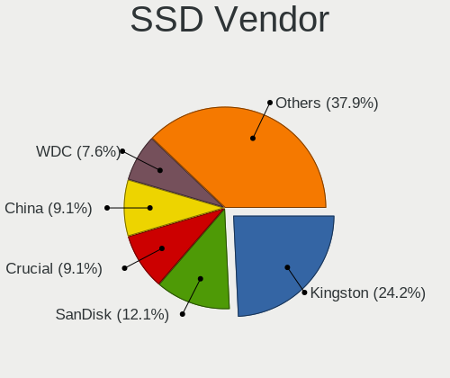
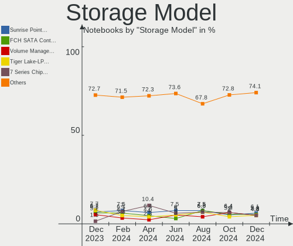
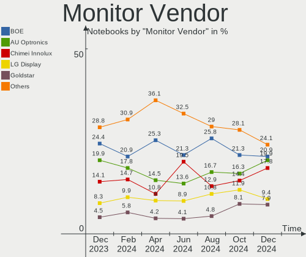
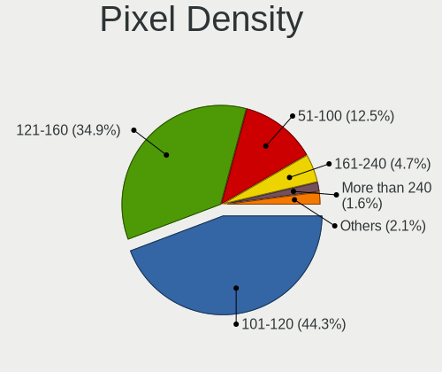
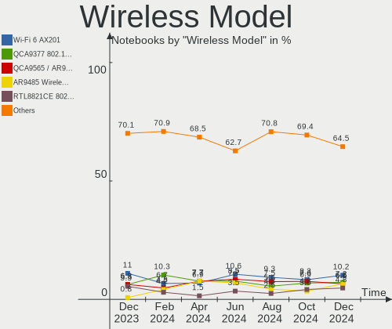

Linux in Brazil - Hardware Trends (Notebooks)
---------------------------------------------

A project to identify most popular hardware characteristics and track their change
over time based on data collected by Linux users at https://Linux-Hardware.org.

Anyone can contribute to this report by the [hw-probe](https://github.com/linuxhw/hw-probe) tool:

    sudo -E hw-probe -all -upload

Period: Nov, 2023.

Contents
--------

* [ System ](#system)
  - [ OS                       ](#os)
  - [ OS Family                ](#os-family)
  - [ Kernel                   ](#kernel)
  - [ Kernel Family            ](#kernel-family)
  - [ Kernel Major Ver.        ](#kernel-major-ver)
  - [ Arch                     ](#arch)
  - [ DE                       ](#de)
  - [ Display Server           ](#display-server)
  - [ Display Manager          ](#display-manager)
  - [ OS Lang                  ](#os-lang)
  - [ Boot Mode                ](#boot-mode)
  - [ Filesystem               ](#filesystem)
  - [ Part. scheme             ](#part-scheme)
  - [ Dual Boot with Linux/BSD ](#dual-boot-with-linuxbsd)
  - [ Dual Boot (Win)          ](#dual-boot-win)

* [ Board ](#board)
  - [ Vendor                   ](#vendor)
  - [ Model                    ](#model)
  - [ Model Family             ](#model-family)
  - [ MFG Year                 ](#mfg-year)
  - [ Form Factor              ](#form-factor)
  - [ Secure Boot              ](#secure-boot)
  - [ Coreboot                 ](#coreboot)
  - [ RAM Size                 ](#ram-size)
  - [ RAM Used                 ](#ram-used)
  - [ Total Drives             ](#total-drives)
  - [ Has CD-ROM               ](#has-cd-rom)
  - [ Has Ethernet             ](#has-ethernet)
  - [ Has WiFi                 ](#has-wifi)
  - [ Has Bluetooth            ](#has-bluetooth)

* [ Location ](#location)
  - [ Country                  ](#country)
  - [ City                     ](#city)

* [ Drives ](#drives)
  - [ Drive Vendor             ](#drive-vendor)
  - [ Drive Model              ](#drive-model)
  - [ HDD Vendor               ](#hdd-vendor)
  - [ SSD Vendor               ](#ssd-vendor)
  - [ Drive Kind               ](#drive-kind)
  - [ Drive Connector          ](#drive-connector)
  - [ Drive Size               ](#drive-size)
  - [ Space Total              ](#space-total)
  - [ Space Used               ](#space-used)
  - [ Malfunc. Drives          ](#malfunc-drives)
  - [ Malfunc. Drive Vendor    ](#malfunc-drive-vendor)
  - [ Malfunc. HDD Vendor      ](#malfunc-hdd-vendor)
  - [ Malfunc. Drive Kind      ](#malfunc-drive-kind)
  - [ Failed Drives            ](#failed-drives)
  - [ Failed Drive Vendor      ](#failed-drive-vendor)
  - [ Drive Status             ](#drive-status)

* [ Storage controller ](#storage-controller)
  - [ Storage Vendor           ](#storage-vendor)
  - [ Storage Model            ](#storage-model)
  - [ Storage Kind             ](#storage-kind)

* [ Processor ](#processor)
  - [ CPU Vendor               ](#cpu-vendor)
  - [ CPU Model                ](#cpu-model)
  - [ CPU Model Family         ](#cpu-model-family)
  - [ CPU Cores                ](#cpu-cores)
  - [ CPU Sockets              ](#cpu-sockets)
  - [ CPU Threads              ](#cpu-threads)
  - [ CPU Op-Modes             ](#cpu-op-modes)
  - [ CPU Microcode            ](#cpu-microcode)
  - [ CPU Microarch            ](#cpu-microarch)

* [ Graphics ](#graphics)
  - [ GPU Vendor               ](#gpu-vendor)
  - [ GPU Model                ](#gpu-model)
  - [ GPU Combo                ](#gpu-combo)
  - [ GPU Driver               ](#gpu-driver)
  - [ GPU Memory               ](#gpu-memory)

* [ Monitor ](#monitor)
  - [ Monitor Vendor           ](#monitor-vendor)
  - [ Monitor Model            ](#monitor-model)
  - [ Monitor Resolution       ](#monitor-resolution)
  - [ Monitor Diagonal         ](#monitor-diagonal)
  - [ Monitor Width            ](#monitor-width)
  - [ Aspect Ratio             ](#aspect-ratio)
  - [ Monitor Area             ](#monitor-area)
  - [ Pixel Density            ](#pixel-density)
  - [ Multiple Monitors        ](#multiple-monitors)

* [ Network ](#network)
  - [ Net Controller Vendor    ](#net-controller-vendor)
  - [ Net Controller Model     ](#net-controller-model)
  - [ Wireless Vendor          ](#wireless-vendor)
  - [ Wireless Model           ](#wireless-model)
  - [ Ethernet Vendor          ](#ethernet-vendor)
  - [ Ethernet Model           ](#ethernet-model)
  - [ Net Controller Kind      ](#net-controller-kind)
  - [ Used Controller          ](#used-controller)
  - [ NICs                     ](#nics)
  - [ IPv6                     ](#ipv6)

* [ Bluetooth ](#bluetooth)
  - [ Bluetooth Vendor         ](#bluetooth-vendor)
  - [ Bluetooth Model          ](#bluetooth-model)

* [ Sound ](#sound)
  - [ Sound Vendor             ](#sound-vendor)
  - [ Sound Model              ](#sound-model)

* [ Memory ](#memory)
  - [ Memory Vendor            ](#memory-vendor)
  - [ Memory Model             ](#memory-model)
  - [ Memory Kind              ](#memory-kind)
  - [ Memory Form Factor       ](#memory-form-factor)
  - [ Memory Size              ](#memory-size)
  - [ Memory Speed             ](#memory-speed)

* [ Printers & scanners ](#printers--scanners)
  - [ Printer Vendor           ](#printer-vendor)
  - [ Printer Model            ](#printer-model)
  - [ Scanner Vendor           ](#scanner-vendor)
  - [ Scanner Model            ](#scanner-model)

* [ Camera ](#camera)
  - [ Camera Vendor            ](#camera-vendor)
  - [ Camera Model             ](#camera-model)

* [ Security ](#security)
  - [ Fingerprint Vendor       ](#fingerprint-vendor)
  - [ Fingerprint Model        ](#fingerprint-model)
  - [ Chipcard Vendor          ](#chipcard-vendor)
  - [ Chipcard Model           ](#chipcard-model)

* [ Unsupported ](#unsupported)
  - [ Unsupported Devices      ](#unsupported-devices)
  - [ Unsupported Device Types ](#unsupported-device-types)

System
------

OS
--

Installed operating systems

| Name                         | Notebooks | Percent |
|------------------------------|-----------|---------|
| Ubuntu 22.04                 | 21        | 12.43%  |
| Linux Mint 21.2              | 16        | 9.47%   |
| Fedora 39                    | 15        | 8.88%   |
| Ubuntu 23.10                 | 8         | 4.73%   |
| Pop!_OS 22.04                | 8         | 4.73%   |
| Arch Rolling                 | 8         | 4.73%   |
| Debian 12                    | 7         | 4.14%   |
| Fedora 38                    | 6         | 3.55%   |
| Zorin 16                     | 5         | 2.96%   |
| openSUSE Tumbleweed-XXXXXXXX | 5         | 2.96%   |
| OpenMandriva 5.0             | 5         | 2.96%   |
| Endless 5.0.6                | 5         | 2.96%   |
| OpenMandriva 23.08           | 4         | 2.37%   |
| Linux Mint 20.3              | 4         | 2.37%   |
| Debian 11                    | 4         | 2.37%   |
| Manjaro                      | 3         | 1.78%   |
| Devuan 5                     | 3         | 1.78%   |
| BigLinux                     | 3         | 1.78%   |
| ArcoLinux Rolling            | 3         | 1.78%   |
| Ubuntu 20.04                 | 2         | 1.18%   |
| OpenMandriva 4.3             | 2         | 1.18%   |
| LMDE 6                       | 2         | 1.18%   |
| Garuda Linux Soaring         | 2         | 1.18%   |
| Endless 3.9.3-nexthw1        | 2         | 1.18%   |
| Void Linux Rolling           | 1         | 0.59%   |
| Ubuntu Studio 23.04          | 1         | 0.59%   |
| Ubuntu MATE 23.10            | 1         | 0.59%   |
| Ubuntu MATE 22.04            | 1         | 0.59%   |
| Ubuntu Budgie 20.04          | 1         | 0.59%   |
| Ubuntu 18.04                 | 1         | 0.59%   |
| SteamOS 3.5.7                | 1         | 0.59%   |
| SteamOS 3.4.11               | 1         | 0.59%   |
| Peppermint                   | 1         | 0.59%   |
| Parrot 5.3                   | 1         | 0.59%   |
| openSUSE Leap-15.5           | 1         | 0.59%   |
| openSUSE Leap-15.4           | 1         | 0.59%   |
| OpenMandriva 23.10           | 1         | 0.59%   |
| Manjaro 23.0.4               | 1         | 0.59%   |
| LMDE 5                       | 1         | 0.59%   |
| Linux Mint 21.1              | 1         | 0.59%   |

OS Family
---------

OS without a version

| Name          | Notebooks | Percent |
|---------------|-----------|---------|
| Ubuntu        | 32        | 18.93%  |
| Linux Mint    | 23        | 13.61%  |
| Fedora        | 21        | 12.43%  |
| OpenMandriva  | 12        | 7.1%    |
| Debian        | 11        | 6.51%   |
| Endless       | 9         | 5.33%   |
| Pop!_OS       | 8         | 4.73%   |
| Arch          | 8         | 4.73%   |
| openSUSE      | 7         | 4.14%   |
| Zorin         | 5         | 2.96%   |
| BigLinux      | 5         | 2.96%   |
| Manjaro       | 4         | 2.37%   |
| LMDE          | 3         | 1.78%   |
| Devuan        | 3         | 1.78%   |
| ArcoLinux     | 3         | 1.78%   |
| Ubuntu MATE   | 2         | 1.18%   |
| SteamOS       | 2         | 1.18%   |
| Garuda Linux  | 2         | 1.18%   |
| Void Linux    | 1         | 0.59%   |
| Ubuntu Studio | 1         | 0.59%   |
| Ubuntu Budgie | 1         | 0.59%   |
| Peppermint    | 1         | 0.59%   |
| Parrot        | 1         | 0.59%   |
| Lenovo Lux    | 1         | 0.59%   |
| EndeavourOS   | 1         | 0.59%   |
| blendOS       | 1         | 0.59%   |
| Artix         | 1         | 0.59%   |

Kernel
------

Version of the Linux kernel

| Version                 | Notebooks | Percent |
|-------------------------|-----------|---------|
| 5.15.0-88-generic       | 16        | 9.47%   |
| 6.2.0-36-generic        | 15        | 8.88%   |
| 6.1.0-13-amd64          | 11        | 6.51%   |
| 6.5.11-300.fc39.x86_64  | 9         | 5.33%   |
| 6.6.1-arch1-1           | 6         | 3.55%   |
| 6.5.0-10-generic        | 6         | 3.55%   |
| 6.6.2-desktop-1omv2390  | 5         | 2.96%   |
| 6.5.6-76060506-generic  | 5         | 2.96%   |
| 5.15.0-89-generic       | 5         | 2.96%   |
| 5.15.0-47-generic       | 5         | 2.96%   |
| 5.10.0-26-amd64         | 4         | 2.37%   |
| 6.5.9-1-default         | 3         | 1.78%   |
| 6.5.6-300.fc39.x86_64   | 3         | 1.78%   |
| 6.5.11-1-MANJARO        | 3         | 1.78%   |
| 6.4.11-desktop-1omv2390 | 3         | 1.78%   |
| 6.2.0-37-generic        | 3         | 1.78%   |
| 6.6.2-1-default         | 2         | 1.18%   |
| 6.5.9-arch2-1           | 2         | 1.18%   |
| 6.5.9-200.fc38.x86_64   | 2         | 1.18%   |
| 6.5.8-200.fc38.x86_64   | 2         | 1.18%   |
| 6.5.4-76060504-generic  | 2         | 1.18%   |
| 6.5.12-300.fc39.x86_64  | 2         | 1.18%   |
| 6.5.0-13-generic        | 2         | 1.18%   |
| 6.2.0-1016-lowlatency   | 2         | 1.18%   |
| 6.1.62-1-MANJARO        | 2         | 1.18%   |
| 5.4.0-166-generic       | 2         | 1.18%   |
| 5.16.7-desktop-1omv4003 | 2         | 1.18%   |
| 5.11.0-12-generic       | 2         | 1.18%   |
| 6.6.2-zen1-1-zen        | 1         | 0.59%   |
| 6.6.2-201.fc39.x86_64   | 1         | 0.59%   |
| 6.6.2-101.fc38.x86_64   | 1         | 0.59%   |
| 6.6.1-zen1-1-zen        | 1         | 0.59%   |
| 6.5.9-zen2-1-zen        | 1         | 0.59%   |
| 6.5.9-2-liquorix-amd64  | 1         | 0.59%   |
| 6.5.9-1-MANJARO         | 1         | 0.59%   |
| 6.5.8-arch1-1           | 1         | 0.59%   |
| 6.5.7-artix1-1          | 1         | 0.59%   |
| 6.5.7-060507-generic    | 1         | 0.59%   |
| 6.5.5-desktop-1omv2390  | 1         | 0.59%   |
| 6.5.5-1-MANJARO         | 1         | 0.59%   |

Kernel Family
-------------

Linux kernel without a distro release

| Version | Notebooks | Percent |
|---------|-----------|---------|
| 5.15.0  | 29        | 17.16%  |
| 6.2.0   | 21        | 12.43%  |
| 6.1.0   | 15        | 8.88%   |
| 6.5.11  | 12        | 7.1%    |
| 6.6.2   | 10        | 5.92%   |
| 6.5.9   | 10        | 5.92%   |
| 6.5.0   | 9         | 5.33%   |
| 6.5.6   | 8         | 4.73%   |
| 6.6.1   | 7         | 4.14%   |
| 5.10.0  | 7         | 4.14%   |
| 6.5.8   | 3         | 1.78%   |
| 6.5.12  | 3         | 1.78%   |
| 6.4.11  | 3         | 1.78%   |
| 6.1.62  | 3         | 1.78%   |
| 5.4.0   | 3         | 1.78%   |
| 6.5.7   | 2         | 1.18%   |
| 6.5.5   | 2         | 1.18%   |
| 6.5.4   | 2         | 1.18%   |
| 6.5.10  | 2         | 1.18%   |
| 5.16.7  | 2         | 1.18%   |
| 5.14.21 | 2         | 1.18%   |
| 5.11.0  | 2         | 1.18%   |
| 6.4.8   | 1         | 0.59%   |
| 6.3.9   | 1         | 0.59%   |
| 6.1.63  | 1         | 0.59%   |
| 6.1.55  | 1         | 0.59%   |
| 6.1.52  | 1         | 0.59%   |
| 6.0.6   | 1         | 0.59%   |
| 5.19.17 | 1         | 0.59%   |
| 5.19.0  | 1         | 0.59%   |
| 5.14.0  | 1         | 0.59%   |
| 5.13.0  | 1         | 0.59%   |
| 4.4.0   | 1         | 0.59%   |
| 4.15.0  | 1         | 0.59%   |

Kernel Major Ver.
-----------------

Linux kernel major version

| Version | Notebooks | Percent |
|---------|-----------|---------|
| 6.5     | 53        | 31.36%  |
| 5.15    | 29        | 17.16%  |
| 6.2     | 21        | 12.43%  |
| 6.1     | 21        | 12.43%  |
| 6.6     | 17        | 10.06%  |
| 5.10    | 7         | 4.14%   |
| 6.4     | 4         | 2.37%   |
| 5.4     | 3         | 1.78%   |
| 5.14    | 3         | 1.78%   |
| 5.19    | 2         | 1.18%   |
| 5.16    | 2         | 1.18%   |
| 5.11    | 2         | 1.18%   |
| 6.3     | 1         | 0.59%   |
| 6.0     | 1         | 0.59%   |
| 5.13    | 1         | 0.59%   |
| 4.4     | 1         | 0.59%   |
| 4.15    | 1         | 0.59%   |

Arch
----

OS architecture (x86_64, i586, etc.)

| Name   | Notebooks | Percent |
|--------|-----------|---------|
| x86_64 | 169       | 100%    |

DE
--

Desktop Environment

| Name           | Notebooks | Percent |
|----------------|-----------|---------|
| GNOME          | 76        | 44.97%  |
| KDE5           | 36        | 21.3%   |
| XFCE           | 20        | 11.83%  |
| X-Cinnamon     | 17        | 10.06%  |
| MATE           | 6         | 3.55%   |
| Endless:GNOME  | 6         | 3.55%   |
| Unknown        | 3         | 1.78%   |
| LXQt           | 1         | 0.59%   |
| i3-with-shmlog | 1         | 0.59%   |
| i3             | 1         | 0.59%   |
| Enlightenment  | 1         | 0.59%   |
| Budgie         | 1         | 0.59%   |

Display Server
--------------

X11 or Wayland

| Name    | Notebooks | Percent |
|---------|-----------|---------|
| X11     | 107       | 63.31%  |
| Wayland | 58        | 34.32%  |
| Tty     | 2         | 1.18%   |
| Unknown | 2         | 1.18%   |

Display Manager
---------------

SDDM, LightDM, etc.

| Name    | Notebooks | Percent |
|---------|-----------|---------|
| Unknown | 88        | 52.07%  |
| GDM3    | 33        | 19.53%  |
| SDDM    | 25        | 14.79%  |
| LightDM | 20        | 11.83%  |
| GDM     | 2         | 1.18%   |
| Ly      | 1         | 0.59%   |

OS Lang
-------

Language

| Lang    | Notebooks | Percent |
|---------|-----------|---------|
| pt_BR   | 120       | 71.01%  |
| en_US   | 41        | 24.26%  |
| C       | 3         | 1.78%   |
| en_GB   | 2         | 1.18%   |
| en_ZA   | 1         | 0.59%   |
| en_CA   | 1         | 0.59%   |
| Unknown | 1         | 0.59%   |

Boot Mode
---------

EFI or BIOS

| Mode | Notebooks | Percent |
|------|-----------|---------|
| EFI  | 93        | 55.03%  |
| BIOS | 76        | 44.97%  |

Filesystem
----------

Type of filesystem

| Type    | Notebooks | Percent |
|---------|-----------|---------|
| Ext4    | 103       | 60.95%  |
| Btrfs   | 38        | 22.49%  |
| Tmpfs   | 17        | 10.06%  |
| Overlay | 9         | 5.33%   |
| Xfs     | 2         | 1.18%   |

Part. scheme
------------

Scheme of partitioning

| Type    | Notebooks | Percent |
|---------|-----------|---------|
| Unknown | 85        | 50.3%   |
| GPT     | 75        | 44.38%  |
| MBR     | 9         | 5.33%   |

Dual Boot with Linux/BSD
------------------------

Hosting more than one Linux/BSD

| Dual boot | Notebooks | Percent |
|-----------|-----------|---------|
| No        | 154       | 91.12%  |
| Yes       | 15        | 8.88%   |

Dual Boot (Win)
---------------

Hosting Linux and Windows

| Dual boot | Notebooks | Percent |
|-----------|-----------|---------|
| No        | 136       | 80.47%  |
| Yes       | 33        | 19.53%  |

Board
-----

Vendor
------

Motherboard manufacturer

| Name                   | Notebooks | Percent |
|------------------------|-----------|---------|
| Dell                   | 36        | 21.3%   |
| Acer                   | 30        | 17.75%  |
| Lenovo                 | 27        | 15.98%  |
| Hewlett-Packard        | 18        | 10.65%  |
| Samsung Electronics    | 12        | 7.1%    |
| ASUSTek Computer       | 12        | 7.1%    |
| Positivo               | 4         | 2.37%   |
| Semp Toshiba           | 3         | 1.78%   |
| Apple                  | 3         | 1.78%   |
| Valve                  | 2         | 1.18%   |
| Sony                   | 2         | 1.18%   |
| Philco                 | 2         | 1.18%   |
| Multilaser             | 2         | 1.18%   |
| Digibras               | 2         | 1.18%   |
| Daten Tecnologia       | 2         | 1.18%   |
| Compaq                 | 2         | 1.18%   |
| Avell High Performance | 2         | 1.18%   |
| Phoenix/SiS            | 1         | 0.59%   |
| Notebook               | 1         | 0.59%   |
| MSI                    | 1         | 0.59%   |
| Google                 | 1         | 0.59%   |
| Compal                 | 1         | 0.59%   |
| AMI                    | 1         | 0.59%   |
| Alienware              | 1         | 0.59%   |
| A14CR                  | 1         | 0.59%   |

Model
-----

Motherboard model

| Name                                                  | Notebooks | Percent |
|-------------------------------------------------------|-----------|---------|
| Lenovo IdeaPad 3 15ALC6 82MF                          | 4         | 2.37%   |
| Samsung 550XDA                                        | 3         | 1.78%   |
| Lenovo IdeaPad S145-15API 81V7                        | 3         | 1.78%   |
| Dell Inspiron 15 3515                                 | 3         | 1.78%   |
| ASUS VivoBook_ASUSLaptop X515EA_X515EA                | 3         | 1.78%   |
| Acer Nitro AN515-54                                   | 3         | 1.78%   |
| Valve Jupiter                                         | 2         | 1.18%   |
| Semp Toshiba IS 1412                                  | 2         | 1.18%   |
| Samsung 960XFH                                        | 2         | 1.18%   |
| Positivo S14CT01                                      | 2         | 1.18%   |
| Positivo C41TF                                        | 2         | 1.18%   |
| Philco 14H                                            | 2         | 1.18%   |
| Lenovo IdeaPad Gaming 3 15IMH05 82CG                  | 2         | 1.18%   |
| Lenovo IdeaPad 320-15IKB 80YH                         | 2         | 1.18%   |
| Digibras NH4CU53                                      | 2         | 1.18%   |
| Dell Latitude 3480                                    | 2         | 1.18%   |
| Dell Latitude 3420                                    | 2         | 1.18%   |
| Dell Inspiron 5547                                    | 2         | 1.18%   |
| Dell Inspiron 5502                                    | 2         | 1.18%   |
| ASUS VivoBook_ASUSLaptop X515JF_X515JF                | 2         | 1.18%   |
| ASUS VivoBook_ASUSLaptop X515DA_X515DA                | 2         | 1.18%   |
| Apple MacBookPro8,1                                   | 2         | 1.18%   |
| Acer Predator PH315-52                                | 2         | 1.18%   |
| Acer Aspire A515-51G                                  | 2         | 1.18%   |
| Acer Aspire A515-51                                   | 2         | 1.18%   |
| Unknown                                               | 2         | 1.18%   |
| Sony VPCYB35AB                                        | 1         | 0.59%   |
| Sony VGN-NS130AE                                      | 1         | 0.59%   |
| Semp Toshiba IS 1413G                                 | 1         | 0.59%   |
| Samsung RF511/RF411/RF711                             | 1         | 0.59%   |
| Samsung 550XCJ/550XCR                                 | 1         | 0.59%   |
| Samsung 550P5C/550P7C                                 | 1         | 0.59%   |
| Samsung 530XBB                                        | 1         | 0.59%   |
| Samsung 300E5M/300E5L                                 | 1         | 0.59%   |
| Samsung 300E5EV/300E4EV/270E5EV/270E4EV/2470EV/2470EE | 1         | 0.59%   |
| Samsung 270E5J/2570EJ                                 | 1         | 0.59%   |
| Phoenix/SiS M730SR                                    | 1         | 0.59%   |
| Notebook NJx0MU                                       | 1         | 0.59%   |
| Multilaser PC13X                                      | 1         | 0.59%   |
| Multilaser MLSH1H LINUX                               | 1         | 0.59%   |

Model Family
------------

Motherboard model prefix

| Name               | Notebooks | Percent |
|--------------------|-----------|---------|
| Lenovo IdeaPad     | 19        | 11.24%  |
| Dell Inspiron      | 17        | 10.06%  |
| Acer Aspire        | 17        | 10.06%  |
| Dell Latitude      | 9         | 5.33%   |
| Dell Vostro        | 8         | 4.73%   |
| ASUS VivoBook      | 8         | 4.73%   |
| Acer Nitro         | 8         | 4.73%   |
| Lenovo ThinkPad    | 6         | 3.55%   |
| HP Pavilion        | 6         | 3.55%   |
| Semp Toshiba IS    | 3         | 1.78%   |
| Samsung 550XDA     | 3         | 1.78%   |
| Acer Predator      | 3         | 1.78%   |
| Valve Jupiter      | 2         | 1.18%   |
| Samsung 960XFH     | 2         | 1.18%   |
| Positivo S14CT01   | 2         | 1.18%   |
| Positivo C41TF     | 2         | 1.18%   |
| Philco 14H         | 2         | 1.18%   |
| HP Presario        | 2         | 1.18%   |
| Digibras NH4CU53   | 2         | 1.18%   |
| Dell G15           | 2         | 1.18%   |
| Apple MacBookPro8  | 2         | 1.18%   |
| Unknown            | 2         | 1.18%   |
| Sony VPCYB35AB     | 1         | 0.59%   |
| Sony VGN-NS130AE   | 1         | 0.59%   |
| Samsung RF511      | 1         | 0.59%   |
| Samsung 550XCJ     | 1         | 0.59%   |
| Samsung 550P5C     | 1         | 0.59%   |
| Samsung 530XBB     | 1         | 0.59%   |
| Samsung 300E5M     | 1         | 0.59%   |
| Samsung 300E5EV    | 1         | 0.59%   |
| Samsung 270E5J     | 1         | 0.59%   |
| Phoenix/SiS M730SR | 1         | 0.59%   |
| Notebook NJx0MU    | 1         | 0.59%   |
| Multilaser PC13X   | 1         | 0.59%   |
| Multilaser MLSH1H  | 1         | 0.59%   |
| MSI GE70           | 1         | 0.59%   |
| Lenovo Legion      | 1         | 0.59%   |
| HP ZBook           | 1         | 0.59%   |
| HP ProBook         | 1         | 0.59%   |
| HP G62             | 1         | 0.59%   |

MFG Year
--------

Motherboard manufacture year

| Year | Notebooks | Percent |
|------|-----------|---------|
| 2021 | 29        | 17.16%  |
| 2019 | 19        | 11.24%  |
| 2020 | 17        | 10.06%  |
| 2017 | 15        | 8.88%   |
| 2011 | 11        | 6.51%   |
| 2023 | 10        | 5.92%   |
| 2016 | 8         | 4.73%   |
| 2013 | 8         | 4.73%   |
| 2012 | 8         | 4.73%   |
| 2010 | 7         | 4.14%   |
| 2009 | 7         | 4.14%   |
| 2022 | 6         | 3.55%   |
| 2018 | 6         | 3.55%   |
| 2008 | 6         | 3.55%   |
| 2015 | 5         | 2.96%   |
| 2014 | 5         | 2.96%   |
| 2007 | 2         | 1.18%   |

Form Factor
-----------

Physical design of the computer

| Name     | Notebooks | Percent |
|----------|-----------|---------|
| Notebook | 169       | 100%    |

Secure Boot
-----------

Enabled or disabled

| State    | Notebooks | Percent |
|----------|-----------|---------|
| Disabled | 153       | 90.53%  |
| Enabled  | 16        | 9.47%   |

Coreboot
--------

Have coreboot on board

| Used | Notebooks | Percent |
|------|-----------|---------|
| No   | 168       | 99.41%  |
| Yes  | 1         | 0.59%   |

RAM Size
--------

Total RAM memory

| Size in GB | Notebooks | Percent |
|------------|-----------|---------|
| 4.01-8.0   | 48        | 28.4%   |
| 16.01-24.0 | 46        | 27.22%  |
| 3.01-4.0   | 31        | 18.34%  |
| 8.01-16.0  | 17        | 10.06%  |
| 32.01-64.0 | 13        | 7.69%   |
| 1.01-2.0   | 8         | 4.73%   |
| 2.01-3.0   | 5         | 2.96%   |
| 24.01-32.0 | 1         | 0.59%   |

RAM Used
--------

Used RAM memory

| Used GB    | Notebooks | Percent |
|------------|-----------|---------|
| 2.01-3.0   | 49        | 28.99%  |
| 1.01-2.0   | 42        | 24.85%  |
| 4.01-8.0   | 34        | 20.12%  |
| 3.01-4.0   | 27        | 15.98%  |
| 8.01-16.0  | 9         | 5.33%   |
| 0.51-1.0   | 7         | 4.14%   |
| 16.01-24.0 | 1         | 0.59%   |

Total Drives
------------

Number of drives on board

| Drives | Notebooks | Percent |
|--------|-----------|---------|
| 1      | 110       | 65.09%  |
| 2      | 50        | 29.59%  |
| 3      | 8         | 4.73%   |
| 4      | 1         | 0.59%   |

Has CD-ROM
----------

Has CD-ROM on board

| Presented | Notebooks | Percent |
|-----------|-----------|---------|
| No        | 133       | 78.7%   |
| Yes       | 36        | 21.3%   |

Has Ethernet
------------

Has Ethernet on board

| Presented | Notebooks | Percent |
|-----------|-----------|---------|
| Yes       | 130       | 76.92%  |
| No        | 39        | 23.08%  |

Has WiFi
--------

Has WiFi module

| Presented | Notebooks | Percent |
|-----------|-----------|---------|
| Yes       | 162       | 95.86%  |
| No        | 7         | 4.14%   |

Has Bluetooth
-------------

Has Bluetooth module

| Presented | Notebooks | Percent |
|-----------|-----------|---------|
| Yes       | 132       | 78.11%  |
| No        | 37        | 21.89%  |

Location
--------

Country
-------

Geographic location (country)

| Country | Notebooks | Percent |
|---------|-----------|---------|
| Brazil  | 169       | 100%    |

City
----

Geographic location (city)

| City                     | Notebooks | Percent |
|--------------------------|-----------|---------|
| Sao Paulo                | 24        | 14.2%   |
| Brasília                | 9         | 5.33%   |
| Rio de Janeiro           | 7         | 4.14%   |
| Porto Alegre             | 5         | 2.96%   |
| Manaus                   | 5         | 2.96%   |
| Curitiba                 | 5         | 2.96%   |
| Fortaleza                | 4         | 2.37%   |
| Oliveira                 | 3         | 1.78%   |
| Goiânia                 | 3         | 1.78%   |
| Campo Grande             | 3         | 1.78%   |
| Belo Horizonte           | 3         | 1.78%   |
| Sao Luís                | 2         | 1.18%   |
| Sao José dos Campos     | 2         | 1.18%   |
| Sao Jose do Rio Preto    | 2         | 1.18%   |
| Sao Carlos               | 2         | 1.18%   |
| Santos                   | 2         | 1.18%   |
| Salvador                 | 2         | 1.18%   |
| Recife                   | 2         | 1.18%   |
| Petrolina                | 2         | 1.18%   |
| Niterói                 | 2         | 1.18%   |
| Mogi das Cruzes          | 2         | 1.18%   |
| Londrina                 | 2         | 1.18%   |
| Joao Pessoa              | 2         | 1.18%   |
| Franca                   | 2         | 1.18%   |
| Caiaponia                | 2         | 1.18%   |
| Viamao                   | 1         | 0.59%   |
| Ubatuba                  | 1         | 0.59%   |
| Tres Coroas              | 1         | 0.59%   |
| Teresina                 | 1         | 0.59%   |
| Taguatinga               | 1         | 0.59%   |
| Sumaré                  | 1         | 0.59%   |
| Sorocaba                 | 1         | 0.59%   |
| Serra                    | 1         | 0.59%   |
| Serafina Correa          | 1         | 0.59%   |
| Satuba                   | 1         | 0.59%   |
| Sao Leopoldo             | 1         | 0.59%   |
| Sao Goncalo              | 1         | 0.59%   |
| Sao Bernardo do Campo    | 1         | 0.59%   |
| Santo Antonio da Platina | 1         | 0.59%   |
| Santo André             | 1         | 0.59%   |

Drives
------

Drive Vendor
------------

Hard drive vendors

| Vendor                         | Notebooks | Drives | Percent |
|--------------------------------|-----------|--------|---------|
| WDC                            | 26        | 27     | 11.66%  |
| Kingston                       | 25        | 26     | 11.21%  |
| Samsung Electronics            | 19        | 19     | 8.52%   |
| Seagate                        | 18        | 19     | 8.07%   |
| A-DATA Technology              | 17        | 17     | 7.62%   |
| Toshiba                        | 15        | 15     | 6.73%   |
| Sandisk                        | 11        | 11     | 4.93%   |
| Unknown                        | 10        | 10     | 4.48%   |
| China                          | 9         | 10     | 4.04%   |
| Crucial                        | 8         | 9      | 3.59%   |
| Silicon Motion                 | 7         | 7      | 3.14%   |
| ADATA Technology               | 7         | 7      | 3.14%   |
| SK hynix                       | 6         | 6      | 2.69%   |
| JMicron Technology             | 5         | 5      | 2.24%   |
| Micron Technology              | 4         | 4      | 1.79%   |
| Intel                          | 4         | 4      | 1.79%   |
| XrayDisk                       | 3         | 3      | 1.35%   |
| Solid State Storage            | 3         | 3      | 1.35%   |
| Fujitsu                        | 3         | 3      | 1.35%   |
| SSSTC                          | 2         | 2      | 0.9%    |
| Phison Electronics             | 2         | 2      | 0.9%    |
| Lexar                          | 2         | 2      | 0.9%    |
| Unknown                        | 2         | 2      | 0.9%    |
| Teclast                        | 1         | 1      | 0.45%   |
| Solid State Storage Technology | 1         | 1      | 0.45%   |
| Seapiy                         | 1         | 1      | 0.45%   |
| Realtek Semiconductor          | 1         | 1      | 0.45%   |
| Phison                         | 1         | 1      | 0.45%   |
| Patriot                        | 1         | 1      | 0.45%   |
| MAXIO Technology (Hangzhou)    | 1         | 1      | 0.45%   |
| LITEON                         | 1         | 1      | 0.45%   |
| Lenovo                         | 1         | 1      | 0.45%   |
| Kingston Technology Company    | 1         | 1      | 0.45%   |
| Hjwdz                          | 1         | 1      | 0.45%   |
| Hitachi                        | 1         | 1      | 0.45%   |
| HGST                           | 1         | 1      | 0.45%   |
| GeIL                           | 1         | 1      | 0.45%   |
| Corsair                        | 1         | 1      | 0.45%   |

Drive Model
-----------

Hard drive models

| Model                                                           | Notebooks | Percent |
|-----------------------------------------------------------------|-----------|---------|
| Kingston SA400S37480G 480GB SSD                                 | 8         | 3.54%   |
| WDC WD10SPZX-21Z10T0 1TB                                        | 7         | 3.1%    |
| Toshiba MQ04ABF100 1TB                                          | 7         | 3.1%    |
| WDC WD10SPZX-24Z10 1TB                                          | 5         | 2.21%   |
| Silicon Motion SM2263EN/SM2263XT SSD Controller 256GB           | 5         | 2.21%   |
| Kingston SA400S37240G 240GB SSD                                 | 4         | 1.77%   |
| A-DATA IM2P33F3A NVMe 256GB                                     | 4         | 1.77%   |
| Unknown SD/MMC/MS PRO 128GB                                     | 3         | 1.33%   |
| Seagate ST500LM012 HN-M500MBB 500GB                             | 3         | 1.33%   |
| SanDisk SSD PLUS 240GB                                          | 3         | 1.33%   |
| Kingston SNVS500G 500GB                                         | 3         | 1.33%   |
| JMicron Tech 250GB                                              | 3         | 1.33%   |
| Crucial CT240BX500SSD1 240GB                                    | 3         | 1.33%   |
| China SSD 256GB                                                 | 3         | 1.33%   |
| A-DATA IM2S3338-128GD2 128GB SSD                                | 3         | 1.33%   |
| WDC WDS100T2B0A-00SM50 1TB SSD                                  | 2         | 0.88%   |
| Unknown MMC Card  64GB                                          | 2         | 0.88%   |
| Unknown MMC Card  32GB                                          | 2         | 0.88%   |
| Unknown DA4064  64GB                                            | 2         | 0.88%   |
| SSSTC CL1-4D256 256GB                                           | 2         | 0.88%   |
| Solid State Storage SSSTC CL1-4D256 256GB                       | 2         | 0.88%   |
| SK hynix HFS512GEJ9X108N 512GB                                  | 2         | 0.88%   |
| Seagate ST2000LM007-1R8174 2TB                                  | 2         | 0.88%   |
| Seagate ST1000LM035-1RK172 1TB                                  | 2         | 0.88%   |
| Samsung NVMe SSD Controller SM981/PM981/PM983 250GB             | 2         | 0.88%   |
| Samsung NVMe SSD Controller PM9A1/PM9A3/980PRO 2TB              | 2         | 0.88%   |
| Phison PS5013 E13 NVMe Controller 512GB                         | 2         | 0.88%   |
| Micron MTFDHBA512QFD 512GB                                      | 2         | 0.88%   |
| Kingston SA400S37960G 960GB SSD                                 | 2         | 0.88%   |
| JMicron Generic 250GB                                           | 2         | 0.88%   |
| Crucial CT480BX500SSD1 480GB                                    | 2         | 0.88%   |
| China SSD 480GB                                                 | 2         | 0.88%   |
| ADATA XPG SX8200 Pro PCIe Gen3x4 M.2 2280 Solid State Drive 1TB | 2         | 0.88%   |
| ADATA SM2P32A8-256GC1 256GB                                     | 2         | 0.88%   |
| A-DATA IM2P33F8BR1-128GB                                        | 2         | 0.88%   |
| A-DATA IM2P33F3A NVMe 512GB                                     | 2         | 0.88%   |
| Unknown                                                         | 2         | 0.88%   |
| XrayDisk 512GB SSD                                              | 1         | 0.44%   |
| XrayDisk 256GB SSD                                              | 1         | 0.44%   |
| XrayDisk 128GB                                                  | 1         | 0.44%   |

HDD Vendor
----------

Hard disk drive vendors

| Vendor              | Notebooks | Drives | Percent |
|---------------------|-----------|--------|---------|
| WDC                 | 19        | 19     | 31.15%  |
| Seagate             | 18        | 19     | 29.51%  |
| Toshiba             | 14        | 14     | 22.95%  |
| Unknown             | 3         | 3      | 4.92%   |
| Samsung Electronics | 2         | 2      | 3.28%   |
| Fujitsu             | 2         | 2      | 3.28%   |
| XrayDisk            | 1         | 1      | 1.64%   |
| Hitachi             | 1         | 1      | 1.64%   |
| HGST                | 1         | 1      | 1.64%   |

SSD Vendor
----------

Solid state drive vendors

| Vendor              | Notebooks | Drives | Percent |
|---------------------|-----------|--------|---------|
| Kingston            | 21        | 22     | 30%     |
| China               | 9         | 10     | 12.86%  |
| WDC                 | 7         | 8      | 10%     |
| Crucial             | 7         | 8      | 10%     |
| SanDisk             | 5         | 5      | 7.14%   |
| A-DATA Technology   | 5         | 5      | 7.14%   |
| Samsung Electronics | 4         | 4      | 5.71%   |
| XrayDisk            | 2         | 2      | 2.86%   |
| Lexar               | 2         | 2      | 2.86%   |
| JMicron Technology  | 2         | 2      | 2.86%   |
| Teclast             | 1         | 1      | 1.43%   |
| Patriot             | 1         | 1      | 1.43%   |
| LITEON              | 1         | 1      | 1.43%   |
| Lenovo              | 1         | 1      | 1.43%   |
| GeIL                | 1         | 1      | 1.43%   |
| Corsair             | 1         | 1      | 1.43%   |

Drive Kind
----------

HDD or SSD

| Kind    | Notebooks | Drives | Percent |
|---------|-----------|--------|---------|
| NVMe    | 73        | 77     | 34.27%  |
| SSD     | 66        | 74     | 30.99%  |
| HDD     | 59        | 62     | 27.7%   |
| Unknown | 8         | 8      | 3.76%   |
| MMC     | 7         | 7      | 3.29%   |

Drive Connector
---------------

SATA, SAS, NVMe, etc.

| Type | Notebooks | Drives | Percent |
|------|-----------|--------|---------|
| SATA | 111       | 127    | 54.41%  |
| NVMe | 73        | 77     | 35.78%  |
| SAS  | 13        | 17     | 6.37%   |
| MMC  | 7         | 7      | 3.43%   |

Drive Size
----------

Size of hard drive

| Size in TB | Notebooks | Drives | Percent |
|------------|-----------|--------|---------|
| 0.01-0.5   | 81        | 89     | 63.78%  |
| 0.51-1.0   | 42        | 43     | 33.07%  |
| 1.01-2.0   | 4         | 4      | 3.15%   |

Space Total
-----------

Amount of disk space available on the file system

| Size in GB     | Notebooks | Percent |
|----------------|-----------|---------|
| 101-250        | 51        | 30.18%  |
| 251-500        | 36        | 21.3%   |
| 501-1000       | 29        | 17.16%  |
| 1001-2000      | 24        | 14.2%   |
| 1-20           | 8         | 4.73%   |
| 21-50          | 5         | 2.96%   |
| 51-100         | 5         | 2.96%   |
| More than 3000 | 4         | 2.37%   |
| 2001-3000      | 4         | 2.37%   |
| Unknown        | 3         | 1.78%   |

Space Used
----------

Amount of used disk space

| Used GB        | Notebooks | Percent |
|----------------|-----------|---------|
| 1-20           | 54        | 31.95%  |
| 21-50          | 33        | 19.53%  |
| 101-250        | 24        | 14.2%   |
| 51-100         | 22        | 13.02%  |
| 251-500        | 17        | 10.06%  |
| 501-1000       | 9         | 5.33%   |
| 1001-2000      | 6         | 3.55%   |
| Unknown        | 3         | 1.78%   |
| More than 3000 | 1         | 0.59%   |

Malfunc. Drives
---------------

Drive models with a malfunction

| Model                               | Notebooks | Drives | Percent |
|-------------------------------------|-----------|--------|---------|
| WDC WD Green 2.5 480GB              | 1         | 1      | 16.67%  |
| Toshiba MK5065GSXF 500GB            | 1         | 1      | 16.67%  |
| Seagate ST95005620AS 500GB          | 1         | 2      | 16.67%  |
| Seagate ST2000LM007-1R8174 2TB      | 1         | 1      | 16.67%  |
| Seagate ST1000LM035-1RK172 1TB      | 1         | 1      | 16.67%  |
| A-DATA Technology XM11 128GB-V3 SSD | 1         | 1      | 16.67%  |

Malfunc. Drive Vendor
---------------------

Vendors of faulty drives

| Vendor            | Notebooks | Drives | Percent |
|-------------------|-----------|--------|---------|
| Seagate           | 3         | 4      | 50%     |
| WDC               | 1         | 1      | 16.67%  |
| Toshiba           | 1         | 1      | 16.67%  |
| A-DATA Technology | 1         | 1      | 16.67%  |

Malfunc. HDD Vendor
-------------------

Vendors of faulty HDD drives

| Vendor  | Notebooks | Drives | Percent |
|---------|-----------|--------|---------|
| Seagate | 3         | 4      | 75%     |
| Toshiba | 1         | 1      | 25%     |

Malfunc. Drive Kind
-------------------

Kinds of faulty drives

| Kind | Notebooks | Drives | Percent |
|------|-----------|--------|---------|
| HDD  | 4         | 5      | 66.67%  |
| SSD  | 2         | 2      | 33.33%  |

Failed Drives
-------------

Failed drive models

Zero info for selected period =(

Failed Drive Vendor
-------------------

Failed drive vendors

Zero info for selected period =(

Drive Status
------------

Number of failed and malfunc. drives

| Status   | Notebooks | Drives | Percent |
|----------|-----------|--------|---------|
| Detected | 117       | 152    | 65.73%  |
| Works    | 55        | 69     | 30.9%   |
| Malfunc  | 6         | 7      | 3.37%   |

Storage controller
------------------

Storage Vendor
--------------

Storage controller vendors

| Vendor                           | Notebooks | Percent |
|----------------------------------|-----------|---------|
| Intel                            | 127       | 58.26%  |
| ADATA Technology                 | 19        | 8.72%   |
| AMD                              | 17        | 7.8%    |
| Samsung Electronics              | 13        | 5.96%   |
| Silicon Motion                   | 7         | 3.21%   |
| Solid State Storage Technology   | 6         | 2.75%   |
| SK hynix                         | 6         | 2.75%   |
| Sandisk                          | 6         | 2.75%   |
| Kingston Technology Company      | 5         | 2.29%   |
| Micron Technology                | 4         | 1.83%   |
| Phison Electronics               | 3         | 1.38%   |
| Toshiba America Info Systems     | 1         | 0.46%   |
| Silicon Integrated Systems [SiS] | 1         | 0.46%   |
| Realtek Semiconductor            | 1         | 0.46%   |
| Micron/Crucial Technology        | 1         | 0.46%   |
| MAXIO Technology (Hangzhou)      | 1         | 0.46%   |

Storage Model
-------------

Storage controller models

| Model                                                                            | Notebooks | Percent |
|----------------------------------------------------------------------------------|-----------|---------|
| Intel Sunrise Point-LP SATA Controller [AHCI mode]                               | 20        | 8.58%   |
| AMD FCH SATA Controller [AHCI mode]                                              | 14        | 6.01%   |
| Intel Volume Management Device NVMe RAID Controller                              | 11        | 4.72%   |
| Intel Tiger Lake-LP SATA Controller                                              | 11        | 4.72%   |
| Intel 82801 Mobile SATA Controller [RAID mode]                                   | 11        | 4.72%   |
| Intel 8 Series SATA Controller 1 [AHCI mode]                                     | 9         | 3.86%   |
| Intel 6 Series/C200 Series Chipset Family 6 port Mobile SATA AHCI Controller     | 9         | 3.86%   |
| Silicon Motion SM2263EN/SM2263XT (DRAM-less) NVMe SSD Controllers                | 7         | 3%      |
| ADATA IM2P33F8 series NVMe SSD (DRAM-less)                                       | 7         | 3%      |
| Intel 7 Series Chipset Family 6-port SATA Controller [AHCI mode]                 | 6         | 2.58%   |
| ADATA IM2P33F3 NVMe SSD (DRAM-less)                                              | 6         | 2.58%   |
| Solid State Storage CL1-3D256-Q11 NVMe SSD M.2                                   | 5         | 2.15%   |
| Samsung NVMe SSD Controller 980 (DRAM-less)                                      | 5         | 2.15%   |
| Intel Comet Lake SATA AHCI Controller                                            | 5         | 2.15%   |
| Intel 82801IBM/IEM (ICH9M/ICH9M-E) 4 port SATA Controller [AHCI mode]            | 5         | 2.15%   |
| Samsung NVMe SSD Controller PM9A1/PM9A3/980PRO                                   | 4         | 1.72%   |
| Intel Tiger Lake SATA AHCI Controller                                            | 4         | 1.72%   |
| Intel Celeron/Pentium Silver Processor SATA Controller                           | 4         | 1.72%   |
| Intel Cannon Lake Mobile PCH SATA AHCI Controller                                | 4         | 1.72%   |
| Intel 5 Series/3400 Series Chipset 6 port SATA AHCI Controller                   | 4         | 1.72%   |
| SK hynix BC901 NVMe Solid State Drive (DRAM-less)                                | 3         | 1.29%   |
| Phison PS5013-E13 PCIe3 NVMe Controller (DRAM-less)                              | 3         | 1.29%   |
| Kingston Company NV1 NVMe SSD SM2263XT                                           | 3         | 1.29%   |
| Intel 82801IBM/IEM (ICH9M/ICH9M-E) 2 port SATA Controller [IDE mode]             | 3         | 1.29%   |
| Intel 82801HM/HEM (ICH8M/ICH8M-E) SATA Controller [AHCI mode]                    | 3         | 1.29%   |
| Intel 82801HM/HEM (ICH8M/ICH8M-E) IDE Controller                                 | 3         | 1.29%   |
| Intel 400 Series Chipset Family SATA AHCI Controller                             | 3         | 1.29%   |
| AMD SB7x0/SB8x0/SB9x0 SATA Controller [AHCI mode]                                | 3         | 1.29%   |
| SK hynix Gold P31/BC711/PC711 NVMe Solid State Drive                             | 2         | 0.86%   |
| Sandisk PC SN740 NVMe SSD (DRAM-less)                                            | 2         | 0.86%   |
| Samsung NVMe SSD Controller SM981/PM981/PM983                                    | 2         | 0.86%   |
| Micron 2210 NVMe SSD [Cobain]                                                    | 2         | 0.86%   |
| Intel Wildcat Point-LP SATA Controller [AHCI Mode]                               | 2         | 0.86%   |
| Intel PROSet/Wireless WiFi Software extension                                    | 2         | 0.86%   |
| Intel NM10/ICH7 Family SATA Controller [AHCI mode]                               | 2         | 0.86%   |
| Intel Ice Lake-LP SATA Controller [AHCI mode]                                    | 2         | 0.86%   |
| Intel Cannon Point-LP SATA Controller [AHCI Mode]                                | 2         | 0.86%   |
| Intel Atom/Celeron/Pentium Processor x5-E8000/J3xxx/N3xxx Series SATA Controller | 2         | 0.86%   |
| Intel 5 Series/3400 Series Chipset 4 port SATA AHCI Controller                   | 2         | 0.86%   |
| ADATA XPG SX8200 Pro PCIe Gen3x4 M.2 2280 Solid State Drive                      | 2         | 0.86%   |

Storage Kind
------------

Kind of storage controller (IDE, SATA, NVMe, SAS, ...)

| Kind | Notebooks | Percent |
|------|-----------|---------|
| SATA | 123       | 54.19%  |
| NVMe | 73        | 32.16%  |
| RAID | 21        | 9.25%   |
| IDE  | 10        | 4.41%   |

Processor
---------

CPU Vendor
----------

Processor vendors

| Vendor | Notebooks | Percent |
|--------|-----------|---------|
| Intel  | 143       | 84.62%  |
| AMD    | 26        | 15.38%  |

CPU Model
---------

Processor models

| Model                                         | Notebooks | Percent |
|-----------------------------------------------|-----------|---------|
| Intel 11th Gen Core i7-1165G7 @ 2.80GHz       | 8         | 4.73%   |
| Intel Core i5-7200U CPU @ 2.50GHz             | 6         | 3.55%   |
| AMD Ryzen 5 3500U with Radeon Vega Mobile Gfx | 6         | 3.55%   |
| Intel Core i7-7500U CPU @ 2.70GHz             | 5         | 2.96%   |
| Intel Core i5-10210U CPU @ 1.60GHz            | 5         | 2.96%   |
| Intel 11th Gen Core i5-1135G7 @ 2.40GHz       | 5         | 2.96%   |
| Intel 11th Gen Core i3-1115G4 @ 3.00GHz       | 4         | 2.37%   |
| AMD Ryzen 5 5500U with Radeon Graphics        | 4         | 2.37%   |
| AMD Ryzen 5 3450U with Radeon Vega Mobile Gfx | 4         | 2.37%   |
| Intel Core i7-9750H CPU @ 2.60GHz             | 3         | 1.78%   |
| Intel Core i7-10750H CPU @ 2.60GHz            | 3         | 1.78%   |
| Intel Core i5-8265U CPU @ 1.60GHz             | 3         | 1.78%   |
| Intel Core i5-4210U CPU @ 1.70GHz             | 3         | 1.78%   |
| Intel Core i5-4200U CPU @ 1.60GHz             | 3         | 1.78%   |
| Intel Core i5-3317U CPU @ 1.70GHz             | 3         | 1.78%   |
| Intel Core i5-1035G1 CPU @ 1.00GHz            | 3         | 1.78%   |
| Intel Core i3-6006U CPU @ 2.00GHz             | 3         | 1.78%   |
| Intel Celeron N4020 CPU @ 1.10GHz             | 3         | 1.78%   |
| Intel 11th Gen Core i7-11800H @ 2.30GHz       | 3         | 1.78%   |
| Intel Pentium Dual-Core CPU T4300 @ 2.10GHz   | 2         | 1.18%   |
| Intel Core i7-5500U CPU @ 2.40GHz             | 2         | 1.18%   |
| Intel Core i7-4510U CPU @ 2.00GHz             | 2         | 1.18%   |
| Intel Core i5-9300H CPU @ 2.40GHz             | 2         | 1.18%   |
| Intel Core i5-6200U CPU @ 2.30GHz             | 2         | 1.18%   |
| Intel Core i5-2435M CPU @ 2.40GHz             | 2         | 1.18%   |
| Intel Core i5-2410M CPU @ 2.30GHz             | 2         | 1.18%   |
| Intel Core i5 CPU M 520 @ 2.40GHz             | 2         | 1.18%   |
| Intel Core i5 CPU M 480 @ 2.67GHz             | 2         | 1.18%   |
| Intel Core i3-8130U CPU @ 2.20GHz             | 2         | 1.18%   |
| Intel Core i3-2350M CPU @ 2.30GHz             | 2         | 1.18%   |
| Intel Celeron N4000 CPU @ 1.10GHz             | 2         | 1.18%   |
| Intel Celeron CPU 847 @ 1.10GHz               | 2         | 1.18%   |
| Intel Atom x5-Z8300 CPU @ 1.44GHz             | 2         | 1.18%   |
| Intel Atom CPU D2500 @ 1.86GHz                | 2         | 1.18%   |
| AMD Custom APU 0405                           | 2         | 1.18%   |
| Intel Pentium Dual-Core CPU T4400 @ 2.20GHz   | 1         | 0.59%   |
| Intel Pentium Dual CPU T3400 @ 2.16GHz        | 1         | 0.59%   |
| Intel Pentium CPU N3700 @ 1.60GHz             | 1         | 0.59%   |
| Intel Core i7-8850H CPU @ 2.60GHz             | 1         | 0.59%   |
| Intel Core i7-8750H CPU @ 2.20GHz             | 1         | 0.59%   |

CPU Model Family
----------------

Processor model prefix

| Model                   | Notebooks | Percent |
|-------------------------|-----------|---------|
| Intel Core i5           | 43        | 25.44%  |
| Other                   | 34        | 20.12%  |
| Intel Core i7           | 24        | 14.2%   |
| AMD Ryzen 5             | 15        | 8.88%   |
| Intel Celeron           | 14        | 8.28%   |
| Intel Core i3           | 13        | 7.69%   |
| Intel Core 2 Duo        | 7         | 4.14%   |
| Intel Atom              | 5         | 2.96%   |
| Intel Pentium Dual-Core | 3         | 1.78%   |
| AMD Ryzen 7             | 2         | 1.18%   |
| Intel Pentium Dual      | 1         | 0.59%   |
| Intel Pentium           | 1         | 0.59%   |
| AMD Ryzen 9             | 1         | 0.59%   |
| AMD Ryzen 3 PRO         | 1         | 0.59%   |
| AMD E                   | 1         | 0.59%   |
| AMD C-60                | 1         | 0.59%   |
| AMD Athlon II           | 1         | 0.59%   |
| AMD A6                  | 1         | 0.59%   |
| AMD A10                 | 1         | 0.59%   |

CPU Cores
---------

Number of processor cores

| Number | Notebooks | Percent |
|--------|-----------|---------|
| 2      | 83        | 49.11%  |
| 4      | 58        | 34.32%  |
| 6      | 13        | 7.69%   |
| 8      | 7         | 4.14%   |
| 14     | 4         | 2.37%   |
| 10     | 2         | 1.18%   |
| 12     | 1         | 0.59%   |
| 1      | 1         | 0.59%   |

CPU Sockets
-----------

Number of sockets

| Number | Notebooks | Percent |
|--------|-----------|---------|
| 1      | 169       | 100%    |

CPU Threads
-----------

Threads per core (Hyper-Threading)

| Number | Notebooks | Percent |
|--------|-----------|---------|
| 2      | 131       | 77.51%  |
| 1      | 38        | 22.49%  |

CPU Op-Modes
------------

CPU Operation Modes (32-bit, 64-bit)

| Op mode        | Notebooks | Percent |
|----------------|-----------|---------|
| 32-bit, 64-bit | 169       | 100%    |

CPU Microcode
-------------

Microcode number

| Number     | Notebooks | Percent |
|------------|-----------|---------|
| Unknown    | 101       | 59.76%  |
| 0x806c1    | 7         | 4.14%   |
| 0x206a7    | 7         | 4.14%   |
| 0x806e9    | 5         | 2.96%   |
| 0x40651    | 5         | 2.96%   |
| 0x08108109 | 5         | 2.96%   |
| 0x1067a    | 3         | 1.78%   |
| 0x08608103 | 3         | 1.78%   |
| 0x906ea    | 2         | 1.18%   |
| 0x706a8    | 2         | 1.18%   |
| 0x706a1    | 2         | 1.18%   |
| 0x406c3    | 2         | 1.18%   |
| 0x306a9    | 2         | 1.18%   |
| 0x20655    | 2         | 1.18%   |
| 0x05000119 | 2         | 1.18%   |
| 0xb06a3    | 1         | 0.59%   |
| 0xa0652    | 1         | 0.59%   |
| 0x906a4    | 1         | 0.59%   |
| 0x806ec    | 1         | 0.59%   |
| 0x806d1    | 1         | 0.59%   |
| 0x706e5    | 1         | 0.59%   |
| 0x6fd      | 1         | 0.59%   |
| 0x506c9    | 1         | 0.59%   |
| 0x406e3    | 1         | 0.59%   |
| 0x406c4    | 1         | 0.59%   |
| 0x306d4    | 1         | 0.59%   |
| 0x106e5    | 1         | 0.59%   |
| 0x0a50000c | 1         | 0.59%   |
| 0x0a404102 | 1         | 0.59%   |
| 0x08a00008 | 1         | 0.59%   |
| 0x08600106 | 1         | 0.59%   |
| 0x08108102 | 1         | 0.59%   |
| 0x03000027 | 1         | 0.59%   |
| 0x010000c8 | 1         | 0.59%   |

CPU Microarch
-------------

Microarchitecture

| Name             | Notebooks | Percent |
|------------------|-----------|---------|
| KabyLake         | 35        | 20.71%  |
| TigerLake        | 20        | 11.83%  |
| Unknown          | 13        | 7.69%   |
| SandyBridge      | 12        | 7.1%    |
| Zen+             | 10        | 5.92%   |
| Haswell          | 10        | 5.92%   |
| IceLake          | 8         | 4.73%   |
| Penryn           | 7         | 4.14%   |
| Westmere         | 6         | 3.55%   |
| Silvermont       | 6         | 3.55%   |
| IvyBridge        | 6         | 3.55%   |
| Skylake          | 5         | 2.96%   |
| Goldmont plus    | 5         | 2.96%   |
| Core             | 5         | 2.96%   |
| CometLake        | 4         | 2.37%   |
| Alderlake Hybrid | 4         | 2.37%   |
| Broadwell        | 2         | 1.18%   |
| Bonnell          | 2         | 1.18%   |
| Bobcat           | 2         | 1.18%   |
| Zen 3            | 1         | 0.59%   |
| Zen 2            | 1         | 0.59%   |
| Nehalem          | 1         | 0.59%   |
| K10 Llano        | 1         | 0.59%   |
| K10              | 1         | 0.59%   |
| Goldmont         | 1         | 0.59%   |
| Excavator        | 1         | 0.59%   |

Graphics
--------

GPU Vendor
----------

Vendors of graphics cards

| Vendor                           | Notebooks | Percent |
|----------------------------------|-----------|---------|
| Intel                            | 137       | 63.72%  |
| Nvidia                           | 46        | 21.4%   |
| AMD                              | 31        | 14.42%  |
| Silicon Integrated Systems [SiS] | 1         | 0.47%   |

GPU Model
---------

Graphics card models

| Model                                                                                    | Notebooks | Percent |
|------------------------------------------------------------------------------------------|-----------|---------|
| Intel TigerLake-LP GT2 [Iris Xe Graphics]                                                | 16        | 7.31%   |
| Intel HD Graphics 620                                                                    | 12        | 5.48%   |
| Intel 2nd Generation Core Processor Family Integrated Graphics Controller                | 12        | 5.48%   |
| AMD Picasso/Raven 2 [Radeon Vega Series / Radeon Vega Mobile Series]                     | 10        | 4.57%   |
| Intel Haswell-ULT Integrated Graphics Controller                                         | 9         | 4.11%   |
| Intel Mobile 4 Series Chipset Integrated Graphics Controller                             | 8         | 3.65%   |
| Nvidia TU117M [GeForce GTX 1650 Mobile / Max-Q]                                          | 7         | 3.2%    |
| Intel CoffeeLake-H GT2 [UHD Graphics 630]                                                | 7         | 3.2%    |
| Intel 3rd Gen Core processor Graphics Controller                                         | 6         | 2.74%   |
| Intel UHD Graphics 620                                                                   | 5         | 2.28%   |
| Intel GeminiLake [UHD Graphics 600]                                                      | 5         | 2.28%   |
| Intel Atom/Celeron/Pentium Processor x5-E8000/J3xxx/N3xxx Integrated Graphics Controller | 5         | 2.28%   |
| Intel WhiskeyLake-U GT2 [UHD Graphics 620]                                               | 4         | 1.83%   |
| Intel Tiger Lake-LP GT2 [UHD Graphics G4]                                                | 4         | 1.83%   |
| Intel Skylake GT2 [HD Graphics 520]                                                      | 4         | 1.83%   |
| Intel Iris Plus Graphics G1 (Ice Lake)                                                   | 4         | 1.83%   |
| Intel Core Processor Integrated Graphics Controller                                      | 4         | 1.83%   |
| Intel CometLake-U GT2 [UHD Graphics]                                                     | 4         | 1.83%   |
| AMD Topaz XT [Radeon R7 M260/M265 / M340/M360 / M440/M445 / 530/535 / 620/625 Mobile]    | 4         | 1.83%   |
| AMD Lucienne                                                                             | 4         | 1.83%   |
| Nvidia GM108M [GeForce MX130]                                                            | 3         | 1.37%   |
| Nvidia GM108M [GeForce 940MX]                                                            | 3         | 1.37%   |
| Nvidia GA106M [GeForce RTX 3060 Mobile / Max-Q]                                          | 3         | 1.37%   |
| Intel TigerLake-H GT1 [UHD Graphics]                                                     | 3         | 1.37%   |
| Intel Mobile GM965/GL960 Integrated Graphics Controller (secondary)                      | 3         | 1.37%   |
| Intel Mobile GM965/GL960 Integrated Graphics Controller (primary)                        | 3         | 1.37%   |
| Intel CometLake-H GT2 [UHD Graphics]                                                     | 3         | 1.37%   |
| Nvidia TU116M [GeForce GTX 1660 Ti Mobile]                                               | 2         | 0.91%   |
| Nvidia GT218M [GeForce 310M]                                                             | 2         | 0.91%   |
| Nvidia GP107M [GeForce MX350]                                                            | 2         | 0.91%   |
| Nvidia GP107M [GeForce GTX 1050 Ti Mobile]                                               | 2         | 0.91%   |
| Nvidia GA107M [GeForce RTX 3050 Mobile]                                                  | 2         | 0.91%   |
| Nvidia AD107M [GeForce RTX 4050 Max-Q / Mobile]                                          | 2         | 0.91%   |
| Intel Raptor Lake-P [Iris Xe Graphics]                                                   | 2         | 0.91%   |
| Intel HD Graphics 5500                                                                   | 2         | 0.91%   |
| Intel Atom Processor D2xxx/N2xxx Integrated Graphics Controller                          | 2         | 0.91%   |
| Intel Alder Lake-P GT2 [Iris Xe Graphics]                                                | 2         | 0.91%   |
| AMD VanGogh [AMD Custom GPU 0405]                                                        | 2         | 0.91%   |
| AMD Rembrandt [Radeon 680M]                                                              | 2         | 0.91%   |
| Silicon Integrated Systems [SiS] 771/671 PCIE VGA Display Adapter                        | 1         | 0.46%   |

GPU Combo
---------

Combinations of graphics cards

| Name           | Notebooks | Percent |
|----------------|-----------|---------|
| 1 x Intel      | 94        | 55.62%  |
| Intel + Nvidia | 39        | 23.08%  |
| 1 x AMD        | 23        | 13.61%  |
| 1 x Nvidia     | 4         | 2.37%   |
| Intel + AMD    | 4         | 2.37%   |
| AMD + Nvidia   | 3         | 1.78%   |
| 2 x AMD        | 1         | 0.59%   |
| 1 x SiS        | 1         | 0.59%   |

GPU Driver
----------

Free vs proprietary

| Driver      | Notebooks | Percent |
|-------------|-----------|---------|
| Free        | 137       | 81.07%  |
| Proprietary | 30        | 17.75%  |
| Unknown     | 2         | 1.18%   |

GPU Memory
----------

Total video memory

| Size in GB | Notebooks | Percent |
|------------|-----------|---------|
| Unknown    | 135       | 79.88%  |
| 1.01-2.0   | 13        | 7.69%   |
| 0.01-0.5   | 9         | 5.33%   |
| 0.51-1.0   | 5         | 2.96%   |
| 3.01-4.0   | 3         | 1.78%   |
| 5.01-6.0   | 2         | 1.18%   |
| 7.01-8.0   | 1         | 0.59%   |
| 8.01-16.0  | 1         | 0.59%   |

Monitor
-------

Monitor Vendor
--------------

Monitor vendors

| Vendor                  | Notebooks | Percent |
|-------------------------|-----------|---------|
| BOE                     | 43        | 20%     |
| Chimei Innolux          | 42        | 19.53%  |
| AU Optronics            | 35        | 16.28%  |
| Samsung Electronics     | 20        | 9.3%    |
| LG Display              | 16        | 7.44%   |
| Goldstar                | 13        | 6.05%   |
| Lenovo                  | 6         | 2.79%   |
| AOC                     | 6         | 2.79%   |
| InfoVision              | 3         | 1.4%    |
| Dell                    | 3         | 1.4%    |
| Chi Mei Optoelectronics | 3         | 1.4%    |
| Apple                   | 3         | 1.4%    |
| SLD                     | 2         | 0.93%   |
| PANDA                   | 2         | 0.93%   |
| NCS                     | 2         | 0.93%   |
| GDH                     | 2         | 0.93%   |
| Beko                    | 2         | 0.93%   |
| ASUSTek Computer        | 2         | 0.93%   |
| Valve                   | 1         | 0.47%   |
| RTK                     | 1         | 0.47%   |
| Philco                  | 1         | 0.47%   |
| MTD                     | 1         | 0.47%   |
| LRX                     | 1         | 0.47%   |
| LG Philips              | 1         | 0.47%   |
| HJW                     | 1         | 0.47%   |
| Hewlett-Packard         | 1         | 0.47%   |
| Daewoo                  | 1         | 0.47%   |
| Unknown                 | 1         | 0.47%   |

Monitor Model
-------------

Monitor models

| Model                                                                    | Notebooks | Percent |
|--------------------------------------------------------------------------|-----------|---------|
| Chimei Innolux LCD Monitor CMN15F5 1920x1080 344x193mm 15.5-inch         | 9         | 4.13%   |
| Chimei Innolux LCD Monitor CMN15E6 1366x768 344x193mm 15.5-inch          | 5         | 2.29%   |
| Chimei Innolux LCD Monitor CMN15DC 1366x768 344x193mm 15.5-inch          | 4         | 1.83%   |
| BOE LCD Monitor BOE0757 1366x768 344x194mm 15.5-inch                     | 4         | 1.83%   |
| AU Optronics LCD Monitor AUO10ED 1920x1080 344x193mm 15.5-inch           | 4         | 1.83%   |
| Lenovo LEN E2002bA LEN60BB 1600x900 432x240mm 19.5-inch                  | 3         | 1.38%   |
| Goldstar ULTRAWIDE GSM59F1 2560x1080 798x334mm 34.1-inch                 | 3         | 1.38%   |
| Goldstar HDR WFHD GSM7714 2560x1080 798x334mm 34.1-inch                  | 3         | 1.38%   |
| Chimei Innolux LCD Monitor CMN15E5 1920x1080 344x193mm 15.5-inch         | 3         | 1.38%   |
| BOE LCD Monitor BOE0812 1920x1080 344x194mm 15.5-inch                    | 3         | 1.38%   |
| AU Optronics LCD Monitor AUO2E3C 1366x768 309x173mm 13.9-inch            | 3         | 1.38%   |
| SLD LCD Monitor SLD003C 1366x768 309x173mm 13.9-inch                     | 2         | 0.92%   |
| Samsung Electronics LCD Monitor SDC4185 2880x1800 344x215mm 16.0-inch    | 2         | 0.92%   |
| NCS LCD Monitor NCS2275 1920x1080 256x192mm 12.6-inch                    | 2         | 0.92%   |
| LG Display LCD Monitor LGD065A 1920x1080 344x194mm 15.5-inch             | 2         | 0.92%   |
| InfoVision LCD Monitor IVO03F4 1920x1080 309x173mm 13.9-inch             | 2         | 0.92%   |
| GDH Smart TV GDH0030 1920x1080 708x398mm 32.0-inch                       | 2         | 0.92%   |
| Chimei Innolux LCD Monitor CMN15E7 1920x1080 344x193mm 15.5-inch         | 2         | 0.92%   |
| Chimei Innolux LCD Monitor CMN15C6 1366x768 344x193mm 15.5-inch          | 2         | 0.92%   |
| Chimei Innolux LCD Monitor CMN14E6 1366x768 309x173mm 13.9-inch          | 2         | 0.92%   |
| Chi Mei Optoelectronics LCD Monitor CMO1113 1366x768 256x144mm 11.6-inch | 2         | 0.92%   |
| BOE LCD Monitor BOE0B02 1920x1080 344x194mm 15.5-inch                    | 2         | 0.92%   |
| BOE LCD Monitor BOE07AA 1366x768 344x194mm 15.5-inch                     | 2         | 0.92%   |
| BOE LCD Monitor BOE06BD 1366x768 309x173mm 13.9-inch                     | 2         | 0.92%   |
| BOE LCD Monitor BOE0672 1366x768 344x194mm 15.5-inch                     | 2         | 0.92%   |
| Beko B19WVJAZ1 BEK3233 1440x900 408x229mm 18.4-inch                      | 2         | 0.92%   |
| AU Optronics LCD Monitor AUO61ED 1920x1080 344x194mm 15.5-inch           | 2         | 0.92%   |
| AU Optronics LCD Monitor AUO48EC 1366x768 344x193mm 15.5-inch            | 2         | 0.92%   |
| AU Optronics LCD Monitor AUO23ED 1920x1080 344x194mm 15.5-inch           | 2         | 0.92%   |
| AU Optronics LCD Monitor AUO22EC 1366x768 344x193mm 15.5-inch            | 2         | 0.92%   |
| Apple LCD Monitor APP9CCB 1280x800 286x179mm 13.3-inch                   | 2         | 0.92%   |
| Valve ANX7530 U VLV3001 800x1280 100x150mm 7.1-inch                      | 1         | 0.46%   |
| Samsung Electronics T27B350 SAM0943 1920x1080 598x336mm 27.0-inch        | 1         | 0.46%   |
| Samsung Electronics SyncMaster SAM0472 1440x900 367x229mm 17.0-inch      | 1         | 0.46%   |
| Samsung Electronics SyncMaster SAM0471 1360x768 344x194mm 15.5-inch      | 1         | 0.46%   |
| Samsung Electronics SyncMaster SAM03DB 1680x1050 433x270mm 20.1-inch     | 1         | 0.46%   |
| Samsung Electronics SyncMaster SAM0364 1360x768 344x194mm 15.5-inch      | 1         | 0.46%   |
| Samsung Electronics SyncMaster SAM02E3 1440x900 367x229mm 17.0-inch      | 1         | 0.46%   |
| Samsung Electronics LU28R55 SAM1017 3840x2160 632x360mm 28.6-inch        | 1         | 0.46%   |
| Samsung Electronics LF27T35 SAM707F 1920x1080 598x337mm 27.0-inch        | 1         | 0.46%   |

Monitor Resolution
------------------

Monitor screen resolution

| Resolution         | Notebooks | Percent |
|--------------------|-----------|---------|
| 1366x768 (WXGA)    | 79        | 38.16%  |
| 1920x1080 (FHD)    | 77        | 37.2%   |
| 1280x800 (WXGA)    | 8         | 3.86%   |
| 2560x1080          | 7         | 3.38%   |
| 1680x1050 (WSXGA+) | 5         | 2.42%   |
| 1600x900 (HD+)     | 5         | 2.42%   |
| 1440x900 (WXGA+)   | 5         | 2.42%   |
| 3840x2160 (4K)     | 4         | 1.93%   |
| 2880x1800          | 3         | 1.45%   |
| 2560x1440 (QHD)    | 3         | 1.45%   |
| 1920x1200 (WUXGA)  | 3         | 1.45%   |
| 1360x768           | 2         | 0.97%   |
| 800x1280           | 1         | 0.48%   |
| 3440x1440          | 1         | 0.48%   |
| 2560x1600          | 1         | 0.48%   |
| 1920x540           | 1         | 0.48%   |
| 1280x960           | 1         | 0.48%   |
| 1024x768 (XGA)     | 1         | 0.48%   |

Monitor Diagonal
----------------

Diagonal size in inches

| Inches  | Notebooks | Percent |
|---------|-----------|---------|
| 15      | 99        | 45.62%  |
| 13      | 28        | 12.9%   |
| 14      | 25        | 11.52%  |
| 34      | 7         | 3.23%   |
| 23      | 6         | 2.76%   |
| 17      | 6         | 2.76%   |
| 19      | 5         | 2.3%    |
| 32      | 4         | 1.84%   |
| 27      | 4         | 1.84%   |
| 24      | 4         | 1.84%   |
| 21      | 4         | 1.84%   |
| 11      | 4         | 1.84%   |
| 20      | 3         | 1.38%   |
| 12      | 3         | 1.38%   |
| 52      | 2         | 0.92%   |
| 28      | 2         | 0.92%   |
| 18      | 2         | 0.92%   |
| 16      | 2         | 0.92%   |
| 84      | 1         | 0.46%   |
| 72      | 1         | 0.46%   |
| 40      | 1         | 0.46%   |
| 31      | 1         | 0.46%   |
| 22      | 1         | 0.46%   |
| 7       | 1         | 0.46%   |
| Unknown | 1         | 0.46%   |

Monitor Width
-------------

Physical width

| Width in mm | Notebooks | Percent |
|-------------|-----------|---------|
| 301-350     | 147       | 68.06%  |
| 401-500     | 15        | 6.94%   |
| 501-600     | 13        | 6.02%   |
| 201-300     | 12        | 5.56%   |
| 701-800     | 11        | 5.09%   |
| 351-400     | 7         | 3.24%   |
| 601-700     | 4         | 1.85%   |
| 1501-2000   | 2         | 0.93%   |
| 1001-1500   | 2         | 0.93%   |
| 801-900     | 1         | 0.46%   |
| 1-100       | 1         | 0.46%   |
| Unknown     | 1         | 0.46%   |

Aspect Ratio
------------

Proportional relationship between the width and the height

| Ratio | Notebooks | Percent |
|-------|-----------|---------|
| 16/9  | 152       | 82.61%  |
| 16/10 | 19        | 10.33%  |
| 21/9  | 8         | 4.35%   |
| 4/3   | 3         | 1.63%   |
| 5/4   | 1         | 0.54%   |
| 0.67  | 1         | 0.54%   |

Monitor Area
------------

Area in inch²

| Area in inch² | Notebooks | Percent |
|----------------|-----------|---------|
| 101-110        | 99        | 45.83%  |
| 81-90          | 48        | 22.22%  |
| 201-250        | 13        | 6.02%   |
| 351-500        | 12        | 5.56%   |
| 151-200        | 9         | 4.17%   |
| 71-80          | 7         | 3.24%   |
| More than 1000 | 4         | 1.85%   |
| 51-60          | 4         | 1.85%   |
| 301-350        | 4         | 1.85%   |
| 121-130        | 4         | 1.85%   |
| 251-300        | 2         | 0.93%   |
| 141-150        | 2         | 0.93%   |
| 131-140        | 2         | 0.93%   |
| 111-120        | 2         | 0.93%   |
| 61-70          | 1         | 0.46%   |
| 1-40           | 1         | 0.46%   |
| 501-1000       | 1         | 0.46%   |
| Unknown        | 1         | 0.46%   |

Pixel Density
-------------

Pixels per inch

| Density | Notebooks | Percent |
|---------|-----------|---------|
| 101-120 | 83        | 39.15%  |
| 121-160 | 72        | 33.96%  |
| 51-100  | 43        | 20.28%  |
| 161-240 | 9         | 4.25%   |
| 1-50    | 4         | 1.89%   |
| Unknown | 1         | 0.47%   |

Multiple Monitors
-----------------

Total monitors connected

| Total | Notebooks | Percent |
|-------|-----------|---------|
| 1     | 114       | 67.46%  |
| 2     | 50        | 29.59%  |
| 3     | 3         | 1.78%   |
| 0     | 2         | 1.18%   |

Network
-------

Net Controller Vendor
---------------------

Controller vendors

| Vendor                           | Notebooks | Percent |
|----------------------------------|-----------|---------|
| Realtek Semiconductor            | 117       | 42.55%  |
| Intel                            | 65        | 23.64%  |
| Qualcomm Atheros                 | 49        | 17.82%  |
| Broadcom                         | 17        | 6.18%   |
| ASIX Electronics                 | 5         | 1.82%   |
| Ralink                           | 4         | 1.45%   |
| TP-Link                          | 3         | 1.09%   |
| MediaTek                         | 3         | 1.09%   |
| Motorola PCS                     | 2         | 0.73%   |
| Marvell Technology Group         | 2         | 0.73%   |
| JMicron Technology               | 2         | 0.73%   |
| Xiaomi                           | 1         | 0.36%   |
| Silicon Integrated Systems [SiS] | 1         | 0.36%   |
| Samsung Electronics              | 1         | 0.36%   |
| Ralink Technology                | 1         | 0.36%   |
| ICS Advent                       | 1         | 0.36%   |
| DisplayLink                      | 1         | 0.36%   |

Net Controller Model
--------------------

Controller models

| Model                                                             | Notebooks | Percent |
|-------------------------------------------------------------------|-----------|---------|
| Realtek RTL8111/8168/8411 PCI Express Gigabit Ethernet Controller | 65        | 21.17%  |
| Realtek RTL810xE PCI Express Fast Ethernet controller             | 22        | 7.17%   |
| Qualcomm Atheros QCA9377 802.11ac Wireless Network Adapter        | 18        | 5.86%   |
| Intel Wi-Fi 6 AX201                                               | 17        | 5.54%   |
| Qualcomm Atheros QCA9565 / AR9565 Wireless Network Adapter        | 11        | 3.58%   |
| Realtek RTL8821CE 802.11ac PCIe Wireless Network Adapter          | 10        | 3.26%   |
| Realtek RTL8822CE 802.11ac PCIe Wireless Network Adapter          | 7         | 2.28%   |
| Realtek Killer E2600 Gigabit Ethernet Controller                  | 6         | 1.95%   |
| Intel Wi-Fi 6 AX200                                               | 6         | 1.95%   |
| Realtek RTL8188CE 802.11b/g/n WiFi Adapter                        | 5         | 1.63%   |
| Broadcom BCM4313 802.11bgn Wireless Network Adapter               | 5         | 1.63%   |
| ASIX AX88179 Gigabit Ethernet                                     | 5         | 1.63%   |
| Qualcomm Atheros AR9485 Wireless Network Adapter                  | 4         | 1.3%    |
| Qualcomm Atheros AR9285 Wireless Network Adapter (PCI-Express)    | 4         | 1.3%    |
| Intel Tiger Lake PCH CNVi WiFi                                    | 4         | 1.3%    |
| Intel Comet Lake PCH-LP CNVi WiFi                                 | 4         | 1.3%    |
| Intel Cannon Lake PCH CNVi WiFi                                   | 4         | 1.3%    |
| Realtek RTL8723BU 802.11b/g/n WLAN Adapter                        | 3         | 0.98%   |
| Realtek RTL8191SEvA Wireless LAN Controller                       | 3         | 0.98%   |
| Realtek RTL8153 Gigabit Ethernet Adapter                          | 3         | 0.98%   |
| Qualcomm Atheros QCA6174 802.11ac Wireless Network Adapter        | 3         | 0.98%   |
| Intel Raptor Lake PCH CNVi WiFi                                   | 3         | 0.98%   |
| Intel Comet Lake PCH CNVi WiFi                                    | 3         | 0.98%   |
| Intel Alder Lake-P PCH CNVi WiFi                                  | 3         | 0.98%   |
| TP-Link AC600 wireless Realtek RTL8811AU [Archer T2U Nano]        | 2         | 0.65%   |
| Realtek RTL8187B Wireless 802.11g 54Mbps Network Adapter          | 2         | 0.65%   |
| Ralink RT3290 Wireless 802.11n 1T/1R PCIe                         | 2         | 0.65%   |
| Qualcomm Atheros Killer E2500 Gigabit Ethernet Controller         | 2         | 0.65%   |
| Qualcomm Atheros AR8131 Gigabit Ethernet                          | 2         | 0.65%   |
| Motorola PCS moto g62 5G                                          | 2         | 0.65%   |
| MediaTek MT7922 802.11ax PCI Express Wireless Network Adapter     | 2         | 0.65%   |
| Intel Wireless 7265                                               | 2         | 0.65%   |
| Intel Wireless 3160                                               | 2         | 0.65%   |
| Intel Gemini Lake PCH CNVi WiFi                                   | 2         | 0.65%   |
| Intel Ethernet Connection (13) I219-V                             | 2         | 0.65%   |
| Intel Dual Band Wireless-AC 3168NGW [Stone Peak]                  | 2         | 0.65%   |
| Intel Dual Band Wireless-AC 3165 Plus Bluetooth                   | 2         | 0.65%   |
| Intel Centrino Advanced-N 6235                                    | 2         | 0.65%   |
| Intel Cannon Point-LP CNVi [Wireless-AC]                          | 2         | 0.65%   |
| Broadcom NetXtreme BCM57786 Gigabit Ethernet PCIe                 | 2         | 0.65%   |

Wireless Vendor
---------------

Wireless vendors

| Vendor                | Notebooks | Percent |
|-----------------------|-----------|---------|
| Intel                 | 65        | 38.92%  |
| Qualcomm Atheros      | 43        | 25.75%  |
| Realtek Semiconductor | 35        | 20.96%  |
| Broadcom              | 13        | 7.78%   |
| Ralink                | 4         | 2.4%    |
| TP-Link               | 3         | 1.8%    |
| MediaTek              | 3         | 1.8%    |
| Ralink Technology     | 1         | 0.6%    |

Wireless Model
--------------

Wireless models

| Model                                                          | Notebooks | Percent |
|----------------------------------------------------------------|-----------|---------|
| Qualcomm Atheros QCA9377 802.11ac Wireless Network Adapter     | 18        | 10.71%  |
| Intel Wi-Fi 6 AX201                                            | 17        | 10.12%  |
| Qualcomm Atheros QCA9565 / AR9565 Wireless Network Adapter     | 11        | 6.55%   |
| Realtek RTL8821CE 802.11ac PCIe Wireless Network Adapter       | 10        | 5.95%   |
| Realtek RTL8822CE 802.11ac PCIe Wireless Network Adapter       | 7         | 4.17%   |
| Intel Wi-Fi 6 AX200                                            | 6         | 3.57%   |
| Realtek RTL8188CE 802.11b/g/n WiFi Adapter                     | 5         | 2.98%   |
| Broadcom BCM4313 802.11bgn Wireless Network Adapter            | 5         | 2.98%   |
| Qualcomm Atheros AR9485 Wireless Network Adapter               | 4         | 2.38%   |
| Qualcomm Atheros AR9285 Wireless Network Adapter (PCI-Express) | 4         | 2.38%   |
| Intel Tiger Lake PCH CNVi WiFi                                 | 4         | 2.38%   |
| Intel Comet Lake PCH-LP CNVi WiFi                              | 4         | 2.38%   |
| Intel Cannon Lake PCH CNVi WiFi                                | 4         | 2.38%   |
| Realtek RTL8723BU 802.11b/g/n WLAN Adapter                     | 3         | 1.79%   |
| Realtek RTL8191SEvA Wireless LAN Controller                    | 3         | 1.79%   |
| Qualcomm Atheros QCA6174 802.11ac Wireless Network Adapter     | 3         | 1.79%   |
| Intel Raptor Lake PCH CNVi WiFi                                | 3         | 1.79%   |
| Intel Comet Lake PCH CNVi WiFi                                 | 3         | 1.79%   |
| Intel Alder Lake-P PCH CNVi WiFi                               | 3         | 1.79%   |
| TP-Link AC600 wireless Realtek RTL8811AU [Archer T2U Nano]     | 2         | 1.19%   |
| Realtek RTL8187B Wireless 802.11g 54Mbps Network Adapter       | 2         | 1.19%   |
| Ralink RT3290 Wireless 802.11n 1T/1R PCIe                      | 2         | 1.19%   |
| MediaTek MT7922 802.11ax PCI Express Wireless Network Adapter  | 2         | 1.19%   |
| Intel Wireless 7265                                            | 2         | 1.19%   |
| Intel Wireless 3160                                            | 2         | 1.19%   |
| Intel Gemini Lake PCH CNVi WiFi                                | 2         | 1.19%   |
| Intel Dual Band Wireless-AC 3168NGW [Stone Peak]               | 2         | 1.19%   |
| Intel Dual Band Wireless-AC 3165 Plus Bluetooth                | 2         | 1.19%   |
| Intel Centrino Advanced-N 6235                                 | 2         | 1.19%   |
| Intel Cannon Point-LP CNVi [Wireless-AC]                       | 2         | 1.19%   |
| Broadcom BCM4331 802.11a/b/g/n                                 | 2         | 1.19%   |
| Broadcom BCM43224 802.11a/b/g/n                                | 2         | 1.19%   |
| TP-Link TL-WN821N v5/v6 [RTL8192EU]                            | 1         | 0.6%    |
| Realtek RTL88x2bu [AC1200 Techkey]                             | 1         | 0.6%    |
| Realtek RTL8822BE 802.11a/b/g/n/ac WiFi adapter                | 1         | 0.6%    |
| Realtek RTL8723BE PCIe Wireless Network Adapter                | 1         | 0.6%    |
| Realtek RTL8188EUS 802.11n Wireless Network Adapter            | 1         | 0.6%    |
| Realtek 802.11n WLAN Adapter                                   | 1         | 0.6%    |
| Realtek 802.11ac NIC                                           | 1         | 0.6%    |
| Ralink MT7601U Wireless Adapter                                | 1         | 0.6%    |

Ethernet Vendor
---------------

Ethernet vendors

| Vendor                           | Notebooks | Percent |
|----------------------------------|-----------|---------|
| Realtek Semiconductor            | 97        | 71.85%  |
| Qualcomm Atheros                 | 9         | 6.67%   |
| Intel                            | 8         | 5.93%   |
| Broadcom                         | 6         | 4.44%   |
| ASIX Electronics                 | 5         | 3.7%    |
| Motorola PCS                     | 2         | 1.48%   |
| Marvell Technology Group         | 2         | 1.48%   |
| JMicron Technology               | 2         | 1.48%   |
| Xiaomi                           | 1         | 0.74%   |
| Silicon Integrated Systems [SiS] | 1         | 0.74%   |
| ICS Advent                       | 1         | 0.74%   |
| DisplayLink                      | 1         | 0.74%   |

Ethernet Model
--------------

Ethernet models

| Model                                                             | Notebooks | Percent |
|-------------------------------------------------------------------|-----------|---------|
| Realtek RTL8111/8168/8411 PCI Express Gigabit Ethernet Controller | 65        | 47.1%   |
| Realtek RTL810xE PCI Express Fast Ethernet controller             | 22        | 15.94%  |
| Realtek Killer E2600 Gigabit Ethernet Controller                  | 6         | 4.35%   |
| ASIX AX88179 Gigabit Ethernet                                     | 5         | 3.62%   |
| Realtek RTL8153 Gigabit Ethernet Adapter                          | 3         | 2.17%   |
| Qualcomm Atheros Killer E2500 Gigabit Ethernet Controller         | 2         | 1.45%   |
| Qualcomm Atheros AR8131 Gigabit Ethernet                          | 2         | 1.45%   |
| Motorola PCS moto g62 5G                                          | 2         | 1.45%   |
| Intel Ethernet Connection (13) I219-V                             | 2         | 1.45%   |
| Broadcom NetXtreme BCM57786 Gigabit Ethernet PCIe                 | 2         | 1.45%   |
| Broadcom NetXtreme BCM57765 Gigabit Ethernet PCIe                 | 2         | 1.45%   |
| Xiaomi Mi/Redmi series (RNDIS)                                    | 1         | 0.72%   |
| Silicon Integrated Systems [SiS] 191 Gigabit Ethernet Adapter     | 1         | 0.72%   |
| Realtek USB 10/100/1G/2.5G LAN                                    | 1         | 0.72%   |
| Realtek RTL8152 Fast Ethernet Adapter                             | 1         | 0.72%   |
| Realtek RTL8125 2.5GbE Controller                                 | 1         | 0.72%   |
| Realtek RTL-8100/8101L/8139 PCI Fast Ethernet Adapter             | 1         | 0.72%   |
| Qualcomm Atheros Killer E220x Gigabit Ethernet Controller         | 1         | 0.72%   |
| Qualcomm Atheros AR8161 Gigabit Ethernet                          | 1         | 0.72%   |
| Qualcomm Atheros AR8152 v2.0 Fast Ethernet                        | 1         | 0.72%   |
| Qualcomm Atheros AR8152 v1.1 Fast Ethernet                        | 1         | 0.72%   |
| Qualcomm Atheros AR8121/AR8113/AR8114 Gigabit or Fast Ethernet    | 1         | 0.72%   |
| Marvell Group 88E8055 PCI-E Gigabit Ethernet Controller           | 1         | 0.72%   |
| Marvell Group 88E8040 PCI-E Fast Ethernet Controller              | 1         | 0.72%   |
| JMicron JMC260 PCI Express Fast Ethernet Controller               | 1         | 0.72%   |
| JMicron JMC250 PCI Express Gigabit Ethernet Controller            | 1         | 0.72%   |
| Intel Ethernet Connection (7) I219-LM                             | 1         | 0.72%   |
| Intel Ethernet Connection (6) I219-V                              | 1         | 0.72%   |
| Intel Ethernet Connection (4) I219-LM                             | 1         | 0.72%   |
| Intel Ethernet Connection (13) I219-LM                            | 1         | 0.72%   |
| Intel 82579LM Gigabit Network Connection (Lewisville)             | 1         | 0.72%   |
| Intel 82577LM Gigabit Network Connection                          | 1         | 0.72%   |
| ICS Advent DM9601 Fast Ethernet Adapter                           | 1         | 0.72%   |
| DisplayLink Dell D3100 Docking Station                            | 1         | 0.72%   |
| Broadcom NetLink BCM5787M Gigabit Ethernet PCI Express            | 1         | 0.72%   |
| Broadcom NetLink BCM57785 Gigabit Ethernet PCIe                   | 1         | 0.72%   |

Net Controller Kind
-------------------

Ethernet, WiFi or modem

| Kind     | Notebooks | Percent |
|----------|-----------|---------|
| WiFi     | 162       | 55.29%  |
| Ethernet | 130       | 44.37%  |
| Modem    | 1         | 0.34%   |

Used Controller
---------------

Currently used network controller

| Kind     | Notebooks | Percent |
|----------|-----------|---------|
| WiFi     | 132       | 74.16%  |
| Ethernet | 46        | 25.84%  |

NICs
----

Total network controllers on board

| Total | Notebooks | Percent |
|-------|-----------|---------|
| 2     | 115       | 68.05%  |
| 1     | 48        | 28.4%   |
| 0     | 6         | 3.55%   |

IPv6
----

IPv6 vs IPv4

| Used | Notebooks | Percent |
|------|-----------|---------|
| Yes  | 85        | 50.3%   |
| No   | 84        | 49.7%   |

Bluetooth
---------

Bluetooth Vendor
----------------

Controller vendors

| Vendor                          | Notebooks | Percent |
|---------------------------------|-----------|---------|
| Intel                           | 60        | 45.45%  |
| Qualcomm Atheros Communications | 24        | 18.18%  |
| Realtek Semiconductor           | 12        | 9.09%   |
| Lite-On Technology              | 11        | 8.33%   |
| IMC Networks                    | 7         | 5.3%    |
| Broadcom                        | 4         | 3.03%   |
| Foxconn / Hon Hai               | 3         | 2.27%   |
| Dell                            | 3         | 2.27%   |
| Ralink                          | 2         | 1.52%   |
| Apple                           | 2         | 1.52%   |
| Smart Modular Technologies      | 1         | 0.76%   |
| Ralink Technology               | 1         | 0.76%   |
| Cambridge Silicon Radio         | 1         | 0.76%   |
| ASUSTek Computer                | 1         | 0.76%   |

Bluetooth Model
---------------

Controller models

| Model                                                                               | Notebooks | Percent |
|-------------------------------------------------------------------------------------|-----------|---------|
| Intel Bluetooth 9460/9560 Jefferson Peak (JfP)                                      | 21        | 15.91%  |
| Qualcomm Atheros  Bluetooth Device                                                  | 19        | 14.39%  |
| Intel AX201 Bluetooth                                                               | 16        | 12.12%  |
| Realtek Bluetooth Radio                                                             | 11        | 8.33%   |
| Lite-On Qualcomm Atheros QCA9377 Bluetooth                                          | 8         | 6.06%   |
| Intel Bluetooth wireless interface                                                  | 8         | 6.06%   |
| IMC Networks Bluetooth Radio                                                        | 7         | 5.3%    |
| Intel AX200 Bluetooth                                                               | 6         | 4.55%   |
| Intel Bluetooth Device                                                              | 5         | 3.79%   |
| Ralink RT3290 Bluetooth                                                             | 2         | 1.52%   |
| Qualcomm Atheros AR3012 Bluetooth 4.0                                               | 2         | 1.52%   |
| Qualcomm Atheros AR3011 Bluetooth                                                   | 2         | 1.52%   |
| Intel Wireless-AC 3168 Bluetooth                                                    | 2         | 1.52%   |
| Intel Centrino Bluetooth Wireless Transceiver                                       | 2         | 1.52%   |
| Foxconn / Hon Hai Wireless_Device                                                   | 2         | 1.52%   |
| Dell Wireless 365 Bluetooth                                                         | 2         | 1.52%   |
| Broadcom BCM2070 Bluetooth 2.1 + EDR                                                | 2         | 1.52%   |
| Apple Bluetooth Host Controller                                                     | 2         | 1.52%   |
| Smart Modular Bluetooth Device                                                      | 1         | 0.76%   |
| Realtek RTL8822BE Bluetooth 4.2 Adapter                                             | 1         | 0.76%   |
| Ralink Motorola BC4 Bluetooth 3.0+HS Adapter                                        | 1         | 0.76%   |
| Qualcomm Atheros AR9462 Bluetooth                                                   | 1         | 0.76%   |
| Lite-On Wireless_Device                                                             | 1         | 0.76%   |
| Lite-On Qualcomm Atheros Bluetooth                                                  | 1         | 0.76%   |
| Lite-On Atheros AR3012 Bluetooth                                                    | 1         | 0.76%   |
| Foxconn / Hon Hai Foxconn T77H114 BCM2070 [Single-Chip Bluetooth 2.1 + EDR Adapter] | 1         | 0.76%   |
| Dell BCM20702A0 Bluetooth Module                                                    | 1         | 0.76%   |
| Cambridge Silicon Radio Bluetooth Dongle (HCI mode)                                 | 1         | 0.76%   |
| Broadcom BCM43142A0 Bluetooth Device                                                | 1         | 0.76%   |
| Broadcom BCM2070 Bluetooth Device                                                   | 1         | 0.76%   |
| ASUS BT-253 Bluetooth Adapter                                                       | 1         | 0.76%   |

Sound
-----

Sound Vendor
------------

Sound card vendors

| Vendor                           | Notebooks | Percent |
|----------------------------------|-----------|---------|
| Intel                            | 139       | 65.88%  |
| Nvidia                           | 29        | 13.74%  |
| AMD                              | 27        | 12.8%   |
| C-Media Electronics              | 3         | 1.42%   |
| Kingston Technology              | 2         | 0.95%   |
| Texas Instruments                | 1         | 0.47%   |
| Silicon Motion                   | 1         | 0.47%   |
| Silicon Integrated Systems [SiS] | 1         | 0.47%   |
| PreSonus Audio Electronics       | 1         | 0.47%   |
| Plantronics                      | 1         | 0.47%   |
| Meizu                            | 1         | 0.47%   |
| JMTek                            | 1         | 0.47%   |
| Hewlett-Packard                  | 1         | 0.47%   |
| Generalplus Technology           | 1         | 0.47%   |
| FIFINE Microphones               | 1         | 0.47%   |
| Corsair                          | 1         | 0.47%   |

Sound Model
-----------

Sound card models

| Model                                                                                             | Notebooks | Percent |
|---------------------------------------------------------------------------------------------------|-----------|---------|
| Intel Sunrise Point-LP HD Audio                                                                   | 23        | 9.39%   |
| Intel Tiger Lake-LP Smart Sound Technology Audio Controller                                       | 20        | 8.16%   |
| AMD Family 17h/19h HD Audio Controller                                                            | 19        | 7.76%   |
| AMD Raven/Raven2/Fenghuang HDMI/DP Audio Controller                                               | 10        | 4.08%   |
| Intel 8 Series HD Audio Controller                                                                | 9         | 3.67%   |
| Intel 7 Series/C216 Chipset Family High Definition Audio Controller                               | 9         | 3.67%   |
| Intel 6 Series/C200 Series Chipset Family High Definition Audio Controller                        | 9         | 3.67%   |
| Intel Haswell-ULT HD Audio Controller                                                             | 8         | 3.27%   |
| Intel 82801I (ICH9 Family) HD Audio Controller                                                    | 8         | 3.27%   |
| Intel Cannon Lake PCH cAVS                                                                        | 7         | 2.86%   |
| Intel 5 Series/3400 Series Chipset High Definition Audio                                          | 7         | 2.86%   |
| Nvidia TU107 GeForce GTX 1650 High Definition Audio Controller                                    | 6         | 2.45%   |
| Intel Comet Lake PCH-LP cAVS                                                                      | 5         | 2.04%   |
| Intel Celeron/Pentium Silver Processor High Definition Audio                                      | 5         | 2.04%   |
| AMD Renoir Radeon High Definition Audio Controller                                                | 5         | 2.04%   |
| AMD Rembrandt Radeon High Definition Audio Controller                                             | 5         | 2.04%   |
| Nvidia High Definition Audio Controller                                                           | 4         | 1.63%   |
| Intel Tiger Lake-H HD Audio Controller                                                            | 4         | 1.63%   |
| Intel Ice Lake-LP Smart Sound Technology Audio Controller                                         | 4         | 1.63%   |
| Intel Cannon Point-LP High Definition Audio Controller                                            | 4         | 1.63%   |
| Intel Alder Lake PCH-P High Definition Audio Controller                                           | 4         | 1.63%   |
| Nvidia GF108 High Definition Audio Controller                                                     | 3         | 1.22%   |
| Nvidia GA106 High Definition Audio Controller                                                     | 3         | 1.22%   |
| Nvidia Audio device                                                                               | 3         | 1.22%   |
| Intel Raptor Lake-P/U/H cAVS                                                                      | 3         | 1.22%   |
| Intel Comet Lake PCH cAVS                                                                         | 3         | 1.22%   |
| Intel 82801H (ICH8 Family) HD Audio Controller                                                    | 3         | 1.22%   |
| AMD SBx00 Azalia (Intel HDA)                                                                      | 3         | 1.22%   |
| Nvidia TU116 High Definition Audio Controller                                                     | 2         | 0.82%   |
| Nvidia GP107GL High Definition Audio Controller                                                   | 2         | 0.82%   |
| Nvidia GA104 High Definition Audio Controller                                                     | 2         | 0.82%   |
| Intel Wildcat Point-LP High Definition Audio Controller                                           | 2         | 0.82%   |
| Intel NM10/ICH7 Family High Definition Audio Controller                                           | 2         | 0.82%   |
| Intel Broadwell-U Audio Controller                                                                | 2         | 0.82%   |
| Intel Atom/Celeron/Pentium Processor x5-E8000/J3xxx/N3xxx Series High Definition Audio Controller | 2         | 0.82%   |
| C-Media Electronics Audio Adapter (Unitek Y-247A)                                                 | 2         | 0.82%   |
| AMD Wrestler HDMI Audio                                                                           | 2         | 0.82%   |
| Texas Instruments PCM2902 Audio Codec                                                             | 1         | 0.41%   |
| Silicon Motion SMI USB Display                                                                    | 1         | 0.41%   |
| Silicon Integrated Systems [SiS] Azalia Audio Controller                                          | 1         | 0.41%   |

Memory
------

Memory Vendor
-------------

Memory module vendors

| Vendor              | Notebooks | Percent |
|---------------------|-----------|---------|
| Samsung Electronics | 15        | 19.48%  |
| Smart               | 10        | 12.99%  |
| Unknown             | 9         | 11.69%  |
| Kingston            | 9         | 11.69%  |
| A-DATA Technology   | 6         | 7.79%   |
| Teikon              | 4         | 5.19%   |
| Smart Brazil        | 3         | 3.9%    |
| SK hynix            | 3         | 3.9%    |
| Juhor               | 3         | 3.9%    |
| Crucial             | 3         | 3.9%    |
| Elpida              | 2         | 2.6%    |
| Unknown (ABCD)      | 1         | 1.3%    |
| Unknown (0B85)      | 1         | 1.3%    |
| Patriot             | 1         | 1.3%    |
| Micron Technology   | 1         | 1.3%    |
| G.Skill             | 1         | 1.3%    |
| Daten Tecnologia    | 1         | 1.3%    |
| DATEN               | 1         | 1.3%    |
| Corsair             | 1         | 1.3%    |
| 4ea5                | 1         | 1.3%    |
| Unknown             | 1         | 1.3%    |

Memory Model
------------

Memory module models

| Model                                                            | Notebooks | Percent |
|------------------------------------------------------------------|-----------|---------|
| Unknown RAM Module 8GB SODIMM DDR4 2667MT/s                      | 3         | 3.61%   |
| Juhor RAM JHD2666S1908JG 8GB SODIMM DDR4 2667MT/s                | 3         | 3.61%   |
| Smart RAM SH564128FJ8NWRNSQR 4GB SODIMM DDR3 1600MT/s            | 2         | 2.41%   |
| Smart Brazil RAM SMS4WEC3C0K0446SCG 4GB SODIMM DDR4 3200MT/s     | 2         | 2.41%   |
| Smart Brazil RAM Module 4GB Row Of Chips DDR4 3200MT/s           | 2         | 2.41%   |
| Samsung RAM Module 8GB SODIMM DDR4 2667MT/s                      | 2         | 2.41%   |
| Elpida RAM Module 2GB SODIMM DDR3 1600MT/s                       | 2         | 2.41%   |
| A-DATA RAM AM1P24HC4U1-BBGS 4GB SODIMM DDR4 2400MT/s             | 2         | 2.41%   |
| A-DATA RAM 11111111 4GB SODIMM DDR4 2400MT/s                     | 2         | 2.41%   |
| Unknown RAM WHS84S8AZAS 8192MB SODIMM DDR4 2667MT/s              | 1         | 1.2%    |
| Unknown RAM Module 8GB SODIMM DDR4 3200MT/s                      | 1         | 1.2%    |
| Unknown RAM Module 4GB SODIMM DDR3 1333MT/s                      | 1         | 1.2%    |
| Unknown RAM Module 4GB SODIMM DDR2                               | 1         | 1.2%    |
| Unknown RAM Module 2GB SODIMM DDR3 1333MT/s                      | 1         | 1.2%    |
| Unknown RAM Module 2GB SODIMM DDR2 667MT/s                       | 1         | 1.2%    |
| Unknown RAM Module 1GB SODIMM DDR2 667MT/s                       | 1         | 1.2%    |
| Unknown (ABCD) RAM 123456789012345678 2GB SODIMM LPDDR4 2400MT/s | 1         | 1.2%    |
| Unknown (0B85) RAM Module 16GB SODIMM DDR4 2667MT/s              | 1         | 1.2%    |
| Teikon RAM TMT41GS6BFR8A-PBSC 8GB SODIMM DDR3 1600MT/s           | 1         | 1.2%    |
| Teikon RAM TMT41GS6BFR8A-PBHJ 8GB SODIMM DDR3 1600MT/s           | 1         | 1.2%    |
| Teikon RAM TMA81GS6AFR8N-UHHC 8GB SODIMM DDR4 2400MT/s           | 1         | 1.2%    |
| Teikon RAM TMA41GS6AFR8N-TFSC 8GB SODIMM DDR4 2133MT/s           | 1         | 1.2%    |
| Smart RAM SH564568FJ8NZRNSDR 2GB SODIMM DDR3 1600MT/s            | 1         | 1.2%    |
| Smart RAM SH564568FH8NZPHSCG 2GB SODIMM DDR3 1333MT/s            | 1         | 1.2%    |
| Smart RAM SH564568FH8NWPHSFG 2GB SODIMM DDR3 1333MT/s            | 1         | 1.2%    |
| Smart RAM SH564128FJ8NZRNSDR 4GB SODIMM DDR3 1600MT/s            | 1         | 1.2%    |
| Smart RAM SG564568FG8NWKFSQR 2GB SODIMM DDR2 800MT/s             | 1         | 1.2%    |
| Smart RAM SG564568FG8NWKF-Z1 2GB SODIMM DDR2 800MT/s             | 1         | 1.2%    |
| Smart RAM SF4641G8CK8IEHLSBG 8GB SODIMM DDR4 2667MT/s            | 1         | 1.2%    |
| Smart RAM SF464128CK8IWGKFEG 4GB SODIMM DDR4 2400MT/s            | 1         | 1.2%    |
| Smart Brazil RAM SMS4TDC3C0K0446SCG 4GB SODIMM DDR4 2667MT/s     | 1         | 1.2%    |
| SK hynix RAM Module 2GB Row Of Chips LPDDR3 1600MT/s             | 1         | 1.2%    |
| SK hynix RAM HYMP125S64CP8-S6 2GB SODIMM DDR2 975MT/s            | 1         | 1.2%    |
| SK hynix RAM HMT351S6BFR8C-H9 4GB SODIMM DDR3 1334MT/s           | 1         | 1.2%    |
| SK hynix RAM HMP351S6AFR8C-S6 4GB SODIMM DDR 800MT/s             | 1         | 1.2%    |
| Samsung RAM Module 2GB SODIMM DDR3 1333MT/s                      | 1         | 1.2%    |
| Samsung RAM M471B5673FH0-CH9 2GB SODIMM DDR3 1334MT/s            | 1         | 1.2%    |
| Samsung RAM M471B5173QH0-YK0 4GB SODIMM DDR3 1600MT/s            | 1         | 1.2%    |
| Samsung RAM M471A5244CB0-CWE 4GB Row Of Chips DDR4 3200MT/s      | 1         | 1.2%    |
| Samsung RAM M471A5244CB0-CTD 4GB SODIMM DDR4 3266MT/s            | 1         | 1.2%    |

Memory Kind
-----------

Memory module kinds

| Kind   | Notebooks | Percent |
|--------|-----------|---------|
| DDR4   | 31        | 50%     |
| DDR3   | 17        | 27.42%  |
| DDR2   | 5         | 8.06%   |
| LPDDR5 | 3         | 4.84%   |
| LPDDR4 | 2         | 3.23%   |
| DDR5   | 2         | 3.23%   |
| SDRAM  | 1         | 1.61%   |
| LPDDR3 | 1         | 1.61%   |

Memory Form Factor
------------------

Physical design of the memory module

| Name         | Notebooks | Percent |
|--------------|-----------|---------|
| SODIMM       | 57        | 89.06%  |
| Row Of Chips | 6         | 9.38%   |
| Unknown      | 1         | 1.56%   |

Memory Size
-----------

Memory module size

| Size  | Notebooks | Percent |
|-------|-----------|---------|
| 8192  | 23        | 33.33%  |
| 4096  | 17        | 24.64%  |
| 16384 | 14        | 20.29%  |
| 2048  | 13        | 18.84%  |
| 32768 | 1         | 1.45%   |
| 1024  | 1         | 1.45%   |

Memory Speed
------------

Memory module speed

| Speed   | Notebooks | Percent |
|---------|-----------|---------|
| 2667    | 16        | 23.19%  |
| 3200    | 10        | 14.49%  |
| 1600    | 10        | 14.49%  |
| 1333    | 8         | 11.59%  |
| 2400    | 6         | 8.7%    |
| 800     | 3         | 4.35%   |
| 6400    | 2         | 2.9%    |
| 4800    | 2         | 2.9%    |
| 1334    | 2         | 2.9%    |
| 975     | 2         | 2.9%    |
| 7467    | 1         | 1.45%   |
| 5600    | 1         | 1.45%   |
| 3266    | 1         | 1.45%   |
| 2933    | 1         | 1.45%   |
| 2133    | 1         | 1.45%   |
| 2048    | 1         | 1.45%   |
| 667     | 1         | 1.45%   |
| Unknown | 1         | 1.45%   |

Printers & scanners
-------------------

Printer Vendor
--------------

Printer device vendors

Zero info for selected period =(

Printer Model
-------------

Printer device models

Zero info for selected period =(

Scanner Vendor
--------------

Scanner device vendors

Zero info for selected period =(

Scanner Model
-------------

Scanner device models

Zero info for selected period =(

Camera
------

Camera Vendor
-------------

Camera device vendors

| Vendor                                 | Notebooks | Percent |
|----------------------------------------|-----------|---------|
| Chicony Electronics                    | 35        | 22.73%  |
| Microdia                               | 25        | 16.23%  |
| Syntek                                 | 11        | 7.14%   |
| Realtek Semiconductor                  | 11        | 7.14%   |
| Quanta                                 | 11        | 7.14%   |
| Sunplus Innovation Technology          | 10        | 6.49%   |
| IMC Networks                           | 10        | 6.49%   |
| Silicon Motion                         | 7         | 4.55%   |
| Sonix Technology                       | 6         | 3.9%    |
| Alcor Micro                            | 5         | 3.25%   |
| Suyin                                  | 4         | 2.6%    |
| SunplusIT                              | 2         | 1.3%    |
| Primax Electronics                     | 2         | 1.3%    |
| Logitech                               | 2         | 1.3%    |
| Cheng Uei Precision Industry (Foxlink) | 2         | 1.3%    |
| Bison Electronics                      | 2         | 1.3%    |
| Apple                                  | 2         | 1.3%    |
| Y Media                                | 1         | 0.65%   |
| Samsung Electronics                    | 1         | 0.65%   |
| Ricoh                                  | 1         | 0.65%   |
| LG Electronics                         | 1         | 0.65%   |
| Lenovo                                 | 1         | 0.65%   |
| kingcome                               | 1         | 0.65%   |
| Unknown                                | 1         | 0.65%   |

Camera Model
------------

Camera device models

| Model                                   | Notebooks | Percent |
|-----------------------------------------|-----------|---------|
| Microdia Integrated_Webcam_HD           | 11        | 7.14%   |
| Syntek Integrated Camera                | 8         | 5.19%   |
| Sonix USB2.0 HD UVC WebCam              | 6         | 3.9%    |
| Realtek Integrated_Webcam_HD            | 5         | 3.25%   |
| Quanta HD User Facing                   | 5         | 3.25%   |
| IMC Networks Integrated Camera          | 5         | 3.25%   |
| Chicony Integrated Camera               | 5         | 3.25%   |
| Chicony HD Webcam                       | 5         | 3.25%   |
| Sunplus Integrated_Webcam_HD            | 4         | 2.6%    |
| Chicony HD User Facing                  | 4         | 2.6%    |
| Silicon Motion Web Camera               | 3         | 1.95%   |
| IMC Networks USB2.0 VGA UVC WebCam      | 3         | 1.95%   |
| Chicony Integrated HD WebCam            | 3         | 1.95%   |
| Chicony HP Truevision HD camera         | 3         | 1.95%   |
| Syntek EasyCamera                       | 2         | 1.3%    |
| SunplusIT MTD camera                    | 2         | 1.3%    |
| Realtek Integrated Webcam               | 2         | 1.3%    |
| Quanta VGA WebCam                       | 2         | 1.3%    |
| Quanta HP HD Camera                     | 2         | 1.3%    |
| Microdia Laptop_Integrated_Webcam_2M    | 2         | 1.3%    |
| Microdia Integrated_Webcam_FHD          | 2         | 1.3%    |
| Chicony VGA WebCam                      | 2         | 1.3%    |
| Chicony Integrated Camera (1280x720@30) | 2         | 1.3%    |
| Chicony ACER HD User Facing             | 2         | 1.3%    |
| Bison VGA WebCam                        | 2         | 1.3%    |
| Apple FaceTime HD Camera                | 2         | 1.3%    |
| Alcor Micro USB 2.0 PC Camera           | 2         | 1.3%    |
| Unknown                                 | 2         | 1.3%    |
| Y Media USB Camera                      | 1         | 0.65%   |
| Syntek Lenovo EasyCamera                | 1         | 0.65%   |
| Suyin WebCam                            | 1         | 0.65%   |
| Suyin HP Webcam-101                     | 1         | 0.65%   |
| Suyin HD WebCam                         | 1         | 0.65%   |
| Suyin Acer CrystalEye Webcam            | 1         | 0.65%   |
| Sunplus HP Universal Camera             | 1         | 0.65%   |
| Sunplus HP TrueVision HD Camera         | 1         | 0.65%   |
| Sunplus HesTongCamera                   | 1         | 0.65%   |
| Sunplus FHD Camera Microphone           | 1         | 0.65%   |
| Sunplus Dell Integrated Webcam          | 1         | 0.65%   |
| Sunplus Asus Webcam                     | 1         | 0.65%   |

Security
--------

Fingerprint Vendor
------------------

Fingerprint sensor vendors

| Vendor                     | Notebooks | Percent |
|----------------------------|-----------|---------|
| Validity Sensors           | 4         | 36.36%  |
| Synaptics                  | 3         | 27.27%  |
| Shenzhen Goodix Technology | 2         | 18.18%  |
| Upek                       | 1         | 9.09%   |
| Samsung Electronics        | 1         | 9.09%   |

Fingerprint Model
-----------------

Fingerprint sensor models

| Model                                                  | Notebooks | Percent |
|--------------------------------------------------------|-----------|---------|
| Shenzhen Goodix  FingerPrint Device                    | 2         | 18.18%  |
| Validity Sensors VFS5011 Fingerprint Reader            | 1         | 9.09%   |
| Validity Sensors VFS471 Fingerprint Reader             | 1         | 9.09%   |
| Validity Sensors VFS300 Fingerprint Reader             | 1         | 9.09%   |
| Validity Sensors Swipe Fingerprint Sensor              | 1         | 9.09%   |
| Upek Biometric Touchchip/Touchstrip Fingerprint Sensor | 1         | 9.09%   |
| Synaptics Metallica MOH Touch Fingerprint Reader       | 1         | 9.09%   |
| Synaptics Metallica MIS Touch Fingerprint Reader       | 1         | 9.09%   |
| Synaptics Fingerprint reader [HP G6]                   | 1         | 9.09%   |
| Samsung Fingerprint Device                             | 1         | 9.09%   |

Chipcard Vendor
---------------

Chipcard module vendors

| Vendor              | Notebooks | Percent |
|---------------------|-----------|---------|
| Giesecke & Devrient | 1         | 50%     |
| Broadcom            | 1         | 50%     |

Chipcard Model
--------------

Chipcard module models

| Model                              | Notebooks | Percent |
|------------------------------------|-----------|---------|
| Giesecke & Devrient StarSign CUT S | 1         | 50%     |
| Broadcom 58200                     | 1         | 50%     |

Unsupported
-----------

Unsupported Devices
-------------------

Total unsupported devices on board

| Total | Notebooks | Percent |
|-------|-----------|---------|
| 0     | 137       | 81.07%  |
| 1     | 26        | 15.38%  |
| 2     | 3         | 1.78%   |
| 3     | 2         | 1.18%   |
| 6     | 1         | 0.59%   |

Unsupported Device Types
------------------------

Types of unsupported devices

| Type                     | Notebooks | Percent |
|--------------------------|-----------|---------|
| Graphics card            | 10        | 23.26%  |
| Fingerprint reader       | 10        | 23.26%  |
| Multimedia controller    | 7         | 16.28%  |
| Bluetooth                | 4         | 9.3%    |
| Camera                   | 3         | 6.98%   |
| Net/wireless             | 2         | 4.65%   |
| Communication controller | 2         | 4.65%   |
| Storage                  | 1         | 2.33%   |
| Sound                    | 1         | 2.33%   |
| Net/ethernet             | 1         | 2.33%   |
| Flash memory             | 1         | 2.33%   |
| Chipcard                 | 1         | 2.33%   |

