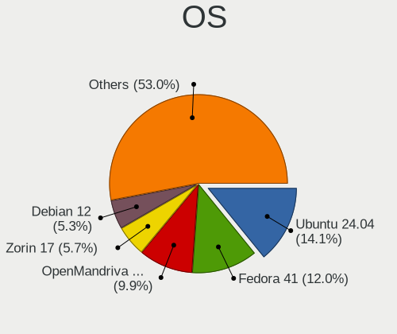
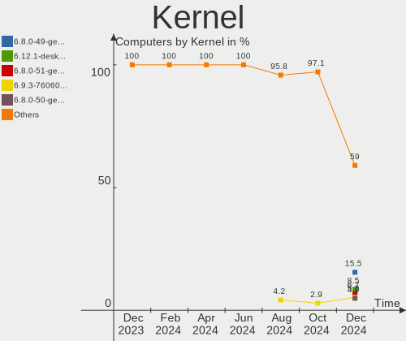
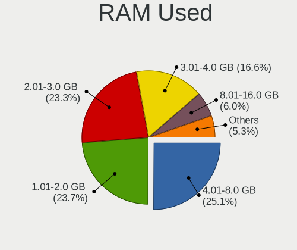
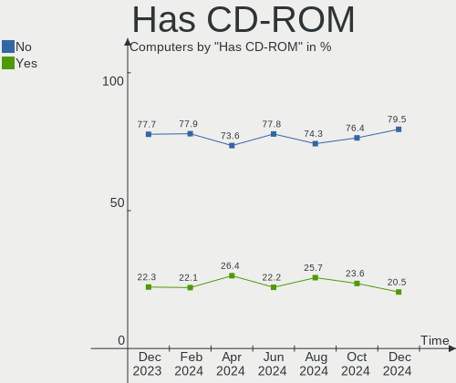
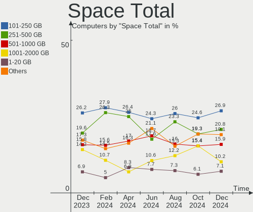
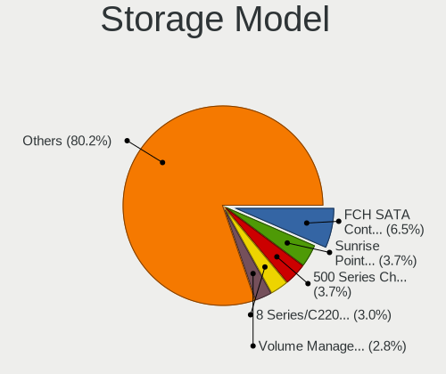
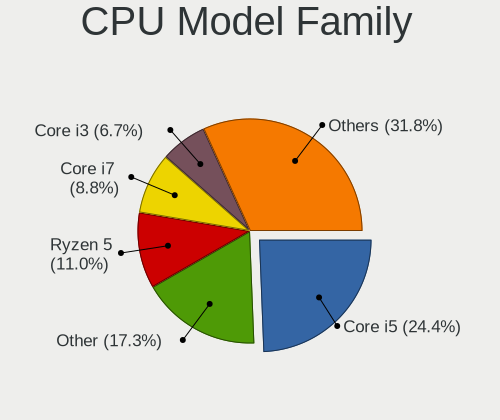
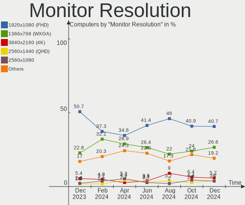
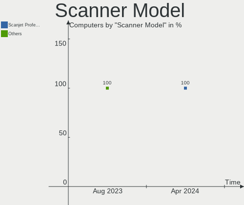

Linux in Brazil - Hardware Trends
---------------------------------

A project to identify most popular hardware characteristics and track their change
over time based on data collected by Linux users at https://Linux-Hardware.org.

Anyone can contribute to this report by the [hw-probe](https://github.com/linuxhw/hw-probe) tool:

    sudo -E hw-probe -all -upload

This is a report for all computer types. See also reports for [desktops](/Location/Brazil/Desktop/README.md) and [notebooks](/Location/Brazil/Notebook/README.md).

Period: Oct, 2022.

Contents
--------

* [ System ](#system)
  - [ OS                       ](#os)
  - [ OS Family                ](#os-family)
  - [ Kernel                   ](#kernel)
  - [ Kernel Family            ](#kernel-family)
  - [ Kernel Major Ver.        ](#kernel-major-ver)
  - [ Arch                     ](#arch)
  - [ DE                       ](#de)
  - [ Display Server           ](#display-server)
  - [ Display Manager          ](#display-manager)
  - [ OS Lang                  ](#os-lang)
  - [ Boot Mode                ](#boot-mode)
  - [ Filesystem               ](#filesystem)
  - [ Part. scheme             ](#part-scheme)
  - [ Dual Boot with Linux/BSD ](#dual-boot-with-linuxbsd)
  - [ Dual Boot (Win)          ](#dual-boot-win)

* [ Board ](#board)
  - [ Vendor                   ](#vendor)
  - [ Model                    ](#model)
  - [ Model Family             ](#model-family)
  - [ MFG Year                 ](#mfg-year)
  - [ Form Factor              ](#form-factor)
  - [ Secure Boot              ](#secure-boot)
  - [ Coreboot                 ](#coreboot)
  - [ RAM Size                 ](#ram-size)
  - [ RAM Used                 ](#ram-used)
  - [ Total Drives             ](#total-drives)
  - [ Has CD-ROM               ](#has-cd-rom)
  - [ Has Ethernet             ](#has-ethernet)
  - [ Has WiFi                 ](#has-wifi)
  - [ Has Bluetooth            ](#has-bluetooth)

* [ Location ](#location)
  - [ Country                  ](#country)
  - [ City                     ](#city)

* [ Drives ](#drives)
  - [ Drive Vendor             ](#drive-vendor)
  - [ Drive Model              ](#drive-model)
  - [ HDD Vendor               ](#hdd-vendor)
  - [ SSD Vendor               ](#ssd-vendor)
  - [ Drive Kind               ](#drive-kind)
  - [ Drive Connector          ](#drive-connector)
  - [ Drive Size               ](#drive-size)
  - [ Space Total              ](#space-total)
  - [ Space Used               ](#space-used)
  - [ Malfunc. Drives          ](#malfunc-drives)
  - [ Malfunc. Drive Vendor    ](#malfunc-drive-vendor)
  - [ Malfunc. HDD Vendor      ](#malfunc-hdd-vendor)
  - [ Malfunc. Drive Kind      ](#malfunc-drive-kind)
  - [ Failed Drives            ](#failed-drives)
  - [ Failed Drive Vendor      ](#failed-drive-vendor)
  - [ Drive Status             ](#drive-status)

* [ Storage controller ](#storage-controller)
  - [ Storage Vendor           ](#storage-vendor)
  - [ Storage Model            ](#storage-model)
  - [ Storage Kind             ](#storage-kind)

* [ Processor ](#processor)
  - [ CPU Vendor               ](#cpu-vendor)
  - [ CPU Model                ](#cpu-model)
  - [ CPU Model Family         ](#cpu-model-family)
  - [ CPU Cores                ](#cpu-cores)
  - [ CPU Sockets              ](#cpu-sockets)
  - [ CPU Threads              ](#cpu-threads)
  - [ CPU Op-Modes             ](#cpu-op-modes)
  - [ CPU Microcode            ](#cpu-microcode)
  - [ CPU Microarch            ](#cpu-microarch)

* [ Graphics ](#graphics)
  - [ GPU Vendor               ](#gpu-vendor)
  - [ GPU Model                ](#gpu-model)
  - [ GPU Combo                ](#gpu-combo)
  - [ GPU Driver               ](#gpu-driver)
  - [ GPU Memory               ](#gpu-memory)

* [ Monitor ](#monitor)
  - [ Monitor Vendor           ](#monitor-vendor)
  - [ Monitor Model            ](#monitor-model)
  - [ Monitor Resolution       ](#monitor-resolution)
  - [ Monitor Diagonal         ](#monitor-diagonal)
  - [ Monitor Width            ](#monitor-width)
  - [ Aspect Ratio             ](#aspect-ratio)
  - [ Monitor Area             ](#monitor-area)
  - [ Pixel Density            ](#pixel-density)
  - [ Multiple Monitors        ](#multiple-monitors)

* [ Network ](#network)
  - [ Net Controller Vendor    ](#net-controller-vendor)
  - [ Net Controller Model     ](#net-controller-model)
  - [ Wireless Vendor          ](#wireless-vendor)
  - [ Wireless Model           ](#wireless-model)
  - [ Ethernet Vendor          ](#ethernet-vendor)
  - [ Ethernet Model           ](#ethernet-model)
  - [ Net Controller Kind      ](#net-controller-kind)
  - [ Used Controller          ](#used-controller)
  - [ NICs                     ](#nics)
  - [ IPv6                     ](#ipv6)

* [ Bluetooth ](#bluetooth)
  - [ Bluetooth Vendor         ](#bluetooth-vendor)
  - [ Bluetooth Model          ](#bluetooth-model)

* [ Sound ](#sound)
  - [ Sound Vendor             ](#sound-vendor)
  - [ Sound Model              ](#sound-model)

* [ Memory ](#memory)
  - [ Memory Vendor            ](#memory-vendor)
  - [ Memory Model             ](#memory-model)
  - [ Memory Kind              ](#memory-kind)
  - [ Memory Form Factor       ](#memory-form-factor)
  - [ Memory Size              ](#memory-size)
  - [ Memory Speed             ](#memory-speed)

* [ Printers & scanners ](#printers--scanners)
  - [ Printer Vendor           ](#printer-vendor)
  - [ Printer Model            ](#printer-model)
  - [ Scanner Vendor           ](#scanner-vendor)
  - [ Scanner Model            ](#scanner-model)

* [ Camera ](#camera)
  - [ Camera Vendor            ](#camera-vendor)
  - [ Camera Model             ](#camera-model)

* [ Security ](#security)
  - [ Fingerprint Vendor       ](#fingerprint-vendor)
  - [ Fingerprint Model        ](#fingerprint-model)
  - [ Chipcard Vendor          ](#chipcard-vendor)
  - [ Chipcard Model           ](#chipcard-model)

* [ Unsupported ](#unsupported)
  - [ Unsupported Devices      ](#unsupported-devices)
  - [ Unsupported Device Types ](#unsupported-device-types)

System
------

OS
--

Installed operating systems

| Name                         | Computers | Percent |
|------------------------------|-----------|---------|
| Ubuntu 22.04                 | 44        | 17.89%  |
| Linux Mint 21                | 21        | 8.54%   |
| Pop!_OS 22.04                | 20        | 8.13%   |
| OpenMandriva 4.3             | 20        | 8.13%   |
| Fedora 36                    | 13        | 5.28%   |
| Debian 11                    | 12        | 4.88%   |
| Arch Rolling                 | 12        | 4.88%   |
| Zorin 16                     | 8         | 3.25%   |
| Manjaro                      | 8         | 3.25%   |
| KDE neon 22.04               | 8         | 3.25%   |
| KDE neon 20.04               | 7         | 2.85%   |
| Linux Mint 20.3              | 6         | 2.44%   |
| OpenMandriva 4.50            | 5         | 2.03%   |
| Ubuntu 20.04                 | 4         | 1.63%   |
| Fedora 37                    | 4         | 1.63%   |
| openSUSE Tumbleweed-XXXXXXXX | 3         | 1.22%   |
| Nobara 36                    | 3         | 1.22%   |
| Kubuntu 22.04                | 3         | 1.22%   |
| Endless 4.0.9                | 3         | 1.22%   |
| Endless 4.0.10               | 3         | 1.22%   |
| Linux Mint 19.3              | 2         | 0.81%   |
| Gentoo 2.9                   | 2         | 0.81%   |
| EndeavourOS Rolling          | 2         | 0.81%   |
| Xubuntu 22.10                | 1         | 0.41%   |
| Xubuntu 22.04                | 1         | 0.41%   |
| Xubuntu 20.10                | 1         | 0.41%   |
| Xubuntu 20.04                | 1         | 0.41%   |
| Ubuntu Unity 22.04           | 1         | 0.41%   |
| Ubuntu Unity 18.04           | 1         | 0.41%   |
| Ubuntu MATE 22.04            | 1         | 0.41%   |
| Ubuntu MATE 20.04            | 1         | 0.41%   |
| Ubuntu Budgie 22.04          | 1         | 0.41%   |
| Ubuntu 22.10                 | 1         | 0.41%   |
| RHEL 9                       | 1         | 0.41%   |
| Raspbian 11                  | 1         | 0.41%   |
| Parrot 4.11                  | 1         | 0.41%   |
| OpenMandriva 4.90            | 1         | 0.41%   |
| Manjaro 22.0.0               | 1         | 0.41%   |
| Lubuntu 22.10                | 1         | 0.41%   |
| Lubuntu 22.04                | 1         | 0.41%   |

OS Family
---------

OS without a version

| Name          | Computers | Percent |
|---------------|-----------|---------|
| Ubuntu        | 49        | 19.92%  |
| Linux Mint    | 31        | 12.6%   |
| OpenMandriva  | 26        | 10.57%  |
| Pop!_OS       | 20        | 8.13%   |
| Fedora        | 17        | 6.91%   |
| KDE neon      | 15        | 6.1%    |
| Debian        | 14        | 5.69%   |
| Arch          | 12        | 4.88%   |
| Manjaro       | 9         | 3.66%   |
| Zorin         | 8         | 3.25%   |
| Endless       | 7         | 2.85%   |
| Xubuntu       | 4         | 1.63%   |
| Kubuntu       | 4         | 1.63%   |
| openSUSE      | 3         | 1.22%   |
| Nobara        | 3         | 1.22%   |
| Ubuntu Unity  | 2         | 0.81%   |
| Ubuntu MATE   | 2         | 0.81%   |
| Lubuntu       | 2         | 0.81%   |
| Gentoo        | 2         | 0.81%   |
| EndeavourOS   | 2         | 0.81%   |
| Amarok Linux  | 2         | 0.81%   |
| Ubuntu Budgie | 1         | 0.41%   |
| RHEL          | 1         | 0.41%   |
| Raspbian      | 1         | 0.41%   |
| Parrot        | 1         | 0.41%   |
| LMDE          | 1         | 0.41%   |
| Kali          | 1         | 0.41%   |
| Kaisen        | 1         | 0.41%   |
| Feren OS      | 1         | 0.41%   |
| Elementary    | 1         | 0.41%   |
| Clear Linux   | 1         | 0.41%   |
| BigLinux      | 1         | 0.41%   |
| Alpine        | 1         | 0.41%   |

Kernel
------

Version of the Linux kernel

| Version                       | Computers | Percent |
|-------------------------------|-----------|---------|
| 5.15.0-48-generic             | 30        | 12.2%   |
| 5.15.0-52-generic             | 23        | 9.35%   |
| 5.15.0-50-generic             | 21        | 8.54%   |
| 5.16.7-desktop-1omv4003       | 20        | 8.13%   |
| 5.19.0-76051900-generic       | 8         | 3.25%   |
| 5.19.16-76051916-generic      | 7         | 2.85%   |
| 5.10.0-18-amd64               | 7         | 2.85%   |
| 5.15.0-25-generic             | 6         | 2.44%   |
| 5.11.0-35-generic             | 6         | 2.44%   |
| 5.19.5-desktop-1omv4090       | 5         | 2.03%   |
| 6.0.2-76060002-generic        | 4         | 1.63%   |
| 5.19.13-arch1-1               | 4         | 1.63%   |
| 5.15.0-43-generic             | 4         | 1.63%   |
| 5.15.0-41-generic             | 4         | 1.63%   |
| 6.0.5-200.fc36.x86_64         | 3         | 1.22%   |
| 5.4.0-131-generic             | 3         | 1.22%   |
| 5.19.13-300.fc37.x86_64       | 3         | 1.22%   |
| 5.19.12-200.fc36.x86_64       | 3         | 1.22%   |
| 5.15.74-3-MANJARO             | 3         | 1.22%   |
| 5.13.0-30-generic             | 3         | 1.22%   |
| 5.10.0-19-amd64               | 3         | 1.22%   |
| 6.0.3-1-default               | 2         | 0.81%   |
| 5.4.0-91-generic              | 2         | 0.81%   |
| 5.19.16-200.fc36.x86_64       | 2         | 0.81%   |
| 5.19.14-201.fsync.fc36.x86_64 | 2         | 0.81%   |
| 5.19.13-200.fc36.x86_64       | 2         | 0.81%   |
| 5.19.12-arch1-1               | 2         | 0.81%   |
| 5.19.0-21-generic             | 2         | 0.81%   |
| 5.15.74-1-lts                 | 2         | 0.81%   |
| 5.15.65-1-MANJARO             | 2         | 0.81%   |
| 6.1.0-rc1                     | 1         | 0.41%   |
| 6.0.6-arch1-1                 | 1         | 0.41%   |
| 6.0.3-x64v1-xanmod1           | 1         | 0.41%   |
| 6.0.2-x64v2-xanmod1           | 1         | 0.41%   |
| 6.0.2-WorkStation-x86_64      | 1         | 0.41%   |
| 6.0.0-desktop-1omv4090        | 1         | 0.41%   |
| 6.0.0-arch1-1                 | 1         | 0.41%   |
| 6.0.0-2-amd64                 | 1         | 0.41%   |
| 6.0.0-1-MANJARO               | 1         | 0.41%   |
| 6.0.0-1-default               | 1         | 0.41%   |

Kernel Family
-------------

Linux kernel without a distro release

| Version  | Computers | Percent |
|----------|-----------|---------|
| 5.15.0   | 91        | 36.99%  |
| 5.16.7   | 20        | 8.13%   |
| 5.19.0   | 14        | 5.69%   |
| 5.10.0   | 12        | 4.88%   |
| 5.4.0    | 11        | 4.47%   |
| 5.19.13  | 11        | 4.47%   |
| 5.19.16  | 9         | 3.66%   |
| 6.0.2    | 6         | 2.44%   |
| 6.0.0    | 6         | 2.44%   |
| 5.19.12  | 6         | 2.44%   |
| 5.15.74  | 6         | 2.44%   |
| 5.13.0   | 6         | 2.44%   |
| 5.11.0   | 6         | 2.44%   |
| 5.19.5   | 5         | 2.03%   |
| 6.0.5    | 3         | 1.22%   |
| 6.0.3    | 3         | 1.22%   |
| 5.19.14  | 3         | 1.22%   |
| 5.15.73  | 3         | 1.22%   |
| 5.14.0   | 3         | 1.22%   |
| 5.15.65  | 2         | 0.81%   |
| 4.15.0   | 2         | 0.81%   |
| 6.1.0    | 1         | 0.41%   |
| 6.0.6    | 1         | 0.41%   |
| 6.0      | 1         | 0.41%   |
| 5.8.0    | 1         | 0.41%   |
| 5.19.15  | 1         | 0.41%   |
| 5.18.16  | 1         | 0.41%   |
| 5.18.12  | 1         | 0.41%   |
| 5.18.0   | 1         | 0.41%   |
| 5.17.0   | 1         | 0.41%   |
| 5.16.13  | 1         | 0.41%   |
| 5.15.72  | 1         | 0.41%   |
| 5.15.71  | 1         | 0.41%   |
| 5.15.70  | 1         | 0.41%   |
| 5.15.61  | 1         | 0.41%   |
| 5.15.60  | 1         | 0.41%   |
| 5.10.142 | 1         | 0.41%   |
| 5.10.141 | 1         | 0.41%   |
| 5.0.0    | 1         | 0.41%   |

Kernel Major Ver.
-----------------

Linux kernel major version

| Version | Computers | Percent |
|---------|-----------|---------|
| 5.15    | 107       | 43.5%   |
| 5.19    | 49        | 19.92%  |
| 5.16    | 21        | 8.54%   |
| 6.0     | 19        | 7.72%   |
| 5.10    | 14        | 5.69%   |
| 5.4     | 11        | 4.47%   |
| 5.13    | 6         | 2.44%   |
| 5.11    | 6         | 2.44%   |
| 5.18    | 3         | 1.22%   |
| 5.14    | 3         | 1.22%   |
| 4.15    | 2         | 0.81%   |
| 6.1     | 1         | 0.41%   |
| 6       | 1         | 0.41%   |
| 5.8     | 1         | 0.41%   |
| 5.17    | 1         | 0.41%   |
| 5.0     | 1         | 0.41%   |

Arch
----

OS architecture (x86_64, i586, etc.)

| Name    | Computers | Percent |
|---------|-----------|---------|
| x86_64  | 238       | 96.75%  |
| aarch64 | 4         | 1.63%   |
| i686    | 3         | 1.22%   |
| armv7l  | 1         | 0.41%   |

DE
--

Desktop Environment

| Name          | Computers | Percent |
|---------------|-----------|---------|
| GNOME         | 116       | 47.15%  |
| KDE5          | 58        | 23.58%  |
| X-Cinnamon    | 24        | 9.76%   |
| XFCE          | 17        | 6.91%   |
| Unknown       | 11        | 4.47%   |
| MATE          | 8         | 3.25%   |
| LXQt          | 4         | 1.63%   |
| Unity         | 2         | 0.81%   |
| Cinnamon      | 2         | 0.81%   |
| Pantheon      | 1         | 0.41%   |
| LXDE          | 1         | 0.41%   |
| GNOME Classic | 1         | 0.41%   |
| Budgie        | 1         | 0.41%   |

Display Server
--------------

X11 or Wayland

| Name    | Computers | Percent |
|---------|-----------|---------|
| X11     | 181       | 73.58%  |
| Wayland | 56        | 22.76%  |
| Tty     | 5         | 2.03%   |
| Unknown | 4         | 1.63%   |

Display Manager
---------------

SDDM, LightDM, etc.

| Name    | Computers | Percent |
|---------|-----------|---------|
| Unknown | 124       | 50.41%  |
| GDM3    | 46        | 18.7%   |
| SDDM    | 38        | 15.45%  |
| LightDM | 24        | 9.76%   |
| GDM     | 14        | 5.69%   |

OS Lang
-------

Language

| Lang    | Computers | Percent |
|---------|-----------|---------|
| pt_BR   | 170       | 69.11%  |
| en_US   | 62        | 25.2%   |
| C       | 7         | 2.85%   |
| en_GB   | 3         | 1.22%   |
| pt_PT   | 1         | 0.41%   |
| it_IT   | 1         | 0.41%   |
| en_AG   | 1         | 0.41%   |
| Unknown | 1         | 0.41%   |

Boot Mode
---------

EFI or BIOS

| Mode | Computers | Percent |
|------|-----------|---------|
| BIOS | 136       | 55.28%  |
| EFI  | 110       | 44.72%  |

Filesystem
----------

Type of filesystem

| Type    | Computers | Percent |
|---------|-----------|---------|
| Ext4    | 172       | 69.92%  |
| Btrfs   | 37        | 15.04%  |
| Overlay | 34        | 13.82%  |
| Xfs     | 2         | 0.81%   |
| Zfs     | 1         | 0.41%   |

Part. scheme
------------

Scheme of partitioning

| Type    | Computers | Percent |
|---------|-----------|---------|
| Unknown | 116       | 47.15%  |
| GPT     | 105       | 42.68%  |
| MBR     | 25        | 10.16%  |

Dual Boot with Linux/BSD
------------------------

Hosting more than one Linux/BSD

| Dual boot | Computers | Percent |
|-----------|-----------|---------|
| No        | 221       | 89.84%  |
| Yes       | 25        | 10.16%  |

Dual Boot (Win)
---------------

Hosting Linux and Windows

| Dual boot | Computers | Percent |
|-----------|-----------|---------|
| No        | 185       | 75.2%   |
| Yes       | 61        | 24.8%   |

Board
-----

Vendor
------

Motherboard manufacturer

| Name                    | Computers | Percent |
|-------------------------|-----------|---------|
| Dell                    | 38        | 15.45%  |
| ASUSTek Computer        | 32        | 13.01%  |
| Lenovo                  | 29        | 11.79%  |
| Acer                    | 27        | 10.98%  |
| Samsung Electronics     | 14        | 5.69%   |
| Gigabyte Technology     | 14        | 5.69%   |
| Positivo                | 10        | 4.07%   |
| Intel                   | 9         | 3.66%   |
| ASRock                  | 9         | 3.66%   |
| Avell High Performance  | 6         | 2.44%   |
| MSI                     | 5         | 2.03%   |
| Hewlett-Packard         | 5         | 2.03%   |
| Unknown                 | 5         | 2.03%   |
| Pegatron                | 4         | 1.63%   |
| Itautec                 | 4         | 1.63%   |
| Semp Toshiba            | 3         | 1.22%   |
| Raspberry Pi Foundation | 3         | 1.22%   |
| LG Electronics          | 3         | 1.22%   |
| Sony                    | 2         | 0.81%   |
| PCWare                  | 2         | 0.81%   |
| OEM                     | 2         | 0.81%   |
| Compaq                  | 2         | 0.81%   |
| Biostar                 | 2         | 0.81%   |
| Teclast                 | 1         | 0.41%   |
| Standard                | 1         | 0.41%   |
| Quanta                  | 1         | 0.41%   |
| QIYIDA                  | 1         | 0.41%   |
| Positivo Bahia - VAIO   | 1         | 0.41%   |
| PINE64                  | 1         | 0.41%   |
| Philco                  | 1         | 0.41%   |
| Notebook                | 1         | 0.41%   |
| Multilaser              | 1         | 0.41%   |
| Microboard              | 1         | 0.41%   |
| MACHINIST               | 1         | 0.41%   |
| Huanan                  | 1         | 0.41%   |
| Digibras                | 1         | 0.41%   |
| Daten Tecnologia        | 1         | 0.41%   |
| Apple                   | 1         | 0.41%   |
| Alienware               | 1         | 0.41%   |

Model
-----

Motherboard model

| Name                                 | Computers | Percent |
|--------------------------------------|-----------|---------|
| Unknown                              | 6         | 2.44%   |
| Acer Nitro AN515-44                  | 5         | 2.03%   |
| Lenovo IdeaPad S145-15IWL 81S9       | 3         | 1.22%   |
| Intel H55                            | 3         | 1.22%   |
| Avell High Performance B.ON          | 3         | 1.22%   |
| ASUS TUF Gaming X570-PLUS_BR         | 3         | 1.22%   |
| Semp Toshiba STI                     | 2         | 0.81%   |
| Samsung 800G5M/800G5W                | 2         | 0.81%   |
| Samsung 550XDA                       | 2         | 0.81%   |
| Samsung 340XAA/350XAA/550XAA         | 2         | 0.81%   |
| Positivo Mobile                      | 2         | 0.81%   |
| OEM G41 775 ICH7 8712                | 2         | 0.81%   |
| Lenovo IdeaPad 330-15IKB 81FE        | 2         | 0.81%   |
| Lenovo G400s VILG1                   | 2         | 0.81%   |
| Lenovo B40-70 80F3                   | 2         | 0.81%   |
| Intel B75                            | 2         | 0.81%   |
| Gigabyte B450M DS3H                  | 2         | 0.81%   |
| Dell Inspiron 7520                   | 2         | 0.81%   |
| Dell Inspiron 5590                   | 2         | 0.81%   |
| Dell Inspiron 3542                   | 2         | 0.81%   |
| ASUS VivoBook 15_ASUS Laptop X540UAR | 2         | 0.81%   |
| ASUS PRIME B450M-GAMING/BR           | 2         | 0.81%   |
| ASRock H81M-HG4 R4.0                 | 2         | 0.81%   |
| ASRock B450M Steel Legend            | 2         | 0.81%   |
| Acer Aspire A315-53                  | 2         | 0.81%   |
| Acer Aspire 5750                     | 2         | 0.81%   |
| Teclast F7 Plus                      | 1         | 0.41%   |
| Standard MB40II                      | 1         | 0.41%   |
| Sony VPCEA23FB                       | 1         | 0.41%   |
| Sony VPCCA15FX                       | 1         | 0.41%   |
| Semp Toshiba K201                    | 1         | 0.41%   |
| Samsung 930QDB                       | 1         | 0.41%   |
| Samsung 760XBE                       | 1         | 0.41%   |
| Samsung 670Z5E                       | 1         | 0.41%   |
| Samsung 550XBE/350XBE                | 1         | 0.41%   |
| Samsung 300E5M/300E5L                | 1         | 0.41%   |
| Samsung 275E4E/275E5E                | 1         | 0.41%   |
| Samsung 270E5K/270E5Q/271E5K/2570EK  | 1         | 0.41%   |
| Samsung 270E5J/2570EJ                | 1         | 0.41%   |
| RPi Raspberry Pi 4 Model B Rev 1.4   | 1         | 0.41%   |

Model Family
------------

Motherboard model prefix

| Name                        | Computers | Percent |
|-----------------------------|-----------|---------|
| Dell Inspiron               | 18        | 7.32%   |
| Acer Aspire                 | 18        | 7.32%   |
| Lenovo IdeaPad              | 13        | 5.28%   |
| ASUS PRIME                  | 9         | 3.66%   |
| Acer Nitro                  | 7         | 2.85%   |
| Dell Vostro                 | 6         | 2.44%   |
| ASUS TUF                    | 6         | 2.44%   |
| Unknown                     | 6         | 2.44%   |
| Dell Latitude               | 5         | 2.03%   |
| Itautec Infoway             | 4         | 1.63%   |
| RPi Raspberry               | 3         | 1.22%   |
| Intel H55                   | 3         | 1.22%   |
| Gigabyte B450M              | 3         | 1.22%   |
| Dell XPS                    | 3         | 1.22%   |
| Avell High Performance B.ON | 3         | 1.22%   |
| ASUS VivoBook               | 3         | 1.22%   |
| ASUS M5A78L-M               | 3         | 1.22%   |
| Semp Toshiba STI            | 2         | 0.81%   |
| Samsung 800G5M              | 2         | 0.81%   |
| Samsung 550XDA              | 2         | 0.81%   |
| Samsung 340XAA              | 2         | 0.81%   |
| Positivo Mobile             | 2         | 0.81%   |
| OEM G41                     | 2         | 0.81%   |
| Lenovo ThinkPad             | 2         | 0.81%   |
| Lenovo ThinkCentre          | 2         | 0.81%   |
| Lenovo Legion               | 2         | 0.81%   |
| Lenovo G480                 | 2         | 0.81%   |
| Lenovo G400s                | 2         | 0.81%   |
| Lenovo B40-70               | 2         | 0.81%   |
| Intel B75                   | 2         | 0.81%   |
| Dell Precision              | 2         | 0.81%   |
| Dell OptiPlex               | 2         | 0.81%   |
| ASUS ROG                    | 2         | 0.81%   |
| ASRock H81M-HG4             | 2         | 0.81%   |
| ASRock B450M                | 2         | 0.81%   |
| Teclast F7                  | 1         | 0.41%   |
| Standard MB40II             | 1         | 0.41%   |
| Sony VPCEA23FB              | 1         | 0.41%   |
| Sony VPCCA15FX              | 1         | 0.41%   |
| Semp Toshiba K201           | 1         | 0.41%   |

MFG Year
--------

Motherboard manufacture year

| Year    | Computers | Percent |
|---------|-----------|---------|
| 2019    | 32        | 13.01%  |
| 2021    | 29        | 11.79%  |
| 2018    | 26        | 10.57%  |
| 2020    | 24        | 9.76%   |
| 2012    | 20        | 8.13%   |
| 2017    | 17        | 6.91%   |
| 2013    | 17        | 6.91%   |
| 2016    | 15        | 6.1%    |
| 2014    | 12        | 4.88%   |
| 2011    | 12        | 4.88%   |
| 2010    | 10        | 4.07%   |
| 2009    | 10        | 4.07%   |
| 2015    | 8         | 3.25%   |
| 2008    | 5         | 2.03%   |
| 2022    | 4         | 1.63%   |
| Unknown | 4         | 1.63%   |
| 2006    | 1         | 0.41%   |

Form Factor
-----------

Physical design of the computer

| Name           | Computers | Percent |
|----------------|-----------|---------|
| Notebook       | 143       | 58.13%  |
| Desktop        | 93        | 37.8%   |
| System on chip | 5         | 2.03%   |
| All in one     | 3         | 1.22%   |
| Convertible    | 1         | 0.41%   |
| Server         | 1         | 0.41%   |

Secure Boot
-----------

Enabled or disabled

| State    | Computers | Percent |
|----------|-----------|---------|
| Disabled | 226       | 91.87%  |
| Enabled  | 20        | 8.13%   |

Coreboot
--------

Have coreboot on board

| Used | Computers | Percent |
|------|-----------|---------|
| No   | 246       | 100%    |

RAM Size
--------

Total RAM memory

| Size in GB  | Computers | Percent |
|-------------|-----------|---------|
| 4.01-8.0    | 66        | 26.83%  |
| 3.01-4.0    | 55        | 22.36%  |
| 16.01-24.0  | 50        | 20.33%  |
| 8.01-16.0   | 39        | 15.85%  |
| 32.01-64.0  | 15        | 6.1%    |
| 1.01-2.0    | 7         | 2.85%   |
| 24.01-32.0  | 5         | 2.03%   |
| 64.01-256.0 | 5         | 2.03%   |
| 2.01-3.0    | 3         | 1.22%   |
| 0.51-1.0    | 1         | 0.41%   |

RAM Used
--------

Used RAM memory

| Used GB   | Computers | Percent |
|-----------|-----------|---------|
| 1.01-2.0  | 89        | 36.18%  |
| 2.01-3.0  | 63        | 25.61%  |
| 4.01-8.0  | 40        | 16.26%  |
| 3.01-4.0  | 32        | 13.01%  |
| 0.51-1.0  | 11        | 4.47%   |
| 8.01-16.0 | 7         | 2.85%   |
| 0.01-0.5  | 4         | 1.63%   |

Total Drives
------------

Number of drives on board

| Drives | Computers | Percent |
|--------|-----------|---------|
| 1      | 148       | 60.16%  |
| 2      | 62        | 25.2%   |
| 3      | 17        | 6.91%   |
| 4      | 9         | 3.66%   |
| 5      | 5         | 2.03%   |
| 0      | 3         | 1.22%   |
| 6      | 2         | 0.81%   |

Has CD-ROM
----------

Has CD-ROM on board

| Presented | Computers | Percent |
|-----------|-----------|---------|
| No        | 186       | 75.61%  |
| Yes       | 60        | 24.39%  |

Has Ethernet
------------

Has Ethernet on board

| Presented | Computers | Percent |
|-----------|-----------|---------|
| Yes       | 213       | 86.59%  |
| No        | 33        | 13.41%  |

Has WiFi
--------

Has WiFi module

| Presented | Computers | Percent |
|-----------|-----------|---------|
| Yes       | 178       | 72.36%  |
| No        | 68        | 27.64%  |

Has Bluetooth
-------------

Has Bluetooth module

| Presented | Computers | Percent |
|-----------|-----------|---------|
| Yes       | 145       | 58.94%  |
| No        | 101       | 41.06%  |

Location
--------

Country
-------

Geographic location (country)

| Country | Computers | Percent |
|---------|-----------|---------|
| Brazil  | 246       | 100%    |

City
----

Geographic location (city)

| City                  | Computers | Percent |
|-----------------------|-----------|---------|
| Sao Paulo             | 37        | 15.04%  |
| Rio de Janeiro        | 18        | 7.32%   |
| Belo Horizonte        | 13        | 5.28%   |
| Porto Alegre          | 7         | 2.85%   |
| Curitiba              | 7         | 2.85%   |
| Natal                 | 6         | 2.44%   |
| Fortaleza             | 6         | 2.44%   |
| Campinas              | 6         | 2.44%   |
| Brasília             | 6         | 2.44%   |
| Goiânia              | 5         | 2.03%   |
| Uberlândia           | 4         | 1.63%   |
| Santo André          | 3         | 1.22%   |
| Recife                | 3         | 1.22%   |
| Niterói              | 3         | 1.22%   |
| Maracanau             | 3         | 1.22%   |
| Maceió               | 3         | 1.22%   |
| Juiz de Fora          | 3         | 1.22%   |
| Joao Pessoa           | 3         | 1.22%   |
| Campo Grande          | 3         | 1.22%   |
| Botucatu              | 3         | 1.22%   |
| Sorocaba              | 2         | 0.81%   |
| Sao Luís             | 2         | 0.81%   |
| Salvador              | 2         | 0.81%   |
| Ribeirao Preto        | 2         | 0.81%   |
| Nova Iguaçu          | 2         | 0.81%   |
| Mirassol              | 2         | 0.81%   |
| Londrina              | 2         | 0.81%   |
| Caraguatatuba         | 2         | 0.81%   |
| Boa Viagem            | 2         | 0.81%   |
| Betim                 | 2         | 0.81%   |
| Aracaju               | 2         | 0.81%   |
| Vitória da Conquista | 1         | 0.41%   |
| Viamao                | 1         | 0.41%   |
| Varzelandia           | 1         | 0.41%   |
| Valinhos              | 1         | 0.41%   |
| Turvo                 | 1         | 0.41%   |
| Tubarao               | 1         | 0.41%   |
| Teresopolis           | 1         | 0.41%   |
| Sorriso               | 1         | 0.41%   |
| Sao Roque             | 1         | 0.41%   |

Drives
------

Drive Vendor
------------

Hard drive vendors

| Vendor                         | Computers | Drives | Percent |
|--------------------------------|-----------|--------|---------|
| WDC                            | 63        | 67     | 17.45%  |
| Seagate                        | 55        | 66     | 15.24%  |
| Kingston                       | 38        | 41     | 10.53%  |
| Samsung Electronics            | 25        | 31     | 6.93%   |
| SanDisk                        | 23        | 25     | 6.37%   |
| A-DATA Technology              | 20        | 20     | 5.54%   |
| China                          | 17        | 17     | 4.71%   |
| Toshiba                        | 14        | 17     | 3.88%   |
| Unknown                        | 11        | 13     | 3.05%   |
| Hitachi                        | 9         | 10     | 2.49%   |
| Silicon Motion                 | 6         | 6      | 1.66%   |
| Crucial                        | 6         | 6      | 1.66%   |
| ADATA Technology               | 6         | 7      | 1.66%   |
| LITEON                         | 4         | 4      | 1.11%   |
| KingSpec                       | 4         | 5      | 1.11%   |
| SK hynix                       | 3         | 3      | 0.83%   |
| Realtek Semiconductor          | 3         | 3      | 0.83%   |
| Phison Electronics             | 3         | 3      | 0.83%   |
| Unknown                        | 3         | 3      | 0.83%   |
| XrayDisk                       | 2         | 2      | 0.55%   |
| walram                         | 2         | 2      | 0.55%   |
| Team                           | 2         | 2      | 0.55%   |
| Solid State Storage            | 2         | 2      | 0.55%   |
| SAGE                           | 2         | 2      | 0.55%   |
| PNY                            | 2         | 2      | 0.55%   |
| Netac                          | 2         | 2      | 0.55%   |
| Micron Technology              | 2         | 2      | 0.55%   |
| Lexar                          | 2         | 2      | 0.55%   |
| KIOXIA                         | 2         | 2      | 0.55%   |
| Kingston Technology Company    | 2         | 2      | 0.55%   |
| JMicron Technology             | 2         | 2      | 0.55%   |
| Intel                          | 2         | 2      | 0.55%   |
| Apple                          | 2         | 2      | 0.55%   |
| XPG                            | 1         | 1      | 0.28%   |
| Win Memory                     | 1         | 1      | 0.28%   |
| Solid State Storage Technology | 1         | 1      | 0.28%   |
| Smart                          | 1         | 1      | 0.28%   |
| ShiJi                          | 1         | 1      | 0.28%   |
| Patriot                        | 1         | 1      | 0.28%   |
| Micron/Crucial Technology      | 1         | 1      | 0.28%   |

Drive Model
-----------

Hard drive models

| Model                                                           | Computers | Percent |
|-----------------------------------------------------------------|-----------|---------|
| Kingston SA400S37240G 240GB SSD                                 | 13        | 3.4%    |
| Kingston SA400S37480G 480GB SSD                                 | 9         | 2.36%   |
| Seagate ST1000LM035-1RK172 1TB                                  | 7         | 1.83%   |
| WDC WD10SPZX-24Z10 1TB                                          | 6         | 1.57%   |
| WDC WD10SPZX-21Z10T0 1TB                                        | 6         | 1.57%   |
| Kingston SV300S37A120G 120GB SSD                                | 6         | 1.57%   |
| WDC WD10JPVX-22JC3T0 1TB                                        | 5         | 1.31%   |
| Sandisk WD Blue SN550 NVMe SSD 1TB                              | 5         | 1.31%   |
| China SSD 128GB                                                 | 5         | 1.31%   |
| Unknown MMC Card  32GB                                          | 4         | 1.05%   |
| Silicon Motion SM2263EN/SM2263XT SSD Controller 256GB           | 4         | 1.05%   |
| Seagate ST9500325AS 500GB                                       | 4         | 1.05%   |
| Seagate ST500LM012 HN-M500MBB 500GB                             | 4         | 1.05%   |
| SanDisk SSD PLUS 480GB                                          | 4         | 1.05%   |
| Samsung NVMe SSD Controller SM981/PM981/PM983 500GB             | 4         | 1.05%   |
| Kingston SA400S37960G 960GB SSD                                 | 4         | 1.05%   |
| China SSD 240GB                                                 | 4         | 1.05%   |
| ADATA XPG SX8200 Pro PCIe Gen3x4 M.2 2280 Solid State Drive 1TB | 4         | 1.05%   |
| A-DATA IM2P33F8A-512GD 512GB                                    | 4         | 1.05%   |
| Seagate ST3500414CS 500GB                                       | 3         | 0.79%   |
| Seagate ST1000DM010-2EP102 1TB                                  | 3         | 0.79%   |
| Samsung HD322HJ 320GB                                           | 3         | 0.79%   |
| Kingston SA400S37120G 120GB SSD                                 | 3         | 0.79%   |
| A-DATA IM2P33F3A NVMe 256GB                                     | 3         | 0.79%   |
| Unknown                                                         | 3         | 0.79%   |
| WDC WDS240G2G0B-00EPW0 240GB SSD                                | 2         | 0.52%   |
| WDC WDS240G2G0A-00JH30 240GB SSD                                | 2         | 0.52%   |
| WDC WD10SPZX-80Z10T2 1TB                                        | 2         | 0.52%   |
| WDC WD10SPZX-35Z10T0 1TB                                        | 2         | 0.52%   |
| WDC WD10JPVX-75JC3T0 1TB                                        | 2         | 0.52%   |
| WDC WD10JPCX-24UE4T0 1TB                                        | 2         | 0.52%   |
| WDC WD10EZEX-08WN4A0 1TB                                        | 2         | 0.52%   |
| WDC WD10EZEX-00BN5A0 1TB                                        | 2         | 0.52%   |
| Unknown SD/MMC/MS PRO 1TB                                       | 2         | 0.52%   |
| Toshiba MQ01ABF050 500GB                                        | 2         | 0.52%   |
| Toshiba MQ01ABD100 1TB                                          | 2         | 0.52%   |
| Toshiba DT01ACA050 500GB                                        | 2         | 0.52%   |
| Solid State Storage SSSTC CL1-4D256 256GB                       | 2         | 0.52%   |
| Seagate ST500LT012-9WS142 500GB                                 | 2         | 0.52%   |
| Seagate ST500LM021-1KJ152 500GB                                 | 2         | 0.52%   |

HDD Vendor
----------

Hard disk drive vendors

| Vendor              | Computers | Drives | Percent |
|---------------------|-----------|--------|---------|
| WDC                 | 55        | 57     | 36.67%  |
| Seagate             | 54        | 64     | 36%     |
| Toshiba             | 13        | 14     | 8.67%   |
| Samsung Electronics | 11        | 12     | 7.33%   |
| Hitachi             | 9         | 10     | 6%      |
| Unknown             | 2         | 2      | 1.33%   |
| SAGE                | 2         | 2      | 1.33%   |
| Initio              | 1         | 1      | 0.67%   |
| HGST                | 1         | 1      | 0.67%   |
| Fujitsu             | 1         | 1      | 0.67%   |
| Apple               | 1         | 1      | 0.67%   |

SSD Vendor
----------

Solid state drive vendors

| Vendor              | Computers | Drives | Percent |
|---------------------|-----------|--------|---------|
| Kingston            | 35        | 37     | 29.41%  |
| China               | 17        | 17     | 14.29%  |
| SanDisk             | 14        | 15     | 11.76%  |
| WDC                 | 7         | 7      | 5.88%   |
| Samsung Electronics | 6         | 9      | 5.04%   |
| Crucial             | 5         | 5      | 4.2%    |
| LITEON              | 4         | 4      | 3.36%   |
| KingSpec            | 4         | 5      | 3.36%   |
| A-DATA Technology   | 4         | 4      | 3.36%   |
| Team                | 2         | 2      | 1.68%   |
| PNY                 | 2         | 2      | 1.68%   |
| Netac               | 2         | 2      | 1.68%   |
| Lexar               | 2         | 2      | 1.68%   |
| XrayDisk            | 1         | 1      | 0.84%   |
| Win Memory          | 1         | 1      | 0.84%   |
| walram              | 1         | 1      | 0.84%   |
| Smart               | 1         | 1      | 0.84%   |
| Seagate             | 1         | 1      | 0.84%   |
| Patriot             | 1         | 1      | 0.84%   |
| Maxtor              | 1         | 1      | 0.84%   |
| MaxDigital          | 1         | 1      | 0.84%   |
| Intel               | 1         | 1      | 0.84%   |
| HUSKY               | 1         | 1      | 0.84%   |
| HS-SSD-E100N        | 1         | 1      | 0.84%   |
| Gigabyte Technology | 1         | 1      | 0.84%   |
| EXBOM               | 1         | 1      | 0.84%   |
| Argon               | 1         | 1      | 0.84%   |
| Apple               | 1         | 1      | 0.84%   |

Drive Kind
----------

HDD or SSD

| Kind    | Computers | Drives | Percent |
|---------|-----------|--------|---------|
| HDD     | 132       | 165    | 40.24%  |
| SSD     | 109       | 126    | 33.23%  |
| NVMe    | 70        | 85     | 21.34%  |
| MMC     | 10        | 12     | 3.05%   |
| Unknown | 7         | 7      | 2.13%   |

Drive Connector
---------------

SATA, SAS, NVMe, etc.

| Type | Computers | Drives | Percent |
|------|-----------|--------|---------|
| SATA | 197       | 288    | 68.4%   |
| NVMe | 69        | 83     | 23.96%  |
| SAS  | 12        | 12     | 4.17%   |
| MMC  | 10        | 12     | 3.47%   |

Drive Size
----------

Size of hard drive

| Size in TB | Computers | Drives | Percent |
|------------|-----------|--------|---------|
| 0.01-0.5   | 139       | 171    | 57.2%   |
| 0.51-1.0   | 91        | 100    | 37.45%  |
| 1.01-2.0   | 10        | 12     | 4.12%   |
| 3.01-4.0   | 2         | 7      | 0.82%   |
| 4.01-10.0  | 1         | 1      | 0.41%   |

Space Total
-----------

Amount of disk space available on the file system

| Size in GB     | Computers | Percent |
|----------------|-----------|---------|
| 101-250        | 67        | 27.24%  |
| 501-1000       | 43        | 17.48%  |
| 251-500        | 39        | 15.85%  |
| 1-20           | 31        | 12.6%   |
| 1001-2000      | 26        | 10.57%  |
| 51-100         | 10        | 4.07%   |
| 21-50          | 9         | 3.66%   |
| 2001-3000      | 9         | 3.66%   |
| More than 3000 | 7         | 2.85%   |
| Unknown        | 5         | 2.03%   |

Space Used
----------

Amount of used disk space

| Used GB   | Computers | Percent |
|-----------|-----------|---------|
| 1-20      | 101       | 41.06%  |
| 21-50     | 40        | 16.26%  |
| 101-250   | 32        | 13.01%  |
| 51-100    | 27        | 10.98%  |
| 251-500   | 22        | 8.94%   |
| 1001-2000 | 9         | 3.66%   |
| 501-1000  | 9         | 3.66%   |
| Unknown   | 5         | 2.03%   |
| 2001-3000 | 1         | 0.41%   |

Malfunc. Drives
---------------

Drive models with a malfunction

| Model                                  | Computers | Drives | Percent |
|----------------------------------------|-----------|--------|---------|
| Samsung Electronics HD322HJ 320GB      | 2         | 2      | 7.41%   |
| WDC WDS240G2G0B-00EPW0 240GB SSD       | 1         | 1      | 3.7%    |
| WDC WD800BD-22MRA1 80GB                | 1         | 1      | 3.7%    |
| WDC WD6400BPVT-75HXZT3 640GB           | 1         | 1      | 3.7%    |
| WDC WD3200AAJS-00L7A0 320GB            | 1         | 1      | 3.7%    |
| WDC WD10SPZX-24Z10 1TB                 | 1         | 1      | 3.7%    |
| walram SSD 120G                        | 1         | 1      | 3.7%    |
| Toshiba MK3275GSX 320GB                | 1         | 1      | 3.7%    |
| Seagate ST9500325AS 500GB              | 1         | 1      | 3.7%    |
| Seagate ST500LM012 HN-M500MBB 500GB    | 1         | 1      | 3.7%    |
| Seagate ST500DM002-1BD142 500GB        | 1         | 1      | 3.7%    |
| Seagate ST320LM001 HN-M320MBB 320GB    | 1         | 2      | 3.7%    |
| Seagate ST1000LM048-2E7172 1TB         | 1         | 1      | 3.7%    |
| Seagate ST1000LM035-1RK172 1TB         | 1         | 1      | 3.7%    |
| Seagate ST1000LM024 HN-M101MBB 1TB     | 1         | 1      | 3.7%    |
| Seagate ST1000DM003-1ER162 1TB         | 1         | 2      | 3.7%    |
| Samsung Electronics HD502HJ 500GB      | 1         | 1      | 3.7%    |
| PNY SSD2SC120G3LC726B104-370P 120GB    | 1         | 1      | 3.7%    |
| Netac SSD 120GB                        | 1         | 1      | 3.7%    |
| Initio 3639S 500GB                     | 1         | 1      | 3.7%    |
| Hitachi HTS721060G9SA00 64GB           | 1         | 1      | 3.7%    |
| Hitachi HTS547550A9E384 500GB          | 1         | 1      | 3.7%    |
| Hitachi HTS543216L9SA00 160GB          | 1         | 1      | 3.7%    |
| Hitachi HDS721010DLE630 1TB            | 1         | 1      | 3.7%    |
| HGST HCC545050A7E380 500GB             | 1         | 1      | 3.7%    |
| A-DATA Technology IM2P33F3A NVMe 256GB | 1         | 1      | 3.7%    |

Malfunc. Drive Vendor
---------------------

Vendors of faulty drives

| Vendor              | Computers | Drives | Percent |
|---------------------|-----------|--------|---------|
| Seagate             | 8         | 10     | 29.63%  |
| WDC                 | 5         | 5      | 18.52%  |
| Hitachi             | 4         | 4      | 14.81%  |
| Samsung Electronics | 3         | 3      | 11.11%  |
| walram              | 1         | 1      | 3.7%    |
| Toshiba             | 1         | 1      | 3.7%    |
| PNY                 | 1         | 1      | 3.7%    |
| Netac               | 1         | 1      | 3.7%    |
| Initio              | 1         | 1      | 3.7%    |
| HGST                | 1         | 1      | 3.7%    |
| A-DATA Technology   | 1         | 1      | 3.7%    |

Malfunc. HDD Vendor
-------------------

Vendors of faulty HDD drives

| Vendor              | Computers | Drives | Percent |
|---------------------|-----------|--------|---------|
| Seagate             | 8         | 10     | 36.36%  |
| WDC                 | 4         | 4      | 18.18%  |
| Hitachi             | 4         | 4      | 18.18%  |
| Samsung Electronics | 3         | 3      | 13.64%  |
| Toshiba             | 1         | 1      | 4.55%   |
| Initio              | 1         | 1      | 4.55%   |
| HGST                | 1         | 1      | 4.55%   |

Malfunc. Drive Kind
-------------------

Kinds of faulty drives

| Kind | Computers | Drives | Percent |
|------|-----------|--------|---------|
| HDD  | 20        | 24     | 80%     |
| SSD  | 4         | 4      | 16%     |
| NVMe | 1         | 1      | 4%      |

Failed Drives
-------------

Failed drive models

Zero info for selected period =(

Failed Drive Vendor
-------------------

Failed drive vendors

Zero info for selected period =(

Drive Status
------------

Number of failed and malfunc. drives

| Status   | Computers | Drives | Percent |
|----------|-----------|--------|---------|
| Detected | 168       | 263    | 65.12%  |
| Works    | 66        | 103    | 25.58%  |
| Malfunc  | 24        | 29     | 9.3%    |

Storage controller
------------------

Storage Vendor
--------------

Storage controller vendors

| Vendor                           | Computers | Percent |
|----------------------------------|-----------|---------|
| Intel                            | 177       | 57.1%   |
| AMD                              | 48        | 15.48%  |
| ADATA Technology                 | 22        | 7.1%    |
| SanDisk                          | 11        | 3.55%   |
| Samsung Electronics              | 10        | 3.23%   |
| Silicon Motion                   | 7         | 2.26%   |
| Kingston Technology Company      | 6         | 1.94%   |
| Solid State Storage Technology   | 3         | 0.97%   |
| SK hynix                         | 3         | 0.97%   |
| Realtek Semiconductor            | 3         | 0.97%   |
| Phison Electronics               | 3         | 0.97%   |
| Micron/Crucial Technology        | 2         | 0.65%   |
| Micron Technology                | 2         | 0.65%   |
| KIOXIA                           | 2         | 0.65%   |
| ASMedia Technology               | 2         | 0.65%   |
| VIA Technologies                 | 1         | 0.32%   |
| Unknown                          | 1         | 0.32%   |
| Toshiba America Info Systems     | 1         | 0.32%   |
| Silicon Integrated Systems [SiS] | 1         | 0.32%   |
| Silicon Image                    | 1         | 0.32%   |
| Nvidia                           | 1         | 0.32%   |
| Marvell Technology Group         | 1         | 0.32%   |
| Lite-On Technology               | 1         | 0.32%   |
| Beijing Starblaze Technology     | 1         | 0.32%   |

Storage Model
-------------

Storage controller models

| Model                                                                          | Computers | Percent |
|--------------------------------------------------------------------------------|-----------|---------|
| AMD FCH SATA Controller [AHCI mode]                                            | 34        | 9.58%   |
| Intel Sunrise Point-LP SATA Controller [AHCI mode]                             | 17        | 4.79%   |
| ADATA Non-Volatile memory controller                                           | 16        | 4.51%   |
| Intel 7 Series Chipset Family 6-port SATA Controller [AHCI mode]               | 15        | 4.23%   |
| Intel NM10/ICH7 Family SATA Controller [IDE mode]                              | 13        | 3.66%   |
| Intel 8 Series SATA Controller 1 [AHCI mode]                                   | 11        | 3.1%    |
| Intel 82801G (ICH7 Family) IDE Controller                                      | 10        | 2.82%   |
| Intel 82801 Mobile SATA Controller [RAID mode]                                 | 10        | 2.82%   |
| AMD 400 Series Chipset SATA Controller                                         | 10        | 2.82%   |
| Intel Celeron/Pentium Silver Processor SATA Controller                         | 9         | 2.54%   |
| Intel 8 Series/C220 Series Chipset Family 6-port SATA Controller 1 [AHCI mode] | 8         | 2.25%   |
| Intel Cannon Point-LP SATA Controller [AHCI Mode]                              | 7         | 1.97%   |
| Silicon Motion SM2263EN/SM2263XT SSD Controller                                | 6         | 1.69%   |
| SanDisk WD Blue SN550 NVMe SSD                                                 | 6         | 1.69%   |
| Intel Wildcat Point-LP SATA Controller [AHCI Mode]                             | 6         | 1.69%   |
| Intel 400 Series Chipset Family SATA AHCI Controller                           | 6         | 1.69%   |
| Samsung NVMe SSD Controller SM981/PM981/PM983                                  | 5         | 1.41%   |
| Intel Volume Management Device NVMe RAID Controller                            | 5         | 1.41%   |
| Intel 6 Series/C200 Series Chipset Family 6 port Mobile SATA AHCI Controller   | 5         | 1.41%   |
| Intel 6 Series/C200 Series Chipset Family 6 port Desktop SATA AHCI Controller  | 5         | 1.41%   |
| Intel 5 Series/3400 Series Chipset 4 port SATA AHCI Controller                 | 5         | 1.41%   |
| AMD SB7x0/SB8x0/SB9x0 SATA Controller [IDE mode]                               | 5         | 1.41%   |
| Kingston Company Company Non-Volatile memory controller                        | 4         | 1.13%   |
| Intel Tiger Lake-LP SATA Controller                                            | 4         | 1.13%   |
| Intel Comet Lake SATA AHCI Controller                                          | 4         | 1.13%   |
| Intel Cannon Lake Mobile PCH SATA AHCI Controller                              | 4         | 1.13%   |
| Intel 7 Series/C210 Series Chipset Family 6-port SATA Controller [AHCI mode]   | 4         | 1.13%   |
| Intel 200 Series PCH SATA controller [AHCI mode]                               | 4         | 1.13%   |
| AMD SB7x0/SB8x0/SB9x0 IDE Controller                                           | 4         | 1.13%   |
| AMD FCH SATA Controller D                                                      | 4         | 1.13%   |
| ADATA XPG SX8200 Pro PCIe Gen3x4 M.2 2280 Solid State Drive                    | 4         | 1.13%   |
| Solid State Storage Non-Volatile memory controller                             | 3         | 0.85%   |
| SanDisk Non-Volatile memory controller                                         | 3         | 0.85%   |
| Intel SATA Controller [RAID mode]                                              | 3         | 0.85%   |
| Intel Q170/Q150/B150/H170/H110/Z170/CM236 Chipset SATA Controller [AHCI Mode]  | 3         | 0.85%   |
| Intel HM170/QM170 Chipset SATA Controller [AHCI Mode]                          | 3         | 0.85%   |
| Intel 82801JD/DO (ICH10 Family) SATA AHCI Controller                           | 3         | 0.85%   |
| Intel 500 Series Chipset Family SATA AHCI Controller                           | 3         | 0.85%   |
| Intel 5 Series/3400 Series Chipset 6 port SATA AHCI Controller                 | 3         | 0.85%   |
| SK hynix Gold P31 SSD                                                          | 2         | 0.56%   |

Storage Kind
------------

Kind of storage controller (IDE, SATA, NVMe, SAS, ...)

| Kind | Computers | Percent |
|------|-----------|---------|
| SATA | 190       | 61.09%  |
| NVMe | 69        | 22.19%  |
| IDE  | 31        | 9.97%   |
| RAID | 21        | 6.75%   |

Processor
---------

CPU Vendor
----------

Processor vendors

| Vendor | Computers | Percent |
|--------|-----------|---------|
| Intel  | 192       | 78.05%  |
| AMD    | 49        | 19.92%  |
| ARM    | 5         | 2.03%   |

CPU Model
---------

Processor models

| Model                                   | Computers | Percent |
|-----------------------------------------|-----------|---------|
| Intel 11th Gen Core i7-1165G7 @ 2.80GHz | 7         | 2.85%   |
| Intel Core i7-8565U CPU @ 1.80GHz       | 6         | 2.44%   |
| Intel Core i5-7200U CPU @ 2.50GHz       | 4         | 1.63%   |
| Intel Core i5-5200U CPU @ 2.20GHz       | 4         | 1.63%   |
| Intel Core i3-6006U CPU @ 2.00GHz       | 4         | 1.63%   |
| Intel Core i3-4005U CPU @ 1.70GHz       | 4         | 1.63%   |
| Intel Celeron N4020 CPU @ 1.10GHz       | 4         | 1.63%   |
| ARM Processor                           | 4         | 1.63%   |
| AMD Ryzen 7 4800H with Radeon Graphics  | 4         | 1.63%   |
| Intel Core i7-8550U CPU @ 1.80GHz       | 3         | 1.22%   |
| Intel Core i7-4510U CPU @ 2.00GHz       | 3         | 1.22%   |
| Intel Core i7-3632QM CPU @ 2.20GHz      | 3         | 1.22%   |
| Intel Core i7-10750H CPU @ 2.60GHz      | 3         | 1.22%   |
| Intel Core i7-10510U CPU @ 1.80GHz      | 3         | 1.22%   |
| Intel Core i3-7020U CPU @ 2.30GHz       | 3         | 1.22%   |
| Intel Core 2 Duo CPU E7500 @ 2.93GHz    | 3         | 1.22%   |
| Intel Xeon CPU E5-2620 v3 @ 2.40GHz     | 2         | 0.81%   |
| Intel Pentium Dual CPU T3400 @ 2.16GHz  | 2         | 0.81%   |
| Intel Pentium CPU G2030 @ 3.00GHz       | 2         | 0.81%   |
| Intel Core i7-9750H CPU @ 2.60GHz       | 2         | 0.81%   |
| Intel Core i7-7700HQ CPU @ 2.80GHz      | 2         | 0.81%   |
| Intel Core i7-7500U CPU @ 2.70GHz       | 2         | 0.81%   |
| Intel Core i7-3537U CPU @ 2.00GHz       | 2         | 0.81%   |
| Intel Core i5-8265U CPU @ 1.60GHz       | 2         | 0.81%   |
| Intel Core i5-4210U CPU @ 1.70GHz       | 2         | 0.81%   |
| Intel Core i5-3470 CPU @ 3.20GHz        | 2         | 0.81%   |
| Intel Core i5-3320M CPU @ 2.60GHz       | 2         | 0.81%   |
| Intel Core i5-3230M CPU @ 2.60GHz       | 2         | 0.81%   |
| Intel Core i5-3210M CPU @ 2.50GHz       | 2         | 0.81%   |
| Intel Core i5-2410M CPU @ 2.30GHz       | 2         | 0.81%   |
| Intel Core i3-7100 CPU @ 3.90GHz        | 2         | 0.81%   |
| Intel Core i3-5005U CPU @ 2.00GHz       | 2         | 0.81%   |
| Intel Core i3-4160 CPU @ 3.60GHz        | 2         | 0.81%   |
| Intel Core i3-2348M CPU @ 2.30GHz       | 2         | 0.81%   |
| Intel Core i3 CPU M 380 @ 2.53GHz       | 2         | 0.81%   |
| Intel Core 2 Quad CPU Q8200 @ 2.33GHz   | 2         | 0.81%   |
| Intel Celeron N4100 CPU @ 1.10GHz       | 2         | 0.81%   |
| Intel Celeron N4000 CPU @ 1.10GHz       | 2         | 0.81%   |
| Intel Atom x5-Z8350 CPU @ 1.44GHz       | 2         | 0.81%   |
| Intel 11th Gen Core i7-11800H @ 2.30GHz | 2         | 0.81%   |

CPU Model Family
----------------

Processor model prefix

| Model                   | Computers | Percent |
|-------------------------|-----------|---------|
| Intel Core i5           | 46        | 18.7%   |
| Intel Core i7           | 44        | 17.89%  |
| Intel Core i3           | 34        | 13.82%  |
| Other                   | 19        | 7.72%   |
| Intel Celeron           | 17        | 6.91%   |
| AMD Ryzen 5             | 17        | 6.91%   |
| AMD Ryzen 7             | 15        | 6.1%    |
| Intel Xeon              | 7         | 2.85%   |
| Intel Pentium           | 6         | 2.44%   |
| Intel Core 2 Duo        | 6         | 2.44%   |
| Intel Core 2 Quad       | 5         | 2.03%   |
| Intel Pentium Dual-Core | 4         | 1.63%   |
| AMD Ryzen 9             | 4         | 1.63%   |
| Intel Atom              | 3         | 1.22%   |
| AMD Ryzen 3             | 3         | 1.22%   |
| AMD FX                  | 3         | 1.22%   |
| Intel Pentium Dual      | 2         | 0.81%   |
| Intel Genuine           | 1         | 0.41%   |
| Intel Core i9           | 1         | 0.41%   |
| Intel Core 2            | 1         | 0.41%   |
| ARM BCM                 | 1         | 0.41%   |
| AMD Phenom II X6        | 1         | 0.41%   |
| AMD Phenom II X4        | 1         | 0.41%   |
| AMD E1                  | 1         | 0.41%   |
| AMD C-60                | 1         | 0.41%   |
| AMD A8                  | 1         | 0.41%   |
| AMD A4                  | 1         | 0.41%   |
| AMD A10                 | 1         | 0.41%   |

CPU Cores
---------

Number of processor cores

| Number | Computers | Percent |
|--------|-----------|---------|
| 2      | 102       | 41.46%  |
| 4      | 91        | 36.99%  |
| 6      | 23        | 9.35%   |
| 8      | 20        | 8.13%   |
| 16     | 4         | 1.63%   |
| 1      | 4         | 1.63%   |
| 12     | 1         | 0.41%   |
| 3      | 1         | 0.41%   |

CPU Sockets
-----------

Number of sockets

| Number | Computers | Percent |
|--------|-----------|---------|
| 1      | 246       | 100%    |

CPU Threads
-----------

Threads per core (Hyper-Threading)

| Number | Computers | Percent |
|--------|-----------|---------|
| 2      | 173       | 70.33%  |
| 1      | 73        | 29.67%  |

CPU Op-Modes
------------

CPU Operation Modes (32-bit, 64-bit)

| Op mode        | Computers | Percent |
|----------------|-----------|---------|
| 32-bit, 64-bit | 243       | 98.78%  |
| Unknown        | 2         | 0.81%   |
| 64-bit         | 1         | 0.41%   |

CPU Microcode
-------------

Microcode number

| Number     | Computers | Percent |
|------------|-----------|---------|
| Unknown    | 90        | 36.59%  |
| 0x306a9    | 16        | 6.5%    |
| 0x206a7    | 9         | 3.66%   |
| 0x906e9    | 8         | 3.25%   |
| 0x1067a    | 8         | 3.25%   |
| 0x806ec    | 7         | 2.85%   |
| 0x40651    | 7         | 2.85%   |
| 0x306c3    | 6         | 2.44%   |
| 0x806e9    | 5         | 2.03%   |
| 0x806c1    | 5         | 2.03%   |
| 0x706a1    | 4         | 1.63%   |
| 0x306f2    | 4         | 1.63%   |
| 0x306d4    | 4         | 1.63%   |
| 0x08600103 | 4         | 1.63%   |
| 0xa0652    | 3         | 1.22%   |
| 0x806ea    | 3         | 1.22%   |
| 0x406c4    | 3         | 1.22%   |
| 0x0a50000c | 3         | 1.22%   |
| 0x0800820d | 3         | 1.22%   |
| 0xa0653    | 2         | 0.81%   |
| 0x906ea    | 2         | 0.81%   |
| 0x806eb    | 2         | 0.81%   |
| 0x706a8    | 2         | 0.81%   |
| 0x6fd      | 2         | 0.81%   |
| 0x506e3    | 2         | 0.81%   |
| 0x406c3    | 2         | 0.81%   |
| 0x20655    | 2         | 0.81%   |
| 0x20652    | 2         | 0.81%   |
| 0x0a50000d | 2         | 0.81%   |
| 0x08701021 | 2         | 0.81%   |
| 0x08108109 | 2         | 0.81%   |
| 0x0810100b | 2         | 0.81%   |
| 0x06000852 | 2         | 0.81%   |
| 0x906ed    | 1         | 0.41%   |
| 0x906ec    | 1         | 0.41%   |
| 0x90675    | 1         | 0.41%   |
| 0x806c2    | 1         | 0.41%   |
| 0x706e5    | 1         | 0.41%   |
| 0x6f2      | 1         | 0.41%   |
| 0x506e8    | 1         | 0.41%   |

CPU Microarch
-------------

Microarchitecture

| Name             | Computers | Percent |
|------------------|-----------|---------|
| KabyLake         | 43        | 17.48%  |
| IvyBridge        | 24        | 9.76%   |
| Haswell          | 22        | 8.94%   |
| Penryn           | 16        | 6.5%    |
| Zen 2            | 13        | 5.28%   |
| SandyBridge      | 13        | 5.28%   |
| TigerLake        | 12        | 4.88%   |
| Unknown          | 11        | 4.47%   |
| Zen 3            | 10        | 4.07%   |
| Zen+             | 9         | 3.66%   |
| Skylake          | 9         | 3.66%   |
| Goldmont plus    | 9         | 3.66%   |
| Westmere         | 8         | 3.25%   |
| CometLake        | 8         | 3.25%   |
| Broadwell        | 7         | 2.85%   |
| Silvermont       | 5         | 2.03%   |
| Core             | 5         | 2.03%   |
| Zen              | 4         | 1.63%   |
| Piledriver       | 4         | 1.63%   |
| Nehalem          | 3         | 1.22%   |
| IceLake          | 3         | 1.22%   |
| K10              | 2         | 0.81%   |
| Bobcat           | 2         | 0.81%   |
| K10 Llano        | 1         | 0.41%   |
| Goldmont         | 1         | 0.41%   |
| Excavator        | 1         | 0.41%   |
| Alderlake Hybrid | 1         | 0.41%   |

Graphics
--------

GPU Vendor
----------

Vendors of graphics cards

| Vendor                           | Computers | Percent |
|----------------------------------|-----------|---------|
| Intel                            | 164       | 54.85%  |
| Nvidia                           | 75        | 25.08%  |
| AMD                              | 57        | 19.06%  |
| VIA Technologies                 | 1         | 0.33%   |
| Silicon Integrated Systems [SiS] | 1         | 0.33%   |
| Matrox Electronics Systems       | 1         | 0.33%   |

GPU Model
---------

Graphics card models

| Model                                                                                    | Computers | Percent |
|------------------------------------------------------------------------------------------|-----------|---------|
| Intel 3rd Gen Core processor Graphics Controller                                         | 17        | 5.57%   |
| Intel 2nd Generation Core Processor Family Integrated Graphics Controller                | 12        | 3.93%   |
| Intel Haswell-ULT Integrated Graphics Controller                                         | 11        | 3.61%   |
| Intel TigerLake-LP GT2 [Iris Xe Graphics]                                                | 10        | 3.28%   |
| Intel GeminiLake [UHD Graphics 600]                                                      | 9         | 2.95%   |
| Intel HD Graphics 620                                                                    | 8         | 2.62%   |
| Intel Core Processor Integrated Graphics Controller                                      | 8         | 2.62%   |
| Nvidia TU117M                                                                            | 7         | 2.3%    |
| Intel WhiskeyLake-U GT2 [UHD Graphics 620]                                               | 7         | 2.3%    |
| Intel HD Graphics 630                                                                    | 7         | 2.3%    |
| Intel 4 Series Chipset Integrated Graphics Controller                                    | 7         | 2.3%    |
| Intel UHD Graphics 620                                                                   | 6         | 1.97%   |
| Intel HD Graphics 5500                                                                   | 6         | 1.97%   |
| AMD Ellesmere [Radeon RX 470/480/570/570X/580/580X/590]                                  | 6         | 1.97%   |
| Intel CometLake-U GT2 [UHD Graphics]                                                     | 5         | 1.64%   |
| Intel CometLake-H GT2 [UHD Graphics]                                                     | 5         | 1.64%   |
| Intel Atom/Celeron/Pentium Processor x5-E8000/J3xxx/N3xxx Integrated Graphics Controller | 5         | 1.64%   |
| AMD Renoir                                                                               | 5         | 1.64%   |
| AMD Picasso/Raven 2 [Radeon Vega Series / Radeon Vega Mobile Series]                     | 5         | 1.64%   |
| Nvidia TU116 [GeForce GTX 1660 SUPER]                                                    | 4         | 1.31%   |
| Nvidia GM108M [GeForce MX110]                                                            | 4         | 1.31%   |
| Intel Xeon E3-1200 v2/3rd Gen Core processor Graphics Controller                         | 4         | 1.31%   |
| Intel Skylake GT2 [HD Graphics 520]                                                      | 4         | 1.31%   |
| AMD Topaz XT [Radeon R7 M260/M265 / M340/M360 / M440/M445 / 530/535 / 620/625 Mobile]    | 4         | 1.31%   |
| AMD Cezanne                                                                              | 4         | 1.31%   |
| Nvidia GP107M [GeForce GTX 1050 Mobile]                                                  | 3         | 0.98%   |
| Nvidia GM108M [GeForce 940MX]                                                            | 3         | 0.98%   |
| Nvidia GF117M [GeForce 610M/710M/810M/820M / GT 620M/625M/630M/720M]                     | 3         | 0.98%   |
| Intel Xeon E3-1200 v3/4th Gen Core Processor Integrated Graphics Controller              | 3         | 0.98%   |
| Intel CoffeeLake-H GT2 [UHD Graphics 630]                                                | 3         | 0.98%   |
| Intel 82G33/G31 Express Integrated Graphics Controller                                   | 3         | 0.98%   |
| AMD Raven Ridge [Radeon Vega Series / Radeon Vega Mobile Series]                         | 3         | 0.98%   |
| Nvidia TU117M [GeForce GTX 1650 Mobile / Max-Q]                                          | 2         | 0.66%   |
| Nvidia TU106M [GeForce RTX 2060 Mobile]                                                  | 2         | 0.66%   |
| Nvidia TU106 [GeForce GTX 1650]                                                          | 2         | 0.66%   |
| Nvidia GT218 [GeForce 210]                                                               | 2         | 0.66%   |
| Nvidia GP108M [GeForce MX330]                                                            | 2         | 0.66%   |
| Nvidia GP108M [GeForce MX250]                                                            | 2         | 0.66%   |
| Nvidia GP108M [GeForce MX150]                                                            | 2         | 0.66%   |
| Nvidia GP106 [GeForce GTX 1060 6GB]                                                      | 2         | 0.66%   |

GPU Combo
---------

Combinations of graphics cards

| Name           | Computers | Percent |
|----------------|-----------|---------|
| 1 x Intel      | 114       | 46.34%  |
| Intel + Nvidia | 35        | 14.23%  |
| 1 x AMD        | 34        | 13.82%  |
| 1 x Nvidia     | 30        | 12.2%   |
| Intel + AMD    | 11        | 4.47%   |
| AMD + Nvidia   | 8         | 3.25%   |
| Other          | 5         | 2.03%   |
| 2 x AMD        | 3         | 1.22%   |
| 2 x Intel      | 2         | 0.81%   |
| 2 x Nvidia     | 1         | 0.41%   |
| 1 x VIA        | 1         | 0.41%   |
| 1 x SiS        | 1         | 0.41%   |
| 1 x Matrox     | 1         | 0.41%   |

GPU Driver
----------

Free vs proprietary

| Driver      | Computers | Percent |
|-------------|-----------|---------|
| Free        | 192       | 78.05%  |
| Proprietary | 40        | 16.26%  |
| Unknown     | 14        | 5.69%   |

GPU Memory
----------

Total video memory

| Size in GB | Computers | Percent |
|------------|-----------|---------|
| Unknown    | 176       | 71.54%  |
| 3.01-4.0   | 15        | 6.1%    |
| 1.01-2.0   | 15        | 6.1%    |
| 0.01-0.5   | 15        | 6.1%    |
| 0.51-1.0   | 10        | 4.07%   |
| 5.01-6.0   | 8         | 3.25%   |
| 7.01-8.0   | 5         | 2.03%   |
| 8.01-16.0  | 2         | 0.81%   |

Monitor
-------

Monitor Vendor
--------------

Monitor vendors

| Vendor               | Computers | Percent |
|----------------------|-----------|---------|
| Goldstar             | 34        | 12.69%  |
| BOE                  | 33        | 12.31%  |
| AU Optronics         | 30        | 11.19%  |
| Samsung Electronics  | 29        | 10.82%  |
| Chimei Innolux       | 24        | 8.96%   |
| LG Display           | 23        | 8.58%   |
| AOC                  | 19        | 7.09%   |
| Dell                 | 13        | 4.85%   |
| Philips              | 10        | 3.73%   |
| PANDA                | 10        | 3.73%   |
| Acer                 | 6         | 2.24%   |
| Sony                 | 5         | 1.87%   |
| Hewlett-Packard      | 3         | 1.12%   |
| ___                  | 2         | 0.75%   |
| Sharp                | 2         | 0.75%   |
| InfoVision           | 2         | 0.75%   |
| CPT                  | 2         | 0.75%   |
| VIE                  | 1         | 0.37%   |
| Unknown (XXX)        | 1         | 0.37%   |
| Unknown              | 1         | 0.37%   |
| TXD                  | 1         | 0.37%   |
| STD                  | 1         | 0.37%   |
| SLD                  | 1         | 0.37%   |
| RTK                  | 1         | 0.37%   |
| MStar                | 1         | 0.37%   |
| MSI                  | 1         | 0.37%   |
| MPI                  | 1         | 0.37%   |
| MLT                  | 1         | 0.37%   |
| LTM                  | 1         | 0.37%   |
| Lenovo               | 1         | 0.37%   |
| ITE                  | 1         | 0.37%   |
| Gigabyte Technology  | 1         | 0.37%   |
| GDH                  | 1         | 0.37%   |
| BOE Technology Group | 1         | 0.37%   |
| ASUSTek Computer     | 1         | 0.37%   |
| Apple                | 1         | 0.37%   |
| AGO                  | 1         | 0.37%   |
| Unknown              | 1         | 0.37%   |

Monitor Model
-------------

Monitor models

| Model                                                                 | Computers | Percent |
|-----------------------------------------------------------------------|-----------|---------|
| PANDA LCD Monitor NCP004D 1920x1080 344x194mm 15.5-inch               | 4         | 1.44%   |
| Chimei Innolux LCD Monitor CMN15E6 1366x768 344x193mm 15.5-inch       | 4         | 1.44%   |
| Philips PHL 242V8 PHLC219 1920x1080 527x296mm 23.8-inch               | 3         | 1.08%   |
| Philips PHL 223V5LH PHLC114 1920x1080 477x268mm 21.5-inch             | 3         | 1.08%   |
| LG Display LCD Monitor LGD02DC 1366x768 344x194mm 15.5-inch           | 3         | 1.08%   |
| Goldstar HDR WFHD GSM7714 2560x1080 798x334mm 34.1-inch               | 3         | 1.08%   |
| Goldstar HD GSM5ACB 1366x768 410x230mm 18.5-inch                      | 3         | 1.08%   |
| Chimei Innolux LCD Monitor CMN15DB 1366x768 344x193mm 15.5-inch       | 3         | 1.08%   |
| BOE LCD Monitor BOE08F5 1920x1080 344x194mm 15.5-inch                 | 3         | 1.08%   |
| BOE LCD Monitor BOE0697 1366x768 309x173mm 13.9-inch                  | 3         | 1.08%   |
| AU Optronics LCD Monitor AUO71EC 1366x768 344x193mm 15.5-inch         | 3         | 1.08%   |
| ___ LCD TV ___9000 1360x768                                           | 2         | 0.72%   |
| Samsung Electronics T27C310 SAM0AEB 1920x1080 598x336mm 27.0-inch     | 2         | 0.72%   |
| Samsung Electronics SyncMaster SAM0598 1360x768 410x230mm 18.5-inch   | 2         | 0.72%   |
| Samsung Electronics SA300/SA350 SAM078E 1920x1080 477x268mm 21.5-inch | 2         | 0.72%   |
| Samsung Electronics LF24T35 SAM707D 1920x1080 528x297mm 23.9-inch     | 2         | 0.72%   |
| Samsung Electronics LCD Monitor SEC5448 1920x1080 344x194mm 15.5-inch | 2         | 0.72%   |
| LG Display LCD Monitor LGD033C 1366x768 309x174mm 14.0-inch           | 2         | 0.72%   |
| Goldstar ULTRAWIDE GSM59F1 2560x1080 798x334mm 34.1-inch              | 2         | 0.72%   |
| Goldstar 25UM58G GSM5B98 2560x1080 673x284mm 28.8-inch                | 2         | 0.72%   |
| Goldstar 22MP55 GSM5A26 1920x1080 477x268mm 21.5-inch                 | 2         | 0.72%   |
| Dell SE2216H DELF071 1920x1080 476x268mm 21.5-inch                    | 2         | 0.72%   |
| Chimei Innolux LCD Monitor CMN15DC 1366x768 344x193mm 15.5-inch       | 2         | 0.72%   |
| Chimei Innolux LCD Monitor CMN14D4 1920x1080 309x173mm 13.9-inch      | 2         | 0.72%   |
| Chimei Innolux LCD Monitor CMN1490 1366x768 309x173mm 13.9-inch       | 2         | 0.72%   |
| BOE LCD Monitor BOE0812 1920x1080 344x194mm 15.5-inch                 | 2         | 0.72%   |
| AU Optronics LCD Monitor AUO81EC 1366x768 344x193mm 15.5-inch         | 2         | 0.72%   |
| AU Optronics LCD Monitor AUO61ED 1920x1080 344x194mm 15.5-inch        | 2         | 0.72%   |
| AU Optronics LCD Monitor AUO38ED 1920x1080 344x193mm 15.5-inch        | 2         | 0.72%   |
| AU Optronics LCD Monitor AUO303C 1366x768 309x173mm 13.9-inch         | 2         | 0.72%   |
| AOC 2270W AOC2270 1920x1080 477x268mm 21.5-inch                       | 2         | 0.72%   |
| AOC 1970W AOC1970 1366x768 410x230mm 18.5-inch                        | 2         | 0.72%   |
| VIE C240 VIE2380 1920x1080 521x293mm 23.5-inch                        | 1         | 0.36%   |
| Unknown PHILCO 9000 1360x768 1600x900mm 72.3-inch                     | 1         | 0.36%   |
| Unknown (XXX) Union TV XXX2841 1920x1080 1209x680mm 54.6-inch         | 1         | 0.36%   |
| TXD HDMI TXD7825 1440x900 408x255mm 18.9-inch                         | 1         | 0.36%   |
| STD LED STD0110 1280x800 360x290mm 18.2-inch                          | 1         | 0.36%   |
| Sony TV SNYEF03 1600x900                                              | 1         | 0.36%   |
| Sony TV SNYEE01 1920x1080                                             | 1         | 0.36%   |
| Sony TV SNYE903 1920x1080                                             | 1         | 0.36%   |

Monitor Resolution
------------------

Monitor screen resolution

| Resolution         | Computers | Percent |
|--------------------|-----------|---------|
| 1920x1080 (FHD)    | 109       | 41.92%  |
| 1366x768 (WXGA)    | 87        | 33.46%  |
| 2560x1080          | 11        | 4.23%   |
| 3840x2160 (4K)     | 9         | 3.46%   |
| 1360x768           | 8         | 3.08%   |
| 1600x900 (HD+)     | 7         | 2.69%   |
| 1440x900 (WXGA+)   | 5         | 1.92%   |
| 1280x1024 (SXGA)   | 5         | 1.92%   |
| 1920x1200 (WUXGA)  | 3         | 1.15%   |
| Unknown            | 3         | 1.15%   |
| 3840x1080          | 2         | 0.77%   |
| 2560x1440 (QHD)    | 2         | 0.77%   |
| 1280x800 (WXGA)    | 2         | 0.77%   |
| 5760x1080          | 1         | 0.38%   |
| 400x1280           | 1         | 0.38%   |
| 3840x2400          | 1         | 0.38%   |
| 3440x1440          | 1         | 0.38%   |
| 1680x1050 (WSXGA+) | 1         | 0.38%   |
| 1280x720 (HD)      | 1         | 0.38%   |
| 1024x768 (XGA)     | 1         | 0.38%   |

Monitor Diagonal
----------------

Diagonal size in inches

| Inches  | Computers | Percent |
|---------|-----------|---------|
| 15      | 85        | 32.08%  |
| 13      | 27        | 10.19%  |
| 21      | 22        | 8.3%    |
| 14      | 22        | 8.3%    |
| 23      | 15        | 5.66%   |
| 18      | 15        | 5.66%   |
| 27      | 14        | 5.28%   |
| 34      | 10        | 3.77%   |
| Unknown | 10        | 3.77%   |
| 24      | 9         | 3.4%    |
| 17      | 7         | 2.64%   |
| 72      | 6         | 2.26%   |
| 19      | 6         | 2.26%   |
| 31      | 4         | 1.51%   |
| 20      | 3         | 1.13%   |
| 52      | 2         | 0.75%   |
| 28      | 2         | 0.75%   |
| 54      | 1         | 0.38%   |
| 40      | 1         | 0.38%   |
| 32      | 1         | 0.38%   |
| 22      | 1         | 0.38%   |
| 11      | 1         | 0.38%   |
| 8       | 1         | 0.38%   |

Monitor Width
-------------

Physical width

| Width in mm | Computers | Percent |
|-------------|-----------|---------|
| 301-350     | 132       | 50.57%  |
| 401-500     | 41        | 15.71%  |
| 501-600     | 35        | 13.41%  |
| 701-800     | 11        | 4.21%   |
| Unknown     | 10        | 3.83%   |
| 601-700     | 8         | 3.07%   |
| 351-400     | 8         | 3.07%   |
| 1501-2000   | 6         | 2.3%    |
| 201-300     | 5         | 1.92%   |
| 1001-1500   | 3         | 1.15%   |
| 801-900     | 1         | 0.38%   |
| 101-200     | 1         | 0.38%   |

Aspect Ratio
------------

Proportional relationship between the width and the height

| Ratio   | Computers | Percent |
|---------|-----------|---------|
| 16/9    | 200       | 84.39%  |
| 21/9    | 12        | 5.06%   |
| 16/10   | 10        | 4.22%   |
| 5/4     | 6         | 2.53%   |
| Unknown | 5         | 2.11%   |
| 4/3     | 3         | 1.27%   |
| 0.31    | 1         | 0.42%   |

Monitor Area
------------

Area in inch²

| Area in inch² | Computers | Percent |
|----------------|-----------|---------|
| 101-110        | 85        | 32.08%  |
| 81-90          | 46        | 17.36%  |
| 201-250        | 38        | 14.34%  |
| 141-150        | 18        | 6.79%   |
| 151-200        | 16        | 6.04%   |
| 351-500        | 15        | 5.66%   |
| 301-350        | 14        | 5.28%   |
| Unknown        | 10        | 3.77%   |
| More than 1000 | 9         | 3.4%    |
| 251-300        | 3         | 1.13%   |
| 121-130        | 3         | 1.13%   |
| 71-80          | 2         | 0.75%   |
| 91-100         | 2         | 0.75%   |
| 51-60          | 1         | 0.38%   |
| 1-40           | 1         | 0.38%   |
| 131-140        | 1         | 0.38%   |
| 501-1000       | 1         | 0.38%   |

Pixel Density
-------------

Pixels per inch

| Density       | Computers | Percent |
|---------------|-----------|---------|
| 101-120       | 103       | 39.46%  |
| 51-100        | 76        | 29.12%  |
| 121-160       | 55        | 21.07%  |
| 1-50          | 11        | 4.21%   |
| Unknown       | 10        | 3.83%   |
| 161-240       | 5         | 1.92%   |
| More than 240 | 1         | 0.38%   |

Multiple Monitors
-----------------

Total monitors connected

| Total | Computers | Percent |
|-------|-----------|---------|
| 1     | 182       | 73.98%  |
| 2     | 45        | 18.29%  |
| 0     | 14        | 5.69%   |
| 3     | 3         | 1.22%   |
| 4     | 2         | 0.81%   |

Network
-------

Net Controller Vendor
---------------------

Controller vendors

| Vendor                           | Computers | Percent |
|----------------------------------|-----------|---------|
| Realtek Semiconductor            | 176       | 46.19%  |
| Intel                            | 78        | 20.47%  |
| Qualcomm Atheros                 | 63        | 16.54%  |
| Broadcom                         | 11        | 2.89%   |
| Ralink Technology                | 9         | 2.36%   |
| MediaTek                         | 6         | 1.57%   |
| TP-Link                          | 4         | 1.05%   |
| Ralink                           | 4         | 1.05%   |
| Marvell Technology Group         | 3         | 0.79%   |
| JMicron Technology               | 3         | 0.79%   |
| STMicroelectronics               | 2         | 0.52%   |
| Samsung Electronics              | 2         | 0.52%   |
| Qualcomm Atheros Communications  | 2         | 0.52%   |
| ICS Advent                       | 2         | 0.52%   |
| DisplayLink                      | 2         | 0.52%   |
| Broadcom Limited                 | 2         | 0.52%   |
| ASIX Electronics                 | 2         | 0.52%   |
| Xiaomi                           | 1         | 0.26%   |
| VIA Technologies                 | 1         | 0.26%   |
| Standard Microsystems            | 1         | 0.26%   |
| Silicon Integrated Systems [SiS] | 1         | 0.26%   |
| Nvidia                           | 1         | 0.26%   |
| Motorola PCS                     | 1         | 0.26%   |
| Lakeview Research                | 1         | 0.26%   |
| Huawei Technologies              | 1         | 0.26%   |
| Edimax Technology                | 1         | 0.26%   |
| D-Link                           | 1         | 0.26%   |

Net Controller Model
--------------------

Controller models

| Model                                                             | Computers | Percent |
|-------------------------------------------------------------------|-----------|---------|
| Realtek RTL8111/8168/8411 PCI Express Gigabit Ethernet Controller | 114       | 27.21%  |
| Realtek RTL810xE PCI Express Fast Ethernet controller             | 28        | 6.68%   |
| Qualcomm Atheros QCA9377 802.11ac Wireless Network Adapter        | 20        | 4.77%   |
| Qualcomm Atheros QCA9565 / AR9565 Wireless Network Adapter        | 16        | 3.82%   |
| Realtek RTL8188CE 802.11b/g/n WiFi Adapter                        | 9         | 2.15%   |
| Qualcomm Atheros AR9485 Wireless Network Adapter                  | 9         | 2.15%   |
| Intel Wi-Fi 6 AX201                                               | 9         | 2.15%   |
| Intel Wi-Fi 6 AX200                                               | 9         | 2.15%   |
| Realtek Killer E2600 Gigabit Ethernet Controller                  | 7         | 1.67%   |
| Realtek RTL8125 2.5GbE Controller                                 | 6         | 1.43%   |
| Intel Dual Band Wireless-AC 3165 Plus Bluetooth                   | 6         | 1.43%   |
| Realtek RTL8723BE PCIe Wireless Network Adapter                   | 5         | 1.19%   |
| Intel Comet Lake PCH CNVi WiFi                                    | 5         | 1.19%   |
| Realtek RTL8153 Gigabit Ethernet Adapter                          | 4         | 0.95%   |
| Ralink RT2870/RT3070 Wireless Adapter                             | 4         | 0.95%   |
| Ralink MT7601U Wireless Adapter                                   | 4         | 0.95%   |
| Qualcomm Atheros AR9285 Wireless Network Adapter (PCI-Express)    | 4         | 0.95%   |
| Qualcomm Atheros AR8162 Fast Ethernet                             | 4         | 0.95%   |
| Intel Wireless-AC 9260                                            | 4         | 0.95%   |
| Intel Wi-Fi 6 AX210/AX211/AX411 160MHz                            | 4         | 0.95%   |
| Intel 82579LM Gigabit Network Connection (Lewisville)             | 4         | 0.95%   |
| Realtek RTL88x2bu [AC1200 Techkey]                                | 3         | 0.72%   |
| Realtek RTL8723BU 802.11b/g/n WLAN Adapter                        | 3         | 0.72%   |
| Qualcomm Atheros QCA6174 802.11ac Wireless Network Adapter        | 3         | 0.72%   |
| Qualcomm Atheros AR8161 Gigabit Ethernet                          | 3         | 0.72%   |
| Qualcomm Atheros AR8151 v2.0 Gigabit Ethernet                     | 3         | 0.72%   |
| Intel Wireless 3165                                               | 3         | 0.72%   |
| Intel I211 Gigabit Network Connection                             | 3         | 0.72%   |
| Intel Ethernet Connection (2) I219-V                              | 3         | 0.72%   |
| Intel Comet Lake PCH-LP CNVi WiFi                                 | 3         | 0.72%   |
| Intel Cannon Lake PCH CNVi WiFi                                   | 3         | 0.72%   |
| Intel 82567LM-3 Gigabit Network Connection                        | 3         | 0.72%   |
| Broadcom NetLink BCM57785 Gigabit Ethernet PCIe                   | 3         | 0.72%   |
| STMicroelectronics Virtual COM Port                               | 2         | 0.48%   |
| Realtek RTL8821CE 802.11ac PCIe Wireless Network Adapter          | 2         | 0.48%   |
| Realtek RTL8187B Wireless 802.11g 54Mbps Network Adapter          | 2         | 0.48%   |
| Realtek RTL8152 Fast Ethernet Adapter                             | 2         | 0.48%   |
| Qualcomm Atheros AR9271 802.11n                                   | 2         | 0.48%   |
| Qualcomm Atheros AR9287 Wireless Network Adapter (PCI-Express)    | 2         | 0.48%   |
| Qualcomm Atheros AR8151 v1.0 Gigabit Ethernet                     | 2         | 0.48%   |

Wireless Vendor
---------------

Wireless vendors

| Vendor                          | Computers | Percent |
|---------------------------------|-----------|---------|
| Intel                           | 62        | 33.51%  |
| Qualcomm Atheros                | 56        | 30.27%  |
| Realtek Semiconductor           | 35        | 18.92%  |
| Ralink Technology               | 9         | 4.86%   |
| TP-Link                         | 4         | 2.16%   |
| Ralink                          | 4         | 2.16%   |
| MediaTek                        | 4         | 2.16%   |
| Broadcom                        | 4         | 2.16%   |
| Qualcomm Atheros Communications | 2         | 1.08%   |
| Broadcom Limited                | 2         | 1.08%   |
| Marvell Technology Group        | 1         | 0.54%   |
| Edimax Technology               | 1         | 0.54%   |
| D-Link                          | 1         | 0.54%   |

Wireless Model
--------------

Wireless models

| Model                                                          | Computers | Percent |
|----------------------------------------------------------------|-----------|---------|
| Qualcomm Atheros QCA9377 802.11ac Wireless Network Adapter     | 20        | 10.81%  |
| Qualcomm Atheros QCA9565 / AR9565 Wireless Network Adapter     | 16        | 8.65%   |
| Realtek RTL8188CE 802.11b/g/n WiFi Adapter                     | 9         | 4.86%   |
| Qualcomm Atheros AR9485 Wireless Network Adapter               | 9         | 4.86%   |
| Intel Wi-Fi 6 AX201                                            | 9         | 4.86%   |
| Intel Wi-Fi 6 AX200                                            | 9         | 4.86%   |
| Intel Dual Band Wireless-AC 3165 Plus Bluetooth                | 6         | 3.24%   |
| Realtek RTL8723BE PCIe Wireless Network Adapter                | 5         | 2.7%    |
| Intel Comet Lake PCH CNVi WiFi                                 | 5         | 2.7%    |
| Ralink RT2870/RT3070 Wireless Adapter                          | 4         | 2.16%   |
| Ralink MT7601U Wireless Adapter                                | 4         | 2.16%   |
| Qualcomm Atheros AR9285 Wireless Network Adapter (PCI-Express) | 4         | 2.16%   |
| Intel Wireless-AC 9260                                         | 4         | 2.16%   |
| Intel Wi-Fi 6 AX210/AX211/AX411 160MHz                         | 4         | 2.16%   |
| Realtek RTL88x2bu [AC1200 Techkey]                             | 3         | 1.62%   |
| Realtek RTL8723BU 802.11b/g/n WLAN Adapter                     | 3         | 1.62%   |
| Qualcomm Atheros QCA6174 802.11ac Wireless Network Adapter     | 3         | 1.62%   |
| Intel Wireless 3165                                            | 3         | 1.62%   |
| Intel Comet Lake PCH-LP CNVi WiFi                              | 3         | 1.62%   |
| Intel Cannon Lake PCH CNVi WiFi                                | 3         | 1.62%   |
| Realtek RTL8821CE 802.11ac PCIe Wireless Network Adapter       | 2         | 1.08%   |
| Realtek RTL8187B Wireless 802.11g 54Mbps Network Adapter       | 2         | 1.08%   |
| Qualcomm Atheros AR9271 802.11n                                | 2         | 1.08%   |
| Qualcomm Atheros AR9287 Wireless Network Adapter (PCI-Express) | 2         | 1.08%   |
| MediaTek MT7921K (RZ608) Wi-Fi 6E 80MHz                        | 2         | 1.08%   |
| Intel Wireless 8265 / 8275                                     | 2         | 1.08%   |
| Intel Tiger Lake PCH CNVi WiFi                                 | 2         | 1.08%   |
| Intel Ice Lake-LP PCH CNVi WiFi                                | 2         | 1.08%   |
| Intel Cannon Point-LP CNVi [Wireless-AC]                       | 2         | 1.08%   |
| Broadcom Limited BCM4360 802.11ac Wireless Network Adapter     | 2         | 1.08%   |
| Broadcom BCM4313 802.11bgn Wireless Network Adapter            | 2         | 1.08%   |
| TP-Link TL-WN821N v5/v6 [RTL8192EU]                            | 1         | 0.54%   |
| TP-Link TL-WN722N v2/v3 [Realtek RTL8188EUS]                   | 1         | 0.54%   |
| TP-Link Archer T3U [Realtek RTL8812BU]                         | 1         | 0.54%   |
| TP-Link Archer T2U PLUS [RTL8821AU]                            | 1         | 0.54%   |
| Realtek RTL8852AE 802.11ax PCIe Wireless Network Adapter       | 1         | 0.54%   |
| Realtek RTL8822CE 802.11ac PCIe Wireless Network Adapter       | 1         | 0.54%   |
| Realtek RTL8821AE 802.11ac PCIe Wireless Network Adapter       | 1         | 0.54%   |
| Realtek RTL8814AU 802.11a/b/g/n/ac Wireless Adapter            | 1         | 0.54%   |
| Realtek RTL8812AU 802.11a/b/g/n/ac 2T2R DB WLAN Adapter        | 1         | 0.54%   |

Ethernet Vendor
---------------

Ethernet vendors

| Vendor                           | Computers | Percent |
|----------------------------------|-----------|---------|
| Realtek Semiconductor            | 159       | 70.67%  |
| Intel                            | 22        | 9.78%   |
| Qualcomm Atheros                 | 14        | 6.22%   |
| Broadcom                         | 9         | 4%      |
| JMicron Technology               | 3         | 1.33%   |
| Samsung Electronics              | 2         | 0.89%   |
| MediaTek                         | 2         | 0.89%   |
| Marvell Technology Group         | 2         | 0.89%   |
| ICS Advent                       | 2         | 0.89%   |
| DisplayLink                      | 2         | 0.89%   |
| ASIX Electronics                 | 2         | 0.89%   |
| Xiaomi                           | 1         | 0.44%   |
| VIA Technologies                 | 1         | 0.44%   |
| Standard Microsystems            | 1         | 0.44%   |
| Silicon Integrated Systems [SiS] | 1         | 0.44%   |
| Nvidia                           | 1         | 0.44%   |
| Motorola PCS                     | 1         | 0.44%   |

Ethernet Model
--------------

Ethernet models

| Model                                                                          | Computers | Percent |
|--------------------------------------------------------------------------------|-----------|---------|
| Realtek RTL8111/8168/8411 PCI Express Gigabit Ethernet Controller              | 114       | 49.57%  |
| Realtek RTL810xE PCI Express Fast Ethernet controller                          | 28        | 12.17%  |
| Realtek Killer E2600 Gigabit Ethernet Controller                               | 7         | 3.04%   |
| Realtek RTL8125 2.5GbE Controller                                              | 6         | 2.61%   |
| Realtek RTL8153 Gigabit Ethernet Adapter                                       | 4         | 1.74%   |
| Qualcomm Atheros AR8162 Fast Ethernet                                          | 4         | 1.74%   |
| Intel 82579LM Gigabit Network Connection (Lewisville)                          | 4         | 1.74%   |
| Qualcomm Atheros AR8161 Gigabit Ethernet                                       | 3         | 1.3%    |
| Qualcomm Atheros AR8151 v2.0 Gigabit Ethernet                                  | 3         | 1.3%    |
| Intel I211 Gigabit Network Connection                                          | 3         | 1.3%    |
| Intel Ethernet Connection (2) I219-V                                           | 3         | 1.3%    |
| Intel 82567LM-3 Gigabit Network Connection                                     | 3         | 1.3%    |
| Broadcom NetLink BCM57785 Gigabit Ethernet PCIe                                | 3         | 1.3%    |
| Realtek RTL8152 Fast Ethernet Adapter                                          | 2         | 0.87%   |
| Qualcomm Atheros AR8151 v1.0 Gigabit Ethernet                                  | 2         | 0.87%   |
| JMicron JMC250 PCI Express Gigabit Ethernet Controller                         | 2         | 0.87%   |
| ICS Advent DM9601 Fast Ethernet Adapter                                        | 2         | 0.87%   |
| DisplayLink Dell Universal Dock D6000                                          | 2         | 0.87%   |
| Broadcom NetXtreme BCM5761 Gigabit Ethernet PCIe                               | 2         | 0.87%   |
| ASIX AX88179 Gigabit Ethernet                                                  | 2         | 0.87%   |
| Xiaomi Mi/Redmi series (RNDIS)                                                 | 1         | 0.43%   |
| VIA VT6102/VT6103 [Rhine-II]                                                   | 1         | 0.43%   |
| Standard Microsystems Ethernet controller                                      | 1         | 0.43%   |
| Silicon Integrated Systems [SiS] 191 Gigabit Ethernet Adapter                  | 1         | 0.43%   |
| Samsung GT-I9070 (network tethering, USB debugging enabled)                    | 1         | 0.43%   |
| Samsung Galaxy series, misc. (tethering mode)                                  | 1         | 0.43%   |
| Realtek RTL8169 PCI Gigabit Ethernet Controller                                | 1         | 0.43%   |
| Realtek RTL-8100/8101L/8139 PCI Fast Ethernet Adapter                          | 1         | 0.43%   |
| Qualcomm Atheros QCA8172 Fast Ethernet                                         | 1         | 0.43%   |
| Qualcomm Atheros Killer E2500 Gigabit Ethernet Controller                      | 1         | 0.43%   |
| Nvidia MCP61 Ethernet                                                          | 1         | 0.43%   |
| Motorola PCS moto g(6) plus                                                    | 1         | 0.43%   |
| MediaTek TECNO Pouvoir 3 Air                                                   | 1         | 0.43%   |
| MediaTek moto e(7) power                                                       | 1         | 0.43%   |
| Marvell Group Yukon Optima 88E8059 [PCIe Gigabit Ethernet Controller with AVB] | 1         | 0.43%   |
| Marvell Group 88E8055 PCI-E Gigabit Ethernet Controller                        | 1         | 0.43%   |
| JMicron JMC260 PCI Express Fast Ethernet Controller                            | 1         | 0.43%   |
| Intel Ethernet Controller I225-V                                               | 1         | 0.43%   |
| Intel Ethernet Connection (7) I219-V                                           | 1         | 0.43%   |
| Intel Ethernet Connection (7) I219-LM                                          | 1         | 0.43%   |

Net Controller Kind
-------------------

Ethernet, WiFi or modem

| Kind     | Computers | Percent |
|----------|-----------|---------|
| Ethernet | 213       | 53.92%  |
| WiFi     | 178       | 45.06%  |
| Modem    | 4         | 1.01%   |

Used Controller
---------------

Currently used network controller

| Kind     | Computers | Percent |
|----------|-----------|---------|
| WiFi     | 138       | 55.87%  |
| Ethernet | 109       | 44.13%  |

NICs
----

Total network controllers on board

| Total | Computers | Percent |
|-------|-----------|---------|
| 2     | 127       | 51.63%  |
| 1     | 101       | 41.06%  |
| 0     | 14        | 5.69%   |
| 3     | 3         | 1.22%   |
| 4     | 1         | 0.41%   |

IPv6
----

IPv6 vs IPv4

| Used | Computers | Percent |
|------|-----------|---------|
| No   | 132       | 53.66%  |
| Yes  | 114       | 46.34%  |

Bluetooth
---------

Bluetooth Vendor
----------------

Controller vendors

| Vendor                          | Computers | Percent |
|---------------------------------|-----------|---------|
| Intel                           | 60        | 40.54%  |
| Qualcomm Atheros Communications | 28        | 18.92%  |
| Cambridge Silicon Radio         | 16        | 10.81%  |
| Lite-On Technology              | 14        | 9.46%   |
| Realtek Semiconductor           | 9         | 6.08%   |
| MediaTek                        | 3         | 2.03%   |
| IMC Networks                    | 3         | 2.03%   |
| Unknown                         | 2         | 1.35%   |
| Dell                            | 2         | 1.35%   |
| Broadcom                        | 2         | 1.35%   |
| Apple                           | 2         | 1.35%   |
| SINO WEALTH                     | 1         | 0.68%   |
| Ralink                          | 1         | 0.68%   |
| Hewlett-Packard                 | 1         | 0.68%   |
| Foxconn / Hon Hai               | 1         | 0.68%   |
| ASUSTek Computer                | 1         | 0.68%   |
| Askey Computer                  | 1         | 0.68%   |
| Unknown                         | 1         | 0.68%   |

Bluetooth Model
---------------

Controller models

| Model                                                                               | Computers | Percent |
|-------------------------------------------------------------------------------------|-----------|---------|
| Cambridge Silicon Radio Bluetooth Dongle (HCI mode)                                 | 16        | 10.81%  |
| Intel Bluetooth wireless interface                                                  | 14        | 9.46%   |
| Intel Bluetooth 9460/9560 Jefferson Peak (JfP)                                      | 14        | 9.46%   |
| Qualcomm Atheros  Bluetooth Device                                                  | 13        | 8.78%   |
| Intel AX201 Bluetooth                                                               | 12        | 8.11%   |
| Intel AX200 Bluetooth                                                               | 9         | 6.08%   |
| Lite-On Qualcomm Atheros QCA9377 Bluetooth                                          | 8         | 5.41%   |
| Realtek Bluetooth Radio                                                             | 7         | 4.73%   |
| Qualcomm Atheros AR3012 Bluetooth 4.0                                               | 7         | 4.73%   |
| Qualcomm Atheros AR9462 Bluetooth                                                   | 4         | 2.7%    |
| Intel Wireless-AC 9260 Bluetooth Adapter                                            | 4         | 2.7%    |
| Intel AX210 Bluetooth                                                               | 4         | 2.7%    |
| Qualcomm Atheros Bluetooth USB Host Controller                                      | 3         | 2.03%   |
| MediaTek Wireless_Device                                                            | 3         | 2.03%   |
| Lite-On Bluetooth Device                                                            | 3         | 2.03%   |
| Unknown Bluetooth Device                                                            | 2         | 1.35%   |
| Lite-On Qualcomm Atheros Bluetooth                                                  | 2         | 1.35%   |
| Intel Centrino Bluetooth Wireless Transceiver                                       | 2         | 1.35%   |
| IMC Networks Bluetooth Radio                                                        | 2         | 1.35%   |
| Apple Bluetooth USB Host Controller                                                 | 2         | 1.35%   |
| SINO WEALTH RK Bluetooth Keyboar                                                    | 1         | 0.68%   |
| Realtek RTL8821A Bluetooth                                                          | 1         | 0.68%   |
| Realtek RTL8723B Bluetooth                                                          | 1         | 0.68%   |
| Ralink RT3290 Bluetooth                                                             | 1         | 0.68%   |
| Qualcomm Atheros Bluetooth                                                          | 1         | 0.68%   |
| Lite-On Wireless_Device                                                             | 1         | 0.68%   |
| Intel Centrino Advanced-N 6230 Bluetooth adapter                                    | 1         | 0.68%   |
| IMC Networks Bluetooth USB Host Controller                                          | 1         | 0.68%   |
| HP Broadcom 2070 Bluetooth Combo                                                    | 1         | 0.68%   |
| Foxconn / Hon Hai Foxconn T77H114 BCM2070 [Single-Chip Bluetooth 2.1 + EDR Adapter] | 1         | 0.68%   |
| Dell DW375 Bluetooth Module                                                         | 1         | 0.68%   |
| Dell BCM20702A0 Bluetooth Module                                                    | 1         | 0.68%   |
| Broadcom HP Bluetooth Module                                                        | 1         | 0.68%   |
| Broadcom BCM2070 Bluetooth Device                                                   | 1         | 0.68%   |
| ASUS Broadcom BCM20702A0 Bluetooth                                                  | 1         | 0.68%   |
| Askey Bluetooth Device                                                              | 1         | 0.68%   |
| Unknown                                                                             | 1         | 0.68%   |

Sound
-----

Sound Vendor
------------

Sound card vendors

| Vendor                           | Computers | Percent |
|----------------------------------|-----------|---------|
| Intel                            | 185       | 57.1%   |
| AMD                              | 56        | 17.28%  |
| Nvidia                           | 49        | 15.12%  |
| C-Media Electronics              | 5         | 1.54%   |
| Kingston Technology              | 3         | 0.93%   |
| JMTek                            | 3         | 0.93%   |
| Texas Instruments                | 2         | 0.62%   |
| Sony                             | 2         | 0.62%   |
| Logitech                         | 2         | 0.62%   |
| Generalplus Technology           | 2         | 0.62%   |
| Corsair                          | 2         | 0.62%   |
| VIA Technologies                 | 1         | 0.31%   |
| Tenx Technology                  | 1         | 0.31%   |
| SteelSeries ApS                  | 1         | 0.31%   |
| Silicon Integrated Systems [SiS] | 1         | 0.31%   |
| Samson Technologies              | 1         | 0.31%   |
| Realtek Semiconductor            | 1         | 0.31%   |
| Meizu                            | 1         | 0.31%   |
| Goldvish                         | 1         | 0.31%   |
| GN Netcom                        | 1         | 0.31%   |
| Dell                             | 1         | 0.31%   |
| Creative Labs                    | 1         | 0.31%   |
| Audient                          | 1         | 0.31%   |
| ASUSTek Computer                 | 1         | 0.31%   |

Sound Model
-----------

Sound card models

| Model                                                                      | Computers | Percent |
|----------------------------------------------------------------------------|-----------|---------|
| Intel 7 Series/C216 Chipset Family High Definition Audio Controller        | 25        | 6.58%   |
| AMD Family 17h/19h HD Audio Controller                                     | 24        | 6.32%   |
| Intel Sunrise Point-LP HD Audio                                            | 20        | 5.26%   |
| Intel Tiger Lake-LP Smart Sound Technology Audio Controller                | 12        | 3.16%   |
| Intel NM10/ICH7 Family High Definition Audio Controller                    | 12        | 3.16%   |
| Intel 6 Series/C200 Series Chipset Family High Definition Audio Controller | 12        | 3.16%   |
| Intel Haswell-ULT HD Audio Controller                                      | 11        | 2.89%   |
| Intel 8 Series HD Audio Controller                                         | 11        | 2.89%   |
| AMD Starship/Matisse HD Audio Controller                                   | 11        | 2.89%   |
| Intel Celeron/Pentium Silver Processor High Definition Audio               | 9         | 2.37%   |
| Intel 8 Series/C220 Series Chipset High Definition Audio Controller        | 9         | 2.37%   |
| Intel 5 Series/3400 Series Chipset High Definition Audio                   | 9         | 2.37%   |
| Nvidia TU107 GeForce GTX 1650 High Definition Audio Controller             | 8         | 2.11%   |
| Nvidia TU106 High Definition Audio Controller                              | 8         | 2.11%   |
| Intel Cannon Point-LP High Definition Audio Controller                     | 8         | 2.11%   |
| AMD Renoir Radeon High Definition Audio Controller                         | 8         | 2.11%   |
| AMD Raven/Raven2/Fenghuang HDMI/DP Audio Controller                        | 8         | 2.11%   |
| Intel Wildcat Point-LP High Definition Audio Controller                    | 7         | 1.84%   |
| Intel Broadwell-U Audio Controller                                         | 7         | 1.84%   |
| Nvidia TU116 High Definition Audio Controller                              | 6         | 1.58%   |
| Intel Xeon E3-1200 v3/4th Gen Core Processor HD Audio Controller           | 6         | 1.58%   |
| Intel Cannon Lake PCH cAVS                                                 | 6         | 1.58%   |
| AMD Ellesmere HDMI Audio [Radeon RX 470/480 / 570/580/590]                 | 6         | 1.58%   |
| Intel Comet Lake PCH-LP cAVS                                               | 5         | 1.32%   |
| Intel Comet Lake PCH cAVS                                                  | 5         | 1.32%   |
| Intel 200 Series PCH HD Audio                                              | 5         | 1.32%   |
| Intel 100 Series/C230 Series Chipset Family HD Audio Controller            | 5         | 1.32%   |
| AMD SBx00 Azalia (Intel HDA)                                               | 5         | 1.32%   |
| AMD Family 17h (Models 00h-0fh) HD Audio Controller                        | 4         | 1.05%   |
| AMD Baffin HDMI/DP Audio [Radeon RX 550 640SP / RX 560/560X]               | 4         | 1.05%   |
| Nvidia High Definition Audio Controller                                    | 3         | 0.79%   |
| Nvidia GM107 High Definition Audio Controller [GeForce 940MX]              | 3         | 0.79%   |
| Nvidia GA106 High Definition Audio Controller                              | 3         | 0.79%   |
| JMTek USB PnP Audio Device                                                 | 3         | 0.79%   |
| Intel Ice Lake-LP Smart Sound Technology Audio Controller                  | 3         | 0.79%   |
| Intel CM238 HD Audio Controller                                            | 3         | 0.79%   |
| Intel 82801JD/DO (ICH10 Family) HD Audio Controller                        | 3         | 0.79%   |
| AMD Navi 21/23 HDMI/DP Audio Controller                                    | 3         | 0.79%   |
| AMD FCH Azalia Controller                                                  | 3         | 0.79%   |
| Nvidia TU104 HD Audio Controller                                           | 2         | 0.53%   |

Memory
------

Memory Vendor
-------------

Memory module vendors

| Vendor              | Computers | Percent |
|---------------------|-----------|---------|
| Smart               | 21        | 17.95%  |
| Kingston            | 20        | 17.09%  |
| Unknown             | 14        | 11.97%  |
| Micron Technology   | 8         | 6.84%   |
| Corsair             | 8         | 6.84%   |
| Samsung Electronics | 7         | 5.98%   |
| A-DATA Technology   | 7         | 5.98%   |
| SK hynix            | 5         | 4.27%   |
| Unknown (ABCD)      | 4         | 3.42%   |
| Unknown             | 4         | 3.42%   |
| Teikon              | 3         | 2.56%   |
| Smart Brazil        | 3         | 2.56%   |
| Patriot             | 2         | 1.71%   |
| High Bridge         | 2         | 1.71%   |
| Elpida              | 2         | 1.71%   |
| Crucial             | 2         | 1.71%   |
| Team                | 1         | 0.85%   |
| Kllisre             | 1         | 0.85%   |
| HT Micron           | 1         | 0.85%   |
| G.Skill             | 1         | 0.85%   |
| Asgard              | 1         | 0.85%   |

Memory Model
------------

Memory module models

| Model                                                            | Computers | Percent |
|------------------------------------------------------------------|-----------|---------|
| Unknown (ABCD) RAM 123456789012345678 2GB SODIMM LPDDR4 2400MT/s | 4         | 3.23%   |
| Unknown                                                          | 4         | 3.23%   |
| Micron RAM 53E1G32D4NQ-046 2GB Row Of Chips LPDDR4 4267MT/s      | 3         | 2.42%   |
| Unknown RAM Module 2GB DIMM SDRAM                                | 2         | 1.61%   |
| Smart RAM SMS4WEC8C1K0446FCG 8GB SODIMM DDR4 3200MT/s            | 2         | 1.61%   |
| Smart RAM SMS4TDC3C0K0446SCG 4GB SODIMM DDR4 2667MT/s            | 2         | 1.61%   |
| Smart RAM SH564568FH8NZPHSCR 2GB SODIMM DDR3 1333MT/s            | 2         | 1.61%   |
| Smart RAM SH564128FH8NZQNSCG 4GB SODIMM DDR3 1600MT/s            | 2         | 1.61%   |
| Smart RAM SF4642G8CK8IEHLSBG 16GB SODIMM DDR4 2667MT/s           | 2         | 1.61%   |
| Smart Brazil RAM SMS4TDC3C0K0446SCG 4GB SODIMM DDR4 2667MT/s     | 2         | 1.61%   |
| Kingston RAM 99U5471-001.A01LF 2GB DIMM DDR3 1333MT/s            | 2         | 1.61%   |
| Unknown RAM Module 512MB DIMM 66MT/s                             | 1         | 0.81%   |
| Unknown RAM Module 4GB SODIMM DDR3 1600MT/s                      | 1         | 0.81%   |
| Unknown RAM Module 4GB DIMM SDRAM 1066MT/s                       | 1         | 0.81%   |
| Unknown RAM Module 4GB DIMM SDRAM                                | 1         | 0.81%   |
| Unknown RAM Module 4GB DIMM DDR3 1067MT/s                        | 1         | 0.81%   |
| Unknown RAM Module 4GB DIMM DDR3 1066MT/s                        | 1         | 0.81%   |
| Unknown RAM Module 2GB SODIMM DDR3 667MT/s                       | 1         | 0.81%   |
| Unknown RAM Module 2GB SODIMM DDR3                               | 1         | 0.81%   |
| Unknown RAM Module 2GB SODIMM DDR2 667MT/s                       | 1         | 0.81%   |
| Unknown RAM Module 2GB DIMM DDR2 1067MT/s                        | 1         | 0.81%   |
| Unknown RAM Module 2GB DIMM 533MT/s                              | 1         | 0.81%   |
| Unknown RAM Module 2GB DIMM                                      | 1         | 0.81%   |
| Unknown RAM Module 1GB DIMM 66MT/s                               | 1         | 0.81%   |
| Teikon RAM TMT451S6BFR8A-PBHJ 4GB SODIMM DDR3 1600MT/s           | 1         | 0.81%   |
| Teikon RAM TML251S6EFR8A-PBHC 4GB SODIMM DDR3 1600MT/s           | 1         | 0.81%   |
| Teikon RAM TMA81GS6AFR8N-UHHC 8192MB SODIMM DDR4 2400MT/s        | 1         | 0.81%   |
| Team RAM TEAMGROUP-UD4-3200 16GB DIMM DDR4 3733MT/s              | 1         | 0.81%   |
| Smart RAM SH564568FH8NWPHSFG 2GB SODIMM DDR3 1333MT/s            | 1         | 0.81%   |
| Smart RAM SH5641G8FJ8NWRNSQG 8GB SODIMM DDR3 1600MT/s            | 1         | 0.81%   |
| Smart RAM SH564128FJ8NZRNSDR 4GB SODIMM DDR3 1600MT/s            | 1         | 0.81%   |
| Smart RAM SH564128FJ8NZRNSDG 4GB SODIMM DDR3 1600MT/s            | 1         | 0.81%   |
| Smart RAM SH564128FJ8NWRNSQR 4GB SODIMM DDR3 1600MT/s            | 1         | 0.81%   |
| Smart RAM SH564128FJ8NWRNSQG 4GB SODIMM DDR3 1600MT/s            | 1         | 0.81%   |
| Smart RAM SH564128FH8NZQNSCR 4GB SODIMM DDR3 1600MT/s            | 1         | 0.81%   |
| Smart RAM SH564128FH8NZPHSCR 4GB SODIMM DDR3 1333MT/s            | 1         | 0.81%   |
| Smart RAM SF564128CJ8NWMNSEG 4GB SODIMM DDR3 1600MT/s            | 1         | 0.81%   |
| Smart RAM SF4641G8CKHI6DFSDS 8GB DIMM DDR4 2133MT/s              | 1         | 0.81%   |
| Smart RAM SF4641G8CK8IEHLSBG 8192MB SODIMM DDR4 2667MT/s         | 1         | 0.81%   |
| Smart RAM SF464128CK8I6GKSEG 4GB DIMM DDR4 2400MT/s              | 1         | 0.81%   |

Memory Kind
-----------

Memory module kinds

| Kind    | Computers | Percent |
|---------|-----------|---------|
| DDR4    | 44        | 43.14%  |
| DDR3    | 38        | 37.25%  |
| SDRAM   | 7         | 6.86%   |
| LPDDR4  | 7         | 6.86%   |
| Unknown | 3         | 2.94%   |
| DDR2    | 2         | 1.96%   |
| DDR5    | 1         | 0.98%   |

Memory Form Factor
------------------

Physical design of the memory module

| Name         | Computers | Percent |
|--------------|-----------|---------|
| SODIMM       | 58        | 58%     |
| DIMM         | 38        | 38%     |
| Row Of Chips | 4         | 4%      |

Memory Size
-----------

Memory module size

| Size  | Computers | Percent |
|-------|-----------|---------|
| 4096  | 46        | 39.32%  |
| 8192  | 32        | 27.35%  |
| 2048  | 18        | 15.38%  |
| 16384 | 15        | 12.82%  |
| 32768 | 3         | 2.56%   |
| 1024  | 2         | 1.71%   |
| 512   | 1         | 0.85%   |

Memory Speed
------------

Memory module speed

| Speed   | Computers | Percent |
|---------|-----------|---------|
| 1600    | 27        | 23.89%  |
| 3200    | 15        | 13.27%  |
| 2667    | 15        | 13.27%  |
| 2400    | 13        | 11.5%   |
| 1334    | 5         | 4.42%   |
| 1333    | 5         | 4.42%   |
| Unknown | 5         | 4.42%   |
| 2133    | 4         | 3.54%   |
| 1066    | 4         | 3.54%   |
| 4267    | 3         | 2.65%   |
| 4199    | 2         | 1.77%   |
| 3600    | 2         | 1.77%   |
| 1067    | 2         | 1.77%   |
| 667     | 2         | 1.77%   |
| 4800    | 1         | 0.88%   |
| 3733    | 1         | 0.88%   |
| 3334    | 1         | 0.88%   |
| 3151    | 1         | 0.88%   |
| 2933    | 1         | 0.88%   |
| 1867    | 1         | 0.88%   |
| 1200    | 1         | 0.88%   |
| 533     | 1         | 0.88%   |
| 66      | 1         | 0.88%   |

Printers & scanners
-------------------

Printer Vendor
--------------

Printer device vendors

| Vendor      | Computers | Percent |
|-------------|-----------|---------|
| Canon       | 2         | 66.67%  |
| Seiko Epson | 1         | 33.33%  |

Printer Model
-------------

Printer device models

| Model                   | Computers | Percent |
|-------------------------|-----------|---------|
| Seiko Epson L355 Series | 1         | 33.33%  |
| Canon G4010 series      | 1         | 33.33%  |
| Canon G3010 series      | 1         | 33.33%  |

Scanner Vendor
--------------

Scanner device vendors

| Vendor | Computers | Percent |
|--------|-----------|---------|
| Canon  | 1         | 100%    |

Scanner Model
-------------

Scanner device models

| Model                  | Computers | Percent |
|------------------------|-----------|---------|
| Canon CanoScan LIDE 25 | 1         | 100%    |

Camera
------

Camera Vendor
-------------

Camera device vendors

| Vendor                                 | Computers | Percent |
|----------------------------------------|-----------|---------|
| Chicony Electronics                    | 23        | 15.54%  |
| Microdia                               | 17        | 11.49%  |
| Quanta                                 | 14        | 9.46%   |
| Realtek Semiconductor                  | 13        | 8.78%   |
| Acer                                   | 12        | 8.11%   |
| IMC Networks                           | 11        | 7.43%   |
| Logitech                               | 10        | 6.76%   |
| Silicon Motion                         | 9         | 6.08%   |
| Sunplus Innovation Technology          | 7         | 4.73%   |
| Syntek                                 | 4         | 2.7%    |
| Unknown                                | 3         | 2.03%   |
| Suyin                                  | 3         | 2.03%   |
| Microsoft                              | 3         | 2.03%   |
| Alcor Micro                            | 3         | 2.03%   |
| SunplusIT                              | 2         | 1.35%   |
| Y Media                                | 1         | 0.68%   |
| Samsung Electronics                    | 1         | 0.68%   |
| LG Electronics                         | 1         | 0.68%   |
| Lenovo                                 | 1         | 0.68%   |
| icSpring                               | 1         | 0.68%   |
| Huawei Technologies                    | 1         | 0.68%   |
| Generalplus Technology                 | 1         | 0.68%   |
| GEMBIRD                                | 1         | 0.68%   |
| Cheng Uei Precision Industry (Foxlink) | 1         | 0.68%   |
| Camera                                 | 1         | 0.68%   |
| AVerMedia Technologies                 | 1         | 0.68%   |
| Aveo Technology                        | 1         | 0.68%   |
| ANYKA                                  | 1         | 0.68%   |
| ALi                                    | 1         | 0.68%   |

Camera Model
------------

Camera device models

| Model                                   | Computers | Percent |
|-----------------------------------------|-----------|---------|
| Realtek Integrated_Webcam_HD            | 9         | 6.08%   |
| Quanta HD User Facing                   | 9         | 6.08%   |
| Microdia Integrated_Webcam_HD           | 7         | 4.73%   |
| Silicon Motion Web Camera               | 6         | 4.05%   |
| Chicony Integrated Camera               | 5         | 3.38%   |
| Chicony HD Webcam                       | 5         | 3.38%   |
| Logitech C922 Pro Stream Webcam         | 4         | 2.7%    |
| Sunplus Integrated Webcam               | 3         | 2.03%   |
| Quanta VGA WebCam                       | 3         | 2.03%   |
| Logitech Webcam C270                    | 3         | 2.03%   |
| IMC Networks Integrated Camera          | 3         | 2.03%   |
| Chicony VGA WebCam                      | 3         | 2.03%   |
| Acer Lenovo EasyCamera                  | 3         | 2.03%   |
| Unknown 720p HD Camera                  | 2         | 1.35%   |
| Syntek Integrated Camera                | 2         | 1.35%   |
| Suyin Integrated_Webcam_HD              | 2         | 1.35%   |
| SunplusIT MTD camera                    | 2         | 1.35%   |
| Sunplus Integrated_Webcam_HD            | 2         | 1.35%   |
| Quanta HD Webcam                        | 2         | 1.35%   |
| Microdia Laptop_Integrated_Webcam_HD    | 2         | 1.35%   |
| Microdia Integrated Webcam              | 2         | 1.35%   |
| IMC Networks VGA camera                 | 2         | 1.35%   |
| IMC Networks USB2.0 VGA UVC WebCam      | 2         | 1.35%   |
| IMC Networks EasyCamera                 | 2         | 1.35%   |
| Chicony USB 2.0 Camera                  | 2         | 1.35%   |
| Alcor Micro USB 2.0 WebCamera           | 2         | 1.35%   |
| Acer HD Webcam                          | 2         | 1.35%   |
| Y Media USB Camera                      | 1         | 0.68%   |
| Unknown ATIV VGA CAMERA                 | 1         | 0.68%   |
| Syntek USB Video Device                 | 1         | 0.68%   |
| Syntek EasyCamera                       | 1         | 0.68%   |
| Suyin USB 2.0 Camera                    | 1         | 0.68%   |
| Sunplus Laptop_Integrated_Webcam_FHD    | 1         | 0.68%   |
| Sunplus HD WebCam                       | 1         | 0.68%   |
| Silicon Motion WebCam SC-10HDP12631N    | 1         | 0.68%   |
| Silicon Motion WebCam SC-10HDD12636N    | 1         | 0.68%   |
| Silicon Motion Silicon Motion Camera    | 1         | 0.68%   |
| Samsung Galaxy series, misc. (MTP mode) | 1         | 0.68%   |
| Realtek Streaming Webcam                | 1         | 0.68%   |
| Realtek MTD camera                      | 1         | 0.68%   |

Security
--------

Fingerprint Vendor
------------------

Fingerprint sensor vendors

| Vendor                     | Computers | Percent |
|----------------------------|-----------|---------|
| Shenzhen Goodix Technology | 4         | 36.36%  |
| Validity Sensors           | 2         | 18.18%  |
| AuthenTec                  | 2         | 18.18%  |
| Synaptics                  | 1         | 9.09%   |
| Samsung Electronics        | 1         | 9.09%   |
| LighTuning Technology      | 1         | 9.09%   |

Fingerprint Model
-----------------

Fingerprint sensor models

| Model                                            | Computers | Percent |
|--------------------------------------------------|-----------|---------|
| Validity Sensors VFS5011 Fingerprint Reader      | 2         | 18.18%  |
| Shenzhen Goodix FingerPrint                      | 2         | 18.18%  |
| Synaptics Metallica MIS Touch Fingerprint Reader | 1         | 9.09%   |
| Shenzhen Goodix  FingerPrint Device              | 1         | 9.09%   |
| Shenzhen Goodix Fingerprint Reader               | 1         | 9.09%   |
| Samsung Fingerprint Device                       | 1         | 9.09%   |
| LighTuning EgisTec_ES603                         | 1         | 9.09%   |
| AuthenTec AES2810                                | 1         | 9.09%   |
| AuthenTec AES1660 Fingerprint Sensor             | 1         | 9.09%   |

Chipcard Vendor
---------------

Chipcard module vendors

| Vendor                    | Computers | Percent |
|---------------------------|-----------|---------|
| Broadcom                  | 3         | 50%     |
| Gemalto (was Gemplus)     | 1         | 16.67%  |
| Alcor Micro               | 1         | 16.67%  |
| Aladdin Knowledge Systems | 1         | 16.67%  |

Chipcard Model
--------------

Chipcard module models

| Model                                             | Computers | Percent |
|---------------------------------------------------|-----------|---------|
| Broadcom 58200                                    | 2         | 33.33%  |
| Gemalto (was Gemplus) GemPC Twin SmartCard Reader | 1         | 16.67%  |
| Broadcom BCM5880 Secure Applications Processor    | 1         | 16.67%  |
| Alcor Micro AU9540 Smartcard Reader               | 1         | 16.67%  |
| Aladdin Knowledge Systems Token JC                | 1         | 16.67%  |

Unsupported
-----------

Unsupported Devices
-------------------

Total unsupported devices on board

| Total | Computers | Percent |
|-------|-----------|---------|
| 0     | 183       | 74.39%  |
| 1     | 53        | 21.54%  |
| 2     | 7         | 2.85%   |
| 7     | 1         | 0.41%   |
| 4     | 1         | 0.41%   |
| 3     | 1         | 0.41%   |

Unsupported Device Types
------------------------

Types of unsupported devices

| Type                     | Computers | Percent |
|--------------------------|-----------|---------|
| Graphics card            | 22        | 30.14%  |
| Multimedia controller    | 11        | 15.07%  |
| Fingerprint reader       | 11        | 15.07%  |
| Net/wireless             | 9         | 12.33%  |
| Communication controller | 4         | 5.48%   |
| Chipcard                 | 3         | 4.11%   |
| Camera                   | 3         | 4.11%   |
| Storage/ide              | 2         | 2.74%   |
| Sound                    | 2         | 2.74%   |
| Bluetooth                | 2         | 2.74%   |
| Unassigned class         | 1         | 1.37%   |
| Storage/raid             | 1         | 1.37%   |
| Storage                  | 1         | 1.37%   |
| Card reader              | 1         | 1.37%   |

