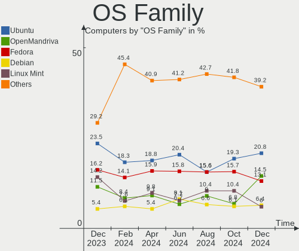
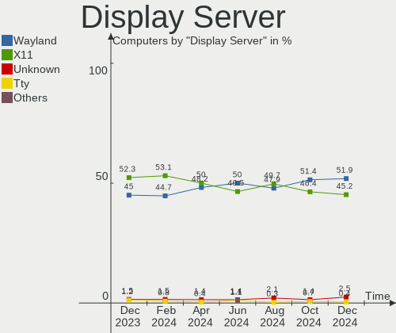
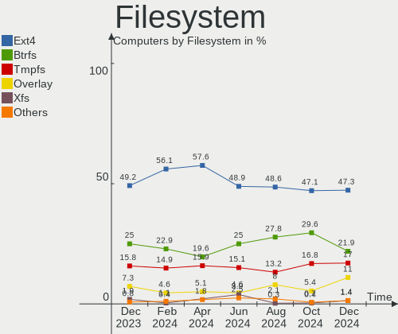
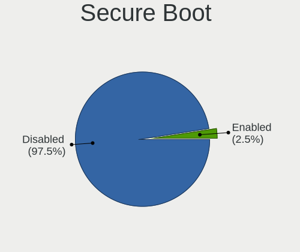
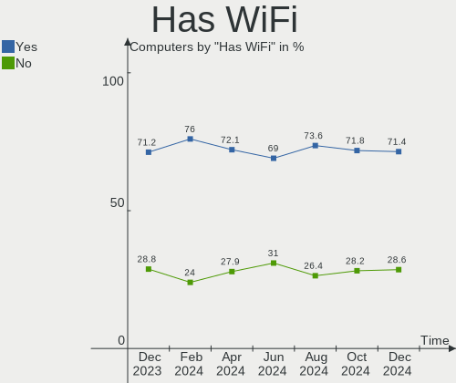
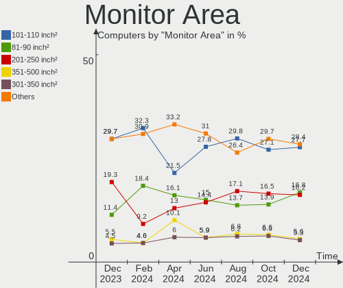
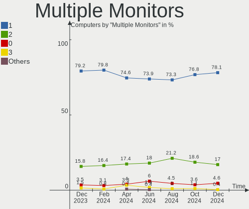

Linux in Brazil - Hardware Trends
---------------------------------

A project to identify most popular hardware characteristics and track their change
over time based on data collected by Linux users at https://Linux-Hardware.org.

Anyone can contribute to this report by the [hw-probe](https://github.com/linuxhw/hw-probe) tool:

    sudo -E hw-probe -all -upload

This is a report for all computer types. See also reports for [desktops](/Location/Brazil/Desktop/README.md) and [notebooks](/Location/Brazil/Notebook/README.md).

Period: Dec, 2024.

Contents
--------

* [ System ](#system)
  - [ OS                       ](#os)
  - [ OS Family                ](#os-family)
  - [ Kernel                   ](#kernel)
  - [ Kernel Family            ](#kernel-family)
  - [ Kernel Major Ver.        ](#kernel-major-ver)
  - [ Arch                     ](#arch)
  - [ DE                       ](#de)
  - [ Display Server           ](#display-server)
  - [ Display Manager          ](#display-manager)
  - [ OS Lang                  ](#os-lang)
  - [ Boot Mode                ](#boot-mode)
  - [ Filesystem               ](#filesystem)
  - [ Part. scheme             ](#part-scheme)
  - [ Dual Boot with Linux/BSD ](#dual-boot-with-linuxbsd)
  - [ Dual Boot (Win)          ](#dual-boot-win)

* [ Board ](#board)
  - [ Vendor                   ](#vendor)
  - [ Model                    ](#model)
  - [ Model Family             ](#model-family)
  - [ MFG Year                 ](#mfg-year)
  - [ Form Factor              ](#form-factor)
  - [ Secure Boot              ](#secure-boot)
  - [ Coreboot                 ](#coreboot)
  - [ RAM Size                 ](#ram-size)
  - [ RAM Used                 ](#ram-used)
  - [ Total Drives             ](#total-drives)
  - [ Has CD-ROM               ](#has-cd-rom)
  - [ Has Ethernet             ](#has-ethernet)
  - [ Has WiFi                 ](#has-wifi)
  - [ Has Bluetooth            ](#has-bluetooth)

* [ Location ](#location)
  - [ Country                  ](#country)
  - [ City                     ](#city)

* [ Drives ](#drives)
  - [ Drive Vendor             ](#drive-vendor)
  - [ Drive Model              ](#drive-model)
  - [ HDD Vendor               ](#hdd-vendor)
  - [ SSD Vendor               ](#ssd-vendor)
  - [ Drive Kind               ](#drive-kind)
  - [ Drive Connector          ](#drive-connector)
  - [ Drive Size               ](#drive-size)
  - [ Space Total              ](#space-total)
  - [ Space Used               ](#space-used)
  - [ Malfunc. Drives          ](#malfunc-drives)
  - [ Malfunc. Drive Vendor    ](#malfunc-drive-vendor)
  - [ Malfunc. HDD Vendor      ](#malfunc-hdd-vendor)
  - [ Malfunc. Drive Kind      ](#malfunc-drive-kind)
  - [ Failed Drives            ](#failed-drives)
  - [ Failed Drive Vendor      ](#failed-drive-vendor)
  - [ Drive Status             ](#drive-status)

* [ Storage controller ](#storage-controller)
  - [ Storage Vendor           ](#storage-vendor)
  - [ Storage Model            ](#storage-model)
  - [ Storage Kind             ](#storage-kind)

* [ Processor ](#processor)
  - [ CPU Vendor               ](#cpu-vendor)
  - [ CPU Model                ](#cpu-model)
  - [ CPU Model Family         ](#cpu-model-family)
  - [ CPU Cores                ](#cpu-cores)
  - [ CPU Sockets              ](#cpu-sockets)
  - [ CPU Threads              ](#cpu-threads)
  - [ CPU Op-Modes             ](#cpu-op-modes)
  - [ CPU Microcode            ](#cpu-microcode)
  - [ CPU Microarch            ](#cpu-microarch)

* [ Graphics ](#graphics)
  - [ GPU Vendor               ](#gpu-vendor)
  - [ GPU Model                ](#gpu-model)
  - [ GPU Combo                ](#gpu-combo)
  - [ GPU Driver               ](#gpu-driver)
  - [ GPU Memory               ](#gpu-memory)

* [ Monitor ](#monitor)
  - [ Monitor Vendor           ](#monitor-vendor)
  - [ Monitor Model            ](#monitor-model)
  - [ Monitor Resolution       ](#monitor-resolution)
  - [ Monitor Diagonal         ](#monitor-diagonal)
  - [ Monitor Width            ](#monitor-width)
  - [ Aspect Ratio             ](#aspect-ratio)
  - [ Monitor Area             ](#monitor-area)
  - [ Pixel Density            ](#pixel-density)
  - [ Multiple Monitors        ](#multiple-monitors)

* [ Network ](#network)
  - [ Net Controller Vendor    ](#net-controller-vendor)
  - [ Net Controller Model     ](#net-controller-model)
  - [ Wireless Vendor          ](#wireless-vendor)
  - [ Wireless Model           ](#wireless-model)
  - [ Ethernet Vendor          ](#ethernet-vendor)
  - [ Ethernet Model           ](#ethernet-model)
  - [ Net Controller Kind      ](#net-controller-kind)
  - [ Used Controller          ](#used-controller)
  - [ NICs                     ](#nics)
  - [ IPv6                     ](#ipv6)

* [ Bluetooth ](#bluetooth)
  - [ Bluetooth Vendor         ](#bluetooth-vendor)
  - [ Bluetooth Model          ](#bluetooth-model)

* [ Sound ](#sound)
  - [ Sound Vendor             ](#sound-vendor)
  - [ Sound Model              ](#sound-model)

* [ Memory ](#memory)
  - [ Memory Vendor            ](#memory-vendor)
  - [ Memory Model             ](#memory-model)
  - [ Memory Kind              ](#memory-kind)
  - [ Memory Form Factor       ](#memory-form-factor)
  - [ Memory Size              ](#memory-size)
  - [ Memory Speed             ](#memory-speed)

* [ Printers & scanners ](#printers--scanners)
  - [ Printer Vendor           ](#printer-vendor)
  - [ Printer Model            ](#printer-model)
  - [ Scanner Vendor           ](#scanner-vendor)
  - [ Scanner Model            ](#scanner-model)

* [ Camera ](#camera)
  - [ Camera Vendor            ](#camera-vendor)
  - [ Camera Model             ](#camera-model)

* [ Security ](#security)
  - [ Fingerprint Vendor       ](#fingerprint-vendor)
  - [ Fingerprint Model        ](#fingerprint-model)
  - [ Chipcard Vendor          ](#chipcard-vendor)
  - [ Chipcard Model           ](#chipcard-model)

* [ Unsupported ](#unsupported)
  - [ Unsupported Devices      ](#unsupported-devices)
  - [ Unsupported Device Types ](#unsupported-device-types)

System
------

OS
--

Installed operating systems

| Name                         | Computers | Percent |
|------------------------------|-----------|---------|
| Ubuntu 24.04                 | 40        | 14.13%  |
| Fedora 41                    | 34        | 12.01%  |
| OpenMandriva 24.12           | 28        | 9.89%   |
| Zorin 17                     | 16        | 5.65%   |
| Debian 12                    | 15        | 5.3%    |
| Pop!_OS 22.04                | 14        | 4.95%   |
| Ubuntu 22.04                 | 10        | 3.53%   |
| Arch Rolling                 | 8         | 2.83%   |
| Ubuntu 24.10                 | 7         | 2.47%   |
| openSUSE Tumbleweed-XXXXXXXX | 7         | 2.47%   |
| Linux Mint 22                | 7         | 2.47%   |
| Linux Mint 21.3              | 6         | 2.12%   |
| OpenMandriva 24.07           | 5         | 1.77%   |
| Manjaro                      | 5         | 1.77%   |
| Bazzite 41                   | 5         | 1.77%   |
| OpenMandriva 5.0             | 4         | 1.41%   |
| Kali 2024.4                  | 4         | 1.41%   |
| BigLinux                     | 4         | 1.41%   |
| Kubuntu 24.04                | 3         | 1.06%   |
| Endless 6.0.4                | 3         | 1.06%   |
| Elementary 8                 | 3         | 1.06%   |
| Debian                       | 3         | 1.06%   |
| ArcoLinux Rolling            | 3         | 1.06%   |
| Xubuntu 24.04                | 2         | 0.71%   |
| Ubuntu MATE 24.04            | 2         | 0.71%   |
| OpenMandriva 23.08           | 2         | 0.71%   |
| Nobara 40                    | 2         | 0.71%   |
| NixOS 25.05                  | 2         | 0.71%   |
| Lubuntu 24.04                | 2         | 0.71%   |
| Kubuntu 24.10                | 2         | 0.71%   |
| KDE neon 24.04               | 2         | 0.71%   |
| Garuda Linux Soaring         | 2         | 0.71%   |
| BigLinux 24.2.0              | 2         | 0.71%   |
| Xubuntu 20.04                | 1         | 0.35%   |
| Xubuntu 18.04                | 1         | 0.35%   |
| Ubuntu Budgie 24.10          | 1         | 0.35%   |
| Ubuntu Budgie 24.04          | 1         | 0.35%   |
| Ubuntu 20.04                 | 1         | 0.35%   |
| Ubuntu 18.04                 | 1         | 0.35%   |
| ROSA 12.5.1                  | 1         | 0.35%   |

OS Family
---------

OS without a version

| Name             | Computers | Percent |
|------------------|-----------|---------|
| Ubuntu           | 59        | 20.85%  |
| OpenMandriva     | 41        | 14.49%  |
| Fedora           | 37        | 13.07%  |
| Debian           | 18        | 6.36%   |
| Linux Mint       | 17        | 6.01%   |
| Zorin            | 16        | 5.65%   |
| Pop!_OS          | 15        | 5.3%    |
| Arch             | 8         | 2.83%   |
| openSUSE         | 7         | 2.47%   |
| BigLinux         | 6         | 2.12%   |
| Manjaro          | 5         | 1.77%   |
| Kubuntu          | 5         | 1.77%   |
| Bazzite          | 5         | 1.77%   |
| Xubuntu          | 4         | 1.41%   |
| Kali             | 4         | 1.41%   |
| Endless          | 4         | 1.41%   |
| Garuda Linux     | 3         | 1.06%   |
| Elementary       | 3         | 1.06%   |
| ArcoLinux        | 3         | 1.06%   |
| Ubuntu MATE      | 2         | 0.71%   |
| Ubuntu Budgie    | 2         | 0.71%   |
| Nobara           | 2         | 0.71%   |
| NixOS            | 2         | 0.71%   |
| Lubuntu          | 2         | 0.71%   |
| KDE neon         | 2         | 0.71%   |
| ROSA             | 1         | 0.35%   |
| RHEL             | 1         | 0.35%   |
| Parrot           | 1         | 0.35%   |
| org.kde.Platform | 1         | 0.35%   |
| LMDE             | 1         | 0.35%   |
| LinuxFX          | 1         | 0.35%   |
| GNOME OS         | 1         | 0.35%   |
| BuildRoot        | 1         | 0.35%   |
| Android          | 1         | 0.35%   |
| AlmaLinux        | 1         | 0.35%   |
| Aeon             | 1         | 0.35%   |

Kernel
------

Version of the Linux kernel

| Version                        | Computers | Percent |
|--------------------------------|-----------|---------|
| 6.8.0-49-generic               | 44        | 15.55%  |
| 6.12.1-desktop-1omv2490        | 24        | 8.48%   |
| 6.8.0-51-generic               | 19        | 6.71%   |
| 6.9.3-76060903-generic         | 15        | 5.3%    |
| 6.8.0-50-generic               | 14        | 4.95%   |
| 6.11.10-300.fc41.x86_64        | 10        | 3.53%   |
| 6.1.0-28-amd64                 | 10        | 3.53%   |
| 6.11.8-1-default               | 7         | 2.47%   |
| 6.11.11-300.fc41.x86_64        | 7         | 2.47%   |
| 6.12.6-200.fc41.x86_64         | 5         | 1.77%   |
| 6.11.4-301.fc41.x86_64         | 5         | 1.77%   |
| 6.10.0-desktop-1omv2490        | 5         | 1.77%   |
| 6.8.0-41-generic               | 4         | 1.41%   |
| 6.6.2-desktop-1omv2390         | 4         | 1.41%   |
| 6.12.6-desktop-1omv2490        | 4         | 1.41%   |
| 6.11.9-303.bazzite.fc41.x86_64 | 4         | 1.41%   |
| 6.11.2-amd64                   | 4         | 1.41%   |
| 6.11.10-2-MANJARO              | 4         | 1.41%   |
| 6.11.0-13-generic              | 4         | 1.41%   |
| 6.5.0-10-generic               | 3         | 1.06%   |
| 6.12.4-zen1-1-zen              | 3         | 1.06%   |
| 6.12.4-200.fc41.x86_64         | 3         | 1.06%   |
| 6.11.0-9-generic               | 3         | 1.06%   |
| 6.8.0-45-generic               | 2         | 0.71%   |
| 6.8.0-38-generic               | 2         | 0.71%   |
| 6.6.65-1-MANJARO               | 2         | 0.71%   |
| 6.6.63-1-MANJARO               | 2         | 0.71%   |
| 6.6.63                         | 2         | 0.71%   |
| 6.4.11-desktop-1omv2390        | 2         | 0.71%   |
| 6.12.5-200.fc41.x86_64         | 2         | 0.71%   |
| 6.12.4-arch1-1                 | 2         | 0.71%   |
| 6.12.4-1-MANJARO               | 2         | 0.71%   |
| 6.12.3-1-cachyos               | 2         | 0.71%   |
| 6.12.1-zen1-1-zen              | 2         | 0.71%   |
| 6.12.1-arch1-1                 | 2         | 0.71%   |
| 6.11.8-300.fc41.x86_64         | 2         | 0.71%   |
| 5.15.0-130-generic             | 2         | 0.71%   |
| 6.9.10                         | 1         | 0.35%   |
| 6.8.0-50-lowlatency            | 1         | 0.35%   |
| 6.7.10-060710-generic          | 1         | 0.35%   |

Kernel Family
-------------

Linux kernel without a distro release

| Version | Computers | Percent |
|---------|-----------|---------|
| 6.8.0   | 86        | 30.39%  |
| 6.12.1  | 29        | 10.25%  |
| 6.9.3   | 15        | 5.3%    |
| 6.11.10 | 15        | 5.3%    |
| 6.1.0   | 13        | 4.59%   |
| 6.12.6  | 11        | 3.89%   |
| 6.12.4  | 11        | 3.89%   |
| 6.11.8  | 9         | 3.18%   |
| 6.11.0  | 9         | 3.18%   |
| 6.11.11 | 8         | 2.83%   |
| 5.15.0  | 8         | 2.83%   |
| 6.12.5  | 6         | 2.12%   |
| 6.6.63  | 5         | 1.77%   |
| 6.11.9  | 5         | 1.77%   |
| 6.11.4  | 5         | 1.77%   |
| 6.11.2  | 5         | 1.77%   |
| 6.10.0  | 5         | 1.77%   |
| 6.6.2   | 4         | 1.41%   |
| 6.5.0   | 4         | 1.41%   |
| 6.6.65  | 2         | 0.71%   |
| 6.4.11  | 2         | 0.71%   |
| 6.2.0   | 2         | 0.71%   |
| 6.12.3  | 2         | 0.71%   |
| 5.4.0   | 2         | 0.71%   |
| 5.14.0  | 2         | 0.71%   |
| 6.9.10  | 1         | 0.35%   |
| 6.7.10  | 1         | 0.35%   |
| 6.6.47  | 1         | 0.35%   |
| 6.6.32  | 1         | 0.35%   |
| 6.6.28  | 1         | 0.35%   |
| 6.13.0  | 1         | 0.35%   |
| 6.11.6  | 1         | 0.35%   |
| 6.10.6  | 1         | 0.35%   |
| 6.10.11 | 1         | 0.35%   |
| 6.1.1   | 1         | 0.35%   |
| 6.0.7   | 1         | 0.35%   |
| 5.17.0  | 1         | 0.35%   |
| 5.16.7  | 1         | 0.35%   |
| 5.13.0  | 1         | 0.35%   |
| 5.11.0  | 1         | 0.35%   |

Kernel Major Ver.
-----------------

Linux kernel major version

| Version | Computers | Percent |
|---------|-----------|---------|
| 6.8     | 86        | 30.39%  |
| 6.12    | 59        | 20.85%  |
| 6.11    | 57        | 20.14%  |
| 6.9     | 16        | 5.65%   |
| 6.6     | 14        | 4.95%   |
| 6.1     | 14        | 4.95%   |
| 5.15    | 8         | 2.83%   |
| 6.10    | 7         | 2.47%   |
| 6.5     | 4         | 1.41%   |
| 6.4     | 2         | 0.71%   |
| 6.2     | 2         | 0.71%   |
| 5.4     | 2         | 0.71%   |
| 5.14    | 2         | 0.71%   |
| 6.7     | 1         | 0.35%   |
| 6.13    | 1         | 0.35%   |
| 6.0     | 1         | 0.35%   |
| 5.17    | 1         | 0.35%   |
| 5.16    | 1         | 0.35%   |
| 5.13    | 1         | 0.35%   |
| 5.11    | 1         | 0.35%   |
| 5.10    | 1         | 0.35%   |
| 4.9     | 1         | 0.35%   |
| 4.15    | 1         | 0.35%   |

Arch
----

OS architecture (x86_64, i586, etc.)

| Name    | Computers | Percent |
|---------|-----------|---------|
| x86_64  | 280       | 98.94%  |
| i686    | 1         | 0.35%   |
| armv8l  | 1         | 0.35%   |
| aarch64 | 1         | 0.35%   |

DE
--

Desktop Environment

| Name          | Computers | Percent |
|---------------|-----------|---------|
| GNOME         | 138       | 48.76%  |
| KDE6          | 38        | 13.43%  |
| Unknown       | 37        | 13.07%  |
| X-Cinnamon    | 19        | 6.71%   |
| KDE5          | 13        | 4.59%   |
| XFCE          | 8         | 2.83%   |
| LXQt          | 7         | 2.47%   |
| MATE          | 6         | 2.12%   |
| Pantheon      | 3         | 1.06%   |
| Endless:GNOME | 3         | 1.06%   |
| Budgie        | 3         | 1.06%   |
| i3            | 2         | 0.71%   |
| sway          | 1         | 0.35%   |
| qtile         | 1         | 0.35%   |
| LXDE          | 1         | 0.35%   |
| KDE           | 1         | 0.35%   |
| GNOME Classic | 1         | 0.35%   |
| COSMIC        | 1         | 0.35%   |

Display Server
--------------

X11 or Wayland

| Name    | Computers | Percent |
|---------|-----------|---------|
| Wayland | 147       | 51.94%  |
| X11     | 128       | 45.23%  |
| Unknown | 7         | 2.47%   |
| Tty     | 1         | 0.35%   |

Display Manager
---------------

SDDM, LightDM, etc.

| Name    | Computers | Percent |
|---------|-----------|---------|
| Unknown | 123       | 43.46%  |
| GDM3    | 59        | 20.85%  |
| SDDM    | 54        | 19.08%  |
| LightDM | 28        | 9.89%   |
| GDM     | 19        | 6.71%   |

OS Lang
-------

Language

| Lang       | Computers | Percent |
|------------|-----------|---------|
| pt_BR      | 200       | 70.67%  |
| en_US      | 63        | 22.26%  |
| C          | 10        | 3.53%   |
| en_GB      | 3         | 1.06%   |
| Unknown    | 3         | 1.06%   |
| pt_PT      | 1         | 0.35%   |
| POSIX      | 1         | 0.35%   |
| es_ES      | 1         | 0.35%   |
| en_IE.UTF8 | 1         | 0.35%   |

Boot Mode
---------

EFI or BIOS

| Mode | Computers | Percent |
|------|-----------|---------|
| BIOS | 159       | 56.18%  |
| EFI  | 124       | 43.82%  |

Filesystem
----------

Type of filesystem

| Type    | Computers | Percent |
|---------|-----------|---------|
| Ext4    | 134       | 47.35%  |
| Btrfs   | 62        | 21.91%  |
| Tmpfs   | 48        | 16.96%  |
| Overlay | 31        | 10.95%  |
| Xfs     | 4         | 1.41%   |
| Zfs     | 2         | 0.71%   |
| Unknown | 2         | 0.71%   |

Part. scheme
------------

Scheme of partitioning

| Type    | Computers | Percent |
|---------|-----------|---------|
| GPT     | 150       | 53%     |
| Unknown | 117       | 41.34%  |
| MBR     | 16        | 5.65%   |

Dual Boot with Linux/BSD
------------------------

Hosting more than one Linux/BSD

| Dual boot | Computers | Percent |
|-----------|-----------|---------|
| No        | 240       | 84.81%  |
| Yes       | 43        | 15.19%  |

Dual Boot (Win)
---------------

Hosting Linux and Windows

| Dual boot | Computers | Percent |
|-----------|-----------|---------|
| No        | 216       | 76.33%  |
| Yes       | 67        | 23.67%  |

Board
-----

Vendor
------

Motherboard manufacturer

| Name                   | Computers | Percent |
|------------------------|-----------|---------|
| Dell                   | 44        | 15.55%  |
| ASUSTek Computer       | 41        | 14.49%  |
| Lenovo                 | 32        | 11.31%  |
| Acer                   | 27        | 9.54%   |
| Intel                  | 19        | 6.71%   |
| Gigabyte Technology    | 18        | 6.36%   |
| Samsung Electronics    | 15        | 5.3%    |
| Hewlett-Packard        | 10        | 3.53%   |
| ASRock                 | 10        | 3.53%   |
| Positivo               | 9         | 3.18%   |
| Apple                  | 7         | 2.47%   |
| Unknown                | 6         | 2.12%   |
| MSI                    | 5         | 1.77%   |
| Positivo Bahia - VAIO  | 4         | 1.41%   |
| Notebook               | 3         | 1.06%   |
| MACHINIST              | 3         | 1.06%   |
| Biostar                | 3         | 1.06%   |
| AZW                    | 3         | 1.06%   |
| LG Electronics         | 2         | 0.71%   |
| DUEX                   | 2         | 0.71%   |
| Avell High Performance | 2         | 0.71%   |
| Avell                  | 2         | 0.71%   |
| WTM                    | 1         | 0.35%   |
| wpc                    | 1         | 0.35%   |
| Timi                   | 1         | 0.35%   |
| Philco                 | 1         | 0.35%   |
| Pegatron               | 1         | 0.35%   |
| PCWare                 | 1         | 0.35%   |
| Multilaser             | 1         | 0.35%   |
| MAXSUN                 | 1         | 0.35%   |
| Login Informatica      | 1         | 0.35%   |
| Huanan                 | 1         | 0.35%   |
| Gateway                | 1         | 0.35%   |
| Digibras               | 1         | 0.35%   |
| Digiboard              | 1         | 0.35%   |
| Daten Tecnologia       | 1         | 0.35%   |
| Compaq                 | 1         | 0.35%   |
| AMD                    | 1         | 0.35%   |

Model
-----

Motherboard model

| Name                                        | Computers | Percent |
|---------------------------------------------|-----------|---------|
| Samsung 550XDA                              | 6         | 2.12%   |
| Unknown                                     | 6         | 2.12%   |
| Intel H61                                   | 5         | 1.77%   |
| ASUS TUF Gaming B550M-PLUS                  | 5         | 1.77%   |
| Dell Inspiron 15 3520                       | 4         | 1.41%   |
| Intel H55                                   | 3         | 1.06%   |
| Gigabyte B550M AORUS ELITE                  | 3         | 1.06%   |
| Dell Inspiron 15 5510                       | 3         | 1.06%   |
| ASUS VivoBook_ASUSLaptop K3605ZF_K3605ZF    | 3         | 1.06%   |
| Apple MacBookPro8,1                         | 3         | 1.06%   |
| Positivo R516256AI-15                       | 2         | 0.71%   |
| Lenovo IdeaPad 3 15ALC6 82MF                | 2         | 0.71%   |
| Lenovo G400s VILG1                          | 2         | 0.71%   |
| Intel H81                                   | 2         | 0.71%   |
| Intel B75                                   | 2         | 0.71%   |
| Gigabyte B550M DS3H                         | 2         | 0.71%   |
| Dell Vostro 3550                            | 2         | 0.71%   |
| Dell Latitude 5175                          | 2         | 0.71%   |
| Dell Inspiron N4050                         | 2         | 0.71%   |
| Dell Inspiron 3583                          | 2         | 0.71%   |
| Dell Inspiron 15-3567                       | 2         | 0.71%   |
| Dell G15 5530                               | 2         | 0.71%   |
| Avell B.ON                                  | 2         | 0.71%   |
| ASUS All Series                             | 2         | 0.71%   |
| ASRock B450M Steel Legend                   | 2         | 0.71%   |
| ASRock A320M-HD                             | 2         | 0.71%   |
| Acer Nitro ANV15-51                         | 2         | 0.71%   |
| Acer Nitro AN517-54                         | 2         | 0.71%   |
| Acer Aspire A515-51                         | 2         | 0.71%   |
| Acer Aspire A315-510P                       | 2         | 0.71%   |
| WTM W-N95-R                                 | 1         | 0.35%   |
| wpc wpc616                                  | 1         | 0.35%   |
| Timi RedmiBook Pro 14                       | 1         | 0.35%   |
| Samsung RV411/RV511/E3511/S3511/RV711/E3411 | 1         | 0.35%   |
| Samsung 960XGL                              | 1         | 0.35%   |
| Samsung 950XDB/951XDB/950XDY                | 1         | 0.35%   |
| Samsung 940XGK                              | 1         | 0.35%   |
| Samsung 800G5M/800G5W                       | 1         | 0.35%   |
| Samsung 550XCJ/550XCR                       | 1         | 0.35%   |
| Samsung 530U3BI/530U4BI/530U4BH             | 1         | 0.35%   |

Model Family
------------

Motherboard model prefix

| Name                       | Computers | Percent |
|----------------------------|-----------|---------|
| Dell Inspiron              | 23        | 8.13%   |
| Acer Aspire                | 19        | 6.71%   |
| Lenovo IdeaPad             | 9         | 3.18%   |
| ASUS TUF                   | 9         | 3.18%   |
| Dell Latitude              | 8         | 2.83%   |
| Acer Nitro                 | 7         | 2.47%   |
| Samsung 550XDA             | 6         | 2.12%   |
| Lenovo ThinkPad            | 6         | 2.12%   |
| Intel H61                  | 6         | 2.12%   |
| ASUS VivoBook              | 6         | 2.12%   |
| Unknown                    | 6         | 2.12%   |
| Gigabyte B550M             | 5         | 1.77%   |
| Lenovo ThinkCentre         | 4         | 1.41%   |
| Dell Vostro                | 4         | 1.41%   |
| Lenovo Yoga                | 3         | 1.06%   |
| Intel H55                  | 3         | 1.06%   |
| Intel B75                  | 3         | 1.06%   |
| HP ProBook                 | 3         | 1.06%   |
| Gigabyte B450M             | 3         | 1.06%   |
| Dell XPS                   | 3         | 1.06%   |
| Dell G15                   | 3         | 1.06%   |
| Apple MacBookPro8          | 3         | 1.06%   |
| Positivo R516256AI-15      | 2         | 0.71%   |
| Lenovo Legion              | 2         | 0.71%   |
| Lenovo G400s               | 2         | 0.71%   |
| Intel H81                  | 2         | 0.71%   |
| HP Pavilion                | 2         | 0.71%   |
| Dell OptiPlex              | 2         | 0.71%   |
| Avell High Performance A70 | 2         | 0.71%   |
| Avell B.ON                 | 2         | 0.71%   |
| ASUS P8H61-M               | 2         | 0.71%   |
| ASUS M5A78L-M              | 2         | 0.71%   |
| ASUS ASUS                  | 2         | 0.71%   |
| ASUS All                   | 2         | 0.71%   |
| ASRock B450M               | 2         | 0.71%   |
| ASRock A320M-HD            | 2         | 0.71%   |
| Apple MacBookAir6          | 2         | 0.71%   |
| WTM W-N95-R                | 1         | 0.35%   |
| wpc wpc616                 | 1         | 0.35%   |
| Timi RedmiBook             | 1         | 0.35%   |

MFG Year
--------

Motherboard manufacture year

| Year    | Computers | Percent |
|---------|-----------|---------|
| 2021    | 35        | 12.37%  |
| 2020    | 30        | 10.6%   |
| 2023    | 25        | 8.83%   |
| 2019    | 22        | 7.77%   |
| 2017    | 21        | 7.42%   |
| 2018    | 17        | 6.01%   |
| 2014    | 17        | 6.01%   |
| 2012    | 16        | 5.65%   |
| 2024    | 15        | 5.3%    |
| 2022    | 14        | 4.95%   |
| 2013    | 14        | 4.95%   |
| 2011    | 13        | 4.59%   |
| 2010    | 13        | 4.59%   |
| 2016    | 11        | 3.89%   |
| 2015    | 11        | 3.89%   |
| 2009    | 3         | 1.06%   |
| 2007    | 3         | 1.06%   |
| Unknown | 2         | 0.71%   |
| 2008    | 1         | 0.35%   |

Form Factor
-----------

Physical design of the computer

| Name           | Computers | Percent |
|----------------|-----------|---------|
| Notebook       | 166       | 58.66%  |
| Desktop        | 109       | 38.52%  |
| Mini pc        | 2         | 0.71%   |
| Phone          | 1         | 0.35%   |
| System on chip | 1         | 0.35%   |
| Tablet         | 1         | 0.35%   |
| Convertible    | 1         | 0.35%   |
| All in one     | 1         | 0.35%   |
| Server         | 1         | 0.35%   |

Secure Boot
-----------

Enabled or disabled

| State    | Computers | Percent |
|----------|-----------|---------|
| Disabled | 276       | 97.53%  |
| Enabled  | 7         | 2.47%   |

Coreboot
--------

Have coreboot on board

| Used | Computers | Percent |
|------|-----------|---------|
| No   | 283       | 100%    |

RAM Size
--------

Total RAM memory

| Size in GB  | Computers | Percent |
|-------------|-----------|---------|
| 4.01-8.0    | 77        | 27.21%  |
| 16.01-24.0  | 69        | 24.38%  |
| 8.01-16.0   | 45        | 15.9%   |
| 3.01-4.0    | 38        | 13.43%  |
| 32.01-64.0  | 26        | 9.19%   |
| 24.01-32.0  | 14        | 4.95%   |
| 64.01-256.0 | 7         | 2.47%   |
| 1.01-2.0    | 4         | 1.41%   |
| 0.51-1.0    | 2         | 0.71%   |
| 2.01-3.0    | 1         | 0.35%   |

RAM Used
--------

Used RAM memory

| Used GB    | Computers | Percent |
|------------|-----------|---------|
| 4.01-8.0   | 71        | 25.09%  |
| 1.01-2.0   | 67        | 23.67%  |
| 2.01-3.0   | 66        | 23.32%  |
| 3.01-4.0   | 47        | 16.61%  |
| 8.01-16.0  | 17        | 6.01%   |
| 0.51-1.0   | 11        | 3.89%   |
| 0.01-0.5   | 3         | 1.06%   |
| 16.01-24.0 | 1         | 0.35%   |

Total Drives
------------

Number of drives on board

| Drives | Computers | Percent |
|--------|-----------|---------|
| 1      | 167       | 59.01%  |
| 2      | 74        | 26.15%  |
| 3      | 21        | 7.42%   |
| 4      | 10        | 3.53%   |
| 5      | 6         | 2.12%   |
| 0      | 3         | 1.06%   |
| 6      | 2         | 0.71%   |

Has CD-ROM
----------

Has CD-ROM on board

| Presented | Computers | Percent |
|-----------|-----------|---------|
| No        | 225       | 79.51%  |
| Yes       | 58        | 20.49%  |

Has Ethernet
------------

Has Ethernet on board

| Presented | Computers | Percent |
|-----------|-----------|---------|
| Yes       | 240       | 84.81%  |
| No        | 43        | 15.19%  |

Has WiFi
--------

Has WiFi module

| Presented | Computers | Percent |
|-----------|-----------|---------|
| Yes       | 202       | 71.38%  |
| No        | 81        | 28.62%  |

Has Bluetooth
-------------

Has Bluetooth module

| Presented | Computers | Percent |
|-----------|-----------|---------|
| Yes       | 187       | 66.08%  |
| No        | 96        | 33.92%  |

Location
--------

Country
-------

Geographic location (country)

| Country | Computers | Percent |
|---------|-----------|---------|
| Brazil  | 283       | 100%    |

City
----

Geographic location (city)

| City                  | Computers | Percent |
|-----------------------|-----------|---------|
| Sao Paulo             | 31        | 10.95%  |
| Rio de Janeiro        | 14        | 4.95%   |
| Brasília             | 13        | 4.59%   |
| Campinas              | 10        | 3.53%   |
| Fortaleza             | 8         | 2.83%   |
| Florianópolis        | 8         | 2.83%   |
| Curitiba              | 8         | 2.83%   |
| Belo Horizonte        | 7         | 2.47%   |
| Salvador              | 6         | 2.12%   |
| Recife                | 6         | 2.12%   |
| Goiânia              | 6         | 2.12%   |
| Porto Alegre          | 4         | 1.41%   |
| Manaus                | 4         | 1.41%   |
| Londrina              | 4         | 1.41%   |
| Belém                | 4         | 1.41%   |
| Simoes Filho          | 3         | 1.06%   |
| Blumenau              | 3         | 1.06%   |
| Vitória da Conquista | 2         | 0.71%   |
| Sorocaba              | 2         | 0.71%   |
| Sinop                 | 2         | 0.71%   |
| Serra                 | 2         | 0.71%   |
| Sao Luís             | 2         | 0.71%   |
| Sao José dos Campos  | 2         | 0.71%   |
| Sao Jose do Rio Preto | 2         | 0.71%   |
| Sao Goncalo           | 2         | 0.71%   |
| Sao Bernardo do Campo | 2         | 0.71%   |
| Santo André          | 2         | 0.71%   |
| Presidente Prudente   | 2         | 0.71%   |
| Pelotas               | 2         | 0.71%   |
| Niterói              | 2         | 0.71%   |
| Mogi das Cruzes       | 2         | 0.71%   |
| Maringá              | 2         | 0.71%   |
| Juazeiro do Norte     | 2         | 0.71%   |
| Indaiatuba            | 2         | 0.71%   |
| Caxias do Sul         | 2         | 0.71%   |
| Castanhal             | 2         | 0.71%   |
| Cariacica             | 2         | 0.71%   |
| Carapicuiba           | 2         | 0.71%   |
| Canoas                | 2         | 0.71%   |
| Campo Largo           | 2         | 0.71%   |

Drives
------

Drive Vendor
------------

Hard drive vendors

| Vendor                         | Computers | Drives | Percent |
|--------------------------------|-----------|--------|---------|
| Seagate                        | 48        | 62     | 11.51%  |
| WDC                            | 43        | 49     | 10.31%  |
| Kingston                       | 41        | 45     | 9.83%   |
| Sandisk                        | 30        | 33     | 7.19%   |
| Samsung Electronics            | 24        | 29     | 5.76%   |
| A-DATA Technology              | 18        | 18     | 4.32%   |
| China                          | 16        | 17     | 3.84%   |
| ADATA Technology               | 14        | 14     | 3.36%   |
| Toshiba                        | 13        | 14     | 3.12%   |
| Kingston Technology Company    | 13        | 13     | 3.12%   |
| MAXIO Technology (Hangzhou)    | 12        | 13     | 2.88%   |
| Crucial                        | 12        | 12     | 2.88%   |
| SK hynix                       | 10        | 10     | 2.4%    |
| Unknown                        | 9         | 12     | 2.16%   |
| Silicon Motion                 | 7         | 7      | 1.68%   |
| Solid State Storage Technology | 6         | 6      | 1.44%   |
| LITEON                         | 5         | 5      | 1.2%    |
| KIOXIA                         | 5         | 5      | 1.2%    |
| KingSpec                       | 5         | 5      | 1.2%    |
| Intel                          | 5         | 6      | 1.2%    |
| XrayDisk                       | 4         | 4      | 0.96%   |
| Realtek Semiconductor          | 4         | 4      | 0.96%   |
| PNY                            | 4         | 4      | 0.96%   |
| Micron Technology              | 4         | 4      | 0.96%   |
| Lexar                          | 4         | 4      | 0.96%   |
| JMicron Technology             | 4         | 4      | 0.96%   |
| Solid State Storage            | 3         | 3      | 0.72%   |
| Phison Electronics             | 3         | 3      | 0.72%   |
| Micron/Crucial Technology      | 3         | 3      | 0.72%   |
| HGST                           | 3         | 3      | 0.72%   |
| Apple                          | 3         | 3      | 0.72%   |
| Unknown                        | 3         | 4      | 0.72%   |
| Win Memory                     | 2         | 2      | 0.48%   |
| Shenzhen Longsys Electronics   | 2         | 2      | 0.48%   |
| Patriot                        | 2         | 2      | 0.48%   |
| Netac                          | 2         | 2      | 0.48%   |
| MACROVIP                       | 2         | 2      | 0.48%   |
| HUSKY                          | 2         | 2      | 0.48%   |
| GAMER                          | 2         | 2      | 0.48%   |
| Fanxiang                       | 2         | 4      | 0.48%   |

Drive Model
-----------

Hard drive models

| Model                                                 | Computers | Percent |
|-------------------------------------------------------|-----------|---------|
| Kingston SA400S37240G 240GB SSD                       | 12        | 2.7%    |
| MAXIO (Hangzhou) NVMe SSD Controller MAP1202 512GB    | 10        | 2.25%   |
| Kingston SA400S37480G 480GB SSD                       | 9         | 2.02%   |
| Kingston Company SNV2S1000G 1TB                       | 7         | 1.57%   |
| Kingston SA400S37120G 120GB SSD                       | 7         | 1.57%   |
| SanDisk SSD PLUS 1000GB                               | 6         | 1.35%   |
| Silicon Motion SM2263EN/SM2263XT SSD Controller 256GB | 5         | 1.12%   |
| SanDisk SSD PLUS 240GB                                | 5         | 1.12%   |
| Kingston SA400S37960G 960GB SSD                       | 5         | 1.12%   |
| Toshiba MQ01ABF050 500GB                              | 4         | 0.9%    |
| Seagate Expansion 1TB                                 | 4         | 0.9%    |
| Sandisk WD Blue SN550 NVMe SSD 256GB                  | 4         | 0.9%    |
| Crucial CT240BX500SSD1 240GB                          | 4         | 0.9%    |
| WDC WD5000AAKX-00U6AA0 500GB                          | 3         | 0.67%   |
| WDC WD10SPZX-21Z10T0 1TB                              | 3         | 0.67%   |
| SK hynix BC711 NVMe 512GB                             | 3         | 0.67%   |
| Seagate ST2000DM006-2DM164 2TB                        | 3         | 0.67%   |
| Seagate ST1000LM024 HN-M101MBB 1TB                    | 3         | 0.67%   |
| Seagate ST1000DM003-1CH162 1TB                        | 3         | 0.67%   |
| SanDisk NVMe SSD Drive 1TB                            | 3         | 0.67%   |
| Samsung NVMe SSD Controller SM981/PM981/PM983 512GB   | 3         | 0.67%   |
| Kingston Company SNV2S250G 250GB                      | 3         | 0.67%   |
| Intel SSDPEKNU512GZ 512GB                             | 3         | 0.67%   |
| Crucial CT480BX500SSD1 480GB                          | 3         | 0.67%   |
| Crucial CT1000BX500SSD1 1TB                           | 3         | 0.67%   |
| China SATA SSD 120GB                                  | 3         | 0.67%   |
| A-DATA SU650 240GB SSD                                | 3         | 0.67%   |
| A-DATA IM2P33F3A NVMe 512GB                           | 3         | 0.67%   |
| Unknown                                               | 3         | 0.67%   |
| WDC WDS480G2G0C-00AJM0 480GB                          | 2         | 0.45%   |
| WDC WDS120G2G0A-00JH30 120GB SSD                      | 2         | 0.45%   |
| WDC WD10SPZX-75Z10T1 1TB                              | 2         | 0.45%   |
| Unknown MMC Card  64GB                                | 2         | 0.45%   |
| Unknown MMC Card  32GB                                | 2         | 0.45%   |
| Unknown MMC Card  128GB                               | 2         | 0.45%   |
| Toshiba MQ04ABF100 1TB                                | 2         | 0.45%   |
| Toshiba MQ01ABF032 320GB                              | 2         | 0.45%   |
| Toshiba DT01ACA100 1TB                                | 2         | 0.45%   |
| Solid State Storage SSSTC CL1-8D256 256GB             | 2         | 0.45%   |
| Solid State Storage SSSTC CL1-4D256 256GB             | 2         | 0.45%   |

HDD Vendor
----------

Hard disk drive vendors

| Vendor              | Computers | Drives | Percent |
|---------------------|-----------|--------|---------|
| Seagate             | 47        | 61     | 43.12%  |
| WDC                 | 32        | 37     | 29.36%  |
| Toshiba             | 13        | 14     | 11.93%  |
| Samsung Electronics | 8         | 8      | 7.34%   |
| HGST                | 3         | 3      | 2.75%   |
| JMicron Technology  | 2         | 2      | 1.83%   |
| Hitachi             | 1         | 1      | 0.92%   |
| Hewlett-Packard     | 1         | 1      | 0.92%   |
| Fujitsu             | 1         | 1      | 0.92%   |
| Apple               | 1         | 1      | 0.92%   |

SSD Vendor
----------

Solid state drive vendors

| Vendor              | Computers | Drives | Percent |
|---------------------|-----------|--------|---------|
| Kingston            | 35        | 37     | 24.14%  |
| SanDisk             | 17        | 18     | 11.72%  |
| China               | 16        | 17     | 11.03%  |
| Crucial             | 12        | 12     | 8.28%   |
| A-DATA Technology   | 10        | 10     | 6.9%    |
| WDC                 | 9         | 9      | 6.21%   |
| LITEON              | 5         | 5      | 3.45%   |
| KingSpec            | 5         | 5      | 3.45%   |
| Samsung Electronics | 4         | 7      | 2.76%   |
| PNY                 | 4         | 4      | 2.76%   |
| Lexar               | 4         | 4      | 2.76%   |
| Win Memory          | 2         | 2      | 1.38%   |
| Patriot             | 2         | 2      | 1.38%   |
| MACROVIP            | 2         | 2      | 1.38%   |
| HUSKY               | 2         | 2      | 1.38%   |
| Fanxiang            | 2         | 3      | 1.38%   |
| Apple               | 2         | 2      | 1.38%   |
| XrayDisk            | 1         | 1      | 0.69%   |
| Team                | 1         | 1      | 0.69%   |
| Seagate             | 1         | 1      | 0.69%   |
| SATAFIRM            | 1         | 1      | 0.69%   |
| RZX                 | 1         | 1      | 0.69%   |
| Ramsta              | 1         | 1      | 0.69%   |
| OXYBR               | 1         | 1      | 0.69%   |
| NGFF                | 1         | 1      | 0.69%   |
| Netac               | 1         | 1      | 0.69%   |
| Micron Technology   | 1         | 1      | 0.69%   |
| 2.5"SSD             | 1         | 1      | 0.69%   |
| Unknown             | 1         | 1      | 0.69%   |

Drive Kind
----------

HDD or SSD

| Kind    | Computers | Drives | Percent |
|---------|-----------|--------|---------|
| SSD     | 130       | 153    | 34.12%  |
| NVMe    | 127       | 152    | 33.33%  |
| HDD     | 103       | 129    | 27.03%  |
| Unknown | 15        | 18     | 3.94%   |
| MMC     | 6         | 8      | 1.57%   |

Drive Connector
---------------

SATA, SAS, NVMe, etc.

| Type | Computers | Drives | Percent |
|------|-----------|--------|---------|
| SATA | 192       | 285    | 56.8%   |
| NVMe | 127       | 152    | 37.57%  |
| SAS  | 13        | 15     | 3.85%   |
| MMC  | 6         | 8      | 1.78%   |

Drive Size
----------

Size of hard drive

| Size in TB | Computers | Drives | Percent |
|------------|-----------|--------|---------|
| 0.01-0.5   | 137       | 172    | 60.62%  |
| 0.51-1.0   | 66        | 79     | 29.2%   |
| 1.01-2.0   | 15        | 16     | 6.64%   |
| 2.01-3.0   | 3         | 3      | 1.33%   |
| 4.01-10.0  | 3         | 7      | 1.33%   |
| 3.01-4.0   | 1         | 4      | 0.44%   |
| 10.01-20.0 | 1         | 1      | 0.44%   |

Space Total
-----------

Amount of disk space available on the file system

| Size in GB     | Computers | Percent |
|----------------|-----------|---------|
| 101-250        | 76        | 26.86%  |
| 251-500        | 59        | 20.85%  |
| 501-1000       | 45        | 15.9%   |
| 1001-2000      | 29        | 10.25%  |
| 1-20           | 20        | 7.07%   |
| 51-100         | 14        | 4.95%   |
| More than 3000 | 13        | 4.59%   |
| 2001-3000      | 10        | 3.53%   |
| Unknown        | 10        | 3.53%   |
| 21-50          | 7         | 2.47%   |

Space Used
----------

Amount of used disk space

| Used GB        | Computers | Percent |
|----------------|-----------|---------|
| 1-20           | 93        | 32.86%  |
| 51-100         | 42        | 14.84%  |
| 21-50          | 40        | 14.13%  |
| 101-250        | 36        | 12.72%  |
| 251-500        | 28        | 9.89%   |
| 501-1000       | 21        | 7.42%   |
| Unknown        | 10        | 3.53%   |
| 1001-2000      | 7         | 2.47%   |
| More than 3000 | 3         | 1.06%   |
| 0              | 2         | 0.71%   |
| 2001-3000      | 1         | 0.35%   |

Malfunc. Drives
---------------

Drive models with a malfunction

| Model                                                     | Computers | Drives | Percent |
|-----------------------------------------------------------|-----------|--------|---------|
| WDC WDS120G2G0B-00EPW0 120GB SSD                          | 1         | 1      | 4.17%   |
| WDC WD5000LPCX-00VHAT0 500GB                              | 1         | 1      | 4.17%   |
| WDC WD5000AAKX-003CA0 500GB                               | 1         | 1      | 4.17%   |
| WDC WD3200BPVT-00JJ5T0 320GB                              | 1         | 1      | 4.17%   |
| WDC WD10JPVX-22JC3T0 1TB                                  | 1         | 1      | 4.17%   |
| Toshiba MQ01ABF050 500GB                                  | 1         | 1      | 4.17%   |
| Silicon Motion Asgard AN1TNVMe-M.2-80 1TB                 | 1         | 1      | 4.17%   |
| Seagate ST9500420AS 500GB                                 | 1         | 1      | 4.17%   |
| Seagate ST9160310AS 160GB                                 | 1         | 1      | 4.17%   |
| Seagate ST500DM002-1BD142 500GB                           | 1         | 1      | 4.17%   |
| Seagate ST31000528AS 1TB                                  | 1         | 1      | 4.17%   |
| Seagate ST2000DM001-1CH164 2TB                            | 1         | 1      | 4.17%   |
| Seagate ST1000LM048-2E7172 1TB                            | 1         | 1      | 4.17%   |
| Seagate ST1000LM024 HN-M101MBB 1TB                        | 1         | 1      | 4.17%   |
| SanDisk SSD PLUS 240GB                                    | 1         | 1      | 4.17%   |
| SanDisk iSSD P4 16GB                                      | 1         | 1      | 4.17%   |
| Samsung Electronics HD322HJ 320GB                         | 1         | 1      | 4.17%   |
| Samsung Electronics HD161GJ 160GB                         | 1         | 1      | 4.17%   |
| Realtek Semiconductor RTS5763DL NVMe SSD Controller 256GB | 1         | 1      | 4.17%   |
| PNY 1TB SATA SSD                                          | 1         | 1      | 4.17%   |
| Kingston SA400S37120G 120GB SSD                           | 1         | 1      | 4.17%   |
| KingSpec P3-128 128GB SSD                                 | 1         | 1      | 4.17%   |
| HGST HTS545050A7E680 500GB                                | 1         | 1      | 4.17%   |
| Fujitsu MJA2500BH G2 500GB                                | 1         | 1      | 4.17%   |

Malfunc. Drive Vendor
---------------------

Vendors of faulty drives

| Vendor                | Computers | Drives | Percent |
|-----------------------|-----------|--------|---------|
| Seagate               | 7         | 7      | 29.17%  |
| WDC                   | 5         | 5      | 20.83%  |
| SanDisk               | 2         | 2      | 8.33%   |
| Samsung Electronics   | 2         | 2      | 8.33%   |
| Toshiba               | 1         | 1      | 4.17%   |
| Silicon Motion        | 1         | 1      | 4.17%   |
| Realtek Semiconductor | 1         | 1      | 4.17%   |
| PNY                   | 1         | 1      | 4.17%   |
| Kingston              | 1         | 1      | 4.17%   |
| KingSpec              | 1         | 1      | 4.17%   |
| HGST                  | 1         | 1      | 4.17%   |
| Fujitsu               | 1         | 1      | 4.17%   |

Malfunc. HDD Vendor
-------------------

Vendors of faulty HDD drives

| Vendor              | Computers | Drives | Percent |
|---------------------|-----------|--------|---------|
| Seagate             | 7         | 7      | 43.75%  |
| WDC                 | 4         | 4      | 25%     |
| Samsung Electronics | 2         | 2      | 12.5%   |
| Toshiba             | 1         | 1      | 6.25%   |
| HGST                | 1         | 1      | 6.25%   |
| Fujitsu             | 1         | 1      | 6.25%   |

Malfunc. Drive Kind
-------------------

Kinds of faulty drives

| Kind | Computers | Drives | Percent |
|------|-----------|--------|---------|
| HDD  | 16        | 16     | 66.67%  |
| SSD  | 6         | 6      | 25%     |
| NVMe | 2         | 2      | 8.33%   |

Failed Drives
-------------

Failed drive models

| Model                        | Computers | Drives | Percent |
|------------------------------|-----------|--------|---------|
| WDC WD5000BPVT-22HXZT1 500GB | 1         | 1      | 100%    |

Failed Drive Vendor
-------------------

Failed drive vendors

| Vendor | Computers | Drives | Percent |
|--------|-----------|--------|---------|
| WDC    | 1         | 1      | 100%    |

Drive Status
------------

Number of failed and malfunc. drives

| Status   | Computers | Drives | Percent |
|----------|-----------|--------|---------|
| Detected | 175       | 281    | 58.72%  |
| Works    | 101       | 154    | 33.89%  |
| Malfunc  | 21        | 24     | 7.05%   |
| Failed   | 1         | 1      | 0.34%   |

Storage controller
------------------

Storage Vendor
--------------

Storage controller vendors

| Vendor                         | Computers | Percent |
|--------------------------------|-----------|---------|
| Intel                          | 180       | 47%     |
| AMD                            | 57        | 14.88%  |
| ADATA Technology               | 23        | 6.01%   |
| Kingston Technology Company    | 19        | 4.96%   |
| SanDisk                        | 16        | 4.18%   |
| Samsung Electronics            | 14        | 3.66%   |
| MAXIO Technology (Hangzhou)    | 14        | 3.66%   |
| Solid State Storage Technology | 10        | 2.61%   |
| SK hynix                       | 10        | 2.61%   |
| Silicon Motion                 | 7         | 1.83%   |
| Realtek Semiconductor          | 4         | 1.04%   |
| KIOXIA                         | 4         | 1.04%   |
| Phison Electronics             | 3         | 0.78%   |
| Micron/Crucial Technology      | 3         | 0.78%   |
| Micron Technology              | 3         | 0.78%   |
| Marvell Technology Group       | 3         | 0.78%   |
| Shenzhen Longsys Electronics   | 2         | 0.52%   |
| Nvidia                         | 2         | 0.52%   |
| JMicron Technology             | 2         | 0.52%   |
| Hosin Global Electronics       | 2         | 0.52%   |
| Toshiba America Info Systems   | 1         | 0.26%   |
| Netac Technology               | 1         | 0.26%   |
| INNOGRIT                       | 1         | 0.26%   |
| Hewlett-Packard                | 1         | 0.26%   |
| ASMedia Technology             | 1         | 0.26%   |

Storage Model
-------------

Storage controller models

| Model                                                                          | Computers | Percent |
|--------------------------------------------------------------------------------|-----------|---------|
| AMD FCH SATA Controller [AHCI mode]                                            | 28        | 6.51%   |
| Intel Sunrise Point-LP SATA Controller [AHCI mode]                             | 16        | 3.72%   |
| AMD 500 Series Chipset SATA Controller                                         | 16        | 3.72%   |
| Intel 8 Series/C220 Series Chipset Family 6-port SATA Controller 1 [AHCI mode] | 13        | 3.02%   |
| Intel Volume Management Device NVMe RAID Controller                            | 12        | 2.79%   |
| Intel 7 Series Chipset Family 6-port SATA Controller [AHCI mode]               | 12        | 2.79%   |
| MAXIO (Hangzhou) NVMe SSD Controller MAP1202 (DRAM-less)                       | 11        | 2.56%   |
| Intel Tiger Lake-LP SATA Controller                                            | 11        | 2.56%   |
| Intel 6 Series/C200 Series Chipset Family 6 port Mobile SATA AHCI Controller   | 10        | 2.33%   |
| AMD 400 Series Chipset SATA Controller                                         | 9         | 2.09%   |
| Intel Alder Lake-P SATA AHCI Controller                                        | 8         | 1.86%   |
| Silicon Motion SM2263EN/SM2263XT (DRAM-less) NVMe SSD Controllers              | 7         | 1.63%   |
| Intel 6 Series/C200 Series Chipset Family 6 port Desktop SATA AHCI Controller  | 7         | 1.63%   |
| Intel Comet Lake SATA AHCI Controller                                          | 6         | 1.4%    |
| Intel 82801 Mobile SATA Controller [RAID mode]                                 | 6         | 1.4%    |
| Intel 8 Series SATA Controller 1 [AHCI mode]                                   | 6         | 1.4%    |
| Intel 7 Series/C210 Series Chipset Family 6-port SATA Controller [AHCI mode]   | 6         | 1.4%    |
| Intel 5 Series/3400 Series Chipset 4 port SATA AHCI Controller                 | 6         | 1.4%    |
| AMD SB7x0/SB8x0/SB9x0 IDE Controller                                           | 6         | 1.4%    |
| ADATA SM2P41C8 NVMe SSD (DRAM-less)                                            | 6         | 1.4%    |
| Solid State Storage CL1-3D256-Q11 NVMe SSD M.2                                 | 5         | 1.16%   |
| SK hynix BC901 NVMe Solid State Drive (DRAM-less)                              | 5         | 1.16%   |
| SanDisk Ultra 3D / WD PC SN530, IX SN530, Blue SN550 NVMe SSD (DRAM-less)      | 5         | 1.16%   |
| Kingston Company NV2 NVMe SSD [SM2267XT] (DRAM-less)                           | 5         | 1.16%   |
| Intel NM10/ICH7 Family SATA Controller [IDE mode]                              | 5         | 1.16%   |
| Intel 5 Series/3400 Series Chipset 6 port SATA AHCI Controller                 | 5         | 1.16%   |
| ADATA IM2P33F8 series NVMe SSD (DRAM-less)                                     | 5         | 1.16%   |
| Solid State Storage CL4-8D512 NVMe SSD M.2 (DRAM-less)                         | 4         | 0.93%   |
| Samsung NVMe SSD Controller PM9A1/PM9A3/980PRO                                 | 4         | 0.93%   |
| MAXIO (Hangzhou) NVMe SSD Controller MAP1602 (DRAM-less)                       | 4         | 0.93%   |
| Kingston Company NV2 NVMe SSD [TC2200] (DRAM-less)                             | 4         | 0.93%   |
| Kingston Company NV2 NVMe SSD [E21T] (DRAM-less)                               | 4         | 0.93%   |
| Intel SSD 670p Series [Keystone Harbor]                                        | 4         | 0.93%   |
| Intel HM170/QM170 Chipset SATA Controller [AHCI Mode]                          | 4         | 0.93%   |
| Intel Celeron/Pentium Silver Processor SATA Controller                         | 4         | 0.93%   |
| Intel 82801G (ICH7 Family) IDE Controller                                      | 4         | 0.93%   |
| Intel 200 Series PCH SATA controller [AHCI mode]                               | 4         | 0.93%   |
| AMD SB7x0/SB8x0/SB9x0 SATA Controller [AHCI mode]                              | 4         | 0.93%   |
| ADATA IM2P33F3 NVMe SSD (DRAM-less)                                            | 4         | 0.93%   |
| SK hynix Gold P31/BC711/PC711 NVMe Solid State Drive                           | 3         | 0.7%    |

Storage Kind
------------

Kind of storage controller (IDE, SATA, NVMe, SAS, ...)

| Kind | Computers | Percent |
|------|-----------|---------|
| SATA | 209       | 54.57%  |
| NVMe | 127       | 33.16%  |
| RAID | 25        | 6.53%   |
| IDE  | 22        | 5.74%   |

Processor
---------

CPU Vendor
----------

Processor vendors

| Vendor | Computers | Percent |
|--------|-----------|---------|
| Intel  | 211       | 74.56%  |
| AMD    | 70        | 24.73%  |
| ARM    | 2         | 0.71%   |

CPU Model
---------

Processor models

| Model                                   | Computers | Percent |
|-----------------------------------------|-----------|---------|
| Intel Core i5-7200U CPU @ 2.50GHz       | 7         | 2.47%   |
| Intel 11th Gen Core i5-1135G7 @ 2.40GHz | 6         | 2.12%   |
| Intel Core i5 CPU 650 @ 3.20GHz         | 5         | 1.77%   |
| Intel 11th Gen Core i7-1165G7 @ 2.80GHz | 5         | 1.77%   |
| Intel Core i5-8265U CPU @ 1.60GHz       | 4         | 1.41%   |
| Intel 12th Gen Core i5-1235U            | 4         | 1.41%   |
| Intel 11th Gen Core i3-1115G4 @ 3.00GHz | 4         | 1.41%   |
| AMD Ryzen 7 5700G with Radeon Graphics  | 4         | 1.41%   |
| Intel Core Ultra 7 155H                 | 3         | 1.06%   |
| Intel Core i5-4440 CPU @ 3.10GHz        | 3         | 1.06%   |
| Intel Core i5-3470 CPU @ 3.20GHz        | 3         | 1.06%   |
| Intel Core i5-10210U CPU @ 1.60GHz      | 3         | 1.06%   |
| Intel Celeron N4020 CPU @ 1.10GHz       | 3         | 1.06%   |
| Intel 12th Gen Core i7-12700H           | 3         | 1.06%   |
| Intel 12th Gen Core i5-12450H           | 3         | 1.06%   |
| Intel 11th Gen Core i7-11800H @ 2.30GHz | 3         | 1.06%   |
| AMD Ryzen 7 5700X 8-Core Processor      | 3         | 1.06%   |
| AMD Ryzen 7 5700U with Radeon Graphics  | 3         | 1.06%   |
| AMD Ryzen 5 5500U with Radeon Graphics  | 3         | 1.06%   |
| AMD Ryzen 5 4600G with Radeon Graphics  | 3         | 1.06%   |
| AMD FX-6300 Six-Core Processor          | 3         | 1.06%   |
| Intel Xeon CPU E5-2680 v3 @ 2.50GHz     | 2         | 0.71%   |
| Intel Xeon CPU E5-2670 v3 @ 2.30GHz     | 2         | 0.71%   |
| Intel Pentium CPU P6200 @ 2.13GHz       | 2         | 0.71%   |
| Intel Core i7-7700HQ CPU @ 2.80GHz      | 2         | 0.71%   |
| Intel Core i7-4790K CPU @ 4.00GHz       | 2         | 0.71%   |
| Intel Core i7-4700HQ CPU @ 2.40GHz      | 2         | 0.71%   |
| Intel Core i7-3770 CPU @ 3.40GHz        | 2         | 0.71%   |
| Intel Core i7-2600 CPU @ 3.40GHz        | 2         | 0.71%   |
| Intel Core i5-8350U CPU @ 1.70GHz       | 2         | 0.71%   |
| Intel Core i5-8250U CPU @ 1.60GHz       | 2         | 0.71%   |
| Intel Core i5-4250U CPU @ 1.30GHz       | 2         | 0.71%   |
| Intel Core i5-4210U CPU @ 1.70GHz       | 2         | 0.71%   |
| Intel Core i5-3570 CPU @ 3.40GHz        | 2         | 0.71%   |
| Intel Core i5-3330 CPU @ 3.00GHz        | 2         | 0.71%   |
| Intel Core i5-2415M CPU @ 2.30GHz       | 2         | 0.71%   |
| Intel Core i5-2410M CPU @ 2.30GHz       | 2         | 0.71%   |
| Intel Core i3-N305                      | 2         | 0.71%   |
| Intel Core i3-7020U CPU @ 2.30GHz       | 2         | 0.71%   |
| Intel Core i3-3110M CPU @ 2.40GHz       | 2         | 0.71%   |

CPU Model Family
----------------

Processor model prefix

| Model                   | Computers | Percent |
|-------------------------|-----------|---------|
| Intel Core i5           | 69        | 24.38%  |
| Other                   | 49        | 17.31%  |
| AMD Ryzen 5             | 31        | 10.95%  |
| Intel Core i7           | 25        | 8.83%   |
| Intel Core i3           | 19        | 6.71%   |
| AMD Ryzen 7             | 19        | 6.71%   |
| Intel Celeron           | 17        | 6.01%   |
| Intel Xeon              | 9         | 3.18%   |
| Intel Pentium           | 6         | 2.12%   |
| Intel Core 2 Duo        | 4         | 1.41%   |
| Intel Core              | 4         | 1.41%   |
| Intel Atom              | 4         | 1.41%   |
| AMD FX                  | 4         | 1.41%   |
| Intel Core i9           | 2         | 0.71%   |
| Intel Pentium Dual-Core | 1         | 0.35%   |
| Intel Pentium Dual      | 1         | 0.35%   |
| Intel Core m5           | 1         | 0.35%   |
| Intel Core m3           | 1         | 0.35%   |
| Intel Core 2            | 1         | 0.35%   |
| AMD Ryzen 9             | 1         | 0.35%   |
| AMD Ryzen 7 PRO         | 1         | 0.35%   |
| AMD Ryzen 5 PRO         | 1         | 0.35%   |
| AMD Ryzen 3 PRO         | 1         | 0.35%   |
| AMD Ryzen 3             | 1         | 0.35%   |
| AMD PRO A8              | 1         | 0.35%   |
| AMD PRO A10             | 1         | 0.35%   |
| AMD Phenom II X6        | 1         | 0.35%   |
| AMD Phenom II X4        | 1         | 0.35%   |
| AMD E1                  | 1         | 0.35%   |
| AMD E                   | 1         | 0.35%   |
| AMD Athlon II X4        | 1         | 0.35%   |
| AMD Athlon              | 1         | 0.35%   |
| AMD A8                  | 1         | 0.35%   |
| AMD A6                  | 1         | 0.35%   |
| AMD A4                  | 1         | 0.35%   |

CPU Cores
---------

Number of processor cores

| Number | Computers | Percent |
|--------|-----------|---------|
| 2      | 97        | 34.28%  |
| 4      | 84        | 29.68%  |
| 6      | 36        | 12.72%  |
| 8      | 33        | 11.66%  |
| 10     | 9         | 3.18%   |
| 12     | 7         | 2.47%   |
| 14     | 6         | 2.12%   |
| 16     | 3         | 1.06%   |
| 3      | 3         | 1.06%   |
| 1      | 3         | 1.06%   |
| 24     | 1         | 0.35%   |
| 18     | 1         | 0.35%   |

CPU Sockets
-----------

Number of sockets

| Number | Computers | Percent |
|--------|-----------|---------|
| 1      | 283       | 100%    |

CPU Threads
-----------

Threads per core (Hyper-Threading)

| Number | Computers | Percent |
|--------|-----------|---------|
| 2      | 206       | 72.79%  |
| 1      | 77        | 27.21%  |

CPU Op-Modes
------------

CPU Operation Modes (32-bit, 64-bit)

| Op mode        | Computers | Percent |
|----------------|-----------|---------|
| 32-bit, 64-bit | 280       | 98.94%  |
| 64-bit         | 1         | 0.35%   |
| 32-bit         | 1         | 0.35%   |
| Unknown        | 1         | 0.35%   |

CPU Microcode
-------------

Microcode number

| Number     | Computers | Percent |
|------------|-----------|---------|
| Unknown    | 250       | 88.34%  |
| 0x306a9    | 4         | 1.41%   |
| 0x906c0    | 2         | 0.71%   |
| 0x906a4    | 2         | 0.71%   |
| 0x906a3    | 2         | 0.71%   |
| 0x806c1    | 2         | 0.71%   |
| 0x306c3    | 2         | 0.71%   |
| 0x20655    | 2         | 0.71%   |
| 0xb0671    | 1         | 0.35%   |
| 0x406c4    | 1         | 0.35%   |
| 0x40651    | 1         | 0.35%   |
| 0x206a7    | 1         | 0.35%   |
| 0x106e5    | 1         | 0.35%   |
| 0x106c2    | 1         | 0.35%   |
| 0x0a500011 | 1         | 0.35%   |
| 0x08a00008 | 1         | 0.35%   |
| 0x08701030 | 1         | 0.35%   |
| 0x08608104 | 1         | 0.35%   |
| 0x08608103 | 1         | 0.35%   |
| 0x0810810d | 1         | 0.35%   |
| 0x08101016 | 1         | 0.35%   |
| 0x08001138 | 1         | 0.35%   |
| 0x0600611a | 1         | 0.35%   |
| 0x06006110 | 1         | 0.35%   |
| 0x010000bf | 1         | 0.35%   |

CPU Microarch
-------------

Microarchitecture

| Name              | Computers | Percent |
|-------------------|-----------|---------|
| KabyLake          | 38        | 13.43%  |
| Unknown           | 29        | 10.25%  |
| Haswell           | 26        | 9.19%   |
| IvyBridge         | 23        | 8.13%   |
| Zen 3             | 20        | 7.07%   |
| TigerLake         | 20        | 7.07%   |
| SandyBridge       | 16        | 5.65%   |
| Alderlake Hybrid  | 15        | 5.3%    |
| Zen 2             | 12        | 4.24%   |
| Westmere          | 11        | 3.89%   |
| Skylake           | 9         | 3.18%   |
| Zen               | 6         | 2.12%   |
| Silvermont        | 6         | 2.12%   |
| Piledriver        | 5         | 1.77%   |
| Penryn            | 5         | 1.77%   |
| IceLake           | 5         | 1.77%   |
| Broadwell         | 5         | 1.77%   |
| Zen+              | 4         | 1.41%   |
| Goldmont plus     | 4         | 1.41%   |
| K10               | 3         | 1.06%   |
| Excavator         | 3         | 1.06%   |
| Core              | 3         | 1.06%   |
| Tremont           | 2         | 0.71%   |
| Nehalem           | 2         | 0.71%   |
| Meteorlake Hybrid | 2         | 0.71%   |
| CometLake         | 2         | 0.71%   |
| Bonnell           | 2         | 0.71%   |
| Lunarlake Hybrid  | 1         | 0.35%   |
| K10 Llano         | 1         | 0.35%   |
| Jaguar            | 1         | 0.35%   |
| Gracemont         | 1         | 0.35%   |
| Bobcat            | 1         | 0.35%   |

Graphics
--------

GPU Vendor
----------

Vendors of graphics cards

| Vendor                     | Computers | Percent |
|----------------------------|-----------|---------|
| Intel                      | 181       | 54.52%  |
| Nvidia                     | 78        | 23.49%  |
| AMD                        | 72        | 21.69%  |
| Matrox Electronics Systems | 1         | 0.3%    |

GPU Model
---------

Graphics card models

| Model                                                                                    | Computers | Percent |
|------------------------------------------------------------------------------------------|-----------|---------|
| Intel TigerLake-LP GT2 [Iris Xe Graphics]                                                | 15        | 4.45%   |
| Intel 2nd Generation Core Processor Family Integrated Graphics Controller                | 15        | 4.45%   |
| Intel Core Processor Integrated Graphics Controller                                      | 10        | 2.97%   |
| Intel 3rd Gen Core processor Graphics Controller                                         | 10        | 2.97%   |
| Intel HD Graphics 620                                                                    | 9         | 2.67%   |
| AMD Cezanne [Radeon Vega Series / Radeon Vega Mobile Series]                             | 9         | 2.67%   |
| Intel Xeon E3-1200 v2/3rd Gen Core processor Graphics Controller                         | 8         | 2.37%   |
| Intel Haswell-ULT Integrated Graphics Controller                                         | 8         | 2.37%   |
| Intel Xeon E3-1200 v3/4th Gen Core Processor Integrated Graphics Controller              | 7         | 2.08%   |
| Intel HD Graphics 630                                                                    | 6         | 1.78%   |
| AMD Lucienne                                                                             | 6         | 1.78%   |
| Intel WhiskeyLake-U GT2 [UHD Graphics 620]                                               | 5         | 1.48%   |
| Intel Tiger Lake-LP GT2 [UHD Graphics G4]                                                | 5         | 1.48%   |
| Intel Skylake GT2 [HD Graphics 520]                                                      | 5         | 1.48%   |
| Intel CometLake-U GT2 [UHD Graphics]                                                     | 5         | 1.48%   |
| Intel Alder Lake-UP3 GT2 [Iris Xe Graphics]                                              | 5         | 1.48%   |
| Nvidia TU117M [GeForce MX450]                                                            | 4         | 1.19%   |
| Nvidia TU117M [GeForce GTX 1650 Mobile / Max-Q]                                          | 4         | 1.19%   |
| Nvidia GA107BM / GN20-P0-R-K2 [GeForce RTX 3050 6GB Laptop GPU]                          | 4         | 1.19%   |
| Nvidia GA106 [GeForce RTX 3060 Lite Hash Rate]                                           | 4         | 1.19%   |
| Intel UHD Graphics 620                                                                   | 4         | 1.19%   |
| Intel Raptor Lake-P [UHD Graphics]                                                       | 4         | 1.19%   |
| Intel GeminiLake [UHD Graphics 600]                                                      | 4         | 1.19%   |
| AMD Raven Ridge [Radeon Vega Series / Radeon Vega Mobile Series]                         | 4         | 1.19%   |
| AMD Polaris 20 XL [Radeon RX 580 2048SP]                                                 | 4         | 1.19%   |
| AMD Navi 23 [Radeon RX 6600/6600 XT/6600M]                                               | 4         | 1.19%   |
| Nvidia GP107 [GeForce GTX 1050 Ti]                                                       | 3         | 0.89%   |
| Nvidia GF117M [GeForce 610M/710M/810M/820M / GT 620M/625M/630M/720M]                     | 3         | 0.89%   |
| Nvidia GA107M [GeForce RTX 3050 Mobile]                                                  | 3         | 0.89%   |
| Nvidia GA107M [GeForce RTX 2050]                                                         | 3         | 0.89%   |
| Nvidia GA106M [GeForce RTX 3060 Mobile / Max-Q]                                          | 3         | 0.89%   |
| Intel Raptor Lake-S UHD Graphics                                                         | 3         | 0.89%   |
| Intel Meteor Lake-P [Intel Arc Graphics]                                                 | 3         | 0.89%   |
| Intel IvyBridge GT2 [HD Graphics 4000]                                                   | 3         | 0.89%   |
| Intel Atom/Celeron/Pentium Processor x5-E8000/J3xxx/N3xxx Integrated Graphics Controller | 3         | 0.89%   |
| Intel Atom Processor Z36xxx/Z37xxx Series Graphics & Display                             | 3         | 0.89%   |
| Intel Alder Lake-P GT2 [Iris Xe Graphics]                                                | 3         | 0.89%   |
| Intel Alder Lake-P GT1 [UHD Graphics]                                                    | 3         | 0.89%   |
| Intel 4th Gen Core Processor Integrated Graphics Controller                              | 3         | 0.89%   |
| AMD Wani [Radeon R5/R6/R7 Graphics]                                                      | 3         | 0.89%   |

GPU Combo
---------

Combinations of graphics cards

| Name           | Computers | Percent |
|----------------|-----------|---------|
| 1 x Intel      | 137       | 48.41%  |
| 1 x AMD        | 58        | 20.49%  |
| Intel + Nvidia | 39        | 13.78%  |
| 1 x Nvidia     | 31        | 10.95%  |
| AMD + Nvidia   | 7         | 2.47%   |
| Intel + AMD    | 4         | 1.41%   |
| 2 x AMD        | 3         | 1.06%   |
| Other          | 2         | 0.71%   |
| 2 x Nvidia     | 1         | 0.35%   |
| 1 x Matrox     | 1         | 0.35%   |

GPU Driver
----------

Free vs proprietary

| Driver      | Computers | Percent |
|-------------|-----------|---------|
| Free        | 220       | 77.74%  |
| Proprietary | 38        | 13.43%  |
| Unknown     | 25        | 8.83%   |

GPU Memory
----------

Total video memory

| Size in GB | Computers | Percent |
|------------|-----------|---------|
| Unknown    | 221       | 78.09%  |
| 0.01-0.5   | 16        | 5.65%   |
| 1.01-2.0   | 13        | 4.59%   |
| 7.01-8.0   | 8         | 2.83%   |
| 3.01-4.0   | 8         | 2.83%   |
| 0.51-1.0   | 8         | 2.83%   |
| 5.01-6.0   | 5         | 1.77%   |
| 8.01-16.0  | 3         | 1.06%   |
| 16.01-24.0 | 1         | 0.35%   |

Monitor
-------

Monitor Vendor
--------------

Monitor vendors

| Vendor                  | Computers | Percent |
|-------------------------|-----------|---------|
| Goldstar                | 47        | 15.51%  |
| BOE                     | 42        | 13.86%  |
| Samsung Electronics     | 39        | 12.87%  |
| AU Optronics            | 38        | 12.54%  |
| Chimei Innolux          | 34        | 11.22%  |
| LG Display              | 18        | 5.94%   |
| AOC                     | 18        | 5.94%   |
| Dell                    | 7         | 2.31%   |
| Apple                   | 7         | 2.31%   |
| Philips                 | 6         | 1.98%   |
| Acer                    | 5         | 1.65%   |
| Unknown                 | 4         | 1.32%   |
| SuperFrame              | 3         | 0.99%   |
| Pixio                   | 3         | 0.99%   |
| PANDA                   | 3         | 0.99%   |
| Hewlett-Packard         | 3         | 0.99%   |
| Chi Mei Optoelectronics | 3         | 0.99%   |
| GDH                     | 2         | 0.66%   |
| XKX                     | 1         | 0.33%   |
| ViewSonic               | 1         | 0.33%   |
| VIE                     | 1         | 0.33%   |
| Unknown (XXX)           | 1         | 0.33%   |
| STA                     | 1         | 0.33%   |
| Sony                    | 1         | 0.33%   |
| SOG                     | 1         | 0.33%   |
| SLD                     | 1         | 0.33%   |
| Sharp                   | 1         | 0.33%   |
| SAC                     | 1         | 0.33%   |
| RGT                     | 1         | 0.33%   |
| Quanta Display          | 1         | 0.33%   |
| MON                     | 1         | 0.33%   |
| HannStar                | 1         | 0.33%   |
| H-Buster                | 1         | 0.33%   |
| DTV                     | 1         | 0.33%   |
| Denver                  | 1         | 0.33%   |
| CSO                     | 1         | 0.33%   |
| CMT                     | 1         | 0.33%   |
| ASUSTek Computer        | 1         | 0.33%   |
| Unknown                 | 1         | 0.33%   |

Monitor Model
-------------

Monitor models

| Model                                                                  | Computers | Percent |
|------------------------------------------------------------------------|-----------|---------|
| Chimei Innolux LCD Monitor CMN1522 1920x1080 344x193mm 15.5-inch       | 6         | 1.95%   |
| Chimei Innolux LCD Monitor CMN15E6 1366x768 344x193mm 15.5-inch        | 5         | 1.63%   |
| BOE LCD Monitor BOE0812 1920x1080 344x194mm 15.5-inch                  | 5         | 1.63%   |
| Chimei Innolux LCD Monitor CMN15DB 1366x768 344x193mm 15.5-inch        | 4         | 1.3%    |
| AOC 24B1W1 AOC2401 1920x1080 527x296mm 23.8-inch                       | 4         | 1.3%    |
| Goldstar ULTRAWIDE GSM5C0C 2560x1080 601x254mm 25.7-inch               | 3         | 0.98%   |
| Goldstar ULTRAWIDE GSM59F1 2560x1080 677x290mm 29.0-inch               | 3         | 0.98%   |
| Chimei Innolux LCD Monitor CMN15DC 1366x768 344x193mm 15.5-inch        | 3         | 0.98%   |
| BOE LCD Monitor BOE0B2B 1920x1200 345x215mm 16.0-inch                  | 3         | 0.98%   |
| BOE LCD Monitor BOE08D5 1920x1080 344x194mm 15.5-inch                  | 3         | 0.98%   |
| BOE LCD Monitor BOE07CB 1920x1080 344x193mm 15.5-inch                  | 3         | 0.98%   |
| AU Optronics LCD Monitor AUO81EC 1366x768 344x193mm 15.5-inch          | 3         | 0.98%   |
| AU Optronics LCD Monitor AUO183C 1366x768 309x173mm 13.9-inch          | 3         | 0.98%   |
| Unknown SMART TV 0563 1920x1080 1209x680mm 54.6-inch                   | 2         | 0.65%   |
| Unknown LCD Monitor FFFF 2288x1287 2550x2550mm 142.0-inch              | 2         | 0.65%   |
| Samsung Electronics LCD Monitor SAM7016 3840x2160 1110x620mm 50.1-inch | 2         | 0.65%   |
| Samsung Electronics LCD Monitor SAM0902 1920x1080 700x390mm 31.5-inch  | 2         | 0.65%   |
| Samsung Electronics C27F390 SAM0D32 1920x1080 600x340mm 27.2-inch      | 2         | 0.65%   |
| Samsung Electronics C24F390 SAM0D2C 1920x1080 521x293mm 23.5-inch      | 2         | 0.65%   |
| LG Display LCD Monitor LGD06FF 1920x1080 344x194mm 15.5-inch           | 2         | 0.65%   |
| Goldstar ULTRAWIDE GSM76FA 2560x1080 531x298mm 24.0-inch               | 2         | 0.65%   |
| Goldstar ULTRAGEAR GSM5C19 1920x1080 527x296mm 23.8-inch               | 2         | 0.65%   |
| Goldstar IPS FULLHD GSM5AB8 1920x1080 480x270mm 21.7-inch              | 2         | 0.65%   |
| Goldstar E2241 GSM581A 1920x1080 480x270mm 21.7-inch                   | 2         | 0.65%   |
| Goldstar 23MP55 GSM5A23 1920x1080 510x290mm 23.1-inch                  | 2         | 0.65%   |
| GDH TV PHILCO GDH0030 1920x540                                         | 2         | 0.65%   |
| Chimei Innolux LCD Monitor CMN15F5 1920x1080 344x193mm 15.5-inch       | 2         | 0.65%   |
| Chimei Innolux LCD Monitor CMN14D6 1366x768 309x173mm 13.9-inch        | 2         | 0.65%   |
| Chimei Innolux LCD Monitor CMN1496 1366x768 309x173mm 13.9-inch        | 2         | 0.65%   |
| BOE LCD Monitor BOE0AF7 1920x1080 344x194mm 15.5-inch                  | 2         | 0.65%   |
| BOE LCD Monitor BOE0903 1920x1080 344x194mm 15.5-inch                  | 2         | 0.65%   |
| BOE LCD Monitor BOE0672 1366x768 344x194mm 15.5-inch                   | 2         | 0.65%   |
| AU Optronics LCD Monitor AUO45EC 1366x768 344x193mm 15.5-inch          | 2         | 0.65%   |
| AU Optronics LCD Monitor AUO323C 1366x768 309x173mm 13.9-inch          | 2         | 0.65%   |
| Apple LCD Monitor APP9CC3 1280x800 286x179mm 13.3-inch                 | 2         | 0.65%   |
| AOC 24G2W1G5 AOC2402 1920x1080 527x296mm 23.8-inch                     | 2         | 0.65%   |
| AOC 2460G4 AOC246A 1920x1080 531x299mm 24.0-inch                       | 2         | 0.65%   |
| XKX LED-2002 XKX1951 1600x900 368x207mm 16.6-inch                      | 1         | 0.33%   |
| ViewSonic VA2415 SERIES VSCBC3C 1920x1080 521x293mm 23.5-inch          | 1         | 0.33%   |
| VIE R200s VIE2022 1920x1080 527x336mm 24.6-inch                        | 1         | 0.33%   |

Monitor Resolution
------------------

Monitor screen resolution

| Resolution         | Computers | Percent |
|--------------------|-----------|---------|
| 1920x1080 (FHD)    | 121       | 40.74%  |
| 1366x768 (WXGA)    | 79        | 26.6%   |
| 3840x2160 (4K)     | 17        | 5.72%   |
| 2560x1440 (QHD)    | 12        | 4.04%   |
| 2560x1080          | 11        | 3.7%    |
| 1920x1200 (WUXGA)  | 9         | 3.03%   |
| 1600x900 (HD+)     | 7         | 2.36%   |
| 1280x800 (WXGA)    | 6         | 2.02%   |
| 1680x1050 (WSXGA+) | 5         | 1.68%   |
| 1440x900 (WXGA+)   | 5         | 1.68%   |
| 1280x1024 (SXGA)   | 4         | 1.35%   |
| 2880x1800          | 3         | 1.01%   |
| 1360x768           | 3         | 1.01%   |
| 1280x720 (HD)      | 3         | 1.01%   |
| 2560x1600          | 2         | 0.67%   |
| 2288x1287          | 2         | 0.67%   |
| 1024x600           | 2         | 0.67%   |
| 3840x2400          | 1         | 0.34%   |
| 2944x1840          | 1         | 0.34%   |
| 2240x1400          | 1         | 0.34%   |
| 1920x540           | 1         | 0.34%   |
| 1360x765           | 1         | 0.34%   |
| 1152x864           | 1         | 0.34%   |

Monitor Diagonal
----------------

Diagonal size in inches

| Inches  | Computers | Percent |
|---------|-----------|---------|
| 15      | 86        | 28.01%  |
| 14      | 31        | 10.1%   |
| 13      | 28        | 9.12%   |
| 23      | 21        | 6.84%   |
| 24      | 19        | 6.19%   |
| 21      | 19        | 6.19%   |
| 27      | 16        | 5.21%   |
| 18      | 11        | 3.58%   |
| 17      | 10        | 3.26%   |
| 16      | 9         | 2.93%   |
| 31      | 8         | 2.61%   |
| 34      | 7         | 2.28%   |
| 54      | 5         | 1.63%   |
| Unknown | 4         | 1.3%    |
| 84      | 3         | 0.98%   |
| 28      | 3         | 0.98%   |
| 25      | 3         | 0.98%   |
| 20      | 3         | 0.98%   |
| 142     | 2         | 0.65%   |
| 72      | 2         | 0.65%   |
| 52      | 2         | 0.65%   |
| 40      | 2         | 0.65%   |
| 32      | 2         | 0.65%   |
| 22      | 2         | 0.65%   |
| 19      | 2         | 0.65%   |
| 10      | 2         | 0.65%   |
| 49      | 1         | 0.33%   |
| 48      | 1         | 0.33%   |
| 46      | 1         | 0.33%   |
| 37      | 1         | 0.33%   |
| 11      | 1         | 0.33%   |

Monitor Width
-------------

Physical width

| Width in mm    | Computers | Percent |
|----------------|-----------|---------|
| 301-350        | 144       | 47.21%  |
| 501-600        | 54        | 17.7%   |
| 401-500        | 37        | 12.13%  |
| 601-700        | 14        | 4.59%   |
| 201-300        | 14        | 4.59%   |
| 1001-1500      | 10        | 3.28%   |
| 701-800        | 9         | 2.95%   |
| 351-400        | 9         | 2.95%   |
| 1501-2000      | 5         | 1.64%   |
| Unknown        | 4         | 1.31%   |
| 801-900        | 3         | 0.98%   |
| More than 2000 | 2         | 0.66%   |

Aspect Ratio
------------

Proportional relationship between the width and the height

| Ratio   | Computers | Percent |
|---------|-----------|---------|
| 16/9    | 221       | 79.5%   |
| 16/10   | 36        | 12.95%  |
| 21/9    | 11        | 3.96%   |
| 5/4     | 3         | 1.08%   |
| 1.00    | 2         | 0.72%   |
| Unknown | 2         | 0.72%   |
| 4/3     | 1         | 0.36%   |
| 32/9    | 1         | 0.36%   |
| 3/2     | 1         | 0.36%   |

Monitor Area
------------

Area in inch²

| Area in inch² | Computers | Percent |
|----------------|-----------|---------|
| 101-110        | 84        | 27.72%  |
| 81-90          | 51        | 16.83%  |
| 201-250        | 49        | 16.17%  |
| 351-500        | 17        | 5.61%   |
| 301-350        | 16        | 5.28%   |
| More than 1000 | 15        | 4.95%   |
| 141-150        | 12        | 3.96%   |
| 251-300        | 11        | 3.63%   |
| 151-200        | 9         | 2.97%   |
| 111-120        | 9         | 2.97%   |
| 121-130        | 7         | 2.31%   |
| 71-80          | 6         | 1.98%   |
| 501-1000       | 5         | 1.65%   |
| Unknown        | 4         | 1.32%   |
| 91-100         | 3         | 0.99%   |
| 41-50          | 2         | 0.66%   |
| 131-140        | 2         | 0.66%   |
| 51-60          | 1         | 0.33%   |

Pixel Density
-------------

Pixels per inch

| Density       | Computers | Percent |
|---------------|-----------|---------|
| 101-120       | 102       | 34.11%  |
| 51-100        | 89        | 29.77%  |
| 121-160       | 72        | 24.08%  |
| 1-50          | 16        | 5.35%   |
| 161-240       | 13        | 4.35%   |
| Unknown       | 4         | 1.34%   |
| More than 240 | 3         | 1%      |

Multiple Monitors
-----------------

Total monitors connected

| Total | Computers | Percent |
|-------|-----------|---------|
| 1     | 221       | 78.09%  |
| 2     | 48        | 16.96%  |
| 0     | 13        | 4.59%   |
| 3     | 1         | 0.35%   |

Network
-------

Net Controller Vendor
---------------------

Controller vendors

| Vendor                          | Computers | Percent |
|---------------------------------|-----------|---------|
| Realtek Semiconductor           | 207       | 50.36%  |
| Intel                           | 97        | 23.6%   |
| Qualcomm Atheros                | 53        | 12.9%   |
| MediaTek                        | 13        | 3.16%   |
| Broadcom                        | 13        | 3.16%   |
| TP-Link                         | 7         | 1.7%    |
| Broadcom Limited                | 6         | 1.46%   |
| Xiaomi                          | 2         | 0.49%   |
| Samsung Electronics             | 2         | 0.49%   |
| D-Link                          | 2         | 0.49%   |
| Ralink Technology               | 1         | 0.24%   |
| Ralink                          | 1         | 0.24%   |
| Qualcomm Atheros Communications | 1         | 0.24%   |
| Nvidia                          | 1         | 0.24%   |
| Microsoft                       | 1         | 0.24%   |
| Lakeview Research               | 1         | 0.24%   |
| JMicron Technology              | 1         | 0.24%   |
| Dell                            | 1         | 0.24%   |
| D-Link System                   | 1         | 0.24%   |

Net Controller Model
--------------------

Controller models

| Model                                                                  | Computers | Percent |
|------------------------------------------------------------------------|-----------|---------|
| Realtek RTL8111/8168/8211/8411 PCI Express Gigabit Ethernet Controller | 141       | 30.19%  |
| Realtek RTL810xE PCI Express Fast Ethernet controller                  | 32        | 6.85%   |
| Intel Wi-Fi 6 AX201                                                    | 17        | 3.64%   |
| Realtek RTL8125 2.5GbE Controller                                      | 15        | 3.21%   |
| Qualcomm Atheros QCA9377 802.11ac Wireless Network Adapter             | 13        | 2.78%   |
| Qualcomm Atheros AR9485 Wireless Network Adapter                       | 12        | 2.57%   |
| Qualcomm Atheros QCA9565 / AR9565 Wireless Network Adapter             | 11        | 2.36%   |
| Realtek RTL8821CE 802.11ac PCIe Wireless Network Adapter               | 9         | 1.93%   |
| Intel Alder Lake-P PCH CNVi WiFi                                       | 8         | 1.71%   |
| Qualcomm Atheros AR9285 Wireless Network Adapter (PCI-Express)         | 7         | 1.5%    |
| Realtek RTL8188CE 802.11b/g/n WiFi Adapter                             | 6         | 1.28%   |
| Realtek 802.11ac NIC                                                   | 6         | 1.28%   |
| MediaTek MT7921 802.11ax PCI Express Wireless Network Adapter          | 6         | 1.28%   |
| Intel Wi-Fi 6 AX200                                                    | 6         | 1.28%   |
| MediaTek Wi-Fi 6E MT7902 Wireless Network Adapter                      | 5         | 1.07%   |
| Intel Wireless 7265                                                    | 5         | 1.07%   |
| Intel Comet Lake PCH-LP CNVi WiFi                                      | 5         | 1.07%   |
| Realtek RTL8822CE 802.11ac PCIe Wireless Network Adapter               | 4         | 0.86%   |
| Realtek RTL8153 Gigabit Ethernet Adapter                               | 4         | 0.86%   |
| Realtek Killer E2600 GbE Controller                                    | 4         | 0.86%   |
| Qualcomm Atheros AR8151 v2.0 Gigabit Ethernet                          | 4         | 0.86%   |
| Intel Wireless 8265 / 8275                                             | 4         | 0.86%   |
| Intel Wireless 7260                                                    | 4         | 0.86%   |
| Broadcom NetXtreme BCM57765 Gigabit Ethernet PCIe                      | 4         | 0.86%   |
| Broadcom BCM4331 802.11a/b/g/n                                         | 4         | 0.86%   |
| TP-Link AC600 wireless Realtek RTL8811AU [Archer T2U Nano]             | 3         | 0.64%   |
| Realtek RTL8852AE 802.11ax PCIe Wireless Network Adapter               | 3         | 0.64%   |
| Realtek RTL8723BE PCIe Wireless Network Adapter                        | 3         | 0.64%   |
| Intel Wireless 8260                                                    | 3         | 0.64%   |
| Intel Wi-Fi 7(802.11be) AX1775*/AX1790*/BE20*/BE401/BE1750* 2x2        | 3         | 0.64%   |
| Intel Wi-Fi 6E(802.11ax) AX210/AX1675* 2x2 [Typhoon Peak]              | 3         | 0.64%   |
| Intel Tiger Lake PCH CNVi WiFi                                         | 3         | 0.64%   |
| Intel Dual Band Wireless-AC 3168NGW [Stone Peak]                       | 3         | 0.64%   |
| Broadcom BCM4313 802.11bgn Wireless Network Adapter                    | 3         | 0.64%   |
| Xiaomi Mi/Redmi series (RNDIS)                                         | 2         | 0.43%   |
| Samsung Galaxy series, misc. (tethering mode)                          | 2         | 0.43%   |
| Realtek RTL88x2bu [AC1200 Techkey]                                     | 2         | 0.43%   |
| Realtek RTL8852BE PCIe 802.11ax Wireless Network Controller            | 2         | 0.43%   |
| Realtek RTL8188FTV 802.11b/g/n 1T1R 2.4G WLAN Adapter                  | 2         | 0.43%   |
| Realtek RTL8169 PCI Gigabit Ethernet Controller                        | 2         | 0.43%   |

Wireless Vendor
---------------

Wireless vendors

| Vendor                          | Computers | Percent |
|---------------------------------|-----------|---------|
| Intel                           | 82        | 39.05%  |
| Qualcomm Atheros                | 46        | 21.9%   |
| Realtek Semiconductor           | 42        | 20%     |
| MediaTek                        | 11        | 5.24%   |
| Broadcom                        | 10        | 4.76%   |
| TP-Link                         | 7         | 3.33%   |
| Broadcom Limited                | 4         | 1.9%    |
| D-Link                          | 2         | 0.95%   |
| Ralink Technology               | 1         | 0.48%   |
| Ralink                          | 1         | 0.48%   |
| Qualcomm Atheros Communications | 1         | 0.48%   |
| Microsoft                       | 1         | 0.48%   |
| Dell                            | 1         | 0.48%   |
| D-Link System                   | 1         | 0.48%   |

Wireless Model
--------------

Wireless models

| Model                                                                | Computers | Percent |
|----------------------------------------------------------------------|-----------|---------|
| Intel Wi-Fi 6 AX201                                                  | 17        | 8.06%   |
| Qualcomm Atheros QCA9377 802.11ac Wireless Network Adapter           | 13        | 6.16%   |
| Qualcomm Atheros AR9485 Wireless Network Adapter                     | 12        | 5.69%   |
| Qualcomm Atheros QCA9565 / AR9565 Wireless Network Adapter           | 11        | 5.21%   |
| Realtek RTL8821CE 802.11ac PCIe Wireless Network Adapter             | 9         | 4.27%   |
| Qualcomm Atheros AR9285 Wireless Network Adapter (PCI-Express)       | 7         | 3.32%   |
| Realtek RTL8188CE 802.11b/g/n WiFi Adapter                           | 6         | 2.84%   |
| Realtek 802.11ac NIC                                                 | 6         | 2.84%   |
| MediaTek MT7921 802.11ax PCI Express Wireless Network Adapter        | 6         | 2.84%   |
| Intel Wi-Fi 6 AX200                                                  | 6         | 2.84%   |
| Intel Alder Lake-P PCH CNVi WiFi                                     | 6         | 2.84%   |
| MediaTek Wi-Fi 6E MT7902 Wireless Network Adapter                    | 5         | 2.37%   |
| Intel Wireless 7265                                                  | 5         | 2.37%   |
| Intel Comet Lake PCH-LP CNVi WiFi                                    | 5         | 2.37%   |
| Realtek RTL8822CE 802.11ac PCIe Wireless Network Adapter             | 4         | 1.9%    |
| Intel Wireless 8265 / 8275                                           | 4         | 1.9%    |
| Intel Wireless 7260                                                  | 4         | 1.9%    |
| Broadcom BCM4331 802.11a/b/g/n                                       | 4         | 1.9%    |
| TP-Link AC600 wireless Realtek RTL8811AU [Archer T2U Nano]           | 3         | 1.42%   |
| Realtek RTL8852AE 802.11ax PCIe Wireless Network Adapter             | 3         | 1.42%   |
| Realtek RTL8723BE PCIe Wireless Network Adapter                      | 3         | 1.42%   |
| Intel Wireless 8260                                                  | 3         | 1.42%   |
| Intel Wi-Fi 6E(802.11ax) AX210/AX1675* 2x2 [Typhoon Peak]            | 3         | 1.42%   |
| Intel Tiger Lake PCH CNVi WiFi                                       | 3         | 1.42%   |
| Intel Dual Band Wireless-AC 3168NGW [Stone Peak]                     | 3         | 1.42%   |
| Broadcom BCM4313 802.11bgn Wireless Network Adapter                  | 3         | 1.42%   |
| Realtek RTL88x2bu [AC1200 Techkey]                                   | 2         | 0.95%   |
| Realtek RTL8852BE PCIe 802.11ax Wireless Network Controller          | 2         | 0.95%   |
| Realtek RTL8188FTV 802.11b/g/n 1T1R 2.4G WLAN Adapter                | 2         | 0.95%   |
| Intel Wi-Fi 7(802.11be) AX1775*/AX1790*/BE20*/BE401/BE1750* 2x2      | 2         | 0.95%   |
| Intel Wi-Fi 5(802.11ac) Wireless-AC 9x6x [Thunder Peak]              | 2         | 0.95%   |
| Intel Raptor Lake-S PCH CNVi WiFi                                    | 2         | 0.95%   |
| Intel Raptor Lake PCH CNVi WiFi                                      | 2         | 0.95%   |
| Intel Meteor Lake PCH CNVi WiFi                                      | 2         | 0.95%   |
| Intel Dual Band Wireless-AC 3165 Plus Bluetooth                      | 2         | 0.95%   |
| Intel Cannon Point-LP CNVi [Wireless-AC]                             | 2         | 0.95%   |
| Broadcom Limited BCM4360 802.11ac Dual Band Wireless Network Adapter | 2         | 0.95%   |
| Broadcom BCM4352 802.11ac Dual Band Wireless Network Adapter         | 2         | 0.95%   |
| TP-Link TL-WN823N v2/v3 [Realtek RTL8192EU]                          | 1         | 0.47%   |
| TP-Link Archer T3U [Realtek RTL8812BU]                               | 1         | 0.47%   |

Ethernet Vendor
---------------

Ethernet vendors

| Vendor                | Computers | Percent |
|-----------------------|-----------|---------|
| Realtek Semiconductor | 194       | 77.91%  |
| Intel                 | 27        | 10.84%  |
| Qualcomm Atheros      | 10        | 4.02%   |
| Broadcom              | 8         | 3.21%   |
| Xiaomi                | 2         | 0.8%    |
| Samsung Electronics   | 2         | 0.8%    |
| MediaTek              | 2         | 0.8%    |
| Broadcom Limited      | 2         | 0.8%    |
| Nvidia                | 1         | 0.4%    |
| JMicron Technology    | 1         | 0.4%    |

Ethernet Model
--------------

Ethernet models

| Model                                                                  | Computers | Percent |
|------------------------------------------------------------------------|-----------|---------|
| Realtek RTL8111/8168/8211/8411 PCI Express Gigabit Ethernet Controller | 141       | 55.29%  |
| Realtek RTL810xE PCI Express Fast Ethernet controller                  | 32        | 12.55%  |
| Realtek RTL8125 2.5GbE Controller                                      | 15        | 5.88%   |
| Realtek RTL8153 Gigabit Ethernet Adapter                               | 4         | 1.57%   |
| Realtek Killer E2600 GbE Controller                                    | 4         | 1.57%   |
| Qualcomm Atheros AR8151 v2.0 Gigabit Ethernet                          | 4         | 1.57%   |
| Broadcom NetXtreme BCM57765 Gigabit Ethernet PCIe                      | 4         | 1.57%   |
| Xiaomi Mi/Redmi series (RNDIS)                                         | 2         | 0.78%   |
| Samsung Galaxy series, misc. (tethering mode)                          | 2         | 0.78%   |
| Realtek RTL8169 PCI Gigabit Ethernet Controller                        | 2         | 0.78%   |
| Qualcomm Atheros QCA8172 Fast Ethernet                                 | 2         | 0.78%   |
| Qualcomm Atheros QCA8171 Gigabit Ethernet                              | 2         | 0.78%   |
| MediaTek MT7922 802.11ax PCI Express Wireless Network Adapter          | 2         | 0.78%   |
| Intel Ethernet Connection I217-V                                       | 2         | 0.78%   |
| Intel Ethernet Connection (4) I219-LM                                  | 2         | 0.78%   |
| Intel Ethernet Connection (2) I219-V                                   | 2         | 0.78%   |
| Intel Ethernet Connection (13) I219-V                                  | 2         | 0.78%   |
| Intel Alder Lake-P PCH CNVi WiFi                                       | 2         | 0.78%   |
| Intel 82579LM Gigabit Network Connection (Lewisville)                  | 2         | 0.78%   |
| Intel 82578DM Gigabit Network Connection                               | 2         | 0.78%   |
| Realtek Killer E3000 2.5GbE Controller                                 | 1         | 0.39%   |
| Qualcomm Atheros Killer E2500 Gigabit Ethernet Controller              | 1         | 0.39%   |
| Qualcomm Atheros AR8132 Fast Ethernet                                  | 1         | 0.39%   |
| Nvidia MCP61 Ethernet                                                  | 1         | 0.39%   |
| JMicron JMC250 PCI Express Gigabit Ethernet Controller                 | 1         | 0.39%   |
| Intel Wi-Fi 7(802.11be) AX1775*/AX1790*/BE20*/BE401/BE1750* 2x2        | 1         | 0.39%   |
| Intel Wi-Fi 6E AX231 160MHz                                            | 1         | 0.39%   |
| Intel I211 Gigabit Network Connection                                  | 1         | 0.39%   |
| Intel Ethernet Connection I219-LM                                      | 1         | 0.39%   |
| Intel Ethernet Connection I217-LM                                      | 1         | 0.39%   |
| Intel Ethernet Connection (7) I219-V                                   | 1         | 0.39%   |
| Intel Ethernet Connection (5) I219-V                                   | 1         | 0.39%   |
| Intel Ethernet Connection (3) I218-LM                                  | 1         | 0.39%   |
| Intel Ethernet Connection (23) I219-V                                  | 1         | 0.39%   |
| Intel Ethernet Connection (2) I219-LM                                  | 1         | 0.39%   |
| Intel Ethernet Connection (16) I219-LM                                 | 1         | 0.39%   |
| Intel CNVi: Wi-Fi                                                      | 1         | 0.39%   |
| Intel 82576 Gigabit Network Connection                                 | 1         | 0.39%   |
| Broadcom NetXtreme II BCM5716 Gigabit Ethernet                         | 1         | 0.39%   |
| Broadcom NetXtreme II BCM5709 Gigabit Ethernet                         | 1         | 0.39%   |

Net Controller Kind
-------------------

Ethernet, WiFi or modem

| Kind     | Computers | Percent |
|----------|-----------|---------|
| Ethernet | 240       | 54.18%  |
| WiFi     | 202       | 45.6%   |
| Modem    | 1         | 0.23%   |

Used Controller
---------------

Currently used network controller

| Kind     | Computers | Percent |
|----------|-----------|---------|
| WiFi     | 165       | 57.09%  |
| Ethernet | 124       | 42.91%  |

NICs
----

Total network controllers on board

| Total | Computers | Percent |
|-------|-----------|---------|
| 2     | 149       | 52.65%  |
| 1     | 125       | 44.17%  |
| 3     | 4         | 1.41%   |
| 0     | 4         | 1.41%   |
| 4     | 1         | 0.35%   |

IPv6
----

IPv6 vs IPv4

| Used | Computers | Percent |
|------|-----------|---------|
| Yes  | 155       | 54.77%  |
| No   | 128       | 45.23%  |

Bluetooth
---------

Bluetooth Vendor
----------------

Controller vendors

| Vendor                          | Computers | Percent |
|---------------------------------|-----------|---------|
| Intel                           | 84        | 43.98%  |
| Qualcomm Atheros Communications | 21        | 10.99%  |
| Realtek Semiconductor           | 20        | 10.47%  |
| Lite-On Technology              | 14        | 7.33%   |
| IMC Networks                    | 14        | 7.33%   |
| Cambridge Silicon Radio         | 14        | 7.33%   |
| Apple                           | 7         | 3.66%   |
| Foxconn / Hon Hai               | 5         | 2.62%   |
| TP-Link                         | 4         | 2.09%   |
| Broadcom                        | 3         | 1.57%   |
| Actions                         | 2         | 1.05%   |
| MediaTek                        | 1         | 0.52%   |
| Hewlett-Packard                 | 1         | 0.52%   |
| Dell                            | 1         | 0.52%   |

Bluetooth Model
---------------

Controller models

| Model                                               | Computers | Percent |
|-----------------------------------------------------|-----------|---------|
| Intel Bluetooth 9460/9560 Jefferson Peak (JfP)      | 19        | 9.95%   |
| Intel AX201 Bluetooth                               | 19        | 9.95%   |
| Intel Bluetooth wireless interface                  | 18        | 9.42%   |
| Realtek Bluetooth Radio                             | 15        | 7.85%   |
| Cambridge Silicon Radio Bluetooth Dongle (HCI mode) | 14        | 7.33%   |
| Qualcomm Atheros  Bluetooth Device                  | 12        | 6.28%   |
| Intel AX211 Bluetooth                               | 7         | 3.66%   |
| Intel AX200 Bluetooth                               | 6         | 3.14%   |
| Lite-On Wireless_Device                             | 5         | 2.62%   |
| Lite-On Qualcomm Atheros QCA9377 Bluetooth          | 5         | 2.62%   |
| IMC Networks Wireless_Device                        | 5         | 2.62%   |
| TP-Link TP-Link Bluetooth USB Adapter               | 4         | 2.09%   |
| Realtek 802.11ac WLAN Adapter                       | 4         | 2.09%   |
| Intel Bluetooth Device                              | 4         | 2.09%   |
| IMC Networks Bluetooth Radio                        | 4         | 2.09%   |
| Apple Bluetooth Host Controller                     | 4         | 2.09%   |
| Qualcomm Atheros AR9462 Bluetooth                   | 3         | 1.57%   |
| Qualcomm Atheros AR3012 Bluetooth 4.0               | 3         | 1.57%   |
| Qualcomm Atheros AR3011 Bluetooth                   | 3         | 1.57%   |
| Intel Wireless-AC 3168 Bluetooth                    | 3         | 1.57%   |
| Intel AX210 Bluetooth                               | 3         | 1.57%   |
| Apple Bluetooth USB Host Controller                 | 3         | 1.57%   |
| Lite-On Bluetooth Device                            | 2         | 1.05%   |
| Intel Wireless-AC 9260 Bluetooth Adapter            | 2         | 1.05%   |
| Intel Centrino Advanced-N 6230 Bluetooth adapter    | 2         | 1.05%   |
| IMC Networks BCM20702A0                             | 2         | 1.05%   |
| Foxconn / Hon Hai Wireless_Device                   | 2         | 1.05%   |
| Foxconn / Hon Hai Broadcom Bluetooth 2.1 Device     | 2         | 1.05%   |
| Actions general adapter                             | 2         | 1.05%   |
| Realtek RTL8822BE Bluetooth 4.2 Adapter             | 1         | 0.52%   |
| MediaTek Wireless_Device                            | 1         | 0.52%   |
| Lite-On Qualcomm Atheros Bluetooth                  | 1         | 0.52%   |
| Lite-On Atheros Bluetooth                           | 1         | 0.52%   |
| Intel Centrino Bluetooth Wireless Transceiver       | 1         | 0.52%   |
| IMC Networks Bluetooth USB Host Controller          | 1         | 0.52%   |
| IMC Networks Bluetooth Device                       | 1         | 0.52%   |
| IMC Networks Atheros AR3012 Bluetooth 4.0 Adapter   | 1         | 0.52%   |
| HP Broadcom 2070 Bluetooth Combo                    | 1         | 0.52%   |
| Foxconn / Hon Hai MediaTek Bluetooth Adapter        | 1         | 0.52%   |
| Dell BCM20702A0 Bluetooth Module                    | 1         | 0.52%   |

Sound
-----

Sound Vendor
------------

Sound card vendors

| Vendor                 | Computers | Percent |
|------------------------|-----------|---------|
| Intel                  | 207       | 55.5%   |
| AMD                    | 79        | 21.18%  |
| Nvidia                 | 54        | 14.48%  |
| C-Media Electronics    | 12        | 3.22%   |
| Jieli Technology       | 3         | 0.8%    |
| KTMicro                | 2         | 0.54%   |
| JMTek                  | 2         | 0.54%   |
| Creative Technology    | 2         | 0.54%   |
| VirTouch               | 1         | 0.27%   |
| Tenx Technology        | 1         | 0.27%   |
| Sony                   | 1         | 0.27%   |
| Razer USA              | 1         | 0.27%   |
| Plantronics            | 1         | 0.27%   |
| MV-SILICON             | 1         | 0.27%   |
| Meridian               | 1         | 0.27%   |
| Logitech               | 1         | 0.27%   |
| Generalplus Technology | 1         | 0.27%   |
| fifine Microphones     | 1         | 0.27%   |
| Corsair                | 1         | 0.27%   |
| Unknown                | 1         | 0.27%   |

Sound Model
-----------

Sound card models

| Model                                                                      | Computers | Percent |
|----------------------------------------------------------------------------|-----------|---------|
| AMD Family 17h/19h/1ah HD Audio Controller                                 | 38        | 8.26%   |
| AMD Renoir Radeon High Definition Audio Controller                         | 22        | 4.78%   |
| Intel Sunrise Point-LP HD Audio                                            | 21        | 4.57%   |
| Intel Tiger Lake-LP Smart Sound Technology Audio Controller                | 20        | 4.35%   |
| Intel 6 Series/C200 Series Chipset Family High Definition Audio Controller | 20        | 4.35%   |
| Intel 7 Series/C216 Chipset Family High Definition Audio Controller        | 19        | 4.13%   |
| Intel 8 Series/C220 Series Chipset High Definition Audio Controller        | 17        | 3.7%    |
| Intel Alder Lake PCH-P High Definition Audio Controller                    | 15        | 3.26%   |
| AMD Starship/Matisse HD Audio Controller                                   | 15        | 3.26%   |
| Intel 5 Series/3400 Series Chipset High Definition Audio                   | 13        | 2.83%   |
| Intel Xeon E3-1200 v3/4th Gen Core Processor HD Audio Controller           | 10        | 2.17%   |
| Nvidia GA107 High Definition Audio Controller                              | 8         | 1.74%   |
| Nvidia GA106 High Definition Audio Controller                              | 8         | 1.74%   |
| Intel Haswell-ULT HD Audio Controller                                      | 8         | 1.74%   |
| Intel 8 Series HD Audio Controller                                         | 8         | 1.74%   |
| Intel 200 Series PCH HD Audio                                              | 7         | 1.52%   |
| AMD SBx00 Azalia (Intel HDA)                                               | 7         | 1.52%   |
| AMD Rembrandt Radeon High Definition Audio Controller                      | 7         | 1.52%   |
| AMD Raven/Raven2/Fenghuang HDMI/DP Audio Controller                        | 7         | 1.52%   |
| AMD Navi 21/23 HDMI/DP Audio Controller                                    | 7         | 1.52%   |
| Intel NM10/ICH7 Family High Definition Audio Controller                    | 6         | 1.3%    |
| Intel Comet Lake PCH-LP cAVS                                               | 6         | 1.3%    |
| AMD Ellesmere HDMI Audio [Radeon RX 470/480 / 570/580/590]                 | 6         | 1.3%    |
| Nvidia TU107 GeForce GTX 1650 High Definition Audio Controller             | 5         | 1.09%   |
| Nvidia GP107GL High Definition Audio Controller                            | 5         | 1.09%   |
| Intel Raptor Lake High Definition Audio Controller                         | 5         | 1.09%   |
| Intel Cannon Point-LP High Definition Audio Controller                     | 5         | 1.09%   |
| Intel USB PnP Sound Device                                                 | 4         | 0.87%   |
| Intel Tiger Lake-H HD Audio Controller                                     | 4         | 0.87%   |
| Intel Raptor Lake-P/U/H cAVS                                               | 4         | 0.87%   |
| Intel Celeron/Pentium Silver Processor High Definition Audio               | 4         | 0.87%   |
| AMD Navi 31 HDMI/DP Audio                                                  | 4         | 0.87%   |
| AMD Kabini HDMI/DP Audio                                                   | 4         | 0.87%   |
| AMD FCH Azalia Controller                                                  | 4         | 0.87%   |
| AMD Baffin HDMI/DP Audio [Radeon RX 550 640SP / RX 560/560X]               | 4         | 0.87%   |
| Nvidia GF108 High Definition Audio Controller                              | 3         | 0.65%   |
| Nvidia AD107 High Definition Audio Controller                              | 3         | 0.65%   |
| Nvidia AD106M High Definition Audio Controller                             | 3         | 0.65%   |
| Jieli Technology GO Work USB                                               | 3         | 0.65%   |
| Intel Wildcat Point-LP High Definition Audio Controller                    | 3         | 0.65%   |

Memory
------

Memory Vendor
-------------

Memory module vendors

| Vendor                 | Computers | Percent |
|------------------------|-----------|---------|
| Kingston               | 24        | 16.11%  |
| Smart                  | 21        | 14.09%  |
| Samsung Electronics    | 16        | 10.74%  |
| Unknown                | 15        | 10.07%  |
| A-DATA Technology      | 12        | 8.05%   |
| SK hynix               | 10        | 6.71%   |
| Crucial                | 8         | 5.37%   |
| Unknown                | 8         | 5.37%   |
| Micron Technology      | 7         | 4.7%    |
| Corsair                | 4         | 2.68%   |
| Elpida                 | 3         | 2.01%   |
| Teikon                 | 2         | 1.34%   |
| Team                   | 2         | 1.34%   |
| Smart Brazil           | 2         | 1.34%   |
| Multilaser             | 2         | 1.34%   |
| Atermiter              | 2         | 1.34%   |
| 8F9400008F94           | 2         | 1.34%   |
| Unknown (ABCD)         | 1         | 0.67%   |
| Unknown (0x0F94)       | 1         | 0.67%   |
| Unknown (00000000802C) | 1         | 0.67%   |
| Standard               | 1         | 0.67%   |
| Quadratica             | 1         | 0.67%   |
| Netac                  | 1         | 0.67%   |
| Lenovo                 | 1         | 0.67%   |
| DATEN                  | 1         | 0.67%   |
| Asgard                 | 1         | 0.67%   |

Memory Model
------------

Memory module models

| Model                                                                  | Computers | Percent |
|------------------------------------------------------------------------|-----------|---------|
| Unknown                                                                | 8         | 4.97%   |
| Smart RAM SMS4WEC8C1K0446FCG 8GB SODIMM DDR4 3200MT/s                  | 3         | 1.86%   |
| Smart RAM SF564128CJ8NWMNSEG 4GB SODIMM DDR3 1600MT/s                  | 3         | 1.86%   |
| Samsung RAM M471A1G44BB0-CWE 8GB SODIMM DDR4 3200MT/s                  | 3         | 1.86%   |
| Kingston RAM KF3200C16D4/16GX 16GB DIMM DDR4 3200MT/s                  | 3         | 1.86%   |
| Unknown RAM Module 4GB DIMM DDR3 1333MT/s                              | 2         | 1.24%   |
| Unknown RAM Module 4GB DIMM 1333MT/s                                   | 2         | 1.24%   |
| Team RAM TEAMGROUP-UD4-3200 8GB DIMM DDR4 3800MT/s                     | 2         | 1.24%   |
| Smart RAM SMS4TDC3C0K0446SCG 4GB SODIMM DDR4 2667MT/s                  | 2         | 1.24%   |
| Smart RAM SH564568FH8NZPHSCR 2GB SODIMM DDR3 1334MT/s                  | 2         | 1.24%   |
| Smart RAM SH5641G8FJ8NWRNSQG 8GB SODIMM DDR3 1600MT/s                  | 2         | 1.24%   |
| Smart Brazil RAM SMS4TDC3C0K0446SCG 4GB SODIMM DDR4 2667MT/s           | 2         | 1.24%   |
| Samsung RAM K3KL8L80CM-MGCT 2GB Row Of Chips LPDDR5 7500MT/s           | 2         | 1.24%   |
| Kingston RAM KHX2400C15/8G 8GB DIMM DDR4 3400MT/s                      | 2         | 1.24%   |
| Kingston RAM KF3200C20S4/8G 8GB SODIMM DDR4 3200MT/s                   | 2         | 1.24%   |
| Crucial RAM CT16G4SFRA32A 16GB SODIMM DDR4 3200MT/s                    | 2         | 1.24%   |
| 8F9400008F94 RAM SMS4WEC3C1J0446SAG 8GB SODIMM DDR4 3200MT/s           | 2         | 1.24%   |
| Unknown RAM Module 8GB SODIMM DDR4 3200MT/s                            | 1         | 0.62%   |
| Unknown RAM Module 8GB SODIMM DDR4 2667MT/s                            | 1         | 0.62%   |
| Unknown RAM Module 8GB DIMM DDR3 800MT/s                               | 1         | 0.62%   |
| Unknown RAM Module 8GB DIMM 1333MT/s                                   | 1         | 0.62%   |
| Unknown RAM Module 4GB SODIMM DDR3 1333MT/s                            | 1         | 0.62%   |
| Unknown RAM Module 4096MB DIMM DDR 1333MT/s                            | 1         | 0.62%   |
| Unknown RAM Module 2GB SODIMM DDR3 1333MT/s                            | 1         | 0.62%   |
| Unknown RAM Module 2GB SODIMM DDR2 667MT/s                             | 1         | 0.62%   |
| Unknown RAM Module 2GB Row Of Chips LPDDR4 4267MT/s                    | 1         | 0.62%   |
| Unknown RAM Module 2GB DIMM 667MT/s                                    | 1         | 0.62%   |
| Unknown RAM Module 1GB SODIMM DDR2 667MT/s                             | 1         | 0.62%   |
| Unknown RAM Module 16GB SODIMM DDR4 2667MT/s                           | 1         | 0.62%   |
| Unknown RAM Module 16GB DIMM DDR4 3200MT/s                             | 1         | 0.62%   |
| Unknown RAM DDR4 NB 8G 2400 8192MB SODIMM DDR4 2667MT/s                | 1         | 0.62%   |
| Unknown (ABCD) RAM 123456789012345678 2GB SODIMM LPDDR3 2400MT/s       | 1         | 0.62%   |
| Unknown (0x0F94) RAM SMS4WEC3C1J0446SAG 8GB SODIMM DDR4 3200MT/s       | 1         | 0.62%   |
| Unknown (00000000802C) RAM 4ATF51264HZ-2G3B1 32GB SODIMM DDR4 3200MT/s | 1         | 0.62%   |
| Teikon RAM TMT451S6AFR8A-PBHJ 4GB SODIMM DDR3 1600MT/s                 | 1         | 0.62%   |
| Teikon RAM TMT251S6FR8C-H9HC 4GB SODIMM DDR3 1333MT/s                  | 1         | 0.62%   |
| Standard RAM EMB2GO481CL4-13HA 2GB SODIMM DDR3 667MT/s                 | 1         | 0.62%   |
| Standard RAM DDR3 1600 4G 4GB SODIMM DDR3 800MT/s                      | 1         | 0.62%   |
| Smart RAM SMS4WEC3C1J0446SAG 8GB SODIMM DDR4 3200MT/s                  | 1         | 0.62%   |
| Smart RAM SH564568FH8NZQNSCR 2GB SODIMM DDR3 1600MT/s                  | 1         | 0.62%   |

Memory Kind
-----------

Memory module kinds

| Kind    | Computers | Percent |
|---------|-----------|---------|
| DDR4    | 65        | 51.59%  |
| DDR3    | 34        | 26.98%  |
| DDR5    | 8         | 6.35%   |
| LPDDR5  | 5         | 3.97%   |
| Unknown | 5         | 3.97%   |
| LPDDR4  | 4         | 3.17%   |
| LPDDR3  | 2         | 1.59%   |
| SDRAM   | 1         | 0.79%   |
| DDR2    | 1         | 0.79%   |
| DDR     | 1         | 0.79%   |

Memory Form Factor
------------------

Physical design of the memory module

| Name         | Computers | Percent |
|--------------|-----------|---------|
| SODIMM       | 73        | 57.03%  |
| DIMM         | 43        | 33.59%  |
| Row Of Chips | 12        | 9.38%   |

Memory Size
-----------

Memory module size

| Size  | Computers | Percent |
|-------|-----------|---------|
| 8192  | 51        | 34.46%  |
| 4096  | 45        | 30.41%  |
| 16384 | 33        | 22.3%   |
| 2048  | 10        | 6.76%   |
| 32768 | 7         | 4.73%   |
| 65536 | 1         | 0.68%   |
| 1024  | 1         | 0.68%   |

Memory Speed
------------

Memory module speed

| Speed   | Computers | Percent |
|---------|-----------|---------|
| 3200    | 34        | 23.94%  |
| 1600    | 22        | 15.49%  |
| 2667    | 14        | 9.86%   |
| 1333    | 13        | 9.15%   |
| 2400    | 11        | 7.75%   |
| 2133    | 7         | 4.93%   |
| 5600    | 5         | 3.52%   |
| 3800    | 4         | 2.82%   |
| 1334    | 4         | 2.82%   |
| 4267    | 3         | 2.11%   |
| 667     | 3         | 2.11%   |
| 7500    | 2         | 1.41%   |
| 4800    | 2         | 1.41%   |
| 3400    | 2         | 1.41%   |
| 1066    | 2         | 1.41%   |
| 800     | 2         | 1.41%   |
| Unknown | 2         | 1.41%   |
| 8533    | 1         | 0.7%    |
| 7467    | 1         | 0.7%    |
| 6400    | 1         | 0.7%    |
| 5800    | 1         | 0.7%    |
| 5500    | 1         | 0.7%    |
| 3600    | 1         | 0.7%    |
| 3334    | 1         | 0.7%    |
| 3100    | 1         | 0.7%    |
| 3000    | 1         | 0.7%    |
| 1067    | 1         | 0.7%    |

Printers & scanners
-------------------

Printer Vendor
--------------

Printer device vendors

| Vendor          | Computers | Percent |
|-----------------|-----------|---------|
| Hewlett-Packard | 2         | 66.67%  |
| Xerox           | 1         | 33.33%  |

Printer Model
-------------

Printer device models

| Model                  | Computers | Percent |
|------------------------|-----------|---------|
| Xerox Phaser 3020      | 1         | 33.33%  |
| HP LaserJet P1505n     | 1         | 33.33%  |
| HP DeskJet 2300 series | 1         | 33.33%  |

Scanner Vendor
--------------

Scanner device vendors

Zero info for selected period =(

Scanner Model
-------------

Scanner device models

Zero info for selected period =(

Camera
------

Camera Vendor
-------------

Camera device vendors

| Vendor                                 | Computers | Percent |
|----------------------------------------|-----------|---------|
| Chicony Electronics                    | 27        | 16.46%  |
| Realtek Semiconductor                  | 15        | 9.15%   |
| Quanta                                 | 15        | 9.15%   |
| Microdia                               | 15        | 9.15%   |
| IMC Networks                           | 12        | 7.32%   |
| Sunplus Innovation Technology          | 11        | 6.71%   |
| Bison Electronics                      | 8         | 4.88%   |
| Silicon Motion                         | 6         | 3.66%   |
| Apple                                  | 6         | 3.66%   |
| Unknown                                | 5         | 3.05%   |
| Logitech                               | 4         | 2.44%   |
| Syntek                                 | 3         | 1.83%   |
| Samsung Electronics                    | 3         | 1.83%   |
| Alcor Micro                            | 3         | 1.83%   |
| Acer                                   | 3         | 1.83%   |
| Suyin                                  | 2         | 1.22%   |
| Sonix Technology                       | 2         | 1.22%   |
| Shinetech                              | 2         | 1.22%   |
| Ricoh                                  | 2         | 1.22%   |
| Pixart Imaging                         | 2         | 1.22%   |
| Microsoft                              | 2         | 1.22%   |
| Luxvisions Innotech Limited            | 2         | 1.22%   |
| Lite-On Technology                     | 2         | 1.22%   |
| Cheng Uei Precision Industry (Foxlink) | 2         | 1.22%   |
| Z-Star Microelectronics                | 1         | 0.61%   |
| Unknown                                | 1         | 0.61%   |
| SunplusIT                              | 1         | 0.61%   |
| SiGma Micro                            | 1         | 0.61%   |
| Shenzhen Kingcome Optoelectronic       | 1         | 0.61%   |
| Primax Electronics                     | 1         | 0.61%   |
| kingcome                               | 1         | 0.61%   |
| GEMBIRD                                | 1         | 0.61%   |
| Arkmicro Technologies                  | 1         | 0.61%   |
| Anker PowerConf C200                   | 1         | 0.61%   |

Camera Model
------------

Camera device models

| Model                                   | Computers | Percent |
|-----------------------------------------|-----------|---------|
| Microdia Integrated_Webcam_HD           | 11        | 6.67%   |
| Realtek Integrated_Webcam_HD            | 6         | 3.64%   |
| Chicony Integrated Camera               | 6         | 3.64%   |
| Sunplus Integrated_Webcam_HD            | 5         | 3.03%   |
| Quanta VGA WebCam                       | 5         | 3.03%   |
| Quanta HD User Facing                   | 5         | 3.03%   |
| Unknown                                 | 5         | 3.03%   |
| IMC Networks VGA camera                 | 4         | 2.42%   |
| Chicony HD WebCam                       | 4         | 2.42%   |
| Bison Integrated Camera                 | 4         | 2.42%   |
| Samsung Galaxy series, misc. (MTP mode) | 3         | 1.82%   |
| Quanta ACER HD User Facing              | 3         | 1.82%   |
| IMC Networks USB2.0 HD UVC WebCam       | 3         | 1.82%   |
| Chicony HD User Facing                  | 3         | 1.82%   |
| Apple iPhone 5/5C/5S/6/SE/7/8/X/XR      | 3         | 1.82%   |
| Apple FaceTime HD Camera                | 3         | 1.82%   |
| Syntek Integrated Camera                | 2         | 1.21%   |
| Sonix USB2.0 HD UVC WebCam              | 2         | 1.21%   |
| Silicon Motion Web Camera               | 2         | 1.21%   |
| Ricoh Laptop_Integrated_Webcam_FHD      | 2         | 1.21%   |
| Realtek USB Camera                      | 2         | 1.21%   |
| Quanta HD Webcam                        | 2         | 1.21%   |
| Logitech C922 Pro Stream Webcam         | 2         | 1.21%   |
| Chicony USB 2.0 Camera                  | 2         | 1.21%   |
| Chicony Integrated Camera (1280x720@30) | 2         | 1.21%   |
| Chicony ACER HD User Facing             | 2         | 1.21%   |
| Alcor Micro Acer Integrated Webcam      | 2         | 1.21%   |
| Acer BisonCam,NB Pro                    | 2         | 1.21%   |
| Z-Star WebCam SC-03FFL11739P            | 1         | 0.61%   |
| Unknown HD camera                       | 1         | 0.61%   |
| Syntek Lenovo EasyCamera                | 1         | 0.61%   |
| Suyin Integrated_Webcam_HD              | 1         | 0.61%   |
| Suyin Integrated Webcam                 | 1         | 0.61%   |
| SunplusIT MTD camera                    | 1         | 0.61%   |
| Sunplus XiaoMi USB 2.0 Webcam           | 1         | 0.61%   |
| Sunplus MTD Camera                      | 1         | 0.61%   |
| Sunplus Integrated_Webcam_FHD           | 1         | 0.61%   |
| Sunplus HD WebCam                       | 1         | 0.61%   |
| Sunplus DICOTA 4K                       | 1         | 0.61%   |
| Sunplus Asus Webcam                     | 1         | 0.61%   |

Security
--------

Fingerprint Vendor
------------------

Fingerprint sensor vendors

| Vendor                     | Computers | Percent |
|----------------------------|-----------|---------|
| Validity Sensors           | 6         | 46.15%  |
| Synaptics                  | 3         | 23.08%  |
| Shenzhen Goodix Technology | 2         | 15.38%  |
| LighTuning Technology      | 1         | 7.69%   |
| AuthenTec                  | 1         | 7.69%   |

Fingerprint Model
-----------------

Fingerprint sensor models

| Model                                            | Computers | Percent |
|--------------------------------------------------|-----------|---------|
| Validity Sensors VFS495 Fingerprint Reader       | 3         | 23.08%  |
| Validity Sensors VFS5011 Fingerprint Reader      | 2         | 15.38%  |
| Validity Sensors VFS 5011 fingerprint sensor     | 1         | 7.69%   |
| Synaptics WBDI                                   | 1         | 7.69%   |
| Synaptics Metallica MOH Touch Fingerprint Reader | 1         | 7.69%   |
| Synaptics Metallica MIS Touch Fingerprint Reader | 1         | 7.69%   |
| Shenzhen Goodix Fingerprint Reader               | 1         | 7.69%   |
| Shenzhen Goodix FingerPrint                      | 1         | 7.69%   |
| LighTuning ES603 Swipe Fingerprint Sensor        | 1         | 7.69%   |
| AuthenTec AES2501 Fingerprint Sensor             | 1         | 7.69%   |

Chipcard Vendor
---------------

Chipcard module vendors

| Vendor   | Computers | Percent |
|----------|-----------|---------|
| Broadcom | 4         | 80%     |
| Upek     | 1         | 20%     |

Chipcard Model
--------------

Chipcard module models

| Model                                                      | Computers | Percent |
|------------------------------------------------------------|-----------|---------|
| Broadcom 5880                                              | 2         | 40%     |
| Broadcom 58200                                             | 2         | 40%     |
| Upek TouchChip Fingerprint Coprocessor (WBF advanced mode) | 1         | 20%     |

Unsupported
-----------

Unsupported Devices
-------------------

Total unsupported devices on board

| Total | Computers | Percent |
|-------|-----------|---------|
| 0     | 233       | 82.33%  |
| 1     | 46        | 16.25%  |
| 2     | 3         | 1.06%   |
| 3     | 1         | 0.35%   |

Unsupported Device Types
------------------------

Types of unsupported devices

| Type                     | Computers | Percent |
|--------------------------|-----------|---------|
| Graphics card            | 13        | 23.64%  |
| Fingerprint reader       | 13        | 23.64%  |
| Net/wireless             | 9         | 16.36%  |
| Multimedia controller    | 9         | 16.36%  |
| Chipcard                 | 4         | 7.27%   |
| Communication controller | 3         | 5.45%   |
| Unassigned class         | 1         | 1.82%   |
| Storage/raid             | 1         | 1.82%   |
| Storage                  | 1         | 1.82%   |
| Camera                   | 1         | 1.82%   |

