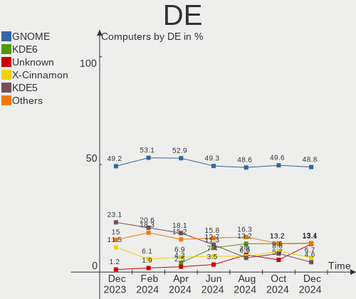
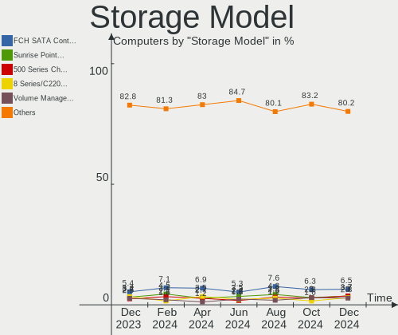
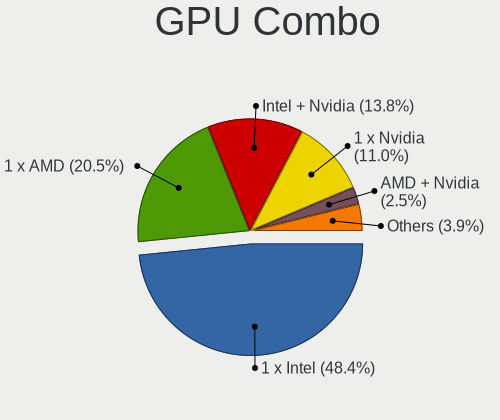
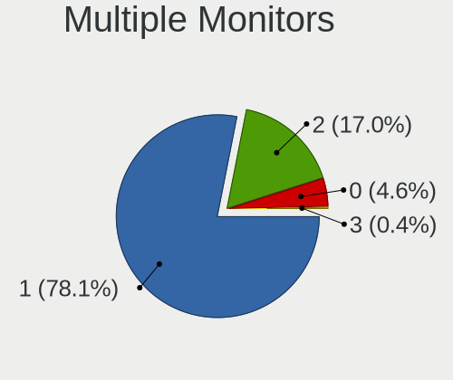
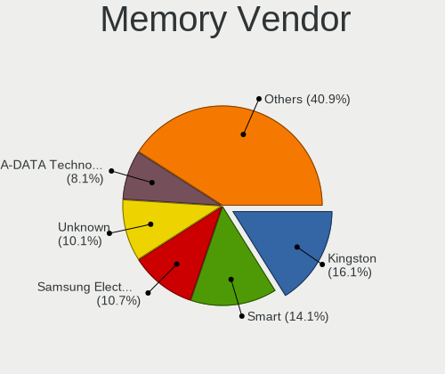

Linux in Brazil - Hardware Trends
---------------------------------

A project to identify most popular hardware characteristics and track their change
over time based on data collected by Linux users at https://Linux-Hardware.org.

Anyone can contribute to this report by the [hw-probe](https://github.com/linuxhw/hw-probe) tool:

    sudo -E hw-probe -all -upload

This is a report for all computer types. See also reports for [desktops](/Location/Brazil/Desktop/README.md) and [notebooks](/Location/Brazil/Notebook/README.md).

Period: Jun, 2023.

Contents
--------

* [ System ](#system)
  - [ OS                       ](#os)
  - [ OS Family                ](#os-family)
  - [ Kernel                   ](#kernel)
  - [ Kernel Family            ](#kernel-family)
  - [ Kernel Major Ver.        ](#kernel-major-ver)
  - [ Arch                     ](#arch)
  - [ DE                       ](#de)
  - [ Display Server           ](#display-server)
  - [ Display Manager          ](#display-manager)
  - [ OS Lang                  ](#os-lang)
  - [ Boot Mode                ](#boot-mode)
  - [ Filesystem               ](#filesystem)
  - [ Part. scheme             ](#part-scheme)
  - [ Dual Boot with Linux/BSD ](#dual-boot-with-linuxbsd)
  - [ Dual Boot (Win)          ](#dual-boot-win)

* [ Board ](#board)
  - [ Vendor                   ](#vendor)
  - [ Model                    ](#model)
  - [ Model Family             ](#model-family)
  - [ MFG Year                 ](#mfg-year)
  - [ Form Factor              ](#form-factor)
  - [ Secure Boot              ](#secure-boot)
  - [ Coreboot                 ](#coreboot)
  - [ RAM Size                 ](#ram-size)
  - [ RAM Used                 ](#ram-used)
  - [ Total Drives             ](#total-drives)
  - [ Has CD-ROM               ](#has-cd-rom)
  - [ Has Ethernet             ](#has-ethernet)
  - [ Has WiFi                 ](#has-wifi)
  - [ Has Bluetooth            ](#has-bluetooth)

* [ Location ](#location)
  - [ Country                  ](#country)
  - [ City                     ](#city)

* [ Drives ](#drives)
  - [ Drive Vendor             ](#drive-vendor)
  - [ Drive Model              ](#drive-model)
  - [ HDD Vendor               ](#hdd-vendor)
  - [ SSD Vendor               ](#ssd-vendor)
  - [ Drive Kind               ](#drive-kind)
  - [ Drive Connector          ](#drive-connector)
  - [ Drive Size               ](#drive-size)
  - [ Space Total              ](#space-total)
  - [ Space Used               ](#space-used)
  - [ Malfunc. Drives          ](#malfunc-drives)
  - [ Malfunc. Drive Vendor    ](#malfunc-drive-vendor)
  - [ Malfunc. HDD Vendor      ](#malfunc-hdd-vendor)
  - [ Malfunc. Drive Kind      ](#malfunc-drive-kind)
  - [ Failed Drives            ](#failed-drives)
  - [ Failed Drive Vendor      ](#failed-drive-vendor)
  - [ Drive Status             ](#drive-status)

* [ Storage controller ](#storage-controller)
  - [ Storage Vendor           ](#storage-vendor)
  - [ Storage Model            ](#storage-model)
  - [ Storage Kind             ](#storage-kind)

* [ Processor ](#processor)
  - [ CPU Vendor               ](#cpu-vendor)
  - [ CPU Model                ](#cpu-model)
  - [ CPU Model Family         ](#cpu-model-family)
  - [ CPU Cores                ](#cpu-cores)
  - [ CPU Sockets              ](#cpu-sockets)
  - [ CPU Threads              ](#cpu-threads)
  - [ CPU Op-Modes             ](#cpu-op-modes)
  - [ CPU Microcode            ](#cpu-microcode)
  - [ CPU Microarch            ](#cpu-microarch)

* [ Graphics ](#graphics)
  - [ GPU Vendor               ](#gpu-vendor)
  - [ GPU Model                ](#gpu-model)
  - [ GPU Combo                ](#gpu-combo)
  - [ GPU Driver               ](#gpu-driver)
  - [ GPU Memory               ](#gpu-memory)

* [ Monitor ](#monitor)
  - [ Monitor Vendor           ](#monitor-vendor)
  - [ Monitor Model            ](#monitor-model)
  - [ Monitor Resolution       ](#monitor-resolution)
  - [ Monitor Diagonal         ](#monitor-diagonal)
  - [ Monitor Width            ](#monitor-width)
  - [ Aspect Ratio             ](#aspect-ratio)
  - [ Monitor Area             ](#monitor-area)
  - [ Pixel Density            ](#pixel-density)
  - [ Multiple Monitors        ](#multiple-monitors)

* [ Network ](#network)
  - [ Net Controller Vendor    ](#net-controller-vendor)
  - [ Net Controller Model     ](#net-controller-model)
  - [ Wireless Vendor          ](#wireless-vendor)
  - [ Wireless Model           ](#wireless-model)
  - [ Ethernet Vendor          ](#ethernet-vendor)
  - [ Ethernet Model           ](#ethernet-model)
  - [ Net Controller Kind      ](#net-controller-kind)
  - [ Used Controller          ](#used-controller)
  - [ NICs                     ](#nics)
  - [ IPv6                     ](#ipv6)

* [ Bluetooth ](#bluetooth)
  - [ Bluetooth Vendor         ](#bluetooth-vendor)
  - [ Bluetooth Model          ](#bluetooth-model)

* [ Sound ](#sound)
  - [ Sound Vendor             ](#sound-vendor)
  - [ Sound Model              ](#sound-model)

* [ Memory ](#memory)
  - [ Memory Vendor            ](#memory-vendor)
  - [ Memory Model             ](#memory-model)
  - [ Memory Kind              ](#memory-kind)
  - [ Memory Form Factor       ](#memory-form-factor)
  - [ Memory Size              ](#memory-size)
  - [ Memory Speed             ](#memory-speed)

* [ Printers & scanners ](#printers--scanners)
  - [ Printer Vendor           ](#printer-vendor)
  - [ Printer Model            ](#printer-model)
  - [ Scanner Vendor           ](#scanner-vendor)
  - [ Scanner Model            ](#scanner-model)

* [ Camera ](#camera)
  - [ Camera Vendor            ](#camera-vendor)
  - [ Camera Model             ](#camera-model)

* [ Security ](#security)
  - [ Fingerprint Vendor       ](#fingerprint-vendor)
  - [ Fingerprint Model        ](#fingerprint-model)
  - [ Chipcard Vendor          ](#chipcard-vendor)
  - [ Chipcard Model           ](#chipcard-model)

* [ Unsupported ](#unsupported)
  - [ Unsupported Devices      ](#unsupported-devices)
  - [ Unsupported Device Types ](#unsupported-device-types)

System
------

OS
--

Installed operating systems

| Name                         | Computers | Percent |
|------------------------------|-----------|---------|
| Linux Mint 21.1              | 32        | 11.23%  |
| Ubuntu 22.04                 | 27        | 9.47%   |
| Fedora 38                    | 26        | 9.12%   |
| Pop!_OS 22.04                | 17        | 5.96%   |
| OpenMandriva 23.03           | 15        | 5.26%   |
| Arch Rolling                 | 14        | 4.91%   |
| Ubuntu 23.04                 | 13        | 4.56%   |
| Manjaro                      | 12        | 4.21%   |
| Debian 12                    | 12        | 4.21%   |
| Debian 11                    | 9         | 3.16%   |
| Zorin 16                     | 8         | 2.81%   |
| ArcoLinux Rolling            | 8         | 2.81%   |
| Ubuntu 22.10                 | 6         | 2.11%   |
| Ubuntu 20.04                 | 6         | 2.11%   |
| OpenMandriva 23.06           | 6         | 2.11%   |
| Kali 2023.2                  | 6         | 2.11%   |
| KDE neon 22.04               | 5         | 1.75%   |
| openSUSE Tumbleweed-XXXXXXXX | 4         | 1.4%    |
| LMDE 5                       | 4         | 1.4%    |
| Endless 5.0.4                | 4         | 1.4%    |
| OpenMandriva 4.3             | 3         | 1.05%   |
| Linux Mint 20.3              | 3         | 1.05%   |
| Kubuntu 22.04                | 3         | 1.05%   |
| openSUSE Microos-XXXXXXXX    | 2         | 0.7%    |
| OpenMandriva 23.01           | 2         | 0.7%    |
| Manjaro 23.0.0               | 2         | 0.7%    |
| Linux Mint 19.3              | 2         | 0.7%    |
| Fedora 36                    | 2         | 0.7%    |
| CentOS 7                     | 2         | 0.7%    |
| Zorin 15                     | 1         | 0.35%   |
| Xubuntu 22.04                | 1         | 0.35%   |
| Xubuntu 20.04                | 1         | 0.35%   |
| Ubuntu MATE 23.04            | 1         | 0.35%   |
| Ubuntu MATE 22.04            | 1         | 0.35%   |
| Ubuntu MATE 20.04            | 1         | 0.35%   |
| Ubuntu Budgie 22.04          | 1         | 0.35%   |
| SteamOS 3.4.8                | 1         | 0.35%   |
| Sparky 7.0                   | 1         | 0.35%   |
| Solus 4.3                    | 1         | 0.35%   |
| openSUSE Leap-15.5           | 1         | 0.35%   |

OS Family
---------

OS without a version

| Name          | Computers | Percent |
|---------------|-----------|---------|
| Ubuntu        | 52        | 18.25%  |
| Linux Mint    | 39        | 13.68%  |
| Fedora        | 28        | 9.82%   |
| OpenMandriva  | 26        | 9.12%   |
| Debian        | 22        | 7.72%   |
| Pop!_OS       | 17        | 5.96%   |
| Manjaro       | 14        | 4.91%   |
| Arch          | 14        | 4.91%   |
| Zorin         | 9         | 3.16%   |
| ArcoLinux     | 9         | 3.16%   |
| openSUSE      | 7         | 2.46%   |
| Kali          | 6         | 2.11%   |
| Endless       | 6         | 2.11%   |
| Kubuntu       | 5         | 1.75%   |
| KDE neon      | 5         | 1.75%   |
| LMDE          | 4         | 1.4%    |
| Ubuntu MATE   | 3         | 1.05%   |
| BigLinux      | 3         | 1.05%   |
| Xubuntu       | 2         | 0.7%    |
| Elementary    | 2         | 0.7%    |
| CentOS        | 2         | 0.7%    |
| Ubuntu Budgie | 1         | 0.35%   |
| SteamOS       | 1         | 0.35%   |
| Sparky        | 1         | 0.35%   |
| Solus         | 1         | 0.35%   |
| Nethserver    | 1         | 0.35%   |
| Lubuntu       | 1         | 0.35%   |
| GNOME OS      | 1         | 0.35%   |
| Garuda Linux  | 1         | 0.35%   |
| EndeavourOS   | 1         | 0.35%   |
| Archcraft     | 1         | 0.35%   |

Kernel
------

Version of the Linux kernel

| Version                 | Computers | Percent |
|-------------------------|-----------|---------|
| 5.15.0-73-generic       | 20        | 7.02%   |
| 5.19.0-43-generic       | 17        | 5.96%   |
| 5.15.0-75-generic       | 17        | 5.96%   |
| 6.2.6-76060206-generic  | 16        | 5.61%   |
| 6.2.6-desktop-1omv2390  | 15        | 5.26%   |
| 5.19.0-45-generic       | 15        | 5.26%   |
| 6.1.0-9-amd64           | 13        | 4.56%   |
| 6.1.31-2-MANJARO        | 8         | 2.81%   |
| 6.2.0-23-generic        | 7         | 2.46%   |
| 5.10.0-23-amd64         | 7         | 2.46%   |
| 6.3.5-desktop-3omv2390  | 6         | 2.11%   |
| 6.3.8-200.fc38.x86_64   | 5         | 1.75%   |
| 5.15.0-56-generic       | 5         | 1.75%   |
| 5.15.0-47-generic       | 5         | 1.75%   |
| 6.3.9-arch1-1           | 4         | 1.4%    |
| 6.3.8-arch1-1           | 4         | 1.4%    |
| 6.3.4-201.fc38.x86_64   | 4         | 1.4%    |
| 6.3.4-1-default         | 4         | 1.4%    |
| 6.2.9-300.fc38.x86_64   | 4         | 1.4%    |
| 6.2.0-20-generic        | 4         | 1.4%    |
| 5.15.0-76-generic       | 4         | 1.4%    |
| 6.3.6-arch1-1           | 3         | 1.05%   |
| 6.3.6-200.fc38.x86_64   | 3         | 1.05%   |
| 6.3.5-200.fc38.x86_64   | 3         | 1.05%   |
| 6.2.15-300.fc38.x86_64  | 3         | 1.05%   |
| 6.1.30-1-MANJARO        | 3         | 1.05%   |
| 6.1.0-kali9-amd64       | 3         | 1.05%   |
| 6.1.0-0.deb11.7-amd64   | 3         | 1.05%   |
| 5.4.0-150-generic       | 3         | 1.05%   |
| 5.16.7-desktop-1omv4003 | 3         | 1.05%   |
| 5.15.114-2-MANJARO      | 3         | 1.05%   |
| 6.3.5-arch1-1           | 2         | 0.7%    |
| 6.3.4-060304-generic    | 2         | 0.7%    |
| 6.2.0-24-generic        | 2         | 0.7%    |
| 6.1.0-kali5-amd64       | 2         | 0.7%    |
| 5.19.0-46-generic       | 2         | 0.7%    |
| 5.19.0-44-generic       | 2         | 0.7%    |
| 5.19.0-32-generic       | 2         | 0.7%    |
| 5.19.0-1025-lowlatency  | 2         | 0.7%    |
| 6.3.9-zen1-1-zen        | 1         | 0.35%   |

Kernel Family
-------------

Linux kernel without a distro release

| Version     | Computers | Percent |
|-------------|-----------|---------|
| 5.15.0      | 55        | 19.3%   |
| 5.19.0      | 42        | 14.74%  |
| 6.2.6       | 31        | 10.88%  |
| 6.1.0       | 22        | 7.72%   |
| 6.3.5       | 13        | 4.56%   |
| 6.2.0       | 13        | 4.56%   |
| 6.3.4       | 11        | 3.86%   |
| 6.3.8       | 10        | 3.51%   |
| 5.4.0       | 10        | 3.51%   |
| 5.10.0      | 9         | 3.16%   |
| 6.1.31      | 8         | 2.81%   |
| 6.3.9       | 7         | 2.46%   |
| 6.3.6       | 7         | 2.46%   |
| 6.3.7       | 5         | 1.75%   |
| 6.2.9       | 4         | 1.4%    |
| 6.2.15      | 4         | 1.4%    |
| 6.1.30      | 3         | 1.05%   |
| 5.16.7      | 3         | 1.05%   |
| 5.15.114    | 3         | 1.05%   |
| 3.10.0      | 3         | 1.05%   |
| 6.2.12      | 2         | 0.7%    |
| 6.3.3       | 1         | 0.35%   |
| 6.3.2       | 1         | 0.35%   |
| 6.3.0       | 1         | 0.35%   |
| 6.2.2       | 1         | 0.35%   |
| 6.2.16      | 1         | 0.35%   |
| 6.2.14      | 1         | 0.35%   |
| 6.1.35      | 1         | 0.35%   |
| 6.1.34      | 1         | 0.35%   |
| 6.1.33      | 1         | 0.35%   |
| 6.1.32      | 1         | 0.35%   |
| 6.1.2       | 1         | 0.35%   |
| 6.1.1       | 1         | 0.35%   |
| 6.0.12      | 1         | 0.35%   |
| 5.8.0       | 1         | 0.35%   |
| 5.19.17     | 1         | 0.35%   |
| 5.15.79     | 1         | 0.35%   |
| 5.15.107.62 | 1         | 0.35%   |
| 5.14.21     | 1         | 0.35%   |
| 5.13.1      | 1         | 0.35%   |

Kernel Major Ver.
-----------------

Linux kernel major version

| Version  | Computers | Percent |
|----------|-----------|---------|
| 5.15     | 59        | 20.7%   |
| 6.2      | 57        | 20%     |
| 6.3      | 56        | 19.65%  |
| 5.19     | 43        | 15.09%  |
| 6.1      | 39        | 13.68%  |
| 5.4      | 10        | 3.51%   |
| 5.10     | 9         | 3.16%   |
| 5.16     | 3         | 1.05%   |
| 3.10     | 3         | 1.05%   |
| 5.13     | 2         | 0.7%    |
| 6.0      | 1         | 0.35%   |
| 5.8      | 1         | 0.35%   |
| 5.15.107 | 1         | 0.35%   |
| 5.14     | 1         | 0.35%   |

Arch
----

OS architecture (x86_64, i586, etc.)

| Name   | Computers | Percent |
|--------|-----------|---------|
| x86_64 | 284       | 99.65%  |
| i686   | 1         | 0.35%   |

DE
--

Desktop Environment

| Name          | Computers | Percent |
|---------------|-----------|---------|
| GNOME         | 138       | 48.42%  |
| KDE5          | 56        | 19.65%  |
| X-Cinnamon    | 35        | 12.28%  |
| XFCE          | 24        | 8.42%   |
| MATE          | 10        | 3.51%   |
| Unknown       | 9         | 3.16%   |
| Pantheon      | 2         | 0.7%    |
| i3            | 2         | 0.7%    |
| Cinnamon      | 2         | 0.7%    |
| Budgie        | 2         | 0.7%    |
| LXQt          | 1         | 0.35%   |
| KDE           | 1         | 0.35%   |
| Enlightenment | 1         | 0.35%   |
| Deepin        | 1         | 0.35%   |
| bspwm         | 1         | 0.35%   |

Display Server
--------------

X11 or Wayland

| Name    | Computers | Percent |
|---------|-----------|---------|
| X11     | 196       | 68.77%  |
| Wayland | 81        | 28.42%  |
| Tty     | 4         | 1.4%    |
| Unknown | 4         | 1.4%    |

Display Manager
---------------

SDDM, LightDM, etc.

| Name    | Computers | Percent |
|---------|-----------|---------|
| Unknown | 132       | 46.32%  |
| GDM3    | 54        | 18.95%  |
| SDDM    | 41        | 14.39%  |
| LightDM | 39        | 13.68%  |
| GDM     | 19        | 6.67%   |

OS Lang
-------

Language

| Lang    | Computers | Percent |
|---------|-----------|---------|
| pt_BR   | 191       | 67.02%  |
| en_US   | 86        | 30.18%  |
| en_GB   | 2         | 0.7%    |
| C       | 2         | 0.7%    |
| pt_PT   | 1         | 0.35%   |
| pt_BR~  | 1         | 0.35%   |
| en_CA   | 1         | 0.35%   |
| Unknown | 1         | 0.35%   |

Boot Mode
---------

EFI or BIOS

| Mode | Computers | Percent |
|------|-----------|---------|
| BIOS | 149       | 52.28%  |
| EFI  | 136       | 47.72%  |

Filesystem
----------

Type of filesystem

| Type    | Computers | Percent |
|---------|-----------|---------|
| Ext4    | 175       | 61.4%   |
| Btrfs   | 52        | 18.25%  |
| Tmpfs   | 31        | 10.88%  |
| Overlay | 19        | 6.67%   |
| Xfs     | 6         | 2.11%   |
| Zfs     | 1         | 0.35%   |
| F2fs    | 1         | 0.35%   |

Part. scheme
------------

Scheme of partitioning

| Type    | Computers | Percent |
|---------|-----------|---------|
| GPT     | 129       | 45.26%  |
| Unknown | 123       | 43.16%  |
| MBR     | 33        | 11.58%  |

Dual Boot with Linux/BSD
------------------------

Hosting more than one Linux/BSD

| Dual boot | Computers | Percent |
|-----------|-----------|---------|
| No        | 250       | 87.72%  |
| Yes       | 35        | 12.28%  |

Dual Boot (Win)
---------------

Hosting Linux and Windows

| Dual boot | Computers | Percent |
|-----------|-----------|---------|
| No        | 215       | 75.44%  |
| Yes       | 70        | 24.56%  |

Board
-----

Vendor
------

Motherboard manufacturer

| Name                  | Computers | Percent |
|-----------------------|-----------|---------|
| Dell                  | 48        | 16.84%  |
| Lenovo                | 26        | 9.12%   |
| Acer                  | 24        | 8.42%   |
| Intel                 | 23        | 8.07%   |
| ASUSTek Computer      | 23        | 8.07%   |
| Gigabyte Technology   | 18        | 6.32%   |
| Samsung Electronics   | 15        | 5.26%   |
| Positivo              | 15        | 5.26%   |
| Hewlett-Packard       | 13        | 4.56%   |
| ASRock                | 8         | 2.81%   |
| Biostar               | 6         | 2.11%   |
| MSI                   | 5         | 1.75%   |
| Apple                 | 5         | 1.75%   |
| Unknown               | 5         | 1.75%   |
| Sony                  | 4         | 1.4%    |
| Huanan                | 4         | 1.4%    |
| Semp Toshiba          | 3         | 1.05%   |
| Itautec               | 3         | 1.05%   |
| eMachines             | 3         | 1.05%   |
| Toshiba               | 2         | 0.7%    |
| Positivo Bahia - VAIO | 2         | 0.7%    |
| PCWare                | 2         | 0.7%    |
| Multilaser            | 2         | 0.7%    |
| Daten Tecnologia      | 2         | 0.7%    |
| Compaq                | 2         | 0.7%    |
| ZR                    | 1         | 0.35%   |
| Valve                 | 1         | 0.35%   |
| TYAN Computer         | 1         | 0.35%   |
| Techvision            | 1         | 0.35%   |
| System76              | 1         | 0.35%   |
| Supermicro            | 1         | 0.35%   |
| Standard              | 1         | 0.35%   |
| Portwell              | 1         | 0.35%   |
| PERTOSA               | 1         | 0.35%   |
| Pegatron              | 1         | 0.35%   |
| Notebook              | 1         | 0.35%   |
| Kllisre               | 1         | 0.35%   |
| Kennex                | 1         | 0.35%   |
| IBM                   | 1         | 0.35%   |
| Google                | 1         | 0.35%   |

Model
-----

Motherboard model

| Name                                        | Computers | Percent |
|---------------------------------------------|-----------|---------|
| Unknown                                     | 7         | 2.46%   |
| Intel H61                                   | 6         | 2.11%   |
| Samsung 550XCJ/550XCR                       | 3         | 1.05%   |
| Positivo Mobile                             | 3         | 1.05%   |
| Lenovo IdeaPad S145-15IWL 81S9              | 3         | 1.05%   |
| Itautec Infoway ST-4265                     | 3         | 1.05%   |
| Intel H55                                   | 3         | 1.05%   |
| Intel B75                                   | 3         | 1.05%   |
| Dell G15 5520                               | 3         | 1.05%   |
| ASUS VivoBook_ASUSLaptop X515DA_X515DA      | 3         | 1.05%   |
| Semp Toshiba IS 1413G                       | 2         | 0.7%    |
| Samsung 670Z5E                              | 2         | 0.7%    |
| Positivo Bahia - VAIO VJFE43F11X-XXXXXX     | 2         | 0.7%    |
| Lenovo ThinkCentre M75s Gen 2 11R9S02K00    | 2         | 0.7%    |
| Lenovo IdeaPad S145-15API 81V7              | 2         | 0.7%    |
| Intel X99                                   | 2         | 0.7%    |
| Gigabyte H81M-S2PH                          | 2         | 0.7%    |
| Dell Vostro 15 3510                         | 2         | 0.7%    |
| Dell Latitude 3420                          | 2         | 0.7%    |
| Dell Inspiron N4030                         | 2         | 0.7%    |
| Dell Inspiron 3583                          | 2         | 0.7%    |
| Dell Inspiron 3501                          | 2         | 0.7%    |
| Biostar B350GT3                             | 2         | 0.7%    |
| ASRock A320M-HD                             | 2         | 0.7%    |
| Acer Nitro AN515-44                         | 2         | 0.7%    |
| ZR A320M-F                                  | 1         | 0.35%   |
| Valve Jupiter                               | 1         | 0.35%   |
| TYAN S7020                                  | 1         | 0.35%   |
| Toshiba Satellite C855-233                  | 1         | 0.35%   |
| Toshiba PORTEGE R500                        | 1         | 0.35%   |
| Techvision TVI7309X                         | 1         | 0.35%   |
| System76 Gazelle                            | 1         | 0.35%   |
| Supermicro C7Z370-CG-L                      | 1         | 0.35%   |
| Sony VPCEA23FB                              | 1         | 0.35%   |
| Sony VPCCA15FX                              | 1         | 0.35%   |
| Sony SVF15213CBW                            | 1         | 0.35%   |
| Sony SVE17137CXB                            | 1         | 0.35%   |
| Semp Toshiba IS 1412                        | 1         | 0.35%   |
| Samsung RV411/RV511/E3511/S3511/RV711/E3411 | 1         | 0.35%   |
| Samsung 950XEE                              | 1         | 0.35%   |

Model Family
------------

Motherboard model prefix

| Name                                    | Computers | Percent |
|-----------------------------------------|-----------|---------|
| Dell Inspiron                           | 21        | 7.37%   |
| Lenovo IdeaPad                          | 15        | 5.26%   |
| Acer Aspire                             | 13        | 4.56%   |
| Acer Nitro                              | 8         | 2.81%   |
| Dell Vostro                             | 7         | 2.46%   |
| Unknown                                 | 7         | 2.46%   |
| Intel H61                               | 6         | 2.11%   |
| Dell Latitude                           | 6         | 2.11%   |
| ASUS VivoBook                           | 5         | 1.75%   |
| Lenovo ThinkPad                         | 4         | 1.4%    |
| HP Pavilion                             | 4         | 1.4%    |
| Dell PowerEdge                          | 4         | 1.4%    |
| Dell OptiPlex                           | 4         | 1.4%    |
| ASUS TUF                                | 4         | 1.4%    |
| Semp Toshiba IS                         | 3         | 1.05%   |
| Samsung 550XCJ                          | 3         | 1.05%   |
| Positivo Mobile                         | 3         | 1.05%   |
| Lenovo ThinkCentre                      | 3         | 1.05%   |
| Itautec Infoway                         | 3         | 1.05%   |
| Intel H55                               | 3         | 1.05%   |
| Intel B75                               | 3         | 1.05%   |
| HP Compaq                               | 3         | 1.05%   |
| Gigabyte GA-78LMT-USB3                  | 3         | 1.05%   |
| Dell G15                                | 3         | 1.05%   |
| ASUS PRIME                              | 3         | 1.05%   |
| Samsung 670Z5E                          | 2         | 0.7%    |
| Positivo Bahia - VAIO VJFE43F11X-XXXXXX | 2         | 0.7%    |
| Intel X99                               | 2         | 0.7%    |
| Huanan X99-F8                           | 2         | 0.7%    |
| Gigabyte Z590                           | 2         | 0.7%    |
| Gigabyte H81M-S2PH                      | 2         | 0.7%    |
| Biostar B350GT3                         | 2         | 0.7%    |
| ASUS M5A78L-M                           | 2         | 0.7%    |
| ASRock A320M-HD                         | 2         | 0.7%    |
| Acer Predator                           | 2         | 0.7%    |
| ZR A320M-F                              | 1         | 0.35%   |
| Valve Jupiter                           | 1         | 0.35%   |
| TYAN S7020                              | 1         | 0.35%   |
| Toshiba Satellite                       | 1         | 0.35%   |
| Toshiba PORTEGE                         | 1         | 0.35%   |

MFG Year
--------

Motherboard manufacture year

| Year    | Computers | Percent |
|---------|-----------|---------|
| 2021    | 32        | 11.23%  |
| 2019    | 31        | 10.88%  |
| 2020    | 27        | 9.47%   |
| 2017    | 23        | 8.07%   |
| 2013    | 22        | 7.72%   |
| 2012    | 20        | 7.02%   |
| 2018    | 19        | 6.67%   |
| 2022    | 18        | 6.32%   |
| 2011    | 17        | 5.96%   |
| 2010    | 16        | 5.61%   |
| 2016    | 12        | 4.21%   |
| 2014    | 12        | 4.21%   |
| 2009    | 12        | 4.21%   |
| 2015    | 7         | 2.46%   |
| 2008    | 6         | 2.11%   |
| 2023    | 5         | 1.75%   |
| 2007    | 3         | 1.05%   |
| 2006    | 2         | 0.7%    |
| Unknown | 1         | 0.35%   |

Form Factor
-----------

Physical design of the computer

| Name        | Computers | Percent |
|-------------|-----------|---------|
| Notebook    | 149       | 52.28%  |
| Desktop     | 121       | 42.46%  |
| Server      | 7         | 2.46%   |
| Convertible | 4         | 1.4%    |
| Mini pc     | 2         | 0.7%    |
| Tablet      | 1         | 0.35%   |
| All in one  | 1         | 0.35%   |

Secure Boot
-----------

Enabled or disabled

| State    | Computers | Percent |
|----------|-----------|---------|
| Disabled | 265       | 92.98%  |
| Enabled  | 20        | 7.02%   |

Coreboot
--------

Have coreboot on board

| Used | Computers | Percent |
|------|-----------|---------|
| No   | 284       | 99.65%  |
| Yes  | 1         | 0.35%   |

RAM Size
--------

Total RAM memory

| Size in GB  | Computers | Percent |
|-------------|-----------|---------|
| 4.01-8.0    | 76        | 26.67%  |
| 16.01-24.0  | 63        | 22.11%  |
| 3.01-4.0    | 52        | 18.25%  |
| 8.01-16.0   | 45        | 15.79%  |
| 32.01-64.0  | 19        | 6.67%   |
| 1.01-2.0    | 9         | 3.16%   |
| 24.01-32.0  | 7         | 2.46%   |
| 2.01-3.0    | 6         | 2.11%   |
| 64.01-256.0 | 6         | 2.11%   |
| 0.51-1.0    | 2         | 0.7%    |

RAM Used
--------

Used RAM memory

| Used GB    | Computers | Percent |
|------------|-----------|---------|
| 1.01-2.0   | 84        | 29.47%  |
| 2.01-3.0   | 77        | 27.02%  |
| 4.01-8.0   | 54        | 18.95%  |
| 3.01-4.0   | 44        | 15.44%  |
| 8.01-16.0  | 10        | 3.51%   |
| 0.51-1.0   | 9         | 3.16%   |
| 0.01-0.5   | 4         | 1.4%    |
| 16.01-24.0 | 3         | 1.05%   |

Total Drives
------------

Number of drives on board

| Drives | Computers | Percent |
|--------|-----------|---------|
| 1      | 175       | 61.4%   |
| 2      | 71        | 24.91%  |
| 3      | 22        | 7.72%   |
| 4      | 8         | 2.81%   |
| 5      | 6         | 2.11%   |
| 0      | 2         | 0.7%    |
| 6      | 1         | 0.35%   |

Has CD-ROM
----------

Has CD-ROM on board

| Presented | Computers | Percent |
|-----------|-----------|---------|
| No        | 213       | 74.74%  |
| Yes       | 72        | 25.26%  |

Has Ethernet
------------

Has Ethernet on board

| Presented | Computers | Percent |
|-----------|-----------|---------|
| Yes       | 257       | 90.18%  |
| No        | 28        | 9.82%   |

Has WiFi
--------

Has WiFi module

| Presented | Computers | Percent |
|-----------|-----------|---------|
| Yes       | 210       | 73.68%  |
| No        | 75        | 26.32%  |

Has Bluetooth
-------------

Has Bluetooth module

| Presented | Computers | Percent |
|-----------|-----------|---------|
| Yes       | 151       | 52.98%  |
| No        | 134       | 47.02%  |

Location
--------

Country
-------

Geographic location (country)

| Country | Computers | Percent |
|---------|-----------|---------|
| Brazil  | 285       | 100%    |

City
----

Geographic location (city)

| City                 | Computers | Percent |
|----------------------|-----------|---------|
| Sao Paulo            | 37        | 12.98%  |
| Rio de Janeiro       | 23        | 8.07%   |
| Porto Alegre         | 11        | 3.86%   |
| Fortaleza            | 11        | 3.86%   |
| Brasília            | 11        | 3.86%   |
| Curitiba             | 9         | 3.16%   |
| Vila Velha           | 7         | 2.46%   |
| Belo Horizonte       | 7         | 2.46%   |
| Osasco               | 6         | 2.11%   |
| Salvador             | 5         | 1.75%   |
| Palmas               | 5         | 1.75%   |
| Natal                | 5         | 1.75%   |
| Maceió              | 4         | 1.4%    |
| Goiânia             | 4         | 1.4%    |
| Campinas             | 4         | 1.4%    |
| Vitória             | 3         | 1.05%   |
| Santo André         | 3         | 1.05%   |
| Praia Grande         | 3         | 1.05%   |
| Manaus               | 3         | 1.05%   |
| Joao Pessoa          | 3         | 1.05%   |
| Belém               | 3         | 1.05%   |
| Volta Redonda        | 2         | 0.7%    |
| Uberlândia          | 2         | 0.7%    |
| Sao José dos Campos | 2         | 0.7%    |
| Sao Goncalo          | 2         | 0.7%    |
| Presidente Prudente  | 2         | 0.7%    |
| Maua                 | 2         | 0.7%    |
| Lorena               | 2         | 0.7%    |
| Londrina             | 2         | 0.7%    |
| Joinville            | 2         | 0.7%    |
| Indaiatuba           | 2         | 0.7%    |
| Florianópolis       | 2         | 0.7%    |
| Fazenda Rio Grande   | 2         | 0.7%    |
| Cordeiropolis        | 2         | 0.7%    |
| Caxias do Sul        | 2         | 0.7%    |
| Campo Grande         | 2         | 0.7%    |
| Boa Vista            | 2         | 0.7%    |
| Araçatuba           | 2         | 0.7%    |
| Xanxere              | 1         | 0.35%   |
| Votorantim           | 1         | 0.35%   |

Drives
------

Drive Vendor
------------

Hard drive vendors

| Vendor                         | Computers | Drives | Percent |
|--------------------------------|-----------|--------|---------|
| WDC                            | 67        | 72     | 16.34%  |
| Seagate                        | 63        | 84     | 15.37%  |
| Kingston                       | 44        | 46     | 10.73%  |
| Samsung Electronics            | 29        | 31     | 7.07%   |
| China                          | 25        | 27     | 6.1%    |
| Toshiba                        | 18        | 18     | 4.39%   |
| Sandisk                        | 16        | 18     | 3.9%    |
| ADATA Technology               | 10        | 10     | 2.44%   |
| A-DATA Technology              | 10        | 10     | 2.44%   |
| Silicon Motion                 | 8         | 9      | 1.95%   |
| Crucial                        | 8         | 9      | 1.95%   |
| Unknown                        | 7         | 7      | 1.71%   |
| Realtek Semiconductor          | 7         | 7      | 1.71%   |
| KingSpec                       | 7         | 7      | 1.71%   |
| SSSTC                          | 6         | 6      | 1.46%   |
| SK hynix                       | 6         | 6      | 1.46%   |
| Kingston Technology Company    | 6         | 6      | 1.46%   |
| Solid State Storage            | 5         | 5      | 1.22%   |
| Netac                          | 5         | 5      | 1.22%   |
| MAXIO Technology (Hangzhou)    | 4         | 4      | 0.98%   |
| JMicron Technology             | 4         | 4      | 0.98%   |
| Intel                          | 4         | 4      | 0.98%   |
| XrayDisk                       | 3         | 3      | 0.73%   |
| PNY                            | 3         | 3      | 0.73%   |
| Phison Electronics             | 3         | 4      | 0.73%   |
| Hitachi                        | 3         | 3      | 0.73%   |
| Apple                          | 3         | 3      | 0.73%   |
| Team                           | 2         | 2      | 0.49%   |
| Solid State Storage Technology | 2         | 2      | 0.49%   |
| KIOXIA                         | 2         | 2      | 0.49%   |
| Unknown                        | 2         | 2      | 0.49%   |
| XPG                            | 1         | 1      | 0.24%   |
| Win Memory                     | 1         | 1      | 0.24%   |
| WALRAM                         | 1         | 1      | 0.24%   |
| VUCCAN                         | 1         | 1      | 0.24%   |
| Super Talent                   | 1         | 1      | 0.24%   |
| SPCC                           | 1         | 1      | 0.24%   |
| ShiJi                          | 1         | 1      | 0.24%   |
| RZX                            | 1         | 1      | 0.24%   |
| RECADATA                       | 1         | 1      | 0.24%   |

Drive Model
-----------

Hard drive models

| Model                                                 | Computers | Percent |
|-------------------------------------------------------|-----------|---------|
| Kingston SA400S37240G 240GB SSD                       | 16        | 3.72%   |
| Seagate ST500LM012 HN-M500MBB 500GB                   | 7         | 1.63%   |
| China SSD 120GB                                       | 6         | 1.4%    |
| Seagate ST1000DM003-1CH162 1TB                        | 5         | 1.16%   |
| Samsung HD502HJ 500GB                                 | 5         | 1.16%   |
| Kingston SA400S37120G 120GB SSD                       | 5         | 1.16%   |
| WDC WDS240G2G0A-00JH30 240GB SSD                      | 4         | 0.93%   |
| Toshiba MQ04ABF100 1TB                                | 4         | 0.93%   |
| Silicon Motion SM2263EN/SM2263XT SSD Controller 256GB | 4         | 0.93%   |
| Seagate ST9500325AS 500GB                             | 4         | 0.93%   |
| Seagate ST500DM002-1BD142 500GB                       | 4         | 0.93%   |
| Seagate ST1000LM024 HN-M101MBB 1TB                    | 4         | 0.93%   |
| Seagate Expansion 1TB                                 | 4         | 0.93%   |
| Realtek RTS5763DL NVMe SSD Controller 512GB           | 4         | 0.93%   |
| MAXIO (Hangzhou) NVMe SSD Controller MAP1202 512GB    | 4         | 0.93%   |
| Kingston Company SNV2S1000G 1TB                       | 4         | 0.93%   |
| Kingston SA400S37480G 480GB SSD                       | 4         | 0.93%   |
| JMicron Generic 240GB                                 | 4         | 0.93%   |
| Crucial CT240BX500SSD1 240GB                          | 4         | 0.93%   |
| China SSD 128GB                                       | 4         | 0.93%   |
| A-DATA IM2P33F3A NVMe 256GB                           | 4         | 0.93%   |
| WDC WD10SPZX-21Z10T0 1TB                              | 3         | 0.7%    |
| Toshiba MQ01ABD050 500GB                              | 3         | 0.7%    |
| Toshiba HDWD110 1TB                                   | 3         | 0.7%    |
| Solid State Storage SSSTC CL1-4D256 256GB             | 3         | 0.7%    |
| Seagate ST31000524AS 1TB                              | 3         | 0.7%    |
| Seagate ST1000LM035-1RK172 1TB                        | 3         | 0.7%    |
| Seagate ST1000DM010-2EP102 1TB                        | 3         | 0.7%    |
| Samsung HD103SI 1TB                                   | 3         | 0.7%    |
| PNY CS900 240GB SSD                                   | 3         | 0.7%    |
| Crucial CT480BX500SSD1 480GB                          | 3         | 0.7%    |
| China SSD 512GB                                       | 3         | 0.7%    |
| China SSD 256GB                                       | 3         | 0.7%    |
| ADATA SM2P32A8-256GC1 256GB                           | 3         | 0.7%    |
| XrayDisk 120GB                                        | 2         | 0.47%   |
| WDC WDS500G2B0A-00SM50 500GB SSD                      | 2         | 0.47%   |
| WDC WDS120G1G0A-00SS50 120GB SSD                      | 2         | 0.47%   |
| WDC WDS100T2G0A-00JH30 1TB SSD                        | 2         | 0.47%   |
| WDC WD5000LPVX-80V0TT0 500GB                          | 2         | 0.47%   |
| WDC WD5000LPVX-22V0TT0 500GB                          | 2         | 0.47%   |

HDD Vendor
----------

Hard disk drive vendors

| Vendor              | Computers | Drives | Percent |
|---------------------|-----------|--------|---------|
| Seagate             | 63        | 84     | 40.65%  |
| WDC                 | 53        | 56     | 34.19%  |
| Samsung Electronics | 18        | 18     | 11.61%  |
| Toshiba             | 16        | 16     | 10.32%  |
| Hitachi             | 3         | 3      | 1.94%   |
| HGST                | 1         | 1      | 0.65%   |
| ExcelStor           | 1         | 1      | 0.65%   |

SSD Vendor
----------

Solid state drive vendors

| Vendor              | Computers | Drives | Percent |
|---------------------|-----------|--------|---------|
| Kingston            | 38        | 39     | 27.14%  |
| China               | 25        | 27     | 17.86%  |
| WDC                 | 14        | 14     | 10%     |
| SanDisk             | 10        | 10     | 7.14%   |
| Crucial             | 8         | 9      | 5.71%   |
| KingSpec            | 7         | 7      | 5%      |
| Samsung Electronics | 5         | 6      | 3.57%   |
| Netac               | 4         | 4      | 2.86%   |
| PNY                 | 3         | 3      | 2.14%   |
| Apple               | 3         | 3      | 2.14%   |
| Toshiba             | 2         | 2      | 1.43%   |
| Team                | 2         | 2      | 1.43%   |
| Intel               | 2         | 2      | 1.43%   |
| Win Memory          | 1         | 1      | 0.71%   |
| Super Talent        | 1         | 1      | 0.71%   |
| SPCC                | 1         | 1      | 0.71%   |
| RZX                 | 1         | 1      | 0.71%   |
| Patriot             | 1         | 1      | 0.71%   |
| NTC                 | 1         | 1      | 0.71%   |
| MaxDigital          | 1         | 1      | 0.71%   |
| LITEONIT            | 1         | 1      | 0.71%   |
| LITEON              | 1         | 1      | 0.71%   |
| Lexar               | 1         | 1      | 0.71%   |
| Lenovo              | 1         | 1      | 0.71%   |
| KingDian            | 1         | 1      | 0.71%   |
| HUSKY               | 1         | 1      | 0.71%   |
| Hewlett-Packard     | 1         | 1      | 0.71%   |
| External            | 1         | 1      | 0.71%   |
| A-DATA Technology   | 1         | 1      | 0.71%   |
| Unknown             | 1         | 1      | 0.71%   |

Drive Kind
----------

HDD or SSD

| Kind    | Computers | Drives | Percent |
|---------|-----------|--------|---------|
| HDD     | 138       | 179    | 37.5%   |
| SSD     | 124       | 145    | 33.7%   |
| NVMe    | 92        | 110    | 25%     |
| Unknown | 10        | 10     | 2.72%   |
| MMC     | 4         | 4      | 1.09%   |

Drive Connector
---------------

SATA, SAS, NVMe, etc.

| Type | Computers | Drives | Percent |
|------|-----------|--------|---------|
| SATA | 218       | 326    | 67.28%  |
| NVMe | 91        | 106    | 28.09%  |
| SAS  | 11        | 12     | 3.4%    |
| MMC  | 4         | 4      | 1.23%   |

Drive Size
----------

Size of hard drive

| Size in TB | Computers | Drives | Percent |
|------------|-----------|--------|---------|
| 0.01-0.5   | 167       | 209    | 63.74%  |
| 0.51-1.0   | 76        | 91     | 29.01%  |
| 1.01-2.0   | 11        | 13     | 4.2%    |
| 3.01-4.0   | 3         | 6      | 1.15%   |
| 4.01-10.0  | 3         | 3      | 1.15%   |
| 2.01-3.0   | 2         | 2      | 0.76%   |

Space Total
-----------

Amount of disk space available on the file system

| Size in GB     | Computers | Percent |
|----------------|-----------|---------|
| 101-250        | 85        | 29.82%  |
| 251-500        | 57        | 20%     |
| 501-1000       | 39        | 13.68%  |
| 1001-2000      | 34        | 11.93%  |
| 1-20           | 23        | 8.07%   |
| 51-100         | 15        | 5.26%   |
| 21-50          | 11        | 3.86%   |
| More than 3000 | 9         | 3.16%   |
| 2001-3000      | 6         | 2.11%   |
| Unknown        | 6         | 2.11%   |

Space Used
----------

Amount of used disk space

| Used GB        | Computers | Percent |
|----------------|-----------|---------|
| 1-20           | 92        | 32.28%  |
| 21-50          | 61        | 21.4%   |
| 101-250        | 41        | 14.39%  |
| 51-100         | 36        | 12.63%  |
| 251-500        | 17        | 5.96%   |
| 501-1000       | 16        | 5.61%   |
| 1001-2000      | 7         | 2.46%   |
| Unknown        | 6         | 2.11%   |
| More than 3000 | 5         | 1.75%   |
| 2001-3000      | 3         | 1.05%   |
| 0              | 1         | 0.35%   |

Malfunc. Drives
---------------

Drive models with a malfunction

| Model                                                     | Computers | Drives | Percent |
|-----------------------------------------------------------|-----------|--------|---------|
| Toshiba MQ01ABD050 500GB                                  | 2         | 2      | 4.65%   |
| Seagate ST1000LM024 HN-M101MBB 1TB                        | 2         | 2      | 4.65%   |
| Samsung Electronics HD322HJ 320GB                         | 2         | 2      | 4.65%   |
| China SSD 120GB                                           | 2         | 2      | 4.65%   |
| WDC WD5000LPVX-80V0TT0 500GB                              | 1         | 1      | 2.33%   |
| WDC WD5000AAKX-003CA0 500GB                               | 1         | 1      | 2.33%   |
| WDC WD5000AAKX-001CA0 500GB                               | 1         | 1      | 2.33%   |
| WDC WD5000AAKS-00V1A0 500GB                               | 1         | 1      | 2.33%   |
| WDC WD5000AAKS-00UU3A0 500GB                              | 1         | 1      | 2.33%   |
| WDC WD3200BPVT-24JJ5T0 320GB                              | 1         | 1      | 2.33%   |
| WDC WD3200BEVT-22ZCT0 320GB                               | 1         | 1      | 2.33%   |
| WDC WD2500YS-18SHB2 250GB                                 | 1         | 1      | 2.33%   |
| WDC WD1600YS-18SHB2 160GB                                 | 1         | 1      | 2.33%   |
| WDC WD10EZEX-00BN5A0 1TB                                  | 1         | 1      | 2.33%   |
| WDC WD1002FAEX-00Y9A0 1TB                                 | 1         | 1      | 2.33%   |
| Toshiba MQ04ABF100 1TB                                    | 1         | 1      | 2.33%   |
| Toshiba MK8037GSX 80GB                                    | 1         | 1      | 2.33%   |
| Team T253X1120G 120GB SSD                                 | 1         | 1      | 2.33%   |
| Silicon Motion NE-256 256GB                               | 1         | 1      | 2.33%   |
| ShiJi 1TB                                                 | 1         | 1      | 2.33%   |
| Seagate ST8000VN0022-2EL112 8TB                           | 1         | 1      | 2.33%   |
| Seagate ST500DM002-1BD142 500GB                           | 1         | 1      | 2.33%   |
| Seagate ST380811AS 80GB                                   | 1         | 1      | 2.33%   |
| Seagate ST3500413AS 500GB                                 | 1         | 1      | 2.33%   |
| Seagate ST31000524AS 1TB                                  | 1         | 1      | 2.33%   |
| Seagate ST1000LM035-1RK172 1TB                            | 1         | 2      | 2.33%   |
| Samsung Electronics HD502HJ 500GB                         | 1         | 1      | 2.33%   |
| Samsung Electronics HD161HJ 160GB                         | 1         | 1      | 2.33%   |
| Samsung Electronics HD161GJ 160GB                         | 1         | 1      | 2.33%   |
| Samsung Electronics HD103SI 1TB                           | 1         | 1      | 2.33%   |
| Realtek Semiconductor RTS5763DL NVMe SSD Controller 512GB | 1         | 1      | 2.33%   |
| LITEON CV8-8E128-HP 128GB SSD                             | 1         | 1      | 2.33%   |
| Kingston SV300S37A120G 120GB SSD                          | 1         | 1      | 2.33%   |
| Kingston SUV400S37240G 240GB SSD                          | 1         | 1      | 2.33%   |
| Hitachi HTS545032B9A300 320GB                             | 1         | 1      | 2.33%   |
| Hitachi HDT721032SLA380 320GB                             | 1         | 1      | 2.33%   |
| HGST HTS545050A7E680 500GB                                | 1         | 1      | 2.33%   |
| ExcelStor Technology J8160S 160GB                         | 1         | 1      | 2.33%   |
| China SSD 240GB                                           | 1         | 1      | 2.33%   |

Malfunc. Drive Vendor
---------------------

Vendors of faulty drives

| Vendor                | Computers | Drives | Percent |
|-----------------------|-----------|--------|---------|
| WDC                   | 11        | 11     | 25.58%  |
| Seagate               | 8         | 9      | 18.6%   |
| Samsung Electronics   | 6         | 6      | 13.95%  |
| Toshiba               | 4         | 4      | 9.3%    |
| China                 | 3         | 3      | 6.98%   |
| Kingston              | 2         | 2      | 4.65%   |
| Hitachi               | 2         | 2      | 4.65%   |
| Team                  | 1         | 1      | 2.33%   |
| Silicon Motion        | 1         | 1      | 2.33%   |
| ShiJi                 | 1         | 1      | 2.33%   |
| Realtek Semiconductor | 1         | 1      | 2.33%   |
| LITEON                | 1         | 1      | 2.33%   |
| HGST                  | 1         | 1      | 2.33%   |
| ExcelStor             | 1         | 1      | 2.33%   |

Malfunc. HDD Vendor
-------------------

Vendors of faulty HDD drives

| Vendor              | Computers | Drives | Percent |
|---------------------|-----------|--------|---------|
| WDC                 | 11        | 11     | 33.33%  |
| Seagate             | 8         | 9      | 24.24%  |
| Samsung Electronics | 6         | 6      | 18.18%  |
| Toshiba             | 4         | 4      | 12.12%  |
| Hitachi             | 2         | 2      | 6.06%   |
| HGST                | 1         | 1      | 3.03%   |
| ExcelStor           | 1         | 1      | 3.03%   |

Malfunc. Drive Kind
-------------------

Kinds of faulty drives

| Kind | Computers | Drives | Percent |
|------|-----------|--------|---------|
| HDD  | 30        | 34     | 75%     |
| SSD  | 7         | 7      | 17.5%   |
| NVMe | 3         | 3      | 7.5%    |

Failed Drives
-------------

Failed drive models

| Model                        | Computers | Drives | Percent |
|------------------------------|-----------|--------|---------|
| WDC WD3200BPVT-00JJ5T0 320GB | 1         | 1      | 100%    |

Failed Drive Vendor
-------------------

Failed drive vendors

| Vendor | Computers | Drives | Percent |
|--------|-----------|--------|---------|
| WDC    | 1         | 1      | 100%    |

Drive Status
------------

Number of failed and malfunc. drives

| Status   | Computers | Drives | Percent |
|----------|-----------|--------|---------|
| Detected | 165       | 257    | 54.64%  |
| Works    | 98        | 146    | 32.45%  |
| Malfunc  | 38        | 44     | 12.58%  |
| Failed   | 1         | 1      | 0.33%   |

Storage controller
------------------

Storage Vendor
--------------

Storage controller vendors

| Vendor                           | Computers | Percent |
|----------------------------------|-----------|---------|
| Intel                            | 214       | 57.07%  |
| AMD                              | 49        | 13.07%  |
| ADATA Technology                 | 19        | 5.07%   |
| Solid State Storage Technology   | 13        | 3.47%   |
| Kingston Technology Company      | 11        | 2.93%   |
| Silicon Motion                   | 9         | 2.4%    |
| SanDisk                          | 9         | 2.4%    |
| Samsung Electronics              | 7         | 1.87%   |
| Realtek Semiconductor            | 7         | 1.87%   |
| SK hynix                         | 6         | 1.6%    |
| Marvell Technology Group         | 6         | 1.6%    |
| Phison Electronics               | 4         | 1.07%   |
| MAXIO Technology (Hangzhou)      | 4         | 1.07%   |
| Nvidia                           | 2         | 0.53%   |
| LSI Logic / Symbios Logic        | 2         | 0.53%   |
| KIOXIA                           | 2         | 0.53%   |
| INNOGRIT                         | 2         | 0.53%   |
| ASMedia Technology               | 2         | 0.53%   |
| TenaFe                           | 1         | 0.27%   |
| Solidigm                         | 1         | 0.27%   |
| Silicon Integrated Systems [SiS] | 1         | 0.27%   |
| Netac Technology                 | 1         | 0.27%   |
| Micron/Crucial Technology        | 1         | 0.27%   |
| Micron Technology                | 1         | 0.27%   |
| JMicron Technology               | 1         | 0.27%   |

Storage Model
-------------

Storage controller models

| Model                                                                          | Computers | Percent |
|--------------------------------------------------------------------------------|-----------|---------|
| AMD FCH SATA Controller [AHCI mode]                                            | 32        | 7.39%   |
| Intel 7 Series Chipset Family 6-port SATA Controller [AHCI mode]               | 16        | 3.7%    |
| Intel Sunrise Point-LP SATA Controller [AHCI mode]                             | 14        | 3.23%   |
| Intel Tiger Lake-LP SATA Controller                                            | 13        | 3%      |
| Intel NM10/ICH7 Family SATA Controller [IDE mode]                              | 13        | 3%      |
| Intel 82801G (ICH7 Family) IDE Controller                                      | 12        | 2.77%   |
| Intel 6 Series/C200 Series Chipset Family 6 port Desktop SATA AHCI Controller  | 12        | 2.77%   |
| Solid State Storage CL1-3D256-Q11 NVMe SSD M.2                                 | 11        | 2.54%   |
| Intel 8 Series/C220 Series Chipset Family 6-port SATA Controller 1 [AHCI mode] | 11        | 2.54%   |
| Intel 7 Series/C210 Series Chipset Family 6-port SATA Controller [AHCI mode]   | 9         | 2.08%   |
| Intel Volume Management Device NVMe RAID Controller                            | 8         | 1.85%   |
| Intel 6 Series/C200 Series Chipset Family 6 port Mobile SATA AHCI Controller   | 8         | 1.85%   |
| ADATA A Non-Volatile memory controller                                         | 8         | 1.85%   |
| Silicon Motion SM2263EN/SM2263XT SSD Controller                                | 7         | 1.62%   |
| Kingston Company Company Non-Volatile memory controller                        | 7         | 1.62%   |
| Intel 8 Series SATA Controller 1 [AHCI mode]                                   | 7         | 1.62%   |
| Intel 5 Series/3400 Series Chipset 6 port SATA AHCI Controller                 | 7         | 1.62%   |
| Intel Comet Lake SATA AHCI Controller                                          | 6         | 1.39%   |
| Intel Cannon Point-LP SATA Controller [AHCI Mode]                              | 6         | 1.39%   |
| Intel 82801IBM/IEM (ICH9M/ICH9M-E) 4 port SATA Controller [AHCI mode]          | 6         | 1.39%   |
| Intel 82801 Mobile SATA Controller [RAID mode]                                 | 6         | 1.39%   |
| Intel Cannon Lake PCH SATA AHCI Controller                                     | 5         | 1.15%   |
| Intel 5 Series/3400 Series Chipset 4 port SATA IDE Controller                  | 5         | 1.15%   |
| Intel 5 Series/3400 Series Chipset 2 port SATA IDE Controller                  | 5         | 1.15%   |
| Intel 200 Series PCH SATA controller [AHCI mode]                               | 5         | 1.15%   |
| AMD SB7x0/SB8x0/SB9x0 SATA Controller [IDE mode]                               | 5         | 1.15%   |
| AMD SB7x0/SB8x0/SB9x0 SATA Controller [AHCI mode]                              | 5         | 1.15%   |
| AMD SB7x0/SB8x0/SB9x0 IDE Controller                                           | 5         | 1.15%   |
| AMD FCH SATA Controller D                                                      | 5         | 1.15%   |
| AMD 300 Series Chipset SATA Controller                                         | 5         | 1.15%   |
| ADATA Non-Volatile memory controller                                           | 5         | 1.15%   |
| Samsung NVMe SSD Controller 980                                                | 4         | 0.92%   |
| Realtek RTS5763DL NVMe SSD Controller                                          | 4         | 0.92%   |
| MAXIO (Hangzhou) NVMe SSD Controller MAP1202                                   | 4         | 0.92%   |
| Intel Wildcat Point-LP SATA Controller [AHCI Mode]                             | 4         | 0.92%   |
| Intel SATA Controller [RAID mode]                                              | 4         | 0.92%   |
| Intel Ice Lake-LP SATA Controller [AHCI mode]                                  | 4         | 0.92%   |
| Intel Cannon Lake Mobile PCH SATA AHCI Controller                              | 4         | 0.92%   |
| Intel 400 Series Chipset Family SATA AHCI Controller                           | 4         | 0.92%   |
| AMD 500 Series Chipset SATA Controller                                         | 4         | 0.92%   |

Storage Kind
------------

Kind of storage controller (IDE, SATA, NVMe, SAS, ...)

| Kind | Computers | Percent |
|------|-----------|---------|
| SATA | 223       | 58.84%  |
| NVMe | 91        | 24.01%  |
| IDE  | 43        | 11.35%  |
| RAID | 21        | 5.54%   |
| SCSI | 1         | 0.26%   |

Processor
---------

CPU Vendor
----------

Processor vendors

| Vendor | Computers | Percent |
|--------|-----------|---------|
| Intel  | 232       | 81.4%   |
| AMD    | 53        | 18.6%   |

CPU Model
---------

Processor models

| Model                                         | Computers | Percent |
|-----------------------------------------------|-----------|---------|
| Intel 11th Gen Core i5-1135G7 @ 2.40GHz       | 9         | 3.16%   |
| AMD Ryzen 5 3500U with Radeon Vega Mobile Gfx | 7         | 2.46%   |
| Intel 11th Gen Core i7-1165G7 @ 2.80GHz       | 5         | 1.75%   |
| Intel Core i7-10510U CPU @ 1.80GHz            | 4         | 1.4%    |
| Intel Core i5-3230M CPU @ 2.60GHz             | 4         | 1.4%    |
| Intel Core i5-2400 CPU @ 3.10GHz              | 4         | 1.4%    |
| Intel Pentium Dual-Core CPU T4500 @ 2.30GHz   | 3         | 1.05%   |
| Intel Pentium Dual-Core CPU E5300 @ 2.60GHz   | 3         | 1.05%   |
| Intel Core i7-9750H CPU @ 2.60GHz             | 3         | 1.05%   |
| Intel Core i7-8565U CPU @ 1.80GHz             | 3         | 1.05%   |
| Intel Core i7-7700HQ CPU @ 2.80GHz            | 3         | 1.05%   |
| Intel Core i7-3770 CPU @ 3.40GHz              | 3         | 1.05%   |
| Intel Core i7-2600 CPU @ 3.40GHz              | 3         | 1.05%   |
| Intel Core i5-8250U CPU @ 1.60GHz             | 3         | 1.05%   |
| Intel Core i5-7200U CPU @ 2.50GHz             | 3         | 1.05%   |
| Intel Core i5-3330 CPU @ 3.00GHz              | 3         | 1.05%   |
| Intel Core i5-1035G1 CPU @ 1.00GHz            | 3         | 1.05%   |
| Intel Core i5 CPU 650 @ 3.20GHz               | 3         | 1.05%   |
| Intel 12th Gen Core i5-12500H                 | 3         | 1.05%   |
| AMD FX-8300 Eight-Core Processor              | 3         | 1.05%   |
| Intel Xeon CPU E5-2670 v3 @ 2.30GHz           | 2         | 0.7%    |
| Intel Pentium CPU N3700 @ 1.60GHz             | 2         | 0.7%    |
| Intel Core i7-7500U CPU @ 2.70GHz             | 2         | 0.7%    |
| Intel Core i7-3632QM CPU @ 2.20GHz            | 2         | 0.7%    |
| Intel Core i5-9400F CPU @ 2.90GHz             | 2         | 0.7%    |
| Intel Core i5-6400 CPU @ 2.70GHz              | 2         | 0.7%    |
| Intel Core i5-6200U CPU @ 2.30GHz             | 2         | 0.7%    |
| Intel Core i5-5200U CPU @ 2.20GHz             | 2         | 0.7%    |
| Intel Core i5-4590 CPU @ 3.30GHz              | 2         | 0.7%    |
| Intel Core i5-3470S CPU @ 2.90GHz             | 2         | 0.7%    |
| Intel Core i5-10300H CPU @ 2.50GHz            | 2         | 0.7%    |
| Intel Core i5 CPU M 460 @ 2.53GHz             | 2         | 0.7%    |
| Intel Core i3-9100F CPU @ 3.60GHz             | 2         | 0.7%    |
| Intel Core i3-8100 CPU @ 3.60GHz              | 2         | 0.7%    |
| Intel Core i3-7020U CPU @ 2.30GHz             | 2         | 0.7%    |
| Intel Core i3-3217U CPU @ 1.80GHz             | 2         | 0.7%    |
| Intel Core i3-3110M CPU @ 2.40GHz             | 2         | 0.7%    |
| Intel Core i3 CPU M 330 @ 2.13GHz             | 2         | 0.7%    |
| Intel Core 2 Quad CPU Q6600 @ 2.40GHz         | 2         | 0.7%    |
| Intel Core 2 Duo CPU T6600 @ 2.20GHz          | 2         | 0.7%    |

CPU Model Family
----------------

Processor model prefix

| Model                   | Computers | Percent |
|-------------------------|-----------|---------|
| Intel Core i5           | 62        | 21.75%  |
| Intel Core i7           | 42        | 14.74%  |
| Other                   | 32        | 11.23%  |
| Intel Core i3           | 31        | 10.88%  |
| AMD Ryzen 5             | 15        | 5.26%   |
| Intel Xeon              | 14        | 4.91%   |
| AMD Ryzen 7             | 13        | 4.56%   |
| Intel Pentium Dual-Core | 11        | 3.86%   |
| Intel Celeron           | 11        | 3.86%   |
| AMD FX                  | 8         | 2.81%   |
| Intel Core 2 Duo        | 7         | 2.46%   |
| Intel Pentium           | 6         | 2.11%   |
| AMD Ryzen 9             | 5         | 1.75%   |
| AMD Ryzen 3             | 4         | 1.4%    |
| Intel Core 2 Quad       | 3         | 1.05%   |
| Intel Atom              | 3         | 1.05%   |
| Intel Pentium Gold      | 2         | 0.7%    |
| Intel Pentium Dual      | 2         | 0.7%    |
| Intel Xeon Silver       | 1         | 0.35%   |
| Intel Pentium D         | 1         | 0.35%   |
| Intel Genuine           | 1         | 0.35%   |
| Intel Core m7           | 1         | 0.35%   |
| Intel Core i9           | 1         | 0.35%   |
| Intel Core 2            | 1         | 0.35%   |
| Intel Celeron Dual-Core | 1         | 0.35%   |
| AMD Ryzen 5 PRO         | 1         | 0.35%   |
| AMD E                   | 1         | 0.35%   |
| AMD C-60                | 1         | 0.35%   |
| AMD C-50                | 1         | 0.35%   |
| AMD Athlon II X2        | 1         | 0.35%   |
| AMD Athlon 64 X2        | 1         | 0.35%   |
| AMD A6                  | 1         | 0.35%   |

CPU Cores
---------

Number of processor cores

| Number | Computers | Percent |
|--------|-----------|---------|
| 4      | 112       | 39.3%   |
| 2      | 109       | 38.25%  |
| 6      | 20        | 7.02%   |
| 8      | 18        | 6.32%   |
| 12     | 11        | 3.86%   |
| 10     | 5         | 1.75%   |
| 3      | 3         | 1.05%   |
| 24     | 2         | 0.7%    |
| 14     | 2         | 0.7%    |
| 1      | 2         | 0.7%    |
| 22     | 1         | 0.35%   |

CPU Sockets
-----------

Number of sockets

| Number | Computers | Percent |
|--------|-----------|---------|
| 1      | 283       | 99.3%   |
| 2      | 2         | 0.7%    |

CPU Threads
-----------

Threads per core (Hyper-Threading)

| Number | Computers | Percent |
|--------|-----------|---------|
| 2      | 199       | 69.82%  |
| 1      | 86        | 30.18%  |

CPU Op-Modes
------------

CPU Operation Modes (32-bit, 64-bit)

| Op mode        | Computers | Percent |
|----------------|-----------|---------|
| 32-bit, 64-bit | 285       | 100%    |

CPU Microcode
-------------

Microcode number

| Number     | Computers | Percent |
|------------|-----------|---------|
| Unknown    | 153       | 53.68%  |
| 0x206a7    | 14        | 4.91%   |
| 0x1067a    | 11        | 3.86%   |
| 0x306a9    | 10        | 3.51%   |
| 0x806c1    | 8         | 2.81%   |
| 0x08108109 | 7         | 2.46%   |
| 0x306c3    | 6         | 2.11%   |
| 0x906ea    | 4         | 1.4%    |
| 0x806e9    | 4         | 1.4%    |
| 0x0a50000c | 4         | 1.4%    |
| 0x806ec    | 3         | 1.05%   |
| 0x6fd      | 3         | 1.05%   |
| 0x306d4    | 3         | 1.05%   |
| 0x20655    | 3         | 1.05%   |
| 0x08108102 | 3         | 1.05%   |
| 0x06000852 | 3         | 1.05%   |
| 0x706e5    | 2         | 0.7%    |
| 0x40651    | 2         | 0.7%    |
| 0x306f2    | 2         | 0.7%    |
| 0x306e4    | 2         | 0.7%    |
| 0x106e5    | 2         | 0.7%    |
| 0x0a601203 | 2         | 0.7%    |
| 0x08600103 | 2         | 0.7%    |
| 0xf64      | 1         | 0.35%   |
| 0xa0653    | 1         | 0.35%   |
| 0xa0652    | 1         | 0.35%   |
| 0x906eb    | 1         | 0.35%   |
| 0x906e9    | 1         | 0.35%   |
| 0x906a3    | 1         | 0.35%   |
| 0x806d1    | 1         | 0.35%   |
| 0x6f6      | 1         | 0.35%   |
| 0x506e3    | 1         | 0.35%   |
| 0x406e3    | 1         | 0.35%   |
| 0x406c4    | 1         | 0.35%   |
| 0x406c3    | 1         | 0.35%   |
| 0x206c2    | 1         | 0.35%   |
| 0x20652    | 1         | 0.35%   |
| 0x106a5    | 1         | 0.35%   |
| 0x10676    | 1         | 0.35%   |
| 0x0a50000d | 1         | 0.35%   |

CPU Microarch
-------------

Microarchitecture

| Name             | Computers | Percent |
|------------------|-----------|---------|
| KabyLake         | 45        | 15.79%  |
| IvyBridge        | 31        | 10.88%  |
| SandyBridge      | 21        | 7.37%   |
| Haswell          | 21        | 7.37%   |
| Penryn           | 18        | 6.32%   |
| TigerLake        | 17        | 5.96%   |
| Zen+             | 12        | 4.21%   |
| Westmere         | 12        | 4.21%   |
| Unknown          | 11        | 3.86%   |
| Zen 3            | 10        | 3.51%   |
| Core             | 9         | 3.16%   |
| Skylake          | 8         | 2.81%   |
| Silvermont       | 8         | 2.81%   |
| CometLake        | 8         | 2.81%   |
| Icelake          | 7         | 2.46%   |
| Alderlake Hybrid | 7         | 2.46%   |
| Zen 2            | 6         | 2.11%   |
| Zen              | 6         | 2.11%   |
| Piledriver       | 6         | 2.11%   |
| Broadwell        | 6         | 2.11%   |
| Nehalem          | 5         | 1.75%   |
| Bobcat           | 3         | 1.05%   |
| Bulldozer        | 2         | 0.7%    |
| Tremont          | 1         | 0.35%   |
| NetBurst         | 1         | 0.35%   |
| K8 Hammer        | 1         | 0.35%   |
| K10              | 1         | 0.35%   |
| Excavator        | 1         | 0.35%   |
| Bonnell          | 1         | 0.35%   |

Graphics
--------

GPU Vendor
----------

Vendors of graphics cards

| Vendor                           | Computers | Percent |
|----------------------------------|-----------|---------|
| Intel                            | 181       | 53.87%  |
| Nvidia                           | 86        | 25.6%   |
| AMD                              | 64        | 19.05%  |
| Matrox Electronics Systems       | 3         | 0.89%   |
| Silicon Integrated Systems [SiS] | 1         | 0.3%    |
| ASPEED Technology                | 1         | 0.3%    |

GPU Model
---------

Graphics card models

| Model                                                                                    | Computers | Percent |
|------------------------------------------------------------------------------------------|-----------|---------|
| Intel TigerLake-LP GT2 [Iris Xe Graphics]                                                | 16        | 4.58%   |
| Intel 2nd Generation Core Processor Family Integrated Graphics Controller                | 16        | 4.58%   |
| Intel 3rd Gen Core processor Graphics Controller                                         | 14        | 4.01%   |
| Intel Core Processor Integrated Graphics Controller                                      | 11        | 3.15%   |
| AMD Picasso/Raven 2 [Radeon Vega Series / Radeon Vega Mobile Series]                     | 11        | 3.15%   |
| Intel Mobile 4 Series Chipset Integrated Graphics Controller                             | 9         | 2.58%   |
| Intel HD Graphics 620                                                                    | 9         | 2.58%   |
| Intel Haswell-ULT Integrated Graphics Controller                                         | 8         | 2.29%   |
| Nvidia TU117M [GeForce GTX 1650 Mobile / Max-Q]                                          | 7         | 2.01%   |
| AMD Cezanne [Radeon Vega Series / Radeon Vega Mobile Series]                             | 7         | 2.01%   |
| Intel CoffeeLake-H GT2 [UHD Graphics 630]                                                | 6         | 1.72%   |
| Intel Alder Lake-P Integrated Graphics Controller                                        | 6         | 1.72%   |
| Nvidia GM108M [GeForce MX110]                                                            | 5         | 1.43%   |
| Intel HD Graphics 630                                                                    | 5         | 1.43%   |
| Intel Atom/Celeron/Pentium Processor x5-E8000/J3xxx/N3xxx Integrated Graphics Controller | 5         | 1.43%   |
| Nvidia GT218 [GeForce 210]                                                               | 4         | 1.15%   |
| Nvidia GP107 [GeForce GTX 1050 Ti]                                                       | 4         | 1.15%   |
| Intel Xeon E3-1200 v3/4th Gen Core Processor Integrated Graphics Controller              | 4         | 1.15%   |
| Intel UHD Graphics 620                                                                   | 4         | 1.15%   |
| Intel Iris Plus Graphics G1 (Ice Lake)                                                   | 4         | 1.15%   |
| Intel HD Graphics 5500                                                                   | 4         | 1.15%   |
| Intel CometLake-U GT2 [UHD Graphics]                                                     | 4         | 1.15%   |
| Intel 4 Series Chipset Integrated Graphics Controller                                    | 4         | 1.15%   |
| AMD Renoir                                                                               | 4         | 1.15%   |
| AMD Lexa PRO [Radeon 540/540X/550/550X / RX 540X/550/550X]                               | 4         | 1.15%   |
| AMD Ellesmere [Radeon RX 470/480/570/570X/580/580X/590]                                  | 4         | 1.15%   |
| Nvidia TU117M                                                                            | 3         | 0.86%   |
| Nvidia GP107M [GeForce GTX 1050 Ti Mobile]                                               | 3         | 0.86%   |
| Nvidia GP107M [GeForce GTX 1050 Mobile]                                                  | 3         | 0.86%   |
| Nvidia GA107BM [GeForce RTX 3050 Mobile]                                                 | 3         | 0.86%   |
| Intel Xeon E3-1200 v2/3rd Gen Core processor Graphics Controller                         | 3         | 0.86%   |
| Intel WhiskeyLake-U GT2 [UHD Graphics 620]                                               | 3         | 0.86%   |
| Intel Skylake GT2 [HD Graphics 520]                                                      | 3         | 0.86%   |
| Intel CometLake-S GT2 [UHD Graphics 630]                                                 | 3         | 0.86%   |
| Intel CoffeeLake-S GT2 [UHD Graphics 630]                                                | 3         | 0.86%   |
| Intel Atom Processor Z36xxx/Z37xxx Series Graphics & Display                             | 3         | 0.86%   |
| Intel 82G33/G31 Express Integrated Graphics Controller                                   | 3         | 0.86%   |
| AMD Cedar [Radeon HD 5000/6000/7350/8350 Series]                                         | 3         | 0.86%   |
| Nvidia TU116 [GeForce GTX 1660 Ti]                                                       | 2         | 0.57%   |
| Nvidia TU106 [GeForce RTX 2060 Rev. A]                                                   | 2         | 0.57%   |

GPU Combo
---------

Combinations of graphics cards

| Name           | Computers | Percent |
|----------------|-----------|---------|
| 1 x Intel      | 136       | 47.72%  |
| 1 x AMD        | 44        | 15.44%  |
| 1 x Nvidia     | 40        | 14.04%  |
| Intel + Nvidia | 37        | 12.98%  |
| Intel + AMD    | 7         | 2.46%   |
| AMD + Nvidia   | 7         | 2.46%   |
| 2 x AMD        | 6         | 2.11%   |
| 1 x Matrox     | 3         | 1.05%   |
| 2 x Nvidia     | 2         | 0.7%    |
| 2 x Intel      | 1         | 0.35%   |
| 1 x SiS        | 1         | 0.35%   |
| 1 x ASPEED     | 1         | 0.35%   |

GPU Driver
----------

Free vs proprietary

| Driver      | Computers | Percent |
|-------------|-----------|---------|
| Free        | 231       | 81.05%  |
| Proprietary | 47        | 16.49%  |
| Unknown     | 7         | 2.46%   |

GPU Memory
----------

Total video memory

| Size in GB | Computers | Percent |
|------------|-----------|---------|
| Unknown    | 194       | 68.07%  |
| 1.01-2.0   | 30        | 10.53%  |
| 3.01-4.0   | 18        | 6.32%   |
| 0.01-0.5   | 16        | 5.61%   |
| 0.51-1.0   | 13        | 4.56%   |
| 7.01-8.0   | 8         | 2.81%   |
| 5.01-6.0   | 4         | 1.4%    |
| 2.01-3.0   | 1         | 0.35%   |
| 8.01-16.0  | 1         | 0.35%   |

Monitor
-------

Monitor Vendor
--------------

Monitor vendors

| Vendor                  | Computers | Percent |
|-------------------------|-----------|---------|
| Goldstar                | 45        | 14.61%  |
| Samsung Electronics     | 41        | 13.31%  |
| BOE                     | 37        | 12.01%  |
| AU Optronics            | 34        | 11.04%  |
| Chimei Innolux          | 23        | 7.47%   |
| AOC                     | 23        | 7.47%   |
| LG Display              | 21        | 6.82%   |
| Dell                    | 14        | 4.55%   |
| Philips                 | 12        | 3.9%    |
| Hewlett-Packard         | 9         | 2.92%   |
| Acer                    | 9         | 2.92%   |
| PANDA                   | 5         | 1.62%   |
| Apple                   | 5         | 1.62%   |
| Positivo                | 3         | 0.97%   |
| Chi Mei Optoelectronics | 3         | 0.97%   |
| BenQ                    | 3         | 0.97%   |
| Sony                    | 2         | 0.65%   |
| MTD                     | 2         | 0.65%   |
| Lenovo                  | 2         | 0.65%   |
| Denver                  | 2         | 0.65%   |
| ViewSonic               | 1         | 0.32%   |
| Unknown (XXX)           | 1         | 0.32%   |
| SOG                     | 1         | 0.32%   |
| SLD                     | 1         | 0.32%   |
| Philco                  | 1         | 0.32%   |
| NEC Computers           | 1         | 0.32%   |
| JRY                     | 1         | 0.32%   |
| ITE                     | 1         | 0.32%   |
| HannStar                | 1         | 0.32%   |
| GDH                     | 1         | 0.32%   |
| CPT                     | 1         | 0.32%   |
| ASUSTek Computer        | 1         | 0.32%   |
| Ancor Communications    | 1         | 0.32%   |

Monitor Model
-------------

Monitor models

| Model                                                                 | Computers | Percent |
|-----------------------------------------------------------------------|-----------|---------|
| Goldstar ULTRAWIDE GSM59F1 2560x1080 673x284mm 28.8-inch              | 6         | 1.9%    |
| Goldstar FULL HD GSM5B55 1920x1080 480x270mm 21.7-inch                | 6         | 1.9%    |
| Philips PHL 242V8 PHLC219 1920x1080 527x296mm 23.8-inch               | 4         | 1.27%   |
| Chimei Innolux LCD Monitor CMN15E6 1366x768 344x193mm 15.5-inch       | 4         | 1.27%   |
| AU Optronics LCD Monitor AUO183C 1366x768 309x173mm 13.9-inch         | 4         | 1.27%   |
| Goldstar ULTRAWIDE GSM76F9 2560x1080 531x298mm 24.0-inch              | 3         | 0.95%   |
| Goldstar HDR WFHD GSM7714 2560x1080 798x334mm 34.1-inch               | 3         | 0.95%   |
| Goldstar HD GSM5ACB 1366x768 410x230mm 18.5-inch                      | 3         | 0.95%   |
| BOE LCD Monitor BOE0812 1920x1080 344x194mm 15.5-inch                 | 3         | 0.95%   |
| BOE LCD Monitor BOE0757 1366x768 344x194mm 15.5-inch                  | 3         | 0.95%   |
| AU Optronics LCD Monitor AUO81EC 1366x768 344x193mm 15.5-inch         | 3         | 0.95%   |
| Samsung Electronics SyncMaster SAM03E4 1680x1050 474x296mm 22.0-inch  | 2         | 0.63%   |
| Samsung Electronics SMT24A550 SAM07B5 1920x1080 531x299mm 24.0-inch   | 2         | 0.63%   |
| Samsung Electronics SMB1930N SAM0632 1366x768 410x230mm 18.5-inch     | 2         | 0.63%   |
| Samsung Electronics SA300/SA350 SAM078B 1600x900 443x249mm 20.0-inch  | 2         | 0.63%   |
| Samsung Electronics LCD Monitor SEC5441 1366x768 293x165mm 13.2-inch  | 2         | 0.63%   |
| Samsung Electronics LCD Monitor SDC4159 1920x1080 344x194mm 15.5-inch | 2         | 0.63%   |
| Positivo 22MP55PJ POS5B7A 1920x1080 600x340mm 27.2-inch               | 2         | 0.63%   |
| PANDA LCD Monitor NCP005F 1920x1080 344x194mm 15.5-inch               | 2         | 0.63%   |
| PANDA LCD Monitor NCP004D 1920x1080 344x194mm 15.5-inch               | 2         | 0.63%   |
| MTD LCD Monitor MTD0001 1280x800 303x190mm 14.1-inch                  | 2         | 0.63%   |
| LG Display LCD Monitor LGD053F 1920x1080 344x194mm 15.5-inch          | 2         | 0.63%   |
| LG Display LCD Monitor LGD02E9 1366x768 309x174mm 14.0-inch           | 2         | 0.63%   |
| Lenovo LEN S24e-03 LEN61F9 1920x1080 527x296mm 23.8-inch              | 2         | 0.63%   |
| Hewlett-Packard V19b HPN3539 1366x768 410x230mm 18.5-inch             | 2         | 0.63%   |
| Goldstar W2043 GSM4E9D 1600x900 443x249mm 20.0-inch                   | 2         | 0.63%   |
| Goldstar FULL HD GSM5BFB 1920x1080 480x270mm 21.7-inch                | 2         | 0.63%   |
| Goldstar E2011 GSM4ED3 1600x900 443x249mm 20.0-inch                   | 2         | 0.63%   |
| Denver X300 LHCFFFF 2560x1080 690x291mm 29.5-inch                     | 2         | 0.63%   |
| Dell S2421HN DEL41F1 1920x1080 527x296mm 23.8-inch                    | 2         | 0.63%   |
| Chimei Innolux LCD Monitor CMN15E5 1920x1080 344x193mm 15.5-inch      | 2         | 0.63%   |
| Chimei Innolux LCD Monitor CMN15CA 1366x768 344x193mm 15.5-inch       | 2         | 0.63%   |
| Chimei Innolux LCD Monitor CMN15BF 1366x768 344x193mm 15.5-inch       | 2         | 0.63%   |
| Chimei Innolux LCD Monitor CMN1470 1366x768 309x174mm 14.0-inch       | 2         | 0.63%   |
| BOE LCD Monitor BOE0974 2560x1440 344x194mm 15.5-inch                 | 2         | 0.63%   |
| BOE LCD Monitor BOE091D 1920x1080 309x174mm 14.0-inch                 | 2         | 0.63%   |
| BOE LCD Monitor BOE08EF 1366x768 344x194mm 15.5-inch                  | 2         | 0.63%   |
| BOE LCD Monitor BOE08D5 1920x1080 344x194mm 15.5-inch                 | 2         | 0.63%   |
| BOE LCD Monitor BOE07F6 1920x1080 309x174mm 14.0-inch                 | 2         | 0.63%   |
| BOE LCD Monitor BOE07AA 1366x768 344x194mm 15.5-inch                  | 2         | 0.63%   |

Monitor Resolution
------------------

Monitor screen resolution

| Resolution         | Computers | Percent |
|--------------------|-----------|---------|
| 1920x1080 (FHD)    | 117       | 38.87%  |
| 1366x768 (WXGA)    | 95        | 31.56%  |
| 1600x900 (HD+)     | 18        | 5.98%   |
| 2560x1080          | 13        | 4.32%   |
| 3840x2160 (4K)     | 12        | 3.99%   |
| 1440x900 (WXGA+)   | 12        | 3.99%   |
| 1360x768           | 7         | 2.33%   |
| 1280x800 (WXGA)    | 5         | 1.66%   |
| 1280x1024 (SXGA)   | 5         | 1.66%   |
| 2560x1440 (QHD)    | 4         | 1.33%   |
| 1680x1050 (WSXGA+) | 4         | 1.33%   |
| 3840x2400          | 1         | 0.33%   |
| 3840x1600          | 1         | 0.33%   |
| 3440x1440          | 1         | 0.33%   |
| 2560x1600          | 1         | 0.33%   |
| 1920x540           | 1         | 0.33%   |
| 1920x1200 (WUXGA)  | 1         | 0.33%   |
| 1280x720 (HD)      | 1         | 0.33%   |
| 1024x768 (XGA)     | 1         | 0.33%   |
| Unknown            | 1         | 0.33%   |

Monitor Diagonal
----------------

Diagonal size in inches

| Inches  | Computers | Percent |
|---------|-----------|---------|
| 15      | 85        | 27.51%  |
| 14      | 33        | 10.68%  |
| 21      | 24        | 7.77%   |
| 13      | 23        | 7.44%   |
| 23      | 21        | 6.8%    |
| 18      | 20        | 6.47%   |
| 24      | 16        | 5.18%   |
| 34      | 14        | 4.53%   |
| 20      | 14        | 4.53%   |
| 27      | 12        | 3.88%   |
| 17      | 10        | 3.24%   |
| 19      | 9         | 2.91%   |
| Unknown | 7         | 2.27%   |
| 22      | 4         | 1.29%   |
| 11      | 3         | 0.97%   |
| 54      | 2         | 0.65%   |
| 35      | 2         | 0.65%   |
| 31      | 2         | 0.65%   |
| 84      | 1         | 0.32%   |
| 55      | 1         | 0.32%   |
| 43      | 1         | 0.32%   |
| 40      | 1         | 0.32%   |
| 37      | 1         | 0.32%   |
| 32      | 1         | 0.32%   |
| 16      | 1         | 0.32%   |
| 12      | 1         | 0.32%   |

Monitor Width
-------------

Physical width

| Width in mm | Computers | Percent |
|-------------|-----------|---------|
| 301-350     | 135       | 44.12%  |
| 401-500     | 67        | 21.9%   |
| 501-600     | 46        | 15.03%  |
| 701-800     | 15        | 4.9%    |
| 351-400     | 12        | 3.92%   |
| 201-300     | 11        | 3.59%   |
| Unknown     | 7         | 2.29%   |
| 801-900     | 4         | 1.31%   |
| 601-700     | 4         | 1.31%   |
| 1001-1500   | 3         | 0.98%   |
| 1501-2000   | 1         | 0.33%   |
| 901-1000    | 1         | 0.33%   |

Aspect Ratio
------------

Proportional relationship between the width and the height

| Ratio   | Computers | Percent |
|---------|-----------|---------|
| 16/9    | 219       | 81.11%  |
| 16/10   | 22        | 8.15%   |
| 21/9    | 17        | 6.3%    |
| Unknown | 6         | 2.22%   |
| 5/4     | 5         | 1.85%   |
| 4/3     | 1         | 0.37%   |

Monitor Area
------------

Area in inch²

| Area in inch² | Computers | Percent |
|----------------|-----------|---------|
| 101-110        | 86        | 27.92%  |
| 201-250        | 58        | 18.83%  |
| 81-90          | 51        | 16.56%  |
| 151-200        | 29        | 9.42%   |
| 141-150        | 20        | 6.49%   |
| 351-500        | 19        | 6.17%   |
| 301-350        | 12        | 3.9%    |
| Unknown        | 7         | 2.27%   |
| 131-140        | 5         | 1.62%   |
| More than 1000 | 4         | 1.3%    |
| 71-80          | 4         | 1.3%    |
| 121-130        | 4         | 1.3%    |
| 51-60          | 3         | 0.97%   |
| 501-1000       | 3         | 0.97%   |
| 251-300        | 2         | 0.65%   |
| 61-70          | 1         | 0.32%   |

Pixel Density
-------------

Pixels per inch

| Density       | Computers | Percent |
|---------------|-----------|---------|
| 51-100        | 111       | 37.25%  |
| 101-120       | 105       | 35.23%  |
| 121-160       | 63        | 21.14%  |
| 161-240       | 7         | 2.35%   |
| Unknown       | 7         | 2.35%   |
| 1-50          | 4         | 1.34%   |
| More than 240 | 1         | 0.34%   |

Multiple Monitors
-----------------

Total monitors connected

| Total | Computers | Percent |
|-------|-----------|---------|
| 1     | 217       | 76.14%  |
| 2     | 52        | 18.25%  |
| 0     | 12        | 4.21%   |
| 3     | 4         | 1.4%    |

Network
-------

Net Controller Vendor
---------------------

Controller vendors

| Vendor                           | Computers | Percent |
|----------------------------------|-----------|---------|
| Realtek Semiconductor            | 198       | 45.1%   |
| Intel                            | 109       | 24.83%  |
| Qualcomm Atheros                 | 49        | 11.16%  |
| Broadcom                         | 24        | 5.47%   |
| Ralink                           | 8         | 1.82%   |
| MediaTek                         | 6         | 1.37%   |
| JMicron Technology               | 6         | 1.37%   |
| Broadcom Limited                 | 5         | 1.14%   |
| TP-Link                          | 4         | 0.91%   |
| Qualcomm Atheros Communications  | 3         | 0.68%   |
| Microsoft                        | 3         | 0.68%   |
| Marvell Technology Group         | 3         | 0.68%   |
| ASIX Electronics                 | 3         | 0.68%   |
| Xiaomi                           | 2         | 0.46%   |
| Ralink Technology                | 2         | 0.46%   |
| Nvidia                           | 2         | 0.46%   |
| D-Link                           | 2         | 0.46%   |
| U-Blox                           | 1         | 0.23%   |
| Silicon Integrated Systems [SiS] | 1         | 0.23%   |
| Samsung Electronics              | 1         | 0.23%   |
| Lakeview Research                | 1         | 0.23%   |
| ICS Advent                       | 1         | 0.23%   |
| IBM                              | 1         | 0.23%   |
| DisplayLink                      | 1         | 0.23%   |
| Dell                             | 1         | 0.23%   |
| D-Link System                    | 1         | 0.23%   |
| Aquantia                         | 1         | 0.23%   |

Net Controller Model
--------------------

Controller models

| Model                                                             | Computers | Percent |
|-------------------------------------------------------------------|-----------|---------|
| Realtek RTL8111/8168/8411 PCI Express Gigabit Ethernet Controller | 130       | 26.1%   |
| Realtek RTL810xE PCI Express Fast Ethernet controller             | 33        | 6.63%   |
| Intel Wi-Fi 6 AX201                                               | 14        | 2.81%   |
| Qualcomm Atheros QCA9377 802.11ac Wireless Network Adapter        | 10        | 2.01%   |
| Qualcomm Atheros QCA9565 / AR9565 Wireless Network Adapter        | 8         | 1.61%   |
| Qualcomm Atheros AR9485 Wireless Network Adapter                  | 8         | 1.61%   |
| Intel Wi-Fi 6 AX200                                               | 8         | 1.61%   |
| Realtek RTL8188FTV 802.11b/g/n 1T1R 2.4G WLAN Adapter             | 7         | 1.41%   |
| Realtek RTL8125 2.5GbE Controller                                 | 7         | 1.41%   |
| Intel Alder Lake-P PCH CNVi WiFi                                  | 7         | 1.41%   |
| Realtek RTL8188EE Wireless Network Adapter                        | 6         | 1.2%    |
| Realtek Killer E2600 Gigabit Ethernet Controller                  | 6         | 1.2%    |
| Intel Wireless 7265                                               | 6         | 1.2%    |
| Intel 82579LM Gigabit Network Connection (Lewisville)             | 6         | 1.2%    |
| Realtek RTL8821CE 802.11ac PCIe Wireless Network Adapter          | 5         | 1%      |
| Realtek RTL8153 Gigabit Ethernet Adapter                          | 5         | 1%      |
| Realtek 802.11ac NIC                                              | 5         | 1%      |
| Qualcomm Atheros QCA6174 802.11ac Wireless Network Adapter        | 5         | 1%      |
| Intel Comet Lake PCH-LP CNVi WiFi                                 | 5         | 1%      |
| Realtek RTL8188CE 802.11b/g/n WiFi Adapter                        | 4         | 0.8%    |
| Ralink RT2800 802.11n PCI                                         | 4         | 0.8%    |
| Qualcomm Atheros AR8152 v2.0 Fast Ethernet                        | 4         | 0.8%    |
| Intel Wireless 7260                                               | 4         | 0.8%    |
| Intel Dual Band Wireless-AC 3165 Plus Bluetooth                   | 4         | 0.8%    |
| Broadcom BCM4313 802.11bgn Wireless Network Adapter               | 4         | 0.8%    |
| Realtek RTL88x2bu [AC1200 Techkey]                                | 3         | 0.6%    |
| Realtek RTL8192EU 802.11b/g/n WLAN Adapter                        | 3         | 0.6%    |
| Realtek RTL8188EUS 802.11n Wireless Network Adapter               | 3         | 0.6%    |
| Qualcomm Atheros AR9271 802.11n                                   | 3         | 0.6%    |
| Qualcomm Atheros AR8161 Gigabit Ethernet                          | 3         | 0.6%    |
| Microsoft Xbox 360 Wireless Adapter                               | 3         | 0.6%    |
| MediaTek MT7921 802.11ax PCI Express Wireless Network Adapter     | 3         | 0.6%    |
| JMicron JMC260 PCI Express Fast Ethernet Controller               | 3         | 0.6%    |
| JMicron JMC250 PCI Express Gigabit Ethernet Controller            | 3         | 0.6%    |
| Intel Tiger Lake PCH CNVi WiFi                                    | 3         | 0.6%    |
| Intel Ice Lake-LP PCH CNVi WiFi                                   | 3         | 0.6%    |
| Intel I211 Gigabit Network Connection                             | 3         | 0.6%    |
| Intel Ethernet Connection (2) I219-V                              | 3         | 0.6%    |
| Intel Comet Lake PCH CNVi WiFi                                    | 3         | 0.6%    |
| Intel Cannon Lake PCH CNVi WiFi                                   | 3         | 0.6%    |

Wireless Vendor
---------------

Wireless vendors

| Vendor                          | Computers | Percent |
|---------------------------------|-----------|---------|
| Intel                           | 82        | 37.44%  |
| Realtek Semiconductor           | 53        | 24.2%   |
| Qualcomm Atheros                | 39        | 17.81%  |
| Broadcom                        | 12        | 5.48%   |
| Ralink                          | 8         | 3.65%   |
| MediaTek                        | 5         | 2.28%   |
| TP-Link                         | 4         | 1.83%   |
| Broadcom Limited                | 4         | 1.83%   |
| Qualcomm Atheros Communications | 3         | 1.37%   |
| Microsoft                       | 3         | 1.37%   |
| Ralink Technology               | 2         | 0.91%   |
| D-Link                          | 2         | 0.91%   |
| Marvell Technology Group        | 1         | 0.46%   |
| D-Link System                   | 1         | 0.46%   |

Wireless Model
--------------

Wireless models

| Model                                                          | Computers | Percent |
|----------------------------------------------------------------|-----------|---------|
| Intel Wi-Fi 6 AX201                                            | 14        | 6.33%   |
| Qualcomm Atheros QCA9377 802.11ac Wireless Network Adapter     | 10        | 4.52%   |
| Qualcomm Atheros QCA9565 / AR9565 Wireless Network Adapter     | 8         | 3.62%   |
| Qualcomm Atheros AR9485 Wireless Network Adapter               | 8         | 3.62%   |
| Intel Wi-Fi 6 AX200                                            | 8         | 3.62%   |
| Realtek RTL8188FTV 802.11b/g/n 1T1R 2.4G WLAN Adapter          | 7         | 3.17%   |
| Intel Alder Lake-P PCH CNVi WiFi                               | 7         | 3.17%   |
| Realtek RTL8188EE Wireless Network Adapter                     | 6         | 2.71%   |
| Intel Wireless 7265                                            | 6         | 2.71%   |
| Realtek RTL8821CE 802.11ac PCIe Wireless Network Adapter       | 5         | 2.26%   |
| Realtek 802.11ac NIC                                           | 5         | 2.26%   |
| Qualcomm Atheros QCA6174 802.11ac Wireless Network Adapter     | 5         | 2.26%   |
| Intel Comet Lake PCH-LP CNVi WiFi                              | 5         | 2.26%   |
| Realtek RTL8188CE 802.11b/g/n WiFi Adapter                     | 4         | 1.81%   |
| Ralink RT2800 802.11n PCI                                      | 4         | 1.81%   |
| Intel Wireless 7260                                            | 4         | 1.81%   |
| Intel Dual Band Wireless-AC 3165 Plus Bluetooth                | 4         | 1.81%   |
| Broadcom BCM4313 802.11bgn Wireless Network Adapter            | 4         | 1.81%   |
| Realtek RTL88x2bu [AC1200 Techkey]                             | 3         | 1.36%   |
| Realtek RTL8192EU 802.11b/g/n WLAN Adapter                     | 3         | 1.36%   |
| Realtek RTL8188EUS 802.11n Wireless Network Adapter            | 3         | 1.36%   |
| Qualcomm Atheros AR9271 802.11n                                | 3         | 1.36%   |
| Microsoft Xbox 360 Wireless Adapter                            | 3         | 1.36%   |
| MediaTek MT7921 802.11ax PCI Express Wireless Network Adapter  | 3         | 1.36%   |
| Intel Tiger Lake PCH CNVi WiFi                                 | 3         | 1.36%   |
| Intel Ice Lake-LP PCH CNVi WiFi                                | 3         | 1.36%   |
| Intel Comet Lake PCH CNVi WiFi                                 | 3         | 1.36%   |
| Intel Cannon Lake PCH CNVi WiFi                                | 3         | 1.36%   |
| Broadcom Limited BCM4360 802.11ac Wireless Network Adapter     | 3         | 1.36%   |
| TP-Link TL-WN823N v2/v3 [Realtek RTL8192EU]                    | 2         | 0.9%    |
| Realtek RTL8852AE 802.11ax PCIe Wireless Network Adapter       | 2         | 0.9%    |
| Realtek RTL8822CE 802.11ac PCIe Wireless Network Adapter       | 2         | 0.9%    |
| Realtek RTL8723BU 802.11b/g/n WLAN Adapter                     | 2         | 0.9%    |
| Realtek RTL8192EE PCIe Wireless Network Adapter                | 2         | 0.9%    |
| Realtek RTL8191SEvB Wireless LAN Controller                    | 2         | 0.9%    |
| Realtek RTL8191SEvA Wireless LAN Controller                    | 2         | 0.9%    |
| Realtek RTL8188CUS 802.11n WLAN Adapter                        | 2         | 0.9%    |
| Ralink MT7601U Wireless Adapter                                | 2         | 0.9%    |
| Qualcomm Atheros AR9287 Wireless Network Adapter (PCI-Express) | 2         | 0.9%    |
| Qualcomm Atheros AR9285 Wireless Network Adapter (PCI-Express) | 2         | 0.9%    |

Ethernet Vendor
---------------

Ethernet vendors

| Vendor                           | Computers | Percent |
|----------------------------------|-----------|---------|
| Realtek Semiconductor            | 180       | 66.67%  |
| Intel                            | 37        | 13.7%   |
| Qualcomm Atheros                 | 15        | 5.56%   |
| Broadcom                         | 14        | 5.19%   |
| JMicron Technology               | 6         | 2.22%   |
| ASIX Electronics                 | 3         | 1.11%   |
| Xiaomi                           | 2         | 0.74%   |
| Nvidia                           | 2         | 0.74%   |
| Marvell Technology Group         | 2         | 0.74%   |
| Silicon Integrated Systems [SiS] | 1         | 0.37%   |
| Samsung Electronics              | 1         | 0.37%   |
| MediaTek                         | 1         | 0.37%   |
| ICS Advent                       | 1         | 0.37%   |
| IBM                              | 1         | 0.37%   |
| DisplayLink                      | 1         | 0.37%   |
| Dell                             | 1         | 0.37%   |
| Broadcom Limited                 | 1         | 0.37%   |
| Aquantia                         | 1         | 0.37%   |

Ethernet Model
--------------

Ethernet models

| Model                                                                          | Computers | Percent |
|--------------------------------------------------------------------------------|-----------|---------|
| Realtek RTL8111/8168/8411 PCI Express Gigabit Ethernet Controller              | 130       | 47.27%  |
| Realtek RTL810xE PCI Express Fast Ethernet controller                          | 33        | 12%     |
| Realtek RTL8125 2.5GbE Controller                                              | 7         | 2.55%   |
| Realtek Killer E2600 Gigabit Ethernet Controller                               | 6         | 2.18%   |
| Intel 82579LM Gigabit Network Connection (Lewisville)                          | 6         | 2.18%   |
| Realtek RTL8153 Gigabit Ethernet Adapter                                       | 5         | 1.82%   |
| Qualcomm Atheros AR8152 v2.0 Fast Ethernet                                     | 4         | 1.45%   |
| Qualcomm Atheros AR8161 Gigabit Ethernet                                       | 3         | 1.09%   |
| JMicron JMC260 PCI Express Fast Ethernet Controller                            | 3         | 1.09%   |
| JMicron JMC250 PCI Express Gigabit Ethernet Controller                         | 3         | 1.09%   |
| Intel I211 Gigabit Network Connection                                          | 3         | 1.09%   |
| Intel Ethernet Connection (2) I219-V                                           | 3         | 1.09%   |
| Intel 82578DC Gigabit Network Connection                                       | 3         | 1.09%   |
| Broadcom NetXtreme II BCM5709 Gigabit Ethernet                                 | 3         | 1.09%   |
| ASIX AX88179 Gigabit Ethernet                                                  | 3         | 1.09%   |
| Xiaomi Mi/Redmi series (RNDIS + ADB)                                           | 2         | 0.73%   |
| Realtek RTL8152 Fast Ethernet Adapter                                          | 2         | 0.73%   |
| Qualcomm Atheros AR8151 v2.0 Gigabit Ethernet                                  | 2         | 0.73%   |
| Intel Ethernet Controller I226-V                                               | 2         | 0.73%   |
| Intel Ethernet Controller I225-V                                               | 2         | 0.73%   |
| Intel Ethernet Connection I218-LM                                              | 2         | 0.73%   |
| Intel Ethernet Connection I217-LM                                              | 2         | 0.73%   |
| Intel Ethernet Connection (7) I219-V                                           | 2         | 0.73%   |
| Intel Ethernet Connection (13) I219-V                                          | 2         | 0.73%   |
| Intel Ethernet Connection (11) I219-LM                                         | 2         | 0.73%   |
| Broadcom NetXtreme BCM57765 Gigabit Ethernet PCIe                              | 2         | 0.73%   |
| Broadcom NetXtreme BCM5721 Gigabit Ethernet PCI Express                        | 2         | 0.73%   |
| Silicon Integrated Systems [SiS] 191 Gigabit Ethernet Adapter                  | 1         | 0.36%   |
| Samsung Galaxy series, misc. (tethering mode)                                  | 1         | 0.36%   |
| Realtek Killer E2500 Gigabit Ethernet Controller                               | 1         | 0.36%   |
| Qualcomm Atheros QCA8171 Gigabit Ethernet                                      | 1         | 0.36%   |
| Qualcomm Atheros Killer E2500 Gigabit Ethernet Controller                      | 1         | 0.36%   |
| Qualcomm Atheros Attansic L1 Gigabit Ethernet                                  | 1         | 0.36%   |
| Qualcomm Atheros AR8162 Fast Ethernet                                          | 1         | 0.36%   |
| Qualcomm Atheros AR8132 Fast Ethernet                                          | 1         | 0.36%   |
| Qualcomm Atheros AR8131 Gigabit Ethernet                                       | 1         | 0.36%   |
| Nvidia MCP67 Ethernet                                                          | 1         | 0.36%   |
| Nvidia MCP61 Ethernet                                                          | 1         | 0.36%   |
| MediaTek Armor X10 Pro                                                         | 1         | 0.36%   |
| Marvell Group Yukon Optima 88E8059 [PCIe Gigabit Ethernet Controller with AVB] | 1         | 0.36%   |

Net Controller Kind
-------------------

Ethernet, WiFi or modem

| Kind     | Computers | Percent |
|----------|-----------|---------|
| Ethernet | 257       | 54.8%   |
| WiFi     | 210       | 44.78%  |
| Modem    | 2         | 0.43%   |

Used Controller
---------------

Currently used network controller

| Kind     | Computers | Percent |
|----------|-----------|---------|
| WiFi     | 162       | 55.86%  |
| Ethernet | 128       | 44.14%  |

NICs
----

Total network controllers on board

| Total | Computers | Percent |
|-------|-----------|---------|
| 2     | 156       | 54.74%  |
| 1     | 118       | 41.4%   |
| 0     | 6         | 2.11%   |
| 4     | 3         | 1.05%   |
| 3     | 2         | 0.7%    |

IPv6
----

IPv6 vs IPv4

| Used | Computers | Percent |
|------|-----------|---------|
| No   | 156       | 54.74%  |
| Yes  | 129       | 45.26%  |

Bluetooth
---------

Bluetooth Vendor
----------------

Controller vendors

| Vendor                          | Computers | Percent |
|---------------------------------|-----------|---------|
| Intel                           | 78        | 51.66%  |
| Qualcomm Atheros Communications | 21        | 13.91%  |
| Cambridge Silicon Radio         | 17        | 11.26%  |
| Realtek Semiconductor           | 7         | 4.64%   |
| Lite-On Technology              | 7         | 4.64%   |
| IMC Networks                    | 6         | 3.97%   |
| Apple                           | 6         | 3.97%   |
| Foxconn / Hon Hai               | 3         | 1.99%   |
| Toshiba                         | 2         | 1.32%   |
| Dell                            | 2         | 1.32%   |
| Ralink                          | 1         | 0.66%   |
| MediaTek                        | 1         | 0.66%   |

Bluetooth Model
---------------

Controller models

| Model                                               | Computers | Percent |
|-----------------------------------------------------|-----------|---------|
| Intel Bluetooth 9460/9560 Jefferson Peak (JfP)      | 23        | 15.23%  |
| Intel Bluetooth wireless interface                  | 17        | 11.26%  |
| Cambridge Silicon Radio Bluetooth Dongle (HCI mode) | 17        | 11.26%  |
| Intel AX201 Bluetooth                               | 16        | 10.6%   |
| Qualcomm Atheros  Bluetooth Device                  | 15        | 9.93%   |
| Intel AX200 Bluetooth                               | 8         | 5.3%    |
| IMC Networks Bluetooth Radio                        | 6         | 3.97%   |
| Realtek Bluetooth Radio                             | 5         | 3.31%   |
| Intel Centrino Bluetooth Wireless Transceiver       | 4         | 2.65%   |
| Intel Bluetooth Device                              | 4         | 2.65%   |
| Lite-On Qualcomm Atheros QCA9377 Bluetooth          | 3         | 1.99%   |
| Apple Bluetooth USB Host Controller                 | 3         | 1.99%   |
| Qualcomm Atheros AR9462 Bluetooth                   | 2         | 1.32%   |
| Qualcomm Atheros AR3012 Bluetooth 4.0               | 2         | 1.32%   |
| Lite-On Wireless_Device                             | 2         | 1.32%   |
| Intel Wireless-AC 9260 Bluetooth Adapter            | 2         | 1.32%   |
| Intel Wireless-AC 3168 Bluetooth                    | 2         | 1.32%   |
| Apple Bluetooth Host Controller                     | 2         | 1.32%   |
| Toshiba RT Bluetooth Radio                          | 1         | 0.66%   |
| Toshiba Integrated Bluetooth HCI                    | 1         | 0.66%   |
| Realtek  Bluetooth 4.2 Adapter                      | 1         | 0.66%   |
| Realtek CSR BS8510                                  | 1         | 0.66%   |
| Ralink RT3290 Bluetooth                             | 1         | 0.66%   |
| Qualcomm Atheros Bluetooth USB Host Controller      | 1         | 0.66%   |
| Qualcomm Atheros AR3011 Bluetooth                   | 1         | 0.66%   |
| MediaTek Wireless_Device                            | 1         | 0.66%   |
| Lite-On Qualcomm Atheros Bluetooth                  | 1         | 0.66%   |
| Lite-On Atheros AR3012 Bluetooth                    | 1         | 0.66%   |
| Intel Centrino Advanced-N 6230 Bluetooth adapter    | 1         | 0.66%   |
| Intel AX210 Bluetooth                               | 1         | 0.66%   |
| Foxconn / Hon Hai Wireless_Device                   | 1         | 0.66%   |
| Foxconn / Hon Hai MediaTek Bluetooth Adapter        | 1         | 0.66%   |
| Foxconn / Hon Hai BCM43142A0                        | 1         | 0.66%   |
| Dell Wireless 365 Bluetooth                         | 1         | 0.66%   |
| Dell Wireless 360 Bluetooth                         | 1         | 0.66%   |
| Apple Built-in Bluetooth 2.0+EDR HCI                | 1         | 0.66%   |

Sound
-----

Sound Vendor
------------

Sound card vendors

| Vendor                               | Computers | Percent |
|--------------------------------------|-----------|---------|
| Intel                                | 225       | 55.15%  |
| AMD                                  | 68        | 16.67%  |
| Nvidia                               | 65        | 15.93%  |
| C-Media Electronics                  | 11        | 2.7%    |
| Logitech                             | 6         | 1.47%   |
| Generalplus Technology               | 4         | 0.98%   |
| Texas Instruments                    | 2         | 0.49%   |
| Realtek Semiconductor                | 2         | 0.49%   |
| KTMicro                              | 2         | 0.49%   |
| Kingston Technology                  | 2         | 0.49%   |
| Goldvish                             | 2         | 0.49%   |
| DCMT Technology                      | 2         | 0.49%   |
| VIA Technologies                     | 1         | 0.25%   |
| Thesycon Systemsoftware & Consulting | 1         | 0.25%   |
| Silicon Integrated Systems [SiS]     | 1         | 0.25%   |
| Razer USA                            | 1         | 0.25%   |
| Meizu                                | 1         | 0.25%   |
| Megawin Technology                   | 1         | 0.25%   |
| JMTek                                | 1         | 0.25%   |
| JBL                                  | 1         | 0.25%   |
| Giga-Byte Technology                 | 1         | 0.25%   |
| Focusrite-Novation                   | 1         | 0.25%   |
| Dell                                 | 1         | 0.25%   |
| Creative Technology                  | 1         | 0.25%   |
| Creative Labs                        | 1         | 0.25%   |
| BEHRINGER International              | 1         | 0.25%   |
| Audio-Technica                       | 1         | 0.25%   |
| ASUSTek Computer                     | 1         | 0.25%   |
| Unknown                              | 1         | 0.25%   |

Sound Model
-----------

Sound card models

| Model                                                                      | Computers | Percent |
|----------------------------------------------------------------------------|-----------|---------|
| AMD Family 17h/19h HD Audio Controller                                     | 28        | 5.97%   |
| Intel 7 Series/C216 Chipset Family High Definition Audio Controller        | 27        | 5.76%   |
| Intel 6 Series/C200 Series Chipset Family High Definition Audio Controller | 23        | 4.9%    |
| Intel Sunrise Point-LP HD Audio                                            | 18        | 3.84%   |
| Intel Tiger Lake-LP Smart Sound Technology Audio Controller                | 17        | 3.62%   |
| Intel NM10/ICH7 Family High Definition Audio Controller                    | 13        | 2.77%   |
| Intel 5 Series/3400 Series Chipset High Definition Audio                   | 13        | 2.77%   |
| AMD Raven/Raven2/Fenghuang HDMI/DP Audio Controller                        | 12        | 2.56%   |
| Intel Cannon Lake PCH cAVS                                                 | 11        | 2.35%   |
| Intel 8 Series/C220 Series Chipset High Definition Audio Controller        | 11        | 2.35%   |
| AMD SBx00 Azalia (Intel HDA)                                               | 10        | 2.13%   |
| Nvidia TU107 GeForce GTX 1650 High Definition Audio Controller             | 9         | 1.92%   |
| Intel 82801I (ICH9 Family) HD Audio Controller                             | 9         | 1.92%   |
| AMD Renoir Radeon High Definition Audio Controller                         | 9         | 1.92%   |
| Nvidia GP107GL High Definition Audio Controller                            | 8         | 1.71%   |
| Intel Haswell-ULT HD Audio Controller                                      | 8         | 1.71%   |
| Intel 8 Series HD Audio Controller                                         | 8         | 1.71%   |
| Nvidia GK208 HDMI/DP Audio Controller                                      | 7         | 1.49%   |
| Intel Alder Lake PCH-P High Definition Audio Controller                    | 7         | 1.49%   |
| Intel 200 Series PCH HD Audio                                              | 7         | 1.49%   |
| Nvidia High Definition Audio Controller                                    | 6         | 1.28%   |
| Intel Xeon E3-1200 v3/4th Gen Core Processor HD Audio Controller           | 6         | 1.28%   |
| Intel Cannon Point-LP High Definition Audio Controller                     | 6         | 1.28%   |
| AMD Ellesmere HDMI Audio [Radeon RX 470/480 / 570/580/590]                 | 6         | 1.28%   |
| AMD Baffin HDMI/DP Audio [Radeon RX 550 640SP / RX 560/560X]               | 6         | 1.28%   |
| Nvidia TU106 High Definition Audio Controller                              | 5         | 1.07%   |
| Intel Wildcat Point-LP High Definition Audio Controller                    | 5         | 1.07%   |
| Intel Ice Lake-LP Smart Sound Technology Audio Controller                  | 5         | 1.07%   |
| Intel Comet Lake PCH-LP cAVS                                               | 5         | 1.07%   |
| Intel Broadwell-U Audio Controller                                         | 5         | 1.07%   |
| C-Media Electronics USB Audio Device                                       | 5         | 1.07%   |
| AMD Starship/Matisse HD Audio Controller                                   | 5         | 1.07%   |
| Nvidia TU116 High Definition Audio Controller                              | 4         | 0.85%   |
| Nvidia GA106 High Definition Audio Controller                              | 4         | 0.85%   |
| Nvidia GA104 High Definition Audio Controller                              | 4         | 0.85%   |
| Intel Comet Lake PCH cAVS                                                  | 4         | 0.85%   |
| Intel 82801H (ICH8 Family) HD Audio Controller                             | 4         | 0.85%   |
| Generalplus Technology USB Audio Device                                    | 4         | 0.85%   |
| C-Media Electronics Audio Adapter (Unitek Y-247A)                          | 4         | 0.85%   |
| AMD Family 17h (Models 00h-0fh) HD Audio Controller                        | 4         | 0.85%   |

Memory
------

Memory Vendor
-------------

Memory module vendors

| Vendor              | Computers | Percent |
|---------------------|-----------|---------|
| Kingston            | 28        | 17.83%  |
| Samsung Electronics | 26        | 16.56%  |
| Unknown             | 25        | 15.92%  |
| Smart               | 14        | 8.92%   |
| A-DATA Technology   | 11        | 7.01%   |
| SK hynix            | 7         | 4.46%   |
| Teikon              | 5         | 3.18%   |
| Micron Technology   | 5         | 3.18%   |
| Crucial             | 4         | 2.55%   |
| Corsair             | 4         | 2.55%   |
| Unknown             | 4         | 2.55%   |
| Smart Brazil        | 3         | 1.91%   |
| Kllisre             | 2         | 1.27%   |
| Atermiter           | 2         | 1.27%   |
| Apacer              | 2         | 1.27%   |
| Unknown (88F1)      | 1         | 0.64%   |
| Unknown (0x0B5E)    | 1         | 0.64%   |
| Transcend           | 1         | 0.64%   |
| Team                | 1         | 0.64%   |
| Ramaxel Technology  | 1         | 0.64%   |
| PUSKILL             | 1         | 0.64%   |
| Multilaser          | 1         | 0.64%   |
| Kreton              | 1         | 0.64%   |
| Kembona             | 1         | 0.64%   |
| Juhor               | 1         | 0.64%   |
| High Bridge         | 1         | 0.64%   |
| HBS                 | 1         | 0.64%   |
| G.Skill             | 1         | 0.64%   |
| Digiboard           | 1         | 0.64%   |
| Daten Tecnologia    | 1         | 0.64%   |

Memory Model
------------

Memory module models

| Model                                                           | Computers | Percent |
|-----------------------------------------------------------------|-----------|---------|
| Unknown RAM Module 2GB DIMM DDR2                                | 4         | 2.29%   |
| Unknown                                                         | 4         | 2.29%   |
| Unknown RAM Module 4GB DIMM SDRAM                               | 3         | 1.71%   |
| Smart RAM SH564128FH8N0TNSDR 4GB DIMM DDR3 1600MT/s             | 3         | 1.71%   |
| Unknown RAM Module 4GB DIMM 1600MT/s                            | 2         | 1.14%   |
| Unknown RAM Module 2GB DIMM SDRAM                               | 2         | 1.14%   |
| Unknown RAM Module 2GB DIMM DDR3 1333MT/s                       | 2         | 1.14%   |
| Smart RAM SH5641G8FJ8NWRNSQG 8GB SODIMM DDR3 1600MT/s           | 2         | 1.14%   |
| Smart RAM SH564128FH8NZQNSCG 4GB SODIMM DDR3 1600MT/s           | 2         | 1.14%   |
| Smart RAM SF4641G8CK8IEHLSBG 8GB SODIMM DDR4 2667MT/s           | 2         | 1.14%   |
| Smart Brazil RAM SMS4TDC3C0K0446SCG 4GB SODIMM DDR4 2667MT/s    | 2         | 1.14%   |
| Samsung RAM M471A1G44AB0-CWE 8GB Row Of Chips DDR4 3200MT/s     | 2         | 1.14%   |
| Samsung RAM K4UBE3D4AB-MGCL 2GB Row Of Chips LPDDR4 4267MT/s    | 2         | 1.14%   |
| Samsung RAM K4A8G165WB-BCRC 4GB SODIMM DDR4 2400MT/s            | 2         | 1.14%   |
| Kingston RAM Module 8GB DIMM DDR3 1600MT/s                      | 2         | 1.14%   |
| Kingston RAM 99U5471-054.A00LF 8GB DIMM DDR3 1600MT/s           | 2         | 1.14%   |
| A-DATA RAM AM1P26KC4U1-BACS 4GB SODIMM DDR4 2667MT/s            | 2         | 1.14%   |
| A-DATA RAM AD4S320038G22-BHYD 8GB SODIMM DDR4 3200MT/s          | 2         | 1.14%   |
| Unknown RAM Module 8GB SODIMM DDR4 2667MT/s                     | 1         | 0.57%   |
| Unknown RAM Module 8GB DIMM 1600MT/s                            | 1         | 0.57%   |
| Unknown RAM Module 8GB DIMM 1333MT/s                            | 1         | 0.57%   |
| Unknown RAM Module 512MB DIMM 667MT/s                           | 1         | 0.57%   |
| Unknown RAM Module 4GB SODIMM DDR4 2667MT/s                     | 1         | 0.57%   |
| Unknown RAM Module 4GB SODIMM DDR3 1600MT/s                     | 1         | 0.57%   |
| Unknown RAM Module 2GB SODIMM DDR2 667MT/s                      | 1         | 0.57%   |
| Unknown RAM Module 2GB DIMM DRAM                                | 1         | 0.57%   |
| Unknown RAM Module 2GB DIMM DDR2 800MT/s                        | 1         | 0.57%   |
| Unknown RAM Module 2GB DIMM DDR2 667MT/s                        | 1         | 0.57%   |
| Unknown RAM Module 2GB DIMM DDR 667MT/s                         | 1         | 0.57%   |
| Unknown RAM Module 2GB DIMM 800MT/s                             | 1         | 0.57%   |
| Unknown RAM Module 2GB DIMM 1600MT/s                            | 1         | 0.57%   |
| Unknown RAM Module 2048MB SODIMM DDR3                           | 1         | 0.57%   |
| Unknown RAM Module 1GB SODIMM DDR2 667MT/s                      | 1         | 0.57%   |
| Unknown RAM Module 1GB DIMM DDR2                                | 1         | 0.57%   |
| Unknown RAM Module 16GB DIMM DDR4 2400MT/s                      | 1         | 0.57%   |
| Unknown (88F1) RAM VMA42SG-MIC1U22-A 8GB SODIMM DDR4 2667MT/s   | 1         | 0.57%   |
| Unknown (0x0B5E) RAM HEMA81GS6DJR8N-XN 8GB SODIMM DDR4 3200MT/s | 1         | 0.57%   |
| Transcend RAM JM800QLU-2G 2GB DIMM DDR2 2048MT/s                | 1         | 0.57%   |
| Teikon RAM TMT41GU6BFR8C-PBHJ 8GB DIMM DDR3 1600MT/s            | 1         | 0.57%   |
| Teikon RAM TMT41GS6BFR8A-PBHJ 8GB SODIMM DDR3 1600MT/s          | 1         | 0.57%   |

Memory Kind
-----------

Memory module kinds

| Kind    | Computers | Percent |
|---------|-----------|---------|
| DDR4    | 47        | 35.34%  |
| DDR3    | 46        | 34.59%  |
| DDR2    | 13        | 9.77%   |
| SDRAM   | 7         | 5.26%   |
| DDR5    | 7         | 5.26%   |
| Unknown | 6         | 4.51%   |
| LPDDR3  | 3         | 2.26%   |
| LPDDR4  | 2         | 1.5%    |
| DRAM    | 1         | 0.75%   |
| DDR     | 1         | 0.75%   |

Memory Form Factor
------------------

Physical design of the memory module

| Name         | Computers | Percent |
|--------------|-----------|---------|
| SODIMM       | 60        | 46.15%  |
| DIMM         | 59        | 45.38%  |
| Row Of Chips | 7         | 5.38%   |
| Unknown      | 4         | 3.08%   |

Memory Size
-----------

Memory module size

| Size  | Computers | Percent |
|-------|-----------|---------|
| 8192  | 51        | 34.93%  |
| 4096  | 43        | 29.45%  |
| 2048  | 27        | 18.49%  |
| 16384 | 16        | 10.96%  |
| 32768 | 4         | 2.74%   |
| 1024  | 3         | 2.05%   |
| 512   | 2         | 1.37%   |

Memory Speed
------------

Memory module speed

| Speed   | Computers | Percent |
|---------|-----------|---------|
| 1600    | 37        | 24.67%  |
| 2667    | 17        | 11.33%  |
| 1333    | 15        | 10%     |
| 3200    | 14        | 9.33%   |
| 2400    | 12        | 8%      |
| Unknown | 12        | 8%      |
| 800     | 7         | 4.67%   |
| 667     | 7         | 4.67%   |
| 4800    | 5         | 3.33%   |
| 2133    | 3         | 2%      |
| 4267    | 2         | 1.33%   |
| 2933    | 2         | 1.33%   |
| 2048    | 2         | 1.33%   |
| 1334    | 2         | 1.33%   |
| 8400    | 1         | 0.67%   |
| 6400    | 1         | 0.67%   |
| 5200    | 1         | 0.67%   |
| 4199    | 1         | 0.67%   |
| 3733    | 1         | 0.67%   |
| 3600    | 1         | 0.67%   |
| 3400    | 1         | 0.67%   |
| 3266    | 1         | 0.67%   |
| 2800    | 1         | 0.67%   |
| 2747    | 1         | 0.67%   |
| 1867    | 1         | 0.67%   |
| 1866    | 1         | 0.67%   |
| 1066    | 1         | 0.67%   |

Printers & scanners
-------------------

Printer Vendor
--------------

Printer device vendors

| Vendor          | Computers | Percent |
|-----------------|-----------|---------|
| Hewlett-Packard | 3         | 50%     |
| Seiko Epson     | 2         | 33.33%  |
| Canon           | 1         | 16.67%  |

Printer Model
-------------

Printer device models

| Model                                        | Computers | Percent |
|----------------------------------------------|-----------|---------|
| Seiko Epson XP-240 Series                    | 1         | 14.29%  |
| Seiko Epson ME 320/330 Series [Stylus SX125] | 1         | 14.29%  |
| HP PSC-1315/PSC-1317                         | 1         | 14.29%  |
| HP LaserJet 1015                             | 1         | 14.29%  |
| HP DeskJet F4100 Printer series              | 1         | 14.29%  |
| HP DeskJet 2700 series                       | 1         | 14.29%  |
| Canon G3010 series                           | 1         | 14.29%  |

Scanner Vendor
--------------

Scanner device vendors

Zero info for selected period =(

Scanner Model
-------------

Scanner device models

Zero info for selected period =(

Camera
------

Camera Vendor
-------------

Camera device vendors

| Vendor                                 | Computers | Percent |
|----------------------------------------|-----------|---------|
| Microdia                               | 29        | 17.79%  |
| Chicony Electronics                    | 23        | 14.11%  |
| Quanta                                 | 14        | 8.59%   |
| Logitech                               | 13        | 7.98%   |
| Sunplus Innovation Technology          | 11        | 6.75%   |
| Realtek Semiconductor                  | 10        | 6.13%   |
| Silicon Motion                         | 9         | 5.52%   |
| Syntek                                 | 8         | 4.91%   |
| Suyin                                  | 5         | 3.07%   |
| IMC Networks                           | 5         | 3.07%   |
| Bison Electronics                      | 5         | 3.07%   |
| Apple                                  | 4         | 2.45%   |
| SunplusIT                              | 3         | 1.84%   |
| Sonix Technology                       | 3         | 1.84%   |
| Generalplus Technology                 | 3         | 1.84%   |
| Alcor Micro                            | 3         | 1.84%   |
| Lite-On Technology                     | 2         | 1.23%   |
| Cheng Uei Precision Industry (Foxlink) | 2         | 1.23%   |
| Y Media                                | 1         | 0.61%   |
| Unknown                                | 1         | 0.61%   |
| Primax Electronics                     | 1         | 0.61%   |
| Microsoft                              | 1         | 0.61%   |
| Luxvisions Innotech Limited            | 1         | 0.61%   |
| Jieli Technology                       | 1         | 0.61%   |
| Creative Technology                    | 1         | 0.61%   |
| ALi                                    | 1         | 0.61%   |
| Acer                                   | 1         | 0.61%   |
| A4Tech                                 | 1         | 0.61%   |
| Unknown                                | 1         | 0.61%   |

Camera Model
------------

Camera device models

| Model                                                                 | Computers | Percent |
|-----------------------------------------------------------------------|-----------|---------|
| Microdia Integrated_Webcam_HD                                         | 17        | 10.43%  |
| Quanta HD User Facing                                                 | 8         | 4.91%   |
| Syntek Integrated Camera                                              | 6         | 3.68%   |
| Silicon Motion Web Camera                                             | 5         | 3.07%   |
| Logitech C922 Pro Stream Webcam                                       | 5         | 3.07%   |
| Chicony Integrated Camera                                             | 4         | 2.45%   |
| Chicony HD Webcam                                                     | 4         | 2.45%   |
| Chicony HD User Facing                                                | 4         | 2.45%   |
| Sunplus Integrated_Webcam_HD                                          | 3         | 1.84%   |
| Sunplus HD WebCam                                                     | 3         | 1.84%   |
| Sonix USB2.0 HD UVC WebCam                                            | 3         | 1.84%   |
| Realtek Integrated_Webcam_HD                                          | 3         | 1.84%   |
| Realtek Integrated Webcam                                             | 3         | 1.84%   |
| Quanta VGA WebCam                                                     | 3         | 1.84%   |
| Logitech Webcam C270                                                  | 3         | 1.84%   |
| Generalplus GENERAL WEBCAM                                            | 3         | 1.84%   |
| Alcor Micro USB 2.0 PC Camera                                         | 3         | 1.84%   |
| Syntek Lenovo EasyCamera                                              | 2         | 1.23%   |
| SunplusIT 1080p FHD Camera                                            | 2         | 1.23%   |
| Silicon Motion WebCam SC-10HDP12631N                                  | 2         | 1.23%   |
| Microdia Laptop_Integrated_Webcam_7645BB9590586C77DC683CD9114697FF.3M | 2         | 1.23%   |
| Logitech C920 PRO HD Webcam                                           | 2         | 1.23%   |
| IMC Networks USB2.0 VGA UVC WebCam                                    | 2         | 1.23%   |
| IMC Networks Integrated Camera                                        | 2         | 1.23%   |
| Chicony USB2.0 Camera                                                 | 2         | 1.23%   |
| Apple FaceTime HD Camera                                              | 2         | 1.23%   |
| Y Media USB Camera                                                    | 1         | 0.61%   |
| Unknown ATIV VGA CAMERA                                               | 1         | 0.61%   |
| Suyin WebCam                                                          | 1         | 0.61%   |
| Suyin UVC HD Webcam                                                   | 1         | 0.61%   |
| Suyin HP TrueVision HD Integrated Webcam                              | 1         | 0.61%   |
| Suyin HP Truevision HD                                                | 1         | 0.61%   |
| Suyin Acer/HP Integrated Webcam [CN0314]                              | 1         | 0.61%   |
| SunplusIT 720p HD Camera                                              | 1         | 0.61%   |
| Sunplus Laptop_Integrated_Webcam_HD                                   | 1         | 0.61%   |
| Sunplus Hy HD Camera                                                  | 1         | 0.61%   |
| Sunplus Full HD webcam                                                | 1         | 0.61%   |
| Sunplus FHD Camera Microphone                                         | 1         | 0.61%   |
| Sunplus Camera                                                        | 1         | 0.61%   |
| Silicon Motion WebCam SCB-1100N                                       | 1         | 0.61%   |

Security
--------

Fingerprint Vendor
------------------

Fingerprint sensor vendors

| Vendor                     | Computers | Percent |
|----------------------------|-----------|---------|
| Validity Sensors           | 4         | 36.36%  |
| Synaptics                  | 2         | 18.18%  |
| AuthenTec                  | 2         | 18.18%  |
| Upek                       | 1         | 9.09%   |
| Shenzhen Goodix Technology | 1         | 9.09%   |
| LighTuning Technology      | 1         | 9.09%   |

Fingerprint Model
-----------------

Fingerprint sensor models

| Model                                                  | Computers | Percent |
|--------------------------------------------------------|-----------|---------|
| Validity Sensors VFS5011 Fingerprint Reader            | 2         | 18.18%  |
| AuthenTec AES1600                                      | 2         | 18.18%  |
| Validity Sensors VFS471 Fingerprint Reader             | 1         | 9.09%   |
| Validity Sensors Fingerprint scanner                   | 1         | 9.09%   |
| Upek Biometric Touchchip/Touchstrip Fingerprint Sensor | 1         | 9.09%   |
| Synaptics  WBDI                                        | 1         | 9.09%   |
| Synaptics Prometheus MIS Touch Fingerprint Reader      | 1         | 9.09%   |
| Shenzhen Goodix  FingerPrint Device                    | 1         | 9.09%   |
| LighTuning EgisTec Touch Fingerprint Sensor            | 1         | 9.09%   |

Chipcard Vendor
---------------

Chipcard module vendors

| Vendor      | Computers | Percent |
|-------------|-----------|---------|
| Broadcom    | 1         | 50%     |
| Alcor Micro | 1         | 50%     |

Chipcard Model
--------------

Chipcard module models

| Model                               | Computers | Percent |
|-------------------------------------|-----------|---------|
| Broadcom 5880                       | 1         | 50%     |
| Alcor Micro AU9540 Smartcard Reader | 1         | 50%     |

Unsupported
-----------

Unsupported Devices
-------------------

Total unsupported devices on board

| Total | Computers | Percent |
|-------|-----------|---------|
| 0     | 223       | 78.25%  |
| 1     | 50        | 17.54%  |
| 2     | 8         | 2.81%   |
| 4     | 2         | 0.7%    |
| 6     | 1         | 0.35%   |
| 3     | 1         | 0.35%   |

Unsupported Device Types
------------------------

Types of unsupported devices

| Type                     | Computers | Percent |
|--------------------------|-----------|---------|
| Graphics card            | 18        | 23.68%  |
| Net/wireless             | 14        | 18.42%  |
| Fingerprint reader       | 11        | 14.47%  |
| Multimedia controller    | 9         | 11.84%  |
| Communication controller | 5         | 6.58%   |
| Unassigned class         | 4         | 5.26%   |
| Sound                    | 4         | 5.26%   |
| Camera                   | 3         | 3.95%   |
| Chipcard                 | 2         | 2.63%   |
| Storage/nvme             | 1         | 1.32%   |
| Storage                  | 1         | 1.32%   |
| Network                  | 1         | 1.32%   |
| Net/ethernet             | 1         | 1.32%   |
| Card reader              | 1         | 1.32%   |
| Bluetooth                | 1         | 1.32%   |

