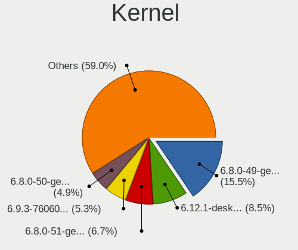
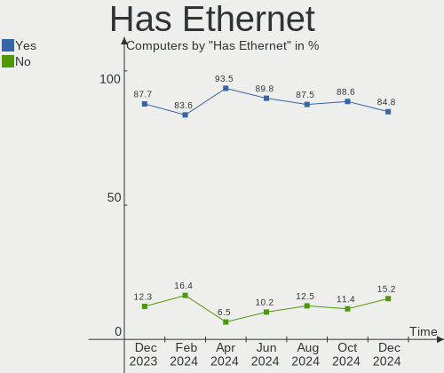
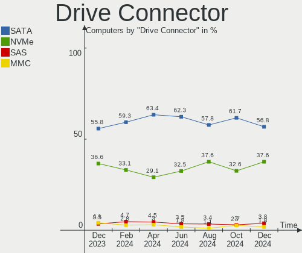
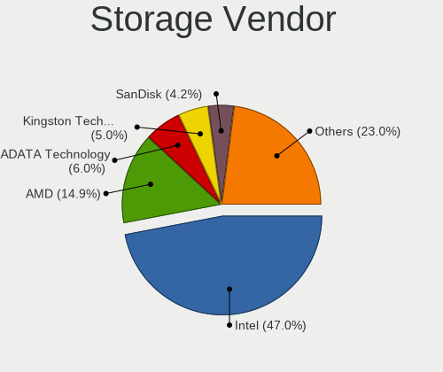
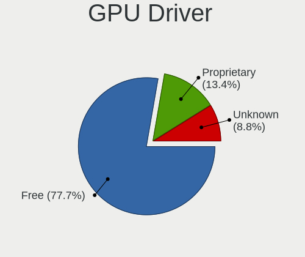
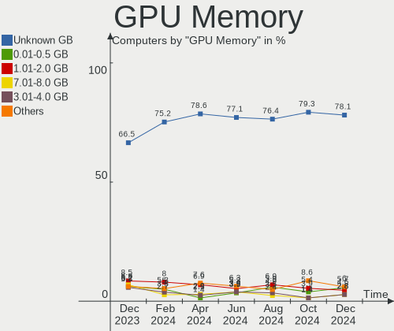

Linux in Brazil - Hardware Trends
---------------------------------

A project to identify most popular hardware characteristics and track their change
over time based on data collected by Linux users at https://Linux-Hardware.org.

Anyone can contribute to this report by the [hw-probe](https://github.com/linuxhw/hw-probe) tool:

    sudo -E hw-probe -all -upload

This is a report for all computer types. See also reports for [desktops](/Location/Brazil/Desktop/README.md) and [notebooks](/Location/Brazil/Notebook/README.md).

Period: Nov, 2022.

Contents
--------

* [ System ](#system)
  - [ OS                       ](#os)
  - [ OS Family                ](#os-family)
  - [ Kernel                   ](#kernel)
  - [ Kernel Family            ](#kernel-family)
  - [ Kernel Major Ver.        ](#kernel-major-ver)
  - [ Arch                     ](#arch)
  - [ DE                       ](#de)
  - [ Display Server           ](#display-server)
  - [ Display Manager          ](#display-manager)
  - [ OS Lang                  ](#os-lang)
  - [ Boot Mode                ](#boot-mode)
  - [ Filesystem               ](#filesystem)
  - [ Part. scheme             ](#part-scheme)
  - [ Dual Boot with Linux/BSD ](#dual-boot-with-linuxbsd)
  - [ Dual Boot (Win)          ](#dual-boot-win)

* [ Board ](#board)
  - [ Vendor                   ](#vendor)
  - [ Model                    ](#model)
  - [ Model Family             ](#model-family)
  - [ MFG Year                 ](#mfg-year)
  - [ Form Factor              ](#form-factor)
  - [ Secure Boot              ](#secure-boot)
  - [ Coreboot                 ](#coreboot)
  - [ RAM Size                 ](#ram-size)
  - [ RAM Used                 ](#ram-used)
  - [ Total Drives             ](#total-drives)
  - [ Has CD-ROM               ](#has-cd-rom)
  - [ Has Ethernet             ](#has-ethernet)
  - [ Has WiFi                 ](#has-wifi)
  - [ Has Bluetooth            ](#has-bluetooth)

* [ Location ](#location)
  - [ Country                  ](#country)
  - [ City                     ](#city)

* [ Drives ](#drives)
  - [ Drive Vendor             ](#drive-vendor)
  - [ Drive Model              ](#drive-model)
  - [ HDD Vendor               ](#hdd-vendor)
  - [ SSD Vendor               ](#ssd-vendor)
  - [ Drive Kind               ](#drive-kind)
  - [ Drive Connector          ](#drive-connector)
  - [ Drive Size               ](#drive-size)
  - [ Space Total              ](#space-total)
  - [ Space Used               ](#space-used)
  - [ Malfunc. Drives          ](#malfunc-drives)
  - [ Malfunc. Drive Vendor    ](#malfunc-drive-vendor)
  - [ Malfunc. HDD Vendor      ](#malfunc-hdd-vendor)
  - [ Malfunc. Drive Kind      ](#malfunc-drive-kind)
  - [ Failed Drives            ](#failed-drives)
  - [ Failed Drive Vendor      ](#failed-drive-vendor)
  - [ Drive Status             ](#drive-status)

* [ Storage controller ](#storage-controller)
  - [ Storage Vendor           ](#storage-vendor)
  - [ Storage Model            ](#storage-model)
  - [ Storage Kind             ](#storage-kind)

* [ Processor ](#processor)
  - [ CPU Vendor               ](#cpu-vendor)
  - [ CPU Model                ](#cpu-model)
  - [ CPU Model Family         ](#cpu-model-family)
  - [ CPU Cores                ](#cpu-cores)
  - [ CPU Sockets              ](#cpu-sockets)
  - [ CPU Threads              ](#cpu-threads)
  - [ CPU Op-Modes             ](#cpu-op-modes)
  - [ CPU Microcode            ](#cpu-microcode)
  - [ CPU Microarch            ](#cpu-microarch)

* [ Graphics ](#graphics)
  - [ GPU Vendor               ](#gpu-vendor)
  - [ GPU Model                ](#gpu-model)
  - [ GPU Combo                ](#gpu-combo)
  - [ GPU Driver               ](#gpu-driver)
  - [ GPU Memory               ](#gpu-memory)

* [ Monitor ](#monitor)
  - [ Monitor Vendor           ](#monitor-vendor)
  - [ Monitor Model            ](#monitor-model)
  - [ Monitor Resolution       ](#monitor-resolution)
  - [ Monitor Diagonal         ](#monitor-diagonal)
  - [ Monitor Width            ](#monitor-width)
  - [ Aspect Ratio             ](#aspect-ratio)
  - [ Monitor Area             ](#monitor-area)
  - [ Pixel Density            ](#pixel-density)
  - [ Multiple Monitors        ](#multiple-monitors)

* [ Network ](#network)
  - [ Net Controller Vendor    ](#net-controller-vendor)
  - [ Net Controller Model     ](#net-controller-model)
  - [ Wireless Vendor          ](#wireless-vendor)
  - [ Wireless Model           ](#wireless-model)
  - [ Ethernet Vendor          ](#ethernet-vendor)
  - [ Ethernet Model           ](#ethernet-model)
  - [ Net Controller Kind      ](#net-controller-kind)
  - [ Used Controller          ](#used-controller)
  - [ NICs                     ](#nics)
  - [ IPv6                     ](#ipv6)

* [ Bluetooth ](#bluetooth)
  - [ Bluetooth Vendor         ](#bluetooth-vendor)
  - [ Bluetooth Model          ](#bluetooth-model)

* [ Sound ](#sound)
  - [ Sound Vendor             ](#sound-vendor)
  - [ Sound Model              ](#sound-model)

* [ Memory ](#memory)
  - [ Memory Vendor            ](#memory-vendor)
  - [ Memory Model             ](#memory-model)
  - [ Memory Kind              ](#memory-kind)
  - [ Memory Form Factor       ](#memory-form-factor)
  - [ Memory Size              ](#memory-size)
  - [ Memory Speed             ](#memory-speed)

* [ Printers & scanners ](#printers--scanners)
  - [ Printer Vendor           ](#printer-vendor)
  - [ Printer Model            ](#printer-model)
  - [ Scanner Vendor           ](#scanner-vendor)
  - [ Scanner Model            ](#scanner-model)

* [ Camera ](#camera)
  - [ Camera Vendor            ](#camera-vendor)
  - [ Camera Model             ](#camera-model)

* [ Security ](#security)
  - [ Fingerprint Vendor       ](#fingerprint-vendor)
  - [ Fingerprint Model        ](#fingerprint-model)
  - [ Chipcard Vendor          ](#chipcard-vendor)
  - [ Chipcard Model           ](#chipcard-model)

* [ Unsupported ](#unsupported)
  - [ Unsupported Devices      ](#unsupported-devices)
  - [ Unsupported Device Types ](#unsupported-device-types)

System
------

OS
--

Installed operating systems

| Name                         | Computers | Percent |
|------------------------------|-----------|---------|
| Ubuntu 22.04                 | 40        | 17.32%  |
| Linux Mint 21                | 21        | 9.09%   |
| OpenMandriva 4.3             | 18        | 7.79%   |
| Pop!_OS 22.04                | 13        | 5.63%   |
| Fedora 36                    | 13        | 5.63%   |
| Fedora 37                    | 10        | 4.33%   |
| Zorin 16                     | 9         | 3.9%    |
| Ubuntu 22.10                 | 9         | 3.9%    |
| Arch Rolling                 | 9         | 3.9%    |
| Ubuntu 20.04                 | 5         | 2.16%   |
| KDE neon 22.04               | 5         | 2.16%   |
| Ubuntu 18.04                 | 4         | 1.73%   |
| Linux Mint 20.3              | 4         | 1.73%   |
| Elementary 6.1               | 4         | 1.73%   |
| Debian 11                    | 4         | 1.73%   |
| openSUSE Tumbleweed-XXXXXXXX | 3         | 1.3%    |
| OpenMandriva 4.50            | 3         | 1.3%    |
| Linux Mint 20.2              | 3         | 1.3%    |
| Endless 4.0.11               | 3         | 1.3%    |
| Zorin 15                     | 2         | 0.87%   |
| Xubuntu 18.04                | 2         | 0.87%   |
| Ubuntu MATE 20.04            | 2         | 0.87%   |
| ROSA 12.3                    | 2         | 0.87%   |
| Pop!_OS 20.04                | 2         | 0.87%   |
| OpenMandriva 4.2             | 2         | 0.87%   |
| Manjaro                      | 2         | 0.87%   |
| LMDE 5                       | 2         | 0.87%   |
| Kubuntu 22.10                | 2         | 0.87%   |
| Kubuntu 22.04                | 2         | 0.87%   |
| Kali 2022.3                  | 2         | 0.87%   |
| Endless 3.9.7                | 2         | 0.87%   |
| Xubuntu 22.04                | 1         | 0.43%   |
| Ubuntu MATE 22.04            | 1         | 0.43%   |
| Ubuntu MATE 18.04            | 1         | 0.43%   |
| Ubuntu Budgie 22.04          | 1         | 0.43%   |
| Trisquel 10.0.1              | 1         | 0.43%   |
| SteamOS 3.4                  | 1         | 0.43%   |
| PureOS 10.0                  | 1         | 0.43%   |
| openSUSE Leap-15.4           | 1         | 0.43%   |
| OpenMandriva 4.90            | 1         | 0.43%   |

OS Family
---------

OS without a version

| Name          | Computers | Percent |
|---------------|-----------|---------|
| Ubuntu        | 58        | 25.11%  |
| Linux Mint    | 31        | 13.42%  |
| OpenMandriva  | 24        | 10.39%  |
| Fedora        | 24        | 10.39%  |
| Pop!_OS       | 15        | 6.49%   |
| Zorin         | 11        | 4.76%   |
| Arch          | 9         | 3.9%    |
| Endless       | 7         | 3.03%   |
| KDE neon      | 6         | 2.6%    |
| Debian        | 6         | 2.6%    |
| Kubuntu       | 5         | 2.16%   |
| Ubuntu MATE   | 4         | 1.73%   |
| openSUSE      | 4         | 1.73%   |
| Elementary    | 4         | 1.73%   |
| Xubuntu       | 3         | 1.3%    |
| Manjaro       | 3         | 1.3%    |
| Kali          | 3         | 1.3%    |
| ROSA          | 2         | 0.87%   |
| LMDE          | 2         | 0.87%   |
| Ubuntu Budgie | 1         | 0.43%   |
| Trisquel      | 1         | 0.43%   |
| SteamOS       | 1         | 0.43%   |
| PureOS        | 1         | 0.43%   |
| MX            | 1         | 0.43%   |
| Lubuntu       | 1         | 0.43%   |
| EndeavourOS   | 1         | 0.43%   |
| CentOS        | 1         | 0.43%   |
| BigLinux      | 1         | 0.43%   |
| ArcoLinux     | 1         | 0.43%   |

Kernel
------

Version of the Linux kernel

| Version                            | Computers | Percent |
|------------------------------------|-----------|---------|
| 5.15.0-52-generic                  | 39        | 16.88%  |
| 5.15.0-53-generic                  | 36        | 15.58%  |
| 5.16.7-desktop-1omv4003            | 16        | 6.93%   |
| 5.19.0-23-generic                  | 11        | 4.76%   |
| 5.4.0-131-generic                  | 10        | 4.33%   |
| 6.0.6-76060006-generic             | 6         | 2.6%    |
| 6.0.5-200.fc36.x86_64              | 6         | 2.6%    |
| 5.15.0-41-generic                  | 6         | 2.6%    |
| 6.0.9-300.fc37.x86_64              | 5         | 2.16%   |
| 5.10.0-19-amd64                    | 5         | 2.16%   |
| 5.11.0-35-generic                  | 4         | 1.73%   |
| 6.0.9-arch1-1                      | 3         | 1.3%    |
| 5.8.0-14-generic                   | 3         | 1.3%    |
| 5.4.0-132-generic                  | 3         | 1.3%    |
| 5.19.12-desktop-2omv4090           | 3         | 1.3%    |
| 5.17.5-76051705-generic            | 3         | 1.3%    |
| 5.15.0-43-generic                  | 3         | 1.3%    |
| 6.0.9-200.fc36.x86_64              | 2         | 0.87%   |
| 6.0.9-060009-generic               | 2         | 0.87%   |
| 6.0.8-300.fc37.x86_64              | 2         | 0.87%   |
| 6.0.3-76060003-generic             | 2         | 0.87%   |
| 5.19.0-kali2-amd64                 | 2         | 0.87%   |
| 5.19.0-76051900-generic            | 2         | 0.87%   |
| 5.16.13-desktop-1omv4003           | 2         | 0.87%   |
| 5.15.75-generic-1rosa2021.1-x86_64 | 2         | 0.87%   |
| 5.15.74-3-MANJARO                  | 2         | 0.87%   |
| 5.15.0-52-lowlatency               | 2         | 0.87%   |
| 5.15.0-46-generic                  | 2         | 0.87%   |
| 5.10.14-desktop-1omv4002           | 2         | 0.87%   |
| 4.15.0-196-generic                 | 2         | 0.87%   |
| 6.1.0-0.rc5.39.fc38.x86_64         | 1         | 0.43%   |
| 6.0.8-200.fc36.x86_64              | 1         | 0.43%   |
| 6.0.8-1-default                    | 1         | 0.43%   |
| 6.0.7-x64v1-xanmod1-1              | 1         | 0.43%   |
| 6.0.7-arch1-1                      | 1         | 0.43%   |
| 6.0.7-301.fc37.x86_64              | 1         | 0.43%   |
| 6.0.7-200.fc36.x86_64              | 1         | 0.43%   |
| 6.0.7-1-default                    | 1         | 0.43%   |
| 6.0.6-arch1-1                      | 1         | 0.43%   |
| 6.0.5-300.fc37.x86_64              | 1         | 0.43%   |

Kernel Family
-------------

Linux kernel without a distro release

| Version  | Computers | Percent |
|----------|-----------|---------|
| 5.15.0   | 89        | 38.53%  |
| 5.4.0    | 18        | 7.79%   |
| 5.19.0   | 16        | 6.93%   |
| 5.16.7   | 16        | 6.93%   |
| 6.0.9    | 12        | 5.19%   |
| 6.0.6    | 7         | 3.03%   |
| 6.0.5    | 7         | 3.03%   |
| 5.10.0   | 6         | 2.6%    |
| 6.0.7    | 5         | 2.16%   |
| 5.11.0   | 5         | 2.16%   |
| 6.0.8    | 4         | 1.73%   |
| 5.17.5   | 4         | 1.73%   |
| 6.0.2    | 3         | 1.3%    |
| 6.0.10   | 3         | 1.3%    |
| 6.0.0    | 3         | 1.3%    |
| 5.8.0    | 3         | 1.3%    |
| 5.19.12  | 3         | 1.3%    |
| 6.0.3    | 2         | 0.87%   |
| 5.16.13  | 2         | 0.87%   |
| 5.15.75  | 2         | 0.87%   |
| 5.15.74  | 2         | 0.87%   |
| 5.14.0   | 2         | 0.87%   |
| 5.10.14  | 2         | 0.87%   |
| 4.15.0   | 2         | 0.87%   |
| 6.1.0    | 1         | 0.43%   |
| 5.19.15  | 1         | 0.43%   |
| 5.18.6   | 1         | 0.43%   |
| 5.18.19  | 1         | 0.43%   |
| 5.18.12  | 1         | 0.43%   |
| 5.18.1   | 1         | 0.43%   |
| 5.16.12  | 1         | 0.43%   |
| 5.15.78  | 1         | 0.43%   |
| 5.15.77  | 1         | 0.43%   |
| 5.15.76  | 1         | 0.43%   |
| 5.14.21  | 1         | 0.43%   |
| 5.10.142 | 1         | 0.43%   |
| 5.0.0    | 1         | 0.43%   |

Kernel Major Ver.
-----------------

Linux kernel major version

| Version | Computers | Percent |
|---------|-----------|---------|
| 5.15    | 96        | 41.56%  |
| 6.0     | 46        | 19.91%  |
| 5.19    | 20        | 8.66%   |
| 5.16    | 19        | 8.23%   |
| 5.4     | 18        | 7.79%   |
| 5.10    | 9         | 3.9%    |
| 5.11    | 5         | 2.16%   |
| 5.18    | 4         | 1.73%   |
| 5.17    | 4         | 1.73%   |
| 5.8     | 3         | 1.3%    |
| 5.14    | 3         | 1.3%    |
| 4.15    | 2         | 0.87%   |
| 6.1     | 1         | 0.43%   |
| 5.0     | 1         | 0.43%   |

Arch
----

OS architecture (x86_64, i586, etc.)

| Name   | Computers | Percent |
|--------|-----------|---------|
| x86_64 | 229       | 99.13%  |
| i686   | 2         | 0.87%   |

DE
--

Desktop Environment

| Name       | Computers | Percent |
|------------|-----------|---------|
| GNOME      | 116       | 50.22%  |
| KDE5       | 51        | 22.08%  |
| X-Cinnamon | 24        | 10.39%  |
| XFCE       | 16        | 6.93%   |
| MATE       | 10        | 4.33%   |
| Pantheon   | 4         | 1.73%   |
| Unknown    | 3         | 1.3%    |
| LXQt       | 2         | 0.87%   |
| i3         | 2         | 0.87%   |
| Cinnamon   | 2         | 0.87%   |
| Budgie     | 1         | 0.43%   |

Display Server
--------------

X11 or Wayland

| Name    | Computers | Percent |
|---------|-----------|---------|
| X11     | 176       | 76.19%  |
| Wayland | 51        | 22.08%  |
| Unknown | 3         | 1.3%    |
| Tty     | 1         | 0.43%   |

Display Manager
---------------

SDDM, LightDM, etc.

| Name    | Computers | Percent |
|---------|-----------|---------|
| Unknown | 94        | 40.69%  |
| GDM3    | 60        | 25.97%  |
| SDDM    | 33        | 14.29%  |
| LightDM | 28        | 12.12%  |
| GDM     | 16        | 6.93%   |

OS Lang
-------

Language

| Lang      | Computers | Percent |
|-----------|-----------|---------|
| pt_BR     | 156       | 67.53%  |
| en_US     | 60        | 25.97%  |
| C         | 6         | 2.6%    |
| en_GB     | 4         | 1.73%   |
| Unknown   | 2         | 0.87%   |
| pt_PT     | 1         | 0.43%   |
| pt_BRutf8 | 1         | 0.43%   |
| ja_JP     | 1         | 0.43%   |

Boot Mode
---------

EFI or BIOS

| Mode | Computers | Percent |
|------|-----------|---------|
| BIOS | 133       | 57.58%  |
| EFI  | 98        | 42.42%  |

Filesystem
----------

Type of filesystem

| Type    | Computers | Percent |
|---------|-----------|---------|
| Ext4    | 159       | 68.83%  |
| Btrfs   | 38        | 16.45%  |
| Overlay | 28        | 12.12%  |
| Zfs     | 3         | 1.3%    |
| Xfs     | 2         | 0.87%   |
| Ext2    | 1         | 0.43%   |

Part. scheme
------------

Scheme of partitioning

| Type    | Computers | Percent |
|---------|-----------|---------|
| GPT     | 104       | 45.02%  |
| Unknown | 95        | 41.13%  |
| MBR     | 32        | 13.85%  |

Dual Boot with Linux/BSD
------------------------

Hosting more than one Linux/BSD

| Dual boot | Computers | Percent |
|-----------|-----------|---------|
| No        | 200       | 86.58%  |
| Yes       | 31        | 13.42%  |

Dual Boot (Win)
---------------

Hosting Linux and Windows

| Dual boot | Computers | Percent |
|-----------|-----------|---------|
| No        | 177       | 76.62%  |
| Yes       | 54        | 23.38%  |

Board
-----

Vendor
------

Motherboard manufacturer

| Name                   | Computers | Percent |
|------------------------|-----------|---------|
| Dell                   | 34        | 14.72%  |
| ASUSTek Computer       | 22        | 9.52%   |
| Lenovo                 | 21        | 9.09%   |
| Acer                   | 18        | 7.79%   |
| Samsung Electronics    | 17        | 7.36%   |
| Gigabyte Technology    | 15        | 6.49%   |
| Intel                  | 12        | 5.19%   |
| Hewlett-Packard        | 10        | 4.33%   |
| ASRock                 | 9         | 3.9%    |
| MSI                    | 7         | 3.03%   |
| PCWare                 | 6         | 2.6%    |
| Positivo               | 5         | 2.16%   |
| Apple                  | 5         | 2.16%   |
| Sony                   | 4         | 1.73%   |
| Semp Toshiba           | 4         | 1.73%   |
| Positivo Bahia - VAIO  | 3         | 1.3%    |
| Huanan                 | 3         | 1.3%    |
| VS Company             | 2         | 0.87%   |
| Colorful Technology    | 2         | 0.87%   |
| Biostar                | 2         | 0.87%   |
| Avell High Performance | 2         | 0.87%   |
| AMD                    | 2         | 0.87%   |
| Unknown                | 2         | 0.87%   |
| Wistron                | 1         | 0.43%   |
| Timi                   | 1         | 0.43%   |
| Supermicro             | 1         | 0.43%   |
| Standard               | 1         | 0.43%   |
| Quanta                 | 1         | 0.43%   |
| QIYIDA                 | 1         | 0.43%   |
| Philco                 | 1         | 0.43%   |
| OKI Brasil             | 1         | 0.43%   |
| Notebook               | 1         | 0.43%   |
| Multilaser             | 1         | 0.43%   |
| Megaware               | 1         | 0.43%   |
| Login Informatica      | 1         | 0.43%   |
| LG Electronics         | 1         | 0.43%   |
| HOUTER                 | 1         | 0.43%   |
| H-BUSTER               | 1         | 0.43%   |
| Google                 | 1         | 0.43%   |
| Gateway                | 1         | 0.43%   |

Model
-----

Motherboard model

| Name                                        | Computers | Percent |
|---------------------------------------------|-----------|---------|
| Lenovo IdeaPad 3 15ALC6 82MF                | 4         | 1.73%   |
| Intel H61                                   | 4         | 1.73%   |
| Gigabyte B75M-D3H                           | 3         | 1.3%    |
| ASRock B450M Steel Legend                   | 3         | 1.3%    |
| Acer Nitro AN515-44                         | 3         | 1.3%    |
| Unknown                                     | 3         | 1.3%    |
| Samsung RV411/RV511/E3511/S3511/RV711/E3411 | 2         | 0.87%   |
| Samsung 550XDA                              | 2         | 0.87%   |
| Samsung 530U3C/530U4C/532U3C                | 2         | 0.87%   |
| Positivo Mobile                             | 2         | 0.87%   |
| Lenovo IdeaPad S145-15IWL 81S9              | 2         | 0.87%   |
| Lenovo IdeaPad S145-15API 81V7              | 2         | 0.87%   |
| Intel B75                                   | 2         | 0.87%   |
| Gigabyte B550M AORUS ELITE                  | 2         | 0.87%   |
| Dell Vostro 5470                            | 2         | 0.87%   |
| Dell Inspiron 5566                          | 2         | 0.87%   |
| Dell Inspiron 3442                          | 2         | 0.87%   |
| Dell Inspiron 15-3567                       | 2         | 0.87%   |
| ASUS VivoBook_ASUSLaptop X513EAN_X513EAN    | 2         | 0.87%   |
| ASUS PRIME B450M-GAMING/BR                  | 2         | 0.87%   |
| ASUS All Series                             | 2         | 0.87%   |
| Acer Aspire A515-45                         | 2         | 0.87%   |
| Wistron ProLiant ML110 G6                   | 1         | 0.43%   |
| VS Company MCP61M                           | 1         | 0.43%   |
| VS Company G31T-M                           | 1         | 0.43%   |
| Timi RedmiBook Pro 14S                      | 1         | 0.43%   |
| Supermicro PDSMi                            | 1         | 0.43%   |
| Standard MB40II                             | 1         | 0.43%   |
| Sony VPCEB4L1E                              | 1         | 0.43%   |
| Sony VPCEA23FB                              | 1         | 0.43%   |
| Sony VGN-CR120E                             | 1         | 0.43%   |
| Sony SVE14A15FBB                            | 1         | 0.43%   |
| Semp Toshiba IS 1442                        | 1         | 0.43%   |
| Semp Toshiba IS 1422+                       | 1         | 0.43%   |
| Semp Toshiba IS 1422                        | 1         | 0.43%   |
| Semp Toshiba IS 1413G                       | 1         | 0.43%   |
| Samsung RV411/RV511/E3511/S3511/RV711       | 1         | 0.43%   |
| Samsung RV411                               | 1         | 0.43%   |
| Samsung RV410/RV510/S3510/E3510             | 1         | 0.43%   |
| Samsung 767XCL                              | 1         | 0.43%   |

Model Family
------------

Motherboard model prefix

| Name              | Computers | Percent |
|-------------------|-----------|---------|
| Dell Inspiron     | 19        | 8.23%   |
| Lenovo IdeaPad    | 15        | 6.49%   |
| Acer Aspire       | 10        | 4.33%   |
| Acer Nitro        | 7         | 3.03%   |
| Dell Vostro       | 5         | 2.16%   |
| Semp Toshiba IS   | 4         | 1.73%   |
| Samsung RV411     | 4         | 1.73%   |
| Intel H61         | 4         | 1.73%   |
| ASUS VivoBook     | 4         | 1.73%   |
| HP Pavilion       | 3         | 1.3%    |
| Gigabyte B75M-D3H | 3         | 1.3%    |
| Dell G15          | 3         | 1.3%    |
| ASUS PRIME        | 3         | 1.3%    |
| ASUS P8H61-M      | 3         | 1.3%    |
| ASRock B450M      | 3         | 1.3%    |
| Unknown           | 3         | 1.3%    |
| Samsung 550XDA    | 2         | 0.87%   |
| Samsung 530U3C    | 2         | 0.87%   |
| Samsung 270E5K    | 2         | 0.87%   |
| Positivo Mobile   | 2         | 0.87%   |
| Lenovo Legion     | 2         | 0.87%   |
| Intel B75         | 2         | 0.87%   |
| Gigabyte B550M    | 2         | 0.87%   |
| Dell Precision    | 2         | 0.87%   |
| Dell Latitude     | 2         | 0.87%   |
| ASUS ROG          | 2         | 0.87%   |
| ASUS All          | 2         | 0.87%   |
| Wistron ProLiant  | 1         | 0.43%   |
| VS Company MCP61M | 1         | 0.43%   |
| VS Company G31T-M | 1         | 0.43%   |
| Timi RedmiBook    | 1         | 0.43%   |
| Supermicro PDSMi  | 1         | 0.43%   |
| Standard MB40II   | 1         | 0.43%   |
| Sony VPCEB4L1E    | 1         | 0.43%   |
| Sony VPCEA23FB    | 1         | 0.43%   |
| Sony VGN-CR120E   | 1         | 0.43%   |
| Sony SVE14A15FBB  | 1         | 0.43%   |
| Samsung RV410     | 1         | 0.43%   |
| Samsung 767XCL    | 1         | 0.43%   |
| Samsung 550P5C    | 1         | 0.43%   |

MFG Year
--------

Motherboard manufacture year

| Year | Computers | Percent |
|------|-----------|---------|
| 2021 | 31        | 13.42%  |
| 2012 | 22        | 9.52%   |
| 2020 | 18        | 7.79%   |
| 2019 | 18        | 7.79%   |
| 2016 | 18        | 7.79%   |
| 2013 | 17        | 7.36%   |
| 2011 | 17        | 7.36%   |
| 2018 | 16        | 6.93%   |
| 2010 | 14        | 6.06%   |
| 2017 | 13        | 5.63%   |
| 2015 | 13        | 5.63%   |
| 2014 | 9         | 3.9%    |
| 2022 | 8         | 3.46%   |
| 2009 | 7         | 3.03%   |
| 2007 | 5         | 2.16%   |
| 2008 | 4         | 1.73%   |
| 2006 | 1         | 0.43%   |

Form Factor
-----------

Physical design of the computer

| Name       | Computers | Percent |
|------------|-----------|---------|
| Notebook   | 133       | 57.58%  |
| Desktop    | 92        | 39.83%  |
| Mini pc    | 3         | 1.3%    |
| All in one | 2         | 0.87%   |
| Server     | 1         | 0.43%   |

Secure Boot
-----------

Enabled or disabled

| State    | Computers | Percent |
|----------|-----------|---------|
| Disabled | 213       | 92.21%  |
| Enabled  | 18        | 7.79%   |

Coreboot
--------

Have coreboot on board

| Used | Computers | Percent |
|------|-----------|---------|
| No   | 230       | 99.57%  |
| Yes  | 1         | 0.43%   |

RAM Size
--------

Total RAM memory

| Size in GB  | Computers | Percent |
|-------------|-----------|---------|
| 4.01-8.0    | 74        | 32.03%  |
| 8.01-16.0   | 48        | 20.78%  |
| 3.01-4.0    | 46        | 19.91%  |
| 16.01-24.0  | 41        | 17.75%  |
| 32.01-64.0  | 11        | 4.76%   |
| 1.01-2.0    | 7         | 3.03%   |
| 64.01-256.0 | 2         | 0.87%   |
| 24.01-32.0  | 1         | 0.43%   |
| 2.01-3.0    | 1         | 0.43%   |

RAM Used
--------

Used RAM memory

| Used GB   | Computers | Percent |
|-----------|-----------|---------|
| 1.01-2.0  | 78        | 33.77%  |
| 2.01-3.0  | 58        | 25.11%  |
| 3.01-4.0  | 40        | 17.32%  |
| 4.01-8.0  | 37        | 16.02%  |
| 8.01-16.0 | 8         | 3.46%   |
| 0.51-1.0  | 7         | 3.03%   |
| 0.01-0.5  | 3         | 1.3%    |

Total Drives
------------

Number of drives on board

| Drives | Computers | Percent |
|--------|-----------|---------|
| 1      | 140       | 60.61%  |
| 2      | 60        | 25.97%  |
| 3      | 19        | 8.23%   |
| 4      | 7         | 3.03%   |
| 5      | 2         | 0.87%   |
| 0      | 2         | 0.87%   |
| 6      | 1         | 0.43%   |

Has CD-ROM
----------

Has CD-ROM on board

| Presented | Computers | Percent |
|-----------|-----------|---------|
| No        | 164       | 71%     |
| Yes       | 67        | 29%     |

Has Ethernet
------------

Has Ethernet on board

| Presented | Computers | Percent |
|-----------|-----------|---------|
| Yes       | 202       | 87.45%  |
| No        | 29        | 12.55%  |

Has WiFi
--------

Has WiFi module

| Presented | Computers | Percent |
|-----------|-----------|---------|
| Yes       | 172       | 74.46%  |
| No        | 59        | 25.54%  |

Has Bluetooth
-------------

Has Bluetooth module

| Presented | Computers | Percent |
|-----------|-----------|---------|
| Yes       | 125       | 54.11%  |
| No        | 106       | 45.89%  |

Location
--------

Country
-------

Geographic location (country)

| Country | Computers | Percent |
|---------|-----------|---------|
| Brazil  | 231       | 100%    |

City
----

Geographic location (city)

| City                  | Computers | Percent |
|-----------------------|-----------|---------|
| Sao Paulo             | 30        | 12.99%  |
| Rio de Janeiro        | 23        | 9.96%   |
| Fortaleza             | 7         | 3.03%   |
| Belo Horizonte        | 7         | 3.03%   |
| Porto Alegre          | 6         | 2.6%    |
| Curitiba              | 5         | 2.16%   |
| Brasília             | 5         | 2.16%   |
| Santo André          | 4         | 1.73%   |
| Maringá              | 4         | 1.73%   |
| Duque de Caxias       | 4         | 1.73%   |
| Sao Jose do Rio Preto | 3         | 1.3%    |
| Ribeirao Preto        | 3         | 1.3%    |
| Maceió               | 3         | 1.3%    |
| Florianópolis        | 3         | 1.3%    |
| Criciúma             | 3         | 1.3%    |
| Blumenau              | 3         | 1.3%    |
| Sorocaba              | 2         | 0.87%   |
| Serra                 | 2         | 0.87%   |
| Sao Luís             | 2         | 0.87%   |
| Sao Carlos            | 2         | 0.87%   |
| Salvador              | 2         | 0.87%   |
| Recife                | 2         | 0.87%   |
| Ourinhos              | 2         | 0.87%   |
| Olinda                | 2         | 0.87%   |
| Novo Hamburgo         | 2         | 0.87%   |
| Nova Iguaçu          | 2         | 0.87%   |
| Natal                 | 2         | 0.87%   |
| Joao Pessoa           | 2         | 0.87%   |
| Guarulhos             | 2         | 0.87%   |
| Cuiabá               | 2         | 0.87%   |
| Colombo               | 2         | 0.87%   |
| Caxias do Sul         | 2         | 0.87%   |
| Canoas                | 2         | 0.87%   |
| Caninde               | 2         | 0.87%   |
| Campinas              | 2         | 0.87%   |
| Campina Grande        | 2         | 0.87%   |
| Wagner                | 1         | 0.43%   |
| Volta Redonda         | 1         | 0.43%   |
| Vitória da Conquista | 1         | 0.43%   |
| Vilhena               | 1         | 0.43%   |

Drives
------

Drive Vendor
------------

Hard drive vendors

| Vendor                         | Computers | Drives | Percent |
|--------------------------------|-----------|--------|---------|
| WDC                            | 58        | 62     | 17.52%  |
| Seagate                        | 47        | 56     | 14.2%   |
| Kingston                       | 38        | 42     | 11.48%  |
| Samsung Electronics            | 27        | 27     | 8.16%   |
| SanDisk                        | 25        | 29     | 7.55%   |
| China                          | 16        | 18     | 4.83%   |
| Toshiba                        | 15        | 15     | 4.53%   |
| A-DATA Technology              | 14        | 14     | 4.23%   |
| Hitachi                        | 8         | 8      | 2.42%   |
| Crucial                        | 7         | 7      | 2.11%   |
| Unknown                        | 6         | 7      | 1.81%   |
| Solid State Storage            | 6         | 6      | 1.81%   |
| SK hynix                       | 6         | 6      | 1.81%   |
| KingSpec                       | 6         | 6      | 1.81%   |
| Silicon Motion                 | 3         | 4      | 0.91%   |
| Realtek Semiconductor          | 3         | 3      | 0.91%   |
| Lexar                          | 3         | 3      | 0.91%   |
| KIOXIA                         | 3         | 3      | 0.91%   |
| HGST                           | 3         | 3      | 0.91%   |
| ADATA Technology               | 3         | 3      | 0.91%   |
| WALRAM                         | 2         | 2      | 0.6%    |
| SAGE                           | 2         | 2      | 0.6%    |
| PNY                            | 2         | 2      | 0.6%    |
| Patriot                        | 2         | 2      | 0.6%    |
| Micron/Crucial Technology      | 2         | 2      | 0.6%    |
| Intel                          | 2         | 2      | 0.6%    |
| Unknown                        | 2         | 2      | 0.6%    |
| XrayDisk                       | 1         | 1      | 0.3%    |
| Team                           | 1         | 1      | 0.3%    |
| SSSTC                          | 1         | 1      | 0.3%    |
| Solid State Storage Technology | 1         | 1      | 0.3%    |
| RCESSD                         | 1         | 1      | 0.3%    |
| Phison Electronics             | 1         | 2      | 0.3%    |
| Phison                         | 1         | 1      | 0.3%    |
| Netac                          | 1         | 1      | 0.3%    |
| Micron Technology              | 1         | 1      | 0.3%    |
| LITEONIT                       | 1         | 1      | 0.3%    |
| LITEON                         | 1         | 1      | 0.3%    |
| KNUP                           | 1         | 1      | 0.3%    |
| Kingston Technology Company    | 1         | 1      | 0.3%    |

Drive Model
-----------

Hard drive models

| Model                                                 | Computers | Percent |
|-------------------------------------------------------|-----------|---------|
| Kingston SA400S37240G 240GB SSD                       | 16        | 4.57%   |
| Seagate ST500DM002-1BD142 500GB                       | 8         | 2.29%   |
| Toshiba MQ01ABD100 1TB                                | 6         | 1.71%   |
| Solid State Storage SSSTC CL1-4D256 256GB             | 6         | 1.71%   |
| Kingston SA400S37120G 120GB SSD                       | 6         | 1.71%   |
| WDC WD10JPVX-22JC3T0 1TB                              | 5         | 1.43%   |
| Seagate ST1000DM010-2EP102 1TB                        | 5         | 1.43%   |
| Samsung HD322HJ 320GB                                 | 5         | 1.43%   |
| China SATA SSD 120GB                                  | 5         | 1.43%   |
| Seagate ST1000LM024 HN-M101MBB 1TB                    | 4         | 1.14%   |
| Kingston SA400S37480G 480GB SSD                       | 4         | 1.14%   |
| A-DATA IM2P33F8ABR2-256GB                             | 4         | 1.14%   |
| WDC WD10SPZX-75Z10T1 1TB                              | 3         | 0.86%   |
| Silicon Motion SM2263EN/SM2263XT SSD Controller 128GB | 3         | 0.86%   |
| Seagate ST500LT012-9WS142 500GB                       | 3         | 0.86%   |
| Seagate ST500LM012 HN-M500MBB 500GB                   | 3         | 0.86%   |
| Seagate ST3500312CS 500GB                             | 3         | 0.86%   |
| Seagate ST31000524AS 1TB                              | 3         | 0.86%   |
| Sandisk WD Blue SN550 NVMe SSD 1TB                    | 3         | 0.86%   |
| SanDisk SSD PLUS 480GB                                | 3         | 0.86%   |
| SanDisk SSD PLUS 120GB                                | 3         | 0.86%   |
| Samsung HD502HJ 500GB                                 | 3         | 0.86%   |
| Kingston SA400S37960G 960GB SSD                       | 3         | 0.86%   |
| Crucial CT240BX500SSD1 240GB                          | 3         | 0.86%   |
| China SSD 720GB                                       | 3         | 0.86%   |
| China SSD 500GB                                       | 3         | 0.86%   |
| WDC WDS240G2G0A-00JH30 240GB SSD                      | 2         | 0.57%   |
| WDC WD5000LPCX-75VHAT0 500GB                          | 2         | 0.57%   |
| WDC WD5000AAKX-60U6AA0 500GB                          | 2         | 0.57%   |
| WDC WD3200BEVT-75ZCT2 320GB                           | 2         | 0.57%   |
| WDC WD10SPZX-21Z10T0 1TB                              | 2         | 0.57%   |
| WDC WD10JPCX-24UE4T0 1TB                              | 2         | 0.57%   |
| WDC WD10EURX-63UY4Y0 1TB                              | 2         | 0.57%   |
| WDC WD10EURX-63FH1Y0 1TB                              | 2         | 0.57%   |
| WDC PC SN730 SDBPNTY-512G-1101 512GB                  | 2         | 0.57%   |
| Unknown MMC Card  32GB                                | 2         | 0.57%   |
| Toshiba MQ01ABF050 500GB                              | 2         | 0.57%   |
| Toshiba HDWD110 1TB                                   | 2         | 0.57%   |
| SK hynix BC711 NVMe 256GB                             | 2         | 0.57%   |
| Seagate ST1000LM035-1RK172 1TB                        | 2         | 0.57%   |

HDD Vendor
----------

Hard disk drive vendors

| Vendor              | Computers | Drives | Percent |
|---------------------|-----------|--------|---------|
| WDC                 | 48        | 52     | 33.57%  |
| Seagate             | 47        | 56     | 32.87%  |
| Samsung Electronics | 19        | 19     | 13.29%  |
| Toshiba             | 15        | 15     | 10.49%  |
| Hitachi             | 8         | 8      | 5.59%   |
| HGST                | 3         | 3      | 2.1%    |
| SAGE                | 2         | 2      | 1.4%    |
| Unknown             | 1         | 1      | 0.7%    |

SSD Vendor
----------

Solid state drive vendors

| Vendor              | Computers | Drives | Percent |
|---------------------|-----------|--------|---------|
| Kingston            | 36        | 40     | 31.3%   |
| SanDisk             | 17        | 17     | 14.78%  |
| China               | 16        | 18     | 13.91%  |
| Crucial             | 7         | 7      | 6.09%   |
| KingSpec            | 6         | 6      | 5.22%   |
| WDC                 | 5         | 5      | 4.35%   |
| A-DATA Technology   | 5         | 5      | 4.35%   |
| Samsung Electronics | 3         | 3      | 2.61%   |
| Lexar               | 3         | 3      | 2.61%   |
| WALRAM              | 2         | 2      | 1.74%   |
| PNY                 | 2         | 2      | 1.74%   |
| Patriot             | 2         | 2      | 1.74%   |
| Unknown             | 2         | 2      | 1.74%   |
| Team                | 1         | 1      | 0.87%   |
| LITEONIT            | 1         | 1      | 0.87%   |
| LITEON              | 1         | 1      | 0.87%   |
| KNUP                | 1         | 1      | 0.87%   |
| KEEPDATA            | 1         | 1      | 0.87%   |
| JMicron Technology  | 1         | 1      | 0.87%   |
| HUSKY               | 1         | 1      | 0.87%   |
| EGON                | 1         | 1      | 0.87%   |
| Apple               | 1         | 1      | 0.87%   |

Drive Kind
----------

HDD or SSD

| Kind    | Computers | Drives | Percent |
|---------|-----------|--------|---------|
| HDD     | 129       | 156    | 42.3%   |
| SSD     | 106       | 121    | 34.75%  |
| NVMe    | 60        | 69     | 19.67%  |
| MMC     | 6         | 7      | 1.97%   |
| Unknown | 4         | 4      | 1.31%   |

Drive Connector
---------------

SATA, SAS, NVMe, etc.

| Type | Computers | Drives | Percent |
|------|-----------|--------|---------|
| SATA | 185       | 272    | 71.15%  |
| NVMe | 60        | 69     | 23.08%  |
| SAS  | 9         | 9      | 3.46%   |
| MMC  | 6         | 7      | 2.31%   |

Drive Size
----------

Size of hard drive

| Size in TB | Computers | Drives | Percent |
|------------|-----------|--------|---------|
| 0.01-0.5   | 145       | 188    | 65.02%  |
| 0.51-1.0   | 69        | 77     | 30.94%  |
| 1.01-2.0   | 3         | 3      | 1.35%   |
| 3.01-4.0   | 2         | 5      | 0.9%    |
| 2.01-3.0   | 2         | 2      | 0.9%    |
| 4.01-10.0  | 2         | 2      | 0.9%    |

Space Total
-----------

Amount of disk space available on the file system

| Size in GB     | Computers | Percent |
|----------------|-----------|---------|
| 101-250        | 65        | 28.14%  |
| 251-500        | 50        | 21.65%  |
| 501-1000       | 41        | 17.75%  |
| 1-20           | 20        | 8.66%   |
| 1001-2000      | 14        | 6.06%   |
| 21-50          | 12        | 5.19%   |
| Unknown        | 10        | 4.33%   |
| More than 3000 | 9         | 3.9%    |
| 51-100         | 6         | 2.6%    |
| 2001-3000      | 4         | 1.73%   |

Space Used
----------

Amount of used disk space

| Used GB        | Computers | Percent |
|----------------|-----------|---------|
| 1-20           | 77        | 33.33%  |
| 21-50          | 45        | 19.48%  |
| 51-100         | 31        | 13.42%  |
| 101-250        | 30        | 12.99%  |
| 251-500        | 19        | 8.23%   |
| 501-1000       | 10        | 4.33%   |
| Unknown        | 10        | 4.33%   |
| 1001-2000      | 5         | 2.16%   |
| More than 3000 | 3         | 1.3%    |
| 2001-3000      | 1         | 0.43%   |

Malfunc. Drives
---------------

Drive models with a malfunction

| Model                               | Computers | Drives | Percent |
|-------------------------------------|-----------|--------|---------|
| Seagate ST500LT012-9WS142 500GB     | 2         | 2      | 6.06%   |
| Samsung Electronics HD502HJ 500GB   | 2         | 2      | 6.06%   |
| Samsung Electronics HD322HJ 320GB   | 2         | 2      | 6.06%   |
| WDC WD6400BPVT-75HXZT3 640GB        | 1         | 1      | 3.03%   |
| WDC WD5000BEKT-60KA9T0 500GB        | 1         | 1      | 3.03%   |
| WDC WD5000AVCS-632DY1 500GB         | 1         | 2      | 3.03%   |
| WDC WD5000AAKX-60U6AA0 500GB        | 1         | 1      | 3.03%   |
| WDC WD3200BPVT-24ZEST0 320GB        | 1         | 1      | 3.03%   |
| WDC WD3200BEVT-75ZCT2 320GB         | 1         | 1      | 3.03%   |
| WDC WD3200BEVT-75A23T0 320GB        | 1         | 1      | 3.03%   |
| WDC WD1200BEVS-60UST0 120GB         | 1         | 1      | 3.03%   |
| WDC WD10EZEX-00WN4A0 1TB            | 1         | 1      | 3.03%   |
| WALRAM SSD 256GB                    | 1         | 1      | 3.03%   |
| Toshiba MQ01ABF050 500GB            | 1         | 1      | 3.03%   |
| Seagate ST9640320AS 640GB           | 1         | 1      | 3.03%   |
| Seagate ST640LM001 HN-M640MBB 640GB | 1         | 1      | 3.03%   |
| Seagate ST500DM002-1BD142 500GB     | 1         | 1      | 3.03%   |
| Seagate ST3320418AS 320GB           | 1         | 1      | 3.03%   |
| Seagate ST3160318AS 160GB           | 1         | 1      | 3.03%   |
| Seagate ST31000524AS 1TB            | 1         | 1      | 3.03%   |
| Seagate ST1000LM024 HN-M101MBB 1TB  | 1         | 1      | 3.03%   |
| PNY SSD2SC120G3LC726B104-370P 120GB | 1         | 1      | 3.03%   |
| Kingston SUV400S37240G 240GB SSD    | 1         | 1      | 3.03%   |
| Hitachi HTS545050A7E380 500GB       | 1         | 1      | 3.03%   |
| Hitachi HTS543216L9SA00 160GB       | 1         | 1      | 3.03%   |
| Hitachi HTS541616J9SA00 160GB       | 1         | 1      | 3.03%   |
| Hitachi HDS722020ALA330 2TB         | 1         | 1      | 3.03%   |
| EGON S10 120GB SSD                  | 1         | 1      | 3.03%   |
| China SSD 120GB                     | 1         | 1      | 3.03%   |
| A-DATA Technology IM2P33F8ABR1-1TB  | 1         | 1      | 3.03%   |

Malfunc. Drive Vendor
---------------------

Vendors of faulty drives

| Vendor              | Computers | Drives | Percent |
|---------------------|-----------|--------|---------|
| Seagate             | 9         | 9      | 29.03%  |
| WDC                 | 7         | 10     | 22.58%  |
| Samsung Electronics | 4         | 4      | 12.9%   |
| Hitachi             | 4         | 4      | 12.9%   |
| WALRAM              | 1         | 1      | 3.23%   |
| Toshiba             | 1         | 1      | 3.23%   |
| PNY                 | 1         | 1      | 3.23%   |
| Kingston            | 1         | 1      | 3.23%   |
| EGON                | 1         | 1      | 3.23%   |
| China               | 1         | 1      | 3.23%   |
| A-DATA Technology   | 1         | 1      | 3.23%   |

Malfunc. HDD Vendor
-------------------

Vendors of faulty HDD drives

| Vendor              | Computers | Drives | Percent |
|---------------------|-----------|--------|---------|
| Seagate             | 9         | 9      | 36%     |
| WDC                 | 7         | 10     | 28%     |
| Samsung Electronics | 4         | 4      | 16%     |
| Hitachi             | 4         | 4      | 16%     |
| Toshiba             | 1         | 1      | 4%      |

Malfunc. Drive Kind
-------------------

Kinds of faulty drives

| Kind | Computers | Drives | Percent |
|------|-----------|--------|---------|
| HDD  | 22        | 28     | 78.57%  |
| SSD  | 5         | 5      | 17.86%  |
| NVMe | 1         | 1      | 3.57%   |

Failed Drives
-------------

Failed drive models

Zero info for selected period =(

Failed Drive Vendor
-------------------

Failed drive vendors

Zero info for selected period =(

Drive Status
------------

Number of failed and malfunc. drives

| Status   | Computers | Drives | Percent |
|----------|-----------|--------|---------|
| Detected | 149       | 228    | 61.07%  |
| Works    | 68        | 95     | 27.87%  |
| Malfunc  | 27        | 34     | 11.07%  |

Storage controller
------------------

Storage Vendor
--------------

Storage controller vendors

| Vendor                           | Computers | Percent |
|----------------------------------|-----------|---------|
| Intel                            | 178       | 62.24%  |
| AMD                              | 33        | 11.54%  |
| SanDisk                          | 12        | 4.2%    |
| ADATA Technology                 | 11        | 3.85%   |
| Solid State Storage Technology   | 8         | 2.8%    |
| SK hynix                         | 6         | 2.1%    |
| Silicon Motion                   | 4         | 1.4%    |
| Samsung Electronics              | 4         | 1.4%    |
| Realtek Semiconductor            | 4         | 1.4%    |
| Nvidia                           | 3         | 1.05%   |
| KIOXIA                           | 3         | 1.05%   |
| Kingston Technology Company      | 3         | 1.05%   |
| Silicon Integrated Systems [SiS] | 2         | 0.7%    |
| Phison Electronics               | 2         | 0.7%    |
| Micron/Crucial Technology        | 2         | 0.7%    |
| Marvell Technology Group         | 2         | 0.7%    |
| LSI Logic / Symbios Logic        | 2         | 0.7%    |
| JMicron Technology               | 2         | 0.7%    |
| VIA Technologies                 | 1         | 0.35%   |
| Netac Technology                 | 1         | 0.35%   |
| Micron Technology                | 1         | 0.35%   |
| Beijing Starblaze Technology     | 1         | 0.35%   |
| ASMedia Technology               | 1         | 0.35%   |

Storage Model
-------------

Storage controller models

| Model                                                                                   | Computers | Percent |
|-----------------------------------------------------------------------------------------|-----------|---------|
| AMD FCH SATA Controller [AHCI mode]                                                     | 25        | 7.49%   |
| Intel 7 Series Chipset Family 6-port SATA Controller [AHCI mode]                        | 14        | 4.19%   |
| Intel 6 Series/C200 Series Chipset Family 6 port Desktop SATA AHCI Controller           | 12        | 3.59%   |
| Intel 5 Series/3400 Series Chipset 4 port SATA AHCI Controller                          | 12        | 3.59%   |
| Intel Sunrise Point-LP SATA Controller [AHCI mode]                                      | 11        | 3.29%   |
| Intel Volume Management Device NVMe RAID Controller                                     | 10        | 2.99%   |
| Intel Tiger Lake-LP SATA Controller                                                     | 10        | 2.99%   |
| Intel 8 Series SATA Controller 1 [AHCI mode]                                            | 10        | 2.99%   |
| Intel 8 Series/C220 Series Chipset Family 6-port SATA Controller 1 [AHCI mode]          | 9         | 2.69%   |
| Solid State Storage Non-Volatile memory controller                                      | 8         | 2.4%    |
| Intel Wildcat Point-LP SATA Controller [AHCI Mode]                                      | 7         | 2.1%    |
| Intel Q170/Q150/B150/H170/H110/Z170/CM236 Chipset SATA Controller [AHCI Mode]           | 7         | 2.1%    |
| ADATA IM2P33F8ABR1 NVMe SSD                                                             | 7         | 2.1%    |
| Intel NM10/ICH7 Family SATA Controller [IDE mode]                                       | 6         | 1.8%    |
| Intel 6 Series/C200 Series Chipset Family Desktop SATA Controller (IDE mode, ports 4-5) | 6         | 1.8%    |
| Intel 6 Series/C200 Series Chipset Family Desktop SATA Controller (IDE mode, ports 0-3) | 6         | 1.8%    |
| Intel 5 Series/3400 Series Chipset 4 port SATA IDE Controller                           | 6         | 1.8%    |
| AMD 400 Series Chipset SATA Controller                                                  | 6         | 1.8%    |
| SK hynix Gold P31/PC711 NVMe Solid State Drive                                          | 5         | 1.5%    |
| SanDisk WD Blue SN550 NVMe SSD                                                          | 5         | 1.5%    |
| Intel 5 Series/3400 Series Chipset 2 port SATA IDE Controller                           | 5         | 1.5%    |
| Intel 200 Series PCH SATA controller [AHCI mode]                                        | 5         | 1.5%    |
| AMD FCH SATA Controller D                                                               | 5         | 1.5%    |
| Silicon Motion SM2263EN/SM2263XT SSD Controller                                         | 4         | 1.2%    |
| SanDisk Non-Volatile memory controller                                                  | 4         | 1.2%    |
| Intel Atom/Celeron/Pentium Processor x5-E8000/J3xxx/N3xxx Series SATA Controller        | 4         | 1.2%    |
| Intel 7 Series/C210 Series Chipset Family 6-port SATA Controller [AHCI mode]            | 4         | 1.2%    |
| Intel 500 Series Chipset Family SATA AHCI Controller                                    | 4         | 1.2%    |
| Intel 5 Series/3400 Series Chipset 6 port SATA AHCI Controller                          | 4         | 1.2%    |
| Nvidia MCP61 SATA Controller                                                            | 3         | 0.9%    |
| Nvidia MCP61 IDE                                                                        | 3         | 0.9%    |
| KIOXIA NVMe SSD Controller BG4                                                          | 3         | 0.9%    |
| Intel SATA Controller [RAID mode]                                                       | 3         | 0.9%    |
| Intel Celeron/Pentium Silver Processor SATA Controller                                  | 3         | 0.9%    |
| Intel Cannon Point-LP SATA Controller [AHCI Mode]                                       | 3         | 0.9%    |
| Intel Atom Processor E3800 Series SATA AHCI Controller                                  | 3         | 0.9%    |
| Intel 82801IBM/IEM (ICH9M/ICH9M-E) 4 port SATA Controller [AHCI mode]                   | 3         | 0.9%    |
| Intel 82801 Mobile SATA Controller [RAID mode]                                          | 3         | 0.9%    |
| Intel 7 Series/C210 Series Chipset Family 4-port SATA Controller [IDE mode]             | 3         | 0.9%    |
| Intel 7 Series/C210 Series Chipset Family 2-port SATA Controller [IDE mode]             | 3         | 0.9%    |

Storage Kind
------------

Kind of storage controller (IDE, SATA, NVMe, SAS, ...)

| Kind | Computers | Percent |
|------|-----------|---------|
| SATA | 183       | 61.62%  |
| NVMe | 60        | 20.2%   |
| IDE  | 36        | 12.12%  |
| RAID | 16        | 5.39%   |
| SCSI | 2         | 0.67%   |

Processor
---------

CPU Vendor
----------

Processor vendors

| Vendor | Computers | Percent |
|--------|-----------|---------|
| Intel  | 193       | 83.55%  |
| AMD    | 38        | 16.45%  |

CPU Model
---------

Processor models

| Model                                         | Computers | Percent |
|-----------------------------------------------|-----------|---------|
| Intel 11th Gen Core i7-1165G7 @ 2.80GHz       | 6         | 2.6%    |
| Intel Core i3-4005U CPU @ 1.70GHz             | 5         | 2.16%   |
| Intel Pentium CPU P6200 @ 2.13GHz             | 4         | 1.73%   |
| Intel Core i3-3220 CPU @ 3.30GHz              | 4         | 1.73%   |
| Intel Core i3 CPU M 380 @ 2.53GHz             | 4         | 1.73%   |
| Intel 11th Gen Core i7-11800H @ 2.30GHz       | 4         | 1.73%   |
| AMD Ryzen 5 5500U with Radeon Graphics        | 4         | 1.73%   |
| AMD Ryzen 5 3500X 6-Core Processor            | 4         | 1.73%   |
| Intel Core i7-5500U CPU @ 2.40GHz             | 3         | 1.3%    |
| Intel Core i7-3632QM CPU @ 2.20GHz            | 3         | 1.3%    |
| Intel Core i5-7200U CPU @ 2.50GHz             | 3         | 1.3%    |
| Intel Core i5-5200U CPU @ 2.20GHz             | 3         | 1.3%    |
| Intel Core i5-4210U CPU @ 1.70GHz             | 3         | 1.3%    |
| Intel Core i5-1035G1 CPU @ 1.00GHz            | 3         | 1.3%    |
| Intel Core i3-6006U CPU @ 2.00GHz             | 3         | 1.3%    |
| Intel Core i3-2120 CPU @ 3.30GHz              | 3         | 1.3%    |
| Intel Core i3-2100 CPU @ 3.10GHz              | 3         | 1.3%    |
| Intel 11th Gen Core i3-1115G4 @ 3.00GHz       | 3         | 1.3%    |
| AMD Ryzen 7 5700U with Radeon Graphics        | 3         | 1.3%    |
| AMD Ryzen 7 4800H with Radeon Graphics        | 3         | 1.3%    |
| AMD Ryzen 5 3500U with Radeon Vega Mobile Gfx | 3         | 1.3%    |
| Intel Pentium CPU N3700 @ 1.60GHz             | 2         | 0.87%   |
| Intel Pentium CPU G630 @ 2.70GHz              | 2         | 0.87%   |
| Intel Core i7-8565U CPU @ 1.80GHz             | 2         | 0.87%   |
| Intel Core i7-6700K CPU @ 4.00GHz             | 2         | 0.87%   |
| Intel Core i7-6500U CPU @ 2.50GHz             | 2         | 0.87%   |
| Intel Core i7-4510U CPU @ 2.00GHz             | 2         | 0.87%   |
| Intel Core i7-3770K CPU @ 3.50GHz             | 2         | 0.87%   |
| Intel Core i7-2600 CPU @ 3.40GHz              | 2         | 0.87%   |
| Intel Core i7-10750H CPU @ 2.60GHz            | 2         | 0.87%   |
| Intel Core i7 CPU 860 @ 2.80GHz               | 2         | 0.87%   |
| Intel Core i5-9400F CPU @ 2.90GHz             | 2         | 0.87%   |
| Intel Core i5-7400 CPU @ 3.00GHz              | 2         | 0.87%   |
| Intel Core i5-3317U CPU @ 1.70GHz             | 2         | 0.87%   |
| Intel Core i5-3210M CPU @ 2.50GHz             | 2         | 0.87%   |
| Intel Core i5-2450M CPU @ 2.50GHz             | 2         | 0.87%   |
| Intel Core i5 CPU M 480 @ 2.67GHz             | 2         | 0.87%   |
| Intel Core i5 CPU 650 @ 3.20GHz               | 2         | 0.87%   |
| Intel Core i3-3240 CPU @ 3.40GHz              | 2         | 0.87%   |
| Intel Core i3 CPU M 350 @ 2.27GHz             | 2         | 0.87%   |

CPU Model Family
----------------

Processor model prefix

| Model                   | Computers | Percent |
|-------------------------|-----------|---------|
| Intel Core i5           | 50        | 21.65%  |
| Intel Core i3           | 41        | 17.75%  |
| Intel Core i7           | 32        | 13.85%  |
| Other                   | 20        | 8.66%   |
| AMD Ryzen 5             | 18        | 7.79%   |
| Intel Celeron           | 14        | 6.06%   |
| Intel Pentium           | 10        | 4.33%   |
| AMD Ryzen 7             | 10        | 4.33%   |
| Intel Xeon              | 9         | 3.9%    |
| Intel Core 2 Duo        | 7         | 3.03%   |
| Intel Atom              | 3         | 1.3%    |
| AMD A6                  | 3         | 1.3%    |
| Intel Pentium Dual-Core | 2         | 0.87%   |
| Intel Pentium Dual      | 2         | 0.87%   |
| AMD Athlon II X2        | 2         | 0.87%   |
| Intel Pentium D         | 1         | 0.43%   |
| Intel Core i9           | 1         | 0.43%   |
| Intel Core 2 Quad       | 1         | 0.43%   |
| AMD Ryzen 9             | 1         | 0.43%   |
| AMD Phenom II X4        | 1         | 0.43%   |
| AMD FX                  | 1         | 0.43%   |
| AMD C-50                | 1         | 0.43%   |
| AMD A10                 | 1         | 0.43%   |

CPU Cores
---------

Number of processor cores

| Number | Computers | Percent |
|--------|-----------|---------|
| 2      | 116       | 50.22%  |
| 4      | 65        | 28.14%  |
| 6      | 21        | 9.09%   |
| 8      | 16        | 6.93%   |
| 1      | 4         | 1.73%   |
| 12     | 3         | 1.3%    |
| 10     | 2         | 0.87%   |
| 24     | 1         | 0.43%   |
| 14     | 1         | 0.43%   |
| 5      | 1         | 0.43%   |
| 3      | 1         | 0.43%   |

CPU Sockets
-----------

Number of sockets

| Number | Computers | Percent |
|--------|-----------|---------|
| 1      | 230       | 99.57%  |
| 2      | 1         | 0.43%   |

CPU Threads
-----------

Threads per core (Hyper-Threading)

| Number | Computers | Percent |
|--------|-----------|---------|
| 2      | 162       | 70.13%  |
| 1      | 69        | 29.87%  |

CPU Op-Modes
------------

CPU Operation Modes (32-bit, 64-bit)

| Op mode        | Computers | Percent |
|----------------|-----------|---------|
| 32-bit, 64-bit | 231       | 100%    |

CPU Microcode
-------------

Microcode number

| Number     | Computers | Percent |
|------------|-----------|---------|
| Unknown    | 69        | 29.87%  |
| 0x306a9    | 20        | 8.66%   |
| 0x20655    | 11        | 4.76%   |
| 0x806c1    | 10        | 4.33%   |
| 0x206a7    | 10        | 4.33%   |
| 0x306d4    | 7         | 3.03%   |
| 0x306c3    | 7         | 3.03%   |
| 0x40651    | 5         | 2.16%   |
| 0x1067a    | 5         | 2.16%   |
| 0x906e9    | 4         | 1.73%   |
| 0x806ec    | 4         | 1.73%   |
| 0x406e3    | 4         | 1.73%   |
| 0x306f2    | 4         | 1.73%   |
| 0xa0652    | 3         | 1.3%    |
| 0x906ea    | 3         | 1.3%    |
| 0x806d1    | 3         | 1.3%    |
| 0x706e5    | 3         | 1.3%    |
| 0x6fd      | 3         | 1.3%    |
| 0x406c4    | 3         | 1.3%    |
| 0x406c3    | 3         | 1.3%    |
| 0x08108109 | 3         | 1.3%    |
| 0x0600611a | 3         | 1.3%    |
| 0x806e9    | 2         | 0.87%   |
| 0x506e3    | 2         | 0.87%   |
| 0x30661    | 2         | 0.87%   |
| 0x106e5    | 2         | 0.87%   |
| 0x10676    | 2         | 0.87%   |
| 0x0a201204 | 2         | 0.87%   |
| 0x08701021 | 2         | 0.87%   |
| 0x08701013 | 2         | 0.87%   |
| 0x08608102 | 2         | 0.87%   |
| 0x08600103 | 2         | 0.87%   |
| 0x0800820d | 2         | 0.87%   |
| 0xf65      | 1         | 0.43%   |
| 0x906ed    | 1         | 0.43%   |
| 0x906a4    | 1         | 0.43%   |
| 0x906a3    | 1         | 0.43%   |
| 0x806c2    | 1         | 0.43%   |
| 0x706a8    | 1         | 0.43%   |
| 0x706a1    | 1         | 0.43%   |

CPU Microarch
-------------

Microarchitecture

| Name             | Computers | Percent |
|------------------|-----------|---------|
| IvyBridge        | 25        | 10.82%  |
| Haswell          | 23        | 9.96%   |
| KabyLake         | 22        | 9.52%   |
| SandyBridge      | 19        | 8.23%   |
| Westmere         | 18        | 7.79%   |
| TigerLake        | 13        | 5.63%   |
| Skylake          | 11        | 4.76%   |
| Unknown          | 11        | 4.76%   |
| Silvermont       | 10        | 4.33%   |
| Penryn           | 10        | 4.33%   |
| Broadwell        | 9         | 3.9%    |
| Zen+             | 8         | 3.46%   |
| Zen 2            | 8         | 3.46%   |
| IceLake          | 6         | 2.6%    |
| Nehalem          | 5         | 2.16%   |
| Core             | 5         | 2.16%   |
| Zen 3            | 4         | 1.73%   |
| Excavator        | 4         | 1.73%   |
| CometLake        | 4         | 1.73%   |
| K10              | 3         | 1.3%    |
| Goldmont plus    | 3         | 1.3%    |
| Zen              | 2         | 0.87%   |
| Bonnell          | 2         | 0.87%   |
| Alderlake Hybrid | 2         | 0.87%   |
| Piledriver       | 1         | 0.43%   |
| NetBurst         | 1         | 0.43%   |
| Goldmont         | 1         | 0.43%   |
| Bobcat           | 1         | 0.43%   |

Graphics
--------

GPU Vendor
----------

Vendors of graphics cards

| Vendor                           | Computers | Percent |
|----------------------------------|-----------|---------|
| Intel                            | 153       | 55.04%  |
| Nvidia                           | 67        | 24.1%   |
| AMD                              | 54        | 19.42%  |
| Silicon Integrated Systems [SiS] | 2         | 0.72%   |
| VIA Technologies                 | 1         | 0.36%   |
| Matrox Electronics Systems       | 1         | 0.36%   |

GPU Model
---------

Graphics card models

| Model                                                                                    | Computers | Percent |
|------------------------------------------------------------------------------------------|-----------|---------|
| Intel 2nd Generation Core Processor Family Integrated Graphics Controller                | 17        | 6.03%   |
| Intel Core Processor Integrated Graphics Controller                                      | 14        | 4.96%   |
| Intel 3rd Gen Core processor Graphics Controller                                         | 12        | 4.26%   |
| Intel Haswell-ULT Integrated Graphics Controller                                         | 11        | 3.9%    |
| Intel TigerLake-LP GT2 [Iris Xe Graphics]                                                | 9         | 3.19%   |
| Intel Xeon E3-1200 v2/3rd Gen Core processor Graphics Controller                         | 8         | 2.84%   |
| Intel HD Graphics 5500                                                                   | 8         | 2.84%   |
| Intel Skylake GT2 [HD Graphics 520]                                                      | 7         | 2.48%   |
| Intel Atom/Celeron/Pentium Processor x5-E8000/J3xxx/N3xxx Integrated Graphics Controller | 7         | 2.48%   |
| AMD Lucienne                                                                             | 7         | 2.48%   |
| AMD Ellesmere [Radeon RX 470/480/570/570X/580/580X/590]                                  | 7         | 2.48%   |
| AMD Picasso/Raven 2 [Radeon Vega Series / Radeon Vega Mobile Series]                     | 6         | 2.13%   |
| Nvidia GP108 [GeForce GT 1030]                                                           | 5         | 1.77%   |
| Intel HD Graphics 630                                                                    | 5         | 1.77%   |
| Nvidia TU117M [GeForce GTX 1650 Mobile / Max-Q]                                          | 4         | 1.42%   |
| Nvidia TU117M                                                                            | 4         | 1.42%   |
| Intel TigerLake-H GT1 [UHD Graphics]                                                     | 4         | 1.42%   |
| Intel Tiger Lake-LP GT2 [UHD Graphics G4]                                                | 4         | 1.42%   |
| Intel HD Graphics 620                                                                    | 4         | 1.42%   |
| Nvidia GT218 [GeForce 210]                                                               | 3         | 1.06%   |
| Intel Mobile 4 Series Chipset Integrated Graphics Controller                             | 3         | 1.06%   |
| Intel Iris Plus Graphics G1 (Ice Lake)                                                   | 3         | 1.06%   |
| Intel HD Graphics 530                                                                    | 3         | 1.06%   |
| Intel GeminiLake [UHD Graphics 600]                                                      | 3         | 1.06%   |
| Intel Atom Processor Z36xxx/Z37xxx Series Graphics & Display                             | 3         | 1.06%   |
| Intel 4th Generation Core Processor Family Integrated Graphics Controller                | 3         | 1.06%   |
| AMD Wani [Radeon R5/R6/R7 Graphics]                                                      | 3         | 1.06%   |
| AMD Renoir                                                                               | 3         | 1.06%   |
| AMD Cedar [Radeon HD 5000/6000/7350/8350 Series]                                         | 3         | 1.06%   |
| Silicon Integrated Systems [SiS] 771/671 PCIE VGA Display Adapter                        | 2         | 0.71%   |
| Nvidia TU106 [GeForce RTX 2060 Rev. A]                                                   | 2         | 0.71%   |
| Nvidia GP107M [GeForce GTX 1050 Mobile]                                                  | 2         | 0.71%   |
| Nvidia GM108M [GeForce MX110]                                                            | 2         | 0.71%   |
| Nvidia GM108M [GeForce 940M]                                                             | 2         | 0.71%   |
| Nvidia GK208M [GeForce GT 740M]                                                          | 2         | 0.71%   |
| Nvidia GK208B [GeForce GT 710]                                                           | 2         | 0.71%   |
| Nvidia GA107BM [GeForce RTX 3050 Mobile]                                                 | 2         | 0.71%   |
| Nvidia GA106M [GeForce RTX 3060 Mobile / Max-Q]                                          | 2         | 0.71%   |
| Intel Xeon E3-1200 v3/4th Gen Core Processor Integrated Graphics Controller              | 2         | 0.71%   |
| Intel WhiskeyLake-U GT2 [UHD Graphics 620]                                               | 2         | 0.71%   |

GPU Combo
---------

Combinations of graphics cards

| Name           | Computers | Percent |
|----------------|-----------|---------|
| 1 x Intel      | 112       | 48.48%  |
| 1 x AMD        | 39        | 16.88%  |
| 1 x Nvidia     | 32        | 13.85%  |
| Intel + Nvidia | 28        | 12.12%  |
| Intel + AMD    | 8         | 3.46%   |
| AMD + Nvidia   | 6         | 2.6%    |
| 1 x SiS        | 2         | 0.87%   |
| 2 x Nvidia     | 1         | 0.43%   |
| 2 x AMD        | 1         | 0.43%   |
| 1 x VIA        | 1         | 0.43%   |
| 1 x Matrox     | 1         | 0.43%   |

GPU Driver
----------

Free vs proprietary

| Driver      | Computers | Percent |
|-------------|-----------|---------|
| Free        | 187       | 80.95%  |
| Proprietary | 32        | 13.85%  |
| Unknown     | 12        | 5.19%   |

GPU Memory
----------

Total video memory

| Size in GB | Computers | Percent |
|------------|-----------|---------|
| Unknown    | 159       | 68.83%  |
| 1.01-2.0   | 23        | 9.96%   |
| 3.01-4.0   | 17        | 7.36%   |
| 0.01-0.5   | 16        | 6.93%   |
| 0.51-1.0   | 7         | 3.03%   |
| 7.01-8.0   | 5         | 2.16%   |
| 5.01-6.0   | 4         | 1.73%   |

Monitor
-------

Monitor Vendor
--------------

Monitor vendors

| Vendor                  | Computers | Percent |
|-------------------------|-----------|---------|
| Samsung Electronics     | 36        | 14.63%  |
| BOE                     | 34        | 13.82%  |
| Goldstar                | 28        | 11.38%  |
| AU Optronics            | 28        | 11.38%  |
| Chimei Innolux          | 22        | 8.94%   |
| LG Display              | 16        | 6.5%    |
| AOC                     | 13        | 5.28%   |
| Philips                 | 9         | 3.66%   |
| Dell                    | 8         | 3.25%   |
| Acer                    | 5         | 2.03%   |
| LG Electronics          | 4         | 1.63%   |
| InfoVision              | 4         | 1.63%   |
| Apple                   | 4         | 1.63%   |
| PANDA                   | 3         | 1.22%   |
| Hewlett-Packard         | 3         | 1.22%   |
| Unknown                 | 2         | 0.81%   |
| Sony                    | 2         | 0.81%   |
| Sharp                   | 2         | 0.81%   |
| Chi Mei Optoelectronics | 2         | 0.81%   |
| BenQ                    | 2         | 0.81%   |
| ___                     | 1         | 0.41%   |
| VIE                     | 1         | 0.41%   |
| Unknown (XXX)           | 1         | 0.41%   |
| SUE                     | 1         | 0.41%   |
| STA                     | 1         | 0.41%   |
| SKY                     | 1         | 0.41%   |
| SGT                     | 1         | 0.41%   |
| Positivo                | 1         | 0.41%   |
| Philco                  | 1         | 0.41%   |
| Panasonic               | 1         | 0.41%   |
| NCS                     | 1         | 0.41%   |
| MTD                     | 1         | 0.41%   |
| Lenovo                  | 1         | 0.41%   |
| KDC                     | 1         | 0.41%   |
| GDH                     | 1         | 0.41%   |
| DTV                     | 1         | 0.41%   |
| CSO                     | 1         | 0.41%   |
| CND                     | 1         | 0.41%   |
| CCE                     | 1         | 0.41%   |

Monitor Model
-------------

Monitor models

| Model                                                                | Computers | Percent |
|----------------------------------------------------------------------|-----------|---------|
| Chimei Innolux LCD Monitor CMN15F5 1920x1080 344x193mm 15.5-inch     | 7         | 2.79%   |
| AU Optronics LCD Monitor AUO44EC 1366x768 344x193mm 15.5-inch        | 4         | 1.59%   |
| Goldstar HDR WFHD GSM7714 2560x1080 798x334mm 34.1-inch              | 3         | 1.2%    |
| Chimei Innolux LCD Monitor CMN14D6 1366x768 309x173mm 13.9-inch      | 3         | 1.2%    |
| BOE LCD Monitor BOE0812 1920x1080 344x194mm 15.5-inch                | 3         | 1.2%    |
| BOE LCD Monitor BOE0757 1366x768 344x194mm 15.5-inch                 | 3         | 1.2%    |
| Samsung Electronics LCD Monitor SAM0C3C 1366x768 609x347mm 27.6-inch | 2         | 0.8%    |
| Philips PHL 193V5 PHLC0CD 1366x768 410x230mm 18.5-inch               | 2         | 0.8%    |
| Philips 160VW PHL0875 1366x768 344x194mm 15.5-inch                   | 2         | 0.8%    |
| PANDA LCD Monitor NCP004D 1920x1080 344x194mm 15.5-inch              | 2         | 0.8%    |
| LG Display LCD Monitor LGD0458 1366x768 310x174mm 14.0-inch          | 2         | 0.8%    |
| InfoVision M140NWR2 R1 IVO057A 1366x768 309x174mm 14.0-inch          | 2         | 0.8%    |
| InfoVision LCD Monitor IVO03F4 1920x1080 344x193mm 15.5-inch         | 2         | 0.8%    |
| Goldstar LG ULTRAWIDE GSM59F1 2560x1080 670x280mm 28.6-inch          | 2         | 0.8%    |
| Goldstar HD GSM5ACB 1366x768 410x230mm 18.5-inch                     | 2         | 0.8%    |
| Goldstar FULL HD GSM5B55 1920x1080 480x270mm 21.7-inch               | 2         | 0.8%    |
| Chimei Innolux LCD Monitor CMN14C4 1366x768 309x173mm 13.9-inch      | 2         | 0.8%    |
| Chimei Innolux LCD Monitor CMN1472 1366x768 309x174mm 14.0-inch      | 2         | 0.8%    |
| BOE LCD Monitor BOE0671 1366x768 344x194mm 15.5-inch                 | 2         | 0.8%    |
| BOE LCD Monitor BOE0602 1366x768 344x193mm 15.5-inch                 | 2         | 0.8%    |
| AU Optronics LCD Monitor AUODF87 1920x1080 344x193mm 15.5-inch       | 2         | 0.8%    |
| AU Optronics LCD Monitor AUO369F 1920x1080 344x194mm 15.5-inch       | 2         | 0.8%    |
| AU Optronics LCD Monitor AUO233C 1366x768 309x173mm 13.9-inch        | 2         | 0.8%    |
| AU Optronics LCD Monitor AUO21ED 1920x1080 344x193mm 15.5-inch       | 2         | 0.8%    |
| AOC 1970W AOC1970 1366x768 410x230mm 18.5-inch                       | 2         | 0.8%    |
| Acer KG241Q P ACR06A7 1920x1080 521x293mm 23.5-inch                  | 2         | 0.8%    |
| ___ LCD TV ___9000 1360x768                                          | 1         | 0.4%    |
| VIE T215 VIE1919 1920x1080 480x260mm 21.5-inch                       | 1         | 0.4%    |
| Unknown PHILCO 9000 1360x768 1600x900mm 72.3-inch                    | 1         | 0.4%    |
| Unknown LCD Monitor SAMSUNG 1920x1080                                | 1         | 0.4%    |
| Unknown (XXX) HDMI XXX0019 1680x1050 473x296mm 22.0-inch             | 1         | 0.4%    |
| SUE SFV2409 SUE2409 1920x1080 597x336mm 27.0-inch                    | 1         | 0.4%    |
| STA SEMP LEDTV STA0030 1920x540                                      | 1         | 0.4%    |
| Sony TV SNY4201 1360x768 710x400mm 32.1-inch                         | 1         | 0.4%    |
| Sony TV SNY1A02 1920x1080                                            | 1         | 0.4%    |
| SKY TV-monitor SKY0001 1920x1080 890x500mm 40.2-inch                 | 1         | 0.4%    |
| Sharp LQ134N1JW52 SHP151E 1920x1200 288x180mm 13.4-inch              | 1         | 0.4%    |
| Sharp LCD Monitor SHP151C 1920x1080 344x194mm 15.5-inch              | 1         | 0.4%    |
| SGT HDMI SGT2281 1920x1080 520x310mm 23.8-inch                       | 1         | 0.4%    |
| Samsung Electronics U32J59x SAM0F33 3840x2160 697x392mm 31.5-inch    | 1         | 0.4%    |

Monitor Resolution
------------------

Monitor screen resolution

| Resolution         | Computers | Percent |
|--------------------|-----------|---------|
| 1366x768 (WXGA)    | 88        | 36.51%  |
| 1920x1080 (FHD)    | 83        | 34.44%  |
| 1600x900 (HD+)     | 9         | 3.73%   |
| 3840x2160 (4K)     | 8         | 3.32%   |
| 1440x900 (WXGA+)   | 8         | 3.32%   |
| 1280x1024 (SXGA)   | 7         | 2.9%    |
| 2560x1080          | 6         | 2.49%   |
| 1360x768           | 6         | 2.49%   |
| 1920x1200 (WUXGA)  | 4         | 1.66%   |
| 1680x1050 (WSXGA+) | 4         | 1.66%   |
| Unknown            | 4         | 1.66%   |
| 2560x1440 (QHD)    | 3         | 1.24%   |
| 1920x540           | 3         | 1.24%   |
| 1280x800 (WXGA)    | 3         | 1.24%   |
| 2560x1600          | 2         | 0.83%   |
| 4240x1080          | 1         | 0.41%   |
| 3840x1080          | 1         | 0.41%   |
| 3520x1080          | 1         | 0.41%   |

Monitor Diagonal
----------------

Diagonal size in inches

| Inches  | Computers | Percent |
|---------|-----------|---------|
| 15      | 75        | 30.36%  |
| 14      | 24        | 9.72%   |
| 13      | 21        | 8.5%    |
| 23      | 19        | 7.69%   |
| 18      | 17        | 6.88%   |
| 21      | 12        | 4.86%   |
| Unknown | 11        | 4.45%   |
| 17      | 10        | 4.05%   |
| 20      | 7         | 2.83%   |
| 34      | 6         | 2.43%   |
| 32      | 5         | 2.02%   |
| 31      | 5         | 2.02%   |
| 27      | 4         | 1.62%   |
| 19      | 4         | 1.62%   |
| 84      | 3         | 1.21%   |
| 24      | 3         | 1.21%   |
| 22      | 3         | 1.21%   |
| 72      | 2         | 0.81%   |
| 40      | 2         | 0.81%   |
| 16      | 2         | 0.81%   |
| 11      | 2         | 0.81%   |
| 58      | 1         | 0.4%    |
| 54      | 1         | 0.4%    |
| 52      | 1         | 0.4%    |
| 48      | 1         | 0.4%    |
| 47      | 1         | 0.4%    |
| 46      | 1         | 0.4%    |
| 37      | 1         | 0.4%    |
| 28      | 1         | 0.4%    |
| 26      | 1         | 0.4%    |
| 12      | 1         | 0.4%    |

Monitor Width
-------------

Physical width

| Width in mm | Computers | Percent |
|-------------|-----------|---------|
| 301-350     | 118       | 48.76%  |
| 401-500     | 39        | 16.12%  |
| 501-600     | 25        | 10.33%  |
| 701-800     | 11        | 4.55%   |
| Unknown     | 11        | 4.55%   |
| 351-400     | 9         | 3.72%   |
| 201-300     | 8         | 3.31%   |
| 601-700     | 7         | 2.89%   |
| 1001-1500   | 6         | 2.48%   |
| 1501-2000   | 5         | 2.07%   |
| 801-900     | 3         | 1.24%   |

Aspect Ratio
------------

Proportional relationship between the width and the height

| Ratio   | Computers | Percent |
|---------|-----------|---------|
| 16/9    | 180       | 82.57%  |
| 16/10   | 16        | 7.34%   |
| Unknown | 8         | 3.67%   |
| 5/4     | 6         | 2.75%   |
| 21/9    | 6         | 2.75%   |
| 4/3     | 1         | 0.46%   |
| 3/2     | 1         | 0.46%   |

Monitor Area
------------

Area in inch²

| Area in inch² | Computers | Percent |
|----------------|-----------|---------|
| 101-110        | 75        | 30.61%  |
| 81-90          | 42        | 17.14%  |
| 201-250        | 35        | 14.29%  |
| 141-150        | 20        | 8.16%   |
| 351-500        | 17        | 6.94%   |
| 151-200        | 12        | 4.9%    |
| Unknown        | 11        | 4.49%   |
| More than 1000 | 9         | 3.67%   |
| 501-1000       | 5         | 2.04%   |
| 71-80          | 4         | 1.63%   |
| 301-350        | 4         | 1.63%   |
| 121-130        | 3         | 1.22%   |
| 51-60          | 2         | 0.82%   |
| 251-300        | 2         | 0.82%   |
| 131-140        | 2         | 0.82%   |
| 111-120        | 2         | 0.82%   |

Pixel Density
-------------

Pixels per inch

| Density | Computers | Percent |
|---------|-----------|---------|
| 101-120 | 85        | 35.71%  |
| 51-100  | 78        | 32.77%  |
| 121-160 | 45        | 18.91%  |
| 1-50    | 13        | 5.46%   |
| Unknown | 11        | 4.62%   |
| 161-240 | 6         | 2.52%   |

Multiple Monitors
-----------------

Total monitors connected

| Total | Computers | Percent |
|-------|-----------|---------|
| 1     | 179       | 77.49%  |
| 2     | 40        | 17.32%  |
| 0     | 10        | 4.33%   |
| 4     | 1         | 0.43%   |
| 3     | 1         | 0.43%   |

Network
-------

Net Controller Vendor
---------------------

Controller vendors

| Vendor                           | Computers | Percent |
|----------------------------------|-----------|---------|
| Realtek Semiconductor            | 169       | 46.94%  |
| Intel                            | 70        | 19.44%  |
| Qualcomm Atheros                 | 51        | 14.17%  |
| Broadcom                         | 15        | 4.17%   |
| Ralink Technology                | 6         | 1.67%   |
| Marvell Technology Group         | 6         | 1.67%   |
| TP-Link                          | 4         | 1.11%   |
| Qualcomm Atheros Communications  | 4         | 1.11%   |
| Broadcom Limited                 | 4         | 1.11%   |
| Ralink                           | 3         | 0.83%   |
| Nvidia                           | 3         | 0.83%   |
| JMicron Technology               | 3         | 0.83%   |
| ASIX Electronics                 | 3         | 0.83%   |
| Xiaomi                           | 2         | 0.56%   |
| Silicon Integrated Systems [SiS] | 2         | 0.56%   |
| Samsung Electronics              | 2         | 0.56%   |
| MediaTek                         | 2         | 0.56%   |
| D-Link                           | 2         | 0.56%   |
| VIA Technologies                 | 1         | 0.28%   |
| QinHeng Electronics              | 1         | 0.28%   |
| Motorola PCS                     | 1         | 0.28%   |
| Microsoft                        | 1         | 0.28%   |
| Lakeview Research                | 1         | 0.28%   |
| Huawei Technologies              | 1         | 0.28%   |
| DisplayLink                      | 1         | 0.28%   |
| D-Link System                    | 1         | 0.28%   |
| Arduino SA                       | 1         | 0.28%   |

Net Controller Model
--------------------

Controller models

| Model                                                                          | Computers | Percent |
|--------------------------------------------------------------------------------|-----------|---------|
| Realtek RTL8111/8168/8411 PCI Express Gigabit Ethernet Controller              | 109       | 27.39%  |
| Realtek RTL810xE PCI Express Fast Ethernet controller                          | 31        | 7.79%   |
| Qualcomm Atheros QCA9565 / AR9565 Wireless Network Adapter                     | 19        | 4.77%   |
| Intel Wi-Fi 6 AX201                                                            | 12        | 3.02%   |
| Qualcomm Atheros AR9485 Wireless Network Adapter                               | 10        | 2.51%   |
| Intel Wi-Fi 6 AX200                                                            | 9         | 2.26%   |
| Realtek RTL8188CE 802.11b/g/n WiFi Adapter                                     | 6         | 1.51%   |
| Realtek Killer E2600 Gigabit Ethernet Controller                               | 6         | 1.51%   |
| Realtek 802.11ac NIC                                                           | 6         | 1.51%   |
| Qualcomm Atheros QCA9377 802.11ac Wireless Network Adapter                     | 6         | 1.51%   |
| Qualcomm Atheros AR9285 Wireless Network Adapter (PCI-Express)                 | 6         | 1.51%   |
| Intel Wireless 7265                                                            | 5         | 1.26%   |
| Realtek RTL8822CE 802.11ac PCIe Wireless Network Adapter                       | 4         | 1.01%   |
| Realtek RTL8188EUS 802.11n Wireless Network Adapter                            | 4         | 1.01%   |
| Qualcomm Atheros AR9271 802.11n                                                | 4         | 1.01%   |
| Intel Tiger Lake PCH CNVi WiFi                                                 | 4         | 1.01%   |
| Intel Centrino Advanced-N 6235                                                 | 4         | 1.01%   |
| Intel Alder Lake-P PCH CNVi WiFi                                               | 4         | 1.01%   |
| Broadcom BCM4313 802.11bgn Wireless Network Adapter                            | 4         | 1.01%   |
| Realtek RTL88x2bu [AC1200 Techkey]                                             | 3         | 0.75%   |
| Realtek RTL8723BE PCIe Wireless Network Adapter                                | 3         | 0.75%   |
| Realtek RTL8153 Gigabit Ethernet Adapter                                       | 3         | 0.75%   |
| Ralink MT7601U Wireless Adapter                                                | 3         | 0.75%   |
| Qualcomm Atheros AR8152 v2.0 Fast Ethernet                                     | 3         | 0.75%   |
| Qualcomm Atheros AR8151 v2.0 Gigabit Ethernet                                  | 3         | 0.75%   |
| Nvidia MCP61 Ethernet                                                          | 3         | 0.75%   |
| Intel Ethernet Connection (2) I219-V                                           | 3         | 0.75%   |
| Intel Comet Lake PCH CNVi WiFi                                                 | 3         | 0.75%   |
| ASIX AX88179 Gigabit Ethernet                                                  | 3         | 0.75%   |
| Silicon Integrated Systems [SiS] 191 Gigabit Ethernet Adapter                  | 2         | 0.5%    |
| Samsung Galaxy series, misc. (tethering mode)                                  | 2         | 0.5%    |
| Realtek RTL8191SEvA Wireless LAN Controller                                    | 2         | 0.5%    |
| Realtek RTL8187B Wireless 802.11g 54Mbps Network Adapter                       | 2         | 0.5%    |
| Realtek RTL8125 2.5GbE Controller                                              | 2         | 0.5%    |
| Ralink RT5370 Wireless Adapter                                                 | 2         | 0.5%    |
| Qualcomm Atheros QCA6174 802.11ac Wireless Network Adapter                     | 2         | 0.5%    |
| MediaTek MT7921 802.11ax PCI Express Wireless Network Adapter                  | 2         | 0.5%    |
| Marvell Group Yukon Optima 88E8059 [PCIe Gigabit Ethernet Controller with AVB] | 2         | 0.5%    |
| Marvell Group 88E8040 PCI-E Fast Ethernet Controller                           | 2         | 0.5%    |
| JMicron JMC250 PCI Express Gigabit Ethernet Controller                         | 2         | 0.5%    |

Wireless Vendor
---------------

Wireless vendors

| Vendor                          | Computers | Percent |
|---------------------------------|-----------|---------|
| Intel                           | 62        | 34.83%  |
| Qualcomm Atheros                | 46        | 25.84%  |
| Realtek Semiconductor           | 39        | 21.91%  |
| Broadcom                        | 7         | 3.93%   |
| Ralink Technology               | 6         | 3.37%   |
| TP-Link                         | 4         | 2.25%   |
| Qualcomm Atheros Communications | 4         | 2.25%   |
| Ralink                          | 3         | 1.69%   |
| MediaTek                        | 2         | 1.12%   |
| D-Link                          | 2         | 1.12%   |
| Broadcom Limited                | 2         | 1.12%   |
| Microsoft                       | 1         | 0.56%   |

Wireless Model
--------------

Wireless models

| Model                                                          | Computers | Percent |
|----------------------------------------------------------------|-----------|---------|
| Qualcomm Atheros QCA9565 / AR9565 Wireless Network Adapter     | 19        | 10.61%  |
| Intel Wi-Fi 6 AX201                                            | 12        | 6.7%    |
| Qualcomm Atheros AR9485 Wireless Network Adapter               | 10        | 5.59%   |
| Intel Wi-Fi 6 AX200                                            | 9         | 5.03%   |
| Realtek RTL8188CE 802.11b/g/n WiFi Adapter                     | 6         | 3.35%   |
| Realtek 802.11ac NIC                                           | 6         | 3.35%   |
| Qualcomm Atheros QCA9377 802.11ac Wireless Network Adapter     | 6         | 3.35%   |
| Qualcomm Atheros AR9285 Wireless Network Adapter (PCI-Express) | 6         | 3.35%   |
| Intel Wireless 7265                                            | 5         | 2.79%   |
| Realtek RTL8822CE 802.11ac PCIe Wireless Network Adapter       | 4         | 2.23%   |
| Realtek RTL8188EUS 802.11n Wireless Network Adapter            | 4         | 2.23%   |
| Qualcomm Atheros AR9271 802.11n                                | 4         | 2.23%   |
| Intel Tiger Lake PCH CNVi WiFi                                 | 4         | 2.23%   |
| Intel Centrino Advanced-N 6235                                 | 4         | 2.23%   |
| Intel Alder Lake-P PCH CNVi WiFi                               | 4         | 2.23%   |
| Broadcom BCM4313 802.11bgn Wireless Network Adapter            | 4         | 2.23%   |
| Realtek RTL88x2bu [AC1200 Techkey]                             | 3         | 1.68%   |
| Realtek RTL8723BE PCIe Wireless Network Adapter                | 3         | 1.68%   |
| Ralink MT7601U Wireless Adapter                                | 3         | 1.68%   |
| Intel Comet Lake PCH CNVi WiFi                                 | 3         | 1.68%   |
| Realtek RTL8191SEvA Wireless LAN Controller                    | 2         | 1.12%   |
| Realtek RTL8187B Wireless 802.11g 54Mbps Network Adapter       | 2         | 1.12%   |
| Ralink RT5370 Wireless Adapter                                 | 2         | 1.12%   |
| Qualcomm Atheros QCA6174 802.11ac Wireless Network Adapter     | 2         | 1.12%   |
| MediaTek MT7921 802.11ax PCI Express Wireless Network Adapter  | 2         | 1.12%   |
| Intel Wireless 7260                                            | 2         | 1.12%   |
| Intel Ice Lake-LP PCH CNVi WiFi                                | 2         | 1.12%   |
| Intel Dual Band Wireless-AC 3165 Plus Bluetooth                | 2         | 1.12%   |
| Intel Comet Lake PCH-LP CNVi WiFi                              | 2         | 1.12%   |
| Intel Centrino Advanced-N 6205 [Taylor Peak]                   | 2         | 1.12%   |
| Intel Centrino Advanced-N 6200                                 | 2         | 1.12%   |
| TP-Link TL-WN823N v2/v3 [Realtek RTL8192EU]                    | 1         | 0.56%   |
| TP-Link Archer T4U ver.3                                       | 1         | 0.56%   |
| TP-Link Archer T3U [Realtek RTL8812BU]                         | 1         | 0.56%   |
| TP-Link 802.11ac WLAN Adapter                                  | 1         | 0.56%   |
| Realtek RTL8822BE 802.11a/b/g/n/ac WiFi adapter                | 1         | 0.56%   |
| Realtek RTL8821CE 802.11ac PCIe Wireless Network Adapter       | 1         | 0.56%   |
| Realtek RTL8821AE 802.11ac PCIe Wireless Network Adapter       | 1         | 0.56%   |
| Realtek RTL8723BU 802.11b/g/n WLAN Adapter                     | 1         | 0.56%   |
| Realtek RTL8192CU 802.11n WLAN Adapter                         | 1         | 0.56%   |

Ethernet Vendor
---------------

Ethernet vendors

| Vendor                           | Computers | Percent |
|----------------------------------|-----------|---------|
| Realtek Semiconductor            | 151       | 71.56%  |
| Intel                            | 15        | 7.11%   |
| Broadcom                         | 10        | 4.74%   |
| Qualcomm Atheros                 | 8         | 3.79%   |
| Marvell Technology Group         | 6         | 2.84%   |
| Nvidia                           | 3         | 1.42%   |
| JMicron Technology               | 3         | 1.42%   |
| ASIX Electronics                 | 3         | 1.42%   |
| Xiaomi                           | 2         | 0.95%   |
| Silicon Integrated Systems [SiS] | 2         | 0.95%   |
| Samsung Electronics              | 2         | 0.95%   |
| Broadcom Limited                 | 2         | 0.95%   |
| VIA Technologies                 | 1         | 0.47%   |
| Motorola PCS                     | 1         | 0.47%   |
| DisplayLink                      | 1         | 0.47%   |
| D-Link System                    | 1         | 0.47%   |

Ethernet Model
--------------

Ethernet models

| Model                                                                          | Computers | Percent |
|--------------------------------------------------------------------------------|-----------|---------|
| Realtek RTL8111/8168/8411 PCI Express Gigabit Ethernet Controller              | 109       | 50.7%   |
| Realtek RTL810xE PCI Express Fast Ethernet controller                          | 31        | 14.42%  |
| Realtek Killer E2600 Gigabit Ethernet Controller                               | 6         | 2.79%   |
| Realtek RTL8153 Gigabit Ethernet Adapter                                       | 3         | 1.4%    |
| Qualcomm Atheros AR8152 v2.0 Fast Ethernet                                     | 3         | 1.4%    |
| Qualcomm Atheros AR8151 v2.0 Gigabit Ethernet                                  | 3         | 1.4%    |
| Nvidia MCP61 Ethernet                                                          | 3         | 1.4%    |
| Intel Ethernet Connection (2) I219-V                                           | 3         | 1.4%    |
| ASIX AX88179 Gigabit Ethernet                                                  | 3         | 1.4%    |
| Silicon Integrated Systems [SiS] 191 Gigabit Ethernet Adapter                  | 2         | 0.93%   |
| Samsung Galaxy series, misc. (tethering mode)                                  | 2         | 0.93%   |
| Realtek RTL8125 2.5GbE Controller                                              | 2         | 0.93%   |
| Marvell Group Yukon Optima 88E8059 [PCIe Gigabit Ethernet Controller with AVB] | 2         | 0.93%   |
| Marvell Group 88E8040 PCI-E Fast Ethernet Controller                           | 2         | 0.93%   |
| JMicron JMC250 PCI Express Gigabit Ethernet Controller                         | 2         | 0.93%   |
| Intel 82579LM Gigabit Network Connection (Lewisville)                          | 2         | 0.93%   |
| Broadcom NetXtreme BCM5764M Gigabit Ethernet PCIe                              | 2         | 0.93%   |
| Broadcom NetXtreme BCM5754 Gigabit Ethernet PCI Express                        | 2         | 0.93%   |
| Broadcom NetLink BCM57785 Gigabit Ethernet PCIe                                | 2         | 0.93%   |
| Broadcom Limited NetLink BCM57780 Gigabit Ethernet PCIe                        | 2         | 0.93%   |
| Xiaomi Mi/Redmi series (RNDIS)                                                 | 1         | 0.47%   |
| Xiaomi Mi/Redmi series (RNDIS + ADB)                                           | 1         | 0.47%   |
| VIA VT6102/VT6103 [Rhine-II]                                                   | 1         | 0.47%   |
| Realtek RTL8169 PCI Gigabit Ethernet Controller                                | 1         | 0.47%   |
| Realtek RTL-8100/8101L/8139 PCI Fast Ethernet Adapter                          | 1         | 0.47%   |
| Qualcomm Atheros AR8162 Fast Ethernet                                          | 1         | 0.47%   |
| Qualcomm Atheros AR8161 Gigabit Ethernet                                       | 1         | 0.47%   |
| Motorola PCS motorola one                                                      | 1         | 0.47%   |
| Marvell Group 88E8056 PCI-E Gigabit Ethernet Controller                        | 1         | 0.47%   |
| Marvell Group 88E8039 PCI-E Fast Ethernet Controller                           | 1         | 0.47%   |
| JMicron JMC260 PCI Express Fast Ethernet Controller                            | 1         | 0.47%   |
| Intel I211 Gigabit Network Connection                                          | 1         | 0.47%   |
| Intel Ethernet Controller I225-LM                                              | 1         | 0.47%   |
| Intel Ethernet Connection I217-LM                                              | 1         | 0.47%   |
| Intel Ethernet Connection (7) I219-V                                           | 1         | 0.47%   |
| Intel Ethernet Connection (4) I219-LM                                          | 1         | 0.47%   |
| Intel Ethernet Connection (13) I219-V                                          | 1         | 0.47%   |
| Intel Ethernet Connection (12) I219-V                                          | 1         | 0.47%   |
| Intel 82578DC Gigabit Network Connection                                       | 1         | 0.47%   |
| Intel 82577LC Gigabit Network Connection                                       | 1         | 0.47%   |

Net Controller Kind
-------------------

Ethernet, WiFi or modem

| Kind     | Computers | Percent |
|----------|-----------|---------|
| Ethernet | 201       | 53.32%  |
| WiFi     | 172       | 45.62%  |
| Modem    | 4         | 1.06%   |

Used Controller
---------------

Currently used network controller

| Kind     | Computers | Percent |
|----------|-----------|---------|
| WiFi     | 129       | 55.36%  |
| Ethernet | 104       | 44.64%  |

NICs
----

Total network controllers on board

| Total | Computers | Percent |
|-------|-----------|---------|
| 2     | 115       | 49.78%  |
| 1     | 109       | 47.19%  |
| 0     | 4         | 1.73%   |
| 3     | 2         | 0.87%   |
| 4     | 1         | 0.43%   |

IPv6
----

IPv6 vs IPv4

| Used | Computers | Percent |
|------|-----------|---------|
| Yes  | 124       | 53.68%  |
| No   | 107       | 46.32%  |

Bluetooth
---------

Bluetooth Vendor
----------------

Controller vendors

| Vendor                          | Computers | Percent |
|---------------------------------|-----------|---------|
| Intel                           | 54        | 43.2%   |
| Qualcomm Atheros Communications | 28        | 22.4%   |
| Realtek Semiconductor           | 9         | 7.2%    |
| Cambridge Silicon Radio         | 9         | 7.2%    |
| Lite-On Technology              | 6         | 4.8%    |
| Apple                           | 5         | 4%      |
| IMC Networks                    | 3         | 2.4%    |
| Foxconn / Hon Hai               | 3         | 2.4%    |
| Broadcom                        | 3         | 2.4%    |
| Hewlett-Packard                 | 2         | 1.6%    |
| Ralink                          | 1         | 0.8%    |
| Opticis                         | 1         | 0.8%    |
| ASUSTek Computer                | 1         | 0.8%    |

Bluetooth Model
---------------

Controller models

| Model                                                                               | Computers | Percent |
|-------------------------------------------------------------------------------------|-----------|---------|
| Intel Bluetooth 9460/9560 Jefferson Peak (JfP)                                      | 16        | 12.8%   |
| Qualcomm Atheros  Bluetooth Device                                                  | 15        | 12%     |
| Intel AX201 Bluetooth                                                               | 13        | 10.4%   |
| Intel Bluetooth wireless interface                                                  | 12        | 9.6%    |
| Cambridge Silicon Radio Bluetooth Dongle (HCI mode)                                 | 9         | 7.2%    |
| Intel AX200 Bluetooth                                                               | 8         | 6.4%    |
| Realtek Bluetooth Radio                                                             | 7         | 5.6%    |
| Qualcomm Atheros AR3012 Bluetooth 4.0                                               | 7         | 5.6%    |
| Intel Centrino Bluetooth Wireless Transceiver                                       | 5         | 4%      |
| Qualcomm Atheros Bluetooth USB Host Controller                                      | 4         | 3.2%    |
| Broadcom BCM2070 Bluetooth Device                                                   | 3         | 2.4%    |
| Apple Bluetooth USB Host Controller                                                 | 3         | 2.4%    |
| Qualcomm Atheros AR9462 Bluetooth                                                   | 2         | 1.6%    |
| Lite-On Wireless_Device                                                             | 2         | 1.6%    |
| Lite-On Qualcomm Atheros Bluetooth                                                  | 2         | 1.6%    |
| IMC Networks Bluetooth Radio                                                        | 2         | 1.6%    |
| Realtek RTL8821A Bluetooth                                                          | 1         | 0.8%    |
| Realtek  Bluetooth 4.2 Adapter                                                      | 1         | 0.8%    |
| Ralink RT3290 Bluetooth                                                             | 1         | 0.8%    |
| Opticis Bluetooth Radio                                                             | 1         | 0.8%    |
| Lite-On Qualcomm Atheros QCA9377 Bluetooth                                          | 1         | 0.8%    |
| Lite-On Atheros AR3012 Bluetooth                                                    | 1         | 0.8%    |
| IMC Networks Bluetooth Device                                                       | 1         | 0.8%    |
| HP Broadcom 2070 Bluetooth Combo                                                    | 1         | 0.8%    |
| HP Bluetooth 2.0 Interface [Broadcom BCM2045]                                       | 1         | 0.8%    |
| Foxconn / Hon Hai Foxconn T77H114 BCM2070 [Single-Chip Bluetooth 2.1 + EDR Adapter] | 1         | 0.8%    |
| Foxconn / Hon Hai Broadcom Bluetooth 2.1 Device                                     | 1         | 0.8%    |
| Foxconn / Hon Hai Bluetooth USB Host Controller                                     | 1         | 0.8%    |
| ASUS Broadcom BCM20702A0 Bluetooth                                                  | 1         | 0.8%    |
| Apple Built-in Bluetooth 2.0+EDR HCI                                                | 1         | 0.8%    |
| Apple Bluetooth Host Controller                                                     | 1         | 0.8%    |

Sound
-----

Sound Vendor
------------

Sound card vendors

| Vendor                                          | Computers | Percent |
|-------------------------------------------------|-----------|---------|
| Intel                                           | 186       | 58.31%  |
| AMD                                             | 52        | 16.3%   |
| Nvidia                                          | 50        | 15.67%  |
| C-Media Electronics                             | 9         | 2.82%   |
| Kingston Technology                             | 3         | 0.94%   |
| Generalplus Technology                          | 3         | 0.94%   |
| Silicon Integrated Systems [SiS]                | 2         | 0.63%   |
| Meizu                                           | 2         | 0.63%   |
| Logitech                                        | 2         | 0.63%   |
| Yamaha                                          | 1         | 0.31%   |
| VIA Technologies                                | 1         | 0.31%   |
| Texas Instruments                               | 1         | 0.31%   |
| Sony                                            | 1         | 0.31%   |
| Samson Technologies                             | 1         | 0.31%   |
| Licensed by Sony Computer Entertainment America | 1         | 0.31%   |
| JMTek                                           | 1         | 0.31%   |
| Harman International                            | 1         | 0.31%   |
| GN Netcom                                       | 1         | 0.31%   |
| Creative Labs                                   | 1         | 0.31%   |

Sound Model
-----------

Sound card models

| Model                                                                                             | Computers | Percent |
|---------------------------------------------------------------------------------------------------|-----------|---------|
| Intel 7 Series/C216 Chipset Family High Definition Audio Controller                               | 22        | 5.96%   |
| Intel 6 Series/C200 Series Chipset Family High Definition Audio Controller                        | 21        | 5.69%   |
| Intel 5 Series/3400 Series Chipset High Definition Audio                                          | 21        | 5.69%   |
| AMD Family 17h/19h HD Audio Controller                                                            | 19        | 5.15%   |
| Intel Tiger Lake-LP Smart Sound Technology Audio Controller                                       | 13        | 3.52%   |
| Intel Sunrise Point-LP HD Audio                                                                   | 12        | 3.25%   |
| Intel Haswell-ULT HD Audio Controller                                                             | 11        | 2.98%   |
| Intel 8 Series/C220 Series Chipset High Definition Audio Controller                               | 11        | 2.98%   |
| Intel 8 Series HD Audio Controller                                                                | 11        | 2.98%   |
| AMD Renoir Radeon High Definition Audio Controller                                                | 9         | 2.44%   |
| Intel Wildcat Point-LP High Definition Audio Controller                                           | 8         | 2.17%   |
| Intel Broadwell-U Audio Controller                                                                | 8         | 2.17%   |
| Nvidia TU107 GeForce GTX 1650 High Definition Audio Controller                                    | 7         | 1.9%    |
| Intel 100 Series/C230 Series Chipset Family HD Audio Controller                                   | 7         | 1.9%    |
| AMD Starship/Matisse HD Audio Controller                                                          | 7         | 1.9%    |
| AMD Raven/Raven2/Fenghuang HDMI/DP Audio Controller                                               | 7         | 1.9%    |
| AMD Ellesmere HDMI Audio [Radeon RX 470/480 / 570/580/590]                                        | 7         | 1.9%    |
| Intel NM10/ICH7 Family High Definition Audio Controller                                           | 6         | 1.63%   |
| Intel Atom/Celeron/Pentium Processor x5-E8000/J3xxx/N3xxx Series High Definition Audio Controller | 6         | 1.63%   |
| Intel 200 Series PCH HD Audio                                                                     | 6         | 1.63%   |
| Nvidia GP108 High Definition Audio Controller                                                     | 5         | 1.36%   |
| Nvidia GK208 HDMI/DP Audio Controller                                                             | 5         | 1.36%   |
| Intel Xeon E3-1200 v3/4th Gen Core Processor HD Audio Controller                                  | 5         | 1.36%   |
| Nvidia TU106 High Definition Audio Controller                                                     | 4         | 1.08%   |
| Intel Tiger Lake-H HD Audio Controller                                                            | 4         | 1.08%   |
| Intel Alder Lake PCH-P High Definition Audio Controller                                           | 4         | 1.08%   |
| Intel 82801I (ICH9 Family) HD Audio Controller                                                    | 4         | 1.08%   |
| AMD Cedar HDMI Audio [Radeon HD 5400/6300/7300 Series]                                            | 4         | 1.08%   |
| AMD Baffin HDMI/DP Audio [Radeon RX 550 640SP / RX 560/560X]                                      | 4         | 1.08%   |
| Nvidia MCP61 High Definition Audio                                                                | 3         | 0.81%   |
| Nvidia High Definition Audio Controller                                                           | 3         | 0.81%   |
| Nvidia GP107GL High Definition Audio Controller                                                   | 3         | 0.81%   |
| Nvidia GK107 HDMI Audio Controller                                                                | 3         | 0.81%   |
| Intel Ice Lake-LP Smart Sound Technology Audio Controller                                         | 3         | 0.81%   |
| Intel Comet Lake PCH cAVS                                                                         | 3         | 0.81%   |
| Intel Celeron/Pentium Silver Processor High Definition Audio                                      | 3         | 0.81%   |
| Intel Cannon Point-LP High Definition Audio Controller                                            | 3         | 0.81%   |
| Intel Atom Processor Z36xxx/Z37xxx Series High Definition Audio Controller                        | 3         | 0.81%   |
| Generalplus Technology USB Audio Device                                                           | 3         | 0.81%   |
| AMD Oland/Hainan/Cape Verde/Pitcairn HDMI Audio [Radeon HD 7000 Series]                           | 3         | 0.81%   |

Memory
------

Memory Vendor
-------------

Memory module vendors

| Vendor              | Computers | Percent |
|---------------------|-----------|---------|
| Unknown             | 18        | 14.17%  |
| Kingston            | 18        | 14.17%  |
| Samsung Electronics | 16        | 12.6%   |
| Smart               | 12        | 9.45%   |
| A-DATA Technology   | 10        | 7.87%   |
| Unknown             | 7         | 5.51%   |
| SK hynix            | 6         | 4.72%   |
| Crucial             | 6         | 4.72%   |
| Smart Brazil        | 5         | 3.94%   |
| Corsair             | 5         | 3.94%   |
| Team                | 4         | 3.15%   |
| Micron Technology   | 4         | 3.15%   |
| Teikon              | 2         | 1.57%   |
| High Bridge         | 2         | 1.57%   |
| Elpida              | 2         | 1.57%   |
| Unknown (ABCD)      | 1         | 0.79%   |
| Ramaxel Technology  | 1         | 0.79%   |
| Qimonda             | 1         | 0.79%   |
| Patriot             | 1         | 0.79%   |
| Kllisre             | 1         | 0.79%   |
| GLOWAY              | 1         | 0.79%   |
| G.Skill             | 1         | 0.79%   |
| Avant               | 1         | 0.79%   |
| Atermiter           | 1         | 0.79%   |
| 8945000080AD        | 1         | 0.79%   |

Memory Model
------------

Memory module models

| Model                                                            | Computers | Percent |
|------------------------------------------------------------------|-----------|---------|
| Unknown                                                          | 7         | 5.19%   |
| Smart Brazil RAM SMS4TDC3C0K0446SCG 4GB SODIMM DDR4 2667MT/s     | 3         | 2.22%   |
| Samsung RAM M471B5173EB0-YK0 4GB SODIMM DDR3 1600MT/s            | 3         | 2.22%   |
| Unknown RAM Module 2GB DIMM SDRAM                                | 2         | 1.48%   |
| Smart RAM SF564128CJ8NWMNSEG 4GB SODIMM DDR3 1600MT/s            | 2         | 1.48%   |
| Unknown RAM Module 8GB SODIMM DDR4 2667MT/s                      | 1         | 0.74%   |
| Unknown RAM Module 8GB Row Of Chips LPDDR4 4267MT/s              | 1         | 0.74%   |
| Unknown RAM Module 8GB DIMM DDR4 2667MT/s                        | 1         | 0.74%   |
| Unknown RAM Module 8GB DIMM DDR3 1600MT/s                        | 1         | 0.74%   |
| Unknown RAM Module 8GB DIMM DDR3 1333MT/s                        | 1         | 0.74%   |
| Unknown RAM Module 8192MB DIMM DDR3 1600MT/s                     | 1         | 0.74%   |
| Unknown RAM Module 4GB DIMM SDRAM                                | 1         | 0.74%   |
| Unknown RAM Module 4GB DIMM DDR3 1333MT/s                        | 1         | 0.74%   |
| Unknown RAM Module 4GB DIMM 400MT/s                              | 1         | 0.74%   |
| Unknown RAM Module 4096MB SODIMM DDR3                            | 1         | 0.74%   |
| Unknown RAM Module 2GB SODIMM DRAM                               | 1         | 0.74%   |
| Unknown RAM Module 2GB SODIMM DDR2 533MT/s                       | 1         | 0.74%   |
| Unknown RAM Module 2GB DIMM DDR2 667MT/s                         | 1         | 0.74%   |
| Unknown RAM Module 2GB DIMM DDR2 533MT/s                         | 1         | 0.74%   |
| Unknown RAM Module 2GB DIMM DDR 1066MT/s                         | 1         | 0.74%   |
| Unknown RAM Module 2GB DIMM 533MT/s                              | 1         | 0.74%   |
| Unknown RAM Module 2048MB SODIMM DDR3                            | 1         | 0.74%   |
| Unknown RAM Module 1GB DIMM SDRAM                                | 1         | 0.74%   |
| Unknown RAM Module 1GB DIMM DDR2 533MT/s                         | 1         | 0.74%   |
| Unknown RAM Module 1024MB SODIMM DDR2                            | 1         | 0.74%   |
| Unknown (ABCD) RAM 123456789012345678 2GB SODIMM LPDDR4 2400MT/s | 1         | 0.74%   |
| Teikon RAM TMT41GS6BFR8A-PBHC 8GB SODIMM DDR3 1600MT/s           | 1         | 0.74%   |
| Teikon RAM TMT351U6EFR8C-PBHJ 4GB DIMM DDR3                      | 1         | 0.74%   |
| Team RAM TEAMGROUP-UD4-3200 16GB DIMM DDR4 3800MT/s              | 1         | 0.74%   |
| Team RAM TEAMGROUP-UD4-3000 8GB DIMM DDR4 3000MT/s               | 1         | 0.74%   |
| Team RAM TEAMGROUP-UD4-2400 8GB DIMM DDR4 2400MT/s               | 1         | 0.74%   |
| Team RAM TEAMGROUP-SD4-3200 8GB SODIMM DDR4 3200MT/s             | 1         | 0.74%   |
| Smart RAM SMS4WEC8C1K0446FCG 8192MB SODIMM DDR4 3200MT/s         | 1         | 0.74%   |
| Smart RAM SH564568FH8NZPHSCG 2GB SODIMM DDR3 1333MT/s            | 1         | 0.74%   |
| Smart RAM SH564568FH8N0QHSCT 2GB DIMM DDR3                       | 1         | 0.74%   |
| Smart RAM SH5641G8FJ8NWRNSQR 8GB SODIMM DDR3 1600MT/s            | 1         | 0.74%   |
| Smart RAM SH564128FJ8NZRNSDR 4GB SODIMM DDR3 1600MT/s            | 1         | 0.74%   |
| Smart RAM SH564128FJ8NWRNSQG 4GB SODIMM DDR3 1600MT/s            | 1         | 0.74%   |
| Smart RAM SH564128FH8NZQNSCG 4GB SODIMM DDR3 1600MT/s            | 1         | 0.74%   |
| Smart RAM SH564128FH8N6TNSQR 4GB DIMM DDR3 1600MT/s              | 1         | 0.74%   |

Memory Kind
-----------

Memory module kinds

| Kind    | Computers | Percent |
|---------|-----------|---------|
| DDR3    | 41        | 39.81%  |
| DDR4    | 39        | 37.86%  |
| DDR2    | 6         | 5.83%   |
| SDRAM   | 5         | 4.85%   |
| LPDDR4  | 3         | 2.91%   |
| Unknown | 3         | 2.91%   |
| LPDDR3  | 2         | 1.94%   |
| DDR     | 2         | 1.94%   |
| DRAM    | 1         | 0.97%   |
| DDR5    | 1         | 0.97%   |

Memory Form Factor
------------------

Physical design of the memory module

| Name         | Computers | Percent |
|--------------|-----------|---------|
| SODIMM       | 54        | 53.47%  |
| DIMM         | 42        | 41.58%  |
| Row Of Chips | 5         | 4.95%   |

Memory Size
-----------

Memory module size

| Size  | Computers | Percent |
|-------|-----------|---------|
| 8192  | 42        | 35.9%   |
| 4096  | 41        | 35.04%  |
| 2048  | 19        | 16.24%  |
| 16384 | 9         | 7.69%   |
| 32768 | 3         | 2.56%   |
| 1024  | 3         | 2.56%   |

Memory Speed
------------

Memory module speed

| Speed   | Computers | Percent |
|---------|-----------|---------|
| 1600    | 32        | 27.83%  |
| 3200    | 16        | 13.91%  |
| 2667    | 12        | 10.43%  |
| 2400    | 8         | 6.96%   |
| 1333    | 8         | 6.96%   |
| Unknown | 7         | 6.09%   |
| 1066    | 4         | 3.48%   |
| 3000    | 3         | 2.61%   |
| 1334    | 3         | 2.61%   |
| 533     | 3         | 2.61%   |
| 4267    | 2         | 1.74%   |
| 800     | 2         | 1.74%   |
| 4800    | 1         | 0.87%   |
| 3800    | 1         | 0.87%   |
| 3600    | 1         | 0.87%   |
| 3466    | 1         | 0.87%   |
| 3400    | 1         | 0.87%   |
| 2933    | 1         | 0.87%   |
| 2800    | 1         | 0.87%   |
| 2133    | 1         | 0.87%   |
| 2048    | 1         | 0.87%   |
| 1866    | 1         | 0.87%   |
| 1776    | 1         | 0.87%   |
| 975     | 1         | 0.87%   |
| 667     | 1         | 0.87%   |
| 400     | 1         | 0.87%   |
| 333     | 1         | 0.87%   |

Printers & scanners
-------------------

Printer Vendor
--------------

Printer device vendors

| Vendor          | Computers | Percent |
|-----------------|-----------|---------|
| Seiko Epson     | 2         | 50%     |
| Hewlett-Packard | 2         | 50%     |

Printer Model
-------------

Printer device models

| Model                      | Computers | Percent |
|----------------------------|-----------|---------|
| Seiko Epson L3150 Series   | 1         | 25%     |
| Seiko Epson ET-2600 Series | 1         | 25%     |
| HP Deskjet 4610 series     | 1         | 25%     |
| HP DeskJet 2130 series     | 1         | 25%     |

Scanner Vendor
--------------

Scanner device vendors

Zero info for selected period =(

Scanner Model
-------------

Scanner device models

Zero info for selected period =(

Camera
------

Camera Vendor
-------------

Camera device vendors

| Vendor                                 | Computers | Percent |
|----------------------------------------|-----------|---------|
| Microdia                               | 19        | 13.38%  |
| Chicony Electronics                    | 19        | 13.38%  |
| Silicon Motion                         | 11        | 7.75%   |
| Realtek Semiconductor                  | 10        | 7.04%   |
| Quanta                                 | 10        | 7.04%   |
| Acer                                   | 9         | 6.34%   |
| Sunplus Innovation Technology          | 8         | 5.63%   |
| IMC Networks                           | 8         | 5.63%   |
| Suyin                                  | 7         | 4.93%   |
| Apple                                  | 7         | 4.93%   |
| Syntek                                 | 5         | 3.52%   |
| Logitech                               | 4         | 2.82%   |
| Z-Star Microelectronics                | 2         | 1.41%   |
| Unknown                                | 2         | 1.41%   |
| Sonix Technology                       | 2         | 1.41%   |
| Samsung Electronics                    | 2         | 1.41%   |
| Cheng Uei Precision Industry (Foxlink) | 2         | 1.41%   |
| Alcor Micro                            | 2         | 1.41%   |
| Y Media                                | 1         | 0.7%    |
| WCM_USB                                | 1         | 0.7%    |
| Ricoh                                  | 1         | 0.7%    |
| Primax Electronics                     | 1         | 0.7%    |
| Oculus VR                              | 1         | 0.7%    |
| Linux Foundation                       | 1         | 0.7%    |
| kingcome                               | 1         | 0.7%    |
| Jieli Technology                       | 1         | 0.7%    |
| Generalplus Technology                 | 1         | 0.7%    |
| Foxconn / Hon Hai                      | 1         | 0.7%    |
| Cubeternet                             | 1         | 0.7%    |
| ARC International                      | 1         | 0.7%    |
| Unknown                                | 1         | 0.7%    |

Camera Model
------------

Camera device models

| Model                                   | Computers | Percent |
|-----------------------------------------|-----------|---------|
| Microdia Integrated_Webcam_HD           | 9         | 6.29%   |
| Realtek Integrated_Webcam_HD            | 6         | 4.2%    |
| Quanta HD User Facing                   | 6         | 4.2%    |
| Syntek Integrated Camera                | 5         | 3.5%    |
| Sunplus Integrated_Webcam_HD            | 5         | 3.5%    |
| Microdia Laptop_Integrated_Webcam_HD    | 4         | 2.8%    |
| IMC Networks Integrated Camera          | 4         | 2.8%    |
| Suyin Integrated_Webcam_HD              | 3         | 2.1%    |
| Silicon Motion WebCam SC-0311139N       | 3         | 2.1%    |
| Realtek USB Camera                      | 3         | 2.1%    |
| Chicony Integrated Camera               | 3         | 2.1%    |
| Chicony HD WebCam                       | 3         | 2.1%    |
| Chicony HD User Facing                  | 3         | 2.1%    |
| Apple iPhone 5/5C/5S/6/SE               | 3         | 2.1%    |
| Acer Lenovo EasyCamera                  | 3         | 2.1%    |
| Unknown ATIV VGA CAMERA                 | 2         | 1.4%    |
| Suyin HP Truevision HD                  | 2         | 1.4%    |
| Sonix USB2.0 HD UVC WebCam              | 2         | 1.4%    |
| Silicon Motion WebCam SC-13HDL12131N    | 2         | 1.4%    |
| Samsung Galaxy series, misc. (MTP mode) | 2         | 1.4%    |
| Quanta USB2.0 HD UVC WebCam             | 2         | 1.4%    |
| Microdia Webcam Vitade AF               | 2         | 1.4%    |
| Logitech HD Pro Webcam C920             | 2         | 1.4%    |
| Chicony USB 2.0 Camera                  | 2         | 1.4%    |
| Apple Built-in iSight                   | 2         | 1.4%    |
| Acer Integrated Camera                  | 2         | 1.4%    |
| Z-Star Webcam                           | 1         | 0.7%    |
| Z-Star Venus USB2.0 Camera              | 1         | 0.7%    |
| Y Media USB Camera                      | 1         | 0.7%    |
| WCM_USB WEB CAM                         | 1         | 0.7%    |
| Suyin USB 2.0 Camera                    | 1         | 0.7%    |
| Suyin 1.3M HD WebCam                    | 1         | 0.7%    |
| Sunplus XiaoMi USB 2.0 Webcam           | 1         | 0.7%    |
| Sunplus HD WebCam                       | 1         | 0.7%    |
| Sunplus FHD Camera Microphone           | 1         | 0.7%    |
| Silicon Motion WebCam SCB-0385N         | 1         | 0.7%    |
| Silicon Motion WebCam SC-13HDL11939N    | 1         | 0.7%    |
| Silicon Motion WebCam SC-10HDD12636N    | 1         | 0.7%    |
| Silicon Motion Web Camera               | 1         | 0.7%    |
| Silicon Motion LG HD WebCam             | 1         | 0.7%    |

Security
--------

Fingerprint Vendor
------------------

Fingerprint sensor vendors

| Vendor           | Computers | Percent |
|------------------|-----------|---------|
| Validity Sensors | 5         | 83.33%  |
| AuthenTec        | 1         | 16.67%  |

Fingerprint Model
-----------------

Fingerprint sensor models

| Model                                       | Computers | Percent |
|---------------------------------------------|-----------|---------|
| Validity Sensors VFS5011 Fingerprint Reader | 3         | 50%     |
| Validity Sensors VFS471 Fingerprint Reader  | 1         | 16.67%  |
| Validity Sensors VFS451 Fingerprint Reader  | 1         | 16.67%  |
| AuthenTec AES2501 Fingerprint Sensor        | 1         | 16.67%  |

Chipcard Vendor
---------------

Chipcard module vendors

| Vendor   | Computers | Percent |
|----------|-----------|---------|
| Broadcom | 1         | 100%    |

Chipcard Model
--------------

Chipcard module models

| Model         | Computers | Percent |
|---------------|-----------|---------|
| Broadcom 5880 | 1         | 100%    |

Unsupported
-----------

Unsupported Devices
-------------------

Total unsupported devices on board

| Total | Computers | Percent |
|-------|-----------|---------|
| 0     | 183       | 79.22%  |
| 1     | 42        | 18.18%  |
| 4     | 3         | 1.3%    |
| 2     | 3         | 1.3%    |

Unsupported Device Types
------------------------

Types of unsupported devices

| Type                     | Computers | Percent |
|--------------------------|-----------|---------|
| Graphics card            | 23        | 39.66%  |
| Net/wireless             | 9         | 15.52%  |
| Multimedia controller    | 8         | 13.79%  |
| Fingerprint reader       | 6         | 10.34%  |
| Sound                    | 3         | 5.17%   |
| Unassigned class         | 2         | 3.45%   |
| Net/ethernet             | 2         | 3.45%   |
| Communication controller | 2         | 3.45%   |
| Bluetooth                | 2         | 3.45%   |
| Chipcard                 | 1         | 1.72%   |

