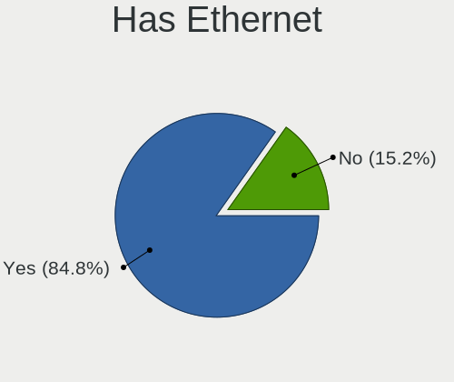
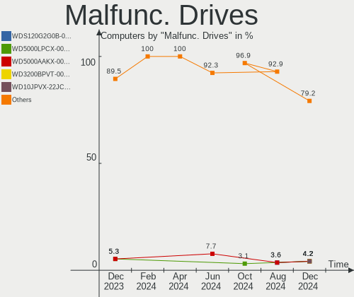
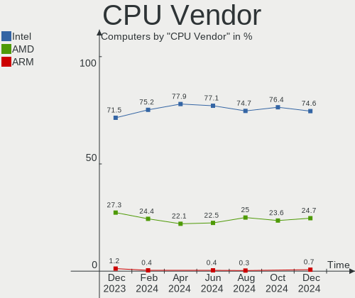
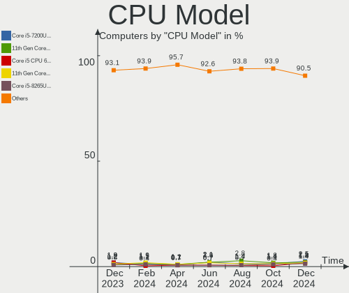
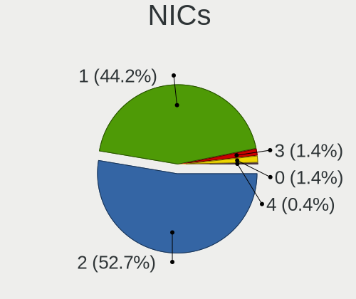
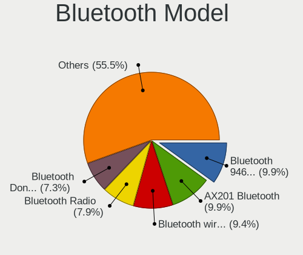
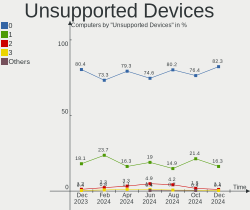

Linux in Brazil - Hardware Trends
---------------------------------

A project to identify most popular hardware characteristics and track their change
over time based on data collected by Linux users at https://Linux-Hardware.org.

Anyone can contribute to this report by the [hw-probe](https://github.com/linuxhw/hw-probe) tool:

    sudo -E hw-probe -all -upload

This is a report for all computer types. See also reports for [desktops](/Location/Brazil/Desktop/README.md) and [notebooks](/Location/Brazil/Notebook/README.md).

Period: Oct, 2023.

Contents
--------

* [ System ](#system)
  - [ OS                       ](#os)
  - [ OS Family                ](#os-family)
  - [ Kernel                   ](#kernel)
  - [ Kernel Family            ](#kernel-family)
  - [ Kernel Major Ver.        ](#kernel-major-ver)
  - [ Arch                     ](#arch)
  - [ DE                       ](#de)
  - [ Display Server           ](#display-server)
  - [ Display Manager          ](#display-manager)
  - [ OS Lang                  ](#os-lang)
  - [ Boot Mode                ](#boot-mode)
  - [ Filesystem               ](#filesystem)
  - [ Part. scheme             ](#part-scheme)
  - [ Dual Boot with Linux/BSD ](#dual-boot-with-linuxbsd)
  - [ Dual Boot (Win)          ](#dual-boot-win)

* [ Board ](#board)
  - [ Vendor                   ](#vendor)
  - [ Model                    ](#model)
  - [ Model Family             ](#model-family)
  - [ MFG Year                 ](#mfg-year)
  - [ Form Factor              ](#form-factor)
  - [ Secure Boot              ](#secure-boot)
  - [ Coreboot                 ](#coreboot)
  - [ RAM Size                 ](#ram-size)
  - [ RAM Used                 ](#ram-used)
  - [ Total Drives             ](#total-drives)
  - [ Has CD-ROM               ](#has-cd-rom)
  - [ Has Ethernet             ](#has-ethernet)
  - [ Has WiFi                 ](#has-wifi)
  - [ Has Bluetooth            ](#has-bluetooth)

* [ Location ](#location)
  - [ Country                  ](#country)
  - [ City                     ](#city)

* [ Drives ](#drives)
  - [ Drive Vendor             ](#drive-vendor)
  - [ Drive Model              ](#drive-model)
  - [ HDD Vendor               ](#hdd-vendor)
  - [ SSD Vendor               ](#ssd-vendor)
  - [ Drive Kind               ](#drive-kind)
  - [ Drive Connector          ](#drive-connector)
  - [ Drive Size               ](#drive-size)
  - [ Space Total              ](#space-total)
  - [ Space Used               ](#space-used)
  - [ Malfunc. Drives          ](#malfunc-drives)
  - [ Malfunc. Drive Vendor    ](#malfunc-drive-vendor)
  - [ Malfunc. HDD Vendor      ](#malfunc-hdd-vendor)
  - [ Malfunc. Drive Kind      ](#malfunc-drive-kind)
  - [ Failed Drives            ](#failed-drives)
  - [ Failed Drive Vendor      ](#failed-drive-vendor)
  - [ Drive Status             ](#drive-status)

* [ Storage controller ](#storage-controller)
  - [ Storage Vendor           ](#storage-vendor)
  - [ Storage Model            ](#storage-model)
  - [ Storage Kind             ](#storage-kind)

* [ Processor ](#processor)
  - [ CPU Vendor               ](#cpu-vendor)
  - [ CPU Model                ](#cpu-model)
  - [ CPU Model Family         ](#cpu-model-family)
  - [ CPU Cores                ](#cpu-cores)
  - [ CPU Sockets              ](#cpu-sockets)
  - [ CPU Threads              ](#cpu-threads)
  - [ CPU Op-Modes             ](#cpu-op-modes)
  - [ CPU Microcode            ](#cpu-microcode)
  - [ CPU Microarch            ](#cpu-microarch)

* [ Graphics ](#graphics)
  - [ GPU Vendor               ](#gpu-vendor)
  - [ GPU Model                ](#gpu-model)
  - [ GPU Combo                ](#gpu-combo)
  - [ GPU Driver               ](#gpu-driver)
  - [ GPU Memory               ](#gpu-memory)

* [ Monitor ](#monitor)
  - [ Monitor Vendor           ](#monitor-vendor)
  - [ Monitor Model            ](#monitor-model)
  - [ Monitor Resolution       ](#monitor-resolution)
  - [ Monitor Diagonal         ](#monitor-diagonal)
  - [ Monitor Width            ](#monitor-width)
  - [ Aspect Ratio             ](#aspect-ratio)
  - [ Monitor Area             ](#monitor-area)
  - [ Pixel Density            ](#pixel-density)
  - [ Multiple Monitors        ](#multiple-monitors)

* [ Network ](#network)
  - [ Net Controller Vendor    ](#net-controller-vendor)
  - [ Net Controller Model     ](#net-controller-model)
  - [ Wireless Vendor          ](#wireless-vendor)
  - [ Wireless Model           ](#wireless-model)
  - [ Ethernet Vendor          ](#ethernet-vendor)
  - [ Ethernet Model           ](#ethernet-model)
  - [ Net Controller Kind      ](#net-controller-kind)
  - [ Used Controller          ](#used-controller)
  - [ NICs                     ](#nics)
  - [ IPv6                     ](#ipv6)

* [ Bluetooth ](#bluetooth)
  - [ Bluetooth Vendor         ](#bluetooth-vendor)
  - [ Bluetooth Model          ](#bluetooth-model)

* [ Sound ](#sound)
  - [ Sound Vendor             ](#sound-vendor)
  - [ Sound Model              ](#sound-model)

* [ Memory ](#memory)
  - [ Memory Vendor            ](#memory-vendor)
  - [ Memory Model             ](#memory-model)
  - [ Memory Kind              ](#memory-kind)
  - [ Memory Form Factor       ](#memory-form-factor)
  - [ Memory Size              ](#memory-size)
  - [ Memory Speed             ](#memory-speed)

* [ Printers & scanners ](#printers--scanners)
  - [ Printer Vendor           ](#printer-vendor)
  - [ Printer Model            ](#printer-model)
  - [ Scanner Vendor           ](#scanner-vendor)
  - [ Scanner Model            ](#scanner-model)

* [ Camera ](#camera)
  - [ Camera Vendor            ](#camera-vendor)
  - [ Camera Model             ](#camera-model)

* [ Security ](#security)
  - [ Fingerprint Vendor       ](#fingerprint-vendor)
  - [ Fingerprint Model        ](#fingerprint-model)
  - [ Chipcard Vendor          ](#chipcard-vendor)
  - [ Chipcard Model           ](#chipcard-model)

* [ Unsupported ](#unsupported)
  - [ Unsupported Devices      ](#unsupported-devices)
  - [ Unsupported Device Types ](#unsupported-device-types)

System
------

OS
--

Installed operating systems

| Name                         | Computers | Percent |
|------------------------------|-----------|---------|
| Ubuntu 22.04                 | 35        | 13.06%  |
| Fedora 38                    | 26        | 9.7%    |
| Linux Mint 21.2              | 25        | 9.33%   |
| Pop!_OS 22.04                | 17        | 6.34%   |
| OpenMandriva 23.08           | 17        | 6.34%   |
| Arch Rolling                 | 16        | 5.97%   |
| Debian 12                    | 13        | 4.85%   |
| ArcoLinux Rolling            | 9         | 3.36%   |
| Ubuntu 20.04                 | 7         | 2.61%   |
| Linux Mint 20.3              | 7         | 2.61%   |
| Ubuntu 23.10                 | 6         | 2.24%   |
| Ubuntu 23.04                 | 6         | 2.24%   |
| Linux Mint 21.1              | 6         | 2.24%   |
| OpenMandriva 23.10           | 4         | 1.49%   |
| Zorin 16                     | 3         | 1.12%   |
| Ubuntu MATE 22.04            | 3         | 1.12%   |
| openSUSE Tumbleweed-XXXXXXXX | 3         | 1.12%   |
| Endless 5.0.6                | 3         | 1.12%   |
| Elementary 7.1               | 3         | 1.12%   |
| BigLinux                     | 3         | 1.12%   |
| Xubuntu 22.04                | 2         | 0.75%   |
| SteamOS 4                    | 2         | 0.75%   |
| OpenMandriva 4.3             | 2         | 0.75%   |
| OpenMandriva 4.2             | 2         | 0.75%   |
| LMDE 6                       | 2         | 0.75%   |
| LMDE 5                       | 2         | 0.75%   |
| Kubuntu 22.04                | 2         | 0.75%   |
| Debian 11                    | 2         | 0.75%   |
| Debian                       | 2         | 0.75%   |
| Clear Linux 40130            | 2         | 0.75%   |
| BigLinux 23.0.3              | 2         | 0.75%   |
| Xero Rolling                 | 1         | 0.37%   |
| Ubuntu Unity 22.04           | 1         | 0.37%   |
| Ubuntu Budgie 20.04          | 1         | 0.37%   |
| Ubuntu 22.10                 | 1         | 0.37%   |
| Ubuntu 18.04                 | 1         | 0.37%   |
| SteamOS 3.5.1                | 1         | 0.37%   |
| PCLinuxOS 2023               | 1         | 0.37%   |
| openSUSE Leap-15.5           | 1         | 0.37%   |
| OpenMandriva 23.03           | 1         | 0.37%   |

OS Family
---------

OS without a version

| Name          | Computers | Percent |
|---------------|-----------|---------|
| Ubuntu        | 56        | 20.9%   |
| Linux Mint    | 41        | 15.3%   |
| OpenMandriva  | 27        | 10.07%  |
| Fedora        | 27        | 10.07%  |
| Pop!_OS       | 17        | 6.34%   |
| Debian        | 17        | 6.34%   |
| Arch          | 16        | 5.97%   |
| ArcoLinux     | 9         | 3.36%   |
| Endless       | 6         | 2.24%   |
| BigLinux      | 6         | 2.24%   |
| openSUSE      | 4         | 1.49%   |
| LMDE          | 4         | 1.49%   |
| Kubuntu       | 4         | 1.49%   |
| Zorin         | 3         | 1.12%   |
| Ubuntu MATE   | 3         | 1.12%   |
| SteamOS       | 3         | 1.12%   |
| Elementary    | 3         | 1.12%   |
| Xubuntu       | 2         | 0.75%   |
| MX            | 2         | 0.75%   |
| Clear Linux   | 2         | 0.75%   |
| Artix         | 2         | 0.75%   |
| Xero          | 1         | 0.37%   |
| Ubuntu Unity  | 1         | 0.37%   |
| Ubuntu Budgie | 1         | 0.37%   |
| PCLinuxOS     | 1         | 0.37%   |
| Nobara        | 1         | 0.37%   |
| Mauna         | 1         | 0.37%   |
| Manjaro       | 1         | 0.37%   |
| Lubuntu       | 1         | 0.37%   |
| Linux Lite    | 1         | 0.37%   |
| Kali          | 1         | 0.37%   |
| EndeavourOS   | 1         | 0.37%   |
| ChimeraOS     | 1         | 0.37%   |
| CentOS        | 1         | 0.37%   |
| Alpine        | 1         | 0.37%   |

Kernel
------

Version of the Linux kernel

| Version                  | Computers | Percent |
|--------------------------|-----------|---------|
| 6.2.0-34-generic         | 25        | 9.33%   |
| 6.1.0-13-amd64           | 14        | 5.22%   |
| 5.15.0-86-generic        | 14        | 5.22%   |
| 6.5.5-200.fc38.x86_64    | 13        | 4.85%   |
| 6.4.11-desktop-1omv2390  | 13        | 4.85%   |
| 6.2.0-35-generic         | 13        | 4.85%   |
| 5.15.0-87-generic        | 13        | 4.85%   |
| 6.5.4-76060504-generic   | 9         | 3.36%   |
| 6.5.7-arch1-1            | 7         | 2.61%   |
| 6.5.6-200.fc38.x86_64    | 6         | 2.24%   |
| 6.2.0-33-generic         | 6         | 2.24%   |
| 5.15.0-84-generic        | 6         | 2.24%   |
| 6.5.5-desktop-1omv2390   | 4         | 1.49%   |
| 6.5.0-9-generic          | 4         | 1.49%   |
| 6.4.8-desktop-2omv2390   | 4         | 1.49%   |
| 6.4.6-76060406-generic   | 4         | 1.49%   |
| 6.5.8-arch1-1            | 3         | 1.12%   |
| 6.5.7-zen2-1-zen         | 3         | 1.12%   |
| 6.5.6-76060506-generic   | 3         | 1.12%   |
| 6.5.0-10-generic         | 3         | 1.12%   |
| 6.2.9-300.fc38.x86_64    | 3         | 1.12%   |
| 5.4.0-164-generic        | 3         | 1.12%   |
| 5.15.0-76-generic        | 3         | 1.12%   |
| 5.15.0-47-generic        | 3         | 1.12%   |
| 6.5.9-arch2-1            | 2         | 0.75%   |
| 6.5.7-1371.native        | 2         | 0.75%   |
| 6.5.6-arch2-1            | 2         | 0.75%   |
| 6.5.5-zen1-1-zen         | 2         | 0.75%   |
| 6.5.5-arch1-1            | 2         | 0.75%   |
| 6.5.5-1-MANJARO          | 2         | 0.75%   |
| 6.5.0-1-amd64            | 2         | 0.75%   |
| 6.4.12-zen1-1-zen        | 2         | 0.75%   |
| 6.2.0-36-generic         | 2         | 0.75%   |
| 6.2.0-26-generic         | 2         | 0.75%   |
| 6.1.55-1-MANJARO         | 2         | 0.75%   |
| 5.16.7-desktop-1omv4003  | 2         | 0.75%   |
| 5.15.0-83-generic        | 2         | 0.75%   |
| 5.15.0-67-generic        | 2         | 0.75%   |
| 5.15.0-56-generic        | 2         | 0.75%   |
| 5.10.14-desktop-1omv4002 | 2         | 0.75%   |

Kernel Family
-------------

Linux kernel without a distro release

| Version  | Computers | Percent |
|----------|-----------|---------|
| 6.2.0    | 51        | 19.03%  |
| 5.15.0   | 47        | 17.54%  |
| 6.5.5    | 24        | 8.96%   |
| 6.1.0    | 16        | 5.97%   |
| 6.5.6    | 15        | 5.6%    |
| 6.5.7    | 14        | 5.22%   |
| 6.4.11   | 13        | 4.85%   |
| 6.5.4    | 11        | 4.1%    |
| 6.5.0    | 10        | 3.73%   |
| 5.4.0    | 8         | 2.99%   |
| 6.5.8    | 6         | 2.24%   |
| 6.4.8    | 4         | 1.49%   |
| 6.4.6    | 4         | 1.49%   |
| 5.19.0   | 4         | 1.49%   |
| 6.4.12   | 3         | 1.12%   |
| 6.2.9    | 3         | 1.12%   |
| 5.10.0   | 3         | 1.12%   |
| 6.5.9    | 2         | 0.75%   |
| 6.5.3    | 2         | 0.75%   |
| 6.2.6    | 2         | 0.75%   |
| 6.1.55   | 2         | 0.75%   |
| 6.1.53   | 2         | 0.75%   |
| 5.16.7   | 2         | 0.75%   |
| 5.10.14  | 2         | 0.75%   |
| 4.15.0   | 2         | 0.75%   |
| 6.5.2    | 1         | 0.37%   |
| 6.4.15   | 1         | 0.37%   |
| 6.4.0    | 1         | 0.37%   |
| 6.2.2    | 1         | 0.37%   |
| 6.2.16   | 1         | 0.37%   |
| 6.1.57   | 1         | 0.37%   |
| 6.1.52   | 1         | 0.37%   |
| 6.1.1    | 1         | 0.37%   |
| 5.8.0    | 1         | 0.37%   |
| 5.6.0    | 1         | 0.37%   |
| 5.15.107 | 1         | 0.37%   |
| 5.14.21  | 1         | 0.37%   |
| 5.11.0   | 1         | 0.37%   |
| 5.10.194 | 1         | 0.37%   |
| 5.0.0    | 1         | 0.37%   |

Kernel Major Ver.
-----------------

Linux kernel major version

| Version | Computers | Percent |
|---------|-----------|---------|
| 6.5     | 85        | 31.72%  |
| 6.2     | 58        | 21.64%  |
| 5.15    | 48        | 17.91%  |
| 6.4     | 26        | 9.7%    |
| 6.1     | 23        | 8.58%   |
| 5.4     | 8         | 2.99%   |
| 5.10    | 6         | 2.24%   |
| 5.19    | 4         | 1.49%   |
| 5.16    | 2         | 0.75%   |
| 4.15    | 2         | 0.75%   |
| 5.8     | 1         | 0.37%   |
| 5.6     | 1         | 0.37%   |
| 5.14    | 1         | 0.37%   |
| 5.11    | 1         | 0.37%   |
| 5.0     | 1         | 0.37%   |
| 3.10    | 1         | 0.37%   |

Arch
----

OS architecture (x86_64, i586, etc.)

| Name   | Computers | Percent |
|--------|-----------|---------|
| x86_64 | 268       | 100%    |

DE
--

Desktop Environment

| Name          | Computers | Percent |
|---------------|-----------|---------|
| GNOME         | 129       | 48.13%  |
| KDE5          | 51        | 19.03%  |
| X-Cinnamon    | 38        | 14.18%  |
| XFCE          | 13        | 4.85%   |
| MATE          | 9         | 3.36%   |
| Unknown       | 7         | 2.61%   |
| LXQt          | 4         | 1.49%   |
| Pantheon      | 3         | 1.12%   |
| Endless:GNOME | 3         | 1.12%   |
| Hyprland      | 2         | 0.75%   |
| Cinnamon      | 2         | 0.75%   |
| Budgie        | 2         | 0.75%   |
| Unity         | 1         | 0.37%   |
| LXDE          | 1         | 0.37%   |
| i3            | 1         | 0.37%   |
| Hypr          | 1         | 0.37%   |
| GNOME Classic | 1         | 0.37%   |

Display Server
--------------

X11 or Wayland

| Name    | Computers | Percent |
|---------|-----------|---------|
| X11     | 159       | 59.33%  |
| Wayland | 102       | 38.06%  |
| Unknown | 4         | 1.49%   |
| Tty     | 3         | 1.12%   |

Display Manager
---------------

SDDM, LightDM, etc.

| Name    | Computers | Percent |
|---------|-----------|---------|
| Unknown | 125       | 46.64%  |
| GDM3    | 57        | 21.27%  |
| SDDM    | 45        | 16.79%  |
| LightDM | 25        | 9.33%   |
| GDM     | 15        | 5.6%    |
| XDM     | 1         | 0.37%   |

OS Lang
-------

Language

| Lang    | Computers | Percent |
|---------|-----------|---------|
| pt_BR   | 177       | 66.04%  |
| en_US   | 71        | 26.49%  |
| C       | 10        | 3.73%   |
| Unknown | 3         | 1.12%   |
| en_CA   | 2         | 0.75%   |
| es_VE   | 1         | 0.37%   |
| es_CL   | 1         | 0.37%   |
| en_GB   | 1         | 0.37%   |
| en_DK   | 1         | 0.37%   |
| de_DE   | 1         | 0.37%   |

Boot Mode
---------

EFI or BIOS

| Mode | Computers | Percent |
|------|-----------|---------|
| EFI  | 135       | 50.37%  |
| BIOS | 133       | 49.63%  |

Filesystem
----------

Type of filesystem

| Type    | Computers | Percent |
|---------|-----------|---------|
| Ext4    | 149       | 55.6%   |
| Btrfs   | 60        | 22.39%  |
| Tmpfs   | 37        | 13.81%  |
| Overlay | 17        | 6.34%   |
| Zfs     | 2         | 0.75%   |
| Xfs     | 1         | 0.37%   |
| Jfs     | 1         | 0.37%   |
| F2fs    | 1         | 0.37%   |

Part. scheme
------------

Scheme of partitioning

| Type    | Computers | Percent |
|---------|-----------|---------|
| GPT     | 123       | 45.9%   |
| Unknown | 119       | 44.4%   |
| MBR     | 26        | 9.7%    |

Dual Boot with Linux/BSD
------------------------

Hosting more than one Linux/BSD

| Dual boot | Computers | Percent |
|-----------|-----------|---------|
| No        | 242       | 90.3%   |
| Yes       | 26        | 9.7%    |

Dual Boot (Win)
---------------

Hosting Linux and Windows

| Dual boot | Computers | Percent |
|-----------|-----------|---------|
| No        | 197       | 73.51%  |
| Yes       | 71        | 26.49%  |

Board
-----

Vendor
------

Motherboard manufacturer

| Name                   | Computers | Percent |
|------------------------|-----------|---------|
| Dell                   | 49        | 18.28%  |
| Lenovo                 | 31        | 11.57%  |
| Gigabyte Technology    | 27        | 10.07%  |
| ASUSTek Computer       | 27        | 10.07%  |
| Acer                   | 26        | 9.7%    |
| Samsung Electronics    | 12        | 4.48%   |
| Intel                  | 12        | 4.48%   |
| Hewlett-Packard        | 11        | 4.1%    |
| ASRock                 | 9         | 3.36%   |
| Positivo               | 7         | 2.61%   |
| Apple                  | 6         | 2.24%   |
| Sony                   | 4         | 1.49%   |
| MSI                    | 4         | 1.49%   |
| Avell High Performance | 4         | 1.49%   |
| Unknown                | 4         | 1.49%   |
| MACHINIST              | 3         | 1.12%   |
| Compaq                 | 3         | 1.12%   |
| Biostar                | 3         | 1.12%   |
| AZW                    | 3         | 1.12%   |
| Positivo Bahia - VAIO  | 2         | 0.75%   |
| Pegatron               | 2         | 0.75%   |
| LG Electronics         | 2         | 0.75%   |
| Huanan                 | 2         | 0.75%   |
| Gateway                | 2         | 0.75%   |
| Alienware              | 2         | 0.75%   |
| Valve                  | 1         | 0.37%   |
| Philco Informatica     | 1         | 0.37%   |
| PCWare                 | 1         | 0.37%   |
| Notebook               | 1         | 0.37%   |
| Multilaser             | 1         | 0.37%   |
| Itautec                | 1         | 0.37%   |
| HUAWEI                 | 1         | 0.37%   |
| Digibras               | 1         | 0.37%   |
| Danuri                 | 1         | 0.37%   |
| Clevo                  | 1         | 0.37%   |
| AMD                    | 1         | 0.37%   |

Model
-----

Motherboard model

| Name                                   | Computers | Percent |
|----------------------------------------|-----------|---------|
| Intel H61                              | 6         | 2.24%   |
| Lenovo IdeaPad S145-15API 81V7         | 4         | 1.49%   |
| Gigabyte B550M AORUS ELITE             | 4         | 1.49%   |
| Unknown                                | 4         | 1.49%   |
| ASRock A320M-HD                        | 3         | 1.12%   |
| Acer Aspire A315-42G                   | 3         | 1.12%   |
| Samsung 670Z5E                         | 2         | 0.75%   |
| Samsung 550XCJ/550XCR                  | 2         | 0.75%   |
| Samsung 340XAA/350XAA/550XAA           | 2         | 0.75%   |
| MSI MS-7C95                            | 2         | 0.75%   |
| Lenovo IdeaPad S145-15IWL 81S9         | 2         | 0.75%   |
| Lenovo IdeaPad Gaming 3 15ACH6 82MJ    | 2         | 0.75%   |
| Lenovo IdeaPad 3 15ALC6 82MF           | 2         | 0.75%   |
| Intel B75                              | 2         | 0.75%   |
| Gigabyte B450 AORUS M                  | 2         | 0.75%   |
| Gigabyte AB350M-DS3H V2                | 2         | 0.75%   |
| Dell XPS 8930                          | 2         | 0.75%   |
| Dell Vostro 3550                       | 2         | 0.75%   |
| Dell Latitude 3490                     | 2         | 0.75%   |
| Dell Inspiron 7559                     | 2         | 0.75%   |
| Dell Inspiron 5547                     | 2         | 0.75%   |
| Dell Inspiron 3437                     | 2         | 0.75%   |
| Dell Inspiron 3421                     | 2         | 0.75%   |
| Dell Inspiron 15-3567                  | 2         | 0.75%   |
| Dell G15 5515                          | 2         | 0.75%   |
| Biostar B450MH                         | 2         | 0.75%   |
| Avell High Performance B.ON            | 2         | 0.75%   |
| ASUS VivoBook_ASUSLaptop X515EA_X515EA | 2         | 0.75%   |
| ASUS VivoBook_ASUSLaptop X515DA_X515DA | 2         | 0.75%   |
| ASUS TUF Gaming B550M-PLUS             | 2         | 0.75%   |
| ASUS All Series                        | 2         | 0.75%   |
| Apple MacBookPro8,1                    | 2         | 0.75%   |
| Apple MacBookPro11,1                   | 2         | 0.75%   |
| Acer Nitro AN515-47                    | 2         | 0.75%   |
| Acer Nitro AN515-44                    | 2         | 0.75%   |
| Acer Aspire ES1-572                    | 2         | 0.75%   |
| Valve Jupiter                          | 1         | 0.37%   |
| Sony VPCEA23FB                         | 1         | 0.37%   |
| Sony VPCCW13FB                         | 1         | 0.37%   |
| Sony VGN-SR150A                        | 1         | 0.37%   |

Model Family
------------

Motherboard model prefix

| Name                        | Computers | Percent |
|-----------------------------|-----------|---------|
| Dell Inspiron               | 27        | 10.07%  |
| Lenovo IdeaPad              | 16        | 5.97%   |
| Acer Aspire                 | 15        | 5.6%    |
| Dell Vostro                 | 10        | 3.73%   |
| Acer Nitro                  | 9         | 3.36%   |
| Lenovo ThinkPad             | 7         | 2.61%   |
| Intel H61                   | 7         | 2.61%   |
| ASUS VivoBook               | 7         | 2.61%   |
| ASUS TUF                    | 6         | 2.24%   |
| Gigabyte B550M              | 5         | 1.87%   |
| HP Pavilion                 | 4         | 1.49%   |
| Dell Latitude               | 4         | 1.49%   |
| ASRock A320M-HD             | 4         | 1.49%   |
| Unknown                     | 4         | 1.49%   |
| Lenovo ThinkCentre          | 3         | 1.12%   |
| Gigabyte B450               | 3         | 1.12%   |
| Dell XPS                    | 3         | 1.12%   |
| ASUS PRIME                  | 3         | 1.12%   |
| Samsung 670Z5E              | 2         | 0.75%   |
| Samsung 550XCJ              | 2         | 0.75%   |
| Samsung 340XAA              | 2         | 0.75%   |
| MSI MS-7C95                 | 2         | 0.75%   |
| Intel B75                   | 2         | 0.75%   |
| HP ProBook                  | 2         | 0.75%   |
| HP Folio                    | 2         | 0.75%   |
| Gigabyte B450M              | 2         | 0.75%   |
| Gigabyte AB350M-DS3H        | 2         | 0.75%   |
| Dell PowerEdge              | 2         | 0.75%   |
| Dell G15                    | 2         | 0.75%   |
| Biostar B450MH              | 2         | 0.75%   |
| Avell High Performance B.ON | 2         | 0.75%   |
| ASUS All                    | 2         | 0.75%   |
| Apple MacBookPro8           | 2         | 0.75%   |
| Apple MacBookPro11          | 2         | 0.75%   |
| Alienware m15               | 2         | 0.75%   |
| Valve Jupiter               | 1         | 0.37%   |
| Sony VPCEA23FB              | 1         | 0.37%   |
| Sony VPCCW13FB              | 1         | 0.37%   |
| Sony VGN-SR150A             | 1         | 0.37%   |
| Sony SVS13A25PBS            | 1         | 0.37%   |

MFG Year
--------

Motherboard manufacture year

| Year | Computers | Percent |
|------|-----------|---------|
| 2018 | 32        | 11.94%  |
| 2019 | 31        | 11.57%  |
| 2021 | 29        | 10.82%  |
| 2020 | 25        | 9.33%   |
| 2012 | 20        | 7.46%   |
| 2017 | 19        | 7.09%   |
| 2013 | 19        | 7.09%   |
| 2011 | 15        | 5.6%    |
| 2022 | 12        | 4.48%   |
| 2010 | 12        | 4.48%   |
| 2016 | 11        | 4.1%    |
| 2023 | 9         | 3.36%   |
| 2015 | 9         | 3.36%   |
| 2014 | 9         | 3.36%   |
| 2008 | 7         | 2.61%   |
| 2009 | 6         | 2.24%   |
| 2007 | 2         | 0.75%   |
| 2006 | 1         | 0.37%   |

Form Factor
-----------

Physical design of the computer

| Name        | Computers | Percent |
|-------------|-----------|---------|
| Notebook    | 162       | 60.45%  |
| Desktop     | 100       | 37.31%  |
| Convertible | 3         | 1.12%   |
| Server      | 2         | 0.75%   |
| Mini pc     | 1         | 0.37%   |

Secure Boot
-----------

Enabled or disabled

| State    | Computers | Percent |
|----------|-----------|---------|
| Disabled | 253       | 94.4%   |
| Enabled  | 15        | 5.6%    |

Coreboot
--------

Have coreboot on board

| Used | Computers | Percent |
|------|-----------|---------|
| No   | 268       | 100%    |

RAM Size
--------

Total RAM memory

| Size in GB  | Computers | Percent |
|-------------|-----------|---------|
| 16.01-24.0  | 83        | 30.97%  |
| 4.01-8.0    | 64        | 23.88%  |
| 8.01-16.0   | 43        | 16.04%  |
| 3.01-4.0    | 37        | 13.81%  |
| 32.01-64.0  | 19        | 7.09%   |
| 64.01-256.0 | 7         | 2.61%   |
| 24.01-32.0  | 6         | 2.24%   |
| 1.01-2.0    | 6         | 2.24%   |
| 2.01-3.0    | 3         | 1.12%   |

RAM Used
--------

Used RAM memory

| Used GB    | Computers | Percent |
|------------|-----------|---------|
| 2.01-3.0   | 85        | 31.72%  |
| 1.01-2.0   | 65        | 24.25%  |
| 4.01-8.0   | 53        | 19.78%  |
| 3.01-4.0   | 30        | 11.19%  |
| 8.01-16.0  | 22        | 8.21%   |
| 0.51-1.0   | 8         | 2.99%   |
| 16.01-24.0 | 2         | 0.75%   |
| 0.01-0.5   | 2         | 0.75%   |
| 24.01-32.0 | 1         | 0.37%   |

Total Drives
------------

Number of drives on board

| Drives | Computers | Percent |
|--------|-----------|---------|
| 1      | 134       | 50%     |
| 2      | 90        | 33.58%  |
| 3      | 29        | 10.82%  |
| 4      | 8         | 2.99%   |
| 5      | 5         | 1.87%   |
| 6      | 2         | 0.75%   |

Has CD-ROM
----------

Has CD-ROM on board

| Presented | Computers | Percent |
|-----------|-----------|---------|
| No        | 204       | 76.12%  |
| Yes       | 64        | 23.88%  |

Has Ethernet
------------

Has Ethernet on board

| Presented | Computers | Percent |
|-----------|-----------|---------|
| Yes       | 236       | 88.06%  |
| No        | 32        | 11.94%  |

Has WiFi
--------

Has WiFi module

| Presented | Computers | Percent |
|-----------|-----------|---------|
| Yes       | 201       | 75%     |
| No        | 67        | 25%     |

Has Bluetooth
-------------

Has Bluetooth module

| Presented | Computers | Percent |
|-----------|-----------|---------|
| Yes       | 174       | 64.93%  |
| No        | 94        | 35.07%  |

Location
--------

Country
-------

Geographic location (country)

| Country | Computers | Percent |
|---------|-----------|---------|
| Brazil  | 268       | 100%    |

City
----

Geographic location (city)

| City                  | Computers | Percent |
|-----------------------|-----------|---------|
| Sao Paulo             | 27        | 10.07%  |
| Rio de Janeiro        | 25        | 9.33%   |
| Belo Horizonte        | 10        | 3.73%   |
| Salvador              | 8         | 2.99%   |
| Porto Alegre          | 8         | 2.99%   |
| Brasília             | 7         | 2.61%   |
| Curitiba              | 6         | 2.24%   |
| Sao José dos Campos  | 5         | 1.87%   |
| Santo André          | 5         | 1.87%   |
| Recife                | 5         | 1.87%   |
| Maringá              | 5         | 1.87%   |
| Fortaleza             | 5         | 1.87%   |
| Belém                | 5         | 1.87%   |
| Sorocaba              | 4         | 1.49%   |
| Volta Redonda         | 3         | 1.12%   |
| Serra                 | 3         | 1.12%   |
| Sao Bernardo do Campo | 3         | 1.12%   |
| Santos                | 3         | 1.12%   |
| Osasco                | 3         | 1.12%   |
| Juiz de Fora          | 3         | 1.12%   |
| Jaraguá do Sul       | 3         | 1.12%   |
| Hortolândia          | 3         | 1.12%   |
| Florianópolis        | 3         | 1.12%   |
| Aracaju               | 3         | 1.12%   |
| Vila Velha            | 2         | 0.75%   |
| Uberlândia           | 2         | 0.75%   |
| Sete Lagoas           | 2         | 0.75%   |
| Sao Jose do Rio Preto | 2         | 0.75%   |
| Sao Carlos            | 2         | 0.75%   |
| Olinda                | 2         | 0.75%   |
| Niterói              | 2         | 0.75%   |
| Mogi das Cruzes       | 2         | 0.75%   |
| Foz do Iguaçu        | 2         | 0.75%   |
| Criciúma             | 2         | 0.75%   |
| Bauru                 | 2         | 0.75%   |
| Americana             | 2         | 0.75%   |
| Vitória da Conquista | 1         | 0.37%   |
| Vitória              | 1         | 0.37%   |
| Vicosa                | 1         | 0.37%   |
| Ubatuba               | 1         | 0.37%   |

Drives
------

Drive Vendor
------------

Hard drive vendors

| Vendor                         | Computers | Drives | Percent |
|--------------------------------|-----------|--------|---------|
| WDC                            | 61        | 64     | 14.02%  |
| Seagate                        | 61        | 70     | 14.02%  |
| Samsung Electronics            | 42        | 47     | 9.66%   |
| Kingston                       | 41        | 44     | 9.43%   |
| A-DATA Technology              | 19        | 19     | 4.37%   |
| SanDisk                        | 17        | 18     | 3.91%   |
| China                          | 17        | 18     | 3.91%   |
| Toshiba                        | 12        | 12     | 2.76%   |
| Crucial                        | 12        | 12     | 2.76%   |
| MAXIO Technology (Hangzhou)    | 11        | 12     | 2.53%   |
| ADATA Technology               | 11        | 11     | 2.53%   |
| Unknown                        | 9         | 12     | 2.07%   |
| SK hynix                       | 9         | 9      | 2.07%   |
| Kingston Technology Company    | 9         | 11     | 2.07%   |
| KingSpec                       | 8         | 8      | 1.84%   |
| Silicon Motion                 | 6         | 6      | 1.38%   |
| Solid State Storage            | 5         | 5      | 1.15%   |
| Patriot                        | 5         | 5      | 1.15%   |
| Micron Technology              | 5         | 5      | 1.15%   |
| Intel                          | 5         | 5      | 1.15%   |
| HGST                           | 5         | 5      | 1.15%   |
| Unknown                        | 5         | 5      | 1.15%   |
| XrayDisk                       | 4         | 4      | 0.92%   |
| Netac                          | 4         | 4      | 0.92%   |
| WALRAM                         | 3         | 3      | 0.69%   |
| Realtek Semiconductor          | 3         | 3      | 0.69%   |
| PNY                            | 3         | 3      | 0.69%   |
| Hitachi                        | 3         | 3      | 0.69%   |
| SSSTC                          | 2         | 2      | 0.46%   |
| Solid State Storage Technology | 2         | 2      | 0.46%   |
| Phison Electronics             | 2         | 2      | 0.46%   |
| Lexar                          | 2         | 2      | 0.46%   |
| KIOXIA                         | 2         | 2      | 0.46%   |
| Corsair                        | 2         | 2      | 0.46%   |
| ZTC                            | 1         | 1      | 0.23%   |
| XPG                            | 1         | 1      | 0.23%   |
| Win Memory                     | 1         | 1      | 0.23%   |
| Team                           | 1         | 1      | 0.23%   |
| STAR                           | 1         | 1      | 0.23%   |
| Reletech                       | 1         | 1      | 0.23%   |

Drive Model
-----------

Hard drive models

| Model                                                 | Computers | Percent |
|-------------------------------------------------------|-----------|---------|
| Kingston SA400S37480G 480GB SSD                       | 11        | 2.42%   |
| Seagate ST1000LM024 HN-M101MBB 1TB                    | 10        | 2.2%    |
| MAXIO (Hangzhou) NVMe SSD Controller MAP1202 250GB    | 8         | 1.76%   |
| Kingston SA400S37240G 240GB SSD                       | 8         | 1.76%   |
| Samsung NVMe SSD Controller SM981/PM981/PM983 1TB     | 7         | 1.54%   |
| Seagate ST1000DM010-2EP102 1TB                        | 6         | 1.32%   |
| Kingston Company SNV2S1000G 1TB                       | 6         | 1.32%   |
| Kingston SV300S37A120G 120GB SSD                      | 6         | 1.32%   |
| Toshiba MQ04ABF100 1TB                                | 5         | 1.1%    |
| Silicon Motion SM2263EN/SM2263XT SSD Controller 256GB | 5         | 1.1%    |
| Seagate ST1000LM035-1RK172 1TB                        | 5         | 1.1%    |
| SanDisk SSD PLUS 480GB                                | 5         | 1.1%    |
| Unknown                                               | 5         | 1.1%    |
| WDC WD10SPZX-21Z10T0 1TB                              | 4         | 0.88%   |
| WDC WD10JPVX-22JC3T0 1TB                              | 4         | 0.88%   |
| SK hynix BC501 NVMe Solid State Drive 512GB           | 4         | 0.88%   |
| Crucial CT480BX500SSD1 480GB                          | 4         | 0.88%   |
| ADATA SM2P32A8-256GC1 256GB                           | 4         | 0.88%   |
| WDC WD10SPZX-24Z10 1TB                                | 3         | 0.66%   |
| Solid State Storage SSSTC CL1-4D256 256GB             | 3         | 0.66%   |
| Seagate Expansion 1TB                                 | 3         | 0.66%   |
| Samsung HD103SJ 1TB                                   | 3         | 0.66%   |
| Kingston Company SNV2S2000G 2TB                       | 3         | 0.66%   |
| Kingston SNVS500G 500GB                               | 3         | 0.66%   |
| Kingston SNV2S500G 500GB                              | 3         | 0.66%   |
| Kingston SA400S37960G 960GB SSD                       | 3         | 0.66%   |
| Kingston SA400S37120G 120GB SSD                       | 3         | 0.66%   |
| Crucial CT240BX500SSD1 240GB                          | 3         | 0.66%   |
| China SSD 128GB                                       | 3         | 0.66%   |
| A-DATA SU650 120GB SSD                                | 3         | 0.66%   |
| A-DATA IM2P33F8A-512GD 512GB                          | 3         | 0.66%   |
| XrayDisk 1TB SSD                                      | 2         | 0.44%   |
| WDC WDS240G2G0B-00EPW0 240GB SSD                      | 2         | 0.44%   |
| WDC WDS120G2G0B-00EPW0 120GB SSD                      | 2         | 0.44%   |
| WDC WD5000LPVX-22V0TT0 500GB                          | 2         | 0.44%   |
| WDC WD5000LPVX-00V0TT0 500GB                          | 2         | 0.44%   |
| WDC WD10SPZX-80Z10T2 1TB                              | 2         | 0.44%   |
| WDC WD10SPZX-75Z10T2 1TB                              | 2         | 0.44%   |
| WDC WD10EZEX-08WN4A0 1TB                              | 2         | 0.44%   |
| WDC WD10EZEX-00RKKA0 1TB                              | 2         | 0.44%   |

HDD Vendor
----------

Hard disk drive vendors

| Vendor              | Computers | Drives | Percent |
|---------------------|-----------|--------|---------|
| Seagate             | 60        | 69     | 40.54%  |
| WDC                 | 51        | 53     | 34.46%  |
| Samsung Electronics | 15        | 18     | 10.14%  |
| Toshiba             | 11        | 11     | 7.43%   |
| HGST                | 5         | 5      | 3.38%   |
| Hitachi             | 3         | 3      | 2.03%   |
| Unknown             | 1         | 1      | 0.68%   |
| Fujitsu             | 1         | 1      | 0.68%   |
| External            | 1         | 1      | 0.68%   |

SSD Vendor
----------

Solid state drive vendors

| Vendor              | Computers | Drives | Percent |
|---------------------|-----------|--------|---------|
| Kingston            | 33        | 36     | 21.71%  |
| China               | 17        | 18     | 11.18%  |
| Samsung Electronics | 13        | 13     | 8.55%   |
| Crucial             | 12        | 12     | 7.89%   |
| WDC                 | 11        | 11     | 7.24%   |
| SanDisk             | 11        | 11     | 7.24%   |
| A-DATA Technology   | 10        | 10     | 6.58%   |
| KingSpec            | 8         | 8      | 5.26%   |
| Patriot             | 5         | 5      | 3.29%   |
| XrayDisk            | 3         | 3      | 1.97%   |
| PNY                 | 3         | 3      | 1.97%   |
| WALRAM              | 2         | 2      | 1.32%   |
| Netac               | 2         | 2      | 1.32%   |
| Lexar               | 2         | 2      | 1.32%   |
| ZTC                 | 1         | 1      | 0.66%   |
| Win Memory          | 1         | 1      | 0.66%   |
| Team                | 1         | 1      | 0.66%   |
| STAR                | 1         | 1      | 0.66%   |
| OCZ                 | 1         | 1      | 0.66%   |
| NT-512              | 1         | 1      | 0.66%   |
| NGFF                | 1         | 1      | 0.66%   |
| MOVESPEED           | 1         | 1      | 0.66%   |
| Micron Technology   | 1         | 1      | 0.66%   |
| LITEON              | 1         | 1      | 0.66%   |
| Lenovo              | 1         | 1      | 0.66%   |
| KingDian            | 1         | 1      | 0.66%   |
| KINGBANK            | 1         | 1      | 0.66%   |
| HUSKY               | 1         | 1      | 0.66%   |
| Hewlett-Packard     | 1         | 1      | 0.66%   |
| Gigabyte Technology | 1         | 1      | 0.66%   |
| Biostar             | 1         | 1      | 0.66%   |
| Apple               | 1         | 1      | 0.66%   |
| Apacer              | 1         | 1      | 0.66%   |
| Unknown             | 1         | 1      | 0.66%   |

Drive Kind
----------

HDD or SSD

| Kind    | Computers | Drives | Percent |
|---------|-----------|--------|---------|
| SSD     | 128       | 156    | 34.04%  |
| HDD     | 125       | 162    | 33.24%  |
| NVMe    | 109       | 128    | 28.99%  |
| Unknown | 10        | 10     | 2.66%   |
| MMC     | 4         | 7      | 1.06%   |

Drive Connector
---------------

SATA, SAS, NVMe, etc.

| Type | Computers | Drives | Percent |
|------|-----------|--------|---------|
| SATA | 212       | 316    | 63.1%   |
| NVMe | 109       | 128    | 32.44%  |
| SAS  | 11        | 12     | 3.27%   |
| MMC  | 4         | 7      | 1.19%   |

Drive Size
----------

Size of hard drive

| Size in TB | Computers | Drives | Percent |
|------------|-----------|--------|---------|
| 0.01-0.5   | 142       | 180    | 53.79%  |
| 0.51-1.0   | 93        | 102    | 35.23%  |
| 1.01-2.0   | 18        | 22     | 6.82%   |
| 3.01-4.0   | 6         | 9      | 2.27%   |
| 4.01-10.0  | 3         | 3      | 1.14%   |
| 2.01-3.0   | 1         | 1      | 0.38%   |
| 10.01-20.0 | 1         | 1      | 0.38%   |

Space Total
-----------

Amount of disk space available on the file system

| Size in GB     | Computers | Percent |
|----------------|-----------|---------|
| 251-500        | 69        | 25.75%  |
| 101-250        | 67        | 25%     |
| 501-1000       | 37        | 13.81%  |
| 1001-2000      | 32        | 11.94%  |
| 1-20           | 17        | 6.34%   |
| 2001-3000      | 15        | 5.6%    |
| 51-100         | 13        | 4.85%   |
| More than 3000 | 12        | 4.48%   |
| Unknown        | 4         | 1.49%   |
| 21-50          | 2         | 0.75%   |

Space Used
----------

Amount of used disk space

| Used GB        | Computers | Percent |
|----------------|-----------|---------|
| 1-20           | 79        | 29.48%  |
| 21-50          | 53        | 19.78%  |
| 101-250        | 36        | 13.43%  |
| 51-100         | 34        | 12.69%  |
| 501-1000       | 25        | 9.33%   |
| 251-500        | 23        | 8.58%   |
| 1001-2000      | 8         | 2.99%   |
| 2001-3000      | 4         | 1.49%   |
| Unknown        | 4         | 1.49%   |
| More than 3000 | 2         | 0.75%   |

Malfunc. Drives
---------------

Drive models with a malfunction

| Model                                                   | Computers | Drives | Percent |
|---------------------------------------------------------|-----------|--------|---------|
| Seagate ST1000LM024 HN-M101MBB 1TB                      | 2         | 2      | 6.45%   |
| SanDisk SSD PLUS 480GB                                  | 2         | 2      | 6.45%   |
| China SSD 512GB                                         | 2         | 2      | 6.45%   |
| XrayDisk SSD 128GB                                      | 1         | 1      | 3.23%   |
| WDC WD800BD-22MRA1 80GB                                 | 1         | 1      | 3.23%   |
| WDC WD800AAJS-75M0A0 80GB                               | 1         | 1      | 3.23%   |
| WDC WD5000AAKS-22A7B0 500GB                             | 1         | 1      | 3.23%   |
| WDC WD20EZRX-00D8PB0 2TB                                | 1         | 1      | 3.23%   |
| WDC WD Green M.2 2280 480GB SSD                         | 1         | 1      | 3.23%   |
| Toshiba MK5065GSXF 500GB                                | 1         | 1      | 3.23%   |
| Seagate ST500LT012-9WS142 500GB                         | 1         | 1      | 3.23%   |
| Seagate ST500LM012 HN-M500MBB 500GB                     | 1         | 1      | 3.23%   |
| Seagate ST500DM002-1BD142 500GB                         | 1         | 1      | 3.23%   |
| Seagate ST4000NM0053 4TB                                | 1         | 1      | 3.23%   |
| Seagate ST2000DM001-1CH164 2TB                          | 1         | 1      | 3.23%   |
| Seagate ST1000LM035-1RK172 1TB                          | 1         | 1      | 3.23%   |
| Seagate ST1000DM003-1ER162 1TB                          | 1         | 1      | 3.23%   |
| Samsung Electronics HM500JI 500GB                       | 1         | 1      | 3.23%   |
| Samsung Electronics HM160HI 160GB                       | 1         | 1      | 3.23%   |
| Samsung Electronics HD322HJ 320GB                       | 1         | 1      | 3.23%   |
| Samsung Electronics HD250HJ 250GB                       | 1         | 1      | 3.23%   |
| Samsung Electronics HD103SI 1TB                         | 1         | 2      | 3.23%   |
| Realtek Semiconductor RTS5763DL NVMe SSD Controller 1TB | 1         | 1      | 3.23%   |
| Netac NS512GSSD340 512GB                                | 1         | 1      | 3.23%   |
| Micron Technology MTFDDAT128MAM-1J2 128GB SSD           | 1         | 1      | 3.23%   |
| Kingston SUV400S37240G 240GB SSD                        | 1         | 1      | 3.23%   |
| Hitachi HDP725050GLA360 500GB                           | 1         | 1      | 3.23%   |
| Crucial CT512MX100SSD1 512GB                            | 1         | 1      | 3.23%   |

Malfunc. Drive Vendor
---------------------

Vendors of faulty drives

| Vendor                | Computers | Drives | Percent |
|-----------------------|-----------|--------|---------|
| Seagate               | 8         | 9      | 26.67%  |
| WDC                   | 5         | 5      | 16.67%  |
| Samsung Electronics   | 5         | 6      | 16.67%  |
| SanDisk               | 2         | 2      | 6.67%   |
| China                 | 2         | 2      | 6.67%   |
| XrayDisk              | 1         | 1      | 3.33%   |
| Toshiba               | 1         | 1      | 3.33%   |
| Realtek Semiconductor | 1         | 1      | 3.33%   |
| Netac                 | 1         | 1      | 3.33%   |
| Micron Technology     | 1         | 1      | 3.33%   |
| Kingston              | 1         | 1      | 3.33%   |
| Hitachi               | 1         | 1      | 3.33%   |
| Crucial               | 1         | 1      | 3.33%   |

Malfunc. HDD Vendor
-------------------

Vendors of faulty HDD drives

| Vendor              | Computers | Drives | Percent |
|---------------------|-----------|--------|---------|
| Seagate             | 8         | 9      | 42.11%  |
| Samsung Electronics | 5         | 6      | 26.32%  |
| WDC                 | 4         | 4      | 21.05%  |
| Toshiba             | 1         | 1      | 5.26%   |
| Hitachi             | 1         | 1      | 5.26%   |

Malfunc. Drive Kind
-------------------

Kinds of faulty drives

| Kind | Computers | Drives | Percent |
|------|-----------|--------|---------|
| HDD  | 17        | 21     | 60.71%  |
| SSD  | 10        | 10     | 35.71%  |
| NVMe | 1         | 1      | 3.57%   |

Failed Drives
-------------

Failed drive models

Zero info for selected period =(

Failed Drive Vendor
-------------------

Failed drive vendors

Zero info for selected period =(

Drive Status
------------

Number of failed and malfunc. drives

| Status   | Computers | Drives | Percent |
|----------|-----------|--------|---------|
| Detected | 169       | 296    | 58.28%  |
| Works    | 94        | 135    | 32.41%  |
| Malfunc  | 27        | 32     | 9.31%   |

Storage controller
------------------

Storage Vendor
--------------

Storage controller vendors

| Vendor                         | Computers | Percent |
|--------------------------------|-----------|---------|
| Intel                          | 179       | 48.25%  |
| AMD                            | 67        | 18.06%  |
| ADATA Technology               | 21        | 5.66%   |
| Samsung Electronics            | 16        | 4.31%   |
| Kingston Technology Company    | 16        | 4.31%   |
| MAXIO Technology (Hangzhou)    | 15        | 4.04%   |
| SK hynix                       | 9         | 2.43%   |
| Solid State Storage Technology | 8         | 2.16%   |
| Silicon Motion                 | 7         | 1.89%   |
| SanDisk                        | 7         | 1.89%   |
| Phison Electronics             | 4         | 1.08%   |
| Micron Technology              | 4         | 1.08%   |
| Realtek Semiconductor          | 3         | 0.81%   |
| Nvidia                         | 2         | 0.54%   |
| KIOXIA                         | 2         | 0.54%   |
| ASMedia Technology             | 2         | 0.54%   |
| VIA Technologies               | 1         | 0.27%   |
| Toshiba America Info Systems   | 1         | 0.27%   |
| Netac Technology               | 1         | 0.27%   |
| Micron/Crucial Technology      | 1         | 0.27%   |
| Marvell Technology Group       | 1         | 0.27%   |
| Lite-On Technology             | 1         | 0.27%   |
| JMicron Technology             | 1         | 0.27%   |
| Hosin Global Electronics       | 1         | 0.27%   |
| Dell                           | 1         | 0.27%   |

Storage Model
-------------

Storage controller models

| Model                                                                          | Computers | Percent |
|--------------------------------------------------------------------------------|-----------|---------|
| AMD FCH SATA Controller [AHCI mode]                                            | 44        | 10.4%   |
| Intel Sunrise Point-LP SATA Controller [AHCI mode]                             | 18        | 4.26%   |
| Intel 7 Series Chipset Family 6-port SATA Controller [AHCI mode]               | 13        | 3.07%   |
| MAXIO (Hangzhou) NVMe SSD Controller MAP1202                                   | 12        | 2.84%   |
| AMD 500 Series Chipset SATA Controller                                         | 11        | 2.6%    |
| Intel Volume Management Device NVMe RAID Controller                            | 10        | 2.36%   |
| Intel 8 Series/C220 Series Chipset Family 6-port SATA Controller 1 [AHCI mode] | 10        | 2.36%   |
| Intel 6 Series/C200 Series Chipset Family 6 port Mobile SATA AHCI Controller   | 10        | 2.36%   |
| Intel 6 Series/C200 Series Chipset Family 6 port Desktop SATA AHCI Controller  | 10        | 2.36%   |
| Intel 82801 Mobile SATA Controller [RAID mode]                                 | 9         | 2.13%   |
| Kingston Company NV2 NVMe SSD SM2267XT                                         | 8         | 1.89%   |
| Intel Tiger Lake-LP SATA Controller                                            | 8         | 1.89%   |
| Intel 8 Series SATA Controller 1 [AHCI mode]                                   | 8         | 1.89%   |
| AMD 400 Series Chipset SATA Controller                                         | 8         | 1.89%   |
| Silicon Motion SM2263EN/SM2263XT (DRAM-less) NVMe SSD Controllers              | 7         | 1.65%   |
| Samsung NVMe SSD Controller SM981/PM981/PM983                                  | 7         | 1.65%   |
| AMD FCH SATA Controller D                                                      | 7         | 1.65%   |
| Intel NM10/ICH7 Family SATA Controller [IDE mode]                              | 6         | 1.42%   |
| Intel HM170/QM170 Chipset SATA Controller [AHCI Mode]                          | 6         | 1.42%   |
| Intel Comet Lake SATA AHCI Controller                                          | 6         | 1.42%   |
| Intel 7 Series/C210 Series Chipset Family 6-port SATA Controller [AHCI mode]   | 6         | 1.42%   |
| Intel 5 Series/3400 Series Chipset 4 port SATA AHCI Controller                 | 6         | 1.42%   |
| ADATA IM2P33F8 series NVMe SSD (DRAM-less)                                     | 6         | 1.42%   |
| Solid State Storage CL1-3D256-Q11 NVMe SSD M.2                                 | 5         | 1.18%   |
| Intel Wildcat Point-LP SATA Controller [AHCI Mode]                             | 5         | 1.18%   |
| Intel Cannon Point-LP SATA Controller [AHCI Mode]                              | 5         | 1.18%   |
| AMD SB7x0/SB8x0/SB9x0 IDE Controller                                           | 5         | 1.18%   |
| SK hynix BC501 NVMe Solid State Drive                                          | 4         | 0.95%   |
| Samsung NVMe SSD Controller PM9A1/PM9A3/980PRO                                 | 4         | 0.95%   |
| Intel Q170/Q150/B150/H170/H110/Z170/CM236 Chipset SATA Controller [AHCI Mode]  | 4         | 0.95%   |
| Intel 82801IBM/IEM (ICH9M/ICH9M-E) 4 port SATA Controller [AHCI mode]          | 4         | 0.95%   |
| AMD SB7x0/SB8x0/SB9x0 SATA Controller [IDE mode]                               | 4         | 0.95%   |
| ADATA SM2P32A8 NVMe SSD (DRAM-less)                                            | 4         | 0.95%   |
| ADATA IM2P33F3 NVMe SSD (DRAM-less)                                            | 4         | 0.95%   |
| SK hynix Platinum P41/PC801 NVMe Solid State Drive                             | 3         | 0.71%   |
| Kingston Company NV2 NVMe SSD E21T                                             | 3         | 0.71%   |
| Intel Tiger Lake SATA AHCI Controller                                          | 3         | 0.71%   |
| Intel Celeron/Pentium Silver Processor SATA Controller                         | 3         | 0.71%   |
| Intel Cannon Lake PCH SATA AHCI Controller                                     | 3         | 0.71%   |
| Intel 200 Series PCH SATA controller [AHCI mode]                               | 3         | 0.71%   |

Storage Kind
------------

Kind of storage controller (IDE, SATA, NVMe, SAS, ...)

| Kind | Computers | Percent |
|------|-----------|---------|
| SATA | 222       | 58.58%  |
| NVMe | 108       | 28.5%   |
| IDE  | 26        | 6.86%   |
| RAID | 23        | 6.07%   |

Processor
---------

CPU Vendor
----------

Processor vendors

| Vendor | Computers | Percent |
|--------|-----------|---------|
| Intel  | 191       | 71.27%  |
| AMD    | 77        | 28.73%  |

CPU Model
---------

Processor models

| Model                                         | Computers | Percent |
|-----------------------------------------------|-----------|---------|
| AMD Ryzen 5 3500U with Radeon Vega Mobile Gfx | 10        | 3.73%   |
| Intel Core i5-8250U CPU @ 1.60GHz             | 6         | 2.24%   |
| Intel 11th Gen Core i7-1165G7 @ 2.80GHz       | 5         | 1.87%   |
| Intel Core i7-8565U CPU @ 1.80GHz             | 4         | 1.49%   |
| Intel Core i7-4510U CPU @ 2.00GHz             | 4         | 1.49%   |
| Intel 11th Gen Core i5-1135G7 @ 2.40GHz       | 4         | 1.49%   |
| AMD Ryzen 5 5600G with Radeon Graphics        | 4         | 1.49%   |
| Intel Core i7-7700HQ CPU @ 2.80GHz            | 3         | 1.12%   |
| Intel Core i5-7200U CPU @ 2.50GHz             | 3         | 1.12%   |
| Intel Core i5-4200U CPU @ 1.60GHz             | 3         | 1.12%   |
| Intel Core i5-3337U CPU @ 1.80GHz             | 3         | 1.12%   |
| Intel Core i5-3230M CPU @ 2.60GHz             | 3         | 1.12%   |
| Intel Core i5-10210U CPU @ 1.60GHz            | 3         | 1.12%   |
| Intel Core i3-7020U CPU @ 2.30GHz             | 3         | 1.12%   |
| Intel 11th Gen Core i7-11800H @ 2.30GHz       | 3         | 1.12%   |
| AMD Ryzen 7 5800H with Radeon Graphics        | 3         | 1.12%   |
| AMD Ryzen 7 5700G with Radeon Graphics        | 3         | 1.12%   |
| AMD Ryzen 7 3700U with Radeon Vega Mobile Gfx | 3         | 1.12%   |
| AMD Ryzen 5 3600 6-Core Processor             | 3         | 1.12%   |
| AMD Ryzen 3 3200G with Radeon Vega Graphics   | 3         | 1.12%   |
| AMD FX-8350 Eight-Core Processor              | 3         | 1.12%   |
| Intel Xeon CPU E5-2680 v4 @ 2.40GHz           | 2         | 0.75%   |
| Intel Pentium Dual-Core CPU E5700 @ 3.00GHz   | 2         | 0.75%   |
| Intel Core i7-9750H CPU @ 2.60GHz             | 2         | 0.75%   |
| Intel Core i7-8700 CPU @ 3.20GHz              | 2         | 0.75%   |
| Intel Core i7-8665U CPU @ 1.90GHz             | 2         | 0.75%   |
| Intel Core i7-6700HQ CPU @ 2.60GHz            | 2         | 0.75%   |
| Intel Core i7-3632QM CPU @ 2.20GHz            | 2         | 0.75%   |
| Intel Core i7-2600 CPU @ 3.40GHz              | 2         | 0.75%   |
| Intel Core i7-10510U CPU @ 1.80GHz            | 2         | 0.75%   |
| Intel Core i5-8265U CPU @ 1.60GHz             | 2         | 0.75%   |
| Intel Core i5-7300HQ CPU @ 2.50GHz            | 2         | 0.75%   |
| Intel Core i5-5200U CPU @ 2.20GHz             | 2         | 0.75%   |
| Intel Core i5-4258U CPU @ 2.40GHz             | 2         | 0.75%   |
| Intel Core i5-3570 CPU @ 3.40GHz              | 2         | 0.75%   |
| Intel Core i5-3470S CPU @ 2.90GHz             | 2         | 0.75%   |
| Intel Core i5-3330 CPU @ 3.00GHz              | 2         | 0.75%   |
| Intel Core i5-2467M CPU @ 1.60GHz             | 2         | 0.75%   |
| Intel Core i5-2430M CPU @ 2.40GHz             | 2         | 0.75%   |
| Intel Core i3-6100U CPU @ 2.30GHz             | 2         | 0.75%   |

CPU Model Family
----------------

Processor model prefix

| Model                   | Computers | Percent |
|-------------------------|-----------|---------|
| Intel Core i5           | 64        | 23.88%  |
| Intel Core i7           | 41        | 15.3%   |
| AMD Ryzen 5             | 29        | 10.82%  |
| Intel Core i3           | 26        | 9.7%    |
| Other                   | 22        | 8.21%   |
| AMD Ryzen 7             | 21        | 7.84%   |
| Intel Celeron           | 11        | 4.1%    |
| Intel Xeon              | 9         | 3.36%   |
| Intel Core 2 Duo        | 8         | 2.99%   |
| AMD Ryzen 3             | 6         | 2.24%   |
| Intel Pentium Dual-Core | 5         | 1.87%   |
| AMD FX                  | 5         | 1.87%   |
| Intel Pentium           | 3         | 1.12%   |
| AMD A6                  | 3         | 1.12%   |
| Intel Atom              | 2         | 0.75%   |
| AMD Ryzen 9             | 2         | 0.75%   |
| Intel Pentium Dual      | 1         | 0.37%   |
| AMD Turion 64 Mobile    | 1         | 0.37%   |
| AMD Ryzen 7 PRO         | 1         | 0.37%   |
| AMD Ryzen 5 PRO         | 1         | 0.37%   |
| AMD PRO A8              | 1         | 0.37%   |
| AMD Phenom II X6        | 1         | 0.37%   |
| AMD Phenom II X2        | 1         | 0.37%   |
| AMD Athlon II X2        | 1         | 0.37%   |
| AMD Athlon 64 X2        | 1         | 0.37%   |
| AMD Athlon              | 1         | 0.37%   |
| AMD A10                 | 1         | 0.37%   |

CPU Cores
---------

Number of processor cores

| Number | Computers | Percent |
|--------|-----------|---------|
| 4      | 101       | 37.69%  |
| 2      | 96        | 35.82%  |
| 6      | 32        | 11.94%  |
| 8      | 25        | 9.33%   |
| 14     | 4         | 1.49%   |
| 10     | 3         | 1.12%   |
| 1      | 3         | 1.12%   |
| 12     | 2         | 0.75%   |
| 16     | 1         | 0.37%   |
| 3      | 1         | 0.37%   |

CPU Sockets
-----------

Number of sockets

| Number | Computers | Percent |
|--------|-----------|---------|
| 1      | 267       | 99.63%  |
| 2      | 1         | 0.37%   |

CPU Threads
-----------

Threads per core (Hyper-Threading)

| Number | Computers | Percent |
|--------|-----------|---------|
| 2      | 206       | 76.87%  |
| 1      | 62        | 23.13%  |

CPU Op-Modes
------------

CPU Operation Modes (32-bit, 64-bit)

| Op mode        | Computers | Percent |
|----------------|-----------|---------|
| 32-bit, 64-bit | 268       | 100%    |

CPU Microcode
-------------

Microcode number

| Number     | Computers | Percent |
|------------|-----------|---------|
| Unknown    | 153       | 57.09%  |
| 0x306a9    | 8         | 2.99%   |
| 0x0a50000d | 8         | 2.99%   |
| 0x08108109 | 8         | 2.99%   |
| 0x306c3    | 5         | 1.87%   |
| 0x206a7    | 5         | 1.87%   |
| 0x1067a    | 5         | 1.87%   |
| 0x906ea    | 4         | 1.49%   |
| 0x40651    | 4         | 1.49%   |
| 0x806c1    | 3         | 1.12%   |
| 0x306d4    | 3         | 1.12%   |
| 0x20655    | 3         | 1.12%   |
| 0x0a50000c | 3         | 1.12%   |
| 0x08701030 | 3         | 1.12%   |
| 0x08108102 | 3         | 1.12%   |
| 0x06000852 | 3         | 1.12%   |
| 0x806ea    | 2         | 0.75%   |
| 0x406e3    | 2         | 0.75%   |
| 0x10676    | 2         | 0.75%   |
| 0x0a404102 | 2         | 0.75%   |
| 0x0a20120a | 2         | 0.75%   |
| 0x08608103 | 2         | 0.75%   |
| 0xa0671    | 1         | 0.37%   |
| 0xa0655    | 1         | 0.37%   |
| 0xa0653    | 1         | 0.37%   |
| 0xa0652    | 1         | 0.37%   |
| 0x906e9    | 1         | 0.37%   |
| 0x906c0    | 1         | 0.37%   |
| 0x90675    | 1         | 0.37%   |
| 0x806ec    | 1         | 0.37%   |
| 0x806eb    | 1         | 0.37%   |
| 0x806e9    | 1         | 0.37%   |
| 0x706e5    | 1         | 0.37%   |
| 0x6fd      | 1         | 0.37%   |
| 0x6f6      | 1         | 0.37%   |
| 0x506e3    | 1         | 0.37%   |
| 0x406f1    | 1         | 0.37%   |
| 0x306f2    | 1         | 0.37%   |
| 0x30678    | 1         | 0.37%   |
| 0x30661    | 1         | 0.37%   |

CPU Microarch
-------------

Microarchitecture

| Name             | Computers | Percent |
|------------------|-----------|---------|
| KabyLake         | 44        | 16.42%  |
| IvyBridge        | 28        | 10.45%  |
| Haswell          | 20        | 7.46%   |
| Zen+             | 18        | 6.72%   |
| Zen 3            | 17        | 6.34%   |
| SandyBridge      | 17        | 6.34%   |
| Zen 2            | 13        | 4.85%   |
| Penryn           | 13        | 4.85%   |
| TigerLake        | 10        | 3.73%   |
| Unknown          | 10        | 3.73%   |
| Skylake          | 9         | 3.36%   |
| Westmere         | 8         | 2.99%   |
| Broadwell        | 8         | 2.99%   |
| Alderlake Hybrid | 8         | 2.99%   |
| Piledriver       | 7         | 2.61%   |
| Zen              | 6         | 2.24%   |
| CometLake        | 6         | 2.24%   |
| Silvermont       | 4         | 1.49%   |
| K10              | 3         | 1.12%   |
| IceLake          | 3         | 1.12%   |
| Goldmont plus    | 3         | 1.12%   |
| Core             | 3         | 1.12%   |
| Nehalem          | 2         | 0.75%   |
| K8 Hammer        | 2         | 0.75%   |
| Excavator        | 2         | 0.75%   |
| Tremont          | 1         | 0.37%   |
| K10 Llano        | 1         | 0.37%   |
| Goldmont         | 1         | 0.37%   |
| Bonnell          | 1         | 0.37%   |

Graphics
--------

GPU Vendor
----------

Vendors of graphics cards

| Vendor                     | Computers | Percent |
|----------------------------|-----------|---------|
| Intel                      | 160       | 47.9%   |
| AMD                        | 92        | 27.54%  |
| Nvidia                     | 80        | 23.95%  |
| VIA Technologies           | 1         | 0.3%    |
| Matrox Electronics Systems | 1         | 0.3%    |

GPU Model
---------

Graphics card models

| Model                                                                                    | Computers | Percent |
|------------------------------------------------------------------------------------------|-----------|---------|
| AMD Picasso/Raven 2 [Radeon Vega Series / Radeon Vega Mobile Series]                     | 17        | 5%      |
| Intel 2nd Generation Core Processor Family Integrated Graphics Controller                | 15        | 4.41%   |
| Intel 3rd Gen Core processor Graphics Controller                                         | 14        | 4.12%   |
| AMD Cezanne [Radeon Vega Series / Radeon Vega Mobile Series]                             | 11        | 3.24%   |
| Intel TigerLake-LP GT2 [Iris Xe Graphics]                                                | 10        | 2.94%   |
| Intel Haswell-ULT Integrated Graphics Controller                                         | 10        | 2.94%   |
| Intel Xeon E3-1200 v2/3rd Gen Core processor Graphics Controller                         | 9         | 2.65%   |
| Intel UHD Graphics 620                                                                   | 8         | 2.35%   |
| Intel HD Graphics 620                                                                    | 8         | 2.35%   |
| Intel Core Processor Integrated Graphics Controller                                      | 8         | 2.35%   |
| AMD Ellesmere [Radeon RX 470/480/570/570X/580/580X/590]                                  | 8         | 2.35%   |
| Nvidia TU117M [GeForce GTX 1650 Mobile / Max-Q]                                          | 7         | 2.06%   |
| Intel WhiskeyLake-U GT2 [UHD Graphics 620]                                               | 7         | 2.06%   |
| Nvidia GM108M [GeForce MX110]                                                            | 6         | 1.76%   |
| Nvidia GA107M [GeForce RTX 3050 Mobile]                                                  | 6         | 1.76%   |
| Nvidia GF117M [GeForce 610M/710M/810M/820M / GT 620M/625M/630M/720M]                     | 5         | 1.47%   |
| Intel Xeon E3-1200 v3/4th Gen Core Processor Integrated Graphics Controller              | 5         | 1.47%   |
| Intel HD Graphics 630                                                                    | 5         | 1.47%   |
| AMD Topaz XT [Radeon R7 M260/M265 / M340/M360 / M440/M445 / 530/535 / 620/625 Mobile]    | 5         | 1.47%   |
| AMD Renoir [Radeon RX Vega 6 (Ryzen 4000/5000 Mobile Series)]                            | 5         | 1.47%   |
| Nvidia GP107 [GeForce GTX 1050 Ti]                                                       | 4         | 1.18%   |
| Intel HD Graphics 5500                                                                   | 4         | 1.18%   |
| Intel CometLake-U GT2 [UHD Graphics]                                                     | 4         | 1.18%   |
| AMD Polaris 20 XL [Radeon RX 580 2048SP]                                                 | 4         | 1.18%   |
| AMD Lucienne                                                                             | 4         | 1.18%   |
| AMD Lexa PRO [Radeon 540/540X/550/550X / RX 540X/550/550X]                               | 4         | 1.18%   |
| Nvidia GP107M [GeForce GTX 1050 Mobile]                                                  | 3         | 0.88%   |
| Intel TigerLake-H GT1 [UHD Graphics]                                                     | 3         | 0.88%   |
| Intel Skylake GT2 [HD Graphics 520]                                                      | 3         | 0.88%   |
| Intel Mobile 4 Series Chipset Integrated Graphics Controller                             | 3         | 0.88%   |
| Intel HD Graphics 530                                                                    | 3         | 0.88%   |
| Intel GeminiLake [UHD Graphics 600]                                                      | 3         | 0.88%   |
| Intel CoffeeLake-H GT2 [UHD Graphics 630]                                                | 3         | 0.88%   |
| Intel Atom/Celeron/Pentium Processor x5-E8000/J3xxx/N3xxx Integrated Graphics Controller | 3         | 0.88%   |
| Intel 4 Series Chipset Integrated Graphics Controller                                    | 3         | 0.88%   |
| AMD Navi 23 [Radeon RX 6600/6600 XT/6600M]                                               | 3         | 0.88%   |
| AMD Lexa [Radeon 540X/550X/630 / RX 640 / E9171 MCM]                                     | 3         | 0.88%   |
| Nvidia GT218 [GeForce 210]                                                               | 2         | 0.59%   |
| Nvidia GP108M [GeForce MX230]                                                            | 2         | 0.59%   |
| Nvidia GP108M [GeForce MX150]                                                            | 2         | 0.59%   |

GPU Combo
---------

Combinations of graphics cards

| Name           | Computers | Percent |
|----------------|-----------|---------|
| 1 x Intel      | 103       | 38.43%  |
| 1 x AMD        | 65        | 24.25%  |
| Intel + Nvidia | 41        | 15.3%   |
| 1 x Nvidia     | 30        | 11.19%  |
| Intel + AMD    | 13        | 4.85%   |
| AMD + Nvidia   | 9         | 3.36%   |
| 2 x AMD        | 5         | 1.87%   |
| 1 x VIA        | 1         | 0.37%   |
| 1 x Matrox     | 1         | 0.37%   |

GPU Driver
----------

Free vs proprietary

| Driver      | Computers | Percent |
|-------------|-----------|---------|
| Free        | 218       | 81.34%  |
| Proprietary | 42        | 15.67%  |
| Unknown     | 8         | 2.99%   |

GPU Memory
----------

Total video memory

| Size in GB | Computers | Percent |
|------------|-----------|---------|
| Unknown    | 178       | 66.42%  |
| 1.01-2.0   | 29        | 10.82%  |
| 0.01-0.5   | 20        | 7.46%   |
| 0.51-1.0   | 17        | 6.34%   |
| 3.01-4.0   | 12        | 4.48%   |
| 7.01-8.0   | 10        | 3.73%   |
| 5.01-6.0   | 1         | 0.37%   |
| 8.01-16.0  | 1         | 0.37%   |

Monitor
-------

Monitor Vendor
--------------

Monitor vendors

| Vendor                  | Computers | Percent |
|-------------------------|-----------|---------|
| Samsung Electronics     | 44        | 14.29%  |
| Goldstar                | 42        | 13.64%  |
| AU Optronics            | 39        | 12.66%  |
| BOE                     | 36        | 11.69%  |
| LG Display              | 28        | 9.09%   |
| Chimei Innolux          | 28        | 9.09%   |
| AOC                     | 22        | 7.14%   |
| Dell                    | 12        | 3.9%    |
| Philips                 | 11        | 3.57%   |
| Apple                   | 6         | 1.95%   |
| Acer                    | 6         | 1.95%   |
| Unknown                 | 4         | 1.3%    |
| Sony                    | 4         | 1.3%    |
| PANDA                   | 2         | 0.65%   |
| LG Electronics          | 2         | 0.65%   |
| Lenovo                  | 2         | 0.65%   |
| InfoVision              | 2         | 0.65%   |
| Chi Mei Optoelectronics | 2         | 0.65%   |
| ASUSTek Computer        | 2         | 0.65%   |
| VIE                     | 1         | 0.32%   |
| Valve                   | 1         | 0.32%   |
| Unknown (XXX)           | 1         | 0.32%   |
| SLD                     | 1         | 0.32%   |
| Sharp                   | 1         | 0.32%   |
| RGT                     | 1         | 0.32%   |
| Panasonic               | 1         | 0.32%   |
| IPS                     | 1         | 0.32%   |
| Hewlett-Packard         | 1         | 0.32%   |
| HannStar                | 1         | 0.32%   |
| Envision                | 1         | 0.32%   |
| BenQ                    | 1         | 0.32%   |
| Beko                    | 1         | 0.32%   |
| AGO                     | 1         | 0.32%   |

Monitor Model
-------------

Monitor models

| Model                                                                | Computers | Percent |
|----------------------------------------------------------------------|-----------|---------|
| Chimei Innolux LCD Monitor CMN15E6 1366x768 344x193mm 15.5-inch      | 6         | 1.9%    |
| Goldstar FULL HD GSM5B55 1920x1080 480x270mm 21.7-inch               | 5         | 1.59%   |
| Chimei Innolux LCD Monitor CMN15DB 1366x768 344x193mm 15.5-inch      | 4         | 1.27%   |
| AU Optronics LCD Monitor AUO81EC 1366x768 344x193mm 15.5-inch        | 4         | 1.27%   |
| Samsung Electronics LCD Monitor SEC5441 1366x768 309x174mm 14.0-inch | 3         | 0.95%   |
| Samsung Electronics LCD Monitor SDC5441 1366x768 344x194mm 15.5-inch | 3         | 0.95%   |
| Philips PHL 242V8 PHLC219 1920x1080 527x296mm 23.8-inch              | 3         | 0.95%   |
| Goldstar LG ULTRAWIDE GSM59F1 2560x1080 800x340mm 34.2-inch          | 3         | 0.95%   |
| Goldstar HDR WFHD GSM7714 2560x1080 798x334mm 34.1-inch              | 3         | 0.95%   |
| Goldstar 25UM58G GSM5B98 2560x1080 673x284mm 28.8-inch               | 3         | 0.95%   |
| Chimei Innolux LCD Monitor CMN15F5 1920x1080 344x193mm 15.5-inch     | 3         | 0.95%   |
| BOE LCD Monitor BOE0B02 1920x1080 344x194mm 15.5-inch                | 3         | 0.95%   |
| BOE LCD Monitor BOE07AA 1366x768 344x194mm 15.5-inch                 | 3         | 0.95%   |
| AU Optronics LCD Monitor AUO71EC 1366x768 344x193mm 15.5-inch        | 3         | 0.95%   |
| AU Optronics LCD Monitor AUO61ED 1920x1080 344x194mm 15.5-inch       | 3         | 0.95%   |
| AU Optronics LCD Monitor AUO46EC 1366x768 344x193mm 15.5-inch        | 3         | 0.95%   |
| Unknown LCD Monitor FFFF 2288x1287 2550x2550mm 142.0-inch            | 2         | 0.63%   |
| Samsung Electronics S24D332 SAM0F5E 1920x1080 531x299mm 24.0-inch    | 2         | 0.63%   |
| Samsung Electronics S20C300 SAM0A18 1600x900 432x240mm 19.5-inch     | 2         | 0.63%   |
| Samsung Electronics LU28R55 SAM1017 3840x2160 632x360mm 28.6-inch    | 2         | 0.63%   |
| Samsung Electronics LCD Monitor SAM0509 1920x1080                    | 2         | 0.63%   |
| Samsung Electronics C24F390 SAM0D2C 1920x1080 521x293mm 23.5-inch    | 2         | 0.63%   |
| Philips LCD Monitor PHL0001 1920x1080 886x498mm 40.0-inch            | 2         | 0.63%   |
| Philips 226VL PHLC081 1920x1080 480x268mm 21.6-inch                  | 2         | 0.63%   |
| PANDA LCD Monitor NCP004D 1920x1080 344x194mm 15.5-inch              | 2         | 0.63%   |
| LG Display LCD Monitor LGD067E 1920x1080 344x194mm 15.5-inch         | 2         | 0.63%   |
| LG Display LCD Monitor LGD0505 1366x768 344x194mm 15.5-inch          | 2         | 0.63%   |
| LG Display LCD Monitor LGD03B7 1366x768 309x174mm 14.0-inch          | 2         | 0.63%   |
| LG Display LCD Monitor LGD033F 1366x768 310x174mm 14.0-inch          | 2         | 0.63%   |
| LG Display LCD Monitor LGD0312 1366x768 294x166mm 13.3-inch          | 2         | 0.63%   |
| LG Display LCD Monitor LGD02E9 1366x768 309x174mm 14.0-inch          | 2         | 0.63%   |
| LG Display LCD Monitor LGD02DC 1366x768 344x194mm 15.5-inch          | 2         | 0.63%   |
| Goldstar FULL HD GSM5BFB 1920x1080 480x270mm 21.7-inch               | 2         | 0.63%   |
| Goldstar E1941 GSM4BF0 1366x768 410x230mm 18.5-inch                  | 2         | 0.63%   |
| Goldstar 24BL550J GSM5B76 1920x1080 480x270mm 21.7-inch              | 2         | 0.63%   |
| Goldstar 23MP55 GSM5A23 1920x1080 510x290mm 23.1-inch                | 2         | 0.63%   |
| Dell S2421HN DEL41F1 1920x1080 527x296mm 23.8-inch                   | 2         | 0.63%   |
| Dell P2314H DEL4098 1920x1080 509x286mm 23.0-inch                    | 2         | 0.63%   |
| Chimei Innolux LCD Monitor CMN14E5 1920x1080 309x173mm 13.9-inch     | 2         | 0.63%   |
| Chimei Innolux LCD Monitor CMN14D6 1366x768 309x173mm 13.9-inch      | 2         | 0.63%   |

Monitor Resolution
------------------

Monitor screen resolution

| Resolution         | Computers | Percent |
|--------------------|-----------|---------|
| 1920x1080 (FHD)    | 120       | 40%     |
| 1366x768 (WXGA)    | 89        | 29.67%  |
| 3840x2160 (4K)     | 15        | 5%      |
| 1600x900 (HD+)     | 14        | 4.67%   |
| 2560x1080          | 12        | 4%      |
| 2560x1440 (QHD)    | 9         | 3%      |
| 1440x900 (WXGA+)   | 7         | 2.33%   |
| 1280x1024 (SXGA)   | 5         | 1.67%   |
| 1280x800 (WXGA)    | 4         | 1.33%   |
| 1920x1200 (WUXGA)  | 3         | 1%      |
| 1680x1050 (WSXGA+) | 3         | 1%      |
| 1280x720 (HD)      | 3         | 1%      |
| 1024x768 (XGA)     | 3         | 1%      |
| 3440x1440          | 2         | 0.67%   |
| 2560x1600          | 2         | 0.67%   |
| 2288x1287          | 2         | 0.67%   |
| 1360x768           | 2         | 0.67%   |
| 800x1280           | 1         | 0.33%   |
| 3840x2400          | 1         | 0.33%   |
| 2880x1800          | 1         | 0.33%   |
| 2720x768           | 1         | 0.33%   |
| Unknown            | 1         | 0.33%   |

Monitor Diagonal
----------------

Diagonal size in inches

| Inches  | Computers | Percent |
|---------|-----------|---------|
| 15      | 102       | 32.59%  |
| 13      | 36        | 11.5%   |
| 21      | 29        | 9.27%   |
| 23      | 20        | 6.39%   |
| 24      | 19        | 6.07%   |
| 14      | 17        | 5.43%   |
| 17      | 14        | 4.47%   |
| 27      | 11        | 3.51%   |
| 34      | 10        | 3.19%   |
| 20      | 8         | 2.56%   |
| 18      | 8         | 2.56%   |
| 19      | 6         | 1.92%   |
| Unknown | 6         | 1.92%   |
| 28      | 5         | 1.6%    |
| 142     | 2         | 0.64%   |
| 84      | 2         | 0.64%   |
| 72      | 2         | 0.64%   |
| 54      | 2         | 0.64%   |
| 40      | 2         | 0.64%   |
| 31      | 2         | 0.64%   |
| 16      | 2         | 0.64%   |
| 75      | 1         | 0.32%   |
| 43      | 1         | 0.32%   |
| 32      | 1         | 0.32%   |
| 26      | 1         | 0.32%   |
| 25      | 1         | 0.32%   |
| 22      | 1         | 0.32%   |
| 12      | 1         | 0.32%   |
| 7       | 1         | 0.32%   |

Monitor Width
-------------

Physical width

| Width in mm    | Computers | Percent |
|----------------|-----------|---------|
| 301-350        | 147       | 47.42%  |
| 401-500        | 52        | 16.77%  |
| 501-600        | 47        | 15.16%  |
| 201-300        | 12        | 3.87%   |
| 701-800        | 11        | 3.55%   |
| 601-700        | 11        | 3.55%   |
| 351-400        | 11        | 3.55%   |
| Unknown        | 6         | 1.94%   |
| 1501-2000      | 5         | 1.61%   |
| More than 2000 | 2         | 0.65%   |
| 801-900        | 2         | 0.65%   |
| 1001-1500      | 2         | 0.65%   |
| 901-1000       | 1         | 0.32%   |
| 1-100          | 1         | 0.32%   |

Aspect Ratio
------------

Proportional relationship between the width and the height

| Ratio   | Computers | Percent |
|---------|-----------|---------|
| 16/9    | 219       | 80.51%  |
| 16/10   | 21        | 7.72%   |
| 21/9    | 14        | 5.15%   |
| 5/4     | 7         | 2.57%   |
| 4/3     | 5         | 1.84%   |
| Unknown | 3         | 1.1%    |
| 1.00    | 2         | 0.74%   |
| 0.67    | 1         | 0.37%   |

Monitor Area
------------

Area in inch²

| Area in inch² | Computers | Percent |
|----------------|-----------|---------|
| 101-110        | 101       | 32.58%  |
| 201-250        | 60        | 19.35%  |
| 81-90          | 43        | 13.87%  |
| 151-200        | 18        | 5.81%   |
| 351-500        | 15        | 4.84%   |
| 141-150        | 14        | 4.52%   |
| 301-350        | 12        | 3.87%   |
| 71-80          | 11        | 3.55%   |
| More than 1000 | 8         | 2.58%   |
| 251-300        | 8         | 2.58%   |
| Unknown        | 6         | 1.94%   |
| 121-130        | 5         | 1.61%   |
| 501-1000       | 3         | 0.97%   |
| 131-140        | 2         | 0.65%   |
| 111-120        | 2         | 0.65%   |
| 1-40           | 1         | 0.32%   |
| 91-100         | 1         | 0.32%   |

Pixel Density
-------------

Pixels per inch

| Density       | Computers | Percent |
|---------------|-----------|---------|
| 101-120       | 115       | 39.12%  |
| 51-100        | 97        | 32.99%  |
| 121-160       | 62        | 21.09%  |
| 161-240       | 8         | 2.72%   |
| Unknown       | 6         | 2.04%   |
| 1-50          | 5         | 1.7%    |
| More than 240 | 1         | 0.34%   |

Multiple Monitors
-----------------

Total monitors connected

| Total | Computers | Percent |
|-------|-----------|---------|
| 1     | 192       | 71.64%  |
| 2     | 64        | 23.88%  |
| 0     | 9         | 3.36%   |
| 3     | 2         | 0.75%   |
| 4     | 1         | 0.37%   |

Network
-------

Net Controller Vendor
---------------------

Controller vendors

| Vendor                   | Computers | Percent |
|--------------------------|-----------|---------|
| Realtek Semiconductor    | 205       | 49.52%  |
| Intel                    | 86        | 20.77%  |
| Qualcomm Atheros         | 63        | 15.22%  |
| Broadcom                 | 20        | 4.83%   |
| MediaTek                 | 10        | 2.42%   |
| Ralink Technology        | 5         | 1.21%   |
| Marvell Technology Group | 4         | 0.97%   |
| TP-Link                  | 3         | 0.72%   |
| Broadcom Limited         | 3         | 0.72%   |
| ASIX Electronics         | 3         | 0.72%   |
| Xiaomi                   | 2         | 0.48%   |
| Ralink                   | 2         | 0.48%   |
| Nvidia                   | 2         | 0.48%   |
| VIA Technologies         | 1         | 0.24%   |
| Samsung Electronics      | 1         | 0.24%   |
| QinHeng Electronics      | 1         | 0.24%   |
| Motorola PCS             | 1         | 0.24%   |
| Lakeview Research        | 1         | 0.24%   |
| D-Link System            | 1         | 0.24%   |

Net Controller Model
--------------------

Controller models

| Model                                                             | Computers | Percent |
|-------------------------------------------------------------------|-----------|---------|
| Realtek RTL8111/8168/8411 PCI Express Gigabit Ethernet Controller | 130       | 28.63%  |
| Realtek RTL810xE PCI Express Fast Ethernet controller             | 40        | 8.81%   |
| Qualcomm Atheros QCA9565 / AR9565 Wireless Network Adapter        | 17        | 3.74%   |
| Qualcomm Atheros QCA9377 802.11ac Wireless Network Adapter        | 15        | 3.3%    |
| Qualcomm Atheros AR9485 Wireless Network Adapter                  | 12        | 2.64%   |
| Intel Wi-Fi 6 AX201                                               | 9         | 1.98%   |
| Realtek RTL8125 2.5GbE Controller                                 | 8         | 1.76%   |
| Realtek Killer E2600 Gigabit Ethernet Controller                  | 7         | 1.54%   |
| Qualcomm Atheros QCA6174 802.11ac Wireless Network Adapter        | 7         | 1.54%   |
| Intel Wi-Fi 6 AX200                                               | 7         | 1.54%   |
| Realtek RTL8821CE 802.11ac PCIe Wireless Network Adapter          | 6         | 1.32%   |
| Qualcomm Atheros AR9285 Wireless Network Adapter (PCI-Express)    | 6         | 1.32%   |
| Intel Comet Lake PCH-LP CNVi WiFi                                 | 6         | 1.32%   |
| Realtek RTL8153 Gigabit Ethernet Adapter                          | 5         | 1.1%    |
| MediaTek MT7921 802.11ax PCI Express Wireless Network Adapter     | 5         | 1.1%    |
| Intel Wireless 7265                                               | 5         | 1.1%    |
| Intel Dual Band Wireless-AC 3168NGW [Stone Peak]                  | 5         | 1.1%    |
| Intel Alder Lake-P PCH CNVi WiFi                                  | 5         | 1.1%    |
| Realtek RTL8822CE 802.11ac PCIe Wireless Network Adapter          | 4         | 0.88%   |
| Realtek RTL8188EUS 802.11n Wireless Network Adapter               | 4         | 0.88%   |
| Realtek 802.11ac NIC                                              | 4         | 0.88%   |
| Intel Wireless 8265 / 8275                                        | 4         | 0.88%   |
| Intel Wi-Fi 6 AX210/AX211/AX411 160MHz                            | 4         | 0.88%   |
| Intel Dual Band Wireless-AC 3165 Plus Bluetooth                   | 4         | 0.88%   |
| Intel Cannon Point-LP CNVi [Wireless-AC]                          | 4         | 0.88%   |
| Broadcom BCM4313 802.11bgn Wireless Network Adapter               | 4         | 0.88%   |
| Realtek RTL8188CE 802.11b/g/n WiFi Adapter                        | 3         | 0.66%   |
| Ralink MT7601U Wireless Adapter                                   | 3         | 0.66%   |
| MediaTek MT7921K (RZ608) Wi-Fi 6E 80MHz                           | 3         | 0.66%   |
| Intel Tiger Lake PCH CNVi WiFi                                    | 3         | 0.66%   |
| Intel I211 Gigabit Network Connection                             | 3         | 0.66%   |
| Intel Ethernet Connection I217-V                                  | 3         | 0.66%   |
| Realtek RTL8852AE 802.11ax PCIe Wireless Network Adapter          | 2         | 0.44%   |
| Realtek 802.11n WLAN Adapter                                      | 2         | 0.44%   |
| Qualcomm Atheros Killer E2400 Gigabit Ethernet Controller         | 2         | 0.44%   |
| MediaTek MT7922 802.11ax PCI Express Wireless Network Adapter     | 2         | 0.44%   |
| Intel Wireless-AC 9260                                            | 2         | 0.44%   |
| Intel Wireless 7260                                               | 2         | 0.44%   |
| Intel WiFi Link 5100                                              | 2         | 0.44%   |
| Intel Ethernet Connection I217-LM                                 | 2         | 0.44%   |

Wireless Vendor
---------------

Wireless vendors

| Vendor                | Computers | Percent |
|-----------------------|-----------|---------|
| Intel                 | 74        | 36.45%  |
| Qualcomm Atheros      | 60        | 29.56%  |
| Realtek Semiconductor | 33        | 16.26%  |
| Broadcom              | 13        | 6.4%    |
| MediaTek              | 10        | 4.93%   |
| Ralink Technology     | 5         | 2.46%   |
| TP-Link               | 3         | 1.48%   |
| Ralink                | 2         | 0.99%   |
| Broadcom Limited      | 2         | 0.99%   |
| D-Link System         | 1         | 0.49%   |

Wireless Model
--------------

Wireless models

| Model                                                                | Computers | Percent |
|----------------------------------------------------------------------|-----------|---------|
| Qualcomm Atheros QCA9565 / AR9565 Wireless Network Adapter           | 17        | 8.37%   |
| Qualcomm Atheros QCA9377 802.11ac Wireless Network Adapter           | 15        | 7.39%   |
| Qualcomm Atheros AR9485 Wireless Network Adapter                     | 12        | 5.91%   |
| Intel Wi-Fi 6 AX201                                                  | 9         | 4.43%   |
| Qualcomm Atheros QCA6174 802.11ac Wireless Network Adapter           | 7         | 3.45%   |
| Intel Wi-Fi 6 AX200                                                  | 7         | 3.45%   |
| Realtek RTL8821CE 802.11ac PCIe Wireless Network Adapter             | 6         | 2.96%   |
| Qualcomm Atheros AR9285 Wireless Network Adapter (PCI-Express)       | 6         | 2.96%   |
| Intel Comet Lake PCH-LP CNVi WiFi                                    | 6         | 2.96%   |
| MediaTek MT7921 802.11ax PCI Express Wireless Network Adapter        | 5         | 2.46%   |
| Intel Wireless 7265                                                  | 5         | 2.46%   |
| Intel Dual Band Wireless-AC 3168NGW [Stone Peak]                     | 5         | 2.46%   |
| Intel Alder Lake-P PCH CNVi WiFi                                     | 5         | 2.46%   |
| Realtek RTL8822CE 802.11ac PCIe Wireless Network Adapter             | 4         | 1.97%   |
| Realtek RTL8188EUS 802.11n Wireless Network Adapter                  | 4         | 1.97%   |
| Realtek 802.11ac NIC                                                 | 4         | 1.97%   |
| Intel Wireless 8265 / 8275                                           | 4         | 1.97%   |
| Intel Wi-Fi 6 AX210/AX211/AX411 160MHz                               | 4         | 1.97%   |
| Intel Dual Band Wireless-AC 3165 Plus Bluetooth                      | 4         | 1.97%   |
| Intel Cannon Point-LP CNVi [Wireless-AC]                             | 4         | 1.97%   |
| Broadcom BCM4313 802.11bgn Wireless Network Adapter                  | 4         | 1.97%   |
| Realtek RTL8188CE 802.11b/g/n WiFi Adapter                           | 3         | 1.48%   |
| Ralink MT7601U Wireless Adapter                                      | 3         | 1.48%   |
| MediaTek MT7921K (RZ608) Wi-Fi 6E 80MHz                              | 3         | 1.48%   |
| Intel Tiger Lake PCH CNVi WiFi                                       | 3         | 1.48%   |
| Realtek RTL8852AE 802.11ax PCIe Wireless Network Adapter             | 2         | 0.99%   |
| Realtek 802.11n WLAN Adapter                                         | 2         | 0.99%   |
| MediaTek MT7922 802.11ax PCI Express Wireless Network Adapter        | 2         | 0.99%   |
| Intel Wireless-AC 9260                                               | 2         | 0.99%   |
| Intel Wireless 7260                                                  | 2         | 0.99%   |
| Intel WiFi Link 5100                                                 | 2         | 0.99%   |
| Intel Centrino Wireless-N 1030 [Rainbow Peak]                        | 2         | 0.99%   |
| Intel Centrino Advanced-N 6235                                       | 2         | 0.99%   |
| Intel Cannon Lake PCH CNVi WiFi                                      | 2         | 0.99%   |
| Broadcom Limited BCM4360 802.11ac Dual Band Wireless Network Adapter | 2         | 0.99%   |
| Broadcom BCM4331 802.11a/b/g/n                                       | 2         | 0.99%   |
| Broadcom BCM43228 802.11a/b/g/n                                      | 2         | 0.99%   |
| Broadcom BCM4312 802.11b/g LP-PHY                                    | 2         | 0.99%   |
| TP-Link Archer T9UH v1 [Realtek RTL8814AU]                           | 1         | 0.49%   |
| TP-Link Archer T3U [Realtek RTL8812BU]                               | 1         | 0.49%   |

Ethernet Vendor
---------------

Ethernet vendors

| Vendor                   | Computers | Percent |
|--------------------------|-----------|---------|
| Realtek Semiconductor    | 191       | 78.28%  |
| Intel                    | 21        | 8.61%   |
| Broadcom                 | 10        | 4.1%    |
| Qualcomm Atheros         | 7         | 2.87%   |
| Marvell Technology Group | 4         | 1.64%   |
| ASIX Electronics         | 3         | 1.23%   |
| Xiaomi                   | 2         | 0.82%   |
| Nvidia                   | 2         | 0.82%   |
| VIA Technologies         | 1         | 0.41%   |
| Samsung Electronics      | 1         | 0.41%   |
| Motorola PCS             | 1         | 0.41%   |
| Broadcom Limited         | 1         | 0.41%   |

Ethernet Model
--------------

Ethernet models

| Model                                                                          | Computers | Percent |
|--------------------------------------------------------------------------------|-----------|---------|
| Realtek RTL8111/8168/8411 PCI Express Gigabit Ethernet Controller              | 130       | 52.21%  |
| Realtek RTL810xE PCI Express Fast Ethernet controller                          | 40        | 16.06%  |
| Realtek RTL8125 2.5GbE Controller                                              | 8         | 3.21%   |
| Realtek Killer E2600 Gigabit Ethernet Controller                               | 7         | 2.81%   |
| Realtek RTL8153 Gigabit Ethernet Adapter                                       | 5         | 2.01%   |
| Intel I211 Gigabit Network Connection                                          | 3         | 1.2%    |
| Intel Ethernet Connection I217-V                                               | 3         | 1.2%    |
| Qualcomm Atheros Killer E2400 Gigabit Ethernet Controller                      | 2         | 0.8%    |
| Intel Ethernet Connection I217-LM                                              | 2         | 0.8%    |
| Intel Ethernet Connection (7) I219-V                                           | 2         | 0.8%    |
| Intel Ethernet Connection (6) I219-LM                                          | 2         | 0.8%    |
| Broadcom NetXtreme BCM57765 Gigabit Ethernet PCIe                              | 2         | 0.8%    |
| Broadcom NetLink BCM57785 Gigabit Ethernet PCIe                                | 2         | 0.8%    |
| ASIX AX88179 Gigabit Ethernet                                                  | 2         | 0.8%    |
| Xiaomi Mi/Redmi series (RNDIS)                                                 | 1         | 0.4%    |
| Xiaomi Mi/Redmi series (RNDIS + ADB)                                           | 1         | 0.4%    |
| VIA VT6102/VT6103 [Rhine-II]                                                   | 1         | 0.4%    |
| Samsung Galaxy series, misc. (tethering mode)                                  | 1         | 0.4%    |
| Realtek RTL8152 Fast Ethernet Adapter                                          | 1         | 0.4%    |
| Realtek RTL-8110SC/8169SC Gigabit Ethernet                                     | 1         | 0.4%    |
| Realtek RTL-8100/8101L/8139 PCI Fast Ethernet Adapter                          | 1         | 0.4%    |
| Realtek Killer E3000 2.5GbE Controller                                         | 1         | 0.4%    |
| Qualcomm Atheros AR8162 Fast Ethernet                                          | 1         | 0.4%    |
| Qualcomm Atheros AR8161 Gigabit Ethernet                                       | 1         | 0.4%    |
| Qualcomm Atheros AR8152 v2.0 Fast Ethernet                                     | 1         | 0.4%    |
| Qualcomm Atheros AR8151 v1.0 Gigabit Ethernet                                  | 1         | 0.4%    |
| Qualcomm Atheros AR8131 Gigabit Ethernet                                       | 1         | 0.4%    |
| Nvidia MCP79 Ethernet                                                          | 1         | 0.4%    |
| Nvidia MCP61 Ethernet                                                          | 1         | 0.4%    |
| Motorola PCS motorola one macro                                                | 1         | 0.4%    |
| Marvell Group Yukon Optima 88E8059 [PCIe Gigabit Ethernet Controller with AVB] | 1         | 0.4%    |
| Marvell Group 88E8058 PCI-E Gigabit Ethernet Controller                        | 1         | 0.4%    |
| Marvell Group 88E8057 PCI-E Gigabit Ethernet Controller                        | 1         | 0.4%    |
| Marvell Group 88E8040 PCI-E Fast Ethernet Controller                           | 1         | 0.4%    |
| Intel Ethernet Connection I219-V                                               | 1         | 0.4%    |
| Intel Ethernet Connection I219-LM                                              | 1         | 0.4%    |
| Intel Ethernet Connection (4) I219-LM                                          | 1         | 0.4%    |
| Intel Ethernet Connection (2) I219-V                                           | 1         | 0.4%    |
| Intel Ethernet Connection (2) I219-LM                                          | 1         | 0.4%    |
| Intel Ethernet Connection (14) I219-V                                          | 1         | 0.4%    |

Net Controller Kind
-------------------

Ethernet, WiFi or modem

| Kind     | Computers | Percent |
|----------|-----------|---------|
| Ethernet | 235       | 53.78%  |
| WiFi     | 200       | 45.77%  |
| Modem    | 2         | 0.46%   |

Used Controller
---------------

Currently used network controller

| Kind     | Computers | Percent |
|----------|-----------|---------|
| WiFi     | 167       | 60.29%  |
| Ethernet | 110       | 39.71%  |

NICs
----

Total network controllers on board

| Total | Computers | Percent |
|-------|-----------|---------|
| 2     | 145       | 54.1%   |
| 1     | 114       | 42.54%  |
| 0     | 4         | 1.49%   |
| 3     | 3         | 1.12%   |
| 5     | 1         | 0.37%   |
| 4     | 1         | 0.37%   |

IPv6
----

IPv6 vs IPv4

| Used | Computers | Percent |
|------|-----------|---------|
| Yes  | 137       | 51.12%  |
| No   | 131       | 48.88%  |

Bluetooth
---------

Bluetooth Vendor
----------------

Controller vendors

| Vendor                          | Computers | Percent |
|---------------------------------|-----------|---------|
| Intel                           | 69        | 39.2%   |
| Qualcomm Atheros Communications | 37        | 21.02%  |
| Cambridge Silicon Radio         | 19        | 10.8%   |
| Realtek Semiconductor           | 10        | 5.68%   |
| Lite-On Technology              | 8         | 4.55%   |
| Apple                           | 6         | 3.41%   |
| IMC Networks                    | 5         | 2.84%   |
| Broadcom                        | 5         | 2.84%   |
| Foxconn / Hon Hai               | 4         | 2.27%   |
| MediaTek                        | 3         | 1.7%    |
| Dell                            | 2         | 1.14%   |
| Alps Electric                   | 2         | 1.14%   |
| Realtek                         | 1         | 0.57%   |
| Ralink                          | 1         | 0.57%   |
| Qcom                            | 1         | 0.57%   |
| Micro Star International        | 1         | 0.57%   |
| ASUSTek Computer                | 1         | 0.57%   |
| AboCom Systems                  | 1         | 0.57%   |

Bluetooth Model
---------------

Controller models

| Model                                                      | Computers | Percent |
|------------------------------------------------------------|-----------|---------|
| Qualcomm Atheros  Bluetooth Device                         | 25        | 14.2%   |
| Cambridge Silicon Radio Bluetooth Dongle (HCI mode)        | 19        | 10.8%   |
| Intel Bluetooth wireless interface                         | 18        | 10.23%  |
| Intel Bluetooth 9460/9560 Jefferson Peak (JfP)             | 17        | 9.66%   |
| Realtek Bluetooth Radio                                    | 10        | 5.68%   |
| Intel AX201 Bluetooth                                      | 8         | 4.55%   |
| Intel AX200 Bluetooth                                      | 7         | 3.98%   |
| Intel Bluetooth Device                                     | 6         | 3.41%   |
| Intel Wireless-AC 3168 Bluetooth                           | 5         | 2.84%   |
| Apple Bluetooth Host Controller                            | 5         | 2.84%   |
| Intel AX210 Bluetooth                                      | 4         | 2.27%   |
| Foxconn / Hon Hai Wireless_Device                          | 4         | 2.27%   |
| Qualcomm Atheros Bluetooth USB Host Controller             | 3         | 1.7%    |
| Qualcomm Atheros AR9462 Bluetooth                          | 3         | 1.7%    |
| Qualcomm Atheros AR3011 Bluetooth                          | 3         | 1.7%    |
| MediaTek Wireless_Device                                   | 3         | 1.7%    |
| Lite-On Bluetooth Device                                   | 3         | 1.7%    |
| IMC Networks Bluetooth Radio                               | 3         | 1.7%    |
| Qualcomm Atheros AR3012 Bluetooth 4.0                      | 2         | 1.14%   |
| Lite-On Atheros AR3012 Bluetooth                           | 2         | 1.14%   |
| Intel Wireless-AC 9260 Bluetooth Adapter                   | 2         | 1.14%   |
| Intel Centrino Bluetooth Wireless Transceiver              | 2         | 1.14%   |
| IMC Networks Wireless_Device                               | 2         | 1.14%   |
| Broadcom BCM2070 Bluetooth 2.1 + EDR                       | 2         | 1.14%   |
| Alps Electric BCM2046 Bluetooth Device                     | 2         | 1.14%   |
| Realtek Bluetooth Radio                                    | 1         | 0.57%   |
| Ralink RT3290 Bluetooth                                    | 1         | 0.57%   |
| Qualcomm Atheros QCA61x4 Bluetooth 4.0                     | 1         | 0.57%   |
| Qcom Broadcom Bluetooth USB                                | 1         | 0.57%   |
| Micro Star International Motorola Bluetooth 2.1+EDR Device | 1         | 0.57%   |
| Lite-On Wireless_Device                                    | 1         | 0.57%   |
| Lite-On Qualcomm Atheros QCA9377 Bluetooth                 | 1         | 0.57%   |
| Lite-On Qualcomm Atheros Bluetooth                         | 1         | 0.57%   |
| Dell Wireless 365 Bluetooth                                | 1         | 0.57%   |
| Dell DW375 Bluetooth Module                                | 1         | 0.57%   |
| Broadcom HP Portable Bumble Bee                            | 1         | 0.57%   |
| Broadcom BCM2070 Bluetooth Device                          | 1         | 0.57%   |
| Broadcom BCM2046 Bluetooth Device                          | 1         | 0.57%   |
| ASUS BT-253 Bluetooth Adapter                              | 1         | 0.57%   |
| Apple Bluetooth HCI                                        | 1         | 0.57%   |

Sound
-----

Sound Vendor
------------

Sound card vendors

| Vendor                                          | Computers | Percent |
|-------------------------------------------------|-----------|---------|
| Intel                                           | 186       | 49.73%  |
| AMD                                             | 91        | 24.33%  |
| Nvidia                                          | 48        | 12.83%  |
| C-Media Electronics                             | 9         | 2.41%   |
| Generalplus Technology                          | 4         | 1.07%   |
| Texas Instruments                               | 3         | 0.8%    |
| Jieli Technology                                | 3         | 0.8%    |
| VIA Technologies                                | 2         | 0.53%   |
| Samson Technologies                             | 2         | 0.53%   |
| Logitech                                        | 2         | 0.53%   |
| Kingston Technology                             | 2         | 0.53%   |
| JMTek                                           | 2         | 0.53%   |
| Focusrite-Novation                              | 2         | 0.53%   |
| Realtek Semiconductor                           | 1         | 0.27%   |
| Plantronics                                     | 1         | 0.27%   |
| Meizu                                           | 1         | 0.27%   |
| Licensed by Sony Computer Entertainment America | 1         | 0.27%   |
| JBL                                             | 1         | 0.27%   |
| Hewlett-Packard                                 | 1         | 0.27%   |
| Fry's Electronics                               | 1         | 0.27%   |
| FIFINE Microphones                              | 1         | 0.27%   |
| Edifier Technology                              | 1         | 0.27%   |
| Dell                                            | 1         | 0.27%   |
| Creative Technology                             | 1         | 0.27%   |
| Creative Labs                                   | 1         | 0.27%   |
| Corsair                                         | 1         | 0.27%   |
| Barco Display Systems                           | 1         | 0.27%   |
| ASUSTek Computer                                | 1         | 0.27%   |
| Asahi Kasei Microsystems                        | 1         | 0.27%   |
| Anlya.cn                                        | 1         | 0.27%   |
| Unknown                                         | 1         | 0.27%   |

Sound Model
-----------

Sound card models

| Model                                                                      | Computers | Percent |
|----------------------------------------------------------------------------|-----------|---------|
| AMD Family 17h/19h HD Audio Controller                                     | 45        | 9.85%   |
| Intel 7 Series/C216 Chipset Family High Definition Audio Controller        | 24        | 5.25%   |
| Intel Sunrise Point-LP HD Audio                                            | 21        | 4.6%    |
| Intel 6 Series/C200 Series Chipset Family High Definition Audio Controller | 21        | 4.6%    |
| AMD Renoir Radeon High Definition Audio Controller                         | 21        | 4.6%    |
| AMD Raven/Raven2/Fenghuang HDMI/DP Audio Controller                        | 18        | 3.94%   |
| AMD Ellesmere HDMI Audio [Radeon RX 470/480 / 570/580/590]                 | 12        | 2.63%   |
| Intel Tiger Lake-LP Smart Sound Technology Audio Controller                | 10        | 2.19%   |
| Intel Haswell-ULT HD Audio Controller                                      | 10        | 2.19%   |
| Intel 8 Series HD Audio Controller                                         | 10        | 2.19%   |
| AMD Starship/Matisse HD Audio Controller                                   | 10        | 2.19%   |
| Intel 5 Series/3400 Series Chipset High Definition Audio                   | 9         | 1.97%   |
| Nvidia GP107GL High Definition Audio Controller                            | 8         | 1.75%   |
| Intel Cannon Point-LP High Definition Audio Controller                     | 8         | 1.75%   |
| Intel 8 Series/C220 Series Chipset High Definition Audio Controller        | 8         | 1.75%   |
| AMD SBx00 Azalia (Intel HDA)                                               | 8         | 1.75%   |
| Intel NM10/ICH7 Family High Definition Audio Controller                    | 7         | 1.53%   |
| Nvidia TU107 GeForce GTX 1650 High Definition Audio Controller             | 6         | 1.31%   |
| Nvidia High Definition Audio Controller                                    | 6         | 1.31%   |
| Nvidia Audio device                                                        | 6         | 1.31%   |
| Intel Comet Lake PCH-LP cAVS                                               | 6         | 1.31%   |
| Intel Cannon Lake PCH cAVS                                                 | 6         | 1.31%   |
| Intel 100 Series/C230 Series Chipset Family HD Audio Controller            | 6         | 1.31%   |
| Nvidia GA104 High Definition Audio Controller                              | 5         | 1.09%   |
| Intel Xeon E3-1200 v3/4th Gen Core Processor HD Audio Controller           | 5         | 1.09%   |
| Intel Wildcat Point-LP High Definition Audio Controller                    | 5         | 1.09%   |
| Intel CM238 HD Audio Controller                                            | 5         | 1.09%   |
| Intel Broadwell-U Audio Controller                                         | 5         | 1.09%   |
| Intel Alder Lake PCH-P High Definition Audio Controller                    | 5         | 1.09%   |
| AMD Navi 21/23 HDMI/DP Audio Controller                                    | 5         | 1.09%   |
| AMD Family 17h (Models 00h-0fh) HD Audio Controller                        | 5         | 1.09%   |
| Intel 82801I (ICH9 Family) HD Audio Controller                             | 4         | 0.88%   |
| Generalplus Technology USB Audio Device                                    | 4         | 0.88%   |
| AMD Rembrandt Radeon High Definition Audio Controller                      | 4         | 0.88%   |
| AMD FCH Azalia Controller                                                  | 4         | 0.88%   |
| AMD Baffin HDMI/DP Audio [Radeon RX 550 640SP / RX 560/560X]               | 4         | 0.88%   |
| Texas Instruments PCM2902 Audio Codec                                      | 3         | 0.66%   |
| Nvidia GF108 High Definition Audio Controller                              | 3         | 0.66%   |
| Nvidia GA106 High Definition Audio Controller                              | 3         | 0.66%   |
| Intel Tiger Lake-H HD Audio Controller                                     | 3         | 0.66%   |

Memory
------

Memory Vendor
-------------

Memory module vendors

| Vendor              | Computers | Percent |
|---------------------|-----------|---------|
| Kingston            | 22        | 17.05%  |
| Smart               | 19        | 14.73%  |
| Samsung Electronics | 16        | 12.4%   |
| Unknown             | 10        | 7.75%   |
| SK hynix            | 8         | 6.2%    |
| Micron Technology   | 8         | 6.2%    |
| A-DATA Technology   | 8         | 6.2%    |
| Corsair             | 7         | 5.43%   |
| Unknown             | 6         | 4.65%   |
| Crucial             | 5         | 3.88%   |
| Teikon              | 3         | 2.33%   |
| Unknown (ABCD)      | 2         | 1.55%   |
| Kllisre             | 2         | 1.55%   |
| Unknown (AB)        | 1         | 0.78%   |
| Unknown (0x0E9D)    | 1         | 0.78%   |
| Unknown (08C8)      | 1         | 0.78%   |
| Team                | 1         | 0.78%   |
| Smart Brazil        | 1         | 0.78%   |
| Patriot             | 1         | 0.78%   |
| Nanya Technology    | 1         | 0.78%   |
| High Bridge         | 1         | 0.78%   |
| Goldkey             | 1         | 0.78%   |
| Golden Empire       | 1         | 0.78%   |
| G.Skill             | 1         | 0.78%   |
| CSX                 | 1         | 0.78%   |
| Asgard              | 1         | 0.78%   |

Memory Model
------------

Memory module models

| Model                                                              | Computers | Percent |
|--------------------------------------------------------------------|-----------|---------|
| Unknown                                                            | 6         | 4.38%   |
| Smart RAM SF4641G8CK8IEHLSBG 8GB SODIMM DDR4 2667MT/s              | 3         | 2.19%   |
| Unknown (ABCD) RAM 123456789012345678 2GB DIMM LPDDR4 2400MT/s     | 2         | 1.46%   |
| Smart RAM SMS4TDC8C1K0446FCG 8GB DDR4 2667MT/s                     | 2         | 1.46%   |
| Smart RAM SH564568FH8N0QHSCR 2GB DIMM DDR3 1333MT/s                | 2         | 1.46%   |
| Smart RAM SH5641G8FJ8NWRNSQG 8GB SODIMM DDR3 1600MT/s              | 2         | 1.46%   |
| Kingston RAM KHX3200C16D4/16GX 16GB DIMM DDR4 3600MT/s             | 2         | 1.46%   |
| Unknown RAM Module 8GB DIMM DDR4 2667MT/s                          | 1         | 0.73%   |
| Unknown RAM Module 8GB DIMM DDR3 1600MT/s                          | 1         | 0.73%   |
| Unknown RAM Module 8GB DIMM DDR3 1333MT/s                          | 1         | 0.73%   |
| Unknown RAM Module 4GB SODIMM DDR3 1333MT/s                        | 1         | 0.73%   |
| Unknown RAM Module 4GB DIMM 1600MT/s                               | 1         | 0.73%   |
| Unknown RAM Module 4096MB SODIMM DDR3                              | 1         | 0.73%   |
| Unknown RAM Module 2GB SODIMM DDR3                                 | 1         | 0.73%   |
| Unknown RAM Module 2GB DIMM 1333MT/s                               | 1         | 0.73%   |
| Unknown RAM Module 2048MB SODIMM DDR3                              | 1         | 0.73%   |
| Unknown RAM Module 1GB DIMM SDRAM                                  | 1         | 0.73%   |
| Unknown RAM Module 1GB DIMM DDR2                                   | 1         | 0.73%   |
| Unknown (AB) RAM Module 2GB DIMM LPDDR4 2133MT/s                   | 1         | 0.73%   |
| Unknown (0x0E9D) RAM KINSOTIN16GB2666MHZ 16GB SODIMM DDR4 2667MT/s | 1         | 0.73%   |
| Unknown (08C8) RAM Module 16GB SODIMM DDR4 2933MT/s                | 1         | 0.73%   |
| Teikon RAM TMT451S6BFR8A-PBHJ 4GB SODIMM DDR3 1600MT/s             | 1         | 0.73%   |
| Teikon RAM TMT251S6CFR8C-PBHC 4GB SODIMM DDR3 1600MT/s             | 1         | 0.73%   |
| Teikon RAM TMT225S6CFR8C-PBHC 2GB SODIMM DDR3 1600MT/s             | 1         | 0.73%   |
| Teikon RAM TMA451S6AFR8N-TFSC 4GB SODIMM DDR4 2133MT/s             | 1         | 0.73%   |
| Team RAM TEAMGROUP-UD4-3200 8192MB DIMM DDR4 3733MT/s              | 1         | 0.73%   |
| Smart RAM SMS4WEC8C1K0446FCG 8GB SODIMM DDR4 3200MT/s              | 1         | 0.73%   |
| Smart RAM SMS4TDC3C0K0446SCG 4GB DDR4 2667MT/s                     | 1         | 0.73%   |
| Smart RAM SH564568FH8NZQNSCG 2GB SODIMM DDR3 1600MT/s              | 1         | 0.73%   |
| Smart RAM SH5641G8FJ8NWRNSQR 8GB SODIMM DDR3 1600MT/s              | 1         | 0.73%   |
| Smart RAM SH564128FJ8NZRNSDG 4GB SODIMM DDR3 1600MT/s              | 1         | 0.73%   |
| Smart RAM SH564128FJ8NWRNSQR 4GB SODIMM DDR3 1600MT/s              | 1         | 0.73%   |
| Smart RAM SH564128FJ8NWRNSQG 4GB SODIMM DDR3 1600MT/s              | 1         | 0.73%   |
| Smart RAM SH564128FH8NZQNSCR 4GB SODIMM DDR3 1600MT/s              | 1         | 0.73%   |
| Smart RAM SF564128CJ8NWMNSEG 4096MB SODIMM DDR3 1600MT/s           | 1         | 0.73%   |
| Smart RAM SF4721G8CKHH6DFSDS 8GB DIMM 2133MT/s                     | 1         | 0.73%   |
| Smart RAM SF4642G8CK8IEHLSBG 16GB SODIMM DDR4 2667MT/s             | 1         | 0.73%   |
| Smart RAM SF464128CKHIWDFSEG 4GB SODIMM DDR4 2133MT/s              | 1         | 0.73%   |
| Smart Brazil RAM SMS4WEC8C1K0446FCG 8GB SODIMM DDR4 3200MT/s       | 1         | 0.73%   |
| SK hynix RAM Module 8GB SODIMM DDR3 1600MT/s                       | 1         | 0.73%   |

Memory Kind
-----------

Memory module kinds

| Kind    | Computers | Percent |
|---------|-----------|---------|
| DDR4    | 52        | 46.43%  |
| DDR3    | 44        | 39.29%  |
| LPDDR4  | 5         | 4.46%   |
| Unknown | 4         | 3.57%   |
| DDR5    | 3         | 2.68%   |
| LPDDR5  | 2         | 1.79%   |
| SDRAM   | 1         | 0.89%   |
| DDR2    | 1         | 0.89%   |

Memory Form Factor
------------------

Physical design of the memory module

| Name         | Computers | Percent |
|--------------|-----------|---------|
| SODIMM       | 67        | 59.29%  |
| DIMM         | 39        | 34.51%  |
| Row Of Chips | 5         | 4.42%   |
| Unknown      | 2         | 1.77%   |

Memory Size
-----------

Memory module size

| Size  | Computers | Percent |
|-------|-----------|---------|
| 8192  | 55        | 42.97%  |
| 4096  | 33        | 25.78%  |
| 16384 | 24        | 18.75%  |
| 2048  | 12        | 9.38%   |
| 32768 | 2         | 1.56%   |
| 1024  | 2         | 1.56%   |

Memory Speed
------------

Memory module speed

| Speed   | Computers | Percent |
|---------|-----------|---------|
| 1600    | 33        | 27.5%   |
| 2667    | 21        | 17.5%   |
| 3200    | 13        | 10.83%  |
| 1333    | 11        | 9.17%   |
| 2400    | 10        | 8.33%   |
| 3600    | 5         | 4.17%   |
| 2133    | 5         | 4.17%   |
| Unknown | 4         | 3.33%   |
| 4800    | 3         | 2.5%    |
| 4267    | 2         | 1.67%   |
| 1067    | 2         | 1.67%   |
| 7467    | 1         | 0.83%   |
| 6400    | 1         | 0.83%   |
| 5600    | 1         | 0.83%   |
| 4000    | 1         | 0.83%   |
| 3733    | 1         | 0.83%   |
| 3000    | 1         | 0.83%   |
| 2933    | 1         | 0.83%   |
| 2666    | 1         | 0.83%   |
| 1066    | 1         | 0.83%   |
| 667     | 1         | 0.83%   |
| 533     | 1         | 0.83%   |

Printers & scanners
-------------------

Printer Vendor
--------------

Printer device vendors

| Vendor              | Computers | Percent |
|---------------------|-----------|---------|
| Brother Industries  | 2         | 40%     |
| Seiko Epson         | 1         | 20%     |
| Samsung Electronics | 1         | 20%     |
| Hewlett-Packard     | 1         | 20%     |

Printer Model
-------------

Printer device models

| Model                      | Computers | Percent |
|----------------------------|-----------|---------|
| Seiko Epson USB2.0 Printer | 1         | 16.67%  |
| Samsung ML-1865            | 1         | 16.67%  |
| HP LaserJet P1005          | 1         | 16.67%  |
| HP Deskjet F4400 series    | 1         | 16.67%  |
| Brother HL-5340 series     | 1         | 16.67%  |
| Brother DCP-T500W          | 1         | 16.67%  |

Scanner Vendor
--------------

Scanner device vendors

Zero info for selected period =(

Scanner Model
-------------

Scanner device models

Zero info for selected period =(

Camera
------

Camera Vendor
-------------

Camera device vendors

| Vendor                                 | Computers | Percent |
|----------------------------------------|-----------|---------|
| Microdia                               | 26        | 14.53%  |
| Chicony Electronics                    | 22        | 12.29%  |
| Realtek Semiconductor                  | 18        | 10.06%  |
| Sunplus Innovation Technology          | 16        | 8.94%   |
| Quanta                                 | 13        | 7.26%   |
| Bison Electronics                      | 12        | 6.7%    |
| IMC Networks                           | 11        | 6.15%   |
| Silicon Motion                         | 9         | 5.03%   |
| Logitech                               | 6         | 3.35%   |
| Apple                                  | 6         | 3.35%   |
| Syntek                                 | 5         | 2.79%   |
| Suyin                                  | 4         | 2.23%   |
| Samsung Electronics                    | 4         | 2.23%   |
| Sonix Technology                       | 3         | 1.68%   |
| Ricoh                                  | 3         | 1.68%   |
| Acer                                   | 3         | 1.68%   |
| Microsoft                              | 2         | 1.12%   |
| Generalplus Technology                 | 2         | 1.12%   |
| Cheng Uei Precision Industry (Foxlink) | 2         | 1.12%   |
| Z-Star Microelectronics                | 1         | 0.56%   |
| Y Media                                | 1         | 0.56%   |
| Unknown                                | 1         | 0.56%   |
| SunplusIT                              | 1         | 0.56%   |
| ShineTech                              | 1         | 0.56%   |
| Luxvisions Innotech Limited            | 1         | 0.56%   |
| HD 2MP WEBCAM                          | 1         | 0.56%   |
| Genesys Logic                          | 1         | 0.56%   |
| Cubeternet                             | 1         | 0.56%   |
| ALi                                    | 1         | 0.56%   |
| Alcor Micro                            | 1         | 0.56%   |
| Unknown                                | 1         | 0.56%   |

Camera Model
------------

Camera device models

| Model                                     | Computers | Percent |
|-------------------------------------------|-----------|---------|
| Microdia Integrated_Webcam_HD             | 13        | 7.22%   |
| Sunplus Integrated_Webcam_HD              | 7         | 3.89%   |
| Realtek Integrated_Webcam_HD              | 7         | 3.89%   |
| Quanta HD User Facing                     | 6         | 3.33%   |
| Chicony Integrated Camera                 | 6         | 3.33%   |
| IMC Networks Integrated Camera            | 5         | 2.78%   |
| Syntek Integrated Camera                  | 4         | 2.22%   |
| Silicon Motion Web Camera                 | 4         | 2.22%   |
| Samsung Galaxy series, misc. (MTP mode)   | 4         | 2.22%   |
| Bison Integrated Camera                   | 4         | 2.22%   |
| Sonix USB2.0 HD UVC WebCam                | 3         | 1.67%   |
| Quanta VGA WebCam                         | 3         | 1.67%   |
| Microdia USB 2.0 Camera                   | 3         | 1.67%   |
| Microdia Dell Laptop Integrated Webcam HD | 3         | 1.67%   |
| Logitech HD Pro Webcam C920               | 3         | 1.67%   |
| Bison EasyCamera                          | 3         | 1.67%   |
| Suyin Integrated_Webcam_HD                | 2         | 1.11%   |
| Sunplus Laptop_Integrated_Webcam_FHD      | 2         | 1.11%   |
| Sunplus HP TrueVision HD                  | 2         | 1.11%   |
| Sunplus HD WebCam                         | 2         | 1.11%   |
| Sunplus Camera                            | 2         | 1.11%   |
| Silicon Motion WebCam SC-10HDP12631N      | 2         | 1.11%   |
| Realtek USB2.0 camera                     | 2         | 1.11%   |
| Realtek Integrated Webcam HD              | 2         | 1.11%   |
| Realtek Integrated Webcam                 | 2         | 1.11%   |
| Realtek Acer 640 x 480 laptop camera      | 2         | 1.11%   |
| IMC Networks USB2.0 VGA UVC WebCam        | 2         | 1.11%   |
| IMC Networks USB2.0 HD UVC WebCam         | 2         | 1.11%   |
| Chicony VGA WebCam                        | 2         | 1.11%   |
| Chicony HD WebCam                         | 2         | 1.11%   |
| Chicony ACER HD User Facing               | 2         | 1.11%   |
| Bison HD Webcam                           | 2         | 1.11%   |
| Apple iPhone 5/5C/5S/6/SE/7/8/X           | 2         | 1.11%   |
| Apple FaceTime HD Camera                  | 2         | 1.11%   |
| Apple Built-in iSight                     | 2         | 1.11%   |
| Z-Star Vega USB 2.0 Camera                | 1         | 0.56%   |
| Y Media USB Camera                        | 1         | 0.56%   |
| Unknown HD camera                         | 1         | 0.56%   |
| Syntek USB2.0 Camera                      | 1         | 0.56%   |
| Suyin WebCam                              | 1         | 0.56%   |

Security
--------

Fingerprint Vendor
------------------

Fingerprint sensor vendors

| Vendor                     | Computers | Percent |
|----------------------------|-----------|---------|
| Validity Sensors           | 10        | 50%     |
| Shenzhen Goodix Technology | 4         | 20%     |
| Synaptics                  | 3         | 15%     |
| Upek                       | 1         | 5%      |
| LighTuning Technology      | 1         | 5%      |
| AuthenTec                  | 1         | 5%      |

Fingerprint Model
-----------------

Fingerprint sensor models

| Model                                                  | Computers | Percent |
|--------------------------------------------------------|-----------|---------|
| Validity Sensors VFS5011 Fingerprint Reader            | 4         | 20%     |
| Validity Sensors VFS495 Fingerprint Reader             | 2         | 10%     |
| Validity Sensors Fingerprint scanner                   | 2         | 10%     |
| Shenzhen Goodix  FingerPrint Device                    | 2         | 10%     |
| Validity Sensors VFS301 Fingerprint Reader             | 1         | 5%      |
| Validity Sensors VFS300 Fingerprint Reader             | 1         | 5%      |
| Upek Biometric Touchchip/Touchstrip Fingerprint Sensor | 1         | 5%      |
| Synaptics  WBDI                                        | 1         | 5%      |
| Synaptics Prometheus MIS Touch Fingerprint Reader      | 1         | 5%      |
| Synaptics Metallica MIS Touch Fingerprint Reader       | 1         | 5%      |
| Shenzhen Goodix Fingerprint Reader                     | 1         | 5%      |
| Shenzhen Goodix FingerPrint                            | 1         | 5%      |
| LighTuning Fingerprint Sensor                          | 1         | 5%      |
| AuthenTec AES1660 Fingerprint Sensor                   | 1         | 5%      |

Chipcard Vendor
---------------

Chipcard module vendors

| Vendor                    | Computers | Percent |
|---------------------------|-----------|---------|
| Broadcom                  | 2         | 40%     |
| Aladdin Knowledge Systems | 2         | 40%     |
| Gemalto (was Gemplus)     | 1         | 20%     |

Chipcard Model
--------------

Chipcard module models

| Model                                             | Computers | Percent |
|---------------------------------------------------|-----------|---------|
| Aladdin Knowledge Systems Token JC                | 2         | 40%     |
| Gemalto (was Gemplus) GemPC Twin SmartCard Reader | 1         | 20%     |
| Broadcom BCM5880 Secure Applications Processor    | 1         | 20%     |
| Broadcom 58200                                    | 1         | 20%     |

Unsupported
-----------

Unsupported Devices
-------------------

Total unsupported devices on board

| Total | Computers | Percent |
|-------|-----------|---------|
| 0     | 203       | 75.75%  |
| 1     | 50        | 18.66%  |
| 2     | 13        | 4.85%   |
| 3     | 2         | 0.75%   |

Unsupported Device Types
------------------------

Types of unsupported devices

| Type                     | Computers | Percent |
|--------------------------|-----------|---------|
| Graphics card            | 23        | 29.49%  |
| Fingerprint reader       | 20        | 25.64%  |
| Multimedia controller    | 12        | 15.38%  |
| Net/wireless             | 5         | 6.41%   |
| Chipcard                 | 5         | 6.41%   |
| Unassigned class         | 3         | 3.85%   |
| Storage                  | 2         | 2.56%   |
| Flash memory             | 2         | 2.56%   |
| Communication controller | 2         | 2.56%   |
| Unclassified device      | 1         | 1.28%   |
| Storage/raid             | 1         | 1.28%   |
| Sound                    | 1         | 1.28%   |
| Bluetooth                | 1         | 1.28%   |

