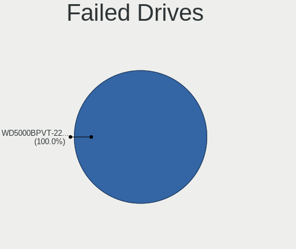
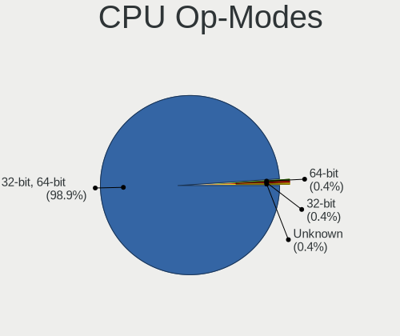
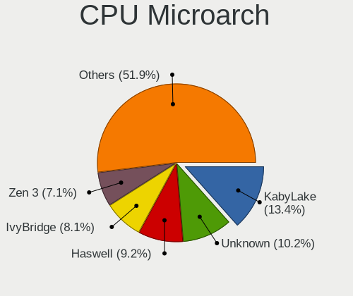
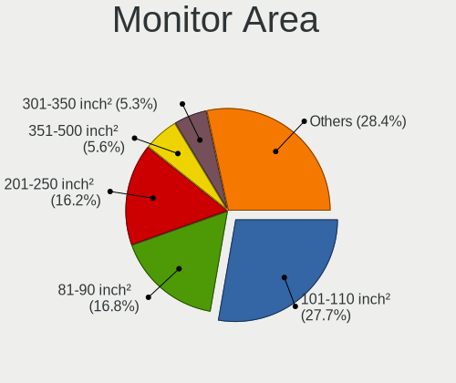
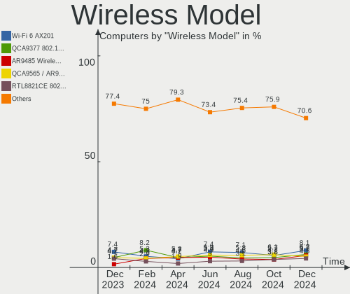
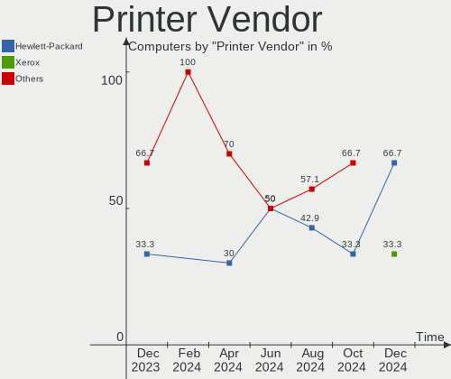
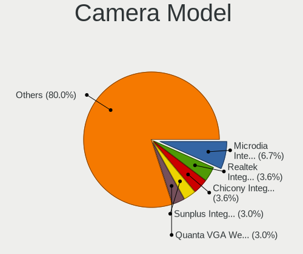

Linux in Brazil - Hardware Trends
---------------------------------

A project to identify most popular hardware characteristics and track their change
over time based on data collected by Linux users at https://Linux-Hardware.org.

Anyone can contribute to this report by the [hw-probe](https://github.com/linuxhw/hw-probe) tool:

    sudo -E hw-probe -all -upload

This is a report for all computer types. See also reports for [desktops](/Location/Brazil/Desktop/README.md) and [notebooks](/Location/Brazil/Notebook/README.md).

Period: Jan, 2023.

Contents
--------

* [ System ](#system)
  - [ OS                       ](#os)
  - [ OS Family                ](#os-family)
  - [ Kernel                   ](#kernel)
  - [ Kernel Family            ](#kernel-family)
  - [ Kernel Major Ver.        ](#kernel-major-ver)
  - [ Arch                     ](#arch)
  - [ DE                       ](#de)
  - [ Display Server           ](#display-server)
  - [ Display Manager          ](#display-manager)
  - [ OS Lang                  ](#os-lang)
  - [ Boot Mode                ](#boot-mode)
  - [ Filesystem               ](#filesystem)
  - [ Part. scheme             ](#part-scheme)
  - [ Dual Boot with Linux/BSD ](#dual-boot-with-linuxbsd)
  - [ Dual Boot (Win)          ](#dual-boot-win)

* [ Board ](#board)
  - [ Vendor                   ](#vendor)
  - [ Model                    ](#model)
  - [ Model Family             ](#model-family)
  - [ MFG Year                 ](#mfg-year)
  - [ Form Factor              ](#form-factor)
  - [ Secure Boot              ](#secure-boot)
  - [ Coreboot                 ](#coreboot)
  - [ RAM Size                 ](#ram-size)
  - [ RAM Used                 ](#ram-used)
  - [ Total Drives             ](#total-drives)
  - [ Has CD-ROM               ](#has-cd-rom)
  - [ Has Ethernet             ](#has-ethernet)
  - [ Has WiFi                 ](#has-wifi)
  - [ Has Bluetooth            ](#has-bluetooth)

* [ Location ](#location)
  - [ Country                  ](#country)
  - [ City                     ](#city)

* [ Drives ](#drives)
  - [ Drive Vendor             ](#drive-vendor)
  - [ Drive Model              ](#drive-model)
  - [ HDD Vendor               ](#hdd-vendor)
  - [ SSD Vendor               ](#ssd-vendor)
  - [ Drive Kind               ](#drive-kind)
  - [ Drive Connector          ](#drive-connector)
  - [ Drive Size               ](#drive-size)
  - [ Space Total              ](#space-total)
  - [ Space Used               ](#space-used)
  - [ Malfunc. Drives          ](#malfunc-drives)
  - [ Malfunc. Drive Vendor    ](#malfunc-drive-vendor)
  - [ Malfunc. HDD Vendor      ](#malfunc-hdd-vendor)
  - [ Malfunc. Drive Kind      ](#malfunc-drive-kind)
  - [ Failed Drives            ](#failed-drives)
  - [ Failed Drive Vendor      ](#failed-drive-vendor)
  - [ Drive Status             ](#drive-status)

* [ Storage controller ](#storage-controller)
  - [ Storage Vendor           ](#storage-vendor)
  - [ Storage Model            ](#storage-model)
  - [ Storage Kind             ](#storage-kind)

* [ Processor ](#processor)
  - [ CPU Vendor               ](#cpu-vendor)
  - [ CPU Model                ](#cpu-model)
  - [ CPU Model Family         ](#cpu-model-family)
  - [ CPU Cores                ](#cpu-cores)
  - [ CPU Sockets              ](#cpu-sockets)
  - [ CPU Threads              ](#cpu-threads)
  - [ CPU Op-Modes             ](#cpu-op-modes)
  - [ CPU Microcode            ](#cpu-microcode)
  - [ CPU Microarch            ](#cpu-microarch)

* [ Graphics ](#graphics)
  - [ GPU Vendor               ](#gpu-vendor)
  - [ GPU Model                ](#gpu-model)
  - [ GPU Combo                ](#gpu-combo)
  - [ GPU Driver               ](#gpu-driver)
  - [ GPU Memory               ](#gpu-memory)

* [ Monitor ](#monitor)
  - [ Monitor Vendor           ](#monitor-vendor)
  - [ Monitor Model            ](#monitor-model)
  - [ Monitor Resolution       ](#monitor-resolution)
  - [ Monitor Diagonal         ](#monitor-diagonal)
  - [ Monitor Width            ](#monitor-width)
  - [ Aspect Ratio             ](#aspect-ratio)
  - [ Monitor Area             ](#monitor-area)
  - [ Pixel Density            ](#pixel-density)
  - [ Multiple Monitors        ](#multiple-monitors)

* [ Network ](#network)
  - [ Net Controller Vendor    ](#net-controller-vendor)
  - [ Net Controller Model     ](#net-controller-model)
  - [ Wireless Vendor          ](#wireless-vendor)
  - [ Wireless Model           ](#wireless-model)
  - [ Ethernet Vendor          ](#ethernet-vendor)
  - [ Ethernet Model           ](#ethernet-model)
  - [ Net Controller Kind      ](#net-controller-kind)
  - [ Used Controller          ](#used-controller)
  - [ NICs                     ](#nics)
  - [ IPv6                     ](#ipv6)

* [ Bluetooth ](#bluetooth)
  - [ Bluetooth Vendor         ](#bluetooth-vendor)
  - [ Bluetooth Model          ](#bluetooth-model)

* [ Sound ](#sound)
  - [ Sound Vendor             ](#sound-vendor)
  - [ Sound Model              ](#sound-model)

* [ Memory ](#memory)
  - [ Memory Vendor            ](#memory-vendor)
  - [ Memory Model             ](#memory-model)
  - [ Memory Kind              ](#memory-kind)
  - [ Memory Form Factor       ](#memory-form-factor)
  - [ Memory Size              ](#memory-size)
  - [ Memory Speed             ](#memory-speed)

* [ Printers & scanners ](#printers--scanners)
  - [ Printer Vendor           ](#printer-vendor)
  - [ Printer Model            ](#printer-model)
  - [ Scanner Vendor           ](#scanner-vendor)
  - [ Scanner Model            ](#scanner-model)

* [ Camera ](#camera)
  - [ Camera Vendor            ](#camera-vendor)
  - [ Camera Model             ](#camera-model)

* [ Security ](#security)
  - [ Fingerprint Vendor       ](#fingerprint-vendor)
  - [ Fingerprint Model        ](#fingerprint-model)
  - [ Chipcard Vendor          ](#chipcard-vendor)
  - [ Chipcard Model           ](#chipcard-model)

* [ Unsupported ](#unsupported)
  - [ Unsupported Devices      ](#unsupported-devices)
  - [ Unsupported Device Types ](#unsupported-device-types)

System
------

OS
--

Installed operating systems

| Name                         | Computers | Percent |
|------------------------------|-----------|---------|
| OpenMandriva 23.01           | 74        | 23.72%  |
| Ubuntu 22.04                 | 32        | 10.26%  |
| Fedora 37                    | 21        | 6.73%   |
| Linux Mint 21.1              | 18        | 5.77%   |
| Debian 11                    | 17        | 5.45%   |
| Pop!_OS 22.04                | 14        | 4.49%   |
| Arch Rolling                 | 14        | 4.49%   |
| Ubuntu 22.10                 | 13        | 4.17%   |
| Linux Mint 21                | 9         | 2.88%   |
| Zorin 16                     | 5         | 1.6%    |
| Manjaro                      | 5         | 1.6%    |
| LMDE 5                       | 5         | 1.6%    |
| Linux Mint 20.3              | 5         | 1.6%    |
| Endless 4.0.13               | 5         | 1.6%    |
| Endless 3.9.7                | 5         | 1.6%    |
| OpenMandriva 4.3             | 4         | 1.28%   |
| KDE neon 22.04               | 4         | 1.28%   |
| Ubuntu 20.04                 | 3         | 0.96%   |
| ROSA 12.3                    | 3         | 0.96%   |
| openSUSE Tumbleweed-XXXXXXXX | 3         | 0.96%   |
| Elementary 6.1               | 3         | 0.96%   |
| Ubuntu 18.04                 | 2         | 0.64%   |
| openSUSE Leap-15.4           | 2         | 0.64%   |
| OpenMandriva 4.90            | 2         | 0.64%   |
| OpenMandriva 4.2             | 2         | 0.64%   |
| Nobara 37                    | 2         | 0.64%   |
| Linux Mint 20.2              | 2         | 0.64%   |
| Linux Mint 20.1              | 2         | 0.64%   |
| Kubuntu 22.10                | 2         | 0.64%   |
| Garuda Linux Soaring         | 2         | 0.64%   |
| Fedora 36                    | 2         | 0.64%   |
| Fedora 35                    | 2         | 0.64%   |
| Xubuntu 22.04                | 1         | 0.32%   |
| Xubuntu 20.04                | 1         | 0.32%   |
| Xubuntu 18.04                | 1         | 0.32%   |
| Ubuntu Unity 22.04           | 1         | 0.32%   |
| Ubuntu Unity 18.04           | 1         | 0.32%   |
| Ubuntu MATE 22.04            | 1         | 0.32%   |
| SteamOS 3.4                  | 1         | 0.32%   |
| RHEL 9                       | 1         | 0.32%   |

OS Family
---------

OS without a version

| Name         | Computers | Percent |
|--------------|-----------|---------|
| OpenMandriva | 82        | 26.28%  |
| Ubuntu       | 50        | 16.03%  |
| Linux Mint   | 38        | 12.18%  |
| Fedora       | 26        | 8.33%   |
| Debian       | 18        | 5.77%   |
| Pop!_OS      | 14        | 4.49%   |
| Arch         | 14        | 4.49%   |
| Endless      | 13        | 4.17%   |
| Manjaro      | 7         | 2.24%   |
| Zorin        | 5         | 1.6%    |
| openSUSE     | 5         | 1.6%    |
| LMDE         | 5         | 1.6%    |
| KDE neon     | 4         | 1.28%   |
| Xubuntu      | 3         | 0.96%   |
| ROSA         | 3         | 0.96%   |
| Elementary   | 3         | 0.96%   |
| BigLinux     | 3         | 0.96%   |
| Ubuntu Unity | 2         | 0.64%   |
| Nobara       | 2         | 0.64%   |
| Kubuntu      | 2         | 0.64%   |
| Garuda Linux | 2         | 0.64%   |
| ArcoLinux    | 2         | 0.64%   |
| Ubuntu MATE  | 1         | 0.32%   |
| SteamOS      | 1         | 0.32%   |
| RHEL         | 1         | 0.32%   |
| Parrot       | 1         | 0.32%   |
| Lux-alpha    | 1         | 0.32%   |
| Lubuntu      | 1         | 0.32%   |
| Kali         | 1         | 0.32%   |
| EndeavourOS  | 1         | 0.32%   |
| Clear Linux  | 1         | 0.32%   |

Kernel
------

Version of the Linux kernel

| Version                                            | Computers | Percent |
|----------------------------------------------------|-----------|---------|
| 6.1.1-desktop-1omv2290                             | 74        | 23.72%  |
| 5.15.0-58-generic                                  | 36        | 11.54%  |
| 5.15.0-56-generic                                  | 15        | 4.81%   |
| 6.0.12-76060006-generic                            | 14        | 4.49%   |
| 5.10.0-20-amd64                                    | 14        | 4.49%   |
| 5.15.0-57-generic                                  | 13        | 4.17%   |
| 5.19.0-29-generic                                  | 7         | 2.24%   |
| 5.8.0-14-generic                                   | 6         | 1.92%   |
| 5.11.0-35-generic                                  | 6         | 1.92%   |
| 5.15.85-1-MANJARO                                  | 5         | 1.6%    |
| 6.1.8-arch1-1                                      | 4         | 1.28%   |
| 6.1.7-arch1-1                                      | 4         | 1.28%   |
| 6.0.7-301.fc37.x86_64                              | 4         | 1.28%   |
| 6.0.15-300.fc37.x86_64                             | 3         | 0.96%   |
| 5.4.0-137-generic                                  | 3         | 0.96%   |
| 5.4.0-135-generic                                  | 3         | 0.96%   |
| 5.19.0-30-generic                                  | 3         | 0.96%   |
| 5.16.7-desktop-1omv4003                            | 3         | 0.96%   |
| 5.15.0-52-generic                                  | 3         | 0.96%   |
| 5.10.0-21-amd64                                    | 3         | 0.96%   |
| 6.1.7-zen1-1-zen                                   | 2         | 0.64%   |
| 6.1.7-200.fc37.x86_64                              | 2         | 0.64%   |
| 6.1.7-060107-generic                               | 2         | 0.64%   |
| 6.1.6-200.fc37.x86_64                              | 2         | 0.64%   |
| 6.1.1-1-MANJARO                                    | 2         | 0.64%   |
| 6.0.18-300.fc37.x86_64                             | 2         | 0.64%   |
| 6.0.17-300.fc37.x86_64                             | 2         | 0.64%   |
| 6.0.16-300.fc37.x86_64                             | 2         | 0.64%   |
| 5.4.0-136-generic                                  | 2         | 0.64%   |
| 5.19.0-28-generic                                  | 2         | 0.64%   |
| 5.19.0-21-generic                                  | 2         | 0.64%   |
| 5.18.12-desktop-3omv4090                           | 2         | 0.64%   |
| 5.15.0-43-generic                                  | 2         | 0.64%   |
| 5.15.0-41-generic                                  | 2         | 0.64%   |
| 5.10.14-desktop-1omv4002                           | 2         | 0.64%   |
| 6.2.0-0.rc2.20230103git69b41ac87e4a.19.fc38.x86_64 | 1         | 0.32%   |
| 6.1.8-200.fc37.x86_64                              | 1         | 0.32%   |
| 6.1.7-100.fc36.x86_64                              | 1         | 0.32%   |
| 6.1.6-zen1-2-zen                                   | 1         | 0.32%   |
| 6.1.6-zen1-1-zen                                   | 1         | 0.32%   |

Kernel Family
-------------

Linux kernel without a distro release

| Version | Computers | Percent |
|---------|-----------|---------|
| 6.1.1   | 79        | 25.32%  |
| 5.15.0  | 73        | 23.4%   |
| 5.10.0  | 19        | 6.09%   |
| 6.0.12  | 15        | 4.81%   |
| 5.19.0  | 15        | 4.81%   |
| 5.4.0   | 13        | 4.17%   |
| 6.1.7   | 11        | 3.53%   |
| 5.11.0  | 8         | 2.56%   |
| 5.8.0   | 7         | 2.24%   |
| 6.1.6   | 6         | 1.92%   |
| 6.1.8   | 5         | 1.6%    |
| 5.15.85 | 5         | 1.6%    |
| 6.0.7   | 4         | 1.28%   |
| 6.0.0   | 4         | 1.28%   |
| 6.1.4   | 3         | 0.96%   |
| 6.0.16  | 3         | 0.96%   |
| 6.0.15  | 3         | 0.96%   |
| 5.16.7  | 3         | 0.96%   |
| 6.1.3   | 2         | 0.64%   |
| 6.0.18  | 2         | 0.64%   |
| 6.0.17  | 2         | 0.64%   |
| 5.18.12 | 2         | 0.64%   |
| 5.14.21 | 2         | 0.64%   |
| 5.14.0  | 2         | 0.64%   |
| 5.10.14 | 2         | 0.64%   |
| 6.2.0   | 1         | 0.32%   |
| 6.1.2   | 1         | 0.32%   |
| 6.1.0   | 1         | 0.32%   |
| 6.0.2   | 1         | 0.32%   |
| 6.0.19  | 1         | 0.32%   |
| 6.0.14  | 1         | 0.32%   |
| 6.0.11  | 1         | 0.32%   |
| 5.4.217 | 1         | 0.32%   |
| 5.18.1  | 1         | 0.32%   |
| 5.17.12 | 1         | 0.32%   |
| 5.16.19 | 1         | 0.32%   |
| 5.16.13 | 1         | 0.32%   |
| 5.16.0  | 1         | 0.32%   |
| 5.15.90 | 1         | 0.32%   |
| 5.15.89 | 1         | 0.32%   |

Kernel Major Ver.
-----------------

Linux kernel major version

| Version | Computers | Percent |
|---------|-----------|---------|
| 6.1     | 108       | 34.62%  |
| 5.15    | 82        | 26.28%  |
| 6.0     | 37        | 11.86%  |
| 5.10    | 25        | 8.01%   |
| 5.19    | 15        | 4.81%   |
| 5.4     | 14        | 4.49%   |
| 5.11    | 8         | 2.56%   |
| 5.8     | 7         | 2.24%   |
| 5.16    | 6         | 1.92%   |
| 5.14    | 4         | 1.28%   |
| 5.18    | 3         | 0.96%   |
| 6.2     | 1         | 0.32%   |
| 5.17    | 1         | 0.32%   |
| 5.0     | 1         | 0.32%   |

Arch
----

OS architecture (x86_64, i586, etc.)

| Name   | Computers | Percent |
|--------|-----------|---------|
| x86_64 | 311       | 99.68%  |
| i686   | 1         | 0.32%   |

DE
--

Desktop Environment

| Name       | Computers | Percent |
|------------|-----------|---------|
| GNOME      | 136       | 43.59%  |
| KDE5       | 100       | 32.05%  |
| X-Cinnamon | 36        | 11.54%  |
| XFCE       | 14        | 4.49%   |
| MATE       | 7         | 2.24%   |
| Pantheon   | 3         | 0.96%   |
| Cinnamon   | 3         | 0.96%   |
| Unknown    | 3         | 0.96%   |
| Unity      | 2         | 0.64%   |
| LXQt       | 2         | 0.64%   |
| LXDE       | 2         | 0.64%   |
| sway       | 1         | 0.32%   |
| i3         | 1         | 0.32%   |
| GNUstep    | 1         | 0.32%   |
| awesome    | 1         | 0.32%   |

Display Server
--------------

X11 or Wayland

| Name    | Computers | Percent |
|---------|-----------|---------|
| X11     | 235       | 75.32%  |
| Wayland | 72        | 23.08%  |
| Unknown | 4         | 1.28%   |
| Tty     | 1         | 0.32%   |

Display Manager
---------------

SDDM, LightDM, etc.

| Name    | Computers | Percent |
|---------|-----------|---------|
| Unknown | 105       | 33.65%  |
| SDDM    | 85        | 27.24%  |
| GDM3    | 55        | 17.63%  |
| GDM     | 35        | 11.22%  |
| LightDM | 32        | 10.26%  |

OS Lang
-------

Language

| Lang      | Computers | Percent |
|-----------|-----------|---------|
| pt_BR     | 216       | 69.23%  |
| en_US     | 84        | 26.92%  |
| C         | 6         | 1.92%   |
| es_ES     | 2         | 0.64%   |
| pt_PT     | 1         | 0.32%   |
| pt_BRutf8 | 1         | 0.32%   |
| fr_FR     | 1         | 0.32%   |
| Unknown   | 1         | 0.32%   |

Boot Mode
---------

EFI or BIOS

| Mode | Computers | Percent |
|------|-----------|---------|
| BIOS | 156       | 50%     |
| EFI  | 156       | 50%     |

Filesystem
----------

Type of filesystem

| Type    | Computers | Percent |
|---------|-----------|---------|
| Ext4    | 177       | 56.73%  |
| Overlay | 77        | 24.68%  |
| Btrfs   | 53        | 16.99%  |
| F2fs    | 2         | 0.64%   |
| Zfs     | 1         | 0.32%   |
| Xfs     | 1         | 0.32%   |
| Tmpfs   | 1         | 0.32%   |

Part. scheme
------------

Scheme of partitioning

| Type    | Computers | Percent |
|---------|-----------|---------|
| GPT     | 161       | 51.6%   |
| Unknown | 102       | 32.69%  |
| MBR     | 49        | 15.71%  |

Dual Boot with Linux/BSD
------------------------

Hosting more than one Linux/BSD

| Dual boot | Computers | Percent |
|-----------|-----------|---------|
| No        | 248       | 79.49%  |
| Yes       | 64        | 20.51%  |

Dual Boot (Win)
---------------

Hosting Linux and Windows

| Dual boot | Computers | Percent |
|-----------|-----------|---------|
| No        | 221       | 70.83%  |
| Yes       | 91        | 29.17%  |

Board
-----

Vendor
------

Motherboard manufacturer

| Name                   | Computers | Percent |
|------------------------|-----------|---------|
| Dell                   | 51        | 16.35%  |
| ASUSTek Computer       | 50        | 16.03%  |
| Lenovo                 | 37        | 11.86%  |
| Acer                   | 29        | 9.29%   |
| Gigabyte Technology    | 21        | 6.73%   |
| Hewlett-Packard        | 15        | 4.81%   |
| Positivo               | 12        | 3.85%   |
| Intel                  | 11        | 3.53%   |
| Samsung Electronics    | 8         | 2.56%   |
| ASRock                 | 6         | 1.92%   |
| Sony                   | 5         | 1.6%    |
| MSI                    | 5         | 1.6%    |
| Semp Toshiba           | 4         | 1.28%   |
| Pegatron               | 4         | 1.28%   |
| LG Electronics         | 4         | 1.28%   |
| Unknown                | 4         | 1.28%   |
| PCWare                 | 3         | 0.96%   |
| Multilaser             | 3         | 0.96%   |
| Itautec                | 3         | 0.96%   |
| Compaq                 | 3         | 0.96%   |
| Biostar                | 3         | 0.96%   |
| Avell High Performance | 3         | 0.96%   |
| Apple                  | 3         | 0.96%   |
| Positivo Bahia - VAIO  | 2         | 0.64%   |
| Philco                 | 2         | 0.64%   |
| Notebook               | 2         | 0.64%   |
| Digibras               | 2         | 0.64%   |
| AZW                    | 2         | 0.64%   |
| Standard               | 1         | 0.32%   |
| MAXSUN                 | 1         | 0.32%   |
| MACHINIST              | 1         | 0.32%   |
| Login Informatica      | 1         | 0.32%   |
| JGINYUE                | 1         | 0.32%   |
| Insyde                 | 1         | 0.32%   |
| Huanan                 | 1         | 0.32%   |
| Gateway                | 1         | 0.32%   |
| Digitron               | 1         | 0.32%   |
| Daten Tecnologia       | 1         | 0.32%   |
| Compal                 | 1         | 0.32%   |
| Clevo                  | 1         | 0.32%   |

Model
-----

Motherboard model

| Name                                   | Computers | Percent |
|----------------------------------------|-----------|---------|
| Lenovo IdeaPad 3 15ALC6 82MF           | 7         | 2.24%   |
| Unknown                                | 5         | 1.6%    |
| Intel H61                              | 4         | 1.28%   |
| Dell Inspiron N4050                    | 4         | 1.28%   |
| ASUS All Series                        | 4         | 1.28%   |
| Semp Toshiba STI                       | 3         | 0.96%   |
| Lenovo IdeaPad S145-15IWL 81S9         | 3         | 0.96%   |
| Lenovo IdeaPad S145-15IIL 82DJ         | 3         | 0.96%   |
| Lenovo IdeaPad S145-15API 81V7         | 3         | 0.96%   |
| Lenovo IdeaPad 320-15IKB 80YH          | 3         | 0.96%   |
| Dell Inspiron 15-3567                  | 3         | 0.96%   |
| ASUS VivoBook_ASUSLaptop X515JA_X515JA | 3         | 0.96%   |
| ASUS VivoBook_ASUSLaptop X515DA_X515DA | 3         | 0.96%   |
| Acer Nitro AN515-44                    | 3         | 0.96%   |
| PCWare IPMH110G                        | 2         | 0.64%   |
| Lenovo IdeaPad Gaming 3 15IHU6 82MG    | 2         | 0.64%   |
| Lenovo IdeaPad 330-15IKB 81FE          | 2         | 0.64%   |
| Itautec Infoway w7535                  | 2         | 0.64%   |
| Intel B75                              | 2         | 0.64%   |
| HP Compaq 6530b                        | 2         | 0.64%   |
| Gigabyte M68MT-S2P                     | 2         | 0.64%   |
| Gigabyte H61M-S1                       | 2         | 0.64%   |
| Gigabyte H310M M.2                     | 2         | 0.64%   |
| Gigabyte B75M-D3H                      | 2         | 0.64%   |
| Gigabyte 945GCM-S2C                    | 2         | 0.64%   |
| Digibras NH4CU03                       | 2         | 0.64%   |
| Dell Inspiron 5468                     | 2         | 0.64%   |
| Dell Inspiron 3421                     | 2         | 0.64%   |
| Dell G15 5520                          | 2         | 0.64%   |
| Dell G15 5510                          | 2         | 0.64%   |
| Compaq 420                             | 2         | 0.64%   |
| Biostar A320MH                         | 2         | 0.64%   |
| Avell High Performance B.ON            | 2         | 0.64%   |
| ASUS X45C                              | 2         | 0.64%   |
| ASUS PRIME H410M-E                     | 2         | 0.64%   |
| ASUS M5A78L-M LX/BR                    | 2         | 0.64%   |
| ASUS H61M-A/BR                         | 2         | 0.64%   |
| ASRock B450M Steel Legend              | 2         | 0.64%   |
| Acer Aspire A515-51                    | 2         | 0.64%   |
| Acer Aspire A515-45                    | 2         | 0.64%   |

Model Family
------------

Motherboard model prefix

| Name                        | Computers | Percent |
|-----------------------------|-----------|---------|
| Lenovo IdeaPad              | 26        | 8.33%   |
| Acer Aspire                 | 24        | 7.69%   |
| Dell Inspiron               | 23        | 7.37%   |
| ASUS VivoBook               | 9         | 2.88%   |
| Dell Vostro                 | 7         | 2.24%   |
| ASUS PRIME                  | 7         | 2.24%   |
| Lenovo ThinkPad             | 6         | 1.92%   |
| Dell OptiPlex               | 6         | 1.92%   |
| Dell G15                    | 5         | 1.6%    |
| ASUS TUF                    | 5         | 1.6%    |
| Acer Nitro                  | 5         | 1.6%    |
| Unknown                     | 5         | 1.6%    |
| Semp Toshiba STI            | 4         | 1.28%   |
| Intel H61                   | 4         | 1.28%   |
| Dell Latitude               | 4         | 1.28%   |
| ASUS All                    | 4         | 1.28%   |
| Itautec Infoway             | 3         | 0.96%   |
| HP Compaq                   | 3         | 0.96%   |
| Dell G3                     | 3         | 0.96%   |
| ASUS P8H61-M                | 3         | 0.96%   |
| ASUS M5A78L-M               | 3         | 0.96%   |
| PCWare IPMH110G             | 2         | 0.64%   |
| Lenovo ThinkCentre          | 2         | 0.64%   |
| Intel B75                   | 2         | 0.64%   |
| HP Pavilion                 | 2         | 0.64%   |
| HP EliteDesk                | 2         | 0.64%   |
| Gigabyte M68MT-S2P          | 2         | 0.64%   |
| Gigabyte H61M-S1            | 2         | 0.64%   |
| Gigabyte H310M              | 2         | 0.64%   |
| Gigabyte B75M-D3H           | 2         | 0.64%   |
| Gigabyte A520M              | 2         | 0.64%   |
| Gigabyte 945GCM-S2C         | 2         | 0.64%   |
| Digibras NH4CU03            | 2         | 0.64%   |
| Dell PowerEdge              | 2         | 0.64%   |
| Compaq 420                  | 2         | 0.64%   |
| Biostar A320MH              | 2         | 0.64%   |
| Avell High Performance B.ON | 2         | 0.64%   |
| ASUS X45C                   | 2         | 0.64%   |
| ASUS H61M-A                 | 2         | 0.64%   |
| ASRock B450M                | 2         | 0.64%   |

MFG Year
--------

Motherboard manufacture year

| Year    | Computers | Percent |
|---------|-----------|---------|
| 2021    | 41        | 13.14%  |
| 2020    | 33        | 10.58%  |
| 2018    | 26        | 8.33%   |
| 2012    | 26        | 8.33%   |
| 2011    | 24        | 7.69%   |
| 2019    | 23        | 7.37%   |
| 2017    | 23        | 7.37%   |
| 2016    | 22        | 7.05%   |
| 2013    | 18        | 5.77%   |
| 2014    | 15        | 4.81%   |
| 2010    | 14        | 4.49%   |
| 2022    | 12        | 3.85%   |
| 2009    | 11        | 3.53%   |
| 2015    | 9         | 2.88%   |
| 2008    | 9         | 2.88%   |
| 2007    | 4         | 1.28%   |
| Unknown | 2         | 0.64%   |

Form Factor
-----------

Physical design of the computer

| Name        | Computers | Percent |
|-------------|-----------|---------|
| Notebook    | 184       | 58.97%  |
| Desktop     | 120       | 38.46%  |
| All in one  | 3         | 0.96%   |
| Mini pc     | 2         | 0.64%   |
| Server      | 2         | 0.64%   |
| Convertible | 1         | 0.32%   |

Secure Boot
-----------

Enabled or disabled

| State    | Computers | Percent |
|----------|-----------|---------|
| Disabled | 290       | 92.95%  |
| Enabled  | 22        | 7.05%   |

Coreboot
--------

Have coreboot on board

| Used | Computers | Percent |
|------|-----------|---------|
| No   | 311       | 99.68%  |
| Yes  | 1         | 0.32%   |

RAM Size
--------

Total RAM memory

| Size in GB  | Computers | Percent |
|-------------|-----------|---------|
| 4.01-8.0    | 86        | 27.56%  |
| 3.01-4.0    | 73        | 23.4%   |
| 8.01-16.0   | 63        | 20.19%  |
| 16.01-24.0  | 61        | 19.55%  |
| 1.01-2.0    | 11        | 3.53%   |
| 32.01-64.0  | 8         | 2.56%   |
| 24.01-32.0  | 4         | 1.28%   |
| 2.01-3.0    | 4         | 1.28%   |
| 64.01-256.0 | 2         | 0.64%   |

RAM Used
--------

Used RAM memory

| Used GB    | Computers | Percent |
|------------|-----------|---------|
| 1.01-2.0   | 130       | 41.67%  |
| 2.01-3.0   | 86        | 27.56%  |
| 4.01-8.0   | 39        | 12.5%   |
| 3.01-4.0   | 34        | 10.9%   |
| 0.51-1.0   | 10        | 3.21%   |
| 8.01-16.0  | 9         | 2.88%   |
| 0.01-0.5   | 2         | 0.64%   |
| 32.01-64.0 | 1         | 0.32%   |
| 16.01-24.0 | 1         | 0.32%   |

Total Drives
------------

Number of drives on board

| Drives | Computers | Percent |
|--------|-----------|---------|
| 1      | 189       | 60.58%  |
| 2      | 88        | 28.21%  |
| 3      | 17        | 5.45%   |
| 4      | 9         | 2.88%   |
| 0      | 5         | 1.6%    |
| 5      | 4         | 1.28%   |

Has CD-ROM
----------

Has CD-ROM on board

| Presented | Computers | Percent |
|-----------|-----------|---------|
| No        | 218       | 69.87%  |
| Yes       | 94        | 30.13%  |

Has Ethernet
------------

Has Ethernet on board

| Presented | Computers | Percent |
|-----------|-----------|---------|
| Yes       | 268       | 85.9%   |
| No        | 44        | 14.1%   |

Has WiFi
--------

Has WiFi module

| Presented | Computers | Percent |
|-----------|-----------|---------|
| Yes       | 236       | 75.64%  |
| No        | 76        | 24.36%  |

Has Bluetooth
-------------

Has Bluetooth module

| Presented | Computers | Percent |
|-----------|-----------|---------|
| Yes       | 170       | 54.49%  |
| No        | 142       | 45.51%  |

Location
--------

Country
-------

Geographic location (country)

| Country | Computers | Percent |
|---------|-----------|---------|
| Brazil  | 312       | 100%    |

City
----

Geographic location (city)

| City                  | Computers | Percent |
|-----------------------|-----------|---------|
| Sao Paulo             | 39        | 12.5%   |
| Rio de Janeiro        | 15        | 4.81%   |
| Curitiba              | 14        | 4.49%   |
| Belo Horizonte        | 10        | 3.21%   |
| Fortaleza             | 9         | 2.88%   |
| Brasília             | 9         | 2.88%   |
| Campinas              | 7         | 2.24%   |
| Porto Alegre          | 6         | 1.92%   |
| Natal                 | 5         | 1.6%    |
| Sao Bernardo do Campo | 4         | 1.28%   |
| Salvador              | 4         | 1.28%   |
| Niterói              | 4         | 1.28%   |
| Goiânia              | 4         | 1.28%   |
| Florianópolis        | 4         | 1.28%   |
| Vitória              | 3         | 0.96%   |
| Osasco                | 3         | 0.96%   |
| Maceió               | 3         | 0.96%   |
| Londrina              | 3         | 0.96%   |
| Joinville             | 3         | 0.96%   |
| Campina Grande        | 3         | 0.96%   |
| Belém                | 3         | 0.96%   |
| Videira               | 2         | 0.64%   |
| Varzea Paulista       | 2         | 0.64%   |
| Uberlândia           | 2         | 0.64%   |
| Uberaba               | 2         | 0.64%   |
| Tatuí                | 2         | 0.64%   |
| Sao Luís             | 2         | 0.64%   |
| Sao Jose do Rio Preto | 2         | 0.64%   |
| Sao Carlos            | 2         | 0.64%   |
| Santo André          | 2         | 0.64%   |
| Ribeirao Preto        | 2         | 0.64%   |
| Presidente Prudente   | 2         | 0.64%   |
| Praia Grande          | 2         | 0.64%   |
| Poços de Caldas      | 2         | 0.64%   |
| Parnamirim            | 2         | 0.64%   |
| Palmas                | 2         | 0.64%   |
| Mogi das Cruzes       | 2         | 0.64%   |
| Maringá              | 2         | 0.64%   |
| Juiz de Fora          | 2         | 0.64%   |
| Hortolândia          | 2         | 0.64%   |

Drives
------

Drive Vendor
------------

Hard drive vendors

| Vendor                         | Computers | Drives | Percent |
|--------------------------------|-----------|--------|---------|
| WDC                            | 77        | 81     | 17.66%  |
| Seagate                        | 64        | 74     | 14.68%  |
| Kingston                       | 47        | 50     | 10.78%  |
| Samsung Electronics            | 40        | 43     | 9.17%   |
| SanDisk                        | 19        | 19     | 4.36%   |
| China                          | 19        | 19     | 4.36%   |
| A-DATA Technology              | 18        | 18     | 4.13%   |
| Unknown                        | 17        | 19     | 3.9%    |
| Crucial                        | 14        | 15     | 3.21%   |
| Toshiba                        | 9         | 10     | 2.06%   |
| Silicon Motion                 | 9         | 10     | 2.06%   |
| ADATA Technology               | 7         | 7      | 1.61%   |
| Netac                          | 6         | 6      | 1.38%   |
| Intel                          | 6         | 6      | 1.38%   |
| Hitachi                        | 6         | 6      | 1.38%   |
| XrayDisk                       | 5         | 5      | 1.15%   |
| SSSTC                          | 5         | 5      | 1.15%   |
| Solid State Storage            | 5         | 5      | 1.15%   |
| WALRAM                         | 4         | 4      | 0.92%   |
| SK hynix                       | 4         | 5      | 0.92%   |
| Realtek Semiconductor          | 4         | 4      | 0.92%   |
| Patriot                        | 4         | 4      | 0.92%   |
| Lexar                          | 4         | 4      | 0.92%   |
| Phison                         | 3         | 3      | 0.69%   |
| Maxtor                         | 3         | 4      | 0.69%   |
| KIOXIA                         | 3         | 3      | 0.69%   |
| KingSpec                       | 3         | 3      | 0.69%   |
| Solid State Storage Technology | 2         | 2      | 0.46%   |
| HGST                           | 2         | 2      | 0.46%   |
| Gigabyte Technology            | 2         | 2      | 0.46%   |
| XPG                            | 1         | 1      | 0.23%   |
| Vaseky                         | 1         | 1      | 0.23%   |
| TGT                            | 1         | 1      | 0.23%   |
| Team                           | 1         | 1      | 0.23%   |
| SPCC                           | 1         | 1      | 0.23%   |
| SAGE                           | 1         | 1      | 0.23%   |
| Phison Electronics             | 1         | 1      | 0.23%   |
| Micron Technology              | 1         | 1      | 0.23%   |
| MAXSUN                         | 1         | 1      | 0.23%   |
| LITEON                         | 1         | 1      | 0.23%   |

Drive Model
-----------

Hard drive models

| Model                                                 | Computers | Percent |
|-------------------------------------------------------|-----------|---------|
| Kingston SA400S37480G 480GB SSD                       | 15        | 3.32%   |
| Kingston SA400S37240G 240GB SSD                       | 14        | 3.1%    |
| Seagate ST500DM002-1BD142 500GB                       | 8         | 1.77%   |
| WDC WD10SPZX-24Z10 1TB                                | 7         | 1.55%   |
| Silicon Motion SM2263EN/SM2263XT SSD Controller 512GB | 7         | 1.55%   |
| Seagate ST500LM012 HN-M500MBB 500GB                   | 7         | 1.55%   |
| WDC WD10SPZX-21Z10T0 1TB                              | 6         | 1.33%   |
| Seagate ST1000LM024 HN-M101MBB 1TB                    | 6         | 1.33%   |
| Seagate ST1000DM010-2EP102 1TB                        | 6         | 1.33%   |
| China SSD 256GB                                       | 6         | 1.33%   |
| SSSTC CL1-4D256 256GB                                 | 5         | 1.11%   |
| Samsung HD161HJ 160GB                                 | 5         | 1.11%   |
| Kingston SV300S37A120G 120GB SSD                      | 5         | 1.11%   |
| Kingston SA400S37120G 120GB SSD                       | 5         | 1.11%   |
| Crucial CT240BX500SSD1 240GB                          | 5         | 1.11%   |
| ADATA SM2P32A8-256GC1 256GB                           | 5         | 1.11%   |
| A-DATA IM2P33F3A NVMe 256GB                           | 5         | 1.11%   |
| Solid State Storage SSSTC CL1-4D256 256GB             | 4         | 0.88%   |
| Samsung HD502HI 500GB                                 | 4         | 0.88%   |
| WDC WDS240G2G0B-00EPW0 240GB SSD                      | 3         | 0.66%   |
| WDC WD5000LPCX-00VHAT0 500GB                          | 3         | 0.66%   |
| WDC WD5000AAKX-003CA0 500GB                           | 3         | 0.66%   |
| WDC WD10JPVX-22JC3T0 1TB                              | 3         | 0.66%   |
| Unknown SD/MMC/MS PRO 2GB                             | 3         | 0.66%   |
| Unknown MMC Card  32GB                                | 3         | 0.66%   |
| Toshiba MQ04ABF100 1TB                                | 3         | 0.66%   |
| Sandisk WD Blue SN550 NVMe SSD 1TB                    | 3         | 0.66%   |
| Samsung HD502HJ 500GB                                 | 3         | 0.66%   |
| Crucial CT480BX500SSD1 480GB                          | 3         | 0.66%   |
| China SSD 128GB                                       | 3         | 0.66%   |
| A-DATA SU650 240GB SSD                                | 3         | 0.66%   |
| A-DATA IM2P33F8ABR2-256GB                             | 3         | 0.66%   |
| A-DATA IM2P33F8A-512GD 512GB                          | 3         | 0.66%   |
| XrayDisk SSD 240GB                                    | 2         | 0.44%   |
| XrayDisk SSD 128GB                                    | 2         | 0.44%   |
| WDC WDS240G2G0A-00JH30 240GB SSD                      | 2         | 0.44%   |
| WDC WDS120G2G0B-00EPW0 120GB SSD                      | 2         | 0.44%   |
| WDC WD5000LUCT-63RC2Y0 500GB                          | 2         | 0.44%   |
| WDC WD5000LPCX-21VHAT0 500GB                          | 2         | 0.44%   |
| WDC WD3200BPVT-22JJ5T0 320GB                          | 2         | 0.44%   |

HDD Vendor
----------

Hard disk drive vendors

| Vendor              | Computers | Drives | Percent |
|---------------------|-----------|--------|---------|
| WDC                 | 64        | 66     | 35.16%  |
| Seagate             | 63        | 73     | 34.62%  |
| Samsung Electronics | 27        | 29     | 14.84%  |
| Toshiba             | 9         | 10     | 4.95%   |
| Hitachi             | 6         | 6      | 3.3%    |
| Unknown             | 3         | 3      | 1.65%   |
| Maxtor              | 3         | 4      | 1.65%   |
| HGST                | 2         | 2      | 1.1%    |
| SAGE                | 1         | 1      | 0.55%   |
| Phison              | 1         | 1      | 0.55%   |
| Hewlett-Packard     | 1         | 1      | 0.55%   |
| ExcelStor           | 1         | 1      | 0.55%   |
| Apple               | 1         | 1      | 0.55%   |

SSD Vendor
----------

Solid state drive vendors

| Vendor              | Computers | Drives | Percent |
|---------------------|-----------|--------|---------|
| Kingston            | 43        | 46     | 30.28%  |
| China               | 19        | 19     | 13.38%  |
| Crucial             | 13        | 14     | 9.15%   |
| SanDisk             | 11        | 11     | 7.75%   |
| WDC                 | 9         | 9      | 6.34%   |
| Samsung Electronics | 6         | 6      | 4.23%   |
| XrayDisk            | 5         | 5      | 3.52%   |
| Patriot             | 4         | 4      | 2.82%   |
| Lexar               | 4         | 4      | 2.82%   |
| A-DATA Technology   | 4         | 4      | 2.82%   |
| KingSpec            | 3         | 3      | 2.11%   |
| WALRAM              | 2         | 2      | 1.41%   |
| Netac               | 2         | 2      | 1.41%   |
| Vaseky              | 1         | 1      | 0.7%    |
| Team                | 1         | 1      | 0.7%    |
| SPCC                | 1         | 1      | 0.7%    |
| Seagate             | 1         | 1      | 0.7%    |
| LITEON              | 1         | 1      | 0.7%    |
| Lenovo              | 1         | 1      | 0.7%    |
| Kross Elegance      | 1         | 1      | 0.7%    |
| KeepData            | 1         | 1      | 0.7%    |
| Intel               | 1         | 1      | 0.7%    |
| Gigabyte Technology | 1         | 1      | 0.7%    |
| Force               | 1         | 1      | 0.7%    |
| Fanxiang            | 1         | 1      | 0.7%    |
| Corsair             | 1         | 1      | 0.7%    |
| Colorful            | 1         | 1      | 0.7%    |
| BHT                 | 1         | 1      | 0.7%    |
| AFOX                | 1         | 1      | 0.7%    |
| Unknown             | 1         | 1      | 0.7%    |

Drive Kind
----------

HDD or SSD

| Kind    | Computers | Drives | Percent |
|---------|-----------|--------|---------|
| HDD     | 157       | 198    | 40.36%  |
| SSD     | 124       | 146    | 31.88%  |
| NVMe    | 93        | 102    | 23.91%  |
| MMC     | 11        | 13     | 2.83%   |
| Unknown | 4         | 4      | 1.03%   |

Drive Connector
---------------

SATA, SAS, NVMe, etc.

| Type | Computers | Drives | Percent |
|------|-----------|--------|---------|
| SATA | 241       | 341    | 68.47%  |
| NVMe | 93        | 102    | 26.42%  |
| MMC  | 11        | 13     | 3.13%   |
| SAS  | 7         | 7      | 1.99%   |

Drive Size
----------

Size of hard drive

| Size in TB | Computers | Drives | Percent |
|------------|-----------|--------|---------|
| 0.01-0.5   | 184       | 236    | 65.48%  |
| 0.51-1.0   | 85        | 92     | 30.25%  |
| 1.01-2.0   | 8         | 9      | 2.85%   |
| 3.01-4.0   | 2         | 5      | 0.71%   |
| 2.01-3.0   | 1         | 1      | 0.36%   |
| 0          | 1         | 1      | 0.36%   |

Space Total
-----------

Amount of disk space available on the file system

| Size in GB     | Computers | Percent |
|----------------|-----------|---------|
| 101-250        | 85        | 27.24%  |
| 1-20           | 61        | 19.55%  |
| 251-500        | 58        | 18.59%  |
| 501-1000       | 39        | 12.5%   |
| 1001-2000      | 25        | 8.01%   |
| 51-100         | 14        | 4.49%   |
| Unknown        | 11        | 3.53%   |
| 21-50          | 8         | 2.56%   |
| More than 3000 | 7         | 2.24%   |
| 2001-3000      | 4         | 1.28%   |

Space Used
----------

Amount of used disk space

| Used GB   | Computers | Percent |
|-----------|-----------|---------|
| 1-20      | 134       | 42.95%  |
| 21-50     | 59        | 18.91%  |
| 101-250   | 39        | 12.5%   |
| 51-100    | 28        | 8.97%   |
| 251-500   | 24        | 7.69%   |
| Unknown   | 11        | 3.53%   |
| 501-1000  | 8         | 2.56%   |
| 1001-2000 | 6         | 1.92%   |
| 2001-3000 | 3         | 0.96%   |

Malfunc. Drives
---------------

Drive models with a malfunction

| Model                                | Computers | Drives | Percent |
|--------------------------------------|-----------|--------|---------|
| Seagate ST500DM002-1BD142 500GB      | 3         | 3      | 6.52%   |
| Seagate ST500LM012 HN-M500MBB 500GB  | 2         | 2      | 4.35%   |
| Seagate ST1000LM024 HN-M101MBB 1TB   | 2         | 2      | 4.35%   |
| Samsung Electronics HD161HJ 160GB    | 2         | 2      | 4.35%   |
| XrayDisk SSD 240GB                   | 1         | 1      | 2.17%   |
| XrayDisk SSD 128GB                   | 1         | 1      | 2.17%   |
| WDC WD5000AAKX-083CA1 500GB          | 1         | 1      | 2.17%   |
| WDC WD3200BPVT-22JJ5T0 320GB         | 1         | 1      | 2.17%   |
| WDC WD3200AAKS-00V1A0 320GB          | 1         | 1      | 2.17%   |
| WDC WD10JPVX-60JC3T0 1TB             | 1         | 1      | 2.17%   |
| WDC WD10JPVX-22JC3T0 1TB             | 1         | 1      | 2.17%   |
| Toshiba MQ01ABD100 1TB               | 1         | 1      | 2.17%   |
| Toshiba MQ01ABD050V -63 500GB        | 1         | 1      | 2.17%   |
| Toshiba MK5059GSXP 500GB             | 1         | 1      | 2.17%   |
| Seagate ST500LM030-2E717D 500GB      | 1         | 1      | 2.17%   |
| Seagate ST500LM021-1KJ152 500GB      | 1         | 1      | 2.17%   |
| Seagate ST3802110AS 80GB             | 1         | 1      | 2.17%   |
| Seagate ST3750640NS 752GB            | 1         | 1      | 2.17%   |
| Seagate ST3500413AS 500GB            | 1         | 1      | 2.17%   |
| Seagate ST3320613AS 320GB            | 1         | 1      | 2.17%   |
| Seagate ST3320418AS 320GB            | 1         | 1      | 2.17%   |
| Seagate ST31000524AS 1TB             | 1         | 1      | 2.17%   |
| Seagate ST2000DM001-1CH164 2TB       | 1         | 1      | 2.17%   |
| Seagate ST1500DL003-9VT16L 1TB       | 1         | 1      | 2.17%   |
| Seagate ST1000VM002-1CT162 1TB       | 1         | 2      | 2.17%   |
| Seagate ST1000DM010-2EP102 1TB       | 1         | 1      | 2.17%   |
| Samsung Electronics HN-M750MBB 752GB | 1         | 1      | 2.17%   |
| Samsung Electronics HM500JI 500GB    | 1         | 1      | 2.17%   |
| Samsung Electronics HM080HI 80GB     | 1         | 1      | 2.17%   |
| Samsung Electronics HD502HI 500GB    | 1         | 1      | 2.17%   |
| Samsung Electronics HD322HJ 320GB    | 1         | 3      | 2.17%   |
| Samsung Electronics HD250HJ 250GB    | 1         | 1      | 2.17%   |
| Samsung Electronics HD103SI 1TB      | 1         | 1      | 2.17%   |
| Maxtor STM3250310AS 250GB            | 1         | 1      | 2.17%   |
| Maxtor STM3160215AS 160GB            | 1         | 1      | 2.17%   |
| Maxtor STM3160211AS 160GB            | 1         | 1      | 2.17%   |
| KingSpec P4-240 240GB SSD            | 1         | 1      | 2.17%   |
| Hitachi HDS721616PLA380 160GB        | 1         | 1      | 2.17%   |
| HGST HCC545050A7E380 500GB           | 1         | 1      | 2.17%   |
| China SSD 256GB                      | 1         | 1      | 2.17%   |

Malfunc. Drive Vendor
---------------------

Vendors of faulty drives

| Vendor              | Computers | Drives | Percent |
|---------------------|-----------|--------|---------|
| Seagate             | 17        | 20     | 39.53%  |
| Samsung Electronics | 9         | 11     | 20.93%  |
| WDC                 | 5         | 5      | 11.63%  |
| Toshiba             | 3         | 3      | 6.98%   |
| XrayDisk            | 2         | 2      | 4.65%   |
| Maxtor              | 2         | 3      | 4.65%   |
| KingSpec            | 1         | 1      | 2.33%   |
| Hitachi             | 1         | 1      | 2.33%   |
| HGST                | 1         | 1      | 2.33%   |
| China               | 1         | 1      | 2.33%   |
| ADATA Technology    | 1         | 1      | 2.33%   |

Malfunc. HDD Vendor
-------------------

Vendors of faulty HDD drives

| Vendor              | Computers | Drives | Percent |
|---------------------|-----------|--------|---------|
| Seagate             | 17        | 20     | 44.74%  |
| Samsung Electronics | 9         | 11     | 23.68%  |
| WDC                 | 5         | 5      | 13.16%  |
| Toshiba             | 3         | 3      | 7.89%   |
| Maxtor              | 2         | 3      | 5.26%   |
| Hitachi             | 1         | 1      | 2.63%   |
| HGST                | 1         | 1      | 2.63%   |

Malfunc. Drive Kind
-------------------

Kinds of faulty drives

| Kind | Computers | Drives | Percent |
|------|-----------|--------|---------|
| HDD  | 33        | 44     | 86.84%  |
| SSD  | 4         | 4      | 10.53%  |
| NVMe | 1         | 1      | 2.63%   |

Failed Drives
-------------

Failed drive models

| Model                             | Computers | Drives | Percent |
|-----------------------------------|-----------|--------|---------|
| WDC WD5000AAKS-00C8A0 500GB       | 1         | 1      | 33.33%  |
| Seagate ST500DM002-1BD142 500GB   | 1         | 1      | 33.33%  |
| Samsung Electronics HD502HJ 500GB | 1         | 1      | 33.33%  |

Failed Drive Vendor
-------------------

Failed drive vendors

| Vendor              | Computers | Drives | Percent |
|---------------------|-----------|--------|---------|
| WDC                 | 1         | 1      | 33.33%  |
| Seagate             | 1         | 1      | 33.33%  |
| Samsung Electronics | 1         | 1      | 33.33%  |

Drive Status
------------

Number of failed and malfunc. drives

| Status   | Computers | Drives | Percent |
|----------|-----------|--------|---------|
| Detected | 171       | 243    | 51.35%  |
| Works    | 123       | 168    | 36.94%  |
| Malfunc  | 36        | 49     | 10.81%  |
| Failed   | 3         | 3      | 0.9%    |

Storage controller
------------------

Storage Vendor
--------------

Storage controller vendors

| Vendor                         | Computers | Percent |
|--------------------------------|-----------|---------|
| Intel                          | 225       | 57.69%  |
| AMD                            | 63        | 16.15%  |
| ADATA Technology               | 21        | 5.38%   |
| SanDisk                        | 14        | 3.59%   |
| Solid State Storage Technology | 12        | 3.08%   |
| Silicon Motion                 | 12        | 3.08%   |
| Samsung Electronics            | 7         | 1.79%   |
| Nvidia                         | 6         | 1.54%   |
| Kingston Technology Company    | 5         | 1.28%   |
| SK hynix                       | 4         | 1.03%   |
| Realtek Semiconductor          | 4         | 1.03%   |
| Phison Electronics             | 4         | 1.03%   |
| KIOXIA                         | 3         | 0.77%   |
| Netac Technology               | 2         | 0.51%   |
| MAXIO Technology (Hangzhou)    | 2         | 0.51%   |
| Micron/Crucial Technology      | 1         | 0.26%   |
| Micron Technology              | 1         | 0.26%   |
| LSI Logic / Symbios Logic      | 1         | 0.26%   |
| JMicron Technology             | 1         | 0.26%   |
| INNOGRIT                       | 1         | 0.26%   |
| Unknown                        | 1         | 0.26%   |

Storage Model
-------------

Storage controller models

| Model                                                                                   | Computers | Percent |
|-----------------------------------------------------------------------------------------|-----------|---------|
| AMD FCH SATA Controller [AHCI mode]                                                     | 42        | 9.27%   |
| Intel Sunrise Point-LP SATA Controller [AHCI mode]                                      | 23        | 5.08%   |
| Intel 6 Series/C200 Series Chipset Family 6 port Mobile SATA AHCI Controller            | 18        | 3.97%   |
| Intel 7 Series Chipset Family 6-port SATA Controller [AHCI mode]                        | 17        | 3.75%   |
| Solid State Storage Non-Volatile memory controller                                      | 12        | 2.65%   |
| Intel Volume Management Device NVMe RAID Controller                                     | 12        | 2.65%   |
| Intel NM10/ICH7 Family SATA Controller [IDE mode]                                       | 12        | 2.65%   |
| Silicon Motion SM2263EN/SM2263XT SSD Controller                                         | 11        | 2.43%   |
| Intel Tiger Lake-LP SATA Controller                                                     | 10        | 2.21%   |
| Intel 82801G (ICH7 Family) IDE Controller                                               | 10        | 2.21%   |
| Intel 82801 Mobile SATA Controller [RAID mode]                                          | 9         | 1.99%   |
| Intel 8 Series/C220 Series Chipset Family 6-port SATA Controller 1 [AHCI mode]          | 9         | 1.99%   |
| Intel 6 Series/C200 Series Chipset Family 6 port Desktop SATA AHCI Controller           | 9         | 1.99%   |
| Intel Q170/Q150/B150/H170/H110/Z170/CM236 Chipset SATA Controller [AHCI Mode]           | 8         | 1.77%   |
| Intel Cannon Lake PCH SATA AHCI Controller                                              | 8         | 1.77%   |
| Intel 8 Series SATA Controller 1 [AHCI mode]                                            | 8         | 1.77%   |
| Intel 6 Series/C200 Series Chipset Family Desktop SATA Controller (IDE mode, ports 4-5) | 8         | 1.77%   |
| Intel 6 Series/C200 Series Chipset Family Desktop SATA Controller (IDE mode, ports 0-3) | 8         | 1.77%   |
| Intel 400 Series Chipset Family SATA AHCI Controller                                    | 7         | 1.55%   |
| AMD SB7x0/SB8x0/SB9x0 IDE Controller                                                    | 7         | 1.55%   |
| ADATA A Non-Volatile memory controller                                                  | 7         | 1.55%   |
| SanDisk WD Blue SN550 NVMe SSD                                                          | 6         | 1.32%   |
| SanDisk Non-Volatile memory controller                                                  | 6         | 1.32%   |
| Intel Cannon Point-LP SATA Controller [AHCI Mode]                                       | 6         | 1.32%   |
| Intel 7 Series/C210 Series Chipset Family 6-port SATA Controller [AHCI mode]            | 6         | 1.32%   |
| AMD SB7x0/SB8x0/SB9x0 SATA Controller [AHCI mode]                                       | 6         | 1.32%   |
| AMD FCH SATA Controller D                                                               | 6         | 1.32%   |
| ADATA Non-Volatile memory controller                                                    | 6         | 1.32%   |
| ADATA IM2P33F8ABR1 NVMe SSD                                                             | 6         | 1.32%   |
| Intel Wildcat Point-LP SATA Controller [AHCI Mode]                                      | 5         | 1.1%    |
| Intel Ice Lake-LP SATA Controller [AHCI mode]                                           | 5         | 1.1%    |
| Intel Celeron/Pentium Silver Processor SATA Controller                                  | 5         | 1.1%    |
| Intel 5 Series/3400 Series Chipset 4 port SATA AHCI Controller                          | 5         | 1.1%    |
| AMD SB7x0/SB8x0/SB9x0 SATA Controller [IDE mode]                                        | 5         | 1.1%    |
| AMD 500 Series Chipset SATA Controller                                                  | 5         | 1.1%    |
| AMD 400 Series Chipset SATA Controller                                                  | 5         | 1.1%    |
| Samsung NVMe SSD Controller 980                                                         | 4         | 0.88%   |
| Intel Comet Lake SATA AHCI Controller                                                   | 4         | 0.88%   |
| Intel Atom/Celeron/Pentium Processor x5-E8000/J3xxx/N3xxx Series SATA Controller        | 4         | 0.88%   |
| Intel 7 Series/C210 Series Chipset Family 4-port SATA Controller [IDE mode]             | 4         | 0.88%   |

Storage Kind
------------

Kind of storage controller (IDE, SATA, NVMe, SAS, ...)

| Kind | Computers | Percent |
|------|-----------|---------|
| SATA | 246       | 60.15%  |
| NVMe | 93        | 22.74%  |
| IDE  | 47        | 11.49%  |
| RAID | 23        | 5.62%   |

Processor
---------

CPU Vendor
----------

Processor vendors

| Vendor | Computers | Percent |
|--------|-----------|---------|
| Intel  | 243       | 77.88%  |
| AMD    | 69        | 22.12%  |

CPU Model
---------

Processor models

| Model                                         | Computers | Percent |
|-----------------------------------------------|-----------|---------|
| Intel Core i5-7200U CPU @ 2.50GHz             | 10        | 3.21%   |
| Intel Core i5-1035G1 CPU @ 1.00GHz            | 7         | 2.24%   |
| Intel 11th Gen Core i5-1135G7 @ 2.40GHz       | 6         | 1.92%   |
| Intel Core i7-8565U CPU @ 1.80GHz             | 5         | 1.6%    |
| Intel Core i5-10210U CPU @ 1.60GHz            | 5         | 1.6%    |
| Intel Core i3-3217U CPU @ 1.80GHz             | 5         | 1.6%    |
| Intel 11th Gen Core i7-1165G7 @ 2.80GHz       | 5         | 1.6%    |
| AMD Ryzen 5 5500U with Radeon Graphics        | 5         | 1.6%    |
| AMD Ryzen 5 3500U with Radeon Vega Mobile Gfx | 5         | 1.6%    |
| Intel Core i7-3770 CPU @ 3.40GHz              | 4         | 1.28%   |
| Intel Core i5-8250U CPU @ 1.60GHz             | 4         | 1.28%   |
| Intel Core i5-3470 CPU @ 3.20GHz              | 4         | 1.28%   |
| Intel Core i3-2328M CPU @ 2.20GHz             | 4         | 1.28%   |
| Intel Core i3-2100 CPU @ 3.10GHz              | 4         | 1.28%   |
| Intel Core 2 Duo CPU E7500 @ 2.93GHz          | 4         | 1.28%   |
| Intel Atom x5-Z8350 CPU @ 1.44GHz             | 4         | 1.28%   |
| AMD Ryzen 5 5600G with Radeon Graphics        | 4         | 1.28%   |
| Intel Core i5-8400 CPU @ 2.80GHz              | 3         | 0.96%   |
| Intel Core i5-4200U CPU @ 1.60GHz             | 3         | 0.96%   |
| Intel Core i5-2450M CPU @ 2.50GHz             | 3         | 0.96%   |
| Intel Core i5-2410M CPU @ 2.30GHz             | 3         | 0.96%   |
| Intel Core i3-7100 CPU @ 3.90GHz              | 3         | 0.96%   |
| Intel Core i3-6006U CPU @ 2.00GHz             | 3         | 0.96%   |
| Intel Core i3-2310M CPU @ 2.10GHz             | 3         | 0.96%   |
| AMD Ryzen 7 5700U with Radeon Graphics        | 3         | 0.96%   |
| Intel Pentium CPU N3700 @ 1.60GHz             | 2         | 0.64%   |
| Intel Pentium CPU G4560 @ 3.50GHz             | 2         | 0.64%   |
| Intel Core i7-8550U CPU @ 1.80GHz             | 2         | 0.64%   |
| Intel Core i7-5500U CPU @ 2.40GHz             | 2         | 0.64%   |
| Intel Core i7-2600 CPU @ 3.40GHz              | 2         | 0.64%   |
| Intel Core i5-8265U CPU @ 1.60GHz             | 2         | 0.64%   |
| Intel Core i5-5200U CPU @ 2.20GHz             | 2         | 0.64%   |
| Intel Core i5-4690 CPU @ 3.50GHz              | 2         | 0.64%   |
| Intel Core i5-3570 CPU @ 3.40GHz              | 2         | 0.64%   |
| Intel Core i5-2430M CPU @ 2.40GHz             | 2         | 0.64%   |
| Intel Core i5-10500H CPU @ 2.50GHz            | 2         | 0.64%   |
| Intel Core i5-10400F CPU @ 2.90GHz            | 2         | 0.64%   |
| Intel Core i5-10400 CPU @ 2.90GHz             | 2         | 0.64%   |
| Intel Core i3-8100 CPU @ 3.60GHz              | 2         | 0.64%   |
| Intel Core i3-4170 CPU @ 3.70GHz              | 2         | 0.64%   |

CPU Model Family
----------------

Processor model prefix

| Model                   | Computers | Percent |
|-------------------------|-----------|---------|
| Intel Core i5           | 82        | 26.28%  |
| Intel Core i3           | 48        | 15.38%  |
| Intel Core i7           | 36        | 11.54%  |
| Other                   | 25        | 8.01%   |
| AMD Ryzen 5             | 24        | 7.69%   |
| Intel Celeron           | 16        | 5.13%   |
| Intel Core 2 Duo        | 11        | 3.53%   |
| Intel Pentium           | 9         | 2.88%   |
| AMD Ryzen 7             | 8         | 2.56%   |
| Intel Atom              | 7         | 2.24%   |
| AMD Phenom II X4        | 5         | 1.6%    |
| Intel Pentium Dual-Core | 4         | 1.28%   |
| Intel Xeon              | 3         | 0.96%   |
| AMD Ryzen 3             | 3         | 0.96%   |
| AMD A4                  | 3         | 0.96%   |
| Intel Pentium Dual      | 2         | 0.64%   |
| AMD Ryzen 5 PRO         | 2         | 0.64%   |
| AMD FX                  | 2         | 0.64%   |
| AMD E                   | 2         | 0.64%   |
| AMD C-70                | 2         | 0.64%   |
| AMD Athlon II X2        | 2         | 0.64%   |
| AMD Athlon 64 X2        | 2         | 0.64%   |
| AMD A8                  | 2         | 0.64%   |
| AMD A12                 | 2         | 0.64%   |
| AMD A10                 | 2         | 0.64%   |
| AMD Turion II Dual-Core | 1         | 0.32%   |
| AMD Turion Dual-Core    | 1         | 0.32%   |
| AMD Ryzen 9             | 1         | 0.32%   |
| AMD Ryzen 3 PRO         | 1         | 0.32%   |
| AMD E1                  | 1         | 0.32%   |
| AMD Athlon X4           | 1         | 0.32%   |
| AMD Athlon              | 1         | 0.32%   |
| AMD A6                  | 1         | 0.32%   |

CPU Cores
---------

Number of processor cores

| Number | Computers | Percent |
|--------|-----------|---------|
| 2      | 144       | 46.15%  |
| 4      | 111       | 35.58%  |
| 6      | 33        | 10.58%  |
| 8      | 9         | 2.88%   |
| 12     | 5         | 1.6%    |
| 1      | 5         | 1.6%    |
| 14     | 2         | 0.64%   |
| 3      | 2         | 0.64%   |
| 10     | 1         | 0.32%   |

CPU Sockets
-----------

Number of sockets

| Number | Computers | Percent |
|--------|-----------|---------|
| 1      | 311       | 99.68%  |
| 2      | 1         | 0.32%   |

CPU Threads
-----------

Threads per core (Hyper-Threading)

| Number | Computers | Percent |
|--------|-----------|---------|
| 2      | 216       | 69.23%  |
| 1      | 95        | 30.45%  |
| 4      | 1         | 0.32%   |

CPU Op-Modes
------------

CPU Operation Modes (32-bit, 64-bit)

| Op mode        | Computers | Percent |
|----------------|-----------|---------|
| 32-bit, 64-bit | 311       | 99.68%  |
| 32-bit         | 1         | 0.32%   |

CPU Microcode
-------------

Microcode number

| Number     | Computers | Percent |
|------------|-----------|---------|
| Unknown    | 82        | 26.28%  |
| 0x206a7    | 25        | 8.01%   |
| 0x306a9    | 24        | 7.69%   |
| 0x806c1    | 13        | 4.17%   |
| 0x1067a    | 13        | 4.17%   |
| 0x806e9    | 9         | 2.88%   |
| 0x406c4    | 7         | 2.24%   |
| 0x40651    | 7         | 2.24%   |
| 0x08608103 | 7         | 2.24%   |
| 0x806ec    | 6         | 1.92%   |
| 0x306c3    | 6         | 1.92%   |
| 0x906ea    | 5         | 1.6%    |
| 0x906e9    | 5         | 1.6%    |
| 0x806ea    | 5         | 1.6%    |
| 0x706e5    | 5         | 1.6%    |
| 0x6fd      | 5         | 1.6%    |
| 0x20655    | 5         | 1.6%    |
| 0x08108109 | 5         | 1.6%    |
| 0xa0653    | 4         | 1.28%   |
| 0xa0652    | 4         | 1.28%   |
| 0x306d4    | 4         | 1.28%   |
| 0x406e3    | 3         | 0.96%   |
| 0x406c3    | 3         | 0.96%   |
| 0x08600106 | 3         | 0.96%   |
| 0x08600103 | 3         | 0.96%   |
| 0x0600611a | 3         | 0.96%   |
| 0x010000c8 | 3         | 0.96%   |
| 0x906a3    | 2         | 0.64%   |
| 0x706a8    | 2         | 0.64%   |
| 0x106e5    | 2         | 0.64%   |
| 0x08101016 | 2         | 0.64%   |
| 0x06001119 | 2         | 0.64%   |
| 0x05000119 | 2         | 0.64%   |
| 0x0500010d | 2         | 0.64%   |
| 0x010000b6 | 2         | 0.64%   |
| 0xa0671    | 1         | 0.32%   |
| 0xa0660    | 1         | 0.32%   |
| 0x906ed    | 1         | 0.32%   |
| 0x906eb    | 1         | 0.32%   |
| 0x906c0    | 1         | 0.32%   |

CPU Microarch
-------------

Microarchitecture

| Name             | Computers | Percent |
|------------------|-----------|---------|
| KabyLake         | 51        | 16.35%  |
| SandyBridge      | 34        | 10.9%   |
| IvyBridge        | 30        | 9.62%   |
| Haswell          | 17        | 5.45%   |
| TigerLake        | 16        | 5.13%   |
| Zen+             | 14        | 4.49%   |
| Penryn           | 14        | 4.49%   |
| Silvermont       | 13        | 4.17%   |
| Unknown          | 13        | 4.17%   |
| CometLake        | 12        | 3.85%   |
| IceLake          | 11        | 3.53%   |
| Skylake          | 9         | 2.88%   |
| Zen 2            | 8         | 2.56%   |
| Westmere         | 8         | 2.56%   |
| K10              | 8         | 2.56%   |
| Zen 3            | 7         | 2.24%   |
| Goldmont plus    | 5         | 1.6%    |
| Excavator        | 5         | 1.6%    |
| Core             | 5         | 1.6%    |
| Broadwell        | 5         | 1.6%    |
| Bobcat           | 5         | 1.6%    |
| Piledriver       | 4         | 1.28%   |
| Steamroller      | 3         | 0.96%   |
| Nehalem          | 3         | 0.96%   |
| Alderlake Hybrid | 3         | 0.96%   |
| Zen              | 2         | 0.64%   |
| K8 Hammer        | 2         | 0.64%   |
| Bonnell          | 2         | 0.64%   |
| Tremont          | 1         | 0.32%   |
| K8 & K10 hybrid  | 1         | 0.32%   |
| K10 Llano        | 1         | 0.32%   |

Graphics
--------

GPU Vendor
----------

Vendors of graphics cards

| Vendor                     | Computers | Percent |
|----------------------------|-----------|---------|
| Intel                      | 203       | 56.39%  |
| Nvidia                     | 80        | 22.22%  |
| AMD                        | 75        | 20.83%  |
| Matrox Electronics Systems | 2         | 0.56%   |

GPU Model
---------

Graphics card models

| Model                                                                                    | Computers | Percent |
|------------------------------------------------------------------------------------------|-----------|---------|
| Intel 2nd Generation Core Processor Family Integrated Graphics Controller                | 31        | 8.45%   |
| Intel TigerLake-LP GT2 [Iris Xe Graphics]                                                | 14        | 3.81%   |
| Intel 3rd Gen Core processor Graphics Controller                                         | 14        | 3.81%   |
| Intel HD Graphics 620                                                                    | 13        | 3.54%   |
| Intel Atom/Celeron/Pentium Processor x5-E8000/J3xxx/N3xxx Integrated Graphics Controller | 10        | 2.72%   |
| AMD Picasso/Raven 2 [Radeon Vega Series / Radeon Vega Mobile Series]                     | 10        | 2.72%   |
| AMD Lucienne                                                                             | 9         | 2.45%   |
| Intel Iris Plus Graphics G1 (Ice Lake)                                                   | 8         | 2.18%   |
| Intel Haswell-ULT Integrated Graphics Controller                                         | 8         | 2.18%   |
| Intel WhiskeyLake-U GT2 [UHD Graphics 620]                                               | 7         | 1.91%   |
| Intel UHD Graphics 620                                                                   | 7         | 1.91%   |
| Intel Core Processor Integrated Graphics Controller                                      | 7         | 1.91%   |
| Nvidia GM108M [GeForce MX110]                                                            | 6         | 1.63%   |
| Intel CoffeeLake-S GT2 [UHD Graphics 630]                                                | 6         | 1.63%   |
| AMD Renoir                                                                               | 6         | 1.63%   |
| AMD Cezanne [Radeon Vega Series / Radeon Vega Mobile Series]                             | 6         | 1.63%   |
| Nvidia TU117M [GeForce GTX 1650 Mobile / Max-Q]                                          | 5         | 1.36%   |
| Intel HD Graphics 5500                                                                   | 5         | 1.36%   |
| Intel GeminiLake [UHD Graphics 600]                                                      | 5         | 1.36%   |
| Intel CometLake-H GT2 [UHD Graphics]                                                     | 5         | 1.36%   |
| Nvidia TU117M                                                                            | 4         | 1.09%   |
| Nvidia GP108M [GeForce MX150]                                                            | 4         | 1.09%   |
| Intel Xeon E3-1200 v2/3rd Gen Core processor Graphics Controller                         | 4         | 1.09%   |
| Intel Skylake GT2 [HD Graphics 520]                                                      | 4         | 1.09%   |
| Intel IvyBridge GT2 [HD Graphics 4000]                                                   | 4         | 1.09%   |
| Intel CometLake-U GT2 [UHD Graphics]                                                     | 4         | 1.09%   |
| Intel 82G33/G31 Express Integrated Graphics Controller                                   | 4         | 1.09%   |
| Intel 4 Series Chipset Integrated Graphics Controller                                    | 4         | 1.09%   |
| AMD Wani [Radeon R5/R6/R7 Graphics]                                                      | 4         | 1.09%   |
| AMD Navi 23 [Radeon RX 6600/6600 XT/6600M]                                               | 4         | 1.09%   |
| Nvidia GP108 [GeForce GT 1030]                                                           | 3         | 0.82%   |
| Nvidia GM206 [GeForce GTX 960]                                                           | 3         | 0.82%   |
| Nvidia GM107 [GeForce GTX 750 Ti]                                                        | 3         | 0.82%   |
| Intel Xeon E3-1200 v3/4th Gen Core Processor Integrated Graphics Controller              | 3         | 0.82%   |
| Intel HD Graphics 630                                                                    | 3         | 0.82%   |
| Intel CoffeeLake-H GT2 [UHD Graphics 630]                                                | 3         | 0.82%   |
| Intel Atom Processor Z36xxx/Z37xxx Series Graphics & Display                             | 3         | 0.82%   |
| Intel Alder Lake-P Integrated Graphics Controller                                        | 3         | 0.82%   |
| AMD Topaz XT [Radeon R7 M260/M265 / M340/M360 / M440/M445 / 530/535 / 620/625 Mobile]    | 3         | 0.82%   |
| Nvidia TU116 [GeForce GTX 1660 SUPER]                                                    | 2         | 0.54%   |

GPU Combo
---------

Combinations of graphics cards

| Name           | Computers | Percent |
|----------------|-----------|---------|
| 1 x Intel      | 156       | 50%     |
| 1 x AMD        | 59        | 18.91%  |
| 1 x Nvidia     | 42        | 13.46%  |
| Intel + Nvidia | 33        | 10.58%  |
| Intel + AMD    | 6         | 1.92%   |
| 2 x AMD        | 5         | 1.6%    |
| AMD + Nvidia   | 5         | 1.6%    |
| 2 x Intel      | 4         | 1.28%   |
| 1 x Matrox     | 2         | 0.64%   |

GPU Driver
----------

Free vs proprietary

| Driver      | Computers | Percent |
|-------------|-----------|---------|
| Free        | 265       | 84.94%  |
| Proprietary | 39        | 12.5%   |
| Unknown     | 8         | 2.56%   |

GPU Memory
----------

Total video memory

| Size in GB | Computers | Percent |
|------------|-----------|---------|
| Unknown    | 213       | 68.27%  |
| 1.01-2.0   | 34        | 10.9%   |
| 0.01-0.5   | 30        | 9.62%   |
| 0.51-1.0   | 18        | 5.77%   |
| 3.01-4.0   | 8         | 2.56%   |
| 7.01-8.0   | 4         | 1.28%   |
| 5.01-6.0   | 4         | 1.28%   |
| 2.01-3.0   | 1         | 0.32%   |

Monitor
-------

Monitor Vendor
--------------

Monitor vendors

| Vendor                  | Computers | Percent |
|-------------------------|-----------|---------|
| Goldstar                | 54        | 16.51%  |
| Chimei Innolux          | 46        | 14.07%  |
| BOE                     | 44        | 13.46%  |
| AU Optronics            | 37        | 11.31%  |
| Samsung Electronics     | 28        | 8.56%   |
| AOC                     | 26        | 7.95%   |
| LG Display              | 23        | 7.03%   |
| Dell                    | 9         | 2.75%   |
| Chi Mei Optoelectronics | 8         | 2.45%   |
| Philips                 | 6         | 1.83%   |
| PANDA                   | 6         | 1.83%   |
| SLD                     | 3         | 0.92%   |
| Lenovo                  | 3         | 0.92%   |
| InfoVision              | 3         | 0.92%   |
| Apple                   | 3         | 0.92%   |
| Positivo                | 2         | 0.61%   |
| Panasonic               | 2         | 0.61%   |
| Hewlett-Packard         | 2         | 0.61%   |
| Acer                    | 2         | 0.61%   |
| Unknown (XXX)           | 1         | 0.31%   |
| STD                     | 1         | 0.31%   |
| STA                     | 1         | 0.31%   |
| Sony                    | 1         | 0.31%   |
| Sharp                   | 1         | 0.31%   |
| RTK                     | 1         | 0.31%   |
| RGT                     | 1         | 0.31%   |
| OUT                     | 1         | 0.31%   |
| NCS                     | 1         | 0.31%   |
| MYS                     | 1         | 0.31%   |
| LG Philips              | 1         | 0.31%   |
| LG Electronics          | 1         | 0.31%   |
| KDC                     | 1         | 0.31%   |
| ITE                     | 1         | 0.31%   |
| HB@                     | 1         | 0.31%   |
| CSO                     | 1         | 0.31%   |
| CPT                     | 1         | 0.31%   |
| Braview                 | 1         | 0.31%   |
| BenQ                    | 1         | 0.31%   |
| ASUSTek Computer        | 1         | 0.31%   |

Monitor Model
-------------

Monitor models

| Model                                                                 | Computers | Percent |
|-----------------------------------------------------------------------|-----------|---------|
| Chimei Innolux LCD Monitor CMN15F5 1920x1080 344x193mm 15.5-inch      | 8         | 2.4%    |
| Chimei Innolux LCD Monitor CMN15E6 1366x768 344x193mm 15.5-inch       | 8         | 2.4%    |
| Goldstar LG ULTRAWIDE GSM59F1 2560x1080 670x280mm 28.6-inch           | 6         | 1.8%    |
| Goldstar 25UM58G GSM5B98 2560x1080 670x280mm 28.6-inch                | 6         | 1.8%    |
| BOE LCD Monitor BOE08D5 1920x1080 344x194mm 15.5-inch                 | 5         | 1.5%    |
| AU Optronics LCD Monitor AUO183C 1366x768 309x173mm 13.9-inch         | 5         | 1.5%    |
| AOC 24B1W1G5 AOC2401 1920x1080 527x296mm 23.8-inch                    | 5         | 1.5%    |
| Chimei Innolux LCD Monitor CMN15DB 1366x768 344x193mm 15.5-inch       | 4         | 1.2%    |
| SLD LCD Monitor SLD003C 1366x768 309x173mm 13.9-inch                  | 3         | 0.9%    |
| InfoVision M140NWR2 R1 IVO057A 1366x768 309x174mm 14.0-inch           | 3         | 0.9%    |
| Goldstar HDR WFHD GSM7714 2560x1080 798x334mm 34.1-inch               | 3         | 0.9%    |
| Chimei Innolux LCD Monitor CMN1470 1366x768 309x174mm 14.0-inch       | 3         | 0.9%    |
| BOE LCD Monitor BOE0812 1920x1080 344x194mm 15.5-inch                 | 3         | 0.9%    |
| BOE LCD Monitor BOE07AA 1366x768 344x194mm 15.5-inch                  | 3         | 0.9%    |
| AU Optronics LCD Monitor AUO71EC 1366x768 344x193mm 15.5-inch         | 3         | 0.9%    |
| AU Optronics LCD Monitor AUO2E3C 1366x768 309x173mm 13.9-inch         | 3         | 0.9%    |
| Samsung Electronics SMT24A550 SAM07B5 1920x1080 531x299mm 24.0-inch   | 2         | 0.6%    |
| Samsung Electronics LCD Monitor SEC4C42 1280x800 303x190mm 14.1-inch  | 2         | 0.6%    |
| Samsung Electronics LCD Monitor SAM7106 1920x1080 530x300mm 24.0-inch | 2         | 0.6%    |
| Samsung Electronics LCD Monitor SAM0C3C 1366x768 609x347mm 27.6-inch  | 2         | 0.6%    |
| Philips PHL 242V8 PHLC219 1920x1080 527x296mm 23.8-inch               | 2         | 0.6%    |
| PANDA LCD Monitor NCP005F 1920x1080 344x194mm 15.5-inch               | 2         | 0.6%    |
| PANDA LCD Monitor NCP004D 1920x1080 344x194mm 15.5-inch               | 2         | 0.6%    |
| LG Display LCD Monitor LGD0456 1366x768 344x194mm 15.5-inch           | 2         | 0.6%    |
| LG Display LCD Monitor LGD02DC 1366x768 344x194mm 15.5-inch           | 2         | 0.6%    |
| Goldstar W2043 GSM4E9D 1600x900 443x249mm 20.0-inch                   | 2         | 0.6%    |
| Goldstar W1942 GSM4B6F 1440x900 408x255mm 18.9-inch                   | 2         | 0.6%    |
| Goldstar L1753T GSM4476 1280x1024 338x270mm 17.0-inch                 | 2         | 0.6%    |
| Goldstar IPS236 GSM580D 1920x1080 510x290mm 23.1-inch                 | 2         | 0.6%    |
| Goldstar HD GSM5ACB 1366x768 410x230mm 18.5-inch                      | 2         | 0.6%    |
| Goldstar FULL HD GSM5B55 1920x1080 480x270mm 21.7-inch                | 2         | 0.6%    |
| Goldstar 20EN33 GSM4EE1 1600x900 443x249mm 20.0-inch                  | 2         | 0.6%    |
| Dell P2719H DEL4185 1920x1080 598x336mm 27.0-inch                     | 2         | 0.6%    |
| Chimei Innolux LCD Monitor CMN15DC 1366x768 344x193mm 15.5-inch       | 2         | 0.6%    |
| Chimei Innolux LCD Monitor CMN15C6 1366x768 344x193mm 15.5-inch       | 2         | 0.6%    |
| Chimei Innolux LCD Monitor CMN14D6 1366x768 309x173mm 13.9-inch       | 2         | 0.6%    |
| Chimei Innolux LCD Monitor CMN14C3 1366x768 309x173mm 13.9-inch       | 2         | 0.6%    |
| Chimei Innolux LCD Monitor CMN1490 1366x768 309x173mm 13.9-inch       | 2         | 0.6%    |
| Chimei Innolux LCD Monitor CMN1476 1366x768 309x174mm 14.0-inch       | 2         | 0.6%    |
| BOE LCD Monitor BOE08F5 1920x1080 344x194mm 15.5-inch                 | 2         | 0.6%    |

Monitor Resolution
------------------

Monitor screen resolution

| Resolution         | Computers | Percent |
|--------------------|-----------|---------|
| 1366x768 (WXGA)    | 125       | 39.06%  |
| 1920x1080 (FHD)    | 105       | 32.81%  |
| 2560x1080          | 18        | 5.63%   |
| 1600x900 (HD+)     | 15        | 4.69%   |
| 1360x768           | 8         | 2.5%    |
| 2560x1440 (QHD)    | 7         | 2.19%   |
| 1680x1050 (WSXGA+) | 7         | 2.19%   |
| 1280x800 (WXGA)    | 7         | 2.19%   |
| 3840x2160 (4K)     | 6         | 1.88%   |
| 1280x1024 (SXGA)   | 6         | 1.88%   |
| 1440x900 (WXGA+)   | 4         | 1.25%   |
| 1920x540           | 3         | 0.94%   |
| 1920x1200 (WUXGA)  | 2         | 0.63%   |
| 3360x1080          | 1         | 0.31%   |
| 2880x1800          | 1         | 0.31%   |
| 2560x1600          | 1         | 0.31%   |
| 1280x720 (HD)      | 1         | 0.31%   |
| 1024x600           | 1         | 0.31%   |
| 1024x576           | 1         | 0.31%   |
| Unknown            | 1         | 0.31%   |

Monitor Diagonal
----------------

Diagonal size in inches

| Inches  | Computers | Percent |
|---------|-----------|---------|
| 15      | 106       | 32.42%  |
| 13      | 37        | 11.31%  |
| 14      | 31        | 9.48%   |
| 23      | 20        | 6.12%   |
| 18      | 19        | 5.81%   |
| 21      | 17        | 5.2%    |
| 24      | 14        | 4.28%   |
| 34      | 12        | 3.67%   |
| 20      | 11        | 3.36%   |
| 27      | 9         | 2.75%   |
| 17      | 8         | 2.45%   |
| 28      | 6         | 1.83%   |
| 19      | 6         | 1.83%   |
| 31      | 4         | 1.22%   |
| Unknown | 4         | 1.22%   |
| 32      | 3         | 0.92%   |
| 22      | 3         | 0.92%   |
| 16      | 3         | 0.92%   |
| 84      | 2         | 0.61%   |
| 54      | 2         | 0.61%   |
| 12      | 2         | 0.61%   |
| 11      | 2         | 0.61%   |
| 72      | 1         | 0.31%   |
| 47      | 1         | 0.31%   |
| 40      | 1         | 0.31%   |
| 37      | 1         | 0.31%   |
| 25      | 1         | 0.31%   |
| 10      | 1         | 0.31%   |

Monitor Width
-------------

Physical width

| Width in mm | Computers | Percent |
|-------------|-----------|---------|
| 301-350     | 173       | 53.23%  |
| 401-500     | 55        | 16.92%  |
| 501-600     | 43        | 13.23%  |
| 701-800     | 15        | 4.62%   |
| 601-700     | 10        | 3.08%   |
| 201-300     | 9         | 2.77%   |
| 351-400     | 8         | 2.46%   |
| Unknown     | 4         | 1.23%   |
| 1501-2000   | 3         | 0.92%   |
| 1001-1500   | 3         | 0.92%   |
| 801-900     | 2         | 0.62%   |

Aspect Ratio
------------

Proportional relationship between the width and the height

| Ratio   | Computers | Percent |
|---------|-----------|---------|
| 16/9    | 251       | 82.84%  |
| 16/10   | 21        | 6.93%   |
| 21/9    | 18        | 5.94%   |
| 5/4     | 6         | 1.98%   |
| Unknown | 3         | 0.99%   |
| 3/2     | 2         | 0.66%   |
| 4/3     | 1         | 0.33%   |
| 32/9    | 1         | 0.33%   |

Monitor Area
------------

Area in inch²

| Area in inch² | Computers | Percent |
|----------------|-----------|---------|
| 101-110        | 106       | 32.42%  |
| 81-90          | 65        | 19.88%  |
| 201-250        | 44        | 13.46%  |
| 141-150        | 23        | 7.03%   |
| 151-200        | 22        | 6.73%   |
| 351-500        | 19        | 5.81%   |
| 251-300        | 13        | 3.98%   |
| 301-350        | 9         | 2.75%   |
| More than 1000 | 5         | 1.53%   |
| 71-80          | 4         | 1.22%   |
| 121-130        | 4         | 1.22%   |
| Unknown        | 4         | 1.22%   |
| 501-1000       | 3         | 0.92%   |
| 51-60          | 2         | 0.61%   |
| 111-120        | 2         | 0.61%   |
| 61-70          | 1         | 0.31%   |
| 41-50          | 1         | 0.31%   |

Pixel Density
-------------

Pixels per inch

| Density       | Computers | Percent |
|---------------|-----------|---------|
| 101-120       | 136       | 41.85%  |
| 51-100        | 114       | 35.08%  |
| 121-160       | 59        | 18.15%  |
| 1-50          | 7         | 2.15%   |
| 161-240       | 4         | 1.23%   |
| Unknown       | 4         | 1.23%   |
| More than 240 | 1         | 0.31%   |

Multiple Monitors
-----------------

Total monitors connected

| Total | Computers | Percent |
|-------|-----------|---------|
| 1     | 260       | 83.33%  |
| 2     | 42        | 13.46%  |
| 0     | 10        | 3.21%   |

Network
-------

Net Controller Vendor
---------------------

Controller vendors

| Vendor                          | Computers | Percent |
|---------------------------------|-----------|---------|
| Realtek Semiconductor           | 227       | 47%     |
| Intel                           | 88        | 18.22%  |
| Qualcomm Atheros                | 84        | 17.39%  |
| Broadcom                        | 21        | 4.35%   |
| Ralink Technology               | 9         | 1.86%   |
| Ralink                          | 9         | 1.86%   |
| Broadcom Limited                | 7         | 1.45%   |
| Nvidia                          | 6         | 1.24%   |
| JMicron Technology              | 6         | 1.24%   |
| TP-Link                         | 5         | 1.04%   |
| MediaTek                        | 4         | 0.83%   |
| Qualcomm Atheros Communications | 3         | 0.62%   |
| Samsung Electronics             | 2         | 0.41%   |
| Marvell Technology Group        | 2         | 0.41%   |
| D-Link System                   | 2         | 0.41%   |
| D-Link                          | 2         | 0.41%   |
| Spreadtrum Communications       | 1         | 0.21%   |
| Qualcomm                        | 1         | 0.21%   |
| Motorola PCS                    | 1         | 0.21%   |
| Microsoft                       | 1         | 0.21%   |
| Lakeview Research               | 1         | 0.21%   |
| Huawei Technologies             | 1         | 0.21%   |

Net Controller Model
--------------------

Controller models

| Model                                                             | Computers | Percent |
|-------------------------------------------------------------------|-----------|---------|
| Realtek RTL8111/8168/8411 PCI Express Gigabit Ethernet Controller | 149       | 28.27%  |
| Realtek RTL810xE PCI Express Fast Ethernet controller             | 37        | 7.02%   |
| Qualcomm Atheros QCA9565 / AR9565 Wireless Network Adapter        | 23        | 4.36%   |
| Qualcomm Atheros QCA9377 802.11ac Wireless Network Adapter        | 21        | 3.98%   |
| Intel Wi-Fi 6 AX201                                               | 14        | 2.66%   |
| Qualcomm Atheros AR9285 Wireless Network Adapter (PCI-Express)    | 12        | 2.28%   |
| Intel Wi-Fi 6 AX200                                               | 9         | 1.71%   |
| Realtek RTL8822CE 802.11ac PCIe Wireless Network Adapter          | 8         | 1.52%   |
| Qualcomm Atheros AR9485 Wireless Network Adapter                  | 8         | 1.52%   |
| Realtek RTL8723BU 802.11b/g/n WLAN Adapter                        | 7         | 1.33%   |
| Realtek 802.11ac NIC                                              | 7         | 1.33%   |
| Ralink MT7601U Wireless Adapter                                   | 7         | 1.33%   |
| Realtek RTL8188CE 802.11b/g/n WiFi Adapter                        | 6         | 1.14%   |
| Qualcomm Atheros AR8151 v2.0 Gigabit Ethernet                     | 6         | 1.14%   |
| Realtek RTL8821CE 802.11ac PCIe Wireless Network Adapter          | 5         | 0.95%   |
| Realtek RTL8188EUS 802.11n Wireless Network Adapter               | 5         | 0.95%   |
| JMicron JMC250 PCI Express Gigabit Ethernet Controller            | 5         | 0.95%   |
| Intel Ice Lake-LP PCH CNVi WiFi                                   | 5         | 0.95%   |
| Intel Dual Band Wireless-AC 3165 Plus Bluetooth                   | 5         | 0.95%   |
| Intel Comet Lake PCH CNVi WiFi                                    | 5         | 0.95%   |
| Broadcom BCM4313 802.11bgn Wireless Network Adapter               | 5         | 0.95%   |
| Realtek RTL8153 Gigabit Ethernet Adapter                          | 4         | 0.76%   |
| Realtek Killer E2600 Gigabit Ethernet Controller                  | 4         | 0.76%   |
| Ralink RT5390 Wireless 802.11n 1T/1R PCIe                         | 4         | 0.76%   |
| Intel Comet Lake PCH-LP CNVi WiFi                                 | 4         | 0.76%   |
| Intel Alder Lake-P PCH CNVi WiFi                                  | 4         | 0.76%   |
| Realtek RTL8188FTV 802.11b/g/n 1T1R 2.4G WLAN Adapter             | 3         | 0.57%   |
| Qualcomm Atheros AR9271 802.11n                                   | 3         | 0.57%   |
| Nvidia MCP61 Ethernet                                             | 3         | 0.57%   |
| Intel Wireless-AC 9260                                            | 3         | 0.57%   |
| Intel Wireless 7265                                               | 3         | 0.57%   |
| Intel Wireless 7260                                               | 3         | 0.57%   |
| Intel Wireless 3160                                               | 3         | 0.57%   |
| Intel Ethernet Connection (7) I219-V                              | 3         | 0.57%   |
| Intel Dual Band Wireless-AC 3168NGW [Stone Peak]                  | 3         | 0.57%   |
| Broadcom NetXtreme BCM57786 Gigabit Ethernet PCIe                 | 3         | 0.57%   |
| Samsung Galaxy series, misc. (tethering mode)                     | 2         | 0.38%   |
| Realtek RTL88x2bu [AC1200 Techkey]                                | 2         | 0.38%   |
| Realtek RTL8723BE PCIe Wireless Network Adapter                   | 2         | 0.38%   |
| Realtek RTL8188EE Wireless Network Adapter                        | 2         | 0.38%   |

Wireless Vendor
---------------

Wireless vendors

| Vendor                          | Computers | Percent |
|---------------------------------|-----------|---------|
| Intel                           | 75        | 30.12%  |
| Qualcomm Atheros                | 73        | 29.32%  |
| Realtek Semiconductor           | 54        | 21.69%  |
| Broadcom                        | 10        | 4.02%   |
| Ralink Technology               | 9         | 3.61%   |
| Ralink                          | 9         | 3.61%   |
| TP-Link                         | 4         | 1.61%   |
| MediaTek                        | 4         | 1.61%   |
| Qualcomm Atheros Communications | 3         | 1.2%    |
| Broadcom Limited                | 3         | 1.2%    |
| D-Link System                   | 2         | 0.8%    |
| D-Link                          | 2         | 0.8%    |
| Microsoft                       | 1         | 0.4%    |

Wireless Model
--------------

Wireless models

| Model                                                                   | Computers | Percent |
|-------------------------------------------------------------------------|-----------|---------|
| Qualcomm Atheros QCA9565 / AR9565 Wireless Network Adapter              | 23        | 9.09%   |
| Qualcomm Atheros QCA9377 802.11ac Wireless Network Adapter              | 21        | 8.3%    |
| Intel Wi-Fi 6 AX201                                                     | 14        | 5.53%   |
| Qualcomm Atheros AR9285 Wireless Network Adapter (PCI-Express)          | 12        | 4.74%   |
| Intel Wi-Fi 6 AX200                                                     | 9         | 3.56%   |
| Realtek RTL8822CE 802.11ac PCIe Wireless Network Adapter                | 8         | 3.16%   |
| Qualcomm Atheros AR9485 Wireless Network Adapter                        | 8         | 3.16%   |
| Realtek RTL8723BU 802.11b/g/n WLAN Adapter                              | 7         | 2.77%   |
| Realtek 802.11ac NIC                                                    | 7         | 2.77%   |
| Ralink MT7601U Wireless Adapter                                         | 7         | 2.77%   |
| Realtek RTL8188CE 802.11b/g/n WiFi Adapter                              | 6         | 2.37%   |
| Realtek RTL8821CE 802.11ac PCIe Wireless Network Adapter                | 5         | 1.98%   |
| Realtek RTL8188EUS 802.11n Wireless Network Adapter                     | 5         | 1.98%   |
| Intel Ice Lake-LP PCH CNVi WiFi                                         | 5         | 1.98%   |
| Intel Dual Band Wireless-AC 3165 Plus Bluetooth                         | 5         | 1.98%   |
| Intel Comet Lake PCH CNVi WiFi                                          | 5         | 1.98%   |
| Broadcom BCM4313 802.11bgn Wireless Network Adapter                     | 5         | 1.98%   |
| Ralink RT5390 Wireless 802.11n 1T/1R PCIe                               | 4         | 1.58%   |
| Intel Comet Lake PCH-LP CNVi WiFi                                       | 4         | 1.58%   |
| Intel Alder Lake-P PCH CNVi WiFi                                        | 4         | 1.58%   |
| Realtek RTL8188FTV 802.11b/g/n 1T1R 2.4G WLAN Adapter                   | 3         | 1.19%   |
| Qualcomm Atheros AR9271 802.11n                                         | 3         | 1.19%   |
| Intel Wireless-AC 9260                                                  | 3         | 1.19%   |
| Intel Wireless 7265                                                     | 3         | 1.19%   |
| Intel Wireless 7260                                                     | 3         | 1.19%   |
| Intel Wireless 3160                                                     | 3         | 1.19%   |
| Intel Dual Band Wireless-AC 3168NGW [Stone Peak]                        | 3         | 1.19%   |
| Realtek RTL88x2bu [AC1200 Techkey]                                      | 2         | 0.79%   |
| Realtek RTL8723BE PCIe Wireless Network Adapter                         | 2         | 0.79%   |
| Realtek RTL8188EE Wireless Network Adapter                              | 2         | 0.79%   |
| Realtek 802.11n WLAN Adapter                                            | 2         | 0.79%   |
| Ralink RT3090 Wireless 802.11n 1T/1R PCIe                               | 2         | 0.79%   |
| Qualcomm Atheros QCA6174 802.11ac Wireless Network Adapter              | 2         | 0.79%   |
| Qualcomm Atheros AR928X Wireless Network Adapter (PCI-Express)          | 2         | 0.79%   |
| Qualcomm Atheros AR242x / AR542x Wireless Network Adapter (PCI-Express) | 2         | 0.79%   |
| MediaTek MT7921K (RZ608) Wi-Fi 6E 80MHz                                 | 2         | 0.79%   |
| MediaTek MT7921 802.11ax PCI Express Wireless Network Adapter           | 2         | 0.79%   |
| Intel Wireless 8260                                                     | 2         | 0.79%   |
| Intel Cannon Point-LP CNVi [Wireless-AC]                                | 2         | 0.79%   |
| D-Link 802.11ac NIC                                                     | 2         | 0.79%   |

Ethernet Vendor
---------------

Ethernet vendors

| Vendor                    | Computers | Percent |
|---------------------------|-----------|---------|
| Realtek Semiconductor     | 194       | 72.39%  |
| Intel                     | 24        | 8.96%   |
| Qualcomm Atheros          | 14        | 5.22%   |
| Broadcom                  | 11        | 4.1%    |
| Nvidia                    | 6         | 2.24%   |
| JMicron Technology        | 6         | 2.24%   |
| Broadcom Limited          | 4         | 1.49%   |
| Samsung Electronics       | 2         | 0.75%   |
| Marvell Technology Group  | 2         | 0.75%   |
| TP-Link                   | 1         | 0.37%   |
| Spreadtrum Communications | 1         | 0.37%   |
| Qualcomm                  | 1         | 0.37%   |
| Motorola PCS              | 1         | 0.37%   |
| Huawei Technologies       | 1         | 0.37%   |

Ethernet Model
--------------

Ethernet models

| Model                                                                          | Computers | Percent |
|--------------------------------------------------------------------------------|-----------|---------|
| Realtek RTL8111/8168/8411 PCI Express Gigabit Ethernet Controller              | 149       | 54.58%  |
| Realtek RTL810xE PCI Express Fast Ethernet controller                          | 37        | 13.55%  |
| Qualcomm Atheros AR8151 v2.0 Gigabit Ethernet                                  | 6         | 2.2%    |
| JMicron JMC250 PCI Express Gigabit Ethernet Controller                         | 5         | 1.83%   |
| Realtek RTL8153 Gigabit Ethernet Adapter                                       | 4         | 1.47%   |
| Realtek Killer E2600 Gigabit Ethernet Controller                               | 4         | 1.47%   |
| Nvidia MCP61 Ethernet                                                          | 3         | 1.1%    |
| Intel Ethernet Connection (7) I219-V                                           | 3         | 1.1%    |
| Broadcom NetXtreme BCM57786 Gigabit Ethernet PCIe                              | 3         | 1.1%    |
| Samsung Galaxy series, misc. (tethering mode)                                  | 2         | 0.73%   |
| Qualcomm Atheros AR8162 Fast Ethernet                                          | 2         | 0.73%   |
| Intel 82579LM Gigabit Network Connection (Lewisville)                          | 2         | 0.73%   |
| Broadcom NetXtreme II BCM5709 Gigabit Ethernet                                 | 2         | 0.73%   |
| Broadcom NetLink BCM57785 Gigabit Ethernet PCIe                                | 2         | 0.73%   |
| Broadcom Limited NetLink BCM5787M Gigabit Ethernet PCI Express                 | 2         | 0.73%   |
| TP-Link UE300 10/100/1000 LAN (ethernet mode) [Realtek RTL8153]                | 1         | 0.37%   |
| Spreadtrum Unisoc Phone                                                        | 1         | 0.37%   |
| Realtek RTL8152 Fast Ethernet Adapter                                          | 1         | 0.37%   |
| Realtek RTL8125 2.5GbE Controller                                              | 1         | 0.37%   |
| Realtek RTL-8100/8101L/8139 PCI Fast Ethernet Adapter                          | 1         | 0.37%   |
| Realtek Killer E3000 2.5GbE Controller                                         | 1         | 0.37%   |
| Qualcomm FP3                                                                   | 1         | 0.37%   |
| Qualcomm Atheros QCA8171 Gigabit Ethernet                                      | 1         | 0.37%   |
| Qualcomm Atheros Attansic L2 Fast Ethernet                                     | 1         | 0.37%   |
| Qualcomm Atheros Attansic L1 Gigabit Ethernet                                  | 1         | 0.37%   |
| Qualcomm Atheros AR8161 Gigabit Ethernet                                       | 1         | 0.37%   |
| Qualcomm Atheros AR8132 Fast Ethernet                                          | 1         | 0.37%   |
| Qualcomm Atheros AR8131 Gigabit Ethernet                                       | 1         | 0.37%   |
| Nvidia MCP79 Ethernet                                                          | 1         | 0.37%   |
| Nvidia MCP77 Ethernet                                                          | 1         | 0.37%   |
| Nvidia MCP67 Ethernet                                                          | 1         | 0.37%   |
| Motorola PCS motorola one 5G ace                                               | 1         | 0.37%   |
| Marvell Group Yukon Optima 88E8059 [PCIe Gigabit Ethernet Controller with AVB] | 1         | 0.37%   |
| Marvell Group 88E8057 PCI-E Gigabit Ethernet Controller                        | 1         | 0.37%   |
| JMicron JMC260 PCI Express Fast Ethernet Controller                            | 1         | 0.37%   |
| Intel I211 Gigabit Network Connection                                          | 1         | 0.37%   |
| Intel Ethernet Controller I225-V                                               | 1         | 0.37%   |
| Intel Ethernet Connection I219-V                                               | 1         | 0.37%   |
| Intel Ethernet Connection I219-LM                                              | 1         | 0.37%   |
| Intel Ethernet Connection I217-V                                               | 1         | 0.37%   |

Net Controller Kind
-------------------

Ethernet, WiFi or modem

| Kind     | Computers | Percent |
|----------|-----------|---------|
| Ethernet | 266       | 52.88%  |
| WiFi     | 236       | 46.92%  |
| Modem    | 1         | 0.2%    |

Used Controller
---------------

Currently used network controller

| Kind     | Computers | Percent |
|----------|-----------|---------|
| WiFi     | 177       | 56.55%  |
| Ethernet | 136       | 43.45%  |

NICs
----

Total network controllers on board

| Total | Computers | Percent |
|-------|-----------|---------|
| 2     | 165       | 52.88%  |
| 1     | 131       | 41.99%  |
| 0     | 14        | 4.49%   |
| 4     | 2         | 0.64%   |

IPv6
----

IPv6 vs IPv4

| Used | Computers | Percent |
|------|-----------|---------|
| Yes  | 159       | 50.96%  |
| No   | 153       | 49.04%  |

Bluetooth
---------

Bluetooth Vendor
----------------

Controller vendors

| Vendor                          | Computers | Percent |
|---------------------------------|-----------|---------|
| Intel                           | 69        | 40.59%  |
| Qualcomm Atheros Communications | 39        | 22.94%  |
| Lite-On Technology              | 20        | 11.76%  |
| Realtek Semiconductor           | 12        | 7.06%   |
| Cambridge Silicon Radio         | 8         | 4.71%   |
| IMC Networks                    | 7         | 4.12%   |
| Apple                           | 4         | 2.35%   |
| Hewlett-Packard                 | 3         | 1.76%   |
| Broadcom                        | 3         | 1.76%   |
| MediaTek                        | 2         | 1.18%   |
| Foxconn / Hon Hai               | 2         | 1.18%   |
| ASUSTek Computer                | 1         | 0.59%   |

Bluetooth Model
---------------

Controller models

| Model                                                                               | Computers | Percent |
|-------------------------------------------------------------------------------------|-----------|---------|
| Qualcomm Atheros  Bluetooth Device                                                  | 23        | 13.45%  |
| Intel Bluetooth 9460/9560 Jefferson Peak (JfP)                                      | 19        | 11.11%  |
| Intel Bluetooth wireless interface                                                  | 18        | 10.53%  |
| Intel Bluetooth Device                                                              | 18        | 10.53%  |
| Realtek Bluetooth Radio                                                             | 12        | 7.02%   |
| Lite-On Bluetooth Device                                                            | 9         | 5.26%   |
| Intel AX200 Bluetooth                                                               | 8         | 4.68%   |
| Cambridge Silicon Radio Bluetooth Dongle (HCI mode)                                 | 8         | 4.68%   |
| Qualcomm Atheros AR3011 Bluetooth                                                   | 7         | 4.09%   |
| Lite-On Atheros AR3012 Bluetooth                                                    | 5         | 2.92%   |
| Qualcomm Atheros AR9462 Bluetooth                                                   | 4         | 2.34%   |
| Qualcomm Atheros AR3012 Bluetooth 4.0                                               | 4         | 2.34%   |
| IMC Networks Bluetooth Radio                                                        | 4         | 2.34%   |
| Intel Wireless-AC 9260 Bluetooth Adapter                                            | 3         | 1.75%   |
| Intel Wireless-AC 3168 Bluetooth                                                    | 3         | 1.75%   |
| MediaTek Wireless_Device                                                            | 2         | 1.17%   |
| Lite-On Wireless_Device                                                             | 2         | 1.17%   |
| Lite-On Qualcomm Atheros Bluetooth                                                  | 2         | 1.17%   |
| Lite-On Atheros Bluetooth                                                           | 2         | 1.17%   |
| IMC Networks Bluetooth Device                                                       | 2         | 1.17%   |
| HP Bluetooth 2.0 Interface [Broadcom BCM2045]                                       | 2         | 1.17%   |
| Foxconn / Hon Hai Foxconn T77H114 BCM2070 [Single-Chip Bluetooth 2.1 + EDR Adapter] | 2         | 1.17%   |
| Apple Built-in Bluetooth 2.0+EDR HCI                                                | 2         | 1.17%   |
| Qualcomm Atheros Bluetooth USB Host Controller                                      | 1         | 0.58%   |
| Intel AX210 Bluetooth                                                               | 1         | 0.58%   |
| IMC Networks Bluetooth                                                              | 1         | 0.58%   |
| HP Integrated Module with Bluetooth 2.1 Wireless technology                         | 1         | 0.58%   |
| Broadcom Bluetooth                                                                  | 1         | 0.58%   |
| Broadcom BCM2070 Bluetooth Device                                                   | 1         | 0.58%   |
| Broadcom BCM2070 Bluetooth 2.1 + EDR                                                | 1         | 0.58%   |
| ASUS Broadcom BCM20702A0 Bluetooth                                                  | 1         | 0.58%   |
| Apple Bluetooth USB Host Controller                                                 | 1         | 0.58%   |
| Apple Bluetooth Host Controller                                                     | 1         | 0.58%   |

Sound
-----

Sound Vendor
------------

Sound card vendors

| Vendor                                          | Computers | Percent |
|-------------------------------------------------|-----------|---------|
| Intel                                           | 236       | 59.3%   |
| AMD                                             | 76        | 19.1%   |
| Nvidia                                          | 55        | 13.82%  |
| C-Media Electronics                             | 8         | 2.01%   |
| Generalplus Technology                          | 4         | 1.01%   |
| JMTek                                           | 3         | 0.75%   |
| Texas Instruments                               | 2         | 0.5%    |
| Logitech                                        | 2         | 0.5%    |
| Kingston Technology                             | 2         | 0.5%    |
| Dell                                            | 2         | 0.5%    |
| Microsoft                                       | 1         | 0.25%   |
| Meizu                                           | 1         | 0.25%   |
| Medeli Electronics                              | 1         | 0.25%   |
| Licensed by Sony Computer Entertainment America | 1         | 0.25%   |
| JBL                                             | 1         | 0.25%   |
| Goldvish                                        | 1         | 0.25%   |
| Fry's Electronics                               | 1         | 0.25%   |
| EDFIER                                          | 1         | 0.25%   |

Sound Model
-----------

Sound card models

| Model                                                                                             | Computers | Percent |
|---------------------------------------------------------------------------------------------------|-----------|---------|
| Intel 6 Series/C200 Series Chipset Family High Definition Audio Controller                        | 36        | 7.71%   |
| AMD Family 17h/19h HD Audio Controller                                                            | 34        | 7.28%   |
| Intel 7 Series/C216 Chipset Family High Definition Audio Controller                               | 28        | 6%      |
| Intel Sunrise Point-LP HD Audio                                                                   | 26        | 5.57%   |
| AMD Renoir Radeon High Definition Audio Controller                                                | 17        | 3.64%   |
| Intel Tiger Lake-LP Smart Sound Technology Audio Controller                                       | 16        | 3.43%   |
| Intel NM10/ICH7 Family High Definition Audio Controller                                           | 15        | 3.21%   |
| Intel Cannon Lake PCH cAVS                                                                        | 12        | 2.57%   |
| AMD SBx00 Azalia (Intel HDA)                                                                      | 12        | 2.57%   |
| AMD Raven/Raven2/Fenghuang HDMI/DP Audio Controller                                               | 11        | 2.36%   |
| Nvidia TU107 GeForce GTX 1650 High Definition Audio Controller                                    | 9         | 1.93%   |
| Intel Ice Lake-LP Smart Sound Technology Audio Controller                                         | 9         | 1.93%   |
| Intel 8 Series/C220 Series Chipset High Definition Audio Controller                               | 9         | 1.93%   |
| Intel 5 Series/3400 Series Chipset High Definition Audio                                          | 9         | 1.93%   |
| Intel Haswell-ULT HD Audio Controller                                                             | 8         | 1.71%   |
| Intel 8 Series HD Audio Controller                                                                | 8         | 1.71%   |
| Intel 100 Series/C230 Series Chipset Family HD Audio Controller                                   | 8         | 1.71%   |
| Intel Cannon Point-LP High Definition Audio Controller                                            | 7         | 1.5%    |
| AMD FCH Azalia Controller                                                                         | 7         | 1.5%    |
| Intel Atom/Celeron/Pentium Processor x5-E8000/J3xxx/N3xxx Series High Definition Audio Controller | 6         | 1.28%   |
| Nvidia High Definition Audio Controller                                                           | 5         | 1.07%   |
| Intel Wildcat Point-LP High Definition Audio Controller                                           | 5         | 1.07%   |
| Intel Comet Lake PCH-V cAVS                                                                       | 5         | 1.07%   |
| Intel Comet Lake PCH-LP cAVS                                                                      | 5         | 1.07%   |
| Intel Comet Lake PCH cAVS                                                                         | 5         | 1.07%   |
| Intel Celeron/Pentium Silver Processor High Definition Audio                                      | 5         | 1.07%   |
| Intel Broadwell-U Audio Controller                                                                | 5         | 1.07%   |
| AMD Family 15h (Models 60h-6fh) Audio Controller                                                  | 5         | 1.07%   |
| Nvidia GM206 High Definition Audio Controller                                                     | 4         | 0.86%   |
| Nvidia GM107 High Definition Audio Controller [GeForce 940MX]                                     | 4         | 0.86%   |
| Intel Alder Lake PCH-P High Definition Audio Controller                                           | 4         | 0.86%   |
| Generalplus Technology USB Audio Device                                                           | 4         | 0.86%   |
| AMD Wrestler HDMI Audio                                                                           | 4         | 0.86%   |
| AMD Navi 21/23 HDMI/DP Audio Controller                                                           | 4         | 0.86%   |
| AMD Kabini HDMI/DP Audio                                                                          | 4         | 0.86%   |
| Nvidia TU116 High Definition Audio Controller                                                     | 3         | 0.64%   |
| Nvidia MCP61 High Definition Audio                                                                | 3         | 0.64%   |
| Nvidia GP108 High Definition Audio Controller                                                     | 3         | 0.64%   |
| Nvidia GP106 High Definition Audio Controller                                                     | 3         | 0.64%   |
| Nvidia GK208 HDMI/DP Audio Controller                                                             | 3         | 0.64%   |

Memory
------

Memory Vendor
-------------

Memory module vendors

| Vendor              | Computers | Percent |
|---------------------|-----------|---------|
| Kingston            | 35        | 16.51%  |
| Unknown             | 32        | 15.09%  |
| Smart               | 29        | 13.68%  |
| A-DATA Technology   | 19        | 8.96%   |
| Samsung Electronics | 16        | 7.55%   |
| Micron Technology   | 11        | 5.19%   |
| SK hynix            | 9         | 4.25%   |
| Crucial             | 9         | 4.25%   |
| Smart Brazil        | 7         | 3.3%    |
| Teikon              | 6         | 2.83%   |
| Corsair             | 5         | 2.36%   |
| Unknown (ABCD)      | 3         | 1.42%   |
| Unknown             | 3         | 1.42%   |
| Unknown (0x0B5E)    | 2         | 0.94%   |
| Team                | 2         | 0.94%   |
| PUSKILL             | 2         | 0.94%   |
| Unknown (82B5)      | 1         | 0.47%   |
| Unknown (0xAD0A)    | 1         | 0.47%   |
| Unknown (0x0DCE)    | 1         | 0.47%   |
| Unknown (0x0194)    | 1         | 0.47%   |
| Unknown (0B85)      | 1         | 0.47%   |
| RZX                 | 1         | 0.47%   |
| Ramaxel Technology  | 1         | 0.47%   |
| Qbex                | 1         | 0.47%   |
| Positivo            | 1         | 0.47%   |
| Patriot             | 1         | 0.47%   |
| Multilaser          | 1         | 0.47%   |
| Kreton              | 1         | 0.47%   |
| Kllisre             | 1         | 0.47%   |
| Kingmax             | 1         | 0.47%   |
| High Bridge         | 1         | 0.47%   |
| HBS                 | 1         | 0.47%   |
| G.Skill             | 1         | 0.47%   |
| Elpida              | 1         | 0.47%   |
| DATEN               | 1         | 0.47%   |
| CSX                 | 1         | 0.47%   |
| Atermiter           | 1         | 0.47%   |
| Asgard              | 1         | 0.47%   |

Memory Model
------------

Memory module models

| Model                                                            | Computers | Percent |
|------------------------------------------------------------------|-----------|---------|
| Smart RAM SH564128FJ8NWRNSQR 4GB SODIMM DDR3 1600MT/s            | 5         | 2.16%   |
| Samsung RAM M471A5244CB0-CWE 4GB Row Of Chips DDR4 3200MT/s      | 4         | 1.72%   |
| Unknown RAM Module 2GB DIMM DDR2 800MT/s                         | 3         | 1.29%   |
| Unknown (ABCD) RAM 123456789012345678 2GB SODIMM LPDDR4 2400MT/s | 3         | 1.29%   |
| Smart RAM SH564568FJ8NZRNSDR 2GB SODIMM DDR3 1600MT/s            | 3         | 1.29%   |
| Smart Brazil RAM SMS4WEC8C1K0446FCG 8GB SODIMM DDR4 3200MT/s     | 3         | 1.29%   |
| Smart Brazil RAM Module 4GB Row Of Chips DDR4 3200MT/s           | 3         | 1.29%   |
| SK hynix RAM HMCG66MEBSA092N 8GB SODIMM DDR5 4800MT/s            | 3         | 1.29%   |
| A-DATA RAM AL1P32NC8T1-B8DS 8GB SODIMM DDR4 3200MT/s             | 3         | 1.29%   |
| Unknown                                                          | 3         | 1.29%   |
| Unknown RAM Module 4GB SODIMM DDR3 1333MT/s                      | 2         | 0.86%   |
| Unknown RAM Module 4GB SODIMM DDR3                               | 2         | 0.86%   |
| Unknown RAM Module 4GB DIMM 1600MT/s                             | 2         | 0.86%   |
| Unknown RAM Module 2GB SODIMM DDR3 1066MT/s                      | 2         | 0.86%   |
| Unknown RAM Module 2GB DIMM SDRAM                                | 2         | 0.86%   |
| Unknown (0x0B5E) RAM HEMA81GS6DJR8N-XN 8GB SODIMM DDR4 3200MT/s  | 2         | 0.86%   |
| Teikon RAM TMA81GS6AFR8N-UHSC 8GB SODIMM DDR4 2400MT/s           | 2         | 0.86%   |
| Smart RAM SH564568FH8NZPHSCR 2GB SODIMM DDR3 1333MT/s            | 2         | 0.86%   |
| Smart RAM SH564568FH8NWPHSFG 2GB SODIMM DDR3 1333MT/s            | 2         | 0.86%   |
| Smart RAM SH564128FJ8NZRNSDR 4GB SODIMM DDR3 1600MT/s            | 2         | 0.86%   |
| Smart RAM SH564128FH8NZPHSCG 4GB SODIMM DDR3 1334MT/s            | 2         | 0.86%   |
| Smart RAM SG564568FG8NWKF-Z1 2GB SODIMM DDR2 800MT/s             | 2         | 0.86%   |
| Smart Brazil RAM SMS4TDC3C0K0446SCG 4GB SODIMM DDR4 2667MT/s     | 2         | 0.86%   |
| SK hynix RAM Module 4GB SODIMM DDR3 1066MT/s                     | 2         | 0.86%   |
| Kingston RAM KHX2666C16/8G 8GB DIMM DDR4 3466MT/s                | 2         | 0.86%   |
| Kingston RAM 9905428-155.A00LF 8GB SODIMM DDR3 1600MT/s          | 2         | 0.86%   |
| A-DATA RAM AD73I1C1674EV 4GB SODIMM DDR3 1334MT/s                | 2         | 0.86%   |
| A-DATA RAM AD4S3200J4G22-B 4GB SODIMM DDR4 3200MT/s              | 2         | 0.86%   |
| A-DATA RAM 4JQA-0622AC 4GB SODIMM DDR4 3200MT/s                  | 2         | 0.86%   |
| Unknown RAM Module 8GB SODIMM DDR3 1600MT/s                      | 1         | 0.43%   |
| Unknown RAM Module 8GB SODIMM DDR3                               | 1         | 0.43%   |
| Unknown RAM Module 8GB DIMM SDRAM                                | 1         | 0.43%   |
| Unknown RAM Module 8GB DIMM DDR4 2667MT/s                        | 1         | 0.43%   |
| Unknown RAM Module 8GB DIMM DDR3 1333MT/s                        | 1         | 0.43%   |
| Unknown RAM Module 8GB DIMM 400MT/s                              | 1         | 0.43%   |
| Unknown RAM Module 8GB DIMM 1600MT/s                             | 1         | 0.43%   |
| Unknown RAM Module 4GB SODIMM DDR4 2667MT/s                      | 1         | 0.43%   |
| Unknown RAM Module 4GB SODIMM DDR4 2400MT/s                      | 1         | 0.43%   |
| Unknown RAM Module 4GB SODIMM DDR4 2133MT/s                      | 1         | 0.43%   |
| Unknown RAM Module 4GB SODIMM DDR3 800MT/s                       | 1         | 0.43%   |

Memory Kind
-----------

Memory module kinds

| Kind    | Computers | Percent |
|---------|-----------|---------|
| DDR3    | 72        | 42.6%   |
| DDR4    | 70        | 41.42%  |
| DDR2    | 9         | 5.33%   |
| LPDDR4  | 5         | 2.96%   |
| Unknown | 5         | 2.96%   |
| SDRAM   | 4         | 2.37%   |
| DDR5    | 4         | 2.37%   |

Memory Form Factor
------------------

Physical design of the memory module

| Name         | Computers | Percent |
|--------------|-----------|---------|
| SODIMM       | 104       | 58.43%  |
| DIMM         | 62        | 34.83%  |
| Row Of Chips | 11        | 6.18%   |
| Unknown      | 1         | 0.56%   |

Memory Size
-----------

Memory module size

| Size  | Computers | Percent |
|-------|-----------|---------|
| 4096  | 71        | 36.04%  |
| 8192  | 70        | 35.53%  |
| 2048  | 32        | 16.24%  |
| 16384 | 16        | 8.12%   |
| 32768 | 5         | 2.54%   |
| 1024  | 3         | 1.52%   |

Memory Speed
------------

Memory module speed

| Speed   | Computers | Percent |
|---------|-----------|---------|
| 1600    | 39        | 20.97%  |
| 3200    | 23        | 12.37%  |
| 2667    | 21        | 11.29%  |
| 1333    | 21        | 11.29%  |
| 2400    | 19        | 10.22%  |
| Unknown | 11        | 5.91%   |
| 1334    | 7         | 3.76%   |
| 2133    | 6         | 3.23%   |
| 1066    | 6         | 3.23%   |
| 800     | 6         | 3.23%   |
| 4800    | 4         | 2.15%   |
| 667     | 4         | 2.15%   |
| 3000    | 3         | 1.61%   |
| 1067    | 3         | 1.61%   |
| 3466    | 2         | 1.08%   |
| 4267    | 1         | 0.54%   |
| 3800    | 1         | 0.54%   |
| 3733    | 1         | 0.54%   |
| 3600    | 1         | 0.54%   |
| 2933    | 1         | 0.54%   |
| 2800    | 1         | 0.54%   |
| 2666    | 1         | 0.54%   |
| 1867    | 1         | 0.54%   |
| 1200    | 1         | 0.54%   |
| 533     | 1         | 0.54%   |
| 400     | 1         | 0.54%   |

Printers & scanners
-------------------

Printer Vendor
--------------

Printer device vendors

| Vendor              | Computers | Percent |
|---------------------|-----------|---------|
| Hewlett-Packard     | 3         | 60%     |
| Seiko Epson         | 1         | 20%     |
| Samsung Electronics | 1         | 20%     |

Printer Model
-------------

Printer device models

| Model                   | Computers | Percent |
|-------------------------|-----------|---------|
| HP DeskJet 2700 series  | 2         | 40%     |
| Seiko Epson L396 Series | 1         | 20%     |
| Samsung M2020 Series    | 1         | 20%     |
| HP LaserJet 1020        | 1         | 20%     |

Scanner Vendor
--------------

Scanner device vendors

Zero info for selected period =(

Scanner Model
-------------

Scanner device models

Zero info for selected period =(

Camera
------

Camera Vendor
-------------

Camera device vendors

| Vendor                        | Computers | Percent |
|-------------------------------|-----------|---------|
| Chicony Electronics           | 36        | 18%     |
| Microdia                      | 24        | 12%     |
| Realtek Semiconductor         | 17        | 8.5%    |
| Quanta                        | 14        | 7%      |
| Logitech                      | 13        | 6.5%    |
| Syntek                        | 12        | 6%      |
| Sunplus Innovation Technology | 12        | 6%      |
| IMC Networks                  | 12        | 6%      |
| Silicon Motion                | 10        | 5%      |
| Acer                          | 10        | 5%      |
| Suyin                         | 8         | 4%      |
| Sonix Technology              | 6         | 3%      |
| Apple                         | 5         | 2.5%    |
| Alcor Micro                   | 3         | 1.5%    |
| Ricoh                         | 2         | 1%      |
| icSpring                      | 2         | 1%      |
| Generalplus Technology        | 2         | 1%      |
| Cubeternet                    | 2         | 1%      |
| Z-Star Microelectronics       | 1         | 0.5%    |
| Y Media                       | 1         | 0.5%    |
| WaveRider Communications      | 1         | 0.5%    |
| SunplusIT                     | 1         | 0.5%    |
| Samsung Electronics           | 1         | 0.5%    |
| Luxvisions Innotech Limited   | 1         | 0.5%    |
| KYE Systems (Mouse Systems)   | 1         | 0.5%    |
| Jieli Technology              | 1         | 0.5%    |
| Importek                      | 1         | 0.5%    |
| Camera                        | 1         | 0.5%    |

Camera Model
------------

Camera device models

| Model                                  | Computers | Percent |
|----------------------------------------|-----------|---------|
| Microdia Integrated_Webcam_HD          | 13        | 6.5%    |
| Syntek Integrated Camera               | 10        | 5%      |
| Realtek Integrated_Webcam_HD           | 9         | 4.5%    |
| Chicony Integrated Camera              | 8         | 4%      |
| Quanta HD User Facing                  | 6         | 3%      |
| Logitech Webcam C270                   | 6         | 3%      |
| Sonix USB2.0 HD UVC WebCam             | 5         | 2.5%    |
| Sunplus Integrated_Webcam_HD           | 4         | 2%      |
| Sunplus HD WebCam                      | 4         | 2%      |
| Silicon Motion Web Camera              | 4         | 2%      |
| IMC Networks Integrated Camera         | 4         | 2%      |
| Chicony VGA Webcam                     | 4         | 2%      |
| Chicony HD Webcam                      | 4         | 2%      |
| Chicony HD User Facing                 | 4         | 2%      |
| Suyin USB 2.0 Camera                   | 3         | 1.5%    |
| Realtek MTD camera                     | 3         | 1.5%    |
| Quanta VGA WebCam                      | 3         | 1.5%    |
| Quanta HD Webcam                       | 3         | 1.5%    |
| Logitech Webcam C925e                  | 3         | 1.5%    |
| Acer Integrated Camera                 | 3         | 1.5%    |
| Syntek EasyCamera                      | 2         | 1%      |
| Silicon Motion 300k Pixel Camera       | 2         | 1%      |
| Realtek USB Camera                     | 2         | 1%      |
| Realtek Integrated Webcam              | 2         | 1%      |
| Microdia Laptop_Integrated_Webcam_HD   | 2         | 1%      |
| Microdia Laptop_Integrated_Webcam_1.3M | 2         | 1%      |
| IMC Networks USB2.0 VGA UVC WebCam     | 2         | 1%      |
| IMC Networks USB2.0 HD UVC WebCam      | 2         | 1%      |
| icSpring camera                        | 2         | 1%      |
| Generalplus GENERAL WEBCAM             | 2         | 1%      |
| Chicony HP High Definition 1MP Webcam  | 2         | 1%      |
| Chicony HD WebCam (Acer)               | 2         | 1%      |
| Apple iPhone 5/5C/5S/6/SE              | 2         | 1%      |
| Apple Built-in iSight                  | 2         | 1%      |
| Alcor Micro USB Camera                 | 2         | 1%      |
| Acer EasyCamera                        | 2         | 1%      |
| Acer BisonCam, NB Pro                  | 2         | 1%      |
| Z-Star Venus USB2.0 Camera             | 1         | 0.5%    |
| Y Media USB Camera                     | 1         | 0.5%    |
| WaveRider USB 2.0 Camera               | 1         | 0.5%    |

Security
--------

Fingerprint Vendor
------------------

Fingerprint sensor vendors

| Vendor                     | Computers | Percent |
|----------------------------|-----------|---------|
| Validity Sensors           | 6         | 42.86%  |
| AuthenTec                  | 3         | 21.43%  |
| Shenzhen Goodix Technology | 2         | 14.29%  |
| Upek                       | 1         | 7.14%   |
| Synaptics                  | 1         | 7.14%   |
| Samsung Electronics        | 1         | 7.14%   |

Fingerprint Model
-----------------

Fingerprint sensor models

| Model                                                  | Computers | Percent |
|--------------------------------------------------------|-----------|---------|
| Validity Sensors VFS5011 Fingerprint Reader            | 3         | 21.43%  |
| AuthenTec AES2810                                      | 2         | 14.29%  |
| Validity Sensors VFS471 Fingerprint Reader             | 1         | 7.14%   |
| Validity Sensors VFS301 Fingerprint Reader             | 1         | 7.14%   |
| Validity Sensors VFS 5011 fingerprint sensor           | 1         | 7.14%   |
| Upek Biometric Touchchip/Touchstrip Fingerprint Sensor | 1         | 7.14%   |
| Synaptics Prometheus MIS Touch Fingerprint Reader      | 1         | 7.14%   |
| Shenzhen Goodix  FingerPrint Device                    | 1         | 7.14%   |
| Shenzhen Goodix Fingerprint Reader                     | 1         | 7.14%   |
| Samsung Fingerprint Device                             | 1         | 7.14%   |
| AuthenTec Fingerprint Sensor                           | 1         | 7.14%   |

Chipcard Vendor
---------------

Chipcard module vendors

| Vendor                | Computers | Percent |
|-----------------------|-----------|---------|
| Gemalto (was Gemplus) | 1         | 50%     |
| Broadcom              | 1         | 50%     |

Chipcard Model
--------------

Chipcard module models

| Model                                             | Computers | Percent |
|---------------------------------------------------|-----------|---------|
| Gemalto (was Gemplus) GemPC Twin SmartCard Reader | 1         | 50%     |
| Broadcom 5880                                     | 1         | 50%     |

Unsupported
-----------

Unsupported Devices
-------------------

Total unsupported devices on board

| Total | Computers | Percent |
|-------|-----------|---------|
| 0     | 253       | 81.09%  |
| 1     | 49        | 15.71%  |
| 2     | 8         | 2.56%   |
| 4     | 1         | 0.32%   |
| 3     | 1         | 0.32%   |

Unsupported Device Types
------------------------

Types of unsupported devices

| Type                     | Computers | Percent |
|--------------------------|-----------|---------|
| Graphics card            | 20        | 28.57%  |
| Net/wireless             | 16        | 22.86%  |
| Fingerprint reader       | 14        | 20%     |
| Multimedia controller    | 9         | 12.86%  |
| Communication controller | 3         | 4.29%   |
| Chipcard                 | 2         | 2.86%   |
| Camera                   | 2         | 2.86%   |
| Bluetooth                | 2         | 2.86%   |
| Sound                    | 1         | 1.43%   |
| Net/ethernet             | 1         | 1.43%   |

