Linux in Brazil - Hardware Trends
---------------------------------

A project to identify most popular hardware characteristics and track their change
over time based on data collected by Linux users at https://Linux-Hardware.org.

Anyone can contribute to this report by the [hw-probe](https://github.com/linuxhw/hw-probe) tool:

    sudo -E hw-probe -all -upload

This is a report for all computer types. See also reports for [desktops](/Location/Brazil/Desktop/README.md) and [notebooks](/Location/Brazil/Notebook/README.md).

Period: Jun, 2022.

Contents
--------

* [ System ](#system)
  - [ OS                       ](#os)
  - [ OS Family                ](#os-family)
  - [ Kernel                   ](#kernel)
  - [ Kernel Family            ](#kernel-family)
  - [ Kernel Major Ver.        ](#kernel-major-ver)
  - [ Arch                     ](#arch)
  - [ DE                       ](#de)
  - [ Display Server           ](#display-server)
  - [ Display Manager          ](#display-manager)
  - [ OS Lang                  ](#os-lang)
  - [ Boot Mode                ](#boot-mode)
  - [ Filesystem               ](#filesystem)
  - [ Part. scheme             ](#part-scheme)
  - [ Dual Boot with Linux/BSD ](#dual-boot-with-linuxbsd)
  - [ Dual Boot (Win)          ](#dual-boot-win)

* [ Board ](#board)
  - [ Vendor                   ](#vendor)
  - [ Model                    ](#model)
  - [ Model Family             ](#model-family)
  - [ MFG Year                 ](#mfg-year)
  - [ Form Factor              ](#form-factor)
  - [ Secure Boot              ](#secure-boot)
  - [ Coreboot                 ](#coreboot)
  - [ RAM Size                 ](#ram-size)
  - [ RAM Used                 ](#ram-used)
  - [ Total Drives             ](#total-drives)
  - [ Has CD-ROM               ](#has-cd-rom)
  - [ Has Ethernet             ](#has-ethernet)
  - [ Has WiFi                 ](#has-wifi)
  - [ Has Bluetooth            ](#has-bluetooth)

* [ Location ](#location)
  - [ Country                  ](#country)
  - [ City                     ](#city)

* [ Drives ](#drives)
  - [ Drive Vendor             ](#drive-vendor)
  - [ Drive Model              ](#drive-model)
  - [ HDD Vendor               ](#hdd-vendor)
  - [ SSD Vendor               ](#ssd-vendor)
  - [ Drive Kind               ](#drive-kind)
  - [ Drive Connector          ](#drive-connector)
  - [ Drive Size               ](#drive-size)
  - [ Space Total              ](#space-total)
  - [ Space Used               ](#space-used)
  - [ Malfunc. Drives          ](#malfunc-drives)
  - [ Malfunc. Drive Vendor    ](#malfunc-drive-vendor)
  - [ Malfunc. HDD Vendor      ](#malfunc-hdd-vendor)
  - [ Malfunc. Drive Kind      ](#malfunc-drive-kind)
  - [ Failed Drives            ](#failed-drives)
  - [ Failed Drive Vendor      ](#failed-drive-vendor)
  - [ Drive Status             ](#drive-status)

* [ Storage controller ](#storage-controller)
  - [ Storage Vendor           ](#storage-vendor)
  - [ Storage Model            ](#storage-model)
  - [ Storage Kind             ](#storage-kind)

* [ Processor ](#processor)
  - [ CPU Vendor               ](#cpu-vendor)
  - [ CPU Model                ](#cpu-model)
  - [ CPU Model Family         ](#cpu-model-family)
  - [ CPU Cores                ](#cpu-cores)
  - [ CPU Sockets              ](#cpu-sockets)
  - [ CPU Threads              ](#cpu-threads)
  - [ CPU Op-Modes             ](#cpu-op-modes)
  - [ CPU Microcode            ](#cpu-microcode)
  - [ CPU Microarch            ](#cpu-microarch)

* [ Graphics ](#graphics)
  - [ GPU Vendor               ](#gpu-vendor)
  - [ GPU Model                ](#gpu-model)
  - [ GPU Combo                ](#gpu-combo)
  - [ GPU Driver               ](#gpu-driver)
  - [ GPU Memory               ](#gpu-memory)

* [ Monitor ](#monitor)
  - [ Monitor Vendor           ](#monitor-vendor)
  - [ Monitor Model            ](#monitor-model)
  - [ Monitor Resolution       ](#monitor-resolution)
  - [ Monitor Diagonal         ](#monitor-diagonal)
  - [ Monitor Width            ](#monitor-width)
  - [ Aspect Ratio             ](#aspect-ratio)
  - [ Monitor Area             ](#monitor-area)
  - [ Pixel Density            ](#pixel-density)
  - [ Multiple Monitors        ](#multiple-monitors)

* [ Network ](#network)
  - [ Net Controller Vendor    ](#net-controller-vendor)
  - [ Net Controller Model     ](#net-controller-model)
  - [ Wireless Vendor          ](#wireless-vendor)
  - [ Wireless Model           ](#wireless-model)
  - [ Ethernet Vendor          ](#ethernet-vendor)
  - [ Ethernet Model           ](#ethernet-model)
  - [ Net Controller Kind      ](#net-controller-kind)
  - [ Used Controller          ](#used-controller)
  - [ NICs                     ](#nics)
  - [ IPv6                     ](#ipv6)

* [ Bluetooth ](#bluetooth)
  - [ Bluetooth Vendor         ](#bluetooth-vendor)
  - [ Bluetooth Model          ](#bluetooth-model)

* [ Sound ](#sound)
  - [ Sound Vendor             ](#sound-vendor)
  - [ Sound Model              ](#sound-model)

* [ Memory ](#memory)
  - [ Memory Vendor            ](#memory-vendor)
  - [ Memory Model             ](#memory-model)
  - [ Memory Kind              ](#memory-kind)
  - [ Memory Form Factor       ](#memory-form-factor)
  - [ Memory Size              ](#memory-size)
  - [ Memory Speed             ](#memory-speed)

* [ Printers & scanners ](#printers--scanners)
  - [ Printer Vendor           ](#printer-vendor)
  - [ Printer Model            ](#printer-model)
  - [ Scanner Vendor           ](#scanner-vendor)
  - [ Scanner Model            ](#scanner-model)

* [ Camera ](#camera)
  - [ Camera Vendor            ](#camera-vendor)
  - [ Camera Model             ](#camera-model)

* [ Security ](#security)
  - [ Fingerprint Vendor       ](#fingerprint-vendor)
  - [ Fingerprint Model        ](#fingerprint-model)
  - [ Chipcard Vendor          ](#chipcard-vendor)
  - [ Chipcard Model           ](#chipcard-model)

* [ Unsupported ](#unsupported)
  - [ Unsupported Devices      ](#unsupported-devices)
  - [ Unsupported Device Types ](#unsupported-device-types)

System
------

OS
--

Installed operating systems

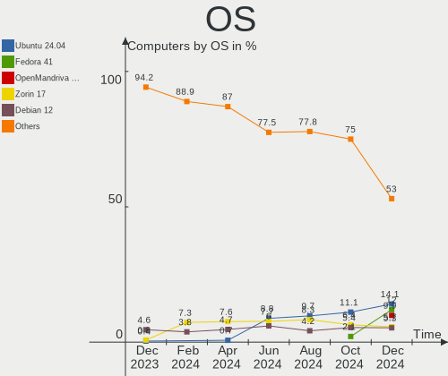

| Name                         | Computers | Percent |
|------------------------------|-----------|---------|
| Ubuntu 22.04                 | 32        | 13.79%  |
| Linux Mint 20.3              | 23        | 9.91%   |
| Ubuntu 20.04                 | 19        | 8.19%   |
| Pop!_OS 22.04                | 17        | 7.33%   |
| OpenMandriva 4.3             | 17        | 7.33%   |
| Fedora 36                    | 17        | 7.33%   |
| Endless 4.0.6                | 9         | 3.88%   |
| Arch                         | 9         | 3.88%   |
| Zorin 16                     | 8         | 3.45%   |
| Debian 11                    | 8         | 3.45%   |
| Linux Mint 20.1              | 5         | 2.16%   |
| KDE neon 20.04               | 5         | 2.16%   |
| Manjaro                      | 4         | 1.72%   |
| Linux Mint 20.2              | 4         | 1.72%   |
| Elementary 6.1               | 4         | 1.72%   |
| Ubuntu 18.04                 | 3         | 1.29%   |
| openSUSE Leap-15.4           | 3         | 1.29%   |
| Lubuntu 22.04                | 3         | 1.29%   |
| Arch Rolling                 | 3         | 1.29%   |
| Pop!_OS 21.10                | 2         | 0.86%   |
| Linux Mint 19.3              | 2         | 0.86%   |
| Xubuntu 22.04                | 1         | 0.43%   |
| Xubuntu 20.04                | 1         | 0.43%   |
| Ubuntu Budgie 22.04          | 1         | 0.43%   |
| Ubuntu Budgie 21.10          | 1         | 0.43%   |
| Sparky 6.3                   | 1         | 0.43%   |
| Slackware 14.2+              | 1         | 0.43%   |
| ROSA 12.2                    | 1         | 0.43%   |
| Rocky Linux 8.5              | 1         | 0.43%   |
| Raspbian 11                  | 1         | 0.43%   |
| Pop!_OS 20.04                | 1         | 0.43%   |
| Parrot 5.0                   | 1         | 0.43%   |
| openSUSE Tumbleweed-XXXXXXXX | 1         | 0.43%   |
| MX 21                        | 1         | 0.43%   |
| Manjaro 21.3.0               | 1         | 0.43%   |
| LMDE 5                       | 1         | 0.43%   |
| LinuxFX 11.1                 | 1         | 0.43%   |
| Linux Mint 18.3              | 1         | 0.43%   |
| Linux Lite 5.8               | 1         | 0.43%   |
| Kubuntu 22.04                | 1         | 0.43%   |
| Kubuntu 2.0                  | 1         | 0.43%   |
| Kubuntu 18.04                | 1         | 0.43%   |
| Kubuntu 11                   | 1         | 0.43%   |
| Kali 2022.2                  | 1         | 0.43%   |
| Kali 2021.4                  | 1         | 0.43%   |
| Fedora 35                    | 1         | 0.43%   |
| Endless 4.0.7                | 1         | 0.43%   |
| Endless 4.0.4                | 1         | 0.43%   |
| Endless 3.9.7                | 1         | 0.43%   |
| Endless 3.9.3-nexthw1        | 1         | 0.43%   |
| Endless 3.9.1                | 1         | 0.43%   |
| Endless 3.8.3-nexthw1        | 1         | 0.43%   |
| Debian Testing               | 1         | 0.43%   |
| Clear Linux 36510            | 1         | 0.43%   |
| CentOS 8                     | 1         | 0.43%   |
| Archcraft                    | 1         | 0.43%   |

OS Family
---------

OS without a version

| Name          | Computers | Percent |
|---------------|-----------|---------|
| Ubuntu        | 54        | 23.28%  |
| Linux Mint    | 35        | 15.09%  |
| Pop!_OS       | 20        | 8.62%   |
| Fedora        | 18        | 7.76%   |
| OpenMandriva  | 17        | 7.33%   |
| Endless       | 15        | 6.47%   |
| Arch          | 12        | 5.17%   |
| Debian        | 9         | 3.88%   |
| Zorin         | 8         | 3.45%   |
| Manjaro       | 5         | 2.16%   |
| KDE neon      | 5         | 2.16%   |
| openSUSE      | 4         | 1.72%   |
| Kubuntu       | 4         | 1.72%   |
| Elementary    | 4         | 1.72%   |
| Lubuntu       | 3         | 1.29%   |
| Xubuntu       | 2         | 0.86%   |
| Ubuntu Budgie | 2         | 0.86%   |
| Kali          | 2         | 0.86%   |
| Sparky        | 1         | 0.43%   |
| Slackware     | 1         | 0.43%   |
| ROSA          | 1         | 0.43%   |
| Rocky Linux   | 1         | 0.43%   |
| Raspbian      | 1         | 0.43%   |
| Parrot        | 1         | 0.43%   |
| MX            | 1         | 0.43%   |
| LMDE          | 1         | 0.43%   |
| LinuxFX       | 1         | 0.43%   |
| Linux Lite    | 1         | 0.43%   |
| Clear Linux   | 1         | 0.43%   |
| CentOS        | 1         | 0.43%   |
| Archcraft     | 1         | 0.43%   |

Kernel
------

Version of the Linux kernel

| Version                          | Computers | Percent |
|----------------------------------|-----------|---------|
| 5.17.5-76051705-generic          | 19        | 8.19%   |
| 5.16.7-desktop-1omv4003          | 15        | 6.47%   |
| 5.13.0-44-generic                | 14        | 6.03%   |
| 5.11.0-35-generic                | 11        | 4.74%   |
| 5.13.0-48-generic                | 10        | 4.31%   |
| 5.4.0-113-generic                | 8         | 3.45%   |
| 5.13.0-51-generic                | 8         | 3.45%   |
| 5.15.0-33-generic                | 7         | 3.02%   |
| 5.10.0-14-amd64                  | 7         | 3.02%   |
| 5.4.0-91-generic                 | 6         | 2.59%   |
| 5.4.0-117-generic                | 6         | 2.59%   |
| 5.15.0-40-generic                | 6         | 2.59%   |
| 5.15.0-39-generic                | 6         | 2.59%   |
| 5.15.0-37-generic                | 6         | 2.59%   |
| 5.15.0-25-generic                | 6         | 2.59%   |
| 5.4.0-120-generic                | 5         | 2.16%   |
| 5.4.0-121-generic                | 4         | 1.72%   |
| 5.18.5-200.fc36.x86_64           | 4         | 1.72%   |
| 5.17.13-300.fc36.x86_64          | 4         | 1.72%   |
| 5.15.0-35-generic                | 4         | 1.72%   |
| 5.4.0-74-generic                 | 3         | 1.29%   |
| 5.18.1-arch1-1                   | 3         | 1.29%   |
| 5.17.12-300.fc36.x86_64          | 3         | 1.29%   |
| 5.17.11-300.fc36.x86_64          | 3         | 1.29%   |
| 5.14.21-150400.22-default        | 3         | 1.29%   |
| 5.8.0-14-generic                 | 2         | 0.86%   |
| 5.18.7-arch1-1                   | 2         | 0.86%   |
| 5.18.3-arch1-1                   | 2         | 0.86%   |
| 5.18.1-zen1-1-zen                | 2         | 0.86%   |
| 5.16.13-desktop-1omv4003         | 2         | 0.86%   |
| 5.15.48-1-MANJARO                | 2         | 0.86%   |
| 5.15.41-1-MANJARO                | 2         | 0.86%   |
| 5.14.0-1042-oem                  | 2         | 0.86%   |
| 5.6.0-7-generic                  | 1         | 0.43%   |
| 5.4.0-99-generic                 | 1         | 0.43%   |
| 5.4.0-97-lowlatency              | 1         | 0.43%   |
| 5.4.0-89-generic                 | 1         | 0.43%   |
| 5.4.0-58-generic                 | 1         | 0.43%   |
| 5.4.0-42-generic                 | 1         | 0.43%   |
| 5.4.0-110-generic                | 1         | 0.43%   |
| 5.4.0-109-generic                | 1         | 0.43%   |
| 5.18.6-arch1-1                   | 1         | 0.43%   |
| 5.18.6-200.fc36.x86_64           | 1         | 0.43%   |
| 5.18.6-1-default                 | 1         | 0.43%   |
| 5.18.5-arch1-1                   | 1         | 0.43%   |
| 5.18.4-xm1.0.fc35.x86_64         | 1         | 0.43%   |
| 5.18.4-xanmod1                   | 1         | 0.43%   |
| 5.18.4-125.vanilla.1.fc36.x86_64 | 1         | 0.43%   |
| 5.18.3-zen1-1-zen                | 1         | 0.43%   |
| 5.18.0-kali2-amd64               | 1         | 0.43%   |
| 5.18.0-2-amd64                   | 1         | 0.43%   |
| 5.18.0-051800-generic            | 1         | 0.43%   |
| 5.17.5-300.fc36.x86_64           | 1         | 0.43%   |
| 5.17.15-76051715-generic         | 1         | 0.43%   |
| 5.16.13-1132.native              | 1         | 0.43%   |
| 5.16.0-12parrot1-amd64           | 1         | 0.43%   |
| 5.16.0-0.bpo.4-amd64             | 1         | 0.43%   |
| 5.15.46-1-MANJARO                | 1         | 0.43%   |
| 5.15.43-1-lts                    | 1         | 0.43%   |
| 5.15.32-v7+                      | 1         | 0.43%   |

Kernel Family
-------------

Linux kernel without a distro release

| Version  | Computers | Percent |
|----------|-----------|---------|
| 5.4.0    | 39        | 16.81%  |
| 5.15.0   | 37        | 15.95%  |
| 5.13.0   | 35        | 15.09%  |
| 5.17.5   | 20        | 8.62%   |
| 5.16.7   | 15        | 6.47%   |
| 5.11.0   | 12        | 5.17%   |
| 5.10.0   | 9         | 3.88%   |
| 5.18.5   | 5         | 2.16%   |
| 5.18.1   | 5         | 2.16%   |
| 5.17.13  | 4         | 1.72%   |
| 5.18.6   | 3         | 1.29%   |
| 5.18.4   | 3         | 1.29%   |
| 5.18.3   | 3         | 1.29%   |
| 5.18.0   | 3         | 1.29%   |
| 5.17.12  | 3         | 1.29%   |
| 5.17.11  | 3         | 1.29%   |
| 5.16.13  | 3         | 1.29%   |
| 5.14.21  | 3         | 1.29%   |
| 5.14.0   | 3         | 1.29%   |
| 5.8.0    | 2         | 0.86%   |
| 5.18.7   | 2         | 0.86%   |
| 5.16.0   | 2         | 0.86%   |
| 5.15.48  | 2         | 0.86%   |
| 5.15.41  | 2         | 0.86%   |
| 5.6.0    | 1         | 0.43%   |
| 5.17.15  | 1         | 0.43%   |
| 5.15.46  | 1         | 0.43%   |
| 5.15.43  | 1         | 0.43%   |
| 5.15.32  | 1         | 0.43%   |
| 5.15.2   | 1         | 0.43%   |
| 5.15.13  | 1         | 0.43%   |
| 5.10.89  | 1         | 0.43%   |
| 5.10.118 | 1         | 0.43%   |
| 5.10.109 | 1         | 0.43%   |
| 5.0.0    | 1         | 0.43%   |
| 4.18.0   | 1         | 0.43%   |
| 4.15.0   | 1         | 0.43%   |
| 4.10.0   | 1         | 0.43%   |

Kernel Major Ver.
-----------------

Linux kernel major version

| Version | Computers | Percent |
|---------|-----------|---------|
| 5.15    | 46        | 19.83%  |
| 5.4     | 39        | 16.81%  |
| 5.13    | 35        | 15.09%  |
| 5.17    | 31        | 13.36%  |
| 5.18    | 24        | 10.34%  |
| 5.16    | 20        | 8.62%   |
| 5.11    | 12        | 5.17%   |
| 5.10    | 12        | 5.17%   |
| 5.14    | 6         | 2.59%   |
| 5.8     | 2         | 0.86%   |
| 5.6     | 1         | 0.43%   |
| 5.0     | 1         | 0.43%   |
| 4.18    | 1         | 0.43%   |
| 4.15    | 1         | 0.43%   |
| 4.10    | 1         | 0.43%   |

Arch
----

OS architecture (x86_64, i586, etc.)

| Name   | Computers | Percent |
|--------|-----------|---------|
| x86_64 | 229       | 98.71%  |
| i686   | 2         | 0.86%   |
| armv7l | 1         | 0.43%   |

DE
--

Desktop Environment

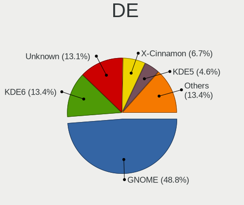

| Name            | Computers | Percent |
|-----------------|-----------|---------|
| GNOME           | 116       | 50%     |
| KDE5            | 41        | 17.67%  |
| X-Cinnamon      | 25        | 10.78%  |
| XFCE            | 22        | 9.48%   |
| Unknown         | 8         | 3.45%   |
| Pantheon        | 4         | 1.72%   |
| MATE            | 4         | 1.72%   |
| LXQt            | 3         | 1.29%   |
| sway            | 2         | 0.86%   |
| i3              | 2         | 0.86%   |
| Budgie          | 2         | 0.86%   |
| Unity           | 1         | 0.43%   |
| GNOME Flashback | 1         | 0.43%   |
| Cinnamon        | 1         | 0.43%   |

Display Server
--------------

X11 or Wayland

| Name    | Computers | Percent |
|---------|-----------|---------|
| X11     | 181       | 78.02%  |
| Wayland | 43        | 18.53%  |
| Tty     | 5         | 2.16%   |
| Unknown | 3         | 1.29%   |

Display Manager
---------------

SDDM, LightDM, etc.

| Name    | Computers | Percent |
|---------|-----------|---------|
| Unknown | 116       | 50%     |
| GDM3    | 46        | 19.83%  |
| LightDM | 32        | 13.79%  |
| SDDM    | 26        | 11.21%  |
| GDM     | 12        | 5.17%   |

OS Lang
-------

Language

| Lang    | Computers | Percent |
|---------|-----------|---------|
| pt_BR   | 179       | 77.16%  |
| en_US   | 44        | 18.97%  |
| C       | 5         | 2.16%   |
| pt_PT   | 2         | 0.86%   |
| en_GB   | 1         | 0.43%   |
| Unknown | 1         | 0.43%   |

Boot Mode
---------

EFI or BIOS

| Mode | Computers | Percent |
|------|-----------|---------|
| BIOS | 123       | 53.02%  |
| EFI  | 109       | 46.98%  |

Filesystem
----------

Type of filesystem

| Type    | Computers | Percent |
|---------|-----------|---------|
| Ext4    | 171       | 73.71%  |
| Btrfs   | 34        | 14.66%  |
| Overlay | 23        | 9.91%   |
| Zfs     | 1         | 0.43%   |
| Xfs     | 1         | 0.43%   |
| Tmpfs   | 1         | 0.43%   |
| Ext3    | 1         | 0.43%   |

Part. scheme
------------

Scheme of partitioning

| Type    | Computers | Percent |
|---------|-----------|---------|
| Unknown | 151       | 65.09%  |
| GPT     | 59        | 25.43%  |
| MBR     | 22        | 9.48%   |

Dual Boot with Linux/BSD
------------------------

Hosting more than one Linux/BSD

| Dual boot | Computers | Percent |
|-----------|-----------|---------|
| No        | 210       | 90.52%  |
| Yes       | 22        | 9.48%   |

Dual Boot (Win)
---------------

Hosting Linux and Windows

| Dual boot | Computers | Percent |
|-----------|-----------|---------|
| No        | 180       | 77.59%  |
| Yes       | 52        | 22.41%  |

Board
-----

Vendor
------

Motherboard manufacturer

| Name                    | Computers | Percent |
|-------------------------|-----------|---------|
| Dell                    | 50        | 21.55%  |
| ASUSTek Computer        | 37        | 15.95%  |
| Acer                    | 29        | 12.5%   |
| Samsung Electronics     | 16        | 6.9%    |
| Positivo                | 16        | 6.9%    |
| Lenovo                  | 12        | 5.17%   |
| Intel                   | 10        | 4.31%   |
| ASRock                  | 8         | 3.45%   |
| Gigabyte Technology     | 7         | 3.02%   |
| Hewlett-Packard         | 6         | 2.59%   |
| LG Electronics          | 5         | 2.16%   |
| PCWare                  | 3         | 1.29%   |
| MSI                     | 3         | 1.29%   |
| Avell High Performance  | 3         | 1.29%   |
| Itautec                 | 2         | 0.86%   |
| Unknown                 | 2         | 0.86%   |
| Toshiba                 | 1         | 0.43%   |
| Timi                    | 1         | 0.43%   |
| Teclast                 | 1         | 0.43%   |
| T-bao                   | 1         | 0.43%   |
| Standard                | 1         | 0.43%   |
| Raspberry Pi Foundation | 1         | 0.43%   |
| Philco                  | 1         | 0.43%   |
| OEM                     | 1         | 0.43%   |
| Multilaser              | 1         | 0.43%   |
| Megaware                | 1         | 0.43%   |
| Login Informatica       | 1         | 0.43%   |
| Kllisre                 | 1         | 0.43%   |
| Huanan                  | 1         | 0.43%   |
| Foxconn                 | 1         | 0.43%   |
| ECS                     | 1         | 0.43%   |
| Daten Tecnologia        | 1         | 0.43%   |
| Compaq                  | 1         | 0.43%   |
| Chuwi                   | 1         | 0.43%   |
| Biostar                 | 1         | 0.43%   |
| BenQ                    | 1         | 0.43%   |
| Apple                   | 1         | 0.43%   |
| AMI                     | 1         | 0.43%   |
| A14CR                   | 1         | 0.43%   |

Model
-----

Motherboard model

| Name                                                  | Computers | Percent |
|-------------------------------------------------------|-----------|---------|
| Acer Nitro AN515-44                                   | 6         | 2.59%   |
| ASUS TUF Gaming X570-PLUS_BR                          | 4         | 1.72%   |
| Unknown                                               | 4         | 1.72%   |
| Positivo S14CT01                                      | 3         | 1.29%   |
| LG 15Z970-E.BH71P1                                    | 3         | 1.29%   |
| Intel H61                                             | 3         | 1.29%   |
| ASUS PRIME A320M-K/BR                                 | 3         | 1.29%   |
| Samsung 300E5M/300E5L                                 | 2         | 0.86%   |
| Samsung 300E5K/300E5Q                                 | 2         | 0.86%   |
| Positivo Q464C                                        | 2         | 0.86%   |
| Positivo CHT14B                                       | 2         | 0.86%   |
| Itautec Infoway w7430                                 | 2         | 0.86%   |
| Gigabyte H81M-S1                                      | 2         | 0.86%   |
| Dell Vostro 5470                                      | 2         | 0.86%   |
| Dell Vostro 3460                                      | 2         | 0.86%   |
| Dell Inspiron N4050                                   | 2         | 0.86%   |
| Dell Inspiron 7520                                    | 2         | 0.86%   |
| Dell Inspiron 5537                                    | 2         | 0.86%   |
| Dell Inspiron 5437                                    | 2         | 0.86%   |
| Dell Inspiron 1545                                    | 2         | 0.86%   |
| Dell Inspiron 1525                                    | 2         | 0.86%   |
| Dell Inspiron 15-3567                                 | 2         | 0.86%   |
| Dell G3 3500                                          | 2         | 0.86%   |
| ASUS VivoBook_ASUSLaptop X515JA_X515JA                | 2         | 0.86%   |
| ASUS PRIME B450M-GAMING/BR                            | 2         | 0.86%   |
| ASUS All Series                                       | 2         | 0.86%   |
| ASRock H81M-HG4 R4.0                                  | 2         | 0.86%   |
| Acer Predator G3-572                                  | 2         | 0.86%   |
| Acer Aspire ES1-572                                   | 2         | 0.86%   |
| Acer Aspire E1-571                                    | 2         | 0.86%   |
| Toshiba Satellite C845                                | 1         | 0.43%   |
| Timi RedmiBook Pro 14S                                | 1         | 0.43%   |
| Teclast F7S                                           | 1         | 0.43%   |
| T-bao MINI PC                                         | 1         | 0.43%   |
| Samsung RV411                                         | 1         | 0.43%   |
| Samsung 930QDB                                        | 1         | 0.43%   |
| Samsung 670Z5E                                        | 1         | 0.43%   |
| Samsung 550XDA                                        | 1         | 0.43%   |
| Samsung 550XBE/350XBE                                 | 1         | 0.43%   |
| Samsung 530XBB                                        | 1         | 0.43%   |
| Samsung 530U3C/530U4C/532U3C                          | 1         | 0.43%   |
| Samsung 500R5M/500R5W/501R5M                          | 1         | 0.43%   |
| Samsung 370E4K                                        | 1         | 0.43%   |
| Samsung 340XAA/350XAA/550XAA                          | 1         | 0.43%   |
| Samsung 300E5EV/300E4EV/270E5EV/270E4EV/2470EV/2470EE | 1         | 0.43%   |
| Samsung 270E5K/270E5Q/271E5K/2570EK                   | 1         | 0.43%   |
| RPi Raspberry Pi 3 Model B Rev 1.2                    | 1         | 0.43%   |
| Positivo W540EU                                       | 1         | 0.43%   |
| Positivo Q232A                                        | 1         | 0.43%   |
| Positivo POS-PIH55BO                                  | 1         | 0.43%   |
| Positivo NP11G-ER4                                    | 1         | 0.43%   |
| Positivo Mobile                                       | 1         | 0.43%   |
| Positivo J14GL11                                      | 1         | 0.43%   |
| Positivo C464C                                        | 1         | 0.43%   |
| Positivo C4500D                                       | 1         | 0.43%   |
| Positivo C4120F-AX                                    | 1         | 0.43%   |
| Philco OEM                                            | 1         | 0.43%   |
| PCWare IPX4105G Pro                                   | 1         | 0.43%   |
| PCWare IPMH61R3                                       | 1         | 0.43%   |
| PCWare IPMH61R1                                       | 1         | 0.43%   |

Model Family
------------

Motherboard model prefix

| Name                 | Computers | Percent |
|----------------------|-----------|---------|
| Dell Inspiron        | 26        | 11.21%  |
| Acer Aspire          | 17        | 7.33%   |
| Dell Vostro          | 10        | 4.31%   |
| Acer Nitro           | 9         | 3.88%   |
| Lenovo IdeaPad       | 8         | 3.45%   |
| ASUS PRIME           | 8         | 3.45%   |
| ASUS TUF             | 7         | 3.02%   |
| Dell Precision       | 4         | 1.72%   |
| Unknown              | 4         | 1.72%   |
| Positivo S14CT01     | 3         | 1.29%   |
| LG 15Z970-E.BH71P1   | 3         | 1.29%   |
| Intel H61            | 3         | 1.29%   |
| Dell OptiPlex        | 3         | 1.29%   |
| ASUS VivoBook        | 3         | 1.29%   |
| Acer Predator        | 3         | 1.29%   |
| Samsung 300E5M       | 2         | 0.86%   |
| Samsung 300E5K       | 2         | 0.86%   |
| Positivo Q464C       | 2         | 0.86%   |
| Positivo CHT14B      | 2         | 0.86%   |
| Itautec Infoway      | 2         | 0.86%   |
| Intel X99            | 2         | 0.86%   |
| HP ProBook           | 2         | 0.86%   |
| HP Pavilion          | 2         | 0.86%   |
| Gigabyte H81M-S1     | 2         | 0.86%   |
| Dell PowerEdge       | 2         | 0.86%   |
| Dell G3              | 2         | 0.86%   |
| ASUS ROG             | 2         | 0.86%   |
| ASUS M5A78L-M        | 2         | 0.86%   |
| ASUS All             | 2         | 0.86%   |
| ASRock H81M-HG4      | 2         | 0.86%   |
| Toshiba Satellite    | 1         | 0.43%   |
| Timi RedmiBook       | 1         | 0.43%   |
| Teclast F7S          | 1         | 0.43%   |
| T-bao MINI           | 1         | 0.43%   |
| Samsung RV411        | 1         | 0.43%   |
| Samsung 930QDB       | 1         | 0.43%   |
| Samsung 670Z5E       | 1         | 0.43%   |
| Samsung 550XDA       | 1         | 0.43%   |
| Samsung 550XBE       | 1         | 0.43%   |
| Samsung 530XBB       | 1         | 0.43%   |
| Samsung 530U3C       | 1         | 0.43%   |
| Samsung 500R5M       | 1         | 0.43%   |
| Samsung 370E4K       | 1         | 0.43%   |
| Samsung 340XAA       | 1         | 0.43%   |
| Samsung 300E5EV      | 1         | 0.43%   |
| Samsung 270E5K       | 1         | 0.43%   |
| RPi Raspberry        | 1         | 0.43%   |
| Positivo W540EU      | 1         | 0.43%   |
| Positivo Q232A       | 1         | 0.43%   |
| Positivo POS-PIH55BO | 1         | 0.43%   |
| Positivo NP11G-ER4   | 1         | 0.43%   |
| Positivo Mobile      | 1         | 0.43%   |
| Positivo J14GL11     | 1         | 0.43%   |
| Positivo C464C       | 1         | 0.43%   |
| Positivo C4500D      | 1         | 0.43%   |
| Positivo C4120F-AX   | 1         | 0.43%   |
| Philco OEM           | 1         | 0.43%   |
| PCWare IPX4105G      | 1         | 0.43%   |
| PCWare IPMH61R3      | 1         | 0.43%   |
| PCWare IPMH61R1      | 1         | 0.43%   |

MFG Year
--------

Motherboard manufacture year

| Year | Computers | Percent |
|------|-----------|---------|
| 2020 | 30        | 12.93%  |
| 2017 | 27        | 11.64%  |
| 2013 | 21        | 9.05%   |
| 2012 | 21        | 9.05%   |
| 2019 | 19        | 8.19%   |
| 2016 | 18        | 7.76%   |
| 2018 | 17        | 7.33%   |
| 2021 | 15        | 6.47%   |
| 2011 | 14        | 6.03%   |
| 2010 | 11        | 4.74%   |
| 2015 | 10        | 4.31%   |
| 2008 | 10        | 4.31%   |
| 2014 | 7         | 3.02%   |
| 2022 | 6         | 2.59%   |
| 2009 | 4         | 1.72%   |
| 2007 | 1         | 0.43%   |
| 2006 | 1         | 0.43%   |

Form Factor
-----------

Physical design of the computer

| Name           | Computers | Percent |
|----------------|-----------|---------|
| Notebook       | 145       | 62.5%   |
| Desktop        | 77        | 33.19%  |
| Convertible    | 5         | 2.16%   |
| Server         | 2         | 0.86%   |
| System on chip | 1         | 0.43%   |
| Mini pc        | 1         | 0.43%   |
| All in one     | 1         | 0.43%   |

Secure Boot
-----------

Enabled or disabled

| State    | Computers | Percent |
|----------|-----------|---------|
| Disabled | 206       | 88.79%  |
| Enabled  | 26        | 11.21%  |

Coreboot
--------

Have coreboot on board

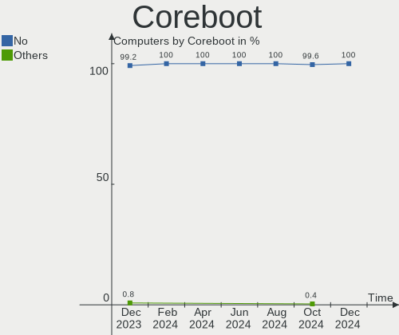

| Used | Computers | Percent |
|------|-----------|---------|
| No   | 232       | 100%    |

RAM Size
--------

Total RAM memory

| Size in GB      | Computers | Percent |
|-----------------|-----------|---------|
| 4.01-8.0        | 71        | 30.6%   |
| 3.01-4.0        | 44        | 18.97%  |
| 8.01-16.0       | 44        | 18.97%  |
| 16.01-24.0      | 38        | 16.38%  |
| 1.01-2.0        | 13        | 5.6%    |
| 32.01-64.0      | 11        | 4.74%   |
| 2.01-3.0        | 3         | 1.29%   |
| 64.01-256.0     | 3         | 1.29%   |
| 24.01-32.0      | 2         | 0.86%   |
| 0.51-1.0        | 2         | 0.86%   |
| More than 256.0 | 1         | 0.43%   |

RAM Used
--------

Used RAM memory

| Used GB   | Computers | Percent |
|-----------|-----------|---------|
| 1.01-2.0  | 80        | 34.48%  |
| 2.01-3.0  | 68        | 29.31%  |
| 3.01-4.0  | 35        | 15.09%  |
| 4.01-8.0  | 30        | 12.93%  |
| 0.51-1.0  | 11        | 4.74%   |
| 8.01-16.0 | 6         | 2.59%   |
| 0.01-0.5  | 2         | 0.86%   |

Total Drives
------------

Number of drives on board

| Drives | Computers | Percent |
|--------|-----------|---------|
| 1      | 123       | 53.02%  |
| 2      | 72        | 31.03%  |
| 3      | 19        | 8.19%   |
| 4      | 7         | 3.02%   |
| 0      | 5         | 2.16%   |
| 5      | 3         | 1.29%   |
| 7      | 2         | 0.86%   |
| 6      | 1         | 0.43%   |

Has CD-ROM
----------

Has CD-ROM on board

| Presented | Computers | Percent |
|-----------|-----------|---------|
| No        | 157       | 67.67%  |
| Yes       | 75        | 32.33%  |

Has Ethernet
------------

Has Ethernet on board

| Presented | Computers | Percent |
|-----------|-----------|---------|
| Yes       | 200       | 86.21%  |
| No        | 32        | 13.79%  |

Has WiFi
--------

Has WiFi module

| Presented | Computers | Percent |
|-----------|-----------|---------|
| Yes       | 172       | 74.14%  |
| No        | 60        | 25.86%  |

Has Bluetooth
-------------

Has Bluetooth module

| Presented | Computers | Percent |
|-----------|-----------|---------|
| Yes       | 124       | 53.45%  |
| No        | 108       | 46.55%  |

Location
--------

Country
-------

Geographic location (country)

| Country | Computers | Percent |
|---------|-----------|---------|
| Brazil  | 232       | 100%    |

City
----

Geographic location (city)

| City                        | Computers | Percent |
|-----------------------------|-----------|---------|
| Sao Paulo                   | 17        | 7.33%   |
| Rio de Janeiro              | 14        | 6.03%   |
| Curitiba                    | 8         | 3.45%   |
| Brasília                   | 8         | 3.45%   |
| Vitória                    | 4         | 1.72%   |
| Sao José dos Campos        | 4         | 1.72%   |
| Manaus                      | 4         | 1.72%   |
| Goiânia                    | 4         | 1.72%   |
| Fortaleza                   | 4         | 1.72%   |
| Florianópolis              | 4         | 1.72%   |
| Campo Grande                | 4         | 1.72%   |
| Belo Horizonte              | 4         | 1.72%   |
| Teresopolis                 | 3         | 1.29%   |
| Sao Luís                   | 3         | 1.29%   |
| Ribeirao Preto              | 3         | 1.29%   |
| Recife                      | 3         | 1.29%   |
| Porto Velho                 | 3         | 1.29%   |
| Natal                       | 3         | 1.29%   |
| Guarulhos                   | 3         | 1.29%   |
| Viamao                      | 2         | 0.86%   |
| Uberlândia                 | 2         | 0.86%   |
| Sao Carlos                  | 2         | 0.86%   |
| Salvador                    | 2         | 0.86%   |
| Porto Alegre                | 2         | 0.86%   |
| Passo Fundo                 | 2         | 0.86%   |
| Montes Claros               | 2         | 0.86%   |
| Maringá                    | 2         | 0.86%   |
| Londrina                    | 2         | 0.86%   |
| Juiz de Fora                | 2         | 0.86%   |
| Joinville                   | 2         | 0.86%   |
| Itatiba                     | 2         | 0.86%   |
| Itajaí                     | 2         | 0.86%   |
| Criciúma                   | 2         | 0.86%   |
| Colombo                     | 2         | 0.86%   |
| Campinas                    | 2         | 0.86%   |
| Cabo Frio                   | 2         | 0.86%   |
| Araraquara                  | 2         | 0.86%   |
| Volta Redonda               | 1         | 0.43%   |
| Vitoria do Mearim           | 1         | 0.43%   |
| Vitória da Conquista       | 1         | 0.43%   |
| Vila Velha                  | 1         | 0.43%   |
| Vicosa do Ceara             | 1         | 0.43%   |
| Uba                         | 1         | 0.43%   |
| Tres Rios                   | 1         | 0.43%   |
| Toledo                      | 1         | 0.43%   |
| Sombrio                     | 1         | 0.43%   |
| Sidrolandia                 | 1         | 0.43%   |
| Serra                       | 1         | 0.43%   |
| Senhor do Bonfim            | 1         | 0.43%   |
| Sao Miguel do Guama         | 1         | 0.43%   |
| Sao Jose do Rio Preto       | 1         | 0.43%   |
| Sao Jose do Egito           | 1         | 0.43%   |
| Sao Jose                    | 1         | 0.43%   |
| Sao Goncalo do Amarante     | 1         | 0.43%   |
| Sao Francisco de Itabapoana | 1         | 0.43%   |
| Sao Cristovao               | 1         | 0.43%   |
| Sao Caetano do Sul          | 1         | 0.43%   |
| Santos                      | 1         | 0.43%   |
| Santana de Parnaiba         | 1         | 0.43%   |
| Santa Rosa                  | 1         | 0.43%   |

Drives
------

Drive Vendor
------------

Hard drive vendors

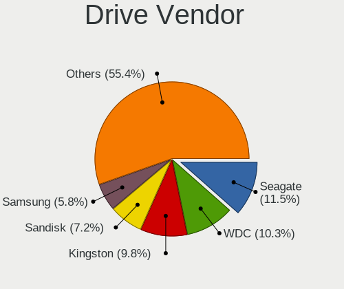

| Vendor                         | Computers | Drives | Percent |
|--------------------------------|-----------|--------|---------|
| Seagate                        | 57        | 71     | 16.67%  |
| WDC                            | 55        | 64     | 16.08%  |
| Kingston                       | 37        | 41     | 10.82%  |
| Samsung Electronics            | 36        | 41     | 10.53%  |
| Unknown                        | 19        | 21     | 5.56%   |
| Toshiba                        | 18        | 18     | 5.26%   |
| SanDisk                        | 17        | 18     | 4.97%   |
| Crucial                        | 10        | 10     | 2.92%   |
| China                          | 9         | 10     | 2.63%   |
| LITEON                         | 6         | 6      | 1.75%   |
| SK hynix                       | 5         | 5      | 1.46%   |
| JMicron Technology             | 5         | 5      | 1.46%   |
| ADATA Technology               | 5         | 5      | 1.46%   |
| A-DATA Technology              | 5         | 5      | 1.46%   |
| Silicon Motion                 | 4         | 5      | 1.17%   |
| Hitachi                        | 4         | 4      | 1.17%   |
| Solid State Storage Technology | 3         | 3      | 0.88%   |
| Realtek Semiconductor          | 3         | 3      | 0.88%   |
| Netac                          | 3         | 3      | 0.88%   |
| KingSpec                       | 3         | 3      | 0.88%   |
| HGST                           | 3         | 3      | 0.88%   |
| Fujitsu                        | 3         | 3      | 0.88%   |
| T-FORCE                        | 2         | 2      | 0.58%   |
| PNY                            | 2         | 2      | 0.58%   |
| Phison                         | 2         | 2      | 0.58%   |
| Patriot                        | 2         | 2      | 0.58%   |
| Intel                          | 2         | 2      | 0.58%   |
| BIWIN                          | 2         | 2      | 0.58%   |
| XrayDisk                       | 1         | 2      | 0.29%   |
| XPG                            | 1         | 1      | 0.29%   |
| Teclast                        | 1         | 1      | 0.29%   |
| Team                           | 1         | 1      | 0.29%   |
| SSSTC                          | 1         | 1      | 0.29%   |
| SPCC                           | 1         | 1      | 0.29%   |
| Smart                          | 1         | 2      | 0.29%   |
| ShiJi                          | 1         | 1      | 0.29%   |
| S3+                            | 1         | 1      | 0.29%   |
| OEM                            | 1         | 1      | 0.29%   |
| Lexar                          | 1         | 1      | 0.29%   |
| KingDian                       | 1         | 1      | 0.29%   |
| HS-SSD-E100                    | 1         | 1      | 0.29%   |
| Hewlett-Packard                | 1         | 1      | 0.29%   |
| Gigabyte Technology            | 1         | 1      | 0.29%   |
| Faspeed                        | 1         | 1      | 0.29%   |
| EMTEC                          | 1         | 1      | 0.29%   |
| ASMT                           | 1         | 1      | 0.29%   |
| AFOX                           | 1         | 1      | 0.29%   |
| AEGO                           | 1         | 1      | 0.29%   |

Drive Model
-----------

Hard drive models

| Model                                    | Computers | Percent |
|------------------------------------------|-----------|---------|
| Kingston SA400S37240G 240GB SSD          | 15        | 4.02%   |
| Kingston SA400S37120G 120GB SSD          | 9         | 2.41%   |
| Unknown MMC Card  32GB                   | 8         | 2.14%   |
| Seagate ST500LM012 HN-M500MBB 500GB      | 6         | 1.61%   |
| Seagate ST1000LM024 HN-M101MBB 1TB       | 6         | 1.61%   |
| Seagate ST1000DM003-1CH162 1TB           | 6         | 1.61%   |
| WDC WD10SPZX-75Z10T2 1TB                 | 5         | 1.34%   |
| WDC WD10SPZX-21Z10T0 1TB                 | 5         | 1.34%   |
| Toshiba MQ01ABD100 1TB                   | 5         | 1.34%   |
| Crucial CT240BX500SSD1 240GB             | 5         | 1.34%   |
| Seagate Expansion 1TB                    | 4         | 1.07%   |
| SanDisk NVMe SSD Drive 512GB             | 4         | 1.07%   |
| Samsung HD502HJ 500GB                    | 4         | 1.07%   |
| Kingston SA400S37480G 480GB SSD          | 4         | 1.07%   |
| JMicron Generic 2TB                      | 4         | 1.07%   |
| WDC WDS240G2G0A-00JH30 240GB SSD         | 3         | 0.8%    |
| WDC WD10JPVX-22JC3T0 1TB                 | 3         | 0.8%    |
| Unknown MMC Card  64GB                   | 3         | 0.8%    |
| Toshiba MQ01ABF050 500GB                 | 3         | 0.8%    |
| Toshiba MK3259GSXP 320GB                 | 3         | 0.8%    |
| Solid State Storage NVMe SSD Drive 256GB | 3         | 0.8%    |
| Seagate ST31000524AS 1TB                 | 3         | 0.8%    |
| Seagate ST2000LM007-1R8174 2TB           | 3         | 0.8%    |
| Seagate ST2000DM008-2FR102 2TB           | 3         | 0.8%    |
| Seagate ST2000DM006-2DM164 2TB           | 3         | 0.8%    |
| Seagate ST1000LM048-2E7172 1TB           | 3         | 0.8%    |
| SanDisk SSD PLUS 240GB                   | 3         | 0.8%    |
| Samsung NVMe SSD Drive 256GB             | 3         | 0.8%    |
| Samsung MZMPC032HBCD-000D1 32GB SSD      | 3         | 0.8%    |
| LITEON CV1-8B128 128GB SSD               | 3         | 0.8%    |
| Kingston SV300S37A120G 120GB SSD         | 3         | 0.8%    |
| ADATA NVMe SSD Drive 256GB               | 3         | 0.8%    |
| WDC WDS480G2G0A-00JH30 480GB SSD         | 2         | 0.54%   |
| WDC WDS100T2B0A-00SM50 1TB SSD           | 2         | 0.54%   |
| WDC WD5000LPVX-22V0TT0 500GB             | 2         | 0.54%   |
| WDC WD5000LPCX-80VHAT0 500GB             | 2         | 0.54%   |
| WDC WD10SPZX-24Z10 1TB                   | 2         | 0.54%   |
| WDC WD10EZEX-08WN4A0 1TB                 | 2         | 0.54%   |
| WDC WD10EZEX-00WN4A0 1TB                 | 2         | 0.54%   |
| WDC WD10EURX-63UY4Y0 1TB                 | 2         | 0.54%   |
| WDC WD10EARS-00Y5B1 1TB                  | 2         | 0.54%   |
| T-FORCE TM8FPZ001T 1TB                   | 2         | 0.54%   |
| SK hynix NVMe SSD Drive 256GB            | 2         | 0.54%   |
| Silicon Motion NVMe SSD Drive 128GB      | 2         | 0.54%   |
| Seagate ST9750420AS 752GB                | 2         | 0.54%   |
| Seagate ST9500325AS 500GB                | 2         | 0.54%   |
| Seagate ST500DM002-1BD142 500GB          | 2         | 0.54%   |
| Seagate ST3000DM001-1ER166 3TB           | 2         | 0.54%   |
| Seagate ST1000DM010-2EP102 1TB           | 2         | 0.54%   |
| SanDisk SSD PLUS 480GB                   | 2         | 0.54%   |
| SanDisk SSD PLUS 120GB                   | 2         | 0.54%   |
| Samsung NVMe SSD Drive 512GB             | 2         | 0.54%   |
| Samsung HM500JI 500GB                    | 2         | 0.54%   |
| Samsung HM320II 320GB                    | 2         | 0.54%   |
| Samsung HM250HI 250GB                    | 2         | 0.54%   |
| Samsung HD502HI 500GB                    | 2         | 0.54%   |
| Samsung HD322HJ 320GB                    | 2         | 0.54%   |
| Realtek NVMe SSD Drive 1024GB            | 2         | 0.54%   |
| Phison NVMe SSD Drive 256GB              | 2         | 0.54%   |
| Kingston SV300S37A240G 240GB SSD         | 2         | 0.54%   |

HDD Vendor
----------

Hard disk drive vendors

| Vendor              | Computers | Drives | Percent |
|---------------------|-----------|--------|---------|
| Seagate             | 57        | 71     | 35.85%  |
| WDC                 | 46        | 52     | 28.93%  |
| Samsung Electronics | 21        | 25     | 13.21%  |
| Toshiba             | 18        | 18     | 11.32%  |
| JMicron Technology  | 4         | 4      | 2.52%   |
| Hitachi             | 4         | 4      | 2.52%   |
| HGST                | 3         | 3      | 1.89%   |
| Fujitsu             | 3         | 3      | 1.89%   |
| Unknown             | 1         | 1      | 0.63%   |
| Hewlett-Packard     | 1         | 1      | 0.63%   |
| ASMT                | 1         | 1      | 0.63%   |

SSD Vendor
----------

Solid state drive vendors

| Vendor              | Computers | Drives | Percent |
|---------------------|-----------|--------|---------|
| Kingston            | 35        | 39     | 30.97%  |
| SanDisk             | 11        | 12     | 9.73%   |
| WDC                 | 10        | 10     | 8.85%   |
| Crucial             | 10        | 10     | 8.85%   |
| China               | 9         | 10     | 7.96%   |
| Samsung Electronics | 8         | 8      | 7.08%   |
| LITEON              | 6         | 6      | 5.31%   |
| Netac               | 3         | 3      | 2.65%   |
| KingSpec            | 3         | 3      | 2.65%   |
| PNY                 | 2         | 2      | 1.77%   |
| Patriot             | 2         | 2      | 1.77%   |
| BIWIN               | 2         | 2      | 1.77%   |
| Teclast             | 1         | 1      | 0.88%   |
| Team                | 1         | 1      | 0.88%   |
| Smart               | 1         | 2      | 0.88%   |
| SK hynix            | 1         | 1      | 0.88%   |
| S3+                 | 1         | 1      | 0.88%   |
| Lexar               | 1         | 1      | 0.88%   |
| KingDian            | 1         | 1      | 0.88%   |
| Gigabyte Technology | 1         | 1      | 0.88%   |
| EMTEC               | 1         | 1      | 0.88%   |
| AFOX                | 1         | 1      | 0.88%   |
| AEGO                | 1         | 1      | 0.88%   |
| A-DATA Technology   | 1         | 1      | 0.88%   |

Drive Kind
----------

HDD or SSD

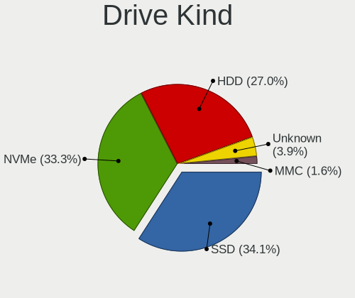

| Kind    | Computers | Drives | Percent |
|---------|-----------|--------|---------|
| HDD     | 139       | 183    | 44.84%  |
| SSD     | 100       | 120    | 32.26%  |
| NVMe    | 49        | 52     | 15.81%  |
| MMC     | 18        | 21     | 5.81%   |
| Unknown | 4         | 5      | 1.29%   |

Drive Connector
---------------

SATA, SAS, NVMe, etc.

| Type | Computers | Drives | Percent |
|------|-----------|--------|---------|
| SATA | 187       | 291    | 69.52%  |
| NVMe | 49        | 52     | 18.22%  |
| MMC  | 18        | 21     | 6.69%   |
| SAS  | 15        | 17     | 5.58%   |

Drive Size
----------

Size of hard drive

| Size in TB | Computers | Drives | Percent |
|------------|-----------|--------|---------|
| 0.01-0.5   | 143       | 179    | 58.37%  |
| 0.51-1.0   | 76        | 91     | 31.02%  |
| 1.01-2.0   | 17        | 20     | 6.94%   |
| 3.01-4.0   | 5         | 8      | 2.04%   |
| 2.01-3.0   | 3         | 4      | 1.22%   |
| 4.01-10.0  | 1         | 1      | 0.41%   |

Space Total
-----------

Amount of disk space available on the file system

| Size in GB     | Computers | Percent |
|----------------|-----------|---------|
| 101-250        | 67        | 28.88%  |
| 251-500        | 45        | 19.4%   |
| 501-1000       | 36        | 15.52%  |
| 1001-2000      | 24        | 10.34%  |
| 1-20           | 17        | 7.33%   |
| 51-100         | 12        | 5.17%   |
| More than 3000 | 11        | 4.74%   |
| 21-50          | 11        | 4.74%   |
| Unknown        | 7         | 3.02%   |
| 2001-3000      | 2         | 0.86%   |

Space Used
----------

Amount of used disk space

| Used GB        | Computers | Percent |
|----------------|-----------|---------|
| 1-20           | 81        | 34.91%  |
| 21-50          | 55        | 23.71%  |
| 51-100         | 28        | 12.07%  |
| 101-250        | 22        | 9.48%   |
| 251-500        | 21        | 9.05%   |
| 501-1000       | 10        | 4.31%   |
| Unknown        | 7         | 3.02%   |
| More than 3000 | 4         | 1.72%   |
| 1001-2000      | 3         | 1.29%   |
| 2001-3000      | 1         | 0.43%   |

Malfunc. Drives
---------------

Drive models with a malfunction

| Model                               | Computers | Drives | Percent |
|-------------------------------------|-----------|--------|---------|
| Samsung Electronics HD502HI 500GB   | 2         | 2      | 8%      |
| Samsung Electronics HD322HJ 320GB   | 2         | 2      | 8%      |
| WDC WDS480G2G0A-00JH30 480GB SSD    | 1         | 1      | 4%      |
| WDC WD5003ABYX-18WERA0 500GB        | 1         | 2      | 4%      |
| WDC WD1600AAJS-00L7A0 160GB         | 1         | 1      | 4%      |
| WDC WD10PURX-64D85Y0 1TB            | 1         | 1      | 4%      |
| WDC WD10EZEX-00WN4A0 1TB            | 1         | 1      | 4%      |
| WDC WD10EARS-00Y5B1 1TB             | 1         | 1      | 4%      |
| Toshiba MK3259GSXP 320GB            | 1         | 1      | 4%      |
| Seagate ST9750420AS 752GB           | 1         | 1      | 4%      |
| Seagate ST9500325AS 500GB           | 1         | 1      | 4%      |
| Seagate ST500LT012-1DG142 500GB     | 1         | 1      | 4%      |
| Seagate ST500LM012 HN-M500MBB 500GB | 1         | 1      | 4%      |
| Seagate ST2000DM008-2FR102 2TB      | 1         | 1      | 4%      |
| Seagate ST1500DL003-9VT16L 1TB      | 1         | 1      | 4%      |
| Seagate ST1000LM024 HN-M101MBB 1TB  | 1         | 1      | 4%      |
| Seagate ST1000DM003-1CH162 1TB      | 1         | 1      | 4%      |
| SanDisk SSD PLUS 480GB              | 1         | 1      | 4%      |
| Samsung Electronics HM121HI 120GB   | 1         | 1      | 4%      |
| Samsung Electronics HD103SI 1TB     | 1         | 1      | 4%      |
| Hitachi HDT721032SLA380 320GB       | 1         | 1      | 4%      |
| China SSD 240GB                     | 1         | 1      | 4%      |
| China SATA3 1TB SSD                 | 1         | 1      | 4%      |

Malfunc. Drive Vendor
---------------------

Vendors of faulty drives

| Vendor              | Computers | Drives | Percent |
|---------------------|-----------|--------|---------|
| Seagate             | 7         | 8      | 29.17%  |
| WDC                 | 6         | 7      | 25%     |
| Samsung Electronics | 6         | 6      | 25%     |
| China               | 2         | 2      | 8.33%   |
| Toshiba             | 1         | 1      | 4.17%   |
| SanDisk             | 1         | 1      | 4.17%   |
| Hitachi             | 1         | 1      | 4.17%   |

Malfunc. HDD Vendor
-------------------

Vendors of faulty HDD drives

| Vendor              | Computers | Drives | Percent |
|---------------------|-----------|--------|---------|
| Seagate             | 7         | 8      | 35%     |
| Samsung Electronics | 6         | 6      | 30%     |
| WDC                 | 5         | 6      | 25%     |
| Toshiba             | 1         | 1      | 5%      |
| Hitachi             | 1         | 1      | 5%      |

Malfunc. Drive Kind
-------------------

Kinds of faulty drives

| Kind | Computers | Drives | Percent |
|------|-----------|--------|---------|
| HDD  | 17        | 22     | 80.95%  |
| SSD  | 4         | 4      | 19.05%  |

Failed Drives
-------------

Failed drive models

Zero info for selected period =(

Failed Drive Vendor
-------------------

Failed drive vendors

Zero info for selected period =(

Drive Status
------------

Number of failed and malfunc. drives

| Status   | Computers | Drives | Percent |
|----------|-----------|--------|---------|
| Detected | 159       | 247    | 65.98%  |
| Works    | 61        | 108    | 25.31%  |
| Malfunc  | 21        | 26     | 8.71%   |

Storage controller
------------------

Storage Vendor
--------------

Storage controller vendors

| Vendor                         | Computers | Percent |
|--------------------------------|-----------|---------|
| Intel                          | 176       | 65.19%  |
| AMD                            | 37        | 13.7%   |
| Samsung Electronics            | 8         | 2.96%   |
| ADATA Technology               | 8         | 2.96%   |
| Silicon Motion                 | 6         | 2.22%   |
| SanDisk                        | 6         | 2.22%   |
| Phison Electronics             | 5         | 1.85%   |
| Solid State Storage Technology | 4         | 1.48%   |
| SK hynix                       | 4         | 1.48%   |
| Realtek Semiconductor          | 3         | 1.11%   |
| Nvidia                         | 3         | 1.11%   |
| Kingston Technology Company    | 2         | 0.74%   |
| JMicron Technology             | 2         | 0.74%   |
| Broadcom / LSI                 | 2         | 0.74%   |
| Shenzhen Longsys Electronics   | 1         | 0.37%   |
| Marvell Technology Group       | 1         | 0.37%   |
| LSI Logic / Symbios Logic      | 1         | 0.37%   |
| ASMedia Technology             | 1         | 0.37%   |

Storage Model
-------------

Storage controller models

| Model                                                                            | Computers | Percent |
|----------------------------------------------------------------------------------|-----------|---------|
| AMD FCH SATA Controller [AHCI mode]                                              | 26        | 8.47%   |
| Intel Sunrise Point-LP SATA Controller [AHCI mode]                               | 21        | 6.84%   |
| Intel 7 Series Chipset Family 6-port SATA Controller [AHCI mode]                 | 19        | 6.19%   |
| Intel 8 Series/C220 Series Chipset Family 6-port SATA Controller 1 [AHCI mode]   | 11        | 3.58%   |
| Intel 82801 Mobile SATA Controller [RAID mode]                                   | 9         | 2.93%   |
| Intel 6 Series/C200 Series Chipset Family 6 port Desktop SATA AHCI Controller    | 9         | 2.93%   |
| Intel Wildcat Point-LP SATA Controller [AHCI Mode]                               | 8         | 2.61%   |
| Intel 400 Series Chipset Family SATA AHCI Controller                             | 8         | 2.61%   |
| ADATA Non-Volatile memory controller                                             | 8         | 2.61%   |
| Intel 8 Series SATA Controller 1 [AHCI mode]                                     | 7         | 2.28%   |
| Intel Celeron/Pentium Silver Processor SATA Controller                           | 6         | 1.95%   |
| Intel 5 Series/3400 Series Chipset 4 port SATA IDE Controller                    | 6         | 1.95%   |
| Intel 5 Series/3400 Series Chipset 2 port SATA IDE Controller                    | 6         | 1.95%   |
| AMD SB7x0/SB8x0/SB9x0 SATA Controller [AHCI mode]                                | 6         | 1.95%   |
| Silicon Motion SM2263EN/SM2263XT SSD Controller                                  | 5         | 1.63%   |
| Intel Tiger Lake-LP SATA Controller [AHCI mode]                                  | 5         | 1.63%   |
| Intel Celeron N3350/Pentium N4200/Atom E3900 Series SATA AHCI Controller         | 5         | 1.63%   |
| Intel 82801IBM/IEM (ICH9M/ICH9M-E) 4 port SATA Controller [AHCI mode]            | 5         | 1.63%   |
| Intel 6 Series/C200 Series Chipset Family 6 port Mobile SATA AHCI Controller     | 5         | 1.63%   |
| Intel 5 Series/3400 Series Chipset 4 port SATA AHCI Controller                   | 5         | 1.63%   |
| AMD SB7x0/SB8x0/SB9x0 IDE Controller                                             | 5         | 1.63%   |
| AMD 400 Series Chipset SATA Controller                                           | 5         | 1.63%   |
| Solid State Storage Non-Volatile memory controller                               | 4         | 1.3%    |
| SanDisk WD Blue SN550 NVMe SSD                                                   | 4         | 1.3%    |
| Samsung NVMe SSD Controller SM981/PM981/PM983                                    | 4         | 1.3%    |
| Samsung NVMe SSD Controller 980                                                  | 4         | 1.3%    |
| Intel Cannon Point-LP SATA Controller [AHCI Mode]                                | 4         | 1.3%    |
| SK hynix BC511                                                                   | 3         | 0.98%   |
| Realtek RTS5763DL NVMe SSD Controller                                            | 3         | 0.98%   |
| Intel Volume Management Device NVMe RAID Controller                              | 3         | 0.98%   |
| Intel SATA Controller [RAID mode]                                                | 3         | 0.98%   |
| Intel Q170/Q150/B150/H170/H110/Z170/CM236 Chipset SATA Controller [AHCI Mode]    | 3         | 0.98%   |
| Intel NM10/ICH7 Family SATA Controller [IDE mode]                                | 3         | 0.98%   |
| Intel HM170/QM170 Chipset SATA Controller [AHCI Mode]                            | 3         | 0.98%   |
| Intel C610/X99 series chipset 6-Port SATA Controller [AHCI mode]                 | 3         | 0.98%   |
| Intel 82801HM/HEM (ICH8M/ICH8M-E) SATA Controller [AHCI mode]                    | 3         | 0.98%   |
| Intel 82801HM/HEM (ICH8M/ICH8M-E) IDE Controller                                 | 3         | 0.98%   |
| Intel 82801G (ICH7 Family) IDE Controller                                        | 3         | 0.98%   |
| Intel 7 Series/C210 Series Chipset Family 6-port SATA Controller [AHCI mode]     | 3         | 0.98%   |
| AMD FCH SATA Controller D                                                        | 3         | 0.98%   |
| Phison PS5013 E13 NVMe Controller                                                | 2         | 0.65%   |
| Phison E18 PCIe4 NVMe Controller                                                 | 2         | 0.65%   |
| JMicron JMB368 IDE controller                                                    | 2         | 0.65%   |
| Intel NM10/ICH7 Family SATA Controller [AHCI mode]                               | 2         | 0.65%   |
| Intel Ice Lake-LP SATA Controller [AHCI mode]                                    | 2         | 0.65%   |
| Intel C610/X99 series chipset sSATA Controller [AHCI mode]                       | 2         | 0.65%   |
| Intel Atom/Celeron/Pentium Processor x5-E8000/J3xxx/N3xxx Series SATA Controller | 2         | 0.65%   |
| Intel Atom Processor E3800 Series SATA AHCI Controller                           | 2         | 0.65%   |
| Intel 5 Series/3400 Series Chipset 6 port SATA AHCI Controller                   | 2         | 0.65%   |
| AMD SB7x0/SB8x0/SB9x0 SATA Controller [IDE mode]                                 | 2         | 0.65%   |
| AMD 500 Series Chipset SATA Controller                                           | 2         | 0.65%   |
| SK hynix Gold P31 SSD                                                            | 1         | 0.33%   |
| Silicon Motion SM2262/SM2262EN SSD Controller                                    | 1         | 0.33%   |
| Shenzhen Longsys SM2263EN/SM2263XT-based OEM SSD                                 | 1         | 0.33%   |
| SanDisk WD Blue SN500 / PC SN520 NVMe SSD                                        | 1         | 0.33%   |
| SanDisk WD Black 2018/SN750 / PC SN720 NVMe SSD                                  | 1         | 0.33%   |
| Phison E12 NVMe Controller                                                       | 1         | 0.33%   |
| Nvidia MCP79 AHCI Controller                                                     | 1         | 0.33%   |
| Nvidia MCP61 SATA Controller                                                     | 1         | 0.33%   |
| Nvidia MCP51 Serial ATA Controller                                               | 1         | 0.33%   |

Storage Kind
------------

Kind of storage controller (IDE, SATA, NVMe, SAS, ...)

| Kind | Computers | Percent |
|------|-----------|---------|
| SATA | 190       | 67.62%  |
| NVMe | 49        | 17.44%  |
| IDE  | 24        | 8.54%   |
| RAID | 16        | 5.69%   |
| SAS  | 1         | 0.36%   |
| SCSI | 1         | 0.36%   |

Processor
---------

CPU Vendor
----------

Processor vendors

| Vendor | Computers | Percent |
|--------|-----------|---------|
| Intel  | 190       | 81.9%   |
| AMD    | 41        | 17.67%  |
| ARM    | 1         | 0.43%   |

CPU Model
---------

Processor models

| Model                                         | Computers | Percent |
|-----------------------------------------------|-----------|---------|
| Intel Core i5-7200U CPU @ 2.50GHz             | 8         | 3.45%   |
| Intel 11th Gen Core i7-1165G7 @ 2.80GHz       | 6         | 2.59%   |
| AMD Ryzen 7 4800H with Radeon Graphics        | 6         | 2.59%   |
| Intel Atom x5-Z8350 CPU @ 1.44GHz             | 5         | 2.16%   |
| Intel Core i7-2600 CPU @ 3.40GHz              | 4         | 1.72%   |
| Intel Core i5-5200U CPU @ 2.20GHz             | 4         | 1.72%   |
| Intel Core i5-10300H CPU @ 2.50GHz            | 4         | 1.72%   |
| AMD Ryzen 7 5700G with Radeon Graphics        | 4         | 1.72%   |
| Intel Core i7-7700HQ CPU @ 2.80GHz            | 3         | 1.29%   |
| Intel Core i7-7500U CPU @ 2.70GHz             | 3         | 1.29%   |
| Intel Core i7-10750H CPU @ 2.60GHz            | 3         | 1.29%   |
| Intel Core i5-4200U CPU @ 1.60GHz             | 3         | 1.29%   |
| Intel Core i5-3230M CPU @ 2.60GHz             | 3         | 1.29%   |
| Intel Core i3-6006U CPU @ 2.00GHz             | 3         | 1.29%   |
| Intel Core i3 CPU M 370 @ 2.40GHz             | 3         | 1.29%   |
| Intel Celeron N4020 CPU @ 1.10GHz             | 3         | 1.29%   |
| Intel Celeron CPU N3350 @ 1.10GHz             | 3         | 1.29%   |
| Intel Atom x5-Z8300 CPU @ 1.44GHz             | 3         | 1.29%   |
| AMD FX-6300 Six-Core Processor                | 3         | 1.29%   |
| Intel Pentium Dual-Core CPU T4300 @ 2.10GHz   | 2         | 0.86%   |
| Intel Core i7-8565U CPU @ 1.80GHz             | 2         | 0.86%   |
| Intel Core i7-8550U CPU @ 1.80GHz             | 2         | 0.86%   |
| Intel Core i7-4500U CPU @ 1.80GHz             | 2         | 0.86%   |
| Intel Core i7-3770 CPU @ 3.40GHz              | 2         | 0.86%   |
| Intel Core i7-3632QM CPU @ 2.20GHz            | 2         | 0.86%   |
| Intel Core i7-3612QM CPU @ 2.10GHz            | 2         | 0.86%   |
| Intel Core i7-3517U CPU @ 1.90GHz             | 2         | 0.86%   |
| Intel Core i5-4210U CPU @ 1.70GHz             | 2         | 0.86%   |
| Intel Core i5-3470 CPU @ 3.20GHz              | 2         | 0.86%   |
| Intel Core i5-2450M CPU @ 2.50GHz             | 2         | 0.86%   |
| Intel Core i5-2400 CPU @ 3.10GHz              | 2         | 0.86%   |
| Intel Core i5-10400 CPU @ 2.90GHz             | 2         | 0.86%   |
| Intel Core i5-1035G1 CPU @ 1.00GHz            | 2         | 0.86%   |
| Intel Core i5 CPU 650 @ 3.20GHz               | 2         | 0.86%   |
| Intel Core i3-7100 CPU @ 3.90GHz              | 2         | 0.86%   |
| Intel Core i3-6100U CPU @ 2.30GHz             | 2         | 0.86%   |
| Intel Core i3-5005U CPU @ 2.00GHz             | 2         | 0.86%   |
| Intel Core i3-1005G1 CPU @ 1.20GHz            | 2         | 0.86%   |
| Intel Core 2 Duo CPU E7500 @ 2.93GHz          | 2         | 0.86%   |
| Intel Celeron N4000 CPU @ 1.10GHz             | 2         | 0.86%   |
| Intel Celeron CPU N3450 @ 1.10GHz             | 2         | 0.86%   |
| Intel Celeron CPU 847 @ 1.10GHz               | 2         | 0.86%   |
| Intel 11th Gen Core i5-1135G7 @ 2.40GHz       | 2         | 0.86%   |
| AMD Ryzen 5 5600 6-Core Processor             | 2         | 0.86%   |
| AMD Ryzen 5 3500U with Radeon Vega Mobile Gfx | 2         | 0.86%   |
| Intel Xeon E-2146G CPU @ 3.50GHz              | 1         | 0.43%   |
| Intel Xeon CPU X5570 @ 2.93GHz                | 1         | 0.43%   |
| Intel Xeon CPU X3470 @ 2.93GHz                | 1         | 0.43%   |
| Intel Xeon CPU E5-4627 v4 @ 2.60GHz           | 1         | 0.43%   |
| Intel Xeon CPU E5-2678 v3 @ 2.50GHz           | 1         | 0.43%   |
| Intel Xeon CPU E5-2650 v3 @ 2.30GHz           | 1         | 0.43%   |
| Intel Xeon CPU E5-2630 v3 @ 2.40GHz           | 1         | 0.43%   |
| Intel Xeon CPU E5-2620 v3 @ 2.40GHz           | 1         | 0.43%   |
| Intel Xeon CPU E5-2407 0 @ 2.20GHz            | 1         | 0.43%   |
| Intel Xeon CPU E3-1246 v3 @ 3.50GHz           | 1         | 0.43%   |
| Intel Pentium Dual-Core CPU T4500 @ 2.30GHz   | 1         | 0.43%   |
| Intel Pentium Dual CPU T2390 @ 1.86GHz        | 1         | 0.43%   |
| Intel Pentium CPU G630 @ 2.70GHz              | 1         | 0.43%   |
| Intel Pentium CPU G3260 @ 3.30GHz             | 1         | 0.43%   |
| Intel Pentium CPU G3240 @ 3.10GHz             | 1         | 0.43%   |

CPU Model Family
----------------

Processor model prefix

| Model                   | Computers | Percent |
|-------------------------|-----------|---------|
| Intel Core i5           | 54        | 23.28%  |
| Intel Core i7           | 40        | 17.24%  |
| Intel Core i3           | 26        | 11.21%  |
| Intel Celeron           | 21        | 9.05%   |
| AMD Ryzen 7             | 15        | 6.47%   |
| Intel Atom              | 12        | 5.17%   |
| AMD Ryzen 5             | 11        | 4.74%   |
| Intel Xeon              | 10        | 4.31%   |
| Other                   | 9         | 3.88%   |
| Intel Core 2 Duo        | 8         | 3.45%   |
| AMD FX                  | 6         | 2.59%   |
| Intel Pentium           | 5         | 2.16%   |
| Intel Pentium Dual-Core | 3         | 1.29%   |
| AMD A4                  | 2         | 0.86%   |
| Intel Pentium Dual      | 1         | 0.43%   |
| Intel Core 2            | 1         | 0.43%   |
| ARM BCM                 | 1         | 0.43%   |
| AMD Ryzen 9             | 1         | 0.43%   |
| AMD Phenom II X4        | 1         | 0.43%   |
| AMD E1                  | 1         | 0.43%   |
| AMD C-50                | 1         | 0.43%   |
| AMD Athlon Dual Core    | 1         | 0.43%   |
| AMD Athlon 64 X2        | 1         | 0.43%   |
| AMD A12                 | 1         | 0.43%   |

CPU Cores
---------

Number of processor cores

| Number | Computers | Percent |
|--------|-----------|---------|
| 2      | 105       | 45.26%  |
| 4      | 82        | 35.34%  |
| 6      | 17        | 7.33%   |
| 8      | 16        | 6.9%    |
| 1      | 5         | 2.16%   |
| 3      | 3         | 1.29%   |
| 20     | 1         | 0.43%   |
| 16     | 1         | 0.43%   |
| 12     | 1         | 0.43%   |
| 10     | 1         | 0.43%   |

CPU Sockets
-----------

Number of sockets

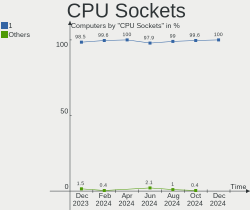

| Number | Computers | Percent |
|--------|-----------|---------|
| 1      | 230       | 99.14%  |
| 2      | 2         | 0.86%   |

CPU Threads
-----------

Threads per core (Hyper-Threading)

| Number | Computers | Percent |
|--------|-----------|---------|
| 2      | 163       | 70.26%  |
| 1      | 69        | 29.74%  |

CPU Op-Modes
------------

CPU Operation Modes (32-bit, 64-bit)

| Op mode        | Computers | Percent |
|----------------|-----------|---------|
| 32-bit, 64-bit | 230       | 99.14%  |
| 32-bit         | 1         | 0.43%   |
| Unknown        | 1         | 0.43%   |

CPU Microcode
-------------

Microcode number

| Number     | Computers | Percent |
|------------|-----------|---------|
| Unknown    | 63        | 27.16%  |
| 0x206a7    | 16        | 6.9%    |
| 0x306a9    | 13        | 5.6%    |
| 0x806e9    | 8         | 3.45%   |
| 0x306c3    | 8         | 3.45%   |
| 0x806c1    | 7         | 3.02%   |
| 0x1067a    | 7         | 3.02%   |
| 0x306d4    | 6         | 2.59%   |
| 0x20655    | 6         | 2.59%   |
| 0x08600103 | 6         | 2.59%   |
| 0xa0652    | 5         | 2.16%   |
| 0x906e9    | 5         | 2.16%   |
| 0x406c4    | 5         | 2.16%   |
| 0x40651    | 5         | 2.16%   |
| 0x706e5    | 4         | 1.72%   |
| 0x0a50000c | 4         | 1.72%   |
| 0x706a8    | 3         | 1.29%   |
| 0x406e3    | 3         | 1.29%   |
| 0x406c3    | 3         | 1.29%   |
| 0x306f2    | 3         | 1.29%   |
| 0x30678    | 3         | 1.29%   |
| 0x06000852 | 3         | 1.29%   |
| 0xa0653    | 2         | 0.86%   |
| 0x906ea    | 2         | 0.86%   |
| 0x806ea    | 2         | 0.86%   |
| 0x706a1    | 2         | 0.86%   |
| 0x6fd      | 2         | 0.86%   |
| 0x506c9    | 2         | 0.86%   |
| 0x20652    | 2         | 0.86%   |
| 0x0a20120a | 2         | 0.86%   |
| 0x08701013 | 2         | 0.86%   |
| 0x08108109 | 2         | 0.86%   |
| 0x08001138 | 2         | 0.86%   |
| 0xa0671    | 1         | 0.43%   |
| 0x906ed    | 1         | 0.43%   |
| 0x906eb    | 1         | 0.43%   |
| 0x806ec    | 1         | 0.43%   |
| 0x806eb    | 1         | 0.43%   |
| 0x6fa      | 1         | 0.43%   |
| 0x6f2      | 1         | 0.43%   |
| 0x506ca    | 1         | 0.43%   |
| 0x406f1    | 1         | 0.43%   |
| 0x30661    | 1         | 0.43%   |
| 0x206d7    | 1         | 0.43%   |
| 0x106ca    | 1         | 0.43%   |
| 0x106c2    | 1         | 0.43%   |
| 0x106a5    | 1         | 0.43%   |
| 0x0a50000b | 1         | 0.43%   |
| 0x0800820d | 1         | 0.43%   |
| 0x06006705 | 1         | 0.43%   |
| 0x0600611a | 1         | 0.43%   |
| 0x06001119 | 1         | 0.43%   |
| 0x06000822 | 1         | 0.43%   |
| 0x0600063e | 1         | 0.43%   |
| 0x05000119 | 1         | 0.43%   |
| 0x05000028 | 1         | 0.43%   |
| 0x010000b6 | 1         | 0.43%   |

CPU Microarch
-------------

Microarchitecture

| Name          | Computers | Percent |
|---------------|-----------|---------|
| KabyLake      | 33        | 14.22%  |
| Haswell       | 22        | 9.48%   |
| SandyBridge   | 21        | 9.05%   |
| IvyBridge     | 20        | 8.62%   |
| Silvermont    | 13        | 5.6%    |
| Westmere      | 12        | 5.17%   |
| CometLake     | 10        | 4.31%   |
| Zen 3         | 9         | 3.88%   |
| Zen 2         | 9         | 3.88%   |
| Penryn        | 9         | 3.88%   |
| Broadwell     | 9         | 3.88%   |
| TigerLake     | 8         | 3.45%   |
| Skylake       | 7         | 3.02%   |
| Zen+          | 6         | 2.59%   |
| Piledriver    | 6         | 2.59%   |
| Goldmont plus | 6         | 2.59%   |
| IceLake       | 5         | 2.16%   |
| Goldmont      | 5         | 2.16%   |
| Core          | 4         | 1.72%   |
| Nehalem       | 3         | 1.29%   |
| Bonnell       | 3         | 1.29%   |
| Zen           | 2         | 0.86%   |
| K8 Hammer     | 2         | 0.86%   |
| Excavator     | 2         | 0.86%   |
| Bobcat        | 2         | 0.86%   |
| Unknown       | 2         | 0.86%   |
| K10           | 1         | 0.43%   |
| Bulldozer     | 1         | 0.43%   |

Graphics
--------

GPU Vendor
----------

Vendors of graphics cards

| Vendor                     | Computers | Percent |
|----------------------------|-----------|---------|
| Intel                      | 158       | 56.43%  |
| Nvidia                     | 72        | 25.71%  |
| AMD                        | 48        | 17.14%  |
| Matrox Electronics Systems | 2         | 0.71%   |

GPU Model
---------

Graphics card models

| Model                                                                                    | Computers | Percent |
|------------------------------------------------------------------------------------------|-----------|---------|
| Intel 3rd Gen Core processor Graphics Controller                                         | 16        | 5.54%   |
| Intel 2nd Generation Core Processor Family Integrated Graphics Controller                | 16        | 5.54%   |
| Intel HD Graphics 620                                                                    | 11        | 3.81%   |
| Intel Core Processor Integrated Graphics Controller                                      | 10        | 3.46%   |
| Intel Atom/Celeron/Pentium Processor x5-E8000/J3xxx/N3xxx Integrated Graphics Controller | 10        | 3.46%   |
| Intel TigerLake-LP GT2 [Iris Xe Graphics]                                                | 8         | 2.77%   |
| Nvidia TU117M                                                                            | 7         | 2.42%   |
| Intel HD Graphics 5500                                                                   | 7         | 2.42%   |
| Intel Haswell-ULT Integrated Graphics Controller                                         | 7         | 2.42%   |
| Intel CometLake-H GT2 [UHD Graphics]                                                     | 7         | 2.42%   |
| AMD Renoir                                                                               | 7         | 2.42%   |
| Intel Skylake GT2 [HD Graphics 520]                                                      | 6         | 2.08%   |
| Intel GeminiLake [UHD Graphics 600]                                                      | 6         | 2.08%   |
| Intel HD Graphics 630                                                                    | 5         | 1.73%   |
| Intel HD Graphics 500                                                                    | 5         | 1.73%   |
| AMD Cezanne                                                                              | 5         | 1.73%   |
| Nvidia GK208M [GeForce GT 740M]                                                          | 4         | 1.38%   |
| Intel Xeon E3-1200 v3/4th Gen Core Processor Integrated Graphics Controller              | 4         | 1.38%   |
| Intel UHD Graphics 620                                                                   | 4         | 1.38%   |
| Intel Mobile 4 Series Chipset Integrated Graphics Controller                             | 4         | 1.38%   |
| Intel Iris Plus Graphics G1 (Ice Lake)                                                   | 4         | 1.38%   |
| AMD Picasso/Raven 2 [Radeon Vega Series / Radeon Vega Mobile Series]                     | 4         | 1.38%   |
| AMD Ellesmere [Radeon RX 470/480/570/570X/580/580X/590]                                  | 4         | 1.38%   |
| Nvidia TU117M [GeForce GTX 1650 Ti Mobile]                                               | 3         | 1.04%   |
| Nvidia TU117M [GeForce GTX 1650 Mobile / Max-Q]                                          | 3         | 1.04%   |
| Nvidia GM108M [GeForce MX110]                                                            | 3         | 1.04%   |
| Nvidia GM108M [GeForce 940MX]                                                            | 3         | 1.04%   |
| Nvidia GF108 [GeForce GT 730]                                                            | 3         | 1.04%   |
| Intel WhiskeyLake-U GT2 [UHD Graphics 620]                                               | 3         | 1.04%   |
| Intel Mobile GM965/GL960 Integrated Graphics Controller (secondary)                      | 3         | 1.04%   |
| Intel Mobile GM965/GL960 Integrated Graphics Controller (primary)                        | 3         | 1.04%   |
| Intel Atom Processor Z36xxx/Z37xxx Series Graphics & Display                             | 3         | 1.04%   |
| AMD RS780L [Radeon 3000]                                                                 | 3         | 1.04%   |
| AMD Cedar [Radeon HD 5000/6000/7350/8350 Series]                                         | 3         | 1.04%   |
| Nvidia GP108M [GeForce MX150]                                                            | 2         | 0.69%   |
| Nvidia GP107M [GeForce GTX 1050 Ti Mobile]                                               | 2         | 0.69%   |
| Nvidia GP107 [GeForce GTX 1050 Ti]                                                       | 2         | 0.69%   |
| Nvidia GP106M [GeForce GTX 1060 Mobile]                                                  | 2         | 0.69%   |
| Nvidia GP104 [GeForce GTX 1070]                                                          | 2         | 0.69%   |
| Nvidia G92 [GeForce 9800 GT]                                                             | 2         | 0.69%   |
| Intel CometLake-S GT2 [UHD Graphics 630]                                                 | 2         | 0.69%   |
| Intel CoffeeLake-H GT2 [UHD Graphics 630]                                                | 2         | 0.69%   |
| AMD Sun XT [Radeon HD 8670A/8670M/8690M / R5 M330 / M430 / Radeon 520 Mobile]            | 2         | 0.69%   |
| AMD Navi 14 [Radeon RX 5500/5500M / Pro 5500M]                                           | 2         | 0.69%   |
| AMD Lexa PRO [Radeon 540/540X/550/550X / RX 540X/550/550X]                               | 2         | 0.69%   |
| AMD Chelsea LP [Radeon HD 7730M]                                                         | 2         | 0.69%   |
| Nvidia TU117M [GeForce MX450]                                                            | 1         | 0.35%   |
| Nvidia TU106M [GeForce RTX 2070 Mobile / Max-Q Refresh]                                  | 1         | 0.35%   |
| Nvidia TU106 [GeForce RTX 2060 Rev. A]                                                   | 1         | 0.35%   |
| Nvidia GT218M [GeForce 310M]                                                             | 1         | 0.35%   |
| Nvidia GT218 [GeForce 210]                                                               | 1         | 0.35%   |
| Nvidia GT216 [GeForce GT 220]                                                            | 1         | 0.35%   |
| Nvidia GP107M [GeForce GTX 1050 3 GB Max-Q]                                              | 1         | 0.35%   |
| Nvidia GP107GL [Quadro P1000]                                                            | 1         | 0.35%   |
| Nvidia GP107 [GeForce GTX 1050]                                                          | 1         | 0.35%   |
| Nvidia GP106 [GeForce GTX 1060 3GB]                                                      | 1         | 0.35%   |
| Nvidia GM206 [GeForce GTX 960]                                                           | 1         | 0.35%   |
| Nvidia GM206 [GeForce GTX 950]                                                           | 1         | 0.35%   |
| Nvidia GM204M [GeForce GTX 970M]                                                         | 1         | 0.35%   |
| Nvidia GM204GL [Quadro M5000]                                                            | 1         | 0.35%   |

GPU Combo
---------

Combinations of graphics cards

| Name           | Computers | Percent |
|----------------|-----------|---------|
| 1 x Intel      | 116       | 50%     |
| Intel + Nvidia | 35        | 15.09%  |
| 1 x AMD        | 31        | 13.36%  |
| 1 x Nvidia     | 30        | 12.93%  |
| Intel + AMD    | 6         | 2.59%   |
| AMD + Nvidia   | 6         | 2.59%   |
| 2 x AMD        | 5         | 2.16%   |
| 1 x Matrox     | 2         | 0.86%   |
| Other          | 1         | 0.43%   |

GPU Driver
----------

Free vs proprietary

| Driver      | Computers | Percent |
|-------------|-----------|---------|
| Free        | 187       | 80.6%   |
| Proprietary | 37        | 15.95%  |
| Unknown     | 8         | 3.45%   |

GPU Memory
----------

Total video memory

| Size in GB | Computers | Percent |
|------------|-----------|---------|
| Unknown    | 159       | 68.53%  |
| 1.01-2.0   | 22        | 9.48%   |
| 0.01-0.5   | 16        | 6.9%    |
| 3.01-4.0   | 12        | 5.17%   |
| 0.51-1.0   | 11        | 4.74%   |
| 7.01-8.0   | 6         | 2.59%   |
| 5.01-6.0   | 3         | 1.29%   |
| 2.01-3.0   | 2         | 0.86%   |
| 8.01-16.0  | 1         | 0.43%   |

Monitor
-------

Monitor Vendor
--------------

Monitor vendors

| Vendor                  | Computers | Percent |
|-------------------------|-----------|---------|
| Goldstar                | 37        | 14.4%   |
| AU Optronics            | 32        | 12.45%  |
| Chimei Innolux          | 30        | 11.67%  |
| BOE                     | 27        | 10.51%  |
| Samsung Electronics     | 25        | 9.73%   |
| LG Display              | 25        | 9.73%   |
| Dell                    | 16        | 6.23%   |
| AOC                     | 14        | 5.45%   |
| Philips                 | 7         | 2.72%   |
| PANDA                   | 7         | 2.72%   |
| Hewlett-Packard         | 4         | 1.56%   |
| Chi Mei Optoelectronics | 3         | 1.17%   |
| Acer                    | 3         | 1.17%   |
| STA                     | 2         | 0.78%   |
| LG Electronics          | 2         | 0.78%   |
| Lenovo                  | 2         | 0.78%   |
| InfoVision              | 2         | 0.78%   |
| HannStar                | 2         | 0.78%   |
| CPT                     | 2         | 0.78%   |
| Unknown (XXX)           | 1         | 0.39%   |
| Unknown                 | 1         | 0.39%   |
| TRU                     | 1         | 0.39%   |
| Sony                    | 1         | 0.39%   |
| SKY                     | 1         | 0.39%   |
| RTK                     | 1         | 0.39%   |
| Panasonic               | 1         | 0.39%   |
| GJX                     | 1         | 0.39%   |
| Gigabyte Technology     | 1         | 0.39%   |
| GDH                     | 1         | 0.39%   |
| FOX                     | 1         | 0.39%   |
| Envision                | 1         | 0.39%   |
| BenQ                    | 1         | 0.39%   |
| ASUSTek Computer        | 1         | 0.39%   |
| Apple                   | 1         | 0.39%   |

Monitor Model
-------------

Monitor models

| Model                                                                | Computers | Percent |
|----------------------------------------------------------------------|-----------|---------|
| PANDA LCD Monitor NCP004D 1920x1080 344x194mm 15.5-inch              | 6         | 2.26%   |
| Goldstar ULTRAWIDE GSM59F1 2560x1080 673x284mm 28.8-inch             | 4         | 1.51%   |
| LG Display LCD Monitor LGD04EB 1920x1080 344x194mm 15.5-inch         | 3         | 1.13%   |
| Hewlett-Packard LA1905 HWP2845 1440x900 408x255mm 18.9-inch          | 3         | 1.13%   |
| Dell P2219H DELA115 1920x1080 476x267mm 21.5-inch                    | 3         | 1.13%   |
| Chimei Innolux LCD Monitor CMN1470 1366x768 309x174mm 14.0-inch      | 3         | 1.13%   |
| AU Optronics LCD Monitor AUO2E3C 1366x768 309x173mm 13.9-inch        | 3         | 1.13%   |
| AU Optronics LCD Monitor AUO233C 1366x768 309x173mm 13.9-inch        | 3         | 1.13%   |
| AU Optronics LCD Monitor AUO183C 1366x768 310x170mm 13.9-inch        | 3         | 1.13%   |
| AOC 1970W AOC1970 1366x768 410x230mm 18.5-inch                       | 3         | 1.13%   |
| STA SEMP LEDTV STA0030 1920x540 708x398mm 32.0-inch                  | 2         | 0.75%   |
| Samsung Electronics LCD Monitor SEC5441 1366x768 344x194mm 15.5-inch | 2         | 0.75%   |
| Samsung Electronics LCD Monitor SEC3050 1366x768 309x174mm 14.0-inch | 2         | 0.75%   |
| LG Display LCD Monitor LGD05E5 1920x1080 340x190mm 15.3-inch         | 2         | 0.75%   |
| LG Display LCD Monitor LGD0456 1366x768 344x194mm 15.5-inch          | 2         | 0.75%   |
| LG Display LCD Monitor LGD02DC 1366x768 344x194mm 15.5-inch          | 2         | 0.75%   |
| HannStar HSD140PHW1 HSD0583 1366x768 309x174mm 14.0-inch             | 2         | 0.75%   |
| Goldstar W2353 GSM56F0 1920x1080 510x290mm 23.1-inch                 | 2         | 0.75%   |
| Goldstar W2043 GSM4E9D 1600x900 450x250mm 20.3-inch                  | 2         | 0.75%   |
| Goldstar ULTRAWIDE GSM76F9 2560x1080 531x298mm 24.0-inch             | 2         | 0.75%   |
| Goldstar LS1920wG GSM4BF0 1366x768 410x230mm 18.5-inch               | 2         | 0.75%   |
| Goldstar FULL HD GSM5B55 1920x1080 480x270mm 21.7-inch               | 2         | 0.75%   |
| Dell P2719H DEL4185 1920x1080 598x336mm 27.0-inch                    | 2         | 0.75%   |
| Dell P2719H DEL4184 1920x1080 598x336mm 27.0-inch                    | 2         | 0.75%   |
| CPT LCD Monitor CPT1415 1280x800 331x207mm 15.4-inch                 | 2         | 0.75%   |
| Chimei Innolux LCD Monitor CMN15E2 1920x1080 344x193mm 15.5-inch     | 2         | 0.75%   |
| Chimei Innolux LCD Monitor CMN15DC 1366x768 340x190mm 15.3-inch      | 2         | 0.75%   |
| Chimei Innolux LCD Monitor CMN15CA 1366x768 344x193mm 15.5-inch      | 2         | 0.75%   |
| Chimei Innolux LCD Monitor CMN15B6 1366x768 344x194mm 15.5-inch      | 2         | 0.75%   |
| Chimei Innolux LCD Monitor CMN14C4 1366x768 309x173mm 13.9-inch      | 2         | 0.75%   |
| Chimei Innolux LCD Monitor CMN1472 1366x768 309x174mm 14.0-inch      | 2         | 0.75%   |
| BOE LCD Monitor BOE07AA 1366x768 344x194mm 15.5-inch                 | 2         | 0.75%   |
| BOE LCD Monitor BOE0757 1366x768 344x194mm 15.5-inch                 | 2         | 0.75%   |
| AU Optronics LCD Monitor AUO71EC 1366x768 344x193mm 15.5-inch        | 2         | 0.75%   |
| AU Optronics LCD Monitor AUO61ED 1920x1080 344x194mm 15.5-inch       | 2         | 0.75%   |
| AU Optronics LCD Monitor AUO44EC 1366x768 344x193mm 15.5-inch        | 2         | 0.75%   |
| AU Optronics LCD Monitor AUO21ED 1920x1080 344x193mm 15.5-inch       | 2         | 0.75%   |
| AOC 22B1W AOC2201 1920x1080 476x268mm 21.5-inch                      | 2         | 0.75%   |
| Unknown LCD Monitor FFFF 2288x1287 2550x2550mm 142.0-inch            | 1         | 0.38%   |
| Unknown (XXX) Beyond TV XXX2851 3840x2160 1209x680mm 54.6-inch       | 1         | 0.38%   |
| TRU LCD Monitor TRU235C 1366x768 256x144mm 11.6-inch                 | 1         | 0.38%   |
| Sony TV SNYDC01 1360x768                                             | 1         | 0.38%   |
| SKY TV-PHILCO SKY0104 1920x1080 885x498mm 40.0-inch                  | 1         | 0.38%   |
| Samsung Electronics U32J59x SAM0F34 3840x2160 697x392mm 31.5-inch    | 1         | 0.38%   |
| Samsung Electronics U28D590 SAM0B80 3840x2160 607x345mm 27.5-inch    | 1         | 0.38%   |
| Samsung Electronics T27B350 SAM0943 1920x1080 598x336mm 27.0-inch    | 1         | 0.38%   |
| Samsung Electronics T24B350 SAM093E 1920x1080 531x299mm 24.0-inch    | 1         | 0.38%   |
| Samsung Electronics SyncMaster SAM0322 1440x900 428x255mm 19.6-inch  | 1         | 0.38%   |
| Samsung Electronics SMB2030N SAM0634 1600x900 443x249mm 20.0-inch    | 1         | 0.38%   |
| Samsung Electronics SMB1940W SAM0695 1440x900 408x255mm 18.9-inch    | 1         | 0.38%   |
| Samsung Electronics SA300/SA350 SAM0788 1366x768 410x230mm 18.5-inch | 1         | 0.38%   |
| Samsung Electronics S23C550 SAM0A42 1920x1080 510x287mm 23.0-inch    | 1         | 0.38%   |
| Samsung Electronics S20C300 SAM0A19 1600x900 432x240mm 19.5-inch     | 1         | 0.38%   |
| Samsung Electronics S20C300 SAM0A18 1600x900 432x240mm 19.5-inch     | 1         | 0.38%   |
| Samsung Electronics LCD Monitor SyncMaster 3040x900                  | 1         | 0.38%   |
| Samsung Electronics LCD Monitor SyncMaster                           | 1         | 0.38%   |
| Samsung Electronics LCD Monitor SEC4542 1366x768 309x174mm 14.0-inch | 1         | 0.38%   |
| Samsung Electronics LCD Monitor SEC4449 1366x768 309x174mm 14.0-inch | 1         | 0.38%   |
| Samsung Electronics LCD Monitor SEC3741 1366x768 309x174mm 14.0-inch | 1         | 0.38%   |
| Samsung Electronics LCD Monitor SEC345A 1366x768 309x174mm 14.0-inch | 1         | 0.38%   |

Monitor Resolution
------------------

Monitor screen resolution

| Resolution       | Computers | Percent |
|------------------|-----------|---------|
| 1366x768 (WXGA)  | 100       | 40.16%  |
| 1920x1080 (FHD)  | 88        | 35.34%  |
| 1440x900 (WXGA+) | 10        | 4.02%   |
| 3840x2160 (4K)   | 9         | 3.61%   |
| 2560x1080        | 9         | 3.61%   |
| 1600x900 (HD+)   | 9         | 3.61%   |
| 1280x800 (WXGA)  | 5         | 2.01%   |
| 1024x768 (XGA)   | 3         | 1.2%    |
| 2288x1287        | 2         | 0.8%    |
| 1920x540         | 2         | 0.8%    |
| 1360x768         | 2         | 0.8%    |
| 1280x1024 (SXGA) | 2         | 0.8%    |
| Unknown          | 2         | 0.8%    |
| 3840x1080        | 1         | 0.4%    |
| 3440x1440        | 1         | 0.4%    |
| 3040x900         | 1         | 0.4%    |
| 2560x1600        | 1         | 0.4%    |
| 2560x1440 (QHD)  | 1         | 0.4%    |
| 1024x600         | 1         | 0.4%    |

Monitor Diagonal
----------------

Diagonal size in inches

| Inches  | Computers | Percent |
|---------|-----------|---------|
| 15      | 79        | 30.74%  |
| 14      | 33        | 12.84%  |
| 13      | 28        | 10.89%  |
| 21      | 19        | 7.39%   |
| 23      | 18        | 7%      |
| 27      | 12        | 4.67%   |
| 18      | 11        | 4.28%   |
| 34      | 9         | 3.5%    |
| 19      | 9         | 3.5%    |
| 24      | 5         | 1.95%   |
| 20      | 5         | 1.95%   |
| 17      | 5         | 1.95%   |
| Unknown | 4         | 1.56%   |
| 84      | 2         | 0.78%   |
| 72      | 2         | 0.78%   |
| 54      | 2         | 0.78%   |
| 40      | 2         | 0.78%   |
| 37      | 2         | 0.78%   |
| 11      | 2         | 0.78%   |
| 142     | 1         | 0.39%   |
| 65      | 1         | 0.39%   |
| 52      | 1         | 0.39%   |
| 46      | 1         | 0.39%   |
| 31      | 1         | 0.39%   |
| 28      | 1         | 0.39%   |
| 26      | 1         | 0.39%   |
| 10      | 1         | 0.39%   |

Monitor Width
-------------

Physical width

| Width in mm    | Computers | Percent |
|----------------|-----------|---------|
| 301-350        | 135       | 52.73%  |
| 401-500        | 41        | 16.02%  |
| 501-600        | 35        | 13.67%  |
| 701-800        | 9         | 3.52%   |
| 351-400        | 8         | 3.13%   |
| 201-300        | 7         | 2.73%   |
| 1001-1500      | 5         | 1.95%   |
| 801-900        | 4         | 1.56%   |
| 1501-2000      | 4         | 1.56%   |
| Unknown        | 4         | 1.56%   |
| 601-700        | 3         | 1.17%   |
| More than 2000 | 1         | 0.39%   |

Aspect Ratio
------------

Proportional relationship between the width and the height

| Ratio   | Computers | Percent |
|---------|-----------|---------|
| 16/9    | 195       | 84.78%  |
| 16/10   | 16        | 6.96%   |
| 21/9    | 10        | 4.35%   |
| Unknown | 4         | 1.74%   |
| 5/4     | 3         | 1.3%    |
| 4/3     | 1         | 0.43%   |
| 1.00    | 1         | 0.43%   |

Monitor Area
------------

Area in inch²

| Area in inch² | Computers | Percent |
|----------------|-----------|---------|
| 101-110        | 79        | 30.86%  |
| 81-90          | 56        | 21.88%  |
| 201-250        | 36        | 14.06%  |
| 151-200        | 22        | 8.59%   |
| 301-350        | 12        | 4.69%   |
| 351-500        | 10        | 3.91%   |
| More than 1000 | 9         | 3.52%   |
| 141-150        | 9         | 3.52%   |
| 501-1000       | 5         | 1.95%   |
| Unknown        | 4         | 1.56%   |
| 71-80          | 3         | 1.17%   |
| 51-60          | 2         | 0.78%   |
| 251-300        | 2         | 0.78%   |
| 131-140        | 2         | 0.78%   |
| 121-130        | 2         | 0.78%   |
| 91-100         | 2         | 0.78%   |
| 41-50          | 1         | 0.39%   |

Pixel Density
-------------

Pixels per inch

| Density | Computers | Percent |
|---------|-----------|---------|
| 101-120 | 108       | 42.86%  |
| 51-100  | 82        | 32.54%  |
| 121-160 | 48        | 19.05%  |
| 1-50    | 7         | 2.78%   |
| Unknown | 4         | 1.59%   |
| 161-240 | 3         | 1.19%   |

Multiple Monitors
-----------------

Total monitors connected

| Total | Computers | Percent |
|-------|-----------|---------|
| 1     | 177       | 76.29%  |
| 2     | 45        | 19.4%   |
| 0     | 7         | 3.02%   |
| 3     | 3         | 1.29%   |

Network
-------

Net Controller Vendor
---------------------

Controller vendors

| Vendor                          | Computers | Percent |
|---------------------------------|-----------|---------|
| Realtek Semiconductor           | 169       | 45.07%  |
| Qualcomm Atheros                | 69        | 18.4%   |
| Intel                           | 68        | 18.13%  |
| Broadcom                        | 17        | 4.53%   |
| Ralink Technology               | 8         | 2.13%   |
| TP-Link                         | 5         | 1.33%   |
| Marvell Technology Group        | 5         | 1.33%   |
| Broadcom Limited                | 5         | 1.33%   |
| Nvidia                          | 3         | 0.8%    |
| JMicron Technology              | 3         | 0.8%    |
| Xiaomi                          | 2         | 0.53%   |
| Samsung Electronics             | 2         | 0.53%   |
| Ralink                          | 2         | 0.53%   |
| Qualcomm Atheros Communications | 2         | 0.53%   |
| Motorola PCS                    | 2         | 0.53%   |
| MediaTek                        | 2         | 0.53%   |
| Encore Electronics              | 2         | 0.53%   |
| Qualcomm                        | 1         | 0.27%   |
| Microsoft                       | 1         | 0.27%   |
| Microchip Technology            | 1         | 0.27%   |
| Lakeview Research               | 1         | 0.27%   |
| Edimax Technology               | 1         | 0.27%   |
| D-Link System                   | 1         | 0.27%   |
| D-Link                          | 1         | 0.27%   |
| ASUSTek Computer                | 1         | 0.27%   |
| ASIX Electronics                | 1         | 0.27%   |

Net Controller Model
--------------------

Controller models

| Model                                                             | Computers | Percent |
|-------------------------------------------------------------------|-----------|---------|
| Realtek RTL8111/8168/8411 PCI Express Gigabit Ethernet Controller | 95        | 23.57%  |
| Realtek RTL810xE PCI Express Fast Ethernet controller             | 36        | 8.93%   |
| Qualcomm Atheros QCA9565 / AR9565 Wireless Network Adapter        | 17        | 4.22%   |
| Qualcomm Atheros AR9485 Wireless Network Adapter                  | 15        | 3.72%   |
| Qualcomm Atheros QCA9377 802.11ac Wireless Network Adapter        | 12        | 2.98%   |
| Realtek Killer E2600 Gigabit Ethernet Controller                  | 9         | 2.23%   |
| Intel Wi-Fi 6 AX200                                               | 8         | 1.99%   |
| Qualcomm Atheros QCA6174 802.11ac Wireless Network Adapter        | 7         | 1.74%   |
| Intel Wi-Fi 6 AX201                                               | 7         | 1.74%   |
| Intel Comet Lake PCH CNVi WiFi                                    | 7         | 1.74%   |
| Realtek RTL8723BU 802.11b/g/n WLAN Adapter                        | 5         | 1.24%   |
| Ralink MT7601U Wireless Adapter                                   | 5         | 1.24%   |
| Qualcomm Atheros AR8151 v2.0 Gigabit Ethernet                     | 5         | 1.24%   |
| Intel Wireless 7265                                               | 5         | 1.24%   |
| Realtek RTL8188CE 802.11b/g/n WiFi Adapter                        | 4         | 0.99%   |
| Qualcomm Atheros AR9285 Wireless Network Adapter (PCI-Express)    | 4         | 0.99%   |
| Marvell Group 88E8040 PCI-E Fast Ethernet Controller              | 4         | 0.99%   |
| Intel Wireless 7260                                               | 4         | 0.99%   |
| Broadcom BCM4312 802.11b/g LP-PHY                                 | 4         | 0.99%   |
| Realtek RTL8821CE 802.11ac PCIe Wireless Network Adapter          | 3         | 0.74%   |
| Realtek RTL8723BE PCIe Wireless Network Adapter                   | 3         | 0.74%   |
| Realtek RTL8152 Fast Ethernet Adapter                             | 3         | 0.74%   |
| Realtek RTL8125 2.5GbE Controller                                 | 3         | 0.74%   |
| Realtek 802.11ac NIC                                              | 3         | 0.74%   |
| Qualcomm Atheros AR8152 v2.0 Fast Ethernet                        | 3         | 0.74%   |
| Qualcomm Atheros AR8131 Gigabit Ethernet                          | 3         | 0.74%   |
| Intel Wireless 8265 / 8275                                        | 3         | 0.74%   |
| Intel Ice Lake-LP PCH CNVi WiFi                                   | 3         | 0.74%   |
| Intel Ethernet Connection I217-LM                                 | 3         | 0.74%   |
| Intel Dual Band Wireless-AC 3165 Plus Bluetooth                   | 3         | 0.74%   |
| Broadcom NetLink BCM57785 Gigabit Ethernet PCIe                   | 3         | 0.74%   |
| Broadcom BCM4313 802.11bgn Wireless Network Adapter               | 3         | 0.74%   |
| Xiaomi Mi/Redmi series (RNDIS)                                    | 2         | 0.5%    |
| TP-Link TL-WN821N v5/v6 [RTL8192EU]                               | 2         | 0.5%    |
| Samsung GT-I9070 (network tethering, USB debugging enabled)       | 2         | 0.5%    |
| Realtek RTL88x2bu [AC1200 Techkey]                                | 2         | 0.5%    |
| Realtek RTL8191SEvB Wireless LAN Controller                       | 2         | 0.5%    |
| Realtek RTL8188EUS 802.11n Wireless Network Adapter               | 2         | 0.5%    |
| Realtek RTL8187B Wireless 802.11g 54Mbps Network Adapter          | 2         | 0.5%    |
| Realtek RTL8153 Gigabit Ethernet Adapter                          | 2         | 0.5%    |
| Realtek 802.11n WLAN Adapter                                      | 2         | 0.5%    |
| Ralink RT5370 Wireless Adapter                                    | 2         | 0.5%    |
| Qualcomm Atheros AR928X Wireless Network Adapter (PCI-Express)    | 2         | 0.5%    |
| Qualcomm Atheros AR8162 Fast Ethernet                             | 2         | 0.5%    |
| Motorola PCS Moto G (5S) Plus                                     | 2         | 0.5%    |
| JMicron JMC250 PCI Express Gigabit Ethernet Controller            | 2         | 0.5%    |
| Intel Ethernet Controller I225-V                                  | 2         | 0.5%    |
| Intel Centrino Advanced-N 6235                                    | 2         | 0.5%    |
| Intel Cannon Point-LP CNVi [Wireless-AC]                          | 2         | 0.5%    |
| Intel 82579LM Gigabit Network Connection (Lewisville)             | 2         | 0.5%    |
| Broadcom Limited BCM4312 802.11b/g LP-PHY                         | 2         | 0.5%    |
| Broadcom BCM4322 802.11a/b/g/n Wireless LAN Controller            | 2         | 0.5%    |
| TP-Link UE300 10/100/1000 LAN (ethernet mode) [Realtek RTL8153]   | 1         | 0.25%   |
| TP-Link TL-WN823N v2/v3 [Realtek RTL8192EU]                       | 1         | 0.25%   |
| TP-Link AC600 wireless Realtek RTL8811AU [Archer T2U Nano]        | 1         | 0.25%   |
| Realtek RTL8192EU 802.11b/g/n WLAN Adapter                        | 1         | 0.25%   |
| Realtek RTL8192EE PCIe Wireless Network Adapter                   | 1         | 0.25%   |
| Realtek RTL8191SEvA Wireless LAN Controller                       | 1         | 0.25%   |
| Realtek RTL8188SU 802.11n WLAN Adapter                            | 1         | 0.25%   |
| Realtek RTL8188GU 802.11n WLAN Adapter (After Modeswitch)         | 1         | 0.25%   |

Wireless Vendor
---------------

Wireless vendors

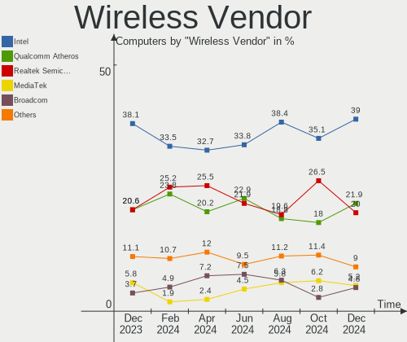

| Vendor                          | Computers | Percent |
|---------------------------------|-----------|---------|
| Qualcomm Atheros                | 60        | 32.61%  |
| Intel                           | 53        | 28.8%   |
| Realtek Semiconductor           | 36        | 19.57%  |
| Broadcom                        | 9         | 4.89%   |
| Ralink Technology               | 8         | 4.35%   |
| TP-Link                         | 4         | 2.17%   |
| Ralink                          | 2         | 1.09%   |
| Qualcomm Atheros Communications | 2         | 1.09%   |
| MediaTek                        | 2         | 1.09%   |
| Encore Electronics              | 2         | 1.09%   |
| Broadcom Limited                | 2         | 1.09%   |
| Microsoft                       | 1         | 0.54%   |
| Edimax Technology               | 1         | 0.54%   |
| D-Link System                   | 1         | 0.54%   |
| D-Link                          | 1         | 0.54%   |

Wireless Model
--------------

Wireless models

| Model                                                          | Computers | Percent |
|----------------------------------------------------------------|-----------|---------|
| Qualcomm Atheros QCA9565 / AR9565 Wireless Network Adapter     | 17        | 9.19%   |
| Qualcomm Atheros AR9485 Wireless Network Adapter               | 15        | 8.11%   |
| Qualcomm Atheros QCA9377 802.11ac Wireless Network Adapter     | 12        | 6.49%   |
| Intel Wi-Fi 6 AX200                                            | 8         | 4.32%   |
| Qualcomm Atheros QCA6174 802.11ac Wireless Network Adapter     | 7         | 3.78%   |
| Intel Wi-Fi 6 AX201                                            | 7         | 3.78%   |
| Intel Comet Lake PCH CNVi WiFi                                 | 7         | 3.78%   |
| Realtek RTL8723BU 802.11b/g/n WLAN Adapter                     | 5         | 2.7%    |
| Ralink MT7601U Wireless Adapter                                | 5         | 2.7%    |
| Intel Wireless 7265                                            | 5         | 2.7%    |
| Realtek RTL8188CE 802.11b/g/n WiFi Adapter                     | 4         | 2.16%   |
| Qualcomm Atheros AR9285 Wireless Network Adapter (PCI-Express) | 4         | 2.16%   |
| Intel Wireless 7260                                            | 4         | 2.16%   |
| Broadcom BCM4312 802.11b/g LP-PHY                              | 4         | 2.16%   |
| Realtek RTL8821CE 802.11ac PCIe Wireless Network Adapter       | 3         | 1.62%   |
| Realtek RTL8723BE PCIe Wireless Network Adapter                | 3         | 1.62%   |
| Realtek 802.11ac NIC                                           | 3         | 1.62%   |
| Intel Wireless 8265 / 8275                                     | 3         | 1.62%   |
| Intel Ice Lake-LP PCH CNVi WiFi                                | 3         | 1.62%   |
| Intel Dual Band Wireless-AC 3165 Plus Bluetooth                | 3         | 1.62%   |
| Broadcom BCM4313 802.11bgn Wireless Network Adapter            | 3         | 1.62%   |
| TP-Link TL-WN821N v5/v6 [RTL8192EU]                            | 2         | 1.08%   |
| Realtek RTL88x2bu [AC1200 Techkey]                             | 2         | 1.08%   |
| Realtek RTL8191SEvB Wireless LAN Controller                    | 2         | 1.08%   |
| Realtek RTL8188EUS 802.11n Wireless Network Adapter            | 2         | 1.08%   |
| Realtek RTL8187B Wireless 802.11g 54Mbps Network Adapter       | 2         | 1.08%   |
| Realtek 802.11n WLAN Adapter                                   | 2         | 1.08%   |
| Ralink RT5370 Wireless Adapter                                 | 2         | 1.08%   |
| Qualcomm Atheros AR928X Wireless Network Adapter (PCI-Express) | 2         | 1.08%   |
| Intel Centrino Advanced-N 6235                                 | 2         | 1.08%   |
| Intel Cannon Point-LP CNVi [Wireless-AC]                       | 2         | 1.08%   |
| Broadcom Limited BCM4312 802.11b/g LP-PHY                      | 2         | 1.08%   |
| Broadcom BCM4322 802.11a/b/g/n Wireless LAN Controller         | 2         | 1.08%   |
| TP-Link TL-WN823N v2/v3 [Realtek RTL8192EU]                    | 1         | 0.54%   |
| TP-Link AC600 wireless Realtek RTL8811AU [Archer T2U Nano]     | 1         | 0.54%   |
| Realtek RTL8192EU 802.11b/g/n WLAN Adapter                     | 1         | 0.54%   |
| Realtek RTL8192EE PCIe Wireless Network Adapter                | 1         | 0.54%   |
| Realtek RTL8191SEvA Wireless LAN Controller                    | 1         | 0.54%   |
| Realtek RTL8188SU 802.11n WLAN Adapter                         | 1         | 0.54%   |
| Realtek RTL8188GU 802.11n WLAN Adapter (After Modeswitch)      | 1         | 0.54%   |
| Realtek RTL8188FTV 802.11b/g/n 1T1R 2.4G WLAN Adapter          | 1         | 0.54%   |
| Realtek RTL8188ETV Wireless LAN 802.11n Network Adapter        | 1         | 0.54%   |
| Realtek RTL8188EE Wireless Network Adapter                     | 1         | 0.54%   |
| Realtek RTL8188CUS 802.11n WLAN Adapter                        | 1         | 0.54%   |
| Ralink RT2870/RT3070 Wireless Adapter                          | 1         | 0.54%   |
| Ralink RT2760 Wireless 802.11n 1T/2R                           | 1         | 0.54%   |
| Ralink RT2561/RT61 rev B 802.11g                               | 1         | 0.54%   |
| Qualcomm Atheros AR9271 802.11n                                | 1         | 0.54%   |
| Qualcomm Atheros AR5523                                        | 1         | 0.54%   |
| Qualcomm Atheros AR9462 Wireless Network Adapter               | 1         | 0.54%   |
| Qualcomm Atheros AR93xx Wireless Network Adapter               | 1         | 0.54%   |
| Qualcomm Atheros AR9227 Wireless Network Adapter               | 1         | 0.54%   |
| Microsoft Xbox 360 Wireless Adapter                            | 1         | 0.54%   |
| MediaTek MT7921 802.11ax PCI Express Wireless Network Adapter  | 1         | 0.54%   |
| MediaTek MT7612U 802.11a/b/g/n/ac Wireless Adapter             | 1         | 0.54%   |
| Intel Wireless-AC 9260                                         | 1         | 0.54%   |
| Intel Wireless 8260                                            | 1         | 0.54%   |
| Intel Wireless 3165                                            | 1         | 0.54%   |
| Intel WiFi Link 5100                                           | 1         | 0.54%   |
| Intel Wi-Fi 6 AX210/AX211/AX411 160MHz                         | 1         | 0.54%   |

Ethernet Vendor
---------------

Ethernet vendors

| Vendor                   | Computers | Percent |
|--------------------------|-----------|---------|
| Realtek Semiconductor    | 146       | 70.19%  |
| Intel                    | 16        | 7.69%   |
| Qualcomm Atheros         | 15        | 7.21%   |
| Broadcom                 | 9         | 4.33%   |
| Marvell Technology Group | 5         | 2.4%    |
| Nvidia                   | 3         | 1.44%   |
| JMicron Technology       | 3         | 1.44%   |
| Broadcom Limited         | 3         | 1.44%   |
| Xiaomi                   | 2         | 0.96%   |
| Samsung Electronics      | 2         | 0.96%   |
| TP-Link                  | 1         | 0.48%   |
| Microchip Technology     | 1         | 0.48%   |
| ASUSTek Computer         | 1         | 0.48%   |
| ASIX Electronics         | 1         | 0.48%   |

Ethernet Model
--------------

Ethernet models

| Model                                                             | Computers | Percent |
|-------------------------------------------------------------------|-----------|---------|
| Realtek RTL8111/8168/8411 PCI Express Gigabit Ethernet Controller | 95        | 44.6%   |
| Realtek RTL810xE PCI Express Fast Ethernet controller             | 36        | 16.9%   |
| Realtek Killer E2600 Gigabit Ethernet Controller                  | 9         | 4.23%   |
| Qualcomm Atheros AR8151 v2.0 Gigabit Ethernet                     | 5         | 2.35%   |
| Marvell Group 88E8040 PCI-E Fast Ethernet Controller              | 4         | 1.88%   |
| Realtek RTL8152 Fast Ethernet Adapter                             | 3         | 1.41%   |
| Realtek RTL8125 2.5GbE Controller                                 | 3         | 1.41%   |
| Qualcomm Atheros AR8152 v2.0 Fast Ethernet                        | 3         | 1.41%   |
| Qualcomm Atheros AR8131 Gigabit Ethernet                          | 3         | 1.41%   |
| Intel Ethernet Connection I217-LM                                 | 3         | 1.41%   |
| Broadcom NetLink BCM57785 Gigabit Ethernet PCIe                   | 3         | 1.41%   |
| Xiaomi Mi/Redmi series (RNDIS)                                    | 2         | 0.94%   |
| Samsung GT-I9070 (network tethering, USB debugging enabled)       | 2         | 0.94%   |
| Realtek RTL8153 Gigabit Ethernet Adapter                          | 2         | 0.94%   |
| Qualcomm Atheros AR8162 Fast Ethernet                             | 2         | 0.94%   |
| JMicron JMC250 PCI Express Gigabit Ethernet Controller            | 2         | 0.94%   |
| Intel Ethernet Controller I225-V                                  | 2         | 0.94%   |
| Intel 82579LM Gigabit Network Connection (Lewisville)             | 2         | 0.94%   |
| TP-Link UE300 10/100/1000 LAN (ethernet mode) [Realtek RTL8153]   | 1         | 0.47%   |
| Realtek RTL-8100/8101L/8139 PCI Fast Ethernet Adapter             | 1         | 0.47%   |
| Qualcomm Atheros Killer E2400 Gigabit Ethernet Controller         | 1         | 0.47%   |
| Qualcomm Atheros AR8161 Gigabit Ethernet                          | 1         | 0.47%   |
| Nvidia MCP79 Ethernet                                             | 1         | 0.47%   |
| Nvidia MCP61 Ethernet                                             | 1         | 0.47%   |
| Nvidia MCP51 Ethernet Controller                                  | 1         | 0.47%   |
| Microchip SMSC9512/9514 Fast Ethernet Adapter                     | 1         | 0.47%   |
| Marvell Group 88E8055 PCI-E Gigabit Ethernet Controller           | 1         | 0.47%   |
| JMicron JMC260 PCI Express Fast Ethernet Controller               | 1         | 0.47%   |
| Intel I350 Gigabit Network Connection                             | 1         | 0.47%   |
| Intel I211 Gigabit Network Connection                             | 1         | 0.47%   |
| Intel I210 Gigabit Network Connection                             | 1         | 0.47%   |
| Intel Ethernet Connection I217-V                                  | 1         | 0.47%   |
| Intel Ethernet Connection (7) I219-V                              | 1         | 0.47%   |
| Intel Ethernet Connection (7) I219-LM                             | 1         | 0.47%   |
| Intel Ethernet Connection (2) I219-V                              | 1         | 0.47%   |
| Intel Ethernet Connection (2) I218-V                              | 1         | 0.47%   |
| Intel 82579V Gigabit Network Connection                           | 1         | 0.47%   |
| Intel 82578DC Gigabit Network Connection                          | 1         | 0.47%   |
| Broadcom NetXtreme II BCM5716 Gigabit Ethernet                    | 1         | 0.47%   |
| Broadcom NetXtreme II BCM5709 Gigabit Ethernet                    | 1         | 0.47%   |
| Broadcom NetXtreme BCM5761 Gigabit Ethernet PCIe                  | 1         | 0.47%   |
| Broadcom NetXtreme BCM5720 Gigabit Ethernet PCIe                  | 1         | 0.47%   |
| Broadcom NetLink BCM5906M Fast Ethernet PCI Express               | 1         | 0.47%   |
| Broadcom NetLink BCM5784M Gigabit Ethernet PCIe                   | 1         | 0.47%   |
| Broadcom NetLink BCM57780 Gigabit Ethernet PCIe                   | 1         | 0.47%   |
| Broadcom Limited NetXtreme BCM5754 Gigabit Ethernet PCI Express   | 1         | 0.47%   |
| Broadcom Limited NetLink BCM57788 Gigabit Ethernet PCIe           | 1         | 0.47%   |
| Broadcom Limited NetLink BCM57780 Gigabit Ethernet PCIe           | 1         | 0.47%   |
| ASUS Zenfone GO (ZB500KL) (Debug, RNDIS mode)                     | 1         | 0.47%   |
| ASIX AX88179 Gigabit Ethernet                                     | 1         | 0.47%   |

Net Controller Kind
-------------------

Ethernet, WiFi or modem

| Kind     | Computers | Percent |
|----------|-----------|---------|
| Ethernet | 200       | 53.05%  |
| WiFi     | 172       | 45.62%  |
| Unknown  | 4         | 1.06%   |
| Modem    | 1         | 0.27%   |

Used Controller
---------------

Currently used network controller

| Kind     | Computers | Percent |
|----------|-----------|---------|
| WiFi     | 137       | 59.57%  |
| Ethernet | 93        | 40.43%  |

NICs
----

Total network controllers on board

| Total | Computers | Percent |
|-------|-----------|---------|
| 2     | 120       | 51.72%  |
| 1     | 89        | 38.36%  |
| 0     | 18        | 7.76%   |
| 3     | 3         | 1.29%   |
| 4     | 2         | 0.86%   |

IPv6
----

IPv6 vs IPv4

| Used | Computers | Percent |
|------|-----------|---------|
| No   | 120       | 51.72%  |
| Yes  | 112       | 48.28%  |

Bluetooth
---------

Bluetooth Vendor
----------------

Controller vendors

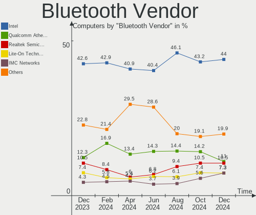

| Vendor                          | Computers | Percent |
|---------------------------------|-----------|---------|
| Intel                           | 51        | 40.8%   |
| Qualcomm Atheros Communications | 36        | 28.8%   |
| Cambridge Silicon Radio         | 10        | 8%      |
| Lite-On Technology              | 8         | 6.4%    |
| Realtek Semiconductor           | 7         | 5.6%    |
| Foxconn / Hon Hai               | 3         | 2.4%    |
| Broadcom                        | 3         | 2.4%    |
| Qcom                            | 2         | 1.6%    |
| IMC Networks                    | 2         | 1.6%    |
| Opticis                         | 1         | 0.8%    |
| Dell                            | 1         | 0.8%    |
| Apple                           | 1         | 0.8%    |

Bluetooth Model
---------------

Controller models

| Model                                               | Computers | Percent |
|-----------------------------------------------------|-----------|---------|
| Qualcomm Atheros  Bluetooth Device                  | 19        | 15.2%   |
| Intel Bluetooth wireless interface                  | 18        | 14.4%   |
| Intel Bluetooth 9460/9560 Jefferson Peak (JfP)      | 13        | 10.4%   |
| Cambridge Silicon Radio Bluetooth Dongle (HCI mode) | 10        | 8%      |
| Intel AX200 Bluetooth                               | 8         | 6.4%    |
| Realtek Bluetooth Radio                             | 7         | 5.6%    |
| Intel Bluetooth Device                              | 7         | 5.6%    |
| Qualcomm Atheros Bluetooth USB Host Controller      | 5         | 4%      |
| Qualcomm Atheros AR9462 Bluetooth                   | 4         | 3.2%    |
| Qualcomm Atheros AR3012 Bluetooth 4.0               | 4         | 3.2%    |
| Qualcomm Atheros AR3011 Bluetooth                   | 3         | 2.4%    |
| Lite-On Qualcomm Atheros QCA9377 Bluetooth          | 3         | 2.4%    |
| Qcom Bluetooth USB                                  | 2         | 1.6%    |
| Lite-On Qualcomm Atheros Bluetooth                  | 2         | 1.6%    |
| Intel Centrino Bluetooth Wireless Transceiver       | 2         | 1.6%    |
| Foxconn / Hon Hai Bluetooth Device                  | 2         | 1.6%    |
| Broadcom BCM2070 Bluetooth Device                   | 2         | 1.6%    |
| Qualcomm Atheros Bluetooth                          | 1         | 0.8%    |
| Opticis Bluetooth Radio                             | 1         | 0.8%    |
| Lite-On Bluetooth Device                            | 1         | 0.8%    |
| Lite-On Atheros Bluetooth                           | 1         | 0.8%    |
| Lite-On Atheros AR3012 Bluetooth                    | 1         | 0.8%    |
| Intel Wireless-AC 9260 Bluetooth Adapter            | 1         | 0.8%    |
| Intel Centrino Advanced-N 6230 Bluetooth adapter    | 1         | 0.8%    |
| Intel AX210 Bluetooth                               | 1         | 0.8%    |
| IMC Networks Wireless_Device                        | 1         | 0.8%    |
| IMC Networks Atheros AR3012 Bluetooth 4.0 Adapter   | 1         | 0.8%    |
| Foxconn / Hon Hai Broadcom Bluetooth 2.1 Device     | 1         | 0.8%    |
| Dell Wireless 355 Bluetooth                         | 1         | 0.8%    |
| Broadcom BCM2046 Bluetooth Device                   | 1         | 0.8%    |
| Apple Built-in Bluetooth 2.0+EDR HCI                | 1         | 0.8%    |

Sound
-----

Sound Vendor
------------

Sound card vendors

| Vendor                 | Computers | Percent |
|------------------------|-----------|---------|
| Intel                  | 178       | 59.73%  |
| AMD                    | 52        | 17.45%  |
| Nvidia                 | 50        | 16.78%  |
| C-Media Electronics    | 4         | 1.34%   |
| Kingston Technology    | 3         | 1.01%   |
| Generalplus Technology | 3         | 1.01%   |
| Razer USA              | 2         | 0.67%   |
| Logitech               | 2         | 0.67%   |
| Texas Instruments      | 1         | 0.34%   |
| Dell                   | 1         | 0.34%   |
| Corsair                | 1         | 0.34%   |
| BY EDIFIER             | 1         | 0.34%   |

Sound Model
-----------

Sound card models

| Model                                                                                             | Computers | Percent |
|---------------------------------------------------------------------------------------------------|-----------|---------|
| Intel 7 Series/C216 Chipset Family High Definition Audio Controller                               | 25        | 7.25%   |
| Intel Sunrise Point-LP HD Audio                                                                   | 22        | 6.38%   |
| AMD Family 17h/19h HD Audio Controller                                                            | 17        | 4.93%   |
| Intel 6 Series/C200 Series Chipset Family High Definition Audio Controller                        | 15        | 4.35%   |
| Intel 5 Series/3400 Series Chipset High Definition Audio                                          | 13        | 3.77%   |
| Nvidia TU107 GeForce GTX 1650 High Definition Audio Controller                                    | 12        | 3.48%   |
| Intel 8 Series/C220 Series Chipset High Definition Audio Controller                               | 12        | 3.48%   |
| Intel Wildcat Point-LP High Definition Audio Controller                                           | 8         | 2.32%   |
| Intel Tiger Lake-LP Smart Sound Technology Audio Controller                                       | 8         | 2.32%   |
| Intel Comet Lake PCH cAVS                                                                         | 8         | 2.32%   |
| Intel Broadwell-U Audio Controller                                                                | 8         | 2.32%   |
| AMD SBx00 Azalia (Intel HDA)                                                                      | 8         | 2.32%   |
| AMD Renoir Radeon High Definition Audio Controller                                                | 8         | 2.32%   |
| Nvidia GP107GL High Definition Audio Controller                                                   | 7         | 2.03%   |
| Intel Xeon E3-1200 v3/4th Gen Core Processor HD Audio Controller                                  | 7         | 2.03%   |
| Intel Haswell-ULT HD Audio Controller                                                             | 7         | 2.03%   |
| Intel 8 Series HD Audio Controller                                                                | 7         | 2.03%   |
| Intel NM10/ICH7 Family High Definition Audio Controller                                           | 6         | 1.74%   |
| Intel Celeron/Pentium Silver Processor High Definition Audio                                      | 6         | 1.74%   |
| Intel Celeron N3350/Pentium N4200/Atom E3900 Series Audio Cluster                                 | 5         | 1.45%   |
| Intel Cannon Lake PCH cAVS                                                                        | 5         | 1.45%   |
| Intel 82801I (ICH9 Family) HD Audio Controller                                                    | 5         | 1.45%   |
| AMD Starship/Matisse HD Audio Controller                                                          | 5         | 1.45%   |
| Intel Ice Lake-LP Smart Sound Technology Audio Controller                                         | 4         | 1.16%   |
| Intel Cannon Point-LP High Definition Audio Controller                                            | 4         | 1.16%   |
| AMD Raven/Raven2/Fenghuang HDMI/DP Audio Controller                                               | 4         | 1.16%   |
| AMD Oland/Hainan/Cape Verde/Pitcairn HDMI Audio [Radeon HD 7000 Series]                           | 4         | 1.16%   |
| AMD Family 17h (Models 00h-0fh) HD Audio Controller                                               | 4         | 1.16%   |
| AMD Ellesmere HDMI Audio [Radeon RX 470/480 / 570/580/590]                                        | 4         | 1.16%   |
| Nvidia GP106 High Definition Audio Controller                                                     | 3         | 0.87%   |
| Nvidia GK104 HDMI Audio Controller                                                                | 3         | 0.87%   |
| Nvidia GF108 High Definition Audio Controller                                                     | 3         | 0.87%   |
| Intel CM238 HD Audio Controller                                                                   | 3         | 0.87%   |
| Intel C610/X99 series chipset HD Audio Controller                                                 | 3         | 0.87%   |
| Intel 82801H (ICH8 Family) HD Audio Controller                                                    | 3         | 0.87%   |
| Intel 100 Series/C230 Series Chipset Family HD Audio Controller                                   | 3         | 0.87%   |
| Generalplus Technology IMYB 7.1 Channel                                                           | 3         | 0.87%   |
| AMD Cedar HDMI Audio [Radeon HD 5400/6300/7300 Series]                                            | 3         | 0.87%   |
| Nvidia TU106 High Definition Audio Controller                                                     | 2         | 0.58%   |
| Nvidia High Definition Audio Controller                                                           | 2         | 0.58%   |
| Nvidia GP104 High Definition Audio Controller                                                     | 2         | 0.58%   |
| Nvidia GM206 High Definition Audio Controller                                                     | 2         | 0.58%   |
| Nvidia GM204 High Definition Audio Controller                                                     | 2         | 0.58%   |
| Nvidia GK208 HDMI/DP Audio Controller                                                             | 2         | 0.58%   |
| Nvidia GK107 HDMI Audio Controller                                                                | 2         | 0.58%   |
| Kingston Technology HyperX Quadcast                                                               | 2         | 0.58%   |
| Intel Comet Lake PCH-V cAVS                                                                       | 2         | 0.58%   |
| Intel Atom/Celeron/Pentium Processor x5-E8000/J3xxx/N3xxx Series High Definition Audio Controller | 2         | 0.58%   |
| Intel Atom Processor Z36xxx/Z37xxx Series High Definition Audio Controller                        | 2         | 0.58%   |
| Intel 82801JI (ICH10 Family) HD Audio Controller                                                  | 2         | 0.58%   |
| Intel 200 Series PCH HD Audio                                                                     | 2         | 0.58%   |
| AMD Turks HDMI Audio [Radeon HD 6500/6600 / 6700M Series]                                         | 2         | 0.58%   |
| AMD RS780 HDMI Audio [Radeon 3000/3100 / HD 3200/3300]                                            | 2         | 0.58%   |
| AMD Redwood HDMI Audio [Radeon HD 5000 Series]                                                    | 2         | 0.58%   |
| AMD Navi 10 HDMI Audio                                                                            | 2         | 0.58%   |
| AMD FCH Azalia Controller                                                                         | 2         | 0.58%   |
| AMD Family 15h (Models 60h-6fh) Audio Controller                                                  | 2         | 0.58%   |
| AMD Baffin HDMI/DP Audio [Radeon RX 550 640SP / RX 560/560X]                                      | 2         | 0.58%   |
| Texas Instruments PCM2902 Audio Codec                                                             | 1         | 0.29%   |
| Razer USA ManO'War                                                                                | 1         | 0.29%   |

Memory
------

Memory Vendor
-------------

Memory module vendors

| Vendor              | Computers | Percent |
|---------------------|-----------|---------|
| Kingston            | 24        | 23.3%   |
| Smart               | 18        | 17.48%  |
| Samsung Electronics | 9         | 8.74%   |
| SK hynix            | 8         | 7.77%   |
| A-DATA Technology   | 6         | 5.83%   |
| Unknown (ABCD)      | 4         | 3.88%   |
| Unknown             | 4         | 3.88%   |
| Teikon              | 4         | 3.88%   |
| Micron Technology   | 4         | 3.88%   |
| High Bridge         | 3         | 2.91%   |
| Crucial             | 3         | 2.91%   |
| Patriot             | 2         | 1.94%   |
| G.Skill             | 2         | 1.94%   |
| Corsair             | 2         | 1.94%   |
| Unknown             | 2         | 1.94%   |
| Unknown (0xAD0A)    | 1         | 0.97%   |
| Team                | 1         | 0.97%   |
| Smart Brazil        | 1         | 0.97%   |
| PNY                 | 1         | 0.97%   |
| Kllisre             | 1         | 0.97%   |
| HBS                 | 1         | 0.97%   |
| Atermiter           | 1         | 0.97%   |
| Apacer              | 1         | 0.97%   |

Memory Model
------------

Memory module models

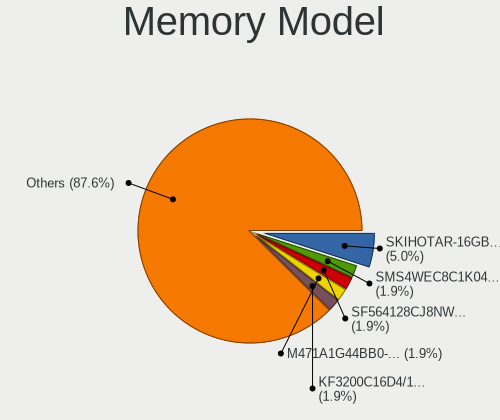

| Model                                                               | Computers | Percent |
|---------------------------------------------------------------------|-----------|---------|
| Unknown (ABCD) RAM 123456789012345678 2048MB SODIMM LPDDR4 2400MT/s | 4         | 3.42%   |
| Smart RAM SF4641G8CKHIWDFSEG 8GB SODIMM DDR4 2133MT/s               | 3         | 2.56%   |
| Smart RAM SH564568FH8NZPHSCG 2GB SODIMM DDR3 1333MT/s               | 2         | 1.71%   |
| Smart RAM SH564128FJ8NWRNSQG 4GB SODIMM DDR3 1600MT/s               | 2         | 1.71%   |
| Smart RAM SH564128FH8N6TNSQG 4GB DIMM DDR3                          | 2         | 1.71%   |
| Kingston RAM Module 8GB SODIMM DDR3 1600MT/s                        | 2         | 1.71%   |
| Kingston RAM KHX1600C10D3/8G 8GB DIMM DDR3 1600MT/s                 | 2         | 1.71%   |
| Unknown                                                             | 2         | 1.71%   |
| Unknown RAM Module 4GB DIMM 667MT/s                                 | 1         | 0.85%   |
| Unknown RAM Module 4GB DIMM 400MT/s                                 | 1         | 0.85%   |
| Unknown RAM Module 2GB SODIMM DDR2 667MT/s                          | 1         | 0.85%   |
| Unknown RAM Module 2GB DIMM SDRAM                                   | 1         | 0.85%   |
| Unknown RAM Module 2GB DIMM 400MT/s                                 | 1         | 0.85%   |
| Unknown RAM Module 1GB SODIMM DDR2 667MT/s                          | 1         | 0.85%   |
| Unknown (0xAD0A) RAM PJ16TFK1GM8 16GB SODIMM DDR4 2400MT/s          | 1         | 0.85%   |
| Teikon RAM TMT41GS6BFR8A-PBHJ 8GB SODIMM DDR3 1600MT/s              | 1         | 0.85%   |
| Teikon RAM TMT351S6EFR8A-PBHJ 4GB SODIMM DDR3 1600MT/s              | 1         | 0.85%   |
| Teikon RAM TMT251S6FR8C-H9HC 4GB SODIMM DDR3 1333MT/s               | 1         | 0.85%   |
| Teikon RAM TMT251S6CFR8C-PBHC 4GB SODIMM DDR3 1600MT/s              | 1         | 0.85%   |
| Teikon RAM TMA81GS6CJR8N-VKSC 8GB SODIMM DDR4 2667MT/s              | 1         | 0.85%   |
| Team RAM TEAMGROUP-UD4-2400 8GB DIMM DDR4 3007MT/s                  | 1         | 0.85%   |
| Smart RAM SMS4WEC8C1K0446FCG 8GB SODIMM DDR4 3200MT/s               | 1         | 0.85%   |
| Smart RAM SH564568FH8NZPHSCR 2048MB SODIMM DDR3 1333MT/s            | 1         | 0.85%   |
| Smart RAM SH564568FH8N6PHSFG 2GB DIMM DDR3 1333MT/s                 | 1         | 0.85%   |
| Smart RAM SH564568FH8N0QHSCG 2GB DIMM DDR3                          | 1         | 0.85%   |
| Smart RAM SH564128FJ8NWRNSQR 4GB SODIMM DDR3 1600MT/s               | 1         | 0.85%   |
| Smart RAM SH564128FH8NZQNSCR 4096MB SODIMM DDR3 1600MT/s            | 1         | 0.85%   |
| Smart RAM SH564128FH8NZPHSCR 4GB SODIMM DDR3 1333MT/s               | 1         | 0.85%   |
| Smart RAM SH564128FH8NZPHSCG 4GB SODIMM DDR3 1334MT/s               | 1         | 0.85%   |
| Smart RAM SF564128CJ8NWMNSEG 4GB SODIMM DDR3 1600MT/s               | 1         | 0.85%   |
| Smart RAM SF464128CK8I6GKSEG 4GB DIMM DDR4 2400MT/s                 | 1         | 0.85%   |
| Smart RAM Module 2048MB SODIMM DDR2 800MT/s                         | 1         | 0.85%   |
| Smart Brazil RAM SMS4TDC3C0K0446SCG 4GB SODIMM DDR4 2667MT/s        | 1         | 0.85%   |
| SK hynix RAM Module 4096MB SODIMM DDR3 1066MT/s                     | 1         | 0.85%   |
| SK hynix RAM Module 2GB SODIMM DDR3 1600MT/s                        | 1         | 0.85%   |
| SK hynix RAM HYMP125S64CP8-S6 2048MB SODIMM DDR2 975MT/s            | 1         | 0.85%   |
| SK hynix RAM HMT351U7BFR8C-H9 4GB DIMM DDR3 1333MT/s                | 1         | 0.85%   |
| SK hynix RAM HMT351U7BFR8A-H9 4GB DIMM DDR3 1333MT/s                | 1         | 0.85%   |
| SK hynix RAM HMT351U6CFR8C-PBA 4GB DIMM DDR3 1600MT/s               | 1         | 0.85%   |
| SK hynix RAM HMT125U7BFR8C-H9 2GB DIMM DDR3 1333MT/s                | 1         | 0.85%   |
| SK hynix RAM HMA84GR7MFR4N-UH 32GB RIMM DDR4 2400MT/s               | 1         | 0.85%   |
| SK hynix RAM HMA82GS6AFR8N-UH 16GB SODIMM DDR4 2667MT/s             | 1         | 0.85%   |
| Samsung RAM UBE3D4AA-MGCR 2GB Row Of Chips LPDDR4 4267MT/s          | 1         | 0.85%   |
| Samsung RAM Module 1GB SODIMM DDR2 533MT/s                          | 1         | 0.85%   |
| Samsung RAM M471B5273DH0-CK0 4GB SODIMM DDR3 1600MT/s               | 1         | 0.85%   |
| Samsung RAM M471B1G73DHO-CH9 8GB SODIMM DDR3 1333MT/s               | 1         | 0.85%   |
| Samsung RAM M471A3243BB0-CP50 8GB SODIMM DDR4 3200MT/s              | 1         | 0.85%   |
| Samsung RAM M471A1G44AB0-CWE 8GB Row Of Chips DDR4 3200MT/s         | 1         | 0.85%   |
| Samsung RAM M393B1K73CHD-CF8 8GB DIMM DDR3 1066MT/s                 | 1         | 0.85%   |
| Samsung RAM M391B5273CH0-YH9 4GB DIMM DDR3 1333MT/s                 | 1         | 0.85%   |
| Samsung RAM K4E6E304EB-EGCG 4096MB SODIMM LPDDR3 1600MT/s           | 1         | 0.85%   |
| PNY RAM 8GBF1X08RHJJ40-135-K 8GB DIMM DDR4 3000MT/s                 | 1         | 0.85%   |
| Patriot RAM PSD416G26662S 16GB SODIMM DDR4 2667MT/s                 | 1         | 0.85%   |
| Patriot RAM PSD38G1600L2S 8GB SODIMM DDR3 1600MT/s                  | 1         | 0.85%   |
| Micron RAM BRA6G2622164S-075 16GB SODIMM DDR4 2667MT/s              | 1         | 0.85%   |
| Micron RAM 53E1G32D4NQ-046 2GB Row Of Chips LPDDR4 4267MT/s         | 1         | 0.85%   |
| Micron RAM 512M6416V69AD2J15E 4GB DIMM DDR3 1333MT/s                | 1         | 0.85%   |
| Micron RAM 36ASF2G72PZ-2G1A2 16GB DIMM DDR4 2133MT/s                | 1         | 0.85%   |
| Kllisre RAM KRE-D3U1333M/4G 4096MB DIMM DDR3 1333MT/s               | 1         | 0.85%   |
| Kingston RAM Module 8GB SODIMM DDR3 1333MT/s                        | 1         | 0.85%   |

Memory Kind
-----------

Memory module kinds

| Kind    | Computers | Percent |
|---------|-----------|---------|
| DDR3    | 40        | 44.94%  |
| DDR4    | 32        | 35.96%  |
| LPDDR4  | 6         | 6.74%   |
| DDR2    | 4         | 4.49%   |
| Unknown | 3         | 3.37%   |
| SDRAM   | 2         | 2.25%   |
| LPDDR3  | 1         | 1.12%   |
| DRAM    | 1         | 1.12%   |

Memory Form Factor
------------------

Physical design of the memory module

| Name         | Computers | Percent |
|--------------|-----------|---------|
| SODIMM       | 46        | 52.27%  |
| DIMM         | 38        | 43.18%  |
| Row Of Chips | 3         | 3.41%   |
| RIMM         | 1         | 1.14%   |

Memory Size
-----------

Memory module size

| Size  | Computers | Percent |
|-------|-----------|---------|
| 4096  | 40        | 39.6%   |
| 8192  | 33        | 32.67%  |
| 16384 | 12        | 11.88%  |
| 2048  | 12        | 11.88%  |
| 32768 | 2         | 1.98%   |
| 1024  | 2         | 1.98%   |

Memory Speed
------------

Memory module speed

| Speed   | Computers | Percent |
|---------|-----------|---------|
| 1600    | 22        | 22.22%  |
| 1333    | 17        | 17.17%  |
| 2400    | 13        | 13.13%  |
| 3200    | 8         | 8.08%   |
| 2667    | 7         | 7.07%   |
| 2133    | 5         | 5.05%   |
| 1334    | 4         | 4.04%   |
| 4267    | 2         | 2.02%   |
| 3600    | 2         | 2.02%   |
| 1867    | 2         | 2.02%   |
| 1866    | 2         | 2.02%   |
| 1066    | 2         | 2.02%   |
| 667     | 2         | 2.02%   |
| 3400    | 1         | 1.01%   |
| 3007    | 1         | 1.01%   |
| 3000    | 1         | 1.01%   |
| 2933    | 1         | 1.01%   |
| 1067    | 1         | 1.01%   |
| 975     | 1         | 1.01%   |
| 800     | 1         | 1.01%   |
| 533     | 1         | 1.01%   |
| 400     | 1         | 1.01%   |
| 333     | 1         | 1.01%   |
| Unknown | 1         | 1.01%   |

Printers & scanners
-------------------

Printer Vendor
--------------

Printer device vendors

| Vendor          | Computers | Percent |
|-----------------|-----------|---------|
| Seiko Epson     | 1         | 50%     |
| Hewlett-Packard | 1         | 50%     |

Printer Model
-------------

Printer device models

| Model                    | Computers | Percent |
|--------------------------|-----------|---------|
| Seiko Epson L3150 Series | 1         | 50%     |
| HP LaserJet 1018         | 1         | 50%     |

Scanner Vendor
--------------

Scanner device vendors

Zero info for selected period =(

Scanner Model
-------------

Scanner device models

Zero info for selected period =(

Camera
------

Camera Vendor
-------------

Camera device vendors

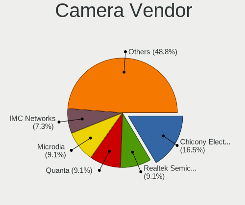

| Vendor                                 | Computers | Percent |
|----------------------------------------|-----------|---------|
| Microdia                               | 22        | 14.47%  |
| Silicon Motion                         | 19        | 12.5%   |
| Chicony Electronics                    | 19        | 12.5%   |
| Quanta                                 | 18        | 11.84%  |
| Realtek Semiconductor                  | 13        | 8.55%   |
| Sunplus Innovation Technology          | 11        | 7.24%   |
| Alcor Micro                            | 7         | 4.61%   |
| Suyin                                  | 6         | 3.95%   |
| Logitech                               | 5         | 3.29%   |
| Acer                                   | 5         | 3.29%   |
| IMC Networks                           | 4         | 2.63%   |
| Cheng Uei Precision Industry (Foxlink) | 3         | 1.97%   |
| Unknown                                | 2         | 1.32%   |
| Syntek                                 | 2         | 1.32%   |
| Sonix Technology                       | 2         | 1.32%   |
| Pixart Imaging                         | 2         | 1.32%   |
| Generalplus Technology                 | 2         | 1.32%   |
| Z-Star Microelectronics                | 1         | 0.66%   |
| Y Media                                | 1         | 0.66%   |
| SunplusIT                              | 1         | 0.66%   |
| Samsung Electronics                    | 1         | 0.66%   |
| OmniVision Technologies                | 1         | 0.66%   |
| Leopard Imaging                        | 1         | 0.66%   |
| icSpring                               | 1         | 0.66%   |
| Cubeternet                             | 1         | 0.66%   |
| Apple                                  | 1         | 0.66%   |
| 8SSC20F27145V1SR1BX02P8                | 1         | 0.66%   |

Camera Model
------------

Camera device models

| Model                                                       | Computers | Percent |
|-------------------------------------------------------------|-----------|---------|
| Quanta HD User Facing                                       | 10        | 6.58%   |
| Silicon Motion Web Camera                                   | 8         | 5.26%   |
| Microdia Integrated_Webcam_HD                               | 6         | 3.95%   |
| Alcor Micro USB 2.0 Camera                                  | 6         | 3.95%   |
| Sunplus HD WebCam                                           | 5         | 3.29%   |
| Realtek Integrated_Webcam_HD                                | 5         | 3.29%   |
| Realtek Integrated Webcam                                   | 5         | 3.29%   |
| Microdia Laptop_Integrated_Webcam_HD                        | 4         | 2.63%   |
| Chicony Integrated Camera                                   | 4         | 2.63%   |
| Chicony HD Webcam                                           | 4         | 2.63%   |
| Silicon Motion LG HD WebCam                                 | 3         | 1.97%   |
| Quanta VGA WebCam                                           | 3         | 1.97%   |
| Microdia Dell Laptop Integrated Webcam HD                   | 3         | 1.97%   |
| Acer VGA WebCam                                             | 3         | 1.97%   |
| Syntek Integrated Camera                                    | 2         | 1.32%   |
| Suyin LG Webcam                                             | 2         | 1.32%   |
| Sunplus MTD Camera                                          | 2         | 1.32%   |
| Sonix USB2.0 HD UVC WebCam                                  | 2         | 1.32%   |
| Silicon Motion Lenovo EasyCamera                            | 2         | 1.32%   |
| Realtek HD WebCam                                           | 2         | 1.32%   |
| Quanta USB Webcam                                           | 2         | 1.32%   |
| Quanta HD Webcam                                            | 2         | 1.32%   |
| Microdia Integrated_Webcam_1.3M                             | 2         | 1.32%   |
| Logitech HD Pro Webcam C920                                 | 2         | 1.32%   |
| Logitech BRIO Ultra HD Webcam                               | 2         | 1.32%   |
| IMC Networks USB Camera                                     | 2         | 1.32%   |
| Generalplus GENERAL WEBCAM                                  | 2         | 1.32%   |
| Chicony VGA Webcam                                          | 2         | 1.32%   |
| Chicony USB2.0 HD UVC WebCam                                | 2         | 1.32%   |
| Chicony USB 2.0 Camera                                      | 2         | 1.32%   |
| Z-Star Venus USB2.0 Camera                                  | 1         | 0.66%   |
| Y Media USB Camera                                          | 1         | 0.66%   |
| Unknown ATIV VGA CAMERA                                     | 1         | 0.66%   |
| Unknown 720p HD Camera                                      | 1         | 0.66%   |
| Suyin Integrated Webcam                                     | 1         | 0.66%   |
| Suyin HP TrueVision HD Integrated Webcam                    | 1         | 0.66%   |
| Suyin HD WebCam                                             | 1         | 0.66%   |
| Suyin 1.3M WebCam (notebook emachines E730, Acer sub-brand) | 1         | 0.66%   |
| SunplusIT MTD camera                                        | 1         | 0.66%   |
| Sunplus XiaoMi USB 2.0 Webcam                               | 1         | 0.66%   |
| Sunplus Integrated_Webcam_HD                                | 1         | 0.66%   |
| Sunplus Integrated Webcam                                   | 1         | 0.66%   |
| Sunplus HP HD Webcam [Fixed]                                | 1         | 0.66%   |
| Silicon Motion WebCam SC-13HDL12131N                        | 1         | 0.66%   |
| Silicon Motion WebCam SC-10HDP12631N                        | 1         | 0.66%   |
| Silicon Motion WebCam SC-10HDD12636N                        | 1         | 0.66%   |
| Silicon Motion WebCam SC-0311139N                           | 1         | 0.66%   |
| Silicon Motion ATIV VGA Camera                              | 1         | 0.66%   |
| Silicon Motion 300k Pixel Camera                            | 1         | 0.66%   |
| Samsung Galaxy series, misc. (MTP mode)                     | 1         | 0.66%   |
| Realtek Lenovo EasyCamera                                   | 1         | 0.66%   |
| Quanta USB2.0 HD UVC WebCam                                 | 1         | 0.66%   |
| Pixart Imaging VGA Webcam                                   | 1         | 0.66%   |
| Pixart Imaging GE 1.3 MP MiniCam Pro                        | 1         | 0.66%   |
| OmniVision OV2640 Webcam                                    | 1         | 0.66%   |
| Microdia Webcam                                             | 1         | 0.66%   |
| Microdia Laptop_Integrated_Webcam_2M                        | 1         | 0.66%   |
| Microdia Laptop_Integrated_Webcam_1.3M                      | 1         | 0.66%   |
| Microdia Integrated Webcam HD                               | 1         | 0.66%   |
| Microdia Integrated Webcam                                  | 1         | 0.66%   |

Security
--------

Fingerprint Vendor
------------------

Fingerprint sensor vendors

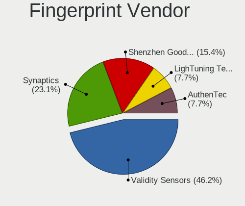

| Vendor                     | Computers | Percent |
|----------------------------|-----------|---------|
| Validity Sensors           | 9         | 69.23%  |
| Shenzhen Goodix Technology | 3         | 23.08%  |
| Samsung Electronics        | 1         | 7.69%   |

Fingerprint Model
-----------------

Fingerprint sensor models

| Model                                       | Computers | Percent |
|---------------------------------------------|-----------|---------|
| Validity Sensors VFS5011 Fingerprint Reader | 5         | 38.46%  |
| Shenzhen Goodix Fingerprint Reader          | 2         | 15.38%  |
| Validity Sensors VFS495 Fingerprint Reader  | 1         | 7.69%   |
| Validity Sensors VFS491                     | 1         | 7.69%   |
| Validity Sensors VFS300 Fingerprint Reader  | 1         | 7.69%   |
| Validity Sensors Fingerprint scanner        | 1         | 7.69%   |
| Shenzhen Goodix  FingerPrint Device         | 1         | 7.69%   |
| Samsung Fingerprint Device                  | 1         | 7.69%   |

Chipcard Vendor
---------------

Chipcard module vendors

| Vendor                | Computers | Percent |
|-----------------------|-----------|---------|
| Gemalto (was Gemplus) | 1         | 50%     |
| Alcor Micro           | 1         | 50%     |

Chipcard Model
--------------

Chipcard module models

| Model                                             | Computers | Percent |
|---------------------------------------------------|-----------|---------|
| Gemalto (was Gemplus) GemPC Twin SmartCard Reader | 1         | 50%     |
| Alcor Micro AU9540 Smartcard Reader               | 1         | 50%     |

Unsupported
-----------

Unsupported Devices
-------------------

Total unsupported devices on board

| Total | Computers | Percent |
|-------|-----------|---------|
| 0     | 175       | 75.43%  |
| 1     | 52        | 22.41%  |
| 3     | 3         | 1.29%   |
| 4     | 1         | 0.43%   |
| 2     | 1         | 0.43%   |

Unsupported Device Types
------------------------

Types of unsupported devices

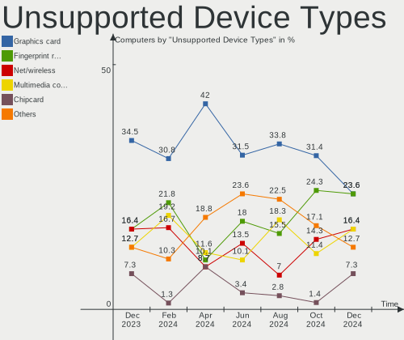

| Type                     | Computers | Percent |
|--------------------------|-----------|---------|
| Graphics card            | 14        | 21.88%  |
| Fingerprint reader       | 13        | 20.31%  |
| Net/wireless             | 9         | 14.06%  |
| Multimedia controller    | 9         | 14.06%  |
| Bluetooth                | 5         | 7.81%   |
| Sound                    | 4         | 6.25%   |
| Unassigned class         | 3         | 4.69%   |
| Network                  | 3         | 4.69%   |
| Storage                  | 1         | 1.56%   |
| Communication controller | 1         | 1.56%   |
| Chipcard                 | 1         | 1.56%   |
| Camera                   | 1         | 1.56%   |

