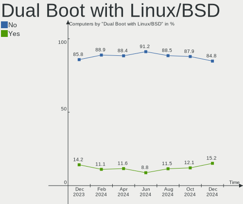
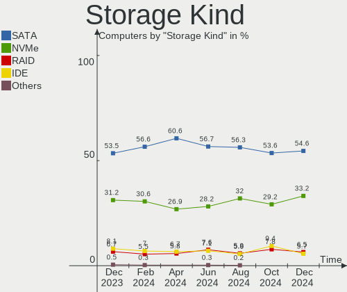
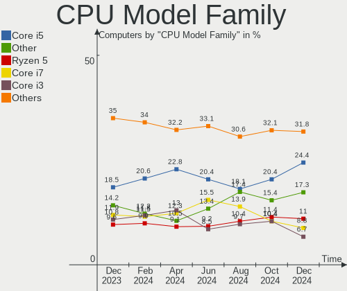
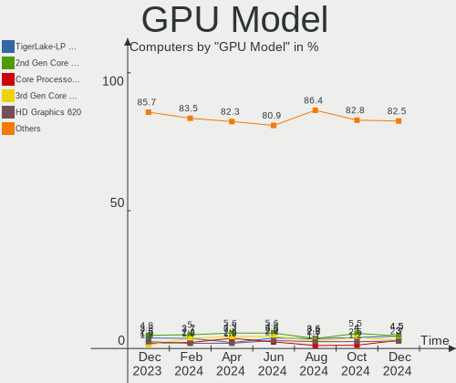
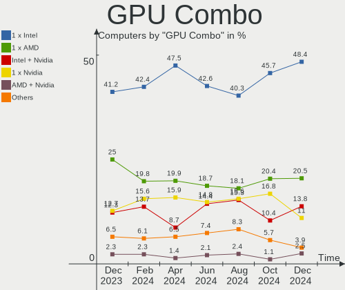
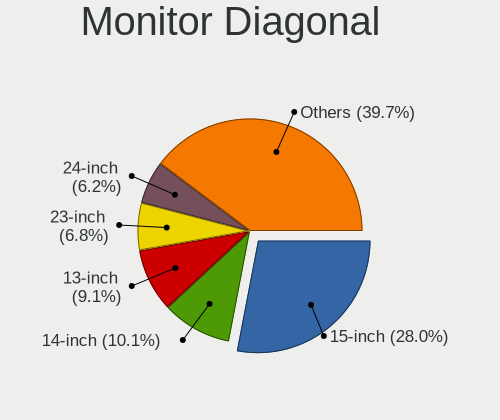

Linux in Brazil - Hardware Trends
---------------------------------

A project to identify most popular hardware characteristics and track their change
over time based on data collected by Linux users at https://Linux-Hardware.org.

Anyone can contribute to this report by the [hw-probe](https://github.com/linuxhw/hw-probe) tool:

    sudo -E hw-probe -all -upload

This is a report for all computer types. See also reports for [desktops](/Location/Brazil/Desktop/README.md) and [notebooks](/Location/Brazil/Notebook/README.md).

Period: Feb, 2023.

Contents
--------

* [ System ](#system)
  - [ OS                       ](#os)
  - [ OS Family                ](#os-family)
  - [ Kernel                   ](#kernel)
  - [ Kernel Family            ](#kernel-family)
  - [ Kernel Major Ver.        ](#kernel-major-ver)
  - [ Arch                     ](#arch)
  - [ DE                       ](#de)
  - [ Display Server           ](#display-server)
  - [ Display Manager          ](#display-manager)
  - [ OS Lang                  ](#os-lang)
  - [ Boot Mode                ](#boot-mode)
  - [ Filesystem               ](#filesystem)
  - [ Part. scheme             ](#part-scheme)
  - [ Dual Boot with Linux/BSD ](#dual-boot-with-linuxbsd)
  - [ Dual Boot (Win)          ](#dual-boot-win)

* [ Board ](#board)
  - [ Vendor                   ](#vendor)
  - [ Model                    ](#model)
  - [ Model Family             ](#model-family)
  - [ MFG Year                 ](#mfg-year)
  - [ Form Factor              ](#form-factor)
  - [ Secure Boot              ](#secure-boot)
  - [ Coreboot                 ](#coreboot)
  - [ RAM Size                 ](#ram-size)
  - [ RAM Used                 ](#ram-used)
  - [ Total Drives             ](#total-drives)
  - [ Has CD-ROM               ](#has-cd-rom)
  - [ Has Ethernet             ](#has-ethernet)
  - [ Has WiFi                 ](#has-wifi)
  - [ Has Bluetooth            ](#has-bluetooth)

* [ Location ](#location)
  - [ Country                  ](#country)
  - [ City                     ](#city)

* [ Drives ](#drives)
  - [ Drive Vendor             ](#drive-vendor)
  - [ Drive Model              ](#drive-model)
  - [ HDD Vendor               ](#hdd-vendor)
  - [ SSD Vendor               ](#ssd-vendor)
  - [ Drive Kind               ](#drive-kind)
  - [ Drive Connector          ](#drive-connector)
  - [ Drive Size               ](#drive-size)
  - [ Space Total              ](#space-total)
  - [ Space Used               ](#space-used)
  - [ Malfunc. Drives          ](#malfunc-drives)
  - [ Malfunc. Drive Vendor    ](#malfunc-drive-vendor)
  - [ Malfunc. HDD Vendor      ](#malfunc-hdd-vendor)
  - [ Malfunc. Drive Kind      ](#malfunc-drive-kind)
  - [ Failed Drives            ](#failed-drives)
  - [ Failed Drive Vendor      ](#failed-drive-vendor)
  - [ Drive Status             ](#drive-status)

* [ Storage controller ](#storage-controller)
  - [ Storage Vendor           ](#storage-vendor)
  - [ Storage Model            ](#storage-model)
  - [ Storage Kind             ](#storage-kind)

* [ Processor ](#processor)
  - [ CPU Vendor               ](#cpu-vendor)
  - [ CPU Model                ](#cpu-model)
  - [ CPU Model Family         ](#cpu-model-family)
  - [ CPU Cores                ](#cpu-cores)
  - [ CPU Sockets              ](#cpu-sockets)
  - [ CPU Threads              ](#cpu-threads)
  - [ CPU Op-Modes             ](#cpu-op-modes)
  - [ CPU Microcode            ](#cpu-microcode)
  - [ CPU Microarch            ](#cpu-microarch)

* [ Graphics ](#graphics)
  - [ GPU Vendor               ](#gpu-vendor)
  - [ GPU Model                ](#gpu-model)
  - [ GPU Combo                ](#gpu-combo)
  - [ GPU Driver               ](#gpu-driver)
  - [ GPU Memory               ](#gpu-memory)

* [ Monitor ](#monitor)
  - [ Monitor Vendor           ](#monitor-vendor)
  - [ Monitor Model            ](#monitor-model)
  - [ Monitor Resolution       ](#monitor-resolution)
  - [ Monitor Diagonal         ](#monitor-diagonal)
  - [ Monitor Width            ](#monitor-width)
  - [ Aspect Ratio             ](#aspect-ratio)
  - [ Monitor Area             ](#monitor-area)
  - [ Pixel Density            ](#pixel-density)
  - [ Multiple Monitors        ](#multiple-monitors)

* [ Network ](#network)
  - [ Net Controller Vendor    ](#net-controller-vendor)
  - [ Net Controller Model     ](#net-controller-model)
  - [ Wireless Vendor          ](#wireless-vendor)
  - [ Wireless Model           ](#wireless-model)
  - [ Ethernet Vendor          ](#ethernet-vendor)
  - [ Ethernet Model           ](#ethernet-model)
  - [ Net Controller Kind      ](#net-controller-kind)
  - [ Used Controller          ](#used-controller)
  - [ NICs                     ](#nics)
  - [ IPv6                     ](#ipv6)

* [ Bluetooth ](#bluetooth)
  - [ Bluetooth Vendor         ](#bluetooth-vendor)
  - [ Bluetooth Model          ](#bluetooth-model)

* [ Sound ](#sound)
  - [ Sound Vendor             ](#sound-vendor)
  - [ Sound Model              ](#sound-model)

* [ Memory ](#memory)
  - [ Memory Vendor            ](#memory-vendor)
  - [ Memory Model             ](#memory-model)
  - [ Memory Kind              ](#memory-kind)
  - [ Memory Form Factor       ](#memory-form-factor)
  - [ Memory Size              ](#memory-size)
  - [ Memory Speed             ](#memory-speed)

* [ Printers & scanners ](#printers--scanners)
  - [ Printer Vendor           ](#printer-vendor)
  - [ Printer Model            ](#printer-model)
  - [ Scanner Vendor           ](#scanner-vendor)
  - [ Scanner Model            ](#scanner-model)

* [ Camera ](#camera)
  - [ Camera Vendor            ](#camera-vendor)
  - [ Camera Model             ](#camera-model)

* [ Security ](#security)
  - [ Fingerprint Vendor       ](#fingerprint-vendor)
  - [ Fingerprint Model        ](#fingerprint-model)
  - [ Chipcard Vendor          ](#chipcard-vendor)
  - [ Chipcard Model           ](#chipcard-model)

* [ Unsupported ](#unsupported)
  - [ Unsupported Devices      ](#unsupported-devices)
  - [ Unsupported Device Types ](#unsupported-device-types)

System
------

OS
--

Installed operating systems

| Name                         | Computers | Percent |
|------------------------------|-----------|---------|
| Ubuntu 22.04                 | 41        | 14.96%  |
| OpenMandriva 23.01           | 31        | 11.31%  |
| Linux Mint 21.1              | 29        | 10.58%  |
| Zorin 16                     | 14        | 5.11%   |
| Fedora 37                    | 12        | 4.38%   |
| Ubuntu 22.10                 | 11        | 4.01%   |
| Pop!_OS 22.04                | 11        | 4.01%   |
| Arch Rolling                 | 11        | 4.01%   |
| Debian 11                    | 10        | 3.65%   |
| Manjaro                      | 9         | 3.28%   |
| Linux Mint 20.3              | 6         | 2.19%   |
| OpenMandriva 4.3             | 5         | 1.82%   |
| Debian                       | 5         | 1.82%   |
| Ubuntu 20.04                 | 4         | 1.46%   |
| Linux Mint 21                | 4         | 1.46%   |
| KDE neon 22.04               | 4         | 1.46%   |
| Kali 2022.4                  | 4         | 1.46%   |
| Xubuntu 22.04                | 3         | 1.09%   |
| openSUSE Tumbleweed-XXXXXXXX | 3         | 1.09%   |
| Kubuntu 22.04                | 3         | 1.09%   |
| Endless 3.9.7                | 3         | 1.09%   |
| Ubuntu MATE 22.04            | 2         | 0.73%   |
| Ubuntu 23.04                 | 2         | 0.73%   |
| Ubuntu 18.04                 | 2         | 0.73%   |
| OpenMandriva 4.2             | 2         | 0.73%   |
| Nobara 37                    | 2         | 0.73%   |
| LMDE 5                       | 2         | 0.73%   |
| Kubuntu 22.10                | 2         | 0.73%   |
| Fedora 38                    | 2         | 0.73%   |
| Endless 5.0.0                | 2         | 0.73%   |
| Endless 4.0.14               | 2         | 0.73%   |
| Endless 4.0.13               | 2         | 0.73%   |
| Elementary 7                 | 2         | 0.73%   |
| BigLinux 22.0.4              | 2         | 0.73%   |
| Ubuntu Unity 16.04           | 1         | 0.36%   |
| SteamOS 3.4                  | 1         | 0.36%   |
| Sparky 6.6                   | 1         | 0.36%   |
| Slackware 15.0               | 1         | 0.36%   |
| Rocky Linux 9.1              | 1         | 0.36%   |
| RHEL 8                       | 1         | 0.36%   |

OS Family
---------

OS without a version

| Name         | Computers | Percent |
|--------------|-----------|---------|
| Ubuntu       | 60        | 21.9%   |
| Linux Mint   | 40        | 14.6%   |
| OpenMandriva | 39        | 14.23%  |
| Debian       | 15        | 5.47%   |
| Zorin        | 14        | 5.11%   |
| Fedora       | 14        | 5.11%   |
| Pop!_OS      | 11        | 4.01%   |
| Manjaro      | 11        | 4.01%   |
| Endless      | 11        | 4.01%   |
| Arch         | 11        | 4.01%   |
| Kubuntu      | 5         | 1.82%   |
| openSUSE     | 4         | 1.46%   |
| KDE neon     | 4         | 1.46%   |
| Kali         | 4         | 1.46%   |
| Xubuntu      | 3         | 1.09%   |
| BigLinux     | 3         | 1.09%   |
| Ubuntu MATE  | 2         | 0.73%   |
| Nobara       | 2         | 0.73%   |
| Lubuntu      | 2         | 0.73%   |
| LMDE         | 2         | 0.73%   |
| Elementary   | 2         | 0.73%   |
| ChimeraOS    | 2         | 0.73%   |
| Ubuntu Unity | 1         | 0.36%   |
| SteamOS      | 1         | 0.36%   |
| Sparky       | 1         | 0.36%   |
| Slackware    | 1         | 0.36%   |
| Rocky Linux  | 1         | 0.36%   |
| RHEL         | 1         | 0.36%   |
| Puppy        | 1         | 0.36%   |
| Parrot       | 1         | 0.36%   |
| MX           | 1         | 0.36%   |
| Kaisen       | 1         | 0.36%   |
| Gentoo       | 1         | 0.36%   |
| EndeavourOS  | 1         | 0.36%   |
| ArcoLinux    | 1         | 0.36%   |

Kernel
------

Version of the Linux kernel

| Version                  | Computers | Percent |
|--------------------------|-----------|---------|
| 5.15.0-60-generic        | 45        | 16.42%  |
| 6.1.1-desktop-1omv2290   | 23        | 8.39%   |
| 5.15.0-58-generic        | 23        | 8.39%   |
| 5.19.0-32-generic        | 15        | 5.47%   |
| 5.19.0-31-generic        | 11        | 4.01%   |
| 6.1.4-desktop-1omv2301   | 8         | 2.92%   |
| 5.10.0-21-amd64          | 8         | 2.92%   |
| 6.0.12-76060006-generic  | 7         | 2.55%   |
| 5.4.0-137-generic        | 6         | 2.19%   |
| 6.1.11-76060111-generic  | 5         | 1.82%   |
| 6.1.9-1-MANJARO          | 4         | 1.46%   |
| 6.1.12-1-MANJARO         | 4         | 1.46%   |
| 6.1.11-200.fc37.x86_64   | 4         | 1.46%   |
| 5.8.0-14-generic         | 4         | 1.46%   |
| 5.4.0-139-generic        | 4         | 1.46%   |
| 5.16.7-desktop-1omv4003  | 4         | 1.46%   |
| 5.15.0-56-generic        | 4         | 1.46%   |
| 5.15.0-43-generic        | 4         | 1.46%   |
| 5.11.0-35-generic        | 4         | 1.46%   |
| 6.1.12-arch1-1           | 3         | 1.09%   |
| 6.2.0-63.fc38.x86_64     | 2         | 0.73%   |
| 6.1.9-arch1-1            | 2         | 0.73%   |
| 6.1.11-arch1-1           | 2         | 0.73%   |
| 6.1.10-1-default         | 2         | 0.73%   |
| 6.1.0-3-amd64            | 2         | 0.73%   |
| 6.1.0-2-amd64            | 2         | 0.73%   |
| 6.0.7-301.fc37.x86_64    | 2         | 0.73%   |
| 6.0.0-kali3-amd64        | 2         | 0.73%   |
| 5.19.0-29-generic        | 2         | 0.73%   |
| 5.15.53-1-MANJARO        | 2         | 0.73%   |
| 5.15.0-52-generic        | 2         | 0.73%   |
| 5.15.0-47-generic        | 2         | 0.73%   |
| 5.11.12-desktop-1omv4002 | 2         | 0.73%   |
| 5.10.0-10-amd64          | 2         | 0.73%   |
| 6.2.1-arch1-1            | 1         | 0.36%   |
| 6.2.0-060200-generic     | 1         | 0.36%   |
| 6.1.9-zen1-1-zen         | 1         | 0.36%   |
| 6.1.9-x64v1-xanmod1-1    | 1         | 0.36%   |
| 6.1.9-arch1-2            | 1         | 0.36%   |
| 6.1.9-200.fc37.x86_64    | 1         | 0.36%   |

Kernel Family
-------------

Linux kernel without a distro release

| Version | Computers | Percent |
|---------|-----------|---------|
| 5.15.0  | 83        | 30.29%  |
| 5.19.0  | 30        | 10.95%  |
| 6.1.1   | 24        | 8.76%   |
| 6.1.11  | 13        | 4.74%   |
| 5.10.0  | 12        | 4.38%   |
| 6.1.9   | 11        | 4.01%   |
| 5.4.0   | 11        | 4.01%   |
| 6.1.4   | 8         | 2.92%   |
| 6.1.12  | 7         | 2.55%   |
| 6.0.12  | 7         | 2.55%   |
| 6.1.8   | 6         | 2.19%   |
| 6.1.10  | 5         | 1.82%   |
| 6.1.0   | 5         | 1.82%   |
| 6.0.0   | 5         | 1.82%   |
| 5.11.0  | 5         | 1.82%   |
| 5.8.0   | 4         | 1.46%   |
| 5.16.7  | 4         | 1.46%   |
| 6.2.0   | 3         | 1.09%   |
| 5.13.0  | 3         | 1.09%   |
| 6.1.13  | 2         | 0.73%   |
| 6.0.7   | 2         | 0.73%   |
| 5.17.0  | 2         | 0.73%   |
| 5.15.94 | 2         | 0.73%   |
| 5.15.53 | 2         | 0.73%   |
| 5.14.0  | 2         | 0.73%   |
| 5.11.12 | 2         | 0.73%   |
| 6.2.1   | 1         | 0.36%   |
| 6.1.7   | 1         | 0.36%   |
| 6.1.6   | 1         | 0.36%   |
| 5.19.5  | 1         | 0.36%   |
| 5.18.0  | 1         | 0.36%   |
| 5.16.13 | 1         | 0.36%   |
| 5.15.93 | 1         | 0.36%   |
| 5.15.91 | 1         | 0.36%   |
| 5.15.79 | 1         | 0.36%   |
| 5.15.74 | 1         | 0.36%   |
| 5.14.21 | 1         | 0.36%   |
| 4.9.163 | 1         | 0.36%   |
| 4.18.0  | 1         | 0.36%   |
| 4.15.0  | 1         | 0.36%   |

Kernel Major Ver.
-----------------

Linux kernel major version

| Version | Computers | Percent |
|---------|-----------|---------|
| 5.15    | 91        | 33.21%  |
| 6.1     | 83        | 30.29%  |
| 5.19    | 31        | 11.31%  |
| 6.0     | 14        | 5.11%   |
| 5.10    | 12        | 4.38%   |
| 5.4     | 11        | 4.01%   |
| 5.11    | 7         | 2.55%   |
| 5.16    | 5         | 1.82%   |
| 6.2     | 4         | 1.46%   |
| 5.8     | 4         | 1.46%   |
| 5.14    | 3         | 1.09%   |
| 5.13    | 3         | 1.09%   |
| 5.17    | 2         | 0.73%   |
| 5.18    | 1         | 0.36%   |
| 4.9     | 1         | 0.36%   |
| 4.18    | 1         | 0.36%   |
| 4.15    | 1         | 0.36%   |

Arch
----

OS architecture (x86_64, i586, etc.)

| Name   | Computers | Percent |
|--------|-----------|---------|
| x86_64 | 273       | 99.64%  |
| i686   | 1         | 0.36%   |

DE
--

Desktop Environment

| Name          | Computers | Percent |
|---------------|-----------|---------|
| GNOME         | 119       | 43.43%  |
| KDE5          | 66        | 24.09%  |
| X-Cinnamon    | 28        | 10.22%  |
| XFCE          | 26        | 9.49%   |
| Unknown       | 14        | 5.11%   |
| MATE          | 11        | 4.01%   |
| Pantheon      | 2         | 0.73%   |
| LXQt          | 2         | 0.73%   |
| i3            | 2         | 0.73%   |
| Unity         | 1         | 0.36%   |
| LXDE          | 1         | 0.36%   |
| KDE           | 1         | 0.36%   |
| GNOME Classic | 1         | 0.36%   |

Display Server
--------------

X11 or Wayland

| Name    | Computers | Percent |
|---------|-----------|---------|
| X11     | 205       | 74.82%  |
| Wayland | 57        | 20.8%   |
| Unknown | 9         | 3.28%   |
| Tty     | 3         | 1.09%   |

Display Manager
---------------

SDDM, LightDM, etc.

| Name    | Computers | Percent |
|---------|-----------|---------|
| Unknown | 123       | 44.89%  |
| GDM3    | 53        | 19.34%  |
| SDDM    | 49        | 17.88%  |
| LightDM | 34        | 12.41%  |
| GDM     | 15        | 5.47%   |

OS Lang
-------

Language

| Lang      | Computers | Percent |
|-----------|-----------|---------|
| pt_BR     | 194       | 70.8%   |
| en_US     | 63        | 22.99%  |
| C         | 6         | 2.19%   |
| Unknown   | 3         | 1.09%   |
| pt_PT     | 2         | 0.73%   |
| pt_BRutf8 | 1         | 0.36%   |
| fr_FR     | 1         | 0.36%   |
| es_ES     | 1         | 0.36%   |
| en_GB     | 1         | 0.36%   |
| en_DK     | 1         | 0.36%   |
| en_CA     | 1         | 0.36%   |

Boot Mode
---------

EFI or BIOS

| Mode | Computers | Percent |
|------|-----------|---------|
| BIOS | 140       | 51.09%  |
| EFI  | 134       | 48.91%  |

Filesystem
----------

Type of filesystem

| Type    | Computers | Percent |
|---------|-----------|---------|
| Ext4    | 200       | 72.99%  |
| Btrfs   | 42        | 15.33%  |
| Overlay | 24        | 8.76%   |
| Xfs     | 5         | 1.82%   |
| Zfs     | 2         | 0.73%   |
| Aufs    | 1         | 0.36%   |

Part. scheme
------------

Scheme of partitioning

| Type    | Computers | Percent |
|---------|-----------|---------|
| GPT     | 136       | 49.64%  |
| Unknown | 109       | 39.78%  |
| MBR     | 29        | 10.58%  |

Dual Boot with Linux/BSD
------------------------

Hosting more than one Linux/BSD

| Dual boot | Computers | Percent |
|-----------|-----------|---------|
| No        | 239       | 87.23%  |
| Yes       | 35        | 12.77%  |

Dual Boot (Win)
---------------

Hosting Linux and Windows

| Dual boot | Computers | Percent |
|-----------|-----------|---------|
| No        | 213       | 77.74%  |
| Yes       | 61        | 22.26%  |

Board
-----

Vendor
------

Motherboard manufacturer

| Name                           | Computers | Percent |
|--------------------------------|-----------|---------|
| ASUSTek Computer               | 43        | 15.69%  |
| Dell                           | 36        | 13.14%  |
| Lenovo                         | 30        | 10.95%  |
| Acer                           | 26        | 9.49%   |
| Gigabyte Technology            | 16        | 5.84%   |
| Samsung Electronics            | 15        | 5.47%   |
| Positivo                       | 13        | 4.74%   |
| Intel                          | 13        | 4.74%   |
| ASRock                         | 12        | 4.38%   |
| Hewlett-Packard                | 10        | 3.65%   |
| MSI                            | 5         | 1.82%   |
| Unknown                        | 4         | 1.46%   |
| Sony                           | 3         | 1.09%   |
| Philco                         | 3         | 1.09%   |
| PCWare                         | 3         | 1.09%   |
| Multilaser                     | 3         | 1.09%   |
| Avell High Performance         | 3         | 1.09%   |
| Apple                          | 3         | 1.09%   |
| Semp Toshiba                   | 2         | 0.73%   |
| Digibras                       | 2         | 0.73%   |
| DIEBOLD                        | 2         | 0.73%   |
| Compaq                         | 2         | 0.73%   |
| Win element                    | 1         | 0.36%   |
| Toshiba                        | 1         | 0.36%   |
| Timi                           | 1         | 0.36%   |
| System76                       | 1         | 0.36%   |
| SmbiosType1_SystemManufacturer | 1         | 0.36%   |
| Quanta                         | 1         | 0.36%   |
| Pegatron                       | 1         | 0.36%   |
| OEM                            | 1         | 0.36%   |
| Notebook                       | 1         | 0.36%   |
| MACHINIST                      | 1         | 0.36%   |
| Login Informatica              | 1         | 0.36%   |
| LG Electronics                 | 1         | 0.36%   |
| Lenovo Product                 | 1         | 0.36%   |
| Itautec                        | 1         | 0.36%   |
| Insyde                         | 1         | 0.36%   |
| INET                           | 1         | 0.36%   |
| Huanan                         | 1         | 0.36%   |
| HOUTER                         | 1         | 0.36%   |

Model
-----

Motherboard model

| Name                                                         | Computers | Percent |
|--------------------------------------------------------------|-----------|---------|
| Intel H61                                                    | 8         | 2.92%   |
| Unknown                                                      | 5         | 1.82%   |
| ASUS VivoBook_ASUSLaptop X515JA_X515JA                       | 4         | 1.46%   |
| ASUS TUF Gaming X570-PLUS_BR                                 | 4         | 1.46%   |
| ASUS All Series                                              | 4         | 1.46%   |
| Samsung 550XDA                                               | 3         | 1.09%   |
| Lenovo IdeaPad S145-15API 81V7                               | 3         | 1.09%   |
| ASUS VivoBook_ASUSLaptop X515DA_X515DA                       | 3         | 1.09%   |
| Acer Aspire E1-572                                           | 3         | 1.09%   |
| Samsung 370E4K                                               | 2         | 0.73%   |
| Samsung 340XAA/350XAA/550XAA                                 | 2         | 0.73%   |
| Positivo CHT14B                                              | 2         | 0.73%   |
| Lenovo IdeaPad S145-15IWL 81S9                               | 2         | 0.73%   |
| Lenovo IdeaPad S145-15IIL 82DJ                               | 2         | 0.73%   |
| Lenovo IdeaPad 3 15ALC6 82MF                                 | 2         | 0.73%   |
| Lenovo G40-80 80JE                                           | 2         | 0.73%   |
| Intel HuronRiver Platform                                    | 2         | 0.73%   |
| Gigabyte M68MT-S2P                                           | 2         | 0.73%   |
| Gigabyte GA-78LMT-USB3 6.0                                   | 2         | 0.73%   |
| Digibras NH4CU03                                             | 2         | 0.73%   |
| Dell Inspiron 5566                                           | 2         | 0.73%   |
| Dell Inspiron 3583                                           | 2         | 0.73%   |
| Dell G15 5515                                                | 2         | 0.73%   |
| Dell G15 5510                                                | 2         | 0.73%   |
| ASUS PRIME A320M-K/BR                                        | 2         | 0.73%   |
| ASUS M5A78L-M PLUS/USB3                                      | 2         | 0.73%   |
| ASRock FM2A55M-HD+ R2.0                                      | 2         | 0.73%   |
| ASRock B450M Steel Legend                                    | 2         | 0.73%   |
| Acer Nitro AN515-54                                          | 2         | 0.73%   |
| Acer Aspire A515-51                                          | 2         | 0.73%   |
| Win element M600                                             | 1         | 0.36%   |
| Toshiba Satellite C855-233                                   | 1         | 0.36%   |
| Timi Redmi Book Pro 15 2022                                  | 1         | 0.36%   |
| System76 Gazelle                                             | 1         | 0.36%   |
| Sony VPCEG27FM                                               | 1         | 0.36%   |
| Sony VPCCW13FB                                               | 1         | 0.36%   |
| Sony SVE15125CBW                                             | 1         | 0.36%   |
| SmbiosType1_SystemManufacturer SmbiosType1_SystemProductName | 1         | 0.36%   |
| Semp Toshiba IS 1413G                                        | 1         | 0.36%   |
| Semp Toshiba IS 1412                                         | 1         | 0.36%   |

Model Family
------------

Motherboard model prefix

| Name                                       | Computers | Percent |
|--------------------------------------------|-----------|---------|
| Dell Inspiron                              | 20        | 7.3%    |
| Lenovo IdeaPad                             | 15        | 5.47%   |
| Acer Aspire                                | 15        | 5.47%   |
| ASUS VivoBook                              | 9         | 3.28%   |
| ASUS TUF                                   | 9         | 3.28%   |
| Intel H61                                  | 8         | 2.92%   |
| Dell G15                                   | 5         | 1.82%   |
| Acer Nitro                                 | 5         | 1.82%   |
| Unknown                                    | 5         | 1.82%   |
| Lenovo ThinkCentre                         | 4         | 1.46%   |
| ASUS PRIME                                 | 4         | 1.46%   |
| ASUS M5A78L-M                              | 4         | 1.46%   |
| ASUS All                                   | 4         | 1.46%   |
| Acer Predator                              | 4         | 1.46%   |
| Samsung 550XDA                             | 3         | 1.09%   |
| Lenovo ThinkPad                            | 3         | 1.09%   |
| HP Compaq                                  | 3         | 1.09%   |
| Dell Vostro                                | 3         | 1.09%   |
| Dell OptiPlex                              | 3         | 1.09%   |
| ASRock B450M                               | 3         | 1.09%   |
| Semp Toshiba IS                            | 2         | 0.73%   |
| Samsung 370E4K                             | 2         | 0.73%   |
| Samsung 340XAA                             | 2         | 0.73%   |
| Positivo CHT14B                            | 2         | 0.73%   |
| Lenovo G40-80                              | 2         | 0.73%   |
| Intel HuronRiver                           | 2         | 0.73%   |
| Gigabyte M68MT-S2P                         | 2         | 0.73%   |
| Gigabyte GA-78LMT-USB3                     | 2         | 0.73%   |
| Gigabyte B560M                             | 2         | 0.73%   |
| Digibras NH4CU03                           | 2         | 0.73%   |
| Dell Latitude                              | 2         | 0.73%   |
| ASRock FM2A55M-HD+                         | 2         | 0.73%   |
| Win element M600                           | 1         | 0.36%   |
| Toshiba Satellite                          | 1         | 0.36%   |
| Timi Redmi                                 | 1         | 0.36%   |
| System76 Gazelle                           | 1         | 0.36%   |
| Sony VPCEG27FM                             | 1         | 0.36%   |
| Sony VPCCW13FB                             | 1         | 0.36%   |
| Sony SVE15125CBW                           | 1         | 0.36%   |
| SmbiosType1_SystemManufacturer SmbiosType1 | 1         | 0.36%   |

MFG Year
--------

Motherboard manufacture year

| Year    | Computers | Percent |
|---------|-----------|---------|
| 2021    | 44        | 16.06%  |
| 2017    | 30        | 10.95%  |
| 2011    | 27        | 9.85%   |
| 2019    | 26        | 9.49%   |
| 2020    | 20        | 7.3%    |
| 2016    | 19        | 6.93%   |
| 2013    | 17        | 6.2%    |
| 2018    | 15        | 5.47%   |
| 2012    | 13        | 4.74%   |
| 2022    | 12        | 4.38%   |
| 2014    | 12        | 4.38%   |
| 2010    | 11        | 4.01%   |
| 2015    | 10        | 3.65%   |
| 2009    | 7         | 2.55%   |
| 2008    | 7         | 2.55%   |
| 2007    | 3         | 1.09%   |
| Unknown | 1         | 0.36%   |

Form Factor
-----------

Physical design of the computer

| Name        | Computers | Percent |
|-------------|-----------|---------|
| Notebook    | 155       | 56.57%  |
| Desktop     | 113       | 41.24%  |
| Convertible | 2         | 0.73%   |
| All in one  | 2         | 0.73%   |
| Mini pc     | 1         | 0.36%   |
| Server      | 1         | 0.36%   |

Secure Boot
-----------

Enabled or disabled

| State    | Computers | Percent |
|----------|-----------|---------|
| Disabled | 260       | 94.89%  |
| Enabled  | 14        | 5.11%   |

Coreboot
--------

Have coreboot on board

| Used | Computers | Percent |
|------|-----------|---------|
| No   | 274       | 100%    |

RAM Size
--------

Total RAM memory

| Size in GB  | Computers | Percent |
|-------------|-----------|---------|
| 4.01-8.0    | 74        | 27.01%  |
| 16.01-24.0  | 60        | 21.9%   |
| 8.01-16.0   | 52        | 18.98%  |
| 3.01-4.0    | 45        | 16.42%  |
| 32.01-64.0  | 13        | 4.74%   |
| 1.01-2.0    | 13        | 4.74%   |
| 24.01-32.0  | 7         | 2.55%   |
| 2.01-3.0    | 7         | 2.55%   |
| 64.01-256.0 | 3         | 1.09%   |

RAM Used
--------

Used RAM memory

| Used GB   | Computers | Percent |
|-----------|-----------|---------|
| 1.01-2.0  | 93        | 33.94%  |
| 2.01-3.0  | 82        | 29.93%  |
| 4.01-8.0  | 43        | 15.69%  |
| 3.01-4.0  | 30        | 10.95%  |
| 8.01-16.0 | 14        | 5.11%   |
| 0.51-1.0  | 10        | 3.65%   |
| 0.01-0.5  | 2         | 0.73%   |

Total Drives
------------

Number of drives on board

| Drives | Computers | Percent |
|--------|-----------|---------|
| 1      | 153       | 55.84%  |
| 2      | 81        | 29.56%  |
| 3      | 18        | 6.57%   |
| 4      | 9         | 3.28%   |
| 0      | 5         | 1.82%   |
| 6      | 4         | 1.46%   |
| 5      | 4         | 1.46%   |

Has CD-ROM
----------

Has CD-ROM on board

| Presented | Computers | Percent |
|-----------|-----------|---------|
| No        | 195       | 71.17%  |
| Yes       | 79        | 28.83%  |

Has Ethernet
------------

Has Ethernet on board

| Presented | Computers | Percent |
|-----------|-----------|---------|
| Yes       | 236       | 86.13%  |
| No        | 38        | 13.87%  |

Has WiFi
--------

Has WiFi module

| Presented | Computers | Percent |
|-----------|-----------|---------|
| Yes       | 189       | 68.98%  |
| No        | 85        | 31.02%  |

Has Bluetooth
-------------

Has Bluetooth module

| Presented | Computers | Percent |
|-----------|-----------|---------|
| Yes       | 149       | 54.38%  |
| No        | 125       | 45.62%  |

Location
--------

Country
-------

Geographic location (country)

| Country | Computers | Percent |
|---------|-----------|---------|
| Brazil  | 274       | 100%    |

City
----

Geographic location (city)

| City                 | Computers | Percent |
|----------------------|-----------|---------|
| Rio de Janeiro       | 28        | 10.22%  |
| Sao Paulo            | 27        | 9.85%   |
| Santo André         | 9         | 3.28%   |
| Florianópolis       | 8         | 2.92%   |
| Joao Pessoa          | 7         | 2.55%   |
| Campinas             | 7         | 2.55%   |
| Belo Horizonte       | 7         | 2.55%   |
| Porto Alegre         | 6         | 2.19%   |
| Curitiba             | 6         | 2.19%   |
| Manaus               | 5         | 1.82%   |
| Brasília            | 5         | 1.82%   |
| Osasco               | 4         | 1.46%   |
| Niterói             | 4         | 1.46%   |
| Natal                | 4         | 1.46%   |
| Guarulhos            | 4         | 1.46%   |
| Fortaleza            | 4         | 1.46%   |
| Sao Luís            | 3         | 1.09%   |
| Sao José dos Campos | 3         | 1.09%   |
| Londrina             | 3         | 1.09%   |
| Juiz de Fora         | 3         | 1.09%   |
| Bauru                | 3         | 1.09%   |
| Volta Redonda        | 2         | 0.73%   |
| Uberlândia          | 2         | 0.73%   |
| Marília             | 2         | 0.73%   |
| Macapá              | 2         | 0.73%   |
| Indaiatuba           | 2         | 0.73%   |
| Goiânia             | 2         | 0.73%   |
| Franca               | 2         | 0.73%   |
| Foz do Iguaçu       | 2         | 0.73%   |
| Blumenau             | 2         | 0.73%   |
| Belém               | 2         | 0.73%   |
| Vitória             | 1         | 0.36%   |
| Vila Velha           | 1         | 0.36%   |
| Vicosa               | 1         | 0.36%   |
| Valinhos             | 1         | 0.36%   |
| Tubarao              | 1         | 0.36%   |
| Toledo               | 1         | 0.36%   |
| Timbauba             | 1         | 0.36%   |
| Teresina             | 1         | 0.36%   |
| Tatuí               | 1         | 0.36%   |

Drives
------

Drive Vendor
------------

Hard drive vendors

| Vendor                      | Computers | Drives | Percent |
|-----------------------------|-----------|--------|---------|
| WDC                         | 70        | 81     | 17.41%  |
| Seagate                     | 57        | 69     | 14.18%  |
| Kingston                    | 38        | 43     | 9.45%   |
| Samsung Electronics         | 32        | 41     | 7.96%   |
| SanDisk                     | 23        | 27     | 5.72%   |
| China                       | 22        | 23     | 5.47%   |
| Unknown                     | 17        | 18     | 4.23%   |
| A-DATA Technology           | 14        | 14     | 3.48%   |
| Toshiba                     | 11        | 11     | 2.74%   |
| ADATA Technology            | 9         | 9      | 2.24%   |
| Crucial                     | 7         | 7      | 1.74%   |
| Silicon Motion              | 6         | 6      | 1.49%   |
| MAXIO Technology (Hangzhou) | 5         | 5      | 1.24%   |
| Intel                       | 5         | 5      | 1.24%   |
| Solid State Storage         | 4         | 4      | 1%      |
| SK hynix                    | 4         | 5      | 1%      |
| Realtek Semiconductor       | 4         | 5      | 1%      |
| Patriot                     | 4         | 4      | 1%      |
| Netac                       | 4         | 4      | 1%      |
| HGST                        | 4         | 4      | 1%      |
| Team                        | 3         | 3      | 0.75%   |
| PNY                         | 3         | 3      | 0.75%   |
| Phison Electronics          | 3         | 3      | 0.75%   |
| LITEON                      | 3         | 3      | 0.75%   |
| KingSpec                    | 3         | 3      | 0.75%   |
| JMicron Technology          | 3         | 3      | 0.75%   |
| Hitachi                     | 3         | 3      | 0.75%   |
| Hewlett-Packard             | 3         | 3      | 0.75%   |
| XrayDisk                    | 2         | 3      | 0.5%    |
| XPG                         | 2         | 2      | 0.5%    |
| Phison                      | 2         | 2      | 0.5%    |
| Micron/Crucial Technology   | 2         | 2      | 0.5%    |
| Corsair                     | 2         | 2      | 0.5%    |
| Yeestor                     | 1         | 1      | 0.25%   |
| USB3.0                      | 1         | 1      | 0.25%   |
| UMIS                        | 1         | 1      | 0.25%   |
| T-FORCE                     | 1         | 1      | 0.25%   |
| SSSTC                       | 1         | 1      | 0.25%   |
| ShiJi                       | 1         | 1      | 0.25%   |
| RZX                         | 1         | 1      | 0.25%   |

Drive Model
-----------

Hard drive models

| Model                                                 | Computers | Percent |
|-------------------------------------------------------|-----------|---------|
| Kingston SA400S37480G 480GB SSD                       | 9         | 2.06%   |
| Kingston SA400S37240G 240GB SSD                       | 9         | 2.06%   |
| Kingston SA400S37120G 120GB SSD                       | 9         | 2.06%   |
| WDC WD10SPZX-21Z10T0 1TB                              | 8         | 1.83%   |
| Seagate ST500LM012 HN-M500MBB 500GB                   | 7         | 1.61%   |
| ADATA SM2P32A8-256GC1 256GB                           | 6         | 1.38%   |
| Unknown MMC Card  64GB                                | 5         | 1.15%   |
| Silicon Motion SM2263EN/SM2263XT SSD Controller 512GB | 5         | 1.15%   |
| Seagate Expansion 1TB                                 | 5         | 1.15%   |
| Kingston SV300S37A120G 120GB SSD                      | 5         | 1.15%   |
| China SATA SSD 120GB                                  | 5         | 1.15%   |
| Unknown MMC Card  32GB                                | 4         | 0.92%   |
| Solid State Storage SSSTC CL1-4D256 256GB             | 4         | 0.92%   |
| Seagate ST2000LM007-1R8174 2TB                        | 4         | 0.92%   |
| Seagate ST1000DM010-2EP102 1TB                        | 4         | 0.92%   |
| MAXIO (Hangzhou) NVMe SSD Controller MAP1202 256GB    | 4         | 0.92%   |
| Crucial CT240BX500SSD1 240GB                          | 4         | 0.92%   |
| China SSD 256GB                                       | 4         | 0.92%   |
| China SSD 120GB                                       | 4         | 0.92%   |
| WDC WDS500G2B0A-00SM50 500GB SSD                      | 3         | 0.69%   |
| WDC WDS240G2G0A-00JH30 240GB SSD                      | 3         | 0.69%   |
| WDC WD10EZEX-08WN4A0 1TB                              | 3         | 0.69%   |
| WDC WD10EARS-00Y5B1 1TB                               | 3         | 0.69%   |
| Toshiba DT01ACA050 500GB                              | 3         | 0.69%   |
| Seagate ST500DM002-1BD142 500GB                       | 3         | 0.69%   |
| Seagate ST2000DM008-2FR102 2TB                        | 3         | 0.69%   |
| Seagate ST1000LM024 HN-M101MBB 1TB                    | 3         | 0.69%   |
| Samsung HD322HJ 320GB                                 | 3         | 0.69%   |
| JMicron Generic 200GB                                 | 3         | 0.69%   |
| China SSD 128GB                                       | 3         | 0.69%   |
| A-DATA IM2P33F3A NVMe 256GB                           | 3         | 0.69%   |
| WDC WDS500G2B0B-00YS70 500GB SSD                      | 2         | 0.46%   |
| WDC WD5000AAKX-003CA0 500GB                           | 2         | 0.46%   |
| WDC WD1600BEVS-00VAT0 160GB                           | 2         | 0.46%   |
| WDC WD10SPZX-75Z10T2 1TB                              | 2         | 0.46%   |
| WDC WD10SPZX-24Z10 1TB                                | 2         | 0.46%   |
| WDC WD10JPCX-24UE4T0 1TB                              | 2         | 0.46%   |
| WDC WD10EZEX-00WN4A0 1TB                              | 2         | 0.46%   |
| WDC WD10EZEX-00RKKA0 1TB                              | 2         | 0.46%   |
| WDC WD10EZEX-00BN5A0 1TB                              | 2         | 0.46%   |

HDD Vendor
----------

Hard disk drive vendors

| Vendor              | Computers | Drives | Percent |
|---------------------|-----------|--------|---------|
| WDC                 | 61        | 69     | 37.65%  |
| Seagate             | 57        | 69     | 35.19%  |
| Samsung Electronics | 17        | 21     | 10.49%  |
| Toshiba             | 9         | 9      | 5.56%   |
| HGST                | 4         | 4      | 2.47%   |
| Unknown             | 3         | 3      | 1.85%   |
| JMicron Technology  | 3         | 3      | 1.85%   |
| Hitachi             | 3         | 3      | 1.85%   |
| Hewlett-Packard     | 2         | 2      | 1.23%   |
| USB3.0              | 1         | 1      | 0.62%   |
| Maxtor              | 1         | 1      | 0.62%   |
| HPE                 | 1         | 1      | 0.62%   |

SSD Vendor
----------

Solid state drive vendors

| Vendor              | Computers | Drives | Percent |
|---------------------|-----------|--------|---------|
| Kingston            | 34        | 37     | 25.19%  |
| China               | 22        | 23     | 16.3%   |
| SanDisk             | 14        | 15     | 10.37%  |
| WDC                 | 10        | 11     | 7.41%   |
| Crucial             | 7         | 7      | 5.19%   |
| Samsung Electronics | 6         | 9      | 4.44%   |
| A-DATA Technology   | 6         | 6      | 4.44%   |
| Patriot             | 4         | 4      | 2.96%   |
| PNY                 | 3         | 3      | 2.22%   |
| Netac               | 3         | 3      | 2.22%   |
| LITEON              | 3         | 3      | 2.22%   |
| KingSpec            | 3         | 3      | 2.22%   |
| Team                | 2         | 2      | 1.48%   |
| Corsair             | 2         | 2      | 1.48%   |
| XrayDisk            | 1         | 2      | 0.74%   |
| Toshiba             | 1         | 1      | 0.74%   |
| RZX                 | 1         | 1      | 0.74%   |
| Pioneer             | 1         | 1      | 0.74%   |
| OCZ                 | 1         | 1      | 0.74%   |
| NN                  | 1         | 1      | 0.74%   |
| MACROVIP            | 1         | 1      | 0.74%   |
| HUSKY               | 1         | 1      | 0.74%   |
| Hikvision           | 1         | 2      | 0.74%   |
| Hewlett-Packard     | 1         | 1      | 0.74%   |
| Gigabyte Technology | 1         | 1      | 0.74%   |
| FUTURE              | 1         | 1      | 0.74%   |
| Colorful            | 1         | 1      | 0.74%   |
| BHT                 | 1         | 1      | 0.74%   |
| Apple               | 1         | 1      | 0.74%   |
| Unknown             | 1         | 1      | 0.74%   |

Drive Kind
----------

HDD or SSD

| Kind    | Computers | Drives | Percent |
|---------|-----------|--------|---------|
| HDD     | 145       | 186    | 39.73%  |
| SSD     | 119       | 146    | 32.6%   |
| NVMe    | 83        | 100    | 22.74%  |
| MMC     | 15        | 16     | 4.11%   |
| Unknown | 3         | 3      | 0.82%   |

Drive Connector
---------------

SATA, SAS, NVMe, etc.

| Type | Computers | Drives | Percent |
|------|-----------|--------|---------|
| SATA | 207       | 315    | 63.89%  |
| NVMe | 83        | 100    | 25.62%  |
| SAS  | 19        | 20     | 5.86%   |
| MMC  | 15        | 16     | 4.63%   |

Drive Size
----------

Size of hard drive

| Size in TB | Computers | Drives | Percent |
|------------|-----------|--------|---------|
| 0.01-0.5   | 163       | 213    | 61.05%  |
| 0.51-1.0   | 86        | 96     | 32.21%  |
| 1.01-2.0   | 12        | 13     | 4.49%   |
| 3.01-4.0   | 3         | 6      | 1.12%   |
| 4.01-10.0  | 3         | 4      | 1.12%   |

Space Total
-----------

Amount of disk space available on the file system

| Size in GB     | Computers | Percent |
|----------------|-----------|---------|
| 101-250        | 75        | 27.37%  |
| 251-500        | 64        | 23.36%  |
| 501-1000       | 37        | 13.5%   |
| 1001-2000      | 26        | 9.49%   |
| 1-20           | 24        | 8.76%   |
| 51-100         | 14        | 5.11%   |
| 21-50          | 12        | 4.38%   |
| 2001-3000      | 9         | 3.28%   |
| More than 3000 | 7         | 2.55%   |
| Unknown        | 6         | 2.19%   |

Space Used
----------

Amount of used disk space

| Used GB        | Computers | Percent |
|----------------|-----------|---------|
| 1-20           | 89        | 32.48%  |
| 21-50          | 63        | 22.99%  |
| 101-250        | 36        | 13.14%  |
| 51-100         | 30        | 10.95%  |
| 251-500        | 23        | 8.39%   |
| 501-1000       | 15        | 5.47%   |
| 1001-2000      | 9         | 3.28%   |
| Unknown        | 6         | 2.19%   |
| More than 3000 | 2         | 0.73%   |
| 2001-3000      | 1         | 0.36%   |

Malfunc. Drives
---------------

Drive models with a malfunction

| Model                                  | Computers | Drives | Percent |
|----------------------------------------|-----------|--------|---------|
| WDC WD10EARS-00Y5B1 1TB                | 2         | 2      | 6.25%   |
| Seagate ST500LT012-9WS142 500GB        | 2         | 2      | 6.25%   |
| Seagate ST2000LM007-1R8174 2TB         | 2         | 2      | 6.25%   |
| WDC WD800AAJS-75M0A0 80GB              | 1         | 1      | 3.13%   |
| WDC WD5000LPCX-21VHAT0 500GB           | 1         | 1      | 3.13%   |
| WDC WD5000AAKX-75U6AA0 500GB           | 1         | 1      | 3.13%   |
| WDC WD5000AADS-00M2B0 500GB            | 1         | 1      | 3.13%   |
| WDC WD3200BEKT-60PVMT0 320GB           | 1         | 1      | 3.13%   |
| WDC WD10JPVX-75JC3T0 1TB               | 1         | 1      | 3.13%   |
| WDC WD10EZEX-08WN4A0 1TB               | 1         | 1      | 3.13%   |
| WDC WD1001FALS-41Y6A1 1TB              | 1         | 2      | 3.13%   |
| Seagate ST8000AS0002-1NA17Z 8TB        | 1         | 1      | 3.13%   |
| Seagate ST750LM022 HN-M750MBB 752GB    | 1         | 1      | 3.13%   |
| Seagate ST500LM012 HN-M500MBB 500GB    | 1         | 1      | 3.13%   |
| Seagate ST500DM002-1BD142 500GB        | 1         | 1      | 3.13%   |
| Seagate ST2000DM001-1CH164 2TB         | 1         | 1      | 3.13%   |
| Seagate ST1000LM048-2E7172 1TB         | 1         | 1      | 3.13%   |
| Samsung Electronics SSD 980 1TB        | 1         | 1      | 3.13%   |
| Samsung Electronics HM500JI 500GB      | 1         | 1      | 3.13%   |
| Samsung Electronics HM321HX 320GB      | 1         | 1      | 3.13%   |
| Samsung Electronics HD322HJ 320GB      | 1         | 1      | 3.13%   |
| Samsung Electronics HD321HJ 320GB      | 1         | 1      | 3.13%   |
| Kingston SV300S37A120G 120GB SSD       | 1         | 1      | 3.13%   |
| KingSpec NT-256 256GB SSD              | 1         | 1      | 3.13%   |
| JMicron Technology Generic 200GB       | 1         | 1      | 3.13%   |
| Hewlett-Packard MB1000GDUNU 1TB        | 1         | 1      | 3.13%   |
| China SSD 128GB                        | 1         | 1      | 3.13%   |
| China SSD 120GB                        | 1         | 1      | 3.13%   |
| A-DATA Technology IM2P33F3A NVMe 256GB | 1         | 1      | 3.13%   |

Malfunc. Drive Vendor
---------------------

Vendors of faulty drives

| Vendor              | Computers | Drives | Percent |
|---------------------|-----------|--------|---------|
| WDC                 | 9         | 11     | 30%     |
| Seagate             | 9         | 10     | 30%     |
| Samsung Electronics | 5         | 5      | 16.67%  |
| China               | 2         | 2      | 6.67%   |
| Kingston            | 1         | 1      | 3.33%   |
| KingSpec            | 1         | 1      | 3.33%   |
| JMicron Technology  | 1         | 1      | 3.33%   |
| Hewlett-Packard     | 1         | 1      | 3.33%   |
| A-DATA Technology   | 1         | 1      | 3.33%   |

Malfunc. HDD Vendor
-------------------

Vendors of faulty HDD drives

| Vendor              | Computers | Drives | Percent |
|---------------------|-----------|--------|---------|
| WDC                 | 9         | 11     | 37.5%   |
| Seagate             | 9         | 10     | 37.5%   |
| Samsung Electronics | 4         | 4      | 16.67%  |
| JMicron Technology  | 1         | 1      | 4.17%   |
| Hewlett-Packard     | 1         | 1      | 4.17%   |

Malfunc. Drive Kind
-------------------

Kinds of faulty drives

| Kind | Computers | Drives | Percent |
|------|-----------|--------|---------|
| HDD  | 22        | 27     | 78.57%  |
| SSD  | 4         | 4      | 14.29%  |
| NVMe | 2         | 2      | 7.14%   |

Failed Drives
-------------

Failed drive models

Zero info for selected period =(

Failed Drive Vendor
-------------------

Failed drive vendors

Zero info for selected period =(

Drive Status
------------

Number of failed and malfunc. drives

| Status   | Computers | Drives | Percent |
|----------|-----------|--------|---------|
| Detected | 168       | 271    | 56.57%  |
| Works    | 103       | 147    | 34.68%  |
| Malfunc  | 26        | 33     | 8.75%   |

Storage controller
------------------

Storage Vendor
--------------

Storage controller vendors

| Vendor                         | Computers | Percent |
|--------------------------------|-----------|---------|
| Intel                          | 181       | 52.77%  |
| AMD                            | 64        | 18.66%  |
| ADATA Technology               | 19        | 5.54%   |
| Samsung Electronics            | 11        | 3.21%   |
| SanDisk                        | 10        | 2.92%   |
| Silicon Motion                 | 9         | 2.62%   |
| Kingston Technology Company    | 7         | 2.04%   |
| Phison Electronics             | 6         | 1.75%   |
| Solid State Storage Technology | 5         | 1.46%   |
| Nvidia                         | 5         | 1.46%   |
| MAXIO Technology (Hangzhou)    | 5         | 1.46%   |
| Realtek Semiconductor          | 4         | 1.17%   |
| SK hynix                       | 3         | 0.87%   |
| Micron/Crucial Technology      | 2         | 0.58%   |
| JMicron Technology             | 2         | 0.58%   |
| ASMedia Technology             | 2         | 0.58%   |
| Union Memory (Shenzhen)        | 1         | 0.29%   |
| Toshiba America Info Systems   | 1         | 0.29%   |
| Netac Technology               | 1         | 0.29%   |
| Marvell Technology Group       | 1         | 0.29%   |
| Lite-On Technology             | 1         | 0.29%   |
| KIOXIA                         | 1         | 0.29%   |
| Beijing Starblaze Technology   | 1         | 0.29%   |
| Unknown                        | 1         | 0.29%   |

Storage Model
-------------

Storage controller models

| Model                                                                                   | Computers | Percent |
|-----------------------------------------------------------------------------------------|-----------|---------|
| AMD FCH SATA Controller [AHCI mode]                                                     | 41        | 10.25%  |
| Intel Sunrise Point-LP SATA Controller [AHCI mode]                                      | 22        | 5.5%    |
| Intel 82801 Mobile SATA Controller [RAID mode]                                          | 11        | 2.75%   |
| Intel 8 Series/C220 Series Chipset Family 6-port SATA Controller 1 [AHCI mode]          | 11        | 2.75%   |
| Intel 7 Series Chipset Family 6-port SATA Controller [AHCI mode]                        | 11        | 2.75%   |
| Intel 6 Series/C200 Series Chipset Family 6 port Desktop SATA AHCI Controller           | 11        | 2.75%   |
| ADATA A Non-Volatile memory controller                                                  | 11        | 2.75%   |
| Intel 6 Series/C200 Series Chipset Family 6 port Mobile SATA AHCI Controller            | 10        | 2.5%    |
| AMD SB7x0/SB8x0/SB9x0 IDE Controller                                                    | 10        | 2.5%    |
| Silicon Motion SM2263EN/SM2263XT SSD Controller                                         | 9         | 2.25%   |
| Intel Tiger Lake-LP SATA Controller                                                     | 9         | 2.25%   |
| AMD SB7x0/SB8x0/SB9x0 SATA Controller [IDE mode]                                        | 8         | 2%      |
| Kingston Company Company Non-Volatile memory controller                                 | 7         | 1.75%   |
| AMD SB7x0/SB8x0/SB9x0 SATA Controller [AHCI mode]                                       | 7         | 1.75%   |
| AMD 400 Series Chipset SATA Controller                                                  | 7         | 1.75%   |
| Intel Wildcat Point-LP SATA Controller [AHCI Mode]                                      | 6         | 1.5%    |
| Intel 8 Series SATA Controller 1 [AHCI mode]                                            | 6         | 1.5%    |
| Intel 500 Series Chipset Family SATA AHCI Controller                                    | 6         | 1.5%    |
| Solid State Storage Non-Volatile memory controller                                      | 5         | 1.25%   |
| Samsung NVMe SSD Controller SM981/PM981/PM983                                           | 5         | 1.25%   |
| Nvidia MCP61 SATA Controller                                                            | 5         | 1.25%   |
| MAXIO (Hangzhou) NVMe SSD Controller MAP1202                                            | 5         | 1.25%   |
| Intel Volume Management Device NVMe RAID Controller                                     | 5         | 1.25%   |
| Intel Q170/Q150/B150/H170/H110/Z170/CM236 Chipset SATA Controller [AHCI Mode]           | 5         | 1.25%   |
| Intel Cannon Point-LP SATA Controller [AHCI Mode]                                       | 5         | 1.25%   |
| Intel 6 Series/C200 Series Chipset Family Desktop SATA Controller (IDE mode, ports 4-5) | 5         | 1.25%   |
| Intel 6 Series/C200 Series Chipset Family Desktop SATA Controller (IDE mode, ports 0-3) | 5         | 1.25%   |
| Intel 5 Series/3400 Series Chipset 6 port SATA AHCI Controller                          | 5         | 1.25%   |
| Intel 5 Series/3400 Series Chipset 4 port SATA IDE Controller                           | 5         | 1.25%   |
| Intel 5 Series/3400 Series Chipset 2 port SATA IDE Controller                           | 5         | 1.25%   |
| ADATA Non-Volatile memory controller                                                    | 5         | 1.25%   |
| Samsung NVMe SSD Controller 980                                                         | 4         | 1%      |
| Intel Celeron/Pentium Silver Processor SATA Controller                                  | 4         | 1%      |
| Intel Cannon Lake PCH SATA AHCI Controller                                              | 4         | 1%      |
| Intel 82801IBM/IEM (ICH9M/ICH9M-E) 4 port SATA Controller [AHCI mode]                   | 4         | 1%      |
| SanDisk WD Blue SN550 NVMe SSD                                                          | 3         | 0.75%   |
| SanDisk Non-Volatile memory controller                                                  | 3         | 0.75%   |
| Realtek Realtek Non-Volatile memory controller                                          | 3         | 0.75%   |
| Nvidia MCP61 IDE                                                                        | 3         | 0.75%   |
| Intel NM10/ICH7 Family SATA Controller [IDE mode]                                       | 3         | 0.75%   |

Storage Kind
------------

Kind of storage controller (IDE, SATA, NVMe, SAS, ...)

| Kind | Computers | Percent |
|------|-----------|---------|
| SATA | 218       | 61.06%  |
| NVMe | 83        | 23.25%  |
| IDE  | 41        | 11.48%  |
| RAID | 15        | 4.2%    |

Processor
---------

CPU Vendor
----------

Processor vendors

| Vendor | Computers | Percent |
|--------|-----------|---------|
| Intel  | 203       | 74.09%  |
| AMD    | 71        | 25.91%  |

CPU Model
---------

Processor models

| Model                                         | Computers | Percent |
|-----------------------------------------------|-----------|---------|
| Intel Core i7-7500U CPU @ 2.70GHz             | 6         | 2.19%   |
| Intel Atom x5-Z8350 CPU @ 1.44GHz             | 6         | 2.19%   |
| AMD Ryzen 5 3500U with Radeon Vega Mobile Gfx | 6         | 2.19%   |
| Intel Core 2 Duo CPU E8400 @ 3.00GHz          | 5         | 1.82%   |
| Intel 11th Gen Core i7-1165G7 @ 2.80GHz       | 5         | 1.82%   |
| AMD FX-6300 Six-Core Processor                | 5         | 1.82%   |
| Intel Core i7-2600 CPU @ 3.40GHz              | 4         | 1.46%   |
| Intel Core i5-7200U CPU @ 2.50GHz             | 4         | 1.46%   |
| Intel Core i3-3217U CPU @ 1.80GHz             | 4         | 1.46%   |
| Intel 11th Gen Core i3-1115G4 @ 3.00GHz       | 4         | 1.46%   |
| Intel Core i7-8565U CPU @ 1.80GHz             | 3         | 1.09%   |
| Intel Core i5-2400 CPU @ 3.10GHz              | 3         | 1.09%   |
| Intel Core i5-1035G1 CPU @ 1.00GHz            | 3         | 1.09%   |
| Intel Core i3-7020U CPU @ 2.30GHz             | 3         | 1.09%   |
| Intel Celeron N4020 CPU @ 1.10GHz             | 3         | 1.09%   |
| Intel 11th Gen Core i7-11800H @ 2.30GHz       | 3         | 1.09%   |
| AMD Ryzen 5 5600G with Radeon Graphics        | 3         | 1.09%   |
| AMD Phenom II X4 955 Processor                | 3         | 1.09%   |
| Intel Xeon CPU E3-1220 v3 @ 3.10GHz           | 2         | 0.73%   |
| Intel Pentium CPU G4560 @ 3.50GHz             | 2         | 0.73%   |
| Intel Pentium CPU G3250 @ 3.20GHz             | 2         | 0.73%   |
| Intel Pentium CPU G2020 @ 2.90GHz             | 2         | 0.73%   |
| Intel Core i7-9750H CPU @ 2.60GHz             | 2         | 0.73%   |
| Intel Core i7-8750H CPU @ 2.20GHz             | 2         | 0.73%   |
| Intel Core i7-8550U CPU @ 1.80GHz             | 2         | 0.73%   |
| Intel Core i7-5500U CPU @ 2.40GHz             | 2         | 0.73%   |
| Intel Core i7-4510U CPU @ 2.00GHz             | 2         | 0.73%   |
| Intel Core i7-10510U CPU @ 1.80GHz            | 2         | 0.73%   |
| Intel Core i5-9300H CPU @ 2.40GHz             | 2         | 0.73%   |
| Intel Core i5-8265U CPU @ 1.60GHz             | 2         | 0.73%   |
| Intel Core i5-8250U CPU @ 1.60GHz             | 2         | 0.73%   |
| Intel Core i5-10500H CPU @ 2.50GHz            | 2         | 0.73%   |
| Intel Core i5 CPU 650 @ 3.20GHz               | 2         | 0.73%   |
| Intel Core i3-7100 CPU @ 3.90GHz              | 2         | 0.73%   |
| Intel Core i3-6006U CPU @ 2.00GHz             | 2         | 0.73%   |
| Intel Core i3-5005U CPU @ 2.00GHz             | 2         | 0.73%   |
| Intel Core i3-4010U CPU @ 1.70GHz             | 2         | 0.73%   |
| Intel Core i3-3110M CPU @ 2.40GHz             | 2         | 0.73%   |
| Intel Core i3-1005G1 CPU @ 1.20GHz            | 2         | 0.73%   |
| Intel Celeron N5105 @ 2.00GHz                 | 2         | 0.73%   |

CPU Model Family
----------------

Processor model prefix

| Model                   | Computers | Percent |
|-------------------------|-----------|---------|
| Intel Core i5           | 49        | 17.88%  |
| Intel Core i7           | 37        | 13.5%   |
| Intel Core i3           | 36        | 13.14%  |
| Other                   | 21        | 7.66%   |
| AMD Ryzen 5             | 19        | 6.93%   |
| Intel Celeron           | 16        | 5.84%   |
| AMD Ryzen 7             | 14        | 5.11%   |
| Intel Core 2 Duo        | 12        | 4.38%   |
| Intel Atom              | 10        | 3.65%   |
| AMD FX                  | 9         | 3.28%   |
| Intel Pentium           | 8         | 2.92%   |
| Intel Xeon              | 7         | 2.55%   |
| AMD Phenom II X4        | 4         | 1.46%   |
| AMD Athlon II X2        | 4         | 1.46%   |
| AMD A8                  | 4         | 1.46%   |
| AMD A4                  | 4         | 1.46%   |
| AMD Ryzen 9             | 3         | 1.09%   |
| Intel Pentium Dual-Core | 2         | 0.73%   |
| Intel Core i9           | 2         | 0.73%   |
| Intel Core 2            | 2         | 0.73%   |
| AMD Athlon              | 2         | 0.73%   |
| Intel Pentium Dual      | 1         | 0.36%   |
| Intel Celeron Dual-Core | 1         | 0.36%   |
| AMD Ryzen 3             | 1         | 0.36%   |
| AMD E                   | 1         | 0.36%   |
| AMD C-70                | 1         | 0.36%   |
| AMD Athlon 64 X2        | 1         | 0.36%   |
| AMD A6                  | 1         | 0.36%   |
| AMD A12                 | 1         | 0.36%   |
| AMD A10                 | 1         | 0.36%   |

CPU Cores
---------

Number of processor cores

| Number | Computers | Percent |
|--------|-----------|---------|
| 2      | 123       | 44.89%  |
| 4      | 88        | 32.12%  |
| 6      | 24        | 8.76%   |
| 8      | 23        | 8.39%   |
| 3      | 7         | 2.55%   |
| 1      | 5         | 1.82%   |
| 14     | 1         | 0.36%   |
| 12     | 1         | 0.36%   |
| 10     | 1         | 0.36%   |
| 5      | 1         | 0.36%   |

CPU Sockets
-----------

Number of sockets

| Number | Computers | Percent |
|--------|-----------|---------|
| 1      | 274       | 100%    |

CPU Threads
-----------

Threads per core (Hyper-Threading)

| Number | Computers | Percent |
|--------|-----------|---------|
| 2      | 189       | 68.98%  |
| 1      | 85        | 31.02%  |

CPU Op-Modes
------------

CPU Operation Modes (32-bit, 64-bit)

| Op mode        | Computers | Percent |
|----------------|-----------|---------|
| 32-bit, 64-bit | 274       | 100%    |

CPU Microcode
-------------

Microcode number

| Number     | Computers | Percent |
|------------|-----------|---------|
| Unknown    | 73        | 26.64%  |
| 0x206a7    | 19        | 6.93%   |
| 0x806e9    | 13        | 4.74%   |
| 0x806c1    | 12        | 4.38%   |
| 0x306a9    | 11        | 4.01%   |
| 0x1067a    | 9         | 3.28%   |
| 0x406c4    | 8         | 2.92%   |
| 0x306c3    | 7         | 2.55%   |
| 0x906ea    | 6         | 2.19%   |
| 0x306d4    | 6         | 2.19%   |
| 0x706e5    | 5         | 1.82%   |
| 0x40651    | 5         | 1.82%   |
| 0x20655    | 5         | 1.82%   |
| 0x06000852 | 5         | 1.82%   |
| 0x806ec    | 4         | 1.46%   |
| 0x706a8    | 4         | 1.46%   |
| 0x08108109 | 4         | 1.46%   |
| 0x06001119 | 4         | 1.46%   |
| 0x010000c8 | 4         | 1.46%   |
| 0x906e9    | 3         | 1.09%   |
| 0x406c3    | 3         | 1.09%   |
| 0x0a50000d | 3         | 1.09%   |
| 0x08108102 | 3         | 1.09%   |
| 0x08101016 | 3         | 1.09%   |
| 0x0600611a | 3         | 1.09%   |
| 0xa0671    | 2         | 0.73%   |
| 0xa0653    | 2         | 0.73%   |
| 0xa0652    | 2         | 0.73%   |
| 0x906c0    | 2         | 0.73%   |
| 0x906a3    | 2         | 0.73%   |
| 0x806ea    | 2         | 0.73%   |
| 0x6fd      | 2         | 0.73%   |
| 0x6f6      | 2         | 0.73%   |
| 0x506e3    | 2         | 0.73%   |
| 0x406e3    | 2         | 0.73%   |
| 0x0a50000c | 2         | 0.73%   |
| 0x08701021 | 2         | 0.73%   |
| 0x0800820d | 2         | 0.73%   |
| 0x0700010b | 2         | 0.73%   |
| 0x03000027 | 2         | 0.73%   |

CPU Microarch
-------------

Microarchitecture

| Name             | Computers | Percent |
|------------------|-----------|---------|
| KabyLake         | 47        | 17.15%  |
| SandyBridge      | 27        | 9.85%   |
| Haswell          | 18        | 6.57%   |
| IvyBridge        | 16        | 5.84%   |
| TigerLake        | 13        | 4.74%   |
| Piledriver       | 13        | 4.74%   |
| Penryn           | 13        | 4.74%   |
| Zen+             | 11        | 4.01%   |
| Zen 3            | 11        | 4.01%   |
| Silvermont       | 11        | 4.01%   |
| Unknown          | 10        | 3.65%   |
| Westmere         | 9         | 3.28%   |
| IceLake          | 9         | 3.28%   |
| Zen              | 8         | 2.92%   |
| K10              | 8         | 2.92%   |
| Broadwell        | 7         | 2.55%   |
| CometLake        | 6         | 2.19%   |
| Skylake          | 5         | 1.82%   |
| Core             | 5         | 1.82%   |
| Goldmont plus    | 4         | 1.46%   |
| Zen 2            | 3         | 1.09%   |
| K10 Llano        | 3         | 1.09%   |
| Excavator        | 3         | 1.09%   |
| Tremont          | 2         | 0.73%   |
| Nehalem          | 2         | 0.73%   |
| Jaguar           | 2         | 0.73%   |
| Bonnell          | 2         | 0.73%   |
| Bobcat           | 2         | 0.73%   |
| Alderlake Hybrid | 2         | 0.73%   |
| K8 Hammer        | 1         | 0.36%   |
| Bulldozer        | 1         | 0.36%   |

Graphics
--------

GPU Vendor
----------

Vendors of graphics cards

| Vendor                     | Computers | Percent |
|----------------------------|-----------|---------|
| Intel                      | 175       | 54.18%  |
| Nvidia                     | 77        | 23.84%  |
| AMD                        | 68        | 21.05%  |
| Matrox Electronics Systems | 2         | 0.62%   |
| ATI Technologies           | 1         | 0.31%   |

GPU Model
---------

Graphics card models

| Model                                                                                    | Computers | Percent |
|------------------------------------------------------------------------------------------|-----------|---------|
| Intel 2nd Generation Core Processor Family Integrated Graphics Controller                | 21        | 6.33%   |
| Intel HD Graphics 620                                                                    | 15        | 4.52%   |
| Intel Atom/Celeron/Pentium Processor x5-E8000/J3xxx/N3xxx Integrated Graphics Controller | 11        | 3.31%   |
| Intel 3rd Gen Core processor Graphics Controller                                         | 10        | 3.01%   |
| AMD Picasso/Raven 2 [Radeon Vega Series / Radeon Vega Mobile Series]                     | 9         | 2.71%   |
| Intel TigerLake-LP GT2 [Iris Xe Graphics]                                                | 8         | 2.41%   |
| Nvidia TU117M [GeForce GTX 1650 Mobile / Max-Q]                                          | 7         | 2.11%   |
| Intel Core Processor Integrated Graphics Controller                                      | 7         | 2.11%   |
| Intel CoffeeLake-H GT2 [UHD Graphics 630]                                                | 7         | 2.11%   |
| AMD Ellesmere [Radeon RX 470/480/570/570X/580/580X/590]                                  | 7         | 2.11%   |
| Intel Haswell-ULT Integrated Graphics Controller                                         | 6         | 1.81%   |
| AMD Cezanne [Radeon Vega Series / Radeon Vega Mobile Series]                             | 6         | 1.81%   |
| Intel WhiskeyLake-U GT2 [UHD Graphics 620]                                               | 5         | 1.51%   |
| Intel Tiger Lake-LP GT2 [UHD Graphics G4]                                                | 5         | 1.51%   |
| Intel Mobile 4 Series Chipset Integrated Graphics Controller                             | 5         | 1.51%   |
| Intel Iris Plus Graphics G1 (Ice Lake)                                                   | 5         | 1.51%   |
| Intel HD Graphics 5500                                                                   | 5         | 1.51%   |
| Nvidia GM108M [GeForce MX110]                                                            | 4         | 1.2%    |
| Intel Xeon E3-1200 v3/4th Gen Core Processor Integrated Graphics Controller              | 4         | 1.2%    |
| Intel Xeon E3-1200 v2/3rd Gen Core processor Graphics Controller                         | 4         | 1.2%    |
| Intel UHD Graphics 620                                                                   | 4         | 1.2%    |
| Intel GeminiLake [UHD Graphics 600]                                                      | 4         | 1.2%    |
| Nvidia GP108 [GeForce GT 1030]                                                           | 3         | 0.9%    |
| Nvidia GM108M [GeForce 940MX]                                                            | 3         | 0.9%    |
| Nvidia GA106M [GeForce RTX 3060 Mobile / Max-Q]                                          | 3         | 0.9%    |
| Nvidia C61 [GeForce 7025 / nForce 630a]                                                  | 3         | 0.9%    |
| Intel TigerLake-H GT1 [UHD Graphics]                                                     | 3         | 0.9%    |
| Intel Mobile GM965/GL960 Integrated Graphics Controller (secondary)                      | 3         | 0.9%    |
| Intel Mobile GM965/GL960 Integrated Graphics Controller (primary)                        | 3         | 0.9%    |
| Intel JasperLake [UHD Graphics]                                                          | 3         | 0.9%    |
| Intel HD Graphics 630                                                                    | 3         | 0.9%    |
| Intel CometLake-U GT2 [UHD Graphics]                                                     | 3         | 0.9%    |
| Intel CometLake-H GT2 [UHD Graphics]                                                     | 3         | 0.9%    |
| Intel CoffeeLake-S GT2 [UHD Graphics 630]                                                | 3         | 0.9%    |
| Intel 4 Series Chipset Integrated Graphics Controller                                    | 3         | 0.9%    |
| AMD Sun LE [Radeon HD 8550M / R5 M230]                                                   | 3         | 0.9%    |
| AMD Navi 23 [Radeon RX 6600/6600 XT/6600M]                                               | 3         | 0.9%    |
| AMD Lucienne                                                                             | 3         | 0.9%    |
| Nvidia TU117M [GeForce MX450]                                                            | 2         | 0.6%    |
| Nvidia TU106 [GeForce RTX 2070]                                                          | 2         | 0.6%    |

GPU Combo
---------

Combinations of graphics cards

| Name           | Computers | Percent |
|----------------|-----------|---------|
| 1 x Intel      | 127       | 46.35%  |
| 1 x AMD        | 56        | 20.44%  |
| Intel + Nvidia | 37        | 13.5%   |
| 1 x Nvidia     | 35        | 12.77%  |
| Intel + AMD    | 7         | 2.55%   |
| 2 x AMD        | 3         | 1.09%   |
| AMD + Nvidia   | 3         | 1.09%   |
| 2 x Nvidia     | 2         | 0.73%   |
| 2 x Intel      | 2         | 0.73%   |
| 1 x Matrox     | 2         | 0.73%   |

GPU Driver
----------

Free vs proprietary

| Driver      | Computers | Percent |
|-------------|-----------|---------|
| Free        | 227       | 82.85%  |
| Proprietary | 40        | 14.6%   |
| Unknown     | 7         | 2.55%   |

GPU Memory
----------

Total video memory

| Size in GB | Computers | Percent |
|------------|-----------|---------|
| Unknown    | 195       | 71.17%  |
| 1.01-2.0   | 22        | 8.03%   |
| 0.01-0.5   | 20        | 7.3%    |
| 3.01-4.0   | 13        | 4.74%   |
| 0.51-1.0   | 11        | 4.01%   |
| 7.01-8.0   | 8         | 2.92%   |
| 5.01-6.0   | 2         | 0.73%   |
| 2.01-3.0   | 2         | 0.73%   |
| 8.01-16.0  | 1         | 0.36%   |

Monitor
-------

Monitor Vendor
--------------

Monitor vendors

| Vendor                  | Computers | Percent |
|-------------------------|-----------|---------|
| Samsung Electronics     | 46        | 16.2%   |
| BOE                     | 41        | 14.44%  |
| AU Optronics            | 36        | 12.68%  |
| Goldstar                | 33        | 11.62%  |
| Chimei Innolux          | 25        | 8.8%    |
| LG Display              | 17        | 5.99%   |
| AOC                     | 17        | 5.99%   |
| Dell                    | 14        | 4.93%   |
| Philips                 | 11        | 3.87%   |
| Acer                    | 5         | 1.76%   |
| Chi Mei Optoelectronics | 3         | 1.06%   |
| ASUSTek Computer        | 3         | 1.06%   |
| Apple                   | 3         | 1.06%   |
| Sony                    | 2         | 0.7%    |
| SLD                     | 2         | 0.7%    |
| LG Electronics          | 2         | 0.7%    |
| KDC                     | 2         | 0.7%    |
| Denver                  | 2         | 0.7%    |
| Unknown                 | 2         | 0.7%    |
| VIE                     | 1         | 0.35%   |
| Unknown (XXX)           | 1         | 0.35%   |
| Unknown (DDD)           | 1         | 0.35%   |
| Toshiba                 | 1         | 0.35%   |
| TMX                     | 1         | 0.35%   |
| RTK                     | 1         | 0.35%   |
| PANDA                   | 1         | 0.35%   |
| MYS                     | 1         | 0.35%   |
| MTD                     | 1         | 0.35%   |
| Lenovo                  | 1         | 0.35%   |
| ITE                     | 1         | 0.35%   |
| IPS                     | 1         | 0.35%   |
| InfoVision              | 1         | 0.35%   |
| Hewlett-Packard         | 1         | 0.35%   |
| ECS                     | 1         | 0.35%   |
| CPT                     | 1         | 0.35%   |
| BenQ                    | 1         | 0.35%   |
| AGO                     | 1         | 0.35%   |

Monitor Model
-------------

Monitor models

| Model                                                                | Computers | Percent |
|----------------------------------------------------------------------|-----------|---------|
| Chimei Innolux LCD Monitor CMN15F5 1920x1080 344x193mm 15.5-inch     | 8         | 2.76%   |
| BOE LCD Monitor BOE0812 1920x1080 344x194mm 15.5-inch                | 5         | 1.72%   |
| BOE LCD Monitor BOE07AA 1366x768 344x194mm 15.5-inch                 | 5         | 1.72%   |
| AU Optronics LCD Monitor AUO183C 1366x768 309x173mm 13.9-inch        | 5         | 1.72%   |
| Philips PHL 242V8 PHLC219 1920x1080 527x296mm 23.8-inch              | 4         | 1.38%   |
| AU Optronics LCD Monitor AUO71EC 1366x768 344x193mm 15.5-inch        | 4         | 1.38%   |
| AU Optronics LCD Monitor AUO61ED 1920x1080 344x193mm 15.5-inch       | 4         | 1.38%   |
| Samsung Electronics SyncMaster SAM0273 1440x900 410x257mm 19.1-inch  | 3         | 1.03%   |
| LG Display LCD Monitor LGD0385 1366x768 309x174mm 14.0-inch          | 3         | 1.03%   |
| Goldstar ULTRAWIDE GSM59F1 2560x1080 798x334mm 34.1-inch             | 3         | 1.03%   |
| Goldstar L1753T GSM4476 1280x1024 338x270mm 17.0-inch                | 3         | 1.03%   |
| Goldstar FULL HD GSM5B55 1920x1080 480x270mm 21.7-inch               | 3         | 1.03%   |
| Chimei Innolux LCD Monitor CMN15DC 1366x768 344x193mm 15.5-inch      | 3         | 1.03%   |
| Chimei Innolux LCD Monitor CMN1521 1920x1080 344x193mm 15.5-inch     | 3         | 1.03%   |
| AU Optronics LCD Monitor AUOED8F 1920x1080 344x193mm 15.5-inch       | 3         | 1.03%   |
| AU Optronics LCD Monitor AUO2E3C 1366x768 309x173mm 13.9-inch        | 3         | 1.03%   |
| SLD LCD Monitor SLD003C 1366x768 309x173mm 13.9-inch                 | 2         | 0.69%   |
| Samsung Electronics SyncMaster SAM02E3 1440x900 367x229mm 17.0-inch  | 2         | 0.69%   |
| Samsung Electronics SMT27A550 SAM07B8 1920x1080 598x336mm 27.0-inch  | 2         | 0.69%   |
| Samsung Electronics S22E310 SAM0C2D 1920x1080 477x268mm 21.5-inch    | 2         | 0.69%   |
| Samsung Electronics LCD Monitor SEC5441 1366x768 293x165mm 13.2-inch | 2         | 0.69%   |
| Samsung Electronics LCD Monitor SEC4249 1366x768 309x174mm 14.0-inch | 2         | 0.69%   |
| Samsung Electronics C24F390 SAM0D2C 1920x1080 521x293mm 23.5-inch    | 2         | 0.69%   |
| LG Display LCD Monitor LGD018B 1366x768 310x174mm 14.0-inch          | 2         | 0.69%   |
| Goldstar W1542 GSM3BB1 1280x720 332x187mm 15.0-inch                  | 2         | 0.69%   |
| Goldstar L1760TQ GSM4446 1280x1024 338x270mm 17.0-inch               | 2         | 0.69%   |
| Goldstar HDR WFHD GSM7714 2560x1080 798x334mm 34.1-inch              | 2         | 0.69%   |
| Goldstar 2D HD TV GSM59CA 1366x768 509x286mm 23.0-inch               | 2         | 0.69%   |
| Dell E1916H DELF064 1366x768 410x230mm 18.5-inch                     | 2         | 0.69%   |
| Chimei Innolux LCD Monitor CMN15DB 1366x768 344x193mm 15.5-inch      | 2         | 0.69%   |
| BOE LCD Monitor BOE0808 1366x768 344x194mm 15.5-inch                 | 2         | 0.69%   |
| BOE LCD Monitor BOE0757 1366x768 344x194mm 15.5-inch                 | 2         | 0.69%   |
| BOE LCD Monitor BOE05FE 1366x768 309x173mm 13.9-inch                 | 2         | 0.69%   |
| AU Optronics LCD Monitor AUOB49B 1920x1080 344x193mm 15.5-inch       | 2         | 0.69%   |
| AU Optronics LCD Monitor AUO48EC 1366x768 344x193mm 15.5-inch        | 2         | 0.69%   |
| AOC 2043 AOC2043 1600x900 443x249mm 20.0-inch                        | 2         | 0.69%   |
| Unknown                                                              | 2         | 0.69%   |
| VIE 2256 VIEE003 1920x1080 473x296mm 22.0-inch                       | 1         | 0.34%   |
| Unknown (XXX) Union TV XXX2841 1920x1080 1209x680mm 54.6-inch        | 1         | 0.34%   |
| Unknown (DDD) philco DDD9000 1360x768                                | 1         | 0.34%   |

Monitor Resolution
------------------

Monitor screen resolution

| Resolution         | Computers | Percent |
|--------------------|-----------|---------|
| 1920x1080 (FHD)    | 107       | 38.49%  |
| 1366x768 (WXGA)    | 89        | 32.01%  |
| 1280x1024 (SXGA)   | 15        | 5.4%    |
| 1440x900 (WXGA+)   | 11        | 3.96%   |
| 1600x900 (HD+)     | 9         | 3.24%   |
| 3840x2160 (4K)     | 8         | 2.88%   |
| 1280x800 (WXGA)    | 8         | 2.88%   |
| 2560x1080          | 6         | 2.16%   |
| 1360x768           | 6         | 2.16%   |
| 2560x1440 (QHD)    | 4         | 1.44%   |
| 1680x1050 (WSXGA+) | 3         | 1.08%   |
| 3440x1440          | 2         | 0.72%   |
| 1280x720 (HD)      | 2         | 0.72%   |
| 1024x768 (XGA)     | 2         | 0.72%   |
| Unknown            | 2         | 0.72%   |
| 3926x1080          | 1         | 0.36%   |
| 3200x2000          | 1         | 0.36%   |
| 3200x1080          | 1         | 0.36%   |
| 1920x1200 (WUXGA)  | 1         | 0.36%   |

Monitor Diagonal
----------------

Diagonal size in inches

| Inches  | Computers | Percent |
|---------|-----------|---------|
| 15      | 94        | 33.1%   |
| 13      | 30        | 10.56%  |
| 14      | 23        | 8.1%    |
| 21      | 19        | 6.69%   |
| 24      | 18        | 6.34%   |
| 17      | 18        | 6.34%   |
| 18      | 14        | 4.93%   |
| 27      | 11        | 3.87%   |
| 23      | 10        | 3.52%   |
| 19      | 9         | 3.17%   |
| 34      | 7         | 2.46%   |
| 20      | 5         | 1.76%   |
| Unknown | 5         | 1.76%   |
| 31      | 4         | 1.41%   |
| 54      | 3         | 1.06%   |
| 22      | 3         | 1.06%   |
| 72      | 2         | 0.7%    |
| 26      | 2         | 0.7%    |
| 12      | 2         | 0.7%    |
| 57      | 1         | 0.35%   |
| 29      | 1         | 0.35%   |
| 28      | 1         | 0.35%   |
| 25      | 1         | 0.35%   |
| 11      | 1         | 0.35%   |

Monitor Width
-------------

Physical width

| Width in mm | Computers | Percent |
|-------------|-----------|---------|
| 301-350     | 153       | 54.26%  |
| 401-500     | 48        | 17.02%  |
| 501-600     | 40        | 14.18%  |
| 351-400     | 11        | 3.9%    |
| 701-800     | 8         | 2.84%   |
| 601-700     | 6         | 2.13%   |
| 201-300     | 6         | 2.13%   |
| Unknown     | 5         | 1.77%   |
| 1001-1500   | 3         | 1.06%   |
| 1501-2000   | 2         | 0.71%   |

Aspect Ratio
------------

Proportional relationship between the width and the height

| Ratio   | Computers | Percent |
|---------|-----------|---------|
| 16/9    | 206       | 78.63%  |
| 16/10   | 24        | 9.16%   |
| 5/4     | 13        | 4.96%   |
| 21/9    | 9         | 3.44%   |
| 4/3     | 5         | 1.91%   |
| Unknown | 3         | 1.15%   |
| 3/2     | 1         | 0.38%   |
| 0.56    | 1         | 0.38%   |

Monitor Area
------------

Area in inch²

| Area in inch² | Computers | Percent |
|----------------|-----------|---------|
| 101-110        | 92        | 32.28%  |
| 81-90          | 51        | 17.89%  |
| 201-250        | 42        | 14.74%  |
| 151-200        | 23        | 8.07%   |
| 141-150        | 23        | 8.07%   |
| 301-350        | 13        | 4.56%   |
| 351-500        | 11        | 3.86%   |
| More than 1000 | 6         | 2.11%   |
| 251-300        | 5         | 1.75%   |
| 131-140        | 5         | 1.75%   |
| Unknown        | 5         | 1.75%   |
| 71-80          | 3         | 1.05%   |
| 121-130        | 2         | 0.7%    |
| 91-100         | 2         | 0.7%    |
| 61-70          | 1         | 0.35%   |
| 51-60          | 1         | 0.35%   |

Pixel Density
-------------

Pixels per inch

| Density       | Computers | Percent |
|---------------|-----------|---------|
| 101-120       | 104       | 37.96%  |
| 51-100        | 96        | 35.04%  |
| 121-160       | 57        | 20.8%   |
| 1-50          | 8         | 2.92%   |
| Unknown       | 5         | 1.82%   |
| 161-240       | 3         | 1.09%   |
| More than 240 | 1         | 0.36%   |

Multiple Monitors
-----------------

Total monitors connected

| Total | Computers | Percent |
|-------|-----------|---------|
| 1     | 222       | 81.02%  |
| 2     | 38        | 13.87%  |
| 0     | 13        | 4.74%   |
| 3     | 1         | 0.36%   |

Network
-------

Net Controller Vendor
---------------------

Controller vendors

| Vendor                            | Computers | Percent |
|-----------------------------------|-----------|---------|
| Realtek Semiconductor             | 193       | 47.19%  |
| Intel                             | 84        | 20.54%  |
| Qualcomm Atheros                  | 68        | 16.63%  |
| Broadcom                          | 13        | 3.18%   |
| TP-Link                           | 6         | 1.47%   |
| Ralink Technology                 | 5         | 1.22%   |
| Nvidia                            | 5         | 1.22%   |
| Xiaomi                            | 4         | 0.98%   |
| JMicron Technology                | 4         | 0.98%   |
| Qualcomm Atheros Communications   | 3         | 0.73%   |
| MediaTek                          | 3         | 0.73%   |
| Marvell Technology Group          | 3         | 0.73%   |
| ASIX Electronics                  | 3         | 0.73%   |
| Microsoft                         | 2         | 0.49%   |
| Huawei Technologies               | 2         | 0.49%   |
| Broadcom Limited                  | 2         | 0.49%   |
| Samsung Electronics               | 1         | 0.24%   |
| Ralink                            | 1         | 0.24%   |
| Qualcomm                          | 1         | 0.24%   |
| Motorola                          | 1         | 0.24%   |
| LG Electronics                    | 1         | 0.24%   |
| Lakeview Research                 | 1         | 0.24%   |
| ICS Advent                        | 1         | 0.24%   |
| Ericsson Business Mobile Networks | 1         | 0.24%   |
| Edimax Technology                 | 1         | 0.24%   |

Net Controller Model
--------------------

Controller models

| Model                                                             | Computers | Percent |
|-------------------------------------------------------------------|-----------|---------|
| Realtek RTL8111/8168/8411 PCI Express Gigabit Ethernet Controller | 123       | 27.33%  |
| Realtek RTL810xE PCI Express Fast Ethernet controller             | 36        | 8%      |
| Qualcomm Atheros QCA9377 802.11ac Wireless Network Adapter        | 16        | 3.56%   |
| Qualcomm Atheros QCA9565 / AR9565 Wireless Network Adapter        | 15        | 3.33%   |
| Intel Wi-Fi 6 AX201                                               | 11        | 2.44%   |
| Qualcomm Atheros AR9485 Wireless Network Adapter                  | 10        | 2.22%   |
| Realtek RTL8125 2.5GbE Controller                                 | 9         | 2%      |
| Realtek RTL8821CE 802.11ac PCIe Wireless Network Adapter          | 8         | 1.78%   |
| Qualcomm Atheros QCA6174 802.11ac Wireless Network Adapter        | 7         | 1.56%   |
| Qualcomm Atheros AR9285 Wireless Network Adapter (PCI-Express)    | 7         | 1.56%   |
| Intel Wi-Fi 6 AX200                                               | 7         | 1.56%   |
| Realtek RTL8188CE 802.11b/g/n WiFi Adapter                        | 5         | 1.11%   |
| Nvidia MCP61 Ethernet                                             | 5         | 1.11%   |
| Realtek RTL8188EUS 802.11n Wireless Network Adapter               | 4         | 0.89%   |
| Realtek Killer E2600 Gigabit Ethernet Controller                  | 4         | 0.89%   |
| Qualcomm Atheros AR8151 v2.0 Gigabit Ethernet                     | 4         | 0.89%   |
| JMicron JMC250 PCI Express Gigabit Ethernet Controller            | 4         | 0.89%   |
| Intel Cannon Lake PCH CNVi WiFi                                   | 4         | 0.89%   |
| Realtek RTL8822CE 802.11ac PCIe Wireless Network Adapter          | 3         | 0.67%   |
| Realtek RTL8191SEvA Wireless LAN Controller                       | 3         | 0.67%   |
| Realtek 802.11n WLAN Adapter                                      | 3         | 0.67%   |
| Realtek 802.11ac NIC                                              | 3         | 0.67%   |
| Intel Wireless 7265                                               | 3         | 0.67%   |
| Intel Wireless 3165                                               | 3         | 0.67%   |
| Intel Tiger Lake PCH CNVi WiFi                                    | 3         | 0.67%   |
| Intel Ice Lake-LP PCH CNVi WiFi                                   | 3         | 0.67%   |
| Intel Ethernet Connection (7) I219-V                              | 3         | 0.67%   |
| Intel Dual Band Wireless-AC 3168NGW [Stone Peak]                  | 3         | 0.67%   |
| Intel Dual Band Wireless-AC 3165 Plus Bluetooth                   | 3         | 0.67%   |
| Intel Comet Lake PCH-LP CNVi WiFi                                 | 3         | 0.67%   |
| Intel Comet Lake PCH CNVi WiFi                                    | 3         | 0.67%   |
| Broadcom NetXtreme BCM57786 Gigabit Ethernet PCIe                 | 3         | 0.67%   |
| Xiaomi Mi/Redmi series (RNDIS)                                    | 2         | 0.44%   |
| Xiaomi Mi/Redmi series (RNDIS + ADB)                              | 2         | 0.44%   |
| TP-Link TL-WN821N v5/v6 [RTL8192EU]                               | 2         | 0.44%   |
| Realtek RTL88x2bu [AC1200 Techkey]                                | 2         | 0.44%   |
| Realtek RTL8723BU 802.11b/g/n WLAN Adapter                        | 2         | 0.44%   |
| Realtek RTL8192EE PCIe Wireless Network Adapter                   | 2         | 0.44%   |
| Ralink MT7601U Wireless Adapter                                   | 2         | 0.44%   |
| Qualcomm Atheros Killer E2500 Gigabit Ethernet Controller         | 2         | 0.44%   |

Wireless Vendor
---------------

Wireless vendors

| Vendor                            | Computers | Percent |
|-----------------------------------|-----------|---------|
| Intel                             | 69        | 35.57%  |
| Qualcomm Atheros                  | 58        | 29.9%   |
| Realtek Semiconductor             | 40        | 20.62%  |
| TP-Link                           | 6         | 3.09%   |
| Ralink Technology                 | 5         | 2.58%   |
| Broadcom                          | 4         | 2.06%   |
| Qualcomm Atheros Communications   | 3         | 1.55%   |
| MediaTek                          | 3         | 1.55%   |
| Microsoft                         | 2         | 1.03%   |
| Ralink                            | 1         | 0.52%   |
| Ericsson Business Mobile Networks | 1         | 0.52%   |
| Edimax Technology                 | 1         | 0.52%   |
| Broadcom Limited                  | 1         | 0.52%   |

Wireless Model
--------------

Wireless models

| Model                                                          | Computers | Percent |
|----------------------------------------------------------------|-----------|---------|
| Qualcomm Atheros QCA9377 802.11ac Wireless Network Adapter     | 16        | 8.12%   |
| Qualcomm Atheros QCA9565 / AR9565 Wireless Network Adapter     | 15        | 7.61%   |
| Intel Wi-Fi 6 AX201                                            | 11        | 5.58%   |
| Qualcomm Atheros AR9485 Wireless Network Adapter               | 10        | 5.08%   |
| Realtek RTL8821CE 802.11ac PCIe Wireless Network Adapter       | 8         | 4.06%   |
| Qualcomm Atheros QCA6174 802.11ac Wireless Network Adapter     | 7         | 3.55%   |
| Qualcomm Atheros AR9285 Wireless Network Adapter (PCI-Express) | 7         | 3.55%   |
| Intel Wi-Fi 6 AX200                                            | 7         | 3.55%   |
| Realtek RTL8188CE 802.11b/g/n WiFi Adapter                     | 5         | 2.54%   |
| Realtek RTL8188EUS 802.11n Wireless Network Adapter            | 4         | 2.03%   |
| Intel Cannon Lake PCH CNVi WiFi                                | 4         | 2.03%   |
| Realtek RTL8822CE 802.11ac PCIe Wireless Network Adapter       | 3         | 1.52%   |
| Realtek RTL8191SEvA Wireless LAN Controller                    | 3         | 1.52%   |
| Realtek 802.11n WLAN Adapter                                   | 3         | 1.52%   |
| Realtek 802.11ac NIC                                           | 3         | 1.52%   |
| Intel Wireless 7265                                            | 3         | 1.52%   |
| Intel Wireless 3165                                            | 3         | 1.52%   |
| Intel Tiger Lake PCH CNVi WiFi                                 | 3         | 1.52%   |
| Intel Ice Lake-LP PCH CNVi WiFi                                | 3         | 1.52%   |
| Intel Dual Band Wireless-AC 3168NGW [Stone Peak]               | 3         | 1.52%   |
| Intel Dual Band Wireless-AC 3165 Plus Bluetooth                | 3         | 1.52%   |
| Intel Comet Lake PCH-LP CNVi WiFi                              | 3         | 1.52%   |
| Intel Comet Lake PCH CNVi WiFi                                 | 3         | 1.52%   |
| TP-Link TL-WN821N v5/v6 [RTL8192EU]                            | 2         | 1.02%   |
| Realtek RTL88x2bu [AC1200 Techkey]                             | 2         | 1.02%   |
| Realtek RTL8723BU 802.11b/g/n WLAN Adapter                     | 2         | 1.02%   |
| Realtek RTL8192EE PCIe Wireless Network Adapter                | 2         | 1.02%   |
| Ralink MT7601U Wireless Adapter                                | 2         | 1.02%   |
| Qualcomm Atheros AR9271 802.11n                                | 2         | 1.02%   |
| Microsoft Xbox 360 Wireless Adapter                            | 2         | 1.02%   |
| MediaTek MT7921 802.11ax PCI Express Wireless Network Adapter  | 2         | 1.02%   |
| Intel Wireless-AC 9260                                         | 2         | 1.02%   |
| Intel Wireless 8265 / 8275                                     | 2         | 1.02%   |
| Intel Wireless 7260                                            | 2         | 1.02%   |
| Intel Wireless 3160                                            | 2         | 1.02%   |
| Intel Wi-Fi 6 AX210/AX211/AX411 160MHz                         | 2         | 1.02%   |
| Intel PRO/Wireless 3945ABG [Golan] Network Connection          | 2         | 1.02%   |
| Intel Cannon Point-LP CNVi [Wireless-AC]                       | 2         | 1.02%   |
| Intel Alder Lake-P PCH CNVi WiFi                               | 2         | 1.02%   |
| TP-Link Archer T3U [Realtek RTL8812BU]                         | 1         | 0.51%   |

Ethernet Vendor
---------------

Ethernet vendors

| Vendor                   | Computers | Percent |
|--------------------------|-----------|---------|
| Realtek Semiconductor    | 172       | 70.2%   |
| Intel                    | 25        | 10.2%   |
| Qualcomm Atheros         | 13        | 5.31%   |
| Broadcom                 | 9         | 3.67%   |
| Nvidia                   | 5         | 2.04%   |
| Xiaomi                   | 4         | 1.63%   |
| JMicron Technology       | 4         | 1.63%   |
| Marvell Technology Group | 3         | 1.22%   |
| ASIX Electronics         | 3         | 1.22%   |
| Huawei Technologies      | 2         | 0.82%   |
| Samsung Electronics      | 1         | 0.41%   |
| Qualcomm                 | 1         | 0.41%   |
| LG Electronics           | 1         | 0.41%   |
| ICS Advent               | 1         | 0.41%   |
| Broadcom Limited         | 1         | 0.41%   |

Ethernet Model
--------------

Ethernet models

| Model                                                             | Computers | Percent |
|-------------------------------------------------------------------|-----------|---------|
| Realtek RTL8111/8168/8411 PCI Express Gigabit Ethernet Controller | 123       | 49%     |
| Realtek RTL810xE PCI Express Fast Ethernet controller             | 36        | 14.34%  |
| Realtek RTL8125 2.5GbE Controller                                 | 9         | 3.59%   |
| Nvidia MCP61 Ethernet                                             | 5         | 1.99%   |
| Realtek Killer E2600 Gigabit Ethernet Controller                  | 4         | 1.59%   |
| Qualcomm Atheros AR8151 v2.0 Gigabit Ethernet                     | 4         | 1.59%   |
| JMicron JMC250 PCI Express Gigabit Ethernet Controller            | 4         | 1.59%   |
| Intel Ethernet Connection (7) I219-V                              | 3         | 1.2%    |
| Broadcom NetXtreme BCM57786 Gigabit Ethernet PCIe                 | 3         | 1.2%    |
| Xiaomi Mi/Redmi series (RNDIS)                                    | 2         | 0.8%    |
| Xiaomi Mi/Redmi series (RNDIS + ADB)                              | 2         | 0.8%    |
| Qualcomm Atheros Killer E2500 Gigabit Ethernet Controller         | 2         | 0.8%    |
| Qualcomm Atheros AR8162 Fast Ethernet                             | 2         | 0.8%    |
| Qualcomm Atheros AR8152 v2.0 Fast Ethernet                        | 2         | 0.8%    |
| Intel Ethernet Controller I225-V                                  | 2         | 0.8%    |
| Intel Ethernet Connection (2) I219-V                              | 2         | 0.8%    |
| Intel Ethernet Connection (13) I219-V                             | 2         | 0.8%    |
| Intel 82579LM Gigabit Network Connection (Lewisville)             | 2         | 0.8%    |
| Intel 82578DC Gigabit Network Connection                          | 2         | 0.8%    |
| Intel 82567LM-3 Gigabit Network Connection                        | 2         | 0.8%    |
| Huawei E353/E3131                                                 | 2         | 0.8%    |
| ASIX AX88179 Gigabit Ethernet                                     | 2         | 0.8%    |
| Samsung Galaxy series, misc. (tethering mode)                     | 1         | 0.4%    |
| Realtek RTL8169 PCI Gigabit Ethernet Controller                   | 1         | 0.4%    |
| Realtek RTL8153 Gigabit Ethernet Adapter                          | 1         | 0.4%    |
| Realtek RTL8152 Fast Ethernet Adapter                             | 1         | 0.4%    |
| Realtek RTL-8110SC/8169SC Gigabit Ethernet                        | 1         | 0.4%    |
| Realtek RTL-8100/8101L/8139 PCI Fast Ethernet Adapter             | 1         | 0.4%    |
| Qualcomm Redmi Note 7                                             | 1         | 0.4%    |
| Qualcomm Atheros Killer E2400 Gigabit Ethernet Controller         | 1         | 0.4%    |
| Qualcomm Atheros Killer E220x Gigabit Ethernet Controller         | 1         | 0.4%    |
| Qualcomm Atheros AR8131 Gigabit Ethernet                          | 1         | 0.4%    |
| Marvell Group 88E8057 PCI-E Gigabit Ethernet Controller           | 1         | 0.4%    |
| Marvell Group 88E8053 PCI-E Gigabit Ethernet Controller           | 1         | 0.4%    |
| Marvell Group 88E8040 PCI-E Fast Ethernet Controller              | 1         | 0.4%    |
| LG G2 Android Phone [tethering mode]                              | 1         | 0.4%    |
| Intel Ethernet Connection I219-V                                  | 1         | 0.4%    |
| Intel Ethernet Connection I217-LM                                 | 1         | 0.4%    |
| Intel Ethernet Connection (4) I219-V                              | 1         | 0.4%    |
| Intel Ethernet Connection (4) I219-LM                             | 1         | 0.4%    |

Net Controller Kind
-------------------

Ethernet, WiFi or modem

| Kind     | Computers | Percent |
|----------|-----------|---------|
| Ethernet | 235       | 55.16%  |
| WiFi     | 189       | 44.37%  |
| Modem    | 2         | 0.47%   |

Used Controller
---------------

Currently used network controller

| Kind     | Computers | Percent |
|----------|-----------|---------|
| WiFi     | 159       | 57.4%   |
| Ethernet | 118       | 42.6%   |

NICs
----

Total network controllers on board

| Total | Computers | Percent |
|-------|-----------|---------|
| 2     | 128       | 46.72%  |
| 1     | 126       | 45.99%  |
| 0     | 13        | 4.74%   |
| 3     | 6         | 2.19%   |
| 4     | 1         | 0.36%   |

IPv6
----

IPv6 vs IPv4

| Used | Computers | Percent |
|------|-----------|---------|
| No   | 139       | 50.73%  |
| Yes  | 135       | 49.27%  |

Bluetooth
---------

Bluetooth Vendor
----------------

Controller vendors

| Vendor                          | Computers | Percent |
|---------------------------------|-----------|---------|
| Intel                           | 62        | 41.61%  |
| Qualcomm Atheros Communications | 29        | 19.46%  |
| Cambridge Silicon Radio         | 14        | 9.4%    |
| Lite-On Technology              | 12        | 8.05%   |
| Realtek Semiconductor           | 9         | 6.04%   |
| IMC Networks                    | 7         | 4.7%    |
| Dell                            | 4         | 2.68%   |
| Foxconn / Hon Hai               | 2         | 1.34%   |
| Apple                           | 2         | 1.34%   |
| Unknown                         | 1         | 0.67%   |
| Qcom                            | 1         | 0.67%   |
| Opticis                         | 1         | 0.67%   |
| MediaTek                        | 1         | 0.67%   |
| Hewlett-Packard                 | 1         | 0.67%   |
| Broadcom                        | 1         | 0.67%   |
| ASUSTek Computer                | 1         | 0.67%   |
| Alps Electric                   | 1         | 0.67%   |

Bluetooth Model
---------------

Controller models

| Model                                               | Computers | Percent |
|-----------------------------------------------------|-----------|---------|
| Qualcomm Atheros  Bluetooth Device                  | 18        | 12.08%  |
| Intel Bluetooth 9460/9560 Jefferson Peak (JfP)      | 18        | 12.08%  |
| Intel Bluetooth wireless interface                  | 15        | 10.07%  |
| Cambridge Silicon Radio Bluetooth Dongle (HCI mode) | 14        | 9.4%    |
| Intel AX201 Bluetooth                               | 13        | 8.72%   |
| Realtek Bluetooth Radio                             | 9         | 6.04%   |
| Qualcomm Atheros AR3012 Bluetooth 4.0               | 7         | 4.7%    |
| Lite-On Qualcomm Atheros QCA9377 Bluetooth          | 7         | 4.7%    |
| Intel AX200 Bluetooth                               | 6         | 4.03%   |
| IMC Networks Bluetooth Radio                        | 6         | 4.03%   |
| Lite-On Atheros AR3012 Bluetooth                    | 4         | 2.68%   |
| Qualcomm Atheros AR3011 Bluetooth                   | 3         | 2.01%   |
| Intel Wireless-AC 3168 Bluetooth                    | 3         | 2.01%   |
| Intel Wireless-AC 9260 Bluetooth Adapter            | 2         | 1.34%   |
| Intel Centrino Bluetooth Wireless Transceiver       | 2         | 1.34%   |
| Intel AX210 Bluetooth                               | 2         | 1.34%   |
| Dell Wireless 365 Bluetooth                         | 2         | 1.34%   |
| Unknown Bluetooth Device                            | 1         | 0.67%   |
| Qualcomm Atheros AR9462 Bluetooth                   | 1         | 0.67%   |
| Qcom Broadcom Bluetooth USB                         | 1         | 0.67%   |
| Opticis Bluetooth Radio                             | 1         | 0.67%   |
| MediaTek Wireless_Device                            | 1         | 0.67%   |
| Lite-On Wireless_Device                             | 1         | 0.67%   |
| Intel Bluetooth Device                              | 1         | 0.67%   |
| IMC Networks Wireless_Device                        | 1         | 0.67%   |
| HP Broadcom 2070 Bluetooth Combo                    | 1         | 0.67%   |
| Foxconn / Hon Hai Broadcom Bluetooth 2.1 Device     | 1         | 0.67%   |
| Foxconn / Hon Hai Bluetooth USB Host Controller     | 1         | 0.67%   |
| Dell Wireless 355 Bluetooth                         | 1         | 0.67%   |
| Dell DW375 Bluetooth Module                         | 1         | 0.67%   |
| Broadcom Bluetooth 2.1 Device                       | 1         | 0.67%   |
| ASUS Qualcomm Bluetooth 4.1                         | 1         | 0.67%   |
| Apple Built-in Bluetooth 2.0+EDR HCI                | 1         | 0.67%   |
| Apple Bluetooth USB Host Controller                 | 1         | 0.67%   |
| Alps Electric BCM2046 Bluetooth Device              | 1         | 0.67%   |

Sound
-----

Sound Vendor
------------

Sound card vendors

| Vendor                                       | Computers | Percent |
|----------------------------------------------|-----------|---------|
| Intel                                        | 195       | 55.24%  |
| AMD                                          | 76        | 21.53%  |
| Nvidia                                       | 58        | 16.43%  |
| Texas Instruments                            | 3         | 0.85%   |
| Generalplus Technology                       | 3         | 0.85%   |
| C-Media Electronics                          | 3         | 0.85%   |
| Logitech                                     | 2         | 0.57%   |
| KTMicro                                      | 2         | 0.57%   |
| Corsair                                      | 2         | 0.57%   |
| Zoran Co. Personal Media Division (Nogatech) | 1         | 0.28%   |
| VIA Technologies                             | 1         | 0.28%   |
| Meizu                                        | 1         | 0.28%   |
| Medeli Electronics                           | 1         | 0.28%   |
| JMTek                                        | 1         | 0.28%   |
| Jieli Technology                             | 1         | 0.28%   |
| Edifier Technology                           | 1         | 0.28%   |
| ATI Technologies                             | 1         | 0.28%   |
| Unknown                                      | 1         | 0.28%   |

Sound Model
-----------

Sound card models

| Model                                                                      | Computers | Percent |
|----------------------------------------------------------------------------|-----------|---------|
| Intel 6 Series/C200 Series Chipset Family High Definition Audio Controller | 29        | 6.89%   |
| AMD Family 17h/19h HD Audio Controller                                     | 24        | 5.7%    |
| Intel Sunrise Point-LP HD Audio                                            | 22        | 5.23%   |
| AMD SBx00 Azalia (Intel HDA)                                               | 15        | 3.56%   |
| Intel 7 Series/C216 Chipset Family High Definition Audio Controller        | 14        | 3.33%   |
| Intel Tiger Lake-LP Smart Sound Technology Audio Controller                | 13        | 3.09%   |
| Intel Cannon Lake PCH cAVS                                                 | 11        | 2.61%   |
| Intel 8 Series/C220 Series Chipset High Definition Audio Controller        | 11        | 2.61%   |
| AMD Raven/Raven2/Fenghuang HDMI/DP Audio Controller                        | 11        | 2.61%   |
| Intel 5 Series/3400 Series Chipset High Definition Audio                   | 10        | 2.38%   |
| AMD FCH Azalia Controller                                                  | 10        | 2.38%   |
| Nvidia TU107 GeForce GTX 1650 High Definition Audio Controller             | 8         | 1.9%    |
| Intel 82801I (ICH9 Family) HD Audio Controller                             | 8         | 1.9%    |
| AMD Renoir Radeon High Definition Audio Controller                         | 8         | 1.9%    |
| Nvidia High Definition Audio Controller                                    | 7         | 1.66%   |
| Intel Wildcat Point-LP High Definition Audio Controller                    | 7         | 1.66%   |
| Intel Broadwell-U Audio Controller                                         | 7         | 1.66%   |
| AMD Starship/Matisse HD Audio Controller                                   | 7         | 1.66%   |
| AMD Ellesmere HDMI Audio [Radeon RX 470/480 / 570/580/590]                 | 7         | 1.66%   |
| Nvidia GP107GL High Definition Audio Controller                            | 6         | 1.43%   |
| Nvidia GA106 High Definition Audio Controller                              | 6         | 1.43%   |
| Intel Xeon E3-1200 v3/4th Gen Core Processor HD Audio Controller           | 6         | 1.43%   |
| Intel NM10/ICH7 Family High Definition Audio Controller                    | 6         | 1.43%   |
| Intel Ice Lake-LP Smart Sound Technology Audio Controller                  | 6         | 1.43%   |
| Intel Haswell-ULT HD Audio Controller                                      | 6         | 1.43%   |
| Intel Cannon Point-LP High Definition Audio Controller                     | 6         | 1.43%   |
| Intel 8 Series HD Audio Controller                                         | 6         | 1.43%   |
| Intel 100 Series/C230 Series Chipset Family HD Audio Controller            | 6         | 1.43%   |
| AMD Family 17h (Models 00h-0fh) HD Audio Controller                        | 6         | 1.43%   |
| Nvidia MCP61 High Definition Audio                                         | 5         | 1.19%   |
| Intel Tiger Lake-H HD Audio Controller                                     | 5         | 1.19%   |
| Nvidia TU106 High Definition Audio Controller                              | 4         | 0.95%   |
| Nvidia GA104 High Definition Audio Controller                              | 4         | 0.95%   |
| Intel Comet Lake PCH cAVS                                                  | 4         | 0.95%   |
| Intel Celeron/Pentium Silver Processor High Definition Audio               | 4         | 0.95%   |
| AMD Trinity HDMI Audio Controller                                          | 4         | 0.95%   |
| AMD Navi 21/23 HDMI/DP Audio Controller                                    | 4         | 0.95%   |
| AMD Kabini HDMI/DP Audio                                                   | 4         | 0.95%   |
| Texas Instruments PCM2902 Audio Codec                                      | 3         | 0.71%   |
| Nvidia GP108 High Definition Audio Controller                              | 3         | 0.71%   |

Memory
------

Memory Vendor
-------------

Memory module vendors

| Vendor              | Computers | Percent |
|---------------------|-----------|---------|
| Unknown             | 27        | 16.88%  |
| Kingston            | 24        | 15%     |
| Smart               | 23        | 14.38%  |
| Samsung Electronics | 16        | 10%     |
| SK hynix            | 14        | 8.75%   |
| A-DATA Technology   | 12        | 7.5%    |
| Unknown             | 7         | 4.38%   |
| Micron Technology   | 5         | 3.13%   |
| Crucial             | 4         | 2.5%    |
| Smart Brazil        | 3         | 1.88%   |
| Kllisre             | 3         | 1.88%   |
| Corsair             | 3         | 1.88%   |
| Unknown (0x0B5E)    | 2         | 1.25%   |
| PUSKILL             | 2         | 1.25%   |
| Multilaser          | 2         | 1.25%   |
| Hewlett-Packard     | 2         | 1.25%   |
| Elpida              | 2         | 1.25%   |
| Unknown (ABCD)      | 1         | 0.63%   |
| Teikon              | 1         | 0.63%   |
| Super Talent        | 1         | 0.63%   |
| Nanya Technology    | 1         | 0.63%   |
| High Bridge         | 1         | 0.63%   |
| Daten Tecnologia    | 1         | 0.63%   |
| CSX                 | 1         | 0.63%   |
| Avant               | 1         | 0.63%   |
| 8A020000802C        | 1         | 0.63%   |

Memory Model
------------

Memory module models

| Model                                                           | Computers | Percent |
|-----------------------------------------------------------------|-----------|---------|
| Unknown                                                         | 7         | 4.02%   |
| Kingston RAM KHX2400C15/8G 8GB DIMM DDR4 3400MT/s               | 4         | 2.3%    |
| Unknown RAM Module 4GB DIMM DDR3 1333MT/s                       | 3         | 1.72%   |
| Unknown RAM Module 4GB DIMM DDR3 667MT/s                        | 2         | 1.15%   |
| Unknown RAM Module 2GB SODIMM DDR3 1066MT/s                     | 2         | 1.15%   |
| Unknown (0x0B5E) RAM HEMA81GS6DJR8N-XN 8GB SODIMM DDR4 3200MT/s | 2         | 1.15%   |
| Smart RAM SH564128FJ8NZRNSDG 4GB SODIMM DDR3 1600MT/s           | 2         | 1.15%   |
| Smart RAM SH564128FJ8NWRNSQG 4GB SODIMM DDR3 1600MT/s           | 2         | 1.15%   |
| Smart RAM SH564128FH8N6TNSQG 4096MB DIMM DDR3 1600MT/s          | 2         | 1.15%   |
| Smart RAM SG564568FG8NWKFSQR 2GB SODIMM DDR2 800MT/s            | 2         | 1.15%   |
| Smart RAM SF4641G8CK8I8HLSBG 8GB DIMM DDR4 2667MT/s             | 2         | 1.15%   |
| Smart Brazil RAM SMS4TDC3C0K0446SCG 4GB SODIMM DDR4 2667MT/s    | 2         | 1.15%   |
| Samsung RAM M471B1G73DB0-YK0 8192MB SODIMM DDR3 1600MT/s        | 2         | 1.15%   |
| Multilaser RAM MS3512NSZ-CA3G1 4GB SODIMM DDR3 1600MT/s         | 2         | 1.15%   |
| Micron RAM 4ATF51264HZ-2G3B1 4096MB SODIMM DDR4 2400MT/s        | 2         | 1.15%   |
| Kingston RAM KHX1600C10D3/8G 8GB DIMM DDR3 1600MT/s             | 2         | 1.15%   |
| Kingston RAM 9905471-006.A00LF 4GB DIMM DDR3 1333MT/s           | 2         | 1.15%   |
| A-DATA RAM DDR4 3200 8GB DIMM DDR4 3400MT/s                     | 2         | 1.15%   |
| A-DATA RAM AD4S3200J4G22-BHYD 4GB SODIMM DDR4 3200MT/s          | 2         | 1.15%   |
| A-DATA RAM AD4S320038G22-BHYD 8GB SODIMM DDR4 3200MT/s          | 2         | 1.15%   |
| Unknown RAM Module 8GB SODIMM DDR4 2667MT/s                     | 1         | 0.57%   |
| Unknown RAM Module 8GB SODIMM DDR4 2400MT/s                     | 1         | 0.57%   |
| Unknown RAM Module 8GB DIMM SDRAM                               | 1         | 0.57%   |
| Unknown RAM Module 8GB DIMM DDR3 1333MT/s                       | 1         | 0.57%   |
| Unknown RAM Module 8GB DIMM 1600MT/s                            | 1         | 0.57%   |
| Unknown RAM Module 4GB SODIMM DDR4 2667MT/s                     | 1         | 0.57%   |
| Unknown RAM Module 4GB SODIMM DDR3 1600MT/s                     | 1         | 0.57%   |
| Unknown RAM Module 4GB SODIMM DDR3 1067MT/s                     | 1         | 0.57%   |
| Unknown RAM Module 4GB DIMM SDRAM                               | 1         | 0.57%   |
| Unknown RAM Module 4GB DIMM DDR4 2133MT/s                       | 1         | 0.57%   |
| Unknown RAM Module 4GB DIMM DDR3 1066MT/s                       | 1         | 0.57%   |
| Unknown RAM Module 4GB DIMM DDR3                                | 1         | 0.57%   |
| Unknown RAM Module 4GB DIMM 1600MT/s                            | 1         | 0.57%   |
| Unknown RAM Module 4GB DIMM 1333MT/s                            | 1         | 0.57%   |
| Unknown RAM Module 2GB SODIMM DDR3 1600MT/s                     | 1         | 0.57%   |
| Unknown RAM Module 2GB SODIMM DDR3                              | 1         | 0.57%   |
| Unknown RAM Module 2GB SODIMM DDR2 667MT/s                      | 1         | 0.57%   |
| Unknown RAM Module 2GB DIMM DDR3 1066MT/s                       | 1         | 0.57%   |
| Unknown RAM Module 2GB DIMM DDR2 667MT/s                        | 1         | 0.57%   |
| Unknown RAM Module 2GB DIMM DDR2 333MT/s                        | 1         | 0.57%   |

Memory Kind
-----------

Memory module kinds

| Kind    | Computers | Percent |
|---------|-----------|---------|
| DDR4    | 60        | 43.8%   |
| DDR3    | 50        | 36.5%   |
| DDR2    | 9         | 6.57%   |
| SDRAM   | 6         | 4.38%   |
| LPDDR4  | 6         | 4.38%   |
| DDR5    | 2         | 1.46%   |
| Unknown | 2         | 1.46%   |
| LPDDR5  | 1         | 0.73%   |
| LPDDR3  | 1         | 0.73%   |

Memory Form Factor
------------------

Physical design of the memory module

| Name         | Computers | Percent |
|--------------|-----------|---------|
| SODIMM       | 71        | 52.59%  |
| DIMM         | 54        | 40%     |
| Row Of Chips | 10        | 7.41%   |

Memory Size
-----------

Memory module size

| Size  | Computers | Percent |
|-------|-----------|---------|
| 8192  | 56        | 36.36%  |
| 4096  | 50        | 32.47%  |
| 2048  | 25        | 16.23%  |
| 16384 | 16        | 10.39%  |
| 1024  | 4         | 2.6%    |
| 32768 | 3         | 1.95%   |

Memory Speed
------------

Memory module speed

| Speed   | Computers | Percent |
|---------|-----------|---------|
| 1600    | 29        | 19.33%  |
| 3200    | 20        | 13.33%  |
| 2667    | 20        | 13.33%  |
| 1333    | 15        | 10%     |
| 2400    | 11        | 7.33%   |
| 3400    | 6         | 4%      |
| 667     | 6         | 4%      |
| Unknown | 6         | 4%      |
| 1066    | 5         | 3.33%   |
| 2133    | 4         | 2.67%   |
| 4267    | 3         | 2%      |
| 3600    | 3         | 2%      |
| 800     | 3         | 2%      |
| 4800    | 2         | 1.33%   |
| 1867    | 2         | 1.33%   |
| 1334    | 2         | 1.33%   |
| 1067    | 2         | 1.33%   |
| 6400    | 1         | 0.67%   |
| 4199    | 1         | 0.67%   |
| 3733    | 1         | 0.67%   |
| 3466    | 1         | 0.67%   |
| 3334    | 1         | 0.67%   |
| 3151    | 1         | 0.67%   |
| 2048    | 1         | 0.67%   |
| 1866    | 1         | 0.67%   |
| 1200    | 1         | 0.67%   |
| 533     | 1         | 0.67%   |
| 333     | 1         | 0.67%   |

Printers & scanners
-------------------

Printer Vendor
--------------

Printer device vendors

| Vendor             | Computers | Percent |
|--------------------|-----------|---------|
| Hewlett-Packard    | 3         | 50%     |
| Brother Industries | 2         | 33.33%  |
| Seiko Epson        | 1         | 16.67%  |

Printer Model
-------------

Printer device models

| Model                                        | Computers | Percent |
|----------------------------------------------|-----------|---------|
| Seiko Epson Thermal Receipt Printer [TM-T20] | 1         | 16.67%  |
| HP OfficeJet Pro 7740 series                 | 1         | 16.67%  |
| HP Ink Tank Wireless 410 series              | 1         | 16.67%  |
| HP Deskjet 3510 series                       | 1         | 16.67%  |
| Brother Printer                              | 1         | 16.67%  |
| Brother HL-L5102DW                           | 1         | 16.67%  |

Scanner Vendor
--------------

Scanner device vendors

| Vendor | Computers | Percent |
|--------|-----------|---------|
| Canon  | 2         | 100%    |

Scanner Model
-------------

Scanner device models

| Model                   | Computers | Percent |
|-------------------------|-----------|---------|
| Canon CanoScan LIDE 25  | 1         | 50%     |
| Canon CanoScan LiDE 110 | 1         | 50%     |

Camera
------

Camera Vendor
-------------

Camera device vendors

| Vendor                        | Computers | Percent |
|-------------------------------|-----------|---------|
| Chicony Electronics           | 23        | 14.74%  |
| Microdia                      | 15        | 9.62%   |
| Acer                          | 15        | 9.62%   |
| Sunplus Innovation Technology | 12        | 7.69%   |
| Silicon Motion                | 12        | 7.69%   |
| Realtek Semiconductor         | 12        | 7.69%   |
| Quanta                        | 10        | 6.41%   |
| IMC Networks                  | 7         | 4.49%   |
| Sonix Technology              | 6         | 3.85%   |
| Syntek                        | 5         | 3.21%   |
| Alcor Micro                   | 5         | 3.21%   |
| Logitech                      | 4         | 2.56%   |
| Y Media                       | 2         | 1.28%   |
| Suyin                         | 2         | 1.28%   |
| Samsung Electronics           | 2         | 1.28%   |
| icSpring                      | 2         | 1.28%   |
| Generalplus Technology        | 2         | 1.28%   |
| Apple                         | 2         | 1.28%   |
| Z-Star Microelectronics       | 1         | 0.64%   |
| Ricoh                         | 1         | 0.64%   |
| Primax Electronics            | 1         | 0.64%   |
| Pixart Imaging                | 1         | 0.64%   |
| OmniVision Technologies       | 1         | 0.64%   |
| Luxvisions Innotech Limited   | 1         | 0.64%   |
| Lite-On Technology            | 1         | 0.64%   |
| kingcome                      | 1         | 0.64%   |
| JMicron Technology            | 1         | 0.64%   |
| Jieli Technology              | 1         | 0.64%   |
| Image Processor               | 1         | 0.64%   |
| GenesysLogic Technology       | 1         | 0.64%   |
| Cubeternet                    | 1         | 0.64%   |
| BRS 2Mp Camera                | 1         | 0.64%   |
| Bison Electronics             | 1         | 0.64%   |
| Aveo Technology               | 1         | 0.64%   |
| Asuscom Network               | 1         | 0.64%   |
| Arkmicro Technologies         | 1         | 0.64%   |

Camera Model
------------

Camera device models

| Model                                | Computers | Percent |
|--------------------------------------|-----------|---------|
| Microdia Integrated_Webcam_HD        | 8         | 5.13%   |
| Sonix USB2.0 HD UVC WebCam           | 6         | 3.85%   |
| Quanta HD User Facing                | 6         | 3.85%   |
| Chicony HD WebCam                    | 6         | 3.85%   |
| Acer Integrated Camera               | 6         | 3.85%   |
| Realtek Integrated_Webcam_HD         | 5         | 3.21%   |
| Sunplus Integrated_Webcam_HD         | 4         | 2.56%   |
| Chicony Integrated Camera            | 4         | 2.56%   |
| Acer Lenovo EasyCamera               | 4         | 2.56%   |
| Syntek Integrated Camera             | 3         | 1.92%   |
| Silicon Motion Web Camera            | 3         | 1.92%   |
| Chicony VGA WebCam                   | 3         | 1.92%   |
| Chicony HD User Facing               | 3         | 1.92%   |
| Alcor Micro USB Camera               | 3         | 1.92%   |
| Y Media USB Camera                   | 2         | 1.28%   |
| Sunplus HD WebCam                    | 2         | 1.28%   |
| Silicon Motion WebCam SCB-1100N      | 2         | 1.28%   |
| Silicon Motion ATIV VGA Camera       | 2         | 1.28%   |
| Samsung Galaxy A5 (MTP)              | 2         | 1.28%   |
| Realtek Integrated Webcam HD         | 2         | 1.28%   |
| Realtek Integrated Webcam            | 2         | 1.28%   |
| Quanta HD Webcam                     | 2         | 1.28%   |
| Microdia CameraA                     | 2         | 1.28%   |
| Logitech Webcam C270                 | 2         | 1.28%   |
| IMC Networks VGA camera              | 2         | 1.28%   |
| IMC Networks USB2.0 VGA UVC WebCam   | 2         | 1.28%   |
| icSpring camera                      | 2         | 1.28%   |
| Generalplus GENERAL WEBCAM           | 2         | 1.28%   |
| Chicony USB2.0 Camera                | 2         | 1.28%   |
| Z-Star Lenovo ThinkCentre Web Camera | 1         | 0.64%   |
| Syntek Lenovo EasyCamera             | 1         | 0.64%   |
| Syntek EasyCamera                    | 1         | 0.64%   |
| Suyin HP Webcam-101                  | 1         | 0.64%   |
| Suyin HD WebCam                      | 1         | 0.64%   |
| Sunplus XiaoMi USB 2.0 Webcam        | 1         | 0.64%   |
| Sunplus Laptop_Integrated_Webcam_HD  | 1         | 0.64%   |
| Sunplus Laptop_Integrated_Webcam_FHD | 1         | 0.64%   |
| Sunplus Hy HD Camera                 | 1         | 0.64%   |
| Sunplus HP Truevision HD             | 1         | 0.64%   |
| Sunplus FHD Camera Microphone        | 1         | 0.64%   |

Security
--------

Fingerprint Vendor
------------------

Fingerprint sensor vendors

| Vendor             | Computers | Percent |
|--------------------|-----------|---------|
| Validity Sensors   | 3         | 60%     |
| Synaptics          | 1         | 20%     |
| STMicroelectronics | 1         | 20%     |

Fingerprint Model
-----------------

Fingerprint sensor models

| Model                                             | Computers | Percent |
|---------------------------------------------------|-----------|---------|
| Validity Sensors VFS495 Fingerprint Reader        | 1         | 20%     |
| Validity Sensors VFS471 Fingerprint Reader        | 1         | 20%     |
| Validity Sensors VFS 5011 fingerprint sensor      | 1         | 20%     |
| Synaptics Prometheus MIS Touch Fingerprint Reader | 1         | 20%     |
| STMicroelectronics Fingerprint Reader             | 1         | 20%     |

Chipcard Vendor
---------------

Chipcard module vendors

| Vendor           | Computers | Percent |
|------------------|-----------|---------|
| Broadcom         | 2         | 50%     |
| Watchdata        | 1         | 25%     |
| SCM Microsystems | 1         | 25%     |

Chipcard Model
--------------

Chipcard module models

| Model                                                  | Computers | Percent |
|--------------------------------------------------------|-----------|---------|
| Watchdata USB Key                                      | 1         | 25%     |
| SCM Microsystems SCR331-LC1 / SCR3310 SmartCard Reader | 1         | 25%     |
| Broadcom BCM5880 Secure Applications Processor         | 1         | 25%     |
| Broadcom 5880                                          | 1         | 25%     |

Unsupported
-----------

Unsupported Devices
-------------------

Total unsupported devices on board

| Total | Computers | Percent |
|-------|-----------|---------|
| 0     | 225       | 82.12%  |
| 1     | 42        | 15.33%  |
| 2     | 4         | 1.46%   |
| 3     | 2         | 0.73%   |
| 5     | 1         | 0.36%   |

Unsupported Device Types
------------------------

Types of unsupported devices

| Type                     | Computers | Percent |
|--------------------------|-----------|---------|
| Graphics card            | 17        | 28.33%  |
| Multimedia controller    | 13        | 21.67%  |
| Net/wireless             | 7         | 11.67%  |
| Fingerprint reader       | 5         | 8.33%   |
| Storage                  | 3         | 5%      |
| Communication controller | 3         | 5%      |
| Sound                    | 2         | 3.33%   |
| Chipcard                 | 2         | 3.33%   |
| Wireless                 | 1         | 1.67%   |
| Storage/nvme             | 1         | 1.67%   |
| Storage/ide              | 1         | 1.67%   |
| Network                  | 1         | 1.67%   |
| Net/ethernet             | 1         | 1.67%   |
| Modem                    | 1         | 1.67%   |
| Camera                   | 1         | 1.67%   |
| Bluetooth                | 1         | 1.67%   |

