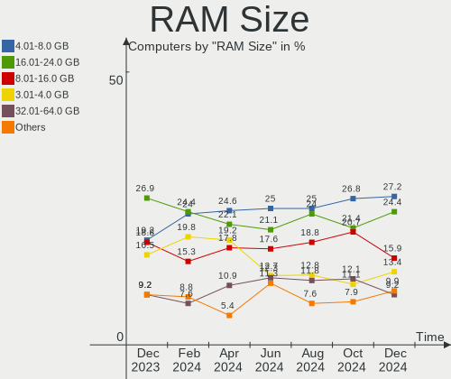
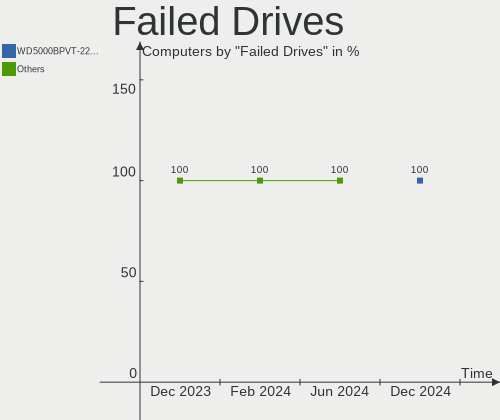
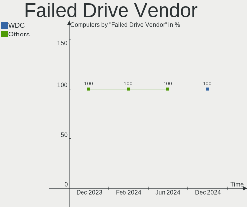
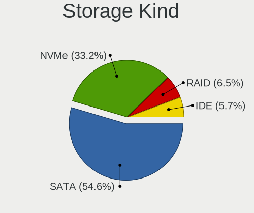
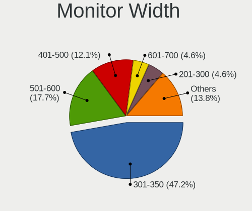
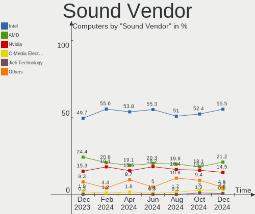
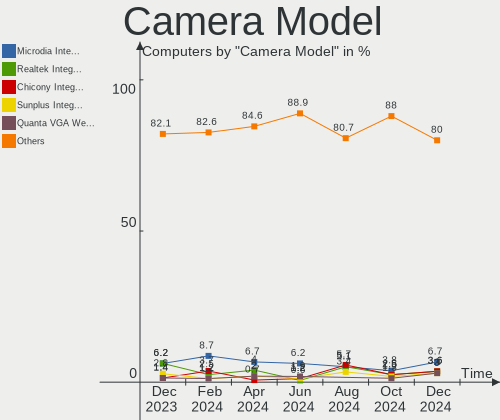
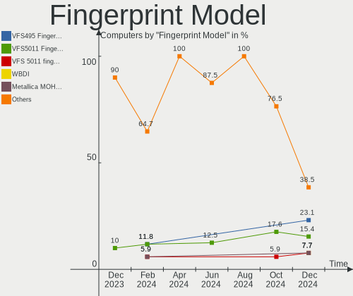

Linux in Brazil - Hardware Trends
---------------------------------

A project to identify most popular hardware characteristics and track their change
over time based on data collected by Linux users at https://Linux-Hardware.org.

Anyone can contribute to this report by the [hw-probe](https://github.com/linuxhw/hw-probe) tool:

    sudo -E hw-probe -all -upload

This is a report for all computer types. See also reports for [desktops](/Location/Brazil/Desktop/README.md) and [notebooks](/Location/Brazil/Notebook/README.md).

Period: Apr, 2023.

Contents
--------

* [ System ](#system)
  - [ OS                       ](#os)
  - [ OS Family                ](#os-family)
  - [ Kernel                   ](#kernel)
  - [ Kernel Family            ](#kernel-family)
  - [ Kernel Major Ver.        ](#kernel-major-ver)
  - [ Arch                     ](#arch)
  - [ DE                       ](#de)
  - [ Display Server           ](#display-server)
  - [ Display Manager          ](#display-manager)
  - [ OS Lang                  ](#os-lang)
  - [ Boot Mode                ](#boot-mode)
  - [ Filesystem               ](#filesystem)
  - [ Part. scheme             ](#part-scheme)
  - [ Dual Boot with Linux/BSD ](#dual-boot-with-linuxbsd)
  - [ Dual Boot (Win)          ](#dual-boot-win)

* [ Board ](#board)
  - [ Vendor                   ](#vendor)
  - [ Model                    ](#model)
  - [ Model Family             ](#model-family)
  - [ MFG Year                 ](#mfg-year)
  - [ Form Factor              ](#form-factor)
  - [ Secure Boot              ](#secure-boot)
  - [ Coreboot                 ](#coreboot)
  - [ RAM Size                 ](#ram-size)
  - [ RAM Used                 ](#ram-used)
  - [ Total Drives             ](#total-drives)
  - [ Has CD-ROM               ](#has-cd-rom)
  - [ Has Ethernet             ](#has-ethernet)
  - [ Has WiFi                 ](#has-wifi)
  - [ Has Bluetooth            ](#has-bluetooth)

* [ Location ](#location)
  - [ Country                  ](#country)
  - [ City                     ](#city)

* [ Drives ](#drives)
  - [ Drive Vendor             ](#drive-vendor)
  - [ Drive Model              ](#drive-model)
  - [ HDD Vendor               ](#hdd-vendor)
  - [ SSD Vendor               ](#ssd-vendor)
  - [ Drive Kind               ](#drive-kind)
  - [ Drive Connector          ](#drive-connector)
  - [ Drive Size               ](#drive-size)
  - [ Space Total              ](#space-total)
  - [ Space Used               ](#space-used)
  - [ Malfunc. Drives          ](#malfunc-drives)
  - [ Malfunc. Drive Vendor    ](#malfunc-drive-vendor)
  - [ Malfunc. HDD Vendor      ](#malfunc-hdd-vendor)
  - [ Malfunc. Drive Kind      ](#malfunc-drive-kind)
  - [ Failed Drives            ](#failed-drives)
  - [ Failed Drive Vendor      ](#failed-drive-vendor)
  - [ Drive Status             ](#drive-status)

* [ Storage controller ](#storage-controller)
  - [ Storage Vendor           ](#storage-vendor)
  - [ Storage Model            ](#storage-model)
  - [ Storage Kind             ](#storage-kind)

* [ Processor ](#processor)
  - [ CPU Vendor               ](#cpu-vendor)
  - [ CPU Model                ](#cpu-model)
  - [ CPU Model Family         ](#cpu-model-family)
  - [ CPU Cores                ](#cpu-cores)
  - [ CPU Sockets              ](#cpu-sockets)
  - [ CPU Threads              ](#cpu-threads)
  - [ CPU Op-Modes             ](#cpu-op-modes)
  - [ CPU Microcode            ](#cpu-microcode)
  - [ CPU Microarch            ](#cpu-microarch)

* [ Graphics ](#graphics)
  - [ GPU Vendor               ](#gpu-vendor)
  - [ GPU Model                ](#gpu-model)
  - [ GPU Combo                ](#gpu-combo)
  - [ GPU Driver               ](#gpu-driver)
  - [ GPU Memory               ](#gpu-memory)

* [ Monitor ](#monitor)
  - [ Monitor Vendor           ](#monitor-vendor)
  - [ Monitor Model            ](#monitor-model)
  - [ Monitor Resolution       ](#monitor-resolution)
  - [ Monitor Diagonal         ](#monitor-diagonal)
  - [ Monitor Width            ](#monitor-width)
  - [ Aspect Ratio             ](#aspect-ratio)
  - [ Monitor Area             ](#monitor-area)
  - [ Pixel Density            ](#pixel-density)
  - [ Multiple Monitors        ](#multiple-monitors)

* [ Network ](#network)
  - [ Net Controller Vendor    ](#net-controller-vendor)
  - [ Net Controller Model     ](#net-controller-model)
  - [ Wireless Vendor          ](#wireless-vendor)
  - [ Wireless Model           ](#wireless-model)
  - [ Ethernet Vendor          ](#ethernet-vendor)
  - [ Ethernet Model           ](#ethernet-model)
  - [ Net Controller Kind      ](#net-controller-kind)
  - [ Used Controller          ](#used-controller)
  - [ NICs                     ](#nics)
  - [ IPv6                     ](#ipv6)

* [ Bluetooth ](#bluetooth)
  - [ Bluetooth Vendor         ](#bluetooth-vendor)
  - [ Bluetooth Model          ](#bluetooth-model)

* [ Sound ](#sound)
  - [ Sound Vendor             ](#sound-vendor)
  - [ Sound Model              ](#sound-model)

* [ Memory ](#memory)
  - [ Memory Vendor            ](#memory-vendor)
  - [ Memory Model             ](#memory-model)
  - [ Memory Kind              ](#memory-kind)
  - [ Memory Form Factor       ](#memory-form-factor)
  - [ Memory Size              ](#memory-size)
  - [ Memory Speed             ](#memory-speed)

* [ Printers & scanners ](#printers--scanners)
  - [ Printer Vendor           ](#printer-vendor)
  - [ Printer Model            ](#printer-model)
  - [ Scanner Vendor           ](#scanner-vendor)
  - [ Scanner Model            ](#scanner-model)

* [ Camera ](#camera)
  - [ Camera Vendor            ](#camera-vendor)
  - [ Camera Model             ](#camera-model)

* [ Security ](#security)
  - [ Fingerprint Vendor       ](#fingerprint-vendor)
  - [ Fingerprint Model        ](#fingerprint-model)
  - [ Chipcard Vendor          ](#chipcard-vendor)
  - [ Chipcard Model           ](#chipcard-model)

* [ Unsupported ](#unsupported)
  - [ Unsupported Devices      ](#unsupported-devices)
  - [ Unsupported Device Types ](#unsupported-device-types)

System
------

OS
--

Installed operating systems

| Name                         | Computers | Percent |
|------------------------------|-----------|---------|
| OpenMandriva 23.03           | 45        | 16.13%  |
| Ubuntu 22.04                 | 38        | 13.62%  |
| Fedora 38                    | 19        | 6.81%   |
| Linux Mint 21.1              | 16        | 5.73%   |
| Pop!_OS 22.04                | 11        | 3.94%   |
| Fedora 37                    | 11        | 3.94%   |
| Ubuntu 23.04                 | 10        | 3.58%   |
| Manjaro                      | 10        | 3.58%   |
| Arch Rolling                 | 10        | 3.58%   |
| Zorin 16                     | 9         | 3.23%   |
| Debian 11                    | 8         | 2.87%   |
| Ubuntu 22.10                 | 7         | 2.51%   |
| OpenMandriva 4.3             | 6         | 2.15%   |
| Debian 12                    | 6         | 2.15%   |
| Ubuntu 20.04                 | 5         | 1.79%   |
| openSUSE Tumbleweed-XXXXXXXX | 5         | 1.79%   |
| Linux Mint 20.3              | 4         | 1.43%   |
| KDE neon 22.04               | 4         | 1.43%   |
| ROSA 12.4                    | 2         | 0.72%   |
| OpenMandriva 4.2             | 2         | 0.72%   |
| NixOS 23.05                  | 2         | 0.72%   |
| LMDE 5                       | 2         | 0.72%   |
| Linux Mint 21                | 2         | 0.72%   |
| Linux Mint 20.1              | 2         | 0.72%   |
| Kubuntu 22.04                | 2         | 0.72%   |
| EndeavourOS Rolling          | 2         | 0.72%   |
| Elementary 7                 | 2         | 0.72%   |
| Elementary 6.1               | 2         | 0.72%   |
| antiX 22                     | 2         | 0.72%   |
| Zorin 15                     | 1         | 0.36%   |
| Ubuntu Unity 16.04           | 1         | 0.36%   |
| Ubuntu MATE 22.04            | 1         | 0.36%   |
| Ubuntu Budgie 22.04          | 1         | 0.36%   |
| Ubuntu 21.04                 | 1         | 0.36%   |
| Ubuntu 18.04                 | 1         | 0.36%   |
| Trisquel 11.0                | 1         | 0.36%   |
| SteamOS 3.4.6                | 1         | 0.36%   |
| ROSA R11.1                   | 1         | 0.36%   |
| PureOS 10.0                  | 1         | 0.36%   |
| org.kde.Platform 5.15-21.08  | 1         | 0.36%   |

OS Family
---------

OS without a version

| Name             | Computers | Percent |
|------------------|-----------|---------|
| Ubuntu           | 62        | 22.22%  |
| OpenMandriva     | 55        | 19.71%  |
| Fedora           | 30        | 10.75%  |
| Linux Mint       | 27        | 9.68%   |
| Debian           | 15        | 5.38%   |
| Pop!_OS          | 11        | 3.94%   |
| Manjaro          | 11        | 3.94%   |
| Zorin            | 10        | 3.58%   |
| Arch             | 10        | 3.58%   |
| openSUSE         | 6         | 2.15%   |
| KDE neon         | 4         | 1.43%   |
| Elementary       | 4         | 1.43%   |
| ROSA             | 3         | 1.08%   |
| Kubuntu          | 3         | 1.08%   |
| Endless          | 3         | 1.08%   |
| NixOS            | 2         | 0.72%   |
| LMDE             | 2         | 0.72%   |
| EndeavourOS      | 2         | 0.72%   |
| antiX            | 2         | 0.72%   |
| Ubuntu Unity     | 1         | 0.36%   |
| Ubuntu MATE      | 1         | 0.36%   |
| Ubuntu Budgie    | 1         | 0.36%   |
| Trisquel         | 1         | 0.36%   |
| SteamOS          | 1         | 0.36%   |
| PureOS           | 1         | 0.36%   |
| org.kde.Platform | 1         | 0.36%   |
| Nobara           | 1         | 0.36%   |
| Lubuntu          | 1         | 0.36%   |
| KaOS             | 1         | 0.36%   |
| Kali             | 1         | 0.36%   |
| Garuda Linux     | 1         | 0.36%   |
| Clear Linux      | 1         | 0.36%   |
| ChimeraOS        | 1         | 0.36%   |
| BigLinux         | 1         | 0.36%   |
| Artix            | 1         | 0.36%   |
| ArcoLinux        | 1         | 0.36%   |

Kernel
------

Version of the Linux kernel

| Version                  | Computers | Percent |
|--------------------------|-----------|---------|
| 6.2.6-desktop-1omv2390   | 45        | 16.13%  |
| 5.19.0-38-generic        | 23        | 8.24%   |
| 5.15.0-69-generic        | 19        | 6.81%   |
| 5.19.0-40-generic        | 15        | 5.38%   |
| 6.2.6-76060206-generic   | 11        | 3.94%   |
| 6.2.11-300.fc38.x86_64   | 11        | 3.94%   |
| 5.19.0-41-generic        | 9         | 3.23%   |
| 5.10.0-21-amd64          | 8         | 2.87%   |
| 6.1.0-7-amd64            | 7         | 2.51%   |
| 6.2.0-20-generic         | 6         | 2.15%   |
| 6.2.9-200.fc37.x86_64    | 4         | 1.43%   |
| 6.2.12-300.fc38.x86_64   | 4         | 1.43%   |
| 5.16.7-desktop-1omv4003  | 4         | 1.43%   |
| 6.2.10-200.fc37.x86_64   | 3         | 1.08%   |
| 5.15.0-71-generic        | 3         | 1.08%   |
| 5.15.0-67-generic        | 3         | 1.08%   |
| 5.15.0-56-generic        | 3         | 1.08%   |
| 6.2.9-zen1-1-zen         | 2         | 0.72%   |
| 6.2.9-arch1-1            | 2         | 0.72%   |
| 6.2.13-300.fc38.x86_64   | 2         | 0.72%   |
| 6.2.12-zen1-1-zen        | 2         | 0.72%   |
| 6.2.12-arch1-1           | 2         | 0.72%   |
| 6.2.12-1-MANJARO         | 2         | 0.72%   |
| 6.2.12-1-default         | 2         | 0.72%   |
| 6.2.11-arch1-1           | 2         | 0.72%   |
| 6.2.11-200.fc37.x86_64   | 2         | 0.72%   |
| 6.2.10-1-default         | 2         | 0.72%   |
| 6.2.0-19-generic         | 2         | 0.72%   |
| 6.2.0-18-generic         | 2         | 0.72%   |
| 6.1.23-1-MANJARO         | 2         | 0.72%   |
| 6.1.22-1-MANJARO         | 2         | 0.72%   |
| 5.4.0-147-generic        | 2         | 0.72%   |
| 5.4.0-146-generic        | 2         | 0.72%   |
| 5.16.13-desktop-1omv4003 | 2         | 0.72%   |
| 5.15.108-1-MANJARO       | 2         | 0.72%   |
| 5.15.0-70-generic        | 2         | 0.72%   |
| 5.15.0-58-generic        | 2         | 0.72%   |
| 5.10.14-desktop-1omv4002 | 2         | 0.72%   |
| 4.15.0-209-generic       | 2         | 0.72%   |
| 6.2.9-lqx1               | 1         | 0.36%   |

Kernel Family
-------------

Linux kernel without a distro release

| Version  | Computers | Percent |
|----------|-----------|---------|
| 6.2.6    | 56        | 20.07%  |
| 5.19.0   | 51        | 18.28%  |
| 5.15.0   | 34        | 12.19%  |
| 6.2.11   | 16        | 5.73%   |
| 6.2.12   | 12        | 4.3%    |
| 6.2.9    | 11        | 3.94%   |
| 6.2.0    | 11        | 3.94%   |
| 5.10.0   | 10        | 3.58%   |
| 6.1.0    | 9         | 3.23%   |
| 6.2.10   | 8         | 2.87%   |
| 5.4.0    | 8         | 2.87%   |
| 6.2.8    | 4         | 1.43%   |
| 6.2.13   | 4         | 1.43%   |
| 5.16.7   | 4         | 1.43%   |
| 5.11.0   | 4         | 1.43%   |
| 4.15.0   | 4         | 1.43%   |
| 6.1.23   | 2         | 0.72%   |
| 6.1.22   | 2         | 0.72%   |
| 6.1.20   | 2         | 0.72%   |
| 6.1.11   | 2         | 0.72%   |
| 5.16.13  | 2         | 0.72%   |
| 5.15.108 | 2         | 0.72%   |
| 5.10.14  | 2         | 0.72%   |
| 6.1.8    | 1         | 0.36%   |
| 6.1.25   | 1         | 0.36%   |
| 6.1.2    | 1         | 0.36%   |
| 6.1.1    | 1         | 0.36%   |
| 6.0.7    | 1         | 0.36%   |
| 5.4.32   | 1         | 0.36%   |
| 5.19.5   | 1         | 0.36%   |
| 5.15.79  | 1         | 0.36%   |
| 5.15.77  | 1         | 0.36%   |
| 5.15.106 | 1         | 0.36%   |
| 5.14.21  | 1         | 0.36%   |
| 5.14.0   | 1         | 0.36%   |
| 5.13.0   | 1         | 0.36%   |
| 5.11.16  | 1         | 0.36%   |
| 5.10.155 | 1         | 0.36%   |
| 5.10.142 | 1         | 0.36%   |
| 5.0.0    | 1         | 0.36%   |

Kernel Major Ver.
-----------------

Linux kernel major version

| Version | Computers | Percent |
|---------|-----------|---------|
| 6.2     | 122       | 43.73%  |
| 5.19    | 52        | 18.64%  |
| 5.15    | 39        | 13.98%  |
| 6.1     | 21        | 7.53%   |
| 5.10    | 14        | 5.02%   |
| 5.4     | 9         | 3.23%   |
| 5.16    | 6         | 2.15%   |
| 5.11    | 5         | 1.79%   |
| 4.15    | 4         | 1.43%   |
| 5.14    | 2         | 0.72%   |
| 6.0     | 1         | 0.36%   |
| 5.13    | 1         | 0.36%   |
| 5.0     | 1         | 0.36%   |
| 4.9     | 1         | 0.36%   |
| 4.4     | 1         | 0.36%   |

Arch
----

OS architecture (x86_64, i586, etc.)

| Name   | Computers | Percent |
|--------|-----------|---------|
| x86_64 | 279       | 100%    |

DE
--

Desktop Environment

| Name          | Computers | Percent |
|---------------|-----------|---------|
| GNOME         | 134       | 48.03%  |
| KDE5          | 85        | 30.47%  |
| X-Cinnamon    | 18        | 6.45%   |
| XFCE          | 14        | 5.02%   |
| Unknown       | 5         | 1.79%   |
| Pantheon      | 4         | 1.43%   |
| MATE          | 4         | 1.43%   |
| LXQt          | 4         | 1.43%   |
| sway          | 3         | 1.08%   |
| Unity         | 1         | 0.36%   |
| icewm         | 1         | 0.36%   |
| GNOME Classic | 1         | 0.36%   |
| fluxbox       | 1         | 0.36%   |
| Enlightenment | 1         | 0.36%   |
| Deepin        | 1         | 0.36%   |
| Cinnamon      | 1         | 0.36%   |
| Budgie        | 1         | 0.36%   |

Display Server
--------------

X11 or Wayland

| Name    | Computers | Percent |
|---------|-----------|---------|
| X11     | 184       | 65.95%  |
| Wayland | 89        | 31.9%   |
| Unknown | 5         | 1.79%   |
| Tty     | 1         | 0.36%   |

Display Manager
---------------

SDDM, LightDM, etc.

| Name    | Computers | Percent |
|---------|-----------|---------|
| Unknown | 111       | 39.78%  |
| SDDM    | 68        | 24.37%  |
| GDM3    | 62        | 22.22%  |
| GDM     | 21        | 7.53%   |
| LightDM | 16        | 5.73%   |
| XDM     | 1         | 0.36%   |

OS Lang
-------

Language

| Lang       | Computers | Percent |
|------------|-----------|---------|
| pt_BR      | 192       | 68.82%  |
| en_US      | 65        | 23.3%   |
| C          | 7         | 2.51%   |
| en_CA      | 4         | 1.43%   |
| Unknown    | 4         | 1.43%   |
| en_GB      | 3         | 1.08%   |
| pt_PT      | 2         | 0.72%   |
| en_IE.UTF8 | 1         | 0.36%   |
| de_CH      | 1         | 0.36%   |

Boot Mode
---------

EFI or BIOS

| Mode | Computers | Percent |
|------|-----------|---------|
| EFI  | 142       | 50.9%   |
| BIOS | 137       | 49.1%   |

Filesystem
----------

Type of filesystem

| Type    | Computers | Percent |
|---------|-----------|---------|
| Ext4    | 170       | 60.93%  |
| Btrfs   | 51        | 18.28%  |
| Overlay | 37        | 13.26%  |
| Tmpfs   | 15        | 5.38%   |
| Zfs     | 3         | 1.08%   |
| Xfs     | 2         | 0.72%   |
| F2fs    | 1         | 0.36%   |

Part. scheme
------------

Scheme of partitioning

| Type    | Computers | Percent |
|---------|-----------|---------|
| GPT     | 144       | 51.61%  |
| Unknown | 100       | 35.84%  |
| MBR     | 35        | 12.54%  |

Dual Boot with Linux/BSD
------------------------

Hosting more than one Linux/BSD

| Dual boot | Computers | Percent |
|-----------|-----------|---------|
| No        | 232       | 83.15%  |
| Yes       | 47        | 16.85%  |

Dual Boot (Win)
---------------

Hosting Linux and Windows

| Dual boot | Computers | Percent |
|-----------|-----------|---------|
| No        | 203       | 72.76%  |
| Yes       | 76        | 27.24%  |

Board
-----

Vendor
------

Motherboard manufacturer

| Name                   | Computers | Percent |
|------------------------|-----------|---------|
| Dell                   | 41        | 14.7%   |
| ASUSTek Computer       | 35        | 12.54%  |
| Lenovo                 | 29        | 10.39%  |
| Acer                   | 23        | 8.24%   |
| Hewlett-Packard        | 19        | 6.81%   |
| Intel                  | 18        | 6.45%   |
| Gigabyte Technology    | 16        | 5.73%   |
| Samsung Electronics    | 14        | 5.02%   |
| ASRock                 | 10        | 3.58%   |
| Positivo               | 9         | 3.23%   |
| MSI                    | 6         | 2.15%   |
| Biostar                | 6         | 2.15%   |
| Avell High Performance | 5         | 1.79%   |
| OEM                    | 4         | 1.43%   |
| Apple                  | 4         | 1.43%   |
| Multilaser             | 3         | 1.08%   |
| Itautec                | 3         | 1.08%   |
| Unknown                | 3         | 1.08%   |
| Valve                  | 2         | 0.72%   |
| Pegatron               | 2         | 0.72%   |
| PCWare                 | 2         | 0.72%   |
| Notebook               | 2         | 0.72%   |
| LG Electronics         | 2         | 0.72%   |
| AMD                    | 2         | 0.72%   |
| Win element            | 1         | 0.36%   |
| ULTRATOP               | 1         | 0.36%   |
| Timi                   | 1         | 0.36%   |
| Sony                   | 1         | 0.36%   |
| Semp Toshiba           | 1         | 0.36%   |
| QIYIDA                 | 1         | 0.36%   |
| Purism                 | 1         | 0.36%   |
| MACHINIST              | 1         | 0.36%   |
| Login Informatica      | 1         | 0.36%   |
| Huanan                 | 1         | 0.36%   |
| HOUTER                 | 1         | 0.36%   |
| Gateway                | 1         | 0.36%   |
| Evolute                | 1         | 0.36%   |
| ECS                    | 1         | 0.36%   |
| Digibras               | 1         | 0.36%   |
| DIEBOLD                | 1         | 0.36%   |

Model
-----

Motherboard model

| Name                                                  | Computers | Percent |
|-------------------------------------------------------|-----------|---------|
| Lenovo IdeaPad 3 15ALC6 82MF                          | 5         | 1.79%   |
| ASUS All Series                                       | 5         | 1.79%   |
| Intel B75                                             | 4         | 1.43%   |
| Unknown                                               | 4         | 1.43%   |
| ASUS VivoBook_ASUSLaptop X515DA_X515DA                | 3         | 1.08%   |
| Valve Jupiter                                         | 2         | 0.72%   |
| Samsung 730QED                                        | 2         | 0.72%   |
| Samsung 550P5C/550P7C                                 | 2         | 0.72%   |
| Positivo Q4128C-S                                     | 2         | 0.72%   |
| Lenovo V14 G2 ITL 82NM                                | 2         | 0.72%   |
| Lenovo IdeaPad S145-15API 81V7                        | 2         | 0.72%   |
| Lenovo IdeaPad 330-15IKB 81FE                         | 2         | 0.72%   |
| Lenovo IdeaPad 320-15IKB 80YH                         | 2         | 0.72%   |
| Intel H81                                             | 2         | 0.72%   |
| Intel H61                                             | 2         | 0.72%   |
| HP Pavilion g4                                        | 2         | 0.72%   |
| Dell Inspiron 5566                                    | 2         | 0.72%   |
| Dell Inspiron 5482                                    | 2         | 0.72%   |
| Dell Inspiron 15-3567                                 | 2         | 0.72%   |
| Dell G15 5520                                         | 2         | 0.72%   |
| Avell High Performance A52 HYB                        | 2         | 0.72%   |
| ASUS PRIME B450M-GAMING/BR                            | 2         | 0.72%   |
| Acer Nitro AN515-54                                   | 2         | 0.72%   |
| Acer Nitro AN515-45                                   | 2         | 0.72%   |
| Acer Aspire E5-471                                    | 2         | 0.72%   |
| Win element M600                                      | 1         | 0.36%   |
| ULTRATOP C2017-LIVA-ZE                                | 1         | 0.36%   |
| Timi RedmiBook Pro 14S                                | 1         | 0.36%   |
| Sony VJF155F11X-B0811B                                | 1         | 0.36%   |
| Semp Toshiba IS 1413G                                 | 1         | 0.36%   |
| Samsung RV419                                         | 1         | 0.36%   |
| Samsung RV411/RV511/E3511/S3511/RV711                 | 1         | 0.36%   |
| Samsung 767XCL                                        | 1         | 0.36%   |
| Samsung 700Z3A/700Z4A/700Z5A/700Z5B                   | 1         | 0.36%   |
| Samsung 670Z5E                                        | 1         | 0.36%   |
| Samsung 550XDA                                        | 1         | 0.36%   |
| Samsung 550XCJ/550XCR                                 | 1         | 0.36%   |
| Samsung 340XAA/350XAA/550XAA                          | 1         | 0.36%   |
| Samsung 300E5EV/300E4EV/270E5EV/270E4EV/2470EV/2470EE | 1         | 0.36%   |
| Samsung 270E5G/270E5U                                 | 1         | 0.36%   |

Model Family
------------

Motherboard model prefix

| Name                       | Computers | Percent |
|----------------------------|-----------|---------|
| Dell Inspiron              | 21        | 7.53%   |
| Lenovo IdeaPad             | 13        | 4.66%   |
| Acer Aspire                | 13        | 4.66%   |
| Acer Nitro                 | 7         | 2.51%   |
| Dell Vostro                | 6         | 2.15%   |
| ASUS TUF                   | 6         | 2.15%   |
| ASUS PRIME                 | 6         | 2.15%   |
| Lenovo ThinkPad            | 5         | 1.79%   |
| ASUS All                   | 5         | 1.79%   |
| Lenovo ThinkCentre         | 4         | 1.43%   |
| Intel H61                  | 4         | 1.43%   |
| Intel B75                  | 4         | 1.43%   |
| Dell G15                   | 4         | 1.43%   |
| ASUS VivoBook              | 4         | 1.43%   |
| Unknown                    | 4         | 1.43%   |
| Itautec Infoway            | 3         | 1.08%   |
| HP Pavilion                | 3         | 1.08%   |
| Dell Latitude              | 3         | 1.08%   |
| Valve Jupiter              | 2         | 0.72%   |
| Samsung 730QED             | 2         | 0.72%   |
| Samsung 550P5C             | 2         | 0.72%   |
| Positivo Q4128C-S          | 2         | 0.72%   |
| Lenovo V14                 | 2         | 0.72%   |
| Intel H81                  | 2         | 0.72%   |
| HP ProDesk                 | 2         | 0.72%   |
| HP Compaq                  | 2         | 0.72%   |
| HP 240                     | 2         | 0.72%   |
| Dell OptiPlex              | 2         | 0.72%   |
| Dell G3                    | 2         | 0.72%   |
| Avell High Performance A70 | 2         | 0.72%   |
| Avell High Performance A52 | 2         | 0.72%   |
| ASUS ROG                   | 2         | 0.72%   |
| ASUS P8H61-M               | 2         | 0.72%   |
| ASUS M5A78L-M              | 2         | 0.72%   |
| ASRock B550M               | 2         | 0.72%   |
| Acer Spin                  | 2         | 0.72%   |
| Win element M600           | 1         | 0.36%   |
| ULTRATOP C2017-LIVA-ZE     | 1         | 0.36%   |
| Timi RedmiBook             | 1         | 0.36%   |
| Sony VJF155F11X-B0811B     | 1         | 0.36%   |

MFG Year
--------

Motherboard manufacture year

| Year    | Computers | Percent |
|---------|-----------|---------|
| 2021    | 37        | 13.26%  |
| 2020    | 34        | 12.19%  |
| 2018    | 28        | 10.04%  |
| 2022    | 21        | 7.53%   |
| 2019    | 21        | 7.53%   |
| 2011    | 19        | 6.81%   |
| 2017    | 18        | 6.45%   |
| 2012    | 18        | 6.45%   |
| 2014    | 17        | 6.09%   |
| 2013    | 12        | 4.3%    |
| 2016    | 11        | 3.94%   |
| 2015    | 11        | 3.94%   |
| 2010    | 10        | 3.58%   |
| 2008    | 9         | 3.23%   |
| 2009    | 5         | 1.79%   |
| 2006    | 4         | 1.43%   |
| 2007    | 2         | 0.72%   |
| Unknown | 2         | 0.72%   |

Form Factor
-----------

Physical design of the computer

| Name        | Computers | Percent |
|-------------|-----------|---------|
| Notebook    | 144       | 51.61%  |
| Desktop     | 119       | 42.65%  |
| Convertible | 9         | 3.23%   |
| Mini pc     | 3         | 1.08%   |
| All in one  | 3         | 1.08%   |
| Server      | 1         | 0.36%   |

Secure Boot
-----------

Enabled or disabled

| State    | Computers | Percent |
|----------|-----------|---------|
| Disabled | 257       | 92.11%  |
| Enabled  | 22        | 7.89%   |

Coreboot
--------

Have coreboot on board

| Used | Computers | Percent |
|------|-----------|---------|
| No   | 278       | 99.64%  |
| Yes  | 1         | 0.36%   |

RAM Size
--------

Total RAM memory

| Size in GB  | Computers | Percent |
|-------------|-----------|---------|
| 4.01-8.0    | 79        | 28.32%  |
| 16.01-24.0  | 68        | 24.37%  |
| 3.01-4.0    | 45        | 16.13%  |
| 8.01-16.0   | 41        | 14.7%   |
| 32.01-64.0  | 17        | 6.09%   |
| 1.01-2.0    | 13        | 4.66%   |
| 24.01-32.0  | 6         | 2.15%   |
| 64.01-256.0 | 6         | 2.15%   |
| 2.01-3.0    | 4         | 1.43%   |

RAM Used
--------

Used RAM memory

| Used GB    | Computers | Percent |
|------------|-----------|---------|
| 2.01-3.0   | 89        | 31.9%   |
| 1.01-2.0   | 69        | 24.73%  |
| 3.01-4.0   | 46        | 16.49%  |
| 4.01-8.0   | 45        | 16.13%  |
| 0.51-1.0   | 15        | 5.38%   |
| 8.01-16.0  | 12        | 4.3%    |
| 0.01-0.5   | 2         | 0.72%   |
| 16.01-24.0 | 1         | 0.36%   |

Total Drives
------------

Number of drives on board

| Drives | Computers | Percent |
|--------|-----------|---------|
| 1      | 149       | 53.41%  |
| 2      | 80        | 28.67%  |
| 3      | 29        | 10.39%  |
| 4      | 12        | 4.3%    |
| 6      | 5         | 1.79%   |
| 5      | 3         | 1.08%   |
| 7      | 1         | 0.36%   |

Has CD-ROM
----------

Has CD-ROM on board

| Presented | Computers | Percent |
|-----------|-----------|---------|
| No        | 198       | 70.97%  |
| Yes       | 81        | 29.03%  |

Has Ethernet
------------

Has Ethernet on board

| Presented | Computers | Percent |
|-----------|-----------|---------|
| Yes       | 243       | 87.1%   |
| No        | 36        | 12.9%   |

Has WiFi
--------

Has WiFi module

| Presented | Computers | Percent |
|-----------|-----------|---------|
| Yes       | 197       | 70.61%  |
| No        | 82        | 29.39%  |

Has Bluetooth
-------------

Has Bluetooth module

| Presented | Computers | Percent |
|-----------|-----------|---------|
| Yes       | 156       | 55.91%  |
| No        | 123       | 44.09%  |

Location
--------

Country
-------

Geographic location (country)

| Country | Computers | Percent |
|---------|-----------|---------|
| Brazil  | 279       | 100%    |

City
----

Geographic location (city)

| City                  | Computers | Percent |
|-----------------------|-----------|---------|
| Sao Paulo             | 30        | 10.75%  |
| Rio de Janeiro        | 19        | 6.81%   |
| Porto Alegre          | 10        | 3.58%   |
| Brasília             | 8         | 2.87%   |
| Joao Pessoa           | 6         | 2.15%   |
| Belo Horizonte        | 6         | 2.15%   |
| Fortaleza             | 5         | 1.79%   |
| Uberlândia           | 4         | 1.43%   |
| Recife                | 4         | 1.43%   |
| Londrina              | 4         | 1.43%   |
| Florianópolis        | 4         | 1.43%   |
| Curitiba              | 4         | 1.43%   |
| Campo Grande          | 4         | 1.43%   |
| Campina Grande        | 4         | 1.43%   |
| Aracaju               | 4         | 1.43%   |
| Teresina              | 3         | 1.08%   |
| Sorocaba              | 3         | 1.08%   |
| Sao Vicente           | 3         | 1.08%   |
| Sao José dos Campos  | 3         | 1.08%   |
| Sao Bernardo do Campo | 3         | 1.08%   |
| Santo André          | 3         | 1.08%   |
| Salvador              | 3         | 1.08%   |
| Praia Grande          | 3         | 1.08%   |
| Juazeiro do Norte     | 3         | 1.08%   |
| Campinas              | 3         | 1.08%   |
| Vila Velha            | 2         | 0.72%   |
| Vassouras             | 2         | 0.72%   |
| Teresopolis           | 2         | 0.72%   |
| Sao Luís             | 2         | 0.72%   |
| Sao Jose do Rio Preto | 2         | 0.72%   |
| Sao Goncalo           | 2         | 0.72%   |
| Palmas                | 2         | 0.72%   |
| Niterói              | 2         | 0.72%   |
| Maua                  | 2         | 0.72%   |
| Maringá              | 2         | 0.72%   |
| Joinville             | 2         | 0.72%   |
| Hortolândia          | 2         | 0.72%   |
| Guarulhos             | 2         | 0.72%   |
| Farroupilha           | 2         | 0.72%   |
| Duque de Caxias       | 2         | 0.72%   |

Drives
------

Drive Vendor
------------

Hard drive vendors

| Vendor                      | Computers | Drives | Percent |
|-----------------------------|-----------|--------|---------|
| Seagate                     | 64        | 82     | 14.78%  |
| WDC                         | 62        | 71     | 14.32%  |
| Kingston                    | 54        | 63     | 12.47%  |
| Samsung Electronics         | 31        | 39     | 7.16%   |
| China                       | 21        | 22     | 4.85%   |
| Toshiba                     | 19        | 20     | 4.39%   |
| A-DATA Technology           | 18        | 19     | 4.16%   |
| Sandisk                     | 16        | 17     | 3.7%    |
| Unknown                     | 15        | 18     | 3.46%   |
| Crucial                     | 14        | 15     | 3.23%   |
| ADATA Technology            | 13        | 13     | 3%      |
| SSSTC                       | 7         | 7      | 1.62%   |
| SK hynix                    | 6         | 6      | 1.39%   |
| Realtek Semiconductor       | 6         | 6      | 1.39%   |
| XrayDisk                    | 5         | 5      | 1.15%   |
| KingSpec                    | 5         | 5      | 1.15%   |
| JMicron Technology          | 5         | 5      | 1.15%   |
| Hitachi                     | 5         | 5      | 1.15%   |
| Silicon Motion              | 4         | 4      | 0.92%   |
| Patriot                     | 4         | 4      | 0.92%   |
| Kingston Technology Company | 4         | 5      | 0.92%   |
| PNY                         | 3         | 3      | 0.69%   |
| HUSKY                       | 3         | 3      | 0.69%   |
| Unknown                     | 3         | 3      | 0.69%   |
| XPG                         | 2         | 2      | 0.46%   |
| Solid State Storage         | 2         | 2      | 0.46%   |
| Phison Electronics          | 2         | 2      | 0.46%   |
| Micron/Crucial Technology   | 2         | 2      | 0.46%   |
| Micron Technology           | 2         | 2      | 0.46%   |
| LITEON                      | 2         | 2      | 0.46%   |
| Lexar                       | 2         | 2      | 0.46%   |
| KingDian                    | 2         | 2      | 0.46%   |
| Intel                       | 2         | 2      | 0.46%   |
| HGST                        | 2         | 2      | 0.46%   |
| Hewlett-Packard             | 2         | 2      | 0.46%   |
| Gigabyte Technology         | 2         | 2      | 0.46%   |
| Apple                       | 2         | 2      | 0.46%   |
| Win Memory                  | 1         | 1      | 0.23%   |
| WALRAM 1                    | 1         | 1      | 0.23%   |
| walram                      | 1         | 1      | 0.23%   |

Drive Model
-----------

Hard drive models

| Model                                                             | Computers | Percent |
|-------------------------------------------------------------------|-----------|---------|
| Kingston SA400S37480G 480GB SSD                                   | 17        | 3.62%   |
| Kingston SA400S37240G 240GB SSD                                   | 17        | 3.62%   |
| Seagate ST1000DM010-2EP102 1TB                                    | 9         | 1.91%   |
| Kingston SA400S37120G 120GB SSD                                   | 9         | 1.91%   |
| Seagate ST500DM002-1BD142 500GB                                   | 7         | 1.49%   |
| Crucial CT240BX500SSD1 240GB                                      | 7         | 1.49%   |
| SSSTC CL1-4D256 256GB                                             | 5         | 1.06%   |
| JMicron Generic 1TB                                               | 5         | 1.06%   |
| WDC WD3200BPVT-22JJ5T0 320GB                                      | 4         | 0.85%   |
| Seagate ST1000LM035-1RK172 970GB                                  | 4         | 0.85%   |
| Seagate ST1000DM003-1ER162 1TB                                    | 4         | 0.85%   |
| Kingston SV300S37A120G 120GB SSD                                  | 4         | 0.85%   |
| ADATA SM2P32A8-256GC1 256GB                                       | 4         | 0.85%   |
| WDC WDS240G2G0A-00JH30 240GB SSD                                  | 3         | 0.64%   |
| WDC WDS120G2G0B-00EPW0 120GB SSD                                  | 3         | 0.64%   |
| WDC WD5000AAKX-00U6AA0 500GB                                      | 3         | 0.64%   |
| WDC WD3200AAJS-00L7A0 320GB                                       | 3         | 0.64%   |
| WDC WD10SPZX-21Z10T0 1TB                                          | 3         | 0.64%   |
| WDC WD10EZEX-08WN4A0 1TB                                          | 3         | 0.64%   |
| WDC WD10EZEX-00BN5A0 1TB                                          | 3         | 0.64%   |
| Unknown MMC Card  32GB                                            | 3         | 0.64%   |
| Unknown MMC Card  128GB                                           | 3         | 0.64%   |
| Seagate ST500LM012 HN-M500MBB 500GB                               | 3         | 0.64%   |
| Seagate ST2000DM008-2FR102 2TB                                    | 3         | 0.64%   |
| Seagate ST1000LM048-2E7172 1TB                                    | 3         | 0.64%   |
| Seagate ST1000LM024 HN-M101MBB 1TB                                | 3         | 0.64%   |
| Sandisk WD Blue SN550 NVMe SSD 1024GB                             | 3         | 0.64%   |
| Samsung NVMe SSD Controller SM981/PM981/PM983 1TB                 | 3         | 0.64%   |
| Samsung HD502HI 500GB                                             | 3         | 0.64%   |
| Samsung HD322HJ 320GB                                             | 3         | 0.64%   |
| Realtek RTS5763DL NVMe SSD Controller 512GB                       | 3         | 0.64%   |
| Kingston Company SNV2S2000G 2TB                                   | 3         | 0.64%   |
| China SSD 480GB                                                   | 3         | 0.64%   |
| China SSD 1TB                                                     | 3         | 0.64%   |
| China SSD 128GB                                                   | 3         | 0.64%   |
| ADATA XPG SX8200 Pro PCIe Gen3x4 M.2 2280 Solid State Drive 512GB | 3         | 0.64%   |
| A-DATA IM2P33F3A NVMe 256GB                                       | 3         | 0.64%   |
| Unknown                                                           | 3         | 0.64%   |
| XrayDisk 1TB SSD                                                  | 2         | 0.43%   |
| WDC WDS480G2G0C-00AJM0 480GB                                      | 2         | 0.43%   |

HDD Vendor
----------

Hard disk drive vendors

| Vendor              | Computers | Drives | Percent |
|---------------------|-----------|--------|---------|
| Seagate             | 62        | 79     | 37.35%  |
| WDC                 | 52        | 57     | 31.33%  |
| Samsung Electronics | 18        | 20     | 10.84%  |
| Toshiba             | 17        | 18     | 10.24%  |
| JMicron Technology  | 5         | 5      | 3.01%   |
| Hitachi             | 5         | 5      | 3.01%   |
| Unknown             | 2         | 2      | 1.2%    |
| HGST                | 2         | 2      | 1.2%    |
| HPE                 | 1         | 1      | 0.6%    |
| Hewlett-Packard     | 1         | 1      | 0.6%    |
| Apple               | 1         | 1      | 0.6%    |

SSD Vendor
----------

Solid state drive vendors

| Vendor              | Computers | Drives | Percent |
|---------------------|-----------|--------|---------|
| Kingston            | 47        | 55     | 30.32%  |
| China               | 21        | 22     | 13.55%  |
| Crucial             | 14        | 15     | 9.03%   |
| WDC                 | 9         | 9      | 5.81%   |
| SanDisk             | 8         | 8      | 5.16%   |
| A-DATA Technology   | 8         | 8      | 5.16%   |
| XrayDisk            | 4         | 4      | 2.58%   |
| Samsung Electronics | 4         | 7      | 2.58%   |
| Patriot             | 4         | 4      | 2.58%   |
| PNY                 | 3         | 3      | 1.94%   |
| KingSpec            | 3         | 3      | 1.94%   |
| HUSKY               | 3         | 3      | 1.94%   |
| Seagate             | 2         | 2      | 1.29%   |
| LITEON              | 2         | 2      | 1.29%   |
| Lexar               | 2         | 2      | 1.29%   |
| KingDian            | 2         | 2      | 1.29%   |
| Gigabyte Technology | 2         | 2      | 1.29%   |
| Win Memory          | 1         | 1      | 0.65%   |
| walram              | 1         | 1      | 0.65%   |
| Toshiba             | 1         | 1      | 0.65%   |
| Team                | 1         | 1      | 0.65%   |
| SK hynix            | 1         | 1      | 0.65%   |
| Netac               | 1         | 1      | 0.65%   |
| Micron Technology   | 1         | 1      | 0.65%   |
| Intel               | 1         | 1      | 0.65%   |
| Hised               | 1         | 1      | 0.65%   |
| Hewlett-Packard     | 1         | 1      | 0.65%   |
| Fanxiang            | 1         | 1      | 0.65%   |
| ASMT                | 1         | 1      | 0.65%   |
| Apple               | 1         | 1      | 0.65%   |
| AFOX                | 1         | 1      | 0.65%   |
| Advantech           | 1         | 1      | 0.65%   |
| 4Life               | 1         | 1      | 0.65%   |
| Unknown             | 1         | 1      | 0.65%   |

Drive Kind
----------

HDD or SSD

| Kind    | Computers | Drives | Percent |
|---------|-----------|--------|---------|
| HDD     | 148       | 191    | 37.85%  |
| SSD     | 133       | 168    | 34.02%  |
| NVMe    | 88        | 100    | 22.51%  |
| MMC     | 11        | 13     | 2.81%   |
| Unknown | 11        | 14     | 2.81%   |

Drive Connector
---------------

SATA, SAS, NVMe, etc.

| Type | Computers | Drives | Percent |
|------|-----------|--------|---------|
| SATA | 217       | 346    | 64.2%   |
| NVMe | 88        | 100    | 26.04%  |
| SAS  | 22        | 27     | 6.51%   |
| MMC  | 11        | 13     | 3.25%   |

Drive Size
----------

Size of hard drive

| Size in TB | Computers | Drives | Percent |
|------------|-----------|--------|---------|
| 0.01-0.5   | 178       | 240    | 63.57%  |
| 0.51-1.0   | 76        | 84     | 27.14%  |
| 1.01-2.0   | 16        | 17     | 5.71%   |
| 3.01-4.0   | 8         | 16     | 2.86%   |
| 2.01-3.0   | 2         | 2      | 0.71%   |

Space Total
-----------

Amount of disk space available on the file system

| Size in GB     | Computers | Percent |
|----------------|-----------|---------|
| 101-250        | 68        | 24.37%  |
| 251-500        | 64        | 22.94%  |
| 1-20           | 35        | 12.54%  |
| 1001-2000      | 30        | 10.75%  |
| 501-1000       | 29        | 10.39%  |
| 51-100         | 13        | 4.66%   |
| 21-50          | 12        | 4.3%    |
| Unknown        | 10        | 3.58%   |
| More than 3000 | 9         | 3.23%   |
| 2001-3000      | 9         | 3.23%   |

Space Used
----------

Amount of used disk space

| Used GB        | Computers | Percent |
|----------------|-----------|---------|
| 1-20           | 97        | 34.77%  |
| 21-50          | 52        | 18.64%  |
| 51-100         | 37        | 13.26%  |
| 101-250        | 35        | 12.54%  |
| 251-500        | 22        | 7.89%   |
| 501-1000       | 15        | 5.38%   |
| Unknown        | 10        | 3.58%   |
| 1001-2000      | 8         | 2.87%   |
| More than 3000 | 3         | 1.08%   |

Malfunc. Drives
---------------

Drive models with a malfunction

| Model                               | Computers | Drives | Percent |
|-------------------------------------|-----------|--------|---------|
| WDC WD3200BPVT-22JJ5T0 320GB        | 2         | 2      | 4.65%   |
| XrayDisk SSD 128GB                  | 1         | 1      | 2.33%   |
| XPG GAMMIX S41 512GB                | 1         | 1      | 2.33%   |
| WDC WDS240G2G0A-00JH30 240GB SSD    | 1         | 1      | 2.33%   |
| WDC WD5003ABYX-01WERA0 500GB        | 1         | 1      | 2.33%   |
| WDC WD5000LPVX-22V0TT0 500GB        | 1         | 1      | 2.33%   |
| WDC WD5000LPVX-00V0TT0 500GB        | 1         | 1      | 2.33%   |
| WDC WD5000LPCX-60VHAT0 500GB        | 1         | 1      | 2.33%   |
| WDC WD3200AAKS-75L9A0 320GB         | 1         | 1      | 2.33%   |
| WDC WD3200AAJS-00L7A0 320GB         | 1         | 1      | 2.33%   |
| WDC WD20SPZX-75UA7T0 2TB            | 1         | 1      | 2.33%   |
| WDC WD10EZEX-08WN4A0 1TB            | 1         | 1      | 2.33%   |
| WDC WD10EURX-63FH1Y0 1TB            | 1         | 1      | 2.33%   |
| Toshiba MQ01ABD032 320GB            | 1         | 1      | 2.33%   |
| Toshiba MK5061GSYN 500GB            | 1         | 1      | 2.33%   |
| Toshiba MK2546GSX 250GB             | 1         | 1      | 2.33%   |
| Toshiba MK2529GSG 250GB             | 1         | 1      | 2.33%   |
| Seagate ST500LM012 HN-M500MBB 500GB | 1         | 1      | 2.33%   |
| Seagate ST500DM002-1BD142 500GB     | 1         | 1      | 2.33%   |
| Seagate ST31000524AS 1TB            | 1         | 1      | 2.33%   |
| Seagate ST3000DM001-1CH166 3TB      | 1         | 1      | 2.33%   |
| Seagate ST1000LM048-2E7172 1TB      | 1         | 1      | 2.33%   |
| Seagate ST1000LM024 HN-M101MBB 1TB  | 1         | 1      | 2.33%   |
| Seagate ST1000DM003-1CH162 1TB      | 1         | 1      | 2.33%   |
| SanDisk SSD PLUS 240GB              | 1         | 1      | 2.33%   |
| SanDisk SD6SP1M256G1012 256GB SSD   | 1         | 1      | 2.33%   |
| Samsung Electronics HM501II 500GB   | 1         | 1      | 2.33%   |
| Samsung Electronics HM321HI 320GB   | 1         | 1      | 2.33%   |
| Samsung Electronics HM160HI 160GB   | 1         | 1      | 2.33%   |
| Samsung Electronics HM121HI 120GB   | 1         | 1      | 2.33%   |
| Samsung Electronics HD502IJ 500GB   | 1         | 1      | 2.33%   |
| Samsung Electronics HD502HI 500GB   | 1         | 1      | 2.33%   |
| Samsung Electronics HD322HJ 320GB   | 1         | 1      | 2.33%   |
| Samsung Electronics HD161HJ 160GB   | 1         | 1      | 2.33%   |
| Samsung Electronics HD154UI 1TB     | 1         | 1      | 2.33%   |
| Samsung Electronics HD103SI 1TB     | 1         | 1      | 2.33%   |
| Hitachi HTS725050A7E630 500GB       | 1         | 1      | 2.33%   |
| Hitachi HTS542525K9SA00 250GB       | 1         | 1      | 2.33%   |
| Hitachi HTS542516K9A300 160GB       | 1         | 1      | 2.33%   |
| HGST HTS545050B7E660 500GB          | 1         | 1      | 2.33%   |

Malfunc. Drive Vendor
---------------------

Vendors of faulty drives

| Vendor              | Computers | Drives | Percent |
|---------------------|-----------|--------|---------|
| WDC                 | 11        | 12     | 26.19%  |
| Samsung Electronics | 10        | 10     | 23.81%  |
| Seagate             | 7         | 7      | 16.67%  |
| Toshiba             | 4         | 4      | 9.52%   |
| Hitachi             | 3         | 3      | 7.14%   |
| SanDisk             | 2         | 2      | 4.76%   |
| XrayDisk            | 1         | 1      | 2.38%   |
| XPG                 | 1         | 1      | 2.38%   |
| HGST                | 1         | 1      | 2.38%   |
| Fanxiang            | 1         | 1      | 2.38%   |
| Unknown             | 1         | 1      | 2.38%   |

Malfunc. HDD Vendor
-------------------

Vendors of faulty HDD drives

| Vendor              | Computers | Drives | Percent |
|---------------------|-----------|--------|---------|
| WDC                 | 11        | 11     | 30.56%  |
| Samsung Electronics | 10        | 10     | 27.78%  |
| Seagate             | 7         | 7      | 19.44%  |
| Toshiba             | 4         | 4      | 11.11%  |
| Hitachi             | 3         | 3      | 8.33%   |
| HGST                | 1         | 1      | 2.78%   |

Malfunc. Drive Kind
-------------------

Kinds of faulty drives

| Kind | Computers | Drives | Percent |
|------|-----------|--------|---------|
| HDD  | 36        | 36     | 83.72%  |
| SSD  | 6         | 6      | 13.95%  |
| NVMe | 1         | 1      | 2.33%   |

Failed Drives
-------------

Failed drive models

| Model                           | Computers | Drives | Percent |
|---------------------------------|-----------|--------|---------|
| Seagate ST500DM002-1BD142 500GB | 1         | 1      | 100%    |

Failed Drive Vendor
-------------------

Failed drive vendors

| Vendor  | Computers | Drives | Percent |
|---------|-----------|--------|---------|
| Seagate | 1         | 1      | 100%    |

Drive Status
------------

Number of failed and malfunc. drives

| Status   | Computers | Drives | Percent |
|----------|-----------|--------|---------|
| Detected | 152       | 256    | 49.19%  |
| Works    | 115       | 186    | 37.22%  |
| Malfunc  | 41        | 43     | 13.27%  |
| Failed   | 1         | 1      | 0.32%   |

Storage controller
------------------

Storage Vendor
--------------

Storage controller vendors

| Vendor                         | Computers | Percent |
|--------------------------------|-----------|---------|
| Intel                          | 186       | 53.3%   |
| AMD                            | 62        | 17.77%  |
| ADATA Technology               | 23        | 6.59%   |
| Sandisk                        | 12        | 3.44%   |
| Samsung Electronics            | 11        | 3.15%   |
| Solid State Storage Technology | 10        | 2.87%   |
| Kingston Technology Company    | 10        | 2.87%   |
| Realtek Semiconductor          | 7         | 2.01%   |
| SK hynix                       | 5         | 1.43%   |
| Silicon Motion                 | 5         | 1.43%   |
| Phison Electronics             | 2         | 0.57%   |
| Nvidia                         | 2         | 0.57%   |
| Micron/Crucial Technology      | 2         | 0.57%   |
| ASMedia Technology             | 2         | 0.57%   |
| VIA Technologies               | 1         | 0.29%   |
| Union Memory (Shenzhen)        | 1         | 0.29%   |
| Toshiba America Info Systems   | 1         | 0.29%   |
| TenaFe                         | 1         | 0.29%   |
| Shenzhen Longsys Electronics   | 1         | 0.29%   |
| Micron Technology              | 1         | 0.29%   |
| MAXIO Technology (Hangzhou)    | 1         | 0.29%   |
| Marvell Technology Group       | 1         | 0.29%   |
| KIOXIA                         | 1         | 0.29%   |
| Broadcom / LSI                 | 1         | 0.29%   |

Storage Model
-------------

Storage controller models

| Model                                                                                   | Computers | Percent |
|-----------------------------------------------------------------------------------------|-----------|---------|
| AMD FCH SATA Controller [AHCI mode]                                                     | 31        | 7.67%   |
| Intel 8 Series/C220 Series Chipset Family 6-port SATA Controller 1 [AHCI mode]          | 18        | 4.46%   |
| Intel Sunrise Point-LP SATA Controller [AHCI mode]                                      | 16        | 3.96%   |
| Intel 7 Series Chipset Family 6-port SATA Controller [AHCI mode]                        | 11        | 2.72%   |
| Intel 6 Series/C200 Series Chipset Family 6 port Mobile SATA AHCI Controller            | 11        | 2.72%   |
| AMD SB7x0/SB8x0/SB9x0 SATA Controller [AHCI mode]                                       | 11        | 2.72%   |
| Solid State Storage Non-Volatile memory controller                                      | 10        | 2.48%   |
| Intel 6 Series/C200 Series Chipset Family 6 port Desktop SATA AHCI Controller           | 10        | 2.48%   |
| AMD SB7x0/SB8x0/SB9x0 IDE Controller                                                    | 10        | 2.48%   |
| ADATA A Non-Volatile memory controller                                                  | 10        | 2.48%   |
| Intel 82801 Mobile SATA Controller [RAID mode]                                          | 9         | 2.23%   |
| Intel Volume Management Device NVMe RAID Controller                                     | 8         | 1.98%   |
| AMD 500 Series Chipset SATA Controller                                                  | 8         | 1.98%   |
| Intel Tiger Lake-LP SATA Controller                                                     | 7         | 1.73%   |
| Intel NM10/ICH7 Family SATA Controller [IDE mode]                                       | 7         | 1.73%   |
| Intel 400 Series Chipset Family SATA AHCI Controller                                    | 7         | 1.73%   |
| Sandisk Non-Volatile memory controller                                                  | 6         | 1.49%   |
| Kingston Company Company Non-Volatile memory controller                                 | 6         | 1.49%   |
| AMD 400 Series Chipset SATA Controller                                                  | 6         | 1.49%   |
| ADATA IM2P33F8ABR1 NVMe SSD                                                             | 6         | 1.49%   |
| Samsung NVMe SSD Controller 980                                                         | 5         | 1.24%   |
| Intel Wildcat Point-LP SATA Controller [AHCI Mode]                                      | 5         | 1.24%   |
| Intel 82801G (ICH7 Family) IDE Controller                                               | 5         | 1.24%   |
| Intel 8 Series SATA Controller 1 [AHCI mode]                                            | 5         | 1.24%   |
| Intel 7 Series/C210 Series Chipset Family 6-port SATA Controller [AHCI mode]            | 5         | 1.24%   |
| Intel 500 Series Chipset Family SATA AHCI Controller                                    | 5         | 1.24%   |
| Intel 5 Series/3400 Series Chipset 4 port SATA AHCI Controller                          | 5         | 1.24%   |
| Silicon Motion SM2263EN/SM2263XT SSD Controller                                         | 4         | 0.99%   |
| SanDisk WD Blue SN550 NVMe SSD                                                          | 4         | 0.99%   |
| Samsung NVMe SSD Controller SM981/PM981/PM983                                           | 4         | 0.99%   |
| Realtek RTS5763DL NVMe SSD Controller                                                   | 4         | 0.99%   |
| Intel SATA Controller [RAID mode]                                                       | 4         | 0.99%   |
| Intel Q170/Q150/B150/H170/H110/Z170/CM236 Chipset SATA Controller [AHCI Mode]           | 4         | 0.99%   |
| Intel Cannon Point-LP SATA Controller [AHCI Mode]                                       | 4         | 0.99%   |
| Intel Alder Lake-P SATA AHCI Controller                                                 | 4         | 0.99%   |
| Intel 82801HM/HEM (ICH8M/ICH8M-E) SATA Controller [AHCI mode]                           | 4         | 0.99%   |
| Intel 82801HM/HEM (ICH8M/ICH8M-E) IDE Controller                                        | 4         | 0.99%   |
| Intel 6 Series/C200 Series Chipset Family Desktop SATA Controller (IDE mode, ports 4-5) | 4         | 0.99%   |
| Intel 6 Series/C200 Series Chipset Family Desktop SATA Controller (IDE mode, ports 0-3) | 4         | 0.99%   |
| Intel 200 Series PCH SATA controller [AHCI mode]                                        | 4         | 0.99%   |

Storage Kind
------------

Kind of storage controller (IDE, SATA, NVMe, SAS, ...)

| Kind | Computers | Percent |
|------|-----------|---------|
| SATA | 217       | 58.49%  |
| NVMe | 88        | 23.72%  |
| IDE  | 41        | 11.05%  |
| RAID | 23        | 6.2%    |
| SAS  | 2         | 0.54%   |

Processor
---------

CPU Vendor
----------

Processor vendors

| Vendor | Computers | Percent |
|--------|-----------|---------|
| Intel  | 211       | 75.63%  |
| AMD    | 68        | 24.37%  |

CPU Model
---------

Processor models

| Model                                         | Computers | Percent |
|-----------------------------------------------|-----------|---------|
| Intel Core i7-8565U CPU @ 1.80GHz             | 6         | 2.15%   |
| Intel Core i5-7200U CPU @ 2.50GHz             | 6         | 2.15%   |
| Intel 11th Gen Core i5-1135G7 @ 2.40GHz       | 6         | 2.15%   |
| Intel 11th Gen Core i7-1165G7 @ 2.80GHz       | 5         | 1.79%   |
| AMD Ryzen 5 5500U with Radeon Graphics        | 5         | 1.79%   |
| AMD Ryzen 5 3500U with Radeon Vega Mobile Gfx | 5         | 1.79%   |
| Intel Core i3-7020U CPU @ 2.30GHz             | 4         | 1.43%   |
| Intel Core i3-3110M CPU @ 2.40GHz             | 4         | 1.43%   |
| Intel Atom x5-Z8350 CPU @ 1.44GHz             | 4         | 1.43%   |
| AMD Ryzen 5 5600G with Radeon Graphics        | 4         | 1.43%   |
| Intel Core i7-7500U CPU @ 2.70GHz             | 3         | 1.08%   |
| Intel Core i5-4440 CPU @ 3.10GHz              | 3         | 1.08%   |
| Intel Core i5-2450M CPU @ 2.50GHz             | 3         | 1.08%   |
| Intel Core i5-10400F CPU @ 2.90GHz            | 3         | 1.08%   |
| Intel 12th Gen Core i7-1255U                  | 3         | 1.08%   |
| Intel 11th Gen Core i7-11800H @ 2.30GHz       | 3         | 1.08%   |
| AMD Ryzen 7 5700U with Radeon Graphics        | 3         | 1.08%   |
| Intel Pentium Dual-Core CPU E5200 @ 2.50GHz   | 2         | 0.72%   |
| Intel Pentium CPU G3250 @ 3.20GHz             | 2         | 0.72%   |
| Intel Core i7-3770 CPU @ 3.40GHz              | 2         | 0.72%   |
| Intel Core i5-8265U CPU @ 1.60GHz             | 2         | 0.72%   |
| Intel Core i5-7400 CPU @ 3.00GHz              | 2         | 0.72%   |
| Intel Core i5-6500T CPU @ 2.50GHz             | 2         | 0.72%   |
| Intel Core i5-5200U CPU @ 2.20GHz             | 2         | 0.72%   |
| Intel Core i5-4590 CPU @ 3.30GHz              | 2         | 0.72%   |
| Intel Core i5-3470S CPU @ 2.90GHz             | 2         | 0.72%   |
| Intel Core i5-3470 CPU @ 3.20GHz              | 2         | 0.72%   |
| Intel Core i5-3230M CPU @ 2.60GHz             | 2         | 0.72%   |
| Intel Core i5-3210M CPU @ 2.50GHz             | 2         | 0.72%   |
| Intel Core i5-10400 CPU @ 2.90GHz             | 2         | 0.72%   |
| Intel Core i5-10300H CPU @ 2.50GHz            | 2         | 0.72%   |
| Intel Core i5 CPU M 430 @ 2.27GHz             | 2         | 0.72%   |
| Intel Core i3-6100 CPU @ 3.70GHz              | 2         | 0.72%   |
| Intel Core i3-5005U CPU @ 2.00GHz             | 2         | 0.72%   |
| Intel Core i3-4005U CPU @ 1.70GHz             | 2         | 0.72%   |
| Intel Celeron CPU 1037U @ 1.80GHz             | 2         | 0.72%   |
| Intel 12th Gen Core i7-12700H                 | 2         | 0.72%   |
| Intel 12th Gen Core i5-12500H                 | 2         | 0.72%   |
| Intel 12th Gen Core i5-12450H                 | 2         | 0.72%   |
| AMD Ryzen 9 5900X 12-Core Processor           | 2         | 0.72%   |

CPU Model Family
----------------

Processor model prefix

| Model                   | Computers | Percent |
|-------------------------|-----------|---------|
| Intel Core i5           | 64        | 22.94%  |
| Other                   | 32        | 11.47%  |
| Intel Core i7           | 31        | 11.11%  |
| Intel Core i3           | 31        | 11.11%  |
| AMD Ryzen 5             | 26        | 9.32%   |
| Intel Celeron           | 12        | 4.3%    |
| Intel Xeon              | 11        | 3.94%   |
| Intel Pentium           | 10        | 3.58%   |
| AMD Ryzen 7             | 7         | 2.51%   |
| Intel Core 2 Duo        | 6         | 2.15%   |
| Intel Atom              | 6         | 2.15%   |
| AMD FX                  | 6         | 2.15%   |
| AMD Ryzen 9             | 5         | 1.79%   |
| Intel Pentium Dual-Core | 4         | 1.43%   |
| AMD Athlon              | 4         | 1.43%   |
| AMD A4                  | 4         | 1.43%   |
| Intel Core 2            | 3         | 1.08%   |
| Intel Pentium Dual      | 2         | 0.72%   |
| AMD Phenom II X6        | 2         | 0.72%   |
| AMD Phenom II X2        | 2         | 0.72%   |
| Intel Core i9           | 1         | 0.36%   |
| Intel Core 2 Quad       | 1         | 0.36%   |
| AMD Sempron             | 1         | 0.36%   |
| AMD Ryzen 7 PRO         | 1         | 0.36%   |
| AMD Ryzen 3             | 1         | 0.36%   |
| AMD Phenom II X4        | 1         | 0.36%   |
| AMD E                   | 1         | 0.36%   |
| AMD C-50                | 1         | 0.36%   |
| AMD Athlon X2           | 1         | 0.36%   |
| AMD Athlon 64           | 1         | 0.36%   |
| AMD A6                  | 1         | 0.36%   |

CPU Cores
---------

Number of processor cores

| Number | Computers | Percent |
|--------|-----------|---------|
| 2      | 102       | 36.56%  |
| 4      | 94        | 33.69%  |
| 6      | 37        | 13.26%  |
| 8      | 19        | 6.81%   |
| 1      | 9         | 3.23%   |
| 12     | 7         | 2.51%   |
| 10     | 5         | 1.79%   |
| 14     | 2         | 0.72%   |
| 3      | 2         | 0.72%   |
| 16     | 1         | 0.36%   |
| 5      | 1         | 0.36%   |

CPU Sockets
-----------

Number of sockets

| Number | Computers | Percent |
|--------|-----------|---------|
| 1      | 278       | 99.64%  |
| 2      | 1         | 0.36%   |

CPU Threads
-----------

Threads per core (Hyper-Threading)

| Number | Computers | Percent |
|--------|-----------|---------|
| 2      | 196       | 70.25%  |
| 1      | 82        | 29.39%  |
| 4      | 1         | 0.36%   |

CPU Op-Modes
------------

CPU Operation Modes (32-bit, 64-bit)

| Op mode        | Computers | Percent |
|----------------|-----------|---------|
| 32-bit, 64-bit | 279       | 100%    |

CPU Microcode
-------------

Microcode number

| Number     | Computers | Percent |
|------------|-----------|---------|
| Unknown    | 143       | 51.25%  |
| 0x306a9    | 11        | 3.94%   |
| 0x306c3    | 9         | 3.23%   |
| 0x806c1    | 8         | 2.87%   |
| 0x206a7    | 8         | 2.87%   |
| 0x406c4    | 6         | 2.15%   |
| 0x08608103 | 6         | 2.15%   |
| 0x08108109 | 6         | 2.15%   |
| 0x906a3    | 4         | 1.43%   |
| 0x40651    | 4         | 1.43%   |
| 0xa0653    | 3         | 1.08%   |
| 0x306d4    | 3         | 1.08%   |
| 0x1067a    | 3         | 1.08%   |
| 0x0a50000c | 3         | 1.08%   |
| 0x08600106 | 3         | 1.08%   |
| 0x06001119 | 3         | 1.08%   |
| 0x010000c8 | 3         | 1.08%   |
| 0x906e9    | 2         | 0.72%   |
| 0x806ec    | 2         | 0.72%   |
| 0x506e3    | 2         | 0.72%   |
| 0x306f2    | 2         | 0.72%   |
| 0x20655    | 2         | 0.72%   |
| 0x106e5    | 2         | 0.72%   |
| 0x08108102 | 2         | 0.72%   |
| 0x08101016 | 2         | 0.72%   |
| 0x06000822 | 2         | 0.72%   |
| 0xa0660    | 1         | 0.36%   |
| 0xa0655    | 1         | 0.36%   |
| 0xa0652    | 1         | 0.36%   |
| 0x906c0    | 1         | 0.36%   |
| 0x906a4    | 1         | 0.36%   |
| 0x806e9    | 1         | 0.36%   |
| 0x806d1    | 1         | 0.36%   |
| 0x706a1    | 1         | 0.36%   |
| 0x6fd      | 1         | 0.36%   |
| 0x6f6      | 1         | 0.36%   |
| 0x406f1    | 1         | 0.36%   |
| 0x30679    | 1         | 0.36%   |
| 0x30678    | 1         | 0.36%   |
| 0x30661    | 1         | 0.36%   |

CPU Microarch
-------------

Microarchitecture

| Name             | Computers | Percent |
|------------------|-----------|---------|
| KabyLake         | 38        | 13.62%  |
| IvyBridge        | 28        | 10.04%  |
| Haswell          | 24        | 8.6%    |
| SandyBridge      | 19        | 6.81%   |
| Zen 3            | 15        | 5.38%   |
| Unknown          | 15        | 5.38%   |
| TigerLake        | 13        | 4.66%   |
| Silvermont       | 12        | 4.3%    |
| CometLake        | 12        | 4.3%    |
| Alderlake Hybrid | 11        | 3.94%   |
| Zen+             | 9         | 3.23%   |
| Penryn           | 9         | 3.23%   |
| Core             | 9         | 3.23%   |
| Westmere         | 7         | 2.51%   |
| Skylake          | 7         | 2.51%   |
| Broadwell        | 7         | 2.51%   |
| Piledriver       | 6         | 2.15%   |
| K10              | 6         | 2.15%   |
| Zen 2            | 5         | 1.79%   |
| Zen              | 4         | 1.43%   |
| IceLake          | 4         | 1.43%   |
| Nehalem          | 3         | 1.08%   |
| K8 Hammer        | 3         | 1.08%   |
| Bulldozer        | 3         | 1.08%   |
| Excavator        | 2         | 0.72%   |
| Bobcat           | 2         | 0.72%   |
| Tremont          | 1         | 0.36%   |
| Steamroller      | 1         | 0.36%   |
| Jaguar           | 1         | 0.36%   |
| Goldmont plus    | 1         | 0.36%   |
| Goldmont         | 1         | 0.36%   |
| Bonnell          | 1         | 0.36%   |

Graphics
--------

GPU Vendor
----------

Vendors of graphics cards

| Vendor                     | Computers | Percent |
|----------------------------|-----------|---------|
| Intel                      | 175       | 54.69%  |
| AMD                        | 78        | 24.38%  |
| Nvidia                     | 65        | 20.31%  |
| VIA Technologies           | 1         | 0.31%   |
| Matrox Electronics Systems | 1         | 0.31%   |

GPU Model
---------

Graphics card models

| Model                                                                                    | Computers | Percent |
|------------------------------------------------------------------------------------------|-----------|---------|
| Intel 2nd Generation Core Processor Family Integrated Graphics Controller                | 16        | 4.86%   |
| Intel HD Graphics 620                                                                    | 14        | 4.26%   |
| Intel 3rd Gen Core processor Graphics Controller                                         | 14        | 4.26%   |
| Intel TigerLake-LP GT2 [Iris Xe Graphics]                                                | 13        | 3.95%   |
| Intel Xeon E3-1200 v3/4th Gen Core Processor Integrated Graphics Controller              | 11        | 3.34%   |
| Intel Atom/Celeron/Pentium Processor x5-E8000/J3xxx/N3xxx Integrated Graphics Controller | 9         | 2.74%   |
| Intel WhiskeyLake-U GT2 [UHD Graphics 620]                                               | 8         | 2.43%   |
| AMD Lucienne                                                                             | 8         | 2.43%   |
| AMD Picasso/Raven 2 [Radeon Vega Series / Radeon Vega Mobile Series]                     | 7         | 2.13%   |
| Nvidia TU117M [GeForce GTX 1650 Mobile / Max-Q]                                          | 6         | 1.82%   |
| Intel Xeon E3-1200 v2/3rd Gen Core processor Graphics Controller                         | 6         | 1.82%   |
| Intel Core Processor Integrated Graphics Controller                                      | 6         | 1.82%   |
| AMD Lexa PRO [Radeon 540/540X/550/550X / RX 540X/550/550X]                               | 6         | 1.82%   |
| AMD Cezanne [Radeon Vega Series / Radeon Vega Mobile Series]                             | 6         | 1.82%   |
| Intel HD Graphics 5500                                                                   | 5         | 1.52%   |
| Nvidia GA107M [GeForce RTX 3050 Mobile]                                                  | 4         | 1.22%   |
| Intel HD Graphics 630                                                                    | 4         | 1.22%   |
| Intel HD Graphics 530                                                                    | 4         | 1.22%   |
| Intel Haswell-ULT Integrated Graphics Controller                                         | 4         | 1.22%   |
| Intel Alder Lake-P Integrated Graphics Controller                                        | 4         | 1.22%   |
| AMD Renoir                                                                               | 4         | 1.22%   |
| Intel TigerLake-H GT1 [UHD Graphics]                                                     | 3         | 0.91%   |
| Intel Mobile GM965/GL960 Integrated Graphics Controller (secondary)                      | 3         | 0.91%   |
| Intel Mobile GM965/GL960 Integrated Graphics Controller (primary)                        | 3         | 0.91%   |
| Intel Mobile 4 Series Chipset Integrated Graphics Controller                             | 3         | 0.91%   |
| Intel CometLake-H GT2 [UHD Graphics]                                                     | 3         | 0.91%   |
| Intel CoffeeLake-H GT2 [UHD Graphics 630]                                                | 3         | 0.91%   |
| Intel Atom Processor Z36xxx/Z37xxx Series Graphics & Display                             | 3         | 0.91%   |
| Intel Alder Lake-UP3 GT2 [Iris Xe Graphics]                                              | 3         | 0.91%   |
| Intel 4 Series Chipset Integrated Graphics Controller                                    | 3         | 0.91%   |
| AMD Polaris 20 XL [Radeon RX 580 2048SP]                                                 | 3         | 0.91%   |
| AMD Navi 10 [Radeon RX 5600 OEM/5600 XT / 5700/5700 XT]                                  | 3         | 0.91%   |
| AMD Ellesmere [Radeon RX 470/480/570/570X/580/580X/590]                                  | 3         | 0.91%   |
| AMD Cedar [Radeon HD 5000/6000/7350/8350 Series]                                         | 3         | 0.91%   |
| Nvidia TU117M                                                                            | 2         | 0.61%   |
| Nvidia TU106 [GeForce GTX 1650]                                                          | 2         | 0.61%   |
| Nvidia GT218 [GeForce G210]                                                              | 2         | 0.61%   |
| Nvidia GP108M [GeForce MX330]                                                            | 2         | 0.61%   |
| Nvidia GP108 [GeForce GT 1030]                                                           | 2         | 0.61%   |
| Nvidia GP107 [GeForce GTX 1050 Ti]                                                       | 2         | 0.61%   |

GPU Combo
---------

Combinations of graphics cards

| Name           | Computers | Percent |
|----------------|-----------|---------|
| 1 x Intel      | 134       | 48.03%  |
| 1 x AMD        | 66        | 23.66%  |
| Intel + Nvidia | 31        | 11.11%  |
| 1 x Nvidia     | 27        | 9.68%   |
| Intel + AMD    | 6         | 2.15%   |
| 2 x Intel      | 4         | 1.43%   |
| AMD + Nvidia   | 4         | 1.43%   |
| 2 x Nvidia     | 3         | 1.08%   |
| 2 x AMD        | 2         | 0.72%   |
| 1 x VIA        | 1         | 0.36%   |
| 1 x Matrox     | 1         | 0.36%   |

GPU Driver
----------

Free vs proprietary

| Driver      | Computers | Percent |
|-------------|-----------|---------|
| Free        | 241       | 86.38%  |
| Proprietary | 33        | 11.83%  |
| Unknown     | 5         | 1.79%   |

GPU Memory
----------

Total video memory

| Size in GB | Computers | Percent |
|------------|-----------|---------|
| Unknown    | 176       | 63.08%  |
| 1.01-2.0   | 38        | 13.62%  |
| 3.01-4.0   | 23        | 8.24%   |
| 0.01-0.5   | 20        | 7.17%   |
| 0.51-1.0   | 11        | 3.94%   |
| 7.01-8.0   | 7         | 2.51%   |
| 8.01-16.0  | 3         | 1.08%   |
| 5.01-6.0   | 1         | 0.36%   |

Monitor
-------

Monitor Vendor
--------------

Monitor vendors

| Vendor                  | Computers | Percent |
|-------------------------|-----------|---------|
| Goldstar                | 46        | 15.49%  |
| Samsung Electronics     | 41        | 13.8%   |
| BOE                     | 40        | 13.47%  |
| AU Optronics            | 32        | 10.77%  |
| Chimei Innolux          | 27        | 9.09%   |
| AOC                     | 21        | 7.07%   |
| LG Display              | 15        | 5.05%   |
| Dell                    | 12        | 4.04%   |
| Philips                 | 7         | 2.36%   |
| PANDA                   | 6         | 2.02%   |
| Unknown (XXX)           | 4         | 1.35%   |
| GDH                     | 4         | 1.35%   |
| Acer                    | 4         | 1.35%   |
| LG Electronics          | 3         | 1.01%   |
| Apple                   | 3         | 1.01%   |
| Valve                   | 2         | 0.67%   |
| SLD                     | 2         | 0.67%   |
| Lenovo                  | 2         | 0.67%   |
| Hewlett-Packard         | 2         | 0.67%   |
| CPT                     | 2         | 0.67%   |
| Chi Mei Optoelectronics | 2         | 0.67%   |
| ASUSTek Computer        | 2         | 0.67%   |
| VIE                     | 1         | 0.34%   |
| UGD                     | 1         | 0.34%   |
| TXD                     | 1         | 0.34%   |
| Toppoly                 | 1         | 0.34%   |
| Sony                    | 1         | 0.34%   |
| Sharp                   | 1         | 0.34%   |
| Positivo                | 1         | 0.34%   |
| Philco                  | 1         | 0.34%   |
| Panasonic               | 1         | 0.34%   |
| MYS                     | 1         | 0.34%   |
| MSI                     | 1         | 0.34%   |
| LG Philips              | 1         | 0.34%   |
| ITE                     | 1         | 0.34%   |
| InfoVision              | 1         | 0.34%   |
| HannStar                | 1         | 0.34%   |
| Gigabyte Technology     | 1         | 0.34%   |
| Cbox                    | 1         | 0.34%   |
| Ancor Communications    | 1         | 0.34%   |

Monitor Model
-------------

Monitor models

| Model                                                                 | Computers | Percent |
|-----------------------------------------------------------------------|-----------|---------|
| Unknown (XXX) Union TV XXX2841 1920x1080 1209x680mm 54.6-inch         | 3         | 0.99%   |
| Samsung Electronics LCD Monitor SEC5441 1366x768 344x194mm 15.5-inch  | 3         | 0.99%   |
| Goldstar W2043 GSM4E9D 1600x900 443x249mm 20.0-inch                   | 3         | 0.99%   |
| Goldstar HDR WFHD GSM7714 2560x1080 798x334mm 34.1-inch               | 3         | 0.99%   |
| Goldstar HD GSM5ACD 1366x768 410x230mm 18.5-inch                      | 3         | 0.99%   |
| Goldstar 2D HD TV GSM59CA 1366x768 509x286mm 23.0-inch                | 3         | 0.99%   |
| Goldstar 22MP55 GSM5A26 1920x1080 477x268mm 21.5-inch                 | 3         | 0.99%   |
| GDH PHILCO GDH0030 1920x540 708x398mm 32.0-inch                       | 3         | 0.99%   |
| Chimei Innolux LCD Monitor CMN15F5 1920x1080 344x193mm 15.5-inch      | 3         | 0.99%   |
| Chimei Innolux LCD Monitor CMN15DB 1366x768 344x193mm 15.5-inch       | 3         | 0.99%   |
| AU Optronics LCD Monitor AUOED8F 1920x1080 344x193mm 15.5-inch        | 3         | 0.99%   |
| Valve ANX7530 U VLV3001 800x1280 100x150mm 7.1-inch                   | 2         | 0.66%   |
| SLD LCD Monitor SLD003C 1366x768 309x173mm 13.9-inch                  | 2         | 0.66%   |
| Samsung Electronics LCD Monitor SDC4156 1920x1080 294x165mm 13.3-inch | 2         | 0.66%   |
| LG Display LCD Monitor LGD02E9 1366x768 309x174mm 14.0-inch           | 2         | 0.66%   |
| LG Display LCD Monitor LGD02DC 1366x768 344x194mm 15.5-inch           | 2         | 0.66%   |
| Goldstar M2380A GSM57EE 1920x1080 509x286mm 23.0-inch                 | 2         | 0.66%   |
| Goldstar L1752T GSM4434 1280x1024 338x270mm 17.0-inch                 | 2         | 0.66%   |
| Goldstar FULL HD GSM5B55 1920x1080 480x270mm 21.7-inch                | 2         | 0.66%   |
| Goldstar E2011 GSM4ED4 1600x900 443x249mm 20.0-inch                   | 2         | 0.66%   |
| Goldstar E2011 GSM4ED3 1600x900 443x249mm 20.0-inch                   | 2         | 0.66%   |
| Chimei Innolux LCD Monitor CMN15E6 1366x768 344x193mm 15.5-inch       | 2         | 0.66%   |
| Chimei Innolux LCD Monitor CMN15D5 1920x1080 344x193mm 15.5-inch      | 2         | 0.66%   |
| Chimei Innolux LCD Monitor CMN14D4 1920x1080 309x173mm 13.9-inch      | 2         | 0.66%   |
| Chimei Innolux LCD Monitor CMN1493 1366x768 309x173mm 13.9-inch       | 2         | 0.66%   |
| BOE LCD Monitor BOE090F 1920x1080 344x194mm 15.5-inch                 | 2         | 0.66%   |
| BOE LCD Monitor BOE08D5 1920x1080 344x194mm 15.5-inch                 | 2         | 0.66%   |
| BOE LCD Monitor BOE0812 1920x1080 344x194mm 15.5-inch                 | 2         | 0.66%   |
| BOE LCD Monitor BOE07AA 1366x768 344x194mm 15.5-inch                  | 2         | 0.66%   |
| BOE LCD Monitor BOE0757 1366x768 344x194mm 15.5-inch                  | 2         | 0.66%   |
| BOE LCD Monitor BOE0674 1366x768 344x194mm 15.5-inch                  | 2         | 0.66%   |
| BOE LCD Monitor BOE0671 1366x768 344x194mm 15.5-inch                  | 2         | 0.66%   |
| AU Optronics LCD Monitor AUOAF90 1920x1080 344x193mm 15.5-inch        | 2         | 0.66%   |
| AU Optronics LCD Monitor AUO978F 1920x1080 382x215mm 17.3-inch        | 2         | 0.66%   |
| AU Optronics LCD Monitor AUO713C 1366x768 309x173mm 13.9-inch         | 2         | 0.66%   |
| AU Optronics LCD Monitor AUO61ED 1920x1080 344x193mm 15.5-inch        | 2         | 0.66%   |
| AU Optronics LCD Monitor AUO40EC 1366x768 344x193mm 15.5-inch         | 2         | 0.66%   |
| AU Optronics LCD Monitor AUO2E3C 1366x768 309x173mm 13.9-inch         | 2         | 0.66%   |
| AOC 27G2G4 AOC2702 1920x1080 598x336mm 27.0-inch                      | 2         | 0.66%   |
| AOC 22B1WG5 AOC2201 1920x1080 479x260mm 21.5-inch                     | 2         | 0.66%   |

Monitor Resolution
------------------

Monitor screen resolution

| Resolution         | Computers | Percent |
|--------------------|-----------|---------|
| 1920x1080 (FHD)    | 116       | 40.14%  |
| 1366x768 (WXGA)    | 86        | 29.76%  |
| 3840x2160 (4K)     | 15        | 5.19%   |
| 1600x900 (HD+)     | 15        | 5.19%   |
| 1360x768           | 9         | 3.11%   |
| 1280x800 (WXGA)    | 8         | 2.77%   |
| 2560x1080          | 7         | 2.42%   |
| 1440x900 (WXGA+)   | 7         | 2.42%   |
| 1280x1024 (SXGA)   | 6         | 2.08%   |
| 2560x1440 (QHD)    | 3         | 1.04%   |
| 1680x1050 (WSXGA+) | 3         | 1.04%   |
| 800x1280           | 2         | 0.69%   |
| 3440x1440          | 2         | 0.69%   |
| 1920x1200 (WUXGA)  | 2         | 0.69%   |
| 3520x1080          | 1         | 0.35%   |
| 2560x1600          | 1         | 0.35%   |
| 2160x1440          | 1         | 0.35%   |
| 1920x540           | 1         | 0.35%   |
| 1600x1200          | 1         | 0.35%   |
| 1024x768 (XGA)     | 1         | 0.35%   |
| 1024x600           | 1         | 0.35%   |
| Unknown            | 1         | 0.35%   |

Monitor Diagonal
----------------

Diagonal size in inches

| Inches  | Computers | Percent |
|---------|-----------|---------|
| 15      | 84        | 28.47%  |
| 13      | 32        | 10.85%  |
| 14      | 27        | 9.15%   |
| 21      | 19        | 6.44%   |
| 18      | 17        | 5.76%   |
| 23      | 16        | 5.42%   |
| 27      | 12        | 4.07%   |
| 20      | 12        | 4.07%   |
| 24      | 11        | 3.73%   |
| 17      | 10        | 3.39%   |
| Unknown | 9         | 3.05%   |
| 34      | 8         | 2.71%   |
| 19      | 8         | 2.71%   |
| 31      | 5         | 1.69%   |
| 54      | 4         | 1.36%   |
| 11      | 4         | 1.36%   |
| 52      | 3         | 1.02%   |
| 22      | 3         | 1.02%   |
| 84      | 2         | 0.68%   |
| 28      | 2         | 0.68%   |
| 7       | 2         | 0.68%   |
| 72      | 1         | 0.34%   |
| 48      | 1         | 0.34%   |
| 32      | 1         | 0.34%   |
| 26      | 1         | 0.34%   |
| 12      | 1         | 0.34%   |

Monitor Width
-------------

Physical width

| Width in mm | Computers | Percent |
|-------------|-----------|---------|
| 301-350     | 137       | 47.4%   |
| 401-500     | 54        | 18.69%  |
| 501-600     | 36        | 12.46%  |
| 201-300     | 12        | 4.15%   |
| 351-400     | 10        | 3.46%   |
| 701-800     | 9         | 3.11%   |
| 601-700     | 9         | 3.11%   |
| Unknown     | 9         | 3.11%   |
| 1001-1500   | 8         | 2.77%   |
| 1501-2000   | 3         | 1.04%   |
| 1-100       | 2         | 0.69%   |

Aspect Ratio
------------

Proportional relationship between the width and the height

| Ratio   | Computers | Percent |
|---------|-----------|---------|
| 16/9    | 220       | 82.09%  |
| 16/10   | 22        | 8.21%   |
| 21/9    | 8         | 2.99%   |
| Unknown | 6         | 2.24%   |
| 5/4     | 5         | 1.87%   |
| 4/3     | 3         | 1.12%   |
| 3/2     | 2         | 0.75%   |
| 0.67    | 2         | 0.75%   |

Monitor Area
------------

Area in inch²

| Area in inch² | Computers | Percent |
|----------------|-----------|---------|
| 101-110        | 84        | 28.57%  |
| 81-90          | 55        | 18.71%  |
| 201-250        | 42        | 14.29%  |
| 151-200        | 23        | 7.82%   |
| 141-150        | 21        | 7.14%   |
| 351-500        | 16        | 5.44%   |
| 301-350        | 12        | 4.08%   |
| More than 1000 | 11        | 3.74%   |
| Unknown        | 9         | 3.06%   |
| 51-60          | 4         | 1.36%   |
| 251-300        | 4         | 1.36%   |
| 71-80          | 3         | 1.02%   |
| 131-140        | 3         | 1.02%   |
| 121-130        | 3         | 1.02%   |
| 1-40           | 2         | 0.68%   |
| 61-70          | 1         | 0.34%   |
| 91-100         | 1         | 0.34%   |

Pixel Density
-------------

Pixels per inch

| Density | Computers | Percent |
|---------|-----------|---------|
| 101-120 | 97        | 33.92%  |
| 51-100  | 96        | 33.57%  |
| 121-160 | 63        | 22.03%  |
| 161-240 | 11        | 3.85%   |
| 1-50    | 10        | 3.5%    |
| Unknown | 9         | 3.15%   |

Multiple Monitors
-----------------

Total monitors connected

| Total | Computers | Percent |
|-------|-----------|---------|
| 1     | 227       | 81.36%  |
| 2     | 43        | 15.41%  |
| 0     | 6         | 2.15%   |
| 3     | 3         | 1.08%   |

Network
-------

Net Controller Vendor
---------------------

Controller vendors

| Vendor                          | Computers | Percent |
|---------------------------------|-----------|---------|
| Realtek Semiconductor           | 201       | 47.63%  |
| Intel                           | 92        | 21.8%   |
| Qualcomm Atheros                | 55        | 13.03%  |
| Broadcom                        | 15        | 3.55%   |
| TP-Link                         | 10        | 2.37%   |
| MediaTek                        | 9         | 2.13%   |
| Ralink Technology               | 6         | 1.42%   |
| Broadcom Limited                | 5         | 1.18%   |
| Ralink                          | 4         | 0.95%   |
| Marvell Technology Group        | 3         | 0.71%   |
| JMicron Technology              | 3         | 0.71%   |
| Samsung Electronics             | 2         | 0.47%   |
| Qualcomm Atheros Communications | 2         | 0.47%   |
| Microsoft                       | 2         | 0.47%   |
| DisplayLink                     | 2         | 0.47%   |
| Xiaomi                          | 1         | 0.24%   |
| VIA Technologies                | 1         | 0.24%   |
| STMicroelectronics              | 1         | 0.24%   |
| QinHeng Electronics             | 1         | 0.24%   |
| Nvidia                          | 1         | 0.24%   |
| Micro Star International        | 1         | 0.24%   |
| Lakeview Research               | 1         | 0.24%   |
| Huawei Technologies             | 1         | 0.24%   |
| Dell                            | 1         | 0.24%   |
| D-Link System                   | 1         | 0.24%   |
| ASIX Electronics                | 1         | 0.24%   |

Net Controller Model
--------------------

Controller models

| Model                                                             | Computers | Percent |
|-------------------------------------------------------------------|-----------|---------|
| Realtek RTL8111/8168/8411 PCI Express Gigabit Ethernet Controller | 131       | 27.75%  |
| Realtek RTL810xE PCI Express Fast Ethernet controller             | 31        | 6.57%   |
| Qualcomm Atheros QCA9377 802.11ac Wireless Network Adapter        | 13        | 2.75%   |
| Realtek RTL8125 2.5GbE Controller                                 | 12        | 2.54%   |
| Intel Wi-Fi 6 AX201                                               | 12        | 2.54%   |
| Qualcomm Atheros QCA9565 / AR9565 Wireless Network Adapter        | 11        | 2.33%   |
| Intel Wi-Fi 6 AX200                                               | 11        | 2.33%   |
| Intel Alder Lake-P PCH CNVi WiFi                                  | 9         | 1.91%   |
| Realtek RTL8822CE 802.11ac PCIe Wireless Network Adapter          | 8         | 1.69%   |
| Qualcomm Atheros AR9485 Wireless Network Adapter                  | 7         | 1.48%   |
| Realtek 802.11ac NIC                                              | 6         | 1.27%   |
| Realtek RTL8821CE 802.11ac PCIe Wireless Network Adapter          | 5         | 1.06%   |
| Realtek RTL8192EE PCIe Wireless Network Adapter                   | 5         | 1.06%   |
| Qualcomm Atheros AR8151 v2.0 Gigabit Ethernet                     | 5         | 1.06%   |
| MediaTek MT7921 802.11ax PCI Express Wireless Network Adapter     | 5         | 1.06%   |
| Realtek RTL8188CE 802.11b/g/n WiFi Adapter                        | 4         | 0.85%   |
| Realtek Killer E2600 Gigabit Ethernet Controller                  | 4         | 0.85%   |
| Qualcomm Atheros AR9285 Wireless Network Adapter (PCI-Express)    | 4         | 0.85%   |
| Intel Wireless-AC 9260                                            | 4         | 0.85%   |
| TP-Link UE300 10/100/1000 LAN (ethernet mode) [Realtek RTL8153]   | 3         | 0.64%   |
| Realtek RTL8188EE Wireless Network Adapter                        | 3         | 0.64%   |
| Ralink MT7601U Wireless Adapter                                   | 3         | 0.64%   |
| Qualcomm Atheros QCA6174 802.11ac Wireless Network Adapter        | 3         | 0.64%   |
| Qualcomm Atheros AR8152 v2.0 Fast Ethernet                        | 3         | 0.64%   |
| MediaTek MT7921K (RZ608) Wi-Fi 6E 80MHz                           | 3         | 0.64%   |
| JMicron JMC250 PCI Express Gigabit Ethernet Controller            | 3         | 0.64%   |
| Intel Wireless 7265                                               | 3         | 0.64%   |
| Intel Wireless 7260                                               | 3         | 0.64%   |
| Intel Wi-Fi 6 AX210/AX211/AX411 160MHz                            | 3         | 0.64%   |
| Intel Tiger Lake PCH CNVi WiFi                                    | 3         | 0.64%   |
| Intel Ethernet Connection I217-LM                                 | 3         | 0.64%   |
| Intel Comet Lake PCH CNVi WiFi                                    | 3         | 0.64%   |
| Intel Centrino Advanced-N 6235                                    | 3         | 0.64%   |
| Intel Cannon Point-LP CNVi [Wireless-AC]                          | 3         | 0.64%   |
| Intel 82579LM Gigabit Network Connection (Lewisville)             | 3         | 0.64%   |
| Broadcom BCM4313 802.11bgn Wireless Network Adapter               | 3         | 0.64%   |
| TP-Link Archer T4U ver.3                                          | 2         | 0.42%   |
| Realtek RTL88x2bu [AC1200 Techkey]                                | 2         | 0.42%   |
| Realtek RTL8812AU 802.11a/b/g/n/ac 2T2R DB WLAN Adapter           | 2         | 0.42%   |
| Realtek RTL8723BE PCIe Wireless Network Adapter                   | 2         | 0.42%   |

Wireless Vendor
---------------

Wireless vendors

| Vendor                          | Computers | Percent |
|---------------------------------|-----------|---------|
| Intel                           | 74        | 35.58%  |
| Realtek Semiconductor           | 47        | 22.6%   |
| Qualcomm Atheros                | 44        | 21.15%  |
| MediaTek                        | 8         | 3.85%   |
| Broadcom                        | 8         | 3.85%   |
| TP-Link                         | 7         | 3.37%   |
| Ralink Technology               | 6         | 2.88%   |
| Ralink                          | 4         | 1.92%   |
| Broadcom Limited                | 3         | 1.44%   |
| Qualcomm Atheros Communications | 2         | 0.96%   |
| Microsoft                       | 2         | 0.96%   |
| Micro Star International        | 1         | 0.48%   |
| Dell                            | 1         | 0.48%   |
| D-Link System                   | 1         | 0.48%   |

Wireless Model
--------------

Wireless models

| Model                                                          | Computers | Percent |
|----------------------------------------------------------------|-----------|---------|
| Qualcomm Atheros QCA9377 802.11ac Wireless Network Adapter     | 13        | 6.19%   |
| Intel Wi-Fi 6 AX201                                            | 12        | 5.71%   |
| Qualcomm Atheros QCA9565 / AR9565 Wireless Network Adapter     | 11        | 5.24%   |
| Intel Wi-Fi 6 AX200                                            | 11        | 5.24%   |
| Intel Alder Lake-P PCH CNVi WiFi                               | 9         | 4.29%   |
| Realtek RTL8822CE 802.11ac PCIe Wireless Network Adapter       | 8         | 3.81%   |
| Qualcomm Atheros AR9485 Wireless Network Adapter               | 7         | 3.33%   |
| Realtek 802.11ac NIC                                           | 6         | 2.86%   |
| Realtek RTL8821CE 802.11ac PCIe Wireless Network Adapter       | 5         | 2.38%   |
| Realtek RTL8192EE PCIe Wireless Network Adapter                | 5         | 2.38%   |
| MediaTek MT7921 802.11ax PCI Express Wireless Network Adapter  | 5         | 2.38%   |
| Realtek RTL8188CE 802.11b/g/n WiFi Adapter                     | 4         | 1.9%    |
| Qualcomm Atheros AR9285 Wireless Network Adapter (PCI-Express) | 4         | 1.9%    |
| Intel Wireless-AC 9260                                         | 4         | 1.9%    |
| Realtek RTL8188EE Wireless Network Adapter                     | 3         | 1.43%   |
| Ralink MT7601U Wireless Adapter                                | 3         | 1.43%   |
| Qualcomm Atheros QCA6174 802.11ac Wireless Network Adapter     | 3         | 1.43%   |
| MediaTek MT7921K (RZ608) Wi-Fi 6E 80MHz                        | 3         | 1.43%   |
| Intel Wireless 7265                                            | 3         | 1.43%   |
| Intel Wireless 7260                                            | 3         | 1.43%   |
| Intel Wi-Fi 6 AX210/AX211/AX411 160MHz                         | 3         | 1.43%   |
| Intel Tiger Lake PCH CNVi WiFi                                 | 3         | 1.43%   |
| Intel Comet Lake PCH CNVi WiFi                                 | 3         | 1.43%   |
| Intel Centrino Advanced-N 6235                                 | 3         | 1.43%   |
| Intel Cannon Point-LP CNVi [Wireless-AC]                       | 3         | 1.43%   |
| Broadcom BCM4313 802.11bgn Wireless Network Adapter            | 3         | 1.43%   |
| TP-Link Archer T4U ver.3                                       | 2         | 0.95%   |
| Realtek RTL88x2bu [AC1200 Techkey]                             | 2         | 0.95%   |
| Realtek RTL8812AU 802.11a/b/g/n/ac 2T2R DB WLAN Adapter        | 2         | 0.95%   |
| Realtek RTL8723BE PCIe Wireless Network Adapter                | 2         | 0.95%   |
| Realtek RTL8191SEvA Wireless LAN Controller                    | 2         | 0.95%   |
| Realtek RTL8188EUS 802.11n Wireless Network Adapter            | 2         | 0.95%   |
| Realtek RTL8187B Wireless 802.11g 54Mbps Network Adapter       | 2         | 0.95%   |
| Ralink RT5370 Wireless Adapter                                 | 2         | 0.95%   |
| Ralink RT3090 Wireless 802.11n 1T/1R PCIe                      | 2         | 0.95%   |
| Qualcomm Atheros AR9271 802.11n                                | 2         | 0.95%   |
| Qualcomm Atheros AR9227 Wireless Network Adapter               | 2         | 0.95%   |
| Intel Wireless 3160                                            | 2         | 0.95%   |
| Intel PRO/Wireless 3945ABG [Golan] Network Connection          | 2         | 0.95%   |
| Intel Dual Band Wireless-AC 3165 Plus Bluetooth                | 2         | 0.95%   |

Ethernet Vendor
---------------

Ethernet vendors

| Vendor                   | Computers | Percent |
|--------------------------|-----------|---------|
| Realtek Semiconductor    | 181       | 71.83%  |
| Intel                    | 28        | 11.11%  |
| Qualcomm Atheros         | 13        | 5.16%   |
| Broadcom                 | 10        | 3.97%   |
| TP-Link                  | 3         | 1.19%   |
| Marvell Technology Group | 3         | 1.19%   |
| JMicron Technology       | 3         | 1.19%   |
| DisplayLink              | 2         | 0.79%   |
| Broadcom Limited         | 2         | 0.79%   |
| Xiaomi                   | 1         | 0.4%    |
| VIA Technologies         | 1         | 0.4%    |
| Samsung Electronics      | 1         | 0.4%    |
| Nvidia                   | 1         | 0.4%    |
| MediaTek                 | 1         | 0.4%    |
| Huawei Technologies      | 1         | 0.4%    |
| ASIX Electronics         | 1         | 0.4%    |

Ethernet Model
--------------

Ethernet models

| Model                                                             | Computers | Percent |
|-------------------------------------------------------------------|-----------|---------|
| Realtek RTL8111/8168/8411 PCI Express Gigabit Ethernet Controller | 131       | 50.78%  |
| Realtek RTL810xE PCI Express Fast Ethernet controller             | 31        | 12.02%  |
| Realtek RTL8125 2.5GbE Controller                                 | 12        | 4.65%   |
| Qualcomm Atheros AR8151 v2.0 Gigabit Ethernet                     | 5         | 1.94%   |
| Realtek Killer E2600 Gigabit Ethernet Controller                  | 4         | 1.55%   |
| TP-Link UE300 10/100/1000 LAN (ethernet mode) [Realtek RTL8153]   | 3         | 1.16%   |
| Qualcomm Atheros AR8152 v2.0 Fast Ethernet                        | 3         | 1.16%   |
| JMicron JMC250 PCI Express Gigabit Ethernet Controller            | 3         | 1.16%   |
| Intel Ethernet Connection I217-LM                                 | 3         | 1.16%   |
| Intel 82579LM Gigabit Network Connection (Lewisville)             | 3         | 1.16%   |
| Realtek RTL8153 Gigabit Ethernet Adapter                          | 2         | 0.78%   |
| Marvell Group 88E8055 PCI-E Gigabit Ethernet Controller           | 2         | 0.78%   |
| Intel Ethernet Controller I225-V                                  | 2         | 0.78%   |
| Intel Ethernet Connection I217-V                                  | 2         | 0.78%   |
| Intel Ethernet Connection (2) I219-V                              | 2         | 0.78%   |
| Intel Ethernet Connection (17) I219-V                             | 2         | 0.78%   |
| Intel Ethernet Connection (12) I219-V                             | 2         | 0.78%   |
| DisplayLink Dell Universal Dock D6000                             | 2         | 0.78%   |
| Broadcom NetXtreme BCM57765 Gigabit Ethernet PCIe                 | 2         | 0.78%   |
| Broadcom NetXtreme BCM5761 Gigabit Ethernet PCIe                  | 2         | 0.78%   |
| Xiaomi Mi/Redmi series (RNDIS + ADB)                              | 1         | 0.39%   |
| VIA VT6102/VT6103 [Rhine-II]                                      | 1         | 0.39%   |
| Samsung Galaxy series, misc. (tethering mode)                     | 1         | 0.39%   |
| Realtek RTL8152 Fast Ethernet Adapter                             | 1         | 0.39%   |
| Realtek RTL-8110SC/8169SC Gigabit Ethernet                        | 1         | 0.39%   |
| Realtek Killer E3000 2.5GbE Controller                            | 1         | 0.39%   |
| Qualcomm Atheros Killer E2500 Gigabit Ethernet Controller         | 1         | 0.39%   |
| Qualcomm Atheros Killer E220x Gigabit Ethernet Controller         | 1         | 0.39%   |
| Qualcomm Atheros Attansic L2 Fast Ethernet                        | 1         | 0.39%   |
| Qualcomm Atheros AR8161 Gigabit Ethernet                          | 1         | 0.39%   |
| Qualcomm Atheros AR8132 Fast Ethernet                             | 1         | 0.39%   |
| Nvidia MCP61 Ethernet                                             | 1         | 0.39%   |
| MediaTek BL8800Pro                                                | 1         | 0.39%   |
| Marvell Group 88E8040 PCI-E Fast Ethernet Controller              | 1         | 0.39%   |
| Intel PRO/100 VE Network Connection                               | 1         | 0.39%   |
| Intel I211 Gigabit Network Connection                             | 1         | 0.39%   |
| Intel I210 Gigabit Network Connection                             | 1         | 0.39%   |
| Intel Ethernet Connection (5) I219-LM                             | 1         | 0.39%   |
| Intel Ethernet Connection (2) I219-LM                             | 1         | 0.39%   |
| Intel Ethernet Connection (2) I218-V                              | 1         | 0.39%   |

Net Controller Kind
-------------------

Ethernet, WiFi or modem

| Kind     | Computers | Percent |
|----------|-----------|---------|
| Ethernet | 243       | 54.73%  |
| WiFi     | 197       | 44.37%  |
| Modem    | 4         | 0.9%    |

Used Controller
---------------

Currently used network controller

| Kind     | Computers | Percent |
|----------|-----------|---------|
| WiFi     | 153       | 55.84%  |
| Ethernet | 121       | 44.16%  |

NICs
----

Total network controllers on board

| Total | Computers | Percent |
|-------|-----------|---------|
| 2     | 140       | 50.18%  |
| 1     | 124       | 44.44%  |
| 0     | 8         | 2.87%   |
| 3     | 6         | 2.15%   |
| 4     | 1         | 0.36%   |

IPv6
----

IPv6 vs IPv4

| Used | Computers | Percent |
|------|-----------|---------|
| No   | 148       | 53.05%  |
| Yes  | 131       | 46.95%  |

Bluetooth
---------

Bluetooth Vendor
----------------

Controller vendors

| Vendor                          | Computers | Percent |
|---------------------------------|-----------|---------|
| Intel                           | 67        | 42.95%  |
| Qualcomm Atheros Communications | 20        | 12.82%  |
| Cambridge Silicon Radio         | 17        | 10.9%   |
| Realtek Semiconductor           | 14        | 8.97%   |
| Lite-On Technology              | 13        | 8.33%   |
| IMC Networks                    | 6         | 3.85%   |
| Apple                           | 4         | 2.56%   |
| MediaTek                        | 3         | 1.92%   |
| Hewlett-Packard                 | 3         | 1.92%   |
| Broadcom                        | 3         | 1.92%   |
| Ralink Technology               | 1         | 0.64%   |
| Ralink                          | 1         | 0.64%   |
| Opticis                         | 1         | 0.64%   |
| Micro Star International        | 1         | 0.64%   |
| Askey Computer                  | 1         | 0.64%   |
| Actions                         | 1         | 0.64%   |

Bluetooth Model
---------------

Controller models

| Model                                                | Computers | Percent |
|------------------------------------------------------|-----------|---------|
| Cambridge Silicon Radio Bluetooth Dongle (HCI mode)  | 17        | 10.9%   |
| Intel AX201 Bluetooth                                | 16        | 10.26%  |
| Qualcomm Atheros  Bluetooth Device                   | 15        | 9.62%   |
| Intel Bluetooth 9460/9560 Jefferson Peak (JfP)       | 14        | 8.97%   |
| Intel Bluetooth wireless interface                   | 13        | 8.33%   |
| Realtek Bluetooth Radio                              | 11        | 7.05%   |
| Intel AX200 Bluetooth                                | 10        | 6.41%   |
| Lite-On Qualcomm Atheros QCA9377 Bluetooth           | 5         | 3.21%   |
| IMC Networks Bluetooth Radio                         | 5         | 3.21%   |
| Lite-On Wireless_Device                              | 4         | 2.56%   |
| Intel Wireless-AC 9260 Bluetooth Adapter             | 4         | 2.56%   |
| MediaTek Wireless_Device                             | 3         | 1.92%   |
| Lite-On Atheros AR3012 Bluetooth                     | 3         | 1.92%   |
| Intel Centrino Bluetooth Wireless Transceiver        | 3         | 1.92%   |
| Intel Bluetooth Device                               | 3         | 1.92%   |
| Intel AX210 Bluetooth                                | 3         | 1.92%   |
| Qualcomm Atheros AR3012 Bluetooth 4.0                | 2         | 1.28%   |
| Qualcomm Atheros AR3011 Bluetooth                    | 2         | 1.28%   |
| HP Bluetooth 2.0 Interface [Broadcom BCM2045]        | 2         | 1.28%   |
| Apple Bluetooth USB Host Controller                  | 2         | 1.28%   |
| Apple Bluetooth Host Controller                      | 2         | 1.28%   |
| Realtek RTL8822BE Bluetooth 4.2 Adapter              | 1         | 0.64%   |
| Realtek  Bluetooth 4.2 Adapter                       | 1         | 0.64%   |
| Realtek Bluetooth 5.1 Radio                          | 1         | 0.64%   |
| Ralink Motorola BC4 Bluetooth 3.0+HS Adapter         | 1         | 0.64%   |
| Ralink RT3290 Bluetooth                              | 1         | 0.64%   |
| Qualcomm Atheros Dell Wireless 1802 Bluetooth 4.0 LE | 1         | 0.64%   |
| Opticis Bluetooth Radio                              | 1         | 0.64%   |
| Micro Star International Bluetooth Device            | 1         | 0.64%   |
| Lite-On Bluetooth Device                             | 1         | 0.64%   |
| Intel Wireless-AC 3168 Bluetooth                     | 1         | 0.64%   |
| IMC Networks Wireless_Device                         | 1         | 0.64%   |
| HP Broadcom 2070 Bluetooth Combo                     | 1         | 0.64%   |
| Broadcom Bluetooth Controller                        | 1         | 0.64%   |
| Broadcom BCM2070 Bluetooth Device                    | 1         | 0.64%   |
| Broadcom BCM2070 Bluetooth 2.1 + EDR                 | 1         | 0.64%   |
| Askey Bluetooth Device                               | 1         | 0.64%   |
| Actions general adapter                              | 1         | 0.64%   |

Sound
-----

Sound Vendor
------------

Sound card vendors

| Vendor                    | Computers | Percent |
|---------------------------|-----------|---------|
| Intel                     | 203       | 55.01%  |
| AMD                       | 83        | 22.49%  |
| Nvidia                    | 51        | 13.82%  |
| C-Media Electronics       | 5         | 1.36%   |
| Generalplus Technology    | 4         | 1.08%   |
| Kingston Technology       | 3         | 0.81%   |
| VIA Technologies          | 1         | 0.27%   |
| Texas Instruments         | 1         | 0.27%   |
| Tdlasunnic                | 1         | 0.27%   |
| Samson Technologies       | 1         | 0.27%   |
| Realtek Semiconductor     | 1         | 0.27%   |
| Razer USA                 | 1         | 0.27%   |
| Nordic Semiconductor ASA  | 1         | 0.27%   |
| Microsoft                 | 1         | 0.27%   |
| Meizu                     | 1         | 0.27%   |
| Logitech                  | 1         | 0.27%   |
| JMTek                     | 1         | 0.27%   |
| JBL                       | 1         | 0.27%   |
| Hewlett-Packard           | 1         | 0.27%   |
| HECATE G30 GAMING HEADSET | 1         | 0.27%   |
| Goldvish                  | 1         | 0.27%   |
| Focusrite-Novation        | 1         | 0.27%   |
| FIFINE Microphones        | 1         | 0.27%   |
| EDFIER                    | 1         | 0.27%   |
| Dell                      | 1         | 0.27%   |
| Corsair                   | 1         | 0.27%   |

Sound Model
-----------

Sound card models

| Model                                                                                             | Computers | Percent |
|---------------------------------------------------------------------------------------------------|-----------|---------|
| AMD Family 17h/19h HD Audio Controller                                                            | 31        | 7.01%   |
| Intel 6 Series/C200 Series Chipset Family High Definition Audio Controller                        | 25        | 5.66%   |
| Intel 7 Series/C216 Chipset Family High Definition Audio Controller                               | 20        | 4.52%   |
| Intel Sunrise Point-LP HD Audio                                                                   | 18        | 4.07%   |
| AMD Renoir Radeon High Definition Audio Controller                                                | 18        | 4.07%   |
| Intel 8 Series/C220 Series Chipset High Definition Audio Controller                               | 17        | 3.85%   |
| AMD SBx00 Azalia (Intel HDA)                                                                      | 15        | 3.39%   |
| Intel Tiger Lake-LP Smart Sound Technology Audio Controller                                       | 13        | 2.94%   |
| Nvidia TU107 GeForce GTX 1650 High Definition Audio Controller                                    | 10        | 2.26%   |
| Intel NM10/ICH7 Family High Definition Audio Controller                                           | 10        | 2.26%   |
| Intel Alder Lake PCH-P High Definition Audio Controller                                           | 10        | 2.26%   |
| AMD Raven/Raven2/Fenghuang HDMI/DP Audio Controller                                               | 9         | 2.04%   |
| Intel Xeon E3-1200 v3/4th Gen Core Processor HD Audio Controller                                  | 8         | 1.81%   |
| Intel Cannon Point-LP High Definition Audio Controller                                            | 8         | 1.81%   |
| Intel 5 Series/3400 Series Chipset High Definition Audio                                          | 8         | 1.81%   |
| AMD Baffin HDMI/DP Audio [Radeon RX 550 640SP / RX 560/560X]                                      | 8         | 1.81%   |
| AMD Starship/Matisse HD Audio Controller                                                          | 7         | 1.58%   |
| Nvidia Audio device                                                                               | 6         | 1.36%   |
| Intel Wildcat Point-LP High Definition Audio Controller                                           | 6         | 1.36%   |
| Intel Broadwell-U Audio Controller                                                                | 6         | 1.36%   |
| Intel 200 Series PCH HD Audio                                                                     | 6         | 1.36%   |
| AMD FCH Azalia Controller                                                                         | 6         | 1.36%   |
| AMD Ellesmere HDMI Audio [Radeon RX 470/480 / 570/580/590]                                        | 6         | 1.36%   |
| Nvidia GP107GL High Definition Audio Controller                                                   | 5         | 1.13%   |
| Intel Haswell-ULT HD Audio Controller                                                             | 5         | 1.13%   |
| Intel Comet Lake PCH-V cAVS                                                                       | 5         | 1.13%   |
| Intel Cannon Lake PCH cAVS                                                                        | 5         | 1.13%   |
| Intel 8 Series HD Audio Controller                                                                | 5         | 1.13%   |
| Nvidia GF108 High Definition Audio Controller                                                     | 4         | 0.9%    |
| Intel Comet Lake PCH-LP cAVS                                                                      | 4         | 0.9%    |
| Intel Atom/Celeron/Pentium Processor x5-E8000/J3xxx/N3xxx Series High Definition Audio Controller | 4         | 0.9%    |
| Intel 82801H (ICH8 Family) HD Audio Controller                                                    | 4         | 0.9%    |
| Intel 100 Series/C230 Series Chipset Family HD Audio Controller                                   | 4         | 0.9%    |
| Generalplus Technology USB Audio Device                                                           | 4         | 0.9%    |
| AMD Navi 21/23 HDMI/DP Audio Controller                                                           | 4         | 0.9%    |
| AMD Navi 10 HDMI Audio                                                                            | 4         | 0.9%    |
| AMD Cedar HDMI Audio [Radeon HD 5400/6300/7300 Series]                                            | 4         | 0.9%    |
| Nvidia TU106 High Definition Audio Controller                                                     | 3         | 0.68%   |
| Nvidia High Definition Audio Controller                                                           | 3         | 0.68%   |
| Nvidia GK208 HDMI/DP Audio Controller                                                             | 3         | 0.68%   |

Memory
------

Memory Vendor
-------------

Memory module vendors

| Vendor              | Computers | Percent |
|---------------------|-----------|---------|
| Kingston            | 29        | 15.93%  |
| Unknown             | 22        | 12.09%  |
| Smart               | 22        | 12.09%  |
| Samsung Electronics | 19        | 10.44%  |
| A-DATA Technology   | 17        | 9.34%   |
| SK hynix            | 12        | 6.59%   |
| Micron Technology   | 7         | 3.85%   |
| Crucial             | 7         | 3.85%   |
| Corsair             | 7         | 3.85%   |
| Teikon              | 6         | 3.3%    |
| Multilaser          | 5         | 2.75%   |
| Smart Brazil        | 3         | 1.65%   |
| Kllisre             | 3         | 1.65%   |
| Team                | 2         | 1.1%    |
| Patriot             | 2         | 1.1%    |
| CSX                 | 2         | 1.1%    |
| Avant               | 2         | 1.1%    |
| Walton Chaintech    | 1         | 0.55%   |
| Unknown (ABCD)      | 1         | 0.55%   |
| Smart Modular       | 1         | 0.55%   |
| Qimonda             | 1         | 0.55%   |
| PUSKILL             | 1         | 0.55%   |
| PNY                 | 1         | 0.55%   |
| Patriot Memory      | 1         | 0.55%   |
| Nanya Technology    | 1         | 0.55%   |
| Lenovo              | 1         | 0.55%   |
| KingSpec            | 1         | 0.55%   |
| Hikvision           | 1         | 0.55%   |
| Hewlett-Packard     | 1         | 0.55%   |
| Elpida              | 1         | 0.55%   |
| Atermiter           | 1         | 0.55%   |
| Unknown             | 1         | 0.55%   |

Memory Model
------------

Memory module models

| Model                                                            | Computers | Percent |
|------------------------------------------------------------------|-----------|---------|
| Samsung RAM M471A5244CB0-CWE 4GB Row Of Chips DDR4 3200MT/s      | 3         | 1.52%   |
| Samsung RAM M471A5244CB0-CRC 4GB SODIMM DDR4 2667MT/s            | 3         | 1.52%   |
| Samsung RAM M471A1G44AB0-CWE 8GB Row Of Chips DDR4 3200MT/s      | 3         | 1.52%   |
| Kingston RAM 99U5403-159.A01LF 8GB DIMM DDR3 1600MT/s            | 3         | 1.52%   |
| A-DATA RAM AL1P32NC4U1-B8BS 4GB SODIMM DDR4 3200MT/s             | 3         | 1.52%   |
| Unknown RAM Module 8GB SODIMM DDR4 2667MT/s                      | 2         | 1.02%   |
| Unknown RAM Module 8GB DIMM DDR3 1600MT/s                        | 2         | 1.02%   |
| Unknown RAM Module 2GB DIMM 667MT/s                              | 2         | 1.02%   |
| Smart RAM SH564568FH8NZPHSCG 2GB SODIMM DDR3 1333MT/s            | 2         | 1.02%   |
| Smart RAM SH564128FJ8NZRNSDR 4GB SODIMM DDR3 1600MT/s            | 2         | 1.02%   |
| Smart RAM SH564128FJ8NWRNSQG 4GB SODIMM DDR3 1600MT/s            | 2         | 1.02%   |
| Smart RAM SF564128CJ8NWMNSEG 4GB SODIMM DDR3 1600MT/s            | 2         | 1.02%   |
| Smart RAM SF4641G8CK8IEHLSBG 8GB SODIMM DDR4 2667MT/s            | 2         | 1.02%   |
| Smart Brazil RAM SMS4WEC8C1K0446FCG 8GB SODIMM DDR4 3200MT/s     | 2         | 1.02%   |
| SK hynix RAM Module 4GB SODIMM DDR3 1066MT/s                     | 2         | 1.02%   |
| Samsung RAM M4 70T5663QZ3-CF7 2GB SODIMM DDR 2048MT/s            | 2         | 1.02%   |
| Micron RAM 4ATF51264HZ-2G3B1 4GB SODIMM DDR4 2400MT/s            | 2         | 1.02%   |
| Kingston RAM 99U5471-052.A00LF 8GB DIMM DDR3 1333MT/s            | 2         | 1.02%   |
| A-DATA RAM AD4S320038G22-BHYD 8GB SODIMM DDR4 3200MT/s           | 2         | 1.02%   |
| Walton Chaintech RAM AU2G732-800P005 2GB SODIMM DDR2 800MT/s     | 1         | 0.51%   |
| Unknown RAM Module 8GB SODIMM DDR3 1600MT/s                      | 1         | 0.51%   |
| Unknown RAM Module 8GB DIMM DDR4 2667MT/s                        | 1         | 0.51%   |
| Unknown RAM Module 8GB DIMM DDR3                                 | 1         | 0.51%   |
| Unknown RAM Module 8192MB DIMM DDR3 1333MT/s                     | 1         | 0.51%   |
| Unknown RAM Module 4GB SODIMM DDR4 2667MT/s                      | 1         | 0.51%   |
| Unknown RAM Module 4GB SODIMM DDR3 1333MT/s                      | 1         | 0.51%   |
| Unknown RAM Module 4GB SODIMM DDR3 1067MT/s                      | 1         | 0.51%   |
| Unknown RAM Module 4GB DIMM DDR3 667MT/s                         | 1         | 0.51%   |
| Unknown RAM Module 2GB SODIMM DDR3 800MT/s                       | 1         | 0.51%   |
| Unknown RAM Module 2GB SODIMM DDR3 1066MT/s                      | 1         | 0.51%   |
| Unknown RAM Module 2GB SODIMM DDR2 667MT/s                       | 1         | 0.51%   |
| Unknown RAM Module 2GB DIMM DDR2 800MT/s                         | 1         | 0.51%   |
| Unknown RAM Module 2GB DIMM DDR2 333MT/s                         | 1         | 0.51%   |
| Unknown RAM Module 2GB DIMM                                      | 1         | 0.51%   |
| Unknown RAM Module 1GB SODIMM DDR2 667MT/s                       | 1         | 0.51%   |
| Unknown RAM Module 1GB DIMM SDRAM                                | 1         | 0.51%   |
| Unknown RAM Module 1GB DIMM DDR2 800MT/s                         | 1         | 0.51%   |
| Unknown RAM 1866 CL9 Series 4GB DIMM DDR3 1600MT/s               | 1         | 0.51%   |
| Unknown (ABCD) RAM 123456789012345678 3GB SODIMM LPDDR4 2400MT/s | 1         | 0.51%   |
| Teikon RAM TMT451S6BFR8A-PBHJ 4GB SODIMM DDR3 1600MT/s           | 1         | 0.51%   |

Memory Kind
-----------

Memory module kinds

| Kind    | Computers | Percent |
|---------|-----------|---------|
| DDR4    | 68        | 44.74%  |
| DDR3    | 60        | 39.47%  |
| DDR2    | 8         | 5.26%   |
| SDRAM   | 5         | 3.29%   |
| LPDDR4  | 4         | 2.63%   |
| Unknown | 4         | 2.63%   |
| DDR5    | 3         | 1.97%   |

Memory Form Factor
------------------

Physical design of the memory module

| Name         | Computers | Percent |
|--------------|-----------|---------|
| SODIMM       | 86        | 55.13%  |
| DIMM         | 58        | 37.18%  |
| Row Of Chips | 11        | 7.05%   |
| Unknown      | 1         | 0.64%   |

Memory Size
-----------

Memory module size

| Size  | Computers | Percent |
|-------|-----------|---------|
| 8192  | 69        | 41.57%  |
| 4096  | 52        | 31.33%  |
| 2048  | 23        | 13.86%  |
| 16384 | 14        | 8.43%   |
| 32768 | 4         | 2.41%   |
| 1024  | 4         | 2.41%   |

Memory Speed
------------

Memory module speed

| Speed   | Computers | Percent |
|---------|-----------|---------|
| 1600    | 42        | 24.56%  |
| 3200    | 32        | 18.71%  |
| 2667    | 18        | 10.53%  |
| 2400    | 16        | 9.36%   |
| 1333    | 13        | 7.6%    |
| 1066    | 7         | 4.09%   |
| 667     | 7         | 4.09%   |
| 2133    | 4         | 2.34%   |
| 800     | 4         | 2.34%   |
| 4800    | 3         | 1.75%   |
| 4267    | 3         | 1.75%   |
| 2048    | 3         | 1.75%   |
| Unknown | 3         | 1.75%   |
| 3000    | 2         | 1.17%   |
| 2800    | 2         | 1.17%   |
| 2666    | 2         | 1.17%   |
| 1334    | 2         | 1.17%   |
| 3600    | 1         | 0.58%   |
| 3400    | 1         | 0.58%   |
| 3007    | 1         | 0.58%   |
| 1867    | 1         | 0.58%   |
| 1648    | 1         | 0.58%   |
| 1067    | 1         | 0.58%   |
| 975     | 1         | 0.58%   |
| 333     | 1         | 0.58%   |

Printers & scanners
-------------------

Printer Vendor
--------------

Printer device vendors

| Vendor              | Computers | Percent |
|---------------------|-----------|---------|
| Seiko Epson         | 3         | 42.86%  |
| Hewlett-Packard     | 2         | 28.57%  |
| Samsung Electronics | 1         | 14.29%  |
| Brother Industries  | 1         | 14.29%  |

Printer Model
-------------

Printer device models

| Model                    | Computers | Percent |
|--------------------------|-----------|---------|
| Seiko Epson L4260 Series | 1         | 14.29%  |
| Seiko Epson L365 Series  | 1         | 14.29%  |
| Seiko Epson L3150 Series | 1         | 14.29%  |
| Samsung SCX-3400 Series  | 1         | 14.29%  |
| HP LaserJet P2055 series | 1         | 14.29%  |
| HP Deskjet 4610 series   | 1         | 14.29%  |
| Brother DCP-1600         | 1         | 14.29%  |

Scanner Vendor
--------------

Scanner device vendors

Zero info for selected period =(

Scanner Model
-------------

Scanner device models

Zero info for selected period =(

Camera
------

Camera Vendor
-------------

Camera device vendors

| Vendor                                 | Computers | Percent |
|----------------------------------------|-----------|---------|
| Chicony Electronics                    | 38        | 22.62%  |
| Microdia                               | 17        | 10.12%  |
| Sunplus Innovation Technology          | 12        | 7.14%   |
| Realtek Semiconductor                  | 12        | 7.14%   |
| Silicon Motion                         | 10        | 5.95%   |
| Quanta                                 | 8         | 4.76%   |
| Bison Electronics                      | 6         | 3.57%   |
| Suyin                                  | 5         | 2.98%   |
| Logitech                               | 5         | 2.98%   |
| Syntek                                 | 4         | 2.38%   |
| Samsung Electronics                    | 4         | 2.38%   |
| Generalplus Technology                 | 4         | 2.38%   |
| Sonix Technology                       | 3         | 1.79%   |
| Microsoft                              | 3         | 1.79%   |
| IMC Networks                           | 3         | 1.79%   |
| Cheng Uei Precision Industry (Foxlink) | 3         | 1.79%   |
| Apple                                  | 3         | 1.79%   |
| Alcor Micro                            | 3         | 1.79%   |
| Acer                                   | 3         | 1.79%   |
| Z-Star Microelectronics                | 2         | 1.19%   |
| SunplusIT                              | 2         | 1.19%   |
| Jieli Technology                       | 2         | 1.19%   |
| GEMBIRD                                | 2         | 1.19%   |
| Pixart Imaging                         | 1         | 0.6%    |
| Philips (or NXP)                       | 1         | 0.6%    |
| OmniVision Technologies                | 1         | 0.6%    |
| Luxvisions Innotech Limited            | 1         | 0.6%    |
| KYE Systems (Mouse Systems)            | 1         | 0.6%    |
| Importek                               | 1         | 0.6%    |
| icSpring                               | 1         | 0.6%    |
| Huawei Technologies                    | 1         | 0.6%    |
| Genesys Logic                          | 1         | 0.6%    |
| BRS 2Mp Camera                         | 1         | 0.6%    |
| Asuscom Network                        | 1         | 0.6%    |
| Alpha Imaging Technology               | 1         | 0.6%    |
| ALi                                    | 1         | 0.6%    |
| Unknown                                | 1         | 0.6%    |

Camera Model
------------

Camera device models

| Model                                                       | Computers | Percent |
|-------------------------------------------------------------|-----------|---------|
| Microdia Integrated_Webcam_HD                               | 11        | 6.51%   |
| Chicony Integrated Camera                                   | 9         | 5.33%   |
| Chicony HD WebCam                                           | 9         | 5.33%   |
| Realtek Integrated_Webcam_HD                                | 6         | 3.55%   |
| Chicony HD User Facing                                      | 6         | 3.55%   |
| Sunplus Integrated_Webcam_HD                                | 5         | 2.96%   |
| Syntek Integrated Camera                                    | 4         | 2.37%   |
| Samsung Galaxy series, misc. (MTP mode)                     | 4         | 2.37%   |
| Sonix USB2.0 HD UVC WebCam                                  | 3         | 1.78%   |
| Realtek Integrated Webcam                                   | 3         | 1.78%   |
| Quanta HD User Facing                                       | 3         | 1.78%   |
| Z-Star Venus USB2.0 Camera                                  | 2         | 1.18%   |
| SunplusIT 720p HD Camera                                    | 2         | 1.18%   |
| Sunplus MTD Camera                                          | 2         | 1.18%   |
| Silicon Motion WebCam SC-13HDL11939N                        | 2         | 1.18%   |
| Silicon Motion WebCam SC-10HDD12636N                        | 2         | 1.18%   |
| Silicon Motion Web Camera                                   | 2         | 1.18%   |
| Microdia Integrated Camera                                  | 2         | 1.18%   |
| Jieli USB PHY 2.0                                           | 2         | 1.18%   |
| Generalplus GENERAL WEBCAM                                  | 2         | 1.18%   |
| Generalplus 808 Camera                                      | 2         | 1.18%   |
| GEMBIRD USB2.0 PC CAMERA                                    | 2         | 1.18%   |
| Chicony VGA WebCam                                          | 2         | 1.18%   |
| Chicony USB2.0 Camera                                       | 2         | 1.18%   |
| Chicony USB 2.0 Camera                                      | 2         | 1.18%   |
| Cheng Uei Precision Industry (Foxlink) HP Webcam-101        | 2         | 1.18%   |
| Bison SunplusIT Integrated Camera                           | 2         | 1.18%   |
| Bison HD Webcam                                             | 2         | 1.18%   |
| Apple FaceTime HD Camera                                    | 2         | 1.18%   |
| Alcor Micro SHUNCCM2MP                                      | 2         | 1.18%   |
| Acer Integrated Camera                                      | 2         | 1.18%   |
| Suyin USB 2.0 Camera                                        | 1         | 0.59%   |
| Suyin Integrated_Webcam_HD                                  | 1         | 0.59%   |
| Suyin HP Webcam-101                                         | 1         | 0.59%   |
| Suyin HP Truevision HD                                      | 1         | 0.59%   |
| Suyin 1.3M WebCam (notebook emachines E730, Acer sub-brand) | 1         | 0.59%   |
| Sunplus XiaoMi USB 2.0 Webcam                               | 1         | 0.59%   |
| Sunplus Laptop_Integrated_Webcam_FHD                        | 1         | 0.59%   |
| Sunplus Laptop Integrated WebCam HD                         | 1         | 0.59%   |
| Sunplus Dell HD Webcam                                      | 1         | 0.59%   |

Security
--------

Fingerprint Vendor
------------------

Fingerprint sensor vendors

| Vendor                     | Computers | Percent |
|----------------------------|-----------|---------|
| Shenzhen Goodix Technology | 6         | 37.5%   |
| Validity Sensors           | 3         | 18.75%  |
| Synaptics                  | 3         | 18.75%  |
| AuthenTec                  | 3         | 18.75%  |
| Elan Microelectronics      | 1         | 6.25%   |

Fingerprint Model
-----------------

Fingerprint sensor models

| Model                                             | Computers | Percent |
|---------------------------------------------------|-----------|---------|
| Shenzhen Goodix Fingerprint Reader                | 4         | 25%     |
| Synaptics Metallica MOH Touch Fingerprint Reader  | 2         | 12.5%   |
| AuthenTec AES2810                                 | 2         | 12.5%   |
| Validity Sensors VFS5011 Fingerprint Reader       | 1         | 6.25%   |
| Validity Sensors VFS491                           | 1         | 6.25%   |
| Validity Sensors VFS301 Fingerprint Reader        | 1         | 6.25%   |
| Synaptics Prometheus MIS Touch Fingerprint Reader | 1         | 6.25%   |
| Shenzhen Goodix  FingerPrint Device               | 1         | 6.25%   |
| Shenzhen Goodix FingerPrint                       | 1         | 6.25%   |
| Elan ELAN:Fingerprint                             | 1         | 6.25%   |
| AuthenTec Fingerprint Sensor                      | 1         | 6.25%   |

Chipcard Vendor
---------------

Chipcard module vendors

| Vendor              | Computers | Percent |
|---------------------|-----------|---------|
| Giesecke & Devrient | 1         | 50%     |
| Castles Technology  | 1         | 50%     |

Chipcard Model
--------------

Chipcard module models

| Model                            | Computers | Percent |
|----------------------------------|-----------|---------|
| Giesecke & Devrient StarSign CUT | 1         | 50%     |
| Castles Technology EZC           | 1         | 50%     |

Unsupported
-----------

Unsupported Devices
-------------------

Total unsupported devices on board

| Total | Computers | Percent |
|-------|-----------|---------|
| 0     | 218       | 78.14%  |
| 1     | 54        | 19.35%  |
| 2     | 4         | 1.43%   |
| 3     | 2         | 0.72%   |
| 4     | 1         | 0.36%   |

Unsupported Device Types
------------------------

Types of unsupported devices

| Type                     | Computers | Percent |
|--------------------------|-----------|---------|
| Graphics card            | 21        | 30%     |
| Fingerprint reader       | 16        | 22.86%  |
| Multimedia controller    | 10        | 14.29%  |
| Net/wireless             | 8         | 11.43%  |
| Camera                   | 5         | 7.14%   |
| Communication controller | 4         | 5.71%   |
| Sound                    | 2         | 2.86%   |
| Bluetooth                | 2         | 2.86%   |
| Firewire controller      | 1         | 1.43%   |
| Chipcard                 | 1         | 1.43%   |

