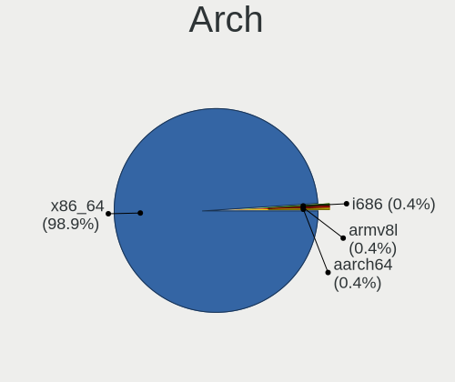
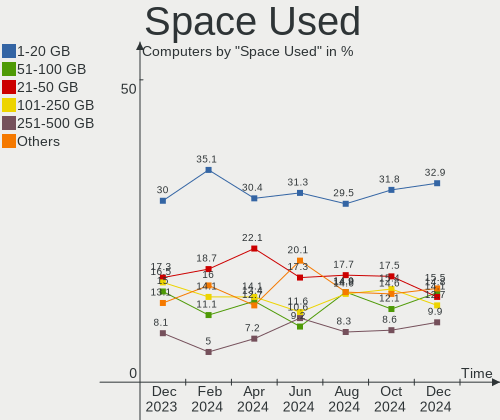

Linux in Brazil - Hardware Trends
---------------------------------

A project to identify most popular hardware characteristics and track their change
over time based on data collected by Linux users at https://Linux-Hardware.org.

Anyone can contribute to this report by the [hw-probe](https://github.com/linuxhw/hw-probe) tool:

    sudo -E hw-probe -all -upload

This is a report for all computer types. See also reports for [desktops](/Location/Brazil/Desktop/README.md) and [notebooks](/Location/Brazil/Notebook/README.md).

Period: Jul, 2023.

Contents
--------

* [ System ](#system)
  - [ OS                       ](#os)
  - [ OS Family                ](#os-family)
  - [ Kernel                   ](#kernel)
  - [ Kernel Family            ](#kernel-family)
  - [ Kernel Major Ver.        ](#kernel-major-ver)
  - [ Arch                     ](#arch)
  - [ DE                       ](#de)
  - [ Display Server           ](#display-server)
  - [ Display Manager          ](#display-manager)
  - [ OS Lang                  ](#os-lang)
  - [ Boot Mode                ](#boot-mode)
  - [ Filesystem               ](#filesystem)
  - [ Part. scheme             ](#part-scheme)
  - [ Dual Boot with Linux/BSD ](#dual-boot-with-linuxbsd)
  - [ Dual Boot (Win)          ](#dual-boot-win)

* [ Board ](#board)
  - [ Vendor                   ](#vendor)
  - [ Model                    ](#model)
  - [ Model Family             ](#model-family)
  - [ MFG Year                 ](#mfg-year)
  - [ Form Factor              ](#form-factor)
  - [ Secure Boot              ](#secure-boot)
  - [ Coreboot                 ](#coreboot)
  - [ RAM Size                 ](#ram-size)
  - [ RAM Used                 ](#ram-used)
  - [ Total Drives             ](#total-drives)
  - [ Has CD-ROM               ](#has-cd-rom)
  - [ Has Ethernet             ](#has-ethernet)
  - [ Has WiFi                 ](#has-wifi)
  - [ Has Bluetooth            ](#has-bluetooth)

* [ Location ](#location)
  - [ Country                  ](#country)
  - [ City                     ](#city)

* [ Drives ](#drives)
  - [ Drive Vendor             ](#drive-vendor)
  - [ Drive Model              ](#drive-model)
  - [ HDD Vendor               ](#hdd-vendor)
  - [ SSD Vendor               ](#ssd-vendor)
  - [ Drive Kind               ](#drive-kind)
  - [ Drive Connector          ](#drive-connector)
  - [ Drive Size               ](#drive-size)
  - [ Space Total              ](#space-total)
  - [ Space Used               ](#space-used)
  - [ Malfunc. Drives          ](#malfunc-drives)
  - [ Malfunc. Drive Vendor    ](#malfunc-drive-vendor)
  - [ Malfunc. HDD Vendor      ](#malfunc-hdd-vendor)
  - [ Malfunc. Drive Kind      ](#malfunc-drive-kind)
  - [ Failed Drives            ](#failed-drives)
  - [ Failed Drive Vendor      ](#failed-drive-vendor)
  - [ Drive Status             ](#drive-status)

* [ Storage controller ](#storage-controller)
  - [ Storage Vendor           ](#storage-vendor)
  - [ Storage Model            ](#storage-model)
  - [ Storage Kind             ](#storage-kind)

* [ Processor ](#processor)
  - [ CPU Vendor               ](#cpu-vendor)
  - [ CPU Model                ](#cpu-model)
  - [ CPU Model Family         ](#cpu-model-family)
  - [ CPU Cores                ](#cpu-cores)
  - [ CPU Sockets              ](#cpu-sockets)
  - [ CPU Threads              ](#cpu-threads)
  - [ CPU Op-Modes             ](#cpu-op-modes)
  - [ CPU Microcode            ](#cpu-microcode)
  - [ CPU Microarch            ](#cpu-microarch)

* [ Graphics ](#graphics)
  - [ GPU Vendor               ](#gpu-vendor)
  - [ GPU Model                ](#gpu-model)
  - [ GPU Combo                ](#gpu-combo)
  - [ GPU Driver               ](#gpu-driver)
  - [ GPU Memory               ](#gpu-memory)

* [ Monitor ](#monitor)
  - [ Monitor Vendor           ](#monitor-vendor)
  - [ Monitor Model            ](#monitor-model)
  - [ Monitor Resolution       ](#monitor-resolution)
  - [ Monitor Diagonal         ](#monitor-diagonal)
  - [ Monitor Width            ](#monitor-width)
  - [ Aspect Ratio             ](#aspect-ratio)
  - [ Monitor Area             ](#monitor-area)
  - [ Pixel Density            ](#pixel-density)
  - [ Multiple Monitors        ](#multiple-monitors)

* [ Network ](#network)
  - [ Net Controller Vendor    ](#net-controller-vendor)
  - [ Net Controller Model     ](#net-controller-model)
  - [ Wireless Vendor          ](#wireless-vendor)
  - [ Wireless Model           ](#wireless-model)
  - [ Ethernet Vendor          ](#ethernet-vendor)
  - [ Ethernet Model           ](#ethernet-model)
  - [ Net Controller Kind      ](#net-controller-kind)
  - [ Used Controller          ](#used-controller)
  - [ NICs                     ](#nics)
  - [ IPv6                     ](#ipv6)

* [ Bluetooth ](#bluetooth)
  - [ Bluetooth Vendor         ](#bluetooth-vendor)
  - [ Bluetooth Model          ](#bluetooth-model)

* [ Sound ](#sound)
  - [ Sound Vendor             ](#sound-vendor)
  - [ Sound Model              ](#sound-model)

* [ Memory ](#memory)
  - [ Memory Vendor            ](#memory-vendor)
  - [ Memory Model             ](#memory-model)
  - [ Memory Kind              ](#memory-kind)
  - [ Memory Form Factor       ](#memory-form-factor)
  - [ Memory Size              ](#memory-size)
  - [ Memory Speed             ](#memory-speed)

* [ Printers & scanners ](#printers--scanners)
  - [ Printer Vendor           ](#printer-vendor)
  - [ Printer Model            ](#printer-model)
  - [ Scanner Vendor           ](#scanner-vendor)
  - [ Scanner Model            ](#scanner-model)

* [ Camera ](#camera)
  - [ Camera Vendor            ](#camera-vendor)
  - [ Camera Model             ](#camera-model)

* [ Security ](#security)
  - [ Fingerprint Vendor       ](#fingerprint-vendor)
  - [ Fingerprint Model        ](#fingerprint-model)
  - [ Chipcard Vendor          ](#chipcard-vendor)
  - [ Chipcard Model           ](#chipcard-model)

* [ Unsupported ](#unsupported)
  - [ Unsupported Devices      ](#unsupported-devices)
  - [ Unsupported Device Types ](#unsupported-device-types)

System
------

OS
--

Installed operating systems

| Name                         | Computers | Percent |
|------------------------------|-----------|---------|
| Ubuntu 22.04                 | 35        | 10.45%  |
| Fedora 38                    | 31        | 9.25%   |
| Linux Mint 21.1              | 25        | 7.46%   |
| Pop!_OS 22.04                | 17        | 5.07%   |
| Ubuntu 23.04                 | 15        | 4.48%   |
| Arch Rolling                 | 15        | 4.48%   |
| OpenMandriva 23.03           | 13        | 3.88%   |
| Linux Mint 21.2              | 13        | 3.88%   |
| Debian 12                    | 13        | 3.88%   |
| Zorin 16                     | 11        | 3.28%   |
| Debian 11                    | 9         | 2.69%   |
| ArcoLinux Rolling            | 9         | 2.69%   |
| openSUSE Tumbleweed-XXXXXXXX | 7         | 2.09%   |
| Ubuntu 22.10                 | 6         | 1.79%   |
| Ubuntu 20.04                 | 6         | 1.79%   |
| Manjaro                      | 5         | 1.49%   |
| Xubuntu 22.04                | 4         | 1.19%   |
| OpenMandriva 4.3             | 4         | 1.19%   |
| OpenMandriva 23.07           | 4         | 1.19%   |
| Linux Mint 21                | 4         | 1.19%   |
| KDE neon 22.04               | 4         | 1.19%   |
| ROSA 12.4                    | 3         | 0.9%    |
| openSUSE Leap-15.5           | 3         | 0.9%    |
| Manjaro 23.0.0               | 3         | 0.9%    |
| LMDE 5                       | 3         | 0.9%    |
| Linux Mint 20.3              | 3         | 0.9%    |
| Kubuntu 23.04                | 3         | 0.9%    |
| Endless 5.0.5                | 3         | 0.9%    |
| Endless 5.0.4                | 3         | 0.9%    |
| Debian                       | 3         | 0.9%    |
| Zorin 15                     | 2         | 0.6%    |
| org.kde.Platform 5.15-21.08  | 2         | 0.6%    |
| OpenMandriva 23.06           | 2         | 0.6%    |
| Lubuntu 23.04                | 2         | 0.6%    |
| Lubuntu 22.04                | 2         | 0.6%    |
| Linux Mint 20.1              | 2         | 0.6%    |
| Gentoo 2.13                  | 2         | 0.6%    |
| EndeavourOS Rolling          | 2         | 0.6%    |
| Elementary 7                 | 2         | 0.6%    |
| BigLinux 2023-06-30_08-01    | 2         | 0.6%    |

OS Family
---------

OS without a version

| Name             | Computers | Percent |
|------------------|-----------|---------|
| Ubuntu           | 63        | 18.81%  |
| Linux Mint       | 48        | 14.33%  |
| Fedora           | 31        | 9.25%   |
| Debian           | 25        | 7.46%   |
| OpenMandriva     | 24        | 7.16%   |
| Pop!_OS          | 19        | 5.67%   |
| Arch             | 15        | 4.48%   |
| Zorin            | 13        | 3.88%   |
| ArcoLinux        | 11        | 3.28%   |
| openSUSE         | 10        | 2.99%   |
| Manjaro          | 8         | 2.39%   |
| Endless          | 8         | 2.39%   |
| Xubuntu          | 5         | 1.49%   |
| Lubuntu          | 5         | 1.49%   |
| Kubuntu          | 4         | 1.19%   |
| KDE neon         | 4         | 1.19%   |
| BigLinux         | 4         | 1.19%   |
| ROSA             | 3         | 0.9%    |
| LMDE             | 3         | 0.9%    |
| SteamOS          | 2         | 0.6%    |
| Sparky           | 2         | 0.6%    |
| org.kde.Platform | 2         | 0.6%    |
| Nobara           | 2         | 0.6%    |
| Gentoo           | 2         | 0.6%    |
| EndeavourOS      | 2         | 0.6%    |
| Elementary       | 2         | 0.6%    |
| Artix            | 2         | 0.6%    |
| Xero             | 1         | 0.3%    |
| Ubuntu Unity     | 1         | 0.3%    |
| Ubuntu MATE      | 1         | 0.3%    |
| TUXEDO OS        | 1         | 0.3%    |
| Rocky Linux      | 1         | 0.3%    |
| PCLinuxOS        | 1         | 0.3%    |
| Parrot           | 1         | 0.3%    |
| NixOS            | 1         | 0.3%    |
| Kali             | 1         | 0.3%    |
| Garuda Linux     | 1         | 0.3%    |
| Devuan           | 1         | 0.3%    |
| ChimeraOS        | 1         | 0.3%    |
| Chili            | 1         | 0.3%    |

Kernel
------

Version of the Linux kernel

| Version                           | Computers | Percent |
|-----------------------------------|-----------|---------|
| 5.15.0-76-generic                 | 38        | 11.34%  |
| 5.19.0-46-generic                 | 36        | 10.75%  |
| 6.2.6-76060206-generic            | 16        | 4.78%   |
| 5.15.0-78-generic                 | 14        | 4.18%   |
| 6.2.6-desktop-1omv2390            | 13        | 3.88%   |
| 6.1.0-10-amd64                    | 11        | 3.28%   |
| 6.2.0-25-generic                  | 10        | 2.99%   |
| 6.3.12-200.fc38.x86_64            | 9         | 2.69%   |
| 6.4.4-200.fc38.x86_64             | 7         | 2.09%   |
| 5.19.0-50-generic                 | 7         | 2.09%   |
| 5.10.0-23-amd64                   | 7         | 2.09%   |
| 6.3.5-desktop-3omv2390            | 6         | 1.79%   |
| 6.1.31-2-MANJARO                  | 6         | 1.79%   |
| 5.15.0-56-generic                 | 6         | 1.79%   |
| 5.15.0-47-generic                 | 6         | 1.79%   |
| 6.4.6-200.fc38.x86_64             | 5         | 1.49%   |
| 6.3.11-200.fc38.x86_64            | 5         | 1.49%   |
| 6.2.0-24-generic                  | 5         | 1.49%   |
| 6.1.38-1-lts                      | 5         | 1.49%   |
| 6.3.9-1-default                   | 4         | 1.19%   |
| 5.4.0-153-generic                 | 4         | 1.19%   |
| 5.19.0-32-generic                 | 4         | 1.19%   |
| 6.4.3-arch1-1                     | 3         | 0.9%    |
| 6.4.1-arch2-1                     | 3         | 0.9%    |
| 6.2.9-300.fc38.x86_64             | 3         | 0.9%    |
| 6.1.39-1-lts                      | 3         | 0.9%    |
| 5.16.13-desktop-1omv4003          | 3         | 0.9%    |
| 5.14.21-150500.53-default         | 3         | 0.9%    |
| 6.4.2-arch1-1                     | 2         | 0.6%    |
| 6.4.1-arch1-1                     | 2         | 0.6%    |
| 6.4.0-1-amd64                     | 2         | 0.6%    |
| 6.4.0-060400-generic              | 2         | 0.6%    |
| 6.3.0-1-amd64                     | 2         | 0.6%    |
| 6.2.0-20-generic                  | 2         | 0.6%    |
| 6.1.38-1-MANJARO                  | 2         | 0.6%    |
| 6.1.20-generic-2rosa2021.1-x86_64 | 2         | 0.6%    |
| 6.1.0-0.deb11.7-amd64             | 2         | 0.6%    |
| 5.15.0-73-generic                 | 2         | 0.6%    |
| 6.4.7-arch1-1                     | 1         | 0.3%    |
| 6.4.6-zen1-1-zen                  | 1         | 0.3%    |

Kernel Family
-------------

Linux kernel without a distro release

| Version | Computers | Percent |
|---------|-----------|---------|
| 5.15.0  | 68        | 20.3%   |
| 5.19.0  | 51        | 15.22%  |
| 6.2.6   | 29        | 8.66%   |
| 6.2.0   | 19        | 5.67%   |
| 6.1.0   | 17        | 5.07%   |
| 6.4.1   | 10        | 2.99%   |
| 6.3.12  | 10        | 2.99%   |
| 5.10.0  | 10        | 2.99%   |
| 6.4.4   | 9         | 2.69%   |
| 6.4.3   | 9         | 2.69%   |
| 6.1.38  | 9         | 2.69%   |
| 6.4.6   | 8         | 2.39%   |
| 6.3.9   | 8         | 2.39%   |
| 6.3.5   | 7         | 2.09%   |
| 5.4.0   | 7         | 2.09%   |
| 6.3.11  | 6         | 1.79%   |
| 6.1.31  | 6         | 1.79%   |
| 6.4.2   | 4         | 1.19%   |
| 6.4.0   | 4         | 1.19%   |
| 6.2.9   | 3         | 0.9%    |
| 6.1.39  | 3         | 0.9%    |
| 5.16.13 | 3         | 0.9%    |
| 5.14.21 | 3         | 0.9%    |
| 5.13.0  | 3         | 0.9%    |
| 6.3.0   | 2         | 0.6%    |
| 6.1.20  | 2         | 0.6%    |
| 5.11.0  | 2         | 0.6%    |
| 4.15.0  | 2         | 0.6%    |
| 6.4.7   | 1         | 0.3%    |
| 6.4.5   | 1         | 0.3%    |
| 6.3.8   | 1         | 0.3%    |
| 6.3.6   | 1         | 0.3%    |
| 6.3.10  | 1         | 0.3%    |
| 6.3.1   | 1         | 0.3%    |
| 6.1.41  | 1         | 0.3%    |
| 6.1.36  | 1         | 0.3%    |
| 6.1.26  | 1         | 0.3%    |
| 6.0.12  | 1         | 0.3%    |
| 6.0.0   | 1         | 0.3%    |
| 5.8.0   | 1         | 0.3%    |

Kernel Major Ver.
-----------------

Linux kernel major version

| Version | Computers | Percent |
|---------|-----------|---------|
| 5.15    | 71        | 21.19%  |
| 6.2     | 51        | 15.22%  |
| 5.19    | 51        | 15.22%  |
| 6.4     | 46        | 13.73%  |
| 6.1     | 40        | 11.94%  |
| 6.3     | 37        | 11.04%  |
| 5.10    | 11        | 3.28%   |
| 5.4     | 7         | 2.09%   |
| 5.16    | 5         | 1.49%   |
| 5.14    | 4         | 1.19%   |
| 5.13    | 3         | 0.9%    |
| 6.0     | 2         | 0.6%    |
| 5.11    | 2         | 0.6%    |
| 4.15    | 2         | 0.6%    |
| 5.8     | 1         | 0.3%    |
| 4.9     | 1         | 0.3%    |
| 4.18    | 1         | 0.3%    |

Arch
----

OS architecture (x86_64, i586, etc.)

| Name   | Computers | Percent |
|--------|-----------|---------|
| x86_64 | 333       | 99.4%   |
| i686   | 2         | 0.6%    |

DE
--

Desktop Environment

| Name          | Computers | Percent |
|---------------|-----------|---------|
| GNOME         | 156       | 46.57%  |
| KDE5          | 69        | 20.6%   |
| X-Cinnamon    | 39        | 11.64%  |
| XFCE          | 32        | 9.55%   |
| Unknown       | 9         | 2.69%   |
| MATE          | 7         | 2.09%   |
| LXQt          | 5         | 1.49%   |
| sway          | 4         | 1.19%   |
| Cinnamon      | 4         | 1.19%   |
| Pantheon      | 2         | 0.6%    |
| i3            | 2         | 0.6%    |
| Unity         | 1         | 0.3%    |
| openbox       | 1         | 0.3%    |
| LXDE          | 1         | 0.3%    |
| GNOME-Classic | 1         | 0.3%    |
| GNOME Classic | 1         | 0.3%    |
| Deepin        | 1         | 0.3%    |

Display Server
--------------

X11 or Wayland

| Name    | Computers | Percent |
|---------|-----------|---------|
| X11     | 216       | 64.48%  |
| Wayland | 110       | 32.84%  |
| Tty     | 5         | 1.49%   |
| Unknown | 4         | 1.19%   |

Display Manager
---------------

SDDM, LightDM, etc.

| Name    | Computers | Percent |
|---------|-----------|---------|
| Unknown | 171       | 51.04%  |
| GDM3    | 66        | 19.7%   |
| SDDM    | 50        | 14.93%  |
| LightDM | 35        | 10.45%  |
| GDM     | 11        | 3.28%   |
| XDM     | 1         | 0.3%    |
| SLiM    | 1         | 0.3%    |

OS Lang
-------

Language

| Lang       | Computers | Percent |
|------------|-----------|---------|
| pt_BR      | 241       | 71.94%  |
| en_US      | 79        | 23.58%  |
| C          | 7         | 2.09%   |
| pt_PT      | 4         | 1.19%   |
| en_GB      | 2         | 0.6%    |
| en_IE.UTF8 | 1         | 0.3%    |
| en_CA      | 1         | 0.3%    |

Boot Mode
---------

EFI or BIOS

| Mode | Computers | Percent |
|------|-----------|---------|
| BIOS | 187       | 55.82%  |
| EFI  | 148       | 44.18%  |

Filesystem
----------

Type of filesystem

| Type    | Computers | Percent |
|---------|-----------|---------|
| Ext4    | 185       | 55.22%  |
| Btrfs   | 76        | 22.69%  |
| Tmpfs   | 50        | 14.93%  |
| Overlay | 13        | 3.88%   |
| Xfs     | 5         | 1.49%   |
| Zfs     | 3         | 0.9%    |
| Jfs     | 1         | 0.3%    |
| F2fs    | 1         | 0.3%    |
| Unknown | 1         | 0.3%    |

Part. scheme
------------

Scheme of partitioning

| Type    | Computers | Percent |
|---------|-----------|---------|
| Unknown | 163       | 48.66%  |
| GPT     | 129       | 38.51%  |
| MBR     | 43        | 12.84%  |

Dual Boot with Linux/BSD
------------------------

Hosting more than one Linux/BSD

| Dual boot | Computers | Percent |
|-----------|-----------|---------|
| No        | 293       | 87.46%  |
| Yes       | 42        | 12.54%  |

Dual Boot (Win)
---------------

Hosting Linux and Windows

| Dual boot | Computers | Percent |
|-----------|-----------|---------|
| No        | 276       | 82.39%  |
| Yes       | 59        | 17.61%  |

Board
-----

Vendor
------

Motherboard manufacturer

| Name                   | Computers | Percent |
|------------------------|-----------|---------|
| Dell                   | 51        | 15.22%  |
| ASUSTek Computer       | 40        | 11.94%  |
| Acer                   | 31        | 9.25%   |
| Lenovo                 | 30        | 8.96%   |
| Gigabyte Technology    | 24        | 7.16%   |
| Hewlett-Packard        | 21        | 6.27%   |
| Positivo               | 19        | 5.67%   |
| Intel                  | 14        | 4.18%   |
| Samsung Electronics    | 10        | 2.99%   |
| MSI                    | 9         | 2.69%   |
| ASRock                 | 9         | 2.69%   |
| Unknown                | 8         | 2.39%   |
| Apple                  | 6         | 1.79%   |
| Multilaser             | 4         | 1.19%   |
| LG Electronics         | 4         | 1.19%   |
| Compaq                 | 4         | 1.19%   |
| Biostar                | 4         | 1.19%   |
| Semp Toshiba           | 3         | 0.9%    |
| PCWare                 | 3         | 0.9%    |
| MACHINIST              | 3         | 0.9%    |
| ECS                    | 3         | 0.9%    |
| Avell High Performance | 3         | 0.9%    |
| Sony                   | 2         | 0.6%    |
| Positivo Bahia - VAIO  | 2         | 0.6%    |
| OEM                    | 2         | 0.6%    |
| Itautec                | 2         | 0.6%    |
| Huanan                 | 2         | 0.6%    |
| Digibras               | 2         | 0.6%    |
| Daten Tecnologia       | 2         | 0.6%    |
| Alienware              | 2         | 0.6%    |
| Valve                  | 1         | 0.3%    |
| Timi                   | 1         | 0.3%    |
| Standard               | 1         | 0.3%    |
| Pegatron               | 1         | 0.3%    |
| Notebook               | 1         | 0.3%    |
| Microsoft              | 1         | 0.3%    |
| Megaware               | 1         | 0.3%    |
| MAXSUN                 | 1         | 0.3%    |
| Kllisre                | 1         | 0.3%    |
| GPD                    | 1         | 0.3%    |

Model
-----

Motherboard model

| Name                                   | Computers | Percent |
|----------------------------------------|-----------|---------|
| Unknown                                | 11        | 3.28%   |
| Intel H61                              | 4         | 1.19%   |
| Intel H55                              | 4         | 1.19%   |
| Positivo Mobile                        | 3         | 0.9%    |
| Lenovo IdeaPad 3 15ALC6 82MF           | 3         | 0.9%    |
| Gigabyte AB350M-DS3H V2                | 3         | 0.9%    |
| Gigabyte A320M-S2H                     | 3         | 0.9%    |
| ASRock A320M-HD                        | 3         | 0.9%    |
| Acer Nitro AN515-44                    | 3         | 0.9%    |
| Samsung 550XDA                         | 2         | 0.6%    |
| Samsung 300E5M/300E5L                  | 2         | 0.6%    |
| Positivo POS-PIQ77CL                   | 2         | 0.6%    |
| MACHINIST E5 MR9A PRO MAX V1.1         | 2         | 0.6%    |
| Lenovo IdeaPad S145-15IWL 81S9         | 2         | 0.6%    |
| Lenovo IdeaPad S145-15API 81V7         | 2         | 0.6%    |
| Intel B75                              | 2         | 0.6%    |
| HP Pavilion 11 x360 PC                 | 2         | 0.6%    |
| HP Folio 13                            | 2         | 0.6%    |
| Gigabyte X570 GAMING X                 | 2         | 0.6%    |
| Dell Latitude 3420                     | 2         | 0.6%    |
| Dell Inspiron 5566                     | 2         | 0.6%    |
| Dell Inspiron 3501                     | 2         | 0.6%    |
| Dell Inspiron 13-5378                  | 2         | 0.6%    |
| Daten Tecnologia DH110MXV              | 2         | 0.6%    |
| Avell High Performance B.ON            | 2         | 0.6%    |
| ASUS VivoBook_ASUSLaptop X515JA_X515JA | 2         | 0.6%    |
| ASUS VivoBook_ASUSLaptop X515DA_X515DA | 2         | 0.6%    |
| ASUS TUF Gaming X570-PLUS_BR           | 2         | 0.6%    |
| ASUS ROG CROSSHAIR X670E HERO          | 2         | 0.6%    |
| ASUS PRIME B450M-GAMING/BR             | 2         | 0.6%    |
| ASUS M5A78L-M PLUS/USB3                | 2         | 0.6%    |
| ASUS All Series                        | 2         | 0.6%    |
| ASUS A88XM-A                           | 2         | 0.6%    |
| Acer Aspire A515-45                    | 2         | 0.6%    |
| Acer Aspire A315-53                    | 2         | 0.6%    |
| Valve Jupiter                          | 1         | 0.3%    |
| Timi RedmiBook Pro 14S                 | 1         | 0.3%    |
| Standard ECT                           | 1         | 0.3%    |
| Sony VPCSB25FB                         | 1         | 0.3%    |
| Sony SVF15213CBB                       | 1         | 0.3%    |

Model Family
------------

Motherboard model prefix

| Name                 | Computers | Percent |
|----------------------|-----------|---------|
| Dell Inspiron        | 24        | 7.16%   |
| Acer Aspire          | 19        | 5.67%   |
| Lenovo IdeaPad       | 13        | 3.88%   |
| Unknown              | 11        | 3.28%   |
| Acer Nitro           | 9         | 2.69%   |
| Lenovo ThinkPad      | 8         | 2.39%   |
| Dell Latitude        | 8         | 2.39%   |
| ASUS TUF             | 8         | 2.39%   |
| HP Pavilion          | 6         | 1.79%   |
| Dell Vostro          | 6         | 1.79%   |
| ASUS M5A78L-M        | 6         | 1.79%   |
| ASUS PRIME           | 5         | 1.49%   |
| Intel H61            | 4         | 1.19%   |
| Intel H55            | 4         | 1.19%   |
| Dell PowerEdge       | 4         | 1.19%   |
| Dell OptiPlex        | 4         | 1.19%   |
| ASUS VivoBook        | 4         | 1.19%   |
| ASUS ROG             | 4         | 1.19%   |
| Positivo Mobile      | 3         | 0.9%    |
| HP ProBook           | 3         | 0.9%    |
| HP EliteBook         | 3         | 0.9%    |
| Gigabyte AB350M-DS3H | 3         | 0.9%    |
| Gigabyte A320M-S2H   | 3         | 0.9%    |
| ASUS P8H61-M         | 3         | 0.9%    |
| ASRock A320M-HD      | 3         | 0.9%    |
| Semp Toshiba IS      | 2         | 0.6%    |
| Samsung 550XDA       | 2         | 0.6%    |
| Samsung 300E5M       | 2         | 0.6%    |
| Positivo POS-PIQ77CL | 2         | 0.6%    |
| MACHINIST E5         | 2         | 0.6%    |
| Lenovo Legion        | 2         | 0.6%    |
| Itautec Infoway      | 2         | 0.6%    |
| Intel B75            | 2         | 0.6%    |
| Huanan X99-F8        | 2         | 0.6%    |
| HP Folio             | 2         | 0.6%    |
| HP Compaq            | 2         | 0.6%    |
| Gigabyte X570        | 2         | 0.6%    |
| Gigabyte B550M       | 2         | 0.6%    |
| Gigabyte B450M       | 2         | 0.6%    |
| Gigabyte B450        | 2         | 0.6%    |

MFG Year
--------

Motherboard manufacture year

| Year    | Computers | Percent |
|---------|-----------|---------|
| 2018    | 39        | 11.64%  |
| 2021    | 38        | 11.34%  |
| 2020    | 31        | 9.25%   |
| 2011    | 26        | 7.76%   |
| 2016    | 23        | 6.87%   |
| 2013    | 23        | 6.87%   |
| 2019    | 22        | 6.57%   |
| 2017    | 22        | 6.57%   |
| 2012    | 22        | 6.57%   |
| 2010    | 19        | 5.67%   |
| 2014    | 17        | 5.07%   |
| 2022    | 16        | 4.78%   |
| 2009    | 13        | 3.88%   |
| 2015    | 9         | 2.69%   |
| 2008    | 6         | 1.79%   |
| 2007    | 5         | 1.49%   |
| 2023    | 2         | 0.6%    |
| 2006    | 1         | 0.3%    |
| Unknown | 1         | 0.3%    |

Form Factor
-----------

Physical design of the computer

| Name        | Computers | Percent |
|-------------|-----------|---------|
| Notebook    | 186       | 55.52%  |
| Desktop     | 138       | 41.19%  |
| Server      | 4         | 1.19%   |
| Tablet      | 3         | 0.9%    |
| Other       | 1         | 0.3%    |
| Convertible | 1         | 0.3%    |
| Mini pc     | 1         | 0.3%    |
| All in one  | 1         | 0.3%    |

Secure Boot
-----------

Enabled or disabled

| State    | Computers | Percent |
|----------|-----------|---------|
| Disabled | 309       | 92.24%  |
| Enabled  | 26        | 7.76%   |

Coreboot
--------

Have coreboot on board

| Used | Computers | Percent |
|------|-----------|---------|
| No   | 335       | 100%    |

RAM Size
--------

Total RAM memory

| Size in GB  | Computers | Percent |
|-------------|-----------|---------|
| 4.01-8.0    | 85        | 25.37%  |
| 3.01-4.0    | 71        | 21.19%  |
| 16.01-24.0  | 68        | 20.3%   |
| 8.01-16.0   | 55        | 16.42%  |
| 32.01-64.0  | 30        | 8.96%   |
| 1.01-2.0    | 11        | 3.28%   |
| 24.01-32.0  | 6         | 1.79%   |
| 64.01-256.0 | 6         | 1.79%   |
| 2.01-3.0    | 2         | 0.6%    |
| 0.51-1.0    | 1         | 0.3%    |

RAM Used
--------

Used RAM memory

| Used GB    | Computers | Percent |
|------------|-----------|---------|
| 1.01-2.0   | 107       | 31.94%  |
| 2.01-3.0   | 98        | 29.25%  |
| 4.01-8.0   | 60        | 17.91%  |
| 3.01-4.0   | 36        | 10.75%  |
| 8.01-16.0  | 16        | 4.78%   |
| 0.51-1.0   | 13        | 3.88%   |
| 16.01-24.0 | 3         | 0.9%    |
| 24.01-32.0 | 1         | 0.3%    |
| 0.01-0.5   | 1         | 0.3%    |

Total Drives
------------

Number of drives on board

| Drives | Computers | Percent |
|--------|-----------|---------|
| 1      | 191       | 57.01%  |
| 2      | 98        | 29.25%  |
| 3      | 25        | 7.46%   |
| 5      | 8         | 2.39%   |
| 4      | 8         | 2.39%   |
| 6      | 2         | 0.6%    |
| 0      | 2         | 0.6%    |
| 14     | 1         | 0.3%    |

Has CD-ROM
----------

Has CD-ROM on board

| Presented | Computers | Percent |
|-----------|-----------|---------|
| No        | 234       | 69.85%  |
| Yes       | 101       | 30.15%  |

Has Ethernet
------------

Has Ethernet on board

| Presented | Computers | Percent |
|-----------|-----------|---------|
| Yes       | 304       | 90.75%  |
| No        | 31        | 9.25%   |

Has WiFi
--------

Has WiFi module

| Presented | Computers | Percent |
|-----------|-----------|---------|
| Yes       | 230       | 68.66%  |
| No        | 105       | 31.34%  |

Has Bluetooth
-------------

Has Bluetooth module

| Presented | Computers | Percent |
|-----------|-----------|---------|
| Yes       | 179       | 53.43%  |
| No        | 156       | 46.57%  |

Location
--------

Country
-------

Geographic location (country)

| Country | Computers | Percent |
|---------|-----------|---------|
| Brazil  | 335       | 100%    |

City
----

Geographic location (city)

| City                    | Computers | Percent |
|-------------------------|-----------|---------|
| Sao Paulo               | 31        | 9.25%   |
| Rio de Janeiro          | 21        | 6.27%   |
| Brasília               | 16        | 4.78%   |
| Curitiba                | 12        | 3.58%   |
| Belo Horizonte          | 11        | 3.28%   |
| Porto Alegre            | 9         | 2.69%   |
| Fortaleza               | 8         | 2.39%   |
| Campinas                | 7         | 2.09%   |
| Santo André            | 5         | 1.49%   |
| Recife                  | 5         | 1.49%   |
| Campo Grande            | 5         | 1.49%   |
| Sorocaba                | 4         | 1.19%   |
| Sao Vicente             | 4         | 1.19%   |
| Natal                   | 4         | 1.19%   |
| Juazeiro do Norte       | 4         | 1.19%   |
| Florianópolis          | 4         | 1.19%   |
| Bauru                   | 4         | 1.19%   |
| Vila Velha              | 3         | 0.9%    |
| Sao Carlos              | 3         | 0.9%    |
| Santos                  | 3         | 0.9%    |
| Osasco                  | 3         | 0.9%    |
| Niterói                | 3         | 0.9%    |
| Manaus                  | 3         | 0.9%    |
| Guarulhos               | 3         | 0.9%    |
| Uberlândia             | 2         | 0.6%    |
| Ubatuba                 | 2         | 0.6%    |
| Sao José dos Campos    | 2         | 0.6%    |
| Sao Jose do Rio Preto   | 2         | 0.6%    |
| Santa Maria             | 2         | 0.6%    |
| Salvador                | 2         | 0.6%    |
| Ribeirao Preto          | 2         | 0.6%    |
| Patos de Minas          | 2         | 0.6%    |
| Nova Iguaçu            | 2         | 0.6%    |
| Montes Claros           | 2         | 0.6%    |
| Mogi Guacu              | 2         | 0.6%    |
| Maringá                | 2         | 0.6%    |
| Joinville               | 2         | 0.6%    |
| Jaboatao dos Guararapes | 2         | 0.6%    |
| Itatiba                 | 2         | 0.6%    |
| Imbituba                | 2         | 0.6%    |

Drives
------

Drive Vendor
------------

Hard drive vendors

| Vendor                       | Computers | Drives | Percent |
|------------------------------|-----------|--------|---------|
| Seagate                      | 68        | 85     | 13.82%  |
| WDC                          | 66        | 78     | 13.41%  |
| Kingston                     | 55        | 59     | 11.18%  |
| Samsung Electronics          | 47        | 56     | 9.55%   |
| SanDisk                      | 30        | 31     | 6.1%    |
| China                        | 30        | 33     | 6.1%    |
| Toshiba                      | 20        | 20     | 4.07%   |
| A-DATA Technology            | 17        | 17     | 3.46%   |
| SK hynix                     | 10        | 10     | 2.03%   |
| Unknown                      | 9         | 11     | 1.83%   |
| Silicon Motion               | 9         | 10     | 1.83%   |
| Kingston Technology Company  | 8         | 8      | 1.63%   |
| XrayDisk                     | 7         | 7      | 1.42%   |
| MAXIO Technology (Hangzhou)  | 7         | 7      | 1.42%   |
| KingSpec                     | 7         | 8      | 1.42%   |
| Hitachi                      | 7         | 7      | 1.42%   |
| Unknown                      | 7         | 7      | 1.42%   |
| Netac                        | 6         | 7      | 1.22%   |
| Intel                        | 6         | 7      | 1.22%   |
| Crucial                      | 6         | 7      | 1.22%   |
| ADATA Technology             | 6         | 6      | 1.22%   |
| Solid State Storage          | 5         | 5      | 1.02%   |
| Phison Electronics           | 5         | 5      | 1.02%   |
| WALRAM                       | 4         | 4      | 0.81%   |
| Realtek Semiconductor        | 4         | 4      | 0.81%   |
| Lenovo                       | 3         | 3      | 0.61%   |
| KIOXIA                       | 3         | 3      | 0.61%   |
| HGST                         | 3         | 3      | 0.61%   |
| Fujitsu                      | 3         | 3      | 0.61%   |
| SSSTC                        | 2         | 2      | 0.41%   |
| Patriot                      | 2         | 2      | 0.41%   |
| Maxtor                       | 2         | 2      | 0.41%   |
| Gigabyte Technology          | 2         | 2      | 0.41%   |
| Corsair                      | 2         | 2      | 0.41%   |
| Apple                        | 2         | 2      | 0.41%   |
| XPG                          | 1         | 1      | 0.2%    |
| Team                         | 1         | 1      | 0.2%    |
| SSD 60GB                     | 1         | 1      | 0.2%    |
| Shenzhen Longsys Electronics | 1         | 1      | 0.2%    |
| PALIDE                       | 1         | 1      | 0.2%    |

Drive Model
-----------

Hard drive models

| Model                                                 | Computers | Percent |
|-------------------------------------------------------|-----------|---------|
| Kingston SA400S37240G 240GB SSD                       | 18        | 3.38%   |
| Kingston SA400S37480G 480GB SSD                       | 13        | 2.44%   |
| Seagate ST1000DM010-2EP102 1TB                        | 7         | 1.32%   |
| Unknown                                               | 7         | 1.32%   |
| Silicon Motion SM2263EN/SM2263XT SSD Controller 500GB | 6         | 1.13%   |
| Seagate ST500LM012 HN-M500MBB 500GB                   | 6         | 1.13%   |
| Seagate ST500DM002-1BD142 500GB                       | 6         | 1.13%   |
| WDC WD10SPZX-21Z10T0 1TB                              | 5         | 0.94%   |
| Seagate ST1000LM024 HN-M101MBB 1TB                    | 5         | 0.94%   |
| Sandisk WD Blue SN550 NVMe SSD 250GB                  | 5         | 0.94%   |
| MAXIO (Hangzhou) NVMe SSD Controller MAP1202 256GB    | 5         | 0.94%   |
| Kingston Company SNV2S1000G 1TB                       | 5         | 0.94%   |
| China SSD 120GB                                       | 5         | 0.94%   |
| WDC WD10SPZX-24Z10 1TB                                | 4         | 0.75%   |
| WDC WD10EZEX-00BN5A0 1TB                              | 4         | 0.75%   |
| Seagate ST1000LM035-1RK172 1TB                        | 4         | 0.75%   |
| Seagate ST1000DM003-1CH162 1TB                        | 4         | 0.75%   |
| Seagate Expansion 1TB                                 | 4         | 0.75%   |
| SanDisk SSD PLUS 240GB                                | 4         | 0.75%   |
| Samsung HM321HI 320GB                                 | 4         | 0.75%   |
| Samsung HD502HJ 500GB                                 | 4         | 0.75%   |
| Samsung HD322HJ 320GB                                 | 4         | 0.75%   |
| Realtek RTS5763DL NVMe SSD Controller 1TB             | 4         | 0.75%   |
| Kingston SA400S37960G 960GB SSD                       | 4         | 0.75%   |
| WDC WDS480G2G0A-00JH30 480GB SSD                      | 3         | 0.56%   |
| WDC WDS240G2G0A-00JH30 240GB SSD                      | 3         | 0.56%   |
| WDC WD10JPVX-22JC3T0 1TB                              | 3         | 0.56%   |
| Unknown MMC Card  32GB                                | 3         | 0.56%   |
| Toshiba MQ04ABF100 1TB                                | 3         | 0.56%   |
| Samsung NVMe SSD Controller SM981/PM981/PM983 500GB   | 3         | 0.56%   |
| Samsung M3 Portable 1TB                               | 3         | 0.56%   |
| Phison E12 NVMe Controller 2TB                        | 3         | 0.56%   |
| Kingston SV300S37A240G 240GB SSD                      | 3         | 0.56%   |
| Kingston SV300S37A120G 120GB SSD                      | 3         | 0.56%   |
| Kingston SA400S37120G 120GB SSD                       | 3         | 0.56%   |
| Intel SSD 660P Series 1024GB                          | 3         | 0.56%   |
| China SSD 256GB                                       | 3         | 0.56%   |
| China SSD 240GB                                       | 3         | 0.56%   |
| China SSD 128GB                                       | 3         | 0.56%   |
| A-DATA SU650 120GB SSD                                | 3         | 0.56%   |

HDD Vendor
----------

Hard disk drive vendors

| Vendor              | Computers | Drives | Percent |
|---------------------|-----------|--------|---------|
| Seagate             | 68        | 85     | 36.17%  |
| WDC                 | 52        | 60     | 27.66%  |
| Samsung Electronics | 30        | 31     | 15.96%  |
| Toshiba             | 19        | 19     | 10.11%  |
| Hitachi             | 7         | 7      | 3.72%   |
| HGST                | 3         | 3      | 1.6%    |
| Fujitsu             | 3         | 3      | 1.6%    |
| Maxtor              | 2         | 2      | 1.06%   |
| JMicron Technology  | 1         | 1      | 0.53%   |
| Initio              | 1         | 1      | 0.53%   |
| Hewlett-Packard     | 1         | 2      | 0.53%   |
| China               | 1         | 1      | 0.53%   |

SSD Vendor
----------

Solid state drive vendors

| Vendor              | Computers | Drives | Percent |
|---------------------|-----------|--------|---------|
| Kingston            | 49        | 50     | 29.17%  |
| China               | 28        | 31     | 16.67%  |
| WDC                 | 15        | 15     | 8.93%   |
| SanDisk             | 15        | 15     | 8.93%   |
| Samsung Electronics | 10        | 13     | 5.95%   |
| A-DATA Technology   | 7         | 7      | 4.17%   |
| KingSpec            | 6         | 7      | 3.57%   |
| Crucial             | 5         | 6      | 2.98%   |
| Netac               | 3         | 4      | 1.79%   |
| Lenovo              | 3         | 3      | 1.79%   |
| Unknown             | 3         | 3      | 1.79%   |
| WALRAM              | 2         | 2      | 1.19%   |
| Patriot             | 2         | 2      | 1.19%   |
| Gigabyte Technology | 2         | 2      | 1.19%   |
| Apple               | 2         | 2      | 1.19%   |
| XrayDisk            | 1         | 1      | 0.6%    |
| Toshiba             | 1         | 1      | 0.6%    |
| Team                | 1         | 1      | 0.6%    |
| PALIDE              | 1         | 1      | 0.6%    |
| NN                  | 1         | 1      | 0.6%    |
| MOVESPEED           | 1         | 1      | 0.6%    |
| MaxDigital          | 1         | 1      | 0.6%    |
| LITEON              | 1         | 1      | 0.6%    |
| Lexar               | 1         | 1      | 0.6%    |
| KODAK               | 1         | 1      | 0.6%    |
| KingDian            | 1         | 1      | 0.6%    |
| Intel               | 1         | 2      | 0.6%    |
| DUEX-120GB          | 1         | 1      | 0.6%    |
| Dahua               | 1         | 1      | 0.6%    |
| Corsair             | 1         | 1      | 0.6%    |
| BIWIN               | 1         | 1      | 0.6%    |

Drive Kind
----------

HDD or SSD

| Kind    | Computers | Drives | Percent |
|---------|-----------|--------|---------|
| HDD     | 159       | 215    | 35.89%  |
| SSD     | 149       | 179    | 33.63%  |
| NVMe    | 108       | 123    | 24.38%  |
| Unknown | 17        | 16     | 3.84%   |
| MMC     | 10        | 12     | 2.26%   |

Drive Connector
---------------

SATA, SAS, NVMe, etc.

| Type | Computers | Drives | Percent |
|------|-----------|--------|---------|
| SATA | 272       | 396    | 67.33%  |
| NVMe | 108       | 123    | 26.73%  |
| SAS  | 14        | 14     | 3.47%   |
| MMC  | 10        | 12     | 2.48%   |

Drive Size
----------

Size of hard drive

| Size in TB | Computers | Drives | Percent |
|------------|-----------|--------|---------|
| 0.01-0.5   | 202       | 253    | 63.52%  |
| 0.51-1.0   | 96        | 117    | 30.19%  |
| 1.01-2.0   | 14        | 15     | 4.4%    |
| 3.01-4.0   | 2         | 5      | 0.63%   |
| 2.01-3.0   | 2         | 2      | 0.63%   |
| 4.01-10.0  | 2         | 2      | 0.63%   |

Space Total
-----------

Amount of disk space available on the file system

| Size in GB     | Computers | Percent |
|----------------|-----------|---------|
| 101-250        | 96        | 28.66%  |
| 251-500        | 83        | 24.78%  |
| 501-1000       | 51        | 15.22%  |
| 1001-2000      | 29        | 8.66%   |
| 51-100         | 23        | 6.87%   |
| 1-20           | 17        | 5.07%   |
| 2001-3000      | 13        | 3.88%   |
| 21-50          | 11        | 3.28%   |
| More than 3000 | 8         | 2.39%   |
| Unknown        | 4         | 1.19%   |

Space Used
----------

Amount of used disk space

| Used GB        | Computers | Percent |
|----------------|-----------|---------|
| 1-20           | 112       | 33.43%  |
| 21-50          | 84        | 25.07%  |
| 101-250        | 53        | 15.82%  |
| 51-100         | 29        | 8.66%   |
| 251-500        | 28        | 8.36%   |
| 501-1000       | 12        | 3.58%   |
| 1001-2000      | 8         | 2.39%   |
| Unknown        | 4         | 1.19%   |
| More than 3000 | 3         | 0.9%    |
| 2001-3000      | 2         | 0.6%    |

Malfunc. Drives
---------------

Drive models with a malfunction

| Model                                                   | Computers | Drives | Percent |
|---------------------------------------------------------|-----------|--------|---------|
| Samsung Electronics HD322HJ 320GB                       | 3         | 3      | 7.69%   |
| WDC WDS480G2G0A-00JH30 480GB SSD                        | 2         | 2      | 5.13%   |
| Samsung Electronics HD103SI 1TB                         | 2         | 2      | 5.13%   |
| WDC WD800AAJS-75M0A0 80GB                               | 1         | 1      | 2.56%   |
| WDC WD5000AVDS-63U7B1 500GB                             | 1         | 1      | 2.56%   |
| WDC WD5000AAKX-003CA0 500GB                             | 1         | 1      | 2.56%   |
| WDC WD2500AAKX-753CA1 250GB                             | 1         | 1      | 2.56%   |
| WDC WD10EZEX-00BN5A0 1TB                                | 1         | 1      | 2.56%   |
| WDC WD10EURX-63UY4Y0 1TB                                | 1         | 1      | 2.56%   |
| WDC WD1001FAES-60Z2A0 1TB                               | 1         | 1      | 2.56%   |
| Toshiba MK5065GSXF 500GB                                | 1         | 1      | 2.56%   |
| Seagate ST9640320AS 640GB                               | 1         | 1      | 2.56%   |
| Seagate ST500LT012-9WS142 500GB                         | 1         | 1      | 2.56%   |
| Seagate ST500LM012 HN-M500MBB 500GB                     | 1         | 1      | 2.56%   |
| Seagate ST500DM002-1BD142 500GB                         | 1         | 1      | 2.56%   |
| Seagate ST3500514NS 500GB                               | 1         | 1      | 2.56%   |
| Seagate ST1000LM024 HN-M101MBB 1TB                      | 1         | 1      | 2.56%   |
| Seagate ST1000DM003-1CH162 1TB                          | 1         | 1      | 2.56%   |
| SanDisk SSD PLUS 120GB                                  | 1         | 1      | 2.56%   |
| Samsung Electronics HM321HI 320GB                       | 1         | 1      | 2.56%   |
| Samsung Electronics HM160HI 160GB                       | 1         | 1      | 2.56%   |
| Samsung Electronics HD502HJ 500GB                       | 1         | 1      | 2.56%   |
| Samsung Electronics HD502HI 500GB                       | 1         | 1      | 2.56%   |
| Samsung Electronics HD161HJ 160GB                       | 1         | 1      | 2.56%   |
| Realtek Semiconductor RTS5763DL NVMe SSD Controller 1TB | 1         | 1      | 2.56%   |
| Netac NVMe SSD 2TB                                      | 1         | 1      | 2.56%   |
| KingSpec Q-360 360GB SSD                                | 1         | 1      | 2.56%   |
| Hitachi HTS542516K9SA00 160GB                           | 1         | 1      | 2.56%   |
| HGST HTS545050A7E380 500GB                              | 1         | 1      | 2.56%   |
| Hewlett-Packard GB0250EAFYK 250GB                       | 1         | 2      | 2.56%   |
| Crucial CT240M500SSD1 240GB                             | 1         | 1      | 2.56%   |
| China SSD 256GB                                         | 1         | 1      | 2.56%   |
| China SSD 120GB                                         | 1         | 1      | 2.56%   |
| China SATA SSD 240GB                                    | 1         | 1      | 2.56%   |
| Unknown                                                 | 1         | 1      | 2.56%   |

Malfunc. Drive Vendor
---------------------

Vendors of faulty drives

| Vendor                | Computers | Drives | Percent |
|-----------------------|-----------|--------|---------|
| Samsung Electronics   | 10        | 10     | 26.32%  |
| WDC                   | 9         | 9      | 23.68%  |
| Seagate               | 6         | 7      | 15.79%  |
| China                 | 3         | 3      | 7.89%   |
| Toshiba               | 1         | 1      | 2.63%   |
| SanDisk               | 1         | 1      | 2.63%   |
| Realtek Semiconductor | 1         | 1      | 2.63%   |
| Netac                 | 1         | 1      | 2.63%   |
| KingSpec              | 1         | 1      | 2.63%   |
| Hitachi               | 1         | 1      | 2.63%   |
| HGST                  | 1         | 1      | 2.63%   |
| Hewlett-Packard       | 1         | 2      | 2.63%   |
| Crucial               | 1         | 1      | 2.63%   |
| Unknown               | 1         | 1      | 2.63%   |

Malfunc. HDD Vendor
-------------------

Vendors of faulty HDD drives

| Vendor              | Computers | Drives | Percent |
|---------------------|-----------|--------|---------|
| Samsung Electronics | 10        | 10     | 37.04%  |
| WDC                 | 7         | 7      | 25.93%  |
| Seagate             | 6         | 7      | 22.22%  |
| Toshiba             | 1         | 1      | 3.7%    |
| Hitachi             | 1         | 1      | 3.7%    |
| HGST                | 1         | 1      | 3.7%    |
| Hewlett-Packard     | 1         | 2      | 3.7%    |

Malfunc. Drive Kind
-------------------

Kinds of faulty drives

| Kind | Computers | Drives | Percent |
|------|-----------|--------|---------|
| HDD  | 25        | 29     | 71.43%  |
| SSD  | 8         | 9      | 22.86%  |
| NVMe | 2         | 2      | 5.71%   |

Failed Drives
-------------

Failed drive models

| Model                             | Computers | Drives | Percent |
|-----------------------------------|-----------|--------|---------|
| Samsung Electronics HM641JI 640GB | 1         | 1      | 33.33%  |
| Samsung Electronics HM250HI 250GB | 1         | 1      | 33.33%  |
| Samsung Electronics HD502HJ 500GB | 1         | 1      | 33.33%  |

Failed Drive Vendor
-------------------

Failed drive vendors

| Vendor              | Computers | Drives | Percent |
|---------------------|-----------|--------|---------|
| Samsung Electronics | 3         | 3      | 100%    |

Drive Status
------------

Number of failed and malfunc. drives

| Status   | Computers | Drives | Percent |
|----------|-----------|--------|---------|
| Detected | 233       | 350    | 65.08%  |
| Works    | 92        | 152    | 25.7%   |
| Malfunc  | 30        | 40     | 8.38%   |
| Failed   | 3         | 3      | 0.84%   |

Storage controller
------------------

Storage Vendor
--------------

Storage controller vendors

| Vendor                           | Computers | Percent |
|----------------------------------|-----------|---------|
| Intel                            | 228       | 51.82%  |
| AMD                              | 81        | 18.41%  |
| Kingston Technology Company      | 17        | 3.86%   |
| SanDisk                          | 16        | 3.64%   |
| ADATA Technology                 | 16        | 3.64%   |
| Samsung Electronics              | 13        | 2.95%   |
| SK hynix                         | 10        | 2.27%   |
| Silicon Motion                   | 9         | 2.05%   |
| Solid State Storage Technology   | 7         | 1.59%   |
| MAXIO Technology (Hangzhou)      | 7         | 1.59%   |
| Phison Electronics               | 6         | 1.36%   |
| Realtek Semiconductor            | 5         | 1.14%   |
| Silicon Integrated Systems [SiS] | 4         | 0.91%   |
| ASMedia Technology               | 4         | 0.91%   |
| Netac Technology                 | 3         | 0.68%   |
| KIOXIA                           | 3         | 0.68%   |
| Nvidia                           | 2         | 0.45%   |
| Micron/Crucial Technology        | 2         | 0.45%   |
| LSI Logic / Symbios Logic        | 2         | 0.45%   |
| TenaFe                           | 1         | 0.23%   |
| Shenzhen Longsys Electronics     | 1         | 0.23%   |
| Marvell Technology Group         | 1         | 0.23%   |
| JMicron Technology               | 1         | 0.23%   |
| Broadcom / LSI                   | 1         | 0.23%   |

Storage Model
-------------

Storage controller models

| Model                                                                          | Computers | Percent |
|--------------------------------------------------------------------------------|-----------|---------|
| AMD FCH SATA Controller [AHCI mode]                                            | 56        | 10.87%  |
| Intel Sunrise Point-LP SATA Controller [AHCI mode]                             | 27        | 5.24%   |
| Intel 7 Series Chipset Family 6-port SATA Controller [AHCI mode]               | 17        | 3.3%    |
| Intel 6 Series/C200 Series Chipset Family 6 port Mobile SATA AHCI Controller   | 14        | 2.72%   |
| Intel 6 Series/C200 Series Chipset Family 6 port Desktop SATA AHCI Controller  | 12        | 2.33%   |
| Intel NM10/ICH7 Family SATA Controller [IDE mode]                              | 11        | 2.14%   |
| Intel 8 Series/C220 Series Chipset Family 6-port SATA Controller 1 [AHCI mode] | 11        | 2.14%   |
| AMD FCH SATA Controller D                                                      | 11        | 2.14%   |
| AMD 400 Series Chipset SATA Controller                                         | 11        | 2.14%   |
| Intel Tiger Lake-LP SATA Controller                                            | 9         | 1.75%   |
| Intel 82801 Mobile SATA Controller [RAID mode]                                 | 9         | 1.75%   |
| Intel 5 Series/3400 Series Chipset 4 port SATA AHCI Controller                 | 9         | 1.75%   |
| Silicon Motion SM2263EN/SM2263XT (DRAM-less) NVMe SSD Controllers              | 8         | 1.55%   |
| Kingston Company Company Non-Volatile memory controller                        | 8         | 1.55%   |
| Intel Volume Management Device NVMe RAID Controller                            | 8         | 1.55%   |
| Intel 8 Series SATA Controller 1 [AHCI mode]                                   | 8         | 1.55%   |
| AMD SB7x0/SB8x0/SB9x0 IDE Controller                                           | 8         | 1.55%   |
| AMD 500 Series Chipset SATA Controller                                         | 8         | 1.55%   |
| Solid State Storage CL1-3D256-Q11 NVMe SSD M.2                                 | 7         | 1.36%   |
| Intel 400 Series Chipset Family SATA AHCI Controller                           | 7         | 1.36%   |
| AMD SB7x0/SB8x0/SB9x0 SATA Controller [IDE mode]                               | 7         | 1.36%   |
| ADATA IM2P33F8ABR1 NVMe SSD                                                    | 7         | 1.36%   |
| SanDisk WD Blue SN550 NVMe SSD                                                 | 6         | 1.17%   |
| Intel Q170/Q150/B150/H170/H110/Z170/CM236 Chipset SATA Controller [AHCI Mode]  | 6         | 1.17%   |
| Intel Comet Lake SATA AHCI Controller                                          | 6         | 1.17%   |
| Intel 82801G (ICH7 Family) IDE Controller                                      | 6         | 1.17%   |
| Realtek RTS5763DL NVMe SSD Controller                                          | 5         | 0.97%   |
| MAXIO (Hangzhou) NVMe SSD Controller MAP1202                                   | 5         | 0.97%   |
| Intel Cannon Point-LP SATA Controller [AHCI Mode]                              | 5         | 0.97%   |
| Intel Atom Processor E3800 Series SATA AHCI Controller                         | 5         | 0.97%   |
| Intel 82801HM/HEM (ICH8M/ICH8M-E) SATA Controller [AHCI mode]                  | 5         | 0.97%   |
| Intel 82801HM/HEM (ICH8M/ICH8M-E) IDE Controller                               | 5         | 0.97%   |
| Intel 7 Series/C210 Series Chipset Family 6-port SATA Controller [AHCI mode]   | 5         | 0.97%   |
| Intel 5 Series/3400 Series Chipset 6 port SATA AHCI Controller                 | 5         | 0.97%   |
| AMD 300 Series Chipset SATA Controller                                         | 5         | 0.97%   |
| SK hynix Gold P31/BC711/PC711 NVMe Solid State Drive                           | 4         | 0.78%   |
| Silicon Integrated Systems [SiS] SATA Controller / IDE mode                    | 4         | 0.78%   |
| Silicon Integrated Systems [SiS] 5513 IDE Controller                           | 4         | 0.78%   |
| SanDisk WD Green SN350 NVMe SSD 240GB (DRAM-less)                              | 4         | 0.78%   |
| Samsung NVMe SSD Controller 980                                                | 4         | 0.78%   |

Storage Kind
------------

Kind of storage controller (IDE, SATA, NVMe, SAS, ...)

| Kind | Computers | Percent |
|------|-----------|---------|
| SATA | 273       | 61.21%  |
| NVMe | 108       | 24.22%  |
| IDE  | 44        | 9.87%   |
| RAID | 20        | 4.48%   |
| SCSI | 1         | 0.22%   |

Processor
---------

CPU Vendor
----------

Processor vendors

| Vendor | Computers | Percent |
|--------|-----------|---------|
| Intel  | 251       | 74.93%  |
| AMD    | 84        | 25.07%  |

CPU Model
---------

Processor models

| Model                                         | Computers | Percent |
|-----------------------------------------------|-----------|---------|
| Intel 11th Gen Core i7-1165G7 @ 2.80GHz       | 7         | 2.09%   |
| Intel Core i7-7500U CPU @ 2.70GHz             | 6         | 1.79%   |
| Intel Atom x5-Z8350 CPU @ 1.44GHz             | 5         | 1.49%   |
| Intel 11th Gen Core i5-1135G7 @ 2.40GHz       | 5         | 1.49%   |
| Intel Core i5-3470 CPU @ 3.20GHz              | 4         | 1.19%   |
| Intel Core i3-7020U CPU @ 2.30GHz             | 4         | 1.19%   |
| Intel Core 2 Duo CPU T6600 @ 2.20GHz          | 4         | 1.19%   |
| Intel Celeron CPU 847 @ 1.10GHz               | 4         | 1.19%   |
| AMD Ryzen 7 3700U with Radeon Vega Mobile Gfx | 4         | 1.19%   |
| AMD Ryzen 5 5600G with Radeon Graphics        | 4         | 1.19%   |
| AMD Ryzen 5 5500U with Radeon Graphics        | 4         | 1.19%   |
| AMD Ryzen 5 4600G with Radeon Graphics        | 4         | 1.19%   |
| Intel Core i7-8750H CPU @ 2.20GHz             | 3         | 0.9%    |
| Intel Core i7-6500U CPU @ 2.50GHz             | 3         | 0.9%    |
| Intel Core i7-3770 CPU @ 3.40GHz              | 3         | 0.9%    |
| Intel Core i7-2620M CPU @ 2.70GHz             | 3         | 0.9%    |
| Intel Core i7-10510U CPU @ 1.80GHz            | 3         | 0.9%    |
| Intel Core i5-8250U CPU @ 1.60GHz             | 3         | 0.9%    |
| Intel Core i5 CPU 650 @ 3.20GHz               | 3         | 0.9%    |
| Intel Core i3-6100 CPU @ 3.70GHz              | 3         | 0.9%    |
| Intel Core i3-6006U CPU @ 2.00GHz             | 3         | 0.9%    |
| Intel Core i3-1005G1 CPU @ 1.20GHz            | 3         | 0.9%    |
| Intel Core i3 CPU M 370 @ 2.40GHz             | 3         | 0.9%    |
| AMD Ryzen 7 5700G with Radeon Graphics        | 3         | 0.9%    |
| AMD Ryzen 5 3500U with Radeon Vega Mobile Gfx | 3         | 0.9%    |
| AMD Ryzen 5 3400G with Radeon Vega Graphics   | 3         | 0.9%    |
| AMD Ryzen 3 3200G with Radeon Vega Graphics   | 3         | 0.9%    |
| AMD FX-6300 Six-Core Processor                | 3         | 0.9%    |
| AMD Athlon 3000G with Radeon Vega Graphics    | 3         | 0.9%    |
| Intel Core i7-7700HQ CPU @ 2.80GHz            | 2         | 0.6%    |
| Intel Core i7-5500U CPU @ 2.40GHz             | 2         | 0.6%    |
| Intel Core i7-10750H CPU @ 2.60GHz            | 2         | 0.6%    |
| Intel Core i5-9400F CPU @ 2.90GHz             | 2         | 0.6%    |
| Intel Core i5-8265U CPU @ 1.60GHz             | 2         | 0.6%    |
| Intel Core i5-7200U CPU @ 2.50GHz             | 2         | 0.6%    |
| Intel Core i5-6300U CPU @ 2.40GHz             | 2         | 0.6%    |
| Intel Core i5-4200U CPU @ 1.60GHz             | 2         | 0.6%    |
| Intel Core i5-3570 CPU @ 3.40GHz              | 2         | 0.6%    |
| Intel Core i5-2520M CPU @ 2.50GHz             | 2         | 0.6%    |
| Intel Core i5-2467M CPU @ 1.60GHz             | 2         | 0.6%    |

CPU Model Family
----------------

Processor model prefix

| Model                   | Computers | Percent |
|-------------------------|-----------|---------|
| Intel Core i5           | 55        | 16.42%  |
| Intel Core i7           | 50        | 14.93%  |
| Intel Core i3           | 50        | 14.93%  |
| Other                   | 26        | 7.76%   |
| AMD Ryzen 5             | 26        | 7.76%   |
| Intel Celeron           | 19        | 5.67%   |
| AMD Ryzen 7             | 19        | 5.67%   |
| Intel Xeon              | 15        | 4.48%   |
| Intel Core 2 Duo        | 13        | 3.88%   |
| Intel Atom              | 7         | 2.09%   |
| AMD Ryzen 3             | 7         | 2.09%   |
| AMD Ryzen 9             | 5         | 1.49%   |
| AMD FX                  | 5         | 1.49%   |
| Intel Pentium           | 4         | 1.19%   |
| Intel Core 2 Quad       | 4         | 1.19%   |
| AMD Athlon              | 4         | 1.19%   |
| Intel Pentium Dual-Core | 3         | 0.9%    |
| Intel Pentium Dual      | 3         | 0.9%    |
| AMD A4                  | 3         | 0.9%    |
| AMD Phenom II X4        | 2         | 0.6%    |
| AMD Athlon II X2        | 2         | 0.6%    |
| Intel Xeon Gold         | 1         | 0.3%    |
| Intel Core i9           | 1         | 0.3%    |
| Intel Core 2            | 1         | 0.3%    |
| AMD Turion Neo X2       | 1         | 0.3%    |
| AMD Turion 64 X2 Mobile | 1         | 0.3%    |
| AMD Ryzen 5 PRO         | 1         | 0.3%    |
| AMD PRO A8              | 1         | 0.3%    |
| AMD Phenom II X6        | 1         | 0.3%    |
| AMD Phenom II X2        | 1         | 0.3%    |
| AMD E1                  | 1         | 0.3%    |
| AMD A8                  | 1         | 0.3%    |
| AMD A12                 | 1         | 0.3%    |
| AMD A10                 | 1         | 0.3%    |

CPU Cores
---------

Number of processor cores

| Number | Computers | Percent |
|--------|-----------|---------|
| 2      | 148       | 44.18%  |
| 4      | 102       | 30.45%  |
| 6      | 37        | 11.04%  |
| 8      | 21        | 6.27%   |
| 1      | 9         | 2.69%   |
| 12     | 7         | 2.09%   |
| 14     | 3         | 0.9%    |
| 3      | 3         | 0.9%    |
| 16     | 2         | 0.6%    |
| 10     | 2         | 0.6%    |
| 18     | 1         | 0.3%    |

CPU Sockets
-----------

Number of sockets

| Number | Computers | Percent |
|--------|-----------|---------|
| 1      | 334       | 99.7%   |
| 2      | 1         | 0.3%    |

CPU Threads
-----------

Threads per core (Hyper-Threading)

| Number | Computers | Percent |
|--------|-----------|---------|
| 2      | 245       | 73.13%  |
| 1      | 90        | 26.87%  |

CPU Op-Modes
------------

CPU Operation Modes (32-bit, 64-bit)

| Op mode        | Computers | Percent |
|----------------|-----------|---------|
| 32-bit, 64-bit | 335       | 100%    |

CPU Microcode
-------------

Microcode number

| Number     | Computers | Percent |
|------------|-----------|---------|
| Unknown    | 175       | 52.24%  |
| 0x306a9    | 13        | 3.88%   |
| 0x206a7    | 10        | 2.99%   |
| 0x1067a    | 10        | 2.99%   |
| 0x08108109 | 10        | 2.99%   |
| 0x20655    | 8         | 2.39%   |
| 0x406c4    | 6         | 1.79%   |
| 0x806ea    | 5         | 1.49%   |
| 0x6fd      | 5         | 1.49%   |
| 0x406e3    | 4         | 1.19%   |
| 0x08608103 | 4         | 1.19%   |
| 0xa0653    | 3         | 0.9%    |
| 0x906ea    | 3         | 0.9%    |
| 0x806ec    | 3         | 0.9%    |
| 0x806c1    | 3         | 0.9%    |
| 0x40651    | 3         | 0.9%    |
| 0x306c3    | 3         | 0.9%    |
| 0x20652    | 3         | 0.9%    |
| 0x0a50000c | 3         | 0.9%    |
| 0x08701030 | 3         | 0.9%    |
| 0x08600103 | 3         | 0.9%    |
| 0xa0652    | 2         | 0.6%    |
| 0x806e9    | 2         | 0.6%    |
| 0x706e5    | 2         | 0.6%    |
| 0x306f2    | 2         | 0.6%    |
| 0x306d4    | 2         | 0.6%    |
| 0x30678    | 2         | 0.6%    |
| 0x10661    | 2         | 0.6%    |
| 0x0a601203 | 2         | 0.6%    |
| 0x0a50000d | 2         | 0.6%    |
| 0x08600109 | 2         | 0.6%    |
| 0x08600106 | 2         | 0.6%    |
| 0x08108102 | 2         | 0.6%    |
| 0x06001119 | 2         | 0.6%    |
| 0x010000db | 2         | 0.6%    |
| 0x906eb    | 1         | 0.3%    |
| 0x906e9    | 1         | 0.3%    |
| 0x906a3    | 1         | 0.3%    |
| 0x806d1    | 1         | 0.3%    |
| 0x6fb      | 1         | 0.3%    |

CPU Microarch
-------------

Microarchitecture

| Name             | Computers | Percent |
|------------------|-----------|---------|
| KabyLake         | 44        | 13.13%  |
| IvyBridge        | 27        | 8.06%   |
| SandyBridge      | 26        | 7.76%   |
| Haswell          | 25        | 7.46%   |
| Zen+             | 21        | 6.27%   |
| Penryn           | 19        | 5.67%   |
| Westmere         | 16        | 4.78%   |
| TigerLake        | 16        | 4.78%   |
| Skylake          | 15        | 4.48%   |
| Unknown          | 15        | 4.48%   |
| Zen 2            | 14        | 4.18%   |
| Silvermont       | 13        | 3.88%   |
| CometLake        | 12        | 3.58%   |
| Zen 3            | 11        | 3.28%   |
| Core             | 11        | 3.28%   |
| Piledriver       | 8         | 2.39%   |
| Broadwell        | 8         | 2.39%   |
| Zen              | 6         | 1.79%   |
| K10              | 6         | 1.79%   |
| IceLake          | 5         | 1.49%   |
| Nehalem          | 3         | 0.9%    |
| Alderlake Hybrid | 3         | 0.9%    |
| Steamroller      | 2         | 0.6%    |
| K8 Hammer        | 2         | 0.6%    |
| Goldmont plus    | 2         | 0.6%    |
| Bonnell          | 2         | 0.6%    |
| K10 Llano        | 1         | 0.3%    |
| Jaguar           | 1         | 0.3%    |
| Excavator        | 1         | 0.3%    |

Graphics
--------

GPU Vendor
----------

Vendors of graphics cards

| Vendor                           | Computers | Percent |
|----------------------------------|-----------|---------|
| Intel                            | 199       | 51.42%  |
| Nvidia                           | 93        | 24.03%  |
| AMD                              | 88        | 22.74%  |
| Silicon Integrated Systems [SiS] | 4         | 1.03%   |
| Matrox Electronics Systems       | 3         | 0.78%   |

GPU Model
---------

Graphics card models

| Model                                                                                    | Computers | Percent |
|------------------------------------------------------------------------------------------|-----------|---------|
| Intel 2nd Generation Core Processor Family Integrated Graphics Controller                | 21        | 5.28%   |
| AMD Picasso/Raven 2 [Radeon Vega Series / Radeon Vega Mobile Series]                     | 16        | 4.02%   |
| Intel TigerLake-LP GT2 [Iris Xe Graphics]                                                | 14        | 3.52%   |
| Intel Core Processor Integrated Graphics Controller                                      | 14        | 3.52%   |
| Intel HD Graphics 620                                                                    | 13        | 3.27%   |
| Intel 3rd Gen Core processor Graphics Controller                                         | 13        | 3.27%   |
| Intel Skylake GT2 [HD Graphics 520]                                                      | 9         | 2.26%   |
| Intel Xeon E3-1200 v2/3rd Gen Core processor Graphics Controller                         | 8         | 2.01%   |
| Intel Haswell-ULT Integrated Graphics Controller                                         | 8         | 2.01%   |
| Intel Atom/Celeron/Pentium Processor x5-E8000/J3xxx/N3xxx Integrated Graphics Controller | 8         | 2.01%   |
| AMD Lucienne                                                                             | 7         | 1.76%   |
| Nvidia TU117M [GeForce GTX 1650 Mobile / Max-Q]                                          | 6         | 1.51%   |
| Intel 4 Series Chipset Integrated Graphics Controller                                    | 6         | 1.51%   |
| AMD Renoir                                                                               | 6         | 1.51%   |
| AMD Cezanne [Radeon Vega Series / Radeon Vega Mobile Series]                             | 6         | 1.51%   |
| Intel UHD Graphics 620                                                                   | 5         | 1.26%   |
| Intel Mobile 4 Series Chipset Integrated Graphics Controller                             | 5         | 1.26%   |
| Intel HD Graphics 5500                                                                   | 5         | 1.26%   |
| Intel CometLake-U GT2 [UHD Graphics]                                                     | 5         | 1.26%   |
| Intel CometLake-H GT2 [UHD Graphics]                                                     | 5         | 1.26%   |
| Intel Atom Processor Z36xxx/Z37xxx Series Graphics & Display                             | 5         | 1.26%   |
| AMD Navi 23 [Radeon RX 6600/6600 XT/6600M]                                               | 5         | 1.26%   |
| AMD Ellesmere [Radeon RX 470/480/570/570X/580/580X/590]                                  | 5         | 1.26%   |
| Silicon Integrated Systems [SiS] 771/671 PCIE VGA Display Adapter                        | 4         | 1.01%   |
| Nvidia TU117M                                                                            | 4         | 1.01%   |
| Intel WhiskeyLake-U GT2 [UHD Graphics 620]                                               | 4         | 1.01%   |
| Intel Mobile GM965/GL960 Integrated Graphics Controller (secondary)                      | 4         | 1.01%   |
| Intel Mobile GM965/GL960 Integrated Graphics Controller (primary)                        | 4         | 1.01%   |
| Intel HD Graphics 630                                                                    | 4         | 1.01%   |
| Intel HD Graphics 530                                                                    | 4         | 1.01%   |
| Intel CoffeeLake-H GT2 [UHD Graphics 630]                                                | 4         | 1.01%   |
| Intel Alder Lake-P Integrated Graphics Controller                                        | 4         | 1.01%   |
| AMD Cedar [Radeon HD 5000/6000/7350/8350 Series]                                         | 4         | 1.01%   |
| Nvidia TU106 [GeForce RTX 2060 Rev. A]                                                   | 3         | 0.75%   |
| Nvidia GT218 [GeForce 210]                                                               | 3         | 0.75%   |
| Nvidia GP107 [GeForce GTX 1050]                                                          | 3         | 0.75%   |
| Nvidia GP107 [GeForce GTX 1050 Ti]                                                       | 3         | 0.75%   |
| Nvidia GM108M [GeForce MX110]                                                            | 3         | 0.75%   |
| Nvidia GM108M [GeForce 940MX]                                                            | 3         | 0.75%   |
| Nvidia GK208B [GeForce GT 710]                                                           | 3         | 0.75%   |

GPU Combo
---------

Combinations of graphics cards

| Name           | Computers | Percent |
|----------------|-----------|---------|
| 1 x Intel      | 153       | 45.67%  |
| 1 x AMD        | 68        | 20.3%   |
| 1 x Nvidia     | 50        | 14.93%  |
| Intel + Nvidia | 35        | 10.45%  |
| AMD + Nvidia   | 7         | 2.09%   |
| 2 x AMD        | 6         | 1.79%   |
| Intel + AMD    | 6         | 1.79%   |
| 1 x SiS        | 4         | 1.19%   |
| 1 x Matrox     | 3         | 0.9%    |
| 2 x Intel      | 2         | 0.6%    |
| 2 x Nvidia     | 1         | 0.3%    |

GPU Driver
----------

Free vs proprietary

| Driver      | Computers | Percent |
|-------------|-----------|---------|
| Free        | 273       | 81.49%  |
| Proprietary | 52        | 15.52%  |
| Unknown     | 10        | 2.99%   |

GPU Memory
----------

Total video memory

| Size in GB | Computers | Percent |
|------------|-----------|---------|
| Unknown    | 248       | 74.03%  |
| 1.01-2.0   | 27        | 8.06%   |
| 0.51-1.0   | 19        | 5.67%   |
| 0.01-0.5   | 18        | 5.37%   |
| 3.01-4.0   | 13        | 3.88%   |
| 7.01-8.0   | 4         | 1.19%   |
| 5.01-6.0   | 4         | 1.19%   |
| 2.01-3.0   | 1         | 0.3%    |
| 8.01-16.0  | 1         | 0.3%    |

Monitor
-------

Monitor Vendor
--------------

Monitor vendors

| Vendor                  | Computers | Percent |
|-------------------------|-----------|---------|
| Samsung Electronics     | 51        | 14.21%  |
| Goldstar                | 47        | 13.09%  |
| AU Optronics            | 46        | 12.81%  |
| BOE                     | 44        | 12.26%  |
| Chimei Innolux          | 31        | 8.64%   |
| AOC                     | 25        | 6.96%   |
| LG Display              | 24        | 6.69%   |
| Dell                    | 20        | 5.57%   |
| Philips                 | 11        | 3.06%   |
| Apple                   | 6         | 1.67%   |
| Hewlett-Packard         | 4         | 1.11%   |
| Acer                    | 4         | 1.11%   |
| Sony                    | 3         | 0.84%   |
| ITE                     | 3         | 0.84%   |
| InfoVision              | 3         | 0.84%   |
| Unknown (XXX)           | 2         | 0.56%   |
| STA                     | 2         | 0.56%   |
| PANDA                   | 2         | 0.56%   |
| Panasonic               | 2         | 0.56%   |
| LG Philips              | 2         | 0.56%   |
| LG Electronics          | 2         | 0.56%   |
| GDH                     | 2         | 0.56%   |
| Chi Mei Optoelectronics | 2         | 0.56%   |
| WAN                     | 1         | 0.28%   |
| ViewSonic               | 1         | 0.28%   |
| VIE                     | 1         | 0.28%   |
| Valve                   | 1         | 0.28%   |
| Unknown                 | 1         | 0.28%   |
| Toppoly                 | 1         | 0.28%   |
| STD                     | 1         | 0.28%   |
| STB                     | 1         | 0.28%   |
| SLD                     | 1         | 0.28%   |
| Sharp                   | 1         | 0.28%   |
| SANYO                   | 1         | 0.28%   |
| QNI                     | 1         | 0.28%   |
| PZG                     | 1         | 0.28%   |
| MSD                     | 1         | 0.28%   |
| Lenovo Group Limited    | 1         | 0.28%   |
| Konka                   | 1         | 0.28%   |
| JRY                     | 1         | 0.28%   |

Monitor Model
-------------

Monitor models

| Model                                                                | Computers | Percent |
|----------------------------------------------------------------------|-----------|---------|
| Samsung Electronics LCD Monitor SEC5441 1366x768 344x194mm 15.5-inch | 5         | 1.36%   |
| AU Optronics LCD Monitor AUOAF90 1920x1080 344x193mm 15.5-inch       | 5         | 1.36%   |
| BOE LCD Monitor BOE0812 1920x1080 344x194mm 15.5-inch                | 4         | 1.09%   |
| AU Optronics LCD Monitor AUO61ED 1920x1080 344x193mm 15.5-inch       | 4         | 1.09%   |
| AOC 1970W AOC1970 1366x768 410x230mm 18.5-inch                       | 4         | 1.09%   |
| Samsung Electronics LCD Monitor SAM0C3C 1366x768 609x347mm 27.6-inch | 3         | 0.82%   |
| LG Display LCD Monitor LGD0385 1366x768 309x174mm 14.0-inch          | 3         | 0.82%   |
| LG Display LCD Monitor LGD033C 1366x768 309x174mm 14.0-inch          | 3         | 0.82%   |
| ITE DP2VGA V235 ITE6516 1920x1080 600x340mm 27.2-inch                | 3         | 0.82%   |
| Goldstar ULTRAWIDE GSM59F1 2560x1080 673x284mm 28.8-inch             | 3         | 0.82%   |
| Goldstar FULL HD GSM5B55 1920x1080 480x270mm 21.7-inch               | 3         | 0.82%   |
| Chimei Innolux LCD Monitor CMN15DB 1366x768 344x193mm 15.5-inch      | 3         | 0.82%   |
| BOE LCD Monitor BOE07AA 1366x768 344x194mm 15.5-inch                 | 3         | 0.82%   |
| AU Optronics LCD Monitor AUO81EC 1366x768 344x193mm 15.5-inch        | 3         | 0.82%   |
| AOC 2460G5 AOC246A 1920x1080 531x299mm 24.0-inch                     | 3         | 0.82%   |
| STA SEMP LEDTV STA0030 1920x540                                      | 2         | 0.54%   |
| Samsung Electronics LC34G55T SAM711A 3440x1440 798x334mm 34.1-inch   | 2         | 0.54%   |
| Samsung Electronics C24F390 SAM0D2C 1920x1080 521x293mm 23.5-inch    | 2         | 0.54%   |
| Panasonic TV MEIA296 3840x2160 698x392mm 31.5-inch                   | 2         | 0.54%   |
| LG Display LCD Monitor LGD0312 1366x768 294x166mm 13.3-inch          | 2         | 0.54%   |
| LG Display LCD Monitor LGD02E9 1366x768 309x174mm 14.0-inch          | 2         | 0.54%   |
| Goldstar ULTRAWIDE GSM76F9 2560x1080 531x298mm 24.0-inch             | 2         | 0.54%   |
| Goldstar LG ULTRAWIDE GSM5C0C 2560x1080 600x250mm 25.6-inch          | 2         | 0.54%   |
| Goldstar LG HDR WFHD GSM7714 2560x1080 800x340mm 34.2-inch           | 2         | 0.54%   |
| Goldstar L177W GSM448B 1280x720 373x209mm 16.8-inch                  | 2         | 0.54%   |
| Goldstar FULL HD GSM5B54 1920x1080 480x270mm 21.7-inch               | 2         | 0.54%   |
| GDH PHILCO GDH0030 1440x900 708x398mm 32.0-inch                      | 2         | 0.54%   |
| Dell P2719H DEL4185 1920x1080 598x336mm 27.0-inch                    | 2         | 0.54%   |
| Chimei Innolux LCD Monitor CMN15E7 1920x1080 344x193mm 15.5-inch     | 2         | 0.54%   |
| Chimei Innolux LCD Monitor CMN15E6 1366x768 344x193mm 15.5-inch      | 2         | 0.54%   |
| Chimei Innolux LCD Monitor CMN14E5 1920x1080 309x173mm 13.9-inch     | 2         | 0.54%   |
| Chimei Innolux LCD Monitor CMN14D6 1366x768 309x173mm 13.9-inch      | 2         | 0.54%   |
| Chimei Innolux LCD Monitor CMN14C3 1366x768 309x173mm 13.9-inch      | 2         | 0.54%   |
| Chimei Innolux LCD Monitor CMN1496 1366x768 309x173mm 13.9-inch      | 2         | 0.54%   |
| BOE LCD Monitor BOE08F5 1920x1080 344x194mm 15.5-inch                | 2         | 0.54%   |
| BOE LCD Monitor BOE08E8 1920x1080 344x194mm 15.5-inch                | 2         | 0.54%   |
| BOE LCD Monitor BOE0757 1366x768 344x194mm 15.5-inch                 | 2         | 0.54%   |
| BOE LCD Monitor BOE0672 1366x768 344x194mm 15.5-inch                 | 2         | 0.54%   |
| BOE LCD Monitor BOE0671 1366x768 344x194mm 15.5-inch                 | 2         | 0.54%   |
| AU Optronics LCD Monitor AUO4999 1920x1080 344x193mm 15.5-inch       | 2         | 0.54%   |

Monitor Resolution
------------------

Monitor screen resolution

| Resolution         | Computers | Percent |
|--------------------|-----------|---------|
| 1920x1080 (FHD)    | 135       | 38.03%  |
| 1366x768 (WXGA)    | 113       | 31.83%  |
| 3840x2160 (4K)     | 16        | 4.51%   |
| 1600x900 (HD+)     | 14        | 3.94%   |
| 1440x900 (WXGA+)   | 12        | 3.38%   |
| 1280x800 (WXGA)    | 11        | 3.1%    |
| 2560x1080          | 10        | 2.82%   |
| 1280x1024 (SXGA)   | 8         | 2.25%   |
| 2560x1440 (QHD)    | 6         | 1.69%   |
| 1360x768           | 5         | 1.41%   |
| 3440x1440          | 4         | 1.13%   |
| 1280x720 (HD)      | 3         | 0.85%   |
| 2880x1800          | 2         | 0.56%   |
| 2560x1600          | 2         | 0.56%   |
| 1920x540           | 2         | 0.56%   |
| 1920x1200 (WUXGA)  | 2         | 0.56%   |
| 1680x1050 (WSXGA+) | 2         | 0.56%   |
| 1024x768 (XGA)     | 2         | 0.56%   |
| Unknown            | 2         | 0.56%   |
| 800x1280           | 1         | 0.28%   |
| 3600x1080          | 1         | 0.28%   |
| 2736x1824          | 1         | 0.28%   |
| 2720x768           | 1         | 0.28%   |

Monitor Diagonal
----------------

Diagonal size in inches

| Inches  | Computers | Percent |
|---------|-----------|---------|
| 15      | 96        | 26.52%  |
| 14      | 41        | 11.33%  |
| 13      | 31        | 8.56%   |
| 21      | 28        | 7.73%   |
| 23      | 23        | 6.35%   |
| 18      | 21        | 5.8%    |
| 24      | 18        | 4.97%   |
| 27      | 17        | 4.7%    |
| 17      | 13        | 3.59%   |
| 34      | 12        | 3.31%   |
| 20      | 8         | 2.21%   |
| 19      | 8         | 2.21%   |
| Unknown | 8         | 2.21%   |
| 31      | 6         | 1.66%   |
| 12      | 5         | 1.38%   |
| 72      | 3         | 0.83%   |
| 52      | 3         | 0.83%   |
| 11      | 3         | 0.83%   |
| 84      | 2         | 0.55%   |
| 54      | 2         | 0.55%   |
| 37      | 2         | 0.55%   |
| 28      | 2         | 0.55%   |
| 26      | 2         | 0.55%   |
| 25      | 2         | 0.55%   |
| 22      | 2         | 0.55%   |
| 16      | 2         | 0.55%   |
| 32      | 1         | 0.28%   |
| 7       | 1         | 0.28%   |

Monitor Width
-------------

Physical width

| Width in mm | Computers | Percent |
|-------------|-----------|---------|
| 301-350     | 162       | 45.51%  |
| 401-500     | 64        | 17.98%  |
| 501-600     | 57        | 16.01%  |
| 201-300     | 16        | 4.49%   |
| 701-800     | 13        | 3.65%   |
| 351-400     | 12        | 3.37%   |
| 601-700     | 11        | 3.09%   |
| Unknown     | 8         | 2.25%   |
| 1501-2000   | 5         | 1.4%    |
| 1001-1500   | 5         | 1.4%    |
| 801-900     | 2         | 0.56%   |
| 1-100       | 1         | 0.28%   |

Aspect Ratio
------------

Proportional relationship between the width and the height

| Ratio   | Computers | Percent |
|---------|-----------|---------|
| 16/9    | 267       | 80.66%  |
| 16/10   | 31        | 9.37%   |
| 21/9    | 14        | 4.23%   |
| 5/4     | 9         | 2.72%   |
| Unknown | 6         | 1.81%   |
| 4/3     | 2         | 0.6%    |
| 3/2     | 1         | 0.3%    |
| 0.67    | 1         | 0.3%    |

Monitor Area
------------

Area in inch²

| Area in inch² | Computers | Percent |
|----------------|-----------|---------|
| 101-110        | 96        | 26.82%  |
| 81-90          | 68        | 18.99%  |
| 201-250        | 52        | 14.53%  |
| 151-200        | 29        | 8.1%    |
| 141-150        | 26        | 7.26%   |
| 351-500        | 21        | 5.87%   |
| 301-350        | 18        | 5.03%   |
| More than 1000 | 10        | 2.79%   |
| 251-300        | 8         | 2.23%   |
| Unknown        | 8         | 2.23%   |
| 71-80          | 5         | 1.4%    |
| 61-70          | 4         | 1.12%   |
| 121-130        | 4         | 1.12%   |
| 51-60          | 3         | 0.84%   |
| 131-140        | 3         | 0.84%   |
| 501-1000       | 2         | 0.56%   |
| 1-40           | 1         | 0.28%   |

Pixel Density
-------------

Pixels per inch

| Density       | Computers | Percent |
|---------------|-----------|---------|
| 101-120       | 125       | 36.55%  |
| 51-100        | 117       | 34.21%  |
| 121-160       | 72        | 21.05%  |
| 1-50          | 11        | 3.22%   |
| 161-240       | 8         | 2.34%   |
| Unknown       | 8         | 2.34%   |
| More than 240 | 1         | 0.29%   |

Multiple Monitors
-----------------

Total monitors connected

| Total | Computers | Percent |
|-------|-----------|---------|
| 1     | 261       | 77.91%  |
| 2     | 54        | 16.12%  |
| 0     | 15        | 4.48%   |
| 3     | 5         | 1.49%   |

Network
-------

Net Controller Vendor
---------------------

Controller vendors

| Vendor                           | Computers | Percent |
|----------------------------------|-----------|---------|
| Realtek Semiconductor            | 238       | 47.7%   |
| Intel                            | 112       | 22.44%  |
| Qualcomm Atheros                 | 64        | 12.83%  |
| Broadcom                         | 31        | 6.21%   |
| Ralink Technology                | 7         | 1.4%    |
| Ralink                           | 7         | 1.4%    |
| TP-Link                          | 6         | 1.2%    |
| MediaTek                         | 5         | 1%      |
| Broadcom Limited                 | 5         | 1%      |
| Silicon Integrated Systems [SiS] | 4         | 0.8%    |
| JMicron Technology               | 4         | 0.8%    |
| Marvell Technology Group         | 3         | 0.6%    |
| Xiaomi                           | 2         | 0.4%    |
| Samsung Electronics              | 2         | 0.4%    |
| ASIX Electronics                 | 2         | 0.4%    |
| STMicroelectronics               | 1         | 0.2%    |
| Nvidia                           | 1         | 0.2%    |
| Microsoft                        | 1         | 0.2%    |
| Microchip Technology             | 1         | 0.2%    |
| Linksys                          | 1         | 0.2%    |
| Lakeview Research                | 1         | 0.2%    |
| ICS Advent                       | 1         | 0.2%    |

Net Controller Model
--------------------

Controller models

| Model                                                             | Computers | Percent |
|-------------------------------------------------------------------|-----------|---------|
| Realtek RTL8111/8168/8411 PCI Express Gigabit Ethernet Controller | 164       | 29.44%  |
| Realtek RTL810xE PCI Express Fast Ethernet controller             | 37        | 6.64%   |
| Qualcomm Atheros QCA9377 802.11ac Wireless Network Adapter        | 17        | 3.05%   |
| Intel Wi-Fi 6 AX201                                               | 13        | 2.33%   |
| Qualcomm Atheros AR9485 Wireless Network Adapter                  | 11        | 1.97%   |
| Qualcomm Atheros QCA9565 / AR9565 Wireless Network Adapter        | 10        | 1.8%    |
| Realtek Killer E2600 Gigabit Ethernet Controller                  | 8         | 1.44%   |
| Intel Comet Lake PCH CNVi WiFi                                    | 7         | 1.26%   |
| Realtek RTL8821CE 802.11ac PCIe Wireless Network Adapter          | 6         | 1.08%   |
| Qualcomm Atheros QCA6174 802.11ac Wireless Network Adapter        | 6         | 1.08%   |
| Intel Wireless 7265                                               | 6         | 1.08%   |
| Intel Wireless 7260                                               | 6         | 1.08%   |
| Intel Wireless 3165                                               | 6         | 1.08%   |
| Intel Wi-Fi 6 AX200                                               | 6         | 1.08%   |
| Ralink MT7601U Wireless Adapter                                   | 5         | 0.9%    |
| Ralink RT3290 Wireless 802.11n 1T/1R PCIe                         | 5         | 0.9%    |
| Qualcomm Atheros AR8151 v2.0 Gigabit Ethernet                     | 5         | 0.9%    |
| MediaTek MT7921 802.11ax PCI Express Wireless Network Adapter     | 5         | 0.9%    |
| Intel Wi-Fi 6 AX210/AX211/AX411 160MHz                            | 5         | 0.9%    |
| Intel Comet Lake PCH-LP CNVi WiFi                                 | 5         | 0.9%    |
| Intel 82579LM Gigabit Network Connection (Lewisville)             | 5         | 0.9%    |
| Broadcom BCM4312 802.11b/g LP-PHY                                 | 5         | 0.9%    |
| Silicon Integrated Systems [SiS] 191 Gigabit Ethernet Adapter     | 4         | 0.72%   |
| Realtek RTL8822CE 802.11ac PCIe Wireless Network Adapter          | 4         | 0.72%   |
| Realtek RTL8188CE 802.11b/g/n WiFi Adapter                        | 4         | 0.72%   |
| Realtek RTL8187B Wireless 802.11g 54Mbps Network Adapter          | 4         | 0.72%   |
| Realtek RTL8125 2.5GbE Controller                                 | 4         | 0.72%   |
| JMicron JMC250 PCI Express Gigabit Ethernet Controller            | 4         | 0.72%   |
| Intel Dual Band Wireless-AC 3168NGW [Stone Peak]                  | 4         | 0.72%   |
| Intel Dual Band Wireless-AC 3165 Plus Bluetooth                   | 4         | 0.72%   |
| Broadcom BCM4313 802.11bgn Wireless Network Adapter               | 4         | 0.72%   |
| Realtek RTL88x2bu [AC1200 Techkey]                                | 3         | 0.54%   |
| Realtek RTL8192EE PCIe Wireless Network Adapter                   | 3         | 0.54%   |
| Realtek RTL8188EUS 802.11n Wireless Network Adapter               | 3         | 0.54%   |
| Realtek RTL8188EE Wireless Network Adapter                        | 3         | 0.54%   |
| Realtek 802.11ac NIC                                              | 3         | 0.54%   |
| Qualcomm Atheros AR8152 v2.0 Fast Ethernet                        | 3         | 0.54%   |
| Intel Wireless-AC 9260                                            | 3         | 0.54%   |
| Intel Wireless 8265 / 8275                                        | 3         | 0.54%   |
| Intel Wireless 8260                                               | 3         | 0.54%   |

Wireless Vendor
---------------

Wireless vendors

| Vendor                | Computers | Percent |
|-----------------------|-----------|---------|
| Intel                 | 93        | 39.24%  |
| Qualcomm Atheros      | 49        | 20.68%  |
| Realtek Semiconductor | 48        | 20.25%  |
| Broadcom              | 17        | 7.17%   |
| Ralink Technology     | 7         | 2.95%   |
| Ralink                | 7         | 2.95%   |
| TP-Link               | 5         | 2.11%   |
| MediaTek              | 5         | 2.11%   |
| Broadcom Limited      | 3         | 1.27%   |
| Xiaomi                | 1         | 0.42%   |
| Microsoft             | 1         | 0.42%   |
| Linksys               | 1         | 0.42%   |

Wireless Model
--------------

Wireless models

| Model                                                         | Computers | Percent |
|---------------------------------------------------------------|-----------|---------|
| Qualcomm Atheros QCA9377 802.11ac Wireless Network Adapter    | 17        | 7.11%   |
| Intel Wi-Fi 6 AX201                                           | 13        | 5.44%   |
| Qualcomm Atheros AR9485 Wireless Network Adapter              | 11        | 4.6%    |
| Qualcomm Atheros QCA9565 / AR9565 Wireless Network Adapter    | 10        | 4.18%   |
| Intel Comet Lake PCH CNVi WiFi                                | 7         | 2.93%   |
| Realtek RTL8821CE 802.11ac PCIe Wireless Network Adapter      | 6         | 2.51%   |
| Qualcomm Atheros QCA6174 802.11ac Wireless Network Adapter    | 6         | 2.51%   |
| Intel Wireless 7265                                           | 6         | 2.51%   |
| Intel Wireless 7260                                           | 6         | 2.51%   |
| Intel Wireless 3165                                           | 6         | 2.51%   |
| Intel Wi-Fi 6 AX200                                           | 6         | 2.51%   |
| Ralink MT7601U Wireless Adapter                               | 5         | 2.09%   |
| Ralink RT3290 Wireless 802.11n 1T/1R PCIe                     | 5         | 2.09%   |
| MediaTek MT7921 802.11ax PCI Express Wireless Network Adapter | 5         | 2.09%   |
| Intel Wi-Fi 6 AX210/AX211/AX411 160MHz                        | 5         | 2.09%   |
| Intel Comet Lake PCH-LP CNVi WiFi                             | 5         | 2.09%   |
| Broadcom BCM4312 802.11b/g LP-PHY                             | 5         | 2.09%   |
| Realtek RTL8822CE 802.11ac PCIe Wireless Network Adapter      | 4         | 1.67%   |
| Realtek RTL8188CE 802.11b/g/n WiFi Adapter                    | 4         | 1.67%   |
| Realtek RTL8187B Wireless 802.11g 54Mbps Network Adapter      | 4         | 1.67%   |
| Intel Dual Band Wireless-AC 3168NGW [Stone Peak]              | 4         | 1.67%   |
| Intel Dual Band Wireless-AC 3165 Plus Bluetooth               | 4         | 1.67%   |
| Broadcom BCM4313 802.11bgn Wireless Network Adapter           | 4         | 1.67%   |
| Realtek RTL88x2bu [AC1200 Techkey]                            | 3         | 1.26%   |
| Realtek RTL8192EE PCIe Wireless Network Adapter               | 3         | 1.26%   |
| Realtek RTL8188EUS 802.11n Wireless Network Adapter           | 3         | 1.26%   |
| Realtek RTL8188EE Wireless Network Adapter                    | 3         | 1.26%   |
| Realtek 802.11ac NIC                                          | 3         | 1.26%   |
| Intel Wireless-AC 9260                                        | 3         | 1.26%   |
| Intel Wireless 8265 / 8275                                    | 3         | 1.26%   |
| Intel Wireless 8260                                           | 3         | 1.26%   |
| Intel Tiger Lake PCH CNVi WiFi                                | 3         | 1.26%   |
| Intel Alder Lake-P PCH CNVi WiFi                              | 3         | 1.26%   |
| TP-Link Archer T3U [Realtek RTL8812BU]                        | 2         | 0.84%   |
| Realtek RTL8852BE PCIe 802.11ax Wireless Network Controller   | 2         | 0.84%   |
| Realtek RTL8814AU 802.11a/b/g/n/ac Wireless Adapter           | 2         | 0.84%   |
| Realtek RTL8723BU 802.11b/g/n WLAN Adapter                    | 2         | 0.84%   |
| Realtek RTL8188CUS 802.11n WLAN Adapter                       | 2         | 0.84%   |
| Ralink RT3090 Wireless 802.11n 1T/1R PCIe                     | 2         | 0.84%   |
| Intel Wireless 3160                                           | 2         | 0.84%   |

Ethernet Vendor
---------------

Ethernet vendors

| Vendor                           | Computers | Percent |
|----------------------------------|-----------|---------|
| Realtek Semiconductor            | 214       | 69.48%  |
| Intel                            | 39        | 12.66%  |
| Broadcom                         | 18        | 5.84%   |
| Qualcomm Atheros                 | 17        | 5.52%   |
| Silicon Integrated Systems [SiS] | 4         | 1.3%    |
| JMicron Technology               | 4         | 1.3%    |
| Marvell Technology Group         | 3         | 0.97%   |
| Broadcom Limited                 | 3         | 0.97%   |
| ASIX Electronics                 | 2         | 0.65%   |
| Xiaomi                           | 1         | 0.32%   |
| TP-Link                          | 1         | 0.32%   |
| Nvidia                           | 1         | 0.32%   |
| ICS Advent                       | 1         | 0.32%   |

Ethernet Model
--------------

Ethernet models

| Model                                                             | Computers | Percent |
|-------------------------------------------------------------------|-----------|---------|
| Realtek RTL8111/8168/8411 PCI Express Gigabit Ethernet Controller | 164       | 52.4%   |
| Realtek RTL810xE PCI Express Fast Ethernet controller             | 37        | 11.82%  |
| Realtek Killer E2600 Gigabit Ethernet Controller                  | 8         | 2.56%   |
| Qualcomm Atheros AR8151 v2.0 Gigabit Ethernet                     | 5         | 1.6%    |
| Intel 82579LM Gigabit Network Connection (Lewisville)             | 5         | 1.6%    |
| Silicon Integrated Systems [SiS] 191 Gigabit Ethernet Adapter     | 4         | 1.28%   |
| Realtek RTL8125 2.5GbE Controller                                 | 4         | 1.28%   |
| JMicron JMC250 PCI Express Gigabit Ethernet Controller            | 4         | 1.28%   |
| Qualcomm Atheros AR8152 v2.0 Fast Ethernet                        | 3         | 0.96%   |
| Intel I211 Gigabit Network Connection                             | 3         | 0.96%   |
| Intel Ethernet Controller I225-V                                  | 3         | 0.96%   |
| Broadcom NetLink BCM57785 Gigabit Ethernet PCIe                   | 3         | 0.96%   |
| Realtek RTL8153 Gigabit Ethernet Adapter                          | 2         | 0.64%   |
| Qualcomm Atheros AR8161 Gigabit Ethernet                          | 2         | 0.64%   |
| Qualcomm Atheros AR8131 Gigabit Ethernet                          | 2         | 0.64%   |
| Intel Ethernet Connection I219-LM                                 | 2         | 0.64%   |
| Intel Ethernet Connection (3) I218-LM                             | 2         | 0.64%   |
| Intel Ethernet Connection (2) I219-V                              | 2         | 0.64%   |
| Intel Ethernet Connection (12) I219-V                             | 2         | 0.64%   |
| Intel Ethernet Connection (11) I219-LM                            | 2         | 0.64%   |
| Intel 82577LM Gigabit Network Connection                          | 2         | 0.64%   |
| Broadcom NetXtreme BCM57765 Gigabit Ethernet PCIe                 | 2         | 0.64%   |
| Broadcom NetXtreme BCM5764M Gigabit Ethernet PCIe                 | 2         | 0.64%   |
| Broadcom NetXtreme BCM5720 Gigabit Ethernet PCIe                  | 2         | 0.64%   |
| ASIX AX88179 Gigabit Ethernet                                     | 2         | 0.64%   |
| Xiaomi Mi/Redmi series (RNDIS)                                    | 1         | 0.32%   |
| TP-Link UE300 10/100/1000 LAN (ethernet mode) [Realtek RTL8153]   | 1         | 0.32%   |
| Realtek RTL8169 PCI Gigabit Ethernet Controller                   | 1         | 0.32%   |
| Realtek RTL8152 Fast Ethernet Adapter                             | 1         | 0.32%   |
| Realtek Killer E3000 2.5GbE Controller                            | 1         | 0.32%   |
| Qualcomm Atheros QCA8171 Gigabit Ethernet                         | 1         | 0.32%   |
| Qualcomm Atheros Killer E2500 Gigabit Ethernet Controller         | 1         | 0.32%   |
| Qualcomm Atheros Killer E220x Gigabit Ethernet Controller         | 1         | 0.32%   |
| Qualcomm Atheros Attansic L2 Fast Ethernet                        | 1         | 0.32%   |
| Qualcomm Atheros AR8162 Fast Ethernet                             | 1         | 0.32%   |
| Nvidia MCP61 Ethernet                                             | 1         | 0.32%   |
| Marvell Group 88E8058 PCI-E Gigabit Ethernet Controller           | 1         | 0.32%   |
| Marvell Group 88E8057 PCI-E Gigabit Ethernet Controller           | 1         | 0.32%   |
| Marvell Group 88E8040 PCI-E Fast Ethernet Controller              | 1         | 0.32%   |
| Intel Ethernet Connection I219-V                                  | 1         | 0.32%   |

Net Controller Kind
-------------------

Ethernet, WiFi or modem

| Kind     | Computers | Percent |
|----------|-----------|---------|
| Ethernet | 304       | 56.4%   |
| WiFi     | 230       | 42.67%  |
| Modem    | 5         | 0.93%   |

Used Controller
---------------

Currently used network controller

| Kind     | Computers | Percent |
|----------|-----------|---------|
| WiFi     | 180       | 52.33%  |
| Ethernet | 164       | 47.67%  |

NICs
----

Total network controllers on board

| Total | Computers | Percent |
|-------|-----------|---------|
| 2     | 179       | 53.43%  |
| 1     | 146       | 43.58%  |
| 0     | 7         | 2.09%   |
| 3     | 2         | 0.6%    |
| 4     | 1         | 0.3%    |

IPv6
----

IPv6 vs IPv4

| Used | Computers | Percent |
|------|-----------|---------|
| No   | 181       | 54.03%  |
| Yes  | 154       | 45.97%  |

Bluetooth
---------

Bluetooth Vendor
----------------

Controller vendors

| Vendor                          | Computers | Percent |
|---------------------------------|-----------|---------|
| Intel                           | 79        | 43.89%  |
| Qualcomm Atheros Communications | 27        | 15%     |
| Cambridge Silicon Radio         | 15        | 8.33%   |
| Realtek Semiconductor           | 12        | 6.67%   |
| Lite-On Technology              | 11        | 6.11%   |
| IMC Networks                    | 11        | 6.11%   |
| Apple                           | 7         | 3.89%   |
| Ralink                          | 5         | 2.78%   |
| Hewlett-Packard                 | 4         | 2.22%   |
| Broadcom                        | 3         | 1.67%   |
| Smart Modular Technologies      | 1         | 0.56%   |
| Qcom                            | 1         | 0.56%   |
| Opticis                         | 1         | 0.56%   |
| Foxconn / Hon Hai               | 1         | 0.56%   |
| ASUSTek Computer                | 1         | 0.56%   |
| Actions                         | 1         | 0.56%   |

Bluetooth Model
---------------

Controller models

| Model                                               | Computers | Percent |
|-----------------------------------------------------|-----------|---------|
| Intel Bluetooth wireless interface                  | 27        | 15%     |
| Intel AX201 Bluetooth                               | 19        | 10.56%  |
| Qualcomm Atheros  Bluetooth Device                  | 18        | 10%     |
| Cambridge Silicon Radio Bluetooth Dongle (HCI mode) | 15        | 8.33%   |
| Intel Bluetooth 9460/9560 Jefferson Peak (JfP)      | 11        | 6.11%   |
| Realtek Bluetooth Radio                             | 9         | 5%      |
| IMC Networks Bluetooth Radio                        | 8         | 4.44%   |
| Lite-On Qualcomm Atheros QCA9377 Bluetooth          | 6         | 3.33%   |
| Intel AX200 Bluetooth                               | 6         | 3.33%   |
| Ralink RT3290 Bluetooth                             | 5         | 2.78%   |
| Intel AX210 Bluetooth                               | 5         | 2.78%   |
| Qualcomm Atheros AR3012 Bluetooth 4.0               | 4         | 2.22%   |
| Intel Wireless-AC 3168 Bluetooth                    | 4         | 2.22%   |
| Apple Bluetooth Host Controller                     | 4         | 2.22%   |
| Qualcomm Atheros AR9462 Bluetooth                   | 3         | 1.67%   |
| Lite-On Wireless_Device                             | 3         | 1.67%   |
| Intel Wireless-AC 9260 Bluetooth Adapter            | 3         | 1.67%   |
| Qualcomm Atheros Bluetooth USB Host Controller      | 2         | 1.11%   |
| Intel Centrino Advanced-N 6230 Bluetooth adapter    | 2         | 1.11%   |
| Intel Bluetooth Device                              | 2         | 1.11%   |
| IMC Networks Bluetooth Device                       | 2         | 1.11%   |
| HP Broadcom 2070 Bluetooth Combo                    | 2         | 1.11%   |
| HP Bluetooth 2.0 Interface [Broadcom BCM2045]       | 2         | 1.11%   |
| Apple Bluetooth USB Host Controller                 | 2         | 1.11%   |
| Smart Modular Bluetooth Device                      | 1         | 0.56%   |
| Realtek RTL8723A Bluetooth                          | 1         | 0.56%   |
| Realtek  Bluetooth 4.2 Adapter                      | 1         | 0.56%   |
| Realtek Bluetooth 5.1 Radio                         | 1         | 0.56%   |
| Qcom Broadcom Bluetooth USB                         | 1         | 0.56%   |
| Opticis Bluetooth Radio                             | 1         | 0.56%   |
| Lite-On Bluetooth Device                            | 1         | 0.56%   |
| Lite-On Atheros AR3012 Bluetooth                    | 1         | 0.56%   |
| IMC Networks Wireless_Device                        | 1         | 0.56%   |
| Foxconn / Hon Hai MediaTek Bluetooth Adapter        | 1         | 0.56%   |
| Broadcom BCM20702A0 Bluetooth 4.0                   | 1         | 0.56%   |
| Broadcom BCM2070 Bluetooth 2.1 + EDR                | 1         | 0.56%   |
| Broadcom BCM2045B (BDC-2.1)                         | 1         | 0.56%   |
| ASUS Qualcomm Bluetooth 4.1                         | 1         | 0.56%   |
| Apple Bluetooth HCI                                 | 1         | 0.56%   |
| Actions general adapter                             | 1         | 0.56%   |

Sound
-----

Sound Vendor
------------

Sound card vendors

| Vendor                           | Computers | Percent |
|----------------------------------|-----------|---------|
| Intel                            | 235       | 51.2%   |
| AMD                              | 95        | 20.7%   |
| Nvidia                           | 71        | 15.47%  |
| C-Media Electronics              | 7         | 1.53%   |
| Logitech                         | 6         | 1.31%   |
| Generalplus Technology           | 5         | 1.09%   |
| Silicon Integrated Systems [SiS] | 4         | 0.87%   |
| Dell                             | 4         | 0.87%   |
| Kingston Technology              | 3         | 0.65%   |
| Texas Instruments                | 2         | 0.44%   |
| Razer USA                        | 2         | 0.44%   |
| Microsoft                        | 2         | 0.44%   |
| JMTek                            | 2         | 0.44%   |
| ASUSTek Computer                 | 2         | 0.44%   |
| Zeroplus                         | 1         | 0.22%   |
| Sony                             | 1         | 0.22%   |
| SAVITECH                         | 1         | 0.22%   |
| QinHeng Electronics              | 1         | 0.22%   |
| Plantronics                      | 1         | 0.22%   |
| Meizu                            | 1         | 0.22%   |
| Medeli Electronics               | 1         | 0.22%   |
| KTMicro                          | 1         | 0.22%   |
| Jieli Technology                 | 1         | 0.22%   |
| JBL                              | 1         | 0.22%   |
| Goldvish                         | 1         | 0.22%   |
| FUXIN                            | 1         | 0.22%   |
| Fry's Electronics                | 1         | 0.22%   |
| Focusrite-Novation               | 1         | 0.22%   |
| fifine Microphones               | 1         | 0.22%   |
| Creative Technology              | 1         | 0.22%   |
| Creative Labs                    | 1         | 0.22%   |
| BigBen Interactive               | 1         | 0.22%   |
| Unknown                          | 1         | 0.22%   |

Sound Model
-----------

Sound card models

| Model                                                                      | Computers | Percent |
|----------------------------------------------------------------------------|-----------|---------|
| AMD Family 17h/19h HD Audio Controller                                     | 46        | 8.41%   |
| Intel Sunrise Point-LP HD Audio                                            | 28        | 5.12%   |
| Intel 6 Series/C200 Series Chipset Family High Definition Audio Controller | 28        | 5.12%   |
| Intel 7 Series/C216 Chipset Family High Definition Audio Controller        | 24        | 4.39%   |
| AMD Renoir Radeon High Definition Audio Controller                         | 19        | 3.47%   |
| AMD Raven/Raven2/Fenghuang HDMI/DP Audio Controller                        | 19        | 3.47%   |
| Intel 5 Series/3400 Series Chipset High Definition Audio                   | 18        | 3.29%   |
| Intel Tiger Lake-LP Smart Sound Technology Audio Controller                | 16        | 2.93%   |
| Nvidia TU107 GeForce GTX 1650 High Definition Audio Controller             | 14        | 2.56%   |
| Intel 8 Series/C220 Series Chipset High Definition Audio Controller        | 14        | 2.56%   |
| Intel NM10/ICH7 Family High Definition Audio Controller                    | 13        | 2.38%   |
| AMD SBx00 Azalia (Intel HDA)                                               | 12        | 2.19%   |
| Nvidia GP107GL High Definition Audio Controller                            | 8         | 1.46%   |
| Intel Haswell-ULT HD Audio Controller                                      | 8         | 1.46%   |
| Intel Comet Lake PCH cAVS                                                  | 8         | 1.46%   |
| Intel 8 Series HD Audio Controller                                         | 8         | 1.46%   |
| Nvidia High Definition Audio Controller                                    | 7         | 1.28%   |
| Intel Xeon E3-1200 v3/4th Gen Core Processor HD Audio Controller           | 7         | 1.28%   |
| Intel Cannon Lake PCH cAVS                                                 | 7         | 1.28%   |
| Intel 82801I (ICH9 Family) HD Audio Controller                             | 7         | 1.28%   |
| AMD Starship/Matisse HD Audio Controller                                   | 7         | 1.28%   |
| AMD FCH Azalia Controller                                                  | 7         | 1.28%   |
| Nvidia GK208 HDMI/DP Audio Controller                                      | 6         | 1.1%    |
| Intel Wildcat Point-LP High Definition Audio Controller                    | 6         | 1.1%    |
| Intel Broadwell-U Audio Controller                                         | 6         | 1.1%    |
| Intel 100 Series/C230 Series Chipset Family HD Audio Controller            | 6         | 1.1%    |
| AMD Navi 21/23 HDMI/DP Audio Controller                                    | 6         | 1.1%    |
| AMD Family 17h (Models 00h-0fh) HD Audio Controller                        | 6         | 1.1%    |
| AMD Ellesmere HDMI Audio [Radeon RX 470/480 / 570/580/590]                 | 6         | 1.1%    |
| Intel Comet Lake PCH-LP cAVS                                               | 5         | 0.91%   |
| Intel Cannon Point-LP High Definition Audio Controller                     | 5         | 0.91%   |
| Intel Atom Processor Z36xxx/Z37xxx Series High Definition Audio Controller | 5         | 0.91%   |
| Intel 82801H (ICH8 Family) HD Audio Controller                             | 5         | 0.91%   |
| Generalplus Technology USB Audio Device                                    | 5         | 0.91%   |
| Silicon Integrated Systems [SiS] Azalia Audio Controller                   | 4         | 0.73%   |
| Nvidia TU116 High Definition Audio Controller                              | 4         | 0.73%   |
| Nvidia TU106 High Definition Audio Controller                              | 4         | 0.73%   |
| Intel C610/X99 series chipset HD Audio Controller                          | 4         | 0.73%   |
| Intel Alder Lake PCH-P High Definition Audio Controller                    | 4         | 0.73%   |
| Intel 200 Series PCH HD Audio                                              | 4         | 0.73%   |

Memory
------

Memory Vendor
-------------

Memory module vendors

| Vendor              | Computers | Percent |
|---------------------|-----------|---------|
| Unknown             | 25        | 15.72%  |
| Kingston            | 25        | 15.72%  |
| Smart               | 23        | 14.47%  |
| SK hynix            | 13        | 8.18%   |
| A-DATA Technology   | 13        | 8.18%   |
| Samsung Electronics | 12        | 7.55%   |
| Micron Technology   | 7         | 4.4%    |
| Teikon              | 4         | 2.52%   |
| Smart Brazil        | 4         | 2.52%   |
| Crucial             | 4         | 2.52%   |
| Unknown             | 4         | 2.52%   |
| Team                | 3         | 1.89%   |
| Kllisre             | 2         | 1.26%   |
| High Bridge         | 2         | 1.26%   |
| Corsair             | 2         | 1.26%   |
| Walton Chaintech    | 1         | 0.63%   |
| Unknown (0B85)      | 1         | 0.63%   |
| Transcend           | 1         | 0.63%   |
| Patriot             | 1         | 0.63%   |
| Kembona             | 1         | 0.63%   |
| Juhor               | 1         | 0.63%   |
| HT Micron           | 1         | 0.63%   |
| Goldkey             | 1         | 0.63%   |
| G.Skill             | 1         | 0.63%   |
| Elpida              | 1         | 0.63%   |
| Avant               | 1         | 0.63%   |
| Atermiter           | 1         | 0.63%   |
| Asgard              | 1         | 0.63%   |
| Apacer              | 1         | 0.63%   |
| 48spaces            | 1         | 0.63%   |
| 019400B300CE        | 1         | 0.63%   |

Memory Model
------------

Memory module models

| Model                                                           | Computers | Percent |
|-----------------------------------------------------------------|-----------|---------|
| Unknown RAM Module 2GB DIMM SDRAM                               | 4         | 2.34%   |
| Smart RAM SMS4WEC8C1K0446FCG 8GB SODIMM DDR4 3200MT/s           | 4         | 2.34%   |
| Unknown                                                         | 4         | 2.34%   |
| Unknown RAM Module 4GB DIMM DDR3 1333MT/s                       | 3         | 1.75%   |
| Teikon RAM TMA81GS6AFR8N-UHSC 8GB SODIMM DDR4 2400MT/s          | 3         | 1.75%   |
| Smart RAM SH564568FH8NZPHSCR 2GB SODIMM DDR3 1333MT/s           | 3         | 1.75%   |
| Unknown RAM Module 4GB SODIMM DDR3 1333MT/s                     | 2         | 1.17%   |
| Unknown RAM Module 2GB SODIMM DRAM                              | 2         | 1.17%   |
| Team RAM TEAMGROUP-UD4-2666 8GB DIMM DDR4 3000MT/s              | 2         | 1.17%   |
| Smart RAM SH564568FH8NZPHSCG 2GB SODIMM DDR3 1333MT/s           | 2         | 1.17%   |
| Smart RAM SH564128FJ8NZRNSDR 4GB SODIMM DDR3 1600MT/s           | 2         | 1.17%   |
| Smart RAM SH564128FJ8NWRNSQR 4GB SODIMM DDR3 1600MT/s           | 2         | 1.17%   |
| Smart Brazil RAM SMS4TDC3C0K0446SCG 4096MB SODIMM DDR4 2667MT/s | 2         | 1.17%   |
| SK hynix RAM Module 4GB SODIMM DDR3 1066MT/s                    | 2         | 1.17%   |
| SK hynix RAM HMT351S6CFR8C-PB 4GB SODIMM DDR3 1600MT/s          | 2         | 1.17%   |
| Kingston RAM KHX2400C15/8G 8GB DIMM DDR4 3400MT/s               | 2         | 1.17%   |
| Kingston RAM KF3200C20S4/16G 16GB SODIMM DDR4 3200MT/s          | 2         | 1.17%   |
| Kingston RAM 9905428-155.A00LF 8GB SODIMM DDR3 1600MT/s         | 2         | 1.17%   |
| A-DATA RAM AM1P26KC8T1-BAAS 8GB SODIMM DDR4 2667MT/s            | 2         | 1.17%   |
| Walton Chaintech RAM AS2G733-13GH905 2GB SODIMM DDR3 1333MT/s   | 1         | 0.58%   |
| Unknown RAM Module 8GB DIMM SDRAM                               | 1         | 0.58%   |
| Unknown RAM Module 8GB DIMM DDR3 1333MT/s                       | 1         | 0.58%   |
| Unknown RAM Module 8GB DIMM 667MT/s                             | 1         | 0.58%   |
| Unknown RAM Module 4GB SODIMM DDR3                              | 1         | 0.58%   |
| Unknown RAM Module 4GB DIMM SDRAM                               | 1         | 0.58%   |
| Unknown RAM Module 4GB DIMM 1333MT/s                            | 1         | 0.58%   |
| Unknown RAM Module 4GB DIMM                                     | 1         | 0.58%   |
| Unknown RAM Module 32GB SODIMM DDR4 2667MT/s                    | 1         | 0.58%   |
| Unknown RAM Module 2GB SODIMM DDR3 1600MT/s                     | 1         | 0.58%   |
| Unknown RAM Module 2GB DIMM DDR2 667MT/s                        | 1         | 0.58%   |
| Unknown RAM Module 2GB DIMM 400MT/s                             | 1         | 0.58%   |
| Unknown RAM Module 256MB DIMM 533MT/s                           | 1         | 0.58%   |
| Unknown RAM Module 1GB SODIMM DDR2 667MT/s                      | 1         | 0.58%   |
| Unknown RAM Module 1GB DIMM 667MT/s                             | 1         | 0.58%   |
| Unknown RAM Module 16GB DIMM DDR4 3200MT/s                      | 1         | 0.58%   |
| Unknown (0B85) RAM Module 8GB DIMM DDR3                         | 1         | 0.58%   |
| Transcend RAM JM800QLU-2G 2GB DIMM DDR2 2048MT/s                | 1         | 0.58%   |
| Teikon RAM TMT41GS6AFR8A-PBSC 8GB SODIMM DDR3 1600MT/s          | 1         | 0.58%   |
| Team RAM TEAMGROUP-UD4-3200 16GB DIMM DDR4 3733MT/s             | 1         | 0.58%   |
| Team RAM TEAMGROUP-UD4-3000 8GB DIMM DDR4 3000MT/s              | 1         | 0.58%   |

Memory Kind
-----------

Memory module kinds

| Kind    | Computers | Percent |
|---------|-----------|---------|
| DDR4    | 60        | 44.12%  |
| DDR3    | 48        | 35.29%  |
| SDRAM   | 9         | 6.62%   |
| DDR2    | 6         | 4.41%   |
| Unknown | 5         | 3.68%   |
| DDR5    | 3         | 2.21%   |
| DRAM    | 2         | 1.47%   |
| LPDDR5  | 1         | 0.74%   |
| LPDDR4  | 1         | 0.74%   |
| LPDDR3  | 1         | 0.74%   |

Memory Form Factor
------------------

Physical design of the memory module

| Name         | Computers | Percent |
|--------------|-----------|---------|
| SODIMM       | 72        | 52.94%  |
| DIMM         | 58        | 42.65%  |
| Row Of Chips | 6         | 4.41%   |

Memory Size
-----------

Memory module size

| Size  | Computers | Percent |
|-------|-----------|---------|
| 8192  | 52        | 35.37%  |
| 4096  | 40        | 27.21%  |
| 2048  | 27        | 18.37%  |
| 16384 | 17        | 11.56%  |
| 32768 | 6         | 4.08%   |
| 1024  | 4         | 2.72%   |
| 256   | 1         | 0.68%   |

Memory Speed
------------

Memory module speed

| Speed   | Computers | Percent |
|---------|-----------|---------|
| 1600    | 24        | 15.79%  |
| 3200    | 23        | 15.13%  |
| 1333    | 21        | 13.82%  |
| 2667    | 15        | 9.87%   |
| 2400    | 12        | 7.89%   |
| Unknown | 12        | 7.89%   |
| 1334    | 6         | 3.95%   |
| 667     | 6         | 3.95%   |
| 3000    | 4         | 2.63%   |
| 2666    | 3         | 1.97%   |
| 2133    | 3         | 1.97%   |
| 1066    | 3         | 1.97%   |
| 800     | 3         | 1.97%   |
| 4800    | 2         | 1.32%   |
| 3600    | 2         | 1.32%   |
| 3400    | 2         | 1.32%   |
| 2048    | 2         | 1.32%   |
| 6400    | 1         | 0.66%   |
| 6000    | 1         | 0.66%   |
| 4267    | 1         | 0.66%   |
| 4199    | 1         | 0.66%   |
| 3800    | 1         | 0.66%   |
| 3733    | 1         | 0.66%   |
| 3466    | 1         | 0.66%   |
| 533     | 1         | 0.66%   |
| 400     | 1         | 0.66%   |

Printers & scanners
-------------------

Printer Vendor
--------------

Printer device vendors

| Vendor              | Computers | Percent |
|---------------------|-----------|---------|
| Seiko Epson         | 2         | 33.33%  |
| Canon               | 2         | 33.33%  |
| Samsung Electronics | 1         | 16.67%  |
| Hewlett-Packard     | 1         | 16.67%  |

Printer Model
-------------

Printer device models

| Model                     | Computers | Percent |
|---------------------------|-----------|---------|
| Canon PIXMA MG3600 Series | 2         | 33.33%  |
| Seiko Epson L365 Series   | 1         | 16.67%  |
| Seiko Epson L3250 Series  | 1         | 16.67%  |
| Samsung M2070 Series      | 1         | 16.67%  |
| HP LaserJet P2015 series  | 1         | 16.67%  |

Scanner Vendor
--------------

Scanner device vendors

Zero info for selected period =(

Scanner Model
-------------

Scanner device models

Zero info for selected period =(

Camera
------

Camera Vendor
-------------

Camera device vendors

| Vendor                                 | Computers | Percent |
|----------------------------------------|-----------|---------|
| Chicony Electronics                    | 38        | 20.88%  |
| Microdia                               | 20        | 10.99%  |
| Realtek Semiconductor                  | 16        | 8.79%   |
| Quanta                                 | 11        | 6.04%   |
| Syntek                                 | 10        | 5.49%   |
| Sunplus Innovation Technology          | 10        | 5.49%   |
| Logitech                               | 10        | 5.49%   |
| Silicon Motion                         | 8         | 4.4%    |
| Bison Electronics                      | 7         | 3.85%   |
| Apple                                  | 5         | 2.75%   |
| IMC Networks                           | 4         | 2.2%    |
| Cheng Uei Precision Industry (Foxlink) | 4         | 2.2%    |
| Alcor Micro                            | 4         | 2.2%    |
| Acer                                   | 4         | 2.2%    |
| Sonix Technology                       | 3         | 1.65%   |
| Lite-On Technology                     | 3         | 1.65%   |
| Suyin                                  | 2         | 1.1%    |
| SunplusIT                              | 2         | 1.1%    |
| Microsoft                              | 2         | 1.1%    |
| Luxvisions Innotech Limited            | 2         | 1.1%    |
| GEMBIRD                                | 2         | 1.1%    |
| YGTek                                  | 1         | 0.55%   |
| Y Media                                | 1         | 0.55%   |
| Shenzhen Kingcome Optoelectronic       | 1         | 0.55%   |
| Samsung Electronics                    | 1         | 0.55%   |
| OmniVision Technologies                | 1         | 0.55%   |
| Novatek Microelectronics               | 1         | 0.55%   |
| LG Electronics                         | 1         | 0.55%   |
| kingcome                               | 1         | 0.55%   |
| Jieli Technology                       | 1         | 0.55%   |
| Image Processor                        | 1         | 0.55%   |
| icSpring                               | 1         | 0.55%   |
| Generalplus Technology                 | 1         | 0.55%   |
| Cubeternet                             | 1         | 0.55%   |
| Camera                                 | 1         | 0.55%   |
| Unknown                                | 1         | 0.55%   |

Camera Model
------------

Camera device models

| Model                                | Computers | Percent |
|--------------------------------------|-----------|---------|
| Microdia Integrated_Webcam_HD        | 8         | 4.4%    |
| Chicony HD User Facing               | 8         | 4.4%    |
| Chicony Integrated Camera            | 7         | 3.85%   |
| Syntek Integrated Camera             | 6         | 3.3%    |
| Sunplus Integrated_Webcam_HD         | 6         | 3.3%    |
| Realtek Integrated_Webcam_HD         | 6         | 3.3%    |
| Quanta HD User Facing                | 5         | 2.75%   |
| Realtek Integrated Webcam            | 4         | 2.2%    |
| Chicony VGA WebCam                   | 4         | 2.2%    |
| Sonix USB2.0 HD UVC WebCam           | 3         | 1.65%   |
| Silicon Motion Web Camera            | 3         | 1.65%   |
| Realtek Integrated Webcam HD         | 3         | 1.65%   |
| Quanta HD Webcam                     | 3         | 1.65%   |
| Logitech BRIO Ultra HD Webcam        | 3         | 1.65%   |
| Lite-On Integrated Camera            | 3         | 1.65%   |
| Bison EasyCamera                     | 3         | 1.65%   |
| Acer Integrated Camera               | 3         | 1.65%   |
| Syntek USB Camera Device             | 2         | 1.1%    |
| SunplusIT HBT Camera                 | 2         | 1.1%    |
| Sunplus HP TrueVision HD             | 2         | 1.1%    |
| Quanta VGA WebCam                    | 2         | 1.1%    |
| Microdia USB 2.0 Camera              | 2         | 1.1%    |
| Microdia Laptop_Integrated_Webcam_HD | 2         | 1.1%    |
| Microdia Integrated Webcam HD        | 2         | 1.1%    |
| Logitech C922 Pro Stream Webcam      | 2         | 1.1%    |
| IMC Networks USB2.0 HD UVC WebCam    | 2         | 1.1%    |
| GEMBIRD USB2.0 PC CAMERA             | 2         | 1.1%    |
| Chicony USB2.0 Camera                | 2         | 1.1%    |
| Chicony HP Webcam [2 MP Macro]       | 2         | 1.1%    |
| Chicony HP Truevision HD camera      | 2         | 1.1%    |
| Chicony HP Truevision HD             | 2         | 1.1%    |
| Chicony HD WebCam                    | 2         | 1.1%    |
| Apple FaceTime HD Camera             | 2         | 1.1%    |
| Apple Built-in iSight                | 2         | 1.1%    |
| Alcor Micro Acer Integrated Webcam   | 2         | 1.1%    |
| YGTek Webcam                         | 1         | 0.55%   |
| Y Media USB Camera                   | 1         | 0.55%   |
| Syntek Lenovo EasyCamera             | 1         | 0.55%   |
| Syntek EasyCamera                    | 1         | 0.55%   |
| Suyin LG Webcam                      | 1         | 0.55%   |

Security
--------

Fingerprint Vendor
------------------

Fingerprint sensor vendors

| Vendor                     | Computers | Percent |
|----------------------------|-----------|---------|
| Validity Sensors           | 9         | 64.29%  |
| Synaptics                  | 2         | 14.29%  |
| AuthenTec                  | 2         | 14.29%  |
| Shenzhen Goodix Technology | 1         | 7.14%   |

Fingerprint Model
-----------------

Fingerprint sensor models

| Model                                                       | Computers | Percent |
|-------------------------------------------------------------|-----------|---------|
| Validity Sensors VFS 5011 fingerprint sensor                | 3         | 21.43%  |
| Validity Sensors VFS495 Fingerprint Reader                  | 2         | 14.29%  |
| Validity Sensors VFS5011 Fingerprint Reader                 | 1         | 7.14%   |
| Validity Sensors VFS451 Fingerprint Reader                  | 1         | 7.14%   |
| Validity Sensors VFS301 Fingerprint Reader                  | 1         | 7.14%   |
| Validity Sensors Synaptics VFS7552 Touch Fingerprint Sensor | 1         | 7.14%   |
| Synaptics WBDI                                              | 1         | 7.14%   |
| Synaptics Prometheus MIS Touch Fingerprint Reader           | 1         | 7.14%   |
| Shenzhen Goodix  FingerPrint Device                         | 1         | 7.14%   |
| AuthenTec AES2810                                           | 1         | 7.14%   |
| AuthenTec AES1660 Fingerprint Sensor                        | 1         | 7.14%   |

Chipcard Vendor
---------------

Chipcard module vendors

| Vendor                | Computers | Percent |
|-----------------------|-----------|---------|
| Broadcom              | 3         | 50%     |
| SCM Microsystems      | 1         | 16.67%  |
| Lenovo                | 1         | 16.67%  |
| Gemalto (was Gemplus) | 1         | 16.67%  |

Chipcard Model
--------------

Chipcard module models

| Model                                                  | Computers | Percent |
|--------------------------------------------------------|-----------|---------|
| SCM Microsystems SCR331-LC1 / SCR3310 SmartCard Reader | 1         | 16.67%  |
| Lenovo Integrated Smart Card Reader                    | 1         | 16.67%  |
| Gemalto (was Gemplus) GemPC Twin SmartCard Reader      | 1         | 16.67%  |
| Broadcom BCM5880 Secure Applications Processor         | 1         | 16.67%  |
| Broadcom 5880                                          | 1         | 16.67%  |
| Broadcom 58200                                         | 1         | 16.67%  |

Unsupported
-----------

Unsupported Devices
-------------------

Total unsupported devices on board

| Total | Computers | Percent |
|-------|-----------|---------|
| 0     | 263       | 78.51%  |
| 1     | 61        | 18.21%  |
| 2     | 8         | 2.39%   |
| 3     | 3         | 0.9%    |

Unsupported Device Types
------------------------

Types of unsupported devices

| Type                     | Computers | Percent |
|--------------------------|-----------|---------|
| Graphics card            | 20        | 24.69%  |
| Fingerprint reader       | 14        | 17.28%  |
| Multimedia controller    | 11        | 13.58%  |
| Net/wireless             | 7         | 8.64%   |
| Bluetooth                | 6         | 7.41%   |
| Unassigned class         | 5         | 6.17%   |
| Communication controller | 5         | 6.17%   |
| Chipcard                 | 5         | 6.17%   |
| Net/ethernet             | 3         | 3.7%    |
| Storage                  | 2         | 2.47%   |
| Camera                   | 2         | 2.47%   |
| Storage/ide              | 1         | 1.23%   |

