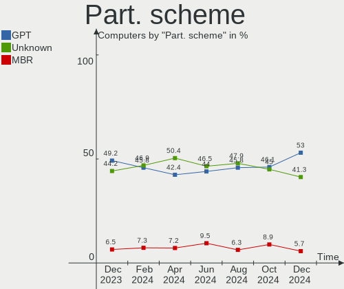
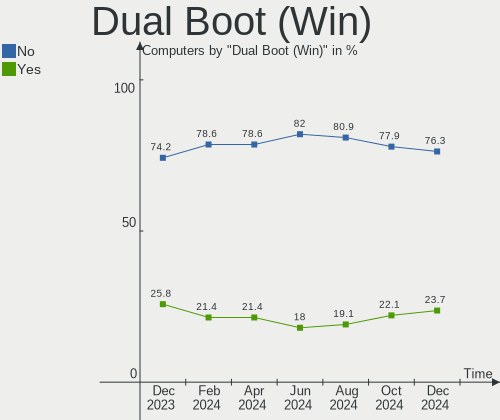
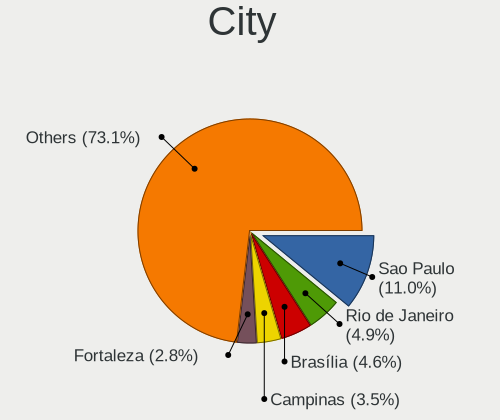
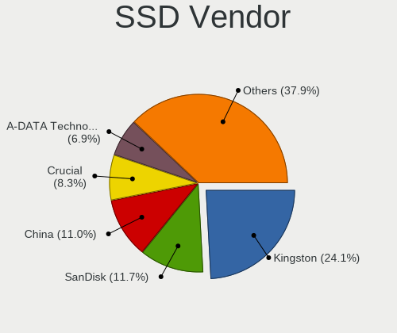
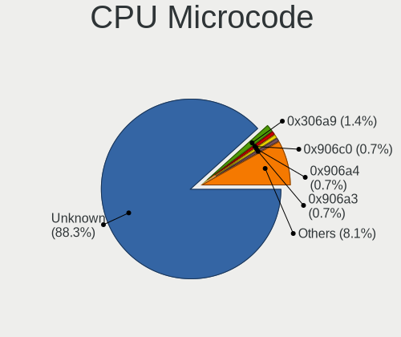
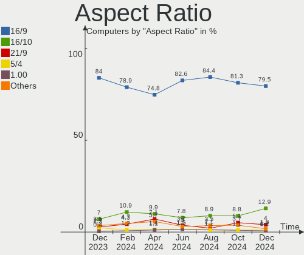
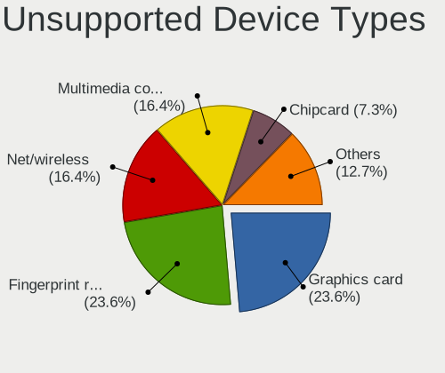

Linux in Brazil - Hardware Trends
---------------------------------

A project to identify most popular hardware characteristics and track their change
over time based on data collected by Linux users at https://Linux-Hardware.org.

Anyone can contribute to this report by the [hw-probe](https://github.com/linuxhw/hw-probe) tool:

    sudo -E hw-probe -all -upload

This is a report for all computer types. See also reports for [desktops](/Location/Brazil/Desktop/README.md) and [notebooks](/Location/Brazil/Notebook/README.md).

Period: Aug, 2022.

Contents
--------

* [ System ](#system)
  - [ OS                       ](#os)
  - [ OS Family                ](#os-family)
  - [ Kernel                   ](#kernel)
  - [ Kernel Family            ](#kernel-family)
  - [ Kernel Major Ver.        ](#kernel-major-ver)
  - [ Arch                     ](#arch)
  - [ DE                       ](#de)
  - [ Display Server           ](#display-server)
  - [ Display Manager          ](#display-manager)
  - [ OS Lang                  ](#os-lang)
  - [ Boot Mode                ](#boot-mode)
  - [ Filesystem               ](#filesystem)
  - [ Part. scheme             ](#part-scheme)
  - [ Dual Boot with Linux/BSD ](#dual-boot-with-linuxbsd)
  - [ Dual Boot (Win)          ](#dual-boot-win)

* [ Board ](#board)
  - [ Vendor                   ](#vendor)
  - [ Model                    ](#model)
  - [ Model Family             ](#model-family)
  - [ MFG Year                 ](#mfg-year)
  - [ Form Factor              ](#form-factor)
  - [ Secure Boot              ](#secure-boot)
  - [ Coreboot                 ](#coreboot)
  - [ RAM Size                 ](#ram-size)
  - [ RAM Used                 ](#ram-used)
  - [ Total Drives             ](#total-drives)
  - [ Has CD-ROM               ](#has-cd-rom)
  - [ Has Ethernet             ](#has-ethernet)
  - [ Has WiFi                 ](#has-wifi)
  - [ Has Bluetooth            ](#has-bluetooth)

* [ Location ](#location)
  - [ Country                  ](#country)
  - [ City                     ](#city)

* [ Drives ](#drives)
  - [ Drive Vendor             ](#drive-vendor)
  - [ Drive Model              ](#drive-model)
  - [ HDD Vendor               ](#hdd-vendor)
  - [ SSD Vendor               ](#ssd-vendor)
  - [ Drive Kind               ](#drive-kind)
  - [ Drive Connector          ](#drive-connector)
  - [ Drive Size               ](#drive-size)
  - [ Space Total              ](#space-total)
  - [ Space Used               ](#space-used)
  - [ Malfunc. Drives          ](#malfunc-drives)
  - [ Malfunc. Drive Vendor    ](#malfunc-drive-vendor)
  - [ Malfunc. HDD Vendor      ](#malfunc-hdd-vendor)
  - [ Malfunc. Drive Kind      ](#malfunc-drive-kind)
  - [ Failed Drives            ](#failed-drives)
  - [ Failed Drive Vendor      ](#failed-drive-vendor)
  - [ Drive Status             ](#drive-status)

* [ Storage controller ](#storage-controller)
  - [ Storage Vendor           ](#storage-vendor)
  - [ Storage Model            ](#storage-model)
  - [ Storage Kind             ](#storage-kind)

* [ Processor ](#processor)
  - [ CPU Vendor               ](#cpu-vendor)
  - [ CPU Model                ](#cpu-model)
  - [ CPU Model Family         ](#cpu-model-family)
  - [ CPU Cores                ](#cpu-cores)
  - [ CPU Sockets              ](#cpu-sockets)
  - [ CPU Threads              ](#cpu-threads)
  - [ CPU Op-Modes             ](#cpu-op-modes)
  - [ CPU Microcode            ](#cpu-microcode)
  - [ CPU Microarch            ](#cpu-microarch)

* [ Graphics ](#graphics)
  - [ GPU Vendor               ](#gpu-vendor)
  - [ GPU Model                ](#gpu-model)
  - [ GPU Combo                ](#gpu-combo)
  - [ GPU Driver               ](#gpu-driver)
  - [ GPU Memory               ](#gpu-memory)

* [ Monitor ](#monitor)
  - [ Monitor Vendor           ](#monitor-vendor)
  - [ Monitor Model            ](#monitor-model)
  - [ Monitor Resolution       ](#monitor-resolution)
  - [ Monitor Diagonal         ](#monitor-diagonal)
  - [ Monitor Width            ](#monitor-width)
  - [ Aspect Ratio             ](#aspect-ratio)
  - [ Monitor Area             ](#monitor-area)
  - [ Pixel Density            ](#pixel-density)
  - [ Multiple Monitors        ](#multiple-monitors)

* [ Network ](#network)
  - [ Net Controller Vendor    ](#net-controller-vendor)
  - [ Net Controller Model     ](#net-controller-model)
  - [ Wireless Vendor          ](#wireless-vendor)
  - [ Wireless Model           ](#wireless-model)
  - [ Ethernet Vendor          ](#ethernet-vendor)
  - [ Ethernet Model           ](#ethernet-model)
  - [ Net Controller Kind      ](#net-controller-kind)
  - [ Used Controller          ](#used-controller)
  - [ NICs                     ](#nics)
  - [ IPv6                     ](#ipv6)

* [ Bluetooth ](#bluetooth)
  - [ Bluetooth Vendor         ](#bluetooth-vendor)
  - [ Bluetooth Model          ](#bluetooth-model)

* [ Sound ](#sound)
  - [ Sound Vendor             ](#sound-vendor)
  - [ Sound Model              ](#sound-model)

* [ Memory ](#memory)
  - [ Memory Vendor            ](#memory-vendor)
  - [ Memory Model             ](#memory-model)
  - [ Memory Kind              ](#memory-kind)
  - [ Memory Form Factor       ](#memory-form-factor)
  - [ Memory Size              ](#memory-size)
  - [ Memory Speed             ](#memory-speed)

* [ Printers & scanners ](#printers--scanners)
  - [ Printer Vendor           ](#printer-vendor)
  - [ Printer Model            ](#printer-model)
  - [ Scanner Vendor           ](#scanner-vendor)
  - [ Scanner Model            ](#scanner-model)

* [ Camera ](#camera)
  - [ Camera Vendor            ](#camera-vendor)
  - [ Camera Model             ](#camera-model)

* [ Security ](#security)
  - [ Fingerprint Vendor       ](#fingerprint-vendor)
  - [ Fingerprint Model        ](#fingerprint-model)
  - [ Chipcard Vendor          ](#chipcard-vendor)
  - [ Chipcard Model           ](#chipcard-model)

* [ Unsupported ](#unsupported)
  - [ Unsupported Devices      ](#unsupported-devices)
  - [ Unsupported Device Types ](#unsupported-device-types)

System
------

OS
--

Installed operating systems

| Name                         | Computers | Percent |
|------------------------------|-----------|---------|
| Ubuntu 22.04                 | 35        | 13.36%  |
| Ubuntu 20.04                 | 21        | 8.02%   |
| Pop!_OS 22.04                | 19        | 7.25%   |
| OpenMandriva 4.3             | 19        | 7.25%   |
| Fedora 36                    | 14        | 5.34%   |
| Linux Mint 20.3              | 13        | 4.96%   |
| Linux Mint 21                | 12        | 4.58%   |
| Debian 11                    | 12        | 4.58%   |
| Zorin 16                     | 10        | 3.82%   |
| Manjaro                      | 7         | 2.67%   |
| KDE neon 20.04               | 7         | 2.67%   |
| OpenMandriva 4.90            | 6         | 2.29%   |
| Elementary 6.1               | 6         | 2.29%   |
| Arch                         | 6         | 2.29%   |
| Endless 4.0.7                | 5         | 1.91%   |
| ROSA 12.2                    | 4         | 1.53%   |
| openSUSE Tumbleweed-XXXXXXXX | 4         | 1.53%   |
| Xubuntu 20.04                | 3         | 1.15%   |
| Lubuntu 22.04                | 3         | 1.15%   |
| Kubuntu 22.04                | 3         | 1.15%   |
| Endless 4.0.8                | 3         | 1.15%   |
| BigLinux 21.3.7              | 3         | 1.15%   |
| ArcoLinux Rolling            | 3         | 1.15%   |
| Arch Rolling                 | 3         | 1.15%   |
| Ubuntu 18.04                 | 2         | 0.76%   |
| OpenMandriva 4.2             | 2         | 0.76%   |
| Linux Mint 20.2              | 2         | 0.76%   |
| Fedora 35                    | 2         | 0.76%   |
| Endless 3.9.7                | 2         | 0.76%   |
| Endless 3.9.1                | 2         | 0.76%   |
| Zorin 15                     | 1         | 0.38%   |
| Xubuntu 21.10                | 1         | 0.38%   |
| Xubuntu 18.04                | 1         | 0.38%   |
| Ubuntu MATE 22.04            | 1         | 0.38%   |
| Ubuntu 22.10                 | 1         | 0.38%   |
| Raspbian 11                  | 1         | 0.38%   |
| Pop!_OS 21.10                | 1         | 0.38%   |
| Oracle Linux 9.0             | 1         | 0.38%   |
| Manjaro 21.3.6               | 1         | 0.38%   |
| LMDE 5                       | 1         | 0.38%   |
| LinuxFX 10                   | 1         | 0.38%   |
| Linux Mint 19.3              | 1         | 0.38%   |
| Linux Mint 19.1              | 1         | 0.38%   |
| Kubuntu 20.04                | 1         | 0.38%   |
| KDE neon 22.04               | 1         | 0.38%   |
| Kali 2022.3                  | 1         | 0.38%   |
| GNOME OS 43                  | 1         | 0.38%   |
| Garuda Linux Soaring         | 1         | 0.38%   |
| Feren OS 20.04               | 1         | 0.38%   |
| Endless 4.0.6                | 1         | 0.38%   |
| Endless 3.9.1-nexthw2        | 1         | 0.38%   |
| Endless 3.7.7-nexthw1        | 1         | 0.38%   |
| EndeavourOS Rolling          | 1         | 0.38%   |
| EndeavourOS                  | 1         | 0.38%   |
| Devuan 4                     | 1         | 0.38%   |
| Debian Testing               | 1         | 0.38%   |
| Clear Linux 36870            | 1         | 0.38%   |
| BigLinux 21.3.6              | 1         | 0.38%   |
| ArcoLinux                    | 1         | 0.38%   |

OS Family
---------

OS without a version

| Name         | Computers | Percent |
|--------------|-----------|---------|
| Ubuntu       | 59        | 22.52%  |
| Linux Mint   | 29        | 11.07%  |
| OpenMandriva | 27        | 10.31%  |
| Pop!_OS      | 20        | 7.63%   |
| Fedora       | 16        | 6.11%   |
| Endless      | 15        | 5.73%   |
| Debian       | 13        | 4.96%   |
| Zorin        | 11        | 4.2%    |
| Arch         | 9         | 3.44%   |
| Manjaro      | 8         | 3.05%   |
| KDE neon     | 8         | 3.05%   |
| Elementary   | 6         | 2.29%   |
| Xubuntu      | 5         | 1.91%   |
| ROSA         | 4         | 1.53%   |
| openSUSE     | 4         | 1.53%   |
| Kubuntu      | 4         | 1.53%   |
| BigLinux     | 4         | 1.53%   |
| ArcoLinux    | 4         | 1.53%   |
| Lubuntu      | 3         | 1.15%   |
| EndeavourOS  | 2         | 0.76%   |
| Ubuntu MATE  | 1         | 0.38%   |
| Raspbian     | 1         | 0.38%   |
| Oracle Linux | 1         | 0.38%   |
| LMDE         | 1         | 0.38%   |
| LinuxFX      | 1         | 0.38%   |
| Kali         | 1         | 0.38%   |
| GNOME OS     | 1         | 0.38%   |
| Garuda Linux | 1         | 0.38%   |
| Feren OS     | 1         | 0.38%   |
| Devuan       | 1         | 0.38%   |
| Clear Linux  | 1         | 0.38%   |

Kernel
------

Version of the Linux kernel

| Version                             | Computers | Percent |
|-------------------------------------|-----------|---------|
| 5.15.0-46-generic                   | 50        | 19.08%  |
| 5.15.0-43-generic                   | 31        | 11.83%  |
| 5.16.7-desktop-1omv4003             | 17        | 6.49%   |
| 5.18.10-76051810-generic            | 11        | 4.2%    |
| 5.4.0-124-generic                   | 10        | 3.82%   |
| 5.11.0-35-generic                   | 9         | 3.44%   |
| 5.19.0-76051900-generic             | 7         | 2.67%   |
| 5.15.60-1-MANJARO                   | 6         | 2.29%   |
| 5.18.12-desktop-3omv4090            | 5         | 1.91%   |
| 5.15.0-41-generic                   | 5         | 1.91%   |
| 5.10.0-17-amd64                     | 5         | 1.91%   |
| 5.8.0-14-generic                    | 4         | 1.53%   |
| 5.4.0-122-generic                   | 4         | 1.53%   |
| 5.18.19-200.fc36.x86_64             | 4         | 1.53%   |
| 5.18.17-200.fc36.x86_64             | 4         | 1.53%   |
| 5.18.16-arch1-1                     | 4         | 1.53%   |
| 5.15.0-25-generic                   | 4         | 1.53%   |
| 5.10.0-16-amd64                     | 4         | 1.53%   |
| 5.19.1-arch2-1                      | 3         | 1.15%   |
| 5.4.0-125-generic                   | 2         | 0.76%   |
| 5.19.3-arch1-1                      | 2         | 0.76%   |
| 5.19.2-arch1-1                      | 2         | 0.76%   |
| 5.18.18-200.fc36.x86_64             | 2         | 0.76%   |
| 5.18.16-200.fc36.x86_64             | 2         | 0.76%   |
| 5.16.13-desktop-1omv4003            | 2         | 0.76%   |
| 5.15.53-1-MANJARO                   | 2         | 0.76%   |
| 5.15.0-47-generic                   | 2         | 0.76%   |
| 5.15.0-40-generic                   | 2         | 0.76%   |
| 5.10.74-generic-2rosa2021.1-x86_64  | 2         | 0.76%   |
| 5.10.14-desktop-1omv4002            | 2         | 0.76%   |
| 5.10.136-1-MANJARO                  | 2         | 0.76%   |
| 5.10.118-generic-2rosa2021.1-x86_64 | 2         | 0.76%   |
| 5.10.0-13-amd64                     | 2         | 0.76%   |
| 5.4.0-91-generic                    | 1         | 0.38%   |
| 5.4.0-73-generic                    | 1         | 0.38%   |
| 5.4.0-7-generic                     | 1         | 0.38%   |
| 5.4.0-65-generic                    | 1         | 0.38%   |
| 5.4.0-45-generic                    | 1         | 0.38%   |
| 5.4.0-122-lowlatency                | 1         | 0.38%   |
| 5.4.0-113-generic                   | 1         | 0.38%   |
| 5.4.0-105-generic                   | 1         | 0.38%   |
| 5.19.2-1178.native                  | 1         | 0.38%   |
| 5.19.2-1-default                    | 1         | 0.38%   |
| 5.19.1-zen1-1-zen                   | 1         | 0.38%   |
| 5.19.1-051901-generic               | 1         | 0.38%   |
| 5.19.0-desktop-1omv4090             | 1         | 0.38%   |
| 5.19.0-15-generic                   | 1         | 0.38%   |
| 5.19.0-051900-generic               | 1         | 0.38%   |
| 5.18.7-arch1-1                      | 1         | 0.38%   |
| 5.18.5-200.fc36.x86_64              | 1         | 0.38%   |
| 5.18.16-zen1-1-zen                  | 1         | 0.38%   |
| 5.18.16-100.fc35.x86_64             | 1         | 0.38%   |
| 5.18.16                             | 1         | 0.38%   |
| 5.18.15-arch1-2                     | 1         | 0.38%   |
| 5.18.15-200.fc36.x86_64             | 1         | 0.38%   |
| 5.18.15-1-default                   | 1         | 0.38%   |
| 5.18.12-1-default                   | 1         | 0.38%   |
| 5.18.11-100.fc35.x86_64             | 1         | 0.38%   |
| 5.18.11-1-default                   | 1         | 0.38%   |
| 5.18.0-kali5-amd64                  | 1         | 0.38%   |

Kernel Family
-------------

Linux kernel without a distro release

| Version  | Computers | Percent |
|----------|-----------|---------|
| 5.15.0   | 96        | 36.64%  |
| 5.4.0    | 24        | 9.16%   |
| 5.16.7   | 17        | 6.49%   |
| 5.10.0   | 13        | 4.96%   |
| 5.18.10  | 11        | 4.2%    |
| 5.19.0   | 10        | 3.82%   |
| 5.11.0   | 10        | 3.82%   |
| 5.18.16  | 9         | 3.44%   |
| 5.18.12  | 6         | 2.29%   |
| 5.15.60  | 6         | 2.29%   |
| 5.19.1   | 5         | 1.91%   |
| 5.8.0    | 4         | 1.53%   |
| 5.19.2   | 4         | 1.53%   |
| 5.18.19  | 4         | 1.53%   |
| 5.18.17  | 4         | 1.53%   |
| 5.18.15  | 3         | 1.15%   |
| 5.18.0   | 3         | 1.15%   |
| 5.19.3   | 2         | 0.76%   |
| 5.18.18  | 2         | 0.76%   |
| 5.18.11  | 2         | 0.76%   |
| 5.16.13  | 2         | 0.76%   |
| 5.15.53  | 2         | 0.76%   |
| 5.14.0   | 2         | 0.76%   |
| 5.13.0   | 2         | 0.76%   |
| 5.10.74  | 2         | 0.76%   |
| 5.10.14  | 2         | 0.76%   |
| 5.10.136 | 2         | 0.76%   |
| 5.10.118 | 2         | 0.76%   |
| 5.18.7   | 1         | 0.38%   |
| 5.18.5   | 1         | 0.38%   |
| 5.17.9   | 1         | 0.38%   |
| 5.17.5   | 1         | 0.38%   |
| 5.17.15  | 1         | 0.38%   |
| 5.15.56  | 1         | 0.38%   |
| 5.15.41  | 1         | 0.38%   |
| 5.10.60  | 1         | 0.38%   |
| 5.10.129 | 1         | 0.38%   |
| 5.10.120 | 1         | 0.38%   |
| 4.15.0   | 1         | 0.38%   |

Kernel Major Ver.
-----------------

Linux kernel major version

| Version | Computers | Percent |
|---------|-----------|---------|
| 5.15    | 106       | 40.46%  |
| 5.18    | 46        | 17.56%  |
| 5.4     | 24        | 9.16%   |
| 5.10    | 24        | 9.16%   |
| 5.19    | 21        | 8.02%   |
| 5.16    | 19        | 7.25%   |
| 5.11    | 10        | 3.82%   |
| 5.8     | 4         | 1.53%   |
| 5.17    | 3         | 1.15%   |
| 5.14    | 2         | 0.76%   |
| 5.13    | 2         | 0.76%   |
| 4.15    | 1         | 0.38%   |

Arch
----

OS architecture (x86_64, i586, etc.)

| Name   | Computers | Percent |
|--------|-----------|---------|
| x86_64 | 259       | 98.85%  |
| i686   | 2         | 0.76%   |
| armv7l | 1         | 0.38%   |

DE
--

Desktop Environment

| Name       | Computers | Percent |
|------------|-----------|---------|
| GNOME      | 139       | 53.05%  |
| KDE5       | 60        | 22.9%   |
| X-Cinnamon | 22        | 8.4%    |
| XFCE       | 17        | 6.49%   |
| Pantheon   | 6         | 2.29%   |
| MATE       | 4         | 1.53%   |
| LXQt       | 4         | 1.53%   |
| Cinnamon   | 4         | 1.53%   |
| Unknown    | 4         | 1.53%   |
| Deepin     | 1         | 0.38%   |
| bspwm      | 1         | 0.38%   |

Display Server
--------------

X11 or Wayland

| Name    | Computers | Percent |
|---------|-----------|---------|
| X11     | 198       | 75.57%  |
| Wayland | 58        | 22.14%  |
| Unknown | 5         | 1.91%   |
| Tty     | 1         | 0.38%   |

Display Manager
---------------

SDDM, LightDM, etc.

| Name    | Computers | Percent |
|---------|-----------|---------|
| Unknown | 120       | 45.8%   |
| GDM3    | 50        | 19.08%  |
| SDDM    | 41        | 15.65%  |
| LightDM | 26        | 9.92%   |
| GDM     | 24        | 9.16%   |
| XDM     | 1         | 0.38%   |

OS Lang
-------

Language

| Lang    | Computers | Percent |
|---------|-----------|---------|
| pt_BR   | 196       | 74.81%  |
| en_US   | 53        | 20.23%  |
| C       | 5         | 1.91%   |
| pt_PT   | 3         | 1.15%   |
| en_GB   | 2         | 0.76%   |
| es_ES   | 1         | 0.38%   |
| en_AG   | 1         | 0.38%   |
| Unknown | 1         | 0.38%   |

Boot Mode
---------

EFI or BIOS

| Mode | Computers | Percent |
|------|-----------|---------|
| BIOS | 137       | 52.29%  |
| EFI  | 125       | 47.71%  |

Filesystem
----------

Type of filesystem

| Type    | Computers | Percent |
|---------|-----------|---------|
| Ext4    | 189       | 72.14%  |
| Btrfs   | 37        | 14.12%  |
| Overlay | 28        | 10.69%  |
| Xfs     | 4         | 1.53%   |
| Zfs     | 2         | 0.76%   |
| Tmpfs   | 1         | 0.38%   |
| Ext3    | 1         | 0.38%   |

Part. scheme
------------

Scheme of partitioning

| Type    | Computers | Percent |
|---------|-----------|---------|
| Unknown | 158       | 60.31%  |
| GPT     | 75        | 28.63%  |
| MBR     | 29        | 11.07%  |

Dual Boot with Linux/BSD
------------------------

Hosting more than one Linux/BSD

| Dual boot | Computers | Percent |
|-----------|-----------|---------|
| No        | 239       | 91.22%  |
| Yes       | 23        | 8.78%   |

Dual Boot (Win)
---------------

Hosting Linux and Windows

| Dual boot | Computers | Percent |
|-----------|-----------|---------|
| No        | 208       | 79.39%  |
| Yes       | 54        | 20.61%  |

Board
-----

Vendor
------

Motherboard manufacturer

| Name                      | Computers | Percent |
|---------------------------|-----------|---------|
| ASUSTek Computer          | 41        | 15.65%  |
| Dell                      | 36        | 13.74%  |
| Acer                      | 27        | 10.31%  |
| Lenovo                    | 25        | 9.54%   |
| Positivo                  | 18        | 6.87%   |
| Samsung Electronics       | 15        | 5.73%   |
| Hewlett-Packard           | 15        | 5.73%   |
| Gigabyte Technology       | 15        | 5.73%   |
| Intel                     | 7         | 2.67%   |
| ASRock                    | 5         | 1.91%   |
| Sony                      | 4         | 1.53%   |
| MSI                       | 4         | 1.53%   |
| Foxconn                   | 4         | 1.53%   |
| Biostar                   | 4         | 1.53%   |
| PCWare                    | 3         | 1.15%   |
| MACHINIST                 | 3         | 1.15%   |
| Daten Tecnologia          | 3         | 1.15%   |
| Avell High Performance    | 3         | 1.15%   |
| Unknown                   | 3         | 1.15%   |
| Supermicro                | 2         | 0.76%   |
| Positivo Bahia - VAIO     | 2         | 0.76%   |
| Compaq                    | 2         | 0.76%   |
| Apple                     | 2         | 0.76%   |
| AMI                       | 2         | 0.76%   |
| Alienware                 | 2         | 0.76%   |
| VS Company                | 1         | 0.38%   |
| TPVAOC                    | 1         | 0.38%   |
| Toshiba                   | 1         | 0.38%   |
| Semp Toshiba              | 1         | 0.38%   |
| Raspberry Pi Foundation   | 1         | 0.38%   |
| OEM                       | 1         | 0.38%   |
| Notebook                  | 1         | 0.38%   |
| LG Electronics            | 1         | 0.38%   |
| Itautec                   | 1         | 0.38%   |
| Google                    | 1         | 0.38%   |
| Gateway                   | 1         | 0.38%   |
| Clevo                     | 1         | 0.38%   |
| Chuwi                     | 1         | 0.38%   |
| CCE                       | 1         | 0.38%   |
| Arquimedes Automacao Inf. | 1         | 0.38%   |

Model
-----

Motherboard model

| Name                                     | Computers | Percent |
|------------------------------------------|-----------|---------|
| Unknown                                  | 6         | 2.29%   |
| ASUS All Series                          | 5         | 1.91%   |
| Acer Nitro AN515-44                      | 4         | 1.53%   |
| Samsung 340XAA/350XAA/550XAA             | 3         | 1.15%   |
| Positivo Mobile                          | 3         | 1.15%   |
| Lenovo IdeaPad S145-15API 81V7           | 3         | 1.15%   |
| Dell Inspiron 3583                       | 3         | 1.15%   |
| Daten Tecnologia DT02-M4                 | 3         | 1.15%   |
| Acer Nitro AN515-54                      | 3         | 1.15%   |
| Samsung 550XDA                           | 2         | 0.76%   |
| Samsung 300E5M/300E5L                    | 2         | 0.76%   |
| Samsung 300E4C/300E5C/300E7C             | 2         | 0.76%   |
| Positivo Q4128C-S                        | 2         | 0.76%   |
| Lenovo IdeaPad S145-15IWL 81S9           | 2         | 0.76%   |
| Lenovo IdeaPad S145-15IIL 82DJ           | 2         | 0.76%   |
| Lenovo IdeaPad 3 15ALC6 82MF             | 2         | 0.76%   |
| Intel H61                                | 2         | 0.76%   |
| HP Mini 110-3100                         | 2         | 0.76%   |
| Gigabyte H61M-S1                         | 2         | 0.76%   |
| Dell Vostro 15 5510                      | 2         | 0.76%   |
| Dell Inspiron 5547                       | 2         | 0.76%   |
| Biostar G31-M7 TE                        | 2         | 0.76%   |
| Avell High Performance B.ON              | 2         | 0.76%   |
| ASUS VivoBook_ASUSLaptop X515JA_X515JA   | 2         | 0.76%   |
| ASUS VivoBook_ASUSLaptop X515DA_X515DA   | 2         | 0.76%   |
| ASUS VivoBook 15_ASUS Laptop X540UAR     | 2         | 0.76%   |
| ASUS M5A78L-M/USB3                       | 2         | 0.76%   |
| ASUS M5A78L-M LX/BR                      | 2         | 0.76%   |
| Acer Aspire E1-571                       | 2         | 0.76%   |
| Acer Aspire A515-51G                     | 2         | 0.76%   |
| Acer Aspire A315-56                      | 2         | 0.76%   |
| Acer Aspire A315-23G                     | 2         | 0.76%   |
| VS Company H61H2                         | 1         | 0.38%   |
| TPVAOC AA183M                            | 1         | 0.38%   |
| Toshiba PORTEGE Z930                     | 1         | 0.38%   |
| Supermicro SSG-6047R-E1CR36N             | 1         | 0.38%   |
| Supermicro SKAGIT09                      | 1         | 0.38%   |
| Sony VPCSB35FB                           | 1         | 0.38%   |
| Sony VPCEB36GM                           | 1         | 0.38%   |
| Sony VPCCW13FB                           | 1         | 0.38%   |
| Sony VGN-NR230AE                         | 1         | 0.38%   |
| Semp Toshiba STI                         | 1         | 0.38%   |
| Samsung RV411/RV511/E3511/S3511/RV711    | 1         | 0.38%   |
| Samsung R430/R480/R440                   | 1         | 0.38%   |
| Samsung 930QDB                           | 1         | 0.38%   |
| Samsung 670Z5E                           | 1         | 0.38%   |
| Samsung 550XCJ/550XCR                    | 1         | 0.38%   |
| Samsung 3570R/370R/470R/450R/510R/4450RV | 1         | 0.38%   |
| RPi Raspberry Pi 3 Model B Rev 1.2       | 1         | 0.38%   |
| Positivo W942SW_SW1                      | 1         | 0.38%   |
| Positivo W942SV_SV1                      | 1         | 0.38%   |
| Positivo Smash                           | 1         | 0.38%   |
| Positivo S14CT01                         | 1         | 0.38%   |
| Positivo S14BW01                         | 1         | 0.38%   |
| Positivo Q232A                           | 1         | 0.38%   |
| Positivo POS-PIQ77CL                     | 1         | 0.38%   |
| Positivo POS-PARS760GCD                  | 1         | 0.38%   |
| Positivo EC10IS1                         | 1         | 0.38%   |
| Positivo C14RV01                         | 1         | 0.38%   |
| Positivo C14CU51                         | 1         | 0.38%   |

Model Family
------------

Motherboard model prefix

| Name                                    | Computers | Percent |
|-----------------------------------------|-----------|---------|
| Dell Inspiron                           | 19        | 7.25%   |
| Acer Aspire                             | 17        | 6.49%   |
| Lenovo IdeaPad                          | 15        | 5.73%   |
| Dell Vostro                             | 9         | 3.44%   |
| ASUS VivoBook                           | 8         | 3.05%   |
| Acer Nitro                              | 8         | 3.05%   |
| Lenovo ThinkPad                         | 7         | 2.67%   |
| Unknown                                 | 6         | 2.29%   |
| ASUS All                                | 5         | 1.91%   |
| HP ProBook                              | 4         | 1.53%   |
| ASUS M5A78L-M                           | 4         | 1.53%   |
| Samsung 340XAA                          | 3         | 1.15%   |
| Positivo Mobile                         | 3         | 1.15%   |
| Daten Tecnologia DT02-M4                | 3         | 1.15%   |
| ASUS TUF                                | 3         | 1.15%   |
| ASUS PRIME                              | 3         | 1.15%   |
| ASUS P8H61-M                            | 3         | 1.15%   |
| Samsung 550XDA                          | 2         | 0.76%   |
| Samsung 300E5M                          | 2         | 0.76%   |
| Samsung 300E4C                          | 2         | 0.76%   |
| Positivo Q4128C-S                       | 2         | 0.76%   |
| Intel H61                               | 2         | 0.76%   |
| HP Mini                                 | 2         | 0.76%   |
| HP EliteDesk                            | 2         | 0.76%   |
| HP Compaq                               | 2         | 0.76%   |
| Gigabyte H61M-S1                        | 2         | 0.76%   |
| Dell Latitude                           | 2         | 0.76%   |
| Biostar G31-M7                          | 2         | 0.76%   |
| Avell High Performance B.ON             | 2         | 0.76%   |
| VS Company H61H2                        | 1         | 0.38%   |
| TPVAOC AA183M                           | 1         | 0.38%   |
| Toshiba PORTEGE                         | 1         | 0.38%   |
| Supermicro SSG-6047R-E1CR36N            | 1         | 0.38%   |
| Supermicro SKAGIT09                     | 1         | 0.38%   |
| Sony VPCSB35FB                          | 1         | 0.38%   |
| Sony VPCEB36GM                          | 1         | 0.38%   |
| Sony VPCCW13FB                          | 1         | 0.38%   |
| Sony VGN-NR230AE                        | 1         | 0.38%   |
| Semp Toshiba STI                        | 1         | 0.38%   |
| Samsung RV411                           | 1         | 0.38%   |
| Samsung R430                            | 1         | 0.38%   |
| Samsung 930QDB                          | 1         | 0.38%   |
| Samsung 670Z5E                          | 1         | 0.38%   |
| Samsung 550XCJ                          | 1         | 0.38%   |
| Samsung 3570R                           | 1         | 0.38%   |
| RPi Raspberry                           | 1         | 0.38%   |
| Positivo W942SW                         | 1         | 0.38%   |
| Positivo W942SV                         | 1         | 0.38%   |
| Positivo Smash                          | 1         | 0.38%   |
| Positivo S14CT01                        | 1         | 0.38%   |
| Positivo S14BW01                        | 1         | 0.38%   |
| Positivo Q232A                          | 1         | 0.38%   |
| Positivo POS-PIQ77CL                    | 1         | 0.38%   |
| Positivo POS-PARS760GCD                 | 1         | 0.38%   |
| Positivo EC10IS1                        | 1         | 0.38%   |
| Positivo C14RV01                        | 1         | 0.38%   |
| Positivo C14CU51                        | 1         | 0.38%   |
| Positivo C14CR21                        | 1         | 0.38%   |
| Positivo C14CR01                        | 1         | 0.38%   |
| Positivo Bahia - VAIO VJFE52F11X-B0611H | 1         | 0.38%   |

MFG Year
--------

Motherboard manufacture year

| Year    | Computers | Percent |
|---------|-----------|---------|
| 2012    | 31        | 11.83%  |
| 2020    | 29        | 11.07%  |
| 2019    | 28        | 10.69%  |
| 2021    | 27        | 10.31%  |
| 2011    | 23        | 8.78%   |
| 2018    | 22        | 8.4%    |
| 2013    | 17        | 6.49%   |
| 2017    | 16        | 6.11%   |
| 2014    | 15        | 5.73%   |
| 2010    | 13        | 4.96%   |
| 2016    | 12        | 4.58%   |
| 2022    | 8         | 3.05%   |
| 2008    | 8         | 3.05%   |
| 2009    | 5         | 1.91%   |
| 2015    | 4         | 1.53%   |
| 2007    | 2         | 0.76%   |
| Unknown | 2         | 0.76%   |

Form Factor
-----------

Physical design of the computer

| Name           | Computers | Percent |
|----------------|-----------|---------|
| Notebook       | 174       | 66.41%  |
| Desktop        | 82        | 31.3%   |
| Mini pc        | 2         | 0.76%   |
| System on chip | 1         | 0.38%   |
| Convertible    | 1         | 0.38%   |
| All in one     | 1         | 0.38%   |
| Server         | 1         | 0.38%   |

Secure Boot
-----------

Enabled or disabled

| State    | Computers | Percent |
|----------|-----------|---------|
| Disabled | 230       | 87.79%  |
| Enabled  | 32        | 12.21%  |

Coreboot
--------

Have coreboot on board

| Used | Computers | Percent |
|------|-----------|---------|
| No   | 261       | 99.62%  |
| Yes  | 1         | 0.38%   |

RAM Size
--------

Total RAM memory

| Size in GB  | Computers | Percent |
|-------------|-----------|---------|
| 4.01-8.0    | 80        | 30.53%  |
| 3.01-4.0    | 57        | 21.76%  |
| 16.01-24.0  | 44        | 16.79%  |
| 8.01-16.0   | 44        | 16.79%  |
| 32.01-64.0  | 13        | 4.96%   |
| 1.01-2.0    | 12        | 4.58%   |
| 2.01-3.0    | 7         | 2.67%   |
| 24.01-32.0  | 2         | 0.76%   |
| 64.01-256.0 | 2         | 0.76%   |
| 0.51-1.0    | 1         | 0.38%   |

RAM Used
--------

Used RAM memory

| Used GB    | Computers | Percent |
|------------|-----------|---------|
| 1.01-2.0   | 96        | 36.64%  |
| 2.01-3.0   | 72        | 27.48%  |
| 3.01-4.0   | 37        | 14.12%  |
| 4.01-8.0   | 34        | 12.98%  |
| 8.01-16.0  | 10        | 3.82%   |
| 0.51-1.0   | 9         | 3.44%   |
| 0.01-0.5   | 3         | 1.15%   |
| 16.01-24.0 | 1         | 0.38%   |

Total Drives
------------

Number of drives on board

| Drives | Computers | Percent |
|--------|-----------|---------|
| 1      | 176       | 67.18%  |
| 2      | 56        | 21.37%  |
| 3      | 13        | 4.96%   |
| 0      | 6         | 2.29%   |
| 5      | 4         | 1.53%   |
| 4      | 4         | 1.53%   |
| 6      | 2         | 0.76%   |
| 7      | 1         | 0.38%   |

Has CD-ROM
----------

Has CD-ROM on board

| Presented | Computers | Percent |
|-----------|-----------|---------|
| No        | 190       | 72.52%  |
| Yes       | 72        | 27.48%  |

Has Ethernet
------------

Has Ethernet on board

| Presented | Computers | Percent |
|-----------|-----------|---------|
| Yes       | 225       | 85.88%  |
| No        | 37        | 14.12%  |

Has WiFi
--------

Has WiFi module

| Presented | Computers | Percent |
|-----------|-----------|---------|
| Yes       | 198       | 75.57%  |
| No        | 64        | 24.43%  |

Has Bluetooth
-------------

Has Bluetooth module

| Presented | Computers | Percent |
|-----------|-----------|---------|
| Yes       | 157       | 59.92%  |
| No        | 105       | 40.08%  |

Location
--------

Country
-------

Geographic location (country)

| Country | Computers | Percent |
|---------|-----------|---------|
| Brazil  | 262       | 100%    |

City
----

Geographic location (city)

| City                  | Computers | Percent |
|-----------------------|-----------|---------|
| Sao Paulo             | 23        | 8.78%   |
| Rio de Janeiro        | 16        | 6.11%   |
| Fortaleza             | 15        | 5.73%   |
| Brasília             | 9         | 3.44%   |
| Porto Alegre          | 7         | 2.67%   |
| Salvador              | 6         | 2.29%   |
| Florianópolis        | 4         | 1.53%   |
| Belo Horizonte        | 4         | 1.53%   |
| Uberlândia           | 3         | 1.15%   |
| Ribeirao Preto        | 3         | 1.15%   |
| Pelotas               | 3         | 1.15%   |
| Curitiba              | 3         | 1.15%   |
| Campos dos Goytacazes | 3         | 1.15%   |
| Belém                | 3         | 1.15%   |
| Anápolis             | 3         | 1.15%   |
| Vitória              | 2         | 0.76%   |
| Valparaiso de Goias   | 2         | 0.76%   |
| Teresina              | 2         | 0.76%   |
| Soure                 | 2         | 0.76%   |
| Sao Luís             | 2         | 0.76%   |
| Sao Goncalo           | 2         | 0.76%   |
| Sao Bernardo do Campo | 2         | 0.76%   |
| Recife                | 2         | 0.76%   |
| Natal                 | 2         | 0.76%   |
| Muriaé               | 2         | 0.76%   |
| Marília              | 2         | 0.76%   |
| Marica                | 2         | 0.76%   |
| Mage                  | 2         | 0.76%   |
| Limeira               | 2         | 0.76%   |
| Lages                 | 2         | 0.76%   |
| Itatiba               | 2         | 0.76%   |
| Itaborai              | 2         | 0.76%   |
| Franca                | 2         | 0.76%   |
| Farroupilha           | 2         | 0.76%   |
| Cuiabá               | 2         | 0.76%   |
| Chapecó              | 2         | 0.76%   |
| Castanhal             | 2         | 0.76%   |
| Caraguatatuba         | 2         | 0.76%   |
| Braganca Paulista     | 2         | 0.76%   |
| Belford Roxo          | 2         | 0.76%   |
| Barueri               | 2         | 0.76%   |
| Balneário Camboriú  | 2         | 0.76%   |
| Balneario             | 2         | 0.76%   |
| Araquari              | 2         | 0.76%   |
| Americana             | 2         | 0.76%   |
| Volta Redonda         | 1         | 0.38%   |
| Vieiras               | 1         | 0.38%   |
| Várzea Grande        | 1         | 0.38%   |
| Unai                  | 1         | 0.38%   |
| Ubatuba               | 1         | 0.38%   |
| Tubarao               | 1         | 0.38%   |
| Três Lagoas          | 1         | 0.38%   |
| Toritama              | 1         | 0.38%   |
| Timbauba              | 1         | 0.38%   |
| Teresopolis           | 1         | 0.38%   |
| Taubate               | 1         | 0.38%   |
| Suzano                | 1         | 0.38%   |
| Sorocaba              | 1         | 0.38%   |
| Sete Lagoas           | 1         | 0.38%   |
| Seropedica            | 1         | 0.38%   |

Drives
------

Drive Vendor
------------

Hard drive vendors

| Vendor                         | Computers | Drives | Percent |
|--------------------------------|-----------|--------|---------|
| WDC                            | 59        | 63     | 16.91%  |
| Seagate                        | 59        | 71     | 16.91%  |
| Samsung Electronics            | 33        | 36     | 9.46%   |
| Kingston                       | 31        | 33     | 8.88%   |
| SanDisk                        | 15        | 15     | 4.3%    |
| A-DATA Technology              | 14        | 14     | 4.01%   |
| Unknown                        | 12        | 12     | 3.44%   |
| China                          | 12        | 12     | 3.44%   |
| ADATA Technology               | 12        | 12     | 3.44%   |
| Toshiba                        | 10        | 11     | 2.87%   |
| SK hynix                       | 8         | 9      | 2.29%   |
| Hitachi                        | 7         | 8      | 2.01%   |
| Crucial                        | 7         | 7      | 2.01%   |
| KingSpec                       | 6         | 6      | 1.72%   |
| Silicon Motion                 | 5         | 6      | 1.43%   |
| HGST                           | 5         | 5      | 1.43%   |
| Patriot                        | 4         | 4      | 1.15%   |
| Intel                          | 4         | 4      | 1.15%   |
| Unknown                        | 4         | 4      | 1.15%   |
| Win Memory                     | 3         | 3      | 0.86%   |
| Phison                         | 3         | 3      | 0.86%   |
| Gigabyte Technology            | 3         | 3      | 0.86%   |
| Realtek Semiconductor          | 2         | 2      | 0.57%   |
| Netac                          | 2         | 2      | 0.57%   |
| Micron/Crucial Technology      | 2         | 2      | 0.57%   |
| KIOXIA                         | 2         | 2      | 0.57%   |
| JMicron Technology             | 2         | 2      | 0.57%   |
| HUSKY                          | 2         | 2      | 0.57%   |
| Corsair                        | 2         | 2      | 0.57%   |
| XrayDisk                       | 1         | 1      | 0.29%   |
| XPG                            | 1         | 1      | 0.29%   |
| WALRAM                         | 1         | 1      | 0.29%   |
| Vaseky                         | 1         | 1      | 0.29%   |
| Team                           | 1         | 1      | 0.29%   |
| SSSTC                          | 1         | 1      | 0.29%   |
| Solid State Storage Technology | 1         | 1      | 0.29%   |
| S3+                            | 1         | 1      | 0.29%   |
| Micron Technology              | 1         | 1      | 0.29%   |
| Maxtor                         | 1         | 1      | 0.29%   |
| Lite-On                        | 1         | 1      | 0.29%   |
| Lexar                          | 1         | 1      | 0.29%   |
| KODAK                          | 1         | 1      | 0.29%   |
| Hjwdz                          | 1         | 1      | 0.29%   |
| Fujitsu                        | 1         | 1      | 0.29%   |
| BIWIN                          | 1         | 1      | 0.29%   |
| BHT                            | 1         | 1      | 0.29%   |
| AFOX                           | 1         | 1      | 0.29%   |
| Acer                           | 1         | 1      | 0.29%   |

Drive Model
-----------

Hard drive models

| Model                               | Computers | Percent |
|-------------------------------------|-----------|---------|
| ADATA NVMe SSD Drive 256GB          | 9         | 2.45%   |
| WDC WD10SPZX-21Z10T0 1TB            | 8         | 2.18%   |
| Kingston SA400S37240G 240GB SSD     | 8         | 2.18%   |
| Kingston SA400S37480G 480GB SSD     | 7         | 1.91%   |
| WDC WD10SPZX-24Z10 1TB              | 6         | 1.63%   |
| Seagate ST500DM002-1BD142 500GB     | 6         | 1.63%   |
| Seagate ST1000LM024 HN-M101MBB 1TB  | 6         | 1.63%   |
| Kingston SA400S37120G 120GB SSD     | 6         | 1.63%   |
| Seagate ST500LM012 HN-M500MBB 500GB | 5         | 1.36%   |
| Seagate Expansion 500GB             | 4         | 1.09%   |
| SanDisk NVMe SSD Drive 512GB        | 4         | 1.09%   |
| Unknown                             | 4         | 1.09%   |
| WDC WD5000AAKX-00U6AA0 500GB        | 3         | 0.82%   |
| WDC WD5000AAKX-003CA0 500GB         | 3         | 0.82%   |
| Samsung SSD 850 EVO 500GB           | 3         | 0.82%   |
| Samsung NVMe SSD Drive 512GB        | 3         | 0.82%   |
| Samsung HD322HJ 320GB               | 3         | 0.82%   |
| Kingston SV300S37A120G 120GB SSD    | 3         | 0.82%   |
| KingSpec P4-120 120GB               | 3         | 0.82%   |
| Intel NVMe SSD Drive 512GB          | 3         | 0.82%   |
| China SATA SSD 120GB                | 3         | 0.82%   |
| A-DATA IM2P33F3A NVMe 256GB         | 3         | 0.82%   |
| Win Memory SWR256G-301II 256GB      | 2         | 0.54%   |
| WDC WD5000LUCT-63RC2Y0 500GB        | 2         | 0.54%   |
| WDC WD5000LPCX-24VHAT0 500GB        | 2         | 0.54%   |
| WDC WD3200BPVT-00JJ5T0 320GB        | 2         | 0.54%   |
| WDC WD10SPZX-35Z10T0 1TB            | 2         | 0.54%   |
| WDC WD10EZEX-00WN4A0 1TB            | 2         | 0.54%   |
| Unknown SD/MMC/MS PRO 128GB         | 2         | 0.54%   |
| Unknown MMC Card  128GB             | 2         | 0.54%   |
| Toshiba MQ04ABF100 1TB              | 2         | 0.54%   |
| Toshiba MQ01ABF050 500GB            | 2         | 0.54%   |
| SK hynix NVMe SSD Drive 256GB       | 2         | 0.54%   |
| Silicon Motion NVMe SSD Drive 256GB | 2         | 0.54%   |
| Seagate ST9750420AS 752GB           | 2         | 0.54%   |
| Seagate ST9500325AS 500GB           | 2         | 0.54%   |
| Seagate ST4000VN008-2DR166 4TB      | 2         | 0.54%   |
| Seagate ST31000528AS 1TB            | 2         | 0.54%   |
| Seagate ST2000DM006-2DM164 2TB      | 2         | 0.54%   |
| Seagate ST1000LM014-1EJ164 1TB      | 2         | 0.54%   |
| SanDisk SSD PLUS 240GB              | 2         | 0.54%   |
| Samsung MZVL2512HCJQ-00B00 512GB    | 2         | 0.54%   |
| Phison NVMe SSD Drive 256GB         | 2         | 0.54%   |
| Patriot Burst Elite 120GB SSD       | 2         | 0.54%   |
| Kingston NVMe SSD Drive 500GB       | 2         | 0.54%   |
| Hitachi HUA723020ALA641 2TB         | 2         | 0.54%   |
| HGST HTS545050A7E680 500GB          | 2         | 0.54%   |
| Crucial CT480BX500SSD1 480GB        | 2         | 0.54%   |
| Crucial CT240BX500SSD1 240GB        | 2         | 0.54%   |
| China SSD 120GB                     | 2         | 0.54%   |
| China SATA3 240GB SSD               | 2         | 0.54%   |
| ADATA NVMe SSD Drive 128GB          | 2         | 0.54%   |
| A-DATA IM2P33F8BR1-128GB            | 2         | 0.54%   |
| XrayDisk 480GB SSD                  | 1         | 0.27%   |
| XPG GAMMIX S11 Pro 1TB              | 1         | 0.27%   |
| Win Memory SWR256G-201II 256GB      | 1         | 0.27%   |
| WDC WDS500G2B0A-00SM50 500GB SSD    | 1         | 0.27%   |
| WDC WDS240G2G0A-00JH30 240GB SSD    | 1         | 0.27%   |
| WDC WDS240G1G0A-00SS50 240GB SSD    | 1         | 0.27%   |
| WDC WDS200T2B0B 2TB SSD             | 1         | 0.27%   |

HDD Vendor
----------

Hard disk drive vendors

| Vendor              | Computers | Drives | Percent |
|---------------------|-----------|--------|---------|
| Seagate             | 58        | 70     | 37.66%  |
| WDC                 | 55        | 58     | 35.71%  |
| Samsung Electronics | 13        | 13     | 8.44%   |
| Toshiba             | 10        | 11     | 6.49%   |
| Hitachi             | 7         | 8      | 4.55%   |
| HGST                | 5         | 5      | 3.25%   |
| Unknown             | 3         | 3      | 1.95%   |
| Maxtor              | 1         | 1      | 0.65%   |
| JMicron Technology  | 1         | 1      | 0.65%   |
| Fujitsu             | 1         | 1      | 0.65%   |

SSD Vendor
----------

Solid state drive vendors

| Vendor              | Computers | Drives | Percent |
|---------------------|-----------|--------|---------|
| Kingston            | 27        | 29     | 26.73%  |
| China               | 12        | 12     | 11.88%  |
| SanDisk             | 9         | 9      | 8.91%   |
| Samsung Electronics | 7         | 7      | 6.93%   |
| KingSpec            | 6         | 6      | 5.94%   |
| Crucial             | 6         | 6      | 5.94%   |
| A-DATA Technology   | 5         | 5      | 4.95%   |
| WDC                 | 4         | 4      | 3.96%   |
| Patriot             | 4         | 4      | 3.96%   |
| Win Memory          | 3         | 3      | 2.97%   |
| Netac               | 2         | 2      | 1.98%   |
| HUSKY               | 2         | 2      | 1.98%   |
| Unknown             | 2         | 2      | 1.98%   |
| XrayDisk            | 1         | 1      | 0.99%   |
| Vaseky              | 1         | 1      | 0.99%   |
| Team                | 1         | 1      | 0.99%   |
| S3+                 | 1         | 1      | 0.99%   |
| Micron Technology   | 1         | 1      | 0.99%   |
| Lexar               | 1         | 1      | 0.99%   |
| KODAK               | 1         | 1      | 0.99%   |
| JMicron Technology  | 1         | 1      | 0.99%   |
| Gigabyte Technology | 1         | 1      | 0.99%   |
| BIWIN               | 1         | 1      | 0.99%   |
| AFOX                | 1         | 1      | 0.99%   |
| Acer                | 1         | 1      | 0.99%   |

Drive Kind
----------

HDD or SSD

| Kind    | Computers | Drives | Percent |
|---------|-----------|--------|---------|
| HDD     | 134       | 171    | 41.49%  |
| SSD     | 97        | 103    | 30.03%  |
| NVMe    | 77        | 85     | 23.84%  |
| MMC     | 10        | 10     | 3.1%    |
| Unknown | 5         | 5      | 1.55%   |

Drive Connector
---------------

SATA, SAS, NVMe, etc.

| Type | Computers | Drives | Percent |
|------|-----------|--------|---------|
| SATA | 198       | 264    | 66.67%  |
| NVMe | 77        | 85     | 25.93%  |
| SAS  | 12        | 15     | 4.04%   |
| MMC  | 10        | 10     | 3.37%   |

Drive Size
----------

Size of hard drive

| Size in TB | Computers | Drives | Percent |
|------------|-----------|--------|---------|
| 0.01-0.5   | 151       | 181    | 65.94%  |
| 0.51-1.0   | 64        | 71     | 27.95%  |
| 1.01-2.0   | 9         | 12     | 3.93%   |
| 3.01-4.0   | 3         | 8      | 1.31%   |
| 4.01-10.0  | 2         | 2      | 0.87%   |

Space Total
-----------

Amount of disk space available on the file system

| Size in GB     | Computers | Percent |
|----------------|-----------|---------|
| 101-250        | 100       | 38.17%  |
| 251-500        | 56        | 21.37%  |
| 501-1000       | 38        | 14.5%   |
| 1-20           | 19        | 7.25%   |
| 1001-2000      | 15        | 5.73%   |
| 51-100         | 10        | 3.82%   |
| 2001-3000      | 9         | 3.44%   |
| 21-50          | 8         | 3.05%   |
| More than 3000 | 5         | 1.91%   |
| Unknown        | 2         | 0.76%   |

Space Used
----------

Amount of used disk space

| Used GB        | Computers | Percent |
|----------------|-----------|---------|
| 1-20           | 91        | 34.73%  |
| 21-50          | 61        | 23.28%  |
| 51-100         | 38        | 14.5%   |
| 101-250        | 30        | 11.45%  |
| 251-500        | 21        | 8.02%   |
| 501-1000       | 11        | 4.2%    |
| 1001-2000      | 6         | 2.29%   |
| Unknown        | 2         | 0.76%   |
| More than 3000 | 1         | 0.38%   |
| 2001-3000      | 1         | 0.38%   |

Malfunc. Drives
---------------

Drive models with a malfunction

| Model                                 | Computers | Drives | Percent |
|---------------------------------------|-----------|--------|---------|
| Seagate ST500DM002-1BD142 500GB       | 3         | 3      | 8.33%   |
| Seagate ST1000LM024 HN-M101MBB 1TB    | 2         | 2      | 5.56%   |
| HGST HTS545050A7E680 500GB            | 2         | 2      | 5.56%   |
| WDC WD5000AVVS-63M8B0 500GB           | 1         | 1      | 2.78%   |
| WDC WD3200BPVT-00ZEST0 320GB          | 1         | 1      | 2.78%   |
| WDC WD3200BPVT-00JJ5T0 320GB          | 1         | 1      | 2.78%   |
| WDC WD10SPZX-24Z10T0 1TB              | 1         | 1      | 2.78%   |
| WDC WD10SPZX-08Z10 1TB                | 1         | 1      | 2.78%   |
| WDC WD10EZEX-08WN4A0 1TB              | 1         | 1      | 2.78%   |
| WDC WD10EADS-65M2B1 1TB               | 1         | 1      | 2.78%   |
| Toshiba MQ01ABF050M 500GB             | 1         | 1      | 2.78%   |
| Toshiba MK1234GSX 120GB               | 1         | 1      | 2.78%   |
| Seagate STM980215AS 80GB              | 1         | 1      | 2.78%   |
| Seagate ST500LM012 HN-M500MBB 500GB   | 1         | 1      | 2.78%   |
| Seagate ST3500414CS 500GB             | 1         | 1      | 2.78%   |
| Seagate ST3500413AS 500GB             | 1         | 1      | 2.78%   |
| Seagate ST320LM001 HN-M320MBB 320GB   | 1         | 1      | 2.78%   |
| Seagate ST2000DM006-2DM164 2TB        | 1         | 1      | 2.78%   |
| Seagate ST1000LM014-1EJ164 1TB        | 1         | 1      | 2.78%   |
| Seagate ST1000DM003-1SB102 1TB        | 1         | 1      | 2.78%   |
| Samsung Electronics SSD 850 EVO 500GB | 1         | 1      | 2.78%   |
| Samsung Electronics HM320JI 320GB     | 1         | 1      | 2.78%   |
| Samsung Electronics HM121HI 120GB     | 1         | 1      | 2.78%   |
| Samsung Electronics HD322HJ 320GB     | 1         | 1      | 2.78%   |
| Samsung Electronics HD081GJ 80GB      | 1         | 1      | 2.78%   |
| Kingston SV300S37A120G 120GB SSD      | 1         | 1      | 2.78%   |
| Kingston SUV400S37480G 480GB SSD      | 1         | 1      | 2.78%   |
| Kingston SA400S37240G 240GB SSD       | 1         | 1      | 2.78%   |
| Hitachi HUA722010CLA331 1TB           | 1         | 1      | 2.78%   |
| Hitachi HTS545032A7E380 320GB         | 1         | 1      | 2.78%   |
| HGST HCC545050A7E380 500GB            | 1         | 1      | 2.78%   |
| China SSD 360GB                       | 1         | 1      | 2.78%   |

Malfunc. Drive Vendor
---------------------

Vendors of faulty drives

| Vendor              | Computers | Drives | Percent |
|---------------------|-----------|--------|---------|
| Seagate             | 12        | 13     | 34.29%  |
| WDC                 | 7         | 7      | 20%     |
| Samsung Electronics | 5         | 5      | 14.29%  |
| Kingston            | 3         | 3      | 8.57%   |
| HGST                | 3         | 3      | 8.57%   |
| Toshiba             | 2         | 2      | 5.71%   |
| Hitachi             | 2         | 2      | 5.71%   |
| China               | 1         | 1      | 2.86%   |

Malfunc. HDD Vendor
-------------------

Vendors of faulty HDD drives

| Vendor              | Computers | Drives | Percent |
|---------------------|-----------|--------|---------|
| Seagate             | 12        | 13     | 40%     |
| WDC                 | 7         | 7      | 23.33%  |
| Samsung Electronics | 4         | 4      | 13.33%  |
| HGST                | 3         | 3      | 10%     |
| Toshiba             | 2         | 2      | 6.67%   |
| Hitachi             | 2         | 2      | 6.67%   |

Malfunc. Drive Kind
-------------------

Kinds of faulty drives

| Kind | Computers | Drives | Percent |
|------|-----------|--------|---------|
| HDD  | 29        | 31     | 85.29%  |
| SSD  | 5         | 5      | 14.71%  |

Failed Drives
-------------

Failed drive models

| Model                             | Computers | Drives | Percent |
|-----------------------------------|-----------|--------|---------|
| Seagate ST500DM002-1BD142 500GB   | 1         | 1      | 33.33%  |
| Seagate ST31000528AS 1TB          | 1         | 1      | 33.33%  |
| Samsung Electronics HM321HI 320GB | 1         | 1      | 33.33%  |

Failed Drive Vendor
-------------------

Failed drive vendors

| Vendor              | Computers | Drives | Percent |
|---------------------|-----------|--------|---------|
| Seagate             | 2         | 2      | 66.67%  |
| Samsung Electronics | 1         | 1      | 33.33%  |

Drive Status
------------

Number of failed and malfunc. drives

| Status   | Computers | Drives | Percent |
|----------|-----------|--------|---------|
| Detected | 167       | 232    | 59.86%  |
| Works    | 76        | 103    | 27.24%  |
| Malfunc  | 33        | 36     | 11.83%  |
| Failed   | 3         | 3      | 1.08%   |

Storage controller
------------------

Storage Vendor
--------------

Storage controller vendors

| Vendor                           | Computers | Percent |
|----------------------------------|-----------|---------|
| Intel                            | 187       | 58.44%  |
| AMD                              | 49        | 15.31%  |
| ADATA Technology                 | 21        | 6.56%   |
| Samsung Electronics              | 14        | 4.38%   |
| SK hynix                         | 8         | 2.5%    |
| SanDisk                          | 6         | 1.88%   |
| Phison Electronics               | 6         | 1.88%   |
| Silicon Motion                   | 5         | 1.56%   |
| Kingston Technology Company      | 4         | 1.25%   |
| ASMedia Technology               | 3         | 0.94%   |
| Solid State Storage Technology   | 2         | 0.63%   |
| Realtek Semiconductor            | 2         | 0.63%   |
| Nvidia                           | 2         | 0.63%   |
| Micron/Crucial Technology        | 2         | 0.63%   |
| VIA Technologies                 | 1         | 0.31%   |
| Toshiba America Info Systems     | 1         | 0.31%   |
| Silicon Integrated Systems [SiS] | 1         | 0.31%   |
| Silicon Image                    | 1         | 0.31%   |
| Netac Technology                 | 1         | 0.31%   |
| Marvell Technology Group         | 1         | 0.31%   |
| LSI Logic / Symbios Logic        | 1         | 0.31%   |
| Lite-On Technology               | 1         | 0.31%   |
| KIOXIA                           | 1         | 0.31%   |

Storage Model
-------------

Storage controller models

| Model                                                                                   | Computers | Percent |
|-----------------------------------------------------------------------------------------|-----------|---------|
| AMD FCH SATA Controller [AHCI mode]                                                     | 29        | 7.77%   |
| Intel Sunrise Point-LP SATA Controller [AHCI mode]                                      | 21        | 5.63%   |
| Intel 7 Series Chipset Family 6-port SATA Controller [AHCI mode]                        | 17        | 4.56%   |
| ADATA Non-Volatile memory controller                                                    | 16        | 4.29%   |
| Intel 8 Series/C220 Series Chipset Family 6-port SATA Controller 1 [AHCI mode]          | 10        | 2.68%   |
| Intel 6 Series/C200 Series Chipset Family Desktop SATA Controller (IDE mode, ports 4-5) | 9         | 2.41%   |
| Intel 6 Series/C200 Series Chipset Family Desktop SATA Controller (IDE mode, ports 0-3) | 9         | 2.41%   |
| Intel 6 Series/C200 Series Chipset Family 6 port Mobile SATA AHCI Controller            | 9         | 2.41%   |
| Intel 6 Series/C200 Series Chipset Family 6 port Desktop SATA AHCI Controller           | 9         | 2.41%   |
| AMD SB7x0/SB8x0/SB9x0 IDE Controller                                                    | 9         | 2.41%   |
| Intel NM10/ICH7 Family SATA Controller [IDE mode]                                       | 8         | 2.14%   |
| Intel 82801 Mobile SATA Controller [RAID mode]                                          | 8         | 2.14%   |
| Intel Tiger Lake-LP SATA Controller                                                     | 7         | 1.88%   |
| Intel 5 Series/3400 Series Chipset 4 port SATA AHCI Controller                          | 7         | 1.88%   |
| AMD SB7x0/SB8x0/SB9x0 SATA Controller [AHCI mode]                                       | 7         | 1.88%   |
| Intel Celeron/Pentium Silver Processor SATA Controller                                  | 6         | 1.61%   |
| Intel Cannon Point-LP SATA Controller [AHCI Mode]                                       | 6         | 1.61%   |
| Intel Atom/Celeron/Pentium Processor x5-E8000/J3xxx/N3xxx Series SATA Controller        | 6         | 1.61%   |
| Intel 82801IBM/IEM (ICH9M/ICH9M-E) 4 port SATA Controller [AHCI mode]                   | 6         | 1.61%   |
| Intel 8 Series SATA Controller 1 [AHCI mode]                                            | 6         | 1.61%   |
| AMD SB7x0/SB8x0/SB9x0 SATA Controller [IDE mode]                                        | 6         | 1.61%   |
| SanDisk WD Blue SN550 NVMe SSD                                                          | 5         | 1.34%   |
| Samsung NVMe SSD Controller 980                                                         | 5         | 1.34%   |
| Intel Volume Management Device NVMe RAID Controller                                     | 5         | 1.34%   |
| Intel 82801G (ICH7 Family) IDE Controller                                               | 5         | 1.34%   |
| Silicon Motion SM2263EN/SM2263XT SSD Controller                                         | 4         | 1.07%   |
| Samsung NVMe SSD Controller SM981/PM981/PM983                                           | 4         | 1.07%   |
| Samsung NVMe SSD Controller PM9A1/PM9A3/980PRO                                          | 4         | 1.07%   |
| Intel Ice Lake-LP SATA Controller [AHCI mode]                                           | 4         | 1.07%   |
| Intel Comet Lake SATA AHCI Controller                                                   | 4         | 1.07%   |
| Intel 400 Series Chipset Family SATA AHCI Controller                                    | 4         | 1.07%   |
| ADATA A Non-Volatile memory controller                                                  | 4         | 1.07%   |
| SK hynix Gold P31 SSD                                                                   | 3         | 0.8%    |
| SK hynix BC511                                                                          | 3         | 0.8%    |
| Phison E12 NVMe Controller                                                              | 3         | 0.8%    |
| Intel Cannon Lake Mobile PCH SATA AHCI Controller                                       | 3         | 0.8%    |
| Intel 9 Series Chipset Family SATA Controller [AHCI Mode]                               | 3         | 0.8%    |
| Intel 82801HM/HEM (ICH8M/ICH8M-E) SATA Controller [AHCI mode]                           | 3         | 0.8%    |
| Intel 82801HM/HEM (ICH8M/ICH8M-E) IDE Controller                                        | 3         | 0.8%    |
| Intel 7 Series/C210 Series Chipset Family 6-port SATA Controller [AHCI mode]            | 3         | 0.8%    |
| Intel 7 Series/C210 Series Chipset Family 4-port SATA Controller [IDE mode]             | 3         | 0.8%    |
| Intel 7 Series/C210 Series Chipset Family 2-port SATA Controller [IDE mode]             | 3         | 0.8%    |
| Intel 500 Series Chipset Family SATA AHCI Controller                                    | 3         | 0.8%    |
| AMD X370 Series Chipset SATA Controller                                                 | 3         | 0.8%    |
| AMD FCH SATA Controller [IDE mode]                                                      | 3         | 0.8%    |
| AMD FCH SATA Controller D                                                               | 3         | 0.8%    |
| Solid State Storage Non-Volatile memory controller                                      | 2         | 0.54%   |
| SK hynix Non-Volatile memory controller                                                 | 2         | 0.54%   |
| Phison PS5013 E13 NVMe Controller                                                       | 2         | 0.54%   |
| Phison E16 PCIe4 NVMe Controller                                                        | 2         | 0.54%   |
| Micron/Crucial P1 NVMe PCIe SSD                                                         | 2         | 0.54%   |
| Kingston Company Company Non-Volatile memory controller                                 | 2         | 0.54%   |
| Intel SSD 660P Series                                                                   | 2         | 0.54%   |
| Intel SATA Controller [RAID mode]                                                       | 2         | 0.54%   |
| Intel NM10/ICH7 Family SATA Controller [AHCI mode]                                      | 2         | 0.54%   |
| Intel Celeron N3350/Pentium N4200/Atom E3900 Series SATA AHCI Controller                | 2         | 0.54%   |
| Intel 200 Series PCH SATA controller [AHCI mode]                                        | 2         | 0.54%   |
| ASMedia ASM1062 Serial ATA Controller                                                   | 2         | 0.54%   |
| AMD FCH IDE Controller                                                                  | 2         | 0.54%   |
| AMD 500 Series Chipset SATA Controller                                                  | 2         | 0.54%   |

Storage Kind
------------

Kind of storage controller (IDE, SATA, NVMe, SAS, ...)

| Kind | Computers | Percent |
|------|-----------|---------|
| SATA | 198       | 59.46%  |
| NVMe | 76        | 22.82%  |
| IDE  | 41        | 12.31%  |
| RAID | 17        | 5.11%   |
| SAS  | 1         | 0.3%    |

Processor
---------

CPU Vendor
----------

Processor vendors

| Vendor | Computers | Percent |
|--------|-----------|---------|
| Intel  | 209       | 79.77%  |
| AMD    | 52        | 19.85%  |
| ARM    | 1         | 0.38%   |

CPU Model
---------

Processor models

| Model                                         | Computers | Percent |
|-----------------------------------------------|-----------|---------|
| Intel 11th Gen Core i7-1165G7 @ 2.80GHz       | 8         | 3.05%   |
| AMD Ryzen 5 3500U with Radeon Vega Mobile Gfx | 6         | 2.29%   |
| Intel Core i5-7200U CPU @ 2.50GHz             | 5         | 1.91%   |
| Intel Core i5-3230M CPU @ 2.60GHz             | 5         | 1.91%   |
| Intel Celeron N4020 CPU @ 1.10GHz             | 5         | 1.91%   |
| Intel Core i5-9300H CPU @ 2.40GHz             | 4         | 1.53%   |
| Intel Core i5-8265U CPU @ 1.60GHz             | 4         | 1.53%   |
| Intel Core i5-8250U CPU @ 1.60GHz             | 4         | 1.53%   |
| Intel Core i5-3470 CPU @ 3.20GHz              | 4         | 1.53%   |
| Intel Core i5-3210M CPU @ 2.50GHz             | 4         | 1.53%   |
| Intel Core i5-1035G1 CPU @ 1.00GHz            | 4         | 1.53%   |
| Intel 11th Gen Core i5-1135G7 @ 2.40GHz       | 4         | 1.53%   |
| AMD Ryzen 7 4800H with Radeon Graphics        | 4         | 1.53%   |
| Intel Core i7-7500U CPU @ 2.70GHz             | 3         | 1.15%   |
| Intel Core i7-4510U CPU @ 2.00GHz             | 3         | 1.15%   |
| Intel Core i5-2450M CPU @ 2.50GHz             | 3         | 1.15%   |
| Intel Core i5-10210U CPU @ 1.60GHz            | 3         | 1.15%   |
| Intel Core i3-6006U CPU @ 2.00GHz             | 3         | 1.15%   |
| Intel Core i3-3220 CPU @ 3.30GHz              | 3         | 1.15%   |
| Intel Celeron CPU N3060 @ 1.60GHz             | 3         | 1.15%   |
| Intel Atom x5-Z8350 CPU @ 1.44GHz             | 3         | 1.15%   |
| Intel Pentium CPU B950 @ 2.10GHz              | 2         | 0.76%   |
| Intel Pentium CPU 5405U @ 2.30GHz             | 2         | 0.76%   |
| Intel Core i7-8565U CPU @ 1.80GHz             | 2         | 0.76%   |
| Intel Core i7-4600M CPU @ 2.90GHz             | 2         | 0.76%   |
| Intel Core i7-3770 CPU @ 3.40GHz              | 2         | 0.76%   |
| Intel Core i7-10750H CPU @ 2.60GHz            | 2         | 0.76%   |
| Intel Core i5-4690K CPU @ 3.50GHz             | 2         | 0.76%   |
| Intel Core i5-2430M CPU @ 2.40GHz             | 2         | 0.76%   |
| Intel Core i5-2400 CPU @ 3.10GHz              | 2         | 0.76%   |
| Intel Core i5 CPU M 460 @ 2.53GHz             | 2         | 0.76%   |
| Intel Core i3-4000M CPU @ 2.40GHz             | 2         | 0.76%   |
| Intel Core i3-2120 CPU @ 3.30GHz              | 2         | 0.76%   |
| Intel Core i3-2100 CPU @ 3.10GHz              | 2         | 0.76%   |
| Intel Core i3-1005G1 CPU @ 1.20GHz            | 2         | 0.76%   |
| Intel Core i3 CPU M 380 @ 2.53GHz             | 2         | 0.76%   |
| Intel Core 2 Duo CPU T7500 @ 2.20GHz          | 2         | 0.76%   |
| Intel Core 2 Duo CPU P8600 @ 2.40GHz          | 2         | 0.76%   |
| Intel Core 2 Duo CPU E7400 @ 2.80GHz          | 2         | 0.76%   |
| Intel Atom CPU N455 @ 1.66GHz                 | 2         | 0.76%   |
| Intel 12th Gen Core i7-12700H                 | 2         | 0.76%   |
| Intel 11th Gen Core i7-11800H @ 2.30GHz       | 2         | 0.76%   |
| Intel 11th Gen Core i7-11390H @ 3.40GHz       | 2         | 0.76%   |
| AMD Ryzen 7 3700U with Radeon Vega Mobile Gfx | 2         | 0.76%   |
| AMD Ryzen 7 2700X Eight-Core Processor        | 2         | 0.76%   |
| AMD Ryzen 5 PRO 4650G with Radeon Graphics    | 2         | 0.76%   |
| AMD Ryzen 5 3600 6-Core Processor             | 2         | 0.76%   |
| AMD FX-8350 Eight-Core Processor              | 2         | 0.76%   |
| AMD FX-6300 Six-Core Processor                | 2         | 0.76%   |
| AMD A4-4000 APU with Radeon HD Graphics       | 2         | 0.76%   |
| Intel Xeon CPU X3470 @ 2.93GHz                | 1         | 0.38%   |
| Intel Xeon CPU E5-2667 v2 @ 3.30GHz           | 1         | 0.38%   |
| Intel Xeon CPU E5-2650 v3 @ 2.30GHz           | 1         | 0.38%   |
| Intel Xeon CPU E5-2420 0 @ 1.90GHz            | 1         | 0.38%   |
| Intel Xeon CPU E3-1230 v3 @ 3.30GHz           | 1         | 0.38%   |
| Intel Xeon CPU E3-1220 v3 @ 3.10GHz           | 1         | 0.38%   |
| Intel Pentium Gold 7505 @ 2.00GHz             | 1         | 0.38%   |
| Intel Pentium Dual-Core CPU T4300 @ 2.10GHz   | 1         | 0.38%   |
| Intel Pentium Dual-Core CPU E5700 @ 3.00GHz   | 1         | 0.38%   |
| Intel Pentium Dual-Core CPU E5400 @ 2.70GHz   | 1         | 0.38%   |

CPU Model Family
----------------

Processor model prefix

| Model                   | Computers | Percent |
|-------------------------|-----------|---------|
| Intel Core i5           | 68        | 25.95%  |
| Intel Core i7           | 28        | 10.69%  |
| Intel Core i3           | 27        | 10.31%  |
| Other                   | 21        | 8.02%   |
| Intel Celeron           | 18        | 6.87%   |
| AMD Ryzen 7             | 12        | 4.58%   |
| Intel Core 2 Duo        | 11        | 4.2%    |
| AMD Ryzen 5             | 11        | 4.2%    |
| Intel Atom              | 10        | 3.82%   |
| Intel Pentium           | 9         | 3.44%   |
| Intel Xeon              | 6         | 2.29%   |
| AMD FX                  | 5         | 1.91%   |
| AMD A4                  | 4         | 1.53%   |
| Intel Pentium Dual-Core | 3         | 1.15%   |
| AMD Ryzen 3             | 3         | 1.15%   |
| Intel Pentium Dual      | 2         | 0.76%   |
| Intel Genuine           | 2         | 0.76%   |
| AMD Ryzen 5 PRO         | 2         | 0.76%   |
| AMD Phenom II X2        | 2         | 0.76%   |
| AMD C-60                | 2         | 0.76%   |
| AMD A8                  | 2         | 0.76%   |
| Intel Pentium Gold      | 1         | 0.38%   |
| Intel Core i9           | 1         | 0.38%   |
| Intel Core 2 Quad       | 1         | 0.38%   |
| Intel Celeron Dual-Core | 1         | 0.38%   |
| ARM BCM                 | 1         | 0.38%   |
| AMD Turion Neo X2       | 1         | 0.38%   |
| AMD Ryzen 9             | 1         | 0.38%   |
| AMD Phenom II X6        | 1         | 0.38%   |
| AMD Phenom II X4        | 1         | 0.38%   |
| AMD Opteron             | 1         | 0.38%   |
| AMD C-70                | 1         | 0.38%   |
| AMD Athlon II X2        | 1         | 0.38%   |
| AMD A6                  | 1         | 0.38%   |
| AMD A10                 | 1         | 0.38%   |

CPU Cores
---------

Number of processor cores

| Number | Computers | Percent |
|--------|-----------|---------|
| 2      | 121       | 46.18%  |
| 4      | 97        | 37.02%  |
| 8      | 15        | 5.73%   |
| 6      | 13        | 4.96%   |
| 1      | 8         | 3.05%   |
| 14     | 2         | 0.76%   |
| 10     | 2         | 0.76%   |
| 3      | 2         | 0.76%   |
| 16     | 1         | 0.38%   |
| 12     | 1         | 0.38%   |

CPU Sockets
-----------

Number of sockets

| Number | Computers | Percent |
|--------|-----------|---------|
| 1      | 261       | 99.62%  |
| 2      | 1         | 0.38%   |

CPU Threads
-----------

Threads per core (Hyper-Threading)

| Number | Computers | Percent |
|--------|-----------|---------|
| 2      | 175       | 66.79%  |
| 1      | 87        | 33.21%  |

CPU Op-Modes
------------

CPU Operation Modes (32-bit, 64-bit)

| Op mode        | Computers | Percent |
|----------------|-----------|---------|
| 32-bit, 64-bit | 261       | 99.62%  |
| Unknown        | 1         | 0.38%   |

CPU Microcode
-------------

Microcode number

| Number     | Computers | Percent |
|------------|-----------|---------|
| Unknown    | 70        | 26.72%  |
| 0x206a7    | 17        | 6.49%   |
| 0x306a9    | 16        | 6.11%   |
| 0x806c1    | 12        | 4.58%   |
| 0x406c4    | 10        | 3.82%   |
| 0x306c3    | 10        | 3.82%   |
| 0x806ec    | 8         | 3.05%   |
| 0x806e9    | 8         | 3.05%   |
| 0x1067a    | 8         | 3.05%   |
| 0x406e3    | 6         | 2.29%   |
| 0x806ea    | 5         | 1.91%   |
| 0x6fd      | 5         | 1.91%   |
| 0x08600103 | 5         | 1.91%   |
| 0x08108109 | 5         | 1.91%   |
| 0x906ed    | 4         | 1.53%   |
| 0x706e5    | 4         | 1.53%   |
| 0x40651    | 4         | 1.53%   |
| 0x20655    | 4         | 1.53%   |
| 0xa0652    | 3         | 1.15%   |
| 0x806d1    | 3         | 1.15%   |
| 0x706a8    | 3         | 1.15%   |
| 0x05000119 | 3         | 1.15%   |
| 0x906ea    | 2         | 0.76%   |
| 0x906a3    | 2         | 0.76%   |
| 0x6fb      | 2         | 0.76%   |
| 0x506e3    | 2         | 0.76%   |
| 0x506c9    | 2         | 0.76%   |
| 0x406c3    | 2         | 0.76%   |
| 0x08608103 | 2         | 0.76%   |
| 0x0600611a | 2         | 0.76%   |
| 0x06000852 | 2         | 0.76%   |
| 0x010000c8 | 2         | 0.76%   |
| 0xa0670    | 1         | 0.38%   |
| 0xa0660    | 1         | 0.38%   |
| 0xa0655    | 1         | 0.38%   |
| 0xa0653    | 1         | 0.38%   |
| 0x906e9    | 1         | 0.38%   |
| 0x806eb    | 1         | 0.38%   |
| 0x806c2    | 1         | 0.38%   |
| 0x706a1    | 1         | 0.38%   |
| 0x6fa      | 1         | 0.38%   |
| 0x306f2    | 1         | 0.38%   |
| 0x306e4    | 1         | 0.38%   |
| 0x30678    | 1         | 0.38%   |
| 0x30661    | 1         | 0.38%   |
| 0x206d7    | 1         | 0.38%   |
| 0x106ca    | 1         | 0.38%   |
| 0x08701021 | 1         | 0.38%   |
| 0x08701013 | 1         | 0.38%   |
| 0x08600106 | 1         | 0.38%   |
| 0x08108102 | 1         | 0.38%   |
| 0x08101016 | 1         | 0.38%   |
| 0x0810100b | 1         | 0.38%   |
| 0x0800820d | 1         | 0.38%   |
| 0x0800820b | 1         | 0.38%   |
| 0x08001126 | 1         | 0.38%   |
| 0x0700010f | 1         | 0.38%   |
| 0x06003106 | 1         | 0.38%   |
| 0x06001119 | 1         | 0.38%   |
| 0x06000822 | 1         | 0.38%   |

CPU Microarch
-------------

Microarchitecture

| Name             | Computers | Percent |
|------------------|-----------|---------|
| KabyLake         | 37        | 14.12%  |
| IvyBridge        | 29        | 11.07%  |
| SandyBridge      | 25        | 9.54%   |
| Haswell          | 19        | 7.25%   |
| TigerLake        | 17        | 6.49%   |
| Zen+             | 14        | 5.34%   |
| Silvermont       | 14        | 5.34%   |
| Penryn           | 11        | 4.2%    |
| IceLake          | 10        | 3.82%   |
| Zen 2            | 9         | 3.44%   |
| Skylake          | 9         | 3.44%   |
| Piledriver       | 9         | 3.44%   |
| Core             | 9         | 3.44%   |
| Westmere         | 8         | 3.05%   |
| CometLake        | 7         | 2.67%   |
| K10              | 6         | 2.29%   |
| Goldmont plus    | 6         | 2.29%   |
| Zen              | 3         | 1.15%   |
| Bonnell          | 3         | 1.15%   |
| Bobcat           | 3         | 1.15%   |
| Unknown          | 3         | 1.15%   |
| Goldmont         | 2         | 0.76%   |
| Excavator        | 2         | 0.76%   |
| Alderlake Hybrid | 2         | 0.76%   |
| Zen 3            | 1         | 0.38%   |
| Steamroller      | 1         | 0.38%   |
| Nehalem          | 1         | 0.38%   |
| K8 Hammer        | 1         | 0.38%   |
| Jaguar           | 1         | 0.38%   |

Graphics
--------

GPU Vendor
----------

Vendors of graphics cards

| Vendor                           | Computers | Percent |
|----------------------------------|-----------|---------|
| Intel                            | 175       | 57.19%  |
| Nvidia                           | 65        | 21.24%  |
| AMD                              | 63        | 20.59%  |
| VIA Technologies                 | 1         | 0.33%   |
| Silicon Integrated Systems [SiS] | 1         | 0.33%   |
| Matrox Electronics Systems       | 1         | 0.33%   |

GPU Model
---------

Graphics card models

| Model                                                                                    | Computers | Percent |
|------------------------------------------------------------------------------------------|-----------|---------|
| Intel 2nd Generation Core Processor Family Integrated Graphics Controller                | 18        | 5.75%   |
| Intel TigerLake-LP GT2 [Iris Xe Graphics]                                                | 15        | 4.79%   |
| Intel 3rd Gen Core processor Graphics Controller                                         | 14        | 4.47%   |
| Intel Atom/Celeron/Pentium Processor x5-E8000/J3xxx/N3xxx Integrated Graphics Controller | 13        | 4.15%   |
| AMD Picasso/Raven 2 [Radeon Vega Series / Radeon Vega Mobile Series]                     | 12        | 3.83%   |
| Intel HD Graphics 620                                                                    | 9         | 2.88%   |
| Intel Xeon E3-1200 v2/3rd Gen Core processor Graphics Controller                         | 8         | 2.56%   |
| Intel UHD Graphics 620                                                                   | 7         | 2.24%   |
| Intel Core Processor Integrated Graphics Controller                                      | 7         | 2.24%   |
| AMD Topaz XT [Radeon R7 M260/M265 / M340/M360 / M440/M445 / 530/535 / 620/625 Mobile]    | 7         | 2.24%   |
| Intel WhiskeyLake-U GT2 [UHD Graphics 620]                                               | 6         | 1.92%   |
| Intel Mobile 4 Series Chipset Integrated Graphics Controller                             | 6         | 1.92%   |
| Intel Iris Plus Graphics G1 (Ice Lake)                                                   | 6         | 1.92%   |
| Intel Haswell-ULT Integrated Graphics Controller                                         | 6         | 1.92%   |
| Intel GeminiLake [UHD Graphics 600]                                                      | 6         | 1.92%   |
| AMD Renoir                                                                               | 6         | 1.92%   |
| Nvidia TU117M [GeForce GTX 1650 Mobile / Max-Q]                                          | 5         | 1.6%    |
| Nvidia TU117M                                                                            | 5         | 1.6%    |
| Nvidia GM108M [GeForce MX110]                                                            | 5         | 1.6%    |
| Intel Skylake GT2 [HD Graphics 520]                                                      | 5         | 1.6%    |
| Intel CoffeeLake-H GT2 [UHD Graphics 630]                                                | 5         | 1.6%    |
| Intel 4th Gen Core Processor Integrated Graphics Controller                              | 5         | 1.6%    |
| Nvidia GP107 [GeForce GTX 1050 Ti]                                                       | 4         | 1.28%   |
| Intel TigerLake-H GT1 [UHD Graphics]                                                     | 3         | 0.96%   |
| Intel Mobile GM965/GL960 Integrated Graphics Controller (secondary)                      | 3         | 0.96%   |
| Intel Mobile GM965/GL960 Integrated Graphics Controller (primary)                        | 3         | 0.96%   |
| Intel CometLake-U GT2 [UHD Graphics]                                                     | 3         | 0.96%   |
| Intel 82G33/G31 Express Integrated Graphics Controller                                   | 3         | 0.96%   |
| AMD RS780L [Radeon 3000]                                                                 | 3         | 0.96%   |
| AMD Lexa PRO [Radeon 540/540X/550/550X / RX 540X/550/550X]                               | 3         | 0.96%   |
| Nvidia TU117M [GeForce MX450]                                                            | 2         | 0.64%   |
| Nvidia TU116 [GeForce GTX 1660 Ti]                                                       | 2         | 0.64%   |
| Nvidia GT218 [GeForce 210]                                                               | 2         | 0.64%   |
| Nvidia GP108M [GeForce MX230]                                                            | 2         | 0.64%   |
| Nvidia GM108M [GeForce 940MX]                                                            | 2         | 0.64%   |
| Nvidia GK106 [GeForce GTX 660]                                                           | 2         | 0.64%   |
| Nvidia GF119 [GeForce GT 610]                                                            | 2         | 0.64%   |
| Nvidia GF108 [GeForce GT 730]                                                            | 2         | 0.64%   |
| Nvidia GA104M [GeForce RTX 3070 Mobile / Max-Q]                                          | 2         | 0.64%   |
| Nvidia G92 [GeForce 9800 GT]                                                             | 2         | 0.64%   |
| Intel Tiger Lake UHD Graphics                                                            | 2         | 0.64%   |
| Intel HD Graphics 530                                                                    | 2         | 0.64%   |
| Intel HD Graphics 500                                                                    | 2         | 0.64%   |
| Intel CometLake-H GT2 [UHD Graphics]                                                     | 2         | 0.64%   |
| Intel Coffee Lake UHD 610 Graphics Controller                                            | 2         | 0.64%   |
| Intel Atom Processor D4xx/D5xx/N4xx/N5xx Integrated Graphics Controller                  | 2         | 0.64%   |
| Intel Alder Lake-P Integrated Graphics Controller                                        | 2         | 0.64%   |
| AMD Wrestler [Radeon HD 6290]                                                            | 2         | 0.64%   |
| AMD Wani [Radeon R5/R6/R7 Graphics]                                                      | 2         | 0.64%   |
| AMD Trinity 2 [Radeon HD 7480D]                                                          | 2         | 0.64%   |
| AMD Seymour [Radeon HD 6400M/7400M Series]                                               | 2         | 0.64%   |
| AMD Raven Ridge [Radeon Vega Series / Radeon Vega Mobile Series]                         | 2         | 0.64%   |
| AMD Lucienne                                                                             | 2         | 0.64%   |
| AMD Ellesmere [Radeon RX 470/480/570/570X/580/580X/590]                                  | 2         | 0.64%   |
| VIA Technologies CN896/VN896/P4M900 [Chrome 9 HC]                                        | 1         | 0.32%   |
| Silicon Integrated Systems [SiS] 771/671 PCIE VGA Display Adapter                        | 1         | 0.32%   |
| Nvidia TU117 [GeForce GTX 1650]                                                          | 1         | 0.32%   |
| Nvidia TU106M [GeForce RTX 2060 Mobile]                                                  | 1         | 0.32%   |
| Nvidia MCP89 [GeForce 320M]                                                              | 1         | 0.32%   |
| Nvidia GT218M [GeForce G210M]                                                            | 1         | 0.32%   |

GPU Combo
---------

Combinations of graphics cards

| Name           | Computers | Percent |
|----------------|-----------|---------|
| 1 x Intel      | 134       | 51.15%  |
| 1 x AMD        | 42        | 16.03%  |
| 1 x Nvidia     | 32        | 12.21%  |
| Intel + Nvidia | 28        | 10.69%  |
| Intel + AMD    | 12        | 4.58%   |
| AMD + Nvidia   | 5         | 1.91%   |
| 2 x AMD        | 4         | 1.53%   |
| Other          | 1         | 0.38%   |
| 2 x Intel      | 1         | 0.38%   |
| 1 x VIA        | 1         | 0.38%   |
| 1 x SiS        | 1         | 0.38%   |
| 1 x Matrox     | 1         | 0.38%   |

GPU Driver
----------

Free vs proprietary

| Driver      | Computers | Percent |
|-------------|-----------|---------|
| Free        | 221       | 84.35%  |
| Proprietary | 33        | 12.6%   |
| Unknown     | 8         | 3.05%   |

GPU Memory
----------

Total video memory

| Size in GB | Computers | Percent |
|------------|-----------|---------|
| Unknown    | 190       | 72.52%  |
| 1.01-2.0   | 26        | 9.92%   |
| 0.01-0.5   | 19        | 7.25%   |
| 3.01-4.0   | 10        | 3.82%   |
| 0.51-1.0   | 8         | 3.05%   |
| 7.01-8.0   | 5         | 1.91%   |
| 5.01-6.0   | 3         | 1.15%   |
| 16.01-24.0 | 1         | 0.38%   |

Monitor
-------

Monitor Vendor
--------------

Monitor vendors

| Vendor                  | Computers | Percent |
|-------------------------|-----------|---------|
| BOE                     | 51        | 18.35%  |
| AU Optronics            | 38        | 13.67%  |
| Samsung Electronics     | 34        | 12.23%  |
| Goldstar                | 27        | 9.71%   |
| Chimei Innolux          | 27        | 9.71%   |
| LG Display              | 21        | 7.55%   |
| AOC                     | 16        | 5.76%   |
| Philips                 | 11        | 3.96%   |
| Dell                    | 9         | 3.24%   |
| InfoVision              | 5         | 1.8%    |
| Acer                    | 5         | 1.8%    |
| PANDA                   | 4         | 1.44%   |
| Panasonic               | 4         | 1.44%   |
| STA                     | 2         | 0.72%   |
| SLD                     | 2         | 0.72%   |
| Sharp                   | 2         | 0.72%   |
| Positivo                | 2         | 0.72%   |
| LG Electronics          | 2         | 0.72%   |
| Chi Mei Optoelectronics | 2         | 0.72%   |
| Apple                   | 2         | 0.72%   |
| XKX                     | 1         | 0.36%   |
| Sony                    | 1         | 0.36%   |
| Quanta Display          | 1         | 0.36%   |
| Pixio                   | 1         | 0.36%   |
| Lenovo                  | 1         | 0.36%   |
| InnoLux Display         | 1         | 0.36%   |
| HJW                     | 1         | 0.36%   |
| HannStar                | 1         | 0.36%   |
| GDH                     | 1         | 0.36%   |
| CPT                     | 1         | 0.36%   |
| ASUSTek Computer        | 1         | 0.36%   |
| AGO                     | 1         | 0.36%   |

Monitor Model
-------------

Monitor models

| Model                                                                | Computers | Percent |
|----------------------------------------------------------------------|-----------|---------|
| Chimei Innolux LCD Monitor CMN15E6 1366x768 344x193mm 15.5-inch      | 8         | 2.8%    |
| AU Optronics LCD Monitor AUO81EC 1366x768 344x193mm 15.5-inch        | 5         | 1.75%   |
| Goldstar HDR WFHD GSM7714 2560x1080 798x334mm 34.1-inch              | 4         | 1.4%    |
| Chimei Innolux LCD Monitor CMN15F5 1920x1080 344x193mm 15.5-inch     | 4         | 1.4%    |
| PANDA LCD Monitor NCP004D 1920x1080 344x194mm 15.5-inch              | 3         | 1.05%   |
| LG Display LCD Monitor LGD045E 1366x768 310x174mm 14.0-inch          | 3         | 1.05%   |
| LG Display LCD Monitor LGD02DC 1366x768 344x194mm 15.5-inch          | 3         | 1.05%   |
| InfoVision LCD Monitor IVO03F4 1024x600 223x125mm 10.1-inch          | 3         | 1.05%   |
| BOE LCD Monitor BOE0A23 1366x768 344x194mm 15.5-inch                 | 3         | 1.05%   |
| BOE LCD Monitor BOE07AA 1366x768 344x194mm 15.5-inch                 | 3         | 1.05%   |
| AU Optronics LCD Monitor AUO71EC 1366x768 344x193mm 15.5-inch        | 3         | 1.05%   |
| AOC 2270W AOC2270 1920x1080 477x268mm 21.5-inch                      | 3         | 1.05%   |
| STA SEMP LEDTV STA0030 1920x1080 708x398mm 32.0-inch                 | 2         | 0.7%    |
| SLD LCD Monitor SLD003C 1366x768 309x173mm 13.9-inch                 | 2         | 0.7%    |
| Samsung Electronics LCD Monitor SEC5441 1366x768 344x194mm 15.5-inch | 2         | 0.7%    |
| Samsung Electronics LCD Monitor SAM0C3C 1366x768 609x347mm 27.6-inch | 2         | 0.7%    |
| Samsung Electronics C27F390 SAM0D32 1920x1080 600x340mm 27.2-inch    | 2         | 0.7%    |
| Philips PHL 242V8 PHLC219 1920x1080 527x296mm 23.8-inch              | 2         | 0.7%    |
| Philips PHL 223V5LH PHLC114 1920x1080 477x268mm 21.5-inch            | 2         | 0.7%    |
| Philips 236V4 PHLC0B3 1920x1080 510x287mm 23.0-inch                  | 2         | 0.7%    |
| Panasonic TV MEIC10C 1920x540 697x392mm 31.5-inch                    | 2         | 0.7%    |
| LG Display LCD Monitor LGD065A 1920x1080 344x194mm 15.5-inch         | 2         | 0.7%    |
| LG Display LCD Monitor LGD0385 1366x768 309x174mm 14.0-inch          | 2         | 0.7%    |
| LG Display LCD Monitor LGD02E9 1366x768 309x174mm 14.0-inch          | 2         | 0.7%    |
| InfoVision M140NWR2 R1 IVO057A 1366x768 309x174mm 14.0-inch          | 2         | 0.7%    |
| Goldstar W2043 GSM4E9D 1600x900 443x249mm 20.0-inch                  | 2         | 0.7%    |
| Goldstar ULTRAWIDE GSM76FE 2560x1080 798x334mm 34.1-inch             | 2         | 0.7%    |
| Goldstar ULTRAWIDE GSM59F1 2560x1080 673x284mm 28.8-inch             | 2         | 0.7%    |
| Goldstar LCD Monitor GSM5AB8 1920x1080 480x270mm 21.7-inch           | 2         | 0.7%    |
| Dell P2317H DEL40F4 1920x1080 509x286mm 23.0-inch                    | 2         | 0.7%    |
| Chimei Innolux LCD Monitor CMN15DB 1366x768 344x193mm 15.5-inch      | 2         | 0.7%    |
| Chimei Innolux LCD Monitor CMN1470 1366x768 309x174mm 14.0-inch      | 2         | 0.7%    |
| BOE LCD Monitor BOE0928 1920x1080 344x194mm 15.5-inch                | 2         | 0.7%    |
| BOE LCD Monitor BOE08F5 1920x1080 344x194mm 15.5-inch                | 2         | 0.7%    |
| BOE LCD Monitor BOE0819 1920x1080 344x194mm 15.5-inch                | 2         | 0.7%    |
| BOE LCD Monitor BOE0818 1920x1080 344x194mm 15.5-inch                | 2         | 0.7%    |
| BOE LCD Monitor BOE0812 1920x1080 344x194mm 15.5-inch                | 2         | 0.7%    |
| BOE LCD Monitor BOE0757 1366x768 344x194mm 15.5-inch                 | 2         | 0.7%    |
| BOE LCD Monitor BOE06A4 1366x768 344x194mm 15.5-inch                 | 2         | 0.7%    |
| BOE LCD Monitor BOE0697 1366x768 309x173mm 13.9-inch                 | 2         | 0.7%    |
| AU Optronics LCD Monitor AUOAF90 1920x1080 344x193mm 15.5-inch       | 2         | 0.7%    |
| AU Optronics LCD Monitor AUO46EC 1366x768 344x193mm 15.5-inch        | 2         | 0.7%    |
| AU Optronics LCD Monitor AUO38ED 1920x1080 344x193mm 15.5-inch       | 2         | 0.7%    |
| AU Optronics LCD Monitor AUO193C 1366x768 309x173mm 13.9-inch        | 2         | 0.7%    |
| AU Optronics LCD Monitor AUO183C 1366x768 309x173mm 13.9-inch        | 2         | 0.7%    |
| AU Optronics LCD Monitor AUO10ED 1920x1080 344x193mm 15.5-inch       | 2         | 0.7%    |
| AOC 1970W-1 AOC1970 1366x768 410x230mm 18.5-inch                     | 2         | 0.7%    |
| AOC 1950W AOC1950 1366x768 410x230mm 18.5-inch                       | 2         | 0.7%    |
| Acer VA270H ACR0516 1920x1080 598x336mm 27.0-inch                    | 2         | 0.7%    |
| XKX LED-2151 XKX2150 1920x1080 368x207mm 16.6-inch                   | 1         | 0.35%   |
| Sony LCD Monitor SNY05FA 1366x768 340x190mm 15.3-inch                | 1         | 0.35%   |
| Sharp LQ123P1JX32 SHP148A 2400x1600 259x173mm 12.3-inch              | 1         | 0.35%   |
| Sharp LCD Monitor SHP14F9 1920x1200 288x180mm 13.4-inch              | 1         | 0.35%   |
| Samsung Electronics U28D590 SAM0B80 3840x2160 610x350mm 27.7-inch    | 1         | 0.35%   |
| Samsung Electronics T28D310 SAM0B1F 1366x768 607x345mm 27.5-inch     | 1         | 0.35%   |
| Samsung Electronics T22C310 SAM0AE9 1920x1080 477x268mm 21.5-inch    | 1         | 0.35%   |
| Samsung Electronics SyncMaster SAM060D 1920x1080                     | 1         | 0.35%   |
| Samsung Electronics SyncMaster SAM060B 1920x1080 510x290mm 23.1-inch | 1         | 0.35%   |
| Samsung Electronics SyncMaster SAM0598 1360x768 410x230mm 18.5-inch  | 1         | 0.35%   |
| Samsung Electronics SyncMaster SAM055C 1920x1200                     | 1         | 0.35%   |

Monitor Resolution
------------------

Monitor screen resolution

| Resolution         | Computers | Percent |
|--------------------|-----------|---------|
| 1366x768 (WXGA)    | 118       | 43.38%  |
| 1920x1080 (FHD)    | 86        | 31.62%  |
| 2560x1080          | 10        | 3.68%   |
| 1600x900 (HD+)     | 10        | 3.68%   |
| 1360x768           | 10        | 3.68%   |
| 3840x2160 (4K)     | 6         | 2.21%   |
| 1280x800 (WXGA)    | 6         | 2.21%   |
| 1920x1200 (WUXGA)  | 5         | 1.84%   |
| 1920x540           | 4         | 1.47%   |
| 1280x1024 (SXGA)   | 4         | 1.47%   |
| 1440x900 (WXGA+)   | 3         | 1.1%    |
| 2560x1440 (QHD)    | 2         | 0.74%   |
| 1680x1050 (WSXGA+) | 2         | 0.74%   |
| 3840x1080          | 1         | 0.37%   |
| 2880x1800          | 1         | 0.37%   |
| 2400x1600          | 1         | 0.37%   |
| 1280x960           | 1         | 0.37%   |
| 1280x720 (HD)      | 1         | 0.37%   |
| 1024x768 (XGA)     | 1         | 0.37%   |

Monitor Diagonal
----------------

Diagonal size in inches

| Inches  | Computers | Percent |
|---------|-----------|---------|
| 15      | 103       | 36.65%  |
| 13      | 35        | 12.46%  |
| 14      | 30        | 10.68%  |
| 18      | 14        | 4.98%   |
| 27      | 13        | 4.63%   |
| 23      | 13        | 4.63%   |
| 21      | 13        | 4.63%   |
| 34      | 9         | 3.2%    |
| 31      | 7         | 2.49%   |
| 20      | 7         | 2.49%   |
| 24      | 6         | 2.14%   |
| 17      | 6         | 2.14%   |
| Unknown | 5         | 1.78%   |
| 19      | 4         | 1.42%   |
| 11      | 4         | 1.42%   |
| 48      | 2         | 0.71%   |
| 37      | 2         | 0.71%   |
| 12      | 2         | 0.71%   |
| 52      | 1         | 0.36%   |
| 40      | 1         | 0.36%   |
| 28      | 1         | 0.36%   |
| 26      | 1         | 0.36%   |
| 22      | 1         | 0.36%   |
| 16      | 1         | 0.36%   |

Monitor Width
-------------

Physical width

| Width in mm | Computers | Percent |
|-------------|-----------|---------|
| 301-350     | 165       | 58.93%  |
| 401-500     | 39        | 13.93%  |
| 501-600     | 29        | 10.36%  |
| 601-700     | 11        | 3.93%   |
| 201-300     | 11        | 3.93%   |
| 701-800     | 9         | 3.21%   |
| 351-400     | 5         | 1.79%   |
| Unknown     | 5         | 1.79%   |
| 801-900     | 3         | 1.07%   |
| 1001-1500   | 3         | 1.07%   |

Aspect Ratio
------------

Proportional relationship between the width and the height

| Ratio   | Computers | Percent |
|---------|-----------|---------|
| 16/9    | 212       | 84.8%   |
| 16/10   | 15        | 6%      |
| 21/9    | 10        | 4%      |
| 5/4     | 4         | 1.6%    |
| Unknown | 4         | 1.6%    |
| 4/3     | 2         | 0.8%    |
| 3/2     | 2         | 0.8%    |
| 32/9    | 1         | 0.4%    |

Monitor Area
------------

Area in inch²

| Area in inch² | Computers | Percent |
|----------------|-----------|---------|
| 101-110        | 101       | 36.33%  |
| 81-90          | 62        | 22.3%   |
| 201-250        | 26        | 9.35%   |
| 151-200        | 17        | 6.12%   |
| 141-150        | 17        | 6.12%   |
| 351-500        | 16        | 5.76%   |
| 301-350        | 13        | 4.68%   |
| Unknown        | 5         | 1.8%    |
| 71-80          | 4         | 1.44%   |
| 51-60          | 4         | 1.44%   |
| 501-1000       | 4         | 1.44%   |
| More than 1000 | 2         | 0.72%   |
| 121-130        | 2         | 0.72%   |
| 91-100         | 2         | 0.72%   |
| 61-70          | 1         | 0.36%   |
| 251-300        | 1         | 0.36%   |
| 111-120        | 1         | 0.36%   |

Pixel Density
-------------

Pixels per inch

| Density       | Computers | Percent |
|---------------|-----------|---------|
| 101-120       | 124       | 44.93%  |
| 51-100        | 79        | 28.62%  |
| 121-160       | 55        | 19.93%  |
| 161-240       | 8         | 2.9%    |
| Unknown       | 5         | 1.81%   |
| 1-50          | 4         | 1.45%   |
| More than 240 | 1         | 0.36%   |

Multiple Monitors
-----------------

Total monitors connected

| Total | Computers | Percent |
|-------|-----------|---------|
| 1     | 205       | 78.24%  |
| 2     | 45        | 17.18%  |
| 0     | 8         | 3.05%   |
| 3     | 4         | 1.53%   |

Network
-------

Net Controller Vendor
---------------------

Controller vendors

| Vendor                           | Computers | Percent |
|----------------------------------|-----------|---------|
| Realtek Semiconductor            | 180       | 44.33%  |
| Intel                            | 95        | 23.4%   |
| Qualcomm Atheros                 | 64        | 15.76%  |
| Broadcom                         | 19        | 4.68%   |
| Samsung Electronics              | 8         | 1.97%   |
| JMicron Technology               | 7         | 1.72%   |
| Marvell Technology Group         | 6         | 1.48%   |
| Ralink Technology                | 5         | 1.23%   |
| TP-Link                          | 2         | 0.49%   |
| Ralink                           | 2         | 0.49%   |
| Nvidia                           | 2         | 0.49%   |
| Motorola PCS                     | 2         | 0.49%   |
| VIA Technologies                 | 1         | 0.25%   |
| T & A Mobile Phones              | 1         | 0.25%   |
| Silicon Integrated Systems [SiS] | 1         | 0.25%   |
| Qualcomm Atheros Communications  | 1         | 0.25%   |
| Microsoft                        | 1         | 0.25%   |
| Microchip Technology             | 1         | 0.25%   |
| Mercucys                         | 1         | 0.25%   |
| Lakeview Research                | 1         | 0.25%   |
| ICS Advent                       | 1         | 0.25%   |
| DisplayLink                      | 1         | 0.25%   |
| D-Link                           | 1         | 0.25%   |
| Broadcom Limited                 | 1         | 0.25%   |
| ASUSTek Computer                 | 1         | 0.25%   |
| Aquantia                         | 1         | 0.25%   |

Net Controller Model
--------------------

Controller models

| Model                                                             | Computers | Percent |
|-------------------------------------------------------------------|-----------|---------|
| Realtek RTL8111/8168/8411 PCI Express Gigabit Ethernet Controller | 105       | 23.6%   |
| Realtek RTL810xE PCI Express Fast Ethernet controller             | 35        | 7.87%   |
| Qualcomm Atheros QCA9377 802.11ac Wireless Network Adapter        | 22        | 4.94%   |
| Intel Wi-Fi 6 AX201                                               | 13        | 2.92%   |
| Qualcomm Atheros AR9485 Wireless Network Adapter                  | 10        | 2.25%   |
| Intel Wi-Fi 6 AX200                                               | 10        | 2.25%   |
| Qualcomm Atheros QCA9565 / AR9565 Wireless Network Adapter        | 9         | 2.02%   |
| Qualcomm Atheros AR9285 Wireless Network Adapter (PCI-Express)    | 8         | 1.8%    |
| Realtek RTL8821CE 802.11ac PCIe Wireless Network Adapter          | 7         | 1.57%   |
| Samsung Galaxy series, misc. (tethering mode)                     | 6         | 1.35%   |
| Realtek RTL8153 Gigabit Ethernet Adapter                          | 6         | 1.35%   |
| Realtek RTL8188CE 802.11b/g/n WiFi Adapter                        | 5         | 1.12%   |
| Realtek Killer E2600 Gigabit Ethernet Controller                  | 5         | 1.12%   |
| Intel Dual Band Wireless-AC 3168NGW [Stone Peak]                  | 5         | 1.12%   |
| Broadcom BCM4313 802.11bgn Wireless Network Adapter               | 5         | 1.12%   |
| Realtek RTL8188EE Wireless Network Adapter                        | 4         | 0.9%    |
| Realtek 802.11n WLAN Adapter                                      | 4         | 0.9%    |
| JMicron JMC250 PCI Express Gigabit Ethernet Controller            | 4         | 0.9%    |
| Intel Wireless-AC 9260                                            | 4         | 0.9%    |
| Intel Wi-Fi 6 AX210/AX211/AX411 160MHz                            | 4         | 0.9%    |
| Intel Comet Lake PCH CNVi WiFi                                    | 4         | 0.9%    |
| Intel Cannon Point-LP CNVi [Wireless-AC]                          | 4         | 0.9%    |
| Intel 82579LM Gigabit Network Connection (Lewisville)             | 4         | 0.9%    |
| Realtek RTL8188FTV 802.11b/g/n 1T1R 2.4G WLAN Adapter             | 3         | 0.67%   |
| Realtek RTL8188EUS 802.11n Wireless Network Adapter               | 3         | 0.67%   |
| Realtek RTL8187B Wireless 802.11g 54Mbps Network Adapter          | 3         | 0.67%   |
| Ralink MT7601U Wireless Adapter                                   | 3         | 0.67%   |
| Qualcomm Atheros AR8162 Fast Ethernet                             | 3         | 0.67%   |
| Qualcomm Atheros AR8152 v2.0 Fast Ethernet                        | 3         | 0.67%   |
| Qualcomm Atheros AR8151 v2.0 Gigabit Ethernet                     | 3         | 0.67%   |
| JMicron JMC260 PCI Express Fast Ethernet Controller               | 3         | 0.67%   |
| Intel Wireless 7265                                               | 3         | 0.67%   |
| Intel Wireless 7260                                               | 3         | 0.67%   |
| Intel Wireless 3165                                               | 3         | 0.67%   |
| Intel I211 Gigabit Network Connection                             | 3         | 0.67%   |
| Intel Ethernet Connection I217-V                                  | 3         | 0.67%   |
| Intel Ethernet Connection I217-LM                                 | 3         | 0.67%   |
| Intel Dual Band Wireless-AC 3165 Plus Bluetooth                   | 3         | 0.67%   |
| Intel Comet Lake PCH-LP CNVi WiFi                                 | 3         | 0.67%   |
| Intel Centrino Advanced-N 6235                                    | 3         | 0.67%   |
| Samsung GT-I9070 (network tethering, USB debugging enabled)       | 2         | 0.45%   |
| Realtek RTL8822CE 802.11ac PCIe Wireless Network Adapter          | 2         | 0.45%   |
| Realtek RTL8723BE PCIe Wireless Network Adapter                   | 2         | 0.45%   |
| Realtek RTL8125 2.5GbE Controller                                 | 2         | 0.45%   |
| Realtek RTL-8100/8101L/8139 PCI Fast Ethernet Adapter             | 2         | 0.45%   |
| Realtek 802.11ac NIC                                              | 2         | 0.45%   |
| Qualcomm Atheros QCA6174 802.11ac Wireless Network Adapter        | 2         | 0.45%   |
| Qualcomm Atheros AR9287 Wireless Network Adapter (PCI-Express)    | 2         | 0.45%   |
| Marvell Group 88E8040 PCI-E Fast Ethernet Controller              | 2         | 0.45%   |
| Intel Wireless 8265 / 8275                                        | 2         | 0.45%   |
| Intel Wireless 8260                                               | 2         | 0.45%   |
| Intel Tiger Lake PCH CNVi WiFi                                    | 2         | 0.45%   |
| Intel Ice Lake-LP PCH CNVi WiFi                                   | 2         | 0.45%   |
| Intel Ethernet Controller I225-V                                  | 2         | 0.45%   |
| Intel Ethernet Connection (2) I219-V                              | 2         | 0.45%   |
| Intel Ethernet Connection (2) I218-V                              | 2         | 0.45%   |
| Intel Alder Lake-P PCH CNVi WiFi                                  | 2         | 0.45%   |
| Broadcom NetLink BCM57785 Gigabit Ethernet PCIe                   | 2         | 0.45%   |
| Broadcom NetLink BCM57780 Gigabit Ethernet PCIe                   | 2         | 0.45%   |
| Broadcom BCM43228 802.11a/b/g/n                                   | 2         | 0.45%   |

Wireless Vendor
---------------

Wireless vendors

| Vendor                          | Computers | Percent |
|---------------------------------|-----------|---------|
| Intel                           | 79        | 38.73%  |
| Qualcomm Atheros                | 57        | 27.94%  |
| Realtek Semiconductor           | 42        | 20.59%  |
| Broadcom                        | 11        | 5.39%   |
| Ralink Technology               | 5         | 2.45%   |
| TP-Link                         | 2         | 0.98%   |
| Ralink                          | 2         | 0.98%   |
| Qualcomm Atheros Communications | 1         | 0.49%   |
| Microsoft                       | 1         | 0.49%   |
| Mercucys                        | 1         | 0.49%   |
| D-Link                          | 1         | 0.49%   |
| Broadcom Limited                | 1         | 0.49%   |
| ASUSTek Computer                | 1         | 0.49%   |

Wireless Model
--------------

Wireless models

| Model                                                                                 | Computers | Percent |
|---------------------------------------------------------------------------------------|-----------|---------|
| Qualcomm Atheros QCA9377 802.11ac Wireless Network Adapter                            | 22        | 10.78%  |
| Intel Wi-Fi 6 AX201                                                                   | 13        | 6.37%   |
| Qualcomm Atheros AR9485 Wireless Network Adapter                                      | 10        | 4.9%    |
| Intel Wi-Fi 6 AX200                                                                   | 10        | 4.9%    |
| Qualcomm Atheros QCA9565 / AR9565 Wireless Network Adapter                            | 9         | 4.41%   |
| Qualcomm Atheros AR9285 Wireless Network Adapter (PCI-Express)                        | 8         | 3.92%   |
| Realtek RTL8821CE 802.11ac PCIe Wireless Network Adapter                              | 7         | 3.43%   |
| Realtek RTL8188CE 802.11b/g/n WiFi Adapter                                            | 5         | 2.45%   |
| Intel Dual Band Wireless-AC 3168NGW [Stone Peak]                                      | 5         | 2.45%   |
| Broadcom BCM4313 802.11bgn Wireless Network Adapter                                   | 5         | 2.45%   |
| Realtek RTL8188EE Wireless Network Adapter                                            | 4         | 1.96%   |
| Realtek 802.11n WLAN Adapter                                                          | 4         | 1.96%   |
| Intel Wireless-AC 9260                                                                | 4         | 1.96%   |
| Intel Wi-Fi 6 AX210/AX211/AX411 160MHz                                                | 4         | 1.96%   |
| Intel Comet Lake PCH CNVi WiFi                                                        | 4         | 1.96%   |
| Intel Cannon Point-LP CNVi [Wireless-AC]                                              | 4         | 1.96%   |
| Realtek RTL8188FTV 802.11b/g/n 1T1R 2.4G WLAN Adapter                                 | 3         | 1.47%   |
| Realtek RTL8188EUS 802.11n Wireless Network Adapter                                   | 3         | 1.47%   |
| Realtek RTL8187B Wireless 802.11g 54Mbps Network Adapter                              | 3         | 1.47%   |
| Ralink MT7601U Wireless Adapter                                                       | 3         | 1.47%   |
| Intel Wireless 7265                                                                   | 3         | 1.47%   |
| Intel Wireless 7260                                                                   | 3         | 1.47%   |
| Intel Wireless 3165                                                                   | 3         | 1.47%   |
| Intel Dual Band Wireless-AC 3165 Plus Bluetooth                                       | 3         | 1.47%   |
| Intel Comet Lake PCH-LP CNVi WiFi                                                     | 3         | 1.47%   |
| Intel Centrino Advanced-N 6235                                                        | 3         | 1.47%   |
| Realtek RTL8822CE 802.11ac PCIe Wireless Network Adapter                              | 2         | 0.98%   |
| Realtek RTL8723BE PCIe Wireless Network Adapter                                       | 2         | 0.98%   |
| Realtek 802.11ac NIC                                                                  | 2         | 0.98%   |
| Qualcomm Atheros QCA6174 802.11ac Wireless Network Adapter                            | 2         | 0.98%   |
| Qualcomm Atheros AR9287 Wireless Network Adapter (PCI-Express)                        | 2         | 0.98%   |
| Intel Wireless 8265 / 8275                                                            | 2         | 0.98%   |
| Intel Wireless 8260                                                                   | 2         | 0.98%   |
| Intel Tiger Lake PCH CNVi WiFi                                                        | 2         | 0.98%   |
| Intel Ice Lake-LP PCH CNVi WiFi                                                       | 2         | 0.98%   |
| Intel Alder Lake-P PCH CNVi WiFi                                                      | 2         | 0.98%   |
| Broadcom BCM43228 802.11a/b/g/n                                                       | 2         | 0.98%   |
| TP-Link TL-WN823N v2/v3 [Realtek RTL8192EU]                                           | 1         | 0.49%   |
| TP-Link AC600 wireless Realtek RTL8811AU [Archer T2U Nano]                            | 1         | 0.49%   |
| Realtek RTL8822BE 802.11a/b/g/n/ac WiFi adapter                                       | 1         | 0.49%   |
| Realtek RTL8814AU 802.11a/b/g/n/ac Wireless Adapter                                   | 1         | 0.49%   |
| Realtek RTL8723BU 802.11b/g/n WLAN Adapter                                            | 1         | 0.49%   |
| Realtek RTL8192EE PCIe Wireless Network Adapter                                       | 1         | 0.49%   |
| Realtek RTL8191SEvB Wireless LAN Controller                                           | 1         | 0.49%   |
| Realtek RTL8188ETV Wireless LAN 802.11n Network Adapter                               | 1         | 0.49%   |
| Realtek RTL8187SE Wireless LAN Controller                                             | 1         | 0.49%   |
| Ralink RT5372 Wireless Adapter                                                        | 1         | 0.49%   |
| Ralink RT5370 Wireless Adapter                                                        | 1         | 0.49%   |
| Ralink RT5390 Wireless 802.11n 1T/1R PCIe                                             | 1         | 0.49%   |
| Ralink RT3090 Wireless 802.11n 1T/1R PCIe                                             | 1         | 0.49%   |
| Qualcomm Atheros AR9271 802.11n                                                       | 1         | 0.49%   |
| Qualcomm Atheros AR93xx Wireless Network Adapter                                      | 1         | 0.49%   |
| Qualcomm Atheros AR928X Wireless Network Adapter (PCI-Express)                        | 1         | 0.49%   |
| Qualcomm Atheros AR5418 Wireless Network Adapter [AR5008E 802.11(a)bgn] (PCI-Express) | 1         | 0.49%   |
| Qualcomm Atheros AR242x / AR542x Wireless Network Adapter (PCI-Express)               | 1         | 0.49%   |
| Microsoft Xbox 360 Wireless Adapter                                                   | 1         | 0.49%   |
| Mercucys MW300UM RTL8192EU wifi                                                       | 1         | 0.49%   |
| Intel Wireless 3160                                                                   | 1         | 0.49%   |
| Intel WiFi Link 5100                                                                  | 1         | 0.49%   |
| Intel PRO/Wireless 5100 AGN [Shiloh] Network Connection                               | 1         | 0.49%   |

Ethernet Vendor
---------------

Ethernet vendors

| Vendor                           | Computers | Percent |
|----------------------------------|-----------|---------|
| Realtek Semiconductor            | 155       | 65.13%  |
| Intel                            | 31        | 13.03%  |
| Qualcomm Atheros                 | 13        | 5.46%   |
| Samsung Electronics              | 8         | 3.36%   |
| Broadcom                         | 8         | 3.36%   |
| JMicron Technology               | 7         | 2.94%   |
| Marvell Technology Group         | 6         | 2.52%   |
| Nvidia                           | 2         | 0.84%   |
| VIA Technologies                 | 1         | 0.42%   |
| T & A Mobile Phones              | 1         | 0.42%   |
| Silicon Integrated Systems [SiS] | 1         | 0.42%   |
| Motorola PCS                     | 1         | 0.42%   |
| Microchip Technology             | 1         | 0.42%   |
| ICS Advent                       | 1         | 0.42%   |
| DisplayLink                      | 1         | 0.42%   |
| Aquantia                         | 1         | 0.42%   |

Ethernet Model
--------------

Ethernet models

| Model                                                                          | Computers | Percent |
|--------------------------------------------------------------------------------|-----------|---------|
| Realtek RTL8111/8168/8411 PCI Express Gigabit Ethernet Controller              | 105       | 43.93%  |
| Realtek RTL810xE PCI Express Fast Ethernet controller                          | 35        | 14.64%  |
| Samsung Galaxy series, misc. (tethering mode)                                  | 6         | 2.51%   |
| Realtek RTL8153 Gigabit Ethernet Adapter                                       | 6         | 2.51%   |
| Realtek Killer E2600 Gigabit Ethernet Controller                               | 5         | 2.09%   |
| JMicron JMC250 PCI Express Gigabit Ethernet Controller                         | 4         | 1.67%   |
| Intel 82579LM Gigabit Network Connection (Lewisville)                          | 4         | 1.67%   |
| Qualcomm Atheros AR8162 Fast Ethernet                                          | 3         | 1.26%   |
| Qualcomm Atheros AR8152 v2.0 Fast Ethernet                                     | 3         | 1.26%   |
| Qualcomm Atheros AR8151 v2.0 Gigabit Ethernet                                  | 3         | 1.26%   |
| JMicron JMC260 PCI Express Fast Ethernet Controller                            | 3         | 1.26%   |
| Intel I211 Gigabit Network Connection                                          | 3         | 1.26%   |
| Intel Ethernet Connection I217-V                                               | 3         | 1.26%   |
| Intel Ethernet Connection I217-LM                                              | 3         | 1.26%   |
| Samsung GT-I9070 (network tethering, USB debugging enabled)                    | 2         | 0.84%   |
| Realtek RTL8125 2.5GbE Controller                                              | 2         | 0.84%   |
| Realtek RTL-8100/8101L/8139 PCI Fast Ethernet Adapter                          | 2         | 0.84%   |
| Marvell Group 88E8040 PCI-E Fast Ethernet Controller                           | 2         | 0.84%   |
| Intel Ethernet Controller I225-V                                               | 2         | 0.84%   |
| Intel Ethernet Connection (2) I219-V                                           | 2         | 0.84%   |
| Intel Ethernet Connection (2) I218-V                                           | 2         | 0.84%   |
| Broadcom NetLink BCM57785 Gigabit Ethernet PCIe                                | 2         | 0.84%   |
| Broadcom NetLink BCM57780 Gigabit Ethernet PCIe                                | 2         | 0.84%   |
| VIA VT6102/VT6103 [Rhine-II]                                                   | 1         | 0.42%   |
| T & A Mobile Phones ALCATEL ONETOUCH PIXI 3 (4)                                | 1         | 0.42%   |
| Silicon Integrated Systems [SiS] 191 Gigabit Ethernet Adapter                  | 1         | 0.42%   |
| Qualcomm Atheros Killer E2500 Gigabit Ethernet Controller                      | 1         | 0.42%   |
| Qualcomm Atheros Killer E220x Gigabit Ethernet Controller                      | 1         | 0.42%   |
| Qualcomm Atheros AR8161 Gigabit Ethernet                                       | 1         | 0.42%   |
| Qualcomm Atheros AR8121/AR8113/AR8114 Gigabit or Fast Ethernet                 | 1         | 0.42%   |
| Nvidia MCP89 Ethernet                                                          | 1         | 0.42%   |
| Nvidia MCP61 Ethernet                                                          | 1         | 0.42%   |
| Motorola PCS Moto E (4) Plus                                                   | 1         | 0.42%   |
| Microchip SMSC9512/9514 Fast Ethernet Adapter                                  | 1         | 0.42%   |
| Marvell Group Yukon Optima 88E8059 [PCIe Gigabit Ethernet Controller with AVB] | 1         | 0.42%   |
| Marvell Group 88E8057 PCI-E Gigabit Ethernet Controller                        | 1         | 0.42%   |
| Marvell Group 88E8055 PCI-E Gigabit Ethernet Controller                        | 1         | 0.42%   |
| Marvell Group 88E8039 PCI-E Fast Ethernet Controller                           | 1         | 0.42%   |
| Intel WiMAX Connection 2400m                                                   | 1         | 0.42%   |
| Intel I350 Gigabit Network Connection                                          | 1         | 0.42%   |
| Intel Ethernet Connection I219-LM                                              | 1         | 0.42%   |
| Intel Ethernet Connection I218-LM                                              | 1         | 0.42%   |
| Intel Ethernet Connection (7) I219-V                                           | 1         | 0.42%   |
| Intel Ethernet Connection (6) I219-V                                           | 1         | 0.42%   |
| Intel Ethernet Connection (4) I219-LM                                          | 1         | 0.42%   |
| Intel Ethernet Connection (2) I219-LM                                          | 1         | 0.42%   |
| Intel Ethernet Connection (13) I219-V                                          | 1         | 0.42%   |
| Intel 82579V Gigabit Network Connection                                        | 1         | 0.42%   |
| Intel 82574L Gigabit Network Connection                                        | 1         | 0.42%   |
| Intel 82567LM Gigabit Network Connection                                       | 1         | 0.42%   |
| ICS Advent DM9601 Fast Ethernet Adapter                                        | 1         | 0.42%   |
| DisplayLink Dell Universal Dock D6000                                          | 1         | 0.42%   |
| Broadcom NetXtreme II BCM5716 Gigabit Ethernet                                 | 1         | 0.42%   |
| Broadcom NetXtreme II BCM5709 Gigabit Ethernet                                 | 1         | 0.42%   |
| Broadcom NetXtreme BCM57765 Gigabit Ethernet PCIe                              | 1         | 0.42%   |
| Broadcom NetXtreme BCM5762 Gigabit Ethernet PCIe                               | 1         | 0.42%   |
| Broadcom NetXtreme BCM5761 Gigabit Ethernet PCIe                               | 1         | 0.42%   |
| Aquantia AQC107 NBase-T/IEEE 802.3bz Ethernet Controller [AQtion]              | 1         | 0.42%   |

Net Controller Kind
-------------------

Ethernet, WiFi or modem

| Kind     | Computers | Percent |
|----------|-----------|---------|
| Ethernet | 225       | 52.94%  |
| WiFi     | 198       | 46.59%  |
| Modem    | 1         | 0.24%   |
| Unknown  | 1         | 0.24%   |

Used Controller
---------------

Currently used network controller

| Kind     | Computers | Percent |
|----------|-----------|---------|
| WiFi     | 163       | 62.69%  |
| Ethernet | 97        | 37.31%  |

NICs
----

Total network controllers on board

| Total | Computers | Percent |
|-------|-----------|---------|
| 2     | 140       | 53.44%  |
| 1     | 108       | 41.22%  |
| 0     | 11        | 4.2%    |
| 4     | 2         | 0.76%   |
| 3     | 1         | 0.38%   |

IPv6
----

IPv6 vs IPv4

| Used | Computers | Percent |
|------|-----------|---------|
| No   | 146       | 55.73%  |
| Yes  | 116       | 44.27%  |

Bluetooth
---------

Bluetooth Vendor
----------------

Controller vendors

| Vendor                          | Computers | Percent |
|---------------------------------|-----------|---------|
| Intel                           | 74        | 47.13%  |
| Qualcomm Atheros Communications | 31        | 19.75%  |
| Cambridge Silicon Radio         | 16        | 10.19%  |
| Realtek Semiconductor           | 10        | 6.37%   |
| Lite-On Technology              | 9         | 5.73%   |
| Broadcom                        | 7         | 4.46%   |
| IMC Networks                    | 5         | 3.18%   |
| Realtek                         | 1         | 0.64%   |
| Hewlett-Packard                 | 1         | 0.64%   |
| Foxconn / Hon Hai               | 1         | 0.64%   |
| Apple                           | 1         | 0.64%   |
| Alps Electric                   | 1         | 0.64%   |

Bluetooth Model
---------------

Controller models

| Model                                               | Computers | Percent |
|-----------------------------------------------------|-----------|---------|
| Qualcomm Atheros  Bluetooth Device                  | 21        | 13.38%  |
| Intel Bluetooth 9460/9560 Jefferson Peak (JfP)      | 18        | 11.46%  |
| Cambridge Silicon Radio Bluetooth Dongle (HCI mode) | 16        | 10.19%  |
| Intel Bluetooth wireless interface                  | 15        | 9.55%   |
| Intel AX201 Bluetooth                               | 14        | 8.92%   |
| Intel AX200 Bluetooth                               | 10        | 6.37%   |
| Realtek Bluetooth Radio                             | 8         | 5.1%    |
| Lite-On Qualcomm Atheros QCA9377 Bluetooth          | 7         | 4.46%   |
| Intel Wireless-AC 3168 Bluetooth                    | 5         | 3.18%   |
| IMC Networks Bluetooth Radio                        | 5         | 3.18%   |
| Intel Wireless-AC 9260 Bluetooth Adapter            | 4         | 2.55%   |
| Intel AX210 Bluetooth                               | 4         | 2.55%   |
| Qualcomm Atheros AR3011 Bluetooth                   | 3         | 1.91%   |
| Intel Centrino Bluetooth Wireless Transceiver       | 3         | 1.91%   |
| Qualcomm Atheros Bluetooth USB Host Controller      | 2         | 1.27%   |
| Qualcomm Atheros AR9462 Bluetooth                   | 2         | 1.27%   |
| Qualcomm Atheros AR3012 Bluetooth 4.0               | 2         | 1.27%   |
| Broadcom HP Portable Bumble Bee                     | 2         | 1.27%   |
| Broadcom BCM2070 Bluetooth Device                   | 2         | 1.27%   |
| Broadcom BCM2070 Bluetooth 2.1 + EDR                | 2         | 1.27%   |
| Realtek RTL8822BE Bluetooth 4.2 Adapter             | 1         | 0.64%   |
| Realtek  Bluetooth 4.2 Adapter                      | 1         | 0.64%   |
| Realtek Bluetooth Radio                             | 1         | 0.64%   |
| Qualcomm Atheros Bluetooth                          | 1         | 0.64%   |
| Lite-On Bluetooth Device                            | 1         | 0.64%   |
| Lite-On Atheros AR3012 Bluetooth                    | 1         | 0.64%   |
| Intel Bluetooth Device                              | 1         | 0.64%   |
| HP Broadcom 2070 Bluetooth Combo                    | 1         | 0.64%   |
| Foxconn / Hon Hai Broadcom Bluetooth 2.1 Device     | 1         | 0.64%   |
| Broadcom Bluetooth 2.0+eDR dongle                   | 1         | 0.64%   |
| Apple Bluetooth Host Controller                     | 1         | 0.64%   |
| Alps Electric BCM2046 Bluetooth Device              | 1         | 0.64%   |

Sound
-----

Sound Vendor
------------

Sound card vendors

| Vendor                           | Computers | Percent |
|----------------------------------|-----------|---------|
| Intel                            | 197       | 60.24%  |
| AMD                              | 57        | 17.43%  |
| Nvidia                           | 42        | 12.84%  |
| Generalplus Technology           | 5         | 1.53%   |
| Kingston Technology              | 3         | 0.92%   |
| C-Media Electronics              | 3         | 0.92%   |
| Microsoft                        | 2         | 0.61%   |
| JMTek                            | 2         | 0.61%   |
| Creative Labs                    | 2         | 0.61%   |
| VIA Technologies                 | 1         | 0.31%   |
| Texas Instruments                | 1         | 0.31%   |
| Silicon Integrated Systems [SiS] | 1         | 0.31%   |
| Samsung Electronics              | 1         | 0.31%   |
| Meizu                            | 1         | 0.31%   |
| Logitech                         | 1         | 0.31%   |
| Hangzhou Worlde                  | 1         | 0.31%   |
| Guillemot                        | 1         | 0.31%   |
| Goldvish                         | 1         | 0.31%   |
| GN Netcom                        | 1         | 0.31%   |
| Dell                             | 1         | 0.31%   |
| Cirrus Logic                     | 1         | 0.31%   |
| BR25                             | 1         | 0.31%   |
| BEHRINGER International          | 1         | 0.31%   |

Sound Model
-----------

Sound card models

| Model                                                                                             | Computers | Percent |
|---------------------------------------------------------------------------------------------------|-----------|---------|
| Intel 6 Series/C200 Series Chipset Family High Definition Audio Controller                        | 28        | 7.43%   |
| Intel 7 Series/C216 Chipset Family High Definition Audio Controller                               | 25        | 6.63%   |
| Intel Sunrise Point-LP HD Audio                                                                   | 24        | 6.37%   |
| AMD Family 17h/19h HD Audio Controller                                                            | 22        | 5.84%   |
| Intel Tiger Lake-LP Smart Sound Technology Audio Controller                                       | 17        | 4.51%   |
| AMD Raven/Raven2/Fenghuang HDMI/DP Audio Controller                                               | 14        | 3.71%   |
| AMD SBx00 Azalia (Intel HDA)                                                                      | 12        | 3.18%   |
| Nvidia TU107 GeForce GTX 1650 High Definition Audio Controller                                    | 10        | 2.65%   |
| Intel NM10/ICH7 Family High Definition Audio Controller                                           | 10        | 2.65%   |
| Intel 8 Series/C220 Series Chipset High Definition Audio Controller                               | 10        | 2.65%   |
| Intel Cannon Point-LP High Definition Audio Controller                                            | 8         | 2.12%   |
| Intel 5 Series/3400 Series Chipset High Definition Audio                                          | 8         | 2.12%   |
| Intel 82801I (ICH9 Family) HD Audio Controller                                                    | 7         | 1.86%   |
| AMD FCH Azalia Controller                                                                         | 7         | 1.86%   |
| Nvidia GP107GL High Definition Audio Controller                                                   | 6         | 1.59%   |
| Intel Xeon E3-1200 v3/4th Gen Core Processor HD Audio Controller                                  | 6         | 1.59%   |
| Intel Ice Lake-LP Smart Sound Technology Audio Controller                                         | 6         | 1.59%   |
| Intel Haswell-ULT HD Audio Controller                                                             | 6         | 1.59%   |
| Intel Celeron/Pentium Silver Processor High Definition Audio                                      | 6         | 1.59%   |
| Intel Cannon Lake PCH cAVS                                                                        | 6         | 1.59%   |
| Intel Atom/Celeron/Pentium Processor x5-E8000/J3xxx/N3xxx Series High Definition Audio Controller | 6         | 1.59%   |
| Intel 8 Series HD Audio Controller                                                                | 6         | 1.59%   |
| Nvidia High Definition Audio Controller                                                           | 5         | 1.33%   |
| Generalplus Technology USB Audio Device                                                           | 5         | 1.33%   |
| Intel Tiger Lake-H HD Audio Controller                                                            | 4         | 1.06%   |
| Intel Comet Lake PCH-LP cAVS                                                                      | 4         | 1.06%   |
| Intel Comet Lake PCH cAVS                                                                         | 4         | 1.06%   |
| AMD Starship/Matisse HD Audio Controller                                                          | 4         | 1.06%   |
| AMD Renoir Radeon High Definition Audio Controller                                                | 4         | 1.06%   |
| AMD Baffin HDMI/DP Audio [Radeon RX 550 640SP / RX 560/560X]                                      | 4         | 1.06%   |
| Intel 9 Series Chipset Family HD Audio Controller                                                 | 3         | 0.8%    |
| Intel 82801H (ICH8 Family) HD Audio Controller                                                    | 3         | 0.8%    |
| Intel 100 Series/C230 Series Chipset Family HD Audio Controller                                   | 3         | 0.8%    |
| AMD Wrestler HDMI Audio                                                                           | 3         | 0.8%    |
| AMD RS780 HDMI Audio [Radeon 3000/3100 / HD 3200/3300]                                            | 3         | 0.8%    |
| AMD Family 17h (Models 00h-0fh) HD Audio Controller                                               | 3         | 0.8%    |
| Nvidia TU116 High Definition Audio Controller                                                     | 2         | 0.53%   |
| Nvidia GM107 High Definition Audio Controller [GeForce 940MX]                                     | 2         | 0.53%   |
| Nvidia GK106 HDMI Audio Controller                                                                | 2         | 0.53%   |
| Nvidia GF119 HDMI Audio Controller                                                                | 2         | 0.53%   |
| Nvidia GF108 High Definition Audio Controller                                                     | 2         | 0.53%   |
| Nvidia GA104 High Definition Audio Controller                                                     | 2         | 0.53%   |
| Microsoft LifeChat LX-3000 Headset                                                                | 2         | 0.53%   |
| JMTek USB PnP Audio Device                                                                        | 2         | 0.53%   |
| Intel Comet Lake PCH-V cAVS                                                                       | 2         | 0.53%   |
| Intel Celeron N3350/Pentium N4200/Atom E3900 Series Audio Cluster                                 | 2         | 0.53%   |
| Intel Alder Lake PCH-P High Definition Audio Controller                                           | 2         | 0.53%   |
| Intel 200 Series PCH HD Audio                                                                     | 2         | 0.53%   |
| AMD Turks HDMI Audio [Radeon HD 6500/6600 / 6700M Series]                                         | 2         | 0.53%   |
| AMD Trinity HDMI Audio Controller                                                                 | 2         | 0.53%   |
| AMD Kabini HDMI/DP Audio                                                                          | 2         | 0.53%   |
| AMD Family 15h (Models 60h-6fh) Audio Controller                                                  | 2         | 0.53%   |
| AMD Ellesmere HDMI Audio [Radeon RX 470/480 / 570/580/590]                                        | 2         | 0.53%   |
| VIA Technologies VX900/VT8xxx High Definition Audio Controller                                    | 1         | 0.27%   |
| Texas Instruments PCM2902 Audio Codec                                                             | 1         | 0.27%   |
| Silicon Integrated Systems [SiS] Azalia Audio Controller                                          | 1         | 0.27%   |
| Samsung Electronics USBC Headset                                                                  | 1         | 0.27%   |
| Nvidia TU106 High Definition Audio Controller                                                     | 1         | 0.27%   |
| Nvidia MCP89 High Definition Audio                                                                | 1         | 0.27%   |
| Nvidia MCP61 High Definition Audio                                                                | 1         | 0.27%   |

Memory
------

Memory Vendor
-------------

Memory module vendors

| Vendor              | Computers | Percent |
|---------------------|-----------|---------|
| Unknown             | 24        | 18.9%   |
| Kingston            | 21        | 16.54%  |
| Smart               | 16        | 12.6%   |
| A-DATA Technology   | 14        | 11.02%  |
| SK hynix            | 9         | 7.09%   |
| Samsung Electronics | 8         | 6.3%    |
| Micron Technology   | 5         | 3.94%   |
| Teikon              | 4         | 3.15%   |
| Multilaser          | 4         | 3.15%   |
| Crucial             | 4         | 3.15%   |
| Corsair             | 3         | 2.36%   |
| Unknown (ABCD)      | 2         | 1.57%   |
| Smart Brazil        | 2         | 1.57%   |
| Nanya Technology    | 2         | 1.57%   |
| Kllisre             | 2         | 1.57%   |
| Unknown (82B5)      | 1         | 0.79%   |
| Ramaxel Technology  | 1         | 0.79%   |
| Qumo                | 1         | 0.79%   |
| PLEXHD              | 1         | 0.79%   |
| Patriot             | 1         | 0.79%   |
| Kreton              | 1         | 0.79%   |
| G.Skill             | 1         | 0.79%   |

Memory Model
------------

Memory module models

| Model                                                               | Computers | Percent |
|---------------------------------------------------------------------|-----------|---------|
| Unknown RAM Module 8GB SODIMM DDR4 2667MT/s                         | 2         | 1.45%   |
| Unknown RAM Module 4GB SODIMM DDR4 2667MT/s                         | 2         | 1.45%   |
| Unknown RAM Module 4GB DIMM DDR3 1333MT/s                           | 2         | 1.45%   |
| Unknown (ABCD) RAM 123456789012345678 2048MB SODIMM LPDDR4 2400MT/s | 2         | 1.45%   |
| Teikon RAM TMT451S6BFR8A-PBHC 4GB SODIMM DDR3 1600MT/s              | 2         | 1.45%   |
| Smart RAM SH564568FH8N0QHSCG 2GB DIMM DDR3 1333MT/s                 | 2         | 1.45%   |
| Smart RAM SH564128FJ8NWRNSQG 4GB SODIMM DDR3 1600MT/s               | 2         | 1.45%   |
| Smart RAM SF4641G8CK8IEHLSBG 8192MB SODIMM DDR4 2667MT/s            | 2         | 1.45%   |
| Multilaser RAM MS3512NSZ-CA3G1 4GB SODIMM DDR3 1600MT/s             | 2         | 1.45%   |
| Micron RAM 53E1G32D4NQ-046 2GB Row Of Chips LPDDR4 4267MT/s         | 2         | 1.45%   |
| Kingston RAM KHX2400C14S4/8G 8GB SODIMM DDR4 2400MT/s               | 2         | 1.45%   |
| A-DATA RAM AM1P26KC8T1-BAAS 8GB SODIMM DDR4 2667MT/s                | 2         | 1.45%   |
| A-DATA RAM AM1P26KC4U1-BACS 4GB SODIMM DDR4 2667MT/s                | 2         | 1.45%   |
| A-DATA RAM AL1P32NC8T1-B91S 8GB SODIMM DDR4 3200MT/s                | 2         | 1.45%   |
| Unknown RAM Module 8GB DIMM DDR3 1333MT/s                           | 1         | 0.72%   |
| Unknown RAM Module 512MB SODIMM DDR2                                | 1         | 0.72%   |
| Unknown RAM Module 4GB SODIMM DDR4 2400MT/s                         | 1         | 0.72%   |
| Unknown RAM Module 4GB DIMM SDRAM                                   | 1         | 0.72%   |
| Unknown RAM Module 4GB DIMM DDR4 2400MT/s                           | 1         | 0.72%   |
| Unknown RAM Module 4GB DIMM DDR3                                    | 1         | 0.72%   |
| Unknown RAM Module 2GB SODIMM DRAM                                  | 1         | 0.72%   |
| Unknown RAM Module 2GB SODIMM DDR3 1600MT/s                         | 1         | 0.72%   |
| Unknown RAM Module 2GB SODIMM DDR3                                  | 1         | 0.72%   |
| Unknown RAM Module 2GB SODIMM DDR2 667MT/s                          | 1         | 0.72%   |
| Unknown RAM Module 2GB SODIMM DDR2                                  | 1         | 0.72%   |
| Unknown RAM Module 2GB Row Of Chips LPDDR4 4267MT/s                 | 1         | 0.72%   |
| Unknown RAM Module 2GB DIMM SDRAM                                   | 1         | 0.72%   |
| Unknown RAM Module 2GB DIMM DDR2 667MT/s                            | 1         | 0.72%   |
| Unknown RAM Module 2GB DIMM DDR2 400MT/s                            | 1         | 0.72%   |
| Unknown RAM Module 2GB DIMM 41632MT/s                               | 1         | 0.72%   |
| Unknown RAM Module 2048MB SODIMM DDR2 667MT/s                       | 1         | 0.72%   |
| Unknown RAM Module 2048MB DIMM DDR3 1333MT/s                        | 1         | 0.72%   |
| Unknown RAM Module 2048MB DIMM DDR3                                 | 1         | 0.72%   |
| Unknown RAM Module 1GB SODIMM DDR2 667MT/s                          | 1         | 0.72%   |
| Unknown RAM Module 1GB DIMM SDRAM                                   | 1         | 0.72%   |
| Unknown RAM Module 1GB DIMM DDR2 400MT/s                            | 1         | 0.72%   |
| Unknown (82B5) RAM OP:59900.11/12.2M 2048MB DIMM DDR3 1333MT/s      | 1         | 0.72%   |
| Teikon RAM TMT451U6BFR8C-PBHJ 4GB DIMM DDR3 1600MT/s                | 1         | 0.72%   |
| Teikon RAM TMT451S6BFR8A-PBHJ 4096MB SODIMM DDR3 1600MT/s           | 1         | 0.72%   |
| Smart RAM SMS4TDC3C0K0446SCG 4GB SODIMM DDR4 2667MT/s               | 1         | 0.72%   |
| Smart RAM SH564568FH8N0TNSDG 2048MB DIMM DDR3 1333MT/s              | 1         | 0.72%   |
| Smart RAM SH564568FH8N0QHSCR 2GB DIMM DDR3 1333MT/s                 | 1         | 0.72%   |
| Smart RAM SH5641G8FJ8NWRNSQG 8GB SODIMM DDR3 1600MT/s               | 1         | 0.72%   |
| Smart RAM SH564128FH8NZQNSCG 4GB SODIMM DDR3 1600MT/s               | 1         | 0.72%   |
| Smart RAM SH564128FH8NZPHSCG 4GB SODIMM DDR3 1334MT/s               | 1         | 0.72%   |
| Smart RAM SH564128FH8N0TNSDG 4GB DIMM DDR3 1600MT/s                 | 1         | 0.72%   |
| Smart RAM SH564128FH8N0QNSCG 4096MB DIMM DDR3 1600MT/s              | 1         | 0.72%   |
| Smart RAM SG564568FG8NWKF-Z1 2GB SODIMM DDR2 800MT/s                | 1         | 0.72%   |
| Smart RAM SF564128CJ8N6NNSEG 4096MB DIMM DDR3 1333MT/s              | 1         | 0.72%   |
| Smart RAM SF4641G8CK8IEGKSBG 8GB SODIMM DDR4 2400MT/s               | 1         | 0.72%   |
| Smart RAM SF464128CK8IWGKFEG 4GB SODIMM DDR4 2400MT/s               | 1         | 0.72%   |
| Smart Brazil RAM SMS4WEC3C0K0446SCG 4GB SODIMM DDR4 3200MT/s        | 1         | 0.72%   |
| Smart Brazil RAM SMS4TDC3C0K0446SCG 4GB SODIMM DDR4 2667MT/s        | 1         | 0.72%   |
| SK hynix RAM Module 4GB SODIMM DDR3 1066MT/s                        | 1         | 0.72%   |
| SK hynix RAM Module 2GB SODIMM DDR3 1066MT/s                        | 1         | 0.72%   |
| SK hynix RAM Module 2048MB SODIMM DDR3 1066MT/s                     | 1         | 0.72%   |
| SK hynix RAM HMT351U6CFR8C-PBA 2GB DIMM DDR3 1600MT/s               | 1         | 0.72%   |
| SK hynix RAM HMAB2GS6AMR6N-XN 16GB Row Of Chips DDR4 3200MT/s       | 1         | 0.72%   |
| SK hynix RAM HMA851S6CJR6N-UH 4096MB SODIMM DDR4 2400MT/s           | 1         | 0.72%   |
| SK hynix RAM HMA851S6AFR6N-UH 4GB SODIMM DDR4 2667MT/s              | 1         | 0.72%   |

Memory Kind
-----------

Memory module kinds

| Kind    | Computers | Percent |
|---------|-----------|---------|
| DDR3    | 42        | 39.62%  |
| DDR4    | 39        | 36.79%  |
| DDR2    | 9         | 8.49%   |
| LPDDR4  | 8         | 7.55%   |
| SDRAM   | 4         | 3.77%   |
| Unknown | 2         | 1.89%   |
| LPDDR5  | 1         | 0.94%   |
| DRAM    | 1         | 0.94%   |

Memory Form Factor
------------------

Physical design of the memory module

| Name         | Computers | Percent |
|--------------|-----------|---------|
| SODIMM       | 59        | 56.19%  |
| DIMM         | 37        | 35.24%  |
| Row Of Chips | 8         | 7.62%   |
| Unknown      | 1         | 0.95%   |

Memory Size
-----------

Memory module size

| Size  | Computers | Percent |
|-------|-----------|---------|
| 4096  | 47        | 38.84%  |
| 8192  | 30        | 24.79%  |
| 2048  | 26        | 21.49%  |
| 16384 | 11        | 9.09%   |
| 1024  | 4         | 3.31%   |
| 32768 | 2         | 1.65%   |
| 512   | 1         | 0.83%   |

Memory Speed
------------

Memory module speed

| Speed   | Computers | Percent |
|---------|-----------|---------|
| 1600    | 27        | 21.77%  |
| 2667    | 19        | 15.32%  |
| 2400    | 14        | 11.29%  |
| 1333    | 11        | 8.87%   |
| 3200    | 9         | 7.26%   |
| Unknown | 8         | 6.45%   |
| 4267    | 5         | 4.03%   |
| 1334    | 4         | 3.23%   |
| 1066    | 4         | 3.23%   |
| 667     | 4         | 3.23%   |
| 1867    | 3         | 2.42%   |
| 2933    | 2         | 1.61%   |
| 41632   | 1         | 0.81%   |
| 6400    | 1         | 0.81%   |
| 3800    | 1         | 0.81%   |
| 3600    | 1         | 0.81%   |
| 3333    | 1         | 0.81%   |
| 3266    | 1         | 0.81%   |
| 3151    | 1         | 0.81%   |
| 2733    | 1         | 0.81%   |
| 2666    | 1         | 0.81%   |
| 2133    | 1         | 0.81%   |
| 2048    | 1         | 0.81%   |
| 975     | 1         | 0.81%   |
| 800     | 1         | 0.81%   |
| 400     | 1         | 0.81%   |

Printers & scanners
-------------------

Printer Vendor
--------------

Printer device vendors

| Vendor              | Computers | Percent |
|---------------------|-----------|---------|
| Samsung Electronics | 1         | 33.33%  |
| Hewlett-Packard     | 1         | 33.33%  |
| Canon               | 1         | 33.33%  |

Printer Model
-------------

Printer device models

| Model                           | Computers | Percent |
|---------------------------------|-----------|---------|
| Samsung M2070 Series            | 1         | 33.33%  |
| HP Ink Tank Wireless 410 series | 1         | 33.33%  |
| Canon G3010 series              | 1         | 33.33%  |

Scanner Vendor
--------------

Scanner device vendors

Zero info for selected period =(

Scanner Model
-------------

Scanner device models

Zero info for selected period =(

Camera
------

Camera Vendor
-------------

Camera device vendors

| Vendor                                 | Computers | Percent |
|----------------------------------------|-----------|---------|
| Chicony Electronics                    | 31        | 17.71%  |
| Microdia                               | 22        | 12.57%  |
| Quanta                                 | 17        | 9.71%   |
| Sunplus Innovation Technology          | 15        | 8.57%   |
| IMC Networks                           | 14        | 8%      |
| Realtek Semiconductor                  | 13        | 7.43%   |
| Silicon Motion                         | 10        | 5.71%   |
| Acer                                   | 9         | 5.14%   |
| Syntek                                 | 6         | 3.43%   |
| Sonix Technology                       | 4         | 2.29%   |
| Logitech                               | 4         | 2.29%   |
| Y Media                                | 3         | 1.71%   |
| Apple                                  | 3         | 1.71%   |
| Z-Star Microelectronics                | 2         | 1.14%   |
| Suyin                                  | 2         | 1.14%   |
| Ricoh                                  | 2         | 1.14%   |
| Lite-On Technology                     | 2         | 1.14%   |
| Jieli Technology                       | 2         | 1.14%   |
| icSpring                               | 2         | 1.14%   |
| ALi                                    | 2         | 1.14%   |
| Alcor Micro                            | 2         | 1.14%   |
| Unknown                                | 1         | 0.57%   |
| Sunplus Technology                     | 1         | 0.57%   |
| OmniVision Technologies                | 1         | 0.57%   |
| Microsoft                              | 1         | 0.57%   |
| Lenovo                                 | 1         | 0.57%   |
| Huawei Technologies                    | 1         | 0.57%   |
| Cheng Uei Precision Industry (Foxlink) | 1         | 0.57%   |
| ANYKA                                  | 1         | 0.57%   |

Camera Model
------------

Camera device models

| Model                                    | Computers | Percent |
|------------------------------------------|-----------|---------|
| Microdia Integrated_Webcam_HD            | 11        | 6.29%   |
| Realtek Integrated_Webcam_HD             | 9         | 5.14%   |
| Chicony Integrated Camera                | 9         | 5.14%   |
| Quanta HD User Facing                    | 7         | 4%      |
| Syntek Integrated Camera                 | 6         | 3.43%   |
| Silicon Motion Web Camera                | 6         | 3.43%   |
| Quanta VGA WebCam                        | 6         | 3.43%   |
| Sunplus Integrated_Webcam_HD             | 4         | 2.29%   |
| Sonix USB2.0 HD UVC WebCam               | 4         | 2.29%   |
| IMC Networks USB2.0 VGA UVC WebCam       | 4         | 2.29%   |
| Chicony VGA WebCam                       | 4         | 2.29%   |
| Chicony HD WebCam                        | 4         | 2.29%   |
| Chicony HD User Facing                   | 4         | 2.29%   |
| Y Media USB Camera                       | 3         | 1.71%   |
| Quanta HD Webcam                         | 3         | 1.71%   |
| Microdia Laptop_Integrated_Webcam_HD     | 3         | 1.71%   |
| Chicony USB 2.0 Camera                   | 3         | 1.71%   |
| Acer BisonCam, NB Pro                    | 3         | 1.71%   |
| Sunplus Dell HD Webcam                   | 2         | 1.14%   |
| Silicon Motion WebCam SC-13HDL11939N     | 2         | 1.14%   |
| Jieli USB PHY 2.0                        | 2         | 1.14%   |
| IMC Networks VGA camera                  | 2         | 1.14%   |
| IMC Networks USB2.0 HD UVC WebCam        | 2         | 1.14%   |
| icSpring camera                          | 2         | 1.14%   |
| Apple iPhone 5/5C/5S/6/SE                | 2         | 1.14%   |
| Acer Integrated Camera                   | 2         | 1.14%   |
| Acer HD Webcam                           | 2         | 1.14%   |
| Z-Star Webcam                            | 1         | 0.57%   |
| Z-Star A4 TECH USB2.0 PC Camera E        | 1         | 0.57%   |
| Unknown 720p HD Camera                   | 1         | 0.57%   |
| Suyin Acer/HP Integrated Webcam [CN0314] | 1         | 0.57%   |
| Suyin 1.3M HD WebCam                     | 1         | 0.57%   |
| Sunplus General Image Device             | 1         | 0.57%   |
| Sunplus TOSHIBA Web Camera - HD          | 1         | 0.57%   |
| Sunplus MTD Camera                       | 1         | 0.57%   |
| Sunplus Laptop_Integrated_Webcam_FHD     | 1         | 0.57%   |
| Sunplus Integrated Webcam                | 1         | 0.57%   |
| Sunplus Integrated Camera                | 1         | 0.57%   |
| Sunplus HP Universal Camera              | 1         | 0.57%   |
| Sunplus HP HD Webcam [Fixed]             | 1         | 0.57%   |
| Sunplus HD WebCam                        | 1         | 0.57%   |
| Sunplus Full HD webcam                   | 1         | 0.57%   |
| Silicon Motion WebCam SCB-0385N          | 1         | 0.57%   |
| Silicon Motion WebCam SC-10HDP12631N     | 1         | 0.57%   |
| Ricoh USB2.0 Camera                      | 1         | 0.57%   |
| Ricoh Sony Vaio Integrated Webcam        | 1         | 0.57%   |
| Realtek WebCamera                        | 1         | 0.57%   |
| Realtek USB2.0 camera                    | 1         | 0.57%   |
| Realtek Integrated Webcam HD             | 1         | 0.57%   |
| Realtek EasyCamera                       | 1         | 0.57%   |
| Quanta HP TrueVision HD Camera           | 1         | 0.57%   |
| OmniVision OV2640 Webcam                 | 1         | 0.57%   |
| Microsoft LifeCam HD-5000                | 1         | 0.57%   |
| Microdia Webcam Vitade AF                | 1         | 0.57%   |
| Microdia Webcam SC-10HDD12636P           | 1         | 0.57%   |
| Microdia Webcam                          | 1         | 0.57%   |
| Microdia USB 2.0 Camera                  | 1         | 0.57%   |
| Microdia Sonix USB 2.0 Camera            | 1         | 0.57%   |
| Microdia Sonix Integrated Webcam         | 1         | 0.57%   |
| Microdia Integrated Camera               | 1         | 0.57%   |

Security
--------

Fingerprint Vendor
------------------

Fingerprint sensor vendors

| Vendor                     | Computers | Percent |
|----------------------------|-----------|---------|
| Validity Sensors           | 8         | 47.06%  |
| Shenzhen Goodix Technology | 3         | 17.65%  |
| AuthenTec                  | 3         | 17.65%  |
| LighTuning Technology      | 2         | 11.76%  |
| Synaptics                  | 1         | 5.88%   |

Fingerprint Model
-----------------

Fingerprint sensor models

| Model                                            | Computers | Percent |
|--------------------------------------------------|-----------|---------|
| Validity Sensors VFS5011 Fingerprint Reader      | 2         | 11.76%  |
| Validity Sensors VFS495 Fingerprint Reader       | 2         | 11.76%  |
| LighTuning ES603 Swipe Fingerprint Sensor        | 2         | 11.76%  |
| Validity Sensors VFS491                          | 1         | 5.88%   |
| Validity Sensors VFS471 Fingerprint Reader       | 1         | 5.88%   |
| Validity Sensors VFS 5011 fingerprint sensor     | 1         | 5.88%   |
| Validity Sensors Fingerprint scanner             | 1         | 5.88%   |
| Synaptics Metallica MIS Touch Fingerprint Reader | 1         | 5.88%   |
| Shenzhen Goodix  FingerPrint Device              | 1         | 5.88%   |
| Shenzhen Goodix Fingerprint Reader               | 1         | 5.88%   |
| Shenzhen Goodix FingerPrint                      | 1         | 5.88%   |
| AuthenTec Fingerprint Sensor                     | 1         | 5.88%   |
| AuthenTec AES2810                                | 1         | 5.88%   |
| AuthenTec AES1660 Fingerprint Sensor             | 1         | 5.88%   |

Chipcard Vendor
---------------

Chipcard module vendors

| Vendor      | Computers | Percent |
|-------------|-----------|---------|
| Broadcom    | 2         | 33.33%  |
| Alcor Micro | 2         | 33.33%  |
| O2 Micro    | 1         | 16.67%  |
| Lenovo      | 1         | 16.67%  |

Chipcard Model
--------------

Chipcard module models

| Model                                | Computers | Percent |
|--------------------------------------|-----------|---------|
| Alcor Micro AU9540 Smartcard Reader  | 2         | 33.33%  |
| O2 Micro OZ776 CCID Smartcard Reader | 1         | 16.67%  |
| Lenovo Integrated Smart Card Reader  | 1         | 16.67%  |
| Broadcom 5880                        | 1         | 16.67%  |
| Broadcom 58200                       | 1         | 16.67%  |

Unsupported
-----------

Unsupported Devices
-------------------

Total unsupported devices on board

| Total | Computers | Percent |
|-------|-----------|---------|
| 0     | 202       | 77.1%   |
| 1     | 52        | 19.85%  |
| 2     | 7         | 2.67%   |
| 3     | 1         | 0.38%   |

Unsupported Device Types
------------------------

Types of unsupported devices

| Type                     | Computers | Percent |
|--------------------------|-----------|---------|
| Fingerprint reader       | 17        | 25%     |
| Graphics card            | 15        | 22.06%  |
| Multimedia controller    | 11        | 16.18%  |
| Net/wireless             | 6         | 8.82%   |
| Chipcard                 | 6         | 8.82%   |
| Communication controller | 5         | 7.35%   |
| Storage                  | 2         | 2.94%   |
| Net/ethernet             | 2         | 2.94%   |
| Storage/raid             | 1         | 1.47%   |
| Storage/nvme             | 1         | 1.47%   |
| Card reader              | 1         | 1.47%   |
| Camera                   | 1         | 1.47%   |

