Linux in Brazil - Hardware Trends
---------------------------------

A project to identify most popular hardware characteristics and track their change
over time based on data collected by Linux users at https://Linux-Hardware.org.

Anyone can contribute to this report by the [hw-probe](https://github.com/linuxhw/hw-probe) tool:

    sudo -E hw-probe -all -upload

This is a report for all computer types. See also reports for [desktops](/Location/Brazil/Desktop/README.md) and [notebooks](/Location/Brazil/Notebook/README.md).

Period: Dec, 2023.

Contents
--------

* [ System ](#system)
  - [ OS                       ](#os)
  - [ OS Family                ](#os-family)
  - [ Kernel                   ](#kernel)
  - [ Kernel Family            ](#kernel-family)
  - [ Kernel Major Ver.        ](#kernel-major-ver)
  - [ Arch                     ](#arch)
  - [ DE                       ](#de)
  - [ Display Server           ](#display-server)
  - [ Display Manager          ](#display-manager)
  - [ OS Lang                  ](#os-lang)
  - [ Boot Mode                ](#boot-mode)
  - [ Filesystem               ](#filesystem)
  - [ Part. scheme             ](#part-scheme)
  - [ Dual Boot with Linux/BSD ](#dual-boot-with-linuxbsd)
  - [ Dual Boot (Win)          ](#dual-boot-win)

* [ Board ](#board)
  - [ Vendor                   ](#vendor)
  - [ Model                    ](#model)
  - [ Model Family             ](#model-family)
  - [ MFG Year                 ](#mfg-year)
  - [ Form Factor              ](#form-factor)
  - [ Secure Boot              ](#secure-boot)
  - [ Coreboot                 ](#coreboot)
  - [ RAM Size                 ](#ram-size)
  - [ RAM Used                 ](#ram-used)
  - [ Total Drives             ](#total-drives)
  - [ Has CD-ROM               ](#has-cd-rom)
  - [ Has Ethernet             ](#has-ethernet)
  - [ Has WiFi                 ](#has-wifi)
  - [ Has Bluetooth            ](#has-bluetooth)

* [ Location ](#location)
  - [ Country                  ](#country)
  - [ City                     ](#city)

* [ Drives ](#drives)
  - [ Drive Vendor             ](#drive-vendor)
  - [ Drive Model              ](#drive-model)
  - [ HDD Vendor               ](#hdd-vendor)
  - [ SSD Vendor               ](#ssd-vendor)
  - [ Drive Kind               ](#drive-kind)
  - [ Drive Connector          ](#drive-connector)
  - [ Drive Size               ](#drive-size)
  - [ Space Total              ](#space-total)
  - [ Space Used               ](#space-used)
  - [ Malfunc. Drives          ](#malfunc-drives)
  - [ Malfunc. Drive Vendor    ](#malfunc-drive-vendor)
  - [ Malfunc. HDD Vendor      ](#malfunc-hdd-vendor)
  - [ Malfunc. Drive Kind      ](#malfunc-drive-kind)
  - [ Failed Drives            ](#failed-drives)
  - [ Failed Drive Vendor      ](#failed-drive-vendor)
  - [ Drive Status             ](#drive-status)

* [ Storage controller ](#storage-controller)
  - [ Storage Vendor           ](#storage-vendor)
  - [ Storage Model            ](#storage-model)
  - [ Storage Kind             ](#storage-kind)

* [ Processor ](#processor)
  - [ CPU Vendor               ](#cpu-vendor)
  - [ CPU Model                ](#cpu-model)
  - [ CPU Model Family         ](#cpu-model-family)
  - [ CPU Cores                ](#cpu-cores)
  - [ CPU Sockets              ](#cpu-sockets)
  - [ CPU Threads              ](#cpu-threads)
  - [ CPU Op-Modes             ](#cpu-op-modes)
  - [ CPU Microcode            ](#cpu-microcode)
  - [ CPU Microarch            ](#cpu-microarch)

* [ Graphics ](#graphics)
  - [ GPU Vendor               ](#gpu-vendor)
  - [ GPU Model                ](#gpu-model)
  - [ GPU Combo                ](#gpu-combo)
  - [ GPU Driver               ](#gpu-driver)
  - [ GPU Memory               ](#gpu-memory)

* [ Monitor ](#monitor)
  - [ Monitor Vendor           ](#monitor-vendor)
  - [ Monitor Model            ](#monitor-model)
  - [ Monitor Resolution       ](#monitor-resolution)
  - [ Monitor Diagonal         ](#monitor-diagonal)
  - [ Monitor Width            ](#monitor-width)
  - [ Aspect Ratio             ](#aspect-ratio)
  - [ Monitor Area             ](#monitor-area)
  - [ Pixel Density            ](#pixel-density)
  - [ Multiple Monitors        ](#multiple-monitors)

* [ Network ](#network)
  - [ Net Controller Vendor    ](#net-controller-vendor)
  - [ Net Controller Model     ](#net-controller-model)
  - [ Wireless Vendor          ](#wireless-vendor)
  - [ Wireless Model           ](#wireless-model)
  - [ Ethernet Vendor          ](#ethernet-vendor)
  - [ Ethernet Model           ](#ethernet-model)
  - [ Net Controller Kind      ](#net-controller-kind)
  - [ Used Controller          ](#used-controller)
  - [ NICs                     ](#nics)
  - [ IPv6                     ](#ipv6)

* [ Bluetooth ](#bluetooth)
  - [ Bluetooth Vendor         ](#bluetooth-vendor)
  - [ Bluetooth Model          ](#bluetooth-model)

* [ Sound ](#sound)
  - [ Sound Vendor             ](#sound-vendor)
  - [ Sound Model              ](#sound-model)

* [ Memory ](#memory)
  - [ Memory Vendor            ](#memory-vendor)
  - [ Memory Model             ](#memory-model)
  - [ Memory Kind              ](#memory-kind)
  - [ Memory Form Factor       ](#memory-form-factor)
  - [ Memory Size              ](#memory-size)
  - [ Memory Speed             ](#memory-speed)

* [ Printers & scanners ](#printers--scanners)
  - [ Printer Vendor           ](#printer-vendor)
  - [ Printer Model            ](#printer-model)
  - [ Scanner Vendor           ](#scanner-vendor)
  - [ Scanner Model            ](#scanner-model)

* [ Camera ](#camera)
  - [ Camera Vendor            ](#camera-vendor)
  - [ Camera Model             ](#camera-model)

* [ Security ](#security)
  - [ Fingerprint Vendor       ](#fingerprint-vendor)
  - [ Fingerprint Model        ](#fingerprint-model)
  - [ Chipcard Vendor          ](#chipcard-vendor)
  - [ Chipcard Model           ](#chipcard-model)

* [ Unsupported ](#unsupported)
  - [ Unsupported Devices      ](#unsupported-devices)
  - [ Unsupported Device Types ](#unsupported-device-types)

System
------

OS
--

Installed operating systems

| Name                         | Computers | Percent |
|------------------------------|-----------|---------|
| Ubuntu 22.04                 | 42        | 16.15%  |
| Fedora 39                    | 38        | 14.62%  |
| Linux Mint 21.2              | 29        | 11.15%  |
| OpenMandriva 23.08           | 13        | 5%      |
| Ubuntu 23.10                 | 12        | 4.62%   |
| Debian 12                    | 12        | 4.62%   |
| OpenMandriva 5.0             | 9         | 3.46%   |
| Arch Rolling                 | 9         | 3.46%   |
| Pop!_OS 22.04                | 6         | 2.31%   |
| openSUSE Tumbleweed-XXXXXXXX | 6         | 2.31%   |
| Manjaro                      | 5         | 1.92%   |
| ArcoLinux Rolling            | 5         | 1.92%   |
| Ubuntu 20.04                 | 4         | 1.54%   |
| OpenMandriva 23.11           | 4         | 1.54%   |
| Zorin 16                     | 3         | 1.15%   |
| Linux Mint 21.1              | 3         | 1.15%   |
| Kubuntu 22.04                | 3         | 1.15%   |
| Fedora 38                    | 3         | 1.15%   |
| Zorin 17                     | 2         | 0.77%   |
| SteamOS 3.5.7                | 2         | 0.77%   |
| OpenMandriva 23.03           | 2         | 0.77%   |
| Linux Mint 21                | 2         | 0.77%   |
| Linux Mint 20.3              | 2         | 0.77%   |
| KDE neon 22.04               | 2         | 0.77%   |
| Endless 5.1.0                | 2         | 0.77%   |
| Endless 3.9.1-nexthw2        | 2         | 0.77%   |
| BigLinux 2023-12-01_05-13    | 2         | 0.77%   |
| Xubuntu 20.04                | 1         | 0.38%   |
| Xero Rolling                 | 1         | 0.38%   |
| Ubuntu MATE 22.04            | 1         | 0.38%   |
| Ubuntu 24.04                 | 1         | 0.38%   |
| Ubuntu 23.04                 | 1         | 0.38%   |
| Ubuntu 22.10                 | 1         | 0.38%   |
| Rocky Linux 9.3              | 1         | 0.38%   |
| PureOS 10                    | 1         | 0.38%   |
| Parrot 5.3                   | 1         | 0.38%   |
| openSUSE Leap-15.5           | 1         | 0.38%   |
| OpenMandriva 4.3             | 1         | 0.38%   |
| OpenMandriva 23.01           | 1         | 0.38%   |
| Nobara 37                    | 1         | 0.38%   |

OS Family
---------

OS without a version

| Name         | Computers | Percent |
|--------------|-----------|---------|
| Ubuntu       | 61        | 23.46%  |
| Fedora       | 42        | 16.15%  |
| Linux Mint   | 37        | 14.23%  |
| OpenMandriva | 30        | 11.54%  |
| Debian       | 14        | 5.38%   |
| Arch         | 9         | 3.46%   |
| openSUSE     | 7         | 2.69%   |
| Pop!_OS      | 6         | 2.31%   |
| Manjaro      | 6         | 2.31%   |
| Zorin        | 5         | 1.92%   |
| Kubuntu      | 5         | 1.92%   |
| Endless      | 5         | 1.92%   |
| ArcoLinux    | 5         | 1.92%   |
| BigLinux     | 4         | 1.54%   |
| SteamOS      | 2         | 0.77%   |
| KDE neon     | 2         | 0.77%   |
| Xubuntu      | 1         | 0.38%   |
| Xero         | 1         | 0.38%   |
| Ubuntu MATE  | 1         | 0.38%   |
| Rocky Linux  | 1         | 0.38%   |
| PureOS       | 1         | 0.38%   |
| Parrot       | 1         | 0.38%   |
| Nobara       | 1         | 0.38%   |
| NixOS        | 1         | 0.38%   |
| MX           | 1         | 0.38%   |
| Mauna        | 1         | 0.38%   |
| Lubuntu      | 1         | 0.38%   |
| LMDE         | 1         | 0.38%   |
| Lenovo Lux   | 1         | 0.38%   |
| Kali         | 1         | 0.38%   |
| Gentoo       | 1         | 0.38%   |
| EndeavourOS  | 1         | 0.38%   |
| Elementary   | 1         | 0.38%   |
| ChimeraOS    | 1         | 0.38%   |
| CentOS       | 1         | 0.38%   |
| Alpine       | 1         | 0.38%   |

Kernel
------

Version of the Linux kernel

| Version                                            | Computers | Percent |
|----------------------------------------------------|-----------|---------|
| 6.2.0-39-generic                                   | 24        | 9.23%   |
| 5.15.0-91-generic                                  | 19        | 7.31%   |
| 6.2.0-37-generic                                   | 15        | 5.77%   |
| 5.15.0-89-generic                                  | 15        | 5.77%   |
| 6.6.2-desktop-1omv2390                             | 13        | 5%      |
| 6.5.0-14-generic                                   | 11        | 4.23%   |
| 6.4.11-desktop-1omv2390                            | 11        | 4.23%   |
| 6.6.2-201.fc39.x86_64                              | 8         | 3.08%   |
| 6.6.8-200.fc39.x86_64                              | 6         | 2.31%   |
| 6.6.6-200.fc39.x86_64                              | 6         | 2.31%   |
| 6.6.4-200.fc39.x86_64                              | 6         | 2.31%   |
| 6.6.7-200.fc39.x86_64                              | 4         | 1.54%   |
| 6.6.3-200.fc39.x86_64                              | 4         | 1.54%   |
| 6.5.6-300.fc39.x86_64                              | 4         | 1.54%   |
| 6.2.0-26-generic                                   | 4         | 1.54%   |
| 6.1.0-15-amd64                                     | 4         | 1.54%   |
| 6.1.0-13-amd64                                     | 4         | 1.54%   |
| 6.6.8-arch1-1                                      | 3         | 1.15%   |
| 6.6.6-76060606-generic                             | 3         | 1.15%   |
| 6.6.6-1-default                                    | 3         | 1.15%   |
| 6.6.4-arch1-1                                      | 3         | 1.15%   |
| 6.6.3-1-MANJARO                                    | 3         | 1.15%   |
| 6.5.6-76060506-generic                             | 3         | 1.15%   |
| 6.1.0-16-amd64                                     | 3         | 1.15%   |
| 5.15.0-76-generic                                  | 3         | 1.15%   |
| 5.10.0-26-amd64                                    | 3         | 1.15%   |
| 6.6.7-zen1-1-zen                                   | 2         | 0.77%   |
| 6.6.7-arch1-1                                      | 2         | 0.77%   |
| 6.6.7-4-MANJARO                                    | 2         | 0.77%   |
| 6.5.0-10-generic                                   | 2         | 0.77%   |
| 6.4.8-desktop-2omv2390                             | 2         | 0.77%   |
| 6.2.6-desktop-1omv2390                             | 2         | 0.77%   |
| 6.1.52-valve9-1-neptune-61                         | 2         | 0.77%   |
| 5.15.0-46-generic                                  | 2         | 0.77%   |
| 5.10.0-10-generic                                  | 2         | 0.77%   |
| 6.7.0-0.rc5.20231212git26aff849438c.42.fc40.x86_64 | 1         | 0.38%   |
| 6.6.8-2-MANJARO                                    | 1         | 0.38%   |
| 6.6.8                                              | 1         | 0.38%   |
| 6.6.7-100.fc38.x86_64                              | 1         | 0.38%   |
| 6.6.7-1-MANJARO                                    | 1         | 0.38%   |

Kernel Family
-------------

Linux kernel without a distro release

| Version  | Computers | Percent |
|----------|-----------|---------|
| 6.2.0    | 47        | 18.08%  |
| 5.15.0   | 44        | 16.92%  |
| 6.6.2    | 22        | 8.46%   |
| 6.5.0    | 18        | 6.92%   |
| 6.6.7    | 13        | 5%      |
| 6.6.6    | 12        | 4.62%   |
| 6.1.0    | 12        | 4.62%   |
| 6.6.8    | 11        | 4.23%   |
| 6.4.11   | 11        | 4.23%   |
| 6.6.4    | 9         | 3.46%   |
| 6.6.3    | 9         | 3.46%   |
| 6.5.6    | 8         | 3.08%   |
| 5.4.0    | 5         | 1.92%   |
| 5.10.0   | 5         | 1.92%   |
| 6.1.52   | 3         | 1.15%   |
| 5.14.0   | 3         | 1.15%   |
| 6.6.5    | 2         | 0.77%   |
| 6.5.9    | 2         | 0.77%   |
| 6.4.8    | 2         | 0.77%   |
| 6.2.6    | 2         | 0.77%   |
| 5.19.0   | 2         | 0.77%   |
| 5.10.160 | 2         | 0.77%   |
| 6.7.0    | 1         | 0.38%   |
| 6.6.1    | 1         | 0.38%   |
| 6.5.13   | 1         | 0.38%   |
| 6.2.9    | 1         | 0.38%   |
| 6.2.15   | 1         | 0.38%   |
| 6.2.14   | 1         | 0.38%   |
| 6.1.66   | 1         | 0.38%   |
| 6.1.64   | 1         | 0.38%   |
| 6.1.61   | 1         | 0.38%   |
| 6.1.60   | 1         | 0.38%   |
| 6.1.55   | 1         | 0.38%   |
| 6.1.1    | 1         | 0.38%   |
| 5.16.7   | 1         | 0.38%   |
| 5.14.21  | 1         | 0.38%   |
| 5.11.0   | 1         | 0.38%   |
| 4.4.194  | 1         | 0.38%   |

Kernel Major Ver.
-----------------

Linux kernel major version

| Version | Computers | Percent |
|---------|-----------|---------|
| 6.6     | 79        | 30.38%  |
| 6.2     | 52        | 20%     |
| 5.15    | 44        | 16.92%  |
| 6.5     | 29        | 11.15%  |
| 6.1     | 21        | 8.08%   |
| 6.4     | 13        | 5%      |
| 5.10    | 7         | 2.69%   |
| 5.4     | 5         | 1.92%   |
| 5.14    | 4         | 1.54%   |
| 5.19    | 2         | 0.77%   |
| 6.7     | 1         | 0.38%   |
| 5.16    | 1         | 0.38%   |
| 5.11    | 1         | 0.38%   |
| 4.4     | 1         | 0.38%   |

Arch
----

OS architecture (x86_64, i586, etc.)

| Name    | Computers | Percent |
|---------|-----------|---------|
| x86_64  | 257       | 98.85%  |
| aarch64 | 2         | 0.77%   |
| armv7l  | 1         | 0.38%   |

DE
--

Desktop Environment

| Name            | Computers | Percent |
|-----------------|-----------|---------|
| GNOME           | 128       | 49.23%  |
| KDE5            | 60        | 23.08%  |
| X-Cinnamon      | 30        | 11.54%  |
| XFCE            | 15        | 5.77%   |
| MATE            | 8         | 3.08%   |
| LXQt            | 4         | 1.54%   |
| Cinnamon        | 3         | 1.15%   |
| Unknown         | 3         | 1.15%   |
| Endless:GNOME   | 2         | 0.77%   |
| sway            | 1         | 0.38%   |
| Pantheon        | 1         | 0.38%   |
| KDE             | 1         | 0.38%   |
| i3              | 1         | 0.38%   |
| Hyprland        | 1         | 0.38%   |
| GNOME Flashback | 1         | 0.38%   |
| GNOME Classic   | 1         | 0.38%   |

Display Server
--------------

X11 or Wayland

| Name    | Computers | Percent |
|---------|-----------|---------|
| X11     | 136       | 52.31%  |
| Wayland | 117       | 45%     |
| Unknown | 4         | 1.54%   |
| Tty     | 3         | 1.15%   |

Display Manager
---------------

SDDM, LightDM, etc.

| Name    | Computers | Percent |
|---------|-----------|---------|
| Unknown | 119       | 45.77%  |
| GDM3    | 58        | 22.31%  |
| SDDM    | 47        | 18.08%  |
| LightDM | 27        | 10.38%  |
| GDM     | 9         | 3.46%   |

OS Lang
-------

Language

| Lang    | Computers | Percent |
|---------|-----------|---------|
| pt_BR   | 186       | 71.54%  |
| en_US   | 60        | 23.08%  |
| C       | 7         | 2.69%   |
| Unknown | 2         | 0.77%   |
| es_ES   | 1         | 0.38%   |
| en_ZA   | 1         | 0.38%   |
| en_GB   | 1         | 0.38%   |
| en_DK   | 1         | 0.38%   |
| en_CA   | 1         | 0.38%   |

Boot Mode
---------

EFI or BIOS

| Mode | Computers | Percent |
|------|-----------|---------|
| EFI  | 142       | 54.62%  |
| BIOS | 118       | 45.38%  |

Filesystem
----------

Type of filesystem

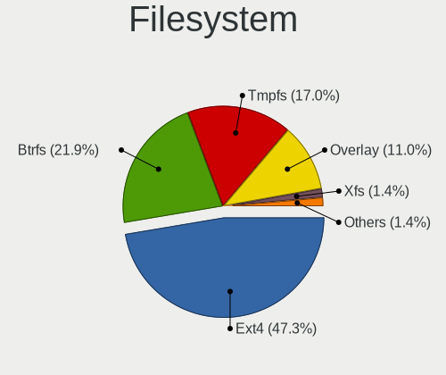

| Type    | Computers | Percent |
|---------|-----------|---------|
| Ext4    | 128       | 49.23%  |
| Btrfs   | 65        | 25%     |
| Tmpfs   | 41        | 15.77%  |
| Overlay | 19        | 7.31%   |
| Xfs     | 5         | 1.92%   |
| Zfs     | 2         | 0.77%   |

Part. scheme
------------

Scheme of partitioning

| Type    | Computers | Percent |
|---------|-----------|---------|
| GPT     | 128       | 49.23%  |
| Unknown | 115       | 44.23%  |
| MBR     | 17        | 6.54%   |

Dual Boot with Linux/BSD
------------------------

Hosting more than one Linux/BSD

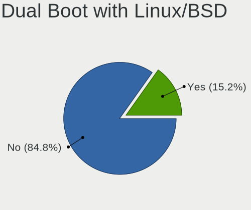

| Dual boot | Computers | Percent |
|-----------|-----------|---------|
| No        | 223       | 85.77%  |
| Yes       | 37        | 14.23%  |

Dual Boot (Win)
---------------

Hosting Linux and Windows

| Dual boot | Computers | Percent |
|-----------|-----------|---------|
| No        | 193       | 74.23%  |
| Yes       | 67        | 25.77%  |

Board
-----

Vendor
------

Motherboard manufacturer

| Name                  | Computers | Percent |
|-----------------------|-----------|---------|
| Dell                  | 51        | 19.62%  |
| ASUSTek Computer      | 35        | 13.46%  |
| Acer                  | 28        | 10.77%  |
| Gigabyte Technology   | 24        | 9.23%   |
| Intel                 | 21        | 8.08%   |
| Lenovo                | 20        | 7.69%   |
| Positivo              | 12        | 4.62%   |
| Samsung Electronics   | 9         | 3.46%   |
| MSI                   | 8         | 3.08%   |
| Hewlett-Packard       | 6         | 2.31%   |
| Biostar               | 4         | 1.54%   |
| Semp Toshiba          | 3         | 1.15%   |
| PCWare                | 3         | 1.15%   |
| MACHINIST             | 3         | 1.15%   |
| ASRock                | 3         | 1.15%   |
| Unknown               | 3         | 1.15%   |
| Valve                 | 2         | 0.77%   |
| Pegatron              | 2         | 0.77%   |
| Daten Tecnologia      | 2         | 0.77%   |
| ANGXUN                | 2         | 0.77%   |
| YiFang                | 1         | 0.38%   |
| win element           | 1         | 0.38%   |
| Supermicro            | 1         | 0.38%   |
| Rockchip              | 1         | 0.38%   |
| Purism                | 1         | 0.38%   |
| Positivo Bahia - VAIO | 1         | 0.38%   |
| OEM                   | 1         | 0.38%   |
| Notebook              | 1         | 0.38%   |
| Multilaser            | 1         | 0.38%   |
| LG Electronics        | 1         | 0.38%   |
| Lenovo Product        | 1         | 0.38%   |
| GPD                   | 1         | 0.38%   |
| Google                | 1         | 0.38%   |
| ECS                   | 1         | 0.38%   |
| Compal                | 1         | 0.38%   |
| Colorful Technology   | 1         | 0.38%   |
| Apple                 | 1         | 0.38%   |
| Alienware             | 1         | 0.38%   |
| ALDO                  | 1         | 0.38%   |

Model
-----

Motherboard model

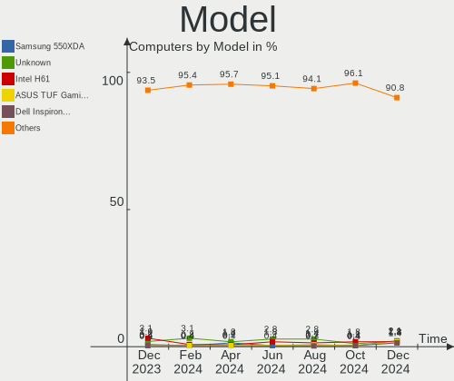

| Name                                   | Computers | Percent |
|----------------------------------------|-----------|---------|
| Intel H61                              | 8         | 3.08%   |
| Unknown                                | 5         | 1.92%   |
| Intel B75                              | 3         | 1.15%   |
| Gigabyte B550M AORUS ELITE             | 3         | 1.15%   |
| Dell Inspiron 15-3567                  | 3         | 1.15%   |
| ASUS VivoBook_ASUSLaptop X515EA_X515EA | 3         | 1.15%   |
| Acer Nitro AN515-57                    | 3         | 1.15%   |
| Valve Jupiter                          | 2         | 0.77%   |
| Samsung 550XDA                         | 2         | 0.77%   |
| Lenovo IdeaPad Gaming 3 15IHU6 82MG    | 2         | 0.77%   |
| Lenovo IdeaPad 3 15IML05 82BS          | 2         | 0.77%   |
| Lenovo IdeaPad 3 15ALC6 82MF           | 2         | 0.77%   |
| Intel B85                              | 2         | 0.77%   |
| Gigabyte B450M DS3H                    | 2         | 0.77%   |
| Gigabyte B450 AORUS M                  | 2         | 0.77%   |
| Gigabyte AB350M-DS3H V2                | 2         | 0.77%   |
| Dell XPS 8500                          | 2         | 0.77%   |
| Dell System XPS L502X                  | 2         | 0.77%   |
| Dell Latitude 3420                     | 2         | 0.77%   |
| Dell Inspiron 7572                     | 2         | 0.77%   |
| Dell Inspiron 3583                     | 2         | 0.77%   |
| Dell G3 3590                           | 2         | 0.77%   |
| ASUS TUF Gaming Z690-PLUS D4           | 2         | 0.77%   |
| ASUS All Series                        | 2         | 0.77%   |
| Acer Nitro AN517-54                    | 2         | 0.77%   |
| Acer Nitro AN515-51                    | 2         | 0.77%   |
| Acer Nitro AN515-44                    | 2         | 0.77%   |
| Acer Aspire A515-51G                   | 2         | 0.77%   |
| Acer Aspire A315-41                    | 2         | 0.77%   |
| Acer Aspire A315-24P                   | 2         | 0.77%   |
| YiFang NXM1106CWP                      | 1         | 0.38%   |
| win element MoreFine S500+             | 1         | 0.38%   |
| Supermicro X10SAE                      | 1         | 0.38%   |
| Semp Toshiba STI                       | 1         | 0.38%   |
| Semp Toshiba IS 1413G                  | 1         | 0.38%   |
| Semp Toshiba IS 1412                   | 1         | 0.38%   |
| Samsung RV419/RV420                    | 1         | 0.38%   |
| Samsung RV415/RV515                    | 1         | 0.38%   |
| Samsung RV410/RV510/S3510/E3510        | 1         | 0.38%   |
| Samsung Q470C/500P4C                   | 1         | 0.38%   |

Model Family
------------

Motherboard model prefix

| Name                 | Computers | Percent |
|----------------------|-----------|---------|
| Dell Inspiron        | 22        | 8.46%   |
| Acer Aspire          | 15        | 5.77%   |
| Lenovo IdeaPad       | 11        | 4.23%   |
| Acer Nitro           | 11        | 4.23%   |
| ASUS TUF             | 10        | 3.85%   |
| Intel H61            | 8         | 3.08%   |
| ASUS VivoBook        | 8         | 3.08%   |
| Dell Vostro          | 6         | 2.31%   |
| Lenovo ThinkPad      | 5         | 1.92%   |
| Dell OptiPlex        | 5         | 1.92%   |
| Dell Latitude        | 5         | 1.92%   |
| ASUS PRIME           | 5         | 1.92%   |
| Unknown              | 5         | 1.92%   |
| Gigabyte B450M       | 4         | 1.54%   |
| Intel B75            | 3         | 1.15%   |
| Gigabyte B550M       | 3         | 1.15%   |
| Dell G3              | 3         | 1.15%   |
| Valve Jupiter        | 2         | 0.77%   |
| Semp Toshiba IS      | 2         | 0.77%   |
| Samsung 550XDA       | 2         | 0.77%   |
| Lenovo ThinkCentre   | 2         | 0.77%   |
| Intel B85            | 2         | 0.77%   |
| Gigabyte B450        | 2         | 0.77%   |
| Gigabyte AB350M-DS3H | 2         | 0.77%   |
| Gigabyte 970A-DS3P   | 2         | 0.77%   |
| Dell XPS             | 2         | 0.77%   |
| Dell System          | 2         | 0.77%   |
| Dell Precision       | 2         | 0.77%   |
| Dell G15             | 2         | 0.77%   |
| ASUS All             | 2         | 0.77%   |
| Acer Predator        | 2         | 0.77%   |
| YiFang NXM1106CWP    | 1         | 0.38%   |
| win element MoreFine | 1         | 0.38%   |
| Supermicro X10SAE    | 1         | 0.38%   |
| Semp Toshiba STI     | 1         | 0.38%   |
| Samsung RV419        | 1         | 0.38%   |
| Samsung RV415        | 1         | 0.38%   |
| Samsung RV410        | 1         | 0.38%   |
| Samsung Q470C        | 1         | 0.38%   |
| Samsung 730QED       | 1         | 0.38%   |

MFG Year
--------

Motherboard manufacture year

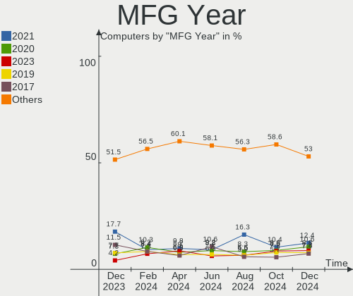

| Year    | Computers | Percent |
|---------|-----------|---------|
| 2021    | 45        | 17.31%  |
| 2017    | 28        | 10.77%  |
| 2022    | 26        | 10%     |
| 2018    | 25        | 9.62%   |
| 2019    | 20        | 7.69%   |
| 2020    | 19        | 7.31%   |
| 2011    | 15        | 5.77%   |
| 2012    | 13        | 5%      |
| 2023    | 11        | 4.23%   |
| 2016    | 11        | 4.23%   |
| 2014    | 10        | 3.85%   |
| 2013    | 9         | 3.46%   |
| 2015    | 8         | 3.08%   |
| 2010    | 8         | 3.08%   |
| 2009    | 5         | 1.92%   |
| Unknown | 4         | 1.54%   |
| 2008    | 3         | 1.15%   |

Form Factor
-----------

Physical design of the computer

| Name           | Computers | Percent |
|----------------|-----------|---------|
| Notebook       | 128       | 49.23%  |
| Desktop        | 122       | 46.92%  |
| System on chip | 2         | 0.77%   |
| Tablet         | 2         | 0.77%   |
| Mini pc        | 2         | 0.77%   |
| Server         | 2         | 0.77%   |
| Convertible    | 1         | 0.38%   |
| All in one     | 1         | 0.38%   |

Secure Boot
-----------

Enabled or disabled

| State    | Computers | Percent |
|----------|-----------|---------|
| Disabled | 235       | 90.38%  |
| Enabled  | 25        | 9.62%   |

Coreboot
--------

Have coreboot on board

| Used | Computers | Percent |
|------|-----------|---------|
| No   | 258       | 99.23%  |
| Yes  | 2         | 0.77%   |

RAM Size
--------

Total RAM memory

| Size in GB  | Computers | Percent |
|-------------|-----------|---------|
| 16.01-24.0  | 70        | 26.92%  |
| 4.01-8.0    | 51        | 19.62%  |
| 8.01-16.0   | 48        | 18.46%  |
| 3.01-4.0    | 43        | 16.54%  |
| 32.01-64.0  | 24        | 9.23%   |
| 64.01-256.0 | 13        | 5%      |
| 24.01-32.0  | 5         | 1.92%   |
| 1.01-2.0    | 5         | 1.92%   |
| 0.51-1.0    | 1         | 0.38%   |

RAM Used
--------

Used RAM memory

| Used GB    | Computers | Percent |
|------------|-----------|---------|
| 4.01-8.0   | 70        | 26.92%  |
| 1.01-2.0   | 68        | 26.15%  |
| 2.01-3.0   | 62        | 23.85%  |
| 3.01-4.0   | 40        | 15.38%  |
| 8.01-16.0  | 12        | 4.62%   |
| 0.51-1.0   | 5         | 1.92%   |
| 16.01-24.0 | 2         | 0.77%   |
| 0.01-0.5   | 1         | 0.38%   |

Total Drives
------------

Number of drives on board

| Drives | Computers | Percent |
|--------|-----------|---------|
| 1      | 138       | 53.08%  |
| 2      | 81        | 31.15%  |
| 3      | 23        | 8.85%   |
| 4      | 13        | 5%      |
| 5      | 3         | 1.15%   |
| 6      | 1         | 0.38%   |
| 0      | 1         | 0.38%   |

Has CD-ROM
----------

Has CD-ROM on board

| Presented | Computers | Percent |
|-----------|-----------|---------|
| No        | 201       | 77.31%  |
| Yes       | 59        | 22.69%  |

Has Ethernet
------------

Has Ethernet on board

| Presented | Computers | Percent |
|-----------|-----------|---------|
| Yes       | 227       | 87.31%  |
| No        | 33        | 12.69%  |

Has WiFi
--------

Has WiFi module

| Presented | Computers | Percent |
|-----------|-----------|---------|
| Yes       | 186       | 71.54%  |
| No        | 74        | 28.46%  |

Has Bluetooth
-------------

Has Bluetooth module

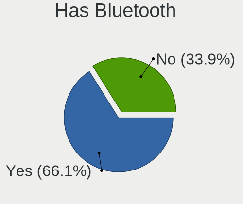

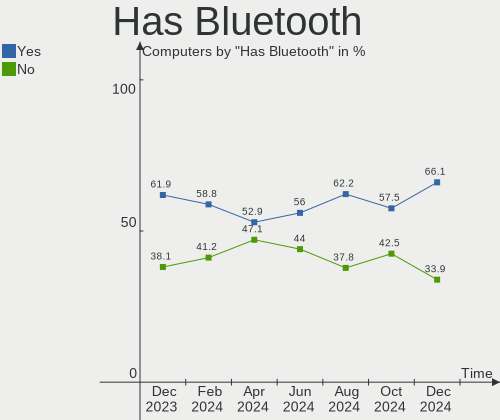

| Presented | Computers | Percent |
|-----------|-----------|---------|
| Yes       | 161       | 61.92%  |
| No        | 99        | 38.08%  |

Location
--------

Country
-------

Geographic location (country)

| Country | Computers | Percent |
|---------|-----------|---------|
| Brazil  | 260       | 100%    |

City
----

Geographic location (city)

| City                 | Computers | Percent |
|----------------------|-----------|---------|
| Sao Paulo            | 41        | 15.77%  |
| Rio de Janeiro       | 16        | 6.15%   |
| Porto Alegre         | 10        | 3.85%   |
| Brasília            | 10        | 3.85%   |
| Fortaleza            | 8         | 3.08%   |
| Santo André         | 7         | 2.69%   |
| Curitiba             | 5         | 1.92%   |
| Salvador             | 4         | 1.54%   |
| Manaus               | 4         | 1.54%   |
| Campinas             | 4         | 1.54%   |
| Sao José dos Campos | 3         | 1.15%   |
| Sao Goncalo          | 3         | 1.15%   |
| Recife               | 3         | 1.15%   |
| Osasco               | 3         | 1.15%   |
| Montes Claros        | 3         | 1.15%   |
| Maringá             | 3         | 1.15%   |
| Guarulhos            | 3         | 1.15%   |
| Vicosa               | 2         | 0.77%   |
| Uberlândia          | 2         | 0.77%   |
| Ubatuba              | 2         | 0.77%   |
| Suzano               | 2         | 0.77%   |
| Sao Carlos           | 2         | 0.77%   |
| Paulista             | 2         | 0.77%   |
| Natal                | 2         | 0.77%   |
| Maua                 | 2         | 0.77%   |
| Limeira              | 2         | 0.77%   |
| Joao Pessoa          | 2         | 0.77%   |
| Foz do Iguaçu       | 2         | 0.77%   |
| Contagem             | 2         | 0.77%   |
| Cabo Frio            | 2         | 0.77%   |
| Braganca Paulista    | 2         | 0.77%   |
| Belo Horizonte       | 2         | 0.77%   |
| Belém               | 2         | 0.77%   |
| Barueri              | 2         | 0.77%   |
| Americana            | 2         | 0.77%   |
| Vitória             | 1         | 0.38%   |
| Vilhena              | 1         | 0.38%   |
| Varginha             | 1         | 0.38%   |
| Tubarao              | 1         | 0.38%   |
| Teresina             | 1         | 0.38%   |

Drives
------

Drive Vendor
------------

Hard drive vendors

| Vendor                         | Computers | Drives | Percent |
|--------------------------------|-----------|--------|---------|
| WDC                            | 57        | 65     | 14.5%   |
| Kingston                       | 46        | 51     | 11.7%   |
| Seagate                        | 45        | 59     | 11.45%  |
| Samsung Electronics            | 30        | 35     | 7.63%   |
| Sandisk                        | 28        | 31     | 7.12%   |
| Crucial                        | 15        | 15     | 3.82%   |
| ADATA Technology               | 15        | 15     | 3.82%   |
| Unknown                        | 14        | 16     | 3.56%   |
| China                          | 14        | 16     | 3.56%   |
| Toshiba                        | 13        | 14     | 3.31%   |
| A-DATA Technology              | 13        | 13     | 3.31%   |
| Silicon Motion                 | 8         | 8      | 2.04%   |
| SK hynix                       | 7         | 7      | 1.78%   |
| MAXIO Technology (Hangzhou)    | 6         | 6      | 1.53%   |
| Hitachi                        | 6         | 6      | 1.53%   |
| WALRAM                         | 5         | 5      | 1.27%   |
| LITEON                         | 5         | 5      | 1.27%   |
| Kingston Technology Company    | 5         | 6      | 1.27%   |
| Netac                          | 4         | 5      | 1.02%   |
| Lexar                          | 4         | 4      | 1.02%   |
| KingSpec                       | 4         | 4      | 1.02%   |
| XrayDisk                       | 3         | 3      | 0.76%   |
| SSSTC                          | 3         | 3      | 0.76%   |
| Solid State Storage Technology | 3         | 3      | 0.76%   |
| Realtek Semiconductor          | 3         | 3      | 0.76%   |
| Phison Electronics             | 3         | 3      | 0.76%   |
| Micron/Crucial Technology      | 3         | 3      | 0.76%   |
| KIOXIA                         | 3         | 3      | 0.76%   |
| JMicron Technology             | 3         | 3      | 0.76%   |
| Unknown                        | 3         | 3      | 0.76%   |
| Solid State Storage            | 2         | 2      | 0.51%   |
| Fanxiang                       | 2         | 4      | 0.51%   |
| Verbatim                       | 1         | 1      | 0.25%   |
| USB                            | 1         | 1      | 0.25%   |
| TECH                           | 1         | 1      | 0.25%   |
| Team                           | 1         | 1      | 0.25%   |
| Patriot                        | 1         | 1      | 0.25%   |
| NTC                            | 1         | 1      | 0.25%   |
| NGFF                           | 1         | 1      | 0.25%   |
| Micron Technology              | 1         | 1      | 0.25%   |

Drive Model
-----------

Hard drive models

| Model                                                 | Computers | Percent |
|-------------------------------------------------------|-----------|---------|
| Kingston SA400S37480G 480GB SSD                       | 13        | 3.05%   |
| Kingston SA400S37240G 240GB SSD                       | 12        | 2.82%   |
| Silicon Motion SM2263EN/SM2263XT SSD Controller 500GB | 6         | 1.41%   |
| Seagate ST1000DM010-2EP102 1TB                        | 6         | 1.41%   |
| Sandisk WD Blue SN550 NVMe SSD 1TB                    | 6         | 1.41%   |
| Kingston SA400S37120G 120GB SSD                       | 6         | 1.41%   |
| WDC WD10EZEX-08WN4A0 1TB                              | 4         | 0.94%   |
| Samsung NVMe SSD Controller SM981/PM981/PM983 512GB   | 4         | 0.94%   |
| MAXIO (Hangzhou) NVMe SSD Controller MAP1202 256GB    | 4         | 0.94%   |
| Kingston Company SNV2S1000G 1TB                       | 4         | 0.94%   |
| Crucial CT240BX500SSD1 240GB                          | 4         | 0.94%   |
| China SSD 240GB                                       | 4         | 0.94%   |
| ADATA IM2P33F8ABR2-512GB                              | 4         | 0.94%   |
| A-DATA SU650 120GB SSD                                | 4         | 0.94%   |
| WDC WD5000LPVX-00V0TT0 500GB                          | 3         | 0.7%    |
| WDC WD10SPZX-75Z10T2 1TB                              | 3         | 0.7%    |
| WDC WD10SPZX-21Z10T0 1TB                              | 3         | 0.7%    |
| WDC WD Green 2.5 240GB SSD                            | 3         | 0.7%    |
| Unknown MMC Card  64GB                                | 3         | 0.7%    |
| Unknown MMC Card  128GB                               | 3         | 0.7%    |
| Toshiba MQ02ABD100H 1TB                               | 3         | 0.7%    |
| Toshiba MQ01ABF050 500GB                              | 3         | 0.7%    |
| Seagate ST500LM012 HN-M500MBB 500GB                   | 3         | 0.7%    |
| SanDisk SSD PLUS 240GB                                | 3         | 0.7%    |
| Samsung NVMe SSD Controller PM9A1/PM9A3/980PRO 2TB    | 3         | 0.7%    |
| Micron/Crucial P2 NVMe PCIe SSD 4TB                   | 3         | 0.7%    |
| LITEON CV3-8D128-11 SATA 128GB SSD                    | 3         | 0.7%    |
| Kingston SKC3000S1024G 1024GB                         | 3         | 0.7%    |
| Crucial CT500BX500SSD1 500GB                          | 3         | 0.7%    |
| A-DATA IM2P33F3A NVMe 256GB                           | 3         | 0.7%    |
| Unknown                                               | 3         | 0.7%    |
| WDC WDS240G2G0A-00JH30 240GB SSD                      | 2         | 0.47%   |
| WDC WDS120G2G0B-00EPW0 120GB SSD                      | 2         | 0.47%   |
| WDC WD5000LPVX-22V0TT0 500GB                          | 2         | 0.47%   |
| WDC WD5000AAKX-003CA0 500GB                           | 2         | 0.47%   |
| WDC WD10SPZX-75Z10T3 1TB                              | 2         | 0.47%   |
| WDC WD10SPZX-75Z10T1 1TB                              | 2         | 0.47%   |
| WDC WD10EZEX-00BN5A0 1TB                              | 2         | 0.47%   |
| Unknown MMC Card  32GB                                | 2         | 0.47%   |
| Toshiba MQ01ABD050 500GB                              | 2         | 0.47%   |

HDD Vendor
----------

Hard disk drive vendors

| Vendor              | Computers | Drives | Percent |
|---------------------|-----------|--------|---------|
| WDC                 | 46        | 51     | 37.4%   |
| Seagate             | 44        | 58     | 35.77%  |
| Toshiba             | 13        | 14     | 10.57%  |
| Samsung Electronics | 10        | 11     | 8.13%   |
| Hitachi             | 6         | 6      | 4.88%   |
| Maxtor              | 1         | 1      | 0.81%   |
| HGST                | 1         | 1      | 0.81%   |
| Fujitsu             | 1         | 1      | 0.81%   |
| Apple               | 1         | 1      | 0.81%   |

SSD Vendor
----------

Solid state drive vendors

| Vendor              | Computers | Drives | Percent |
|---------------------|-----------|--------|---------|
| Kingston            | 37        | 39     | 27.61%  |
| Crucial             | 14        | 14     | 10.45%  |
| China               | 14        | 16     | 10.45%  |
| SanDisk             | 13        | 13     | 9.7%    |
| WDC                 | 11        | 11     | 8.21%   |
| A-DATA Technology   | 6         | 6      | 4.48%   |
| Samsung Electronics | 5         | 7      | 3.73%   |
| LITEON              | 5         | 5      | 3.73%   |
| KingSpec            | 4         | 4      | 2.99%   |
| Netac               | 3         | 3      | 2.24%   |
| XrayDisk            | 2         | 2      | 1.49%   |
| WALRAM              | 2         | 2      | 1.49%   |
| SK hynix            | 2         | 2      | 1.49%   |
| Lexar               | 2         | 2      | 1.49%   |
| JMicron Technology  | 2         | 2      | 1.49%   |
| Verbatim            | 1         | 1      | 0.75%   |
| TECH                | 1         | 1      | 0.75%   |
| Team                | 1         | 1      | 0.75%   |
| Patriot             | 1         | 1      | 0.75%   |
| NTC                 | 1         | 1      | 0.75%   |
| NGFF                | 1         | 1      | 0.75%   |
| MAXIO               | 1         | 1      | 0.75%   |
| MaxDigital          | 1         | 1      | 0.75%   |
| HUSKY               | 1         | 1      | 0.75%   |
| Fanxiang            | 1         | 2      | 0.75%   |
| BIWIN               | 1         | 1      | 0.75%   |
| Unknown             | 1         | 1      | 0.75%   |

Drive Kind
----------

HDD or SSD

| Kind    | Computers | Drives | Percent |
|---------|-----------|--------|---------|
| NVMe    | 116       | 131    | 32.95%  |
| SSD     | 113       | 141    | 32.1%   |
| HDD     | 104       | 144    | 29.55%  |
| MMC     | 13        | 15     | 3.69%   |
| Unknown | 6         | 6      | 1.7%    |

Drive Connector
---------------

SATA, SAS, NVMe, etc.

| Type | Computers | Drives | Percent |
|------|-----------|--------|---------|
| SATA | 177       | 278    | 55.84%  |
| NVMe | 116       | 131    | 36.59%  |
| MMC  | 13        | 15     | 4.1%    |
| SAS  | 11        | 13     | 3.47%   |

Drive Size
----------

Size of hard drive

| Size in TB | Computers | Drives | Percent |
|------------|-----------|--------|---------|
| 0.01-0.5   | 139       | 178    | 60.43%  |
| 0.51-1.0   | 69        | 81     | 30%     |
| 1.01-2.0   | 18        | 19     | 7.83%   |
| 3.01-4.0   | 3         | 6      | 1.3%    |
| 2.01-3.0   | 1         | 1      | 0.43%   |

Space Total
-----------

Amount of disk space available on the file system

| Size in GB     | Computers | Percent |
|----------------|-----------|---------|
| 101-250        | 68        | 26.15%  |
| 251-500        | 51        | 19.62%  |
| 501-1000       | 41        | 15.77%  |
| 1001-2000      | 37        | 14.23%  |
| 1-20           | 18        | 6.92%   |
| 51-100         | 16        | 6.15%   |
| More than 3000 | 11        | 4.23%   |
| Unknown        | 7         | 2.69%   |
| 2001-3000      | 6         | 2.31%   |
| 21-50          | 5         | 1.92%   |

Space Used
----------

Amount of used disk space

| Used GB   | Computers | Percent |
|-----------|-----------|---------|
| 1-20      | 78        | 30%     |
| 21-50     | 45        | 17.31%  |
| 101-250   | 43        | 16.54%  |
| 51-100    | 40        | 15.38%  |
| 251-500   | 20        | 7.69%   |
| 501-1000  | 16        | 6.15%   |
| 1001-2000 | 9         | 3.46%   |
| Unknown   | 7         | 2.69%   |
| 2001-3000 | 2         | 0.77%   |

Malfunc. Drives
---------------

Drive models with a malfunction

| Model                                                         | Computers | Drives | Percent |
|---------------------------------------------------------------|-----------|--------|---------|
| Samsung Electronics HD322HJ 320GB                             | 2         | 2      | 10.53%  |
| WDC WD5000LPCX-00VHAT0 500GB                                  | 1         | 1      | 5.26%   |
| WDC WD5000AAKX-003CA0 500GB                                   | 1         | 1      | 5.26%   |
| WDC WD10SPZX-75Z10T2 1TB                                      | 1         | 1      | 5.26%   |
| WDC WD10EZEX-08WN4A0 1TB                                      | 1         | 1      | 5.26%   |
| WDC WD Green 2.5 240GB SSD                                    | 1         | 1      | 5.26%   |
| Toshiba MQ01ABD050V -63 500GB                                 | 1         | 1      | 5.26%   |
| Seagate ST9250410AS 250GB                                     | 1         | 1      | 5.26%   |
| Seagate ST500LT012-9WS142 500GB                               | 1         | 1      | 5.26%   |
| Seagate ST3500630NS 500GB                                     | 1         | 1      | 5.26%   |
| Seagate ST1000DX001-1NS162 1TB                                | 1         | 1      | 5.26%   |
| Seagate ST1000DM010-2EP102 1TB                                | 1         | 1      | 5.26%   |
| Netac NS512GSSD340 512GB                                      | 1         | 1      | 5.26%   |
| MAXIO Technology (Hangzhou) NVMe SSD Controller MAP1001 500GB | 1         | 1      | 5.26%   |
| Hitachi HTS723232A7A364 320GB                                 | 1         | 1      | 5.26%   |
| Hitachi HTS542580K9SA00 80GB                                  | 1         | 1      | 5.26%   |
| China SSD 128GB                                               | 1         | 1      | 5.26%   |
| A-DATA Technology LEGEND 710 1TB                              | 1         | 1      | 5.26%   |

Malfunc. Drive Vendor
---------------------

Vendors of faulty drives

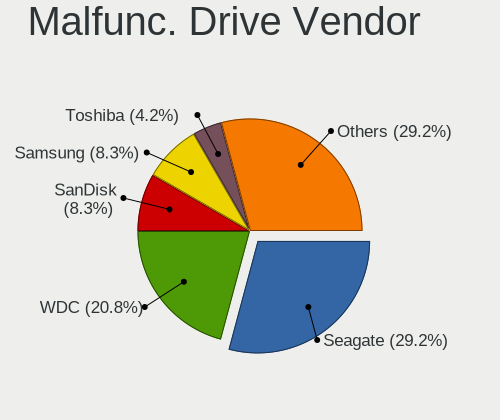

| Vendor                      | Computers | Drives | Percent |
|-----------------------------|-----------|--------|---------|
| WDC                         | 5         | 5      | 26.32%  |
| Seagate                     | 5         | 5      | 26.32%  |
| Samsung Electronics         | 2         | 2      | 10.53%  |
| Hitachi                     | 2         | 2      | 10.53%  |
| Toshiba                     | 1         | 1      | 5.26%   |
| Netac                       | 1         | 1      | 5.26%   |
| MAXIO Technology (Hangzhou) | 1         | 1      | 5.26%   |
| China                       | 1         | 1      | 5.26%   |
| A-DATA Technology           | 1         | 1      | 5.26%   |

Malfunc. HDD Vendor
-------------------

Vendors of faulty HDD drives

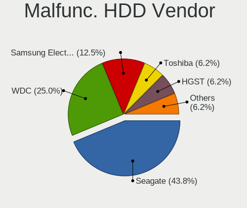

| Vendor              | Computers | Drives | Percent |
|---------------------|-----------|--------|---------|
| Seagate             | 5         | 5      | 35.71%  |
| WDC                 | 4         | 4      | 28.57%  |
| Samsung Electronics | 2         | 2      | 14.29%  |
| Hitachi             | 2         | 2      | 14.29%  |
| Toshiba             | 1         | 1      | 7.14%   |

Malfunc. Drive Kind
-------------------

Kinds of faulty drives

| Kind | Computers | Drives | Percent |
|------|-----------|--------|---------|
| HDD  | 13        | 14     | 72.22%  |
| SSD  | 3         | 3      | 16.67%  |
| NVMe | 2         | 2      | 11.11%  |

Failed Drives
-------------

Failed drive models

| Model                           | Computers | Drives | Percent |
|---------------------------------|-----------|--------|---------|
| Samsung Electronics HD103SJ 1TB | 1         | 1      | 100%    |

Failed Drive Vendor
-------------------

Failed drive vendors

| Vendor              | Computers | Drives | Percent |
|---------------------|-----------|--------|---------|
| Samsung Electronics | 1         | 1      | 100%    |

Drive Status
------------

Number of failed and malfunc. drives

| Status   | Computers | Drives | Percent |
|----------|-----------|--------|---------|
| Detected | 172       | 284    | 61.43%  |
| Works    | 89        | 133    | 31.79%  |
| Malfunc  | 18        | 19     | 6.43%   |
| Failed   | 1         | 1      | 0.36%   |

Storage controller
------------------

Storage Vendor
--------------

Storage controller vendors

| Vendor                         | Computers | Percent |
|--------------------------------|-----------|---------|
| Intel                          | 172       | 47.25%  |
| AMD                            | 58        | 15.93%  |
| ADATA Technology               | 21        | 5.77%   |
| SanDisk                        | 19        | 5.22%   |
| Samsung Electronics            | 17        | 4.67%   |
| Kingston Technology Company    | 17        | 4.67%   |
| Silicon Motion                 | 10        | 2.75%   |
| MAXIO Technology (Hangzhou)    | 10        | 2.75%   |
| Solid State Storage Technology | 8         | 2.2%    |
| SK hynix                       | 5         | 1.37%   |
| Realtek Semiconductor          | 5         | 1.37%   |
| Phison Electronics             | 4         | 1.1%    |
| Micron/Crucial Technology      | 4         | 1.1%    |
| KIOXIA                         | 3         | 0.82%   |
| ASMedia Technology             | 3         | 0.82%   |
| VIA Technologies               | 1         | 0.27%   |
| Shenzhen Longsys Electronics   | 1         | 0.27%   |
| Seagate Technology             | 1         | 0.27%   |
| Netac Technology               | 1         | 0.27%   |
| Micron Technology              | 1         | 0.27%   |
| Marvell Technology Group       | 1         | 0.27%   |
| Broadcom / LSI                 | 1         | 0.27%   |
| Beijing Starblaze Technology   | 1         | 0.27%   |

Storage Model
-------------

Storage controller models

| Model                                                                          | Computers | Percent |
|--------------------------------------------------------------------------------|-----------|---------|
| AMD FCH SATA Controller [AHCI mode]                                            | 27        | 6.62%   |
| Intel Tiger Lake-LP SATA Controller                                            | 15        | 3.68%   |
| Intel 6 Series/C200 Series Chipset Family 6 port Desktop SATA AHCI Controller  | 15        | 3.68%   |
| Intel 8 Series/C220 Series Chipset Family 6-port SATA Controller 1 [AHCI mode] | 14        | 3.43%   |
| Intel Sunrise Point-LP SATA Controller [AHCI mode]                             | 13        | 3.19%   |
| Intel Volume Management Device NVMe RAID Controller                            | 11        | 2.7%    |
| Silicon Motion SM2263EN/SM2263XT (DRAM-less) NVMe SSD Controllers              | 10        | 2.45%   |
| AMD 500 Series Chipset SATA Controller                                         | 10        | 2.45%   |
| AMD 400 Series Chipset SATA Controller                                         | 10        | 2.45%   |
| MAXIO (Hangzhou) NVMe SSD Controller MAP1202                                   | 8         | 1.96%   |
| Intel Comet Lake SATA AHCI Controller                                          | 8         | 1.96%   |
| AMD SB7x0/SB8x0/SB9x0 IDE Controller                                           | 8         | 1.96%   |
| SanDisk Ultra 3D / WD Blue SN550 NVMe SSD                                      | 7         | 1.72%   |
| Samsung NVMe SSD Controller 980 (DRAM-less)                                    | 7         | 1.72%   |
| Kingston Company NV2 NVMe SSD SM2267XT                                         | 7         | 1.72%   |
| Intel 82801 Mobile SATA Controller [RAID mode]                                 | 7         | 1.72%   |
| Intel 7 Series/C210 Series Chipset Family 6-port SATA Controller [AHCI mode]   | 7         | 1.72%   |
| Intel 6 Series/C200 Series Chipset Family 6 port Mobile SATA AHCI Controller   | 7         | 1.72%   |
| Intel Tiger Lake SATA AHCI Controller                                          | 6         | 1.47%   |
| AMD SB7x0/SB8x0/SB9x0 SATA Controller [IDE mode]                               | 6         | 1.47%   |
| ADATA IM2P33F8 series NVMe SSD (DRAM-less)                                     | 6         | 1.47%   |
| Solid State Storage CL1-3D256-Q11 NVMe SSD M.2                                 | 5         | 1.23%   |
| Kingston Company KC3000/FURY Renegade NVMe SSD E18                             | 5         | 1.23%   |
| Intel Celeron/Pentium Silver Processor SATA Controller                         | 5         | 1.23%   |
| Intel 500 Series Chipset Family SATA AHCI Controller                           | 5         | 1.23%   |
| Intel 5 Series/3400 Series Chipset 4 port SATA IDE Controller                  | 5         | 1.23%   |
| Intel 5 Series/3400 Series Chipset 2 port SATA IDE Controller                  | 5         | 1.23%   |
| AMD SB7x0/SB8x0/SB9x0 SATA Controller [AHCI mode]                              | 5         | 1.23%   |
| SanDisk WD Green SN350 240GB (DRAM-less) / SN560E NVMe SSD                     | 4         | 0.98%   |
| SanDisk WD Black SN770 / PC SN740 256GB / PC SN560 (DRAM-less) NVMe SSD        | 4         | 0.98%   |
| Samsung NVMe SSD Controller SM981/PM981/PM983                                  | 4         | 0.98%   |
| Samsung NVMe SSD Controller PM9A1/PM9A3/980PRO                                 | 4         | 0.98%   |
| Micron/Crucial P2 [Nick P2] / P3 / P3 Plus NVMe PCIe SSD (DRAM-less)           | 4         | 0.98%   |
| AMD FCH SATA Controller D                                                      | 4         | 0.98%   |
| ADATA SM2P32A8 NVMe SSD (DRAM-less)                                            | 4         | 0.98%   |
| ADATA A Non-Volatile memory controller                                         | 4         | 0.98%   |
| Solid State Storage CL4-8D512 NVMe SSD M.2 (DRAM-less)                         | 3         | 0.74%   |
| Realtek RTS5762 NVMe SSD Controller                                            | 3         | 0.74%   |
| Intel Wildcat Point-LP SATA Controller [AHCI Mode]                             | 3         | 0.74%   |
| Intel SATA Controller [RAID mode]                                              | 3         | 0.74%   |

Storage Kind
------------

Kind of storage controller (IDE, SATA, NVMe, SAS, ...)

| Kind | Computers | Percent |
|------|-----------|---------|
| SATA | 199       | 53.49%  |
| NVMe | 116       | 31.18%  |
| IDE  | 30        | 8.06%   |
| RAID | 25        | 6.72%   |
| SAS  | 2         | 0.54%   |

Processor
---------

CPU Vendor
----------

Processor vendors

| Vendor | Computers | Percent |
|--------|-----------|---------|
| Intel  | 186       | 71.54%  |
| AMD    | 71        | 27.31%  |
| ARM    | 3         | 1.15%   |

CPU Model
---------

Processor models

| Model                                       | Computers | Percent |
|---------------------------------------------|-----------|---------|
| Intel Core i7-3770 CPU @ 3.40GHz            | 6         | 2.31%   |
| Intel Core i5-7200U CPU @ 2.50GHz           | 5         | 1.92%   |
| Intel Core i5 CPU 650 @ 3.20GHz             | 5         | 1.92%   |
| Intel 11th Gen Core i7-11800H @ 2.30GHz     | 5         | 1.92%   |
| AMD Ryzen 5 5600G with Radeon Graphics      | 5         | 1.92%   |
| Intel Core i7-8550U CPU @ 1.80GHz           | 4         | 1.54%   |
| Intel 11th Gen Core i3-1115G4 @ 3.00GHz     | 4         | 1.54%   |
| AMD Ryzen 7 5700U with Radeon Graphics      | 4         | 1.54%   |
| Intel Core i5-10210U CPU @ 1.60GHz          | 3         | 1.15%   |
| Intel Core i3-2100 CPU @ 3.10GHz            | 3         | 1.15%   |
| Intel Atom x5-Z8350 CPU @ 1.44GHz           | 3         | 1.15%   |
| Intel 11th Gen Core i7-1165G7 @ 2.80GHz     | 3         | 1.15%   |
| Intel 11th Gen Core i5-1135G7 @ 2.40GHz     | 3         | 1.15%   |
| Intel 11th Gen Core i5-11300H @ 3.10GHz     | 3         | 1.15%   |
| AMD Ryzen 5 5600 6-Core Processor           | 3         | 1.15%   |
| AMD Ryzen 5 3600 6-Core Processor           | 3         | 1.15%   |
| Intel Xeon CPU E5-2670 v2 @ 2.50GHz         | 2         | 0.77%   |
| Intel Core i7-7700HQ CPU @ 2.80GHz          | 2         | 0.77%   |
| Intel Core i7-7500U CPU @ 2.70GHz           | 2         | 0.77%   |
| Intel Core i7-2600 CPU @ 3.40GHz            | 2         | 0.77%   |
| Intel Core i7-10510U CPU @ 1.80GHz          | 2         | 0.77%   |
| Intel Core i5-9300H CPU @ 2.40GHz           | 2         | 0.77%   |
| Intel Core i5-8265U CPU @ 1.60GHz           | 2         | 0.77%   |
| Intel Core i5-5200U CPU @ 2.20GHz           | 2         | 0.77%   |
| Intel Core i5-3470 CPU @ 3.20GHz            | 2         | 0.77%   |
| Intel Core i5-3210M CPU @ 2.50GHz           | 2         | 0.77%   |
| Intel Core i5-2400 CPU @ 3.10GHz            | 2         | 0.77%   |
| Intel Core i3-3240 CPU @ 3.40GHz            | 2         | 0.77%   |
| Intel Core i3-2120 CPU @ 3.30GHz            | 2         | 0.77%   |
| Intel Core i3-10110U CPU @ 2.10GHz          | 2         | 0.77%   |
| Intel Core i3 CPU M 380 @ 2.53GHz           | 2         | 0.77%   |
| Intel Celeron N4020 CPU @ 1.10GHz           | 2         | 0.77%   |
| Intel 12th Gen Core i5-1235U                | 2         | 0.77%   |
| ARM Processor                               | 2         | 0.77%   |
| AMD Ryzen 7 7700X 8-Core Processor          | 2         | 0.77%   |
| AMD Ryzen 7 5800H with Radeon Graphics      | 2         | 0.77%   |
| AMD Ryzen 7 5700X 8-Core Processor          | 2         | 0.77%   |
| AMD Ryzen 7 5700G with Radeon Graphics      | 2         | 0.77%   |
| AMD Ryzen 7 4800H with Radeon Graphics      | 2         | 0.77%   |
| AMD Ryzen 5 3400G with Radeon Vega Graphics | 2         | 0.77%   |

CPU Model Family
----------------

Processor model prefix

| Model                   | Computers | Percent |
|-------------------------|-----------|---------|
| Intel Core i5           | 48        | 18.46%  |
| Other                   | 37        | 14.23%  |
| Intel Core i7           | 31        | 11.92%  |
| Intel Core i3           | 28        | 10.77%  |
| AMD Ryzen 5             | 25        | 9.62%   |
| AMD Ryzen 7             | 18        | 6.92%   |
| Intel Xeon              | 14        | 5.38%   |
| Intel Celeron           | 12        | 4.62%   |
| Intel Pentium           | 5         | 1.92%   |
| Intel Atom              | 5         | 1.92%   |
| AMD Ryzen 3             | 5         | 1.92%   |
| AMD FX                  | 5         | 1.92%   |
| Intel Core 2 Duo        | 4         | 1.54%   |
| AMD Ryzen 9             | 4         | 1.54%   |
| Intel Pentium Dual-Core | 3         | 1.15%   |
| Intel Core i9           | 2         | 0.77%   |
| AMD Phenom II X4        | 2         | 0.77%   |
| AMD A4                  | 2         | 0.77%   |
| Intel Pentium Dual      | 1         | 0.38%   |
| Intel Celeron Dual-Core | 1         | 0.38%   |
| AMD Ryzen 5 PRO         | 1         | 0.38%   |
| AMD Ryzen 3 PRO         | 1         | 0.38%   |
| AMD Phenom II X6        | 1         | 0.38%   |
| AMD E                   | 1         | 0.38%   |
| AMD C-60                | 1         | 0.38%   |
| AMD Athlon II X3        | 1         | 0.38%   |
| AMD Athlon              | 1         | 0.38%   |
| AMD A8                  | 1         | 0.38%   |

CPU Cores
---------

Number of processor cores

| Number | Computers | Percent |
|--------|-----------|---------|
| 4      | 100       | 38.46%  |
| 2      | 79        | 30.38%  |
| 6      | 31        | 11.92%  |
| 8      | 29        | 11.15%  |
| 10     | 7         | 2.69%   |
| 12     | 4         | 1.54%   |
| 16     | 3         | 1.15%   |
| 3      | 3         | 1.15%   |
| 28     | 1         | 0.38%   |
| 20     | 1         | 0.38%   |
| 18     | 1         | 0.38%   |
| 1      | 1         | 0.38%   |

CPU Sockets
-----------

Number of sockets

| Number | Computers | Percent |
|--------|-----------|---------|
| 1      | 256       | 98.46%  |
| 2      | 4         | 1.54%   |

CPU Threads
-----------

Threads per core (Hyper-Threading)

| Number | Computers | Percent |
|--------|-----------|---------|
| 2      | 202       | 77.69%  |
| 1      | 58        | 22.31%  |

CPU Op-Modes
------------

CPU Operation Modes (32-bit, 64-bit)

| Op mode        | Computers | Percent |
|----------------|-----------|---------|
| 32-bit, 64-bit | 258       | 99.23%  |
| 64-bit         | 1         | 0.38%   |
| Unknown        | 1         | 0.38%   |

CPU Microcode
-------------

Microcode number

| Number     | Computers | Percent |
|------------|-----------|---------|
| Unknown    | 159       | 61.15%  |
| 0x306a9    | 11        | 4.23%   |
| 0x08108109 | 5         | 1.92%   |
| 0x806c1    | 4         | 1.54%   |
| 0x206a7    | 4         | 1.54%   |
| 0x0a50000d | 4         | 1.54%   |
| 0x306c3    | 3         | 1.15%   |
| 0x20655    | 3         | 1.15%   |
| 0x0a50000c | 3         | 1.15%   |
| 0x08101016 | 3         | 1.15%   |
| 0xa0652    | 2         | 0.77%   |
| 0x806ec    | 2         | 0.77%   |
| 0x806e9    | 2         | 0.77%   |
| 0x806c2    | 2         | 0.77%   |
| 0x0a601206 | 2         | 0.77%   |
| 0x0a50000b | 2         | 0.77%   |
| 0x0a20120a | 2         | 0.77%   |
| 0x08701030 | 2         | 0.77%   |
| 0x08608103 | 2         | 0.77%   |
| 0x08600106 | 2         | 0.77%   |
| 0x06000822 | 2         | 0.77%   |
| 0x05000119 | 2         | 0.77%   |
| 0xa0671    | 1         | 0.38%   |
| 0xa0655    | 1         | 0.38%   |
| 0x906ea    | 1         | 0.38%   |
| 0x906c0    | 1         | 0.38%   |
| 0x806ea    | 1         | 0.38%   |
| 0x806d1    | 1         | 0.38%   |
| 0x706a8    | 1         | 0.38%   |
| 0x706a1    | 1         | 0.38%   |
| 0x6fd      | 1         | 0.38%   |
| 0x506e3    | 1         | 0.38%   |
| 0x406e3    | 1         | 0.38%   |
| 0x406c3    | 1         | 0.38%   |
| 0x306f2    | 1         | 0.38%   |
| 0x30678    | 1         | 0.38%   |
| 0x20652    | 1         | 0.38%   |
| 0x106e5    | 1         | 0.38%   |
| 0x1067a    | 1         | 0.38%   |
| 0x0a601203 | 1         | 0.38%   |

CPU Microarch
-------------

Microarchitecture

| Name             | Computers | Percent |
|------------------|-----------|---------|
| KabyLake         | 39        | 15%     |
| Haswell          | 22        | 8.46%   |
| Unknown          | 22        | 8.46%   |
| IvyBridge        | 20        | 7.69%   |
| SandyBridge      | 19        | 7.31%   |
| Zen 3            | 17        | 6.54%   |
| TigerLake        | 17        | 6.54%   |
| Zen+             | 10        | 3.85%   |
| Silvermont       | 10        | 3.85%   |
| Icelake          | 10        | 3.85%   |
| CometLake        | 9         | 3.46%   |
| Zen 2            | 8         | 3.08%   |
| Westmere         | 8         | 3.08%   |
| Penryn           | 7         | 2.69%   |
| Piledriver       | 6         | 2.31%   |
| Alderlake Hybrid | 6         | 2.31%   |
| Zen              | 5         | 1.92%   |
| Goldmont plus    | 5         | 1.92%   |
| Skylake          | 4         | 1.54%   |
| K10              | 4         | 1.54%   |
| Broadwell        | 3         | 1.15%   |
| Core             | 2         | 0.77%   |
| Bobcat           | 2         | 0.77%   |
| Tremont          | 1         | 0.38%   |
| Steamroller      | 1         | 0.38%   |
| Nehalem          | 1         | 0.38%   |
| Gracemont        | 1         | 0.38%   |
| Excavator        | 1         | 0.38%   |

Graphics
--------

GPU Vendor
----------

Vendors of graphics cards

| Vendor                     | Computers | Percent |
|----------------------------|-----------|---------|
| Intel                      | 150       | 49.02%  |
| AMD                        | 82        | 26.8%   |
| Nvidia                     | 73        | 23.86%  |
| Matrox Electronics Systems | 1         | 0.33%   |

GPU Model
---------

Graphics card models

| Model                                                                                    | Computers | Percent |
|------------------------------------------------------------------------------------------|-----------|---------|
| Intel 2nd Generation Core Processor Family Integrated Graphics Controller                | 15        | 4.78%   |
| Intel TigerLake-LP GT2 [Iris Xe Graphics]                                                | 12        | 3.82%   |
| Nvidia TU117M [GeForce GTX 1650 Mobile / Max-Q]                                          | 11        | 3.5%    |
| AMD Cezanne [Radeon Vega Series / Radeon Vega Mobile Series]                             | 10        | 3.18%   |
| Intel HD Graphics 620                                                                    | 8         | 2.55%   |
| Intel Atom/Celeron/Pentium Processor x5-E8000/J3xxx/N3xxx Integrated Graphics Controller | 8         | 2.55%   |
| AMD Polaris 20 XL [Radeon RX 580 2048SP]                                                 | 8         | 2.55%   |
| Intel Xeon E3-1200 v3/4th Gen Core Processor Integrated Graphics Controller              | 7         | 2.23%   |
| Intel UHD Graphics 620                                                                   | 6         | 1.91%   |
| Intel TigerLake-H GT1 [UHD Graphics]                                                     | 6         | 1.91%   |
| Intel Core Processor Integrated Graphics Controller                                      | 6         | 1.91%   |
| Intel CometLake-U GT2 [UHD Graphics]                                                     | 6         | 1.91%   |
| AMD Lucienne                                                                             | 6         | 1.91%   |
| Intel Xeon E3-1200 v2/3rd Gen Core processor Graphics Controller                         | 5         | 1.59%   |
| Intel Tiger Lake-LP GT2 [UHD Graphics G4]                                                | 5         | 1.59%   |
| Intel Mobile 4 Series Chipset Integrated Graphics Controller                             | 5         | 1.59%   |
| Intel GeminiLake [UHD Graphics 600]                                                      | 5         | 1.59%   |
| AMD Renoir [Radeon RX Vega 6 (Ryzen 4000/5000 Mobile Series)]                            | 5         | 1.59%   |
| AMD Raphael                                                                              | 5         | 1.59%   |
| AMD Picasso/Raven 2 [Radeon Vega Series / Radeon Vega Mobile Series]                     | 5         | 1.59%   |
| AMD Ellesmere [Radeon RX 470/480/570/570X/580/580X/590]                                  | 5         | 1.59%   |
| Nvidia GP108 [GeForce GT 1030]                                                           | 4         | 1.27%   |
| Intel IvyBridge GT2 [HD Graphics 4000]                                                   | 4         | 1.27%   |
| Intel HD Graphics 630                                                                    | 4         | 1.27%   |
| Intel CoffeeLake-H GT2 [UHD Graphics 630]                                                | 4         | 1.27%   |
| Intel 3rd Gen Core processor Graphics Controller                                         | 4         | 1.27%   |
| AMD Raven Ridge [Radeon Vega Series / Radeon Vega Mobile Series]                         | 4         | 1.27%   |
| AMD Cedar [Radeon HD 5000/6000/7350/8350 Series]                                         | 4         | 1.27%   |
| Nvidia GP108M [GeForce MX150]                                                            | 3         | 0.96%   |
| Nvidia GM108M [GeForce 940MX]                                                            | 3         | 0.96%   |
| Nvidia GK208B [GeForce GT 710]                                                           | 3         | 0.96%   |
| Nvidia GF119 [GeForce GT 610]                                                            | 3         | 0.96%   |
| Intel HD Graphics 5500                                                                   | 3         | 0.96%   |
| Intel CometLake-S GT2 [UHD Graphics 630]                                                 | 3         | 0.96%   |
| AMD Topaz XT [Radeon R7 M260/M265 / M340/M360 / M440/M445 / 530/535 / 620/625 Mobile]    | 3         | 0.96%   |
| AMD Navi 33 [Radeon RX 7700S/7600/7600S/7600M XT/PRO W7600]                              | 3         | 0.96%   |
| Nvidia TU117 [GeForce GTX 1650]                                                          | 2         | 0.64%   |
| Nvidia TU116 [GeForce GTX 1660 SUPER]                                                    | 2         | 0.64%   |
| Nvidia GT218 [GeForce 210]                                                               | 2         | 0.64%   |
| Nvidia GP107M [GeForce GTX 1050 Mobile]                                                  | 2         | 0.64%   |

GPU Combo
---------

Combinations of graphics cards

| Name           | Computers | Percent |
|----------------|-----------|---------|
| 1 x Intel      | 107       | 41.15%  |
| 1 x AMD        | 65        | 25%     |
| 1 x Nvidia     | 33        | 12.69%  |
| Intel + Nvidia | 32        | 12.31%  |
| AMD + Nvidia   | 6         | 2.31%   |
| 2 x AMD        | 5         | 1.92%   |
| Intel + AMD    | 5         | 1.92%   |
| Other          | 3         | 1.15%   |
| 2 x Intel      | 2         | 0.77%   |
| 2 x Nvidia     | 1         | 0.38%   |
| 1 x Matrox     | 1         | 0.38%   |

GPU Driver
----------

Free vs proprietary

| Driver      | Computers | Percent |
|-------------|-----------|---------|
| Free        | 214       | 82.31%  |
| Proprietary | 39        | 15%     |
| Unknown     | 7         | 2.69%   |

GPU Memory
----------

Total video memory

| Size in GB | Computers | Percent |
|------------|-----------|---------|
| Unknown    | 174       | 66.92%  |
| 1.01-2.0   | 22        | 8.46%   |
| 7.01-8.0   | 19        | 7.31%   |
| 0.01-0.5   | 15        | 5.77%   |
| 3.01-4.0   | 14        | 5.38%   |
| 0.51-1.0   | 10        | 3.85%   |
| 5.01-6.0   | 2         | 0.77%   |
| 2.01-3.0   | 2         | 0.77%   |
| 8.01-16.0  | 2         | 0.77%   |

Monitor
-------

Monitor Vendor
--------------

Monitor vendors

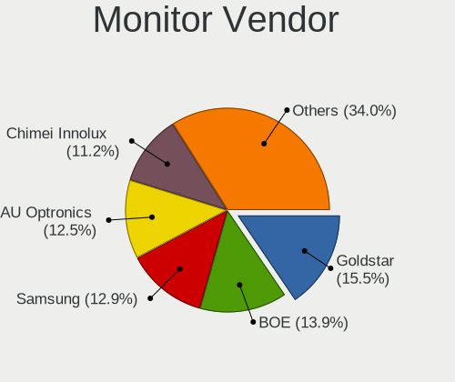

| Vendor                  | Computers | Percent |
|-------------------------|-----------|---------|
| Samsung Electronics     | 47        | 16.15%  |
| Goldstar                | 43        | 14.78%  |
| BOE                     | 39        | 13.4%   |
| AU Optronics            | 31        | 10.65%  |
| Chimei Innolux          | 22        | 7.56%   |
| AOC                     | 20        | 6.87%   |
| Dell                    | 19        | 6.53%   |
| LG Display              | 13        | 4.47%   |
| Acer                    | 7         | 2.41%   |
| Sony                    | 5         | 1.72%   |
| Philips                 | 5         | 1.72%   |
| Unknown (XXX)           | 4         | 1.37%   |
| PANDA                   | 4         | 1.37%   |
| Lenovo                  | 4         | 1.37%   |
| Valve                   | 2         | 0.69%   |
| Unknown                 | 2         | 0.69%   |
| NCS                     | 2         | 0.69%   |
| LG Electronics          | 2         | 0.69%   |
| Hewlett-Packard         | 2         | 0.69%   |
| Chi Mei Optoelectronics | 2         | 0.69%   |
| WAN                     | 1         | 0.34%   |
| VIE                     | 1         | 0.34%   |
| TXD                     | 1         | 0.34%   |
| STD                     | 1         | 0.34%   |
| STA                     | 1         | 0.34%   |
| SLD                     | 1         | 0.34%   |
| RTK                     | 1         | 0.34%   |
| Panasonic               | 1         | 0.34%   |
| MTD                     | 1         | 0.34%   |
| LBT                     | 1         | 0.34%   |
| JINGLITAI               | 1         | 0.34%   |
| JDI                     | 1         | 0.34%   |
| CHD                     | 1         | 0.34%   |
| CCE                     | 1         | 0.34%   |
| BenQ                    | 1         | 0.34%   |
| ASUSTek Computer        | 1         | 0.34%   |

Monitor Model
-------------

Monitor models

| Model                                                                    | Computers | Percent |
|--------------------------------------------------------------------------|-----------|---------|
| Goldstar 2D HD TV GSM59CA 1366x768 509x286mm 23.0-inch                   | 5         | 1.71%   |
| Chimei Innolux LCD Monitor CMN15F5 1920x1080 344x193mm 15.5-inch         | 5         | 1.71%   |
| AOC 27G2G4 AOC2702 1920x1080 598x336mm 27.0-inch                         | 5         | 1.71%   |
| Goldstar ULTRAWIDE GSM59F1 2560x1080 673x284mm 28.8-inch                 | 4         | 1.37%   |
| Goldstar FULL HD GSM5B55 1920x1080 480x270mm 21.7-inch                   | 4         | 1.37%   |
| Samsung Electronics LF24T35 SAM707D 1920x1080 528x297mm 23.9-inch        | 3         | 1.02%   |
| BOE LCD Monitor BOE0812 1920x1080 344x194mm 15.5-inch                    | 3         | 1.02%   |
| BOE LCD Monitor BOE06B4 1920x1080 344x194mm 15.5-inch                    | 3         | 1.02%   |
| BOE LCD Monitor BOE0674 1366x768 344x194mm 15.5-inch                     | 3         | 1.02%   |
| AU Optronics LCD Monitor AUOED8F 1920x1080 344x193mm 15.5-inch           | 3         | 1.02%   |
| Valve ANX7530 U VLV3001 800x1280 100x150mm 7.1-inch                      | 2         | 0.68%   |
| Unknown (XXX) Union TV XXX2841 1920x1080 1209x680mm 54.6-inch            | 2         | 0.68%   |
| Sony LCD Monitor MS_003C 1366x768 309x173mm 13.9-inch                    | 2         | 0.68%   |
| Samsung Electronics SyncMaster SAM03E5 1680x1050 470x300mm 22.0-inch     | 2         | 0.68%   |
| Samsung Electronics SMB2030N SAM0634 1600x900 443x249mm 20.0-inch        | 2         | 0.68%   |
| Samsung Electronics LCD Monitor SEC5441 1366x768 344x194mm 15.5-inch     | 2         | 0.68%   |
| Samsung Electronics LCD Monitor SEC4542 1366x768 309x174mm 14.0-inch     | 2         | 0.68%   |
| Samsung Electronics C24F390 SAM0D2C 1920x1080 521x293mm 23.5-inch        | 2         | 0.68%   |
| PANDA LCD Monitor NCP004D 1920x1080 344x194mm 15.5-inch                  | 2         | 0.68%   |
| LG Display LCD Monitor LGD0458 1366x768 310x174mm 14.0-inch              | 2         | 0.68%   |
| LG Display LCD Monitor LGD02F8 1366x768 309x174mm 14.0-inch              | 2         | 0.68%   |
| Goldstar HDR WFHD GSM7714 2560x1080 798x334mm 34.1-inch                  | 2         | 0.68%   |
| Goldstar 2D FHD TV GSM59C6 1920x1080 509x286mm 23.0-inch                 | 2         | 0.68%   |
| Goldstar 20EN33 GSM4EE1 1600x900 443x249mm 20.0-inch                     | 2         | 0.68%   |
| Dell U2312HM DEL4073 1920x1080 510x287mm 23.0-inch                       | 2         | 0.68%   |
| Dell P2219H DELA115 1920x1080 476x267mm 21.5-inch                        | 2         | 0.68%   |
| Dell E1914H DELD03A 1366x768 410x230mm 18.5-inch                         | 2         | 0.68%   |
| Chimei Innolux LCD Monitor CMN15E6 1366x768 344x193mm 15.5-inch          | 2         | 0.68%   |
| Chimei Innolux LCD Monitor CMN1541 1366x768 344x193mm 15.5-inch          | 2         | 0.68%   |
| Chimei Innolux LCD Monitor CMN1521 1920x1080 344x193mm 15.5-inch         | 2         | 0.68%   |
| Chimei Innolux LCD Monitor CMN14E5 1920x1080 309x173mm 13.9-inch         | 2         | 0.68%   |
| Chimei Innolux LCD Monitor CMN14C8 1920x1080 309x173mm 13.9-inch         | 2         | 0.68%   |
| Chi Mei Optoelectronics LCD Monitor CMO1465 1366x768 309x174mm 14.0-inch | 2         | 0.68%   |
| BOE LCD Monitor BOE0903 1920x1080 344x194mm 15.5-inch                    | 2         | 0.68%   |
| BOE LCD Monitor BOE08D5 1920x1080 344x194mm 15.5-inch                    | 2         | 0.68%   |
| BOE LCD Monitor BOE0819 1920x1080 344x194mm 15.5-inch                    | 2         | 0.68%   |
| BOE LCD Monitor BOE0808 1366x768 344x194mm 15.5-inch                     | 2         | 0.68%   |
| BOE LCD Monitor BOE07CB 1920x1080 344x193mm 15.5-inch                    | 2         | 0.68%   |
| BOE LCD Monitor BOE0757 1366x768 344x194mm 15.5-inch                     | 2         | 0.68%   |
| AU Optronics LCD Monitor AUOAF90 1920x1080 344x193mm 15.5-inch           | 2         | 0.68%   |

Monitor Resolution
------------------

Monitor screen resolution

| Resolution         | Computers | Percent |
|--------------------|-----------|---------|
| 1920x1080 (FHD)    | 141       | 51.09%  |
| 1366x768 (WXGA)    | 64        | 23.19%  |
| 3840x2160 (4K)     | 15        | 5.43%   |
| 1600x900 (HD+)     | 13        | 4.71%   |
| 1280x1024 (SXGA)   | 7         | 2.54%   |
| 2560x1080          | 6         | 2.17%   |
| 2560x1440 (QHD)    | 4         | 1.45%   |
| 1680x1050 (WSXGA+) | 4         | 1.45%   |
| 1440x900 (WXGA+)   | 4         | 1.45%   |
| 1360x768           | 4         | 1.45%   |
| 1280x800 (WXGA)    | 3         | 1.09%   |
| 800x1280           | 2         | 0.72%   |
| 2560x1600          | 2         | 0.72%   |
| 1920x540           | 2         | 0.72%   |
| 3840x1080          | 1         | 0.36%   |
| 3440x1440          | 1         | 0.36%   |
| 2288x1287          | 1         | 0.36%   |
| 1280x720 (HD)      | 1         | 0.36%   |
| 1024x768 (XGA)     | 1         | 0.36%   |

Monitor Diagonal
----------------

Diagonal size in inches

| Inches  | Computers | Percent |
|---------|-----------|---------|
| 15      | 84        | 28.77%  |
| 23      | 30        | 10.27%  |
| 21      | 29        | 9.93%   |
| 13      | 18        | 6.16%   |
| 14      | 17        | 5.82%   |
| 18      | 16        | 5.48%   |
| 27      | 13        | 4.45%   |
| 20      | 10        | 3.42%   |
| 24      | 9         | 3.08%   |
| 17      | 9         | 3.08%   |
| 54      | 7         | 2.4%    |
| 34      | 7         | 2.4%    |
| 19      | 7         | 2.4%    |
| Unknown | 5         | 1.71%   |
| 84      | 4         | 1.37%   |
| 22      | 4         | 1.37%   |
| 31      | 3         | 1.03%   |
| 72      | 2         | 0.68%   |
| 40      | 2         | 0.68%   |
| 16      | 2         | 0.68%   |
| 11      | 2         | 0.68%   |
| 7       | 2         | 0.68%   |
| 142     | 1         | 0.34%   |
| 75      | 1         | 0.34%   |
| 49      | 1         | 0.34%   |
| 46      | 1         | 0.34%   |
| 43      | 1         | 0.34%   |
| 37      | 1         | 0.34%   |
| 32      | 1         | 0.34%   |
| 28      | 1         | 0.34%   |
| 26      | 1         | 0.34%   |
| 12      | 1         | 0.34%   |

Monitor Width
-------------

Physical width

| Width in mm    | Computers | Percent |
|----------------|-----------|---------|
| 301-350        | 120       | 41.38%  |
| 401-500        | 63        | 21.72%  |
| 501-600        | 52        | 17.93%  |
| 351-400        | 10        | 3.45%   |
| 1001-1500      | 9         | 3.1%    |
| 701-800        | 8         | 2.76%   |
| 1501-2000      | 7         | 2.41%   |
| 201-300        | 5         | 1.72%   |
| Unknown        | 5         | 1.72%   |
| 601-700        | 4         | 1.38%   |
| 801-900        | 3         | 1.03%   |
| 1-100          | 2         | 0.69%   |
| More than 2000 | 1         | 0.34%   |
| 901-1000       | 1         | 0.34%   |

Aspect Ratio
------------

Proportional relationship between the width and the height

| Ratio   | Computers | Percent |
|---------|-----------|---------|
| 16/9    | 215       | 83.98%  |
| 16/10   | 18        | 7.03%   |
| 21/9    | 7         | 2.73%   |
| 5/4     | 6         | 2.34%   |
| 4/3     | 3         | 1.17%   |
| Unknown | 3         | 1.17%   |
| 0.67    | 2         | 0.78%   |
| 32/9    | 1         | 0.39%   |
| 1.00    | 1         | 0.39%   |

Monitor Area
------------

Area in inch²

| Area in inch² | Computers | Percent |
|----------------|-----------|---------|
| 101-110        | 86        | 29.66%  |
| 201-250        | 62        | 21.38%  |
| 81-90          | 33        | 11.38%  |
| 151-200        | 24        | 8.28%   |
| 141-150        | 18        | 6.21%   |
| More than 1000 | 14        | 4.83%   |
| 301-350        | 13        | 4.48%   |
| 351-500        | 12        | 4.14%   |
| 501-1000       | 6         | 2.07%   |
| 251-300        | 5         | 1.72%   |
| Unknown        | 5         | 1.72%   |
| 121-130        | 4         | 1.38%   |
| 71-80          | 2         | 0.69%   |
| 51-60          | 2         | 0.69%   |
| 1-40           | 2         | 0.69%   |
| 131-140        | 1         | 0.34%   |
| 111-120        | 1         | 0.34%   |

Pixel Density
-------------

Pixels per inch

| Density | Computers | Percent |
|---------|-----------|---------|
| 51-100  | 110       | 39.15%  |
| 101-120 | 75        | 26.69%  |
| 121-160 | 72        | 25.62%  |
| 1-50    | 12        | 4.27%   |
| 161-240 | 7         | 2.49%   |
| Unknown | 5         | 1.78%   |

Multiple Monitors
-----------------

Total monitors connected

| Total | Computers | Percent |
|-------|-----------|---------|
| 1     | 206       | 79.23%  |
| 2     | 41        | 15.77%  |
| 0     | 9         | 3.46%   |
| 3     | 4         | 1.54%   |

Network
-------

Net Controller Vendor
---------------------

Controller vendors

| Vendor                          | Computers | Percent |
|---------------------------------|-----------|---------|
| Realtek Semiconductor           | 198       | 50.13%  |
| Intel                           | 92        | 23.29%  |
| Qualcomm Atheros                | 47        | 11.9%   |
| MediaTek                        | 13        | 3.29%   |
| Broadcom                        | 11        | 2.78%   |
| TP-Link                         | 7         | 1.77%   |
| D-Link                          | 4         | 1.01%   |
| Samsung Electronics             | 2         | 0.51%   |
| Ralink Technology               | 2         | 0.51%   |
| Qualcomm Atheros Communications | 2         | 0.51%   |
| Motorola PCS                    | 2         | 0.51%   |
| Microsoft                       | 2         | 0.51%   |
| Marvell Technology Group        | 2         | 0.51%   |
| ASIX Electronics                | 2         | 0.51%   |
| Xiaomi                          | 1         | 0.25%   |
| Qualcomm Technologies           | 1         | 0.25%   |
| Mercucys                        | 1         | 0.25%   |
| Lakeview Research               | 1         | 0.25%   |
| JMicron Technology              | 1         | 0.25%   |
| Hewlett-Packard                 | 1         | 0.25%   |
| DisplayLink                     | 1         | 0.25%   |
| D-Link System                   | 1         | 0.25%   |
| Broadcom Limited                | 1         | 0.25%   |

Net Controller Model
--------------------

Controller models

| Model                                                             | Computers | Percent |
|-------------------------------------------------------------------|-----------|---------|
| Realtek RTL8111/8168/8411 PCI Express Gigabit Ethernet Controller | 132       | 30.07%  |
| Realtek RTL810xE PCI Express Fast Ethernet controller             | 26        | 5.92%   |
| Intel Wi-Fi 6 AX201                                               | 14        | 3.19%   |
| Realtek RTL8125 2.5GbE Controller                                 | 11        | 2.51%   |
| Qualcomm Atheros QCA9565 / AR9565 Wireless Network Adapter        | 9         | 2.05%   |
| Qualcomm Atheros QCA9377 802.11ac Wireless Network Adapter        | 9         | 2.05%   |
| Realtek RTL8821CE 802.11ac PCIe Wireless Network Adapter          | 8         | 1.82%   |
| Realtek Killer E2600 Gigabit Ethernet Controller                  | 8         | 1.82%   |
| Qualcomm Atheros QCA6174 802.11ac Wireless Network Adapter        | 8         | 1.82%   |
| Realtek RTL8153 Gigabit Ethernet Adapter                          | 7         | 1.59%   |
| Intel Wi-Fi 6 AX210/AX211/AX411 160MHz                            | 6         | 1.37%   |
| Intel Comet Lake PCH-LP CNVi WiFi                                 | 6         | 1.37%   |
| Realtek RTL8192EE PCIe Wireless Network Adapter                   | 5         | 1.14%   |
| Qualcomm Atheros AR9285 Wireless Network Adapter (PCI-Express)    | 5         | 1.14%   |
| Intel Tiger Lake PCH CNVi WiFi                                    | 5         | 1.14%   |
| Realtek 802.11ac NIC                                              | 4         | 0.91%   |
| Qualcomm Atheros AR8151 v2.0 Gigabit Ethernet                     | 4         | 0.91%   |
| Intel Wireless 7265                                               | 4         | 0.91%   |
| Intel Wireless 7260                                               | 4         | 0.91%   |
| Intel Wi-Fi 6 AX200                                               | 4         | 0.91%   |
| Intel Ethernet Controller I225-V                                  | 4         | 0.91%   |
| Intel Ethernet Connection I217-LM                                 | 4         | 0.91%   |
| D-Link 802.11ac NIC                                               | 4         | 0.91%   |
| Realtek RTL8852AE 802.11ax PCIe Wireless Network Adapter          | 3         | 0.68%   |
| Realtek RTL8822CE 802.11ac PCIe Wireless Network Adapter          | 3         | 0.68%   |
| Realtek RTL8192CU 802.11n WLAN Adapter                            | 3         | 0.68%   |
| Realtek RTL8188FTV 802.11b/g/n 1T1R 2.4G WLAN Adapter             | 3         | 0.68%   |
| Qualcomm Atheros AR9485 Wireless Network Adapter                  | 3         | 0.68%   |
| MediaTek MT7922 802.11ax PCI Express Wireless Network Adapter     | 3         | 0.68%   |
| MediaTek MT7921K (RZ608) Wi-Fi 6E 80MHz                           | 3         | 0.68%   |
| MediaTek MT7921 802.11ax PCI Express Wireless Network Adapter     | 3         | 0.68%   |
| Intel Dual Band Wireless-AC 3165 Plus Bluetooth                   | 3         | 0.68%   |
| Intel Alder Lake-P PCH CNVi WiFi                                  | 3         | 0.68%   |
| TP-Link TL-WN823N v2/v3 [Realtek RTL8192EU]                       | 2         | 0.46%   |
| TP-Link TL-WN821N Version 5 RTL8192EU                             | 2         | 0.46%   |
| Samsung Galaxy series, misc. (tethering mode)                     | 2         | 0.46%   |
| Realtek RTL8191SEvA Wireless LAN Controller                       | 2         | 0.46%   |
| Realtek RTL8188CE 802.11b/g/n WiFi Adapter                        | 2         | 0.46%   |
| Realtek RTL-8100/8101L/8139 PCI Fast Ethernet Adapter             | 2         | 0.46%   |
| Realtek 802.11n WLAN Adapter                                      | 2         | 0.46%   |

Wireless Vendor
---------------

Wireless vendors

| Vendor                          | Computers | Percent |
|---------------------------------|-----------|---------|
| Intel                           | 73        | 38.42%  |
| Realtek Semiconductor           | 39        | 20.53%  |
| Qualcomm Atheros                | 39        | 20.53%  |
| MediaTek                        | 12        | 6.32%   |
| TP-Link                         | 7         | 3.68%   |
| Broadcom                        | 6         | 3.16%   |
| D-Link                          | 4         | 2.11%   |
| Ralink Technology               | 2         | 1.05%   |
| Qualcomm Atheros Communications | 2         | 1.05%   |
| Microsoft                       | 2         | 1.05%   |
| Qualcomm Technologies           | 1         | 0.53%   |
| Mercucys                        | 1         | 0.53%   |
| D-Link System                   | 1         | 0.53%   |
| Broadcom Limited                | 1         | 0.53%   |

Wireless Model
--------------

Wireless models

| Model                                                          | Computers | Percent |
|----------------------------------------------------------------|-----------|---------|
| Intel Wi-Fi 6 AX201                                            | 14        | 7.33%   |
| Qualcomm Atheros QCA9565 / AR9565 Wireless Network Adapter     | 9         | 4.71%   |
| Qualcomm Atheros QCA9377 802.11ac Wireless Network Adapter     | 9         | 4.71%   |
| Realtek RTL8821CE 802.11ac PCIe Wireless Network Adapter       | 8         | 4.19%   |
| Qualcomm Atheros QCA6174 802.11ac Wireless Network Adapter     | 8         | 4.19%   |
| Intel Wi-Fi 6 AX210/AX211/AX411 160MHz                         | 6         | 3.14%   |
| Intel Comet Lake PCH-LP CNVi WiFi                              | 6         | 3.14%   |
| Realtek RTL8192EE PCIe Wireless Network Adapter                | 5         | 2.62%   |
| Qualcomm Atheros AR9285 Wireless Network Adapter (PCI-Express) | 5         | 2.62%   |
| Intel Tiger Lake PCH CNVi WiFi                                 | 5         | 2.62%   |
| Realtek 802.11ac NIC                                           | 4         | 2.09%   |
| Intel Wireless 7265                                            | 4         | 2.09%   |
| Intel Wireless 7260                                            | 4         | 2.09%   |
| Intel Wi-Fi 6 AX200                                            | 4         | 2.09%   |
| D-Link 802.11ac NIC                                            | 4         | 2.09%   |
| Realtek RTL8852AE 802.11ax PCIe Wireless Network Adapter       | 3         | 1.57%   |
| Realtek RTL8822CE 802.11ac PCIe Wireless Network Adapter       | 3         | 1.57%   |
| Realtek RTL8192CU 802.11n WLAN Adapter                         | 3         | 1.57%   |
| Realtek RTL8188FTV 802.11b/g/n 1T1R 2.4G WLAN Adapter          | 3         | 1.57%   |
| Qualcomm Atheros AR9485 Wireless Network Adapter               | 3         | 1.57%   |
| MediaTek MT7922 802.11ax PCI Express Wireless Network Adapter  | 3         | 1.57%   |
| MediaTek MT7921K (RZ608) Wi-Fi 6E 80MHz                        | 3         | 1.57%   |
| MediaTek MT7921 802.11ax PCI Express Wireless Network Adapter  | 3         | 1.57%   |
| Intel Dual Band Wireless-AC 3165 Plus Bluetooth                | 3         | 1.57%   |
| Intel Alder Lake-P PCH CNVi WiFi                               | 3         | 1.57%   |
| TP-Link TL-WN823N v2/v3 [Realtek RTL8192EU]                    | 2         | 1.05%   |
| TP-Link TL-WN821N Version 5 RTL8192EU                          | 2         | 1.05%   |
| Realtek RTL8191SEvA Wireless LAN Controller                    | 2         | 1.05%   |
| Realtek RTL8188CE 802.11b/g/n WiFi Adapter                     | 2         | 1.05%   |
| Realtek 802.11n WLAN Adapter                                   | 2         | 1.05%   |
| Qualcomm Atheros AR9271 802.11n                                | 2         | 1.05%   |
| Qualcomm Atheros AR9462 Wireless Network Adapter               | 2         | 1.05%   |
| Qualcomm Atheros AR9287 Wireless Network Adapter (PCI-Express) | 2         | 1.05%   |
| MediaTek Wi-Fi 6E MT7902 Wireless Network Adapter              | 2         | 1.05%   |
| Intel Wireless-AC 9260                                         | 2         | 1.05%   |
| Intel Wireless 8265 / 8275                                     | 2         | 1.05%   |
| Intel Wireless 3165                                            | 2         | 1.05%   |
| Intel Wireless 3160                                            | 2         | 1.05%   |
| Intel Comet Lake PCH CNVi WiFi                                 | 2         | 1.05%   |
| Intel Centrino Wireless-N 1030 [Rainbow Peak]                  | 2         | 1.05%   |

Ethernet Vendor
---------------

Ethernet vendors

| Vendor                   | Computers | Percent |
|--------------------------|-----------|---------|
| Realtek Semiconductor    | 182       | 76.79%  |
| Intel                    | 27        | 11.39%  |
| Qualcomm Atheros         | 11        | 4.64%   |
| Broadcom                 | 5         | 2.11%   |
| Samsung Electronics      | 2         | 0.84%   |
| Motorola PCS             | 2         | 0.84%   |
| Marvell Technology Group | 2         | 0.84%   |
| ASIX Electronics         | 2         | 0.84%   |
| Xiaomi                   | 1         | 0.42%   |
| MediaTek                 | 1         | 0.42%   |
| JMicron Technology       | 1         | 0.42%   |
| DisplayLink              | 1         | 0.42%   |

Ethernet Model
--------------

Ethernet models

| Model                                                             | Computers | Percent |
|-------------------------------------------------------------------|-----------|---------|
| Realtek RTL8111/8168/8411 PCI Express Gigabit Ethernet Controller | 132       | 53.88%  |
| Realtek RTL810xE PCI Express Fast Ethernet controller             | 26        | 10.61%  |
| Realtek RTL8125 2.5GbE Controller                                 | 11        | 4.49%   |
| Realtek Killer E2600 Gigabit Ethernet Controller                  | 8         | 3.27%   |
| Realtek RTL8153 Gigabit Ethernet Adapter                          | 7         | 2.86%   |
| Qualcomm Atheros AR8151 v2.0 Gigabit Ethernet                     | 4         | 1.63%   |
| Intel Ethernet Controller I225-V                                  | 4         | 1.63%   |
| Intel Ethernet Connection I217-LM                                 | 4         | 1.63%   |
| Samsung Galaxy series, misc. (tethering mode)                     | 2         | 0.82%   |
| Realtek RTL-8100/8101L/8139 PCI Fast Ethernet Adapter             | 2         | 0.82%   |
| Motorola PCS motorola edge 40                                     | 2         | 0.82%   |
| Marvell Group 88E8040 PCI-E Fast Ethernet Controller              | 2         | 0.82%   |
| Intel I210 Gigabit Network Connection                             | 2         | 0.82%   |
| Intel Ethernet Connection (7) I219-V                              | 2         | 0.82%   |
| Intel Ethernet Connection (5) I219-LM                             | 2         | 0.82%   |
| Intel 82579LM Gigabit Network Connection (Lewisville)             | 2         | 0.82%   |
| Intel 82578DM Gigabit Network Connection                          | 2         | 0.82%   |
| ASIX AX88179 Gigabit Ethernet                                     | 2         | 0.82%   |
| Xiaomi Mi/Redmi series (RNDIS)                                    | 1         | 0.41%   |
| Realtek Killer E2500 Gigabit Ethernet Controller                  | 1         | 0.41%   |
| Qualcomm Atheros Killer E2500 Gigabit Ethernet Controller         | 1         | 0.41%   |
| Qualcomm Atheros Killer E2400 Gigabit Ethernet Controller         | 1         | 0.41%   |
| Qualcomm Atheros Killer E220x Gigabit Ethernet Controller         | 1         | 0.41%   |
| Qualcomm Atheros Attansic L2 Fast Ethernet                        | 1         | 0.41%   |
| Qualcomm Atheros AR8161 Gigabit Ethernet                          | 1         | 0.41%   |
| Qualcomm Atheros AR8152 v2.0 Fast Ethernet                        | 1         | 0.41%   |
| Qualcomm Atheros AR8131 Gigabit Ethernet                          | 1         | 0.41%   |
| MediaTek M40Air_EEA                                               | 1         | 0.41%   |
| JMicron JMC260 PCI Express Fast Ethernet Controller               | 1         | 0.41%   |
| Intel I211 Gigabit Network Connection                             | 1         | 0.41%   |
| Intel Ethernet Connection I219-LM                                 | 1         | 0.41%   |
| Intel Ethernet Connection (7) I219-LM                             | 1         | 0.41%   |
| Intel Ethernet Connection (4) I219-LM                             | 1         | 0.41%   |
| Intel Ethernet Connection (2) I219-LM                             | 1         | 0.41%   |
| Intel Ethernet Connection (13) I219-V                             | 1         | 0.41%   |
| Intel Ethernet Connection (13) I219-LM                            | 1         | 0.41%   |
| Intel Ethernet Connection (11) I219-V                             | 1         | 0.41%   |
| Intel Ethernet Connection (10) I219-V                             | 1         | 0.41%   |
| Intel 82579V Gigabit Network Connection                           | 1         | 0.41%   |
| Intel 82578DC Gigabit Network Connection                          | 1         | 0.41%   |

Net Controller Kind
-------------------

Ethernet, WiFi or modem

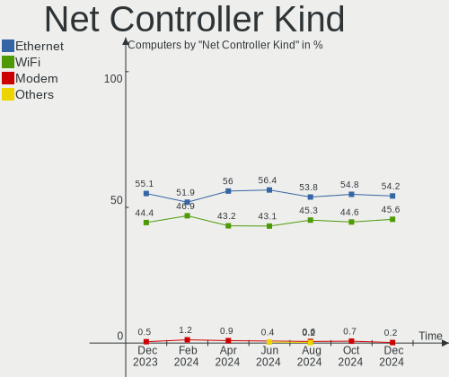

| Kind     | Computers | Percent |
|----------|-----------|---------|
| Ethernet | 227       | 54.7%   |
| WiFi     | 185       | 44.58%  |
| Modem    | 2         | 0.48%   |
| Unknown  | 1         | 0.24%   |

Used Controller
---------------

Currently used network controller

| Kind     | Computers | Percent |
|----------|-----------|---------|
| WiFi     | 142       | 54.41%  |
| Ethernet | 119       | 45.59%  |

NICs
----

Total network controllers on board

| Total | Computers | Percent |
|-------|-----------|---------|
| 2     | 133       | 51.15%  |
| 1     | 113       | 43.46%  |
| 0     | 9         | 3.46%   |
| 3     | 4         | 1.54%   |
| 4     | 1         | 0.38%   |

IPv6
----

IPv6 vs IPv4

| Used | Computers | Percent |
|------|-----------|---------|
| No   | 134       | 51.54%  |
| Yes  | 126       | 48.46%  |

Bluetooth
---------

Bluetooth Vendor
----------------

Controller vendors

| Vendor                          | Computers | Percent |
|---------------------------------|-----------|---------|
| Intel                           | 69        | 42.59%  |
| Qualcomm Atheros Communications | 20        | 12.35%  |
| Cambridge Silicon Radio         | 18        | 11.11%  |
| Realtek Semiconductor           | 17        | 10.49%  |
| Lite-On Technology              | 12        | 7.41%   |
| IMC Networks                    | 7         | 4.32%   |
| MediaTek                        | 5         | 3.09%   |
| Foxconn / Hon Hai               | 3         | 1.85%   |
| Actions                         | 3         | 1.85%   |
| TP-Link                         | 2         | 1.23%   |
| Hewlett-Packard                 | 1         | 0.62%   |
| Foxconn International           | 1         | 0.62%   |
| Dynex                           | 1         | 0.62%   |
| Dell                            | 1         | 0.62%   |
| Broadcom                        | 1         | 0.62%   |
| Apple                           | 1         | 0.62%   |

Bluetooth Model
---------------

Controller models

| Model                                                    | Computers | Percent |
|----------------------------------------------------------|-----------|---------|
| Intel Bluetooth Device                                   | 22        | 13.58%  |
| Cambridge Silicon Radio Bluetooth Dongle (HCI mode)      | 18        | 11.11%  |
| Intel Bluetooth wireless interface                       | 17        | 10.49%  |
| Realtek Bluetooth Radio                                  | 15        | 9.26%   |
| Intel Bluetooth 9460/9560 Jefferson Peak (JfP)           | 15        | 9.26%   |
| Qualcomm Atheros  Bluetooth Device                       | 13        | 8.02%   |
| Intel AX210 Bluetooth                                    | 6         | 3.7%    |
| MediaTek Wireless_Device                                 | 5         | 3.09%   |
| Lite-On Qualcomm Atheros QCA9377 Bluetooth               | 5         | 3.09%   |
| Intel AX200 Bluetooth                                    | 4         | 2.47%   |
| Qualcomm Atheros AR9462 Bluetooth                        | 3         | 1.85%   |
| Lite-On Wireless_Device                                  | 3         | 1.85%   |
| Lite-On Bluetooth Device                                 | 3         | 1.85%   |
| Actions general adapter                                  | 3         | 1.85%   |
| TP-Link UB500 Adapter                                    | 2         | 1.23%   |
| Qualcomm Atheros Bluetooth USB Host Controller           | 2         | 1.23%   |
| Intel Wireless-AC 9260 Bluetooth Adapter                 | 2         | 1.23%   |
| Intel Centrino Advanced-N 6230 Bluetooth adapter         | 2         | 1.23%   |
| IMC Networks Wireless_Device                             | 2         | 1.23%   |
| IMC Networks Bluetooth Radio                             | 2         | 1.23%   |
| IMC Networks 802.11ac WLAN Adapter                       | 2         | 1.23%   |
| Foxconn / Hon Hai Bluetooth Device                       | 2         | 1.23%   |
| Realtek RTL8822BE Bluetooth 4.2 Adapter                  | 1         | 0.62%   |
| Realtek  Bluetooth 4.2 Adapter                           | 1         | 0.62%   |
| Qualcomm Atheros Dell Wireless 1802 Bluetooth 4.0 LE     | 1         | 0.62%   |
| Qualcomm Atheros AR3011 Bluetooth                        | 1         | 0.62%   |
| Lite-On Atheros AR3012 Bluetooth                         | 1         | 0.62%   |
| Intel Centrino Bluetooth Wireless Transceiver            | 1         | 0.62%   |
| IMC Networks Bluetooth Device                            | 1         | 0.62%   |
| HP Broadcom 2070 Bluetooth Combo                         | 1         | 0.62%   |
| Foxconn International BCM43142A0 Bluetooth module        | 1         | 0.62%   |
| Foxconn / Hon Hai Wireless_Device                        | 1         | 0.62%   |
| Dynex Bluetooth 4.0 Adapter [Broadcom, 1.12, BCM20702A0] | 1         | 0.62%   |
| Dell DW375 Bluetooth Module                              | 1         | 0.62%   |
| Broadcom Bluetooth 2.1 Device                            | 1         | 0.62%   |
| Apple Bluetooth Host Controller                          | 1         | 0.62%   |

Sound
-----

Sound Vendor
------------

Sound card vendors

| Vendor                     | Computers | Percent |
|----------------------------|-----------|---------|
| Intel                      | 179       | 49.72%  |
| AMD                        | 88        | 24.44%  |
| Nvidia                     | 55        | 15.28%  |
| C-Media Electronics        | 7         | 1.94%   |
| Logitech                   | 6         | 1.67%   |
| Generalplus Technology     | 5         | 1.39%   |
| Kingston Technology        | 3         | 0.83%   |
| Texas Instruments          | 2         | 0.56%   |
| Tenx Technology            | 2         | 0.56%   |
| ASUSTek Computer           | 2         | 0.56%   |
| Weltrend Semiconductor     | 1         | 0.28%   |
| Microsoft                  | 1         | 0.28%   |
| Meizu                      | 1         | 0.28%   |
| JMTek                      | 1         | 0.28%   |
| Huawei Technologies        | 1         | 0.28%   |
| GN Netcom                  | 1         | 0.28%   |
| FDUCE PRO AUDIO MADE       | 1         | 0.28%   |
| Dell                       | 1         | 0.28%   |
| Conexant Systems           | 1         | 0.28%   |
| BR23                       | 1         | 0.28%   |
| Altec Lansing Technologies | 1         | 0.28%   |

Sound Model
-----------

Sound card models

| Model                                                                                             | Computers | Percent |
|---------------------------------------------------------------------------------------------------|-----------|---------|
| AMD Family 17h/19h HD Audio Controller                                                            | 43        | 10%     |
| Intel 6 Series/C200 Series Chipset Family High Definition Audio Controller                        | 24        | 5.58%   |
| AMD Renoir Radeon High Definition Audio Controller                                                | 19        | 4.42%   |
| Intel Tiger Lake-LP Smart Sound Technology Audio Controller                                       | 17        | 3.95%   |
| Intel 8 Series/C220 Series Chipset High Definition Audio Controller                               | 17        | 3.95%   |
| Intel Sunrise Point-LP HD Audio                                                                   | 16        | 3.72%   |
| AMD Ellesmere HDMI Audio [Radeon RX 470/480 / 570/580/590]                                        | 13        | 3.02%   |
| Intel 7 Series/C216 Chipset Family High Definition Audio Controller                               | 12        | 2.79%   |
| AMD SBx00 Azalia (Intel HDA)                                                                      | 10        | 2.33%   |
| AMD Rembrandt Radeon High Definition Audio Controller                                             | 10        | 2.33%   |
| Nvidia TU107 GeForce GTX 1650 High Definition Audio Controller                                    | 9         | 2.09%   |
| Intel Tiger Lake-H HD Audio Controller                                                            | 9         | 2.09%   |
| Intel Cannon Lake PCH cAVS                                                                        | 9         | 2.09%   |
| AMD Starship/Matisse HD Audio Controller                                                          | 9         | 2.09%   |
| AMD Raven/Raven2/Fenghuang HDMI/DP Audio Controller                                               | 9         | 2.09%   |
| Intel Xeon E3-1200 v3/4th Gen Core Processor HD Audio Controller                                  | 8         | 1.86%   |
| Intel Comet Lake PCH-LP cAVS                                                                      | 8         | 1.86%   |
| Intel 5 Series/3400 Series Chipset High Definition Audio                                          | 8         | 1.86%   |
| Nvidia GP107GL High Definition Audio Controller                                                   | 7         | 1.63%   |
| Nvidia GF108 High Definition Audio Controller                                                     | 6         | 1.4%    |
| Nvidia GA104 High Definition Audio Controller                                                     | 5         | 1.16%   |
| Intel Celeron/Pentium Silver Processor High Definition Audio                                      | 5         | 1.16%   |
| Intel 82801I (ICH9 Family) HD Audio Controller                                                    | 5         | 1.16%   |
| Generalplus Technology USB Audio Device                                                           | 5         | 1.16%   |
| Nvidia GP108 High Definition Audio Controller                                                     | 4         | 0.93%   |
| Intel CM238 HD Audio Controller                                                                   | 4         | 0.93%   |
| AMD Navi 21/23 HDMI/DP Audio Controller                                                           | 4         | 0.93%   |
| AMD Cedar HDMI Audio [Radeon HD 5400/6300/7300 Series]                                            | 4         | 0.93%   |
| AMD Baffin HDMI/DP Audio [Radeon RX 550 640SP / RX 560/560X]                                      | 4         | 0.93%   |
| Nvidia TU116 High Definition Audio Controller                                                     | 3         | 0.7%    |
| Nvidia GK208 HDMI/DP Audio Controller                                                             | 3         | 0.7%    |
| Nvidia GF119 HDMI Audio Controller                                                                | 3         | 0.7%    |
| Nvidia GA106 High Definition Audio Controller                                                     | 3         | 0.7%    |
| Nvidia Audio device                                                                               | 3         | 0.7%    |
| Intel Wildcat Point-LP High Definition Audio Controller                                           | 3         | 0.7%    |
| Intel Comet Lake PCH cAVS                                                                         | 3         | 0.7%    |
| Intel Cannon Point-LP High Definition Audio Controller                                            | 3         | 0.7%    |
| Intel Broadwell-U Audio Controller                                                                | 3         | 0.7%    |
| Intel Atom/Celeron/Pentium Processor x5-E8000/J3xxx/N3xxx Series High Definition Audio Controller | 3         | 0.7%    |
| Intel Alder Lake PCH-P High Definition Audio Controller                                           | 3         | 0.7%    |

Memory
------

Memory Vendor
-------------

Memory module vendors

| Vendor              | Computers | Percent |
|---------------------|-----------|---------|
| Kingston            | 20        | 15.27%  |
| A-DATA Technology   | 18        | 13.74%  |
| Smart               | 13        | 9.92%   |
| Samsung Electronics | 13        | 9.92%   |
| SK hynix            | 11        | 8.4%    |
| Unknown             | 8         | 6.11%   |
| Unknown             | 7         | 5.34%   |
| Teikon              | 6         | 4.58%   |
| Micron Technology   | 6         | 4.58%   |
| Corsair             | 6         | 4.58%   |
| Crucial             | 4         | 3.05%   |
| Asgard              | 3         | 2.29%   |
| Unknown (0x0B5E)    | 2         | 1.53%   |
| Patriot             | 2         | 1.53%   |
| Walton Chaintech    | 1         | 0.76%   |
| Unknown (ABCD)      | 1         | 0.76%   |
| Unknown (0x0E9D)    | 1         | 0.76%   |
| Unknown (0DCE)      | 1         | 0.76%   |
| Transcend           | 1         | 0.76%   |
| Nanya Technology    | 1         | 0.76%   |
| Multilaser          | 1         | 0.76%   |
| Kllisre             | 1         | 0.76%   |
| Juhor               | 1         | 0.76%   |
| Hikvision           | 1         | 0.76%   |
| High Bridge         | 1         | 0.76%   |
| CUSO                | 1         | 0.76%   |

Memory Model
------------

Memory module models

| Model                                                              | Computers | Percent |
|--------------------------------------------------------------------|-----------|---------|
| Unknown                                                            | 8         | 5.88%   |
| Asgard RAM VMA45UG-MEC1U2AW2 8GB DIMM DDR4 3200MT/s                | 3         | 2.21%   |
| Unknown (0x0B5E) RAM HEMA81GS6DJR8N-XN 8GB SODIMM DDR4 3200MT/s    | 2         | 1.47%   |
| Smart RAM SMS4WEC8C1K0446FCG 8GB SODIMM DDR4 3200MT/s              | 2         | 1.47%   |
| Smart RAM SH564568FH8NWPHSFG 2GB SODIMM DDR3 1333MT/s              | 2         | 1.47%   |
| SK hynix RAM HYMP125S64CP8-S6 2GB SODIMM DDR2 975MT/s              | 2         | 1.47%   |
| Kingston RAM KF3200C16D4/32GX 32GB DIMM DDR4 3933MT/s              | 2         | 1.47%   |
| A-DATA RAM DDR4 3200 8GB DIMM DDR4 3600MT/s                        | 2         | 1.47%   |
| A-DATA RAM AD4S320038G22-BHYD 8GB SODIMM DDR4 3200MT/s             | 2         | 1.47%   |
| A-DATA RAM AD4S3200316G22-BHYD 16GB SODIMM DDR4 3200MT/s           | 2         | 1.47%   |
| Walton Chaintech RAM AS2G732-800P005 2GB SODIMM DDR2 800MT/s       | 1         | 0.74%   |
| Unknown RAM Module 8GB SODIMM DDR4 2667MT/s                        | 1         | 0.74%   |
| Unknown RAM Module 8GB DIMM DDR3                                   | 1         | 0.74%   |
| Unknown RAM Module 8192MB SODIMM DDR3 1600MT/s                     | 1         | 0.74%   |
| Unknown RAM Module 4GB SODIMM DDR4 2667MT/s                        | 1         | 0.74%   |
| Unknown RAM Module 4GB DIMM 1333MT/s                               | 1         | 0.74%   |
| Unknown RAM Module 2GB SODIMM DDR3 1600MT/s                        | 1         | 0.74%   |
| Unknown RAM Module 2GB DIMM SDRAM                                  | 1         | 0.74%   |
| Unknown RAM Module 2GB DIMM 1333MT/s                               | 1         | 0.74%   |
| Unknown (ABCD) RAM 123456789012345678 2GB SODIMM LPDDR4 2400MT/s   | 1         | 0.74%   |
| Unknown (0x0E9D) RAM KINSOTIN16GB2666MHZ 16GB SODIMM DDR4 2667MT/s | 1         | 0.74%   |
| Unknown (0DCE) RAM Module 8GB DIMM DDR3 1333MT/s                   | 1         | 0.74%   |
| Transcend RAM JM1333KLN-4G 4GB DIMM DDR3 1600MT/s                  | 1         | 0.74%   |
| Teikon RAM TMT451U6BFR8C-PBHJ 4GB DIMM DDR3 1600MT/s               | 1         | 0.74%   |
| Teikon RAM TMT451S6BFR8A-PBHJ 4GB SODIMM DDR3 1600MT/s             | 1         | 0.74%   |
| Teikon RAM TMT41GU6BFR8C-PBHJ 8GB DIMM DDR3 1600MT/s               | 1         | 0.74%   |
| Teikon RAM TMT41GU6BFR8C-PBHC 8GB DIMM DDR3 1600MT/s               | 1         | 0.74%   |
| Teikon RAM TMA81GS6AFR8N-UHHC 8GB SODIMM DDR4 2400MT/s             | 1         | 0.74%   |
| Teikon RAM TMA451S6AFR8N-TFSC 4096MB SODIMM DDR4 2133MT/s          | 1         | 0.74%   |
| Smart RAM SMS4TDC3C0K0446SCG 4096MB SODIMM DDR4 2667MT/s           | 1         | 0.74%   |
| Smart RAM SH564568FH8NZPHSCR 2GB SODIMM DDR3 1333MT/s              | 1         | 0.74%   |
| Smart RAM SH564568FH8N0QNSCG 2GB DIMM DDR3 1600MT/s                | 1         | 0.74%   |
| Smart RAM SH564128FJ8NWRNSQG 4GB SODIMM DDR3 1600MT/s              | 1         | 0.74%   |
| Smart RAM SH564128FH8NZPHSCG 4GB SODIMM DDR3 1334MT/s              | 1         | 0.74%   |
| Smart RAM SH564128FH8N6TNSQR 4GB DIMM DDR3 1600MT/s                | 1         | 0.74%   |
| Smart RAM SH564128FH8N0QNSCG 4GB DIMM DDR3 1600MT/s                | 1         | 0.74%   |
| Smart RAM SH564128FH8N0QHSCR 4GB DIMM DDR3 1333MT/s                | 1         | 0.74%   |
| Smart RAM SH564128FH8N0 4GB DIMM DDR3 800MT/s                      | 1         | 0.74%   |
| Smart RAM SG564568FG8NWKFSQR 2GB SODIMM DDR2 800MT/s               | 1         | 0.74%   |
| Smart RAM SF564128CJ8N6NNSEG 4GB DIMM DDR3 1333MT/s                | 1         | 0.74%   |

Memory Kind
-----------

Memory module kinds

| Kind    | Computers | Percent |
|---------|-----------|---------|
| DDR4    | 57        | 52.78%  |
| DDR3    | 36        | 33.33%  |
| SDRAM   | 4         | 3.7%    |
| DDR5    | 3         | 2.78%   |
| DDR2    | 3         | 2.78%   |
| LPDDR5  | 2         | 1.85%   |
| LPDDR4  | 2         | 1.85%   |
| Unknown | 1         | 0.93%   |

Memory Form Factor
------------------

Physical design of the memory module

| Name         | Computers | Percent |
|--------------|-----------|---------|
| DIMM         | 54        | 50.94%  |
| SODIMM       | 49        | 46.23%  |
| Row Of Chips | 3         | 2.83%   |

Memory Size
-----------

Memory module size

| Size  | Computers | Percent |
|-------|-----------|---------|
| 8192  | 45        | 38.79%  |
| 4096  | 27        | 23.28%  |
| 16384 | 20        | 17.24%  |
| 2048  | 13        | 11.21%  |
| 32768 | 11        | 9.48%   |

Memory Speed
------------

Memory module speed

| Speed   | Computers | Percent |
|---------|-----------|---------|
| 3200    | 29        | 23.58%  |
| 1600    | 19        | 15.45%  |
| 2667    | 15        | 12.2%   |
| 1333    | 12        | 9.76%   |
| 3600    | 5         | 4.07%   |
| 2133    | 4         | 3.25%   |
| 1334    | 4         | 3.25%   |
| 800     | 4         | 3.25%   |
| Unknown | 4         | 3.25%   |
| 2400    | 3         | 2.44%   |
| 1866    | 3         | 2.44%   |
| 3933    | 2         | 1.63%   |
| 2666    | 2         | 1.63%   |
| 1066    | 2         | 1.63%   |
| 975     | 2         | 1.63%   |
| 6400    | 1         | 0.81%   |
| 5800    | 1         | 0.81%   |
| 5600    | 1         | 0.81%   |
| 5500    | 1         | 0.81%   |
| 4800    | 1         | 0.81%   |
| 4267    | 1         | 0.81%   |
| 4199    | 1         | 0.81%   |
| 3800    | 1         | 0.81%   |
| 3467    | 1         | 0.81%   |
| 3400    | 1         | 0.81%   |
| 3100    | 1         | 0.81%   |
| 2933    | 1         | 0.81%   |
| 2048    | 1         | 0.81%   |

Printers & scanners
-------------------

Printer Vendor
--------------

Printer device vendors

| Vendor              | Computers | Percent |
|---------------------|-----------|---------|
| Samsung Electronics | 2         | 33.33%  |
| Hewlett-Packard     | 2         | 33.33%  |
| Seiko Epson         | 1         | 16.67%  |
| Brother Industries  | 1         | 16.67%  |

Printer Model
-------------

Printer device models

| Model                    | Computers | Percent |
|--------------------------|-----------|---------|
| Seiko Epson L3150 Series | 1         | 16.67%  |
| Samsung SCX-6x55X Series | 1         | 16.67%  |
| Samsung M2070 Series     | 1         | 16.67%  |
| HP DeskJet 3700 series   | 1         | 16.67%  |
| HP Deskjet 2510 series   | 1         | 16.67%  |
| Brother DCP-T420W        | 1         | 16.67%  |

Scanner Vendor
--------------

Scanner device vendors

Zero info for selected period =(

Scanner Model
-------------

Scanner device models

Zero info for selected period =(

Camera
------

Camera Vendor
-------------

Camera device vendors

| Vendor                                 | Computers | Percent |
|----------------------------------------|-----------|---------|
| Quanta                                 | 20        | 13.79%  |
| Chicony Electronics                    | 19        | 13.1%   |
| Realtek Semiconductor                  | 16        | 11.03%  |
| Microdia                               | 15        | 10.34%  |
| IMC Networks                           | 11        | 7.59%   |
| Logitech                               | 9         | 6.21%   |
| Silicon Motion                         | 6         | 4.14%   |
| Bison Electronics                      | 6         | 4.14%   |
| Sunplus Innovation Technology          | 5         | 3.45%   |
| Generalplus Technology                 | 5         | 3.45%   |
| Alcor Micro                            | 4         | 2.76%   |
| Z-Star Microelectronics                | 3         | 2.07%   |
| Luxvisions Innotech Limited            | 3         | 2.07%   |
| Y Media                                | 2         | 1.38%   |
| Syntek                                 | 2         | 1.38%   |
| SunplusIT                              | 2         | 1.38%   |
| Sonix Technology                       | 2         | 1.38%   |
| Unknown                                | 2         | 1.38%   |
| WaveRider Communications               | 1         | 0.69%   |
| Tripath Technology                     | 1         | 0.69%   |
| Suyin                                  | 1         | 0.69%   |
| Shine-optics                           | 1         | 0.69%   |
| Ricoh                                  | 1         | 0.69%   |
| Primax Electronics                     | 1         | 0.69%   |
| Owon                                   | 1         | 0.69%   |
| Jieli Technology                       | 1         | 0.69%   |
| icSpring                               | 1         | 0.69%   |
| GenesysLogic Technology                | 1         | 0.69%   |
| Creality 3D Technology                 | 1         | 0.69%   |
| Cheng Uei Precision Industry (Foxlink) | 1         | 0.69%   |
| Anker PowerConf C200                   | 1         | 0.69%   |

Camera Model
------------

Camera device models

| Model                                         | Computers | Percent |
|-----------------------------------------------|-----------|---------|
| Realtek Integrated_Webcam_HD                  | 9         | 6.21%   |
| Microdia Integrated_Webcam_HD                 | 9         | 6.21%   |
| Quanta HD User Facing                         | 8         | 5.52%   |
| Sunplus Integrated_Webcam_HD                  | 5         | 3.45%   |
| Logitech Webcam C270                          | 5         | 3.45%   |
| IMC Networks Integrated Camera                | 5         | 3.45%   |
| Realtek Integrated Webcam                     | 4         | 2.76%   |
| Chicony HD WebCam                             | 4         | 2.76%   |
| Chicony HD User Facing                        | 4         | 2.76%   |
| Bison Integrated Camera                       | 4         | 2.76%   |
| Quanta HD Webcam                              | 3         | 2.07%   |
| IMC Networks USB2.0 HD UVC WebCam             | 3         | 2.07%   |
| Generalplus 808 Camera #9 (web-cam mode)      | 3         | 2.07%   |
| Y Media USB Camera                            | 2         | 1.38%   |
| Syntek Integrated Camera                      | 2         | 1.38%   |
| Sonix USB2.0 HD UVC WebCam                    | 2         | 1.38%   |
| Silicon Motion WebCam SC-13HDL11939N          | 2         | 1.38%   |
| Silicon Motion WebCam SC-0311139N             | 2         | 1.38%   |
| Quanta VGA WebCam                             | 2         | 1.38%   |
| Quanta Laptop_Integrated_Webcam_2HDM          | 2         | 1.38%   |
| Quanta ACER HD User Facing                    | 2         | 1.38%   |
| Microdia Webcam Vitade AF                     | 2         | 1.38%   |
| Luxvisions Innotech Limited Integrated Camera | 2         | 1.38%   |
| Logitech BRIO Ultra HD Webcam                 | 2         | 1.38%   |
| IMC Networks USB2.0 VGA UVC WebCam            | 2         | 1.38%   |
| Generalplus GENERAL WEBCAM                    | 2         | 1.38%   |
| Chicony USB2.0 Camera                         | 2         | 1.38%   |
| Chicony Integrated Camera                     | 2         | 1.38%   |
| Chicony ACER HD User Facing                   | 2         | 1.38%   |
| Alcor Micro USB 2.0 PC Camera                 | 2         | 1.38%   |
| Unknown                                       | 2         | 1.38%   |
| Z-Star Webcam                                 | 1         | 0.69%   |
| Z-Star Lenovo ThinkCentre Web Camera          | 1         | 0.69%   |
| Z-Star Integrated Camera                      | 1         | 0.69%   |
| WaveRider USB 2.0 Camera                      | 1         | 0.69%   |
| Tripath USB Camera                            | 1         | 0.69%   |
| Suyin USB 2.0 Camera                          | 1         | 0.69%   |
| SunplusIT MTD camera                          | 1         | 0.69%   |
| SunplusIT 720p HD Camera                      | 1         | 0.69%   |
| Silicon Motion Web Camera                     | 1         | 0.69%   |

Security
--------

Fingerprint Vendor
------------------

Fingerprint sensor vendors

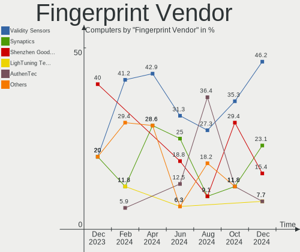

| Vendor                     | Computers | Percent |
|----------------------------|-----------|---------|
| Shenzhen Goodix Technology | 4         | 40%     |
| Validity Sensors           | 2         | 20%     |
| Synaptics                  | 2         | 20%     |
| Upek                       | 1         | 10%     |
| Elan Microelectronics      | 1         | 10%     |

Fingerprint Model
-----------------

Fingerprint sensor models

| Model                                                  | Computers | Percent |
|--------------------------------------------------------|-----------|---------|
| Shenzhen Goodix  FingerPrint Device                    | 3         | 30%     |
| Validity Sensors VFS5011 Fingerprint Reader            | 1         | 10%     |
| Validity Sensors VFS471 Fingerprint Reader             | 1         | 10%     |
| Upek Biometric Touchchip/Touchstrip Fingerprint Sensor | 1         | 10%     |
| Synaptics Prometheus MIS Touch Fingerprint Reader      | 1         | 10%     |
| Synaptics Metallica MIS Touch Fingerprint Reader       | 1         | 10%     |
| Shenzhen Goodix Fingerprint Reader                     | 1         | 10%     |
| Elan ELAN:Fingerprint                                  | 1         | 10%     |

Chipcard Vendor
---------------

Chipcard module vendors

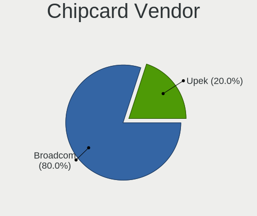

| Vendor                | Computers | Percent |
|-----------------------|-----------|---------|
| Giesecke & Devrient   | 2         | 33.33%  |
| Gemalto (was Gemplus) | 2         | 33.33%  |
| Broadcom              | 2         | 33.33%  |

Chipcard Model
--------------

Chipcard module models

| Model                                             | Computers | Percent |
|---------------------------------------------------|-----------|---------|
| Giesecke & Devrient StarSign CUT                  | 2         | 33.33%  |
| Gemalto (was Gemplus) GemPC Twin SmartCard Reader | 2         | 33.33%  |
| Broadcom 5880                                     | 2         | 33.33%  |

Unsupported
-----------

Unsupported Devices
-------------------

Total unsupported devices on board

| Total | Computers | Percent |
|-------|-----------|---------|
| 0     | 211       | 81.15%  |
| 1     | 45        | 17.31%  |
| 2     | 3         | 1.15%   |
| 3     | 1         | 0.38%   |

Unsupported Device Types
------------------------

Types of unsupported devices

| Type                     | Computers | Percent |
|--------------------------|-----------|---------|
| Graphics card            | 17        | 32.08%  |
| Net/wireless             | 9         | 16.98%  |
| Fingerprint reader       | 9         | 16.98%  |
| Multimedia controller    | 7         | 13.21%  |
| Chipcard                 | 4         | 7.55%   |
| Unassigned class         | 2         | 3.77%   |
| Communication controller | 2         | 3.77%   |
| Storage/raid             | 1         | 1.89%   |
| Storage                  | 1         | 1.89%   |
| Sound                    | 1         | 1.89%   |

