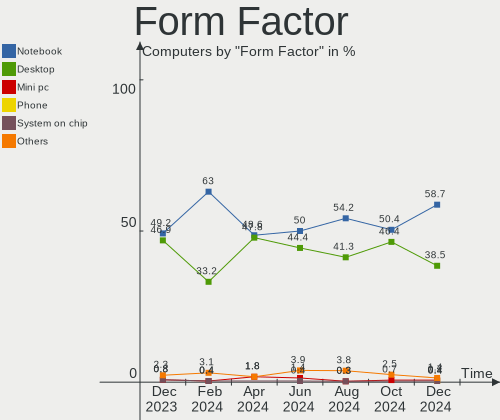
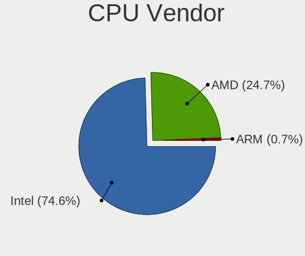
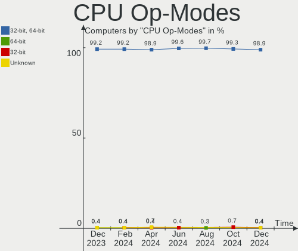
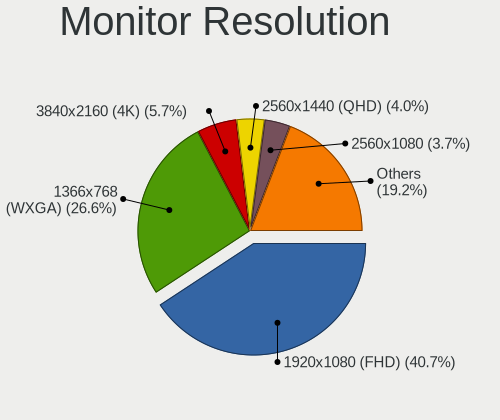
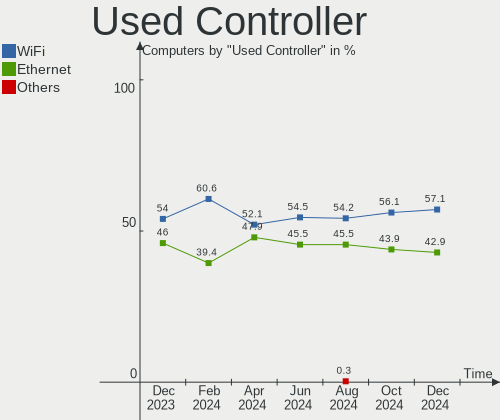
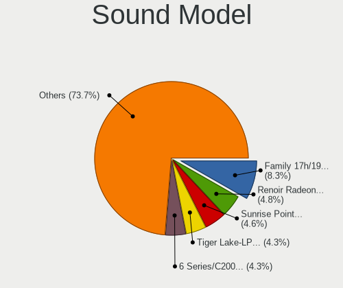
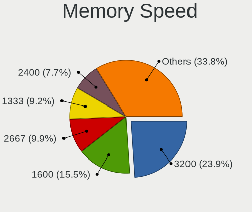
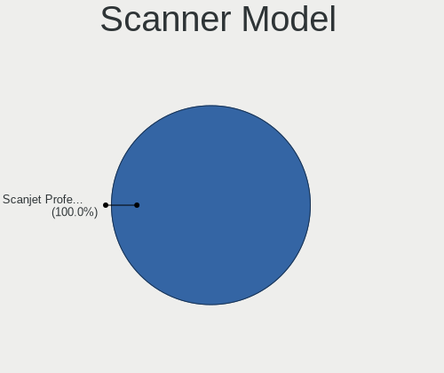
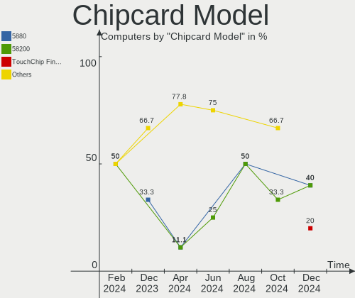

Linux in Brazil - Hardware Trends
---------------------------------

A project to identify most popular hardware characteristics and track their change
over time based on data collected by Linux users at https://Linux-Hardware.org.

Anyone can contribute to this report by the [hw-probe](https://github.com/linuxhw/hw-probe) tool:

    sudo -E hw-probe -all -upload

This is a report for all computer types. See also reports for [desktops](/Location/Brazil/Desktop/README.md) and [notebooks](/Location/Brazil/Notebook/README.md).

Period: Aug, 2023.

Contents
--------

* [ System ](#system)
  - [ OS                       ](#os)
  - [ OS Family                ](#os-family)
  - [ Kernel                   ](#kernel)
  - [ Kernel Family            ](#kernel-family)
  - [ Kernel Major Ver.        ](#kernel-major-ver)
  - [ Arch                     ](#arch)
  - [ DE                       ](#de)
  - [ Display Server           ](#display-server)
  - [ Display Manager          ](#display-manager)
  - [ OS Lang                  ](#os-lang)
  - [ Boot Mode                ](#boot-mode)
  - [ Filesystem               ](#filesystem)
  - [ Part. scheme             ](#part-scheme)
  - [ Dual Boot with Linux/BSD ](#dual-boot-with-linuxbsd)
  - [ Dual Boot (Win)          ](#dual-boot-win)

* [ Board ](#board)
  - [ Vendor                   ](#vendor)
  - [ Model                    ](#model)
  - [ Model Family             ](#model-family)
  - [ MFG Year                 ](#mfg-year)
  - [ Form Factor              ](#form-factor)
  - [ Secure Boot              ](#secure-boot)
  - [ Coreboot                 ](#coreboot)
  - [ RAM Size                 ](#ram-size)
  - [ RAM Used                 ](#ram-used)
  - [ Total Drives             ](#total-drives)
  - [ Has CD-ROM               ](#has-cd-rom)
  - [ Has Ethernet             ](#has-ethernet)
  - [ Has WiFi                 ](#has-wifi)
  - [ Has Bluetooth            ](#has-bluetooth)

* [ Location ](#location)
  - [ Country                  ](#country)
  - [ City                     ](#city)

* [ Drives ](#drives)
  - [ Drive Vendor             ](#drive-vendor)
  - [ Drive Model              ](#drive-model)
  - [ HDD Vendor               ](#hdd-vendor)
  - [ SSD Vendor               ](#ssd-vendor)
  - [ Drive Kind               ](#drive-kind)
  - [ Drive Connector          ](#drive-connector)
  - [ Drive Size               ](#drive-size)
  - [ Space Total              ](#space-total)
  - [ Space Used               ](#space-used)
  - [ Malfunc. Drives          ](#malfunc-drives)
  - [ Malfunc. Drive Vendor    ](#malfunc-drive-vendor)
  - [ Malfunc. HDD Vendor      ](#malfunc-hdd-vendor)
  - [ Malfunc. Drive Kind      ](#malfunc-drive-kind)
  - [ Failed Drives            ](#failed-drives)
  - [ Failed Drive Vendor      ](#failed-drive-vendor)
  - [ Drive Status             ](#drive-status)

* [ Storage controller ](#storage-controller)
  - [ Storage Vendor           ](#storage-vendor)
  - [ Storage Model            ](#storage-model)
  - [ Storage Kind             ](#storage-kind)

* [ Processor ](#processor)
  - [ CPU Vendor               ](#cpu-vendor)
  - [ CPU Model                ](#cpu-model)
  - [ CPU Model Family         ](#cpu-model-family)
  - [ CPU Cores                ](#cpu-cores)
  - [ CPU Sockets              ](#cpu-sockets)
  - [ CPU Threads              ](#cpu-threads)
  - [ CPU Op-Modes             ](#cpu-op-modes)
  - [ CPU Microcode            ](#cpu-microcode)
  - [ CPU Microarch            ](#cpu-microarch)

* [ Graphics ](#graphics)
  - [ GPU Vendor               ](#gpu-vendor)
  - [ GPU Model                ](#gpu-model)
  - [ GPU Combo                ](#gpu-combo)
  - [ GPU Driver               ](#gpu-driver)
  - [ GPU Memory               ](#gpu-memory)

* [ Monitor ](#monitor)
  - [ Monitor Vendor           ](#monitor-vendor)
  - [ Monitor Model            ](#monitor-model)
  - [ Monitor Resolution       ](#monitor-resolution)
  - [ Monitor Diagonal         ](#monitor-diagonal)
  - [ Monitor Width            ](#monitor-width)
  - [ Aspect Ratio             ](#aspect-ratio)
  - [ Monitor Area             ](#monitor-area)
  - [ Pixel Density            ](#pixel-density)
  - [ Multiple Monitors        ](#multiple-monitors)

* [ Network ](#network)
  - [ Net Controller Vendor    ](#net-controller-vendor)
  - [ Net Controller Model     ](#net-controller-model)
  - [ Wireless Vendor          ](#wireless-vendor)
  - [ Wireless Model           ](#wireless-model)
  - [ Ethernet Vendor          ](#ethernet-vendor)
  - [ Ethernet Model           ](#ethernet-model)
  - [ Net Controller Kind      ](#net-controller-kind)
  - [ Used Controller          ](#used-controller)
  - [ NICs                     ](#nics)
  - [ IPv6                     ](#ipv6)

* [ Bluetooth ](#bluetooth)
  - [ Bluetooth Vendor         ](#bluetooth-vendor)
  - [ Bluetooth Model          ](#bluetooth-model)

* [ Sound ](#sound)
  - [ Sound Vendor             ](#sound-vendor)
  - [ Sound Model              ](#sound-model)

* [ Memory ](#memory)
  - [ Memory Vendor            ](#memory-vendor)
  - [ Memory Model             ](#memory-model)
  - [ Memory Kind              ](#memory-kind)
  - [ Memory Form Factor       ](#memory-form-factor)
  - [ Memory Size              ](#memory-size)
  - [ Memory Speed             ](#memory-speed)

* [ Printers & scanners ](#printers--scanners)
  - [ Printer Vendor           ](#printer-vendor)
  - [ Printer Model            ](#printer-model)
  - [ Scanner Vendor           ](#scanner-vendor)
  - [ Scanner Model            ](#scanner-model)

* [ Camera ](#camera)
  - [ Camera Vendor            ](#camera-vendor)
  - [ Camera Model             ](#camera-model)

* [ Security ](#security)
  - [ Fingerprint Vendor       ](#fingerprint-vendor)
  - [ Fingerprint Model        ](#fingerprint-model)
  - [ Chipcard Vendor          ](#chipcard-vendor)
  - [ Chipcard Model           ](#chipcard-model)

* [ Unsupported ](#unsupported)
  - [ Unsupported Devices      ](#unsupported-devices)
  - [ Unsupported Device Types ](#unsupported-device-types)

System
------

OS
--

Installed operating systems

| Name                         | Computers | Percent |
|------------------------------|-----------|---------|
| OpenMandriva 23.08           | 52        | 15.29%  |
| Ubuntu 22.04                 | 35        | 10.29%  |
| Fedora 38                    | 30        | 8.82%   |
| Linux Mint 21.2              | 22        | 6.47%   |
| Pop!_OS 22.04                | 16        | 4.71%   |
| Ubuntu 23.04                 | 13        | 3.82%   |
| OpenMandriva 23.03           | 13        | 3.82%   |
| Linux Mint 21.1              | 13        | 3.82%   |
| Debian 12                    | 12        | 3.53%   |
| Zorin 16                     | 10        | 2.94%   |
| Arch Rolling                 | 9         | 2.65%   |
| Endless 3.9.3-nexthw1        | 7         | 2.06%   |
| ArcoLinux Rolling            | 6         | 1.76%   |
| openSUSE Tumbleweed-XXXXXXXX | 5         | 1.47%   |
| Manjaro                      | 5         | 1.47%   |
| Xubuntu 22.04                | 4         | 1.18%   |
| Xero Rolling                 | 4         | 1.18%   |
| Manjaro 23.0.0               | 4         | 1.18%   |
| LMDE 5                       | 4         | 1.18%   |
| Kubuntu 23.04                | 4         | 1.18%   |
| Debian                       | 4         | 1.18%   |
| Ubuntu MATE 22.04            | 3         | 0.88%   |
| Ubuntu 22.10                 | 3         | 0.88%   |
| Ubuntu 20.04                 | 3         | 0.88%   |
| Ubuntu 18.04                 | 3         | 0.88%   |
| openSUSE Leap-15.5           | 3         | 0.88%   |
| Xubuntu 23.04                | 2         | 0.59%   |
| Ubuntu 23.10                 | 2         | 0.59%   |
| ROSA 12.4                    | 2         | 0.59%   |
| RHEL 9                       | 2         | 0.59%   |
| OpenMandriva 4.3             | 2         | 0.59%   |
| OpenMandriva 23.07           | 2         | 0.59%   |
| Lubuntu 23.04                | 2         | 0.59%   |
| Linux Mint 21                | 2         | 0.59%   |
| Kubuntu 22.04                | 2         | 0.59%   |
| Endless 5.0.5                | 2         | 0.59%   |
| Debian 11                    | 2         | 0.59%   |
| Xubuntu 20.04                | 1         | 0.29%   |
| Ubuntu Budgie 22.04          | 1         | 0.29%   |
| Pop!_OS 20.04                | 1         | 0.29%   |

OS Family
---------

OS without a version

| Name                  | Computers | Percent |
|-----------------------|-----------|---------|
| OpenMandriva          | 71        | 20.88%  |
| Ubuntu                | 59        | 17.35%  |
| Linux Mint            | 41        | 12.06%  |
| Fedora                | 31        | 9.12%   |
| Debian                | 18        | 5.29%   |
| Pop!_OS               | 17        | 5%      |
| Zorin                 | 10        | 2.94%   |
| openSUSE              | 9         | 2.65%   |
| Manjaro               | 9         | 2.65%   |
| Endless               | 9         | 2.65%   |
| Arch                  | 9         | 2.65%   |
| Xubuntu               | 7         | 2.06%   |
| ArcoLinux             | 7         | 2.06%   |
| Kubuntu               | 6         | 1.76%   |
| Xero                  | 4         | 1.18%   |
| LMDE                  | 4         | 1.18%   |
| Ubuntu MATE           | 3         | 0.88%   |
| ROSA                  | 2         | 0.59%   |
| RHEL                  | 2         | 0.59%   |
| Nobara                | 2         | 0.59%   |
| Lubuntu               | 2         | 0.59%   |
| Kali                  | 2         | 0.59%   |
| Garuda Linux          | 2         | 0.59%   |
| Elementary            | 2         | 0.59%   |
| Artix                 | 2         | 0.59%   |
| Ubuntu Budgie         | 1         | 0.29%   |
| Peppermint            | 1         | 0.29%   |
| org.kde.Platform      | 1         | 0.29%   |
| NixOS                 | 1         | 0.29%   |
| KDE neon              | 1         | 0.29%   |
| Instaladorpdv-rc23205 | 1         | 0.29%   |
| Gentoo                | 1         | 0.29%   |
| Clear Linux           | 1         | 0.29%   |
| CentOS                | 1         | 0.29%   |
| BigLinux              | 1         | 0.29%   |

Kernel
------

Version of the Linux kernel

| Version                           | Computers | Percent |
|-----------------------------------|-----------|---------|
| 6.2.0-26-generic                  | 37        | 10.88%  |
| 6.4.11-desktop-1omv2390           | 33        | 9.71%   |
| 5.15.0-78-generic                 | 29        | 8.53%   |
| 6.4.8-desktop-2omv2390            | 19        | 5.59%   |
| 6.2.0-27-generic                  | 13        | 3.82%   |
| 5.15.0-79-generic                 | 13        | 3.82%   |
| 6.2.6-desktop-1omv2390            | 12        | 3.53%   |
| 6.4.6-76060406-generic            | 10        | 2.94%   |
| 5.11.0-12-generic                 | 7         | 2.06%   |
| 6.4.7-200.fc38.x86_64             | 6         | 1.76%   |
| 6.4.10-200.fc38.x86_64            | 6         | 1.76%   |
| 6.2.6-76060206-generic            | 6         | 1.76%   |
| 6.1.0-10-amd64                    | 6         | 1.76%   |
| 6.4.11-200.fc38.x86_64            | 5         | 1.47%   |
| 5.15.0-76-generic                 | 5         | 1.47%   |
| 6.4.6-200.fc38.x86_64             | 4         | 1.18%   |
| 6.1.0-11-amd64                    | 4         | 1.18%   |
| 6.4.9-arch1-1                     | 3         | 0.88%   |
| 6.4.8-arch1-1                     | 3         | 0.88%   |
| 6.4.10-arch1-1                    | 3         | 0.88%   |
| 6.4.0-1-amd64                     | 3         | 0.88%   |
| 6.2.9-300.fc38.x86_64             | 3         | 0.88%   |
| 6.2.0-31-generic                  | 3         | 0.88%   |
| 6.1.41-1-MANJARO                  | 3         | 0.88%   |
| 5.19.0-50-generic                 | 3         | 0.88%   |
| 5.19.0-46-generic                 | 3         | 0.88%   |
| 6.4.9-zen1-1-zen                  | 2         | 0.59%   |
| 6.4.8-200.fc38.x86_64             | 2         | 0.59%   |
| 6.4.8-1-default                   | 2         | 0.59%   |
| 6.4.12-200.fc38.x86_64            | 2         | 0.59%   |
| 6.4.11-arch2-1                    | 2         | 0.59%   |
| 6.4.0-060400-generic              | 2         | 0.59%   |
| 6.3.5-desktop-3omv2390            | 2         | 0.59%   |
| 6.3.0-7-generic                   | 2         | 0.59%   |
| 6.1.38-generic-1rosa2021.1-x86_64 | 2         | 0.59%   |
| 5.16.7-desktop-1omv4003           | 2         | 0.59%   |
| 5.15.0-47-generic                 | 2         | 0.59%   |
| 5.14.21-150500.55.19-default      | 2         | 0.59%   |
| 5.14.0-284.25.1.el9_2.x86_64      | 2         | 0.59%   |
| 5.10.0-24-amd64                   | 2         | 0.59%   |

Kernel Family
-------------

Linux kernel without a distro release

| Version | Computers | Percent |
|---------|-----------|---------|
| 6.2.0   | 57        | 16.76%  |
| 5.15.0  | 53        | 15.59%  |
| 6.4.11  | 44        | 12.94%  |
| 6.4.8   | 27        | 7.94%   |
| 6.2.6   | 18        | 5.29%   |
| 6.4.6   | 16        | 4.71%   |
| 6.1.0   | 14        | 4.12%   |
| 6.4.7   | 9         | 2.65%   |
| 6.4.10  | 9         | 2.65%   |
| 6.4.9   | 8         | 2.35%   |
| 5.19.0  | 7         | 2.06%   |
| 5.11.0  | 7         | 2.06%   |
| 6.4.12  | 6         | 1.76%   |
| 5.4.0   | 6         | 1.76%   |
| 6.4.0   | 5         | 1.47%   |
| 6.1.41  | 4         | 1.18%   |
| 5.14.21 | 4         | 1.18%   |
| 6.4.4   | 3         | 0.88%   |
| 6.3.0   | 3         | 0.88%   |
| 6.2.9   | 3         | 0.88%   |
| 6.1.38  | 3         | 0.88%   |
| 5.10.0  | 3         | 0.88%   |
| 6.3.5   | 2         | 0.59%   |
| 6.3.12  | 2         | 0.59%   |
| 6.1.49  | 2         | 0.59%   |
| 5.16.7  | 2         | 0.59%   |
| 5.14.0  | 2         | 0.59%   |
| 4.15.0  | 2         | 0.59%   |
| 6.4.3   | 1         | 0.29%   |
| 6.3.8   | 1         | 0.29%   |
| 6.2.16  | 1         | 0.29%   |
| 6.2.1   | 1         | 0.29%   |
| 6.1.8   | 1         | 0.29%   |
| 6.1.46  | 1         | 0.29%   |
| 6.1.45  | 1         | 0.29%   |
| 6.1.30  | 1         | 0.29%   |
| 6.1.1   | 1         | 0.29%   |
| 6.0.12  | 1         | 0.29%   |
| 5.9.0   | 1         | 0.29%   |
| 5.16.0  | 1         | 0.29%   |

Kernel Major Ver.
-----------------

Linux kernel major version

| Version | Computers | Percent |
|---------|-----------|---------|
| 6.4     | 128       | 37.65%  |
| 6.2     | 80        | 23.53%  |
| 5.15    | 56        | 16.47%  |
| 6.1     | 28        | 8.24%   |
| 6.3     | 8         | 2.35%   |
| 5.19    | 7         | 2.06%   |
| 5.11    | 7         | 2.06%   |
| 5.4     | 6         | 1.76%   |
| 5.14    | 6         | 1.76%   |
| 5.10    | 4         | 1.18%   |
| 5.16    | 3         | 0.88%   |
| 4.9     | 2         | 0.59%   |
| 4.15    | 2         | 0.59%   |
| 6.0     | 1         | 0.29%   |
| 5.9     | 1         | 0.29%   |
| 3.10    | 1         | 0.29%   |

Arch
----

OS architecture (x86_64, i586, etc.)

| Name    | Computers | Percent |
|---------|-----------|---------|
| x86_64  | 335       | 98.53%  |
| aarch64 | 4         | 1.18%   |
| i686    | 1         | 0.29%   |

DE
--

Desktop Environment

| Name          | Computers | Percent |
|---------------|-----------|---------|
| GNOME         | 153       | 45%     |
| KDE5          | 91        | 26.76%  |
| X-Cinnamon    | 33        | 9.71%   |
| XFCE          | 26        | 7.65%   |
| MATE          | 9         | 2.65%   |
| LXQt          | 7         | 2.06%   |
| Unknown       | 6         | 1.76%   |
| Pantheon      | 2         | 0.59%   |
| i3            | 2         | 0.59%   |
| Cinnamon      | 2         | 0.59%   |
| Budgie        | 2         | 0.59%   |
| sway          | 1         | 0.29%   |
| Phosh:GNOME   | 1         | 0.29%   |
| LXDE          | 1         | 0.29%   |
| Lubuntu       | 1         | 0.29%   |
| Hyprland      | 1         | 0.29%   |
| GNOME Classic | 1         | 0.29%   |
| Deepin        | 1         | 0.29%   |

Display Server
--------------

X11 or Wayland

| Name    | Computers | Percent |
|---------|-----------|---------|
| X11     | 191       | 56.18%  |
| Wayland | 143       | 42.06%  |
| Unknown | 5         | 1.47%   |
| Tty     | 1         | 0.29%   |

Display Manager
---------------

SDDM, LightDM, etc.

| Name    | Computers | Percent |
|---------|-----------|---------|
| Unknown | 149       | 43.82%  |
| SDDM    | 84        | 24.71%  |
| GDM3    | 52        | 15.29%  |
| LightDM | 30        | 8.82%   |
| GDM     | 24        | 7.06%   |
| XDM     | 1         | 0.29%   |

OS Lang
-------

Language

| Lang       | Computers | Percent |
|------------|-----------|---------|
| pt_BR      | 249       | 73.24%  |
| en_US      | 71        | 20.88%  |
| C          | 6         | 1.76%   |
| en_GB      | 5         | 1.47%   |
| pt_PT      | 3         | 0.88%   |
| Unknown    | 2         | 0.59%   |
| es_PY      | 1         | 0.29%   |
| en_US.UTF8 | 1         | 0.29%   |
| en_IE.UTF8 | 1         | 0.29%   |
| en_CA      | 1         | 0.29%   |

Boot Mode
---------

EFI or BIOS

| Mode | Computers | Percent |
|------|-----------|---------|
| BIOS | 186       | 54.71%  |
| EFI  | 154       | 45.29%  |

Filesystem
----------

Type of filesystem

| Type    | Computers | Percent |
|---------|-----------|---------|
| Ext4    | 191       | 56.18%  |
| Btrfs   | 57        | 16.76%  |
| Overlay | 41        | 12.06%  |
| Tmpfs   | 39        | 11.47%  |
| Xfs     | 7         | 2.06%   |
| Zfs     | 2         | 0.59%   |
| F2fs    | 1         | 0.29%   |
| Ext3    | 1         | 0.29%   |
| Ext2    | 1         | 0.29%   |

Part. scheme
------------

Scheme of partitioning

| Type    | Computers | Percent |
|---------|-----------|---------|
| GPT     | 156       | 45.88%  |
| Unknown | 142       | 41.76%  |
| MBR     | 42        | 12.35%  |

Dual Boot with Linux/BSD
------------------------

Hosting more than one Linux/BSD

| Dual boot | Computers | Percent |
|-----------|-----------|---------|
| No        | 283       | 83.24%  |
| Yes       | 57        | 16.76%  |

Dual Boot (Win)
---------------

Hosting Linux and Windows

| Dual boot | Computers | Percent |
|-----------|-----------|---------|
| No        | 261       | 76.76%  |
| Yes       | 79        | 23.24%  |

Board
-----

Vendor
------

Motherboard manufacturer

| Name                   | Computers | Percent |
|------------------------|-----------|---------|
| Dell                   | 44        | 12.94%  |
| ASUSTek Computer       | 41        | 12.06%  |
| Lenovo                 | 36        | 10.59%  |
| Acer                   | 33        | 9.71%   |
| Gigabyte Technology    | 25        | 7.35%   |
| Samsung Electronics    | 20        | 5.88%   |
| Intel                  | 20        | 5.88%   |
| Positivo               | 16        | 4.71%   |
| Hewlett-Packard        | 15        | 4.41%   |
| ASRock                 | 11        | 3.24%   |
| MSI                    | 6         | 1.76%   |
| Apple                  | 6         | 1.76%   |
| Itautec                | 5         | 1.47%   |
| Unknown                | 5         | 1.47%   |
| Sony                   | 3         | 0.88%   |
| Positivo Bahia - VAIO  | 3         | 0.88%   |
| Megaware               | 3         | 0.88%   |
| MACHINIST              | 3         | 0.88%   |
| LG Electronics         | 3         | 0.88%   |
| AZW                    | 3         | 0.88%   |
| Avell High Performance | 3         | 0.88%   |
| PCWare                 | 2         | 0.59%   |
| Notebook               | 2         | 0.59%   |
| Multilaser             | 2         | 0.59%   |
| Huanan                 | 2         | 0.59%   |
| Daten Tecnologia       | 2         | 0.59%   |
| Alienware              | 2         | 0.59%   |
| Win element            | 1         | 0.29%   |
| Topstar                | 1         | 0.29%   |
| Timi                   | 1         | 0.29%   |
| TaNix                  | 1         | 0.29%   |
| SZMZ                   | 1         | 0.29%   |
| Supermicro             | 1         | 0.29%   |
| Semp Toshiba           | 1         | 0.29%   |
| Red Hat                | 1         | 0.29%   |
| QIYIDA                 | 1         | 0.29%   |
| Packard Bell           | 1         | 0.29%   |
| OEM                    | 1         | 0.29%   |
| Microsoft              | 1         | 0.29%   |
| MANCER                 | 1         | 0.29%   |

Model
-----

Motherboard model

| Name                                                         | Computers | Percent |
|--------------------------------------------------------------|-----------|---------|
| ASUS VivoBook_ASUSLaptop X515EA_X515EA                       | 6         | 1.76%   |
| Dell Inspiron 15-3567                                        | 5         | 1.47%   |
| Unknown                                                      | 5         | 1.47%   |
| Samsung 300E5M/300E5L                                        | 4         | 1.18%   |
| Samsung 340XAA/350XAA/550XAA                                 | 3         | 0.88%   |
| Lenovo IdeaPad S145-15IWL 81S9                               | 3         | 0.88%   |
| Lenovo IdeaPad S145-15IIL 82DJ                               | 3         | 0.88%   |
| Intel H81                                                    | 3         | 0.88%   |
| Intel H61                                                    | 3         | 0.88%   |
| Intel H55                                                    | 3         | 0.88%   |
| HP Compaq 6005 Pro SFF PC                                    | 3         | 0.88%   |
| Positivo Mobile                                              | 2         | 0.59%   |
| Positivo CHT14B                                              | 2         | 0.59%   |
| Positivo C14CU51                                             | 2         | 0.59%   |
| MSI MS-7721                                                  | 2         | 0.59%   |
| Megaware MW-G31T-M7                                          | 2         | 0.59%   |
| Lenovo IdeaPad Gaming 3 15IMH05 82CG                         | 2         | 0.59%   |
| Lenovo IdeaPad 3 15IGL05 82BU                                | 2         | 0.59%   |
| Lenovo IdeaPad 3 15ALC6 82MF                                 | 2         | 0.59%   |
| Intel X79 (INTEL Xeon E5/Corei7 DMI2 - C600/C200 Cipset V307 | 2         | 0.59%   |
| Intel B75                                                    | 2         | 0.59%   |
| Gigabyte G31M-ES2L                                           | 2         | 0.59%   |
| Gigabyte B550M AORUS ELITE                                   | 2         | 0.59%   |
| Gigabyte B450M GAMING                                        | 2         | 0.59%   |
| Gigabyte B450 AORUS M                                        | 2         | 0.59%   |
| Dell PowerEdge 2950                                          | 2         | 0.59%   |
| Dell Inspiron N4050                                          | 2         | 0.59%   |
| Dell Inspiron 5566                                           | 2         | 0.59%   |
| Dell Inspiron 5558                                           | 2         | 0.59%   |
| Dell Inspiron 15 3515                                        | 2         | 0.59%   |
| Dell Inspiron 15 3511                                        | 2         | 0.59%   |
| Dell G3 3579                                                 | 2         | 0.59%   |
| Dell G15 5520                                                | 2         | 0.59%   |
| AZW SER                                                      | 2         | 0.59%   |
| ASUS TUF Gaming X570-PLUS_BR                                 | 2         | 0.59%   |
| ASUS M5A78L-M PLUS/USB3                                      | 2         | 0.59%   |
| ASRock A320M-HDV R4.0                                        | 2         | 0.59%   |
| Apple MacBookPro8,1                                          | 2         | 0.59%   |
| Acer Nitro AN517-54                                          | 2         | 0.59%   |
| Acer Aspire E5-553G                                          | 2         | 0.59%   |

Model Family
------------

Motherboard model prefix

| Name                | Computers | Percent |
|---------------------|-----------|---------|
| Acer Aspire         | 25        | 7.35%   |
| Dell Inspiron       | 23        | 6.76%   |
| Lenovo IdeaPad      | 19        | 5.59%   |
| ASUS VivoBook       | 9         | 2.65%   |
| ASUS TUF            | 8         | 2.35%   |
| Lenovo ThinkPad     | 7         | 2.06%   |
| Acer Nitro          | 7         | 2.06%   |
| Itautec Infoway     | 5         | 1.47%   |
| Dell OptiPlex       | 5         | 1.47%   |
| ASUS M5A78L-M       | 5         | 1.47%   |
| Unknown             | 5         | 1.47%   |
| Samsung 300E5M      | 4         | 1.18%   |
| HP Pavilion         | 4         | 1.18%   |
| HP Compaq           | 4         | 1.18%   |
| Dell Latitude       | 4         | 1.18%   |
| Samsung 340XAA      | 3         | 0.88%   |
| Lenovo ThinkCentre  | 3         | 0.88%   |
| Intel H81           | 3         | 0.88%   |
| Intel H61           | 3         | 0.88%   |
| Intel H55           | 3         | 0.88%   |
| Gigabyte B450M      | 3         | 0.88%   |
| Dell Vostro         | 3         | 0.88%   |
| Dell PowerEdge      | 3         | 0.88%   |
| Dell G15            | 3         | 0.88%   |
| Positivo Mobile     | 2         | 0.59%   |
| Positivo CHT14B     | 2         | 0.59%   |
| Positivo C14CU51    | 2         | 0.59%   |
| MSI MS-7721         | 2         | 0.59%   |
| Megaware MW-G31T-M7 | 2         | 0.59%   |
| Intel X79           | 2         | 0.59%   |
| Intel B75           | 2         | 0.59%   |
| HP 250              | 2         | 0.59%   |
| Gigabyte H410M      | 2         | 0.59%   |
| Gigabyte G31M-ES2L  | 2         | 0.59%   |
| Gigabyte B550M      | 2         | 0.59%   |
| Gigabyte B450       | 2         | 0.59%   |
| Gigabyte A520M      | 2         | 0.59%   |
| Dell G3             | 2         | 0.59%   |
| AZW SER             | 2         | 0.59%   |
| ASUS PRIME          | 2         | 0.59%   |

MFG Year
--------

Motherboard manufacture year

| Year    | Computers | Percent |
|---------|-----------|---------|
| 2020    | 37        | 10.88%  |
| 2021    | 35        | 10.29%  |
| 2018    | 30        | 8.82%   |
| 2019    | 27        | 7.94%   |
| 2011    | 27        | 7.94%   |
| 2012    | 26        | 7.65%   |
| 2016    | 23        | 6.76%   |
| 2022    | 22        | 6.47%   |
| 2017    | 22        | 6.47%   |
| 2013    | 18        | 5.29%   |
| 2014    | 16        | 4.71%   |
| 2010    | 15        | 4.41%   |
| 2009    | 10        | 2.94%   |
| 2008    | 9         | 2.65%   |
| 2023    | 8         | 2.35%   |
| 2015    | 7         | 2.06%   |
| Unknown | 4         | 1.18%   |
| 2007    | 2         | 0.59%   |
| 2006    | 2         | 0.59%   |

Form Factor
-----------

Physical design of the computer

| Name           | Computers | Percent |
|----------------|-----------|---------|
| Notebook       | 185       | 54.41%  |
| Desktop        | 135       | 39.71%  |
| Mini pc        | 5         | 1.47%   |
| System on chip | 4         | 1.18%   |
| Convertible    | 4         | 1.18%   |
| Server         | 4         | 1.18%   |
| All in one     | 2         | 0.59%   |
| Tablet         | 1         | 0.29%   |

Secure Boot
-----------

Enabled or disabled

| State    | Computers | Percent |
|----------|-----------|---------|
| Disabled | 313       | 92.06%  |
| Enabled  | 27        | 7.94%   |

Coreboot
--------

Have coreboot on board

| Used | Computers | Percent |
|------|-----------|---------|
| No   | 339       | 99.71%  |
| Yes  | 1         | 0.29%   |

RAM Size
--------

Total RAM memory

| Size in GB      | Computers | Percent |
|-----------------|-----------|---------|
| 4.01-8.0        | 89        | 26.18%  |
| 16.01-24.0      | 76        | 22.35%  |
| 3.01-4.0        | 72        | 21.18%  |
| 8.01-16.0       | 45        | 13.24%  |
| 32.01-64.0      | 26        | 7.65%   |
| 1.01-2.0        | 13        | 3.82%   |
| 24.01-32.0      | 8         | 2.35%   |
| 64.01-256.0     | 6         | 1.76%   |
| 2.01-3.0        | 4         | 1.18%   |
| More than 256.0 | 1         | 0.29%   |

RAM Used
--------

Used RAM memory

| Used GB    | Computers | Percent |
|------------|-----------|---------|
| 1.01-2.0   | 99        | 29.12%  |
| 2.01-3.0   | 95        | 27.94%  |
| 4.01-8.0   | 62        | 18.24%  |
| 3.01-4.0   | 45        | 13.24%  |
| 8.01-16.0  | 16        | 4.71%   |
| 0.51-1.0   | 16        | 4.71%   |
| 16.01-24.0 | 6         | 1.76%   |
| 0.01-0.5   | 1         | 0.29%   |

Total Drives
------------

Number of drives on board

| Drives | Computers | Percent |
|--------|-----------|---------|
| 1      | 181       | 53.24%  |
| 2      | 111       | 32.65%  |
| 3      | 25        | 7.35%   |
| 4      | 8         | 2.35%   |
| 0      | 5         | 1.47%   |
| 6      | 4         | 1.18%   |
| 5      | 4         | 1.18%   |
| 8      | 1         | 0.29%   |
| 7      | 1         | 0.29%   |

Has CD-ROM
----------

Has CD-ROM on board

| Presented | Computers | Percent |
|-----------|-----------|---------|
| No        | 251       | 73.82%  |
| Yes       | 89        | 26.18%  |

Has Ethernet
------------

Has Ethernet on board

| Presented | Computers | Percent |
|-----------|-----------|---------|
| Yes       | 289       | 85%     |
| No        | 51        | 15%     |

Has WiFi
--------

Has WiFi module

| Presented | Computers | Percent |
|-----------|-----------|---------|
| Yes       | 251       | 73.82%  |
| No        | 89        | 26.18%  |

Has Bluetooth
-------------

Has Bluetooth module

| Presented | Computers | Percent |
|-----------|-----------|---------|
| Yes       | 187       | 55%     |
| No        | 153       | 45%     |

Location
--------

Country
-------

Geographic location (country)

| Country | Computers | Percent |
|---------|-----------|---------|
| Brazil  | 340       | 100%    |

City
----

Geographic location (city)

| City                 | Computers | Percent |
|----------------------|-----------|---------|
| Sao Paulo            | 35        | 10.29%  |
| Rio de Janeiro       | 31        | 9.12%   |
| Curitiba             | 14        | 4.12%   |
| Brasília            | 11        | 3.24%   |
| Belo Horizonte       | 11        | 3.24%   |
| Porto Alegre         | 7         | 2.06%   |
| Florianópolis       | 7         | 2.06%   |
| Fortaleza            | 6         | 1.76%   |
| Sorocaba             | 5         | 1.47%   |
| Ribeirao Preto       | 5         | 1.47%   |
| Sao José dos Campos | 4         | 1.18%   |
| Niterói             | 4         | 1.18%   |
| Natal                | 4         | 1.18%   |
| Manaus               | 4         | 1.18%   |
| Aracaju              | 4         | 1.18%   |
| Serra                | 3         | 0.88%   |
| Sao Goncalo          | 3         | 0.88%   |
| Recife               | 3         | 0.88%   |
| Osasco               | 3         | 0.88%   |
| Maringá             | 3         | 0.88%   |
| Goiânia             | 3         | 0.88%   |
| Criciúma            | 3         | 0.88%   |
| Caxias do Sul        | 3         | 0.88%   |
| Campinas             | 3         | 0.88%   |
| Vicosa               | 2         | 0.59%   |
| Uberlândia          | 2         | 0.59%   |
| Uberaba              | 2         | 0.59%   |
| Teresopolis          | 2         | 0.59%   |
| Sao Vicente          | 2         | 0.59%   |
| Sao Luís            | 2         | 0.59%   |
| Santo André         | 2         | 0.59%   |
| Salvador             | 2         | 0.59%   |
| Palmas               | 2         | 0.59%   |
| Palhoca              | 2         | 0.59%   |
| Novo Hamburgo        | 2         | 0.59%   |
| Nova Iguaçu         | 2         | 0.59%   |
| Maceió              | 2         | 0.59%   |
| Lucas do Rio Verde   | 2         | 0.59%   |
| Lavras               | 2         | 0.59%   |
| Juazeiro do Norte    | 2         | 0.59%   |

Drives
------

Drive Vendor
------------

Hard drive vendors

| Vendor                         | Computers | Drives | Percent |
|--------------------------------|-----------|--------|---------|
| Seagate                        | 73        | 89     | 14.37%  |
| WDC                            | 72        | 81     | 14.17%  |
| Kingston                       | 65        | 73     | 12.8%   |
| Samsung Electronics            | 43        | 46     | 8.46%   |
| SanDisk                        | 23        | 29     | 4.53%   |
| China                          | 22        | 23     | 4.33%   |
| Toshiba                        | 17        | 18     | 3.35%   |
| Unknown                        | 16        | 20     | 3.15%   |
| ADATA Technology               | 16        | 16     | 3.15%   |
| Crucial                        | 13        | 13     | 2.56%   |
| Silicon Motion                 | 11        | 11     | 2.17%   |
| A-DATA Technology              | 10        | 11     | 1.97%   |
| KingSpec                       | 9         | 10     | 1.77%   |
| Unknown                        | 9         | 9      | 1.77%   |
| SK hynix                       | 7         | 9      | 1.38%   |
| Kingston Technology Company    | 7         | 7      | 1.38%   |
| Netac                          | 6         | 6      | 1.18%   |
| Hitachi                        | 6         | 6      | 1.18%   |
| XrayDisk                       | 4         | 4      | 0.79%   |
| Solid State Storage Technology | 4         | 4      | 0.79%   |
| PNY                            | 4         | 4      | 0.79%   |
| Micron/Crucial Technology      | 4         | 4      | 0.79%   |
| MAXIO Technology (Hangzhou)    | 4         | 4      | 0.79%   |
| JMicron Technology             | 4         | 4      | 0.79%   |
| Intel                          | 4         | 4      | 0.79%   |
| Apple                          | 4         | 4      | 0.79%   |
| WALRAM                         | 3         | 3      | 0.59%   |
| Patriot                        | 3         | 3      | 0.59%   |
| HS-SSD-C100                    | 3         | 3      | 0.59%   |
| Team                           | 2         | 2      | 0.39%   |
| SSSTC                          | 2         | 2      | 0.39%   |
| Solid State Storage            | 2         | 3      | 0.39%   |
| LITEON                         | 2         | 2      | 0.39%   |
| KIOXIA                         | 2         | 2      | 0.39%   |
| KingFast                       | 2         | 2      | 0.39%   |
| Fujitsu                        | 2         | 2      | 0.39%   |
| AFOX                           | 2         | 2      | 0.39%   |
| USB3.0                         | 1         | 1      | 0.2%    |
| TO Exter                       | 1         | 1      | 0.2%    |
| ShiJi                          | 1         | 1      | 0.2%    |

Drive Model
-----------

Hard drive models

| Model                                                 | Computers | Percent |
|-------------------------------------------------------|-----------|---------|
| Kingston SA400S37240G 240GB SSD                       | 21        | 3.83%   |
| Kingston SA400S37480G 480GB SSD                       | 12        | 2.19%   |
| Kingston SA400S37120G 120GB SSD                       | 9         | 1.64%   |
| Unknown                                               | 9         | 1.64%   |
| ADATA SM2P32A8-256GC1 256GB                           | 7         | 1.28%   |
| Unknown MMC Card  32GB                                | 6         | 1.09%   |
| Silicon Motion SM2263EN/SM2263XT SSD Controller 256GB | 6         | 1.09%   |
| Seagate ST500LM012 HN-M500MBB 500GB                   | 6         | 1.09%   |
| Seagate ST1000DM010-2EP102 1TB                        | 6         | 1.09%   |
| Samsung NVMe SSD Controller SM981/PM981/PM983 500GB   | 5         | 0.91%   |
| Kingston SV300S37A120G 120GB SSD                      | 5         | 0.91%   |
| WDC WD10SPZX-24Z10 1TB                                | 4         | 0.73%   |
| Toshiba MQ01ABD100 1TB                                | 4         | 0.73%   |
| Seagate ST3500418AS 500GB                             | 4         | 0.73%   |
| Seagate ST2000DM008-2FR102 2TB                        | 4         | 0.73%   |
| Seagate ST1000LM024 HN-M101MBB 1TB                    | 4         | 0.73%   |
| Seagate ST1000DM003-1ER162 1TB                        | 4         | 0.73%   |
| Seagate ST1000DM003-1CH162 1TB                        | 4         | 0.73%   |
| SanDisk SSD PLUS 240GB                                | 4         | 0.73%   |
| Kingston SNV2S500G 500GB                              | 4         | 0.73%   |
| JMicron Generic 1TB                                   | 4         | 0.73%   |
| Crucial CT240BX500SSD1 240GB                          | 4         | 0.73%   |
| China SSD 256GB                                       | 4         | 0.73%   |
| WDC WDS120G2G0A-00JH30 120GB SSD                      | 3         | 0.55%   |
| WDC WD10SPZX-21Z10T0 1TB                              | 3         | 0.55%   |
| WDC WD10JPVX-22JC3T0 1TB                              | 3         | 0.55%   |
| Unknown MMC Card  64GB                                | 3         | 0.55%   |
| Toshiba MQ01ABF050 500GB                              | 3         | 0.55%   |
| Seagate ST500DM002-1BD142 500GB                       | 3         | 0.55%   |
| Seagate ST3500312CS 500GB                             | 3         | 0.55%   |
| SanDisk SSD PLUS 1000GB                               | 3         | 0.55%   |
| Samsung HM321HI 320GB                                 | 3         | 0.55%   |
| Samsung HD502HJ 500GB                                 | 3         | 0.55%   |
| Samsung HD322HJ 320GB                                 | 3         | 0.55%   |
| Samsung HD161HJ 160GB                                 | 3         | 0.55%   |
| PNY CS900 120GB SSD                                   | 3         | 0.55%   |
| Micron/Crucial P2 NVMe PCIe SSD 1TB                   | 3         | 0.55%   |
| Kingston Company SNV2S1000G 1TB                       | 3         | 0.55%   |
| China SSD 120GB                                       | 3         | 0.55%   |
| ADATA SM2P41C3 NVMe 256GB                             | 3         | 0.55%   |

HDD Vendor
----------

Hard disk drive vendors

| Vendor              | Computers | Drives | Percent |
|---------------------|-----------|--------|---------|
| Seagate             | 73        | 89     | 39.25%  |
| WDC                 | 61        | 62     | 32.8%   |
| Samsung Electronics | 22        | 24     | 11.83%  |
| Toshiba             | 15        | 16     | 8.06%   |
| Hitachi             | 6         | 6      | 3.23%   |
| Fujitsu             | 2         | 2      | 1.08%   |
| Apple               | 2         | 2      | 1.08%   |
| WALRAM              | 1         | 1      | 0.54%   |
| USB3.0              | 1         | 1      | 0.54%   |
| SAGE                | 1         | 1      | 0.54%   |
| Maxtor              | 1         | 1      | 0.54%   |
| HGST                | 1         | 1      | 0.54%   |

SSD Vendor
----------

Solid state drive vendors

| Vendor              | Computers | Drives | Percent |
|---------------------|-----------|--------|---------|
| Kingston            | 58        | 64     | 31.69%  |
| China               | 22        | 23     | 12.02%  |
| SanDisk             | 14        | 16     | 7.65%   |
| Crucial             | 12        | 12     | 6.56%   |
| WDC                 | 11        | 12     | 6.01%   |
| KingSpec            | 9         | 10     | 4.92%   |
| Samsung Electronics | 7         | 7      | 3.83%   |
| Unknown             | 5         | 5      | 2.73%   |
| PNY                 | 4         | 4      | 2.19%   |
| Netac               | 4         | 4      | 2.19%   |
| JMicron Technology  | 4         | 4      | 2.19%   |
| Patriot             | 3         | 3      | 1.64%   |
| A-DATA Technology   | 3         | 3      | 1.64%   |
| XrayDisk            | 2         | 2      | 1.09%   |
| Toshiba             | 2         | 2      | 1.09%   |
| Team                | 2         | 2      | 1.09%   |
| LITEON              | 2         | 2      | 1.09%   |
| KingFast            | 2         | 2      | 1.09%   |
| AFOX                | 2         | 2      | 1.09%   |
| WALRAM              | 1         | 1      | 0.55%   |
| TO Exter            | 1         | 1      | 0.55%   |
| OXYBR               | 1         | 1      | 0.55%   |
| NGFF                | 1         | 1      | 0.55%   |
| Lexar               | 1         | 1      | 0.55%   |
| KODAK               | 1         | 1      | 0.55%   |
| KingDian            | 1         | 1      | 0.55%   |
| KEEPDATA            | 1         | 1      | 0.55%   |
| INTEL SS            | 1         | 1      | 0.55%   |
| Intel               | 1         | 1      | 0.55%   |
| HS-SSD-C100         | 1         | 1      | 0.55%   |
| Hewlett-Packard     | 1         | 1      | 0.55%   |
| DUEX                | 1         | 1      | 0.55%   |
| Apple               | 1         | 1      | 0.55%   |
| Advantech           | 1         | 1      | 0.55%   |

Drive Kind
----------

HDD or SSD

| Kind    | Computers | Drives | Percent |
|---------|-----------|--------|---------|
| SSD     | 159       | 194    | 34.79%  |
| HDD     | 159       | 206    | 34.79%  |
| NVMe    | 112       | 130    | 24.51%  |
| MMC     | 14        | 20     | 3.06%   |
| Unknown | 13        | 13     | 2.84%   |

Drive Connector
---------------

SATA, SAS, NVMe, etc.

| Type | Computers | Drives | Percent |
|------|-----------|--------|---------|
| SATA | 256       | 390    | 63.52%  |
| NVMe | 112       | 130    | 27.79%  |
| SAS  | 21        | 23     | 5.21%   |
| MMC  | 14        | 20     | 3.47%   |

Drive Size
----------

Size of hard drive

| Size in TB | Computers | Drives | Percent |
|------------|-----------|--------|---------|
| 0.01-0.5   | 199       | 255    | 62.97%  |
| 0.51-1.0   | 87        | 106    | 27.53%  |
| 1.01-2.0   | 24        | 30     | 7.59%   |
| 3.01-4.0   | 3         | 6      | 0.95%   |
| 2.01-3.0   | 3         | 3      | 0.95%   |

Space Total
-----------

Amount of disk space available on the file system

| Size in GB     | Computers | Percent |
|----------------|-----------|---------|
| 101-250        | 93        | 27.35%  |
| 251-500        | 66        | 19.41%  |
| 501-1000       | 48        | 14.12%  |
| 1-20           | 38        | 11.18%  |
| 1001-2000      | 31        | 9.12%   |
| 51-100         | 24        | 7.06%   |
| More than 3000 | 16        | 4.71%   |
| 21-50          | 10        | 2.94%   |
| 2001-3000      | 7         | 2.06%   |
| Unknown        | 7         | 2.06%   |

Space Used
----------

Amount of used disk space

| Used GB        | Computers | Percent |
|----------------|-----------|---------|
| 1-20           | 127       | 37.35%  |
| 21-50          | 62        | 18.24%  |
| 51-100         | 42        | 12.35%  |
| 101-250        | 38        | 11.18%  |
| 251-500        | 27        | 7.94%   |
| 501-1000       | 20        | 5.88%   |
| 1001-2000      | 12        | 3.53%   |
| Unknown        | 7         | 2.06%   |
| More than 3000 | 3         | 0.88%   |
| 2001-3000      | 2         | 0.59%   |

Malfunc. Drives
---------------

Drive models with a malfunction

| Model                                  | Computers | Drives | Percent |
|----------------------------------------|-----------|--------|---------|
| Seagate ST500LM012 HN-M500MBB 500GB    | 2         | 2      | 4.65%   |
| Samsung Electronics HD161HJ 160GB      | 2         | 2      | 4.65%   |
| Netac SSD 120GB                        | 2         | 2      | 4.65%   |
| JMicron Technology Generic 1TB         | 2         | 2      | 4.65%   |
| WDC WD7500AADS-00M2B0 752GB            | 1         | 1      | 2.33%   |
| WDC WD5000BEVT-00A0RT0 500GB           | 1         | 1      | 2.33%   |
| WDC WD5000AVCS-632DY1 500GB            | 1         | 1      | 2.33%   |
| WDC WD5000AAKX-603CA0 500GB            | 1         | 1      | 2.33%   |
| WDC WD5000AAKS-00A7B0 500GB            | 1         | 1      | 2.33%   |
| WDC WD2500BEVT-22A23T0 208GB           | 1         | 1      | 2.33%   |
| WDC WD10SPZX-24Z10T0 1TB               | 1         | 1      | 2.33%   |
| WDC WD10JPVX-00JC3T0 1TB               | 1         | 1      | 2.33%   |
| Toshiba MQ01ABD100 1TB                 | 1         | 1      | 2.33%   |
| Toshiba MK3259GSXP 320GB               | 1         | 1      | 2.33%   |
| ShiJi 1TB                              | 1         | 1      | 2.33%   |
| Seagate ST9120822AS 120GB              | 1         | 1      | 2.33%   |
| Seagate ST500VT000-1DK142 500GB        | 1         | 1      | 2.33%   |
| Seagate ST500LT012-9WS142 500GB        | 1         | 1      | 2.33%   |
| Seagate ST500LM000-1EJ162 500GB        | 1         | 1      | 2.33%   |
| Seagate ST3802110AS 80GB               | 1         | 1      | 2.33%   |
| Seagate ST3500414CS 500GB              | 1         | 1      | 2.33%   |
| Seagate ST1000LM048-2E7172 1TB         | 1         | 1      | 2.33%   |
| Seagate ST1000LM024 HN-M101MBB 1TB     | 1         | 1      | 2.33%   |
| Seagate ST1000DM003-9YN162 1TB         | 1         | 1      | 2.33%   |
| Seagate ST1000DM003-1ER162 1TB         | 1         | 1      | 2.33%   |
| Samsung Electronics SP1644N 160GB      | 1         | 1      | 2.33%   |
| Samsung Electronics HM160HI 160GB      | 1         | 1      | 2.33%   |
| Samsung Electronics HD322HJ 320GB      | 1         | 1      | 2.33%   |
| SAGE 3639S 500GB                       | 1         | 1      | 2.33%   |
| Netac SSD 512GB                        | 1         | 1      | 2.33%   |
| Maxtor STM3160215AS 160GB              | 1         | 1      | 2.33%   |
| LITEON CV8-8E128-HP 128GB SSD          | 1         | 1      | 2.33%   |
| Kingston SA400S37120G 120GB SSD        | 1         | 3      | 2.33%   |
| KEEPDATA SSD 120GB                     | 1         | 1      | 2.33%   |
| Hitachi HDS721010DLE630 1TB            | 1         | 1      | 2.33%   |
| China SATA SSD 120GB                   | 1         | 1      | 2.33%   |
| China AS-240 240GB SSD                 | 1         | 1      | 2.33%   |
| A-DATA Technology IM2P33F8ABR1-1TB     | 1         | 1      | 2.33%   |
| A-DATA Technology IM2P33F3A NVMe 256GB | 1         | 1      | 2.33%   |

Malfunc. Drive Vendor
---------------------

Vendors of faulty drives

| Vendor              | Computers | Drives | Percent |
|---------------------|-----------|--------|---------|
| Seagate             | 12        | 12     | 27.91%  |
| WDC                 | 8         | 8      | 18.6%   |
| Samsung Electronics | 5         | 5      | 11.63%  |
| Netac               | 3         | 3      | 6.98%   |
| Toshiba             | 2         | 2      | 4.65%   |
| JMicron Technology  | 2         | 2      | 4.65%   |
| China               | 2         | 2      | 4.65%   |
| A-DATA Technology   | 2         | 2      | 4.65%   |
| ShiJi               | 1         | 1      | 2.33%   |
| SAGE                | 1         | 1      | 2.33%   |
| Maxtor              | 1         | 1      | 2.33%   |
| LITEON              | 1         | 1      | 2.33%   |
| Kingston            | 1         | 3      | 2.33%   |
| KEEPDATA            | 1         | 1      | 2.33%   |
| Hitachi             | 1         | 1      | 2.33%   |

Malfunc. HDD Vendor
-------------------

Vendors of faulty HDD drives

| Vendor              | Computers | Drives | Percent |
|---------------------|-----------|--------|---------|
| Seagate             | 12        | 12     | 40%     |
| WDC                 | 8         | 8      | 26.67%  |
| Samsung Electronics | 5         | 5      | 16.67%  |
| Toshiba             | 2         | 2      | 6.67%   |
| SAGE                | 1         | 1      | 3.33%   |
| Maxtor              | 1         | 1      | 3.33%   |
| Hitachi             | 1         | 1      | 3.33%   |

Malfunc. Drive Kind
-------------------

Kinds of faulty drives

| Kind | Computers | Drives | Percent |
|------|-----------|--------|---------|
| HDD  | 26        | 30     | 66.67%  |
| SSD  | 10        | 12     | 25.64%  |
| NVMe | 3         | 3      | 7.69%   |

Failed Drives
-------------

Failed drive models

| Model                                           | Computers | Drives | Percent |
|-------------------------------------------------|-----------|--------|---------|
| WDC WD3200BPVT-22JJ5T0 320GB                    | 1         | 1      | 20%     |
| Seagate ST3250318AS 250GB                       | 1         | 1      | 20%     |
| Samsung Electronics MZMPC032HBCD-000H1 32GB SSD | 1         | 1      | 20%     |
| Samsung Electronics HD502HJ 500GB               | 1         | 2      | 20%     |
| Hitachi HTS545032B9A300 320GB                   | 1         | 1      | 20%     |

Failed Drive Vendor
-------------------

Failed drive vendors

| Vendor              | Computers | Drives | Percent |
|---------------------|-----------|--------|---------|
| Samsung Electronics | 2         | 3      | 40%     |
| WDC                 | 1         | 1      | 20%     |
| Seagate             | 1         | 1      | 20%     |
| Hitachi             | 1         | 1      | 20%     |

Drive Status
------------

Number of failed and malfunc. drives

| Status   | Computers | Drives | Percent |
|----------|-----------|--------|---------|
| Detected | 203       | 332    | 56.55%  |
| Works    | 113       | 180    | 31.48%  |
| Malfunc  | 38        | 45     | 10.58%  |
| Failed   | 5         | 6      | 1.39%   |

Storage controller
------------------

Storage Vendor
--------------

Storage controller vendors

| Vendor                           | Computers | Percent |
|----------------------------------|-----------|---------|
| Intel                            | 245       | 56.71%  |
| AMD                              | 59        | 13.66%  |
| ADATA Technology                 | 23        | 5.32%   |
| SanDisk                          | 17        | 3.94%   |
| Samsung Electronics              | 16        | 3.7%    |
| Kingston Technology Company      | 14        | 3.24%   |
| Silicon Motion                   | 13        | 3.01%   |
| Solid State Storage Technology   | 8         | 1.85%   |
| SK hynix                         | 7         | 1.62%   |
| Micron/Crucial Technology        | 5         | 1.16%   |
| MAXIO Technology (Hangzhou)      | 4         | 0.93%   |
| JMicron Technology               | 3         | 0.69%   |
| TenaFe                           | 2         | 0.46%   |
| Netac Technology                 | 2         | 0.46%   |
| Marvell Technology Group         | 2         | 0.46%   |
| KIOXIA                           | 2         | 0.46%   |
| Dell                             | 2         | 0.46%   |
| ASMedia Technology               | 2         | 0.46%   |
| Silicon Integrated Systems [SiS] | 1         | 0.23%   |
| Realtek Semiconductor            | 1         | 0.23%   |
| Phison Electronics               | 1         | 0.23%   |
| Nvidia                           | 1         | 0.23%   |
| Micron Technology                | 1         | 0.23%   |
| Apple                            | 1         | 0.23%   |

Storage Model
-------------

Storage controller models

| Model                                                                                   | Computers | Percent |
|-----------------------------------------------------------------------------------------|-----------|---------|
| AMD FCH SATA Controller [AHCI mode]                                                     | 33        | 6.48%   |
| Intel Sunrise Point-LP SATA Controller [AHCI mode]                                      | 32        | 6.29%   |
| Intel 7 Series Chipset Family 6-port SATA Controller [AHCI mode]                        | 19        | 3.73%   |
| Intel 6 Series/C200 Series Chipset Family 6 port Mobile SATA AHCI Controller            | 16        | 3.14%   |
| ADATA A Non-Volatile memory controller                                                  | 15        | 2.95%   |
| Intel Volume Management Device NVMe RAID Controller                                     | 14        | 2.75%   |
| Intel Tiger Lake-LP SATA Controller                                                     | 14        | 2.75%   |
| Intel NM10/ICH7 Family SATA Controller [IDE mode]                                       | 13        | 2.55%   |
| Intel 82801G (ICH7 Family) IDE Controller                                               | 12        | 2.36%   |
| Silicon Motion SM2263EN/SM2263XT (DRAM-less) NVMe SSD Controllers                       | 11        | 2.16%   |
| Intel 8 Series SATA Controller 1 [AHCI mode]                                            | 10        | 1.96%   |
| Intel 400 Series Chipset Family SATA AHCI Controller                                    | 10        | 1.96%   |
| Intel 7 Series/C210 Series Chipset Family 6-port SATA Controller [AHCI mode]            | 9         | 1.77%   |
| Intel 6 Series/C200 Series Chipset Family 6 port Desktop SATA AHCI Controller           | 9         | 1.77%   |
| Intel 5 Series/3400 Series Chipset 4 port SATA AHCI Controller                          | 9         | 1.77%   |
| AMD 400 Series Chipset SATA Controller                                                  | 9         | 1.77%   |
| Solid State Storage CL1-3D256-Q11 NVMe SSD M.2                                          | 7         | 1.38%   |
| Kingston Company Company Non-Volatile memory controller                                 | 7         | 1.38%   |
| Intel 82801 Mobile SATA Controller [RAID mode]                                          | 7         | 1.38%   |
| Intel 8 Series/C220 Series Chipset Family 6-port SATA Controller 1 [AHCI mode]          | 7         | 1.38%   |
| AMD SB7x0/SB8x0/SB9x0 SATA Controller [AHCI mode]                                       | 7         | 1.38%   |
| AMD 500 Series Chipset SATA Controller                                                  | 7         | 1.38%   |
| Samsung NVMe SSD Controller SM981/PM981/PM983                                           | 6         | 1.18%   |
| Intel Ice Lake-LP SATA Controller [AHCI mode]                                           | 6         | 1.18%   |
| Intel Celeron/Pentium Silver Processor SATA Controller                                  | 6         | 1.18%   |
| Intel Cannon Lake PCH SATA AHCI Controller                                              | 6         | 1.18%   |
| AMD SB7x0/SB8x0/SB9x0 SATA Controller [IDE mode]                                        | 6         | 1.18%   |
| AMD SB7x0/SB8x0/SB9x0 IDE Controller                                                    | 6         | 1.18%   |
| AMD FCH SATA Controller D                                                               | 6         | 1.18%   |
| SanDisk WD Blue SN550 NVMe SSD                                                          | 5         | 0.98%   |
| Intel Wildcat Point-LP SATA Controller [AHCI Mode]                                      | 5         | 0.98%   |
| Intel Q170/Q150/B150/H170/H110/Z170/CM236 Chipset SATA Controller [AHCI Mode]           | 5         | 0.98%   |
| Intel Comet Lake SATA AHCI Controller                                                   | 5         | 0.98%   |
| Intel 5 Series/3400 Series Chipset 4 port SATA IDE Controller                           | 5         | 0.98%   |
| Samsung NVMe SSD Controller 980                                                         | 4         | 0.79%   |
| Micron/Crucial P2 [Nick P2] / P3 / P3 Plus NVMe PCIe SSD (DRAM-less)                    | 4         | 0.79%   |
| Intel Cannon Point-LP SATA Controller [AHCI Mode]                                       | 4         | 0.79%   |
| Intel Cannon Lake Mobile PCH SATA AHCI Controller                                       | 4         | 0.79%   |
| Intel C610/X99 series chipset 6-Port SATA Controller [AHCI mode]                        | 4         | 0.79%   |
| Intel 6 Series/C200 Series Chipset Family Desktop SATA Controller (IDE mode, ports 4-5) | 4         | 0.79%   |

Storage Kind
------------

Kind of storage controller (IDE, SATA, NVMe, SAS, ...)

| Kind | Computers | Percent |
|------|-----------|---------|
| SATA | 264       | 59.06%  |
| NVMe | 112       | 25.06%  |
| IDE  | 45        | 10.07%  |
| RAID | 25        | 5.59%   |
| SAS  | 1         | 0.22%   |

Processor
---------

CPU Vendor
----------

Processor vendors

| Vendor   | Computers | Percent |
|----------|-----------|---------|
| Intel    | 270       | 79.41%  |
| AMD      | 66        | 19.41%  |
| ARM      | 3         | 0.88%   |
| Qualcomm | 1         | 0.29%   |

CPU Model
---------

Processor models

| Model                                       | Computers | Percent |
|---------------------------------------------|-----------|---------|
| Intel Core i5-7200U CPU @ 2.50GHz           | 12        | 3.53%   |
| Intel 11th Gen Core i5-1135G7 @ 2.40GHz     | 7         | 2.06%   |
| AMD Ryzen 5 5600G with Radeon Graphics      | 7         | 2.06%   |
| Intel Core i5-8250U CPU @ 1.60GHz           | 6         | 1.76%   |
| Intel Core i5-3470 CPU @ 3.20GHz            | 5         | 1.47%   |
| Intel Xeon CPU E5-2680 v4 @ 2.40GHz         | 4         | 1.18%   |
| Intel Core i7-8750H CPU @ 2.20GHz           | 4         | 1.18%   |
| Intel Core i7-8550U CPU @ 1.80GHz           | 4         | 1.18%   |
| Intel Core i5-1035G1 CPU @ 1.00GHz          | 4         | 1.18%   |
| Intel Core i3-8100 CPU @ 3.60GHz            | 4         | 1.18%   |
| Intel Atom x5-Z8350 CPU @ 1.44GHz           | 4         | 1.18%   |
| Intel 11th Gen Core i7-1165G7 @ 2.80GHz     | 4         | 1.18%   |
| Intel Core i5-8265U CPU @ 1.60GHz           | 3         | 0.88%   |
| Intel Core i5-4210U CPU @ 1.70GHz           | 3         | 0.88%   |
| Intel Core i5-2450M CPU @ 2.50GHz           | 3         | 0.88%   |
| Intel Core i5-10300H CPU @ 2.50GHz          | 3         | 0.88%   |
| Intel Core i3-7020U CPU @ 2.30GHz           | 3         | 0.88%   |
| Intel Core i3-6006U CPU @ 2.00GHz           | 3         | 0.88%   |
| Intel Core i3-2310M CPU @ 2.10GHz           | 3         | 0.88%   |
| Intel Core i3-10100F CPU @ 3.60GHz          | 3         | 0.88%   |
| Intel Core 2 Duo CPU E7500 @ 2.93GHz        | 3         | 0.88%   |
| Intel Celeron N4020 CPU @ 1.10GHz           | 3         | 0.88%   |
| Intel 11th Gen Core i7-11800H @ 2.30GHz     | 3         | 0.88%   |
| Intel 11th Gen Core i3-1115G4 @ 3.00GHz     | 3         | 0.88%   |
| ARM Processor                               | 3         | 0.88%   |
| AMD Ryzen 5 5500U with Radeon Graphics      | 3         | 0.88%   |
| AMD Ryzen 5 3600 6-Core Processor           | 3         | 0.88%   |
| Intel Xeon CPU E5-2420 v2 @ 2.20GHz         | 2         | 0.59%   |
| Intel Xeon CPU 5130 @ 2.00GHz               | 2         | 0.59%   |
| Intel Pentium Dual-Core CPU E5300 @ 2.60GHz | 2         | 0.59%   |
| Intel Pentium CPU P6200 @ 2.13GHz           | 2         | 0.59%   |
| Intel Core i7-9750H CPU @ 2.60GHz           | 2         | 0.59%   |
| Intel Core i7-7500U CPU @ 2.70GHz           | 2         | 0.59%   |
| Intel Core i7-5500U CPU @ 2.40GHz           | 2         | 0.59%   |
| Intel Core i7-4510U CPU @ 2.00GHz           | 2         | 0.59%   |
| Intel Core i7-3770 CPU @ 3.40GHz            | 2         | 0.59%   |
| Intel Core i7-3632QM CPU @ 2.20GHz          | 2         | 0.59%   |
| Intel Core i7-2670QM CPU @ 2.20GHz          | 2         | 0.59%   |
| Intel Core i7-2600K CPU @ 3.40GHz           | 2         | 0.59%   |
| Intel Core i7-10750H CPU @ 2.60GHz          | 2         | 0.59%   |

CPU Model Family
----------------

Processor model prefix

| Model                   | Computers | Percent |
|-------------------------|-----------|---------|
| Intel Core i5           | 84        | 24.71%  |
| Intel Core i7           | 47        | 13.82%  |
| Intel Core i3           | 40        | 11.76%  |
| Other                   | 35        | 10.29%  |
| AMD Ryzen 5             | 23        | 6.76%   |
| Intel Celeron           | 21        | 6.18%   |
| Intel Xeon              | 14        | 4.12%   |
| AMD Ryzen 7             | 12        | 3.53%   |
| Intel Core 2 Duo        | 11        | 3.24%   |
| Intel Atom              | 7         | 2.06%   |
| Intel Pentium           | 6         | 1.76%   |
| Intel Pentium Dual-Core | 5         | 1.47%   |
| AMD Ryzen 9             | 3         | 0.88%   |
| AMD Ryzen 3             | 3         | 0.88%   |
| AMD FX                  | 3         | 0.88%   |
| AMD E                   | 3         | 0.88%   |
| AMD A4                  | 3         | 0.88%   |
| AMD A10                 | 3         | 0.88%   |
| Intel Core 2 Quad       | 2         | 0.59%   |
| Intel Core 2            | 2         | 0.59%   |
| AMD Phenom II X4        | 2         | 0.59%   |
| AMD Athlon II X2        | 2         | 0.59%   |
| AMD Turion 64 Mobile    | 1         | 0.29%   |
| AMD Phenom II X6        | 1         | 0.29%   |
| AMD Phenom II X2        | 1         | 0.29%   |
| AMD E1                  | 1         | 0.29%   |
| AMD C-60                | 1         | 0.29%   |
| AMD Athlon X4           | 1         | 0.29%   |
| AMD Athlon              | 1         | 0.29%   |
| AMD A8                  | 1         | 0.29%   |
| AMD A6                  | 1         | 0.29%   |

CPU Cores
---------

Number of processor cores

| Number  | Computers | Percent |
|---------|-----------|---------|
| 2       | 145       | 42.65%  |
| 4       | 117       | 34.41%  |
| 6       | 36        | 10.59%  |
| 8       | 17        | 5%      |
| 14      | 6         | 1.76%   |
| 12      | 5         | 1.47%   |
| 10      | 4         | 1.18%   |
| 1       | 3         | 0.88%   |
| 16      | 2         | 0.59%   |
| 3       | 2         | 0.59%   |
| Unknown | 2         | 0.59%   |
| 28      | 1         | 0.29%   |

CPU Sockets
-----------

Number of sockets

| Number  | Computers | Percent |
|---------|-----------|---------|
| 1       | 333       | 97.94%  |
| 2       | 4         | 1.18%   |
| Unknown | 2         | 0.59%   |
| 16      | 1         | 0.29%   |

CPU Threads
-----------

Threads per core (Hyper-Threading)

| Number  | Computers | Percent |
|---------|-----------|---------|
| 2       | 230       | 67.65%  |
| 1       | 108       | 31.76%  |
| Unknown | 2         | 0.59%   |

CPU Op-Modes
------------

CPU Operation Modes (32-bit, 64-bit)

| Op mode        | Computers | Percent |
|----------------|-----------|---------|
| 32-bit, 64-bit | 337       | 99.12%  |
| 64-bit         | 3         | 0.88%   |

CPU Microcode
-------------

Microcode number

| Number     | Computers | Percent |
|------------|-----------|---------|
| Unknown    | 210       | 61.76%  |
| 0x206a7    | 10        | 2.94%   |
| 0x306a9    | 8         | 2.35%   |
| 0x806c1    | 7         | 2.06%   |
| 0x1067a    | 6         | 1.76%   |
| 0x20655    | 5         | 1.47%   |
| 0x0a50000d | 5         | 1.47%   |
| 0x806e9    | 4         | 1.18%   |
| 0x406c4    | 4         | 1.18%   |
| 0x08108109 | 4         | 1.18%   |
| 0x40651    | 3         | 0.88%   |
| 0x08701030 | 3         | 0.88%   |
| 0x0800820d | 3         | 0.88%   |
| 0x0600611a | 3         | 0.88%   |
| 0x906ea    | 2         | 0.59%   |
| 0x706e5    | 2         | 0.59%   |
| 0x406e3    | 2         | 0.59%   |
| 0x406c3    | 2         | 0.59%   |
| 0x306d4    | 2         | 0.59%   |
| 0x0a50000c | 2         | 0.59%   |
| 0x0a20120a | 2         | 0.59%   |
| 0x08608103 | 2         | 0.59%   |
| 0x08001138 | 2         | 0.59%   |
| 0x06001119 | 2         | 0.59%   |
| 0x06000852 | 2         | 0.59%   |
| 0x05000119 | 2         | 0.59%   |
| 0x05000028 | 2         | 0.59%   |
| 0x03000027 | 2         | 0.59%   |
| 0x010000c8 | 2         | 0.59%   |
| 0x010000b6 | 2         | 0.59%   |
| 0xb06f2    | 1         | 0.29%   |
| 0xa0671    | 1         | 0.29%   |
| 0xa0655    | 1         | 0.29%   |
| 0xa0653    | 1         | 0.29%   |
| 0x906eb    | 1         | 0.29%   |
| 0x906c0    | 1         | 0.29%   |
| 0x90675    | 1         | 0.29%   |
| 0x806ec    | 1         | 0.29%   |
| 0x706a1    | 1         | 0.29%   |
| 0x6fb      | 1         | 0.29%   |

CPU Microarch
-------------

Microarchitecture

| Name             | Computers | Percent |
|------------------|-----------|---------|
| KabyLake         | 56        | 16.47%  |
| SandyBridge      | 33        | 9.71%   |
| IvyBridge        | 31        | 9.12%   |
| Haswell          | 21        | 6.18%   |
| Unknown          | 20        | 5.88%   |
| Penryn           | 16        | 4.71%   |
| Zen 3            | 15        | 4.41%   |
| TigerLake        | 15        | 4.41%   |
| CometLake        | 14        | 4.12%   |
| Westmere         | 13        | 3.82%   |
| Zen+             | 10        | 2.94%   |
| Silvermont       | 10        | 2.94%   |
| IceLake          | 10        | 2.94%   |
| Broadwell        | 10        | 2.94%   |
| Skylake          | 8         | 2.35%   |
| K10              | 7         | 2.06%   |
| Core             | 7         | 2.06%   |
| Zen 2            | 6         | 1.76%   |
| Goldmont plus    | 6         | 1.76%   |
| Piledriver       | 5         | 1.47%   |
| Bobcat           | 5         | 1.47%   |
| Alderlake Hybrid | 5         | 1.47%   |
| Zen              | 4         | 1.18%   |
| Excavator        | 4         | 1.18%   |
| Nehalem          | 2         | 0.59%   |
| K10 Llano        | 2         | 0.59%   |
| Goldmont         | 2         | 0.59%   |
| Steamroller      | 1         | 0.29%   |
| K8 Hammer        | 1         | 0.29%   |
| Bonnell          | 1         | 0.29%   |

Graphics
--------

GPU Vendor
----------

Vendors of graphics cards

| Vendor                           | Computers | Percent |
|----------------------------------|-----------|---------|
| Intel                            | 225       | 57.11%  |
| AMD                              | 87        | 22.08%  |
| Nvidia                           | 78        | 19.8%   |
| Silicon Integrated Systems [SiS] | 1         | 0.25%   |
| Red Hat                          | 1         | 0.25%   |
| Matrox Electronics Systems       | 1         | 0.25%   |
| ASPEED Technology                | 1         | 0.25%   |

GPU Model
---------

Graphics card models

| Model                                                                                    | Computers | Percent |
|------------------------------------------------------------------------------------------|-----------|---------|
| Intel 2nd Generation Core Processor Family Integrated Graphics Controller                | 27        | 6.82%   |
| Intel HD Graphics 620                                                                    | 17        | 4.29%   |
| Intel 3rd Gen Core processor Graphics Controller                                         | 13        | 3.28%   |
| Intel TigerLake-LP GT2 [Iris Xe Graphics]                                                | 12        | 3.03%   |
| Intel Haswell-ULT Integrated Graphics Controller                                         | 12        | 3.03%   |
| AMD Cezanne [Radeon Vega Series / Radeon Vega Mobile Series]                             | 12        | 3.03%   |
| Intel UHD Graphics 620                                                                   | 11        | 2.78%   |
| Intel Core Processor Integrated Graphics Controller                                      | 11        | 2.78%   |
| Intel Xeon E3-1200 v2/3rd Gen Core processor Graphics Controller                         | 8         | 2.02%   |
| Intel Atom/Celeron/Pentium Processor x5-E8000/J3xxx/N3xxx Integrated Graphics Controller | 7         | 1.77%   |
| AMD Picasso/Raven 2 [Radeon Vega Series / Radeon Vega Mobile Series]                     | 7         | 1.77%   |
| Intel Skylake GT2 [HD Graphics 520]                                                      | 6         | 1.52%   |
| Intel GeminiLake [UHD Graphics 600]                                                      | 6         | 1.52%   |
| Intel CoffeeLake-H GT2 [UHD Graphics 630]                                                | 6         | 1.52%   |
| Intel Iris Plus Graphics G1 (Ice Lake)                                                   | 5         | 1.26%   |
| Intel CometLake-U GT2 [UHD Graphics]                                                     | 5         | 1.26%   |
| Intel CometLake-H GT2 [UHD Graphics]                                                     | 5         | 1.26%   |
| Intel CoffeeLake-S GT2 [UHD Graphics 630]                                                | 5         | 1.26%   |
| Intel Alder Lake-P Integrated Graphics Controller                                        | 5         | 1.26%   |
| Intel 82G33/G31 Express Integrated Graphics Controller                                   | 5         | 1.26%   |
| Intel 4 Series Chipset Integrated Graphics Controller                                    | 5         | 1.26%   |
| Nvidia TU117M [GeForce GTX 1650 Mobile / Max-Q]                                          | 4         | 1.01%   |
| Nvidia GF117M [GeForce 610M/710M/810M/820M / GT 620M/625M/630M/720M]                     | 4         | 1.01%   |
| Intel Xeon E3-1200 v3/4th Gen Core Processor Integrated Graphics Controller              | 4         | 1.01%   |
| Intel WhiskeyLake-U GT2 [UHD Graphics 620]                                               | 4         | 1.01%   |
| Intel HD Graphics 5500                                                                   | 4         | 1.01%   |
| Intel CometLake-S GT2 [UHD Graphics 630]                                                 | 4         | 1.01%   |
| AMD Ellesmere [Radeon RX 470/480/570/570X/580/580X/590]                                  | 4         | 1.01%   |
| AMD Caicos [Radeon HD 6450/7450/8450 / R5 230 OEM]                                       | 4         | 1.01%   |
| Nvidia TU117M                                                                            | 3         | 0.76%   |
| Nvidia GP108M [GeForce MX250]                                                            | 3         | 0.76%   |
| Nvidia GP108M [GeForce MX150]                                                            | 3         | 0.76%   |
| Nvidia GP107M [GeForce GTX 1050 Ti Mobile]                                               | 3         | 0.76%   |
| Nvidia GP106 [GeForce GTX 1060 6GB]                                                      | 3         | 0.76%   |
| Nvidia GM108M [GeForce MX110]                                                            | 3         | 0.76%   |
| Nvidia GK107 [GeForce GT 740]                                                            | 3         | 0.76%   |
| Nvidia GA107M [GeForce RTX 3050 Mobile]                                                  | 3         | 0.76%   |
| Intel TigerLake-H GT1 [UHD Graphics]                                                     | 3         | 0.76%   |
| Intel Tiger Lake-LP GT2 [UHD Graphics G4]                                                | 3         | 0.76%   |
| Intel IvyBridge GT2 [HD Graphics 4000]                                                   | 3         | 0.76%   |

GPU Combo
---------

Combinations of graphics cards

| Name           | Computers | Percent |
|----------------|-----------|---------|
| 1 x Intel      | 173       | 50.88%  |
| 1 x AMD        | 73        | 21.47%  |
| Intel + Nvidia | 43        | 12.65%  |
| 1 x Nvidia     | 29        | 8.53%   |
| Intel + AMD    | 6         | 1.76%   |
| AMD + Nvidia   | 5         | 1.47%   |
| Other          | 4         | 1.18%   |
| 2 x AMD        | 2         | 0.59%   |
| 2 x Intel      | 1         | 0.29%   |
| 1 x SiS        | 1         | 0.29%   |
| 1 x Red Hat    | 1         | 0.29%   |
| 1 x Matrox     | 1         | 0.29%   |
| 1 x ASPEED     | 1         | 0.29%   |

GPU Driver
----------

Free vs proprietary

| Driver      | Computers | Percent |
|-------------|-----------|---------|
| Free        | 281       | 82.65%  |
| Proprietary | 45        | 13.24%  |
| Unknown     | 14        | 4.12%   |

GPU Memory
----------

Total video memory

| Size in GB | Computers | Percent |
|------------|-----------|---------|
| Unknown    | 242       | 71.18%  |
| 1.01-2.0   | 33        | 9.71%   |
| 0.01-0.5   | 24        | 7.06%   |
| 3.01-4.0   | 12        | 3.53%   |
| 0.51-1.0   | 12        | 3.53%   |
| 7.01-8.0   | 6         | 1.76%   |
| 5.01-6.0   | 4         | 1.18%   |
| 2.01-3.0   | 4         | 1.18%   |
| 8.01-16.0  | 2         | 0.59%   |
| 16.01-24.0 | 1         | 0.29%   |

Monitor
-------

Monitor Vendor
--------------

Monitor vendors

| Vendor              | Computers | Percent |
|---------------------|-----------|---------|
| Samsung Electronics | 53        | 14.32%  |
| Goldstar            | 51        | 13.78%  |
| BOE                 | 50        | 13.51%  |
| AU Optronics        | 47        | 12.7%   |
| Chimei Innolux      | 39        | 10.54%  |
| AOC                 | 29        | 7.84%   |
| LG Display          | 16        | 4.32%   |
| Dell                | 14        | 3.78%   |
| Philips             | 8         | 2.16%   |
| Hewlett-Packard     | 7         | 1.89%   |
| Acer                | 6         | 1.62%   |
| Apple               | 5         | 1.35%   |
| InfoVision          | 4         | 1.08%   |
| PANDA               | 3         | 0.81%   |
| LG Philips          | 3         | 0.81%   |
| Lenovo              | 3         | 0.81%   |
| VIE                 | 2         | 0.54%   |
| Unknown (XXX)       | 2         | 0.54%   |
| Sony                | 2         | 0.54%   |
| LG Electronics      | 2         | 0.54%   |
| JRY                 | 2         | 0.54%   |
| GDH                 | 2         | 0.54%   |
| ASUSTek Computer    | 2         | 0.54%   |
| Unknown (DDD)       | 1         | 0.27%   |
| Unknown             | 1         | 0.27%   |
| TXD                 | 1         | 0.27%   |
| SOG                 | 1         | 0.27%   |
| SLD                 | 1         | 0.27%   |
| RHT                 | 1         | 0.27%   |
| RGT                 | 1         | 0.27%   |
| Quanta Display      | 1         | 0.27%   |
| Positivo            | 1         | 0.27%   |
| Plain Tree Systems  | 1         | 0.27%   |
| Panasonic           | 1         | 0.27%   |
| ODH                 | 1         | 0.27%   |
| NCS                 | 1         | 0.27%   |
| HJW                 | 1         | 0.27%   |
| H-Buster            | 1         | 0.27%   |
| Denver              | 1         | 0.27%   |
| BenQ                | 1         | 0.27%   |

Monitor Model
-------------

Monitor models

| Model                                                                | Computers | Percent |
|----------------------------------------------------------------------|-----------|---------|
| Chimei Innolux LCD Monitor CMN15F5 1920x1080 344x193mm 15.5-inch     | 7         | 1.85%   |
| Goldstar ULTRAWIDE GSM59F1 2560x1080 673x284mm 28.8-inch             | 6         | 1.58%   |
| AU Optronics LCD Monitor AUO71EC 1366x768 344x193mm 15.5-inch        | 6         | 1.58%   |
| Samsung Electronics C24F390 SAM0D2C 1920x1080 521x293mm 23.5-inch    | 5         | 1.32%   |
| Goldstar HDR WFHD GSM7714 2560x1080 798x334mm 34.1-inch              | 5         | 1.32%   |
| Goldstar FULL HD GSM5B55 1920x1080 480x270mm 21.7-inch               | 5         | 1.32%   |
| Chimei Innolux LCD Monitor CMN15DB 1366x768 344x193mm 15.5-inch      | 5         | 1.32%   |
| Samsung Electronics LF24T35 SAM707D 1920x1080 528x297mm 23.9-inch    | 4         | 1.06%   |
| InfoVision M140NWR2 R1 IVO057A 1366x768 309x174mm 14.0-inch          | 4         | 1.06%   |
| BOE LCD Monitor BOE0757 1366x768 344x194mm 15.5-inch                 | 4         | 1.06%   |
| AU Optronics LCD Monitor AUO183C 1366x768 309x173mm 13.9-inch        | 4         | 1.06%   |
| Goldstar HD GSM5ACB 1366x768 410x230mm 18.5-inch                     | 3         | 0.79%   |
| Chimei Innolux LCD Monitor CMN15E6 1366x768 344x193mm 15.5-inch      | 3         | 0.79%   |
| Chimei Innolux LCD Monitor CMN15DC 1366x768 344x193mm 15.5-inch      | 3         | 0.79%   |
| BOE LCD Monitor BOE0674 1366x768 344x194mm 15.5-inch                 | 3         | 0.79%   |
| AU Optronics LCD Monitor AUO81EC 1366x768 344x193mm 15.5-inch        | 3         | 0.79%   |
| AU Optronics LCD Monitor AUO22EC 1366x768 344x193mm 15.5-inch        | 3         | 0.79%   |
| AOC 22B1WG5 AOC2201 1920x1080 479x260mm 21.5-inch                    | 3         | 0.79%   |
| AOC 2243W AOC2243 1920x1080 477x268mm 21.5-inch                      | 3         | 0.79%   |
| Samsung Electronics SMB1630N SAM0630 1366x768 344x194mm 15.5-inch    | 2         | 0.53%   |
| Samsung Electronics SA300/SA350 SAM0788 1366x768 410x230mm 18.5-inch | 2         | 0.53%   |
| Samsung Electronics S23B550 SAM0919 1920x1080 510x287mm 23.0-inch    | 2         | 0.53%   |
| Samsung Electronics S22F350 SAM0D1A 1920x1080 477x268mm 21.5-inch    | 2         | 0.53%   |
| Samsung Electronics LCD Monitor SAM0A7C 1366x768 698x393mm 31.5-inch | 2         | 0.53%   |
| Philips PHL 242V8 PHLC219 1920x1080 527x296mm 23.8-inch              | 2         | 0.53%   |
| Philips PHL 221V8 PHLC211 1920x1080 477x268mm 21.5-inch              | 2         | 0.53%   |
| PANDA LCD Monitor NCP005F 1920x1080 344x194mm 15.5-inch              | 2         | 0.53%   |
| LG Display LCD Monitor LGD053F 1920x1080 344x194mm 15.5-inch         | 2         | 0.53%   |
| LG Display LCD Monitor LGD0385 1366x768 309x174mm 14.0-inch          | 2         | 0.53%   |
| Lenovo LCD Monitor LEN40A0 1366x768 309x174mm 14.0-inch              | 2         | 0.53%   |
| Hewlett-Packard LA2006 HWP2944 1600x900 443x249mm 20.0-inch          | 2         | 0.53%   |
| Goldstar W1943 GSM4BAD 1360x768 406x229mm 18.4-inch                  | 2         | 0.53%   |
| Goldstar ULTRAWIDE GSM76F9 2560x1080 798x334mm 34.1-inch             | 2         | 0.53%   |
| Goldstar M2380A GSM57EE 1920x1080 509x286mm 23.0-inch                | 2         | 0.53%   |
| Goldstar L1753T GSM4476 1280x1024 338x270mm 17.0-inch                | 2         | 0.53%   |
| Goldstar FULL HD GSM5BDE 1920x1080 480x270mm 21.7-inch               | 2         | 0.53%   |
| Goldstar 24BL550J GSM5B76 1920x1080 480x270mm 21.7-inch              | 2         | 0.53%   |
| GDH Smart TV GDH0030 3840x2160 708x398mm 32.0-inch                   | 2         | 0.53%   |
| Dell P2319H DELD0D7 1920x1080 509x286mm 23.0-inch                    | 2         | 0.53%   |
| Dell P2317H DEL40F4 1920x1080 509x286mm 23.0-inch                    | 2         | 0.53%   |

Monitor Resolution
------------------

Monitor screen resolution

| Resolution         | Computers | Percent |
|--------------------|-----------|---------|
| 1920x1080 (FHD)    | 138       | 38.98%  |
| 1366x768 (WXGA)    | 114       | 32.2%   |
| 3840x2160 (4K)     | 18        | 5.08%   |
| 2560x1080          | 15        | 4.24%   |
| 1600x900 (HD+)     | 12        | 3.39%   |
| 1440x900 (WXGA+)   | 10        | 2.82%   |
| 1360x768           | 7         | 1.98%   |
| 2560x1440 (QHD)    | 6         | 1.69%   |
| 1680x1050 (WSXGA+) | 6         | 1.69%   |
| 1280x800 (WXGA)    | 5         | 1.41%   |
| 1280x1024 (SXGA)   | 5         | 1.41%   |
| 2560x1600          | 3         | 0.85%   |
| 1280x720 (HD)      | 3         | 0.85%   |
| 1024x768 (XGA)     | 3         | 0.85%   |
| 1920x1200 (WUXGA)  | 2         | 0.56%   |
| 3840x1080          | 1         | 0.28%   |
| 3200x1800 (QHD+)   | 1         | 0.28%   |
| 2736x1824          | 1         | 0.28%   |
| 2288x1287          | 1         | 0.28%   |
| 2048x1152          | 1         | 0.28%   |
| 1920x540           | 1         | 0.28%   |
| Unknown            | 1         | 0.28%   |

Monitor Diagonal
----------------

Diagonal size in inches

| Inches  | Computers | Percent |
|---------|-----------|---------|
| 15      | 112       | 30.03%  |
| 21      | 35        | 9.38%   |
| 13      | 33        | 8.85%   |
| 14      | 31        | 8.31%   |
| 23      | 28        | 7.51%   |
| 18      | 21        | 5.63%   |
| 24      | 18        | 4.83%   |
| 17      | 15        | 4.02%   |
| 34      | 14        | 3.75%   |
| 27      | 11        | 2.95%   |
| 19      | 8         | 2.14%   |
| 20      | 6         | 1.61%   |
| 31      | 5         | 1.34%   |
| 22      | 5         | 1.34%   |
| Unknown | 5         | 1.34%   |
| 84      | 4         | 1.07%   |
| 54      | 3         | 0.8%    |
| 26      | 3         | 0.8%    |
| 72      | 2         | 0.54%   |
| 52      | 2         | 0.54%   |
| 40      | 2         | 0.54%   |
| 32      | 2         | 0.54%   |
| 28      | 2         | 0.54%   |
| 142     | 1         | 0.27%   |
| 65      | 1         | 0.27%   |
| 35      | 1         | 0.27%   |
| 16      | 1         | 0.27%   |
| 12      | 1         | 0.27%   |
| 11      | 1         | 0.27%   |

Monitor Width
-------------

Physical width

| Width in mm    | Computers | Percent |
|----------------|-----------|---------|
| 301-350        | 173       | 46.76%  |
| 401-500        | 74        | 20%     |
| 501-600        | 56        | 15.14%  |
| 701-800        | 16        | 4.32%   |
| 351-400        | 11        | 2.97%   |
| 201-300        | 10        | 2.7%    |
| 601-700        | 9         | 2.43%   |
| 1501-2000      | 6         | 1.62%   |
| 1001-1500      | 6         | 1.62%   |
| Unknown        | 5         | 1.35%   |
| 801-900        | 3         | 0.81%   |
| More than 2000 | 1         | 0.27%   |

Aspect Ratio
------------

Proportional relationship between the width and the height

| Ratio   | Computers | Percent |
|---------|-----------|---------|
| 16/9    | 279       | 82.54%  |
| 16/10   | 27        | 7.99%   |
| 21/9    | 16        | 4.73%   |
| 5/4     | 6         | 1.78%   |
| Unknown | 4         | 1.18%   |
| 4/3     | 3         | 0.89%   |
| 3/2     | 2         | 0.59%   |
| 1.00    | 1         | 0.3%    |

Monitor Area
------------

Area in inch²

| Area in inch² | Computers | Percent |
|----------------|-----------|---------|
| 101-110        | 112       | 30.27%  |
| 201-250        | 66        | 17.84%  |
| 81-90          | 57        | 15.41%  |
| 151-200        | 31        | 8.38%   |
| 351-500        | 23        | 6.22%   |
| 141-150        | 21        | 5.68%   |
| More than 1000 | 13        | 3.51%   |
| 301-350        | 12        | 3.24%   |
| 121-130        | 8         | 2.16%   |
| 251-300        | 7         | 1.89%   |
| 71-80          | 5         | 1.35%   |
| Unknown        | 5         | 1.35%   |
| 131-140        | 3         | 0.81%   |
| 501-1000       | 2         | 0.54%   |
| 91-100         | 2         | 0.54%   |
| 61-70          | 1         | 0.27%   |
| 51-60          | 1         | 0.27%   |
| 111-120        | 1         | 0.27%   |

Pixel Density
-------------

Pixels per inch

| Density       | Computers | Percent |
|---------------|-----------|---------|
| 101-120       | 141       | 38.63%  |
| 51-100        | 125       | 34.25%  |
| 121-160       | 73        | 20%     |
| 1-50          | 12        | 3.29%   |
| 161-240       | 7         | 1.92%   |
| Unknown       | 5         | 1.37%   |
| More than 240 | 2         | 0.55%   |

Multiple Monitors
-----------------

Total monitors connected

| Total | Computers | Percent |
|-------|-----------|---------|
| 1     | 259       | 76.18%  |
| 2     | 63        | 18.53%  |
| 0     | 16        | 4.71%   |
| 3     | 2         | 0.59%   |

Network
-------

Net Controller Vendor
---------------------

Controller vendors

| Vendor                           | Computers | Percent |
|----------------------------------|-----------|---------|
| Realtek Semiconductor            | 248       | 47.88%  |
| Intel                            | 117       | 22.59%  |
| Qualcomm Atheros                 | 70        | 13.51%  |
| Broadcom                         | 28        | 5.41%   |
| Ralink Technology                | 8         | 1.54%   |
| TP-Link                          | 7         | 1.35%   |
| Ralink                           | 7         | 1.35%   |
| Qualcomm Atheros Communications  | 4         | 0.77%   |
| MediaTek                         | 4         | 0.77%   |
| Marvell Technology Group         | 4         | 0.77%   |
| JMicron Technology               | 4         | 0.77%   |
| Samsung Electronics              | 3         | 0.58%   |
| ASIX Electronics                 | 3         | 0.58%   |
| D-Link                           | 2         | 0.39%   |
| Broadcom Limited                 | 2         | 0.39%   |
| VIA Technologies                 | 1         | 0.19%   |
| STMicroelectronics               | 1         | 0.19%   |
| Silicon Integrated Systems [SiS] | 1         | 0.19%   |
| Motorola PCS                     | 1         | 0.19%   |
| Microsoft                        | 1         | 0.19%   |
| Lakeview Research                | 1         | 0.19%   |
| Dell                             | 1         | 0.19%   |

Net Controller Model
--------------------

Controller models

| Model                                                             | Computers | Percent |
|-------------------------------------------------------------------|-----------|---------|
| Realtek RTL8111/8168/8411 PCI Express Gigabit Ethernet Controller | 156       | 27.23%  |
| Realtek RTL810xE PCI Express Fast Ethernet controller             | 49        | 8.55%   |
| Qualcomm Atheros QCA9377 802.11ac Wireless Network Adapter        | 20        | 3.49%   |
| Qualcomm Atheros QCA9565 / AR9565 Wireless Network Adapter        | 18        | 3.14%   |
| Intel Wi-Fi 6 AX201                                               | 13        | 2.27%   |
| Realtek RTL8125 2.5GbE Controller                                 | 12        | 2.09%   |
| Qualcomm Atheros AR9485 Wireless Network Adapter                  | 10        | 1.75%   |
| Intel Wi-Fi 6 AX200                                               | 10        | 1.75%   |
| Realtek 802.11ac NIC                                              | 7         | 1.22%   |
| Intel Wireless 8265 / 8275                                        | 6         | 1.05%   |
| Intel Wireless 7260                                               | 6         | 1.05%   |
| Intel Comet Lake PCH CNVi WiFi                                    | 6         | 1.05%   |
| Intel Alder Lake-P PCH CNVi WiFi                                  | 6         | 1.05%   |
| Realtek RTL8822CE 802.11ac PCIe Wireless Network Adapter          | 5         | 0.87%   |
| Realtek RTL8821CE 802.11ac PCIe Wireless Network Adapter          | 5         | 0.87%   |
| Realtek RTL8188FTV 802.11b/g/n 1T1R 2.4G WLAN Adapter             | 5         | 0.87%   |
| Realtek RTL8188CE 802.11b/g/n WiFi Adapter                        | 5         | 0.87%   |
| Realtek Killer E2600 Gigabit Ethernet Controller                  | 5         | 0.87%   |
| Ralink MT7601U Wireless Adapter                                   | 5         | 0.87%   |
| Intel Ice Lake-LP PCH CNVi WiFi                                   | 5         | 0.87%   |
| Intel Dual Band Wireless-AC 3168NGW [Stone Peak]                  | 5         | 0.87%   |
| Intel Dual Band Wireless-AC 3165 Plus Bluetooth                   | 5         | 0.87%   |
| Realtek RTL8723BU 802.11b/g/n WLAN Adapter                        | 4         | 0.7%    |
| Qualcomm Atheros AR9271 802.11n                                   | 4         | 0.7%    |
| Qualcomm Atheros AR9287 Wireless Network Adapter (PCI-Express)    | 4         | 0.7%    |
| Qualcomm Atheros AR9285 Wireless Network Adapter (PCI-Express)    | 4         | 0.7%    |
| Intel Wireless 7265                                               | 4         | 0.7%    |
| Intel Wi-Fi 6 AX210/AX211/AX411 160MHz                            | 4         | 0.7%    |
| Intel Comet Lake PCH-LP CNVi WiFi                                 | 4         | 0.7%    |
| Intel 82579LM Gigabit Network Connection (Lewisville)             | 4         | 0.7%    |
| Broadcom NetLink BCM57785 Gigabit Ethernet PCIe                   | 4         | 0.7%    |
| Broadcom NetLink BCM57780 Gigabit Ethernet PCIe                   | 4         | 0.7%    |
| Samsung Galaxy series, misc. (tethering mode)                     | 3         | 0.52%   |
| Realtek RTL88x2bu [AC1200 Techkey]                                | 3         | 0.52%   |
| Realtek RTL8188EE Wireless Network Adapter                        | 3         | 0.52%   |
| Realtek RTL8153 Gigabit Ethernet Adapter                          | 3         | 0.52%   |
| Realtek RTL-8100/8101L/8139 PCI Fast Ethernet Adapter             | 3         | 0.52%   |
| Qualcomm Atheros AR8151 v2.0 Gigabit Ethernet                     | 3         | 0.52%   |
| Intel Tiger Lake PCH CNVi WiFi                                    | 3         | 0.52%   |
| Intel Centrino Advanced-N 6235                                    | 3         | 0.52%   |

Wireless Vendor
---------------

Wireless vendors

| Vendor                          | Computers | Percent |
|---------------------------------|-----------|---------|
| Intel                           | 102       | 39.08%  |
| Qualcomm Atheros                | 61        | 23.37%  |
| Realtek Semiconductor           | 51        | 19.54%  |
| Broadcom                        | 11        | 4.21%   |
| Ralink Technology               | 8         | 3.07%   |
| TP-Link                         | 7         | 2.68%   |
| Ralink                          | 7         | 2.68%   |
| Qualcomm Atheros Communications | 4         | 1.53%   |
| MediaTek                        | 4         | 1.53%   |
| D-Link                          | 2         | 0.77%   |
| Microsoft                       | 1         | 0.38%   |
| Marvell Technology Group        | 1         | 0.38%   |
| Dell                            | 1         | 0.38%   |
| Broadcom Limited                | 1         | 0.38%   |

Wireless Model
--------------

Wireless models

| Model                                                          | Computers | Percent |
|----------------------------------------------------------------|-----------|---------|
| Qualcomm Atheros QCA9377 802.11ac Wireless Network Adapter     | 20        | 7.63%   |
| Qualcomm Atheros QCA9565 / AR9565 Wireless Network Adapter     | 18        | 6.87%   |
| Intel Wi-Fi 6 AX201                                            | 13        | 4.96%   |
| Qualcomm Atheros AR9485 Wireless Network Adapter               | 10        | 3.82%   |
| Intel Wi-Fi 6 AX200                                            | 10        | 3.82%   |
| Realtek 802.11ac NIC                                           | 7         | 2.67%   |
| Intel Wireless 8265 / 8275                                     | 6         | 2.29%   |
| Intel Wireless 7260                                            | 6         | 2.29%   |
| Intel Comet Lake PCH CNVi WiFi                                 | 6         | 2.29%   |
| Intel Alder Lake-P PCH CNVi WiFi                               | 6         | 2.29%   |
| Realtek RTL8822CE 802.11ac PCIe Wireless Network Adapter       | 5         | 1.91%   |
| Realtek RTL8821CE 802.11ac PCIe Wireless Network Adapter       | 5         | 1.91%   |
| Realtek RTL8188FTV 802.11b/g/n 1T1R 2.4G WLAN Adapter          | 5         | 1.91%   |
| Realtek RTL8188CE 802.11b/g/n WiFi Adapter                     | 5         | 1.91%   |
| Ralink MT7601U Wireless Adapter                                | 5         | 1.91%   |
| Intel Ice Lake-LP PCH CNVi WiFi                                | 5         | 1.91%   |
| Intel Dual Band Wireless-AC 3168NGW [Stone Peak]               | 5         | 1.91%   |
| Intel Dual Band Wireless-AC 3165 Plus Bluetooth                | 5         | 1.91%   |
| Realtek RTL8723BU 802.11b/g/n WLAN Adapter                     | 4         | 1.53%   |
| Qualcomm Atheros AR9271 802.11n                                | 4         | 1.53%   |
| Qualcomm Atheros AR9287 Wireless Network Adapter (PCI-Express) | 4         | 1.53%   |
| Qualcomm Atheros AR9285 Wireless Network Adapter (PCI-Express) | 4         | 1.53%   |
| Intel Wireless 7265                                            | 4         | 1.53%   |
| Intel Wi-Fi 6 AX210/AX211/AX411 160MHz                         | 4         | 1.53%   |
| Intel Comet Lake PCH-LP CNVi WiFi                              | 4         | 1.53%   |
| Realtek RTL88x2bu [AC1200 Techkey]                             | 3         | 1.15%   |
| Realtek RTL8188EE Wireless Network Adapter                     | 3         | 1.15%   |
| Intel Tiger Lake PCH CNVi WiFi                                 | 3         | 1.15%   |
| Intel Centrino Advanced-N 6235                                 | 3         | 1.15%   |
| Intel Cannon Lake PCH CNVi WiFi                                | 3         | 1.15%   |
| Broadcom BCM4331 802.11a/b/g/n                                 | 3         | 1.15%   |
| TP-Link TL-WN821N Version 5 RTL8192EU                          | 2         | 0.76%   |
| TP-Link Archer T4U ver.3                                       | 2         | 0.76%   |
| Realtek RTL8192EU 802.11b/g/n WLAN Adapter                     | 2         | 0.76%   |
| Realtek RTL8188CUS 802.11n WLAN Adapter                        | 2         | 0.76%   |
| Ralink RT5370 Wireless Adapter                                 | 2         | 0.76%   |
| Ralink RT2790 Wireless 802.11n 1T/2R PCIe                      | 2         | 0.76%   |
| Ralink RT2561/RT61 rev B 802.11g                               | 2         | 0.76%   |
| Qualcomm Atheros QCA6174 802.11ac Wireless Network Adapter     | 2         | 0.76%   |
| MediaTek MT7921K (RZ608) Wi-Fi 6E 80MHz                        | 2         | 0.76%   |

Ethernet Vendor
---------------

Ethernet vendors

| Vendor                           | Computers | Percent |
|----------------------------------|-----------|---------|
| Realtek Semiconductor            | 225       | 74.5%   |
| Intel                            | 29        | 9.6%    |
| Broadcom                         | 21        | 6.95%   |
| Qualcomm Atheros                 | 11        | 3.64%   |
| JMicron Technology               | 4         | 1.32%   |
| Samsung Electronics              | 3         | 0.99%   |
| Marvell Technology Group         | 3         | 0.99%   |
| ASIX Electronics                 | 3         | 0.99%   |
| VIA Technologies                 | 1         | 0.33%   |
| Silicon Integrated Systems [SiS] | 1         | 0.33%   |
| Broadcom Limited                 | 1         | 0.33%   |

Ethernet Model
--------------

Ethernet models

| Model                                                                          | Computers | Percent |
|--------------------------------------------------------------------------------|-----------|---------|
| Realtek RTL8111/8168/8411 PCI Express Gigabit Ethernet Controller              | 156       | 50.65%  |
| Realtek RTL810xE PCI Express Fast Ethernet controller                          | 49        | 15.91%  |
| Realtek RTL8125 2.5GbE Controller                                              | 12        | 3.9%    |
| Realtek Killer E2600 Gigabit Ethernet Controller                               | 5         | 1.62%   |
| Intel 82579LM Gigabit Network Connection (Lewisville)                          | 4         | 1.3%    |
| Broadcom NetLink BCM57785 Gigabit Ethernet PCIe                                | 4         | 1.3%    |
| Broadcom NetLink BCM57780 Gigabit Ethernet PCIe                                | 4         | 1.3%    |
| Samsung Galaxy series, misc. (tethering mode)                                  | 3         | 0.97%   |
| Realtek RTL8153 Gigabit Ethernet Adapter                                       | 3         | 0.97%   |
| Realtek RTL-8100/8101L/8139 PCI Fast Ethernet Adapter                          | 3         | 0.97%   |
| Qualcomm Atheros AR8151 v2.0 Gigabit Ethernet                                  | 3         | 0.97%   |
| Intel 82579V Gigabit Network Connection                                        | 3         | 0.97%   |
| Broadcom NetXtreme BCM5761 Gigabit Ethernet PCIe                               | 3         | 0.97%   |
| ASIX AX88179 Gigabit Ethernet                                                  | 3         | 0.97%   |
| Qualcomm Atheros Killer E2500 Gigabit Ethernet Controller                      | 2         | 0.65%   |
| Qualcomm Atheros Attansic L2 Fast Ethernet                                     | 2         | 0.65%   |
| Qualcomm Atheros AR8131 Gigabit Ethernet                                       | 2         | 0.65%   |
| JMicron JMC260 PCI Express Fast Ethernet Controller                            | 2         | 0.65%   |
| JMicron JMC250 PCI Express Gigabit Ethernet Controller                         | 2         | 0.65%   |
| Intel Ethernet Connection I218-LM                                              | 2         | 0.65%   |
| Intel Ethernet Connection I217-LM                                              | 2         | 0.65%   |
| Intel Ethernet Connection (7) I219-V                                           | 2         | 0.65%   |
| Intel Ethernet Connection (10) I219-LM                                         | 2         | 0.65%   |
| Intel 82571EB/82571GB Gigabit Ethernet Controller D0/D1 (copper applications)  | 2         | 0.65%   |
| Broadcom NetXtreme II BCM5708 Gigabit Ethernet                                 | 2         | 0.65%   |
| Broadcom NetXtreme BCM57765 Gigabit Ethernet PCIe                              | 2         | 0.65%   |
| VIA VT6105/VT6106S [Rhine-III]                                                 | 1         | 0.32%   |
| Silicon Integrated Systems [SiS] 191 Gigabit Ethernet Adapter                  | 1         | 0.32%   |
| Realtek Killer E3000 2.5GbE Controller                                         | 1         | 0.32%   |
| Qualcomm Atheros AR8161 Gigabit Ethernet                                       | 1         | 0.32%   |
| Qualcomm Atheros AR8152 v2.0 Fast Ethernet                                     | 1         | 0.32%   |
| Marvell Group Yukon Optima 88E8059 [PCIe Gigabit Ethernet Controller with AVB] | 1         | 0.32%   |
| Marvell Group 88E8058 PCI-E Gigabit Ethernet Controller                        | 1         | 0.32%   |
| Marvell Group 88E8057 PCI-E Gigabit Ethernet Controller                        | 1         | 0.32%   |
| Intel Killer E3100X 2.5 Gigabit Ethernet Controller                            | 1         | 0.32%   |
| Intel I350 Gigabit Network Connection                                          | 1         | 0.32%   |
| Intel I210 Gigabit Network Connection                                          | 1         | 0.32%   |
| Intel Ethernet Controller I225-V                                               | 1         | 0.32%   |
| Intel Ethernet Connection I219-LM                                              | 1         | 0.32%   |
| Intel Ethernet Connection (7) I219-LM                                          | 1         | 0.32%   |

Net Controller Kind
-------------------

Ethernet, WiFi or modem

| Kind     | Computers | Percent |
|----------|-----------|---------|
| Ethernet | 290       | 53.31%  |
| WiFi     | 251       | 46.14%  |
| Modem    | 2         | 0.37%   |
| Unknown  | 1         | 0.18%   |

Used Controller
---------------

Currently used network controller

| Kind     | Computers | Percent |
|----------|-----------|---------|
| WiFi     | 198       | 58.24%  |
| Ethernet | 142       | 41.76%  |

NICs
----

Total network controllers on board

| Total | Computers | Percent |
|-------|-----------|---------|
| 2     | 177       | 52.06%  |
| 1     | 139       | 40.88%  |
| 0     | 16        | 4.71%   |
| 4     | 3         | 0.88%   |
| 3     | 3         | 0.88%   |
| 5     | 2         | 0.59%   |

IPv6
----

IPv6 vs IPv4

| Used | Computers | Percent |
|------|-----------|---------|
| Yes  | 174       | 51.18%  |
| No   | 166       | 48.82%  |

Bluetooth
---------

Bluetooth Vendor
----------------

Controller vendors

| Vendor                          | Computers | Percent |
|---------------------------------|-----------|---------|
| Intel                           | 94        | 49.74%  |
| Qualcomm Atheros Communications | 36        | 19.05%  |
| Realtek Semiconductor           | 15        | 7.94%   |
| Lite-On Technology              | 13        | 6.88%   |
| Cambridge Silicon Radio         | 12        | 6.35%   |
| Apple                           | 6         | 3.17%   |
| Foxconn / Hon Hai               | 4         | 2.12%   |
| MediaTek                        | 2         | 1.06%   |
| IMC Networks                    | 2         | 1.06%   |
| Hewlett-Packard                 | 2         | 1.06%   |
| Syntek                          | 1         | 0.53%   |
| Ralink                          | 1         | 0.53%   |
| Marvell Semiconductor           | 1         | 0.53%   |

Bluetooth Model
---------------

Controller models

| Model                                                                               | Computers | Percent |
|-------------------------------------------------------------------------------------|-----------|---------|
| Intel Bluetooth wireless interface                                                  | 25        | 13.23%  |
| Intel Bluetooth 9460/9560 Jefferson Peak (JfP)                                      | 25        | 13.23%  |
| Qualcomm Atheros  Bluetooth Device                                                  | 24        | 12.7%   |
| Intel AX201 Bluetooth                                                               | 16        | 8.47%   |
| Cambridge Silicon Radio Bluetooth Dongle (HCI mode)                                 | 12        | 6.35%   |
| Realtek Bluetooth Radio                                                             | 11        | 5.82%   |
| Intel AX200 Bluetooth                                                               | 10        | 5.29%   |
| Qualcomm Atheros AR3012 Bluetooth 4.0                                               | 8         | 4.23%   |
| Lite-On Qualcomm Atheros QCA9377 Bluetooth                                          | 8         | 4.23%   |
| Intel Bluetooth Device                                                              | 8         | 4.23%   |
| Intel Centrino Bluetooth Wireless Transceiver                                       | 4         | 2.12%   |
| Apple Bluetooth Host Controller                                                     | 4         | 2.12%   |
| Qualcomm Atheros AR3011 Bluetooth                                                   | 3         | 1.59%   |
| Lite-On Atheros AR3012 Bluetooth                                                    | 3         | 1.59%   |
| Intel AX210 Bluetooth                                                               | 3         | 1.59%   |
| Realtek  Bluetooth 4.2 Adapter                                                      | 2         | 1.06%   |
| MediaTek Wireless_Device                                                            | 2         | 1.06%   |
| Intel Wireless-AC 9260 Bluetooth Adapter                                            | 2         | 1.06%   |
| Syntek 802.11g + Bluetooth Wireless Adapter                                         | 1         | 0.53%   |
| Realtek RTL8822BE Bluetooth 4.2 Adapter                                             | 1         | 0.53%   |
| Realtek RTL8723A Bluetooth                                                          | 1         | 0.53%   |
| Ralink RT3290 Bluetooth                                                             | 1         | 0.53%   |
| Qualcomm Atheros Bluetooth USB Host Controller                                      | 1         | 0.53%   |
| Marvell Bluetooth and Wireless LAN Composite                                        | 1         | 0.53%   |
| Lite-On Qualcomm Atheros Bluetooth                                                  | 1         | 0.53%   |
| Lite-On Bluetooth Device                                                            | 1         | 0.53%   |
| Intel Centrino Advanced-N 6230 Bluetooth adapter                                    | 1         | 0.53%   |
| IMC Networks Bluetooth Radio                                                        | 1         | 0.53%   |
| IMC Networks Bluetooth Device                                                       | 1         | 0.53%   |
| HP Broadcom 2070 Bluetooth Combo                                                    | 1         | 0.53%   |
| HP Bluetooth 2.0 Interface [Broadcom BCM2045]                                       | 1         | 0.53%   |
| Foxconn / Hon Hai MediaTek Bluetooth Adapter                                        | 1         | 0.53%   |
| Foxconn / Hon Hai Foxconn T77H114 BCM2070 [Single-Chip Bluetooth 2.1 + EDR Adapter] | 1         | 0.53%   |
| Foxconn / Hon Hai Broadcom Bluetooth 2.1 Device                                     | 1         | 0.53%   |
| Foxconn / Hon Hai Bluetooth USB Host Controller                                     | 1         | 0.53%   |
| Apple Bluetooth USB Host Controller                                                 | 1         | 0.53%   |
| Apple Bluetooth HCI                                                                 | 1         | 0.53%   |

Sound
-----

Sound Vendor
------------

Sound card vendors

| Vendor                           | Computers | Percent |
|----------------------------------|-----------|---------|
| Intel                            | 256       | 58.85%  |
| AMD                              | 86        | 19.77%  |
| Nvidia                           | 55        | 12.64%  |
| C-Media Electronics              | 8         | 1.84%   |
| Generalplus Technology           | 5         | 1.15%   |
| Kingston Technology              | 4         | 0.92%   |
| Creative Technology              | 2         | 0.46%   |
| Creative Labs                    | 2         | 0.46%   |
| Texas Instruments                | 1         | 0.23%   |
| Soundprese                       | 1         | 0.23%   |
| Sony                             | 1         | 0.23%   |
| Silicon Integrated Systems [SiS] | 1         | 0.23%   |
| Samson Technologies              | 1         | 0.23%   |
| Plantronics                      | 1         | 0.23%   |
| Microsoft                        | 1         | 0.23%   |
| Meizu                            | 1         | 0.23%   |
| Logitech                         | 1         | 0.23%   |
| Jieli Technology                 | 1         | 0.23%   |
| Harman International             | 1         | 0.23%   |
| Focusrite-Novation               | 1         | 0.23%   |
| fifine Microphone                | 1         | 0.23%   |
| Corsair                          | 1         | 0.23%   |
| ASUSTek Computer                 | 1         | 0.23%   |
| Apple                            | 1         | 0.23%   |
| Antlion Audio                    | 1         | 0.23%   |

Sound Model
-----------

Sound card models

| Model                                                                             | Computers | Percent |
|-----------------------------------------------------------------------------------|-----------|---------|
| Intel Sunrise Point-LP HD Audio                                                   | 36        | 7.1%    |
| Intel 7 Series/C216 Chipset Family High Definition Audio Controller               | 33        | 6.51%   |
| Intel 6 Series/C200 Series Chipset Family High Definition Audio Controller        | 29        | 5.72%   |
| AMD Family 17h/19h HD Audio Controller                                            | 29        | 5.72%   |
| AMD Renoir Radeon High Definition Audio Controller                                | 16        | 3.16%   |
| Intel Tiger Lake-LP Smart Sound Technology Audio Controller                       | 15        | 2.96%   |
| Intel NM10/ICH7 Family High Definition Audio Controller                           | 15        | 2.96%   |
| Intel 5 Series/3400 Series Chipset High Definition Audio                          | 14        | 2.76%   |
| AMD SBx00 Azalia (Intel HDA)                                                      | 13        | 2.56%   |
| Intel Haswell-ULT HD Audio Controller                                             | 12        | 2.37%   |
| Intel Cannon Lake PCH cAVS                                                        | 12        | 2.37%   |
| Intel 8 Series HD Audio Controller                                                | 12        | 2.37%   |
| Intel 8 Series/C220 Series Chipset High Definition Audio Controller               | 9         | 1.78%   |
| Nvidia TU107 GeForce GTX 1650 High Definition Audio Controller                    | 8         | 1.58%   |
| AMD Starship/Matisse HD Audio Controller                                          | 8         | 1.58%   |
| AMD Raven/Raven2/Fenghuang HDMI/DP Audio Controller                               | 8         | 1.58%   |
| Nvidia GP107GL High Definition Audio Controller                                   | 7         | 1.38%   |
| Intel Ice Lake-LP Smart Sound Technology Audio Controller                         | 7         | 1.38%   |
| Intel Comet Lake PCH cAVS                                                         | 7         | 1.38%   |
| Nvidia Audio device                                                               | 6         | 1.18%   |
| Intel Xeon E3-1200 v3/4th Gen Core Processor HD Audio Controller                  | 6         | 1.18%   |
| Intel Celeron/Pentium Silver Processor High Definition Audio                      | 6         | 1.18%   |
| Intel Alder Lake PCH-P High Definition Audio Controller                           | 6         | 1.18%   |
| AMD FCH Azalia Controller                                                         | 6         | 1.18%   |
| AMD Ellesmere HDMI Audio [Radeon RX 470/480 / 570/580/590]                        | 6         | 1.18%   |
| Nvidia GP106 High Definition Audio Controller                                     | 5         | 0.99%   |
| Intel Wildcat Point-LP High Definition Audio Controller                           | 5         | 0.99%   |
| Intel Comet Lake PCH-V cAVS                                                       | 5         | 0.99%   |
| Intel Comet Lake PCH-LP cAVS                                                      | 5         | 0.99%   |
| Intel Cannon Point-LP High Definition Audio Controller                            | 5         | 0.99%   |
| Intel Broadwell-U Audio Controller                                                | 5         | 0.99%   |
| Intel 100 Series/C230 Series Chipset Family HD Audio Controller                   | 5         | 0.99%   |
| Generalplus Technology USB Audio Device                                           | 5         | 0.99%   |
| AMD Caicos HDMI Audio [Radeon HD 6450 / 7450/8450/8490 OEM / R5 230/235/235X OEM] | 5         | 0.99%   |
| Nvidia TU116 High Definition Audio Controller                                     | 4         | 0.79%   |
| Nvidia TU106 High Definition Audio Controller                                     | 4         | 0.79%   |
| Nvidia GF108 High Definition Audio Controller                                     | 4         | 0.79%   |
| Intel Tiger Lake-H HD Audio Controller                                            | 4         | 0.79%   |
| AMD Oland/Hainan/Cape Verde/Pitcairn HDMI Audio [Radeon HD 7000 Series]           | 4         | 0.79%   |
| AMD Family 17h (Models 00h-0fh) HD Audio Controller                               | 4         | 0.79%   |

Memory
------

Memory Vendor
-------------

Memory module vendors

| Vendor                       | Computers | Percent |
|------------------------------|-----------|---------|
| Smart                        | 31        | 15.82%  |
| Unknown                      | 26        | 13.27%  |
| Kingston                     | 26        | 13.27%  |
| Samsung Electronics          | 20        | 10.2%   |
| A-DATA Technology            | 13        | 6.63%   |
| SK hynix                     | 11        | 5.61%   |
| Micron Technology            | 8         | 4.08%   |
| Crucial                      | 8         | 4.08%   |
| Corsair                      | 7         | 3.57%   |
| Unknown (ABCD)               | 4         | 2.04%   |
| Smart Brazil                 | 4         | 2.04%   |
| Unknown                      | 4         | 2.04%   |
| Teikon                       | 3         | 1.53%   |
| Multilaser                   | 3         | 1.53%   |
| High Bridge                  | 3         | 1.53%   |
| Atermiter                    | 3         | 1.53%   |
| Nanya Technology             | 2         | 1.02%   |
| Kllisre                      | 2         | 1.02%   |
| Unknown (0x9401)             | 1         | 0.51%   |
| Unknown (0x0B5E)             | 1         | 0.51%   |
| Transcend                    | 1         | 0.51%   |
| Team                         | 1         | 0.51%   |
| Red Hat                      | 1         | 0.51%   |
| PUSKILL                      | 1         | 0.51%   |
| pqi                          | 1         | 0.51%   |
| Patriot Memory (PDP Systems) | 1         | 0.51%   |
| Patriot                      | 1         | 0.51%   |
| LEORICE                      | 1         | 0.51%   |
| Kingmax                      | 1         | 0.51%   |
| KANMEIQi                     | 1         | 0.51%   |
| Juhor                        | 1         | 0.51%   |
| HBS                          | 1         | 0.51%   |
| Goldkey                      | 1         | 0.51%   |
| G.Skill                      | 1         | 0.51%   |
| Avant                        | 1         | 0.51%   |
| Asgard                       | 1         | 0.51%   |

Memory Model
------------

Memory module models

| Model                                                              | Computers | Percent |
|--------------------------------------------------------------------|-----------|---------|
| Unknown (ABCD) RAM 123456789012345678 4GB SODIMM LPDDR4 2400MT/s   | 4         | 1.9%    |
| Unknown                                                            | 4         | 1.9%    |
| Smart RAM SMS4WEC8C1K0446FCG 8GB SODIMM DDR4 3200MT/s              | 3         | 1.43%   |
| Smart RAM SH564128FH8NZPHSCR 4GB SODIMM DDR3 1333MT/s              | 3         | 1.43%   |
| Smart RAM SF464128CKHIWDFSEG 4GB SODIMM DDR4 2133MT/s              | 3         | 1.43%   |
| Unknown RAM Module 4GB DIMM DDR3 1600MT/s                          | 2         | 0.95%   |
| Unknown RAM Module 2GB DIMM 800MT/s                                | 2         | 0.95%   |
| Smart RAM SH564568FH8NZPHSCR 2048MB SODIMM DDR3 1333MT/s           | 2         | 0.95%   |
| Smart RAM SH564568FH8NWPHSFR 2GB SODIMM DDR3 1334MT/s              | 2         | 0.95%   |
| Smart RAM SH564128FJ8NZRNSDR 4GB SODIMM DDR3 1600MT/s              | 2         | 0.95%   |
| Smart RAM SF4641G8CKHIWDFSEG 8GB SODIMM DDR4 2133MT/s              | 2         | 0.95%   |
| Smart Brazil RAM SMS4TDC3C0K0446SCG 4GB Row Of Chips DDR4 2667MT/s | 2         | 0.95%   |
| SK hynix RAM HMT351S6CFR8C-PB 4GB SODIMM DDR3 1600MT/s             | 2         | 0.95%   |
| Kingston RAM KF3200C16D4/8GX 8192MB DIMM DDR4 3600MT/s             | 2         | 0.95%   |
| Kingston RAM 99U5403-159.A01LF 8GB DIMM DDR3                       | 2         | 0.95%   |
| High Bridge RAM HB3SU004GFM8MMD33 4GB SODIMM DDR3 1333MT/s         | 2         | 0.95%   |
| Crucial RAM CT16G4SFS832A.M8FF 16GB SODIMM DDR4 3200MT/s           | 2         | 0.95%   |
| Corsair RAM CMSX32GX4M2A2666C18 16GB SODIMM DDR4 2667MT/s          | 2         | 0.95%   |
| A-DATA RAM AD4S320038G22-BHYD 8GB SODIMM DDR4 3200MT/s             | 2         | 0.95%   |
| Unknown RAM WHS84S8AZAS 8192MB SODIMM DDR4 2667MT/s                | 1         | 0.48%   |
| Unknown RAM Module 8GB DIMM DDR4 2667MT/s                          | 1         | 0.48%   |
| Unknown RAM Module 8GB DIMM DDR3                                   | 1         | 0.48%   |
| Unknown RAM Module 8GB DIMM 1600MT/s                               | 1         | 0.48%   |
| Unknown RAM Module 4GB SODIMM DDR4 2667MT/s                        | 1         | 0.48%   |
| Unknown RAM Module 4GB SODIMM DDR3 1333MT/s                        | 1         | 0.48%   |
| Unknown RAM Module 4GB SODIMM DDR3                                 | 1         | 0.48%   |
| Unknown RAM Module 4GB DIMM SDRAM                                  | 1         | 0.48%   |
| Unknown RAM Module 4GB DIMM DDR3 1333MT/s                          | 1         | 0.48%   |
| Unknown RAM Module 4GB DIMM 1600MT/s                               | 1         | 0.48%   |
| Unknown RAM Module 4GB DIMM 1066MT/s                               | 1         | 0.48%   |
| Unknown RAM Module 2GB SODIMM DRAM                                 | 1         | 0.48%   |
| Unknown RAM Module 2GB SODIMM DDR3 1066MT/s                        | 1         | 0.48%   |
| Unknown RAM Module 2GB SODIMM DDR2 800MT/s                         | 1         | 0.48%   |
| Unknown RAM Module 2GB DIMM SDRAM                                  | 1         | 0.48%   |
| Unknown RAM Module 2GB DIMM DRAM                                   | 1         | 0.48%   |
| Unknown RAM Module 2GB DIMM DDR3 800MT/s                           | 1         | 0.48%   |
| Unknown RAM Module 2GB DIMM DDR2 667MT/s                           | 1         | 0.48%   |
| Unknown RAM Module 2GB DIMM DDR2                                   | 1         | 0.48%   |
| Unknown RAM Module 2GB DIMM DDR 1333MT/s                           | 1         | 0.48%   |
| Unknown RAM Module 2GB DIMM 667MT/s                                | 1         | 0.48%   |

Memory Kind
-----------

Memory module kinds

| Kind    | Computers | Percent |
|---------|-----------|---------|
| DDR4    | 69        | 42.86%  |
| DDR3    | 60        | 37.27%  |
| LPDDR4  | 6         | 3.73%   |
| DDR2    | 6         | 3.73%   |
| Unknown | 6         | 3.73%   |
| SDRAM   | 5         | 3.11%   |
| DDR5    | 4         | 2.48%   |
| DRAM    | 2         | 1.24%   |
| RAM     | 1         | 0.62%   |
| LPDDR5  | 1         | 0.62%   |
| DDR     | 1         | 0.62%   |

Memory Form Factor
------------------

Physical design of the memory module

| Name         | Computers | Percent |
|--------------|-----------|---------|
| SODIMM       | 90        | 55.21%  |
| DIMM         | 66        | 40.49%  |
| Row Of Chips | 7         | 4.29%   |

Memory Size
-----------

Memory module size

| Size  | Computers | Percent |
|-------|-----------|---------|
| 8192  | 59        | 32.42%  |
| 4096  | 58        | 31.87%  |
| 2048  | 30        | 16.48%  |
| 16384 | 23        | 12.64%  |
| 32768 | 6         | 3.3%    |
| 1024  | 5         | 2.75%   |
| 15616 | 1         | 0.55%   |

Memory Speed
------------

Memory module speed

| Speed   | Computers | Percent |
|---------|-----------|---------|
| 1600    | 34        | 18.99%  |
| 3200    | 24        | 13.41%  |
| 2400    | 20        | 11.17%  |
| 1333    | 19        | 10.61%  |
| 2667    | 18        | 10.06%  |
| 1334    | 13        | 7.26%   |
| Unknown | 9         | 5.03%   |
| 2133    | 7         | 3.91%   |
| 800     | 6         | 3.35%   |
| 3600    | 5         | 2.79%   |
| 1066    | 4         | 2.23%   |
| 4800    | 3         | 1.68%   |
| 3000    | 3         | 1.68%   |
| 667     | 3         | 1.68%   |
| 4267    | 2         | 1.12%   |
| 8400    | 1         | 0.56%   |
| 6400    | 1         | 0.56%   |
| 5600    | 1         | 0.56%   |
| 3800    | 1         | 0.56%   |
| 3466    | 1         | 0.56%   |
| 1866    | 1         | 0.56%   |
| 1331    | 1         | 0.56%   |
| 1200    | 1         | 0.56%   |
| 1067    | 1         | 0.56%   |

Printers & scanners
-------------------

Printer Vendor
--------------

Printer device vendors

| Vendor              | Computers | Percent |
|---------------------|-----------|---------|
| Canon               | 3         | 33.33%  |
| Hewlett-Packard     | 2         | 22.22%  |
| Brother Industries  | 2         | 22.22%  |
| Samsung Electronics | 1         | 11.11%  |
| Pantum              | 1         | 11.11%  |

Printer Model
-------------

Printer device models

| Model                    | Computers | Percent |
|--------------------------|-----------|---------|
| Samsung M2020 Series     | 1         | 11.11%  |
| Pantum M6550NW series    | 1         | 11.11%  |
| HP DeskJet 3630 series   | 1         | 11.11%  |
| HP DeskJet 2700 series   | 1         | 11.11%  |
| Canon MP160              | 1         | 11.11%  |
| Canon G4010 series       | 1         | 11.11%  |
| Canon G3010 series       | 1         | 11.11%  |
| Brother HL-L2320D series | 1         | 11.11%  |
| Brother HL-1200 series   | 1         | 11.11%  |

Scanner Vendor
--------------

Scanner device vendors

| Vendor  | Computers | Percent |
|---------|-----------|---------|
| Plustek | 1         | 100%    |

Scanner Model
-------------

Scanner device models

| Model                       | Computers | Percent |
|-----------------------------|-----------|---------|
| Plustek 1200dpi USB Scanner | 1         | 100%    |

Camera
------

Camera Vendor
-------------

Camera device vendors

| Vendor                                 | Computers | Percent |
|----------------------------------------|-----------|---------|
| Chicony Electronics                    | 35        | 17.41%  |
| Microdia                               | 26        | 12.94%  |
| Silicon Motion                         | 18        | 8.96%   |
| Realtek Semiconductor                  | 15        | 7.46%   |
| Bison Electronics                      | 13        | 6.47%   |
| Quanta                                 | 11        | 5.47%   |
| IMC Networks                           | 11        | 5.47%   |
| Logitech                               | 10        | 4.98%   |
| Syntek                                 | 9         | 4.48%   |
| Sunplus Innovation Technology          | 6         | 2.99%   |
| Suyin                                  | 5         | 2.49%   |
| SunplusIT                              | 5         | 2.49%   |
| Alcor Micro                            | 5         | 2.49%   |
| Apple                                  | 4         | 1.99%   |
| Sonix Technology                       | 3         | 1.49%   |
| Samsung Electronics                    | 3         | 1.49%   |
| ALi                                    | 3         | 1.49%   |
| Microsoft                              | 2         | 1%      |
| Lite-On Technology                     | 2         | 1%      |
| Cheng Uei Precision Industry (Foxlink) | 2         | 1%      |
| Y Media                                | 1         | 0.5%    |
| Sunplus Technology                     | 1         | 0.5%    |
| Owon                                   | 1         | 0.5%    |
| LeCroy                                 | 1         | 0.5%    |
| Importek                               | 1         | 0.5%    |
| icSpring                               | 1         | 0.5%    |
| Hewlett-Packard                        | 1         | 0.5%    |
| Genesys Logic                          | 1         | 0.5%    |
| Cubeternet                             | 1         | 0.5%    |
| Camera                                 | 1         | 0.5%    |
| Arkmicro Technologies                  | 1         | 0.5%    |
| Acer                                   | 1         | 0.5%    |
| Unknown                                | 1         | 0.5%    |

Camera Model
------------

Camera device models

| Model                                   | Computers | Percent |
|-----------------------------------------|-----------|---------|
| Microdia Integrated_Webcam_HD           | 13        | 6.44%   |
| Silicon Motion Web Camera               | 10        | 4.95%   |
| Chicony HD WebCam                       | 9         | 4.46%   |
| Syntek Integrated Camera                | 8         | 3.96%   |
| Realtek Integrated_Webcam_HD            | 7         | 3.47%   |
| Quanta HD User Facing                   | 7         | 3.47%   |
| IMC Networks USB2.0 HD UVC WebCam       | 5         | 2.48%   |
| Sunplus Integrated_Webcam_HD            | 4         | 1.98%   |
| Chicony VGA Webcam                      | 4         | 1.98%   |
| Chicony Integrated Camera               | 4         | 1.98%   |
| Bison Integrated Camera                 | 4         | 1.98%   |
| Sonix USB2.0 HD UVC WebCam              | 3         | 1.49%   |
| Samsung Galaxy series, misc. (MTP mode) | 3         | 1.49%   |
| Logitech Webcam C925e                   | 3         | 1.49%   |
| Logitech HD Pro Webcam C920             | 3         | 1.49%   |
| IMC Networks Integrated Camera          | 3         | 1.49%   |
| Bison BisonCam, NB Pro                  | 3         | 1.49%   |
| Alcor Micro USB 2.0 PC cam              | 3         | 1.49%   |
| Suyin Integrated Webcam                 | 2         | 0.99%   |
| Silicon Motion WebCam SC-0311139N       | 2         | 0.99%   |
| Realtek EasyCamera                      | 2         | 0.99%   |
| Quanta HD WebCam                        | 2         | 0.99%   |
| Microdia Webcam Vitade AF               | 2         | 0.99%   |
| Microdia USB 2.0 Camera                 | 2         | 0.99%   |
| Microdia Integrated Webcam              | 2         | 0.99%   |
| Microdia GC02M2                         | 2         | 0.99%   |
| Logitech C922 Pro Stream Webcam         | 2         | 0.99%   |
| Lite-On Integrated Camera               | 2         | 0.99%   |
| IMC Networks VGA UVC WebCam             | 2         | 0.99%   |
| Chicony USB2.0 Camera                   | 2         | 0.99%   |
| Chicony USB 2.0 Camera                  | 2         | 0.99%   |
| Chicony Integrated HD WebCam            | 2         | 0.99%   |
| Chicony HP Truevision HD                | 2         | 0.99%   |
| Chicony HD User Facing                  | 2         | 0.99%   |
| Bison Lenovo Integrated Webcam          | 2         | 0.99%   |
| Apple iPhone 5/5C/5S/6/SE/7/8/X         | 2         | 0.99%   |
| ALi Gateway Webcam                      | 2         | 0.99%   |
| Alcor Micro Acer Integrated Webcam      | 2         | 0.99%   |
| Y Media USB Camera                      | 1         | 0.5%    |
| Syntek EasyCamera                       | 1         | 0.5%    |

Security
--------

Fingerprint Vendor
------------------

Fingerprint sensor vendors

| Vendor                | Computers | Percent |
|-----------------------|-----------|---------|
| Synaptics             | 5         | 35.71%  |
| Validity Sensors      | 4         | 28.57%  |
| Upek                  | 2         | 14.29%  |
| Elan Microelectronics | 2         | 14.29%  |
| AuthenTec             | 1         | 7.14%   |

Fingerprint Model
-----------------

Fingerprint sensor models

| Model                                                  | Computers | Percent |
|--------------------------------------------------------|-----------|---------|
| Validity Sensors VFS5011 Fingerprint Reader            | 2         | 14.29%  |
| Elan ELAN:Fingerprint                                  | 2         | 14.29%  |
| Validity Sensors VFS101 Fingerprint Reader             | 1         | 7.14%   |
| Validity Sensors VFS 5011 fingerprint sensor           | 1         | 7.14%   |
| Upek TCS5B Fingerprint sensor                          | 1         | 7.14%   |
| Upek Biometric Touchchip/Touchstrip Fingerprint Sensor | 1         | 7.14%   |
| Synaptics WBDI Device                                  | 1         | 7.14%   |
| Synaptics WBDI                                         | 1         | 7.14%   |
| Synaptics  WBDI                                        | 1         | 7.14%   |
| Synaptics Prometheus MIS Touch Fingerprint Reader      | 1         | 7.14%   |
| Synaptics Metallica MOH Touch Fingerprint Reader       | 1         | 7.14%   |
| AuthenTec Fingerprint Sensor                           | 1         | 7.14%   |

Chipcard Vendor
---------------

Chipcard module vendors

| Vendor      | Computers | Percent |
|-------------|-----------|---------|
| Broadcom    | 1         | 50%     |
| Alcor Micro | 1         | 50%     |

Chipcard Model
--------------

Chipcard module models

| Model                               | Computers | Percent |
|-------------------------------------|-----------|---------|
| Broadcom 58200                      | 1         | 50%     |
| Alcor Micro AU9540 Smartcard Reader | 1         | 50%     |

Unsupported
-----------

Unsupported Devices
-------------------

Total unsupported devices on board

| Total | Computers | Percent |
|-------|-----------|---------|
| 0     | 274       | 80.59%  |
| 1     | 50        | 14.71%  |
| 2     | 13        | 3.82%   |
| 3     | 3         | 0.88%   |

Unsupported Device Types
------------------------

Types of unsupported devices

| Type                     | Computers | Percent |
|--------------------------|-----------|---------|
| Graphics card            | 25        | 30.49%  |
| Fingerprint reader       | 14        | 17.07%  |
| Communication controller | 14        | 17.07%  |
| Net/wireless             | 6         | 7.32%   |
| Unassigned class         | 5         | 6.1%    |
| Multimedia controller    | 5         | 6.1%    |
| Bluetooth                | 5         | 6.1%    |
| Camera                   | 3         | 3.66%   |
| Chipcard                 | 2         | 2.44%   |
| Storage/raid             | 1         | 1.22%   |
| Sound                    | 1         | 1.22%   |
| Flash memory             | 1         | 1.22%   |

