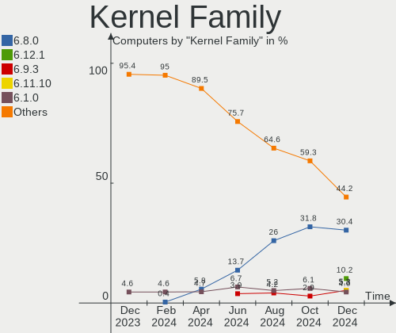
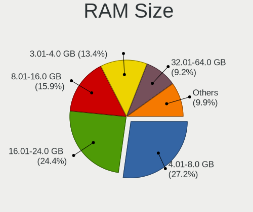
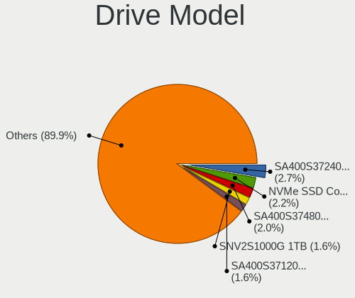
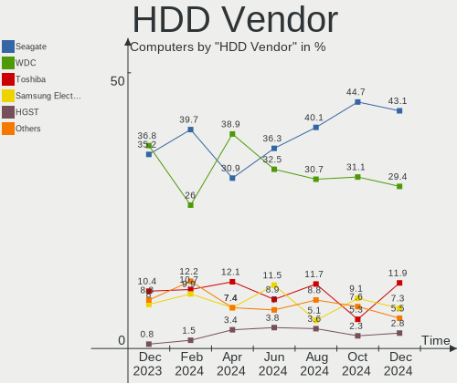
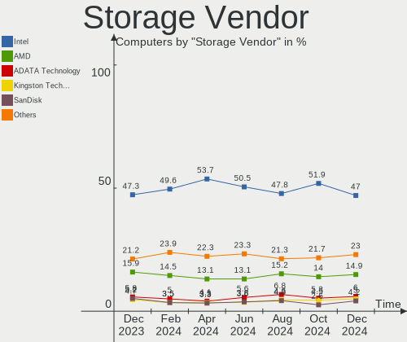
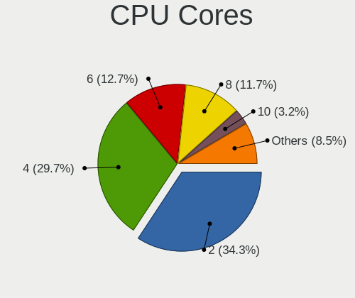
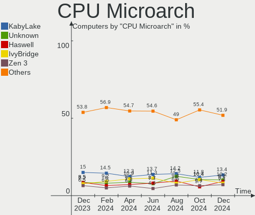
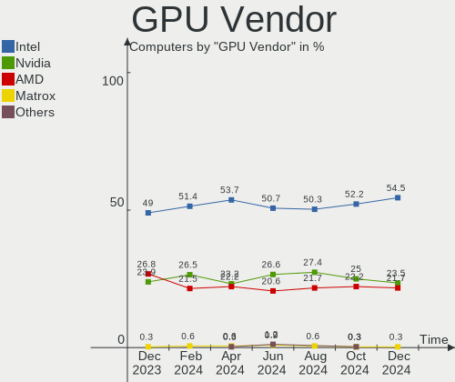
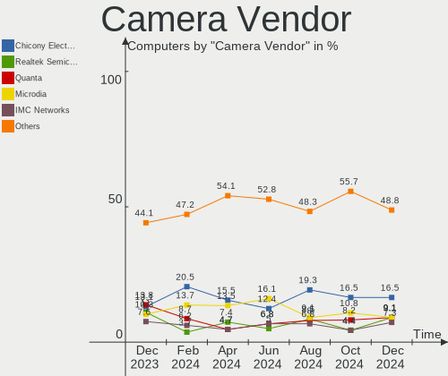

Linux in Brazil - Hardware Trends
---------------------------------

A project to identify most popular hardware characteristics and track their change
over time based on data collected by Linux users at https://Linux-Hardware.org.

Anyone can contribute to this report by the [hw-probe](https://github.com/linuxhw/hw-probe) tool:

    sudo -E hw-probe -all -upload

This is a report for all computer types. See also reports for [desktops](/Location/Brazil/Desktop/README.md) and [notebooks](/Location/Brazil/Notebook/README.md).

Period: Jan, 2024.

Contents
--------

* [ System ](#system)
  - [ OS                       ](#os)
  - [ OS Family                ](#os-family)
  - [ Kernel                   ](#kernel)
  - [ Kernel Family            ](#kernel-family)
  - [ Kernel Major Ver.        ](#kernel-major-ver)
  - [ Arch                     ](#arch)
  - [ DE                       ](#de)
  - [ Display Server           ](#display-server)
  - [ Display Manager          ](#display-manager)
  - [ OS Lang                  ](#os-lang)
  - [ Boot Mode                ](#boot-mode)
  - [ Filesystem               ](#filesystem)
  - [ Part. scheme             ](#part-scheme)
  - [ Dual Boot with Linux/BSD ](#dual-boot-with-linuxbsd)
  - [ Dual Boot (Win)          ](#dual-boot-win)

* [ Board ](#board)
  - [ Vendor                   ](#vendor)
  - [ Model                    ](#model)
  - [ Model Family             ](#model-family)
  - [ MFG Year                 ](#mfg-year)
  - [ Form Factor              ](#form-factor)
  - [ Secure Boot              ](#secure-boot)
  - [ Coreboot                 ](#coreboot)
  - [ RAM Size                 ](#ram-size)
  - [ RAM Used                 ](#ram-used)
  - [ Total Drives             ](#total-drives)
  - [ Has CD-ROM               ](#has-cd-rom)
  - [ Has Ethernet             ](#has-ethernet)
  - [ Has WiFi                 ](#has-wifi)
  - [ Has Bluetooth            ](#has-bluetooth)

* [ Location ](#location)
  - [ Country                  ](#country)
  - [ City                     ](#city)

* [ Drives ](#drives)
  - [ Drive Vendor             ](#drive-vendor)
  - [ Drive Model              ](#drive-model)
  - [ HDD Vendor               ](#hdd-vendor)
  - [ SSD Vendor               ](#ssd-vendor)
  - [ Drive Kind               ](#drive-kind)
  - [ Drive Connector          ](#drive-connector)
  - [ Drive Size               ](#drive-size)
  - [ Space Total              ](#space-total)
  - [ Space Used               ](#space-used)
  - [ Malfunc. Drives          ](#malfunc-drives)
  - [ Malfunc. Drive Vendor    ](#malfunc-drive-vendor)
  - [ Malfunc. HDD Vendor      ](#malfunc-hdd-vendor)
  - [ Malfunc. Drive Kind      ](#malfunc-drive-kind)
  - [ Failed Drives            ](#failed-drives)
  - [ Failed Drive Vendor      ](#failed-drive-vendor)
  - [ Drive Status             ](#drive-status)

* [ Storage controller ](#storage-controller)
  - [ Storage Vendor           ](#storage-vendor)
  - [ Storage Model            ](#storage-model)
  - [ Storage Kind             ](#storage-kind)

* [ Processor ](#processor)
  - [ CPU Vendor               ](#cpu-vendor)
  - [ CPU Model                ](#cpu-model)
  - [ CPU Model Family         ](#cpu-model-family)
  - [ CPU Cores                ](#cpu-cores)
  - [ CPU Sockets              ](#cpu-sockets)
  - [ CPU Threads              ](#cpu-threads)
  - [ CPU Op-Modes             ](#cpu-op-modes)
  - [ CPU Microcode            ](#cpu-microcode)
  - [ CPU Microarch            ](#cpu-microarch)

* [ Graphics ](#graphics)
  - [ GPU Vendor               ](#gpu-vendor)
  - [ GPU Model                ](#gpu-model)
  - [ GPU Combo                ](#gpu-combo)
  - [ GPU Driver               ](#gpu-driver)
  - [ GPU Memory               ](#gpu-memory)

* [ Monitor ](#monitor)
  - [ Monitor Vendor           ](#monitor-vendor)
  - [ Monitor Model            ](#monitor-model)
  - [ Monitor Resolution       ](#monitor-resolution)
  - [ Monitor Diagonal         ](#monitor-diagonal)
  - [ Monitor Width            ](#monitor-width)
  - [ Aspect Ratio             ](#aspect-ratio)
  - [ Monitor Area             ](#monitor-area)
  - [ Pixel Density            ](#pixel-density)
  - [ Multiple Monitors        ](#multiple-monitors)

* [ Network ](#network)
  - [ Net Controller Vendor    ](#net-controller-vendor)
  - [ Net Controller Model     ](#net-controller-model)
  - [ Wireless Vendor          ](#wireless-vendor)
  - [ Wireless Model           ](#wireless-model)
  - [ Ethernet Vendor          ](#ethernet-vendor)
  - [ Ethernet Model           ](#ethernet-model)
  - [ Net Controller Kind      ](#net-controller-kind)
  - [ Used Controller          ](#used-controller)
  - [ NICs                     ](#nics)
  - [ IPv6                     ](#ipv6)

* [ Bluetooth ](#bluetooth)
  - [ Bluetooth Vendor         ](#bluetooth-vendor)
  - [ Bluetooth Model          ](#bluetooth-model)

* [ Sound ](#sound)
  - [ Sound Vendor             ](#sound-vendor)
  - [ Sound Model              ](#sound-model)

* [ Memory ](#memory)
  - [ Memory Vendor            ](#memory-vendor)
  - [ Memory Model             ](#memory-model)
  - [ Memory Kind              ](#memory-kind)
  - [ Memory Form Factor       ](#memory-form-factor)
  - [ Memory Size              ](#memory-size)
  - [ Memory Speed             ](#memory-speed)

* [ Printers & scanners ](#printers--scanners)
  - [ Printer Vendor           ](#printer-vendor)
  - [ Printer Model            ](#printer-model)
  - [ Scanner Vendor           ](#scanner-vendor)
  - [ Scanner Model            ](#scanner-model)

* [ Camera ](#camera)
  - [ Camera Vendor            ](#camera-vendor)
  - [ Camera Model             ](#camera-model)

* [ Security ](#security)
  - [ Fingerprint Vendor       ](#fingerprint-vendor)
  - [ Fingerprint Model        ](#fingerprint-model)
  - [ Chipcard Vendor          ](#chipcard-vendor)
  - [ Chipcard Model           ](#chipcard-model)

* [ Unsupported ](#unsupported)
  - [ Unsupported Devices      ](#unsupported-devices)
  - [ Unsupported Device Types ](#unsupported-device-types)

System
------

OS
--

Installed operating systems

| Name                         | Computers | Percent |
|------------------------------|-----------|---------|
| Ubuntu 22.04                 | 29        | 11.42%  |
| Fedora 39                    | 28        | 11.02%  |
| Zorin 17                     | 17        | 6.69%   |
| OpenMandriva 23.08           | 14        | 5.51%   |
| Pop!_OS 22.04                | 13        | 5.12%   |
| Debian 12                    | 12        | 4.72%   |
| Ubuntu 23.10                 | 10        | 3.94%   |
| Arch Rolling                 | 9         | 3.54%   |
| Linux Mint 21.3              | 8         | 3.15%   |
| Linux Mint 21.2              | 8         | 3.15%   |
| Linux Mint 21.1              | 6         | 2.36%   |
| KDE neon 22.04               | 5         | 1.97%   |
| BigLinux                     | 5         | 1.97%   |
| Nobara 39                    | 4         | 1.57%   |
| LMDE 6                       | 4         | 1.57%   |
| Endless 5.1.1                | 4         | 1.57%   |
| Zorin 16                     | 3         | 1.18%   |
| openSUSE Tumbleweed-XXXXXXXX | 3         | 1.18%   |
| OpenMandriva 24.01           | 3         | 1.18%   |
| Kubuntu 23.10                | 3         | 1.18%   |
| Debian 11                    | 3         | 1.18%   |
| ArcoLinux Rolling            | 3         | 1.18%   |
| Xero Rolling                 | 2         | 0.79%   |
| Ubuntu MATE 22.04            | 2         | 0.79%   |
| SteamOS 3.5.7                | 2         | 0.79%   |
| OpenMandriva 5.0             | 2         | 0.79%   |
| NixOS 23.11                  | 2         | 0.79%   |
| Manjaro 23.1.3               | 2         | 0.79%   |
| Manjaro 23.1.2               | 2         | 0.79%   |
| Manjaro                      | 2         | 0.79%   |
| Lubuntu 22.04                | 2         | 0.79%   |
| Kali 2023.4                  | 2         | 0.79%   |
| Gentoo 2.14                  | 2         | 0.79%   |
| Elementary 7.1               | 2         | 0.79%   |
| Xubuntu 20.04                | 1         | 0.39%   |
| Xubuntu 18.04                | 1         | 0.39%   |
| Ubuntu 23.04                 | 1         | 0.39%   |
| Ubuntu 20.04                 | 1         | 0.39%   |
| Ubuntu 18.04                 | 1         | 0.39%   |
| TUXEDO OS 22.04              | 1         | 0.39%   |

OS Family
---------

OS without a version

| Name             | Computers | Percent |
|------------------|-----------|---------|
| Ubuntu           | 42        | 16.54%  |
| Fedora           | 29        | 11.42%  |
| Linux Mint       | 23        | 9.06%   |
| Zorin            | 20        | 7.87%   |
| OpenMandriva     | 20        | 7.87%   |
| Debian           | 16        | 6.3%    |
| Pop!_OS          | 14        | 5.51%   |
| Arch             | 9         | 3.54%   |
| Manjaro          | 7         | 2.76%   |
| BigLinux         | 6         | 2.36%   |
| SteamOS          | 5         | 1.97%   |
| Nobara           | 5         | 1.97%   |
| KDE neon         | 5         | 1.97%   |
| openSUSE         | 4         | 1.57%   |
| LMDE             | 4         | 1.57%   |
| Kubuntu          | 4         | 1.57%   |
| Endless          | 4         | 1.57%   |
| NixOS            | 3         | 1.18%   |
| Lubuntu          | 3         | 1.18%   |
| Clear Linux      | 3         | 1.18%   |
| ArcoLinux        | 3         | 1.18%   |
| Xubuntu          | 2         | 0.79%   |
| Xero             | 2         | 0.79%   |
| Ubuntu MATE      | 2         | 0.79%   |
| Kali             | 2         | 0.79%   |
| Gentoo           | 2         | 0.79%   |
| Elementary       | 2         | 0.79%   |
| TUXEDO OS        | 1         | 0.39%   |
| Solus            | 1         | 0.39%   |
| Slackware        | 1         | 0.39%   |
| ROSA             | 1         | 0.39%   |
| Regata OS        | 1         | 0.39%   |
| Raspbian         | 1         | 0.39%   |
| org.kde.Platform | 1         | 0.39%   |
| Mageia           | 1         | 0.39%   |
| Linux Lite       | 1         | 0.39%   |
| Lilidog          | 1         | 0.39%   |
| EndeavourOS      | 1         | 0.39%   |
| CachyOS          | 1         | 0.39%   |
| Artix            | 1         | 0.39%   |

Kernel
------

Version of the Linux kernel

| Version                      | Computers | Percent |
|------------------------------|-----------|---------|
| 6.5.0-14-generic             | 38        | 14.96%  |
| 5.15.0-91-generic            | 26        | 10.24%  |
| 6.2.0-39-generic             | 17        | 6.69%   |
| 6.6.9-200.fc39.x86_64        | 15        | 5.91%   |
| 6.4.11-desktop-1omv2390      | 13        | 5.12%   |
| 6.1.0-17-amd64               | 12        | 4.72%   |
| 6.6.6-76060606-generic       | 10        | 3.94%   |
| 6.5.0-15-generic             | 8         | 3.15%   |
| 6.6.2-desktop-1omv2390       | 5         | 1.97%   |
| 6.6.10-1-MANJARO             | 5         | 1.97%   |
| 6.6.8-2-MANJARO              | 4         | 1.57%   |
| 6.6.13-200.fc39.x86_64       | 4         | 1.57%   |
| 6.5.0-10-generic             | 4         | 1.57%   |
| 6.6.8-arch1-1                | 3         | 1.18%   |
| 6.6.8-200.fc39.x86_64        | 3         | 1.18%   |
| 6.7.0-zen3-1-zen             | 2         | 0.79%   |
| 6.7.0-arch3-1                | 2         | 0.79%   |
| 6.6.8-200.fsync.fc39.x86_64  | 2         | 0.79%   |
| 6.6.11-200.fc39.x86_64       | 2         | 0.79%   |
| 6.3.7-zen1-1-zen             | 2         | 0.79%   |
| 6.1.52-valve9-1-neptune-61   | 2         | 0.79%   |
| 5.10.0-27-amd64              | 2         | 0.79%   |
| 6.7.1-zen1-1-zen             | 1         | 0.39%   |
| 6.7.1-arch1-1                | 1         | 0.39%   |
| 6.7.1-200.1.ipu6.fc39.x86_64 | 1         | 0.39%   |
| 6.7.1-2-default              | 1         | 0.39%   |
| 6.7.0-keepos                 | 1         | 0.39%   |
| 6.7.0-cachyos                | 1         | 0.39%   |
| 6.7.0-3-cachyos-bore-lto     | 1         | 0.39%   |
| 6.7.0-204.fsync.fc39.x86_64  | 1         | 0.39%   |
| 6.7.0-201.fsync.fc39.x86_64  | 1         | 0.39%   |
| 6.6.9-amd64                  | 1         | 0.39%   |
| 6.6.9-1394.native            | 1         | 0.39%   |
| 6.6.7-1-default              | 1         | 0.39%   |
| 6.6.3-200.fc39.x86_64        | 1         | 0.39%   |
| 6.6.13-x64v2-xanmod1         | 1         | 0.39%   |
| 6.6.13-201.fsync.fc39.x86_64 | 1         | 0.39%   |
| 6.6.13-060613-generic        | 1         | 0.39%   |
| 6.6.12-271.current           | 1         | 0.39%   |
| 6.6.12-1400.native           | 1         | 0.39%   |

Kernel Family
-------------

Linux kernel without a distro release

| Version  | Computers | Percent |
|----------|-----------|---------|
| 6.5.0    | 56        | 22.05%  |
| 5.15.0   | 31        | 12.2%   |
| 6.2.0    | 19        | 7.48%   |
| 6.6.9    | 17        | 6.69%   |
| 6.1.0    | 15        | 5.91%   |
| 6.4.11   | 13        | 5.12%   |
| 6.6.8    | 12        | 4.72%   |
| 6.6.6    | 10        | 3.94%   |
| 6.6.10   | 10        | 3.94%   |
| 6.7.0    | 9         | 3.54%   |
| 6.6.13   | 7         | 2.76%   |
| 6.6.2    | 5         | 1.97%   |
| 6.7.1    | 4         | 1.57%   |
| 6.6.12   | 4         | 1.57%   |
| 6.6.11   | 4         | 1.57%   |
| 6.1.52   | 3         | 1.18%   |
| 6.5.9    | 2         | 0.79%   |
| 6.5.6    | 2         | 0.79%   |
| 6.3.7    | 2         | 0.79%   |
| 6.1.71   | 2         | 0.79%   |
| 6.1.69   | 2         | 0.79%   |
| 5.4.0    | 2         | 0.79%   |
| 5.10.0   | 2         | 0.79%   |
| 6.6.7    | 1         | 0.39%   |
| 6.6.3    | 1         | 0.39%   |
| 6.6.1    | 1         | 0.39%   |
| 6.5.13   | 1         | 0.39%   |
| 6.4.8    | 1         | 0.39%   |
| 6.4.10   | 1         | 0.39%   |
| 6.2.6    | 1         | 0.39%   |
| 6.1.67   | 1         | 0.39%   |
| 6.1.63   | 1         | 0.39%   |
| 6.1.61   | 1         | 0.39%   |
| 6.1.20   | 1         | 0.39%   |
| 6.0.12   | 1         | 0.39%   |
| 5.19.0   | 1         | 0.39%   |
| 5.16.7   | 1         | 0.39%   |
| 5.15.77  | 1         | 0.39%   |
| 5.15.145 | 1         | 0.39%   |
| 5.14.21  | 1         | 0.39%   |

Kernel Major Ver.
-----------------

Linux kernel major version

| Version | Computers | Percent |
|---------|-----------|---------|
| 6.6     | 72        | 28.35%  |
| 6.5     | 61        | 24.02%  |
| 5.15    | 33        | 12.99%  |
| 6.1     | 26        | 10.24%  |
| 6.2     | 20        | 7.87%   |
| 6.4     | 15        | 5.91%   |
| 6.7     | 13        | 5.12%   |
| 5.10    | 4         | 1.57%   |
| 6.3     | 2         | 0.79%   |
| 5.4     | 2         | 0.79%   |
| 6.0     | 1         | 0.39%   |
| 5.19    | 1         | 0.39%   |
| 5.16    | 1         | 0.39%   |
| 5.14    | 1         | 0.39%   |
| 4.15    | 1         | 0.39%   |
| 3.10    | 1         | 0.39%   |

Arch
----

OS architecture (x86_64, i586, etc.)

| Name    | Computers | Percent |
|---------|-----------|---------|
| x86_64  | 251       | 98.82%  |
| i686    | 1         | 0.39%   |
| armv7l  | 1         | 0.39%   |
| aarch64 | 1         | 0.39%   |

DE
--

Desktop Environment

| Name            | Computers | Percent |
|-----------------|-----------|---------|
| GNOME           | 118       | 46.46%  |
| KDE5            | 60        | 23.62%  |
| X-Cinnamon      | 28        | 11.02%  |
| XFCE            | 12        | 4.72%   |
| Unknown         | 8         | 3.15%   |
| LXQt            | 6         | 2.36%   |
| Endless:GNOME   | 4         | 1.57%   |
| MATE            | 3         | 1.18%   |
| sway            | 2         | 0.79%   |
| Pantheon        | 2         | 0.79%   |
| Openbox         | 2         | 0.79%   |
| i3              | 2         | 0.79%   |
| Budgie          | 2         | 0.79%   |
| WindowMaker     | 1         | 0.39%   |
| KDE             | 1         | 0.39%   |
| GNOME Flashback | 1         | 0.39%   |
| Deepin          | 1         | 0.39%   |
| Cinnamon        | 1         | 0.39%   |

Display Server
--------------

X11 or Wayland

| Name    | Computers | Percent |
|---------|-----------|---------|
| X11     | 136       | 53.54%  |
| Wayland | 109       | 42.91%  |
| Unknown | 9         | 3.54%   |

Display Manager
---------------

SDDM, LightDM, etc.

| Name    | Computers | Percent |
|---------|-----------|---------|
| Unknown | 146       | 57.48%  |
| SDDM    | 41        | 16.14%  |
| GDM3    | 36        | 14.17%  |
| LightDM | 19        | 7.48%   |
| GDM     | 12        | 4.72%   |

OS Lang
-------

Language

| Lang       | Computers | Percent |
|------------|-----------|---------|
| pt_BR      | 164       | 64.57%  |
| en_US      | 78        | 30.71%  |
| C          | 6         | 2.36%   |
| Unknown    | 2         | 0.79%   |
| es_ES      | 1         | 0.39%   |
| en_IE.UTF8 | 1         | 0.39%   |
| en_GB      | 1         | 0.39%   |
| en_CA      | 1         | 0.39%   |

Boot Mode
---------

EFI or BIOS

| Mode | Computers | Percent |
|------|-----------|---------|
| BIOS | 147       | 57.87%  |
| EFI  | 107       | 42.13%  |

Filesystem
----------

Type of filesystem

| Type     | Computers | Percent |
|----------|-----------|---------|
| Ext4     | 151       | 59.45%  |
| Btrfs    | 59        | 23.23%  |
| Tmpfs    | 25        | 9.84%   |
| Overlay  | 13        | 5.12%   |
| Zfs      | 4         | 1.57%   |
| Reiserfs | 1         | 0.39%   |
| Ext2     | 1         | 0.39%   |

Part. scheme
------------

Scheme of partitioning

| Type    | Computers | Percent |
|---------|-----------|---------|
| Unknown | 138       | 54.33%  |
| GPT     | 95        | 37.4%   |
| MBR     | 21        | 8.27%   |

Dual Boot with Linux/BSD
------------------------

Hosting more than one Linux/BSD

| Dual boot | Computers | Percent |
|-----------|-----------|---------|
| No        | 224       | 88.19%  |
| Yes       | 30        | 11.81%  |

Dual Boot (Win)
---------------

Hosting Linux and Windows

| Dual boot | Computers | Percent |
|-----------|-----------|---------|
| No        | 215       | 84.65%  |
| Yes       | 39        | 15.35%  |

Board
-----

Vendor
------

Motherboard manufacturer

| Name                    | Computers | Percent |
|-------------------------|-----------|---------|
| Dell                    | 37        | 14.57%  |
| Lenovo                  | 27        | 10.63%  |
| Gigabyte Technology     | 26        | 10.24%  |
| ASUSTek Computer        | 24        | 9.45%   |
| Acer                    | 22        | 8.66%   |
| Intel                   | 18        | 7.09%   |
| Hewlett-Packard         | 14        | 5.51%   |
| Samsung Electronics     | 10        | 3.94%   |
| Positivo                | 10        | 3.94%   |
| MSI                     | 7         | 2.76%   |
| ASRock                  | 6         | 2.36%   |
| Biostar                 | 5         | 1.97%   |
| Apple                   | 4         | 1.57%   |
| Valve                   | 3         | 1.18%   |
| Unknown                 | 3         | 1.18%   |
| Semp Toshiba            | 2         | 0.79%   |
| Positivo Bahia - VAIO   | 2         | 0.79%   |
| Pegatron                | 2         | 0.79%   |
| Multilaser              | 2         | 0.79%   |
| MACHINIST               | 2         | 0.79%   |
| LG Electronics          | 2         | 0.79%   |
| Digibras                | 2         | 0.79%   |
| Compaq                  | 2         | 0.79%   |
| Timi                    | 1         | 0.39%   |
| Sony                    | 1         | 0.39%   |
| Rockchip                | 1         | 0.39%   |
| Raspberry Pi Foundation | 1         | 0.39%   |
| QIYIDA                  | 1         | 0.39%   |
| Philco                  | 1         | 0.39%   |
| PCWare                  | 1         | 0.39%   |
| ODM                     | 1         | 0.39%   |
| Notebook                | 1         | 0.39%   |
| Microsoft               | 1         | 0.39%   |
| Megaware                | 1         | 0.39%   |
| Login Informatica       | 1         | 0.39%   |
| Itautec                 | 1         | 0.39%   |
| HC                      | 1         | 0.39%   |
| Gigazone                | 1         | 0.39%   |
| Evolute                 | 1         | 0.39%   |
| Digiboard               | 1         | 0.39%   |

Model
-----

Motherboard model

| Name                                        | Computers | Percent |
|---------------------------------------------|-----------|---------|
| Intel B75                                   | 6         | 2.36%   |
| Dell Inspiron 15-3567                       | 4         | 1.57%   |
| Unknown                                     | 4         | 1.57%   |
| Valve Jupiter                               | 3         | 1.18%   |
| ASUS All Series                             | 3         | 1.18%   |
| Samsung RV415/RV515                         | 2         | 0.79%   |
| Positivo Mobile                             | 2         | 0.79%   |
| Lenovo IdeaPad S145-15IWL 81S9              | 2         | 0.79%   |
| Lenovo IdeaPad 330-15IKB 81FE               | 2         | 0.79%   |
| Lenovo IdeaPad 3 15ITL6 82MD                | 2         | 0.79%   |
| Lenovo IdeaPad 3 15ALC6 82MF                | 2         | 0.79%   |
| Intel H81                                   | 2         | 0.79%   |
| Intel H61                                   | 2         | 0.79%   |
| HP Pavilion 14                              | 2         | 0.79%   |
| Gigabyte H110M-H                            | 2         | 0.79%   |
| Gigabyte GA-78LMT-S2P                       | 2         | 0.79%   |
| Gigabyte B550M AORUS ELITE                  | 2         | 0.79%   |
| Gigabyte B450 AORUS M                       | 2         | 0.79%   |
| Digibras NH4CU03                            | 2         | 0.79%   |
| Biostar A320MH                              | 2         | 0.79%   |
| ASUS PRIME H410M-E                          | 2         | 0.79%   |
| ASUS PRIME B450M-GAMING/BR                  | 2         | 0.79%   |
| Acer Nitro AN515-44                         | 2         | 0.79%   |
| Acer Aspire A315-58                         | 2         | 0.79%   |
| Timi RedmiBook Pro 14S                      | 1         | 0.39%   |
| Sony VJF153                                 | 1         | 0.39%   |
| Semp Toshiba STI NI 1401                    | 1         | 0.39%   |
| Semp Toshiba IS 1413G                       | 1         | 0.39%   |
| Samsung RV411/RV511/E3511/S3511/RV711/E3411 | 1         | 0.39%   |
| Samsung 960XFH                              | 1         | 0.39%   |
| Samsung 670Z5E                              | 1         | 0.39%   |
| Samsung 550XED                              | 1         | 0.39%   |
| Samsung 550XCJ/550XCR                       | 1         | 0.39%   |
| Samsung 550XBE/350XBE                       | 1         | 0.39%   |
| Samsung 300E5M/300E5L                       | 1         | 0.39%   |
| Samsung 270E5K/270E5Q/271E5K/2570EK         | 1         | 0.39%   |
| Rockchip RK3588 OPi 5 Plus                  | 1         | 0.39%   |
| RPi Raspberry Pi 3 Model B Plus Rev 1.3     | 1         | 0.39%   |
| QIYIDA ED4 V1.1                             | 1         | 0.39%   |
| Positivo S14SL01                            | 1         | 0.39%   |

Model Family
------------

Motherboard model prefix

| Name                  | Computers | Percent |
|-----------------------|-----------|---------|
| Dell Inspiron         | 20        | 7.87%   |
| Lenovo IdeaPad        | 15        | 5.91%   |
| Acer Aspire           | 14        | 5.51%   |
| ASUS PRIME            | 10        | 3.94%   |
| Lenovo ThinkPad       | 6         | 2.36%   |
| Intel B75             | 6         | 2.36%   |
| Dell Latitude         | 6         | 2.36%   |
| Acer Nitro            | 6         | 2.36%   |
| HP Pavilion           | 5         | 1.97%   |
| Unknown               | 4         | 1.57%   |
| Valve Jupiter         | 3         | 1.18%   |
| Gigabyte B450M        | 3         | 1.18%   |
| Dell XPS              | 3         | 1.18%   |
| ASUS ROG              | 3         | 1.18%   |
| ASUS All              | 3         | 1.18%   |
| Samsung RV415         | 2         | 0.79%   |
| Positivo Mobile       | 2         | 0.79%   |
| Lenovo Yoga           | 2         | 0.79%   |
| Lenovo G460           | 2         | 0.79%   |
| Intel X99             | 2         | 0.79%   |
| Intel H81             | 2         | 0.79%   |
| Intel H61             | 2         | 0.79%   |
| HP Presario           | 2         | 0.79%   |
| Gigabyte H110M-H      | 2         | 0.79%   |
| Gigabyte GA-78LMT-S2P | 2         | 0.79%   |
| Gigabyte B550M        | 2         | 0.79%   |
| Gigabyte B450         | 2         | 0.79%   |
| Digibras NH4CU03      | 2         | 0.79%   |
| Dell Vostro           | 2         | 0.79%   |
| Dell OptiPlex         | 2         | 0.79%   |
| Biostar A320MH        | 2         | 0.79%   |
| ASRock A320M-HD       | 2         | 0.79%   |
| Timi RedmiBook        | 1         | 0.39%   |
| Sony VJF153           | 1         | 0.39%   |
| Semp Toshiba STI      | 1         | 0.39%   |
| Semp Toshiba IS       | 1         | 0.39%   |
| Samsung RV411         | 1         | 0.39%   |
| Samsung 960XFH        | 1         | 0.39%   |
| Samsung 670Z5E        | 1         | 0.39%   |
| Samsung 550XED        | 1         | 0.39%   |

MFG Year
--------

Motherboard manufacture year

| Year    | Computers | Percent |
|---------|-----------|---------|
| 2021    | 31        | 12.2%   |
| 2018    | 29        | 11.42%  |
| 2020    | 23        | 9.06%   |
| 2019    | 20        | 7.87%   |
| 2014    | 18        | 7.09%   |
| 2011    | 17        | 6.69%   |
| 2017    | 16        | 6.3%    |
| 2016    | 16        | 6.3%    |
| 2013    | 15        | 5.91%   |
| 2022    | 14        | 5.51%   |
| 2012    | 13        | 5.12%   |
| 2023    | 10        | 3.94%   |
| 2010    | 10        | 3.94%   |
| 2009    | 8         | 3.15%   |
| 2015    | 7         | 2.76%   |
| 2008    | 3         | 1.18%   |
| 2007    | 2         | 0.79%   |
| Unknown | 2         | 0.79%   |

Form Factor
-----------

Physical design of the computer

| Name           | Computers | Percent |
|----------------|-----------|---------|
| Notebook       | 137       | 53.94%  |
| Desktop        | 107       | 42.13%  |
| All in one     | 3         | 1.18%   |
| System on chip | 2         | 0.79%   |
| Convertible    | 2         | 0.79%   |
| Tablet         | 1         | 0.39%   |
| Mini pc        | 1         | 0.39%   |
| Server         | 1         | 0.39%   |

Secure Boot
-----------

Enabled or disabled

| State    | Computers | Percent |
|----------|-----------|---------|
| Disabled | 242       | 95.28%  |
| Enabled  | 12        | 4.72%   |

Coreboot
--------

Have coreboot on board

| Used | Computers | Percent |
|------|-----------|---------|
| No   | 254       | 100%    |

RAM Size
--------

Total RAM memory

| Size in GB  | Computers | Percent |
|-------------|-----------|---------|
| 16.01-24.0  | 66        | 25.98%  |
| 4.01-8.0    | 59        | 23.23%  |
| 3.01-4.0    | 44        | 17.32%  |
| 8.01-16.0   | 37        | 14.57%  |
| 32.01-64.0  | 26        | 10.24%  |
| 1.01-2.0    | 9         | 3.54%   |
| 24.01-32.0  | 5         | 1.97%   |
| 64.01-256.0 | 4         | 1.57%   |
| 2.01-3.0    | 3         | 1.18%   |
| 0.51-1.0    | 1         | 0.39%   |

RAM Used
--------

Used RAM memory

| Used GB    | Computers | Percent |
|------------|-----------|---------|
| 2.01-3.0   | 70        | 27.56%  |
| 1.01-2.0   | 60        | 23.62%  |
| 3.01-4.0   | 50        | 19.69%  |
| 4.01-8.0   | 47        | 18.5%   |
| 8.01-16.0  | 12        | 4.72%   |
| 0.51-1.0   | 9         | 3.54%   |
| 0.01-0.5   | 3         | 1.18%   |
| 16.01-24.0 | 2         | 0.79%   |
| Unknown    | 1         | 0.39%   |

Total Drives
------------

Number of drives on board

| Drives | Computers | Percent |
|--------|-----------|---------|
| 1      | 151       | 59.45%  |
| 2      | 66        | 25.98%  |
| 3      | 26        | 10.24%  |
| 4      | 8         | 3.15%   |
| 8      | 1         | 0.39%   |
| 6      | 1         | 0.39%   |
| 5      | 1         | 0.39%   |

Has CD-ROM
----------

Has CD-ROM on board

| Presented | Computers | Percent |
|-----------|-----------|---------|
| No        | 184       | 72.44%  |
| Yes       | 70        | 27.56%  |

Has Ethernet
------------

Has Ethernet on board

| Presented | Computers | Percent |
|-----------|-----------|---------|
| Yes       | 231       | 90.94%  |
| No        | 23        | 9.06%   |

Has WiFi
--------

Has WiFi module

| Presented | Computers | Percent |
|-----------|-----------|---------|
| Yes       | 184       | 72.44%  |
| No        | 70        | 27.56%  |

Has Bluetooth
-------------

Has Bluetooth module

| Presented | Computers | Percent |
|-----------|-----------|---------|
| Yes       | 149       | 58.66%  |
| No        | 105       | 41.34%  |

Location
--------

Country
-------

Geographic location (country)

| Country | Computers | Percent |
|---------|-----------|---------|
| Brazil  | 254       | 100%    |

City
----

Geographic location (city)

| City                 | Computers | Percent |
|----------------------|-----------|---------|
| Sao Paulo            | 18        | 7.09%   |
| Rio de Janeiro       | 14        | 5.51%   |
| Fortaleza            | 7         | 2.76%   |
| Brasília            | 7         | 2.76%   |
| Manaus               | 6         | 2.36%   |
| Campinas             | 6         | 2.36%   |
| Belém               | 6         | 2.36%   |
| Salvador             | 5         | 1.97%   |
| Curitiba             | 5         | 1.97%   |
| Sao Goncalo          | 4         | 1.57%   |
| Santo André         | 4         | 1.57%   |
| Recife               | 4         | 1.57%   |
| Guarulhos            | 4         | 1.57%   |
| Campo Grande         | 4         | 1.57%   |
| Sorocaba             | 3         | 1.18%   |
| Santos               | 3         | 1.18%   |
| Santa Luzia          | 3         | 1.18%   |
| Osasco               | 3         | 1.18%   |
| Ananindeua           | 3         | 1.18%   |
| Sapezal              | 2         | 0.79%   |
| Sao Luís            | 2         | 0.79%   |
| Petrópolis          | 2         | 0.79%   |
| Pelotas              | 2         | 0.79%   |
| Paulinia             | 2         | 0.79%   |
| Maceió              | 2         | 0.79%   |
| Londrina             | 2         | 0.79%   |
| Juiz de Fora         | 2         | 0.79%   |
| Juazeiro do Norte    | 2         | 0.79%   |
| Jaraguá do Sul      | 2         | 0.79%   |
| Guarapari            | 2         | 0.79%   |
| Goiânia             | 2         | 0.79%   |
| Feira de Santana     | 2         | 0.79%   |
| Cascavel             | 2         | 0.79%   |
| Blumenau             | 2         | 0.79%   |
| Belo Horizonte       | 2         | 0.79%   |
| Barueri              | 2         | 0.79%   |
| Aparecida de Goiania | 2         | 0.79%   |
| Alagoinhas           | 2         | 0.79%   |
| Vitória             | 1         | 0.39%   |
| Vila Velha           | 1         | 0.39%   |

Drives
------

Drive Vendor
------------

Hard drive vendors

| Vendor                         | Computers | Drives | Percent |
|--------------------------------|-----------|--------|---------|
| WDC                            | 53        | 55     | 13.87%  |
| Seagate                        | 46        | 55     | 12.04%  |
| Kingston                       | 44        | 50     | 11.52%  |
| Samsung Electronics            | 27        | 28     | 7.07%   |
| SanDisk                        | 20        | 21     | 5.24%   |
| China                          | 19        | 20     | 4.97%   |
| A-DATA Technology              | 15        | 15     | 3.93%   |
| Toshiba                        | 13        | 13     | 3.4%    |
| Crucial                        | 13        | 13     | 3.4%    |
| Silicon Motion                 | 11        | 11     | 2.88%   |
| Unknown                        | 9         | 10     | 2.36%   |
| Realtek Semiconductor          | 8         | 9      | 2.09%   |
| Kingston Technology Company    | 8         | 8      | 2.09%   |
| XrayDisk                       | 6         | 6      | 1.57%   |
| SK hynix                       | 6         | 6      | 1.57%   |
| ADATA Technology               | 6         | 6      | 1.57%   |
| Lexar                          | 5         | 5      | 1.31%   |
| KingSpec                       | 5         | 5      | 1.31%   |
| Hitachi                        | 5         | 6      | 1.31%   |
| Netac                          | 4         | 5      | 1.05%   |
| Micron Technology              | 4         | 4      | 1.05%   |
| Intel                          | 4         | 4      | 1.05%   |
| Team                           | 3         | 3      | 0.79%   |
| SSSTC                          | 3         | 3      | 0.79%   |
| Solid State Storage Technology | 3         | 3      | 0.79%   |
| Phison Electronics             | 3         | 4      | 0.79%   |
| MAXIO Technology (Hangzhou)    | 3         | 4      | 0.79%   |
| Apple                          | 3         | 3      | 0.79%   |
| Micron/Crucial Technology      | 2         | 2      | 0.52%   |
| LITEON                         | 2         | 2      | 0.52%   |
| Lite-On Technology             | 2         | 2      | 0.52%   |
| JMicron Technology             | 2         | 2      | 0.52%   |
| HUSKY                          | 2         | 2      | 0.52%   |
| HGST                           | 2         | 2      | 0.52%   |
| Gigabyte Technology            | 2         | 2      | 0.52%   |
| Unknown                        | 2         | 2      | 0.52%   |
| USB3.0                         | 1         | 1      | 0.26%   |
| Union Memory (Shenzhen)        | 1         | 1      | 0.26%   |
| Solid State Storage            | 1         | 1      | 0.26%   |
| Smart                          | 1         | 1      | 0.26%   |

Drive Model
-----------

Hard drive models

| Model                                                 | Computers | Percent |
|-------------------------------------------------------|-----------|---------|
| Kingston SA400S37480G 480GB SSD                       | 16        | 3.99%   |
| Kingston SA400S37240G 240GB SSD                       | 14        | 3.49%   |
| Silicon Motion SM2263EN/SM2263XT SSD Controller 128GB | 8         | 2%      |
| Seagate ST500LM012 HN-M500MBB 500GB                   | 7         | 1.75%   |
| Seagate ST1000DM003-1ER162 1TB                        | 5         | 1.25%   |
| Kingston SA400S37120G 120GB SSD                       | 5         | 1.25%   |
| WDC WDS240G2G0A-00JH30 240GB SSD                      | 4         | 1%      |
| Seagate ST1000DM010-2EP102 1TB                        | 4         | 1%      |
| Samsung HD322HJ 320GB                                 | 4         | 1%      |
| Realtek RTS5763DL NVMe SSD Controller 2TB             | 4         | 1%      |
| Kingston Company SNV2S1000G 1TB                       | 4         | 1%      |
| WDC WD5000LPVX-80V0TT0 500GB                          | 3         | 0.75%   |
| WDC WD10SPZX-21Z10T0 1TB                              | 3         | 0.75%   |
| Toshiba MQ01ABD050 500GB                              | 3         | 0.75%   |
| Sandisk WD Blue SN550 NVMe SSD 512GB                  | 3         | 0.75%   |
| MAXIO (Hangzhou) NVMe SSD Controller MAP1202 512GB    | 3         | 0.75%   |
| Kingston SV300S37A120G 120GB SSD                      | 3         | 0.75%   |
| Kingston SNV2S500G 500GB                              | 3         | 0.75%   |
| Kingston SA400S37960G 960GB SSD                       | 3         | 0.75%   |
| Crucial CT500BX500SSD1 500GB                          | 3         | 0.75%   |
| Crucial CT1000BX500SSD1 1TB                           | 3         | 0.75%   |
| China SSD 512GB                                       | 3         | 0.75%   |
| A-DATA IM2P33F8ABR2-256GB                             | 3         | 0.75%   |
| XrayDisk 1TB SSD                                      | 2         | 0.5%    |
| WDC WD5000LPCX-00VHAT0 500GB                          | 2         | 0.5%    |
| WDC WD5000AAKX-00U6AA0 500GB                          | 2         | 0.5%    |
| WDC WD10SPZX-75Z10T1 1TB                              | 2         | 0.5%    |
| WDC WD10JPVX-22JC3T0 1TB                              | 2         | 0.5%    |
| WDC WD10EZEX-08WN4A0 1TB                              | 2         | 0.5%    |
| Unknown xD/SD/M.S.                                    | 2         | 0.5%    |
| Unknown MMC Card  16GB                                | 2         | 0.5%    |
| Unknown MMC Card  128GB                               | 2         | 0.5%    |
| Toshiba MQ01ABF050 500GB                              | 2         | 0.5%    |
| Toshiba HDWD110 1TB                                   | 2         | 0.5%    |
| Team T253X2128G 128GB SSD                             | 2         | 0.5%    |
| SSSTC CL1-4D256 256GB                                 | 2         | 0.5%    |
| Seagate ST98823AS 80GB                                | 2         | 0.5%    |
| Seagate ST9500325AS 500GB                             | 2         | 0.5%    |
| Seagate ST500DM002-1BD142 500GB                       | 2         | 0.5%    |
| Seagate ST4000VN008-2DR166 4TB                        | 2         | 0.5%    |

HDD Vendor
----------

Hard disk drive vendors

| Vendor              | Computers | Drives | Percent |
|---------------------|-----------|--------|---------|
| Seagate             | 46        | 55     | 35.66%  |
| WDC                 | 45        | 47     | 34.88%  |
| Toshiba             | 13        | 13     | 10.08%  |
| Samsung Electronics | 12        | 13     | 9.3%    |
| Hitachi             | 5         | 6      | 3.88%   |
| HGST                | 2         | 2      | 1.55%   |
| NETAPP              | 1         | 3      | 0.78%   |
| Maxtor              | 1         | 1      | 0.78%   |
| JMicron Technology  | 1         | 1      | 0.78%   |
| HPE                 | 1         | 1      | 0.78%   |
| Hewlett-Packard     | 1         | 1      | 0.78%   |
| Apple               | 1         | 1      | 0.78%   |

SSD Vendor
----------

Solid state drive vendors

| Vendor              | Computers | Drives | Percent |
|---------------------|-----------|--------|---------|
| Kingston            | 40        | 45     | 29.63%  |
| China               | 19        | 20     | 14.07%  |
| Crucial             | 13        | 13     | 9.63%   |
| Samsung Electronics | 8         | 8      | 5.93%   |
| WDC                 | 7         | 7      | 5.19%   |
| SanDisk             | 7         | 8      | 5.19%   |
| A-DATA Technology   | 6         | 6      | 4.44%   |
| KingSpec            | 5         | 5      | 3.7%    |
| Lexar               | 4         | 4      | 2.96%   |
| XrayDisk            | 3         | 3      | 2.22%   |
| Team                | 3         | 3      | 2.22%   |
| Netac               | 2         | 2      | 1.48%   |
| LITEON              | 2         | 2      | 1.48%   |
| HUSKY               | 2         | 2      | 1.48%   |
| Gigabyte Technology | 2         | 2      | 1.48%   |
| Apple               | 2         | 2      | 1.48%   |
| USB3.0              | 1         | 1      | 0.74%   |
| Smart               | 1         | 1      | 0.74%   |
| PNY                 | 1         | 1      | 0.74%   |
| Patriot             | 1         | 1      | 0.74%   |
| MAXIO               | 1         | 1      | 0.74%   |
| Kross Elegance      | 1         | 1      | 0.74%   |
| KINGBANK            | 1         | 1      | 0.74%   |
| KBM                 | 1         | 1      | 0.74%   |
| Intel               | 1         | 1      | 0.74%   |
| BIWIN               | 1         | 1      | 0.74%   |

Drive Kind
----------

HDD or SSD

| Kind    | Computers | Drives | Percent |
|---------|-----------|--------|---------|
| SSD     | 119       | 142    | 34.39%  |
| HDD     | 117       | 144    | 33.82%  |
| NVMe    | 96        | 108    | 27.75%  |
| MMC     | 7         | 9      | 2.02%   |
| Unknown | 7         | 7      | 2.02%   |

Drive Connector
---------------

SATA, SAS, NVMe, etc.

| Type | Computers | Drives | Percent |
|------|-----------|--------|---------|
| SATA | 201       | 286    | 64.63%  |
| NVMe | 96        | 108    | 30.87%  |
| SAS  | 7         | 7      | 2.25%   |
| MMC  | 7         | 9      | 2.25%   |

Drive Size
----------

Size of hard drive

| Size in TB | Computers | Drives | Percent |
|------------|-----------|--------|---------|
| 0.01-0.5   | 151       | 187    | 64.53%  |
| 0.51-1.0   | 67        | 76     | 28.63%  |
| 1.01-2.0   | 11        | 11     | 4.7%    |
| 3.01-4.0   | 3         | 10     | 1.28%   |
| 4.01-10.0  | 2         | 2      | 0.85%   |

Space Total
-----------

Amount of disk space available on the file system

| Size in GB     | Computers | Percent |
|----------------|-----------|---------|
| 251-500        | 62        | 24.41%  |
| 101-250        | 62        | 24.41%  |
| 501-1000       | 41        | 16.14%  |
| 1001-2000      | 22        | 8.66%   |
| 1-20           | 18        | 7.09%   |
| 51-100         | 18        | 7.09%   |
| Unknown        | 9         | 3.54%   |
| More than 3000 | 8         | 3.15%   |
| 2001-3000      | 8         | 3.15%   |
| 21-50          | 6         | 2.36%   |

Space Used
----------

Amount of used disk space

| Used GB   | Computers | Percent |
|-----------|-----------|---------|
| 1-20      | 74        | 29.13%  |
| 21-50     | 45        | 17.72%  |
| 101-250   | 43        | 16.93%  |
| 51-100    | 36        | 14.17%  |
| 251-500   | 19        | 7.48%   |
| 501-1000  | 18        | 7.09%   |
| Unknown   | 9         | 3.54%   |
| 1001-2000 | 6         | 2.36%   |
| 2001-3000 | 4         | 1.57%   |

Malfunc. Drives
---------------

Drive models with a malfunction

| Model                               | Computers | Drives | Percent |
|-------------------------------------|-----------|--------|---------|
| WDC WD5000LPVX-80V0TT0 500GB        | 2         | 2      | 10.53%  |
| WDC WD5000BPVT-00HXZT3 500GB        | 1         | 1      | 5.26%   |
| WDC WD3200AAKS-75L9A0 320GB         | 1         | 1      | 5.26%   |
| WDC WD3200AAJS-56M0A0 320GB         | 1         | 1      | 5.26%   |
| WDC WD10SPZX-75Z10T2 1TB            | 1         | 1      | 5.26%   |
| WDC WD10SPZX-24Z10T0 1TB            | 1         | 1      | 5.26%   |
| Toshiba MQ01ABD050 500GB            | 1         | 1      | 5.26%   |
| Seagate ST9320325AS 320GB           | 1         | 1      | 5.26%   |
| Seagate ST500LM012 HN-M500MBB 500GB | 1         | 2      | 5.26%   |
| Seagate ST3500418AS 500GB           | 1         | 1      | 5.26%   |
| Seagate ST3500312CS 500GB           | 1         | 1      | 5.26%   |
| Seagate ST1000LX015-1U7172 1TB      | 1         | 1      | 5.26%   |
| Seagate ST1000LM024 HN-M101MBB 1TB  | 1         | 1      | 5.26%   |
| Samsung Electronics HD322HJ 320GB   | 1         | 1      | 5.26%   |
| Kingston SV300S37A240G 240GB SSD    | 1         | 1      | 5.26%   |
| Hitachi HTS547564A9E384 640GB       | 1         | 1      | 5.26%   |
| China SSD 512GB                     | 1         | 1      | 5.26%   |
| China SSD 120GB                     | 1         | 1      | 5.26%   |

Malfunc. Drive Vendor
---------------------

Vendors of faulty drives

| Vendor              | Computers | Drives | Percent |
|---------------------|-----------|--------|---------|
| WDC                 | 7         | 7      | 38.89%  |
| Seagate             | 5         | 7      | 27.78%  |
| China               | 2         | 2      | 11.11%  |
| Toshiba             | 1         | 1      | 5.56%   |
| Samsung Electronics | 1         | 1      | 5.56%   |
| Kingston            | 1         | 1      | 5.56%   |
| Hitachi             | 1         | 1      | 5.56%   |

Malfunc. HDD Vendor
-------------------

Vendors of faulty HDD drives

| Vendor              | Computers | Drives | Percent |
|---------------------|-----------|--------|---------|
| WDC                 | 7         | 7      | 46.67%  |
| Seagate             | 5         | 7      | 33.33%  |
| Toshiba             | 1         | 1      | 6.67%   |
| Samsung Electronics | 1         | 1      | 6.67%   |
| Hitachi             | 1         | 1      | 6.67%   |

Malfunc. Drive Kind
-------------------

Kinds of faulty drives

| Kind | Computers | Drives | Percent |
|------|-----------|--------|---------|
| HDD  | 13        | 17     | 81.25%  |
| SSD  | 3         | 3      | 18.75%  |

Failed Drives
-------------

Failed drive models

| Model                    | Computers | Drives | Percent |
|--------------------------|-----------|--------|---------|
| Toshiba MQ01ABD050 500GB | 1         | 1      | 100%    |

Failed Drive Vendor
-------------------

Failed drive vendors

| Vendor  | Computers | Drives | Percent |
|---------|-----------|--------|---------|
| Toshiba | 1         | 1      | 100%    |

Drive Status
------------

Number of failed and malfunc. drives

| Status   | Computers | Drives | Percent |
|----------|-----------|--------|---------|
| Detected | 169       | 269    | 63.53%  |
| Works    | 80        | 120    | 30.08%  |
| Malfunc  | 16        | 20     | 6.02%   |
| Failed   | 1         | 1      | 0.38%   |

Storage controller
------------------

Storage Vendor
--------------

Storage controller vendors

| Vendor                         | Computers | Percent |
|--------------------------------|-----------|---------|
| Intel                          | 181       | 52.62%  |
| AMD                            | 52        | 15.12%  |
| ADATA Technology               | 15        | 4.36%   |
| SanDisk                        | 13        | 3.78%   |
| Kingston Technology Company    | 13        | 3.78%   |
| Silicon Motion                 | 11        | 3.2%    |
| Realtek Semiconductor          | 8         | 2.33%   |
| Solid State Storage Technology | 7         | 2.03%   |
| Samsung Electronics            | 7         | 2.03%   |
| SK hynix                       | 6         | 1.74%   |
| MAXIO Technology (Hangzhou)    | 5         | 1.45%   |
| Micron Technology              | 4         | 1.16%   |
| Phison Electronics             | 3         | 0.87%   |
| Netac Technology               | 3         | 0.87%   |
| Marvell Technology Group       | 3         | 0.87%   |
| Nvidia                         | 2         | 0.58%   |
| Micron/Crucial Technology      | 2         | 0.58%   |
| Lite-On Technology             | 2         | 0.58%   |
| JMicron Technology             | 2         | 0.58%   |
| Union Memory (Shenzhen)        | 1         | 0.29%   |
| Shenzhen Longsys Electronics   | 1         | 0.29%   |
| LSI Logic / Symbios Logic      | 1         | 0.29%   |
| Hewlett-Packard                | 1         | 0.29%   |
| ASMedia Technology             | 1         | 0.29%   |

Storage Model
-------------

Storage controller models

| Model                                                                          | Computers | Percent |
|--------------------------------------------------------------------------------|-----------|---------|
| AMD FCH SATA Controller [AHCI mode]                                            | 31        | 7.81%   |
| Intel Sunrise Point-LP SATA Controller [AHCI mode]                             | 17        | 4.28%   |
| Intel 8 Series/C220 Series Chipset Family 6-port SATA Controller 1 [AHCI mode] | 12        | 3.02%   |
| Silicon Motion SM2263EN/SM2263XT (DRAM-less) NVMe SSD Controllers              | 11        | 2.77%   |
| Intel Volume Management Device NVMe RAID Controller                            | 11        | 2.77%   |
| Intel Tiger Lake-LP SATA Controller                                            | 11        | 2.77%   |
| Intel 7 Series Chipset Family 6-port SATA Controller [AHCI mode]               | 11        | 2.77%   |
| Intel 8 Series SATA Controller 1 [AHCI mode]                                   | 10        | 2.52%   |
| AMD 400 Series Chipset SATA Controller                                         | 10        | 2.52%   |
| Intel 7 Series/C210 Series Chipset Family 6-port SATA Controller [AHCI mode]   | 9         | 2.27%   |
| AMD 500 Series Chipset SATA Controller                                         | 9         | 2.27%   |
| Intel 82801 Mobile SATA Controller [RAID mode]                                 | 8         | 2.02%   |
| AMD FCH SATA Controller D                                                      | 7         | 1.76%   |
| Kingston Company NV2 NVMe SSD SM2267XT (DRAM-less)                             | 6         | 1.51%   |
| Intel Comet Lake SATA AHCI Controller                                          | 6         | 1.51%   |
| Intel 6 Series/C200 Series Chipset Family 6 port Mobile SATA AHCI Controller   | 6         | 1.51%   |
| Intel 500 Series Chipset Family SATA AHCI Controller                           | 6         | 1.51%   |
| Intel 400 Series Chipset Family SATA AHCI Controller                           | 6         | 1.51%   |
| ADATA IM2P33F8 series NVMe SSD (DRAM-less)                                     | 6         | 1.51%   |
| Solid State Storage CL1-3D256-Q11 NVMe SSD M.2                                 | 5         | 1.26%   |
| MAXIO (Hangzhou) NVMe SSD Controller MAP1202 (DRAM-less)                       | 5         | 1.26%   |
| Intel Wildcat Point-LP SATA Controller [AHCI Mode]                             | 5         | 1.26%   |
| Intel Q170/Q150/B150/H170/H110/Z170/CM236 Chipset SATA Controller [AHCI Mode]  | 5         | 1.26%   |
| Intel NM10/ICH7 Family SATA Controller [IDE mode]                              | 5         | 1.26%   |
| Intel Cannon Point-LP SATA Controller [AHCI Mode]                              | 5         | 1.26%   |
| Intel 5 Series/3400 Series Chipset 4 port SATA IDE Controller                  | 5         | 1.26%   |
| Intel 5 Series/3400 Series Chipset 2 port SATA IDE Controller                  | 5         | 1.26%   |
| Realtek RTS5762 NVMe SSD Controller                                            | 4         | 1.01%   |
| Kingston Company NV2 NVMe SSD E21T (DRAM-less)                                 | 4         | 1.01%   |
| Intel Celeron/Pentium Silver Processor SATA Controller                         | 4         | 1.01%   |
| Intel 82801IBM/IEM (ICH9M/ICH9M-E) 4 port SATA Controller [AHCI mode]          | 4         | 1.01%   |
| Intel 82801G (ICH7 Family) IDE Controller                                      | 4         | 1.01%   |
| Intel 6 Series/C200 Series Chipset Family 6 port Desktop SATA AHCI Controller  | 4         | 1.01%   |
| Intel 5 Series/3400 Series Chipset 4 port SATA AHCI Controller                 | 4         | 1.01%   |
| AMD SB7x0/SB8x0/SB9x0 SATA Controller [IDE mode]                               | 4         | 1.01%   |
| AMD SB7x0/SB8x0/SB9x0 IDE Controller                                           | 4         | 1.01%   |
| SanDisk WD Green SN350 240GB (DRAM-less) / SN560E NVMe SSD                     | 3         | 0.76%   |
| SanDisk Ultra 3D / WD Blue SN550 NVMe SSD                                      | 3         | 0.76%   |
| Sandisk PC SN740 NVMe SSD (DRAM-less)                                          | 3         | 0.76%   |
| Samsung NVMe SSD Controller 980 (DRAM-less)                                    | 3         | 0.76%   |

Storage Kind
------------

Kind of storage controller (IDE, SATA, NVMe, SAS, ...)

| Kind | Computers | Percent |
|------|-----------|---------|
| SATA | 210       | 59.32%  |
| NVMe | 96        | 27.12%  |
| IDE  | 25        | 7.06%   |
| RAID | 22        | 6.21%   |
| SAS  | 1         | 0.28%   |

Processor
---------

CPU Vendor
----------

Processor vendors

| Vendor | Computers | Percent |
|--------|-----------|---------|
| Intel  | 192       | 75.59%  |
| AMD    | 60        | 23.62%  |
| ARM    | 2         | 0.79%   |

CPU Model
---------

Processor models

| Model                                   | Computers | Percent |
|-----------------------------------------|-----------|---------|
| Intel Core i5-7200U CPU @ 2.50GHz       | 5         | 1.97%   |
| Intel 11th Gen Core i5-1135G7 @ 2.40GHz | 5         | 1.97%   |
| Intel Core i7-8565U CPU @ 1.80GHz       | 3         | 1.18%   |
| Intel Core i7-8550U CPU @ 1.80GHz       | 3         | 1.18%   |
| Intel Core i7-10750H CPU @ 2.60GHz      | 3         | 1.18%   |
| Intel Core i5-8250U CPU @ 1.60GHz       | 3         | 1.18%   |
| Intel Core i5-3570 CPU @ 3.40GHz        | 3         | 1.18%   |
| Intel Core i5-10210U CPU @ 1.60GHz      | 3         | 1.18%   |
| Intel Core i3-6006U CPU @ 2.00GHz       | 3         | 1.18%   |
| Intel 11th Gen Core i7-1165G7 @ 2.80GHz | 3         | 1.18%   |
| Intel 11th Gen Core i3-1115G4 @ 3.00GHz | 3         | 1.18%   |
| AMD Ryzen 5 5600G with Radeon Graphics  | 3         | 1.18%   |
| AMD Ryzen 5 5500                        | 3         | 1.18%   |
| AMD Ryzen 5 1600 Six-Core Processor     | 3         | 1.18%   |
| AMD FX-8300 Eight-Core Processor        | 3         | 1.18%   |
| AMD Custom APU 0405                     | 3         | 1.18%   |
| Intel Xeon CPU E5-2620 v3 @ 2.40GHz     | 2         | 0.79%   |
| Intel Pentium CPU P6100 @ 2.00GHz       | 2         | 0.79%   |
| Intel Core i7-8700 CPU @ 3.20GHz        | 2         | 0.79%   |
| Intel Core i7-7700 CPU @ 3.60GHz        | 2         | 0.79%   |
| Intel Core i7-5500U CPU @ 2.40GHz       | 2         | 0.79%   |
| Intel Core i7-4500U CPU @ 1.80GHz       | 2         | 0.79%   |
| Intel Core i7-3770 CPU @ 3.40GHz        | 2         | 0.79%   |
| Intel Core i7-10700F CPU @ 2.90GHz      | 2         | 0.79%   |
| Intel Core i7-10510U CPU @ 1.80GHz      | 2         | 0.79%   |
| Intel Core i5-8265U CPU @ 1.60GHz       | 2         | 0.79%   |
| Intel Core i5-5200U CPU @ 2.20GHz       | 2         | 0.79%   |
| Intel Core i5-4590 CPU @ 3.30GHz        | 2         | 0.79%   |
| Intel Core i5-4460 CPU @ 3.20GHz        | 2         | 0.79%   |
| Intel Core i5-4210U CPU @ 1.70GHz       | 2         | 0.79%   |
| Intel Core i5-4200U CPU @ 1.60GHz       | 2         | 0.79%   |
| Intel Core i5-2430M CPU @ 2.40GHz       | 2         | 0.79%   |
| Intel Core i5-2410M CPU @ 2.30GHz       | 2         | 0.79%   |
| Intel Core i5-10400 CPU @ 2.90GHz       | 2         | 0.79%   |
| Intel Core i5 CPU 650 @ 3.20GHz         | 2         | 0.79%   |
| Intel Core i3-6100U CPU @ 2.30GHz       | 2         | 0.79%   |
| Intel Core i3-3240 CPU @ 3.40GHz        | 2         | 0.79%   |
| Intel Core i3-3217U CPU @ 1.80GHz       | 2         | 0.79%   |
| Intel Core i3-10110U CPU @ 2.10GHz      | 2         | 0.79%   |
| Intel Core 2 Duo CPU T6600 @ 2.20GHz    | 2         | 0.79%   |

CPU Model Family
----------------

Processor model prefix

| Model                   | Computers | Percent |
|-------------------------|-----------|---------|
| Intel Core i5           | 60        | 23.62%  |
| Intel Core i7           | 37        | 14.57%  |
| Other                   | 28        | 11.02%  |
| Intel Core i3           | 26        | 10.24%  |
| AMD Ryzen 5             | 24        | 9.45%   |
| Intel Celeron           | 13        | 5.12%   |
| AMD Ryzen 7             | 11        | 4.33%   |
| Intel Xeon              | 10        | 3.94%   |
| Intel Core 2 Duo        | 9         | 3.54%   |
| Intel Pentium           | 6         | 2.36%   |
| Intel Atom              | 4         | 1.57%   |
| AMD FX                  | 4         | 1.57%   |
| AMD A6                  | 3         | 1.18%   |
| AMD Ryzen 9             | 2         | 0.79%   |
| AMD Ryzen 5 PRO         | 2         | 0.79%   |
| AMD Ryzen 3             | 2         | 0.79%   |
| AMD E                   | 2         | 0.79%   |
| Intel Pentium Dual-Core | 1         | 0.39%   |
| Intel Pentium Dual      | 1         | 0.39%   |
| Intel Core 2 Quad       | 1         | 0.39%   |
| Intel Celeron M         | 1         | 0.39%   |
| ARM BCM                 | 1         | 0.39%   |
| AMD Sempron             | 1         | 0.39%   |
| AMD Ryzen 7 PRO         | 1         | 0.39%   |
| AMD E1                  | 1         | 0.39%   |
| AMD Athlon II X3        | 1         | 0.39%   |
| AMD Athlon II X2        | 1         | 0.39%   |
| AMD Athlon              | 1         | 0.39%   |

CPU Cores
---------

Number of processor cores

| Number | Computers | Percent |
|--------|-----------|---------|
| 2      | 99        | 38.98%  |
| 4      | 81        | 31.89%  |
| 6      | 40        | 15.75%  |
| 8      | 16        | 6.3%    |
| 1      | 6         | 2.36%   |
| 12     | 5         | 1.97%   |
| 10     | 3         | 1.18%   |
| 3      | 2         | 0.79%   |
| 16     | 1         | 0.39%   |
| 14     | 1         | 0.39%   |

CPU Sockets
-----------

Number of sockets

| Number | Computers | Percent |
|--------|-----------|---------|
| 1      | 252       | 99.21%  |
| 2      | 2         | 0.79%   |

CPU Threads
-----------

Threads per core (Hyper-Threading)

| Number | Computers | Percent |
|--------|-----------|---------|
| 2      | 193       | 75.98%  |
| 1      | 61        | 24.02%  |

CPU Op-Modes
------------

CPU Operation Modes (32-bit, 64-bit)

| Op mode        | Computers | Percent |
|----------------|-----------|---------|
| 32-bit, 64-bit | 251       | 98.82%  |
| 64-bit         | 1         | 0.39%   |
| 32-bit         | 1         | 0.39%   |
| Unknown        | 1         | 0.39%   |

CPU Microcode
-------------

Microcode number

| Number     | Computers | Percent |
|------------|-----------|---------|
| Unknown    | 178       | 70.08%  |
| 0x306a9    | 6         | 2.36%   |
| 0x306c3    | 3         | 1.18%   |
| 0x08608103 | 3         | 1.18%   |
| 0x08108109 | 3         | 1.18%   |
| 0x06000852 | 3         | 1.18%   |
| 0xa0655    | 2         | 0.79%   |
| 0x906e9    | 2         | 0.79%   |
| 0x806ec    | 2         | 0.79%   |
| 0x406e3    | 2         | 0.79%   |
| 0x306f2    | 2         | 0.79%   |
| 0x206a7    | 2         | 0.79%   |
| 0x0a50000f | 2         | 0.79%   |
| 0x0a50000d | 2         | 0.79%   |
| 0x0a50000c | 2         | 0.79%   |
| 0x0a20120e | 2         | 0.79%   |
| 0x08701030 | 2         | 0.79%   |
| 0x08600106 | 2         | 0.79%   |
| 0x08600103 | 2         | 0.79%   |
| 0x0800820d | 2         | 0.79%   |
| 0xa0660    | 1         | 0.39%   |
| 0xa0653    | 1         | 0.39%   |
| 0x806ea    | 1         | 0.39%   |
| 0x806e9    | 1         | 0.39%   |
| 0x806c1    | 1         | 0.39%   |
| 0x706a8    | 1         | 0.39%   |
| 0x6fd      | 1         | 0.39%   |
| 0x6fb      | 1         | 0.39%   |
| 0x40651    | 1         | 0.39%   |
| 0x306d4    | 1         | 0.39%   |
| 0x206d7    | 1         | 0.39%   |
| 0x20652    | 1         | 0.39%   |
| 0x106e5    | 1         | 0.39%   |
| 0x106ca    | 1         | 0.39%   |
| 0x106c2    | 1         | 0.39%   |
| 0x1067a    | 1         | 0.39%   |
| 0x0a50000b | 1         | 0.39%   |
| 0x0a201016 | 1         | 0.39%   |
| 0x08701021 | 1         | 0.39%   |
| 0x08600109 | 1         | 0.39%   |

CPU Microarch
-------------

Microarchitecture

| Name             | Computers | Percent |
|------------------|-----------|---------|
| KabyLake         | 35        | 13.78%  |
| Haswell          | 28        | 11.02%  |
| IvyBridge        | 19        | 7.48%   |
| Zen 3            | 16        | 6.3%    |
| SandyBridge      | 15        | 5.91%   |
| Unknown          | 15        | 5.91%   |
| TigerLake        | 13        | 5.12%   |
| CometLake        | 11        | 4.33%   |
| Zen+             | 10        | 3.94%   |
| Westmere         | 10        | 3.94%   |
| Skylake          | 10        | 3.94%   |
| Zen 2            | 9         | 3.54%   |
| Silvermont       | 8         | 3.15%   |
| Penryn           | 8         | 3.15%   |
| Broadwell        | 6         | 2.36%   |
| Piledriver       | 5         | 1.97%   |
| Core             | 5         | 1.97%   |
| Alderlake Hybrid | 5         | 1.97%   |
| Goldmont plus    | 4         | 1.57%   |
| Zen              | 3         | 1.18%   |
| Nehalem          | 3         | 1.18%   |
| K10              | 3         | 1.18%   |
| IceLake          | 3         | 1.18%   |
| Excavator        | 3         | 1.18%   |
| Bonnell          | 3         | 1.18%   |
| Bobcat           | 2         | 0.79%   |
| Tremont          | 1         | 0.39%   |
| Jaguar           | 1         | 0.39%   |

Graphics
--------

GPU Vendor
----------

Vendors of graphics cards

| Vendor                     | Computers | Percent |
|----------------------------|-----------|---------|
| Intel                      | 154       | 52.38%  |
| Nvidia                     | 71        | 24.15%  |
| AMD                        | 67        | 22.79%  |
| Matrox Electronics Systems | 2         | 0.68%   |

GPU Model
---------

Graphics card models

| Model                                                                                    | Computers | Percent |
|------------------------------------------------------------------------------------------|-----------|---------|
| Intel 2nd Generation Core Processor Family Integrated Graphics Controller                | 12        | 4.01%   |
| Intel Haswell-ULT Integrated Graphics Controller                                         | 11        | 3.68%   |
| Intel TigerLake-LP GT2 [Iris Xe Graphics]                                                | 10        | 3.34%   |
| Nvidia TU117M [GeForce GTX 1650 Mobile / Max-Q]                                          | 8         | 2.68%   |
| Intel 3rd Gen Core processor Graphics Controller                                         | 8         | 2.68%   |
| Intel Xeon E3-1200 v3/4th Gen Core Processor Integrated Graphics Controller              | 7         | 2.34%   |
| Intel UHD Graphics 620                                                                   | 7         | 2.34%   |
| Intel Core Processor Integrated Graphics Controller                                      | 7         | 2.34%   |
| Intel CometLake-U GT2 [UHD Graphics]                                                     | 7         | 2.34%   |
| Intel HD Graphics 620                                                                    | 6         | 2.01%   |
| Intel HD Graphics 5500                                                                   | 6         | 2.01%   |
| Intel Atom/Celeron/Pentium Processor x5-E8000/J3xxx/N3xxx Integrated Graphics Controller | 6         | 2.01%   |
| AMD Cezanne [Radeon Vega Series / Radeon Vega Mobile Series]                             | 6         | 2.01%   |
| Intel WhiskeyLake-U GT2 [UHD Graphics 620]                                               | 5         | 1.67%   |
| Intel Skylake GT2 [HD Graphics 520]                                                      | 5         | 1.67%   |
| AMD Renoir [Radeon RX Vega 6 (Ryzen 4000/5000 Mobile Series)]                            | 5         | 1.67%   |
| Intel Mobile 4 Series Chipset Integrated Graphics Controller                             | 4         | 1.34%   |
| Intel GeminiLake [UHD Graphics 600]                                                      | 4         | 1.34%   |
| Intel CometLake-H GT2 [UHD Graphics]                                                     | 4         | 1.34%   |
| AMD Polaris 20 XL [Radeon RX 580 2048SP]                                                 | 4         | 1.34%   |
| AMD Picasso/Raven 2 [Radeon Vega Series / Radeon Vega Mobile Series]                     | 4         | 1.34%   |
| AMD Navi 23 [Radeon RX 6600/6600 XT/6600M]                                               | 4         | 1.34%   |
| Nvidia TU116 [GeForce GTX 1660 SUPER]                                                    | 3         | 1%      |
| Nvidia GP107 [GeForce GTX 1050]                                                          | 3         | 1%      |
| Nvidia GM108M [GeForce MX110]                                                            | 3         | 1%      |
| Nvidia GM107 [GeForce GTX 750 Ti]                                                        | 3         | 1%      |
| Nvidia GK208B [GeForce GT 710]                                                           | 3         | 1%      |
| Intel Xeon E3-1200 v2/3rd Gen Core processor Graphics Controller                         | 3         | 1%      |
| Intel Tiger Lake-LP GT2 [UHD Graphics G4]                                                | 3         | 1%      |
| Intel CoffeeLake-S GT2 [UHD Graphics 630]                                                | 3         | 1%      |
| AMD VanGogh [AMD Custom GPU 0405]                                                        | 3         | 1%      |
| AMD Lucienne                                                                             | 3         | 1%      |
| AMD Ellesmere [Radeon RX 470/480/570/570X/580/580X/590]                                  | 3         | 1%      |
| Nvidia GT218 [GeForce 210]                                                               | 2         | 0.67%   |
| Nvidia GP108M [GeForce MX230]                                                            | 2         | 0.67%   |
| Nvidia GP107 [GeForce GTX 1050 Ti]                                                       | 2         | 0.67%   |
| Nvidia GP106 [GeForce GTX 1060 6GB]                                                      | 2         | 0.67%   |
| Nvidia GF119 [GeForce GT 610]                                                            | 2         | 0.67%   |
| Nvidia GF119 [GeForce GT 520]                                                            | 2         | 0.67%   |
| Nvidia GF117M [GeForce 610M/710M/810M/820M / GT 620M/625M/630M/720M]                     | 2         | 0.67%   |

GPU Combo
---------

Combinations of graphics cards

| Name           | Computers | Percent |
|----------------|-----------|---------|
| 1 x Intel      | 113       | 44.49%  |
| 1 x AMD        | 52        | 20.47%  |
| 1 x Nvidia     | 39        | 15.35%  |
| Intel + Nvidia | 27        | 10.63%  |
| Intel + AMD    | 7         | 2.76%   |
| AMD + Nvidia   | 5         | 1.97%   |
| 2 x Intel      | 4         | 1.57%   |
| Other          | 3         | 1.18%   |
| 2 x AMD        | 2         | 0.79%   |
| 1 x Matrox     | 2         | 0.79%   |

GPU Driver
----------

Free vs proprietary

| Driver      | Computers | Percent |
|-------------|-----------|---------|
| Free        | 206       | 81.1%   |
| Proprietary | 39        | 15.35%  |
| Unknown     | 9         | 3.54%   |

GPU Memory
----------

Total video memory

| Size in GB | Computers | Percent |
|------------|-----------|---------|
| Unknown    | 182       | 71.65%  |
| 1.01-2.0   | 23        | 9.06%   |
| 0.01-0.5   | 15        | 5.91%   |
| 3.01-4.0   | 11        | 4.33%   |
| 7.01-8.0   | 10        | 3.94%   |
| 0.51-1.0   | 9         | 3.54%   |
| 5.01-6.0   | 2         | 0.79%   |
| 8.01-16.0  | 2         | 0.79%   |

Monitor
-------

Monitor Vendor
--------------

Monitor vendors

| Vendor                  | Computers | Percent |
|-------------------------|-----------|---------|
| Goldstar                | 43        | 14.93%  |
| Samsung Electronics     | 41        | 14.24%  |
| BOE                     | 40        | 13.89%  |
| Chimei Innolux          | 30        | 10.42%  |
| AU Optronics            | 27        | 9.38%   |
| AOC                     | 17        | 5.9%    |
| LG Display              | 13        | 4.51%   |
| Philips                 | 8         | 2.78%   |
| Dell                    | 7         | 2.43%   |
| Lenovo                  | 5         | 1.74%   |
| Hewlett-Packard         | 5         | 1.74%   |
| VIE                     | 4         | 1.39%   |
| PANDA                   | 4         | 1.39%   |
| Apple                   | 4         | 1.39%   |
| Acer                    | 4         | 1.39%   |
| Valve                   | 3         | 1.04%   |
| BenQ                    | 3         | 1.04%   |
| Sony                    | 2         | 0.69%   |
| LG Electronics          | 2         | 0.69%   |
| IPS                     | 2         | 0.69%   |
| InfoVision              | 2         | 0.69%   |
| HannStar                | 2         | 0.69%   |
| Unknown                 | 1         | 0.35%   |
| SLD                     | 1         | 0.35%   |
| Sharp                   | 1         | 0.35%   |
| SGT                     | 1         | 0.35%   |
| Semp Toshiba            | 1         | 0.35%   |
| Roku                    | 1         | 0.35%   |
| PZG                     | 1         | 0.35%   |
| Positivo                | 1         | 0.35%   |
| Pixio                   | 1         | 0.35%   |
| OEM                     | 1         | 0.35%   |
| NCS                     | 1         | 0.35%   |
| MTD                     | 1         | 0.35%   |
| ITE                     | 1         | 0.35%   |
| InnoLux Display         | 1         | 0.35%   |
| Denver                  | 1         | 0.35%   |
| CHR                     | 1         | 0.35%   |
| Chi Mei Optoelectronics | 1         | 0.35%   |
| ASUSTek Computer        | 1         | 0.35%   |

Monitor Model
-------------

Monitor models

| Model                                                               | Computers | Percent |
|---------------------------------------------------------------------|-----------|---------|
| Chimei Innolux LCD Monitor CMN15F5 1920x1080 344x193mm 15.5-inch    | 5         | 1.68%   |
| Samsung Electronics SMT27A550 SAM07B8 1920x1080 598x336mm 27.0-inch | 4         | 1.35%   |
| Philips PHL 242V8 PHLC219 1920x1080 527x296mm 23.8-inch             | 4         | 1.35%   |
| Goldstar HDR WFHD GSM7714 2560x1080 798x334mm 34.1-inch             | 4         | 1.35%   |
| Chimei Innolux LCD Monitor CMN15DB 1366x768 344x193mm 15.5-inch     | 4         | 1.35%   |
| Valve ANX7530 U VLV3001 800x1280 100x150mm 7.1-inch                 | 3         | 1.01%   |
| Samsung Electronics S24D332 SAM0F5E 1920x1080 531x299mm 24.0-inch   | 3         | 1.01%   |
| Goldstar ULTRAWIDE GSM59F1 2560x1080 673x284mm 28.8-inch            | 3         | 1.01%   |
| Chimei Innolux LCD Monitor CMN14D4 1920x1080 309x173mm 13.9-inch    | 3         | 1.01%   |
| BOE LCD Monitor BOE08D5 1920x1080 344x194mm 15.5-inch               | 3         | 1.01%   |
| BOE LCD Monitor BOE0812 1920x1080 344x194mm 15.5-inch               | 3         | 1.01%   |
| AOC 2470W AOC2470 1920x1080 521x293mm 23.5-inch                     | 3         | 1.01%   |
| Samsung Electronics C24F390 SAM0D2C 1920x1080 521x293mm 23.5-inch   | 2         | 0.67%   |
| Philips PHL 193V5 PHLC0CD 1366x768 410x230mm 18.5-inch              | 2         | 0.67%   |
| PANDA LCD Monitor NCP004D 1920x1080 344x194mm 15.5-inch             | 2         | 0.67%   |
| LG Display LCD Monitor LGD0385 1366x768 309x174mm 14.0-inch         | 2         | 0.67%   |
| InfoVision M140NWR2 R1 IVO057A 1366x768 309x174mm 14.0-inch         | 2         | 0.67%   |
| HannStar HSD140PHW1 HSD0583 1366x768 309x174mm 14.0-inch            | 2         | 0.67%   |
| Goldstar W2043 GSM4E9D 1600x900 443x249mm 20.0-inch                 | 2         | 0.67%   |
| Goldstar FULL HD GSM5B55 1920x1080 480x270mm 21.7-inch              | 2         | 0.67%   |
| Goldstar E2011 GSM4ED4 1600x900 443x249mm 20.0-inch                 | 2         | 0.67%   |
| Goldstar 2D HD TV GSM59CA 1366x768 509x286mm 23.0-inch              | 2         | 0.67%   |
| Dell E1912H DELF03E 1366x768 410x230mm 18.5-inch                    | 2         | 0.67%   |
| Chimei Innolux LCD Monitor CMN15E6 1366x768 344x193mm 15.5-inch     | 2         | 0.67%   |
| Chimei Innolux LCD Monitor CMN1521 1920x1080 344x193mm 15.5-inch    | 2         | 0.67%   |
| Chimei Innolux LCD Monitor CMN14D6 1366x768 309x173mm 13.9-inch     | 2         | 0.67%   |
| BOE LCD Monitor BOE07F6 1920x1080 309x174mm 14.0-inch               | 2         | 0.67%   |
| BOE LCD Monitor BOE0757 1366x768 344x194mm 15.5-inch                | 2         | 0.67%   |
| BOE LCD Monitor BOE05C4 1366x768 309x173mm 13.9-inch                | 2         | 0.67%   |
| BOE LCD Monitor BOE05B1 1366x768 309x173mm 13.9-inch                | 2         | 0.67%   |
| AU Optronics LCD Monitor AUO61ED 1920x1080 344x194mm 15.5-inch      | 2         | 0.67%   |
| AOC 24G2W1G4 AOC2402 1920x1080 527x296mm 23.8-inch                  | 2         | 0.67%   |
| AOC 2240w AOC2240 1920x1080 477x268mm 21.5-inch                     | 2         | 0.67%   |
| VIE HORIZONZPRO27 VIE2700 1920x1080 598x336mm 27.0-inch             | 1         | 0.34%   |
| VIE H238F165 VIE2023 1920x1080 527x296mm 23.8-inch                  | 1         | 0.34%   |
| VIE H238F165 VIE2022 1920x1080 477x268mm 21.5-inch                  | 1         | 0.34%   |
| VIE EZCOOL EZ24 VIE2380 1920x1080 598x336mm 27.0-inch               | 1         | 0.34%   |
| Unknown LCD Monitor FFFF 2288x1287 2550x2550mm 142.0-inch           | 1         | 0.34%   |
| Sony TV SNY8F03 1360x768                                            | 1         | 0.34%   |
| Sony TV SNY3002 1920x1080 1018x573mm 46.0-inch                      | 1         | 0.34%   |

Monitor Resolution
------------------

Monitor screen resolution

| Resolution        | Computers | Percent |
|-------------------|-----------|---------|
| 1920x1080 (FHD)   | 110       | 39.86%  |
| 1366x768 (WXGA)   | 85        | 30.8%   |
| 3840x2160 (4K)    | 13        | 4.71%   |
| 2560x1080         | 11        | 3.99%   |
| 1600x900 (HD+)    | 11        | 3.99%   |
| 1360x768          | 7         | 2.54%   |
| 1280x1024 (SXGA)  | 7         | 2.54%   |
| 2560x1440 (QHD)   | 6         | 2.17%   |
| 1280x800 (WXGA)   | 5         | 1.81%   |
| 1440x900 (WXGA+)  | 4         | 1.45%   |
| 800x1280          | 3         | 1.09%   |
| 1920x1200 (WUXGA) | 3         | 1.09%   |
| 1024x768 (XGA)    | 3         | 1.09%   |
| 2880x1800         | 2         | 0.72%   |
| 2560x1600         | 2         | 0.72%   |
| 3840x2400         | 1         | 0.36%   |
| 2288x1287         | 1         | 0.36%   |
| 2240x1400         | 1         | 0.36%   |
| 1024x600          | 1         | 0.36%   |

Monitor Diagonal
----------------

Diagonal size in inches

| Inches  | Computers | Percent |
|---------|-----------|---------|
| 15      | 65        | 22.26%  |
| 13      | 33        | 11.3%   |
| 14      | 28        | 9.59%   |
| 23      | 27        | 9.25%   |
| 18      | 19        | 6.51%   |
| 27      | 18        | 6.16%   |
| 21      | 18        | 6.16%   |
| 24      | 16        | 5.48%   |
| 34      | 9         | 3.08%   |
| 20      | 9         | 3.08%   |
| 17      | 6         | 2.05%   |
| 19      | 5         | 1.71%   |
| 11      | 5         | 1.71%   |
| 31      | 4         | 1.37%   |
| Unknown | 4         | 1.37%   |
| 84      | 3         | 1.03%   |
| 26      | 3         | 1.03%   |
| 7       | 3         | 1.03%   |
| 48      | 2         | 0.68%   |
| 28      | 2         | 0.68%   |
| 25      | 2         | 0.68%   |
| 142     | 1         | 0.34%   |
| 60      | 1         | 0.34%   |
| 49      | 1         | 0.34%   |
| 46      | 1         | 0.34%   |
| 43      | 1         | 0.34%   |
| 40      | 1         | 0.34%   |
| 36      | 1         | 0.34%   |
| 22      | 1         | 0.34%   |
| 16      | 1         | 0.34%   |
| 12      | 1         | 0.34%   |
| 10      | 1         | 0.34%   |

Monitor Width
-------------

Physical width

| Width in mm    | Computers | Percent |
|----------------|-----------|---------|
| 301-350        | 121       | 42.01%  |
| 501-600        | 63        | 21.88%  |
| 401-500        | 49        | 17.01%  |
| 201-300        | 17        | 5.9%    |
| 701-800        | 10        | 3.47%   |
| 601-700        | 7         | 2.43%   |
| 1001-1500      | 5         | 1.74%   |
| Unknown        | 4         | 1.39%   |
| 351-400        | 3         | 1.04%   |
| 1501-2000      | 3         | 1.04%   |
| 1-100          | 3         | 1.04%   |
| More than 2000 | 1         | 0.35%   |
| 801-900        | 1         | 0.35%   |
| 901-1000       | 1         | 0.35%   |

Aspect Ratio
------------

Proportional relationship between the width and the height

| Ratio   | Computers | Percent |
|---------|-----------|---------|
| 16/9    | 208       | 80%     |
| 16/10   | 22        | 8.46%   |
| 21/9    | 11        | 4.23%   |
| 5/4     | 6         | 2.31%   |
| 4/3     | 5         | 1.92%   |
| 0.67    | 3         | 1.15%   |
| Unknown | 2         | 0.77%   |
| 32/9    | 1         | 0.38%   |
| 2.00    | 1         | 0.38%   |
| 1.00    | 1         | 0.38%   |

Monitor Area
------------

Area in inch²

| Area in inch² | Computers | Percent |
|----------------|-----------|---------|
| 101-110        | 66        | 22.53%  |
| 81-90          | 53        | 18.09%  |
| 201-250        | 51        | 17.41%  |
| 151-200        | 24        | 8.19%   |
| 141-150        | 21        | 7.17%   |
| 301-350        | 19        | 6.48%   |
| 351-500        | 14        | 4.78%   |
| 251-300        | 8         | 2.73%   |
| More than 1000 | 7         | 2.39%   |
| 71-80          | 6         | 2.05%   |
| 51-60          | 5         | 1.71%   |
| 501-1000       | 5         | 1.71%   |
| Unknown        | 4         | 1.37%   |
| 1-40           | 3         | 1.02%   |
| 91-100         | 3         | 1.02%   |
| 61-70          | 1         | 0.34%   |
| 41-50          | 1         | 0.34%   |
| 121-130        | 1         | 0.34%   |
| 111-120        | 1         | 0.34%   |

Pixel Density
-------------

Pixels per inch

| Density       | Computers | Percent |
|---------------|-----------|---------|
| 51-100        | 113       | 40.65%  |
| 101-120       | 91        | 32.73%  |
| 121-160       | 49        | 17.63%  |
| 161-240       | 14        | 5.04%   |
| 1-50          | 6         | 2.16%   |
| Unknown       | 4         | 1.44%   |
| More than 240 | 1         | 0.36%   |

Multiple Monitors
-----------------

Total monitors connected

| Total | Computers | Percent |
|-------|-----------|---------|
| 1     | 194       | 76.38%  |
| 2     | 50        | 19.69%  |
| 0     | 6         | 2.36%   |
| 3     | 4         | 1.57%   |

Network
-------

Net Controller Vendor
---------------------

Controller vendors

| Vendor                            | Computers | Percent |
|-----------------------------------|-----------|---------|
| Realtek Semiconductor             | 191       | 49.1%   |
| Intel                             | 84        | 21.59%  |
| Qualcomm Atheros                  | 54        | 13.88%  |
| Broadcom                          | 15        | 3.86%   |
| MediaTek                          | 6         | 1.54%   |
| Ralink Technology                 | 5         | 1.29%   |
| Ralink                            | 5         | 1.29%   |
| TP-Link                           | 4         | 1.03%   |
| JMicron Technology                | 3         | 0.77%   |
| ASIX Electronics                  | 3         | 0.77%   |
| Nvidia                            | 2         | 0.51%   |
| Marvell Technology Group          | 2         | 0.51%   |
| Broadcom Limited                  | 2         | 0.51%   |
| Xiaomi                            | 1         | 0.26%   |
| Standard Microsystems             | 1         | 0.26%   |
| Samsung Electronics               | 1         | 0.26%   |
| Qualcomm Atheros Communications   | 1         | 0.26%   |
| Qualcomm                          | 1         | 0.26%   |
| Motorola PCS                      | 1         | 0.26%   |
| Microsoft                         | 1         | 0.26%   |
| Lakeview Research                 | 1         | 0.26%   |
| Huawei Technologies               | 1         | 0.26%   |
| Google                            | 1         | 0.26%   |
| Ericsson Business Mobile Networks | 1         | 0.26%   |
| Dell                              | 1         | 0.26%   |
| D-Link                            | 1         | 0.26%   |

Net Controller Model
--------------------

Controller models

| Model                                                                  | Computers | Percent |
|------------------------------------------------------------------------|-----------|---------|
| Realtek RTL8111/8168/8211/8411 PCI Express Gigabit Ethernet Controller | 126       | 28.83%  |
| Realtek RTL810xE PCI Express Fast Ethernet controller                  | 35        | 8.01%   |
| Qualcomm Atheros QCA9565 / AR9565 Wireless Network Adapter             | 16        | 3.66%   |
| Intel Wi-Fi 6 AX201                                                    | 10        | 2.29%   |
| Qualcomm Atheros QCA9377 802.11ac Wireless Network Adapter             | 9         | 2.06%   |
| Intel Wi-Fi 6 AX200                                                    | 8         | 1.83%   |
| Qualcomm Atheros QCA6174 802.11ac Wireless Network Adapter             | 7         | 1.6%    |
| Intel Comet Lake PCH-LP CNVi WiFi                                      | 7         | 1.6%    |
| Realtek RTL8822CE 802.11ac PCIe Wireless Network Adapter               | 6         | 1.37%   |
| Realtek Killer E2600 GbE Controller                                    | 6         | 1.37%   |
| Qualcomm Atheros AR9285 Wireless Network Adapter (PCI-Express)         | 6         | 1.37%   |
| Intel Alder Lake-P PCH CNVi WiFi                                       | 5         | 1.14%   |
| Realtek RTL8821CE 802.11ac PCIe Wireless Network Adapter               | 4         | 0.92%   |
| Realtek RTL8192EE PCIe Wireless Network Adapter                        | 4         | 0.92%   |
| Realtek 802.11ac NIC                                                   | 4         | 0.92%   |
| Qualcomm Atheros AR9485 Wireless Network Adapter                       | 4         | 0.92%   |
| Qualcomm Atheros AR8151 v2.0 Gigabit Ethernet                          | 4         | 0.92%   |
| Intel Wi-Fi 6E(802.11ax) AX210/AX1675* 2x2 [Typhoon Peak]              | 4         | 0.92%   |
| Broadcom BCM4313 802.11bgn Wireless Network Adapter                    | 4         | 0.92%   |
| Realtek RTL8723BU 802.11b/g/n WLAN Adapter                             | 3         | 0.69%   |
| Realtek RTL8188CE 802.11b/g/n WiFi Adapter                             | 3         | 0.69%   |
| Realtek RTL8153 Gigabit Ethernet Adapter                               | 3         | 0.69%   |
| Realtek RTL8125 2.5GbE Controller                                      | 3         | 0.69%   |
| Realtek RTL-8100/8101L/8139 PCI Fast Ethernet Adapter                  | 3         | 0.69%   |
| Ralink MT7601U Wireless Adapter                                        | 3         | 0.69%   |
| Ralink RT3290 Wireless 802.11n 1T/1R PCIe                              | 3         | 0.69%   |
| Qualcomm Atheros Killer E220x Gigabit Ethernet Controller              | 3         | 0.69%   |
| Qualcomm Atheros AR9462 Wireless Network Adapter                       | 3         | 0.69%   |
| Intel Wireless 7265                                                    | 3         | 0.69%   |
| Intel Wireless 3160                                                    | 3         | 0.69%   |
| Intel Ice Lake-LP PCH CNVi WiFi                                        | 3         | 0.69%   |
| Intel Ethernet Connection (14) I219-V                                  | 3         | 0.69%   |
| Intel Dual Band Wireless-AC 3165 Plus Bluetooth                        | 3         | 0.69%   |
| Intel Comet Lake PCH CNVi WiFi                                         | 3         | 0.69%   |
| Intel Cannon Point-LP CNVi [Wireless-AC]                               | 3         | 0.69%   |
| Intel 82578DC Gigabit Network Connection                               | 3         | 0.69%   |
| ASIX AX88179 Gigabit Ethernet                                          | 3         | 0.69%   |
| TP-Link UE300 10/100/1000 LAN (ethernet mode) [Realtek RTL8153]        | 2         | 0.46%   |
| Realtek RTL88x2bu [AC1200 Techkey]                                     | 2         | 0.46%   |
| Realtek RTL8192CU 802.11n WLAN Adapter                                 | 2         | 0.46%   |

Wireless Vendor
---------------

Wireless vendors

| Vendor                            | Computers | Percent |
|-----------------------------------|-----------|---------|
| Intel                             | 67        | 35.64%  |
| Qualcomm Atheros                  | 47        | 25%     |
| Realtek Semiconductor             | 42        | 22.34%  |
| Broadcom                          | 7         | 3.72%   |
| Ralink Technology                 | 5         | 2.66%   |
| Ralink                            | 5         | 2.66%   |
| MediaTek                          | 5         | 2.66%   |
| TP-Link                           | 2         | 1.06%   |
| Broadcom Limited                  | 2         | 1.06%   |
| Qualcomm Atheros Communications   | 1         | 0.53%   |
| Microsoft                         | 1         | 0.53%   |
| Marvell Technology Group          | 1         | 0.53%   |
| Ericsson Business Mobile Networks | 1         | 0.53%   |
| Dell                              | 1         | 0.53%   |
| D-Link                            | 1         | 0.53%   |

Wireless Model
--------------

Wireless models

| Model                                                          | Computers | Percent |
|----------------------------------------------------------------|-----------|---------|
| Qualcomm Atheros QCA9565 / AR9565 Wireless Network Adapter     | 16        | 8.47%   |
| Intel Wi-Fi 6 AX201                                            | 10        | 5.29%   |
| Qualcomm Atheros QCA9377 802.11ac Wireless Network Adapter     | 9         | 4.76%   |
| Intel Wi-Fi 6 AX200                                            | 8         | 4.23%   |
| Qualcomm Atheros QCA6174 802.11ac Wireless Network Adapter     | 7         | 3.7%    |
| Intel Comet Lake PCH-LP CNVi WiFi                              | 7         | 3.7%    |
| Realtek RTL8822CE 802.11ac PCIe Wireless Network Adapter       | 6         | 3.17%   |
| Qualcomm Atheros AR9285 Wireless Network Adapter (PCI-Express) | 6         | 3.17%   |
| Intel Alder Lake-P PCH CNVi WiFi                               | 5         | 2.65%   |
| Realtek RTL8821CE 802.11ac PCIe Wireless Network Adapter       | 4         | 2.12%   |
| Realtek RTL8192EE PCIe Wireless Network Adapter                | 4         | 2.12%   |
| Realtek 802.11ac NIC                                           | 4         | 2.12%   |
| Qualcomm Atheros AR9485 Wireless Network Adapter               | 4         | 2.12%   |
| Intel Wi-Fi 6E(802.11ax) AX210/AX1675* 2x2 [Typhoon Peak]      | 4         | 2.12%   |
| Broadcom BCM4313 802.11bgn Wireless Network Adapter            | 4         | 2.12%   |
| Realtek RTL8723BU 802.11b/g/n WLAN Adapter                     | 3         | 1.59%   |
| Realtek RTL8188CE 802.11b/g/n WiFi Adapter                     | 3         | 1.59%   |
| Ralink MT7601U Wireless Adapter                                | 3         | 1.59%   |
| Ralink RT3290 Wireless 802.11n 1T/1R PCIe                      | 3         | 1.59%   |
| Qualcomm Atheros AR9462 Wireless Network Adapter               | 3         | 1.59%   |
| Intel Wireless 7265                                            | 3         | 1.59%   |
| Intel Wireless 3160                                            | 3         | 1.59%   |
| Intel Ice Lake-LP PCH CNVi WiFi                                | 3         | 1.59%   |
| Intel Dual Band Wireless-AC 3165 Plus Bluetooth                | 3         | 1.59%   |
| Intel Comet Lake PCH CNVi WiFi                                 | 3         | 1.59%   |
| Intel Cannon Point-LP CNVi [Wireless-AC]                       | 3         | 1.59%   |
| Realtek RTL88x2bu [AC1200 Techkey]                             | 2         | 1.06%   |
| Realtek RTL8192CU 802.11n WLAN Adapter                         | 2         | 1.06%   |
| Realtek RTL8188EE Wireless Network Adapter                     | 2         | 1.06%   |
| Ralink RT2870/RT3070 Wireless Adapter                          | 2         | 1.06%   |
| Qualcomm Atheros AR9287 Wireless Network Adapter (PCI-Express) | 2         | 1.06%   |
| MediaTek MT7922 802.11ax PCI Express Wireless Network Adapter  | 2         | 1.06%   |
| MediaTek MT7921K (RZ608) Wi-Fi 6E 80MHz                        | 2         | 1.06%   |
| Intel Wireless 7260                                            | 2         | 1.06%   |
| Intel Wireless 3165                                            | 2         | 1.06%   |
| Intel Raptor Lake PCH CNVi WiFi                                | 2         | 1.06%   |
| TP-Link TL-WN823N v2/v3 [Realtek RTL8192EU]                    | 1         | 0.53%   |
| TP-Link Archer T3U [Realtek RTL8812BU]                         | 1         | 0.53%   |
| Realtek RTL8852BE PCIe 802.11ax Wireless Network Controller    | 1         | 0.53%   |
| Realtek RTL8852AE 802.11ax PCIe Wireless Network Adapter       | 1         | 0.53%   |

Ethernet Vendor
---------------

Ethernet vendors

| Vendor                   | Computers | Percent |
|--------------------------|-----------|---------|
| Realtek Semiconductor    | 175       | 72.31%  |
| Intel                    | 28        | 11.57%  |
| Qualcomm Atheros         | 11        | 4.55%   |
| Broadcom                 | 9         | 3.72%   |
| JMicron Technology       | 3         | 1.24%   |
| ASIX Electronics         | 3         | 1.24%   |
| TP-Link                  | 2         | 0.83%   |
| Nvidia                   | 2         | 0.83%   |
| Xiaomi                   | 1         | 0.41%   |
| Standard Microsystems    | 1         | 0.41%   |
| Samsung Electronics      | 1         | 0.41%   |
| Qualcomm                 | 1         | 0.41%   |
| Motorola PCS             | 1         | 0.41%   |
| MediaTek                 | 1         | 0.41%   |
| Marvell Technology Group | 1         | 0.41%   |
| Huawei Technologies      | 1         | 0.41%   |
| Google                   | 1         | 0.41%   |

Ethernet Model
--------------

Ethernet models

| Model                                                                  | Computers | Percent |
|------------------------------------------------------------------------|-----------|---------|
| Realtek RTL8111/8168/8211/8411 PCI Express Gigabit Ethernet Controller | 126       | 51.01%  |
| Realtek RTL810xE PCI Express Fast Ethernet controller                  | 35        | 14.17%  |
| Realtek Killer E2600 GbE Controller                                    | 6         | 2.43%   |
| Qualcomm Atheros AR8151 v2.0 Gigabit Ethernet                          | 4         | 1.62%   |
| Realtek RTL8153 Gigabit Ethernet Adapter                               | 3         | 1.21%   |
| Realtek RTL8125 2.5GbE Controller                                      | 3         | 1.21%   |
| Realtek RTL-8100/8101L/8139 PCI Fast Ethernet Adapter                  | 3         | 1.21%   |
| Qualcomm Atheros Killer E220x Gigabit Ethernet Controller              | 3         | 1.21%   |
| Intel Ethernet Connection (14) I219-V                                  | 3         | 1.21%   |
| Intel 82578DC Gigabit Network Connection                               | 3         | 1.21%   |
| ASIX AX88179 Gigabit Ethernet                                          | 3         | 1.21%   |
| TP-Link UE300 10/100/1000 LAN (ethernet mode) [Realtek RTL8153]        | 2         | 0.81%   |
| Qualcomm Atheros AR8161 Gigabit Ethernet                               | 2         | 0.81%   |
| Nvidia MCP61 Ethernet                                                  | 2         | 0.81%   |
| JMicron JMC250 PCI Express Gigabit Ethernet Controller                 | 2         | 0.81%   |
| Intel Ethernet Controller I225-V                                       | 2         | 0.81%   |
| Intel Ethernet Connection (7) I219-V                                   | 2         | 0.81%   |
| Intel Ethernet Connection (13) I219-V                                  | 2         | 0.81%   |
| Intel 82579LM Gigabit Network Connection (Lewisville)                  | 2         | 0.81%   |
| Broadcom NetXtreme BCM57786 Gigabit Ethernet PCIe                      | 2         | 0.81%   |
| Xiaomi Mi/Redmi series (RNDIS)                                         | 1         | 0.4%    |
| Standard Microsystems Ethernet controller                              | 1         | 0.4%    |
| Samsung Galaxy series, misc. (tethering mode)                          | 1         | 0.4%    |
| Realtek RTL8111/8168/8411 PCI Express Gigabit Ethernet Controller      | 1         | 0.4%    |
| Qualcomm Redmi 9T                                                      | 1         | 0.4%    |
| Qualcomm Atheros QCA8171 Gigabit Ethernet                              | 1         | 0.4%    |
| Qualcomm Atheros AR8132 Fast Ethernet                                  | 1         | 0.4%    |
| Motorola PCS moto g52                                                  | 1         | 0.4%    |
| MediaTek File-CD Gadget                                                | 1         | 0.4%    |
| Marvell Group 88E8058 PCI-E Gigabit Ethernet Controller                | 1         | 0.4%    |
| JMicron JMC260 PCI Express Fast Ethernet Controller                    | 1         | 0.4%    |
| Intel I350 Gigabit Fiber Network Connection                            | 1         | 0.4%    |
| Intel I211 Gigabit Network Connection                                  | 1         | 0.4%    |
| Intel Ethernet Connection I219-V                                       | 1         | 0.4%    |
| Intel Ethernet Connection I218-LM                                      | 1         | 0.4%    |
| Intel Ethernet Connection I217-V                                       | 1         | 0.4%    |
| Intel Ethernet Connection I217-LM                                      | 1         | 0.4%    |
| Intel Ethernet Connection (3) I218-LM                                  | 1         | 0.4%    |
| Intel Ethernet Connection (2) I218-V                                   | 1         | 0.4%    |
| Intel Ethernet Connection (13) I219-LM                                 | 1         | 0.4%    |

Net Controller Kind
-------------------

Ethernet, WiFi or modem

| Kind     | Computers | Percent |
|----------|-----------|---------|
| Ethernet | 231       | 55.53%  |
| WiFi     | 184       | 44.23%  |
| Modem    | 1         | 0.24%   |

Used Controller
---------------

Currently used network controller

| Kind     | Computers | Percent |
|----------|-----------|---------|
| WiFi     | 136       | 52.31%  |
| Ethernet | 124       | 47.69%  |

NICs
----

Total network controllers on board

| Total | Computers | Percent |
|-------|-----------|---------|
| 2     | 132       | 51.97%  |
| 1     | 110       | 43.31%  |
| 3     | 6         | 2.36%   |
| 0     | 5         | 1.97%   |
| 4     | 1         | 0.39%   |

IPv6
----

IPv6 vs IPv4

| Used | Computers | Percent |
|------|-----------|---------|
| No   | 129       | 50.79%  |
| Yes  | 125       | 49.21%  |

Bluetooth
---------

Bluetooth Vendor
----------------

Controller vendors

| Vendor                          | Computers | Percent |
|---------------------------------|-----------|---------|
| Intel                           | 62        | 41.33%  |
| Qualcomm Atheros Communications | 27        | 18%     |
| Realtek Semiconductor           | 13        | 8.67%   |
| Cambridge Silicon Radio         | 10        | 6.67%   |
| Lite-On Technology              | 8         | 5.33%   |
| IMC Networks                    | 5         | 3.33%   |
| Broadcom                        | 4         | 2.67%   |
| Apple                           | 4         | 2.67%   |
| Ralink                          | 3         | 2%      |
| MediaTek                        | 3         | 2%      |
| Foxconn / Hon Hai               | 3         | 2%      |
| TP-Link                         | 2         | 1.33%   |
| Smart Modular Technologies      | 1         | 0.67%   |
| Opticis                         | 1         | 0.67%   |
| Marvell Semiconductor           | 1         | 0.67%   |
| Dell                            | 1         | 0.67%   |
| Askey Computer                  | 1         | 0.67%   |
| Actions                         | 1         | 0.67%   |

Bluetooth Model
---------------

Controller models

| Model                                               | Computers | Percent |
|-----------------------------------------------------|-----------|---------|
| Qualcomm Atheros  Bluetooth Device                  | 20        | 13.33%  |
| Intel Bluetooth 9460/9560 Jefferson Peak (JfP)      | 16        | 10.67%  |
| Intel Bluetooth wireless interface                  | 13        | 8.67%   |
| Intel AX201 Bluetooth                               | 12        | 8%      |
| Realtek Bluetooth Radio                             | 11        | 7.33%   |
| Cambridge Silicon Radio Bluetooth Dongle (HCI mode) | 10        | 6.67%   |
| Intel AX200 Bluetooth                               | 8         | 5.33%   |
| Intel Bluetooth Device                              | 5         | 3.33%   |
| Intel AX210 Bluetooth                               | 5         | 3.33%   |
| Ralink RT3290 Bluetooth                             | 3         | 2%      |
| MediaTek Wireless_Device                            | 3         | 2%      |
| Lite-On Qualcomm Atheros QCA9377 Bluetooth          | 3         | 2%      |
| Lite-On Qualcomm Atheros Bluetooth                  | 3         | 2%      |
| IMC Networks Bluetooth Radio                        | 3         | 2%      |
| Apple Bluetooth Host Controller                     | 3         | 2%      |
| TP-Link UB500 Adapter                               | 2         | 1.33%   |
| Qualcomm Atheros Bluetooth USB Host Controller      | 2         | 1.33%   |
| Qualcomm Atheros AR9462 Bluetooth                   | 2         | 1.33%   |
| Qualcomm Atheros AR3012 Bluetooth 4.0               | 2         | 1.33%   |
| Foxconn / Hon Hai Wireless_Device                   | 2         | 1.33%   |
| Smart Modular Bluetooth Device                      | 1         | 0.67%   |
| Realtek RTL8822BE Bluetooth 4.2 Adapter             | 1         | 0.67%   |
| Realtek RTL8723A Bluetooth                          | 1         | 0.67%   |
| Qualcomm Atheros AR3011 Bluetooth                   | 1         | 0.67%   |
| Opticis Bluetooth Radio                             | 1         | 0.67%   |
| Marvell Bluetooth and Wireless LAN Composite Device | 1         | 0.67%   |
| Lite-On Bluetooth Device                            | 1         | 0.67%   |
| Lite-On Atheros AR3012 Bluetooth                    | 1         | 0.67%   |
| Intel Wireless-AC 9260 Bluetooth Adapter            | 1         | 0.67%   |
| Intel Wireless-AC 3168 Bluetooth                    | 1         | 0.67%   |
| Intel Centrino Bluetooth Wireless Transceiver       | 1         | 0.67%   |
| IMC Networks Bluetooth USB Host Controller          | 1         | 0.67%   |
| IMC Networks Bluetooth Device                       | 1         | 0.67%   |
| Foxconn / Hon Hai Bluetooth Device                  | 1         | 0.67%   |
| Dell Wireless 365 Bluetooth                         | 1         | 0.67%   |
| Broadcom BCM92045B3 ROM                             | 1         | 0.67%   |
| Broadcom BCM20702A0                                 | 1         | 0.67%   |
| Broadcom BCM2070 Bluetooth Device                   | 1         | 0.67%   |
| Broadcom BCM2070 Bluetooth 2.1 + EDR                | 1         | 0.67%   |
| Askey Bluetooth Device                              | 1         | 0.67%   |

Sound
-----

Sound Vendor
------------

Sound card vendors

| Vendor                   | Computers | Percent |
|--------------------------|-----------|---------|
| Intel                    | 189       | 53.24%  |
| AMD                      | 71        | 20%     |
| Nvidia                   | 54        | 15.21%  |
| C-Media Electronics      | 7         | 1.97%   |
| JMTek                    | 5         | 1.41%   |
| Generalplus Technology   | 5         | 1.41%   |
| Logitech                 | 3         | 0.85%   |
| Kingston Technology      | 3         | 0.85%   |
| Texas Instruments        | 2         | 0.56%   |
| Sony                     | 2         | 0.56%   |
| ASUSTek Computer         | 2         | 0.56%   |
| USB-MIC                  | 1         | 0.28%   |
| Tenx Technology          | 1         | 0.28%   |
| Synaptics                | 1         | 0.28%   |
| Silicon Motion           | 1         | 0.28%   |
| Nordic Semiconductor ASA | 1         | 0.28%   |
| Meizu                    | 1         | 0.28%   |
| M-Audio                  | 1         | 0.28%   |
| Focusrite-Novation       | 1         | 0.28%   |
| FIFINE Microphones       | 1         | 0.28%   |
| Dell                     | 1         | 0.28%   |
| Astro Gaming             | 1         | 0.28%   |
| Unknown                  | 1         | 0.28%   |

Sound Model
-----------

Sound card models

| Model                                                                                             | Computers | Percent |
|---------------------------------------------------------------------------------------------------|-----------|---------|
| AMD Family 17h/19h HD Audio Controller                                                            | 29        | 6.81%   |
| Intel 7 Series/C216 Chipset Family High Definition Audio Controller                               | 21        | 4.93%   |
| Intel Sunrise Point-LP HD Audio                                                                   | 20        | 4.69%   |
| AMD Renoir Radeon High Definition Audio Controller                                                | 17        | 3.99%   |
| Intel Tiger Lake-LP Smart Sound Technology Audio Controller                                       | 13        | 3.05%   |
| Intel 8 Series/C220 Series Chipset High Definition Audio Controller                               | 13        | 3.05%   |
| Intel Haswell-ULT HD Audio Controller                                                             | 11        | 2.58%   |
| Intel 8 Series HD Audio Controller                                                                | 11        | 2.58%   |
| Intel 5 Series/3400 Series Chipset High Definition Audio                                          | 11        | 2.58%   |
| Intel 6 Series/C200 Series Chipset Family High Definition Audio Controller                        | 10        | 2.35%   |
| Intel Comet Lake PCH-LP cAVS                                                                      | 8         | 1.88%   |
| AMD Starship/Matisse HD Audio Controller                                                          | 8         | 1.88%   |
| Intel Xeon E3-1200 v3/4th Gen Core Processor HD Audio Controller                                  | 7         | 1.64%   |
| Intel NM10/ICH7 Family High Definition Audio Controller                                           | 7         | 1.64%   |
| AMD SBx00 Azalia (Intel HDA)                                                                      | 7         | 1.64%   |
| AMD Ellesmere HDMI Audio [Radeon RX 470/480 / 570/580/590]                                        | 7         | 1.64%   |
| Nvidia TU107 GeForce GTX 1650 High Definition Audio Controller                                    | 6         | 1.41%   |
| Nvidia GP107GL High Definition Audio Controller                                                   | 6         | 1.41%   |
| Intel Wildcat Point-LP High Definition Audio Controller                                           | 6         | 1.41%   |
| Intel Cannon Point-LP High Definition Audio Controller                                            | 6         | 1.41%   |
| Intel Broadwell-U Audio Controller                                                                | 6         | 1.41%   |
| AMD Raven/Raven2/Fenghuang HDMI/DP Audio Controller                                               | 6         | 1.41%   |
| AMD Family 17h (Models 00h-0fh) HD Audio Controller                                               | 6         | 1.41%   |
| Nvidia TU116 High Definition Audio Controller                                                     | 5         | 1.17%   |
| Intel Cannon Lake PCH cAVS                                                                        | 5         | 1.17%   |
| Intel Atom/Celeron/Pentium Processor x5-E8000/J3xxx/N3xxx Series High Definition Audio Controller | 5         | 1.17%   |
| Intel Alder Lake PCH-P High Definition Audio Controller                                           | 5         | 1.17%   |
| Intel 82801I (ICH9 Family) HD Audio Controller                                                    | 5         | 1.17%   |
| Intel 100 Series/C230 Series Chipset Family HD Audio Controller                                   | 5         | 1.17%   |
| Generalplus Technology USB Audio Device                                                           | 5         | 1.17%   |
| AMD Rembrandt Radeon High Definition Audio Controller                                             | 5         | 1.17%   |
| AMD Oland/Hainan/Cape Verde/Pitcairn HDMI Audio [Radeon HD 7000 Series]                           | 5         | 1.17%   |
| AMD Navi 21/23 HDMI/DP Audio Controller                                                           | 5         | 1.17%   |
| Nvidia TU106 High Definition Audio Controller                                                     | 4         | 0.94%   |
| Nvidia GM107 High Definition Audio Controller [GeForce 940MX]                                     | 4         | 0.94%   |
| Nvidia GF119 HDMI Audio Controller                                                                | 4         | 0.94%   |
| Nvidia GA104 High Definition Audio Controller                                                     | 4         | 0.94%   |
| Intel Comet Lake PCH cAVS                                                                         | 4         | 0.94%   |
| Intel Celeron/Pentium Silver Processor High Definition Audio                                      | 4         | 0.94%   |
| AMD FCH Azalia Controller                                                                         | 4         | 0.94%   |

Memory
------

Memory Vendor
-------------

Memory module vendors

| Vendor                       | Computers | Percent |
|------------------------------|-----------|---------|
| Kingston                     | 26        | 22.61%  |
| Samsung Electronics          | 16        | 13.91%  |
| Smart                        | 13        | 11.3%   |
| Unknown                      | 11        | 9.57%   |
| A-DATA Technology            | 8         | 6.96%   |
| Crucial                      | 5         | 4.35%   |
| Unknown                      | 5         | 4.35%   |
| SK hynix                     | 4         | 3.48%   |
| Smart Brazil                 | 3         | 2.61%   |
| Micron Technology            | 3         | 2.61%   |
| Corsair                      | 3         | 2.61%   |
| Teikon                       | 2         | 1.74%   |
| Elpida                       | 2         | 1.74%   |
| Unknown (0x0B5E)             | 1         | 0.87%   |
| Transcend                    | 1         | 0.87%   |
| Team                         | 1         | 0.87%   |
| Standard                     | 1         | 0.87%   |
| Patriot Memory (PDP Systems) | 1         | 0.87%   |
| Patriot                      | 1         | 0.87%   |
| Nanya Technology             | 1         | 0.87%   |
| Kreton                       | 1         | 0.87%   |
| Kingmax                      | 1         | 0.87%   |
| HT Micron                    | 1         | 0.87%   |
| Hewlett-Packard              | 1         | 0.87%   |
| Gold Key                     | 1         | 0.87%   |
| CSX                          | 1         | 0.87%   |
| Avant                        | 1         | 0.87%   |

Memory Model
------------

Memory module models

| Model                                                           | Computers | Percent |
|-----------------------------------------------------------------|-----------|---------|
| Unknown                                                         | 5         | 3.94%   |
| Unknown RAM Module 2GB DIMM SDRAM                               | 2         | 1.57%   |
| Smart RAM SH564568FH8NZPHSCR 2GB SODIMM DDR3 1334MT/s           | 2         | 1.57%   |
| Smart RAM SH564128FJ8NZRNSDR 4GB SODIMM DDR3 1600MT/s           | 2         | 1.57%   |
| Smart RAM SH564128FJ8NWRNSQR 4GB SODIMM DDR3 1600MT/s           | 2         | 1.57%   |
| Smart Brazil RAM SMS4TDC3C0K0446SCG 4GB SODIMM DDR4 2667MT/s    | 2         | 1.57%   |
| Samsung RAM M471A5244CB0-CWE 4GB Row Of Chips DDR4 3200MT/s     | 2         | 1.57%   |
| Kingston RAM KHX1866C10D3/4G 4GB DIMM DDR3 1923MT/s             | 2         | 1.57%   |
| Kingston RAM KHX1600C10D3/4G 4096MB DIMM DDR3 1600MT/s          | 2         | 1.57%   |
| Corsair RAM CMZ8GX3M1A1600C10 8GB DIMM DDR3 1600MT/s            | 2         | 1.57%   |
| Unknown RAM Module 8GB SODIMM DDR4 2667MT/s                     | 1         | 0.79%   |
| Unknown RAM Module 8GB DIMM 400MT/s                             | 1         | 0.79%   |
| Unknown RAM Module 4GB DIMM SDRAM 1066MT/s                      | 1         | 0.79%   |
| Unknown RAM Module 4GB DIMM DDR3                                | 1         | 0.79%   |
| Unknown RAM Module 2GB SODIMM DDR3 1600MT/s                     | 1         | 0.79%   |
| Unknown RAM Module 2GB SODIMM DDR2 800MT/s                      | 1         | 0.79%   |
| Unknown RAM Module 2GB SODIMM DDR2                              | 1         | 0.79%   |
| Unknown RAM Module 2GB DIMM DDR2 667MT/s                        | 1         | 0.79%   |
| Unknown RAM Module 1GB DIMM DDR2 667MT/s                        | 1         | 0.79%   |
| Unknown RAM Module 16GB SODIMM DDR4 2400MT/s                    | 1         | 0.79%   |
| Unknown (0x0B5E) RAM HEMA81GS6DJR8N-XN 8GB SODIMM DDR4 3200MT/s | 1         | 0.79%   |
| Transcend RAM JM1333KSN-4G 4GB SODIMM DDR3 1333MT/s             | 1         | 0.79%   |
| Teikon RAM TMT451S6BFR8A-PBHJ 4GB SODIMM DDR3 1600MT/s          | 1         | 0.79%   |
| Teikon RAM TMA851S6AFR6N-UHHC 4GB SODIMM DDR4 2400MT/s          | 1         | 0.79%   |
| Team RAM TEAMGROUP-UD4-3000 8GB DIMM DDR4 3200MT/s              | 1         | 0.79%   |
| Standard RAM TMT451S6AFR8A-PBHJ 4GB SODIMM DDR3 800MT/s         | 1         | 0.79%   |
| Standard RAM SH564128FJ8NWRNSQR 4GB SODIMM DDR3 800MT/s         | 1         | 0.79%   |
| Smart RAM SH564568FH8N6PHSFG 2GB DIMM 1333MT/s                  | 1         | 0.79%   |
| Smart RAM SH564568FH8N6PHSF 2GB DIMM DDR3 1333MT/s              | 1         | 0.79%   |
| Smart RAM SH564288FH8NWPHSFG 1GB SODIMM DDR3 1334MT/s           | 1         | 0.79%   |
| Smart RAM SH5641G8FJ8NWRNSQG 8GB SODIMM DDR3 1600MT/s           | 1         | 0.79%   |
| Smart RAM SH564128FJ8NWRNSQG 4GB SODIMM DDR3 1600MT/s           | 1         | 0.79%   |
| Smart RAM SH564128FH8NZPHSCR 4GB SODIMM DDR3 1333MT/s           | 1         | 0.79%   |
| Smart RAM SH564128FH8NZPHSCG 4GB SODIMM DDR3 1334MT/s           | 1         | 0.79%   |
| Smart RAM SF564128CJ8NWMNSEG 4GB SODIMM DDR3 1600MT/s           | 1         | 0.79%   |
| Smart RAM SF4641G8CK8IEHLSBG 8GB SODIMM DDR4 2667MT/s           | 1         | 0.79%   |
| Smart Brazil RAM Module 4GB Row Of Chips DDR4 3200MT/s          | 1         | 0.79%   |
| SK hynix RAM HMT425S6AFR6A-PB 2GB SODIMM DDR3 3200MT/s          | 1         | 0.79%   |
| SK hynix RAM HMT351S6CFR8C-PB 4GB SODIMM DDR3 1600MT/s          | 1         | 0.79%   |
| SK hynix RAM HMA851S6AFR6N-UH 4GB SODIMM DDR4 2667MT/s          | 1         | 0.79%   |

Memory Kind
-----------

Memory module kinds

| Kind    | Computers | Percent |
|---------|-----------|---------|
| DDR4    | 45        | 45.92%  |
| DDR3    | 36        | 36.73%  |
| DDR2    | 6         | 6.12%   |
| SDRAM   | 4         | 4.08%   |
| LPDDR4  | 3         | 3.06%   |
| LPDDR5  | 2         | 2.04%   |
| LPDDR3  | 1         | 1.02%   |
| Unknown | 1         | 1.02%   |

Memory Form Factor
------------------

Physical design of the memory module

| Name         | Computers | Percent |
|--------------|-----------|---------|
| SODIMM       | 52        | 51.49%  |
| DIMM         | 41        | 40.59%  |
| Row Of Chips | 8         | 7.92%   |

Memory Size
-----------

Memory module size

| Size  | Computers | Percent |
|-------|-----------|---------|
| 8192  | 39        | 36.11%  |
| 4096  | 32        | 29.63%  |
| 2048  | 17        | 15.74%  |
| 16384 | 13        | 12.04%  |
| 32768 | 4         | 3.7%    |
| 1024  | 3         | 2.78%   |

Memory Speed
------------

Memory module speed

| Speed   | Computers | Percent |
|---------|-----------|---------|
| 1600    | 22        | 19.64%  |
| 3200    | 18        | 16.07%  |
| 2667    | 15        | 13.39%  |
| 2400    | 10        | 8.93%   |
| 1334    | 6         | 5.36%   |
| 1333    | 5         | 4.46%   |
| 2133    | 4         | 3.57%   |
| 800     | 4         | 3.57%   |
| Unknown | 4         | 3.57%   |
| 1866    | 3         | 2.68%   |
| 1066    | 3         | 2.68%   |
| 3733    | 2         | 1.79%   |
| 3600    | 2         | 1.79%   |
| 7467    | 1         | 0.89%   |
| 6400    | 1         | 0.89%   |
| 4267    | 1         | 0.89%   |
| 4199    | 1         | 0.89%   |
| 4000    | 1         | 0.89%   |
| 3400    | 1         | 0.89%   |
| 3334    | 1         | 0.89%   |
| 3333    | 1         | 0.89%   |
| 3000    | 1         | 0.89%   |
| 1067    | 1         | 0.89%   |
| 933     | 1         | 0.89%   |
| 667     | 1         | 0.89%   |
| 533     | 1         | 0.89%   |
| 400     | 1         | 0.89%   |

Printers & scanners
-------------------

Printer Vendor
--------------

Printer device vendors

| Vendor             | Computers | Percent |
|--------------------|-----------|---------|
| Seiko Epson        | 1         | 33.33%  |
| Hewlett-Packard    | 1         | 33.33%  |
| Brother Industries | 1         | 33.33%  |

Printer Model
-------------

Printer device models

| Model                     | Computers | Percent |
|---------------------------|-----------|---------|
| Seiko Epson L3250 Series  | 1         | 33.33%  |
| HP Officejet 4500 G510a-f | 1         | 33.33%  |
| Brother DCP-T300          | 1         | 33.33%  |

Scanner Vendor
--------------

Scanner device vendors

Zero info for selected period =(

Scanner Model
-------------

Scanner device models

Zero info for selected period =(

Camera
------

Camera Vendor
-------------

Camera device vendors

| Vendor                                 | Computers | Percent |
|----------------------------------------|-----------|---------|
| Chicony Electronics                    | 24        | 16%     |
| Microdia                               | 20        | 13.33%  |
| Realtek Semiconductor                  | 12        | 8%      |
| Quanta                                 | 12        | 8%      |
| Logitech                               | 12        | 8%      |
| Bison Electronics                      | 12        | 8%      |
| Sunplus Innovation Technology          | 9         | 6%      |
| Silicon Motion                         | 9         | 6%      |
| IMC Networks                           | 6         | 4%      |
| Apple                                  | 4         | 2.67%   |
| Generalplus Technology                 | 3         | 2%      |
| Alcor Micro                            | 3         | 2%      |
| Syntek                                 | 2         | 1.33%   |
| Suyin                                  | 2         | 1.33%   |
| SunplusIT                              | 2         | 1.33%   |
| Sonix Technology                       | 2         | 1.33%   |
| Cheng Uei Precision Industry (Foxlink) | 2         | 1.33%   |
| Acer                                   | 2         | 1.33%   |
| Unknown                                | 2         | 1.33%   |
| Z-Star Microelectronics                | 1         | 0.67%   |
| USB Camera                             | 1         | 0.67%   |
| Unknown                                | 1         | 0.67%   |
| Samsung Electronics                    | 1         | 0.67%   |
| Luxvisions Innotech Limited            | 1         | 0.67%   |
| Lenovo                                 | 1         | 0.67%   |
| Insta360                               | 1         | 0.67%   |
| GEMBIRD                                | 1         | 0.67%   |
| Denron                                 | 1         | 0.67%   |
| Anker PowerConf C200                   | 1         | 0.67%   |

Camera Model
------------

Camera device models

| Model                                     | Computers | Percent |
|-------------------------------------------|-----------|---------|
| Microdia Integrated_Webcam_HD             | 9         | 6%      |
| Quanta HD User Facing                     | 8         | 5.33%   |
| Realtek Integrated_Webcam_HD              | 7         | 4.67%   |
| Logitech Webcam C270                      | 6         | 4%      |
| Chicony Integrated Camera                 | 5         | 3.33%   |
| IMC Networks Integrated Camera            | 4         | 2.67%   |
| Silicon Motion WebCam SC-0311139N         | 3         | 2%      |
| Chicony USB 2.0 Camera                    | 3         | 2%      |
| Chicony HD WebCam                         | 3         | 2%      |
| Chicony ACER HD User Facing               | 3         | 2%      |
| Bison Lenovo EasyCamera                   | 3         | 2%      |
| Bison Integrated Camera                   | 3         | 2%      |
| Syntek Integrated Camera                  | 2         | 1.33%   |
| Sunplus Integrated_Webcam_HD              | 2         | 1.33%   |
| Silicon Motion Web Camera                 | 2         | 1.33%   |
| Realtek USB Camera                        | 2         | 1.33%   |
| Realtek Integrated Webcam                 | 2         | 1.33%   |
| Quanta HD Webcam                          | 2         | 1.33%   |
| Microdia Dell Laptop Integrated Webcam HD | 2         | 1.33%   |
| Logitech HD Pro Webcam C920               | 2         | 1.33%   |
| Generalplus GENERAL WEBCAM                | 2         | 1.33%   |
| Chicony VGA WebCam                        | 2         | 1.33%   |
| Bison EasyCamera                          | 2         | 1.33%   |
| Apple FaceTime HD Camera (Built-in)       | 2         | 1.33%   |
| Acer Integrated Camera                    | 2         | 1.33%   |
| Unknown                                   | 2         | 1.33%   |
| Z-Star Venus USB2.0 Camera                | 1         | 0.67%   |
| USB Camera USB Camera                     | 1         | 0.67%   |
| Unknown ATIV VGA CAMERA                   | 1         | 0.67%   |
| Suyin Integrated_Webcam_HD                | 1         | 0.67%   |
| Suyin HP Truevision HD                    | 1         | 0.67%   |
| SunplusIT MTD camera                      | 1         | 0.67%   |
| SunplusIT 720p HD Camera                  | 1         | 0.67%   |
| Sunplus XiaoMi WebCam                     | 1         | 0.67%   |
| Sunplus XiaoMi USB 2.0 Webcam             | 1         | 0.67%   |
| Sunplus MTD Camera                        | 1         | 0.67%   |
| Sunplus Laptop Integrated Webcam HD       | 1         | 0.67%   |
| Sunplus HP TrueVision HD                  | 1         | 0.67%   |
| Sunplus FHD Camera Microphone             | 1         | 0.67%   |
| Sunplus Asus Webcam                       | 1         | 0.67%   |

Security
--------

Fingerprint Vendor
------------------

Fingerprint sensor vendors

| Vendor                     | Computers | Percent |
|----------------------------|-----------|---------|
| Synaptics                  | 3         | 37.5%   |
| Validity Sensors           | 2         | 25%     |
| Shenzhen Goodix Technology | 1         | 12.5%   |
| LighTuning Technology      | 1         | 12.5%   |
| AuthenTec                  | 1         | 12.5%   |

Fingerprint Model
-----------------

Fingerprint sensor models

| Model                                             | Computers | Percent |
|---------------------------------------------------|-----------|---------|
| Validity Sensors VFS451 Fingerprint Reader        | 1         | 12.5%   |
| Validity Sensors VFS 5011 fingerprint sensor      | 1         | 12.5%   |
| Synaptics UWP WBDI Device                         | 1         | 12.5%   |
| Synaptics Prometheus MIS Touch Fingerprint Reader | 1         | 12.5%   |
| Synaptics Metallica MOH Touch Fingerprint Reader  | 1         | 12.5%   |
| Shenzhen Goodix FingerPrint                       | 1         | 12.5%   |
| LighTuning Fingerprint Sensor                     | 1         | 12.5%   |
| AuthenTec Fingerprint Sensor                      | 1         | 12.5%   |

Chipcard Vendor
---------------

Chipcard module vendors

| Vendor                | Computers | Percent |
|-----------------------|-----------|---------|
| Lenovo                | 1         | 25%     |
| Gemalto (was Gemplus) | 1         | 25%     |
| Broadcom              | 1         | 25%     |
| Alcor Micro           | 1         | 25%     |

Chipcard Model
--------------

Chipcard module models

| Model                                             | Computers | Percent |
|---------------------------------------------------|-----------|---------|
| Lenovo Integrated Smart Card Reader               | 1         | 25%     |
| Gemalto (was Gemplus) GemPC Twin SmartCard Reader | 1         | 25%     |
| Broadcom 58200                                    | 1         | 25%     |
| Alcor Micro AU9540 Smartcard Reader               | 1         | 25%     |

Unsupported
-----------

Unsupported Devices
-------------------

Total unsupported devices on board

| Total | Computers | Percent |
|-------|-----------|---------|
| 0     | 213       | 83.86%  |
| 1     | 36        | 14.17%  |
| 2     | 3         | 1.18%   |
| 3     | 2         | 0.79%   |

Unsupported Device Types
------------------------

Types of unsupported devices

| Type                  | Computers | Percent |
|-----------------------|-----------|---------|
| Graphics card         | 17        | 36.17%  |
| Multimedia controller | 8         | 17.02%  |
| Fingerprint reader    | 8         | 17.02%  |
| Net/wireless          | 4         | 8.51%   |
| Sound                 | 2         | 4.26%   |
| Net/ethernet          | 2         | 4.26%   |
| Chipcard              | 2         | 4.26%   |
| Bluetooth             | 2         | 4.26%   |
| Unassigned class      | 1         | 2.13%   |
| Network               | 1         | 2.13%   |

