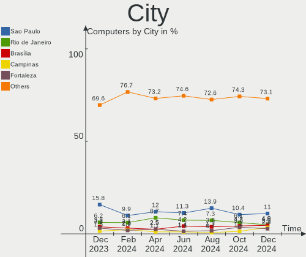
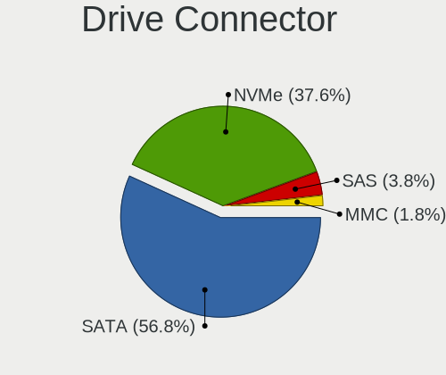
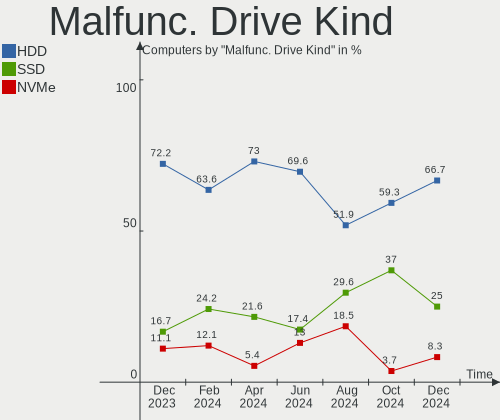
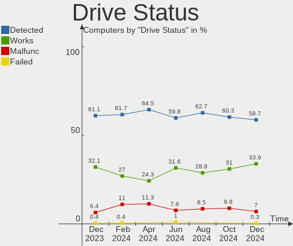
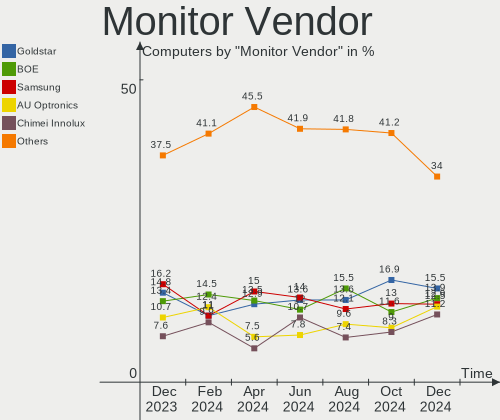
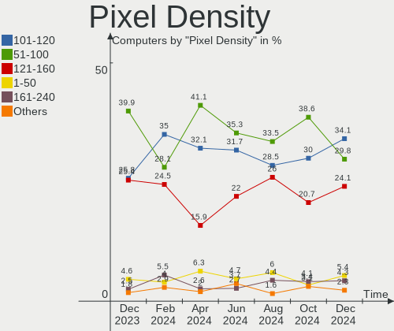
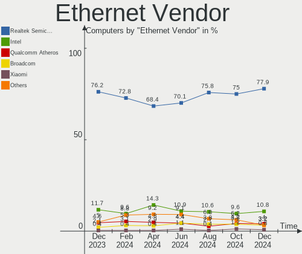
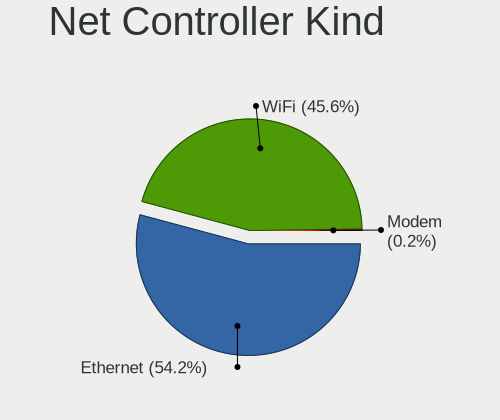
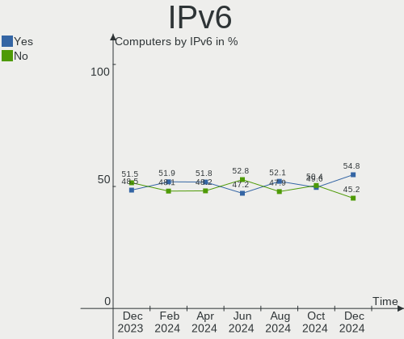
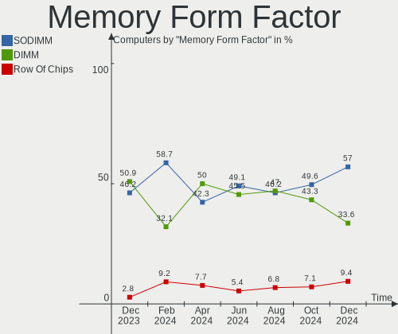

Linux in Brazil - Hardware Trends
---------------------------------

A project to identify most popular hardware characteristics and track their change
over time based on data collected by Linux users at https://Linux-Hardware.org.

Anyone can contribute to this report by the [hw-probe](https://github.com/linuxhw/hw-probe) tool:

    sudo -E hw-probe -all -upload

This is a report for all computer types. See also reports for [desktops](/Location/Brazil/Desktop/README.md) and [notebooks](/Location/Brazil/Notebook/README.md).

Period: Sep, 2022.

Contents
--------

* [ System ](#system)
  - [ OS                       ](#os)
  - [ OS Family                ](#os-family)
  - [ Kernel                   ](#kernel)
  - [ Kernel Family            ](#kernel-family)
  - [ Kernel Major Ver.        ](#kernel-major-ver)
  - [ Arch                     ](#arch)
  - [ DE                       ](#de)
  - [ Display Server           ](#display-server)
  - [ Display Manager          ](#display-manager)
  - [ OS Lang                  ](#os-lang)
  - [ Boot Mode                ](#boot-mode)
  - [ Filesystem               ](#filesystem)
  - [ Part. scheme             ](#part-scheme)
  - [ Dual Boot with Linux/BSD ](#dual-boot-with-linuxbsd)
  - [ Dual Boot (Win)          ](#dual-boot-win)

* [ Board ](#board)
  - [ Vendor                   ](#vendor)
  - [ Model                    ](#model)
  - [ Model Family             ](#model-family)
  - [ MFG Year                 ](#mfg-year)
  - [ Form Factor              ](#form-factor)
  - [ Secure Boot              ](#secure-boot)
  - [ Coreboot                 ](#coreboot)
  - [ RAM Size                 ](#ram-size)
  - [ RAM Used                 ](#ram-used)
  - [ Total Drives             ](#total-drives)
  - [ Has CD-ROM               ](#has-cd-rom)
  - [ Has Ethernet             ](#has-ethernet)
  - [ Has WiFi                 ](#has-wifi)
  - [ Has Bluetooth            ](#has-bluetooth)

* [ Location ](#location)
  - [ Country                  ](#country)
  - [ City                     ](#city)

* [ Drives ](#drives)
  - [ Drive Vendor             ](#drive-vendor)
  - [ Drive Model              ](#drive-model)
  - [ HDD Vendor               ](#hdd-vendor)
  - [ SSD Vendor               ](#ssd-vendor)
  - [ Drive Kind               ](#drive-kind)
  - [ Drive Connector          ](#drive-connector)
  - [ Drive Size               ](#drive-size)
  - [ Space Total              ](#space-total)
  - [ Space Used               ](#space-used)
  - [ Malfunc. Drives          ](#malfunc-drives)
  - [ Malfunc. Drive Vendor    ](#malfunc-drive-vendor)
  - [ Malfunc. HDD Vendor      ](#malfunc-hdd-vendor)
  - [ Malfunc. Drive Kind      ](#malfunc-drive-kind)
  - [ Failed Drives            ](#failed-drives)
  - [ Failed Drive Vendor      ](#failed-drive-vendor)
  - [ Drive Status             ](#drive-status)

* [ Storage controller ](#storage-controller)
  - [ Storage Vendor           ](#storage-vendor)
  - [ Storage Model            ](#storage-model)
  - [ Storage Kind             ](#storage-kind)

* [ Processor ](#processor)
  - [ CPU Vendor               ](#cpu-vendor)
  - [ CPU Model                ](#cpu-model)
  - [ CPU Model Family         ](#cpu-model-family)
  - [ CPU Cores                ](#cpu-cores)
  - [ CPU Sockets              ](#cpu-sockets)
  - [ CPU Threads              ](#cpu-threads)
  - [ CPU Op-Modes             ](#cpu-op-modes)
  - [ CPU Microcode            ](#cpu-microcode)
  - [ CPU Microarch            ](#cpu-microarch)

* [ Graphics ](#graphics)
  - [ GPU Vendor               ](#gpu-vendor)
  - [ GPU Model                ](#gpu-model)
  - [ GPU Combo                ](#gpu-combo)
  - [ GPU Driver               ](#gpu-driver)
  - [ GPU Memory               ](#gpu-memory)

* [ Monitor ](#monitor)
  - [ Monitor Vendor           ](#monitor-vendor)
  - [ Monitor Model            ](#monitor-model)
  - [ Monitor Resolution       ](#monitor-resolution)
  - [ Monitor Diagonal         ](#monitor-diagonal)
  - [ Monitor Width            ](#monitor-width)
  - [ Aspect Ratio             ](#aspect-ratio)
  - [ Monitor Area             ](#monitor-area)
  - [ Pixel Density            ](#pixel-density)
  - [ Multiple Monitors        ](#multiple-monitors)

* [ Network ](#network)
  - [ Net Controller Vendor    ](#net-controller-vendor)
  - [ Net Controller Model     ](#net-controller-model)
  - [ Wireless Vendor          ](#wireless-vendor)
  - [ Wireless Model           ](#wireless-model)
  - [ Ethernet Vendor          ](#ethernet-vendor)
  - [ Ethernet Model           ](#ethernet-model)
  - [ Net Controller Kind      ](#net-controller-kind)
  - [ Used Controller          ](#used-controller)
  - [ NICs                     ](#nics)
  - [ IPv6                     ](#ipv6)

* [ Bluetooth ](#bluetooth)
  - [ Bluetooth Vendor         ](#bluetooth-vendor)
  - [ Bluetooth Model          ](#bluetooth-model)

* [ Sound ](#sound)
  - [ Sound Vendor             ](#sound-vendor)
  - [ Sound Model              ](#sound-model)

* [ Memory ](#memory)
  - [ Memory Vendor            ](#memory-vendor)
  - [ Memory Model             ](#memory-model)
  - [ Memory Kind              ](#memory-kind)
  - [ Memory Form Factor       ](#memory-form-factor)
  - [ Memory Size              ](#memory-size)
  - [ Memory Speed             ](#memory-speed)

* [ Printers & scanners ](#printers--scanners)
  - [ Printer Vendor           ](#printer-vendor)
  - [ Printer Model            ](#printer-model)
  - [ Scanner Vendor           ](#scanner-vendor)
  - [ Scanner Model            ](#scanner-model)

* [ Camera ](#camera)
  - [ Camera Vendor            ](#camera-vendor)
  - [ Camera Model             ](#camera-model)

* [ Security ](#security)
  - [ Fingerprint Vendor       ](#fingerprint-vendor)
  - [ Fingerprint Model        ](#fingerprint-model)
  - [ Chipcard Vendor          ](#chipcard-vendor)
  - [ Chipcard Model           ](#chipcard-model)

* [ Unsupported ](#unsupported)
  - [ Unsupported Devices      ](#unsupported-devices)
  - [ Unsupported Device Types ](#unsupported-device-types)

System
------

OS
--

Installed operating systems

| Name                         | Computers | Percent |
|------------------------------|-----------|---------|
| Ubuntu 22.04                 | 51        | 19.39%  |
| OpenMandriva 4.3             | 24        | 9.13%   |
| Pop!_OS 22.04                | 20        | 7.6%    |
| Fedora 36                    | 17        | 6.46%   |
| Linux Mint 21                | 14        | 5.32%   |
| Linux Mint 20.3              | 11        | 4.18%   |
| Debian 11                    | 11        | 4.18%   |
| Arch                         | 10        | 3.8%    |
| Zorin 16                     | 9         | 3.42%   |
| Ubuntu 20.04                 | 7         | 2.66%   |
| Kubuntu 22.04                | 7         | 2.66%   |
| OpenMandriva 4.50            | 6         | 2.28%   |
| Fedora 37                    | 5         | 1.9%    |
| Endless 4.0.9                | 5         | 1.9%    |
| Linux Mint 20.2              | 4         | 1.52%   |
| Ubuntu MATE 22.04            | 3         | 1.14%   |
| OpenMandriva 4.2             | 3         | 1.14%   |
| Manjaro                      | 3         | 1.14%   |
| Gentoo 2.8                   | 3         | 1.14%   |
| Elementary 6.1               | 3         | 1.14%   |
| ROSA 12.2                    | 2         | 0.76%   |
| openSUSE Tumbleweed-XXXXXXXX | 2         | 0.76%   |
| LMDE 5                       | 2         | 0.76%   |
| Kaisen 2.1                   | 2         | 0.76%   |
| Garuda Linux Soaring         | 2         | 0.76%   |
| Garuda Linux                 | 2         | 0.76%   |
| Debian Testing               | 2         | 0.76%   |
| Arch Rolling                 | 2         | 0.76%   |
| Zorin 15                     | 1         | 0.38%   |
| Xubuntu 22.04                | 1         | 0.38%   |
| Xubuntu 20.04                | 1         | 0.38%   |
| Ubuntu Unity 22.04           | 1         | 0.38%   |
| Ubuntu Unity 16.04           | 1         | 0.38%   |
| Ubuntu Budgie 22.04          | 1         | 0.38%   |
| Ubuntu 18.04                 | 1         | 0.38%   |
| Raspbian 11                  | 1         | 0.38%   |
| OpenMandriva 4.90            | 1         | 0.38%   |
| Nobara 36                    | 1         | 0.38%   |
| MX 21                        | 1         | 0.38%   |
| Manjaro 22.0.0               | 1         | 0.38%   |

OS Family
---------

OS without a version

| Name          | Computers | Percent |
|---------------|-----------|---------|
| Ubuntu        | 59        | 22.43%  |
| OpenMandriva  | 34        | 12.93%  |
| Linux Mint    | 30        | 11.41%  |
| Fedora        | 22        | 8.37%   |
| Pop!_OS       | 20        | 7.6%    |
| Debian        | 15        | 5.7%    |
| Arch          | 12        | 4.56%   |
| Zorin         | 10        | 3.8%    |
| Endless       | 10        | 3.8%    |
| Kubuntu       | 9         | 3.42%   |
| Manjaro       | 5         | 1.9%    |
| Garuda Linux  | 4         | 1.52%   |
| Ubuntu MATE   | 3         | 1.14%   |
| Gentoo        | 3         | 1.14%   |
| Elementary    | 3         | 1.14%   |
| Xubuntu       | 2         | 0.76%   |
| Ubuntu Unity  | 2         | 0.76%   |
| ROSA          | 2         | 0.76%   |
| openSUSE      | 2         | 0.76%   |
| Lubuntu       | 2         | 0.76%   |
| LMDE          | 2         | 0.76%   |
| KDE neon      | 2         | 0.76%   |
| Kaisen        | 2         | 0.76%   |
| Ubuntu Budgie | 1         | 0.38%   |
| Raspbian      | 1         | 0.38%   |
| Nobara        | 1         | 0.38%   |
| MX            | 1         | 0.38%   |
| EndeavourOS   | 1         | 0.38%   |
| BigLinux      | 1         | 0.38%   |
| ArcoLinux     | 1         | 0.38%   |
| Amarok Linux  | 1         | 0.38%   |

Kernel
------

Version of the Linux kernel

| Version                    | Computers | Percent |
|----------------------------|-----------|---------|
| 5.15.0-47-generic          | 38        | 14.45%  |
| 5.15.0-48-generic          | 26        | 9.89%   |
| 5.16.7-desktop-1omv4003    | 22        | 8.37%   |
| 5.19.0-76051900-generic    | 19        | 7.22%   |
| 5.15.0-46-generic          | 14        | 5.32%   |
| 5.4.0-125-generic          | 10        | 3.8%    |
| 5.19.11-200.fc36.x86_64    | 7         | 2.66%   |
| 5.11.0-35-generic          | 7         | 2.66%   |
| 5.19.5-desktop-1omv4090    | 6         | 2.28%   |
| 5.15.0-43-generic          | 6         | 2.28%   |
| 5.10.0-18-amd64            | 6         | 2.28%   |
| 5.4.0-126-generic          | 5         | 1.9%    |
| 5.19.9-arch1-1             | 4         | 1.52%   |
| 5.19.0-1-amd64             | 4         | 1.52%   |
| 5.19.8-200.fc36.x86_64     | 3         | 1.14%   |
| 5.15.60-1-MANJARO          | 3         | 1.14%   |
| 5.10.14-desktop-1omv4002   | 3         | 1.14%   |
| 5.10.0-17-amd64            | 3         | 1.14%   |
| 5.4.0-124-generic          | 2         | 0.76%   |
| 5.19.9-zen1-1-zen          | 2         | 0.76%   |
| 5.19.9-200.fc36.x86_64     | 2         | 0.76%   |
| 5.19.8-xanmod1             | 2         | 0.76%   |
| 5.19.7-zen2-1-zen          | 2         | 0.76%   |
| 5.19.7-arch1-1             | 2         | 0.76%   |
| 5.19.11-arch1-1            | 2         | 0.76%   |
| 5.19.10-300.fc37.x86_64    | 2         | 0.76%   |
| 5.17.0-kaisen1-amd64       | 2         | 0.76%   |
| 5.16.13-desktop-1omv4003   | 2         | 0.76%   |
| 5.15.70-1-lts              | 2         | 0.76%   |
| 5.15.0-50-generic          | 2         | 0.76%   |
| 5.15.0-46-lowlatency       | 2         | 0.76%   |
| 5.15.0-41-generic          | 2         | 0.76%   |
| 6.0.0-0.rc6.41.fc38.x86_64 | 1         | 0.38%   |
| 5.8.0-59-generic           | 1         | 0.38%   |
| 5.8.0-14-generic           | 1         | 0.38%   |
| 5.4.212-300.fc36.x86_64    | 1         | 0.38%   |
| 5.4.0-90-generic           | 1         | 0.38%   |
| 5.4.0-74-generic           | 1         | 0.38%   |
| 5.4.0-72-generic           | 1         | 0.38%   |
| 5.4.0-19-generic           | 1         | 0.38%   |

Kernel Family
-------------

Linux kernel without a distro release

| Version  | Computers | Percent |
|----------|-----------|---------|
| 5.15.0   | 92        | 34.98%  |
| 5.19.0   | 24        | 9.13%   |
| 5.4.0    | 22        | 8.37%   |
| 5.16.7   | 22        | 8.37%   |
| 5.10.0   | 12        | 4.56%   |
| 5.19.9   | 9         | 3.42%   |
| 5.19.8   | 9         | 3.42%   |
| 5.19.11  | 9         | 3.42%   |
| 5.11.0   | 8         | 3.04%   |
| 5.19.7   | 6         | 2.28%   |
| 5.19.5   | 6         | 2.28%   |
| 5.19.10  | 3         | 1.14%   |
| 5.17.0   | 3         | 1.14%   |
| 5.15.60  | 3         | 1.14%   |
| 5.10.14  | 3         | 1.14%   |
| 4.15.0   | 3         | 1.14%   |
| 5.8.0    | 2         | 0.76%   |
| 5.19.6   | 2         | 0.76%   |
| 5.18.17  | 2         | 0.76%   |
| 5.18.0   | 2         | 0.76%   |
| 5.16.13  | 2         | 0.76%   |
| 5.15.70  | 2         | 0.76%   |
| 5.14.0   | 2         | 0.76%   |
| 6.0.0    | 1         | 0.38%   |
| 5.4.212  | 1         | 0.38%   |
| 5.19.4   | 1         | 0.38%   |
| 5.19.2   | 1         | 0.38%   |
| 5.18.12  | 1         | 0.38%   |
| 5.17.5   | 1         | 0.38%   |
| 5.17.15  | 1         | 0.38%   |
| 5.15.68  | 1         | 0.38%   |
| 5.15.67  | 1         | 0.38%   |
| 5.15.61  | 1         | 0.38%   |
| 5.15.59  | 1         | 0.38%   |
| 5.10.74  | 1         | 0.38%   |
| 5.10.131 | 1         | 0.38%   |
| 5.10.118 | 1         | 0.38%   |
| 4.19.0   | 1         | 0.38%   |

Kernel Major Ver.
-----------------

Linux kernel major version

| Version | Computers | Percent |
|---------|-----------|---------|
| 5.15    | 101       | 38.4%   |
| 5.19    | 70        | 26.62%  |
| 5.16    | 24        | 9.13%   |
| 5.4     | 23        | 8.75%   |
| 5.10    | 18        | 6.84%   |
| 5.11    | 8         | 3.04%   |
| 5.18    | 5         | 1.9%    |
| 5.17    | 5         | 1.9%    |
| 4.15    | 3         | 1.14%   |
| 5.8     | 2         | 0.76%   |
| 5.14    | 2         | 0.76%   |
| 6.0     | 1         | 0.38%   |
| 4.19    | 1         | 0.38%   |

Arch
----

OS architecture (x86_64, i586, etc.)

| Name   | Computers | Percent |
|--------|-----------|---------|
| x86_64 | 258       | 98.1%   |
| i686   | 4         | 1.52%   |
| armv7l | 1         | 0.38%   |

DE
--

Desktop Environment

| Name            | Computers | Percent |
|-----------------|-----------|---------|
| GNOME           | 133       | 50.57%  |
| KDE5            | 62        | 23.57%  |
| X-Cinnamon      | 21        | 7.98%   |
| XFCE            | 16        | 6.08%   |
| MATE            | 9         | 3.42%   |
| Cinnamon        | 5         | 1.9%    |
| Unknown         | 5         | 1.9%    |
| Pantheon        | 3         | 1.14%   |
| Unity           | 2         | 0.76%   |
| LXQt            | 2         | 0.76%   |
| LXDE            | 1         | 0.38%   |
| jwm             | 1         | 0.38%   |
| GNOME Flashback | 1         | 0.38%   |
| Enlightenment   | 1         | 0.38%   |
| Budgie          | 1         | 0.38%   |

Display Server
--------------

X11 or Wayland

| Name    | Computers | Percent |
|---------|-----------|---------|
| X11     | 192       | 73%     |
| Wayland | 64        | 24.33%  |
| Unknown | 4         | 1.52%   |
| Tty     | 3         | 1.14%   |

Display Manager
---------------

SDDM, LightDM, etc.

| Name    | Computers | Percent |
|---------|-----------|---------|
| Unknown | 106       | 40.3%   |
| GDM3    | 56        | 21.29%  |
| SDDM    | 50        | 19.01%  |
| LightDM | 31        | 11.79%  |
| GDM     | 19        | 7.22%   |
| XDM     | 1         | 0.38%   |

OS Lang
-------

Language

| Lang    | Computers | Percent |
|---------|-----------|---------|
| pt_BR   | 195       | 74.14%  |
| en_US   | 63        | 23.95%  |
| en_GB   | 2         | 0.76%   |
| C       | 2         | 0.76%   |
| Unknown | 1         | 0.38%   |

Boot Mode
---------

EFI or BIOS

| Mode | Computers | Percent |
|------|-----------|---------|
| BIOS | 157       | 59.7%   |
| EFI  | 106       | 40.3%   |

Filesystem
----------

Type of filesystem

| Type    | Computers | Percent |
|---------|-----------|---------|
| Ext4    | 188       | 71.48%  |
| Btrfs   | 40        | 15.21%  |
| Overlay | 30        | 11.41%  |
| Ext3    | 2         | 0.76%   |
| Zfs     | 1         | 0.38%   |
| Xfs     | 1         | 0.38%   |
| F2fs    | 1         | 0.38%   |

Part. scheme
------------

Scheme of partitioning

| Type    | Computers | Percent |
|---------|-----------|---------|
| Unknown | 154       | 58.56%  |
| GPT     | 83        | 31.56%  |
| MBR     | 26        | 9.89%   |

Dual Boot with Linux/BSD
------------------------

Hosting more than one Linux/BSD

| Dual boot | Computers | Percent |
|-----------|-----------|---------|
| No        | 221       | 84.03%  |
| Yes       | 42        | 15.97%  |

Dual Boot (Win)
---------------

Hosting Linux and Windows

| Dual boot | Computers | Percent |
|-----------|-----------|---------|
| No        | 189       | 71.86%  |
| Yes       | 74        | 28.14%  |

Board
-----

Vendor
------

Motherboard manufacturer

| Name                    | Computers | Percent |
|-------------------------|-----------|---------|
| Dell                    | 41        | 15.59%  |
| ASUSTek Computer        | 39        | 14.83%  |
| Lenovo                  | 28        | 10.65%  |
| Acer                    | 19        | 7.22%   |
| Intel                   | 17        | 6.46%   |
| Gigabyte Technology     | 15        | 5.7%    |
| Samsung Electronics     | 14        | 5.32%   |
| Positivo                | 14        | 5.32%   |
| Hewlett-Packard         | 9         | 3.42%   |
| ASRock                  | 9         | 3.42%   |
| MSI                     | 6         | 2.28%   |
| Unknown                 | 6         | 2.28%   |
| Avell High Performance  | 5         | 1.9%    |
| PCWare                  | 4         | 1.52%   |
| LG Electronics          | 4         | 1.52%   |
| Biostar                 | 3         | 1.14%   |
| Positivo Bahia - VAIO   | 2         | 0.76%   |
| Foxconn                 | 2         | 0.76%   |
| Daten Tecnologia        | 2         | 0.76%   |
| Chuwi                   | 2         | 0.76%   |
| Apple                   | 2         | 0.76%   |
| Timi                    | 1         | 0.38%   |
| Supermicro              | 1         | 0.38%   |
| Standard                | 1         | 0.38%   |
| Sony                    | 1         | 0.38%   |
| Semp Toshiba            | 1         | 0.38%   |
| Raspberry Pi Foundation | 1         | 0.38%   |
| Philco                  | 1         | 0.38%   |
| OEM                     | 1         | 0.38%   |
| Notebook                | 1         | 0.38%   |
| Multilaser              | 1         | 0.38%   |
| MACHINIST               | 1         | 0.38%   |
| Itautec                 | 1         | 0.38%   |
| Gateway                 | 1         | 0.38%   |
| ECS                     | 1         | 0.38%   |
| Digibras                | 1         | 0.38%   |
| Digiboard               | 1         | 0.38%   |
| Compal                  | 1         | 0.38%   |
| CCE                     | 1         | 0.38%   |
| AMI                     | 1         | 0.38%   |

Model
-----

Motherboard model

| Name                                        | Computers | Percent |
|---------------------------------------------|-----------|---------|
| Unknown                                     | 7         | 2.66%   |
| Intel H61                                   | 5         | 1.9%    |
| Lenovo IdeaPad 3 15ALC6 82MF                | 4         | 1.52%   |
| Dell Inspiron 5566                          | 4         | 1.52%   |
| Positivo Mobile                             | 3         | 1.14%   |
| ASUS TUF Gaming B550M-PLUS                  | 3         | 1.14%   |
| ASUS All Series                             | 3         | 1.14%   |
| Acer Nitro AN515-44                         | 3         | 1.14%   |
| Samsung RV411/RV511/E3511/S3511/RV711/E3411 | 2         | 0.76%   |
| Samsung 550XBE/350XBE                       | 2         | 0.76%   |
| Samsung 300E5M/300E5L                       | 2         | 0.76%   |
| Positivo S14CT01                            | 2         | 0.76%   |
| Positivo POS-PQ45AU                         | 2         | 0.76%   |
| PCWare IPMH61R3                             | 2         | 0.76%   |
| Lenovo IdeaPad S145-15IWL 81S9              | 2         | 0.76%   |
| Lenovo G40-80 80JE                          | 2         | 0.76%   |
| Intel X99 V1.0                              | 2         | 0.76%   |
| Dell Vostro 3500                            | 2         | 0.76%   |
| Dell Vostro 15 5510                         | 2         | 0.76%   |
| Dell Inspiron 3442                          | 2         | 0.76%   |
| Dell Inspiron 15 7000 Gaming                | 2         | 0.76%   |
| Daten Tecnologia DT02-M4                    | 2         | 0.76%   |
| Avell High Performance B.ON                 | 2         | 0.76%   |
| ASUS M5A78L-M/USB3                          | 2         | 0.76%   |
| ASUS K46CB                                  | 2         | 0.76%   |
| ASRock A320M-HD                             | 2         | 0.76%   |
| Acer Aspire A515-54                         | 2         | 0.76%   |
| Timi TM1701                                 | 1         | 0.38%   |
| Supermicro SKAGIT09                         | 1         | 0.38%   |
| Standard AHV                                | 1         | 0.38%   |
| Sony SVE15125CBW                            | 1         | 0.38%   |
| Semp Toshiba IS 1413G                       | 1         | 0.38%   |
| Samsung RV415/RV515                         | 1         | 0.38%   |
| Samsung 670Z5E                              | 1         | 0.38%   |
| Samsung 550P5C/550P7C                       | 1         | 0.38%   |
| Samsung 370E4K                              | 1         | 0.38%   |
| Samsung 340XAA/350XAA/550XAA                | 1         | 0.38%   |
| Samsung 300E5K/300E5Q                       | 1         | 0.38%   |
| Samsung 275E4E/275E5E                       | 1         | 0.38%   |
| Samsung 270E5G/270E5U                       | 1         | 0.38%   |

Model Family
------------

Motherboard model prefix

| Name                        | Computers | Percent |
|-----------------------------|-----------|---------|
| Dell Inspiron               | 16        | 6.08%   |
| Acer Aspire                 | 14        | 5.32%   |
| Lenovo IdeaPad              | 11        | 4.18%   |
| Dell Vostro                 | 10        | 3.8%    |
| Lenovo ThinkPad             | 9         | 3.42%   |
| ASUS TUF                    | 8         | 3.04%   |
| Unknown                     | 7         | 2.66%   |
| Intel H61                   | 5         | 1.9%    |
| Dell OptiPlex               | 5         | 1.9%    |
| Dell Latitude               | 4         | 1.52%   |
| ASUS PRIME                  | 4         | 1.52%   |
| Acer Nitro                  | 4         | 1.52%   |
| Positivo Mobile             | 3         | 1.14%   |
| Intel X99                   | 3         | 1.14%   |
| HP ProBook                  | 3         | 1.14%   |
| ASUS ROG                    | 3         | 1.14%   |
| ASUS M5A78L-M               | 3         | 1.14%   |
| ASUS All                    | 3         | 1.14%   |
| Samsung RV411               | 2         | 0.76%   |
| Samsung 550XBE              | 2         | 0.76%   |
| Samsung 300E5M              | 2         | 0.76%   |
| Positivo S14CT01            | 2         | 0.76%   |
| Positivo POS-PQ45AU         | 2         | 0.76%   |
| PCWare IPMH61R3             | 2         | 0.76%   |
| Lenovo G40-80               | 2         | 0.76%   |
| Gigabyte B450M              | 2         | 0.76%   |
| Dell G15                    | 2         | 0.76%   |
| Daten Tecnologia DT02-M4    | 2         | 0.76%   |
| Avell High Performance B.ON | 2         | 0.76%   |
| ASUS VivoBook               | 2         | 0.76%   |
| ASUS K46CB                  | 2         | 0.76%   |
| ASRock FM2A55M-HD+          | 2         | 0.76%   |
| ASRock A320M-HD             | 2         | 0.76%   |
| Timi TM1701                 | 1         | 0.38%   |
| Supermicro SKAGIT09         | 1         | 0.38%   |
| Standard AHV                | 1         | 0.38%   |
| Sony SVE15125CBW            | 1         | 0.38%   |
| Semp Toshiba IS             | 1         | 0.38%   |
| Samsung RV415               | 1         | 0.38%   |
| Samsung 670Z5E              | 1         | 0.38%   |

MFG Year
--------

Motherboard manufacture year

| Year    | Computers | Percent |
|---------|-----------|---------|
| 2021    | 32        | 12.17%  |
| 2020    | 25        | 9.51%   |
| 2012    | 23        | 8.75%   |
| 2019    | 21        | 7.98%   |
| 2011    | 21        | 7.98%   |
| 2018    | 20        | 7.6%    |
| 2017    | 18        | 6.84%   |
| 2014    | 18        | 6.84%   |
| 2013    | 17        | 6.46%   |
| 2016    | 15        | 5.7%    |
| 2010    | 12        | 4.56%   |
| 2015    | 10        | 3.8%    |
| 2009    | 8         | 3.04%   |
| 2008    | 7         | 2.66%   |
| 2022    | 5         | 1.9%    |
| 2007    | 5         | 1.9%    |
| 2006    | 5         | 1.9%    |
| Unknown | 1         | 0.38%   |

Form Factor
-----------

Physical design of the computer

| Name           | Computers | Percent |
|----------------|-----------|---------|
| Notebook       | 149       | 56.65%  |
| Desktop        | 109       | 41.44%  |
| System on chip | 1         | 0.38%   |
| Tablet         | 1         | 0.38%   |
| Convertible    | 1         | 0.38%   |
| Mini pc        | 1         | 0.38%   |
| Server         | 1         | 0.38%   |

Secure Boot
-----------

Enabled or disabled

| State    | Computers | Percent |
|----------|-----------|---------|
| Disabled | 249       | 94.68%  |
| Enabled  | 14        | 5.32%   |

Coreboot
--------

Have coreboot on board

| Used | Computers | Percent |
|------|-----------|---------|
| No   | 263       | 100%    |

RAM Size
--------

Total RAM memory

| Size in GB  | Computers | Percent |
|-------------|-----------|---------|
| 4.01-8.0    | 72        | 27.38%  |
| 3.01-4.0    | 56        | 21.29%  |
| 16.01-24.0  | 55        | 20.91%  |
| 8.01-16.0   | 40        | 15.21%  |
| 32.01-64.0  | 15        | 5.7%    |
| 1.01-2.0    | 10        | 3.8%    |
| 64.01-256.0 | 6         | 2.28%   |
| 2.01-3.0    | 5         | 1.9%    |
| 24.01-32.0  | 2         | 0.76%   |
| 0.51-1.0    | 2         | 0.76%   |

RAM Used
--------

Used RAM memory

| Used GB    | Computers | Percent |
|------------|-----------|---------|
| 1.01-2.0   | 96        | 36.5%   |
| 2.01-3.0   | 62        | 23.57%  |
| 4.01-8.0   | 39        | 14.83%  |
| 3.01-4.0   | 38        | 14.45%  |
| 8.01-16.0  | 13        | 4.94%   |
| 0.51-1.0   | 12        | 4.56%   |
| 16.01-24.0 | 2         | 0.76%   |
| 0.01-0.5   | 1         | 0.38%   |

Total Drives
------------

Number of drives on board

| Drives | Computers | Percent |
|--------|-----------|---------|
| 1      | 155       | 58.94%  |
| 2      | 73        | 27.76%  |
| 3      | 20        | 7.6%    |
| 4      | 7         | 2.66%   |
| 5      | 4         | 1.52%   |
| 6      | 2         | 0.76%   |
| 0      | 2         | 0.76%   |

Has CD-ROM
----------

Has CD-ROM on board

| Presented | Computers | Percent |
|-----------|-----------|---------|
| No        | 176       | 66.92%  |
| Yes       | 87        | 33.08%  |

Has Ethernet
------------

Has Ethernet on board

| Presented | Computers | Percent |
|-----------|-----------|---------|
| Yes       | 235       | 89.35%  |
| No        | 28        | 10.65%  |

Has WiFi
--------

Has WiFi module

| Presented | Computers | Percent |
|-----------|-----------|---------|
| Yes       | 191       | 72.62%  |
| No        | 72        | 27.38%  |

Has Bluetooth
-------------

Has Bluetooth module

| Presented | Computers | Percent |
|-----------|-----------|---------|
| Yes       | 141       | 53.61%  |
| No        | 122       | 46.39%  |

Location
--------

Country
-------

Geographic location (country)

| Country | Computers | Percent |
|---------|-----------|---------|
| Brazil  | 263       | 100%    |

City
----

Geographic location (city)

| City                 | Computers | Percent |
|----------------------|-----------|---------|
| Sao Paulo            | 30        | 11.41%  |
| Rio de Janeiro       | 22        | 8.37%   |
| Fortaleza            | 9         | 3.42%   |
| Brasília            | 9         | 3.42%   |
| Belo Horizonte       | 8         | 3.04%   |
| Campo Grande         | 5         | 1.9%    |
| Vitória             | 4         | 1.52%   |
| Porto Alegre         | 4         | 1.52%   |
| Goiânia             | 4         | 1.52%   |
| Curitiba             | 4         | 1.52%   |
| Sao Luís            | 3         | 1.14%   |
| Sao José dos Campos | 3         | 1.14%   |
| Sao Jose             | 3         | 1.14%   |
| Salvador             | 3         | 1.14%   |
| Ribeirao Preto       | 3         | 1.14%   |
| Pelotas              | 3         | 1.14%   |
| Niterói             | 3         | 1.14%   |
| Joinville            | 3         | 1.14%   |
| Unknown              | 3         | 1.14%   |
| Valparaiso de Goias  | 2         | 0.76%   |
| Uberlândia          | 2         | 0.76%   |
| Taubate              | 2         | 0.76%   |
| Sao Joaquim da Barra | 2         | 0.76%   |
| Santo André         | 2         | 0.76%   |
| Praia Grande         | 2         | 0.76%   |
| Pouso Alegre         | 2         | 0.76%   |
| Natal                | 2         | 0.76%   |
| Maringá             | 2         | 0.76%   |
| Manaus               | 2         | 0.76%   |
| Londrina             | 2         | 0.76%   |
| Jundiaí             | 2         | 0.76%   |
| Itajuba              | 2         | 0.76%   |
| Florianópolis       | 2         | 0.76%   |
| Cuiabá              | 2         | 0.76%   |
| Claudio              | 2         | 0.76%   |
| Caxias do Sul        | 2         | 0.76%   |
| Cascavel             | 2         | 0.76%   |
| Campinas             | 2         | 0.76%   |
| Braganca Paulista    | 2         | 0.76%   |
| Belém               | 2         | 0.76%   |

Drives
------

Drive Vendor
------------

Hard drive vendors

| Vendor                         | Computers | Drives | Percent |
|--------------------------------|-----------|--------|---------|
| WDC                            | 65        | 69     | 16.88%  |
| Seagate                        | 50        | 63     | 12.99%  |
| Kingston                       | 39        | 40     | 10.13%  |
| Samsung Electronics            | 31        | 37     | 8.05%   |
| Toshiba                        | 21        | 21     | 5.45%   |
| SanDisk                        | 20        | 20     | 5.19%   |
| A-DATA Technology              | 19        | 20     | 4.94%   |
| China                          | 13        | 13     | 3.38%   |
| Crucial                        | 12        | 13     | 3.12%   |
| Silicon Motion                 | 10        | 10     | 2.6%    |
| Unknown                        | 9         | 9      | 2.34%   |
| Hitachi                        | 7         | 7      | 1.82%   |
| Netac                          | 6         | 6      | 1.56%   |
| KingSpec                       | 6         | 6      | 1.56%   |
| SK hynix                       | 5         | 5      | 1.3%    |
| Intel                          | 5         | 5      | 1.3%    |
| ADATA Technology               | 5         | 6      | 1.3%    |
| WALRAM                         | 4         | 4      | 1.04%   |
| Solid State Storage Technology | 4         | 4      | 1.04%   |
| HGST                           | 4         | 4      | 1.04%   |
| SSSTC                          | 3         | 3      | 0.78%   |
| Phison Electronics             | 3         | 3      | 0.78%   |
| Lexar                          | 3         | 3      | 0.78%   |
| XPG                            | 2         | 2      | 0.52%   |
| Realtek Semiconductor          | 2         | 2      | 0.52%   |
| Phison                         | 2         | 2      | 0.52%   |
| Patriot                        | 2         | 2      | 0.52%   |
| LITEON                         | 2         | 2      | 0.52%   |
| KINGBANK                       | 2         | 2      | 0.52%   |
| AFOX                           | 2         | 2      | 0.52%   |
| Unknown                        | 2         | 2      | 0.52%   |
| XrayDisk                       | 1         | 1      | 0.26%   |
| Team                           | 1         | 1      | 0.26%   |
| TANCA                          | 1         | 1      | 0.26%   |
| T-FORCE                        | 1         | 1      | 0.26%   |
| SuperSSpeed                    | 1         | 1      | 0.26%   |
| Solid State Storage            | 1         | 1      | 0.26%   |
| RCESSD                         | 1         | 1      | 0.26%   |
| PNY                            | 1         | 1      | 0.26%   |
| Micron/Crucial Technology      | 1         | 1      | 0.26%   |

Drive Model
-----------

Hard drive models

| Model                                    | Computers | Percent |
|------------------------------------------|-----------|---------|
| Kingston SA400S37240G 240GB SSD          | 11        | 2.74%   |
| Kingston SA400S37480G 480GB SSD          | 10        | 2.49%   |
| Kingston SA400S37120G 120GB SSD          | 8         | 1.99%   |
| Seagate ST500DM002-1BD142 500GB          | 6         | 1.49%   |
| Seagate ST1000DM010-2EP102 1TB           | 6         | 1.49%   |
| Samsung HD161HJ 160GB                    | 5         | 1.24%   |
| Crucial CT240BX500SSD1 240GB             | 5         | 1.24%   |
| A-DATA IM2P33F3A NVMe 256GB              | 5         | 1.24%   |
| WDC WDS240G2G0A-00JH30 240GB SSD         | 4         | 1%      |
| Solid State Storage NVMe SSD Drive 256GB | 4         | 1%      |
| Seagate ST500LM012 HN-M500MBB 500GB      | 4         | 1%      |
| WDC WD10SPZX-24Z10T0 1TB                 | 3         | 0.75%   |
| WDC WD10EZEX-00WN4A0 1TB                 | 3         | 0.75%   |
| Toshiba MQ04ABF100 1TB                   | 3         | 0.75%   |
| Toshiba MQ01ABF050 500GB                 | 3         | 0.75%   |
| Toshiba MQ01ABD100 1TB                   | 3         | 0.75%   |
| Toshiba MQ01ABD050 500GB                 | 3         | 0.75%   |
| Seagate ST3500312CS 500GB                | 3         | 0.75%   |
| Seagate ST1000LM024 HN-M101MBB 1TB       | 3         | 0.75%   |
| SanDisk SSD PLUS 240GB                   | 3         | 0.75%   |
| Samsung HD502HJ 500GB                    | 3         | 0.75%   |
| Samsung HD322HJ 320GB                    | 3         | 0.75%   |
| Phison E16 PCIe4 NVMe Controller 1TB     | 3         | 0.75%   |
| KingSpec P4-240 240GB SSD                | 3         | 0.75%   |
| HGST HTS545050A7E680 500GB               | 3         | 0.75%   |
| China SSD 256GB                          | 3         | 0.75%   |
| A-DATA IM2P33F8A-512GD 512GB             | 3         | 0.75%   |
| XPG GAMMIX S5 512GB                      | 2         | 0.5%    |
| WDC WD5000LPVX-22V0TT0 500GB             | 2         | 0.5%    |
| WDC WD5000LPCX-24VHAT0 500GB             | 2         | 0.5%    |
| WDC WD5000BPVT-22HXZT3 500GB             | 2         | 0.5%    |
| WDC WD5000AAKX-003CA0 500GB              | 2         | 0.5%    |
| WDC WD10SPZX-75Z10T1 1TB                 | 2         | 0.5%    |
| WDC WD10SPZX-24Z10 1TB                   | 2         | 0.5%    |
| WDC WD10SPZX-21Z10T0 1TB                 | 2         | 0.5%    |
| WDC WD10JPCX-24UE4T0 1TB                 | 2         | 0.5%    |
| WDC WD10EURX-63FH1Y0 1TB                 | 2         | 0.5%    |
| Unknown MMC Card  64GB                   | 2         | 0.5%    |
| Unknown MMC Card  32GB                   | 2         | 0.5%    |
| Toshiba MQ02ABD100H 1TB                  | 2         | 0.5%    |

HDD Vendor
----------

Hard disk drive vendors

| Vendor              | Computers | Drives | Percent |
|---------------------|-----------|--------|---------|
| WDC                 | 56        | 59     | 35.67%  |
| Seagate             | 49        | 62     | 31.21%  |
| Toshiba             | 21        | 21     | 13.38%  |
| Samsung Electronics | 19        | 25     | 12.1%   |
| Hitachi             | 7         | 7      | 4.46%   |
| HGST                | 4         | 4      | 2.55%   |
| Maxtor              | 1         | 1      | 0.64%   |

SSD Vendor
----------

Solid state drive vendors

| Vendor              | Computers | Drives | Percent |
|---------------------|-----------|--------|---------|
| Kingston            | 38        | 39     | 29.69%  |
| China               | 13        | 13     | 10.16%  |
| Crucial             | 12        | 13     | 9.38%   |
| SanDisk             | 9         | 9      | 7.03%   |
| WDC                 | 6         | 6      | 4.69%   |
| KingSpec            | 6         | 6      | 4.69%   |
| Samsung Electronics | 5         | 5      | 3.91%   |
| Netac               | 4         | 4      | 3.13%   |
| A-DATA Technology   | 4         | 4      | 3.13%   |
| Lexar               | 3         | 3      | 2.34%   |
| Intel               | 3         | 3      | 2.34%   |
| Patriot             | 2         | 2      | 1.56%   |
| LITEON              | 2         | 2      | 1.56%   |
| KINGBANK            | 2         | 2      | 1.56%   |
| AFOX                | 2         | 2      | 1.56%   |
| WALRAM              | 1         | 1      | 0.78%   |
| Team                | 1         | 1      | 0.78%   |
| TANCA               | 1         | 1      | 0.78%   |
| SuperSSpeed         | 1         | 1      | 0.78%   |
| Seagate             | 1         | 1      | 0.78%   |
| PNY                 | 1         | 1      | 0.78%   |
| KODAK               | 1         | 1      | 0.78%   |
| HS-SSD-C100         | 1         | 1      | 0.78%   |
| Hewlett-Packard     | 1         | 1      | 0.78%   |
| GLOWAY              | 1         | 1      | 0.78%   |
| DERLER              | 1         | 1      | 0.78%   |
| Corsair             | 1         | 1      | 0.78%   |
| Colorful            | 1         | 1      | 0.78%   |
| BHT                 | 1         | 1      | 0.78%   |
| Argon               | 1         | 1      | 0.78%   |
| Acer                | 1         | 1      | 0.78%   |
| Unknown             | 1         | 1      | 0.78%   |

Drive Kind
----------

HDD or SSD

| Kind    | Computers | Drives | Percent |
|---------|-----------|--------|---------|
| HDD     | 135       | 179    | 39.24%  |
| SSD     | 118       | 130    | 34.3%   |
| NVMe    | 74        | 85     | 21.51%  |
| MMC     | 10        | 11     | 2.91%   |
| Unknown | 7         | 7      | 2.03%   |

Drive Connector
---------------

SATA, SAS, NVMe, etc.

| Type | Computers | Drives | Percent |
|------|-----------|--------|---------|
| SATA | 208       | 310    | 69.8%   |
| NVMe | 73        | 84     | 24.5%   |
| MMC  | 10        | 11     | 3.36%   |
| SAS  | 7         | 7      | 2.35%   |

Drive Size
----------

Size of hard drive

| Size in TB | Computers | Drives | Percent |
|------------|-----------|--------|---------|
| 0.01-0.5   | 163       | 214    | 65.99%  |
| 0.51-1.0   | 70        | 77     | 28.34%  |
| 1.01-2.0   | 6         | 6      | 2.43%   |
| 3.01-4.0   | 4         | 8      | 1.62%   |
| 2.01-3.0   | 4         | 4      | 1.62%   |

Space Total
-----------

Amount of disk space available on the file system

| Size in GB     | Computers | Percent |
|----------------|-----------|---------|
| 101-250        | 73        | 27.76%  |
| 251-500        | 56        | 21.29%  |
| 501-1000       | 35        | 13.31%  |
| 1001-2000      | 30        | 11.41%  |
| 1-20           | 23        | 8.75%   |
| 21-50          | 12        | 4.56%   |
| 51-100         | 12        | 4.56%   |
| 2001-3000      | 8         | 3.04%   |
| More than 3000 | 7         | 2.66%   |
| Unknown        | 7         | 2.66%   |

Space Used
----------

Amount of used disk space

| Used GB        | Computers | Percent |
|----------------|-----------|---------|
| 1-20           | 92        | 34.98%  |
| 21-50          | 45        | 17.11%  |
| 101-250        | 39        | 14.83%  |
| 51-100         | 28        | 10.65%  |
| 501-1000       | 21        | 7.98%   |
| 251-500        | 19        | 7.22%   |
| 1001-2000      | 8         | 3.04%   |
| Unknown        | 7         | 2.66%   |
| More than 3000 | 2         | 0.76%   |
| 2001-3000      | 2         | 0.76%   |

Malfunc. Drives
---------------

Drive models with a malfunction

| Model                                         | Computers | Drives | Percent |
|-----------------------------------------------|-----------|--------|---------|
| WDC WD5000AAKX-003CA0 500GB                   | 2         | 2      | 4.44%   |
| WDC WD10EURX-63FH1Y0 1TB                      | 2         | 2      | 4.44%   |
| Toshiba MQ01ABD050 500GB                      | 2         | 2      | 4.44%   |
| Seagate ST500DM002-1BD142 500GB               | 2         | 2      | 4.44%   |
| Hitachi HTS723232A7A364 320GB                 | 2         | 2      | 4.44%   |
| WDC WD5000LPVX-22V0TT0 500GB                  | 1         | 1      | 2.22%   |
| WDC WD5000AAKX-00U6AA0 500GB                  | 1         | 1      | 2.22%   |
| WDC WD3200AAJS-65M0A0 320GB                   | 1         | 1      | 2.22%   |
| WDC WD3200AAJS-00L7A0 320GB                   | 1         | 1      | 2.22%   |
| WDC WD30PURX-64P6ZY0 3TB                      | 1         | 1      | 2.22%   |
| WDC WD1600AAJS-75B4A0 160GB                   | 1         | 1      | 2.22%   |
| WDC WD10SPZX-75Z10T1 1TB                      | 1         | 1      | 2.22%   |
| WDC WD10SPZX-24Z10T0 1TB                      | 1         | 1      | 2.22%   |
| WDC WD10EZEX-75WN4A1 1TB                      | 1         | 1      | 2.22%   |
| WDC WD10EARS-00Y5B1 1TB                       | 1         | 1      | 2.22%   |
| Toshiba MQ01ABD100 1TB                        | 1         | 1      | 2.22%   |
| Toshiba MK5061GSYN 500GB                      | 1         | 1      | 2.22%   |
| Toshiba MK2529GSG 250GB                       | 1         | 1      | 2.22%   |
| Seagate ST500LM012 HN-M500MBB 500GB           | 1         | 1      | 2.22%   |
| Seagate ST380811AS 80GB                       | 1         | 1      | 2.22%   |
| Seagate ST3500418AS 500GB                     | 1         | 1      | 2.22%   |
| Seagate ST3500312CS 500GB                     | 1         | 1      | 2.22%   |
| Seagate ST320LT007-9ZV142 320GB               | 1         | 1      | 2.22%   |
| Seagate ST320LM001 HN-M320MBB 320GB           | 1         | 1      | 2.22%   |
| Seagate ST3000DM001-1ER166 3TB                | 1         | 1      | 2.22%   |
| Seagate ST2000NP0011 2TB                      | 1         | 1      | 2.22%   |
| Seagate ST1000LM048-2E7172 1TB                | 1         | 1      | 2.22%   |
| SanDisk SSD U100 24GB                         | 1         | 1      | 2.22%   |
| Samsung Electronics SG9MSM6D024GPM00 24GB SSD | 1         | 1      | 2.22%   |
| Samsung Electronics HM321HI 320GB             | 1         | 1      | 2.22%   |
| Samsung Electronics HD322HJ 320GB             | 1         | 1      | 2.22%   |
| Samsung Electronics HD161HJ 160GB             | 1         | 1      | 2.22%   |
| PNY SSD2SC120G3LC709B121-460I 120GB           | 1         | 1      | 2.22%   |
| Kingston SA400S37120G 120GB SSD               | 1         | 1      | 2.22%   |
| Hitachi HDS5C1010CLA382 1TB                   | 1         | 1      | 2.22%   |
| HGST HTS545050A7E680 500GB                    | 1         | 1      | 2.22%   |
| Crucial CT1024MX200SSD1 1TB                   | 1         | 1      | 2.22%   |
| China SSD 360GB                               | 1         | 1      | 2.22%   |
| China SSD 120GB                               | 1         | 1      | 2.22%   |
| China SATA SSD 240GB                          | 1         | 1      | 2.22%   |

Malfunc. Drive Vendor
---------------------

Vendors of faulty drives

| Vendor              | Computers | Drives | Percent |
|---------------------|-----------|--------|---------|
| WDC                 | 13        | 14     | 30.95%  |
| Seagate             | 10        | 11     | 23.81%  |
| Toshiba             | 5         | 5      | 11.9%   |
| Samsung Electronics | 3         | 4      | 7.14%   |
| Hitachi             | 3         | 3      | 7.14%   |
| China               | 3         | 3      | 7.14%   |
| SanDisk             | 1         | 1      | 2.38%   |
| PNY                 | 1         | 1      | 2.38%   |
| Kingston            | 1         | 1      | 2.38%   |
| HGST                | 1         | 1      | 2.38%   |
| Crucial             | 1         | 1      | 2.38%   |

Malfunc. HDD Vendor
-------------------

Vendors of faulty HDD drives

| Vendor              | Computers | Drives | Percent |
|---------------------|-----------|--------|---------|
| WDC                 | 13        | 14     | 38.24%  |
| Seagate             | 10        | 11     | 29.41%  |
| Toshiba             | 5         | 5      | 14.71%  |
| Hitachi             | 3         | 3      | 8.82%   |
| Samsung Electronics | 2         | 3      | 5.88%   |
| HGST                | 1         | 1      | 2.94%   |

Malfunc. Drive Kind
-------------------

Kinds of faulty drives

| Kind | Computers | Drives | Percent |
|------|-----------|--------|---------|
| HDD  | 29        | 37     | 78.38%  |
| SSD  | 8         | 8      | 21.62%  |

Failed Drives
-------------

Failed drive models

Zero info for selected period =(

Failed Drive Vendor
-------------------

Failed drive vendors

Zero info for selected period =(

Drive Status
------------

Number of failed and malfunc. drives

| Status   | Computers | Drives | Percent |
|----------|-----------|--------|---------|
| Detected | 159       | 238    | 56.58%  |
| Works    | 87        | 129    | 30.96%  |
| Malfunc  | 35        | 45     | 12.46%  |

Storage controller
------------------

Storage Vendor
--------------

Storage controller vendors

| Vendor                           | Computers | Percent |
|----------------------------------|-----------|---------|
| Intel                            | 185       | 56.75%  |
| AMD                              | 54        | 16.56%  |
| ADATA Technology                 | 19        | 5.83%   |
| SanDisk                          | 12        | 3.68%   |
| Silicon Motion                   | 10        | 3.07%   |
| Solid State Storage Technology   | 7         | 2.15%   |
| Samsung Electronics              | 7         | 2.15%   |
| Realtek Semiconductor            | 6         | 1.84%   |
| Phison Electronics               | 6         | 1.84%   |
| SK hynix                         | 5         | 1.53%   |
| Nvidia                           | 3         | 0.92%   |
| ASMedia Technology               | 2         | 0.61%   |
| VIA Technologies                 | 1         | 0.31%   |
| ULi Electronics                  | 1         | 0.31%   |
| Silicon Integrated Systems [SiS] | 1         | 0.31%   |
| Micron/Crucial Technology        | 1         | 0.31%   |
| Micron Technology                | 1         | 0.31%   |
| MAXIO Technology (Hangzhou)      | 1         | 0.31%   |
| Marvell Technology Group         | 1         | 0.31%   |
| LSI Logic / Symbios Logic        | 1         | 0.31%   |
| KIOXIA                           | 1         | 0.31%   |
| Kingston Technology Company      | 1         | 0.31%   |

Storage Model
-------------

Storage controller models

| Model                                                                                   | Computers | Percent |
|-----------------------------------------------------------------------------------------|-----------|---------|
| AMD FCH SATA Controller [AHCI mode]                                                     | 38        | 9.84%   |
| Intel 7 Series Chipset Family 6-port SATA Controller [AHCI mode]                        | 21        | 5.44%   |
| ADATA Non-Volatile memory controller                                                    | 16        | 4.15%   |
| Intel Sunrise Point-LP SATA Controller [AHCI mode]                                      | 14        | 3.63%   |
| Intel Wildcat Point-LP SATA Controller [AHCI Mode]                                      | 11        | 2.85%   |
| Intel 6 Series/C200 Series Chipset Family 6 port Desktop SATA AHCI Controller           | 10        | 2.59%   |
| Intel 82801G (ICH7 Family) IDE Controller                                               | 8         | 2.07%   |
| Intel 5 Series/3400 Series Chipset 4 port SATA AHCI Controller                          | 8         | 2.07%   |
| Solid State Storage Non-Volatile memory controller                                      | 7         | 1.81%   |
| Intel Comet Lake SATA AHCI Controller                                                   | 7         | 1.81%   |
| AMD 400 Series Chipset SATA Controller                                                  | 7         | 1.81%   |
| Silicon Motion SM2263EN/SM2263XT SSD Controller                                         | 6         | 1.55%   |
| Intel Volume Management Device NVMe RAID Controller                                     | 6         | 1.55%   |
| Intel NM10/ICH7 Family SATA Controller [IDE mode]                                       | 6         | 1.55%   |
| Intel 82801IBM/IEM (ICH9M/ICH9M-E) 4 port SATA Controller [AHCI mode]                   | 6         | 1.55%   |
| Intel 8 Series/C220 Series Chipset Family 6-port SATA Controller 1 [AHCI mode]          | 6         | 1.55%   |
| Intel 8 Series SATA Controller 1 [AHCI mode]                                            | 6         | 1.55%   |
| Intel 6 Series/C200 Series Chipset Family Desktop SATA Controller (IDE mode, ports 4-5) | 6         | 1.55%   |
| Intel 6 Series/C200 Series Chipset Family Desktop SATA Controller (IDE mode, ports 0-3) | 6         | 1.55%   |
| SanDisk WD Blue SN550 NVMe SSD                                                          | 5         | 1.3%    |
| Realtek Realtek Non-Volatile memory controller                                          | 5         | 1.3%    |
| Intel Tiger Lake-LP SATA Controller                                                     | 5         | 1.3%    |
| Intel 6 Series/C200 Series Chipset Family 6 port Mobile SATA AHCI Controller            | 5         | 1.3%    |
| Intel 500 Series Chipset Family SATA AHCI Controller                                    | 5         | 1.3%    |
| AMD SB7x0/SB8x0/SB9x0 SATA Controller [IDE mode]                                        | 5         | 1.3%    |
| AMD SB7x0/SB8x0/SB9x0 IDE Controller                                                    | 5         | 1.3%    |
| AMD FCH SATA Controller D                                                               | 5         | 1.3%    |
| Silicon Motion SM2262/SM2262EN SSD Controller                                           | 4         | 1.04%   |
| SanDisk Non-Volatile memory controller                                                  | 4         | 1.04%   |
| Phison E16 PCIe4 NVMe Controller                                                        | 4         | 1.04%   |
| Intel NM10/ICH7 Family SATA Controller [AHCI mode]                                      | 4         | 1.04%   |
| Intel Celeron/Pentium Silver Processor SATA Controller                                  | 4         | 1.04%   |
| Intel Cannon Point-LP SATA Controller [AHCI Mode]                                       | 4         | 1.04%   |
| Intel Atom Processor E3800 Series SATA AHCI Controller                                  | 4         | 1.04%   |
| Intel 5 Series/3400 Series Chipset 6 port SATA AHCI Controller                          | 4         | 1.04%   |
| Intel 5 Series/3400 Series Chipset 4 port SATA IDE Controller                           | 4         | 1.04%   |
| Intel 5 Series/3400 Series Chipset 2 port SATA IDE Controller                           | 4         | 1.04%   |
| AMD 500 Series Chipset SATA Controller                                                  | 4         | 1.04%   |
| Intel Q170/Q150/B150/H170/H110/Z170/CM236 Chipset SATA Controller [AHCI Mode]           | 3         | 0.78%   |
| Intel Cannon Lake PCH SATA AHCI Controller                                              | 3         | 0.78%   |

Storage Kind
------------

Kind of storage controller (IDE, SATA, NVMe, SAS, ...)

| Kind | Computers | Percent |
|------|-----------|---------|
| SATA | 205       | 61.56%  |
| NVMe | 73        | 21.92%  |
| IDE  | 44        | 13.21%  |
| RAID | 11        | 3.3%    |

Processor
---------

CPU Vendor
----------

Processor vendors

| Vendor | Computers | Percent |
|--------|-----------|---------|
| Intel  | 202       | 76.81%  |
| AMD    | 60        | 22.81%  |
| ARM    | 1         | 0.38%   |

CPU Model
---------

Processor models

| Model                                         | Computers | Percent |
|-----------------------------------------------|-----------|---------|
| Intel Core i5-7200U CPU @ 2.50GHz             | 6         | 2.28%   |
| Intel Core i5-5200U CPU @ 2.20GHz             | 5         | 1.9%    |
| Intel Core i5-10210U CPU @ 1.60GHz            | 5         | 1.9%    |
| Intel 11th Gen Core i7-1165G7 @ 2.80GHz       | 5         | 1.9%    |
| Intel Pentium CPU G630 @ 2.70GHz              | 3         | 1.14%   |
| Intel Core i7-8565U CPU @ 1.80GHz             | 3         | 1.14%   |
| Intel Core i7-5500U CPU @ 2.40GHz             | 3         | 1.14%   |
| Intel Core i5 CPU 650 @ 3.20GHz               | 3         | 1.14%   |
| Intel Core i3-5005U CPU @ 2.00GHz             | 3         | 1.14%   |
| Intel Core i3-2310M CPU @ 2.10GHz             | 3         | 1.14%   |
| Intel Core i3 CPU M 380 @ 2.53GHz             | 3         | 1.14%   |
| Intel Core 2 Duo CPU E8400 @ 3.00GHz          | 3         | 1.14%   |
| Intel Celeron N4020 CPU @ 1.10GHz             | 3         | 1.14%   |
| Intel 11th Gen Core i7-11800H @ 2.30GHz       | 3         | 1.14%   |
| Intel 11th Gen Core i5-1135G7 @ 2.40GHz       | 3         | 1.14%   |
| AMD Ryzen 7 5700U with Radeon Graphics        | 3         | 1.14%   |
| AMD Ryzen 7 4800H with Radeon Graphics        | 3         | 1.14%   |
| AMD Ryzen 5 3500U with Radeon Vega Mobile Gfx | 3         | 1.14%   |
| Intel Xeon CPU E5-2660 v3 @ 2.60GHz           | 2         | 0.76%   |
| Intel Core i7-8550U CPU @ 1.80GHz             | 2         | 0.76%   |
| Intel Core i7-7700HQ CPU @ 2.80GHz            | 2         | 0.76%   |
| Intel Core i7-4510U CPU @ 2.00GHz             | 2         | 0.76%   |
| Intel Core i7-3770 CPU @ 3.40GHz              | 2         | 0.76%   |
| Intel Core i7-3537U CPU @ 2.00GHz             | 2         | 0.76%   |
| Intel Core i7-2600 CPU @ 3.40GHz              | 2         | 0.76%   |
| Intel Core i5-8250U CPU @ 1.60GHz             | 2         | 0.76%   |
| Intel Core i5-7400 CPU @ 3.00GHz              | 2         | 0.76%   |
| Intel Core i5-3230M CPU @ 2.60GHz             | 2         | 0.76%   |
| Intel Core i5-2400 CPU @ 3.10GHz              | 2         | 0.76%   |
| Intel Core i5-1035G1 CPU @ 1.00GHz            | 2         | 0.76%   |
| Intel Core i3-6006U CPU @ 2.00GHz             | 2         | 0.76%   |
| Intel Core i3-4130 CPU @ 3.40GHz              | 2         | 0.76%   |
| Intel Core i3-4005U CPU @ 1.70GHz             | 2         | 0.76%   |
| Intel Core i3-3240 CPU @ 3.40GHz              | 2         | 0.76%   |
| Intel Core i3-3217U CPU @ 1.80GHz             | 2         | 0.76%   |
| Intel Core i3-3110M CPU @ 2.40GHz             | 2         | 0.76%   |
| Intel Core i3-2348M CPU @ 2.30GHz             | 2         | 0.76%   |
| Intel Core i3-2328M CPU @ 2.20GHz             | 2         | 0.76%   |
| Intel Core i3-2100 CPU @ 3.10GHz              | 2         | 0.76%   |
| Intel Celeron CPU N3350 @ 1.10GHz             | 2         | 0.76%   |

CPU Model Family
----------------

Processor model prefix

| Model                   | Computers | Percent |
|-------------------------|-----------|---------|
| Intel Core i5           | 48        | 18.25%  |
| Intel Core i3           | 39        | 14.83%  |
| Intel Core i7           | 37        | 14.07%  |
| Other                   | 17        | 6.46%   |
| AMD Ryzen 5             | 17        | 6.46%   |
| Intel Celeron           | 16        | 6.08%   |
| AMD Ryzen 7             | 14        | 5.32%   |
| Intel Core 2 Duo        | 10        | 3.8%    |
| Intel Xeon              | 9         | 3.42%   |
| Intel Atom              | 8         | 3.04%   |
| Intel Pentium           | 6         | 2.28%   |
| AMD FX                  | 5         | 1.9%    |
| AMD Ryzen 9             | 4         | 1.52%   |
| AMD A10                 | 4         | 1.52%   |
| Intel Pentium Dual      | 2         | 0.76%   |
| Intel Core 2 Quad       | 2         | 0.76%   |
| Intel Core 2            | 2         | 0.76%   |
| AMD Phenom II X6        | 2         | 0.76%   |
| AMD A6                  | 2         | 0.76%   |
| Intel Pentium Gold      | 1         | 0.38%   |
| Intel Pentium Dual-Core | 1         | 0.38%   |
| Intel Pentium 4         | 1         | 0.38%   |
| Intel Genuine           | 1         | 0.38%   |
| Intel Core i9           | 1         | 0.38%   |
| Intel Celeron Dual-Core | 1         | 0.38%   |
| ARM BCM                 | 1         | 0.38%   |
| AMD Turion 64 Mobile    | 1         | 0.38%   |
| AMD Ryzen 7 PRO         | 1         | 0.38%   |
| AMD Ryzen 5 PRO         | 1         | 0.38%   |
| AMD Ryzen 3             | 1         | 0.38%   |
| AMD Phenom              | 1         | 0.38%   |
| AMD Opteron             | 1         | 0.38%   |
| AMD E1                  | 1         | 0.38%   |
| AMD E                   | 1         | 0.38%   |
| AMD Athlon X4           | 1         | 0.38%   |
| AMD Athlon II X4        | 1         | 0.38%   |
| AMD Athlon              | 1         | 0.38%   |
| AMD A8                  | 1         | 0.38%   |

CPU Cores
---------

Number of processor cores

| Number | Computers | Percent |
|--------|-----------|---------|
| 2      | 124       | 47.15%  |
| 4      | 75        | 28.52%  |
| 8      | 24        | 9.13%   |
| 6      | 21        | 7.98%   |
| 1      | 7         | 2.66%   |
| 10     | 4         | 1.52%   |
| 3      | 3         | 1.14%   |
| 16     | 2         | 0.76%   |
| 12     | 2         | 0.76%   |
| 14     | 1         | 0.38%   |

CPU Sockets
-----------

Number of sockets

| Number | Computers | Percent |
|--------|-----------|---------|
| 1      | 263       | 100%    |

CPU Threads
-----------

Threads per core (Hyper-Threading)

| Number | Computers | Percent |
|--------|-----------|---------|
| 2      | 200       | 76.05%  |
| 1      | 63        | 23.95%  |

CPU Op-Modes
------------

CPU Operation Modes (32-bit, 64-bit)

| Op mode        | Computers | Percent |
|----------------|-----------|---------|
| 32-bit, 64-bit | 261       | 99.24%  |
| 32-bit         | 1         | 0.38%   |
| Unknown        | 1         | 0.38%   |

CPU Microcode
-------------

Microcode number

| Number     | Computers | Percent |
|------------|-----------|---------|
| Unknown    | 89        | 33.84%  |
| 0x206a7    | 24        | 9.13%   |
| 0x306a9    | 17        | 6.46%   |
| 0x806c1    | 7         | 2.66%   |
| 0x306d4    | 7         | 2.66%   |
| 0x20655    | 7         | 2.66%   |
| 0x806ec    | 6         | 2.28%   |
| 0x1067a    | 6         | 2.28%   |
| 0x08701021 | 5         | 1.9%    |
| 0x706a8    | 4         | 1.52%   |
| 0x6fd      | 4         | 1.52%   |
| 0x406e3    | 4         | 1.52%   |
| 0x40651    | 4         | 1.52%   |
| 0x306c3    | 4         | 1.52%   |
| 0x906e9    | 3         | 1.14%   |
| 0x806e9    | 3         | 1.14%   |
| 0x306f2    | 3         | 1.14%   |
| 0x30678    | 3         | 1.14%   |
| 0x0a50000c | 3         | 1.14%   |
| 0x08600103 | 3         | 1.14%   |
| 0x08108109 | 3         | 1.14%   |
| 0x0800820d | 3         | 1.14%   |
| 0xa0653    | 2         | 0.76%   |
| 0x906ea    | 2         | 0.76%   |
| 0x806d1    | 2         | 0.76%   |
| 0x806c2    | 2         | 0.76%   |
| 0x706e5    | 2         | 0.76%   |
| 0x6f2      | 2         | 0.76%   |
| 0x406c4    | 2         | 0.76%   |
| 0x20652    | 2         | 0.76%   |
| 0x106ca    | 2         | 0.76%   |
| 0x08701013 | 2         | 0.76%   |
| 0x0600611a | 2         | 0.76%   |
| 0x06003106 | 2         | 0.76%   |
| 0x06001119 | 2         | 0.76%   |
| 0x06000852 | 2         | 0.76%   |
| 0x010000dc | 2         | 0.76%   |
| 0xa0671    | 1         | 0.38%   |
| 0xa0655    | 1         | 0.38%   |
| 0xa0652    | 1         | 0.38%   |

CPU Microarch
-------------

Microarchitecture

| Name             | Computers | Percent |
|------------------|-----------|---------|
| KabyLake         | 33        | 12.55%  |
| SandyBridge      | 26        | 9.89%   |
| IvyBridge        | 24        | 9.13%   |
| Haswell          | 17        | 6.46%   |
| Zen 2            | 14        | 5.32%   |
| Westmere         | 14        | 5.32%   |
| Penryn           | 12        | 4.56%   |
| TigerLake        | 11        | 4.18%   |
| Broadwell        | 11        | 4.18%   |
| Silvermont       | 10        | 3.8%    |
| Zen+             | 9         | 3.42%   |
| Piledriver       | 9         | 3.42%   |
| Unknown          | 8         | 3.04%   |
| Zen 3            | 7         | 2.66%   |
| Core             | 7         | 2.66%   |
| Skylake          | 6         | 2.28%   |
| Icelake          | 6         | 2.28%   |
| CometLake        | 6         | 2.28%   |
| Zen              | 4         | 1.52%   |
| Nehalem          | 4         | 1.52%   |
| K10              | 4         | 1.52%   |
| Goldmont plus    | 4         | 1.52%   |
| Bonnell          | 4         | 1.52%   |
| Steamroller      | 3         | 1.14%   |
| Goldmont         | 2         | 0.76%   |
| Excavator        | 2         | 0.76%   |
| Bobcat           | 2         | 0.76%   |
| P6               | 1         | 0.38%   |
| NetBurst         | 1         | 0.38%   |
| K8 Hammer        | 1         | 0.38%   |
| Alderlake Hybrid | 1         | 0.38%   |

Graphics
--------

GPU Vendor
----------

Vendors of graphics cards

| Vendor                           | Computers | Percent |
|----------------------------------|-----------|---------|
| Intel                            | 168       | 54.72%  |
| Nvidia                           | 68        | 22.15%  |
| AMD                              | 67        | 21.82%  |
| Matrox Electronics Systems       | 2         | 0.65%   |
| VIA Technologies                 | 1         | 0.33%   |
| Silicon Integrated Systems [SiS] | 1         | 0.33%   |

GPU Model
---------

Graphics card models

| Model                                                                                    | Computers | Percent |
|------------------------------------------------------------------------------------------|-----------|---------|
| Intel 2nd Generation Core Processor Family Integrated Graphics Controller                | 25        | 8.06%   |
| Intel 3rd Gen Core processor Graphics Controller                                         | 14        | 4.52%   |
| Intel TigerLake-LP GT2 [Iris Xe Graphics]                                                | 11        | 3.55%   |
| Intel HD Graphics 5500                                                                   | 11        | 3.55%   |
| Intel Core Processor Integrated Graphics Controller                                      | 11        | 3.55%   |
| Intel HD Graphics 620                                                                    | 7         | 2.26%   |
| Intel Mobile 4 Series Chipset Integrated Graphics Controller                             | 6         | 1.94%   |
| Intel Haswell-ULT Integrated Graphics Controller                                         | 6         | 1.94%   |
| Intel CometLake-U GT2 [UHD Graphics]                                                     | 6         | 1.94%   |
| Intel Atom/Celeron/Pentium Processor x5-E8000/J3xxx/N3xxx Integrated Graphics Controller | 6         | 1.94%   |
| AMD Topaz XT [Radeon R7 M260/M265 / M340/M360 / M440/M445 / 530/535 / 620/625 Mobile]    | 6         | 1.94%   |
| AMD Ellesmere [Radeon RX 470/480/570/570X/580/580X/590]                                  | 6         | 1.94%   |
| Nvidia GT218 [GeForce 210]                                                               | 5         | 1.61%   |
| Intel UHD Graphics 620                                                                   | 5         | 1.61%   |
| Intel Skylake GT2 [HD Graphics 520]                                                      | 5         | 1.61%   |
| Intel CometLake-S GT2 [UHD Graphics 630]                                                 | 5         | 1.61%   |
| AMD Renoir                                                                               | 5         | 1.61%   |
| AMD Picasso/Raven 2 [Radeon Vega Series / Radeon Vega Mobile Series]                     | 5         | 1.61%   |
| AMD Lucienne                                                                             | 5         | 1.61%   |
| Intel Xeon E3-1200 v2/3rd Gen Core processor Graphics Controller                         | 4         | 1.29%   |
| Intel WhiskeyLake-U GT2 [UHD Graphics 620]                                               | 4         | 1.29%   |
| Intel GeminiLake [UHD Graphics 600]                                                      | 4         | 1.29%   |
| Intel Atom Processor Z36xxx/Z37xxx Series Graphics & Display                             | 4         | 1.29%   |
| Intel 4th Generation Core Processor Family Integrated Graphics Controller                | 4         | 1.29%   |
| AMD Cedar [Radeon HD 5000/6000/7350/8350 Series]                                         | 4         | 1.29%   |
| Nvidia TU117M [GeForce GTX 1650 Mobile / Max-Q]                                          | 3         | 0.97%   |
| Nvidia TU117M                                                                            | 3         | 0.97%   |
| Nvidia GA106M [GeForce RTX 3060 Mobile / Max-Q]                                          | 3         | 0.97%   |
| Intel Iris Plus Graphics G1 (Ice Lake)                                                   | 3         | 0.97%   |
| Intel HD Graphics 630                                                                    | 3         | 0.97%   |
| Intel CoffeeLake-H GT2 [UHD Graphics 630]                                                | 3         | 0.97%   |
| Intel Atom Processor D4xx/D5xx/N4xx/N5xx Integrated Graphics Controller                  | 3         | 0.97%   |
| Intel 82945G/GZ Integrated Graphics Controller                                           | 3         | 0.97%   |
| AMD Cezanne                                                                              | 3         | 0.97%   |
| AMD Baffin [Radeon RX 550 640SP / RX 560/560X]                                           | 3         | 0.97%   |
| Nvidia TU117M [GeForce MX450]                                                            | 2         | 0.65%   |
| Nvidia GP107M [GeForce GTX 1050 Ti Mobile]                                               | 2         | 0.65%   |
| Nvidia GP107 [GeForce GTX 1050 Ti]                                                       | 2         | 0.65%   |
| Nvidia GM108M [GeForce MX110]                                                            | 2         | 0.65%   |
| Nvidia GK107M [GeForce GT 740M]                                                          | 2         | 0.65%   |

GPU Combo
---------

Combinations of graphics cards

| Name           | Computers | Percent |
|----------------|-----------|---------|
| 1 x Intel      | 131       | 49.81%  |
| 1 x AMD        | 47        | 17.87%  |
| 1 x Nvidia     | 36        | 13.69%  |
| Intel + Nvidia | 25        | 9.51%   |
| Intel + AMD    | 9         | 3.42%   |
| AMD + Nvidia   | 7         | 2.66%   |
| 2 x AMD        | 2         | 0.76%   |
| Other          | 1         | 0.38%   |
| 2 x Intel      | 1         | 0.38%   |
| 1 x VIA        | 1         | 0.38%   |
| 1 x SiS        | 1         | 0.38%   |
| 1 x Matrox     | 1         | 0.38%   |
| AMD + Matrox   | 1         | 0.38%   |

GPU Driver
----------

Free vs proprietary

| Driver      | Computers | Percent |
|-------------|-----------|---------|
| Free        | 218       | 82.89%  |
| Proprietary | 35        | 13.31%  |
| Unknown     | 10        | 3.8%    |

GPU Memory
----------

Total video memory

| Size in GB | Computers | Percent |
|------------|-----------|---------|
| Unknown    | 191       | 72.62%  |
| 1.01-2.0   | 19        | 7.22%   |
| 3.01-4.0   | 16        | 6.08%   |
| 0.01-0.5   | 15        | 5.7%    |
| 7.01-8.0   | 9         | 3.42%   |
| 0.51-1.0   | 8         | 3.04%   |
| 8.01-16.0  | 4         | 1.52%   |
| 2.01-3.0   | 1         | 0.38%   |

Monitor
-------

Monitor Vendor
--------------

Monitor vendors

| Vendor                  | Computers | Percent |
|-------------------------|-----------|---------|
| Goldstar                | 38        | 13.15%  |
| BOE                     | 37        | 12.8%   |
| AU Optronics            | 31        | 10.73%  |
| Samsung Electronics     | 30        | 10.38%  |
| Chimei Innolux          | 29        | 10.03%  |
| LG Display              | 27        | 9.34%   |
| AOC                     | 23        | 7.96%   |
| Dell                    | 12        | 4.15%   |
| Philips                 | 8         | 2.77%   |
| Acer                    | 6         | 2.08%   |
| Chi Mei Optoelectronics | 5         | 1.73%   |
| LG Electronics          | 4         | 1.38%   |
| Unknown                 | 3         | 1.04%   |
| InfoVision              | 3         | 1.04%   |
| Sony                    | 2         | 0.69%   |
| PANDA                   | 2         | 0.69%   |
| Lenovo                  | 2         | 0.69%   |
| GDH                     | 2         | 0.69%   |
| WDD                     | 1         | 0.35%   |
| VIE                     | 1         | 0.35%   |
| Valve                   | 1         | 0.35%   |
| Toshiba                 | 1         | 0.35%   |
| TCL                     | 1         | 0.35%   |
| STA                     | 1         | 0.35%   |
| SLD                     | 1         | 0.35%   |
| SGT                     | 1         | 0.35%   |
| Semp Toshiba            | 1         | 0.35%   |
| RTK                     | 1         | 0.35%   |
| PZG                     | 1         | 0.35%   |
| Positivo                | 1         | 0.35%   |
| Philco                  | 1         | 0.35%   |
| Panasonic               | 1         | 0.35%   |
| MSI                     | 1         | 0.35%   |
| MPI                     | 1         | 0.35%   |
| InnoLux Display         | 1         | 0.35%   |
| Hewlett-Packard         | 1         | 0.35%   |
| HB@                     | 1         | 0.35%   |
| HannStar                | 1         | 0.35%   |
| GMX                     | 1         | 0.35%   |
| CHR                     | 1         | 0.35%   |

Monitor Model
-------------

Monitor models

| Model                                                                | Computers | Percent |
|----------------------------------------------------------------------|-----------|---------|
| Chimei Innolux LCD Monitor CMN15F5 1920x1080 344x193mm 15.5-inch     | 6         | 2.04%   |
| Goldstar LG ULTRAWIDE GSM76F9 2560x1080 800x340mm 34.2-inch          | 4         | 1.36%   |
| LG Display LCD Monitor LGD0455 1366x768 310x174mm 14.0-inch          | 3         | 1.02%   |
| InfoVision LCD Monitor IVO057A 1366x768 309x174mm 14.0-inch          | 3         | 1.02%   |
| Goldstar HD GSM5ACB 1366x768 410x230mm 18.5-inch                     | 3         | 1.02%   |
| Goldstar 22MP55 GSM5A26 1920x1080 477x268mm 21.5-inch                | 3         | 1.02%   |
| Dell P2719H DEL4185 1920x1080 598x336mm 27.0-inch                    | 3         | 1.02%   |
| Chimei Innolux LCD Monitor CMN15E6 1366x768 344x193mm 15.5-inch      | 3         | 1.02%   |
| AOC F19 AOC1900 1366x768 410x230mm 18.5-inch                         | 3         | 1.02%   |
| AOC 22B1W AOC2201 1920x1080 476x268mm 21.5-inch                      | 3         | 1.02%   |
| Unknown LCD Monitor FFFF 2288x1287 2550x2550mm 142.0-inch            | 2         | 0.68%   |
| Samsung Electronics SyncMaster SAM060C 1920x1080 510x290mm 23.1-inch | 2         | 0.68%   |
| Samsung Electronics SMB1630N SAM0630 1366x768 344x194mm 15.5-inch    | 2         | 0.68%   |
| Samsung Electronics LCD Monitor SEC5441 1366x768 353x198mm 15.9-inch | 2         | 0.68%   |
| Samsung Electronics LCD Monitor SAM0678 1360x768                     | 2         | 0.68%   |
| Philips PHL 193V5 PHLC0CD 1366x768 410x230mm 18.5-inch               | 2         | 0.68%   |
| LG Display LCD Monitor LGD0458 1366x768 310x174mm 14.0-inch          | 2         | 0.68%   |
| LG Display LCD Monitor LGD02E9 1366x768 309x174mm 14.0-inch          | 2         | 0.68%   |
| LG Display LCD Monitor LGD02DC 1366x768 344x194mm 15.5-inch          | 2         | 0.68%   |
| Goldstar W1952 GSM4B78 1440x900 408x255mm 18.9-inch                  | 2         | 0.68%   |
| Goldstar ULTRAWIDE GSM59F1 2560x1080 673x284mm 28.8-inch             | 2         | 0.68%   |
| Goldstar L1753T GSM4434 1280x1024 340x270mm 17.1-inch                | 2         | 0.68%   |
| Goldstar IPS FULLHD GSM5AB8 1920x1080 480x270mm 21.7-inch            | 2         | 0.68%   |
| Goldstar HD GSM5ACD 1366x768 410x230mm 18.5-inch                     | 2         | 0.68%   |
| GDH PHILCO GDH0030 1920x540 708x398mm 32.0-inch                      | 2         | 0.68%   |
| Chimei Innolux LCD Monitor CMN15C6 1366x768 344x193mm 15.5-inch      | 2         | 0.68%   |
| Chimei Innolux LCD Monitor CMN1470 1366x768 309x174mm 14.0-inch      | 2         | 0.68%   |
| BOE LCD Monitor BOE0A23 1366x768 344x194mm 15.5-inch                 | 2         | 0.68%   |
| BOE LCD Monitor BOE0928 1920x1080 344x194mm 15.5-inch                | 2         | 0.68%   |
| BOE LCD Monitor BOE08F5 1920x1080 344x194mm 15.5-inch                | 2         | 0.68%   |
| BOE LCD Monitor BOE082E 1920x1080 309x174mm 14.0-inch                | 2         | 0.68%   |
| BOE LCD Monitor BOE0671 1366x768 344x194mm 15.5-inch                 | 2         | 0.68%   |
| BOE LCD Monitor BOE05C7 1366x768 309x173mm 13.9-inch                 | 2         | 0.68%   |
| AU Optronics LCD Monitor AUOAF90 1920x1080 344x193mm 15.5-inch       | 2         | 0.68%   |
| AU Optronics LCD Monitor AUO61ED 1920x1080 344x194mm 15.5-inch       | 2         | 0.68%   |
| AU Optronics LCD Monitor AUO40EC 1366x768 344x193mm 15.5-inch        | 2         | 0.68%   |
| AU Optronics LCD Monitor AUO38ED 1920x1080 344x193mm 15.5-inch       | 2         | 0.68%   |
| AU Optronics LCD Monitor AUO303C 1366x768 309x173mm 13.9-inch        | 2         | 0.68%   |
| AU Optronics LCD Monitor AUO10ED 1920x1080 344x193mm 15.5-inch       | 2         | 0.68%   |
| AOC 2470W AOC2470 1920x1080 521x293mm 23.5-inch                      | 2         | 0.68%   |

Monitor Resolution
------------------

Monitor screen resolution

| Resolution         | Computers | Percent |
|--------------------|-----------|---------|
| 1920x1080 (FHD)    | 102       | 36.56%  |
| 1366x768 (WXGA)    | 97        | 34.77%  |
| 2560x1080          | 12        | 4.3%    |
| 1440x900 (WXGA+)   | 11        | 3.94%   |
| 2560x1440 (QHD)    | 9         | 3.23%   |
| 1600x900 (HD+)     | 9         | 3.23%   |
| 1280x1024 (SXGA)   | 6         | 2.15%   |
| 3840x2160 (4K)     | 5         | 1.79%   |
| 1360x768           | 5         | 1.79%   |
| 1280x800 (WXGA)    | 5         | 1.79%   |
| 1920x540           | 4         | 1.43%   |
| 1680x1050 (WSXGA+) | 4         | 1.43%   |
| 2288x1287          | 2         | 0.72%   |
| 1280x720 (HD)      | 2         | 0.72%   |
| 1024x768 (XGA)     | 2         | 0.72%   |
| Unknown            | 2         | 0.72%   |
| 3840x1080          | 1         | 0.36%   |
| 1024x600           | 1         | 0.36%   |

Monitor Diagonal
----------------

Diagonal size in inches

| Inches  | Computers | Percent |
|---------|-----------|---------|
| 15      | 85        | 29.51%  |
| 14      | 37        | 12.85%  |
| 21      | 24        | 8.33%   |
| 13      | 21        | 7.29%   |
| 18      | 20        | 6.94%   |
| 27      | 12        | 4.17%   |
| Unknown | 11        | 3.82%   |
| 17      | 10        | 3.47%   |
| 34      | 9         | 3.13%   |
| 23      | 9         | 3.13%   |
| 24      | 8         | 2.78%   |
| 19      | 7         | 2.43%   |
| 31      | 6         | 2.08%   |
| 20      | 5         | 1.74%   |
| 22      | 4         | 1.39%   |
| 142     | 2         | 0.69%   |
| 72      | 2         | 0.69%   |
| 52      | 2         | 0.69%   |
| 32      | 2         | 0.69%   |
| 12      | 2         | 0.69%   |
| 11      | 2         | 0.69%   |
| 84      | 1         | 0.35%   |
| 54      | 1         | 0.35%   |
| 46      | 1         | 0.35%   |
| 43      | 1         | 0.35%   |
| 37      | 1         | 0.35%   |
| 28      | 1         | 0.35%   |
| 10      | 1         | 0.35%   |
| 8       | 1         | 0.35%   |

Monitor Width
-------------

Physical width

| Width in mm    | Computers | Percent |
|----------------|-----------|---------|
| 301-350        | 145       | 50.88%  |
| 401-500        | 58        | 20.35%  |
| 501-600        | 28        | 9.82%   |
| 701-800        | 11        | 3.86%   |
| Unknown        | 11        | 3.86%   |
| 601-700        | 7         | 2.46%   |
| 351-400        | 7         | 2.46%   |
| 201-300        | 6         | 2.11%   |
| 1001-1500      | 4         | 1.4%    |
| 1501-2000      | 3         | 1.05%   |
| More than 2000 | 2         | 0.7%    |
| 801-900        | 1         | 0.35%   |
| 101-200        | 1         | 0.35%   |
| 901-1000       | 1         | 0.35%   |

Aspect Ratio
------------

Proportional relationship between the width and the height

| Ratio   | Computers | Percent |
|---------|-----------|---------|
| 16/9    | 209       | 80.69%  |
| 16/10   | 18        | 6.95%   |
| 21/9    | 10        | 3.86%   |
| Unknown | 8         | 3.09%   |
| 5/4     | 7         | 2.7%    |
| 4/3     | 4         | 1.54%   |
| 1.00    | 2         | 0.77%   |
| 3/2     | 1         | 0.39%   |

Monitor Area
------------

Area in inch²

| Area in inch² | Computers | Percent |
|----------------|-----------|---------|
| 101-110        | 82        | 28.87%  |
| 81-90          | 58        | 20.42%  |
| 201-250        | 31        | 10.92%  |
| 151-200        | 25        | 8.8%    |
| 141-150        | 22        | 7.75%   |
| 351-500        | 17        | 5.99%   |
| 301-350        | 12        | 4.23%   |
| Unknown        | 11        | 3.87%   |
| More than 1000 | 8         | 2.82%   |
| 501-1000       | 3         | 1.06%   |
| 51-60          | 2         | 0.7%    |
| 251-300        | 2         | 0.7%    |
| 131-140        | 2         | 0.7%    |
| 121-130        | 2         | 0.7%    |
| 91-100         | 2         | 0.7%    |
| 71-80          | 1         | 0.35%   |
| 61-70          | 1         | 0.35%   |
| 41-50          | 1         | 0.35%   |
| 1-40           | 1         | 0.35%   |
| 111-120        | 1         | 0.35%   |

Pixel Density
-------------

Pixels per inch

| Density | Computers | Percent |
|---------|-----------|---------|
| 101-120 | 107       | 38.49%  |
| 51-100  | 86        | 30.94%  |
| 121-160 | 59        | 21.22%  |
| Unknown | 11        | 3.96%   |
| 1-50    | 8         | 2.88%   |
| 161-240 | 7         | 2.52%   |

Multiple Monitors
-----------------

Total monitors connected

| Total | Computers | Percent |
|-------|-----------|---------|
| 1     | 209       | 79.47%  |
| 2     | 41        | 15.59%  |
| 0     | 7         | 2.66%   |
| 3     | 5         | 1.9%    |
| 4     | 1         | 0.38%   |

Network
-------

Net Controller Vendor
---------------------

Controller vendors

| Vendor                           | Computers | Percent |
|----------------------------------|-----------|---------|
| Realtek Semiconductor            | 194       | 47.09%  |
| Qualcomm Atheros                 | 79        | 19.17%  |
| Intel                            | 76        | 18.45%  |
| Broadcom                         | 11        | 2.67%   |
| Ralink Technology                | 8         | 1.94%   |
| TP-Link                          | 5         | 1.21%   |
| Samsung Electronics              | 5         | 1.21%   |
| Ralink                           | 4         | 0.97%   |
| MediaTek                         | 4         | 0.97%   |
| JMicron Technology               | 4         | 0.97%   |
| Qualcomm Atheros Communications  | 3         | 0.73%   |
| Nvidia                           | 3         | 0.73%   |
| Marvell Technology Group         | 3         | 0.73%   |
| Broadcom Limited                 | 3         | 0.73%   |
| Microsoft                        | 2         | 0.49%   |
| ASIX Electronics                 | 2         | 0.49%   |
| Xiaomi                           | 1         | 0.24%   |
| VIA Technologies                 | 1         | 0.24%   |
| Silicon Integrated Systems [SiS] | 1         | 0.24%   |
| Lakeview Research                | 1         | 0.24%   |
| ICS Advent                       | 1         | 0.24%   |
| D-Link System                    | 1         | 0.24%   |

Net Controller Model
--------------------

Controller models

| Model                                                                   | Computers | Percent |
|-------------------------------------------------------------------------|-----------|---------|
| Realtek RTL8111/8168/8411 PCI Express Gigabit Ethernet Controller       | 117       | 25.83%  |
| Realtek RTL810xE PCI Express Fast Ethernet controller                   | 37        | 8.17%   |
| Qualcomm Atheros QCA9565 / AR9565 Wireless Network Adapter              | 20        | 4.42%   |
| Qualcomm Atheros QCA9377 802.11ac Wireless Network Adapter              | 13        | 2.87%   |
| Qualcomm Atheros AR9485 Wireless Network Adapter                        | 12        | 2.65%   |
| Qualcomm Atheros AR9285 Wireless Network Adapter (PCI-Express)          | 11        | 2.43%   |
| Intel Wi-Fi 6 AX200                                                     | 11        | 2.43%   |
| Realtek RTL8125 2.5GbE Controller                                       | 10        | 2.21%   |
| Intel Wi-Fi 6 AX201                                                     | 10        | 2.21%   |
| Realtek RTL8188CE 802.11b/g/n WiFi Adapter                              | 7         | 1.55%   |
| Qualcomm Atheros QCA6174 802.11ac Wireless Network Adapter              | 6         | 1.32%   |
| Qualcomm Atheros AR8151 v2.0 Gigabit Ethernet                           | 6         | 1.32%   |
| Realtek Killer E2600 Gigabit Ethernet Controller                        | 5         | 1.1%    |
| Intel 82579LM Gigabit Network Connection (Lewisville)                   | 5         | 1.1%    |
| Samsung Galaxy series, misc. (tethering mode)                           | 4         | 0.88%   |
| Realtek RTL8822CE 802.11ac PCIe Wireless Network Adapter                | 4         | 0.88%   |
| Qualcomm Atheros AR242x / AR542x Wireless Network Adapter (PCI-Express) | 4         | 0.88%   |
| Intel Comet Lake PCH-LP CNVi WiFi                                       | 4         | 0.88%   |
| Realtek RTL8821CE 802.11ac PCIe Wireless Network Adapter                | 3         | 0.66%   |
| Realtek RTL-8100/8101L/8139 PCI Fast Ethernet Adapter                   | 3         | 0.66%   |
| Realtek 802.11n WLAN Adapter                                            | 3         | 0.66%   |
| Realtek 802.11ac NIC                                                    | 3         | 0.66%   |
| Ralink RT5370 Wireless Adapter                                          | 3         | 0.66%   |
| Ralink MT7601U Wireless Adapter                                         | 3         | 0.66%   |
| Qualcomm Atheros AR9271 802.11n                                         | 3         | 0.66%   |
| MediaTek MT7921 802.11ax PCI Express Wireless Network Adapter           | 3         | 0.66%   |
| JMicron JMC250 PCI Express Gigabit Ethernet Controller                  | 3         | 0.66%   |
| Intel Wireless-AC 9260                                                  | 3         | 0.66%   |
| Intel Wireless 7265                                                     | 3         | 0.66%   |
| Intel Tiger Lake PCH CNVi WiFi                                          | 3         | 0.66%   |
| Intel Ethernet Connection (7) I219-V                                    | 3         | 0.66%   |
| Intel Centrino Advanced-N 6235                                          | 3         | 0.66%   |
| Intel Centrino Advanced-N 6205 [Taylor Peak]                            | 3         | 0.66%   |
| TP-Link AC600 wireless Realtek RTL8811AU [Archer T2U Nano]              | 2         | 0.44%   |
| Realtek RTL8852AE 802.11ax PCIe Wireless Network Adapter                | 2         | 0.44%   |
| Realtek RTL8822BE 802.11a/b/g/n/ac WiFi adapter                         | 2         | 0.44%   |
| Realtek RTL8723BU 802.11b/g/n WLAN Adapter                              | 2         | 0.44%   |
| Realtek RTL8723AE PCIe Wireless Network Adapter                         | 2         | 0.44%   |
| Realtek RTL8192EE PCIe Wireless Network Adapter                         | 2         | 0.44%   |
| Realtek RTL8191SEvA Wireless LAN Controller                             | 2         | 0.44%   |

Wireless Vendor
---------------

Wireless vendors

| Vendor                          | Computers | Percent |
|---------------------------------|-----------|---------|
| Qualcomm Atheros                | 69        | 34.67%  |
| Intel                           | 59        | 29.65%  |
| Realtek Semiconductor           | 39        | 19.6%   |
| Ralink Technology               | 8         | 4.02%   |
| Broadcom                        | 5         | 2.51%   |
| TP-Link                         | 4         | 2.01%   |
| Ralink                          | 4         | 2.01%   |
| MediaTek                        | 4         | 2.01%   |
| Qualcomm Atheros Communications | 3         | 1.51%   |
| Microsoft                       | 2         | 1.01%   |
| D-Link System                   | 1         | 0.5%    |
| Broadcom Limited                | 1         | 0.5%    |

Wireless Model
--------------

Wireless models

| Model                                                                   | Computers | Percent |
|-------------------------------------------------------------------------|-----------|---------|
| Qualcomm Atheros QCA9565 / AR9565 Wireless Network Adapter              | 20        | 10%     |
| Qualcomm Atheros QCA9377 802.11ac Wireless Network Adapter              | 13        | 6.5%    |
| Qualcomm Atheros AR9485 Wireless Network Adapter                        | 12        | 6%      |
| Qualcomm Atheros AR9285 Wireless Network Adapter (PCI-Express)          | 11        | 5.5%    |
| Intel Wi-Fi 6 AX200                                                     | 11        | 5.5%    |
| Intel Wi-Fi 6 AX201                                                     | 10        | 5%      |
| Realtek RTL8188CE 802.11b/g/n WiFi Adapter                              | 7         | 3.5%    |
| Qualcomm Atheros QCA6174 802.11ac Wireless Network Adapter              | 6         | 3%      |
| Realtek RTL8822CE 802.11ac PCIe Wireless Network Adapter                | 4         | 2%      |
| Qualcomm Atheros AR242x / AR542x Wireless Network Adapter (PCI-Express) | 4         | 2%      |
| Intel Comet Lake PCH-LP CNVi WiFi                                       | 4         | 2%      |
| Realtek RTL8821CE 802.11ac PCIe Wireless Network Adapter                | 3         | 1.5%    |
| Realtek 802.11n WLAN Adapter                                            | 3         | 1.5%    |
| Realtek 802.11ac NIC                                                    | 3         | 1.5%    |
| Ralink RT5370 Wireless Adapter                                          | 3         | 1.5%    |
| Ralink MT7601U Wireless Adapter                                         | 3         | 1.5%    |
| Qualcomm Atheros AR9271 802.11n                                         | 3         | 1.5%    |
| MediaTek MT7921 802.11ax PCI Express Wireless Network Adapter           | 3         | 1.5%    |
| Intel Wireless-AC 9260                                                  | 3         | 1.5%    |
| Intel Wireless 7265                                                     | 3         | 1.5%    |
| Intel Tiger Lake PCH CNVi WiFi                                          | 3         | 1.5%    |
| Intel Centrino Advanced-N 6235                                          | 3         | 1.5%    |
| Intel Centrino Advanced-N 6205 [Taylor Peak]                            | 3         | 1.5%    |
| TP-Link AC600 wireless Realtek RTL8811AU [Archer T2U Nano]              | 2         | 1%      |
| Realtek RTL8852AE 802.11ax PCIe Wireless Network Adapter                | 2         | 1%      |
| Realtek RTL8822BE 802.11a/b/g/n/ac WiFi adapter                         | 2         | 1%      |
| Realtek RTL8723BU 802.11b/g/n WLAN Adapter                              | 2         | 1%      |
| Realtek RTL8723AE PCIe Wireless Network Adapter                         | 2         | 1%      |
| Realtek RTL8192EE PCIe Wireless Network Adapter                         | 2         | 1%      |
| Realtek RTL8191SEvA Wireless LAN Controller                             | 2         | 1%      |
| Realtek RTL8188EUS 802.11n Wireless Network Adapter                     | 2         | 1%      |
| Ralink RT2870/RT3070 Wireless Adapter                                   | 2         | 1%      |
| Ralink RT2561/RT61 802.11g PCI                                          | 2         | 1%      |
| Qualcomm Atheros AR9287 Wireless Network Adapter (PCI-Express)          | 2         | 1%      |
| Microsoft Xbox 360 Wireless Adapter                                     | 2         | 1%      |
| Intel Wireless 8265 / 8275                                              | 2         | 1%      |
| Intel Wireless 7260                                                     | 2         | 1%      |
| Intel PRO/Wireless 5100 AGN [Shiloh] Network Connection                 | 2         | 1%      |
| Intel Ice Lake-LP PCH CNVi WiFi                                         | 2         | 1%      |
| Intel Dual Band Wireless-AC 3165 Plus Bluetooth                         | 2         | 1%      |

Ethernet Vendor
---------------

Ethernet vendors

| Vendor                           | Computers | Percent |
|----------------------------------|-----------|---------|
| Realtek Semiconductor            | 172       | 69.64%  |
| Intel                            | 30        | 12.15%  |
| Qualcomm Atheros                 | 14        | 5.67%   |
| Broadcom                         | 7         | 2.83%   |
| Samsung Electronics              | 5         | 2.02%   |
| JMicron Technology               | 4         | 1.62%   |
| Nvidia                           | 3         | 1.21%   |
| Marvell Technology Group         | 3         | 1.21%   |
| Broadcom Limited                 | 2         | 0.81%   |
| ASIX Electronics                 | 2         | 0.81%   |
| Xiaomi                           | 1         | 0.4%    |
| VIA Technologies                 | 1         | 0.4%    |
| TP-Link                          | 1         | 0.4%    |
| Silicon Integrated Systems [SiS] | 1         | 0.4%    |
| ICS Advent                       | 1         | 0.4%    |

Ethernet Model
--------------

Ethernet models

| Model                                                             | Computers | Percent |
|-------------------------------------------------------------------|-----------|---------|
| Realtek RTL8111/8168/8411 PCI Express Gigabit Ethernet Controller | 117       | 46.43%  |
| Realtek RTL810xE PCI Express Fast Ethernet controller             | 37        | 14.68%  |
| Realtek RTL8125 2.5GbE Controller                                 | 10        | 3.97%   |
| Qualcomm Atheros AR8151 v2.0 Gigabit Ethernet                     | 6         | 2.38%   |
| Realtek Killer E2600 Gigabit Ethernet Controller                  | 5         | 1.98%   |
| Intel 82579LM Gigabit Network Connection (Lewisville)             | 5         | 1.98%   |
| Samsung Galaxy series, misc. (tethering mode)                     | 4         | 1.59%   |
| Realtek RTL-8100/8101L/8139 PCI Fast Ethernet Adapter             | 3         | 1.19%   |
| JMicron JMC250 PCI Express Gigabit Ethernet Controller            | 3         | 1.19%   |
| Intel Ethernet Connection (7) I219-V                              | 3         | 1.19%   |
| Qualcomm Atheros AR8162 Fast Ethernet                             | 2         | 0.79%   |
| Nvidia MCP61 Ethernet                                             | 2         | 0.79%   |
| Intel I211 Gigabit Network Connection                             | 2         | 0.79%   |
| Intel Ethernet Connection (11) I219-V                             | 2         | 0.79%   |
| Intel 82574L Gigabit Network Connection                           | 2         | 0.79%   |
| Intel 82567LM-3 Gigabit Network Connection                        | 2         | 0.79%   |
| Intel 82567LM Gigabit Network Connection                          | 2         | 0.79%   |
| ASIX AX88179 Gigabit Ethernet                                     | 2         | 0.79%   |
| Xiaomi Mi/Redmi series (RNDIS)                                    | 1         | 0.4%    |
| VIA VT6102/VT6103 [Rhine-II]                                      | 1         | 0.4%    |
| VIA VIA Rhine Family Fast Ethernet Adapter (VT6105)               | 1         | 0.4%    |
| TP-Link UE300 10/100/1000 LAN (ethernet mode) [Realtek RTL8153]   | 1         | 0.4%    |
| Silicon Integrated Systems [SiS] 191 Gigabit Ethernet Adapter     | 1         | 0.4%    |
| Samsung GT-I9070 (network tethering, USB debugging enabled)       | 1         | 0.4%    |
| Realtek RTL8153 Gigabit Ethernet Adapter                          | 1         | 0.4%    |
| Realtek RTL-8110SC/8169SC Gigabit Ethernet                        | 1         | 0.4%    |
| Realtek Killer E3000 2.5GbE Controller                            | 1         | 0.4%    |
| Qualcomm Atheros QCA8171 Gigabit Ethernet                         | 1         | 0.4%    |
| Qualcomm Atheros Killer E2400 Gigabit Ethernet Controller         | 1         | 0.4%    |
| Qualcomm Atheros Killer E220x Gigabit Ethernet Controller         | 1         | 0.4%    |
| Qualcomm Atheros Attansic L2 Fast Ethernet                        | 1         | 0.4%    |
| Qualcomm Atheros AR8152 v2.0 Fast Ethernet                        | 1         | 0.4%    |
| Qualcomm Atheros AR8132 Fast Ethernet                             | 1         | 0.4%    |
| Nvidia MCP67 Ethernet                                             | 1         | 0.4%    |
| Marvell Group 88E8056 PCI-E Gigabit Ethernet Controller           | 1         | 0.4%    |
| Marvell Group 88E8053 PCI-E Gigabit Ethernet Controller           | 1         | 0.4%    |
| Marvell Group 88E8001 Gigabit Ethernet Controller                 | 1         | 0.4%    |
| JMicron JMC260 PCI Express Fast Ethernet Controller               | 1         | 0.4%    |
| Intel Ethernet Controller I225-V                                  | 1         | 0.4%    |
| Intel Ethernet Connection I219-LM                                 | 1         | 0.4%    |

Net Controller Kind
-------------------

Ethernet, WiFi or modem

| Kind     | Computers | Percent |
|----------|-----------|---------|
| Ethernet | 235       | 55.04%  |
| WiFi     | 191       | 44.73%  |
| Modem    | 1         | 0.23%   |

Used Controller
---------------

Currently used network controller

| Kind     | Computers | Percent |
|----------|-----------|---------|
| WiFi     | 162       | 60.9%   |
| Ethernet | 104       | 39.1%   |

NICs
----

Total network controllers on board

| Total | Computers | Percent |
|-------|-----------|---------|
| 2     | 156       | 59.32%  |
| 1     | 97        | 36.88%  |
| 0     | 9         | 3.42%   |
| 4     | 1         | 0.38%   |

IPv6
----

IPv6 vs IPv4

| Used | Computers | Percent |
|------|-----------|---------|
| No   | 143       | 54.37%  |
| Yes  | 120       | 45.63%  |

Bluetooth
---------

Bluetooth Vendor
----------------

Controller vendors

| Vendor                          | Computers | Percent |
|---------------------------------|-----------|---------|
| Intel                           | 54        | 38.3%   |
| Qualcomm Atheros Communications | 31        | 21.99%  |
| Realtek Semiconductor           | 16        | 11.35%  |
| Lite-On Technology              | 11        | 7.8%    |
| Cambridge Silicon Radio         | 10        | 7.09%   |
| Broadcom                        | 4         | 2.84%   |
| Apple                           | 4         | 2.84%   |
| IMC Networks                    | 3         | 2.13%   |
| MediaTek                        | 2         | 1.42%   |
| Dell                            | 2         | 1.42%   |
| ASUSTek Computer                | 2         | 1.42%   |
| Hewlett-Packard                 | 1         | 0.71%   |
| Foxconn / Hon Hai               | 1         | 0.71%   |

Bluetooth Model
---------------

Controller models

| Model                                               | Computers | Percent |
|-----------------------------------------------------|-----------|---------|
| Qualcomm Atheros  Bluetooth Device                  | 20        | 14.18%  |
| Intel AX201 Bluetooth                               | 15        | 10.64%  |
| Intel Bluetooth wireless interface                  | 13        | 9.22%   |
| Realtek Bluetooth Radio                             | 12        | 8.51%   |
| Intel AX200 Bluetooth                               | 10        | 7.09%   |
| Cambridge Silicon Radio Bluetooth Dongle (HCI mode) | 10        | 7.09%   |
| Intel Bluetooth 9460/9560 Jefferson Peak (JfP)      | 8         | 5.67%   |
| Qualcomm Atheros AR3012 Bluetooth 4.0               | 7         | 4.96%   |
| Lite-On Qualcomm Atheros QCA9377 Bluetooth          | 4         | 2.84%   |
| Lite-On Atheros AR3012 Bluetooth                    | 4         | 2.84%   |
| Intel Wireless-AC 9260 Bluetooth Adapter            | 3         | 2.13%   |
| Intel Centrino Bluetooth Wireless Transceiver       | 3         | 2.13%   |
| Apple Bluetooth USB Host Controller                 | 3         | 2.13%   |
| Realtek  Bluetooth 4.2 Adapter                      | 2         | 1.42%   |
| Qualcomm Atheros AR9462 Bluetooth                   | 2         | 1.42%   |
| Qualcomm Atheros AR3011 Bluetooth                   | 2         | 1.42%   |
| MediaTek Wireless_Device                            | 2         | 1.42%   |
| Lite-On Wireless_Device                             | 2         | 1.42%   |
| Dell Wireless 365 Bluetooth                         | 2         | 1.42%   |
| Realtek RTL8723B Bluetooth                          | 1         | 0.71%   |
| Realtek RTL8723A Bluetooth                          | 1         | 0.71%   |
| Lite-On Atheros Bluetooth                           | 1         | 0.71%   |
| Intel Bluetooth Device                              | 1         | 0.71%   |
| Intel AX210 Bluetooth                               | 1         | 0.71%   |
| IMC Networks Bluetooth Device                       | 1         | 0.71%   |
| IMC Networks Bluetooth                              | 1         | 0.71%   |
| IMC Networks Atheros AR3012 Bluetooth 4.0 Adapter   | 1         | 0.71%   |
| HP Bluetooth 2.0 Interface [Broadcom BCM2045]       | 1         | 0.71%   |
| Foxconn / Hon Hai Bluetooth USB Host Controller     | 1         | 0.71%   |
| Broadcom HP Portable SoftSailing                    | 1         | 0.71%   |
| Broadcom BCM92045B3 ROM                             | 1         | 0.71%   |
| Broadcom BCM20702 Bluetooth 4.0 [ThinkPad]          | 1         | 0.71%   |
| Broadcom BCM2045B (BDC-2.1)                         | 1         | 0.71%   |
| ASUS BT-183 Bluetooth 2.0+EDR adapter               | 1         | 0.71%   |
| ASUS Broadcom BCM20702A0 Bluetooth                  | 1         | 0.71%   |
| Apple Bluetooth HCI                                 | 1         | 0.71%   |

Sound
-----

Sound Vendor
------------

Sound card vendors

| Vendor                           | Computers | Percent |
|----------------------------------|-----------|---------|
| Intel                            | 192       | 54.24%  |
| AMD                              | 70        | 19.77%  |
| Nvidia                           | 54        | 15.25%  |
| C-Media Electronics              | 7         | 1.98%   |
| Logitech                         | 5         | 1.41%   |
| Texas Instruments                | 4         | 1.13%   |
| Generalplus Technology           | 3         | 0.85%   |
| M-Audio                          | 2         | 0.56%   |
| VIA Technologies                 | 1         | 0.28%   |
| Valve Software                   | 1         | 0.28%   |
| Tenx Technology                  | 1         | 0.28%   |
| Silicon Integrated Systems [SiS] | 1         | 0.28%   |
| Meizu                            | 1         | 0.28%   |
| Kingston Technology              | 1         | 0.28%   |
| JMTek                            | 1         | 0.28%   |
| JBL                              | 1         | 0.28%   |
| Dell                             | 1         | 0.28%   |
| Creative Technology              | 1         | 0.28%   |
| Creative Labs                    | 1         | 0.28%   |
| Corsair                          | 1         | 0.28%   |
| Conexant Systems                 | 1         | 0.28%   |
| Cambridge Silicon Radio          | 1         | 0.28%   |
| BY EDIFIER                       | 1         | 0.28%   |
| ASUSTek Computer                 | 1         | 0.28%   |
| Astro Gaming                     | 1         | 0.28%   |

Sound Model
-----------

Sound card models

| Model                                                                      | Computers | Percent |
|----------------------------------------------------------------------------|-----------|---------|
| Intel 7 Series/C216 Chipset Family High Definition Audio Controller        | 27        | 6.49%   |
| AMD Family 17h/19h HD Audio Controller                                     | 23        | 5.53%   |
| Intel 6 Series/C200 Series Chipset Family High Definition Audio Controller | 22        | 5.29%   |
| Intel Sunrise Point-LP HD Audio                                            | 17        | 4.09%   |
| Intel 5 Series/3400 Series Chipset High Definition Audio                   | 15        | 3.61%   |
| Intel Wildcat Point-LP High Definition Audio Controller                    | 11        | 2.64%   |
| Intel Tiger Lake-LP Smart Sound Technology Audio Controller                | 11        | 2.64%   |
| Intel NM10/ICH7 Family High Definition Audio Controller                    | 11        | 2.64%   |
| Intel Broadwell-U Audio Controller                                         | 11        | 2.64%   |
| AMD Renoir Radeon High Definition Audio Controller                         | 11        | 2.64%   |
| AMD Starship/Matisse HD Audio Controller                                   | 10        | 2.4%    |
| Intel 8 Series/C220 Series Chipset High Definition Audio Controller        | 8         | 1.92%   |
| AMD SBx00 Azalia (Intel HDA)                                               | 8         | 1.92%   |
| Nvidia TU107 GeForce GTX 1650 High Definition Audio Controller             | 7         | 1.68%   |
| Intel 82801I (ICH9 Family) HD Audio Controller                             | 7         | 1.68%   |
| AMD FCH Azalia Controller                                                  | 7         | 1.68%   |
| Nvidia GP107GL High Definition Audio Controller                            | 6         | 1.44%   |
| Nvidia GA106 High Definition Audio Controller                              | 6         | 1.44%   |
| Nvidia GA104 High Definition Audio Controller                              | 6         | 1.44%   |
| Intel Haswell-ULT HD Audio Controller                                      | 6         | 1.44%   |
| Intel Comet Lake PCH-LP cAVS                                               | 6         | 1.44%   |
| Intel Cannon Lake PCH cAVS                                                 | 6         | 1.44%   |
| Intel 8 Series HD Audio Controller                                         | 6         | 1.44%   |
| AMD Raven/Raven2/Fenghuang HDMI/DP Audio Controller                        | 6         | 1.44%   |
| AMD Family 17h (Models 00h-0fh) HD Audio Controller                        | 6         | 1.44%   |
| AMD Ellesmere HDMI Audio [Radeon RX 470/480 / 570/580/590]                 | 6         | 1.44%   |
| Nvidia High Definition Audio Controller                                    | 5         | 1.2%    |
| Nvidia GF108 High Definition Audio Controller                              | 5         | 1.2%    |
| Intel Xeon E3-1200 v3/4th Gen Core Processor HD Audio Controller           | 5         | 1.2%    |
| C-Media Electronics Audio Adapter (Unitek Y-247A)                          | 5         | 1.2%    |
| Intel Tiger Lake-H HD Audio Controller                                     | 4         | 0.96%   |
| Intel Comet Lake PCH cAVS                                                  | 4         | 0.96%   |
| Intel Celeron/Pentium Silver Processor High Definition Audio               | 4         | 0.96%   |
| Intel Cannon Point-LP High Definition Audio Controller                     | 4         | 0.96%   |
| Intel Atom Processor Z36xxx/Z37xxx Series High Definition Audio Controller | 4         | 0.96%   |
| AMD Oland/Hainan/Cape Verde/Pitcairn HDMI Audio [Radeon HD 7000 Series]    | 4         | 0.96%   |
| AMD Cedar HDMI Audio [Radeon HD 5400/6300/7300 Series]                     | 4         | 0.96%   |
| AMD Baffin HDMI/DP Audio [Radeon RX 550 640SP / RX 560/560X]               | 4         | 0.96%   |
| Texas Instruments PCM2902 Audio Codec                                      | 3         | 0.72%   |
| Nvidia GK107 HDMI Audio Controller                                         | 3         | 0.72%   |

Memory
------

Memory Vendor
-------------

Memory module vendors

| Vendor              | Computers | Percent |
|---------------------|-----------|---------|
| Smart               | 21        | 15.67%  |
| Samsung Electronics | 15        | 11.19%  |
| Unknown             | 14        | 10.45%  |
| Kingston            | 14        | 10.45%  |
| A-DATA Technology   | 13        | 9.7%    |
| Corsair             | 8         | 5.97%   |
| SK hynix            | 7         | 5.22%   |
| Unknown             | 7         | 5.22%   |
| Micron Technology   | 5         | 3.73%   |
| Teikon              | 3         | 2.24%   |
| High Bridge         | 3         | 2.24%   |
| G.Skill             | 3         | 2.24%   |
| Crucial             | 3         | 2.24%   |
| Unknown (ABCD)      | 2         | 1.49%   |
| Team                | 2         | 1.49%   |
| Smart Brazil        | 2         | 1.49%   |
| Atermiter           | 2         | 1.49%   |
| Apacer              | 2         | 1.49%   |
| Unknown (0A23)      | 1         | 0.75%   |
| Qimonda             | 1         | 0.75%   |
| Multilaser          | 1         | 0.75%   |
| Kllisre             | 1         | 0.75%   |
| Juhor               | 1         | 0.75%   |
| DATEN               | 1         | 0.75%   |
| 8A020000802C        | 1         | 0.75%   |
| 48spaces            | 1         | 0.75%   |

Memory Model
------------

Memory module models

| Model                                                            | Computers | Percent |
|------------------------------------------------------------------|-----------|---------|
| Unknown                                                          | 7         | 4.76%   |
| Smart RAM SH564128FH8NZQNSCG 4096MB SODIMM DDR3 1600MT/s         | 3         | 2.04%   |
| SK hynix RAM HMT351S6CFR8C-PB 4GB SODIMM DDR3 1600MT/s           | 3         | 2.04%   |
| Unknown (ABCD) RAM 123456789012345678 1GB SODIMM LPDDR4 2400MT/s | 2         | 1.36%   |
| Smart RAM SH564128FJ8NWRNSQR 4GB SODIMM DDR3 1600MT/s            | 2         | 1.36%   |
| Smart RAM SH564128FH8NZPHSCG 4096MB SODIMM DDR3 1334MT/s         | 2         | 1.36%   |
| Smart RAM SF4641G8CK8IEHLSBG 8GB SODIMM DDR4 2667MT/s            | 2         | 1.36%   |
| Samsung RAM M471B5773CHS-CH9 2GB SODIMM DDR3 4199MT/s            | 2         | 1.36%   |
| Samsung RAM M471A1K43BB1-CRC 8GB SODIMM DDR4 2667MT/s            | 2         | 1.36%   |
| Micron RAM 53E1G32D4NQ-046 2GB Row Of Chips LPDDR4 4267MT/s      | 2         | 1.36%   |
| Kingston RAM KF3200C16D4/32GX 32GB DIMM DDR4 3200MT/s            | 2         | 1.36%   |
| High Bridge RAM HB3SU004GFM8MML16 4GB SODIMM DDR3 1600MT/s       | 2         | 1.36%   |
| Apacer RAM 76.B346G.C280C 4GB SODIMM DDR3 1334MT/s               | 2         | 1.36%   |
| A-DATA RAM AL1P32NC8T1-B91S 8GB SODIMM DDR4 3200MT/s             | 2         | 1.36%   |
| Unknown RAM V3D4SF16GB1G81G82400 16GB SODIMM DDR4 2400MT/s       | 1         | 0.68%   |
| Unknown RAM V02L3L84GB52852816 4096MB DIMM DDR3 1333MT/s         | 1         | 0.68%   |
| Unknown RAM Module 8GB DIMM DDR4 2667MT/s                        | 1         | 0.68%   |
| Unknown RAM Module 8192MB DIMM DDR3 1333MT/s                     | 1         | 0.68%   |
| Unknown RAM Module 4GB DIMM DDR3 1067MT/s                        | 1         | 0.68%   |
| Unknown RAM Module 4GB DIMM DDR 1333MT/s                         | 1         | 0.68%   |
| Unknown RAM Module 4096MB DIMM SDRAM                             | 1         | 0.68%   |
| Unknown RAM Module 32GB SODIMM DDR4 2667MT/s                     | 1         | 0.68%   |
| Unknown RAM Module 2GB SODIMM DDR3 667MT/s                       | 1         | 0.68%   |
| Unknown RAM Module 2GB SODIMM DDR2 667MT/s                       | 1         | 0.68%   |
| Unknown RAM Module 2GB DIMM SDRAM                                | 1         | 0.68%   |
| Unknown RAM Module 2GB DIMM DDR2 333MT/s                         | 1         | 0.68%   |
| Unknown RAM Module 2GB DIMM 41632MT/s                            | 1         | 0.68%   |
| Unknown RAM Module 1GB SODIMM DDR2 667MT/s                       | 1         | 0.68%   |
| Unknown RAM D4 8G 8GB DIMM DDR4 2666MT/s                         | 1         | 0.68%   |
| Unknown (0A23) RAM Module 8GB DIMM DDR3                          | 1         | 0.68%   |
| Teikon RAM TMT451S6BFR8A-PBHC 4GB SODIMM DDR3 1600MT/s           | 1         | 0.68%   |
| Teikon RAM TMT451S6BFR8A-PBAJ 4GB SODIMM DDR3 1333MT/s           | 1         | 0.68%   |
| Teikon RAM TMT425S6CFR6A-PBNJ 2GB SODIMM DDR3 1333MT/s           | 1         | 0.68%   |
| Team RAM TEAMGROUP-UD4-3000 8GB DIMM DDR4 3000MT/s               | 1         | 0.68%   |
| Team RAM TEAMGROUP-UD4-2400 8GB DIMM DDR4 2400MT/s               | 1         | 0.68%   |
| Smart RAM SMS4WEC8C1K0446FCG 8GB SODIMM DDR4 3200MT/s            | 1         | 0.68%   |
| Smart RAM SH564568FJ8NZRNSDR 2GB SODIMM DDR3 1600MT/s            | 1         | 0.68%   |
| Smart RAM SH564568FH8NZQNSCR 2GB SODIMM DDR3 1600MT/s            | 1         | 0.68%   |
| Smart RAM SH564568FH8NZPHSCR 2GB SODIMM DDR3 1333MT/s            | 1         | 0.68%   |
| Smart RAM SH564568FH8NZPHSCG 2GB SODIMM DDR3 1333MT/s            | 1         | 0.68%   |

Memory Kind
-----------

Memory module kinds

| Kind    | Computers | Percent |
|---------|-----------|---------|
| DDR3    | 52        | 46.02%  |
| DDR4    | 43        | 38.05%  |
| SDRAM   | 8         | 7.08%   |
| LPDDR4  | 4         | 3.54%   |
| DDR2    | 2         | 1.77%   |
| DDR     | 2         | 1.77%   |
| DDR5    | 1         | 0.88%   |
| Unknown | 1         | 0.88%   |

Memory Form Factor
------------------

Physical design of the memory module

| Name         | Computers | Percent |
|--------------|-----------|---------|
| SODIMM       | 66        | 58.93%  |
| DIMM         | 43        | 38.39%  |
| Row Of Chips | 3         | 2.68%   |

Memory Size
-----------

Memory module size

| Size  | Computers | Percent |
|-------|-----------|---------|
| 4096  | 41        | 33.06%  |
| 8192  | 40        | 32.26%  |
| 2048  | 21        | 16.94%  |
| 16384 | 16        | 12.9%   |
| 32768 | 4         | 3.23%   |
| 1536  | 1         | 0.81%   |
| 1024  | 1         | 0.81%   |

Memory Speed
------------

Memory module speed

| Speed   | Computers | Percent |
|---------|-----------|---------|
| 1600    | 34        | 26.77%  |
| 3200    | 18        | 14.17%  |
| 1333    | 14        | 11.02%  |
| 2667    | 12        | 9.45%   |
| 2400    | 9         | 7.09%   |
| 1334    | 8         | 6.3%    |
| 2133    | 5         | 3.94%   |
| 667     | 4         | 3.15%   |
| 4199    | 3         | 2.36%   |
| 3000    | 3         | 2.36%   |
| Unknown | 3         | 2.36%   |
| 4267    | 2         | 1.57%   |
| 2048    | 2         | 1.57%   |
| 1067    | 2         | 1.57%   |
| 41632   | 1         | 0.79%   |
| 4800    | 1         | 0.79%   |
| 3733    | 1         | 0.79%   |
| 3400    | 1         | 0.79%   |
| 2666    | 1         | 0.79%   |
| 2132    | 1         | 0.79%   |
| 1066    | 1         | 0.79%   |
| 333     | 1         | 0.79%   |

Printers & scanners
-------------------

Printer Vendor
--------------

Printer device vendors

| Vendor              | Computers | Percent |
|---------------------|-----------|---------|
| Hewlett-Packard     | 2         | 50%     |
| Seiko Epson         | 1         | 25%     |
| Samsung Electronics | 1         | 25%     |

Printer Model
-------------

Printer device models

| Model                                | Computers | Percent |
|--------------------------------------|-----------|---------|
| Seiko Epson L3250 Series             | 1         | 20%     |
| Seiko Epson L3110 Series             | 1         | 20%     |
| Samsung ML-216x Series Laser Printer | 1         | 20%     |
| HP Ink Tank Wireless 410 series      | 1         | 20%     |
| HP DeskJet 2700 series               | 1         | 20%     |

Scanner Vendor
--------------

Scanner device vendors

| Vendor          | Computers | Percent |
|-----------------|-----------|---------|
| Hewlett-Packard | 1         | 100%    |

Scanner Model
-------------

Scanner device models

| Model            | Computers | Percent |
|------------------|-----------|---------|
| HP ScanJet 2400c | 1         | 100%    |

Camera
------

Camera Vendor
-------------

Camera device vendors

| Vendor                                 | Computers | Percent |
|----------------------------------------|-----------|---------|
| Chicony Electronics                    | 29        | 17.26%  |
| Microdia                               | 20        | 11.9%   |
| Realtek Semiconductor                  | 16        | 9.52%   |
| Silicon Motion                         | 15        | 8.93%   |
| Logitech                               | 13        | 7.74%   |
| Sunplus Innovation Technology          | 11        | 6.55%   |
| Quanta                                 | 10        | 5.95%   |
| IMC Networks                           | 10        | 5.95%   |
| Acer                                   | 9         | 5.36%   |
| Syntek                                 | 4         | 2.38%   |
| Suyin                                  | 4         | 2.38%   |
| Alcor Micro                            | 4         | 2.38%   |
| Y Media                                | 2         | 1.19%   |
| Lenovo                                 | 2         | 1.19%   |
| icSpring                               | 2         | 1.19%   |
| Generalplus Technology                 | 2         | 1.19%   |
| Cheng Uei Precision Industry (Foxlink) | 2         | 1.19%   |
| Aveo Technology                        | 2         | 1.19%   |
| Xiaomi                                 | 1         | 0.6%    |
| Valve Software                         | 1         | 0.6%    |
| Sunplus Technology                     | 1         | 0.6%    |
| Primax Electronics                     | 1         | 0.6%    |
| Philips (or NXP)                       | 1         | 0.6%    |
| Microsoft                              | 1         | 0.6%    |
| Magic Control Technology               | 1         | 0.6%    |
| Jieli Technology                       | 1         | 0.6%    |
| Huawei Technologies                    | 1         | 0.6%    |
| AVerMedia Technologies                 | 1         | 0.6%    |
| Apple                                  | 1         | 0.6%    |

Camera Model
------------

Camera device models

| Model                                    | Computers | Percent |
|------------------------------------------|-----------|---------|
| Realtek Integrated_Webcam_HD             | 10        | 5.88%   |
| Microdia Integrated_Webcam_HD            | 10        | 5.88%   |
| Chicony Integrated Camera                | 8         | 4.71%   |
| Silicon Motion Web Camera                | 6         | 3.53%   |
| Quanta HD User Facing                    | 6         | 3.53%   |
| Sunplus Integrated_Webcam_HD             | 5         | 2.94%   |
| Chicony HD Webcam                        | 5         | 2.94%   |
| Logitech Webcam C270                     | 4         | 2.35%   |
| Logitech HD Pro Webcam C920              | 4         | 2.35%   |
| Syntek Integrated Camera                 | 3         | 1.76%   |
| Silicon Motion WebCam SC-0311139N        | 3         | 1.76%   |
| Realtek Lenovo EasyCamera                | 3         | 1.76%   |
| Microdia Webcam Vitade AF                | 3         | 1.76%   |
| IMC Networks USB Camera                  | 3         | 1.76%   |
| Chicony VGA WebCam                       | 3         | 1.76%   |
| Chicony USB 2.0 Camera                   | 3         | 1.76%   |
| Y Media USB Camera                       | 2         | 1.18%   |
| Sunplus Integrated Webcam                | 2         | 1.18%   |
| Sunplus HD WebCam                        | 2         | 1.18%   |
| Silicon Motion WebCam SC-10HDD12636N     | 2         | 1.18%   |
| Logitech BRIO Ultra HD Webcam            | 2         | 1.18%   |
| IMC Networks Integrated Camera           | 2         | 1.18%   |
| icSpring camera                          | 2         | 1.18%   |
| Generalplus GENERAL WEBCAM               | 2         | 1.18%   |
| Chicony HD User Facing                   | 2         | 1.18%   |
| Alcor Micro USB 2.0 PC Camera            | 2         | 1.18%   |
| Alcor Micro SHUNCCM2MP                   | 2         | 1.18%   |
| Acer VGA WebCam                          | 2         | 1.18%   |
| Acer Lenovo EasyCamera                   | 2         | 1.18%   |
| Xiaomi POCO X3 Pro                       | 1         | 0.59%   |
| Valve Software 3D Camera                 | 1         | 0.59%   |
| Syntek EasyCamera                        | 1         | 0.59%   |
| Suyin Integrated_Webcam_HD               | 1         | 0.59%   |
| Suyin HP TrueVision HD Integrated Webcam | 1         | 0.59%   |
| Suyin Acer/Lenovo Webcam [CN0316]        | 1         | 0.59%   |
| Suyin 1.3M HD WebCam                     | 1         | 0.59%   |
| Sunplus General Image Device             | 1         | 0.59%   |
| Sunplus Laptop_Integrated_Webcam_FHD     | 1         | 0.59%   |
| Sunplus ASUS USB2.0 Webcam               | 1         | 0.59%   |
| Silicon Motion WebCam SC-13HDL11939N     | 1         | 0.59%   |

Security
--------

Fingerprint Vendor
------------------

Fingerprint sensor vendors

| Vendor                     | Computers | Percent |
|----------------------------|-----------|---------|
| Validity Sensors           | 7         | 46.67%  |
| AuthenTec                  | 3         | 20%     |
| Shenzhen Goodix Technology | 2         | 13.33%  |
| Upek                       | 1         | 6.67%   |
| Synaptics                  | 1         | 6.67%   |
| Elan Microelectronics      | 1         | 6.67%   |

Fingerprint Model
-----------------

Fingerprint sensor models

| Model                                                  | Computers | Percent |
|--------------------------------------------------------|-----------|---------|
| Validity Sensors VFS5011 Fingerprint Reader            | 3         | 20%     |
| AuthenTec AES2810                                      | 2         | 13.33%  |
| Validity Sensors VFS495 Fingerprint Reader             | 1         | 6.67%   |
| Validity Sensors VFS491                                | 1         | 6.67%   |
| Validity Sensors VFS471 Fingerprint Reader             | 1         | 6.67%   |
| Validity Sensors VFS 5011 fingerprint sensor           | 1         | 6.67%   |
| Upek Biometric Touchchip/Touchstrip Fingerprint Sensor | 1         | 6.67%   |
| Synaptics Metallica MOH Touch Fingerprint Reader       | 1         | 6.67%   |
| Shenzhen Goodix  FingerPrint Device                    | 1         | 6.67%   |
| Shenzhen Goodix Fingerprint Reader                     | 1         | 6.67%   |
| Elan ELAN:Fingerprint                                  | 1         | 6.67%   |
| AuthenTec Fingerprint Sensor                           | 1         | 6.67%   |

Chipcard Vendor
---------------

Chipcard module vendors

| Vendor                    | Computers | Percent |
|---------------------------|-----------|---------|
| Lenovo                    | 2         | 40%     |
| Watchdata                 | 1         | 20%     |
| Broadcom                  | 1         | 20%     |
| Aladdin Knowledge Systems | 1         | 20%     |

Chipcard Model
--------------

Chipcard module models

| Model                               | Computers | Percent |
|-------------------------------------|-----------|---------|
| Lenovo Integrated Smart Card Reader | 2         | 40%     |
| Watchdata USB Key                   | 1         | 20%     |
| Broadcom 58200                      | 1         | 20%     |
| Aladdin Knowledge Systems Token JC  | 1         | 20%     |

Unsupported
-----------

Unsupported Devices
-------------------

Total unsupported devices on board

| Total | Computers | Percent |
|-------|-----------|---------|
| 0     | 211       | 80.23%  |
| 1     | 43        | 16.35%  |
| 2     | 8         | 3.04%   |
| 3     | 1         | 0.38%   |

Unsupported Device Types
------------------------

Types of unsupported devices

| Type                     | Computers | Percent |
|--------------------------|-----------|---------|
| Fingerprint reader       | 15        | 25%     |
| Graphics card            | 13        | 21.67%  |
| Net/wireless             | 10        | 16.67%  |
| Multimedia controller    | 9         | 15%     |
| Chipcard                 | 3         | 5%      |
| Camera                   | 3         | 5%      |
| Communication controller | 2         | 3.33%   |
| Unassigned class         | 1         | 1.67%   |
| Sound                    | 1         | 1.67%   |
| Network                  | 1         | 1.67%   |
| Net/ethernet             | 1         | 1.67%   |
| Flash memory             | 1         | 1.67%   |

