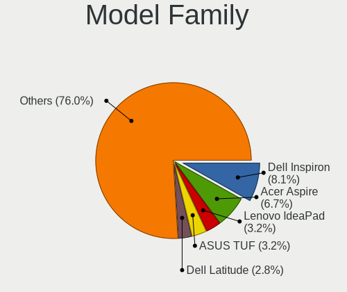
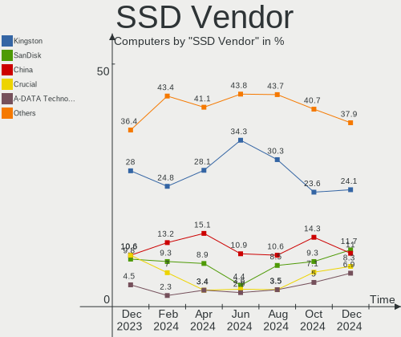
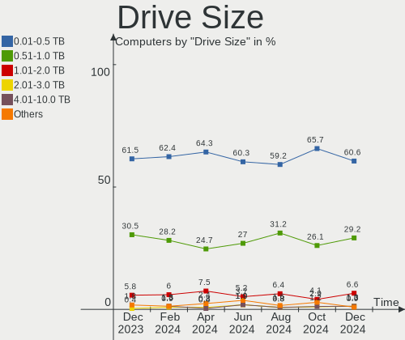
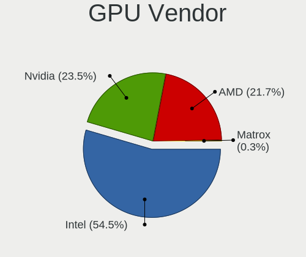
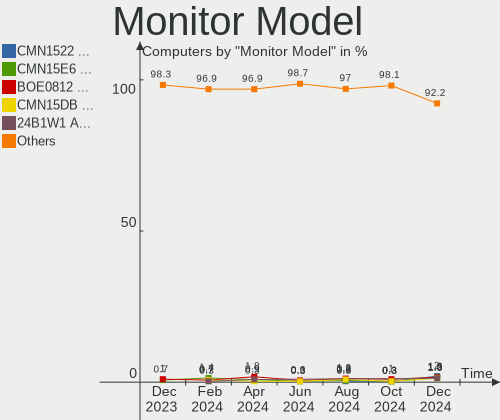
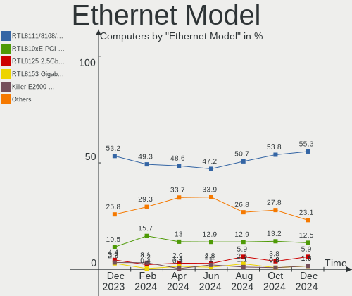
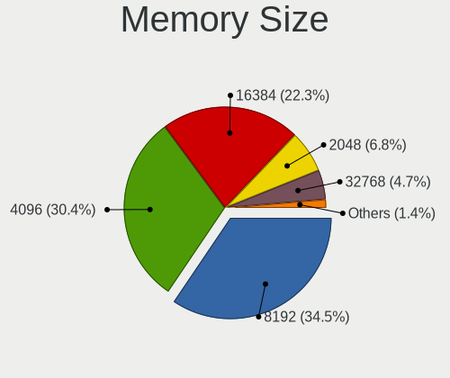
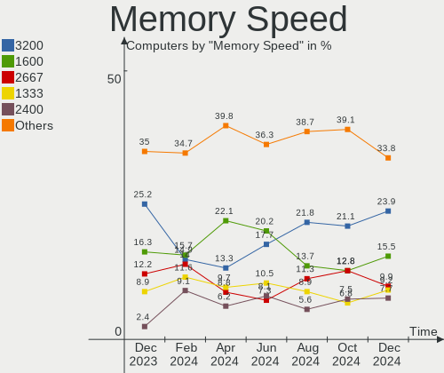

Linux in Brazil - Hardware Trends
---------------------------------

A project to identify most popular hardware characteristics and track their change
over time based on data collected by Linux users at https://Linux-Hardware.org.

Anyone can contribute to this report by the [hw-probe](https://github.com/linuxhw/hw-probe) tool:

    sudo -E hw-probe -all -upload

This is a report for all computer types. See also reports for [desktops](/Location/Brazil/Desktop/README.md) and [notebooks](/Location/Brazil/Notebook/README.md).

Period: May, 2023.

Contents
--------

* [ System ](#system)
  - [ OS                       ](#os)
  - [ OS Family                ](#os-family)
  - [ Kernel                   ](#kernel)
  - [ Kernel Family            ](#kernel-family)
  - [ Kernel Major Ver.        ](#kernel-major-ver)
  - [ Arch                     ](#arch)
  - [ DE                       ](#de)
  - [ Display Server           ](#display-server)
  - [ Display Manager          ](#display-manager)
  - [ OS Lang                  ](#os-lang)
  - [ Boot Mode                ](#boot-mode)
  - [ Filesystem               ](#filesystem)
  - [ Part. scheme             ](#part-scheme)
  - [ Dual Boot with Linux/BSD ](#dual-boot-with-linuxbsd)
  - [ Dual Boot (Win)          ](#dual-boot-win)

* [ Board ](#board)
  - [ Vendor                   ](#vendor)
  - [ Model                    ](#model)
  - [ Model Family             ](#model-family)
  - [ MFG Year                 ](#mfg-year)
  - [ Form Factor              ](#form-factor)
  - [ Secure Boot              ](#secure-boot)
  - [ Coreboot                 ](#coreboot)
  - [ RAM Size                 ](#ram-size)
  - [ RAM Used                 ](#ram-used)
  - [ Total Drives             ](#total-drives)
  - [ Has CD-ROM               ](#has-cd-rom)
  - [ Has Ethernet             ](#has-ethernet)
  - [ Has WiFi                 ](#has-wifi)
  - [ Has Bluetooth            ](#has-bluetooth)

* [ Location ](#location)
  - [ Country                  ](#country)
  - [ City                     ](#city)

* [ Drives ](#drives)
  - [ Drive Vendor             ](#drive-vendor)
  - [ Drive Model              ](#drive-model)
  - [ HDD Vendor               ](#hdd-vendor)
  - [ SSD Vendor               ](#ssd-vendor)
  - [ Drive Kind               ](#drive-kind)
  - [ Drive Connector          ](#drive-connector)
  - [ Drive Size               ](#drive-size)
  - [ Space Total              ](#space-total)
  - [ Space Used               ](#space-used)
  - [ Malfunc. Drives          ](#malfunc-drives)
  - [ Malfunc. Drive Vendor    ](#malfunc-drive-vendor)
  - [ Malfunc. HDD Vendor      ](#malfunc-hdd-vendor)
  - [ Malfunc. Drive Kind      ](#malfunc-drive-kind)
  - [ Failed Drives            ](#failed-drives)
  - [ Failed Drive Vendor      ](#failed-drive-vendor)
  - [ Drive Status             ](#drive-status)

* [ Storage controller ](#storage-controller)
  - [ Storage Vendor           ](#storage-vendor)
  - [ Storage Model            ](#storage-model)
  - [ Storage Kind             ](#storage-kind)

* [ Processor ](#processor)
  - [ CPU Vendor               ](#cpu-vendor)
  - [ CPU Model                ](#cpu-model)
  - [ CPU Model Family         ](#cpu-model-family)
  - [ CPU Cores                ](#cpu-cores)
  - [ CPU Sockets              ](#cpu-sockets)
  - [ CPU Threads              ](#cpu-threads)
  - [ CPU Op-Modes             ](#cpu-op-modes)
  - [ CPU Microcode            ](#cpu-microcode)
  - [ CPU Microarch            ](#cpu-microarch)

* [ Graphics ](#graphics)
  - [ GPU Vendor               ](#gpu-vendor)
  - [ GPU Model                ](#gpu-model)
  - [ GPU Combo                ](#gpu-combo)
  - [ GPU Driver               ](#gpu-driver)
  - [ GPU Memory               ](#gpu-memory)

* [ Monitor ](#monitor)
  - [ Monitor Vendor           ](#monitor-vendor)
  - [ Monitor Model            ](#monitor-model)
  - [ Monitor Resolution       ](#monitor-resolution)
  - [ Monitor Diagonal         ](#monitor-diagonal)
  - [ Monitor Width            ](#monitor-width)
  - [ Aspect Ratio             ](#aspect-ratio)
  - [ Monitor Area             ](#monitor-area)
  - [ Pixel Density            ](#pixel-density)
  - [ Multiple Monitors        ](#multiple-monitors)

* [ Network ](#network)
  - [ Net Controller Vendor    ](#net-controller-vendor)
  - [ Net Controller Model     ](#net-controller-model)
  - [ Wireless Vendor          ](#wireless-vendor)
  - [ Wireless Model           ](#wireless-model)
  - [ Ethernet Vendor          ](#ethernet-vendor)
  - [ Ethernet Model           ](#ethernet-model)
  - [ Net Controller Kind      ](#net-controller-kind)
  - [ Used Controller          ](#used-controller)
  - [ NICs                     ](#nics)
  - [ IPv6                     ](#ipv6)

* [ Bluetooth ](#bluetooth)
  - [ Bluetooth Vendor         ](#bluetooth-vendor)
  - [ Bluetooth Model          ](#bluetooth-model)

* [ Sound ](#sound)
  - [ Sound Vendor             ](#sound-vendor)
  - [ Sound Model              ](#sound-model)

* [ Memory ](#memory)
  - [ Memory Vendor            ](#memory-vendor)
  - [ Memory Model             ](#memory-model)
  - [ Memory Kind              ](#memory-kind)
  - [ Memory Form Factor       ](#memory-form-factor)
  - [ Memory Size              ](#memory-size)
  - [ Memory Speed             ](#memory-speed)

* [ Printers & scanners ](#printers--scanners)
  - [ Printer Vendor           ](#printer-vendor)
  - [ Printer Model            ](#printer-model)
  - [ Scanner Vendor           ](#scanner-vendor)
  - [ Scanner Model            ](#scanner-model)

* [ Camera ](#camera)
  - [ Camera Vendor            ](#camera-vendor)
  - [ Camera Model             ](#camera-model)

* [ Security ](#security)
  - [ Fingerprint Vendor       ](#fingerprint-vendor)
  - [ Fingerprint Model        ](#fingerprint-model)
  - [ Chipcard Vendor          ](#chipcard-vendor)
  - [ Chipcard Model           ](#chipcard-model)

* [ Unsupported ](#unsupported)
  - [ Unsupported Devices      ](#unsupported-devices)
  - [ Unsupported Device Types ](#unsupported-device-types)

System
------

OS
--

Installed operating systems

| Name                         | Computers | Percent |
|------------------------------|-----------|---------|
| Ubuntu 22.04                 | 47        | 15.88%  |
| Fedora 38                    | 41        | 13.85%  |
| Linux Mint 21.1              | 26        | 8.78%   |
| OpenMandriva 23.03           | 18        | 6.08%   |
| Pop!_OS 22.04                | 16        | 5.41%   |
| Manjaro                      | 15        | 5.07%   |
| Debian 11                    | 14        | 4.73%   |
| Ubuntu 23.04                 | 12        | 4.05%   |
| Arch Rolling                 | 10        | 3.38%   |
| Zorin 16                     | 5         | 1.69%   |
| Ubuntu 20.04                 | 5         | 1.69%   |
| KDE neon 22.04               | 5         | 1.69%   |
| Ubuntu 22.10                 | 4         | 1.35%   |
| Kali 2023.1                  | 4         | 1.35%   |
| EndeavourOS Rolling          | 4         | 1.35%   |
| ArcoLinux Rolling            | 4         | 1.35%   |
| ROSA 12.4                    | 3         | 1.01%   |
| openSUSE Tumbleweed-XXXXXXXX | 3         | 1.01%   |
| Linux Mint 20.3              | 3         | 1.01%   |
| Elementary 6.1               | 3         | 1.01%   |
| Debian 12                    | 3         | 1.01%   |
| Ubuntu MATE 22.04            | 2         | 0.68%   |
| OpenMandriva 4.3             | 2         | 0.68%   |
| OpenMandriva 23.90           | 2         | 0.68%   |
| OpenMandriva 23.01           | 2         | 0.68%   |
| Manjaro 22.1.1               | 2         | 0.68%   |
| Kubuntu 22.04                | 2         | 0.68%   |
| KDE neon 20.04               | 2         | 0.68%   |
| Fedora 37                    | 2         | 0.68%   |
| Xubuntu 22.04                | 1         | 0.34%   |
| Xubuntu 20.04                | 1         | 0.34%   |
| Ubuntu Unity 22.04           | 1         | 0.34%   |
| Ubuntu Unity 16.04           | 1         | 0.34%   |
| Ubuntu MATE 20.04            | 1         | 0.34%   |
| Ubuntu Budgie 23.04          | 1         | 0.34%   |
| SteamOS 3.4.6                | 1         | 0.34%   |
| SteamOS 3.4                  | 1         | 0.34%   |
| Slackware 15.0               | 1         | 0.34%   |
| openSUSE Microos-XXXXXXXX    | 1         | 0.34%   |
| OpenMandriva 23.06           | 1         | 0.34%   |

OS Family
---------

OS without a version

| Name          | Computers | Percent |
|---------------|-----------|---------|
| Ubuntu        | 68        | 22.97%  |
| Fedora        | 44        | 14.86%  |
| Linux Mint    | 31        | 10.47%  |
| OpenMandriva  | 25        | 8.45%   |
| Manjaro       | 17        | 5.74%   |
| Debian        | 17        | 5.74%   |
| Pop!_OS       | 16        | 5.41%   |
| Arch          | 10        | 3.38%   |
| KDE neon      | 7         | 2.36%   |
| Zorin         | 5         | 1.69%   |
| Endless       | 5         | 1.69%   |
| openSUSE      | 4         | 1.35%   |
| Lubuntu       | 4         | 1.35%   |
| Kali          | 4         | 1.35%   |
| EndeavourOS   | 4         | 1.35%   |
| ArcoLinux     | 4         | 1.35%   |
| Ubuntu MATE   | 3         | 1.01%   |
| ROSA          | 3         | 1.01%   |
| Kubuntu       | 3         | 1.01%   |
| Elementary    | 3         | 1.01%   |
| BigLinux      | 3         | 1.01%   |
| Xubuntu       | 2         | 0.68%   |
| Ubuntu Unity  | 2         | 0.68%   |
| SteamOS       | 2         | 0.68%   |
| Ubuntu Budgie | 1         | 0.34%   |
| Slackware     | 1         | 0.34%   |
| Nobara        | 1         | 0.34%   |
| Gentoo        | 1         | 0.34%   |
| Deepin        | 1         | 0.34%   |
| blendOS       | 1         | 0.34%   |
| Artix         | 1         | 0.34%   |
| antiX         | 1         | 0.34%   |
| Android       | 1         | 0.34%   |
| Alpine        | 1         | 0.34%   |

Kernel
------

Version of the Linux kernel

| Version                                            | Computers | Percent |
|----------------------------------------------------|-----------|---------|
| 5.19.0-41-generic                                  | 38        | 12.84%  |
| 5.15.0-71-generic                                  | 21        | 7.09%   |
| 6.2.6-desktop-1omv2390                             | 19        | 6.42%   |
| 6.2.15-300.fc38.x86_64                             | 18        | 6.08%   |
| 6.2.14-300.fc38.x86_64                             | 17        | 5.74%   |
| 6.2.6-76060206-generic                             | 14        | 4.73%   |
| 5.19.0-42-generic                                  | 14        | 4.73%   |
| 6.2.0-20-generic                                   | 13        | 4.39%   |
| 5.15.0-72-generic                                  | 11        | 3.72%   |
| 6.1.26-1-MANJARO                                   | 6         | 2.03%   |
| 5.15.0-56-generic                                  | 6         | 2.03%   |
| 6.3.4-arch1-1                                      | 4         | 1.35%   |
| 6.1.0-kali7-amd64                                  | 4         | 1.35%   |
| 5.15.0-69-generic                                  | 4         | 1.35%   |
| 5.10.0-23-amd64                                    | 4         | 1.35%   |
| 5.10.0-22-amd64                                    | 4         | 1.35%   |
| 6.3.1-arch1-1                                      | 3         | 1.01%   |
| 6.3.1-1-default                                    | 3         | 1.01%   |
| 6.2.13-300.fc38.x86_64                             | 3         | 1.01%   |
| 6.1.25-1-MANJARO                                   | 3         | 1.01%   |
| 6.1.20-generic-2rosa2021.1-x86_64                  | 3         | 1.01%   |
| 5.4.0-148-generic                                  | 3         | 1.01%   |
| 6.3.2-zen1-1-zen                                   | 2         | 0.68%   |
| 6.2.9-300.fc38.x86_64                              | 2         | 0.68%   |
| 6.2.13-arch1-1                                     | 2         | 0.68%   |
| 6.2.12-arch1-1                                     | 2         | 0.68%   |
| 6.1.30-1-MANJARO                                   | 2         | 0.68%   |
| 6.1.1-desktop-1omv2290                             | 2         | 0.68%   |
| 5.8.0-14-generic                                   | 2         | 0.68%   |
| 5.15.108-1-MANJARO                                 | 2         | 0.68%   |
| 5.15.0-70-generic                                  | 2         | 0.68%   |
| 5.15.0-47-generic                                  | 2         | 0.68%   |
| 5.10.0-20-amd64                                    | 2         | 0.68%   |
| 6.4.0-0.rc0.20230501git58390c8ce1bd.10.fc39.x86_64 | 1         | 0.34%   |
| 6.3.4-zen1-1-zen                                   | 1         | 0.34%   |
| 6.3.4-060304-generic                               | 1         | 0.34%   |
| 6.3.3-1-MANJARO                                    | 1         | 0.34%   |
| 6.3.2-desktop-1omv2390                             | 1         | 0.34%   |
| 6.3.2-arch1-1                                      | 1         | 0.34%   |
| 6.3.2-1-default                                    | 1         | 0.34%   |

Kernel Family
-------------

Linux kernel without a distro release

| Version  | Computers | Percent |
|----------|-----------|---------|
| 5.19.0   | 58        | 19.59%  |
| 5.15.0   | 48        | 16.22%  |
| 6.2.6    | 33        | 11.15%  |
| 6.2.14   | 19        | 6.42%   |
| 6.2.15   | 18        | 6.08%   |
| 6.2.0    | 13        | 4.39%   |
| 5.10.0   | 11        | 3.72%   |
| 6.3.1    | 9         | 3.04%   |
| 6.3.4    | 6         | 2.03%   |
| 6.2.13   | 6         | 2.03%   |
| 6.1.26   | 6         | 2.03%   |
| 6.1.0    | 6         | 2.03%   |
| 6.3.2    | 5         | 1.69%   |
| 5.4.0    | 5         | 1.69%   |
| 6.2.12   | 4         | 1.35%   |
| 6.2.11   | 3         | 1.01%   |
| 6.1.25   | 3         | 1.01%   |
| 6.1.20   | 3         | 1.01%   |
| 6.2.9    | 2         | 0.68%   |
| 6.1.30   | 2         | 0.68%   |
| 6.1.29   | 2         | 0.68%   |
| 6.1.1    | 2         | 0.68%   |
| 5.8.0    | 2         | 0.68%   |
| 5.15.108 | 2         | 0.68%   |
| 5.13.0   | 2         | 0.68%   |
| 5.11.0   | 2         | 0.68%   |
| 6.4.0    | 1         | 0.34%   |
| 6.3.3    | 1         | 0.34%   |
| 6.2.16   | 1         | 0.34%   |
| 6.1.28   | 1         | 0.34%   |
| 6.1.23   | 1         | 0.34%   |
| 6.1.22   | 1         | 0.34%   |
| 6.1.19   | 1         | 0.34%   |
| 6.0.9    | 1         | 0.34%   |
| 6.0.7    | 1         | 0.34%   |
| 5.18.12  | 1         | 0.34%   |
| 5.18.10  | 1         | 0.34%   |
| 5.16.7   | 1         | 0.34%   |
| 5.16.13  | 1         | 0.34%   |
| 5.16.0   | 1         | 0.34%   |

Kernel Major Ver.
-----------------

Linux kernel major version

| Version | Computers | Percent |
|---------|-----------|---------|
| 6.2     | 99        | 33.45%  |
| 5.19    | 58        | 19.59%  |
| 5.15    | 55        | 18.58%  |
| 6.1     | 28        | 9.46%   |
| 6.3     | 21        | 7.09%   |
| 5.10    | 12        | 4.05%   |
| 5.4     | 5         | 1.69%   |
| 5.16    | 3         | 1.01%   |
| 6.0     | 2         | 0.68%   |
| 5.8     | 2         | 0.68%   |
| 5.18    | 2         | 0.68%   |
| 5.13    | 2         | 0.68%   |
| 5.11    | 2         | 0.68%   |
| 6.4     | 1         | 0.34%   |
| 4.4     | 1         | 0.34%   |
| 4.15    | 1         | 0.34%   |
| 4.10    | 1         | 0.34%   |
| 3.18    | 1         | 0.34%   |

Arch
----

OS architecture (x86_64, i586, etc.)

| Name   | Computers | Percent |
|--------|-----------|---------|
| x86_64 | 293       | 98.99%  |
| i686   | 2         | 0.68%   |
| armv7l | 1         | 0.34%   |

DE
--

Desktop Environment

| Name          | Computers | Percent |
|---------------|-----------|---------|
| GNOME         | 153       | 51.69%  |
| KDE5          | 63        | 21.28%  |
| X-Cinnamon    | 23        | 7.77%   |
| XFCE          | 17        | 5.74%   |
| Unknown       | 10        | 3.38%   |
| MATE          | 9         | 3.04%   |
| LXQt          | 5         | 1.69%   |
| Cinnamon      | 4         | 1.35%   |
| Pantheon      | 3         | 1.01%   |
| Hyprland      | 2         | 0.68%   |
| Unity         | 1         | 0.34%   |
| Openbox       | 1         | 0.34%   |
| LXDE          | 1         | 0.34%   |
| icewm         | 1         | 0.34%   |
| Enlightenment | 1         | 0.34%   |
| DDE           | 1         | 0.34%   |
| Budgie        | 1         | 0.34%   |

Display Server
--------------

X11 or Wayland

| Name    | Computers | Percent |
|---------|-----------|---------|
| X11     | 189       | 63.85%  |
| Wayland | 97        | 32.77%  |
| Unknown | 9         | 3.04%   |
| Tty     | 1         | 0.34%   |

Display Manager
---------------

SDDM, LightDM, etc.

| Name    | Computers | Percent |
|---------|-----------|---------|
| Unknown | 140       | 47.3%   |
| GDM3    | 66        | 22.3%   |
| SDDM    | 42        | 14.19%  |
| LightDM | 30        | 10.14%  |
| GDM     | 16        | 5.41%   |
| SLIMSKI | 1         | 0.34%   |
| SLiM    | 1         | 0.34%   |

OS Lang
-------

Language

| Lang    | Computers | Percent |
|---------|-----------|---------|
| pt_BR   | 196       | 66.22%  |
| en_US   | 78        | 26.35%  |
| C       | 10        | 3.38%   |
| en_GB   | 3         | 1.01%   |
| Unknown | 3         | 1.01%   |
| pt_PT   | 2         | 0.68%   |
| es_ES   | 1         | 0.34%   |
| en_CA   | 1         | 0.34%   |
| en-US   | 1         | 0.34%   |
| C.UTF8  | 1         | 0.34%   |

Boot Mode
---------

EFI or BIOS

| Mode | Computers | Percent |
|------|-----------|---------|
| BIOS | 150       | 50.68%  |
| EFI  | 146       | 49.32%  |

Filesystem
----------

Type of filesystem

| Type    | Computers | Percent |
|---------|-----------|---------|
| Ext4    | 161       | 54.39%  |
| Btrfs   | 66        | 22.3%   |
| Tmpfs   | 36        | 12.16%  |
| Overlay | 25        | 8.45%   |
| Xfs     | 3         | 1.01%   |
| Zfs     | 2         | 0.68%   |
| XXXXXXX | 1         | 0.34%   |
| Ext2    | 1         | 0.34%   |
| Unknown | 1         | 0.34%   |

Part. scheme
------------

Scheme of partitioning

| Type    | Computers | Percent |
|---------|-----------|---------|
| GPT     | 134       | 45.27%  |
| Unknown | 131       | 44.26%  |
| MBR     | 31        | 10.47%  |

Dual Boot with Linux/BSD
------------------------

Hosting more than one Linux/BSD

| Dual boot | Computers | Percent |
|-----------|-----------|---------|
| No        | 259       | 87.5%   |
| Yes       | 37        | 12.5%   |

Dual Boot (Win)
---------------

Hosting Linux and Windows

| Dual boot | Computers | Percent |
|-----------|-----------|---------|
| No        | 218       | 73.65%  |
| Yes       | 78        | 26.35%  |

Board
-----

Vendor
------

Motherboard manufacturer

| Name                   | Computers | Percent |
|------------------------|-----------|---------|
| Dell                   | 55        | 18.58%  |
| ASUSTek Computer       | 37        | 12.5%   |
| Lenovo                 | 28        | 9.46%   |
| Acer                   | 24        | 8.11%   |
| Gigabyte Technology    | 18        | 6.08%   |
| Intel                  | 17        | 5.74%   |
| ASRock                 | 13        | 4.39%   |
| Samsung Electronics    | 11        | 3.72%   |
| Hewlett-Packard        | 11        | 3.72%   |
| Positivo               | 10        | 3.38%   |
| Unknown                | 9         | 3.04%   |
| MSI                    | 7         | 2.36%   |
| Avell High Performance | 7         | 2.36%   |
| Apple                  | 6         | 2.03%   |
| Biostar                | 5         | 1.69%   |
| Semp Toshiba           | 4         | 1.35%   |
| Itautec                | 4         | 1.35%   |
| PCWare                 | 3         | 1.01%   |
| PHILCO ELETRONICOS S/A | 2         | 0.68%   |
| Notebook               | 2         | 0.68%   |
| LG Electronics         | 2         | 0.68%   |
| Huanan                 | 2         | 0.68%   |
| Daten Tecnologia       | 2         | 0.68%   |
| AZW                    | 2         | 0.68%   |
| Alienware              | 2         | 0.68%   |
| Wistron                | 1         | 0.34%   |
| Valve                  | 1         | 0.34%   |
| Timi                   | 1         | 0.34%   |
| Sony                   | 1         | 0.34%   |
| Philco                 | 1         | 0.34%   |
| Pegatron               | 1         | 0.34%   |
| Multilaser             | 1         | 0.34%   |
| Megaware               | 1         | 0.34%   |
| Fujitsu                | 1         | 0.34%   |
| Clevo                  | 1         | 0.34%   |
| Chuwi                  | 1         | 0.34%   |
| Adreamer               | 1         | 0.34%   |
| A14CR                  | 1         | 0.34%   |

Model
-----

Motherboard model

| Name                                    | Computers | Percent |
|-----------------------------------------|-----------|---------|
| Unknown                                 | 10        | 3.38%   |
| Acer Nitro AN517-54                     | 5         | 1.69%   |
| Lenovo IdeaPad 320-15IKB 80YH           | 4         | 1.35%   |
| Intel H61                               | 4         | 1.35%   |
| Samsung 550XDA                          | 3         | 1.01%   |
| Lenovo IdeaPad Gaming 3 15IMH05 82CG    | 3         | 1.01%   |
| Dell Inspiron 15-3567                   | 3         | 1.01%   |
| ASUS VivoBook_ASUSLaptop X515DA_X515DA  | 3         | 1.01%   |
| ASUS PRIME B450M-GAMING/BR              | 3         | 1.01%   |
| ASUS All Series                         | 3         | 1.01%   |
| ASRock H310CM-HG4                       | 3         | 1.01%   |
| Acer Aspire A515-45                     | 3         | 1.01%   |
| Semp Toshiba STI                        | 2         | 0.68%   |
| PHILCO ELETRONICOS S/A PNB15.6AP34H1W10 | 2         | 0.68%   |
| MSI MS-7C96                             | 2         | 0.68%   |
| Lenovo IdeaPad 3 15ALC6 82MF            | 2         | 0.68%   |
| Intel B75                               | 2         | 0.68%   |
| HP Pavilion dm4                         | 2         | 0.68%   |
| Gigabyte A320M-S2H                      | 2         | 0.68%   |
| Dell Vostro 5402                        | 2         | 0.68%   |
| Dell OptiPlex 3080                      | 2         | 0.68%   |
| Dell Latitude 7490                      | 2         | 0.68%   |
| Dell Inspiron 7520                      | 2         | 0.68%   |
| Dell Inspiron 3583                      | 2         | 0.68%   |
| Dell Inspiron 3442                      | 2         | 0.68%   |
| Dell Inspiron 1525                      | 2         | 0.68%   |
| ASUS VivoBook_ASUSLaptop X515JA_X515JA  | 2         | 0.68%   |
| ASUS PRIME A320M-K/BR                   | 2         | 0.68%   |
| ASUS P8H61-M LX3 R2.0                   | 2         | 0.68%   |
| ASUS M5A78L-M LX/BR                     | 2         | 0.68%   |
| ASRock A320M-HDV R4.0                   | 2         | 0.68%   |
| Wistron ProLiant ML110 G6               | 1         | 0.34%   |
| Valve Jupiter                           | 1         | 0.34%   |
| Timi Redmi Book Pro 14 2022             | 1         | 0.34%   |
| Sony VPCSA25GB                          | 1         | 0.34%   |
| Semp Toshiba STI NA 1401                | 1         | 0.34%   |
| Semp Toshiba IS 1413G                   | 1         | 0.34%   |
| Samsung RV419/RV420                     | 1         | 0.34%   |
| Samsung 730QED                          | 1         | 0.34%   |
| Samsung 550XBE/350XBE                   | 1         | 0.34%   |

Model Family
------------

Motherboard model prefix

| Name                                    | Computers | Percent |
|-----------------------------------------|-----------|---------|
| Dell Inspiron                           | 27        | 9.12%   |
| Lenovo IdeaPad                          | 18        | 6.08%   |
| Acer Aspire                             | 12        | 4.05%   |
| Dell Vostro                             | 10        | 3.38%   |
| Unknown                                 | 10        | 3.38%   |
| ASUS PRIME                              | 9         | 3.04%   |
| ASUS VivoBook                           | 7         | 2.36%   |
| Acer Nitro                              | 7         | 2.36%   |
| Lenovo ThinkPad                         | 6         | 2.03%   |
| Dell Latitude                           | 6         | 2.03%   |
| ASUS TUF                                | 6         | 2.03%   |
| Intel H61                               | 5         | 1.69%   |
| HP Pavilion                             | 4         | 1.35%   |
| Dell OptiPlex                           | 4         | 1.35%   |
| Semp Toshiba STI                        | 3         | 1.01%   |
| Samsung 550XDA                          | 3         | 1.01%   |
| Itautec Infoway                         | 3         | 1.01%   |
| ASUS M5A78L-M                           | 3         | 1.01%   |
| ASUS All                                | 3         | 1.01%   |
| ASRock H310CM-HG4                       | 3         | 1.01%   |
| PHILCO ELETRONICOS S/A PNB15.6AP34H1W10 | 2         | 0.68%   |
| MSI MS-7C96                             | 2         | 0.68%   |
| Lenovo ThinkCentre                      | 2         | 0.68%   |
| Intel B75                               | 2         | 0.68%   |
| HP EliteDesk                            | 2         | 0.68%   |
| HP Compaq                               | 2         | 0.68%   |
| Gigabyte A320M-S2H                      | 2         | 0.68%   |
| Dell XPS                                | 2         | 0.68%   |
| Dell PowerEdge                          | 2         | 0.68%   |
| Biostar A320MH                          | 2         | 0.68%   |
| Avell High Performance A70              | 2         | 0.68%   |
| ASUS P8H61-M                            | 2         | 0.68%   |
| ASRock A320M-HDV                        | 2         | 0.68%   |
| Alienware m15                           | 2         | 0.68%   |
| Wistron ProLiant                        | 1         | 0.34%   |
| Valve Jupiter                           | 1         | 0.34%   |
| Timi Redmi                              | 1         | 0.34%   |
| Sony VPCSA25GB                          | 1         | 0.34%   |
| Semp Toshiba IS                         | 1         | 0.34%   |
| Samsung RV419                           | 1         | 0.34%   |

MFG Year
--------

Motherboard manufacture year

| Year    | Computers | Percent |
|---------|-----------|---------|
| 2021    | 39        | 13.18%  |
| 2019    | 32        | 10.81%  |
| 2020    | 28        | 9.46%   |
| 2018    | 27        | 9.12%   |
| 2017    | 26        | 8.78%   |
| 2022    | 24        | 8.11%   |
| 2012    | 23        | 7.77%   |
| 2014    | 18        | 6.08%   |
| 2011    | 15        | 5.07%   |
| 2010    | 15        | 5.07%   |
| 2016    | 14        | 4.73%   |
| 2015    | 7         | 2.36%   |
| 2009    | 7         | 2.36%   |
| 2008    | 7         | 2.36%   |
| 2013    | 6         | 2.03%   |
| 2023    | 3         | 1.01%   |
| 2006    | 3         | 1.01%   |
| 2007    | 1         | 0.34%   |
| Unknown | 1         | 0.34%   |

Form Factor
-----------

Physical design of the computer

| Name        | Computers | Percent |
|-------------|-----------|---------|
| Notebook    | 165       | 55.74%  |
| Desktop     | 119       | 40.2%   |
| All in one  | 6         | 2.03%   |
| Convertible | 3         | 1.01%   |
| Server      | 2         | 0.68%   |
| Phone       | 1         | 0.34%   |

Secure Boot
-----------

Enabled or disabled

| State    | Computers | Percent |
|----------|-----------|---------|
| Disabled | 275       | 92.91%  |
| Enabled  | 21        | 7.09%   |

Coreboot
--------

Have coreboot on board

| Used | Computers | Percent |
|------|-----------|---------|
| No   | 296       | 100%    |

RAM Size
--------

Total RAM memory

| Size in GB  | Computers | Percent |
|-------------|-----------|---------|
| 4.01-8.0    | 78        | 26.35%  |
| 16.01-24.0  | 67        | 22.64%  |
| 8.01-16.0   | 59        | 19.93%  |
| 3.01-4.0    | 43        | 14.53%  |
| 32.01-64.0  | 23        | 7.77%   |
| 24.01-32.0  | 8         | 2.7%    |
| 64.01-256.0 | 7         | 2.36%   |
| 1.01-2.0    | 7         | 2.36%   |
| 2.01-3.0    | 4         | 1.35%   |

RAM Used
--------

Used RAM memory

| Used GB    | Computers | Percent |
|------------|-----------|---------|
| 1.01-2.0   | 85        | 28.72%  |
| 2.01-3.0   | 69        | 23.31%  |
| 4.01-8.0   | 68        | 22.97%  |
| 3.01-4.0   | 49        | 16.55%  |
| 8.01-16.0  | 16        | 5.41%   |
| 0.51-1.0   | 7         | 2.36%   |
| 24.01-32.0 | 1         | 0.34%   |
| 0.01-0.5   | 1         | 0.34%   |

Total Drives
------------

Number of drives on board

| Drives | Computers | Percent |
|--------|-----------|---------|
| 1      | 176       | 59.46%  |
| 2      | 88        | 29.73%  |
| 3      | 19        | 6.42%   |
| 4      | 7         | 2.36%   |
| 6      | 2         | 0.68%   |
| 5      | 2         | 0.68%   |
| 9      | 1         | 0.34%   |
| 0      | 1         | 0.34%   |

Has CD-ROM
----------

Has CD-ROM on board

| Presented | Computers | Percent |
|-----------|-----------|---------|
| No        | 220       | 74.32%  |
| Yes       | 76        | 25.68%  |

Has Ethernet
------------

Has Ethernet on board

| Presented | Computers | Percent |
|-----------|-----------|---------|
| Yes       | 261       | 88.18%  |
| No        | 35        | 11.82%  |

Has WiFi
--------

Has WiFi module

| Presented | Computers | Percent |
|-----------|-----------|---------|
| Yes       | 207       | 69.93%  |
| No        | 89        | 30.07%  |

Has Bluetooth
-------------

Has Bluetooth module

| Presented | Computers | Percent |
|-----------|-----------|---------|
| Yes       | 171       | 57.77%  |
| No        | 125       | 42.23%  |

Location
--------

Country
-------

Geographic location (country)

| Country | Computers | Percent |
|---------|-----------|---------|
| Brazil  | 296       | 100%    |

City
----

Geographic location (city)

| City                 | Computers | Percent |
|----------------------|-----------|---------|
| Sao Paulo            | 37        | 12.5%   |
| Rio de Janeiro       | 19        | 6.42%   |
| Fortaleza            | 10        | 3.38%   |
| Campinas             | 9         | 3.04%   |
| Curitiba             | 8         | 2.7%    |
| Brasília            | 8         | 2.7%    |
| Belo Horizonte       | 8         | 2.7%    |
| Porto Alegre         | 5         | 1.69%   |
| Goiânia             | 5         | 1.69%   |
| Florianópolis       | 5         | 1.69%   |
| Uberlândia          | 4         | 1.35%   |
| Santos               | 4         | 1.35%   |
| Osasco               | 4         | 1.35%   |
| Natal                | 4         | 1.35%   |
| Santo André         | 3         | 1.01%   |
| Niterói             | 3         | 1.01%   |
| Manaus               | 3         | 1.01%   |
| Londrina             | 3         | 1.01%   |
| Juiz de Fora         | 3         | 1.01%   |
| Juazeiro do Norte    | 3         | 1.01%   |
| Caratinga            | 3         | 1.01%   |
| Teresina             | 2         | 0.68%   |
| Sumaré              | 2         | 0.68%   |
| Sao José dos Campos | 2         | 0.68%   |
| Sao Jose             | 2         | 0.68%   |
| Santa Maria          | 2         | 0.68%   |
| Salvador             | 2         | 0.68%   |
| Ribeirao Preto       | 2         | 0.68%   |
| Recife               | 2         | 0.68%   |
| Presidente Prudente  | 2         | 0.68%   |
| Ourinhos             | 2         | 0.68%   |
| Novo Hamburgo        | 2         | 0.68%   |
| Mogi das Cruzes      | 2         | 0.68%   |
| Maua                 | 2         | 0.68%   |
| Joao Pessoa          | 2         | 0.68%   |
| Itumbiara            | 2         | 0.68%   |
| Itabira              | 2         | 0.68%   |
| Guarulhos            | 2         | 0.68%   |
| Canoas               | 2         | 0.68%   |
| Blumenau             | 2         | 0.68%   |

Drives
------

Drive Vendor
------------

Hard drive vendors

| Vendor                         | Computers | Drives | Percent |
|--------------------------------|-----------|--------|---------|
| WDC                            | 59        | 61     | 13.56%  |
| Seagate                        | 54        | 69     | 12.41%  |
| Kingston                       | 50        | 53     | 11.49%  |
| Samsung Electronics            | 32        | 36     | 7.36%   |
| China                          | 25        | 25     | 5.75%   |
| SanDisk                        | 19        | 20     | 4.37%   |
| A-DATA Technology              | 18        | 18     | 4.14%   |
| Toshiba                        | 17        | 17     | 3.91%   |
| Crucial                        | 17        | 17     | 3.91%   |
| Unknown                        | 10        | 11     | 2.3%    |
| ADATA Technology               | 10        | 10     | 2.3%    |
| Silicon Motion                 | 9         | 9      | 2.07%   |
| SK hynix                       | 8         | 8      | 1.84%   |
| Kingston Technology Company    | 7         | 7      | 1.61%   |
| Netac                          | 5         | 6      | 1.15%   |
| Micron Technology              | 5         | 5      | 1.15%   |
| XrayDisk                       | 4         | 4      | 0.92%   |
| Solid State Storage            | 4         | 4      | 0.92%   |
| Lexar                          | 4         | 4      | 0.92%   |
| KingSpec                       | 4         | 4      | 0.92%   |
| Hitachi                        | 4         | 4      | 0.92%   |
| Hewlett-Packard                | 4         | 4      | 0.92%   |
| Apple                          | 4         | 4      | 0.92%   |
| SAGE                           | 3         | 3      | 0.69%   |
| Realtek Semiconductor          | 3         | 4      | 0.69%   |
| Phison Electronics             | 3         | 4      | 0.69%   |
| Patriot                        | 3         | 3      | 0.69%   |
| MAXIO Technology (Hangzhou)    | 3         | 3      | 0.69%   |
| LITEON                         | 3         | 3      | 0.69%   |
| Intel                          | 3         | 3      | 0.69%   |
| Team                           | 2         | 2      | 0.46%   |
| Solid State Storage Technology | 2         | 2      | 0.46%   |
| ShiJi                          | 2         | 3      | 0.46%   |
| PNY                            | 2         | 2      | 0.46%   |
| Phison                         | 2         | 2      | 0.46%   |
| NN                             | 2         | 2      | 0.46%   |
| Maxtor                         | 2         | 2      | 0.46%   |
| HGST                           | 2         | 2      | 0.46%   |
| Unknown                        | 2         | 2      | 0.46%   |
| XPG                            | 1         | 1      | 0.23%   |

Drive Model
-----------

Hard drive models

| Model                                               | Computers | Percent |
|-----------------------------------------------------|-----------|---------|
| Kingston SA400S37240G 240GB SSD                     | 20        | 4.38%   |
| Kingston SA400S37480G 480GB SSD                     | 14        | 3.06%   |
| Silicon Motion SM2263EN/SM2263XT SSD Controller 1TB | 7         | 1.53%   |
| Crucial CT240BX500SSD1 240GB                        | 7         | 1.53%   |
| Seagate ST1000DM010-2EP102 1TB                      | 6         | 1.31%   |
| China SSD 240GB                                     | 5         | 1.09%   |
| ADATA SM2P32A8-256GC1 256GB                         | 5         | 1.09%   |
| A-DATA IM2P33F3A NVMe 256GB                         | 5         | 1.09%   |
| WDC WD10EZEX-08WN4A0 1TB                            | 4         | 0.88%   |
| Seagate Expansion 1TB                               | 4         | 0.88%   |
| Sandisk WD Blue SN550 NVMe SSD 512GB                | 4         | 0.88%   |
| Lexar 128GB SSD                                     | 4         | 0.88%   |
| Kingston SA400S37120G 120GB SSD                     | 4         | 0.88%   |
| China SSD 120GB                                     | 4         | 0.88%   |
| WDC WD10SPZX-24Z10 1TB                              | 3         | 0.66%   |
| Solid State Storage SSSTC CL1-4D256 256GB           | 3         | 0.66%   |
| Seagate ST500LM012 HN-M500MBB 500GB                 | 3         | 0.66%   |
| Seagate ST3500312CS 500GB                           | 3         | 0.66%   |
| Seagate ST1000LM048-2E7172 1TB                      | 3         | 0.66%   |
| Samsung HD502HI 500GB                               | 3         | 0.66%   |
| Samsung HD322HJ 320GB                               | 3         | 0.66%   |
| SAGE 3639S 1TB                                      | 3         | 0.66%   |
| Phison E12 NVMe Controller 256GB                    | 3         | 0.66%   |
| Kingston Company SNV2S1000G 1TB                     | 3         | 0.66%   |
| KingSpec P3-512 512GB                               | 3         | 0.66%   |
| China SSD 1TB                                       | 3         | 0.66%   |
| XrayDisk 512GB SSD                                  | 2         | 0.44%   |
| WDC WDS240G2G0A-00JH30 240GB SSD                    | 2         | 0.44%   |
| WDC WDS120G2G0A-00JH30 120GB SSD                    | 2         | 0.44%   |
| WDC WD5000AVCS-632DY1 500GB                         | 2         | 0.44%   |
| WDC WD10SPZX-75Z10T2 1TB                            | 2         | 0.44%   |
| WDC WD10SPZX-21Z10T0 1TB                            | 2         | 0.44%   |
| WDC WD10JPVX-75JC3T0 1TB                            | 2         | 0.44%   |
| WDC WD10JPCX-24UE4T0 1TB                            | 2         | 0.44%   |
| WDC WD10EZEX-08M2NA0 1TB                            | 2         | 0.44%   |
| WDC WD10EZEX-00WN4A0 1TB                            | 2         | 0.44%   |
| WDC WD10EZEX-00BN5A0 1TB                            | 2         | 0.44%   |
| Unknown MMC Card  32GB                              | 2         | 0.44%   |
| Toshiba XG6 NVMe SSD Controller 256GB               | 2         | 0.44%   |
| Toshiba MQ01ABD100 1TB                              | 2         | 0.44%   |

HDD Vendor
----------

Hard disk drive vendors

| Vendor              | Computers | Drives | Percent |
|---------------------|-----------|--------|---------|
| Seagate             | 54        | 69     | 36.49%  |
| WDC                 | 49        | 50     | 33.11%  |
| Samsung Electronics | 19        | 19     | 12.84%  |
| Toshiba             | 14        | 14     | 9.46%   |
| Hitachi             | 4         | 4      | 2.7%    |
| SAGE                | 3         | 3      | 2.03%   |
| HGST                | 2         | 2      | 1.35%   |
| Maxtor              | 1         | 1      | 0.68%   |
| Hewlett-Packard     | 1         | 1      | 0.68%   |
| Apple               | 1         | 1      | 0.68%   |

SSD Vendor
----------

Solid state drive vendors

| Vendor              | Computers | Drives | Percent |
|---------------------|-----------|--------|---------|
| Kingston            | 43        | 46     | 27.74%  |
| China               | 25        | 25     | 16.13%  |
| Crucial             | 16        | 16     | 10.32%  |
| Samsung Electronics | 9         | 12     | 5.81%   |
| WDC                 | 7         | 7      | 4.52%   |
| SanDisk             | 7         | 7      | 4.52%   |
| Netac               | 4         | 4      | 2.58%   |
| Lexar               | 4         | 4      | 2.58%   |
| LITEON              | 3         | 3      | 1.94%   |
| KingSpec            | 3         | 3      | 1.94%   |
| XrayDisk            | 2         | 2      | 1.29%   |
| Team                | 2         | 2      | 1.29%   |
| PNY                 | 2         | 2      | 1.29%   |
| Patriot             | 2         | 2      | 1.29%   |
| NN                  | 2         | 2      | 1.29%   |
| Hewlett-Packard     | 2         | 2      | 1.29%   |
| Apple               | 2         | 2      | 1.29%   |
| A-DATA Technology   | 2         | 2      | 1.29%   |
| Win Memory          | 1         | 1      | 0.65%   |
| Toshiba             | 1         | 1      | 0.65%   |
| Smart               | 1         | 1      | 0.65%   |
| SK hynix            | 1         | 1      | 0.65%   |
| ShiJi               | 1         | 1      | 0.65%   |
| Ramsta              | 1         | 1      | 0.65%   |
| Pichau              | 1         | 1      | 0.65%   |
| Mushkin             | 1         | 1      | 0.65%   |
| Micron Technology   | 1         | 1      | 0.65%   |
| Maxtor              | 1         | 1      | 0.65%   |
| Lenovo              | 1         | 1      | 0.65%   |
| KEEPDATA            | 1         | 1      | 0.65%   |
| Hised               | 1         | 1      | 0.65%   |
| Colorful            | 1         | 1      | 0.65%   |
| Biostar             | 1         | 1      | 0.65%   |
| BHT                 | 1         | 1      | 0.65%   |
| Advantech           | 1         | 1      | 0.65%   |
| Unknown             | 1         | 1      | 0.65%   |

Drive Kind
----------

HDD or SSD

| Kind    | Computers | Drives | Percent |
|---------|-----------|--------|---------|
| SSD     | 144       | 161    | 35.82%  |
| HDD     | 133       | 164    | 33.08%  |
| NVMe    | 104       | 118    | 25.87%  |
| Unknown | 11        | 12     | 2.74%   |
| MMC     | 10        | 11     | 2.49%   |

Drive Connector
---------------

SATA, SAS, NVMe, etc.

| Type | Computers | Drives | Percent |
|------|-----------|--------|---------|
| SATA | 227       | 323    | 64.12%  |
| NVMe | 104       | 118    | 29.38%  |
| SAS  | 13        | 14     | 3.67%   |
| MMC  | 10        | 11     | 2.82%   |

Drive Size
----------

Size of hard drive

| Size in TB | Computers | Drives | Percent |
|------------|-----------|--------|---------|
| 0.01-0.5   | 172       | 208    | 61.87%  |
| 0.51-1.0   | 86        | 92     | 30.94%  |
| 1.01-2.0   | 14        | 15     | 5.04%   |
| 3.01-4.0   | 3         | 6      | 1.08%   |
| 2.01-3.0   | 1         | 1      | 0.36%   |
| 10.01-20.0 | 1         | 1      | 0.36%   |
| 4.01-10.0  | 1         | 2      | 0.36%   |

Space Total
-----------

Amount of disk space available on the file system

| Size in GB     | Computers | Percent |
|----------------|-----------|---------|
| 101-250        | 83        | 28.04%  |
| 251-500        | 59        | 19.93%  |
| 501-1000       | 48        | 16.22%  |
| 1001-2000      | 34        | 11.49%  |
| 51-100         | 24        | 8.11%   |
| 1-20           | 21        | 7.09%   |
| 21-50          | 9         | 3.04%   |
| Unknown        | 8         | 2.7%    |
| More than 3000 | 5         | 1.69%   |
| 2001-3000      | 5         | 1.69%   |

Space Used
----------

Amount of used disk space

| Used GB   | Computers | Percent |
|-----------|-----------|---------|
| 1-20      | 101       | 34.12%  |
| 21-50     | 58        | 19.59%  |
| 101-250   | 49        | 16.55%  |
| 51-100    | 34        | 11.49%  |
| 501-1000  | 22        | 7.43%   |
| 251-500   | 17        | 5.74%   |
| Unknown   | 8         | 2.7%    |
| 1001-2000 | 6         | 2.03%   |
| 0         | 1         | 0.34%   |

Malfunc. Drives
---------------

Drive models with a malfunction

| Model                                  | Computers | Drives | Percent |
|----------------------------------------|-----------|--------|---------|
| WDC WD5000AVCS-632DY1 500GB            | 2         | 2      | 5.88%   |
| Seagate ST1000DM010-2EP102 1TB         | 2         | 2      | 5.88%   |
| Samsung Electronics HD502HI 500GB      | 2         | 2      | 5.88%   |
| China SSD 240GB                        | 2         | 2      | 5.88%   |
| China SATA SSD 240GB                   | 2         | 2      | 5.88%   |
| XPG GAMMIX S41 256GB                   | 1         | 1      | 2.94%   |
| WDC WD800AAJS-75M0A0 80GB              | 1         | 1      | 2.94%   |
| WDC WD1600BEVT-24A23T0 160GB           | 1         | 1      | 2.94%   |
| WDC WD10PURX-64E5EY0 1TB               | 1         | 1      | 2.94%   |
| WDC WD10EZEX-00WN4A0 1TB               | 1         | 1      | 2.94%   |
| WDC WD10EALX-759BA1 1TB                | 1         | 1      | 2.94%   |
| Toshiba MK6459GSXP 640GB               | 1         | 1      | 2.94%   |
| Toshiba DT01ACA100 1TB                 | 1         | 1      | 2.94%   |
| ShiJi 1TB                              | 1         | 1      | 2.94%   |
| Seagate ST95005620AS 500GB             | 1         | 2      | 2.94%   |
| Seagate ST9320325AS 320GB              | 1         | 1      | 2.94%   |
| Seagate ST3500630NS 500GB              | 1         | 1      | 2.94%   |
| Seagate ST3500312CS 500GB              | 1         | 1      | 2.94%   |
| Seagate ST3320613AS 320GB              | 1         | 1      | 2.94%   |
| Seagate ST1000LM035-1RK172 1TB         | 1         | 1      | 2.94%   |
| Seagate ST1000LM024 HN-M101MBB 1TB     | 1         | 1      | 2.94%   |
| Samsung Electronics HM321HI 320GB      | 1         | 1      | 2.94%   |
| Samsung Electronics HM121HI 120GB      | 1         | 1      | 2.94%   |
| Netac SSD 128GB                        | 1         | 1      | 2.94%   |
| LITEON CV8-CE256-HP 256GB SSD          | 1         | 1      | 2.94%   |
| Kingston SUV400S37240G 240GB SSD       | 1         | 1      | 2.94%   |
| Kingston SA400S37240G 240GB SSD        | 1         | 1      | 2.94%   |
| China SSD 120GB                        | 1         | 1      | 2.94%   |
| A-DATA Technology IM2P33F3A NVMe 256GB | 1         | 1      | 2.94%   |

Malfunc. Drive Vendor
---------------------

Vendors of faulty drives

| Vendor              | Computers | Drives | Percent |
|---------------------|-----------|--------|---------|
| Seagate             | 9         | 10     | 27.27%  |
| WDC                 | 6         | 7      | 18.18%  |
| China               | 5         | 5      | 15.15%  |
| Samsung Electronics | 4         | 4      | 12.12%  |
| Toshiba             | 2         | 2      | 6.06%   |
| Kingston            | 2         | 2      | 6.06%   |
| XPG                 | 1         | 1      | 3.03%   |
| ShiJi               | 1         | 1      | 3.03%   |
| Netac               | 1         | 1      | 3.03%   |
| LITEON              | 1         | 1      | 3.03%   |
| A-DATA Technology   | 1         | 1      | 3.03%   |

Malfunc. HDD Vendor
-------------------

Vendors of faulty HDD drives

| Vendor              | Computers | Drives | Percent |
|---------------------|-----------|--------|---------|
| Seagate             | 9         | 10     | 42.86%  |
| WDC                 | 6         | 7      | 28.57%  |
| Samsung Electronics | 4         | 4      | 19.05%  |
| Toshiba             | 2         | 2      | 9.52%   |

Malfunc. Drive Kind
-------------------

Kinds of faulty drives

| Kind | Computers | Drives | Percent |
|------|-----------|--------|---------|
| HDD  | 20        | 23     | 62.5%   |
| SSD  | 9         | 9      | 28.13%  |
| NVMe | 3         | 3      | 9.38%   |

Failed Drives
-------------

Failed drive models

Zero info for selected period =(

Failed Drive Vendor
-------------------

Failed drive vendors

Zero info for selected period =(

Drive Status
------------

Number of failed and malfunc. drives

| Status   | Computers | Drives | Percent |
|----------|-----------|--------|---------|
| Detected | 196       | 287    | 59.94%  |
| Works    | 99        | 144    | 30.28%  |
| Malfunc  | 32        | 35     | 9.79%   |

Storage controller
------------------

Storage Vendor
--------------

Storage controller vendors

| Vendor                         | Computers | Percent |
|--------------------------------|-----------|---------|
| Intel                          | 214       | 54.59%  |
| AMD                            | 56        | 14.29%  |
| ADATA Technology               | 26        | 6.63%   |
| SanDisk                        | 16        | 4.08%   |
| Kingston Technology Company    | 13        | 3.32%   |
| Silicon Motion                 | 11        | 2.81%   |
| Solid State Storage Technology | 7         | 1.79%   |
| SK hynix                       | 7         | 1.79%   |
| Samsung Electronics            | 6         | 1.53%   |
| Phison Electronics             | 6         | 1.53%   |
| Nvidia                         | 6         | 1.53%   |
| Realtek Semiconductor          | 4         | 1.02%   |
| Micron Technology              | 4         | 1.02%   |
| MAXIO Technology (Hangzhou)    | 3         | 0.77%   |
| Toshiba America Info Systems   | 2         | 0.51%   |
| Micron/Crucial Technology      | 2         | 0.51%   |
| Marvell Technology Group       | 2         | 0.51%   |
| ASMedia Technology             | 2         | 0.51%   |
| O2 Micro                       | 1         | 0.26%   |
| Netac Technology               | 1         | 0.26%   |
| LSI Logic / Symbios Logic      | 1         | 0.26%   |
| KIOXIA                         | 1         | 0.26%   |
| JMicron Technology             | 1         | 0.26%   |

Storage Model
-------------

Storage controller models

| Model                                                                          | Computers | Percent |
|--------------------------------------------------------------------------------|-----------|---------|
| AMD FCH SATA Controller [AHCI mode]                                            | 34        | 7.54%   |
| Intel Sunrise Point-LP SATA Controller [AHCI mode]                             | 18        | 3.99%   |
| Intel Volume Management Device NVMe RAID Controller                            | 15        | 3.33%   |
| Intel 500 Series Chipset Family SATA AHCI Controller                           | 14        | 3.1%    |
| Intel 82801 Mobile SATA Controller [RAID mode]                                 | 13        | 2.88%   |
| Intel Celeron/Pentium Silver Processor SATA Controller                         | 12        | 2.66%   |
| Intel 6 Series/C200 Series Chipset Family 6 port Desktop SATA AHCI Controller  | 12        | 2.66%   |
| Intel 7 Series Chipset Family 6-port SATA Controller [AHCI mode]               | 11        | 2.44%   |
| AMD FCH SATA Controller D                                                      | 10        | 2.22%   |
| ADATA IM2P33F8ABR1 NVMe SSD                                                    | 10        | 2.22%   |
| Silicon Motion SM2263EN/SM2263XT SSD Controller                                | 9         | 2%      |
| Intel Tiger Lake-LP SATA Controller                                            | 9         | 2%      |
| Intel Q170/Q150/B150/H170/H110/Z170/CM236 Chipset SATA Controller [AHCI Mode]  | 9         | 2%      |
| Intel 400 Series Chipset Family SATA AHCI Controller                           | 9         | 2%      |
| Kingston Company Company Non-Volatile memory controller                        | 8         | 1.77%   |
| AMD SB7x0/SB8x0/SB9x0 IDE Controller                                           | 8         | 1.77%   |
| AMD 400 Series Chipset SATA Controller                                         | 8         | 1.77%   |
| ADATA A Non-Volatile memory controller                                         | 8         | 1.77%   |
| Solid State Storage Non-Volatile memory controller                             | 7         | 1.55%   |
| SanDisk WD Blue SN550 NVMe SSD                                                 | 7         | 1.55%   |
| SanDisk Non-Volatile memory controller                                         | 7         | 1.55%   |
| Intel 8 Series/C220 Series Chipset Family 6-port SATA Controller 1 [AHCI mode] | 7         | 1.55%   |
| Intel 8 Series SATA Controller 1 [AHCI mode]                                   | 7         | 1.55%   |
| AMD SB7x0/SB8x0/SB9x0 SATA Controller [IDE mode]                               | 7         | 1.55%   |
| ADATA Non-Volatile memory controller                                           | 7         | 1.55%   |
| Intel Wildcat Point-LP SATA Controller [AHCI Mode]                             | 6         | 1.33%   |
| Intel Cannon Point-LP SATA Controller [AHCI Mode]                              | 6         | 1.33%   |
| Intel 7 Series/C210 Series Chipset Family 6-port SATA Controller [AHCI mode]   | 6         | 1.33%   |
| Intel 6 Series/C200 Series Chipset Family 6 port Mobile SATA AHCI Controller   | 6         | 1.33%   |
| Intel NM10/ICH7 Family SATA Controller [IDE mode]                              | 5         | 1.11%   |
| Intel 5 Series/3400 Series Chipset 4 port SATA IDE Controller                  | 5         | 1.11%   |
| Intel 5 Series/3400 Series Chipset 2 port SATA IDE Controller                  | 5         | 1.11%   |
| SK hynix Gold P31/PC711 NVMe Solid State Drive                                 | 4         | 0.89%   |
| Phison E12 NVMe Controller                                                     | 4         | 0.89%   |
| Nvidia MCP61 SATA Controller                                                   | 4         | 0.89%   |
| Nvidia MCP61 IDE                                                               | 4         | 0.89%   |
| Micron NVMe Storage Controller                                                 | 4         | 0.89%   |
| Intel Cannon Lake Mobile PCH SATA AHCI Controller                              | 4         | 0.89%   |
| Intel 82801IBM/IEM (ICH9M/ICH9M-E) 4 port SATA Controller [AHCI mode]          | 4         | 0.89%   |
| Intel 5 Series/3400 Series Chipset 4 port SATA AHCI Controller                 | 4         | 0.89%   |

Storage Kind
------------

Kind of storage controller (IDE, SATA, NVMe, SAS, ...)

| Kind | Computers | Percent |
|------|-----------|---------|
| SATA | 233       | 58.1%   |
| NVMe | 104       | 25.94%  |
| IDE  | 34        | 8.48%   |
| RAID | 29        | 7.23%   |
| SCSI | 1         | 0.25%   |

Processor
---------

CPU Vendor
----------

Processor vendors

| Vendor | Computers | Percent |
|--------|-----------|---------|
| Intel  | 230       | 77.7%   |
| AMD    | 65        | 21.96%  |
| ARM    | 1         | 0.34%   |

CPU Model
---------

Processor models

| Model                                         | Computers | Percent |
|-----------------------------------------------|-----------|---------|
| Intel Core i5-7200U CPU @ 2.50GHz             | 7         | 2.36%   |
| Intel Celeron N4000 CPU @ 1.10GHz             | 5         | 1.69%   |
| Intel 11th Gen Core i7-11800H @ 2.30GHz       | 5         | 1.69%   |
| Intel 11th Gen Core i5-1135G7 @ 2.40GHz       | 5         | 1.69%   |
| AMD Ryzen 5 3500U with Radeon Vega Mobile Gfx | 5         | 1.69%   |
| Intel Core i7-8565U CPU @ 1.80GHz             | 4         | 1.35%   |
| Intel Core i5-5200U CPU @ 2.20GHz             | 4         | 1.35%   |
| Intel Core i5-3330 CPU @ 3.00GHz              | 4         | 1.35%   |
| Intel Core i5-2400 CPU @ 3.10GHz              | 4         | 1.35%   |
| Intel Celeron N4020 CPU @ 1.10GHz             | 4         | 1.35%   |
| Intel 12th Gen Core i7-12700H                 | 4         | 1.35%   |
| Intel 11th Gen Core i7-1165G7 @ 2.80GHz       | 4         | 1.35%   |
| AMD Ryzen 5 5600G with Radeon Graphics        | 4         | 1.35%   |
| Intel Core i7-6500U CPU @ 2.50GHz             | 3         | 1.01%   |
| Intel Core i7-2600 CPU @ 3.40GHz              | 3         | 1.01%   |
| Intel Core i5-4590 CPU @ 3.30GHz              | 3         | 1.01%   |
| Intel Core i5-4210U CPU @ 1.70GHz             | 3         | 1.01%   |
| Intel Core i5-10400F CPU @ 2.90GHz            | 3         | 1.01%   |
| Intel Core i5-1035G1 CPU @ 1.00GHz            | 3         | 1.01%   |
| Intel 11th Gen Core i7-1185G7 @ 3.00GHz       | 3         | 1.01%   |
| Intel 11th Gen Core i5-11400H @ 2.70GHz       | 3         | 1.01%   |
| AMD Ryzen 7 5700U with Radeon Graphics        | 3         | 1.01%   |
| AMD Ryzen 5 3600 6-Core Processor             | 3         | 1.01%   |
| AMD FX-6300 Six-Core Processor                | 3         | 1.01%   |
| Intel Pentium CPU G4560 @ 3.50GHz             | 2         | 0.68%   |
| Intel Core i7-8650U CPU @ 1.90GHz             | 2         | 0.68%   |
| Intel Core i7-7700HQ CPU @ 2.80GHz            | 2         | 0.68%   |
| Intel Core i7-7500U CPU @ 2.70GHz             | 2         | 0.68%   |
| Intel Core i7-3632QM CPU @ 2.20GHz            | 2         | 0.68%   |
| Intel Core i7-10750H CPU @ 2.60GHz            | 2         | 0.68%   |
| Intel Core i7-1065G7 CPU @ 1.30GHz            | 2         | 0.68%   |
| Intel Core i5-9300H CPU @ 2.40GHz             | 2         | 0.68%   |
| Intel Core i5-8500T CPU @ 2.10GHz             | 2         | 0.68%   |
| Intel Core i5-8265U CPU @ 1.60GHz             | 2         | 0.68%   |
| Intel Core i5-8250U CPU @ 1.60GHz             | 2         | 0.68%   |
| Intel Core i5-3470S CPU @ 2.90GHz             | 2         | 0.68%   |
| Intel Core i5-10600K CPU @ 4.10GHz            | 2         | 0.68%   |
| Intel Core i5-10400 CPU @ 2.90GHz             | 2         | 0.68%   |
| Intel Core i5-10300H CPU @ 2.50GHz            | 2         | 0.68%   |
| Intel Core i3-8100 CPU @ 3.60GHz              | 2         | 0.68%   |

CPU Model Family
----------------

Processor model prefix

| Model                   | Computers | Percent |
|-------------------------|-----------|---------|
| Intel Core i5           | 71        | 23.99%  |
| Intel Core i7           | 40        | 13.51%  |
| Other                   | 34        | 11.49%  |
| Intel Core i3           | 30        | 10.14%  |
| AMD Ryzen 5             | 22        | 7.43%   |
| Intel Celeron           | 19        | 6.42%   |
| Intel Xeon              | 11        | 3.72%   |
| Intel Core 2 Duo        | 10        | 3.38%   |
| AMD Ryzen 7             | 8         | 2.7%    |
| AMD FX                  | 7         | 2.36%   |
| Intel Atom              | 6         | 2.03%   |
| Intel Pentium Dual-Core | 4         | 1.35%   |
| AMD Ryzen 3             | 4         | 1.35%   |
| Intel Pentium           | 3         | 1.01%   |
| AMD Athlon              | 3         | 1.01%   |
| AMD A6                  | 3         | 1.01%   |
| Intel Core 2            | 2         | 0.68%   |
| AMD Ryzen 9             | 2         | 0.68%   |
| AMD Ryzen 5 PRO         | 2         | 0.68%   |
| AMD Phenom II X6        | 2         | 0.68%   |
| AMD Athlon II X2        | 2         | 0.68%   |
| AMD A4                  | 2         | 0.68%   |
| Intel Core i9           | 1         | 0.34%   |
| ARM ARMv7               | 1         | 0.34%   |
| AMD Turion 64 Mobile    | 1         | 0.34%   |
| AMD Phenom II X4        | 1         | 0.34%   |
| AMD Phenom              | 1         | 0.34%   |
| AMD E1                  | 1         | 0.34%   |
| AMD C-70                | 1         | 0.34%   |
| AMD C-50                | 1         | 0.34%   |
| AMD A10                 | 1         | 0.34%   |

CPU Cores
---------

Number of processor cores

| Number | Computers | Percent |
|--------|-----------|---------|
| 4      | 109       | 36.82%  |
| 2      | 108       | 36.49%  |
| 6      | 40        | 13.51%  |
| 8      | 16        | 5.41%   |
| 3      | 6         | 2.03%   |
| 1      | 6         | 2.03%   |
| 14     | 4         | 1.35%   |
| 10     | 4         | 1.35%   |
| 12     | 2         | 0.68%   |
| 22     | 1         | 0.34%   |

CPU Sockets
-----------

Number of sockets

| Number | Computers | Percent |
|--------|-----------|---------|
| 1      | 295       | 99.66%  |
| 2      | 1         | 0.34%   |

CPU Threads
-----------

Threads per core (Hyper-Threading)

| Number | Computers | Percent |
|--------|-----------|---------|
| 2      | 204       | 68.92%  |
| 1      | 92        | 31.08%  |

CPU Op-Modes
------------

CPU Operation Modes (32-bit, 64-bit)

| Op mode        | Computers | Percent |
|----------------|-----------|---------|
| 32-bit, 64-bit | 295       | 99.66%  |
| Unknown        | 1         | 0.34%   |

CPU Microcode
-------------

Microcode number

| Number     | Computers | Percent |
|------------|-----------|---------|
| Unknown    | 164       | 55.41%  |
| 0x206a7    | 11        | 3.72%   |
| 0x08108109 | 10        | 3.38%   |
| 0x806c1    | 7         | 2.36%   |
| 0x806e9    | 6         | 2.03%   |
| 0x306a9    | 6         | 2.03%   |
| 0x1067a    | 5         | 1.69%   |
| 0x906ea    | 3         | 1.01%   |
| 0x806ec    | 3         | 1.01%   |
| 0x806ea    | 3         | 1.01%   |
| 0x706e5    | 3         | 1.01%   |
| 0x706a1    | 3         | 1.01%   |
| 0x306d4    | 3         | 1.01%   |
| 0x306c3    | 3         | 1.01%   |
| 0x106e5    | 3         | 1.01%   |
| 0x08608102 | 3         | 1.01%   |
| 0xa0653    | 2         | 0.68%   |
| 0xa0652    | 2         | 0.68%   |
| 0x906a3    | 2         | 0.68%   |
| 0x806eb    | 2         | 0.68%   |
| 0x706a8    | 2         | 0.68%   |
| 0x6f6      | 2         | 0.68%   |
| 0x20655    | 2         | 0.68%   |
| 0x106ca    | 2         | 0.68%   |
| 0x0a50000d | 2         | 0.68%   |
| 0x0810100b | 2         | 0.68%   |
| 0x08001138 | 2         | 0.68%   |
| 0x06000822 | 2         | 0.68%   |
| 0x05000119 | 2         | 0.68%   |
| 0x010000dc | 2         | 0.68%   |
| 0xa0655    | 1         | 0.34%   |
| 0x906e9    | 1         | 0.34%   |
| 0x906a4    | 1         | 0.34%   |
| 0x90672    | 1         | 0.34%   |
| 0x806d1    | 1         | 0.34%   |
| 0x6f2      | 1         | 0.34%   |
| 0x406c4    | 1         | 0.34%   |
| 0x406c3    | 1         | 0.34%   |
| 0x40651    | 1         | 0.34%   |
| 0x306f2    | 1         | 0.34%   |

CPU Microarch
-------------

Microarchitecture

| Name             | Computers | Percent |
|------------------|-----------|---------|
| KabyLake         | 46        | 15.54%  |
| SandyBridge      | 22        | 7.43%   |
| IvyBridge        | 21        | 7.09%   |
| Haswell          | 19        | 6.42%   |
| Unknown          | 19        | 6.42%   |
| TigerLake        | 16        | 5.41%   |
| CometLake        | 16        | 5.41%   |
| Zen+             | 15        | 5.07%   |
| Goldmont plus    | 12        | 4.05%   |
| Penryn           | 11        | 3.72%   |
| Skylake          | 9         | 3.04%   |
| Icelake          | 9         | 3.04%   |
| Westmere         | 8         | 2.7%    |
| Piledriver       | 8         | 2.7%    |
| Zen 2            | 7         | 2.36%   |
| Broadwell        | 7         | 2.36%   |
| Alderlake Hybrid | 7         | 2.36%   |
| Zen 3            | 6         | 2.03%   |
| K10              | 6         | 2.03%   |
| Core             | 6         | 2.03%   |
| Zen              | 5         | 1.69%   |
| Nehalem          | 5         | 1.69%   |
| Silvermont       | 4         | 1.35%   |
| Excavator        | 3         | 1.01%   |
| Bonnell          | 3         | 1.01%   |
| Bobcat           | 3         | 1.01%   |
| Bulldozer        | 2         | 0.68%   |
| K8 Hammer        | 1         | 0.34%   |

Graphics
--------

GPU Vendor
----------

Vendors of graphics cards

| Vendor                     | Computers | Percent |
|----------------------------|-----------|---------|
| Intel                      | 185       | 52.71%  |
| Nvidia                     | 94        | 26.78%  |
| AMD                        | 71        | 20.23%  |
| Matrox Electronics Systems | 1         | 0.28%   |

GPU Model
---------

Graphics card models

| Model                                                                                    | Computers | Percent |
|------------------------------------------------------------------------------------------|-----------|---------|
| Intel 2nd Generation Core Processor Family Integrated Graphics Controller                | 16        | 4.49%   |
| Intel TigerLake-LP GT2 [Iris Xe Graphics]                                                | 15        | 4.21%   |
| AMD Picasso/Raven 2 [Radeon Vega Series / Radeon Vega Mobile Series]                     | 14        | 3.93%   |
| Intel HD Graphics 620                                                                    | 13        | 3.65%   |
| Intel GeminiLake [UHD Graphics 600]                                                      | 12        | 3.37%   |
| Intel 3rd Gen Core processor Graphics Controller                                         | 10        | 2.81%   |
| Intel TigerLake-H GT1 [UHD Graphics]                                                     | 8         | 2.25%   |
| Intel Haswell-ULT Integrated Graphics Controller                                         | 8         | 2.25%   |
| Intel Xeon E3-1200 v2/3rd Gen Core processor Graphics Controller                         | 7         | 1.97%   |
| Nvidia TU117M [GeForce GTX 1650 Mobile / Max-Q]                                          | 6         | 1.69%   |
| Intel WhiskeyLake-U GT2 [UHD Graphics 620]                                               | 6         | 1.69%   |
| Intel HD Graphics 5500                                                                   | 6         | 1.69%   |
| AMD Ellesmere [Radeon RX 470/480/570/570X/580/580X/590]                                  | 6         | 1.69%   |
| Intel UHD Graphics 620                                                                   | 5         | 1.4%    |
| Intel Mobile 4 Series Chipset Integrated Graphics Controller                             | 5         | 1.4%    |
| Intel Iris Plus Graphics G1 (Ice Lake)                                                   | 5         | 1.4%    |
| Intel Core Processor Integrated Graphics Controller                                      | 5         | 1.4%    |
| Intel CometLake-S GT2 [UHD Graphics 630]                                                 | 5         | 1.4%    |
| Intel Alder Lake-P Integrated Graphics Controller                                        | 5         | 1.4%    |
| AMD Lucienne                                                                             | 5         | 1.4%    |
| AMD Cezanne [Radeon Vega Series / Radeon Vega Mobile Series]                             | 5         | 1.4%    |
| Nvidia GT218 [GeForce 210]                                                               | 4         | 1.12%   |
| Nvidia GP107 [GeForce GTX 1050 Ti]                                                       | 4         | 1.12%   |
| Nvidia GA106M [GeForce RTX 3060 Mobile / Max-Q]                                          | 4         | 1.12%   |
| Intel Xeon E3-1200 v3/4th Gen Core Processor Integrated Graphics Controller              | 4         | 1.12%   |
| Intel Skylake GT2 [HD Graphics 520]                                                      | 4         | 1.12%   |
| Intel CometLake-H GT2 [UHD Graphics]                                                     | 4         | 1.12%   |
| Nvidia TU117M                                                                            | 3         | 0.84%   |
| Nvidia GP108 [GeForce GT 1030]                                                           | 3         | 0.84%   |
| Nvidia GP107M [GeForce GTX 1050 Ti Mobile]                                               | 3         | 0.84%   |
| Nvidia GM108M [GeForce 940MX]                                                            | 3         | 0.84%   |
| Intel Mobile GM965/GL960 Integrated Graphics Controller (secondary)                      | 3         | 0.84%   |
| Intel Mobile GM965/GL960 Integrated Graphics Controller (primary)                        | 3         | 0.84%   |
| Intel HD Graphics 630                                                                    | 3         | 0.84%   |
| Intel CoffeeLake-S GT2 [UHD Graphics 630]                                                | 3         | 0.84%   |
| Intel CoffeeLake-H GT2 [UHD Graphics 630]                                                | 3         | 0.84%   |
| Intel Atom/Celeron/Pentium Processor x5-E8000/J3xxx/N3xxx Integrated Graphics Controller | 3         | 0.84%   |
| AMD Caicos [Radeon HD 6450/7450/8450 / R5 230 OEM]                                       | 3         | 0.84%   |
| Nvidia TU117 [GeForce GTX 1650]                                                          | 2         | 0.56%   |
| Nvidia TU106M [GeForce RTX 2060 Mobile]                                                  | 2         | 0.56%   |

GPU Combo
---------

Combinations of graphics cards

| Name           | Computers | Percent |
|----------------|-----------|---------|
| 1 x Intel      | 131       | 44.26%  |
| 1 x AMD        | 60        | 20.27%  |
| 1 x Nvidia     | 48        | 16.22%  |
| Intel + Nvidia | 43        | 14.53%  |
| Intel + AMD    | 9         | 3.04%   |
| Other          | 1         | 0.34%   |
| 2 x Nvidia     | 1         | 0.34%   |
| 2 x AMD        | 1         | 0.34%   |
| 1 x Matrox     | 1         | 0.34%   |
| AMD + Nvidia   | 1         | 0.34%   |

GPU Driver
----------

Free vs proprietary

| Driver      | Computers | Percent |
|-------------|-----------|---------|
| Free        | 232       | 78.38%  |
| Proprietary | 56        | 18.92%  |
| Unknown     | 8         | 2.7%    |

GPU Memory
----------

Total video memory

| Size in GB | Computers | Percent |
|------------|-----------|---------|
| Unknown    | 211       | 71.28%  |
| 1.01-2.0   | 27        | 9.12%   |
| 3.01-4.0   | 18        | 6.08%   |
| 0.01-0.5   | 15        | 5.07%   |
| 0.51-1.0   | 12        | 4.05%   |
| 7.01-8.0   | 6         | 2.03%   |
| 5.01-6.0   | 5         | 1.69%   |
| 2.01-3.0   | 2         | 0.68%   |

Monitor
-------

Monitor Vendor
--------------

Monitor vendors

| Vendor                  | Computers | Percent |
|-------------------------|-----------|---------|
| Goldstar                | 49        | 14.54%  |
| Samsung Electronics     | 41        | 12.17%  |
| AU Optronics            | 41        | 12.17%  |
| BOE                     | 39        | 11.57%  |
| Chimei Innolux          | 34        | 10.09%  |
| AOC                     | 26        | 7.72%   |
| LG Display              | 22        | 6.53%   |
| Dell                    | 18        | 5.34%   |
| Philips                 | 11        | 3.26%   |
| Apple                   | 5         | 1.48%   |
| Hewlett-Packard         | 4         | 1.19%   |
| Acer                    | 4         | 1.19%   |
| Sony                    | 3         | 0.89%   |
| Sharp                   | 3         | 0.89%   |
| LG Electronics          | 3         | 0.89%   |
| Lenovo                  | 3         | 0.89%   |
| VIE                     | 2         | 0.59%   |
| SKY                     | 2         | 0.59%   |
| Positivo                | 2         | 0.59%   |
| Pixio                   | 2         | 0.59%   |
| PANDA                   | 2         | 0.59%   |
| InfoVision              | 2         | 0.59%   |
| GDH                     | 2         | 0.59%   |
| Chi Mei Optoelectronics | 2         | 0.59%   |
| Unknown                 | 2         | 0.59%   |
| Valve                   | 1         | 0.3%    |
| Unknown (XXX)           | 1         | 0.3%    |
| Unknown                 | 1         | 0.3%    |
| SLD                     | 1         | 0.3%    |
| RTK                     | 1         | 0.3%    |
| Quanta Display          | 1         | 0.3%    |
| PCH                     | 1         | 0.3%    |
| LG Philips              | 1         | 0.3%    |
| InnoLux Display         | 1         | 0.3%    |
| Haier                   | 1         | 0.3%    |
| Envision                | 1         | 0.3%    |
| CSO                     | 1         | 0.3%    |
| CPT                     | 1         | 0.3%    |

Monitor Model
-------------

Monitor models

| Model                                                                | Computers | Percent |
|----------------------------------------------------------------------|-----------|---------|
| Goldstar FULL HD GSM5B55 1920x1080 480x270mm 21.7-inch               | 7         | 2.05%   |
| Philips PHL 223V5LH PHLC114 1920x1080 477x268mm 21.5-inch            | 4         | 1.17%   |
| Goldstar ULTRAWIDE GSM59F1 2560x1080 673x284mm 28.8-inch             | 4         | 1.17%   |
| Goldstar 25UM58G GSM5B98 2560x1080 673x284mm 28.8-inch               | 4         | 1.17%   |
| BOE LCD Monitor BOE0812 1920x1080 344x194mm 15.5-inch                | 4         | 1.17%   |
| AU Optronics LCD Monitor AUO71EC 1366x768 344x193mm 15.5-inch        | 4         | 1.17%   |
| AOC 22B1W AOC2201 1920x1080 476x268mm 21.5-inch                      | 4         | 1.17%   |
| Samsung Electronics C27F390 SAM0D32 1920x1080 598x336mm 27.0-inch    | 3         | 0.88%   |
| Goldstar 2D HD TV GSM59CA 1366x768 509x286mm 23.0-inch               | 3         | 0.88%   |
| Chimei Innolux LCD Monitor CMN15E7 1920x1080 344x193mm 15.5-inch     | 3         | 0.88%   |
| Chimei Innolux LCD Monitor CMN15E6 1366x768 344x193mm 15.5-inch      | 3         | 0.88%   |
| Chimei Innolux LCD Monitor CMN14D4 1920x1080 309x173mm 13.9-inch     | 3         | 0.88%   |
| BOE LCD Monitor BOE0974 2560x1440 344x194mm 15.5-inch                | 3         | 0.88%   |
| AU Optronics LCD Monitor AUO61ED 1920x1080 344x193mm 15.5-inch       | 3         | 0.88%   |
| AU Optronics LCD Monitor AUO4999 1920x1080 344x193mm 15.5-inch       | 3         | 0.88%   |
| AU Optronics LCD Monitor AUO40EC 1366x768 344x193mm 15.5-inch        | 3         | 0.88%   |
| AOC 27P2DG5 AOC2702 1920x1080 598x336mm 27.0-inch                    | 3         | 0.88%   |
| SKY LED TV SKY0104 1920x1080 885x498mm 40.0-inch                     | 2         | 0.59%   |
| Samsung Electronics LF24T35 SAM707D 1920x1080 528x297mm 23.9-inch    | 2         | 0.59%   |
| Samsung Electronics LCD Monitor SEC5441 1280x800 331x207mm 15.4-inch | 2         | 0.59%   |
| Samsung Electronics LCD Monitor SEC3358 1280x800 331x207mm 15.4-inch | 2         | 0.59%   |
| Philips PHL 242V8 PHLC219 1920x1080 527x296mm 23.8-inch              | 2         | 0.59%   |
| LG Electronics LCD Monitor LG ULTRAWIDE 2560x1080                    | 2         | 0.59%   |
| LG Display LCD Monitor LGD06FF 1920x1080 344x194mm 15.5-inch         | 2         | 0.59%   |
| LG Display LCD Monitor LGD0458 1366x768 310x174mm 14.0-inch          | 2         | 0.59%   |
| LG Display LCD Monitor LGD0385 1366x768 309x174mm 14.0-inch          | 2         | 0.59%   |
| LG Display LCD Monitor LGD02E9 1366x768 309x174mm 14.0-inch          | 2         | 0.59%   |
| Goldstar HDR 4K GSM7706 3840x2160 600x340mm 27.2-inch                | 2         | 0.59%   |
| Goldstar HD GSM5ACB 1366x768 410x230mm 18.5-inch                     | 2         | 0.59%   |
| Goldstar 23MP55 GSM5A23 1920x1080 510x290mm 23.1-inch                | 2         | 0.59%   |
| Goldstar 22MP55 GSM5A26 1920x1080 477x268mm 21.5-inch                | 2         | 0.59%   |
| GDH Digital TV GDH0030 1920x540                                      | 2         | 0.59%   |
| Dell P2419H DELD0DA 1920x1080 527x296mm 23.8-inch                    | 2         | 0.59%   |
| Dell P2317H DEL40F4 1920x1080 509x286mm 23.0-inch                    | 2         | 0.59%   |
| Chimei Innolux LCD Monitor CMN15F5 1920x1080 344x193mm 15.5-inch     | 2         | 0.59%   |
| Chimei Innolux LCD Monitor CMN15DB 1366x768 344x193mm 15.5-inch      | 2         | 0.59%   |
| Chimei Innolux LCD Monitor CMN14C3 1366x768 309x173mm 13.9-inch      | 2         | 0.59%   |
| Chimei Innolux LCD Monitor CMN1490 1366x768 309x173mm 13.9-inch      | 2         | 0.59%   |
| Chimei Innolux LCD Monitor CMN1470 1366x768 309x174mm 14.0-inch      | 2         | 0.59%   |
| BOE LCD Monitor BOE0747 1920x1080 344x194mm 15.5-inch                | 2         | 0.59%   |

Monitor Resolution
------------------

Monitor screen resolution

| Resolution         | Computers | Percent |
|--------------------|-----------|---------|
| 1920x1080 (FHD)    | 129       | 40.69%  |
| 1366x768 (WXGA)    | 83        | 26.18%  |
| 3840x2160 (4K)     | 18        | 5.68%   |
| 2560x1080          | 13        | 4.1%    |
| 1440x900 (WXGA+)   | 11        | 3.47%   |
| 2560x1440 (QHD)    | 9         | 2.84%   |
| 1360x768           | 9         | 2.84%   |
| 1600x900 (HD+)     | 8         | 2.52%   |
| 1280x800 (WXGA)    | 8         | 2.52%   |
| 1280x1024 (SXGA)   | 6         | 1.89%   |
| 2560x1600          | 4         | 1.26%   |
| 1920x1200 (WUXGA)  | 4         | 1.26%   |
| 1680x1050 (WSXGA+) | 4         | 1.26%   |
| Unknown            | 3         | 0.95%   |
| 1024x768 (XGA)     | 2         | 0.63%   |
| 800x1280           | 1         | 0.32%   |
| 5760x1080          | 1         | 0.32%   |
| 3840x2400          | 1         | 0.32%   |
| 2288x1287          | 1         | 0.32%   |
| 1920x540           | 1         | 0.32%   |
| 1024x600           | 1         | 0.32%   |

Monitor Diagonal
----------------

Diagonal size in inches

| Inches  | Computers | Percent |
|---------|-----------|---------|
| 15      | 87        | 26.2%   |
| 14      | 39        | 11.75%  |
| 21      | 36        | 10.84%  |
| 13      | 28        | 8.43%   |
| 18      | 20        | 6.02%   |
| 23      | 18        | 5.42%   |
| 24      | 15        | 4.52%   |
| 17      | 14        | 4.22%   |
| 27      | 11        | 3.31%   |
| Unknown | 11        | 3.31%   |
| 40      | 7         | 2.11%   |
| 34      | 6         | 1.81%   |
| 28      | 6         | 1.81%   |
| 20      | 6         | 1.81%   |
| 19      | 6         | 1.81%   |
| 26      | 3         | 0.9%    |
| 52      | 2         | 0.6%    |
| 31      | 2         | 0.6%    |
| 22      | 2         | 0.6%    |
| 11      | 2         | 0.6%    |
| 142     | 1         | 0.3%    |
| 72      | 1         | 0.3%    |
| 60      | 1         | 0.3%    |
| 54      | 1         | 0.3%    |
| 43      | 1         | 0.3%    |
| 32      | 1         | 0.3%    |
| 25      | 1         | 0.3%    |
| 16      | 1         | 0.3%    |
| 12      | 1         | 0.3%    |
| 10      | 1         | 0.3%    |
| 7       | 1         | 0.3%    |

Monitor Width
-------------

Physical width

| Width in mm    | Computers | Percent |
|----------------|-----------|---------|
| 301-350        | 149       | 45.29%  |
| 401-500        | 69        | 20.97%  |
| 501-600        | 46        | 13.98%  |
| 201-300        | 12        | 3.65%   |
| 351-400        | 11        | 3.34%   |
| Unknown        | 11        | 3.34%   |
| 601-700        | 9         | 2.74%   |
| 801-900        | 7         | 2.13%   |
| 701-800        | 7         | 2.13%   |
| 1001-1500      | 4         | 1.22%   |
| More than 2000 | 1         | 0.3%    |
| 1501-2000      | 1         | 0.3%    |
| 901-1000       | 1         | 0.3%    |
| 1-100          | 1         | 0.3%    |

Aspect Ratio
------------

Proportional relationship between the width and the height

| Ratio   | Computers | Percent |
|---------|-----------|---------|
| 16/9    | 229       | 78.42%  |
| 16/10   | 33        | 11.3%   |
| 21/9    | 11        | 3.77%   |
| Unknown | 9         | 3.08%   |
| 5/4     | 5         | 1.71%   |
| 4/3     | 3         | 1.03%   |
| 1.00    | 1         | 0.34%   |
| 0.67    | 1         | 0.34%   |

Monitor Area
------------

Area in inch²

| Area in inch² | Computers | Percent |
|----------------|-----------|---------|
| 101-110        | 87        | 26.2%   |
| 81-90          | 60        | 18.07%  |
| 201-250        | 56        | 16.87%  |
| 151-200        | 28        | 8.43%   |
| 141-150        | 21        | 6.33%   |
| 301-350        | 12        | 3.61%   |
| 351-500        | 11        | 3.31%   |
| Unknown        | 11        | 3.31%   |
| 251-300        | 10        | 3.01%   |
| 501-1000       | 8         | 2.41%   |
| 71-80          | 7         | 2.11%   |
| 121-130        | 7         | 2.11%   |
| More than 1000 | 6         | 1.81%   |
| 51-60          | 2         | 0.6%    |
| 131-140        | 2         | 0.6%    |
| 61-70          | 1         | 0.3%    |
| 41-50          | 1         | 0.3%    |
| 1-40           | 1         | 0.3%    |
| 111-120        | 1         | 0.3%    |

Pixel Density
-------------

Pixels per inch

| Density       | Computers | Percent |
|---------------|-----------|---------|
| 101-120       | 112       | 35%     |
| 51-100        | 99        | 30.94%  |
| 121-160       | 71        | 22.19%  |
| 161-240       | 19        | 5.94%   |
| Unknown       | 11        | 3.44%   |
| 1-50          | 7         | 2.19%   |
| More than 240 | 1         | 0.31%   |

Multiple Monitors
-----------------

Total monitors connected

| Total | Computers | Percent |
|-------|-----------|---------|
| 1     | 224       | 75.68%  |
| 2     | 59        | 19.93%  |
| 0     | 7         | 2.36%   |
| 3     | 6         | 2.03%   |

Network
-------

Net Controller Vendor
---------------------

Controller vendors

| Vendor                          | Computers | Percent |
|---------------------------------|-----------|---------|
| Realtek Semiconductor           | 223       | 48.58%  |
| Intel                           | 101       | 22%     |
| Qualcomm Atheros                | 59        | 12.85%  |
| Broadcom                        | 18        | 3.92%   |
| Ralink Technology               | 6         | 1.31%   |
| JMicron Technology              | 6         | 1.31%   |
| Nvidia                          | 5         | 1.09%   |
| Xiaomi                          | 4         | 0.87%   |
| TP-Link                         | 4         | 0.87%   |
| Samsung Electronics             | 4         | 0.87%   |
| MediaTek                        | 4         | 0.87%   |
| Marvell Technology Group        | 4         | 0.87%   |
| Broadcom Limited                | 4         | 0.87%   |
| Ralink                          | 2         | 0.44%   |
| Qualcomm Atheros Communications | 2         | 0.44%   |
| Microsoft                       | 2         | 0.44%   |
| ASIX Electronics                | 2         | 0.44%   |
| LG Electronics                  | 1         | 0.22%   |
| Lakeview Research               | 1         | 0.22%   |
| Huawei Technologies             | 1         | 0.22%   |
| GERTEC Telecomunicacoes         | 1         | 0.22%   |
| Encore Electronics              | 1         | 0.22%   |
| Edimax Technology               | 1         | 0.22%   |
| DisplayLink                     | 1         | 0.22%   |
| D-Link System                   | 1         | 0.22%   |
| Accton Technology               | 1         | 0.22%   |

Net Controller Model
--------------------

Controller models

| Model                                                             | Computers | Percent |
|-------------------------------------------------------------------|-----------|---------|
| Realtek RTL8111/8168/8411 PCI Express Gigabit Ethernet Controller | 137       | 27.45%  |
| Realtek RTL810xE PCI Express Fast Ethernet controller             | 35        | 7.01%   |
| Qualcomm Atheros QCA9377 802.11ac Wireless Network Adapter        | 15        | 3.01%   |
| Intel Wi-Fi 6 AX201                                               | 14        | 2.81%   |
| Qualcomm Atheros QCA9565 / AR9565 Wireless Network Adapter        | 13        | 2.61%   |
| Realtek RTL8125 2.5GbE Controller                                 | 10        | 2%      |
| Realtek RTL8821CE 802.11ac PCIe Wireless Network Adapter          | 9         | 1.8%    |
| Qualcomm Atheros AR9485 Wireless Network Adapter                  | 9         | 1.8%    |
| Intel Tiger Lake PCH CNVi WiFi                                    | 8         | 1.6%    |
| Realtek Killer E2600 Gigabit Ethernet Controller                  | 7         | 1.4%    |
| Intel Alder Lake-P PCH CNVi WiFi                                  | 6         | 1.2%    |
| Realtek RTL8723BU 802.11b/g/n WLAN Adapter                        | 5         | 1%      |
| Realtek RTL8153 Gigabit Ethernet Adapter                          | 5         | 1%      |
| Qualcomm Atheros AR9285 Wireless Network Adapter (PCI-Express)    | 5         | 1%      |
| Intel Ice Lake-LP PCH CNVi WiFi                                   | 5         | 1%      |
| Intel Comet Lake PCH CNVi WiFi                                    | 5         | 1%      |
| Xiaomi Mi/Redmi series (RNDIS)                                    | 4         | 0.8%    |
| Realtek RTL8192EE PCIe Wireless Network Adapter                   | 4         | 0.8%    |
| Realtek RTL8188EUS 802.11n Wireless Network Adapter               | 4         | 0.8%    |
| Realtek 802.11ac NIC                                              | 4         | 0.8%    |
| Qualcomm Atheros QCA6174 802.11ac Wireless Network Adapter        | 4         | 0.8%    |
| Qualcomm Atheros AR8151 v2.0 Gigabit Ethernet                     | 4         | 0.8%    |
| Nvidia MCP61 Ethernet                                             | 4         | 0.8%    |
| JMicron JMC250 PCI Express Gigabit Ethernet Controller            | 4         | 0.8%    |
| Intel Wireless-AC 9260                                            | 4         | 0.8%    |
| Intel Wireless 7265                                               | 4         | 0.8%    |
| Intel Wi-Fi 6 AX200                                               | 4         | 0.8%    |
| Intel Ethernet Controller I225-V                                  | 4         | 0.8%    |
| Broadcom BCM4312 802.11b/g LP-PHY                                 | 4         | 0.8%    |
| Samsung Galaxy series, misc. (tethering mode)                     | 3         | 0.6%    |
| Realtek RTL88x2bu [AC1200 Techkey]                                | 3         | 0.6%    |
| Realtek RTL8822CE 802.11ac PCIe Wireless Network Adapter          | 3         | 0.6%    |
| Realtek RTL8188CE 802.11b/g/n WiFi Adapter                        | 3         | 0.6%    |
| Ralink MT7601U Wireless Adapter                                   | 3         | 0.6%    |
| MediaTek MT7921 802.11ax PCI Express Wireless Network Adapter     | 3         | 0.6%    |
| Intel Wireless 8265 / 8275                                        | 3         | 0.6%    |
| Intel Wi-Fi 6 AX210/AX211/AX411 160MHz                            | 3         | 0.6%    |
| Intel Dual Band Wireless-AC 3168NGW [Stone Peak]                  | 3         | 0.6%    |
| Intel Cannon Point-LP CNVi [Wireless-AC]                          | 3         | 0.6%    |
| Broadcom BCM4313 802.11bgn Wireless Network Adapter               | 3         | 0.6%    |

Wireless Vendor
---------------

Wireless vendors

| Vendor                          | Computers | Percent |
|---------------------------------|-----------|---------|
| Intel                           | 81        | 37.67%  |
| Qualcomm Atheros                | 50        | 23.26%  |
| Realtek Semiconductor           | 45        | 20.93%  |
| Broadcom                        | 14        | 6.51%   |
| Ralink Technology               | 6         | 2.79%   |
| MediaTek                        | 4         | 1.86%   |
| Broadcom Limited                | 3         | 1.4%    |
| TP-Link                         | 2         | 0.93%   |
| Ralink                          | 2         | 0.93%   |
| Qualcomm Atheros Communications | 2         | 0.93%   |
| Microsoft                       | 2         | 0.93%   |
| Marvell Technology Group        | 1         | 0.47%   |
| Encore Electronics              | 1         | 0.47%   |
| Edimax Technology               | 1         | 0.47%   |
| D-Link System                   | 1         | 0.47%   |

Wireless Model
--------------

Wireless models

| Model                                                          | Computers | Percent |
|----------------------------------------------------------------|-----------|---------|
| Qualcomm Atheros QCA9377 802.11ac Wireless Network Adapter     | 15        | 6.85%   |
| Intel Wi-Fi 6 AX201                                            | 14        | 6.39%   |
| Qualcomm Atheros QCA9565 / AR9565 Wireless Network Adapter     | 13        | 5.94%   |
| Realtek RTL8821CE 802.11ac PCIe Wireless Network Adapter       | 9         | 4.11%   |
| Qualcomm Atheros AR9485 Wireless Network Adapter               | 9         | 4.11%   |
| Intel Tiger Lake PCH CNVi WiFi                                 | 8         | 3.65%   |
| Intel Alder Lake-P PCH CNVi WiFi                               | 6         | 2.74%   |
| Realtek RTL8723BU 802.11b/g/n WLAN Adapter                     | 5         | 2.28%   |
| Qualcomm Atheros AR9285 Wireless Network Adapter (PCI-Express) | 5         | 2.28%   |
| Intel Ice Lake-LP PCH CNVi WiFi                                | 5         | 2.28%   |
| Intel Comet Lake PCH CNVi WiFi                                 | 5         | 2.28%   |
| Realtek RTL8192EE PCIe Wireless Network Adapter                | 4         | 1.83%   |
| Realtek RTL8188EUS 802.11n Wireless Network Adapter            | 4         | 1.83%   |
| Realtek 802.11ac NIC                                           | 4         | 1.83%   |
| Qualcomm Atheros QCA6174 802.11ac Wireless Network Adapter     | 4         | 1.83%   |
| Intel Wireless-AC 9260                                         | 4         | 1.83%   |
| Intel Wireless 7265                                            | 4         | 1.83%   |
| Intel Wi-Fi 6 AX200                                            | 4         | 1.83%   |
| Broadcom BCM4312 802.11b/g LP-PHY                              | 4         | 1.83%   |
| Realtek RTL88x2bu [AC1200 Techkey]                             | 3         | 1.37%   |
| Realtek RTL8822CE 802.11ac PCIe Wireless Network Adapter       | 3         | 1.37%   |
| Realtek RTL8188CE 802.11b/g/n WiFi Adapter                     | 3         | 1.37%   |
| Ralink MT7601U Wireless Adapter                                | 3         | 1.37%   |
| MediaTek MT7921 802.11ax PCI Express Wireless Network Adapter  | 3         | 1.37%   |
| Intel Wireless 8265 / 8275                                     | 3         | 1.37%   |
| Intel Wi-Fi 6 AX210/AX211/AX411 160MHz                         | 3         | 1.37%   |
| Intel Dual Band Wireless-AC 3168NGW [Stone Peak]               | 3         | 1.37%   |
| Intel Cannon Point-LP CNVi [Wireless-AC]                       | 3         | 1.37%   |
| Broadcom BCM4313 802.11bgn Wireless Network Adapter            | 3         | 1.37%   |
| Realtek RTL8852BE PCIe 802.11ax Wireless Network Controller    | 2         | 0.91%   |
| Realtek RTL8814AU 802.11a/b/g/n/ac Wireless Adapter            | 2         | 0.91%   |
| Realtek RTL8188EE Wireless Network Adapter                     | 2         | 0.91%   |
| Ralink RT5370 Wireless Adapter                                 | 2         | 0.91%   |
| Qualcomm Atheros AR9271 802.11n                                | 2         | 0.91%   |
| Qualcomm Atheros AR9462 Wireless Network Adapter               | 2         | 0.91%   |
| Intel Wireless 7260                                            | 2         | 0.91%   |
| Intel Wireless 3165                                            | 2         | 0.91%   |
| Intel Gemini Lake PCH CNVi WiFi                                | 2         | 0.91%   |
| Intel Dual Band Wireless-AC 3165 Plus Bluetooth                | 2         | 0.91%   |
| Intel Comet Lake PCH-LP CNVi WiFi                              | 2         | 0.91%   |

Ethernet Vendor
---------------

Ethernet vendors

| Vendor                   | Computers | Percent |
|--------------------------|-----------|---------|
| Realtek Semiconductor    | 195       | 71.69%  |
| Intel                    | 31        | 11.4%   |
| Qualcomm Atheros         | 10        | 3.68%   |
| JMicron Technology       | 6         | 2.21%   |
| Broadcom                 | 6         | 2.21%   |
| Nvidia                   | 5         | 1.84%   |
| Xiaomi                   | 4         | 1.47%   |
| Samsung Electronics      | 3         | 1.1%    |
| Marvell Technology Group | 3         | 1.1%    |
| TP-Link                  | 2         | 0.74%   |
| ASIX Electronics         | 2         | 0.74%   |
| LG Electronics           | 1         | 0.37%   |
| Huawei Technologies      | 1         | 0.37%   |
| DisplayLink              | 1         | 0.37%   |
| Broadcom Limited         | 1         | 0.37%   |
| Accton Technology        | 1         | 0.37%   |

Ethernet Model
--------------

Ethernet models

| Model                                                             | Computers | Percent |
|-------------------------------------------------------------------|-----------|---------|
| Realtek RTL8111/8168/8411 PCI Express Gigabit Ethernet Controller | 137       | 49.46%  |
| Realtek RTL810xE PCI Express Fast Ethernet controller             | 35        | 12.64%  |
| Realtek RTL8125 2.5GbE Controller                                 | 10        | 3.61%   |
| Realtek Killer E2600 Gigabit Ethernet Controller                  | 7         | 2.53%   |
| Realtek RTL8153 Gigabit Ethernet Adapter                          | 5         | 1.81%   |
| Xiaomi Mi/Redmi series (RNDIS)                                    | 4         | 1.44%   |
| Qualcomm Atheros AR8151 v2.0 Gigabit Ethernet                     | 4         | 1.44%   |
| Nvidia MCP61 Ethernet                                             | 4         | 1.44%   |
| JMicron JMC250 PCI Express Gigabit Ethernet Controller            | 4         | 1.44%   |
| Intel Ethernet Controller I225-V                                  | 4         | 1.44%   |
| Samsung Galaxy series, misc. (tethering mode)                     | 3         | 1.08%   |
| TP-Link UE300 10/100/1000 LAN (ethernet mode) [Realtek RTL8153]   | 2         | 0.72%   |
| Realtek RTL-8100/8101L/8139 PCI Fast Ethernet Adapter             | 2         | 0.72%   |
| Qualcomm Atheros AR8132 Fast Ethernet                             | 2         | 0.72%   |
| Marvell Group 88E8040 PCI-E Fast Ethernet Controller              | 2         | 0.72%   |
| JMicron JMC260 PCI Express Fast Ethernet Controller               | 2         | 0.72%   |
| Intel Ethernet Connection I217-LM                                 | 2         | 0.72%   |
| Intel Ethernet Connection (4) I219-LM                             | 2         | 0.72%   |
| Intel Ethernet Connection (2) I219-V                              | 2         | 0.72%   |
| Intel Ethernet Connection (2) I218-V                              | 2         | 0.72%   |
| Intel Ethernet Connection (14) I219-V                             | 2         | 0.72%   |
| Intel Ethernet Connection (13) I219-V                             | 2         | 0.72%   |
| Intel 82579LM Gigabit Network Connection (Lewisville)             | 2         | 0.72%   |
| Broadcom NetXtreme II BCM5716 Gigabit Ethernet                    | 2         | 0.72%   |
| ASIX AX88179 Gigabit Ethernet                                     | 2         | 0.72%   |
| Realtek RTL8169 PCI Gigabit Ethernet Controller                   | 1         | 0.36%   |
| Realtek Killer E3000 2.5GbE Controller                            | 1         | 0.36%   |
| Qualcomm Atheros QCA8171 Gigabit Ethernet                         | 1         | 0.36%   |
| Qualcomm Atheros Killer E2500 Gigabit Ethernet Controller         | 1         | 0.36%   |
| Qualcomm Atheros Killer E2400 Gigabit Ethernet Controller         | 1         | 0.36%   |
| Qualcomm Atheros AR8152 v2.0 Fast Ethernet                        | 1         | 0.36%   |
| Nvidia MCP79 Ethernet                                             | 1         | 0.36%   |
| Marvell Group 88E8055 PCI-E Gigabit Ethernet Controller           | 1         | 0.36%   |
| LG LM-X420xxx/G2 Android Phone (USB tethering mode)               | 1         | 0.36%   |
| Intel PRO/100 VE Network Connection                               | 1         | 0.36%   |
| Intel I211 Gigabit Network Connection                             | 1         | 0.36%   |
| Intel Ethernet Connection I219-LM                                 | 1         | 0.36%   |
| Intel Ethernet Connection I218-LM                                 | 1         | 0.36%   |
| Intel Ethernet Connection (7) I219-LM                             | 1         | 0.36%   |
| Intel Ethernet Connection (6) I219-V                              | 1         | 0.36%   |

Net Controller Kind
-------------------

Ethernet, WiFi or modem

| Kind     | Computers | Percent |
|----------|-----------|---------|
| Ethernet | 261       | 55.41%  |
| WiFi     | 207       | 43.95%  |
| Modem    | 3         | 0.64%   |

Used Controller
---------------

Currently used network controller

| Kind     | Computers | Percent |
|----------|-----------|---------|
| WiFi     | 165       | 53.75%  |
| Ethernet | 142       | 46.25%  |

NICs
----

Total network controllers on board

| Total | Computers | Percent |
|-------|-----------|---------|
| 2     | 147       | 49.66%  |
| 1     | 133       | 44.93%  |
| 0     | 10        | 3.38%   |
| 3     | 4         | 1.35%   |
| 4     | 2         | 0.68%   |

IPv6
----

IPv6 vs IPv4

| Used | Computers | Percent |
|------|-----------|---------|
| No   | 154       | 52.03%  |
| Yes  | 142       | 47.97%  |

Bluetooth
---------

Bluetooth Vendor
----------------

Controller vendors

| Vendor                          | Computers | Percent |
|---------------------------------|-----------|---------|
| Intel                           | 76        | 43.93%  |
| Qualcomm Atheros Communications | 32        | 18.5%   |
| Cambridge Silicon Radio         | 16        | 9.25%   |
| Realtek Semiconductor           | 10        | 5.78%   |
| Lite-On Technology              | 9         | 5.2%    |
| IMC Networks                    | 7         | 4.05%   |
| Apple                           | 7         | 4.05%   |
| Broadcom                        | 4         | 2.31%   |
| Smart Modular Technologies      | 3         | 1.73%   |
| Hewlett-Packard                 | 2         | 1.16%   |
| Foxconn / Hon Hai               | 2         | 1.16%   |
| Opticis                         | 1         | 0.58%   |
| MediaTek                        | 1         | 0.58%   |
| Fujitsu                         | 1         | 0.58%   |
| Foxconn International           | 1         | 0.58%   |
| Askey Computer                  | 1         | 0.58%   |

Bluetooth Model
---------------

Controller models

| Model                                                                               | Computers | Percent |
|-------------------------------------------------------------------------------------|-----------|---------|
| Intel Bluetooth 9460/9560 Jefferson Peak (JfP)                                      | 22        | 12.72%  |
| Qualcomm Atheros  Bluetooth Device                                                  | 20        | 11.56%  |
| Intel AX201 Bluetooth                                                               | 20        | 11.56%  |
| Cambridge Silicon Radio Bluetooth Dongle (HCI mode)                                 | 16        | 9.25%   |
| Intel Bluetooth wireless interface                                                  | 15        | 8.67%   |
| Realtek Bluetooth Radio                                                             | 9         | 5.2%    |
| IMC Networks Bluetooth Radio                                                        | 7         | 4.05%   |
| Qualcomm Atheros AR3012 Bluetooth 4.0                                               | 5         | 2.89%   |
| Intel Bluetooth Device                                                              | 5         | 2.89%   |
| Lite-On Wireless_Device                                                             | 4         | 2.31%   |
| Intel Wireless-AC 9260 Bluetooth Adapter                                            | 4         | 2.31%   |
| Intel AX200 Bluetooth                                                               | 4         | 2.31%   |
| Smart Modular Bluetooth Device                                                      | 3         | 1.73%   |
| Qualcomm Atheros Bluetooth USB Host Controller                                      | 3         | 1.73%   |
| Qualcomm Atheros AR9462 Bluetooth                                                   | 3         | 1.73%   |
| Lite-On Qualcomm Atheros QCA9377 Bluetooth                                          | 3         | 1.73%   |
| Intel Wireless-AC 3168 Bluetooth                                                    | 3         | 1.73%   |
| Apple Bluetooth Host Controller                                                     | 3         | 1.73%   |
| Intel AX210 Bluetooth                                                               | 2         | 1.16%   |
| HP Broadcom 2070 Bluetooth Combo                                                    | 2         | 1.16%   |
| Broadcom HP Portable Bumble Bee                                                     | 2         | 1.16%   |
| Apple Built-in Bluetooth 2.0+EDR HCI                                                | 2         | 1.16%   |
| Realtek Bluetooth 5.1 Radio                                                         | 1         | 0.58%   |
| Qualcomm Atheros AR3011 Bluetooth                                                   | 1         | 0.58%   |
| Opticis Bluetooth Radio                                                             | 1         | 0.58%   |
| MediaTek Wireless_Device                                                            | 1         | 0.58%   |
| Lite-On Bluetooth Device                                                            | 1         | 0.58%   |
| Lite-On Atheros AR3012 Bluetooth                                                    | 1         | 0.58%   |
| Intel Centrino Bluetooth Wireless Transceiver                                       | 1         | 0.58%   |
| Fujitsu Bluetooth Device                                                            | 1         | 0.58%   |
| Foxconn International BCM43142A0 Bluetooth module                                   | 1         | 0.58%   |
| Foxconn / Hon Hai Foxconn T77H114 BCM2070 [Single-Chip Bluetooth 2.1 + EDR Adapter] | 1         | 0.58%   |
| Foxconn / Hon Hai Broadcom Bluetooth 2.1 Device                                     | 1         | 0.58%   |
| Broadcom BCM20702A0                                                                 | 1         | 0.58%   |
| Broadcom BCM2070 Bluetooth 2.1 + EDR                                                | 1         | 0.58%   |
| Askey Bluetooth Device                                                              | 1         | 0.58%   |
| Apple Bluetooth USB Host Controller                                                 | 1         | 0.58%   |
| Apple Bluetooth HCI                                                                 | 1         | 0.58%   |

Sound
-----

Sound Vendor
------------

Sound card vendors

| Vendor                                       | Computers | Percent |
|----------------------------------------------|-----------|---------|
| Intel                                        | 222       | 53.62%  |
| AMD                                          | 75        | 18.12%  |
| Nvidia                                       | 69        | 16.67%  |
| Logitech                                     | 10        | 2.42%   |
| C-Media Electronics                          | 10        | 2.42%   |
| Generalplus Technology                       | 4         | 0.97%   |
| Microsoft                                    | 2         | 0.48%   |
| KTMicro                                      | 2         | 0.48%   |
| Kingston Technology                          | 2         | 0.48%   |
| Creative Labs                                | 2         | 0.48%   |
| BEHRINGER International                      | 2         | 0.48%   |
| Zoran Co. Personal Media Division (Nogatech) | 1         | 0.24%   |
| Trust                                        | 1         | 0.24%   |
| Sony                                         | 1         | 0.24%   |
| Silicon Motion                               | 1         | 0.24%   |
| Realtek Semiconductor                        | 1         | 0.24%   |
| Meizu                                        | 1         | 0.24%   |
| Huawei Technologies                          | 1         | 0.24%   |
| Hewlett-Packard                              | 1         | 0.24%   |
| Goldvish                                     | 1         | 0.24%   |
| GN Netcom                                    | 1         | 0.24%   |
| Digidesign                                   | 1         | 0.24%   |
| Dell                                         | 1         | 0.24%   |
| BR23                                         | 1         | 0.24%   |
| Anlya.cn                                     | 1         | 0.24%   |

Sound Model
-----------

Sound card models

| Model                                                                      | Computers | Percent |
|----------------------------------------------------------------------------|-----------|---------|
| AMD Family 17h/19h HD Audio Controller                                     | 33        | 6.82%   |
| Intel Sunrise Point-LP HD Audio                                            | 23        | 4.75%   |
| Intel 6 Series/C200 Series Chipset Family High Definition Audio Controller | 23        | 4.75%   |
| Intel 7 Series/C216 Chipset Family High Definition Audio Controller        | 20        | 4.13%   |
| Intel Tiger Lake-LP Smart Sound Technology Audio Controller                | 16        | 3.31%   |
| AMD Raven/Raven2/Fenghuang HDMI/DP Audio Controller                        | 16        | 3.31%   |
| AMD Renoir Radeon High Definition Audio Controller                         | 13        | 2.69%   |
| Intel Celeron/Pentium Silver Processor High Definition Audio               | 12        | 2.48%   |
| Nvidia TU107 GeForce GTX 1650 High Definition Audio Controller             | 11        | 2.27%   |
| AMD SBx00 Azalia (Intel HDA)                                               | 10        | 2.07%   |
| Intel 100 Series/C230 Series Chipset Family HD Audio Controller            | 9         | 1.86%   |
| Intel Tiger Lake-H HD Audio Controller                                     | 8         | 1.65%   |
| Intel NM10/ICH7 Family High Definition Audio Controller                    | 8         | 1.65%   |
| Intel Haswell-ULT HD Audio Controller                                      | 8         | 1.65%   |
| Intel Cannon Point-LP High Definition Audio Controller                     | 8         | 1.65%   |
| Intel Cannon Lake PCH cAVS                                                 | 8         | 1.65%   |
| Intel 8 Series/C220 Series Chipset High Definition Audio Controller        | 8         | 1.65%   |
| Intel 8 Series HD Audio Controller                                         | 8         | 1.65%   |
| Intel 5 Series/3400 Series Chipset High Definition Audio                   | 8         | 1.65%   |
| Nvidia GP107GL High Definition Audio Controller                            | 7         | 1.45%   |
| Intel Ice Lake-LP Smart Sound Technology Audio Controller                  | 7         | 1.45%   |
| Intel Alder Lake PCH-P High Definition Audio Controller                    | 7         | 1.45%   |
| Nvidia High Definition Audio Controller                                    | 6         | 1.24%   |
| Intel Xeon E3-1200 v3/4th Gen Core Processor HD Audio Controller           | 6         | 1.24%   |
| Intel Smart Sound Technology (SST) Audio Controller                        | 6         | 1.24%   |
| Intel Broadwell-U Audio Controller                                         | 6         | 1.24%   |
| AMD Ellesmere HDMI Audio [Radeon RX 470/480 / 570/580/590]                 | 6         | 1.24%   |
| Nvidia GA106 High Definition Audio Controller                              | 5         | 1.03%   |
| Intel Comet Lake PCH-V cAVS                                                | 5         | 1.03%   |
| Intel Comet Lake PCH cAVS                                                  | 5         | 1.03%   |
| Intel 82801I (ICH9 Family) HD Audio Controller                             | 5         | 1.03%   |
| AMD Starship/Matisse HD Audio Controller                                   | 5         | 1.03%   |
| AMD FCH Azalia Controller                                                  | 5         | 1.03%   |
| Nvidia TU106 High Definition Audio Controller                              | 4         | 0.83%   |
| Nvidia MCP61 High Definition Audio                                         | 4         | 0.83%   |
| Nvidia GK208 HDMI/DP Audio Controller                                      | 4         | 0.83%   |
| Intel Wildcat Point-LP High Definition Audio Controller                    | 4         | 0.83%   |
| Intel 82801H (ICH8 Family) HD Audio Controller                             | 4         | 0.83%   |
| Generalplus Technology USB Audio Device                                    | 4         | 0.83%   |
| C-Media Electronics USB Audio Device                                       | 4         | 0.83%   |

Memory
------

Memory Vendor
-------------

Memory module vendors

| Vendor              | Computers | Percent |
|---------------------|-----------|---------|
| Kingston            | 19        | 13.57%  |
| Samsung Electronics | 17        | 12.14%  |
| Smart               | 15        | 10.71%  |
| Unknown             | 14        | 10%     |
| A-DATA Technology   | 11        | 7.86%   |
| SK hynix            | 10        | 7.14%   |
| Micron Technology   | 8         | 5.71%   |
| Crucial             | 6         | 4.29%   |
| Unknown (ABCD)      | 5         | 3.57%   |
| Teikon              | 5         | 3.57%   |
| Corsair             | 5         | 3.57%   |
| Unknown             | 5         | 3.57%   |
| Team                | 4         | 2.86%   |
| G.Skill             | 3         | 2.14%   |
| Unknown (0x0B79)    | 1         | 0.71%   |
| Unknown (0x0B5E)    | 1         | 0.71%   |
| Unknown (0x053E)    | 1         | 0.71%   |
| Unknown (0x0194)    | 1         | 0.71%   |
| Smart Brazil        | 1         | 0.71%   |
| SemsoTai            | 1         | 0.71%   |
| Multilaser          | 1         | 0.71%   |
| Kreton              | 1         | 0.71%   |
| Kllisre             | 1         | 0.71%   |
| Hikvision           | 1         | 0.71%   |
| High Bridge         | 1         | 0.71%   |
| GeIL                | 1         | 0.71%   |
| DATEN               | 1         | 0.71%   |

Memory Model
------------

Memory module models

| Model                                                            | Computers | Percent |
|------------------------------------------------------------------|-----------|---------|
| Unknown                                                          | 5         | 3.27%   |
| Unknown (ABCD) RAM 123456789012345678 2GB SODIMM LPDDR4 2400MT/s | 3         | 1.96%   |
| Teikon RAM TMA81GS6AFR8N-UHSC 8GB SODIMM DDR4 2400MT/s           | 3         | 1.96%   |
| Smart RAM SH564128FH8NZPHSCG 4GB SODIMM DDR3 1334MT/s            | 3         | 1.96%   |
| Unknown RAM Module 4GB DIMM DDR3 1333MT/s                        | 2         | 1.31%   |
| Unknown (ABCD) RAM 123456789012345678 2GB DIMM LPDDR4 2400MT/s   | 2         | 1.31%   |
| Samsung RAM M471A5244CB0-CRC 4GB SODIMM DDR4 2667MT/s            | 2         | 1.31%   |
| Samsung RAM M471A5244BB0-CPB 4GB SODIMM DDR4 2400MT/s            | 2         | 1.31%   |
| Samsung RAM M471A1K43BB1-CRC 8GB SODIMM DDR4 2667MT/s            | 2         | 1.31%   |
| Micron RAM 4ATS1G64HZ-2G6E1 8GB SODIMM DDR4 2667MT/s             | 2         | 1.31%   |
| Kingston RAM KF2666C16D4/8G 8192MB DIMM DDR4 2667MT/s            | 2         | 1.31%   |
| A-DATA RAM 4JQA-0622AC 4GB SODIMM DDR4 3200MT/s                  | 2         | 1.31%   |
| Unknown RAM Module 8GB SODIMM DDR4 3200MT/s                      | 1         | 0.65%   |
| Unknown RAM Module 8GB SODIMM DDR3 1600MT/s                      | 1         | 0.65%   |
| Unknown RAM Module 8GB DIMM SDRAM                                | 1         | 0.65%   |
| Unknown RAM Module 8GB DIMM DDR4 2400MT/s                        | 1         | 0.65%   |
| Unknown RAM Module 8GB DIMM DDR3 1600MT/s                        | 1         | 0.65%   |
| Unknown RAM Module 8GB DIMM DDR 1333MT/s                         | 1         | 0.65%   |
| Unknown RAM Module 4GB SODIMM DDR3 1333MT/s                      | 1         | 0.65%   |
| Unknown RAM Module 4GB SODIMM DDR3                               | 1         | 0.65%   |
| Unknown RAM Module 4GB DIMM SDRAM                                | 1         | 0.65%   |
| Unknown RAM Module 4GB DIMM 400MT/s                              | 1         | 0.65%   |
| Unknown RAM Module 2GB SODIMM DDR3                               | 1         | 0.65%   |
| Unknown RAM Module 2GB SODIMM DDR2 667MT/s                       | 1         | 0.65%   |
| Unknown RAM Module 2GB DIMM SDRAM                                | 1         | 0.65%   |
| Unknown RAM Module 2GB DIMM DDR3 1600MT/s                        | 1         | 0.65%   |
| Unknown RAM Module 1GB SODIMM DDR2 667MT/s                       | 1         | 0.65%   |
| Unknown (0x0B79) RAM BZRGBA8G4DLDND30 8GB DIMM DDR4 2727MT/s     | 1         | 0.65%   |
| Unknown (0x0B5E) RAM HEMA81GS6DJR8N-XN 8GB SODIMM DDR4 3200MT/s  | 1         | 0.65%   |
| Unknown (0x053E) RAM Module 2048MB DIMM DDR3 1333MT/s            | 1         | 0.65%   |
| Unknown (0x0194) RAM Module 2GB FB-DIMM DDR2 667MT/s             | 1         | 0.65%   |
| Teikon RAM TMT351S6EFR8A-PBHJ 4GB SODIMM DDR3 1600MT/s           | 1         | 0.65%   |
| Teikon RAM TMA851S6AFR6N-UHHC 4GB SODIMM DDR4 2400MT/s           | 1         | 0.65%   |
| Team RAM TEAMGROUP-UD4-3200 16GB DIMM DDR4 3800MT/s              | 1         | 0.65%   |
| Team RAM TEAMGROUP-UD4-3200 16GB DIMM DDR4 3733MT/s              | 1         | 0.65%   |
| Team RAM TEAMGROUP-UD4-2666 8GB DIMM DDR4 3000MT/s               | 1         | 0.65%   |
| Team RAM TEAMGROUP-UD4-2666 16384MB DIMM DDR4 2933MT/s           | 1         | 0.65%   |
| Smart RAM SMS4WEC8C1K0446FCG 8GB SODIMM DDR4 3200MT/s            | 1         | 0.65%   |
| Smart RAM SH564568FH8NZPHSCR 2GB SODIMM DDR3 1333MT/s            | 1         | 0.65%   |
| Smart RAM SH5641G8FJ8NWRNSQR 8GB SODIMM DDR3 1600MT/s            | 1         | 0.65%   |

Memory Kind
-----------

Memory module kinds

| Kind    | Computers | Percent |
|---------|-----------|---------|
| DDR4    | 69        | 55.65%  |
| DDR3    | 35        | 28.23%  |
| LPDDR4  | 6         | 4.84%   |
| DDR2    | 5         | 4.03%   |
| SDRAM   | 3         | 2.42%   |
| DDR5    | 3         | 2.42%   |
| LPDDR5  | 1         | 0.81%   |
| DDR     | 1         | 0.81%   |
| Unknown | 1         | 0.81%   |

Memory Form Factor
------------------

Physical design of the memory module

| Name         | Computers | Percent |
|--------------|-----------|---------|
| SODIMM       | 67        | 54.03%  |
| DIMM         | 53        | 42.74%  |
| Row Of Chips | 3         | 2.42%   |
| FB-DIMM      | 1         | 0.81%   |

Memory Size
-----------

Memory module size

| Size  | Computers | Percent |
|-------|-----------|---------|
| 8192  | 51        | 36.43%  |
| 4096  | 43        | 30.71%  |
| 16384 | 25        | 17.86%  |
| 2048  | 12        | 8.57%   |
| 32768 | 8         | 5.71%   |
| 1024  | 1         | 0.71%   |

Memory Speed
------------

Memory module speed

| Speed   | Computers | Percent |
|---------|-----------|---------|
| 2400    | 23        | 16.67%  |
| 2667    | 21        | 15.22%  |
| 3200    | 19        | 13.77%  |
| 1600    | 18        | 13.04%  |
| 1333    | 7         | 5.07%   |
| 1334    | 6         | 4.35%   |
| Unknown | 6         | 4.35%   |
| 2133    | 5         | 3.62%   |
| 2933    | 4         | 2.9%    |
| 3600    | 3         | 2.17%   |
| 800     | 3         | 2.17%   |
| 667     | 3         | 2.17%   |
| 4800    | 2         | 1.45%   |
| 8400    | 1         | 0.72%   |
| 6400    | 1         | 0.72%   |
| 5800    | 1         | 0.72%   |
| 4267    | 1         | 0.72%   |
| 3933    | 1         | 0.72%   |
| 3800    | 1         | 0.72%   |
| 3733    | 1         | 0.72%   |
| 3466    | 1         | 0.72%   |
| 3400    | 1         | 0.72%   |
| 3000    | 1         | 0.72%   |
| 2727    | 1         | 0.72%   |
| 2666    | 1         | 0.72%   |
| 1867    | 1         | 0.72%   |
| 1866    | 1         | 0.72%   |
| 1800    | 1         | 0.72%   |
| 1776    | 1         | 0.72%   |
| 1066    | 1         | 0.72%   |
| 400     | 1         | 0.72%   |

Printers & scanners
-------------------

Printer Vendor
--------------

Printer device vendors

| Vendor              | Computers | Percent |
|---------------------|-----------|---------|
| Seiko Epson         | 6         | 66.67%  |
| Samsung Electronics | 1         | 11.11%  |
| Hewlett-Packard     | 1         | 11.11%  |
| Canon               | 1         | 11.11%  |

Printer Model
-------------

Printer device models

| Model                                 | Computers | Percent |
|---------------------------------------|-----------|---------|
| Seiko Epson USB2.0 Printer (Hi-speed) | 1         | 11.11%  |
| Seiko Epson TM-T20X                   | 1         | 11.11%  |
| Seiko Epson L375 Series               | 1         | 11.11%  |
| Seiko Epson L3110 Series              | 1         | 11.11%  |
| Seiko Epson L220 Series               | 1         | 11.11%  |
| Seiko Epson L120 Series               | 1         | 11.11%  |
| Samsung SCX-3200 Series               | 1         | 11.11%  |
| HP Deskjet 2050 J510                  | 1         | 11.11%  |
| Canon GX7000 series                   | 1         | 11.11%  |

Scanner Vendor
--------------

Scanner device vendors

Zero info for selected period =(

Scanner Model
-------------

Scanner device models

Zero info for selected period =(

Camera
------

Camera Vendor
-------------

Camera device vendors

| Vendor                                 | Computers | Percent |
|----------------------------------------|-----------|---------|
| Microdia                               | 26        | 13.98%  |
| Chicony Electronics                    | 25        | 13.44%  |
| Realtek Semiconductor                  | 21        | 11.29%  |
| Quanta                                 | 13        | 6.99%   |
| Logitech                               | 12        | 6.45%   |
| IMC Networks                           | 11        | 5.91%   |
| Bison Electronics                      | 10        | 5.38%   |
| Sunplus Innovation Technology          | 7         | 3.76%   |
| Silicon Motion                         | 6         | 3.23%   |
| Apple                                  | 6         | 3.23%   |
| Syntek                                 | 5         | 2.69%   |
| Sonix Technology                       | 5         | 2.69%   |
| Samsung Electronics                    | 3         | 1.61%   |
| icSpring                               | 3         | 1.61%   |
| Generalplus Technology                 | 3         | 1.61%   |
| Alcor Micro                            | 3         | 1.61%   |
| Suyin                                  | 2         | 1.08%   |
| SunplusIT                              | 2         | 1.08%   |
| Ricoh                                  | 2         | 1.08%   |
| Microsoft                              | 2         | 1.08%   |
| Importek                               | 2         | 1.08%   |
| Cheng Uei Precision Industry (Foxlink) | 2         | 1.08%   |
| Acer                                   | 2         | 1.08%   |
| Z-Star Microelectronics                | 1         | 0.54%   |
| WJZ_USB                                | 1         | 0.54%   |
| Razer USA                              | 1         | 0.54%   |
| OmniVision Technologies                | 1         | 0.54%   |
| Luxvisions Innotech Limited            | 1         | 0.54%   |
| Lenovo                                 | 1         | 0.54%   |
| Jieli Technology                       | 1         | 0.54%   |
| Huawei Technologies                    | 1         | 0.54%   |
| GEMBIRD                                | 1         | 0.54%   |
| ezcap                                  | 1         | 0.54%   |
| BRS 2Mp Camera                         | 1         | 0.54%   |
| ALi                                    | 1         | 0.54%   |
| Unknown                                | 1         | 0.54%   |

Camera Model
------------

Camera device models

| Model                                    | Computers | Percent |
|------------------------------------------|-----------|---------|
| Realtek Integrated_Webcam_HD             | 14        | 7.53%   |
| Microdia Integrated_Webcam_HD            | 13        | 6.99%   |
| Quanta HD User Facing                    | 9         | 4.84%   |
| Chicony HD WebCam                        | 9         | 4.84%   |
| Sonix USB2.0 HD UVC WebCam               | 5         | 2.69%   |
| Sunplus Integrated_Webcam_HD             | 4         | 2.15%   |
| Silicon Motion Web Camera                | 4         | 2.15%   |
| Samsung Galaxy series, misc. (MTP mode)  | 3         | 1.61%   |
| Logitech Webcam C270                     | 3         | 1.61%   |
| Logitech HD Pro Webcam C920              | 3         | 1.61%   |
| IMC Networks USB2.0 VGA UVC WebCam       | 3         | 1.61%   |
| IMC Networks Integrated Camera           | 3         | 1.61%   |
| icSpring camera                          | 3         | 1.61%   |
| Syntek Integrated Camera                 | 2         | 1.08%   |
| Syntek EasyCamera                        | 2         | 1.08%   |
| Realtek EasyCamera                       | 2         | 1.08%   |
| Quanta VGA WebCam                        | 2         | 1.08%   |
| Microsoft LifeCam VX-500 [1357]          | 2         | 1.08%   |
| Microdia USB 2.0 Camera                  | 2         | 1.08%   |
| Microdia Laptop_Integrated_Webcam_HD     | 2         | 1.08%   |
| Microdia Integrated Webcam               | 2         | 1.08%   |
| Logitech C922 Pro Stream Webcam          | 2         | 1.08%   |
| IMC Networks VGA camera                  | 2         | 1.08%   |
| IMC Networks EasyCamera                  | 2         | 1.08%   |
| Generalplus 808 Camera #9 (web-cam mode) | 2         | 1.08%   |
| Chicony USB2.0 Camera                    | 2         | 1.08%   |
| Chicony Integrated IR Camera             | 2         | 1.08%   |
| Chicony integrated camera                | 2         | 1.08%   |
| Chicony HD User Facing                   | 2         | 1.08%   |
| Bison VGA WebCam                         | 2         | 1.08%   |
| Bison SunplusIT Integrated Camera        | 2         | 1.08%   |
| Bison BisonCam, NB Pro                   | 2         | 1.08%   |
| Apple iPhone 5/5C/5S/6/SE/7/8/X          | 2         | 1.08%   |
| Apple FaceTime HD Camera (Built-in)      | 2         | 1.08%   |
| Apple Built-in iSight                    | 2         | 1.08%   |
| Alcor Micro USB 2.0 Camera               | 2         | 1.08%   |
| Z-Star Venus USB2.0 Camera               | 1         | 0.54%   |
| WJZ_USB FHD WEB CAM                      | 1         | 0.54%   |
| Syntek USB Camera Device                 | 1         | 0.54%   |
| Suyin HP Truevision HD                   | 1         | 0.54%   |

Security
--------

Fingerprint Vendor
------------------

Fingerprint sensor vendors

| Vendor                     | Computers | Percent |
|----------------------------|-----------|---------|
| Validity Sensors           | 6         | 31.58%  |
| Upek                       | 3         | 15.79%  |
| LighTuning Technology      | 3         | 15.79%  |
| Synaptics                  | 2         | 10.53%  |
| Shenzhen Goodix Technology | 2         | 10.53%  |
| AuthenTec                  | 2         | 10.53%  |
| Samsung Electronics        | 1         | 5.26%   |

Fingerprint Model
-----------------

Fingerprint sensor models

| Model                                                  | Computers | Percent |
|--------------------------------------------------------|-----------|---------|
| Validity Sensors VFS301 Fingerprint Reader             | 2         | 10.53%  |
| Upek Biometric Touchchip/Touchstrip Fingerprint Sensor | 2         | 10.53%  |
| Synaptics Prometheus MIS Touch Fingerprint Reader      | 2         | 10.53%  |
| Shenzhen Goodix FingerPrint                            | 2         | 10.53%  |
| Validity Sensors VFS495 Fingerprint Reader             | 1         | 5.26%   |
| Validity Sensors VFS101 Fingerprint Reader             | 1         | 5.26%   |
| Validity Sensors Swipe Fingerprint Sensor              | 1         | 5.26%   |
| Validity Sensors Fingerprint scanner                   | 1         | 5.26%   |
| Upek TCS5B Fingerprint sensor                          | 1         | 5.26%   |
| Samsung Fingerprint Device                             | 1         | 5.26%   |
| LighTuning Fingerprint Sensor                          | 1         | 5.26%   |
| LighTuning ES603 Swipe Fingerprint Sensor              | 1         | 5.26%   |
| LighTuning EgisTec Touch Fingerprint Sensor            | 1         | 5.26%   |
| AuthenTec AES2810                                      | 1         | 5.26%   |
| AuthenTec AES1660 Fingerprint Sensor                   | 1         | 5.26%   |

Chipcard Vendor
---------------

Chipcard module vendors

| Vendor                | Computers | Percent |
|-----------------------|-----------|---------|
| Broadcom              | 2         | 28.57%  |
| Lenovo                | 1         | 14.29%  |
| Giesecke & Devrient   | 1         | 14.29%  |
| Gemalto (was Gemplus) | 1         | 14.29%  |
| Castles Technology    | 1         | 14.29%  |
| Alcor Micro           | 1         | 14.29%  |

Chipcard Model
--------------

Chipcard module models

| Model                                             | Computers | Percent |
|---------------------------------------------------|-----------|---------|
| Lenovo Integrated Smart Card Reader               | 1         | 14.29%  |
| Giesecke & Devrient StarSign CUT S                | 1         | 14.29%  |
| Gemalto (was Gemplus) GemPC Twin SmartCard Reader | 1         | 14.29%  |
| Castles Technology EZCCID Smart Card Reader       | 1         | 14.29%  |
| Broadcom 5880                                     | 1         | 14.29%  |
| Broadcom 58200                                    | 1         | 14.29%  |
| Alcor Micro AU9540 Smartcard Reader               | 1         | 14.29%  |

Unsupported
-----------

Unsupported Devices
-------------------

Total unsupported devices on board

| Total | Computers | Percent |
|-------|-----------|---------|
| 0     | 236       | 79.73%  |
| 1     | 50        | 16.89%  |
| 2     | 8         | 2.7%    |
| 6     | 1         | 0.34%   |
| 3     | 1         | 0.34%   |

Unsupported Device Types
------------------------

Types of unsupported devices

| Type                     | Computers | Percent |
|--------------------------|-----------|---------|
| Fingerprint reader       | 19        | 27.94%  |
| Graphics card            | 17        | 25%     |
| Net/wireless             | 10        | 14.71%  |
| Multimedia controller    | 9         | 13.24%  |
| Chipcard                 | 5         | 7.35%   |
| Unassigned class         | 3         | 4.41%   |
| Sound                    | 1         | 1.47%   |
| Net/ethernet             | 1         | 1.47%   |
| Flash memory             | 1         | 1.47%   |
| Communication controller | 1         | 1.47%   |
| Bluetooth                | 1         | 1.47%   |

