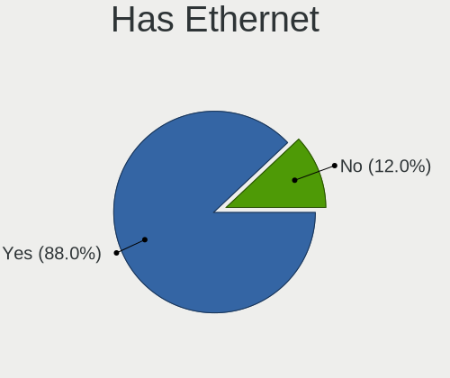
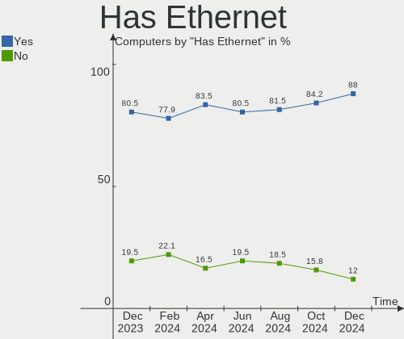
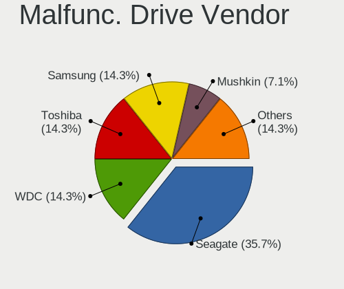
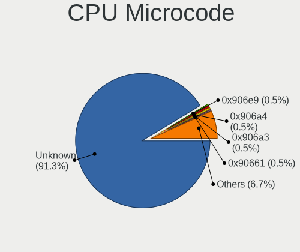
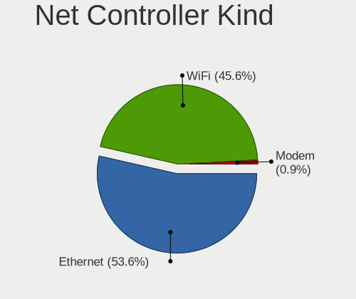
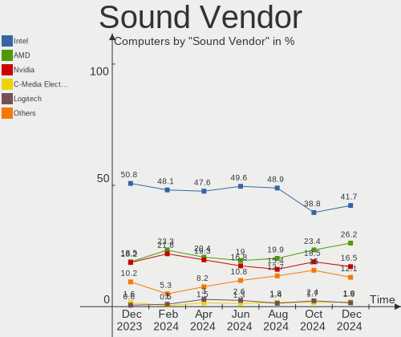

Linux in Canada - Hardware Trends
---------------------------------

A project to identify most popular hardware characteristics and track their change
over time based on data collected by Linux users at https://Linux-Hardware.org.

Anyone can contribute to this report by the [hw-probe](https://github.com/linuxhw/hw-probe) tool:

    sudo -E hw-probe -all -upload

This is a report for all computer types. See also reports for [desktops](/Location/Canada/Desktop/README.md) and [notebooks](/Location/Canada/Notebook/README.md).

Period: Oct, 2023.

Contents
--------

* [ System ](#system)
  - [ OS                       ](#os)
  - [ OS Family                ](#os-family)
  - [ Kernel                   ](#kernel)
  - [ Kernel Family            ](#kernel-family)
  - [ Kernel Major Ver.        ](#kernel-major-ver)
  - [ Arch                     ](#arch)
  - [ DE                       ](#de)
  - [ Display Server           ](#display-server)
  - [ Display Manager          ](#display-manager)
  - [ OS Lang                  ](#os-lang)
  - [ Boot Mode                ](#boot-mode)
  - [ Filesystem               ](#filesystem)
  - [ Part. scheme             ](#part-scheme)
  - [ Dual Boot with Linux/BSD ](#dual-boot-with-linuxbsd)
  - [ Dual Boot (Win)          ](#dual-boot-win)

* [ Board ](#board)
  - [ Vendor                   ](#vendor)
  - [ Model                    ](#model)
  - [ Model Family             ](#model-family)
  - [ MFG Year                 ](#mfg-year)
  - [ Form Factor              ](#form-factor)
  - [ Secure Boot              ](#secure-boot)
  - [ Coreboot                 ](#coreboot)
  - [ RAM Size                 ](#ram-size)
  - [ RAM Used                 ](#ram-used)
  - [ Total Drives             ](#total-drives)
  - [ Has CD-ROM               ](#has-cd-rom)
  - [ Has Ethernet             ](#has-ethernet)
  - [ Has WiFi                 ](#has-wifi)
  - [ Has Bluetooth            ](#has-bluetooth)

* [ Location ](#location)
  - [ Country                  ](#country)
  - [ City                     ](#city)

* [ Drives ](#drives)
  - [ Drive Vendor             ](#drive-vendor)
  - [ Drive Model              ](#drive-model)
  - [ HDD Vendor               ](#hdd-vendor)
  - [ SSD Vendor               ](#ssd-vendor)
  - [ Drive Kind               ](#drive-kind)
  - [ Drive Connector          ](#drive-connector)
  - [ Drive Size               ](#drive-size)
  - [ Space Total              ](#space-total)
  - [ Space Used               ](#space-used)
  - [ Malfunc. Drives          ](#malfunc-drives)
  - [ Malfunc. Drive Vendor    ](#malfunc-drive-vendor)
  - [ Malfunc. HDD Vendor      ](#malfunc-hdd-vendor)
  - [ Malfunc. Drive Kind      ](#malfunc-drive-kind)
  - [ Failed Drives            ](#failed-drives)
  - [ Failed Drive Vendor      ](#failed-drive-vendor)
  - [ Drive Status             ](#drive-status)

* [ Storage controller ](#storage-controller)
  - [ Storage Vendor           ](#storage-vendor)
  - [ Storage Model            ](#storage-model)
  - [ Storage Kind             ](#storage-kind)

* [ Processor ](#processor)
  - [ CPU Vendor               ](#cpu-vendor)
  - [ CPU Model                ](#cpu-model)
  - [ CPU Model Family         ](#cpu-model-family)
  - [ CPU Cores                ](#cpu-cores)
  - [ CPU Sockets              ](#cpu-sockets)
  - [ CPU Threads              ](#cpu-threads)
  - [ CPU Op-Modes             ](#cpu-op-modes)
  - [ CPU Microcode            ](#cpu-microcode)
  - [ CPU Microarch            ](#cpu-microarch)

* [ Graphics ](#graphics)
  - [ GPU Vendor               ](#gpu-vendor)
  - [ GPU Model                ](#gpu-model)
  - [ GPU Combo                ](#gpu-combo)
  - [ GPU Driver               ](#gpu-driver)
  - [ GPU Memory               ](#gpu-memory)

* [ Monitor ](#monitor)
  - [ Monitor Vendor           ](#monitor-vendor)
  - [ Monitor Model            ](#monitor-model)
  - [ Monitor Resolution       ](#monitor-resolution)
  - [ Monitor Diagonal         ](#monitor-diagonal)
  - [ Monitor Width            ](#monitor-width)
  - [ Aspect Ratio             ](#aspect-ratio)
  - [ Monitor Area             ](#monitor-area)
  - [ Pixel Density            ](#pixel-density)
  - [ Multiple Monitors        ](#multiple-monitors)

* [ Network ](#network)
  - [ Net Controller Vendor    ](#net-controller-vendor)
  - [ Net Controller Model     ](#net-controller-model)
  - [ Wireless Vendor          ](#wireless-vendor)
  - [ Wireless Model           ](#wireless-model)
  - [ Ethernet Vendor          ](#ethernet-vendor)
  - [ Ethernet Model           ](#ethernet-model)
  - [ Net Controller Kind      ](#net-controller-kind)
  - [ Used Controller          ](#used-controller)
  - [ NICs                     ](#nics)
  - [ IPv6                     ](#ipv6)

* [ Bluetooth ](#bluetooth)
  - [ Bluetooth Vendor         ](#bluetooth-vendor)
  - [ Bluetooth Model          ](#bluetooth-model)

* [ Sound ](#sound)
  - [ Sound Vendor             ](#sound-vendor)
  - [ Sound Model              ](#sound-model)

* [ Memory ](#memory)
  - [ Memory Vendor            ](#memory-vendor)
  - [ Memory Model             ](#memory-model)
  - [ Memory Kind              ](#memory-kind)
  - [ Memory Form Factor       ](#memory-form-factor)
  - [ Memory Size              ](#memory-size)
  - [ Memory Speed             ](#memory-speed)

* [ Printers & scanners ](#printers--scanners)
  - [ Printer Vendor           ](#printer-vendor)
  - [ Printer Model            ](#printer-model)
  - [ Scanner Vendor           ](#scanner-vendor)
  - [ Scanner Model            ](#scanner-model)

* [ Camera ](#camera)
  - [ Camera Vendor            ](#camera-vendor)
  - [ Camera Model             ](#camera-model)

* [ Security ](#security)
  - [ Fingerprint Vendor       ](#fingerprint-vendor)
  - [ Fingerprint Model        ](#fingerprint-model)
  - [ Chipcard Vendor          ](#chipcard-vendor)
  - [ Chipcard Model           ](#chipcard-model)

* [ Unsupported ](#unsupported)
  - [ Unsupported Devices      ](#unsupported-devices)
  - [ Unsupported Device Types ](#unsupported-device-types)

System
------

OS
--

Installed operating systems

| Name                         | Computers | Percent |
|------------------------------|-----------|---------|
| Ubuntu 22.04                 | 23        | 13.45%  |
| Fedora 38                    | 18        | 10.53%  |
| Linux Mint 21.2              | 11        | 6.43%   |
| Pop!_OS 22.04                | 10        | 5.85%   |
| Zorin 16                     | 9         | 5.26%   |
| Ubuntu 23.04                 | 9         | 5.26%   |
| Debian 12                    | 7         | 4.09%   |
| KDE neon 22.04               | 6         | 3.51%   |
| Nobara 38                    | 4         | 2.34%   |
| Elementary 7.1               | 4         | 2.34%   |
| Arch Rolling                 | 4         | 2.34%   |
| Xero Rolling                 | 3         | 1.75%   |
| Ubuntu 20.04                 | 3         | 1.75%   |
| openSUSE Tumbleweed-XXXXXXXX | 3         | 1.75%   |
| OpenMandriva 4.3             | 3         | 1.75%   |
| Manjaro                      | 3         | 1.75%   |
| Linux Mint 21                | 3         | 1.75%   |
| Kubuntu 23.04                | 3         | 1.75%   |
| Kubuntu 22.04                | 3         | 1.75%   |
| Garuda Linux Soaring         | 3         | 1.75%   |
| ArcoLinux Rolling            | 3         | 1.75%   |
| Ubuntu 23.10                 | 2         | 1.17%   |
| SteamOS 3.4.11               | 2         | 1.17%   |
| Kali 2023.3                  | 2         | 1.17%   |
| Fedora 39                    | 2         | 1.17%   |
| Debian                       | 2         | 1.17%   |
| CentOS 7                     | 2         | 1.17%   |
| Ultramarine 38               | 1         | 0.58%   |
| SteamOS 3.5                  | 1         | 0.58%   |
| Rocky Linux 8.8              | 1         | 0.58%   |
| openSUSE Leap-15.5           | 1         | 0.58%   |
| OpenMandriva 23.90           | 1         | 0.58%   |
| OpenMandriva 23.09           | 1         | 0.58%   |
| OpenMandriva 23.08           | 1         | 0.58%   |
| OpenMandriva 23.01           | 1         | 0.58%   |
| Nobara 37                    | 1         | 0.58%   |
| MX 23                        | 1         | 0.58%   |
| MX 21                        | 1         | 0.58%   |
| MocaccinoOS                  | 1         | 0.58%   |
| Manjaro 23.0.3               | 1         | 0.58%   |

OS Family
---------

OS without a version

| Name         | Computers | Percent |
|--------------|-----------|---------|
| Ubuntu       | 37        | 21.64%  |
| Fedora       | 21        | 12.28%  |
| Linux Mint   | 18        | 10.53%  |
| Pop!_OS      | 10        | 5.85%   |
| Debian       | 10        | 5.85%   |
| Zorin        | 9         | 5.26%   |
| OpenMandriva | 7         | 4.09%   |
| Kubuntu      | 7         | 4.09%   |
| KDE neon     | 6         | 3.51%   |
| Nobara       | 5         | 2.92%   |
| Elementary   | 5         | 2.92%   |
| openSUSE     | 4         | 2.34%   |
| Manjaro      | 4         | 2.34%   |
| Arch         | 4         | 2.34%   |
| Xero         | 3         | 1.75%   |
| SteamOS      | 3         | 1.75%   |
| Garuda Linux | 3         | 1.75%   |
| ArcoLinux    | 3         | 1.75%   |
| MX           | 2         | 1.17%   |
| Kali         | 2         | 1.17%   |
| CentOS       | 2         | 1.17%   |
| Ultramarine  | 1         | 0.58%   |
| Rocky Linux  | 1         | 0.58%   |
| MocaccinoOS  | 1         | 0.58%   |
| LMDE         | 1         | 0.58%   |
| Gentoo       | 1         | 0.58%   |
| EndeavourOS  | 1         | 0.58%   |

Kernel
------

Version of the Linux kernel

| Version                     | Computers | Percent |
|-----------------------------|-----------|---------|
| 6.2.0-34-generic            | 24        | 14.04%  |
| 5.15.0-86-generic           | 13        | 7.6%    |
| 5.15.0-87-generic           | 9         | 5.26%   |
| 6.2.0-35-generic            | 8         | 4.68%   |
| 6.2.0-33-generic            | 8         | 4.68%   |
| 6.5.7-200.fc38.x86_64       | 5         | 2.92%   |
| 5.15.0-84-generic           | 5         | 2.92%   |
| 6.5.6-76060506-generic      | 4         | 2.34%   |
| 6.5.5-arch1-1               | 4         | 2.34%   |
| 6.5.5-200.fc38.x86_64       | 4         | 2.34%   |
| 6.5.4-76060504-generic      | 4         | 2.34%   |
| 6.5.6-200.fc38.x86_64       | 3         | 1.75%   |
| 6.1.0-13-amd64              | 3         | 1.75%   |
| 6.1.0-12-amd64              | 3         | 1.75%   |
| 5.4.0-164-generic           | 3         | 1.75%   |
| 6.5.9-200.fsync.fc38.x86_64 | 2         | 1.17%   |
| 6.5.8-arch1-1               | 2         | 1.17%   |
| 6.5.8-200.fsync.fc38.x86_64 | 2         | 1.17%   |
| 6.5.8-200.fc38.x86_64       | 2         | 1.17%   |
| 6.5.6-1-default             | 2         | 1.17%   |
| 6.5.5-desktop-1omv2390      | 2         | 1.17%   |
| 6.4.6-76060406-generic      | 2         | 1.17%   |
| 6.4.11-200.fc38.x86_64      | 2         | 1.17%   |
| 6.2.9-300.fc38.x86_64       | 2         | 1.17%   |
| 5.16.7-desktop-1omv4003     | 2         | 1.17%   |
| 5.13.0-valve37-1-neptune    | 2         | 1.17%   |
| 6.6.0-1-MANJARO             | 1         | 0.58%   |
| 6.5.8-1-default             | 1         | 0.58%   |
| 6.5.7-zen1-1-zen            | 1         | 0.58%   |
| 6.5.7-300.fc39.x86_64       | 1         | 0.58%   |
| 6.5.6-arch2-1-g14           | 1         | 0.58%   |
| 6.5.6-300.fc39.x86_64       | 1         | 0.58%   |
| 6.5.5-zen1-1-zen            | 1         | 0.58%   |
| 6.5.5-1-MANJARO             | 1         | 0.58%   |
| 6.5.4-zen2-1-zen            | 1         | 0.58%   |
| 6.5.4-060504-generic        | 1         | 0.58%   |
| 6.5.3-200.fsync.fc37.x86_64 | 1         | 0.58%   |
| 6.5.0-kali2-amd64           | 1         | 0.58%   |
| 6.5.0-9-generic             | 1         | 0.58%   |
| 6.5.0-5-generic             | 1         | 0.58%   |

Kernel Family
-------------

Linux kernel without a distro release

| Version | Computers | Percent |
|---------|-----------|---------|
| 6.2.0   | 44        | 25.73%  |
| 5.15.0  | 30        | 17.54%  |
| 6.5.5   | 12        | 7.02%   |
| 6.5.6   | 11        | 6.43%   |
| 6.1.0   | 8         | 4.68%   |
| 6.5.8   | 7         | 4.09%   |
| 6.5.7   | 7         | 4.09%   |
| 6.5.4   | 6         | 3.51%   |
| 6.5.0   | 6         | 3.51%   |
| 5.4.0   | 4         | 2.34%   |
| 6.4.11  | 3         | 1.75%   |
| 6.5.9   | 2         | 1.17%   |
| 6.4.6   | 2         | 1.17%   |
| 6.2.9   | 2         | 1.17%   |
| 5.16.7  | 2         | 1.17%   |
| 5.13.0  | 2         | 1.17%   |
| 3.10.0  | 2         | 1.17%   |
| 6.6.0   | 1         | 0.58%   |
| 6.5.3   | 1         | 0.58%   |
| 6.4.16  | 1         | 0.58%   |
| 6.4.15  | 1         | 0.58%   |
| 6.4.0   | 1         | 0.58%   |
| 6.3.8   | 1         | 0.58%   |
| 6.1.58  | 1         | 0.58%   |
| 6.1.57  | 1         | 0.58%   |
| 6.1.55  | 1         | 0.58%   |
| 6.1.53  | 1         | 0.58%   |
| 6.1.52  | 1         | 0.58%   |
| 6.1.1   | 1         | 0.58%   |
| 6.0.8   | 1         | 0.58%   |
| 6.0.0   | 1         | 0.58%   |
| 5.18.0  | 1         | 0.58%   |
| 5.16.2  | 1         | 0.58%   |
| 5.16.13 | 1         | 0.58%   |
| 5.16.11 | 1         | 0.58%   |
| 5.14.21 | 1         | 0.58%   |
| 5.10.0  | 1         | 0.58%   |
| 4.18.0  | 1         | 0.58%   |

Kernel Major Ver.
-----------------

Linux kernel major version

| Version | Computers | Percent |
|---------|-----------|---------|
| 6.5     | 52        | 30.41%  |
| 6.2     | 46        | 26.9%   |
| 5.15    | 30        | 17.54%  |
| 6.1     | 14        | 8.19%   |
| 6.4     | 8         | 4.68%   |
| 5.16    | 5         | 2.92%   |
| 5.4     | 4         | 2.34%   |
| 6.0     | 2         | 1.17%   |
| 5.13    | 2         | 1.17%   |
| 3.10    | 2         | 1.17%   |
| 6.6     | 1         | 0.58%   |
| 6.3     | 1         | 0.58%   |
| 5.18    | 1         | 0.58%   |
| 5.14    | 1         | 0.58%   |
| 5.10    | 1         | 0.58%   |
| 4.18    | 1         | 0.58%   |

Arch
----

OS architecture (x86_64, i586, etc.)

| Name    | Computers | Percent |
|---------|-----------|---------|
| x86_64  | 168       | 98.25%  |
| i686    | 2         | 1.17%   |
| aarch64 | 1         | 0.58%   |

DE
--

Desktop Environment

| Name            | Computers | Percent |
|-----------------|-----------|---------|
| GNOME           | 75        | 43.86%  |
| KDE5            | 50        | 29.24%  |
| X-Cinnamon      | 15        | 8.77%   |
| Unknown         | 9         | 5.26%   |
| Pantheon        | 5         | 2.92%   |
| XFCE            | 3         | 1.75%   |
| MATE            | 3         | 1.75%   |
| Cinnamon        | 3         | 1.75%   |
| awesome         | 2         | 1.17%   |
| LXQt            | 1         | 0.58%   |
| LXDE-pi-wayfire | 1         | 0.58%   |
| LXDE            | 1         | 0.58%   |
| Jwm             | 1         | 0.58%   |
| i3              | 1         | 0.58%   |
| Budgie          | 1         | 0.58%   |

Display Server
--------------

X11 or Wayland

| Name    | Computers | Percent |
|---------|-----------|---------|
| X11     | 103       | 60.23%  |
| Wayland | 58        | 33.92%  |
| Tty     | 5         | 2.92%   |
| Unknown | 5         | 2.92%   |

Display Manager
---------------

SDDM, LightDM, etc.

| Name    | Computers | Percent |
|---------|-----------|---------|
| Unknown | 82        | 47.95%  |
| GDM3    | 34        | 19.88%  |
| SDDM    | 30        | 17.54%  |
| LightDM | 14        | 8.19%   |
| GDM     | 10        | 5.85%   |
| LXDM    | 1         | 0.58%   |

OS Lang
-------

Language

| Lang    | Computers | Percent |
|---------|-----------|---------|
| en_CA   | 97        | 56.73%  |
| en_US   | 51        | 29.82%  |
| fr_CA   | 10        | 5.85%   |
| C       | 5         | 2.92%   |
| fr_FR   | 2         | 1.17%   |
| en_GB   | 2         | 1.17%   |
| ru_RU   | 1         | 0.58%   |
| POSIX   | 1         | 0.58%   |
| C.UTF8  | 1         | 0.58%   |
| Unknown | 1         | 0.58%   |

Boot Mode
---------

EFI or BIOS

| Mode | Computers | Percent |
|------|-----------|---------|
| EFI  | 91        | 53.22%  |
| BIOS | 80        | 46.78%  |

Filesystem
----------

Type of filesystem

| Type    | Computers | Percent |
|---------|-----------|---------|
| Ext4    | 94        | 54.97%  |
| Btrfs   | 41        | 23.98%  |
| Tmpfs   | 23        | 13.45%  |
| Xfs     | 5         | 2.92%   |
| Overlay | 5         | 2.92%   |
| F2fs    | 1         | 0.58%   |
| Ext3    | 1         | 0.58%   |
| Ext2    | 1         | 0.58%   |

Part. scheme
------------

Scheme of partitioning

| Type    | Computers | Percent |
|---------|-----------|---------|
| GPT     | 85        | 49.71%  |
| Unknown | 74        | 43.27%  |
| MBR     | 12        | 7.02%   |

Dual Boot with Linux/BSD
------------------------

Hosting more than one Linux/BSD

| Dual boot | Computers | Percent |
|-----------|-----------|---------|
| No        | 151       | 88.3%   |
| Yes       | 20        | 11.7%   |

Dual Boot (Win)
---------------

Hosting Linux and Windows

| Dual boot | Computers | Percent |
|-----------|-----------|---------|
| No        | 136       | 79.53%  |
| Yes       | 35        | 20.47%  |

Board
-----

Vendor
------

Motherboard manufacturer

| Name                           | Computers | Percent |
|--------------------------------|-----------|---------|
| Dell                           | 29        | 16.96%  |
| ASUSTek Computer               | 24        | 14.04%  |
| Hewlett-Packard                | 21        | 12.28%  |
| Lenovo                         | 20        | 11.7%   |
| Acer                           | 15        | 8.77%   |
| Gigabyte Technology            | 9         | 5.26%   |
| MSI                            | 8         | 4.68%   |
| ASRock                         | 7         | 4.09%   |
| Apple                          | 7         | 4.09%   |
| Intel                          | 4         | 2.34%   |
| Valve                          | 3         | 1.75%   |
| Pegatron                       | 3         | 1.75%   |
| Toshiba                        | 2         | 1.17%   |
| Gateway                        | 2         | 1.17%   |
| Acidanthera                    | 2         | 1.17%   |
| Win element                    | 1         | 0.58%   |
| SZMZ                           | 1         | 0.58%   |
| System76                       | 1         | 0.58%   |
| Sony                           | 1         | 0.58%   |
| Raspberry Pi Foundation        | 1         | 0.58%   |
| Notebook                       | 1         | 0.58%   |
| Matsushita Electric Industrial | 1         | 0.58%   |
| LORD ELECTRONICS               | 1         | 0.58%   |
| HUAWEI                         | 1         | 0.58%   |
| Google                         | 1         | 0.58%   |
| Fujitsu                        | 1         | 0.58%   |
| Direkt-Tek                     | 1         | 0.58%   |
| Chuwi                          | 1         | 0.58%   |
| Alienware                      | 1         | 0.58%   |
| Unknown                        | 1         | 0.58%   |

Model
-----

Motherboard model

| Name                                                              | Computers | Percent |
|-------------------------------------------------------------------|-----------|---------|
| Valve Jupiter                                                     | 3         | 1.75%   |
| MSI MS-7B93                                                       | 2         | 1.17%   |
| HP Pavilion dv7                                                   | 2         | 1.17%   |
| HP EliteDesk 800 G3 DM 35W                                        | 2         | 1.17%   |
| Gigabyte B550I AORUS PRO AX                                       | 2         | 1.17%   |
| Gateway NV59                                                      | 2         | 1.17%   |
| Dell PowerEdge R430                                               | 2         | 1.17%   |
| Dell OptiPlex 9020                                                | 2         | 1.17%   |
| Dell OptiPlex 7050                                                | 2         | 1.17%   |
| ASUS All Series                                                   | 2         | 1.17%   |
| ASRock B450 Pro4                                                  | 2         | 1.17%   |
| Apple MacBookPro8,1                                               | 2         | 1.17%   |
| Apple iMac14,2                                                    | 2         | 1.17%   |
| Acidanthera iMac19,1                                              | 2         | 1.17%   |
| Acer Aspire A315-21                                               | 2         | 1.17%   |
| Win element M600                                                  | 1         | 0.58%   |
| Toshiba Satellite L655                                            | 1         | 0.58%   |
| Toshiba Satellite A660                                            | 1         | 0.58%   |
| SZMZ X99M-G2                                                      | 1         | 0.58%   |
| System76 Gazelle                                                  | 1         | 0.58%   |
| Sony SVE15128CCW                                                  | 1         | 0.58%   |
| RPi Raspberry Pi 4 Model B Rev 1.2                                | 1         | 0.58%   |
| Pegatron p7-1238                                                  | 1         | 0.58%   |
| Pegatron NY428AA-A2L p6110f                                       | 1         | 0.58%   |
| Pegatron 600-1352                                                 | 1         | 0.58%   |
| Notebook P9XXEN_EF_ED                                             | 1         | 0.58%   |
| MSI MS-7D73                                                       | 1         | 0.58%   |
| MSI MS-7C37                                                       | 1         | 0.58%   |
| MSI MS-7B86                                                       | 1         | 0.58%   |
| MSI MS-7B48                                                       | 1         | 0.58%   |
| MSI MS-7693                                                       | 1         | 0.58%   |
| MSI KJ384AA-A2L SR5410F                                           | 1         | 0.58%   |
| Matsushita Electric Industrial CF-30CTWAZBM                       | 1         | 0.58%   |
| LORD ELECTRONICS Guso G4x + ICH7 Series MotherBoard G41I6510V0.1A | 1         | 0.58%   |
| Lenovo ThinkPad X1 Carbon 6th 20KH002VCA                          | 1         | 0.58%   |
| Lenovo ThinkPad X1 Carbon 6th 20KGS1TW00                          | 1         | 0.58%   |
| Lenovo ThinkPad T510 4384DJ3                                      | 1         | 0.58%   |
| Lenovo ThinkPad T480s 20L8S2SS00                                  | 1         | 0.58%   |
| Lenovo ThinkPad T480 20L5CTO1WW                                   | 1         | 0.58%   |
| Lenovo ThinkPad T460 20FN002JUS                                   | 1         | 0.58%   |

Model Family
------------

Motherboard model prefix

| Name                 | Computers | Percent |
|----------------------|-----------|---------|
| Acer Aspire          | 11        | 6.43%   |
| Lenovo ThinkPad      | 10        | 5.85%   |
| Dell OptiPlex        | 6         | 3.51%   |
| Dell Latitude        | 6         | 3.51%   |
| ASUS ROG             | 6         | 3.51%   |
| Lenovo ThinkCentre   | 5         | 2.92%   |
| Dell XPS             | 5         | 2.92%   |
| HP Pavilion          | 4         | 2.34%   |
| Dell Inspiron        | 4         | 2.34%   |
| Valve Jupiter        | 3         | 1.75%   |
| HP EliteDesk         | 3         | 1.75%   |
| Dell PowerEdge       | 3         | 1.75%   |
| ASUS VivoBook        | 3         | 1.75%   |
| ASUS PRIME           | 3         | 1.75%   |
| Toshiba Satellite    | 2         | 1.17%   |
| MSI MS-7B93          | 2         | 1.17%   |
| Lenovo IdeaPad       | 2         | 1.17%   |
| Lenovo IdeaCentre    | 2         | 1.17%   |
| HP EliteBook         | 2         | 1.17%   |
| Gigabyte B550I       | 2         | 1.17%   |
| Gateway NV59         | 2         | 1.17%   |
| Dell Precision       | 2         | 1.17%   |
| ASUS ZenBook         | 2         | 1.17%   |
| ASUS TUF             | 2         | 1.17%   |
| ASUS All             | 2         | 1.17%   |
| ASRock B450          | 2         | 1.17%   |
| Apple MacBookPro8    | 2         | 1.17%   |
| Apple iMac14         | 2         | 1.17%   |
| Acidanthera iMac19   | 2         | 1.17%   |
| Win element M600     | 1         | 0.58%   |
| SZMZ X99M-G2         | 1         | 0.58%   |
| System76 Gazelle     | 1         | 0.58%   |
| Sony SVE15128CCW     | 1         | 0.58%   |
| RPi Raspberry        | 1         | 0.58%   |
| Pegatron p7-1238     | 1         | 0.58%   |
| Pegatron NY428AA-A2L | 1         | 0.58%   |
| Pegatron 600-1352    | 1         | 0.58%   |
| Notebook P9XXEN      | 1         | 0.58%   |
| MSI MS-7D73          | 1         | 0.58%   |
| MSI MS-7C37          | 1         | 0.58%   |

MFG Year
--------

Motherboard manufacture year

| Year    | Computers | Percent |
|---------|-----------|---------|
| 2019    | 19        | 11.11%  |
| 2018    | 17        | 9.94%   |
| 2020    | 16        | 9.36%   |
| 2023    | 14        | 8.19%   |
| 2017    | 13        | 7.6%    |
| 2013    | 11        | 6.43%   |
| 2011    | 11        | 6.43%   |
| 2010    | 10        | 5.85%   |
| 2022    | 9         | 5.26%   |
| 2014    | 9         | 5.26%   |
| 2021    | 8         | 4.68%   |
| 2009    | 7         | 4.09%   |
| 2015    | 6         | 3.51%   |
| 2012    | 6         | 3.51%   |
| 2008    | 6         | 3.51%   |
| 2016    | 4         | 2.34%   |
| 2007    | 3         | 1.75%   |
| 2006    | 1         | 0.58%   |
| Unknown | 1         | 0.58%   |

Form Factor
-----------

Physical design of the computer

| Name           | Computers | Percent |
|----------------|-----------|---------|
| Notebook       | 77        | 45.03%  |
| Desktop        | 72        | 42.11%  |
| All in one     | 8         | 4.68%   |
| Mini pc        | 5         | 2.92%   |
| Server         | 5         | 2.92%   |
| Convertible    | 3         | 1.75%   |
| System on chip | 1         | 0.58%   |

Secure Boot
-----------

Enabled or disabled

| State    | Computers | Percent |
|----------|-----------|---------|
| Disabled | 157       | 91.81%  |
| Enabled  | 14        | 8.19%   |

Coreboot
--------

Have coreboot on board

| Used | Computers | Percent |
|------|-----------|---------|
| No   | 169       | 98.83%  |
| Yes  | 2         | 1.17%   |

RAM Size
--------

Total RAM memory

| Size in GB  | Computers | Percent |
|-------------|-----------|---------|
| 4.01-8.0    | 37        | 21.64%  |
| 16.01-24.0  | 36        | 21.05%  |
| 8.01-16.0   | 27        | 15.79%  |
| 32.01-64.0  | 26        | 15.2%   |
| 3.01-4.0    | 18        | 10.53%  |
| 64.01-256.0 | 18        | 10.53%  |
| 24.01-32.0  | 4         | 2.34%   |
| 1.01-2.0    | 3         | 1.75%   |
| 2.01-3.0    | 1         | 0.58%   |
| 0.51-1.0    | 1         | 0.58%   |

RAM Used
--------

Used RAM memory

| Used GB     | Computers | Percent |
|-------------|-----------|---------|
| 4.01-8.0    | 41        | 23.98%  |
| 2.01-3.0    | 39        | 22.81%  |
| 1.01-2.0    | 39        | 22.81%  |
| 3.01-4.0    | 24        | 14.04%  |
| 8.01-16.0   | 17        | 9.94%   |
| 0.51-1.0    | 5         | 2.92%   |
| 0.01-0.5    | 3         | 1.75%   |
| 64.01-256.0 | 2         | 1.17%   |
| 16.01-24.0  | 1         | 0.58%   |

Total Drives
------------

Number of drives on board

| Drives | Computers | Percent |
|--------|-----------|---------|
| 1      | 83        | 48.54%  |
| 2      | 54        | 31.58%  |
| 3      | 17        | 9.94%   |
| 5      | 8         | 4.68%   |
| 4      | 7         | 4.09%   |
| 6      | 2         | 1.17%   |

Has CD-ROM
----------

Has CD-ROM on board

| Presented | Computers | Percent |
|-----------|-----------|---------|
| No        | 104       | 60.82%  |
| Yes       | 67        | 39.18%  |

Has Ethernet
------------

Has Ethernet on board

| Presented | Computers | Percent |
|-----------|-----------|---------|
| Yes       | 147       | 85.96%  |
| No        | 24        | 14.04%  |

Has WiFi
--------

Has WiFi module

| Presented | Computers | Percent |
|-----------|-----------|---------|
| Yes       | 131       | 76.61%  |
| No        | 40        | 23.39%  |

Has Bluetooth
-------------

Has Bluetooth module

| Presented | Computers | Percent |
|-----------|-----------|---------|
| Yes       | 101       | 59.06%  |
| No        | 70        | 40.94%  |

Location
--------

Country
-------

Geographic location (country)

| Country | Computers | Percent |
|---------|-----------|---------|
| Canada  | 171       | 100%    |

City
----

Geographic location (city)

| City                | Computers | Percent |
|---------------------|-----------|---------|
| Toronto             | 27        | 15.79%  |
| Montreal            | 20        | 11.7%   |
| Calgary             | 10        | 5.85%   |
| Vancouver           | 6         | 3.51%   |
| Québec             | 5         | 2.92%   |
| Ottawa              | 5         | 2.92%   |
| Mississauga         | 5         | 2.92%   |
| Edmonton            | 4         | 2.34%   |
| Corner Brook        | 4         | 2.34%   |
| Winnipeg            | 3         | 1.75%   |
| Oakville            | 3         | 1.75%   |
| Markham             | 3         | 1.75%   |
| Scarborough         | 2         | 1.17%   |
| Regina              | 2         | 1.17%   |
| Oshawa              | 2         | 1.17%   |
| Longueuil           | 2         | 1.17%   |
| LaSalle             | 2         | 1.17%   |
| Kingston            | 2         | 1.17%   |
| Kelowna             | 2         | 1.17%   |
| Guelph              | 2         | 1.17%   |
| Fredericton         | 2         | 1.17%   |
| Creston             | 2         | 1.17%   |
| Cambridge           | 2         | 1.17%   |
| Wolfville           | 1         | 0.58%   |
| Windsor             | 1         | 0.58%   |
| Whitby              | 1         | 0.58%   |
| Victoria            | 1         | 0.58%   |
| Vernon              | 1         | 0.58%   |
| Verdun              | 1         | 0.58%   |
| Trail               | 1         | 0.58%   |
| Thunder Bay         | 1         | 0.58%   |
| Saskatoon           | 1         | 0.58%   |
| Sarnia              | 1         | 0.58%   |
| Sainte-Therese      | 1         | 0.58%   |
| Sainte-Eulalie      | 1         | 0.58%   |
| Saint-Jean-de-Matha | 1         | 0.58%   |
| Saint-Georges       | 1         | 0.58%   |
| Saint-Cyprien       | 1         | 0.58%   |
| Saint-Constant      | 1         | 0.58%   |
| Rockwood            | 1         | 0.58%   |

Drives
------

Drive Vendor
------------

Hard drive vendors

| Vendor                      | Computers | Drives | Percent |
|-----------------------------|-----------|--------|---------|
| WDC                         | 40        | 46     | 14.93%  |
| Seagate                     | 37        | 47     | 13.81%  |
| Samsung Electronics         | 37        | 44     | 13.81%  |
| Sandisk                     | 22        | 26     | 8.21%   |
| Kingston                    | 15        | 15     | 5.6%    |
| Unknown                     | 13        | 15     | 4.85%   |
| Toshiba                     | 12        | 14     | 4.48%   |
| Intel                       | 11        | 13     | 4.1%    |
| Crucial                     | 7         | 8      | 2.61%   |
| A-DATA Technology           | 5         | 6      | 1.87%   |
| SPCC                        | 4         | 4      | 1.49%   |
| Hitachi                     | 4         | 4      | 1.49%   |
| Silicon Motion              | 3         | 3      | 1.12%   |
| Phison Electronics          | 3         | 3      | 1.12%   |
| Micron Technology           | 3         | 3      | 1.12%   |
| MAXIO Technology (Hangzhou) | 3         | 4      | 1.12%   |
| HGST                        | 3         | 4      | 1.12%   |
| China                       | 3         | 3      | 1.12%   |
| Apple                       | 3         | 3      | 1.12%   |
| Timetec                     | 2         | 3      | 0.75%   |
| Team                        | 2         | 2      | 0.75%   |
| Realtek Semiconductor       | 2         | 2      | 0.75%   |
| Micron/Crucial Technology   | 2         | 3      | 0.75%   |
| LITEON                      | 2         | 2      | 0.75%   |
| Lexar                       | 2         | 2      | 0.75%   |
| Kingston Technology Company | 2         | 2      | 0.75%   |
| KingFast                    | 2         | 2      | 0.75%   |
| ADATA Technology            | 2         | 3      | 0.75%   |
| Unknown                     | 2         | 2      | 0.75%   |
| XrayDisk                    | 1         | 1      | 0.37%   |
| WDC PC S                    | 1         | 1      | 0.37%   |
| USB3.0                      | 1         | 1      | 0.37%   |
| Unknown (CF)                | 1         | 1      | 0.37%   |
| Union Memory                | 1         | 1      | 0.37%   |
| TSA                         | 1         | 1      | 0.37%   |
| SK hynix                    | 1         | 1      | 0.37%   |
| PNY                         | 1         | 1      | 0.37%   |
| Patriot                     | 1         | 1      | 0.37%   |
| OWC                         | 1         | 1      | 0.37%   |
| O2 Micro                    | 1         | 1      | 0.37%   |

Drive Model
-----------

Hard drive models

| Model                                                 | Computers | Percent |
|-------------------------------------------------------|-----------|---------|
| Seagate ST2000DM008-2FR102 2TB                        | 8         | 2.74%   |
| Samsung NVMe SSD Controller SM981/PM981/PM983 1TB     | 7         | 2.4%    |
| Sandisk WD Blue SN550 NVMe SSD 1TB                    | 5         | 1.71%   |
| Samsung SSD 860 EVO 500GB                             | 5         | 1.71%   |
| Kingston SA400S37480G 480GB SSD                       | 4         | 1.37%   |
| Intel SSD 660P Series 1024GB                          | 4         | 1.37%   |
| Crucial CT500MX500SSD1 500GB                          | 4         | 1.37%   |
| WDC WDS100T2B0A-00SM50 1TB SSD                        | 3         | 1.03%   |
| MAXIO (Hangzhou) NVMe SSD Controller MAP1202 250GB    | 3         | 1.03%   |
| Kingston SA400S37240G 240GB SSD                       | 3         | 1.03%   |
| WDC WD5000BEVT-22A0RT0 500GB                          | 2         | 0.68%   |
| Unknown SD/MMC/MS PRO 16GB                            | 2         | 0.68%   |
| Unknown MMC Card  512GB                               | 2         | 0.68%   |
| Toshiba MQ04ABF100 1TB                                | 2         | 0.68%   |
| Toshiba DT01ACA100 1TB                                | 2         | 0.68%   |
| Silicon Motion SM2263EN/SM2263XT SSD Controller 256GB | 2         | 0.68%   |
| Seagate ST2000DM008-2UB102 2TB                        | 2         | 0.68%   |
| Seagate ST2000DM006-2DM164 2TB                        | 2         | 0.68%   |
| Seagate ST1000LM035-1RK172 1TB                        | 2         | 0.68%   |
| Seagate ST1000DM003-1SB102 1TB                        | 2         | 0.68%   |
| Seagate Expansion Desk 3TB                            | 2         | 0.68%   |
| Sandisk WD_BLACK SN770 1TB                            | 2         | 0.68%   |
| SanDisk SD8TB8U256G1001 256GB SSD                     | 2         | 0.68%   |
| Samsung SSD 970 EVO Plus 1TB                          | 2         | 0.68%   |
| Samsung SSD 870 EVO 1TB                               | 2         | 0.68%   |
| Samsung SSD 850 EVO 500GB                             | 2         | 0.68%   |
| Samsung NVMe SSD Controller SM961/PM961/SM963 121GB   | 2         | 0.68%   |
| Samsung NVMe SSD Controller PM9A1/PM9A3/980PRO 1TB    | 2         | 0.68%   |
| Realtek SPCC M.2 PCIe SSD 512GB                       | 2         | 0.68%   |
| Phison E16 PCIe4 NVMe Controller 500GB                | 2         | 0.68%   |
| Micron/Crucial P2 NVMe PCIe SSD 500GB                 | 2         | 0.68%   |
| Kingston SV300S37A120G 120GB SSD                      | 2         | 0.68%   |
| Kingston SA2000M81000G 1TB                            | 2         | 0.68%   |
| KingFast 512GB                                        | 2         | 0.68%   |
| Intel SSDSC2BB800G7 800GB                             | 2         | 0.68%   |
| Intel SSD Pro 7600p/760p/E 6100p Series 256GB         | 2         | 0.68%   |
| Hitachi HTS723232A7A364 320GB                         | 2         | 0.68%   |
| Crucial CT2000MX500SSD1 2TB                           | 2         | 0.68%   |
| A-DATA SU630 480GB SSD                                | 2         | 0.68%   |
| Unknown                                               | 2         | 0.68%   |

HDD Vendor
----------

Hard disk drive vendors

| Vendor              | Computers | Drives | Percent |
|---------------------|-----------|--------|---------|
| Seagate             | 36        | 46     | 40.45%  |
| WDC                 | 30        | 34     | 33.71%  |
| Toshiba             | 8         | 9      | 8.99%   |
| Hitachi             | 4         | 4      | 4.49%   |
| HGST                | 3         | 4      | 3.37%   |
| Unknown             | 2         | 2      | 2.25%   |
| Apple               | 2         | 2      | 2.25%   |
| USB3.0              | 1         | 1      | 1.12%   |
| Samsung Electronics | 1         | 1      | 1.12%   |
| Maxone              | 1         | 1      | 1.12%   |
| Fujitsu             | 1         | 1      | 1.12%   |

SSD Vendor
----------

Solid state drive vendors

| Vendor              | Computers | Drives | Percent |
|---------------------|-----------|--------|---------|
| Samsung Electronics | 19        | 21     | 21.84%  |
| Kingston            | 10        | 10     | 11.49%  |
| WDC                 | 8         | 8      | 9.2%    |
| Crucial             | 7         | 7      | 8.05%   |
| A-DATA Technology   | 5         | 6      | 5.75%   |
| SPCC                | 4         | 4      | 4.6%    |
| Intel               | 4         | 6      | 4.6%    |
| SanDisk             | 3         | 3      | 3.45%   |
| China               | 3         | 3      | 3.45%   |
| Toshiba             | 2         | 3      | 2.3%    |
| Timetec             | 2         | 3      | 2.3%    |
| Team                | 2         | 2      | 2.3%    |
| LITEON              | 2         | 2      | 2.3%    |
| Lexar               | 2         | 2      | 2.3%    |
| XrayDisk            | 1         | 1      | 1.15%   |
| Unknown (CF)        | 1         | 1      | 1.15%   |
| TSA                 | 1         | 1      | 1.15%   |
| PNY                 | 1         | 1      | 1.15%   |
| Patriot             | 1         | 1      | 1.15%   |
| OWC                 | 1         | 1      | 1.15%   |
| Mushkin             | 1         | 1      | 1.15%   |
| Micron Technology   | 1         | 1      | 1.15%   |
| LITEONIT            | 1         | 1      | 1.15%   |
| Corsair             | 1         | 1      | 1.15%   |
| ASMT                | 1         | 1      | 1.15%   |
| APOLLO              | 1         | 1      | 1.15%   |
| AirDisk             | 1         | 1      | 1.15%   |
| Unknown             | 1         | 1      | 1.15%   |

Drive Kind
----------

HDD or SSD

| Kind    | Computers | Drives | Percent |
|---------|-----------|--------|---------|
| HDD     | 77        | 105    | 31.95%  |
| NVMe    | 75        | 89     | 31.12%  |
| SSD     | 73        | 94     | 30.29%  |
| MMC     | 11        | 14     | 4.56%   |
| Unknown | 5         | 6      | 2.07%   |

Drive Connector
---------------

SATA, SAS, NVMe, etc.

| Type | Computers | Drives | Percent |
|------|-----------|--------|---------|
| SATA | 122       | 188    | 54.71%  |
| NVMe | 75        | 89     | 33.63%  |
| SAS  | 15        | 17     | 6.73%   |
| MMC  | 11        | 14     | 4.93%   |

Drive Size
----------

Size of hard drive

| Size in TB | Computers | Drives | Percent |
|------------|-----------|--------|---------|
| 0.01-0.5   | 81        | 99     | 49.39%  |
| 0.51-1.0   | 49        | 58     | 29.88%  |
| 1.01-2.0   | 23        | 30     | 14.02%  |
| 2.01-3.0   | 6         | 7      | 3.66%   |
| 3.01-4.0   | 3         | 3      | 1.83%   |
| 4.01-10.0  | 2         | 2      | 1.22%   |

Space Total
-----------

Amount of disk space available on the file system

| Size in GB     | Computers | Percent |
|----------------|-----------|---------|
| 501-1000       | 37        | 21.64%  |
| 251-500        | 36        | 21.05%  |
| 101-250        | 34        | 19.88%  |
| More than 3000 | 26        | 15.2%   |
| 1001-2000      | 13        | 7.6%    |
| 2001-3000      | 8         | 4.68%   |
| 1-20           | 5         | 2.92%   |
| 21-50          | 4         | 2.34%   |
| 51-100         | 4         | 2.34%   |
| Unknown        | 4         | 2.34%   |

Space Used
----------

Amount of used disk space

| Used GB        | Computers | Percent |
|----------------|-----------|---------|
| 1-20           | 42        | 24.56%  |
| 21-50          | 34        | 19.88%  |
| 101-250        | 20        | 11.7%   |
| 251-500        | 17        | 9.94%   |
| 51-100         | 17        | 9.94%   |
| 501-1000       | 15        | 8.77%   |
| More than 3000 | 8         | 4.68%   |
| 1001-2000      | 8         | 4.68%   |
| 2001-3000      | 6         | 3.51%   |
| Unknown        | 4         | 2.34%   |

Malfunc. Drives
---------------

Drive models with a malfunction

| Model                                 | Computers | Drives | Percent |
|---------------------------------------|-----------|--------|---------|
| WDC WD5000LPCX-75VHAT0 500GB          | 1         | 1      | 7.14%   |
| WDC WD5000AAKS-00UU3A0 500GB          | 1         | 1      | 7.14%   |
| WDC WD30EZRX-00D8PB0 3TB              | 1         | 1      | 7.14%   |
| WDC WD20EARX-00PASB0 2TB              | 1         | 1      | 7.14%   |
| Toshiba THNSNK128GCS8 SATA 128GB SSD  | 1         | 1      | 7.14%   |
| Toshiba MK6465GSX 640GB               | 1         | 1      | 7.14%   |
| Seagate ST9500420ASG 500GB            | 1         | 1      | 7.14%   |
| Seagate ST31500341AS 1TB              | 1         | 1      | 7.14%   |
| Seagate ST1000NM0033-9ZM173 1TB       | 1         | 2      | 7.14%   |
| Seagate ST1000DM003-1ER162 1TB        | 1         | 1      | 7.14%   |
| Samsung Electronics SSD 870 EVO 250GB | 1         | 1      | 7.14%   |
| Samsung Electronics SSD 840 EVO 120GB | 1         | 1      | 7.14%   |
| Fujitsu MHV2080AH 80GB                | 1         | 1      | 7.14%   |
| A-DATA Technology SU635 480GB SSD     | 1         | 1      | 7.14%   |

Malfunc. Drive Vendor
---------------------

Vendors of faulty drives

| Vendor              | Computers | Drives | Percent |
|---------------------|-----------|--------|---------|
| WDC                 | 4         | 4      | 28.57%  |
| Seagate             | 4         | 5      | 28.57%  |
| Toshiba             | 2         | 2      | 14.29%  |
| Samsung Electronics | 2         | 2      | 14.29%  |
| Fujitsu             | 1         | 1      | 7.14%   |
| A-DATA Technology   | 1         | 1      | 7.14%   |

Malfunc. HDD Vendor
-------------------

Vendors of faulty HDD drives

| Vendor  | Computers | Drives | Percent |
|---------|-----------|--------|---------|
| WDC     | 4         | 4      | 40%     |
| Seagate | 4         | 5      | 40%     |
| Toshiba | 1         | 1      | 10%     |
| Fujitsu | 1         | 1      | 10%     |

Malfunc. Drive Kind
-------------------

Kinds of faulty drives

| Kind | Computers | Drives | Percent |
|------|-----------|--------|---------|
| HDD  | 10        | 11     | 71.43%  |
| SSD  | 4         | 4      | 28.57%  |

Failed Drives
-------------

Failed drive models

| Model                             | Computers | Drives | Percent |
|-----------------------------------|-----------|--------|---------|
| Samsung Electronics HM160HC 160GB | 1         | 1      | 100%    |

Failed Drive Vendor
-------------------

Failed drive vendors

| Vendor              | Computers | Drives | Percent |
|---------------------|-----------|--------|---------|
| Samsung Electronics | 1         | 1      | 100%    |

Drive Status
------------

Number of failed and malfunc. drives

| Status   | Computers | Drives | Percent |
|----------|-----------|--------|---------|
| Detected | 106       | 178    | 56.99%  |
| Works    | 65        | 114    | 34.95%  |
| Malfunc  | 14        | 15     | 7.53%   |
| Failed   | 1         | 1      | 0.54%   |

Storage controller
------------------

Storage Vendor
--------------

Storage controller vendors

| Vendor                       | Computers | Percent |
|------------------------------|-----------|---------|
| Intel                        | 114       | 46.91%  |
| AMD                          | 36        | 14.81%  |
| SanDisk                      | 22        | 9.05%   |
| Samsung Electronics          | 21        | 8.64%   |
| ASMedia Technology           | 8         | 3.29%   |
| Kingston Technology Company  | 7         | 2.88%   |
| LSI Logic / Symbios Logic    | 4         | 1.65%   |
| Silicon Motion               | 3         | 1.23%   |
| Phison Electronics           | 3         | 1.23%   |
| Micron/Crucial Technology    | 3         | 1.23%   |
| MAXIO Technology (Hangzhou)  | 3         | 1.23%   |
| Toshiba America Info Systems | 2         | 0.82%   |
| Realtek Semiconductor        | 2         | 0.82%   |
| Nvidia                       | 2         | 0.82%   |
| Micron Technology            | 2         | 0.82%   |
| JMicron Technology           | 2         | 0.82%   |
| ADATA Technology             | 2         | 0.82%   |
| Union Memory (Shenzhen)      | 1         | 0.41%   |
| O2 Micro                     | 1         | 0.41%   |
| Marvell Technology Group     | 1         | 0.41%   |
| KIOXIA                       | 1         | 0.41%   |
| Hewlett-Packard              | 1         | 0.41%   |
| Broadcom / LSI               | 1         | 0.41%   |
| Apple                        | 1         | 0.41%   |

Storage Model
-------------

Storage controller models

| Model                                                                          | Computers | Percent |
|--------------------------------------------------------------------------------|-----------|---------|
| AMD FCH SATA Controller [AHCI mode]                                            | 25        | 9.06%   |
| Intel 8 Series/C220 Series Chipset Family 6-port SATA Controller 1 [AHCI mode] | 11        | 3.99%   |
| Samsung NVMe SSD Controller SM981/PM981/PM983                                  | 10        | 3.62%   |
| Intel Cannon Lake PCH SATA AHCI Controller                                     | 8         | 2.9%    |
| AMD 400 Series Chipset SATA Controller                                         | 8         | 2.9%    |
| SanDisk Ultra 3D / WD Blue SN550 NVMe SSD                                      | 7         | 2.54%   |
| Intel 82801 Mobile SATA Controller [RAID mode]                                 | 7         | 2.54%   |
| Intel 200 Series PCH SATA controller [AHCI mode]                               | 7         | 2.54%   |
| ASMedia ASM1062 Serial ATA Controller                                          | 7         | 2.54%   |
| Intel Volume Management Device NVMe RAID Controller                            | 6         | 2.17%   |
| Intel 6 Series/C200 Series Chipset Family 6 port Mobile SATA AHCI Controller   | 6         | 2.17%   |
| Intel 5 Series/3400 Series Chipset 4 port SATA AHCI Controller                 | 6         | 2.17%   |
| SanDisk WD Black SN770 / PC SN740 256GB / PC SN560 (DRAM-less) NVMe SSD        | 5         | 1.81%   |
| Intel Sunrise Point-LP SATA Controller [AHCI mode]                             | 5         | 1.81%   |
| Intel SATA Controller [RAID mode]                                              | 5         | 1.81%   |
| Samsung NVMe SSD Controller 980 (DRAM-less)                                    | 4         | 1.45%   |
| Intel SSD 660P Series                                                          | 4         | 1.45%   |
| Intel 7 Series Chipset Family 6-port SATA Controller [AHCI mode]               | 4         | 1.45%   |
| SanDisk Ultra 3D / WD Blue SN570 NVMe SSD (DRAM-less)                          | 3         | 1.09%   |
| Samsung NVMe SSD Controller SM961/PM961/SM963                                  | 3         | 1.09%   |
| Samsung NVMe SSD Controller PM9A1/PM9A3/980PRO                                 | 3         | 1.09%   |
| MAXIO (Hangzhou) NVMe SSD Controller MAP1202                                   | 3         | 1.09%   |
| Intel Cannon Lake Mobile PCH SATA AHCI Controller                              | 3         | 1.09%   |
| Intel Alder Lake-S PCH SATA Controller [AHCI Mode]                             | 3         | 1.09%   |
| Intel 82801JI (ICH10 Family) 4 port SATA IDE Controller #1                     | 3         | 1.09%   |
| Intel 82801JI (ICH10 Family) 2 port SATA IDE Controller #2                     | 3         | 1.09%   |
| Intel 82801JD/DO (ICH10 Family) SATA AHCI Controller                           | 3         | 1.09%   |
| Intel 8 Series SATA Controller 1 [AHCI mode]                                   | 3         | 1.09%   |
| Intel 5 Series/3400 Series Chipset 6 port SATA AHCI Controller                 | 3         | 1.09%   |
| Intel 400 Series Chipset Family SATA AHCI Controller                           | 3         | 1.09%   |
| AMD SB7x0/SB8x0/SB9x0 SATA Controller [AHCI mode]                              | 3         | 1.09%   |
| AMD 500 Series Chipset SATA Controller                                         | 3         | 1.09%   |
| Silicon Motion SM2263EN/SM2263XT (DRAM-less) NVMe SSD Controllers              | 2         | 0.72%   |
| SanDisk WD PC SN810 / Black SN850 NVMe SSD                                     | 2         | 0.72%   |
| SanDisk Extreme Pro / WD Black SN750 / PC SN730 / Red SN700 NVMe SSD           | 2         | 0.72%   |
| Samsung NVMe SSD Controller PM9B1 (DRAM-less)                                  | 2         | 0.72%   |
| Realtek RTS5765DL NVMe SSD Controller (DRAM-less)                              | 2         | 0.72%   |
| Phison E16 PCIe4 NVMe Controller                                               | 2         | 0.72%   |
| Micron/Crucial P2 [Nick P2] / P3 / P3 Plus NVMe PCIe SSD (DRAM-less)           | 2         | 0.72%   |
| LSI Logic / Symbios Logic MegaRAID SAS-3 3008 [Fury]                           | 2         | 0.72%   |

Storage Kind
------------

Kind of storage controller (IDE, SATA, NVMe, SAS, ...)

| Kind | Computers | Percent |
|------|-----------|---------|
| SATA | 121       | 50%     |
| NVMe | 75        | 30.99%  |
| RAID | 24        | 9.92%   |
| IDE  | 20        | 8.26%   |
| SAS  | 2         | 0.83%   |

Processor
---------

CPU Vendor
----------

Processor vendors

| Vendor | Computers | Percent |
|--------|-----------|---------|
| Intel  | 127       | 74.27%  |
| AMD    | 43        | 25.15%  |
| ARM    | 1         | 0.58%   |

CPU Model
---------

Processor models

| Model                                       | Computers | Percent |
|---------------------------------------------|-----------|---------|
| Intel Core i5-8400 CPU @ 2.80GHz            | 4         | 2.34%   |
| Intel Core i7-9700 CPU @ 3.00GHz            | 3         | 1.75%   |
| Intel Core i7-4770 CPU @ 3.40GHz            | 3         | 1.75%   |
| Intel Core i5-8250U CPU @ 1.60GHz           | 3         | 1.75%   |
| Intel Core i5-2410M CPU @ 2.30GHz           | 3         | 1.75%   |
| Intel Core i3 CPU M 370 @ 2.40GHz           | 3         | 1.75%   |
| Intel Core 2 Duo CPU E8400 @ 3.00GHz        | 3         | 1.75%   |
| AMD Ryzen 9 5950X 16-Core Processor         | 3         | 1.75%   |
| AMD Ryzen 7 3700X 8-Core Processor          | 3         | 1.75%   |
| AMD Custom APU 0405                         | 3         | 1.75%   |
| Intel Xeon CPU E5520 @ 2.27GHz              | 2         | 1.17%   |
| Intel Xeon CPU E5-2630 v4 @ 2.20GHz         | 2         | 1.17%   |
| Intel Core i9-9900K CPU @ 3.60GHz           | 2         | 1.17%   |
| Intel Core i7-4790 CPU @ 3.60GHz            | 2         | 1.17%   |
| Intel Core i7-1065G7 CPU @ 1.30GHz          | 2         | 1.17%   |
| Intel Core i5-6500 CPU @ 3.20GHz            | 2         | 1.17%   |
| Intel Core i5-6300U CPU @ 2.40GHz           | 2         | 1.17%   |
| Intel Core i5-5200U CPU @ 2.20GHz           | 2         | 1.17%   |
| Intel Core i5-4670 CPU @ 3.40GHz            | 2         | 1.17%   |
| Intel Core i5-2435M CPU @ 2.40GHz           | 2         | 1.17%   |
| Intel Core i5-10210U CPU @ 1.60GHz          | 2         | 1.17%   |
| Intel 11th Gen Core i7-1165G7 @ 2.80GHz     | 2         | 1.17%   |
| Intel Xeon E-2176M CPU @ 2.70GHz            | 1         | 0.58%   |
| Intel Xeon CPU E5645 @ 2.40GHz              | 1         | 0.58%   |
| Intel Xeon CPU E5-2680 v2 @ 2.80GHz         | 1         | 0.58%   |
| Intel Xeon CPU E5-2670 v3 @ 2.30GHz         | 1         | 0.58%   |
| Intel Xeon CPU E5-2650 v4 @ 2.20GHz         | 1         | 0.58%   |
| Intel Xeon CPU E5-1620 0 @ 3.60GHz          | 1         | 0.58%   |
| Intel Pentium Dual-Core CPU E5300 @ 2.60GHz | 1         | 0.58%   |
| Intel Pentium Dual CPU E2160 @ 1.80GHz      | 1         | 0.58%   |
| Intel Pentium CPU P6100 @ 2.00GHz           | 1         | 0.58%   |
| Intel Pentium CPU 997 @ 1.60GHz             | 1         | 0.58%   |
| Intel N100                                  | 1         | 0.58%   |
| Intel Core i9-10885H CPU @ 2.40GHz          | 1         | 0.58%   |
| Intel Core i7-9850H CPU @ 2.60GHz           | 1         | 0.58%   |
| Intel Core i7-9750H CPU @ 2.60GHz           | 1         | 0.58%   |
| Intel Core i7-9700K CPU @ 3.60GHz           | 1         | 0.58%   |
| Intel Core i7-8750H CPU @ 2.20GHz           | 1         | 0.58%   |
| Intel Core i7-8700K CPU @ 3.70GHz           | 1         | 0.58%   |
| Intel Core i7-8650U CPU @ 1.90GHz           | 1         | 0.58%   |

CPU Model Family
----------------

Processor model prefix

| Model                   | Computers | Percent |
|-------------------------|-----------|---------|
| Intel Core i5           | 41        | 23.98%  |
| Intel Core i7           | 30        | 17.54%  |
| Other                   | 20        | 11.7%   |
| AMD Ryzen 7             | 11        | 6.43%   |
| Intel Xeon              | 10        | 5.85%   |
| Intel Core i3           | 10        | 5.85%   |
| AMD Ryzen 9             | 7         | 4.09%   |
| Intel Core 2 Duo        | 5         | 2.92%   |
| AMD Ryzen 5             | 5         | 2.92%   |
| Intel Core i9           | 3         | 1.75%   |
| Intel Celeron           | 3         | 1.75%   |
| Intel Atom              | 3         | 1.75%   |
| Intel Pentium           | 2         | 1.17%   |
| Intel Core 2 Quad       | 2         | 1.17%   |
| AMD E                   | 2         | 1.17%   |
| AMD A10                 | 2         | 1.17%   |
| Intel Pentium Dual-Core | 1         | 0.58%   |
| Intel Pentium Dual      | 1         | 0.58%   |
| Intel Core Duo          | 1         | 0.58%   |
| AMD Turion 64 Mobile    | 1         | 0.58%   |
| AMD Sempron             | 1         | 0.58%   |
| AMD Ryzen 7 PRO         | 1         | 0.58%   |
| AMD Ryzen 3             | 1         | 0.58%   |
| AMD FX                  | 1         | 0.58%   |
| AMD E2                  | 1         | 0.58%   |
| AMD Athlon II Neo       | 1         | 0.58%   |
| AMD Athlon II Dual-Core | 1         | 0.58%   |
| AMD Athlon              | 1         | 0.58%   |
| AMD A8                  | 1         | 0.58%   |
| AMD A6                  | 1         | 0.58%   |
| AMD A4                  | 1         | 0.58%   |

CPU Cores
---------

Number of processor cores

| Number  | Computers | Percent |
|---------|-----------|---------|
| 4       | 58        | 33.92%  |
| 2       | 50        | 29.24%  |
| 8       | 23        | 13.45%  |
| 6       | 15        | 8.77%   |
| 12      | 7         | 4.09%   |
| 16      | 5         | 2.92%   |
| 10      | 4         | 2.34%   |
| 20      | 3         | 1.75%   |
| 1       | 3         | 1.75%   |
| 24      | 1         | 0.58%   |
| 14      | 1         | 0.58%   |
| Unknown | 1         | 0.58%   |

CPU Sockets
-----------

Number of sockets

| Number  | Computers | Percent |
|---------|-----------|---------|
| 1       | 164       | 95.91%  |
| 2       | 6         | 3.51%   |
| Unknown | 1         | 0.58%   |

CPU Threads
-----------

Threads per core (Hyper-Threading)

| Number  | Computers | Percent |
|---------|-----------|---------|
| 2       | 118       | 69.01%  |
| 1       | 52        | 30.41%  |
| Unknown | 1         | 0.58%   |

CPU Op-Modes
------------

CPU Operation Modes (32-bit, 64-bit)

| Op mode        | Computers | Percent |
|----------------|-----------|---------|
| 32-bit, 64-bit | 168       | 98.25%  |
| 32-bit         | 2         | 1.17%   |
| 64-bit         | 1         | 0.58%   |

CPU Microcode
-------------

Microcode number

| Number     | Computers | Percent |
|------------|-----------|---------|
| Unknown    | 102       | 59.65%  |
| 0x306c3    | 4         | 2.34%   |
| 0x20655    | 4         | 2.34%   |
| 0x08701021 | 4         | 2.34%   |
| 0x906ea    | 3         | 1.75%   |
| 0x206a7    | 3         | 1.75%   |
| 0x08108109 | 3         | 1.75%   |
| 0x906ed    | 2         | 1.17%   |
| 0x806ec    | 2         | 1.17%   |
| 0x506e3    | 2         | 1.17%   |
| 0x406f1    | 2         | 1.17%   |
| 0x306a9    | 2         | 1.17%   |
| 0x20652    | 2         | 1.17%   |
| 0x1067a    | 2         | 1.17%   |
| 0x0a50000d | 2         | 1.17%   |
| 0x0a404102 | 2         | 1.17%   |
| 0x0a201009 | 2         | 1.17%   |
| 0x06006705 | 2         | 1.17%   |
| 0x06006704 | 2         | 1.17%   |
| 0x06003106 | 2         | 1.17%   |
| 0xb0671    | 1         | 0.58%   |
| 0x806ea    | 1         | 0.58%   |
| 0x806c1    | 1         | 0.58%   |
| 0x6fd      | 1         | 0.58%   |
| 0x6fb      | 1         | 0.58%   |
| 0x6ec      | 1         | 0.58%   |
| 0x406c4    | 1         | 0.58%   |
| 0x306f2    | 1         | 0.58%   |
| 0x306e4    | 1         | 0.58%   |
| 0x306d4    | 1         | 0.58%   |
| 0x30678    | 1         | 0.58%   |
| 0x206c2    | 1         | 0.58%   |
| 0x106e5    | 1         | 0.58%   |
| 0x106c2    | 1         | 0.58%   |
| 0x0a601206 | 1         | 0.58%   |
| 0x0a601203 | 1         | 0.58%   |
| 0x0a50000c | 1         | 0.58%   |
| 0x0a20120a | 1         | 0.58%   |
| 0x08701013 | 1         | 0.58%   |
| 0x0800820d | 1         | 0.58%   |

CPU Microarch
-------------

Microarchitecture

| Name             | Computers | Percent |
|------------------|-----------|---------|
| KabyLake         | 29        | 16.96%  |
| Haswell          | 17        | 9.94%   |
| Unknown          | 14        | 8.19%   |
| Westmere         | 10        | 5.85%   |
| SandyBridge      | 10        | 5.85%   |
| Zen 3            | 8         | 4.68%   |
| Skylake          | 8         | 4.68%   |
| Zen 2            | 7         | 4.09%   |
| Alderlake Hybrid | 7         | 4.09%   |
| Penryn           | 6         | 3.51%   |
| IvyBridge        | 6         | 3.51%   |
| Zen+             | 5         | 2.92%   |
| Broadwell        | 5         | 2.92%   |
| Nehalem          | 4         | 2.34%   |
| IceLake          | 4         | 2.34%   |
| Excavator        | 4         | 2.34%   |
| CometLake        | 4         | 2.34%   |
| TigerLake        | 3         | 1.75%   |
| Core             | 3         | 1.75%   |
| Steamroller      | 2         | 1.17%   |
| Silvermont       | 2         | 1.17%   |
| K10              | 2         | 1.17%   |
| Goldmont plus    | 2         | 1.17%   |
| Bobcat           | 2         | 1.17%   |
| Zen              | 1         | 0.58%   |
| Piledriver       | 1         | 0.58%   |
| P6               | 1         | 0.58%   |
| K8 Hammer        | 1         | 0.58%   |
| K8 & K10 hybrid  | 1         | 0.58%   |
| K10 Llano        | 1         | 0.58%   |
| Bonnell          | 1         | 0.58%   |

Graphics
--------

GPU Vendor
----------

Vendors of graphics cards

| Vendor                     | Computers | Percent |
|----------------------------|-----------|---------|
| Intel                      | 87        | 45.08%  |
| Nvidia                     | 52        | 26.94%  |
| AMD                        | 51        | 26.42%  |
| Matrox Electronics Systems | 3         | 1.55%   |

GPU Model
---------

Graphics card models

| Model                                                                         | Computers | Percent |
|-------------------------------------------------------------------------------|-----------|---------|
| Intel Core Processor Integrated Graphics Controller                           | 8         | 4.06%   |
| Intel UHD Graphics 620                                                        | 7         | 3.55%   |
| Intel 2nd Generation Core Processor Family Integrated Graphics Controller     | 7         | 3.55%   |
| Intel Xeon E3-1200 v3/4th Gen Core Processor Integrated Graphics Controller   | 6         | 3.05%   |
| Intel HD Graphics 530                                                         | 5         | 2.54%   |
| AMD Ellesmere [Radeon RX 470/480/570/570X/580/580X/590]                       | 5         | 2.54%   |
| Intel Haswell-ULT Integrated Graphics Controller                              | 4         | 2.03%   |
| Intel CoffeeLake-H GT2 [UHD Graphics 630]                                     | 4         | 2.03%   |
| AMD Stoney [Radeon R2/R3/R4/R5 Graphics]                                      | 4         | 2.03%   |
| AMD Picasso/Raven 2 [Radeon Vega Series / Radeon Vega Mobile Series]          | 4         | 2.03%   |
| Nvidia GK208B [GeForce GT 710]                                                | 3         | 1.52%   |
| Intel TigerLake-LP GT2 [Iris Xe Graphics]                                     | 3         | 1.52%   |
| Intel Raptor Lake-P [Iris Xe Graphics]                                        | 3         | 1.52%   |
| Intel CometLake-H GT2 [UHD Graphics]                                          | 3         | 1.52%   |
| Intel CoffeeLake-S GT2 [UHD Graphics 630]                                     | 3         | 1.52%   |
| Intel 4 Series Chipset Integrated Graphics Controller                         | 3         | 1.52%   |
| AMD VanGogh [AMD Custom GPU 0405]                                             | 3         | 1.52%   |
| AMD Navi 22 [Radeon RX 6700/6700 XT/6750 XT / 6800M/6850M XT]                 | 3         | 1.52%   |
| Nvidia TU117M [GeForce GTX 1650 Mobile / Max-Q]                               | 2         | 1.02%   |
| Nvidia GP106 [GeForce GTX 1060 6GB]                                           | 2         | 1.02%   |
| Nvidia GK104M [GeForce GTX 775M Mac Edition]                                  | 2         | 1.02%   |
| Nvidia GF119M [NVS 4200M]                                                     | 2         | 1.02%   |
| Nvidia GA107M [GeForce RTX 3050 Mobile]                                       | 2         | 1.02%   |
| Nvidia GA104 [GeForce RTX 3060 Ti]                                            | 2         | 1.02%   |
| Nvidia AD104 [GeForce RTX 4070]                                               | 2         | 1.02%   |
| Matrox Electronics Systems G200eR2                                            | 2         | 1.02%   |
| Intel WhiskeyLake-U GT2 [UHD Graphics 620]                                    | 2         | 1.02%   |
| Intel TigerLake-H GT1 [UHD Graphics]                                          | 2         | 1.02%   |
| Intel Skylake GT2 [HD Graphics 520]                                           | 2         | 1.02%   |
| Intel Mobile 945GM/GMS/GME, 943/940GML Express Integrated Graphics Controller | 2         | 1.02%   |
| Intel Iris Plus Graphics G7                                                   | 2         | 1.02%   |
| Intel HD Graphics 630                                                         | 2         | 1.02%   |
| Intel HD Graphics 5500                                                        | 2         | 1.02%   |
| Intel GeminiLake [UHD Graphics 600]                                           | 2         | 1.02%   |
| Intel CometLake-U GT2 [UHD Graphics]                                          | 2         | 1.02%   |
| Intel Alder Lake-UP3 GT2 [Iris Xe Graphics]                                   | 2         | 1.02%   |
| Intel 3rd Gen Core processor Graphics Controller                              | 2         | 1.02%   |
| AMD Wrestler [Radeon HD 6310]                                                 | 2         | 1.02%   |
| AMD Rembrandt [Radeon 680M]                                                   | 2         | 1.02%   |
| AMD Raphael                                                                   | 2         | 1.02%   |

GPU Combo
---------

Combinations of graphics cards

| Name           | Computers | Percent |
|----------------|-----------|---------|
| 1 x Intel      | 66        | 38.6%   |
| 1 x AMD        | 46        | 26.9%   |
| 1 x Nvidia     | 30        | 17.54%  |
| Intel + Nvidia | 19        | 11.11%  |
| 1 x Matrox     | 3         | 1.75%   |
| AMD + Nvidia   | 3         | 1.75%   |
| Other          | 1         | 0.58%   |
| 2 x Intel      | 1         | 0.58%   |
| 2 x AMD        | 1         | 0.58%   |
| Intel + AMD    | 1         | 0.58%   |

GPU Driver
----------

Free vs proprietary

| Driver      | Computers | Percent |
|-------------|-----------|---------|
| Free        | 128       | 74.85%  |
| Proprietary | 33        | 19.3%   |
| Unknown     | 10        | 5.85%   |

GPU Memory
----------

Total video memory

| Size in GB | Computers | Percent |
|------------|-----------|---------|
| Unknown    | 115       | 67.25%  |
| 7.01-8.0   | 13        | 7.6%    |
| 1.01-2.0   | 13        | 7.6%    |
| 0.01-0.5   | 12        | 7.02%   |
| 3.01-4.0   | 8         | 4.68%   |
| 8.01-16.0  | 5         | 2.92%   |
| 0.51-1.0   | 3         | 1.75%   |
| 5.01-6.0   | 2         | 1.17%   |

Monitor
-------

Monitor Vendor
--------------

Monitor vendors

| Vendor                  | Computers | Percent |
|-------------------------|-----------|---------|
| Samsung Electronics     | 27        | 13.99%  |
| AU Optronics            | 21        | 10.88%  |
| Goldstar                | 15        | 7.77%   |
| Dell                    | 15        | 7.77%   |
| BOE                     | 14        | 7.25%   |
| Hewlett-Packard         | 11        | 5.7%    |
| Ancor Communications    | 10        | 5.18%   |
| LG Display              | 9         | 4.66%   |
| Acer                    | 8         | 4.15%   |
| Apple                   | 6         | 3.11%   |
| Lenovo                  | 5         | 2.59%   |
| Chimei Innolux          | 5         | 2.59%   |
| ViewSonic               | 4         | 2.07%   |
| Sharp                   | 4         | 2.07%   |
| BenQ                    | 4         | 2.07%   |
| Valve                   | 3         | 1.55%   |
| Toshiba                 | 3         | 1.55%   |
| PANDA                   | 3         | 1.55%   |
| Sony                    | 2         | 1.04%   |
| Philips                 | 2         | 1.04%   |
| HKC                     | 2         | 1.04%   |
| ASUSTek Computer        | 2         | 1.04%   |
| AOC                     | 2         | 1.04%   |
| Westinghouse            | 1         | 0.52%   |
| Unknown                 | 1         | 0.52%   |
| Tianma XM               | 1         | 0.52%   |
| STD                     | 1         | 0.52%   |
| Sceptre Tech            | 1         | 0.52%   |
| RCA                     | 1         | 0.52%   |
| NEC Computers           | 1         | 0.52%   |
| MSI                     | 1         | 0.52%   |
| LG Philips              | 1         | 0.52%   |
| InfoVision              | 1         | 0.52%   |
| Huion                   | 1         | 0.52%   |
| HJW                     | 1         | 0.52%   |
| HannStar                | 1         | 0.52%   |
| GVV                     | 1         | 0.52%   |
| GreenWood               | 1         | 0.52%   |
| Chi Mei Optoelectronics | 1         | 0.52%   |

Monitor Model
-------------

Monitor models

| Model                                                                | Computers | Percent |
|----------------------------------------------------------------------|-----------|---------|
| Valve ANX7530 U VLV3001 800x1280 100x150mm 7.1-inch                  | 3         | 1.49%   |
| Toshiba TSB-TV TSB0206 1360x768 930x520mm 41.9-inch                  | 2         | 1%      |
| Sharp LCD Monitor SHP14BA 1920x1080 340x190mm 15.3-inch              | 2         | 1%      |
| Samsung Electronics LF27T35 SAM707F 1920x1080 598x337mm 27.0-inch    | 2         | 1%      |
| LG Display LCD Monitor LGD02E3 1366x768 344x194mm 15.5-inch          | 2         | 1%      |
| Goldstar FULL HD GSM5B55 1920x1080 480x270mm 21.7-inch               | 2         | 1%      |
| AU Optronics LCD Monitor AUO70EC 1366x768 344x193mm 15.5-inch        | 2         | 1%      |
| AU Optronics LCD Monitor AUO243D 1920x1080 309x173mm 13.9-inch       | 2         | 1%      |
| AU Optronics LCD Monitor AUO139E 1600x900 382x214mm 17.2-inch        | 2         | 1%      |
| Apple LCD Monitor iMac 2560x1440                                     | 2         | 1%      |
| Westinghouse WD40FW2610 WET02EE 1920x1080 890x500mm 40.2-inch        | 1         | 0.5%    |
| ViewSonic VX2257 VSCB731 1920x1080 477x268mm 21.5-inch               | 1         | 0.5%    |
| ViewSonic VX2250 SERIES VSCCB25 1920x1080 477x268mm 21.5-inch        | 1         | 0.5%    |
| ViewSonic VA2446 SERIES VSC732E 1920x1080 520x290mm 23.4-inch        | 1         | 0.5%    |
| ViewSonic TD2220 VSC052C 1920x1080 480x270mm 21.7-inch               | 1         | 0.5%    |
| Unknown LCD Monitor FFFF 2288x1287 2550x2550mm 142.0-inch            | 1         | 0.5%    |
| Toshiba ScreenXpert TSB8888 1080x2160                                | 1         | 0.5%    |
| Tianma XM LCD Monitor TLX1388 3000x2000 293x196mm 13.9-inch          | 1         | 0.5%    |
| STD HDMI TV STD00C7 1680x1050 698x392mm 31.5-inch                    | 1         | 0.5%    |
| Sony TV SNY4C03 1920x1080 1063x598mm 48.0-inch                       | 1         | 0.5%    |
| Sony TV  *00 SNYF303 1920x1080 1220x680mm 55.0-inch                  | 1         | 0.5%    |
| Sharp LCD Monitor SHP14D1 1920x1200 336x210mm 15.6-inch              | 1         | 0.5%    |
| Sharp LCD Monitor SHP14CB 1920x1200 288x180mm 13.4-inch              | 1         | 0.5%    |
| Sceptre Tech Sceptre M27 SPT0ACD 1920x1080 598x336mm 27.0-inch       | 1         | 0.5%    |
| Samsung Electronics U32J59x SAM0F35 3840x2160 697x392mm 31.5-inch    | 1         | 0.5%    |
| Samsung Electronics SyncMaster SAM062E 1280x1024 376x301mm 19.0-inch | 1         | 0.5%    |
| Samsung Electronics SyncMaster SAM027F 1680x1050 474x296mm 22.0-inch | 1         | 0.5%    |
| Samsung Electronics SyncMaster SAM027D 1680x1050 430x270mm 20.0-inch | 1         | 0.5%    |
| Samsung Electronics SyncMaster SAM0255 1680x1050 474x296mm 22.0-inch | 1         | 0.5%    |
| Samsung Electronics SyncMaster SAM0226 1440x900 410x257mm 19.1-inch  | 1         | 0.5%    |
| Samsung Electronics SMBX2431 SAM0771 1920x1080 531x299mm 24.0-inch   | 1         | 0.5%    |
| Samsung Electronics S27E330 SAM0D90 1920x1080 598x336mm 27.0-inch    | 1         | 0.5%    |
| Samsung Electronics S27B370 SAM08E0 1920x1080 598x336mm 27.0-inch    | 1         | 0.5%    |
| Samsung Electronics S24R35xFZ SAM71A8 1920x1080 527x296mm 23.8-inch  | 1         | 0.5%    |
| Samsung Electronics S24B240 SAM08E9 1920x1080 521x293mm 23.5-inch    | 1         | 0.5%    |
| Samsung Electronics LS32B30 SAM7247 1920x1080 698x393mm 31.5-inch    | 1         | 0.5%    |
| Samsung Electronics LS32B30 SAM7246 1920x1080 698x393mm 31.5-inch    | 1         | 0.5%    |
| Samsung Electronics LS27A70 SAM719F 3840x2160 597x336mm 27.0-inch    | 1         | 0.5%    |
| Samsung Electronics LF24T40 SAM703D 1920x1080 520x290mm 23.4-inch    | 1         | 0.5%    |
| Samsung Electronics LCD Monitor SEC544B 1600x900 382x214mm 17.2-inch | 1         | 0.5%    |

Monitor Resolution
------------------

Monitor screen resolution

| Resolution         | Computers | Percent |
|--------------------|-----------|---------|
| 1920x1080 (FHD)    | 76        | 42.22%  |
| 1366x768 (WXGA)    | 25        | 13.89%  |
| 3840x2160 (4K)     | 15        | 8.33%   |
| 2560x1440 (QHD)    | 12        | 6.67%   |
| 1920x1200 (WUXGA)  | 8         | 4.44%   |
| 1600x900 (HD+)     | 8         | 4.44%   |
| 1680x1050 (WSXGA+) | 6         | 3.33%   |
| 1440x900 (WXGA+)   | 5         | 2.78%   |
| 1280x1024 (SXGA)   | 5         | 2.78%   |
| 800x1280           | 3         | 1.67%   |
| 2560x1080          | 3         | 1.67%   |
| 3840x1080          | 2         | 1.11%   |
| 2560x1600          | 2         | 1.11%   |
| 1280x800 (WXGA)    | 2         | 1.11%   |
| Unknown            | 2         | 1.11%   |
| 3000x2000          | 1         | 0.56%   |
| 2880x1024          | 1         | 0.56%   |
| 2288x1287          | 1         | 0.56%   |
| 1400x1050          | 1         | 0.56%   |
| 1360x768           | 1         | 0.56%   |
| 1024x600           | 1         | 0.56%   |

Monitor Diagonal
----------------

Diagonal size in inches

| Inches  | Computers | Percent |
|---------|-----------|---------|
| 15      | 38        | 19.9%   |
| 27      | 21        | 10.99%  |
| 24      | 15        | 7.85%   |
| 23      | 15        | 7.85%   |
| 31      | 13        | 6.81%   |
| 14      | 12        | 6.28%   |
| 13      | 11        | 5.76%   |
| 21      | 8         | 4.19%   |
| 17      | 8         | 4.19%   |
| 19      | 7         | 3.66%   |
| Unknown | 6         | 3.14%   |
| 20      | 5         | 2.62%   |
| 22      | 4         | 2.09%   |
| 84      | 3         | 1.57%   |
| 34      | 3         | 1.57%   |
| 7       | 3         | 1.57%   |
| 74      | 2         | 1.05%   |
| 48      | 2         | 1.05%   |
| 40      | 2         | 1.05%   |
| 25      | 2         | 1.05%   |
| 16      | 2         | 1.05%   |
| 142     | 1         | 0.52%   |
| 86      | 1         | 0.52%   |
| 75      | 1         | 0.52%   |
| 72      | 1         | 0.52%   |
| 36      | 1         | 0.52%   |
| 29      | 1         | 0.52%   |
| 18      | 1         | 0.52%   |
| 11      | 1         | 0.52%   |
| 8       | 1         | 0.52%   |

Monitor Width
-------------

Physical width

| Width in mm    | Computers | Percent |
|----------------|-----------|---------|
| 301-350        | 53        | 28.49%  |
| 501-600        | 47        | 25.27%  |
| 401-500        | 20        | 10.75%  |
| 601-700        | 16        | 8.6%    |
| 351-400        | 15        | 8.06%   |
| 201-300        | 8         | 4.3%    |
| 1501-2000      | 7         | 3.76%   |
| Unknown        | 6         | 3.23%   |
| 701-800        | 4         | 2.15%   |
| 1001-1500      | 3         | 1.61%   |
| 1-100          | 3         | 1.61%   |
| 801-900        | 2         | 1.08%   |
| More than 2000 | 1         | 0.54%   |
| 101-200        | 1         | 0.54%   |

Aspect Ratio
------------

Proportional relationship between the width and the height

| Ratio   | Computers | Percent |
|---------|-----------|---------|
| 16/9    | 122       | 73.05%  |
| 16/10   | 25        | 14.97%  |
| Unknown | 5         | 2.99%   |
| 5/4     | 4         | 2.4%    |
| 21/9    | 3         | 1.8%    |
| 0.67    | 3         | 1.8%    |
| 6/5     | 1         | 0.6%    |
| 32/9    | 1         | 0.6%    |
| 3/2     | 1         | 0.6%    |
| 1.00    | 1         | 0.6%    |
| 0.56    | 1         | 0.6%    |

Monitor Area
------------

Area in inch²

| Area in inch² | Computers | Percent |
|----------------|-----------|---------|
| 101-110        | 37        | 19.58%  |
| 201-250        | 33        | 17.46%  |
| 301-350        | 21        | 11.11%  |
| 81-90          | 18        | 9.52%   |
| 351-500        | 17        | 8.99%   |
| 151-200        | 15        | 7.94%   |
| More than 1000 | 9         | 4.76%   |
| 251-300        | 7         | 3.7%    |
| Unknown        | 6         | 3.17%   |
| 71-80          | 5         | 2.65%   |
| 121-130        | 5         | 2.65%   |
| 501-1000       | 5         | 2.65%   |
| 1-40           | 4         | 2.12%   |
| 131-140        | 2         | 1.06%   |
| 111-120        | 2         | 1.06%   |
| 51-60          | 1         | 0.53%   |
| 141-150        | 1         | 0.53%   |
| 91-100         | 1         | 0.53%   |

Pixel Density
-------------

Pixels per inch

| Density       | Computers | Percent |
|---------------|-----------|---------|
| 51-100        | 72        | 40.91%  |
| 121-160       | 42        | 23.86%  |
| 101-120       | 34        | 19.32%  |
| 161-240       | 12        | 6.82%   |
| 1-50          | 8         | 4.55%   |
| Unknown       | 6         | 3.41%   |
| More than 240 | 2         | 1.14%   |

Multiple Monitors
-----------------

Total monitors connected

| Total | Computers | Percent |
|-------|-----------|---------|
| 1     | 119       | 69.59%  |
| 2     | 32        | 18.71%  |
| 0     | 13        | 7.6%    |
| 3     | 6         | 3.51%   |
| 4     | 1         | 0.58%   |

Network
-------

Net Controller Vendor
---------------------

Controller vendors

| Vendor                   | Computers | Percent |
|--------------------------|-----------|---------|
| Intel                    | 91        | 36.11%  |
| Realtek Semiconductor    | 86        | 34.13%  |
| Qualcomm Atheros         | 22        | 8.73%   |
| Broadcom                 | 15        | 5.95%   |
| MediaTek                 | 10        | 3.97%   |
| Broadcom Limited         | 6         | 2.38%   |
| Ralink Technology        | 3         | 1.19%   |
| D-Link System            | 3         | 1.19%   |
| TP-Link                  | 2         | 0.79%   |
| Ralink                   | 2         | 0.79%   |
| Nvidia                   | 2         | 0.79%   |
| Microsoft                | 2         | 0.79%   |
| Marvell Technology Group | 2         | 0.79%   |
| ASIX Electronics         | 2         | 0.79%   |
| NetGear                  | 1         | 0.4%    |
| Lenovo                   | 1         | 0.4%    |
| DisplayLink              | 1         | 0.4%    |
| AMD                      | 1         | 0.4%    |

Net Controller Model
--------------------

Controller models

| Model                                                                   | Computers | Percent |
|-------------------------------------------------------------------------|-----------|---------|
| Realtek RTL8111/8168/8411 PCI Express Gigabit Ethernet Controller       | 50        | 16.5%   |
| Realtek RTL8125 2.5GbE Controller                                       | 9         | 2.97%   |
| Realtek RTL810xE PCI Express Fast Ethernet controller                   | 8         | 2.64%   |
| Intel Wi-Fi 6 AX200                                                     | 8         | 2.64%   |
| Intel Wireless 8265 / 8275                                              | 7         | 2.31%   |
| Intel I211 Gigabit Network Connection                                   | 7         | 2.31%   |
| Intel 82579LM Gigabit Network Connection (Lewisville)                   | 7         | 2.31%   |
| Realtek RTL8822CE 802.11ac PCIe Wireless Network Adapter                | 5         | 1.65%   |
| Qualcomm Atheros AR9485 Wireless Network Adapter                        | 5         | 1.65%   |
| Intel Dual Band Wireless-AC 3168NGW [Stone Peak]                        | 5         | 1.65%   |
| Intel Cannon Lake PCH CNVi WiFi                                         | 5         | 1.65%   |
| Realtek RTL8821CE 802.11ac PCIe Wireless Network Adapter                | 4         | 1.32%   |
| Qualcomm Atheros AR9287 Wireless Network Adapter (PCI-Express)          | 4         | 1.32%   |
| Intel Ethernet Connection I217-LM                                       | 4         | 1.32%   |
| Intel Ethernet Connection (7) I219-V                                    | 4         | 1.32%   |
| Intel Ethernet Connection (5) I219-LM                                   | 4         | 1.32%   |
| Realtek RTL8153 Gigabit Ethernet Adapter                                | 3         | 0.99%   |
| Realtek 802.11ac NIC                                                    | 3         | 0.99%   |
| Qualcomm Atheros QCA9377 802.11ac Wireless Network Adapter              | 3         | 0.99%   |
| Qualcomm Atheros Killer E220x Gigabit Ethernet Controller               | 3         | 0.99%   |
| MediaTek MT7922 802.11ax PCI Express Wireless Network Adapter           | 3         | 0.99%   |
| MediaTek MT7921K (RZ608) Wi-Fi 6E 80MHz                                 | 3         | 0.99%   |
| Intel Wireless-AC 9260                                                  | 3         | 0.99%   |
| Intel Wireless 7260                                                     | 3         | 0.99%   |
| Intel Wi-Fi 6 AX201                                                     | 3         | 0.99%   |
| Intel Ice Lake-LP PCH CNVi WiFi                                         | 3         | 0.99%   |
| Intel Ethernet Controller I225-V                                        | 3         | 0.99%   |
| Intel Ethernet Connection (4) I219-V                                    | 3         | 0.99%   |
| Intel 82567LM-3 Gigabit Network Connection                              | 3         | 0.99%   |
| Broadcom NetXtreme BCM57766 Gigabit Ethernet PCIe                       | 3         | 0.99%   |
| Broadcom BCM4360 802.11ac Dual Band Wireless Network Adapter            | 3         | 0.99%   |
| Realtek RTL88x2bu [AC1200 Techkey]                                      | 2         | 0.66%   |
| Realtek RTL8822BE 802.11a/b/g/n/ac WiFi adapter                         | 2         | 0.66%   |
| Realtek RTL8188EUS 802.11n Wireless Network Adapter                     | 2         | 0.66%   |
| Ralink MT7601U Wireless Adapter                                         | 2         | 0.66%   |
| Qualcomm Atheros AR9285 Wireless Network Adapter (PCI-Express)          | 2         | 0.66%   |
| Qualcomm Atheros AR8151 v2.0 Gigabit Ethernet                           | 2         | 0.66%   |
| Qualcomm Atheros AR242x / AR542x Wireless Network Adapter (PCI-Express) | 2         | 0.66%   |
| MediaTek MT7921 802.11ax PCI Express Wireless Network Adapter           | 2         | 0.66%   |
| Intel Wireless 8260                                                     | 2         | 0.66%   |

Wireless Vendor
---------------

Wireless vendors

| Vendor                | Computers | Percent |
|-----------------------|-----------|---------|
| Intel                 | 62        | 43.36%  |
| Realtek Semiconductor | 26        | 18.18%  |
| Qualcomm Atheros      | 18        | 12.59%  |
| Broadcom              | 12        | 8.39%   |
| MediaTek              | 9         | 6.29%   |
| Ralink Technology     | 3         | 2.1%    |
| D-Link System         | 3         | 2.1%    |
| Broadcom Limited      | 3         | 2.1%    |
| TP-Link               | 2         | 1.4%    |
| Ralink                | 2         | 1.4%    |
| Microsoft             | 2         | 1.4%    |
| NetGear               | 1         | 0.7%    |

Wireless Model
--------------

Wireless models

| Model                                                                   | Computers | Percent |
|-------------------------------------------------------------------------|-----------|---------|
| Intel Wi-Fi 6 AX200                                                     | 8         | 5.59%   |
| Intel Wireless 8265 / 8275                                              | 7         | 4.9%    |
| Realtek RTL8822CE 802.11ac PCIe Wireless Network Adapter                | 5         | 3.5%    |
| Qualcomm Atheros AR9485 Wireless Network Adapter                        | 5         | 3.5%    |
| Intel Dual Band Wireless-AC 3168NGW [Stone Peak]                        | 5         | 3.5%    |
| Intel Cannon Lake PCH CNVi WiFi                                         | 5         | 3.5%    |
| Realtek RTL8821CE 802.11ac PCIe Wireless Network Adapter                | 4         | 2.8%    |
| Qualcomm Atheros AR9287 Wireless Network Adapter (PCI-Express)          | 4         | 2.8%    |
| Realtek 802.11ac NIC                                                    | 3         | 2.1%    |
| Qualcomm Atheros QCA9377 802.11ac Wireless Network Adapter              | 3         | 2.1%    |
| MediaTek MT7922 802.11ax PCI Express Wireless Network Adapter           | 3         | 2.1%    |
| MediaTek MT7921K (RZ608) Wi-Fi 6E 80MHz                                 | 3         | 2.1%    |
| Intel Wireless-AC 9260                                                  | 3         | 2.1%    |
| Intel Wireless 7260                                                     | 3         | 2.1%    |
| Intel Wi-Fi 6 AX201                                                     | 3         | 2.1%    |
| Intel Ice Lake-LP PCH CNVi WiFi                                         | 3         | 2.1%    |
| Broadcom BCM4360 802.11ac Dual Band Wireless Network Adapter            | 3         | 2.1%    |
| Realtek RTL88x2bu [AC1200 Techkey]                                      | 2         | 1.4%    |
| Realtek RTL8822BE 802.11a/b/g/n/ac WiFi adapter                         | 2         | 1.4%    |
| Realtek RTL8188EUS 802.11n Wireless Network Adapter                     | 2         | 1.4%    |
| Ralink MT7601U Wireless Adapter                                         | 2         | 1.4%    |
| Qualcomm Atheros AR9285 Wireless Network Adapter (PCI-Express)          | 2         | 1.4%    |
| Qualcomm Atheros AR242x / AR542x Wireless Network Adapter (PCI-Express) | 2         | 1.4%    |
| MediaTek MT7921 802.11ax PCI Express Wireless Network Adapter           | 2         | 1.4%    |
| Intel Wireless 8260                                                     | 2         | 1.4%    |
| Intel Wi-Fi 6 AX210/AX211/AX411 160MHz                                  | 2         | 1.4%    |
| Intel Tiger Lake PCH CNVi WiFi                                          | 2         | 1.4%    |
| Intel Comet Lake PCH CNVi WiFi                                          | 2         | 1.4%    |
| Intel Centrino Wireless-N 1030 [Rainbow Peak]                           | 2         | 1.4%    |
| Broadcom Limited BCM4360 802.11ac Dual Band Wireless Network Adapter    | 2         | 1.4%    |
| Broadcom BCM4331 802.11a/b/g/n                                          | 2         | 1.4%    |
| TP-Link TL-WN722N v2/v3 [Realtek RTL8188EUS]                            | 1         | 0.7%    |
| TP-Link 802.11ac NIC                                                    | 1         | 0.7%    |
| Realtek RTL8852BE PCIe 802.11ax Wireless Network Controller             | 1         | 0.7%    |
| Realtek RTL8821AE 802.11ac PCIe Wireless Network Adapter                | 1         | 0.7%    |
| Realtek RTL8723BU 802.11b/g/n WLAN Adapter                              | 1         | 0.7%    |
| Realtek RTL8723BE PCIe Wireless Network Adapter                         | 1         | 0.7%    |
| Realtek RTL8192CU 802.11n WLAN Adapter                                  | 1         | 0.7%    |
| Realtek RTL8191SEvB Wireless LAN Controller                             | 1         | 0.7%    |
| Realtek RTL8188CE 802.11b/g/n WiFi Adapter                              | 1         | 0.7%    |

Ethernet Vendor
---------------

Ethernet vendors

| Vendor                   | Computers | Percent |
|--------------------------|-----------|---------|
| Realtek Semiconductor    | 73        | 46.5%   |
| Intel                    | 56        | 35.67%  |
| Qualcomm Atheros         | 8         | 5.1%    |
| Broadcom                 | 8         | 5.1%    |
| Broadcom Limited         | 3         | 1.91%   |
| Nvidia                   | 2         | 1.27%   |
| Marvell Technology Group | 2         | 1.27%   |
| ASIX Electronics         | 2         | 1.27%   |
| MediaTek                 | 1         | 0.64%   |
| Lenovo                   | 1         | 0.64%   |
| DisplayLink              | 1         | 0.64%   |

Ethernet Model
--------------

Ethernet models

| Model                                                             | Computers | Percent |
|-------------------------------------------------------------------|-----------|---------|
| Realtek RTL8111/8168/8411 PCI Express Gigabit Ethernet Controller | 50        | 31.45%  |
| Realtek RTL8125 2.5GbE Controller                                 | 9         | 5.66%   |
| Realtek RTL810xE PCI Express Fast Ethernet controller             | 8         | 5.03%   |
| Intel I211 Gigabit Network Connection                             | 7         | 4.4%    |
| Intel 82579LM Gigabit Network Connection (Lewisville)             | 7         | 4.4%    |
| Intel Ethernet Connection I217-LM                                 | 4         | 2.52%   |
| Intel Ethernet Connection (7) I219-V                              | 4         | 2.52%   |
| Intel Ethernet Connection (5) I219-LM                             | 4         | 2.52%   |
| Realtek RTL8153 Gigabit Ethernet Adapter                          | 3         | 1.89%   |
| Qualcomm Atheros Killer E220x Gigabit Ethernet Controller         | 3         | 1.89%   |
| Intel Ethernet Controller I225-V                                  | 3         | 1.89%   |
| Intel Ethernet Connection (4) I219-V                              | 3         | 1.89%   |
| Intel 82567LM-3 Gigabit Network Connection                        | 3         | 1.89%   |
| Broadcom NetXtreme BCM57766 Gigabit Ethernet PCIe                 | 3         | 1.89%   |
| Qualcomm Atheros AR8151 v2.0 Gigabit Ethernet                     | 2         | 1.26%   |
| Intel Ethernet Connection I219-LM                                 | 2         | 1.26%   |
| Intel Ethernet Connection I218-LM                                 | 2         | 1.26%   |
| Intel Ethernet Connection (7) I219-LM                             | 2         | 1.26%   |
| Intel Ethernet Connection (4) I219-LM                             | 2         | 1.26%   |
| Intel Ethernet Connection (2) I219-V                              | 2         | 1.26%   |
| Intel Ethernet Connection (2) I219-LM                             | 2         | 1.26%   |
| Intel 82577LM Gigabit Network Connection                          | 2         | 1.26%   |
| Intel 82576 Gigabit Network Connection                            | 2         | 1.26%   |
| Broadcom NetXtreme BCM57765 Gigabit Ethernet PCIe                 | 2         | 1.26%   |
| Broadcom NetLink BCM57780 Gigabit Ethernet PCIe                   | 2         | 1.26%   |
| Broadcom Limited NetXtreme BCM5720 Gigabit Ethernet PCIe          | 2         | 1.26%   |
| ASIX AX88179 Gigabit Ethernet                                     | 2         | 1.26%   |
| Realtek RTL8169 PCI Gigabit Ethernet Controller                   | 1         | 0.63%   |
| Realtek RTL-8100/8101L/8139 PCI Fast Ethernet Adapter             | 1         | 0.63%   |
| Realtek Killer E2600 Gigabit Ethernet Controller                  | 1         | 0.63%   |
| Realtek Killer E2500 Gigabit Ethernet Controller                  | 1         | 0.63%   |
| Qualcomm Atheros QCA8171 Gigabit Ethernet                         | 1         | 0.63%   |
| Qualcomm Atheros AR8152 v1.1 Fast Ethernet                        | 1         | 0.63%   |
| Qualcomm Atheros AR8131 Gigabit Ethernet                          | 1         | 0.63%   |
| Nvidia MCP77 Ethernet                                             | 1         | 0.63%   |
| Nvidia MCP61 Ethernet                                             | 1         | 0.63%   |
| MediaTek Wiko U316AT                                              | 1         | 0.63%   |
| Marvell Group 88E8058 PCI-E Gigabit Ethernet Controller           | 1         | 0.63%   |
| Marvell Group 88E8055 PCI-E Gigabit Ethernet Controller           | 1         | 0.63%   |
| Lenovo USB-C Dock Ethernet                                        | 1         | 0.63%   |

Net Controller Kind
-------------------

Ethernet, WiFi or modem

| Kind     | Computers | Percent |
|----------|-----------|---------|
| Ethernet | 147       | 52.88%  |
| WiFi     | 130       | 46.76%  |
| Modem    | 1         | 0.36%   |

Used Controller
---------------

Currently used network controller

| Kind     | Computers | Percent |
|----------|-----------|---------|
| WiFi     | 96        | 54.86%  |
| Ethernet | 79        | 45.14%  |

NICs
----

Total network controllers on board

| Total | Computers | Percent |
|-------|-----------|---------|
| 2     | 99        | 57.89%  |
| 1     | 58        | 33.92%  |
| 3     | 5         | 2.92%   |
| 0     | 5         | 2.92%   |
| 6     | 2         | 1.17%   |
| 4     | 2         | 1.17%   |

IPv6
----

IPv6 vs IPv4

| Used | Computers | Percent |
|------|-----------|---------|
| No   | 128       | 74.85%  |
| Yes  | 43        | 25.15%  |

Bluetooth
---------

Bluetooth Vendor
----------------

Controller vendors

| Vendor                          | Computers | Percent |
|---------------------------------|-----------|---------|
| Intel                           | 51        | 49.04%  |
| Realtek Semiconductor           | 8         | 7.69%   |
| IMC Networks                    | 8         | 7.69%   |
| Apple                           | 8         | 7.69%   |
| MediaTek                        | 6         | 5.77%   |
| Cambridge Silicon Radio         | 4         | 3.85%   |
| Broadcom                        | 4         | 3.85%   |
| Qualcomm Atheros Communications | 3         | 2.88%   |
| Lite-On Technology              | 3         | 2.88%   |
| ASUSTek Computer                | 3         | 2.88%   |
| Foxconn / Hon Hai               | 2         | 1.92%   |
| TP-Link                         | 1         | 0.96%   |
| Taiyo Yuden                     | 1         | 0.96%   |
| Realtek                         | 1         | 0.96%   |
| Dell                            | 1         | 0.96%   |

Bluetooth Model
---------------

Controller models

| Model                                               | Computers | Percent |
|-----------------------------------------------------|-----------|---------|
| Intel AX201 Bluetooth                               | 12        | 11.54%  |
| Intel Bluetooth wireless interface                  | 11        | 10.58%  |
| Intel Bluetooth 9460/9560 Jefferson Peak (JfP)      | 8         | 7.69%   |
| Intel AX200 Bluetooth                               | 8         | 7.69%   |
| Realtek Bluetooth Radio                             | 7         | 6.73%   |
| MediaTek Wireless_Device                            | 6         | 5.77%   |
| Apple Bluetooth Host Controller                     | 6         | 5.77%   |
| Intel Wireless-AC 3168 Bluetooth                    | 5         | 4.81%   |
| IMC Networks Bluetooth Radio                        | 5         | 4.81%   |
| Cambridge Silicon Radio Bluetooth Dongle (HCI mode) | 4         | 3.85%   |
| Lite-On Qualcomm Atheros QCA9377 Bluetooth          | 3         | 2.88%   |
| Intel Bluetooth Device                              | 3         | 2.88%   |
| Qualcomm Atheros Bluetooth USB Host Controller      | 2         | 1.92%   |
| Intel Wireless-AC 9260 Bluetooth Adapter            | 2         | 1.92%   |
| Intel AX210 Bluetooth                               | 2         | 1.92%   |
| IMC Networks Wireless_Device                        | 2         | 1.92%   |
| ASUS ASUS USB-BT500                                 | 2         | 1.92%   |
| TP-Link UB500 Adapter                               | 1         | 0.96%   |
| Taiyo Yuden Bluetooth Device(BC04-External)         | 1         | 0.96%   |
| Realtek  Bluetooth 4.2 Adapter                      | 1         | 0.96%   |
| Realtek Bluetooth Radio                             | 1         | 0.96%   |
| Qualcomm Atheros QCA61x4 Bluetooth 4.0              | 1         | 0.96%   |
| IMC Networks BCM20702A0                             | 1         | 0.96%   |
| Foxconn / Hon Hai MediaTek MT7921 Bluetooth         | 1         | 0.96%   |
| Foxconn / Hon Hai Bluetooth USB Host Controller     | 1         | 0.96%   |
| Dell DW375 Bluetooth Module                         | 1         | 0.96%   |
| Broadcom BCM43142 Bluetooth 4.0                     | 1         | 0.96%   |
| Broadcom BCM20702A0 Bluetooth 4.0                   | 1         | 0.96%   |
| Broadcom BCM20702 Bluetooth 4.0 [ThinkPad]          | 1         | 0.96%   |
| Broadcom BCM2045B (BDC-2.1)                         | 1         | 0.96%   |
| ASUS Bluetooth Adapter                              | 1         | 0.96%   |
| Apple Bluetooth USB Host Controller                 | 1         | 0.96%   |
| Apple Bluetooth HCI                                 | 1         | 0.96%   |

Sound
-----

Sound Vendor
------------

Sound card vendors

| Vendor                               | Computers | Percent |
|--------------------------------------|-----------|---------|
| Intel                                | 118       | 46.46%  |
| AMD                                  | 57        | 22.44%  |
| Nvidia                               | 43        | 16.93%  |
| C-Media Electronics                  | 8         | 3.15%   |
| Logitech                             | 3         | 1.18%   |
| Focusrite-Novation                   | 3         | 1.18%   |
| Thesycon Systemsoftware & Consulting | 2         | 0.79%   |
| Tenx Technology                      | 2         | 0.79%   |
| Texas Instruments                    | 1         | 0.39%   |
| SteelSeries ApS                      | 1         | 0.39%   |
| RODE Microphones                     | 1         | 0.39%   |
| Razer USA                            | 1         | 0.39%   |
| Micro Star International             | 1         | 0.39%   |
| Lenovo                               | 1         | 0.39%   |
| Kingston Technology                  | 1         | 0.39%   |
| JOUNIVO                              | 1         | 0.39%   |
| JMTek                                | 1         | 0.39%   |
| GN Netcom                            | 1         | 0.39%   |
| Giga-Byte Technology                 | 1         | 0.39%   |
| FX200                                | 1         | 0.39%   |
| FDUCE PRO AUDIO MADE                 | 1         | 0.39%   |
| Blue Microphones                     | 1         | 0.39%   |
| ASUSTek Computer                     | 1         | 0.39%   |
| Apple                                | 1         | 0.39%   |
| AKAI Professional M.I.               | 1         | 0.39%   |
| Aisa Expert                          | 1         | 0.39%   |

Sound Model
-----------

Sound card models

| Model                                                                      | Computers | Percent |
|----------------------------------------------------------------------------|-----------|---------|
| Intel Cannon Lake PCH cAVS                                                 | 14        | 4.73%   |
| Intel 8 Series/C220 Series Chipset High Definition Audio Controller        | 12        | 4.05%   |
| AMD Family 17h/19h HD Audio Controller                                     | 12        | 4.05%   |
| AMD Starship/Matisse HD Audio Controller                                   | 11        | 3.72%   |
| Intel 5 Series/3400 Series Chipset High Definition Audio                   | 10        | 3.38%   |
| Intel Sunrise Point-LP HD Audio                                            | 9         | 3.04%   |
| Intel 6 Series/C200 Series Chipset Family High Definition Audio Controller | 8         | 2.7%    |
| Intel 200 Series PCH HD Audio                                              | 7         | 2.36%   |
| AMD Ellesmere HDMI Audio [Radeon RX 470/480 / 570/580/590]                 | 7         | 2.36%   |
| Nvidia Audio device                                                        | 6         | 2.03%   |
| AMD Rembrandt Radeon High Definition Audio Controller                      | 6         | 2.03%   |
| AMD Navi 21/23 HDMI/DP Audio Controller                                    | 6         | 2.03%   |
| Intel Xeon E3-1200 v3/4th Gen Core Processor HD Audio Controller           | 5         | 1.69%   |
| Intel 7 Series/C216 Chipset Family High Definition Audio Controller        | 5         | 1.69%   |
| Intel NM10/ICH7 Family High Definition Audio Controller                    | 4         | 1.35%   |
| Intel Haswell-ULT HD Audio Controller                                      | 4         | 1.35%   |
| Intel 8 Series HD Audio Controller                                         | 4         | 1.35%   |
| C-Media Electronics Audio Adapter (Unitek Y-247A)                          | 4         | 1.35%   |
| AMD Renoir Radeon High Definition Audio Controller                         | 4         | 1.35%   |
| AMD Raven/Raven2/Fenghuang HDMI/DP Audio Controller                        | 4         | 1.35%   |
| AMD High Definition Audio Controller                                       | 4         | 1.35%   |
| AMD FCH Azalia Controller                                                  | 4         | 1.35%   |
| AMD Family 15h (Models 60h-6fh) Audio Controller                           | 4         | 1.35%   |
| Nvidia TU106 High Definition Audio Controller                              | 3         | 1.01%   |
| Nvidia GK208 HDMI/DP Audio Controller                                      | 3         | 1.01%   |
| Nvidia GF119 HDMI Audio Controller                                         | 3         | 1.01%   |
| Nvidia GA104 High Definition Audio Controller                              | 3         | 1.01%   |
| Intel Tiger Lake-LP Smart Sound Technology Audio Controller                | 3         | 1.01%   |
| Intel Raptor Lake-P/U/H cAVS                                               | 3         | 1.01%   |
| Intel Ice Lake-LP Smart Sound Technology Audio Controller                  | 3         | 1.01%   |
| Intel Comet Lake PCH cAVS                                                  | 3         | 1.01%   |
| Intel Alder Lake-S HD Audio Controller                                     | 3         | 1.01%   |
| Intel 82801JD/DO (ICH10 Family) HD Audio Controller                        | 3         | 1.01%   |
| Intel 82801I (ICH9 Family) HD Audio Controller                             | 3         | 1.01%   |
| Intel 100 Series/C230 Series Chipset Family HD Audio Controller            | 3         | 1.01%   |
| AMD SBx00 Azalia (Intel HDA)                                               | 3         | 1.01%   |
| Thesycon Systemsoftware & Consulting DX3 Pro+                              | 2         | 0.68%   |
| Nvidia TU107 GeForce GTX 1650 High Definition Audio Controller             | 2         | 0.68%   |
| Nvidia High Definition Audio Controller                                    | 2         | 0.68%   |
| Nvidia GP107GL High Definition Audio Controller                            | 2         | 0.68%   |

Memory
------

Memory Vendor
-------------

Memory module vendors

| Vendor              | Computers | Percent |
|---------------------|-----------|---------|
| Samsung Electronics | 19        | 20.21%  |
| SK hynix            | 17        | 18.09%  |
| Micron Technology   | 12        | 12.77%  |
| Kingston            | 11        | 11.7%   |
| Unknown             | 6         | 6.38%   |
| G.Skill             | 5         | 5.32%   |
| Corsair             | 5         | 5.32%   |
| Unknown             | 5         | 5.32%   |
| Crucial             | 4         | 4.26%   |
| Nanya Technology    | 2         | 2.13%   |
| A-DATA Technology   | 2         | 2.13%   |
| Unknown (7A89)      | 1         | 1.06%   |
| Patriot             | 1         | 1.06%   |
| Lexar               | 1         | 1.06%   |
| ff                  | 1         | 1.06%   |
| Elpida              | 1         | 1.06%   |
| 4ea5                | 1         | 1.06%   |

Memory Model
------------

Memory module models

| Model                                                        | Computers | Percent |
|--------------------------------------------------------------|-----------|---------|
| Unknown                                                      | 5         | 4.9%    |
| SK hynix RAM Module 4GB SODIMM DDR3 1600MT/s                 | 2         | 1.96%   |
| SK hynix RAM HMT351S6BFR8C-H9 4GB SODIMM DDR3 1334MT/s       | 2         | 1.96%   |
| Samsung RAM M471A1K43EB1-CWE 8GB SODIMM DDR4 3200MT/s        | 2         | 1.96%   |
| Samsung RAM M471A1K43DB1-CTD 8GB SODIMM DDR4 2667MT/s        | 2         | 1.96%   |
| Samsung RAM K4E6E304EB-EGCG 4GB Row Of Chips LPDDR3 2133MT/s | 2         | 1.96%   |
| Kingston RAM 9965698-044.A00G 16384MB DIMM DDR4              | 2         | 1.96%   |
| Kingston RAM 9965698-040.A00G 16384MB DIMM DDR4 2666MT/s     | 2         | 1.96%   |
| Corsair RAM CMK16GX4M2B3200C16 8GB DIMM DDR4 3600MT/s        | 2         | 1.96%   |
| Unknown RAM Module 8GB SODIMM DDR3 1600MT/s                  | 1         | 0.98%   |
| Unknown RAM Module 8GB Row Of Chips LPDDR4 4267MT/s          | 1         | 0.98%   |
| Unknown RAM Module 2GB SODIMM DDR2                           | 1         | 0.98%   |
| Unknown RAM Module 2GB DIMM DDR2 1067MT/s                    | 1         | 0.98%   |
| Unknown RAM Module 2048MB SODIMM DDR3 1333MT/s               | 1         | 0.98%   |
| Unknown RAM Module 1GB SODIMM DRAM                           | 1         | 0.98%   |
| Unknown (7A89) RAM Module 8GB SODIMM DDR4 2133MT/s           | 1         | 0.98%   |
| SK hynix RAM Module 8GB SODIMM DDR3 1333MT/s                 | 1         | 0.98%   |
| SK hynix RAM Module 512MB SODIMM DDR2 533MT/s                | 1         | 0.98%   |
| SK hynix RAM HMT451U6AFR8C-PB 4GB DIMM DDR3 1600MT/s         | 1         | 0.98%   |
| SK hynix RAM HMT451S6BFR8A-PB 4GB SODIMM DDR3 1600MT/s       | 1         | 0.98%   |
| SK hynix RAM HMT42GR7MFR4A-PB 16GB DIMM DDR3 1600MT/s        | 1         | 0.98%   |
| SK hynix RAM HMT425U6AFR6C-PB 2GB DIMM DDR3 1600MT/s         | 1         | 0.98%   |
| SK hynix RAM HMT351U6EFR8A-PB 8GB DIMM DDR3 1600MT/s         | 1         | 0.98%   |
| SK hynix RAM HMT351S6CFR8C-H9 4GB SODIMM DDR3 1334MT/s       | 1         | 0.98%   |
| SK hynix RAM HMAG68EXNSA051N 8GB SODIMM DDR4 3200MT/s        | 1         | 0.98%   |
| SK hynix RAM HMAA4GS6AJR8N-XN 32GB SODIMM DDR4 3200MT/s      | 1         | 0.98%   |
| SK hynix RAM HMAA1GS6CJR6N-XN 8GB SODIMM DDR4 3200MT/s       | 1         | 0.98%   |
| SK hynix RAM HMA851U6CJR6N-VK 4096MB DIMM DDR4 2667MT/s      | 1         | 0.98%   |
| SK hynix RAM HMA851S6AFR6N-UH 4GB SODIMM DDR4 2400MT/s       | 1         | 0.98%   |
| SK hynix RAM HMA82GS6CJR8N-VK 16GB SODIMM DDR4 2667MT/s      | 1         | 0.98%   |
| SK hynix RAM HMA81GS6AFR8N-UH 8GB SODIMM DDR4 2667MT/s       | 1         | 0.98%   |
| Samsung RAM Module 8GB SODIMM DDR4 2133MT/s                  | 1         | 0.98%   |
| Samsung RAM M471B5673FH0-CF8 2GB SODIMM DDR3 1067MT/s        | 1         | 0.98%   |
| Samsung RAM M471B5273CH0-CH9 4GB SODIMM DDR3 1334MT/s        | 1         | 0.98%   |
| Samsung RAM M471B1G73EB0-YK0 8GB SODIMM DDR3 1600MT/s        | 1         | 0.98%   |
| Samsung RAM M471B1G73BH0-YK0 8GB SODIMM DDR3 1600MT/s        | 1         | 0.98%   |
| Samsung RAM M471A5244CB0-CTD 4GB SODIMM DDR4 3266MT/s        | 1         | 0.98%   |
| Samsung RAM M471A1G44BB0-CWE 8GB SODIMM DDR4 3200MT/s        | 1         | 0.98%   |
| Samsung RAM M425R4GA3BB0-CQKOD 32GB SODIMM DDR5 4800MT/s     | 1         | 0.98%   |
| Samsung RAM M425R1GB4BB0-CQKOL 8GB SODIMM DDR5 4800MT/s      | 1         | 0.98%   |

Memory Kind
-----------

Memory module kinds

| Kind   | Computers | Percent |
|--------|-----------|---------|
| DDR4   | 42        | 53.85%  |
| DDR3   | 22        | 28.21%  |
| DDR5   | 4         | 5.13%   |
| LPDDR3 | 3         | 3.85%   |
| DDR2   | 3         | 3.85%   |
| LPDDR4 | 2         | 2.56%   |
| LPDDR5 | 1         | 1.28%   |
| DRAM   | 1         | 1.28%   |

Memory Form Factor
------------------

Physical design of the memory module

| Name         | Computers | Percent |
|--------------|-----------|---------|
| SODIMM       | 41        | 51.9%   |
| DIMM         | 30        | 37.97%  |
| Row Of Chips | 7         | 8.86%   |
| Unknown      | 1         | 1.27%   |

Memory Size
-----------

Memory module size

| Size  | Computers | Percent |
|-------|-----------|---------|
| 8192  | 31        | 36.47%  |
| 4096  | 18        | 21.18%  |
| 16384 | 16        | 18.82%  |
| 32768 | 8         | 9.41%   |
| 2048  | 8         | 9.41%   |
| 1024  | 3         | 3.53%   |
| 512   | 1         | 1.18%   |

Memory Speed
------------

Memory module speed

| Speed   | Computers | Percent |
|---------|-----------|---------|
| 3200    | 14        | 16.28%  |
| 1600    | 11        | 12.79%  |
| 2133    | 9         | 10.47%  |
| 2667    | 8         | 9.3%    |
| 2400    | 6         | 6.98%   |
| 1333    | 5         | 5.81%   |
| 3600    | 4         | 4.65%   |
| 1334    | 4         | 4.65%   |
| Unknown | 4         | 4.65%   |
| 3266    | 3         | 3.49%   |
| 2666    | 3         | 3.49%   |
| 4800    | 2         | 2.33%   |
| 1067    | 2         | 2.33%   |
| 6400    | 1         | 1.16%   |
| 6000    | 1         | 1.16%   |
| 5200    | 1         | 1.16%   |
| 4333    | 1         | 1.16%   |
| 4267    | 1         | 1.16%   |
| 3733    | 1         | 1.16%   |
| 3500    | 1         | 1.16%   |
| 3400    | 1         | 1.16%   |
| 3000    | 1         | 1.16%   |
| 1867    | 1         | 1.16%   |
| 533     | 1         | 1.16%   |

Printers & scanners
-------------------

Printer Vendor
--------------

Printer device vendors

| Vendor              | Computers | Percent |
|---------------------|-----------|---------|
| Brother Industries  | 2         | 40%     |
| Samsung Electronics | 1         | 20%     |
| Hewlett-Packard     | 1         | 20%     |
| Dymo-CoStar         | 1         | 20%     |

Printer Model
-------------

Printer device models

| Model                       | Computers | Percent |
|-----------------------------|-----------|---------|
| Samsung ML-2510 Series      | 1         | 20%     |
| HP DeskJet 3630 series      | 1         | 20%     |
| Dymo-CoStar LabelWriter 450 | 1         | 20%     |
| Brother Printer             | 1         | 20%     |
| Brother HL-2240 series      | 1         | 20%     |

Scanner Vendor
--------------

Scanner device vendors

| Vendor      | Computers | Percent |
|-------------|-----------|---------|
| Seiko Epson | 1         | 50%     |
| Canon       | 1         | 50%     |

Scanner Model
-------------

Scanner device models

| Model                                                   | Computers | Percent |
|---------------------------------------------------------|-----------|---------|
| Seiko Epson GT-F720 [GT-S620/Perfection V30/V300 Photo] | 1         | 50%     |
| Canon CanoScan LiDE 120                                 | 1         | 50%     |

Camera
------

Camera Vendor
-------------

Camera device vendors

| Vendor                                 | Computers | Percent |
|----------------------------------------|-----------|---------|
| Chicony Electronics                    | 13        | 13.4%   |
| Microdia                               | 9         | 9.28%   |
| IMC Networks                           | 9         | 9.28%   |
| Logitech                               | 8         | 8.25%   |
| Sunplus Innovation Technology          | 7         | 7.22%   |
| Realtek Semiconductor                  | 7         | 7.22%   |
| Suyin                                  | 6         | 6.19%   |
| Bison Electronics                      | 6         | 6.19%   |
| Apple                                  | 5         | 5.15%   |
| Samsung Electronics                    | 4         | 4.12%   |
| Quanta                                 | 4         | 4.12%   |
| Ricoh                                  | 2         | 2.06%   |
| Cheng Uei Precision Industry (Foxlink) | 2         | 2.06%   |
| Tripath Technology                     | 1         | 1.03%   |
| Sonix Technology                       | 1         | 1.03%   |
| Microsoft                              | 1         | 1.03%   |
| MacroSilicon                           | 1         | 1.03%   |
| Luxvisions Innotech Limited            | 1         | 1.03%   |
| Lite-On Technology                     | 1         | 1.03%   |
| kingcome                               | 1         | 1.03%   |
| HD 2MP WEBCAM                          | 1         | 1.03%   |
| Generalplus Technology                 | 1         | 1.03%   |
| eMeet                                  | 1         | 1.03%   |
| AVerMedia Technologies                 | 1         | 1.03%   |
| ARC International                      | 1         | 1.03%   |
| ALi                                    | 1         | 1.03%   |
| Alcor Micro                            | 1         | 1.03%   |
| Acer                                   | 1         | 1.03%   |

Camera Model
------------

Camera device models

| Model                                                | Computers | Percent |
|------------------------------------------------------|-----------|---------|
| Microdia Integrated_Webcam_HD                        | 5         | 5.15%   |
| Samsung Galaxy series, misc. (MTP mode)              | 4         | 4.12%   |
| Logitech Webcam C270                                 | 4         | 4.12%   |
| IMC Networks USB2.0 HD UVC WebCam                    | 4         | 4.12%   |
| Quanta VGA WebCam                                    | 3         | 3.09%   |
| Chicony Integrated Camera (1280x720@30)              | 3         | 3.09%   |
| Suyin Acer/HP Integrated Webcam [CN0314]             | 2         | 2.06%   |
| Suyin 1.3M HD WebCam                                 | 2         | 2.06%   |
| Sunplus MTD Camera                                   | 2         | 2.06%   |
| Sunplus Integrated_Webcam_FHD                        | 2         | 2.06%   |
| Sunplus Full HD webcam                               | 2         | 2.06%   |
| Realtek Integrated_Webcam_HD                         | 2         | 2.06%   |
| Microdia Integrated_Webcam_FHD                       | 2         | 2.06%   |
| IMC Networks Integrated Camera                       | 2         | 2.06%   |
| Chicony HP TrueVision HD Camera                      | 2         | 2.06%   |
| Bison Integrated Camera                              | 2         | 2.06%   |
| Bison BisonCam,NB Pro                                | 2         | 2.06%   |
| Apple FaceTime HD Camera (Built-in)                  | 2         | 2.06%   |
| Apple FaceTime HD Camera                             | 2         | 2.06%   |
| Tripath PC Camera                                    | 1         | 1.03%   |
| Suyin HP Webcam-101                                  | 1         | 1.03%   |
| Suyin Acer CrystalEye Webcam                         | 1         | 1.03%   |
| Sunplus Integrated_Webcam_HD                         | 1         | 1.03%   |
| Sonix USB2.0 HD UVC WebCam                           | 1         | 1.03%   |
| Ricoh Laptop_Integrated_Webcam_FHD                   | 1         | 1.03%   |
| Ricoh Integrated Webcam                              | 1         | 1.03%   |
| Realtek USB2.0-Camera                                | 1         | 1.03%   |
| Realtek Lenovo EasyCamera                            | 1         | 1.03%   |
| Realtek Integrated Webcam HD                         | 1         | 1.03%   |
| Realtek HP Truevision HD                             | 1         | 1.03%   |
| Realtek HD WebCam                                    | 1         | 1.03%   |
| Quanta HD User Facing                                | 1         | 1.03%   |
| Microsoft LifeCam Cinema                             | 1         | 1.03%   |
| Microdia USB 2.0 Camera                              | 1         | 1.03%   |
| Microdia PC-LM1E                                     | 1         | 1.03%   |
| MacroSilicon USB Video                               | 1         | 1.03%   |
| Luxvisions Innotech Limited HP Wide Vision HD Camera | 1         | 1.03%   |
| Logitech HP Webcam                                   | 1         | 1.03%   |
| Logitech HD Webcam C615                              | 1         | 1.03%   |
| Logitech HD Webcam C525                              | 1         | 1.03%   |

Security
--------

Fingerprint Vendor
------------------

Fingerprint sensor vendors

| Vendor                     | Computers | Percent |
|----------------------------|-----------|---------|
| Synaptics                  | 7         | 36.84%  |
| Validity Sensors           | 6         | 31.58%  |
| Shenzhen Goodix Technology | 3         | 15.79%  |
| Elan Microelectronics      | 2         | 10.53%  |
| Upek                       | 1         | 5.26%   |

Fingerprint Model
-----------------

Fingerprint sensor models

| Model                                                  | Computers | Percent |
|--------------------------------------------------------|-----------|---------|
| Synaptics Metallica MIS Touch Fingerprint Reader       | 4         | 21.05%  |
| Validity Sensors VFS495 Fingerprint Reader             | 2         | 10.53%  |
| Validity Sensors VFS 5011 fingerprint sensor           | 2         | 10.53%  |
| Shenzhen Goodix FingerPrint                            | 2         | 10.53%  |
| Elan ELAN:Fingerprint                                  | 2         | 10.53%  |
| Validity Sensors VFS5011 Fingerprint Reader            | 1         | 5.26%   |
| Validity Sensors VFS301 Fingerprint Reader             | 1         | 5.26%   |
| Upek Biometric Touchchip/Touchstrip Fingerprint Sensor | 1         | 5.26%   |
| Synaptics WBDI                                         | 1         | 5.26%   |
| Synaptics TouchPad                                     | 1         | 5.26%   |
| Synaptics Fingerprint scanner                          | 1         | 5.26%   |
| Shenzhen Goodix  Fingerprint Device                    | 1         | 5.26%   |

Chipcard Vendor
---------------

Chipcard module vendors

| Vendor      | Computers | Percent |
|-------------|-----------|---------|
| Broadcom    | 4         | 80%     |
| Alcor Micro | 1         | 20%     |

Chipcard Model
--------------

Chipcard module models

| Model                                          | Computers | Percent |
|------------------------------------------------|-----------|---------|
| Broadcom BCM5880 Secure Applications Processor | 3         | 60%     |
| Broadcom 58200                                 | 1         | 20%     |
| Alcor Micro AU9540 Smartcard Reader            | 1         | 20%     |

Unsupported
-----------

Unsupported Devices
-------------------

Total unsupported devices on board

| Total | Computers | Percent |
|-------|-----------|---------|
| 0     | 124       | 72.51%  |
| 1     | 37        | 21.64%  |
| 2     | 8         | 4.68%   |
| 5     | 1         | 0.58%   |
| 3     | 1         | 0.58%   |

Unsupported Device Types
------------------------

Types of unsupported devices

| Type                     | Computers | Percent |
|--------------------------|-----------|---------|
| Fingerprint reader       | 16        | 26.67%  |
| Graphics card            | 13        | 21.67%  |
| Communication controller | 7         | 11.67%  |
| Net/wireless             | 6         | 10%     |
| Chipcard                 | 5         | 8.33%   |
| Unassigned class         | 3         | 5%      |
| Sound                    | 3         | 5%      |
| Storage                  | 2         | 3.33%   |
| Multimedia controller    | 2         | 3.33%   |
| Card reader              | 1         | 1.67%   |
| Camera                   | 1         | 1.67%   |
| Bluetooth                | 1         | 1.67%   |

