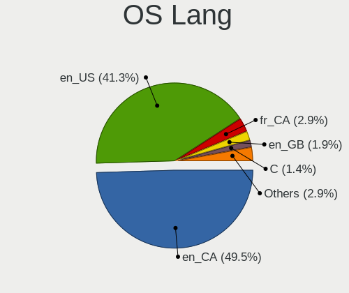
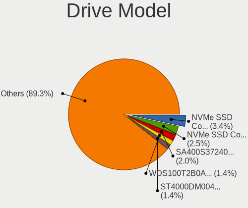
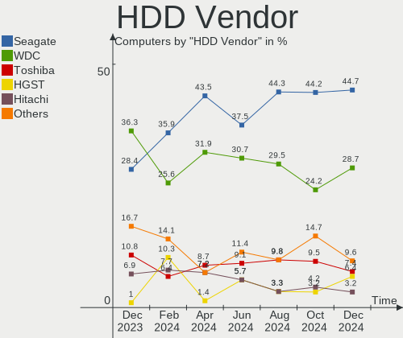
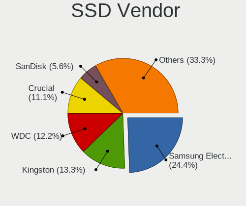
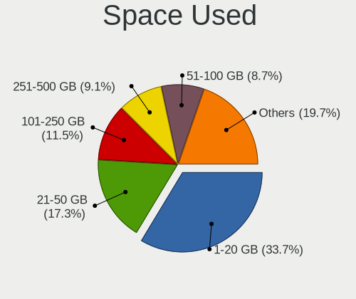
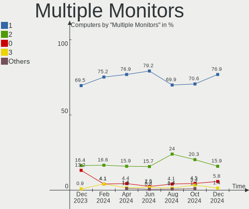

Linux in Canada - Hardware Trends
---------------------------------

A project to identify most popular hardware characteristics and track their change
over time based on data collected by Linux users at https://Linux-Hardware.org.

Anyone can contribute to this report by the [hw-probe](https://github.com/linuxhw/hw-probe) tool:

    sudo -E hw-probe -all -upload

This is a report for all computer types. See also reports for [desktops](/Location/Canada/Desktop/README.md) and [notebooks](/Location/Canada/Notebook/README.md).

Period: Jan, 2023.

Contents
--------

* [ System ](#system)
  - [ OS                       ](#os)
  - [ OS Family                ](#os-family)
  - [ Kernel                   ](#kernel)
  - [ Kernel Family            ](#kernel-family)
  - [ Kernel Major Ver.        ](#kernel-major-ver)
  - [ Arch                     ](#arch)
  - [ DE                       ](#de)
  - [ Display Server           ](#display-server)
  - [ Display Manager          ](#display-manager)
  - [ OS Lang                  ](#os-lang)
  - [ Boot Mode                ](#boot-mode)
  - [ Filesystem               ](#filesystem)
  - [ Part. scheme             ](#part-scheme)
  - [ Dual Boot with Linux/BSD ](#dual-boot-with-linuxbsd)
  - [ Dual Boot (Win)          ](#dual-boot-win)

* [ Board ](#board)
  - [ Vendor                   ](#vendor)
  - [ Model                    ](#model)
  - [ Model Family             ](#model-family)
  - [ MFG Year                 ](#mfg-year)
  - [ Form Factor              ](#form-factor)
  - [ Secure Boot              ](#secure-boot)
  - [ Coreboot                 ](#coreboot)
  - [ RAM Size                 ](#ram-size)
  - [ RAM Used                 ](#ram-used)
  - [ Total Drives             ](#total-drives)
  - [ Has CD-ROM               ](#has-cd-rom)
  - [ Has Ethernet             ](#has-ethernet)
  - [ Has WiFi                 ](#has-wifi)
  - [ Has Bluetooth            ](#has-bluetooth)

* [ Location ](#location)
  - [ Country                  ](#country)
  - [ City                     ](#city)

* [ Drives ](#drives)
  - [ Drive Vendor             ](#drive-vendor)
  - [ Drive Model              ](#drive-model)
  - [ HDD Vendor               ](#hdd-vendor)
  - [ SSD Vendor               ](#ssd-vendor)
  - [ Drive Kind               ](#drive-kind)
  - [ Drive Connector          ](#drive-connector)
  - [ Drive Size               ](#drive-size)
  - [ Space Total              ](#space-total)
  - [ Space Used               ](#space-used)
  - [ Malfunc. Drives          ](#malfunc-drives)
  - [ Malfunc. Drive Vendor    ](#malfunc-drive-vendor)
  - [ Malfunc. HDD Vendor      ](#malfunc-hdd-vendor)
  - [ Malfunc. Drive Kind      ](#malfunc-drive-kind)
  - [ Failed Drives            ](#failed-drives)
  - [ Failed Drive Vendor      ](#failed-drive-vendor)
  - [ Drive Status             ](#drive-status)

* [ Storage controller ](#storage-controller)
  - [ Storage Vendor           ](#storage-vendor)
  - [ Storage Model            ](#storage-model)
  - [ Storage Kind             ](#storage-kind)

* [ Processor ](#processor)
  - [ CPU Vendor               ](#cpu-vendor)
  - [ CPU Model                ](#cpu-model)
  - [ CPU Model Family         ](#cpu-model-family)
  - [ CPU Cores                ](#cpu-cores)
  - [ CPU Sockets              ](#cpu-sockets)
  - [ CPU Threads              ](#cpu-threads)
  - [ CPU Op-Modes             ](#cpu-op-modes)
  - [ CPU Microcode            ](#cpu-microcode)
  - [ CPU Microarch            ](#cpu-microarch)

* [ Graphics ](#graphics)
  - [ GPU Vendor               ](#gpu-vendor)
  - [ GPU Model                ](#gpu-model)
  - [ GPU Combo                ](#gpu-combo)
  - [ GPU Driver               ](#gpu-driver)
  - [ GPU Memory               ](#gpu-memory)

* [ Monitor ](#monitor)
  - [ Monitor Vendor           ](#monitor-vendor)
  - [ Monitor Model            ](#monitor-model)
  - [ Monitor Resolution       ](#monitor-resolution)
  - [ Monitor Diagonal         ](#monitor-diagonal)
  - [ Monitor Width            ](#monitor-width)
  - [ Aspect Ratio             ](#aspect-ratio)
  - [ Monitor Area             ](#monitor-area)
  - [ Pixel Density            ](#pixel-density)
  - [ Multiple Monitors        ](#multiple-monitors)

* [ Network ](#network)
  - [ Net Controller Vendor    ](#net-controller-vendor)
  - [ Net Controller Model     ](#net-controller-model)
  - [ Wireless Vendor          ](#wireless-vendor)
  - [ Wireless Model           ](#wireless-model)
  - [ Ethernet Vendor          ](#ethernet-vendor)
  - [ Ethernet Model           ](#ethernet-model)
  - [ Net Controller Kind      ](#net-controller-kind)
  - [ Used Controller          ](#used-controller)
  - [ NICs                     ](#nics)
  - [ IPv6                     ](#ipv6)

* [ Bluetooth ](#bluetooth)
  - [ Bluetooth Vendor         ](#bluetooth-vendor)
  - [ Bluetooth Model          ](#bluetooth-model)

* [ Sound ](#sound)
  - [ Sound Vendor             ](#sound-vendor)
  - [ Sound Model              ](#sound-model)

* [ Memory ](#memory)
  - [ Memory Vendor            ](#memory-vendor)
  - [ Memory Model             ](#memory-model)
  - [ Memory Kind              ](#memory-kind)
  - [ Memory Form Factor       ](#memory-form-factor)
  - [ Memory Size              ](#memory-size)
  - [ Memory Speed             ](#memory-speed)

* [ Printers & scanners ](#printers--scanners)
  - [ Printer Vendor           ](#printer-vendor)
  - [ Printer Model            ](#printer-model)
  - [ Scanner Vendor           ](#scanner-vendor)
  - [ Scanner Model            ](#scanner-model)

* [ Camera ](#camera)
  - [ Camera Vendor            ](#camera-vendor)
  - [ Camera Model             ](#camera-model)

* [ Security ](#security)
  - [ Fingerprint Vendor       ](#fingerprint-vendor)
  - [ Fingerprint Model        ](#fingerprint-model)
  - [ Chipcard Vendor          ](#chipcard-vendor)
  - [ Chipcard Model           ](#chipcard-model)

* [ Unsupported ](#unsupported)
  - [ Unsupported Devices      ](#unsupported-devices)
  - [ Unsupported Device Types ](#unsupported-device-types)

System
------

OS
--

Installed operating systems

| Name                | Computers | Percent |
|---------------------|-----------|---------|
| OpenMandriva 23.01  | 48        | 20.51%  |
| Ubuntu 22.04        | 34        | 14.53%  |
| Fedora 37           | 18        | 7.69%   |
| Linux Mint 21.1     | 15        | 6.41%   |
| Pop!_OS 22.04       | 14        | 5.98%   |
| Ubuntu 22.10        | 11        | 4.7%    |
| Debian 11           | 11        | 4.7%    |
| Zorin 16            | 8         | 3.42%   |
| Linux Mint 20.3     | 7         | 2.99%   |
| SteamOS 3.4.4       | 6         | 2.56%   |
| Linux Mint 21       | 6         | 2.56%   |
| Arch Rolling        | 4         | 1.71%   |
| Ubuntu 18.04        | 3         | 1.28%   |
| Manjaro             | 3         | 1.28%   |
| Kubuntu 22.04       | 3         | 1.28%   |
| EndeavourOS Rolling | 3         | 1.28%   |
| Debian              | 3         | 1.28%   |
| Ubuntu 20.04        | 2         | 0.85%   |
| OpenMandriva 4.3    | 2         | 0.85%   |
| KDE neon 22.04      | 2         | 0.85%   |
| ArcoLinux Rolling   | 2         | 0.85%   |
| Zorin 15            | 1         | 0.43%   |
| Xubuntu 20.04       | 1         | 0.43%   |
| SteamOS 3.4         | 1         | 0.43%   |
| Rocky Linux 9.1     | 1         | 0.43%   |
| RHEL 9              | 1         | 0.43%   |
| Peppermint 11.1     | 1         | 0.43%   |
| OpenMandriva 4.50   | 1         | 0.43%   |
| OpenMandriva 4.2    | 1         | 0.43%   |
| Nobara 37           | 1         | 0.43%   |
| Nobara 36           | 1         | 0.43%   |
| NixOS 23.05         | 1         | 0.43%   |
| MX 21               | 1         | 0.43%   |
| Manjaro-ARM         | 1         | 0.43%   |
| Manjaro 22.0.1      | 1         | 0.43%   |
| Linux Mint 20       | 1         | 0.43%   |
| Linux Mint 19.2     | 1         | 0.43%   |
| Kubuntu 22.10       | 1         | 0.43%   |
| Kubuntu 18.04       | 1         | 0.43%   |
| KDE neon 20.04      | 1         | 0.43%   |

OS Family
---------

OS without a version

| Name         | Computers | Percent |
|--------------|-----------|---------|
| OpenMandriva | 52        | 22.22%  |
| Ubuntu       | 50        | 21.37%  |
| Linux Mint   | 30        | 12.82%  |
| Fedora       | 18        | 7.69%   |
| Pop!_OS      | 14        | 5.98%   |
| Debian       | 14        | 5.98%   |
| Zorin        | 9         | 3.85%   |
| SteamOS      | 7         | 2.99%   |
| Kubuntu      | 5         | 2.14%   |
| Manjaro      | 4         | 1.71%   |
| Arch         | 4         | 1.71%   |
| KDE neon     | 3         | 1.28%   |
| EndeavourOS  | 3         | 1.28%   |
| Nobara       | 2         | 0.85%   |
| Elementary   | 2         | 0.85%   |
| CentOS       | 2         | 0.85%   |
| ArcoLinux    | 2         | 0.85%   |
| Xubuntu      | 1         | 0.43%   |
| Rocky Linux  | 1         | 0.43%   |
| RHEL         | 1         | 0.43%   |
| Peppermint   | 1         | 0.43%   |
| NixOS        | 1         | 0.43%   |
| MX           | 1         | 0.43%   |
| Manjaro-ARM  | 1         | 0.43%   |
| Gnoppix      | 1         | 0.43%   |
| Gentoo       | 1         | 0.43%   |
| Calculate    | 1         | 0.43%   |
| Artix        | 1         | 0.43%   |
| Alpine       | 1         | 0.43%   |
| AlmaLinux    | 1         | 0.43%   |

Kernel
------

Version of the Linux kernel

| Version                     | Computers | Percent |
|-----------------------------|-----------|---------|
| 6.1.1-desktop-1omv2290      | 46        | 19.66%  |
| 5.15.0-58-generic           | 34        | 14.53%  |
| 5.15.0-56-generic           | 15        | 6.41%   |
| 6.0.12-76060006-generic     | 12        | 5.13%   |
| 5.15.0-57-generic           | 10        | 4.27%   |
| 5.4.0-137-generic           | 9         | 3.85%   |
| 5.13.0-valve36-1-neptune    | 7         | 2.99%   |
| 5.19.0-29-generic           | 6         | 2.56%   |
| 5.10.0-20-amd64             | 5         | 2.14%   |
| 6.1.7-200.fc37.x86_64       | 4         | 1.71%   |
| 6.0.15-300.fc37.x86_64      | 4         | 1.71%   |
| 5.19.0-28-generic           | 4         | 1.71%   |
| 6.0.18-300.fc37.x86_64      | 3         | 1.28%   |
| 6.0.0-6-amd64               | 3         | 1.28%   |
| 5.4.0-136-generic           | 3         | 1.28%   |
| 6.1.2-desktop-1omv2301      | 2         | 0.85%   |
| 6.1.1-1-MANJARO             | 2         | 0.85%   |
| 6.0.7-301.fc37.x86_64       | 2         | 0.85%   |
| 5.19.17-1-pve               | 2         | 0.85%   |
| 5.19.0-26-generic           | 2         | 0.85%   |
| 5.15.0-41-generic           | 2         | 0.85%   |
| 5.10.0-14-amd64             | 2         | 0.85%   |
| 6.1.8-arch1-1               | 1         | 0.43%   |
| 6.1.8-200.fc37.x86_64       | 1         | 0.43%   |
| 6.1.7-calculate             | 1         | 0.43%   |
| 6.1.7-1-MANJARO             | 1         | 0.43%   |
| 6.1.6-arch1-1               | 1         | 0.43%   |
| 6.1.6-203.fsync.fc37.x86_64 | 1         | 0.43%   |
| 6.1.6-200.fc37.x86_64       | 1         | 0.43%   |
| 6.1.5-arch2-1               | 1         | 0.43%   |
| 6.1.5-200.fc37.x86_64       | 1         | 0.43%   |
| 6.1.4-zen2-1-zen            | 1         | 0.43%   |
| 6.1.4-arch1-1               | 1         | 0.43%   |
| 6.1.1-zen1-1-zen            | 1         | 0.43%   |
| 6.1.1-x64v1-xanmod1-1       | 1         | 0.43%   |
| 6.1.1-arch1-1               | 1         | 0.43%   |
| 6.1.1                       | 1         | 0.43%   |
| 6.1.0-2-MANJARO-ARM         | 1         | 0.43%   |
| 6.1.0-1004-oem              | 1         | 0.43%   |
| 6.0.6-76060006-generic      | 1         | 0.43%   |

Kernel Family
-------------

Linux kernel without a distro release

| Version  | Computers | Percent |
|----------|-----------|---------|
| 5.15.0   | 65        | 27.78%  |
| 6.1.1    | 52        | 22.22%  |
| 5.4.0    | 16        | 6.84%   |
| 5.19.0   | 14        | 5.98%   |
| 6.0.12   | 12        | 5.13%   |
| 5.13.0   | 8         | 3.42%   |
| 5.10.0   | 8         | 3.42%   |
| 6.0.0    | 7         | 2.99%   |
| 6.1.7    | 6         | 2.56%   |
| 6.0.15   | 4         | 1.71%   |
| 6.1.6    | 3         | 1.28%   |
| 6.0.18   | 3         | 1.28%   |
| 5.14.0   | 3         | 1.28%   |
| 6.1.8    | 2         | 0.85%   |
| 6.1.5    | 2         | 0.85%   |
| 6.1.4    | 2         | 0.85%   |
| 6.1.2    | 2         | 0.85%   |
| 6.1.0    | 2         | 0.85%   |
| 6.0.7    | 2         | 0.85%   |
| 5.19.17  | 2         | 0.85%   |
| 5.15.85  | 2         | 0.85%   |
| 4.15.0   | 2         | 0.85%   |
| 6.0.6    | 1         | 0.43%   |
| 6.0.17   | 1         | 0.43%   |
| 6.0.16   | 1         | 0.43%   |
| 6.0.14   | 1         | 0.43%   |
| 5.19.5   | 1         | 0.43%   |
| 5.18.12  | 1         | 0.43%   |
| 5.18.10  | 1         | 0.43%   |
| 5.16.7   | 1         | 0.43%   |
| 5.16.13  | 1         | 0.43%   |
| 5.15.80  | 1         | 0.43%   |
| 5.15.64  | 1         | 0.43%   |
| 5.10.14  | 1         | 0.43%   |
| 4.19.187 | 1         | 0.43%   |
| 4.18.0   | 1         | 0.43%   |
| Unknown  | 1         | 0.43%   |

Kernel Major Ver.
-----------------

Linux kernel major version

| Version | Computers | Percent |
|---------|-----------|---------|
| 6.1     | 71        | 30.34%  |
| 5.15    | 69        | 29.49%  |
| 6.0     | 32        | 13.68%  |
| 5.19    | 17        | 7.26%   |
| 5.4     | 16        | 6.84%   |
| 5.10    | 9         | 3.85%   |
| 5.13    | 8         | 3.42%   |
| 5.14    | 3         | 1.28%   |
| 5.18    | 2         | 0.85%   |
| 5.16    | 2         | 0.85%   |
| 4.15    | 2         | 0.85%   |
| 4.19    | 1         | 0.43%   |
| 4.18    | 1         | 0.43%   |
| Unknown | 1         | 0.43%   |

Arch
----

OS architecture (x86_64, i586, etc.)

| Name    | Computers | Percent |
|---------|-----------|---------|
| x86_64  | 231       | 98.72%  |
| i686    | 2         | 0.85%   |
| aarch64 | 1         | 0.43%   |

DE
--

Desktop Environment

| Name            | Computers | Percent |
|-----------------|-----------|---------|
| GNOME           | 99        | 42.31%  |
| KDE5            | 80        | 34.19%  |
| X-Cinnamon      | 20        | 8.55%   |
| XFCE            | 10        | 4.27%   |
| Unknown         | 9         | 3.85%   |
| MATE            | 5         | 2.14%   |
| Pantheon        | 2         | 0.85%   |
| Cinnamon        | 2         | 0.85%   |
| sway            | 1         | 0.43%   |
| LXQt            | 1         | 0.43%   |
| LXDE            | 1         | 0.43%   |
| KDE4            | 1         | 0.43%   |
| KDE             | 1         | 0.43%   |
| i3              | 1         | 0.43%   |
| GNOME Flashback | 1         | 0.43%   |

Display Server
--------------

X11 or Wayland

| Name    | Computers | Percent |
|---------|-----------|---------|
| X11     | 155       | 66.24%  |
| Wayland | 67        | 28.63%  |
| Tty     | 6         | 2.56%   |
| Unknown | 6         | 2.56%   |

Display Manager
---------------

SDDM, LightDM, etc.

| Name    | Computers | Percent |
|---------|-----------|---------|
| Unknown | 72        | 30.77%  |
| SDDM    | 66        | 28.21%  |
| GDM3    | 53        | 22.65%  |
| LightDM | 27        | 11.54%  |
| GDM     | 16        | 6.84%   |

OS Lang
-------

Language

| Lang    | Computers | Percent |
|---------|-----------|---------|
| en_CA   | 110       | 47.01%  |
| en_US   | 93        | 39.74%  |
| fr_CA   | 16        | 6.84%   |
| C       | 5         | 2.14%   |
| Unknown | 3         | 1.28%   |
| fr_FR   | 2         | 0.85%   |
| en_GB   | 2         | 0.85%   |
| hr_HR   | 1         | 0.43%   |
| en_IE   | 1         | 0.43%   |
| en_AU   | 1         | 0.43%   |

Boot Mode
---------

EFI or BIOS

| Mode | Computers | Percent |
|------|-----------|---------|
| BIOS | 124       | 52.99%  |
| EFI  | 110       | 47.01%  |

Filesystem
----------

Type of filesystem

| Type    | Computers | Percent |
|---------|-----------|---------|
| Ext4    | 149       | 63.68%  |
| Overlay | 50        | 21.37%  |
| Btrfs   | 29        | 12.39%  |
| Zfs     | 2         | 0.85%   |
| Xfs     | 2         | 0.85%   |
| Tmpfs   | 1         | 0.43%   |
| Ext3    | 1         | 0.43%   |

Part. scheme
------------

Scheme of partitioning

| Type    | Computers | Percent |
|---------|-----------|---------|
| GPT     | 139       | 59.4%   |
| Unknown | 65        | 27.78%  |
| MBR     | 30        | 12.82%  |

Dual Boot with Linux/BSD
------------------------

Hosting more than one Linux/BSD

| Dual boot | Computers | Percent |
|-----------|-----------|---------|
| No        | 177       | 75.64%  |
| Yes       | 57        | 24.36%  |

Dual Boot (Win)
---------------

Hosting Linux and Windows

| Dual boot | Computers | Percent |
|-----------|-----------|---------|
| No        | 172       | 73.5%   |
| Yes       | 62        | 26.5%   |

Board
-----

Vendor
------

Motherboard manufacturer

| Name                           | Computers | Percent |
|--------------------------------|-----------|---------|
| ASUSTek Computer               | 58        | 24.79%  |
| Lenovo                         | 37        | 15.81%  |
| Dell                           | 35        | 14.96%  |
| Hewlett-Packard                | 23        | 9.83%   |
| MSI                            | 14        | 5.98%   |
| Acer                           | 10        | 4.27%   |
| Gigabyte Technology            | 9         | 3.85%   |
| Apple                          | 9         | 3.85%   |
| ASRock                         | 8         | 3.42%   |
| Valve                          | 6         | 2.56%   |
| Samsung Electronics            | 3         | 1.28%   |
| ASRockRack                     | 3         | 1.28%   |
| Toshiba                        | 2         | 0.85%   |
| GPU Company                    | 2         | 0.85%   |
| Foxconn                        | 2         | 0.85%   |
| System76                       | 1         | 0.43%   |
| Razer                          | 1         | 0.43%   |
| Pine Microsystems              | 1         | 0.43%   |
| Pegatron                       | 1         | 0.43%   |
| Notebook                       | 1         | 0.43%   |
| Microsoft                      | 1         | 0.43%   |
| Matsushita Electric Industrial | 1         | 0.43%   |
| Intel Client Systems           | 1         | 0.43%   |
| Intel                          | 1         | 0.43%   |
| Google                         | 1         | 0.43%   |
| ECS                            | 1         | 0.43%   |
| Datto                          | 1         | 0.43%   |
| Alienware                      | 1         | 0.43%   |

Model
-----

Motherboard model

| Name                                        | Computers | Percent |
|---------------------------------------------|-----------|---------|
| Valve Jupiter                               | 6         | 2.56%   |
| ASUS All Series                             | 6         | 2.56%   |
| Dell OptiPlex 7040                          | 3         | 1.28%   |
| MSI MS-7B85                                 | 2         | 0.85%   |
| MSI MS-7885                                 | 2         | 0.85%   |
| HP Notebook                                 | 2         | 0.85%   |
| GPU Company GWNR71517                       | 2         | 0.85%   |
| Dell Latitude E6420                         | 2         | 0.85%   |
| Dell Inspiron 3521                          | 2         | 0.85%   |
| Apple MacBookPro8,1                         | 2         | 0.85%   |
| Apple MacBookPro5,5                         | 2         | 0.85%   |
| Apple iMac11,3                              | 2         | 0.85%   |
| Acer Swift SF314-43                         | 2         | 0.85%   |
| Toshiba Satellite L650D                     | 1         | 0.43%   |
| Toshiba Satellite L650                      | 1         | 0.43%   |
| System76 Darter Pro                         | 1         | 0.43%   |
| Samsung 930QED                              | 1         | 0.43%   |
| Samsung 305E4A/305E5A/305E7A                | 1         | 0.43%   |
| Samsung 300E4C/300E5C/300E7C                | 1         | 0.43%   |
| Razer Blade 15 (2022) - RZ09-0421           | 1         | 0.43%   |
| Pine Microsystems Pine64 PinePhone (1.2)    | 1         | 0.43%   |
| Pegatron p6-2310                            | 1         | 0.43%   |
| Notebook P9XXEN_EF_ED                       | 1         | 0.43%   |
| MSI MS-7D53                                 | 1         | 0.43%   |
| MSI MS-7C91                                 | 1         | 0.43%   |
| MSI MS-7C56                                 | 1         | 0.43%   |
| MSI MS-7B50                                 | 1         | 0.43%   |
| MSI MS-7917                                 | 1         | 0.43%   |
| MSI MS-7641                                 | 1         | 0.43%   |
| MSI MS-7640                                 | 1         | 0.43%   |
| MSI MS-7599                                 | 1         | 0.43%   |
| MSI Modern ADL-P AM272 (MS-AF82)            | 1         | 0.43%   |
| MSI GP72 7RDX                               | 1         | 0.43%   |
| Microsoft Surface Laptop 4                  | 1         | 0.43%   |
| Matsushita Electric Industrial CF-18KH2ZXBC | 1         | 0.43%   |
| Lenovo Z50-75 80EC                          | 1         | 0.43%   |
| Lenovo ThinkStation P910 30B8S0EN00         | 1         | 0.43%   |
| Lenovo ThinkPad Yoga 11e 4th Gen 20HSS04A00 | 1         | 0.43%   |
| Lenovo ThinkPad X380 Yoga 20LJS0JK0A        | 1         | 0.43%   |
| Lenovo ThinkPad X131e 33723FU               | 1         | 0.43%   |

Model Family
------------

Motherboard model prefix

| Name                  | Computers | Percent |
|-----------------------|-----------|---------|
| Lenovo ThinkPad       | 17        | 7.26%   |
| ASUS PRIME            | 10        | 4.27%   |
| Dell Latitude         | 9         | 3.85%   |
| Dell OptiPlex         | 7         | 2.99%   |
| Dell Inspiron         | 7         | 2.99%   |
| ASUS ROG              | 7         | 2.99%   |
| Acer Aspire           | 7         | 2.99%   |
| Valve Jupiter         | 6         | 2.56%   |
| Lenovo ThinkCentre    | 6         | 2.56%   |
| HP Pavilion           | 6         | 2.56%   |
| ASUS VivoBook         | 6         | 2.56%   |
| ASUS All              | 6         | 2.56%   |
| Lenovo IdeaPad        | 5         | 2.14%   |
| Dell XPS              | 4         | 1.71%   |
| HP ENVY               | 3         | 1.28%   |
| HP Compaq             | 3         | 1.28%   |
| ASUS ZenBook          | 3         | 1.28%   |
| Apple MacBookPro5     | 3         | 1.28%   |
| Toshiba Satellite     | 2         | 0.85%   |
| MSI MS-7B85           | 2         | 0.85%   |
| MSI MS-7885           | 2         | 0.85%   |
| Lenovo IdeaCentre     | 2         | 0.85%   |
| HP Notebook           | 2         | 0.85%   |
| HP Laptop             | 2         | 0.85%   |
| HP EliteDesk          | 2         | 0.85%   |
| GPU Company GWNR71517 | 2         | 0.85%   |
| Gigabyte B450         | 2         | 0.85%   |
| Dell Vostro           | 2         | 0.85%   |
| Dell G5               | 2         | 0.85%   |
| ASUS TUF              | 2         | 0.85%   |
| ASUS ASUS             | 2         | 0.85%   |
| ASRock B450M          | 2         | 0.85%   |
| Apple MacBookPro8     | 2         | 0.85%   |
| Apple iMac11          | 2         | 0.85%   |
| Acer Swift            | 2         | 0.85%   |
| System76 Darter       | 1         | 0.43%   |
| Samsung 930QED        | 1         | 0.43%   |
| Samsung 305E4A        | 1         | 0.43%   |
| Samsung 300E4C        | 1         | 0.43%   |
| Razer Blade           | 1         | 0.43%   |

MFG Year
--------

Motherboard manufacture year

| Year    | Computers | Percent |
|---------|-----------|---------|
| 2022    | 36        | 15.38%  |
| 2020    | 24        | 10.26%  |
| 2021    | 21        | 8.97%   |
| 2018    | 18        | 7.69%   |
| 2013    | 18        | 7.69%   |
| 2012    | 18        | 7.69%   |
| 2011    | 16        | 6.84%   |
| 2019    | 13        | 5.56%   |
| 2014    | 10        | 4.27%   |
| 2010    | 9         | 3.85%   |
| 2017    | 8         | 3.42%   |
| 2016    | 8         | 3.42%   |
| 2015    | 8         | 3.42%   |
| 2009    | 8         | 3.42%   |
| 2007    | 8         | 3.42%   |
| 2008    | 6         | 2.56%   |
| 2006    | 4         | 1.71%   |
| Unknown | 1         | 0.43%   |

Form Factor
-----------

Physical design of the computer

| Name        | Computers | Percent |
|-------------|-----------|---------|
| Desktop     | 107       | 45.73%  |
| Notebook    | 107       | 45.73%  |
| Convertible | 11        | 4.7%    |
| All in one  | 6         | 2.56%   |
| Phone       | 1         | 0.43%   |
| Tablet      | 1         | 0.43%   |
| Server      | 1         | 0.43%   |

Secure Boot
-----------

Enabled or disabled

| State    | Computers | Percent |
|----------|-----------|---------|
| Disabled | 218       | 93.16%  |
| Enabled  | 16        | 6.84%   |

Coreboot
--------

Have coreboot on board

| Used | Computers | Percent |
|------|-----------|---------|
| No   | 231       | 98.72%  |
| Yes  | 3         | 1.28%   |

RAM Size
--------

Total RAM memory

| Size in GB  | Computers | Percent |
|-------------|-----------|---------|
| 8.01-16.0   | 55        | 23.5%   |
| 16.01-24.0  | 54        | 23.08%  |
| 4.01-8.0    | 46        | 19.66%  |
| 32.01-64.0  | 31        | 13.25%  |
| 3.01-4.0    | 26        | 11.11%  |
| 64.01-256.0 | 9         | 3.85%   |
| 24.01-32.0  | 7         | 2.99%   |
| 1.01-2.0    | 5         | 2.14%   |
| 2.01-3.0    | 1         | 0.43%   |

RAM Used
--------

Used RAM memory

| Used GB    | Computers | Percent |
|------------|-----------|---------|
| 1.01-2.0   | 73        | 31.2%   |
| 2.01-3.0   | 54        | 23.08%  |
| 4.01-8.0   | 47        | 20.09%  |
| 3.01-4.0   | 35        | 14.96%  |
| 0.51-1.0   | 12        | 5.13%   |
| 8.01-16.0  | 5         | 2.14%   |
| 16.01-24.0 | 4         | 1.71%   |
| 32.01-64.0 | 2         | 0.85%   |
| 24.01-32.0 | 1         | 0.43%   |
| 0.01-0.5   | 1         | 0.43%   |

Total Drives
------------

Number of drives on board

| Drives | Computers | Percent |
|--------|-----------|---------|
| 1      | 127       | 54.27%  |
| 2      | 63        | 26.92%  |
| 3      | 18        | 7.69%   |
| 4      | 12        | 5.13%   |
| 5      | 8         | 3.42%   |
| 7      | 2         | 0.85%   |
| 0      | 2         | 0.85%   |
| 13     | 1         | 0.43%   |
| 6      | 1         | 0.43%   |

Has CD-ROM
----------

Has CD-ROM on board

| Presented | Computers | Percent |
|-----------|-----------|---------|
| No        | 151       | 64.53%  |
| Yes       | 83        | 35.47%  |

Has Ethernet
------------

Has Ethernet on board

| Presented | Computers | Percent |
|-----------|-----------|---------|
| Yes       | 190       | 81.2%   |
| No        | 44        | 18.8%   |

Has WiFi
--------

Has WiFi module

| Presented | Computers | Percent |
|-----------|-----------|---------|
| Yes       | 182       | 77.78%  |
| No        | 52        | 22.22%  |

Has Bluetooth
-------------

Has Bluetooth module

| Presented | Computers | Percent |
|-----------|-----------|---------|
| Yes       | 147       | 62.82%  |
| No        | 87        | 37.18%  |

Location
--------

Country
-------

Geographic location (country)

| Country | Computers | Percent |
|---------|-----------|---------|
| Canada  | 234       | 100%    |

City
----

Geographic location (city)

| City                  | Computers | Percent |
|-----------------------|-----------|---------|
| Montreal              | 21        | 8.97%   |
| Toronto               | 19        | 8.12%   |
| Ottawa                | 13        | 5.56%   |
| Vancouver             | 12        | 5.13%   |
| Québec               | 9         | 3.85%   |
| Edmonton              | 8         | 3.42%   |
| Calgary               | 8         | 3.42%   |
| Winnipeg              | 6         | 2.56%   |
| Etobicoke             | 4         | 1.71%   |
| Scarborough           | 3         | 1.28%   |
| Niagara Falls         | 3         | 1.28%   |
| Markham               | 3         | 1.28%   |
| Laval                 | 3         | 1.28%   |
| Kingston              | 3         | 1.28%   |
| Conception Bay South  | 3         | 1.28%   |
| Aurora                | 3         | 1.28%   |
| Airdrie               | 3         | 1.28%   |
| Windsor               | 2         | 0.85%   |
| Vaudreuil-Dorion      | 2         | 0.85%   |
| Saint-Jerome          | 2         | 0.85%   |
| Saint-Basile-le-Grand | 2         | 0.85%   |
| Richmond Hill         | 2         | 0.85%   |
| Mississauga           | 2         | 0.85%   |
| Longueuil             | 2         | 0.85%   |
| Lachine               | 2         | 0.85%   |
| Greater Sudbury       | 2         | 0.85%   |
| Gatineau              | 2         | 0.85%   |
| Courtice              | 2         | 0.85%   |
| Beauharnois           | 2         | 0.85%   |
| Bathurst              | 2         | 0.85%   |
| Ajax                  | 2         | 0.85%   |
| Wyoming               | 1         | 0.43%   |
| Woodville             | 1         | 0.43%   |
| Wolfville             | 1         | 0.43%   |
| Wingham               | 1         | 0.43%   |
| West Kelowna          | 1         | 0.43%   |
| Waterloo              | 1         | 0.43%   |
| Victoria              | 1         | 0.43%   |
| Tweed                 | 1         | 0.43%   |
| Trenton               | 1         | 0.43%   |

Drives
------

Drive Vendor
------------

Hard drive vendors

| Vendor                      | Computers | Drives | Percent |
|-----------------------------|-----------|--------|---------|
| WDC                         | 70        | 90     | 18.92%  |
| Samsung Electronics         | 61        | 80     | 16.49%  |
| Seagate                     | 44        | 54     | 11.89%  |
| Sandisk                     | 27        | 30     | 7.3%    |
| Kingston                    | 27        | 29     | 7.3%    |
| Unknown                     | 16        | 17     | 4.32%   |
| Toshiba                     | 13        | 14     | 3.51%   |
| Intel                       | 10        | 12     | 2.7%    |
| Crucial                     | 10        | 11     | 2.7%    |
| SK hynix                    | 9         | 9      | 2.43%   |
| Hitachi                     | 7         | 7      | 1.89%   |
| HGST                        | 6         | 6      | 1.62%   |
| Micron Technology           | 5         | 5      | 1.35%   |
| SPCC                        | 4         | 4      | 1.08%   |
| Silicon Motion              | 4         | 5      | 1.08%   |
| Phison Electronics          | 4         | 4      | 1.08%   |
| KIOXIA                      | 4         | 4      | 1.08%   |
| Team                        | 2         | 2      | 0.54%   |
| T-FORCE                     | 2         | 2      | 0.54%   |
| OCZ                         | 2         | 2      | 0.54%   |
| Micron/Crucial Technology   | 2         | 2      | 0.54%   |
| LITEONIT                    | 2         | 2      | 0.54%   |
| LITEON                      | 2         | 2      | 0.54%   |
| Lenovo                      | 2         | 2      | 0.54%   |
| Kingston Technology Company | 2         | 2      | 0.54%   |
| Fujitsu                     | 2         | 2      | 0.54%   |
| External                    | 2         | 2      | 0.54%   |
| Corsair                     | 2         | 2      | 0.54%   |
| A-DATA Technology           | 2         | 2      | 0.54%   |
| Unknown                     | 2         | 2      | 0.54%   |
| Wibtek                      | 1         | 1      | 0.27%   |
| UMIS                        | 1         | 1      | 0.27%   |
| Timetec                     | 1         | 1      | 0.27%   |
| THU SSD                     | 1         | 1      | 0.27%   |
| Seagate Technology          | 1         | 1      | 0.27%   |
| PNY                         | 1         | 1      | 0.27%   |
| OYUNKEY                     | 1         | 1      | 0.27%   |
| ORICO                       | 1         | 1      | 0.27%   |
| O2 Micro                    | 1         | 1      | 0.27%   |
| Mushkin                     | 1         | 1      | 0.27%   |

Drive Model
-----------

Hard drive models

| Model                                                | Computers | Percent |
|------------------------------------------------------|-----------|---------|
| Kingston SA400S37240G 240GB SSD                      | 8         | 1.95%   |
| Seagate ST1000DM010-2EP102 1TB                       | 6         | 1.46%   |
| Samsung NVMe SSD Controller PM9A1/PM9A3/980PRO 512GB | 6         | 1.46%   |
| WDC WDBNCE5000PNC 500GB SSD                          | 5         | 1.22%   |
| Samsung NVMe SSD Controller SM981/PM981/PM983 500GB  | 5         | 1.22%   |
| WDC WD10EZEX-08WN4A0 1TB                             | 4         | 0.97%   |
| SanDisk NVMe SSD Drive 1TB                           | 4         | 0.97%   |
| Samsung SSD 970 EVO Plus 500GB                       | 4         | 0.97%   |
| Samsung SSD 850 EVO 500GB                            | 4         | 0.97%   |
| Kingston SA400S37120G 120GB SSD                      | 4         | 0.97%   |
| Unknown MMC Card  64GB                               | 3         | 0.73%   |
| Toshiba MQ01ABD100 1TB                               | 3         | 0.73%   |
| Seagate ST2000DM008-2FR102 2TB                       | 3         | 0.73%   |
| Seagate Backup+ Hub BK 8TB                           | 3         | 0.73%   |
| SanDisk NVMe SSD Drive 500GB                         | 3         | 0.73%   |
| Samsung SSD 980 1TB                                  | 3         | 0.73%   |
| Samsung SSD 870 QVO 1TB                              | 3         | 0.73%   |
| Samsung SSD 870 EVO 500GB                            | 3         | 0.73%   |
| Samsung SSD 860 EVO 250GB                            | 3         | 0.73%   |
| Samsung SSD 850 EVO 250GB                            | 3         | 0.73%   |
| Phison PS5013 E13 NVMe Controller 256GB              | 3         | 0.73%   |
| Kingston SA400S37480G 480GB SSD                      | 3         | 0.73%   |
| HGST HTS725050A7E630 500GB                           | 3         | 0.73%   |
| WDC WDS500G2B0A 500GB SSD                            | 2         | 0.49%   |
| WDC WDS100T2B0A-00SM50 1TB SSD                       | 2         | 0.49%   |
| WDC WD40EZRZ-00GXCB0 4TB                             | 2         | 0.49%   |
| Unknown MMC Card  512GB                              | 2         | 0.49%   |
| Unknown MMC Card  32GB                               | 2         | 0.49%   |
| SPCC Solid State Disk 256GB                          | 2         | 0.49%   |
| SK hynix PC601 NVMe 512GB                            | 2         | 0.49%   |
| Silicon Motion SM2262/SM2262EN SSD Controller 1TB    | 2         | 0.49%   |
| Seagate ST8000VN0022-2EL112 8TB                      | 2         | 0.49%   |
| Seagate ST500LM021-1KJ152 500GB                      | 2         | 0.49%   |
| Seagate ST2000DM001-1ER164 2TB                       | 2         | 0.49%   |
| Seagate ST1000LM035-1RK172 1TB                       | 2         | 0.49%   |
| Seagate ST1000LM024 HN-M101MBB 1TB                   | 2         | 0.49%   |
| Seagate ST1000DM003-1ER162 1TB                       | 2         | 0.49%   |
| Seagate ST1000DM003-1CH162 1TB                       | 2         | 0.49%   |
| Seagate Expansion 240GB                              | 2         | 0.49%   |
| Sandisk WD Blue SN570 500GB                          | 2         | 0.49%   |

HDD Vendor
----------

Hard disk drive vendors

| Vendor              | Computers | Drives | Percent |
|---------------------|-----------|--------|---------|
| WDC                 | 49        | 64     | 39.84%  |
| Seagate             | 43        | 52     | 34.96%  |
| Toshiba             | 11        | 11     | 8.94%   |
| Hitachi             | 7         | 7      | 5.69%   |
| HGST                | 6         | 6      | 4.88%   |
| Samsung Electronics | 3         | 3      | 2.44%   |
| Fujitsu             | 2         | 2      | 1.63%   |
| Unknown             | 1         | 1      | 0.81%   |
| JMicron Technology  | 1         | 1      | 0.81%   |

SSD Vendor
----------

Solid state drive vendors

| Vendor              | Computers | Drives | Percent |
|---------------------|-----------|--------|---------|
| Samsung Electronics | 30        | 37     | 25.64%  |
| Kingston            | 24        | 26     | 20.51%  |
| WDC                 | 15        | 17     | 12.82%  |
| SanDisk             | 8         | 8      | 6.84%   |
| Crucial             | 8         | 9      | 6.84%   |
| SPCC                | 4         | 4      | 3.42%   |
| Toshiba             | 2         | 2      | 1.71%   |
| Team                | 2         | 2      | 1.71%   |
| OCZ                 | 2         | 2      | 1.71%   |
| LITEONIT            | 2         | 2      | 1.71%   |
| LITEON              | 2         | 2      | 1.71%   |
| A-DATA Technology   | 2         | 2      | 1.71%   |
| Wibtek              | 1         | 1      | 0.85%   |
| Timetec             | 1         | 1      | 0.85%   |
| T-FORCE             | 1         | 1      | 0.85%   |
| SK hynix            | 1         | 1      | 0.85%   |
| Seagate             | 1         | 1      | 0.85%   |
| PNY                 | 1         | 1      | 0.85%   |
| Mushkin             | 1         | 1      | 0.85%   |
| Micron Technology   | 1         | 1      | 0.85%   |
| KingSpec            | 1         | 1      | 0.85%   |
| KingDian            | 1         | 1      | 0.85%   |
| Intel               | 1         | 1      | 0.85%   |
| Inland              | 1         | 1      | 0.85%   |
| Dogfish             | 1         | 1      | 0.85%   |
| Corsair             | 1         | 1      | 0.85%   |
| Apple               | 1         | 1      | 0.85%   |
| Unknown             | 1         | 1      | 0.85%   |

Drive Kind
----------

HDD or SSD

| Kind    | Computers | Drives | Percent |
|---------|-----------|--------|---------|
| NVMe    | 105       | 127    | 31.63%  |
| HDD     | 102       | 147    | 30.72%  |
| SSD     | 101       | 129    | 30.42%  |
| MMC     | 15        | 18     | 4.52%   |
| Unknown | 9         | 9      | 2.71%   |

Drive Connector
---------------

SATA, SAS, NVMe, etc.

| Type | Computers | Drives | Percent |
|------|-----------|--------|---------|
| SATA | 155       | 268    | 53.08%  |
| NVMe | 103       | 125    | 35.27%  |
| SAS  | 19        | 19     | 6.51%   |
| MMC  | 15        | 18     | 5.14%   |

Drive Size
----------

Size of hard drive

| Size in TB | Computers | Drives | Percent |
|------------|-----------|--------|---------|
| 0.01-0.5   | 105       | 129    | 48.17%  |
| 0.51-1.0   | 72        | 96     | 33.03%  |
| 1.01-2.0   | 15        | 17     | 6.88%   |
| 3.01-4.0   | 8         | 11     | 3.67%   |
| 2.01-3.0   | 8         | 8      | 3.67%   |
| 4.01-10.0  | 8         | 12     | 3.67%   |
| 10.01-20.0 | 2         | 3      | 0.92%   |

Space Total
-----------

Amount of disk space available on the file system

| Size in GB     | Computers | Percent |
|----------------|-----------|---------|
| 251-500        | 55        | 23.5%   |
| 101-250        | 44        | 18.8%   |
| 501-1000       | 42        | 17.95%  |
| 1-20           | 30        | 12.82%  |
| More than 3000 | 16        | 6.84%   |
| 1001-2000      | 15        | 6.41%   |
| Unknown        | 13        | 5.56%   |
| 2001-3000      | 7         | 2.99%   |
| 51-100         | 7         | 2.99%   |
| 21-50          | 5         | 2.14%   |

Space Used
----------

Amount of used disk space

| Used GB        | Computers | Percent |
|----------------|-----------|---------|
| 1-20           | 93        | 39.74%  |
| 21-50          | 43        | 18.38%  |
| 101-250        | 23        | 9.83%   |
| 51-100         | 22        | 9.4%    |
| Unknown        | 13        | 5.56%   |
| 251-500        | 11        | 4.7%    |
| 1001-2000      | 11        | 4.7%    |
| 501-1000       | 9         | 3.85%   |
| More than 3000 | 5         | 2.14%   |
| 2001-3000      | 3         | 1.28%   |
| 0              | 1         | 0.43%   |

Malfunc. Drives
---------------

Drive models with a malfunction

| Model                               | Computers | Drives | Percent |
|-------------------------------------|-----------|--------|---------|
| Toshiba MQ01ABD100 1TB              | 2         | 2      | 8%      |
| WDC WD800JD-60JRA0 80GB             | 1         | 1      | 4%      |
| WDC WD5000AAKS-00UU3A0 500GB        | 1         | 1      | 4%      |
| WDC WD40EFRX-68N32N0 4TB            | 1         | 1      | 4%      |
| WDC WD30EZRX-00SPEB0 3TB            | 1         | 1      | 4%      |
| WDC WD30EFRX-68EUZN0 3TB            | 1         | 1      | 4%      |
| WDC WD10JPVX-60JC3T0 1TB            | 1         | 1      | 4%      |
| WDC WD1001FALS-40Y6A0 1TB           | 1         | 1      | 4%      |
| WDC WD1001FALS-00J7B1 1TB           | 1         | 1      | 4%      |
| Toshiba MK3261GSYN 320GB            | 1         | 1      | 4%      |
| Toshiba MK3255GSX 320GB             | 1         | 1      | 4%      |
| Seagate ST9320423AS 320GB           | 1         | 1      | 4%      |
| Seagate ST500LM021-1KJ152 500GB     | 1         | 1      | 4%      |
| Seagate ST2000LX001-1RG174-SSHD 2TB | 1         | 1      | 4%      |
| Seagate ST1000LM024 HN-M101MBB 1TB  | 1         | 1      | 4%      |
| Seagate ST1000DM003-9YN162 1TB      | 1         | 1      | 4%      |
| Samsung Electronics SSD 980 PRO 1TB | 1         | 1      | 4%      |
| Samsung Electronics SSD 870 EVO 1TB | 1         | 2      | 4%      |
| Samsung Electronics HM160HC 160GB   | 1         | 1      | 4%      |
| Kingston SA400S37480G 480GB SSD     | 1         | 1      | 4%      |
| Kingston SA400S37120G 120GB SSD     | 1         | 1      | 4%      |
| Hitachi HTS542516K9SA00 160GB       | 1         | 1      | 4%      |
| HGST HTS725050A7E630 500GB          | 1         | 1      | 4%      |
| Fujitsu MHV2080AH 80GB              | 1         | 1      | 4%      |

Malfunc. Drive Vendor
---------------------

Vendors of faulty drives

| Vendor              | Computers | Drives | Percent |
|---------------------|-----------|--------|---------|
| WDC                 | 8         | 8      | 32%     |
| Seagate             | 5         | 5      | 20%     |
| Toshiba             | 4         | 4      | 16%     |
| Samsung Electronics | 3         | 4      | 12%     |
| Kingston            | 2         | 2      | 8%      |
| Hitachi             | 1         | 1      | 4%      |
| HGST                | 1         | 1      | 4%      |
| Fujitsu             | 1         | 1      | 4%      |

Malfunc. HDD Vendor
-------------------

Vendors of faulty HDD drives

| Vendor              | Computers | Drives | Percent |
|---------------------|-----------|--------|---------|
| WDC                 | 8         | 8      | 38.1%   |
| Seagate             | 5         | 5      | 23.81%  |
| Toshiba             | 4         | 4      | 19.05%  |
| Samsung Electronics | 1         | 1      | 4.76%   |
| Hitachi             | 1         | 1      | 4.76%   |
| HGST                | 1         | 1      | 4.76%   |
| Fujitsu             | 1         | 1      | 4.76%   |

Malfunc. Drive Kind
-------------------

Kinds of faulty drives

| Kind | Computers | Drives | Percent |
|------|-----------|--------|---------|
| HDD  | 19        | 21     | 82.61%  |
| SSD  | 3         | 4      | 13.04%  |
| NVMe | 1         | 1      | 4.35%   |

Failed Drives
-------------

Failed drive models

Zero info for selected period =(

Failed Drive Vendor
-------------------

Failed drive vendors

Zero info for selected period =(

Drive Status
------------

Number of failed and malfunc. drives

| Status   | Computers | Drives | Percent |
|----------|-----------|--------|---------|
| Detected | 123       | 212    | 47.86%  |
| Works    | 111       | 192    | 43.19%  |
| Malfunc  | 23        | 26     | 8.95%   |

Storage controller
------------------

Storage Vendor
--------------

Storage controller vendors

| Vendor                       | Computers | Percent |
|------------------------------|-----------|---------|
| Intel                        | 125       | 38.94%  |
| AMD                          | 71        | 22.12%  |
| Samsung Electronics          | 33        | 10.28%  |
| SanDisk                      | 27        | 8.41%   |
| SK hynix                     | 7         | 2.18%   |
| ASMedia Technology           | 7         | 2.18%   |
| Nvidia                       | 6         | 1.87%   |
| JMicron Technology           | 6         | 1.87%   |
| Phison Electronics           | 5         | 1.56%   |
| Kingston Technology Company  | 5         | 1.56%   |
| Silicon Motion               | 4         | 1.25%   |
| Micron/Crucial Technology    | 4         | 1.25%   |
| Micron Technology            | 4         | 1.25%   |
| KIOXIA                       | 4         | 1.25%   |
| Seagate Technology           | 2         | 0.62%   |
| Marvell Technology Group     | 2         | 0.62%   |
| Lenovo                       | 2         | 0.62%   |
| Union Memory (Shenzhen)      | 1         | 0.31%   |
| Toshiba America Info Systems | 1         | 0.31%   |
| Silicon Image                | 1         | 0.31%   |
| O2 Micro                     | 1         | 0.31%   |
| LSI Logic / Symbios Logic    | 1         | 0.31%   |
| Broadcom / LSI               | 1         | 0.31%   |
| ADATA Technology             | 1         | 0.31%   |

Storage Model
-------------

Storage controller models

| Model                                                                          | Computers | Percent |
|--------------------------------------------------------------------------------|-----------|---------|
| AMD FCH SATA Controller [AHCI mode]                                            | 41        | 11.08%  |
| Samsung NVMe SSD Controller SM981/PM981/PM983                                  | 14        | 3.78%   |
| AMD 400 Series Chipset SATA Controller                                         | 14        | 3.78%   |
| Samsung NVMe SSD Controller PM9A1/PM9A3/980PRO                                 | 11        | 2.97%   |
| AMD SB7x0/SB8x0/SB9x0 SATA Controller [AHCI mode]                              | 10        | 2.7%    |
| SanDisk Non-Volatile memory controller                                         | 8         | 2.16%   |
| Intel 8 Series/C220 Series Chipset Family 6-port SATA Controller 1 [AHCI mode] | 8         | 2.16%   |
| Intel 6 Series/C200 Series Chipset Family 6 port Mobile SATA AHCI Controller   | 8         | 2.16%   |
| Samsung NVMe SSD Controller 980                                                | 7         | 1.89%   |
| Intel Volume Management Device NVMe RAID Controller                            | 7         | 1.89%   |
| Intel 7 Series Chipset Family 6-port SATA Controller [AHCI mode]               | 7         | 1.89%   |
| ASMedia ASM1062 Serial ATA Controller                                          | 7         | 1.89%   |
| AMD SB7x0/SB8x0/SB9x0 IDE Controller                                           | 7         | 1.89%   |
| SanDisk WD Blue SN550 NVMe SSD                                                 | 6         | 1.62%   |
| SanDisk WD Black SN750 / PC SN730 NVMe SSD                                     | 6         | 1.62%   |
| Intel SATA Controller [RAID mode]                                              | 6         | 1.62%   |
| Intel 82801 Mobile SATA Controller [RAID mode]                                 | 6         | 1.62%   |
| Intel 7 Series/C210 Series Chipset Family 6-port SATA Controller [AHCI mode]   | 6         | 1.62%   |
| Intel 5 Series/3400 Series Chipset 6 port SATA AHCI Controller                 | 6         | 1.62%   |
| Samsung NVMe SSD Controller SM961/PM961/SM963                                  | 5         | 1.35%   |
| JMicron JMB363 SATA/IDE Controller                                             | 5         | 1.35%   |
| Intel Cannon Lake PCH SATA AHCI Controller                                     | 5         | 1.35%   |
| AMD 500 Series Chipset SATA Controller                                         | 5         | 1.35%   |
| Micron Non-Volatile memory controller                                          | 4         | 1.08%   |
| Intel SSD 660P Series                                                          | 4         | 1.08%   |
| Intel Non-Volatile memory controller                                           | 4         | 1.08%   |
| Intel Comet Lake SATA AHCI Controller                                          | 4         | 1.08%   |
| Intel 9 Series Chipset Family SATA Controller [AHCI Mode]                      | 4         | 1.08%   |
| Intel 6 Series/C200 Series Chipset Family 6 port Desktop SATA AHCI Controller  | 4         | 1.08%   |
| Intel 200 Series PCH SATA controller [AHCI mode]                               | 4         | 1.08%   |
| AMD SATA controller                                                            | 4         | 1.08%   |
| SK hynix Gold P31/PC711 NVMe Solid State Drive                                 | 3         | 0.81%   |
| SanDisk WD Blue SN570 NVMe SSD                                                 | 3         | 0.81%   |
| Phison PS5013 E13 NVMe Controller                                              | 3         | 0.81%   |
| Nvidia MCP79 AHCI Controller                                                   | 3         | 0.81%   |
| KIOXIA Non-Volatile memory controller                                          | 3         | 0.81%   |
| Kingston Company OM3PDP3 NVMe SSD                                              | 3         | 0.81%   |
| Intel Wildcat Point-LP SATA Controller [AHCI Mode]                             | 3         | 0.81%   |
| Intel Sunrise Point-LP SATA Controller [AHCI mode]                             | 3         | 0.81%   |
| Intel Q170/Q150/B150/H170/H110/Z170/CM236 Chipset SATA Controller [AHCI Mode]  | 3         | 0.81%   |

Storage Kind
------------

Kind of storage controller (IDE, SATA, NVMe, SAS, ...)

| Kind | Computers | Percent |
|------|-----------|---------|
| SATA | 166       | 51.39%  |
| NVMe | 103       | 31.89%  |
| IDE  | 30        | 9.29%   |
| RAID | 23        | 7.12%   |
| SAS  | 1         | 0.31%   |

Processor
---------

CPU Vendor
----------

Processor vendors

| Vendor | Computers | Percent |
|--------|-----------|---------|
| Intel  | 144       | 61.54%  |
| AMD    | 89        | 38.03%  |
| ARM    | 1         | 0.43%   |

CPU Model
---------

Processor models

| Model                                         | Computers | Percent |
|-----------------------------------------------|-----------|---------|
| AMD Ryzen 7 5700U with Radeon Graphics        | 7         | 2.99%   |
| AMD Ryzen 7 5700G with Radeon Graphics        | 6         | 2.56%   |
| AMD Custom APU 0405                           | 6         | 2.56%   |
| Intel Core i7-7700HQ CPU @ 2.80GHz            | 4         | 1.71%   |
| Intel Core i5-2520M CPU @ 2.50GHz             | 4         | 1.71%   |
| Intel Core i7-10750H CPU @ 2.60GHz            | 3         | 1.28%   |
| Intel 12th Gen Core i7-12700H                 | 3         | 1.28%   |
| Intel 12th Gen Core i5-1240P                  | 3         | 1.28%   |
| AMD Ryzen 5 5625U with Radeon Graphics        | 3         | 1.28%   |
| Intel Core i7-9700 CPU @ 3.00GHz              | 2         | 0.85%   |
| Intel Core i7-4790K CPU @ 4.00GHz             | 2         | 0.85%   |
| Intel Core i7-4790 CPU @ 3.60GHz              | 2         | 0.85%   |
| Intel Core i7-4770 CPU @ 3.40GHz              | 2         | 0.85%   |
| Intel Core i7-3770 CPU @ 3.40GHz              | 2         | 0.85%   |
| Intel Core i7-10510U CPU @ 1.80GHz            | 2         | 0.85%   |
| Intel Core i5-9600K CPU @ 3.70GHz             | 2         | 0.85%   |
| Intel Core i5-6500 CPU @ 3.20GHz              | 2         | 0.85%   |
| Intel Core i5-4570 CPU @ 3.20GHz              | 2         | 0.85%   |
| Intel Core i5-4200U CPU @ 1.60GHz             | 2         | 0.85%   |
| Intel Core i5-3470T CPU @ 2.90GHz             | 2         | 0.85%   |
| Intel Core i5-2500K CPU @ 3.30GHz             | 2         | 0.85%   |
| Intel Core i5 CPU M 430 @ 2.27GHz             | 2         | 0.85%   |
| Intel Core i3-6100T CPU @ 3.20GHz             | 2         | 0.85%   |
| Intel Core 2 Duo CPU T7250 @ 2.00GHz          | 2         | 0.85%   |
| Intel Core 2 Duo CPU P7550 @ 2.26GHz          | 2         | 0.85%   |
| Intel Celeron N4000 CPU @ 1.10GHz             | 2         | 0.85%   |
| Intel Celeron CPU 1017U @ 1.60GHz             | 2         | 0.85%   |
| Intel 11th Gen Core i7-1185G7 @ 3.00GHz       | 2         | 0.85%   |
| Intel 11th Gen Core i7-1165G7 @ 2.80GHz       | 2         | 0.85%   |
| Intel 11th Gen Core i5-1135G7 @ 2.40GHz       | 2         | 0.85%   |
| AMD Ryzen 9 5950X 16-Core Processor           | 2         | 0.85%   |
| AMD Ryzen 7 7700X 8-Core Processor            | 2         | 0.85%   |
| AMD Ryzen 7 5800X 8-Core Processor            | 2         | 0.85%   |
| AMD Ryzen 7 3700X 8-Core Processor            | 2         | 0.85%   |
| AMD Ryzen 7 3700U with Radeon Vega Mobile Gfx | 2         | 0.85%   |
| AMD Ryzen 5 3600 6-Core Processor             | 2         | 0.85%   |
| AMD Ryzen 5 2600X Six-Core Processor          | 2         | 0.85%   |
| AMD Ryzen 5 1600 Six-Core Processor           | 2         | 0.85%   |
| AMD Phenom II X6 1090T Processor              | 2         | 0.85%   |
| AMD FX-8350 Eight-Core Processor              | 2         | 0.85%   |

CPU Model Family
----------------

Processor model prefix

| Model                   | Computers | Percent |
|-------------------------|-----------|---------|
| Intel Core i7           | 38        | 16.24%  |
| Intel Core i5           | 38        | 16.24%  |
| AMD Ryzen 7             | 31        | 13.25%  |
| Other                   | 27        | 11.54%  |
| AMD Ryzen 5             | 13        | 5.56%   |
| Intel Core i3           | 10        | 4.27%   |
| Intel Celeron           | 10        | 4.27%   |
| Intel Core 2 Duo        | 8         | 3.42%   |
| AMD Ryzen 9             | 6         | 2.56%   |
| Intel Pentium           | 5         | 2.14%   |
| AMD FX                  | 5         | 2.14%   |
| AMD A10                 | 5         | 2.14%   |
| Intel Xeon              | 4         | 1.71%   |
| Intel Core i9           | 3         | 1.28%   |
| AMD Phenom II X6        | 3         | 1.28%   |
| AMD Phenom II X2        | 3         | 1.28%   |
| Intel Core 2 Quad       | 2         | 0.85%   |
| Intel Core 2            | 2         | 0.85%   |
| AMD Ryzen 3             | 2         | 0.85%   |
| AMD A6                  | 2         | 0.85%   |
| AMD A4                  | 2         | 0.85%   |
| Intel Pentium M         | 1         | 0.43%   |
| Intel Pentium Dual-Core | 1         | 0.43%   |
| Intel Pentium D         | 1         | 0.43%   |
| Intel Core M            | 1         | 0.43%   |
| AMD Turion 64 Mobile    | 1         | 0.43%   |
| AMD Ryzen 5 PRO         | 1         | 0.43%   |
| AMD Phenom II           | 1         | 0.43%   |
| AMD E1                  | 1         | 0.43%   |
| AMD E                   | 1         | 0.43%   |
| AMD C-60                | 1         | 0.43%   |
| AMD Athlon II X3        | 1         | 0.43%   |
| AMD Athlon 64 X2        | 1         | 0.43%   |
| AMD Athlon              | 1         | 0.43%   |
| AMD A8                  | 1         | 0.43%   |
| AMD A12                 | 1         | 0.43%   |

CPU Cores
---------

Number of processor cores

| Number  | Computers | Percent |
|---------|-----------|---------|
| 2       | 82        | 35.04%  |
| 4       | 63        | 26.92%  |
| 8       | 33        | 14.1%   |
| 6       | 26        | 11.11%  |
| 12      | 8         | 3.42%   |
| 14      | 5         | 2.14%   |
| 16      | 4         | 1.71%   |
| 3       | 4         | 1.71%   |
| 1       | 4         | 1.71%   |
| 10      | 3         | 1.28%   |
| 20      | 1         | 0.43%   |
| Unknown | 1         | 0.43%   |

CPU Sockets
-----------

Number of sockets

| Number  | Computers | Percent |
|---------|-----------|---------|
| 1       | 232       | 99.15%  |
| 2       | 1         | 0.43%   |
| Unknown | 1         | 0.43%   |

CPU Threads
-----------

Threads per core (Hyper-Threading)

| Number  | Computers | Percent |
|---------|-----------|---------|
| 2       | 161       | 68.8%   |
| 1       | 71        | 30.34%  |
| 12      | 1         | 0.43%   |
| Unknown | 1         | 0.43%   |

CPU Op-Modes
------------

CPU Operation Modes (32-bit, 64-bit)

| Op mode        | Computers | Percent |
|----------------|-----------|---------|
| 32-bit, 64-bit | 231       | 98.72%  |
| 64-bit         | 1         | 0.43%   |
| 32-bit         | 1         | 0.43%   |
| Unknown        | 1         | 0.43%   |

CPU Microcode
-------------

Microcode number

| Number     | Computers | Percent |
|------------|-----------|---------|
| Unknown    | 64        | 27.35%  |
| 0x306c3    | 11        | 4.7%    |
| 0x306a9    | 11        | 4.7%    |
| 0x206a7    | 11        | 4.7%    |
| 0x906a3    | 7         | 2.99%   |
| 0x506e3    | 7         | 2.99%   |
| 0x806c1    | 5         | 2.14%   |
| 0x0a50000c | 5         | 2.14%   |
| 0x906e9    | 4         | 1.71%   |
| 0x40651    | 4         | 1.71%   |
| 0x20652    | 4         | 1.71%   |
| 0x0a601203 | 4         | 1.71%   |
| 0x08608103 | 4         | 1.71%   |
| 0x906ed    | 3         | 1.28%   |
| 0x1067a    | 3         | 1.28%   |
| 0x08701021 | 3         | 1.28%   |
| 0x08608102 | 3         | 1.28%   |
| 0x08108109 | 3         | 1.28%   |
| 0x0800820d | 3         | 1.28%   |
| 0x08001138 | 3         | 1.28%   |
| 0xa0655    | 2         | 0.85%   |
| 0xa0652    | 2         | 0.85%   |
| 0x906ec    | 2         | 0.85%   |
| 0x906ea    | 2         | 0.85%   |
| 0x806ec    | 2         | 0.85%   |
| 0x806e9    | 2         | 0.85%   |
| 0x6fd      | 2         | 0.85%   |
| 0x20655    | 2         | 0.85%   |
| 0x0a50000d | 2         | 0.85%   |
| 0x0a50000b | 2         | 0.85%   |
| 0x0a20120a | 2         | 0.85%   |
| 0x0a201016 | 2         | 0.85%   |
| 0x08600106 | 2         | 0.85%   |
| 0x06003106 | 2         | 0.85%   |
| 0x06000852 | 2         | 0.85%   |
| 0x05000119 | 2         | 0.85%   |
| 0x010000dc | 2         | 0.85%   |
| 0x010000b6 | 2         | 0.85%   |
| 0xf62      | 1         | 0.43%   |
| 0xa0671    | 1         | 0.43%   |

CPU Microarch
-------------

Microarchitecture

| Name             | Computers | Percent |
|------------------|-----------|---------|
| Unknown          | 24        | 10.26%  |
| KabyLake         | 22        | 9.4%    |
| Haswell          | 20        | 8.55%   |
| Zen 3            | 18        | 7.69%   |
| IvyBridge        | 15        | 6.41%   |
| SandyBridge      | 14        | 5.98%   |
| Zen+             | 10        | 4.27%   |
| Zen 2            | 9         | 3.85%   |
| Skylake          | 9         | 3.85%   |
| Alderlake Hybrid | 9         | 3.85%   |
| Westmere         | 8         | 3.42%   |
| K10              | 8         | 3.42%   |
| Penryn           | 7         | 2.99%   |
| TigerLake        | 6         | 2.56%   |
| Core             | 6         | 2.56%   |
| CometLake        | 6         | 2.56%   |
| Piledriver       | 5         | 2.14%   |
| Broadwell        | 5         | 2.14%   |
| Zen              | 4         | 1.71%   |
| Silvermont       | 3         | 1.28%   |
| K10 Llano        | 3         | 1.28%   |
| Goldmont plus    | 3         | 1.28%   |
| Excavator        | 3         | 1.28%   |
| Bobcat           | 3         | 1.28%   |
| Steamroller      | 2         | 0.85%   |
| Nehalem          | 2         | 0.85%   |
| K8 Hammer        | 2         | 0.85%   |
| Bulldozer        | 2         | 0.85%   |
| Tremont          | 1         | 0.43%   |
| P6               | 1         | 0.43%   |
| NetBurst         | 1         | 0.43%   |
| Jaguar           | 1         | 0.43%   |
| Icelake          | 1         | 0.43%   |
| Goldmont         | 1         | 0.43%   |

Graphics
--------

GPU Vendor
----------

Vendors of graphics cards

| Vendor                     | Computers | Percent |
|----------------------------|-----------|---------|
| Intel                      | 109       | 40.37%  |
| AMD                        | 85        | 31.48%  |
| Nvidia                     | 72        | 26.67%  |
| ASPEED Technology          | 3         | 1.11%   |
| Matrox Electronics Systems | 1         | 0.37%   |

GPU Model
---------

Graphics card models

| Model                                                                                    | Computers | Percent |
|------------------------------------------------------------------------------------------|-----------|---------|
| Intel 2nd Generation Core Processor Family Integrated Graphics Controller                | 12        | 4.32%   |
| Intel Alder Lake-P Integrated Graphics Controller                                        | 10        | 3.6%    |
| Intel Xeon E3-1200 v3/4th Gen Core Processor Integrated Graphics Controller              | 9         | 3.24%   |
| AMD Lucienne                                                                             | 7         | 2.52%   |
| Intel TigerLake-LP GT2 [Iris Xe Graphics]                                                | 6         | 2.16%   |
| Intel 3rd Gen Core processor Graphics Controller                                         | 6         | 2.16%   |
| AMD VanGogh [AMD Custom GPU 0405]                                                        | 6         | 2.16%   |
| AMD Picasso/Raven 2 [Radeon Vega Series / Radeon Vega Mobile Series]                     | 6         | 2.16%   |
| Nvidia GP107 [GeForce GTX 1050 Ti]                                                       | 5         | 1.8%    |
| Intel HD Graphics 530                                                                    | 5         | 1.8%    |
| Intel Core Processor Integrated Graphics Controller                                      | 5         | 1.8%    |
| Intel Xeon E3-1200 v2/3rd Gen Core processor Graphics Controller                         | 4         | 1.44%   |
| Intel HD Graphics 630                                                                    | 4         | 1.44%   |
| AMD Raphael                                                                              | 4         | 1.44%   |
| AMD Ellesmere [Radeon RX 470/480/570/570X/580/580X/590]                                  | 4         | 1.44%   |
| AMD Cezanne [Radeon Vega Series / Radeon Vega Mobile Series]                             | 4         | 1.44%   |
| Nvidia GM107 [GeForce GTX 750 Ti]                                                        | 3         | 1.08%   |
| Nvidia C79 [GeForce 9400M]                                                               | 3         | 1.08%   |
| Intel HD Graphics 5500                                                                   | 3         | 1.08%   |
| Intel Haswell-ULT Integrated Graphics Controller                                         | 3         | 1.08%   |
| Intel GeminiLake [UHD Graphics 600]                                                      | 3         | 1.08%   |
| Intel CometLake-U GT2 [UHD Graphics]                                                     | 3         | 1.08%   |
| Intel CometLake-H GT2 [UHD Graphics]                                                     | 3         | 1.08%   |
| Intel Atom/Celeron/Pentium Processor x5-E8000/J3xxx/N3xxx Integrated Graphics Controller | 3         | 1.08%   |
| ASPEED Technology ASPEED Graphics Family                                                 | 3         | 1.08%   |
| AMD Wani [Radeon R5/R6/R7 Graphics]                                                      | 3         | 1.08%   |
| AMD Navi 22 [Radeon RX 6700/6700 XT/6750 XT / 6800M]                                     | 3         | 1.08%   |
| AMD Navi 21 [Radeon RX 6800/6800 XT / 6900 XT]                                           | 3         | 1.08%   |
| AMD Barcelo                                                                              | 3         | 1.08%   |
| Nvidia TU117M [GeForce GTX 1650 Ti Mobile]                                               | 2         | 0.72%   |
| Nvidia TU116 [GeForce GTX 1660 Ti]                                                       | 2         | 0.72%   |
| Nvidia TU106 [GeForce RTX 2070]                                                          | 2         | 0.72%   |
| Nvidia GT218 [GeForce 8400 GS Rev. 3]                                                    | 2         | 0.72%   |
| Nvidia GP107M [GeForce GTX 1050 Mobile]                                                  | 2         | 0.72%   |
| Nvidia GP104 [GeForce GTX 1070]                                                          | 2         | 0.72%   |
| Nvidia GA107M [GeForce RTX 3050 Ti Mobile]                                               | 2         | 0.72%   |
| Nvidia GA104 [GeForce RTX 3060]                                                          | 2         | 0.72%   |
| Intel UHD Graphics 620                                                                   | 2         | 0.72%   |
| Intel IvyBridge GT2 [HD Graphics 4000]                                                   | 2         | 0.72%   |
| Intel HD Graphics 620                                                                    | 2         | 0.72%   |

GPU Combo
---------

Combinations of graphics cards

| Name            | Computers | Percent |
|-----------------|-----------|---------|
| 1 x Intel       | 79        | 33.76%  |
| 1 x AMD         | 68        | 29.06%  |
| 1 x Nvidia      | 40        | 17.09%  |
| Intel + Nvidia  | 20        | 8.55%   |
| AMD + Nvidia    | 9         | 3.85%   |
| 2 x AMD         | 5         | 2.14%   |
| 2 x Intel       | 3         | 1.28%   |
| Intel + AMD     | 3         | 1.28%   |
| Other           | 2         | 0.85%   |
| 1 x ASPEED      | 2         | 0.85%   |
| 2 x Nvidia      | 1         | 0.43%   |
| Nvidia + Matrox | 1         | 0.43%   |
| Nvidia + ASPEED | 1         | 0.43%   |

GPU Driver
----------

Free vs proprietary

| Driver      | Computers | Percent |
|-------------|-----------|---------|
| Free        | 203       | 86.75%  |
| Proprietary | 27        | 11.54%  |
| Unknown     | 4         | 1.71%   |

GPU Memory
----------

Total video memory

| Size in GB | Computers | Percent |
|------------|-----------|---------|
| Unknown    | 132       | 56.41%  |
| 0.01-0.5   | 25        | 10.68%  |
| 1.01-2.0   | 21        | 8.97%   |
| 0.51-1.0   | 16        | 6.84%   |
| 3.01-4.0   | 15        | 6.41%   |
| 7.01-8.0   | 10        | 4.27%   |
| 8.01-16.0  | 8         | 3.42%   |
| 5.01-6.0   | 6         | 2.56%   |
| 16.01-24.0 | 1         | 0.43%   |

Monitor
-------

Monitor Vendor
--------------

Monitor vendors

| Vendor                  | Computers | Percent |
|-------------------------|-----------|---------|
| Samsung Electronics     | 28        | 11.02%  |
| AU Optronics            | 24        | 9.45%   |
| LG Display              | 18        | 7.09%   |
| Goldstar                | 17        | 6.69%   |
| BOE                     | 15        | 5.91%   |
| Chimei Innolux          | 14        | 5.51%   |
| Acer                    | 13        | 5.12%   |
| Hewlett-Packard         | 12        | 4.72%   |
| Dell                    | 12        | 4.72%   |
| Ancor Communications    | 12        | 4.72%   |
| Apple                   | 9         | 3.54%   |
| ASUSTek Computer        | 8         | 3.15%   |
| Sharp                   | 7         | 2.76%   |
| Lenovo                  | 7         | 2.76%   |
| Valve                   | 6         | 2.36%   |
| BenQ                    | 5         | 1.97%   |
| ViewSonic               | 4         | 1.57%   |
| PANDA                   | 4         | 1.57%   |
| LG Philips              | 4         | 1.57%   |
| Unknown                 | 3         | 1.18%   |
| Sony                    | 3         | 1.18%   |
| Chi Mei Optoelectronics | 3         | 1.18%   |
| AOC                     | 3         | 1.18%   |
| InfoVision              | 2         | 0.79%   |
| HKC                     | 2         | 0.79%   |
| Unknown                 | 2         | 0.79%   |
| ___                     | 1         | 0.39%   |
| Zoran                   | 1         | 0.39%   |
| Xiaomi                  | 1         | 0.39%   |
| TMX                     | 1         | 0.39%   |
| SHI                     | 1         | 0.39%   |
| RCA                     | 1         | 0.39%   |
| MSI                     | 1         | 0.39%   |
| Lenovo Group Limited    | 1         | 0.39%   |
| Hitachi                 | 1         | 0.39%   |
| GVV                     | 1         | 0.39%   |
| Gigabyte Technology     | 1         | 0.39%   |
| Gateway                 | 1         | 0.39%   |
| eMachines               | 1         | 0.39%   |
| CPT                     | 1         | 0.39%   |

Monitor Model
-------------

Monitor models

| Model                                                                 | Computers | Percent |
|-----------------------------------------------------------------------|-----------|---------|
| Valve ANX7530 U VLV3001 800x1280 100x150mm 7.1-inch                   | 6         | 2.29%   |
| Sony TV SNYEA01 1920x1080                                             | 2         | 0.76%   |
| Samsung Electronics S24F350 SAM0D20 1920x1080 521x293mm 23.5-inch     | 2         | 0.76%   |
| LG Display LP156WH2-TLAA LGD0230 1366x768 344x194mm 15.5-inch         | 2         | 0.76%   |
| HKC LCD Monitor HKC3CFB 1920x1080 344x194mm 15.5-inch                 | 2         | 0.76%   |
| Hewlett-Packard w2207 HWP26A9 1680x1050 473x296mm 22.0-inch           | 2         | 0.76%   |
| Goldstar IPS FULLHD GSM5AB8 1920x1080 480x270mm 21.7-inch             | 2         | 0.76%   |
| AU Optronics LCD Monitor AUO213E 1600x900 309x174mm 14.0-inch         | 2         | 0.76%   |
| ASUSTek Computer VP28U AUS28B1 3840x2160 621x341mm 27.9-inch          | 2         | 0.76%   |
| ASUSTek Computer VP228 AUS22A1 1920x1080 476x268mm 21.5-inch          | 2         | 0.76%   |
| Apple Color LCD APP9C9E 1280x800 286x179mm 13.3-inch                  | 2         | 0.76%   |
| AOC 24G2W1G4 AOC2402 1920x1080 527x296mm 23.8-inch                    | 2         | 0.76%   |
| Ancor Communications VE228 ACI22FA 1920x1080 477x268mm 21.5-inch      | 2         | 0.76%   |
| Ancor Communications ASUS VE278 ACI27F6 1920x1080 598x336mm 27.0-inch | 2         | 0.76%   |
| Acer X223W ACR0050 1680x1050 474x296mm 22.0-inch                      | 2         | 0.76%   |
| Unknown                                                               | 2         | 0.76%   |
| ___ LCDTV16 ___0101 1360x768                                          | 1         | 0.38%   |
| Zoran ZORAN ZRN02E9 1280x720 440x250mm 19.9-inch                      | 1         | 0.38%   |
| Xiaomi Woieyeks-4K XMD009A 2880x1800 480x270mm 21.7-inch              | 1         | 0.38%   |
| ViewSonic VX2776 Series VSC3E32 1920x1080 598x336mm 27.0-inch         | 1         | 0.38%   |
| ViewSonic VX2376 Series VSC3B32 1920x1080 509x286mm 23.0-inch         | 1         | 0.38%   |
| ViewSonic VA902b VSC211C 1280x1024 376x301mm 19.0-inch                | 1         | 0.38%   |
| ViewSonic VA2719-2K VSC6B34 2560x1440 597x336mm 27.0-inch             | 1         | 0.38%   |
| Unknown LCDTV16 0101 1920x1080 1600x900mm 72.3-inch                   | 1         | 0.38%   |
| Unknown LCD Monitor SAMSUNG                                           | 1         | 0.38%   |
| Unknown LCD Monitor ELE ELSFWC401?ELSFWC401 1920x1080                 | 1         | 0.38%   |
| TMX TL156MDMP01-0 TMX1560 3200x2000 336x210mm 15.6-inch               | 1         | 0.38%   |
| Sony TV *30 SNYC105 3840x2160 952x535mm 43.0-inch                     | 1         | 0.38%   |
| SHI LCD-TV**** SHI6102 1360x768 708x398mm 32.0-inch                   | 1         | 0.38%   |
| Sharp LQ150P1JX51 SHP14B4 2496x1664 317x211mm 15.0-inch               | 1         | 0.38%   |
| Sharp LCD Monitor SHP1551 3840x2400 288x180mm 13.4-inch               | 1         | 0.38%   |
| Sharp LCD Monitor SHP1516 3840x2400 336x210mm 15.6-inch               | 1         | 0.38%   |
| Sharp LCD Monitor SHP14D0 3840x2400 336x210mm 15.6-inch               | 1         | 0.38%   |
| Sharp LCD Monitor SHP146A 1920x1080 294x165mm 13.3-inch               | 1         | 0.38%   |
| Sharp LC55LBU591C SHP4353 3840x2160 800x450mm 36.1-inch               | 1         | 0.38%   |
| Sharp HDMI SHP0FFB 1920x1080 820x460mm 37.0-inch                      | 1         | 0.38%   |
| Samsung Electronics SyncMaster SAM037C 1680x1050 470x300mm 22.0-inch  | 1         | 0.38%   |
| Samsung Electronics SyncMaster SAM0320 1680x1050 474x296mm 22.0-inch  | 1         | 0.38%   |
| Samsung Electronics SyncMaster SAM02B6 1920x1200 518x324mm 24.1-inch  | 1         | 0.38%   |
| Samsung Electronics SyncMaster SAM022A 1280x1024 338x270mm 17.0-inch  | 1         | 0.38%   |

Monitor Resolution
------------------

Monitor screen resolution

| Resolution         | Computers | Percent |
|--------------------|-----------|---------|
| 1920x1080 (FHD)    | 102       | 41.3%   |
| 1366x768 (WXGA)    | 33        | 13.36%  |
| 3840x2160 (4K)     | 17        | 6.88%   |
| 2560x1440 (QHD)    | 16        | 6.48%   |
| 1600x900 (HD+)     | 12        | 4.86%   |
| 1680x1050 (WSXGA+) | 9         | 3.64%   |
| 1280x800 (WXGA)    | 7         | 2.83%   |
| 800x1280           | 6         | 2.43%   |
| 1920x1200 (WUXGA)  | 6         | 2.43%   |
| 3440x1440          | 5         | 2.02%   |
| 1440x900 (WXGA+)   | 5         | 2.02%   |
| 2560x1080          | 4         | 1.62%   |
| 1280x1024 (SXGA)   | 4         | 1.62%   |
| 3840x2400          | 3         | 1.21%   |
| 2880x1800          | 3         | 1.21%   |
| Unknown            | 3         | 1.21%   |
| 1600x1200          | 2         | 0.81%   |
| 7680x2160          | 1         | 0.4%    |
| 3840x1080          | 1         | 0.4%    |
| 3600x1080          | 1         | 0.4%    |
| 3520x1080          | 1         | 0.4%    |
| 3200x2000          | 1         | 0.4%    |
| 2880x864           | 1         | 0.4%    |
| 2560x1600          | 1         | 0.4%    |
| 2496x1664          | 1         | 0.4%    |
| 1280x720 (HD)      | 1         | 0.4%    |
| 1024x768 (XGA)     | 1         | 0.4%    |

Monitor Diagonal
----------------

Diagonal size in inches

| Inches  | Computers | Percent |
|---------|-----------|---------|
| 15      | 52        | 20.31%  |
| 27      | 27        | 10.55%  |
| 14      | 21        | 8.2%    |
| 23      | 19        | 7.42%   |
| 13      | 18        | 7.03%   |
| 21      | 16        | 6.25%   |
| 24      | 15        | 5.86%   |
| 17      | 11        | 4.3%    |
| 31      | 9         | 3.52%   |
| 22      | 8         | 3.13%   |
| 11      | 8         | 3.13%   |
| Unknown | 8         | 3.13%   |
| 34      | 6         | 2.34%   |
| 7       | 6         | 2.34%   |
| 20      | 4         | 1.56%   |
| 19      | 4         | 1.56%   |
| 84      | 3         | 1.17%   |
| 72      | 3         | 1.17%   |
| 36      | 2         | 0.78%   |
| 32      | 2         | 0.78%   |
| 28      | 2         | 0.78%   |
| 26      | 2         | 0.78%   |
| 16      | 2         | 0.78%   |
| 55      | 1         | 0.39%   |
| 54      | 1         | 0.39%   |
| 52      | 1         | 0.39%   |
| 49      | 1         | 0.39%   |
| 47      | 1         | 0.39%   |
| 43      | 1         | 0.39%   |
| 37      | 1         | 0.39%   |
| 25      | 1         | 0.39%   |

Monitor Width
-------------

Physical width

| Width in mm | Computers | Percent |
|-------------|-----------|---------|
| 301-350     | 83        | 33.07%  |
| 501-600     | 54        | 21.51%  |
| 401-500     | 31        | 12.35%  |
| 201-300     | 20        | 7.97%   |
| 601-700     | 16        | 6.37%   |
| 701-800     | 10        | 3.98%   |
| 351-400     | 10        | 3.98%   |
| Unknown     | 8         | 3.19%   |
| 1501-2000   | 6         | 2.39%   |
| 1-100       | 6         | 2.39%   |
| 1001-1500   | 5         | 1.99%   |
| 801-900     | 1         | 0.4%    |
| 901-1000    | 1         | 0.4%    |

Aspect Ratio
------------

Proportional relationship between the width and the height

| Ratio   | Computers | Percent |
|---------|-----------|---------|
| 16/9    | 166       | 72.17%  |
| 16/10   | 36        | 15.65%  |
| 21/9    | 8         | 3.48%   |
| 0.67    | 6         | 2.61%   |
| Unknown | 6         | 2.61%   |
| 5/4     | 4         | 1.74%   |
| 4/3     | 1         | 0.43%   |
| 32/9    | 1         | 0.43%   |
| 3/2     | 1         | 0.43%   |
| 3.33    | 1         | 0.43%   |

Monitor Area
------------

Area in inch²

| Area in inch² | Computers | Percent |
|----------------|-----------|---------|
| 101-110        | 52        | 20.55%  |
| 201-250        | 46        | 18.18%  |
| 81-90          | 29        | 11.46%  |
| 301-350        | 29        | 11.46%  |
| 351-500        | 17        | 6.72%   |
| 251-300        | 10        | 3.95%   |
| 151-200        | 10        | 3.95%   |
| More than 1000 | 9         | 3.56%   |
| 71-80          | 9         | 3.56%   |
| 51-60          | 8         | 3.16%   |
| Unknown        | 8         | 3.16%   |
| 1-40           | 6         | 2.37%   |
| 121-130        | 6         | 2.37%   |
| 501-1000       | 6         | 2.37%   |
| 141-150        | 3         | 1.19%   |
| 131-140        | 2         | 0.79%   |
| 111-120        | 2         | 0.79%   |
| 91-100         | 1         | 0.4%    |

Pixel Density
-------------

Pixels per inch

| Density       | Computers | Percent |
|---------------|-----------|---------|
| 51-100        | 82        | 33.88%  |
| 101-120       | 62        | 25.62%  |
| 121-160       | 57        | 23.55%  |
| 161-240       | 18        | 7.44%   |
| More than 240 | 9         | 3.72%   |
| Unknown       | 8         | 3.31%   |
| 1-50          | 6         | 2.48%   |

Multiple Monitors
-----------------

Total monitors connected

| Total | Computers | Percent |
|-------|-----------|---------|
| 1     | 180       | 76.92%  |
| 2     | 45        | 19.23%  |
| 0     | 6         | 2.56%   |
| 3     | 3         | 1.28%   |

Network
-------

Net Controller Vendor
---------------------

Controller vendors

| Vendor                          | Computers | Percent |
|---------------------------------|-----------|---------|
| Realtek Semiconductor           | 122       | 35.36%  |
| Intel                           | 118       | 34.2%   |
| Qualcomm Atheros                | 29        | 8.41%   |
| Broadcom                        | 22        | 6.38%   |
| MediaTek                        | 11        | 3.19%   |
| Nvidia                          | 5         | 1.45%   |
| ASUSTek Computer                | 4         | 1.16%   |
| TP-Link                         | 3         | 0.87%   |
| Marvell Technology Group        | 3         | 0.87%   |
| D-Link                          | 3         | 0.87%   |
| ASIX Electronics                | 3         | 0.87%   |
| Ralink Technology               | 2         | 0.58%   |
| Ralink                          | 2         | 0.58%   |
| Qualcomm Atheros Communications | 2         | 0.58%   |
| D-Link System                   | 2         | 0.58%   |
| Broadcom Limited                | 2         | 0.58%   |
| Aquantia                        | 2         | 0.58%   |
| Linksys                         | 1         | 0.29%   |
| LG Electronics                  | 1         | 0.29%   |
| Lenovo                          | 1         | 0.29%   |
| Hewlett-Packard                 | 1         | 0.29%   |
| DisplayLink                     | 1         | 0.29%   |
| Chelsio Communications          | 1         | 0.29%   |
| Belkin                          | 1         | 0.29%   |
| American Megatrends             | 1         | 0.29%   |
| AMD                             | 1         | 0.29%   |
| 3Com                            | 1         | 0.29%   |

Net Controller Model
--------------------

Controller models

| Model                                                             | Computers | Percent |
|-------------------------------------------------------------------|-----------|---------|
| Realtek RTL8111/8168/8411 PCI Express Gigabit Ethernet Controller | 73        | 17.68%  |
| Realtek RTL8822CE 802.11ac PCIe Wireless Network Adapter          | 12        | 2.91%   |
| Intel Alder Lake-P PCH CNVi WiFi                                  | 12        | 2.91%   |
| Intel 82579LM Gigabit Network Connection (Lewisville)             | 12        | 2.91%   |
| Realtek RTL8153 Gigabit Ethernet Adapter                          | 9         | 2.18%   |
| Realtek RTL8125 2.5GbE Controller                                 | 9         | 2.18%   |
| Intel Wi-Fi 6 AX200                                               | 9         | 2.18%   |
| Realtek RTL810xE PCI Express Fast Ethernet controller             | 8         | 1.94%   |
| Intel I211 Gigabit Network Connection                             | 8         | 1.94%   |
| Intel Wireless 8265 / 8275                                        | 7         | 1.69%   |
| Intel Wireless 7265                                               | 6         | 1.45%   |
| Intel Wi-Fi 6 AX210/AX211/AX411 160MHz                            | 6         | 1.45%   |
| Intel Wi-Fi 6 AX201                                               | 6         | 1.45%   |
| Intel Ethernet Controller I225-V                                  | 6         | 1.45%   |
| Qualcomm Atheros AR9485 Wireless Network Adapter                  | 5         | 1.21%   |
| Intel Ethernet Connection I217-LM                                 | 5         | 1.21%   |
| Intel Ethernet Connection (2) I218-V                              | 5         | 1.21%   |
| Realtek RTL8822BE 802.11a/b/g/n/ac WiFi adapter                   | 4         | 0.97%   |
| MediaTek MT7921 802.11ax PCI Express Wireless Network Adapter     | 4         | 0.97%   |
| Intel Wireless 7260                                               | 4         | 0.97%   |
| Intel Ethernet Connection (2) I219-LM                             | 4         | 0.97%   |
| Intel Cannon Lake PCH CNVi WiFi                                   | 4         | 0.97%   |
| Broadcom BCM4313 802.11bgn Wireless Network Adapter               | 4         | 0.97%   |
| Realtek RTL88x2bu [AC1200 Techkey]                                | 3         | 0.73%   |
| Realtek RTL8852AE 802.11ax PCIe Wireless Network Adapter          | 3         | 0.73%   |
| Realtek RTL8812AE 802.11ac PCIe Wireless Network Adapter          | 3         | 0.73%   |
| Realtek Realtek Network controller                                | 3         | 0.73%   |
| Realtek 802.11ac NIC                                              | 3         | 0.73%   |
| Qualcomm Atheros QCA9565 / AR9565 Wireless Network Adapter        | 3         | 0.73%   |
| Qualcomm Atheros QCA6174 802.11ac Wireless Network Adapter        | 3         | 0.73%   |
| Nvidia MCP79 Ethernet                                             | 3         | 0.73%   |
| MediaTek MT7922 802.11ax PCI Express Wireless Network Adapter     | 3         | 0.73%   |
| Intel Wireless-AC 9260                                            | 3         | 0.73%   |
| Intel Wireless 3165                                               | 3         | 0.73%   |
| Intel Dual Band Wireless-AC 3168NGW [Stone Peak]                  | 3         | 0.73%   |
| Intel Comet Lake PCH CNVi WiFi                                    | 3         | 0.73%   |
| Intel Centrino Ultimate-N 6300                                    | 3         | 0.73%   |
| Broadcom NetXtreme BCM57765 Gigabit Ethernet PCIe                 | 3         | 0.73%   |
| Broadcom BCM4331 802.11a/b/g/n                                    | 3         | 0.73%   |
| Broadcom BCM4322 802.11a/b/g/n Wireless LAN Controller            | 3         | 0.73%   |

Wireless Vendor
---------------

Wireless vendors

| Vendor                          | Computers | Percent |
|---------------------------------|-----------|---------|
| Intel                           | 81        | 42.41%  |
| Realtek Semiconductor           | 43        | 22.51%  |
| Qualcomm Atheros                | 22        | 11.52%  |
| Broadcom                        | 14        | 7.33%   |
| MediaTek                        | 11        | 5.76%   |
| ASUSTek Computer                | 4         | 2.09%   |
| TP-Link                         | 3         | 1.57%   |
| D-Link                          | 3         | 1.57%   |
| Ralink Technology               | 2         | 1.05%   |
| Ralink                          | 2         | 1.05%   |
| Qualcomm Atheros Communications | 2         | 1.05%   |
| Linksys                         | 1         | 0.52%   |
| D-Link System                   | 1         | 0.52%   |
| Broadcom Limited                | 1         | 0.52%   |
| Belkin                          | 1         | 0.52%   |

Wireless Model
--------------

Wireless models

| Model                                                          | Computers | Percent |
|----------------------------------------------------------------|-----------|---------|
| Realtek RTL8822CE 802.11ac PCIe Wireless Network Adapter       | 12        | 6.19%   |
| Intel Alder Lake-P PCH CNVi WiFi                               | 12        | 6.19%   |
| Intel Wi-Fi 6 AX200                                            | 9         | 4.64%   |
| Intel Wireless 8265 / 8275                                     | 7         | 3.61%   |
| Intel Wireless 7265                                            | 6         | 3.09%   |
| Intel Wi-Fi 6 AX210/AX211/AX411 160MHz                         | 6         | 3.09%   |
| Intel Wi-Fi 6 AX201                                            | 6         | 3.09%   |
| Qualcomm Atheros AR9485 Wireless Network Adapter               | 5         | 2.58%   |
| Realtek RTL8822BE 802.11a/b/g/n/ac WiFi adapter                | 4         | 2.06%   |
| MediaTek MT7921 802.11ax PCI Express Wireless Network Adapter  | 4         | 2.06%   |
| Intel Wireless 7260                                            | 4         | 2.06%   |
| Intel Cannon Lake PCH CNVi WiFi                                | 4         | 2.06%   |
| Broadcom BCM4313 802.11bgn Wireless Network Adapter            | 4         | 2.06%   |
| Realtek RTL88x2bu [AC1200 Techkey]                             | 3         | 1.55%   |
| Realtek RTL8852AE 802.11ax PCIe Wireless Network Adapter       | 3         | 1.55%   |
| Realtek RTL8812AE 802.11ac PCIe Wireless Network Adapter       | 3         | 1.55%   |
| Realtek Realtek Network controller                             | 3         | 1.55%   |
| Realtek 802.11ac NIC                                           | 3         | 1.55%   |
| Qualcomm Atheros QCA9565 / AR9565 Wireless Network Adapter     | 3         | 1.55%   |
| Qualcomm Atheros QCA6174 802.11ac Wireless Network Adapter     | 3         | 1.55%   |
| MediaTek MT7922 802.11ax PCI Express Wireless Network Adapter  | 3         | 1.55%   |
| Intel Wireless-AC 9260                                         | 3         | 1.55%   |
| Intel Wireless 3165                                            | 3         | 1.55%   |
| Intel Dual Band Wireless-AC 3168NGW [Stone Peak]               | 3         | 1.55%   |
| Intel Comet Lake PCH CNVi WiFi                                 | 3         | 1.55%   |
| Intel Centrino Ultimate-N 6300                                 | 3         | 1.55%   |
| Broadcom BCM4331 802.11a/b/g/n                                 | 3         | 1.55%   |
| Broadcom BCM4322 802.11a/b/g/n Wireless LAN Controller         | 3         | 1.55%   |
| TP-Link 802.11ac NIC                                           | 2         | 1.03%   |
| Realtek RTL8821AE 802.11ac PCIe Wireless Network Adapter       | 2         | 1.03%   |
| Realtek RTL8723BE PCIe Wireless Network Adapter                | 2         | 1.03%   |
| Realtek RTL8192EE PCIe Wireless Network Adapter                | 2         | 1.03%   |
| Qualcomm Atheros QCA9377 802.11ac Wireless Network Adapter     | 2         | 1.03%   |
| Qualcomm Atheros AR9462 Wireless Network Adapter               | 2         | 1.03%   |
| Qualcomm Atheros AR928X Wireless Network Adapter (PCI-Express) | 2         | 1.03%   |
| Qualcomm Atheros AR9287 Wireless Network Adapter (PCI-Express) | 2         | 1.03%   |
| Qualcomm Atheros AR9285 Wireless Network Adapter (PCI-Express) | 2         | 1.03%   |
| MediaTek MT7921K (RZ608) Wi-Fi 6E 80MHz                        | 2         | 1.03%   |
| Intel Wireless Gigabit 17265                                   | 2         | 1.03%   |
| Intel Comet Lake PCH-LP CNVi WiFi                              | 2         | 1.03%   |

Ethernet Vendor
---------------

Ethernet vendors

| Vendor                   | Computers | Percent |
|--------------------------|-----------|---------|
| Realtek Semiconductor    | 101       | 48.79%  |
| Intel                    | 63        | 30.43%  |
| Broadcom                 | 13        | 6.28%   |
| Qualcomm Atheros         | 8         | 3.86%   |
| Nvidia                   | 5         | 2.42%   |
| Marvell Technology Group | 3         | 1.45%   |
| ASIX Electronics         | 3         | 1.45%   |
| Aquantia                 | 2         | 0.97%   |
| LG Electronics           | 1         | 0.48%   |
| Lenovo                   | 1         | 0.48%   |
| Hewlett-Packard          | 1         | 0.48%   |
| DisplayLink              | 1         | 0.48%   |
| D-Link System            | 1         | 0.48%   |
| Chelsio Communications   | 1         | 0.48%   |
| Broadcom Limited         | 1         | 0.48%   |
| American Megatrends      | 1         | 0.48%   |
| 3Com                     | 1         | 0.48%   |

Ethernet Model
--------------

Ethernet models

| Model                                                                          | Computers | Percent |
|--------------------------------------------------------------------------------|-----------|---------|
| Realtek RTL8111/8168/8411 PCI Express Gigabit Ethernet Controller              | 73        | 33.49%  |
| Intel 82579LM Gigabit Network Connection (Lewisville)                          | 12        | 5.5%    |
| Realtek RTL8153 Gigabit Ethernet Adapter                                       | 9         | 4.13%   |
| Realtek RTL8125 2.5GbE Controller                                              | 9         | 4.13%   |
| Realtek RTL810xE PCI Express Fast Ethernet controller                          | 8         | 3.67%   |
| Intel I211 Gigabit Network Connection                                          | 8         | 3.67%   |
| Intel Ethernet Controller I225-V                                               | 6         | 2.75%   |
| Intel Ethernet Connection I217-LM                                              | 5         | 2.29%   |
| Intel Ethernet Connection (2) I218-V                                           | 5         | 2.29%   |
| Intel Ethernet Connection (2) I219-LM                                          | 4         | 1.83%   |
| Nvidia MCP79 Ethernet                                                          | 3         | 1.38%   |
| Broadcom NetXtreme BCM57765 Gigabit Ethernet PCIe                              | 3         | 1.38%   |
| Realtek RTL8152 Fast Ethernet Adapter                                          | 2         | 0.92%   |
| Realtek Killer E2500 Gigabit Ethernet Controller                               | 2         | 0.92%   |
| Qualcomm Atheros Killer E220x Gigabit Ethernet Controller                      | 2         | 0.92%   |
| Qualcomm Atheros AR8152 v1.1 Fast Ethernet                                     | 2         | 0.92%   |
| Intel I210 Gigabit Network Connection                                          | 2         | 0.92%   |
| Intel Ethernet Controller X550                                                 | 2         | 0.92%   |
| Intel Ethernet Connection I217-V                                               | 2         | 0.92%   |
| Intel Ethernet Connection (7) I219-V                                           | 2         | 0.92%   |
| Intel 82574L Gigabit Network Connection                                        | 2         | 0.92%   |
| Broadcom NetXtreme BCM5764M Gigabit Ethernet PCIe                              | 2         | 0.92%   |
| Broadcom BCM4401-B0 100Base-TX                                                 | 2         | 0.92%   |
| ASIX AX88179 Gigabit Ethernet                                                  | 2         | 0.92%   |
| Realtek USB 10/100/1G/2.5G LAN                                                 | 1         | 0.46%   |
| Realtek RTL-8100/8101L/8139 PCI Fast Ethernet Adapter                          | 1         | 0.46%   |
| Realtek Killer E3000 2.5GbE Controller                                         | 1         | 0.46%   |
| Qualcomm Atheros Killer E2400 Gigabit Ethernet Controller                      | 1         | 0.46%   |
| Qualcomm Atheros Attansic L1 Gigabit Ethernet                                  | 1         | 0.46%   |
| Qualcomm Atheros AR8152 v2.0 Fast Ethernet                                     | 1         | 0.46%   |
| Qualcomm Atheros AR8131 Gigabit Ethernet                                       | 1         | 0.46%   |
| Nvidia MCP77 Ethernet                                                          | 1         | 0.46%   |
| Nvidia MCP73 Ethernet                                                          | 1         | 0.46%   |
| Marvell Group Yukon Optima 88E8059 [PCIe Gigabit Ethernet Controller with AVB] | 1         | 0.46%   |
| Marvell Group 88E8056 PCI-E Gigabit Ethernet Controller                        | 1         | 0.46%   |
| Marvell Group 88E8053 PCI-E Gigabit Ethernet Controller                        | 1         | 0.46%   |
| LG LM-X420xxx/G2 Android Phone (USB tethering mode)                            | 1         | 0.46%   |
| Lenovo ThinkPad Lan                                                            | 1         | 0.46%   |
| Intel X540 Ethernet Controller Virtual Function                                | 1         | 0.46%   |
| Intel Ethernet Controller 10-Gigabit X540-AT2                                  | 1         | 0.46%   |

Net Controller Kind
-------------------

Ethernet, WiFi or modem

| Kind     | Computers | Percent |
|----------|-----------|---------|
| Ethernet | 190       | 51.08%  |
| WiFi     | 181       | 48.66%  |
| Modem    | 1         | 0.27%   |

Used Controller
---------------

Currently used network controller

| Kind     | Computers | Percent |
|----------|-----------|---------|
| WiFi     | 138       | 57.26%  |
| Ethernet | 103       | 42.74%  |

NICs
----

Total network controllers on board

| Total | Computers | Percent |
|-------|-----------|---------|
| 2     | 127       | 54.27%  |
| 1     | 95        | 40.6%   |
| 3     | 5         | 2.14%   |
| 0     | 4         | 1.71%   |
| 4     | 2         | 0.85%   |
| 8     | 1         | 0.43%   |

IPv6
----

IPv6 vs IPv4

| Used | Computers | Percent |
|------|-----------|---------|
| No   | 184       | 78.63%  |
| Yes  | 50        | 21.37%  |

Bluetooth
---------

Bluetooth Vendor
----------------

Controller vendors

| Vendor                          | Computers | Percent |
|---------------------------------|-----------|---------|
| Intel                           | 67        | 44.97%  |
| Realtek Semiconductor           | 15        | 10.07%  |
| IMC Networks                    | 11        | 7.38%   |
| Qualcomm Atheros Communications | 10        | 6.71%   |
| Cambridge Silicon Radio         | 9         | 6.04%   |
| Broadcom                        | 9         | 6.04%   |
| Apple                           | 9         | 6.04%   |
| Foxconn / Hon Hai               | 6         | 4.03%   |
| ASUSTek Computer                | 4         | 2.68%   |
| MediaTek                        | 3         | 2.01%   |
| Realtek                         | 2         | 1.34%   |
| Lite-On Technology              | 2         | 1.34%   |
| Nintendo                        | 1         | 0.67%   |
| Dell                            | 1         | 0.67%   |

Bluetooth Model
---------------

Controller models

| Model                                                     | Computers | Percent |
|-----------------------------------------------------------|-----------|---------|
| Intel Bluetooth wireless interface                        | 21        | 14.09%  |
| Intel Bluetooth Device                                    | 19        | 12.75%  |
| Realtek Bluetooth Radio                                   | 13        | 8.72%   |
| IMC Networks Bluetooth Radio                              | 10        | 6.71%   |
| Intel AX200 Bluetooth                                     | 9         | 6.04%   |
| Cambridge Silicon Radio Bluetooth Dongle (HCI mode)       | 9         | 6.04%   |
| Intel Bluetooth 9460/9560 Jefferson Peak (JfP)            | 6         | 4.03%   |
| Intel AX210 Bluetooth                                     | 6         | 4.03%   |
| Apple Bluetooth Host Controller                           | 5         | 3.36%   |
| Foxconn / Hon Hai Wireless_Device                         | 4         | 2.68%   |
| Broadcom BCM20702A0 Bluetooth 4.0                         | 4         | 2.68%   |
| Qualcomm Atheros  Bluetooth Device                        | 3         | 2.01%   |
| Qualcomm Atheros QCA61x4 Bluetooth 4.0                    | 3         | 2.01%   |
| MediaTek Wireless_Device                                  | 3         | 2.01%   |
| Intel Wireless-AC 3168 Bluetooth                          | 3         | 2.01%   |
| Broadcom BCM2045B (BDC-2.1)                               | 3         | 2.01%   |
| Apple Built-in Bluetooth 2.0+EDR HCI                      | 3         | 2.01%   |
| Realtek Bluetooth Radio                                   | 2         | 1.34%   |
| Qualcomm Atheros AR9462 Bluetooth                         | 2         | 1.34%   |
| Lite-On Wireless_Device                                   | 2         | 1.34%   |
| Intel Wireless-AC 9260 Bluetooth Adapter                  | 2         | 1.34%   |
| ASUS Broadcom BCM20702A0 Bluetooth                        | 2         | 1.34%   |
| Realtek RTL8822BE Bluetooth 4.2 Adapter                   | 1         | 0.67%   |
| Realtek  Bluetooth 4.2 Adapter                            | 1         | 0.67%   |
| Qualcomm Atheros Bluetooth USB Host Controller            | 1         | 0.67%   |
| Qualcomm Atheros AR3012 Bluetooth 4.0                     | 1         | 0.67%   |
| Nintendo Broadcom BCM2045A Bluetooth Radio [Nintendo Wii] | 1         | 0.67%   |
| Intel Centrino Bluetooth Wireless Transceiver             | 1         | 0.67%   |
| IMC Networks Wireless_Device                              | 1         | 0.67%   |
| Foxconn / Hon Hai BT                                      | 1         | 0.67%   |
| Foxconn / Hon Hai Bluetooth Device                        | 1         | 0.67%   |
| Dell DW375 Bluetooth Module                               | 1         | 0.67%   |
| Broadcom BCM20702A0                                       | 1         | 0.67%   |
| Broadcom BCM20702 Bluetooth 4.0 [ThinkPad]                | 1         | 0.67%   |
| ASUS Bluetooth Device                                     | 1         | 0.67%   |
| ASUS ASUS USB-BT500                                       | 1         | 0.67%   |
| Apple Bluetooth USB Host Controller                       | 1         | 0.67%   |

Sound
-----

Sound Vendor
------------

Sound card vendors

| Vendor                     | Computers | Percent |
|----------------------------|-----------|---------|
| Intel                      | 136       | 41.21%  |
| AMD                        | 97        | 29.39%  |
| Nvidia                     | 62        | 18.79%  |
| C-Media Electronics        | 5         | 1.52%   |
| Realtek Semiconductor      | 3         | 0.91%   |
| Razer USA                  | 3         | 0.91%   |
| Logitech                   | 3         | 0.91%   |
| Plantronics                | 2         | 0.61%   |
| Focusrite-Novation         | 2         | 0.61%   |
| ASUSTek Computer           | 2         | 0.61%   |
| Sound Devices              | 1         | 0.3%    |
| Shure                      | 1         | 0.3%    |
| Samson Technologies        | 1         | 0.3%    |
| PreSonus Audio Electronics | 1         | 0.3%    |
| Micro Star International   | 1         | 0.3%    |
| Medeli Electronics         | 1         | 0.3%    |
| Jieli Technology           | 1         | 0.3%    |
| JBL                        | 1         | 0.3%    |
| Hewlett-Packard            | 1         | 0.3%    |
| Generalplus Technology     | 1         | 0.3%    |
| Dell                       | 1         | 0.3%    |
| Creative Technology        | 1         | 0.3%    |
| Creative Labs              | 1         | 0.3%    |
| Cambridge Silicon Radio    | 1         | 0.3%    |
| Blue Microphones           | 1         | 0.3%    |

Sound Model
-----------

Sound card models

| Model                                                                      | Computers | Percent |
|----------------------------------------------------------------------------|-----------|---------|
| AMD Family 17h/19h HD Audio Controller                                     | 32        | 7.8%    |
| AMD Renoir Radeon High Definition Audio Controller                         | 21        | 5.12%   |
| Intel 7 Series/C216 Chipset Family High Definition Audio Controller        | 14        | 3.41%   |
| Intel 6 Series/C200 Series Chipset Family High Definition Audio Controller | 14        | 3.41%   |
| AMD SBx00 Azalia (Intel HDA)                                               | 13        | 3.17%   |
| Intel Alder Lake PCH-P High Definition Audio Controller                    | 12        | 2.93%   |
| AMD Starship/Matisse HD Audio Controller                                   | 11        | 2.68%   |
| AMD Rembrandt Radeon High Definition Audio Controller                      | 11        | 2.68%   |
| Intel Xeon E3-1200 v3/4th Gen Core Processor HD Audio Controller           | 10        | 2.44%   |
| Intel 8 Series/C220 Series Chipset High Definition Audio Controller        | 10        | 2.44%   |
| Intel 5 Series/3400 Series Chipset High Definition Audio                   | 9         | 2.2%    |
| AMD FCH Azalia Controller                                                  | 9         | 2.2%    |
| Nvidia GP107GL High Definition Audio Controller                            | 7         | 1.71%   |
| AMD Navi 21/23 HDMI/DP Audio Controller                                    | 7         | 1.71%   |
| AMD Family 17h (Models 00h-0fh) HD Audio Controller                        | 7         | 1.71%   |
| Intel Tiger Lake-LP Smart Sound Technology Audio Controller                | 6         | 1.46%   |
| Intel Sunrise Point-LP HD Audio                                            | 6         | 1.46%   |
| Intel 100 Series/C230 Series Chipset Family HD Audio Controller            | 6         | 1.46%   |
| AMD Raven/Raven2/Fenghuang HDMI/DP Audio Controller                        | 6         | 1.46%   |
| Nvidia TU116 High Definition Audio Controller                              | 5         | 1.22%   |
| Intel Comet Lake PCH cAVS                                                  | 5         | 1.22%   |
| Intel Cannon Lake PCH cAVS                                                 | 5         | 1.22%   |
| Nvidia TU106 High Definition Audio Controller                              | 4         | 0.98%   |
| Nvidia GM107 High Definition Audio Controller [GeForce 940MX]              | 4         | 0.98%   |
| Intel Haswell-ULT HD Audio Controller                                      | 4         | 0.98%   |
| Intel CM238 HD Audio Controller                                            | 4         | 0.98%   |
| Intel Broadwell-U Audio Controller                                         | 4         | 0.98%   |
| Intel 9 Series Chipset Family HD Audio Controller                          | 4         | 0.98%   |
| Intel 8 Series HD Audio Controller                                         | 4         | 0.98%   |
| Intel 200 Series PCH HD Audio                                              | 4         | 0.98%   |
| AMD Oland/Hainan/Cape Verde/Pitcairn HDMI Audio [Radeon HD 7000 Series]    | 4         | 0.98%   |
| AMD Kabini HDMI/DP Audio                                                   | 4         | 0.98%   |
| AMD Ellesmere HDMI Audio [Radeon RX 470/480 / 570/580/590]                 | 4         | 0.98%   |
| Nvidia MCP79 High Definition Audio                                         | 3         | 0.73%   |
| Nvidia GP106 High Definition Audio Controller                              | 3         | 0.73%   |
| Nvidia GK208 HDMI/DP Audio Controller                                      | 3         | 0.73%   |
| Nvidia Audio device                                                        | 3         | 0.73%   |
| Intel Wildcat Point-LP High Definition Audio Controller                    | 3         | 0.73%   |
| Intel Comet Lake PCH-LP cAVS                                               | 3         | 0.73%   |
| Intel Celeron/Pentium Silver Processor High Definition Audio               | 3         | 0.73%   |

Memory
------

Memory Vendor
-------------

Memory module vendors

| Vendor              | Computers | Percent |
|---------------------|-----------|---------|
| Samsung Electronics | 34        | 21.79%  |
| SK hynix            | 25        | 16.03%  |
| Kingston            | 18        | 11.54%  |
| G.Skill             | 13        | 8.33%   |
| Micron Technology   | 12        | 7.69%   |
| Corsair             | 11        | 7.05%   |
| Unknown             | 10        | 6.41%   |
| Crucial             | 7         | 4.49%   |
| Ramaxel Technology  | 6         | 3.85%   |
| Unknown             | 4         | 2.56%   |
| Team                | 3         | 1.92%   |
| Nanya Technology    | 3         | 1.92%   |
| A-DATA Technology   | 3         | 1.92%   |
| Goldkey             | 2         | 1.28%   |
| Timetec             | 1         | 0.64%   |
| Patriot             | 1         | 0.64%   |
| Mushkin             | 1         | 0.64%   |
| KingFast            | 1         | 0.64%   |
| Elpida              | 1         | 0.64%   |

Memory Model
------------

Memory module models

| Model                                                        | Computers | Percent |
|--------------------------------------------------------------|-----------|---------|
| SK hynix RAM HMA81GS6AFR8N-UH 8192MB SODIMM DDR4 2667MT/s    | 4         | 2.42%   |
| Unknown                                                      | 4         | 2.42%   |
| SK hynix RAM HMT351S6CFR8C-PB 4096MB SODIMM DDR3 1600MT/s    | 3         | 1.82%   |
| Corsair RAM CMK16GX4M2B3000C15 8GB DIMM DDR4 3200MT/s        | 3         | 1.82%   |
| Team RAM TEAMGROUP-UD4-3200 16GB DIMM DDR4 3800MT/s          | 2         | 1.21%   |
| SK hynix RAM HMAA1GS6CJR6N-XN 8GB SODIMM DDR4 3200MT/s       | 2         | 1.21%   |
| SK hynix RAM HMA81GS6JJR8N-VK 8GB SODIMM DDR4 2667MT/s       | 2         | 1.21%   |
| SK hynix RAM HMA451U6AFR8N-TF 4GB DIMM DDR4 2133MT/s         | 2         | 1.21%   |
| Samsung RAM M471B5173EB0-YK0 4GB SODIMM DDR3 1600MT/s        | 2         | 1.21%   |
| Samsung RAM M471B5173CB0-YK0 4GB SODIMM DDR3 1600MT/s        | 2         | 1.21%   |
| Samsung RAM M471B1G73DB0-YK0 8GB SODIMM DDR3 1600MT/s        | 2         | 1.21%   |
| Samsung RAM M471A1K43EB1-CWE 8GB SODIMM DDR4 3200MT/s        | 2         | 1.21%   |
| Samsung RAM M471A1K43DB1-CWE 8GB SODIMM DDR4 3200MT/s        | 2         | 1.21%   |
| Samsung RAM M471A1G43DB0-CPB 8GB SODIMM DDR4 2400MT/s        | 2         | 1.21%   |
| Samsung RAM K4UBE3D4AA-MGCR 2GB Row Of Chips LPDDR4 4267MT/s | 2         | 1.21%   |
| Micron RAM 4ATF51264HZ-2G6E1 4GB SODIMM DDR4 2667MT/s        | 2         | 1.21%   |
| Kingston RAM 99U5471-036.A00LF 8GB DIMM DDR3 1600MT/s        | 2         | 1.21%   |
| Goldkey RAM GKE160SO102408-2666 16GB SODIMM DDR4 2667MT/s    | 2         | 1.21%   |
| Unknown RAM Module 8GB SODIMM DDR4 3200MT/s                  | 1         | 0.61%   |
| Unknown RAM Module 8GB DIMM DDR3 1333MT/s                    | 1         | 0.61%   |
| Unknown RAM Module 4GB SODIMM DDR4 2400MT/s                  | 1         | 0.61%   |
| Unknown RAM Module 4GB SODIMM DDR3 1067MT/s                  | 1         | 0.61%   |
| Unknown RAM Module 4GB DIMM DDR 1333MT/s                     | 1         | 0.61%   |
| Unknown RAM Module 2GB DIMM DDR2 667MT/s                     | 1         | 0.61%   |
| Unknown RAM Module 2GB DIMM DDR2 1067MT/s                    | 1         | 0.61%   |
| Unknown RAM Module 1GB SODIMM DRAM                           | 1         | 0.61%   |
| Unknown RAM Module 1GB DIMM SDRAM 667MT/s                    | 1         | 0.61%   |
| Unknown RAM 1600 CL9 Series 8192MB DIMM DDR3 1066MT/s        | 1         | 0.61%   |
| Timetec RAM SD4-3200 16GB SODIMM DDR4 3200MT/s               | 1         | 0.61%   |
| Team RAM TEAMGROUP-UD4-2400 8GB DIMM DDR4 3007MT/s           | 1         | 0.61%   |
| SK hynix RAM HYMP512U64CP8-Y5 1GB DIMM DDR 667MT/s           | 1         | 0.61%   |
| SK hynix RAM HYMP125S64CP8-S6 2GB SODIMM DDR 800MT/s         | 1         | 0.61%   |
| SK hynix RAM HMT451U6AFR8C-PB 4GB DIMM DDR3 1600MT/s         | 1         | 0.61%   |
| SK hynix RAM HMT451S6BFR8A-PB 4096MB SODIMM DDR3 1600MT/s    | 1         | 0.61%   |
| SK hynix RAM HMT41GU6AFR8C-PB 8GB DIMM DDR3 1600MT/s         | 1         | 0.61%   |
| SK hynix RAM HMT41GS6BFR8A-PB 8GB SODIMM DDR3 1600MT/s       | 1         | 0.61%   |
| SK hynix RAM HMAA1GS6CJR6N-XN 8GB Row Of Chips DDR4 3200MT/s | 1         | 0.61%   |
| SK hynix RAM HMA81GU6JJR8N-VK 8192MB DIMM DDR4 2667MT/s      | 1         | 0.61%   |
| SK hynix RAM HMA81GU6CJR8N-VK 8GB DIMM DDR4 2667MT/s         | 1         | 0.61%   |
| SK hynix RAM HMA81GU6AFR8N-UH 8192MB DIMM DDR4 2400MT/s      | 1         | 0.61%   |

Memory Kind
-----------

Memory module kinds

| Kind    | Computers | Percent |
|---------|-----------|---------|
| DDR4    | 65        | 46.1%   |
| DDR3    | 45        | 31.91%  |
| LPDDR4  | 9         | 6.38%   |
| DDR2    | 5         | 3.55%   |
| SDRAM   | 4         | 2.84%   |
| DDR5    | 4         | 2.84%   |
| DDR     | 3         | 2.13%   |
| LPDDR5  | 2         | 1.42%   |
| Unknown | 2         | 1.42%   |
| LPDDR3  | 1         | 0.71%   |
| DRAM    | 1         | 0.71%   |

Memory Form Factor
------------------

Physical design of the memory module

| Name         | Computers | Percent |
|--------------|-----------|---------|
| SODIMM       | 65        | 46.43%  |
| DIMM         | 61        | 43.57%  |
| Row Of Chips | 13        | 9.29%   |
| Chip         | 1         | 0.71%   |

Memory Size
-----------

Memory module size

| Size  | Computers | Percent |
|-------|-----------|---------|
| 8192  | 67        | 43.79%  |
| 4096  | 44        | 28.76%  |
| 16384 | 19        | 12.42%  |
| 2048  | 12        | 7.84%   |
| 32768 | 6         | 3.92%   |
| 1024  | 5         | 3.27%   |

Memory Speed
------------

Memory module speed

| Speed   | Computers | Percent |
|---------|-----------|---------|
| 1600    | 30        | 20%     |
| 3200    | 22        | 14.67%  |
| 2667    | 17        | 11.33%  |
| 1333    | 10        | 6.67%   |
| 2400    | 9         | 6%      |
| 4267    | 6         | 4%      |
| 3600    | 5         | 3.33%   |
| 3466    | 4         | 2.67%   |
| 2133    | 4         | 2.67%   |
| 667     | 4         | 2.67%   |
| 6400    | 3         | 2%      |
| 3800    | 3         | 2%      |
| 1866    | 3         | 2%      |
| 800     | 3         | 2%      |
| 4800    | 2         | 1.33%   |
| 4266    | 2         | 1.33%   |
| 3733    | 2         | 1.33%   |
| 2933    | 2         | 1.33%   |
| 1867    | 2         | 1.33%   |
| 1334    | 2         | 1.33%   |
| 1067    | 2         | 1.33%   |
| 6000    | 1         | 0.67%   |
| 5800    | 1         | 0.67%   |
| 3866    | 1         | 0.67%   |
| 3666    | 1         | 0.67%   |
| 3333    | 1         | 0.67%   |
| 3007    | 1         | 0.67%   |
| 2802    | 1         | 0.67%   |
| 2666    | 1         | 0.67%   |
| 2465    | 1         | 0.67%   |
| 2132    | 1         | 0.67%   |
| 1639    | 1         | 0.67%   |
| 975     | 1         | 0.67%   |
| Unknown | 1         | 0.67%   |

Printers & scanners
-------------------

Printer Vendor
--------------

Printer device vendors

| Vendor              | Computers | Percent |
|---------------------|-----------|---------|
| Hewlett-Packard     | 2         | 28.57%  |
| Canon               | 2         | 28.57%  |
| Brother Industries  | 2         | 28.57%  |
| Samsung Electronics | 1         | 14.29%  |

Printer Model
-------------

Printer device models

| Model                     | Computers | Percent |
|---------------------------|-----------|---------|
| Samsung ML-2950 Series    | 1         | 14.29%  |
| HP LaserJet 1020          | 1         | 14.29%  |
| HP Deskjet 2510 series    | 1         | 14.29%  |
| Canon MG2100 series       | 1         | 14.29%  |
| Canon MF4410              | 1         | 14.29%  |
| Brother HL-L2390DW        | 1         | 14.29%  |
| Brother HL-L2370DW series | 1         | 14.29%  |

Scanner Vendor
--------------

Scanner device vendors

| Vendor          | Computers | Percent |
|-----------------|-----------|---------|
| Hewlett-Packard | 1         | 100%    |

Scanner Model
-------------

Scanner device models

| Model              | Computers | Percent |
|--------------------|-----------|---------|
| HP ScanJet 3400cse | 1         | 100%    |

Camera
------

Camera Vendor
-------------

Camera device vendors

| Vendor                                 | Computers | Percent |
|----------------------------------------|-----------|---------|
| Chicony Electronics                    | 19        | 15.08%  |
| Microdia                               | 13        | 10.32%  |
| IMC Networks                           | 13        | 10.32%  |
| Logitech                               | 12        | 9.52%   |
| Sunplus Innovation Technology          | 9         | 7.14%   |
| Acer                                   | 9         | 7.14%   |
| Realtek Semiconductor                  | 8         | 6.35%   |
| Apple                                  | 8         | 6.35%   |
| Quanta                                 | 7         | 5.56%   |
| Microsoft                              | 4         | 3.17%   |
| Suyin                                  | 3         | 2.38%   |
| Silicon Motion                         | 3         | 2.38%   |
| Z-Star Microelectronics                | 2         | 1.59%   |
| MacroSilicon                           | 2         | 1.59%   |
| Luxvisions Innotech Limited            | 2         | 1.59%   |
| HRY                                    | 2         | 1.59%   |
| Cheng Uei Precision Industry (Foxlink) | 2         | 1.59%   |
| 2M UVC CAMERA                          | 2         | 1.59%   |
| Syntek                                 | 1         | 0.79%   |
| Sonix Technology                       | 1         | 0.79%   |
| Samsung Electronics                    | 1         | 0.79%   |
| Importek                               | 1         | 0.79%   |
| HD WEBCAM                              | 1         | 0.79%   |
| Google                                 | 1         | 0.79%   |

Camera Model
------------

Camera device models

| Model                                                       | Computers | Percent |
|-------------------------------------------------------------|-----------|---------|
| Chicony Integrated Camera                                   | 8         | 6.3%    |
| IMC Networks USB2.0 HD UVC WebCam                           | 6         | 4.72%   |
| Microdia Integrated_Webcam_HD                               | 5         | 3.94%   |
| Apple Built-in iSight                                       | 5         | 3.94%   |
| Logitech Webcam C270                                        | 4         | 3.15%   |
| Sunplus Integrated_Webcam_HD                                | 3         | 2.36%   |
| Microdia Webcam Vitade AF                                   | 3         | 2.36%   |
| Acer Integrated Camera                                      | 3         | 2.36%   |
| Realtek Integrated Webcam HD                                | 2         | 1.57%   |
| Quanta USB2.0 HD UVC WebCam                                 | 2         | 1.57%   |
| Microsoft LifeCam HD-3000                                   | 2         | 1.57%   |
| Microdia USB 2.0 Camera                                     | 2         | 1.57%   |
| MacroSilicon USB Video                                      | 2         | 1.57%   |
| Luxvisions Innotech Limited Integrated Camera               | 2         | 1.57%   |
| Logitech HD Pro Webcam C920                                 | 2         | 1.57%   |
| Logitech C922 Pro Stream Webcam                             | 2         | 1.57%   |
| IMC Networks USB2.0 VGA UVC WebCam                          | 2         | 1.57%   |
| IMC Networks Integrated Camera                              | 2         | 1.57%   |
| HRY USB Camera                                              | 2         | 1.57%   |
| Apple FaceTime HD Camera                                    | 2         | 1.57%   |
| 2M UVC CAMERA NexiGo N660 FHD Webcam                        | 2         | 1.57%   |
| Z-Star Lenovo USB 2.0 UVC Camera                            | 1         | 0.79%   |
| Z-Star Lenovo ThinkCentre Web Camera                        | 1         | 0.79%   |
| Syntek Lenovo EasyCamera                                    | 1         | 0.79%   |
| Suyin HP TrueVision HD Integrated Webcam                    | 1         | 0.79%   |
| Suyin HP Integrated Webcam                                  | 1         | 0.79%   |
| Suyin 1.3M WebCam (notebook emachines E730, Acer sub-brand) | 1         | 0.79%   |
| Sunplus ZET USB WEBCAM                                      | 1         | 0.79%   |
| Sunplus Laptop_Integrated_Webcam_HD                         | 1         | 0.79%   |
| Sunplus Laptop_Integrated_Webcam_FHD                        | 1         | 0.79%   |
| Sunplus Integrated_Webcam_FHD                               | 1         | 0.79%   |
| Sunplus HD WebCam                                           | 1         | 0.79%   |
| Sunplus 1080p FHD Camera                                    | 1         | 0.79%   |
| Sonix USB2.0 HD UVC WebCam                                  | 1         | 0.79%   |
| Silicon Motion WebCam SC-03FFL11939N                        | 1         | 0.79%   |
| Silicon Motion WebCam SC-0311139N                           | 1         | 0.79%   |
| Silicon Motion HP Webcam                                    | 1         | 0.79%   |
| Samsung Galaxy A5 (MTP)                                     | 1         | 0.79%   |
| Realtek USB Camera                                          | 1         | 0.79%   |
| Realtek Integrated_Webcam_HD                                | 1         | 0.79%   |

Security
--------

Fingerprint Vendor
------------------

Fingerprint sensor vendors

| Vendor                     | Computers | Percent |
|----------------------------|-----------|---------|
| Validity Sensors           | 8         | 36.36%  |
| Synaptics                  | 5         | 22.73%  |
| Elan Microelectronics      | 3         | 13.64%  |
| Upek                       | 2         | 9.09%   |
| Shenzhen Goodix Technology | 2         | 9.09%   |
| Focal-systems.Corp         | 2         | 9.09%   |

Fingerprint Model
-----------------

Fingerprint sensor models

| Model                                                  | Computers | Percent |
|--------------------------------------------------------|-----------|---------|
| Unknown                                                | 4         | 18.18%  |
| Validity Sensors VFS 5011 fingerprint sensor           | 2         | 9.09%   |
| Validity Sensors Synaptics WBDI                        | 2         | 9.09%   |
| Upek Biometric Touchchip/Touchstrip Fingerprint Sensor | 2         | 9.09%   |
| Focal-systems.Corp FT9201Fingerprint.                  | 2         | 9.09%   |
| Elan ELAN:Fingerprint                                  | 2         | 9.09%   |
| Validity Sensors VFS7552 Touch Fingerprint Sensor      | 1         | 4.55%   |
| Validity Sensors VFS495 Fingerprint Reader             | 1         | 4.55%   |
| Validity Sensors Swipe Fingerprint Sensor              | 1         | 4.55%   |
| Validity Sensors Fingerprint scanner                   | 1         | 4.55%   |
| Synaptics Prometheus MIS Touch Fingerprint Reader      | 1         | 4.55%   |
| Shenzhen Goodix  FingerPrint Device                    | 1         | 4.55%   |
| Shenzhen Goodix FingerPrint                            | 1         | 4.55%   |
| Elan ELAN:ARM-M4                                       | 1         | 4.55%   |

Chipcard Vendor
---------------

Chipcard module vendors

| Vendor      | Computers | Percent |
|-------------|-----------|---------|
| O2 Micro    | 2         | 25%     |
| Broadcom    | 2         | 25%     |
| Yubico.com  | 1         | 12.5%   |
| Upek        | 1         | 12.5%   |
| Lenovo      | 1         | 12.5%   |
| Alcor Micro | 1         | 12.5%   |

Chipcard Model
--------------

Chipcard module models

| Model                                                      | Computers | Percent |
|------------------------------------------------------------|-----------|---------|
| O2 Micro OZ776 CCID Smartcard Reader                       | 2         | 25%     |
| Broadcom BCM5880 Secure Applications Processor             | 2         | 25%     |
| Yubico.com Yubikey 4/5 U2F+CCID                            | 1         | 12.5%   |
| Upek TouchChip Fingerprint Coprocessor (WBF advanced mode) | 1         | 12.5%   |
| Lenovo Integrated Smart Card Reader                        | 1         | 12.5%   |
| Alcor Micro AU9540 Smartcard Reader                        | 1         | 12.5%   |

Unsupported
-----------

Unsupported Devices
-------------------

Total unsupported devices on board

| Total | Computers | Percent |
|-------|-----------|---------|
| 0     | 165       | 70.51%  |
| 1     | 55        | 23.5%   |
| 2     | 13        | 5.56%   |
| 3     | 1         | 0.43%   |

Unsupported Device Types
------------------------

Types of unsupported devices

| Type                     | Computers | Percent |
|--------------------------|-----------|---------|
| Fingerprint reader       | 22        | 27.16%  |
| Graphics card            | 16        | 19.75%  |
| Net/wireless             | 15        | 18.52%  |
| Chipcard                 | 7         | 8.64%   |
| Communication controller | 5         | 6.17%   |
| Unassigned class         | 3         | 3.7%    |
| Multimedia controller    | 3         | 3.7%    |
| Storage                  | 2         | 2.47%   |
| Camera                   | 2         | 2.47%   |
| Storage/raid             | 1         | 1.23%   |
| Storage/ata              | 1         | 1.23%   |
| Net/ethernet             | 1         | 1.23%   |
| Firewire controller      | 1         | 1.23%   |
| Card reader              | 1         | 1.23%   |
| Bluetooth                | 1         | 1.23%   |

