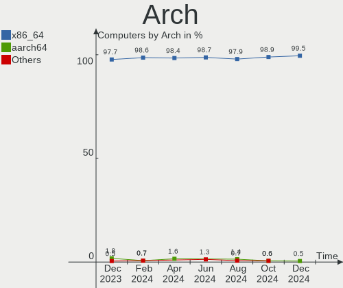
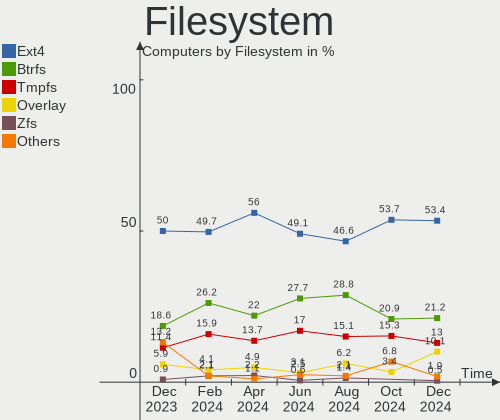
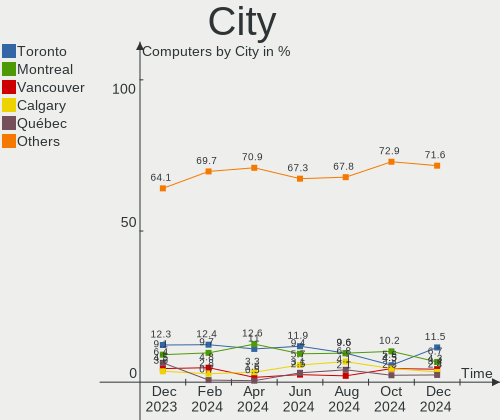
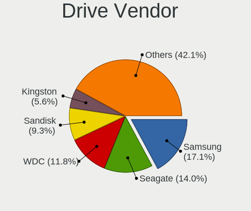
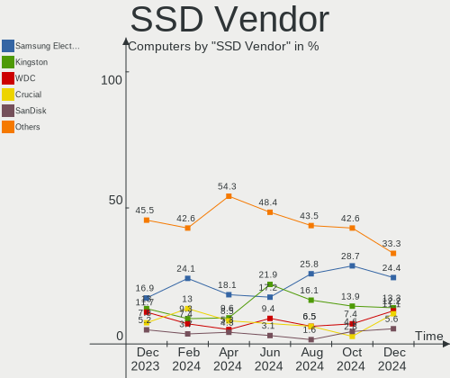
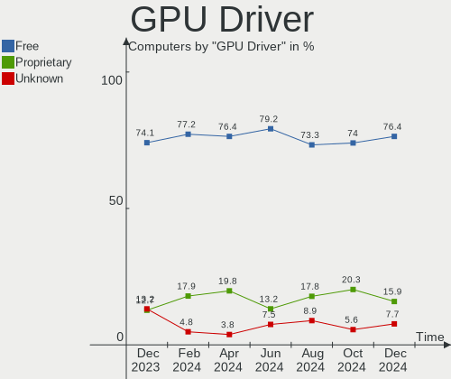
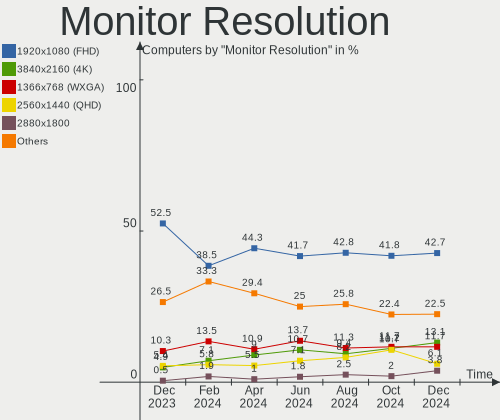
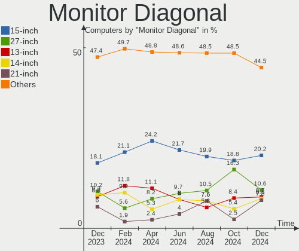
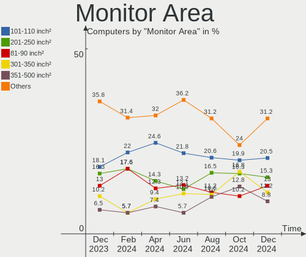

Linux in Canada - Hardware Trends
---------------------------------

A project to identify most popular hardware characteristics and track their change
over time based on data collected by Linux users at https://Linux-Hardware.org.

Anyone can contribute to this report by the [hw-probe](https://github.com/linuxhw/hw-probe) tool:

    sudo -E hw-probe -all -upload

This is a report for all computer types. See also reports for [desktops](/Location/Canada/Desktop/README.md) and [notebooks](/Location/Canada/Notebook/README.md).

Period: Aug, 2022.

Contents
--------

* [ System ](#system)
  - [ OS                       ](#os)
  - [ OS Family                ](#os-family)
  - [ Kernel                   ](#kernel)
  - [ Kernel Family            ](#kernel-family)
  - [ Kernel Major Ver.        ](#kernel-major-ver)
  - [ Arch                     ](#arch)
  - [ DE                       ](#de)
  - [ Display Server           ](#display-server)
  - [ Display Manager          ](#display-manager)
  - [ OS Lang                  ](#os-lang)
  - [ Boot Mode                ](#boot-mode)
  - [ Filesystem               ](#filesystem)
  - [ Part. scheme             ](#part-scheme)
  - [ Dual Boot with Linux/BSD ](#dual-boot-with-linuxbsd)
  - [ Dual Boot (Win)          ](#dual-boot-win)

* [ Board ](#board)
  - [ Vendor                   ](#vendor)
  - [ Model                    ](#model)
  - [ Model Family             ](#model-family)
  - [ MFG Year                 ](#mfg-year)
  - [ Form Factor              ](#form-factor)
  - [ Secure Boot              ](#secure-boot)
  - [ Coreboot                 ](#coreboot)
  - [ RAM Size                 ](#ram-size)
  - [ RAM Used                 ](#ram-used)
  - [ Total Drives             ](#total-drives)
  - [ Has CD-ROM               ](#has-cd-rom)
  - [ Has Ethernet             ](#has-ethernet)
  - [ Has WiFi                 ](#has-wifi)
  - [ Has Bluetooth            ](#has-bluetooth)

* [ Location ](#location)
  - [ Country                  ](#country)
  - [ City                     ](#city)

* [ Drives ](#drives)
  - [ Drive Vendor             ](#drive-vendor)
  - [ Drive Model              ](#drive-model)
  - [ HDD Vendor               ](#hdd-vendor)
  - [ SSD Vendor               ](#ssd-vendor)
  - [ Drive Kind               ](#drive-kind)
  - [ Drive Connector          ](#drive-connector)
  - [ Drive Size               ](#drive-size)
  - [ Space Total              ](#space-total)
  - [ Space Used               ](#space-used)
  - [ Malfunc. Drives          ](#malfunc-drives)
  - [ Malfunc. Drive Vendor    ](#malfunc-drive-vendor)
  - [ Malfunc. HDD Vendor      ](#malfunc-hdd-vendor)
  - [ Malfunc. Drive Kind      ](#malfunc-drive-kind)
  - [ Failed Drives            ](#failed-drives)
  - [ Failed Drive Vendor      ](#failed-drive-vendor)
  - [ Drive Status             ](#drive-status)

* [ Storage controller ](#storage-controller)
  - [ Storage Vendor           ](#storage-vendor)
  - [ Storage Model            ](#storage-model)
  - [ Storage Kind             ](#storage-kind)

* [ Processor ](#processor)
  - [ CPU Vendor               ](#cpu-vendor)
  - [ CPU Model                ](#cpu-model)
  - [ CPU Model Family         ](#cpu-model-family)
  - [ CPU Cores                ](#cpu-cores)
  - [ CPU Sockets              ](#cpu-sockets)
  - [ CPU Threads              ](#cpu-threads)
  - [ CPU Op-Modes             ](#cpu-op-modes)
  - [ CPU Microcode            ](#cpu-microcode)
  - [ CPU Microarch            ](#cpu-microarch)

* [ Graphics ](#graphics)
  - [ GPU Vendor               ](#gpu-vendor)
  - [ GPU Model                ](#gpu-model)
  - [ GPU Combo                ](#gpu-combo)
  - [ GPU Driver               ](#gpu-driver)
  - [ GPU Memory               ](#gpu-memory)

* [ Monitor ](#monitor)
  - [ Monitor Vendor           ](#monitor-vendor)
  - [ Monitor Model            ](#monitor-model)
  - [ Monitor Resolution       ](#monitor-resolution)
  - [ Monitor Diagonal         ](#monitor-diagonal)
  - [ Monitor Width            ](#monitor-width)
  - [ Aspect Ratio             ](#aspect-ratio)
  - [ Monitor Area             ](#monitor-area)
  - [ Pixel Density            ](#pixel-density)
  - [ Multiple Monitors        ](#multiple-monitors)

* [ Network ](#network)
  - [ Net Controller Vendor    ](#net-controller-vendor)
  - [ Net Controller Model     ](#net-controller-model)
  - [ Wireless Vendor          ](#wireless-vendor)
  - [ Wireless Model           ](#wireless-model)
  - [ Ethernet Vendor          ](#ethernet-vendor)
  - [ Ethernet Model           ](#ethernet-model)
  - [ Net Controller Kind      ](#net-controller-kind)
  - [ Used Controller          ](#used-controller)
  - [ NICs                     ](#nics)
  - [ IPv6                     ](#ipv6)

* [ Bluetooth ](#bluetooth)
  - [ Bluetooth Vendor         ](#bluetooth-vendor)
  - [ Bluetooth Model          ](#bluetooth-model)

* [ Sound ](#sound)
  - [ Sound Vendor             ](#sound-vendor)
  - [ Sound Model              ](#sound-model)

* [ Memory ](#memory)
  - [ Memory Vendor            ](#memory-vendor)
  - [ Memory Model             ](#memory-model)
  - [ Memory Kind              ](#memory-kind)
  - [ Memory Form Factor       ](#memory-form-factor)
  - [ Memory Size              ](#memory-size)
  - [ Memory Speed             ](#memory-speed)

* [ Printers & scanners ](#printers--scanners)
  - [ Printer Vendor           ](#printer-vendor)
  - [ Printer Model            ](#printer-model)
  - [ Scanner Vendor           ](#scanner-vendor)
  - [ Scanner Model            ](#scanner-model)

* [ Camera ](#camera)
  - [ Camera Vendor            ](#camera-vendor)
  - [ Camera Model             ](#camera-model)

* [ Security ](#security)
  - [ Fingerprint Vendor       ](#fingerprint-vendor)
  - [ Fingerprint Model        ](#fingerprint-model)
  - [ Chipcard Vendor          ](#chipcard-vendor)
  - [ Chipcard Model           ](#chipcard-model)

* [ Unsupported ](#unsupported)
  - [ Unsupported Devices      ](#unsupported-devices)
  - [ Unsupported Device Types ](#unsupported-device-types)

System
------

OS
--

Installed operating systems

| Name                         | Computers | Percent |
|------------------------------|-----------|---------|
| Ubuntu 22.04                 | 11        | 9.82%   |
| Ubuntu 20.04                 | 10        | 8.93%   |
| Linux Mint 20.3              | 10        | 8.93%   |
| Pop!_OS 22.04                | 9         | 8.04%   |
| Zorin 16                     | 7         | 6.25%   |
| Linux Mint 21                | 7         | 6.25%   |
| Fedora 36                    | 7         | 6.25%   |
| OpenMandriva 4.3             | 6         | 5.36%   |
| OpenMandriva 4.90            | 4         | 3.57%   |
| Kubuntu 22.04                | 4         | 3.57%   |
| SteamOS 3.3                  | 3         | 2.68%   |
| Debian 11                    | 3         | 2.68%   |
| SteamOS 3.3.1                | 2         | 1.79%   |
| openSUSE Tumbleweed-XXXXXXXX | 2         | 1.79%   |
| Manjaro                      | 2         | 1.79%   |
| KDE neon 20.04               | 2         | 1.79%   |
| Kali 2022.3                  | 2         | 1.79%   |
| Fedora 35                    | 2         | 1.79%   |
| Arch                         | 2         | 1.79%   |
| Zorin 15                     | 1         | 0.89%   |
| Ubuntu MATE 22.04            | 1         | 0.89%   |
| Ubuntu MATE 20.04            | 1         | 0.89%   |
| Ubuntu Core 18               | 1         | 0.89%   |
| Ubuntu Budgie 22.04          | 1         | 0.89%   |
| SteamOS 3.2                  | 1         | 0.89%   |
| SteamOS 3.1                  | 1         | 0.89%   |
| Pop!_OS 20.04                | 1         | 0.89%   |
| Manjaro 21.3.6               | 1         | 0.89%   |
| Linux Mint 20.2              | 1         | 0.89%   |
| Garuda Linux Soaring         | 1         | 0.89%   |
| EndeavourOS                  | 1         | 0.89%   |
| Elementary 6.1               | 1         | 0.89%   |
| Elementary 5.1.7             | 1         | 0.89%   |
| CentOS 9                     | 1         | 0.89%   |
| CentOS 7                     | 1         | 0.89%   |
| Arch Rolling                 | 1         | 0.89%   |

OS Family
---------

OS without a version

| Name          | Computers | Percent |
|---------------|-----------|---------|
| Ubuntu        | 22        | 19.64%  |
| Linux Mint    | 18        | 16.07%  |
| Pop!_OS       | 10        | 8.93%   |
| OpenMandriva  | 10        | 8.93%   |
| Fedora        | 9         | 8.04%   |
| Zorin         | 8         | 7.14%   |
| SteamOS       | 7         | 6.25%   |
| Kubuntu       | 4         | 3.57%   |
| Manjaro       | 3         | 2.68%   |
| Debian        | 3         | 2.68%   |
| Arch          | 3         | 2.68%   |
| Ubuntu MATE   | 2         | 1.79%   |
| openSUSE      | 2         | 1.79%   |
| KDE neon      | 2         | 1.79%   |
| Kali          | 2         | 1.79%   |
| Elementary    | 2         | 1.79%   |
| CentOS        | 2         | 1.79%   |
| Ubuntu Budgie | 1         | 0.89%   |
| Garuda Linux  | 1         | 0.89%   |
| EndeavourOS   | 1         | 0.89%   |

Kernel
------

Version of the Linux kernel

| Version                                        | Computers | Percent |
|------------------------------------------------|-----------|---------|
| 5.15.0-46-generic                              | 23        | 20.54%  |
| 5.15.0-43-generic                              | 8         | 7.14%   |
| 5.16.7-desktop-1omv4003                        | 6         | 5.36%   |
| 5.15.0-41-generic                              | 6         | 5.36%   |
| 5.4.0-124-generic                              | 5         | 4.46%   |
| 5.4.0-122-generic                              | 5         | 4.46%   |
| 5.18.10-76051810-generic                       | 5         | 4.46%   |
| 5.19.0-76051900-generic                        | 4         | 3.57%   |
| 5.18.16-200.fc36.x86_64                        | 4         | 3.57%   |
| 5.18.12-desktop-3omv4090                       | 4         | 3.57%   |
| 5.10.0-16-amd64                                | 3         | 2.68%   |
| 5.18.16-arch1-1                                | 2         | 1.79%   |
| 5.18.14-1-MANJARO                              | 2         | 1.79%   |
| 5.18.0-kali5-amd64                             | 2         | 1.79%   |
| 5.13.0-valve21.1-1-neptune-02211-gc54cda5a36f3 | 2         | 1.79%   |
| 5.13.0-valve21-1-neptune-02209-g2a5bdc1102a0   | 2         | 1.79%   |
| 5.4.0-125-generic                              | 1         | 0.89%   |
| 5.4.0-113-generic                              | 1         | 0.89%   |
| 5.4.0-107-generic                              | 1         | 0.89%   |
| 5.4.0-104-generic                              | 1         | 0.89%   |
| 5.19.2-arch1-1                                 | 1         | 0.89%   |
| 5.19.2-1-default                               | 1         | 0.89%   |
| 5.19.0-4.1-liquorix-amd64                      | 1         | 0.89%   |
| 5.18.5-200.fc36.x86_64                         | 1         | 0.89%   |
| 5.18.18-200.fc36.x86_64                        | 1         | 0.89%   |
| 5.18.16-arch1-1-surface                        | 1         | 0.89%   |
| 5.18.15-200.fc36.x86_64                        | 1         | 0.89%   |
| 5.18.15-1-default                              | 1         | 0.89%   |
| 5.18.0-1-generic                               | 1         | 0.89%   |
| 5.16.16-200.fc35.x86_64                        | 1         | 0.89%   |
| 5.16.11-200.fc35.x86_64                        | 1         | 0.89%   |
| 5.15.61-1-lts                                  | 1         | 0.89%   |
| 5.15.57-2-MANJARO                              | 1         | 0.89%   |
| 5.15.0-47-generic                              | 1         | 0.89%   |
| 5.15.0-43-lowlatency                           | 1         | 0.89%   |
| 5.15.0-25-generic                              | 1         | 0.89%   |
| 5.14.0-148.el9.x86_64                          | 1         | 0.89%   |
| 5.14.0-1047-oem                                | 1         | 0.89%   |
| 5.13.0-valve22-1-neptune-02213-gb68995364335   | 1         | 0.89%   |
| 5.13.0-valve15-1-neptune-02197-gf6ec7ad3762a   | 1         | 0.89%   |
| 5.13.0-valve10.3-1-neptune-02176-g5fe416c4acd8 | 1         | 0.89%   |
| 5.13.0-7620-generic                            | 1         | 0.89%   |
| 5.13.0-51-generic                              | 1         | 0.89%   |
| 5.11.0-7614-generic                            | 1         | 0.89%   |
| 3.10.0-1160.76.1.el7.x86_64                    | 1         | 0.89%   |

Kernel Family
-------------

Linux kernel without a distro release

| Version | Computers | Percent |
|---------|-----------|---------|
| 5.15.0  | 40        | 35.71%  |
| 5.4.0   | 14        | 12.5%   |
| 5.13.0  | 9         | 8.04%   |
| 5.18.16 | 7         | 6.25%   |
| 5.16.7  | 6         | 5.36%   |
| 5.19.0  | 5         | 4.46%   |
| 5.18.10 | 5         | 4.46%   |
| 5.18.12 | 4         | 3.57%   |
| 5.18.0  | 3         | 2.68%   |
| 5.10.0  | 3         | 2.68%   |
| 5.19.2  | 2         | 1.79%   |
| 5.18.15 | 2         | 1.79%   |
| 5.18.14 | 2         | 1.79%   |
| 5.14.0  | 2         | 1.79%   |
| 5.18.5  | 1         | 0.89%   |
| 5.18.18 | 1         | 0.89%   |
| 5.16.16 | 1         | 0.89%   |
| 5.16.11 | 1         | 0.89%   |
| 5.15.61 | 1         | 0.89%   |
| 5.15.57 | 1         | 0.89%   |
| 5.11.0  | 1         | 0.89%   |
| 3.10.0  | 1         | 0.89%   |

Kernel Major Ver.
-----------------

Linux kernel major version

| Version | Computers | Percent |
|---------|-----------|---------|
| 5.15    | 42        | 37.5%   |
| 5.18    | 25        | 22.32%  |
| 5.4     | 14        | 12.5%   |
| 5.13    | 9         | 8.04%   |
| 5.16    | 8         | 7.14%   |
| 5.19    | 7         | 6.25%   |
| 5.10    | 3         | 2.68%   |
| 5.14    | 2         | 1.79%   |
| 5.11    | 1         | 0.89%   |
| 3.10    | 1         | 0.89%   |

Arch
----

OS architecture (x86_64, i586, etc.)

| Name   | Computers | Percent |
|--------|-----------|---------|
| x86_64 | 112       | 100%    |

DE
--

Desktop Environment

| Name       | Computers | Percent |
|------------|-----------|---------|
| GNOME      | 51        | 45.54%  |
| KDE5       | 25        | 22.32%  |
| X-Cinnamon | 13        | 11.61%  |
| Unknown    | 6         | 5.36%   |
| MATE       | 4         | 3.57%   |
| Cinnamon   | 4         | 3.57%   |
| XFCE       | 3         | 2.68%   |
| i3         | 3         | 2.68%   |
| Pantheon   | 2         | 1.79%   |
| Budgie     | 1         | 0.89%   |

Display Server
--------------

X11 or Wayland

| Name    | Computers | Percent |
|---------|-----------|---------|
| X11     | 91        | 81.25%  |
| Wayland | 17        | 15.18%  |
| Unknown | 4         | 3.57%   |

Display Manager
---------------

SDDM, LightDM, etc.

| Name    | Computers | Percent |
|---------|-----------|---------|
| Unknown | 51        | 45.54%  |
| GDM3    | 23        | 20.54%  |
| SDDM    | 15        | 13.39%  |
| LightDM | 14        | 12.5%   |
| GDM     | 9         | 8.04%   |

OS Lang
-------

Language

| Lang    | Computers | Percent |
|---------|-----------|---------|
| en_CA   | 57        | 50.89%  |
| en_US   | 41        | 36.61%  |
| fr_CA   | 10        | 8.93%   |
| C       | 2         | 1.79%   |
| Unknown | 2         | 1.79%   |

Boot Mode
---------

EFI or BIOS

| Mode | Computers | Percent |
|------|-----------|---------|
| EFI  | 59        | 52.68%  |
| BIOS | 53        | 47.32%  |

Filesystem
----------

Type of filesystem

| Type    | Computers | Percent |
|---------|-----------|---------|
| Ext4    | 74        | 66.07%  |
| Btrfs   | 22        | 19.64%  |
| Overlay | 12        | 10.71%  |
| Zfs     | 2         | 1.79%   |
| Xfs     | 2         | 1.79%   |

Part. scheme
------------

Scheme of partitioning

| Type    | Computers | Percent |
|---------|-----------|---------|
| Unknown | 69        | 61.61%  |
| GPT     | 39        | 34.82%  |
| MBR     | 4         | 3.57%   |

Dual Boot with Linux/BSD
------------------------

Hosting more than one Linux/BSD

| Dual boot | Computers | Percent |
|-----------|-----------|---------|
| No        | 100       | 89.29%  |
| Yes       | 12        | 10.71%  |

Dual Boot (Win)
---------------

Hosting Linux and Windows

| Dual boot | Computers | Percent |
|-----------|-----------|---------|
| No        | 86        | 76.79%  |
| Yes       | 26        | 23.21%  |

Board
-----

Vendor
------

Motherboard manufacturer

| Name                | Computers | Percent |
|---------------------|-----------|---------|
| ASUSTek Computer    | 24        | 21.43%  |
| Lenovo              | 17        | 15.18%  |
| Dell                | 17        | 15.18%  |
| Hewlett-Packard     | 16        | 14.29%  |
| Valve               | 6         | 5.36%   |
| Gigabyte Technology | 4         | 3.57%   |
| Apple               | 4         | 3.57%   |
| MSI                 | 3         | 2.68%   |
| Acer                | 3         | 2.68%   |
| Samsung Electronics | 2         | 1.79%   |
| ReachingTech        | 2         | 1.79%   |
| Microsoft           | 2         | 1.79%   |
| Google              | 2         | 1.79%   |
| Toshiba             | 1         | 0.89%   |
| System76            | 1         | 0.89%   |
| Sony                | 1         | 0.89%   |
| Razer               | 1         | 0.89%   |
| JGINYUE             | 1         | 0.89%   |
| Intel               | 1         | 0.89%   |
| Biostar             | 1         | 0.89%   |
| AZW                 | 1         | 0.89%   |
| ASRock              | 1         | 0.89%   |
| Alienware           | 1         | 0.89%   |

Model
-----

Motherboard model

| Name                                     | Computers | Percent |
|------------------------------------------|-----------|---------|
| Valve Jupiter                            | 6         | 5.36%   |
| HP Pavilion 15                           | 3         | 2.68%   |
| Samsung 305E4A/305E5A/305E7A             | 2         | 1.79%   |
| ReachingTech Dream Quest Office 2021     | 2         | 1.79%   |
| Lenovo ThinkPad X1 Carbon 6th 20KHCTO1WW | 2         | 1.79%   |
| ASUS TUF Gaming X570-PLUS                | 2         | 1.79%   |
| ASUS All Series                          | 2         | 1.79%   |
| Toshiba PORTEGE M780                     | 1         | 0.89%   |
| System76 Oryx Pro                        | 1         | 0.89%   |
| Sony VPCEB12FD                           | 1         | 0.89%   |
| Razer Book 13 - RZ09-0357                | 1         | 0.89%   |
| MSI WF75 10TK                            | 1         | 0.89%   |
| MSI Sword 15 A11UD                       | 1         | 0.89%   |
| MSI MPG H510 Trident 3 (MS-B935)         | 1         | 0.89%   |
| Microsoft Surface Pro                    | 1         | 0.89%   |
| Microsoft Surface Laptop Go              | 1         | 0.89%   |
| Lenovo ThinkStation P500 30A6S24K00      | 1         | 0.89%   |
| Lenovo ThinkPad X1 Yoga 2nd 20JDCTO1WW   | 1         | 0.89%   |
| Lenovo ThinkPad T580 20L9CTO1WW          | 1         | 0.89%   |
| Lenovo ThinkPad T500 2055A38             | 1         | 0.89%   |
| Lenovo ThinkPad T470s 20HFCTO1WW         | 1         | 0.89%   |
| Lenovo ThinkPad T460s 20F9004NUS         | 1         | 0.89%   |
| Lenovo ThinkPad T430 2349DG5             | 1         | 0.89%   |
| Lenovo ThinkPad T430 2344BMU             | 1         | 0.89%   |
| Lenovo ThinkPad T420s 417152U            | 1         | 0.89%   |
| Lenovo ThinkPad P15s Gen 1 20T4001VUS    | 1         | 0.89%   |
| Lenovo ThinkPad P14s Gen 2a 21A0CTO1WW   | 1         | 0.89%   |
| Lenovo ThinkPad E550 20DF0040CA          | 1         | 0.89%   |
| Lenovo ThinkCentre M92p 3212DF9          | 1         | 0.89%   |
| Lenovo IdeaPad Y410P 20216               | 1         | 0.89%   |
| Lenovo IdeaPad 3 14ALC6 82KT             | 1         | 0.89%   |
| JGINYUE B85I PLUS V2.1                   | 1         | 0.89%   |
| Intel DH87RL AAG74240-401                | 1         | 0.89%   |
| HP ProDesk 600 G2 SFF                    | 1         | 0.89%   |
| HP ProBook 4540s                         | 1         | 0.89%   |
| HP Pavilion Gaming Laptop 16-a0xxx       | 1         | 0.89%   |
| HP Pavilion Gaming Laptop 15-ec0xxx      | 1         | 0.89%   |
| HP Pavilion 590-p0049 3LC38AA            | 1         | 0.89%   |
| HP Laptop 17-by1xxx                      | 1         | 0.89%   |
| HP Laptop 14-dq4xxx                      | 1         | 0.89%   |
| HP ENVY m6                               | 1         | 0.89%   |
| HP EliteDesk 800 G1 TWR                  | 1         | 0.89%   |
| HP EliteBook x360 1030 G2                | 1         | 0.89%   |
| HP EliteBook 8460p                       | 1         | 0.89%   |
| HP Compaq Pro 6300 SFF                   | 1         | 0.89%   |
| Google Rabbid                            | 1         | 0.89%   |
| Google Droid                             | 1         | 0.89%   |
| Gigabyte Z690I AORUS ULTRA DDR4          | 1         | 0.89%   |
| Gigabyte X570 AORUS MASTER               | 1         | 0.89%   |
| Gigabyte H370AORUSGAMING3WIFI            | 1         | 0.89%   |
| Gigabyte B450 I AORUS PRO WIFI           | 1         | 0.89%   |
| Dell XPS 8500                            | 1         | 0.89%   |
| Dell XPS 15 9520                         | 1         | 0.89%   |
| Dell XPS 15 9500                         | 1         | 0.89%   |
| Dell XPS 13 7390 2-in-1                  | 1         | 0.89%   |
| Dell Vostro 430                          | 1         | 0.89%   |
| Dell PowerEdge R630                      | 1         | 0.89%   |
| Dell OptiPlex 9020                       | 1         | 0.89%   |
| Dell OptiPlex 7020                       | 1         | 0.89%   |
| Dell OptiPlex 7010                       | 1         | 0.89%   |

Model Family
------------

Motherboard model prefix

| Name                          | Computers | Percent |
|-------------------------------|-----------|---------|
| Lenovo ThinkPad               | 13        | 11.61%  |
| Valve Jupiter                 | 6         | 5.36%   |
| HP Pavilion                   | 6         | 5.36%   |
| ASUS PRIME                    | 5         | 4.46%   |
| Dell XPS                      | 4         | 3.57%   |
| Dell OptiPlex                 | 4         | 3.57%   |
| Dell Inspiron                 | 4         | 3.57%   |
| ASUS TUF                      | 4         | 3.57%   |
| Samsung 305E4A                | 2         | 1.79%   |
| ReachingTech Dream            | 2         | 1.79%   |
| Microsoft Surface             | 2         | 1.79%   |
| Lenovo IdeaPad                | 2         | 1.79%   |
| HP Laptop                     | 2         | 1.79%   |
| HP EliteBook                  | 2         | 1.79%   |
| Dell Latitude                 | 2         | 1.79%   |
| ASUS VivoBook                 | 2         | 1.79%   |
| ASUS ROG                      | 2         | 1.79%   |
| ASUS All                      | 2         | 1.79%   |
| Acer Aspire                   | 2         | 1.79%   |
| Toshiba PORTEGE               | 1         | 0.89%   |
| System76 Oryx                 | 1         | 0.89%   |
| Sony VPCEB12FD                | 1         | 0.89%   |
| Razer Book                    | 1         | 0.89%   |
| MSI WF75                      | 1         | 0.89%   |
| MSI Sword                     | 1         | 0.89%   |
| MSI MPG                       | 1         | 0.89%   |
| Lenovo ThinkStation           | 1         | 0.89%   |
| Lenovo ThinkCentre            | 1         | 0.89%   |
| JGINYUE B85I                  | 1         | 0.89%   |
| Intel DH87RL                  | 1         | 0.89%   |
| HP ProDesk                    | 1         | 0.89%   |
| HP ProBook                    | 1         | 0.89%   |
| HP ENVY                       | 1         | 0.89%   |
| HP EliteDesk                  | 1         | 0.89%   |
| HP Compaq                     | 1         | 0.89%   |
| Google Rabbid                 | 1         | 0.89%   |
| Google Droid                  | 1         | 0.89%   |
| Gigabyte Z690I                | 1         | 0.89%   |
| Gigabyte X570                 | 1         | 0.89%   |
| Gigabyte H370AORUSGAMING3WIFI | 1         | 0.89%   |
| Gigabyte B450                 | 1         | 0.89%   |
| Dell Vostro                   | 1         | 0.89%   |
| Dell PowerEdge                | 1         | 0.89%   |
| Dell G3                       | 1         | 0.89%   |
| Biostar TA880GU3+             | 1         | 0.89%   |
| AZW GTR                       | 1         | 0.89%   |
| ASUS Zenbook                  | 1         | 0.89%   |
| ASUS X555LAB                  | 1         | 0.89%   |
| ASUS UX303UA                  | 1         | 0.89%   |
| ASUS TP410UAR                 | 1         | 0.89%   |
| ASUS P5GC-MX                  | 1         | 0.89%   |
| ASUS M4A78-E                  | 1         | 0.89%   |
| ASUS K401UQK                  | 1         | 0.89%   |
| ASUS K30AD                    | 1         | 0.89%   |
| ASUS G73Jh                    | 1         | 0.89%   |
| ASRock B450M                  | 1         | 0.89%   |
| Apple Macmini6                | 1         | 0.89%   |
| Apple MacBookPro9             | 1         | 0.89%   |
| Apple MacBookPro12            | 1         | 0.89%   |
| Apple iMac18                  | 1         | 0.89%   |

MFG Year
--------

Motherboard manufacture year

| Year | Computers | Percent |
|------|-----------|---------|
| 2018 | 16        | 14.29%  |
| 2022 | 15        | 13.39%  |
| 2021 | 11        | 9.82%   |
| 2020 | 10        | 8.93%   |
| 2012 | 10        | 8.93%   |
| 2019 | 8         | 7.14%   |
| 2013 | 7         | 6.25%   |
| 2017 | 6         | 5.36%   |
| 2010 | 6         | 5.36%   |
| 2015 | 5         | 4.46%   |
| 2014 | 5         | 4.46%   |
| 2011 | 5         | 4.46%   |
| 2016 | 4         | 3.57%   |
| 2008 | 2         | 1.79%   |
| 2009 | 1         | 0.89%   |
| 2007 | 1         | 0.89%   |

Form Factor
-----------

Physical design of the computer

| Name        | Computers | Percent |
|-------------|-----------|---------|
| Notebook    | 60        | 53.57%  |
| Desktop     | 39        | 34.82%  |
| Convertible | 4         | 3.57%   |
| Mini pc     | 4         | 3.57%   |
| Tablet      | 2         | 1.79%   |
| All in one  | 2         | 1.79%   |
| Server      | 1         | 0.89%   |

Secure Boot
-----------

Enabled or disabled

| State    | Computers | Percent |
|----------|-----------|---------|
| Disabled | 108       | 96.43%  |
| Enabled  | 4         | 3.57%   |

Coreboot
--------

Have coreboot on board

| Used | Computers | Percent |
|------|-----------|---------|
| No   | 109       | 97.32%  |
| Yes  | 3         | 2.68%   |

RAM Size
--------

Total RAM memory

| Size in GB      | Computers | Percent |
|-----------------|-----------|---------|
| 4.01-8.0        | 26        | 23.21%  |
| 8.01-16.0       | 26        | 23.21%  |
| 16.01-24.0      | 22        | 19.64%  |
| 32.01-64.0      | 21        | 18.75%  |
| 3.01-4.0        | 11        | 9.82%   |
| 64.01-256.0     | 3         | 2.68%   |
| More than 256.0 | 1         | 0.89%   |
| 24.01-32.0      | 1         | 0.89%   |
| 1.01-2.0        | 1         | 0.89%   |

RAM Used
--------

Used RAM memory

| Used GB     | Computers | Percent |
|-------------|-----------|---------|
| 2.01-3.0    | 33        | 29.46%  |
| 1.01-2.0    | 32        | 28.57%  |
| 4.01-8.0    | 21        | 18.75%  |
| 3.01-4.0    | 17        | 15.18%  |
| 8.01-16.0   | 6         | 5.36%   |
| 0.51-1.0    | 2         | 1.79%   |
| 64.01-256.0 | 1         | 0.89%   |

Total Drives
------------

Number of drives on board

| Drives | Computers | Percent |
|--------|-----------|---------|
| 1      | 62        | 55.36%  |
| 2      | 34        | 30.36%  |
| 3      | 9         | 8.04%   |
| 6      | 2         | 1.79%   |
| 5      | 2         | 1.79%   |
| 4      | 2         | 1.79%   |
| 9      | 1         | 0.89%   |

Has CD-ROM
----------

Has CD-ROM on board

| Presented | Computers | Percent |
|-----------|-----------|---------|
| No        | 68        | 60.71%  |
| Yes       | 44        | 39.29%  |

Has Ethernet
------------

Has Ethernet on board

| Presented | Computers | Percent |
|-----------|-----------|---------|
| Yes       | 95        | 84.82%  |
| No        | 17        | 15.18%  |

Has WiFi
--------

Has WiFi module

| Presented | Computers | Percent |
|-----------|-----------|---------|
| Yes       | 94        | 83.93%  |
| No        | 18        | 16.07%  |

Has Bluetooth
-------------

Has Bluetooth module

| Presented | Computers | Percent |
|-----------|-----------|---------|
| Yes       | 86        | 76.79%  |
| No        | 26        | 23.21%  |

Location
--------

Country
-------

Geographic location (country)

| Country | Computers | Percent |
|---------|-----------|---------|
| Canada  | 112       | 100%    |

City
----

Geographic location (city)

| City                                         | Computers | Percent |
|----------------------------------------------|-----------|---------|
| Toronto                                      | 11        | 9.82%   |
| Montreal                                     | 10        | 8.93%   |
| Ottawa                                       | 6         | 5.36%   |
| Victoria                                     | 5         | 4.46%   |
| Calgary                                      | 5         | 4.46%   |
| Laval                                        | 4         | 3.57%   |
| Edmonton                                     | 4         | 3.57%   |
| Winnipeg                                     | 3         | 2.68%   |
| Vancouver                                    | 3         | 2.68%   |
| Sherbrooke                                   | 3         | 2.68%   |
| Milton                                       | 3         | 2.68%   |
| Windsor                                      | 2         | 1.79%   |
| Trois-Rivières                              | 2         | 1.79%   |
| Lloydminster                                 | 2         | 1.79%   |
| Langley                                      | 2         | 1.79%   |
| Kelowna                                      | 2         | 1.79%   |
| Joliette                                     | 2         | 1.79%   |
| Halifax                                      | 2         | 1.79%   |
| Cold Lake                                    | 2         | 1.79%   |
| Chateauguay                                  | 2         | 1.79%   |
| Burnaby                                      | 2         | 1.79%   |
| Airdrie                                      | 2         | 1.79%   |
| Woodstock                                    | 1         | 0.89%   |
| Welland                                      | 1         | 0.89%   |
| Waterloo                                     | 1         | 0.89%   |
| Thetford-Mines                               | 1         | 0.89%   |
| Terrace                                      | 1         | 0.89%   |
| Sault Ste. Marie                             | 1         | 0.89%   |
| Sarnia                                       | 1         | 0.89%   |
| Salford                                      | 1         | 0.89%   |
| Saint-Joseph-de-Beauce                       | 1         | 0.89%   |
| Saint John                                   | 1         | 0.89%   |
| Saguenay                                     | 1         | 0.89%   |
| Québec                                      | 1         | 0.89%   |
| Port Hawkesbury                              | 1         | 0.89%   |
| Peterborough                                 | 1         | 0.89%   |
| Morden                                       | 1         | 0.89%   |
| Merritt                                      | 1         | 0.89%   |
| Maple Ridge                                  | 1         | 0.89%   |
| London                                       | 1         | 0.89%   |
| Kingston                                     | 1         | 0.89%   |
| Hartland                                     | 1         | 0.89%   |
| Grande Prairie                               | 1         | 0.89%   |
| Fort St. John                                | 1         | 0.89%   |
| Fonthill                                     | 1         | 0.89%   |
| Daniel's Harbour                             | 1         | 0.89%   |
| Cowansville                                  | 1         | 0.89%   |
| Courtenay                                    | 1         | 0.89%   |
| Blenheim                                     | 1         | 0.89%   |
| Beaux-Rivages--Lac-des-Ecorces--Val-Barrette | 1         | 0.89%   |
| Barrie                                       | 1         | 0.89%   |
| Athabasca                                    | 1         | 0.89%   |
| Antigonish                                   | 1         | 0.89%   |
| Alliston                                     | 1         | 0.89%   |
| Abbotsford                                   | 1         | 0.89%   |

Drives
------

Drive Vendor
------------

Hard drive vendors

| Vendor              | Computers | Drives | Percent |
|---------------------|-----------|--------|---------|
| Seagate             | 25        | 33     | 15.15%  |
| WDC                 | 21        | 26     | 12.73%  |
| Samsung Electronics | 20        | 26     | 12.12%  |
| Kingston            | 12        | 14     | 7.27%   |
| SanDisk             | 10        | 10     | 6.06%   |
| Intel               | 9         | 10     | 5.45%   |
| Unknown             | 8         | 8      | 4.85%   |
| Crucial             | 8         | 11     | 4.85%   |
| Hitachi             | 5         | 5      | 3.03%   |
| Toshiba             | 4         | 4      | 2.42%   |
| SPCC                | 4         | 4      | 2.42%   |
| Phison              | 3         | 3      | 1.82%   |
| Micron Technology   | 3         | 7      | 1.82%   |
| KingFast            | 3         | 3      | 1.82%   |
| HGST                | 3         | 3      | 1.82%   |
| Apple               | 3         | 3      | 1.82%   |
| Unknown             | 3         | 3      | 1.82%   |
| SK hynix            | 2         | 2      | 1.21%   |
| Silicon Motion      | 2         | 3      | 1.21%   |
| PNY                 | 2         | 2      | 1.21%   |
| NGFF                | 2         | 2      | 1.21%   |
| LITEON              | 2         | 2      | 1.21%   |
| Fujitsu             | 2         | 2      | 1.21%   |
| Realtek             | 1         | 1      | 0.61%   |
| Patriot             | 1         | 1      | 0.61%   |
| Mushkin             | 1         | 1      | 0.61%   |
| Lenovo              | 1         | 1      | 0.61%   |
| KIOXIA              | 1         | 1      | 0.61%   |
| JMicron Technology  | 1         | 1      | 0.61%   |
| DAS                 | 1         | 3      | 0.61%   |
| Corsair             | 1         | 1      | 0.61%   |
| A-DATA Technology   | 1         | 1      | 0.61%   |

Drive Model
-----------

Hard drive models

| Model                                | Computers | Percent |
|--------------------------------------|-----------|---------|
| SanDisk NVMe SSD Drive 1TB           | 5         | 2.66%   |
| Seagate ST2000DM008-2FR102 2TB       | 4         | 2.13%   |
| Samsung NVMe SSD Drive 256GB         | 4         | 2.13%   |
| Seagate ST1000LM035-1RK172 1TB       | 3         | 1.6%    |
| Kingston NVMe SSD Drive 256GB        | 3         | 1.6%    |
| Crucial CT1000MX500SSD1 1TB          | 3         | 1.6%    |
| Unknown                              | 3         | 1.6%    |
| WDC WDS500G2B0A-00SM50 500GB SSD     | 2         | 1.06%   |
| WDC WDS100T2B0A-00SM50 1TB SSD       | 2         | 1.06%   |
| WDC WD2003FZEX-00SRLA0 2TB           | 2         | 1.06%   |
| Unknown MMC Card  64GB               | 2         | 1.06%   |
| SPCC Solid State Disk 256GB          | 2         | 1.06%   |
| Silicon Motion NVMe SSD Drive 512GB  | 2         | 1.06%   |
| Seagate ST2000DM001-1ER164 2TB       | 2         | 1.06%   |
| Seagate ST1000LX015-1U7172 1TB       | 2         | 1.06%   |
| Seagate Expansion Desk 4TB           | 2         | 1.06%   |
| SanDisk NVMe SSD Drive 2TB           | 2         | 1.06%   |
| Samsung SSD 870 EVO 1TB              | 2         | 1.06%   |
| Samsung SSD 860 EVO 500GB            | 2         | 1.06%   |
| Samsung SSD 860 EVO 1TB              | 2         | 1.06%   |
| Samsung NVMe SSD Drive 512GB         | 2         | 1.06%   |
| Samsung NVMe SSD Drive 2TB           | 2         | 1.06%   |
| Phison NVMe SSD Drive 512GB          | 2         | 1.06%   |
| NGFF 2242 128GB SSD                  | 2         | 1.06%   |
| Kingston NVMe SSD Drive 250GB        | 2         | 1.06%   |
| Intel NVMe SSD Drive 512GB           | 2         | 1.06%   |
| Crucial CT2000MX500SSD1 2TB          | 2         | 1.06%   |
| WDC WDS500G2B0C-00PXH0 500GB         | 1         | 0.53%   |
| WDC WD5000AAKX-22ERMA0 500GB         | 1         | 0.53%   |
| WDC WD5000AAKS-00V1A0 500GB          | 1         | 0.53%   |
| WDC WD40EZRZ-00GXCB0 4TB             | 1         | 0.53%   |
| WDC WD3200BEKT-60PVMT0 320GB         | 1         | 0.53%   |
| WDC WD3200AAKS-00SBA0 320GB          | 1         | 0.53%   |
| WDC WD20EZRZ-00Z5HB0 2TB             | 1         | 0.53%   |
| WDC WD20EZRX-00DC0B0 2TB             | 1         | 0.53%   |
| WDC WD20EARS-00MVWB0 2TB             | 1         | 0.53%   |
| WDC WD2003FZEX-00Z4SA0 2TB           | 1         | 0.53%   |
| WDC WD1600BJKT-75F4T0 160GB          | 1         | 0.53%   |
| WDC WD10EZEX-00ZF5A0 1TB             | 1         | 0.53%   |
| WDC WD10EFRX-68PJCN0 1TB             | 1         | 0.53%   |
| WDC WD101EMAZ-11G7DA0 10TB           | 1         | 0.53%   |
| WDC PC SN810 NVMe 2048GB             | 1         | 0.53%   |
| WDC PC SN810 NVMe 1024GB             | 1         | 0.53%   |
| WDC PC SN730 SDBQNTY-512G-1001 512GB | 1         | 0.53%   |
| WDC PC SN730 NVMe 512GB              | 1         | 0.53%   |
| WDC PC SN530 SDBPMPZ-256G-1101 256GB | 1         | 0.53%   |
| WDC PC SN530 NVMe 256GB              | 1         | 0.53%   |
| Unknown SD64G  64GB                  | 1         | 0.53%   |
| Unknown SC256  256GB                 | 1         | 0.53%   |
| Unknown MMC Card  7GB                | 1         | 0.53%   |
| Unknown MMC Card  512GB              | 1         | 0.53%   |
| Unknown MMC Card  250GB              | 1         | 0.53%   |
| Unknown DA4064  64GB                 | 1         | 0.53%   |
| Toshiba MQ04ABF100 1TB               | 1         | 0.53%   |
| Toshiba DT01ACA200 2TB               | 1         | 0.53%   |
| Toshiba DT01ACA100 1TB               | 1         | 0.53%   |
| Toshiba DT01ACA050 500GB             | 1         | 0.53%   |
| SPCC Solid State Disk 512GB          | 1         | 0.53%   |
| SPCC M.2 PCIe SSD 1TB                | 1         | 0.53%   |
| SK hynix NVMe SSD Drive 512GB        | 1         | 0.53%   |

HDD Vendor
----------

Hard disk drive vendors

| Vendor  | Computers | Drives | Percent |
|---------|-----------|--------|---------|
| Seagate | 22        | 27     | 44%     |
| WDC     | 12        | 15     | 24%     |
| Hitachi | 5         | 5      | 10%     |
| Toshiba | 4         | 4      | 8%      |
| HGST    | 3         | 3      | 6%      |
| Fujitsu | 2         | 2      | 4%      |
| DAS     | 1         | 3      | 2%      |
| Apple   | 1         | 1      | 2%      |

SSD Vendor
----------

Solid state drive vendors

| Vendor              | Computers | Drives | Percent |
|---------------------|-----------|--------|---------|
| Samsung Electronics | 8         | 12     | 16.33%  |
| Crucial             | 8         | 11     | 16.33%  |
| Kingston            | 6         | 6      | 12.24%  |
| WDC                 | 4         | 4      | 8.16%   |
| SPCC                | 3         | 3      | 6.12%   |
| Micron Technology   | 3         | 4      | 6.12%   |
| Seagate             | 2         | 4      | 4.08%   |
| PNY                 | 2         | 2      | 4.08%   |
| NGFF                | 2         | 2      | 4.08%   |
| LITEON              | 2         | 2      | 4.08%   |
| KingFast            | 2         | 2      | 4.08%   |
| Intel               | 2         | 2      | 4.08%   |
| Apple               | 2         | 2      | 4.08%   |
| Patriot             | 1         | 1      | 2.04%   |
| Mushkin             | 1         | 1      | 2.04%   |
| A-DATA Technology   | 1         | 1      | 2.04%   |

Drive Kind
----------

HDD or SSD

| Kind    | Computers | Drives | Percent |
|---------|-----------|--------|---------|
| NVMe    | 51        | 64     | 34.46%  |
| HDD     | 44        | 60     | 29.73%  |
| SSD     | 39        | 59     | 26.35%  |
| MMC     | 11        | 11     | 7.43%   |
| Unknown | 3         | 3      | 2.03%   |

Drive Connector
---------------

SATA, SAS, NVMe, etc.

| Type | Computers | Drives | Percent |
|------|-----------|--------|---------|
| SATA | 75        | 111    | 51.72%  |
| NVMe | 50        | 63     | 34.48%  |
| MMC  | 11        | 11     | 7.59%   |
| SAS  | 9         | 12     | 6.21%   |

Drive Size
----------

Size of hard drive

| Size in TB | Computers | Drives | Percent |
|------------|-----------|--------|---------|
| 0.01-0.5   | 43        | 54     | 43.88%  |
| 0.51-1.0   | 30        | 35     | 30.61%  |
| 1.01-2.0   | 17        | 19     | 17.35%  |
| 3.01-4.0   | 4         | 5      | 4.08%   |
| 4.01-10.0  | 3         | 5      | 3.06%   |
| 2.01-3.0   | 1         | 1      | 1.02%   |

Space Total
-----------

Amount of disk space available on the file system

| Size in GB     | Computers | Percent |
|----------------|-----------|---------|
| 251-500        | 26        | 23.21%  |
| 101-250        | 22        | 19.64%  |
| 501-1000       | 16        | 14.29%  |
| 1001-2000      | 12        | 10.71%  |
| 1-20           | 12        | 10.71%  |
| More than 3000 | 7         | 6.25%   |
| 2001-3000      | 6         | 5.36%   |
| Unknown        | 5         | 4.46%   |
| 51-100         | 4         | 3.57%   |
| 21-50          | 2         | 1.79%   |

Space Used
----------

Amount of used disk space

| Used GB        | Computers | Percent |
|----------------|-----------|---------|
| 1-20           | 35        | 31.25%  |
| 21-50          | 20        | 17.86%  |
| 101-250        | 15        | 13.39%  |
| 51-100         | 15        | 13.39%  |
| 501-1000       | 9         | 8.04%   |
| 251-500        | 8         | 7.14%   |
| Unknown        | 5         | 4.46%   |
| More than 3000 | 3         | 2.68%   |
| 2001-3000      | 1         | 0.89%   |
| 1001-2000      | 1         | 0.89%   |

Malfunc. Drives
---------------

Drive models with a malfunction

| Model                               | Computers | Drives | Percent |
|-------------------------------------|-----------|--------|---------|
| WDC WD5000AAKS-00V1A0 500GB         | 1         | 1      | 16.67%  |
| Samsung Electronics SSD 870 EVO 1TB | 1         | 1      | 16.67%  |
| Hitachi HTS725032A9A360 320GB       | 1         | 1      | 16.67%  |
| Hitachi HTS541010A9E680 1TB         | 1         | 1      | 16.67%  |
| Hitachi HDT721010SLA360 1TB         | 1         | 1      | 16.67%  |
| HGST HTS541010A9E680 1TB            | 1         | 1      | 16.67%  |

Malfunc. Drive Vendor
---------------------

Vendors of faulty drives

| Vendor              | Computers | Drives | Percent |
|---------------------|-----------|--------|---------|
| Hitachi             | 3         | 3      | 50%     |
| WDC                 | 1         | 1      | 16.67%  |
| Samsung Electronics | 1         | 1      | 16.67%  |
| HGST                | 1         | 1      | 16.67%  |

Malfunc. HDD Vendor
-------------------

Vendors of faulty HDD drives

| Vendor  | Computers | Drives | Percent |
|---------|-----------|--------|---------|
| Hitachi | 3         | 3      | 60%     |
| WDC     | 1         | 1      | 20%     |
| HGST    | 1         | 1      | 20%     |

Malfunc. Drive Kind
-------------------

Kinds of faulty drives

| Kind | Computers | Drives | Percent |
|------|-----------|--------|---------|
| HDD  | 5         | 5      | 83.33%  |
| SSD  | 1         | 1      | 16.67%  |

Failed Drives
-------------

Failed drive models

Zero info for selected period =(

Failed Drive Vendor
-------------------

Failed drive vendors

Zero info for selected period =(

Drive Status
------------

Number of failed and malfunc. drives

| Status   | Computers | Drives | Percent |
|----------|-----------|--------|---------|
| Detected | 77        | 127    | 63.64%  |
| Works    | 38        | 64     | 31.4%   |
| Malfunc  | 6         | 6      | 4.96%   |

Storage controller
------------------

Storage Vendor
--------------

Storage controller vendors

| Vendor                      | Computers | Percent |
|-----------------------------|-----------|---------|
| Intel                       | 65        | 45.45%  |
| AMD                         | 25        | 17.48%  |
| SanDisk                     | 16        | 11.19%  |
| Samsung Electronics         | 14        | 9.79%   |
| Kingston Technology Company | 6         | 4.2%    |
| Phison Electronics          | 5         | 3.5%    |
| SK hynix                    | 2         | 1.4%    |
| Silicon Motion              | 2         | 1.4%    |
| ASMedia Technology          | 2         | 1.4%    |
| Seagate Technology          | 1         | 0.7%    |
| Micron Technology           | 1         | 0.7%    |
| LSI Logic / Symbios Logic   | 1         | 0.7%    |
| Lenovo                      | 1         | 0.7%    |
| KIOXIA                      | 1         | 0.7%    |
| Broadcom / LSI              | 1         | 0.7%    |

Storage Model
-------------

Storage controller models

| Model                                                                          | Computers | Percent |
|--------------------------------------------------------------------------------|-----------|---------|
| AMD FCH SATA Controller [AHCI mode]                                            | 16        | 10.06%  |
| Intel Sunrise Point-LP SATA Controller [AHCI mode]                             | 8         | 5.03%   |
| Intel 8 Series/C220 Series Chipset Family 6-port SATA Controller 1 [AHCI mode] | 8         | 5.03%   |
| Samsung NVMe SSD Controller SM981/PM981/PM983                                  | 7         | 4.4%    |
| SanDisk WD Blue SN550 NVMe SSD                                                 | 6         | 3.77%   |
| Intel 7 Series Chipset Family 6-port SATA Controller [AHCI mode]               | 6         | 3.77%   |
| SanDisk Non-Volatile memory controller                                         | 4         | 2.52%   |
| Intel SATA Controller [RAID mode]                                              | 4         | 2.52%   |
| Intel 82801 Mobile SATA Controller [RAID mode]                                 | 4         | 2.52%   |
| Intel 7 Series/C210 Series Chipset Family 6-port SATA Controller [AHCI mode]   | 4         | 2.52%   |
| SanDisk WD PC SN810 / Black SN850 NVMe SSD                                     | 3         | 1.89%   |
| SanDisk WD Black SN750 / PC SN730 NVMe SSD                                     | 3         | 1.89%   |
| Phison PS5013 E13 NVMe Controller                                              | 3         | 1.89%   |
| Kingston Company OM3PDP3 NVMe SSD                                              | 3         | 1.89%   |
| Intel Volume Management Device NVMe RAID Controller                            | 3         | 1.89%   |
| Intel SSD 660P Series                                                          | 3         | 1.89%   |
| Intel Non-Volatile memory controller                                           | 3         | 1.89%   |
| Intel 5 Series/3400 Series Chipset 4 port SATA AHCI Controller                 | 3         | 1.89%   |
| AMD 500 Series Chipset SATA Controller                                         | 3         | 1.89%   |
| AMD 400 Series Chipset SATA Controller                                         | 3         | 1.89%   |
| Silicon Motion SM2263EN/SM2263XT SSD Controller                                | 2         | 1.26%   |
| Samsung NVMe SSD Controller SM961/PM961/SM963                                  | 2         | 1.26%   |
| Samsung NVMe SSD Controller 980                                                | 2         | 1.26%   |
| Phison E12 NVMe Controller                                                     | 2         | 1.26%   |
| Kingston Company Company Non-Volatile memory controller                        | 2         | 1.26%   |
| Intel Wildcat Point-LP SATA Controller [AHCI Mode]                             | 2         | 1.26%   |
| Intel Celeron/Pentium Silver Processor SATA Controller                         | 2         | 1.26%   |
| Intel Cannon Lake PCH SATA AHCI Controller                                     | 2         | 1.26%   |
| Intel C610/X99 series chipset sSATA Controller [AHCI mode]                     | 2         | 1.26%   |
| Intel C610/X99 series chipset 6-Port SATA Controller [AHCI mode]               | 2         | 1.26%   |
| Intel Alder Lake-S PCH SATA Controller [AHCI Mode]                             | 2         | 1.26%   |
| Intel 6 Series/C200 Series Chipset Family 6 port Mobile SATA AHCI Controller   | 2         | 1.26%   |
| Intel 500 Series Chipset Family SATA AHCI Controller                           | 2         | 1.26%   |
| Intel 5 Series/3400 Series Chipset 6 port SATA AHCI Controller                 | 2         | 1.26%   |
| ASMedia ASM1062 Serial ATA Controller                                          | 2         | 1.26%   |
| AMD SB7x0/SB8x0/SB9x0 IDE Controller                                           | 2         | 1.26%   |
| AMD 300 Series Chipset SATA Controller                                         | 2         | 1.26%   |
| SK hynix Gold P31 SSD                                                          | 1         | 0.63%   |
| SK hynix BC511                                                                 | 1         | 0.63%   |
| Seagate FireCuda 520 SSD                                                       | 1         | 0.63%   |
| SanDisk WD Black 2018/SN750 / PC SN720 NVMe SSD                                | 1         | 0.63%   |
| Samsung NVMe SSD Controller PM9A1/PM9A3/980PRO                                 | 1         | 0.63%   |
| Samsung Electronics SATA controller                                            | 1         | 0.63%   |
| Samsung Electronics Non-Volatile memory controller                             | 1         | 0.63%   |
| Micron 9300 PRO NVMe SSD                                                       | 1         | 0.63%   |
| LSI Logic / Symbios Logic MegaRAID SAS-3 3108 [Invader]                        | 1         | 0.63%   |
| Lenovo Non-Volatile memory controller                                          | 1         | 0.63%   |
| KIOXIA NVMe SSD Controller BG4                                                 | 1         | 0.63%   |
| Kingston Company U-SNS8154P3 NVMe SSD                                          | 1         | 0.63%   |
| Kingston Company A2000 NVMe SSD                                                | 1         | 0.63%   |
| Intel SSD Pro 7600p/760p/E 6100p Series                                        | 1         | 0.63%   |
| Intel Q170/Q150/B150/H170/H110/Z170/CM236 Chipset SATA Controller [AHCI Mode]  | 1         | 0.63%   |
| Intel NM10/ICH7 Family SATA Controller [IDE mode]                              | 1         | 0.63%   |
| Intel Cannon Lake Mobile PCH SATA AHCI Controller                              | 1         | 0.63%   |
| Intel C610/X99 series chipset IDE-r Controller                                 | 1         | 0.63%   |
| Intel 9 Series Chipset Family SATA Controller [AHCI Mode]                      | 1         | 0.63%   |
| Intel 82801IBM/IEM (ICH9M/ICH9M-E) 2 port SATA Controller [IDE mode]           | 1         | 0.63%   |
| Intel 82801G (ICH7 Family) IDE Controller                                      | 1         | 0.63%   |
| Intel 400 Series Chipset Family SATA AHCI Controller                           | 1         | 0.63%   |
| Broadcom / LSI SAS2116 PCI-Express Fusion-MPT SAS-2 [Meteor]                   | 1         | 0.63%   |

Storage Kind
------------

Kind of storage controller (IDE, SATA, NVMe, SAS, ...)

| Kind | Computers | Percent |
|------|-----------|---------|
| SATA | 75        | 52.08%  |
| NVMe | 50        | 34.72%  |
| RAID | 12        | 8.33%   |
| IDE  | 6         | 4.17%   |
| SAS  | 1         | 0.69%   |

Processor
---------

CPU Vendor
----------

Processor vendors

| Vendor | Computers | Percent |
|--------|-----------|---------|
| Intel  | 78        | 69.64%  |
| AMD    | 34        | 30.36%  |

CPU Model
---------

Processor models

| Model                                   | Computers | Percent |
|-----------------------------------------|-----------|---------|
| AMD Custom APU 0405                     | 6         | 5.36%   |
| Intel Core i7-4790 CPU @ 3.60GHz        | 3         | 2.68%   |
| Intel Core i7-3770 CPU @ 3.40GHz        | 3         | 2.68%   |
| Intel Core i7-8550U CPU @ 1.80GHz       | 2         | 1.79%   |
| Intel Core i7-5500U CPU @ 2.40GHz       | 2         | 1.79%   |
| Intel Core i7-10750H CPU @ 2.60GHz      | 2         | 1.79%   |
| Intel Core i5-9400 CPU @ 2.90GHz        | 2         | 1.79%   |
| Intel Core i5-7300U CPU @ 2.60GHz       | 2         | 1.79%   |
| Intel Core i5-7200U CPU @ 2.50GHz       | 2         | 1.79%   |
| Intel Core i5-3210M CPU @ 2.50GHz       | 2         | 1.79%   |
| Intel Core i5-2520M CPU @ 2.50GHz       | 2         | 1.79%   |
| Intel Celeron J4125 CPU @ 2.00GHz       | 2         | 1.79%   |
| Intel 12th Gen Core i9-12900HK          | 2         | 1.79%   |
| Intel 11th Gen Core i7-11800H @ 2.30GHz | 2         | 1.79%   |
| AMD Ryzen 5 5600X 6-Core Processor      | 2         | 1.79%   |
| AMD Ryzen 5 3600X 6-Core Processor      | 2         | 1.79%   |
| Intel Xeon CPU E5-2697 v3 @ 2.60GHz     | 1         | 0.89%   |
| Intel Xeon CPU E5-1650 v3 @ 3.50GHz     | 1         | 0.89%   |
| Intel Pentium Dual CPU E2140 @ 1.60GHz  | 1         | 0.89%   |
| Intel Core i9-9900KS CPU @ 4.00GHz      | 1         | 0.89%   |
| Intel Core i7-9750H CPU @ 2.60GHz       | 1         | 0.89%   |
| Intel Core i7-9700 CPU @ 3.00GHz        | 1         | 0.89%   |
| Intel Core i7-8700 CPU @ 3.20GHz        | 1         | 0.89%   |
| Intel Core i7-8650U CPU @ 1.90GHz       | 1         | 0.89%   |
| Intel Core i7-8565U CPU @ 1.80GHz       | 1         | 0.89%   |
| Intel Core i7-7600U CPU @ 2.80GHz       | 1         | 0.89%   |
| Intel Core i7-7500U CPU @ 2.70GHz       | 1         | 0.89%   |
| Intel Core i7-4790K CPU @ 4.00GHz       | 1         | 0.89%   |
| Intel Core i7-4770 CPU @ 3.40GHz        | 1         | 0.89%   |
| Intel Core i7-4700MQ CPU @ 2.40GHz      | 1         | 0.89%   |
| Intel Core i7-1065G7 CPU @ 1.30GHz      | 1         | 0.89%   |
| Intel Core i7-10510U CPU @ 1.80GHz      | 1         | 0.89%   |
| Intel Core i7 CPU Q 740 @ 1.73GHz       | 1         | 0.89%   |
| Intel Core i5-8500T CPU @ 2.10GHz       | 1         | 0.89%   |
| Intel Core i5-8350U CPU @ 1.70GHz       | 1         | 0.89%   |
| Intel Core i5-8265U CPU @ 1.60GHz       | 1         | 0.89%   |
| Intel Core i5-7360U CPU @ 2.30GHz       | 1         | 0.89%   |
| Intel Core i5-6500 CPU @ 3.20GHz        | 1         | 0.89%   |
| Intel Core i5-6300U CPU @ 2.40GHz       | 1         | 0.89%   |
| Intel Core i5-6200U CPU @ 2.30GHz       | 1         | 0.89%   |
| Intel Core i5-5257U CPU @ 2.70GHz       | 1         | 0.89%   |
| Intel Core i5-4690 CPU @ 3.50GHz        | 1         | 0.89%   |
| Intel Core i5-4570 CPU @ 3.20GHz        | 1         | 0.89%   |
| Intel Core i5-4430 CPU @ 3.00GHz        | 1         | 0.89%   |
| Intel Core i5-3570 CPU @ 3.40GHz        | 1         | 0.89%   |
| Intel Core i5-3380M CPU @ 2.90GHz       | 1         | 0.89%   |
| Intel Core i5-3320M CPU @ 2.60GHz       | 1         | 0.89%   |
| Intel Core i5-3230M CPU @ 2.60GHz       | 1         | 0.89%   |
| Intel Core i5-1035G1 CPU @ 1.00GHz      | 1         | 0.89%   |
| Intel Core i5-10300H CPU @ 2.50GHz      | 1         | 0.89%   |
| Intel Core i5 CPU M 560 @ 2.67GHz       | 1         | 0.89%   |
| Intel Core i5 CPU M 520 @ 2.40GHz       | 1         | 0.89%   |
| Intel Core i5 CPU M 430 @ 2.27GHz       | 1         | 0.89%   |
| Intel Core i5 CPU 650 @ 3.20GHz         | 1         | 0.89%   |
| Intel Core i3-7130U CPU @ 2.70GHz       | 1         | 0.89%   |
| Intel Core i3-2370M CPU @ 2.40GHz       | 1         | 0.89%   |
| Intel Core i3 CPU M 330 @ 2.13GHz       | 1         | 0.89%   |
| Intel Core 2 Duo CPU T9600 @ 2.80GHz    | 1         | 0.89%   |
| Intel Celeron N4020 CPU @ 1.10GHz       | 1         | 0.89%   |
| Intel Celeron CPU N3350 @ 1.10GHz       | 1         | 0.89%   |

CPU Model Family
----------------

Processor model prefix

| Model                   | Computers | Percent |
|-------------------------|-----------|---------|
| Intel Core i5           | 31        | 27.68%  |
| Intel Core i7           | 25        | 22.32%  |
| Other                   | 18        | 16.07%  |
| AMD Ryzen 5             | 9         | 8.04%   |
| AMD Ryzen 7             | 5         | 4.46%   |
| Intel Celeron           | 4         | 3.57%   |
| Intel Core i3           | 3         | 2.68%   |
| Intel Xeon              | 2         | 1.79%   |
| AMD Ryzen 9             | 2         | 1.79%   |
| AMD Ryzen 3             | 2         | 1.79%   |
| AMD A6                  | 2         | 1.79%   |
| Intel Pentium Dual      | 1         | 0.89%   |
| Intel Core i9           | 1         | 0.89%   |
| Intel Core 2 Duo        | 1         | 0.89%   |
| AMD Turion 64 X2 Mobile | 1         | 0.89%   |
| AMD Ryzen 5 PRO         | 1         | 0.89%   |
| AMD Phenom II X4        | 1         | 0.89%   |
| AMD A8                  | 1         | 0.89%   |
| AMD A4                  | 1         | 0.89%   |
| AMD A10                 | 1         | 0.89%   |

CPU Cores
---------

Number of processor cores

| Number | Computers | Percent |
|--------|-----------|---------|
| 4      | 43        | 38.39%  |
| 2      | 35        | 31.25%  |
| 6      | 17        | 15.18%  |
| 8      | 11        | 9.82%   |
| 14     | 2         | 1.79%   |
| 12     | 2         | 1.79%   |
| 28     | 1         | 0.89%   |
| 10     | 1         | 0.89%   |

CPU Sockets
-----------

Number of sockets

| Number | Computers | Percent |
|--------|-----------|---------|
| 1      | 111       | 99.11%  |
| 2      | 1         | 0.89%   |

CPU Threads
-----------

Threads per core (Hyper-Threading)

| Number | Computers | Percent |
|--------|-----------|---------|
| 2      | 86        | 76.79%  |
| 1      | 26        | 23.21%  |

CPU Op-Modes
------------

CPU Operation Modes (32-bit, 64-bit)

| Op mode        | Computers | Percent |
|----------------|-----------|---------|
| 32-bit, 64-bit | 112       | 100%    |

CPU Microcode
-------------

Microcode number

| Number     | Computers | Percent |
|------------|-----------|---------|
| Unknown    | 39        | 34.82%  |
| 0x306a9    | 9         | 8.04%   |
| 0x806e9    | 7         | 6.25%   |
| 0x306c3    | 6         | 5.36%   |
| 0x906ea    | 5         | 4.46%   |
| 0x806ea    | 4         | 3.57%   |
| 0x706a8    | 3         | 2.68%   |
| 0x206a7    | 3         | 2.68%   |
| 0x20652    | 3         | 2.68%   |
| 0x906ed    | 2         | 1.79%   |
| 0x906a3    | 2         | 1.79%   |
| 0x90672    | 2         | 1.79%   |
| 0x806eb    | 2         | 1.79%   |
| 0x406e3    | 2         | 1.79%   |
| 0x306d4    | 2         | 1.79%   |
| 0x08701021 | 2         | 1.79%   |
| 0x06001119 | 2         | 1.79%   |
| 0xa0652    | 1         | 0.89%   |
| 0x806c2    | 1         | 0.89%   |
| 0x806c1    | 1         | 0.89%   |
| 0x706e5    | 1         | 0.89%   |
| 0x6fd      | 1         | 0.89%   |
| 0x506c9    | 1         | 0.89%   |
| 0x306f2    | 1         | 0.89%   |
| 0x106e5    | 1         | 0.89%   |
| 0x1067a    | 1         | 0.89%   |
| 0x0a50000b | 1         | 0.89%   |
| 0x08701013 | 1         | 0.89%   |
| 0x08608103 | 1         | 0.89%   |
| 0x08001129 | 1         | 0.89%   |
| 0x07030106 | 1         | 0.89%   |
| 0x03000027 | 1         | 0.89%   |
| 0x010000dc | 1         | 0.89%   |
| 0x010000db | 1         | 0.89%   |

CPU Microarch
-------------

Microarchitecture

| Name             | Computers | Percent |
|------------------|-----------|---------|
| KabyLake         | 22        | 19.64%  |
| Haswell          | 11        | 9.82%   |
| Unknown          | 11        | 9.82%   |
| IvyBridge        | 9         | 8.04%   |
| Zen 3            | 7         | 6.25%   |
| Zen 2            | 5         | 4.46%   |
| Westmere         | 5         | 4.46%   |
| Alderlake Hybrid | 4         | 3.57%   |
| Zen              | 3         | 2.68%   |
| TigerLake        | 3         | 2.68%   |
| Skylake          | 3         | 2.68%   |
| SandyBridge      | 3         | 2.68%   |
| Goldmont plus    | 3         | 2.68%   |
| CometLake        | 3         | 2.68%   |
| Broadwell        | 3         | 2.68%   |
| Zen+             | 2         | 1.79%   |
| Puma             | 2         | 1.79%   |
| Piledriver       | 2         | 1.79%   |
| K10 Llano        | 2         | 1.79%   |
| K10              | 2         | 1.79%   |
| IceLake          | 2         | 1.79%   |
| Penryn           | 1         | 0.89%   |
| Nehalem          | 1         | 0.89%   |
| K8 Hammer        | 1         | 0.89%   |
| Goldmont         | 1         | 0.89%   |
| Core             | 1         | 0.89%   |

Graphics
--------

GPU Vendor
----------

Vendors of graphics cards

| Vendor                     | Computers | Percent |
|----------------------------|-----------|---------|
| Intel                      | 62        | 48.06%  |
| Nvidia                     | 33        | 25.58%  |
| AMD                        | 33        | 25.58%  |
| Matrox Electronics Systems | 1         | 0.78%   |

GPU Model
---------

Graphics card models

| Model                                                                       | Computers | Percent |
|-----------------------------------------------------------------------------|-----------|---------|
| Intel HD Graphics 620                                                       | 7         | 5.26%   |
| AMD VanGogh [AMD Custom GPU 0405]                                           | 6         | 4.51%   |
| Intel Xeon E3-1200 v3/4th Gen Core Processor Integrated Graphics Controller | 5         | 3.76%   |
| Intel 3rd Gen Core processor Graphics Controller                            | 5         | 3.76%   |
| Intel UHD Graphics 620                                                      | 4         | 3.01%   |
| Intel TigerLake-LP GT2 [Iris Xe Graphics]                                   | 3         | 2.26%   |
| Intel GeminiLake [UHD Graphics 600]                                         | 3         | 2.26%   |
| Intel Core Processor Integrated Graphics Controller                         | 3         | 2.26%   |
| Intel CometLake-H GT2 [UHD Graphics]                                        | 3         | 2.26%   |
| Intel 2nd Generation Core Processor Family Integrated Graphics Controller   | 3         | 2.26%   |
| AMD Ellesmere [Radeon RX 470/480/570/570X/580/580X/590]                     | 3         | 2.26%   |
| AMD Cezanne                                                                 | 3         | 2.26%   |
| Nvidia TU117 [GeForce GTX 1650]                                             | 2         | 1.5%    |
| Nvidia TU116M [GeForce GTX 1660 Ti Mobile]                                  | 2         | 1.5%    |
| Nvidia GA107M [GeForce RTX 3050 Ti Mobile]                                  | 2         | 1.5%    |
| Intel WhiskeyLake-U GT2 [UHD Graphics 620]                                  | 2         | 1.5%    |
| Intel TigerLake-H GT1 [UHD Graphics]                                        | 2         | 1.5%    |
| Intel Skylake GT2 [HD Graphics 520]                                         | 2         | 1.5%    |
| Intel IvyBridge GT2 [HD Graphics 4000]                                      | 2         | 1.5%    |
| Intel HD Graphics 5500                                                      | 2         | 1.5%    |
| Intel CoffeeLake-S GT2 [UHD Graphics 630]                                   | 2         | 1.5%    |
| Intel AlderLake-S GT1                                                       | 2         | 1.5%    |
| Intel Alder Lake-P Integrated Graphics Controller                           | 2         | 1.5%    |
| AMD Seymour [Radeon HD 6400M/7400M Series]                                  | 2         | 1.5%    |
| AMD Picasso/Raven 2 [Radeon Vega Series / Radeon Vega Mobile Series]        | 2         | 1.5%    |
| AMD Mullins [Radeon R4/R5 Graphics]                                         | 2         | 1.5%    |
| AMD Lucienne                                                                | 2         | 1.5%    |
| Nvidia TU117M [GeForce GTX 1650 Ti Mobile]                                  | 1         | 0.75%   |
| Nvidia TU116 [GeForce GTX 1660]                                             | 1         | 0.75%   |
| Nvidia TU116 [GeForce GTX 1660 Ti]                                          | 1         | 0.75%   |
| Nvidia TU106GLM [Quadro RTX 3000 Mobile / Max-Q]                            | 1         | 0.75%   |
| Nvidia TU106 [GeForce RTX 2060 Rev. A]                                      | 1         | 0.75%   |
| Nvidia TU104 [GeForce RTX 2060]                                             | 1         | 0.75%   |
| Nvidia GT218M [NVS 3100M]                                                   | 1         | 0.75%   |
| Nvidia GT218 [GeForce 310]                                                  | 1         | 0.75%   |
| Nvidia GT218 [GeForce 210]                                                  | 1         | 0.75%   |
| Nvidia GP108GLM [Quadro P520]                                               | 1         | 0.75%   |
| Nvidia GP108 [GeForce GT 1030]                                              | 1         | 0.75%   |
| Nvidia GP107M [GeForce GTX 1050 3 GB Max-Q]                                 | 1         | 0.75%   |
| Nvidia GP107 [GeForce GTX 1050 Ti]                                          | 1         | 0.75%   |
| Nvidia GP102 [GeForce GTX 1080 Ti]                                          | 1         | 0.75%   |
| Nvidia GM108M [GeForce 940MX]                                               | 1         | 0.75%   |
| Nvidia GM107 [GeForce GTX 750]                                              | 1         | 0.75%   |
| Nvidia GM107 [GeForce GTX 750 Ti]                                           | 1         | 0.75%   |
| Nvidia GK208B [GeForce GT 730]                                              | 1         | 0.75%   |
| Nvidia GK107M [GeForce GT 755M]                                             | 1         | 0.75%   |
| Nvidia GK107 [GeForce GT 640 OEM]                                           | 1         | 0.75%   |
| Nvidia GK104 [GeForce GTX 760]                                              | 1         | 0.75%   |
| Nvidia GF119 [GeForce GT 610]                                               | 1         | 0.75%   |
| Nvidia GA107M [GeForce RTX 3050 Mobile]                                     | 1         | 0.75%   |
| Nvidia GA106 [GeForce RTX 3060 Lite Hash Rate]                              | 1         | 0.75%   |
| Nvidia GA104M [GeForce RTX 3070 Mobile / Max-Q]                             | 1         | 0.75%   |
| Nvidia GA103M [GeForce RTX 3080 Ti Laptop GPU]                              | 1         | 0.75%   |
| Nvidia GA102 [GeForce RTX 3080 12GB]                                        | 1         | 0.75%   |
| Matrox Electronics Systems G200eR2                                          | 1         | 0.75%   |
| Intel Iris Plus Graphics G7                                                 | 1         | 0.75%   |
| Intel Iris Plus Graphics G1 (Ice Lake)                                      | 1         | 0.75%   |
| Intel Iris Plus Graphics 640                                                | 1         | 0.75%   |
| Intel Iris Graphics 6100                                                    | 1         | 0.75%   |
| Intel HD Graphics 530                                                       | 1         | 0.75%   |

GPU Combo
---------

Combinations of graphics cards

| Name           | Computers | Percent |
|----------------|-----------|---------|
| 1 x Intel      | 45        | 40.18%  |
| 1 x AMD        | 26        | 23.21%  |
| 1 x Nvidia     | 19        | 16.96%  |
| Intel + Nvidia | 12        | 10.71%  |
| 2 x AMD        | 4         | 3.57%   |
| Other          | 2         | 1.79%   |
| AMD + Nvidia   | 2         | 1.79%   |
| 1 x Matrox     | 1         | 0.89%   |
| Intel + AMD    | 1         | 0.89%   |

GPU Driver
----------

Free vs proprietary

| Driver      | Computers | Percent |
|-------------|-----------|---------|
| Free        | 89        | 79.46%  |
| Proprietary | 22        | 19.64%  |
| Unknown     | 1         | 0.89%   |

GPU Memory
----------

Total video memory

| Size in GB | Computers | Percent |
|------------|-----------|---------|
| Unknown    | 77        | 68.75%  |
| 1.01-2.0   | 7         | 6.25%   |
| 0.51-1.0   | 7         | 6.25%   |
| 0.01-0.5   | 6         | 5.36%   |
| 5.01-6.0   | 5         | 4.46%   |
| 8.01-16.0  | 4         | 3.57%   |
| 7.01-8.0   | 3         | 2.68%   |
| 3.01-4.0   | 3         | 2.68%   |

Monitor
-------

Monitor Vendor
--------------

Monitor vendors

| Vendor               | Computers | Percent |
|----------------------|-----------|---------|
| AU Optronics         | 18        | 14.88%  |
| Samsung Electronics  | 15        | 12.4%   |
| LG Display           | 10        | 8.26%   |
| Dell                 | 10        | 8.26%   |
| Chimei Innolux       | 10        | 8.26%   |
| Goldstar             | 7         | 5.79%   |
| ANX                  | 6         | 4.96%   |
| Acer                 | 6         | 4.96%   |
| BOE                  | 5         | 4.13%   |
| Hewlett-Packard      | 4         | 3.31%   |
| Sharp                | 3         | 2.48%   |
| Panasonic            | 3         | 2.48%   |
| Lenovo               | 3         | 2.48%   |
| Apple                | 3         | 2.48%   |
| ViewSonic            | 2         | 1.65%   |
| Toshiba              | 2         | 1.65%   |
| Ancor Communications | 2         | 1.65%   |
| Unknown              | 1         | 0.83%   |
| Sony                 | 1         | 0.83%   |
| RCA                  | 1         | 0.83%   |
| Philips              | 1         | 0.83%   |
| PANDA                | 1         | 0.83%   |
| Medion Akoya         | 1         | 0.83%   |
| Huion                | 1         | 0.83%   |
| HKC                  | 1         | 0.83%   |
| BenQ                 | 1         | 0.83%   |
| AUS                  | 1         | 0.83%   |
| ASUSTek Computer     | 1         | 0.83%   |
| AOC                  | 1         | 0.83%   |

Monitor Model
-------------

Monitor models

| Model                                                                   | Computers | Percent |
|-------------------------------------------------------------------------|-----------|---------|
| ANX ANX7530 U ANX7539 800x1280                                          | 6         | 4.72%   |
| Goldstar FULL HD GSM5B55 1920x1080 480x270mm 21.7-inch                  | 3         | 2.36%   |
| Toshiba TV TSB0206 1920x1080 886x498mm 40.0-inch                        | 2         | 1.57%   |
| LG Display LCD Monitor LGD0555 1536x1024 263x175mm 12.4-inch            | 2         | 1.57%   |
| AU Optronics LCD Monitor AUO408D 1920x1080 309x174mm 14.0-inch          | 2         | 1.57%   |
| AU Optronics LCD Monitor AUO213E 1600x900 309x174mm 14.0-inch           | 2         | 1.57%   |
| Acer EB321HQ A ACR0506 1920x1080 698x393mm 31.5-inch                    | 2         | 1.57%   |
| ViewSonic VA702b VSC231C 1280x1024 338x270mm 17.0-inch                  | 1         | 0.79%   |
| ViewSonic VA1938 Series VSC0626 1366x768 410x230mm 18.5-inch            | 1         | 0.79%   |
| Unknown LCD Monitor SKYDATA S.P.A. TV-monitor 1360x768                  | 1         | 0.79%   |
| Sony LCD Monitor TV XV 1920x1080                                        | 1         | 0.79%   |
| Sharp LQ134N1JW48 SHP1527 1920x1200 288x180mm 13.4-inch                 | 1         | 0.79%   |
| Sharp LCD Monitor SHP14D1 1920x1200 336x210mm 15.6-inch                 | 1         | 0.79%   |
| Sharp LCD Monitor SHP14AF 1920x1200 288x180mm 13.4-inch                 | 1         | 0.79%   |
| Samsung Electronics SyncMaster SAM04E6 1920x1080 477x268mm 21.5-inch    | 1         | 0.79%   |
| Samsung Electronics S34J55x SAM0F72 1720x1440                           | 1         | 0.79%   |
| Samsung Electronics S27C230 SAM0A87 1920x1080 598x336mm 27.0-inch       | 1         | 0.79%   |
| Samsung Electronics S24F350 SAM0D20 1920x1080 521x293mm 23.5-inch       | 1         | 0.79%   |
| Samsung Electronics LCD Monitor SEC5441 1366x768 344x194mm 15.5-inch    | 1         | 0.79%   |
| Samsung Electronics LCD Monitor SEC384A 1366x768 344x194mm 15.5-inch    | 1         | 0.79%   |
| Samsung Electronics LCD Monitor SEC324C 1600x900 310x174mm 14.0-inch    | 1         | 0.79%   |
| Samsung Electronics LCD Monitor SDC4951 1366x768 344x194mm 15.5-inch    | 1         | 0.79%   |
| Samsung Electronics LCD Monitor SDC4651 1366x768 344x194mm 15.5-inch    | 1         | 0.79%   |
| Samsung Electronics LCD Monitor SDC4171 2880x1800 302x189mm 14.0-inch   | 1         | 0.79%   |
| Samsung Electronics LCD Monitor SDC414D 3456x2160 336x210mm 15.6-inch   | 1         | 0.79%   |
| Samsung Electronics LCD Monitor SAM0F9F 3840x2160 1872x1053mm 84.6-inch | 1         | 0.79%   |
| Samsung Electronics LCD Monitor SAM050F 1920x1080                       | 1         | 0.79%   |
| Samsung Electronics C49RG9x SAM0F9C 3840x1080 1193x336mm 48.8-inch      | 1         | 0.79%   |
| Samsung Electronics C32F391 SAM0D34 1920x1080 698x393mm 31.5-inch       | 1         | 0.79%   |
| RCA RTR3261-B-CA RCA0B01 1920x1080 698x392mm 31.5-inch                  | 1         | 0.79%   |
| Philips LCD Monitor PHL 276E8V                                          | 1         | 0.79%   |
| PANDA LCD Monitor NCP0040 1920x1080 344x194mm 15.5-inch                 | 1         | 0.79%   |
| Panasonic TV MEIA08F 1920x540                                           | 1         | 0.79%   |
| Panasonic PanasonicTV0 MEIA0AF 1920x540                                 | 1         | 0.79%   |
| Panasonic LCD Monitor TV 1920x1080                                      | 1         | 0.79%   |
| Medion Akoya MEC-N-3-H MEC0001 3840x2160 1150x650mm 52.0-inch           | 1         | 0.79%   |
| LG Display LCD Monitor LGD068D 1920x1080 309x174mm 14.0-inch            | 1         | 0.79%   |
| LG Display LCD Monitor LGD058B 2560x1440 309x174mm 14.0-inch            | 1         | 0.79%   |
| LG Display LCD Monitor LGD055F 2560x1440 310x174mm 14.0-inch            | 1         | 0.79%   |
| LG Display LCD Monitor LGD0511 1920x1080 344x194mm 15.5-inch            | 1         | 0.79%   |
| LG Display LCD Monitor LGD0501 2560x1440 310x174mm 14.0-inch            | 1         | 0.79%   |
| LG Display LCD Monitor LGD045C 1366x768 345x194mm 15.6-inch             | 1         | 0.79%   |
| LG Display LCD Monitor LGD034D 1366x768 344x194mm 15.5-inch             | 1         | 0.79%   |
| LG Display LCD Monitor LGD02AC 1366x768 344x194mm 15.5-inch             | 1         | 0.79%   |
| Lenovo LEN T24i-20 LEN61F7 1920x1080 527x296mm 23.8-inch                | 1         | 0.79%   |
| Lenovo LCD Monitor LEN40BA 1920x1080 344x194mm 15.5-inch                | 1         | 0.79%   |
| Lenovo LCD Monitor LEN4053 1680x1050 331x207mm 15.4-inch                | 1         | 0.79%   |
| Lenovo L2251x Wide LEN0A12 1680x1050 474x296mm 22.0-inch                | 1         | 0.79%   |
| Huion GT221 HAT2150 1920x1080 476x267mm 21.5-inch                       | 1         | 0.79%   |
| HKC LCD Monitor TV 1920x1080                                            | 1         | 0.79%   |
| Hewlett-Packard w2007 HWP26A6 1680x1050 433x271mm 20.1-inch             | 1         | 0.79%   |
| Hewlett-Packard w1707 HWP2800 1440x900 370x230mm 17.2-inch              | 1         | 0.79%   |
| Hewlett-Packard Compaq WF1907 HWP26A5 1440x900 408x255mm 18.9-inch      | 1         | 0.79%   |
| Hewlett-Packard 2311 HWP293A 1920x1080 509x286mm 23.0-inch              | 1         | 0.79%   |
| Goldstar W2242 GSM5677 1680x1050 474x296mm 22.0-inch                    | 1         | 0.79%   |
| Goldstar ULTRAGEAR GSM774A 3440x1440 800x335mm 34.1-inch                | 1         | 0.79%   |
| Goldstar ULTRAGEAR GSM5BB2 1920x1080 527x296mm 23.8-inch                | 1         | 0.79%   |
| Goldstar ULTRAGEAR GSM5BB1 1920x1080 527x296mm 23.8-inch                | 1         | 0.79%   |
| Goldstar HDR WFHD GSM7757 2560x1080 798x334mm 34.1-inch                 | 1         | 0.79%   |
| Dell U4919DW DELA10D 3840x1080 1198x337mm 49.0-inch                     | 1         | 0.79%   |

Monitor Resolution
------------------

Monitor screen resolution

| Resolution         | Computers | Percent |
|--------------------|-----------|---------|
| 1920x1080 (FHD)    | 47        | 39.17%  |
| 1366x768 (WXGA)    | 16        | 13.33%  |
| 800x1280           | 6         | 5%      |
| 3840x2160 (4K)     | 6         | 5%      |
| 2560x1440 (QHD)    | 6         | 5%      |
| 1680x1050 (WSXGA+) | 6         | 5%      |
| 1920x1200 (WUXGA)  | 4         | 3.33%   |
| 1600x900 (HD+)     | 4         | 3.33%   |
| 3840x1080          | 3         | 2.5%    |
| 1440x900 (WXGA+)   | 3         | 2.5%    |
| Unknown            | 3         | 2.5%    |
| 3440x1440          | 2         | 1.67%   |
| 2736x1824          | 2         | 1.67%   |
| 1920x540           | 2         | 1.67%   |
| 1280x800 (WXGA)    | 2         | 1.67%   |
| 5760x2160          | 1         | 0.83%   |
| 3840x1200          | 1         | 0.83%   |
| 3456x2160          | 1         | 0.83%   |
| 2880x1800          | 1         | 0.83%   |
| 2560x1600          | 1         | 0.83%   |
| 2560x1080          | 1         | 0.83%   |
| 1360x768           | 1         | 0.83%   |
| 1280x1024 (SXGA)   | 1         | 0.83%   |

Monitor Diagonal
----------------

Diagonal size in inches

| Inches  | Computers | Percent |
|---------|-----------|---------|
| 15      | 26        | 21.14%  |
| Unknown | 16        | 13.01%  |
| 13      | 13        | 10.57%  |
| 14      | 12        | 9.76%   |
| 23      | 8         | 6.5%    |
| 24      | 7         | 5.69%   |
| 21      | 7         | 5.69%   |
| 17      | 6         | 4.88%   |
| 27      | 5         | 4.07%   |
| 34      | 3         | 2.44%   |
| 31      | 3         | 2.44%   |
| 22      | 3         | 2.44%   |
| 74      | 2         | 1.63%   |
| 18      | 2         | 1.63%   |
| 12      | 2         | 1.63%   |
| 84      | 1         | 0.81%   |
| 52      | 1         | 0.81%   |
| 49      | 1         | 0.81%   |
| 48      | 1         | 0.81%   |
| 36      | 1         | 0.81%   |
| 20      | 1         | 0.81%   |
| 19      | 1         | 0.81%   |
| 16      | 1         | 0.81%   |

Monitor Width
-------------

Physical width

| Width in mm | Computers | Percent |
|-------------|-----------|---------|
| 301-350     | 44        | 36.67%  |
| 501-600     | 16        | 13.33%  |
| Unknown     | 16        | 13.33%  |
| 401-500     | 15        | 12.5%   |
| 351-400     | 8         | 6.67%   |
| 201-300     | 8         | 6.67%   |
| 701-800     | 4         | 3.33%   |
| 601-700     | 3         | 2.5%    |
| 1501-2000   | 3         | 2.5%    |
| 1001-1500   | 3         | 2.5%    |

Aspect Ratio
------------

Proportional relationship between the width and the height

| Ratio   | Computers | Percent |
|---------|-----------|---------|
| 16/9    | 71        | 62.28%  |
| 16/10   | 19        | 16.67%  |
| Unknown | 7         | 6.14%   |
| 0.62    | 6         | 5.26%   |
| 32/9    | 4         | 3.51%   |
| 3/2     | 3         | 2.63%   |
| 21/9    | 3         | 2.63%   |
| 5/4     | 1         | 0.88%   |

Monitor Area
------------

Area in inch²

| Area in inch² | Computers | Percent |
|----------------|-----------|---------|
| 101-110        | 27        | 22.5%   |
| 81-90          | 21        | 17.5%   |
| 201-250        | 19        | 15.83%  |
| Unknown        | 16        | 13.33%  |
| 71-80          | 6         | 5%      |
| 351-500        | 6         | 5%      |
| 301-350        | 5         | 4.17%   |
| 151-200        | 5         | 4.17%   |
| More than 1000 | 4         | 3.33%   |
| 121-130        | 4         | 3.33%   |
| 501-1000       | 3         | 2.5%    |
| 141-150        | 2         | 1.67%   |
| 251-300        | 1         | 0.83%   |
| 131-140        | 1         | 0.83%   |

Pixel Density
-------------

Pixels per inch

| Density       | Computers | Percent |
|---------------|-----------|---------|
| 51-100        | 34        | 28.81%  |
| 121-160       | 30        | 25.42%  |
| 101-120       | 26        | 22.03%  |
| Unknown       | 16        | 13.56%  |
| 161-240       | 8         | 6.78%   |
| More than 240 | 2         | 1.69%   |
| 1-50          | 2         | 1.69%   |

Multiple Monitors
-----------------

Total monitors connected

| Total | Computers | Percent |
|-------|-----------|---------|
| 1     | 93        | 83.04%  |
| 2     | 17        | 15.18%  |
| 3     | 1         | 0.89%   |
| 0     | 1         | 0.89%   |

Network
-------

Net Controller Vendor
---------------------

Controller vendors

| Vendor                          | Computers | Percent |
|---------------------------------|-----------|---------|
| Intel                           | 60        | 35.93%  |
| Realtek Semiconductor           | 56        | 33.53%  |
| Qualcomm Atheros                | 14        | 8.38%   |
| Broadcom                        | 7         | 4.19%   |
| ASIX Electronics                | 5         | 2.99%   |
| Ralink                          | 3         | 1.8%    |
| MediaTek                        | 3         | 1.8%    |
| Ralink Technology               | 2         | 1.2%    |
| Microsoft                       | 2         | 1.2%    |
| Marvell Technology Group        | 2         | 1.2%    |
| D-Link                          | 2         | 1.2%    |
| TP-Link                         | 1         | 0.6%    |
| Samsung Electronics             | 1         | 0.6%    |
| Realtek                         | 1         | 0.6%    |
| Qualcomm Atheros Communications | 1         | 0.6%    |
| Hewlett-Packard                 | 1         | 0.6%    |
| Google                          | 1         | 0.6%    |
| DisplayLink                     | 1         | 0.6%    |
| D-Link System                   | 1         | 0.6%    |
| Broadcom Limited                | 1         | 0.6%    |
| ASUSTek Computer                | 1         | 0.6%    |
| Aquantia                        | 1         | 0.6%    |

Net Controller Model
--------------------

Controller models

| Model                                                               | Computers | Percent |
|---------------------------------------------------------------------|-----------|---------|
| Realtek RTL8111/8168/8411 PCI Express Gigabit Ethernet Controller   | 32        | 15.61%  |
| Realtek RTL8822CE 802.11ac PCIe Wireless Network Adapter            | 10        | 4.88%   |
| Intel Wireless 8265 / 8275                                          | 8         | 3.9%    |
| Intel 82579LM Gigabit Network Connection (Lewisville)               | 7         | 3.41%   |
| Intel Wireless 7265                                                 | 5         | 2.44%   |
| Intel Wi-Fi 6 AX200                                                 | 5         | 2.44%   |
| Intel Ethernet Controller I225-V                                    | 5         | 2.44%   |
| Intel Centrino Advanced-N 6205 [Taylor Peak]                        | 5         | 2.44%   |
| Realtek RTL8153 Gigabit Ethernet Adapter                            | 4         | 1.95%   |
| Realtek RTL810xE PCI Express Fast Ethernet controller               | 4         | 1.95%   |
| ASIX AX88179 Gigabit Ethernet                                       | 4         | 1.95%   |
| Realtek RTL8125 2.5GbE Controller                                   | 3         | 1.46%   |
| Ralink RT3290 Wireless 802.11n 1T/1R PCIe                           | 3         | 1.46%   |
| Qualcomm Atheros QCA9377 802.11ac Wireless Network Adapter          | 3         | 1.46%   |
| Qualcomm Atheros AR9285 Wireless Network Adapter (PCI-Express)      | 3         | 1.46%   |
| Intel Ethernet Connection I217-LM                                   | 3         | 1.46%   |
| Intel Ethernet Connection (7) I219-V                                | 3         | 1.46%   |
| Intel Ethernet Connection (4) I219-LM                               | 3         | 1.46%   |
| Realtek RTL8822BE 802.11a/b/g/n/ac WiFi adapter                     | 2         | 0.98%   |
| Qualcomm Atheros AR9485 Wireless Network Adapter                    | 2         | 0.98%   |
| Intel Wireless-AC 9260                                              | 2         | 0.98%   |
| Intel Wireless 8260                                                 | 2         | 0.98%   |
| Intel Wireless 3165                                                 | 2         | 0.98%   |
| Intel Wi-Fi 6 AX210/AX211/AX411 160MHz                              | 2         | 0.98%   |
| Intel Wi-Fi 6 AX201                                                 | 2         | 0.98%   |
| Intel Tiger Lake PCH CNVi WiFi                                      | 2         | 0.98%   |
| Intel Ice Lake-LP PCH CNVi WiFi                                     | 2         | 0.98%   |
| Intel I211 Gigabit Network Connection                               | 2         | 0.98%   |
| Intel Ethernet Connection I217-V                                    | 2         | 0.98%   |
| Intel Ethernet Connection (4) I219-V                                | 2         | 0.98%   |
| Intel Comet Lake PCH CNVi WiFi                                      | 2         | 0.98%   |
| Intel Cannon Lake PCH CNVi WiFi                                     | 2         | 0.98%   |
| Intel Alder Lake-P PCH CNVi WiFi                                    | 2         | 0.98%   |
| Intel 82577LM Gigabit Network Connection                            | 2         | 0.98%   |
| Broadcom NetXtreme BCM57766 Gigabit Ethernet PCIe                   | 2         | 0.98%   |
| Broadcom NetLink BCM57780 Gigabit Ethernet PCIe                     | 2         | 0.98%   |
| Broadcom BCM43602 802.11ac Wireless LAN SoC                         | 2         | 0.98%   |
| Broadcom BCM4331 802.11a/b/g/n                                      | 2         | 0.98%   |
| TP-Link Archer T1U 802.11a/n/ac Wireless Adapter [MediaTek MT7610U] | 1         | 0.49%   |
| Samsung Galaxy series, misc. (tethering mode)                       | 1         | 0.49%   |
| Realtek USB 10/100/1G/2.5G LAN                                      | 1         | 0.49%   |
| Realtek RTL8852AE 802.11ax PCIe Wireless Network Adapter            | 1         | 0.49%   |
| Realtek RTL8821CE 802.11ac PCIe Wireless Network Adapter            | 1         | 0.49%   |
| Realtek RTL8821AE 802.11ac PCIe Wireless Network Adapter            | 1         | 0.49%   |
| Realtek RTL8723BE PCIe Wireless Network Adapter                     | 1         | 0.49%   |
| Realtek RTL8192EU 802.11b/g/n WLAN Adapter                          | 1         | 0.49%   |
| Realtek RTL8192EE PCIe Wireless Network Adapter                     | 1         | 0.49%   |
| Realtek Realtek Network controller                                  | 1         | 0.49%   |
| Realtek Killer E3000 2.5GbE Controller                              | 1         | 0.49%   |
| Realtek 802.11ac NIC                                                | 1         | 0.49%   |
| Ralink RT5370 Wireless Adapter                                      | 1         | 0.49%   |
| Ralink MT7601U Wireless Adapter                                     | 1         | 0.49%   |
| Qualcomm Atheros QCA9565 / AR9565 Wireless Network Adapter          | 1         | 0.49%   |
| Qualcomm Atheros QCA8171 Gigabit Ethernet                           | 1         | 0.49%   |
| Qualcomm Atheros QCA6174 802.11ac Wireless Network Adapter          | 1         | 0.49%   |
| Qualcomm Atheros AR9271 802.11n                                     | 1         | 0.49%   |
| Qualcomm Atheros Attansic L2 Fast Ethernet                          | 1         | 0.49%   |
| Qualcomm Atheros AR8131 Gigabit Ethernet                            | 1         | 0.49%   |
| Qualcomm Atheros AR8121/AR8113/AR8114 Gigabit or Fast Ethernet      | 1         | 0.49%   |
| Qualcomm Atheros AR5212/5213/2414 Wireless Network Adapter          | 1         | 0.49%   |

Wireless Vendor
---------------

Wireless vendors

| Vendor                          | Computers | Percent |
|---------------------------------|-----------|---------|
| Intel                           | 48        | 47.52%  |
| Realtek Semiconductor           | 19        | 18.81%  |
| Qualcomm Atheros                | 12        | 11.88%  |
| Broadcom                        | 5         | 4.95%   |
| Ralink                          | 3         | 2.97%   |
| MediaTek                        | 3         | 2.97%   |
| Ralink Technology               | 2         | 1.98%   |
| D-Link                          | 2         | 1.98%   |
| TP-Link                         | 1         | 0.99%   |
| Realtek                         | 1         | 0.99%   |
| Qualcomm Atheros Communications | 1         | 0.99%   |
| Microsoft                       | 1         | 0.99%   |
| Marvell Technology Group        | 1         | 0.99%   |
| D-Link System                   | 1         | 0.99%   |
| ASUSTek Computer                | 1         | 0.99%   |

Wireless Model
--------------

Wireless models

| Model                                                                   | Computers | Percent |
|-------------------------------------------------------------------------|-----------|---------|
| Realtek RTL8822CE 802.11ac PCIe Wireless Network Adapter                | 10        | 9.9%    |
| Intel Wireless 8265 / 8275                                              | 8         | 7.92%   |
| Intel Wireless 7265                                                     | 5         | 4.95%   |
| Intel Wi-Fi 6 AX200                                                     | 5         | 4.95%   |
| Intel Centrino Advanced-N 6205 [Taylor Peak]                            | 5         | 4.95%   |
| Ralink RT3290 Wireless 802.11n 1T/1R PCIe                               | 3         | 2.97%   |
| Qualcomm Atheros QCA9377 802.11ac Wireless Network Adapter              | 3         | 2.97%   |
| Qualcomm Atheros AR9285 Wireless Network Adapter (PCI-Express)          | 3         | 2.97%   |
| Realtek RTL8822BE 802.11a/b/g/n/ac WiFi adapter                         | 2         | 1.98%   |
| Qualcomm Atheros AR9485 Wireless Network Adapter                        | 2         | 1.98%   |
| Intel Wireless-AC 9260                                                  | 2         | 1.98%   |
| Intel Wireless 8260                                                     | 2         | 1.98%   |
| Intel Wireless 3165                                                     | 2         | 1.98%   |
| Intel Wi-Fi 6 AX210/AX211/AX411 160MHz                                  | 2         | 1.98%   |
| Intel Wi-Fi 6 AX201                                                     | 2         | 1.98%   |
| Intel Tiger Lake PCH CNVi WiFi                                          | 2         | 1.98%   |
| Intel Ice Lake-LP PCH CNVi WiFi                                         | 2         | 1.98%   |
| Intel Comet Lake PCH CNVi WiFi                                          | 2         | 1.98%   |
| Intel Cannon Lake PCH CNVi WiFi                                         | 2         | 1.98%   |
| Intel Alder Lake-P PCH CNVi WiFi                                        | 2         | 1.98%   |
| Broadcom BCM43602 802.11ac Wireless LAN SoC                             | 2         | 1.98%   |
| Broadcom BCM4331 802.11a/b/g/n                                          | 2         | 1.98%   |
| TP-Link Archer T1U 802.11a/n/ac Wireless Adapter [MediaTek MT7610U]     | 1         | 0.99%   |
| Realtek RTL8852AE 802.11ax PCIe Wireless Network Adapter                | 1         | 0.99%   |
| Realtek RTL8821CE 802.11ac PCIe Wireless Network Adapter                | 1         | 0.99%   |
| Realtek RTL8821AE 802.11ac PCIe Wireless Network Adapter                | 1         | 0.99%   |
| Realtek RTL8723BE PCIe Wireless Network Adapter                         | 1         | 0.99%   |
| Realtek RTL8192EU 802.11b/g/n WLAN Adapter                              | 1         | 0.99%   |
| Realtek RTL8192EE PCIe Wireless Network Adapter                         | 1         | 0.99%   |
| Realtek Realtek Network controller                                      | 1         | 0.99%   |
| Realtek 802.11ac NIC                                                    | 1         | 0.99%   |
| Ralink RT5370 Wireless Adapter                                          | 1         | 0.99%   |
| Ralink MT7601U Wireless Adapter                                         | 1         | 0.99%   |
| Qualcomm Atheros QCA9565 / AR9565 Wireless Network Adapter              | 1         | 0.99%   |
| Qualcomm Atheros QCA6174 802.11ac Wireless Network Adapter              | 1         | 0.99%   |
| Qualcomm Atheros AR9271 802.11n                                         | 1         | 0.99%   |
| Qualcomm Atheros AR5212/5213/2414 Wireless Network Adapter              | 1         | 0.99%   |
| Qualcomm Atheros AR242x / AR542x Wireless Network Adapter (PCI-Express) | 1         | 0.99%   |
| Microsoft XBOX ACC                                                      | 1         | 0.99%   |
| MediaTek WLAN controller                                                | 1         | 0.99%   |
| MediaTek MT7921K (RZ608) Wi-Fi 6E 80MHz                                 | 1         | 0.99%   |
| MediaTek MT7921 802.11ax PCI Express Wireless Network Adapter           | 1         | 0.99%   |
| Marvell Group 88W8897 [AVASTAR] 802.11ac Wireless                       | 1         | 0.99%   |
| Intel Gemini Lake PCH CNVi WiFi                                         | 1         | 0.99%   |
| Intel Comet Lake PCH-LP CNVi WiFi                                       | 1         | 0.99%   |
| Intel Centrino Wireless-N 2230                                          | 1         | 0.99%   |
| Intel Centrino Advanced-N 6200                                          | 1         | 0.99%   |
| Intel Alder Lake-S PCH CNVi WiFi                                        | 1         | 0.99%   |
| D-Link System WUA-2340 RangeBooster G Adapter(rev.A) [Atheros AR5523]   | 1         | 0.99%   |
| D-Link 802.11ac NIC                                                     | 1         | 0.99%   |
| D-Link 802.11 n WLAN                                                    | 1         | 0.99%   |
| Broadcom BCM43225 802.11b/g/n                                           | 1         | 0.99%   |
| ASUS 802.11ac NIC                                                       | 1         | 0.99%   |

Ethernet Vendor
---------------

Ethernet vendors

| Vendor                   | Computers | Percent |
|--------------------------|-----------|---------|
| Realtek Semiconductor    | 45        | 44.12%  |
| Intel                    | 34        | 33.33%  |
| Broadcom                 | 6         | 5.88%   |
| ASIX Electronics         | 5         | 4.9%    |
| Qualcomm Atheros         | 4         | 3.92%   |
| Samsung Electronics      | 1         | 0.98%   |
| Marvell Technology Group | 1         | 0.98%   |
| Hewlett-Packard          | 1         | 0.98%   |
| Google                   | 1         | 0.98%   |
| DisplayLink              | 1         | 0.98%   |
| D-Link                   | 1         | 0.98%   |
| Broadcom Limited         | 1         | 0.98%   |
| Aquantia                 | 1         | 0.98%   |

Ethernet Model
--------------

Ethernet models

| Model                                                                          | Computers | Percent |
|--------------------------------------------------------------------------------|-----------|---------|
| Realtek RTL8111/8168/8411 PCI Express Gigabit Ethernet Controller              | 32        | 31.07%  |
| Intel 82579LM Gigabit Network Connection (Lewisville)                          | 7         | 6.8%    |
| Intel Ethernet Controller I225-V                                               | 5         | 4.85%   |
| Realtek RTL8153 Gigabit Ethernet Adapter                                       | 4         | 3.88%   |
| Realtek RTL810xE PCI Express Fast Ethernet controller                          | 4         | 3.88%   |
| ASIX AX88179 Gigabit Ethernet                                                  | 4         | 3.88%   |
| Realtek RTL8125 2.5GbE Controller                                              | 3         | 2.91%   |
| Intel Ethernet Connection I217-LM                                              | 3         | 2.91%   |
| Intel Ethernet Connection (7) I219-V                                           | 3         | 2.91%   |
| Intel Ethernet Connection (4) I219-LM                                          | 3         | 2.91%   |
| Intel I211 Gigabit Network Connection                                          | 2         | 1.94%   |
| Intel Ethernet Connection I217-V                                               | 2         | 1.94%   |
| Intel Ethernet Connection (4) I219-V                                           | 2         | 1.94%   |
| Intel 82577LM Gigabit Network Connection                                       | 2         | 1.94%   |
| Broadcom NetXtreme BCM57766 Gigabit Ethernet PCIe                              | 2         | 1.94%   |
| Broadcom NetLink BCM57780 Gigabit Ethernet PCIe                                | 2         | 1.94%   |
| Samsung Galaxy series, misc. (tethering mode)                                  | 1         | 0.97%   |
| Realtek USB 10/100/1G/2.5G LAN                                                 | 1         | 0.97%   |
| Realtek Killer E3000 2.5GbE Controller                                         | 1         | 0.97%   |
| Qualcomm Atheros QCA8171 Gigabit Ethernet                                      | 1         | 0.97%   |
| Qualcomm Atheros Attansic L2 Fast Ethernet                                     | 1         | 0.97%   |
| Qualcomm Atheros AR8131 Gigabit Ethernet                                       | 1         | 0.97%   |
| Qualcomm Atheros AR8121/AR8113/AR8114 Gigabit or Fast Ethernet                 | 1         | 0.97%   |
| Marvell Group Yukon Optima 88E8059 [PCIe Gigabit Ethernet Controller with AVB] | 1         | 0.97%   |
| Intel Ethernet Connection I219-LM                                              | 1         | 0.97%   |
| Intel Ethernet Connection (3) I218-V                                           | 1         | 0.97%   |
| Intel Ethernet Connection (2) I218-LM                                          | 1         | 0.97%   |
| Intel Ethernet Connection (10) I219-V                                          | 1         | 0.97%   |
| Intel 82567LM Gigabit Network Connection                                       | 1         | 0.97%   |
| HP lt4120 Snapdragon X5 LTE                                                    | 1         | 0.97%   |
| Google Nexus/Pixel Device (tether+ debug)                                      | 1         | 0.97%   |
| DisplayLink ThinkPad USB 3.0 Ultra Dock                                        | 1         | 0.97%   |
| D-Link DUBE250 2.5GbE Adapter                                                  | 1         | 0.97%   |
| Broadcom NetXtreme II BCM57810 10 Gigabit Ethernet                             | 1         | 0.97%   |
| Broadcom NetXtreme II BCM57800 1/10 Gigabit Ethernet                           | 1         | 0.97%   |
| Broadcom NetXtreme BCM57765 Gigabit Ethernet PCIe                              | 1         | 0.97%   |
| Broadcom Limited NetLink BCM5787M Gigabit Ethernet PCI Express                 | 1         | 0.97%   |
| ASIX AX88772                                                                   | 1         | 0.97%   |
| Aquantia AQC107 NBase-T/IEEE 802.3bz Ethernet Controller [AQtion]              | 1         | 0.97%   |

Net Controller Kind
-------------------

Ethernet, WiFi or modem

| Kind     | Computers | Percent |
|----------|-----------|---------|
| Ethernet | 95        | 50%     |
| WiFi     | 94        | 49.47%  |
| Unknown  | 1         | 0.53%   |

Used Controller
---------------

Currently used network controller

| Kind     | Computers | Percent |
|----------|-----------|---------|
| WiFi     | 73        | 58.87%  |
| Ethernet | 51        | 41.13%  |

NICs
----

Total network controllers on board

| Total | Computers | Percent |
|-------|-----------|---------|
| 2     | 60        | 53.57%  |
| 1     | 48        | 42.86%  |
| 3     | 2         | 1.79%   |
| 6     | 1         | 0.89%   |
| 4     | 1         | 0.89%   |

IPv6
----

IPv6 vs IPv4

| Used | Computers | Percent |
|------|-----------|---------|
| No   | 90        | 80.36%  |
| Yes  | 22        | 19.64%  |

Bluetooth
---------

Bluetooth Vendor
----------------

Controller vendors

| Vendor                          | Computers | Percent |
|---------------------------------|-----------|---------|
| Intel                           | 37        | 43.02%  |
| IMC Networks                    | 10        | 11.63%  |
| Realtek Semiconductor           | 8         | 9.3%    |
| Qualcomm Atheros Communications | 6         | 6.98%   |
| Broadcom                        | 5         | 5.81%   |
| Apple                           | 4         | 4.65%   |
| Ralink                          | 3         | 3.49%   |
| Cambridge Silicon Radio         | 3         | 3.49%   |
| Lite-On Technology              | 2         | 2.33%   |
| ASUSTek Computer                | 2         | 2.33%   |
| Toshiba                         | 1         | 1.16%   |
| MediaTek                        | 1         | 1.16%   |
| Marvell Semiconductor           | 1         | 1.16%   |
| Hewlett-Packard                 | 1         | 1.16%   |
| Foxconn / Hon Hai               | 1         | 1.16%   |
| Dell                            | 1         | 1.16%   |

Bluetooth Model
---------------

Controller models

| Model                                                                               | Computers | Percent |
|-------------------------------------------------------------------------------------|-----------|---------|
| Intel Bluetooth wireless interface                                                  | 13        | 15.12%  |
| Intel AX201 Bluetooth                                                               | 10        | 11.63%  |
| IMC Networks Bluetooth Radio                                                        | 8         | 9.3%    |
| Realtek Bluetooth Radio                                                             | 6         | 6.98%   |
| Qualcomm Atheros  Bluetooth Device                                                  | 4         | 4.65%   |
| Intel AX200 Bluetooth                                                               | 4         | 4.65%   |
| Ralink RT3290 Bluetooth                                                             | 3         | 3.49%   |
| Intel Bluetooth 9460/9560 Jefferson Peak (JfP)                                      | 3         | 3.49%   |
| Cambridge Silicon Radio Bluetooth Dongle (HCI mode)                                 | 3         | 3.49%   |
| Apple Bluetooth USB Host Controller                                                 | 3         | 3.49%   |
| Realtek  Bluetooth 4.2 Adapter                                                      | 2         | 2.33%   |
| Intel Wireless-AC 9260 Bluetooth Adapter                                            | 2         | 2.33%   |
| Intel Bluetooth Device                                                              | 2         | 2.33%   |
| Intel AX210 Bluetooth                                                               | 2         | 2.33%   |
| Broadcom BCM20702 Bluetooth 4.0 [ThinkPad]                                          | 2         | 2.33%   |
| Toshiba Integrated Bluetooth HCI                                                    | 1         | 1.16%   |
| Qualcomm Atheros Bluetooth USB Host Controller                                      | 1         | 1.16%   |
| Qualcomm Atheros AR3012 Bluetooth 4.0                                               | 1         | 1.16%   |
| MediaTek Wireless_Device                                                            | 1         | 1.16%   |
| Marvell Bluetooth and Wireless LAN Composite                                        | 1         | 1.16%   |
| Lite-On Wireless_Device                                                             | 1         | 1.16%   |
| Lite-On Bluetooth Radio                                                             | 1         | 1.16%   |
| Intel Centrino Bluetooth Wireless Transceiver                                       | 1         | 1.16%   |
| IMC Networks Wireless_Device                                                        | 1         | 1.16%   |
| IMC Networks Bluetooth Device                                                       | 1         | 1.16%   |
| HP Broadcom 2070 Bluetooth Combo                                                    | 1         | 1.16%   |
| Foxconn / Hon Hai Foxconn T77H114 BCM2070 [Single-Chip Bluetooth 2.1 + EDR Adapter] | 1         | 1.16%   |
| Dell DW375 Bluetooth Module                                                         | 1         | 1.16%   |
| Broadcom BCM20702A0 Bluetooth 4.0                                                   | 1         | 1.16%   |
| Broadcom BCM2045B (BDC-2.1) [Bluetooth Controller]                                  | 1         | 1.16%   |
| Broadcom BCM2045B (BDC-2.1)                                                         | 1         | 1.16%   |
| ASUS BT-270 Bluetooth Adapter                                                       | 1         | 1.16%   |
| ASUS ASUS USB-BT500                                                                 | 1         | 1.16%   |
| Apple Bluetooth Host Controller                                                     | 1         | 1.16%   |

Sound
-----

Sound Vendor
------------

Sound card vendors

| Vendor                               | Computers | Percent |
|--------------------------------------|-----------|---------|
| Intel                                | 76        | 46.91%  |
| AMD                                  | 36        | 22.22%  |
| Nvidia                               | 27        | 16.67%  |
| Corsair                              | 4         | 2.47%   |
| C-Media Electronics                  | 4         | 2.47%   |
| Texas Instruments                    | 2         | 1.23%   |
| ASUSTek Computer                     | 2         | 1.23%   |
| XMOS                                 | 1         | 0.62%   |
| Thesycon Systemsoftware & Consulting | 1         | 0.62%   |
| Silicon Motion                       | 1         | 0.62%   |
| Sennheiser Communications            | 1         | 0.62%   |
| Panasonic (Matsushita)               | 1         | 0.62%   |
| Oculus VR                            | 1         | 0.62%   |
| M-Audio                              | 1         | 0.62%   |
| Logitech                             | 1         | 0.62%   |
| JMTek                                | 1         | 0.62%   |
| Hewlett-Packard                      | 1         | 0.62%   |
| Giga-Byte Technology                 | 1         | 0.62%   |

Sound Model
-----------

Sound card models

| Model                                                                      | Computers | Percent |
|----------------------------------------------------------------------------|-----------|---------|
| Intel Sunrise Point-LP HD Audio                                            | 14        | 7.29%   |
| Intel 7 Series/C216 Chipset Family High Definition Audio Controller        | 10        | 5.21%   |
| AMD Family 17h/19h HD Audio Controller                                     | 9         | 4.69%   |
| Intel 8 Series/C220 Series Chipset High Definition Audio Controller        | 8         | 4.17%   |
| AMD Starship/Matisse HD Audio Controller                                   | 8         | 4.17%   |
| Intel Xeon E3-1200 v3/4th Gen Core Processor HD Audio Controller           | 6         | 3.13%   |
| Intel Cannon Lake PCH cAVS                                                 | 6         | 3.13%   |
| Intel 5 Series/3400 Series Chipset High Definition Audio                   | 6         | 3.13%   |
| AMD Renoir Radeon High Definition Audio Controller                         | 6         | 3.13%   |
| AMD Rembrandt Radeon High Definition Audio Controller                      | 6         | 3.13%   |
| AMD FCH Azalia Controller                                                  | 6         | 3.13%   |
| Nvidia TU116 High Definition Audio Controller                              | 4         | 2.08%   |
| Nvidia High Definition Audio Controller                                    | 3         | 1.56%   |
| Intel Wildcat Point-LP High Definition Audio Controller                    | 3         | 1.56%   |
| Intel Tiger Lake-LP Smart Sound Technology Audio Controller                | 3         | 1.56%   |
| Intel Tiger Lake-H HD Audio Controller                                     | 3         | 1.56%   |
| Intel Comet Lake PCH cAVS                                                  | 3         | 1.56%   |
| Intel Celeron/Pentium Silver Processor High Definition Audio               | 3         | 1.56%   |
| Intel Broadwell-U Audio Controller                                         | 3         | 1.56%   |
| AMD SBx00 Azalia (Intel HDA)                                               | 3         | 1.56%   |
| AMD Ellesmere HDMI Audio [Radeon RX 470/480 / 570/580/590]                 | 3         | 1.56%   |
| Nvidia TU107 GeForce GTX 1650 High Definition Audio Controller             | 2         | 1.04%   |
| Nvidia TU106 High Definition Audio Controller                              | 2         | 1.04%   |
| Nvidia GP107GL High Definition Audio Controller                            | 2         | 1.04%   |
| Nvidia GM107 High Definition Audio Controller [GeForce 940MX]              | 2         | 1.04%   |
| Nvidia GK107 HDMI Audio Controller                                         | 2         | 1.04%   |
| Intel Ice Lake-LP Smart Sound Technology Audio Controller                  | 2         | 1.04%   |
| Intel Cannon Point-LP High Definition Audio Controller                     | 2         | 1.04%   |
| Intel Alder Lake-S HD Audio Controller                                     | 2         | 1.04%   |
| Intel Alder Lake PCH-P High Definition Audio Controller                    | 2         | 1.04%   |
| Intel 6 Series/C200 Series Chipset Family High Definition Audio Controller | 2         | 1.04%   |
| Corsair Corsair VOID PRO Surround USB Adapter                              | 2         | 1.04%   |
| C-Media Electronics Blue Snowball                                          | 2         | 1.04%   |
| AMD Trinity HDMI Audio Controller                                          | 2         | 1.04%   |
| AMD Raven/Raven2/Fenghuang HDMI/DP Audio Controller                        | 2         | 1.04%   |
| AMD Navi 21/23 HDMI/DP Audio Controller                                    | 2         | 1.04%   |
| AMD Kabini HDMI/DP Audio                                                   | 2         | 1.04%   |
| AMD Juniper HDMI Audio [Radeon HD 5700 Series]                             | 2         | 1.04%   |
| AMD Family 17h (Models 00h-0fh) HD Audio Controller                        | 2         | 1.04%   |
| AMD BeaverCreek HDMI Audio [Radeon HD 6500D and 6400G-6600G series]        | 2         | 1.04%   |
| XMOS iFi (by AMR) HD USB Audio                                             | 1         | 0.52%   |
| Thesycon Systemsoftware & Consulting U90                                   | 1         | 0.52%   |
| Texas Instruments PCM2902 Audio Codec                                      | 1         | 0.52%   |
| Texas Instruments PCM2704 16-bit stereo audio DAC                          | 1         | 0.52%   |
| Silicon Motion Plugable Graphics                                           | 1         | 0.52%   |
| Sennheiser Communications EPOS ADAPT 1x5T                                  | 1         | 0.52%   |
| Panasonic (Matsushita) TY-CC10                                             | 1         | 0.52%   |
| Oculus VR Rift CV1 Audio                                                   | 1         | 0.52%   |
| Nvidia TU104 HD Audio Controller                                           | 1         | 0.52%   |
| Nvidia GP108 High Definition Audio Controller                              | 1         | 0.52%   |
| Nvidia GP102 HDMI Audio Controller                                         | 1         | 0.52%   |
| Nvidia GK208 HDMI/DP Audio Controller                                      | 1         | 0.52%   |
| Nvidia GK104 HDMI Audio Controller                                         | 1         | 0.52%   |
| Nvidia GF119 HDMI Audio Controller                                         | 1         | 0.52%   |
| Nvidia GA106 High Definition Audio Controller                              | 1         | 0.52%   |
| Nvidia GA104 High Definition Audio Controller                              | 1         | 0.52%   |
| Nvidia GA102 High Definition Audio Controller                              | 1         | 0.52%   |
| Nvidia Audio device                                                        | 1         | 0.52%   |
| M-Audio M-Audio MobilePre                                                  | 1         | 0.52%   |
| Logitech G430 Surround Sound Gaming Headset                                | 1         | 0.52%   |

Memory
------

Memory Vendor
-------------

Memory module vendors

| Vendor              | Computers | Percent |
|---------------------|-----------|---------|
| SK hynix            | 15        | 26.79%  |
| Samsung Electronics | 12        | 21.43%  |
| Kingston            | 7         | 12.5%   |
| Micron Technology   | 6         | 10.71%  |
| G.Skill             | 4         | 7.14%   |
| Crucial             | 4         | 7.14%   |
| Unknown             | 2         | 3.57%   |
| Sesame              | 1         | 1.79%   |
| Patriot             | 1         | 1.79%   |
| fef5                | 1         | 1.79%   |
| Elpida              | 1         | 1.79%   |
| Corsair             | 1         | 1.79%   |
| A-DATA Technology   | 1         | 1.79%   |

Memory Model
------------

Memory module models

| Model                                                                | Computers | Percent |
|----------------------------------------------------------------------|-----------|---------|
| Unknown RAM Module 8GB SODIMM DDR3 800MT/s                           | 1         | 1.54%   |
| Unknown RAM Module 2048MB DIMM DDR 800MT/s                           | 1         | 1.54%   |
| SK hynix RAM Module 8GB DIMM DDR4 2133MT/s                           | 1         | 1.54%   |
| SK hynix RAM HMT451U6BFR8A-PB 4GB DIMM DDR3 1600MT/s                 | 1         | 1.54%   |
| SK hynix RAM HMT451S6BFR8A-PB 4GB SODIMM DDR3 1600MT/s               | 1         | 1.54%   |
| SK hynix RAM HMT451S6AFR8C-PB 4GB SODIMM DDR3 1600MT/s               | 1         | 1.54%   |
| SK hynix RAM HMT451S6AFR8A-PB 4096MB SODIMM DDR3 1600MT/s            | 1         | 1.54%   |
| SK hynix RAM HMT41GS6BFR8A-PB 8GB SODIMM DDR3 1600MT/s               | 1         | 1.54%   |
| SK hynix RAM HMT351U6CFR8C-PB 4GB DIMM DDR3 1800MT/s                 | 1         | 1.54%   |
| SK hynix RAM HMT351S6BFR8C-H9 4096MB SODIMM DDR3 1333MT/s            | 1         | 1.54%   |
| SK hynix RAM HMCG88MEBSA092N 32GB SODIMM 4800MT/s                    | 1         | 1.54%   |
| SK hynix RAM HMCG78MEBSA095N 16GB SODIMM 4800MT/s                    | 1         | 1.54%   |
| SK hynix RAM HMA851S6DJR6N-XN 4GB Row Of Chips DDR4 3200MT/s         | 1         | 1.54%   |
| SK hynix RAM HMA81GS6JJR8N-VK 8GB SODIMM DDR4 2667MT/s               | 1         | 1.54%   |
| SK hynix RAM HMA81GS6AFR8N-UH 8GB SODIMM DDR4 2667MT/s               | 1         | 1.54%   |
| SK hynix RAM HMA81GS6AFR8N-UH 8GB SODIMM DDR4 2400MT/s               | 1         | 1.54%   |
| SK hynix RAM H9HCNNNFAMALTR-NEE 16384MB Row Of Chips LPDDR4 3733MT/s | 1         | 1.54%   |
| SK hynix RAM H9HCNNN8KUMLHR-NME 1GB LPDDR4 2400MT/s                  | 1         | 1.54%   |
| Sesame RAM S939A2UGS-ITR 8GB DIMM DDR3 1600MT/s                      | 1         | 1.54%   |
| Samsung RAM UBE3D4AA-MGCR 2GB Row Of Chips LPDDR4 4267MT/s           | 1         | 1.54%   |
| Samsung RAM Module 4096MB Row Of Chips LPDDR3 1867MT/s               | 1         | 1.54%   |
| Samsung RAM M471B5773CHS-CH9 2GB SODIMM DDR3 4199MT/s                | 1         | 1.54%   |
| Samsung RAM M471B5273CM0-CH9 4GB SODIMM DDR3 1334MT/s                | 1         | 1.54%   |
| Samsung RAM M471B5173DB0-YK0 4096MB SODIMM DDR3 1600MT/s             | 1         | 1.54%   |
| Samsung RAM M471A5244CB0-CTD 4096MB SODIMM DDR4 3266MT/s             | 1         | 1.54%   |
| Samsung RAM M471A2K43DB1-CWE 16GB SODIMM DDR4 3200MT/s               | 1         | 1.54%   |
| Samsung RAM M471A2G44AM0-CWE 16GB SODIMM DDR4 3200MT/s               | 1         | 1.54%   |
| Samsung RAM M471A1K43CB1-CRC 8GB SODIMM DDR4 2667MT/s                | 1         | 1.54%   |
| Samsung RAM M378B5273DH0-CK0 4GB DIMM DDR3 2200MT/s                  | 1         | 1.54%   |
| Samsung RAM M378B5173QH0-CK0 4GB DIMM DDR3 1866MT/s                  | 1         | 1.54%   |
| Samsung RAM M378B5173DB0-CK0 4GB DIMM DDR3 1600MT/s                  | 1         | 1.54%   |
| Samsung RAM M378B1G73DB0-CK0 8GB DIMM DDR3 2133MT/s                  | 1         | 1.54%   |
| Samsung RAM K4UBE3D4AA-MGCL 8GB Row Of Chips LPDDR4 4267MT/s         | 1         | 1.54%   |
| Samsung RAM K4F8E304HB-MGCJ 1GB 2400MT/s                             | 1         | 1.54%   |
| Patriot RAM 2400 C16 Series 16GB DIMM DDR4 2400MT/s                  | 1         | 1.54%   |
| Micron RAM 8KTF51264HZ-1G6E1 4096MB SODIMM DDR3 1600MT/s             | 1         | 1.54%   |
| Micron RAM 8JTF51264AZ-1G6E1 4096MB DIMM DDR3 1600MT/s               | 1         | 1.54%   |
| Micron RAM 53E2G32D4NQ-046 4GB Row Of Chips LPDDR4 4267MT/s          | 1         | 1.54%   |
| Micron RAM 4ATF51264HZ-3G2R1 4GB SODIMM DDR4 3200MT/s                | 1         | 1.54%   |
| Micron RAM 36ASF4G72PZ-2G3B1 32GB DIMM DDR4 2400MT/s                 | 1         | 1.54%   |
| Micron RAM 36ASF2G72PZ-2G1A2 16GB DIMM DDR4 2133MT/s                 | 1         | 1.54%   |
| Micron RAM 16KTF1G64HZ-1G6E1 8GB SODIMM DDR3 1600MT/s                | 1         | 1.54%   |
| Kingston RAM Module 8GB DIMM DDR4 2666MT/s                           | 1         | 1.54%   |
| Kingston RAM Module 4GB DIMM DDR4 2666MT/s                           | 1         | 1.54%   |
| Kingston RAM KNWMX1-ETB 4GB SODIMM DDR3 1600MT/s                     | 1         | 1.54%   |
| Kingston RAM KF3200C16D4/16GX 16GB DIMM DDR4 3200MT/s                | 1         | 1.54%   |
| Kingston RAM HP26D4S9S8HJ-8 8GB SODIMM DDR4 2667MT/s                 | 1         | 1.54%   |
| Kingston RAM HP16D3LS1KFG/8G 8GB SODIMM DDR3 1600MT/s                | 1         | 1.54%   |
| Kingston RAM 99U5584-005.A00LF 4GB DIMM DDR3 1600MT/s                | 1         | 1.54%   |
| Kingston RAM 99U5584-003.A00LF 4GB DIMM DDR3 1600MT/s                | 1         | 1.54%   |
| Kingston RAM 99U5474-016.A00LF 4GB DIMM DDR3 1600MT/s                | 1         | 1.54%   |
| Kingston RAM 9905584-015.A00LF 4GB DIMM 1600MT/s                     | 1         | 1.54%   |
| Kingston RAM 9905428-005.A02LF 4GB SODIMM DDR3 1067MT/s              | 1         | 1.54%   |
| G.Skill RAM F4-3200C16-8GVKB 8GB DIMM DDR4 3200MT/s                  | 1         | 1.54%   |
| G.Skill RAM F4-3200C16-16GVK 16GB DIMM DDR4 3600MT/s                 | 1         | 1.54%   |
| G.Skill RAM F4-3200C16-16GTZKW 16GB DIMM DDR4 3200MT/s               | 1         | 1.54%   |
| G.Skill RAM F4-3000C15-8GVKB 8GB DIMM DDR4 3066MT/s                  | 1         | 1.54%   |
| fef5 RAM K4F8E304HB-MGCJ 1GB 2400MT/s                                | 1         | 1.54%   |
| Elpida RAM Module 4GB SODIMM DDR3 1867MT/s                           | 1         | 1.54%   |
| Crucial RAM CT8G4SFRA32A.M8FRS 8GB SODIMM DDR4 3200MT/s              | 1         | 1.54%   |

Memory Kind
-----------

Memory module kinds

| Kind    | Computers | Percent |
|---------|-----------|---------|
| DDR4    | 19        | 37.25%  |
| DDR3    | 19        | 37.25%  |
| LPDDR4  | 6         | 11.76%  |
| Unknown | 3         | 5.88%   |
| SDRAM   | 1         | 1.96%   |
| LPDDR3  | 1         | 1.96%   |
| DRAM    | 1         | 1.96%   |
| DDR     | 1         | 1.96%   |

Memory Form Factor
------------------

Physical design of the memory module

| Name         | Computers | Percent |
|--------------|-----------|---------|
| SODIMM       | 22        | 44%     |
| DIMM         | 20        | 40%     |
| Row Of Chips | 6         | 12%     |
| Unknown      | 2         | 4%      |

Memory Size
-----------

Memory module size

| Size  | Computers | Percent |
|-------|-----------|---------|
| 4096  | 21        | 37.5%   |
| 8192  | 19        | 33.93%  |
| 16384 | 10        | 17.86%  |
| 32768 | 2         | 3.57%   |
| 2048  | 2         | 3.57%   |
| 1024  | 2         | 3.57%   |

Memory Speed
------------

Memory module speed

| Speed | Computers | Percent |
|-------|-----------|---------|
| 1600  | 12        | 21.82%  |
| 3200  | 7         | 12.73%  |
| 2400  | 5         | 9.09%   |
| 2667  | 4         | 7.27%   |
| 4267  | 3         | 5.45%   |
| 2133  | 3         | 5.45%   |
| 4800  | 2         | 3.64%   |
| 1867  | 2         | 3.64%   |
| 1333  | 2         | 3.64%   |
| 800   | 2         | 3.64%   |
| 4199  | 1         | 1.82%   |
| 3733  | 1         | 1.82%   |
| 3600  | 1         | 1.82%   |
| 3466  | 1         | 1.82%   |
| 3266  | 1         | 1.82%   |
| 3100  | 1         | 1.82%   |
| 3066  | 1         | 1.82%   |
| 2666  | 1         | 1.82%   |
| 2200  | 1         | 1.82%   |
| 1866  | 1         | 1.82%   |
| 1800  | 1         | 1.82%   |
| 1334  | 1         | 1.82%   |
| 1067  | 1         | 1.82%   |

Printers & scanners
-------------------

Printer Vendor
--------------

Printer device vendors

| Vendor              | Computers | Percent |
|---------------------|-----------|---------|
| Brother Industries  | 3         | 42.86%  |
| Samsung Electronics | 1         | 14.29%  |
| Hewlett-Packard     | 1         | 14.29%  |
| Dymo-CoStar         | 1         | 14.29%  |
| Canon               | 1         | 14.29%  |

Printer Model
-------------

Printer device models

| Model                               | Computers | Percent |
|-------------------------------------|-----------|---------|
| Samsung CLP-310 Color Laser Printer | 1         | 14.29%  |
| HP LaserJet 4250                    | 1         | 14.29%  |
| Dymo-CoStar LabelWriter 450         | 1         | 14.29%  |
| Canon PIXMA MG2900 Series           | 1         | 14.29%  |
| Brother MFC-L5700DW series          | 1         | 14.29%  |
| Brother MFC-L2720DW                 | 1         | 14.29%  |
| Brother HL-L2320D series            | 1         | 14.29%  |

Scanner Vendor
--------------

Scanner device vendors

Zero info for selected period =(

Scanner Model
-------------

Scanner device models

Zero info for selected period =(

Camera
------

Camera Vendor
-------------

Camera device vendors

| Vendor                                 | Computers | Percent |
|----------------------------------------|-----------|---------|
| Chicony Electronics                    | 13        | 18.84%  |
| IMC Networks                           | 7         | 10.14%  |
| Realtek Semiconductor                  | 6         | 8.7%    |
| Quanta                                 | 6         | 8.7%    |
| Logitech                               | 6         | 8.7%    |
| Acer                                   | 6         | 8.7%    |
| Microdia                               | 5         | 7.25%   |
| Z-Star Microelectronics                | 3         | 4.35%   |
| Apple                                  | 3         | 4.35%   |
| Sunplus Innovation Technology          | 2         | 2.9%    |
| Luxvisions Innotech Limited            | 2         | 2.9%    |
| Suyin                                  | 1         | 1.45%   |
| Silicon Motion                         | 1         | 1.45%   |
| SHENZHEN AONI ELECTRONIC               | 1         | 1.45%   |
| Razer USA                              | 1         | 1.45%   |
| Microsoft                              | 1         | 1.45%   |
| Lenovo                                 | 1         | 1.45%   |
| Google                                 | 1         | 1.45%   |
| Cubeternet                             | 1         | 1.45%   |
| Cheng Uei Precision Industry (Foxlink) | 1         | 1.45%   |
| ALi                                    | 1         | 1.45%   |

Camera Model
------------

Camera device models

| Model                                                                         | Computers | Percent |
|-------------------------------------------------------------------------------|-----------|---------|
| Chicony Integrated Camera                                                     | 6         | 8.45%   |
| Realtek Integrated_Webcam_HD                                                  | 4         | 5.63%   |
| Microdia Integrated_Webcam_HD                                                 | 3         | 4.23%   |
| Quanta HP TrueVision HD Camera                                                | 2         | 2.82%   |
| Quanta HD User Facing                                                         | 2         | 2.82%   |
| Luxvisions Innotech Limited HP TrueVision HD Camera                           | 2         | 2.82%   |
| Logitech HD Pro Webcam C920                                                   | 2         | 2.82%   |
| IMC Networks USB2.0 VGA UVC WebCam                                            | 2         | 2.82%   |
| IMC Networks USB2.0 HD UVC WebCam                                             | 2         | 2.82%   |
| IMC Networks Integrated Camera                                                | 2         | 2.82%   |
| Acer HD Webcam                                                                | 2         | 2.82%   |
| Z-Star WebCam SC-03FFL11739P                                                  | 1         | 1.41%   |
| Z-Star Venus USB2.0 Camera                                                    | 1         | 1.41%   |
| Z-Star Lenovo USB 2.0 UVC Camera                                              | 1         | 1.41%   |
| Suyin HP Truevision HD                                                        | 1         | 1.41%   |
| Sunplus HP Truevision HD                                                      | 1         | 1.41%   |
| Sunplus HP HD Webcam [Fixed]                                                  | 1         | 1.41%   |
| Silicon Motion WebCam SC-0311139N                                             | 1         | 1.41%   |
| SHENZHEN AONI ELECTRONIC NexiGo N940P 2K Webcam                               | 1         | 1.41%   |
| Realtek USB2.0 VGA UVC WebCam                                                 | 1         | 1.41%   |
| Realtek Lenovo EasyCamera                                                     | 1         | 1.41%   |
| Razer USA Razer Kiyo Pro                                                      | 1         | 1.41%   |
| Quanta USB2.0 HD UVC WebCam                                                   | 1         | 1.41%   |
| Quanta HD Camera                                                              | 1         | 1.41%   |
| Microsoft Microsoft LifeCam Studio                                          | 1         | 1.41%   |
| Microdia Webcam                                                               | 1         | 1.41%   |
| Microdia Integrated Webcam                                                    | 1         | 1.41%   |
| Logitech Webcam C930e                                                         | 1         | 1.41%   |
| Logitech Webcam C270                                                          | 1         | 1.41%   |
| Logitech HD Webcam C615                                                       | 1         | 1.41%   |
| Logitech C505 HD Webcam                                                       | 1         | 1.41%   |
| Lenovo UVC Camera                                                             | 1         | 1.41%   |
| IMC Networks SunplusIT Integrated Camera                                      | 1         | 1.41%   |
| Google Nexus/Pixel Device (MTP + debug)                                       | 1         | 1.41%   |
| Cubeternet GL-UPC822 UVC WebCam                                               | 1         | 1.41%   |
| Chicony USB2.0 VGA UVC WebCam                                                 | 1         | 1.41%   |
| Chicony USB2.0 HD UVC WebCam                                                  | 1         | 1.41%   |
| Chicony USB2.0 2.0M UVC WebCam                                                | 1         | 1.41%   |
| Chicony Thinkpad T430 camera                                                  | 1         | 1.41%   |
| Chicony Integrated IR Camera                                                  | 1         | 1.41%   |
| Chicony HP Truevision HD camera                                               | 1         | 1.41%   |
| Chicony HP IR Camera                                                          | 1         | 1.41%   |
| Chicony HP HD Camera                                                          | 1         | 1.41%   |
| Chicony CNA7157                                                               | 1         | 1.41%   |
| Cheng Uei Precision Industry (Foxlink) SunplusIT INC. HP Truevision HD Webcam | 1         | 1.41%   |
| Apple iPhone 5/5C/5S/6/SE                                                     | 1         | 1.41%   |
| Apple FaceTime HD Camera (Built-in)                                           | 1         | 1.41%   |
| Apple FaceTime HD Camera                                                      | 1         | 1.41%   |
| ALi Gateway Webcam                                                            | 1         | 1.41%   |
| Acer SunplusIT Integrated Camera                                              | 1         | 1.41%   |
| Acer Lenovo Integrated Webcam                                                 | 1         | 1.41%   |
| Acer Integrated Camera                                                        | 1         | 1.41%   |
| Acer BisonCam,NB Pro                                                          | 1         | 1.41%   |

Security
--------

Fingerprint Vendor
------------------

Fingerprint sensor vendors

| Vendor                     | Computers | Percent |
|----------------------------|-----------|---------|
| Validity Sensors           | 7         | 36.84%  |
| Synaptics                  | 6         | 31.58%  |
| AuthenTec                  | 3         | 15.79%  |
| Shenzhen Goodix Technology | 1         | 5.26%   |
| LighTuning Technology      | 1         | 5.26%   |
| Dell                       | 1         | 5.26%   |

Fingerprint Model
-----------------

Fingerprint sensor models

| Model                                                       | Computers | Percent |
|-------------------------------------------------------------|-----------|---------|
| Synaptics Metallica MIS Touch Fingerprint Reader            | 3         | 15.79%  |
| Validity Sensors Synaptics WBDI                             | 2         | 10.53%  |
| Synaptics Prometheus MIS Touch Fingerprint Reader           | 2         | 10.53%  |
| Validity Sensors VFS7500 Touch Fingerprint Sensor           | 1         | 5.26%   |
| Validity Sensors VFS5011 Fingerprint Reader                 | 1         | 5.26%   |
| Validity Sensors VFS471 Fingerprint Reader                  | 1         | 5.26%   |
| Validity Sensors Synaptics VFS7552 Touch Fingerprint Sensor | 1         | 5.26%   |
| Validity Sensors Fingerprint scanner                        | 1         | 5.26%   |
| Shenzhen Goodix FingerPrint                                 | 1         | 5.26%   |
| LighTuning Fingerprint Sensor                               | 1         | 5.26%   |
| Dell MS819 Wired Mouse With Fingerprint Reader              | 1         | 5.26%   |
| AuthenTec AES2810                                           | 1         | 5.26%   |
| AuthenTec AES2501 Fingerprint Sensor                        | 1         | 5.26%   |
| AuthenTec AES1600                                           | 1         | 5.26%   |
| Unknown                                                     | 1         | 5.26%   |

Chipcard Vendor
---------------

Chipcard module vendors

| Vendor      | Computers | Percent |
|-------------|-----------|---------|
| Upek        | 2         | 33.33%  |
| Alcor Micro | 2         | 33.33%  |
| Yubico.com  | 1         | 16.67%  |
| Broadcom    | 1         | 16.67%  |

Chipcard Model
--------------

Chipcard module models

| Model                                                      | Computers | Percent |
|------------------------------------------------------------|-----------|---------|
| Upek TouchChip Fingerprint Coprocessor (WBF advanced mode) | 2         | 33.33%  |
| Alcor Micro AU9540 Smartcard Reader                        | 2         | 33.33%  |
| Yubico.com Yubikey 4/5 CCID                                | 1         | 16.67%  |
| Broadcom BCM5880 Secure Applications Processor             | 1         | 16.67%  |

Unsupported
-----------

Unsupported Devices
-------------------

Total unsupported devices on board

| Total | Computers | Percent |
|-------|-----------|---------|
| 0     | 76        | 67.86%  |
| 1     | 27        | 24.11%  |
| 2     | 9         | 8.04%   |

Unsupported Device Types
------------------------

Types of unsupported devices

| Type                     | Computers | Percent |
|--------------------------|-----------|---------|
| Fingerprint reader       | 17        | 38.64%  |
| Net/wireless             | 5         | 11.36%  |
| Chipcard                 | 5         | 11.36%  |
| Graphics card            | 4         | 9.09%   |
| Multimedia controller    | 3         | 6.82%   |
| Bluetooth                | 3         | 6.82%   |
| Unassigned class         | 2         | 4.55%   |
| Net/ethernet             | 2         | 4.55%   |
| Communication controller | 2         | 4.55%   |
| Camera                   | 1         | 2.27%   |

