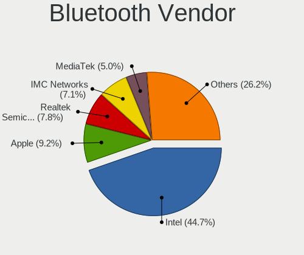
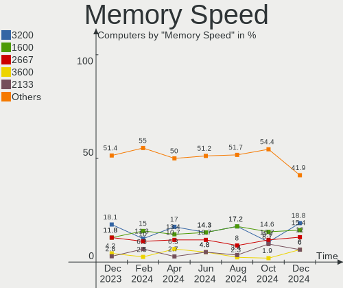

Linux in Canada - Hardware Trends
---------------------------------

A project to identify most popular hardware characteristics and track their change
over time based on data collected by Linux users at https://Linux-Hardware.org.

Anyone can contribute to this report by the [hw-probe](https://github.com/linuxhw/hw-probe) tool:

    sudo -E hw-probe -all -upload

This is a report for all computer types. See also reports for [desktops](/Location/Canada/Desktop/README.md) and [notebooks](/Location/Canada/Notebook/README.md).

Period: Aug, 2023.

Contents
--------

* [ System ](#system)
  - [ OS                       ](#os)
  - [ OS Family                ](#os-family)
  - [ Kernel                   ](#kernel)
  - [ Kernel Family            ](#kernel-family)
  - [ Kernel Major Ver.        ](#kernel-major-ver)
  - [ Arch                     ](#arch)
  - [ DE                       ](#de)
  - [ Display Server           ](#display-server)
  - [ Display Manager          ](#display-manager)
  - [ OS Lang                  ](#os-lang)
  - [ Boot Mode                ](#boot-mode)
  - [ Filesystem               ](#filesystem)
  - [ Part. scheme             ](#part-scheme)
  - [ Dual Boot with Linux/BSD ](#dual-boot-with-linuxbsd)
  - [ Dual Boot (Win)          ](#dual-boot-win)

* [ Board ](#board)
  - [ Vendor                   ](#vendor)
  - [ Model                    ](#model)
  - [ Model Family             ](#model-family)
  - [ MFG Year                 ](#mfg-year)
  - [ Form Factor              ](#form-factor)
  - [ Secure Boot              ](#secure-boot)
  - [ Coreboot                 ](#coreboot)
  - [ RAM Size                 ](#ram-size)
  - [ RAM Used                 ](#ram-used)
  - [ Total Drives             ](#total-drives)
  - [ Has CD-ROM               ](#has-cd-rom)
  - [ Has Ethernet             ](#has-ethernet)
  - [ Has WiFi                 ](#has-wifi)
  - [ Has Bluetooth            ](#has-bluetooth)

* [ Location ](#location)
  - [ Country                  ](#country)
  - [ City                     ](#city)

* [ Drives ](#drives)
  - [ Drive Vendor             ](#drive-vendor)
  - [ Drive Model              ](#drive-model)
  - [ HDD Vendor               ](#hdd-vendor)
  - [ SSD Vendor               ](#ssd-vendor)
  - [ Drive Kind               ](#drive-kind)
  - [ Drive Connector          ](#drive-connector)
  - [ Drive Size               ](#drive-size)
  - [ Space Total              ](#space-total)
  - [ Space Used               ](#space-used)
  - [ Malfunc. Drives          ](#malfunc-drives)
  - [ Malfunc. Drive Vendor    ](#malfunc-drive-vendor)
  - [ Malfunc. HDD Vendor      ](#malfunc-hdd-vendor)
  - [ Malfunc. Drive Kind      ](#malfunc-drive-kind)
  - [ Failed Drives            ](#failed-drives)
  - [ Failed Drive Vendor      ](#failed-drive-vendor)
  - [ Drive Status             ](#drive-status)

* [ Storage controller ](#storage-controller)
  - [ Storage Vendor           ](#storage-vendor)
  - [ Storage Model            ](#storage-model)
  - [ Storage Kind             ](#storage-kind)

* [ Processor ](#processor)
  - [ CPU Vendor               ](#cpu-vendor)
  - [ CPU Model                ](#cpu-model)
  - [ CPU Model Family         ](#cpu-model-family)
  - [ CPU Cores                ](#cpu-cores)
  - [ CPU Sockets              ](#cpu-sockets)
  - [ CPU Threads              ](#cpu-threads)
  - [ CPU Op-Modes             ](#cpu-op-modes)
  - [ CPU Microcode            ](#cpu-microcode)
  - [ CPU Microarch            ](#cpu-microarch)

* [ Graphics ](#graphics)
  - [ GPU Vendor               ](#gpu-vendor)
  - [ GPU Model                ](#gpu-model)
  - [ GPU Combo                ](#gpu-combo)
  - [ GPU Driver               ](#gpu-driver)
  - [ GPU Memory               ](#gpu-memory)

* [ Monitor ](#monitor)
  - [ Monitor Vendor           ](#monitor-vendor)
  - [ Monitor Model            ](#monitor-model)
  - [ Monitor Resolution       ](#monitor-resolution)
  - [ Monitor Diagonal         ](#monitor-diagonal)
  - [ Monitor Width            ](#monitor-width)
  - [ Aspect Ratio             ](#aspect-ratio)
  - [ Monitor Area             ](#monitor-area)
  - [ Pixel Density            ](#pixel-density)
  - [ Multiple Monitors        ](#multiple-monitors)

* [ Network ](#network)
  - [ Net Controller Vendor    ](#net-controller-vendor)
  - [ Net Controller Model     ](#net-controller-model)
  - [ Wireless Vendor          ](#wireless-vendor)
  - [ Wireless Model           ](#wireless-model)
  - [ Ethernet Vendor          ](#ethernet-vendor)
  - [ Ethernet Model           ](#ethernet-model)
  - [ Net Controller Kind      ](#net-controller-kind)
  - [ Used Controller          ](#used-controller)
  - [ NICs                     ](#nics)
  - [ IPv6                     ](#ipv6)

* [ Bluetooth ](#bluetooth)
  - [ Bluetooth Vendor         ](#bluetooth-vendor)
  - [ Bluetooth Model          ](#bluetooth-model)

* [ Sound ](#sound)
  - [ Sound Vendor             ](#sound-vendor)
  - [ Sound Model              ](#sound-model)

* [ Memory ](#memory)
  - [ Memory Vendor            ](#memory-vendor)
  - [ Memory Model             ](#memory-model)
  - [ Memory Kind              ](#memory-kind)
  - [ Memory Form Factor       ](#memory-form-factor)
  - [ Memory Size              ](#memory-size)
  - [ Memory Speed             ](#memory-speed)

* [ Printers & scanners ](#printers--scanners)
  - [ Printer Vendor           ](#printer-vendor)
  - [ Printer Model            ](#printer-model)
  - [ Scanner Vendor           ](#scanner-vendor)
  - [ Scanner Model            ](#scanner-model)

* [ Camera ](#camera)
  - [ Camera Vendor            ](#camera-vendor)
  - [ Camera Model             ](#camera-model)

* [ Security ](#security)
  - [ Fingerprint Vendor       ](#fingerprint-vendor)
  - [ Fingerprint Model        ](#fingerprint-model)
  - [ Chipcard Vendor          ](#chipcard-vendor)
  - [ Chipcard Model           ](#chipcard-model)

* [ Unsupported ](#unsupported)
  - [ Unsupported Devices      ](#unsupported-devices)
  - [ Unsupported Device Types ](#unsupported-device-types)

System
------

OS
--

Installed operating systems

| Name                         | Computers | Percent |
|------------------------------|-----------|---------|
| Ubuntu 22.04                 | 31        | 16.76%  |
| OpenMandriva 23.08           | 21        | 11.35%  |
| Fedora 38                    | 16        | 8.65%   |
| Linux Mint 21.2              | 13        | 7.03%   |
| Ubuntu 23.04                 | 11        | 5.95%   |
| Debian 12                    | 11        | 5.95%   |
| Pop!_OS 22.04                | 8         | 4.32%   |
| Xubuntu 22.04                | 5         | 2.7%    |
| ArcoLinux Rolling            | 5         | 2.7%    |
| EndeavourOS Rolling          | 4         | 2.16%   |
| Arch Rolling                 | 4         | 2.16%   |
| Zorin 16                     | 3         | 1.62%   |
| Ubuntu 22.10                 | 3         | 1.62%   |
| MX 23                        | 3         | 1.62%   |
| Linux Mint 21                | 3         | 1.62%   |
| KDE neon 22.04               | 3         | 1.62%   |
| Raspbian 11                  | 2         | 1.08%   |
| openSUSE Tumbleweed-XXXXXXXX | 2         | 1.08%   |
| OpenMandriva 23.90           | 2         | 1.08%   |
| OpenMandriva 23.03           | 2         | 1.08%   |
| Nobara 38                    | 2         | 1.08%   |
| Garuda Linux Rolling         | 2         | 1.08%   |
| Xubuntu 23.04                | 1         | 0.54%   |
| Xero Rolling                 | 1         | 0.54%   |
| Ubuntu Unity 18.04           | 1         | 0.54%   |
| Ubuntu MATE 20.04            | 1         | 0.54%   |
| Ubuntu Budgie 22.04          | 1         | 0.54%   |
| Ubuntu 20.04                 | 1         | 0.54%   |
| SteamOS 3.4.8                | 1         | 0.54%   |
| Sparky 8                     | 1         | 0.54%   |
| openSUSE Leap-15.5           | 1         | 0.54%   |
| OpenMandriva 4.3             | 1         | 0.54%   |
| MX 21                        | 1         | 0.54%   |
| Manjaro 23.0.0               | 1         | 0.54%   |
| Makulu 2023.07.12            | 1         | 0.54%   |
| Mageia 9                     | 1         | 0.54%   |
| Lubuntu 22.04                | 1         | 0.54%   |
| Kubuntu 23.04                | 1         | 0.54%   |
| Kubuntu 22.04                | 1         | 0.54%   |
| Kali 2023.3                  | 1         | 0.54%   |

OS Family
---------

OS without a version

| Name          | Computers | Percent |
|---------------|-----------|---------|
| Ubuntu        | 46        | 24.86%  |
| OpenMandriva  | 26        | 14.05%  |
| Fedora        | 18        | 9.73%   |
| Linux Mint    | 16        | 8.65%   |
| Debian        | 13        | 7.03%   |
| Pop!_OS       | 8         | 4.32%   |
| Xubuntu       | 6         | 3.24%   |
| ArcoLinux     | 5         | 2.7%    |
| MX            | 4         | 2.16%   |
| EndeavourOS   | 4         | 2.16%   |
| Arch          | 4         | 2.16%   |
| Zorin         | 3         | 1.62%   |
| openSUSE      | 3         | 1.62%   |
| KDE neon      | 3         | 1.62%   |
| Garuda Linux  | 3         | 1.62%   |
| Raspbian      | 2         | 1.08%   |
| Nobara        | 2         | 1.08%   |
| Kubuntu       | 2         | 1.08%   |
| Elementary    | 2         | 1.08%   |
| Xero          | 1         | 0.54%   |
| Ubuntu Unity  | 1         | 0.54%   |
| Ubuntu MATE   | 1         | 0.54%   |
| Ubuntu Budgie | 1         | 0.54%   |
| SteamOS       | 1         | 0.54%   |
| Sparky        | 1         | 0.54%   |
| Manjaro       | 1         | 0.54%   |
| Makulu        | 1         | 0.54%   |
| Mageia        | 1         | 0.54%   |
| Lubuntu       | 1         | 0.54%   |
| Kali          | 1         | 0.54%   |
| Gentoo        | 1         | 0.54%   |
| Devuan        | 1         | 0.54%   |
| BlackPanther  | 1         | 0.54%   |
| Alpine        | 1         | 0.54%   |

Kernel
------

Version of the Linux kernel

| Version                      | Computers | Percent |
|------------------------------|-----------|---------|
| 6.2.0-26-generic             | 30        | 16.22%  |
| 6.4.11-desktop-1omv2390      | 16        | 8.65%   |
| 5.15.0-78-generic            | 11        | 5.95%   |
| 5.15.0-79-generic            | 8         | 4.32%   |
| 6.4.8-desktop-2omv2390       | 7         | 3.78%   |
| 6.4.6-76060406-generic       | 6         | 3.24%   |
| 5.19.0-50-generic            | 6         | 3.24%   |
| 6.4.7-200.fc38.x86_64        | 4         | 2.16%   |
| 6.4.10-200.fc38.x86_64       | 4         | 2.16%   |
| 6.2.0-20-generic             | 4         | 2.16%   |
| 6.1.0-11-amd64               | 4         | 2.16%   |
| 6.1.0-10-amd64               | 4         | 2.16%   |
| 5.19.0-32-generic            | 4         | 2.16%   |
| 6.2.0-27-generic             | 3         | 1.62%   |
| 5.19.0-46-generic            | 3         | 1.62%   |
| 6.4.9-arch1-1                | 2         | 1.08%   |
| 6.4.12-arch1-1               | 2         | 1.08%   |
| 6.4.11-arch2-1               | 2         | 1.08%   |
| 6.4.11-200.fc38.x86_64       | 2         | 1.08%   |
| 6.4.10-zen2-1-zen            | 2         | 1.08%   |
| 6.4.10-arch1-1               | 2         | 1.08%   |
| 6.3.8-200.fc38.x86_64        | 2         | 1.08%   |
| 6.2.6-desktop-1omv2390       | 2         | 1.08%   |
| 6.2.6-76060206-generic       | 2         | 1.08%   |
| 6.2.16-6-pve                 | 2         | 1.08%   |
| 6.1.21-v8+                   | 2         | 1.08%   |
| 6.4.9-200.fc38.x86_64        | 1         | 0.54%   |
| 6.4.9-060409-generic         | 1         | 0.54%   |
| 6.4.8-zen1-1-zen             | 1         | 0.54%   |
| 6.4.8-desktop-6.mga9         | 1         | 0.54%   |
| 6.4.8-arch1-1                | 1         | 0.54%   |
| 6.4.8-1-default              | 1         | 0.54%   |
| 6.4.6-200.fc38.x86_64        | 1         | 0.54%   |
| 6.4.6-060406-generic         | 1         | 0.54%   |
| 6.4.2-x64v2-xanmod1-3        | 1         | 0.54%   |
| 6.4.12-zen1-1-zen            | 1         | 0.54%   |
| 6.4.12-200.fc38.x86_64       | 1         | 0.54%   |
| 6.4.11-1-default             | 1         | 0.54%   |
| 6.4.10-202.fsync.fc38.x86_64 | 1         | 0.54%   |
| 6.4.0-2-amd64                | 1         | 0.54%   |

Kernel Family
-------------

Linux kernel without a distro release

| Version | Computers | Percent |
|---------|-----------|---------|
| 6.2.0   | 41        | 22.16%  |
| 5.15.0  | 23        | 12.43%  |
| 6.4.11  | 21        | 11.35%  |
| 5.19.0  | 14        | 7.57%   |
| 6.4.8   | 11        | 5.95%   |
| 6.1.0   | 10        | 5.41%   |
| 6.4.10  | 9         | 4.86%   |
| 6.4.6   | 8         | 4.32%   |
| 6.4.9   | 4         | 2.16%   |
| 6.4.7   | 4         | 2.16%   |
| 6.4.12  | 4         | 2.16%   |
| 6.2.6   | 4         | 2.16%   |
| 6.3.8   | 3         | 1.62%   |
| 6.1.46  | 3         | 1.62%   |
| 6.3.0   | 2         | 1.08%   |
| 6.2.16  | 2         | 1.08%   |
| 6.1.21  | 2         | 1.08%   |
| 5.10.0  | 2         | 1.08%   |
| 6.4.2   | 1         | 0.54%   |
| 6.4.0   | 1         | 0.54%   |
| 6.3.4   | 1         | 0.54%   |
| 6.3.12  | 1         | 0.54%   |
| 6.2.9   | 1         | 0.54%   |
| 6.1.41  | 1         | 0.54%   |
| 6.1.38  | 1         | 0.54%   |
| 6.1.11  | 1         | 0.54%   |
| 6.0.2   | 1         | 0.54%   |
| 5.6.14  | 1         | 0.54%   |
| 5.4.0   | 1         | 0.54%   |
| 5.18.0  | 1         | 0.54%   |
| 5.17.12 | 1         | 0.54%   |
| 5.16.7  | 1         | 0.54%   |
| 5.14.21 | 1         | 0.54%   |
| 5.14.18 | 1         | 0.54%   |
| 5.13.0  | 1         | 0.54%   |
| 4.15.0  | 1         | 0.54%   |

Kernel Major Ver.
-----------------

Linux kernel major version

| Version | Computers | Percent |
|---------|-----------|---------|
| 6.4     | 63        | 34.05%  |
| 6.2     | 48        | 25.95%  |
| 5.15    | 23        | 12.43%  |
| 6.1     | 18        | 9.73%   |
| 5.19    | 14        | 7.57%   |
| 6.3     | 7         | 3.78%   |
| 5.14    | 2         | 1.08%   |
| 5.10    | 2         | 1.08%   |
| 6.0     | 1         | 0.54%   |
| 5.6     | 1         | 0.54%   |
| 5.4     | 1         | 0.54%   |
| 5.18    | 1         | 0.54%   |
| 5.17    | 1         | 0.54%   |
| 5.16    | 1         | 0.54%   |
| 5.13    | 1         | 0.54%   |
| 4.15    | 1         | 0.54%   |

Arch
----

OS architecture (x86_64, i586, etc.)

| Name    | Computers | Percent |
|---------|-----------|---------|
| x86_64  | 180       | 97.3%   |
| aarch64 | 3         | 1.62%   |
| i686    | 2         | 1.08%   |

DE
--

Desktop Environment

| Name             | Computers | Percent |
|------------------|-----------|---------|
| GNOME            | 84        | 45.41%  |
| KDE5             | 44        | 23.78%  |
| XFCE             | 16        | 8.65%   |
| X-Cinnamon       | 14        | 7.57%   |
| Unknown          | 10        | 5.41%   |
| LXQt             | 3         | 1.62%   |
| Pantheon         | 2         | 1.08%   |
| MATE             | 2         | 1.08%   |
| i3               | 2         | 1.08%   |
| Unity            | 1         | 0.54%   |
| sway             | 1         | 0.54%   |
| Openbox          | 1         | 0.54%   |
| LXDE             | 1         | 0.54%   |
| lightdm-xsession | 1         | 0.54%   |
| Jwm              | 1         | 0.54%   |
| Cinnamon         | 1         | 0.54%   |
| Budgie           | 1         | 0.54%   |

Display Server
--------------

X11 or Wayland

| Name    | Computers | Percent |
|---------|-----------|---------|
| X11     | 85        | 45.95%  |
| Wayland | 85        | 45.95%  |
| Unknown | 9         | 4.86%   |
| Tty     | 6         | 3.24%   |

Display Manager
---------------

SDDM, LightDM, etc.

| Name    | Computers | Percent |
|---------|-----------|---------|
| Unknown | 49        | 26.49%  |
| SDDM    | 48        | 25.95%  |
| GDM3    | 43        | 23.24%  |
| LightDM | 33        | 17.84%  |
| GDM     | 10        | 5.41%   |
| LXDM    | 2         | 1.08%   |

OS Lang
-------

Language

| Lang    | Computers | Percent |
|---------|-----------|---------|
| en_CA   | 91        | 49.19%  |
| en_US   | 62        | 33.51%  |
| fr_CA   | 18        | 9.73%   |
| en_GB   | 3         | 1.62%   |
| C       | 3         | 1.62%   |
| Unknown | 3         | 1.62%   |
| zh_TW   | 1         | 0.54%   |
| hu_HU   | 1         | 0.54%   |
| en_AU   | 1         | 0.54%   |
| C.UTF8  | 1         | 0.54%   |
| ar_EG   | 1         | 0.54%   |

Boot Mode
---------

EFI or BIOS

| Mode | Computers | Percent |
|------|-----------|---------|
| EFI  | 96        | 51.89%  |
| BIOS | 89        | 48.11%  |

Filesystem
----------

Type of filesystem

| Type    | Computers | Percent |
|---------|-----------|---------|
| Ext4    | 100       | 54.05%  |
| Btrfs   | 32        | 17.3%   |
| Tmpfs   | 30        | 16.22%  |
| Overlay | 20        | 10.81%  |
| Zfs     | 3         | 1.62%   |

Part. scheme
------------

Scheme of partitioning

| Type    | Computers | Percent |
|---------|-----------|---------|
| GPT     | 122       | 65.95%  |
| Unknown | 43        | 23.24%  |
| MBR     | 20        | 10.81%  |

Dual Boot with Linux/BSD
------------------------

Hosting more than one Linux/BSD

| Dual boot | Computers | Percent |
|-----------|-----------|---------|
| No        | 156       | 84.32%  |
| Yes       | 29        | 15.68%  |

Dual Boot (Win)
---------------

Hosting Linux and Windows

| Dual boot | Computers | Percent |
|-----------|-----------|---------|
| No        | 137       | 74.05%  |
| Yes       | 48        | 25.95%  |

Board
-----

Vendor
------

Motherboard manufacturer

| Name                    | Computers | Percent |
|-------------------------|-----------|---------|
| Hewlett-Packard         | 30        | 16.22%  |
| Lenovo                  | 28        | 15.14%  |
| Dell                    | 26        | 14.05%  |
| ASUSTek Computer        | 26        | 14.05%  |
| MSI                     | 20        | 10.81%  |
| Acer                    | 8         | 4.32%   |
| Gigabyte Technology     | 6         | 3.24%   |
| AZW                     | 5         | 2.7%    |
| Apple                   | 5         | 2.7%    |
| System76                | 3         | 1.62%   |
| Google                  | 3         | 1.62%   |
| Toshiba                 | 2         | 1.08%   |
| Raspberry Pi Foundation | 2         | 1.08%   |
| Microsoft               | 2         | 1.08%   |
| Gateway                 | 2         | 1.08%   |
| ASRock                  | 2         | 1.08%   |
| Unknown                 | 2         | 1.08%   |
| Xplore                  | 1         | 0.54%   |
| Valve                   | 1         | 0.54%   |
| Supermicro              | 1         | 0.54%   |
| Samsung Electronics     | 1         | 0.54%   |
| Pegatron                | 1         | 0.54%   |
| Panasonic               | 1         | 0.54%   |
| MOTION                  | 1         | 0.54%   |
| LG Electronics          | 1         | 0.54%   |
| Inventec                | 1         | 0.54%   |
| CWWK                    | 1         | 0.54%   |
| Corsair                 | 1         | 0.54%   |
| BESSTAR Tech            | 1         | 0.54%   |
| AMI                     | 1         | 0.54%   |

Model
-----

Motherboard model

| Name                                                                                     | Computers | Percent |
|------------------------------------------------------------------------------------------|-----------|---------|
| MSI MS-7E06                                                                              | 2         | 1.08%   |
| MSI MS-7D43                                                                              | 2         | 1.08%   |
| HP Z420 Workstation                                                                      | 2         | 1.08%   |
| AZW SER                                                                                  | 2         | 1.08%   |
| Unknown                                                                                  | 2         | 1.08%   |
| Xplore iX104C6                                                                           | 1         | 0.54%   |
| Valve Jupiter                                                                            | 1         | 0.54%   |
| Toshiba Satellite Pro C70-C                                                              | 1         | 0.54%   |
| Toshiba Satellite Pro A50-C                                                              | 1         | 0.54%   |
| System76 Gazelle                                                                         | 1         | 0.54%   |
| System76 Galago Pro                                                                      | 1         | 0.54%   |
| System76 Darter Pro                                                                      | 1         | 0.54%   |
| Supermicro SYS-1018GR-T                                                                  | 1         | 0.54%   |
| Samsung 355V4C/355V4X/355V5C/355V5X/356V4C/356V4X/356V5C/356V5X/3445VC/3445VX/3545VC/354 | 1         | 0.54%   |
| RPi Raspberry Pi 4 Model B Rev 1.5                                                       | 1         | 0.54%   |
| RPi Raspberry Pi                                                                         | 1         | 0.54%   |
| Pegatron AW016AV-ABA s5280t                                                              | 1         | 0.54%   |
| Panasonic CF-31AQAAA1M                                                                   | 1         | 0.54%   |
| MSI MS-7E07                                                                              | 1         | 0.54%   |
| MSI MS-7D77                                                                              | 1         | 0.54%   |
| MSI MS-7D76                                                                              | 1         | 0.54%   |
| MSI MS-7C95                                                                              | 1         | 0.54%   |
| MSI MS-7C87                                                                              | 1         | 0.54%   |
| MSI MS-7C56                                                                              | 1         | 0.54%   |
| MSI MS-7B86                                                                              | 1         | 0.54%   |
| MSI MS-7B33                                                                              | 1         | 0.54%   |
| MSI MS-7B29                                                                              | 1         | 0.54%   |
| MSI MS-7917                                                                              | 1         | 0.54%   |
| MSI MS-7885                                                                              | 1         | 0.54%   |
| MSI MS-7823                                                                              | 1         | 0.54%   |
| MSI MS-7721                                                                              | 1         | 0.54%   |
| MSI MS-7693                                                                              | 1         | 0.54%   |
| MSI GP72 7RDX                                                                            | 1         | 0.54%   |
| MSI GP72 6QF                                                                             | 1         | 0.54%   |
| MOTION J3500                                                                             | 1         | 0.54%   |
| Microsoft Surface Pro 4                                                                  | 1         | 0.54%   |
| Microsoft Surface Laptop Go                                                              | 1         | 0.54%   |
| LG 17Z90N-V.AA72A8                                                                       | 1         | 0.54%   |
| Lenovo Yoga C940-14IIL 81Q9                                                              | 1         | 0.54%   |
| Lenovo Yoga 720-13IKB 81C3                                                               | 1         | 0.54%   |

Model Family
------------

Motherboard model prefix

| Name                    | Computers | Percent |
|-------------------------|-----------|---------|
| Lenovo ThinkPad         | 12        | 6.49%   |
| Dell Latitude           | 8         | 4.32%   |
| HP EliteBook            | 7         | 3.78%   |
| Dell Inspiron           | 7         | 3.78%   |
| Acer Aspire             | 6         | 3.24%   |
| Lenovo ThinkCentre      | 4         | 2.16%   |
| Lenovo IdeaPad          | 4         | 2.16%   |
| HP Laptop               | 4         | 2.16%   |
| HP Compaq               | 4         | 2.16%   |
| Dell XPS                | 4         | 2.16%   |
| ASUS VivoBook           | 4         | 2.16%   |
| Lenovo Yoga             | 3         | 1.62%   |
| HP ProBook              | 3         | 1.62%   |
| Dell Precision          | 3         | 1.62%   |
| Dell OptiPlex           | 3         | 1.62%   |
| ASUS TUF                | 3         | 1.62%   |
| Toshiba Satellite       | 2         | 1.08%   |
| RPi Raspberry           | 2         | 1.08%   |
| MSI MS-7E06             | 2         | 1.08%   |
| MSI MS-7D43             | 2         | 1.08%   |
| MSI GP72                | 2         | 1.08%   |
| Microsoft Surface       | 2         | 1.08%   |
| HP Z420                 | 2         | 1.08%   |
| HP Pavilion             | 2         | 1.08%   |
| AZW SER                 | 2         | 1.08%   |
| ASUS ZenBook            | 2         | 1.08%   |
| ASUS ROG                | 2         | 1.08%   |
| ASUS PRIME              | 2         | 1.08%   |
| Unknown                 | 2         | 1.08%   |
| Xplore iX104C6          | 1         | 0.54%   |
| Valve Jupiter           | 1         | 0.54%   |
| System76 Gazelle        | 1         | 0.54%   |
| System76 Galago         | 1         | 0.54%   |
| System76 Darter         | 1         | 0.54%   |
| Supermicro SYS-1018GR-T | 1         | 0.54%   |
| Samsung 355V4C          | 1         | 0.54%   |
| Pegatron AW016AV-ABA    | 1         | 0.54%   |
| Panasonic CF-31AQAAA1M  | 1         | 0.54%   |
| MSI MS-7E07             | 1         | 0.54%   |
| MSI MS-7D77             | 1         | 0.54%   |

MFG Year
--------

Motherboard manufacture year

| Year    | Computers | Percent |
|---------|-----------|---------|
| 2022    | 25        | 13.51%  |
| 2011    | 19        | 10.27%  |
| 2020    | 17        | 9.19%   |
| 2021    | 12        | 6.49%   |
| 2019    | 12        | 6.49%   |
| 2018    | 12        | 6.49%   |
| 2013    | 12        | 6.49%   |
| 2023    | 11        | 5.95%   |
| 2012    | 10        | 5.41%   |
| 2016    | 9         | 4.86%   |
| 2015    | 9         | 4.86%   |
| 2017    | 8         | 4.32%   |
| 2014    | 7         | 3.78%   |
| 2010    | 4         | 2.16%   |
| 2009    | 4         | 2.16%   |
| 2006    | 4         | 2.16%   |
| 2008    | 3         | 1.62%   |
| 2007    | 3         | 1.62%   |
| Unknown | 3         | 1.62%   |
| 2005    | 1         | 0.54%   |

Form Factor
-----------

Physical design of the computer

| Name           | Computers | Percent |
|----------------|-----------|---------|
| Notebook       | 94        | 50.81%  |
| Desktop        | 70        | 37.84%  |
| Convertible    | 6         | 3.24%   |
| Mini pc        | 5         | 2.7%    |
| Server         | 4         | 2.16%   |
| System on chip | 3         | 1.62%   |
| Tablet         | 2         | 1.08%   |
| All in one     | 1         | 0.54%   |

Secure Boot
-----------

Enabled or disabled

| State    | Computers | Percent |
|----------|-----------|---------|
| Disabled | 179       | 96.76%  |
| Enabled  | 6         | 3.24%   |

Coreboot
--------

Have coreboot on board

| Used | Computers | Percent |
|------|-----------|---------|
| No   | 180       | 97.3%   |
| Yes  | 5         | 2.7%    |

RAM Size
--------

Total RAM memory

| Size in GB      | Computers | Percent |
|-----------------|-----------|---------|
| 16.01-24.0      | 44        | 23.78%  |
| 4.01-8.0        | 39        | 21.08%  |
| 8.01-16.0       | 32        | 17.3%   |
| 32.01-64.0      | 21        | 11.35%  |
| 3.01-4.0        | 19        | 10.27%  |
| 64.01-256.0     | 14        | 7.57%   |
| 24.01-32.0      | 8         | 4.32%   |
| 1.01-2.0        | 7         | 3.78%   |
| More than 256.0 | 1         | 0.54%   |

RAM Used
--------

Used RAM memory

| Used GB     | Computers | Percent |
|-------------|-----------|---------|
| 1.01-2.0    | 54        | 29.19%  |
| 2.01-3.0    | 44        | 23.78%  |
| 4.01-8.0    | 37        | 20%     |
| 3.01-4.0    | 22        | 11.89%  |
| 8.01-16.0   | 12        | 6.49%   |
| 0.51-1.0    | 9         | 4.86%   |
| 0.01-0.5    | 3         | 1.62%   |
| 24.01-32.0  | 2         | 1.08%   |
| 64.01-256.0 | 1         | 0.54%   |
| 16.01-24.0  | 1         | 0.54%   |

Total Drives
------------

Number of drives on board

| Drives | Computers | Percent |
|--------|-----------|---------|
| 1      | 110       | 59.46%  |
| 2      | 37        | 20%     |
| 3      | 18        | 9.73%   |
| 4      | 10        | 5.41%   |
| 5      | 4         | 2.16%   |
| 6      | 2         | 1.08%   |
| 0      | 2         | 1.08%   |
| 11     | 1         | 0.54%   |
| 9      | 1         | 0.54%   |

Has CD-ROM
----------

Has CD-ROM on board

| Presented | Computers | Percent |
|-----------|-----------|---------|
| No        | 138       | 74.59%  |
| Yes       | 47        | 25.41%  |

Has Ethernet
------------

Has Ethernet on board

| Presented | Computers | Percent |
|-----------|-----------|---------|
| Yes       | 146       | 78.92%  |
| No        | 39        | 21.08%  |

Has WiFi
--------

Has WiFi module

| Presented | Computers | Percent |
|-----------|-----------|---------|
| Yes       | 149       | 80.54%  |
| No        | 36        | 19.46%  |

Has Bluetooth
-------------

Has Bluetooth module

| Presented | Computers | Percent |
|-----------|-----------|---------|
| Yes       | 126       | 68.11%  |
| No        | 59        | 31.89%  |

Location
--------

Country
-------

Geographic location (country)

| Country | Computers | Percent |
|---------|-----------|---------|
| Canada  | 185       | 100%    |

City
----

Geographic location (city)

| City            | Computers | Percent |
|-----------------|-----------|---------|
| Toronto         | 20        | 10.81%  |
| Montreal        | 20        | 10.81%  |
| Vancouver       | 8         | 4.32%   |
| Edmonton        | 8         | 4.32%   |
| Oshawa          | 7         | 3.78%   |
| Québec         | 6         | 3.24%   |
| Ottawa          | 5         | 2.7%    |
| Calgary         | 4         | 2.16%   |
| Winnipeg        | 3         | 1.62%   |
| Saskatoon       | 3         | 1.62%   |
| Regina          | 3         | 1.62%   |
| Nepean          | 3         | 1.62%   |
| Laval           | 3         | 1.62%   |
| Kitchener       | 3         | 1.62%   |
| Vernon          | 2         | 1.08%   |
| Tillsonburg     | 2         | 1.08%   |
| Thunder Bay     | 2         | 1.08%   |
| Surrey          | 2         | 1.08%   |
| Simcoe          | 2         | 1.08%   |
| Prince Albert   | 2         | 1.08%   |
| Newcastle       | 2         | 1.08%   |
| Mississauga     | 2         | 1.08%   |
| Markham         | 2         | 1.08%   |
| Longueuil       | 2         | 1.08%   |
| Kelowna         | 2         | 1.08%   |
| Kamloops        | 2         | 1.08%   |
| Hamilton        | 2         | 1.08%   |
| Gatineau        | 2         | 1.08%   |
| Drummondville   | 2         | 1.08%   |
| Chicoutimi      | 2         | 1.08%   |
| Brantford       | 2         | 1.08%   |
| Brampton        | 2         | 1.08%   |
| Yorkton         | 1         | 0.54%   |
| Woodbridge      | 1         | 0.54%   |
| Wolfville       | 1         | 0.54%   |
| Victoria        | 1         | 0.54%   |
| Truro           | 1         | 0.54%   |
| Trois-Rivières | 1         | 0.54%   |
| Timmins         | 1         | 0.54%   |
| Thompson        | 1         | 0.54%   |

Drives
------

Drive Vendor
------------

Hard drive vendors

| Vendor                      | Computers | Drives | Percent |
|-----------------------------|-----------|--------|---------|
| Samsung Electronics         | 49        | 60     | 17.31%  |
| Seagate                     | 39        | 47     | 13.78%  |
| WDC                         | 35        | 43     | 12.37%  |
| Sandisk                     | 33        | 36     | 11.66%  |
| Kingston                    | 13        | 14     | 4.59%   |
| Hitachi                     | 11        | 11     | 3.89%   |
| Crucial                     | 10        | 12     | 3.53%   |
| Toshiba                     | 9         | 9      | 3.18%   |
| Intel                       | 9         | 10     | 3.18%   |
| Unknown                     | 8         | 8      | 2.83%   |
| KIOXIA                      | 6         | 6      | 2.12%   |
| SK hynix                    | 5         | 5      | 1.77%   |
| Timetec                     | 4         | 4      | 1.41%   |
| Micron/Crucial Technology   | 3         | 3      | 1.06%   |
| Micron Technology           | 3         | 3      | 1.06%   |
| Kingston Technology Company | 3         | 3      | 1.06%   |
| HGST                        | 3         | 3      | 1.06%   |
| A-DATA Technology           | 3         | 5      | 1.06%   |
| Realtek Semiconductor       | 2         | 2      | 0.71%   |
| Realtek                     | 2         | 2      | 0.71%   |
| MAXIO Technology (Hangzhou) | 2         | 2      | 0.71%   |
| Dogfish                     | 2         | 2      | 0.71%   |
| China                       | 2         | 2      | 0.71%   |
| Apple                       | 2         | 3      | 0.71%   |
| Zheino                      | 1         | 1      | 0.35%   |
| Union Memory (Shenzhen)     | 1         | 1      | 0.35%   |
| T-FORCE                     | 1         | 1      | 0.35%   |
| Supermicro                  | 1         | 1      | 0.35%   |
| SSSTC                       | 1         | 1      | 0.35%   |
| SSD 256G                    | 1         | 1      | 0.35%   |
| SPCC                        | 1         | 1      | 0.35%   |
| Solid State Storage         | 1         | 1      | 0.35%   |
| SINTECHI                    | 1         | 1      | 0.35%   |
| Phison Electronics          | 1         | 1      | 0.35%   |
| Patriot                     | 1         | 1      | 0.35%   |
| OCZ                         | 1         | 1      | 0.35%   |
| Maxtor                      | 1         | 1      | 0.35%   |
| Maxone                      | 1         | 1      | 0.35%   |
| M.2 SSD                     | 1         | 1      | 0.35%   |
| Lexar                       | 1         | 1      | 0.35%   |

Drive Model
-----------

Hard drive models

| Model                                                 | Computers | Percent |
|-------------------------------------------------------|-----------|---------|
| Samsung SSD 980 PRO 1TB                               | 5         | 1.62%   |
| Samsung NVMe SSD Controller PM9A1/PM9A3/980PRO 1024GB | 5         | 1.62%   |
| Seagate ST1000DM003-1CH162 1TB                        | 4         | 1.3%    |
| Samsung SSD 860 EVO 500GB                             | 4         | 1.3%    |
| WDC WD1003FZEX-00K3CA0 1TB                            | 3         | 0.97%   |
| Seagate ST1000LM035-1RK172 1TB                        | 3         | 0.97%   |
| Sandisk WD_BLACK SN750 SE 1TB                         | 3         | 0.97%   |
| SanDisk NVMe SSD Drive 2TB                            | 3         | 0.97%   |
| Samsung NVMe SSD Controller SM981/PM981/PM983 500GB   | 3         | 0.97%   |
| Micron/Crucial P2 NVMe PCIe SSD 1TB                   | 3         | 0.97%   |
| Kingston SA400S37480G 480GB SSD                       | 3         | 0.97%   |
| Kingston SA400S37240G 240GB SSD                       | 3         | 0.97%   |
| WDC WDS250G2B0A-00SM50 250GB SSD                      | 2         | 0.65%   |
| WDC WD3200AAKS-00L9A0 320GB                           | 2         | 0.65%   |
| WDC WD10EZEX-08WN4A0 1TB                              | 2         | 0.65%   |
| Unknown SD/MMC/MS PRO 1GB                             | 2         | 0.65%   |
| Toshiba DT01ACA100 1TB                                | 2         | 0.65%   |
| Seagate ST500DM002-1BD142 500GB                       | 2         | 0.65%   |
| Seagate ST16000NE000-2RW103 16TB                      | 2         | 0.65%   |
| Seagate ST1000DM010-2EP102 1TB                        | 2         | 0.65%   |
| Seagate BarraCuda 120 SSD ZA500CM10003 500GB          | 2         | 0.65%   |
| Sandisk WD_BLACK SN770 2TB                            | 2         | 0.65%   |
| Sandisk WD Blue SN570 1TB                             | 2         | 0.65%   |
| Sandisk WD Blue SN550 NVMe SSD 250GB                  | 2         | 0.65%   |
| Sandisk WD Black SN850 256GB                          | 2         | 0.65%   |
| SanDisk NVMe SSD Drive 1TB                            | 2         | 0.65%   |
| Samsung SSD 870 EVO 500GB                             | 2         | 0.65%   |
| Samsung SSD 860 EVO 1TB                               | 2         | 0.65%   |
| Samsung MZVLB1T0HBLR-000L2 1TB                        | 2         | 0.65%   |
| Realtek RTL9210B-CG 2TB                               | 2         | 0.65%   |
| MAXIO (Hangzhou) NVMe SSD Controller MAP1202 1024GB   | 2         | 0.65%   |
| KIOXIA KBG50ZNS512G NVMe 512GB                        | 2         | 0.65%   |
| Kingston SNV2S500G 500GB                              | 2         | 0.65%   |
| Hitachi HDS721010CLA332 1TB                           | 2         | 0.65%   |
| HGST HTS721010A9E630 1TB                              | 2         | 0.65%   |
| Dogfish SSD 128GB                                     | 2         | 0.65%   |
| Zheino CHN MSATAQ3 120 120GB SSD                      | 1         | 0.32%   |
| WDC WDS500G2B0C-00PXH0 500GB                          | 1         | 0.32%   |
| WDC WDS500G2B0A 500GB SSD                             | 1         | 0.32%   |
| WDC WDS100T2B0B-00YS70 1TB SSD                        | 1         | 0.32%   |

HDD Vendor
----------

Hard disk drive vendors

| Vendor              | Computers | Drives | Percent |
|---------------------|-----------|--------|---------|
| Seagate             | 38        | 44     | 39.18%  |
| WDC                 | 28        | 35     | 28.87%  |
| Hitachi             | 11        | 11     | 11.34%  |
| Toshiba             | 7         | 7      | 7.22%   |
| Samsung Electronics | 4         | 4      | 4.12%   |
| HGST                | 3         | 3      | 3.09%   |
| Unknown             | 2         | 2      | 2.06%   |
| SINTECHI            | 1         | 1      | 1.03%   |
| Maxtor              | 1         | 1      | 1.03%   |
| Maxone              | 1         | 1      | 1.03%   |
| Fujitsu             | 1         | 1      | 1.03%   |

SSD Vendor
----------

Solid state drive vendors

| Vendor              | Computers | Drives | Percent |
|---------------------|-----------|--------|---------|
| Samsung Electronics | 20        | 25     | 26.32%  |
| Kingston            | 8         | 9      | 10.53%  |
| Crucial             | 8         | 9      | 10.53%  |
| SanDisk             | 7         | 7      | 9.21%   |
| WDC                 | 6         | 6      | 7.89%   |
| Timetec             | 3         | 3      | 3.95%   |
| A-DATA Technology   | 3         | 4      | 3.95%   |
| Seagate             | 2         | 2      | 2.63%   |
| Intel               | 2         | 2      | 2.63%   |
| Dogfish             | 2         | 2      | 2.63%   |
| China               | 2         | 2      | 2.63%   |
| Zheino              | 1         | 1      | 1.32%   |
| Supermicro          | 1         | 1      | 1.32%   |
| SPCC                | 1         | 1      | 1.32%   |
| Patriot             | 1         | 1      | 1.32%   |
| OCZ                 | 1         | 1      | 1.32%   |
| Micron Technology   | 1         | 1      | 1.32%   |
| Lexar               | 1         | 1      | 1.32%   |
| Kingchuxing         | 1         | 1      | 1.32%   |
| Hewlett-Packard     | 1         | 1      | 1.32%   |
| Fanxiang            | 1         | 1      | 1.32%   |
| Drevo               | 1         | 2      | 1.32%   |
| CT2000MX            | 1         | 1      | 1.32%   |
| Apple               | 1         | 1      | 1.32%   |

Drive Kind
----------

HDD or SSD

| Kind    | Computers | Drives | Percent |
|---------|-----------|--------|---------|
| NVMe    | 88        | 114    | 36.36%  |
| HDD     | 74        | 110    | 30.58%  |
| SSD     | 67        | 85     | 27.69%  |
| MMC     | 9         | 9      | 3.72%   |
| Unknown | 4         | 7      | 1.65%   |

Drive Connector
---------------

SATA, SAS, NVMe, etc.

| Type | Computers | Drives | Percent |
|------|-----------|--------|---------|
| SATA | 112       | 184    | 49.78%  |
| NVMe | 88        | 111    | 39.11%  |
| SAS  | 16        | 21     | 7.11%   |
| MMC  | 9         | 9      | 4%      |

Drive Size
----------

Size of hard drive

| Size in TB | Computers | Drives | Percent |
|------------|-----------|--------|---------|
| 0.01-0.5   | 79        | 102    | 50.64%  |
| 0.51-1.0   | 46        | 54     | 29.49%  |
| 1.01-2.0   | 14        | 19     | 8.97%   |
| 3.01-4.0   | 5         | 5      | 3.21%   |
| 2.01-3.0   | 4         | 4      | 2.56%   |
| 10.01-20.0 | 4         | 5      | 2.56%   |
| 4.01-10.0  | 4         | 6      | 2.56%   |

Space Total
-----------

Amount of disk space available on the file system

| Size in GB     | Computers | Percent |
|----------------|-----------|---------|
| 101-250        | 36        | 19.46%  |
| 501-1000       | 34        | 18.38%  |
| 251-500        | 29        | 15.68%  |
| 1-20           | 23        | 12.43%  |
| More than 3000 | 18        | 9.73%   |
| 1001-2000      | 17        | 9.19%   |
| 51-100         | 8         | 4.32%   |
| Unknown        | 8         | 4.32%   |
| 2001-3000      | 7         | 3.78%   |
| 21-50          | 5         | 2.7%    |

Space Used
----------

Amount of used disk space

| Used GB        | Computers | Percent |
|----------------|-----------|---------|
| 1-20           | 75        | 40.54%  |
| 51-100         | 29        | 15.68%  |
| 21-50          | 22        | 11.89%  |
| 101-250        | 17        | 9.19%   |
| More than 3000 | 9         | 4.86%   |
| 251-500        | 9         | 4.86%   |
| 501-1000       | 8         | 4.32%   |
| Unknown        | 8         | 4.32%   |
| 2001-3000      | 4         | 2.16%   |
| 1001-2000      | 4         | 2.16%   |

Malfunc. Drives
---------------

Drive models with a malfunction

| Model                              | Computers | Drives | Percent |
|------------------------------------|-----------|--------|---------|
| Timetec SD08 512GB SSD             | 1         | 1      | 7.69%   |
| Seagate ST500LM021-1KJ152 500GB    | 1         | 1      | 7.69%   |
| Seagate ST3250310AS 250GB          | 1         | 1      | 7.69%   |
| Seagate ST14000NM0018-2H4101 14TB  | 1         | 1      | 7.69%   |
| Seagate ST1000LM024 HN-M101MBB 1TB | 1         | 1      | 7.69%   |
| Samsung Electronics HM641JI 640GB  | 1         | 1      | 7.69%   |
| Kingston SA400S37240G 240GB SSD    | 1         | 1      | 7.69%   |
| Intel SSDSCKKF256H6L 256GB         | 1         | 1      | 7.69%   |
| Hitachi HTS541616J9SA00 160GB      | 1         | 1      | 7.69%   |
| Hitachi HTS541080G9AT00 80GB       | 1         | 1      | 7.69%   |
| Fujitsu MHV2080AH 80GB             | 1         | 1      | 7.69%   |
| Crucial M4-CT128M4SSD2 128GB       | 1         | 1      | 7.69%   |
| China SATA SSD 64GB                | 1         | 1      | 7.69%   |

Malfunc. Drive Vendor
---------------------

Vendors of faulty drives

| Vendor              | Computers | Drives | Percent |
|---------------------|-----------|--------|---------|
| Seagate             | 4         | 4      | 30.77%  |
| Hitachi             | 2         | 2      | 15.38%  |
| Timetec             | 1         | 1      | 7.69%   |
| Samsung Electronics | 1         | 1      | 7.69%   |
| Kingston            | 1         | 1      | 7.69%   |
| Intel               | 1         | 1      | 7.69%   |
| Fujitsu             | 1         | 1      | 7.69%   |
| Crucial             | 1         | 1      | 7.69%   |
| China               | 1         | 1      | 7.69%   |

Malfunc. HDD Vendor
-------------------

Vendors of faulty HDD drives

| Vendor              | Computers | Drives | Percent |
|---------------------|-----------|--------|---------|
| Seagate             | 4         | 4      | 50%     |
| Hitachi             | 2         | 2      | 25%     |
| Samsung Electronics | 1         | 1      | 12.5%   |
| Fujitsu             | 1         | 1      | 12.5%   |

Malfunc. Drive Kind
-------------------

Kinds of faulty drives

| Kind | Computers | Drives | Percent |
|------|-----------|--------|---------|
| HDD  | 8         | 8      | 61.54%  |
| SSD  | 5         | 5      | 38.46%  |

Failed Drives
-------------

Failed drive models

| Model                             | Computers | Drives | Percent |
|-----------------------------------|-----------|--------|---------|
| Samsung Electronics HM160HC 160GB | 1         | 1      | 100%    |

Failed Drive Vendor
-------------------

Failed drive vendors

| Vendor              | Computers | Drives | Percent |
|---------------------|-----------|--------|---------|
| Samsung Electronics | 1         | 1      | 100%    |

Drive Status
------------

Number of failed and malfunc. drives

| Status   | Computers | Drives | Percent |
|----------|-----------|--------|---------|
| Works    | 95        | 154    | 47.26%  |
| Detected | 92        | 157    | 45.77%  |
| Malfunc  | 13        | 13     | 6.47%   |
| Failed   | 1         | 1      | 0.5%    |

Storage controller
------------------

Storage Vendor
--------------

Storage controller vendors

| Vendor                         | Computers | Percent |
|--------------------------------|-----------|---------|
| Intel                          | 110       | 43.82%  |
| AMD                            | 35        | 13.94%  |
| Samsung Electronics            | 27        | 10.76%  |
| SanDisk                        | 26        | 10.36%  |
| Kingston Technology Company    | 8         | 3.19%   |
| Micron/Crucial Technology      | 6         | 2.39%   |
| KIOXIA                         | 6         | 2.39%   |
| SK hynix                       | 5         | 1.99%   |
| ASMedia Technology             | 5         | 1.99%   |
| Marvell Technology Group       | 4         | 1.59%   |
| Toshiba America Info Systems   | 2         | 0.8%    |
| Solid State Storage Technology | 2         | 0.8%    |
| Realtek Semiconductor          | 2         | 0.8%    |
| Phison Electronics             | 2         | 0.8%    |
| Micron Technology              | 2         | 0.8%    |
| MAXIO Technology (Hangzhou)    | 2         | 0.8%    |
| Broadcom / LSI                 | 2         | 0.8%    |
| Union Memory (Shenzhen)        | 1         | 0.4%    |
| Silicon Motion                 | 1         | 0.4%    |
| Hewlett-Packard                | 1         | 0.4%    |
| Apple                          | 1         | 0.4%    |
| ADATA Technology               | 1         | 0.4%    |

Storage Model
-------------

Storage controller models

| Model                                                                          | Computers | Percent |
|--------------------------------------------------------------------------------|-----------|---------|
| AMD FCH SATA Controller [AHCI mode]                                            | 21        | 7.45%   |
| Samsung NVMe SSD Controller PM9A1/PM9A3/980PRO                                 | 13        | 4.61%   |
| Samsung NVMe SSD Controller SM981/PM981/PM983                                  | 8         | 2.84%   |
| Intel Volume Management Device NVMe RAID Controller                            | 8         | 2.84%   |
| Intel 6 Series/C200 Series Chipset Family 6 port Mobile SATA AHCI Controller   | 8         | 2.84%   |
| Samsung NVMe SSD Controller 980                                                | 6         | 2.13%   |
| Intel 8 Series/C220 Series Chipset Family 6-port SATA Controller 1 [AHCI mode] | 6         | 2.13%   |
| SanDisk WD Blue SN570 NVMe SSD 1TB                                             | 5         | 1.77%   |
| SanDisk WD Black SN770 / PC SN740 256GB / PC SN560 (DRAM-less) NVMe SSD        | 5         | 1.77%   |
| Micron/Crucial P2 [Nick P2] / P3 / P3 Plus NVMe PCIe SSD (DRAM-less)           | 5         | 1.77%   |
| Intel Comet Lake SATA AHCI Controller                                          | 5         | 1.77%   |
| Intel 8 Series SATA Controller 1 [AHCI mode]                                   | 5         | 1.77%   |
| SanDisk PC SN735 NVMe SSD (DRAM-less)                                          | 4         | 1.42%   |
| Kingston Company Company Non-Volatile memory controller                        | 4         | 1.42%   |
| Intel Sunrise Point-LP SATA Controller [AHCI mode]                             | 4         | 1.42%   |
| Intel Alder Lake-S PCH SATA Controller [AHCI Mode]                             | 4         | 1.42%   |
| Intel 6 Series/C200 Series Chipset Family 6 port Desktop SATA AHCI Controller  | 4         | 1.42%   |
| ASMedia ASM1062 Serial ATA Controller                                          | 4         | 1.42%   |
| AMD 500 Series Chipset SATA Controller                                         | 4         | 1.42%   |
| Sandisk Western Digital WD Black SN850X NVMe SSD                               | 3         | 1.06%   |
| SanDisk WD Blue SN550 NVMe SSD                                                 | 3         | 1.06%   |
| KIOXIA NVMe SSD Controller BG5 (DRAM-less)                                     | 3         | 1.06%   |
| Intel Wildcat Point-LP SATA Controller [AHCI Mode]                             | 3         | 1.06%   |
| Intel HM170/QM170 Chipset SATA Controller [AHCI Mode]                          | 3         | 1.06%   |
| Intel Cannon Lake PCH SATA AHCI Controller                                     | 3         | 1.06%   |
| Intel Cannon Lake Mobile PCH SATA AHCI Controller                              | 3         | 1.06%   |
| Intel C602 chipset 4-Port SATA Storage Control Unit                            | 3         | 1.06%   |
| Intel 82801 Mobile SATA Controller [RAID mode]                                 | 3         | 1.06%   |
| Intel 700 Series Chipset Family SATA AHCI Controller                           | 3         | 1.06%   |
| Intel 7 Series Chipset Family 6-port SATA Controller [AHCI mode]               | 3         | 1.06%   |
| Intel 5 Series/3400 Series Chipset 6 port SATA AHCI Controller                 | 3         | 1.06%   |
| AMD SB7x0/SB8x0/SB9x0 SATA Controller [AHCI mode]                              | 3         | 1.06%   |
| Solid State Storage CL1-3D256-Q11 NVMe SSD M.2                                 | 2         | 0.71%   |
| SK hynix BC501 NVMe Solid State Drive                                          | 2         | 0.71%   |
| SanDisk WD PC SN810 / Black SN850 NVMe SSD                                     | 2         | 0.71%   |
| Samsung NVMe SSD Controller SM961/PM961/SM963                                  | 2         | 0.71%   |
| Realtek RTS5765DL NVMe SSD Controller (DRAM-less)                              | 2         | 0.71%   |
| MAXIO (Hangzhou) NVMe SSD Controller MAP1202                                   | 2         | 0.71%   |
| Kingston Company NVMe Controller                                               | 2         | 0.71%   |
| Intel SSD 670p Series [Keystone Harbor]                                        | 2         | 0.71%   |

Storage Kind
------------

Kind of storage controller (IDE, SATA, NVMe, SAS, ...)

| Kind | Computers | Percent |
|------|-----------|---------|
| SATA | 118       | 48.16%  |
| NVMe | 88        | 35.92%  |
| RAID | 18        | 7.35%   |
| IDE  | 17        | 6.94%   |
| SAS  | 4         | 1.63%   |

Processor
---------

CPU Vendor
----------

Processor vendors

| Vendor | Computers | Percent |
|--------|-----------|---------|
| Intel  | 139       | 75.14%  |
| AMD    | 43        | 23.24%  |
| ARM    | 3         | 1.62%   |

CPU Model
---------

Processor models

| Model                                    | Computers | Percent |
|------------------------------------------|-----------|---------|
| Intel 13th Gen Core i7-13700K            | 3         | 1.62%   |
| AMD Ryzen 7 5800H with Radeon Graphics   | 3         | 1.62%   |
| Intel Xeon CPU E5-2470 v2 @ 2.40GHz      | 2         | 1.08%   |
| Intel N100                               | 2         | 1.08%   |
| Intel Core i7-8550U CPU @ 1.80GHz        | 2         | 1.08%   |
| Intel Core i7-2640M CPU @ 2.80GHz        | 2         | 1.08%   |
| Intel Core i7-1065G7 CPU @ 1.30GHz       | 2         | 1.08%   |
| Intel Core i5-8250U CPU @ 1.60GHz        | 2         | 1.08%   |
| Intel Core i5-6300U CPU @ 2.40GHz        | 2         | 1.08%   |
| Intel Core i5-4260U CPU @ 1.40GHz        | 2         | 1.08%   |
| Intel Core i5-2520M CPU @ 2.50GHz        | 2         | 1.08%   |
| Intel Core i5-2400 CPU @ 3.10GHz         | 2         | 1.08%   |
| Intel Core i5-1035G1 CPU @ 1.00GHz       | 2         | 1.08%   |
| Intel Core i5 CPU M 520 @ 2.40GHz        | 2         | 1.08%   |
| Intel Core 2 Duo CPU E4500 @ 2.20GHz     | 2         | 1.08%   |
| Intel 13th Gen Core i9-13900H            | 2         | 1.08%   |
| Intel 13th Gen Core i7-1370P             | 2         | 1.08%   |
| Intel 13th Gen Core i5-1335U             | 2         | 1.08%   |
| Intel 12th Gen Core i5-1240P             | 2         | 1.08%   |
| Intel 11th Gen Core i5-1135G7 @ 2.40GHz  | 2         | 1.08%   |
| ARM BCM2835 Processor                    | 2         | 1.08%   |
| AMD Turion 64 Mobile Technology ML-32    | 2         | 1.08%   |
| AMD Ryzen 9 7950X 16-Core Processor      | 2         | 1.08%   |
| AMD Ryzen 9 7900X 12-Core Processor      | 2         | 1.08%   |
| AMD Ryzen 7 5700G with Radeon Graphics   | 2         | 1.08%   |
| Intel Xeon Silver 4210 CPU @ 2.20GHz     | 1         | 0.54%   |
| Intel Xeon CPU W3530 @ 2.80GHz           | 1         | 0.54%   |
| Intel Xeon CPU E5-2640 0 @ 2.50GHz       | 1         | 0.54%   |
| Intel Xeon CPU E5-2603 v4 @ 1.70GHz      | 1         | 0.54%   |
| Intel Xeon CPU E5-1620 0 @ 3.60GHz       | 1         | 0.54%   |
| Intel Xeon CPU E5-1603 0 @ 2.80GHz       | 1         | 0.54%   |
| Intel Pentium Silver N6000 @ 1.10GHz     | 1         | 0.54%   |
| Intel Pentium Silver N5030 CPU @ 1.10GHz | 1         | 0.54%   |
| Intel Pentium Gold 7505 @ 2.00GHz        | 1         | 0.54%   |
| Intel Pentium Dual CPU E2160 @ 1.80GHz   | 1         | 0.54%   |
| Intel Pentium CPU N3530 @ 2.16GHz        | 1         | 0.54%   |
| Intel Pentium 3556U @ 1.70GHz            | 1         | 0.54%   |
| Intel Core m7-6Y75 CPU @ 1.20GHz         | 1         | 0.54%   |
| Intel Core m5-6Y54 CPU @ 1.10GHz         | 1         | 0.54%   |
| Intel Core i9-9880H CPU @ 2.30GHz        | 1         | 0.54%   |

CPU Model Family
----------------

Processor model prefix

| Model                | Computers | Percent |
|----------------------|-----------|---------|
| Intel Core i5        | 36        | 19.46%  |
| Intel Core i7        | 35        | 18.92%  |
| Other                | 29        | 15.68%  |
| AMD Ryzen 7          | 12        | 6.49%   |
| Intel Xeon           | 7         | 3.78%   |
| Intel Core i3        | 7         | 3.78%   |
| Intel Core 2 Duo     | 6         | 3.24%   |
| Intel Celeron        | 6         | 3.24%   |
| AMD Ryzen 5          | 6         | 3.24%   |
| AMD A6               | 5         | 2.7%    |
| AMD Ryzen 9          | 4         | 2.16%   |
| AMD Ryzen 3          | 4         | 2.16%   |
| AMD FX               | 4         | 2.16%   |
| Intel Core 2 Quad    | 3         | 1.62%   |
| Intel Pentium Silver | 2         | 1.08%   |
| Intel Pentium        | 2         | 1.08%   |
| Intel Celeron M      | 2         | 1.08%   |
| ARM BCM              | 2         | 1.08%   |
| AMD Turion 64 Mobile | 2         | 1.08%   |
| Intel Xeon Silver    | 1         | 0.54%   |
| Intel Pentium Gold   | 1         | 0.54%   |
| Intel Pentium Dual   | 1         | 0.54%   |
| Intel Core m7        | 1         | 0.54%   |
| Intel Core m5        | 1         | 0.54%   |
| Intel Core i9        | 1         | 0.54%   |
| Intel Atom           | 1         | 0.54%   |
| AMD Ryzen 7 PRO      | 1         | 0.54%   |
| AMD GX               | 1         | 0.54%   |
| AMD Athlon X4        | 1         | 0.54%   |
| AMD A10              | 1         | 0.54%   |

CPU Cores
---------

Number of processor cores

| Number | Computers | Percent |
|--------|-----------|---------|
| 4      | 74        | 40%     |
| 2      | 50        | 27.03%  |
| 8      | 16        | 8.65%   |
| 6      | 14        | 7.57%   |
| 12     | 8         | 4.32%   |
| 16     | 6         | 3.24%   |
| 10     | 6         | 3.24%   |
| 14     | 5         | 2.7%    |
| 1      | 5         | 2.7%    |
| 20     | 1         | 0.54%   |

CPU Sockets
-----------

Number of sockets

| Number | Computers | Percent |
|--------|-----------|---------|
| 1      | 183       | 98.92%  |
| 2      | 2         | 1.08%   |

CPU Threads
-----------

Threads per core (Hyper-Threading)

| Number | Computers | Percent |
|--------|-----------|---------|
| 2      | 131       | 70.81%  |
| 1      | 54        | 29.19%  |

CPU Op-Modes
------------

CPU Operation Modes (32-bit, 64-bit)

| Op mode        | Computers | Percent |
|----------------|-----------|---------|
| 32-bit, 64-bit | 180       | 97.3%   |
| Unknown        | 3         | 1.62%   |
| 32-bit         | 2         | 1.08%   |

CPU Microcode
-------------

Microcode number

| Number     | Computers | Percent |
|------------|-----------|---------|
| Unknown    | 119       | 64.32%  |
| 0x0a50000d | 6         | 3.24%   |
| 0x0a601203 | 5         | 2.7%    |
| 0x6fd      | 3         | 1.62%   |
| 0x306a9    | 3         | 1.62%   |
| 0xb06a2    | 2         | 1.08%   |
| 0x706e5    | 2         | 1.08%   |
| 0x706a8    | 2         | 1.08%   |
| 0x6d8      | 2         | 1.08%   |
| 0x40651    | 2         | 1.08%   |
| 0x206a7    | 2         | 1.08%   |
| 0x1067a    | 2         | 1.08%   |
| 0x0a50000c | 2         | 1.08%   |
| 0x0a404102 | 2         | 1.08%   |
| 0x06000852 | 2         | 1.08%   |
| 0x03000014 | 2         | 1.08%   |
| 0xb0671    | 1         | 0.54%   |
| 0x906ed    | 1         | 0.54%   |
| 0x906ea    | 1         | 0.54%   |
| 0x906a3    | 1         | 0.54%   |
| 0x90675    | 1         | 0.54%   |
| 0x90672    | 1         | 0.54%   |
| 0x806c2    | 1         | 0.54%   |
| 0x506e3    | 1         | 0.54%   |
| 0x50657    | 1         | 0.54%   |
| 0x406f1    | 1         | 0.54%   |
| 0x406c4    | 1         | 0.54%   |
| 0x306c3    | 1         | 0.54%   |
| 0x30678    | 1         | 0.54%   |
| 0x206c2    | 1         | 0.54%   |
| 0x10676    | 1         | 0.54%   |
| 0x0a404101 | 1         | 0.54%   |
| 0x0a20120a | 1         | 0.54%   |
| 0x08701030 | 1         | 0.54%   |
| 0x08701021 | 1         | 0.54%   |
| 0x08608103 | 1         | 0.54%   |
| 0x08108109 | 1         | 0.54%   |
| 0x08108102 | 1         | 0.54%   |
| 0x0700010f | 1         | 0.54%   |
| 0x0600611a | 1         | 0.54%   |

CPU Microarch
-------------

Microarchitecture

| Name             | Computers | Percent |
|------------------|-----------|---------|
| KabyLake         | 24        | 12.97%  |
| Unknown          | 20        | 10.81%  |
| SandyBridge      | 16        | 8.65%   |
| Haswell          | 15        | 8.11%   |
| Alderlake Hybrid | 14        | 7.57%   |
| Zen 3            | 10        | 5.41%   |
| Skylake          | 9         | 4.86%   |
| IvyBridge        | 8         | 4.32%   |
| Westmere         | 5         | 2.7%    |
| TigerLake        | 5         | 2.7%    |
| Piledriver       | 5         | 2.7%    |
| Penryn           | 5         | 2.7%    |
| IceLake          | 5         | 2.7%    |
| Core             | 5         | 2.7%    |
| Broadwell        | 5         | 2.7%    |
| Zen 2            | 4         | 2.16%   |
| Silvermont       | 4         | 2.16%   |
| Zen+             | 3         | 1.62%   |
| K10 Llano        | 3         | 1.62%   |
| CometLake        | 3         | 1.62%   |
| Tremont          | 2         | 1.08%   |
| P6               | 2         | 1.08%   |
| K8 Hammer        | 2         | 1.08%   |
| Goldmont plus    | 2         | 1.08%   |
| Excavator        | 2         | 1.08%   |
| Zen              | 1         | 0.54%   |
| Puma             | 1         | 0.54%   |
| Nehalem          | 1         | 0.54%   |
| Jaguar           | 1         | 0.54%   |
| Gracemont        | 1         | 0.54%   |
| Goldmont         | 1         | 0.54%   |
| Bulldozer        | 1         | 0.54%   |

Graphics
--------

GPU Vendor
----------

Vendors of graphics cards

| Vendor                     | Computers | Percent |
|----------------------------|-----------|---------|
| Intel                      | 110       | 51.4%   |
| Nvidia                     | 51        | 23.83%  |
| AMD                        | 48        | 22.43%  |
| ASPEED Technology          | 3         | 1.4%    |
| Matrox Electronics Systems | 2         | 0.93%   |

GPU Model
---------

Graphics card models

| Model                                                                                    | Computers | Percent |
|------------------------------------------------------------------------------------------|-----------|---------|
| Intel 2nd Generation Core Processor Family Integrated Graphics Controller                | 11        | 5.07%   |
| Intel Raptor Lake-P [Iris Xe Graphics]                                                   | 7         | 3.23%   |
| Intel Haswell-ULT Integrated Graphics Controller                                         | 7         | 3.23%   |
| Intel UHD Graphics 620                                                                   | 6         | 2.76%   |
| AMD Cezanne [Radeon Vega Series / Radeon Vega Mobile Series]                             | 6         | 2.76%   |
| AMD Raphael                                                                              | 5         | 2.3%    |
| Intel Xeon E3-1200 v3/4th Gen Core Processor Integrated Graphics Controller              | 4         | 1.84%   |
| Intel WhiskeyLake-U GT2 [UHD Graphics 620]                                               | 4         | 1.84%   |
| Intel Skylake GT2 [HD Graphics 520]                                                      | 4         | 1.84%   |
| Intel Core Processor Integrated Graphics Controller                                      | 4         | 1.84%   |
| Intel Alder Lake-P Integrated Graphics Controller                                        | 4         | 1.84%   |
| Intel 3rd Gen Core processor Graphics Controller                                         | 4         | 1.84%   |
| AMD Navi 22 [Radeon RX 6700/6700 XT/6750 XT / 6800M/6850M XT]                            | 4         | 1.84%   |
| Nvidia GP107 [GeForce GTX 1050 Ti]                                                       | 3         | 1.38%   |
| Intel TigerLake-LP GT2 [Iris Xe Graphics]                                                | 3         | 1.38%   |
| Intel Iris Plus Graphics G7                                                              | 3         | 1.38%   |
| Intel HD Graphics 5500                                                                   | 3         | 1.38%   |
| Intel CoffeeLake-H GT2 [UHD Graphics 630]                                                | 3         | 1.38%   |
| ASPEED Technology ASPEED Graphics Family                                                 | 3         | 1.38%   |
| AMD Rembrandt [Radeon 680M]                                                              | 3         | 1.38%   |
| AMD Picasso/Raven 2 [Radeon Vega Series / Radeon Vega Mobile Series]                     | 3         | 1.38%   |
| AMD Ellesmere [Radeon RX 470/480/570/570X/580/580X/590]                                  | 3         | 1.38%   |
| Nvidia TU117M [GeForce GTX 1650 Mobile / Max-Q]                                          | 2         | 0.92%   |
| Nvidia GT218 [GeForce 210]                                                               | 2         | 0.92%   |
| Nvidia GP107M [GeForce GTX 1050 Mobile]                                                  | 2         | 0.92%   |
| Nvidia GP104 [GeForce GTX 1060 6GB]                                                      | 2         | 0.92%   |
| Nvidia GM108M [GeForce 930M]                                                             | 2         | 0.92%   |
| Nvidia GK208B [GeForce GT 710]                                                           | 2         | 0.92%   |
| Nvidia GA106M [GeForce RTX 3060 Mobile / Max-Q]                                          | 2         | 0.92%   |
| Nvidia GA104 [GeForce RTX 3060 Ti Lite Hash Rate]                                        | 2         | 0.92%   |
| Nvidia GA102 [GeForce RTX 3090]                                                          | 2         | 0.92%   |
| Intel Tiger Lake-LP GT2 [UHD Graphics G4]                                                | 2         | 0.92%   |
| Intel Raptor Lake-S GT1 [UHD Graphics 770]                                               | 2         | 0.92%   |
| Intel Mobile 915GM/GMS/910GML Express Graphics Controller                                | 2         | 0.92%   |
| Intel Iris Plus Graphics G1 (Ice Lake)                                                   | 2         | 0.92%   |
| Intel HD Graphics 530                                                                    | 2         | 0.92%   |
| Intel HD Graphics 515                                                                    | 2         | 0.92%   |
| Intel CometLake-U GT2 [UHD Graphics]                                                     | 2         | 0.92%   |
| Intel CometLake-S GT2 [UHD Graphics 630]                                                 | 2         | 0.92%   |
| Intel Atom/Celeron/Pentium Processor x5-E8000/J3xxx/N3xxx Integrated Graphics Controller | 2         | 0.92%   |

GPU Combo
---------

Combinations of graphics cards

| Name            | Computers | Percent |
|-----------------|-----------|---------|
| 1 x Intel       | 82        | 44.32%  |
| 1 x AMD         | 38        | 20.54%  |
| 1 x Nvidia      | 26        | 14.05%  |
| Intel + Nvidia  | 18        | 9.73%   |
| AMD + Nvidia    | 5         | 2.7%    |
| Other           | 4         | 2.16%   |
| Intel + AMD     | 3         | 1.62%   |
| 2 x Intel       | 2         | 1.08%   |
| 2 x AMD         | 2         | 1.08%   |
| 1 x ASPEED      | 2         | 1.08%   |
| Nvidia + Matrox | 1         | 0.54%   |
| Nvidia + ASPEED | 1         | 0.54%   |
| 1 x Matrox      | 1         | 0.54%   |

GPU Driver
----------

Free vs proprietary

| Driver      | Computers | Percent |
|-------------|-----------|---------|
| Free        | 150       | 81.08%  |
| Proprietary | 30        | 16.22%  |
| Unknown     | 5         | 2.7%    |

GPU Memory
----------

Total video memory

| Size in GB | Computers | Percent |
|------------|-----------|---------|
| Unknown    | 124       | 67.03%  |
| 0.01-0.5   | 19        | 10.27%  |
| 1.01-2.0   | 11        | 5.95%   |
| 3.01-4.0   | 8         | 4.32%   |
| 0.51-1.0   | 8         | 4.32%   |
| 7.01-8.0   | 5         | 2.7%    |
| 8.01-16.0  | 5         | 2.7%    |
| 5.01-6.0   | 3         | 1.62%   |
| 2.01-3.0   | 1         | 0.54%   |
| 16.01-24.0 | 1         | 0.54%   |

Monitor
-------

Monitor Vendor
--------------

Monitor vendors

| Vendor                  | Computers | Percent |
|-------------------------|-----------|---------|
| Samsung Electronics     | 29        | 14.5%   |
| LG Display              | 21        | 10.5%   |
| AU Optronics            | 20        | 10%     |
| Chimei Innolux          | 17        | 8.5%    |
| Dell                    | 15        | 7.5%    |
| BOE                     | 14        | 7%      |
| Goldstar                | 10        | 5%      |
| Lenovo                  | 9         | 4.5%    |
| Acer                    | 9         | 4.5%    |
| Ancor Communications    | 6         | 3%      |
| ViewSonic               | 4         | 2%      |
| Sharp                   | 4         | 2%      |
| BenQ                    | 4         | 2%      |
| ASUSTek Computer        | 4         | 2%      |
| Apple                   | 4         | 2%      |
| Hewlett-Packard         | 3         | 1.5%    |
| Unknown (AAA)           | 2         | 1%      |
| Sony                    | 2         | 1%      |
| MSI                     | 2         | 1%      |
| InfoVision              | 2         | 1%      |
| Hitachi                 | 2         | 1%      |
| Valve                   | 1         | 0.5%    |
| RCA                     | 1         | 0.5%    |
| Quanta Display          | 1         | 0.5%    |
| Pioneer                 | 1         | 0.5%    |
| LG Philips              | 1         | 0.5%    |
| Iiyama                  | 1         | 0.5%    |
| HSI                     | 1         | 0.5%    |
| HKC                     | 1         | 0.5%    |
| Gigabyte Technology     | 1         | 0.5%    |
| Gateway                 | 1         | 0.5%    |
| Fluid                   | 1         | 0.5%    |
| Denver                  | 1         | 0.5%    |
| Chi Mei Optoelectronics | 1         | 0.5%    |
| AUS                     | 1         | 0.5%    |
| AOpen                   | 1         | 0.5%    |
| AOC                     | 1         | 0.5%    |
| Unknown                 | 1         | 0.5%    |

Monitor Model
-------------

Monitor models

| Model                                                                   | Computers | Percent |
|-------------------------------------------------------------------------|-----------|---------|
| Unknown (AAA) LCDTV AAA3393 1920x1080 520x290mm 23.4-inch               | 2         | 0.99%   |
| Samsung Electronics S27R35A SAM7126 1920x1080 598x336mm 27.0-inch       | 2         | 0.99%   |
| Lenovo LEN LT2223zwC LEN60A2 1920x1080 477x268mm 21.5-inch              | 2         | 0.99%   |
| Chimei Innolux LCD Monitor CMN1735 1920x1080 382x215mm 17.3-inch        | 2         | 0.99%   |
| Chimei Innolux LCD Monitor CMN14D4 1920x1080 309x173mm 13.9-inch        | 2         | 0.99%   |
| AU Optronics LCD Monitor AUO403D 1920x1080 309x173mm 13.9-inch          | 2         | 0.99%   |
| Acer EB222Q ACR0518 1920x1080 477x268mm 21.5-inch                       | 2         | 0.99%   |
| ViewSonic XG250 VSCE43B 1920x1080 544x303mm 24.5-inch                   | 1         | 0.49%   |
| ViewSonic VP201b VSC6911 1600x1200 408x306mm 20.1-inch                  | 1         | 0.49%   |
| ViewSonic VA2231 Series VSCBB25 1920x1080 477x268mm 21.5-inch           | 1         | 0.49%   |
| ViewSonic VA1930wm-3 VSC0220 1440x900 410x256mm 19.0-inch               | 1         | 0.49%   |
| Valve ANX7530 U VLV3001 800x1280 100x150mm 7.1-inch                     | 1         | 0.49%   |
| Sony TV SNYF301 1920x1080                                               | 1         | 0.49%   |
| Sony TV SNY4502 1920x1080                                               | 1         | 0.49%   |
| Sharp LCD Monitor SHP1551 3840x2400 288x180mm 13.4-inch                 | 1         | 0.49%   |
| Sharp LCD Monitor SHP14BA 1920x1080 340x190mm 15.3-inch                 | 1         | 0.49%   |
| Sharp LCD Monitor SHP1449 1920x1080 294x165mm 13.3-inch                 | 1         | 0.49%   |
| Sharp LC-32LB370U SHP3253 1920x1080 698x392mm 31.5-inch                 | 1         | 0.49%   |
| Samsung Electronics SyncMaster SAM037C 1680x1050 474x296mm 22.0-inch    | 1         | 0.49%   |
| Samsung Electronics S27C230 SAM0A86 1920x1080 598x336mm 27.0-inch       | 1         | 0.49%   |
| Samsung Electronics S24F350 SAM0D21 1920x1080 521x293mm 23.5-inch       | 1         | 0.49%   |
| Samsung Electronics S24E650 SAM0C86 1920x1200 518x324mm 24.1-inch       | 1         | 0.49%   |
| Samsung Electronics S24C650 SAM0B13 1920x1200 518x324mm 24.1-inch       | 1         | 0.49%   |
| Samsung Electronics S23A700 SAM085F 1920x1080 509x286mm 23.0-inch       | 1         | 0.49%   |
| Samsung Electronics S22D300 SAM0B3F 1920x1080 477x268mm 21.5-inch       | 1         | 0.49%   |
| Samsung Electronics LF27T35 SAM707F 1920x1080 598x337mm 27.0-inch       | 1         | 0.49%   |
| Samsung Electronics LCD Monitor SEC544B 1600x900 382x214mm 17.2-inch    | 1         | 0.49%   |
| Samsung Electronics LCD Monitor SEC5441 1280x800 331x207mm 15.4-inch    | 1         | 0.49%   |
| Samsung Electronics LCD Monitor SEC4258 1024x768 286x214mm 14.1-inch    | 1         | 0.49%   |
| Samsung Electronics LCD Monitor SEC4251 1366x768 344x194mm 15.5-inch    | 1         | 0.49%   |
| Samsung Electronics LCD Monitor SEC4149 1366x768 292x174mm 13.4-inch    | 1         | 0.49%   |
| Samsung Electronics LCD Monitor SEC3953 1366x768 256x144mm 11.6-inch    | 1         | 0.49%   |
| Samsung Electronics LCD Monitor SEC3945 1280x800 331x207mm 15.4-inch    | 1         | 0.49%   |
| Samsung Electronics LCD Monitor SDC424A 3200x1800 293x165mm 13.2-inch   | 1         | 0.49%   |
| Samsung Electronics LCD Monitor SDC4171 2880x1800 302x189mm 14.0-inch   | 1         | 0.49%   |
| Samsung Electronics LCD Monitor SDC416D 2880x1800 312x195mm 14.5-inch   | 1         | 0.49%   |
| Samsung Electronics LCD Monitor SDC4161 1920x1080 344x194mm 15.5-inch   | 1         | 0.49%   |
| Samsung Electronics LCD Monitor SDC414D 3456x2160 336x210mm 15.6-inch   | 1         | 0.49%   |
| Samsung Electronics LCD Monitor SDC3853 2736x1824 260x173mm 12.3-inch   | 1         | 0.49%   |
| Samsung Electronics LCD Monitor SAM735A 3840x2160 1872x1053mm 84.6-inch | 1         | 0.49%   |

Monitor Resolution
------------------

Monitor screen resolution

| Resolution         | Computers | Percent |
|--------------------|-----------|---------|
| 1920x1080 (FHD)    | 78        | 41.27%  |
| 1366x768 (WXGA)    | 27        | 14.29%  |
| 3840x2160 (4K)     | 13        | 6.88%   |
| 2560x1440 (QHD)    | 13        | 6.88%   |
| 1600x900 (HD+)     | 7         | 3.7%    |
| 1680x1050 (WSXGA+) | 6         | 3.17%   |
| 1440x900 (WXGA+)   | 6         | 3.17%   |
| 1920x1200 (WUXGA)  | 5         | 2.65%   |
| 3440x1440          | 4         | 2.12%   |
| 2560x1600          | 4         | 2.12%   |
| 2880x1800          | 3         | 1.59%   |
| 2736x1824          | 2         | 1.06%   |
| 2560x1080          | 2         | 1.06%   |
| 1280x800 (WXGA)    | 2         | 1.06%   |
| 1024x768 (XGA)     | 2         | 1.06%   |
| Unknown            | 2         | 1.06%   |
| 800x1280           | 1         | 0.53%   |
| 5360x1440          | 1         | 0.53%   |
| 5120x1440          | 1         | 0.53%   |
| 3840x2400          | 1         | 0.53%   |
| 3456x2160          | 1         | 0.53%   |
| 3200x1800 (QHD+)   | 1         | 0.53%   |
| 1920x550           | 1         | 0.53%   |
| 1920x540           | 1         | 0.53%   |
| 1920x1280          | 1         | 0.53%   |
| 1600x1200          | 1         | 0.53%   |
| 1360x768           | 1         | 0.53%   |
| 1280x768           | 1         | 0.53%   |
| 1280x1024 (SXGA)   | 1         | 0.53%   |

Monitor Diagonal
----------------

Diagonal size in inches

| Inches  | Computers | Percent |
|---------|-----------|---------|
| 15      | 36        | 18.09%  |
| 14      | 21        | 10.55%  |
| 13      | 19        | 9.55%   |
| 27      | 18        | 9.05%   |
| 24      | 14        | 7.04%   |
| 17      | 12        | 6.03%   |
| 31      | 10        | 5.03%   |
| 23      | 10        | 5.03%   |
| 21      | 9         | 4.52%   |
| 34      | 7         | 3.52%   |
| Unknown | 6         | 3.02%   |
| 19      | 5         | 2.51%   |
| 12      | 5         | 2.51%   |
| 20      | 4         | 2.01%   |
| 11      | 4         | 2.01%   |
| 22      | 3         | 1.51%   |
| 84      | 2         | 1.01%   |
| 72      | 2         | 1.01%   |
| 40      | 2         | 1.01%   |
| 16      | 2         | 1.01%   |
| 65      | 1         | 0.5%    |
| 52      | 1         | 0.5%    |
| 43      | 1         | 0.5%    |
| 36      | 1         | 0.5%    |
| 35      | 1         | 0.5%    |
| 25      | 1         | 0.5%    |
| 18      | 1         | 0.5%    |
| 7       | 1         | 0.5%    |

Monitor Width
-------------

Physical width

| Width in mm | Computers | Percent |
|-------------|-----------|---------|
| 301-350     | 64        | 32.49%  |
| 501-600     | 40        | 20.3%   |
| 201-300     | 22        | 11.17%  |
| 401-500     | 21        | 10.66%  |
| 351-400     | 14        | 7.11%   |
| 601-700     | 11        | 5.58%   |
| 701-800     | 8         | 4.06%   |
| Unknown     | 6         | 3.05%   |
| 1501-2000   | 4         | 2.03%   |
| 801-900     | 3         | 1.52%   |
| 1001-1500   | 2         | 1.02%   |
| 901-1000    | 1         | 0.51%   |
| 1-100       | 1         | 0.51%   |

Aspect Ratio
------------

Proportional relationship between the width and the height

| Ratio   | Computers | Percent |
|---------|-----------|---------|
| 16/9    | 131       | 72.38%  |
| 16/10   | 30        | 16.57%  |
| 21/9    | 7         | 3.87%   |
| Unknown | 4         | 2.21%   |
| 4/3     | 3         | 1.66%   |
| 3/2     | 3         | 1.66%   |
| 5/4     | 1         | 0.55%   |
| 32/9    | 1         | 0.55%   |
| 0.67    | 1         | 0.55%   |

Monitor Area
------------

Area in inch²

| Area in inch² | Computers | Percent |
|----------------|-----------|---------|
| 101-110        | 36        | 18.18%  |
| 81-90          | 28        | 14.14%  |
| 201-250        | 26        | 13.13%  |
| 301-350        | 18        | 9.09%   |
| 351-500        | 16        | 8.08%   |
| 151-200        | 14        | 7.07%   |
| 71-80          | 11        | 5.56%   |
| 121-130        | 10        | 5.05%   |
| More than 1000 | 6         | 3.03%   |
| 251-300        | 6         | 3.03%   |
| Unknown        | 6         | 3.03%   |
| 501-1000       | 5         | 2.53%   |
| 61-70          | 4         | 2.02%   |
| 51-60          | 4         | 2.02%   |
| 131-140        | 2         | 1.01%   |
| 111-120        | 2         | 1.01%   |
| 91-100         | 2         | 1.01%   |
| 1-40           | 1         | 0.51%   |
| 141-150        | 1         | 0.51%   |

Pixel Density
-------------

Pixels per inch

| Density       | Computers | Percent |
|---------------|-----------|---------|
| 51-100        | 63        | 32.47%  |
| 121-160       | 50        | 25.77%  |
| 101-120       | 44        | 22.68%  |
| 161-240       | 17        | 8.76%   |
| More than 240 | 7         | 3.61%   |
| 1-50          | 7         | 3.61%   |
| Unknown       | 6         | 3.09%   |

Multiple Monitors
-----------------

Total monitors connected

| Total | Computers | Percent |
|-------|-----------|---------|
| 1     | 145       | 78.38%  |
| 2     | 30        | 16.22%  |
| 0     | 8         | 4.32%   |
| 3     | 2         | 1.08%   |

Network
-------

Net Controller Vendor
---------------------

Controller vendors

| Vendor                    | Computers | Percent |
|---------------------------|-----------|---------|
| Intel                     | 113       | 41.7%   |
| Realtek Semiconductor     | 77        | 28.41%  |
| Qualcomm Atheros          | 18        | 6.64%   |
| Broadcom                  | 18        | 6.64%   |
| MediaTek                  | 11        | 4.06%   |
| D-Link                    | 6         | 2.21%   |
| Ralink Technology         | 4         | 1.48%   |
| Broadcom Limited          | 4         | 1.48%   |
| TP-Link                   | 2         | 0.74%   |
| Qualcomm                  | 2         | 0.74%   |
| NetGear                   | 2         | 0.74%   |
| Marvell Technology Group  | 2         | 0.74%   |
| ASUSTek Computer          | 2         | 0.74%   |
| Aquantia                  | 2         | 0.74%   |
| AMD                       | 2         | 0.74%   |
| Solarflare Communications | 1         | 0.37%   |
| Samsung Electronics       | 1         | 0.37%   |
| Hewlett-Packard           | 1         | 0.37%   |
| DisplayLink               | 1         | 0.37%   |
| Dell                      | 1         | 0.37%   |
| ASIX Electronics          | 1         | 0.37%   |

Net Controller Model
--------------------

Controller models

| Model                                                             | Computers | Percent |
|-------------------------------------------------------------------|-----------|---------|
| Realtek RTL8111/8168/8411 PCI Express Gigabit Ethernet Controller | 50        | 15.24%  |
| Intel 82579LM Gigabit Network Connection (Lewisville)             | 13        | 3.96%   |
| Realtek RTL8125 2.5GbE Controller                                 | 9         | 2.74%   |
| Intel Wi-Fi 6 AX200                                               | 9         | 2.74%   |
| Intel Ethernet Controller I225-V                                  | 8         | 2.44%   |
| Realtek RTL8153 Gigabit Ethernet Adapter                          | 7         | 2.13%   |
| MediaTek MT7922 802.11ax PCI Express Wireless Network Adapter     | 7         | 2.13%   |
| Realtek RTL8822CE 802.11ac PCIe Wireless Network Adapter          | 6         | 1.83%   |
| Intel Wireless 8265 / 8275                                        | 5         | 1.52%   |
| Intel Wireless 8260                                               | 5         | 1.52%   |
| Intel Wireless 7265                                               | 5         | 1.52%   |
| Intel Raptor Lake PCH CNVi WiFi                                   | 5         | 1.52%   |
| Intel Ice Lake-LP PCH CNVi WiFi                                   | 5         | 1.52%   |
| Realtek RTL810xE PCI Express Fast Ethernet controller             | 4         | 1.22%   |
| Intel Wireless 7260                                               | 4         | 1.22%   |
| Intel Wi-Fi 6 AX201                                               | 4         | 1.22%   |
| Intel Centrino Advanced-N 6205 [Taylor Peak]                      | 4         | 1.22%   |
| Intel Alder Lake-P PCH CNVi WiFi                                  | 4         | 1.22%   |
| Realtek RTL-8100/8101L/8139 PCI Fast Ethernet Adapter             | 3         | 0.91%   |
| Qualcomm Atheros QCA9565 / AR9565 Wireless Network Adapter        | 3         | 0.91%   |
| Intel Dual Band Wireless-AC 3168NGW [Stone Peak]                  | 3         | 0.91%   |
| Intel Centrino Ultimate-N 6300                                    | 3         | 0.91%   |
| Intel Cannon Point-LP CNVi [Wireless-AC]                          | 3         | 0.91%   |
| Intel Cannon Lake PCH CNVi WiFi                                   | 3         | 0.91%   |
| Intel Alder Lake-S PCH CNVi WiFi                                  | 3         | 0.91%   |
| Intel 82577LM Gigabit Network Connection                          | 3         | 0.91%   |
| Intel 82567LM-3 Gigabit Network Connection                        | 3         | 0.91%   |
| Intel 700 Series Chipset Family Wi-Fi                             | 3         | 0.91%   |
| Realtek RTL8821CE 802.11ac PCIe Wireless Network Adapter          | 2         | 0.61%   |
| Realtek RTL8723BE PCIe Wireless Network Adapter                   | 2         | 0.61%   |
| Realtek 802.11ac NIC                                              | 2         | 0.61%   |
| Ralink MT7601U Wireless Adapter                                   | 2         | 0.61%   |
| Qualcomm QCNFA765 Wireless Network Adapter                        | 2         | 0.61%   |
| Qualcomm Atheros QCA9377 802.11ac Wireless Network Adapter        | 2         | 0.61%   |
| Qualcomm Atheros Killer E2400 Gigabit Ethernet Controller         | 2         | 0.61%   |
| Qualcomm Atheros Killer E220x Gigabit Ethernet Controller         | 2         | 0.61%   |
| Qualcomm Atheros AR9485 Wireless Network Adapter                  | 2         | 0.61%   |
| MediaTek MT7921 802.11ax PCI Express Wireless Network Adapter     | 2         | 0.61%   |
| Intel Wireless 3165                                               | 2         | 0.61%   |
| Intel I211 Gigabit Network Connection                             | 2         | 0.61%   |

Wireless Vendor
---------------

Wireless vendors

| Vendor                   | Computers | Percent |
|--------------------------|-----------|---------|
| Intel                    | 86        | 54.43%  |
| Realtek Semiconductor    | 18        | 11.39%  |
| Qualcomm Atheros         | 11        | 6.96%   |
| MediaTek                 | 11        | 6.96%   |
| Broadcom                 | 10        | 6.33%   |
| D-Link                   | 6         | 3.8%    |
| Ralink Technology        | 4         | 2.53%   |
| Broadcom Limited         | 3         | 1.9%    |
| TP-Link                  | 2         | 1.27%   |
| Qualcomm                 | 2         | 1.27%   |
| NetGear                  | 2         | 1.27%   |
| ASUSTek Computer         | 2         | 1.27%   |
| Marvell Technology Group | 1         | 0.63%   |

Wireless Model
--------------

Wireless models

| Model                                                               | Computers | Percent |
|---------------------------------------------------------------------|-----------|---------|
| Intel Wi-Fi 6 AX200                                                 | 9         | 5.66%   |
| MediaTek MT7922 802.11ax PCI Express Wireless Network Adapter       | 7         | 4.4%    |
| Realtek RTL8822CE 802.11ac PCIe Wireless Network Adapter            | 6         | 3.77%   |
| Intel Wireless 8265 / 8275                                          | 5         | 3.14%   |
| Intel Wireless 8260                                                 | 5         | 3.14%   |
| Intel Wireless 7265                                                 | 5         | 3.14%   |
| Intel Raptor Lake PCH CNVi WiFi                                     | 5         | 3.14%   |
| Intel Ice Lake-LP PCH CNVi WiFi                                     | 5         | 3.14%   |
| Intel Wireless 7260                                                 | 4         | 2.52%   |
| Intel Wi-Fi 6 AX201                                                 | 4         | 2.52%   |
| Intel Centrino Advanced-N 6205 [Taylor Peak]                        | 4         | 2.52%   |
| Intel Alder Lake-P PCH CNVi WiFi                                    | 4         | 2.52%   |
| Qualcomm Atheros QCA9565 / AR9565 Wireless Network Adapter          | 3         | 1.89%   |
| Intel Dual Band Wireless-AC 3168NGW [Stone Peak]                    | 3         | 1.89%   |
| Intel Centrino Ultimate-N 6300                                      | 3         | 1.89%   |
| Intel Cannon Point-LP CNVi [Wireless-AC]                            | 3         | 1.89%   |
| Intel Cannon Lake PCH CNVi WiFi                                     | 3         | 1.89%   |
| Intel Alder Lake-S PCH CNVi WiFi                                    | 3         | 1.89%   |
| Intel 700 Series Chipset Family Wi-Fi                               | 3         | 1.89%   |
| Realtek RTL8821CE 802.11ac PCIe Wireless Network Adapter            | 2         | 1.26%   |
| Realtek RTL8723BE PCIe Wireless Network Adapter                     | 2         | 1.26%   |
| Realtek 802.11ac NIC                                                | 2         | 1.26%   |
| Ralink MT7601U Wireless Adapter                                     | 2         | 1.26%   |
| Qualcomm QCNFA765 Wireless Network Adapter                          | 2         | 1.26%   |
| Qualcomm Atheros QCA9377 802.11ac Wireless Network Adapter          | 2         | 1.26%   |
| Qualcomm Atheros AR9485 Wireless Network Adapter                    | 2         | 1.26%   |
| MediaTek MT7921 802.11ax PCI Express Wireless Network Adapter       | 2         | 1.26%   |
| Intel Wireless 3165                                                 | 2         | 1.26%   |
| Intel Comet Lake PCH-LP CNVi WiFi                                   | 2         | 1.26%   |
| Intel CNVi: Wi-Fi                                                   | 2         | 1.26%   |
| Intel Centrino Advanced-N 6200                                      | 2         | 1.26%   |
| D-Link 802.11ac NIC                                                 | 2         | 1.26%   |
| Broadcom Limited BCM4360 802.11ac Wireless Network Adapter          | 2         | 1.26%   |
| Broadcom BCM4352 802.11ac Wireless Network Adapter                  | 2         | 1.26%   |
| Broadcom BCM4331 802.11a/b/g/n                                      | 2         | 1.26%   |
| Broadcom BCM4318 [AirForce One 54g] 802.11g Wireless LAN Controller | 2         | 1.26%   |
| TP-Link TL-WN823N v2/v3 [Realtek RTL8192EU]                         | 1         | 0.63%   |
| TP-Link RTL8812AU Archer T4U 802.11ac                               | 1         | 0.63%   |
| Realtek RTL8852BE PCIe 802.11ax Wireless Network Controller         | 1         | 0.63%   |
| Realtek RTL8852AE 802.11ax PCIe Wireless Network Adapter            | 1         | 0.63%   |

Ethernet Vendor
---------------

Ethernet vendors

| Vendor                    | Computers | Percent |
|---------------------------|-----------|---------|
| Realtek Semiconductor     | 69        | 43.95%  |
| Intel                     | 61        | 38.85%  |
| Broadcom                  | 10        | 6.37%   |
| Qualcomm Atheros          | 7         | 4.46%   |
| Aquantia                  | 2         | 1.27%   |
| Solarflare Communications | 1         | 0.64%   |
| Samsung Electronics       | 1         | 0.64%   |
| Marvell Technology Group  | 1         | 0.64%   |
| Hewlett-Packard           | 1         | 0.64%   |
| DisplayLink               | 1         | 0.64%   |
| D-Link                    | 1         | 0.64%   |
| Broadcom Limited          | 1         | 0.64%   |
| ASIX Electronics          | 1         | 0.64%   |

Ethernet Model
--------------

Ethernet models

| Model                                                             | Computers | Percent |
|-------------------------------------------------------------------|-----------|---------|
| Realtek RTL8111/8168/8411 PCI Express Gigabit Ethernet Controller | 50        | 30.67%  |
| Intel 82579LM Gigabit Network Connection (Lewisville)             | 13        | 7.98%   |
| Realtek RTL8125 2.5GbE Controller                                 | 9         | 5.52%   |
| Intel Ethernet Controller I225-V                                  | 8         | 4.91%   |
| Realtek RTL8153 Gigabit Ethernet Adapter                          | 7         | 4.29%   |
| Realtek RTL810xE PCI Express Fast Ethernet controller             | 4         | 2.45%   |
| Realtek RTL-8100/8101L/8139 PCI Fast Ethernet Adapter             | 3         | 1.84%   |
| Intel 82577LM Gigabit Network Connection                          | 3         | 1.84%   |
| Intel 82567LM-3 Gigabit Network Connection                        | 3         | 1.84%   |
| Qualcomm Atheros Killer E2400 Gigabit Ethernet Controller         | 2         | 1.23%   |
| Qualcomm Atheros Killer E220x Gigabit Ethernet Controller         | 2         | 1.23%   |
| Intel I211 Gigabit Network Connection                             | 2         | 1.23%   |
| Intel Ethernet Controller I219-LM                                 | 2         | 1.23%   |
| Intel Ethernet Connection I219-LM                                 | 2         | 1.23%   |
| Intel Ethernet Connection I218-LM                                 | 2         | 1.23%   |
| Intel Ethernet Connection I217-LM                                 | 2         | 1.23%   |
| Intel Ethernet Connection (4) I219-V                              | 2         | 1.23%   |
| Intel Ethernet Connection (4) I219-LM                             | 2         | 1.23%   |
| Intel Ethernet Connection (2) I218-V                              | 2         | 1.23%   |
| Intel Ethernet Connection (11) I219-V                             | 2         | 1.23%   |
| Intel 82574L Gigabit Network Connection                           | 2         | 1.23%   |
| Intel 82566DM-2 Gigabit Network Connection                        | 2         | 1.23%   |
| Broadcom NetXtreme BCM57765 Gigabit Ethernet PCIe                 | 2         | 1.23%   |
| Solarflare SFC9020 10G Ethernet Controller                        | 1         | 0.61%   |
| Samsung Galaxy series, misc. (tethering mode)                     | 1         | 0.61%   |
| Realtek Killer E2600 Gigabit Ethernet Controller                  | 1         | 0.61%   |
| Qualcomm Atheros QCA8171 Gigabit Ethernet                         | 1         | 0.61%   |
| Qualcomm Atheros Attansic L1 Gigabit Ethernet                     | 1         | 0.61%   |
| Qualcomm Atheros AR8131 Gigabit Ethernet                          | 1         | 0.61%   |
| Marvell Group 88E8056 PCI-E Gigabit Ethernet Controller           | 1         | 0.61%   |
| Intel I350 Gigabit Network Connection                             | 1         | 0.61%   |
| Intel I210 Gigabit Network Connection                             | 1         | 0.61%   |
| Intel Ethernet Controller I226-V                                  | 1         | 0.61%   |
| Intel Ethernet Connection I219-V                                  | 1         | 0.61%   |
| Intel Ethernet Connection (7) I219-V                              | 1         | 0.61%   |
| Intel Ethernet Connection (6) I219-V                              | 1         | 0.61%   |
| Intel Ethernet Connection (3) I218-LM                             | 1         | 0.61%   |
| Intel Ethernet Connection (2) I219-V                              | 1         | 0.61%   |
| Intel Ethernet Connection (2) I219-LM                             | 1         | 0.61%   |
| Intel Ethernet Connection (16) I219-V                             | 1         | 0.61%   |

Net Controller Kind
-------------------

Ethernet, WiFi or modem

| Kind     | Computers | Percent |
|----------|-----------|---------|
| WiFi     | 149       | 49.5%   |
| Ethernet | 146       | 48.5%   |
| Modem    | 6         | 1.99%   |

Used Controller
---------------

Currently used network controller

| Kind     | Computers | Percent |
|----------|-----------|---------|
| WiFi     | 109       | 57.67%  |
| Ethernet | 80        | 42.33%  |

NICs
----

Total network controllers on board

| Total | Computers | Percent |
|-------|-----------|---------|
| 2     | 101       | 54.59%  |
| 1     | 74        | 40%     |
| 3     | 4         | 2.16%   |
| 0     | 3         | 1.62%   |
| 7     | 1         | 0.54%   |
| 6     | 1         | 0.54%   |
| 4     | 1         | 0.54%   |

IPv6
----

IPv6 vs IPv4

| Used | Computers | Percent |
|------|-----------|---------|
| No   | 148       | 80%     |
| Yes  | 37        | 20%     |

Bluetooth
---------

Bluetooth Vendor
----------------

Controller vendors

| Vendor                          | Computers | Percent |
|---------------------------------|-----------|---------|
| Intel                           | 66        | 51.56%  |
| Realtek Semiconductor           | 12        | 9.38%   |
| Foxconn / Hon Hai               | 8         | 6.25%   |
| Broadcom                        | 8         | 6.25%   |
| IMC Networks                    | 7         | 5.47%   |
| Apple                           | 5         | 3.91%   |
| Qualcomm Atheros Communications | 4         | 3.13%   |
| MediaTek                        | 4         | 3.13%   |
| Cambridge Silicon Radio         | 4         | 3.13%   |
| Lite-On Technology              | 2         | 1.56%   |
| Hewlett-Packard                 | 2         | 1.56%   |
| ASUSTek Computer                | 2         | 1.56%   |
| USI                             | 1         | 0.78%   |
| TP-Link                         | 1         | 0.78%   |
| Toshiba                         | 1         | 0.78%   |
| Marvell Semiconductor           | 1         | 0.78%   |

Bluetooth Model
---------------

Controller models

| Model                                               | Computers | Percent |
|-----------------------------------------------------|-----------|---------|
| Intel Bluetooth wireless interface                  | 17        | 13.28%  |
| Intel AX201 Bluetooth                               | 16        | 12.5%   |
| Intel Bluetooth Device                              | 15        | 11.72%  |
| Realtek Bluetooth Radio                             | 12        | 9.38%   |
| Intel Bluetooth 9460/9560 Jefferson Peak (JfP)      | 9         | 7.03%   |
| Intel AX200 Bluetooth                               | 6         | 4.69%   |
| MediaTek Wireless_Device                            | 4         | 3.13%   |
| Cambridge Silicon Radio Bluetooth Dongle (HCI mode) | 4         | 3.13%   |
| Broadcom BCM2045B (BDC-2.1)                         | 4         | 3.13%   |
| IMC Networks Wireless_Device                        | 3         | 2.34%   |
| Foxconn / Hon Hai Wireless_Device                   | 3         | 2.34%   |
| Apple Bluetooth Host Controller                     | 3         | 2.34%   |
| Qualcomm Atheros  Bluetooth Device                  | 2         | 1.56%   |
| Intel Centrino Bluetooth Wireless Transceiver       | 2         | 1.56%   |
| IMC Networks Bluetooth Device                       | 2         | 1.56%   |
| Foxconn / Hon Hai Bluetooth Device                  | 2         | 1.56%   |
| Broadcom BCM2045 Bluetooth                          | 2         | 1.56%   |
| Apple Bluetooth USB Host Controller                 | 2         | 1.56%   |
| USI Bluetooth Device                                | 1         | 0.78%   |
| TP-Link UB5A Adapter                                | 1         | 0.78%   |
| Toshiba Bluetooth Radio                             | 1         | 0.78%   |
| Qualcomm Atheros AR3012 Bluetooth 4.0               | 1         | 0.78%   |
| Qualcomm Atheros AR3011 Bluetooth                   | 1         | 0.78%   |
| Marvell Bluetooth and Wireless LAN Composite        | 1         | 0.78%   |
| Lite-On Bluetooth Device                            | 1         | 0.78%   |
| Lite-On Atheros AR3012 Bluetooth                    | 1         | 0.78%   |
| Intel Wireless-AC 9260 Bluetooth Adapter            | 1         | 0.78%   |
| IMC Networks Bluetooth Radio                        | 1         | 0.78%   |
| IMC Networks BCM20702A0                             | 1         | 0.78%   |
| HP Broadcom 2070 Bluetooth Combo                    | 1         | 0.78%   |
| HP Bluetooth 2.0 Interface [Broadcom BCM2045]       | 1         | 0.78%   |
| Foxconn / Hon Hai MediaTek MT7921 Bluetooth         | 1         | 0.78%   |
| Foxconn / Hon Hai Broadcom Bluetooth 2.1 Device     | 1         | 0.78%   |
| Foxconn / Hon Hai Bluetooth USB Host Controller     | 1         | 0.78%   |
| Broadcom HP Portable Bumble Bee                     | 1         | 0.78%   |
| Broadcom BCM20702A0 Bluetooth 4.0                   | 1         | 0.78%   |
| ASUS BCM20702A0                                     | 1         | 0.78%   |
| ASUS ASUS USB-BT500                                 | 1         | 0.78%   |

Sound
-----

Sound Vendor
------------

Sound card vendors

| Vendor                     | Computers | Percent |
|----------------------------|-----------|---------|
| Intel                      | 135       | 51.92%  |
| AMD                        | 56        | 21.54%  |
| Nvidia                     | 36        | 13.85%  |
| Logitech                   | 4         | 1.54%   |
| Razer USA                  | 3         | 1.15%   |
| C-Media Electronics        | 3         | 1.15%   |
| Samson Technologies        | 2         | 0.77%   |
| Plantronics                | 2         | 0.77%   |
| Micro Star International   | 2         | 0.77%   |
| Hewlett-Packard            | 2         | 0.77%   |
| ASUSTek Computer           | 2         | 0.77%   |
| Texas Instruments          | 1         | 0.38%   |
| SteelSeries ApS            | 1         | 0.38%   |
| RODE Microphones           | 1         | 0.38%   |
| Realtek Semiconductor      | 1         | 0.38%   |
| PreSonus Audio Electronics | 1         | 0.38%   |
| Kingston Technology        | 1         | 0.38%   |
| JMTek                      | 1         | 0.38%   |
| Jieli Technology           | 1         | 0.38%   |
| Hauppauge                  | 1         | 0.38%   |
| Creative Technology        | 1         | 0.38%   |
| Cambridge Silicon Radio    | 1         | 0.38%   |
| Applied Microsystems       | 1         | 0.38%   |
| Afatech                    | 1         | 0.38%   |

Sound Model
-----------

Sound card models

| Model                                                                      | Computers | Percent |
|----------------------------------------------------------------------------|-----------|---------|
| AMD Family 17h/19h HD Audio Controller                                     | 21        | 6.75%   |
| Intel Sunrise Point-LP HD Audio                                            | 15        | 4.82%   |
| Intel 6 Series/C200 Series Chipset Family High Definition Audio Controller | 13        | 4.18%   |
| AMD Renoir Radeon High Definition Audio Controller                         | 10        | 3.22%   |
| AMD Rembrandt Radeon High Definition Audio Controller                      | 9         | 2.89%   |
| Intel Raptor Lake-P/U/H cAVS                                               | 7         | 2.25%   |
| Intel Haswell-ULT HD Audio Controller                                      | 7         | 2.25%   |
| Intel Cannon Lake PCH cAVS                                                 | 7         | 2.25%   |
| Intel 8 Series HD Audio Controller                                         | 7         | 2.25%   |
| AMD FCH Azalia Controller                                                  | 7         | 2.25%   |
| Intel Xeon E3-1200 v3/4th Gen Core Processor HD Audio Controller           | 6         | 1.93%   |
| Intel 8 Series/C220 Series Chipset High Definition Audio Controller        | 6         | 1.93%   |
| Intel 7 Series/C216 Chipset Family High Definition Audio Controller        | 6         | 1.93%   |
| AMD Navi 21/23 HDMI/DP Audio Controller                                    | 6         | 1.93%   |
| Intel Tiger Lake-LP Smart Sound Technology Audio Controller                | 5         | 1.61%   |
| Intel Ice Lake-LP Smart Sound Technology Audio Controller                  | 5         | 1.61%   |
| Intel Alder Lake PCH-P High Definition Audio Controller                    | 5         | 1.61%   |
| Nvidia GP104 High Definition Audio Controller                              | 4         | 1.29%   |
| Nvidia GF108 High Definition Audio Controller                              | 4         | 1.29%   |
| Intel Cannon Point-LP High Definition Audio Controller                     | 4         | 1.29%   |
| Intel Alder Lake-S HD Audio Controller                                     | 4         | 1.29%   |
| Intel 5 Series/3400 Series Chipset High Definition Audio                   | 4         | 1.29%   |
| AMD Starship/Matisse HD Audio Controller                                   | 4         | 1.29%   |
| AMD SBx00 Azalia (Intel HDA)                                               | 4         | 1.29%   |
| Nvidia GP107GL High Definition Audio Controller                            | 3         | 0.96%   |
| Nvidia GA106 High Definition Audio Controller                              | 3         | 0.96%   |
| Nvidia GA102 High Definition Audio Controller                              | 3         | 0.96%   |
| Intel Wildcat Point-LP High Definition Audio Controller                    | 3         | 0.96%   |
| Intel Comet Lake PCH cAVS                                                  | 3         | 0.96%   |
| Intel C600/X79 series chipset High Definition Audio Controller             | 3         | 0.96%   |
| Intel Broadwell-U Audio Controller                                         | 3         | 0.96%   |
| Intel 82801JI (ICH10 Family) HD Audio Controller                           | 3         | 0.96%   |
| Intel 82801JD/DO (ICH10 Family) HD Audio Controller                        | 3         | 0.96%   |
| Intel 82801I (ICH9 Family) HD Audio Controller                             | 3         | 0.96%   |
| Intel 700 Series Chipset Family Precise Touch and Stylus Port #1           | 3         | 0.96%   |
| AMD Raven/Raven2/Fenghuang HDMI/DP Audio Controller                        | 3         | 0.96%   |
| AMD Kabini HDMI/DP Audio                                                   | 3         | 0.96%   |
| AMD Ellesmere HDMI Audio [Radeon RX 470/480 / 570/580/590]                 | 3         | 0.96%   |
| Razer USA RZ19-0229 Gaming Microphone                                      | 2         | 0.64%   |
| Razer USA Razer Barracuda 2.4                                              | 2         | 0.64%   |

Memory
------

Memory Vendor
-------------

Memory module vendors

| Vendor              | Computers | Percent |
|---------------------|-----------|---------|
| Samsung Electronics | 27        | 20%     |
| SK hynix            | 26        | 19.26%  |
| Micron Technology   | 14        | 10.37%  |
| Unknown             | 12        | 8.89%   |
| Kingston            | 11        | 8.15%   |
| Corsair             | 8         | 5.93%   |
| G.Skill             | 7         | 5.19%   |
| Unknown             | 6         | 4.44%   |
| Crucial             | 5         | 3.7%    |
| Timetec             | 2         | 1.48%   |
| ff                  | 2         | 1.48%   |
| Elpida              | 2         | 1.48%   |
| A-DATA Technology   | 2         | 1.48%   |
| 4ea5                | 2         | 1.48%   |
| Unknown (0x0C26)    | 1         | 0.74%   |
| Team                | 1         | 0.74%   |
| Ramaxel Technology  | 1         | 0.74%   |
| Neo Forza           | 1         | 0.74%   |
| Nanya Technology    | 1         | 0.74%   |
| Hewlett-Packard     | 1         | 0.74%   |
| Goldkey             | 1         | 0.74%   |
| fef5                | 1         | 0.74%   |
| CSX                 | 1         | 0.74%   |

Memory Model
------------

Memory module models

| Model                                                         | Computers | Percent |
|---------------------------------------------------------------|-----------|---------|
| Unknown                                                       | 6         | 4.11%   |
| Micron RAM 4ATF1G64HZ-3G2E2 8GB SODIMM DDR4 3200MT/s          | 3         | 2.05%   |
| Crucial RAM CT32G4SFD832A.M16FF 32GB SODIMM DDR4 3200MT/s     | 3         | 2.05%   |
| Unknown RAM Module 4GB DIMM DDR3 1600MT/s                     | 2         | 1.37%   |
| Unknown RAM Module 1GB SODIMM DRAM                            | 2         | 1.37%   |
| SK hynix RAM Module 2GB SODIMM DDR3 1600MT/s                  | 2         | 1.37%   |
| SK hynix RAM H9HCNNN8KUMLHR 1GB 2400MT/s                      | 2         | 1.37%   |
| Samsung RAM M471B5773CHS-CH9 2048MB SODIMM DDR3 4199MT/s      | 2         | 1.37%   |
| Samsung RAM M471B5273CH0-CH9 4GB SODIMM DDR3 1334MT/s         | 2         | 1.37%   |
| Samsung RAM M471A5244CB0-CTD 4GB SODIMM DDR4 3266MT/s         | 2         | 1.37%   |
| Micron RAM 8ATF1G64HZ-3G2R1 8GB SODIMM DDR4 3200MT/s          | 2         | 1.37%   |
| G.Skill RAM F4-3200C16-8GVKB 8192MB DIMM DDR4 3866MT/s        | 2         | 1.37%   |
| Elpida RAM EBJ21UE8BDF0-DJ-F 2GB DIMM DDR3 1333MT/s           | 2         | 1.37%   |
| Corsair RAM CMK32GX5M2B5600C36 16GB DIMM DDR5 5800MT/s        | 2         | 1.37%   |
| A-DATA RAM DDR4 3200 16GB DIMM DDR4 3200MT/s                  | 2         | 1.37%   |
| Unknown RAM Module 8GB DIMM DDR3 1600MT/s                     | 1         | 0.68%   |
| Unknown RAM Module 8GB DIMM 1333MT/s                          | 1         | 0.68%   |
| Unknown RAM Module 512MB SODIMM DRAM                          | 1         | 0.68%   |
| Unknown RAM Module 512MB SODIMM DDR 400MT/s                   | 1         | 0.68%   |
| Unknown RAM Module 4GB SODIMM DDR3 1067MT/s                   | 1         | 0.68%   |
| Unknown RAM Module 4GB SODIMM                                 | 1         | 0.68%   |
| Unknown RAM Module 4GB DIMM DDR3 1333MT/s                     | 1         | 0.68%   |
| Unknown RAM Module 4096MB DIMM 1333MT/s                       | 1         | 0.68%   |
| Unknown RAM Module 2GB SODIMM DDR3 1600MT/s                   | 1         | 0.68%   |
| Unknown RAM Module 1GB SODIMM DDR2 533MT/s                    | 1         | 0.68%   |
| Unknown (0x0C26) RAM TIMETEC-UD4-3600 32GB DIMM DDR4 2667MT/s | 1         | 0.68%   |
| Timetec RAM SD3-1600 8GB SODIMM DDR3 1600MT/s                 | 1         | 0.68%   |
| Timetec RAM SD3-1333 8GB SODIMM DDR3 1333MT/s                 | 1         | 0.68%   |
| Timetec RAM S8G-1600 8GB SODIMM DDR3 1600MT/s                 | 1         | 0.68%   |
| Team RAM TEAMGROUP-SD4-3200 8GB SODIMM DDR4 3200MT/s          | 1         | 0.68%   |
| SK hynix RAM Module 8GB SODIMM DDR3 1333MT/s                  | 1         | 0.68%   |
| SK hynix RAM Module 32GB SODIMM DDR4 3200MT/s                 | 1         | 0.68%   |
| SK hynix RAM Module 2GB SODIMM LPDDR3 1867MT/s                | 1         | 0.68%   |
| SK hynix RAM Module 2GB DIMM DDR3 1600MT/s                    | 1         | 0.68%   |
| SK hynix RAM HMT451S6BFR8A-PB 4GB SODIMM DDR3 1600MT/s        | 1         | 0.68%   |
| SK hynix RAM HMT42GR7AFR4C-RD 16GB DIMM DDR3                  | 1         | 0.68%   |
| SK hynix RAM HMT41GU6MFR8C-PB 8GB DIMM DDR3 1600MT/s          | 1         | 0.68%   |
| SK hynix RAM HMT41GU6AFR8C-PB 8GB DIMM DDR3 1600MT/s          | 1         | 0.68%   |
| SK hynix RAM HMT41GS6BFR8A-PB 8192MB SODIMM DDR3 1600MT/s     | 1         | 0.68%   |
| SK hynix RAM HMT351U6EFR8C-PB 4GB DIMM DDR3 1600MT/s          | 1         | 0.68%   |

Memory Kind
-----------

Memory module kinds

| Kind    | Computers | Percent |
|---------|-----------|---------|
| DDR4    | 47        | 39.83%  |
| DDR3    | 33        | 27.97%  |
| DDR5    | 12        | 10.17%  |
| LPDDR4  | 7         | 5.93%   |
| SDRAM   | 6         | 5.08%   |
| Unknown | 4         | 3.39%   |
| LPDDR3  | 3         | 2.54%   |
| LPDDR5  | 2         | 1.69%   |
| DRAM    | 2         | 1.69%   |
| DDR2    | 1         | 0.85%   |
| DDR     | 1         | 0.85%   |

Memory Form Factor
------------------

Physical design of the memory module

| Name         | Computers | Percent |
|--------------|-----------|---------|
| SODIMM       | 67        | 58.26%  |
| DIMM         | 39        | 33.91%  |
| Row Of Chips | 6         | 5.22%   |
| Unknown      | 3         | 2.61%   |

Memory Size
-----------

Memory module size

| Size  | Computers | Percent |
|-------|-----------|---------|
| 8192  | 56        | 43.41%  |
| 4096  | 21        | 16.28%  |
| 16384 | 17        | 13.18%  |
| 2048  | 14        | 10.85%  |
| 32768 | 11        | 8.53%   |
| 1024  | 7         | 5.43%   |
| 512   | 2         | 1.55%   |
| 256   | 1         | 0.78%   |

Memory Speed
------------

Memory module speed

| Speed   | Computers | Percent |
|---------|-----------|---------|
| 3200    | 27        | 21.77%  |
| 1600    | 25        | 20.16%  |
| 1333    | 10        | 8.06%   |
| 2400    | 8         | 6.45%   |
| 4800    | 7         | 5.65%   |
| 2667    | 5         | 4.03%   |
| 2133    | 5         | 4.03%   |
| Unknown | 4         | 3.23%   |
| 6400    | 3         | 2.42%   |
| 4267    | 3         | 2.42%   |
| 1867    | 3         | 2.42%   |
| 1334    | 3         | 2.42%   |
| 5800    | 2         | 1.61%   |
| 4199    | 2         | 1.61%   |
| 3866    | 2         | 1.61%   |
| 3266    | 2         | 1.61%   |
| 6000    | 1         | 0.81%   |
| 5600    | 1         | 0.81%   |
| 4266    | 1         | 0.81%   |
| 3600    | 1         | 0.81%   |
| 3400    | 1         | 0.81%   |
| 3333    | 1         | 0.81%   |
| 2800    | 1         | 0.81%   |
| 2666    | 1         | 0.81%   |
| 2048    | 1         | 0.81%   |
| 1639    | 1         | 0.81%   |
| 1067    | 1         | 0.81%   |
| 533     | 1         | 0.81%   |
| 400     | 1         | 0.81%   |

Printers & scanners
-------------------

Printer Vendor
--------------

Printer device vendors

| Vendor             | Computers | Percent |
|--------------------|-----------|---------|
| Hewlett-Packard    | 3         | 42.86%  |
| Brother Industries | 2         | 28.57%  |
| Seiko Epson        | 1         | 14.29%  |
| Dymo-CoStar        | 1         | 14.29%  |

Printer Model
-------------

Printer device models

| Model                       | Computers | Percent |
|-----------------------------|-----------|---------|
| Seiko Epson ET-3850 Series  | 1         | 14.29%  |
| HP LaserJet 1022            | 1         | 14.29%  |
| HP LaserJet 1020            | 1         | 14.29%  |
| HP Color LaserJet CP1215    | 1         | 14.29%  |
| Dymo-CoStar LabelWriter 400 | 1         | 14.29%  |
| Brother HL-L2370DW series   | 1         | 14.29%  |
| Brother DCP-L2550DW series  | 1         | 14.29%  |

Scanner Vendor
--------------

Scanner device vendors

| Vendor | Computers | Percent |
|--------|-----------|---------|
| Canon  | 2         | 100%    |

Scanner Model
-------------

Scanner device models

| Model                   | Computers | Percent |
|-------------------------|-----------|---------|
| Canon CanoScan LIDE 25  | 1         | 50%     |
| Canon CanoScan LiDE 120 | 1         | 50%     |

Camera
------

Camera Vendor
-------------

Camera device vendors

| Vendor                                 | Computers | Percent |
|----------------------------------------|-----------|---------|
| Chicony Electronics                    | 21        | 20.19%  |
| Microdia                               | 12        | 11.54%  |
| Logitech                               | 8         | 7.69%   |
| IMC Networks                           | 8         | 7.69%   |
| Bison Electronics                      | 7         | 6.73%   |
| Realtek Semiconductor                  | 6         | 5.77%   |
| Cheng Uei Precision Industry (Foxlink) | 5         | 4.81%   |
| Sunplus Innovation Technology          | 4         | 3.85%   |
| Luxvisions Innotech Limited            | 4         | 3.85%   |
| Suyin                                  | 3         | 2.88%   |
| Quanta                                 | 3         | 2.88%   |
| Acer                                   | 3         | 2.88%   |
| Unknown                                | 3         | 2.88%   |
| Syntek                                 | 2         | 1.92%   |
| Samsung Electronics                    | 2         | 1.92%   |
| Apple                                  | 2         | 1.92%   |
| SunplusIT                              | 1         | 0.96%   |
| Sunplus Technology                     | 1         | 0.96%   |
| Sonix Technology                       | 1         | 0.96%   |
| Silicon Motion                         | 1         | 0.96%   |
| Samson Technologies                    | 1         | 0.96%   |
| MacroSilicon                           | 1         | 0.96%   |
| Lite-On Technology                     | 1         | 0.96%   |
| Lenovo                                 | 1         | 0.96%   |
| Generalplus Technology                 | 1         | 0.96%   |
| Fuzhou Rockchip Electronics Company    | 1         | 0.96%   |
| AVerMedia Technologies                 | 1         | 0.96%   |

Camera Model
------------

Camera device models

| Model                                               | Computers | Percent |
|-----------------------------------------------------|-----------|---------|
| Microdia Integrated_Webcam_HD                       | 5         | 4.76%   |
| Bison Integrated Camera                             | 5         | 4.76%   |
| Realtek Integrated_Webcam_HD                        | 4         | 3.81%   |
| Chicony Integrated Camera                           | 4         | 3.81%   |
| Logitech HD Pro Webcam C920                         | 3         | 2.86%   |
| IMC Networks USB2.0 HD UVC WebCam                   | 3         | 2.86%   |
| Chicony HP HD Camera                                | 3         | 2.86%   |
| Unknown                                             | 3         | 2.86%   |
| Samsung Galaxy series, misc. (MTP mode)             | 2         | 1.9%    |
| Microdia Integrated_Webcam_FHD                      | 2         | 1.9%    |
| Luxvisions Innotech Limited HP TrueVision HD Camera | 2         | 1.9%    |
| Luxvisions Innotech Limited HP HD Camera            | 2         | 1.9%    |
| Logitech Webcam C270                                | 2         | 1.9%    |
| Chicony USB2.0 HD UVC WebCam                        | 2         | 1.9%    |
| Chicony USB2.0 Camera                               | 2         | 1.9%    |
| Chicony HP TrueVision HD                            | 2         | 1.9%    |
| Chicony HD WebCam                                   | 2         | 1.9%    |
| Apple FaceTime HD Camera                            | 2         | 1.9%    |
| Syntek Integrated Camera                            | 1         | 0.95%   |
| Syntek EasyCamera                                   | 1         | 0.95%   |
| Suyin USB 2.0 Camera                                | 1         | 0.95%   |
| Suyin HD WebCam                                     | 1         | 0.95%   |
| Suyin Acer CrystalEye Webcam                        | 1         | 0.95%   |
| SunplusIT RearCam-5M                                | 1         | 0.95%   |
| Sunplus 1.3M HD WebCam                              | 1         | 0.95%   |
| Sunplus Laptop Integrated Webcam HD                 | 1         | 0.95%   |
| Sunplus Integrated_Webcam_FHD                       | 1         | 0.95%   |
| Sunplus Integrated Camera                           | 1         | 0.95%   |
| Sunplus HP HD Webcam [Fixed]                        | 1         | 0.95%   |
| Sonix USB2.0 FHD UVC WebCam                         | 1         | 0.95%   |
| Silicon Motion WebCam SC-13HDL11939N                | 1         | 0.95%   |
| Samson Go Mic Video                                 | 1         | 0.95%   |
| Realtek LG Camera                                   | 1         | 0.95%   |
| Realtek Integrated_Webcam_FHD                       | 1         | 0.95%   |
| Quanta USB2.0 HD UVC WebCam                         | 1         | 0.95%   |
| Quanta HP Wide Vision HD Camera                     | 1         | 0.95%   |
| Quanta HD Camera                                    | 1         | 0.95%   |
| Microdia Webcam Vitade AF                           | 1         | 0.95%   |
| Microdia Laptop_Integrated_Webcam_HD                | 1         | 0.95%   |
| Microdia Integrated Webcam HD                       | 1         | 0.95%   |

Security
--------

Fingerprint Vendor
------------------

Fingerprint sensor vendors

| Vendor                     | Computers | Percent |
|----------------------------|-----------|---------|
| Synaptics                  | 8         | 40%     |
| Validity Sensors           | 5         | 25%     |
| Upek                       | 2         | 10%     |
| Shenzhen Goodix Technology | 2         | 10%     |
| AuthenTec                  | 2         | 10%     |
| LighTuning Technology      | 1         | 5%      |

Fingerprint Model
-----------------

Fingerprint sensor models

| Model                                                    | Computers | Percent |
|----------------------------------------------------------|-----------|---------|
| Upek Biometric Touchchip/Touchstrip Fingerprint Sensor   | 2         | 10%     |
| Synaptics WBDI                                           | 2         | 10%     |
| Synaptics  WBDI                                          | 2         | 10%     |
| Synaptics FS7604 Touch Fingerprint Sensor with PurePrint | 2         | 10%     |
| Shenzhen Goodix Fingerprint Reader                       | 2         | 10%     |
| Validity Sensors VFS495 Fingerprint Reader               | 1         | 5%      |
| Validity Sensors VFS491                                  | 1         | 5%      |
| Validity Sensors VFS471 Fingerprint Reader               | 1         | 5%      |
| Validity Sensors VFS 5011 fingerprint sensor             | 1         | 5%      |
| Validity Sensors Synaptics WBDI                          | 1         | 5%      |
| Synaptics UWP WBDI Device                                | 1         | 5%      |
| Synaptics Metallica MIS Touch Fingerprint Reader         | 1         | 5%      |
| LighTuning ES603 Swipe Fingerprint Sensor                | 1         | 5%      |
| AuthenTec AES2810                                        | 1         | 5%      |
| AuthenTec AES2550 Fingerprint Sensor                     | 1         | 5%      |

Chipcard Vendor
---------------

Chipcard module vendors

| Vendor   | Computers | Percent |
|----------|-----------|---------|
| Broadcom | 2         | 100%    |

Chipcard Model
--------------

Chipcard module models

| Model                                          | Computers | Percent |
|------------------------------------------------|-----------|---------|
| Broadcom BCM5880 Secure Applications Processor | 1         | 50%     |
| Broadcom 58200                                 | 1         | 50%     |

Unsupported
-----------

Unsupported Devices
-------------------

Total unsupported devices on board

| Total | Computers | Percent |
|-------|-----------|---------|
| 0     | 131       | 70.81%  |
| 1     | 44        | 23.78%  |
| 2     | 5         | 2.7%    |
| 3     | 3         | 1.62%   |
| 4     | 2         | 1.08%   |

Unsupported Device Types
------------------------

Types of unsupported devices

| Type                     | Computers | Percent |
|--------------------------|-----------|---------|
| Fingerprint reader       | 19        | 28.36%  |
| Graphics card            | 11        | 16.42%  |
| Net/wireless             | 8         | 11.94%  |
| Multimedia controller    | 6         | 8.96%   |
| Communication controller | 5         | 7.46%   |
| Unassigned class         | 3         | 4.48%   |
| Modem                    | 3         | 4.48%   |
| Sound                    | 2         | 2.99%   |
| Net/ethernet             | 2         | 2.99%   |
| Chipcard                 | 2         | 2.99%   |
| Storage/ide              | 1         | 1.49%   |
| Storage                  | 1         | 1.49%   |
| Network                  | 1         | 1.49%   |
| Flash memory             | 1         | 1.49%   |
| Firewire controller      | 1         | 1.49%   |
| Bluetooth                | 1         | 1.49%   |

