Linux in Canada - Hardware Trends (Desktops)
--------------------------------------------

A project to identify most popular hardware characteristics and track their change
over time based on data collected by Linux users at https://Linux-Hardware.org.

Anyone can contribute to this report by the [hw-probe](https://github.com/linuxhw/hw-probe) tool:

    sudo -E hw-probe -all -upload

Period: Dec, 2025.

Contents
--------

* [ System ](#system)
  - [ OS                       ](#os)
  - [ OS Family                ](#os-family)
  - [ Kernel                   ](#kernel)
  - [ Kernel Family            ](#kernel-family)
  - [ Kernel Major Ver.        ](#kernel-major-ver)
  - [ Arch                     ](#arch)
  - [ DE                       ](#de)
  - [ Display Server           ](#display-server)
  - [ Display Manager          ](#display-manager)
  - [ OS Lang                  ](#os-lang)
  - [ Boot Mode                ](#boot-mode)
  - [ Filesystem               ](#filesystem)
  - [ Part. scheme             ](#part-scheme)
  - [ Dual Boot with Linux/BSD ](#dual-boot-with-linuxbsd)
  - [ Dual Boot (Win)          ](#dual-boot-win)

* [ Board ](#board)
  - [ Vendor                   ](#vendor)
  - [ Model                    ](#model)
  - [ Model Family             ](#model-family)
  - [ MFG Year                 ](#mfg-year)
  - [ Form Factor              ](#form-factor)
  - [ Secure Boot              ](#secure-boot)
  - [ Coreboot                 ](#coreboot)
  - [ RAM Size                 ](#ram-size)
  - [ RAM Used                 ](#ram-used)
  - [ Total Drives             ](#total-drives)
  - [ Has CD-ROM               ](#has-cd-rom)
  - [ Has Ethernet             ](#has-ethernet)
  - [ Has WiFi                 ](#has-wifi)
  - [ Has Bluetooth            ](#has-bluetooth)

* [ Location ](#location)
  - [ Country                  ](#country)
  - [ City                     ](#city)

* [ Drives ](#drives)
  - [ Drive Vendor             ](#drive-vendor)
  - [ Drive Model              ](#drive-model)
  - [ HDD Vendor               ](#hdd-vendor)
  - [ SSD Vendor               ](#ssd-vendor)
  - [ Drive Kind               ](#drive-kind)
  - [ Drive Connector          ](#drive-connector)
  - [ Drive Size               ](#drive-size)
  - [ Space Total              ](#space-total)
  - [ Space Used               ](#space-used)
  - [ Malfunc. Drives          ](#malfunc-drives)
  - [ Malfunc. Drive Vendor    ](#malfunc-drive-vendor)
  - [ Malfunc. HDD Vendor      ](#malfunc-hdd-vendor)
  - [ Malfunc. Drive Kind      ](#malfunc-drive-kind)
  - [ Failed Drives            ](#failed-drives)
  - [ Failed Drive Vendor      ](#failed-drive-vendor)
  - [ Drive Status             ](#drive-status)

* [ Storage controller ](#storage-controller)
  - [ Storage Vendor           ](#storage-vendor)
  - [ Storage Model            ](#storage-model)
  - [ Storage Kind             ](#storage-kind)

* [ Processor ](#processor)
  - [ CPU Vendor               ](#cpu-vendor)
  - [ CPU Model                ](#cpu-model)
  - [ CPU Model Family         ](#cpu-model-family)
  - [ CPU Cores                ](#cpu-cores)
  - [ CPU Sockets              ](#cpu-sockets)
  - [ CPU Threads              ](#cpu-threads)
  - [ CPU Op-Modes             ](#cpu-op-modes)
  - [ CPU Microcode            ](#cpu-microcode)
  - [ CPU Microarch            ](#cpu-microarch)

* [ Graphics ](#graphics)
  - [ GPU Vendor               ](#gpu-vendor)
  - [ GPU Model                ](#gpu-model)
  - [ GPU Combo                ](#gpu-combo)
  - [ GPU Driver               ](#gpu-driver)
  - [ GPU Memory               ](#gpu-memory)

* [ Monitor ](#monitor)
  - [ Monitor Vendor           ](#monitor-vendor)
  - [ Monitor Model            ](#monitor-model)
  - [ Monitor Resolution       ](#monitor-resolution)
  - [ Monitor Diagonal         ](#monitor-diagonal)
  - [ Monitor Width            ](#monitor-width)
  - [ Aspect Ratio             ](#aspect-ratio)
  - [ Monitor Area             ](#monitor-area)
  - [ Pixel Density            ](#pixel-density)
  - [ Multiple Monitors        ](#multiple-monitors)

* [ Network ](#network)
  - [ Net Controller Vendor    ](#net-controller-vendor)
  - [ Net Controller Model     ](#net-controller-model)
  - [ Wireless Vendor          ](#wireless-vendor)
  - [ Wireless Model           ](#wireless-model)
  - [ Ethernet Vendor          ](#ethernet-vendor)
  - [ Ethernet Model           ](#ethernet-model)
  - [ Net Controller Kind      ](#net-controller-kind)
  - [ Used Controller          ](#used-controller)
  - [ NICs                     ](#nics)
  - [ IPv6                     ](#ipv6)

* [ Bluetooth ](#bluetooth)
  - [ Bluetooth Vendor         ](#bluetooth-vendor)
  - [ Bluetooth Model          ](#bluetooth-model)

* [ Sound ](#sound)
  - [ Sound Vendor             ](#sound-vendor)
  - [ Sound Model              ](#sound-model)

* [ Memory ](#memory)
  - [ Memory Vendor            ](#memory-vendor)
  - [ Memory Model             ](#memory-model)
  - [ Memory Kind              ](#memory-kind)
  - [ Memory Form Factor       ](#memory-form-factor)
  - [ Memory Size              ](#memory-size)
  - [ Memory Speed             ](#memory-speed)

* [ Printers & scanners ](#printers--scanners)
  - [ Printer Vendor           ](#printer-vendor)
  - [ Printer Model            ](#printer-model)
  - [ Scanner Vendor           ](#scanner-vendor)
  - [ Scanner Model            ](#scanner-model)

* [ Camera ](#camera)
  - [ Camera Vendor            ](#camera-vendor)
  - [ Camera Model             ](#camera-model)

* [ Security ](#security)
  - [ Fingerprint Vendor       ](#fingerprint-vendor)
  - [ Fingerprint Model        ](#fingerprint-model)
  - [ Chipcard Vendor          ](#chipcard-vendor)
  - [ Chipcard Model           ](#chipcard-model)

* [ Unsupported ](#unsupported)
  - [ Unsupported Devices      ](#unsupported-devices)
  - [ Unsupported Device Types ](#unsupported-device-types)

System
------

OS
--

Installed operating systems

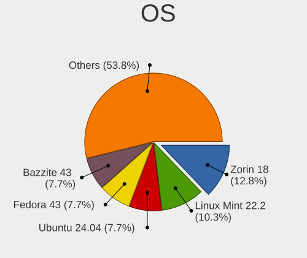

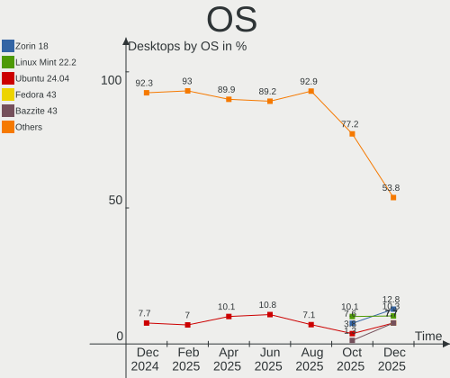

| Name                 | Desktops | Percent |
|----------------------|----------|---------|
| Zorin 18             | 15       | 12.82%  |
| Linux Mint 22.2      | 12       | 10.26%  |
| Ubuntu 24.04         | 9        | 7.69%   |
| Fedora 43            | 9        | 7.69%   |
| Bazzite 43           | 9        | 7.69%   |
| Debian 13            | 7        | 5.98%   |
| Pop!_OS 24.04        | 5        | 4.27%   |
| CachyOS Rolling      | 5        | 4.27%   |
| Arch Rolling         | 5        | 4.27%   |
| Pop!_OS 22.04        | 4        | 3.42%   |
| OpenMandriva 6.0     | 3        | 2.56%   |
| Ubuntu 25.10         | 2        | 1.71%   |
| OpenMandriva 25.11   | 2        | 1.71%   |
| NixOS 25.11          | 2        | 1.71%   |
| Linux Mint 22.1      | 2        | 1.71%   |
| CachyOS              | 2        | 1.71%   |
| Bazzite 42           | 2        | 1.71%   |
| Void Linux Rolling   | 1        | 0.85%   |
| Ubuntu-luna home     | 1        | 0.85%   |
| Ubuntu Unity 24.04   | 1        | 0.85%   |
| ROSA 13.1            | 1        | 0.85%   |
| Rocky Linux 8.10     | 1        | 0.85%   |
| OpenMandriva 25.90   | 1        | 0.85%   |
| Nobara 43            | 1        | 0.85%   |
| NixOS 25.05          | 1        | 0.85%   |
| MX 23                | 1        | 0.85%   |
| Manjaro              | 1        | 0.85%   |
| LMDE 7               | 1        | 0.85%   |
| Kubuntu 26.04        | 1        | 0.85%   |
| Kubuntu 25.10        | 1        | 0.85%   |
| Kubuntu 24.04        | 1        | 0.85%   |
| KDE neon 24.04       | 1        | 0.85%   |
| Gentoo 2.18          | 1        | 0.85%   |
| Garuda Linux Soaring | 1        | 0.85%   |
| Garuda Linux Rolling | 1        | 0.85%   |
| Fedora 42            | 1        | 0.85%   |
| Aurora 43            | 1        | 0.85%   |
| Artix Rolling        | 1        | 0.85%   |
| Artix                | 1        | 0.85%   |

OS Family
---------

OS without a version

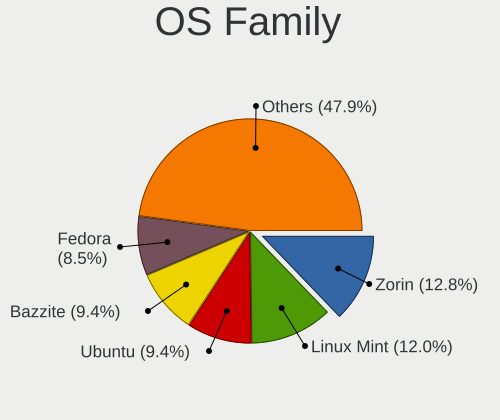

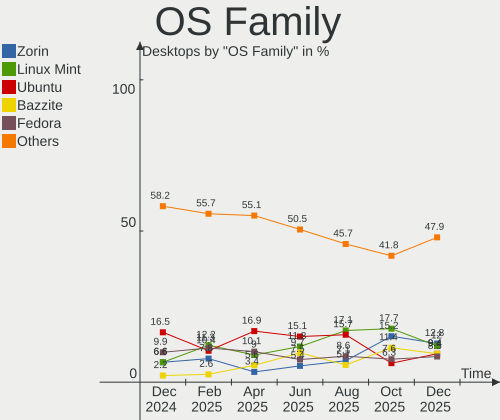

| Name             | Desktops | Percent |
|------------------|----------|---------|
| Zorin            | 15       | 12.82%  |
| Linux Mint       | 14       | 11.97%  |
| Ubuntu           | 11       | 9.4%    |
| Bazzite          | 11       | 9.4%    |
| Fedora           | 10       | 8.55%   |
| Pop!_OS          | 9        | 7.69%   |
| Debian           | 7        | 5.98%   |
| CachyOS          | 7        | 5.98%   |
| OpenMandriva     | 6        | 5.13%   |
| Arch             | 5        | 4.27%   |
| NixOS            | 3        | 2.56%   |
| Kubuntu          | 3        | 2.56%   |
| Garuda Linux     | 2        | 1.71%   |
| Artix            | 2        | 1.71%   |
| Void Linux       | 1        | 0.85%   |
| Ubuntu-luna home | 1        | 0.85%   |
| Ubuntu Unity     | 1        | 0.85%   |
| ROSA             | 1        | 0.85%   |
| Rocky Linux      | 1        | 0.85%   |
| Nobara           | 1        | 0.85%   |
| MX               | 1        | 0.85%   |
| Manjaro          | 1        | 0.85%   |
| LMDE             | 1        | 0.85%   |
| KDE neon         | 1        | 0.85%   |
| Gentoo           | 1        | 0.85%   |
| Aurora           | 1        | 0.85%   |

Kernel
------

Version of the Linux kernel

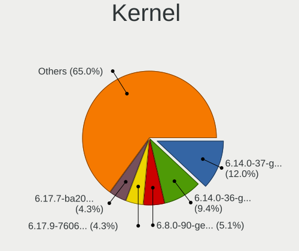

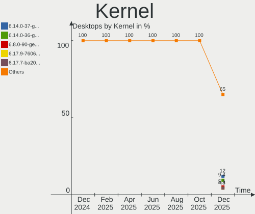

| Version                        | Desktops | Percent |
|--------------------------------|----------|---------|
| 6.14.0-37-generic              | 14       | 11.97%  |
| 6.14.0-36-generic              | 11       | 9.4%    |
| 6.8.0-90-generic               | 6        | 5.13%   |
| 6.17.9-76061709-generic        | 5        | 4.27%   |
| 6.17.7-ba20.fc43.x86_64        | 5        | 4.27%   |
| 6.12.57+deb13-amd64            | 5        | 4.27%   |
| 6.17.4-76061704-generic        | 4        | 3.42%   |
| 6.14.2-desktop-3omv2590        | 4        | 3.42%   |
| 6.17.7-ba19.fc43.x86_64        | 3        | 2.56%   |
| 6.17.10-300.fc43.x86_64        | 3        | 2.56%   |
| 6.17.1-300.fc43.x86_64         | 3        | 2.56%   |
| 6.18.2-2-cachyos               | 2        | 1.71%   |
| 6.18.0-desktop-1omv2590        | 2        | 1.71%   |
| 6.17.9-arch1-1                 | 2        | 1.71%   |
| 6.17.9-2-cachyos               | 2        | 1.71%   |
| 6.17.11-300.fc43.x86_64        | 2        | 1.71%   |
| 6.17.0-8-generic               | 2        | 1.71%   |
| 6.16.4-116.bazzite.fc42.x86_64 | 2        | 1.71%   |
| 6.14.0-33-generic              | 2        | 1.71%   |
| 6.14.0-29-generic              | 2        | 1.71%   |
| 6.14.0-27-generic              | 2        | 1.71%   |
| 6.8.0-88-lowlatency            | 1        | 0.85%   |
| 6.8.0-88-generic               | 1        | 0.85%   |
| 6.8.0-71-generic               | 1        | 0.85%   |
| 6.8.0-63-generic               | 1        | 0.85%   |
| 6.2.0-39-generic               | 1        | 0.85%   |
| 6.18.2-zen2-1-zen              | 1        | 0.85%   |
| 6.18.2-200.nobara.fc43.x86_64  | 1        | 0.85%   |
| 6.18.1-arch1-2                 | 1        | 0.85%   |
| 6.18.1-2-cachyos               | 1        | 0.85%   |
| 6.18.1-1-cachyos               | 1        | 0.85%   |
| 6.18.0-8-generic               | 1        | 0.85%   |
| 6.18.0                         | 1        | 0.85%   |
| 6.17.9-zen1-1-zen              | 1        | 0.85%   |
| 6.17.9-300.fc43.x86_64         | 1        | 0.85%   |
| 6.17.9-200.fc42.x86_64         | 1        | 0.85%   |
| 6.17.8-zen1                    | 1        | 0.85%   |
| 6.17.8-artix1-1                | 1        | 0.85%   |
| 6.17.8-2-cachyos               | 1        | 0.85%   |
| 6.17.8+deb13-rt-amd64          | 1        | 0.85%   |

Kernel Family
-------------

Linux kernel without a distro release

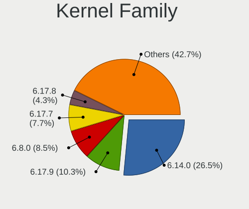

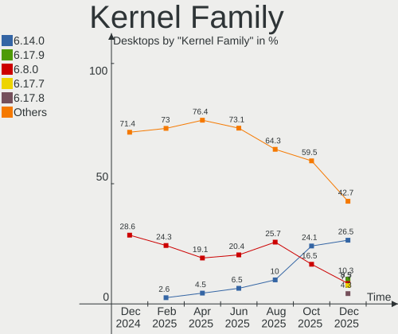

| Version | Desktops | Percent |
|---------|----------|---------|
| 6.14.0  | 31       | 26.5%   |
| 6.17.9  | 12       | 10.26%  |
| 6.8.0   | 10       | 8.55%   |
| 6.17.7  | 9        | 7.69%   |
| 6.17.8  | 5        | 4.27%   |
| 6.17.4  | 5        | 4.27%   |
| 6.17.10 | 5        | 4.27%   |
| 6.12.57 | 5        | 4.27%   |
| 6.18.2  | 4        | 3.42%   |
| 6.18.0  | 4        | 3.42%   |
| 6.14.2  | 4        | 3.42%   |
| 6.18.1  | 3        | 2.56%   |
| 6.17.1  | 3        | 2.56%   |
| 6.17.0  | 3        | 2.56%   |
| 6.17.11 | 2        | 1.71%   |
| 6.16.4  | 2        | 1.71%   |
| 6.2.0   | 1        | 0.85%   |
| 6.17.12 | 1        | 0.85%   |
| 6.12.63 | 1        | 0.85%   |
| 6.12.62 | 1        | 0.85%   |
| 6.12.61 | 1        | 0.85%   |
| 6.12.58 | 1        | 0.85%   |
| 6.12.56 | 1        | 0.85%   |
| 6.12.47 | 1        | 0.85%   |
| 6.1.0   | 1        | 0.85%   |
| 4.18.0  | 1        | 0.85%   |

Kernel Major Ver.
-----------------

Linux kernel major version

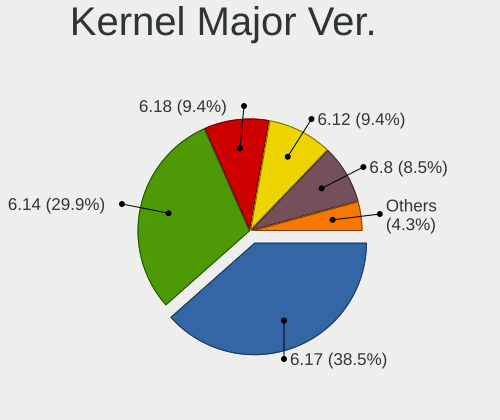

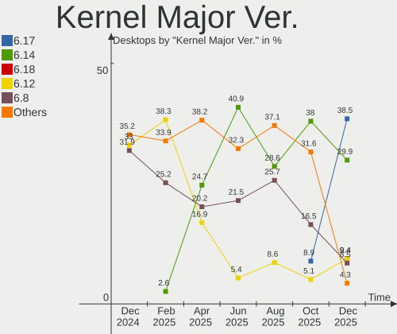

| Version | Desktops | Percent |
|---------|----------|---------|
| 6.17    | 45       | 38.46%  |
| 6.14    | 35       | 29.91%  |
| 6.18    | 11       | 9.4%    |
| 6.12    | 11       | 9.4%    |
| 6.8     | 10       | 8.55%   |
| 6.16    | 2        | 1.71%   |
| 6.2     | 1        | 0.85%   |
| 6.1     | 1        | 0.85%   |
| 4.18    | 1        | 0.85%   |

Arch
----

OS architecture (x86_64, i586, etc.)

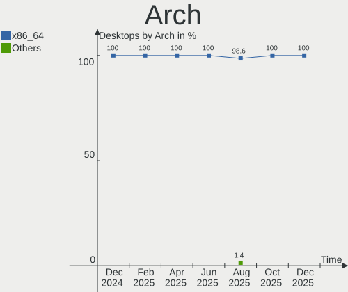

| Name   | Desktops | Percent |
|--------|----------|---------|
| x86_64 | 117      | 100%    |

DE
--

Desktop Environment

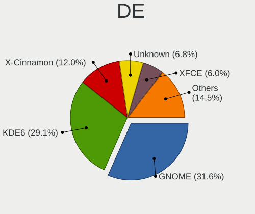

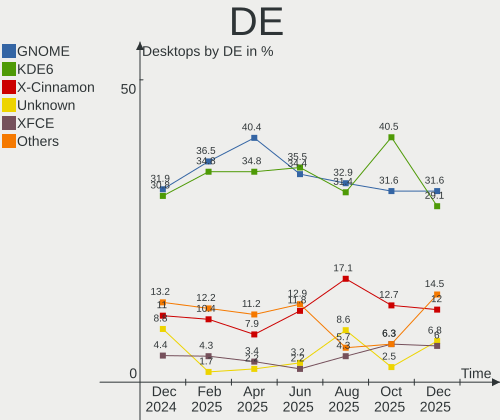

| Name          | Desktops | Percent |
|---------------|----------|---------|
| GNOME         | 37       | 31.62%  |
| KDE6          | 34       | 29.06%  |
| X-Cinnamon    | 14       | 11.97%  |
| Unknown       | 8        | 6.84%   |
| XFCE          | 7        | 5.98%   |
| COSMIC        | 5        | 4.27%   |
| KDE5          | 2        | 1.71%   |
| KDE           | 2        | 1.71%   |
| Unity         | 1        | 0.85%   |
| sway          | 1        | 0.85%   |
| qtile         | 1        | 0.85%   |
| MATE          | 1        | 0.85%   |
| labwc:wlroots | 1        | 0.85%   |
| KDE4          | 1        | 0.85%   |
| Hyprland      | 1        | 0.85%   |
| Budgie        | 1        | 0.85%   |

Display Server
--------------

X11 or Wayland

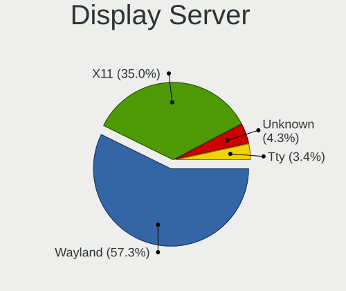

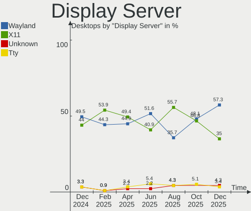

| Name    | Desktops | Percent |
|---------|----------|---------|
| Wayland | 67       | 57.26%  |
| X11     | 41       | 35.04%  |
| Unknown | 5        | 4.27%   |
| Tty     | 4        | 3.42%   |

Display Manager
---------------

SDDM, LightDM, etc.

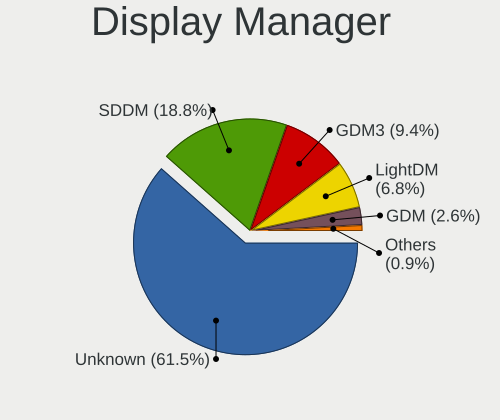

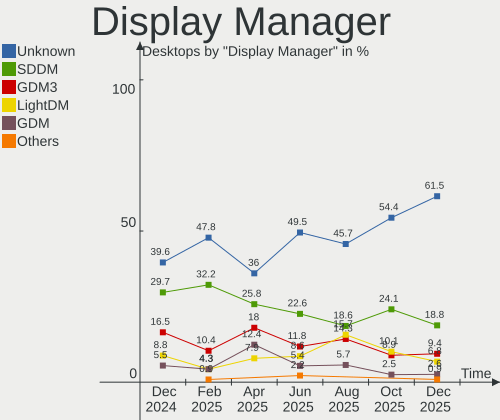

| Name    | Desktops | Percent |
|---------|----------|---------|
| Unknown | 72       | 61.54%  |
| SDDM    | 22       | 18.8%   |
| GDM3    | 11       | 9.4%    |
| LightDM | 8        | 6.84%   |
| GDM     | 3        | 2.56%   |
| GREETD  | 1        | 0.85%   |

OS Lang
-------

Language

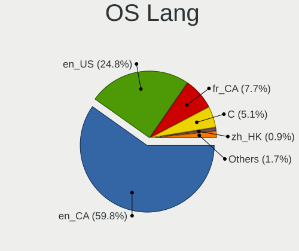

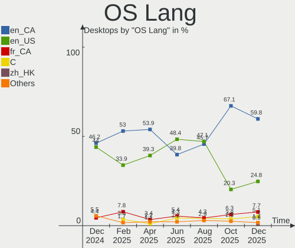

| Lang  | Desktops | Percent |
|-------|----------|---------|
| en_CA | 70       | 59.83%  |
| en_US | 29       | 24.79%  |
| fr_CA | 9        | 7.69%   |
| C     | 6        | 5.13%   |
| zh_HK | 1        | 0.85%   |
| fr_FR | 1        | 0.85%   |
| en_GB | 1        | 0.85%   |

Boot Mode
---------

EFI or BIOS

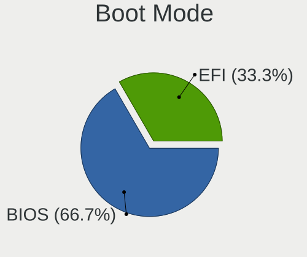

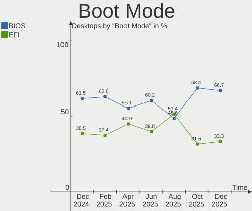

| Mode | Desktops | Percent |
|------|----------|---------|
| BIOS | 78       | 66.67%  |
| EFI  | 39       | 33.33%  |

Filesystem
----------

Type of filesystem

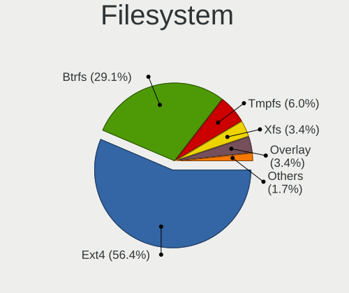

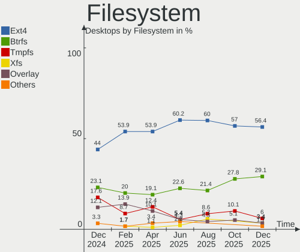

| Type    | Desktops | Percent |
|---------|----------|---------|
| Ext4    | 66       | 56.41%  |
| Btrfs   | 34       | 29.06%  |
| Tmpfs   | 7        | 5.98%   |
| Xfs     | 4        | 3.42%   |
| Overlay | 4        | 3.42%   |
| Zfs     | 1        | 0.85%   |
| Ext3    | 1        | 0.85%   |

Part. scheme
------------

Scheme of partitioning

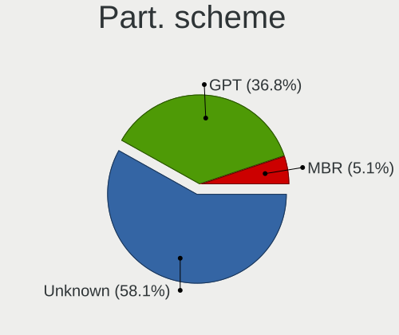

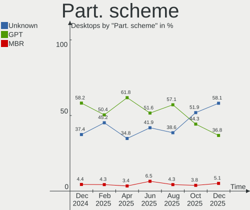

| Type    | Desktops | Percent |
|---------|----------|---------|
| Unknown | 68       | 58.12%  |
| GPT     | 43       | 36.75%  |
| MBR     | 6        | 5.13%   |

Dual Boot with Linux/BSD
------------------------

Hosting more than one Linux/BSD

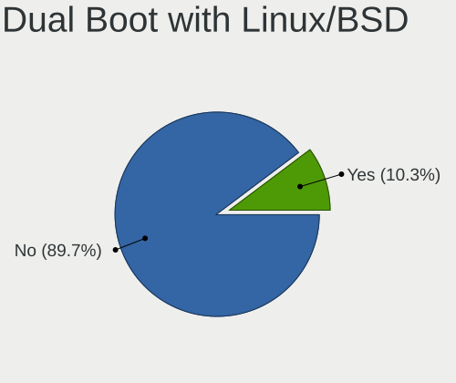

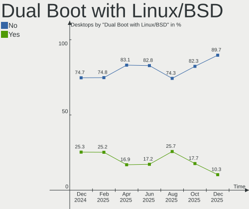

| Dual boot | Desktops | Percent |
|-----------|----------|---------|
| No        | 105      | 89.74%  |
| Yes       | 12       | 10.26%  |

Dual Boot (Win)
---------------

Hosting Linux and Windows

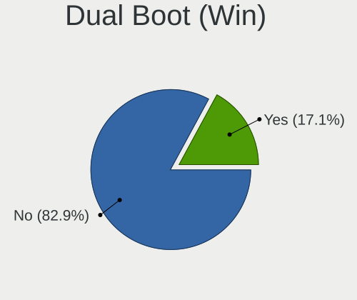

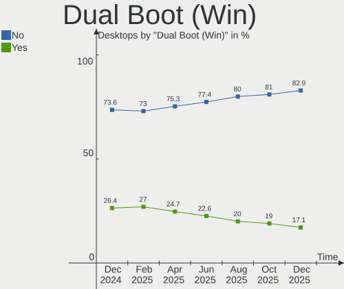

| Dual boot | Desktops | Percent |
|-----------|----------|---------|
| No        | 97       | 82.91%  |
| Yes       | 20       | 17.09%  |

Board
-----

Vendor
------

Motherboard manufacturer

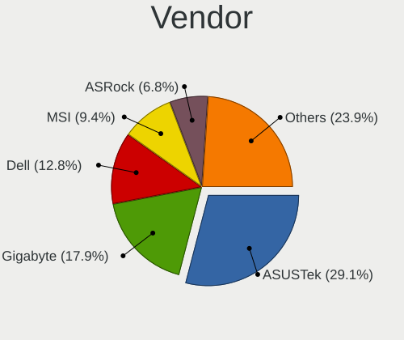

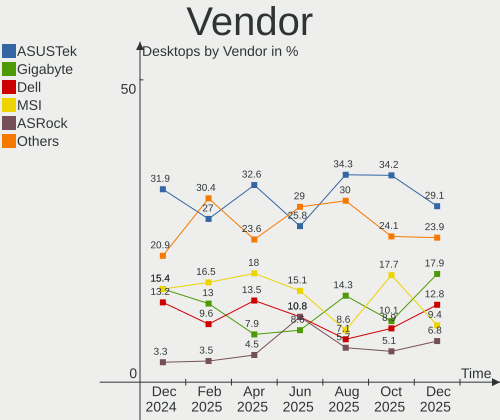

| Name                            | Desktops | Percent |
|---------------------------------|----------|---------|
| ASUSTek Computer                | 34       | 29.06%  |
| Gigabyte Technology             | 21       | 17.95%  |
| Dell                            | 15       | 12.82%  |
| MSI                             | 11       | 9.4%    |
| ASRock                          | 8        | 6.84%   |
| Hewlett-Packard                 | 6        | 5.13%   |
| Lenovo                          | 3        | 2.56%   |
| Alienware                       | 3        | 2.56%   |
| Acer                            | 3        | 2.56%   |
| Pegatron                        | 2        | 1.71%   |
| Intel                           | 2        | 1.71%   |
| AZW                             | 2        | 1.71%   |
| Unknown                         | 2        | 1.71%   |
| Supermicro                      | 1        | 0.85%   |
| Shenzhen Anxin Taihe Technology | 1        | 0.85%   |
| MACHINIST                       | 1        | 0.85%   |
| JINGSHA                         | 1        | 0.85%   |
| IBM                             | 1        | 0.85%   |

Model
-----

Motherboard model

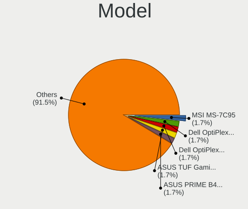

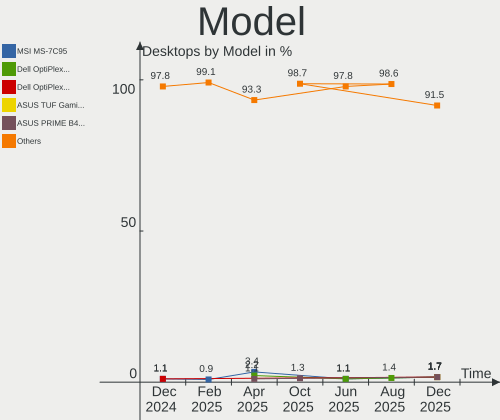

| Name                               | Desktops | Percent |
|------------------------------------|----------|---------|
| MSI MS-7C95                        | 2        | 1.71%   |
| Dell OptiPlex 7010                 | 2        | 1.71%   |
| Dell OptiPlex 5040                 | 2        | 1.71%   |
| ASUS TUF Gaming B850-PLUS WIFI     | 2        | 1.71%   |
| ASUS PRIME B450M-A II              | 2        | 1.71%   |
| Unknown                            | 2        | 1.71%   |
| Supermicro X8SAX                   | 1        | 0.85%   |
| Shenzhen Anxin Taihe KSM1          | 1        | 0.85%   |
| Pegatron NY428AA-A2L p6110f        | 1        | 0.85%   |
| Pegatron FQ516AA-A2L a6648f        | 1        | 0.85%   |
| MSI US Desktop Aegis R             | 1        | 0.85%   |
| MSI MS-7E56                        | 1        | 0.85%   |
| MSI MS-7E26                        | 1        | 0.85%   |
| MSI MS-7D25                        | 1        | 0.85%   |
| MSI MS-7C91                        | 1        | 0.85%   |
| MSI MS-7C84                        | 1        | 0.85%   |
| MSI MS-7C56                        | 1        | 0.85%   |
| MSI MS-7A67                        | 1        | 0.85%   |
| MSI MS-7971                        | 1        | 0.85%   |
| MACHINIST X99-MR9A-PRO V3.0        | 1        | 0.85%   |
| Lenovo ThinkCentre M93p 10A6S00100 | 1        | 0.85%   |
| Lenovo ThinkCentre M900 10FGS0D206 | 1        | 0.85%   |
| Lenovo ThinkCentre M57 6071ADU     | 1        | 0.85%   |
| JINGSHA X99S D4 PLUS               | 1        | 0.85%   |
| Intel X99-D4-V5 BSF Ver:1.00       | 1        | 0.85%   |
| Intel D54250WYK H13922-303         | 1        | 0.85%   |
| IBM 8215D1U                        | 1        | 0.85%   |
| HP Z800 Workstation                | 1        | 0.85%   |
| HP Z420 Workstation                | 1        | 0.85%   |
| HP ProDesk 600 G3 MT               | 1        | 0.85%   |
| HP Compaq Elite 8300 USDT          | 1        | 0.85%   |
| HP Compaq Elite 8300 CMT           | 1        | 0.85%   |
| HP 870-119                         | 1        | 0.85%   |
| Gigabyte Z97X-UD3H                 | 1        | 0.85%   |
| Gigabyte Z97X-SLI                  | 1        | 0.85%   |
| Gigabyte Z890 GAMING X WIFI7       | 1        | 0.85%   |
| Gigabyte Z790 AORUS ELITE X AX     | 1        | 0.85%   |
| Gigabyte Z590 AORUS PRO AX         | 1        | 0.85%   |
| Gigabyte Z390 I AORUS PRO WIFI     | 1        | 0.85%   |
| Gigabyte Z390 AORUS PRO WIFI       | 1        | 0.85%   |

Model Family
------------

Motherboard model prefix

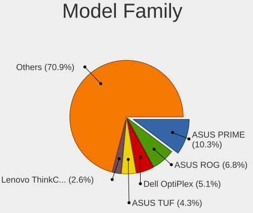

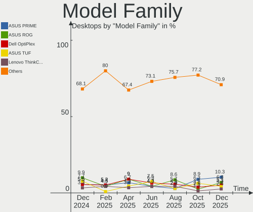

| Name                      | Desktops | Percent |
|---------------------------|----------|---------|
| ASUS PRIME                | 12       | 10.26%  |
| ASUS ROG                  | 8        | 6.84%   |
| Dell OptiPlex             | 6        | 5.13%   |
| ASUS TUF                  | 5        | 4.27%   |
| Lenovo ThinkCentre        | 3        | 2.56%   |
| Acer Aspire               | 3        | 2.56%   |
| MSI MS-7C95               | 2        | 1.71%   |
| HP Compaq                 | 2        | 1.71%   |
| Gigabyte Z390             | 2        | 1.71%   |
| Gigabyte X870E            | 2        | 1.71%   |
| Dell Studio               | 2        | 1.71%   |
| Dell Precision            | 2        | 1.71%   |
| Dell Inspiron             | 2        | 1.71%   |
| ASUS P8P67                | 2        | 1.71%   |
| ASRock B450M              | 2        | 1.71%   |
| Alienware Aurora          | 2        | 1.71%   |
| Unknown                   | 2        | 1.71%   |
| Supermicro X8SAX          | 1        | 0.85%   |
| Shenzhen Anxin Taihe KSM1 | 1        | 0.85%   |
| Pegatron NY428AA-A2L      | 1        | 0.85%   |
| Pegatron FQ516AA-A2L      | 1        | 0.85%   |
| MSI US                    | 1        | 0.85%   |
| MSI MS-7E56               | 1        | 0.85%   |
| MSI MS-7E26               | 1        | 0.85%   |
| MSI MS-7D25               | 1        | 0.85%   |
| MSI MS-7C91               | 1        | 0.85%   |
| MSI MS-7C84               | 1        | 0.85%   |
| MSI MS-7C56               | 1        | 0.85%   |
| MSI MS-7A67               | 1        | 0.85%   |
| MSI MS-7971               | 1        | 0.85%   |
| MACHINIST X99-MR9A-PRO    | 1        | 0.85%   |
| JINGSHA X99S              | 1        | 0.85%   |
| Intel X99-D4-V5           | 1        | 0.85%   |
| Intel D54250WYK           | 1        | 0.85%   |
| IBM 8215D1U               | 1        | 0.85%   |
| HP Z800                   | 1        | 0.85%   |
| HP Z420                   | 1        | 0.85%   |
| HP ProDesk                | 1        | 0.85%   |
| HP 870-119                | 1        | 0.85%   |
| Gigabyte Z97X-UD3H        | 1        | 0.85%   |

MFG Year
--------

Motherboard manufacture year

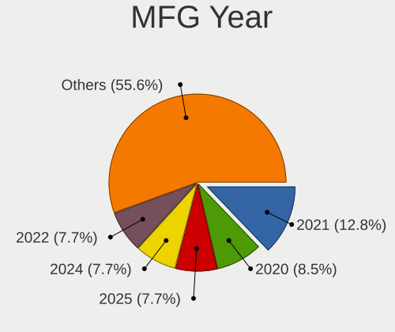

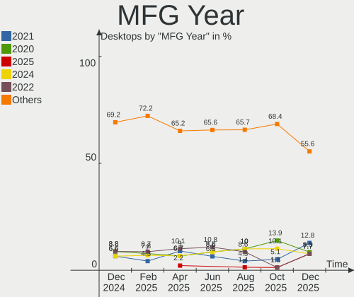

| Year | Desktops | Percent |
|------|----------|---------|
| 2021 | 15       | 12.82%  |
| 2020 | 10       | 8.55%   |
| 2025 | 9        | 7.69%   |
| 2024 | 9        | 7.69%   |
| 2022 | 9        | 7.69%   |
| 2018 | 9        | 7.69%   |
| 2016 | 6        | 5.13%   |
| 2015 | 6        | 5.13%   |
| 2013 | 6        | 5.13%   |
| 2012 | 6        | 5.13%   |
| 2010 | 6        | 5.13%   |
| 2009 | 6        | 5.13%   |
| 2023 | 5        | 4.27%   |
| 2019 | 5        | 4.27%   |
| 2017 | 3        | 2.56%   |
| 2014 | 3        | 2.56%   |
| 2011 | 2        | 1.71%   |
| 2007 | 1        | 0.85%   |
| 2006 | 1        | 0.85%   |

Form Factor
-----------

Physical design of the computer

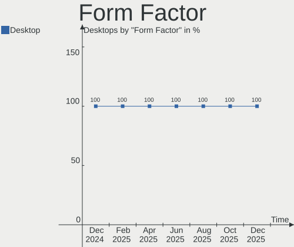

| Name    | Desktops | Percent |
|---------|----------|---------|
| Desktop | 117      | 100%    |

Secure Boot
-----------

Enabled or disabled

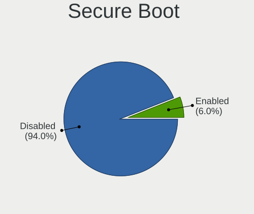

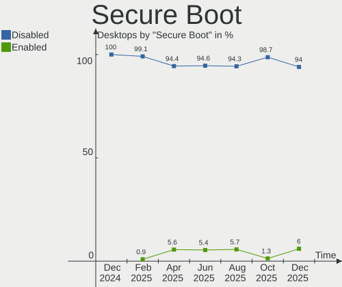

| State    | Desktops | Percent |
|----------|----------|---------|
| Disabled | 110      | 94.02%  |
| Enabled  | 7        | 5.98%   |

Coreboot
--------

Have coreboot on board

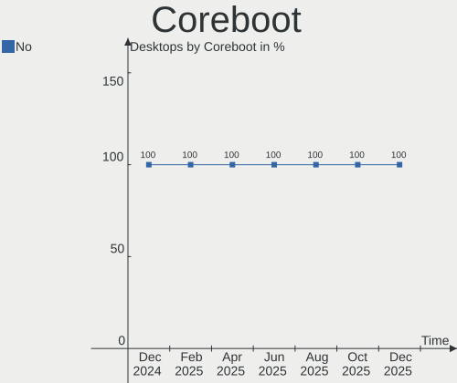

| Used | Desktops | Percent |
|------|----------|---------|
| No   | 117      | 100%    |

RAM Size
--------

Total RAM memory

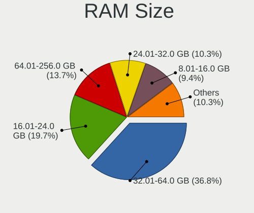

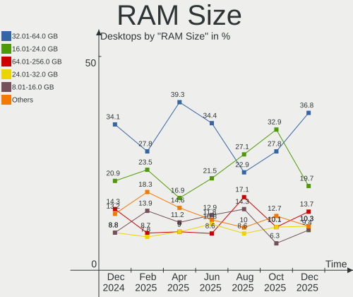

| Size in GB  | Desktops | Percent |
|-------------|----------|---------|
| 32.01-64.0  | 43       | 36.75%  |
| 16.01-24.0  | 23       | 19.66%  |
| 64.01-256.0 | 16       | 13.68%  |
| 24.01-32.0  | 12       | 10.26%  |
| 8.01-16.0   | 11       | 9.4%    |
| 4.01-8.0    | 8        | 6.84%   |
| 3.01-4.0    | 2        | 1.71%   |
| 1.01-2.0    | 1        | 0.85%   |
| 0.51-1.0    | 1        | 0.85%   |

RAM Used
--------

Used RAM memory

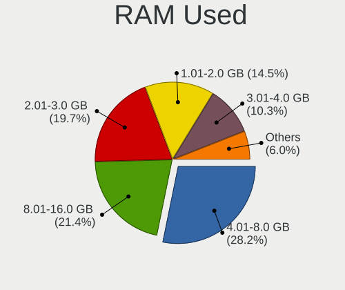

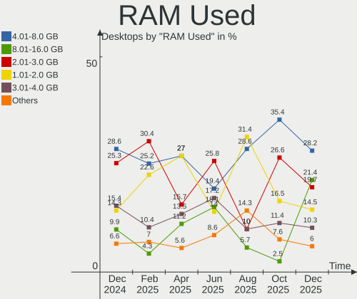

| Used GB     | Desktops | Percent |
|-------------|----------|---------|
| 4.01-8.0    | 33       | 28.21%  |
| 8.01-16.0   | 25       | 21.37%  |
| 2.01-3.0    | 23       | 19.66%  |
| 1.01-2.0    | 17       | 14.53%  |
| 3.01-4.0    | 12       | 10.26%  |
| 16.01-24.0  | 3        | 2.56%   |
| 32.01-64.0  | 1        | 0.85%   |
| 64.01-256.0 | 1        | 0.85%   |
| 0.51-1.0    | 1        | 0.85%   |
| 0.01-0.5    | 1        | 0.85%   |

Total Drives
------------

Number of drives on board

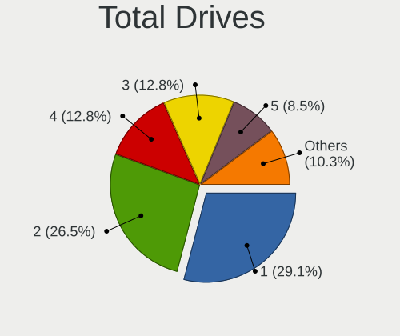

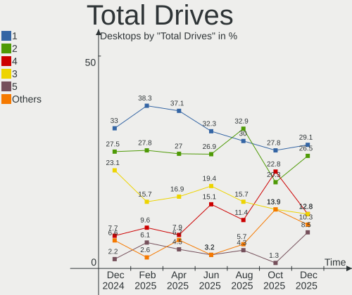

| Drives | Desktops | Percent |
|--------|----------|---------|
| 1      | 34       | 29.06%  |
| 2      | 31       | 26.5%   |
| 4      | 15       | 12.82%  |
| 3      | 15       | 12.82%  |
| 5      | 10       | 8.55%   |
| 6      | 5        | 4.27%   |
| 8      | 3        | 2.56%   |
| 7      | 2        | 1.71%   |
| 12     | 1        | 0.85%   |
| 0      | 1        | 0.85%   |

Has CD-ROM
----------

Has CD-ROM on board

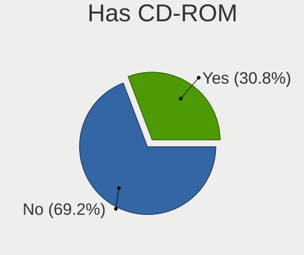

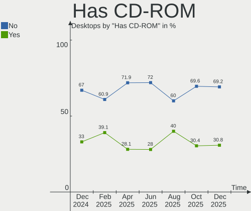

| Presented | Desktops | Percent |
|-----------|----------|---------|
| No        | 81       | 69.23%  |
| Yes       | 36       | 30.77%  |

Has Ethernet
------------

Has Ethernet on board

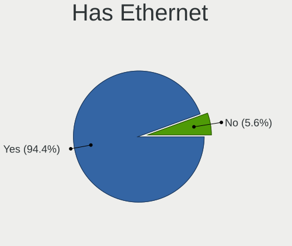

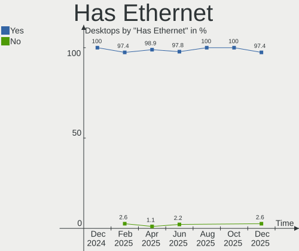

| Presented | Desktops | Percent |
|-----------|----------|---------|
| Yes       | 114      | 97.44%  |
| No        | 3        | 2.56%   |

Has WiFi
--------

Has WiFi module

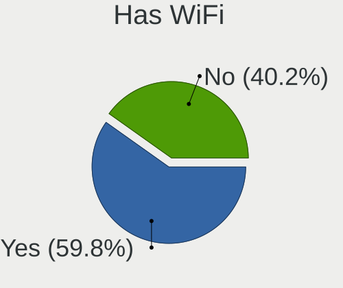

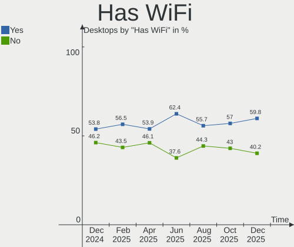

| Presented | Desktops | Percent |
|-----------|----------|---------|
| Yes       | 70       | 59.83%  |
| No        | 47       | 40.17%  |

Has Bluetooth
-------------

Has Bluetooth module

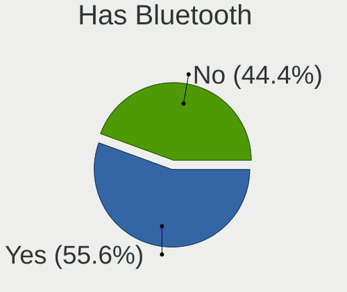

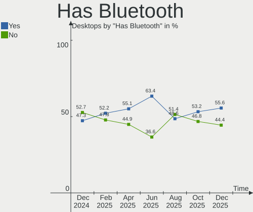

| Presented | Desktops | Percent |
|-----------|----------|---------|
| Yes       | 65       | 55.56%  |
| No        | 52       | 44.44%  |

Location
--------

Country
-------

Geographic location (country)

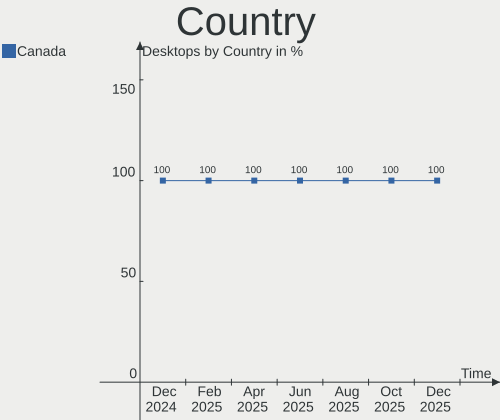

| Country | Desktops | Percent |
|---------|----------|---------|
| Canada  | 117      | 100%    |

City
----

Geographic location (city)

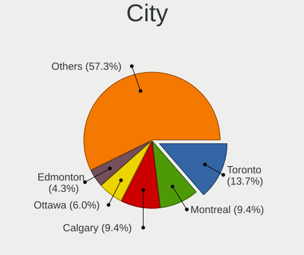

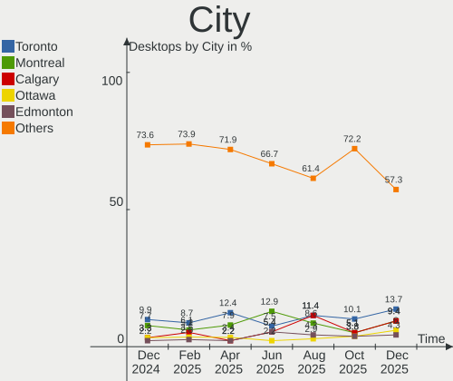

| City                     | Desktops | Percent |
|--------------------------|----------|---------|
| Toronto                  | 16       | 13.68%  |
| Montreal                 | 11       | 9.4%    |
| Calgary                  | 11       | 9.4%    |
| Ottawa                   | 7        | 5.98%   |
| Edmonton                 | 5        | 4.27%   |
| Peterborough             | 3        | 2.56%   |
| Kitchener                | 3        | 2.56%   |
| Woodbridge               | 2        | 1.71%   |
| Scarborough              | 2        | 1.71%   |
| Québec                  | 2        | 1.71%   |
| Nanaimo                  | 2        | 1.71%   |
| Markham                  | 2        | 1.71%   |
| London                   | 2        | 1.71%   |
| Delta                    | 2        | 1.71%   |
| Chilliwack               | 2        | 1.71%   |
| Burlington               | 2        | 1.71%   |
| Wetaskiwin               | 1        | 0.85%   |
| West Kelowna             | 1        | 0.85%   |
| Victoria                 | 1        | 0.85%   |
| Vancouver                | 1        | 0.85%   |
| Val-des-Sources          | 1        | 0.85%   |
| Surrey                   | 1        | 0.85%   |
| Sherwood Park            | 1        | 0.85%   |
| Sherbrooke               | 1        | 0.85%   |
| Shawnigan Lake           | 1        | 0.85%   |
| Shawinigan               | 1        | 0.85%   |
| Sarnia                   | 1        | 0.85%   |
| Saint-Jerome             | 1        | 0.85%   |
| Saint-Jean-sur-Richelieu | 1        | 0.85%   |
| Prince Albert            | 1        | 0.85%   |
| Pierrefonds              | 1        | 0.85%   |
| Paradise                 | 1        | 0.85%   |
| Oshawa                   | 1        | 0.85%   |
| Moose Jaw                | 1        | 0.85%   |
| Montague                 | 1        | 0.85%   |
| Markdale                 | 1        | 0.85%   |
| Maple Ridge              | 1        | 0.85%   |
| Maple                    | 1        | 0.85%   |
| Lindsay                  | 1        | 0.85%   |
| Laval                    | 1        | 0.85%   |

Drives
------

Drive Vendor
------------

Hard drive vendors

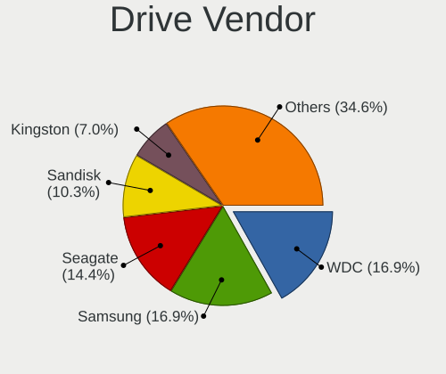

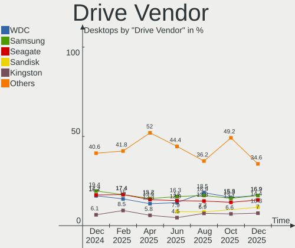

| Vendor                       | Desktops | Drives | Percent |
|------------------------------|----------|--------|---------|
| WDC                          | 41       | 72     | 16.87%  |
| Samsung Electronics          | 41       | 60     | 16.87%  |
| Seagate                      | 35       | 52     | 14.4%   |
| Sandisk                      | 25       | 32     | 10.29%  |
| Kingston                     | 17       | 20     | 7%      |
| SK hynix                     | 8        | 8      | 3.29%   |
| Crucial                      | 7        | 8      | 2.88%   |
| Toshiba                      | 6        | 6      | 2.47%   |
| Micron/Crucial Technology    | 5        | 6      | 2.06%   |
| A-DATA Technology            | 5        | 7      | 2.06%   |
| MAXIO Technology (Hangzhou)  | 4        | 5      | 1.65%   |
| Kingston Technology Company  | 3        | 3      | 1.23%   |
| Intel                        | 3        | 4      | 1.23%   |
| Hitachi                      | 3        | 4      | 1.23%   |
| China                        | 3        | 3      | 1.23%   |
| Unknown                      | 2        | 2      | 0.82%   |
| SPCC                         | 2        | 2      | 0.82%   |
| Shenzhen Longsys Electronics | 2        | 2      | 0.82%   |
| JMicron Technology           | 2        | 2      | 0.82%   |
| HGST                         | 2        | 2      | 0.82%   |
| Fanxiang                     | 2        | 2      | 0.82%   |
| Corsair                      | 2        | 2      | 0.82%   |
| Apple                        | 2        | 3      | 0.82%   |
| USB 3.1                      | 1        | 2      | 0.41%   |
| T-FORCE                      | 1        | 1      | 0.41%   |
| Seagate Technology           | 1        | 1      | 0.41%   |
| SABRENT                      | 1        | 1      | 0.41%   |
| Realtek                      | 1        | 2      | 0.41%   |
| PNY                          | 1        | 1      | 0.41%   |
| Phison Electronics           | 1        | 1      | 0.41%   |
| Phison                       | 1        | 2      | 0.41%   |
| Patriot                      | 1        | 1      | 0.41%   |
| ORICO                        | 1        | 1      | 0.41%   |
| Mushkin                      | 1        | 1      | 0.41%   |
| Micron Technology            | 1        | 1      | 0.41%   |
| M.2 SSD                      | 1        | 1      | 0.41%   |
| LITEONIT                     | 1        | 1      | 0.41%   |
| KIOXIA                       | 1        | 1      | 0.41%   |
| KingSpec                     | 1        | 1      | 0.41%   |
| KINGBANK                     | 1        | 2      | 0.41%   |

Drive Model
-----------

Hard drive models

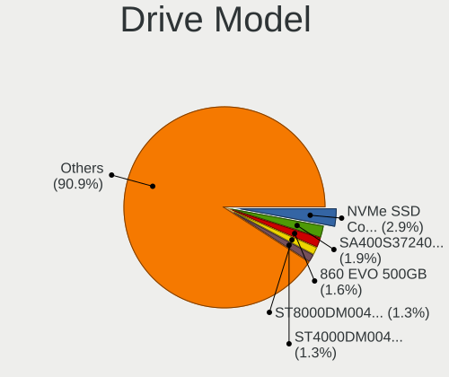

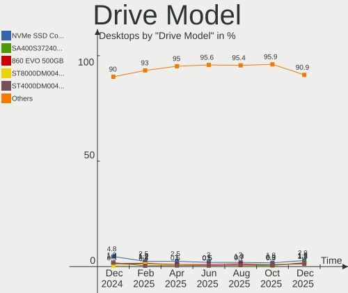

| Model                                             | Desktops | Percent |
|---------------------------------------------------|----------|---------|
| Samsung NVMe SSD Controller SM981/PM981/PM983 1TB | 9        | 2.92%   |
| Kingston SA400S37240G 240GB SSD                   | 6        | 1.95%   |
| Samsung SSD 860 EVO 500GB                         | 5        | 1.62%   |
| Seagate ST8000DM004-2U9188 8TB                    | 4        | 1.3%    |
| Seagate ST4000DM004-2CV104 4TB                    | 4        | 1.3%    |
| Seagate ST2000DM008-2FR102 2TB                    | 4        | 1.3%    |
| Seagate ST1000DM010-2EP102 1TB                    | 4        | 1.3%    |
| SanDisk NVMe SSD Drive 1TB                        | 4        | 1.3%    |
| Samsung SSD 990 PRO 1TB                           | 4        | 1.3%    |
| WDC WD Blue SA510 2.5 1000GB SSD                  | 3        | 0.97%   |
| Samsung SSD 870 EVO 500GB                         | 3        | 0.97%   |
| Samsung SSD 870 EVO 1TB                           | 3        | 0.97%   |
| Samsung SSD 850 EVO 250GB                         | 3        | 0.97%   |
| Micron/Crucial P2 NVMe PCIe SSD 2TB               | 3        | 0.97%   |
| MAXIO (Hangzhou) NVMe SSD Controller MAP1202 2TB  | 3        | 0.97%   |
| Kingston SA400S37960G 960GB SSD                   | 3        | 0.97%   |
| WDC WDS500G2B0A-00SM50 500GB                      | 2        | 0.65%   |
| WDC WDS100T2B0A-00SM50 1TB SSD                    | 2        | 0.65%   |
| WDC WDBNCE0010PNC 1TB SSD                         | 2        | 0.65%   |
| WDC WD60EZRZ-00GZ5B1 6TB                          | 2        | 0.65%   |
| WDC WD10EZEX-75WN4A0 1TB                          | 2        | 0.65%   |
| WDC WD Blue SA510 2.5 4TB SSD                     | 2        | 0.65%   |
| Unknown SD/MMC/MS PRO 2GB                         | 2        | 0.65%   |
| Toshiba DT01ACA200 2TB                            | 2        | 0.65%   |
| Seagate ST31000528AS 1TB                          | 2        | 0.65%   |
| Seagate ST2000DM006-2DM164 2TB                    | 2        | 0.65%   |
| Seagate Expansion HDD 4TB                         | 2        | 0.65%   |
| Seagate Expansion Desk 4TB                        | 2        | 0.65%   |
| Sandisk WD_BLACK SN850X 2000GB                    | 2        | 0.65%   |
| Sandisk WD_BLACK SN770 1TB                        | 2        | 0.65%   |
| Sandisk WD_BLACK SN7100 2TB                       | 2        | 0.65%   |
| Sandisk WD Blue SN550 NVMe SSD 1024GB             | 2        | 0.65%   |
| Sandisk WD Black SN750 / PC SN730 NVMe SSD 500GB  | 2        | 0.65%   |
| Samsung SSD 990 PRO 4TB                           | 2        | 0.65%   |
| Samsung SSD 860 EVO 1TB                           | 2        | 0.65%   |
| Kingston SA400S37480G 480GB SSD                   | 2        | 0.65%   |
| JMicron Tech 250GB                                | 2        | 0.65%   |
| Crucial CT525MX300SSD1 528GB                      | 2        | 0.65%   |
| China SSD 256GB                                   | 2        | 0.65%   |
| A-DATA SU800 512GB SSD                            | 2        | 0.65%   |

HDD Vendor
----------

Hard disk drive vendors

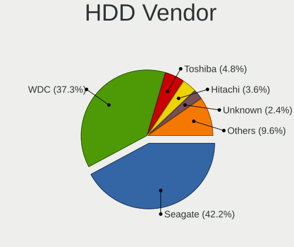

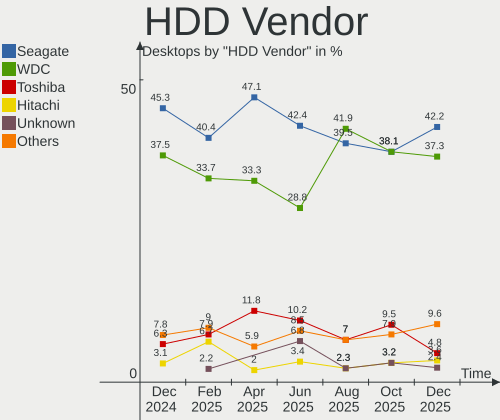

| Vendor              | Desktops | Drives | Percent |
|---------------------|----------|--------|---------|
| Seagate             | 35       | 52     | 42.17%  |
| WDC                 | 31       | 52     | 37.35%  |
| Toshiba             | 4        | 4      | 4.82%   |
| Hitachi             | 3        | 4      | 3.61%   |
| Unknown             | 2        | 2      | 2.41%   |
| Samsung Electronics | 2        | 2      | 2.41%   |
| HGST                | 2        | 2      | 2.41%   |
| Apple               | 2        | 3      | 2.41%   |
| USB 3.1             | 1        | 1      | 1.2%    |
| ASMT                | 1        | 2      | 1.2%    |

SSD Vendor
----------

Solid state drive vendors

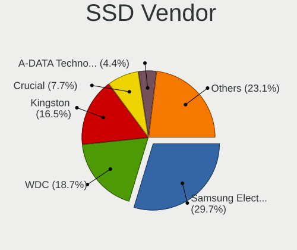

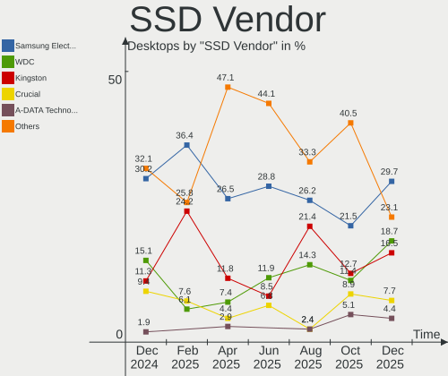

| Vendor              | Desktops | Drives | Percent |
|---------------------|----------|--------|---------|
| Samsung Electronics | 27       | 30     | 29.67%  |
| WDC                 | 17       | 19     | 18.68%  |
| Kingston            | 15       | 17     | 16.48%  |
| Crucial             | 7        | 8      | 7.69%   |
| A-DATA Technology   | 4        | 6      | 4.4%    |
| China               | 3        | 3      | 3.3%    |
| SPCC                | 2        | 2      | 2.2%    |
| SK hynix            | 2        | 2      | 2.2%    |
| SanDisk             | 2        | 2      | 2.2%    |
| Fanxiang            | 2        | 2      | 2.2%    |
| T-FORCE             | 1        | 1      | 1.1%    |
| SABRENT             | 1        | 1      | 1.1%    |
| PNY                 | 1        | 1      | 1.1%    |
| Patriot             | 1        | 1      | 1.1%    |
| Mushkin             | 1        | 1      | 1.1%    |
| LITEONIT            | 1        | 1      | 1.1%    |
| KingSpec            | 1        | 1      | 1.1%    |
| Intel               | 1        | 1      | 1.1%    |
| Hewlett-Packard     | 1        | 1      | 1.1%    |
| EDILOCA             | 1        | 1      | 1.1%    |

Drive Kind
----------

HDD or SSD

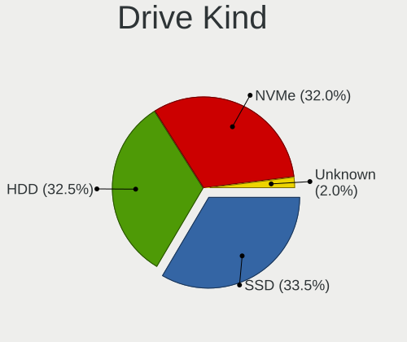

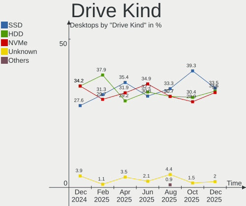

| Kind    | Desktops | Drives | Percent |
|---------|----------|--------|---------|
| SSD     | 68       | 101    | 33.5%   |
| HDD     | 66       | 124    | 32.51%  |
| NVMe    | 65       | 104    | 32.02%  |
| Unknown | 4        | 4      | 1.97%   |

Drive Connector
---------------

SATA, SAS, NVMe, etc.

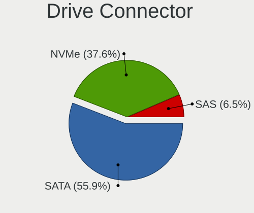

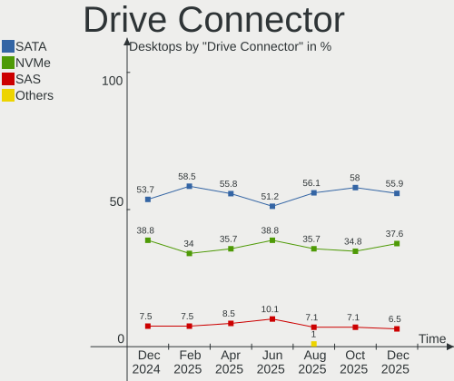

| Type | Desktops | Drives | Percent |
|------|----------|--------|---------|
| SATA | 95       | 214    | 55.88%  |
| NVMe | 64       | 101    | 37.65%  |
| SAS  | 11       | 18     | 6.47%   |

Drive Size
----------

Size of hard drive

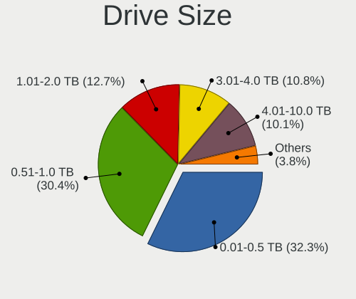

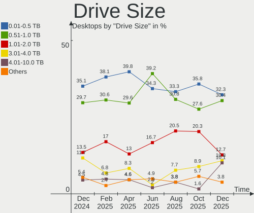

| Size in TB | Desktops | Drives | Percent |
|------------|----------|--------|---------|
| 0.01-0.5   | 51       | 72     | 32.28%  |
| 0.51-1.0   | 48       | 76     | 30.38%  |
| 1.01-2.0   | 20       | 23     | 12.66%  |
| 3.01-4.0   | 17       | 32     | 10.76%  |
| 4.01-10.0  | 16       | 16     | 10.13%  |
| 10.01-20.0 | 4        | 4      | 2.53%   |
| 2.01-3.0   | 2        | 2      | 1.27%   |

Space Total
-----------

Amount of disk space available on the file system

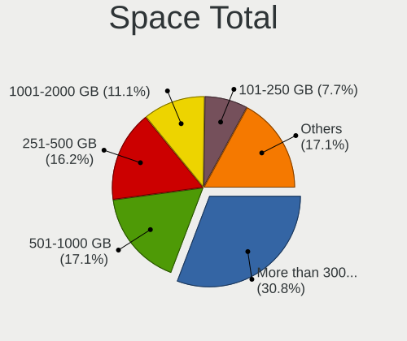

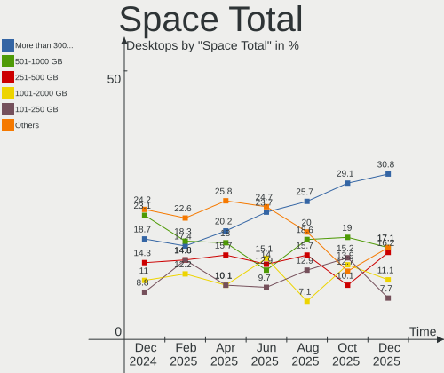

| Size in GB     | Desktops | Percent |
|----------------|----------|---------|
| More than 3000 | 36       | 30.77%  |
| 501-1000       | 20       | 17.09%  |
| 251-500        | 19       | 16.24%  |
| 1001-2000      | 13       | 11.11%  |
| 101-250        | 9        | 7.69%   |
| 2001-3000      | 7        | 5.98%   |
| 51-100         | 4        | 3.42%   |
| Unknown        | 4        | 3.42%   |
| 1-20           | 3        | 2.56%   |
| 21-50          | 2        | 1.71%   |

Space Used
----------

Amount of used disk space

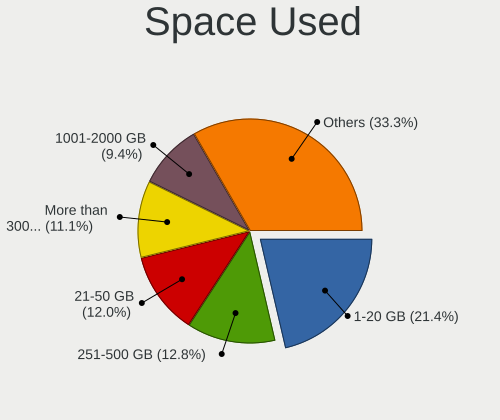

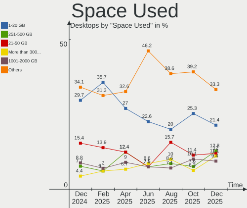

| Used GB        | Desktops | Percent |
|----------------|----------|---------|
| 1-20           | 25       | 21.37%  |
| 251-500        | 15       | 12.82%  |
| 21-50          | 14       | 11.97%  |
| More than 3000 | 13       | 11.11%  |
| 1001-2000      | 11       | 9.4%    |
| 101-250        | 10       | 8.55%   |
| 501-1000       | 10       | 8.55%   |
| 51-100         | 8        | 6.84%   |
| 2001-3000      | 7        | 5.98%   |
| Unknown        | 4        | 3.42%   |

Malfunc. Drives
---------------

Drive models with a malfunction

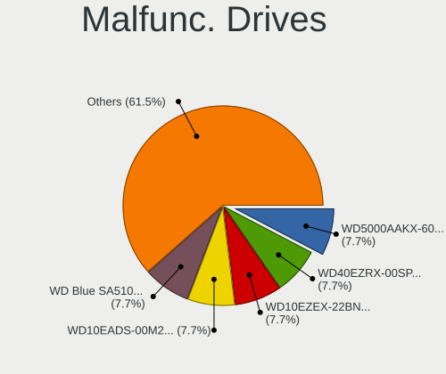

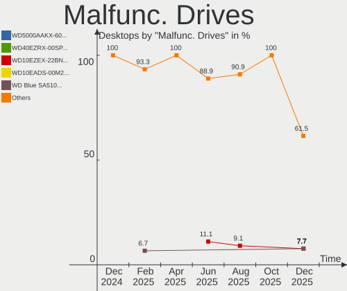

| Model                            | Desktops | Drives | Percent |
|----------------------------------|----------|--------|---------|
| WDC WD5000AAKX-60U6AA0 500GB     | 1        | 1      | 7.69%   |
| WDC WD40EZRX-00SPEB0 4TB         | 1        | 1      | 7.69%   |
| WDC WD10EZEX-22BN5A0 1TB         | 1        | 1      | 7.69%   |
| WDC WD10EADS-00M2B0 1TB          | 1        | 1      | 7.69%   |
| WDC WD Blue SA510 2.5 1000GB SSD | 1        | 1      | 7.69%   |
| Toshiba MQ02ABF100 1TB           | 1        | 1      | 7.69%   |
| Seagate ST3500418AS 500GB        | 1        | 1      | 7.69%   |
| Seagate ST31000524AS 1TB         | 1        | 1      | 7.69%   |
| Intel SSDSA2M160G2GC 160GB       | 1        | 1      | 7.69%   |
| Hitachi HTS547575A9E384 752GB    | 1        | 1      | 7.69%   |
| HGST HTS725050A7E630 500GB       | 1        | 1      | 7.69%   |
| Apple HDD HTS547550A9E384 500GB  | 1        | 1      | 7.69%   |
| A-DATA Technology SX8100NP 2TB   | 1        | 1      | 7.69%   |

Malfunc. Drive Vendor
---------------------

Vendors of faulty drives

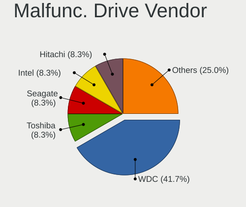

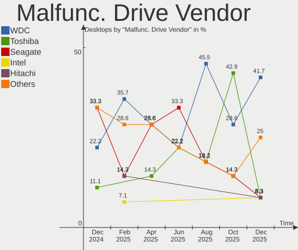

| Vendor            | Desktops | Drives | Percent |
|-------------------|----------|--------|---------|
| WDC               | 5        | 5      | 41.67%  |
| Toshiba           | 1        | 1      | 8.33%   |
| Seagate           | 1        | 2      | 8.33%   |
| Intel             | 1        | 1      | 8.33%   |
| Hitachi           | 1        | 1      | 8.33%   |
| HGST              | 1        | 1      | 8.33%   |
| Apple             | 1        | 1      | 8.33%   |
| A-DATA Technology | 1        | 1      | 8.33%   |

Malfunc. HDD Vendor
-------------------

Vendors of faulty HDD drives

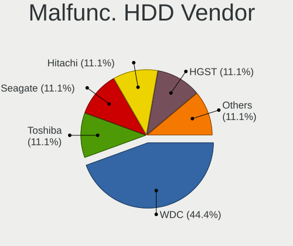

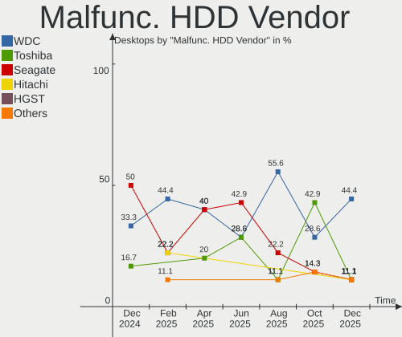

| Vendor  | Desktops | Drives | Percent |
|---------|----------|--------|---------|
| WDC     | 4        | 4      | 44.44%  |
| Toshiba | 1        | 1      | 11.11%  |
| Seagate | 1        | 2      | 11.11%  |
| Hitachi | 1        | 1      | 11.11%  |
| HGST    | 1        | 1      | 11.11%  |
| Apple   | 1        | 1      | 11.11%  |

Malfunc. Drive Kind
-------------------

Kinds of faulty drives

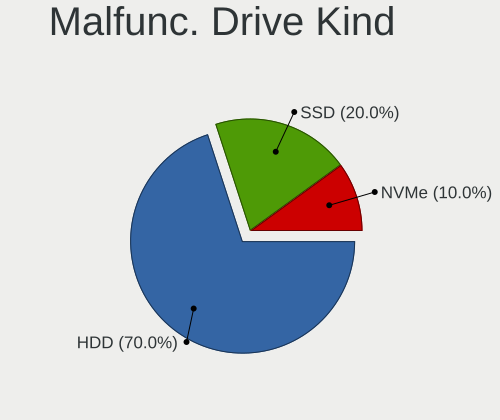

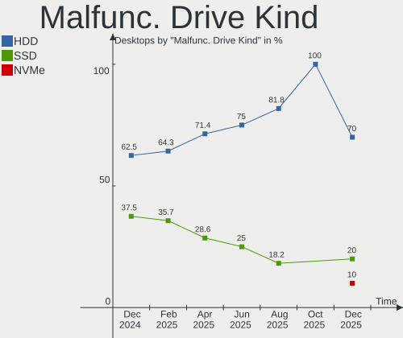

| Kind | Desktops | Drives | Percent |
|------|----------|--------|---------|
| HDD  | 7        | 10     | 70%     |
| SSD  | 2        | 2      | 20%     |
| NVMe | 1        | 1      | 10%     |

Failed Drives
-------------

Failed drive models

Zero info for selected period =(

Failed Drive Vendor
-------------------

Failed drive vendors

Zero info for selected period =(

Drive Status
------------

Number of failed and malfunc. drives

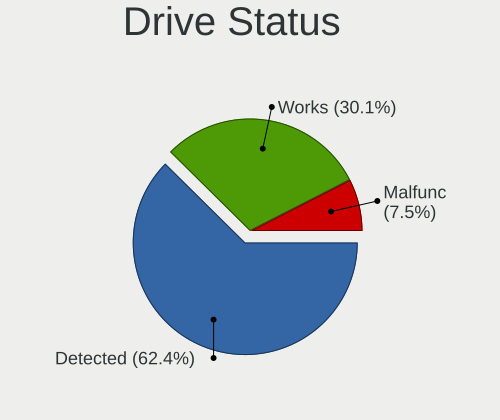

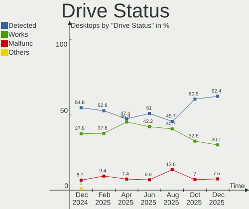

| Status   | Desktops | Drives | Percent |
|----------|----------|--------|---------|
| Detected | 83       | 229    | 62.41%  |
| Works    | 40       | 91     | 30.08%  |
| Malfunc  | 10       | 13     | 7.52%   |

Storage controller
------------------

Storage Vendor
--------------

Storage controller vendors

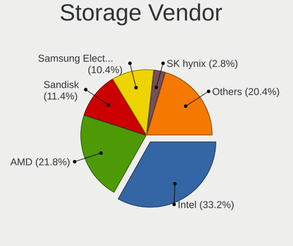

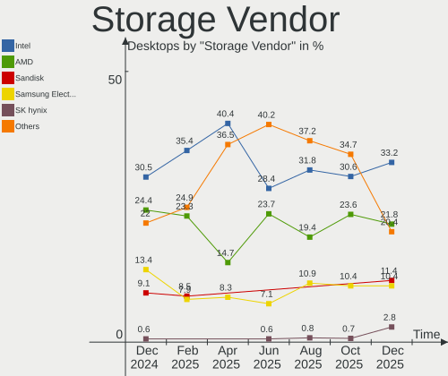

| Vendor                       | Desktops | Percent |
|------------------------------|----------|---------|
| Intel                        | 70       | 33.18%  |
| AMD                          | 46       | 21.8%   |
| Sandisk                      | 24       | 11.37%  |
| Samsung Electronics          | 22       | 10.43%  |
| SK hynix                     | 6        | 2.84%   |
| Kingston Technology Company  | 6        | 2.84%   |
| ASMedia Technology           | 6        | 2.84%   |
| Micron/Crucial Technology    | 5        | 2.37%   |
| MAXIO Technology (Hangzhou)  | 5        | 2.37%   |
| Marvell Technology Group     | 4        | 1.9%    |
| Phison Electronics           | 3        | 1.42%   |
| Toshiba America Info Systems | 2        | 0.95%   |
| Shenzhen Longsys Electronics | 2        | 0.95%   |
| VIA Technologies             | 1        | 0.47%   |
| Seagate Technology           | 1        | 0.47%   |
| Realtek Semiconductor        | 1        | 0.47%   |
| Micron Technology            | 1        | 0.47%   |
| LSI Logic / Symbios Logic    | 1        | 0.47%   |
| KIOXIA                       | 1        | 0.47%   |
| JMicron Technology           | 1        | 0.47%   |
| INNOGRIT                     | 1        | 0.47%   |
| Corsair Memory               | 1        | 0.47%   |
| Broadcom / LSI               | 1        | 0.47%   |

Storage Model
-------------

Storage controller models

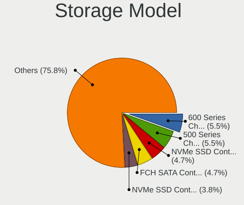

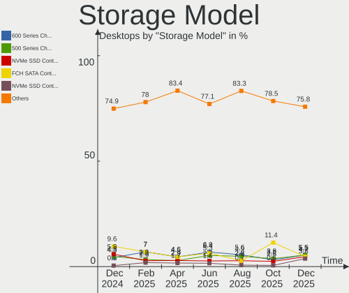

| Model                                                                          | Desktops | Percent |
|--------------------------------------------------------------------------------|----------|---------|
| AMD 600 Series Chipset SATA Controller                                         | 13       | 5.51%   |
| AMD 500 Series Chipset SATA Controller                                         | 13       | 5.51%   |
| Samsung NVMe SSD Controller SM981/PM981/PM983                                  | 11       | 4.66%   |
| AMD FCH SATA Controller [AHCI mode]                                            | 11       | 4.66%   |
| Samsung NVMe SSD Controller S4LV008[Pascal]                                    | 9        | 3.81%   |
| Intel SATA Controller [RAID mode]                                              | 8        | 3.39%   |
| AMD 400 Series Chipset SATA Controller                                         | 8        | 3.39%   |
| SanDisk WD SN560/SN740/SN770/SN5000 NVMe SSD                                   | 6        | 2.54%   |
| Intel Q170/Q150/B150/H170/H110/Z170/CM236 Chipset SATA Controller [AHCI Mode]  | 6        | 2.54%   |
| Sandisk WD Black SN850X NVMe SSD                                               | 5        | 2.12%   |
| Intel 8 Series/C220 Series Chipset Family 6-port SATA Controller 1 [AHCI mode] | 5        | 2.12%   |
| Intel 7 Series/C210 Series Chipset Family 6-port SATA Controller [AHCI mode]   | 5        | 2.12%   |
| MAXIO (Hangzhou) NVMe SSD Controller MAP1202 (DRAM-less)                       | 4        | 1.69%   |
| Intel Cannon Lake PCH SATA AHCI Controller                                     | 4        | 1.69%   |
| AMD SB7x0/SB8x0/SB9x0 IDE Controller                                           | 4        | 1.69%   |
| SanDisk Ultra 3D / WD PC SN530, IX SN530, Blue SN550 NVMe SSD (DRAM-less)      | 3        | 1.27%   |
| SanDisk Extreme Pro / WD Black SN750 / PC SN730 / Red SN700 NVMe SSD           | 3        | 1.27%   |
| Samsung NVMe SSD Controller PM9C1a (DRAM-less)                                 | 3        | 1.27%   |
| Micron/Crucial P2 [Nick P2] / P3 / P3 Plus NVMe PCIe SSD (DRAM-less)           | 3        | 1.27%   |
| Kingston Company NV2 NVMe SSD [SM2267XT] (DRAM-less)                           | 3        | 1.27%   |
| Intel SATA controller                                                          | 3        | 1.27%   |
| Intel Raptor Lake SATA AHCI Controller                                         | 3        | 1.27%   |
| Intel Alder Lake-S PCH SATA Controller [AHCI Mode]                             | 3        | 1.27%   |
| Intel 82801JI (ICH10 Family) SATA AHCI Controller                              | 3        | 1.27%   |
| Intel 6 Series/C200 Series Chipset Family 6 port Desktop SATA AHCI Controller  | 3        | 1.27%   |
| Intel 500 Series Chipset Family SATA AHCI Controller                           | 3        | 1.27%   |
| ASMedia ASM1061/ASM1062 Serial ATA Controller                                  | 3        | 1.27%   |
| AMD SB7x0/SB8x0/SB9x0 SATA Controller [AHCI mode]                              | 3        | 1.27%   |
| SK hynix Gold P31/BC711/PC711 NVMe Solid State Drive                           | 2        | 0.85%   |
| Shenzhen Longsys Lexar NM790 / Patriot Viper VP4300 Lite NVMe SSD (DRAM-less)  | 2        | 0.85%   |
| Sandisk WD_BLACK SN7100/WD PC SN7100S M.2 2280 NVMe SSD (DRAM-less)            | 2        | 0.85%   |
| Sandisk SN8000S NVMe SSD                                                       | 2        | 0.85%   |
| SanDisk PC SN735 / WD_BLACK SN750 SE NVMe SSD (DRAM-less)                      | 2        | 0.85%   |
| Phison E12 NVMe Controller                                                     | 2        | 0.85%   |
| Marvell Group 88SE9172 SATA 6Gb/s Controller                                   | 2        | 0.85%   |
| Intel SSD 670p Series [Keystone Harbor]                                        | 2        | 0.85%   |
| Intel RST Volume Management Device Controller                                  | 2        | 0.85%   |
| Intel Comet Lake SATA AHCI Controller                                          | 2        | 0.85%   |
| Intel C610/X99 series chipset sSATA Controller [AHCI mode]                     | 2        | 0.85%   |
| Intel Atom Processor E3800 Series SATA AHCI Controller                         | 2        | 0.85%   |

Storage Kind
------------

Kind of storage controller (IDE, SATA, NVMe, SAS, ...)

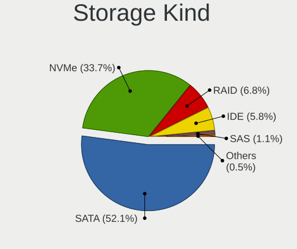

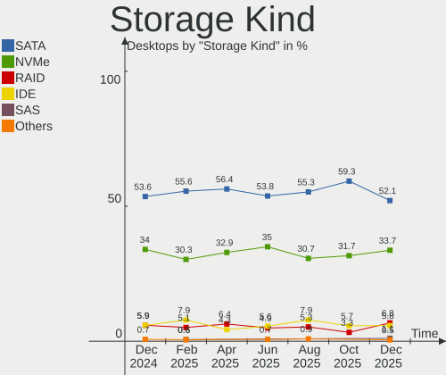

| Kind | Desktops | Percent |
|------|----------|---------|
| SATA | 99       | 52.11%  |
| NVMe | 64       | 33.68%  |
| RAID | 13       | 6.84%   |
| IDE  | 11       | 5.79%   |
| SAS  | 2        | 1.05%   |
| SCSI | 1        | 0.53%   |

Processor
---------

CPU Vendor
----------

Processor vendors

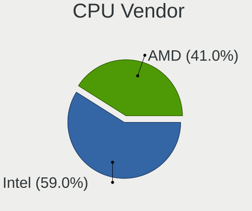

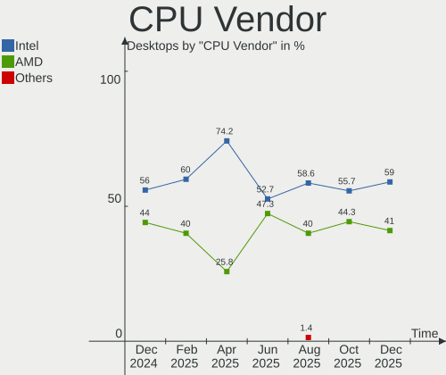

| Vendor | Desktops | Percent |
|--------|----------|---------|
| Intel  | 69       | 58.97%  |
| AMD    | 48       | 41.03%  |

CPU Model
---------

Processor models

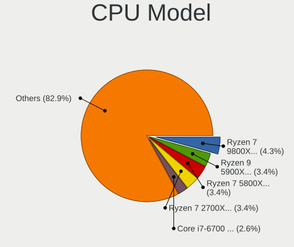

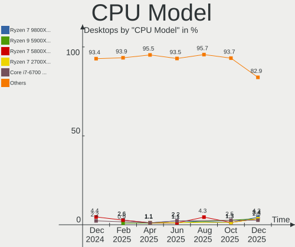

| Model                                       | Desktops | Percent |
|---------------------------------------------|----------|---------|
| AMD Ryzen 7 9800X3D 8-Core Processor        | 5        | 4.27%   |
| AMD Ryzen 9 5900X 12-Core Processor         | 4        | 3.42%   |
| AMD Ryzen 7 5800X 8-Core Processor          | 4        | 3.42%   |
| AMD Ryzen 7 2700X Eight-Core Processor      | 4        | 3.42%   |
| Intel Core i7-6700 CPU @ 3.40GHz            | 3        | 2.56%   |
| Intel Core i5-6500 CPU @ 3.20GHz            | 3        | 2.56%   |
| AMD Ryzen 5 5600X 6-Core Processor          | 3        | 2.56%   |
| Intel Xeon CPU E5-2680 v4 @ 2.40GHz         | 2        | 1.71%   |
| Intel Core Ultra 9 285K                     | 2        | 1.71%   |
| Intel Core i7-4770K CPU @ 3.50GHz           | 2        | 1.71%   |
| Intel Core i7 CPU 920 @ 2.67GHz             | 2        | 1.71%   |
| Intel Core i5-4670 CPU @ 3.40GHz            | 2        | 1.71%   |
| AMD Ryzen 9 7950X 16-Core Processor         | 2        | 1.71%   |
| AMD Ryzen 7 5800X3D 8-Core Processor        | 2        | 1.71%   |
| AMD Ryzen 5 5500                            | 2        | 1.71%   |
| Intel Xeon CPU W3530 @ 2.80GHz              | 1        | 0.85%   |
| Intel Xeon CPU E5620 @ 2.40GHz              | 1        | 0.85%   |
| Intel Xeon CPU E5-2699 v4 @ 2.20GHz         | 1        | 0.85%   |
| Intel Xeon CPU E5-2697 v3 @ 2.60GHz         | 1        | 0.85%   |
| Intel Xeon CPU E5-2687W 0 @ 3.10GHz         | 1        | 0.85%   |
| Intel Pentium Silver J5040 CPU @ 2.00GHz    | 1        | 0.85%   |
| Intel Pentium Dual-Core CPU E5300 @ 2.60GHz | 1        | 0.85%   |
| Intel Pentium CPU J2900 @ 2.41GHz           | 1        | 0.85%   |
| Intel Pentium CPU G640 @ 2.80GHz            | 1        | 0.85%   |
| Intel Pentium 4 CPU 3.00GHz                 | 1        | 0.85%   |
| Intel N150                                  | 1        | 0.85%   |
| Intel Core Ultra 7 265K                     | 1        | 0.85%   |
| Intel Core i7-9700KF CPU @ 3.60GHz          | 1        | 0.85%   |
| Intel Core i7-7700K CPU @ 4.20GHz           | 1        | 0.85%   |
| Intel Core i7-7700 CPU @ 3.60GHz            | 1        | 0.85%   |
| Intel Core i7-6700T CPU @ 2.80GHz           | 1        | 0.85%   |
| Intel Core i7-6700K CPU @ 4.00GHz           | 1        | 0.85%   |
| Intel Core i7-2600K CPU @ 3.40GHz           | 1        | 0.85%   |
| Intel Core i7-14700K                        | 1        | 0.85%   |
| Intel Core i7-14700F                        | 1        | 0.85%   |
| Intel Core i7-10700K CPU @ 3.80GHz          | 1        | 0.85%   |
| Intel Core i7-10700F CPU @ 2.90GHz          | 1        | 0.85%   |
| Intel Core i7 CPU X 980 @ 3.33GHz           | 1        | 0.85%   |
| Intel Core i7 CPU 860 @ 2.80GHz             | 1        | 0.85%   |
| Intel Core i5-9600K CPU @ 3.70GHz           | 1        | 0.85%   |

CPU Model Family
----------------

Processor model prefix

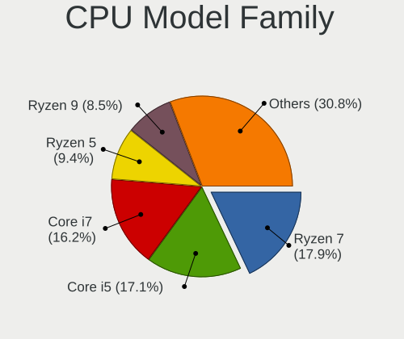

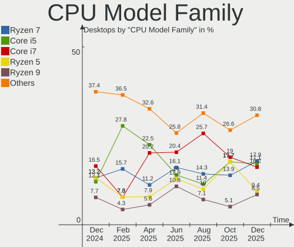

| Model                   | Desktops | Percent |
|-------------------------|----------|---------|
| AMD Ryzen 7             | 21       | 17.95%  |
| Intel Core i5           | 20       | 17.09%  |
| Intel Core i7           | 19       | 16.24%  |
| AMD Ryzen 5             | 11       | 9.4%    |
| AMD Ryzen 9             | 10       | 8.55%   |
| Other                   | 8        | 6.84%   |
| Intel Xeon              | 7        | 5.98%   |
| Intel Core              | 3        | 2.56%   |
| AMD FX                  | 3        | 2.56%   |
| Intel Pentium           | 2        | 1.71%   |
| Intel Core 2 Quad       | 2        | 1.71%   |
| Intel Celeron           | 2        | 1.71%   |
| Intel Pentium Silver    | 1        | 0.85%   |
| Intel Pentium Dual-Core | 1        | 0.85%   |
| Intel Pentium 4         | 1        | 0.85%   |
| Intel Core i3           | 1        | 0.85%   |
| Intel Core 2 Duo        | 1        | 0.85%   |
| Intel Atom              | 1        | 0.85%   |
| AMD Ryzen 3             | 1        | 0.85%   |
| AMD Phenom II X6        | 1        | 0.85%   |
| AMD Phenom II X4        | 1        | 0.85%   |

CPU Cores
---------

Number of processor cores

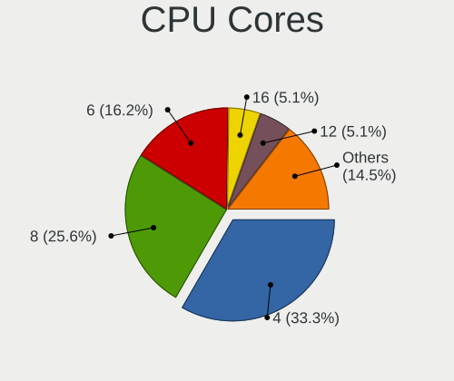

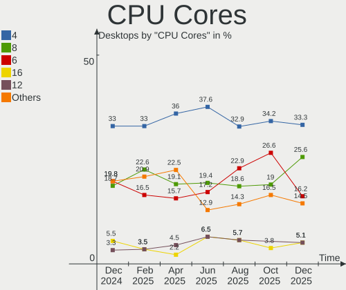

| Number | Desktops | Percent |
|--------|----------|---------|
| 4      | 39       | 33.33%  |
| 8      | 30       | 25.64%  |
| 6      | 19       | 16.24%  |
| 16     | 6        | 5.13%   |
| 12     | 6        | 5.13%   |
| 2      | 5        | 4.27%   |
| 14     | 4        | 3.42%   |
| 20     | 3        | 2.56%   |
| 24     | 2        | 1.71%   |
| 44     | 1        | 0.85%   |
| 10     | 1        | 0.85%   |
| 1      | 1        | 0.85%   |

CPU Sockets
-----------

Number of sockets

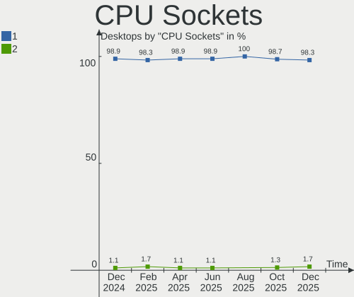

| Number | Desktops | Percent |
|--------|----------|---------|
| 1      | 115      | 98.29%  |
| 2      | 2        | 1.71%   |

CPU Threads
-----------

Threads per core (Hyper-Threading)

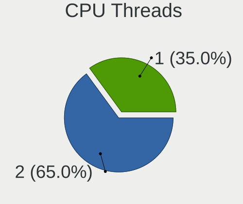

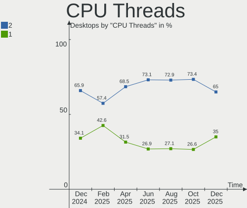

| Number | Desktops | Percent |
|--------|----------|---------|
| 2      | 76       | 64.96%  |
| 1      | 41       | 35.04%  |

CPU Op-Modes
------------

CPU Operation Modes (32-bit, 64-bit)

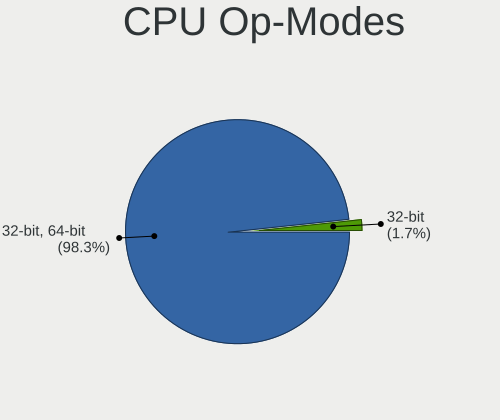

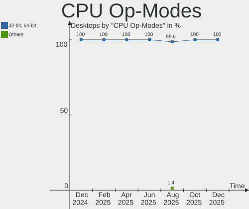

| Op mode        | Desktops | Percent |
|----------------|----------|---------|
| 32-bit, 64-bit | 117      | 100%    |

CPU Microcode
-------------

Microcode number

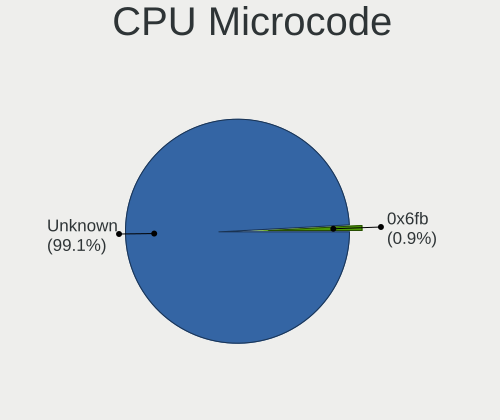

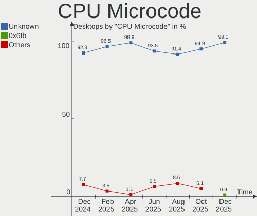

| Number  | Desktops | Percent |
|---------|----------|---------|
| Unknown | 116      | 99.15%  |
| 0x6fb   | 1        | 0.85%   |

CPU Microarch
-------------

Microarchitecture

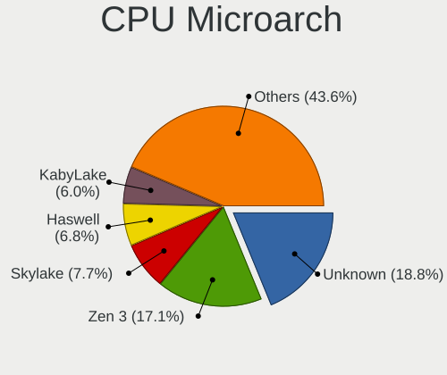

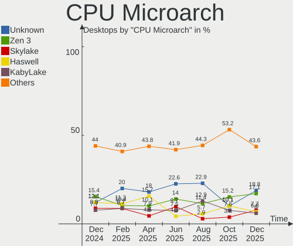

| Name             | Desktops | Percent |
|------------------|----------|---------|
| Unknown          | 22       | 18.8%   |
| Zen 3            | 20       | 17.09%  |
| Skylake          | 9        | 7.69%   |
| Haswell          | 8        | 6.84%   |
| KabyLake         | 7        | 5.98%   |
| Zen+             | 5        | 4.27%   |
| SandyBridge      | 5        | 4.27%   |
| Nehalem          | 4        | 3.42%   |
| IvyBridge        | 4        | 3.42%   |
| Zen 2            | 3        | 2.56%   |
| Piledriver       | 3        | 2.56%   |
| CometLake        | 3        | 2.56%   |
| Broadwell        | 3        | 2.56%   |
| Westmere         | 2        | 1.71%   |
| Silvermont       | 2        | 1.71%   |
| Penryn           | 2        | 1.71%   |
| Lunarlake Hybrid | 2        | 1.71%   |
| K10              | 2        | 1.71%   |
| Icelake          | 2        | 1.71%   |
| Core             | 2        | 1.71%   |
| Alderlake Hybrid | 2        | 1.71%   |
| Zen              | 1        | 0.85%   |
| NetBurst         | 1        | 0.85%   |
| Gracemont        | 1        | 0.85%   |
| Goldmont plus    | 1        | 0.85%   |
| Bonnell          | 1        | 0.85%   |

Graphics
--------

GPU Vendor
----------

Vendors of graphics cards

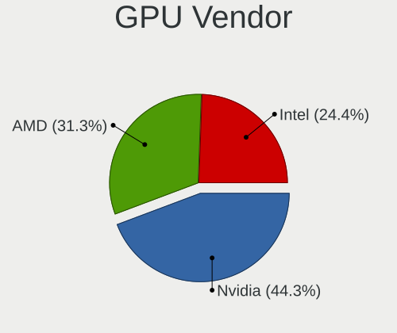

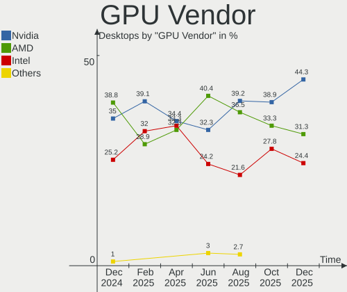

| Vendor | Desktops | Percent |
|--------|----------|---------|
| Nvidia | 58       | 44.27%  |
| AMD    | 41       | 31.3%   |
| Intel  | 32       | 24.43%  |

GPU Model
---------

Graphics card models

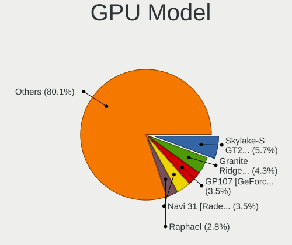

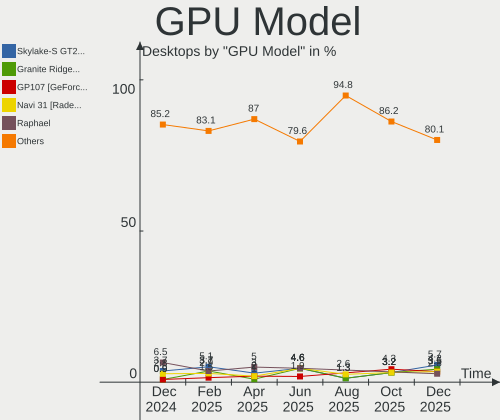

| Model                                                                       | Desktops | Percent |
|-----------------------------------------------------------------------------|----------|---------|
| Intel Skylake-S GT2 [HD Graphics 530]                                       | 8        | 5.67%   |
| AMD Granite Ridge [Radeon Graphics]                                         | 6        | 4.26%   |
| Nvidia GP107 [GeForce GTX 1050 Ti]                                          | 5        | 3.55%   |
| AMD Navi 31 [Radeon RX 7900 XT/7900 XTX/7900 GRE/7900M]                     | 5        | 3.55%   |
| AMD Raphael                                                                 | 4        | 2.84%   |
| AMD Navi 48 [Radeon RX 9070/9070 XT/9070 GRE]                               | 4        | 2.84%   |
| Nvidia TU106 [GeForce RTX 2060 12GB]                                        | 3        | 2.13%   |
| Nvidia GP106 [GeForce GTX 1060 6GB]                                         | 3        | 2.13%   |
| Intel Xeon E3-1200 v3/4th Gen Core Processor Integrated Graphics Controller | 3        | 2.13%   |
| Intel Xeon E3-1200 v2/3rd Gen Core processor Graphics Controller            | 3        | 2.13%   |
| Intel Arrow Lake-S [Intel Graphics]                                         | 3        | 2.13%   |
| AMD Navi 22 [Radeon RX 6700/6700 XT/6750 XT / 6800M/6850M XT]               | 3        | 2.13%   |
| AMD Navi 21 [Radeon RX 6800/6800 XT / 6900 XT]                              | 3        | 2.13%   |
| Nvidia TU116 [GeForce GTX 1660 SUPER]                                       | 2        | 1.42%   |
| Nvidia TU104 [GeForce RTX 2070 SUPER]                                       | 2        | 1.42%   |
| Nvidia GP104 [GeForce GTX 1070 Ti]                                          | 2        | 1.42%   |
| Nvidia GM206 [GeForce GTX 960]                                              | 2        | 1.42%   |
| Nvidia GM107 [GeForce GTX 750 Ti]                                           | 2        | 1.42%   |
| Nvidia GA104 [GeForce RTX 3070 Ti]                                          | 2        | 1.42%   |
| Nvidia GA104 [GeForce RTX 3060]                                             | 2        | 1.42%   |
| Nvidia GA102 [GeForce RTX 3080 Lite Hash Rate]                              | 2        | 1.42%   |
| Nvidia AD107 [GeForce RTX 4060]                                             | 2        | 1.42%   |
| Intel Atom Processor Z36xxx/Z37xxx Series Graphics & Display                | 2        | 1.42%   |
| Intel Alder Lake-S GT1 [UHD Graphics 770]                                   | 2        | 1.42%   |
| AMD Navi 44 [Radeon RX 9060 XT]                                             | 2        | 1.42%   |
| AMD Navi 32 [Radeon RX 7700 XT / 7800 XT]                                   | 2        | 1.42%   |
| AMD Cezanne [Radeon Vega Series / Radeon Vega Mobile Series]                | 2        | 1.42%   |
| AMD Cedar [Radeon HD 5000/6000/7350/8350 Series]                            | 2        | 1.42%   |
| AMD Cayman PRO [Radeon HD 6950]                                             | 2        | 1.42%   |
| Nvidia TU117 [GeForce GTX 1650]                                             | 1        | 0.71%   |
| Nvidia TU116 [GeForce GTX 1660 Ti]                                          | 1        | 0.71%   |
| Nvidia TU116 [GeForce GTX 1650]                                             | 1        | 0.71%   |
| Nvidia TU106 [GeForce RTX 2070 Rev. A]                                      | 1        | 0.71%   |
| Nvidia TU106 [GeForce RTX 2060 SUPER]                                       | 1        | 0.71%   |
| Nvidia TU104 [GeForce RTX 2080 SUPER]                                       | 1        | 0.71%   |
| Nvidia TU104 [GeForce RTX 2060]                                             | 1        | 0.71%   |
| Nvidia GT218 [GeForce 210]                                                  | 1        | 0.71%   |
| Nvidia GT216 [GeForce GT 220]                                               | 1        | 0.71%   |
| Nvidia GP106 [GeForce GTX 1060 3GB]                                         | 1        | 0.71%   |
| Nvidia GM204GL [Quadro M4000]                                               | 1        | 0.71%   |

GPU Combo
---------

Combinations of graphics cards

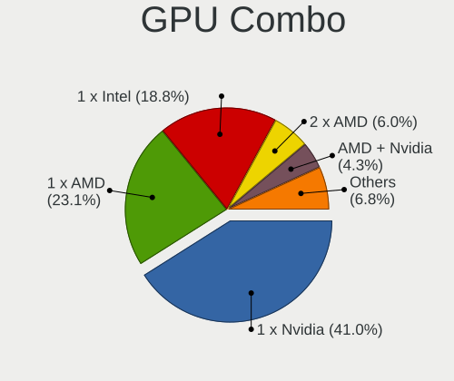

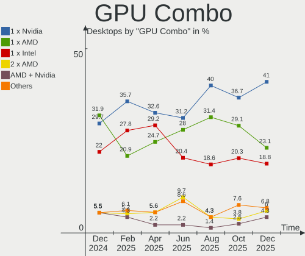

| Name           | Desktops | Percent |
|----------------|----------|---------|
| 1 x Nvidia     | 48       | 41.03%  |
| 1 x AMD        | 27       | 23.08%  |
| 1 x Intel      | 22       | 18.8%   |
| 2 x AMD        | 7        | 5.98%   |
| AMD + Nvidia   | 5        | 4.27%   |
| Intel + Nvidia | 4        | 3.42%   |
| 2 x Intel      | 2        | 1.71%   |
| 2 x Nvidia     | 1        | 0.85%   |
| Intel + AMD    | 1        | 0.85%   |

GPU Driver
----------

Free vs proprietary

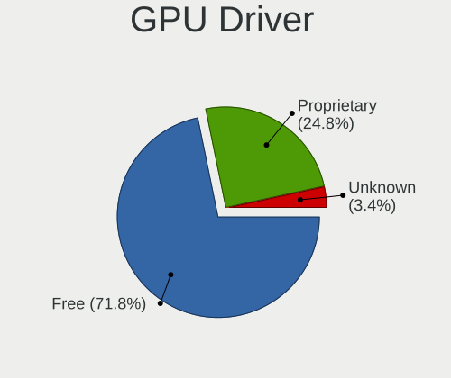

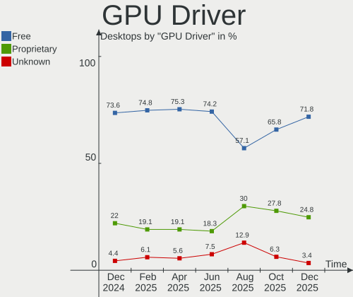

| Driver      | Desktops | Percent |
|-------------|----------|---------|
| Free        | 84       | 71.79%  |
| Proprietary | 29       | 24.79%  |
| Unknown     | 4        | 3.42%   |

GPU Memory
----------

Total video memory

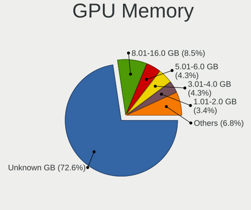

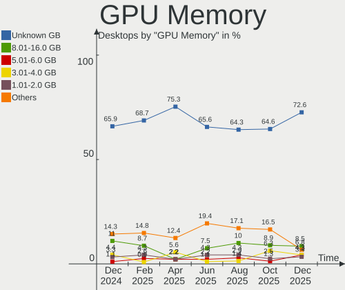

| Size in GB | Desktops | Percent |
|------------|----------|---------|
| Unknown    | 85       | 72.65%  |
| 8.01-16.0  | 10       | 8.55%   |
| 5.01-6.0   | 5        | 4.27%   |
| 3.01-4.0   | 5        | 4.27%   |
| 1.01-2.0   | 4        | 3.42%   |
| 7.01-8.0   | 3        | 2.56%   |
| 0.01-0.5   | 2        | 1.71%   |
| 2.01-3.0   | 1        | 0.85%   |
| 16.01-24.0 | 1        | 0.85%   |
| 0.51-1.0   | 1        | 0.85%   |

Monitor
-------

Monitor Vendor
--------------

Monitor vendors

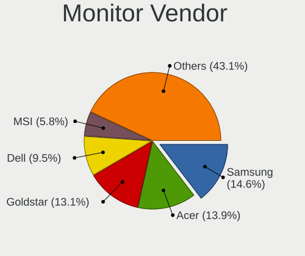

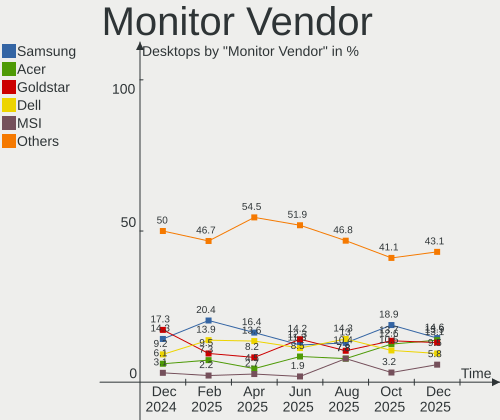

| Vendor               | Desktops | Percent |
|----------------------|----------|---------|
| Samsung Electronics  | 20       | 14.6%   |
| Acer                 | 19       | 13.87%  |
| Goldstar             | 18       | 13.14%  |
| Dell                 | 13       | 9.49%   |
| MSI                  | 8        | 5.84%   |
| BenQ                 | 8        | 5.84%   |
| Ancor Communications | 8        | 5.84%   |
| Hewlett-Packard      | 7        | 5.11%   |
| ASUSTek Computer     | 7        | 5.11%   |
| Toshiba              | 3        | 2.19%   |
| Gigabyte Technology  | 3        | 2.19%   |
| ViewSonic            | 2        | 1.46%   |
| Sony                 | 2        | 1.46%   |
| Philips              | 2        | 1.46%   |
| Lenovo               | 2        | 1.46%   |
| HKC                  | 2        | 1.46%   |
| Apple                | 2        | 1.46%   |
| Vizio                | 1        | 0.73%   |
| Viotek               | 1        | 0.73%   |
| Unknown              | 1        | 0.73%   |
| Skyworth             | 1        | 0.73%   |
| Sceptre Tech         | 1        | 0.73%   |
| NEC Computers        | 1        | 0.73%   |
| MStar                | 1        | 0.73%   |
| Insignia             | 1        | 0.73%   |
| Hitachi              | 1        | 0.73%   |
| FUN                  | 1        | 0.73%   |
| BIG                  | 1        | 0.73%   |

Monitor Model
-------------

Monitor models

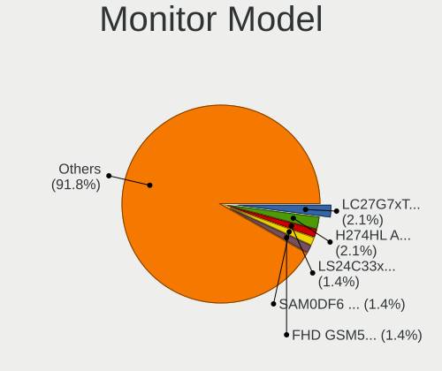

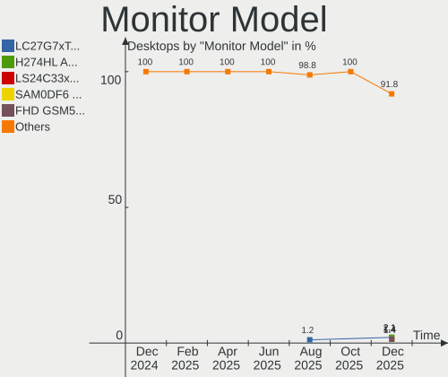

| Model                                                                  | Desktops | Percent |
|------------------------------------------------------------------------|----------|---------|
| Samsung Electronics LC27G7xT SAM105C 2560x1440 597x336mm 27.0-inch     | 3        | 2.05%   |
| Acer H274HL ACR0264 1920x1080 598x336mm 27.0-inch                      | 3        | 2.05%   |
| Samsung Electronics LS24C33xG SAM7435 1920x1080 527x296mm 23.8-inch    | 2        | 1.37%   |
| Samsung Electronics LCD Monitor SAM0DF6 3840x2160 890x500mm 40.2-inch  | 2        | 1.37%   |
| Goldstar FHD GSM5CD6 1920x1080 530x300mm 24.0-inch                     | 2        | 1.37%   |
| Dell P2214H DELA097 1920x1080 477x268mm 21.5-inch                      | 2        | 1.37%   |
| Ancor Communications VE247 ACI2493 1920x1080 530x300mm 24.0-inch       | 2        | 1.37%   |
| Acer ED320QR S ACR0805 1920x1080 609x348mm 27.6-inch                   | 2        | 1.37%   |
| Vizio V405-G9 VIZ1033 3840x2160 1096x616mm 49.5-inch                   | 1        | 0.68%   |
| Viotek GNV30CB VTK3000 2560x1080 690x291mm 29.5-inch                   | 1        | 0.68%   |
| ViewSonic VA2231 Series VSCBB25 1920x1080 477x268mm 21.5-inch          | 1        | 0.68%   |
| ViewSonic E771-4 VSC5941 1280x1024 300x225mm 14.8-inch                 | 1        | 0.68%   |
| Unknown LCD Monitor FFFF 2288x1287 2550x2550mm 142.0-inch              | 1        | 0.68%   |
| Toshiba TV TSB1011 1920x1080 930x523mm 42.0-inch                       | 1        | 0.68%   |
| Toshiba TV TSB0206 1920x1080                                           | 1        | 0.68%   |
| Toshiba TV TSB0205 1360x765                                            | 1        | 0.68%   |
| Sony TV SNYEA01 1920x1080                                              | 1        | 0.68%   |
| Sony TV *30 SNYB905 3840x2160 1439x809mm 65.0-inch                     | 1        | 0.68%   |
| Skyworth TV MONITOR SKY0030 1920x1080 1430x800mm 64.5-inch             | 1        | 0.68%   |
| Sceptre Tech X246W-1080p SPT2303 1920x1080 521x293mm 23.5-inch         | 1        | 0.68%   |
| Samsung Electronics SyncMaster SAM0657 1920x1080                       | 1        | 0.68%   |
| Samsung Electronics SyncMaster SAM01AD 1600x1200 408x306mm 20.1-inch   | 1        | 0.68%   |
| Samsung Electronics SMB2430HD SAM0713 1920x1080 531x299mm 24.0-inch    | 1        | 0.68%   |
| Samsung Electronics SA300/SA350 SAM078F 1920x1080 477x268mm 21.5-inch  | 1        | 0.68%   |
| Samsung Electronics S32E590C SAM0C5A 1920x1080 698x392mm 31.5-inch     | 1        | 0.68%   |
| Samsung Electronics S27R35x SAM1053 1920x1080 598x336mm 27.0-inch      | 1        | 0.68%   |
| Samsung Electronics S22E200 SAM0C6E 1920x1080 477x268mm 21.5-inch      | 1        | 0.68%   |
| Samsung Electronics LS32D70xE SAM764C 3840x2160 698x392mm 31.5-inch    | 1        | 0.68%   |
| Samsung Electronics LS27DG30X SAM76E3 1920x1080 597x336mm 27.0-inch    | 1        | 0.68%   |
| Samsung Electronics LS24AG30x SAM7179 1920x1080 527x296mm 23.8-inch    | 1        | 0.68%   |
| Samsung Electronics LCD Monitor SAM094E 1920x1080 1020x570mm 46.0-inch | 1        | 0.68%   |
| Samsung Electronics LC34G55T SAM711A 3440x1440 798x334mm 34.1-inch     | 1        | 0.68%   |
| Samsung Electronics C27F390 SAM0D32 1920x1080 598x336mm 27.0-inch      | 1        | 0.68%   |
| Philips PHL 241V8LB PHLC306 1920x1080 527x296mm 23.8-inch              | 1        | 0.68%   |
| Philips 220SW PHL086F 1680x1050 470x290mm 21.7-inch                    | 1        | 0.68%   |
| NEC Computers LCD1860NX NEC65E8 1280x1024 359x287mm 18.1-inch          | 1        | 0.68%   |
| MStar Dangbei MST9266 1920x1080 575x323mm 26.0-inch                    | 1        | 0.68%   |
| MSI MPG341CX OLED MSI4DD0 3440x1440 800x337mm 34.2-inch                | 1        | 0.68%   |
| MSI MPG321UX OLED MSI3DD2 3840x2160 699x395mm 31.6-inch                | 1        | 0.68%   |
| MSI MAG401QR MSI3EA5 3440x1440 920x430mm 40.0-inch                     | 1        | 0.68%   |

Monitor Resolution
------------------

Monitor screen resolution

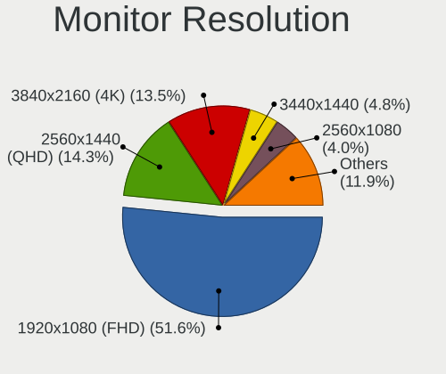

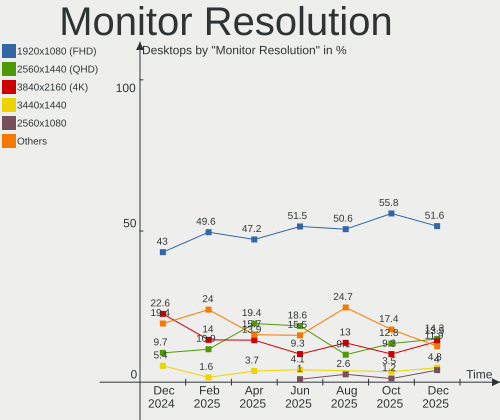

| Resolution         | Desktops | Percent |
|--------------------|----------|---------|
| 1920x1080 (FHD)    | 65       | 51.59%  |
| 2560x1440 (QHD)    | 18       | 14.29%  |
| 3840x2160 (4K)     | 17       | 13.49%  |
| 3440x1440          | 6        | 4.76%   |
| 2560x1080          | 5        | 3.97%   |
| 1680x1050 (WSXGA+) | 2        | 1.59%   |
| 1280x1024 (SXGA)   | 2        | 1.59%   |
| Unknown            | 2        | 1.59%   |
| 3840x1080          | 1        | 0.79%   |
| 2560x2880          | 1        | 0.79%   |
| 2288x1287          | 1        | 0.79%   |
| 1920x540           | 1        | 0.79%   |
| 1920x1200 (WUXGA)  | 1        | 0.79%   |
| 1600x900 (HD+)     | 1        | 0.79%   |
| 1600x1200          | 1        | 0.79%   |
| 1440x900 (WXGA+)   | 1        | 0.79%   |
| 1280x960           | 1        | 0.79%   |

Monitor Diagonal
----------------

Diagonal size in inches

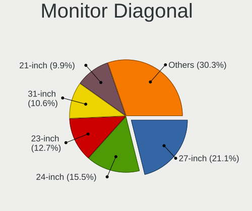

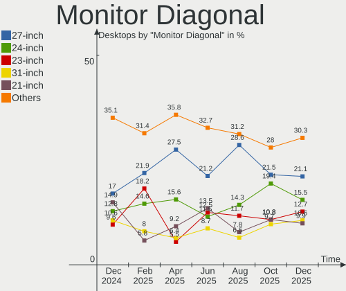

| Inches  | Desktops | Percent |
|---------|----------|---------|
| 27      | 30       | 21.13%  |
| 24      | 22       | 15.49%  |
| 23      | 18       | 12.68%  |
| 31      | 15       | 10.56%  |
| 21      | 14       | 9.86%   |
| 34      | 8        | 5.63%   |
| 20      | 3        | 2.11%   |
| Unknown | 3        | 2.11%   |
| 84      | 2        | 1.41%   |
| 74      | 2        | 1.41%   |
| 72      | 2        | 1.41%   |
| 40      | 2        | 1.41%   |
| 32      | 2        | 1.41%   |
| 29      | 2        | 1.41%   |
| 26      | 2        | 1.41%   |
| 22      | 2        | 1.41%   |
| 19      | 2        | 1.41%   |
| 142     | 1        | 0.7%    |
| 85      | 1        | 0.7%    |
| 64      | 1        | 0.7%    |
| 54      | 1        | 0.7%    |
| 49      | 1        | 0.7%    |
| 48      | 1        | 0.7%    |
| 42      | 1        | 0.7%    |
| 36      | 1        | 0.7%    |
| 18      | 1        | 0.7%    |
| 17      | 1        | 0.7%    |
| 14      | 1        | 0.7%    |

Monitor Width
-------------

Physical width

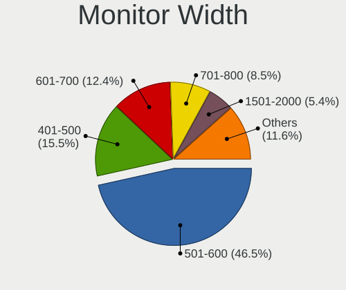

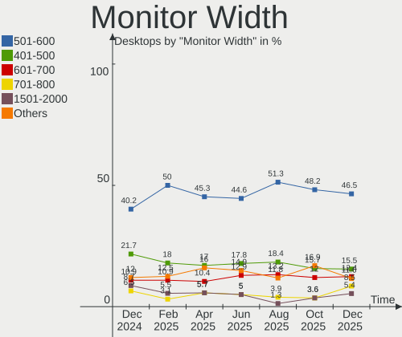

| Width in mm    | Desktops | Percent |
|----------------|----------|---------|
| 501-600        | 60       | 46.51%  |
| 401-500        | 20       | 15.5%   |
| 601-700        | 16       | 12.4%   |
| 701-800        | 11       | 8.53%   |
| 1501-2000      | 7        | 5.43%   |
| 1001-1500      | 4        | 3.1%    |
| Unknown        | 3        | 2.33%   |
| 351-400        | 2        | 1.55%   |
| 901-1000       | 2        | 1.55%   |
| More than 2000 | 1        | 0.78%   |
| 801-900        | 1        | 0.78%   |
| 301-350        | 1        | 0.78%   |
| 201-300        | 1        | 0.78%   |

Aspect Ratio
------------

Proportional relationship between the width and the height

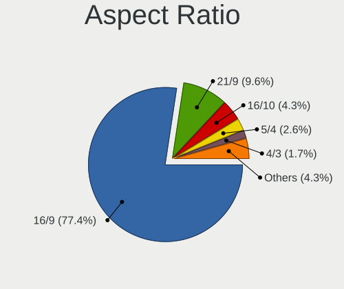

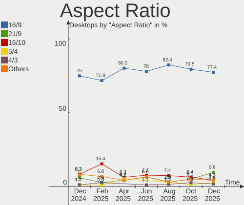

| Ratio   | Desktops | Percent |
|---------|----------|---------|
| 16/9    | 89       | 77.39%  |
| 21/9    | 11       | 9.57%   |
| 16/10   | 5        | 4.35%   |
| 5/4     | 3        | 2.61%   |
| 4/3     | 2        | 1.74%   |
| 32/9    | 1        | 0.87%   |
| 1.96    | 1        | 0.87%   |
| 1.00    | 1        | 0.87%   |
| 0.89    | 1        | 0.87%   |
| Unknown | 1        | 0.87%   |

Monitor Area
------------

Area in inch²

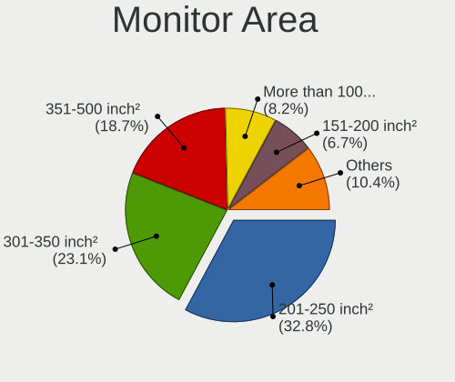

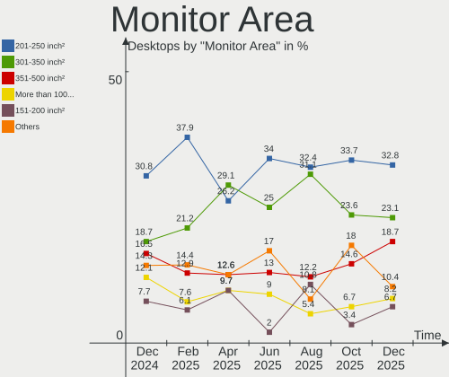

| Area in inch² | Desktops | Percent |
|----------------|----------|---------|
| 201-250        | 44       | 32.84%  |
| 301-350        | 31       | 23.13%  |
| 351-500        | 25       | 18.66%  |
| More than 1000 | 11       | 8.21%   |
| 151-200        | 9        | 6.72%   |
| 501-1000       | 5        | 3.73%   |
| 251-300        | 4        | 2.99%   |
| Unknown        | 3        | 2.24%   |
| 141-150        | 1        | 0.75%   |
| 101-110        | 1        | 0.75%   |

Pixel Density
-------------

Pixels per inch

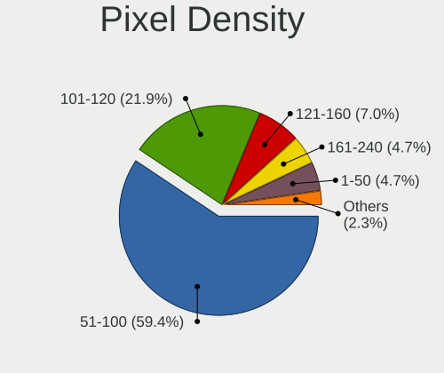

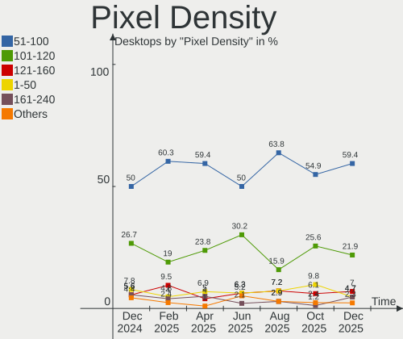

| Density | Desktops | Percent |
|---------|----------|---------|
| 51-100  | 76       | 59.38%  |
| 101-120 | 28       | 21.88%  |
| 121-160 | 9        | 7.03%   |
| 1-50    | 6        | 4.69%   |
| 161-240 | 6        | 4.69%   |
| Unknown | 3        | 2.34%   |

Multiple Monitors
-----------------

Total monitors connected

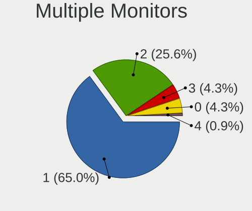

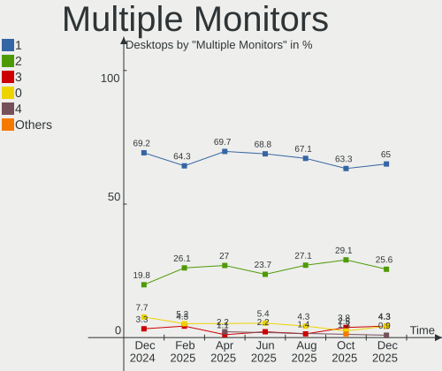

| Total | Desktops | Percent |
|-------|----------|---------|
| 1     | 76       | 64.96%  |
| 2     | 30       | 25.64%  |
| 3     | 5        | 4.27%   |
| 0     | 5        | 4.27%   |
| 4     | 1        | 0.85%   |

Network
-------

Net Controller Vendor
---------------------

Controller vendors

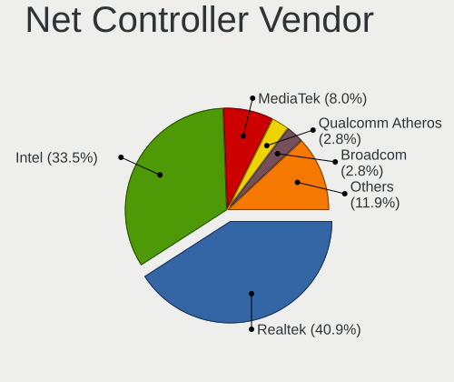

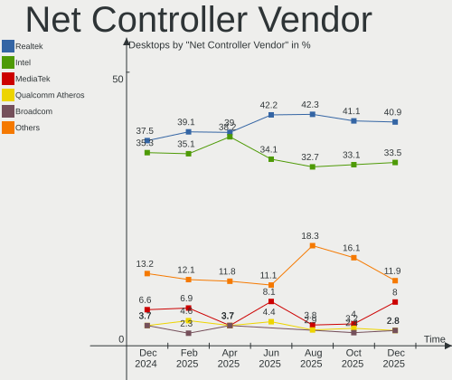

| Vendor                 | Desktops | Percent |
|------------------------|----------|---------|
| Realtek Semiconductor  | 72       | 40.91%  |
| Intel                  | 59       | 33.52%  |
| MediaTek               | 14       | 7.95%   |
| Qualcomm Atheros       | 5        | 2.84%   |
| Broadcom               | 5        | 2.84%   |
| TP-Link                | 4        | 2.27%   |
| Ralink                 | 2        | 1.14%   |
| Qualcomm Technologies  | 2        | 1.14%   |
| Microsoft              | 2        | 1.14%   |
| Google                 | 2        | 1.14%   |
| Samsung Electronics    | 1        | 0.57%   |
| NetGear                | 1        | 0.57%   |
| Motorola PCS           | 1        | 0.57%   |
| Leo Bodnar Electronics | 1        | 0.57%   |
| D-Link                 | 1        | 0.57%   |
| Broadcom Limited       | 1        | 0.57%   |
| ASIX Electronics       | 1        | 0.57%   |
| Aquantia               | 1        | 0.57%   |
| aicsemi                | 1        | 0.57%   |

Net Controller Model
--------------------

Controller models

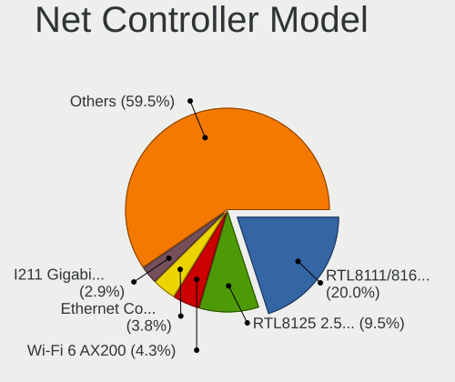

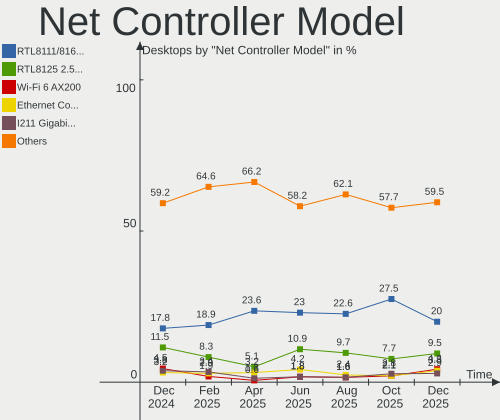

| Model                                                                           | Desktops | Percent |
|---------------------------------------------------------------------------------|----------|---------|
| Realtek RTL8111/8168/8211/8411 PCI Express Gigabit Ethernet Controller          | 42       | 20%     |
| Realtek RTL8125 2.5GbE Controller                                               | 20       | 9.52%   |
| Intel Wi-Fi 6 AX200                                                             | 9        | 4.29%   |
| Intel Ethernet Controller I225-V                                                | 8        | 3.81%   |
| Intel I211 Gigabit Network Connection                                           | 6        | 2.86%   |
| MediaTek MT7925 802.11be 160MHz 2x2 PCIe Wireless Network Adapter [Filogic 360] | 5        | 2.38%   |
| Intel Dual Band Wireless-AC 3168NGW [Stone Peak]                                | 5        | 2.38%   |
| Intel 82579LM Gigabit Network Connection (Lewisville)                           | 5        | 2.38%   |
| MediaTek MT7922 802.11ax PCI Express Wireless Network Adapter                   | 4        | 1.9%    |
| Intel Ethernet Connection (7) I219-V                                            | 4        | 1.9%    |
| Realtek RTL8821CE 802.11ac PCIe Wireless Network Adapter                        | 3        | 1.43%   |
| Realtek Killer E2600 GbE Controller                                             | 3        | 1.43%   |
| Realtek 802.11ac NIC                                                            | 3        | 1.43%   |
| Intel Wi-Fi 5(802.11ac) Wireless-AC 9x6x [Thunder Peak]                         | 3        | 1.43%   |
| Intel Ethernet Connection I217-V                                                | 3        | 1.43%   |
| Intel Ethernet Connection I217-LM                                               | 3        | 1.43%   |
| Intel Ethernet Connection (2) I219-V                                            | 3        | 1.43%   |
| Intel Cannon Lake PCH CNVi WiFi                                                 | 3        | 1.43%   |
| Realtek RTL8852CE PCIe 802.11ax Wireless Network Controller                     | 2        | 0.95%   |
| Realtek RTL8852BE PCIe 802.11ax Wireless Network Controller                     | 2        | 0.95%   |
| Realtek RTL8126 5GbE Controller                                                 | 2        | 0.95%   |
| Realtek Killer E3000 2.5GbE Controller                                          | 2        | 0.95%   |
| Qualcomm WCN785x Wi-Fi 7(802.11be) 320MHz 2x2 [FastConnect 7800]                | 2        | 0.95%   |
| Microsoft Xbox Wireless Adapter for Windows                                     | 2        | 0.95%   |
| MediaTek MT7921K (RZ608) Wi-Fi 6E 80MHz                                         | 2        | 0.95%   |
| Intel Wireless 8265 / 8275                                                      | 2        | 0.95%   |
| Intel Wi-Fi 6E(802.11ax) AX210/AX1675* 2x2 [Typhoon Peak]                       | 2        | 0.95%   |
| Intel Ethernet Controller I226-V                                                | 2        | 0.95%   |
| Intel 82574L Gigabit Network Connection                                         | 2        | 0.95%   |
| Google Pixel 9a                                                                 | 2        | 0.95%   |
| TP-Link TL-WN823N v2/v3 [Realtek RTL8192EU]                                     | 1        | 0.48%   |
| TP-Link TL-WN821N v5/v6 [RTL8192EU]                                             | 1        | 0.48%   |
| TP-Link Archer T4U ver.3                                                        | 1        | 0.48%   |
| TP-Link 802.11ac NIC                                                            | 1        | 0.48%   |
| Samsung Galaxy series, misc. (tethering mode)                                   | 1        | 0.48%   |
| Realtek USB 10/100/1G/2.5 LAN                                                   | 1        | 0.48%   |
| Realtek RTL8922AE 802.11be PCIe Wireless Network Adapter                        | 1        | 0.48%   |
| Realtek RTL88x2bu [AC1200 Techkey]                                              | 1        | 0.48%   |
| Realtek RTL8851BE PCIe 802.11ax Wireless Network Controller                     | 1        | 0.48%   |
| Realtek RTL8822BE 802.11a/b/g/n/ac WiFi adapter                                 | 1        | 0.48%   |

Wireless Vendor
---------------

Wireless vendors

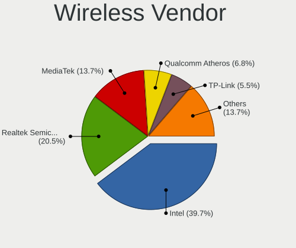

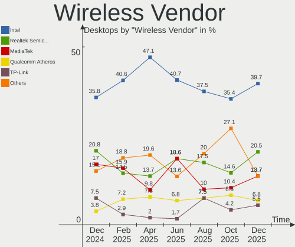

| Vendor                | Desktops | Percent |
|-----------------------|----------|---------|
| Intel                 | 29       | 39.73%  |
| Realtek Semiconductor | 15       | 20.55%  |
| MediaTek              | 10       | 13.7%   |
| Qualcomm Atheros      | 5        | 6.85%   |
| TP-Link               | 4        | 5.48%   |
| Ralink                | 2        | 2.74%   |
| Microsoft             | 2        | 2.74%   |
| Broadcom              | 2        | 2.74%   |
| Qualcomm Technologies | 1        | 1.37%   |
| NetGear               | 1        | 1.37%   |
| D-Link                | 1        | 1.37%   |
| Broadcom Limited      | 1        | 1.37%   |

Wireless Model
--------------

Wireless models

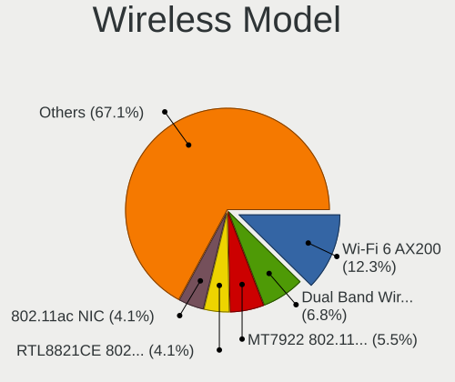

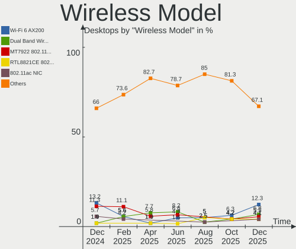

| Model                                                                                 | Desktops | Percent |
|---------------------------------------------------------------------------------------|----------|---------|
| Intel Wi-Fi 6 AX200                                                                   | 9        | 12.33%  |
| Intel Dual Band Wireless-AC 3168NGW [Stone Peak]                                      | 5        | 6.85%   |
| MediaTek MT7922 802.11ax PCI Express Wireless Network Adapter                         | 4        | 5.48%   |
| Realtek RTL8821CE 802.11ac PCIe Wireless Network Adapter                              | 3        | 4.11%   |
| Realtek 802.11ac NIC                                                                  | 3        | 4.11%   |
| Intel Wi-Fi 5(802.11ac) Wireless-AC 9x6x [Thunder Peak]                               | 3        | 4.11%   |
| Intel Cannon Lake PCH CNVi WiFi                                                       | 3        | 4.11%   |
| Realtek RTL8852CE PCIe 802.11ax Wireless Network Controller                           | 2        | 2.74%   |
| Realtek RTL8852BE PCIe 802.11ax Wireless Network Controller                           | 2        | 2.74%   |
| Microsoft Xbox Wireless Adapter for Windows                                           | 2        | 2.74%   |
| MediaTek MT7921K (RZ608) Wi-Fi 6E 80MHz                                               | 2        | 2.74%   |
| Intel Wireless 8265 / 8275                                                            | 2        | 2.74%   |
| Intel Wi-Fi 6E(802.11ax) AX210/AX1675* 2x2 [Typhoon Peak]                             | 2        | 2.74%   |
| TP-Link TL-WN823N v2/v3 [Realtek RTL8192EU]                                           | 1        | 1.37%   |
| TP-Link TL-WN821N v5/v6 [RTL8192EU]                                                   | 1        | 1.37%   |
| TP-Link Archer T4U ver.3                                                              | 1        | 1.37%   |
| TP-Link 802.11ac NIC                                                                  | 1        | 1.37%   |
| Realtek RTL88x2bu [AC1200 Techkey]                                                    | 1        | 1.37%   |
| Realtek RTL8851BE PCIe 802.11ax Wireless Network Controller                           | 1        | 1.37%   |
| Realtek RTL8822BE 802.11a/b/g/n/ac WiFi adapter                                       | 1        | 1.37%   |
| Realtek RTL8821AE 802.11ac PCIe Wireless Network Adapter                              | 1        | 1.37%   |
| Realtek RTL8188EUS 802.11n Wireless Network Adapter                                   | 1        | 1.37%   |
| Ralink RT5390R 802.11bgn PCIe Wireless Network Adapter                                | 1        | 1.37%   |
| Ralink RT3062 Wireless 802.11n 2T/2R                                                  | 1        | 1.37%   |
| Qualcomm WCN785x Wi-Fi 7(802.11be) 320MHz 2x2 [FastConnect 7800]                      | 1        | 1.37%   |
| Qualcomm Atheros QCA9377 802.11ac Wireless Network Adapter                            | 1        | 1.37%   |
| Qualcomm Atheros AR9485 Wireless Network Adapter                                      | 1        | 1.37%   |
| Qualcomm Atheros AR9462 Wireless Network Adapter                                      | 1        | 1.37%   |
| Qualcomm Atheros AR928X Wireless Network Adapter (PCI-Express)                        | 1        | 1.37%   |
| Qualcomm Atheros AR5418 Wireless Network Adapter [AR5008E 802.11(a)bgn] (PCI-Express) | 1        | 1.37%   |
| NetGear A6150                                                                         | 1        | 1.37%   |
| MediaTek Wi-Fi 6 MT7920 Wireless Network Adapter                                      | 1        | 1.37%   |
| MediaTek MT7925 802.11be 160MHz 2x2 PCIe Wireless Network Adapter [Filogic 360]       | 1        | 1.37%   |
| MediaTek MT7925 (RZ717) Wi-Fi 7 160MHz                                                | 1        | 1.37%   |
| MediaTek MT7921 802.11ax PCIe Wireless Network Adapter [Filogic 330]                  | 1        | 1.37%   |
| Intel Wireless 7265                                                                   | 1        | 1.37%   |
| Intel Wireless 3165                                                                   | 1        | 1.37%   |
| Intel Tiger Lake PCH CNVi WiFi                                                        | 1        | 1.37%   |
| Intel Comet Lake PCH CNVi WiFi                                                        | 1        | 1.37%   |
| Intel Alder Lake-N PCH CNVi WiFi                                                      | 1        | 1.37%   |

Ethernet Vendor
---------------

Ethernet vendors

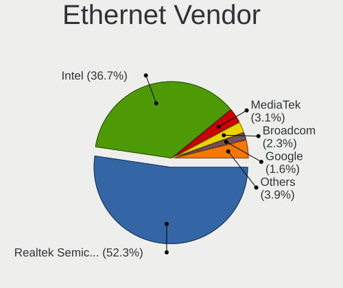

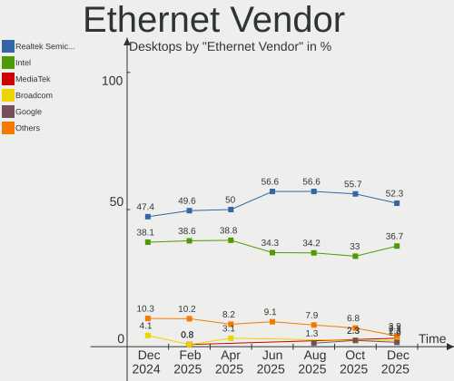

| Vendor                | Desktops | Percent |
|-----------------------|----------|---------|
| Realtek Semiconductor | 67       | 52.34%  |
| Intel                 | 47       | 36.72%  |
| MediaTek              | 4        | 3.13%   |
| Broadcom              | 3        | 2.34%   |
| Google                | 2        | 1.56%   |
| Samsung Electronics   | 1        | 0.78%   |
| Qualcomm Technologies | 1        | 0.78%   |
| Motorola PCS          | 1        | 0.78%   |
| ASIX Electronics      | 1        | 0.78%   |
| Aquantia              | 1        | 0.78%   |

Ethernet Model
--------------

Ethernet models

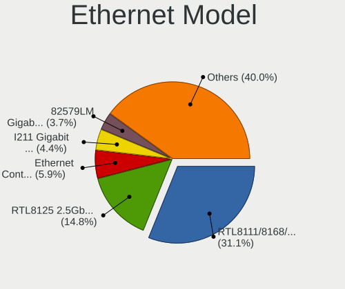

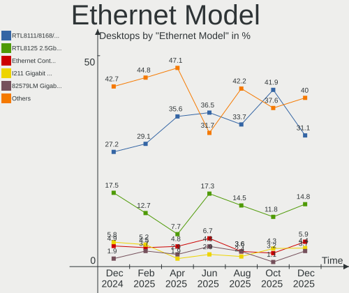

| Model                                                                           | Desktops | Percent |
|---------------------------------------------------------------------------------|----------|---------|
| Realtek RTL8111/8168/8211/8411 PCI Express Gigabit Ethernet Controller          | 42       | 31.11%  |
| Realtek RTL8125 2.5GbE Controller                                               | 20       | 14.81%  |
| Intel Ethernet Controller I225-V                                                | 8        | 5.93%   |
| Intel I211 Gigabit Network Connection                                           | 6        | 4.44%   |
| Intel 82579LM Gigabit Network Connection (Lewisville)                           | 5        | 3.7%    |
| MediaTek MT7925 802.11be 160MHz 2x2 PCIe Wireless Network Adapter [Filogic 360] | 4        | 2.96%   |
| Intel Ethernet Connection (7) I219-V                                            | 4        | 2.96%   |
| Realtek Killer E2600 GbE Controller                                             | 3        | 2.22%   |
| Intel Ethernet Connection I217-V                                                | 3        | 2.22%   |
| Intel Ethernet Connection I217-LM                                               | 3        | 2.22%   |
| Intel Ethernet Connection (2) I219-V                                            | 3        | 2.22%   |
| Realtek RTL8126 5GbE Controller                                                 | 2        | 1.48%   |
| Realtek Killer E3000 2.5GbE Controller                                          | 2        | 1.48%   |
| Intel Ethernet Controller I226-V                                                | 2        | 1.48%   |
| Intel 82574L Gigabit Network Connection                                         | 2        | 1.48%   |
| Google Pixel 9a                                                                 | 2        | 1.48%   |
| Samsung Galaxy series, misc. (tethering mode)                                   | 1        | 0.74%   |
| Realtek USB 10/100/1G/2.5 LAN                                                   | 1        | 0.74%   |
| Realtek RTL8922AE 802.11be PCIe Wireless Network Adapter                        | 1        | 0.74%   |
| Realtek RTL8111/8168/8411 PCI Express Gigabit Ethernet Controller               | 1        | 0.74%   |
| Realtek RTL810xE PCI Express Fast Ethernet controller                           | 1        | 0.74%   |
| Qualcomm WCN785x Wi-Fi 7(802.11be) 320MHz 2x2 [FastConnect 7800]                | 1        | 0.74%   |
| Motorola PCS moto g100 pro                                                      | 1        | 0.74%   |
| Intel Wi-Fi 7(802.11be) AX1775*/AX1790*/BE20*/BE401/BE1750* 2x2                 | 1        | 0.74%   |
| Intel Ethernet Connection I218-V                                                | 1        | 0.74%   |
| Intel Ethernet Connection (5) I219-V                                            | 1        | 0.74%   |
| Intel Ethernet Connection (5) I219-LM                                           | 1        | 0.74%   |
| Intel Ethernet Connection (2) I219-LM                                           | 1        | 0.74%   |
| Intel Ethernet Connection (17) I219-V                                           | 1        | 0.74%   |
| Intel Ethernet Connection (14) I219-V                                           | 1        | 0.74%   |
| Intel 82599ES 10-Gigabit SFI/SFP+ Network Connection                            | 1        | 0.74%   |
| Intel 82583V Gigabit Network Connection                                         | 1        | 0.74%   |
| Intel 82579V Gigabit Network Connection                                         | 1        | 0.74%   |
| Intel 82573E Gigabit Ethernet Controller (Copper)                               | 1        | 0.74%   |
| Intel 82566DM-2 Gigabit Network Connection                                      | 1        | 0.74%   |
| Broadcom NetXtreme BCM5764M Gigabit Ethernet PCIe                               | 1        | 0.74%   |
| Broadcom NetXtreme BCM5761 Gigabit Ethernet PCIe                                | 1        | 0.74%   |
| Broadcom NetLink BCM57780 Gigabit Ethernet PCIe                                 | 1        | 0.74%   |
| ASIX AX88179 Gigabit Ethernet                                                   | 1        | 0.74%   |
| Aquantia AQC111 NBase-T/IEEE 802.3bz Ethernet Controller [AQtion]               | 1        | 0.74%   |

Net Controller Kind
-------------------

Ethernet, WiFi or modem

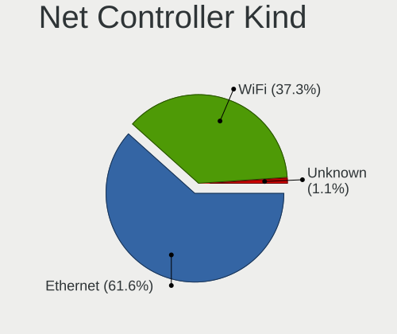

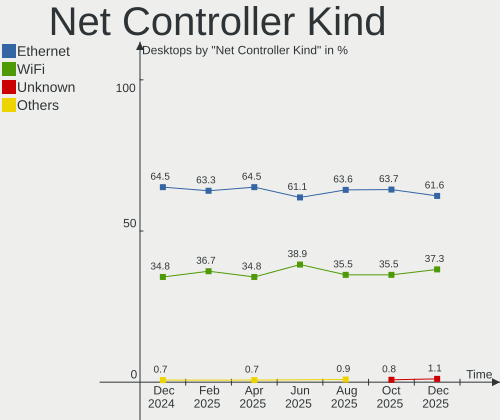

| Kind     | Desktops | Percent |
|----------|----------|---------|
| Ethernet | 114      | 61.62%  |
| WiFi     | 69       | 37.3%   |
| Unknown  | 2        | 1.08%   |

Used Controller
---------------

Currently used network controller

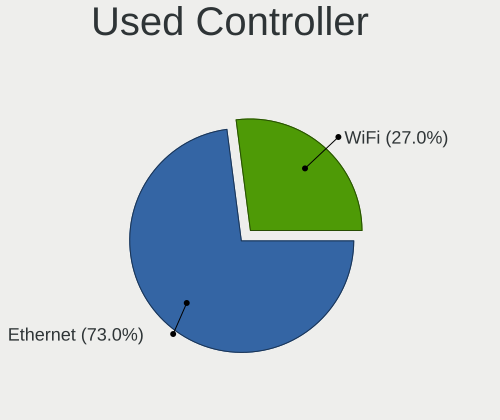

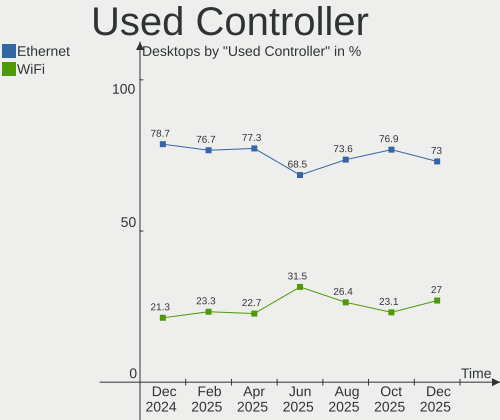

| Kind     | Desktops | Percent |
|----------|----------|---------|
| Ethernet | 89       | 72.95%  |
| WiFi     | 33       | 27.05%  |

NICs
----

Total network controllers on board

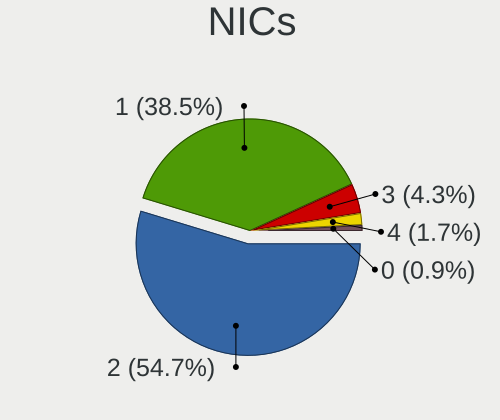

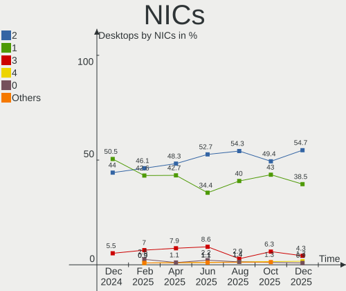

| Total | Desktops | Percent |
|-------|----------|---------|
| 2     | 64       | 54.7%   |
| 1     | 45       | 38.46%  |
| 3     | 5        | 4.27%   |
| 4     | 2        | 1.71%   |
| 0     | 1        | 0.85%   |

IPv6
----

IPv6 vs IPv4

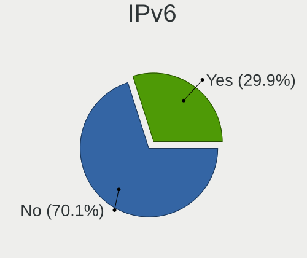

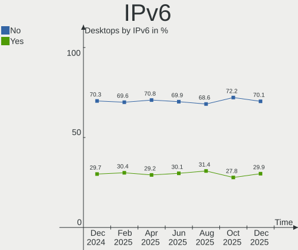

| Used | Desktops | Percent |
|------|----------|---------|
| No   | 82       | 70.09%  |
| Yes  | 35       | 29.91%  |

Bluetooth
---------

Bluetooth Vendor
----------------

Controller vendors

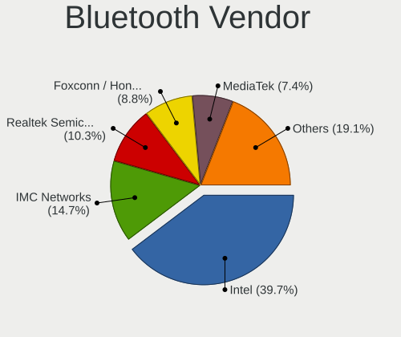

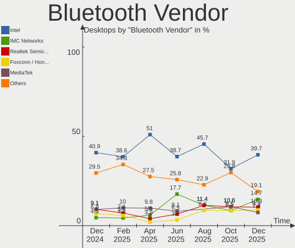

| Vendor                          | Desktops | Percent |
|---------------------------------|----------|---------|
| Intel                           | 27       | 39.71%  |
| IMC Networks                    | 10       | 14.71%  |
| Realtek Semiconductor           | 7        | 10.29%  |
| Foxconn / Hon Hai               | 6        | 8.82%   |
| MediaTek                        | 5        | 7.35%   |
| Cambridge Silicon Radio         | 3        | 4.41%   |
| ASUSTek Computer                | 3        | 4.41%   |
| Qualcomm Atheros Communications | 2        | 2.94%   |
| Unknown                         | 2        | 2.94%   |
| Lite-On Technology              | 1        | 1.47%   |
| Broadcom                        | 1        | 1.47%   |
| AICSemi                         | 1        | 1.47%   |

Bluetooth Model
---------------

Controller models

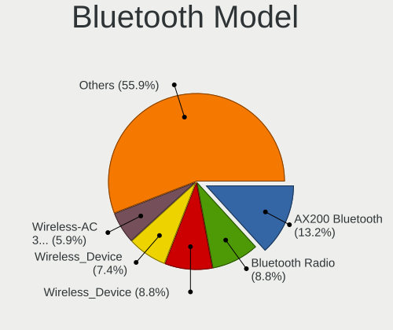

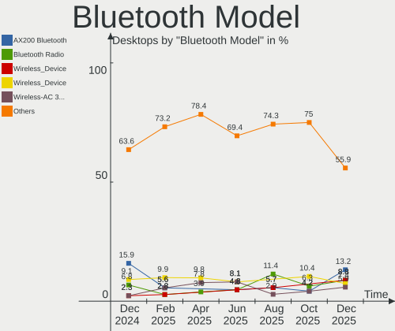

| Model                                               | Desktops | Percent |
|-----------------------------------------------------|----------|---------|
| Intel AX200 Bluetooth                               | 9        | 13.24%  |
| Realtek Bluetooth Radio                             | 6        | 8.82%   |
| IMC Networks Wireless_Device                        | 6        | 8.82%   |
| MediaTek Wireless_Device                            | 5        | 7.35%   |
| Intel Wireless-AC 3168 Bluetooth                    | 4        | 5.88%   |
| Intel Bluetooth wireless interface                  | 4        | 5.88%   |
| IMC Networks Bluetooth Radio                        | 4        | 5.88%   |
| Intel Bluetooth 9460/9560 Jefferson Peak (JfP)      | 3        | 4.41%   |
| Intel AX201 Bluetooth                               | 3        | 4.41%   |
| Foxconn / Hon Hai Wireless_Device                   | 3        | 4.41%   |
| Cambridge Silicon Radio Bluetooth Dongle (HCI mode) | 3        | 4.41%   |
| Intel Wireless-AC 9260 Bluetooth Adapter            | 2        | 2.94%   |
| Foxconn / Hon Hai Bluetooth Device                  | 2        | 2.94%   |
| ASUS ASUS USB-BT500                                 | 2        | 2.94%   |
| Unknown                                             | 2        | 2.94%   |
| Realtek Bluetooth 5.4 Radio                         | 1        | 1.47%   |
| Qualcomm Atheros  Bluetooth Device                  | 1        | 1.47%   |
| Qualcomm Atheros AR3011 Bluetooth                   | 1        | 1.47%   |
| Lite-On Bluetooth Device                            | 1        | 1.47%   |
| Intel Bluetooth Device                              | 1        | 1.47%   |
| Intel AX210 Bluetooth                               | 1        | 1.47%   |
| Foxconn / Hon Hai Bluetooth Radio                   | 1        | 1.47%   |
| Broadcom BCM20702A0 Bluetooth                       | 1        | 1.47%   |
| ASUS Bluetooth Radio                                | 1        | 1.47%   |
| AICSemi AIC 8800D80                                 | 1        | 1.47%   |

Sound
-----

Sound Vendor
------------

Sound card vendors

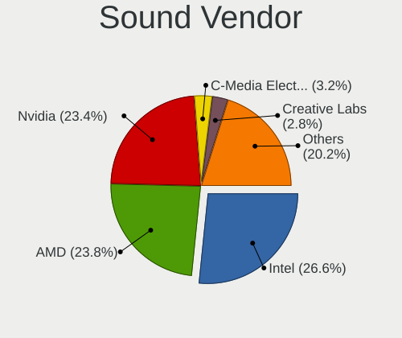

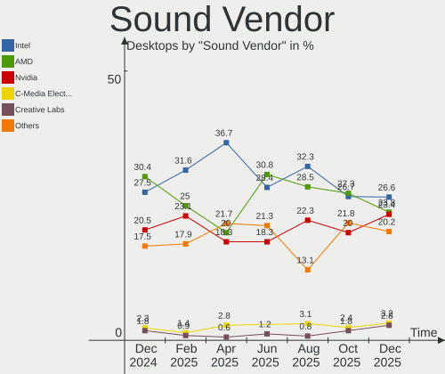

| Vendor                      | Desktops | Percent |
|-----------------------------|----------|---------|
| Intel                       | 66       | 26.61%  |
| AMD                         | 59       | 23.79%  |
| Nvidia                      | 58       | 23.39%  |
| C-Media Electronics         | 8        | 3.23%   |
| Creative Labs               | 7        | 2.82%   |
| Logitech                    | 6        | 2.42%   |
| Realtek Semiconductor       | 4        | 1.61%   |
| Texas Instruments           | 3        | 1.21%   |
| SteelSeries ApS             | 3        | 1.21%   |
| Razer USA                   | 3        | 1.21%   |
| Hewlett-Packard             | 3        | 1.21%   |
| Focusrite-Novation          | 2        | 0.81%   |
| FiiO Electronics Technology | 2        | 0.81%   |
| ASUSTek Computer            | 2        | 0.81%   |
| Yamaha                      | 1        | 0.4%    |
| XMOS                        | 1        | 0.4%    |
| VIA Technologies            | 1        | 0.4%    |
| Valve Software              | 1        | 0.4%    |
| PreSonus Audio Electronics  | 1        | 0.4%    |
| ONN                         | 1        | 0.4%    |
| Nordic Semiconductor ASA    | 1        | 0.4%    |
| Medeli Electronics          | 1        | 0.4%    |
| Lynx Studio Technology      | 1        | 0.4%    |
| KTMicro                     | 1        | 0.4%    |
| JMTek                       | 1        | 0.4%    |
| Jieli Technology            | 1        | 0.4%    |
| Giga-Byte Technology        | 1        | 0.4%    |
| Generalplus Technology      | 1        | 0.4%    |
| Creative Technology         | 1        | 0.4%    |
| Blue Microphones            | 1        | 0.4%    |
| Bigscreen                   | 1        | 0.4%    |
| BEHRINGER International     | 1        | 0.4%    |
| ASRock                      | 1        | 0.4%    |
| Apple                       | 1        | 0.4%    |
| Antlion Audio               | 1        | 0.4%    |
| Actions Semiconductor       | 1        | 0.4%    |

Sound Model
-----------

Sound card models

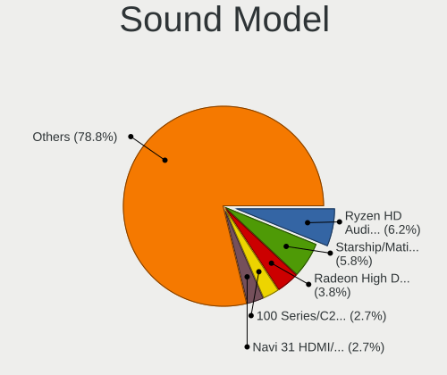

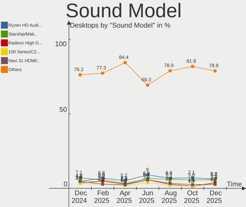

| Model                                                                                           | Desktops | Percent |
|-------------------------------------------------------------------------------------------------|----------|---------|
| AMD Ryzen HD Audio Controller                                                                   | 18       | 6.16%   |
| AMD Starship/Matisse HD Audio Controller                                                        | 17       | 5.82%   |
| AMD Radeon High Definition Audio Controller                                                     | 11       | 3.77%   |
| Intel 100 Series/C230 Series Chipset Family HD Audio Controller                                 | 8        | 2.74%   |
| AMD Navi 31 HDMI/DP Audio                                                                       | 8        | 2.74%   |
| AMD Navi 21/23 HDMI/DP Audio Controller                                                         | 7        | 2.4%    |
| Intel 8 Series/C220 Series Chipset High Definition Audio Controller                             | 6        | 2.05%   |
| AMD Navi 48 HDMI/DP Audio Controller                                                            | 6        | 2.05%   |
| Nvidia TU106 High Definition Audio Controller                                                   | 5        | 1.71%   |
| Nvidia GP107GL High Definition Audio Controller                                                 | 5        | 1.71%   |
| Intel 7 Series/C216 Chipset Family High Definition Audio Controller                             | 5        | 1.71%   |
| Creative Labs CA0132 Sound Core3D [Sound Blaster Recon3D / Z-Series / Sound BlasterX AE-5 Plus] | 5        | 1.71%   |
| AMD SBx00 Azalia (Intel HDA)                                                                    | 5        | 1.71%   |
| AMD Renoir/Cezanne HDMI/DP Audio Controller                                                     | 5        | 1.71%   |
| AMD Family 17h (Models 00h-0fh) HD Audio Controller                                             | 5        | 1.71%   |
| Nvidia TU116 High Definition Audio Controller                                                   | 4        | 1.37%   |
| Nvidia TU104 HD Audio Controller                                                                | 4        | 1.37%   |
| Nvidia GP106 High Definition Audio Controller                                                   | 4        | 1.37%   |
| Nvidia GA104 High Definition Audio Controller                                                   | 4        | 1.37%   |
| Nvidia GA102 High Definition Audio Controller                                                   | 4        | 1.37%   |
| Intel Cannon Lake PCH cAVS                                                                      | 4        | 1.37%   |
| Intel 82801JI (ICH10 Family) HD Audio Controller                                                | 4        | 1.37%   |
| Intel 82801I (ICH9 Family) HD Audio Controller                                                  | 4        | 1.37%   |
| Nvidia GM107 High Definition Audio Controller [GeForce 940MX]                                   | 3        | 1.03%   |
| Nvidia AD104 High Definition Audio Controller                                                   | 3        | 1.03%   |
| Nvidia AD103 High Definition Audio Controller                                                   | 3        | 1.03%   |
| Intel Xeon E3-1200 v3/4th Gen Core Processor HD Audio Controller                                | 3        | 1.03%   |
| Intel Tiger Lake-H HD Audio Controller                                                          | 3        | 1.03%   |
| Intel Raptor Lake High Definition Audio Controller                                              | 3        | 1.03%   |
| Intel 800 Series ACE (Audio Context Engine)                                                     | 3        | 1.03%   |
| Intel 6 Series/C200 Series Chipset Family High Definition Audio Controller                      | 3        | 1.03%   |
| Intel 200 Series PCH HD Audio                                                                   | 3        | 1.03%   |
| Texas Instruments PCM2902 Audio Codec                                                           | 2        | 0.68%   |
| Nvidia GP104 High Definition Audio Controller                                                   | 2        | 0.68%   |
| Nvidia GM206 High Definition Audio Controller                                                   | 2        | 0.68%   |
| Nvidia GM204 High Definition Audio Controller                                                   | 2        | 0.68%   |
| Nvidia AD107 High Definition Audio Controller                                                   | 2        | 0.68%   |
| Logitech Blue Microphones                                                                       | 2        | 0.68%   |
| Intel C610/X99 series chipset HD Audio Controller                                               | 2        | 0.68%   |
| Intel Atom Processor Z36xxx/Z37xxx Series High Definition Audio Controller                      | 2        | 0.68%   |

Memory
------

Memory Vendor
-------------

Memory module vendors

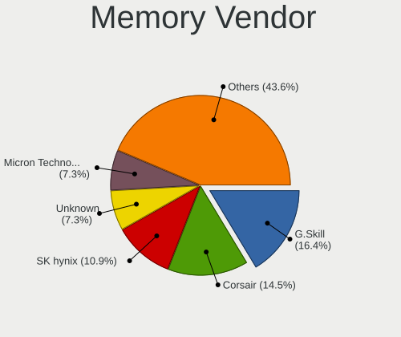

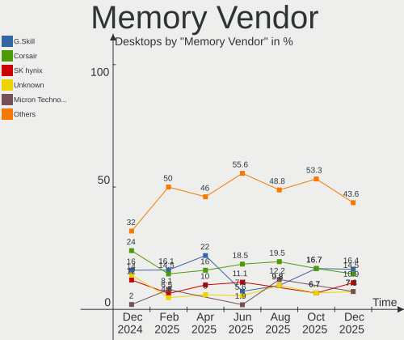

| Vendor              | Desktops | Percent |
|---------------------|----------|---------|
| G.Skill             | 9        | 16.36%  |
| Corsair             | 8        | 14.55%  |
| SK hynix            | 6        | 10.91%  |
| Unknown             | 4        | 7.27%   |
| Micron Technology   | 4        | 7.27%   |
| Kingston            | 4        | 7.27%   |
| Unknown             | 4        | 7.27%   |
| Samsung Electronics | 3        | 5.45%   |
| Crucial             | 3        | 5.45%   |
| Team                | 2        | 3.64%   |
| A-DATA Technology   | 2        | 3.64%   |
| Timetec             | 1        | 1.82%   |
| Patriot             | 1        | 1.82%   |
| Nanya Technology    | 1        | 1.82%   |
| Golden Empire       | 1        | 1.82%   |
| GeIL                | 1        | 1.82%   |
| Atermiter           | 1        | 1.82%   |

Memory Model
------------

Memory module models

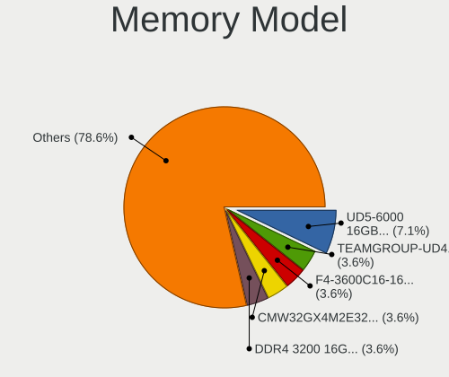

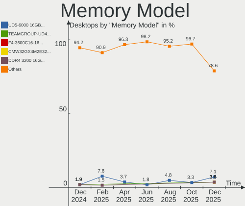

| Model                                                        | Desktops | Percent |
|--------------------------------------------------------------|----------|---------|
| Unknown                                                      | 4        | 7.14%   |
| Team RAM TEAMGROUP-UD4-3600 16GB DIMM DDR4 4000MT/s          | 2        | 3.57%   |
| G.Skill RAM F4-3600C16-16GTZNC 16GiB DIMM DDR4 3600MT/s      | 2        | 3.57%   |
| Corsair RAM CMW32GX4M2E3200C16 16GB DIMM DDR4 3200MT/s       | 2        | 3.57%   |
| A-DATA RAM DDR4 3200 16GB DIMM DDR4 3600MT/s                 | 2        | 3.57%   |
| Unknown RAM Module 8GB DIMM 1333MT/s                         | 1        | 1.79%   |
| Unknown RAM Module 4GB DIMM 1333MT/s                         | 1        | 1.79%   |
| Unknown RAM Module 2GB SODIMM DDR3 800MT/s                   | 1        | 1.79%   |
| Unknown RAM Module 16GB DIMM DDR4 2400MT/s                   | 1        | 1.79%   |
| Timetec RAM U8G-1600 8GB DIMM DDR3 1600MT/s                  | 1        | 1.79%   |
| SK hynix RAM HYMP112U64CP8-S6 1GB DIMM DDR2 800MT/s          | 1        | 1.79%   |
| SK hynix RAM HMT451U6AFR8C-PB 4GB DIMM DDR3 1600MT/s         | 1        | 1.79%   |
| SK hynix RAM HMT41GU6DFR8A-PB 8GB DIMM DDR3 1600MT/s         | 1        | 1.79%   |
| SK hynix RAM HMAA2GU6AJR8N-XN 16GB DIMM DDR4 3200MT/s        | 1        | 1.79%   |
| SK hynix RAM HMAA2GU6AJR8N-XN 16GB DIMM DDR4 2400MT/s        | 1        | 1.79%   |
| SK hynix RAM HMA84GL7MMR4N-TF 32GB RIMM DDR4 2133MT/s        | 1        | 1.79%   |
| Samsung RAM M391B5773CH0-YH9 2GB DIMM DDR3 1333MT/s          | 1        | 1.79%   |
| Samsung RAM M378A5244CB0-CRC 4GB DIMM DDR4 3066MT/s          | 1        | 1.79%   |
| Samsung RAM M378A5143DB0-CPB 4GB DIMM DDR4 2400MT/s          | 1        | 1.79%   |
| Samsung RAM M3 78T5663QZ3-CF7 2GB DIMM DDR2 800MT/s          | 1        | 1.79%   |
| Patriot RAM PSD416G24002 16GB DIMM DDR4 2400MT/s             | 1        | 1.79%   |
| Nanya RAM NT2GC64B8HA0NF-BE 2GB DIMM 1066MT/s                | 1        | 1.79%   |
| Micron RAM MT62F1536M64D8CL-026 6GB DIMM LPDDR5 6000MT/s     | 1        | 1.79%   |
| Micron RAM 8KTF51264AZ-1G6E1 4GB DIMM DDR3 1600MT/s          | 1        | 1.79%   |
| Micron RAM 16JTF25664AZ-1G4F1 2GB DIMM 1333MT/s              | 1        | 1.79%   |
| Micron RAM 16ATF2G64AZ-3G2J1 16GB DIMM DDR4 3200MT/s         | 1        | 1.79%   |
| Kingston RAM X6TCK6-MIE 32GB DIMM DDR4 3400MT/s              | 1        | 1.79%   |
| Kingston RAM KF3200C16D4/8GX 8GiB DIMM DDR4 3600MT/s         | 1        | 1.79%   |
| Kingston RAM ACR32D4S2S1KC-4 4GB SODIMM DDR4 3200MT/s        | 1        | 1.79%   |
| Kingston RAM 9905428-435.A00LF 8GB DIMM DDR3 1600MT/s        | 1        | 1.79%   |
| Golden Empire RAM CL38-44-44 D5-5200 16GB DIMM DDR5 5200MT/s | 1        | 1.79%   |
| GeIL RAM CL16-16-16 D4-2400 8GB DIMM DDR4 2400MT/s           | 1        | 1.79%   |
| G.Skill RAM F5-6000J3038F16G 16GB DIMM DDR5 6000MT/s         | 1        | 1.79%   |
| G.Skill RAM F5-5200J4040A48G 48GB DIMM DDR5 6000MT/s         | 1        | 1.79%   |
| G.Skill RAM F4-3600C18-32GVK 32GiB DIMM DDR4 3600MT/s        | 1        | 1.79%   |
| G.Skill RAM F4-3600C16-8GTZNC 8GB DIMM DDR4 3800MT/s         | 1        | 1.79%   |
| G.Skill RAM F4-3000C16-8GTZR 8GB DIMM DDR4 3200MT/s          | 1        | 1.79%   |
| G.Skill RAM F4-2133C15-8GVR 8GB DIMM DDR4 2133MT/s           | 1        | 1.79%   |
| G.Skill RAM F3-12800CL10-8GBXL 8GB DIMM DDR3 1600MT/s        | 1        | 1.79%   |
| Crucial RAM CT32G48C40U5.M16A1 32GB DIMM DDR5 4800MT/s       | 1        | 1.79%   |

Memory Kind
-----------

Memory module kinds

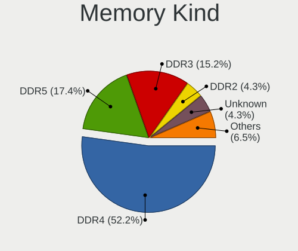

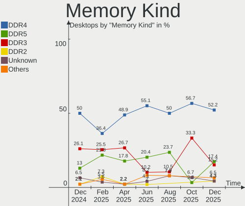

| Kind    | Desktops | Percent |
|---------|----------|---------|
| DDR4    | 24       | 52.17%  |
| DDR5    | 8        | 17.39%  |
| DDR3    | 7        | 15.22%  |
| DDR2    | 2        | 4.35%   |
| Unknown | 2        | 4.35%   |
| SDRAM   | 1        | 2.17%   |
| LPDDR5  | 1        | 2.17%   |
| DDR     | 1        | 2.17%   |

Memory Form Factor
------------------

Physical design of the memory module

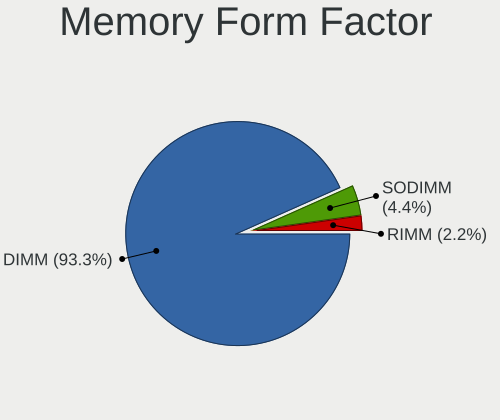

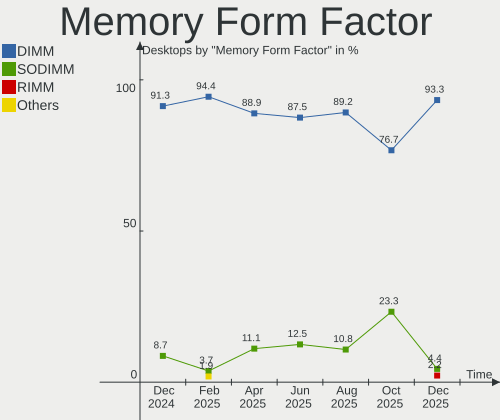

| Name   | Desktops | Percent |
|--------|----------|---------|
| DIMM   | 42       | 93.33%  |
| SODIMM | 2        | 4.44%   |
| RIMM   | 1        | 2.22%   |

Memory Size
-----------

Memory module size

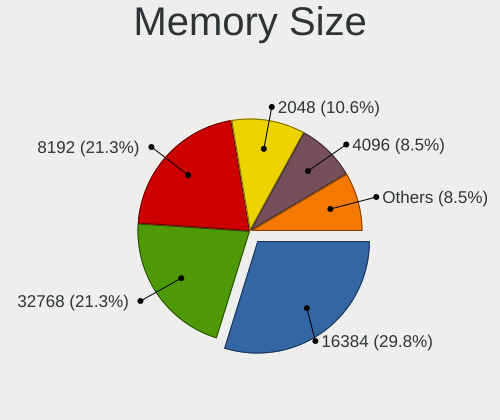

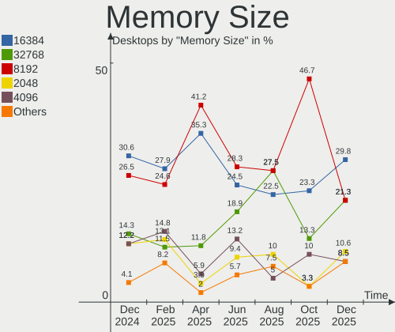

| Size  | Desktops | Percent |
|-------|----------|---------|
| 16384 | 14       | 29.79%  |
| 32768 | 10       | 21.28%  |
| 8192  | 10       | 21.28%  |
| 2048  | 5        | 10.64%  |
| 4096  | 4        | 8.51%   |
| 49152 | 2        | 4.26%   |
| 1024  | 2        | 4.26%   |

Memory Speed
------------

Memory module speed

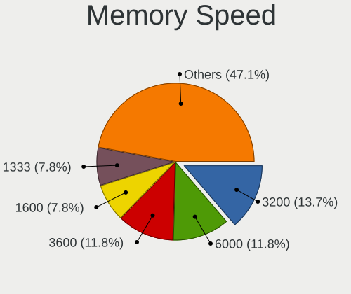

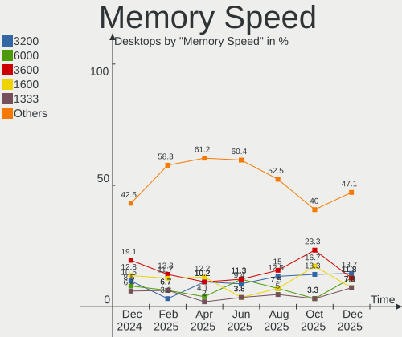

| Speed | Desktops | Percent |
|-------|----------|---------|
| 3200  | 7        | 13.73%  |
| 6000  | 6        | 11.76%  |
| 3600  | 6        | 11.76%  |
| 1600  | 4        | 7.84%   |
| 1333  | 4        | 7.84%   |
| 2400  | 3        | 5.88%   |
| 2133  | 3        | 5.88%   |
| 800   | 3        | 5.88%   |
| 5200  | 2        | 3.92%   |
| 4000  | 2        | 3.92%   |
| 3866  | 2        | 3.92%   |
| 4800  | 1        | 1.96%   |
| 3800  | 1        | 1.96%   |
| 3466  | 1        | 1.96%   |
| 3400  | 1        | 1.96%   |
| 3066  | 1        | 1.96%   |
| 2667  | 1        | 1.96%   |
| 1639  | 1        | 1.96%   |
| 1066  | 1        | 1.96%   |
| 533   | 1        | 1.96%   |

Printers & scanners
-------------------

Printer Vendor
--------------

Printer device vendors

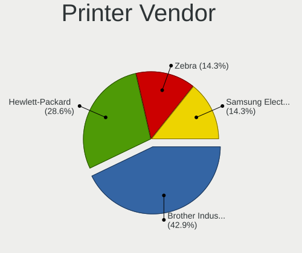

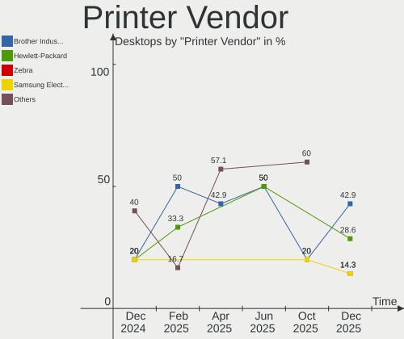

| Vendor              | Desktops | Percent |
|---------------------|----------|---------|
| Brother Industries  | 3        | 42.86%  |
| Hewlett-Packard     | 2        | 28.57%  |
| Zebra               | 1        | 14.29%  |
| Samsung Electronics | 1        | 14.29%  |

Printer Model
-------------

Printer device models

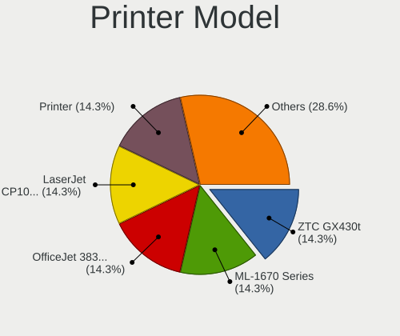

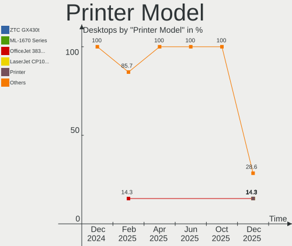

| Model                    | Desktops | Percent |
|--------------------------|----------|---------|
| Zebra ZTC GX430t         | 1        | 14.29%  |
| Samsung ML-1670 Series   | 1        | 14.29%  |
| HP OfficeJet 3830 series | 1        | 14.29%  |
| HP LaserJet CP1025nw     | 1        | 14.29%  |
| Brother Printer          | 1        | 14.29%  |
| Brother MFC-J435W        | 1        | 14.29%  |
| Brother HL-5370DW series | 1        | 14.29%  |

Scanner Vendor
--------------

Scanner device vendors

Zero info for selected period =(

Scanner Model
-------------

Scanner device models

Zero info for selected period =(

Camera
------

Camera Vendor
-------------

Camera device vendors

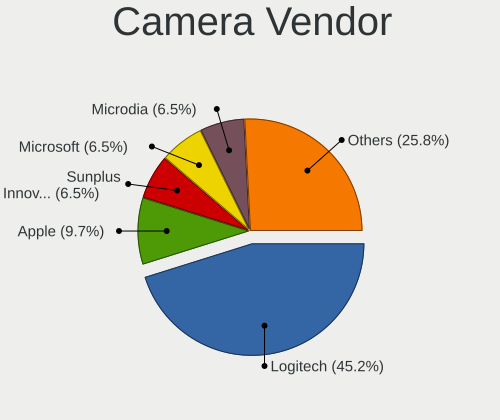

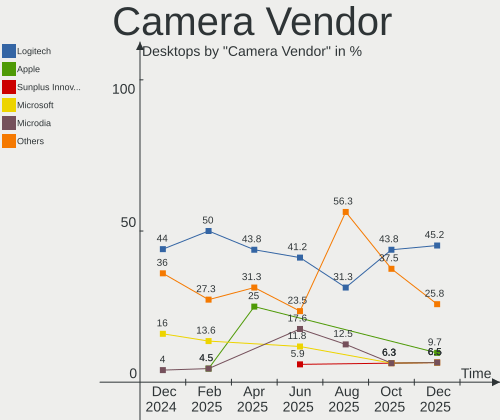

| Vendor                        | Desktops | Percent |
|-------------------------------|----------|---------|
| Logitech                      | 14       | 45.16%  |
| Apple                         | 3        | 9.68%   |
| Sunplus Innovation Technology | 2        | 6.45%   |
| Microsoft                     | 2        | 6.45%   |
| Microdia                      | 2        | 6.45%   |
| Remo Tech                     | 1        | 3.23%   |
| MacroSilicon                  | 1        | 3.23%   |
| KYE Systems (Mouse Systems)   | 1        | 3.23%   |
| Huawei Technologies           | 1        | 3.23%   |
| GoPro                         | 1        | 3.23%   |
| Creative Technology           | 1        | 3.23%   |
| Anker PowerConf C200          | 1        | 3.23%   |
| Anker Innovations Limited     | 1        | 3.23%   |

Camera Model
------------

Camera device models

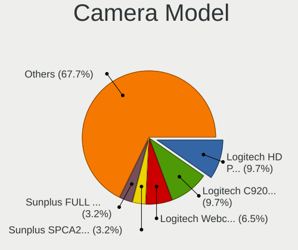

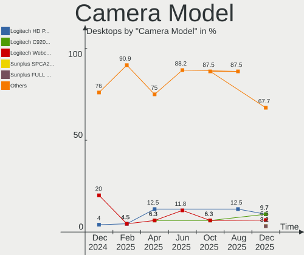

| Model                                                 | Desktops | Percent |
|-------------------------------------------------------|----------|---------|
| Logitech HD Pro Webcam C920                           | 3        | 9.68%   |
| Logitech C920 PRO HD Webcam                           | 3        | 9.68%   |
| Logitech Webcam C270                                  | 2        | 6.45%   |
| Sunplus SPCA2281 Web Camera                           | 1        | 3.23%   |
| Sunplus FULL HD webcam                                | 1        | 3.23%   |
| Remo Tech OBSBOT Meet SE                              | 1        | 3.23%   |
| Microsoft LifeCam VX-2000                             | 1        | 3.23%   |
| Microsoft LifeCam HD-5000                             | 1        | 3.23%   |
| Microdia Webcam Vitade AF                             | 1        | 3.23%   |
| Microdia USB 2.0 Camera                               | 1        | 3.23%   |
| MacroSilicon USB Video                                | 1        | 3.23%   |
| Logitech Webcam C310                                  | 1        | 3.23%   |
| Logitech Webcam C250                                  | 1        | 3.23%   |
| Logitech Logitech Webcam C925e                        | 1        | 3.23%   |
| Logitech HD Webcam C525                               | 1        | 3.23%   |
| Logitech Brio 101                                     | 1        | 3.23%   |
| Logitech Brio 100                                     | 1        | 3.23%   |
| KYE Systems (Mouse Systems) USB 2.0 HD1080P PC Camera | 1        | 3.23%   |
| Huawei HiCamera                                       | 1        | 3.23%   |
| GoPro HERO7 Silver                                    | 1        | 3.23%   |
| Creative Live! Cam Sync V3                            | 1        | 3.23%   |
| Apple Studio Display                                  | 1        | 3.23%   |
| Apple iSight in LED Cinema Display                    | 1        | 3.23%   |
| Apple iPhone 5/5C/5S/6/SE/7/8/X                       | 1        | 3.23%   |
| Anker PowerConf C200 Anker PowerConf C200             | 1        | 3.23%   |
| Anker Innovations Limited AnkerWork C310 Webcam       | 1        | 3.23%   |

Security
--------

Fingerprint Vendor
------------------

Fingerprint sensor vendors

Zero info for selected period =(

Fingerprint Model
-----------------

Fingerprint sensor models

Zero info for selected period =(

Chipcard Vendor
---------------

Chipcard module vendors

Zero info for selected period =(

Chipcard Model
--------------

Chipcard module models

Zero info for selected period =(

Unsupported
-----------

Unsupported Devices
-------------------

Total unsupported devices on board

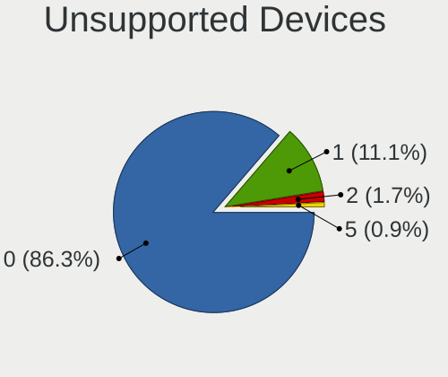

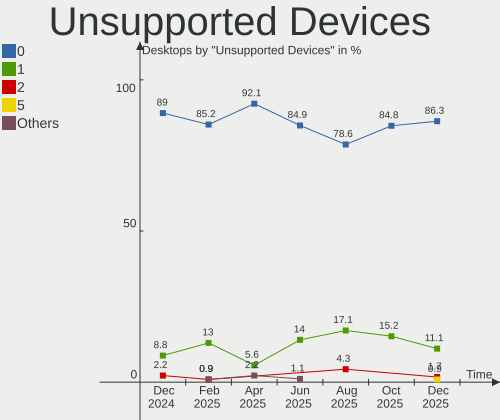

| Total | Desktops | Percent |
|-------|----------|---------|
| 0     | 101      | 86.32%  |
| 1     | 13       | 11.11%  |
| 2     | 2        | 1.71%   |
| 5     | 1        | 0.85%   |

Unsupported Device Types
------------------------

Types of unsupported devices

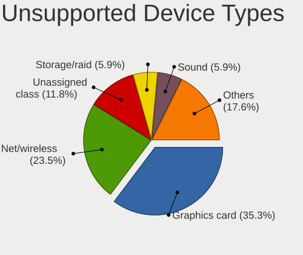

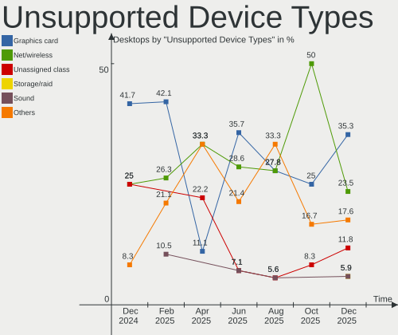

| Type                     | Desktops | Percent |
|--------------------------|----------|---------|
| Graphics card            | 6        | 35.29%  |
| Net/wireless             | 4        | 23.53%  |
| Unassigned class         | 2        | 11.76%  |
| Storage/raid             | 1        | 5.88%   |
| Sound                    | 1        | 5.88%   |
| Dvb card                 | 1        | 5.88%   |
| Communication controller | 1        | 5.88%   |
| Camera                   | 1        | 5.88%   |

