Linux in Canada - Hardware Trends (Desktops)
--------------------------------------------

A project to identify most popular hardware characteristics and track their change
over time based on data collected by Linux users at https://Linux-Hardware.org.

Anyone can contribute to this report by the [hw-probe](https://github.com/linuxhw/hw-probe) tool:

    sudo -E hw-probe -all -upload

Period: Jul, 2023.

Contents
--------

* [ System ](#system)
  - [ OS                       ](#os)
  - [ OS Family                ](#os-family)
  - [ Kernel                   ](#kernel)
  - [ Kernel Family            ](#kernel-family)
  - [ Kernel Major Ver.        ](#kernel-major-ver)
  - [ Arch                     ](#arch)
  - [ DE                       ](#de)
  - [ Display Server           ](#display-server)
  - [ Display Manager          ](#display-manager)
  - [ OS Lang                  ](#os-lang)
  - [ Boot Mode                ](#boot-mode)
  - [ Filesystem               ](#filesystem)
  - [ Part. scheme             ](#part-scheme)
  - [ Dual Boot with Linux/BSD ](#dual-boot-with-linuxbsd)
  - [ Dual Boot (Win)          ](#dual-boot-win)

* [ Board ](#board)
  - [ Vendor                   ](#vendor)
  - [ Model                    ](#model)
  - [ Model Family             ](#model-family)
  - [ MFG Year                 ](#mfg-year)
  - [ Form Factor              ](#form-factor)
  - [ Secure Boot              ](#secure-boot)
  - [ Coreboot                 ](#coreboot)
  - [ RAM Size                 ](#ram-size)
  - [ RAM Used                 ](#ram-used)
  - [ Total Drives             ](#total-drives)
  - [ Has CD-ROM               ](#has-cd-rom)
  - [ Has Ethernet             ](#has-ethernet)
  - [ Has WiFi                 ](#has-wifi)
  - [ Has Bluetooth            ](#has-bluetooth)

* [ Location ](#location)
  - [ Country                  ](#country)
  - [ City                     ](#city)

* [ Drives ](#drives)
  - [ Drive Vendor             ](#drive-vendor)
  - [ Drive Model              ](#drive-model)
  - [ HDD Vendor               ](#hdd-vendor)
  - [ SSD Vendor               ](#ssd-vendor)
  - [ Drive Kind               ](#drive-kind)
  - [ Drive Connector          ](#drive-connector)
  - [ Drive Size               ](#drive-size)
  - [ Space Total              ](#space-total)
  - [ Space Used               ](#space-used)
  - [ Malfunc. Drives          ](#malfunc-drives)
  - [ Malfunc. Drive Vendor    ](#malfunc-drive-vendor)
  - [ Malfunc. HDD Vendor      ](#malfunc-hdd-vendor)
  - [ Malfunc. Drive Kind      ](#malfunc-drive-kind)
  - [ Failed Drives            ](#failed-drives)
  - [ Failed Drive Vendor      ](#failed-drive-vendor)
  - [ Drive Status             ](#drive-status)

* [ Storage controller ](#storage-controller)
  - [ Storage Vendor           ](#storage-vendor)
  - [ Storage Model            ](#storage-model)
  - [ Storage Kind             ](#storage-kind)

* [ Processor ](#processor)
  - [ CPU Vendor               ](#cpu-vendor)
  - [ CPU Model                ](#cpu-model)
  - [ CPU Model Family         ](#cpu-model-family)
  - [ CPU Cores                ](#cpu-cores)
  - [ CPU Sockets              ](#cpu-sockets)
  - [ CPU Threads              ](#cpu-threads)
  - [ CPU Op-Modes             ](#cpu-op-modes)
  - [ CPU Microcode            ](#cpu-microcode)
  - [ CPU Microarch            ](#cpu-microarch)

* [ Graphics ](#graphics)
  - [ GPU Vendor               ](#gpu-vendor)
  - [ GPU Model                ](#gpu-model)
  - [ GPU Combo                ](#gpu-combo)
  - [ GPU Driver               ](#gpu-driver)
  - [ GPU Memory               ](#gpu-memory)

* [ Monitor ](#monitor)
  - [ Monitor Vendor           ](#monitor-vendor)
  - [ Monitor Model            ](#monitor-model)
  - [ Monitor Resolution       ](#monitor-resolution)
  - [ Monitor Diagonal         ](#monitor-diagonal)
  - [ Monitor Width            ](#monitor-width)
  - [ Aspect Ratio             ](#aspect-ratio)
  - [ Monitor Area             ](#monitor-area)
  - [ Pixel Density            ](#pixel-density)
  - [ Multiple Monitors        ](#multiple-monitors)

* [ Network ](#network)
  - [ Net Controller Vendor    ](#net-controller-vendor)
  - [ Net Controller Model     ](#net-controller-model)
  - [ Wireless Vendor          ](#wireless-vendor)
  - [ Wireless Model           ](#wireless-model)
  - [ Ethernet Vendor          ](#ethernet-vendor)
  - [ Ethernet Model           ](#ethernet-model)
  - [ Net Controller Kind      ](#net-controller-kind)
  - [ Used Controller          ](#used-controller)
  - [ NICs                     ](#nics)
  - [ IPv6                     ](#ipv6)

* [ Bluetooth ](#bluetooth)
  - [ Bluetooth Vendor         ](#bluetooth-vendor)
  - [ Bluetooth Model          ](#bluetooth-model)

* [ Sound ](#sound)
  - [ Sound Vendor             ](#sound-vendor)
  - [ Sound Model              ](#sound-model)

* [ Memory ](#memory)
  - [ Memory Vendor            ](#memory-vendor)
  - [ Memory Model             ](#memory-model)
  - [ Memory Kind              ](#memory-kind)
  - [ Memory Form Factor       ](#memory-form-factor)
  - [ Memory Size              ](#memory-size)
  - [ Memory Speed             ](#memory-speed)

* [ Printers & scanners ](#printers--scanners)
  - [ Printer Vendor           ](#printer-vendor)
  - [ Printer Model            ](#printer-model)
  - [ Scanner Vendor           ](#scanner-vendor)
  - [ Scanner Model            ](#scanner-model)

* [ Camera ](#camera)
  - [ Camera Vendor            ](#camera-vendor)
  - [ Camera Model             ](#camera-model)

* [ Security ](#security)
  - [ Fingerprint Vendor       ](#fingerprint-vendor)
  - [ Fingerprint Model        ](#fingerprint-model)
  - [ Chipcard Vendor          ](#chipcard-vendor)
  - [ Chipcard Model           ](#chipcard-model)

* [ Unsupported ](#unsupported)
  - [ Unsupported Devices      ](#unsupported-devices)
  - [ Unsupported Device Types ](#unsupported-device-types)

System
------

OS
--

Installed operating systems

| Name               | Desktops | Percent |
|--------------------|----------|---------|
| Ubuntu 22.04       | 8        | 13.56%  |
| Ubuntu 23.04       | 7        | 11.86%  |
| Fedora 38          | 5        | 8.47%   |
| OpenMandriva 23.03 | 4        | 6.78%   |
| Linux Mint 21.1    | 4        | 6.78%   |
| Arch Rolling       | 4        | 6.78%   |
| Pop!_OS 22.04      | 3        | 5.08%   |
| Linux Mint 21.2    | 3        | 5.08%   |
| Debian 12          | 3        | 5.08%   |
| Ubuntu 22.10       | 2        | 3.39%   |
| Debian 11          | 2        | 3.39%   |
| Zorin 15           | 1        | 1.69%   |
| Xubuntu 22.04      | 1        | 1.69%   |
| Ultramarine 38     | 1        | 1.69%   |
| Ubuntu Unity 16.04 | 1        | 1.69%   |
| Pop!_OS 20.04      | 1        | 1.69%   |
| Manjaro            | 1        | 1.69%   |
| Linux Mint 21      | 1        | 1.69%   |
| Kubuntu 23.04      | 1        | 1.69%   |
| KDE neon 22.04     | 1        | 1.69%   |
| Feren OS 20.04     | 1        | 1.69%   |
| Debian             | 1        | 1.69%   |
| CentOS 7           | 1        | 1.69%   |
| ArcoLinux Rolling  | 1        | 1.69%   |
| AlmaLinux 8.8      | 1        | 1.69%   |

OS Family
---------

OS without a version

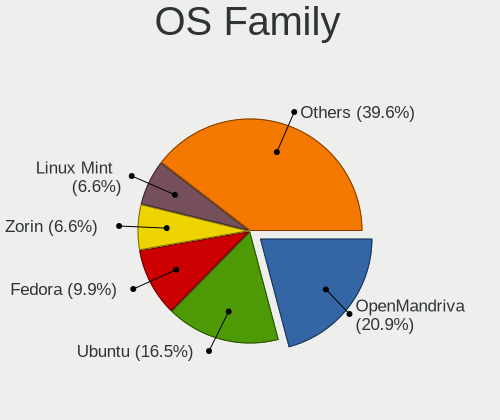

| Name         | Desktops | Percent |
|--------------|----------|---------|
| Ubuntu       | 17       | 28.81%  |
| Linux Mint   | 8        | 13.56%  |
| Debian       | 6        | 10.17%  |
| Fedora       | 5        | 8.47%   |
| Pop!_OS      | 4        | 6.78%   |
| OpenMandriva | 4        | 6.78%   |
| Arch         | 4        | 6.78%   |
| Zorin        | 1        | 1.69%   |
| Xubuntu      | 1        | 1.69%   |
| Ultramarine  | 1        | 1.69%   |
| Ubuntu Unity | 1        | 1.69%   |
| Manjaro      | 1        | 1.69%   |
| Kubuntu      | 1        | 1.69%   |
| KDE neon     | 1        | 1.69%   |
| Feren OS     | 1        | 1.69%   |
| CentOS       | 1        | 1.69%   |
| ArcoLinux    | 1        | 1.69%   |
| AlmaLinux    | 1        | 1.69%   |

Kernel
------

Version of the Linux kernel

| Version                      | Desktops | Percent |
|------------------------------|----------|---------|
| 5.19.0-46-generic            | 9        | 15.25%  |
| 5.15.0-76-generic            | 5        | 8.47%   |
| 6.3.12-200.fc38.x86_64       | 4        | 6.78%   |
| 6.2.6-desktop-1omv2390       | 4        | 6.78%   |
| 6.2.6-76060206-generic       | 3        | 5.08%   |
| 6.4.1-arch1-1                | 2        | 3.39%   |
| 6.2.6-1-pve                  | 2        | 3.39%   |
| 6.2.0-25-generic             | 2        | 3.39%   |
| 6.2.0-24-generic             | 2        | 3.39%   |
| 6.1.0-10-amd64               | 2        | 3.39%   |
| 5.15.0-78-generic            | 2        | 3.39%   |
| 6.4.3-arch1-2                | 1        | 1.69%   |
| 6.4.3-arch1-1                | 1        | 1.69%   |
| 6.4.3-060403-generic         | 1        | 1.69%   |
| 6.4.2-060402-generic         | 1        | 1.69%   |
| 6.4.1-arch2-1                | 1        | 1.69%   |
| 6.3.8-200.fc38.x86_64        | 1        | 1.69%   |
| 6.3.12-1-MANJARO             | 1        | 1.69%   |
| 6.3.0-1-amd64                | 1        | 1.69%   |
| 6.2.9-300.fc38.x86_64        | 1        | 1.69%   |
| 6.2.16-060216-generic        | 1        | 1.69%   |
| 6.2.11-060211-generic        | 1        | 1.69%   |
| 6.2.0-26-generic             | 1        | 1.69%   |
| 6.2.0-20-generic             | 1        | 1.69%   |
| 6.1.0-9-amd64                | 1        | 1.69%   |
| 6.0.12-76060012-generic      | 1        | 1.69%   |
| 5.4.0-120-generic            | 1        | 1.69%   |
| 5.19.5-051905-generic        | 1        | 1.69%   |
| 5.19.0-50-generic            | 1        | 1.69%   |
| 5.15.0-58-generic            | 1        | 1.69%   |
| 4.4.0-31-generic             | 1        | 1.69%   |
| 4.19.187                     | 1        | 1.69%   |
| 4.18.0-477.13.1.el8_8.x86_64 | 1        | 1.69%   |

Kernel Family
-------------

Linux kernel without a distro release

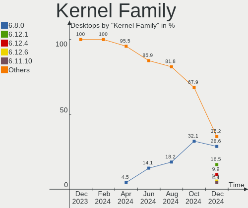

| Version  | Desktops | Percent |
|----------|----------|---------|
| 5.19.0   | 10       | 16.95%  |
| 6.2.6    | 9        | 15.25%  |
| 5.15.0   | 8        | 13.56%  |
| 6.2.0    | 6        | 10.17%  |
| 6.3.12   | 5        | 8.47%   |
| 6.4.3    | 3        | 5.08%   |
| 6.4.1    | 3        | 5.08%   |
| 6.1.0    | 3        | 5.08%   |
| 6.4.2    | 1        | 1.69%   |
| 6.3.8    | 1        | 1.69%   |
| 6.3.0    | 1        | 1.69%   |
| 6.2.9    | 1        | 1.69%   |
| 6.2.16   | 1        | 1.69%   |
| 6.2.11   | 1        | 1.69%   |
| 6.0.12   | 1        | 1.69%   |
| 5.4.0    | 1        | 1.69%   |
| 5.19.5   | 1        | 1.69%   |
| 4.4.0    | 1        | 1.69%   |
| 4.19.187 | 1        | 1.69%   |
| 4.18.0   | 1        | 1.69%   |

Kernel Major Ver.
-----------------

Linux kernel major version

| Version | Desktops | Percent |
|---------|----------|---------|
| 6.2     | 18       | 30.51%  |
| 5.19    | 11       | 18.64%  |
| 5.15    | 8        | 13.56%  |
| 6.4     | 7        | 11.86%  |
| 6.3     | 7        | 11.86%  |
| 6.1     | 3        | 5.08%   |
| 6.0     | 1        | 1.69%   |
| 5.4     | 1        | 1.69%   |
| 4.4     | 1        | 1.69%   |
| 4.19    | 1        | 1.69%   |
| 4.18    | 1        | 1.69%   |

Arch
----

OS architecture (x86_64, i586, etc.)

| Name   | Desktops | Percent |
|--------|----------|---------|
| x86_64 | 57       | 96.61%  |
| i686   | 2        | 3.39%   |

DE
--

Desktop Environment

| Name            | Desktops | Percent |
|-----------------|----------|---------|
| GNOME           | 26       | 44.07%  |
| KDE5            | 11       | 18.64%  |
| X-Cinnamon      | 9        | 15.25%  |
| XFCE            | 4        | 6.78%   |
| Unknown         | 4        | 6.78%   |
| Unity           | 1        | 1.69%   |
| KDE4            | 1        | 1.69%   |
| i3              | 1        | 1.69%   |
| GNOME Flashback | 1        | 1.69%   |
| Cutefish        | 1        | 1.69%   |

Display Server
--------------

X11 or Wayland

| Name    | Desktops | Percent |
|---------|----------|---------|
| X11     | 35       | 59.32%  |
| Wayland | 17       | 28.81%  |
| Unknown | 4        | 6.78%   |
| Tty     | 3        | 5.08%   |

Display Manager
---------------

SDDM, LightDM, etc.

| Name    | Desktops | Percent |
|---------|----------|---------|
| Unknown | 24       | 40.68%  |
| GDM3    | 17       | 28.81%  |
| LightDM | 7        | 11.86%  |
| SDDM    | 6        | 10.17%  |
| GDM     | 5        | 8.47%   |

OS Lang
-------

Language

| Lang  | Desktops | Percent |
|-------|----------|---------|
| en_CA | 34       | 57.63%  |
| en_US | 21       | 35.59%  |
| fr_FR | 2        | 3.39%   |
| fr_CA | 2        | 3.39%   |

Boot Mode
---------

EFI or BIOS

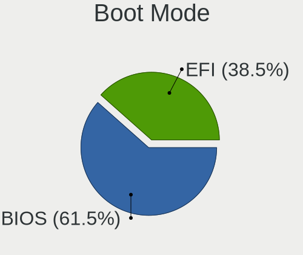

| Mode | Desktops | Percent |
|------|----------|---------|
| EFI  | 30       | 50.85%  |
| BIOS | 29       | 49.15%  |

Filesystem
----------

Type of filesystem

| Type    | Desktops | Percent |
|---------|----------|---------|
| Ext4    | 34       | 57.63%  |
| Tmpfs   | 11       | 18.64%  |
| Btrfs   | 10       | 16.95%  |
| Overlay | 4        | 6.78%   |

Part. scheme
------------

Scheme of partitioning

| Type    | Desktops | Percent |
|---------|----------|---------|
| GPT     | 35       | 59.32%  |
| Unknown | 22       | 37.29%  |
| MBR     | 2        | 3.39%   |

Dual Boot with Linux/BSD
------------------------

Hosting more than one Linux/BSD

| Dual boot | Desktops | Percent |
|-----------|----------|---------|
| No        | 54       | 91.53%  |
| Yes       | 5        | 8.47%   |

Dual Boot (Win)
---------------

Hosting Linux and Windows

| Dual boot | Desktops | Percent |
|-----------|----------|---------|
| No        | 40       | 67.8%   |
| Yes       | 19       | 32.2%   |

Board
-----

Vendor
------

Motherboard manufacturer

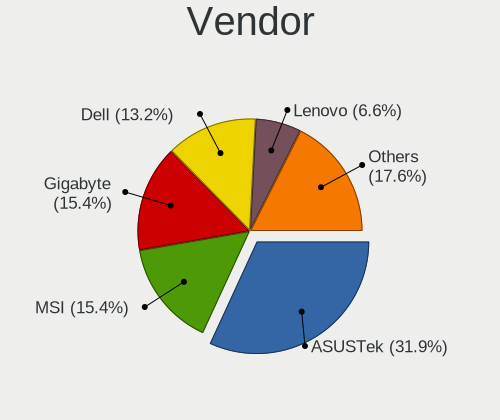

| Name                | Desktops | Percent |
|---------------------|----------|---------|
| ASUSTek Computer    | 16       | 27.12%  |
| Dell                | 9        | 15.25%  |
| MSI                 | 8        | 13.56%  |
| ASRock              | 7        | 11.86%  |
| Hewlett-Packard     | 4        | 6.78%   |
| Gigabyte Technology | 4        | 6.78%   |
| Lenovo              | 2        | 3.39%   |
| ASRockRack          | 2        | 3.39%   |
| Acer                | 2        | 3.39%   |
| Intel               | 1        | 1.69%   |
| Gateway             | 1        | 1.69%   |
| AZW                 | 1        | 1.69%   |
| Apple               | 1        | 1.69%   |
| Unknown             | 1        | 1.69%   |

Model
-----

Motherboard model

| Name                                 | Desktops | Percent |
|--------------------------------------|----------|---------|
| ASUS M11AD                           | 2        | 3.39%   |
| MSI MS-7D76                          | 1        | 1.69%   |
| MSI MS-7C91                          | 1        | 1.69%   |
| MSI MS-7B93                          | 1        | 1.69%   |
| MSI MS-7B33                          | 1        | 1.69%   |
| MSI MS-7B23                          | 1        | 1.69%   |
| MSI MS-7A72                          | 1        | 1.69%   |
| MSI MS-7A37                          | 1        | 1.69%   |
| MSI MS-7599                          | 1        | 1.69%   |
| Lenovo ThinkCentre M93p 10A7000QUS   | 1        | 1.69%   |
| Lenovo ThinkCentre M58e 7268C5F      | 1        | 1.69%   |
| Intel DP67BG AAG10491-400            | 1        | 1.69%   |
| HP ProDesk 600 G1 SFF                | 1        | 1.69%   |
| HP EliteDesk 800 G1 DM               | 1        | 1.69%   |
| HP Compaq 8200 Elite USDT PC         | 1        | 1.69%   |
| HP Compaq 6200 Pro SFF PC            | 1        | 1.69%   |
| Gigabyte Z97X-UD5H                   | 1        | 1.69%   |
| Gigabyte Z690 AORUS ELITE AX         | 1        | 1.69%   |
| Gigabyte Z170XP-SLI                  | 1        | 1.69%   |
| Gigabyte B650 AORUS ELITE AX         | 1        | 1.69%   |
| Gateway SX2185                       | 1        | 1.69%   |
| Dell XPS 8300                        | 1        | 1.69%   |
| Dell Studio XPS 435T/9000            | 1        | 1.69%   |
| Dell Precision WorkStation T3500     | 1        | 1.69%   |
| Dell Precision T3610                 | 1        | 1.69%   |
| Dell OptiPlex 7040                   | 1        | 1.69%   |
| Dell OptiPlex 3050                   | 1        | 1.69%   |
| Dell Inspiron 3671                   | 1        | 1.69%   |
| Dell DM051                           | 1        | 1.69%   |
| Dell Dimension 2400                  | 1        | 1.69%   |
| AZW U59                              | 1        | 1.69%   |
| ASUS TUF Gaming X670E-PLUS WIFI      | 1        | 1.69%   |
| ASUS TUF Gaming B550M-PLUS           | 1        | 1.69%   |
| ASUS TUF B450M-PLUS GAMING           | 1        | 1.69%   |
| ASUS ROG STRIX X670E-E GAMING WIFI   | 1        | 1.69%   |
| ASUS ROG STRIX B550-F GAMING WIFI II | 1        | 1.69%   |
| ASUS ROG CROSSHAIR VIII DARK HERO    | 1        | 1.69%   |
| ASUS PRIME Z790-P WIFI               | 1        | 1.69%   |
| ASUS PRIME Z490-P                    | 1        | 1.69%   |
| ASUS PRIME X370-PRO                  | 1        | 1.69%   |

Model Family
------------

Motherboard model prefix

| Name                   | Desktops | Percent |
|------------------------|----------|---------|
| ASUS TUF               | 3        | 5.08%   |
| ASUS ROG               | 3        | 5.08%   |
| ASUS PRIME             | 3        | 5.08%   |
| Lenovo ThinkCentre     | 2        | 3.39%   |
| HP Compaq              | 2        | 3.39%   |
| Dell Precision         | 2        | 3.39%   |
| Dell OptiPlex          | 2        | 3.39%   |
| ASUS M11AD             | 2        | 3.39%   |
| ASRock B450            | 2        | 3.39%   |
| MSI MS-7D76            | 1        | 1.69%   |
| MSI MS-7C91            | 1        | 1.69%   |
| MSI MS-7B93            | 1        | 1.69%   |
| MSI MS-7B33            | 1        | 1.69%   |
| MSI MS-7B23            | 1        | 1.69%   |
| MSI MS-7A72            | 1        | 1.69%   |
| MSI MS-7A37            | 1        | 1.69%   |
| MSI MS-7599            | 1        | 1.69%   |
| Intel DP67BG           | 1        | 1.69%   |
| HP ProDesk             | 1        | 1.69%   |
| HP EliteDesk           | 1        | 1.69%   |
| Gigabyte Z97X-UD5H     | 1        | 1.69%   |
| Gigabyte Z690          | 1        | 1.69%   |
| Gigabyte Z170XP-SLI    | 1        | 1.69%   |
| Gigabyte B650          | 1        | 1.69%   |
| Gateway SX2185         | 1        | 1.69%   |
| Dell XPS               | 1        | 1.69%   |
| Dell Studio            | 1        | 1.69%   |
| Dell Inspiron          | 1        | 1.69%   |
| Dell DM051             | 1        | 1.69%   |
| Dell Dimension         | 1        | 1.69%   |
| AZW U59                | 1        | 1.69%   |
| ASUS P8Z77-V           | 1        | 1.69%   |
| ASUS P8Z68-V           | 1        | 1.69%   |
| ASUS P8B75-M           | 1        | 1.69%   |
| ASUS All               | 1        | 1.69%   |
| ASUS 970               | 1        | 1.69%   |
| ASRockRack X470D4U2-2T | 1        | 1.69%   |
| ASRockRack X470D4U     | 1        | 1.69%   |
| ASRock Z77             | 1        | 1.69%   |
| ASRock J3355B-ITX      | 1        | 1.69%   |

MFG Year
--------

Motherboard manufacture year

| Year | Desktops | Percent |
|------|----------|---------|
| 2012 | 7        | 11.86%  |
| 2022 | 6        | 10.17%  |
| 2021 | 6        | 10.17%  |
| 2016 | 6        | 10.17%  |
| 2013 | 6        | 10.17%  |
| 2011 | 5        | 8.47%   |
| 2020 | 4        | 6.78%   |
| 2018 | 4        | 6.78%   |
| 2019 | 3        | 5.08%   |
| 2017 | 3        | 5.08%   |
| 2014 | 2        | 3.39%   |
| 2010 | 2        | 3.39%   |
| 2009 | 2        | 3.39%   |
| 2023 | 1        | 1.69%   |
| 2006 | 1        | 1.69%   |
| 2003 | 1        | 1.69%   |

Form Factor
-----------

Physical design of the computer

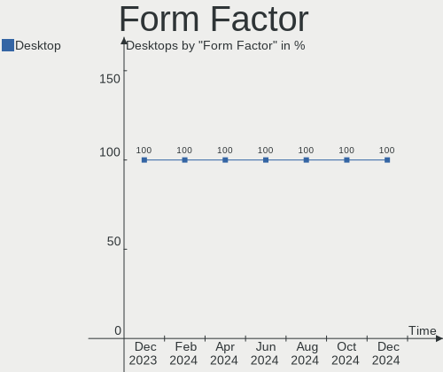

| Name    | Desktops | Percent |
|---------|----------|---------|
| Desktop | 59       | 100%    |

Secure Boot
-----------

Enabled or disabled

| State    | Desktops | Percent |
|----------|----------|---------|
| Disabled | 57       | 96.61%  |
| Enabled  | 2        | 3.39%   |

Coreboot
--------

Have coreboot on board

| Used | Desktops | Percent |
|------|----------|---------|
| No   | 59       | 100%    |

RAM Size
--------

Total RAM memory

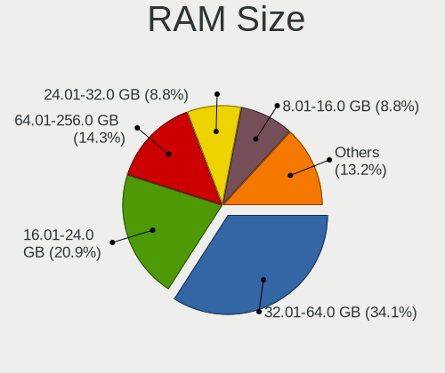

| Size in GB  | Desktops | Percent |
|-------------|----------|---------|
| 16.01-24.0  | 17       | 28.81%  |
| 32.01-64.0  | 15       | 25.42%  |
| 64.01-256.0 | 8        | 13.56%  |
| 8.01-16.0   | 6        | 10.17%  |
| 3.01-4.0    | 5        | 8.47%   |
| 4.01-8.0    | 3        | 5.08%   |
| 24.01-32.0  | 3        | 5.08%   |
| 2.01-3.0    | 1        | 1.69%   |
| 0.51-1.0    | 1        | 1.69%   |

RAM Used
--------

Used RAM memory

| Used GB    | Desktops | Percent |
|------------|----------|---------|
| 4.01-8.0   | 14       | 23.73%  |
| 2.01-3.0   | 14       | 23.73%  |
| 1.01-2.0   | 10       | 16.95%  |
| 3.01-4.0   | 9        | 15.25%  |
| 8.01-16.0  | 7        | 11.86%  |
| 32.01-64.0 | 2        | 3.39%   |
| 16.01-24.0 | 1        | 1.69%   |
| 0.51-1.0   | 1        | 1.69%   |
| 0.01-0.5   | 1        | 1.69%   |

Total Drives
------------

Number of drives on board

| Drives | Desktops | Percent |
|--------|----------|---------|
| 2      | 15       | 25.42%  |
| 1      | 15       | 25.42%  |
| 4      | 11       | 18.64%  |
| 3      | 10       | 16.95%  |
| 6      | 4        | 6.78%   |
| 5      | 2        | 3.39%   |
| 12     | 1        | 1.69%   |
| 7      | 1        | 1.69%   |

Has CD-ROM
----------

Has CD-ROM on board

| Presented | Desktops | Percent |
|-----------|----------|---------|
| No        | 31       | 52.54%  |
| Yes       | 28       | 47.46%  |

Has Ethernet
------------

Has Ethernet on board

| Presented | Desktops | Percent |
|-----------|----------|---------|
| Yes       | 59       | 100%    |

Has WiFi
--------

Has WiFi module

| Presented | Desktops | Percent |
|-----------|----------|---------|
| Yes       | 34       | 57.63%  |
| No        | 25       | 42.37%  |

Has Bluetooth
-------------

Has Bluetooth module

| Presented | Desktops | Percent |
|-----------|----------|---------|
| No        | 30       | 50.85%  |
| Yes       | 29       | 49.15%  |

Location
--------

Country
-------

Geographic location (country)

| Country | Desktops | Percent |
|---------|----------|---------|
| Canada  | 59       | 100%    |

City
----

Geographic location (city)

| City                | Desktops | Percent |
|---------------------|----------|---------|
| Vancouver           | 4        | 6.78%   |
| Toronto             | 4        | 6.78%   |
| Victoria            | 2        | 3.39%   |
| Québec             | 2        | 3.39%   |
| Montreal            | 2        | 3.39%   |
| LaSalle             | 2        | 3.39%   |
| Kelowna             | 2        | 3.39%   |
| Gatineau            | 2        | 3.39%   |
| Edmonton            | 2        | 3.39%   |
| Winnipeg            | 1        | 1.69%   |
| Thornhill           | 1        | 1.69%   |
| Thetford-Mines      | 1        | 1.69%   |
| Surrey              | 1        | 1.69%   |
| St. Thomas          | 1        | 1.69%   |
| St. George          | 1        | 1.69%   |
| Spruce Grove        | 1        | 1.69%   |
| Sherbrooke          | 1        | 1.69%   |
| Shawinigan          | 1        | 1.69%   |
| Saskatoon           | 1        | 1.69%   |
| Sarnia              | 1        | 1.69%   |
| Saint-Hyacinthe     | 1        | 1.69%   |
| Regina              | 1        | 1.69%   |
| Pierrefonds         | 1        | 1.69%   |
| Ottawa              | 1        | 1.69%   |
| Oshawa              | 1        | 1.69%   |
| Oliver              | 1        | 1.69%   |
| Oakville            | 1        | 1.69%   |
| North Vancouver     | 1        | 1.69%   |
| Niagara-on-the-Lake | 1        | 1.69%   |
| Mississauga         | 1        | 1.69%   |
| Milton              | 1        | 1.69%   |
| Markham             | 1        | 1.69%   |
| London              | 1        | 1.69%   |
| Laval               | 1        | 1.69%   |
| Kitchener           | 1        | 1.69%   |
| Kingston            | 1        | 1.69%   |
| Jonquiere           | 1        | 1.69%   |
| Hamilton            | 1        | 1.69%   |
| Greater Sudbury     | 1        | 1.69%   |
| Drummondville       | 1        | 1.69%   |

Drives
------

Drive Vendor
------------

Hard drive vendors

| Vendor                      | Desktops | Drives | Percent |
|-----------------------------|----------|--------|---------|
| WDC                         | 22       | 47     | 18.49%  |
| Seagate                     | 17       | 30     | 14.29%  |
| Samsung Electronics         | 13       | 19     | 10.92%  |
| Sandisk                     | 9        | 10     | 7.56%   |
| Kingston                    | 8        | 10     | 6.72%   |
| Toshiba                     | 6        | 6      | 5.04%   |
| Intel                       | 4        | 4      | 3.36%   |
| Hitachi                     | 4        | 4      | 3.36%   |
| A-DATA Technology           | 4        | 4      | 3.36%   |
| SK hynix                    | 3        | 3      | 2.52%   |
| Silicon Motion              | 2        | 3      | 1.68%   |
| Realtek Semiconductor       | 2        | 2      | 1.68%   |
| Phison Electronics          | 2        | 2      | 1.68%   |
| OCZ                         | 2        | 2      | 1.68%   |
| Kingston Technology Company | 2        | 2      | 1.68%   |
| HGST                        | 2        | 2      | 1.68%   |
| Corsair                     | 2        | 2      | 1.68%   |
| Unknown                     | 1        | 1      | 0.84%   |
| Team                        | 1        | 1      | 0.84%   |
| PNY                         | 1        | 1      | 0.84%   |
| Patriot                     | 1        | 1      | 0.84%   |
| OWC                         | 1        | 2      | 0.84%   |
| Mushkin                     | 1        | 1      | 0.84%   |
| Micron/Crucial Technology   | 1        | 1      | 0.84%   |
| Maxtor                      | 1        | 1      | 0.84%   |
| Lexar                       | 1        | 1      | 0.84%   |
| KingSpec                    | 1        | 4      | 0.84%   |
| FIKWOT                      | 1        | 1      | 0.84%   |
| Enmotus                     | 1        | 1      | 0.84%   |
| Crucial                     | 1        | 1      | 0.84%   |
| China                       | 1        | 1      | 0.84%   |
| ADATA Technology            | 1        | 1      | 0.84%   |

Drive Model
-----------

Hard drive models

| Model                            | Desktops | Percent |
|----------------------------------|----------|---------|
| WDC WD40EFRX-68N32N0 4TB         | 2        | 1.35%   |
| WDC WD40EFAX-68JH4N1 4TB         | 2        | 1.35%   |
| Toshiba DT01ACA100 1TB           | 2        | 1.35%   |
| SK hynix SC311 SATA 256GB SSD    | 2        | 1.35%   |
| Seagate ST500DM002-1BD142 500GB  | 2        | 1.35%   |
| Seagate ST2000DM008-2FR102 2TB   | 2        | 1.35%   |
| Seagate ST1000DM010-2EP102 1TB   | 2        | 1.35%   |
| Samsung SSD 870 EVO 2TB          | 2        | 1.35%   |
| Samsung SSD 870 EVO 250GB        | 2        | 1.35%   |
| Kingston SKC3000S1024G 1024GB    | 2        | 1.35%   |
| WDC WDS500G2B0C-00PXH0 500GB     | 1        | 0.68%   |
| WDC WDS500G2B0B-00YS70 500GB SSD | 1        | 0.68%   |
| WDC WDS250G2B0A-00SM50 250GB SSD | 1        | 0.68%   |
| WDC WDS100T2G0A-00JH30 1TB SSD   | 1        | 0.68%   |
| WDC WDS100T2B0B-00YS70 1TB SSD   | 1        | 0.68%   |
| WDC WDS100T2B0A-00SM50 1TB SSD   | 1        | 0.68%   |
| WDC WDBNCE0010PNC 1TB SSD        | 1        | 0.68%   |
| WDC WD80EMAZ-00WJTA0 8TB         | 1        | 0.68%   |
| WDC WD80EFBX-68AZZN0 8TB         | 1        | 0.68%   |
| WDC WD5000AZLX-75K2TA0 500GB     | 1        | 0.68%   |
| WDC WD5000AAKX-001CA0 500GB      | 1        | 0.68%   |
| WDC WD40EZRZ-22GXCB0 4TB         | 1        | 0.68%   |
| WDC WD40EZRZ-00WN9B0 4TB         | 1        | 0.68%   |
| WDC WD40EZRZ-00GXCB0 4TB         | 1        | 0.68%   |
| WDC WD40EZRX-00SPEB0 4TB         | 1        | 0.68%   |
| WDC WD30EFRX-68EUZN0 3TB         | 1        | 0.68%   |
| WDC WD2500JS-22NCB1 250GB        | 1        | 0.68%   |
| WDC WD20EFAX-68B2RN1 2TB         | 1        | 0.68%   |
| WDC WD2005FBYZ-01YCBB3 2TB       | 1        | 0.68%   |
| WDC WD140EFGX-68B0GN0 14TB       | 1        | 0.68%   |
| WDC WD120EFBX-68B0EN0 12TB       | 1        | 0.68%   |
| WDC WD10EZEX-75WN4A1 1TB         | 1        | 0.68%   |
| WDC WD10EZEX-21M2NA0 1TB         | 1        | 0.68%   |
| WDC WD10EZEX-00BBHA0 1TB         | 1        | 0.68%   |
| WDC WD10EARS-00MVWB0 1TB         | 1        | 0.68%   |
| WDC WD102KRYZ-01A5AB0 10TB       | 1        | 0.68%   |
| WDC WD100EZAZ-11TDBA0 10TB       | 1        | 0.68%   |
| WDC WD1003FZEX-00MK2A0 1TB       | 1        | 0.68%   |
| WDC WD1002FBYS-18W8B0 1TB        | 1        | 0.68%   |
| WDC WD1002FAEX-00Y9A0 1TB        | 1        | 0.68%   |

HDD Vendor
----------

Hard disk drive vendors

| Vendor              | Desktops | Drives | Percent |
|---------------------|----------|--------|---------|
| WDC                 | 18       | 38     | 36.73%  |
| Seagate             | 16       | 28     | 32.65%  |
| Toshiba             | 6        | 6      | 12.24%  |
| Hitachi             | 4        | 4      | 8.16%   |
| HGST                | 2        | 2      | 4.08%   |
| Unknown             | 1        | 1      | 2.04%   |
| Samsung Electronics | 1        | 1      | 2.04%   |
| Maxtor              | 1        | 1      | 2.04%   |

SSD Vendor
----------

Solid state drive vendors

| Vendor              | Desktops | Drives | Percent |
|---------------------|----------|--------|---------|
| Samsung Electronics | 12       | 14     | 27.27%  |
| WDC                 | 7        | 8      | 15.91%  |
| Kingston            | 4        | 5      | 9.09%   |
| A-DATA Technology   | 3        | 3      | 6.82%   |
| SK hynix            | 2        | 2      | 4.55%   |
| OCZ                 | 2        | 2      | 4.55%   |
| Intel               | 2        | 2      | 4.55%   |
| Team                | 1        | 1      | 2.27%   |
| Seagate             | 1        | 1      | 2.27%   |
| SanDisk             | 1        | 1      | 2.27%   |
| PNY                 | 1        | 1      | 2.27%   |
| Patriot             | 1        | 1      | 2.27%   |
| OWC                 | 1        | 2      | 2.27%   |
| Mushkin             | 1        | 1      | 2.27%   |
| Lexar               | 1        | 1      | 2.27%   |
| KingSpec            | 1        | 4      | 2.27%   |
| Crucial             | 1        | 1      | 2.27%   |
| Corsair             | 1        | 1      | 2.27%   |
| China               | 1        | 1      | 2.27%   |

Drive Kind
----------

HDD or SSD

| Kind    | Desktops | Drives | Percent |
|---------|----------|--------|---------|
| SSD     | 37       | 52     | 36.63%  |
| HDD     | 37       | 81     | 36.63%  |
| NVMe    | 25       | 36     | 24.75%  |
| Unknown | 2        | 2      | 1.98%   |

Drive Connector
---------------

SATA, SAS, NVMe, etc.

| Type | Desktops | Drives | Percent |
|------|----------|--------|---------|
| SATA | 52       | 129    | 62.65%  |
| NVMe | 25       | 36     | 30.12%  |
| SAS  | 6        | 6      | 7.23%   |

Drive Size
----------

Size of hard drive

| Size in TB | Desktops | Drives | Percent |
|------------|----------|--------|---------|
| 0.01-0.5   | 32       | 45     | 36.78%  |
| 0.51-1.0   | 27       | 42     | 31.03%  |
| 1.01-2.0   | 10       | 12     | 11.49%  |
| 3.01-4.0   | 7        | 15     | 8.05%   |
| 4.01-10.0  | 6        | 12     | 6.9%    |
| 10.01-20.0 | 3        | 5      | 3.45%   |
| 2.01-3.0   | 2        | 2      | 2.3%    |

Space Total
-----------

Amount of disk space available on the file system

| Size in GB     | Desktops | Percent |
|----------------|----------|---------|
| 501-1000       | 15       | 25.42%  |
| 101-250        | 12       | 20.34%  |
| 1001-2000      | 11       | 18.64%  |
| More than 3000 | 10       | 16.95%  |
| 251-500        | 5        | 8.47%   |
| 1-20           | 3        | 5.08%   |
| 2001-3000      | 1        | 1.69%   |
| 51-100         | 1        | 1.69%   |
| Unknown        | 1        | 1.69%   |

Space Used
----------

Amount of used disk space

| Used GB        | Desktops | Percent |
|----------------|----------|---------|
| 1-20           | 18       | 30.51%  |
| 251-500        | 8        | 13.56%  |
| 101-250        | 7        | 11.86%  |
| 501-1000       | 6        | 10.17%  |
| 1001-2000      | 5        | 8.47%   |
| More than 3000 | 4        | 6.78%   |
| 21-50          | 4        | 6.78%   |
| 51-100         | 4        | 6.78%   |
| 2001-3000      | 2        | 3.39%   |
| Unknown        | 1        | 1.69%   |

Malfunc. Drives
---------------

Drive models with a malfunction

| Model                                 | Desktops | Drives | Percent |
|---------------------------------------|----------|--------|---------|
| WDC WD80EFBX-68AZZN0 8TB              | 1        | 2      | 6.67%   |
| WDC WD40EFRX-68N32N0 4TB              | 1        | 1      | 6.67%   |
| WDC WD30EFRX-68EUZN0 3TB              | 1        | 1      | 6.67%   |
| WDC WD10EZEX-21M2NA0 1TB              | 1        | 1      | 6.67%   |
| WDC WD1001FALS-00J7B1 1TB             | 1        | 1      | 6.67%   |
| Toshiba MK2555GSXF 250GB              | 1        | 1      | 6.67%   |
| Seagate ST500LM000-1EJ162-SSHD-8GB    | 1        | 1      | 6.67%   |
| Seagate ST380815AS 80GB               | 1        | 1      | 6.67%   |
| Seagate ST3160812AS 160GB             | 1        | 1      | 6.67%   |
| Seagate ST14000NM0018-2H4101 14TB     | 1        | 1      | 6.67%   |
| Samsung Electronics SSD 870 EVO 250GB | 1        | 1      | 6.67%   |
| Kingston SVP200S37A60G 64GB SSD       | 1        | 1      | 6.67%   |
| Kingston SVP200S360G 64GB SSD         | 1        | 1      | 6.67%   |
| Hitachi HTS723216L9A360 160GB         | 1        | 1      | 6.67%   |
| Hitachi HDS721010CLA332 1TB           | 1        | 1      | 6.67%   |

Malfunc. Drive Vendor
---------------------

Vendors of faulty drives

| Vendor              | Desktops | Drives | Percent |
|---------------------|----------|--------|---------|
| WDC                 | 4        | 6      | 33.33%  |
| Seagate             | 3        | 4      | 25%     |
| Hitachi             | 2        | 2      | 16.67%  |
| Toshiba             | 1        | 1      | 8.33%   |
| Samsung Electronics | 1        | 1      | 8.33%   |
| Kingston            | 1        | 2      | 8.33%   |

Malfunc. HDD Vendor
-------------------

Vendors of faulty HDD drives

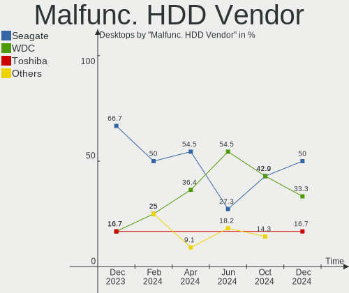

| Vendor  | Desktops | Drives | Percent |
|---------|----------|--------|---------|
| WDC     | 4        | 6      | 40%     |
| Seagate | 3        | 4      | 30%     |
| Hitachi | 2        | 2      | 20%     |
| Toshiba | 1        | 1      | 10%     |

Malfunc. Drive Kind
-------------------

Kinds of faulty drives

| Kind | Desktops | Drives | Percent |
|------|----------|--------|---------|
| HDD  | 10       | 13     | 83.33%  |
| SSD  | 2        | 3      | 16.67%  |

Failed Drives
-------------

Failed drive models

Zero info for selected period =(

Failed Drive Vendor
-------------------

Failed drive vendors

Zero info for selected period =(

Drive Status
------------

Number of failed and malfunc. drives

| Status   | Desktops | Drives | Percent |
|----------|----------|--------|---------|
| Detected | 34       | 88     | 47.89%  |
| Works    | 26       | 67     | 36.62%  |
| Malfunc  | 11       | 16     | 15.49%  |

Storage controller
------------------

Storage Vendor
--------------

Storage controller vendors

| Vendor                      | Desktops | Percent |
|-----------------------------|----------|---------|
| Intel                       | 39       | 37.5%   |
| AMD                         | 21       | 20.19%  |
| SanDisk                     | 9        | 8.65%   |
| Kingston Technology Company | 6        | 5.77%   |
| ASMedia Technology          | 5        | 4.81%   |
| Samsung Electronics         | 4        | 3.85%   |
| Marvell Technology Group    | 4        | 3.85%   |
| Phison Electronics          | 3        | 2.88%   |
| Silicon Motion              | 2        | 1.92%   |
| Realtek Semiconductor       | 2        | 1.92%   |
| JMicron Technology          | 2        | 1.92%   |
| Broadcom / LSI              | 2        | 1.92%   |
| ADATA Technology            | 2        | 1.92%   |
| SK hynix                    | 1        | 0.96%   |
| Micron/Crucial Technology   | 1        | 0.96%   |
| Enmotus                     | 1        | 0.96%   |

Storage Model
-------------

Storage controller models

| Model                                                                          | Desktops | Percent |
|--------------------------------------------------------------------------------|----------|---------|
| AMD FCH SATA Controller [AHCI mode]                                            | 13       | 10.83%  |
| Intel 8 Series/C220 Series Chipset Family 6-port SATA Controller 1 [AHCI mode] | 6        | 5%      |
| AMD 400 Series Chipset SATA Controller                                         | 5        | 4.17%   |
| ASMedia ASM1062 Serial ATA Controller                                          | 4        | 3.33%   |
| AMD 500 Series Chipset SATA Controller                                         | 4        | 3.33%   |
| SanDisk WD Black SN770 / PC SN740 256GB / PC SN560 (DRAM-less) NVMe SSD        | 3        | 2.5%    |
| Intel SATA Controller [RAID mode]                                              | 3        | 2.5%    |
| Intel Cannon Lake PCH SATA AHCI Controller                                     | 3        | 2.5%    |
| Intel 7 Series/C210 Series Chipset Family 6-port SATA Controller [AHCI mode]   | 3        | 2.5%    |
| Intel 6 Series/C200 Series Chipset Family 6 port Desktop SATA AHCI Controller  | 3        | 2.5%    |
| Intel 200 Series PCH SATA controller [AHCI mode]                               | 3        | 2.5%    |
| SanDisk WD Blue SN550 NVMe SSD                                                 | 2        | 1.67%   |
| Marvell Group 88SE9172 SATA 6Gb/s Controller                                   | 2        | 1.67%   |
| Kingston Company Company Non-Volatile memory controller                        | 2        | 1.67%   |
| Kingston Company KC3000/Renegade NVMe SSD                                      | 2        | 1.67%   |
| Intel Q170/Q150/B150/H170/H110/Z170/CM236 Chipset SATA Controller [AHCI Mode]  | 2        | 1.67%   |
| Intel NM10/ICH7 Family SATA Controller [IDE mode]                              | 2        | 1.67%   |
| Intel 82801JI (ICH10 Family) SATA AHCI Controller                              | 2        | 1.67%   |
| Intel 82801G (ICH7 Family) IDE Controller                                      | 2        | 1.67%   |
| Intel 700 Series Chipset Family SATA AHCI Controller                           | 2        | 1.67%   |
| Broadcom / LSI SAS2008 PCI-Express Fusion-MPT SAS-2 [Falcon]                   | 2        | 1.67%   |
| AMD SB7x0/SB8x0/SB9x0 SATA Controller [IDE mode]                               | 2        | 1.67%   |
| AMD SB7x0/SB8x0/SB9x0 IDE Controller                                           | 2        | 1.67%   |
| ADATA XPG SX8200 Pro PCIe Gen3x4 M.2 2280 Solid State Drive                    | 2        | 1.67%   |
| SK hynix BC511 NVMe SSD                                                        | 1        | 0.83%   |
| Silicon Motion SM2263EN/SM2263XT (DRAM-less) NVMe SSD Controllers              | 1        | 0.83%   |
| Silicon Motion SM2262/SM2262EN SSD Controller                                  | 1        | 0.83%   |
| Sandisk Western Digital WD Black SN850X NVMe SSD                               | 1        | 0.83%   |
| SanDisk WD PC SN810 / Black SN850 NVMe SSD                                     | 1        | 0.83%   |
| SanDisk WD Blue SN500 / PC SN520 NVMe SSD                                      | 1        | 0.83%   |
| SanDisk WD Black 2018/SN750 / PC SN720 NVMe SSD                                | 1        | 0.83%   |
| SanDisk PC SN735 NVMe SSD (DRAM-less)                                          | 1        | 0.83%   |
| Samsung S4LN058A01[SSUBX] AHCI SSD Controller (Apple slot)                     | 1        | 0.83%   |
| Samsung NVMe SSD Controller SM981/PM981/PM983                                  | 1        | 0.83%   |
| Samsung NVMe SSD Controller SM961/PM961/SM963                                  | 1        | 0.83%   |
| Samsung NVMe SSD Controller PM9A1/PM9A3/980PRO                                 | 1        | 0.83%   |
| Realtek RTS5765DL NVMe SSD Controller (DRAM-less)                              | 1        | 0.83%   |
| Realtek RTS5763DL NVMe SSD Controller                                          | 1        | 0.83%   |
| Phison E18 PCIe4 NVMe Controller                                               | 1        | 0.83%   |
| Phison E16 PCIe4 NVMe Controller                                               | 1        | 0.83%   |

Storage Kind
------------

Kind of storage controller (IDE, SATA, NVMe, SAS, ...)

| Kind | Desktops | Percent |
|------|----------|---------|
| SATA | 53       | 56.99%  |
| NVMe | 25       | 26.88%  |
| IDE  | 8        | 8.6%    |
| RAID | 7        | 7.53%   |

Processor
---------

CPU Vendor
----------

Processor vendors

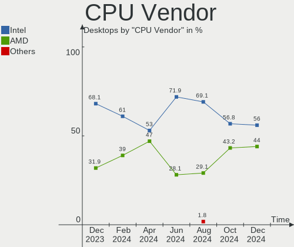

| Vendor | Desktops | Percent |
|--------|----------|---------|
| Intel  | 38       | 64.41%  |
| AMD    | 21       | 35.59%  |

CPU Model
---------

Processor models

| Model                                | Desktops | Percent |
|--------------------------------------|----------|---------|
| Intel Core i7-2600 CPU @ 3.40GHz     | 2        | 3.39%   |
| AMD Ryzen 9 3900X 12-Core Processor  | 2        | 3.39%   |
| AMD Phenom II X6 1090T Processor     | 2        | 3.39%   |
| Intel Xeon CPU X5690 @ 3.47GHz       | 1        | 1.69%   |
| Intel Xeon CPU W3530 @ 2.80GHz       | 1        | 1.69%   |
| Intel Xeon CPU E5-1607 v2 @ 3.00GHz  | 1        | 1.69%   |
| Intel Xeon CPU E3-1230 V2 @ 3.30GHz  | 1        | 1.69%   |
| Intel Pentium D CPU 2.80GHz          | 1        | 1.69%   |
| Intel Pentium 4 CPU 2.66GHz          | 1        | 1.69%   |
| Intel Core i9-9880H CPU @ 2.30GHz    | 1        | 1.69%   |
| Intel Core i7-7700K CPU @ 4.20GHz    | 1        | 1.69%   |
| Intel Core i7-4790K CPU @ 4.00GHz    | 1        | 1.69%   |
| Intel Core i7-4790 CPU @ 3.60GHz     | 1        | 1.69%   |
| Intel Core i7-4770 CPU @ 3.40GHz     | 1        | 1.69%   |
| Intel Core i7-2600K CPU @ 3.40GHz    | 1        | 1.69%   |
| Intel Core i7 CPU 950 @ 3.07GHz      | 1        | 1.69%   |
| Intel Core i5-9400F CPU @ 2.90GHz    | 1        | 1.69%   |
| Intel Core i5-9400 CPU @ 2.90GHz     | 1        | 1.69%   |
| Intel Core i5-8500 CPU @ 3.00GHz     | 1        | 1.69%   |
| Intel Core i5-7500 CPU @ 3.40GHz     | 1        | 1.69%   |
| Intel Core i5-7400 CPU @ 3.00GHz     | 1        | 1.69%   |
| Intel Core i5-6600K CPU @ 3.50GHz    | 1        | 1.69%   |
| Intel Core i5-6500 CPU @ 3.20GHz     | 1        | 1.69%   |
| Intel Core i5-4670 CPU @ 3.40GHz     | 1        | 1.69%   |
| Intel Core i5-4590T CPU @ 2.00GHz    | 1        | 1.69%   |
| Intel Core i5-4460S CPU @ 2.90GHz    | 1        | 1.69%   |
| Intel Core i5-3570K CPU @ 3.40GHz    | 1        | 1.69%   |
| Intel Core i5-2500 CPU @ 3.30GHz     | 1        | 1.69%   |
| Intel Core i5-2400S CPU @ 2.50GHz    | 1        | 1.69%   |
| Intel Core i5-2400 CPU @ 3.10GHz     | 1        | 1.69%   |
| Intel Core i5-10600K CPU @ 4.10GHz   | 1        | 1.69%   |
| Intel Core i3-8100 CPU @ 3.60GHz     | 1        | 1.69%   |
| Intel Core i3-4130 CPU @ 3.40GHz     | 1        | 1.69%   |
| Intel Core 2 Duo CPU E7500 @ 2.93GHz | 1        | 1.69%   |
| Intel Celeron N5105 @ 2.00GHz        | 1        | 1.69%   |
| Intel Celeron CPU J3355 @ 2.00GHz    | 1        | 1.69%   |
| Intel 13th Gen Core i7-13700KF       | 1        | 1.69%   |
| Intel 12th Gen Core i9-12900F        | 1        | 1.69%   |
| Intel 12th Gen Core i5-12600K        | 1        | 1.69%   |
| AMD Ryzen 9 7950X 16-Core Processor  | 1        | 1.69%   |

CPU Model Family
----------------

Processor model prefix

| Model            | Desktops | Percent |
|------------------|----------|---------|
| Intel Core i5    | 15       | 25.42%  |
| Intel Core i7    | 8        | 13.56%  |
| AMD Ryzen 9      | 6        | 10.17%  |
| AMD Ryzen 7      | 6        | 10.17%  |
| Intel Xeon       | 4        | 6.78%   |
| AMD Ryzen 5      | 4        | 6.78%   |
| Other            | 3        | 5.08%   |
| Intel Core i3    | 2        | 3.39%   |
| Intel Celeron    | 2        | 3.39%   |
| AMD Phenom II X6 | 2        | 3.39%   |
| Intel Pentium D  | 1        | 1.69%   |
| Intel Pentium 4  | 1        | 1.69%   |
| Intel Core i9    | 1        | 1.69%   |
| Intel Core 2 Duo | 1        | 1.69%   |
| AMD Ryzen 3      | 1        | 1.69%   |
| AMD A6           | 1        | 1.69%   |
| AMD A10          | 1        | 1.69%   |

CPU Cores
---------

Number of processor cores

| Number | Desktops | Percent |
|--------|----------|---------|
| 4      | 26       | 44.07%  |
| 6      | 11       | 18.64%  |
| 8      | 7        | 11.86%  |
| 16     | 5        | 8.47%   |
| 2      | 5        | 8.47%   |
| 12     | 3        | 5.08%   |
| 10     | 1        | 1.69%   |
| 1      | 1        | 1.69%   |

CPU Sockets
-----------

Number of sockets

| Number | Desktops | Percent |
|--------|----------|---------|
| 1      | 59       | 100%    |

CPU Threads
-----------

Threads per core (Hyper-Threading)

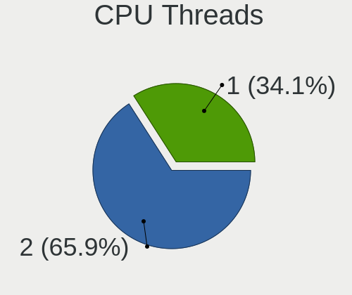

| Number | Desktops | Percent |
|--------|----------|---------|
| 2      | 35       | 59.32%  |
| 1      | 24       | 40.68%  |

CPU Op-Modes
------------

CPU Operation Modes (32-bit, 64-bit)

| Op mode        | Desktops | Percent |
|----------------|----------|---------|
| 32-bit, 64-bit | 58       | 98.31%  |
| 32-bit         | 1        | 1.69%   |

CPU Microcode
-------------

Microcode number

| Number     | Desktops | Percent |
|------------|----------|---------|
| Unknown    | 35       | 59.32%  |
| 0x206a7    | 2        | 3.39%   |
| 0x0a601203 | 2        | 3.39%   |
| 0x0a20120a | 2        | 3.39%   |
| 0x010000dc | 2        | 3.39%   |
| 0xf47      | 1        | 1.69%   |
| 0xf29      | 1        | 1.69%   |
| 0xa0655    | 1        | 1.69%   |
| 0x906ed    | 1        | 1.69%   |
| 0x906eb    | 1        | 1.69%   |
| 0x506c9    | 1        | 1.69%   |
| 0x306e4    | 1        | 1.69%   |
| 0x306c3    | 1        | 1.69%   |
| 0x306a9    | 1        | 1.69%   |
| 0x106a5    | 1        | 1.69%   |
| 0x0a50000d | 1        | 1.69%   |
| 0x0a201016 | 1        | 1.69%   |
| 0x08701021 | 1        | 1.69%   |
| 0x08600106 | 1        | 1.69%   |
| 0x0700010f | 1        | 1.69%   |
| 0x00000000 | 1        | 1.69%   |

CPU Microarch
-------------

Microarchitecture

| Name        | Desktops | Percent |
|-------------|----------|---------|
| KabyLake    | 8        | 13.56%  |
| Haswell     | 7        | 11.86%  |
| Unknown     | 7        | 11.86%  |
| Zen 3       | 6        | 10.17%  |
| Zen 2       | 6        | 10.17%  |
| SandyBridge | 6        | 10.17%  |
| IvyBridge   | 3        | 5.08%   |
| Skylake     | 2        | 3.39%   |
| NetBurst    | 2        | 3.39%   |
| Nehalem     | 2        | 3.39%   |
| K10         | 2        | 3.39%   |
| Zen         | 1        | 1.69%   |
| Westmere    | 1        | 1.69%   |
| Tremont     | 1        | 1.69%   |
| Piledriver  | 1        | 1.69%   |
| Penryn      | 1        | 1.69%   |
| Jaguar      | 1        | 1.69%   |
| Goldmont    | 1        | 1.69%   |
| CometLake   | 1        | 1.69%   |

Graphics
--------

GPU Vendor
----------

Vendors of graphics cards

| Vendor            | Desktops | Percent |
|-------------------|----------|---------|
| Nvidia            | 27       | 39.13%  |
| AMD               | 22       | 31.88%  |
| Intel             | 18       | 26.09%  |
| ASPEED Technology | 2        | 2.9%    |

GPU Model
---------

Graphics card models

| Model                                                                       | Desktops | Percent |
|-----------------------------------------------------------------------------|----------|---------|
| AMD Ellesmere [Radeon RX 470/480/570/570X/580/580X/590]                     | 6        | 8.33%   |
| AMD Raphael                                                                 | 4        | 5.56%   |
| Intel Xeon E3-1200 v3/4th Gen Core Processor Integrated Graphics Controller | 3        | 4.17%   |
| Intel 2nd Generation Core Processor Family Integrated Graphics Controller   | 3        | 4.17%   |
| Nvidia TU106 [GeForce RTX 2060 Rev. A]                                      | 2        | 2.78%   |
| Nvidia GK104 [GeForce GTX 760]                                              | 2        | 2.78%   |
| Intel HD Graphics 630                                                       | 2        | 2.78%   |
| ASPEED Technology ASPEED Graphics Family                                    | 2        | 2.78%   |
| AMD Navi 23 [Radeon RX 6650 XT / 6700S / 6800S]                             | 2        | 2.78%   |
| AMD Navi 22 [Radeon RX 6700/6700 XT/6750 XT / 6800M/6850M XT]               | 2        | 2.78%   |
| AMD Cezanne [Radeon Vega Series / Radeon Vega Mobile Series]                | 2        | 2.78%   |
| Nvidia TU117M [GeForce GTX 1650 Mobile / Max-Q]                             | 1        | 1.39%   |
| Nvidia TU117 [GeForce GTX 1650]                                             | 1        | 1.39%   |
| Nvidia TU116 [GeForce GTX 1660 Ti]                                          | 1        | 1.39%   |
| Nvidia TU116 [GeForce GTX 1660 SUPER]                                       | 1        | 1.39%   |
| Nvidia TU106 [GeForce GTX 1650]                                             | 1        | 1.39%   |
| Nvidia GT200 [GeForce GTX 260]                                              | 1        | 1.39%   |
| Nvidia GP108 [GeForce GT 1030]                                              | 1        | 1.39%   |
| Nvidia GP107GL [Quadro P400]                                                | 1        | 1.39%   |
| Nvidia GP104 [GeForce GTX 1080]                                             | 1        | 1.39%   |
| Nvidia GP104 [GeForce GTX 1070]                                             | 1        | 1.39%   |
| Nvidia GP102 [GeForce GTX 1080 Ti]                                          | 1        | 1.39%   |
| Nvidia GM206 [GeForce GTX 960]                                              | 1        | 1.39%   |
| Nvidia GM206 [GeForce GTX 950]                                              | 1        | 1.39%   |
| Nvidia GM107 [GeForce GTX 745]                                              | 1        | 1.39%   |
| Nvidia GK208B [GeForce GT 710]                                              | 1        | 1.39%   |
| Nvidia GK208 [GeForce GT 630 Rev. 2]                                        | 1        | 1.39%   |
| Nvidia GK107GL [Quadro K2000]                                               | 1        | 1.39%   |
| Nvidia GF119 [NVS 310]                                                      | 1        | 1.39%   |
| Nvidia GF119 [GeForce GT 620 OEM]                                           | 1        | 1.39%   |
| Nvidia GA106 [GeForce RTX 3060 Lite Hash Rate]                              | 1        | 1.39%   |
| Nvidia GA104 [GeForce RTX 3060]                                             | 1        | 1.39%   |
| Nvidia GA102 [GeForce RTX 3090 Ti]                                          | 1        | 1.39%   |
| Nvidia GA102 [GeForce RTX 3080]                                             | 1        | 1.39%   |
| Intel JasperLake [UHD Graphics]                                             | 1        | 1.39%   |
| Intel IvyBridge GT2 [HD Graphics 4000]                                      | 1        | 1.39%   |
| Intel HD Graphics 530                                                       | 1        | 1.39%   |
| Intel HD Graphics 500                                                       | 1        | 1.39%   |
| Intel CoffeeLake-S GT2 [UHD Graphics 630]                                   | 1        | 1.39%   |
| Intel CoffeeLake-H GT2 [UHD Graphics 630]                                   | 1        | 1.39%   |

GPU Combo
---------

Combinations of graphics cards

| Name            | Desktops | Percent |
|-----------------|----------|---------|
| 1 x Nvidia      | 21       | 35.59%  |
| 1 x AMD         | 15       | 25.42%  |
| 1 x Intel       | 12       | 20.34%  |
| 2 x AMD         | 3        | 5.08%   |
| AMD + Nvidia    | 3        | 5.08%   |
| Intel + Nvidia  | 2        | 3.39%   |
| Nvidia + ASPEED | 1        | 1.69%   |
| Intel + AMD     | 1        | 1.69%   |
| 1 x ASPEED      | 1        | 1.69%   |

GPU Driver
----------

Free vs proprietary

| Driver      | Desktops | Percent |
|-------------|----------|---------|
| Free        | 41       | 69.49%  |
| Proprietary | 18       | 30.51%  |

GPU Memory
----------

Total video memory

| Size in GB | Desktops | Percent |
|------------|----------|---------|
| Unknown    | 30       | 50.85%  |
| 1.01-2.0   | 7        | 11.86%  |
| 7.01-8.0   | 6        | 10.17%  |
| 3.01-4.0   | 4        | 6.78%   |
| 0.01-0.5   | 4        | 6.78%   |
| 8.01-16.0  | 3        | 5.08%   |
| 5.01-6.0   | 2        | 3.39%   |
| 0.51-1.0   | 2        | 3.39%   |
| 16.01-24.0 | 1        | 1.69%   |

Monitor
-------

Monitor Vendor
--------------

Monitor vendors

| Vendor               | Desktops | Percent |
|----------------------|----------|---------|
| Samsung Electronics  | 12       | 16.67%  |
| Dell                 | 8        | 11.11%  |
| Ancor Communications | 8        | 11.11%  |
| Goldstar             | 7        | 9.72%   |
| ASUSTek Computer     | 6        | 8.33%   |
| Acer                 | 6        | 8.33%   |
| Hewlett-Packard      | 5        | 6.94%   |
| Lenovo               | 2        | 2.78%   |
| Xiaomi               | 1        | 1.39%   |
| Vita                 | 1        | 1.39%   |
| Unknown              | 1        | 1.39%   |
| Sharp                | 1        | 1.39%   |
| Sceptre Tech         | 1        | 1.39%   |
| Ruijiang             | 1        | 1.39%   |
| RTK                  | 1        | 1.39%   |
| Philips              | 1        | 1.39%   |
| Microstep            | 1        | 1.39%   |
| LG Electronics       | 1        | 1.39%   |
| JVC                  | 1        | 1.39%   |
| GreenWood            | 1        | 1.39%   |
| Gigabyte Technology  | 1        | 1.39%   |
| Gateway              | 1        | 1.39%   |
| Elo Touch            | 1        | 1.39%   |
| DENON                | 1        | 1.39%   |
| BenQ                 | 1        | 1.39%   |
| AUS                  | 1        | 1.39%   |

Monitor Model
-------------

Monitor models

| Model                                                                 | Desktops | Percent |
|-----------------------------------------------------------------------|----------|---------|
| Goldstar FULL HD GSM5B55 1920x1080 480x270mm 21.7-inch                | 2        | 2.63%   |
| Xiaomi Mi TV XMD009A 3440x1440 480x270mm 21.7-inch                    | 1        | 1.32%   |
| Vita VT988 VIT03DC 1280x1024 376x301mm 19.0-inch                      | 1        | 1.32%   |
| Unknown LCD Monitor FFFF 2288x1287 2550x2550mm 142.0-inch             | 1        | 1.32%   |
| Sharp LC-32LB370U SHP3253 1920x1080 698x392mm 31.5-inch               | 1        | 1.32%   |
| Sceptre Tech Sceptre L27 SPT0AB8 1920x1080 598x336mm 27.0-inch        | 1        | 1.32%   |
| Samsung Electronics U32J59x SAM0F35 3840x2160 697x392mm 31.5-inch     | 1        | 1.32%   |
| Samsung Electronics SyncMaster SAM037C 1680x1050 470x300mm 22.0-inch  | 1        | 1.32%   |
| Samsung Electronics SyncMaster SAM01BB 1280x1024 376x301mm 19.0-inch  | 1        | 1.32%   |
| Samsung Electronics S27B550 SAM091B 1920x1080 598x336mm 27.0-inch     | 1        | 1.32%   |
| Samsung Electronics S24F350 SAM0D20 1920x1080 521x293mm 23.5-inch     | 1        | 1.32%   |
| Samsung Electronics S24D390 SAM0B65 1920x1080 521x293mm 23.5-inch     | 1        | 1.32%   |
| Samsung Electronics S23A700 SAM085F 1920x1080 509x286mm 23.0-inch     | 1        | 1.32%   |
| Samsung Electronics LS32B30 SAM7247 1920x1080 698x393mm 31.5-inch     | 1        | 1.32%   |
| Samsung Electronics LS32B30 SAM7246 1920x1080 698x393mm 31.5-inch     | 1        | 1.32%   |
| Samsung Electronics LF24T35 SAM707D 1920x1080 528x297mm 23.9-inch     | 1        | 1.32%   |
| Samsung Electronics LCD Monitor SAM7108 3840x1600 950x540mm 43.0-inch | 1        | 1.32%   |
| Samsung Electronics LCD Monitor SAM0C39 1920x1080 885x498mm 40.0-inch | 1        | 1.32%   |
| Samsung Electronics LCD Monitor SAM094E 1920x1080 700x390mm 31.5-inch | 1        | 1.32%   |
| Samsung Electronics C27F390 SAM0D32 1920x1080 598x336mm 27.0-inch     | 1        | 1.32%   |
| Samsung Electronics C24F390 SAM0D2C 1920x1080 521x293mm 23.5-inch     | 1        | 1.32%   |
| Ruijiang RJT HDMI RJT1200 1920x1080 320x180mm 14.5-inch               | 1        | 1.32%   |
| RTK FHD HDR RTKBC32 1920x1080 597x336mm 27.0-inch                     | 1        | 1.32%   |
| Philips PHL 272P7VU PHL093A 3840x2160 597x336mm 27.0-inch             | 1        | 1.32%   |
| Microstep LCD Monitor MSI MAG2732 4480x1440                           | 1        | 1.32%   |
| LG Electronics LCD Monitor 27GL850                                    | 1        | 1.32%   |
| Lenovo LEN Y27q-20 LEN65EE 2560x1440 597x336mm 27.0-inch              | 1        | 1.32%   |
| Lenovo L197 Wide LEN1152 1440x900 410x257mm 19.1-inch                 | 1        | 1.32%   |
| JVC FPDUS-FN JVC21B0 1920x540                                         | 1        | 1.32%   |
| Hewlett-Packard OMEN 25i HPN36FE 1920x1080 543x302mm 24.5-inch        | 1        | 1.32%   |
| Hewlett-Packard OMEN 25i HPN36FC 1920x1080 543x302mm 24.5-inch        | 1        | 1.32%   |
| Hewlett-Packard E243i HPN3464 1920x1200 518x324mm 24.1-inch           | 1        | 1.32%   |
| Hewlett-Packard Compaq WF1907 HWP26A4 1440x900 408x255mm 18.9-inch    | 1        | 1.32%   |
| Hewlett-Packard 23xw HWP318A 1920x1080 509x286mm 23.0-inch            | 1        | 1.32%   |
| GreenWood ARZOPA GWD0140 1920x1080 309x174mm 14.0-inch                | 1        | 1.32%   |
| Goldstar W2053 GSM4EA0 1600x900 443x249mm 20.0-inch                   | 1        | 1.32%   |
| Goldstar ULTRAWIDE GSM59F1 2560x1080 673x284mm 28.8-inch              | 1        | 1.32%   |
| Goldstar ULTRAGEAR GSM5BB2 1920x1080 527x296mm 23.8-inch              | 1        | 1.32%   |
| Goldstar Ultra HD GSM5B09 3840x2160 600x340mm 27.2-inch               | 1        | 1.32%   |
| Goldstar L222W GSM5665 1680x1050 474x296mm 22.0-inch                  | 1        | 1.32%   |

Monitor Resolution
------------------

Monitor screen resolution

| Resolution         | Desktops | Percent |
|--------------------|----------|---------|
| 1920x1080 (FHD)    | 32       | 43.24%  |
| 3840x2160 (4K)     | 9        | 12.16%  |
| 2560x1440 (QHD)    | 6        | 8.11%   |
| 1440x900 (WXGA+)   | 5        | 6.76%   |
| 1680x1050 (WSXGA+) | 4        | 5.41%   |
| 1280x1024 (SXGA)   | 4        | 5.41%   |
| 1920x1200 (WUXGA)  | 3        | 4.05%   |
| 1600x900 (HD+)     | 2        | 2.7%    |
| 4480x1440          | 1        | 1.35%   |
| 3840x1600          | 1        | 1.35%   |
| 3440x1440          | 1        | 1.35%   |
| 2560x1600          | 1        | 1.35%   |
| 2560x1080          | 1        | 1.35%   |
| 2288x1287          | 1        | 1.35%   |
| 1920x540           | 1        | 1.35%   |
| 1024x768 (XGA)     | 1        | 1.35%   |
| Unknown            | 1        | 1.35%   |

Monitor Diagonal
----------------

Diagonal size in inches

| Inches  | Desktops | Percent |
|---------|----------|---------|
| 27      | 16       | 22.22%  |
| 24      | 13       | 18.06%  |
| 23      | 8        | 11.11%  |
| 19      | 8        | 11.11%  |
| 22      | 4        | 5.56%   |
| 31      | 3        | 4.17%   |
| 21      | 3        | 4.17%   |
| Unknown | 3        | 4.17%   |
| 20      | 2        | 2.78%   |
| 14      | 2        | 2.78%   |
| 142     | 1        | 1.39%   |
| 86      | 1        | 1.39%   |
| 72      | 1        | 1.39%   |
| 54      | 1        | 1.39%   |
| 47      | 1        | 1.39%   |
| 43      | 1        | 1.39%   |
| 40      | 1        | 1.39%   |
| 34      | 1        | 1.39%   |
| 25      | 1        | 1.39%   |
| 18      | 1        | 1.39%   |

Monitor Width
-------------

Physical width

| Width in mm    | Desktops | Percent |
|----------------|----------|---------|
| 501-600        | 32       | 46.38%  |
| 401-500        | 14       | 20.29%  |
| 601-700        | 6        | 8.7%    |
| 351-400        | 4        | 5.8%    |
| Unknown        | 3        | 4.35%   |
| 1501-2000      | 2        | 2.9%    |
| 1001-1500      | 2        | 2.9%    |
| More than 2000 | 1        | 1.45%   |
| 801-900        | 1        | 1.45%   |
| 701-800        | 1        | 1.45%   |
| 301-350        | 1        | 1.45%   |
| 201-300        | 1        | 1.45%   |
| 901-1000       | 1        | 1.45%   |

Aspect Ratio
------------

Proportional relationship between the width and the height

| Ratio   | Desktops | Percent |
|---------|----------|---------|
| 16/9    | 44       | 64.71%  |
| 16/10   | 14       | 20.59%  |
| 5/4     | 4        | 5.88%   |
| Unknown | 2        | 2.94%   |
| 4/3     | 1        | 1.47%   |
| 32/9    | 1        | 1.47%   |
| 21/9    | 1        | 1.47%   |
| 1.00    | 1        | 1.47%   |

Monitor Area
------------

Area in inch²

| Area in inch² | Desktops | Percent |
|----------------|----------|---------|
| 201-250        | 20       | 28.17%  |
| 301-350        | 16       | 22.54%  |
| 151-200        | 10       | 14.08%  |
| 251-300        | 9        | 12.68%  |
| More than 1000 | 4        | 5.63%   |
| 351-500        | 4        | 5.63%   |
| 501-1000       | 3        | 4.23%   |
| Unknown        | 3        | 4.23%   |
| 81-90          | 1        | 1.41%   |
| 101-110        | 1        | 1.41%   |

Pixel Density
-------------

Pixels per inch

| Density | Desktops | Percent |
|---------|----------|---------|
| 51-100  | 42       | 65.63%  |
| 101-120 | 7        | 10.94%  |
| 121-160 | 6        | 9.38%   |
| 1-50    | 5        | 7.81%   |
| Unknown | 3        | 4.69%   |
| 161-240 | 1        | 1.56%   |

Multiple Monitors
-----------------

Total monitors connected

| Total | Desktops | Percent |
|-------|----------|---------|
| 1     | 40       | 67.8%   |
| 2     | 14       | 23.73%  |
| 3     | 3        | 5.08%   |
| 0     | 2        | 3.39%   |

Network
-------

Net Controller Vendor
---------------------

Controller vendors

| Vendor                   | Desktops | Percent |
|--------------------------|----------|---------|
| Realtek Semiconductor    | 34       | 36.56%  |
| Intel                    | 32       | 34.41%  |
| MediaTek                 | 5        | 5.38%   |
| Broadcom                 | 4        | 4.3%    |
| Ralink Technology        | 3        | 3.23%   |
| Qualcomm Atheros         | 3        | 3.23%   |
| Mellanox Technologies    | 3        | 3.23%   |
| Sigma Designs            | 1        | 1.08%   |
| Samsung Electronics      | 1        | 1.08%   |
| Ralink                   | 1        | 1.08%   |
| MicroPython              | 1        | 1.08%   |
| Marvell Technology Group | 1        | 1.08%   |
| Linksys                  | 1        | 1.08%   |
| D-Link                   | 1        | 1.08%   |
| ASUSTek Computer         | 1        | 1.08%   |
| 3Com                     | 1        | 1.08%   |

Net Controller Model
--------------------

Controller models

| Model                                                                  | Desktops | Percent |
|------------------------------------------------------------------------|----------|---------|
| Realtek RTL8111/8168/8411 PCI Express Gigabit Ethernet Controller      | 22       | 20.37%  |
| Realtek RTL8125 2.5GbE Controller                                      | 11       | 10.19%  |
| Intel Wi-Fi 6 AX200                                                    | 8        | 7.41%   |
| Intel I211 Gigabit Network Connection                                  | 5        | 4.63%   |
| MediaTek MT7921K (RZ608) Wi-Fi 6E 80MHz                                | 3        | 2.78%   |
| Intel Wi-Fi 6 AX210/AX211/AX411 160MHz                                 | 3        | 2.78%   |
| Intel Ethernet Connection I217-LM                                      | 3        | 2.78%   |
| Intel 82579LM Gigabit Network Connection (Lewisville)                  | 3        | 2.78%   |
| Realtek RTL88x2bu [AC1200 Techkey]                                     | 2        | 1.85%   |
| Ralink MT7601U Wireless Adapter                                        | 2        | 1.85%   |
| Mellanox MT27500 Family [ConnectX-3]                                   | 2        | 1.85%   |
| MediaTek MT7922 802.11ax PCI Express Wireless Network Adapter          | 2        | 1.85%   |
| Intel Ethernet Controller I225-V                                       | 2        | 1.85%   |
| Intel Dual Band Wireless-AC 3168NGW [Stone Peak]                       | 2        | 1.85%   |
| Intel 82579V Gigabit Network Connection                                | 2        | 1.85%   |
| Sigma Designs Aeotec Z-Stick Gen5 (ZW090) - UZB                        | 1        | 0.93%   |
| Samsung Galaxy series, misc. (tethering mode)                          | 1        | 0.93%   |
| Realtek RTL8192CE PCIe Wireless Network Adapter                        | 1        | 0.93%   |
| Ralink RT2870/RT3070 Wireless Adapter                                  | 1        | 0.93%   |
| Ralink RT2561/RT61 802.11g PCI                                         | 1        | 0.93%   |
| Qualcomm Atheros Killer E220x Gigabit Ethernet Controller              | 1        | 0.93%   |
| Qualcomm Atheros AR9462 Wireless Network Adapter                       | 1        | 0.93%   |
| Qualcomm Atheros AR8131 Gigabit Ethernet                               | 1        | 0.93%   |
| MicroPython Board in FS mode                                           | 1        | 0.93%   |
| Mellanox MT27520 Family [ConnectX-3 Pro]                               | 1        | 0.93%   |
| Marvell Group 88E8057 PCI-E Gigabit Ethernet Controller                | 1        | 0.93%   |
| Linksys WUSB6300 802.11a/b/g/n/ac Wireless Adapter [Realtek RTL8812AU] | 1        | 0.93%   |
| Intel X540 Ethernet Controller Virtual Function                        | 1        | 0.93%   |
| Intel Wireless 7260                                                    | 1        | 0.93%   |
| Intel Wi-Fi 6 AX201 160MHz                                             | 1        | 0.93%   |
| Intel NM10/ICH7 Family LAN Controller                                  | 1        | 0.93%   |
| Intel I210 Gigabit Network Connection                                  | 1        | 0.93%   |
| Intel Ethernet Controller X550                                         | 1        | 0.93%   |
| Intel Ethernet Controller 10-Gigabit X540-AT2                          | 1        | 0.93%   |
| Intel Ethernet Connection I217-V                                       | 1        | 0.93%   |
| Intel Ethernet Connection (7) I219-V                                   | 1        | 0.93%   |
| Intel Ethernet Connection (2) I219-V                                   | 1        | 0.93%   |
| Intel Ethernet Connection (2) I219-LM                                  | 1        | 0.93%   |
| Intel Centrino Advanced-N 6205 [Taylor Peak]                           | 1        | 0.93%   |
| Intel Cannon Lake PCH CNVi WiFi                                        | 1        | 0.93%   |

Wireless Vendor
---------------

Wireless vendors

| Vendor                | Desktops | Percent |
|-----------------------|----------|---------|
| Intel                 | 18       | 50%     |
| MediaTek              | 5        | 13.89%  |
| Realtek Semiconductor | 3        | 8.33%   |
| Ralink Technology     | 3        | 8.33%   |
| Broadcom              | 2        | 5.56%   |
| Ralink                | 1        | 2.78%   |
| Qualcomm Atheros      | 1        | 2.78%   |
| Linksys               | 1        | 2.78%   |
| D-Link                | 1        | 2.78%   |
| ASUSTek Computer      | 1        | 2.78%   |

Wireless Model
--------------

Wireless models

| Model                                                                  | Desktops | Percent |
|------------------------------------------------------------------------|----------|---------|
| Intel Wi-Fi 6 AX200                                                    | 8        | 22.22%  |
| MediaTek MT7921K (RZ608) Wi-Fi 6E 80MHz                                | 3        | 8.33%   |
| Intel Wi-Fi 6 AX210/AX211/AX411 160MHz                                 | 3        | 8.33%   |
| Realtek RTL88x2bu [AC1200 Techkey]                                     | 2        | 5.56%   |
| Ralink MT7601U Wireless Adapter                                        | 2        | 5.56%   |
| MediaTek MT7922 802.11ax PCI Express Wireless Network Adapter          | 2        | 5.56%   |
| Intel Dual Band Wireless-AC 3168NGW [Stone Peak]                       | 2        | 5.56%   |
| Realtek RTL8192CE PCIe Wireless Network Adapter                        | 1        | 2.78%   |
| Ralink RT2870/RT3070 Wireless Adapter                                  | 1        | 2.78%   |
| Ralink RT2561/RT61 802.11g PCI                                         | 1        | 2.78%   |
| Qualcomm Atheros AR9462 Wireless Network Adapter                       | 1        | 2.78%   |
| Linksys WUSB6300 802.11a/b/g/n/ac Wireless Adapter [Realtek RTL8812AU] | 1        | 2.78%   |
| Intel Wireless 7260                                                    | 1        | 2.78%   |
| Intel Wi-Fi 6 AX201 160MHz                                             | 1        | 2.78%   |
| Intel Centrino Advanced-N 6205 [Taylor Peak]                           | 1        | 2.78%   |
| Intel Cannon Lake PCH CNVi WiFi                                        | 1        | 2.78%   |
| Intel 700 Series Chipset Family Wi-Fi                                  | 1        | 2.78%   |
| D-Link 802.11ac NIC                                                    | 1        | 2.78%   |
| Broadcom BCM4360 802.11ac Wireless Network Adapter                     | 1        | 2.78%   |
| Broadcom BCM4313 802.11bgn Wireless Network Adapter                    | 1        | 2.78%   |
| ASUS USB-AC56 802.11a/b/g/n/ac Wireless Adapter [Realtek RTL8812AU]    | 1        | 2.78%   |

Ethernet Vendor
---------------

Ethernet vendors

| Vendor                   | Desktops | Percent |
|--------------------------|----------|---------|
| Realtek Semiconductor    | 33       | 48.53%  |
| Intel                    | 24       | 35.29%  |
| Mellanox Technologies    | 3        | 4.41%   |
| Broadcom                 | 3        | 4.41%   |
| Qualcomm Atheros         | 2        | 2.94%   |
| Samsung Electronics      | 1        | 1.47%   |
| Marvell Technology Group | 1        | 1.47%   |
| 3Com                     | 1        | 1.47%   |

Ethernet Model
--------------

Ethernet models

| Model                                                             | Desktops | Percent |
|-------------------------------------------------------------------|----------|---------|
| Realtek RTL8111/8168/8411 PCI Express Gigabit Ethernet Controller | 22       | 31.43%  |
| Realtek RTL8125 2.5GbE Controller                                 | 11       | 15.71%  |
| Intel I211 Gigabit Network Connection                             | 5        | 7.14%   |
| Intel Ethernet Connection I217-LM                                 | 3        | 4.29%   |
| Intel 82579LM Gigabit Network Connection (Lewisville)             | 3        | 4.29%   |
| Mellanox MT27500 Family [ConnectX-3]                              | 2        | 2.86%   |
| Intel Ethernet Controller I225-V                                  | 2        | 2.86%   |
| Intel 82579V Gigabit Network Connection                           | 2        | 2.86%   |
| Samsung Galaxy series, misc. (tethering mode)                     | 1        | 1.43%   |
| Qualcomm Atheros Killer E220x Gigabit Ethernet Controller         | 1        | 1.43%   |
| Qualcomm Atheros AR8131 Gigabit Ethernet                          | 1        | 1.43%   |
| Mellanox MT27520 Family [ConnectX-3 Pro]                          | 1        | 1.43%   |
| Marvell Group 88E8057 PCI-E Gigabit Ethernet Controller           | 1        | 1.43%   |
| Intel X540 Ethernet Controller Virtual Function                   | 1        | 1.43%   |
| Intel NM10/ICH7 Family LAN Controller                             | 1        | 1.43%   |
| Intel I210 Gigabit Network Connection                             | 1        | 1.43%   |
| Intel Ethernet Controller X550                                    | 1        | 1.43%   |
| Intel Ethernet Controller 10-Gigabit X540-AT2                     | 1        | 1.43%   |
| Intel Ethernet Connection I217-V                                  | 1        | 1.43%   |
| Intel Ethernet Connection (7) I219-V                              | 1        | 1.43%   |
| Intel Ethernet Connection (2) I219-V                              | 1        | 1.43%   |
| Intel Ethernet Connection (2) I219-LM                             | 1        | 1.43%   |
| Intel 82599ES 10-Gigabit SFI/SFP+ Network Connection              | 1        | 1.43%   |
| Intel 82574L Gigabit Network Connection                           | 1        | 1.43%   |
| Broadcom NetXtreme BCM5761 Gigabit Ethernet PCIe                  | 1        | 1.43%   |
| Broadcom NetLink BCM57788 Gigabit Ethernet PCIe                   | 1        | 1.43%   |
| Broadcom BCM4401 100Base-T                                        | 1        | 1.43%   |
| 3Com 3c905C-TX/TX-M [Tornado]                                     | 1        | 1.43%   |

Net Controller Kind
-------------------

Ethernet, WiFi or modem

| Kind     | Desktops | Percent |
|----------|----------|---------|
| Ethernet | 59       | 62.11%  |
| WiFi     | 34       | 35.79%  |
| Modem    | 2        | 2.11%   |

Used Controller
---------------

Currently used network controller

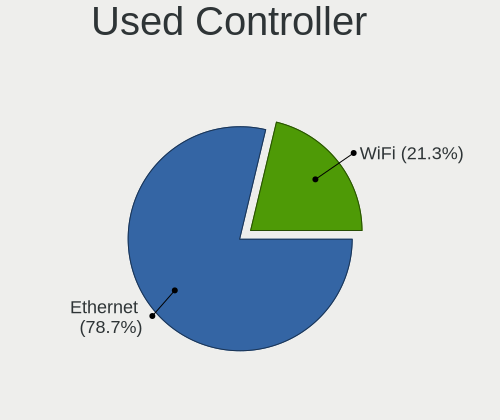

| Kind     | Desktops | Percent |
|----------|----------|---------|
| Ethernet | 44       | 67.69%  |
| WiFi     | 21       | 32.31%  |

NICs
----

Total network controllers on board

| Total | Desktops | Percent |
|-------|----------|---------|
| 2     | 26       | 44.07%  |
| 1     | 25       | 42.37%  |
| 3     | 6        | 10.17%  |
| 12    | 1        | 1.69%   |
| 5     | 1        | 1.69%   |

IPv6
----

IPv6 vs IPv4

| Used | Desktops | Percent |
|------|----------|---------|
| No   | 46       | 77.97%  |
| Yes  | 13       | 22.03%  |

Bluetooth
---------

Bluetooth Vendor
----------------

Controller vendors

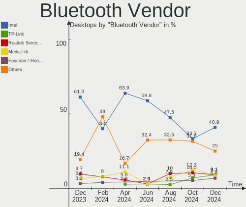

| Vendor                          | Desktops | Percent |
|---------------------------------|----------|---------|
| Intel                           | 14       | 46.67%  |
| MediaTek                        | 5        | 16.67%  |
| ASUSTek Computer                | 3        | 10%     |
| Qualcomm Atheros Communications | 2        | 6.67%   |
| Cambridge Silicon Radio         | 2        | 6.67%   |
| Realtek                         | 1        | 3.33%   |
| Lite-On Technology              | 1        | 3.33%   |
| Broadcom                        | 1        | 3.33%   |
| Apple                           | 1        | 3.33%   |

Bluetooth Model
---------------

Controller models

| Model                                               | Desktops | Percent |
|-----------------------------------------------------|----------|---------|
| Intel AX200 Bluetooth                               | 7        | 23.33%  |
| MediaTek Wireless_Device                            | 5        | 16.67%  |
| Intel Wireless-AC 3168 Bluetooth                    | 2        | 6.67%   |
| Intel AX210 Bluetooth                               | 2        | 6.67%   |
| Intel AX201 Bluetooth                               | 2        | 6.67%   |
| Cambridge Silicon Radio Bluetooth Dongle (HCI mode) | 2        | 6.67%   |
| ASUS ASUS USB-BT500                                 | 2        | 6.67%   |
| Realtek Bluetooth Radio                             | 1        | 3.33%   |
| Qualcomm Atheros  Bluetooth Device                  | 1        | 3.33%   |
| Qualcomm Atheros AR3011 Bluetooth                   | 1        | 3.33%   |
| Lite-On Bluetooth Device                            | 1        | 3.33%   |
| Intel Bluetooth 9460/9560 Jefferson Peak (JfP)      | 1        | 3.33%   |
| Broadcom HP Portable Valentine                      | 1        | 3.33%   |
| ASUS Broadcom BCM20702A0 Bluetooth                  | 1        | 3.33%   |
| Apple Bluetooth USB Host Controller                 | 1        | 3.33%   |

Sound
-----

Sound Vendor
------------

Sound card vendors

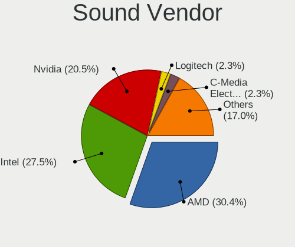

| Vendor                   | Desktops | Percent |
|--------------------------|----------|---------|
| Intel                    | 37       | 34.26%  |
| AMD                      | 29       | 26.85%  |
| Nvidia                   | 26       | 24.07%  |
| C-Media Electronics      | 3        | 2.78%   |
| JMTek                    | 2        | 1.85%   |
| Schiit Audio             | 1        | 0.93%   |
| Plantronics              | 1        | 0.93%   |
| Micro Star International | 1        | 0.93%   |
| Logitech                 | 1        | 0.93%   |
| KTMicro                  | 1        | 0.93%   |
| Kingston Technology      | 1        | 0.93%   |
| Hauppauge                | 1        | 0.93%   |
| FUXIN                    | 1        | 0.93%   |
| Focusrite-Novation       | 1        | 0.93%   |
| FDUCE PRO AUDIO MADE     | 1        | 0.93%   |
| ASUSTek Computer         | 1        | 0.93%   |

Sound Model
-----------

Sound card models

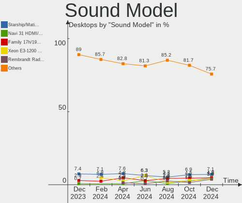

| Model                                                                      | Desktops | Percent |
|----------------------------------------------------------------------------|----------|---------|
| AMD Starship/Matisse HD Audio Controller                                   | 9        | 7.03%   |
| AMD Ellesmere HDMI Audio [Radeon RX 470/480 / 570/580/590]                 | 7        | 5.47%   |
| Intel 8 Series/C220 Series Chipset High Definition Audio Controller        | 6        | 4.69%   |
| AMD Family 17h/19h HD Audio Controller                                     | 6        | 4.69%   |
| Intel 6 Series/C200 Series Chipset Family High Definition Audio Controller | 5        | 3.91%   |
| AMD Navi 21/23 HDMI/DP Audio Controller                                    | 5        | 3.91%   |
| Intel Xeon E3-1200 v3/4th Gen Core Processor HD Audio Controller           | 4        | 3.13%   |
| Intel Cannon Lake PCH cAVS                                                 | 4        | 3.13%   |
| AMD Rembrandt Radeon High Definition Audio Controller                      | 4        | 3.13%   |
| Nvidia TU106 High Definition Audio Controller                              | 3        | 2.34%   |
| Intel 82801JI (ICH10 Family) HD Audio Controller                           | 3        | 2.34%   |
| Intel 7 Series/C216 Chipset Family High Definition Audio Controller        | 3        | 2.34%   |
| Intel 200 Series PCH HD Audio                                              | 3        | 2.34%   |
| AMD Renoir Radeon High Definition Audio Controller                         | 3        | 2.34%   |
| Nvidia TU116 High Definition Audio Controller                              | 2        | 1.56%   |
| Nvidia TU107 GeForce GTX 1650 High Definition Audio Controller             | 2        | 1.56%   |
| Nvidia GP104 High Definition Audio Controller                              | 2        | 1.56%   |
| Nvidia GM206 High Definition Audio Controller                              | 2        | 1.56%   |
| Nvidia GK208 HDMI/DP Audio Controller                                      | 2        | 1.56%   |
| Nvidia GK104 HDMI Audio Controller                                         | 2        | 1.56%   |
| Nvidia GF119 HDMI Audio Controller                                         | 2        | 1.56%   |
| Nvidia GA102 High Definition Audio Controller                              | 2        | 1.56%   |
| JMTek USB PnP Audio Device                                                 | 2        | 1.56%   |
| Intel NM10/ICH7 Family High Definition Audio Controller                    | 2        | 1.56%   |
| Intel 700 Series Chipset Family Precise Touch and Stylus Port #1           | 2        | 1.56%   |
| Intel 100 Series/C230 Series Chipset Family HD Audio Controller            | 2        | 1.56%   |
| C-Media Electronics USB Advanced Audio Device                              | 2        | 1.56%   |
| AMD SBx00 Azalia (Intel HDA)                                               | 2        | 1.56%   |
| AMD FCH Azalia Controller                                                  | 2        | 1.56%   |
| Schiit Audio Schiit Unison Modius                                          | 1        | 0.78%   |
| Plantronics Blackwire 3210 Series                                          | 1        | 0.78%   |
| Nvidia GP108 High Definition Audio Controller                              | 1        | 0.78%   |
| Nvidia GP107GL High Definition Audio Controller                            | 1        | 0.78%   |
| Nvidia GP102 HDMI Audio Controller                                         | 1        | 0.78%   |
| Nvidia GM107 High Definition Audio Controller [GeForce 940MX]              | 1        | 0.78%   |
| Nvidia GK107 HDMI Audio Controller                                         | 1        | 0.78%   |
| Nvidia GA106 High Definition Audio Controller                              | 1        | 0.78%   |
| Nvidia GA104 High Definition Audio Controller                              | 1        | 0.78%   |
| Micro Star International USB Audio                                         | 1        | 0.78%   |
| Logitech USB Headset H540                                                  | 1        | 0.78%   |

Memory
------

Memory Vendor
-------------

Memory module vendors

| Vendor              | Desktops | Percent |
|---------------------|----------|---------|
| Kingston            | 6        | 16.67%  |
| Corsair             | 6        | 16.67%  |
| G.Skill             | 5        | 13.89%  |
| SK hynix            | 4        | 11.11%  |
| Unknown             | 3        | 8.33%   |
| Samsung Electronics | 3        | 8.33%   |
| Patriot             | 2        | 5.56%   |
| Micron Technology   | 2        | 5.56%   |
| Crucial             | 2        | 5.56%   |
| Team                | 1        | 2.78%   |
| Mushkin             | 1        | 2.78%   |
| A-DATA Technology   | 1        | 2.78%   |

Memory Model
------------

Memory module models

| Model                                                    | Desktops | Percent |
|----------------------------------------------------------|----------|---------|
| Kingston RAM KHX1600C10D3/8G 8GB DIMM DDR3 1600MT/s      | 2        | 4.88%   |
| Unknown RAM Module 4GB DIMM DDR3 1333MT/s                | 1        | 2.44%   |
| Unknown RAM Module 2GB DIMM SDRAM 800MT/s                | 1        | 2.44%   |
| Unknown RAM Module 1GB DIMM SDRAM 800MT/s                | 1        | 2.44%   |
| Unknown RAM DDR4 NB 8G 2666 8GB SODIMM DDR4 2667MT/s     | 1        | 2.44%   |
| Team RAM TEAMGROUP-UD4-3200 8GB DIMM DDR4 3800MT/s       | 1        | 2.44%   |
| SK hynix RAM HMT451R7AFR8C-RD 4GB DIMM DDR3 1866MT/s     | 1        | 2.44%   |
| SK hynix RAM HMT41GU6AFR8C-PB 8GB DIMM DDR3 1600MT/s     | 1        | 2.44%   |
| SK hynix RAM HMT351U6EFR8C-PB 4GB DIMM DDR3 1800MT/s     | 1        | 2.44%   |
| SK hynix RAM HMA851U6JJR6N-VK 4GB DIMM DDR4 2667MT/s     | 1        | 2.44%   |
| SK hynix RAM HMA451U6AFR8N-TF 4GB DIMM DDR4 2133MT/s     | 1        | 2.44%   |
| Samsung RAM M391B5773CH0-YH9 2GB DIMM DDR3 1333MT/s      | 1        | 2.44%   |
| Samsung RAM M378B5173DB0-CK0 4GB DIMM DDR3 1600MT/s      | 1        | 2.44%   |
| Samsung RAM M378A4G43MB1-CTD 32GB DIMM DDR4 3466MT/s     | 1        | 2.44%   |
| Patriot RAM PSD48G320081 8GB DIMM DDR4 3200MT/s          | 1        | 2.44%   |
| Patriot RAM 1600 CL10 Series 8192MB DIMM DDR3 1600MT/s   | 1        | 2.44%   |
| Mushkin RAM 991769 (996769)000 4096MB DIMM 1333MT/s      | 1        | 2.44%   |
| Micron RAM 8KTF51264HZ-1G9P1 4GB SODIMM DDR3 1866MT/s    | 1        | 2.44%   |
| Micron RAM 8ATF1G64AZ-2G6E1 8GB DIMM DDR4 2667MT/s       | 1        | 2.44%   |
| Micron RAM 16KTF51264HZ-1G6M1 4GB SODIMM DDR3 1600MT/s   | 1        | 2.44%   |
| Kingston RAM KHX1866C10D3/8G 8GB DIMM DDR3 2133MT/s      | 1        | 2.44%   |
| Kingston RAM KHX1866C10D3/4G 4GB DIMM DDR3 1867MT/s      | 1        | 2.44%   |
| Kingston RAM KHX1600C10D3/8GX 8GB DIMM DDR3 1600MT/s     | 1        | 2.44%   |
| Kingston RAM KF556C36-16 16GB DIMM DDR5 6400MT/s         | 1        | 2.44%   |
| Kingston RAM KF3200C16D4/32GX 32GB DIMM DDR4 3933MT/s    | 1        | 2.44%   |
| Kingston RAM ACR24D4U7S8MB-8 8GB DIMM DDR4 2400MT/s      | 1        | 2.44%   |
| G.Skill RAM F5-5600J3636C16G 16GB DIMM DDR5 5600MT/s     | 1        | 2.44%   |
| G.Skill RAM F4-3600C19-16GVRB 16GB DIMM DDR4 3600MT/s    | 1        | 2.44%   |
| G.Skill RAM F4-3200C16-16GFX 16GB DIMM DDR4 3266MT/s     | 1        | 2.44%   |
| G.Skill RAM F3-12800CL9-4GBSR2 4GB SODIMM DDR3 1333MT/s  | 1        | 2.44%   |
| G.Skill RAM F3-12800CL10-8GBXL 8GB DIMM DDR3 1600MT/s    | 1        | 2.44%   |
| Crucial RAM Module 8GB DIMM DDR3 1333MT/s                | 1        | 2.44%   |
| Crucial RAM BL16G36C16U4BL.M8FB1 16GB DIMM DDR4 3200MT/s | 1        | 2.44%   |
| Corsair RAM Module 8GB DIMM DDR3 1333MT/s                | 1        | 2.44%   |
| Corsair RAM CMK64GX5M2B5200C40 32GB DIMM 5200MT/s        | 1        | 2.44%   |
| Corsair RAM CMK64GX4M2E3200C16 32GB DIMM DDR4 3200MT/s   | 1        | 2.44%   |
| Corsair RAM CMK32GX5M2B5600C36 16GB DIMM DDR5 5800MT/s   | 1        | 2.44%   |
| Corsair RAM CMK16GX4M2B3200C16 8GB DIMM DDR4 3600MT/s    | 1        | 2.44%   |
| Corsair RAM CMH32GX5M2B5600Z36 16GB DIMM DDR5 4800MT/s   | 1        | 2.44%   |
| A-DATA RAM AM2P24HC4U1-B9QS 4GB DIMM DDR4 2400MT/s       | 1        | 2.44%   |

Memory Kind
-----------

Memory module kinds

| Kind    | Desktops | Percent |
|---------|----------|---------|
| DDR3    | 13       | 40.63%  |
| DDR4    | 12       | 37.5%   |
| DDR5    | 5        | 15.63%  |
| SDRAM   | 1        | 3.13%   |
| Unknown | 1        | 3.13%   |

Memory Form Factor
------------------

Physical design of the memory module

| Name   | Desktops | Percent |
|--------|----------|---------|
| DIMM   | 29       | 90.63%  |
| SODIMM | 3        | 9.38%   |

Memory Size
-----------

Memory module size

| Size  | Desktops | Percent |
|-------|----------|---------|
| 8192  | 13       | 34.21%  |
| 4096  | 10       | 26.32%  |
| 16384 | 7        | 18.42%  |
| 32768 | 5        | 13.16%  |
| 2048  | 2        | 5.26%   |
| 1024  | 1        | 2.63%   |

Memory Speed
------------

Memory module speed

| Speed | Desktops | Percent |
|-------|----------|---------|
| 1600  | 6        | 16.22%  |
| 1333  | 5        | 13.51%  |
| 3200  | 3        | 8.11%   |
| 2133  | 3        | 8.11%   |
| 1867  | 3        | 8.11%   |
| 3600  | 2        | 5.41%   |
| 2667  | 2        | 5.41%   |
| 6400  | 1        | 2.7%    |
| 5800  | 1        | 2.7%    |
| 5600  | 1        | 2.7%    |
| 5200  | 1        | 2.7%    |
| 4800  | 1        | 2.7%    |
| 3933  | 1        | 2.7%    |
| 3800  | 1        | 2.7%    |
| 3466  | 1        | 2.7%    |
| 3266  | 1        | 2.7%    |
| 2400  | 1        | 2.7%    |
| 1866  | 1        | 2.7%    |
| 1800  | 1        | 2.7%    |
| 800   | 1        | 2.7%    |

Printers & scanners
-------------------

Printer Vendor
--------------

Printer device vendors

| Vendor              | Desktops | Percent |
|---------------------|----------|---------|
| Brother Industries  | 3        | 50%     |
| Samsung Electronics | 2        | 33.33%  |
| Hewlett-Packard     | 1        | 16.67%  |

Printer Model
-------------

Printer device models

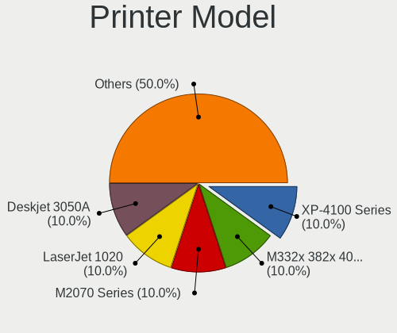

| Model                           | Desktops | Percent |
|---------------------------------|----------|---------|
| Samsung SCX-3200 Series         | 1        | 16.67%  |
| Samsung C460 Series             | 1        | 16.67%  |
| HP LaserJet M203-M206           | 1        | 16.67%  |
| Brother Printer                 | 1        | 16.67%  |
| Brother HL-L2320D series        | 1        | 16.67%  |
| Brother HL-2270DW Laser Printer | 1        | 16.67%  |

Scanner Vendor
--------------

Scanner device vendors

Zero info for selected period =(

Scanner Model
-------------

Scanner device models

Zero info for selected period =(

Camera
------

Camera Vendor
-------------

Camera device vendors

| Vendor                 | Desktops | Percent |
|------------------------|----------|---------|
| Logitech               | 5        | 45.45%  |
| Microsoft              | 1        | 9.09%   |
| Microdia               | 1        | 9.09%   |
| Linux Foundation       | 1        | 9.09%   |
| Generalplus Technology | 1        | 9.09%   |
| AVerMedia Technologies | 1        | 9.09%   |
| 2M UVC CAMERA          | 1        | 9.09%   |

Camera Model
------------

Camera device models

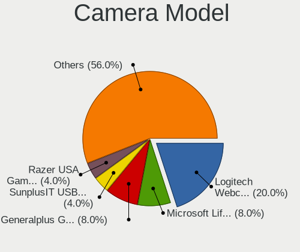

| Model                           | Desktops | Percent |
|---------------------------------|----------|---------|
| Microsoft LifeCam HD-3000       | 1        | 9.09%   |
| Microdia Webcam Vitade AF       | 1        | 9.09%   |
| Logitech Webcam C250            | 1        | 9.09%   |
| Logitech StreamCam              | 1        | 9.09%   |
| Logitech C922 Pro Stream Webcam | 1        | 9.09%   |
| Logitech C920 PRO HD Webcam     | 1        | 9.09%   |
| Logitech BRIO Ultra HD Webcam   | 1        | 9.09%   |
| Linux Foundation EEM Gadget     | 1        | 9.09%   |
| Generalplus GENERAL WEBCAM      | 1        | 9.09%   |
| AVerMedia Live Streamer CAM 313 | 1        | 9.09%   |
| 2M UVC CAMERA Web Camera        | 1        | 9.09%   |

Security
--------

Fingerprint Vendor
------------------

Fingerprint sensor vendors

Zero info for selected period =(

Fingerprint Model
-----------------

Fingerprint sensor models

Zero info for selected period =(

Chipcard Vendor
---------------

Chipcard module vendors

Zero info for selected period =(

Chipcard Model
--------------

Chipcard module models

Zero info for selected period =(

Unsupported
-----------

Unsupported Devices
-------------------

Total unsupported devices on board

| Total | Desktops | Percent |
|-------|----------|---------|
| 0     | 53       | 89.83%  |
| 1     | 6        | 10.17%  |

Unsupported Device Types
------------------------

Types of unsupported devices

| Type                     | Desktops | Percent |
|--------------------------|----------|---------|
| Graphics card            | 3        | 50%     |
| Communication controller | 2        | 33.33%  |
| Net/wireless             | 1        | 16.67%  |

