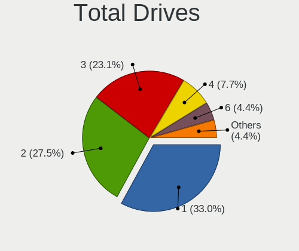
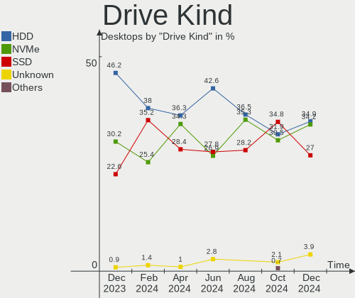
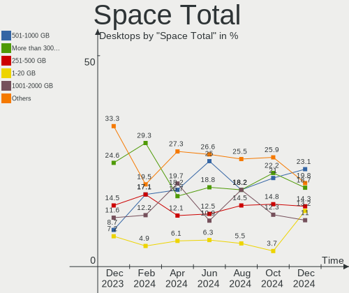
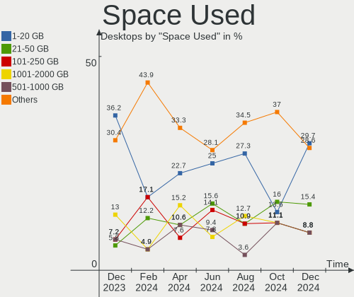
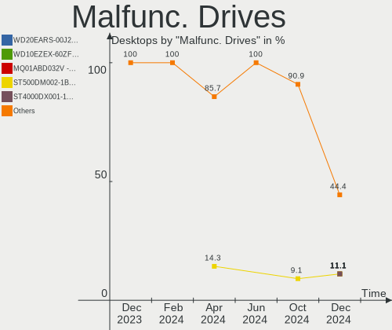
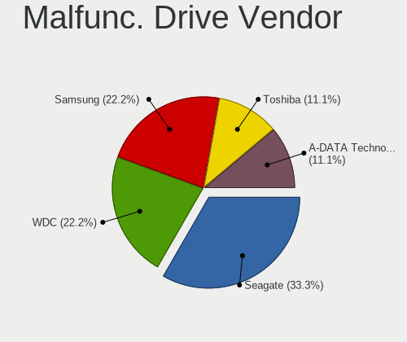
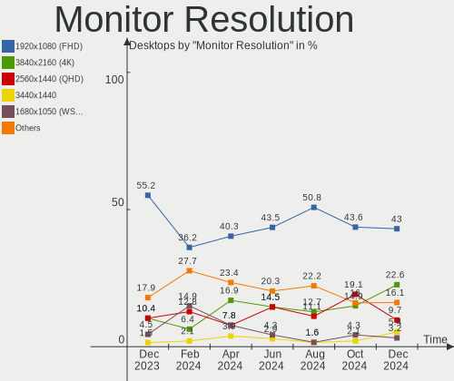

Linux in Canada - Hardware Trends (Desktops)
--------------------------------------------

A project to identify most popular hardware characteristics and track their change
over time based on data collected by Linux users at https://Linux-Hardware.org.

Anyone can contribute to this report by the [hw-probe](https://github.com/linuxhw/hw-probe) tool:

    sudo -E hw-probe -all -upload

Contents
--------

* [ System ](#system)
  - [ OS                       ](#os)
  - [ OS Family                ](#os-family)
  - [ Kernel                   ](#kernel)
  - [ Kernel Family            ](#kernel-family)
  - [ Kernel Major Ver.        ](#kernel-major-ver)
  - [ Arch                     ](#arch)
  - [ DE                       ](#de)
  - [ Display Server           ](#display-server)
  - [ Display Manager          ](#display-manager)
  - [ OS Lang                  ](#os-lang)
  - [ Boot Mode                ](#boot-mode)
  - [ Filesystem               ](#filesystem)
  - [ Part. scheme             ](#part-scheme)
  - [ Dual Boot with Linux/BSD ](#dual-boot-with-linuxbsd)
  - [ Dual Boot (Win)          ](#dual-boot-win)

* [ Board ](#board)
  - [ Vendor                   ](#vendor)
  - [ Model                    ](#model)
  - [ Model Family             ](#model-family)
  - [ MFG Year                 ](#mfg-year)
  - [ Form Factor              ](#form-factor)
  - [ Secure Boot              ](#secure-boot)
  - [ Coreboot                 ](#coreboot)
  - [ RAM Size                 ](#ram-size)
  - [ RAM Used                 ](#ram-used)
  - [ Total Drives             ](#total-drives)
  - [ Has CD-ROM               ](#has-cd-rom)
  - [ Has Ethernet             ](#has-ethernet)
  - [ Has WiFi                 ](#has-wifi)
  - [ Has Bluetooth            ](#has-bluetooth)

* [ Location ](#location)
  - [ Country                  ](#country)
  - [ City                     ](#city)

* [ Drives ](#drives)
  - [ Drive Vendor             ](#drive-vendor)
  - [ Drive Model              ](#drive-model)
  - [ HDD Vendor               ](#hdd-vendor)
  - [ SSD Vendor               ](#ssd-vendor)
  - [ Drive Kind               ](#drive-kind)
  - [ Drive Connector          ](#drive-connector)
  - [ Drive Size               ](#drive-size)
  - [ Space Total              ](#space-total)
  - [ Space Used               ](#space-used)
  - [ Malfunc. Drives          ](#malfunc-drives)
  - [ Malfunc. Drive Vendor    ](#malfunc-drive-vendor)
  - [ Malfunc. HDD Vendor      ](#malfunc-hdd-vendor)
  - [ Malfunc. Drive Kind      ](#malfunc-drive-kind)
  - [ Failed Drives            ](#failed-drives)
  - [ Failed Drive Vendor      ](#failed-drive-vendor)
  - [ Drive Status             ](#drive-status)

* [ Storage controller ](#storage-controller)
  - [ Storage Vendor           ](#storage-vendor)
  - [ Storage Model            ](#storage-model)
  - [ Storage Kind             ](#storage-kind)

* [ Processor ](#processor)
  - [ CPU Vendor               ](#cpu-vendor)
  - [ CPU Model                ](#cpu-model)
  - [ CPU Model Family         ](#cpu-model-family)
  - [ CPU Cores                ](#cpu-cores)
  - [ CPU Sockets              ](#cpu-sockets)
  - [ CPU Threads              ](#cpu-threads)
  - [ CPU Op-Modes             ](#cpu-op-modes)
  - [ CPU Microcode            ](#cpu-microcode)
  - [ CPU Microarch            ](#cpu-microarch)

* [ Graphics ](#graphics)
  - [ GPU Vendor               ](#gpu-vendor)
  - [ GPU Model                ](#gpu-model)
  - [ GPU Combo                ](#gpu-combo)
  - [ GPU Driver               ](#gpu-driver)
  - [ GPU Memory               ](#gpu-memory)

* [ Monitor ](#monitor)
  - [ Monitor Vendor           ](#monitor-vendor)
  - [ Monitor Model            ](#monitor-model)
  - [ Monitor Resolution       ](#monitor-resolution)
  - [ Monitor Diagonal         ](#monitor-diagonal)
  - [ Monitor Width            ](#monitor-width)
  - [ Aspect Ratio             ](#aspect-ratio)
  - [ Monitor Area             ](#monitor-area)
  - [ Pixel Density            ](#pixel-density)
  - [ Multiple Monitors        ](#multiple-monitors)

* [ Network ](#network)
  - [ Net Controller Vendor    ](#net-controller-vendor)
  - [ Net Controller Model     ](#net-controller-model)
  - [ Wireless Vendor          ](#wireless-vendor)
  - [ Wireless Model           ](#wireless-model)
  - [ Ethernet Vendor          ](#ethernet-vendor)
  - [ Ethernet Model           ](#ethernet-model)
  - [ Net Controller Kind      ](#net-controller-kind)
  - [ Used Controller          ](#used-controller)
  - [ NICs                     ](#nics)
  - [ IPv6                     ](#ipv6)

* [ Bluetooth ](#bluetooth)
  - [ Bluetooth Vendor         ](#bluetooth-vendor)
  - [ Bluetooth Model          ](#bluetooth-model)

* [ Sound ](#sound)
  - [ Sound Vendor             ](#sound-vendor)
  - [ Sound Model              ](#sound-model)

* [ Memory ](#memory)
  - [ Memory Vendor            ](#memory-vendor)
  - [ Memory Model             ](#memory-model)
  - [ Memory Kind              ](#memory-kind)
  - [ Memory Form Factor       ](#memory-form-factor)
  - [ Memory Size              ](#memory-size)
  - [ Memory Speed             ](#memory-speed)

* [ Printers & scanners ](#printers--scanners)
  - [ Printer Vendor           ](#printer-vendor)
  - [ Printer Model            ](#printer-model)
  - [ Scanner Vendor           ](#scanner-vendor)
  - [ Scanner Model            ](#scanner-model)

* [ Camera ](#camera)
  - [ Camera Vendor            ](#camera-vendor)
  - [ Camera Model             ](#camera-model)

* [ Security ](#security)
  - [ Fingerprint Vendor       ](#fingerprint-vendor)
  - [ Fingerprint Model        ](#fingerprint-model)
  - [ Chipcard Vendor          ](#chipcard-vendor)
  - [ Chipcard Model           ](#chipcard-model)

* [ Unsupported ](#unsupported)
  - [ Unsupported Devices      ](#unsupported-devices)
  - [ Unsupported Device Types ](#unsupported-device-types)

System
------

OS
--

Installed operating systems

| Name              | Desktops | Percent |
|-------------------|----------|---------|
| Ubuntu 20.04      | 7        | 13.46%  |
| Ubuntu 22.04      | 6        | 11.54%  |
| Linux Mint 20.3   | 5        | 9.62%   |
| OpenMandriva 4.3  | 3        | 5.77%   |
| Manjaro           | 3        | 5.77%   |
| Zorin 16          | 2        | 3.85%   |
| Pop!_OS 22.04     | 2        | 3.85%   |
| Kubuntu 11        | 2        | 3.85%   |
| Fedora 36         | 2        | 3.85%   |
| Elementary 6.1    | 2        | 3.85%   |
| Debian 11         | 2        | 3.85%   |
| yiffOS 0.2.0-dev  | 1        | 1.92%   |
| Xubuntu 20.04     | 1        | 1.92%   |
| Xubuntu 16.04     | 1        | 1.92%   |
| Ubuntu 18.04      | 1        | 1.92%   |
| Ubuntu 16.04      | 1        | 1.92%   |
| Pop!_OS 21.10     | 1        | 1.92%   |
| Manjaro 21.2.6    | 1        | 1.92%   |
| Makulu 2020       | 1        | 1.92%   |
| LMDE 5            | 1        | 1.92%   |
| LMDE 4            | 1        | 1.92%   |
| Kubuntu 22.04     | 1        | 1.92%   |
| KDE neon 20.04    | 1        | 1.92%   |
| Fedora 35         | 1        | 1.92%   |
| Debian 10         | 1        | 1.92%   |
| CentOS 7          | 1        | 1.92%   |
| ArcoLinux Rolling | 1        | 1.92%   |

OS Family
---------

OS without a version

| Name         | Desktops | Percent |
|--------------|----------|---------|
| Ubuntu       | 15       | 28.85%  |
| Linux Mint   | 5        | 9.62%   |
| Manjaro      | 4        | 7.69%   |
| Pop!_OS      | 3        | 5.77%   |
| OpenMandriva | 3        | 5.77%   |
| Kubuntu      | 3        | 5.77%   |
| Fedora       | 3        | 5.77%   |
| Debian       | 3        | 5.77%   |
| Zorin        | 2        | 3.85%   |
| Xubuntu      | 2        | 3.85%   |
| LMDE         | 2        | 3.85%   |
| Elementary   | 2        | 3.85%   |
| yiffOS       | 1        | 1.92%   |
| Makulu       | 1        | 1.92%   |
| KDE neon     | 1        | 1.92%   |
| CentOS       | 1        | 1.92%   |
| ArcoLinux    | 1        | 1.92%   |

Kernel
------

Version of the Linux kernel

| Version                       | Desktops | Percent |
|-------------------------------|----------|---------|
| 5.13.0-40-generic             | 9        | 17.31%  |
| 5.16.7-desktop-1omv4003       | 3        | 5.77%   |
| 5.15.0-30-generic             | 3        | 5.77%   |
| 5.13.0-41-generic             | 3        | 5.77%   |
| 5.4.0-110-generic             | 2        | 3.85%   |
| 5.4.0-109-generic             | 2        | 3.85%   |
| 5.17.5-76051705-generic       | 2        | 3.85%   |
| 5.4.0-84-generic              | 1        | 1.92%   |
| 5.4.0-113-generic             | 1        | 1.92%   |
| 5.18.0-yiffOS                 | 1        | 1.92%   |
| 5.17.9-arch1-1                | 1        | 1.92%   |
| 5.17.9-1-MANJARO              | 1        | 1.92%   |
| 5.17.8-051708-generic         | 1        | 1.92%   |
| 5.17.5-300.fc36.x86_64        | 1        | 1.92%   |
| 5.17.5-200.fc35.x86_64        | 1        | 1.92%   |
| 5.17.11-602.inttf.fc36.x86_64 | 1        | 1.92%   |
| 5.17.1-3-MANJARO              | 1        | 1.92%   |
| 5.16.11-76051611-generic      | 1        | 1.92%   |
| 5.15.38-1-MANJARO             | 1        | 1.92%   |
| 5.15.36-xanmod1               | 1        | 1.92%   |
| 5.15.35-1-pve                 | 1        | 1.92%   |
| 5.15.0-32-generic             | 1        | 1.92%   |
| 5.15.0-30-lowlatency          | 1        | 1.92%   |
| 5.15.0-27-generic             | 1        | 1.92%   |
| 5.15.0-25-generic             | 1        | 1.92%   |
| 5.13.19-2-MANJARO             | 1        | 1.92%   |
| 5.13.0-44-generic             | 1        | 1.92%   |
| 5.11.0-38-generic             | 1        | 1.92%   |
| 5.10.0-14-amd64               | 1        | 1.92%   |
| 5.10.0-13-amd64               | 1        | 1.92%   |
| 4.4.0-224-generic             | 1        | 1.92%   |
| 4.4.0-210-generic             | 1        | 1.92%   |
| 4.19.0-20-amd64               | 1        | 1.92%   |
| 4.19.0-16-amd64               | 1        | 1.92%   |
| 3.10.0-1160.62.1.el7.x86_64   | 1        | 1.92%   |

Kernel Family
-------------

Linux kernel without a distro release

| Version | Desktops | Percent |
|---------|----------|---------|
| 5.13.0  | 13       | 25%     |
| 5.15.0  | 7        | 13.46%  |
| 5.4.0   | 6        | 11.54%  |
| 5.17.5  | 4        | 7.69%   |
| 5.16.7  | 3        | 5.77%   |
| 5.17.9  | 2        | 3.85%   |
| 5.10.0  | 2        | 3.85%   |
| 4.4.0   | 2        | 3.85%   |
| 4.19.0  | 2        | 3.85%   |
| 5.18.0  | 1        | 1.92%   |
| 5.17.8  | 1        | 1.92%   |
| 5.17.11 | 1        | 1.92%   |
| 5.17.1  | 1        | 1.92%   |
| 5.16.11 | 1        | 1.92%   |
| 5.15.38 | 1        | 1.92%   |
| 5.15.36 | 1        | 1.92%   |
| 5.15.35 | 1        | 1.92%   |
| 5.13.19 | 1        | 1.92%   |
| 5.11.0  | 1        | 1.92%   |
| 3.10.0  | 1        | 1.92%   |

Kernel Major Ver.
-----------------

Linux kernel major version

| Version | Desktops | Percent |
|---------|----------|---------|
| 5.13    | 14       | 26.92%  |
| 5.15    | 10       | 19.23%  |
| 5.17    | 9        | 17.31%  |
| 5.4     | 6        | 11.54%  |
| 5.16    | 4        | 7.69%   |
| 5.10    | 2        | 3.85%   |
| 4.4     | 2        | 3.85%   |
| 4.19    | 2        | 3.85%   |
| 5.18    | 1        | 1.92%   |
| 5.11    | 1        | 1.92%   |
| 3.10    | 1        | 1.92%   |

Arch
----

OS architecture (x86_64, i586, etc.)

| Name   | Desktops | Percent |
|--------|----------|---------|
| x86_64 | 52       | 100%    |

DE
--

Desktop Environment

| Name       | Desktops | Percent |
|------------|----------|---------|
| GNOME      | 24       | 46.15%  |
| KDE5       | 11       | 21.15%  |
| X-Cinnamon | 7        | 13.46%  |
| XFCE       | 4        | 7.69%   |
| Pantheon   | 2        | 3.85%   |
| MATE       | 2        | 3.85%   |
| Unity      | 1        | 1.92%   |
| Unknown    | 1        | 1.92%   |

Display Server
--------------

X11 or Wayland

| Name    | Desktops | Percent |
|---------|----------|---------|
| X11     | 50       | 96.15%  |
| Wayland | 1        | 1.92%   |
| Tty     | 1        | 1.92%   |

Display Manager
---------------

SDDM, LightDM, etc.

| Name    | Desktops | Percent |
|---------|----------|---------|
| Unknown | 21       | 40.38%  |
| GDM3    | 10       | 19.23%  |
| GDM     | 9        | 17.31%  |
| SDDM    | 6        | 11.54%  |
| LightDM | 6        | 11.54%  |

OS Lang
-------

Language

| Lang  | Desktops | Percent |
|-------|----------|---------|
| en_CA | 35       | 67.31%  |
| en_US | 13       | 25%     |
| fr_CA | 2        | 3.85%   |
| fr_FR | 1        | 1.92%   |
| de_DE | 1        | 1.92%   |

Boot Mode
---------

EFI or BIOS

| Mode | Desktops | Percent |
|------|----------|---------|
| BIOS | 31       | 59.62%  |
| EFI  | 21       | 40.38%  |

Filesystem
----------

Type of filesystem

| Type    | Desktops | Percent |
|---------|----------|---------|
| Ext4    | 42       | 80.77%  |
| Btrfs   | 5        | 9.62%   |
| Overlay | 4        | 7.69%   |
| Xfs     | 1        | 1.92%   |

Part. scheme
------------

Scheme of partitioning

| Type    | Desktops | Percent |
|---------|----------|---------|
| Unknown | 30       | 57.69%  |
| GPT     | 21       | 40.38%  |
| MBR     | 1        | 1.92%   |

Dual Boot with Linux/BSD
------------------------

Hosting more than one Linux/BSD

| Dual boot | Desktops | Percent |
|-----------|----------|---------|
| No        | 41       | 78.85%  |
| Yes       | 11       | 21.15%  |

Dual Boot (Win)
---------------

Hosting Linux and Windows

| Dual boot | Desktops | Percent |
|-----------|----------|---------|
| No        | 36       | 69.23%  |
| Yes       | 16       | 30.77%  |

Board
-----

Vendor
------

Motherboard manufacturer

| Name                | Desktops | Percent |
|---------------------|----------|---------|
| ASUSTek Computer    | 17       | 32.69%  |
| Gigabyte Technology | 10       | 19.23%  |
| MSI                 | 9        | 17.31%  |
| Dell                | 5        | 9.62%   |
| Hewlett-Packard     | 4        | 7.69%   |
| Lenovo              | 2        | 3.85%   |
| ASRock              | 2        | 3.85%   |
| Acer                | 2        | 3.85%   |
| Intel               | 1        | 1.92%   |

Model
-----

Motherboard model

| Name                                 | Desktops | Percent |
|--------------------------------------|----------|---------|
| MSI MS-7C91                          | 2        | 3.85%   |
| MSI p7-1240                          | 1        | 1.92%   |
| MSI MS-7D52                          | 1        | 1.92%   |
| MSI MS-7B98                          | 1        | 1.92%   |
| MSI MS-7B86                          | 1        | 1.92%   |
| MSI MS-7B79                          | 1        | 1.92%   |
| MSI MS-7B33                          | 1        | 1.92%   |
| MSI MS-7721                          | 1        | 1.92%   |
| Lenovo ThinkStation S30 43516Y7      | 1        | 1.92%   |
| Lenovo ThinkCentre M90p 5864AL2      | 1        | 1.92%   |
| Intel DQ77MK AAG39642-400            | 1        | 1.92%   |
| HP OMEN 25L Desktop GT12-0xxx        | 1        | 1.92%   |
| HP Compaq Elite 8300 USDT            | 1        | 1.92%   |
| HP Compaq Elite 8300 SFF             | 1        | 1.92%   |
| HP 700-249                           | 1        | 1.92%   |
| Gigabyte Z390 UD                     | 1        | 1.92%   |
| Gigabyte Z370P D3                    | 1        | 1.92%   |
| Gigabyte X570S AORUS MASTER          | 1        | 1.92%   |
| Gigabyte X570 AORUS MASTER           | 1        | 1.92%   |
| Gigabyte X470 AORUS ULTRA GAMING     | 1        | 1.92%   |
| Gigabyte GA-78LMT-USB3               | 1        | 1.92%   |
| Gigabyte B75M-HD3                    | 1        | 1.92%   |
| Gigabyte B550 AORUS PRO AC           | 1        | 1.92%   |
| Gigabyte B365M GAMING HD             | 1        | 1.92%   |
| Gigabyte AB350-Gaming 3              | 1        | 1.92%   |
| Dell XPS 8950                        | 1        | 1.92%   |
| Dell XPS 8300                        | 1        | 1.92%   |
| Dell Vostro 470                      | 1        | 1.92%   |
| Dell OptiPlex 990                    | 1        | 1.92%   |
| Dell OptiPlex 360                    | 1        | 1.92%   |
| ASUS VM42                            | 1        | 1.92%   |
| ASUS ROG STRIX Z690-A GAMING WIFI D4 | 1        | 1.92%   |
| ASUS ROG Maximus X HERO              | 1        | 1.92%   |
| ASUS ROG CROSSHAIR VIII HERO         | 1        | 1.92%   |
| ASUS ROG CROSSHAIR VIII DARK HERO    | 1        | 1.92%   |
| ASUS Rampage III Extreme             | 1        | 1.92%   |
| ASUS PRIME Z690-P WIFI D4            | 1        | 1.92%   |
| ASUS PRIME Z370-A                    | 1        | 1.92%   |
| ASUS PRIME X570-P                    | 1        | 1.92%   |
| ASUS PRIME B660M-A AC D4             | 1        | 1.92%   |
| ASUS PRIME B550M-A                   | 1        | 1.92%   |
| ASUS P5QL PRO                        | 1        | 1.92%   |
| ASUS M5A97 R2.0                      | 1        | 1.92%   |
| ASUS GZ727AA-A2L s3307c              | 1        | 1.92%   |
| ASUS F2A85-V PRO                     | 1        | 1.92%   |
| ASUS All Series                      | 1        | 1.92%   |
| ASUS 970 PRO GAMING/AURA             | 1        | 1.92%   |
| ASRock X570 Extreme4                 | 1        | 1.92%   |
| ASRock B450M Pro4-F                  | 1        | 1.92%   |
| Acer Aspire XC-230                   | 1        | 1.92%   |
| Acer Aspire X3400                    | 1        | 1.92%   |

Model Family
------------

Motherboard model prefix

| Name                   | Desktops | Percent |
|------------------------|----------|---------|
| ASUS PRIME             | 5        | 9.62%   |
| ASUS ROG               | 4        | 7.69%   |
| MSI MS-7C91            | 2        | 3.85%   |
| HP Compaq              | 2        | 3.85%   |
| Dell XPS               | 2        | 3.85%   |
| Dell OptiPlex          | 2        | 3.85%   |
| Acer Aspire            | 2        | 3.85%   |
| MSI p7-1240            | 1        | 1.92%   |
| MSI MS-7D52            | 1        | 1.92%   |
| MSI MS-7B98            | 1        | 1.92%   |
| MSI MS-7B86            | 1        | 1.92%   |
| MSI MS-7B79            | 1        | 1.92%   |
| MSI MS-7B33            | 1        | 1.92%   |
| MSI MS-7721            | 1        | 1.92%   |
| Lenovo ThinkStation    | 1        | 1.92%   |
| Lenovo ThinkCentre     | 1        | 1.92%   |
| Intel DQ77MK           | 1        | 1.92%   |
| HP OMEN                | 1        | 1.92%   |
| HP 700-249             | 1        | 1.92%   |
| Gigabyte Z390          | 1        | 1.92%   |
| Gigabyte Z370P         | 1        | 1.92%   |
| Gigabyte X570S         | 1        | 1.92%   |
| Gigabyte X570          | 1        | 1.92%   |
| Gigabyte X470          | 1        | 1.92%   |
| Gigabyte GA-78LMT-USB3 | 1        | 1.92%   |
| Gigabyte B75M-HD3      | 1        | 1.92%   |
| Gigabyte B550          | 1        | 1.92%   |
| Gigabyte B365M         | 1        | 1.92%   |
| Gigabyte AB350-Gaming  | 1        | 1.92%   |
| Dell Vostro            | 1        | 1.92%   |
| ASUS VM42              | 1        | 1.92%   |
| ASUS Rampage           | 1        | 1.92%   |
| ASUS P5QL              | 1        | 1.92%   |
| ASUS M5A97             | 1        | 1.92%   |
| ASUS GZ727AA-A2L       | 1        | 1.92%   |
| ASUS F2A85-V           | 1        | 1.92%   |
| ASUS All               | 1        | 1.92%   |
| ASUS 970               | 1        | 1.92%   |
| ASRock X570            | 1        | 1.92%   |
| ASRock B450M           | 1        | 1.92%   |

MFG Year
--------

Motherboard manufacture year

| Year | Desktops | Percent |
|------|----------|---------|
| 2012 | 10       | 19.23%  |
| 2018 | 7        | 13.46%  |
| 2021 | 6        | 11.54%  |
| 2020 | 6        | 11.54%  |
| 2019 | 5        | 9.62%   |
| 2017 | 4        | 7.69%   |
| 2014 | 3        | 5.77%   |
| 2022 | 2        | 3.85%   |
| 2011 | 2        | 3.85%   |
| 2010 | 2        | 3.85%   |
| 2008 | 2        | 3.85%   |
| 2016 | 1        | 1.92%   |
| 2015 | 1        | 1.92%   |
| 2007 | 1        | 1.92%   |

Form Factor
-----------

Physical design of the computer

| Name    | Desktops | Percent |
|---------|----------|---------|
| Desktop | 52       | 100%    |

Secure Boot
-----------

Enabled or disabled

| State    | Desktops | Percent |
|----------|----------|---------|
| Disabled | 52       | 100%    |

Coreboot
--------

Have coreboot on board

| Used | Desktops | Percent |
|------|----------|---------|
| No   | 52       | 100%    |

RAM Size
--------

Total RAM memory

| Size in GB  | Desktops | Percent |
|-------------|----------|---------|
| 16.01-24.0  | 16       | 30.77%  |
| 32.01-64.0  | 9        | 17.31%  |
| 8.01-16.0   | 9        | 17.31%  |
| 4.01-8.0    | 6        | 11.54%  |
| 64.01-256.0 | 6        | 11.54%  |
| 3.01-4.0    | 3        | 5.77%   |
| 24.01-32.0  | 1        | 1.92%   |
| 2.01-3.0    | 1        | 1.92%   |
| 1.01-2.0    | 1        | 1.92%   |

RAM Used
--------

Used RAM memory

| Used GB    | Desktops | Percent |
|------------|----------|---------|
| 2.01-3.0   | 17       | 32.69%  |
| 1.01-2.0   | 12       | 23.08%  |
| 3.01-4.0   | 9        | 17.31%  |
| 4.01-8.0   | 6        | 11.54%  |
| 8.01-16.0  | 6        | 11.54%  |
| 32.01-64.0 | 1        | 1.92%   |
| 0.51-1.0   | 1        | 1.92%   |

Total Drives
------------

Number of drives on board

| Drives | Desktops | Percent |
|--------|----------|---------|
| 2      | 16       | 30.77%  |
| 1      | 14       | 26.92%  |
| 3      | 8        | 15.38%  |
| 4      | 7        | 13.46%  |
| 6      | 4        | 7.69%   |
| 5      | 2        | 3.85%   |
| 10     | 1        | 1.92%   |

Has CD-ROM
----------

Has CD-ROM on board

| Presented | Desktops | Percent |
|-----------|----------|---------|
| Yes       | 28       | 53.85%  |
| No        | 24       | 46.15%  |

Has Ethernet
------------

Has Ethernet on board

| Presented | Desktops | Percent |
|-----------|----------|---------|
| Yes       | 52       | 100%    |

Has WiFi
--------

Has WiFi module

| Presented | Desktops | Percent |
|-----------|----------|---------|
| No        | 27       | 51.92%  |
| Yes       | 25       | 48.08%  |

Has Bluetooth
-------------

Has Bluetooth module

| Presented | Desktops | Percent |
|-----------|----------|---------|
| No        | 27       | 51.92%  |
| Yes       | 25       | 48.08%  |

Location
--------

Country
-------

Geographic location (country)

| Country | Desktops | Percent |
|---------|----------|---------|
| Canada  | 52       | 100%    |

City
----

Geographic location (city)

| City            | Desktops | Percent |
|-----------------|----------|---------|
| Toronto         | 5        | 9.62%   |
| Montreal        | 3        | 5.77%   |
| Edmonton        | 3        | 5.77%   |
| Calgary         | 3        | 5.77%   |
| Spruce Grove    | 2        | 3.85%   |
| Sidney          | 2        | 3.85%   |
| Saskatoon       | 2        | 3.85%   |
| Québec         | 2        | 3.85%   |
| Ottawa          | 2        | 3.85%   |
| Hamilton        | 2        | 3.85%   |
| Halifax         | 2        | 3.85%   |
| Brampton        | 2        | 3.85%   |
| Winnipeg        | 1        | 1.92%   |
| Victoria        | 1        | 1.92%   |
| Vancouver       | 1        | 1.92%   |
| Tidnish Bridge  | 1        | 1.92%   |
| Surrey          | 1        | 1.92%   |
| Richmond        | 1        | 1.92%   |
| Port Coquitlam  | 1        | 1.92%   |
| Oakville        | 1        | 1.92%   |
| North Vancouver | 1        | 1.92%   |
| Nelson          | 1        | 1.92%   |
| Moncton         | 1        | 1.92%   |
| Mississauga     | 1        | 1.92%   |
| Milton          | 1        | 1.92%   |
| Manitouwadge    | 1        | 1.92%   |
| Lower Sackville | 1        | 1.92%   |
| London          | 1        | 1.92%   |
| Laval           | 1        | 1.92%   |
| Kanata          | 1        | 1.92%   |
| Joliette        | 1        | 1.92%   |
| Georgetown      | 1        | 1.92%   |
| Elliot Lake     | 1        | 1.92%   |
| Burnaby         | 1        | 1.92%   |

Drives
------

Drive Vendor
------------

Hard drive vendors

| Vendor              | Desktops | Drives | Percent |
|---------------------|----------|--------|---------|
| WDC                 | 28       | 41     | 24.78%  |
| Seagate             | 20       | 28     | 17.7%   |
| Samsung Electronics | 19       | 27     | 16.81%  |
| Toshiba             | 7        | 7      | 6.19%   |
| Sandisk             | 6        | 7      | 5.31%   |
| Hitachi             | 6        | 6      | 5.31%   |
| Kingston            | 5        | 5      | 4.42%   |
| Phison              | 4        | 4      | 3.54%   |
| Intel               | 4        | 4      | 3.54%   |
| USB3.0              | 1        | 1      | 0.88%   |
| USB 3.0             | 1        | 1      | 0.88%   |
| Unknown             | 1        | 1      | 0.88%   |
| PLEXTOR             | 1        | 1      | 0.88%   |
| Patriot             | 1        | 1      | 0.88%   |
| OCZ-VERTEX2         | 1        | 1      | 0.88%   |
| OCZ                 | 1        | 1      | 0.88%   |
| Mushkin             | 1        | 1      | 0.88%   |
| Micron Technology   | 1        | 1      | 0.88%   |
| JMicron             | 1        | 1      | 0.88%   |
| HGST                | 1        | 1      | 0.88%   |
| Gigabyte Technology | 1        | 1      | 0.88%   |
| FORESEE             | 1        | 1      | 0.88%   |
| A-DATA Technology   | 1        | 1      | 0.88%   |

Drive Model
-----------

Hard drive models

| Model                                | Desktops | Percent |
|--------------------------------------|----------|---------|
| Kingston SA400S37240G 240GB SSD      | 5        | 3.76%   |
| Toshiba DT01ACA200 2TB               | 4        | 3.01%   |
| Samsung SSD 850 EVO 250GB            | 4        | 3.01%   |
| Toshiba DT01ACA100 1TB               | 3        | 2.26%   |
| Samsung NVMe SSD Drive 500GB         | 3        | 2.26%   |
| Phison NVMe SSD Drive 1TB            | 3        | 2.26%   |
| WDC WDS500G2B0A-00SM50 500GB SSD     | 2        | 1.5%    |
| Seagate ST8000DM004-2CX188 8TB       | 2        | 1.5%    |
| Seagate ST4000DM004-2CV104 4TB       | 2        | 1.5%    |
| Sandisk NVMe SSD Drive 1TB           | 2        | 1.5%    |
| Samsung SSD 970 EVO Plus 500GB       | 2        | 1.5%    |
| Samsung NVMe SSD Drive 1TB           | 2        | 1.5%    |
| WDC WDS500G2B0B-00YS70 500GB SSD     | 1        | 0.75%   |
| WDC WDS100T2B0A-00SM50 1TB SSD       | 1        | 0.75%   |
| WDC WDS100T1X0E-00AFY0 1TB           | 1        | 0.75%   |
| WDC WDBNCE0010PNC 1TB SSD            | 1        | 0.75%   |
| WDC WD80EZAZ-11TDBA0 8TB             | 1        | 0.75%   |
| WDC WD800AAJS-00WAA0 80GB            | 1        | 0.75%   |
| WDC WD60EFRX-68MYMN1 6TB             | 1        | 0.75%   |
| WDC WD6003FZBX-00GXAB0 6TB           | 1        | 0.75%   |
| WDC WD6000HLHX-01JJPV0 600GB         | 1        | 0.75%   |
| WDC WD5001AALS-00L3B2 500GB          | 1        | 0.75%   |
| WDC WD5000AAKX-08U6AA0 500GB         | 1        | 0.75%   |
| WDC WD5000AAKS-65V0A0 500GB          | 1        | 0.75%   |
| WDC WD5000AAKS-00UU3A0 500GB         | 1        | 0.75%   |
| WDC WD5000AADS-00S9B0 500GB          | 1        | 0.75%   |
| WDC WD40EZRZ-00GXCB0 4TB             | 1        | 0.75%   |
| WDC WD3200AAKS-00SBA0 320GB          | 1        | 0.75%   |
| WDC WD30EZRZ-00Z5HB0 3TB             | 1        | 0.75%   |
| WDC WD30EZRX-00D8PB0 3TB             | 1        | 0.75%   |
| WDC WD2500JS-22NCB1 250GB            | 1        | 0.75%   |
| WDC WD2500BEVT-00ZCT0 250GB          | 1        | 0.75%   |
| WDC WD20EZRX-00D8PB0 2TB             | 1        | 0.75%   |
| WDC WD20EARS-00MVWB0 2TB             | 1        | 0.75%   |
| WDC WD20EARS-00J2GB0 2TB             | 1        | 0.75%   |
| WDC WD2005FBYZ-01YCBB3 2TB           | 1        | 0.75%   |
| WDC WD2003FZEX-00Z4SA0 2TB           | 1        | 0.75%   |
| WDC WD2003FZEX-00SRLA0 2TB           | 1        | 0.75%   |
| WDC WD10EZEX-75WN4A0 1TB             | 1        | 0.75%   |
| WDC WD10EZEX-00KUWA0 1TB             | 1        | 0.75%   |
| WDC WD10EAVS-00D7B1 1TB              | 1        | 0.75%   |
| WDC WD10EARS-00Y5B1 1TB              | 1        | 0.75%   |
| WDC WD10EADS-00L5B1 1TB              | 1        | 0.75%   |
| WDC WD1003FZEX-00MK2A0 1TB           | 1        | 0.75%   |
| WDC WD1003FZEX-00K3CA0 1TB           | 1        | 0.75%   |
| WDC PC SN810 NVMe 512GB              | 1        | 0.75%   |
| WDC PC SN530 SDBPNPZ-256G-1006 256GB | 1        | 0.75%   |
| USB3.0 Disk 240GB                    | 1        | 0.75%   |
| USB 3.0 Disk 640GB                   | 1        | 0.75%   |
| Unknown SD/MMC/MS PRO 999GB          | 1        | 0.75%   |
| Seagate ST8000VN0022-2EL112 8TB      | 1        | 0.75%   |
| Seagate ST500LM021-1KJ152 500GB      | 1        | 0.75%   |
| Seagate ST5000DM000-1FK178 5TB       | 1        | 0.75%   |
| Seagate ST4000VN000-1H4168 4TB       | 1        | 0.75%   |
| Seagate ST3500830AS 500GB            | 1        | 0.75%   |
| Seagate ST3500413AS 500GB            | 1        | 0.75%   |
| Seagate ST3500320AS 500GB            | 1        | 0.75%   |
| Seagate ST32000542AS 2TB             | 1        | 0.75%   |
| Seagate ST31500341AS 1TB             | 1        | 0.75%   |
| Seagate ST31000528AS 1TB             | 1        | 0.75%   |

HDD Vendor
----------

Hard disk drive vendors

| Vendor  | Desktops | Drives | Percent |
|---------|----------|--------|---------|
| WDC     | 21       | 33     | 36.21%  |
| Seagate | 19       | 26     | 32.76%  |
| Toshiba | 7        | 7      | 12.07%  |
| Hitachi | 6        | 6      | 10.34%  |
| USB3.0  | 1        | 1      | 1.72%   |
| USB 3.0 | 1        | 1      | 1.72%   |
| Unknown | 1        | 1      | 1.72%   |
| JMicron | 1        | 1      | 1.72%   |
| HGST    | 1        | 1      | 1.72%   |

SSD Vendor
----------

Solid state drive vendors

| Vendor              | Desktops | Drives | Percent |
|---------------------|----------|--------|---------|
| Samsung Electronics | 8        | 13     | 23.53%  |
| WDC                 | 5        | 5      | 14.71%  |
| Kingston            | 5        | 5      | 14.71%  |
| SanDisk             | 3        | 4      | 8.82%   |
| Intel               | 3        | 3      | 8.82%   |
| Seagate             | 2        | 2      | 5.88%   |
| PLEXTOR             | 1        | 1      | 2.94%   |
| Patriot             | 1        | 1      | 2.94%   |
| OCZ-VERTEX2         | 1        | 1      | 2.94%   |
| OCZ                 | 1        | 1      | 2.94%   |
| Mushkin             | 1        | 1      | 2.94%   |
| Micron Technology   | 1        | 1      | 2.94%   |
| FORESEE             | 1        | 1      | 2.94%   |
| A-DATA Technology   | 1        | 1      | 2.94%   |

Drive Kind
----------

HDD or SSD

| Kind | Desktops | Drives | Percent |
|------|----------|--------|---------|
| HDD  | 40       | 77     | 43.48%  |
| SSD  | 30       | 40     | 32.61%  |
| NVMe | 22       | 26     | 23.91%  |

Drive Connector
---------------

SATA, SAS, NVMe, etc.

| Type | Desktops | Drives | Percent |
|------|----------|--------|---------|
| SATA | 50       | 110    | 64.1%   |
| NVMe | 22       | 26     | 28.21%  |
| SAS  | 6        | 7      | 7.69%   |

Drive Size
----------

Size of hard drive

| Size in TB | Desktops | Drives | Percent |
|------------|----------|--------|---------|
| 0.01-0.5   | 34       | 46     | 41.98%  |
| 0.51-1.0   | 19       | 34     | 23.46%  |
| 1.01-2.0   | 13       | 17     | 16.05%  |
| 4.01-10.0  | 6        | 9      | 7.41%   |
| 3.01-4.0   | 4        | 5      | 4.94%   |
| 2.01-3.0   | 4        | 5      | 4.94%   |
| 10.01-20.0 | 1        | 1      | 1.23%   |

Space Total
-----------

Amount of disk space available on the file system

| Size in GB     | Desktops | Percent |
|----------------|----------|---------|
| More than 3000 | 15       | 28.85%  |
| 501-1000       | 9        | 17.31%  |
| 251-500        | 8        | 15.38%  |
| 101-250        | 8        | 15.38%  |
| 1001-2000      | 6        | 11.54%  |
| 51-100         | 3        | 5.77%   |
| 1-20           | 2        | 3.85%   |
| 2001-3000      | 1        | 1.92%   |

Space Used
----------

Amount of used disk space

| Used GB        | Desktops | Percent |
|----------------|----------|---------|
| 1-20           | 10       | 19.23%  |
| 21-50          | 9        | 17.31%  |
| 101-250        | 7        | 13.46%  |
| More than 3000 | 6        | 11.54%  |
| 251-500        | 6        | 11.54%  |
| 2001-3000      | 4        | 7.69%   |
| 1001-2000      | 4        | 7.69%   |
| 501-1000       | 3        | 5.77%   |
| 51-100         | 3        | 5.77%   |

Malfunc. Drives
---------------

Drive models with a malfunction

| Model                                 | Desktops | Drives | Percent |
|---------------------------------------|----------|--------|---------|
| WDC WD60EFRX-68MYMN1 6TB              | 1        | 1      | 7.14%   |
| WDC WD5001AALS-00L3B2 500GB           | 1        | 1      | 7.14%   |
| WDC WD5000AAKX-08U6AA0 500GB          | 1        | 1      | 7.14%   |
| WDC WD5000AAKS-65V0A0 500GB           | 1        | 1      | 7.14%   |
| WDC WD2500JS-22NCB1 250GB             | 1        | 1      | 7.14%   |
| WDC WD10EZEX-00KUWA0 1TB              | 1        | 1      | 7.14%   |
| Toshiba DT01ACA200 2TB                | 1        | 1      | 7.14%   |
| Seagate ST32000542AS 2TB              | 1        | 2      | 7.14%   |
| Seagate ST31500341AS 1TB              | 1        | 1      | 7.14%   |
| Seagate ST2000DX002-2DV164 2TB        | 1        | 1      | 7.14%   |
| Seagate ST1500DM003-9YN16G 1TB        | 1        | 1      | 7.14%   |
| Seagate ST1000DM003-1ER162 1TB        | 1        | 2      | 7.14%   |
| Samsung Electronics SSD 970 EVO 500GB | 1        | 1      | 7.14%   |
| Hitachi HDS721010CLA332 1TB           | 1        | 1      | 7.14%   |

Malfunc. Drive Vendor
---------------------

Vendors of faulty drives

| Vendor              | Desktops | Drives | Percent |
|---------------------|----------|--------|---------|
| WDC                 | 5        | 6      | 38.46%  |
| Seagate             | 5        | 7      | 38.46%  |
| Toshiba             | 1        | 1      | 7.69%   |
| Samsung Electronics | 1        | 1      | 7.69%   |
| Hitachi             | 1        | 1      | 7.69%   |

Malfunc. HDD Vendor
-------------------

Vendors of faulty HDD drives

| Vendor  | Desktops | Drives | Percent |
|---------|----------|--------|---------|
| WDC     | 5        | 6      | 41.67%  |
| Seagate | 5        | 7      | 41.67%  |
| Toshiba | 1        | 1      | 8.33%   |
| Hitachi | 1        | 1      | 8.33%   |

Malfunc. Drive Kind
-------------------

Kinds of faulty drives

| Kind | Desktops | Drives | Percent |
|------|----------|--------|---------|
| HDD  | 10       | 15     | 90.91%  |
| NVMe | 1        | 1      | 9.09%   |

Failed Drives
-------------

Failed drive models

Zero info for selected period =(

Failed Drive Vendor
-------------------

Failed drive vendors

Zero info for selected period =(

Drive Status
------------

Number of failed and malfunc. drives

| Status   | Desktops | Drives | Percent |
|----------|----------|--------|---------|
| Detected | 34       | 88     | 53.97%  |
| Works    | 18       | 39     | 28.57%  |
| Malfunc  | 11       | 16     | 17.46%  |

Storage controller
------------------

Storage Vendor
--------------

Storage controller vendors

| Vendor                    | Desktops | Percent |
|---------------------------|----------|---------|
| Intel                     | 28       | 33.73%  |
| AMD                       | 23       | 27.71%  |
| Samsung Electronics       | 13       | 15.66%  |
| Sandisk                   | 6        | 7.23%   |
| Phison Electronics        | 5        | 6.02%   |
| Nvidia                    | 2        | 2.41%   |
| Marvell Technology Group  | 2        | 2.41%   |
| ASMedia Technology        | 2        | 2.41%   |
| LSI Logic / Symbios Logic | 1        | 1.2%    |
| JMicron Technology        | 1        | 1.2%    |

Storage Model
-------------

Storage controller models

| Model                                                                          | Desktops | Percent |
|--------------------------------------------------------------------------------|----------|---------|
| AMD FCH SATA Controller [AHCI mode]                                            | 15       | 15%     |
| Samsung NVMe SSD Controller SM981/PM981/PM983                                  | 10       | 10%     |
| Intel Alder Lake-S PCH SATA Controller [AHCI Mode]                             | 4        | 4%      |
| Intel 200 Series PCH SATA controller [AHCI mode]                               | 4        | 4%      |
| AMD 500 Series Chipset SATA Controller                                         | 4        | 4%      |
| AMD 400 Series Chipset SATA Controller                                         | 4        | 4%      |
| Intel Volume Management Device NVMe RAID Controller                            | 3        | 3%      |
| Intel SATA Controller [RAID mode]                                              | 3        | 3%      |
| Intel 7 Series/C210 Series Chipset Family 6-port SATA Controller [AHCI mode]   | 3        | 3%      |
| Sandisk WD PC SN810 / Black SN850 NVMe SSD                                     | 2        | 2%      |
| Sandisk WD Blue SN550 NVMe SSD                                                 | 2        | 2%      |
| Samsung NVMe SSD Controller PM9A1/PM9A3/980PRO                                 | 2        | 2%      |
| Phison E16 PCIe4 NVMe Controller                                               | 2        | 2%      |
| Phison E12 NVMe Controller                                                     | 2        | 2%      |
| Intel Cannon Lake PCH SATA AHCI Controller                                     | 2        | 2%      |
| Intel 7 Series/C210 Series Chipset Family 4-port SATA Controller [IDE mode]    | 2        | 2%      |
| Intel 7 Series/C210 Series Chipset Family 2-port SATA Controller [IDE mode]    | 2        | 2%      |
| Intel 6 Series/C200 Series Chipset Family 6 port Desktop SATA AHCI Controller  | 2        | 2%      |
| ASMedia ASM1062 Serial ATA Controller                                          | 2        | 2%      |
| AMD SB7x0/SB8x0/SB9x0 SATA Controller [AHCI mode]                              | 2        | 2%      |
| Sandisk WD Blue SN570 NVMe SSD                                                 | 1        | 1%      |
| Sandisk WD Black 2018/SN750 / PC SN720 NVMe SSD                                | 1        | 1%      |
| Samsung NVMe SSD Controller SM951/PM951                                        | 1        | 1%      |
| Samsung NVMe SSD Controller 980                                                | 1        | 1%      |
| Phison E7 NVMe Controller                                                      | 1        | 1%      |
| Nvidia MCP78S [GeForce 8200] IDE                                               | 1        | 1%      |
| Nvidia MCP78S [GeForce 8200] AHCI Controller                                   | 1        | 1%      |
| Nvidia MCP61 SATA Controller                                                   | 1        | 1%      |
| Nvidia MCP61 IDE                                                               | 1        | 1%      |
| Marvell Group 88SE9123 PCIe SATA 6.0 Gb/s controller                           | 1        | 1%      |
| Marvell Group 88SE6101/6102 single-port PATA133 interface                      | 1        | 1%      |
| LSI Logic / Symbios Logic SAS2008 PCI-Express Fusion-MPT SAS-2 [Falcon]        | 1        | 1%      |
| JMicron JMB363 SATA/IDE Controller                                             | 1        | 1%      |
| Intel SSD 660P Series                                                          | 1        | 1%      |
| Intel NM10/ICH7 Family SATA Controller [IDE mode]                              | 1        | 1%      |
| Intel C602 chipset 4-Port SATA Storage Control Unit                            | 1        | 1%      |
| Intel C600/X79 series chipset IDE-r Controller                                 | 1        | 1%      |
| Intel C600/X79 series chipset 6-Port SATA AHCI Controller                      | 1        | 1%      |
| Intel 82801JI (ICH10 Family) 4 port SATA IDE Controller #1                     | 1        | 1%      |
| Intel 82801JI (ICH10 Family) 2 port SATA IDE Controller #2                     | 1        | 1%      |
| Intel 82801G (ICH7 Family) IDE Controller                                      | 1        | 1%      |
| Intel 8 Series/C220 Series Chipset Family 6-port SATA Controller 1 [AHCI mode] | 1        | 1%      |
| Intel 8 Series/C220 Series Chipset Family 4-port SATA Controller 1 [IDE mode]  | 1        | 1%      |
| Intel 8 Series SATA Controller 1 [AHCI mode]                                   | 1        | 1%      |
| Intel 5 Series/3400 Series Chipset 6 port SATA AHCI Controller                 | 1        | 1%      |
| AMD SB7x0/SB8x0/SB9x0 SATA Controller [IDE mode]                               | 1        | 1%      |
| AMD SB7x0/SB8x0/SB9x0 IDE Controller                                           | 1        | 1%      |
| AMD 300 Series Chipset SATA Controller                                         | 1        | 1%      |

Storage Kind
------------

Kind of storage controller (IDE, SATA, NVMe, SAS, ...)

| Kind | Desktops | Percent |
|------|----------|---------|
| SATA | 44       | 53.01%  |
| NVMe | 22       | 26.51%  |
| IDE  | 10       | 12.05%  |
| RAID | 6        | 7.23%   |
| SAS  | 1        | 1.2%    |

Processor
---------

CPU Vendor
----------

Processor vendors

| Vendor | Desktops | Percent |
|--------|----------|---------|
| Intel  | 27       | 51.92%  |
| AMD    | 25       | 48.08%  |

CPU Model
---------

Processor models

| Model                                       | Desktops | Percent |
|---------------------------------------------|----------|---------|
| Intel Core i7-3770 CPU @ 3.40GHz            | 3        | 5.77%   |
| AMD Ryzen 9 5900X 12-Core Processor         | 3        | 5.77%   |
| AMD Ryzen 5 5600X 6-Core Processor          | 3        | 5.77%   |
| Intel Core i7-8700K CPU @ 3.70GHz           | 2        | 3.85%   |
| Intel Core i7-4770 CPU @ 3.40GHz            | 2        | 3.85%   |
| Intel 12th Gen Core i7-12700K               | 2        | 3.85%   |
| Intel Xeon CPU E5450 @ 3.00GHz              | 1        | 1.92%   |
| Intel Xeon CPU E5-1680 v2 @ 3.00GHz         | 1        | 1.92%   |
| Intel Core i9-9900K CPU @ 3.60GHz           | 1        | 1.92%   |
| Intel Core i7-9700K CPU @ 3.60GHz           | 1        | 1.92%   |
| Intel Core i7-2600 CPU @ 3.40GHz            | 1        | 1.92%   |
| Intel Core i7-10700F CPU @ 2.90GHz          | 1        | 1.92%   |
| Intel Core i7 CPU 950 @ 3.07GHz             | 1        | 1.92%   |
| Intel Core i5-9600K CPU @ 3.70GHz           | 1        | 1.92%   |
| Intel Core i5-8400 CPU @ 2.80GHz            | 1        | 1.92%   |
| Intel Core i5-3470S CPU @ 2.90GHz           | 1        | 1.92%   |
| Intel Core i5-2400 CPU @ 3.10GHz            | 1        | 1.92%   |
| Intel Core i5 CPU 650 @ 3.20GHz             | 1        | 1.92%   |
| Intel Core i3-8100 CPU @ 3.60GHz            | 1        | 1.92%   |
| Intel Core i3-3220 CPU @ 3.30GHz            | 1        | 1.92%   |
| Intel Core 2 Duo CPU E6550 @ 2.33GHz        | 1        | 1.92%   |
| Intel Celeron 2957U @ 1.40GHz               | 1        | 1.92%   |
| Intel 12th Gen Core i9-12900K               | 1        | 1.92%   |
| Intel 12th Gen Core i5-12400                | 1        | 1.92%   |
| AMD Ryzen 9 3950X 16-Core Processor         | 1        | 1.92%   |
| AMD Ryzen 7 5800X3D 8-Core Processor        | 1        | 1.92%   |
| AMD Ryzen 7 5800X 8-Core Processor          | 1        | 1.92%   |
| AMD Ryzen 7 5700G with Radeon Graphics      | 1        | 1.92%   |
| AMD Ryzen 7 2700X Eight-Core Processor      | 1        | 1.92%   |
| AMD Ryzen 5 3600 6-Core Processor           | 1        | 1.92%   |
| AMD Ryzen 5 2400G with Radeon Vega Graphics | 1        | 1.92%   |
| AMD Ryzen 5 1600X Six-Core Processor        | 1        | 1.92%   |
| AMD Ryzen 5 1600 Six-Core Processor         | 1        | 1.92%   |
| AMD Ryzen 5 1400 Quad-Core Processor        | 1        | 1.92%   |
| AMD Phenom II X6 1090T Processor            | 1        | 1.92%   |
| AMD FX-6300 Six-Core Processor              | 1        | 1.92%   |
| AMD FX-4300 Quad-Core Processor             | 1        | 1.92%   |
| AMD Athlon II X3 425 Processor              | 1        | 1.92%   |
| AMD Athlon 64 X2 Dual Core Processor 4200+  | 1        | 1.92%   |
| AMD A6-7310 APU with AMD Radeon R4 Graphics | 1        | 1.92%   |
| AMD A4-6300 APU with Radeon HD Graphics     | 1        | 1.92%   |
| AMD A10-5800K APU with Radeon HD Graphics   | 1        | 1.92%   |
| AMD A10-5700 APU with Radeon HD Graphics    | 1        | 1.92%   |

CPU Model Family
----------------

Processor model prefix

| Model            | Desktops | Percent |
|------------------|----------|---------|
| Intel Core i7    | 11       | 21.15%  |
| AMD Ryzen 5      | 8        | 15.38%  |
| Intel Core i5    | 5        | 9.62%   |
| Other            | 4        | 7.69%   |
| AMD Ryzen 9      | 4        | 7.69%   |
| AMD Ryzen 7      | 4        | 7.69%   |
| Intel Xeon       | 2        | 3.85%   |
| Intel Core i3    | 2        | 3.85%   |
| AMD FX           | 2        | 3.85%   |
| AMD A10          | 2        | 3.85%   |
| Intel Core i9    | 1        | 1.92%   |
| Intel Core 2 Duo | 1        | 1.92%   |
| Intel Celeron    | 1        | 1.92%   |
| AMD Phenom II X6 | 1        | 1.92%   |
| AMD Athlon II X3 | 1        | 1.92%   |
| AMD Athlon 64 X2 | 1        | 1.92%   |
| AMD A6           | 1        | 1.92%   |
| AMD A4           | 1        | 1.92%   |

CPU Cores
---------

Number of processor cores

| Number | Desktops | Percent |
|--------|----------|---------|
| 4      | 14       | 26.92%  |
| 6      | 12       | 23.08%  |
| 8      | 8        | 15.38%  |
| 2      | 8        | 15.38%  |
| 12     | 5        | 9.62%   |
| 16     | 2        | 3.85%   |
| 3      | 2        | 3.85%   |
| 1      | 1        | 1.92%   |

CPU Sockets
-----------

Number of sockets

| Number | Desktops | Percent |
|--------|----------|---------|
| 1      | 52       | 100%    |

CPU Threads
-----------

Threads per core (Hyper-Threading)

| Number | Desktops | Percent |
|--------|----------|---------|
| 2      | 36       | 69.23%  |
| 1      | 16       | 30.77%  |

CPU Op-Modes
------------

CPU Operation Modes (32-bit, 64-bit)

| Op mode        | Desktops | Percent |
|----------------|----------|---------|
| 32-bit, 64-bit | 52       | 100%    |

CPU Microcode
-------------

Microcode number

| Number     | Desktops | Percent |
|------------|----------|---------|
| Unknown    | 16       | 30.77%  |
| 0x306a9    | 4        | 7.69%   |
| 0x906ea    | 3        | 5.77%   |
| 0x906ed    | 2        | 3.85%   |
| 0x90672    | 2        | 3.85%   |
| 0x206a7    | 2        | 3.85%   |
| 0x0a201205 | 2        | 3.85%   |
| 0x06001119 | 2        | 3.85%   |
| 0x06000852 | 2        | 3.85%   |
| 0xa0655    | 1        | 1.92%   |
| 0x906eb    | 1        | 1.92%   |
| 0x90675    | 1        | 1.92%   |
| 0x40651    | 1        | 1.92%   |
| 0x306c3    | 1        | 1.92%   |
| 0x20655    | 1        | 1.92%   |
| 0x106a5    | 1        | 1.92%   |
| 0x10676    | 1        | 1.92%   |
| 0x0a20120a | 1        | 1.92%   |
| 0x0a201204 | 1        | 1.92%   |
| 0x0a201016 | 1        | 1.92%   |
| 0x0a201009 | 1        | 1.92%   |
| 0x08101016 | 1        | 1.92%   |
| 0x0800820d | 1        | 1.92%   |
| 0x08001138 | 1        | 1.92%   |
| 0x07030105 | 1        | 1.92%   |
| 0x010000dc | 1        | 1.92%   |

CPU Microarch
-------------

Microarchitecture

| Name             | Desktops | Percent |
|------------------|----------|---------|
| Zen 3            | 9        | 17.31%  |
| KabyLake         | 7        | 13.46%  |
| IvyBridge        | 6        | 11.54%  |
| Piledriver       | 5        | 9.62%   |
| Zen              | 3        | 5.77%   |
| Haswell          | 3        | 5.77%   |
| Zen+             | 2        | 3.85%   |
| Zen 2            | 2        | 3.85%   |
| SandyBridge      | 2        | 3.85%   |
| K10              | 2        | 3.85%   |
| Alderlake Hybrid | 2        | 3.85%   |
| Unknown          | 2        | 3.85%   |
| Westmere         | 1        | 1.92%   |
| Puma             | 1        | 1.92%   |
| Penryn           | 1        | 1.92%   |
| Nehalem          | 1        | 1.92%   |
| K8 Hammer        | 1        | 1.92%   |
| Core             | 1        | 1.92%   |
| CometLake        | 1        | 1.92%   |

Graphics
--------

GPU Vendor
----------

Vendors of graphics cards

| Vendor | Desktops | Percent |
|--------|----------|---------|
| Nvidia | 27       | 50.94%  |
| AMD    | 17       | 32.08%  |
| Intel  | 9        | 16.98%  |

GPU Model
---------

Graphics card models

| Model                                                                     | Desktops | Percent |
|---------------------------------------------------------------------------|----------|---------|
| AMD Ellesmere [Radeon RX 470/480/570/570X/580/580X/590]                   | 4        | 7.27%   |
| Nvidia GK208B [GeForce GT 710]                                            | 3        | 5.45%   |
| Intel CoffeeLake-S GT2 [UHD Graphics 630]                                 | 3        | 5.45%   |
| Nvidia TU117 [GeForce GTX 1650]                                           | 2        | 3.64%   |
| Nvidia GP104 [GeForce GTX 1070]                                           | 2        | 3.64%   |
| Nvidia GM204 [GeForce GTX 970]                                            | 2        | 3.64%   |
| Intel Xeon E3-1200 v2/3rd Gen Core processor Graphics Controller          | 2        | 3.64%   |
| AMD Trinity [Radeon HD 7660D]                                             | 2        | 3.64%   |
| AMD Navi 24 [Radeon RX 6400 / 6500 XT]                                    | 2        | 3.64%   |
| Nvidia TU106 [GeForce RTX 2060 Rev. A]                                    | 1        | 1.82%   |
| Nvidia TU102 [GeForce RTX 2080 Ti Rev. A]                                 | 1        | 1.82%   |
| Nvidia GP107 [GeForce GTX 1050 Ti]                                        | 1        | 1.82%   |
| Nvidia GP106 [GeForce GTX 1060 6GB]                                       | 1        | 1.82%   |
| Nvidia GM107 [GeForce GTX 750]                                            | 1        | 1.82%   |
| Nvidia GM107 [GeForce GTX 750 Ti]                                         | 1        | 1.82%   |
| Nvidia GK208 [GeForce GT 635]                                             | 1        | 1.82%   |
| Nvidia GK104 [GeForce GTX 760]                                            | 1        | 1.82%   |
| Nvidia GF116 [GeForce GTX 550 Ti]                                         | 1        | 1.82%   |
| Nvidia GF110 [GeForce GTX 570]                                            | 1        | 1.82%   |
| Nvidia GF108 [GeForce GT 620]                                             | 1        | 1.82%   |
| Nvidia GA106 [GeForce RTX 3060]                                           | 1        | 1.82%   |
| Nvidia GA106 [GeForce RTX 3060 Lite Hash Rate]                            | 1        | 1.82%   |
| Nvidia GA106 [Geforce RTX 3050]                                           | 1        | 1.82%   |
| Nvidia GA102 [GeForce RTX 3080 Ti]                                        | 1        | 1.82%   |
| Nvidia GA102 [GeForce RTX 3080 12GB]                                      | 1        | 1.82%   |
| Nvidia G92 [GeForce 9800 GT]                                              | 1        | 1.82%   |
| Nvidia C77 [GeForce 8200]                                                 | 1        | 1.82%   |
| Nvidia C61 [GeForce 6150SE nForce 430]                                    | 1        | 1.82%   |
| Intel IvyBridge GT2 [HD Graphics 4000]                                    | 1        | 1.82%   |
| Intel Haswell-ULT Integrated Graphics Controller                          | 1        | 1.82%   |
| Intel AlderLake-S GT1                                                     | 1        | 1.82%   |
| Intel 2nd Generation Core Processor Family Integrated Graphics Controller | 1        | 1.82%   |
| AMD Tonga PRO [Radeon R9 285/380]                                         | 1        | 1.82%   |
| AMD RV635 [Radeon HD 3650/3750/4570/4580]                                 | 1        | 1.82%   |
| AMD Raven Ridge [Radeon Vega Series / Radeon Vega Mobile Series]          | 1        | 1.82%   |
| AMD Park [Mobility Radeon HD 5430]                                        | 1        | 1.82%   |
| AMD Navi 21 [Radeon RX 6800/6800 XT / 6900 XT]                            | 1        | 1.82%   |
| AMD Mullins [Radeon R4/R5 Graphics]                                       | 1        | 1.82%   |
| AMD Cedar [Radeon HD 5000/6000/7350/8350 Series]                          | 1        | 1.82%   |
| AMD Bonaire XTX [Radeon R7 260X/360]                                      | 1        | 1.82%   |
| AMD Barts PRO [Radeon HD 6850]                                            | 1        | 1.82%   |
| AMD Baffin [Radeon RX 550 640SP / RX 560/560X]                            | 1        | 1.82%   |

GPU Combo
---------

Combinations of graphics cards

| Name       | Desktops | Percent |
|------------|----------|---------|
| 1 x Nvidia | 25       | 48.08%  |
| 1 x AMD    | 16       | 30.77%  |
| 1 x Intel  | 8        | 15.38%  |
| 2 x Nvidia | 2        | 3.85%   |
| 2 x AMD    | 1        | 1.92%   |

GPU Driver
----------

Free vs proprietary

| Driver      | Desktops | Percent |
|-------------|----------|---------|
| Free        | 29       | 55.77%  |
| Proprietary | 18       | 34.62%  |
| Unknown     | 5        | 9.62%   |

GPU Memory
----------

Total video memory

| Size in GB | Desktops | Percent |
|------------|----------|---------|
| Unknown    | 21       | 40.38%  |
| 3.01-4.0   | 7        | 13.46%  |
| 7.01-8.0   | 5        | 9.62%   |
| 1.01-2.0   | 5        | 9.62%   |
| 0.51-1.0   | 5        | 9.62%   |
| 8.01-16.0  | 4        | 7.69%   |
| 0.01-0.5   | 3        | 5.77%   |
| 5.01-6.0   | 2        | 3.85%   |

Monitor
-------

Monitor Vendor
--------------

Monitor vendors

| Vendor               | Desktops | Percent |
|----------------------|----------|---------|
| Samsung Electronics  | 9        | 16.07%  |
| Hewlett-Packard      | 8        | 14.29%  |
| Goldstar             | 5        | 8.93%   |
| Acer                 | 5        | 8.93%   |
| ViewSonic            | 4        | 7.14%   |
| Dell                 | 4        | 7.14%   |
| Ancor Communications | 3        | 5.36%   |
| Philips              | 2        | 3.57%   |
| BenQ                 | 2        | 3.57%   |
| ASUSTek Computer     | 2        | 3.57%   |
| AOC                  | 2        | 3.57%   |
| Unknown (XXX)        | 1        | 1.79%   |
| Onkyo                | 1        | 1.79%   |
| NEC Computers        | 1        | 1.79%   |
| LG Electronics       | 1        | 1.79%   |
| Lenovo               | 1        | 1.79%   |
| Huion                | 1        | 1.79%   |
| HJW                  | 1        | 1.79%   |
| Gateway              | 1        | 1.79%   |
| AUS                  | 1        | 1.79%   |
| Unknown              | 1        | 1.79%   |

Monitor Model
-------------

Monitor models

| Model                                                                  | Desktops | Percent |
|------------------------------------------------------------------------|----------|---------|
| Goldstar FULL HD GSM5B55 1920x1080 480x270mm 21.7-inch                 | 2        | 3.51%   |
| Dell E228WFP DELD015 1680x1050 470x300mm 22.0-inch                     | 2        | 3.51%   |
| ViewSonic VX2452 Series VSCDE2E 1920x1080 521x293mm 23.5-inch          | 1        | 1.75%   |
| ViewSonic VA2452 Series VSC7931 1920x1080 521x293mm 23.5-inch          | 1        | 1.75%   |
| ViewSonic VA2037 SERIES VSCCC2C 1600x900 432x240mm 19.5-inch           | 1        | 1.75%   |
| ViewSonic LCD Monitor VSC0E28 1920x1080 480x270mm 21.7-inch            | 1        | 1.75%   |
| Unknown (XXX) SMART TV XXX2851 3840x2160                               | 1        | 1.75%   |
| Samsung Electronics U32R59x SAM0F94 3840x2160 697x392mm 31.5-inch      | 1        | 1.75%   |
| Samsung Electronics U32J59x SAM0F35 3840x2160 697x392mm 31.5-inch      | 1        | 1.75%   |
| Samsung Electronics U28E590 SAM0C4E 3840x2160 610x350mm 27.7-inch      | 1        | 1.75%   |
| Samsung Electronics SyncMaster SAM044C 1680x1050 474x296mm 22.0-inch   | 1        | 1.75%   |
| Samsung Electronics S32F351 SAM0D24 1920x1080 700x390mm 31.5-inch      | 1        | 1.75%   |
| Samsung Electronics Odyssey G50A SAM7181 2560x1440 600x340mm 27.2-inch | 1        | 1.75%   |
| Samsung Electronics LCD Monitor SAM0DF7 3840x2160 950x540mm 43.0-inch  | 1        | 1.75%   |
| Samsung Electronics LCD Monitor C32JG5x 5120x1440                      | 1        | 1.75%   |
| Samsung Electronics C49J89x SAM0F21 3840x1080 1196x336mm 48.9-inch     | 1        | 1.75%   |
| Philips LCD Monitor PHL 276E8V                                         | 1        | 1.75%   |
| Philips 221E PHLC02F 1920x1080 476x268mm 21.5-inch                     | 1        | 1.75%   |
| Onkyo AV Receiver ONK1070 3840x2160 1872x1053mm 84.6-inch              | 1        | 1.75%   |
| NEC Computers V423 NEC68AC 1920x1080 930x523mm 42.0-inch               | 1        | 1.75%   |
| LG Electronics LCD Monitor LG FULL HD 1920x1080                        | 1        | 1.75%   |
| Lenovo LEN L1900pA LEN114F 1280x1024 376x301mm 19.0-inch               | 1        | 1.75%   |
| Huion Kamvas Pro 16 HAT1560 1920x1080 345x195mm 15.6-inch              | 1        | 1.75%   |
| HJW HDMI TO USB HJW0001 1920x1080 708x398mm 32.0-inch                  | 1        | 1.75%   |
| Hewlett-Packard w2007 HWP26A6 1680x1050 433x271mm 20.1-inch            | 1        | 1.75%   |
| Hewlett-Packard LE2001w HWP2841 1600x900 440x250mm 19.9-inch           | 1        | 1.75%   |
| Hewlett-Packard LCD Monitor w1907 3360x1080                            | 1        | 1.75%   |
| Hewlett-Packard LCD Monitor 27bw 1920x1080                             | 1        | 1.75%   |
| Hewlett-Packard LCD Monitor 2159 1920x1080                             | 1        | 1.75%   |
| Hewlett-Packard 27es HWP3325 1920x1080 598x336mm 27.0-inch             | 1        | 1.75%   |
| Hewlett-Packard 27cw HWP3194 1920x1080 598x336mm 27.0-inch             | 1        | 1.75%   |
| Hewlett-Packard 2211 HWP2938 1920x1080 480x270mm 21.7-inch             | 1        | 1.75%   |
| Hewlett-Packard 2211 HWP2936 1920x1080 480x270mm 21.7-inch             | 1        | 1.75%   |
| Goldstar W2243 GSM56FE 1920x1080 477x268mm 21.5-inch                   | 1        | 1.75%   |
| Goldstar L203WTX GSM4E40 1680x1050 430x270mm 20.0-inch                 | 1        | 1.75%   |
| Goldstar E2442 GSM58C4 1920x1080 531x299mm 24.0-inch                   | 1        | 1.75%   |
| Gateway FHX2300 GWY00BF 1920x1080 509x286mm 23.0-inch                  | 1        | 1.75%   |
| Dell LCD Monitor DEL4202 1920x1080 600x340mm 27.2-inch                 | 1        | 1.75%   |
| Dell DELL3007WFPHC DEL4016 2560x1600 646x406mm 30.0-inch               | 1        | 1.75%   |
| BenQ LCD BNQ801B 2560x1440 527x296mm 23.8-inch                         | 1        | 1.75%   |
| BenQ GL2480 BNQ78ED 1920x1080 531x298mm 24.0-inch                      | 1        | 1.75%   |
| AUS LCD Monitor ASUS VP28U 3840x2160                                   | 1        | 1.75%   |
| ASUSTek Computer VG32V AUS32A3 2560x1440 697x393mm 31.5-inch           | 1        | 1.75%   |
| ASUSTek Computer VG245 AUS24A1 1920x1080 531x299mm 24.0-inch           | 1        | 1.75%   |
| AOC 2343 AOC2343 1920x1080 509x286mm 23.0-inch                         | 1        | 1.75%   |
| AOC 2267W AOC2267 1920x1080 476x268mm 21.5-inch                        | 1        | 1.75%   |
| Ancor Communications ASUS VP228 ACI22C3 1920x1080 476x268mm 21.5-inch  | 1        | 1.75%   |
| Ancor Communications ASUS VE278 ACI27F6 1920x1080 598x336mm 27.0-inch  | 1        | 1.75%   |
| Ancor Communications ASUS MG28U ACI28A7 3840x2160 621x341mm 27.9-inch  | 1        | 1.75%   |
| Acer P206HV ACR01ED 1600x900 443x249mm 20.0-inch                       | 1        | 1.75%   |
| Acer LCD Monitor VG270 1920x1080                                       | 1        | 1.75%   |
| Acer LCD Monitor P243W 5760x2160                                       | 1        | 1.75%   |
| Acer LCD Monitor G247HYL                                               | 1        | 1.75%   |
| Acer K222HQL ACR03E1 1920x1080 477x268mm 21.5-inch                     | 1        | 1.75%   |
| Unknown                                                                | 1        | 1.75%   |

Monitor Resolution
------------------

Monitor screen resolution

| Resolution         | Desktops | Percent |
|--------------------|----------|---------|
| 1920x1080 (FHD)    | 23       | 43.4%   |
| 3840x2160 (4K)     | 10       | 18.87%  |
| 1680x1050 (WSXGA+) | 5        | 9.43%   |
| 2560x1440 (QHD)    | 3        | 5.66%   |
| 1600x900 (HD+)     | 3        | 5.66%   |
| Unknown            | 3        | 5.66%   |
| 5760x2160          | 1        | 1.89%   |
| 5120x1440          | 1        | 1.89%   |
| 3840x1080          | 1        | 1.89%   |
| 3360x1080          | 1        | 1.89%   |
| 2560x1600          | 1        | 1.89%   |
| 1280x1024 (SXGA)   | 1        | 1.89%   |

Monitor Diagonal
----------------

Diagonal size in inches

| Inches  | Desktops | Percent |
|---------|----------|---------|
| 21      | 8        | 15.38%  |
| Unknown | 8        | 15.38%  |
| 27      | 7        | 13.46%  |
| 20      | 5        | 9.62%   |
| 31      | 4        | 7.69%   |
| 24      | 4        | 7.69%   |
| 23      | 4        | 7.69%   |
| 22      | 3        | 5.77%   |
| 84      | 2        | 3.85%   |
| 54      | 1        | 1.92%   |
| 49      | 1        | 1.92%   |
| 42      | 1        | 1.92%   |
| 32      | 1        | 1.92%   |
| 30      | 1        | 1.92%   |
| 19      | 1        | 1.92%   |
| 15      | 1        | 1.92%   |

Monitor Width
-------------

Physical width

| Width in mm | Desktops | Percent |
|-------------|----------|---------|
| 401-500     | 15       | 29.41%  |
| 501-600     | 13       | 25.49%  |
| Unknown     | 8        | 15.69%  |
| 601-700     | 7        | 13.73%  |
| 1501-2000   | 2        | 3.92%   |
| 1001-1500   | 2        | 3.92%   |
| 701-800     | 1        | 1.96%   |
| 351-400     | 1        | 1.96%   |
| 301-350     | 1        | 1.96%   |
| 901-1000    | 1        | 1.96%   |

Aspect Ratio
------------

Proportional relationship between the width and the height

| Ratio   | Desktops | Percent |
|---------|----------|---------|
| 16/9    | 33       | 67.35%  |
| Unknown | 8        | 16.33%  |
| 16/10   | 6        | 12.24%  |
| 5/4     | 1        | 2.04%   |
| 32/9    | 1        | 2.04%   |

Monitor Area
------------

Area in inch²

| Area in inch² | Desktops | Percent |
|----------------|----------|---------|
| 201-250        | 18       | 33.96%  |
| 151-200        | 8        | 15.09%  |
| Unknown        | 8        | 15.09%  |
| 301-350        | 7        | 13.21%  |
| 351-500        | 6        | 11.32%  |
| More than 1000 | 3        | 5.66%   |
| 501-1000       | 2        | 3.77%   |
| 101-110        | 1        | 1.89%   |

Pixel Density
-------------

Pixels per inch

| Density | Desktops | Percent |
|---------|----------|---------|
| 51-100  | 24       | 51.06%  |
| 101-120 | 10       | 21.28%  |
| Unknown | 8        | 17.02%  |
| 121-160 | 5        | 10.64%  |

Multiple Monitors
-----------------

Total monitors connected

| Total | Desktops | Percent |
|-------|----------|---------|
| 1     | 38       | 73.08%  |
| 2     | 8        | 15.38%  |
| 0     | 5        | 9.62%   |
| 3     | 1        | 1.92%   |

Network
-------

Net Controller Vendor
---------------------

Controller vendors

| Vendor                | Desktops | Percent |
|-----------------------|----------|---------|
| Realtek Semiconductor | 33       | 40.74%  |
| Intel                 | 28       | 34.57%  |
| Broadcom              | 4        | 4.94%   |
| Qualcomm Atheros      | 3        | 3.7%    |
| Samsung Electronics   | 2        | 2.47%   |
| Nvidia                | 2        | 2.47%   |
| Microsoft             | 2        | 2.47%   |
| Aquantia              | 2        | 2.47%   |
| Ralink Technology     | 1        | 1.23%   |
| Microchip Technology  | 1        | 1.23%   |
| Linksys               | 1        | 1.23%   |
| D-Link System         | 1        | 1.23%   |
| ASIX Electronics      | 1        | 1.23%   |

Net Controller Model
--------------------

Controller models

| Model                                                             | Desktops | Percent |
|-------------------------------------------------------------------|----------|---------|
| Realtek RTL8111/8168/8411 PCI Express Gigabit Ethernet Controller | 20       | 21.98%  |
| Realtek RTL8125 2.5GbE Controller                                 | 8        | 8.79%   |
| Intel Wi-Fi 6 AX200                                               | 7        | 7.69%   |
| Intel I211 Gigabit Network Connection                             | 6        | 6.59%   |
| Intel 82579LM Gigabit Network Connection (Lewisville)             | 5        | 5.49%   |
| Intel Alder Lake-S PCH CNVi WiFi                                  | 3        | 3.3%    |
| Samsung Galaxy series, misc. (tethering mode)                     | 2        | 2.2%    |
| Intel Wi-Fi 6 AX210/AX211/AX411 160MHz                            | 2        | 2.2%    |
| Intel Ethernet Controller I225-V                                  | 2        | 2.2%    |
| Intel Ethernet Connection (2) I219-V                              | 2        | 2.2%    |
| Intel Dual Band Wireless-AC 3168NGW [Stone Peak]                  | 2        | 2.2%    |
| Aquantia AQC107 NBase-T/IEEE 802.3bz Ethernet Controller [AQtion] | 2        | 2.2%    |
| Realtek RTL8822BE 802.11a/b/g/n/ac WiFi adapter                   | 1        | 1.1%    |
| Realtek RTL8192CU 802.11n WLAN Adapter                            | 1        | 1.1%    |
| Realtek RTL8169 PCI Gigabit Ethernet Controller                   | 1        | 1.1%    |
| Realtek RTL-8100/8101L/8139 PCI Fast Ethernet Adapter             | 1        | 1.1%    |
| Realtek Killer E3000 2.5GbE Controller                            | 1        | 1.1%    |
| Realtek 802.11ac NIC                                              | 1        | 1.1%    |
| Ralink MT7601U Wireless Adapter                                   | 1        | 1.1%    |
| Qualcomm Atheros AR9485 Wireless Network Adapter                  | 1        | 1.1%    |
| Qualcomm Atheros AR8161 Gigabit Ethernet                          | 1        | 1.1%    |
| Qualcomm Atheros AR8121/AR8113/AR8114 Gigabit or Fast Ethernet    | 1        | 1.1%    |
| Nvidia MCP77 Ethernet                                             | 1        | 1.1%    |
| Nvidia MCP61 Ethernet                                             | 1        | 1.1%    |
| Microsoft XBOX ACC                                                | 1        | 1.1%    |
| Microsoft Wireless XBox Controller Dongle                         | 1        | 1.1%    |
| Microchip HTC Hub Controller                                      | 1        | 1.1%    |
| Linksys WUSB6100M 802.11a/b/g/n/ac Wireless Adapter               | 1        | 1.1%    |
| Intel Ethernet Connection (7) I219-V                              | 1        | 1.1%    |
| Intel Ethernet Connection (17) I219-V                             | 1        | 1.1%    |
| Intel Comet Lake PCH CNVi WiFi                                    | 1        | 1.1%    |
| Intel 82578DM Gigabit Network Connection                          | 1        | 1.1%    |
| Intel 82574L Gigabit Network Connection                           | 1        | 1.1%    |
| Intel 82571EB/82571GB Gigabit Ethernet Controller (Copper)        | 1        | 1.1%    |
| Intel 82567V-2 Gigabit Network Connection                         | 1        | 1.1%    |
| D-Link System RTL8139 Ethernet                                    | 1        | 1.1%    |
| Broadcom NetLink BCM5784M Gigabit Ethernet PCIe                   | 1        | 1.1%    |
| Broadcom NetLink BCM57788 Gigabit Ethernet PCIe                   | 1        | 1.1%    |
| Broadcom BCM43228 802.11a/b/g/n                                   | 1        | 1.1%    |
| Broadcom BCM43225 802.11b/g/n                                     | 1        | 1.1%    |
| Broadcom BCM4313 802.11bgn Wireless Network Adapter               | 1        | 1.1%    |
| ASIX AX88772                                                      | 1        | 1.1%    |

Wireless Vendor
---------------

Wireless vendors

| Vendor                | Desktops | Percent |
|-----------------------|----------|---------|
| Intel                 | 15       | 57.69%  |
| Realtek Semiconductor | 3        | 11.54%  |
| Broadcom              | 3        | 11.54%  |
| Microsoft             | 2        | 7.69%   |
| Ralink Technology     | 1        | 3.85%   |
| Qualcomm Atheros      | 1        | 3.85%   |
| Linksys               | 1        | 3.85%   |

Wireless Model
--------------

Wireless models

| Model                                               | Desktops | Percent |
|-----------------------------------------------------|----------|---------|
| Intel Wi-Fi 6 AX200                                 | 7        | 26.92%  |
| Intel Alder Lake-S PCH CNVi WiFi                    | 3        | 11.54%  |
| Intel Wi-Fi 6 AX210/AX211/AX411 160MHz              | 2        | 7.69%   |
| Intel Dual Band Wireless-AC 3168NGW [Stone Peak]    | 2        | 7.69%   |
| Realtek RTL8822BE 802.11a/b/g/n/ac WiFi adapter     | 1        | 3.85%   |
| Realtek RTL8192CU 802.11n WLAN Adapter              | 1        | 3.85%   |
| Realtek 802.11ac NIC                                | 1        | 3.85%   |
| Ralink MT7601U Wireless Adapter                     | 1        | 3.85%   |
| Qualcomm Atheros AR9485 Wireless Network Adapter    | 1        | 3.85%   |
| Microsoft XBOX ACC                                  | 1        | 3.85%   |
| Microsoft Wireless XBox Controller Dongle           | 1        | 3.85%   |
| Linksys WUSB6100M 802.11a/b/g/n/ac Wireless Adapter | 1        | 3.85%   |
| Intel Comet Lake PCH CNVi WiFi                      | 1        | 3.85%   |
| Broadcom BCM43228 802.11a/b/g/n                     | 1        | 3.85%   |
| Broadcom BCM43225 802.11b/g/n                       | 1        | 3.85%   |
| Broadcom BCM4313 802.11bgn Wireless Network Adapter | 1        | 3.85%   |

Ethernet Vendor
---------------

Ethernet vendors

| Vendor                | Desktops | Percent |
|-----------------------|----------|---------|
| Realtek Semiconductor | 31       | 50%     |
| Intel                 | 19       | 30.65%  |
| Samsung Electronics   | 2        | 3.23%   |
| Qualcomm Atheros      | 2        | 3.23%   |
| Nvidia                | 2        | 3.23%   |
| Broadcom              | 2        | 3.23%   |
| Aquantia              | 2        | 3.23%   |
| D-Link System         | 1        | 1.61%   |
| ASIX Electronics      | 1        | 1.61%   |

Ethernet Model
--------------

Ethernet models

| Model                                                             | Desktops | Percent |
|-------------------------------------------------------------------|----------|---------|
| Realtek RTL8111/8168/8411 PCI Express Gigabit Ethernet Controller | 20       | 31.25%  |
| Realtek RTL8125 2.5GbE Controller                                 | 8        | 12.5%   |
| Intel I211 Gigabit Network Connection                             | 6        | 9.38%   |
| Intel 82579LM Gigabit Network Connection (Lewisville)             | 5        | 7.81%   |
| Samsung Galaxy series, misc. (tethering mode)                     | 2        | 3.13%   |
| Intel Ethernet Controller I225-V                                  | 2        | 3.13%   |
| Intel Ethernet Connection (2) I219-V                              | 2        | 3.13%   |
| Aquantia AQC107 NBase-T/IEEE 802.3bz Ethernet Controller [AQtion] | 2        | 3.13%   |
| Realtek RTL8169 PCI Gigabit Ethernet Controller                   | 1        | 1.56%   |
| Realtek RTL-8100/8101L/8139 PCI Fast Ethernet Adapter             | 1        | 1.56%   |
| Realtek Killer E3000 2.5GbE Controller                            | 1        | 1.56%   |
| Qualcomm Atheros AR8161 Gigabit Ethernet                          | 1        | 1.56%   |
| Qualcomm Atheros AR8121/AR8113/AR8114 Gigabit or Fast Ethernet    | 1        | 1.56%   |
| Nvidia MCP77 Ethernet                                             | 1        | 1.56%   |
| Nvidia MCP61 Ethernet                                             | 1        | 1.56%   |
| Intel Ethernet Connection (7) I219-V                              | 1        | 1.56%   |
| Intel Ethernet Connection (17) I219-V                             | 1        | 1.56%   |
| Intel 82578DM Gigabit Network Connection                          | 1        | 1.56%   |
| Intel 82574L Gigabit Network Connection                           | 1        | 1.56%   |
| Intel 82571EB/82571GB Gigabit Ethernet Controller (Copper)        | 1        | 1.56%   |
| Intel 82567V-2 Gigabit Network Connection                         | 1        | 1.56%   |
| D-Link System RTL8139 Ethernet                                    | 1        | 1.56%   |
| Broadcom NetLink BCM5784M Gigabit Ethernet PCIe                   | 1        | 1.56%   |
| Broadcom NetLink BCM57788 Gigabit Ethernet PCIe                   | 1        | 1.56%   |
| ASIX AX88772                                                      | 1        | 1.56%   |

Net Controller Kind
-------------------

Ethernet, WiFi or modem

| Kind     | Desktops | Percent |
|----------|----------|---------|
| Ethernet | 52       | 66.67%  |
| WiFi     | 25       | 32.05%  |
| Modem    | 1        | 1.28%   |

Used Controller
---------------

Currently used network controller

| Kind     | Desktops | Percent |
|----------|----------|---------|
| Ethernet | 45       | 93.75%  |
| WiFi     | 3        | 6.25%   |

NICs
----

Total network controllers on board

| Total | Desktops | Percent |
|-------|----------|---------|
| 1     | 28       | 53.85%  |
| 2     | 19       | 36.54%  |
| 3     | 3        | 5.77%   |
| 5     | 1        | 1.92%   |
| 4     | 1        | 1.92%   |

IPv6
----

IPv6 vs IPv4

| Used | Desktops | Percent |
|------|----------|---------|
| No   | 46       | 88.46%  |
| Yes  | 6        | 11.54%  |

Bluetooth
---------

Bluetooth Vendor
----------------

Controller vendors

| Vendor                          | Desktops | Percent |
|---------------------------------|----------|---------|
| Intel                           | 15       | 55.56%  |
| Cambridge Silicon Radio         | 4        | 14.81%  |
| Broadcom                        | 3        | 11.11%  |
| ASUSTek Computer                | 2        | 7.41%   |
| Realtek Semiconductor           | 1        | 3.7%    |
| Qualcomm Atheros Communications | 1        | 3.7%    |
| HTC (High Tech Computer)        | 1        | 3.7%    |

Bluetooth Model
---------------

Controller models

| Model                                                                | Desktops | Percent |
|----------------------------------------------------------------------|----------|---------|
| Intel AX200 Bluetooth                                                | 7        | 25.93%  |
| Cambridge Silicon Radio Bluetooth Dongle (HCI mode)                  | 4        | 14.81%  |
| Intel AX210 Bluetooth                                                | 3        | 11.11%  |
| Intel Wireless-AC 3168 Bluetooth                                     | 2        | 7.41%   |
| Intel AX201 Bluetooth                                                | 2        | 7.41%   |
| Realtek Bluetooth Radio                                              | 1        | 3.7%    |
| Qualcomm Atheros Bluetooth USB Host Controller                       | 1        | 3.7%    |
| Intel Bluetooth 9460/9560 Jefferson Peak (JfP)                       | 1        | 3.7%    |
| HTC (High Tech Computer) Vive Hub Bluetooth 4.1 (Broadcom BCM920703) | 1        | 3.7%    |
| Broadcom HP Portable Bumble Bee                                      | 1        | 3.7%    |
| Broadcom HP Bluethunder                                              | 1        | 3.7%    |
| Broadcom BCM20702A0 Bluetooth 4.0                                    | 1        | 3.7%    |
| ASUS Bluetooth Radio                                                 | 1        | 3.7%    |
| ASUS ASUS USB-BT500                                                  | 1        | 3.7%    |

Sound
-----

Sound Vendor
------------

Sound card vendors

| Vendor                               | Desktops | Percent |
|--------------------------------------|----------|---------|
| AMD                                  | 27       | 28.42%  |
| Nvidia                               | 26       | 27.37%  |
| Intel                                | 25       | 26.32%  |
| Texas Instruments                    | 2        | 2.11%   |
| Logitech                             | 2        | 2.11%   |
| Thesycon Systemsoftware & Consulting | 1        | 1.05%   |
| SteelSeries ApS                      | 1        | 1.05%   |
| Sony                                 | 1        | 1.05%   |
| Sennheiser Communications            | 1        | 1.05%   |
| SAVITECH                             | 1        | 1.05%   |
| Micro Star International             | 1        | 1.05%   |
| Medeli Electronics                   | 1        | 1.05%   |
| JOUNIVO JV601                        | 1        | 1.05%   |
| Focusrite-Novation                   | 1        | 1.05%   |
| C-Media Electronics                  | 1        | 1.05%   |
| Bose                                 | 1        | 1.05%   |
| ASUSTek Computer                     | 1        | 1.05%   |
| Alesis                               | 1        | 1.05%   |

Sound Model
-----------

Sound card models

| Model                                                                      | Desktops | Percent |
|----------------------------------------------------------------------------|----------|---------|
| AMD Starship/Matisse HD Audio Controller                                   | 9        | 8.18%   |
| Intel 7 Series/C216 Chipset Family High Definition Audio Controller        | 5        | 4.55%   |
| Nvidia GK208 HDMI/DP Audio Controller                                      | 4        | 3.64%   |
| Intel Alder Lake-S HD Audio Controller                                     | 4        | 3.64%   |
| Intel 200 Series PCH HD Audio                                              | 4        | 3.64%   |
| AMD FCH Azalia Controller                                                  | 4        | 3.64%   |
| AMD Family 17h (Models 00h-0fh) HD Audio Controller                        | 4        | 3.64%   |
| AMD Ellesmere HDMI Audio [Radeon RX 470/480 / 570/580/590]                 | 4        | 3.64%   |
| Nvidia Audio device                                                        | 3        | 2.73%   |
| AMD SBx00 Azalia (Intel HDA)                                               | 3        | 2.73%   |
| AMD Navi 21/23 HDMI/DP Audio Controller                                    | 3        | 2.73%   |
| Nvidia TU107 GeForce GTX 1650 High Definition Audio Controller             | 2        | 1.82%   |
| Nvidia GP104 High Definition Audio Controller                              | 2        | 1.82%   |
| Nvidia GM204 High Definition Audio Controller                              | 2        | 1.82%   |
| Nvidia GM107 High Definition Audio Controller [GeForce 940MX]              | 2        | 1.82%   |
| Nvidia GA102 High Definition Audio Controller                              | 2        | 1.82%   |
| Intel Cannon Lake PCH cAVS                                                 | 2        | 1.82%   |
| Intel 82801JI (ICH10 Family) HD Audio Controller                           | 2        | 1.82%   |
| Intel 8 Series/C220 Series Chipset High Definition Audio Controller        | 2        | 1.82%   |
| Intel 6 Series/C200 Series Chipset Family High Definition Audio Controller | 2        | 1.82%   |
| AMD Family 17h/19h HD Audio Controller                                     | 2        | 1.82%   |
| AMD Cedar HDMI Audio [Radeon HD 5400/6300/7300 Series]                     | 2        | 1.82%   |
| Thesycon Systemsoftware & Consulting SMSL USB AUDIO                        | 1        | 0.91%   |
| Texas Instruments PCM2900C Audio CODEC                                     | 1        | 0.91%   |
| Texas Instruments PCM2900B Audio CODEC                                     | 1        | 0.91%   |
| SteelSeries ApS SteelSeries Arctis 7                                       | 1        | 0.91%   |
| Sony DualShock 4 [CUH-ZCT2x]                                               | 1        | 0.91%   |
| Sennheiser Communications Sennheiser 3D G4ME1                              | 1        | 0.91%   |
| SAVITECH SA9023 audio controller                                           | 1        | 0.91%   |
| Nvidia TU106 High Definition Audio Controller                              | 1        | 0.91%   |
| Nvidia TU102 High Definition Audio Controller                              | 1        | 0.91%   |
| Nvidia MCP72XE/MCP72P/MCP78U/MCP78S High Definition Audio                  | 1        | 0.91%   |
| Nvidia MCP61 High Definition Audio                                         | 1        | 0.91%   |
| Nvidia GP107GL High Definition Audio Controller                            | 1        | 0.91%   |
| Nvidia GP106 High Definition Audio Controller                              | 1        | 0.91%   |
| Nvidia GK104 HDMI Audio Controller                                         | 1        | 0.91%   |
| Nvidia GF116 High Definition Audio Controller                              | 1        | 0.91%   |
| Nvidia GF110 High Definition Audio Controller                              | 1        | 0.91%   |
| Nvidia GF108 High Definition Audio Controller                              | 1        | 0.91%   |
| Micro Star International USB Audio                                         | 1        | 0.91%   |
| Medeli Electronics Moukey MSc1                                             | 1        | 0.91%   |
| Logitech Logitech USB Microphone                                           | 1        | 0.91%   |
| Logitech H390 headset with microphone                                      | 1        | 0.91%   |
| JOUNIVO JV601 JOUNIVO JV601                                                | 1        | 0.91%   |
| Intel NM10/ICH7 Family High Definition Audio Controller                    | 1        | 0.91%   |
| Intel Haswell-ULT HD Audio Controller                                      | 1        | 0.91%   |
| Intel Comet Lake PCH cAVS                                                  | 1        | 0.91%   |
| Intel 8 Series HD Audio Controller                                         | 1        | 0.91%   |
| Intel 5 Series/3400 Series Chipset High Definition Audio                   | 1        | 0.91%   |
| Focusrite-Novation Scarlett 2i2 Camera                                     | 1        | 0.91%   |
| C-Media Electronics Digital Hifi Audio                                     | 1        | 0.91%   |
| Bose USB Audio                                                             | 1        | 0.91%   |
| ASUSTek Computer USB Audio                                                 | 1        | 0.91%   |
| AMD Trinity HDMI Audio Controller                                          | 1        | 0.91%   |
| AMD Tonga HDMI Audio [Radeon R9 285/380]                                   | 1        | 0.91%   |
| AMD Tobago HDMI Audio [Radeon R7 360 / R9 360 OEM]                         | 1        | 0.91%   |
| AMD RV635 HDMI Audio [Radeon HD 3650/3730/3750]                            | 1        | 0.91%   |
| AMD Renoir Radeon High Definition Audio Controller                         | 1        | 0.91%   |
| AMD Raven/Raven2/Fenghuang HDMI/DP Audio Controller                        | 1        | 0.91%   |
| AMD Kabini HDMI/DP Audio                                                   | 1        | 0.91%   |

Memory
------

Memory Vendor
-------------

Memory module vendors

| Vendor              | Desktops | Percent |
|---------------------|----------|---------|
| G.Skill             | 8        | 26.67%  |
| Kingston            | 6        | 20%     |
| Unknown             | 3        | 10%     |
| Samsung Electronics | 3        | 10%     |
| Corsair             | 3        | 10%     |
| Micron Technology   | 2        | 6.67%   |
| Super Talent        | 1        | 3.33%   |
| SK Hynix            | 1        | 3.33%   |
| Crucial             | 1        | 3.33%   |
| A-DATA Technology   | 1        | 3.33%   |
| Unknown             | 1        | 3.33%   |

Memory Model
------------

Memory module models

| Model                                                   | Desktops | Percent |
|---------------------------------------------------------|----------|---------|
| Micron RAM 16JTF51264AZ-1G6M1 4GB DIMM DDR3 1600MT/s    | 2        | 5.56%   |
| Unknown RAM Module 8GB DIMM DDR4 3200MT/s               | 1        | 2.78%   |
| Unknown RAM Module 8192MB DIMM 1333MT/s                 | 1        | 2.78%   |
| Unknown RAM Module 4GB DIMM 1066MT/s                    | 1        | 2.78%   |
| Unknown RAM Module 2GB DIMM 1066MT/s                    | 1        | 2.78%   |
| Super Talent RAM SUPERTALENT02 4GB DIMM DDR3 1600MT/s   | 1        | 2.78%   |
| SK Hynix RAM HMT325U6CFR8C-H9 2GB DIMM DDR3 1600MT/s    | 1        | 2.78%   |
| Samsung RAM Module 2GB DIMM DDR3 1333MT/s               | 1        | 2.78%   |
| Samsung RAM Module 1GB DIMM DDR3 1333MT/s               | 1        | 2.78%   |
| Samsung RAM M378B5773DH0-CH9 2GB DIMM DDR3 1333MT/s     | 1        | 2.78%   |
| Samsung RAM M378B1G73EB0-YK0 8192MB DIMM DDR3 1600MT/s  | 1        | 2.78%   |
| Micron RAM 8JTF25664AZ-1G6M1 2GB DIMM DDR3 1600MT/s     | 1        | 2.78%   |
| Kingston RAM Module 8GB DIMM DDR3 1333MT/s              | 1        | 2.78%   |
| Kingston RAM Module 4GB DIMM DDR3 1333MT/s              | 1        | 2.78%   |
| Kingston RAM Module 16384MB DIMM DDR4 2933MT/s          | 1        | 2.78%   |
| Kingston RAM KHX1600C10D3/8G 4096MB DIMM DDR3 1600MT/s  | 1        | 2.78%   |
| Kingston RAM KF3200C16D4/16GX 16GB DIMM DDR4 3200MT/s   | 1        | 2.78%   |
| Kingston RAM 99U5471-012.A00LF 4GB DIMM DDR3 1600MT/s   | 1        | 2.78%   |
| Kingston RAM 9965525-018.A00LF 4GB DIMM DDR3 1333MT/s   | 1        | 2.78%   |
| Kingston RAM 9965432-082.A00LF 4GB DIMM DDR3 1333MT/s   | 1        | 2.78%   |
| G.Skill RAM F4-3600C18-8GTZRX 8192MB DIMM DDR4 3600MT/s | 1        | 2.78%   |
| G.Skill RAM F4-3600C16-8GVKC 8192MB DIMM DDR4 3600MT/s  | 1        | 2.78%   |
| G.Skill RAM F4-3600C16-16GVKC 16GB DIMM DDR4 3866MT/s   | 1        | 2.78%   |
| G.Skill RAM F4-3200C16-8GVKB 8GB DIMM DDR4 3200MT/s     | 1        | 2.78%   |
| G.Skill RAM F4-3200C16-8GTZR 8192MB DIMM DDR4 3200MT/s  | 1        | 2.78%   |
| G.Skill RAM F4-3200C16-32GVK 32GB DIMM DDR4 3200MT/s    | 1        | 2.78%   |
| G.Skill RAM F4-3200C14-8GTZR 8GB DIMM DDR4 3200MT/s     | 1        | 2.78%   |
| G.Skill RAM F4-2400C17-4GNT 4096MB DIMM DDR4 2400MT/s   | 1        | 2.78%   |
| G.Skill RAM F4-2400C15-8GVR 8192MB DIMM DDR4 3200MT/s   | 1        | 2.78%   |
| Crucial RAM CT102464BA1339.M16 8GB DIMM DDR3 1333MT/s   | 1        | 2.78%   |
| Corsair RAM CMW32GX4M2D3600C18 16GB DIMM DDR4 3600MT/s  | 1        | 2.78%   |
| Corsair RAM CMK32GX4M2A2133C13 16GB DIMM DDR4 2133MT/s  | 1        | 2.78%   |
| Corsair RAM CMD16GX4M2B3200C16 8GB DIMM DDR4 3200MT/s   | 1        | 2.78%   |
| A-DATA RAM Module 8192MB DIMM DDR4 2400MT/s             | 1        | 2.78%   |
| Unknown                                                 | 1        | 2.78%   |

Memory Kind
-----------

Memory module kinds

| Kind    | Desktops | Percent |
|---------|----------|---------|
| DDR4    | 14       | 53.85%  |
| DDR3    | 8        | 30.77%  |
| Unknown | 3        | 11.54%  |
| SDRAM   | 1        | 3.85%   |

Memory Form Factor
------------------

Physical design of the memory module

| Name | Desktops | Percent |
|------|----------|---------|
| DIMM | 25       | 100%    |

Memory Size
-----------

Memory module size

| Size  | Desktops | Percent |
|-------|----------|---------|
| 8192  | 15       | 46.88%  |
| 4096  | 7        | 21.88%  |
| 16384 | 5        | 15.63%  |
| 2048  | 3        | 9.38%   |
| 32768 | 1        | 3.13%   |
| 1024  | 1        | 3.13%   |

Memory Speed
------------

Memory module speed

| Speed | Desktops | Percent |
|-------|----------|---------|
| 3200  | 6        | 21.43%  |
| 1600  | 5        | 17.86%  |
| 1333  | 5        | 17.86%  |
| 3600  | 4        | 14.29%  |
| 4800  | 1        | 3.57%   |
| 3866  | 1        | 3.57%   |
| 3466  | 1        | 3.57%   |
| 2933  | 1        | 3.57%   |
| 2400  | 1        | 3.57%   |
| 2133  | 1        | 3.57%   |
| 1867  | 1        | 3.57%   |
| 1066  | 1        | 3.57%   |

Printers & scanners
-------------------

Printer Vendor
--------------

Printer device vendors

| Vendor             | Desktops | Percent |
|--------------------|----------|---------|
| Brother Industries | 2        | 50%     |
| Seiko Epson        | 1        | 25%     |
| Dymo-CoStar        | 1        | 25%     |

Printer Model
-------------

Printer device models

| Model                       | Desktops | Percent |
|-----------------------------|----------|---------|
| Seiko Epson ET-2720 Series  | 1        | 25%     |
| Dymo-CoStar LabelWriter 450 | 1        | 25%     |
| Brother HL-2140 series      | 1        | 25%     |
| Brother DCP-L2540DW         | 1        | 25%     |

Scanner Vendor
--------------

Scanner device vendors

Zero info for selected period =(

Scanner Model
-------------

Scanner device models

Zero info for selected period =(

Camera
------

Camera Vendor
-------------

Camera device vendors

| Vendor                 | Desktops | Percent |
|------------------------|----------|---------|
| Logitech               | 5        | 45.45%  |
| Apple                  | 2        | 18.18%  |
| HD WEBCAM              | 1        | 9.09%   |
| GEMBIRD                | 1        | 9.09%   |
| AVerMedia Technologies | 1        | 9.09%   |
| ARC International      | 1        | 9.09%   |

Camera Model
------------

Camera device models

| Model                           | Desktops | Percent |
|---------------------------------|----------|---------|
| Apple iPhone 5/5C/5S/6/SE       | 2        | 18.18%  |
| Logitech StreamCam              | 1        | 9.09%   |
| Logitech QuickCam Pro 9000      | 1        | 9.09%   |
| Logitech HD Webcam C615         | 1        | 9.09%   |
| Logitech HD Webcam C525         | 1        | 9.09%   |
| Logitech HD Pro Webcam C920     | 1        | 9.09%   |
| HD WEBCAM Web Camera            | 1        | 9.09%   |
| GEMBIRD USB2.0 PC CAMERA        | 1        | 9.09%   |
| AVerMedia Live Streamer CAM 313 | 1        | 9.09%   |
| ARC International Camera        | 1        | 9.09%   |

Security
--------

Fingerprint Vendor
------------------

Fingerprint sensor vendors

Zero info for selected period =(

Fingerprint Model
-----------------

Fingerprint sensor models

Zero info for selected period =(

Chipcard Vendor
---------------

Chipcard module vendors

Zero info for selected period =(

Chipcard Model
--------------

Chipcard module models

Zero info for selected period =(

Unsupported
-----------

Unsupported Devices
-------------------

Total unsupported devices on board

| Total | Desktops | Percent |
|-------|----------|---------|
| 0     | 43       | 82.69%  |
| 1     | 5        | 9.62%   |
| 3     | 2        | 3.85%   |
| 5     | 1        | 1.92%   |
| 2     | 1        | 1.92%   |

Unsupported Device Types
------------------------

Types of unsupported devices

| Type                     | Desktops | Percent |
|--------------------------|----------|---------|
| Graphics card            | 5        | 33.33%  |
| Communication controller | 4        | 26.67%  |
| Net/wireless             | 2        | 13.33%  |
| Storage/ide              | 1        | 6.67%   |
| Sound                    | 1        | 6.67%   |
| Dvb card                 | 1        | 6.67%   |
| Camera                   | 1        | 6.67%   |

