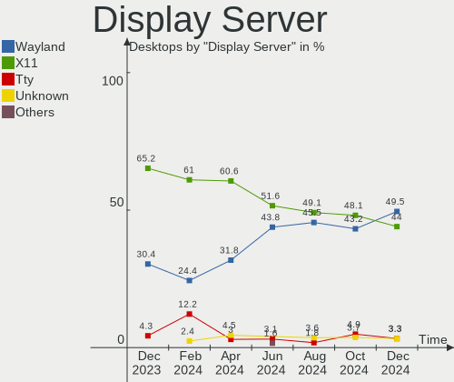
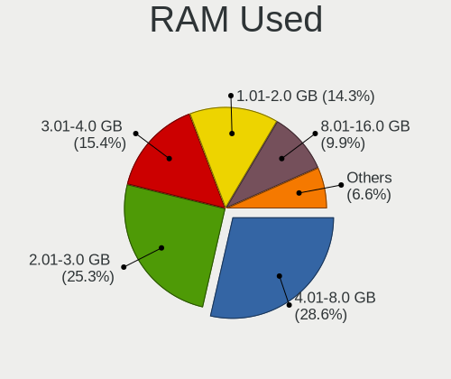
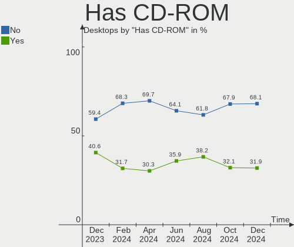
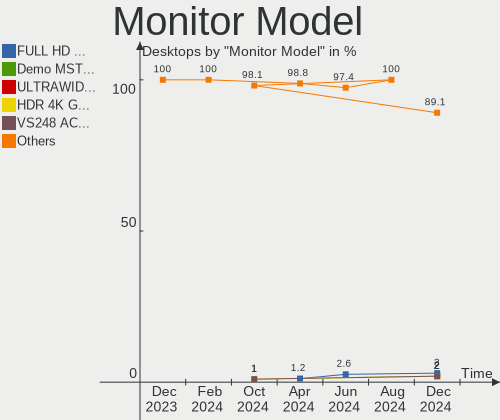
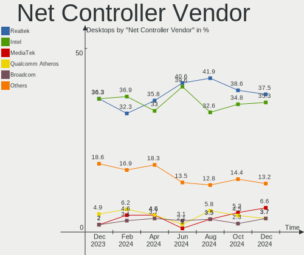
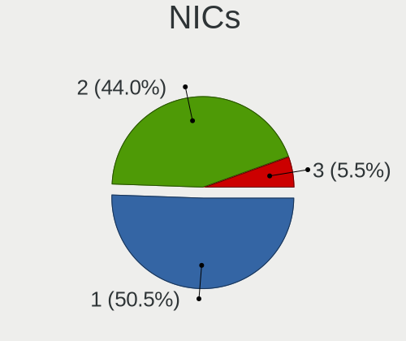

Linux in Canada - Hardware Trends (Desktops)
--------------------------------------------

A project to identify most popular hardware characteristics and track their change
over time based on data collected by Linux users at https://Linux-Hardware.org.

Anyone can contribute to this report by the [hw-probe](https://github.com/linuxhw/hw-probe) tool:

    sudo -E hw-probe -all -upload

Period: Feb, 2023.

Contents
--------

* [ System ](#system)
  - [ OS                       ](#os)
  - [ OS Family                ](#os-family)
  - [ Kernel                   ](#kernel)
  - [ Kernel Family            ](#kernel-family)
  - [ Kernel Major Ver.        ](#kernel-major-ver)
  - [ Arch                     ](#arch)
  - [ DE                       ](#de)
  - [ Display Server           ](#display-server)
  - [ Display Manager          ](#display-manager)
  - [ OS Lang                  ](#os-lang)
  - [ Boot Mode                ](#boot-mode)
  - [ Filesystem               ](#filesystem)
  - [ Part. scheme             ](#part-scheme)
  - [ Dual Boot with Linux/BSD ](#dual-boot-with-linuxbsd)
  - [ Dual Boot (Win)          ](#dual-boot-win)

* [ Board ](#board)
  - [ Vendor                   ](#vendor)
  - [ Model                    ](#model)
  - [ Model Family             ](#model-family)
  - [ MFG Year                 ](#mfg-year)
  - [ Form Factor              ](#form-factor)
  - [ Secure Boot              ](#secure-boot)
  - [ Coreboot                 ](#coreboot)
  - [ RAM Size                 ](#ram-size)
  - [ RAM Used                 ](#ram-used)
  - [ Total Drives             ](#total-drives)
  - [ Has CD-ROM               ](#has-cd-rom)
  - [ Has Ethernet             ](#has-ethernet)
  - [ Has WiFi                 ](#has-wifi)
  - [ Has Bluetooth            ](#has-bluetooth)

* [ Location ](#location)
  - [ Country                  ](#country)
  - [ City                     ](#city)

* [ Drives ](#drives)
  - [ Drive Vendor             ](#drive-vendor)
  - [ Drive Model              ](#drive-model)
  - [ HDD Vendor               ](#hdd-vendor)
  - [ SSD Vendor               ](#ssd-vendor)
  - [ Drive Kind               ](#drive-kind)
  - [ Drive Connector          ](#drive-connector)
  - [ Drive Size               ](#drive-size)
  - [ Space Total              ](#space-total)
  - [ Space Used               ](#space-used)
  - [ Malfunc. Drives          ](#malfunc-drives)
  - [ Malfunc. Drive Vendor    ](#malfunc-drive-vendor)
  - [ Malfunc. HDD Vendor      ](#malfunc-hdd-vendor)
  - [ Malfunc. Drive Kind      ](#malfunc-drive-kind)
  - [ Failed Drives            ](#failed-drives)
  - [ Failed Drive Vendor      ](#failed-drive-vendor)
  - [ Drive Status             ](#drive-status)

* [ Storage controller ](#storage-controller)
  - [ Storage Vendor           ](#storage-vendor)
  - [ Storage Model            ](#storage-model)
  - [ Storage Kind             ](#storage-kind)

* [ Processor ](#processor)
  - [ CPU Vendor               ](#cpu-vendor)
  - [ CPU Model                ](#cpu-model)
  - [ CPU Model Family         ](#cpu-model-family)
  - [ CPU Cores                ](#cpu-cores)
  - [ CPU Sockets              ](#cpu-sockets)
  - [ CPU Threads              ](#cpu-threads)
  - [ CPU Op-Modes             ](#cpu-op-modes)
  - [ CPU Microcode            ](#cpu-microcode)
  - [ CPU Microarch            ](#cpu-microarch)

* [ Graphics ](#graphics)
  - [ GPU Vendor               ](#gpu-vendor)
  - [ GPU Model                ](#gpu-model)
  - [ GPU Combo                ](#gpu-combo)
  - [ GPU Driver               ](#gpu-driver)
  - [ GPU Memory               ](#gpu-memory)

* [ Monitor ](#monitor)
  - [ Monitor Vendor           ](#monitor-vendor)
  - [ Monitor Model            ](#monitor-model)
  - [ Monitor Resolution       ](#monitor-resolution)
  - [ Monitor Diagonal         ](#monitor-diagonal)
  - [ Monitor Width            ](#monitor-width)
  - [ Aspect Ratio             ](#aspect-ratio)
  - [ Monitor Area             ](#monitor-area)
  - [ Pixel Density            ](#pixel-density)
  - [ Multiple Monitors        ](#multiple-monitors)

* [ Network ](#network)
  - [ Net Controller Vendor    ](#net-controller-vendor)
  - [ Net Controller Model     ](#net-controller-model)
  - [ Wireless Vendor          ](#wireless-vendor)
  - [ Wireless Model           ](#wireless-model)
  - [ Ethernet Vendor          ](#ethernet-vendor)
  - [ Ethernet Model           ](#ethernet-model)
  - [ Net Controller Kind      ](#net-controller-kind)
  - [ Used Controller          ](#used-controller)
  - [ NICs                     ](#nics)
  - [ IPv6                     ](#ipv6)

* [ Bluetooth ](#bluetooth)
  - [ Bluetooth Vendor         ](#bluetooth-vendor)
  - [ Bluetooth Model          ](#bluetooth-model)

* [ Sound ](#sound)
  - [ Sound Vendor             ](#sound-vendor)
  - [ Sound Model              ](#sound-model)

* [ Memory ](#memory)
  - [ Memory Vendor            ](#memory-vendor)
  - [ Memory Model             ](#memory-model)
  - [ Memory Kind              ](#memory-kind)
  - [ Memory Form Factor       ](#memory-form-factor)
  - [ Memory Size              ](#memory-size)
  - [ Memory Speed             ](#memory-speed)

* [ Printers & scanners ](#printers--scanners)
  - [ Printer Vendor           ](#printer-vendor)
  - [ Printer Model            ](#printer-model)
  - [ Scanner Vendor           ](#scanner-vendor)
  - [ Scanner Model            ](#scanner-model)

* [ Camera ](#camera)
  - [ Camera Vendor            ](#camera-vendor)
  - [ Camera Model             ](#camera-model)

* [ Security ](#security)
  - [ Fingerprint Vendor       ](#fingerprint-vendor)
  - [ Fingerprint Model        ](#fingerprint-model)
  - [ Chipcard Vendor          ](#chipcard-vendor)
  - [ Chipcard Model           ](#chipcard-model)

* [ Unsupported ](#unsupported)
  - [ Unsupported Devices      ](#unsupported-devices)
  - [ Unsupported Device Types ](#unsupported-device-types)

System
------

OS
--

Installed operating systems

| Name                         | Desktops | Percent |
|------------------------------|----------|---------|
| Ubuntu 22.04                 | 15       | 18.75%  |
| OpenMandriva 23.01           | 9        | 11.25%  |
| Ubuntu 22.10                 | 8        | 10%     |
| Linux Mint 21.1              | 5        | 6.25%   |
| Pop!_OS 22.04                | 4        | 5%      |
| Fedora 37                    | 4        | 5%      |
| Zorin 16                     | 2        | 2.5%    |
| Ubuntu 20.04                 | 2        | 2.5%    |
| Nobara 37                    | 2        | 2.5%    |
| Kubuntu 22.10                | 2        | 2.5%    |
| KDE neon 22.04               | 2        | 2.5%    |
| Debian 11                    | 2        | 2.5%    |
| Xubuntu 22.10                | 1        | 1.25%   |
| Xubuntu 22.04                | 1        | 1.25%   |
| Xubuntu 20.04                | 1        | 1.25%   |
| Xero Rolling                 | 1        | 1.25%   |
| Ubuntu 18.04                 | 1        | 1.25%   |
| SteamOS 3.4                  | 1        | 1.25%   |
| Sparky 7                     | 1        | 1.25%   |
| Rocky Linux 9.1              | 1        | 1.25%   |
| Rocky Linux 8.7              | 1        | 1.25%   |
| openSUSE Tumbleweed-XXXXXXXX | 1        | 1.25%   |
| OpenMandriva 23.90           | 1        | 1.25%   |
| MX 21                        | 1        | 1.25%   |
| Linux Mint 19.3              | 1        | 1.25%   |
| Linux Mint 19.2              | 1        | 1.25%   |
| Kubuntu 18.04                | 1        | 1.25%   |
| EndeavourOS Rolling          | 1        | 1.25%   |
| Elementary 6.1               | 1        | 1.25%   |
| Debian 9                     | 1        | 1.25%   |
| Clear Linux 38280            | 1        | 1.25%   |
| CentOS 7                     | 1        | 1.25%   |
| Artix Rolling                | 1        | 1.25%   |
| Arch Rolling                 | 1        | 1.25%   |
| AlmaLinux 8.7                | 1        | 1.25%   |

OS Family
---------

OS without a version

| Name         | Desktops | Percent |
|--------------|----------|---------|
| Ubuntu       | 26       | 32.5%   |
| OpenMandriva | 10       | 12.5%   |
| Linux Mint   | 7        | 8.75%   |
| Pop!_OS      | 4        | 5%      |
| Fedora       | 4        | 5%      |
| Xubuntu      | 3        | 3.75%   |
| Kubuntu      | 3        | 3.75%   |
| Debian       | 3        | 3.75%   |
| Zorin        | 2        | 2.5%    |
| Rocky Linux  | 2        | 2.5%    |
| Nobara       | 2        | 2.5%    |
| KDE neon     | 2        | 2.5%    |
| Xero         | 1        | 1.25%   |
| SteamOS      | 1        | 1.25%   |
| Sparky       | 1        | 1.25%   |
| openSUSE     | 1        | 1.25%   |
| MX           | 1        | 1.25%   |
| EndeavourOS  | 1        | 1.25%   |
| Elementary   | 1        | 1.25%   |
| Clear Linux  | 1        | 1.25%   |
| CentOS       | 1        | 1.25%   |
| Artix        | 1        | 1.25%   |
| Arch         | 1        | 1.25%   |
| AlmaLinux    | 1        | 1.25%   |

Kernel
------

Version of the Linux kernel

| Version                         | Desktops | Percent |
|---------------------------------|----------|---------|
| 5.15.0-60-generic               | 11       | 13.75%  |
| 5.15.0-58-generic               | 9        | 11.25%  |
| 6.1.1-desktop-1omv2290          | 6        | 7.5%    |
| 5.19.0-31-generic               | 6        | 7.5%    |
| 5.19.0-32-generic               | 5        | 6.25%   |
| 6.1.4-desktop-1omv2301          | 3        | 3.75%   |
| 6.0.12-76060006-generic         | 3        | 3.75%   |
| 6.1.10-200.fc37.x86_64          | 2        | 2.5%    |
| 5.4.0-137-generic               | 2        | 2.5%    |
| 5.19.0-35-generic               | 2        | 2.5%    |
| 5.19.0-29-generic               | 2        | 2.5%    |
| 6.2.1-zen1-1-zen                | 1        | 1.25%   |
| 6.1.9-arch1-1                   | 1        | 1.25%   |
| 6.1.9-200.fsync.fc37.x86_64     | 1        | 1.25%   |
| 6.1.8-artix1-1                  | 1        | 1.25%   |
| 6.1.8-200.fc37.x86_64           | 1        | 1.25%   |
| 6.1.8-1-default                 | 1        | 1.25%   |
| 6.1.13-x64v3-xanmod1            | 1        | 1.25%   |
| 6.1.12-arch1-1                  | 1        | 1.25%   |
| 6.1.12-1265.native              | 1        | 1.25%   |
| 6.1.11-desktop-1omv2390         | 1        | 1.25%   |
| 6.1.11-201.fsync.fc37.x86_64    | 1        | 1.25%   |
| 6.1.11-200.fc37.x86_64          | 1        | 1.25%   |
| 6.1.10-060110-generic           | 1        | 1.25%   |
| 6.1.0-3-amd64                   | 1        | 1.25%   |
| 6.0.0-10.1-liquorix-amd64       | 1        | 1.25%   |
| 6.0.0-0.deb11.6-amd64           | 1        | 1.25%   |
| 5.4.0-107-generic               | 1        | 1.25%   |
| 5.15.0-66-generic               | 1        | 1.25%   |
| 5.15.0-1032-realtime            | 1        | 1.25%   |
| 5.14.0-162.6.1.el9_1.0.1.x86_64 | 1        | 1.25%   |
| 5.13.0-valve21.3-1-neptune      | 1        | 1.25%   |
| 5.13.0-37-generic               | 1        | 1.25%   |
| 5.10.0-21-amd64                 | 1        | 1.25%   |
| 4.9.79-UBNT                     | 1        | 1.25%   |
| 4.19.187                        | 1        | 1.25%   |
| 4.18.0-425.3.1.el8.x86_64       | 1        | 1.25%   |
| 4.18.0-425.13.1.el8_7.x86_64    | 1        | 1.25%   |
| 4.15.0-204-generic              | 1        | 1.25%   |
| 4.15.0-202-generic              | 1        | 1.25%   |

Kernel Family
-------------

Linux kernel without a distro release

| Version  | Desktops | Percent |
|----------|----------|---------|
| 5.15.0   | 22       | 27.5%   |
| 5.19.0   | 15       | 18.75%  |
| 6.1.1    | 6        | 7.5%    |
| 6.1.8    | 3        | 3.75%   |
| 6.1.4    | 3        | 3.75%   |
| 6.1.11   | 3        | 3.75%   |
| 6.1.10   | 3        | 3.75%   |
| 6.0.12   | 3        | 3.75%   |
| 5.4.0    | 3        | 3.75%   |
| 6.1.9    | 2        | 2.5%    |
| 6.1.12   | 2        | 2.5%    |
| 6.0.0    | 2        | 2.5%    |
| 5.13.0   | 2        | 2.5%    |
| 4.18.0   | 2        | 2.5%    |
| 4.15.0   | 2        | 2.5%    |
| 6.2.1    | 1        | 1.25%   |
| 6.1.13   | 1        | 1.25%   |
| 6.1.0    | 1        | 1.25%   |
| 5.14.0   | 1        | 1.25%   |
| 5.10.0   | 1        | 1.25%   |
| 4.9.79   | 1        | 1.25%   |
| 4.19.187 | 1        | 1.25%   |

Kernel Major Ver.
-----------------

Linux kernel major version

| Version | Desktops | Percent |
|---------|----------|---------|
| 6.1     | 24       | 30%     |
| 5.15    | 22       | 27.5%   |
| 5.19    | 15       | 18.75%  |
| 6.0     | 5        | 6.25%   |
| 5.4     | 3        | 3.75%   |
| 5.13    | 2        | 2.5%    |
| 4.18    | 2        | 2.5%    |
| 4.15    | 2        | 2.5%    |
| 6.2     | 1        | 1.25%   |
| 5.14    | 1        | 1.25%   |
| 5.10    | 1        | 1.25%   |
| 4.9     | 1        | 1.25%   |
| 4.19    | 1        | 1.25%   |

Arch
----

OS architecture (x86_64, i586, etc.)

| Name   | Desktops | Percent |
|--------|----------|---------|
| x86_64 | 78       | 97.5%   |
| mips64 | 1        | 1.25%   |
| i686   | 1        | 1.25%   |

DE
--

Desktop Environment

| Name          | Desktops | Percent |
|---------------|----------|---------|
| GNOME         | 35       | 43.75%  |
| KDE5          | 20       | 25%     |
| Unknown       | 8        | 10%     |
| XFCE          | 6        | 7.5%    |
| X-Cinnamon    | 5        | 6.25%   |
| Pantheon      | 1        | 1.25%   |
| MATE          | 1        | 1.25%   |
| LXQt          | 1        | 1.25%   |
| KDE4          | 1        | 1.25%   |
| GNOME Classic | 1        | 1.25%   |
| Cinnamon      | 1        | 1.25%   |

Display Server
--------------

X11 or Wayland

| Name    | Desktops | Percent |
|---------|----------|---------|
| X11     | 54       | 67.5%   |
| Wayland | 17       | 21.25%  |
| Unknown | 6        | 7.5%    |
| Tty     | 3        | 3.75%   |

Display Manager
---------------

SDDM, LightDM, etc.

| Name    | Desktops | Percent |
|---------|----------|---------|
| Unknown | 35       | 43.75%  |
| GDM3    | 21       | 26.25%  |
| SDDM    | 15       | 18.75%  |
| LightDM | 6        | 7.5%    |
| GDM     | 3        | 3.75%   |

OS Lang
-------

Language

| Lang  | Desktops | Percent |
|-------|----------|---------|
| en_CA | 48       | 60%     |
| en_US | 23       | 28.75%  |
| fr_CA | 4        | 5%      |
| en_GB | 3        | 3.75%   |
| fr_FR | 1        | 1.25%   |
| C     | 1        | 1.25%   |

Boot Mode
---------

EFI or BIOS

| Mode | Desktops | Percent |
|------|----------|---------|
| BIOS | 49       | 61.25%  |
| EFI  | 31       | 38.75%  |

Filesystem
----------

Type of filesystem

| Type    | Desktops | Percent |
|---------|----------|---------|
| Ext4    | 61       | 76.25%  |
| Btrfs   | 8        | 10%     |
| Overlay | 6        | 7.5%    |
| Xfs     | 3        | 3.75%   |
| Zfs     | 1        | 1.25%   |
| F2fs    | 1        | 1.25%   |

Part. scheme
------------

Scheme of partitioning

| Type    | Desktops | Percent |
|---------|----------|---------|
| GPT     | 42       | 52.5%   |
| Unknown | 28       | 35%     |
| MBR     | 10       | 12.5%   |

Dual Boot with Linux/BSD
------------------------

Hosting more than one Linux/BSD

| Dual boot | Desktops | Percent |
|-----------|----------|---------|
| No        | 60       | 75%     |
| Yes       | 20       | 25%     |

Dual Boot (Win)
---------------

Hosting Linux and Windows

| Dual boot | Desktops | Percent |
|-----------|----------|---------|
| No        | 57       | 71.25%  |
| Yes       | 23       | 28.75%  |

Board
-----

Vendor
------

Motherboard manufacturer

| Name                | Desktops | Percent |
|---------------------|----------|---------|
| ASUSTek Computer    | 23       | 28.75%  |
| MSI                 | 10       | 12.5%   |
| Gigabyte Technology | 7        | 8.75%   |
| Dell                | 7        | 8.75%   |
| ASRock              | 5        | 6.25%   |
| Lenovo              | 4        | 5%      |
| Hewlett-Packard     | 4        | 5%      |
| Acer                | 4        | 5%      |
| Intel               | 3        | 3.75%   |
| AZW                 | 2        | 2.5%    |
| ASRockRack          | 2        | 2.5%    |
| Unknown             | 2        | 2.5%    |
| Sapphire            | 1        | 1.25%   |
| Protectli           | 1        | 1.25%   |
| Pegatron            | 1        | 1.25%   |
| IBM                 | 1        | 1.25%   |
| Gateway             | 1        | 1.25%   |
| CWWK                | 1        | 1.25%   |
| BESSTAR Tech        | 1        | 1.25%   |

Model
-----

Motherboard model

| Name                                    | Desktops | Percent |
|-----------------------------------------|----------|---------|
| Dell OptiPlex 9020                      | 2        | 2.5%    |
| ASUS All Series                         | 2        | 2.5%    |
| Unknown                                 | 2        | 2.5%    |
| Sapphire PE-AM2RS690V2                  | 1        | 1.25%   |
| Protectli VP2420                        | 1        | 1.25%   |
| Pegatron AY014AA-ABL a4310f             | 1        | 1.25%   |
| MSI MS-7E06                             | 1        | 1.25%   |
| MSI MS-7D89                             | 1        | 1.25%   |
| MSI MS-7C96                             | 1        | 1.25%   |
| MSI MS-7C52                             | 1        | 1.25%   |
| MSI MS-7C37                             | 1        | 1.25%   |
| MSI MS-7B93                             | 1        | 1.25%   |
| MSI MS-7B86                             | 1        | 1.25%   |
| MSI MS-7B50                             | 1        | 1.25%   |
| MSI MS-7B17                             | 1        | 1.25%   |
| MSI MS-7599                             | 1        | 1.25%   |
| Lenovo ThinkCentre M92p 2988D9U         | 1        | 1.25%   |
| Lenovo ThinkCentre M900 10FGS0MX08      | 1        | 1.25%   |
| Lenovo ThinkCentre M58 8910B4U          | 1        | 1.25%   |
| Lenovo 70UB0009UX ThinkServer TS150     | 1        | 1.25%   |
| Intel X79                               | 1        | 1.25%   |
| Intel Jasper Lake Client Platform       | 1        | 1.25%   |
| Intel GM5410E                           | 1        | 1.25%   |
| IBM 811328U                             | 1        | 1.25%   |
| HP ProDesk 600 G4 SFF                   | 1        | 1.25%   |
| HP EliteDesk 800 G1 TWR                 | 1        | 1.25%   |
| HP EliteDesk 800 G1 DM                  | 1        | 1.25%   |
| HP Compaq dc7800p Convertible Minitower | 1        | 1.25%   |
| Gigabyte Z68MA-D2H-B3                   | 1        | 1.25%   |
| Gigabyte Z390 AORUS ULTRA               | 1        | 1.25%   |
| Gigabyte X570 AORUS ELITE               | 1        | 1.25%   |
| Gigabyte GA-MA785GM-US2H                | 1        | 1.25%   |
| Gigabyte GA-880GA-UD3H                  | 1        | 1.25%   |
| Gigabyte B550 AORUS PRO AC              | 1        | 1.25%   |
| Gigabyte B450 AORUS M                   | 1        | 1.25%   |
| Gateway SX2185                          | 1        | 1.25%   |
| Dell Studio XPS 8100                    | 1        | 1.25%   |
| Dell Precision WorkStation T3500        | 1        | 1.25%   |
| Dell OptiPlex 755                       | 1        | 1.25%   |
| Dell OptiPlex 7050                      | 1        | 1.25%   |

Model Family
------------

Motherboard model prefix

| Name                     | Desktops | Percent |
|--------------------------|----------|---------|
| ASUS PRIME               | 6        | 7.5%    |
| Dell OptiPlex            | 5        | 6.25%   |
| Acer Aspire              | 4        | 5%      |
| Lenovo ThinkCentre       | 3        | 3.75%   |
| ASUS ROG                 | 3        | 3.75%   |
| HP EliteDesk             | 2        | 2.5%    |
| ASUS ProArt              | 2        | 2.5%    |
| ASUS B150                | 2        | 2.5%    |
| ASUS All                 | 2        | 2.5%    |
| Unknown                  | 2        | 2.5%    |
| Sapphire PE-AM2RS690V2   | 1        | 1.25%   |
| Protectli VP2420         | 1        | 1.25%   |
| Pegatron AY014AA-ABL     | 1        | 1.25%   |
| MSI MS-7E06              | 1        | 1.25%   |
| MSI MS-7D89              | 1        | 1.25%   |
| MSI MS-7C96              | 1        | 1.25%   |
| MSI MS-7C52              | 1        | 1.25%   |
| MSI MS-7C37              | 1        | 1.25%   |
| MSI MS-7B93              | 1        | 1.25%   |
| MSI MS-7B86              | 1        | 1.25%   |
| MSI MS-7B50              | 1        | 1.25%   |
| MSI MS-7B17              | 1        | 1.25%   |
| MSI MS-7599              | 1        | 1.25%   |
| Lenovo 70UB0009UX        | 1        | 1.25%   |
| Intel X79                | 1        | 1.25%   |
| Intel Jasper             | 1        | 1.25%   |
| Intel GM5410E            | 1        | 1.25%   |
| IBM 811328U              | 1        | 1.25%   |
| HP ProDesk               | 1        | 1.25%   |
| HP Compaq                | 1        | 1.25%   |
| Gigabyte Z68MA-D2H-B3    | 1        | 1.25%   |
| Gigabyte Z390            | 1        | 1.25%   |
| Gigabyte X570            | 1        | 1.25%   |
| Gigabyte GA-MA785GM-US2H | 1        | 1.25%   |
| Gigabyte GA-880GA-UD3H   | 1        | 1.25%   |
| Gigabyte B550            | 1        | 1.25%   |
| Gigabyte B450            | 1        | 1.25%   |
| Gateway SX2185           | 1        | 1.25%   |
| Dell Studio              | 1        | 1.25%   |
| Dell Precision           | 1        | 1.25%   |

MFG Year
--------

Motherboard manufacture year

| Year    | Desktops | Percent |
|---------|----------|---------|
| 2022    | 10       | 12.5%   |
| 2018    | 10       | 12.5%   |
| 2020    | 8        | 10%     |
| 2019    | 6        | 7.5%    |
| 2013    | 6        | 7.5%    |
| 2014    | 5        | 6.25%   |
| 2011    | 5        | 6.25%   |
| 2016    | 4        | 5%      |
| 2009    | 4        | 5%      |
| 2023    | 3        | 3.75%   |
| 2021    | 3        | 3.75%   |
| 2012    | 3        | 3.75%   |
| 2010    | 3        | 3.75%   |
| 2007    | 3        | 3.75%   |
| 2017    | 2        | 2.5%    |
| 2008    | 2        | 2.5%    |
| 2015    | 1        | 1.25%   |
| 2006    | 1        | 1.25%   |
| Unknown | 1        | 1.25%   |

Form Factor
-----------

Physical design of the computer

| Name    | Desktops | Percent |
|---------|----------|---------|
| Desktop | 80       | 100%    |

Secure Boot
-----------

Enabled or disabled

| State    | Desktops | Percent |
|----------|----------|---------|
| Disabled | 77       | 96.25%  |
| Enabled  | 3        | 3.75%   |

Coreboot
--------

Have coreboot on board

| Used | Desktops | Percent |
|------|----------|---------|
| No   | 80       | 100%    |

RAM Size
--------

Total RAM memory

| Size in GB  | Desktops | Percent |
|-------------|----------|---------|
| 16.01-24.0  | 21       | 26.25%  |
| 32.01-64.0  | 16       | 20%     |
| 4.01-8.0    | 11       | 13.75%  |
| 3.01-4.0    | 8        | 10%     |
| 64.01-256.0 | 8        | 10%     |
| 8.01-16.0   | 7        | 8.75%   |
| 24.01-32.0  | 6        | 7.5%    |
| 2.01-3.0    | 1        | 1.25%   |
| 1.01-2.0    | 1        | 1.25%   |
| 0.01-0.5    | 1        | 1.25%   |

RAM Used
--------

Used RAM memory

| Used GB    | Desktops | Percent |
|------------|----------|---------|
| 2.01-3.0   | 22       | 27.5%   |
| 1.01-2.0   | 19       | 23.75%  |
| 4.01-8.0   | 16       | 20%     |
| 3.01-4.0   | 7        | 8.75%   |
| 8.01-16.0  | 7        | 8.75%   |
| 0.51-1.0   | 4        | 5%      |
| 0.01-0.5   | 4        | 5%      |
| 32.01-64.0 | 1        | 1.25%   |

Total Drives
------------

Number of drives on board

| Drives | Desktops | Percent |
|--------|----------|---------|
| 1      | 27       | 33.75%  |
| 2      | 25       | 31.25%  |
| 3      | 12       | 15%     |
| 4      | 5        | 6.25%   |
| 6      | 4        | 5%      |
| 5      | 4        | 5%      |
| 11     | 1        | 1.25%   |
| 7      | 1        | 1.25%   |
| 0      | 1        | 1.25%   |

Has CD-ROM
----------

Has CD-ROM on board

| Presented | Desktops | Percent |
|-----------|----------|---------|
| No        | 54       | 67.5%   |
| Yes       | 26       | 32.5%   |

Has Ethernet
------------

Has Ethernet on board

| Presented | Desktops | Percent |
|-----------|----------|---------|
| Yes       | 79       | 98.75%  |
| No        | 1        | 1.25%   |

Has WiFi
--------

Has WiFi module

| Presented | Desktops | Percent |
|-----------|----------|---------|
| Yes       | 40       | 50%     |
| No        | 40       | 50%     |

Has Bluetooth
-------------

Has Bluetooth module

| Presented | Desktops | Percent |
|-----------|----------|---------|
| No        | 48       | 60%     |
| Yes       | 32       | 40%     |

Location
--------

Country
-------

Geographic location (country)

| Country | Desktops | Percent |
|---------|----------|---------|
| Canada  | 80       | 100%    |

City
----

Geographic location (city)

| City                | Desktops | Percent |
|---------------------|----------|---------|
| Toronto             | 7        | 8.75%   |
| Vancouver           | 5        | 6.25%   |
| Regina              | 3        | 3.75%   |
| Montreal            | 3        | 3.75%   |
| Edmonton            | 3        | 3.75%   |
| Calgary             | 3        | 3.75%   |
| Burlington          | 3        | 3.75%   |
| Windsor             | 2        | 2.5%    |
| Saskatoon           | 2        | 2.5%    |
| Ottawa              | 2        | 2.5%    |
| Oakville            | 2        | 2.5%    |
| Nanaimo             | 2        | 2.5%    |
| Courtenay           | 2        | 2.5%    |
| Beauharnois         | 2        | 2.5%    |
| Viking              | 1        | 1.25%   |
| Victoria            | 1        | 1.25%   |
| St. Catharines      | 1        | 1.25%   |
| Spruce Grove        | 1        | 1.25%   |
| Sorel-Tracy         | 1        | 1.25%   |
| Sherbrooke          | 1        | 1.25%   |
| Scarborough         | 1        | 1.25%   |
| Saint-Hyacinthe     | 1        | 1.25%   |
| Saint-Henri         | 1        | 1.25%   |
| Saint-Eustache      | 1        | 1.25%   |
| Riverview           | 1        | 1.25%   |
| Rimouski            | 1        | 1.25%   |
| Repentigny          | 1        | 1.25%   |
| Port Perry          | 1        | 1.25%   |
| Peterborough        | 1        | 1.25%   |
| Oshawa              | 1        | 1.25%   |
| North York          | 1        | 1.25%   |
| Niagara-on-the-Lake | 1        | 1.25%   |
| Mont-Saint-Hilaire  | 1        | 1.25%   |
| Milton              | 1        | 1.25%   |
| London              | 1        | 1.25%   |
| Laval               | 1        | 1.25%   |
| La Prairie          | 1        | 1.25%   |
| L'Ancienne-Lorette  | 1        | 1.25%   |
| Kentville           | 1        | 1.25%   |
| Hudson              | 1        | 1.25%   |

Drives
------

Drive Vendor
------------

Hard drive vendors

| Vendor                      | Desktops | Drives | Percent |
|-----------------------------|----------|--------|---------|
| WDC                         | 29       | 46     | 19.73%  |
| Seagate                     | 28       | 46     | 19.05%  |
| Samsung Electronics         | 16       | 25     | 10.88%  |
| Sandisk                     | 11       | 14     | 7.48%   |
| Kingston                    | 8        | 11     | 5.44%   |
| Crucial                     | 6        | 7      | 4.08%   |
| Toshiba                     | 4        | 4      | 2.72%   |
| A-DATA Technology           | 4        | 4      | 2.72%   |
| SPCC                        | 3        | 3      | 2.04%   |
| Silicon Motion              | 3        | 5      | 2.04%   |
| Micron/Crucial Technology   | 3        | 3      | 2.04%   |
| Intel                       | 3        | 4      | 2.04%   |
| Hitachi                     | 3        | 4      | 2.04%   |
| Dogfish                     | 3        | 3      | 2.04%   |
| Timetec                     | 2        | 2      | 1.36%   |
| Kingston Technology Company | 2        | 2      | 1.36%   |
| Corsair                     | 2        | 2      | 1.36%   |
| China                       | 2        | 2      | 1.36%   |
| Team                        | 1        | 2      | 0.68%   |
| Realtek                     | 1        | 1      | 0.68%   |
| Phison Electronics          | 1        | 1      | 0.68%   |
| Phison                      | 1        | 1      | 0.68%   |
| OCZ                         | 1        | 1      | 0.68%   |
| Micron Technology           | 1        | 1      | 0.68%   |
| Mac                         | 1        | 1      | 0.68%   |
| Lexar                       | 1        | 1      | 0.68%   |
| KingFast                    | 1        | 1      | 0.68%   |
| HP SSD S                    | 1        | 1      | 0.68%   |
| HAJAAN                      | 1        | 1      | 0.68%   |
| Gigabyte Technology         | 1        | 1      | 0.68%   |
| Feishuo                     | 1        | 1      | 0.68%   |
| ADATA Technology            | 1        | 1      | 0.68%   |
| ACASIS                      | 1        | 1      | 0.68%   |

Drive Model
-----------

Hard drive models

| Model                                               | Desktops | Percent |
|-----------------------------------------------------|----------|---------|
| Seagate ST1000DM010-2EP102 1TB                      | 6        | 3.26%   |
| Seagate ST4000DM004-2CV104 4TB                      | 4        | 2.17%   |
| Sandisk WD Blue SN550 NVMe SSD 1TB                  | 4        | 2.17%   |
| SPCC Solid State Disk 256GB                         | 3        | 1.63%   |
| Samsung SSD 870 EVO 500GB                           | 3        | 1.63%   |
| Samsung NVMe SSD Controller SM981/PM981/PM983 250GB | 3        | 1.63%   |
| Kingston SA400S37480G 480GB SSD                     | 3        | 1.63%   |
| WDC WD80EFAX-68KNBN0 8TB                            | 2        | 1.09%   |
| WDC WD40EZRZ-00GXCB0 4TB                            | 2        | 1.09%   |
| WDC WD30EZRX-00MMMB0 3TB                            | 2        | 1.09%   |
| WDC WD30EFRX-68EUZN0 3TB                            | 2        | 1.09%   |
| WDC WD20EZRZ-00Z5HB0 2TB                            | 2        | 1.09%   |
| WDC WD10EZEX-60WN4A0 1TB                            | 2        | 1.09%   |
| Toshiba DT01ACA300 3TB                              | 2        | 1.09%   |
| Silicon Motion SM2262/SM2262EN SSD Controller 1TB   | 2        | 1.09%   |
| Seagate ST2000DM008-2FR102 2TB                      | 2        | 1.09%   |
| Seagate ST1000DM003-1CH162 1TB                      | 2        | 1.09%   |
| Seagate Expansion Desk 5TB                          | 2        | 1.09%   |
| Sandisk WD_BLACK SN770 2TB                          | 2        | 1.09%   |
| Micron/Crucial P2 NVMe PCIe SSD 1TB                 | 2        | 1.09%   |
| Dogfish SSD 256GB                                   | 2        | 1.09%   |
| Crucial CT1000MX500SSD1 1TB                         | 2        | 1.09%   |
| WDC WDS500G3X0C-00SJG0 500GB                        | 1        | 0.54%   |
| WDC WDS100T2B0A-00SM50 1TB SSD                      | 1        | 0.54%   |
| WDC WDBNCE0010PNC 1TB SSD                           | 1        | 0.54%   |
| WDC WD80EFBX-68AZZN0 8TB                            | 1        | 0.54%   |
| WDC WD6400AAKS-65Z7B0 640GB                         | 1        | 0.54%   |
| WDC WD60EFZX-68B3FN0 6TB                            | 1        | 0.54%   |
| WDC WD6003FZBX-00K5WB0 6TB                          | 1        | 0.54%   |
| WDC WD5000AZLX-60K2TA0 500GB                        | 1        | 0.54%   |
| WDC WD5000AZLX-08K2TA0 500GB                        | 1        | 0.54%   |
| WDC WD5000AAKS-65YGA0 500GB                         | 1        | 0.54%   |
| WDC WD5000AAKS-60Z1A0 500GB                         | 1        | 0.54%   |
| WDC WD30EZRX-00DC0B0 3TB                            | 1        | 0.54%   |
| WDC WD30EZRX-00D8PB0 3TB                            | 1        | 0.54%   |
| WDC WD3003FZEX-00Z4SA0 3TB                          | 1        | 0.54%   |
| WDC WD2500KS-00MJB0 250GB                           | 1        | 0.54%   |
| WDC WD2500JS-75NCB2 249GB                           | 1        | 0.54%   |
| WDC WD2500JS-22NCB1 250GB                           | 1        | 0.54%   |
| WDC WD2500AAJS-00L7A0 250GB                         | 1        | 0.54%   |

HDD Vendor
----------

Hard disk drive vendors

| Vendor              | Desktops | Drives | Percent |
|---------------------|----------|--------|---------|
| WDC                 | 28       | 43     | 44.44%  |
| Seagate             | 27       | 45     | 42.86%  |
| Toshiba             | 3        | 3      | 4.76%   |
| Hitachi             | 3        | 4      | 4.76%   |
| Samsung Electronics | 1        | 1      | 1.59%   |
| ACASIS              | 1        | 1      | 1.59%   |

SSD Vendor
----------

Solid state drive vendors

| Vendor              | Desktops | Drives | Percent |
|---------------------|----------|--------|---------|
| Samsung Electronics | 9        | 12     | 19.15%  |
| Kingston            | 6        | 9      | 12.77%  |
| Crucial             | 6        | 7      | 12.77%  |
| A-DATA Technology   | 4        | 4      | 8.51%   |
| SPCC                | 3        | 3      | 6.38%   |
| Dogfish             | 3        | 3      | 6.38%   |
| WDC                 | 2        | 2      | 4.26%   |
| Timetec             | 2        | 2      | 4.26%   |
| China               | 2        | 2      | 4.26%   |
| Team                | 1        | 2      | 2.13%   |
| Seagate             | 1        | 1      | 2.13%   |
| OCZ                 | 1        | 1      | 2.13%   |
| Micron Technology   | 1        | 1      | 2.13%   |
| Lexar               | 1        | 1      | 2.13%   |
| KingFast            | 1        | 1      | 2.13%   |
| Intel               | 1        | 1      | 2.13%   |
| HAJAAN              | 1        | 1      | 2.13%   |
| Gigabyte Technology | 1        | 1      | 2.13%   |
| Corsair             | 1        | 1      | 2.13%   |

Drive Kind
----------

HDD or SSD

| Kind    | Desktops | Drives | Percent |
|---------|----------|--------|---------|
| HDD     | 48       | 97     | 39.67%  |
| SSD     | 38       | 55     | 31.4%   |
| NVMe    | 32       | 48     | 26.45%  |
| Unknown | 3        | 3      | 2.48%   |

Drive Connector
---------------

SATA, SAS, NVMe, etc.

| Type | Desktops | Drives | Percent |
|------|----------|--------|---------|
| SATA | 65       | 148    | 62.5%   |
| NVMe | 32       | 47     | 30.77%  |
| SAS  | 7        | 8      | 6.73%   |

Drive Size
----------

Size of hard drive

| Size in TB | Desktops | Drives | Percent |
|------------|----------|--------|---------|
| 0.01-0.5   | 41       | 54     | 37.27%  |
| 0.51-1.0   | 30       | 42     | 27.27%  |
| 1.01-2.0   | 15       | 21     | 13.64%  |
| 2.01-3.0   | 9        | 10     | 8.18%   |
| 4.01-10.0  | 8        | 15     | 7.27%   |
| 3.01-4.0   | 6        | 9      | 5.45%   |
| 10.01-20.0 | 1        | 1      | 0.91%   |

Space Total
-----------

Amount of disk space available on the file system

| Size in GB     | Desktops | Percent |
|----------------|----------|---------|
| 101-250        | 21       | 26.25%  |
| 501-1000       | 14       | 17.5%   |
| More than 3000 | 11       | 13.75%  |
| 251-500        | 9        | 11.25%  |
| 1001-2000      | 8        | 10%     |
| 2001-3000      | 5        | 6.25%   |
| 21-50          | 4        | 5%      |
| 51-100         | 4        | 5%      |
| 1-20           | 3        | 3.75%   |
| Unknown        | 1        | 1.25%   |

Space Used
----------

Amount of used disk space

| Used GB        | Desktops | Percent |
|----------------|----------|---------|
| 1-20           | 26       | 32.5%   |
| 21-50          | 18       | 22.5%   |
| More than 3000 | 7        | 8.75%   |
| 501-1000       | 7        | 8.75%   |
| 51-100         | 7        | 8.75%   |
| 101-250        | 5        | 6.25%   |
| 1001-2000      | 5        | 6.25%   |
| 251-500        | 3        | 3.75%   |
| 2001-3000      | 1        | 1.25%   |
| Unknown        | 1        | 1.25%   |

Malfunc. Drives
---------------

Drive models with a malfunction

| Model                             | Desktops | Drives | Percent |
|-----------------------------------|----------|--------|---------|
| WDC WD6400AAKS-65Z7B0 640GB       | 1        | 1      | 12.5%   |
| WDC WD30EZRX-00MMMB0 3TB          | 1        | 2      | 12.5%   |
| WDC WD30EFRX-68EUZN0 3TB          | 1        | 1      | 12.5%   |
| WDC WD1001FALS-00J7B1 1TB         | 1        | 1      | 12.5%   |
| Seagate ST500LM021-1KJ152 500GB   | 1        | 1      | 12.5%   |
| Seagate ST3500418AS 500GB         | 1        | 1      | 12.5%   |
| Seagate ST14000NM0018-2H4101 14TB | 1        | 1      | 12.5%   |
| Hitachi HDS725050KLA360 500GB     | 1        | 1      | 12.5%   |

Malfunc. Drive Vendor
---------------------

Vendors of faulty drives

| Vendor  | Desktops | Drives | Percent |
|---------|----------|--------|---------|
| WDC     | 4        | 5      | 50%     |
| Seagate | 3        | 3      | 37.5%   |
| Hitachi | 1        | 1      | 12.5%   |

Malfunc. HDD Vendor
-------------------

Vendors of faulty HDD drives

| Vendor  | Desktops | Drives | Percent |
|---------|----------|--------|---------|
| WDC     | 4        | 5      | 50%     |
| Seagate | 3        | 3      | 37.5%   |
| Hitachi | 1        | 1      | 12.5%   |

Malfunc. Drive Kind
-------------------

Kinds of faulty drives

| Kind | Desktops | Drives | Percent |
|------|----------|--------|---------|
| HDD  | 7        | 9      | 100%    |

Failed Drives
-------------

Failed drive models

Zero info for selected period =(

Failed Drive Vendor
-------------------

Failed drive vendors

Zero info for selected period =(

Drive Status
------------

Number of failed and malfunc. drives

| Status   | Desktops | Drives | Percent |
|----------|----------|--------|---------|
| Detected | 51       | 120    | 56.04%  |
| Works    | 33       | 74     | 36.26%  |
| Malfunc  | 7        | 9      | 7.69%   |

Storage controller
------------------

Storage Vendor
--------------

Storage controller vendors

| Vendor                       | Desktops | Percent |
|------------------------------|----------|---------|
| Intel                        | 50       | 38.17%  |
| AMD                          | 28       | 21.37%  |
| SanDisk                      | 12       | 9.16%   |
| Samsung Electronics          | 10       | 7.63%   |
| Marvell Technology Group     | 5        | 3.82%   |
| ASMedia Technology           | 5        | 3.82%   |
| Kingston Technology Company  | 4        | 3.05%   |
| JMicron Technology           | 4        | 3.05%   |
| Silicon Motion               | 3        | 2.29%   |
| Phison Electronics           | 3        | 2.29%   |
| Micron/Crucial Technology    | 3        | 2.29%   |
| Toshiba America Info Systems | 1        | 0.76%   |
| Nvidia                       | 1        | 0.76%   |
| LSI Logic / Symbios Logic    | 1        | 0.76%   |
| ADATA Technology             | 1        | 0.76%   |

Storage Model
-------------

Storage controller models

| Model                                                                          | Desktops | Percent |
|--------------------------------------------------------------------------------|----------|---------|
| AMD FCH SATA Controller [AHCI mode]                                            | 12       | 7.69%   |
| Intel Cannon Lake PCH SATA AHCI Controller                                     | 6        | 3.85%   |
| Intel 8 Series/C220 Series Chipset Family 6-port SATA Controller 1 [AHCI mode] | 6        | 3.85%   |
| AMD 400 Series Chipset SATA Controller                                         | 6        | 3.85%   |
| Samsung NVMe SSD Controller SM981/PM981/PM983                                  | 5        | 3.21%   |
| AMD 500 Series Chipset SATA Controller                                         | 5        | 3.21%   |
| SanDisk WD Blue SN550 NVMe SSD                                                 | 4        | 2.56%   |
| SanDisk Non-Volatile memory controller                                         | 4        | 2.56%   |
| Samsung NVMe SSD Controller PM9A1/PM9A3/980PRO                                 | 4        | 2.56%   |
| Intel SATA Controller [RAID mode]                                              | 4        | 2.56%   |
| Intel SATA controller                                                          | 4        | 2.56%   |
| ASMedia ASM1062 Serial ATA Controller                                          | 4        | 2.56%   |
| AMD SB7x0/SB8x0/SB9x0 IDE Controller                                           | 4        | 2.56%   |
| Intel Volume Management Device NVMe RAID Controller                            | 3        | 1.92%   |
| Intel Q170/Q150/B150/H170/H110/Z170/CM236 Chipset SATA Controller [AHCI Mode]  | 3        | 1.92%   |
| Intel 6 Series/C200 Series Chipset Family 6 port Desktop SATA AHCI Controller  | 3        | 1.92%   |
| AMD SB7x0/SB8x0/SB9x0 SATA Controller [IDE mode]                               | 3        | 1.92%   |
| Silicon Motion SM2262/SM2262EN SSD Controller                                  | 2        | 1.28%   |
| SanDisk WD Blue SN570 NVMe SSD                                                 | 2        | 1.28%   |
| SanDisk WD Black SN750 / PC SN730 NVMe SSD                                     | 2        | 1.28%   |
| Phison E16 PCIe4 NVMe Controller                                               | 2        | 1.28%   |
| Micron/Crucial P2 NVMe PCIe SSD                                                | 2        | 1.28%   |
| Marvell Group 88SE9215 PCIe 2.0 x1 4-port SATA 6 Gb/s Controller               | 2        | 1.28%   |
| Marvell Group 88SE9172 SATA 6Gb/s Controller                                   | 2        | 1.28%   |
| Kingston Company Company Non-Volatile memory controller                        | 2        | 1.28%   |
| JMicron JMB363 SATA/IDE Controller                                             | 2        | 1.28%   |
| JMicron JMB362 SATA Controller                                                 | 2        | 1.28%   |
| Intel SSD 660P Series                                                          | 2        | 1.28%   |
| Intel Jasper Lake SATA AHCI Controller                                         | 2        | 1.28%   |
| Intel Elkhart Lake SATA AHCI                                                   | 2        | 1.28%   |
| Intel C600/X79 series chipset 6-Port SATA AHCI Controller                      | 2        | 1.28%   |
| Intel Alder Lake-S PCH SATA Controller [AHCI Mode]                             | 2        | 1.28%   |
| Intel 82Q35 Express PT IDER Controller                                         | 2        | 1.28%   |
| Intel 82801I (ICH9 Family) 2 port SATA Controller [IDE mode]                   | 2        | 1.28%   |
| AMD SB7x0/SB8x0/SB9x0 SATA Controller [AHCI mode]                              | 2        | 1.28%   |
| AMD SATA controller                                                            | 2        | 1.28%   |
| AMD FCH SATA Controller [IDE mode]                                             | 2        | 1.28%   |
| Toshiba America Info Systems XG4 NVMe SSD Controller                           | 1        | 0.64%   |
| Silicon Motion SM2263EN/SM2263XT SSD Controller                                | 1        | 0.64%   |
| SanDisk WD PC SN810 / Black SN850 NVMe SSD                                     | 1        | 0.64%   |

Storage Kind
------------

Kind of storage controller (IDE, SATA, NVMe, SAS, ...)

| Kind | Desktops | Percent |
|------|----------|---------|
| SATA | 67       | 54.92%  |
| NVMe | 32       | 26.23%  |
| IDE  | 14       | 11.48%  |
| RAID | 8        | 6.56%   |
| SAS  | 1        | 0.82%   |

Processor
---------

CPU Vendor
----------

Processor vendors

| Vendor  | Desktops | Percent |
|---------|----------|---------|
| Intel   | 50       | 62.5%   |
| AMD     | 29       | 36.25%  |
| Unknown | 1        | 1.25%   |

CPU Model
---------

Processor models

| Model                                       | Desktops | Percent |
|---------------------------------------------|----------|---------|
| Intel 13th Gen Core i9-13900K               | 3        | 3.75%   |
| Intel Core i7-2600K CPU @ 3.40GHz           | 2        | 2.5%    |
| Intel Core i5-4460 CPU @ 3.20GHz            | 2        | 2.5%    |
| Intel Celeron N5105 @ 2.00GHz               | 2        | 2.5%    |
| Intel Celeron J6413 @ 1.80GHz               | 2        | 2.5%    |
| AMD Ryzen 9 5900X 12-Core Processor         | 2        | 2.5%    |
| AMD Ryzen 5 3600 6-Core Processor           | 2        | 2.5%    |
| AMD Ryzen 5 2600 Six-Core Processor         | 2        | 2.5%    |
| Intel Xeon E-2274G CPU @ 4.00GHz            | 1        | 1.25%   |
| Intel Xeon CPU W3530 @ 2.80GHz              | 1        | 1.25%   |
| Intel Xeon CPU E5-2658 v2 @ 2.40GHz         | 1        | 1.25%   |
| Intel Xeon CPU E3-1225 v6 @ 3.30GHz         | 1        | 1.25%   |
| Intel Pentium Dual-Core CPU E5700 @ 3.00GHz | 1        | 1.25%   |
| Intel Pentium 4 CPU 3.00GHz                 | 1        | 1.25%   |
| Intel Core i9-10900K CPU @ 3.70GHz          | 1        | 1.25%   |
| Intel Core i7-9700 CPU @ 3.00GHz            | 1        | 1.25%   |
| Intel Core i7-8700K CPU @ 3.70GHz           | 1        | 1.25%   |
| Intel Core i7-8700 CPU @ 3.20GHz            | 1        | 1.25%   |
| Intel Core i7-7700T CPU @ 2.90GHz           | 1        | 1.25%   |
| Intel Core i7-6700K CPU @ 4.00GHz           | 1        | 1.25%   |
| Intel Core i7-6700 CPU @ 3.40GHz            | 1        | 1.25%   |
| Intel Core i7-4790 CPU @ 3.60GHz            | 1        | 1.25%   |
| Intel Core i7-4770 CPU @ 3.40GHz            | 1        | 1.25%   |
| Intel Core i7-3930K CPU @ 3.20GHz           | 1        | 1.25%   |
| Intel Core i7-3770 CPU @ 3.40GHz            | 1        | 1.25%   |
| Intel Core i7-10700 CPU @ 2.90GHz           | 1        | 1.25%   |
| Intel Core i7 CPU 870 @ 2.93GHz             | 1        | 1.25%   |
| Intel Core i5-9600K CPU @ 3.70GHz           | 1        | 1.25%   |
| Intel Core i5-9400F CPU @ 2.90GHz           | 1        | 1.25%   |
| Intel Core i5-8400 CPU @ 2.80GHz            | 1        | 1.25%   |
| Intel Core i5-7600K CPU @ 3.80GHz           | 1        | 1.25%   |
| Intel Core i5-6600 CPU @ 3.30GHz            | 1        | 1.25%   |
| Intel Core i5-4590T CPU @ 2.00GHz           | 1        | 1.25%   |
| Intel Core i5-4590 CPU @ 3.30GHz            | 1        | 1.25%   |
| Intel Core i5-4570 CPU @ 3.20GHz            | 1        | 1.25%   |
| Intel Core i5-2500K CPU @ 3.30GHz           | 1        | 1.25%   |
| Intel Core i5-2320 CPU @ 3.00GHz            | 1        | 1.25%   |
| Intel Core i5-10400F CPU @ 2.90GHz          | 1        | 1.25%   |
| Intel Core i3-4130 CPU @ 3.40GHz            | 1        | 1.25%   |
| Intel Core 2 Duo CPU E8600 @ 3.33GHz        | 1        | 1.25%   |

CPU Model Family
----------------

Processor model prefix

| Model                   | Desktops | Percent |
|-------------------------|----------|---------|
| Intel Core i7           | 14       | 17.5%   |
| Intel Core i5           | 13       | 16.25%  |
| AMD Ryzen 5             | 9        | 11.25%  |
| Other                   | 8        | 10%     |
| AMD Ryzen 9             | 6        | 7.5%    |
| Intel Celeron           | 5        | 6.25%   |
| Intel Xeon              | 4        | 5%      |
| AMD Ryzen 7             | 4        | 5%      |
| Intel Core 2 Duo        | 3        | 3.75%   |
| AMD A6                  | 3        | 3.75%   |
| AMD Phenom II X6        | 2        | 2.5%    |
| AMD Athlon II X2        | 2        | 2.5%    |
| Intel Pentium Dual-Core | 1        | 1.25%   |
| Intel Pentium 4         | 1        | 1.25%   |
| Intel Core i9           | 1        | 1.25%   |
| Intel Core i3           | 1        | 1.25%   |
| Intel Core 2            | 1        | 1.25%   |
| AMD Phenom II X4        | 1        | 1.25%   |
| AMD FX                  | 1        | 1.25%   |

CPU Cores
---------

Number of processor cores

| Number | Desktops | Percent |
|--------|----------|---------|
| 4      | 31       | 38.75%  |
| 6      | 17       | 21.25%  |
| 2      | 10       | 12.5%   |
| 8      | 7        | 8.75%   |
| 24     | 3        | 3.75%   |
| 16     | 3        | 3.75%   |
| 12     | 3        | 3.75%   |
| 10     | 3        | 3.75%   |
| 1      | 3        | 3.75%   |

CPU Sockets
-----------

Number of sockets

| Number | Desktops | Percent |
|--------|----------|---------|
| 1      | 80       | 100%    |

CPU Threads
-----------

Threads per core (Hyper-Threading)

| Number | Desktops | Percent |
|--------|----------|---------|
| 2      | 44       | 55%     |
| 1      | 35       | 43.75%  |
| 4      | 1        | 1.25%   |

CPU Op-Modes
------------

CPU Operation Modes (32-bit, 64-bit)

| Op mode        | Desktops | Percent |
|----------------|----------|---------|
| 32-bit, 64-bit | 79       | 98.75%  |
| Unknown        | 1        | 1.25%   |

CPU Microcode
-------------

Microcode number

| Number     | Desktops | Percent |
|------------|----------|---------|
| Unknown    | 32       | 40%     |
| 0x906ea    | 4        | 5%      |
| 0x306c3    | 4        | 5%      |
| 0xa0655    | 2        | 2.5%    |
| 0x906ed    | 2        | 2.5%    |
| 0x1067a    | 2        | 2.5%    |
| 0x0a601203 | 2        | 2.5%    |
| 0x0a50000c | 2        | 2.5%    |
| 0x0a201016 | 2        | 2.5%    |
| 0x010000c7 | 2        | 2.5%    |
| 0xf43      | 1        | 1.25%   |
| 0xa0653    | 1        | 1.25%   |
| 0x906e9    | 1        | 1.25%   |
| 0x906c0    | 1        | 1.25%   |
| 0x90675    | 1        | 1.25%   |
| 0x90672    | 1        | 1.25%   |
| 0x6fd      | 1        | 1.25%   |
| 0x6f6      | 1        | 1.25%   |
| 0x506e3    | 1        | 1.25%   |
| 0x306e4    | 1        | 1.25%   |
| 0x306a9    | 1        | 1.25%   |
| 0x206d7    | 1        | 1.25%   |
| 0x206a7    | 1        | 1.25%   |
| 0x106e5    | 1        | 1.25%   |
| 0x0a20120a | 1        | 1.25%   |
| 0x08701013 | 1        | 1.25%   |
| 0x08108109 | 1        | 1.25%   |
| 0x08108102 | 1        | 1.25%   |
| 0x0800820d | 1        | 1.25%   |
| 0x0800820b | 1        | 1.25%   |
| 0x07000106 | 1        | 1.25%   |
| 0x06006118 | 1        | 1.25%   |
| 0x03000027 | 1        | 1.25%   |
| 0x010000dc | 1        | 1.25%   |
| 0x010000c8 | 1        | 1.25%   |
| 0x010000bf | 1        | 1.25%   |

CPU Microarch
-------------

Microarchitecture

| Name             | Desktops | Percent |
|------------------|----------|---------|
| KabyLake         | 10       | 12.5%   |
| Unknown          | 9        | 11.25%  |
| Haswell          | 8        | 10%     |
| Zen 3            | 6        | 7.5%    |
| Zen 2            | 6        | 7.5%    |
| K10              | 6        | 7.5%    |
| Zen+             | 5        | 6.25%   |
| SandyBridge      | 5        | 6.25%   |
| Skylake          | 3        | 3.75%   |
| Penryn           | 3        | 3.75%   |
| CometLake        | 3        | 3.75%   |
| Alderlake Hybrid | 3        | 3.75%   |
| Nehalem          | 2        | 2.5%    |
| IvyBridge        | 2        | 2.5%    |
| Core             | 2        | 2.5%    |
| Tremont          | 1        | 1.25%   |
| Piledriver       | 1        | 1.25%   |
| NetBurst         | 1        | 1.25%   |
| K10 Llano        | 1        | 1.25%   |
| Jaguar           | 1        | 1.25%   |
| Goldmont plus    | 1        | 1.25%   |
| Excavator        | 1        | 1.25%   |

Graphics
--------

GPU Vendor
----------

Vendors of graphics cards

| Vendor            | Desktops | Percent |
|-------------------|----------|---------|
| Intel             | 29       | 33.33%  |
| Nvidia            | 28       | 32.18%  |
| AMD               | 28       | 32.18%  |
| ASPEED Technology | 2        | 2.3%    |

GPU Model
---------

Graphics card models

| Model                                                                       | Desktops | Percent |
|-----------------------------------------------------------------------------|----------|---------|
| Intel Xeon E3-1200 v3/4th Gen Core Processor Integrated Graphics Controller | 6        | 6.67%   |
| Nvidia TU116 [GeForce GTX 1660]                                             | 3        | 3.33%   |
| Intel CoffeeLake-S GT2 [UHD Graphics 630]                                   | 3        | 3.33%   |
| Nvidia TU116 [GeForce GTX 1660 Ti]                                          | 2        | 2.22%   |
| Nvidia GP108 [GeForce GT 1030]                                              | 2        | 2.22%   |
| Nvidia GA104 [GeForce RTX 3070 Ti]                                          | 2        | 2.22%   |
| Intel JasperLake [UHD Graphics]                                             | 2        | 2.22%   |
| Intel HD Graphics 630                                                       | 2        | 2.22%   |
| Intel Elkhart Lake [UHD Graphics Gen11 16EU]                                | 2        | 2.22%   |
| Intel AlderLake-S GT1                                                       | 2        | 2.22%   |
| ASPEED Technology ASPEED Graphics Family                                    | 2        | 2.22%   |
| AMD RS880 [Radeon HD 4200]                                                  | 2        | 2.22%   |
| AMD Raphael                                                                 | 2        | 2.22%   |
| AMD Picasso/Raven 2 [Radeon Vega Series / Radeon Vega Mobile Series]        | 2        | 2.22%   |
| AMD Navi 22 [Radeon RX 6700/6700 XT/6750 XT / 6800M/6850M XT]               | 2        | 2.22%   |
| AMD Navi 21 [Radeon RX 6800/6800 XT / 6900 XT]                              | 2        | 2.22%   |
| AMD Ellesmere [Radeon RX 470/480/570/570X/580/580X/590]                     | 2        | 2.22%   |
| AMD Cezanne [Radeon Vega Series / Radeon Vega Mobile Series]                | 2        | 2.22%   |
| Nvidia TU106 [GeForce RTX 2070]                                             | 1        | 1.11%   |
| Nvidia TU106 [GeForce RTX 2060 SUPER]                                       | 1        | 1.11%   |
| Nvidia TU106 [GeForce GTX 1650]                                             | 1        | 1.11%   |
| Nvidia TU104 [GeForce RTX 2070 SUPER]                                       | 1        | 1.11%   |
| Nvidia TU104 [GeForce RTX 2060]                                             | 1        | 1.11%   |
| Nvidia GT218 [GeForce 8400 GS Rev. 3]                                       | 1        | 1.11%   |
| Nvidia GT200 [GeForce GTX 260]                                              | 1        | 1.11%   |
| Nvidia GP107 [GeForce GTX 1050]                                             | 1        | 1.11%   |
| Nvidia GP106 [GeForce GTX 1060 3GB]                                         | 1        | 1.11%   |
| Nvidia GM206 [GeForce GTX 960]                                              | 1        | 1.11%   |
| Nvidia GM206 [GeForce GTX 950]                                              | 1        | 1.11%   |
| Nvidia GM107 [GeForce GTX 750 Ti]                                           | 1        | 1.11%   |
| Nvidia GK208B [GeForce GT 730]                                              | 1        | 1.11%   |
| Nvidia GK208 [GeForce GT 630 Rev. 2]                                        | 1        | 1.11%   |
| Nvidia GK107 [NVS 510]                                                      | 1        | 1.11%   |
| Nvidia GA104 [GeForce RTX 3060]                                             | 1        | 1.11%   |
| Nvidia GA102 [GeForce RTX 3080 12GB]                                        | 1        | 1.11%   |
| Nvidia G72 [GeForce 7300 LE]                                                | 1        | 1.11%   |
| Nvidia AD103 [GeForce RTX 4080]                                             | 1        | 1.11%   |
| Intel Raptor Lake-S GT1 [UHD Graphics 770]                                  | 1        | 1.11%   |
| Intel IvyBridge GT2 [HD Graphics 4000]                                      | 1        | 1.11%   |
| Intel HD Graphics P630                                                      | 1        | 1.11%   |

GPU Combo
---------

Combinations of graphics cards

| Name           | Desktops | Percent |
|----------------|----------|---------|
| 1 x Nvidia     | 24       | 30%     |
| 1 x Intel      | 22       | 27.5%   |
| 1 x AMD        | 22       | 27.5%   |
| 2 x AMD        | 3        | 3.75%   |
| 2 x Intel      | 2        | 2.5%    |
| 1 x ASPEED     | 2        | 2.5%    |
| AMD + Nvidia   | 2        | 2.5%    |
| Other          | 1        | 1.25%   |
| Intel + Nvidia | 1        | 1.25%   |
| Intel + AMD    | 1        | 1.25%   |

GPU Driver
----------

Free vs proprietary

| Driver      | Desktops | Percent |
|-------------|----------|---------|
| Free        | 59       | 73.75%  |
| Proprietary | 19       | 23.75%  |
| Unknown     | 2        | 2.5%    |

GPU Memory
----------

Total video memory

| Size in GB | Desktops | Percent |
|------------|----------|---------|
| Unknown    | 43       | 53.75%  |
| 0.01-0.5   | 12       | 15%     |
| 1.01-2.0   | 6        | 7.5%    |
| 7.01-8.0   | 5        | 6.25%   |
| 8.01-16.0  | 5        | 6.25%   |
| 5.01-6.0   | 4        | 5%      |
| 0.51-1.0   | 3        | 3.75%   |
| 3.01-4.0   | 2        | 2.5%    |

Monitor
-------

Monitor Vendor
--------------

Monitor vendors

| Vendor               | Desktops | Percent |
|----------------------|----------|---------|
| Samsung Electronics  | 15       | 18.07%  |
| Goldstar             | 11       | 13.25%  |
| Acer                 | 9        | 10.84%  |
| Ancor Communications | 8        | 9.64%   |
| Hewlett-Packard      | 6        | 7.23%   |
| BenQ                 | 5        | 6.02%   |
| ViewSonic            | 3        | 3.61%   |
| LG Electronics       | 3        | 3.61%   |
| Lenovo               | 3        | 3.61%   |
| ASUSTek Computer     | 3        | 3.61%   |
| Sony                 | 2        | 2.41%   |
| Sharp                | 2        | 2.41%   |
| MSI                  | 2        | 2.41%   |
| XEC                  | 1        | 1.2%    |
| Unknown              | 1        | 1.2%    |
| Toshiba              | 1        | 1.2%    |
| Pioneer              | 1        | 1.2%    |
| Philips              | 1        | 1.2%    |
| Onkyo                | 1        | 1.2%    |
| HPN                  | 1        | 1.2%    |
| HKC                  | 1        | 1.2%    |
| Gateway              | 1        | 1.2%    |
| Dell                 | 1        | 1.2%    |
| Arnos Instruments    | 1        | 1.2%    |

Monitor Model
-------------

Monitor models

| Model                                                                | Desktops | Percent |
|----------------------------------------------------------------------|----------|---------|
| Samsung Electronics C32F391 SAM0D34 1920x1080 698x393mm 31.5-inch    | 4        | 4.65%   |
| Goldstar ULTRAWIDE GSM76F9 2560x1080 531x298mm 24.0-inch             | 2        | 2.33%   |
| Goldstar IPS FULLHD GSM5AB8 1920x1080 480x270mm 21.7-inch            | 2        | 2.33%   |
| XEC ES-24F1 XEC2552 1920x1080 527x296mm 23.8-inch                    | 1        | 1.16%   |
| ViewSonic VX2768-2KPC VSC093A 2560x1440 597x336mm 27.0-inch          | 1        | 1.16%   |
| ViewSonic VP2365WB VSC7123 1920x1080 509x286mm 23.0-inch             | 1        | 1.16%   |
| ViewSonic VA902b VSC211C 1280x1024 376x301mm 19.0-inch               | 1        | 1.16%   |
| Unknown LCD Monitor FFFF 2288x1287 2550x2550mm 142.0-inch            | 1        | 1.16%   |
| Toshiba TV TSB0206 1920x1080 886x498mm 40.0-inch                     | 1        | 1.16%   |
| Sony TV SNYF301 1920x1080                                            | 1        | 1.16%   |
| Sony TV SNY5803 1360x768                                             | 1        | 1.16%   |
| Sharp LCD SHP0FEA 1360x768                                           | 1        | 1.16%   |
| Sharp LC55LBU591C SHP4353 3840x2160 800x450mm 36.1-inch              | 1        | 1.16%   |
| Samsung Electronics SyncMaster SAM058C 1600x900 443x249mm 20.0-inch  | 1        | 1.16%   |
| Samsung Electronics SyncMaster SAM0525 1920x1080 510x287mm 23.0-inch | 1        | 1.16%   |
| Samsung Electronics SyncMaster SAM0124 1280x1024 338x270mm 17.0-inch | 1        | 1.16%   |
| Samsung Electronics S27D590 SAM0B48 1920x1080 598x336mm 27.0-inch    | 1        | 1.16%   |
| Samsung Electronics S24R35xFZ SAM71A8 1920x1080 527x296mm 23.8-inch  | 1        | 1.16%   |
| Samsung Electronics LCD Monitor SyncMaster 1680x1080                 | 1        | 1.16%   |
| Samsung Electronics LCD Monitor SAM08FE 1920x1080                    | 1        | 1.16%   |
| Samsung Electronics LC32T55 SAM7025 1920x1080 699x393mm 31.6-inch    | 1        | 1.16%   |
| Samsung Electronics LC32G5xT SAM7088 2560x1440 698x393mm 31.5-inch   | 1        | 1.16%   |
| Samsung Electronics C27JG5x SAM0FDD 2560x1440 597x336mm 27.0-inch    | 1        | 1.16%   |
| Samsung Electronics C24F390 SAM0D2C 1920x1080 521x293mm 23.5-inch    | 1        | 1.16%   |
| Pioneer TV PIO2019 3840x2160                                         | 1        | 1.16%   |
| Philips 190VW PHLC021 1440x900 408x255mm 18.9-inch                   | 1        | 1.16%   |
| Onkyo TX-NR515 ONK0C51 3840x2160 800x450mm 36.1-inch                 | 1        | 1.16%   |
| MSI MAG274QRF MSI3CA8 2560x1440 597x336mm 27.0-inch                  | 1        | 1.16%   |
| MSI G271CQP MSI4CC3 2560x1440 600x330mm 27.0-inch                    | 1        | 1.16%   |
| LG Electronics LCD Monitor W2353 3840x1080                           | 1        | 1.16%   |
| LG Electronics LCD Monitor LG HDR 4K 3840x2160                       | 1        | 1.16%   |
| LG Electronics LCD Monitor LG FULL HD 1920x1080                      | 1        | 1.16%   |
| LG Electronics LCD Monitor LG FULL HD                                | 1        | 1.16%   |
| LG Electronics LCD Monitor E2060 3520x1200                           | 1        | 1.16%   |
| Lenovo LEN T32p-20 LEN61F2 3840x2160 697x392mm 31.5-inch             | 1        | 1.16%   |
| Lenovo LEN T24i-10 LEN61CE 1920x1080 527x296mm 23.8-inch             | 1        | 1.16%   |
| Lenovo LEN C32q-20 LEN65F8 2560x1440 698x393mm 31.5-inch             | 1        | 1.16%   |
| HPN LCD Monitor HP E243i                                             | 1        | 1.16%   |
| HKC 24E4 HKC2496 1920x1080 526x296mm 23.8-inch                       | 1        | 1.16%   |
| Hewlett-Packard Z27 HPN3536 3840x2160 597x336mm 27.0-inch            | 1        | 1.16%   |

Monitor Resolution
------------------

Monitor screen resolution

| Resolution         | Desktops | Percent |
|--------------------|----------|---------|
| 1920x1080 (FHD)    | 37       | 46.84%  |
| 2560x1440 (QHD)    | 13       | 16.46%  |
| 3840x2160 (4K)     | 7        | 8.86%   |
| 1680x1050 (WSXGA+) | 3        | 3.8%    |
| 1600x900 (HD+)     | 3        | 3.8%    |
| 1280x1024 (SXGA)   | 3        | 3.8%    |
| 2560x1080          | 2        | 2.53%   |
| 1360x768           | 2        | 2.53%   |
| Unknown            | 2        | 2.53%   |
| 3840x1080          | 1        | 1.27%   |
| 3520x1200          | 1        | 1.27%   |
| 3440x1440          | 1        | 1.27%   |
| 2288x1287          | 1        | 1.27%   |
| 1920x1200 (WUXGA)  | 1        | 1.27%   |
| 1680x1080          | 1        | 1.27%   |
| 1440x900 (WXGA+)   | 1        | 1.27%   |

Monitor Diagonal
----------------

Diagonal size in inches

| Inches  | Desktops | Percent |
|---------|----------|---------|
| 27      | 13       | 16.05%  |
| 23      | 12       | 14.81%  |
| 31      | 11       | 13.58%  |
| Unknown | 9        | 11.11%  |
| 24      | 8        | 9.88%   |
| 21      | 7        | 8.64%   |
| 20      | 4        | 4.94%   |
| 72      | 3        | 3.7%    |
| 34      | 3        | 3.7%    |
| 22      | 2        | 2.47%   |
| 18      | 2        | 2.47%   |
| 142     | 1        | 1.23%   |
| 74      | 1        | 1.23%   |
| 54      | 1        | 1.23%   |
| 43      | 1        | 1.23%   |
| 32      | 1        | 1.23%   |
| 19      | 1        | 1.23%   |
| 17      | 1        | 1.23%   |

Monitor Width
-------------

Physical width

| Width in mm    | Desktops | Percent |
|----------------|----------|---------|
| 501-600        | 32       | 40.51%  |
| 401-500        | 13       | 16.46%  |
| 601-700        | 11       | 13.92%  |
| Unknown        | 9        | 11.39%  |
| 701-800        | 4        | 5.06%   |
| 1501-2000      | 4        | 5.06%   |
| 351-400        | 2        | 2.53%   |
| More than 2000 | 1        | 1.27%   |
| 301-350        | 1        | 1.27%   |
| 1001-1500      | 1        | 1.27%   |
| 901-1000       | 1        | 1.27%   |

Aspect Ratio
------------

Proportional relationship between the width and the height

| Ratio   | Desktops | Percent |
|---------|----------|---------|
| 16/9    | 51       | 72.86%  |
| 16/10   | 6        | 8.57%   |
| Unknown | 6        | 8.57%   |
| 5/4     | 3        | 4.29%   |
| 21/9    | 3        | 4.29%   |
| 1.00    | 1        | 1.43%   |

Monitor Area
------------

Area in inch

| Area in inch | Desktops | Percent |
|----------------|----------|---------|
| 201-250        | 25       | 31.65%  |
| 351-500        | 15       | 18.99%  |
| 301-350        | 13       | 16.46%  |
| Unknown        | 9        | 11.39%  |
| 151-200        | 8        | 10.13%  |
| More than 1000 | 6        | 7.59%   |
| 251-300        | 1        | 1.27%   |
| 141-150        | 1        | 1.27%   |
| 501-1000       | 1        | 1.27%   |

Pixel Density
-------------

Pixels per inch

| Density | Desktops | Percent |
|---------|----------|---------|
| 51-100  | 44       | 57.89%  |
| 101-120 | 14       | 18.42%  |
| Unknown | 9        | 11.84%  |
| 1-50    | 5        | 6.58%   |
| 121-160 | 3        | 3.95%   |
| 161-240 | 1        | 1.32%   |

Multiple Monitors
-----------------

Total monitors connected

| Total | Desktops | Percent |
|-------|----------|---------|
| 1     | 62       | 77.5%   |
| 2     | 8        | 10%     |
| 0     | 6        | 7.5%    |
| 3     | 3        | 3.75%   |
| 4     | 1        | 1.25%   |

Network
-------

Net Controller Vendor
---------------------

Controller vendors

| Vendor                | Desktops | Percent |
|-----------------------|----------|---------|
| Intel                 | 51       | 43.97%  |
| Realtek Semiconductor | 37       | 31.9%   |
| Qualcomm Atheros      | 6        | 5.17%   |
| D-Link                | 3        | 2.59%   |
| TP-Link               | 2        | 1.72%   |
| MediaTek              | 2        | 1.72%   |
| Broadcom              | 2        | 1.72%   |
| Samsung Electronics   | 1        | 0.86%   |
| QinHeng Electronics   | 1        | 0.86%   |
| Nvidia                | 1        | 0.86%   |
| Motorola PCS          | 1        | 0.86%   |
| Microsoft             | 1        | 0.86%   |
| Mellanox Technologies | 1        | 0.86%   |
| Linksys               | 1        | 0.86%   |
| D-Link System         | 1        | 0.86%   |
| Broadcom Limited      | 1        | 0.86%   |
| Aquantia              | 1        | 0.86%   |
| Apple                 | 1        | 0.86%   |
| American Megatrends   | 1        | 0.86%   |
| 3Com                  | 1        | 0.86%   |

Net Controller Model
--------------------

Controller models

| Model                                                             | Desktops | Percent |
|-------------------------------------------------------------------|----------|---------|
| Realtek RTL8111/8168/8411 PCI Express Gigabit Ethernet Controller | 28       | 20.44%  |
| Realtek RTL8125 2.5GbE Controller                                 | 6        | 4.38%   |
| Intel Wi-Fi 6 AX200                                               | 5        | 3.65%   |
| Intel I211 Gigabit Network Connection                             | 5        | 3.65%   |
| Intel Ethernet Controller I225-V                                  | 5        | 3.65%   |
| Intel Ethernet Controller I226-V                                  | 4        | 2.92%   |
| Intel Ethernet Connection I217-LM                                 | 4        | 2.92%   |
| Intel Ethernet Connection (7) I219-V                              | 4        | 2.92%   |
| Intel Cannon Lake PCH CNVi WiFi                                   | 4        | 2.92%   |
| Intel WLAN controller                                             | 3        | 2.19%   |
| Intel 82579V Gigabit Network Connection                           | 3        | 2.19%   |
| Realtek RTL8153 Gigabit Ethernet Adapter                          | 2        | 1.46%   |
| Qualcomm Atheros AR9462 Wireless Network Adapter                  | 2        | 1.46%   |
| Qualcomm Atheros AR93xx Wireless Network Adapter                  | 2        | 1.46%   |
| Intel Wireless 8265 / 8275                                        | 2        | 1.46%   |
| Intel Wireless 8260                                               | 2        | 1.46%   |
| Intel Ethernet Controller X550                                    | 2        | 1.46%   |
| Intel Ethernet Connection (2) I219-V                              | 2        | 1.46%   |
| Intel Ethernet Connection (2) I219-LM                             | 2        | 1.46%   |
| Intel Dual Band Wireless-AC 3168NGW [Stone Peak]                  | 2        | 1.46%   |
| Intel Alder Lake-S PCH CNVi WiFi                                  | 2        | 1.46%   |
| Intel 82574L Gigabit Network Connection                           | 2        | 1.46%   |
| Intel 82566DM-2 Gigabit Network Connection                        | 2        | 1.46%   |
| D-Link 802.11ac NIC                                               | 2        | 1.46%   |
| TP-Link Archer T2U PLUS [RTL8821AU]                               | 1        | 0.73%   |
| TP-Link 802.11ac NIC                                              | 1        | 0.73%   |
| Samsung GT-I9070 (network tethering, USB debugging enabled)       | 1        | 0.73%   |
| Realtek RTL8822BE 802.11a/b/g/n/ac WiFi adapter                   | 1        | 0.73%   |
| Realtek RTL8821CE 802.11ac PCIe Wireless Network Adapter          | 1        | 0.73%   |
| Realtek RTL8812AE 802.11ac PCIe Wireless Network Adapter          | 1        | 0.73%   |
| Realtek RTL8192EE PCIe Wireless Network Adapter                   | 1        | 0.73%   |
| Realtek RTL8192CU 802.11n WLAN Adapter                            | 1        | 0.73%   |
| Qualcomm Atheros Attansic L1 Gigabit Ethernet                     | 1        | 0.73%   |
| Qualcomm Atheros AR8131 Gigabit Ethernet                          | 1        | 0.73%   |
| QinHeng SONOFF Zigbee 3.0 USB Dongle Plus V2                      | 1        | 0.73%   |
| Nvidia MCP61 Ethernet                                             | 1        | 0.73%   |
| Motorola PCS moto g(8) plus                                       | 1        | 0.73%   |
| Microsoft Xbox 360 Wireless Adapter                               | 1        | 0.73%   |
| Mellanox MT27500 Family [ConnectX-3]                              | 1        | 0.73%   |
| MediaTek MT7922 802.11ax PCI Express Wireless Network Adapter     | 1        | 0.73%   |

Wireless Vendor
---------------

Wireless vendors

| Vendor                | Desktops | Percent |
|-----------------------|----------|---------|
| Intel                 | 22       | 53.66%  |
| Realtek Semiconductor | 5        | 12.2%   |
| Qualcomm Atheros      | 4        | 9.76%   |
| D-Link                | 3        | 7.32%   |
| TP-Link               | 2        | 4.88%   |
| MediaTek              | 2        | 4.88%   |
| Microsoft             | 1        | 2.44%   |
| Linksys               | 1        | 2.44%   |
| D-Link System         | 1        | 2.44%   |

Wireless Model
--------------

Wireless models

| Model                                                                      | Desktops | Percent |
|----------------------------------------------------------------------------|----------|---------|
| Intel Wi-Fi 6 AX200                                                        | 5        | 11.63%  |
| Intel Cannon Lake PCH CNVi WiFi                                            | 4        | 9.3%    |
| Intel WLAN controller                                                      | 3        | 6.98%   |
| Qualcomm Atheros AR9462 Wireless Network Adapter                           | 2        | 4.65%   |
| Qualcomm Atheros AR93xx Wireless Network Adapter                           | 2        | 4.65%   |
| Intel Wireless 8265 / 8275                                                 | 2        | 4.65%   |
| Intel Wireless 8260                                                        | 2        | 4.65%   |
| Intel Dual Band Wireless-AC 3168NGW [Stone Peak]                           | 2        | 4.65%   |
| Intel Alder Lake-S PCH CNVi WiFi                                           | 2        | 4.65%   |
| D-Link 802.11ac NIC                                                        | 2        | 4.65%   |
| TP-Link Archer T2U PLUS [RTL8821AU]                                        | 1        | 2.33%   |
| TP-Link 802.11ac NIC                                                       | 1        | 2.33%   |
| Realtek RTL8822BE 802.11a/b/g/n/ac WiFi adapter                            | 1        | 2.33%   |
| Realtek RTL8821CE 802.11ac PCIe Wireless Network Adapter                   | 1        | 2.33%   |
| Realtek RTL8812AE 802.11ac PCIe Wireless Network Adapter                   | 1        | 2.33%   |
| Realtek RTL8192EE PCIe Wireless Network Adapter                            | 1        | 2.33%   |
| Realtek RTL8192CU 802.11n WLAN Adapter                                     | 1        | 2.33%   |
| Microsoft Xbox 360 Wireless Adapter                                        | 1        | 2.33%   |
| MediaTek MT7922 802.11ax PCI Express Wireless Network Adapter              | 1        | 2.33%   |
| MediaTek MT7921K (RZ608) Wi-Fi 6E 80MHz                                    | 1        | 2.33%   |
| Linksys WUSB6300 802.11a/b/g/n/ac Wireless Adapter [Realtek RTL8812AU]     | 1        | 2.33%   |
| Intel Wireless Gigabit 17265                                               | 1        | 2.33%   |
| Intel Wireless 7260                                                        | 1        | 2.33%   |
| Intel Wireless 3165                                                        | 1        | 2.33%   |
| D-Link System AirPlus G DWL-G122 Wireless Adapter(rev.C1) [Ralink RT2571W] | 1        | 2.33%   |
| D-Link DWL-G132 [Atheros AR5523]                                           | 1        | 2.33%   |
| D-Link 802.11ac WLAN Adapter                                               | 1        | 2.33%   |

Ethernet Vendor
---------------

Ethernet vendors

| Vendor                | Desktops | Percent |
|-----------------------|----------|---------|
| Intel                 | 41       | 46.59%  |
| Realtek Semiconductor | 34       | 38.64%  |
| Qualcomm Atheros      | 2        | 2.27%   |
| Broadcom              | 2        | 2.27%   |
| Samsung Electronics   | 1        | 1.14%   |
| Nvidia                | 1        | 1.14%   |
| Motorola PCS          | 1        | 1.14%   |
| Mellanox Technologies | 1        | 1.14%   |
| Broadcom Limited      | 1        | 1.14%   |
| Aquantia              | 1        | 1.14%   |
| Apple                 | 1        | 1.14%   |
| American Megatrends   | 1        | 1.14%   |
| 3Com                  | 1        | 1.14%   |

Ethernet Model
--------------

Ethernet models

| Model                                                               | Desktops | Percent |
|---------------------------------------------------------------------|----------|---------|
| Realtek RTL8111/8168/8411 PCI Express Gigabit Ethernet Controller   | 28       | 30.11%  |
| Realtek RTL8125 2.5GbE Controller                                   | 6        | 6.45%   |
| Intel I211 Gigabit Network Connection                               | 5        | 5.38%   |
| Intel Ethernet Controller I225-V                                    | 5        | 5.38%   |
| Intel Ethernet Controller I226-V                                    | 4        | 4.3%    |
| Intel Ethernet Connection I217-LM                                   | 4        | 4.3%    |
| Intel Ethernet Connection (7) I219-V                                | 4        | 4.3%    |
| Intel 82579V Gigabit Network Connection                             | 3        | 3.23%   |
| Realtek RTL8153 Gigabit Ethernet Adapter                            | 2        | 2.15%   |
| Intel Ethernet Controller X550                                      | 2        | 2.15%   |
| Intel Ethernet Connection (2) I219-V                                | 2        | 2.15%   |
| Intel Ethernet Connection (2) I219-LM                               | 2        | 2.15%   |
| Intel 82574L Gigabit Network Connection                             | 2        | 2.15%   |
| Intel 82566DM-2 Gigabit Network Connection                          | 2        | 2.15%   |
| Samsung GT-I9070 (network tethering, USB debugging enabled)         | 1        | 1.08%   |
| Qualcomm Atheros Attansic L1 Gigabit Ethernet                       | 1        | 1.08%   |
| Qualcomm Atheros AR8131 Gigabit Ethernet                            | 1        | 1.08%   |
| Nvidia MCP61 Ethernet                                               | 1        | 1.08%   |
| Motorola PCS moto g(8) plus                                         | 1        | 1.08%   |
| Mellanox MT27500 Family [ConnectX-3]                                | 1        | 1.08%   |
| Intel Ethernet controller                                           | 1        | 1.08%   |
| Intel Ethernet Connection (7) I219-LM                               | 1        | 1.08%   |
| Intel Ethernet Connection (5) I219-LM                               | 1        | 1.08%   |
| Intel Ethernet Connection (2) I218-V                                | 1        | 1.08%   |
| Intel Ethernet Connection (12) I219-V                               | 1        | 1.08%   |
| Intel 82579LM Gigabit Network Connection (Lewisville)               | 1        | 1.08%   |
| Intel 82573E Gigabit Ethernet Controller (Copper)                   | 1        | 1.08%   |
| Intel 82567LM-3 Gigabit Network Connection                          | 1        | 1.08%   |
| Intel 82562V 10/100 Network Connection                              | 1        | 1.08%   |
| Broadcom NetXtreme BCM5761 Gigabit Ethernet PCIe                    | 1        | 1.08%   |
| Broadcom NetLink BCM57780 Gigabit Ethernet PCIe                     | 1        | 1.08%   |
| Broadcom Limited NetXtreme BCM5751 Gigabit Ethernet PCI Express     | 1        | 1.08%   |
| Aquantia AQC113CS NBase-T/IEEE 802.3bz Ethernet Controller [AQtion] | 1        | 1.08%   |
| Apple iPad 4/Mini1                                                  | 1        | 1.08%   |
| American Megatrends Virtual Ethernet                                | 1        | 1.08%   |
| 3Com 3c905C-TX/TX-M [Tornado]                                       | 1        | 1.08%   |

Net Controller Kind
-------------------

Ethernet, WiFi or modem

| Kind     | Desktops | Percent |
|----------|----------|---------|
| Ethernet | 79       | 65.83%  |
| WiFi     | 40       | 33.33%  |
| Modem    | 1        | 0.83%   |

Used Controller
---------------

Currently used network controller

| Kind     | Desktops | Percent |
|----------|----------|---------|
| Ethernet | 61       | 71.76%  |
| WiFi     | 24       | 28.24%  |

NICs
----

Total network controllers on board

| Total | Desktops | Percent |
|-------|----------|---------|
| 1     | 38       | 47.5%   |
| 2     | 33       | 41.25%  |
| 3     | 4        | 5%      |
| 4     | 2        | 2.5%    |
| 6     | 1        | 1.25%   |
| 5     | 1        | 1.25%   |
| 0     | 1        | 1.25%   |

IPv6
----

IPv6 vs IPv4

| Used | Desktops | Percent |
|------|----------|---------|
| No   | 65       | 81.25%  |
| Yes  | 15       | 18.75%  |

Bluetooth
---------

Bluetooth Vendor
----------------

Controller vendors

| Vendor                          | Desktops | Percent |
|---------------------------------|----------|---------|
| Intel                           | 21       | 63.64%  |
| Realtek Semiconductor           | 2        | 6.06%   |
| Lite-On Technology              | 2        | 6.06%   |
| Broadcom                        | 2        | 6.06%   |
| ASUSTek Computer                | 2        | 6.06%   |
| Qualcomm Atheros Communications | 1        | 3.03%   |
| MediaTek                        | 1        | 3.03%   |
| Foxconn / Hon Hai               | 1        | 3.03%   |
| Cambridge Silicon Radio         | 1        | 3.03%   |

Bluetooth Model
---------------

Controller models

| Model                                               | Desktops | Percent |
|-----------------------------------------------------|----------|---------|
| Intel Bluetooth wireless interface                  | 5        | 15.15%  |
| Intel AX200 Bluetooth                               | 5        | 15.15%  |
| Intel Bluetooth 9460/9560 Jefferson Peak (JfP)      | 4        | 12.12%  |
| Intel Bluetooth Device                              | 3        | 9.09%   |
| Realtek Bluetooth Radio                             | 2        | 6.06%   |
| Lite-On Bluetooth Device                            | 2        | 6.06%   |
| Intel Wireless-AC 3168 Bluetooth                    | 2        | 6.06%   |
| Intel AX201 Bluetooth                               | 2        | 6.06%   |
| Broadcom BCM20702A0 Bluetooth 4.0                   | 2        | 6.06%   |
| Qualcomm Atheros AR3011 Bluetooth                   | 1        | 3.03%   |
| MediaTek Wireless_Device                            | 1        | 3.03%   |
| Foxconn / Hon Hai Wireless_Device                   | 1        | 3.03%   |
| Cambridge Silicon Radio Bluetooth Dongle (HCI mode) | 1        | 3.03%   |
| ASUS Broadcom BCM20702A0 Bluetooth                  | 1        | 3.03%   |
| ASUS ASUS USB-BT500                                 | 1        | 3.03%   |

Sound
-----

Sound Vendor
------------

Sound card vendors

| Vendor                   | Desktops | Percent |
|--------------------------|----------|---------|
| Intel                    | 46       | 35.38%  |
| AMD                      | 34       | 26.15%  |
| Nvidia                   | 27       | 20.77%  |
| Logitech                 | 3        | 2.31%   |
| C-Media Electronics      | 3        | 2.31%   |
| Realtek Semiconductor    | 2        | 1.54%   |
| KTMicro                  | 2        | 1.54%   |
| Creative Labs            | 2        | 1.54%   |
| VIA Technologies         | 1        | 0.77%   |
| Texas Instruments        | 1        | 0.77%   |
| SteelSeries ApS          | 1        | 0.77%   |
| Samson Technologies      | 1        | 0.77%   |
| Razer USA                | 1        | 0.77%   |
| Plantronics              | 1        | 0.77%   |
| Micro Star International | 1        | 0.77%   |
| Kingston Technology      | 1        | 0.77%   |
| JMTek                    | 1        | 0.77%   |
| Corsair                  | 1        | 0.77%   |
| Cambridge Silicon Radio  | 1        | 0.77%   |

Sound Model
-----------

Sound card models

| Model                                                                      | Desktops | Percent |
|----------------------------------------------------------------------------|----------|---------|
| AMD Starship/Matisse HD Audio Controller                                   | 9        | 5.81%   |
| Intel Xeon E3-1200 v3/4th Gen Core Processor HD Audio Controller           | 7        | 4.52%   |
| Intel 8 Series/C220 Series Chipset High Definition Audio Controller        | 7        | 4.52%   |
| Intel Cannon Lake PCH cAVS                                                 | 6        | 3.87%   |
| AMD Navi 21/23 HDMI/DP Audio Controller                                    | 6        | 3.87%   |
| AMD Family 17h/19h HD Audio Controller                                     | 6        | 3.87%   |
| Nvidia TU116 High Definition Audio Controller                              | 5        | 3.23%   |
| Intel Audio device                                                         | 5        | 3.23%   |
| AMD SBx00 Azalia (Intel HDA)                                               | 5        | 3.23%   |
| Intel 6 Series/C200 Series Chipset Family High Definition Audio Controller | 4        | 2.58%   |
| Intel 100 Series/C230 Series Chipset Family HD Audio Controller            | 4        | 2.58%   |
| Nvidia TU106 High Definition Audio Controller                              | 3        | 1.94%   |
| Nvidia GA104 High Definition Audio Controller                              | 3        | 1.94%   |
| AMD RS880 HDMI Audio [Radeon HD 4200 Series]                               | 3        | 1.94%   |
| AMD Family 17h (Models 00h-0fh) HD Audio Controller                        | 3        | 1.94%   |
| AMD Ellesmere HDMI Audio [Radeon RX 470/480 / 570/580/590]                 | 3        | 1.94%   |
| Nvidia TU104 HD Audio Controller                                           | 2        | 1.29%   |
| Nvidia GP108 High Definition Audio Controller                              | 2        | 1.29%   |
| Nvidia GM206 High Definition Audio Controller                              | 2        | 1.29%   |
| Nvidia GK208 HDMI/DP Audio Controller                                      | 2        | 1.29%   |
| KTMicro KT USB Audio                                                       | 2        | 1.29%   |
| Intel Jasper Lake HD Audio                                                 | 2        | 1.29%   |
| Intel Elkhart Lake High Density Audio bus interface                        | 2        | 1.29%   |
| Intel 82801I (ICH9 Family) HD Audio Controller                             | 2        | 1.29%   |
| Intel 200 Series PCH HD Audio                                              | 2        | 1.29%   |
| C-Media Electronics Audio Adapter (Unitek Y-247A)                          | 2        | 1.29%   |
| AMD Renoir Radeon High Definition Audio Controller                         | 2        | 1.29%   |
| AMD Rembrandt Radeon High Definition Audio Controller                      | 2        | 1.29%   |
| AMD Raven/Raven2/Fenghuang HDMI/DP Audio Controller                        | 2        | 1.29%   |
| AMD FCH Azalia Controller                                                  | 2        | 1.29%   |
| AMD Baffin HDMI/DP Audio [Radeon RX 550 640SP / RX 560/560X]               | 2        | 1.29%   |
| VIA Technologies ICE1712 [Envy24] PCI Multi-Channel I/O Controller         | 1        | 0.65%   |
| Texas Instruments PCM2704 16-bit stereo audio DAC                          | 1        | 0.65%   |
| SteelSeries ApS SteelSeries Arctis 7                                       | 1        | 0.65%   |
| Samson Technologies Q2U handheld mic with XLR                              | 1        | 0.65%   |
| Realtek Semiconductor USB SPDIF Adapter                                    | 1        | 0.65%   |
| Realtek Semiconductor Realtek Audio USB                                    | 1        | 0.65%   |
| Razer USA Nari Ultimate                                                    | 1        | 0.65%   |
| Plantronics BT300                                                          | 1        | 0.65%   |
| Nvidia MCP61 High Definition Audio                                         | 1        | 0.65%   |

Memory
------

Memory Vendor
-------------

Memory module vendors

| Vendor              | Desktops | Percent |
|---------------------|----------|---------|
| Kingston            | 10       | 22.22%  |
| Samsung Electronics | 7        | 15.56%  |
| Corsair             | 6        | 13.33%  |
| G.Skill             | 5        | 11.11%  |
| Unknown             | 4        | 8.89%   |
| SK hynix            | 3        | 6.67%   |
| A-DATA Technology   | 3        | 6.67%   |
| Micron Technology   | 2        | 4.44%   |
| Transcend           | 1        | 2.22%   |
| Team                | 1        | 2.22%   |
| Patriot             | 1        | 2.22%   |
| Mushkin             | 1        | 2.22%   |
| Unknown             | 1        | 2.22%   |

Memory Model
------------

Memory module models

| Model                                                           | Desktops | Percent |
|-----------------------------------------------------------------|----------|---------|
| A-DATA RAM DDR4 3000 8GB DIMM DDR4 3600MT/s                     | 2        | 4.26%   |
| Unknown RAM Module 4GB DIMM 1333MT/s                            | 1        | 2.13%   |
| Unknown RAM Module 1GB DIMM DDR2 533MT/s                        | 1        | 2.13%   |
| Unknown RAM DDR4 NB 8G 2666 8GB SODIMM DDR4 2667MT/s            | 1        | 2.13%   |
| Unknown RAM 3600 C20 Series 32GB DIMM DDR4 3666MT/s             | 1        | 2.13%   |
| Transcend RAM JM667QLU-1G 1GB DIMM DDR2 667MT/s                 | 1        | 2.13%   |
| Team RAM TEAMGROUP-UD4-3000 8GB DIMM DDR4 3200MT/s              | 1        | 2.13%   |
| SK hynix RAM HMT451U6BFR8C-PB 4096MB DIMM DDR3 1600MT/s         | 1        | 2.13%   |
| SK hynix RAM HMT451U6AFR8C-PB 4096MB DIMM DDR3 1600MT/s         | 1        | 2.13%   |
| SK hynix RAM HMT41GU6AFR8C-PB 8GB DIMM DDR3 1600MT/s            | 1        | 2.13%   |
| SK hynix RAM 53D512M64D4RQ-046 4GB Row Of Chips LPDDR4 4267MT/s | 1        | 2.13%   |
| Samsung RAM Module 8GB DIMM DDR4 3200MT/s                       | 1        | 2.13%   |
| Samsung RAM Module 8GB DIMM DDR4 2667MT/s                       | 1        | 2.13%   |
| Samsung RAM Module 1GB DIMM DDR2 533MT/s                        | 1        | 2.13%   |
| Samsung RAM M391B5773CH0-YH9 2GB DIMM DDR3 1333MT/s             | 1        | 2.13%   |
| Samsung RAM M378B5673FH0-CH9 2GB DIMM 1600MT/s                  | 1        | 2.13%   |
| Samsung RAM M378B5273CH0-CH9 4GB DIMM 1867MT/s                  | 1        | 2.13%   |
| Samsung RAM M378A4G43MB1-CTD 32GB DIMM DDR4 3466MT/s            | 1        | 2.13%   |
| Samsung RAM M3 78T2863DZS-CE6 1GB DIMM DDR2 667MT/s             | 1        | 2.13%   |
| Patriot RAM PSD22G80026 2GB DIMM DDR2 800MT/s                   | 1        | 2.13%   |
| Mushkin RAM 991769 (996769)000 4096MB DIMM 1333MT/s             | 1        | 2.13%   |
| Micron RAM 18ASF2G72AZ-2G6E2 16GB DIMM DDR4 2667MT/s            | 1        | 2.13%   |
| Micron RAM 16JTF1G64AZ-1G6E1 8GB DIMM DDR3 1600MT/s             | 1        | 2.13%   |
| Kingston RAM Module 8GB DIMM DDR4 2667MT/s                      | 1        | 2.13%   |
| Kingston RAM Module 4GB DIMM DDR3 1600MT/s                      | 1        | 2.13%   |
| Kingston RAM Module 2GB DIMM DDR2 667MT/s                       | 1        | 2.13%   |
| Kingston RAM KHX2400C15D4/4G 4GB DIMM DDR4 3151MT/s             | 1        | 2.13%   |
| Kingston RAM KHX2133C14/16G 16GB DIMM DDR4 2176MT/s             | 1        | 2.13%   |
| Kingston RAM KHX1866C10D3/ 8GB DIMM DDR3 1866MT/s               | 1        | 2.13%   |
| Kingston RAM KF3200C16D4/16GX 16GB DIMM DDR4 3200MT/s           | 1        | 2.13%   |
| Kingston RAM CBD32D4S2S1MF-8 8GB SODIMM DDR4 3200MT/s           | 1        | 2.13%   |
| Kingston RAM CBD24D4S7D8K1A-16 16GB SODIMM DDR4 2400MT/s        | 1        | 2.13%   |
| Kingston RAM 9905743-045.A00G 16GB DIMM DDR4 2667MT/s           | 1        | 2.13%   |
| G.Skill RAM Module 8GB DIMM DDR4 2133MT/s                       | 1        | 2.13%   |
| G.Skill RAM F5-6000J3636F16G 16GB DIMM 6400MT/s                 | 1        | 2.13%   |
| G.Skill RAM F3-12800CL9-4 4GB DIMM DDR3 1866MT/s                | 1        | 2.13%   |
| G.Skill RAM F3-12800CL10-8GBZ 8GB DIMM DDR3 1600MT/s            | 1        | 2.13%   |
| G.Skill RAM F3-12800CL10-8GBXL 8GB DIMM DDR3 1600MT/s           | 1        | 2.13%   |
| Corsair RAM CMZ8GX3M2A1600C9 4GB DIMM DDR3 1600MT/s             | 1        | 2.13%   |
| Corsair RAM CMK8GX4M1A2400C16 8GB DIMM DDR4 2800MT/s            | 1        | 2.13%   |

Memory Kind
-----------

Memory module kinds

| Kind    | Desktops | Percent |
|---------|----------|---------|
| DDR4    | 19       | 50%     |
| DDR3    | 9        | 23.68%  |
| DDR2    | 3        | 7.89%   |
| SDRAM   | 2        | 5.26%   |
| DDR5    | 2        | 5.26%   |
| Unknown | 2        | 5.26%   |
| LPDDR4  | 1        | 2.63%   |

Memory Form Factor
------------------

Physical design of the memory module

| Name         | Desktops | Percent |
|--------------|----------|---------|
| DIMM         | 33       | 89.19%  |
| SODIMM       | 3        | 8.11%   |
| Row Of Chips | 1        | 2.7%    |

Memory Size
-----------

Memory module size

| Size  | Desktops | Percent |
|-------|----------|---------|
| 16384 | 12       | 29.27%  |
| 8192  | 11       | 26.83%  |
| 4096  | 8        | 19.51%  |
| 32768 | 4        | 9.76%   |
| 2048  | 3        | 7.32%   |
| 1024  | 3        | 7.32%   |

Memory Speed
------------

Memory module speed

| Speed | Desktops | Percent |
|-------|----------|---------|
| 1600  | 8        | 19.51%  |
| 3200  | 6        | 14.63%  |
| 2667  | 4        | 9.76%   |
| 1333  | 3        | 7.32%   |
| 3600  | 2        | 4.88%   |
| 3466  | 2        | 4.88%   |
| 6400  | 1        | 2.44%   |
| 5200  | 1        | 2.44%   |
| 4267  | 1        | 2.44%   |
| 3800  | 1        | 2.44%   |
| 3666  | 1        | 2.44%   |
| 3151  | 1        | 2.44%   |
| 2800  | 1        | 2.44%   |
| 2400  | 1        | 2.44%   |
| 2176  | 1        | 2.44%   |
| 2133  | 1        | 2.44%   |
| 2048  | 1        | 2.44%   |
| 1867  | 1        | 2.44%   |
| 1866  | 1        | 2.44%   |
| 800   | 1        | 2.44%   |
| 667   | 1        | 2.44%   |
| 533   | 1        | 2.44%   |

Printers & scanners
-------------------

Printer Vendor
--------------

Printer device vendors

| Vendor                | Desktops | Percent |
|-----------------------|----------|---------|
| Samsung Electronics   | 2        | 50%     |
| Lexmark International | 1        | 25%     |
| Brother Industries    | 1        | 25%     |

Printer Model
-------------

Printer device models

| Model                                    | Desktops | Percent |
|------------------------------------------|----------|---------|
| Samsung CLP-310 Color Laser Printer      | 1        | 25%     |
| Samsung C460 Series                      | 1        | 25%     |
| Lexmark International Laser Printer E210 | 1        | 25%     |
| Brother HL-L2370DW series                | 1        | 25%     |

Scanner Vendor
--------------

Scanner device vendors

| Vendor | Desktops | Percent |
|--------|----------|---------|
| Canon  | 2        | 100%    |

Scanner Model
-------------

Scanner device models

| Model                                  | Desktops | Percent |
|----------------------------------------|----------|---------|
| Canon CanoScan LiDE 50/LiDE 35/LiDE 40 | 1        | 50%     |
| Canon CanoScan LiDE 210                | 1        | 50%     |

Camera
------

Camera Vendor
-------------

Camera device vendors

| Vendor                   | Desktops | Percent |
|--------------------------|----------|---------|
| Logitech                 | 9        | 47.37%  |
| Microsoft                | 2        | 10.53%  |
| WaveRider Communications | 1        | 5.26%   |
| Realtek Semiconductor    | 1        | 5.26%   |
| Microdia                 | 1        | 5.26%   |
| MacroSilicon             | 1        | 5.26%   |
| HD WEBCAM                | 1        | 5.26%   |
| Generalplus Technology   | 1        | 5.26%   |
| Apple                    | 1        | 5.26%   |
| 2M UVC CAMERA            | 1        | 5.26%   |

Camera Model
------------

Camera device models

| Model                                | Desktops | Percent |
|--------------------------------------|----------|---------|
| Logitech Webcam C270                 | 3        | 15.79%  |
| WaveRider USB 2.0 Camera             | 1        | 5.26%   |
| Realtek FULL HD 1080P Webcam         | 1        | 5.26%   |
| Microsoft LifeCam VX-700             | 1        | 5.26%   |
| Microsoft LifeCam HD-5000            | 1        | 5.26%   |
| Microdia USB 2.0 Camera              | 1        | 5.26%   |
| MacroSilicon USB Video               | 1        | 5.26%   |
| Logitech QuickCam Pro 9000           | 1        | 5.26%   |
| Logitech HD Webcam C615              | 1        | 5.26%   |
| Logitech HD Webcam C525              | 1        | 5.26%   |
| Logitech C922 Pro Stream Webcam      | 1        | 5.26%   |
| Logitech C920 PRO HD Webcam          | 1        | 5.26%   |
| Logitech BRIO Ultra HD Webcam        | 1        | 5.26%   |
| HD WEBCAM Web Camera                 | 1        | 5.26%   |
| Generalplus GENERAL WEBCAM           | 1        | 5.26%   |
| Apple iPhone 5/5C/5S/6/SE            | 1        | 5.26%   |
| 2M UVC CAMERA NexiGo N660 FHD Webcam | 1        | 5.26%   |

Security
--------

Fingerprint Vendor
------------------

Fingerprint sensor vendors

Zero info for selected period =(

Fingerprint Model
-----------------

Fingerprint sensor models

Zero info for selected period =(

Chipcard Vendor
---------------

Chipcard module vendors

Zero info for selected period =(

Chipcard Model
--------------

Chipcard module models

Zero info for selected period =(

Unsupported
-----------

Unsupported Devices
-------------------

Total unsupported devices on board

| Total | Desktops | Percent |
|-------|----------|---------|
| 0     | 69       | 86.25%  |
| 1     | 10       | 12.5%   |
| 2     | 1        | 1.25%   |

Unsupported Device Types
------------------------

Types of unsupported devices

| Type                     | Desktops | Percent |
|--------------------------|----------|---------|
| Graphics card            | 5        | 41.67%  |
| Net/wireless             | 4        | 33.33%  |
| Net/ethernet             | 1        | 8.33%   |
| Multimedia controller    | 1        | 8.33%   |
| Communication controller | 1        | 8.33%   |

