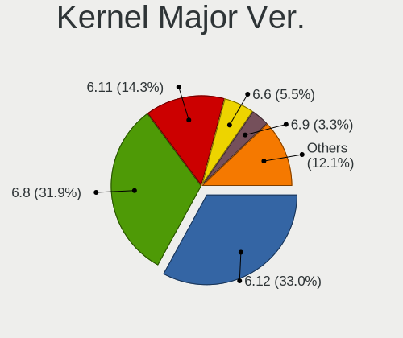
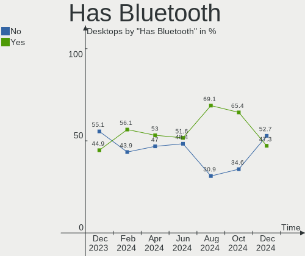
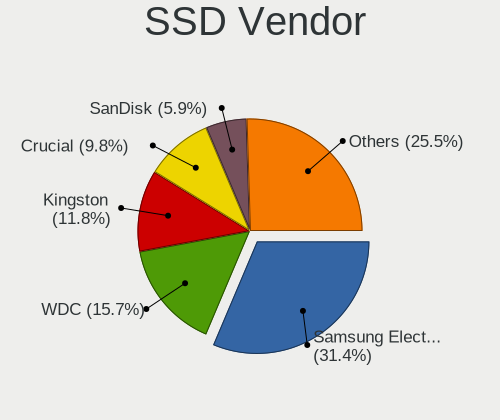
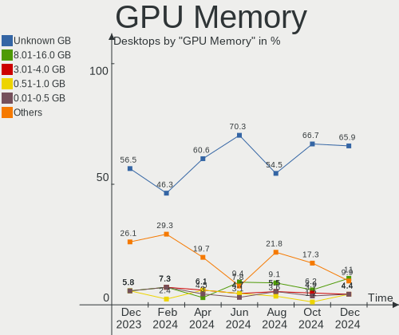
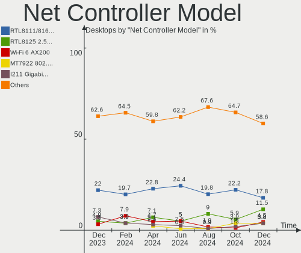
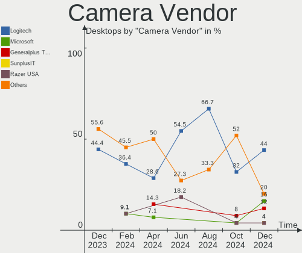
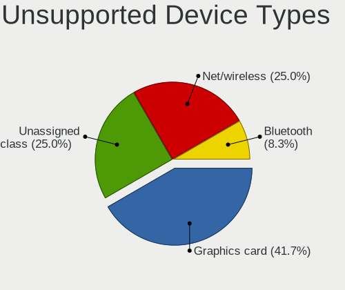

Linux in Canada - Hardware Trends (Desktops)
--------------------------------------------

A project to identify most popular hardware characteristics and track their change
over time based on data collected by Linux users at https://Linux-Hardware.org.

Anyone can contribute to this report by the [hw-probe](https://github.com/linuxhw/hw-probe) tool:

    sudo -E hw-probe -all -upload

Period: Apr, 2023.

Contents
--------

* [ System ](#system)
  - [ OS                       ](#os)
  - [ OS Family                ](#os-family)
  - [ Kernel                   ](#kernel)
  - [ Kernel Family            ](#kernel-family)
  - [ Kernel Major Ver.        ](#kernel-major-ver)
  - [ Arch                     ](#arch)
  - [ DE                       ](#de)
  - [ Display Server           ](#display-server)
  - [ Display Manager          ](#display-manager)
  - [ OS Lang                  ](#os-lang)
  - [ Boot Mode                ](#boot-mode)
  - [ Filesystem               ](#filesystem)
  - [ Part. scheme             ](#part-scheme)
  - [ Dual Boot with Linux/BSD ](#dual-boot-with-linuxbsd)
  - [ Dual Boot (Win)          ](#dual-boot-win)

* [ Board ](#board)
  - [ Vendor                   ](#vendor)
  - [ Model                    ](#model)
  - [ Model Family             ](#model-family)
  - [ MFG Year                 ](#mfg-year)
  - [ Form Factor              ](#form-factor)
  - [ Secure Boot              ](#secure-boot)
  - [ Coreboot                 ](#coreboot)
  - [ RAM Size                 ](#ram-size)
  - [ RAM Used                 ](#ram-used)
  - [ Total Drives             ](#total-drives)
  - [ Has CD-ROM               ](#has-cd-rom)
  - [ Has Ethernet             ](#has-ethernet)
  - [ Has WiFi                 ](#has-wifi)
  - [ Has Bluetooth            ](#has-bluetooth)

* [ Location ](#location)
  - [ Country                  ](#country)
  - [ City                     ](#city)

* [ Drives ](#drives)
  - [ Drive Vendor             ](#drive-vendor)
  - [ Drive Model              ](#drive-model)
  - [ HDD Vendor               ](#hdd-vendor)
  - [ SSD Vendor               ](#ssd-vendor)
  - [ Drive Kind               ](#drive-kind)
  - [ Drive Connector          ](#drive-connector)
  - [ Drive Size               ](#drive-size)
  - [ Space Total              ](#space-total)
  - [ Space Used               ](#space-used)
  - [ Malfunc. Drives          ](#malfunc-drives)
  - [ Malfunc. Drive Vendor    ](#malfunc-drive-vendor)
  - [ Malfunc. HDD Vendor      ](#malfunc-hdd-vendor)
  - [ Malfunc. Drive Kind      ](#malfunc-drive-kind)
  - [ Failed Drives            ](#failed-drives)
  - [ Failed Drive Vendor      ](#failed-drive-vendor)
  - [ Drive Status             ](#drive-status)

* [ Storage controller ](#storage-controller)
  - [ Storage Vendor           ](#storage-vendor)
  - [ Storage Model            ](#storage-model)
  - [ Storage Kind             ](#storage-kind)

* [ Processor ](#processor)
  - [ CPU Vendor               ](#cpu-vendor)
  - [ CPU Model                ](#cpu-model)
  - [ CPU Model Family         ](#cpu-model-family)
  - [ CPU Cores                ](#cpu-cores)
  - [ CPU Sockets              ](#cpu-sockets)
  - [ CPU Threads              ](#cpu-threads)
  - [ CPU Op-Modes             ](#cpu-op-modes)
  - [ CPU Microcode            ](#cpu-microcode)
  - [ CPU Microarch            ](#cpu-microarch)

* [ Graphics ](#graphics)
  - [ GPU Vendor               ](#gpu-vendor)
  - [ GPU Model                ](#gpu-model)
  - [ GPU Combo                ](#gpu-combo)
  - [ GPU Driver               ](#gpu-driver)
  - [ GPU Memory               ](#gpu-memory)

* [ Monitor ](#monitor)
  - [ Monitor Vendor           ](#monitor-vendor)
  - [ Monitor Model            ](#monitor-model)
  - [ Monitor Resolution       ](#monitor-resolution)
  - [ Monitor Diagonal         ](#monitor-diagonal)
  - [ Monitor Width            ](#monitor-width)
  - [ Aspect Ratio             ](#aspect-ratio)
  - [ Monitor Area             ](#monitor-area)
  - [ Pixel Density            ](#pixel-density)
  - [ Multiple Monitors        ](#multiple-monitors)

* [ Network ](#network)
  - [ Net Controller Vendor    ](#net-controller-vendor)
  - [ Net Controller Model     ](#net-controller-model)
  - [ Wireless Vendor          ](#wireless-vendor)
  - [ Wireless Model           ](#wireless-model)
  - [ Ethernet Vendor          ](#ethernet-vendor)
  - [ Ethernet Model           ](#ethernet-model)
  - [ Net Controller Kind      ](#net-controller-kind)
  - [ Used Controller          ](#used-controller)
  - [ NICs                     ](#nics)
  - [ IPv6                     ](#ipv6)

* [ Bluetooth ](#bluetooth)
  - [ Bluetooth Vendor         ](#bluetooth-vendor)
  - [ Bluetooth Model          ](#bluetooth-model)

* [ Sound ](#sound)
  - [ Sound Vendor             ](#sound-vendor)
  - [ Sound Model              ](#sound-model)

* [ Memory ](#memory)
  - [ Memory Vendor            ](#memory-vendor)
  - [ Memory Model             ](#memory-model)
  - [ Memory Kind              ](#memory-kind)
  - [ Memory Form Factor       ](#memory-form-factor)
  - [ Memory Size              ](#memory-size)
  - [ Memory Speed             ](#memory-speed)

* [ Printers & scanners ](#printers--scanners)
  - [ Printer Vendor           ](#printer-vendor)
  - [ Printer Model            ](#printer-model)
  - [ Scanner Vendor           ](#scanner-vendor)
  - [ Scanner Model            ](#scanner-model)

* [ Camera ](#camera)
  - [ Camera Vendor            ](#camera-vendor)
  - [ Camera Model             ](#camera-model)

* [ Security ](#security)
  - [ Fingerprint Vendor       ](#fingerprint-vendor)
  - [ Fingerprint Model        ](#fingerprint-model)
  - [ Chipcard Vendor          ](#chipcard-vendor)
  - [ Chipcard Model           ](#chipcard-model)

* [ Unsupported ](#unsupported)
  - [ Unsupported Devices      ](#unsupported-devices)
  - [ Unsupported Device Types ](#unsupported-device-types)

System
------

OS
--

Installed operating systems

| Name                      | Desktops | Percent |
|---------------------------|----------|---------|
| OpenMandriva 23.03        | 13       | 14.77%  |
| Ubuntu 22.04              | 9        | 10.23%  |
| Linux Mint 21.1           | 9        | 10.23%  |
| Pop!_OS 22.04             | 6        | 6.82%   |
| KDE neon 22.04            | 5        | 5.68%   |
| Debian 11                 | 4        | 4.55%   |
| Fedora 38                 | 3        | 3.41%   |
| Zorin 16                  | 2        | 2.27%   |
| Xubuntu 20.04             | 2        | 2.27%   |
| Ubuntu 22.10              | 2        | 2.27%   |
| Ubuntu 20.04              | 2        | 2.27%   |
| Manjaro 22.1.0            | 2        | 2.27%   |
| Manjaro                   | 2        | 2.27%   |
| Kubuntu 22.10             | 2        | 2.27%   |
| Gentoo 2.13               | 2        | 2.27%   |
| Fedora 37                 | 2        | 2.27%   |
| Debian 12                 | 2        | 2.27%   |
| Ubuntu MATE 20.04         | 1        | 1.14%   |
| Ubuntu 23.04              | 1        | 1.14%   |
| openSUSE Microos-XXXXXXXX | 1        | 1.14%   |
| OpenMandriva 4.3          | 1        | 1.14%   |
| Nobara 37                 | 1        | 1.14%   |
| MX 21                     | 1        | 1.14%   |
| LMDE 5                    | 1        | 1.14%   |
| Linux Mint 20.3           | 1        | 1.14%   |
| Linux Mint 19.3           | 1        | 1.14%   |
| Linux Lite 6.4            | 1        | 1.14%   |
| Kubuntu 23.04             | 1        | 1.14%   |
| EndeavourOS Rolling       | 1        | 1.14%   |
| Debian 10                 | 1        | 1.14%   |
| ChimeraOS 41              | 1        | 1.14%   |
| BunsenLabs 11             | 1        | 1.14%   |
| ArcoLinux Rolling         | 1        | 1.14%   |
| ArcoLinux                 | 1        | 1.14%   |
| Arch Rolling              | 1        | 1.14%   |
| AlmaLinux 8.7             | 1        | 1.14%   |

OS Family
---------

OS without a version

| Name         | Desktops | Percent |
|--------------|----------|---------|
| Ubuntu       | 14       | 15.91%  |
| OpenMandriva | 14       | 15.91%  |
| Linux Mint   | 11       | 12.5%   |
| Debian       | 7        | 7.95%   |
| Pop!_OS      | 6        | 6.82%   |
| KDE neon     | 5        | 5.68%   |
| Fedora       | 5        | 5.68%   |
| Manjaro      | 4        | 4.55%   |
| Kubuntu      | 3        | 3.41%   |
| Zorin        | 2        | 2.27%   |
| Xubuntu      | 2        | 2.27%   |
| Gentoo       | 2        | 2.27%   |
| ArcoLinux    | 2        | 2.27%   |
| Ubuntu MATE  | 1        | 1.14%   |
| openSUSE     | 1        | 1.14%   |
| Nobara       | 1        | 1.14%   |
| MX           | 1        | 1.14%   |
| LMDE         | 1        | 1.14%   |
| Linux Lite   | 1        | 1.14%   |
| EndeavourOS  | 1        | 1.14%   |
| ChimeraOS    | 1        | 1.14%   |
| BunsenLabs   | 1        | 1.14%   |
| Arch         | 1        | 1.14%   |
| AlmaLinux    | 1        | 1.14%   |

Kernel
------

Version of the Linux kernel

| Version                     | Desktops | Percent |
|-----------------------------|----------|---------|
| 5.15.0-69-generic           | 14       | 15.91%  |
| 6.2.6-desktop-1omv2390      | 13       | 14.77%  |
| 6.2.6-76060206-generic      | 6        | 6.82%   |
| 5.19.0-40-generic           | 4        | 4.55%   |
| 5.19.0-38-generic           | 4        | 4.55%   |
| 5.19.0-41-generic           | 3        | 3.41%   |
| 5.10.0-21-amd64             | 3        | 3.41%   |
| 6.2.11-300.fc38.x86_64      | 2        | 2.27%   |
| 6.2.0-20-generic            | 2        | 2.27%   |
| 5.4.0-146-generic           | 2        | 2.27%   |
| 5.15.0-60-generic           | 2        | 2.27%   |
| 5.10.0-20-amd64             | 2        | 2.27%   |
| 6.2.9-gentoo-dist           | 1        | 1.14%   |
| 6.2.9-4-liquorix-amd64      | 1        | 1.14%   |
| 6.2.9-300.fc38.x86_64       | 1        | 1.14%   |
| 6.2.9-1-default             | 1        | 1.14%   |
| 6.2.8-arch1-1               | 1        | 1.14%   |
| 6.2.8-200.fsync.fc37.x86_64 | 1        | 1.14%   |
| 6.2.12-1-MANJARO            | 1        | 1.14%   |
| 6.2.12-060212-generic       | 1        | 1.14%   |
| 6.2.10-zen1-1-zen           | 1        | 1.14%   |
| 6.2.10-arch1-1              | 1        | 1.14%   |
| 6.2.10-200.fc37.x86_64      | 1        | 1.14%   |
| 6.1.25-1-lts                | 1        | 1.14%   |
| 6.1.23-1-MANJARO            | 1        | 1.14%   |
| 6.1.21-1-lts                | 1        | 1.14%   |
| 6.1.19-gentoo-x86_64        | 1        | 1.14%   |
| 6.1.0-7-amd64               | 1        | 1.14%   |
| 6.0.18-300.fc37.x86_64      | 1        | 1.14%   |
| 6.0.0-6mx-amd64             | 1        | 1.14%   |
| 6.0.0-6-amd64               | 1        | 1.14%   |
| 5.4.0-139-generic           | 1        | 1.14%   |
| 5.4.0-131-generic           | 1        | 1.14%   |
| 5.3.5-64                    | 1        | 1.14%   |
| 5.19.0-21-generic           | 1        | 1.14%   |
| 5.16.7-desktop-1omv4003     | 1        | 1.14%   |
| 5.15.106-1-MANJARO          | 1        | 1.14%   |
| 5.15.104-2-MANJARO          | 1        | 1.14%   |
| 5.15.0-71-generic           | 1        | 1.14%   |
| 5.15.0-70-generic           | 1        | 1.14%   |

Kernel Family
-------------

Linux kernel without a distro release

| Version  | Desktops | Percent |
|----------|----------|---------|
| 5.15.0   | 20       | 22.73%  |
| 6.2.6    | 19       | 21.59%  |
| 5.19.0   | 12       | 13.64%  |
| 5.10.0   | 5        | 5.68%   |
| 6.2.9    | 4        | 4.55%   |
| 5.4.0    | 4        | 4.55%   |
| 6.2.10   | 3        | 3.41%   |
| 6.2.8    | 2        | 2.27%   |
| 6.2.12   | 2        | 2.27%   |
| 6.2.11   | 2        | 2.27%   |
| 6.2.0    | 2        | 2.27%   |
| 6.0.0    | 2        | 2.27%   |
| 6.1.25   | 1        | 1.14%   |
| 6.1.23   | 1        | 1.14%   |
| 6.1.21   | 1        | 1.14%   |
| 6.1.19   | 1        | 1.14%   |
| 6.1.0    | 1        | 1.14%   |
| 6.0.18   | 1        | 1.14%   |
| 5.3.5    | 1        | 1.14%   |
| 5.16.7   | 1        | 1.14%   |
| 5.15.106 | 1        | 1.14%   |
| 5.15.104 | 1        | 1.14%   |
| 4.18.0   | 1        | 1.14%   |

Kernel Major Ver.
-----------------

Linux kernel major version

| Version | Desktops | Percent |
|---------|----------|---------|
| 6.2     | 34       | 38.64%  |
| 5.15    | 22       | 25%     |
| 5.19    | 12       | 13.64%  |
| 6.1     | 5        | 5.68%   |
| 5.10    | 5        | 5.68%   |
| 5.4     | 4        | 4.55%   |
| 6.0     | 3        | 3.41%   |
| 5.3     | 1        | 1.14%   |
| 5.16    | 1        | 1.14%   |
| 4.18    | 1        | 1.14%   |

Arch
----

OS architecture (x86_64, i586, etc.)

| Name   | Desktops | Percent |
|--------|----------|---------|
| x86_64 | 87       | 98.86%  |
| i686   | 1        | 1.14%   |

DE
--

Desktop Environment

| Name            | Desktops | Percent |
|-----------------|----------|---------|
| KDE5            | 33       | 37.5%   |
| GNOME           | 29       | 32.95%  |
| X-Cinnamon      | 13       | 14.77%  |
| Unknown         | 5        | 5.68%   |
| XFCE            | 4        | 4.55%   |
| MATE            | 3        | 3.41%   |
| GNOME Flashback | 1        | 1.14%   |

Display Server
--------------

X11 or Wayland

| Name    | Desktops | Percent |
|---------|----------|---------|
| X11     | 65       | 73.86%  |
| Wayland | 16       | 18.18%  |
| Unknown | 4        | 4.55%   |
| Tty     | 3        | 3.41%   |

Display Manager
---------------

SDDM, LightDM, etc.

| Name    | Desktops | Percent |
|---------|----------|---------|
| Unknown | 32       | 36.36%  |
| SDDM    | 23       | 26.14%  |
| GDM3    | 12       | 13.64%  |
| LightDM | 11       | 12.5%   |
| GDM     | 9        | 10.23%  |
| NODM    | 1        | 1.14%   |

OS Lang
-------

Language

| Lang    | Desktops | Percent |
|---------|----------|---------|
| en_CA   | 55       | 62.5%   |
| en_US   | 23       | 26.14%  |
| fr_CA   | 4        | 4.55%   |
| fr_FR   | 2        | 2.27%   |
| pa_IN   | 1        | 1.14%   |
| en_GB   | 1        | 1.14%   |
| C.UTF8  | 1        | 1.14%   |
| Unknown | 1        | 1.14%   |

Boot Mode
---------

EFI or BIOS

| Mode | Desktops | Percent |
|------|----------|---------|
| EFI  | 45       | 51.14%  |
| BIOS | 43       | 48.86%  |

Filesystem
----------

Type of filesystem

| Type    | Desktops | Percent |
|---------|----------|---------|
| Ext4    | 66       | 75%     |
| Btrfs   | 12       | 13.64%  |
| Overlay | 5        | 5.68%   |
| Tmpfs   | 3        | 3.41%   |
| Xfs     | 1        | 1.14%   |
| Rootfs  | 1        | 1.14%   |

Part. scheme
------------

Scheme of partitioning

| Type    | Desktops | Percent |
|---------|----------|---------|
| GPT     | 55       | 62.5%   |
| Unknown | 28       | 31.82%  |
| MBR     | 5        | 5.68%   |

Dual Boot with Linux/BSD
------------------------

Hosting more than one Linux/BSD

| Dual boot | Desktops | Percent |
|-----------|----------|---------|
| No        | 74       | 84.09%  |
| Yes       | 14       | 15.91%  |

Dual Boot (Win)
---------------

Hosting Linux and Windows

| Dual boot | Desktops | Percent |
|-----------|----------|---------|
| No        | 65       | 73.86%  |
| Yes       | 23       | 26.14%  |

Board
-----

Vendor
------

Motherboard manufacturer

| Name                                 | Desktops | Percent |
|--------------------------------------|----------|---------|
| ASUSTek Computer                     | 32       | 36.36%  |
| MSI                                  | 10       | 11.36%  |
| Gigabyte Technology                  | 10       | 11.36%  |
| ASRock                               | 7        | 7.95%   |
| Lenovo                               | 6        | 6.82%   |
| Dell                                 | 6        | 6.82%   |
| Hewlett-Packard                      | 5        | 5.68%   |
| Apple                                | 4        | 4.55%   |
| Intel                                | 2        | 2.27%   |
| WeiBu                                | 1        | 1.14%   |
| Shenzhen Meigao Electronic Equipment | 1        | 1.14%   |
| Pegatron                             | 1        | 1.14%   |
| Biostar                              | 1        | 1.14%   |
| ASRockRack                           | 1        | 1.14%   |
| Acer                                 | 1        | 1.14%   |

Model
-----

Motherboard model

| Name                                       | Desktops | Percent |
|--------------------------------------------|----------|---------|
| ASUS All Series                            | 3        | 3.41%   |
| ASUS PRIME B450M-A                         | 2        | 2.27%   |
| Apple MacPro5,1                            | 2        | 2.27%   |
| WeiBu ADL-N                                | 1        | 1.14%   |
| Shenzhen Meigao Electronic Equipment HX99G | 1        | 1.14%   |
| Pegatron KQ497AA-A2L m9340f                | 1        | 1.14%   |
| MSI MS-7D54                                | 1        | 1.14%   |
| MSI MS-7D53                                | 1        | 1.14%   |
| MSI MS-7C80                                | 1        | 1.14%   |
| MSI MS-7C56                                | 1        | 1.14%   |
| MSI MS-7B98                                | 1        | 1.14%   |
| MSI MS-7B33                                | 1        | 1.14%   |
| MSI MS-7996                                | 1        | 1.14%   |
| MSI MS-7917                                | 1        | 1.14%   |
| MSI MS-7850                                | 1        | 1.14%   |
| MSI MS-7817                                | 1        | 1.14%   |
| Lenovo XXXX 3000 H210                      | 1        | 1.14%   |
| Lenovo ThinkStation P410 30B3003SUS        | 1        | 1.14%   |
| Lenovo ThinkCentre M93p 10A90014US         | 1        | 1.14%   |
| Lenovo ThinkCentre M91p 4518RH1            | 1        | 1.14%   |
| Lenovo ThinkCentre M73z 10BC002CUS         | 1        | 1.14%   |
| Lenovo ThinkCentre M73 10AY001YUS          | 1        | 1.14%   |
| Intel SHARKBAY                             | 1        | 1.14%   |
| Intel DH61AG AAG23736-504                  | 1        | 1.14%   |
| HP Z230 Tower Workstation                  | 1        | 1.14%   |
| HP OMEN by Desktop PC 880-p0xx             | 1        | 1.14%   |
| HP EliteDesk 800 G1 TWR                    | 1        | 1.14%   |
| HP Compaq Elite 8300 SFF                   | 1        | 1.14%   |
| HP 870-119                                 | 1        | 1.14%   |
| Gigabyte Z170XP-SLI                        | 1        | 1.14%   |
| Gigabyte Z170X-Gaming 7                    | 1        | 1.14%   |
| Gigabyte X570 AORUS ELITE WIFI             | 1        | 1.14%   |
| Gigabyte P55A-UD4P                         | 1        | 1.14%   |
| Gigabyte GA-MA785GM-US2H                   | 1        | 1.14%   |
| Gigabyte GA-A75M-D2H                       | 1        | 1.14%   |
| Gigabyte F2A88XN-WIFI                      | 1        | 1.14%   |
| Gigabyte F2A88X-UP4                        | 1        | 1.14%   |
| Gigabyte B650 AORUS PRO AX                 | 1        | 1.14%   |
| Gigabyte B550 AORUS PRO AC                 | 1        | 1.14%   |
| Dell XPS 8960                              | 1        | 1.14%   |

Model Family
------------

Motherboard model prefix

| Name                                       | Desktops | Percent |
|--------------------------------------------|----------|---------|
| ASUS ROG                                   | 8        | 9.09%   |
| ASUS PRIME                                 | 8        | 9.09%   |
| Lenovo ThinkCentre                         | 4        | 4.55%   |
| ASUS All                                   | 3        | 3.41%   |
| Dell XPS                                   | 2        | 2.27%   |
| Dell Precision                             | 2        | 2.27%   |
| Dell OptiPlex                              | 2        | 2.27%   |
| Apple MacPro5                              | 2        | 2.27%   |
| WeiBu ADL-N                                | 1        | 1.14%   |
| Shenzhen Meigao Electronic Equipment HX99G | 1        | 1.14%   |
| Pegatron KQ497AA-A2L                       | 1        | 1.14%   |
| MSI MS-7D54                                | 1        | 1.14%   |
| MSI MS-7D53                                | 1        | 1.14%   |
| MSI MS-7C80                                | 1        | 1.14%   |
| MSI MS-7C56                                | 1        | 1.14%   |
| MSI MS-7B98                                | 1        | 1.14%   |
| MSI MS-7B33                                | 1        | 1.14%   |
| MSI MS-7996                                | 1        | 1.14%   |
| MSI MS-7917                                | 1        | 1.14%   |
| MSI MS-7850                                | 1        | 1.14%   |
| MSI MS-7817                                | 1        | 1.14%   |
| Lenovo XXXX                                | 1        | 1.14%   |
| Lenovo ThinkStation                        | 1        | 1.14%   |
| Intel SHARKBAY                             | 1        | 1.14%   |
| Intel DH61AG                               | 1        | 1.14%   |
| HP Z230                                    | 1        | 1.14%   |
| HP OMEN                                    | 1        | 1.14%   |
| HP EliteDesk                               | 1        | 1.14%   |
| HP Compaq                                  | 1        | 1.14%   |
| HP 870-119                                 | 1        | 1.14%   |
| Gigabyte Z170XP-SLI                        | 1        | 1.14%   |
| Gigabyte Z170X-Gaming                      | 1        | 1.14%   |
| Gigabyte X570                              | 1        | 1.14%   |
| Gigabyte P55A-UD4P                         | 1        | 1.14%   |
| Gigabyte GA-MA785GM-US2H                   | 1        | 1.14%   |
| Gigabyte GA-A75M-D2H                       | 1        | 1.14%   |
| Gigabyte F2A88XN-WIFI                      | 1        | 1.14%   |
| Gigabyte F2A88X-UP4                        | 1        | 1.14%   |
| Gigabyte B650                              | 1        | 1.14%   |
| Gigabyte B550                              | 1        | 1.14%   |

MFG Year
--------

Motherboard manufacture year

| Year | Desktops | Percent |
|------|----------|---------|
| 2018 | 12       | 13.64%  |
| 2013 | 11       | 12.5%   |
| 2012 | 10       | 11.36%  |
| 2022 | 9        | 10.23%  |
| 2021 | 6        | 6.82%   |
| 2020 | 6        | 6.82%   |
| 2014 | 6        | 6.82%   |
| 2011 | 6        | 6.82%   |
| 2016 | 5        | 5.68%   |
| 2015 | 4        | 4.55%   |
| 2009 | 4        | 4.55%   |
| 2019 | 3        | 3.41%   |
| 2017 | 2        | 2.27%   |
| 2010 | 2        | 2.27%   |
| 2023 | 1        | 1.14%   |
| 2007 | 1        | 1.14%   |

Form Factor
-----------

Physical design of the computer

| Name    | Desktops | Percent |
|---------|----------|---------|
| Desktop | 88       | 100%    |

Secure Boot
-----------

Enabled or disabled

| State    | Desktops | Percent |
|----------|----------|---------|
| Disabled | 85       | 96.59%  |
| Enabled  | 3        | 3.41%   |

Coreboot
--------

Have coreboot on board

| Used | Desktops | Percent |
|------|----------|---------|
| No   | 88       | 100%    |

RAM Size
--------

Total RAM memory

| Size in GB  | Desktops | Percent |
|-------------|----------|---------|
| 16.01-24.0  | 25       | 28.41%  |
| 32.01-64.0  | 24       | 27.27%  |
| 64.01-256.0 | 12       | 13.64%  |
| 8.01-16.0   | 10       | 11.36%  |
| 4.01-8.0    | 7        | 7.95%   |
| 24.01-32.0  | 5        | 5.68%   |
| 3.01-4.0    | 4        | 4.55%   |
| 1.01-2.0    | 1        | 1.14%   |

RAM Used
--------

Used RAM memory

| Used GB    | Desktops | Percent |
|------------|----------|---------|
| 2.01-3.0   | 21       | 23.86%  |
| 1.01-2.0   | 21       | 23.86%  |
| 4.01-8.0   | 15       | 17.05%  |
| 3.01-4.0   | 14       | 15.91%  |
| 8.01-16.0  | 10       | 11.36%  |
| 32.01-64.0 | 2        | 2.27%   |
| 16.01-24.0 | 2        | 2.27%   |
| 0.51-1.0   | 2        | 2.27%   |
| 24.01-32.0 | 1        | 1.14%   |

Total Drives
------------

Number of drives on board

| Drives | Desktops | Percent |
|--------|----------|---------|
| 2      | 29       | 32.95%  |
| 1      | 27       | 30.68%  |
| 3      | 14       | 15.91%  |
| 4      | 12       | 13.64%  |
| 5      | 2        | 2.27%   |
| 26     | 1        | 1.14%   |
| 8      | 1        | 1.14%   |
| 7      | 1        | 1.14%   |
| 6      | 1        | 1.14%   |

Has CD-ROM
----------

Has CD-ROM on board

| Presented | Desktops | Percent |
|-----------|----------|---------|
| No        | 47       | 53.41%  |
| Yes       | 41       | 46.59%  |

Has Ethernet
------------

Has Ethernet on board

| Presented | Desktops | Percent |
|-----------|----------|---------|
| Yes       | 88       | 100%    |

Has WiFi
--------

Has WiFi module

| Presented | Desktops | Percent |
|-----------|----------|---------|
| Yes       | 49       | 55.68%  |
| No        | 39       | 44.32%  |

Has Bluetooth
-------------

Has Bluetooth module

| Presented | Desktops | Percent |
|-----------|----------|---------|
| No        | 49       | 55.68%  |
| Yes       | 39       | 44.32%  |

Location
--------

Country
-------

Geographic location (country)

| Country | Desktops | Percent |
|---------|----------|---------|
| Canada  | 88       | 100%    |

City
----

Geographic location (city)

| City                     | Desktops | Percent |
|--------------------------|----------|---------|
| Toronto                  | 10       | 11.36%  |
| Montreal                 | 6        | 6.82%   |
| Edmonton                 | 5        | 5.68%   |
| Calgary                  | 5        | 5.68%   |
| Winnipeg                 | 4        | 4.55%   |
| Vancouver                | 3        | 3.41%   |
| Sarnia                   | 3        | 3.41%   |
| Nepean                   | 3        | 3.41%   |
| Victoria                 | 2        | 2.27%   |
| Trois-Rivières          | 2        | 2.27%   |
| St. Jean Baptiste        | 2        | 2.27%   |
| Mississauga              | 2        | 2.27%   |
| Gatineau                 | 2        | 2.27%   |
| Brampton                 | 2        | 2.27%   |
| Beauharnois              | 2        | 2.27%   |
| Woodbridge               | 1        | 1.14%   |
| Westville                | 1        | 1.14%   |
| Vernon                   | 1        | 1.14%   |
| Stephenville Crossing    | 1        | 1.14%   |
| Steinbach                | 1        | 1.14%   |
| St. Albert               | 1        | 1.14%   |
| Sherbrooke               | 1        | 1.14%   |
| Sainte-Agathe-des-Monts  | 1        | 1.14%   |
| Saint-Jerome             | 1        | 1.14%   |
| Saint-Honore             | 1        | 1.14%   |
| Saint-David-de-Falardeau | 1        | 1.14%   |
| Renfrew                  | 1        | 1.14%   |
| Québec                  | 1        | 1.14%   |
| Port Perry               | 1        | 1.14%   |
| Pierrefonds              | 1        | 1.14%   |
| Ottawa                   | 1        | 1.14%   |
| Newcastle                | 1        | 1.14%   |
| Margaretsville           | 1        | 1.14%   |
| Lethbridge               | 1        | 1.14%   |
| Laval                    | 1        | 1.14%   |
| Kitchener                | 1        | 1.14%   |
| Kippens                  | 1        | 1.14%   |
| Halifax                  | 1        | 1.14%   |
| Granby                   | 1        | 1.14%   |
| Fredericton              | 1        | 1.14%   |

Drives
------

Drive Vendor
------------

Hard drive vendors

| Vendor                      | Desktops | Drives | Percent |
|-----------------------------|----------|--------|---------|
| Seagate                     | 35       | 48     | 19.77%  |
| WDC                         | 27       | 39     | 15.25%  |
| Samsung Electronics         | 20       | 23     | 11.3%   |
| Kingston                    | 20       | 20     | 11.3%   |
| Sandisk                     | 12       | 15     | 6.78%   |
| Toshiba                     | 6        | 7      | 3.39%   |
| A-DATA Technology           | 6        | 6      | 3.39%   |
| Micron/Crucial Technology   | 5        | 5      | 2.82%   |
| Unknown                     | 4        | 4      | 2.26%   |
| Intel                       | 4        | 4      | 2.26%   |
| Hitachi                     | 4        | 24     | 2.26%   |
| Crucial                     | 4        | 4      | 2.26%   |
| Kingston Technology Company | 3        | 3      | 1.69%   |
| Phison Electronics          | 2        | 3      | 1.13%   |
| HGST                        | 2        | 2      | 1.13%   |
| ADATA Technology            | 2        | 2      | 1.13%   |
| Timetec                     | 1        | 1      | 0.56%   |
| Team                        | 1        | 1      | 0.56%   |
| SPCC                        | 1        | 1      | 0.56%   |
| Silicon Motion              | 1        | 2      | 0.56%   |
| Seagate Technology          | 1        | 1      | 0.56%   |
| SABRENT                     | 1        | 1      | 0.56%   |
| Realtek                     | 1        | 1      | 0.56%   |
| PNY                         | 1        | 1      | 0.56%   |
| OWC                         | 1        | 2      | 0.56%   |
| Micron Technology           | 1        | 1      | 0.56%   |
| MicroFrom                   | 1        | 1      | 0.56%   |
| Maxtor                      | 1        | 1      | 0.56%   |
| LITEONIT                    | 1        | 1      | 0.56%   |
| KingSpec                    | 1        | 1      | 0.56%   |
| JMicron Technology          | 1        | 1      | 0.56%   |
| Gigabyte Technology         | 1        | 1      | 0.56%   |
| Fanxiang                    | 1        | 1      | 0.56%   |
| External                    | 1        | 1      | 0.56%   |
| Aura                        | 1        | 1      | 0.56%   |
| ADROITLARK                  | 1        | 1      | 0.56%   |
| Unknown                     | 1        | 1      | 0.56%   |

Drive Model
-----------

Hard drive models

| Model                                              | Desktops | Percent |
|----------------------------------------------------|----------|---------|
| Seagate ST1000DM010-2EP102 1TB                     | 5        | 2.53%   |
| Kingston SA400S37240G 240GB SSD                    | 5        | 2.53%   |
| Unknown SD/MMC/MS PRO 249GB                        | 4        | 2.02%   |
| Seagate ST4000DM004-2CV104 4TB                     | 4        | 2.02%   |
| Seagate Expansion Desk 8TB                         | 3        | 1.52%   |
| Sandisk WD Black SN750 / PC SN730 NVMe SSD 512GB   | 3        | 1.52%   |
| Samsung NVMe SSD Controller PM9A1/PM9A3/980PRO 2TB | 3        | 1.52%   |
| Micron/Crucial P2 NVMe PCIe SSD 1TB                | 3        | 1.52%   |
| Kingston SV300S37A240G 240GB SSD                   | 3        | 1.52%   |
| Kingston SA400S37960G 960GB SSD                    | 3        | 1.52%   |
| WDC WD30EZRX-00D8PB0 3TB                           | 2        | 1.01%   |
| WDC WD20EZAZ-00L9GB0 2TB                           | 2        | 1.01%   |
| Seagate ST31000524AS 1TB                           | 2        | 1.01%   |
| Seagate ST3000DM008-2DM166 3TB                     | 2        | 1.01%   |
| Sandisk WD Blue SN550 NVMe SSD 1024GB              | 2        | 1.01%   |
| SanDisk NVMe SSD Drive 2TB                         | 2        | 1.01%   |
| Samsung SSD 980 PRO 1TB                            | 2        | 1.01%   |
| Phison E12 NVMe Controller 512GB                   | 2        | 1.01%   |
| Kingston Company A2000 NVMe SSD 500GB              | 2        | 1.01%   |
| Kingston SH103S3120G 120GB SSD                     | 2        | 1.01%   |
| WDC WDS500G3X0C-00SJG0 500GB                       | 1        | 0.51%   |
| WDC WDS250G2B0A-00SM50 250GB SSD                   | 1        | 0.51%   |
| WDC WDS250G1B0A-00H9H0 250GB SSD                   | 1        | 0.51%   |
| WDC WDS100T2B0C-00PXH0 1TB                         | 1        | 0.51%   |
| WDC WDS100T2B0C 1TB                                | 1        | 0.51%   |
| WDC WDS100T2B0B-00YS70 1TB SSD                     | 1        | 0.51%   |
| WDC WDS100T1X0E-00AFY0 1TB                         | 1        | 0.51%   |
| WDC WD60EFAX-68SHWN0 6TB                           | 1        | 0.51%   |
| WDC WD5003AZEX-00MK2A0 500GB                       | 1        | 0.51%   |
| WDC WD5000AZLX-00ZR6A0 500GB                       | 1        | 0.51%   |
| WDC WD5000AAKS-60Z1A0 500GB                        | 1        | 0.51%   |
| WDC WD40EZRZ-22GXCB0 4TB                           | 1        | 0.51%   |
| WDC WD40EZRX-00SPEB0 4TB                           | 1        | 0.51%   |
| WDC WD40EFAX-68JH4N1 4TB                           | 1        | 0.51%   |
| WDC WD3200BEVT-75A23T0 320GB                       | 1        | 0.51%   |
| WDC WD3200AAJS-65B4A0 320GB                        | 1        | 0.51%   |
| WDC WD30EZRX-00MMMB0 3TB                           | 1        | 0.51%   |
| WDC WD30EZRX-00DC0B0 3TB                           | 1        | 0.51%   |
| WDC WD2500JS-22NCB1 250GB                          | 1        | 0.51%   |
| WDC WD20EFRX-68EUZN0 2TB                           | 1        | 0.51%   |

HDD Vendor
----------

Hard disk drive vendors

| Vendor              | Desktops | Drives | Percent |
|---------------------|----------|--------|---------|
| Seagate             | 33       | 45     | 44%     |
| WDC                 | 23       | 31     | 30.67%  |
| Toshiba             | 5        | 5      | 6.67%   |
| Unknown             | 4        | 4      | 5.33%   |
| Hitachi             | 4        | 24     | 5.33%   |
| HGST                | 2        | 2      | 2.67%   |
| Samsung Electronics | 1        | 1      | 1.33%   |
| SABRENT             | 1        | 1      | 1.33%   |
| Maxtor              | 1        | 1      | 1.33%   |
| JMicron Technology  | 1        | 1      | 1.33%   |

SSD Vendor
----------

Solid state drive vendors

| Vendor              | Desktops | Drives | Percent |
|---------------------|----------|--------|---------|
| Kingston            | 15       | 15     | 24.59%  |
| Samsung Electronics | 13       | 13     | 21.31%  |
| A-DATA Technology   | 5        | 5      | 8.2%    |
| Intel               | 4        | 4      | 6.56%   |
| WDC                 | 3        | 3      | 4.92%   |
| SanDisk             | 3        | 3      | 4.92%   |
| Crucial             | 3        | 3      | 4.92%   |
| Toshiba             | 1        | 2      | 1.64%   |
| Timetec             | 1        | 1      | 1.64%   |
| Team                | 1        | 1      | 1.64%   |
| SPCC                | 1        | 1      | 1.64%   |
| Seagate             | 1        | 1      | 1.64%   |
| PNY                 | 1        | 1      | 1.64%   |
| OWC                 | 1        | 2      | 1.64%   |
| MicroFrom           | 1        | 1      | 1.64%   |
| LITEONIT            | 1        | 1      | 1.64%   |
| KingSpec            | 1        | 1      | 1.64%   |
| Gigabyte Technology | 1        | 1      | 1.64%   |
| Fanxiang            | 1        | 1      | 1.64%   |
| External            | 1        | 1      | 1.64%   |
| ADROITLARK          | 1        | 1      | 1.64%   |
| Unknown             | 1        | 1      | 1.64%   |

Drive Kind
----------

HDD or SSD

| Kind    | Desktops | Drives | Percent |
|---------|----------|--------|---------|
| HDD     | 55       | 115    | 38.19%  |
| SSD     | 52       | 63     | 36.11%  |
| NVMe    | 36       | 53     | 25%     |
| Unknown | 1        | 1      | 0.69%   |

Drive Connector
---------------

SATA, SAS, NVMe, etc.

| Type | Desktops | Drives | Percent |
|------|----------|--------|---------|
| SATA | 73       | 144    | 59.35%  |
| NVMe | 36       | 52     | 29.27%  |
| SAS  | 14       | 36     | 11.38%  |

Drive Size
----------

Size of hard drive

| Size in TB | Desktops | Drives | Percent |
|------------|----------|--------|---------|
| 0.01-0.5   | 50       | 74     | 42.74%  |
| 0.51-1.0   | 32       | 40     | 27.35%  |
| 1.01-2.0   | 14       | 16     | 11.97%  |
| 2.01-3.0   | 8        | 9      | 6.84%   |
| 3.01-4.0   | 7        | 12     | 5.98%   |
| 4.01-10.0  | 5        | 26     | 4.27%   |
| 10.01-20.0 | 1        | 1      | 0.85%   |

Space Total
-----------

Amount of disk space available on the file system

| Size in GB     | Desktops | Percent |
|----------------|----------|---------|
| 501-1000       | 20       | 22.73%  |
| More than 3000 | 18       | 20.45%  |
| 1001-2000      | 14       | 15.91%  |
| 251-500        | 13       | 14.77%  |
| 101-250        | 10       | 11.36%  |
| 1-20           | 5        | 5.68%   |
| 51-100         | 3        | 3.41%   |
| Unknown        | 3        | 3.41%   |
| 2001-3000      | 2        | 2.27%   |

Space Used
----------

Amount of used disk space

| Used GB        | Desktops | Percent |
|----------------|----------|---------|
| 1-20           | 25       | 28.41%  |
| 21-50          | 12       | 13.64%  |
| 101-250        | 12       | 13.64%  |
| 501-1000       | 10       | 11.36%  |
| 51-100         | 7        | 7.95%   |
| 251-500        | 6        | 6.82%   |
| 1001-2000      | 6        | 6.82%   |
| More than 3000 | 5        | 5.68%   |
| Unknown        | 3        | 3.41%   |
| 2001-3000      | 2        | 2.27%   |

Malfunc. Drives
---------------

Drive models with a malfunction

| Model                                 | Desktops | Drives | Percent |
|---------------------------------------|----------|--------|---------|
| WDC WD3200AAJS-65B4A0 320GB           | 1        | 1      | 7.14%   |
| Toshiba MK5061GS 500GB                | 1        | 1      | 7.14%   |
| Seagate ST500LM021-1KJ152 500GB       | 1        | 1      | 7.14%   |
| Seagate ST500LM000-1EJ162-SSHD-8GB    | 1        | 1      | 7.14%   |
| Seagate ST3750528AS 752GB             | 1        | 1      | 7.14%   |
| Seagate ST31000528AS 1TB              | 1        | 2      | 7.14%   |
| Seagate ST14000NM0018-2H4101 14TB     | 1        | 1      | 7.14%   |
| Samsung Electronics SSD 870 EVO 250GB | 1        | 1      | 7.14%   |
| Maxtor 7Y250M0 250GB                  | 1        | 1      | 7.14%   |
| Kingston SV300S37A240G 240GB SSD      | 1        | 1      | 7.14%   |
| KingSpec P3-512 512GB                 | 1        | 1      | 7.14%   |
| Intel SSDSC2CW120A3 120GB             | 1        | 1      | 7.14%   |
| Intel SSDSC2BW180A4 180GB             | 1        | 1      | 7.14%   |
| Hitachi HTS541616J9SA00 160GB         | 1        | 1      | 7.14%   |

Malfunc. Drive Vendor
---------------------

Vendors of faulty drives

| Vendor              | Desktops | Drives | Percent |
|---------------------|----------|--------|---------|
| Seagate             | 5        | 6      | 35.71%  |
| Intel               | 2        | 2      | 14.29%  |
| WDC                 | 1        | 1      | 7.14%   |
| Toshiba             | 1        | 1      | 7.14%   |
| Samsung Electronics | 1        | 1      | 7.14%   |
| Maxtor              | 1        | 1      | 7.14%   |
| Kingston            | 1        | 1      | 7.14%   |
| KingSpec            | 1        | 1      | 7.14%   |
| Hitachi             | 1        | 1      | 7.14%   |

Malfunc. HDD Vendor
-------------------

Vendors of faulty HDD drives

| Vendor  | Desktops | Drives | Percent |
|---------|----------|--------|---------|
| Seagate | 5        | 6      | 55.56%  |
| WDC     | 1        | 1      | 11.11%  |
| Toshiba | 1        | 1      | 11.11%  |
| Maxtor  | 1        | 1      | 11.11%  |
| Hitachi | 1        | 1      | 11.11%  |

Malfunc. Drive Kind
-------------------

Kinds of faulty drives

| Kind | Desktops | Drives | Percent |
|------|----------|--------|---------|
| HDD  | 9        | 10     | 64.29%  |
| SSD  | 5        | 5      | 35.71%  |

Failed Drives
-------------

Failed drive models

Zero info for selected period =(

Failed Drive Vendor
-------------------

Failed drive vendors

Zero info for selected period =(

Drive Status
------------

Number of failed and malfunc. drives

| Status   | Desktops | Drives | Percent |
|----------|----------|--------|---------|
| Detected | 49       | 131    | 45.37%  |
| Works    | 46       | 86     | 42.59%  |
| Malfunc  | 13       | 15     | 12.04%  |

Storage controller
------------------

Storage Vendor
--------------

Storage controller vendors

| Vendor                        | Desktops | Percent |
|-------------------------------|----------|---------|
| Intel                         | 51       | 34.46%  |
| AMD                           | 35       | 23.65%  |
| SanDisk                       | 14       | 9.46%   |
| Samsung Electronics           | 8        | 5.41%   |
| Kingston Technology Company   | 8        | 5.41%   |
| Micron/Crucial Technology     | 5        | 3.38%   |
| ASMedia Technology            | 5        | 3.38%   |
| Marvell Technology Group      | 4        | 2.7%    |
| ADATA Technology              | 3        | 2.03%   |
| Silicon Motion                | 2        | 1.35%   |
| Seagate Technology            | 2        | 1.35%   |
| Phison Electronics            | 2        | 1.35%   |
| LSI Logic / Symbios Logic     | 2        | 1.35%   |
| JMicron Technology            | 2        | 1.35%   |
| Broadcom / LSI                | 2        | 1.35%   |
| VIA Technologies              | 1        | 0.68%   |
| Micron Technology             | 1        | 0.68%   |
| Integrated Technology Express | 1        | 0.68%   |

Storage Model
-------------

Storage controller models

| Model                                                                          | Desktops | Percent |
|--------------------------------------------------------------------------------|----------|---------|
| AMD FCH SATA Controller [AHCI mode]                                            | 23       | 13.14%  |
| Intel 8 Series/C220 Series Chipset Family 6-port SATA Controller 1 [AHCI mode] | 9        | 5.14%   |
| AMD 400 Series Chipset SATA Controller                                         | 7        | 4%      |
| Intel SATA Controller [RAID mode]                                              | 6        | 3.43%   |
| Intel 7 Series/C210 Series Chipset Family 6-port SATA Controller [AHCI mode]   | 6        | 3.43%   |
| AMD 500 Series Chipset SATA Controller                                         | 6        | 3.43%   |
| Samsung NVMe SSD Controller PM9A1/PM9A3/980PRO                                 | 5        | 2.86%   |
| Intel Q170/Q150/B150/H170/H110/Z170/CM236 Chipset SATA Controller [AHCI Mode]  | 5        | 2.86%   |
| SanDisk WD Blue SN550 NVMe SSD                                                 | 4        | 2.29%   |
| SanDisk WD Black SN750 / PC SN730 NVMe SSD                                     | 4        | 2.29%   |
| Intel 6 Series/C200 Series Chipset Family 6 port Desktop SATA AHCI Controller  | 4        | 2.29%   |
| ASMedia ASM1062 Serial ATA Controller                                          | 4        | 2.29%   |
| Micron/Crucial P2 NVMe PCIe SSD                                                | 3        | 1.71%   |
| Kingston Company Company Non-Volatile memory controller                        | 3        | 1.71%   |
| Kingston Company A2000 NVMe SSD                                                | 3        | 1.71%   |
| Intel Cannon Lake PCH SATA AHCI Controller                                     | 3        | 1.71%   |
| Intel Alder Lake-S PCH SATA Controller [AHCI Mode]                             | 3        | 1.71%   |
| AMD SB7x0/SB8x0/SB9x0 IDE Controller                                           | 3        | 1.71%   |
| Silicon Motion SM2262/SM2262EN SSD Controller                                  | 2        | 1.14%   |
| SanDisk WD PC SN810 / Black SN850 NVMe SSD                                     | 2        | 1.14%   |
| SanDisk WD Blue SN570 NVMe SSD 1TB                                             | 2        | 1.14%   |
| SanDisk WD Black SN770 NVMe SSD                                                | 2        | 1.14%   |
| Samsung NVMe SSD Controller SM981/PM981/PM983                                  | 2        | 1.14%   |
| Samsung NVMe SSD Controller 980                                                | 2        | 1.14%   |
| Phison E12 NVMe Controller                                                     | 2        | 1.14%   |
| Marvell Group 88SE9230 PCIe 2.0 x2 4-port SATA 6 Gb/s RAID Controller          | 2        | 1.14%   |
| Intel 9 Series Chipset Family SATA Controller [AHCI Mode]                      | 2        | 1.14%   |
| Intel 82801JI (ICH10 Family) SATA AHCI Controller                              | 2        | 1.14%   |
| AMD SB7x0/SB8x0/SB9x0 SATA Controller [IDE mode]                               | 2        | 1.14%   |
| AMD SB7x0/SB8x0/SB9x0 SATA Controller [AHCI mode]                              | 2        | 1.14%   |
| AMD FCH SATA Controller D                                                      | 2        | 1.14%   |
| ADATA XPG SX8200 Pro PCIe Gen3x4 M.2 2280 Solid State Drive                    | 2        | 1.14%   |
| VIA VT6415 PATA IDE Host Controller                                            | 1        | 0.57%   |
| Seagate FireCuda 530 SSD                                                       | 1        | 0.57%   |
| Seagate FireCuda 510 SSD                                                       | 1        | 0.57%   |
| Sandisk Western Digital WD Black SN850X NVMe SSD                               | 1        | 0.57%   |
| SanDisk WD Blue SN570 NVMe SSD 2TB                                             | 1        | 0.57%   |
| Micron/Crucial P5 Plus NVMe PCIe SSD                                           | 1        | 0.57%   |
| Micron/Crucial P1 NVMe PCIe SSD                                                | 1        | 0.57%   |
| Micron NVMe Storage Controller                                                 | 1        | 0.57%   |

Storage Kind
------------

Kind of storage controller (IDE, SATA, NVMe, SAS, ...)

| Kind | Desktops | Percent |
|------|----------|---------|
| SATA | 79       | 56.03%  |
| NVMe | 36       | 25.53%  |
| IDE  | 13       | 9.22%   |
| RAID | 10       | 7.09%   |
| SAS  | 3        | 2.13%   |

Processor
---------

CPU Vendor
----------

Processor vendors

| Vendor | Desktops | Percent |
|--------|----------|---------|
| Intel  | 52       | 59.09%  |
| AMD    | 36       | 40.91%  |

CPU Model
---------

Processor models

| Model                                           | Desktops | Percent |
|-------------------------------------------------|----------|---------|
| AMD Ryzen 5 5600X 6-Core Processor              | 4        | 4.55%   |
| Intel Core i7-4790K CPU @ 4.00GHz               | 3        | 3.41%   |
| AMD Ryzen 9 7950X 16-Core Processor             | 3        | 3.41%   |
| Intel Core i7-7700K CPU @ 4.20GHz               | 2        | 2.27%   |
| Intel Core i7-6700K CPU @ 4.00GHz               | 2        | 2.27%   |
| Intel Core i7-4770 CPU @ 3.40GHz                | 2        | 2.27%   |
| Intel Core i7-3770 CPU @ 3.40GHz                | 2        | 2.27%   |
| Intel Core i5-3450 CPU @ 3.10GHz                | 2        | 2.27%   |
| AMD Ryzen 7 5800X 8-Core Processor              | 2        | 2.27%   |
| AMD Ryzen 5 3400G with Radeon Vega Graphics     | 2        | 2.27%   |
| AMD A10-7850K Radeon R7, 12 Compute Cores 4C+8G | 2        | 2.27%   |
| Intel Xeon CPU X5690 @ 3.47GHz                  | 1        | 1.14%   |
| Intel Xeon CPU X5675 @ 3.07GHz                  | 1        | 1.14%   |
| Intel Xeon CPU W3530 @ 2.80GHz                  | 1        | 1.14%   |
| Intel Xeon CPU E5-2680 v2 @ 2.80GHz             | 1        | 1.14%   |
| Intel Xeon CPU E5-1650 v2 @ 3.50GHz             | 1        | 1.14%   |
| Intel Xeon CPU E5-1630 v4 @ 3.70GHz             | 1        | 1.14%   |
| Intel Xeon CPU 5150 @ 2.66GHz                   | 1        | 1.14%   |
| Intel Pentium Dual-Core CPU E5200 @ 2.50GHz     | 1        | 1.14%   |
| Intel Pentium CPU G3240 @ 3.10GHz               | 1        | 1.14%   |
| Intel N95                                       | 1        | 1.14%   |
| Intel Core i7-8700 CPU @ 3.20GHz                | 1        | 1.14%   |
| Intel Core i7-6700 CPU @ 3.40GHz                | 1        | 1.14%   |
| Intel Core i7-4790 CPU @ 3.60GHz                | 1        | 1.14%   |
| Intel Core i7-4771 CPU @ 3.50GHz                | 1        | 1.14%   |
| Intel Core i7-3770K CPU @ 3.50GHz               | 1        | 1.14%   |
| Intel Core i7-2600K CPU @ 3.40GHz               | 1        | 1.14%   |
| Intel Core i7-2600 CPU @ 3.40GHz                | 1        | 1.14%   |
| Intel Core i7 CPU 870 @ 2.93GHz                 | 1        | 1.14%   |
| Intel Core i5-9400 CPU @ 2.90GHz                | 1        | 1.14%   |
| Intel Core i5-6600K CPU @ 3.50GHz               | 1        | 1.14%   |
| Intel Core i5-6500 CPU @ 3.20GHz                | 1        | 1.14%   |
| Intel Core i5-4670 CPU @ 3.40GHz                | 1        | 1.14%   |
| Intel Core i5-4570T CPU @ 2.90GHz               | 1        | 1.14%   |
| Intel Core i5-4460 CPU @ 3.20GHz                | 1        | 1.14%   |
| Intel Core i5-3570S CPU @ 3.10GHz               | 1        | 1.14%   |
| Intel Core i5-3570K CPU @ 3.40GHz               | 1        | 1.14%   |
| Intel Core i5-3570 CPU @ 3.40GHz                | 1        | 1.14%   |
| Intel Core i5-3470 CPU @ 3.20GHz                | 1        | 1.14%   |
| Intel Core i5-2400 CPU @ 3.10GHz                | 1        | 1.14%   |

CPU Model Family
----------------

Processor model prefix

| Model                   | Desktops | Percent |
|-------------------------|----------|---------|
| Intel Core i7           | 19       | 21.59%  |
| Intel Core i5           | 14       | 15.91%  |
| AMD Ryzen 5             | 14       | 15.91%  |
| Intel Xeon              | 7        | 7.95%   |
| AMD Ryzen 9             | 7        | 7.95%   |
| AMD Ryzen 7             | 6        | 6.82%   |
| Intel Core i3           | 5        | 5.68%   |
| Other                   | 4        | 4.55%   |
| AMD A10                 | 3        | 3.41%   |
| AMD FX                  | 2        | 2.27%   |
| Intel Pentium Dual-Core | 1        | 1.14%   |
| Intel Pentium           | 1        | 1.14%   |
| Intel Core 2 Quad       | 1        | 1.14%   |
| AMD Ryzen 3             | 1        | 1.14%   |
| AMD Phenom II X4        | 1        | 1.14%   |
| AMD Athlon II X2        | 1        | 1.14%   |
| AMD A4                  | 1        | 1.14%   |

CPU Cores
---------

Number of processor cores

| Number | Desktops | Percent |
|--------|----------|---------|
| 4      | 42       | 47.73%  |
| 6      | 16       | 18.18%  |
| 2      | 10       | 11.36%  |
| 8      | 7        | 7.95%   |
| 16     | 6        | 6.82%   |
| 12     | 3        | 3.41%   |
| 24     | 1        | 1.14%   |
| 20     | 1        | 1.14%   |
| 3      | 1        | 1.14%   |
| 1      | 1        | 1.14%   |

CPU Sockets
-----------

Number of sockets

| Number | Desktops | Percent |
|--------|----------|---------|
| 1      | 85       | 96.59%  |
| 2      | 3        | 3.41%   |

CPU Threads
-----------

Threads per core (Hyper-Threading)

| Number | Desktops | Percent |
|--------|----------|---------|
| 2      | 63       | 71.59%  |
| 1      | 25       | 28.41%  |

CPU Op-Modes
------------

CPU Operation Modes (32-bit, 64-bit)

| Op mode        | Desktops | Percent |
|----------------|----------|---------|
| 32-bit, 64-bit | 88       | 100%    |

CPU Microcode
-------------

Microcode number

| Number     | Desktops | Percent |
|------------|----------|---------|
| Unknown    | 46       | 52.27%  |
| 0x306c3    | 6        | 6.82%   |
| 0x0a601203 | 5        | 5.68%   |
| 0x306a9    | 4        | 4.55%   |
| 0xb0671    | 2        | 2.27%   |
| 0x0a20120a | 2        | 2.27%   |
| 0x08701021 | 2        | 2.27%   |
| 0x06003106 | 2        | 2.27%   |
| 0x906eb    | 1        | 1.14%   |
| 0x906ea    | 1        | 1.14%   |
| 0x90672    | 1        | 1.14%   |
| 0x6f6      | 1        | 1.14%   |
| 0x506e3    | 1        | 1.14%   |
| 0x306e4    | 1        | 1.14%   |
| 0x206a7    | 1        | 1.14%   |
| 0x106e5    | 1        | 1.14%   |
| 0x0a201204 | 1        | 1.14%   |
| 0x0a201016 | 1        | 1.14%   |
| 0x0800820d | 1        | 1.14%   |
| 0x08001138 | 1        | 1.14%   |
| 0x08001137 | 1        | 1.14%   |
| 0x06003104 | 1        | 1.14%   |
| 0x06000852 | 1        | 1.14%   |
| 0x0600063e | 1        | 1.14%   |
| 0x0300000f | 1        | 1.14%   |
| 0x010000dc | 1        | 1.14%   |
| 0x010000c7 | 1        | 1.14%   |

CPU Microarch
-------------

Microarchitecture

| Name             | Desktops | Percent |
|------------------|----------|---------|
| Haswell          | 13       | 14.77%  |
| IvyBridge        | 11       | 12.5%   |
| Zen 3            | 9        | 10.23%  |
| Unknown          | 8        | 9.09%   |
| Zen 2            | 7        | 7.95%   |
| KabyLake         | 6        | 6.82%   |
| Skylake          | 5        | 5.68%   |
| Zen+             | 4        | 4.55%   |
| Steamroller      | 3        | 3.41%   |
| SandyBridge      | 3        | 3.41%   |
| Zen              | 2        | 2.27%   |
| Westmere         | 2        | 2.27%   |
| Nehalem          | 2        | 2.27%   |
| K10              | 2        | 2.27%   |
| Core             | 2        | 2.27%   |
| CometLake        | 2        | 2.27%   |
| Alderlake Hybrid | 2        | 2.27%   |
| Piledriver       | 1        | 1.14%   |
| Penryn           | 1        | 1.14%   |
| K10 Llano        | 1        | 1.14%   |
| Bulldozer        | 1        | 1.14%   |
| Broadwell        | 1        | 1.14%   |

Graphics
--------

GPU Vendor
----------

Vendors of graphics cards

| Vendor            | Desktops | Percent |
|-------------------|----------|---------|
| Nvidia            | 41       | 42.71%  |
| AMD               | 34       | 35.42%  |
| Intel             | 20       | 20.83%  |
| ASPEED Technology | 1        | 1.04%   |

GPU Model
---------

Graphics card models

| Model                                                                       | Desktops | Percent |
|-----------------------------------------------------------------------------|----------|---------|
| Intel Xeon E3-1200 v3/4th Gen Core Processor Integrated Graphics Controller | 6        | 6.12%   |
| Nvidia GM107 [GeForce GTX 750 Ti]                                           | 5        | 5.1%    |
| Nvidia GK208B [GeForce GT 710]                                              | 4        | 4.08%   |
| Nvidia AD102 [GeForce RTX 4090]                                             | 4        | 4.08%   |
| AMD Raphael                                                                 | 4        | 4.08%   |
| AMD Navi 22 [Radeon RX 6700/6700 XT/6750 XT / 6800M/6850M XT]               | 4        | 4.08%   |
| Intel Xeon E3-1200 v2/3rd Gen Core processor Graphics Controller            | 3        | 3.06%   |
| AMD Ellesmere [Radeon RX 470/480/570/570X/580/580X/590]                     | 3        | 3.06%   |
| Nvidia TU116 [GeForce GTX 1660 Ti]                                          | 2        | 2.04%   |
| Nvidia TU106 [GeForce RTX 2060 SUPER]                                       | 2        | 2.04%   |
| Nvidia GP106 [GeForce GTX 1060 3GB]                                         | 2        | 2.04%   |
| Nvidia GP104 [GeForce GTX 1080]                                             | 2        | 2.04%   |
| Intel IvyBridge GT2 [HD Graphics 4000]                                      | 2        | 2.04%   |
| Intel CoffeeLake-S GT2 [UHD Graphics 630]                                   | 2        | 2.04%   |
| Intel 4th Generation Core Processor Family Integrated Graphics Controller   | 2        | 2.04%   |
| AMD Picasso/Raven 2 [Radeon Vega Series / Radeon Vega Mobile Series]        | 2        | 2.04%   |
| AMD Navi 24 [Radeon RX 6400/6500 XT/6500M]                                  | 2        | 2.04%   |
| AMD Kaveri [Radeon R7 Graphics]                                             | 2        | 2.04%   |
| Nvidia TU117 [GeForce GTX 1650]                                             | 1        | 1.02%   |
| Nvidia TU116 [GeForce GTX 1660 SUPER]                                       | 1        | 1.02%   |
| Nvidia GP107 [GeForce GTX 1050]                                             | 1        | 1.02%   |
| Nvidia GP107 [GeForce GTX 1050 Ti]                                          | 1        | 1.02%   |
| Nvidia GP106 [GeForce GTX 1060 6GB]                                         | 1        | 1.02%   |
| Nvidia GP104 [GeForce GTX 1070]                                             | 1        | 1.02%   |
| Nvidia GP102 [GeForce GTX 1080 Ti]                                          | 1        | 1.02%   |
| Nvidia GM206GL [Quadro M2000]                                               | 1        | 1.02%   |
| Nvidia GM206 [GeForce GTX 960]                                              | 1        | 1.02%   |
| Nvidia GM107 [GeForce GTX 745]                                              | 1        | 1.02%   |
| Nvidia GK107GL [Quadro K600]                                                | 1        | 1.02%   |
| Nvidia GK107 [GeForce GT 740]                                               | 1        | 1.02%   |
| Nvidia GK106 [GeForce GTX 650 Ti]                                           | 1        | 1.02%   |
| Nvidia GF119 [GeForce GT 620 OEM]                                           | 1        | 1.02%   |
| Nvidia GF110 [GeForce GTX 560 Ti 448 Cores]                                 | 1        | 1.02%   |
| Nvidia GF108 [GeForce GT 630]                                               | 1        | 1.02%   |
| Nvidia GA102 [GeForce RTX 3090]                                             | 1        | 1.02%   |
| Nvidia GA102 [GeForce RTX 3080 Ti]                                          | 1        | 1.02%   |
| Nvidia G80 [GeForce 8800 GTS]                                               | 1        | 1.02%   |
| Nvidia AD104 [GeForce RTX 4070 Ti]                                          | 1        | 1.02%   |
| Intel Raptor Lake-S GT1 [UHD Graphics 770]                                  | 1        | 1.02%   |
| Intel CometLake-S GT2 [UHD Graphics 630]                                    | 1        | 1.02%   |

GPU Combo
---------

Combinations of graphics cards

| Name         | Desktops | Percent |
|--------------|----------|---------|
| 1 x Nvidia   | 38       | 43.18%  |
| 1 x AMD      | 27       | 30.68%  |
| 1 x Intel    | 15       | 17.05%  |
| 2 x AMD      | 3        | 3.41%   |
| AMD + Nvidia | 3        | 3.41%   |
| Intel + AMD  | 1        | 1.14%   |
| 1 x ASPEED   | 1        | 1.14%   |

GPU Driver
----------

Free vs proprietary

| Driver      | Desktops | Percent |
|-------------|----------|---------|
| Free        | 60       | 68.18%  |
| Proprietary | 27       | 30.68%  |
| Unknown     | 1        | 1.14%   |

GPU Memory
----------

Total video memory

| Size in GB | Desktops | Percent |
|------------|----------|---------|
| Unknown    | 38       | 43.18%  |
| 0.51-1.0   | 11       | 12.5%   |
| 7.01-8.0   | 9        | 10.23%  |
| 1.01-2.0   | 8        | 9.09%   |
| 8.01-16.0  | 7        | 7.95%   |
| 3.01-4.0   | 4        | 4.55%   |
| 5.01-6.0   | 3        | 3.41%   |
| 16.01-24.0 | 3        | 3.41%   |
| 0.01-0.5   | 3        | 3.41%   |
| 2.01-3.0   | 2        | 2.27%   |

Monitor
-------

Monitor Vendor
--------------

Monitor vendors

| Vendor               | Desktops | Percent |
|----------------------|----------|---------|
| Dell                 | 15       | 15.63%  |
| Acer                 | 15       | 15.63%  |
| Goldstar             | 9        | 9.38%   |
| Samsung Electronics  | 8        | 8.33%   |
| Hewlett-Packard      | 8        | 8.33%   |
| BenQ                 | 6        | 6.25%   |
| Ancor Communications | 5        | 5.21%   |
| MSI                  | 3        | 3.13%   |
| ASUSTek Computer     | 3        | 3.13%   |
| ViewSonic            | 2        | 2.08%   |
| Sony                 | 2        | 2.08%   |
| Philips              | 2        | 2.08%   |
| LG Electronics       | 2        | 2.08%   |
| Unknown (AAA)        | 1        | 1.04%   |
| Unknown              | 1        | 1.04%   |
| Toshiba              | 1        | 1.04%   |
| Sun                  | 1        | 1.04%   |
| Sharp                | 1        | 1.04%   |
| RCA                  | 1        | 1.04%   |
| ONN                  | 1        | 1.04%   |
| Onkyo                | 1        | 1.04%   |
| Lenovo               | 1        | 1.04%   |
| JVC                  | 1        | 1.04%   |
| HKC                  | 1        | 1.04%   |
| Hisense              | 1        | 1.04%   |
| Element              | 1        | 1.04%   |
| AUS                  | 1        | 1.04%   |
| Apple                | 1        | 1.04%   |
| AOpen                | 1        | 1.04%   |

Monitor Model
-------------

Monitor models

| Model                                                                  | Desktops | Percent |
|------------------------------------------------------------------------|----------|---------|
| Acer P246HL ACR023F 1920x1080 531x299mm 24.0-inch                      | 2        | 1.89%   |
| Acer ED320QR S ACR0805 1920x1080 609x348mm 27.6-inch                   | 2        | 1.89%   |
| ViewSonic VX2255wmSERIE VSC991F 1680x1050 474x296mm 22.0-inch          | 1        | 0.94%   |
| ViewSonic VA2231 Series VSCBB25 1920x1080 477x268mm 21.5-inch          | 1        | 0.94%   |
| Unknown LCD Monitor SAMSUNG 3840x2160                                  | 1        | 0.94%   |
| Unknown (AAA) LCDTV AAA3393 1360x768 890x500mm 40.2-inch               | 1        | 0.94%   |
| Toshiba TV TSB0209 1920x1080 1594x900mm 72.1-inch                      | 1        | 0.94%   |
| Sun SCEI MONITOR SCE0301 1920x1080 522x294mm 23.6-inch                 | 1        | 0.94%   |
| Sony TV *30 SNYAC06 3840x2160 1218x685mm 55.0-inch                     | 1        | 0.94%   |
| Sony LCD Monitor TV  *30 3840x2160                                     | 1        | 0.94%   |
| Sharp HDMI SHP0FE9 1360x768 820x460mm 37.0-inch                        | 1        | 0.94%   |
| Samsung Electronics SA300/SA350 SAM0792 1920x1080 531x299mm 24.0-inch  | 1        | 0.94%   |
| Samsung Electronics S22B300 SAM08A9 1600x900 443x249mm 20.0-inch       | 1        | 0.94%   |
| Samsung Electronics LCD Monitor SyncMaster 1280x1024                   | 1        | 0.94%   |
| Samsung Electronics LCD Monitor SAM0A7A 1920x1080 1060x626mm 48.5-inch | 1        | 0.94%   |
| Samsung Electronics LCD Monitor SAM0356 1920x1080 886x498mm 40.0-inch  | 1        | 0.94%   |
| Samsung Electronics LCD Monitor C24F390                                | 1        | 0.94%   |
| Samsung Electronics LC32G5xT SAM7088 2560x1440 698x393mm 31.5-inch     | 1        | 0.94%   |
| Samsung Electronics LC24RG50 SAM0F90 1920x1080 532x304mm 24.1-inch     | 1        | 0.94%   |
| RCA RTR4061-B-CA RCA0B01 1920x1080 698x392mm 31.5-inch                 | 1        | 0.94%   |
| Philips 190SW PHL086D 1440x900 408x255mm 18.9-inch                     | 1        | 0.94%   |
| Philips 190B PHL0840 1280x1024 376x301mm 19.0-inch                     | 1        | 0.94%   |
| ONN ONA18HO015 ONN0101 1920x1080 698x393mm 31.5-inch                   | 1        | 0.94%   |
| Onkyo AV Receiver ONK1150 3840x2160 1872x1053mm 84.6-inch              | 1        | 0.94%   |
| MSI G27C6 MSI5CA9 1920x1080 598x336mm 27.0-inch                        | 1        | 0.94%   |
| MSI G27C5 MSI3CA9 1920x1080 598x336mm 27.0-inch                        | 1        | 0.94%   |
| MSI G271CQP MSI4CC3 2560x1440 600x330mm 27.0-inch                      | 1        | 0.94%   |
| LG Electronics LCD Monitor LG ULTRAGEAR 6400x1440                      | 1        | 0.94%   |
| LG Electronics LCD Monitor LG IPS FULLHD                               | 1        | 0.94%   |
| LG Electronics LCD Monitor LG FULL HD 3840x1080                        | 1        | 0.94%   |
| LG Electronics LCD Monitor LG FULL HD                                  | 1        | 0.94%   |
| Lenovo LEN-M73Z-D LEN00A0 1600x900 442x249mm 20.0-inch                 | 1        | 0.94%   |
| JVC FPDUS-FN JVC21B0 1920x540                                          | 1        | 0.94%   |
| HKC 22N1 HKCB215 1920x1080 476x268mm 21.5-inch                         | 1        | 0.94%   |
| Hisense LCD Monitor HDMI 3840x1080                                     | 1        | 0.94%   |
| Hewlett-Packard Z27 HPN3538 3840x2160 597x336mm 27.0-inch              | 1        | 0.94%   |
| Hewlett-Packard w2007 HWP26A7 1680x1050 433x271mm 20.1-inch            | 1        | 0.94%   |
| Hewlett-Packard w1907 HWP26A3 1440x900 408x255mm 18.9-inch             | 1        | 0.94%   |
| Hewlett-Packard LA2206 HWP2947 1920x1080 477x268mm 21.5-inch           | 1        | 0.94%   |
| Hewlett-Packard LA2006 HWP2943 1600x900 443x249mm 20.0-inch            | 1        | 0.94%   |

Monitor Resolution
------------------

Monitor screen resolution

| Resolution         | Desktops | Percent |
|--------------------|----------|---------|
| 1920x1080 (FHD)    | 44       | 44.9%   |
| 3840x2160 (4K)     | 10       | 10.2%   |
| 2560x1440 (QHD)    | 7        | 7.14%   |
| 1920x1200 (WUXGA)  | 6        | 6.12%   |
| 1680x1050 (WSXGA+) | 6        | 6.12%   |
| 1600x900 (HD+)     | 6        | 6.12%   |
| 1280x1024 (SXGA)   | 4        | 4.08%   |
| Unknown            | 4        | 4.08%   |
| 3840x1080          | 2        | 2.04%   |
| 3440x1440          | 2        | 2.04%   |
| 1440x900 (WXGA+)   | 2        | 2.04%   |
| 6400x1440          | 1        | 1.02%   |
| 4480x1440          | 1        | 1.02%   |
| 3520x1200          | 1        | 1.02%   |
| 1920x540           | 1        | 1.02%   |
| 1360x768           | 1        | 1.02%   |

Monitor Diagonal
----------------

Diagonal size in inches

| Inches  | Desktops | Percent |
|---------|----------|---------|
| 27      | 19       | 19.39%  |
| 24      | 19       | 19.39%  |
| Unknown | 13       | 13.27%  |
| 21      | 8        | 8.16%   |
| 20      | 7        | 7.14%   |
| 31      | 5        | 5.1%    |
| 23      | 5        | 5.1%    |
| 22      | 5        | 5.1%    |
| 19      | 3        | 3.06%   |
| 72      | 2        | 2.04%   |
| 40      | 2        | 2.04%   |
| 84      | 1        | 1.02%   |
| 57      | 1        | 1.02%   |
| 55      | 1        | 1.02%   |
| 48      | 1        | 1.02%   |
| 37      | 1        | 1.02%   |
| 36      | 1        | 1.02%   |
| 35      | 1        | 1.02%   |
| 34      | 1        | 1.02%   |
| 18      | 1        | 1.02%   |
| 17      | 1        | 1.02%   |

Monitor Width
-------------

Physical width

| Width in mm | Desktops | Percent |
|-------------|----------|---------|
| 501-600     | 37       | 41.11%  |
| 401-500     | 19       | 21.11%  |
| Unknown     | 13       | 14.44%  |
| 601-700     | 6        | 6.67%   |
| 801-900     | 4        | 4.44%   |
| 1501-2000   | 3        | 3.33%   |
| 1001-1500   | 3        | 3.33%   |
| 701-800     | 2        | 2.22%   |
| 351-400     | 2        | 2.22%   |
| 301-350     | 1        | 1.11%   |

Aspect Ratio
------------

Proportional relationship between the width and the height

| Ratio   | Desktops | Percent |
|---------|----------|---------|
| 16/9    | 53       | 63.1%   |
| 16/10   | 13       | 15.48%  |
| Unknown | 12       | 14.29%  |
| 5/4     | 3        | 3.57%   |
| 21/9    | 2        | 2.38%   |
| 32/9    | 1        | 1.19%   |

Monitor Area
------------

Area in inch²

| Area in inch² | Desktops | Percent |
|----------------|----------|---------|
| 201-250        | 26       | 28.26%  |
| 301-350        | 19       | 20.65%  |
| Unknown        | 13       | 14.13%  |
| 151-200        | 10       | 10.87%  |
| 351-500        | 7        | 7.61%   |
| More than 1000 | 6        | 6.52%   |
| 251-300        | 6        | 6.52%   |
| 501-1000       | 4        | 4.35%   |
| 141-150        | 1        | 1.09%   |

Pixel Density
-------------

Pixels per inch

| Density | Desktops | Percent |
|---------|----------|---------|
| 51-100  | 51       | 57.95%  |
| 101-120 | 14       | 15.91%  |
| Unknown | 13       | 14.77%  |
| 1-50    | 6        | 6.82%   |
| 161-240 | 2        | 2.27%   |
| 121-160 | 2        | 2.27%   |

Multiple Monitors
-----------------

Total monitors connected

| Total | Desktops | Percent |
|-------|----------|---------|
| 1     | 65       | 73.86%  |
| 2     | 15       | 17.05%  |
| 3     | 4        | 4.55%   |
| 4     | 2        | 2.27%   |
| 0     | 2        | 2.27%   |

Network
-------

Net Controller Vendor
---------------------

Controller vendors

| Vendor                          | Desktops | Percent |
|---------------------------------|----------|---------|
| Realtek Semiconductor           | 52       | 41.27%  |
| Intel                           | 46       | 36.51%  |
| Qualcomm Atheros                | 7        | 5.56%   |
| MediaTek                        | 6        | 4.76%   |
| Broadcom                        | 5        | 3.97%   |
| Samsung Electronics             | 2        | 1.59%   |
| TP-Link                         | 1        | 0.79%   |
| Ralink                          | 1        | 0.79%   |
| Qualcomm Atheros Communications | 1        | 0.79%   |
| Mellanox Technologies           | 1        | 0.79%   |
| D-Link System                   | 1        | 0.79%   |
| D-Link                          | 1        | 0.79%   |
| ASIX Electronics                | 1        | 0.79%   |
| Aquantia                        | 1        | 0.79%   |

Net Controller Model
--------------------

Controller models

| Model                                                                                         | Desktops | Percent |
|-----------------------------------------------------------------------------------------------|----------|---------|
| Realtek RTL8111/8168/8411 PCI Express Gigabit Ethernet Controller                             | 39       | 25.49%  |
| Realtek RTL8125 2.5GbE Controller                                                             | 8        | 5.23%   |
| Intel Ethernet Controller I225-V                                                              | 8        | 5.23%   |
| Intel Wireless 7260                                                                           | 4        | 2.61%   |
| Intel Wi-Fi 6 AX210/AX211/AX411 160MHz                                                        | 4        | 2.61%   |
| Intel Wi-Fi 6 AX200                                                                           | 4        | 2.61%   |
| Intel I211 Gigabit Network Connection                                                         | 4        | 2.61%   |
| Intel Ethernet Connection I217-LM                                                             | 4        | 2.61%   |
| Intel 82579LM Gigabit Network Connection (Lewisville)                                         | 4        | 2.61%   |
| Realtek RTL88x2bu [AC1200 Techkey]                                                            | 3        | 1.96%   |
| MediaTek MT7922 802.11ax PCI Express Wireless Network Adapter                                 | 3        | 1.96%   |
| Intel Ethernet Connection (2) I219-V                                                          | 3        | 1.96%   |
| Intel 82579V Gigabit Network Connection                                                       | 3        | 1.96%   |
| Broadcom BCM4360 802.11ac Wireless Network Adapter                                            | 3        | 1.96%   |
| Realtek RTL8822BE 802.11a/b/g/n/ac WiFi adapter                                               | 2        | 1.31%   |
| Qualcomm Atheros Killer E2400 Gigabit Ethernet Controller                                     | 2        | 1.31%   |
| MediaTek MT7921 802.11ax PCI Express Wireless Network Adapter                                 | 2        | 1.31%   |
| Intel Ethernet Connection I217-V                                                              | 2        | 1.31%   |
| Intel Ethernet Connection (7) I219-V                                                          | 2        | 1.31%   |
| Intel Dual Band Wireless-AC 3168NGW [Stone Peak]                                              | 2        | 1.31%   |
| Intel 82574L Gigabit Network Connection                                                       | 2        | 1.31%   |
| TP-Link 802.11ac WLAN Adapter                                                                 | 1        | 0.65%   |
| Samsung WIS09ABGN LinkStick Wireless LAN Adapter                                              | 1        | 0.65%   |
| Samsung Galaxy series, misc. (tethering mode)                                                 | 1        | 0.65%   |
| Realtek RTL8821CE 802.11ac PCIe Wireless Network Adapter                                      | 1        | 0.65%   |
| Realtek RTL8821AE 802.11ac PCIe Wireless Network Adapter                                      | 1        | 0.65%   |
| Realtek RTL8812AU 802.11a/b/g/n/ac 2T2R DB WLAN Adapter                                       | 1        | 0.65%   |
| Realtek RTL8192EE PCIe Wireless Network Adapter                                               | 1        | 0.65%   |
| Realtek RTL8192CE PCIe Wireless Network Adapter                                               | 1        | 0.65%   |
| Realtek RTL8169 PCI Gigabit Ethernet Controller                                               | 1        | 0.65%   |
| Realtek RTL8153 Gigabit Ethernet Adapter                                                      | 1        | 0.65%   |
| Realtek Realtek 8812AU/8821AU 802.11ac WLAN Adapter [USB Wireless Dual-Band Adapter 2.4/5Ghz] | 1        | 0.65%   |
| Realtek Killer E3000 2.5GbE Controller                                                        | 1        | 0.65%   |
| Realtek 802.11ac NIC                                                                          | 1        | 0.65%   |
| Ralink RT2790 Wireless 802.11n 1T/2R PCIe                                                     | 1        | 0.65%   |
| Qualcomm Atheros QCA9377 802.11ac Wireless Network Adapter                                    | 1        | 0.65%   |
| Qualcomm Atheros QCA8171 Gigabit Ethernet                                                     | 1        | 0.65%   |
| Qualcomm Atheros Killer E220x Gigabit Ethernet Controller                                     | 1        | 0.65%   |
| Qualcomm Atheros AR9271 802.11n                                                               | 1        | 0.65%   |
| Qualcomm Atheros AR928X Wireless Network Adapter (PCI-Express)                                | 1        | 0.65%   |

Wireless Vendor
---------------

Wireless vendors

| Vendor                          | Desktops | Percent |
|---------------------------------|----------|---------|
| Intel                           | 21       | 41.18%  |
| Realtek Semiconductor           | 11       | 21.57%  |
| MediaTek                        | 6        | 11.76%  |
| Qualcomm Atheros                | 4        | 7.84%   |
| Broadcom                        | 4        | 7.84%   |
| TP-Link                         | 1        | 1.96%   |
| Samsung Electronics             | 1        | 1.96%   |
| Ralink                          | 1        | 1.96%   |
| Qualcomm Atheros Communications | 1        | 1.96%   |
| D-Link                          | 1        | 1.96%   |

Wireless Model
--------------

Wireless models

| Model                                                                                         | Desktops | Percent |
|-----------------------------------------------------------------------------------------------|----------|---------|
| Intel Wireless 7260                                                                           | 4        | 7.69%   |
| Intel Wi-Fi 6 AX210/AX211/AX411 160MHz                                                        | 4        | 7.69%   |
| Intel Wi-Fi 6 AX200                                                                           | 4        | 7.69%   |
| Realtek RTL88x2bu [AC1200 Techkey]                                                            | 3        | 5.77%   |
| MediaTek MT7922 802.11ax PCI Express Wireless Network Adapter                                 | 3        | 5.77%   |
| Broadcom BCM4360 802.11ac Wireless Network Adapter                                            | 3        | 5.77%   |
| Realtek RTL8822BE 802.11a/b/g/n/ac WiFi adapter                                               | 2        | 3.85%   |
| MediaTek MT7921 802.11ax PCI Express Wireless Network Adapter                                 | 2        | 3.85%   |
| Intel Dual Band Wireless-AC 3168NGW [Stone Peak]                                              | 2        | 3.85%   |
| TP-Link 802.11ac WLAN Adapter                                                                 | 1        | 1.92%   |
| Samsung WIS09ABGN LinkStick Wireless LAN Adapter                                              | 1        | 1.92%   |
| Realtek RTL8821CE 802.11ac PCIe Wireless Network Adapter                                      | 1        | 1.92%   |
| Realtek RTL8821AE 802.11ac PCIe Wireless Network Adapter                                      | 1        | 1.92%   |
| Realtek RTL8812AU 802.11a/b/g/n/ac 2T2R DB WLAN Adapter                                       | 1        | 1.92%   |
| Realtek RTL8192EE PCIe Wireless Network Adapter                                               | 1        | 1.92%   |
| Realtek RTL8192CE PCIe Wireless Network Adapter                                               | 1        | 1.92%   |
| Realtek Realtek 8812AU/8821AU 802.11ac WLAN Adapter [USB Wireless Dual-Band Adapter 2.4/5Ghz] | 1        | 1.92%   |
| Realtek 802.11ac NIC                                                                          | 1        | 1.92%   |
| Ralink RT2790 Wireless 802.11n 1T/2R PCIe                                                     | 1        | 1.92%   |
| Qualcomm Atheros QCA9377 802.11ac Wireless Network Adapter                                    | 1        | 1.92%   |
| Qualcomm Atheros AR9271 802.11n                                                               | 1        | 1.92%   |
| Qualcomm Atheros AR928X Wireless Network Adapter (PCI-Express)                                | 1        | 1.92%   |
| Qualcomm Atheros AR5416 Wireless Network Adapter [AR5008 802.11(a)bgn]                        | 1        | 1.92%   |
| Qualcomm Atheros AR5212/5213/2414 Wireless Network Adapter                                    | 1        | 1.92%   |
| MediaTek MT7921K (RZ608) Wi-Fi 6E 80MHz                                                       | 1        | 1.92%   |
| Intel Wireless-AC 9260                                                                        | 1        | 1.92%   |
| Intel Wireless 7265                                                                           | 1        | 1.92%   |
| Intel PRO/Wireless 5100 AGN [Shiloh] Network Connection                                       | 1        | 1.92%   |
| Intel Centrino Wireless-N 2230                                                                | 1        | 1.92%   |
| Intel Centrino Wireless-N 105                                                                 | 1        | 1.92%   |
| Intel Cannon Lake PCH CNVi WiFi                                                               | 1        | 1.92%   |
| Intel Alder Lake-S PCH CNVi WiFi                                                              | 1        | 1.92%   |
| D-Link 802.11ac NIC                                                                           | 1        | 1.92%   |
| Broadcom BCM4322 802.11a/b/g/n Wireless LAN Controller                                        | 1        | 1.92%   |

Ethernet Vendor
---------------

Ethernet vendors

| Vendor                | Desktops | Percent |
|-----------------------|----------|---------|
| Realtek Semiconductor | 49       | 51.04%  |
| Intel                 | 36       | 37.5%   |
| Qualcomm Atheros      | 4        | 4.17%   |
| Broadcom              | 2        | 2.08%   |
| Samsung Electronics   | 1        | 1.04%   |
| Mellanox Technologies | 1        | 1.04%   |
| D-Link System         | 1        | 1.04%   |
| ASIX Electronics      | 1        | 1.04%   |
| Aquantia              | 1        | 1.04%   |

Ethernet Model
--------------

Ethernet models

| Model                                                                      | Desktops | Percent |
|----------------------------------------------------------------------------|----------|---------|
| Realtek RTL8111/8168/8411 PCI Express Gigabit Ethernet Controller          | 39       | 38.61%  |
| Realtek RTL8125 2.5GbE Controller                                          | 8        | 7.92%   |
| Intel Ethernet Controller I225-V                                           | 8        | 7.92%   |
| Intel I211 Gigabit Network Connection                                      | 4        | 3.96%   |
| Intel Ethernet Connection I217-LM                                          | 4        | 3.96%   |
| Intel 82579LM Gigabit Network Connection (Lewisville)                      | 4        | 3.96%   |
| Intel Ethernet Connection (2) I219-V                                       | 3        | 2.97%   |
| Intel 82579V Gigabit Network Connection                                    | 3        | 2.97%   |
| Qualcomm Atheros Killer E2400 Gigabit Ethernet Controller                  | 2        | 1.98%   |
| Intel Ethernet Connection I217-V                                           | 2        | 1.98%   |
| Intel Ethernet Connection (7) I219-V                                       | 2        | 1.98%   |
| Intel 82574L Gigabit Network Connection                                    | 2        | 1.98%   |
| Samsung Galaxy series, misc. (tethering mode)                              | 1        | 0.99%   |
| Realtek RTL8169 PCI Gigabit Ethernet Controller                            | 1        | 0.99%   |
| Realtek RTL8153 Gigabit Ethernet Adapter                                   | 1        | 0.99%   |
| Realtek Killer E3000 2.5GbE Controller                                     | 1        | 0.99%   |
| Qualcomm Atheros QCA8171 Gigabit Ethernet                                  | 1        | 0.99%   |
| Qualcomm Atheros Killer E220x Gigabit Ethernet Controller                  | 1        | 0.99%   |
| Mellanox MT27500 Family [ConnectX-3]                                       | 1        | 0.99%   |
| Intel NM10/ICH7 Family LAN Controller                                      | 1        | 0.99%   |
| Intel Ethernet Controller X550                                             | 1        | 0.99%   |
| Intel Ethernet controller                                                  | 1        | 0.99%   |
| Intel Ethernet Connection (2) I218-LM                                      | 1        | 0.99%   |
| Intel Ethernet Connection (12) I219-V                                      | 1        | 0.99%   |
| Intel 82583V Gigabit Network Connection                                    | 1        | 0.99%   |
| Intel 82580 Gigabit Network Connection                                     | 1        | 0.99%   |
| Intel 80003ES2LAN Gigabit Ethernet Controller (Copper)                     | 1        | 0.99%   |
| D-Link System DGE-530T Gigabit Ethernet Adapter (rev.C1) [Realtek RTL8169] | 1        | 0.99%   |
| Broadcom NetXtreme BCM57762 Gigabit Ethernet PCIe                          | 1        | 0.99%   |
| Broadcom NetXtreme BCM5761 Gigabit Ethernet PCIe                           | 1        | 0.99%   |
| ASIX AX88772B                                                              | 1        | 0.99%   |
| Aquantia AQC113CS NBase-T/IEEE 802.3bz Ethernet Controller [AQtion]        | 1        | 0.99%   |

Net Controller Kind
-------------------

Ethernet, WiFi or modem

| Kind     | Desktops | Percent |
|----------|----------|---------|
| Ethernet | 88       | 64.71%  |
| WiFi     | 48       | 35.29%  |

Used Controller
---------------

Currently used network controller

| Kind     | Desktops | Percent |
|----------|----------|---------|
| Ethernet | 66       | 72.53%  |
| WiFi     | 25       | 27.47%  |

NICs
----

Total network controllers on board

| Total | Desktops | Percent |
|-------|----------|---------|
| 2     | 41       | 46.59%  |
| 1     | 37       | 42.05%  |
| 3     | 8        | 9.09%   |
| 5     | 1        | 1.14%   |
| 4     | 1        | 1.14%   |

IPv6
----

IPv6 vs IPv4

| Used | Desktops | Percent |
|------|----------|---------|
| No   | 66       | 75%     |
| Yes  | 22       | 25%     |

Bluetooth
---------

Bluetooth Vendor
----------------

Controller vendors

| Vendor                  | Desktops | Percent |
|-------------------------|----------|---------|
| Intel                   | 18       | 43.9%   |
| TP-Link                 | 3        | 7.32%   |
| Realtek Semiconductor   | 3        | 7.32%   |
| MediaTek                | 3        | 7.32%   |
| IMC Networks            | 3        | 7.32%   |
| ASUSTek Computer        | 3        | 7.32%   |
| Apple                   | 3        | 7.32%   |
| Realtek                 | 2        | 4.88%   |
| Cambridge Silicon Radio | 2        | 4.88%   |
| Broadcom                | 1        | 2.44%   |

Bluetooth Model
---------------

Controller models

| Model                                               | Desktops | Percent |
|-----------------------------------------------------|----------|---------|
| Intel Bluetooth wireless interface                  | 4        | 9.76%   |
| Intel AX210 Bluetooth                               | 4        | 9.76%   |
| Intel AX200 Bluetooth                               | 4        | 9.76%   |
| TP-Link UB500 Adapter                               | 3        | 7.32%   |
| MediaTek Wireless_Device                            | 3        | 7.32%   |
| Realtek Bluetooth Radio                             | 2        | 4.88%   |
| Realtek Bluetooth Radio                             | 2        | 4.88%   |
| Intel Wireless-AC 3168 Bluetooth                    | 2        | 4.88%   |
| IMC Networks Wireless_Device                        | 2        | 4.88%   |
| Cambridge Silicon Radio Bluetooth Dongle (HCI mode) | 2        | 4.88%   |
| ASUS ASUS USB-BT500                                 | 2        | 4.88%   |
| Apple Bluetooth Host Controller                     | 2        | 4.88%   |
| Realtek  Bluetooth 4.2 Adapter                      | 1        | 2.44%   |
| Intel Wireless-AC 9260 Bluetooth Adapter            | 1        | 2.44%   |
| Intel Centrino Bluetooth Wireless Transceiver       | 1        | 2.44%   |
| Intel Bluetooth Device                              | 1        | 2.44%   |
| Intel Bluetooth 9460/9560 Jefferson Peak (JfP)      | 1        | 2.44%   |
| IMC Networks Bluetooth Radio                        | 1        | 2.44%   |
| Broadcom BCM20702A0 Bluetooth 4.0                   | 1        | 2.44%   |
| ASUS BCM20702A0                                     | 1        | 2.44%   |
| Apple Built-in Bluetooth 2.0+EDR HCI                | 1        | 2.44%   |

Sound
-----

Sound Vendor
------------

Sound card vendors

| Vendor                   | Desktops | Percent |
|--------------------------|----------|---------|
| Intel                    | 48       | 30.19%  |
| AMD                      | 48       | 30.19%  |
| Nvidia                   | 40       | 25.16%  |
| C-Media Electronics      | 4        | 2.52%   |
| Razer USA                | 3        | 1.89%   |
| Realtek Semiconductor    | 2        | 1.26%   |
| Micro Star International | 2        | 1.26%   |
| JMTek                    | 2        | 1.26%   |
| ASUSTek Computer         | 2        | 1.26%   |
| Sony                     | 1        | 0.63%   |
| Samson Technologies      | 1        | 0.63%   |
| Quanta                   | 1        | 0.63%   |
| Logitech                 | 1        | 0.63%   |
| Focusrite-Novation       | 1        | 0.63%   |
| Creative Technology      | 1        | 0.63%   |
| Creative Labs            | 1        | 0.63%   |
| Corsair                  | 1        | 0.63%   |

Sound Model
-----------

Sound card models

| Model                                                                      | Desktops | Percent |
|----------------------------------------------------------------------------|----------|---------|
| AMD Starship/Matisse HD Audio Controller                                   | 15       | 7.98%   |
| Intel 8 Series/C220 Series Chipset High Definition Audio Controller        | 10       | 5.32%   |
| AMD Navi 21/23 HDMI/DP Audio Controller                                    | 8        | 4.26%   |
| Intel Xeon E3-1200 v3/4th Gen Core Processor HD Audio Controller           | 7        | 3.72%   |
| Intel 7 Series/C216 Chipset Family High Definition Audio Controller        | 7        | 3.72%   |
| AMD Family 17h/19h HD Audio Controller                                     | 7        | 3.72%   |
| Nvidia GM107 High Definition Audio Controller [GeForce 940MX]              | 6        | 3.19%   |
| Intel 100 Series/C230 Series Chipset Family HD Audio Controller            | 5        | 2.66%   |
| AMD Rembrandt Radeon High Definition Audio Controller                      | 5        | 2.66%   |
| Nvidia GK208 HDMI/DP Audio Controller                                      | 4        | 2.13%   |
| Nvidia AD102 High Definition Audio Controller                              | 4        | 2.13%   |
| Intel 6 Series/C200 Series Chipset Family High Definition Audio Controller | 4        | 2.13%   |
| AMD SBx00 Azalia (Intel HDA)                                               | 4        | 2.13%   |
| AMD FCH Azalia Controller                                                  | 4        | 2.13%   |
| AMD Family 17h (Models 00h-0fh) HD Audio Controller                        | 4        | 2.13%   |
| AMD Ellesmere HDMI Audio [Radeon RX 470/480 / 570/580/590]                 | 4        | 2.13%   |
| Nvidia TU116 High Definition Audio Controller                              | 3        | 1.6%    |
| Nvidia GP106 High Definition Audio Controller                              | 3        | 1.6%    |
| Nvidia GP104 High Definition Audio Controller                              | 3        | 1.6%    |
| Intel Cannon Lake PCH cAVS                                                 | 3        | 1.6%    |
| Intel Alder Lake-S HD Audio Controller                                     | 3        | 1.6%    |
| Intel 82801JI (ICH10 Family) HD Audio Controller                           | 3        | 1.6%    |
| Nvidia TU106 High Definition Audio Controller                              | 2        | 1.06%   |
| Nvidia GP107GL High Definition Audio Controller                            | 2        | 1.06%   |
| Nvidia GM206 High Definition Audio Controller                              | 2        | 1.06%   |
| Nvidia GK107 HDMI Audio Controller                                         | 2        | 1.06%   |
| Nvidia GA102 High Definition Audio Controller                              | 2        | 1.06%   |
| Micro Star International USB Audio                                         | 2        | 1.06%   |
| Intel C600/X79 series chipset High Definition Audio Controller             | 2        | 1.06%   |
| Intel 9 Series Chipset Family HD Audio Controller                          | 2        | 1.06%   |
| C-Media Electronics Audio Adapter (Unitek Y-247A)                          | 2        | 1.06%   |
| ASUSTek Computer USB Audio                                                 | 2        | 1.06%   |
| AMD Tahiti HDMI Audio [Radeon HD 7870 XT / 7950/7970]                      | 2        | 1.06%   |
| AMD Raven/Raven2/Fenghuang HDMI/DP Audio Controller                        | 2        | 1.06%   |
| AMD Navi 10 HDMI Audio                                                     | 2        | 1.06%   |
| AMD Kaveri HDMI/DP Audio Controller                                        | 2        | 1.06%   |
| AMD Baffin HDMI/DP Audio [Radeon RX 550 640SP / RX 560/560X]               | 2        | 1.06%   |
| Sony DualShock 4 [CUH-ZCT2x]                                               | 1        | 0.53%   |
| Samson Technologies Q2U handheld mic with XLR                              | 1        | 0.53%   |
| Realtek Semiconductor USB SPDIF Adapter                                    | 1        | 0.53%   |

Memory
------

Memory Vendor
-------------

Memory module vendors

| Vendor              | Desktops | Percent |
|---------------------|----------|---------|
| Corsair             | 13       | 21.67%  |
| Kingston            | 12       | 20%     |
| SK hynix            | 7        | 11.67%  |
| Samsung Electronics | 7        | 11.67%  |
| G.Skill             | 7        | 11.67%  |
| Unknown             | 2        | 3.33%   |
| Ramaxel Technology  | 2        | 3.33%   |
| Micron Technology   | 2        | 3.33%   |
| Unknown             | 2        | 3.33%   |
| Unknown (0x7F61)    | 1        | 1.67%   |
| Sesame              | 1        | 1.67%   |
| Elpida              | 1        | 1.67%   |
| Crucial             | 1        | 1.67%   |
| Avant               | 1        | 1.67%   |
| A-DATA Technology   | 1        | 1.67%   |

Memory Model
------------

Memory module models

| Model                                                    | Desktops | Percent |
|----------------------------------------------------------|----------|---------|
| Kingston RAM KHX1600C10D3/8G 8GB DIMM DDR3 1600MT/s      | 3        | 4.35%   |
| Kingston RAM KHX1600C10D3/4G 4GB DIMM DDR3 1866MT/s      | 2        | 2.9%    |
| Corsair RAM CMK16GX4M2D3600C18 8GB DIMM DDR4 3600MT/s    | 2        | 2.9%    |
| Corsair RAM CMK16GX4M2B3000C15 8192MB DIMM DDR4 3200MT/s | 2        | 2.9%    |
| Unknown                                                  | 2        | 2.9%    |
| Unknown RAM Module 8192MB DIMM DDR3 1333MT/s             | 1        | 1.45%   |
| Unknown RAM Module 4GB DIMM 1333MT/s                     | 1        | 1.45%   |
| Unknown RAM Module 4096MB DIMM DDR3 1333MT/s             | 1        | 1.45%   |
| Unknown (0x7F61) RAM Module 1GB FB-DIMM DDR2 667MT/s     | 1        | 1.45%   |
| SK hynix RAM HMT451U6AFR8C-PB 4096MB DIMM DDR3 1600MT/s  | 1        | 1.45%   |
| SK hynix RAM HMT42GR7MFR4A-PB 16GB DIMM DDR3 1600MT/s    | 1        | 1.45%   |
| SK hynix RAM HMT425S6AFR6A-PB 2GB SODIMM DDR3 3200MT/s   | 1        | 1.45%   |
| SK hynix RAM HMT41GU6AFR8C-PB 8GB DIMM DDR3 1600MT/s     | 1        | 1.45%   |
| SK hynix RAM HMT351U6CFR8C-PB 4GB DIMM DDR3 1800MT/s     | 1        | 1.45%   |
| SK hynix RAM HMT325U7BFR8C-H9 2GB DIMM DDR3 1333MT/s     | 1        | 1.45%   |
| SK hynix RAM HMA42GR7AFR4N-UH 16GB DIMM DDR4 2400MT/s    | 1        | 1.45%   |
| SK hynix RAM HMA41GR7AFR8N-UH 8GB DIMM DDR4 2400MT/s     | 1        | 1.45%   |
| Sesame RAM S939A2UGS-ITR 8GB DIMM 1600MT/s               | 1        | 1.45%   |
| Samsung RAM M471B5173QH0-YK0 4GB SODIMM DDR3 1600MT/s    | 1        | 1.45%   |
| Samsung RAM M391B5773DH0-CK0 2GB DIMM DDR3 1600MT/s      | 1        | 1.45%   |
| Samsung RAM M391B5773CH0-YH9 2GB DIMM DDR3 1333MT/s      | 1        | 1.45%   |
| Samsung RAM M391B5773CH0-CH9 2GB DIMM DDR3 1333MT/s      | 1        | 1.45%   |
| Samsung RAM M378B5173QH0-CK0 4GB DIMM DDR3 1600MT/s      | 1        | 1.45%   |
| Samsung RAM M378B1G73DB0-CK0 8GB DIMM DDR3 2133MT/s      | 1        | 1.45%   |
| Samsung RAM M378A4G43MB1-CTD 32GB DIMM DDR4 3466MT/s     | 1        | 1.45%   |
| Samsung RAM M378A1K43CB2-CRC 8GB DIMM DDR4 3500MT/s      | 1        | 1.45%   |
| Ramaxel RAM RMR5030MM58E8F1600 2GB DIMM DDR3 1600MT/s    | 1        | 1.45%   |
| Ramaxel RAM RMR5030EF68F9W1600 4GB DIMM DDR3 1600MT/s    | 1        | 1.45%   |
| Micron RAM Module 512MB FB-DIMM DDR2 667MT/s             | 1        | 1.45%   |
| Micron RAM 8JTF51264AZ-1G6E1 4GB DIMM DDR3 1600MT/s      | 1        | 1.45%   |
| Kingston RAM Module 8192MB DIMM DDR4 2666MT/s            | 1        | 1.45%   |
| Kingston RAM Module 4096MB DIMM DDR4 2666MT/s            | 1        | 1.45%   |
| Kingston RAM KHX1866C10D3/8G 8GB DIMM DDR3 2133MT/s      | 1        | 1.45%   |
| Kingston RAM ASU16D3LU1MNG/8G 8GB DIMM DDR3 1600MT/s     | 1        | 1.45%   |
| Kingston RAM 99U5584-017.A00LF 4GB DIMM DDR3 1600MT/s    | 1        | 1.45%   |
| Kingston RAM 99U5471-037.A00LF 8GB DIMM DDR3 1600MT/s    | 1        | 1.45%   |
| Kingston RAM 9965516-138.A00LF 16GB DIMM DDR3 1600MT/s   | 1        | 1.45%   |
| Kingston RAM 9905471-058.A00LF 8GB DIMM DDR3 1600MT/s    | 1        | 1.45%   |
| Kingston RAM 9905428-107.A00LF 8GB DIMM DDR3 1333MT/s    | 1        | 1.45%   |
| Kingston RAM 9905428-093.A00LF 8GB DIMM DDR3 1333MT/s    | 1        | 1.45%   |

Memory Kind
-----------

Memory module kinds

| Kind    | Desktops | Percent |
|---------|----------|---------|
| DDR3    | 28       | 52.83%  |
| DDR4    | 15       | 28.3%   |
| DDR5    | 6        | 11.32%  |
| DDR2    | 2        | 3.77%   |
| SDRAM   | 1        | 1.89%   |
| Unknown | 1        | 1.89%   |

Memory Form Factor
------------------

Physical design of the memory module

| Name    | Desktops | Percent |
|---------|----------|---------|
| DIMM    | 49       | 94.23%  |
| SODIMM  | 2        | 3.85%   |
| FB-DIMM | 1        | 1.92%   |

Memory Size
-----------

Memory module size

| Size  | Desktops | Percent |
|-------|----------|---------|
| 8192  | 20       | 33.9%   |
| 4096  | 16       | 27.12%  |
| 16384 | 12       | 20.34%  |
| 2048  | 5        | 8.47%   |
| 32768 | 3        | 5.08%   |
| 1024  | 1        | 1.69%   |
| 512   | 1        | 1.69%   |
| 64    | 1        | 1.69%   |

Memory Speed
------------

Memory module speed

| Speed | Desktops | Percent |
|-------|----------|---------|
| 1600  | 14       | 24.14%  |
| 1333  | 7        | 12.07%  |
| 1866  | 4        | 6.9%    |
| 4800  | 3        | 5.17%   |
| 3466  | 3        | 5.17%   |
| 3200  | 3        | 5.17%   |
| 2400  | 3        | 5.17%   |
| 1867  | 3        | 5.17%   |
| 3666  | 2        | 3.45%   |
| 3600  | 2        | 3.45%   |
| 2133  | 2        | 3.45%   |
| 667   | 2        | 3.45%   |
| 5800  | 1        | 1.72%   |
| 5600  | 1        | 1.72%   |
| 5200  | 1        | 1.72%   |
| 3800  | 1        | 1.72%   |
| 3500  | 1        | 1.72%   |
| 2800  | 1        | 1.72%   |
| 2667  | 1        | 1.72%   |
| 2666  | 1        | 1.72%   |
| 1800  | 1        | 1.72%   |
| 800   | 1        | 1.72%   |

Printers & scanners
-------------------

Printer Vendor
--------------

Printer device vendors

| Vendor          | Desktops | Percent |
|-----------------|----------|---------|
| Seiko Epson     | 2        | 50%     |
| Hewlett-Packard | 1        | 25%     |
| Canon           | 1        | 25%     |

Printer Model
-------------

Printer device models

| Model                      | Desktops | Percent |
|----------------------------|----------|---------|
| Seiko Epson WF-3520 Series | 1        | 25%     |
| Seiko Epson ET-2800 Series | 1        | 25%     |
| HP Deskjet 3050A           | 1        | 25%     |
| Canon PIXMA iP4300 Printer | 1        | 25%     |

Scanner Vendor
--------------

Scanner device vendors

| Vendor          | Desktops | Percent |
|-----------------|----------|---------|
| Seiko Epson     | 1        | 33.33%  |
| Hewlett-Packard | 1        | 33.33%  |
| Canon           | 1        | 33.33%  |

Scanner Model
-------------

Scanner device models

| Model                                 | Desktops | Percent |
|---------------------------------------|----------|---------|
| Seiko Epson GT-6600U [Perfection 610] | 1        | 33.33%  |
| HP ScanJet 82x0C                      | 1        | 33.33%  |
| Canon CanoScan LiDE 210               | 1        | 33.33%  |

Camera
------

Camera Vendor
-------------

Camera device vendors

| Vendor                        | Desktops | Percent |
|-------------------------------|----------|---------|
| Logitech                      | 10       | 38.46%  |
| Microsoft                     | 3        | 11.54%  |
| Z-Star Microelectronics       | 2        | 7.69%   |
| 2M UVC CAMERA                 | 2        | 7.69%   |
| WaveRider Communications      | 1        | 3.85%   |
| ValueHD                       | 1        | 3.85%   |
| Sunplus Innovation Technology | 1        | 3.85%   |
| Samsung Electronics           | 1        | 3.85%   |
| Quanta                        | 1        | 3.85%   |
| MacroSilicon                  | 1        | 3.85%   |
| GEMBIRD                       | 1        | 3.85%   |
| AVerMedia Technologies        | 1        | 3.85%   |
| Apple                         | 1        | 3.85%   |

Camera Model
------------

Camera device models

| Model                                   | Desktops | Percent |
|-----------------------------------------|----------|---------|
| Logitech Webcam C270                    | 3        | 11.54%  |
| Logitech HD Pro Webcam C920             | 2        | 7.69%   |
| 2M UVC CAMERA NexiGo N60 FHD Webcam     | 2        | 7.69%   |
| Z-Star Integrated Camera                | 1        | 3.85%   |
| Z-Star HP 3-MegaPixel Webcam GX607AA    | 1        | 3.85%   |
| WaveRider USB 2.0 Camera                | 1        | 3.85%   |
| ValueHD Avaya HC020                     | 1        | 3.85%   |
| Sunplus YPCendoscope                    | 1        | 3.85%   |
| Samsung Galaxy series, misc. (MTP mode) | 1        | 3.85%   |
| Quanta HD Camera                        | 1        | 3.85%   |
| Microsoft Xbox NUI Camera               | 1        | 3.85%   |
| Microsoft Modern Webcam                 | 1        | 3.85%   |
| Microsoft LifeCam HD-3000               | 1        | 3.85%   |
| MacroSilicon USB Video                  | 1        | 3.85%   |
| Logitech Webcam C930e                   | 1        | 3.85%   |
| Logitech Webcam C925e                   | 1        | 3.85%   |
| Logitech Webcam C310                    | 1        | 3.85%   |
| Logitech C922 Pro Stream Webcam         | 1        | 3.85%   |
| Logitech C920 PRO HD Webcam             | 1        | 3.85%   |
| GEMBIRD GENERAL - AUDIO                 | 1        | 3.85%   |
| AVerMedia Live Streamer CAM 313         | 1        | 3.85%   |
| Apple iPhone 5/5C/5S/6/SE/7/8/X         | 1        | 3.85%   |

Security
--------

Fingerprint Vendor
------------------

Fingerprint sensor vendors

Zero info for selected period =(

Fingerprint Model
-----------------

Fingerprint sensor models

Zero info for selected period =(

Chipcard Vendor
---------------

Chipcard module vendors

| Vendor      | Desktops | Percent |
|-------------|----------|---------|
| Alcor Micro | 1        | 100%    |

Chipcard Model
--------------

Chipcard module models

| Model                        | Desktops | Percent |
|------------------------------|----------|---------|
| Alcor Micro Watchdata W 1981 | 1        | 100%    |

Unsupported
-----------

Unsupported Devices
-------------------

Total unsupported devices on board

| Total | Desktops | Percent |
|-------|----------|---------|
| 0     | 74       | 84.09%  |
| 1     | 12       | 13.64%  |
| 2     | 2        | 2.27%   |

Unsupported Device Types
------------------------

Types of unsupported devices

| Type                     | Desktops | Percent |
|--------------------------|----------|---------|
| Net/wireless             | 6        | 37.5%   |
| Graphics card            | 3        | 18.75%  |
| Camera                   | 2        | 12.5%   |
| Unassigned class         | 1        | 6.25%   |
| Multimedia controller    | 1        | 6.25%   |
| Dvb card                 | 1        | 6.25%   |
| Communication controller | 1        | 6.25%   |
| Chipcard                 | 1        | 6.25%   |

