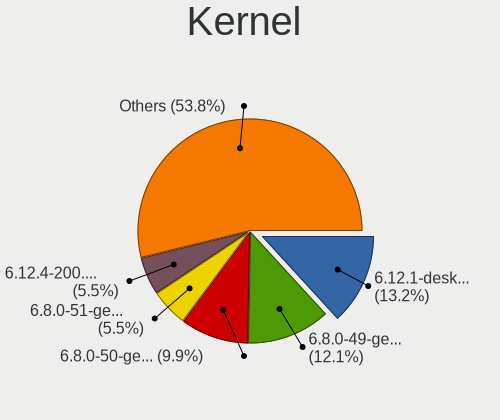
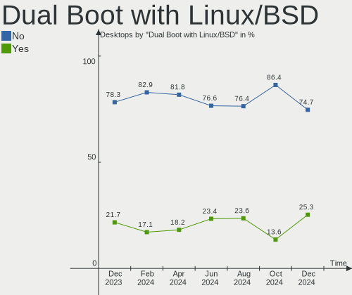
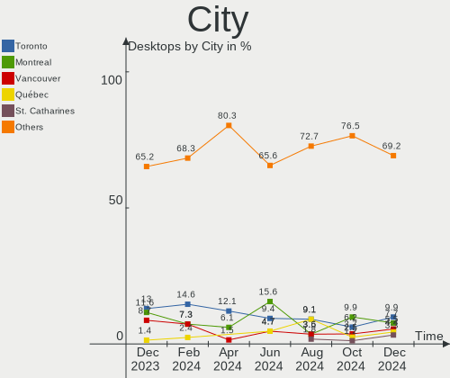
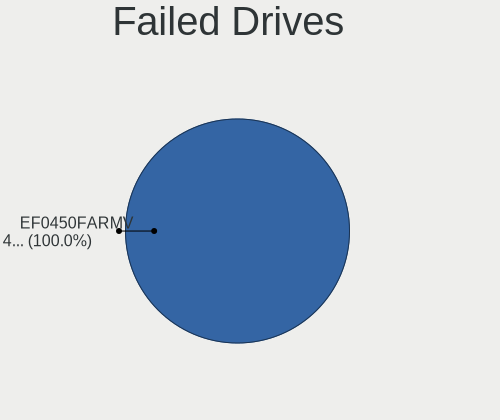
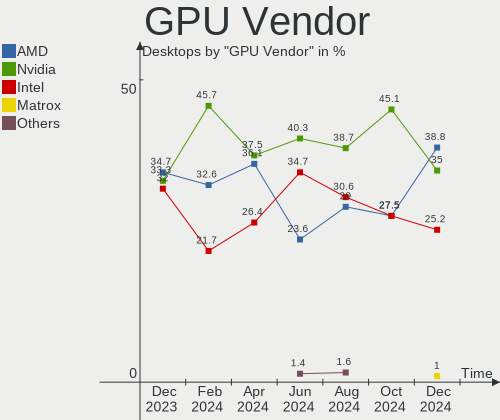
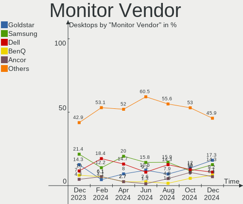
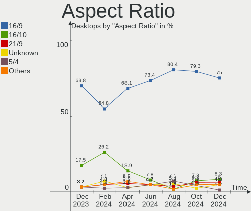
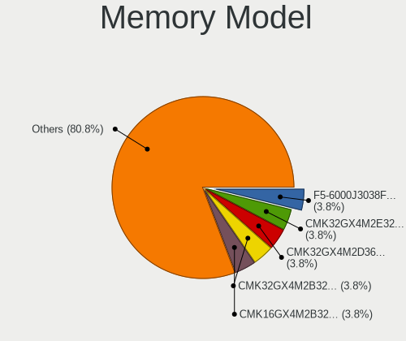

Linux in Canada - Hardware Trends (Desktops)
--------------------------------------------

A project to identify most popular hardware characteristics and track their change
over time based on data collected by Linux users at https://Linux-Hardware.org.

Anyone can contribute to this report by the [hw-probe](https://github.com/linuxhw/hw-probe) tool:

    sudo -E hw-probe -all -upload

Contents
--------

* [ System ](#system)
  - [ OS                       ](#os)
  - [ OS Family                ](#os-family)
  - [ Kernel                   ](#kernel)
  - [ Kernel Family            ](#kernel-family)
  - [ Kernel Major Ver.        ](#kernel-major-ver)
  - [ Arch                     ](#arch)
  - [ DE                       ](#de)
  - [ Display Server           ](#display-server)
  - [ Display Manager          ](#display-manager)
  - [ OS Lang                  ](#os-lang)
  - [ Boot Mode                ](#boot-mode)
  - [ Filesystem               ](#filesystem)
  - [ Part. scheme             ](#part-scheme)
  - [ Dual Boot with Linux/BSD ](#dual-boot-with-linuxbsd)
  - [ Dual Boot (Win)          ](#dual-boot-win)

* [ Board ](#board)
  - [ Vendor                   ](#vendor)
  - [ Model                    ](#model)
  - [ Model Family             ](#model-family)
  - [ MFG Year                 ](#mfg-year)
  - [ Form Factor              ](#form-factor)
  - [ Secure Boot              ](#secure-boot)
  - [ Coreboot                 ](#coreboot)
  - [ RAM Size                 ](#ram-size)
  - [ RAM Used                 ](#ram-used)
  - [ Total Drives             ](#total-drives)
  - [ Has CD-ROM               ](#has-cd-rom)
  - [ Has Ethernet             ](#has-ethernet)
  - [ Has WiFi                 ](#has-wifi)
  - [ Has Bluetooth            ](#has-bluetooth)

* [ Location ](#location)
  - [ Country                  ](#country)
  - [ City                     ](#city)

* [ Drives ](#drives)
  - [ Drive Vendor             ](#drive-vendor)
  - [ Drive Model              ](#drive-model)
  - [ HDD Vendor               ](#hdd-vendor)
  - [ SSD Vendor               ](#ssd-vendor)
  - [ Drive Kind               ](#drive-kind)
  - [ Drive Connector          ](#drive-connector)
  - [ Drive Size               ](#drive-size)
  - [ Space Total              ](#space-total)
  - [ Space Used               ](#space-used)
  - [ Malfunc. Drives          ](#malfunc-drives)
  - [ Malfunc. Drive Vendor    ](#malfunc-drive-vendor)
  - [ Malfunc. HDD Vendor      ](#malfunc-hdd-vendor)
  - [ Malfunc. Drive Kind      ](#malfunc-drive-kind)
  - [ Failed Drives            ](#failed-drives)
  - [ Failed Drive Vendor      ](#failed-drive-vendor)
  - [ Drive Status             ](#drive-status)

* [ Storage controller ](#storage-controller)
  - [ Storage Vendor           ](#storage-vendor)
  - [ Storage Model            ](#storage-model)
  - [ Storage Kind             ](#storage-kind)

* [ Processor ](#processor)
  - [ CPU Vendor               ](#cpu-vendor)
  - [ CPU Model                ](#cpu-model)
  - [ CPU Model Family         ](#cpu-model-family)
  - [ CPU Cores                ](#cpu-cores)
  - [ CPU Sockets              ](#cpu-sockets)
  - [ CPU Threads              ](#cpu-threads)
  - [ CPU Op-Modes             ](#cpu-op-modes)
  - [ CPU Microcode            ](#cpu-microcode)
  - [ CPU Microarch            ](#cpu-microarch)

* [ Graphics ](#graphics)
  - [ GPU Vendor               ](#gpu-vendor)
  - [ GPU Model                ](#gpu-model)
  - [ GPU Combo                ](#gpu-combo)
  - [ GPU Driver               ](#gpu-driver)
  - [ GPU Memory               ](#gpu-memory)

* [ Monitor ](#monitor)
  - [ Monitor Vendor           ](#monitor-vendor)
  - [ Monitor Model            ](#monitor-model)
  - [ Monitor Resolution       ](#monitor-resolution)
  - [ Monitor Diagonal         ](#monitor-diagonal)
  - [ Monitor Width            ](#monitor-width)
  - [ Aspect Ratio             ](#aspect-ratio)
  - [ Monitor Area             ](#monitor-area)
  - [ Pixel Density            ](#pixel-density)
  - [ Multiple Monitors        ](#multiple-monitors)

* [ Network ](#network)
  - [ Net Controller Vendor    ](#net-controller-vendor)
  - [ Net Controller Model     ](#net-controller-model)
  - [ Wireless Vendor          ](#wireless-vendor)
  - [ Wireless Model           ](#wireless-model)
  - [ Ethernet Vendor          ](#ethernet-vendor)
  - [ Ethernet Model           ](#ethernet-model)
  - [ Net Controller Kind      ](#net-controller-kind)
  - [ Used Controller          ](#used-controller)
  - [ NICs                     ](#nics)
  - [ IPv6                     ](#ipv6)

* [ Bluetooth ](#bluetooth)
  - [ Bluetooth Vendor         ](#bluetooth-vendor)
  - [ Bluetooth Model          ](#bluetooth-model)

* [ Sound ](#sound)
  - [ Sound Vendor             ](#sound-vendor)
  - [ Sound Model              ](#sound-model)

* [ Memory ](#memory)
  - [ Memory Vendor            ](#memory-vendor)
  - [ Memory Model             ](#memory-model)
  - [ Memory Kind              ](#memory-kind)
  - [ Memory Form Factor       ](#memory-form-factor)
  - [ Memory Size              ](#memory-size)
  - [ Memory Speed             ](#memory-speed)

* [ Printers & scanners ](#printers--scanners)
  - [ Printer Vendor           ](#printer-vendor)
  - [ Printer Model            ](#printer-model)
  - [ Scanner Vendor           ](#scanner-vendor)
  - [ Scanner Model            ](#scanner-model)

* [ Camera ](#camera)
  - [ Camera Vendor            ](#camera-vendor)
  - [ Camera Model             ](#camera-model)

* [ Security ](#security)
  - [ Fingerprint Vendor       ](#fingerprint-vendor)
  - [ Fingerprint Model        ](#fingerprint-model)
  - [ Chipcard Vendor          ](#chipcard-vendor)
  - [ Chipcard Model           ](#chipcard-model)

* [ Unsupported ](#unsupported)
  - [ Unsupported Devices      ](#unsupported-devices)
  - [ Unsupported Device Types ](#unsupported-device-types)

System
------

OS
--

Installed operating systems

| Name                         | Desktops | Percent |
|------------------------------|----------|---------|
| Ubuntu 20.04                 | 14       | 15.38%  |
| Ubuntu 21.10                 | 8        | 8.79%   |
| Fedora 35                    | 7        | 7.69%   |
| Linux Mint 20.3              | 6        | 6.59%   |
| Zorin 16                     | 5        | 5.49%   |
| Ubuntu 22.04                 | 5        | 5.49%   |
| Pop!_OS 21.10                | 5        | 5.49%   |
| OpenMandriva 4.3             | 5        | 5.49%   |
| KDE neon 20.04               | 4        | 4.4%    |
| Manjaro 21.2.5               | 3        | 3.3%    |
| Ubuntu 18.04                 | 2        | 2.2%    |
| Pop!_OS 22.04                | 2        | 2.2%    |
| Manjaro                      | 2        | 2.2%    |
| ArcoLinux Rolling            | 2        | 2.2%    |
| Arch Rolling                 | 2        | 2.2%    |
| Xubuntu 20.04                | 1        | 1.1%    |
| Ubuntu MATE 22.04            | 1        | 1.1%    |
| Ubuntu 16.04                 | 1        | 1.1%    |
| Solus 4.3                    | 1        | 1.1%    |
| Slackware 15.0               | 1        | 1.1%    |
| Pop!_OS 20.04                | 1        | 1.1%    |
| openSUSE Tumbleweed-20220413 | 1        | 1.1%    |
| NixOS 21.11                  | 1        | 1.1%    |
| MX 19                        | 1        | 1.1%    |
| Lubuntu 21.10                | 1        | 1.1%    |
| Lubuntu 21.04                | 1        | 1.1%    |
| Linux Mint 20.1              | 1        | 1.1%    |
| Kubuntu 21.10                | 1        | 1.1%    |
| Gentoo 2.8                   | 1        | 1.1%    |
| Fedora 34                    | 1        | 1.1%    |
| EndeavourOS Rolling          | 1        | 1.1%    |
| Elementary 6.1               | 1        | 1.1%    |
| Debian Testing               | 1        | 1.1%    |
| Debian 11                    | 1        | 1.1%    |

OS Family
---------

OS without a version

| Name         | Desktops | Percent |
|--------------|----------|---------|
| Ubuntu       | 30       | 32.97%  |
| Pop!_OS      | 8        | 8.79%   |
| Fedora       | 8        | 8.79%   |
| Linux Mint   | 7        | 7.69%   |
| Zorin        | 5        | 5.49%   |
| OpenMandriva | 5        | 5.49%   |
| Manjaro      | 5        | 5.49%   |
| KDE neon     | 4        | 4.4%    |
| Lubuntu      | 2        | 2.2%    |
| Debian       | 2        | 2.2%    |
| ArcoLinux    | 2        | 2.2%    |
| Arch         | 2        | 2.2%    |
| Xubuntu      | 1        | 1.1%    |
| Ubuntu MATE  | 1        | 1.1%    |
| Solus        | 1        | 1.1%    |
| Slackware    | 1        | 1.1%    |
| openSUSE     | 1        | 1.1%    |
| NixOS        | 1        | 1.1%    |
| MX           | 1        | 1.1%    |
| Kubuntu      | 1        | 1.1%    |
| Gentoo       | 1        | 1.1%    |
| EndeavourOS  | 1        | 1.1%    |
| Elementary   | 1        | 1.1%    |

Kernel
------

Version of the Linux kernel

| Version                  | Desktops | Percent |
|--------------------------|----------|---------|
| 5.13.0-39-generic        | 21       | 23.08%  |
| 5.4.0-107-generic        | 9        | 9.89%   |
| 5.16.7-desktop-1omv4003  | 5        | 5.49%   |
| 5.16.18-200.fc35.x86_64  | 4        | 4.4%    |
| 5.4.0-109-generic        | 3        | 3.3%    |
| 5.16.19-76051619-generic | 3        | 3.3%    |
| 5.15.0-25-generic        | 3        | 3.3%    |
| 5.17.1-arch1-1           | 2        | 2.2%    |
| 5.16.15-76051615-generic | 2        | 2.2%    |
| 5.16.11-76051611-generic | 2        | 2.2%    |
| 5.15.0-27-generic        | 2        | 2.2%    |
| 5.13.0-40-generic        | 2        | 2.2%    |
| 5.13.0-37-generic        | 2        | 2.2%    |
| 5.10.105-1-MANJARO       | 2        | 2.2%    |
| 5.4.0-97-generic         | 1        | 1.1%    |
| 5.17.4-arch1-1           | 1        | 1.1%    |
| 5.17.4-200.fc35.x86_64   | 1        | 1.1%    |
| 5.17.2-1-default         | 1        | 1.1%    |
| 5.17.1-zen1-1-zen        | 1        | 1.1%    |
| 5.17.1-051701-generic    | 1        | 1.1%    |
| 5.17.0-1003-oem          | 1        | 1.1%    |
| 5.16.20-200.fc35.x86_64  | 1        | 1.1%    |
| 5.16.2-2-rt19-MANJARO    | 1        | 1.1%    |
| 5.16.19-200.fc35.x86_64  | 1        | 1.1%    |
| 5.16.18                  | 1        | 1.1%    |
| 5.16.0-6-amd64           | 1        | 1.1%    |
| 5.16.0-0.bpo.4-amd64     | 1        | 1.1%    |
| 5.15.32-213.current      | 1        | 1.1%    |
| 5.15.15-76051515-generic | 1        | 1.1%    |
| 5.15.10-arch1-1          | 1        | 1.1%    |
| 5.14.9-200.fc34.x86_64   | 1        | 1.1%    |
| 5.14.21-2-MANJARO        | 1        | 1.1%    |
| 5.14.13-gentoo           | 1        | 1.1%    |
| 5.13.19-2-MANJARO        | 1        | 1.1%    |
| 5.13.0-35-generic        | 1        | 1.1%    |
| 5.13.0-30-generic        | 1        | 1.1%    |
| 5.13.0-19-generic        | 1        | 1.1%    |
| 5.11.0-49-generic        | 1        | 1.1%    |
| 5.11.0-27-generic        | 1        | 1.1%    |
| 5.10.96                  | 1        | 1.1%    |
| 4.19.0-20-amd64          | 1        | 1.1%    |
| 4.15.0-175-generic       | 1        | 1.1%    |
| 4.15.0-142-generic       | 1        | 1.1%    |

Kernel Family
-------------

Linux kernel without a distro release

| Version  | Desktops | Percent |
|----------|----------|---------|
| 5.13.0   | 28       | 30.77%  |
| 5.4.0    | 13       | 14.29%  |
| 5.16.7   | 5        | 5.49%   |
| 5.16.18  | 5        | 5.49%   |
| 5.15.0   | 5        | 5.49%   |
| 5.17.1   | 4        | 4.4%    |
| 5.16.19  | 4        | 4.4%    |
| 5.17.4   | 2        | 2.2%    |
| 5.16.15  | 2        | 2.2%    |
| 5.16.11  | 2        | 2.2%    |
| 5.16.0   | 2        | 2.2%    |
| 5.11.0   | 2        | 2.2%    |
| 5.10.105 | 2        | 2.2%    |
| 4.15.0   | 2        | 2.2%    |
| 5.17.2   | 1        | 1.1%    |
| 5.17.0   | 1        | 1.1%    |
| 5.16.20  | 1        | 1.1%    |
| 5.16.2   | 1        | 1.1%    |
| 5.15.32  | 1        | 1.1%    |
| 5.15.15  | 1        | 1.1%    |
| 5.15.10  | 1        | 1.1%    |
| 5.14.9   | 1        | 1.1%    |
| 5.14.21  | 1        | 1.1%    |
| 5.14.13  | 1        | 1.1%    |
| 5.13.19  | 1        | 1.1%    |
| 5.10.96  | 1        | 1.1%    |
| 4.19.0   | 1        | 1.1%    |

Kernel Major Ver.
-----------------

Linux kernel major version

| Version | Desktops | Percent |
|---------|----------|---------|
| 5.13    | 29       | 31.87%  |
| 5.16    | 22       | 24.18%  |
| 5.4     | 13       | 14.29%  |
| 5.17    | 8        | 8.79%   |
| 5.15    | 8        | 8.79%   |
| 5.14    | 3        | 3.3%    |
| 5.10    | 3        | 3.3%    |
| 5.11    | 2        | 2.2%    |
| 4.15    | 2        | 2.2%    |
| 4.19    | 1        | 1.1%    |

Arch
----

OS architecture (x86_64, i586, etc.)

| Name   | Desktops | Percent |
|--------|----------|---------|
| x86_64 | 90       | 98.9%   |
| i686   | 1        | 1.1%    |

DE
--

Desktop Environment

| Name       | Desktops | Percent |
|------------|----------|---------|
| GNOME      | 42       | 46.15%  |
| KDE5       | 19       | 20.88%  |
| XFCE       | 7        | 7.69%   |
| Unknown    | 6        | 6.59%   |
| MATE       | 5        | 5.49%   |
| X-Cinnamon | 3        | 3.3%    |
| Unity      | 3        | 3.3%    |
| LXQt       | 2        | 2.2%    |
| Pantheon   | 1        | 1.1%    |
| kde        | 1        | 1.1%    |
| DWM        | 1        | 1.1%    |
| Budgie     | 1        | 1.1%    |

Display Server
--------------

X11 or Wayland

| Name    | Desktops | Percent |
|---------|----------|---------|
| X11     | 72       | 79.12%  |
| Wayland | 13       | 14.29%  |
| Tty     | 3        | 3.3%    |
| Unknown | 3        | 3.3%    |

Display Manager
---------------

SDDM, LightDM, etc.

| Name    | Desktops | Percent |
|---------|----------|---------|
| Unknown | 30       | 32.97%  |
| GDM     | 21       | 23.08%  |
| LightDM | 17       | 18.68%  |
| SDDM    | 13       | 14.29%  |
| GDM3    | 10       | 10.99%  |

OS Lang
-------

Language

| Lang    | Desktops | Percent |
|---------|----------|---------|
| en_CA   | 56       | 61.54%  |
| en_US   | 22       | 24.18%  |
| fr_CA   | 7        | 7.69%   |
| Unknown | 5        | 5.49%   |
| C       | 1        | 1.1%    |

Boot Mode
---------

EFI or BIOS

| Mode | Desktops | Percent |
|------|----------|---------|
| EFI  | 52       | 57.14%  |
| BIOS | 39       | 42.86%  |

Filesystem
----------

Type of filesystem

| Type    | Desktops | Percent |
|---------|----------|---------|
| Ext4    | 71       | 78.02%  |
| Btrfs   | 8        | 8.79%   |
| Overlay | 7        | 7.69%   |
| Zfs     | 2        | 2.2%    |
| XXX4    | 1        | 1.1%    |
| Ext3    | 1        | 1.1%    |
| Unknown | 1        | 1.1%    |

Part. scheme
------------

Scheme of partitioning

| Type    | Desktops | Percent |
|---------|----------|---------|
| GPT     | 42       | 46.15%  |
| Unknown | 36       | 39.56%  |
| MBR     | 13       | 14.29%  |

Dual Boot with Linux/BSD
------------------------

Hosting more than one Linux/BSD

| Dual boot | Desktops | Percent |
|-----------|----------|---------|
| No        | 82       | 90.11%  |
| Yes       | 9        | 9.89%   |

Dual Boot (Win)
---------------

Hosting Linux and Windows

| Dual boot | Desktops | Percent |
|-----------|----------|---------|
| No        | 66       | 72.53%  |
| Yes       | 25       | 27.47%  |

Board
-----

Vendor
------

Motherboard manufacturer

| Name                | Desktops | Percent |
|---------------------|----------|---------|
| ASUSTek Computer    | 31       | 34.07%  |
| MSI                 | 14       | 15.38%  |
| Gigabyte Technology | 10       | 10.99%  |
| Dell                | 10       | 10.99%  |
| Hewlett-Packard     | 7        | 7.69%   |
| Lenovo              | 5        | 5.49%   |
| ASRock              | 5        | 5.49%   |
| Acer                | 3        | 3.3%    |
| Apple               | 2        | 2.2%    |
| Unknown             | 2        | 2.2%    |
| Gateway             | 1        | 1.1%    |
| Alienware           | 1        | 1.1%    |

Model
-----

Motherboard model

| Name                               | Desktops | Percent |
|------------------------------------|----------|---------|
| ASUS All Series                    | 3        | 3.3%    |
| MSI MS-7C37                        | 2        | 2.2%    |
| MSI MS-7A38                        | 2        | 2.2%    |
| Dell OptiPlex 790                  | 2        | 2.2%    |
| ASUS TUF Gaming X570-PLUS          | 2        | 2.2%    |
| ASUS P5GC-MX                       | 2        | 2.2%    |
| Unknown                            | 2        | 2.2%    |
| MSI MS-7D41                        | 1        | 1.1%    |
| MSI MS-7D32                        | 1        | 1.1%    |
| MSI MS-7C91                        | 1        | 1.1%    |
| MSI MS-7C56                        | 1        | 1.1%    |
| MSI MS-7C02                        | 1        | 1.1%    |
| MSI MS-7B85                        | 1        | 1.1%    |
| MSI MS-7B79                        | 1        | 1.1%    |
| MSI MS-7760                        | 1        | 1.1%    |
| MSI MS-7751                        | 1        | 1.1%    |
| MSI MS-7693                        | 1        | 1.1%    |
| Lenovo ThinkStation XXXX 415852U   | 1        | 1.1%    |
| Lenovo ThinkCentre M93p 10AAS02P07 | 1        | 1.1%    |
| Lenovo ThinkCentre M90p 5536A76    | 1        | 1.1%    |
| Lenovo ThinkCentre M83 10ANS05500  | 1        | 1.1%    |
| Lenovo ThinkCentre M58p 7484ANU    | 1        | 1.1%    |
| HP ProDesk 600 G3 SFF              | 1        | 1.1%    |
| HP Pavilion 590-p0049 3LC38AA      | 1        | 1.1%    |
| HP EliteDesk 800 G1 USDT           | 1        | 1.1%    |
| HP EliteDesk 800 G1 SFF            | 1        | 1.1%    |
| HP Compaq Elite 8300 SFF           | 1        | 1.1%    |
| HP Compaq dc5800 Small Form Factor | 1        | 1.1%    |
| HP Compaq 8200 Elite SFF PC        | 1        | 1.1%    |
| Gigabyte Z97X-UD5H                 | 1        | 1.1%    |
| Gigabyte Q77M-XG                   | 1        | 1.1%    |
| Gigabyte H97M-D3H                  | 1        | 1.1%    |
| Gigabyte H270N-WIFI                | 1        | 1.1%    |
| Gigabyte GA-880GM-UD2H             | 1        | 1.1%    |
| Gigabyte B85M-D3H                  | 1        | 1.1%    |
| Gigabyte B450 I AORUS PRO WIFI     | 1        | 1.1%    |
| Gigabyte B450 AORUS ELITE          | 1        | 1.1%    |
| Gigabyte B365M GAMING HD           | 1        | 1.1%    |
| Gigabyte AB350M-DS3H               | 1        | 1.1%    |
| Gateway SX2185                     | 1        | 1.1%    |
| Dell Vostro 320                    | 1        | 1.1%    |
| Dell Precision Tower 5810          | 1        | 1.1%    |
| Dell Precision 5820 Tower          | 1        | 1.1%    |
| Dell OptiPlex 990                  | 1        | 1.1%    |
| Dell OptiPlex 9020                 | 1        | 1.1%    |
| Dell OptiPlex 3010                 | 1        | 1.1%    |
| Dell Inspiron 3656                 | 1        | 1.1%    |
| Dell DM051                         | 1        | 1.1%    |
| ASUS TUF Gaming X570-PRO           | 1        | 1.1%    |
| ASUS TUF B450M-PLUS GAMING         | 1        | 1.1%    |
| ASUS TUF B450-PLUS GAMING          | 1        | 1.1%    |
| ASUS SABERTOOTH Z170 S             | 1        | 1.1%    |
| ASUS ROG STRIX B550-I GAMING       | 1        | 1.1%    |
| ASUS ROG STRIX B550-F GAMING       | 1        | 1.1%    |
| ASUS ROG CROSSHAIR VIII DARK HERO  | 1        | 1.1%    |
| ASUS PRIME Z690-P WIFI D4          | 1        | 1.1%    |
| ASUS PRIME Z590M-PLUS              | 1        | 1.1%    |
| ASUS PRIME Z390-A                  | 1        | 1.1%    |
| ASUS PRIME Z370-P                  | 1        | 1.1%    |
| ASUS PRIME H570M-PLUS              | 1        | 1.1%    |

Model Family
------------

Motherboard model prefix

| Name                   | Desktops | Percent |
|------------------------|----------|---------|
| ASUS PRIME             | 8        | 8.79%   |
| Dell OptiPlex          | 5        | 5.49%   |
| ASUS TUF               | 5        | 5.49%   |
| Lenovo ThinkCentre     | 4        | 4.4%    |
| HP Compaq              | 3        | 3.3%    |
| ASUS ROG               | 3        | 3.3%    |
| ASUS All               | 3        | 3.3%    |
| MSI MS-7C37            | 2        | 2.2%    |
| MSI MS-7A38            | 2        | 2.2%    |
| HP EliteDesk           | 2        | 2.2%    |
| Gigabyte B450          | 2        | 2.2%    |
| Dell Precision         | 2        | 2.2%    |
| ASUS P5GC-MX           | 2        | 2.2%    |
| ASUS CROSSHAIR         | 2        | 2.2%    |
| Unknown                | 2        | 2.2%    |
| MSI MS-7D41            | 1        | 1.1%    |
| MSI MS-7D32            | 1        | 1.1%    |
| MSI MS-7C91            | 1        | 1.1%    |
| MSI MS-7C56            | 1        | 1.1%    |
| MSI MS-7C02            | 1        | 1.1%    |
| MSI MS-7B85            | 1        | 1.1%    |
| MSI MS-7B79            | 1        | 1.1%    |
| MSI MS-7760            | 1        | 1.1%    |
| MSI MS-7751            | 1        | 1.1%    |
| MSI MS-7693            | 1        | 1.1%    |
| Lenovo ThinkStation    | 1        | 1.1%    |
| HP ProDesk             | 1        | 1.1%    |
| HP Pavilion            | 1        | 1.1%    |
| Gigabyte Z97X-UD5H     | 1        | 1.1%    |
| Gigabyte Q77M-XG       | 1        | 1.1%    |
| Gigabyte H97M-D3H      | 1        | 1.1%    |
| Gigabyte H270N-WIFI    | 1        | 1.1%    |
| Gigabyte GA-880GM-UD2H | 1        | 1.1%    |
| Gigabyte B85M-D3H      | 1        | 1.1%    |
| Gigabyte B365M         | 1        | 1.1%    |
| Gigabyte AB350M-DS3H   | 1        | 1.1%    |
| Gateway SX2185         | 1        | 1.1%    |
| Dell Vostro            | 1        | 1.1%    |
| Dell Inspiron          | 1        | 1.1%    |
| Dell DM051             | 1        | 1.1%    |
| ASUS SABERTOOTH        | 1        | 1.1%    |
| ASUS P8Z77-V           | 1        | 1.1%    |
| ASUS M5A97             | 1        | 1.1%    |
| ASUS M51BC             | 1        | 1.1%    |
| ASUS M4A785-M          | 1        | 1.1%    |
| ASUS GZ727AA-A2L       | 1        | 1.1%    |
| ASUS A55M-E            | 1        | 1.1%    |
| ASUS 970               | 1        | 1.1%    |
| ASRock Z68             | 1        | 1.1%    |
| ASRock Z390            | 1        | 1.1%    |
| ASRock Z270            | 1        | 1.1%    |
| ASRock X570M           | 1        | 1.1%    |
| ASRock AB350           | 1        | 1.1%    |
| Apple MacPro5          | 1        | 1.1%    |
| Apple MacPro3          | 1        | 1.1%    |
| Alienware Aurora       | 1        | 1.1%    |
| Acer Veriton           | 1        | 1.1%    |
| Acer Nitro             | 1        | 1.1%    |
| Acer Aspire            | 1        | 1.1%    |

MFG Year
--------

Motherboard manufacture year

| Year    | Desktops | Percent |
|---------|----------|---------|
| 2013    | 11       | 12.09%  |
| 2020    | 10       | 10.99%  |
| 2019    | 10       | 10.99%  |
| 2018    | 9        | 9.89%   |
| 2021    | 8        | 8.79%   |
| 2014    | 8        | 8.79%   |
| 2017    | 5        | 5.49%   |
| 2012    | 5        | 5.49%   |
| 2011    | 5        | 5.49%   |
| 2016    | 4        | 4.4%    |
| 2010    | 4        | 4.4%    |
| 2009    | 3        | 3.3%    |
| 2007    | 3        | 3.3%    |
| 2015    | 2        | 2.2%    |
| 2008    | 2        | 2.2%    |
| 2006    | 1        | 1.1%    |
| Unknown | 1        | 1.1%    |

Form Factor
-----------

Physical design of the computer

| Name    | Desktops | Percent |
|---------|----------|---------|
| Desktop | 91       | 100%    |

Secure Boot
-----------

Enabled or disabled

| State    | Desktops | Percent |
|----------|----------|---------|
| Disabled | 88       | 96.7%   |
| Enabled  | 3        | 3.3%    |

Coreboot
--------

Have coreboot on board

| Used | Desktops | Percent |
|------|----------|---------|
| No   | 91       | 100%    |

RAM Size
--------

Total RAM memory

| Size in GB  | Desktops | Percent |
|-------------|----------|---------|
| 32.01-64.0  | 26       | 28.57%  |
| 16.01-24.0  | 22       | 24.18%  |
| 4.01-8.0    | 12       | 13.19%  |
| 3.01-4.0    | 8        | 8.79%   |
| 8.01-16.0   | 8        | 8.79%   |
| 64.01-256.0 | 6        | 6.59%   |
| 24.01-32.0  | 4        | 4.4%    |
| 1.01-2.0    | 3        | 3.3%    |
| 2.01-3.0    | 1        | 1.1%    |
| Unknown     | 1        | 1.1%    |

RAM Used
--------

Used RAM memory

| Used GB    | Desktops | Percent |
|------------|----------|---------|
| 1.01-2.0   | 27       | 29.67%  |
| 4.01-8.0   | 23       | 25.27%  |
| 2.01-3.0   | 15       | 16.48%  |
| 3.01-4.0   | 9        | 9.89%   |
| 8.01-16.0  | 9        | 9.89%   |
| 0.51-1.0   | 4        | 4.4%    |
| 32.01-64.0 | 2        | 2.2%    |
| 24.01-32.0 | 1        | 1.1%    |
| Unknown    | 1        | 1.1%    |

Total Drives
------------

Number of drives on board

| Drives | Desktops | Percent |
|--------|----------|---------|
| 1      | 36       | 39.56%  |
| 2      | 17       | 18.68%  |
| 3      | 14       | 15.38%  |
| 4      | 8        | 8.79%   |
| 5      | 5        | 5.49%   |
| 0      | 4        | 4.4%    |
| 8      | 3        | 3.3%    |
| 6      | 2        | 2.2%    |
| 10     | 1        | 1.1%    |
| 7      | 1        | 1.1%    |

Has CD-ROM
----------

Has CD-ROM on board

| Presented | Desktops | Percent |
|-----------|----------|---------|
| No        | 55       | 60.44%  |
| Yes       | 36       | 39.56%  |

Has Ethernet
------------

Has Ethernet on board

| Presented | Desktops | Percent |
|-----------|----------|---------|
| Yes       | 89       | 97.8%   |
| No        | 2        | 2.2%    |

Has WiFi
--------

Has WiFi module

| Presented | Desktops | Percent |
|-----------|----------|---------|
| No        | 51       | 56.04%  |
| Yes       | 40       | 43.96%  |

Has Bluetooth
-------------

Has Bluetooth module

| Presented | Desktops | Percent |
|-----------|----------|---------|
| No        | 54       | 59.34%  |
| Yes       | 37       | 40.66%  |

Location
--------

Country
-------

Geographic location (country)

| Country | Desktops | Percent |
|---------|----------|---------|
| Canada  | 91       | 100%    |

City
----

Geographic location (city)

| City            | Desktops | Percent |
|-----------------|----------|---------|
| Toronto         | 18       | 19.78%  |
| Edmonton        | 6        | 6.59%   |
| Ottawa          | 4        | 4.4%    |
| Vancouver       | 3        | 3.3%    |
| Surrey          | 3        | 3.3%    |
| Calgary         | 3        | 3.3%    |
| Terrebonne      | 2        | 2.2%    |
| Oshawa          | 2        | 2.2%    |
| Oakville        | 2        | 2.2%    |
| Montreal        | 2        | 2.2%    |
| Laval           | 2        | 2.2%    |
| Halifax         | 2        | 2.2%    |
| Brampton        | 2        | 2.2%    |
| Winnipeg        | 1        | 1.1%    |
| Vulcan          | 1        | 1.1%    |
| Trois-Rivières | 1        | 1.1%    |
| Terrace         | 1        | 1.1%    |
| Spruce Grove    | 1        | 1.1%    |
| Sooke           | 1        | 1.1%    |
| Saint John      | 1        | 1.1%    |
| Ross            | 1        | 1.1%    |
| Richmond        | 1        | 1.1%    |
| Regina          | 1        | 1.1%    |
| Rawdon          | 1        | 1.1%    |
| Québec         | 1        | 1.1%    |
| Prince Rupert   | 1        | 1.1%    |
| Prince George   | 1        | 1.1%    |
| North Vancouver | 1        | 1.1%    |
| North Bay       | 1        | 1.1%    |
| Niagara Falls   | 1        | 1.1%    |
| Nackawic        | 1        | 1.1%    |
| Miramichi       | 1        | 1.1%    |
| Levis           | 1        | 1.1%    |
| Lethbridge      | 1        | 1.1%    |
| Langley         | 1        | 1.1%    |
| Kitchener       | 1        | 1.1%    |
| Kirkland        | 1        | 1.1%    |
| Greater Sudbury | 1        | 1.1%    |
| Gatineau        | 1        | 1.1%    |
| Fredericton     | 1        | 1.1%    |
| Fort St. John   | 1        | 1.1%    |
| Fort Frances    | 1        | 1.1%    |
| Didsbury        | 1        | 1.1%    |
| Deep River      | 1        | 1.1%    |
| Chilliwack      | 1        | 1.1%    |
| Chambly         | 1        | 1.1%    |
| Burnaby         | 1        | 1.1%    |
| Brooks          | 1        | 1.1%    |
| Bracebridge     | 1        | 1.1%    |
| Boucherville    | 1        | 1.1%    |
| Beloeil         | 1        | 1.1%    |
| Barrie          | 1        | 1.1%    |
| Baddeck         | 1        | 1.1%    |

Drives
------

Drive Vendor
------------

Hard drive vendors

| Vendor                | Desktops | Drives | Percent |
|-----------------------|----------|--------|---------|
| WDC                   | 42       | 66     | 25.93%  |
| Seagate               | 33       | 50     | 20.37%  |
| Samsung Electronics   | 26       | 35     | 16.05%  |
| A-DATA Technology     | 8        | 11     | 4.94%   |
| Crucial               | 7        | 8      | 4.32%   |
| Sandisk               | 6        | 6      | 3.7%    |
| Kingston              | 6        | 7      | 3.7%    |
| Hitachi               | 6        | 7      | 3.7%    |
| Toshiba               | 5        | 5      | 3.09%   |
| Micron Technology     | 4        | 4      | 2.47%   |
| Intel                 | 4        | 4      | 2.47%   |
| Unknown               | 2        | 4      | 1.23%   |
| SK Hynix              | 2        | 2      | 1.23%   |
| Value                 | 1        | 1      | 0.62%   |
| USB 3.0               | 1        | 1      | 0.62%   |
| SPCC                  | 1        | 1      | 0.62%   |
| Realtek Semiconductor | 1        | 1      | 0.62%   |
| PLEXTOR               | 1        | 1      | 0.62%   |
| Phison                | 1        | 1      | 0.62%   |
| LITEON                | 1        | 1      | 0.62%   |
| Galaird               | 1        | 1      | 0.62%   |
| DAS                   | 1        | 3      | 0.62%   |
| Corsair               | 1        | 1      | 0.62%   |
| ADATA Technology      | 1        | 1      | 0.62%   |

Drive Model
-----------

Hard drive models

| Model                            | Desktops | Percent |
|----------------------------------|----------|---------|
| Seagate ST2000DM001-1ER164 2TB   | 4        | 2%      |
| Samsung SSD 860 EVO 500GB        | 4        | 2%      |
| Seagate ST4000DM004-2CV104 4TB   | 3        | 1.5%    |
| Seagate ST2000DM008-2FR102 2TB   | 3        | 1.5%    |
| Samsung SSD 850 EVO 500GB        | 3        | 1.5%    |
| Samsung NVMe SSD Drive 250GB     | 3        | 1.5%    |
| Kingston SA400S37240G 240GB SSD  | 3        | 1.5%    |
| WDC WDS100T2B0C-00PXH0 1TB       | 2        | 1%      |
| WDC WD40EZRZ-00GXCB0 4TB         | 2        | 1%      |
| WDC WD40EZAZ-00SF3B0 4TB         | 2        | 1%      |
| WDC WD10EZEX-08WN4A0 1TB         | 2        | 1%      |
| WDC WD10EZEX-00BN5A0 1TB         | 2        | 1%      |
| WDC WD10EADS-00L5B1 1TB          | 2        | 1%      |
| Toshiba DT01ACA200 2TB           | 2        | 1%      |
| Seagate ST500DM002-1BD142 500GB  | 2        | 1%      |
| Seagate ST31000528AS 1TB         | 2        | 1%      |
| Seagate ST1000LM014-1EJ164 1TB   | 2        | 1%      |
| Seagate ST1000DM003-1ER162 1TB   | 2        | 1%      |
| Sandisk NVMe SSD Drive 500GB     | 2        | 1%      |
| Sandisk NVMe SSD Drive 1TB       | 2        | 1%      |
| Samsung SSD 870 QVO 2TB          | 2        | 1%      |
| Samsung SSD 870 EVO 500GB        | 2        | 1%      |
| Samsung SSD 860 EVO 1TB          | 2        | 1%      |
| Samsung PSSD T7 500GB            | 2        | 1%      |
| Samsung NVMe SSD Drive 1TB       | 2        | 1%      |
| A-DATA SU800 128GB SSD           | 2        | 1%      |
| A-DATA SU760 512GB SSD           | 2        | 1%      |
| WDC WDS500G2B0A-00SM50 500GB SSD | 1        | 0.5%    |
| WDC WDS250G1B0A-00H9H0 250GB SSD | 1        | 0.5%    |
| WDC WDS240G2G0B-00EPW0 240GB SSD | 1        | 0.5%    |
| WDC WDS200T2B0B-00YS70 2TB SSD   | 1        | 0.5%    |
| WDC WDS100T3X0C-00SJG0 1TB       | 1        | 0.5%    |
| WDC WDS100T2G0A-00JH30 1TB SSD   | 1        | 0.5%    |
| WDC WDS100T2B0A-00SM50 1TB SSD   | 1        | 0.5%    |
| WDC WDBNCE2500PNC 250GB SSD      | 1        | 0.5%    |
| WDC WD800JD-75MSA3 80GB          | 1        | 0.5%    |
| WDC WD800JD-22LSA0 80GB          | 1        | 0.5%    |
| WDC WD7502AAEX-00Y9A0 752GB      | 1        | 0.5%    |
| WDC WD740GD-00FLC0 74GB          | 1        | 0.5%    |
| WDC WD6401AALS-00L3B2 640GB      | 1        | 0.5%    |
| WDC WD6400AAKS-22A7B0 640GB      | 1        | 0.5%    |
| WDC WD60EFAX-68JH4N1 6TB         | 1        | 0.5%    |
| WDC WD5000AAKX-60U6AA0 500GB     | 1        | 0.5%    |
| WDC WD5000AAKS-22A7B0 500GB      | 1        | 0.5%    |
| WDC WD40EFZX-68AWUN0 4TB         | 1        | 0.5%    |
| WDC WD40EFRX-68N32N0 4TB         | 1        | 0.5%    |
| WDC WD4005FZBX-00K5WB0 4TB       | 1        | 0.5%    |
| WDC WD3200KS-75PFB0 320GB        | 1        | 0.5%    |
| WDC WD3200AAKS-00SBA0 320GB      | 1        | 0.5%    |
| WDC WD30EZRX-00MMMB0 3TB         | 1        | 0.5%    |
| WDC WD2500HHTZ-04N21V0 250GB     | 1        | 0.5%    |
| WDC WD2500AAKX-753CA1 250GB      | 1        | 0.5%    |
| WDC WD20EZRX-00D8PB0 2TB         | 1        | 0.5%    |
| WDC WD20EFRX-68EUZN0 2TB         | 1        | 0.5%    |
| WDC WD20EARX-00PASB0 2TB         | 1        | 0.5%    |
| WDC WD20EARS-60MVWB0 2TB         | 1        | 0.5%    |
| WDC WD20EARS-00MVWB0 2TB         | 1        | 0.5%    |
| WDC WD2003FZEX-00Z4SA0 2TB       | 1        | 0.5%    |
| WDC WD10EZEX-75ZF5A0 1TB         | 1        | 0.5%    |
| WDC WD10EZEX-75WN4A0 1TB         | 1        | 0.5%    |

HDD Vendor
----------

Hard disk drive vendors

| Vendor  | Desktops | Drives | Percent |
|---------|----------|--------|---------|
| WDC     | 34       | 56     | 43.04%  |
| Seagate | 33       | 49     | 41.77%  |
| Hitachi | 6        | 7      | 7.59%   |
| Toshiba | 4        | 4      | 5.06%   |
| USB 3.0 | 1        | 1      | 1.27%   |
| DAS     | 1        | 3      | 1.27%   |

SSD Vendor
----------

Solid state drive vendors

| Vendor              | Desktops | Drives | Percent |
|---------------------|----------|--------|---------|
| Samsung Electronics | 16       | 22     | 30.19%  |
| A-DATA Technology   | 8        | 10     | 15.09%  |
| WDC                 | 7        | 7      | 13.21%  |
| Crucial             | 6        | 7      | 11.32%  |
| Kingston            | 5        | 6      | 9.43%   |
| Intel               | 3        | 3      | 5.66%   |
| Micron Technology   | 2        | 2      | 3.77%   |
| Value               | 1        | 1      | 1.89%   |
| SPCC                | 1        | 1      | 1.89%   |
| SanDisk             | 1        | 1      | 1.89%   |
| PLEXTOR             | 1        | 1      | 1.89%   |
| LITEON              | 1        | 1      | 1.89%   |
| Corsair             | 1        | 1      | 1.89%   |

Drive Kind
----------

HDD or SSD

| Kind    | Desktops | Drives | Percent |
|---------|----------|--------|---------|
| HDD     | 60       | 120    | 43.48%  |
| SSD     | 46       | 63     | 33.33%  |
| NVMe    | 28       | 33     | 20.29%  |
| Unknown | 3        | 5      | 2.17%   |
| MMC     | 1        | 1      | 0.72%   |

Drive Connector
---------------

SATA, SAS, NVMe, etc.

| Type | Desktops | Drives | Percent |
|------|----------|--------|---------|
| SATA | 78       | 169    | 66.1%   |
| NVMe | 28       | 33     | 23.73%  |
| SAS  | 11       | 19     | 9.32%   |
| MMC  | 1        | 1      | 0.85%   |

Drive Size
----------

Size of hard drive

| Size in TB | Desktops | Drives | Percent |
|------------|----------|--------|---------|
| 0.01-0.5   | 48       | 61     | 39.34%  |
| 0.51-1.0   | 33       | 51     | 27.05%  |
| 1.01-2.0   | 22       | 37     | 18.03%  |
| 3.01-4.0   | 10       | 18     | 8.2%    |
| 4.01-10.0  | 6        | 11     | 4.92%   |
| 2.01-3.0   | 3        | 5      | 2.46%   |

Space Total
-----------

Amount of disk space available on the file system

| Size in GB     | Desktops | Percent |
|----------------|----------|---------|
| 101-250        | 20       | 21.98%  |
| More than 3000 | 19       | 20.88%  |
| 501-1000       | 12       | 13.19%  |
| 2001-3000      | 9        | 9.89%   |
| Unknown        | 8        | 8.79%   |
| 1001-2000      | 7        | 7.69%   |
| 251-500        | 6        | 6.59%   |
| 1-20           | 6        | 6.59%   |
| 21-50          | 2        | 2.2%    |
| 51-100         | 2        | 2.2%    |

Space Used
----------

Amount of used disk space

| Used GB        | Desktops | Percent |
|----------------|----------|---------|
| 1-20           | 23       | 25.27%  |
| 21-50          | 13       | 14.29%  |
| More than 3000 | 9        | 9.89%   |
| 101-250        | 9        | 9.89%   |
| 501-1000       | 9        | 9.89%   |
| 1001-2000      | 8        | 8.79%   |
| Unknown        | 8        | 8.79%   |
| 51-100         | 5        | 5.49%   |
| 251-500        | 4        | 4.4%    |
| 2001-3000      | 3        | 3.3%    |

Malfunc. Drives
---------------

Drive models with a malfunction

| Model                                        | Desktops | Drives | Percent |
|----------------------------------------------|----------|--------|---------|
| WDC WD800JD-22LSA0 80GB                      | 1        | 1      | 7.69%   |
| WDC WD10EZEX-00BN5A0 1TB                     | 1        | 1      | 7.69%   |
| WDC WD10EADS-00P8B0 1TB                      | 1        | 1      | 7.69%   |
| WDC WD10EADS-00L5B1 1TB                      | 1        | 1      | 7.69%   |
| Seagate ST500LT012-9WS142 500GB              | 1        | 1      | 7.69%   |
| Seagate ST500DM002-1BD142 500GB              | 1        | 1      | 7.69%   |
| Seagate ST1000DM003-1ER162 1TB               | 1        | 1      | 7.69%   |
| Samsung Electronics SSD 840 PRO Series 256GB | 1        | 1      | 7.69%   |
| Hitachi HUA723020ALA641 2TB                  | 1        | 1      | 7.69%   |
| Hitachi HDT725050VLA380 500GB                | 1        | 1      | 7.69%   |
| DAS TerraMaster 4TB                          | 1        | 3      | 7.69%   |
| Crucial CT240M500SSD1 240GB                  | 1        | 1      | 7.69%   |
| A-DATA Technology SU800 512GB SSD            | 1        | 1      | 7.69%   |

Malfunc. Drive Vendor
---------------------

Vendors of faulty drives

| Vendor              | Desktops | Drives | Percent |
|---------------------|----------|--------|---------|
| WDC                 | 4        | 4      | 30.77%  |
| Seagate             | 3        | 3      | 23.08%  |
| Hitachi             | 2        | 2      | 15.38%  |
| Samsung Electronics | 1        | 1      | 7.69%   |
| DAS                 | 1        | 3      | 7.69%   |
| Crucial             | 1        | 1      | 7.69%   |
| A-DATA Technology   | 1        | 1      | 7.69%   |

Malfunc. HDD Vendor
-------------------

Vendors of faulty HDD drives

| Vendor  | Desktops | Drives | Percent |
|---------|----------|--------|---------|
| WDC     | 4        | 4      | 40%     |
| Seagate | 3        | 3      | 30%     |
| Hitachi | 2        | 2      | 20%     |
| DAS     | 1        | 3      | 10%     |

Malfunc. Drive Kind
-------------------

Kinds of faulty drives

| Kind | Desktops | Drives | Percent |
|------|----------|--------|---------|
| HDD  | 8        | 12     | 72.73%  |
| SSD  | 3        | 3      | 27.27%  |

Failed Drives
-------------

Failed drive models

| Model                      | Desktops | Drives | Percent |
|----------------------------|----------|--------|---------|
| Intel SSDSA1M160G2HP 160GB | 1        | 1      | 100%    |

Failed Drive Vendor
-------------------

Failed drive vendors

| Vendor | Desktops | Drives | Percent |
|--------|----------|--------|---------|
| Intel  | 1        | 1      | 100%    |

Drive Status
------------

Number of failed and malfunc. drives

| Status   | Desktops | Drives | Percent |
|----------|----------|--------|---------|
| Detected | 44       | 109    | 44%     |
| Works    | 44       | 97     | 44%     |
| Malfunc  | 11       | 15     | 11%     |
| Failed   | 1        | 1      | 1%      |

Storage controller
------------------

Storage Vendor
--------------

Storage controller vendors

| Vendor                       | Desktops | Percent |
|------------------------------|----------|---------|
| Intel                        | 54       | 39.42%  |
| AMD                          | 35       | 25.55%  |
| Samsung Electronics          | 12       | 8.76%   |
| Sandisk                      | 8        | 5.84%   |
| ASMedia Technology           | 8        | 5.84%   |
| Marvell Technology Group     | 3        | 2.19%   |
| SK Hynix                     | 2        | 1.46%   |
| Nvidia                       | 2        | 1.46%   |
| Micron Technology            | 2        | 1.46%   |
| LSI Logic / Symbios Logic    | 2        | 1.46%   |
| ADATA Technology             | 2        | 1.46%   |
| Toshiba America Info Systems | 1        | 0.73%   |
| Realtek Semiconductor        | 1        | 0.73%   |
| Phison Electronics           | 1        | 0.73%   |
| Micron/Crucial Technology    | 1        | 0.73%   |
| Kingston Technology Company  | 1        | 0.73%   |
| Broadcom / LSI               | 1        | 0.73%   |
| Apple                        | 1        | 0.73%   |

Storage Model
-------------

Storage controller models

| Model                                                                          | Desktops | Percent |
|--------------------------------------------------------------------------------|----------|---------|
| AMD FCH SATA Controller [AHCI mode]                                            | 20       | 12.2%   |
| AMD 400 Series Chipset SATA Controller                                         | 10       | 6.1%    |
| ASMedia ASM1062 Serial ATA Controller                                          | 7        | 4.27%   |
| Intel 8 Series/C220 Series Chipset Family 6-port SATA Controller 1 [AHCI mode] | 6        | 3.66%   |
| Intel 200 Series PCH SATA controller [AHCI mode]                               | 6        | 3.66%   |
| Samsung NVMe SSD Controller SM981/PM981/PM983                                  | 5        | 3.05%   |
| AMD SB7x0/SB8x0/SB9x0 SATA Controller [AHCI mode]                              | 5        | 3.05%   |
| AMD 500 Series Chipset SATA Controller                                         | 5        | 3.05%   |
| Intel NM10/ICH7 Family SATA Controller [IDE mode]                              | 4        | 2.44%   |
| Intel 9 Series Chipset Family SATA Controller [AHCI Mode]                      | 4        | 2.44%   |
| Intel 7 Series/C210 Series Chipset Family 6-port SATA Controller [AHCI mode]   | 4        | 2.44%   |
| Intel 6 Series/C200 Series Chipset Family 6 port Desktop SATA AHCI Controller  | 4        | 2.44%   |
| Sandisk WD Blue SN550 NVMe SSD                                                 | 3        | 1.83%   |
| Samsung NVMe SSD Controller SM961/PM961/SM963                                  | 3        | 1.83%   |
| Intel Cannon Lake PCH SATA AHCI Controller                                     | 3        | 1.83%   |
| Intel Alder Lake-S PCH SATA Controller [AHCI Mode]                             | 3        | 1.83%   |
| Intel 82801G (ICH7 Family) IDE Controller                                      | 3        | 1.83%   |
| Intel 500 Series Chipset Family SATA AHCI Controller                           | 3        | 1.83%   |
| Sandisk WD Black SN750 / PC SN730 NVMe SSD                                     | 2        | 1.22%   |
| Samsung NVMe SSD Controller PM9A1/PM9A3/980PRO                                 | 2        | 1.22%   |
| Samsung NVMe SSD Controller 980                                                | 2        | 1.22%   |
| Micron Non-Volatile memory controller                                          | 2        | 1.22%   |
| LSI Logic / Symbios Logic SAS2008 PCI-Express Fusion-MPT SAS-2 [Falcon]        | 2        | 1.22%   |
| Intel Volume Management Device NVMe RAID Controller                            | 2        | 1.22%   |
| Intel SATA Controller [RAID mode]                                              | 2        | 1.22%   |
| Intel 82801JI (ICH10 Family) SATA AHCI Controller                              | 2        | 1.22%   |
| AMD SB7x0/SB8x0/SB9x0 IDE Controller                                           | 2        | 1.22%   |
| AMD 300 Series Chipset SATA Controller                                         | 2        | 1.22%   |
| Toshiba America Info Systems BG3 NVMe SSD Controller                           | 1        | 0.61%   |
| SK Hynix Gold P31 SSD                                                          | 1        | 0.61%   |
| SK Hynix BC501 NVMe Solid State Drive                                          | 1        | 0.61%   |
| Sandisk WD PC SN810 / Black SN850 NVMe SSD                                     | 1        | 0.61%   |
| Sandisk WD Blue SN500 / PC SN520 NVMe SSD                                      | 1        | 0.61%   |
| Sandisk Non-Volatile memory controller                                         | 1        | 0.61%   |
| Realtek RTS5763DL NVMe SSD Controller                                          | 1        | 0.61%   |
| Phison E12 NVMe Controller                                                     | 1        | 0.61%   |
| Nvidia MCP78S [GeForce 8200] SATA Controller (non-AHCI mode)                   | 1        | 0.61%   |
| Nvidia MCP78S [GeForce 8200] IDE                                               | 1        | 0.61%   |
| Nvidia MCP61 SATA Controller                                                   | 1        | 0.61%   |
| Nvidia MCP61 IDE                                                               | 1        | 0.61%   |
| Micron/Crucial P1 NVMe PCIe SSD                                                | 1        | 0.61%   |
| Marvell Group MV64460/64461/64462 System Controller, Revision B                | 1        | 0.61%   |
| Marvell Group 88SE9172 SATA 6Gb/s Controller                                   | 1        | 0.61%   |
| Marvell Group 88SE912x SATA 6Gb/s Controller [IDE mode]                        | 1        | 0.61%   |
| Marvell Group 88SE912x IDE Controller                                          | 1        | 0.61%   |
| Marvell Group 88SE9123 PCIe SATA 6.0 Gb/s controller                           | 1        | 0.61%   |
| Kingston Company A2000 NVMe SSD                                                | 1        | 0.61%   |
| Intel SSD 660P Series                                                          | 1        | 0.61%   |
| Intel Q170/Q150/B150/H170/H110/Z170/CM236 Chipset SATA Controller [AHCI Mode]  | 1        | 0.61%   |
| Intel Comet Lake SATA AHCI Controller                                          | 1        | 0.61%   |
| Intel Comet Lake PCH-H RAID                                                    | 1        | 0.61%   |
| Intel Celeron N3350/Pentium N4200/Atom E3900 Series SATA AHCI Controller       | 1        | 0.61%   |
| Intel C610/X99 series chipset sSATA Controller [AHCI mode]                     | 1        | 0.61%   |
| Intel C610/X99 series chipset 6-Port SATA Controller [AHCI mode]               | 1        | 0.61%   |
| Intel C600/X79 series chipset 6-Port SATA AHCI Controller                      | 1        | 0.61%   |
| Intel Atom Processor E3800 Series SATA AHCI Controller                         | 1        | 0.61%   |
| Intel 82801JD/DO (ICH10 Family) SATA AHCI Controller                           | 1        | 0.61%   |
| Intel 82801IB (ICH9) 2 port SATA Controller [IDE mode]                         | 1        | 0.61%   |
| Intel 82801I (ICH9 Family) 2 port SATA Controller [IDE mode]                   | 1        | 0.61%   |
| Intel 631xESB/632xESB SATA AHCI Controller                                     | 1        | 0.61%   |

Storage Kind
------------

Kind of storage controller (IDE, SATA, NVMe, SAS, ...)

| Kind | Desktops | Percent |
|------|----------|---------|
| SATA | 79       | 60.31%  |
| NVMe | 28       | 21.37%  |
| IDE  | 13       | 9.92%   |
| RAID | 9        | 6.87%   |
| SAS  | 2        | 1.53%   |

Processor
---------

CPU Vendor
----------

Processor vendors

| Vendor  | Desktops | Percent |
|---------|----------|---------|
| Intel   | 53       | 58.24%  |
| AMD     | 37       | 40.66%  |
| Unknown | 1        | 1.1%    |

CPU Model
---------

Processor models

| Model                                       | Desktops | Percent |
|---------------------------------------------|----------|---------|
| AMD Ryzen 7 3700X 8-Core Processor          | 5        | 5.49%   |
| AMD Ryzen 5 2400G with Radeon Vega Graphics | 3        | 3.3%    |
| Intel Xeon CPU E3-1231 v3 @ 3.40GHz         | 2        | 2.2%    |
| Intel Core i7-6700 CPU @ 3.40GHz            | 2        | 2.2%    |
| Intel Core i5-3570 CPU @ 3.40GHz            | 2        | 2.2%    |
| Intel Core i5-2400 CPU @ 3.10GHz            | 2        | 2.2%    |
| Intel Core i5-10400F CPU @ 2.90GHz          | 2        | 2.2%    |
| Intel Core i3-4130 CPU @ 3.40GHz            | 2        | 2.2%    |
| Intel 12th Gen Core i5-12600K               | 2        | 2.2%    |
| AMD Ryzen 7 3800X 8-Core Processor          | 2        | 2.2%    |
| AMD Ryzen 7 2700X Eight-Core Processor      | 2        | 2.2%    |
| AMD Ryzen 7 2700 Eight-Core Processor       | 2        | 2.2%    |
| AMD FX-8350 Eight-Core Processor            | 2        | 2.2%    |
| Intel Xeon W-2225 CPU @ 4.10GHz             | 1        | 1.1%    |
| Intel Xeon CPU X5650 @ 2.67GHz              | 1        | 1.1%    |
| Intel Xeon CPU E5540 @ 2.53GHz              | 1        | 1.1%    |
| Intel Xeon CPU E5462 @ 2.80GHz              | 1        | 1.1%    |
| Intel Xeon CPU E5-1650 v3 @ 3.50GHz         | 1        | 1.1%    |
| Intel Pentium Dual-Core CPU E5400 @ 2.70GHz | 1        | 1.1%    |
| Intel Pentium Dual CPU E2140 @ 1.60GHz      | 1        | 1.1%    |
| Intel Pentium D CPU 2.80GHz                 | 1        | 1.1%    |
| Intel Pentium CPU J2900 @ 2.41GHz           | 1        | 1.1%    |
| Intel Core i9-9900KS CPU @ 4.00GHz          | 1        | 1.1%    |
| Intel Core i7-8700K CPU @ 3.70GHz           | 1        | 1.1%    |
| Intel Core i7-8700 CPU @ 3.20GHz            | 1        | 1.1%    |
| Intel Core i7-7700K CPU @ 4.20GHz           | 1        | 1.1%    |
| Intel Core i7-4790 CPU @ 3.60GHz            | 1        | 1.1%    |
| Intel Core i7-4770K CPU @ 3.50GHz           | 1        | 1.1%    |
| Intel Core i7-3820 CPU @ 3.60GHz            | 1        | 1.1%    |
| Intel Core i7-3770K CPU @ 3.50GHz           | 1        | 1.1%    |
| Intel Core i7-2600K CPU @ 3.40GHz           | 1        | 1.1%    |
| Intel Core i5-9600K CPU @ 3.70GHz           | 1        | 1.1%    |
| Intel Core i5-8500 CPU @ 3.00GHz            | 1        | 1.1%    |
| Intel Core i5-4690S CPU @ 3.20GHz           | 1        | 1.1%    |
| Intel Core i5-4590 CPU @ 3.30GHz            | 1        | 1.1%    |
| Intel Core i5-4570T CPU @ 2.90GHz           | 1        | 1.1%    |
| Intel Core i5-4570 CPU @ 3.20GHz            | 1        | 1.1%    |
| Intel Core i5-4430 CPU @ 3.00GHz            | 1        | 1.1%    |
| Intel Core i5-3570K CPU @ 3.40GHz           | 1        | 1.1%    |
| Intel Core i5-3470 CPU @ 3.20GHz            | 1        | 1.1%    |
| Intel Core i5-10400 CPU @ 2.90GHz           | 1        | 1.1%    |
| Intel Core i5 CPU 660 @ 3.33GHz             | 1        | 1.1%    |
| Intel Core i3-7350K CPU @ 4.20GHz           | 1        | 1.1%    |
| Intel Core i3-2120 CPU @ 3.30GHz            | 1        | 1.1%    |
| Intel Core i3-2100 CPU @ 3.10GHz            | 1        | 1.1%    |
| Intel Core 2 Duo CPU E8400 @ 3.00GHz        | 1        | 1.1%    |
| Intel Core 2 Duo CPU E7200 @ 2.53GHz        | 1        | 1.1%    |
| Intel Core 2 Duo CPU E4500 @ 2.20GHz        | 1        | 1.1%    |
| Intel Celeron CPU J3455 @ 1.50GHz           | 1        | 1.1%    |
| Intel 12th Gen Core i7-12700K               | 1        | 1.1%    |
| Intel 11th Gen Core i7-11700KF @ 3.60GHz    | 1        | 1.1%    |
| Intel 11th Gen Core i7-11700K @ 3.60GHz     | 1        | 1.1%    |
| AMD Ryzen 9 5950X 16-Core Processor         | 1        | 1.1%    |
| AMD Ryzen 9 3900X 12-Core Processor         | 1        | 1.1%    |
| AMD Ryzen 7 5800X 8-Core Processor          | 1        | 1.1%    |
| AMD Ryzen 7 5700G with Radeon Graphics      | 1        | 1.1%    |
| AMD Ryzen 7 3800XT 8-Core Processor         | 1        | 1.1%    |
| AMD Ryzen 7 1700X Eight-Core Processor      | 1        | 1.1%    |
| AMD Ryzen 5 5600X 6-Core Processor          | 1        | 1.1%    |
| AMD Ryzen 5 3600XT 6-Core Processor         | 1        | 1.1%    |

CPU Model Family
----------------

Processor model prefix

| Model                   | Desktops | Percent |
|-------------------------|----------|---------|
| Intel Core i5           | 17       | 18.68%  |
| AMD Ryzen 7             | 15       | 16.48%  |
| Intel Core i7           | 10       | 10.99%  |
| Intel Xeon              | 7        | 7.69%   |
| AMD Ryzen 5             | 7        | 7.69%   |
| Other                   | 6        | 6.59%   |
| Intel Core i3           | 5        | 5.49%   |
| AMD FX                  | 4        | 4.4%    |
| Intel Core 2 Duo        | 3        | 3.3%    |
| AMD Ryzen 9             | 2        | 2.2%    |
| AMD A10                 | 2        | 2.2%    |
| Intel Pentium Dual-Core | 1        | 1.1%    |
| Intel Pentium Dual      | 1        | 1.1%    |
| Intel Pentium D         | 1        | 1.1%    |
| Intel Pentium           | 1        | 1.1%    |
| Intel Core i9           | 1        | 1.1%    |
| Intel Celeron           | 1        | 1.1%    |
| AMD Ryzen 3             | 1        | 1.1%    |
| AMD Phenom II X6        | 1        | 1.1%    |
| AMD Phenom II X4        | 1        | 1.1%    |
| AMD Athlon II X4        | 1        | 1.1%    |
| AMD Athlon II X2        | 1        | 1.1%    |
| AMD Athlon 64 X2        | 1        | 1.1%    |
| AMD A6                  | 1        | 1.1%    |

CPU Cores
---------

Number of processor cores

| Number  | Desktops | Percent |
|---------|----------|---------|
| 4       | 35       | 38.46%  |
| 8       | 20       | 21.98%  |
| 2       | 17       | 18.68%  |
| 6       | 12       | 13.19%  |
| 12      | 3        | 3.3%    |
| 10      | 2        | 2.2%    |
| 16      | 1        | 1.1%    |
| Unknown | 1        | 1.1%    |

CPU Sockets
-----------

Number of sockets

| Number  | Desktops | Percent |
|---------|----------|---------|
| 1       | 87       | 95.6%   |
| 2       | 3        | 3.3%    |
| Unknown | 1        | 1.1%    |

CPU Threads
-----------

Threads per core (Hyper-Threading)

| Number  | Desktops | Percent |
|---------|----------|---------|
| 2       | 60       | 65.93%  |
| 1       | 30       | 32.97%  |
| Unknown | 1        | 1.1%    |

CPU Op-Modes
------------

CPU Operation Modes (32-bit, 64-bit)

| Op mode        | Desktops | Percent |
|----------------|----------|---------|
| 32-bit, 64-bit | 90       | 98.9%   |
| Unknown        | 1        | 1.1%    |

CPU Microcode
-------------

Microcode number

| Number     | Desktops | Percent |
|------------|----------|---------|
| Unknown    | 20       | 21.98%  |
| 0x08701021 | 7        | 7.69%   |
| 0x306c3    | 6        | 6.59%   |
| 0x306a9    | 5        | 5.49%   |
| 0x206a7    | 5        | 5.49%   |
| 0xa0653    | 3        | 3.3%    |
| 0x906ea    | 3        | 3.3%    |
| 0x90672    | 3        | 3.3%    |
| 0x0800820d | 3        | 3.3%    |
| 0x906ed    | 2        | 2.2%    |
| 0x906e9    | 2        | 2.2%    |
| 0x6fd      | 2        | 2.2%    |
| 0x1067a    | 2        | 2.2%    |
| 0xf47      | 1        | 1.1%    |
| 0x706e5    | 1        | 1.1%    |
| 0x506e3    | 1        | 1.1%    |
| 0x506c9    | 1        | 1.1%    |
| 0x50657    | 1        | 1.1%    |
| 0x306f2    | 1        | 1.1%    |
| 0x206d7    | 1        | 1.1%    |
| 0x206c2    | 1        | 1.1%    |
| 0x20655    | 1        | 1.1%    |
| 0x106a5    | 1        | 1.1%    |
| 0x0a50000c | 1        | 1.1%    |
| 0x0a201204 | 1        | 1.1%    |
| 0x0a201016 | 1        | 1.1%    |
| 0x0a201009 | 1        | 1.1%    |
| 0x08701013 | 1        | 1.1%    |
| 0x08108109 | 1        | 1.1%    |
| 0x08101016 | 1        | 1.1%    |
| 0x0810100b | 1        | 1.1%    |
| 0x0800820b | 1        | 1.1%    |
| 0x08001136 | 1        | 1.1%    |
| 0x07000106 | 1        | 1.1%    |
| 0x06001119 | 1        | 1.1%    |
| 0x06000852 | 1        | 1.1%    |
| 0x0600081f | 1        | 1.1%    |
| 0x06000613 | 1        | 1.1%    |
| 0x010000dc | 1        | 1.1%    |
| 0x010000c8 | 1        | 1.1%    |
| 0x00000000 | 1        | 1.1%    |

CPU Microarch
-------------

Microarchitecture

| Name             | Desktops | Percent |
|------------------|----------|---------|
| Haswell          | 12       | 13.19%  |
| Zen 2            | 11       | 12.09%  |
| KabyLake         | 7        | 7.69%   |
| SandyBridge      | 6        | 6.59%   |
| Zen+             | 5        | 5.49%   |
| Zen              | 5        | 5.49%   |
| IvyBridge        | 5        | 5.49%   |
| Zen 3            | 4        | 4.4%    |
| Piledriver       | 4        | 4.4%    |
| Penryn           | 4        | 4.4%    |
| K10              | 4        | 4.4%    |
| Skylake          | 3        | 3.3%    |
| CometLake        | 3        | 3.3%    |
| Alderlake Hybrid | 3        | 3.3%    |
| Unknown          | 3        | 3.3%    |
| Westmere         | 2        | 2.2%    |
| Core             | 2        | 2.2%    |
| Silvermont       | 1        | 1.1%    |
| NetBurst         | 1        | 1.1%    |
| Nehalem          | 1        | 1.1%    |
| K8 Hammer        | 1        | 1.1%    |
| Jaguar           | 1        | 1.1%    |
| Goldmont         | 1        | 1.1%    |
| Excavator        | 1        | 1.1%    |
| Bulldozer        | 1        | 1.1%    |

Graphics
--------

GPU Vendor
----------

Vendors of graphics cards

| Vendor | Desktops | Percent |
|--------|----------|---------|
| Nvidia | 35       | 37.63%  |
| Intel  | 31       | 33.33%  |
| AMD    | 27       | 29.03%  |

GPU Model
---------

Graphics card models

| Model                                                                       | Desktops | Percent |
|-----------------------------------------------------------------------------|----------|---------|
| Intel Xeon E3-1200 v3/4th Gen Core Processor Integrated Graphics Controller | 5        | 5.26%   |
| AMD Ellesmere [Radeon RX 470/480/570/570X/580/580X/590]                     | 5        | 5.26%   |
| Nvidia GK208B [GeForce GT 710]                                              | 4        | 4.21%   |
| Nvidia GM204 [GeForce GTX 970]                                              | 3        | 3.16%   |
| Intel Xeon E3-1200 v2/3rd Gen Core processor Graphics Controller            | 3        | 3.16%   |
| Intel AlderLake-S GT1                                                       | 3        | 3.16%   |
| Intel 2nd Generation Core Processor Family Integrated Graphics Controller   | 3        | 3.16%   |
| AMD Raven Ridge [Radeon Vega Series / Radeon Vega Mobile Series]            | 3        | 3.16%   |
| AMD Cedar [Radeon HD 5000/6000/7350/8350 Series]                            | 3        | 3.16%   |
| Nvidia TU117 [GeForce GTX 1650]                                             | 2        | 2.11%   |
| Nvidia GP107 [GeForce GTX 1050 Ti]                                          | 2        | 2.11%   |
| Nvidia GP104 [GeForce GTX 1070]                                             | 2        | 2.11%   |
| Intel CoffeeLake-S GT2 [UHD Graphics 630]                                   | 2        | 2.11%   |
| Intel 82945G/GZ Integrated Graphics Controller                              | 2        | 2.11%   |
| Intel 4th Generation Core Processor Family Integrated Graphics Controller   | 2        | 2.11%   |
| Intel 4 Series Chipset Integrated Graphics Controller                       | 2        | 2.11%   |
| AMD Navi 22 [Radeon RX 6700/6700 XT/6750 XT / 6800M]                        | 2        | 2.11%   |
| AMD Navi 21 [Radeon RX 6800/6800 XT / 6900 XT]                              | 2        | 2.11%   |
| AMD Navi 10 [Radeon RX 5600 OEM/5600 XT / 5700/5700 XT]                     | 2        | 2.11%   |
| Nvidia TU106 [GeForce RTX 2070]                                             | 1        | 1.05%   |
| Nvidia TU104 [GeForce RTX 2070 SUPER]                                       | 1        | 1.05%   |
| Nvidia GT218 [GeForce 8400 GS Rev. 3]                                       | 1        | 1.05%   |
| Nvidia GT218 [GeForce 210]                                                  | 1        | 1.05%   |
| Nvidia GP107GL [Quadro P400]                                                | 1        | 1.05%   |
| Nvidia GP106 [GeForce GTX 1060 6GB]                                         | 1        | 1.05%   |
| Nvidia GP104 [GeForce GTX 1080]                                             | 1        | 1.05%   |
| Nvidia GP104 [GeForce GTX 1060 6GB]                                         | 1        | 1.05%   |
| Nvidia GM206 [GeForce GTX 960]                                              | 1        | 1.05%   |
| Nvidia GM206 [GeForce GTX 950]                                              | 1        | 1.05%   |
| Nvidia GM200 [GeForce GTX 980 Ti]                                           | 1        | 1.05%   |
| Nvidia GM107 [GeForce GTX 750]                                              | 1        | 1.05%   |
| Nvidia GM107 [GeForce GTX 750 Ti]                                           | 1        | 1.05%   |
| Nvidia GK110B [GeForce GTX 780 Ti]                                          | 1        | 1.05%   |
| Nvidia GK107GL [Quadro K2000]                                               | 1        | 1.05%   |
| Nvidia GK104 [GeForce GTX 760]                                              | 1        | 1.05%   |
| Nvidia GK104 [GeForce GTX 660 OEM]                                          | 1        | 1.05%   |
| Nvidia GA102 [GeForce RTX 3090]                                             | 1        | 1.05%   |
| Nvidia GA102 [GeForce RTX 3080]                                             | 1        | 1.05%   |
| Nvidia GA102 [GeForce RTX 3080 Ti]                                          | 1        | 1.05%   |
| Nvidia C77 [nForce 780a/980a SLI]                                           | 1        | 1.05%   |
| Nvidia C61 [GeForce 6150SE nForce 430]                                      | 1        | 1.05%   |
| Intel RocketLake-S GT1 [UHD Graphics 750]                                   | 1        | 1.05%   |
| Intel IvyBridge GT2 [HD Graphics 4000]                                      | 1        | 1.05%   |
| Intel HD Graphics 630                                                       | 1        | 1.05%   |
| Intel HD Graphics 530                                                       | 1        | 1.05%   |
| Intel HD Graphics 500                                                       | 1        | 1.05%   |
| Intel Core Processor Integrated Graphics Controller                         | 1        | 1.05%   |
| Intel CometLake-S GT2 [UHD Graphics 630]                                    | 1        | 1.05%   |
| Intel Atom Processor Z36xxx/Z37xxx Series Graphics & Display                | 1        | 1.05%   |
| Intel 82Q33 Express Integrated Graphics Controller                          | 1        | 1.05%   |
| AMD Wani [Radeon R5/R6/R7 Graphics]                                         | 1        | 1.05%   |
| AMD RV630 XT [Radeon HD 2600 XT]                                            | 1        | 1.05%   |
| AMD Pitcairn PRO [Radeon HD 7850 / R7 265 / R9 270 1024SP]                  | 1        | 1.05%   |
| AMD Picasso/Raven 2 [Radeon Vega Series / Radeon Vega Mobile Series]        | 1        | 1.05%   |
| AMD Navi 24 [Radeon RX 6400 / 6500 XT]                                      | 1        | 1.05%   |
| AMD Navi 23 [Radeon RX 6600/6600 XT/6600M]                                  | 1        | 1.05%   |
| AMD Lexa PRO [Radeon 540/540X/550/550X / RX 540X/550/550X]                  | 1        | 1.05%   |
| AMD Kabini [Radeon HD 8400 / R3 Series]                                     | 1        | 1.05%   |
| AMD Cezanne                                                                 | 1        | 1.05%   |
| AMD Cape Verde XT [Radeon HD 7770/8760 / R7 250X]                           | 1        | 1.05%   |

GPU Combo
---------

Combinations of graphics cards

| Name           | Desktops | Percent |
|----------------|----------|---------|
| 1 x Nvidia     | 33       | 36.26%  |
| 1 x Intel      | 28       | 30.77%  |
| 1 x AMD        | 26       | 28.57%  |
| Intel + Nvidia | 2        | 2.2%    |
| Other          | 1        | 1.1%    |
| 2 x AMD        | 1        | 1.1%    |

GPU Driver
----------

Free vs proprietary

| Driver      | Desktops | Percent |
|-------------|----------|---------|
| Free        | 61       | 67.03%  |
| Proprietary | 25       | 27.47%  |
| Unknown     | 5        | 5.49%   |

GPU Memory
----------

Total video memory

| Size in GB | Desktops | Percent |
|------------|----------|---------|
| Unknown    | 46       | 50.55%  |
| 1.01-2.0   | 13       | 14.29%  |
| 7.01-8.0   | 8        | 8.79%   |
| 3.01-4.0   | 8        | 8.79%   |
| 0.51-1.0   | 8        | 8.79%   |
| 8.01-16.0  | 4        | 4.4%    |
| 5.01-6.0   | 2        | 2.2%    |
| 2.01-3.0   | 1        | 1.1%    |
| 0.01-0.5   | 1        | 1.1%    |

Monitor
-------

Monitor Vendor
--------------

Monitor vendors

| Vendor               | Desktops | Percent |
|----------------------|----------|---------|
| Samsung Electronics  | 17       | 18.28%  |
| Dell                 | 15       | 16.13%  |
| Goldstar             | 9        | 9.68%   |
| Hewlett-Packard      | 8        | 8.6%    |
| BenQ                 | 8        | 8.6%    |
| Acer                 | 7        | 7.53%   |
| ViewSonic            | 5        | 5.38%   |
| Ancor Communications | 4        | 4.3%    |
| LG Electronics       | 3        | 3.23%   |
| Sony                 | 2        | 2.15%   |
| Insignia             | 2        | 2.15%   |
| AOC                  | 2        | 2.15%   |
| Valve                | 1        | 1.08%   |
| UGD                  | 1        | 1.08%   |
| Toshiba              | 1        | 1.08%   |
| Sharp                | 1        | 1.08%   |
| Philips              | 1        | 1.08%   |
| HKC                  | 1        | 1.08%   |
| Gigabyte Technology  | 1        | 1.08%   |
| DENON                | 1        | 1.08%   |
| AU Optronics         | 1        | 1.08%   |
| ASUSTek Computer     | 1        | 1.08%   |
| Unknown              | 1        | 1.08%   |

Monitor Model
-------------

Monitor models

| Model                                                                   | Desktops | Percent |
|-------------------------------------------------------------------------|----------|---------|
| ViewSonic VA1948 SERIES VSCE827 1440x900 408x255mm 18.9-inch            | 2        | 1.96%   |
| Samsung Electronics LCD Monitor SAM7003 3840x2160 1872x1053mm 84.6-inch | 2        | 1.96%   |
| Hewlett-Packard w2007 HWP26A6 1680x1050 433x271mm 20.1-inch             | 2        | 1.96%   |
| Dell ST2410 DELA05D 1920x1080 531x299mm 24.0-inch                       | 2        | 1.96%   |
| Dell S2721QS DELA198 3840x2160 597x336mm 27.0-inch                      | 2        | 1.96%   |
| BenQ EX3501R BNQ7F5E 3440x1440 819x346mm 35.0-inch                      | 2        | 1.96%   |
| ViewSonic VX2457 VSCB931 1920x1080 521x293mm 23.5-inch                  | 1        | 0.98%   |
| ViewSonic VS2210-FHD VSC1939 1920x1080 480x270mm 21.7-inch              | 1        | 0.98%   |
| ViewSonic LCD Monitor VSC3136 1920x1080 480x270mm 21.7-inch             | 1        | 0.98%   |
| Valve Index HMD VLV91A8                                                 | 1        | 0.98%   |
| UGD ID160F UGD1505 1920x1080 344x193mm 15.5-inch                        | 1        | 0.98%   |
| Toshiba TV TSB0206 1920x1080 700x390mm 31.5-inch                        | 1        | 0.98%   |
| Sony TV SNY9C01 1920x1080                                               | 1        | 0.98%   |
| Sony TV SNY1603 1920x1080                                               | 1        | 0.98%   |
| Sharp LC-32LB480U SHP3263 1920x1080 698x392mm 31.5-inch                 | 1        | 0.98%   |
| Samsung Electronics U28E850 SAM0CCE 3840x2160 610x350mm 27.7-inch       | 1        | 0.98%   |
| Samsung Electronics U28E590 SAM0C4E 3840x2160 608x345mm 27.5-inch       | 1        | 0.98%   |
| Samsung Electronics SyncMaster SAM044C 1680x1050 474x296mm 22.0-inch    | 1        | 0.98%   |
| Samsung Electronics SyncMaster SAM01E7 1920x1200 518x324mm 24.1-inch    | 1        | 0.98%   |
| Samsung Electronics SMS22A100 SAM0868 1920x1080 477x268mm 21.5-inch     | 1        | 0.98%   |
| Samsung Electronics SMB2440 SAM06B0 1920x1080 477x268mm 21.5-inch       | 1        | 0.98%   |
| Samsung Electronics S27H85x SAM0E0E 2560x1440 597x336mm 27.0-inch       | 1        | 0.98%   |
| Samsung Electronics S24R35x SAM100E 1920x1080 527x296mm 23.8-inch       | 1        | 0.98%   |
| Samsung Electronics S24C300 SAM0A2A 1920x1080 521x293mm 23.5-inch       | 1        | 0.98%   |
| Samsung Electronics S22D390 SAM0B63 1920x1080 477x268mm 21.5-inch       | 1        | 0.98%   |
| Samsung Electronics LU28R55 SAM1017 3840x2160 632x360mm 28.6-inch       | 1        | 0.98%   |
| Samsung Electronics LCD Monitor SAM71B4 3840x2160 950x540mm 43.0-inch   | 1        | 0.98%   |
| Samsung Electronics LCD Monitor SAM0F9F 3840x2160 1872x1053mm 84.6-inch | 1        | 0.98%   |
| Samsung Electronics LCD Monitor SAM0503 1920x1080                       | 1        | 0.98%   |
| Samsung Electronics LC32G5xT SAM7088 2560x1440 698x393mm 31.5-inch      | 1        | 0.98%   |
| Philips PHL 328B6Q PHL0920 2560x1440 700x390mm 31.5-inch                | 1        | 0.98%   |
| LG Electronics LCD Monitor LG TV 1920x1080                              | 1        | 0.98%   |
| LG Electronics LCD Monitor LG TV                                        | 1        | 0.98%   |
| LG Electronics LCD Monitor LG FULL HD                                   | 1        | 0.98%   |
| LG Electronics LCD Monitor 47LV4400 1920x1080                           | 1        | 0.98%   |
| LG Electronics LCD Monitor 24EN33 7680x2160                             | 1        | 0.98%   |
| Insignia NS-39D40SNA14 BBY3943 1920x1080 853x480mm 38.5-inch            | 1        | 0.98%   |
| Insignia NS-19E310A13 BBY0101 1360x768 410x230mm 18.5-inch              | 1        | 0.98%   |
| HKC LCDTV HKC3393 1920x1080 520x290mm 23.4-inch                         | 1        | 0.98%   |
| Hewlett-Packard w2207 HWP26A8 1680x1050 473x296mm 22.0-inch             | 1        | 0.98%   |
| Hewlett-Packard w19b/w19e HWP26A0 1440x900 410x256mm 19.0-inch          | 1        | 0.98%   |
| Hewlett-Packard P221 HWP3057 1920x1080 476x268mm 21.5-inch              | 1        | 0.98%   |
| Hewlett-Packard LV2311 HWP3006 1920x1080 510x287mm 23.0-inch            | 1        | 0.98%   |
| Hewlett-Packard E242 HWP3270 1920x1200 518x324mm 24.1-inch              | 1        | 0.98%   |
| Hewlett-Packard 24es HWP3321 1920x1080 527x296mm 23.8-inch              | 1        | 0.98%   |
| Goldstar Ultra HD GSM5B09 3840x2160 600x340mm 27.2-inch                 | 1        | 0.98%   |
| Goldstar LG ULTRAWIDE GSM76F6 3440x1440 800x340mm 34.2-inch             | 1        | 0.98%   |
| Goldstar HDR QHD GSM5B95 2560x1440 698x392mm 31.5-inch                  | 1        | 0.98%   |
| Goldstar HDR 4K GSM7707 3840x2160 600x340mm 27.2-inch                   | 1        | 0.98%   |
| Goldstar FULL HD GSM5B9E 1920x1080 600x340mm 27.2-inch                  | 1        | 0.98%   |
| Goldstar E2411 GSM583A 1920x1080 477x268mm 21.5-inch                    | 1        | 0.98%   |
| Goldstar 32ML600 GSM772D 1920x1080 480x270mm 21.7-inch                  | 1        | 0.98%   |
| Goldstar 27GK750F GSM770F 1920x1080 600x340mm 27.2-inch                 | 1        | 0.98%   |
| Goldstar 24GL600F GSM5B72 1920x1080 531x298mm 24.0-inch                 | 1        | 0.98%   |
| Gigabyte Technology G34WQC GBT3400 3440x1440 797x334mm 34.0-inch        | 1        | 0.98%   |
| DENON AVAMP DON005B 1920x1080                                           | 1        | 0.98%   |
| Dell U2713HM DEL407E 2560x1440 600x340mm 27.2-inch                      | 1        | 0.98%   |
| Dell U2414H DELA0A4 1920x1080 527x296mm 23.8-inch                       | 1        | 0.98%   |
| Dell U2414H DELA0A2 1920x1080 527x296mm 23.8-inch                       | 1        | 0.98%   |
| Dell S2721H DEL41F5 1920x1080 598x336mm 27.0-inch                       | 1        | 0.98%   |

Monitor Resolution
------------------

Monitor screen resolution

| Resolution         | Desktops | Percent |
|--------------------|----------|---------|
| 1920x1080 (FHD)    | 45       | 49.45%  |
| 3840x2160 (4K)     | 12       | 13.19%  |
| 2560x1440 (QHD)    | 9        | 9.89%   |
| 1680x1050 (WSXGA+) | 5        | 5.49%   |
| 3440x1440          | 4        | 4.4%    |
| 1440x900 (WXGA+)   | 3        | 3.3%    |
| Unknown            | 3        | 3.3%    |
| 1920x1200 (WUXGA)  | 2        | 2.2%    |
| 1600x900 (HD+)     | 2        | 2.2%    |
| 1280x1024 (SXGA)   | 2        | 2.2%    |
| 7680x2160          | 1        | 1.1%    |
| 3840x1080          | 1        | 1.1%    |
| 1366x768 (WXGA)    | 1        | 1.1%    |
| 1360x768           | 1        | 1.1%    |

Monitor Diagonal
----------------

Diagonal size in inches

| Inches  | Desktops | Percent |
|---------|----------|---------|
| 27      | 17       | 18.48%  |
| 24      | 16       | 17.39%  |
| 21      | 10       | 10.87%  |
| Unknown | 9        | 9.78%   |
| 84      | 5        | 5.43%   |
| 23      | 5        | 5.43%   |
| 19      | 5        | 5.43%   |
| 31      | 4        | 4.35%   |
| 22      | 3        | 3.26%   |
| 20      | 3        | 3.26%   |
| 72      | 2        | 2.17%   |
| 40      | 2        | 2.17%   |
| 35      | 2        | 2.17%   |
| 74      | 1        | 1.09%   |
| 38      | 1        | 1.09%   |
| 34      | 1        | 1.09%   |
| 28      | 1        | 1.09%   |
| 25      | 1        | 1.09%   |
| 18      | 1        | 1.09%   |
| 17      | 1        | 1.09%   |
| 15      | 1        | 1.09%   |
| 13      | 1        | 1.09%   |

Monitor Width
-------------

Physical width

| Width in mm | Desktops | Percent |
|-------------|----------|---------|
| 501-600     | 37       | 40.22%  |
| 401-500     | 21       | 22.83%  |
| Unknown     | 9        | 9.78%   |
| 1501-2000   | 8        | 8.7%    |
| 601-700     | 7        | 7.61%   |
| 801-900     | 5        | 5.43%   |
| 301-350     | 3        | 3.26%   |
| 701-800     | 1        | 1.09%   |
| 351-400     | 1        | 1.09%   |

Aspect Ratio
------------

Proportional relationship between the width and the height

| Ratio   | Desktops | Percent |
|---------|----------|---------|
| 16/9    | 59       | 69.41%  |
| 16/10   | 13       | 15.29%  |
| Unknown | 8        | 9.41%   |
| 21/9    | 3        | 3.53%   |
| 5/4     | 2        | 2.35%   |

Monitor Area
------------

Area in inch²

| Area in inch² | Desktops | Percent |
|----------------|----------|---------|
| 201-250        | 30       | 32.26%  |
| 301-350        | 17       | 18.28%  |
| 151-200        | 10       | 10.75%  |
| Unknown        | 9        | 9.68%   |
| More than 1000 | 8        | 8.6%    |
| 351-500        | 8        | 8.6%    |
| 251-300        | 4        | 4.3%    |
| 501-1000       | 3        | 3.23%   |
| 141-150        | 2        | 2.15%   |
| 81-90          | 1        | 1.08%   |
| 101-110        | 1        | 1.08%   |

Pixel Density
-------------

Pixels per inch

| Density | Desktops | Percent |
|---------|----------|---------|
| 51-100  | 53       | 58.24%  |
| 101-120 | 18       | 19.78%  |
| Unknown | 9        | 9.89%   |
| 1-50    | 4        | 4.4%    |
| 121-160 | 4        | 4.4%    |
| 161-240 | 3        | 3.3%    |

Multiple Monitors
-----------------

Total monitors connected

| Total | Desktops | Percent |
|-------|----------|---------|
| 1     | 72       | 79.12%  |
| 2     | 8        | 8.79%   |
| 3     | 5        | 5.49%   |
| 0     | 5        | 5.49%   |
| 4     | 1        | 1.1%    |

Network
-------

Net Controller Vendor
---------------------

Controller vendors

| Vendor                   | Desktops | Percent |
|--------------------------|----------|---------|
| Intel                    | 55       | 44%     |
| Realtek Semiconductor    | 42       | 33.6%   |
| Qualcomm Atheros         | 9        | 7.2%    |
| Broadcom                 | 3        | 2.4%    |
| Ralink                   | 2        | 1.6%    |
| Nvidia                   | 2        | 1.6%    |
| D-Link System            | 2        | 1.6%    |
| Broadcom Limited         | 2        | 1.6%    |
| Ralink Technology        | 1        | 0.8%    |
| NetGear                  | 1        | 0.8%    |
| Microsoft                | 1        | 0.8%    |
| Marvell Technology Group | 1        | 0.8%    |
| D-Link                   | 1        | 0.8%    |
| ASUSTek Computer         | 1        | 0.8%    |
| ASIX Electronics         | 1        | 0.8%    |
| Arduino SA               | 1        | 0.8%    |

Net Controller Model
--------------------

Controller models

| Model                                                                                       | Desktops | Percent |
|---------------------------------------------------------------------------------------------|----------|---------|
| Realtek RTL8111/8168/8411 PCI Express Gigabit Ethernet Controller                           | 34       | 24.46%  |
| Intel I211 Gigabit Network Connection                                                       | 6        | 4.32%   |
| Intel Ethernet Connection I217-LM                                                           | 6        | 4.32%   |
| Intel 82579LM Gigabit Network Connection (Lewisville)                                       | 6        | 4.32%   |
| Intel Wi-Fi 6 AX200                                                                         | 5        | 3.6%    |
| Realtek RTL8125 2.5GbE Controller                                                           | 4        | 2.88%   |
| Intel Wireless-AC 9260                                                                      | 4        | 2.88%   |
| Intel Ethernet Controller I225-V                                                            | 4        | 2.88%   |
| Intel Ethernet Connection (2) I219-V                                                        | 3        | 2.16%   |
| Intel Ethernet Connection (14) I219-V                                                       | 3        | 2.16%   |
| Intel Alder Lake-S PCH CNVi WiFi                                                            | 3        | 2.16%   |
| Intel 82579V Gigabit Network Connection                                                     | 3        | 2.16%   |
| Qualcomm Atheros Killer E220x Gigabit Ethernet Controller                                   | 2        | 1.44%   |
| Qualcomm Atheros Attansic L2 Fast Ethernet                                                  | 2        | 1.44%   |
| Qualcomm Atheros AR9462 Wireless Network Adapter                                            | 2        | 1.44%   |
| Intel Wireless 8265 / 8275                                                                  | 2        | 1.44%   |
| Intel Wireless 7260                                                                         | 2        | 1.44%   |
| Intel Ethernet Connection (7) I219-V                                                        | 2        | 1.44%   |
| Intel Ethernet Connection (5) I219-LM                                                       | 2        | 1.44%   |
| Intel Ethernet Connection (2) I218-V                                                        | 2        | 1.44%   |
| Realtek RTL88x2bu [AC1200 Techkey]                                                          | 1        | 0.72%   |
| Realtek RTL8822BE 802.11a/b/g/n/ac WiFi adapter                                             | 1        | 0.72%   |
| Realtek RTL8814AU 802.11a/b/g/n/ac Wireless Adapter                                         | 1        | 0.72%   |
| Realtek RTL8812AE 802.11ac PCIe Wireless Network Adapter                                    | 1        | 0.72%   |
| Realtek RTL8153 Gigabit Ethernet Adapter                                                    | 1        | 0.72%   |
| Realtek Killer E3000 2.5GbE Controller                                                      | 1        | 0.72%   |
| Ralink RT5572 Wireless Adapter                                                              | 1        | 0.72%   |
| Ralink RT5392 PCIe Wireless Network Adapter                                                 | 1        | 0.72%   |
| Ralink RT2790 Wireless 802.11n 1T/2R PCIe                                                   | 1        | 0.72%   |
| Qualcomm Atheros QCA9565 / AR9565 Wireless Network Adapter                                  | 1        | 0.72%   |
| Qualcomm Atheros QCA9377 802.11ac Wireless Network Adapter                                  | 1        | 0.72%   |
| Qualcomm Atheros AR5418 Wireless Network Adapter [AR5008E 802.11(a)bgn] (PCI-Express)       | 1        | 0.72%   |
| Qualcomm Atheros AR5212/5213/2414 Wireless Network Adapter                                  | 1        | 0.72%   |
| Nvidia MCP77 Ethernet                                                                       | 1        | 0.72%   |
| Nvidia MCP61 Ethernet                                                                       | 1        | 0.72%   |
| NetGear WNDA3100v2 802.11abgn [Broadcom BCM4323]                                            | 1        | 0.72%   |
| Microsoft Wireless XBox Controller Dongle                                                   | 1        | 0.72%   |
| Marvell Group 88E8056 PCI-E Gigabit Ethernet Controller                                     | 1        | 0.72%   |
| Intel Wireless 3165                                                                         | 1        | 0.72%   |
| Intel Wireless 3160                                                                         | 1        | 0.72%   |
| Intel Wi-Fi 6 AX210/AX211/AX411 160MHz                                                      | 1        | 0.72%   |
| Intel NM10/ICH7 Family LAN Controller                                                       | 1        | 0.72%   |
| Intel Ethernet Connection I217-V                                                            | 1        | 0.72%   |
| Intel Dual Band Wireless-AC 3168NGW [Stone Peak]                                            | 1        | 0.72%   |
| Intel Comet Lake PCH CNVi WiFi                                                              | 1        | 0.72%   |
| Intel 82583V Gigabit Network Connection                                                     | 1        | 0.72%   |
| Intel 82578DM Gigabit Network Connection                                                    | 1        | 0.72%   |
| Intel 82574L Gigabit Network Connection                                                     | 1        | 0.72%   |
| Intel 82567LM-3 Gigabit Network Connection                                                  | 1        | 0.72%   |
| Intel 82566DM-2 Gigabit Network Connection                                                  | 1        | 0.72%   |
| Intel 80003ES2LAN Gigabit Ethernet Controller (Copper)                                      | 1        | 0.72%   |
| D-Link System DWA-160 802.11abgn Xtreme N Dual Band Adapter(rev.A2) [Atheros AR9170+AR9104] | 1        | 0.72%   |
| D-Link System DWA-160 802.11abgn Xtreme N Dual Band Adapter(rev.A1) [Atheros AR9170+AR9104] | 1        | 0.72%   |
| D-Link DWA-160 802.11abgn Xtreme N Dual Band Adapter(rev.B2) [Ralink RT5572]                | 1        | 0.72%   |
| Broadcom NetXtreme BCM5754 Gigabit Ethernet PCI Express                                     | 1        | 0.72%   |
| Broadcom NetLink BCM57781 Gigabit Ethernet PCIe                                             | 1        | 0.72%   |
| Broadcom Limited NetXtreme BCM5755 Gigabit Ethernet PCI Express                             | 1        | 0.72%   |
| Broadcom Limited BCM4312 802.11b/g LP-PHY                                                   | 1        | 0.72%   |
| Broadcom BCM4322 802.11a/b/g/n Wireless LAN Controller                                      | 1        | 0.72%   |
| ASUS 802.11ac NIC                                                                           | 1        | 0.72%   |

Wireless Vendor
---------------

Wireless vendors

| Vendor                | Desktops | Percent |
|-----------------------|----------|---------|
| Intel                 | 21       | 50%     |
| Qualcomm Atheros      | 6        | 14.29%  |
| Realtek Semiconductor | 4        | 9.52%   |
| Ralink                | 2        | 4.76%   |
| D-Link System         | 2        | 4.76%   |
| Ralink Technology     | 1        | 2.38%   |
| NetGear               | 1        | 2.38%   |
| Microsoft             | 1        | 2.38%   |
| D-Link                | 1        | 2.38%   |
| Broadcom Limited      | 1        | 2.38%   |
| Broadcom              | 1        | 2.38%   |
| ASUSTek Computer      | 1        | 2.38%   |

Wireless Model
--------------

Wireless models

| Model                                                                                       | Desktops | Percent |
|---------------------------------------------------------------------------------------------|----------|---------|
| Intel Wi-Fi 6 AX200                                                                         | 5        | 11.9%   |
| Intel Wireless-AC 9260                                                                      | 4        | 9.52%   |
| Intel Alder Lake-S PCH CNVi WiFi                                                            | 3        | 7.14%   |
| Qualcomm Atheros AR9462 Wireless Network Adapter                                            | 2        | 4.76%   |
| Intel Wireless 8265 / 8275                                                                  | 2        | 4.76%   |
| Intel Wireless 7260                                                                         | 2        | 4.76%   |
| Realtek RTL88x2bu [AC1200 Techkey]                                                          | 1        | 2.38%   |
| Realtek RTL8822BE 802.11a/b/g/n/ac WiFi adapter                                             | 1        | 2.38%   |
| Realtek RTL8814AU 802.11a/b/g/n/ac Wireless Adapter                                         | 1        | 2.38%   |
| Realtek RTL8812AE 802.11ac PCIe Wireless Network Adapter                                    | 1        | 2.38%   |
| Ralink RT5572 Wireless Adapter                                                              | 1        | 2.38%   |
| Ralink RT5392 PCIe Wireless Network Adapter                                                 | 1        | 2.38%   |
| Ralink RT2790 Wireless 802.11n 1T/2R PCIe                                                   | 1        | 2.38%   |
| Qualcomm Atheros QCA9565 / AR9565 Wireless Network Adapter                                  | 1        | 2.38%   |
| Qualcomm Atheros QCA9377 802.11ac Wireless Network Adapter                                  | 1        | 2.38%   |
| Qualcomm Atheros AR5418 Wireless Network Adapter [AR5008E 802.11(a)bgn] (PCI-Express)       | 1        | 2.38%   |
| Qualcomm Atheros AR5212/5213/2414 Wireless Network Adapter                                  | 1        | 2.38%   |
| NetGear WNDA3100v2 802.11abgn [Broadcom BCM4323]                                            | 1        | 2.38%   |
| Microsoft Wireless XBox Controller Dongle                                                   | 1        | 2.38%   |
| Intel Wireless 3165                                                                         | 1        | 2.38%   |
| Intel Wireless 3160                                                                         | 1        | 2.38%   |
| Intel Wi-Fi 6 AX210/AX211/AX411 160MHz                                                      | 1        | 2.38%   |
| Intel Dual Band Wireless-AC 3168NGW [Stone Peak]                                            | 1        | 2.38%   |
| Intel Comet Lake PCH CNVi WiFi                                                              | 1        | 2.38%   |
| D-Link System DWA-160 802.11abgn Xtreme N Dual Band Adapter(rev.A2) [Atheros AR9170+AR9104] | 1        | 2.38%   |
| D-Link System DWA-160 802.11abgn Xtreme N Dual Band Adapter(rev.A1) [Atheros AR9170+AR9104] | 1        | 2.38%   |
| D-Link DWA-160 802.11abgn Xtreme N Dual Band Adapter(rev.B2) [Ralink RT5572]                | 1        | 2.38%   |
| Broadcom Limited BCM4312 802.11b/g LP-PHY                                                   | 1        | 2.38%   |
| Broadcom BCM4322 802.11a/b/g/n Wireless LAN Controller                                      | 1        | 2.38%   |
| ASUS 802.11ac NIC                                                                           | 1        | 2.38%   |

Ethernet Vendor
---------------

Ethernet vendors

| Vendor                   | Desktops | Percent |
|--------------------------|----------|---------|
| Intel                    | 44       | 46.32%  |
| Realtek Semiconductor    | 40       | 42.11%  |
| Qualcomm Atheros         | 4        | 4.21%   |
| Nvidia                   | 2        | 2.11%   |
| Broadcom                 | 2        | 2.11%   |
| Marvell Technology Group | 1        | 1.05%   |
| Broadcom Limited         | 1        | 1.05%   |
| ASIX Electronics         | 1        | 1.05%   |

Ethernet Model
--------------

Ethernet models

| Model                                                             | Desktops | Percent |
|-------------------------------------------------------------------|----------|---------|
| Realtek RTL8111/8168/8411 PCI Express Gigabit Ethernet Controller | 34       | 35.42%  |
| Intel I211 Gigabit Network Connection                             | 6        | 6.25%   |
| Intel Ethernet Connection I217-LM                                 | 6        | 6.25%   |
| Intel 82579LM Gigabit Network Connection (Lewisville)             | 6        | 6.25%   |
| Realtek RTL8125 2.5GbE Controller                                 | 4        | 4.17%   |
| Intel Ethernet Controller I225-V                                  | 4        | 4.17%   |
| Intel Ethernet Connection (2) I219-V                              | 3        | 3.13%   |
| Intel Ethernet Connection (14) I219-V                             | 3        | 3.13%   |
| Intel 82579V Gigabit Network Connection                           | 3        | 3.13%   |
| Qualcomm Atheros Killer E220x Gigabit Ethernet Controller         | 2        | 2.08%   |
| Qualcomm Atheros Attansic L2 Fast Ethernet                        | 2        | 2.08%   |
| Intel Ethernet Connection (7) I219-V                              | 2        | 2.08%   |
| Intel Ethernet Connection (5) I219-LM                             | 2        | 2.08%   |
| Intel Ethernet Connection (2) I218-V                              | 2        | 2.08%   |
| Realtek RTL8153 Gigabit Ethernet Adapter                          | 1        | 1.04%   |
| Realtek Killer E3000 2.5GbE Controller                            | 1        | 1.04%   |
| Nvidia MCP77 Ethernet                                             | 1        | 1.04%   |
| Nvidia MCP61 Ethernet                                             | 1        | 1.04%   |
| Marvell Group 88E8056 PCI-E Gigabit Ethernet Controller           | 1        | 1.04%   |
| Intel NM10/ICH7 Family LAN Controller                             | 1        | 1.04%   |
| Intel Ethernet Connection I217-V                                  | 1        | 1.04%   |
| Intel 82583V Gigabit Network Connection                           | 1        | 1.04%   |
| Intel 82578DM Gigabit Network Connection                          | 1        | 1.04%   |
| Intel 82574L Gigabit Network Connection                           | 1        | 1.04%   |
| Intel 82567LM-3 Gigabit Network Connection                        | 1        | 1.04%   |
| Intel 82566DM-2 Gigabit Network Connection                        | 1        | 1.04%   |
| Intel 80003ES2LAN Gigabit Ethernet Controller (Copper)            | 1        | 1.04%   |
| Broadcom NetXtreme BCM5754 Gigabit Ethernet PCI Express           | 1        | 1.04%   |
| Broadcom NetLink BCM57781 Gigabit Ethernet PCIe                   | 1        | 1.04%   |
| Broadcom Limited NetXtreme BCM5755 Gigabit Ethernet PCI Express   | 1        | 1.04%   |
| ASIX AX88179 Gigabit Ethernet                                     | 1        | 1.04%   |

Net Controller Kind
-------------------

Ethernet, WiFi or modem

| Kind     | Desktops | Percent |
|----------|----------|---------|
| Ethernet | 89       | 68.46%  |
| WiFi     | 40       | 30.77%  |
| Modem    | 1        | 0.77%   |

Used Controller
---------------

Currently used network controller

| Kind     | Desktops | Percent |
|----------|----------|---------|
| Ethernet | 72       | 75.79%  |
| WiFi     | 23       | 24.21%  |

NICs
----

Total network controllers on board

| Total | Desktops | Percent |
|-------|----------|---------|
| 1     | 53       | 58.24%  |
| 2     | 32       | 35.16%  |
| 3     | 4        | 4.4%    |
| 0     | 2        | 2.2%    |

IPv6
----

IPv6 vs IPv4

| Used | Desktops | Percent |
|------|----------|---------|
| No   | 73       | 80.22%  |
| Yes  | 18       | 19.78%  |

Bluetooth
---------

Bluetooth Vendor
----------------

Controller vendors

| Vendor                          | Desktops | Percent |
|---------------------------------|----------|---------|
| Intel                           | 19       | 51.35%  |
| Cambridge Silicon Radio         | 5        | 13.51%  |
| Qualcomm Atheros Communications | 3        | 8.11%   |
| Realtek Semiconductor           | 2        | 5.41%   |
| Lite-On Technology              | 2        | 5.41%   |
| Dynex                           | 2        | 5.41%   |
| Apple                           | 2        | 5.41%   |
| Broadcom                        | 1        | 2.7%    |
| ASUSTek Computer                | 1        | 2.7%    |

Bluetooth Model
---------------

Controller models

| Model                                                    | Desktops | Percent |
|----------------------------------------------------------|----------|---------|
| Intel Bluetooth wireless interface                       | 6        | 16.22%  |
| Cambridge Silicon Radio Bluetooth Dongle (HCI mode)      | 5        | 13.51%  |
| Intel Wireless-AC 9260 Bluetooth Adapter                 | 4        | 10.81%  |
| Intel AX200 Bluetooth                                    | 4        | 10.81%  |
| Intel AX201 Bluetooth                                    | 3        | 8.11%   |
| Qualcomm Atheros  Bluetooth Device                       | 2        | 5.41%   |
| Lite-On Bluetooth Device                                 | 2        | 5.41%   |
| Dynex Bluetooth 4.0 Adapter [Broadcom, 1.12, BCM20702A0] | 2        | 5.41%   |
| Realtek  Bluetooth 4.2 Adapter                           | 1        | 2.7%    |
| Realtek Bluetooth Radio                                  | 1        | 2.7%    |
| Qualcomm Atheros AR3011 Bluetooth                        | 1        | 2.7%    |
| Intel Wireless-AC 3168 Bluetooth                         | 1        | 2.7%    |
| Intel AX210 Bluetooth                                    | 1        | 2.7%    |
| Broadcom BCM20702A0 Bluetooth 4.0                        | 1        | 2.7%    |
| ASUS Broadcom BCM20702A0 Bluetooth                       | 1        | 2.7%    |
| Apple Built-in Bluetooth 2.0+EDR HCI                     | 1        | 2.7%    |
| Apple Bluetooth HCI                                      | 1        | 2.7%    |

Sound
-----

Sound Vendor
------------

Sound card vendors

| Vendor                   | Desktops | Percent |
|--------------------------|----------|---------|
| Intel                    | 52       | 33.77%  |
| AMD                      | 43       | 27.92%  |
| Nvidia                   | 35       | 22.73%  |
| Focusrite-Novation       | 3        | 1.95%   |
| C-Media Electronics      | 3        | 1.95%   |
| SteelSeries ApS          | 2        | 1.3%    |
| M-Audio                  | 2        | 1.3%    |
| Corsair                  | 2        | 1.3%    |
| Blue Microphones         | 2        | 1.3%    |
| Valve Software           | 1        | 0.65%   |
| Sony                     | 1        | 0.65%   |
| Shure                    | 1        | 0.65%   |
| Roland                   | 1        | 0.65%   |
| Micro Star International | 1        | 0.65%   |
| Logitech                 | 1        | 0.65%   |
| Generalplus Technology   | 1        | 0.65%   |
| DCMT Technology          | 1        | 0.65%   |
| Creative Technology      | 1        | 0.65%   |
| Audio-Technica           | 1        | 0.65%   |

Sound Model
-----------

Sound card models

| Model                                                                      | Desktops | Percent |
|----------------------------------------------------------------------------|----------|---------|
| AMD Starship/Matisse HD Audio Controller                                   | 14       | 7.73%   |
| Intel Xeon E3-1200 v3/4th Gen Core Processor HD Audio Controller           | 7        | 3.87%   |
| Intel 8 Series/C220 Series Chipset High Definition Audio Controller        | 7        | 3.87%   |
| AMD SBx00 Azalia (Intel HDA)                                               | 7        | 3.87%   |
| Intel 6 Series/C200 Series Chipset Family High Definition Audio Controller | 6        | 3.31%   |
| Intel 200 Series PCH HD Audio                                              | 6        | 3.31%   |
| AMD Navi 21/23 HDMI/DP Audio Controller                                    | 6        | 3.31%   |
| AMD Family 17h (Models 00h-0fh) HD Audio Controller                        | 6        | 3.31%   |
| AMD Family 17h/19h HD Audio Controller                                     | 5        | 2.76%   |
| AMD Ellesmere HDMI Audio [Radeon RX 470/480 / 570/580/590]                 | 5        | 2.76%   |
| Nvidia GP104 High Definition Audio Controller                              | 4        | 2.21%   |
| Nvidia GK208 HDMI/DP Audio Controller                                      | 4        | 2.21%   |
| Intel NM10/ICH7 Family High Definition Audio Controller                    | 4        | 2.21%   |
| Intel 9 Series Chipset Family HD Audio Controller                          | 4        | 2.21%   |
| Intel 7 Series/C216 Chipset Family High Definition Audio Controller        | 4        | 2.21%   |
| AMD Raven/Raven2/Fenghuang HDMI/DP Audio Controller                        | 4        | 2.21%   |
| Nvidia GP107GL High Definition Audio Controller                            | 3        | 1.66%   |
| Nvidia GM204 High Definition Audio Controller                              | 3        | 1.66%   |
| Nvidia GA102 High Definition Audio Controller                              | 3        | 1.66%   |
| Intel Cannon Lake PCH cAVS                                                 | 3        | 1.66%   |
| Intel Audio device                                                         | 3        | 1.66%   |
| AMD Oland/Hainan/Cape Verde/Pitcairn HDMI Audio [Radeon HD 7000 Series]    | 3        | 1.66%   |
| AMD Cedar HDMI Audio [Radeon HD 5400/6300/7300 Series]                     | 3        | 1.66%   |
| Nvidia TU107 GeForce GTX 1650 High Definition Audio Controller             | 2        | 1.1%    |
| Nvidia High Definition Audio Controller                                    | 2        | 1.1%    |
| Nvidia GM206 High Definition Audio Controller                              | 2        | 1.1%    |
| Nvidia GM107 High Definition Audio Controller [GeForce 940MX]              | 2        | 1.1%    |
| Nvidia GK104 HDMI Audio Controller                                         | 2        | 1.1%    |
| Intel Alder Lake-S HD Audio Controller                                     | 2        | 1.1%    |
| Intel 82801JI (ICH10 Family) HD Audio Controller                           | 2        | 1.1%    |
| Focusrite-Novation Scarlett Solo USB                                       | 2        | 1.1%    |
| C-Media Electronics Audio Adapter (Unitek Y-247A)                          | 2        | 1.1%    |
| Blue Microphones Yeti Stereo Microphone                                    | 2        | 1.1%    |
| AMD Navi 10 HDMI Audio                                                     | 2        | 1.1%    |
| AMD Kabini HDMI/DP Audio                                                   | 2        | 1.1%    |
| AMD FCH Azalia Controller                                                  | 2        | 1.1%    |
| Valve Software Valve VR Radio & HMD Mic                                    | 1        | 0.55%   |
| SteelSeries ApS SteelSeries Arctis 7                                       | 1        | 0.55%   |
| SteelSeries ApS SteelSeries Arctis 1 Wireless                              | 1        | 0.55%   |
| Sony Wireless Controller                                                   | 1        | 0.55%   |
| Shure MV7                                                                  | 1        | 0.55%   |
| Roland Rubix22                                                             | 1        | 0.55%   |
| Nvidia TU106 High Definition Audio Controller                              | 1        | 0.55%   |
| Nvidia TU104 HD Audio Controller                                           | 1        | 0.55%   |
| Nvidia MCP72XE/MCP72P/MCP78U/MCP78S High Definition Audio                  | 1        | 0.55%   |
| Nvidia MCP61 High Definition Audio                                         | 1        | 0.55%   |
| Nvidia GP106 High Definition Audio Controller                              | 1        | 0.55%   |
| Nvidia GM200 High Definition Audio                                         | 1        | 0.55%   |
| Nvidia GK110 High Definition Audio Controller                              | 1        | 0.55%   |
| Nvidia GK107 HDMI Audio Controller                                         | 1        | 0.55%   |
| Micro Star International USB Audio                                         | 1        | 0.55%   |
| M-Audio M-Audio Uno                                                        | 1        | 0.55%   |
| M-Audio M-Audio Fast Track                                                 | 1        | 0.55%   |
| Logitech Yeti Nano                                                         | 1        | 0.55%   |
| Intel Tiger Lake-H HD Audio Controller                                     | 1        | 0.55%   |
| Intel Comet Lake PCH cAVS                                                  | 1        | 0.55%   |
| Intel Celeron N3350/Pentium N4200/Atom E3900 Series Audio Cluster          | 1        | 0.55%   |
| Intel C610/X99 series chipset HD Audio Controller                          | 1        | 0.55%   |
| Intel C600/X79 series chipset High Definition Audio Controller             | 1        | 0.55%   |
| Intel Atom Processor Z36xxx/Z37xxx Series High Definition Audio Controller | 1        | 0.55%   |

Memory
------

Memory Vendor
-------------

Memory module vendors

| Vendor              | Desktops | Percent |
|---------------------|----------|---------|
| Kingston            | 17       | 24.29%  |
| G.Skill             | 12       | 17.14%  |
| Corsair             | 9        | 12.86%  |
| SK Hynix            | 6        | 8.57%   |
| Unknown             | 5        | 7.14%   |
| Crucial             | 5        | 7.14%   |
| Micron Technology   | 4        | 5.71%   |
| Samsung Electronics | 3        | 4.29%   |
| Nanya Technology    | 3        | 4.29%   |
| Ramaxel Technology  | 2        | 2.86%   |
| Team                | 1        | 1.43%   |
| AMD                 | 1        | 1.43%   |
| A-DATA Technology   | 1        | 1.43%   |
| Unknown             | 1        | 1.43%   |

Memory Model
------------

Memory module models

| Model                                                     | Desktops | Percent |
|-----------------------------------------------------------|----------|---------|
| Kingston RAM KHX1600C10D3/8G 8GB DIMM DDR3 1600MT/s       | 4        | 5.41%   |
| Unknown RAM Module 4GB DIMM DDR3 1333MT/s                 | 2        | 2.7%    |
| Kingston RAM KF3200C16D4/32GX 32GB DIMM DDR4 3200MT/s     | 2        | 2.7%    |
| G.Skill RAM F4-3600C18-8GTZRX 8192MB DIMM DDR4 3600MT/s   | 2        | 2.7%    |
| G.Skill RAM F4-3200C16-16GVK 16GB DIMM DDR4 3600MT/s      | 2        | 2.7%    |
| Corsair RAM CMK32GX4M2E3200C16 16384MB DIMM DDR4 3200MT/s | 2        | 2.7%    |
| Unknown RAM Module 4GB DIMM DDR2 800MT/s                  | 1        | 1.35%   |
| Unknown RAM Module 2GB DIMM DDR2 1067MT/s                 | 1        | 1.35%   |
| Unknown RAM Module 2048MB DIMM DDR2 333MT/s               | 1        | 1.35%   |
| Team RAM TEAMGROUP-UD4-3000 8GB DIMM DDR4 3067MT/s        | 1        | 1.35%   |
| SK Hynix RAM Module 4096MB DIMM DDR4 2133MT/s             | 1        | 1.35%   |
| SK Hynix RAM Module 4096MB DIMM DDR3 1333MT/s             | 1        | 1.35%   |
| SK Hynix RAM HMT451U6BFR8A-PB 4GB DIMM DDR3 1600MT/s      | 1        | 1.35%   |
| SK Hynix RAM HMT451U6AFR8A-PB 4GB DIMM DDR3 1600MT/s      | 1        | 1.35%   |
| SK Hynix RAM HMT351U6EFR8C-PB 4096MB DIMM DDR3 1800MT/s   | 1        | 1.35%   |
| SK Hynix RAM HMT325U6CFR8C-PB 2GB DIMM DDR3 1600MT/s      | 1        | 1.35%   |
| SK Hynix RAM HMT325U6CFR8C-H9 2048MB DIMM DDR3 1333MT/s   | 1        | 1.35%   |
| SK Hynix RAM HMA82GR7JJR8N-WM 16GB DIMM DDR4 2933MT/s     | 1        | 1.35%   |
| Samsung RAM Module 4096MB DIMM DDR4 2133MT/s              | 1        | 1.35%   |
| Samsung RAM M378B5673FH0-CF8 2GB DIMM DDR3 1067MT/s       | 1        | 1.35%   |
| Samsung RAM M378A1K43CB2-CTD 8GB DIMM DDR4 3200MT/s       | 1        | 1.35%   |
| Ramaxel RAM RMR1870ED48E8F1333 2048MB DIMM DDR3 1333MT/s  | 1        | 1.35%   |
| Ramaxel RAM RMR1870EC58E9F1333 4096MB DIMM DDR3 1333MT/s  | 1        | 1.35%   |
| Nanya RAM NT4GC64B8HG0NF-CG 4096MB DIMM DDR3 1333MT/s     | 1        | 1.35%   |
| Nanya RAM NT2GC64B88G0NF-CG 2GB DIMM DDR3 1333MT/s        | 1        | 1.35%   |
| Nanya RAM NT2GC64B88B0NF-CG 2GB DIMM DDR3 1333MT/s        | 1        | 1.35%   |
| Micron RAM Module 4096MB DIMM DDR4 2133MT/s               | 1        | 1.35%   |
| Micron RAM Module 2048MB DIMM DDR3 1333MT/s               | 1        | 1.35%   |
| Micron RAM 8HTF12864AY-800G1 1024MB DIMM DDR2 800MT/s     | 1        | 1.35%   |
| Micron RAM 4ATF1G64AZ-3G2E1 8GB DIMM DDR4 3200MT/s        | 1        | 1.35%   |
| Kingston RAM XRMWRN-MIE2 16GB DIMM DDR4 2933MT/s          | 1        | 1.35%   |
| Kingston RAM XK2M26-MIE-NX 16GB DIMM DDR4 3467MT/s        | 1        | 1.35%   |
| Kingston RAM Module 2048MB DIMM DDR2 800MT/s              | 1        | 1.35%   |
| Kingston RAM KHX3200C16D4/8GX 8GB DIMM DDR4 3533MT/s      | 1        | 1.35%   |
| Kingston RAM KHX2666C13/16GX 16GB DIMM DDR4 3200MT/s      | 1        | 1.35%   |
| Kingston RAM KF3600C16D4/16GX 16GB DIMM DDR4 3600MT/s     | 1        | 1.35%   |
| Kingston RAM KF3200C16D4/8GX 8192MB DIMM DDR4 3200MT/s    | 1        | 1.35%   |
| Kingston RAM HP497157-D88-ELCG 2048MB DIMM DDR3 1333MT/s  | 1        | 1.35%   |
| Kingston RAM ASU16D3LU1KBG/8G 8GB DIMM DDR3 1600MT/s      | 1        | 1.35%   |
| Kingston RAM 99U5702-095.A00G 8GB DIMM DDR4 2667MT/s      | 1        | 1.35%   |
| Kingston RAM 99U5471-037.A00LF 8GB DIMM DDR3 1600MT/s     | 1        | 1.35%   |
| Kingston RAM 99U5403-160.A00LF 8GB DIMM DDR3 1600MT/s     | 1        | 1.35%   |
| G.Skill RAM F4-4000C18-16GTRS 16GB DIMM DDR4 2667MT/s     | 1        | 1.35%   |
| G.Skill RAM F4-3600C18-32GTZN 32GB DIMM DDR4 3600MT/s     | 1        | 1.35%   |
| G.Skill RAM F4-3600C17-16GTZKW 16GB DIMM DDR4 3600MT/s    | 1        | 1.35%   |
| G.Skill RAM F4-3600C16-8GTZRC 8GB DIMM DDR4 3600MT/s      | 1        | 1.35%   |
| G.Skill RAM F4-3600C16-16GVKC 16384MB DIMM DDR4 3866MT/s  | 1        | 1.35%   |
| G.Skill RAM F4-3200C16-8GVRB 8GB DIMM DDR4 3200MT/s       | 1        | 1.35%   |
| G.Skill RAM F4-2400C15-8GVR 8GB DIMM DDR4 3200MT/s        | 1        | 1.35%   |
| G.Skill RAM F4-2400C15-8GFX 8GB DIMM DDR4 3000MT/s        | 1        | 1.35%   |
| G.Skill RAM F3-12800CL9-4GBXL 4GB DIMM DDR3 1867MT/s      | 1        | 1.35%   |
| Crucial RAM BLS8G4D30CESTK.8FD 8GB DIMM DDR4 3134MT/s     | 1        | 1.35%   |
| Crucial RAM BLS8G3D1609DS1S00. 8GB DIMM DDR3 1600MT/s     | 1        | 1.35%   |
| Crucial RAM BLS4G3D1609DS1S00. 4GB DIMM DDR3 1600MT/s     | 1        | 1.35%   |
| Crucial RAM BL8G26C16U4B.8FD 8GB DIMM DDR4 2667MT/s       | 1        | 1.35%   |
| Crucial RAM BL32G36C16U4B.M16FB1 32GB DIMM DDR4 3600MT/s  | 1        | 1.35%   |
| Corsair RAM CMW32GX4M2C3200C16 16384MB DIMM DDR4 3200MT/s | 1        | 1.35%   |
| Corsair RAM CMK8GX4M1A2400C14 8GB DIMM DDR4 2800MT/s      | 1        | 1.35%   |
| Corsair RAM CMK32GX4M1D3000C16 32GB DIMM DDR4 3000MT/s    | 1        | 1.35%   |
| Corsair RAM CMK16GX4M2Z3200C16 8192MB DIMM DDR4 3200MT/s  | 1        | 1.35%   |

Memory Kind
-----------

Memory module kinds

| Kind | Desktops | Percent |
|------|----------|---------|
| DDR4 | 33       | 58.93%  |
| DDR3 | 19       | 33.93%  |
| DDR2 | 4        | 7.14%   |

Memory Form Factor
------------------

Physical design of the memory module

| Name | Desktops | Percent |
|------|----------|---------|
| DIMM | 56       | 100%    |

Memory Size
-----------

Memory module size

| Size  | Desktops | Percent |
|-------|----------|---------|
| 8192  | 22       | 34.92%  |
| 16384 | 14       | 22.22%  |
| 4096  | 11       | 17.46%  |
| 2048  | 9        | 14.29%  |
| 32768 | 5        | 7.94%   |
| 1024  | 2        | 3.17%   |

Memory Speed
------------

Memory module speed

| Speed | Desktops | Percent |
|-------|----------|---------|
| 3600  | 11       | 17.46%  |
| 3200  | 10       | 15.87%  |
| 1333  | 9        | 14.29%  |
| 1600  | 6        | 9.52%   |
| 1867  | 5        | 7.94%   |
| 3000  | 3        | 4.76%   |
| 2667  | 3        | 4.76%   |
| 2933  | 2        | 3.17%   |
| 1067  | 2        | 3.17%   |
| 800   | 2        | 3.17%   |
| 3866  | 1        | 1.59%   |
| 3533  | 1        | 1.59%   |
| 3467  | 1        | 1.59%   |
| 3466  | 1        | 1.59%   |
| 3134  | 1        | 1.59%   |
| 3067  | 1        | 1.59%   |
| 2800  | 1        | 1.59%   |
| 2133  | 1        | 1.59%   |
| 1800  | 1        | 1.59%   |
| 333   | 1        | 1.59%   |

Printers & scanners
-------------------

Printer Vendor
--------------

Printer device vendors

| Vendor             | Desktops | Percent |
|--------------------|----------|---------|
| Brother Industries | 2        | 50%     |
| Hewlett-Packard    | 1        | 25%     |
| Canon              | 1        | 25%     |

Printer Model
-------------

Printer device models

| Model                     | Desktops | Percent |
|---------------------------|----------|---------|
| HP ENVY Photo 7800 series | 1        | 25%     |
| Canon PIXMA MP190         | 1        | 25%     |
| Brother HL-5370DW series  | 1        | 25%     |
| Brother DCP-7030          | 1        | 25%     |

Scanner Vendor
--------------

Scanner device vendors

| Vendor          | Desktops | Percent |
|-----------------|----------|---------|
| Seiko Epson     | 2        | 66.67%  |
| Hewlett-Packard | 1        | 33.33%  |

Scanner Model
-------------

Scanner device models

| Model                                         | Desktops | Percent |
|-----------------------------------------------|----------|---------|
| Seiko Epson GT-X820 [Perfection V600 Photo]   | 1        | 33.33%  |
| Seiko Epson GT-8300UF [Perfection 1660 PHOTO] | 1        | 33.33%  |
| HP ScanJet 5590                               | 1        | 33.33%  |

Camera
------

Camera Vendor
-------------

Camera device vendors

| Vendor                 | Desktops | Percent |
|------------------------|----------|---------|
| Logitech               | 13       | 50%     |
| Microsoft              | 4        | 15.38%  |
| Microdia               | 2        | 7.69%   |
| MACROSILICON           | 2        | 7.69%   |
| Valve Software         | 1        | 3.85%   |
| Genesys Logic          | 1        | 3.85%   |
| Cubeternet             | 1        | 3.85%   |
| Canon                  | 1        | 3.85%   |
| AVerMedia Technologies | 1        | 3.85%   |

Camera Model
------------

Camera device models

| Model                            | Desktops | Percent |
|----------------------------------|----------|---------|
| Microsoft LifeCam HD-3000        | 2        | 7.69%   |
| Logitech Webcam C270             | 2        | 7.69%   |
| Logitech BRIO Ultra HD Webcam    | 2        | 7.69%   |
| Valve Software 3D Camera         | 1        | 3.85%   |
| Microsoft LifeCam NX-6000        | 1        | 3.85%   |
| Microsoft LifeCam Cinema         | 1        | 3.85%   |
| Microdia Webcam Vitade AF        | 1        | 3.85%   |
| Microdia USB 2.0 Camera          | 1        | 3.85%   |
| MacroSilicon USB Video           | 1        | 3.85%   |
| MACROSILICON ShadowCast          | 1        | 3.85%   |
| Logitech Webcam C930e            | 1        | 3.85%   |
| Logitech Webcam C925e            | 1        | 3.85%   |
| Logitech QuickCam Pro 9000       | 1        | 3.85%   |
| Logitech HD Webcam C615          | 1        | 3.85%   |
| Logitech HD Webcam C525          | 1        | 3.85%   |
| Logitech HD Pro Webcam C920      | 1        | 3.85%   |
| Logitech C922 Pro Stream Webcam  | 1        | 3.85%   |
| Logitech C920 PRO HD Webcam      | 1        | 3.85%   |
| Logitech B525 HD Webcam          | 1        | 3.85%   |
| Genesys Logic Camera             | 1        | 3.85%   |
| Cubeternet GL-UPC822 UVC WebCam  | 1        | 3.85%   |
| Canon EOS 600D / Rebel T3i (ptp) | 1        | 3.85%   |
| AVerMedia Live Streamer CAM 313  | 1        | 3.85%   |

Security
--------

Fingerprint Vendor
------------------

Fingerprint sensor vendors

Zero info for selected period =(

Fingerprint Model
-----------------

Fingerprint sensor models

Zero info for selected period =(

Chipcard Vendor
---------------

Chipcard module vendors

Zero info for selected period =(

Chipcard Model
--------------

Chipcard module models

Zero info for selected period =(

Unsupported
-----------

Unsupported Devices
-------------------

Total unsupported devices on board

| Total | Desktops | Percent |
|-------|----------|---------|
| 0     | 76       | 83.52%  |
| 1     | 15       | 16.48%  |

Unsupported Device Types
------------------------

Types of unsupported devices

| Type                     | Desktops | Percent |
|--------------------------|----------|---------|
| Graphics card            | 5        | 33.33%  |
| Net/wireless             | 3        | 20%     |
| Communication controller | 2        | 13.33%  |
| Unassigned class         | 1        | 6.67%   |
| Storage/raid             | 1        | 6.67%   |
| Storage                  | 1        | 6.67%   |
| Multimedia controller    | 1        | 6.67%   |
| Bluetooth                | 1        | 6.67%   |

