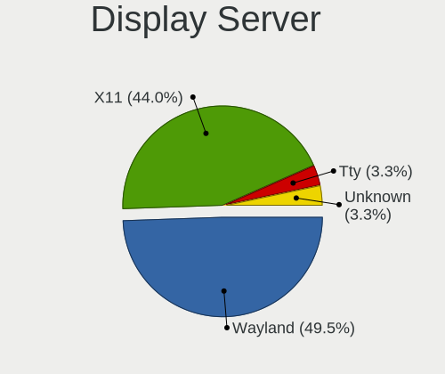
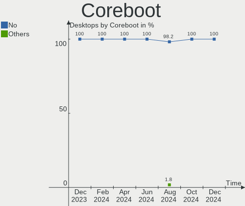
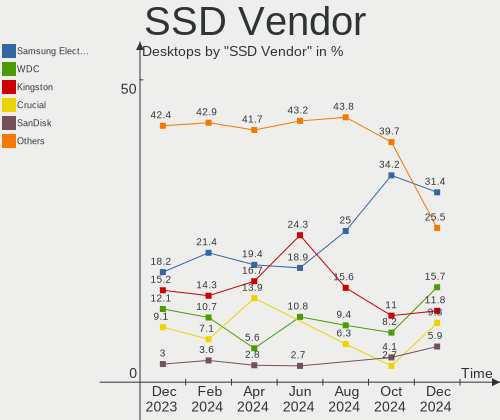
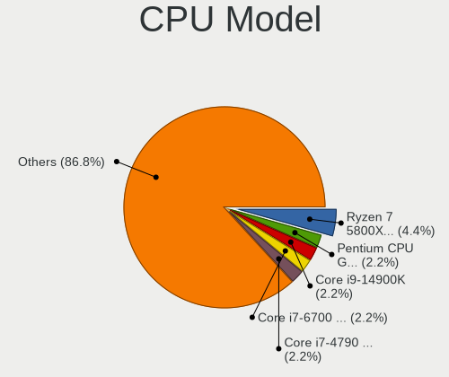
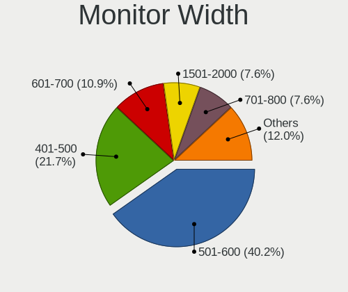

Linux in Canada - Hardware Trends (Desktops)
--------------------------------------------

A project to identify most popular hardware characteristics and track their change
over time based on data collected by Linux users at https://Linux-Hardware.org.

Anyone can contribute to this report by the [hw-probe](https://github.com/linuxhw/hw-probe) tool:

    sudo -E hw-probe -all -upload

Period: Nov, 2023.

Contents
--------

* [ System ](#system)
  - [ OS                       ](#os)
  - [ OS Family                ](#os-family)
  - [ Kernel                   ](#kernel)
  - [ Kernel Family            ](#kernel-family)
  - [ Kernel Major Ver.        ](#kernel-major-ver)
  - [ Arch                     ](#arch)
  - [ DE                       ](#de)
  - [ Display Server           ](#display-server)
  - [ Display Manager          ](#display-manager)
  - [ OS Lang                  ](#os-lang)
  - [ Boot Mode                ](#boot-mode)
  - [ Filesystem               ](#filesystem)
  - [ Part. scheme             ](#part-scheme)
  - [ Dual Boot with Linux/BSD ](#dual-boot-with-linuxbsd)
  - [ Dual Boot (Win)          ](#dual-boot-win)

* [ Board ](#board)
  - [ Vendor                   ](#vendor)
  - [ Model                    ](#model)
  - [ Model Family             ](#model-family)
  - [ MFG Year                 ](#mfg-year)
  - [ Form Factor              ](#form-factor)
  - [ Secure Boot              ](#secure-boot)
  - [ Coreboot                 ](#coreboot)
  - [ RAM Size                 ](#ram-size)
  - [ RAM Used                 ](#ram-used)
  - [ Total Drives             ](#total-drives)
  - [ Has CD-ROM               ](#has-cd-rom)
  - [ Has Ethernet             ](#has-ethernet)
  - [ Has WiFi                 ](#has-wifi)
  - [ Has Bluetooth            ](#has-bluetooth)

* [ Location ](#location)
  - [ Country                  ](#country)
  - [ City                     ](#city)

* [ Drives ](#drives)
  - [ Drive Vendor             ](#drive-vendor)
  - [ Drive Model              ](#drive-model)
  - [ HDD Vendor               ](#hdd-vendor)
  - [ SSD Vendor               ](#ssd-vendor)
  - [ Drive Kind               ](#drive-kind)
  - [ Drive Connector          ](#drive-connector)
  - [ Drive Size               ](#drive-size)
  - [ Space Total              ](#space-total)
  - [ Space Used               ](#space-used)
  - [ Malfunc. Drives          ](#malfunc-drives)
  - [ Malfunc. Drive Vendor    ](#malfunc-drive-vendor)
  - [ Malfunc. HDD Vendor      ](#malfunc-hdd-vendor)
  - [ Malfunc. Drive Kind      ](#malfunc-drive-kind)
  - [ Failed Drives            ](#failed-drives)
  - [ Failed Drive Vendor      ](#failed-drive-vendor)
  - [ Drive Status             ](#drive-status)

* [ Storage controller ](#storage-controller)
  - [ Storage Vendor           ](#storage-vendor)
  - [ Storage Model            ](#storage-model)
  - [ Storage Kind             ](#storage-kind)

* [ Processor ](#processor)
  - [ CPU Vendor               ](#cpu-vendor)
  - [ CPU Model                ](#cpu-model)
  - [ CPU Model Family         ](#cpu-model-family)
  - [ CPU Cores                ](#cpu-cores)
  - [ CPU Sockets              ](#cpu-sockets)
  - [ CPU Threads              ](#cpu-threads)
  - [ CPU Op-Modes             ](#cpu-op-modes)
  - [ CPU Microcode            ](#cpu-microcode)
  - [ CPU Microarch            ](#cpu-microarch)

* [ Graphics ](#graphics)
  - [ GPU Vendor               ](#gpu-vendor)
  - [ GPU Model                ](#gpu-model)
  - [ GPU Combo                ](#gpu-combo)
  - [ GPU Driver               ](#gpu-driver)
  - [ GPU Memory               ](#gpu-memory)

* [ Monitor ](#monitor)
  - [ Monitor Vendor           ](#monitor-vendor)
  - [ Monitor Model            ](#monitor-model)
  - [ Monitor Resolution       ](#monitor-resolution)
  - [ Monitor Diagonal         ](#monitor-diagonal)
  - [ Monitor Width            ](#monitor-width)
  - [ Aspect Ratio             ](#aspect-ratio)
  - [ Monitor Area             ](#monitor-area)
  - [ Pixel Density            ](#pixel-density)
  - [ Multiple Monitors        ](#multiple-monitors)

* [ Network ](#network)
  - [ Net Controller Vendor    ](#net-controller-vendor)
  - [ Net Controller Model     ](#net-controller-model)
  - [ Wireless Vendor          ](#wireless-vendor)
  - [ Wireless Model           ](#wireless-model)
  - [ Ethernet Vendor          ](#ethernet-vendor)
  - [ Ethernet Model           ](#ethernet-model)
  - [ Net Controller Kind      ](#net-controller-kind)
  - [ Used Controller          ](#used-controller)
  - [ NICs                     ](#nics)
  - [ IPv6                     ](#ipv6)

* [ Bluetooth ](#bluetooth)
  - [ Bluetooth Vendor         ](#bluetooth-vendor)
  - [ Bluetooth Model          ](#bluetooth-model)

* [ Sound ](#sound)
  - [ Sound Vendor             ](#sound-vendor)
  - [ Sound Model              ](#sound-model)

* [ Memory ](#memory)
  - [ Memory Vendor            ](#memory-vendor)
  - [ Memory Model             ](#memory-model)
  - [ Memory Kind              ](#memory-kind)
  - [ Memory Form Factor       ](#memory-form-factor)
  - [ Memory Size              ](#memory-size)
  - [ Memory Speed             ](#memory-speed)

* [ Printers & scanners ](#printers--scanners)
  - [ Printer Vendor           ](#printer-vendor)
  - [ Printer Model            ](#printer-model)
  - [ Scanner Vendor           ](#scanner-vendor)
  - [ Scanner Model            ](#scanner-model)

* [ Camera ](#camera)
  - [ Camera Vendor            ](#camera-vendor)
  - [ Camera Model             ](#camera-model)

* [ Security ](#security)
  - [ Fingerprint Vendor       ](#fingerprint-vendor)
  - [ Fingerprint Model        ](#fingerprint-model)
  - [ Chipcard Vendor          ](#chipcard-vendor)
  - [ Chipcard Model           ](#chipcard-model)

* [ Unsupported ](#unsupported)
  - [ Unsupported Devices      ](#unsupported-devices)
  - [ Unsupported Device Types ](#unsupported-device-types)

System
------

OS
--

Installed operating systems

| Name                         | Desktops | Percent |
|------------------------------|----------|---------|
| Ubuntu 22.04                 | 13       | 19.12%  |
| Fedora 39                    | 7        | 10.29%  |
| Linux Mint 21.2              | 5        | 7.35%   |
| Debian 12                    | 4        | 5.88%   |
| Ubuntu 23.10                 | 3        | 4.41%   |
| OpenMandriva 5.0             | 3        | 4.41%   |
| Manjaro                      | 3        | 4.41%   |
| Debian 11                    | 3        | 4.41%   |
| Arch Rolling                 | 3        | 4.41%   |
| Pop!_OS 22.04                | 2        | 2.94%   |
| openSUSE Tumbleweed-XXXXXXXX | 2        | 2.94%   |
| OpenMandriva 23.10           | 2        | 2.94%   |
| Nobara 38                    | 2        | 2.94%   |
| Fedora 38                    | 2        | 2.94%   |
| Zorin 16                     | 1        | 1.47%   |
| Xubuntu 22.04                | 1        | 1.47%   |
| Xubuntu 18.04                | 1        | 1.47%   |
| Ubuntu MATE 20.04            | 1        | 1.47%   |
| Ubuntu 23.04                 | 1        | 1.47%   |
| Ubuntu 20.04                 | 1        | 1.47%   |
| OpenMandriva 23.11           | 1        | 1.47%   |
| OpenMandriva 23.08           | 1        | 1.47%   |
| LMDE 6                       | 1        | 1.47%   |
| Linux Mint 20.3              | 1        | 1.47%   |
| Linux Mint 20.2              | 1        | 1.47%   |
| Gentoo 2.14                  | 1        | 1.47%   |
| Garuda Linux Soaring         | 1        | 1.47%   |
| ArcoLinux Rolling            | 1        | 1.47%   |

OS Family
---------

OS without a version

| Name         | Desktops | Percent |
|--------------|----------|---------|
| Ubuntu       | 18       | 26.47%  |
| Fedora       | 9        | 13.24%  |
| OpenMandriva | 7        | 10.29%  |
| Linux Mint   | 7        | 10.29%  |
| Debian       | 7        | 10.29%  |
| Manjaro      | 3        | 4.41%   |
| Arch         | 3        | 4.41%   |
| Xubuntu      | 2        | 2.94%   |
| Pop!_OS      | 2        | 2.94%   |
| openSUSE     | 2        | 2.94%   |
| Nobara       | 2        | 2.94%   |
| Zorin        | 1        | 1.47%   |
| Ubuntu MATE  | 1        | 1.47%   |
| LMDE         | 1        | 1.47%   |
| Gentoo       | 1        | 1.47%   |
| Garuda Linux | 1        | 1.47%   |
| ArcoLinux    | 1        | 1.47%   |

Kernel
------

Version of the Linux kernel

| Version                     | Desktops | Percent |
|-----------------------------|----------|---------|
| 5.15.0-89-generic           | 6        | 8.82%   |
| 5.15.0-88-generic           | 6        | 8.82%   |
| 6.2.0-36-generic            | 5        | 7.35%   |
| 6.2.0-37-generic            | 4        | 5.88%   |
| 6.6.2-desktop-1omv2390      | 3        | 4.41%   |
| 6.5.11-300.fc39.x86_64      | 3        | 4.41%   |
| 6.1.0-13-amd64              | 3        | 4.41%   |
| 6.6.2-arch1-1               | 2        | 2.94%   |
| 6.5.5-desktop-1omv2390      | 2        | 2.94%   |
| 6.5.12-300.fc39.x86_64      | 2        | 2.94%   |
| 6.5.0-13-generic            | 2        | 2.94%   |
| 6.6.2-zen1-1-zen            | 1        | 1.47%   |
| 6.6.2-zabbly+               | 1        | 1.47%   |
| 6.6.2-201.fsync.fc38.x86_64 | 1        | 1.47%   |
| 6.6.1-arch1-1               | 1        | 1.47%   |
| 6.6.1-1-default             | 1        | 1.47%   |
| 6.6.0-rc3+                  | 1        | 1.47%   |
| 6.6.0-gentoo                | 1        | 1.47%   |
| 6.6.0-desktop-1omv2390      | 1        | 1.47%   |
| 6.6.0-1-MANJARO             | 1        | 1.47%   |
| 6.5.9-201.fsync.fc38.x86_64 | 1        | 1.47%   |
| 6.5.9-1-default             | 1        | 1.47%   |
| 6.5.8-arch1-1               | 1        | 1.47%   |
| 6.5.8-200.fc38.x86_64       | 1        | 1.47%   |
| 6.5.6-76060506-generic      | 1        | 1.47%   |
| 6.5.6-300.fc39.x86_64       | 1        | 1.47%   |
| 6.5.4-76060504-generic      | 1        | 1.47%   |
| 6.5.11-1-MANJARO            | 1        | 1.47%   |
| 6.5.10-300.fc39.x86_64      | 1        | 1.47%   |
| 6.5.10-200.fc38.x86_64      | 1        | 1.47%   |
| 6.5.0-10-generic            | 1        | 1.47%   |
| 6.4.16-5-MANJARO            | 1        | 1.47%   |
| 6.4.11-desktop-1omv2390     | 1        | 1.47%   |
| 6.2.16-4-pve                | 1        | 1.47%   |
| 6.2.0-26-generic            | 1        | 1.47%   |
| 6.1.0-12-amd64              | 1        | 1.47%   |
| 5.4.0-166-generic           | 1        | 1.47%   |
| 5.4.0-159-generic           | 1        | 1.47%   |
| 5.19.0-50-generic           | 1        | 1.47%   |
| 5.15.131-1-pve              | 1        | 1.47%   |

Kernel Family
-------------

Linux kernel without a distro release

| Version  | Desktops | Percent |
|----------|----------|---------|
| 5.15.0   | 12       | 17.65%  |
| 6.2.0    | 10       | 14.71%  |
| 6.6.2    | 8        | 11.76%  |
| 6.6.0    | 4        | 5.88%   |
| 6.5.11   | 4        | 5.88%   |
| 6.1.0    | 4        | 5.88%   |
| 6.5.0    | 3        | 4.41%   |
| 6.6.1    | 2        | 2.94%   |
| 6.5.9    | 2        | 2.94%   |
| 6.5.8    | 2        | 2.94%   |
| 6.5.6    | 2        | 2.94%   |
| 6.5.5    | 2        | 2.94%   |
| 6.5.12   | 2        | 2.94%   |
| 6.5.10   | 2        | 2.94%   |
| 5.4.0    | 2        | 2.94%   |
| 6.5.4    | 1        | 1.47%   |
| 6.4.16   | 1        | 1.47%   |
| 6.4.11   | 1        | 1.47%   |
| 6.2.16   | 1        | 1.47%   |
| 5.19.0   | 1        | 1.47%   |
| 5.15.131 | 1        | 1.47%   |
| 5.10.0   | 1        | 1.47%   |

Kernel Major Ver.
-----------------

Linux kernel major version

| Version | Desktops | Percent |
|---------|----------|---------|
| 6.5     | 20       | 29.41%  |
| 6.6     | 14       | 20.59%  |
| 5.15    | 13       | 19.12%  |
| 6.2     | 11       | 16.18%  |
| 6.1     | 4        | 5.88%   |
| 6.4     | 2        | 2.94%   |
| 5.4     | 2        | 2.94%   |
| 5.19    | 1        | 1.47%   |
| 5.10    | 1        | 1.47%   |

Arch
----

OS architecture (x86_64, i586, etc.)

| Name   | Desktops | Percent |
|--------|----------|---------|
| x86_64 | 66       | 97.06%  |
| i686   | 2        | 2.94%   |

DE
--

Desktop Environment

| Name       | Desktops | Percent |
|------------|----------|---------|
| GNOME      | 29       | 42.65%  |
| KDE5       | 18       | 26.47%  |
| XFCE       | 6        | 8.82%   |
| X-Cinnamon | 6        | 8.82%   |
| Unknown    | 5        | 7.35%   |
| MATE       | 1        | 1.47%   |
| LXQt       | 1        | 1.47%   |
| KDE        | 1        | 1.47%   |
| i3         | 1        | 1.47%   |

Display Server
--------------

X11 or Wayland

| Name    | Desktops | Percent |
|---------|----------|---------|
| X11     | 33       | 48.53%  |
| Wayland | 26       | 38.24%  |
| Tty     | 7        | 10.29%  |
| Unknown | 2        | 2.94%   |

Display Manager
---------------

SDDM, LightDM, etc.

| Name    | Desktops | Percent |
|---------|----------|---------|
| Unknown | 26       | 38.24%  |
| GDM3    | 16       | 23.53%  |
| SDDM    | 14       | 20.59%  |
| LightDM | 9        | 13.24%  |
| GDM     | 2        | 2.94%   |
| NODM    | 1        | 1.47%   |

OS Lang
-------

Language

| Lang    | Desktops | Percent |
|---------|----------|---------|
| en_CA   | 40       | 58.82%  |
| en_US   | 21       | 30.88%  |
| fr_CA   | 4        | 5.88%   |
| fr_FR   | 1        | 1.47%   |
| C       | 1        | 1.47%   |
| Unknown | 1        | 1.47%   |

Boot Mode
---------

EFI or BIOS

| Mode | Desktops | Percent |
|------|----------|---------|
| BIOS | 40       | 58.82%  |
| EFI  | 28       | 41.18%  |

Filesystem
----------

Type of filesystem

| Type    | Desktops | Percent |
|---------|----------|---------|
| Ext4    | 34       | 50%     |
| Tmpfs   | 15       | 22.06%  |
| Btrfs   | 15       | 22.06%  |
| Overlay | 3        | 4.41%   |
| Xfs     | 1        | 1.47%   |

Part. scheme
------------

Scheme of partitioning

| Type    | Desktops | Percent |
|---------|----------|---------|
| GPT     | 39       | 57.35%  |
| Unknown | 23       | 33.82%  |
| MBR     | 6        | 8.82%   |

Dual Boot with Linux/BSD
------------------------

Hosting more than one Linux/BSD

| Dual boot | Desktops | Percent |
|-----------|----------|---------|
| No        | 58       | 85.29%  |
| Yes       | 10       | 14.71%  |

Dual Boot (Win)
---------------

Hosting Linux and Windows

| Dual boot | Desktops | Percent |
|-----------|----------|---------|
| No        | 53       | 77.94%  |
| Yes       | 15       | 22.06%  |

Board
-----

Vendor
------

Motherboard manufacturer

| Name                | Desktops | Percent |
|---------------------|----------|---------|
| ASUSTek Computer    | 16       | 23.53%  |
| Dell                | 10       | 14.71%  |
| MSI                 | 8        | 11.76%  |
| Acer                | 8        | 11.76%  |
| Gigabyte Technology | 5        | 7.35%   |
| ASRock              | 5        | 7.35%   |
| Hewlett-Packard     | 3        | 4.41%   |
| Lenovo              | 2        | 2.94%   |
| Intel               | 2        | 2.94%   |
| AZW                 | 2        | 2.94%   |
| Soyo                | 1        | 1.47%   |
| OEM                 | 1        | 1.47%   |
| Foxconn             | 1        | 1.47%   |
| CWWK                | 1        | 1.47%   |
| BCM                 | 1        | 1.47%   |
| Apple               | 1        | 1.47%   |
| Alienware           | 1        | 1.47%   |

Model
-----

Motherboard model

| Name                               | Desktops | Percent |
|------------------------------------|----------|---------|
| Soyo SY-N3150L Quad                | 1        | 1.47%   |
| OEM B75                            | 1        | 1.47%   |
| MSI MS-7E07                        | 1        | 1.47%   |
| MSI MS-7E06                        | 1        | 1.47%   |
| MSI MS-7C95                        | 1        | 1.47%   |
| MSI MS-7C91                        | 1        | 1.47%   |
| MSI MS-7B89                        | 1        | 1.47%   |
| MSI MS-7A66                        | 1        | 1.47%   |
| MSI MS-7916                        | 1        | 1.47%   |
| MSI MS-7721                        | 1        | 1.47%   |
| Lenovo ThinkStation E31 3695H4U    | 1        | 1.47%   |
| Lenovo ThinkCentre M58p 6234A1U    | 1        | 1.47%   |
| Intel Jasper Lake Client Platform  | 1        | 1.47%   |
| Intel HM570                        | 1        | 1.47%   |
| HP Z820 Workstation                | 1        | 1.47%   |
| HP ProDesk 600 G3 SFF              | 1        | 1.47%   |
| HP Compaq Pro 6300 SFF             | 1        | 1.47%   |
| Gigabyte Z87X-D3H                  | 1        | 1.47%   |
| Gigabyte X570 AORUS MASTER         | 1        | 1.47%   |
| Gigabyte X570 AORUS ELITE          | 1        | 1.47%   |
| Gigabyte B650 GAMING X AX          | 1        | 1.47%   |
| Gigabyte B550M DS3H AC             | 1        | 1.47%   |
| Foxconn p7-1236s                   | 1        | 1.47%   |
| Dell XPS 8910                      | 1        | 1.47%   |
| Dell XPS 8300                      | 1        | 1.47%   |
| Dell Precision T5610               | 1        | 1.47%   |
| Dell OptiPlex 990                  | 1        | 1.47%   |
| Dell OptiPlex 980                  | 1        | 1.47%   |
| Dell OptiPlex 5080                 | 1        | 1.47%   |
| Dell OptiPlex 5050                 | 1        | 1.47%   |
| Dell OptiPlex 5040                 | 1        | 1.47%   |
| Dell OptiPlex 3040                 | 1        | 1.47%   |
| Dell Inspiron 3250                 | 1        | 1.47%   |
| CWWK CW-AD4L-N V1                  | 1        | 1.47%   |
| BCM OEM-A6002-00                   | 1        | 1.47%   |
| AZW Green G5                       | 1        | 1.47%   |
| AZW Green G4                       | 1        | 1.47%   |
| ASUS TUF Gaming Z790-PLUS WIFI D4  | 1        | 1.47%   |
| ASUS SABERTOOTH X79                | 1        | 1.47%   |
| ASUS ROG STRIX X670E-E GAMING WIFI | 1        | 1.47%   |

Model Family
------------

Motherboard model prefix

| Name                | Desktops | Percent |
|---------------------|----------|---------|
| Dell OptiPlex       | 6        | 8.82%   |
| ASUS PRIME          | 5        | 7.35%   |
| Acer Predator       | 3        | 4.41%   |
| Acer Aspire         | 3        | 4.41%   |
| Gigabyte X570       | 2        | 2.94%   |
| Dell XPS            | 2        | 2.94%   |
| AZW Green           | 2        | 2.94%   |
| ASUS ROG            | 2        | 2.94%   |
| Soyo SY-N3150L      | 1        | 1.47%   |
| OEM B75             | 1        | 1.47%   |
| MSI MS-7E07         | 1        | 1.47%   |
| MSI MS-7E06         | 1        | 1.47%   |
| MSI MS-7C95         | 1        | 1.47%   |
| MSI MS-7C91         | 1        | 1.47%   |
| MSI MS-7B89         | 1        | 1.47%   |
| MSI MS-7A66         | 1        | 1.47%   |
| MSI MS-7916         | 1        | 1.47%   |
| MSI MS-7721         | 1        | 1.47%   |
| Lenovo ThinkStation | 1        | 1.47%   |
| Lenovo ThinkCentre  | 1        | 1.47%   |
| Intel Jasper        | 1        | 1.47%   |
| Intel HM570         | 1        | 1.47%   |
| HP Z820             | 1        | 1.47%   |
| HP ProDesk          | 1        | 1.47%   |
| HP Compaq           | 1        | 1.47%   |
| Gigabyte Z87X-D3H   | 1        | 1.47%   |
| Gigabyte B650       | 1        | 1.47%   |
| Gigabyte B550M      | 1        | 1.47%   |
| Foxconn p7-1236s    | 1        | 1.47%   |
| Dell Precision      | 1        | 1.47%   |
| Dell Inspiron       | 1        | 1.47%   |
| CWWK CW-AD4L-N      | 1        | 1.47%   |
| BCM OEM-A6002-00    | 1        | 1.47%   |
| ASUS TUF            | 1        | 1.47%   |
| ASUS SABERTOOTH     | 1        | 1.47%   |
| ASUS P8Z68-M        | 1        | 1.47%   |
| ASUS P5G41T-M       | 1        | 1.47%   |
| ASUS M5A97          | 1        | 1.47%   |
| ASUS G11CD          | 1        | 1.47%   |
| ASUS CM1435         | 1        | 1.47%   |

MFG Year
--------

Motherboard manufacture year

| Year | Desktops | Percent |
|------|----------|---------|
| 2022 | 10       | 14.71%  |
| 2020 | 8        | 11.76%  |
| 2018 | 7        | 10.29%  |
| 2012 | 7        | 10.29%  |
| 2016 | 5        | 7.35%   |
| 2023 | 4        | 5.88%   |
| 2021 | 4        | 5.88%   |
| 2019 | 4        | 5.88%   |
| 2010 | 4        | 5.88%   |
| 2017 | 3        | 4.41%   |
| 2011 | 3        | 4.41%   |
| 2015 | 2        | 2.94%   |
| 2014 | 2        | 2.94%   |
| 2013 | 2        | 2.94%   |
| 2009 | 2        | 2.94%   |
| 2008 | 1        | 1.47%   |

Form Factor
-----------

Physical design of the computer

| Name    | Desktops | Percent |
|---------|----------|---------|
| Desktop | 68       | 100%    |

Secure Boot
-----------

Enabled or disabled

| State    | Desktops | Percent |
|----------|----------|---------|
| Disabled | 66       | 97.06%  |
| Enabled  | 2        | 2.94%   |

Coreboot
--------

Have coreboot on board

| Used | Desktops | Percent |
|------|----------|---------|
| No   | 68       | 100%    |

RAM Size
--------

Total RAM memory

| Size in GB  | Desktops | Percent |
|-------------|----------|---------|
| 16.01-24.0  | 18       | 26.47%  |
| 64.01-256.0 | 14       | 20.59%  |
| 32.01-64.0  | 13       | 19.12%  |
| 8.01-16.0   | 11       | 16.18%  |
| 4.01-8.0    | 9        | 13.24%  |
| 3.01-4.0    | 2        | 2.94%   |
| 24.01-32.0  | 1        | 1.47%   |

RAM Used
--------

Used RAM memory

| Used GB    | Desktops | Percent |
|------------|----------|---------|
| 1.01-2.0   | 18       | 26.47%  |
| 4.01-8.0   | 14       | 20.59%  |
| 2.01-3.0   | 13       | 19.12%  |
| 3.01-4.0   | 11       | 16.18%  |
| 8.01-16.0  | 5        | 7.35%   |
| 0.51-1.0   | 5        | 7.35%   |
| 24.01-32.0 | 1        | 1.47%   |
| 16.01-24.0 | 1        | 1.47%   |

Total Drives
------------

Number of drives on board

| Drives | Desktops | Percent |
|--------|----------|---------|
| 1      | 29       | 42.65%  |
| 2      | 20       | 29.41%  |
| 6      | 5        | 7.35%   |
| 4      | 4        | 5.88%   |
| 3      | 4        | 5.88%   |
| 5      | 2        | 2.94%   |
| 12     | 1        | 1.47%   |
| 9      | 1        | 1.47%   |
| 7      | 1        | 1.47%   |
| 0      | 1        | 1.47%   |

Has CD-ROM
----------

Has CD-ROM on board

| Presented | Desktops | Percent |
|-----------|----------|---------|
| No        | 35       | 51.47%  |
| Yes       | 33       | 48.53%  |

Has Ethernet
------------

Has Ethernet on board

| Presented | Desktops | Percent |
|-----------|----------|---------|
| Yes       | 68       | 100%    |

Has WiFi
--------

Has WiFi module

| Presented | Desktops | Percent |
|-----------|----------|---------|
| Yes       | 39       | 57.35%  |
| No        | 29       | 42.65%  |

Has Bluetooth
-------------

Has Bluetooth module

| Presented | Desktops | Percent |
|-----------|----------|---------|
| No        | 36       | 52.94%  |
| Yes       | 32       | 47.06%  |

Location
--------

Country
-------

Geographic location (country)

| Country | Desktops | Percent |
|---------|----------|---------|
| Canada  | 68       | 100%    |

City
----

Geographic location (city)

| City                        | Desktops | Percent |
|-----------------------------|----------|---------|
| Toronto                     | 9        | 13.24%  |
| Winnipeg                    | 4        | 5.88%   |
| Mississauga                 | 4        | 5.88%   |
| Calgary                     | 4        | 5.88%   |
| Kingston                    | 3        | 4.41%   |
| Guelph                      | 3        | 4.41%   |
| Vancouver                   | 2        | 2.94%   |
| Sydney                      | 2        | 2.94%   |
| Regina                      | 2        | 2.94%   |
| Red Deer                    | 2        | 2.94%   |
| Montreal                    | 2        | 2.94%   |
| Markham                     | 2        | 2.94%   |
| Woodstock                   | 1        | 1.47%   |
| Terrebonne                  | 1        | 1.47%   |
| St. Catharines              | 1        | 1.47%   |
| Sherwood Park               | 1        | 1.47%   |
| Sarnia                      | 1        | 1.47%   |
| Saint-Bruno                 | 1        | 1.47%   |
| Saint-Benoit-Labre          | 1        | 1.47%   |
| Saint-Augustin-de-Desmaures | 1        | 1.47%   |
| Saanichton                  | 1        | 1.47%   |
| Richmond                    | 1        | 1.47%   |
| Prince Rupert               | 1        | 1.47%   |
| Pointe-aux-Trembles         | 1        | 1.47%   |
| Peterborough                | 1        | 1.47%   |
| Owen Sound                  | 1        | 1.47%   |
| Ottawa                      | 1        | 1.47%   |
| Orleans                     | 1        | 1.47%   |
| Newcastle                   | 1        | 1.47%   |
| Nepean                      | 1        | 1.47%   |
| Moose Jaw                   | 1        | 1.47%   |
| Leamington                  | 1        | 1.47%   |
| Keswick                     | 1        | 1.47%   |
| Greater Sudbury             | 1        | 1.47%   |
| Fort McMurray               | 1        | 1.47%   |
| Erin                        | 1        | 1.47%   |
| Edmundston                  | 1        | 1.47%   |
| Edmonton                    | 1        | 1.47%   |
| Corner Brook                | 1        | 1.47%   |
| Brampton                    | 1        | 1.47%   |

Drives
------

Drive Vendor
------------

Hard drive vendors

| Vendor                      | Desktops | Drives | Percent |
|-----------------------------|----------|--------|---------|
| Seagate                     | 26       | 35     | 20.97%  |
| WDC                         | 17       | 31     | 13.71%  |
| Samsung Electronics         | 16       | 23     | 12.9%   |
| SanDisk                     | 14       | 14     | 11.29%  |
| Kingston                    | 8        | 9      | 6.45%   |
| Toshiba                     | 6        | 6      | 4.84%   |
| Crucial                     | 4        | 5      | 3.23%   |
| Unknown                     | 3        | 5      | 2.42%   |
| Intel                       | 3        | 3      | 2.42%   |
| Phison Electronics          | 2        | 2      | 1.61%   |
| Micron/Crucial Technology   | 2        | 2      | 1.61%   |
| Micron Technology           | 2        | 2      | 1.61%   |
| MAXIO Technology (Hangzhou) | 2        | 2      | 1.61%   |
| Lexar                       | 2        | 2      | 1.61%   |
| Kingston Technology Company | 2        | 2      | 1.61%   |
| ADATA Technology            | 2        | 4      | 1.61%   |
| TO Exter                    | 1        | 1      | 0.81%   |
| PNY                         | 1        | 1      | 0.81%   |
| Patriot                     | 1        | 1      | 0.81%   |
| NXT                         | 1        | 1      | 0.81%   |
| Mushkin                     | 1        | 1      | 0.81%   |
| Lite-On Technology          | 1        | 1      | 0.81%   |
| KingFast                    | 1        | 1      | 0.81%   |
| JMicron Technology          | 1        | 1      | 0.81%   |
| Hitachi                     | 1        | 3      | 0.81%   |
| HGST HTS                    | 1        | 1      | 0.81%   |
| Dogfish                     | 1        | 1      | 0.81%   |
| A-DATA Technology           | 1        | 1      | 0.81%   |
| Unknown                     | 1        | 1      | 0.81%   |

Drive Model
-----------

Hard drive models

| Model                                                           | Desktops | Percent |
|-----------------------------------------------------------------|----------|---------|
| Toshiba DT01ACA100 1TB                                          | 5        | 3.52%   |
| Seagate ST4000DM004-2CV104 4TB                                  | 4        | 2.82%   |
| Seagate ST2000DM001-1ER164 2TB                                  | 3        | 2.11%   |
| Sandisk WD_BLACK SN770 2TB                                      | 3        | 2.11%   |
| Samsung SSD 870 EVO 2TB                                         | 3        | 2.11%   |
| WDC WD30EFRX-68EUZN0 3TB                                        | 2        | 1.41%   |
| Seagate ST31000528AS 1TB                                        | 2        | 1.41%   |
| Seagate ST2000LX001-1RG174 2TB                                  | 2        | 1.41%   |
| Seagate ST2000DM008-2FR102 2TB                                  | 2        | 1.41%   |
| Seagate ST1000DM003-1ER162 1TB                                  | 2        | 1.41%   |
| Seagate ST1000DM003-1CH162 1TB                                  | 2        | 1.41%   |
| Samsung SSD 870 EVO 500GB                                       | 2        | 1.41%   |
| Micron/Crucial P2 NVMe PCIe SSD 1TB                             | 2        | 1.41%   |
| MAXIO (Hangzhou) NVMe SSD Controller MAP1202 1024GB             | 2        | 1.41%   |
| Crucial CT1000MX500SSD1 1TB                                     | 2        | 1.41%   |
| ADATA XPG SX8200 Pro PCIe Gen3x4 M.2 2280 Solid State Drive 1TB | 2        | 1.41%   |
| WDC WDS250G2B0C-00PXH0 250GB                                    | 1        | 0.7%    |
| WDC WDS100T1B0A-00H9H0 1TB SSD                                  | 1        | 0.7%    |
| WDC WDBNCE2500PNC 250GB SSD                                     | 1        | 0.7%    |
| WDC WDBNCE0010PNC 1TB SSD                                       | 1        | 0.7%    |
| WDC WD740ADFD-00NLR1 74GB                                       | 1        | 0.7%    |
| WDC WD5000AAKX-75U6AA0 500GB                                    | 1        | 0.7%    |
| WDC WD5000AAKX-08U6AA0 500GB                                    | 1        | 0.7%    |
| WDC WD40PURZ-85TTDY0 4TB                                        | 1        | 0.7%    |
| WDC WD40EZRZ-00GXCB0 4TB                                        | 1        | 0.7%    |
| WDC WD2500BEVT-22A23T0 250GB                                    | 1        | 0.7%    |
| WDC WD20SPZX-00CRAT0 2TB                                        | 1        | 0.7%    |
| WDC WD20EZBX-00AYRA0 2TB                                        | 1        | 0.7%    |
| WDC WD20EZAZ-00GGJB0 2TB                                        | 1        | 0.7%    |
| WDC WD20EFRX-68EUZN0 2TB                                        | 1        | 0.7%    |
| WDC WD10EZEX-60ZF5A0 1TB                                        | 1        | 0.7%    |
| WDC WD100EFAX-68LHPN0 10TB                                      | 1        | 0.7%    |
| WDC WD10 EZEX-00WN4A0 1TB                                       | 1        | 0.7%    |
| WDC WD My Passport 264F 1TB                                     | 1        | 0.7%    |
| WDC PC SN730 NVMe 1024GB                                        | 1        | 0.7%    |
| Unknown SD/MMC/MS PRO 128GB                                     | 1        | 0.7%    |
| Unknown SD/MMC/M.S.PRO 32GB                                     | 1        | 0.7%    |
| Unknown SD/MMC 2GB                                              | 1        | 0.7%    |
| Unknown NVMe SSD Drive 512GB                                    | 1        | 0.7%    |
| Unknown M.S./M.S.Pro/HG 16GB                                    | 1        | 0.7%    |

HDD Vendor
----------

Hard disk drive vendors

| Vendor   | Desktops | Drives | Percent |
|----------|----------|--------|---------|
| Seagate  | 26       | 34     | 52%     |
| WDC      | 14       | 25     | 28%     |
| Toshiba  | 6        | 6      | 12%     |
| Unknown  | 1        | 1      | 2%      |
| TO Exter | 1        | 1      | 2%      |
| Hitachi  | 1        | 3      | 2%      |
| HGST HTS | 1        | 1      | 2%      |

SSD Vendor
----------

Solid state drive vendors

| Vendor              | Desktops | Drives | Percent |
|---------------------|----------|--------|---------|
| Samsung Electronics | 11       | 16     | 30.56%  |
| SanDisk             | 4        | 4      | 11.11%  |
| Kingston            | 4        | 5      | 11.11%  |
| WDC                 | 3        | 3      | 8.33%   |
| Crucial             | 3        | 4      | 8.33%   |
| Lexar               | 2        | 2      | 5.56%   |
| Intel               | 2        | 2      | 5.56%   |
| PNY                 | 1        | 1      | 2.78%   |
| Patriot             | 1        | 1      | 2.78%   |
| Mushkin             | 1        | 1      | 2.78%   |
| Micron Technology   | 1        | 1      | 2.78%   |
| Dogfish             | 1        | 1      | 2.78%   |
| A-DATA Technology   | 1        | 1      | 2.78%   |
| Unknown             | 1        | 1      | 2.78%   |

Drive Kind
----------

HDD or SSD

| Kind    | Desktops | Drives | Percent |
|---------|----------|--------|---------|
| HDD     | 38       | 71     | 36.54%  |
| NVMe    | 33       | 40     | 31.73%  |
| SSD     | 28       | 43     | 26.92%  |
| Unknown | 5        | 8      | 4.81%   |

Drive Connector
---------------

SATA, SAS, NVMe, etc.

| Type | Desktops | Drives | Percent |
|------|----------|--------|---------|
| SATA | 51       | 108    | 55.43%  |
| NVMe | 33       | 39     | 35.87%  |
| SAS  | 8        | 15     | 8.7%    |

Drive Size
----------

Size of hard drive

| Size in TB | Desktops | Drives | Percent |
|------------|----------|--------|---------|
| 0.01-0.5   | 29       | 32     | 35.37%  |
| 0.51-1.0   | 23       | 33     | 28.05%  |
| 1.01-2.0   | 16       | 30     | 19.51%  |
| 3.01-4.0   | 8        | 8      | 9.76%   |
| 2.01-3.0   | 3        | 4      | 3.66%   |
| 4.01-10.0  | 3        | 7      | 3.66%   |

Space Total
-----------

Amount of disk space available on the file system

| Size in GB     | Desktops | Percent |
|----------------|----------|---------|
| More than 3000 | 17       | 25%     |
| 251-500        | 15       | 22.06%  |
| 101-250        | 12       | 17.65%  |
| 501-1000       | 9        | 13.24%  |
| 1001-2000      | 5        | 7.35%   |
| 2001-3000      | 3        | 4.41%   |
| 21-50          | 2        | 2.94%   |
| 1-20           | 2        | 2.94%   |
| Unknown        | 2        | 2.94%   |
| 51-100         | 1        | 1.47%   |

Space Used
----------

Amount of used disk space

| Used GB        | Desktops | Percent |
|----------------|----------|---------|
| 21-50          | 16       | 23.53%  |
| 1-20           | 15       | 22.06%  |
| 101-250        | 8        | 11.76%  |
| 51-100         | 8        | 11.76%  |
| More than 3000 | 7        | 10.29%  |
| 501-1000       | 6        | 8.82%   |
| 251-500        | 2        | 2.94%   |
| 2001-3000      | 2        | 2.94%   |
| 1001-2000      | 2        | 2.94%   |
| Unknown        | 2        | 2.94%   |

Malfunc. Drives
---------------

Drive models with a malfunction

| Model                             | Desktops | Drives | Percent |
|-----------------------------------|----------|--------|---------|
| WDC WD5000AAKX-08U6AA0 500GB      | 1        | 1      | 16.67%  |
| Seagate ST2000LX001-1RG174 2TB    | 1        | 1      | 16.67%  |
| SanDisk SD8SBAT128G1002 128GB SSD | 1        | 1      | 16.67%  |
| Kingston SV300S37A480G 480GB SSD  | 1        | 1      | 16.67%  |
| Kingston SA400S37120G 120GB SSD   | 1        | 1      | 16.67%  |
| Hitachi HDS5C3020ALA632 2TB       | 1        | 3      | 16.67%  |

Malfunc. Drive Vendor
---------------------

Vendors of faulty drives

| Vendor   | Desktops | Drives | Percent |
|----------|----------|--------|---------|
| Kingston | 2        | 2      | 33.33%  |
| WDC      | 1        | 1      | 16.67%  |
| Seagate  | 1        | 1      | 16.67%  |
| SanDisk  | 1        | 1      | 16.67%  |
| Hitachi  | 1        | 3      | 16.67%  |

Malfunc. HDD Vendor
-------------------

Vendors of faulty HDD drives

| Vendor  | Desktops | Drives | Percent |
|---------|----------|--------|---------|
| WDC     | 1        | 1      | 33.33%  |
| Seagate | 1        | 1      | 33.33%  |
| Hitachi | 1        | 3      | 33.33%  |

Malfunc. Drive Kind
-------------------

Kinds of faulty drives

| Kind | Desktops | Drives | Percent |
|------|----------|--------|---------|
| SSD  | 3        | 3      | 60%     |
| HDD  | 2        | 5      | 40%     |

Failed Drives
-------------

Failed drive models

Zero info for selected period =(

Failed Drive Vendor
-------------------

Failed drive vendors

Zero info for selected period =(

Drive Status
------------

Number of failed and malfunc. drives

| Status   | Desktops | Drives | Percent |
|----------|----------|--------|---------|
| Detected | 44       | 98     | 60.27%  |
| Works    | 25       | 56     | 34.25%  |
| Malfunc  | 4        | 8      | 5.48%   |

Storage controller
------------------

Storage Vendor
--------------

Storage controller vendors

| Vendor                      | Desktops | Percent |
|-----------------------------|----------|---------|
| Intel                       | 48       | 43.64%  |
| AMD                         | 17       | 15.45%  |
| SanDisk                     | 12       | 10.91%  |
| ASMedia Technology          | 6        | 5.45%   |
| Samsung Electronics         | 5        | 4.55%   |
| Kingston Technology Company | 5        | 4.55%   |
| Micron/Crucial Technology   | 3        | 2.73%   |
| MAXIO Technology (Hangzhou) | 3        | 2.73%   |
| Phison Electronics          | 2        | 1.82%   |
| Marvell Technology Group    | 2        | 1.82%   |
| JMicron Technology          | 2        | 1.82%   |
| ADATA Technology            | 2        | 1.82%   |
| Micron Technology           | 1        | 0.91%   |
| Lite-On Technology          | 1        | 0.91%   |
| Broadcom / LSI              | 1        | 0.91%   |

Storage Model
-------------

Storage controller models

| Model                                                                          | Desktops | Percent |
|--------------------------------------------------------------------------------|----------|---------|
| AMD FCH SATA Controller [AHCI mode]                                            | 11       | 8.73%   |
| ASMedia ASM1062 Serial ATA Controller                                          | 6        | 4.76%   |
| Intel Q170/Q150/B150/H170/H110/Z170/CM236 Chipset SATA Controller [AHCI Mode]  | 5        | 3.97%   |
| Intel 700 Series Chipset Family SATA AHCI Controller                           | 5        | 3.97%   |
| Intel 200 Series PCH SATA controller [AHCI mode]                               | 5        | 3.97%   |
| AMD 500 Series Chipset SATA Controller                                         | 5        | 3.97%   |
| Intel 6 Series/C200 Series Chipset Family 6 port Desktop SATA AHCI Controller  | 4        | 3.17%   |
| SanDisk WD Black SN770 / PC SN740 256GB / PC SN560 (DRAM-less) NVMe SSD        | 3        | 2.38%   |
| Micron/Crucial P2 [Nick P2] / P3 / P3 Plus NVMe PCIe SSD (DRAM-less)           | 3        | 2.38%   |
| MAXIO (Hangzhou) NVMe SSD Controller MAP1202                                   | 3        | 2.38%   |
| Intel Comet Lake SATA AHCI Controller                                          | 3        | 2.38%   |
| Intel 5 Series/3400 Series Chipset 6 port SATA AHCI Controller                 | 3        | 2.38%   |
| AMD 400 Series Chipset SATA Controller                                         | 3        | 2.38%   |
| Sandisk WD Black SN850X NVMe SSD                                               | 2        | 1.59%   |
| Samsung NVMe SSD Controller SM981/PM981/PM983                                  | 2        | 1.59%   |
| Kingston Company NV2 NVMe SSD SM2267XT                                         | 2        | 1.59%   |
| Kingston Company KC3000/FURY Renegade NVMe SSD E18                             | 2        | 1.59%   |
| Kingston Company A1000/U-SNS8154P3 x2 NVMe SSD                                 | 2        | 1.59%   |
| Intel SATA Controller [RAID mode]                                              | 2        | 1.59%   |
| Intel SATA controller                                                          | 2        | 1.59%   |
| Intel Cannon Lake PCH SATA AHCI Controller                                     | 2        | 1.59%   |
| Intel C600/X79 series chipset 6-Port SATA AHCI Controller                      | 2        | 1.59%   |
| Intel 82801JI (ICH10 Family) SATA AHCI Controller                              | 2        | 1.59%   |
| Intel 8 Series/C220 Series Chipset Family 6-port SATA Controller 1 [AHCI mode] | 2        | 1.59%   |
| Intel 7 Series/C210 Series Chipset Family 6-port SATA Controller [AHCI mode]   | 2        | 1.59%   |
| Intel 5 Series/3400 Series Chipset PT IDER Controller                          | 2        | 1.59%   |
| ADATA XPG SX8200 Pro PCIe Gen3x4 M.2 2280 Solid State Drive                    | 2        | 1.59%   |
| SanDisk WD Green SN350 240GB (DRAM-less) / SN560E NVMe SSD                     | 1        | 0.79%   |
| SanDisk WD Blue SN550 NVMe SSD 2TB (DRAM-less)                                 | 1        | 0.79%   |
| SanDisk Ultra 3D / WD Blue SN570 NVMe SSD (DRAM-less)                          | 1        | 0.79%   |
| SanDisk Ultra 3D / WD Blue SN550 NVMe SSD                                      | 1        | 0.79%   |
| SanDisk PC SN735 NVMe SSD (DRAM-less)                                          | 1        | 0.79%   |
| SanDisk Extreme Pro / WD Black SN750 / PC SN730 / Red SN700 NVMe SSD           | 1        | 0.79%   |
| SanDisk Extreme Pro / WD Black 2018/SN750/PC SN720 NVMe SSD                    | 1        | 0.79%   |
| Samsung NVMe SSD Controller SM961/PM961/SM963                                  | 1        | 0.79%   |
| Samsung NVMe SSD Controller S4LV008[Pascal]                                    | 1        | 0.79%   |
| Samsung NVMe SSD Controller 980 (DRAM-less)                                    | 1        | 0.79%   |
| Phison E16 PCIe4 NVMe Controller                                               | 1        | 0.79%   |
| Phison E12 NVMe Controller                                                     | 1        | 0.79%   |
| Micron 2210 NVMe SSD [Cobain]                                                  | 1        | 0.79%   |

Storage Kind
------------

Kind of storage controller (IDE, SATA, NVMe, SAS, ...)

| Kind | Desktops | Percent |
|------|----------|---------|
| SATA | 60       | 56.07%  |
| NVMe | 33       | 30.84%  |
| IDE  | 8        | 7.48%   |
| RAID | 5        | 4.67%   |
| SAS  | 1        | 0.93%   |

Processor
---------

CPU Vendor
----------

Processor vendors

| Vendor | Desktops | Percent |
|--------|----------|---------|
| Intel  | 50       | 73.53%  |
| AMD    | 18       | 26.47%  |

CPU Model
---------

Processor models

| Model                                  | Desktops | Percent |
|----------------------------------------|----------|---------|
| Intel N100                             | 2        | 2.94%   |
| Intel Core i7-7700K CPU @ 4.20GHz      | 2        | 2.94%   |
| Intel Core i7-6700 CPU @ 3.40GHz       | 2        | 2.94%   |
| Intel Core i7-2600 CPU @ 3.40GHz       | 2        | 2.94%   |
| Intel Core i5-7500 CPU @ 3.40GHz       | 2        | 2.94%   |
| Intel Core i5-6400 CPU @ 2.70GHz       | 2        | 2.94%   |
| Intel Core i5-3470 CPU @ 3.20GHz       | 2        | 2.94%   |
| AMD Ryzen 5 5600G with Radeon Graphics | 2        | 2.94%   |
| AMD Ryzen 5 2600 Six-Core Processor    | 2        | 2.94%   |
| Intel Xeon CPU X5690 @ 3.47GHz         | 1        | 1.47%   |
| Intel Xeon CPU E5-2690 0 @ 2.90GHz     | 1        | 1.47%   |
| Intel Xeon CPU E5-2650 v2 @ 2.60GHz    | 1        | 1.47%   |
| Intel Genuine CPU 0000 @ 2.60GHz       | 1        | 1.47%   |
| Intel Core i9-10900KF CPU @ 3.70GHz    | 1        | 1.47%   |
| Intel Core i7-9700 CPU @ 3.00GHz       | 1        | 1.47%   |
| Intel Core i7-8700 CPU @ 3.20GHz       | 1        | 1.47%   |
| Intel Core i7-6700K CPU @ 4.00GHz      | 1        | 1.47%   |
| Intel Core i7-4790 CPU @ 3.60GHz       | 1        | 1.47%   |
| Intel Core i7-3820 CPU @ 3.60GHz       | 1        | 1.47%   |
| Intel Core i7-3770 CPU @ 3.40GHz       | 1        | 1.47%   |
| Intel Core i7-14700K                   | 1        | 1.47%   |
| Intel Core i7-10700 CPU @ 2.90GHz      | 1        | 1.47%   |
| Intel Core i7 CPU 860 @ 2.80GHz        | 1        | 1.47%   |
| Intel Core i5-9400 CPU @ 2.90GHz       | 1        | 1.47%   |
| Intel Core i5-6500T CPU @ 2.50GHz      | 1        | 1.47%   |
| Intel Core i5-4670K CPU @ 3.40GHz      | 1        | 1.47%   |
| Intel Core i5-2405S CPU @ 2.50GHz      | 1        | 1.47%   |
| Intel Core i5-2400 CPU @ 3.10GHz       | 1        | 1.47%   |
| Intel Core i5-10500 CPU @ 3.10GHz      | 1        | 1.47%   |
| Intel Core i5-10400F CPU @ 2.90GHz     | 1        | 1.47%   |
| Intel Core i5 CPU 660 @ 3.33GHz        | 1        | 1.47%   |
| Intel Core i5 CPU 650 @ 3.20GHz        | 1        | 1.47%   |
| Intel Core i3-N305                     | 1        | 1.47%   |
| Intel Core i3-4130 CPU @ 3.40GHz       | 1        | 1.47%   |
| Intel Core i3-2120 CPU @ 3.30GHz       | 1        | 1.47%   |
| Intel Core 2 Quad CPU Q8300 @ 2.50GHz  | 1        | 1.47%   |
| Intel Core 2 Quad CPU @ 2.66GHz        | 1        | 1.47%   |
| Intel Core 2 Duo CPU E8400 @ 3.00GHz   | 1        | 1.47%   |
| Intel Celeron N5105 @ 2.00GHz          | 1        | 1.47%   |
| Intel Celeron CPU N3150 @ 1.60GHz      | 1        | 1.47%   |

CPU Model Family
----------------

Processor model prefix

| Model             | Desktops | Percent |
|-------------------|----------|---------|
| Intel Core i7     | 15       | 22.06%  |
| Intel Core i5     | 15       | 22.06%  |
| Other             | 7        | 10.29%  |
| AMD Ryzen 5       | 7        | 10.29%  |
| AMD Ryzen 7       | 4        | 5.88%   |
| Intel Xeon        | 3        | 4.41%   |
| Intel Core i3     | 3        | 4.41%   |
| AMD Ryzen 9       | 3        | 4.41%   |
| Intel Core 2 Quad | 2        | 2.94%   |
| Intel Celeron     | 2        | 2.94%   |
| Intel Genuine     | 1        | 1.47%   |
| Intel Core i9     | 1        | 1.47%   |
| Intel Core 2 Duo  | 1        | 1.47%   |
| AMD Ryzen 3       | 1        | 1.47%   |
| AMD FX            | 1        | 1.47%   |
| AMD Athlon X4     | 1        | 1.47%   |
| AMD A8            | 1        | 1.47%   |

CPU Cores
---------

Number of processor cores

| Number | Desktops | Percent |
|--------|----------|---------|
| 4      | 28       | 41.18%  |
| 6      | 11       | 16.18%  |
| 8      | 9        | 13.24%  |
| 2      | 7        | 10.29%  |
| 16     | 6        | 8.82%   |
| 12     | 2        | 2.94%   |
| 24     | 1        | 1.47%   |
| 20     | 1        | 1.47%   |
| 10     | 1        | 1.47%   |
| 3      | 1        | 1.47%   |
| 1      | 1        | 1.47%   |

CPU Sockets
-----------

Number of sockets

| Number | Desktops | Percent |
|--------|----------|---------|
| 1      | 65       | 95.59%  |
| 2      | 3        | 4.41%   |

CPU Threads
-----------

Threads per core (Hyper-Threading)

| Number | Desktops | Percent |
|--------|----------|---------|
| 2      | 47       | 69.12%  |
| 1      | 21       | 30.88%  |

CPU Op-Modes
------------

CPU Operation Modes (32-bit, 64-bit)

| Op mode        | Desktops | Percent |
|----------------|----------|---------|
| 32-bit, 64-bit | 68       | 100%    |

CPU Microcode
-------------

Microcode number

| Number     | Desktops | Percent |
|------------|----------|---------|
| Unknown    | 45       | 66.18%  |
| 0x206a7    | 3        | 4.41%   |
| 0x0a601203 | 3        | 4.41%   |
| 0xb0671    | 2        | 2.94%   |
| 0x0a50000f | 2        | 2.94%   |
| 0xa0653    | 1        | 1.47%   |
| 0x906ea    | 1        | 1.47%   |
| 0x406c3    | 1        | 1.47%   |
| 0x306c3    | 1        | 1.47%   |
| 0x306a9    | 1        | 1.47%   |
| 0x1067a    | 1        | 1.47%   |
| 0x0a50000d | 1        | 1.47%   |
| 0x0a20102b | 1        | 1.47%   |
| 0x08600103 | 1        | 1.47%   |
| 0x08108109 | 1        | 1.47%   |
| 0x0800820d | 1        | 1.47%   |
| 0x06001116 | 1        | 1.47%   |
| 0x0600063e | 1        | 1.47%   |

CPU Microarch
-------------

Microarchitecture

| Name             | Desktops | Percent |
|------------------|----------|---------|
| Unknown          | 8        | 11.76%  |
| Zen 3            | 7        | 10.29%  |
| SandyBridge      | 7        | 10.29%  |
| KabyLake         | 7        | 10.29%  |
| Skylake          | 6        | 8.82%   |
| IvyBridge        | 4        | 5.88%   |
| CometLake        | 4        | 5.88%   |
| Zen+             | 3        | 4.41%   |
| Westmere         | 3        | 4.41%   |
| Haswell          | 3        | 4.41%   |
| Zen 2            | 2        | 2.94%   |
| Piledriver       | 2        | 2.94%   |
| Penryn           | 2        | 2.94%   |
| Gracemont        | 2        | 2.94%   |
| Alderlake Hybrid | 2        | 2.94%   |
| Tremont          | 1        | 1.47%   |
| Silvermont       | 1        | 1.47%   |
| Nehalem          | 1        | 1.47%   |
| Icelake          | 1        | 1.47%   |
| Core             | 1        | 1.47%   |
| Bulldozer        | 1        | 1.47%   |

Graphics
--------

GPU Vendor
----------

Vendors of graphics cards

| Vendor | Desktops | Percent |
|--------|----------|---------|
| Nvidia | 31       | 39.74%  |
| Intel  | 28       | 35.9%   |
| AMD    | 19       | 24.36%  |

GPU Model
---------

Graphics card models

| Model                                                                       | Desktops | Percent |
|-----------------------------------------------------------------------------|----------|---------|
| Intel HD Graphics 530                                                       | 5        | 6.17%   |
| Intel 2nd Generation Core Processor Family Integrated Graphics Controller   | 4        | 4.94%   |
| Nvidia GA104 [GeForce RTX 3060]                                             | 3        | 3.7%    |
| Intel Alder Lake-N [UHD Graphics]                                           | 3        | 3.7%    |
| AMD Raphael                                                                 | 3        | 3.7%    |
| AMD Ellesmere [Radeon RX 470/480/570/570X/580/580X/590]                     | 3        | 3.7%    |
| AMD Cezanne [Radeon Vega Series / Radeon Vega Mobile Series]                | 3        | 3.7%    |
| Nvidia TU106 [GeForce RTX 2060 Rev. A]                                      | 2        | 2.47%   |
| Nvidia GP104 [GeForce GTX 1070]                                             | 2        | 2.47%   |
| Intel Raptor Lake-S GT1 [UHD Graphics 770]                                  | 2        | 2.47%   |
| Intel HD Graphics 630                                                       | 2        | 2.47%   |
| Intel Core Processor Integrated Graphics Controller                         | 2        | 2.47%   |
| Intel 4 Series Chipset Integrated Graphics Controller                       | 2        | 2.47%   |
| Nvidia TU117 [GeForce GTX 1650]                                             | 1        | 1.23%   |
| Nvidia TU106 [GeForce RTX 2070]                                             | 1        | 1.23%   |
| Nvidia TU106 [GeForce RTX 2060 SUPER]                                       | 1        | 1.23%   |
| Nvidia TU102 [GeForce RTX 2080 Ti Rev. A]                                   | 1        | 1.23%   |
| Nvidia GP102 [GeForce GTX 1080 Ti]                                          | 1        | 1.23%   |
| Nvidia GM107 [GeForce GTX 750 Ti]                                           | 1        | 1.23%   |
| Nvidia GK208B [GeForce GT 730]                                              | 1        | 1.23%   |
| Nvidia GK208B [GeForce GT 710]                                              | 1        | 1.23%   |
| Nvidia GK208 [GeForce GT 630 Rev. 2]                                        | 1        | 1.23%   |
| Nvidia GK107 [GeForce GT 640]                                               | 1        | 1.23%   |
| Nvidia GK104 [GeForce GTX 760]                                              | 1        | 1.23%   |
| Nvidia GK104 [GeForce GTX 660 Ti]                                           | 1        | 1.23%   |
| Nvidia GF108GL [Quadro 600]                                                 | 1        | 1.23%   |
| Nvidia GF108 [GeForce GT 620]                                               | 1        | 1.23%   |
| Nvidia GA106 [GeForce RTX 3060 Lite Hash Rate]                              | 1        | 1.23%   |
| Nvidia GA104 [GeForce RTX 3070]                                             | 1        | 1.23%   |
| Nvidia GA104 [GeForce RTX 3070 Ti]                                          | 1        | 1.23%   |
| Nvidia GA104 [GeForce RTX 3060 Ti Lite Hash Rate]                           | 1        | 1.23%   |
| Nvidia GA102 [GeForce RTX 3090]                                             | 1        | 1.23%   |
| Nvidia GA102 [GeForce RTX 3080 12GB]                                        | 1        | 1.23%   |
| Nvidia G96C [GeForce 9500 GT]                                               | 1        | 1.23%   |
| Nvidia AD107 [GeForce RTX 4060]                                             | 1        | 1.23%   |
| Nvidia AD104 [GeForce RTX 4070 Ti]                                          | 1        | 1.23%   |
| Nvidia AD102 [GeForce RTX 4090]                                             | 1        | 1.23%   |
| Intel Xeon E3-1200 v3/4th Gen Core Processor Integrated Graphics Controller | 1        | 1.23%   |
| Intel Xeon E3-1200 v2/3rd Gen Core processor Graphics Controller            | 1        | 1.23%   |
| Intel TigerLake-H GT1 [UHD Graphics]                                        | 1        | 1.23%   |

GPU Combo
---------

Combinations of graphics cards

| Name           | Desktops | Percent |
|----------------|----------|---------|
| 1 x Nvidia     | 24       | 35.29%  |
| 1 x Intel      | 22       | 32.35%  |
| 1 x AMD        | 11       | 16.18%  |
| AMD + Nvidia   | 4        | 5.88%   |
| 2 x AMD        | 3        | 4.41%   |
| Intel + Nvidia | 3        | 4.41%   |
| Intel + AMD    | 1        | 1.47%   |

GPU Driver
----------

Free vs proprietary

| Driver      | Desktops | Percent |
|-------------|----------|---------|
| Free        | 49       | 72.06%  |
| Proprietary | 18       | 26.47%  |
| Unknown     | 1        | 1.47%   |

GPU Memory
----------

Total video memory

| Size in GB | Desktops | Percent |
|------------|----------|---------|
| Unknown    | 37       | 54.41%  |
| 7.01-8.0   | 8        | 11.76%  |
| 8.01-16.0  | 6        | 8.82%   |
| 1.01-2.0   | 5        | 7.35%   |
| 0.51-1.0   | 3        | 4.41%   |
| 0.01-0.5   | 3        | 4.41%   |
| 3.01-4.0   | 2        | 2.94%   |
| 16.01-24.0 | 2        | 2.94%   |
| 5.01-6.0   | 1        | 1.47%   |
| 2.01-3.0   | 1        | 1.47%   |

Monitor
-------

Monitor Vendor
--------------

Monitor vendors

| Vendor               | Desktops | Percent |
|----------------------|----------|---------|
| Samsung Electronics  | 16       | 23.19%  |
| Acer                 | 15       | 21.74%  |
| Dell                 | 8        | 11.59%  |
| Goldstar             | 7        | 10.14%  |
| BenQ                 | 5        | 7.25%   |
| Hewlett-Packard      | 2        | 2.9%    |
| Gigabyte Technology  | 2        | 2.9%    |
| ASUSTek Computer     | 2        | 2.9%    |
| AOC                  | 2        | 2.9%    |
| Xerox                | 1        | 1.45%   |
| Unknown (AAA)        | 1        | 1.45%   |
| Unknown              | 1        | 1.45%   |
| RTK                  | 1        | 1.45%   |
| NEC Computers        | 1        | 1.45%   |
| MSI                  | 1        | 1.45%   |
| Lenovo               | 1        | 1.45%   |
| Insignia             | 1        | 1.45%   |
| Elo Touch            | 1        | 1.45%   |
| Ancor Communications | 1        | 1.45%   |

Monitor Model
-------------

Monitor models

| Model                                                                   | Desktops | Percent |
|-------------------------------------------------------------------------|----------|---------|
| Gigabyte Technology G27QC GBT270B 2560x1440 597x336mm 27.0-inch         | 2        | 2.82%   |
| Xerox XG-91D XER90B2 1280x1024 376x301mm 19.0-inch                      | 1        | 1.41%   |
| Unknown LCD Monitor HISENSE 3840x2160                                   | 1        | 1.41%   |
| Unknown (AAA) LCDTV AAA3393 1360x768 890x500mm 40.2-inch                | 1        | 1.41%   |
| Samsung Electronics U32J59x SAM0F35 3840x2160 697x392mm 31.5-inch       | 1        | 1.41%   |
| Samsung Electronics SyncMaster SAM03B8 1680x1050 459x296mm 21.5-inch    | 1        | 1.41%   |
| Samsung Electronics SyncMaster SAM02B6 1920x1200 518x324mm 24.1-inch    | 1        | 1.41%   |
| Samsung Electronics SyncMaster SAM026E 1280x1024 376x301mm 19.0-inch    | 1        | 1.41%   |
| Samsung Electronics SyncMaster SAM0226 1440x900 410x257mm 19.1-inch     | 1        | 1.41%   |
| Samsung Electronics SMB2430HD SAM0711 1920x1080 531x299mm 24.0-inch     | 1        | 1.41%   |
| Samsung Electronics SE790C SAM0BFD 3440x1440 797x333mm 34.0-inch        | 1        | 1.41%   |
| Samsung Electronics S32D850 SAM0BCB 2560x1440 708x398mm 32.0-inch       | 1        | 1.41%   |
| Samsung Electronics LS49AG95 SAM71AC 3840x1080 1193x336mm 48.8-inch     | 1        | 1.41%   |
| Samsung Electronics LS32B30 SAM7246 1920x1080 698x393mm 31.5-inch       | 1        | 1.41%   |
| Samsung Electronics LCD Monitor SAM71B5 3840x2160 1872x1053mm 84.6-inch | 1        | 1.41%   |
| Samsung Electronics LCD Monitor SAM7129 3840x2160 950x540mm 43.0-inch   | 1        | 1.41%   |
| Samsung Electronics LCD Monitor SAM7016 3840x2160 1872x1053mm 84.6-inch | 1        | 1.41%   |
| Samsung Electronics LCD Monitor SAM0664 1360x768 410x256mm 19.0-inch    | 1        | 1.41%   |
| Samsung Electronics LC27G5xT SAM707A 2560x1440 698x393mm 31.5-inch      | 1        | 1.41%   |
| Samsung Electronics C32F391 SAM0D34 1920x1080 698x393mm 31.5-inch       | 1        | 1.41%   |
| Samsung Electronics C27F390 SAM0D32 1920x1080 598x336mm 27.0-inch       | 1        | 1.41%   |
| RTK HDMI RTK1560 1920x1080 345x194mm 15.6-inch                          | 1        | 1.41%   |
| NEC Computers LCD1970NX NEC6662 1280x1024 376x301mm 19.0-inch           | 1        | 1.41%   |
| MSI G241 MSI3BA4 1920x1080 527x296mm 23.8-inch                          | 1        | 1.41%   |
| Lenovo C27-30 LEN62AA 1920x1080 597x336mm 27.0-inch                     | 1        | 1.41%   |
| Insignia NS-32D310NA17 BBY0050 1360x768 760x450mm 34.8-inch             | 1        | 1.41%   |
| Hewlett-Packard w2207 HWP26A9 1680x1050 473x296mm 22.0-inch             | 1        | 1.41%   |
| Hewlett-Packard ENVY 24 HPN3361 1920x1080 527x296mm 23.8-inch           | 1        | 1.41%   |
| Goldstar ULTRAGEAR GSM776E 2560x1440 697x392mm 31.5-inch                | 1        | 1.41%   |
| Goldstar LG ULTRAWIDE GSM76E4 3440x1440 800x340mm 34.2-inch             | 1        | 1.41%   |
| Goldstar L192WS GSM4B32 1440x900 410x256mm 19.0-inch                    | 1        | 1.41%   |
| Goldstar HDR QHD GSM5B95 2560x1440 698x392mm 31.5-inch                  | 1        | 1.41%   |
| Goldstar HDR 4K GSM7707 3840x2160 600x340mm 27.2-inch                   | 1        | 1.41%   |
| Goldstar E2242 GSM58BE 1920x1080 477x268mm 21.5-inch                    | 1        | 1.41%   |
| Goldstar 22MP55 GSM5A26 1920x1080 477x268mm 21.5-inch                   | 1        | 1.41%   |
| Elo Touch Monitor ELO0294 1280x1024                                     | 1        | 1.41%   |
| Dell U2717D DEL40EA 2560x1440 600x340mm 27.2-inch                       | 1        | 1.41%   |
| Dell U2417H DEL40E8 1920x1080 527x296mm 23.8-inch                       | 1        | 1.41%   |
| Dell ST2310 DELF01B 1920x1080 510x287mm 23.0-inch                       | 1        | 1.41%   |
| Dell SE198WFP DELF004 1440x900 408x255mm 18.9-inch                      | 1        | 1.41%   |

Monitor Resolution
------------------

Monitor screen resolution

| Resolution         | Desktops | Percent |
|--------------------|----------|---------|
| 1920x1080 (FHD)    | 29       | 43.28%  |
| 2560x1440 (QHD)    | 9        | 13.43%  |
| 3840x2160 (4K)     | 7        | 10.45%  |
| 1280x1024 (SXGA)   | 6        | 8.96%   |
| 1680x1050 (WSXGA+) | 4        | 5.97%   |
| 1600x900 (HD+)     | 3        | 4.48%   |
| 1440x900 (WXGA+)   | 3        | 4.48%   |
| 3440x1440          | 2        | 2.99%   |
| 3840x1080          | 1        | 1.49%   |
| 1920x1200 (WUXGA)  | 1        | 1.49%   |
| 1360x768           | 1        | 1.49%   |
| Unknown            | 1        | 1.49%   |

Monitor Diagonal
----------------

Diagonal size in inches

| Inches  | Desktops | Percent |
|---------|----------|---------|
| 27      | 12       | 17.39%  |
| 24      | 9        | 13.04%  |
| 19      | 8        | 11.59%  |
| 31      | 7        | 10.14%  |
| 23      | 6        | 8.7%    |
| Unknown | 5        | 7.25%   |
| 21      | 4        | 5.8%    |
| 84      | 3        | 4.35%   |
| 34      | 3        | 4.35%   |
| 20      | 3        | 4.35%   |
| 40      | 2        | 2.9%    |
| 22      | 2        | 2.9%    |
| 48      | 1        | 1.45%   |
| 32      | 1        | 1.45%   |
| 25      | 1        | 1.45%   |
| 17      | 1        | 1.45%   |
| 16      | 1        | 1.45%   |

Monitor Width
-------------

Physical width

| Width in mm | Desktops | Percent |
|-------------|----------|---------|
| 501-600     | 25       | 37.88%  |
| 401-500     | 12       | 18.18%  |
| 601-700     | 8        | 12.12%  |
| 351-400     | 5        | 7.58%   |
| Unknown     | 5        | 7.58%   |
| 701-800     | 4        | 6.06%   |
| 1501-2000   | 3        | 4.55%   |
| 801-900     | 2        | 3.03%   |
| 301-350     | 1        | 1.52%   |
| 1001-1500   | 1        | 1.52%   |

Aspect Ratio
------------

Proportional relationship between the width and the height

| Ratio   | Desktops | Percent |
|---------|----------|---------|
| 16/9    | 39       | 63.93%  |
| 16/10   | 9        | 14.75%  |
| 5/4     | 6        | 9.84%   |
| Unknown | 4        | 6.56%   |
| 21/9    | 2        | 3.28%   |
| 32/9    | 1        | 1.64%   |

Monitor Area
------------

Area in inch

| Area in inch | Desktops | Percent |
|----------------|----------|---------|
| 201-250        | 19       | 27.94%  |
| 301-350        | 12       | 17.65%  |
| 351-500        | 10       | 14.71%  |
| 151-200        | 10       | 14.71%  |
| Unknown        | 5        | 7.35%   |
| 501-1000       | 4        | 5.88%   |
| More than 1000 | 3        | 4.41%   |
| 251-300        | 3        | 4.41%   |
| 141-150        | 1        | 1.47%   |
| 101-110        | 1        | 1.47%   |

Pixel Density
-------------

Pixels per inch

| Density | Desktops | Percent |
|---------|----------|---------|
| 51-100  | 44       | 69.84%  |
| 101-120 | 8        | 12.7%   |
| Unknown | 5        | 7.94%   |
| 121-160 | 3        | 4.76%   |
| 1-50    | 2        | 3.17%   |
| 161-240 | 1        | 1.59%   |

Multiple Monitors
-----------------

Total monitors connected

| Total | Desktops | Percent |
|-------|----------|---------|
| 1     | 51       | 75%     |
| 2     | 10       | 14.71%  |
| 0     | 5        | 7.35%   |
| 3     | 2        | 2.94%   |

Network
-------

Net Controller Vendor
---------------------

Controller vendors

| Vendor                   | Desktops | Percent |
|--------------------------|----------|---------|
| Intel                    | 45       | 44.55%  |
| Realtek Semiconductor    | 41       | 40.59%  |
| Ralink                   | 4        | 3.96%   |
| Qualcomm Atheros         | 4        | 3.96%   |
| D-Link                   | 2        | 1.98%   |
| Micro Star International | 1        | 0.99%   |
| Mellanox Technologies    | 1        | 0.99%   |
| MediaTek                 | 1        | 0.99%   |
| D-Link System            | 1        | 0.99%   |
| Broadcom                 | 1        | 0.99%   |

Net Controller Model
--------------------

Controller models

| Model                                                                      | Desktops | Percent |
|----------------------------------------------------------------------------|----------|---------|
| Realtek RTL8111/8168/8411 PCI Express Gigabit Ethernet Controller          | 28       | 24.35%  |
| Realtek RTL8125 2.5GbE Controller                                          | 6        | 5.22%   |
| Intel Ethernet Controller I225-V                                           | 5        | 4.35%   |
| Intel 82579LM Gigabit Network Connection (Lewisville)                      | 5        | 4.35%   |
| Intel Wi-Fi 6 AX200                                                        | 4        | 3.48%   |
| Intel I211 Gigabit Network Connection                                      | 3        | 2.61%   |
| Intel Ethernet Connection (2) I219-V                                       | 3        | 2.61%   |
| Intel Comet Lake PCH CNVi WiFi                                             | 3        | 2.61%   |
| Intel 82574L Gigabit Network Connection                                    | 3        | 2.61%   |
| Intel 700 Series Chipset Family Wi-Fi                                      | 3        | 2.61%   |
| Realtek RTL8188EUS 802.11n Wireless Network Adapter                        | 2        | 1.74%   |
| Realtek Killer E2600 Gigabit Ethernet Controller                           | 2        | 1.74%   |
| Ralink RT2790 Wireless 802.11n 1T/2R PCIe                                  | 2        | 1.74%   |
| Intel Wi-Fi 6 AX210/AX211/AX411 160MHz                                     | 2        | 1.74%   |
| Intel Ethernet Controller I226-V                                           | 2        | 1.74%   |
| Intel CNVi: Wi-Fi                                                          | 2        | 1.74%   |
| Intel Cannon Lake PCH CNVi WiFi                                            | 2        | 1.74%   |
| Intel 82578DC Gigabit Network Connection                                   | 2        | 1.74%   |
| Realtek RTL8822BE 802.11a/b/g/n/ac WiFi adapter                            | 1        | 0.87%   |
| Realtek RTL8821AE 802.11ac PCIe Wireless Network Adapter                   | 1        | 0.87%   |
| Realtek RTL8723BU 802.11b/g/n WLAN Adapter                                 | 1        | 0.87%   |
| Realtek RTL8192EU 802.11b/g/n WLAN Adapter                                 | 1        | 0.87%   |
| Realtek RTL810xE PCI Express Fast Ethernet controller                      | 1        | 0.87%   |
| Realtek Realtek WLAN controller                                            | 1        | 0.87%   |
| Realtek Killer E3000 2.5GbE Controller                                     | 1        | 0.87%   |
| Realtek 802.11ac NIC                                                       | 1        | 0.87%   |
| Ralink RT5390 Wireless 802.11n 1T/1R PCIe                                  | 1        | 0.87%   |
| Ralink RT2561/RT61 802.11g PCI                                             | 1        | 0.87%   |
| Qualcomm Atheros QCA8171 Gigabit Ethernet                                  | 1        | 0.87%   |
| Qualcomm Atheros Killer E220x Gigabit Ethernet Controller                  | 1        | 0.87%   |
| Qualcomm Atheros AR93xx Wireless Network Adapter                           | 1        | 0.87%   |
| Qualcomm Atheros AR8131 Gigabit Ethernet                                   | 1        | 0.87%   |
| Micro Star International MS-3871 802.11bgn Wireless Module [Ralink RT8070] | 1        | 0.87%   |
| Mellanox MT27500 Family [ConnectX-3]                                       | 1        | 0.87%   |
| MediaTek MT7922 802.11ax PCI Express Wireless Network Adapter              | 1        | 0.87%   |
| Intel Wireless 8265 / 8275                                                 | 1        | 0.87%   |
| Intel Wireless 8260                                                        | 1        | 0.87%   |
| Intel Wireless 7265                                                        | 1        | 0.87%   |
| Intel Wireless 7260                                                        | 1        | 0.87%   |
| Intel Wireless 3165                                                        | 1        | 0.87%   |

Wireless Vendor
---------------

Wireless vendors

| Vendor                   | Desktops | Percent |
|--------------------------|----------|---------|
| Intel                    | 23       | 57.5%   |
| Realtek Semiconductor    | 7        | 17.5%   |
| Ralink                   | 4        | 10%     |
| D-Link                   | 2        | 5%      |
| Qualcomm Atheros         | 1        | 2.5%    |
| Micro Star International | 1        | 2.5%    |
| MediaTek                 | 1        | 2.5%    |
| D-Link System            | 1        | 2.5%    |

Wireless Model
--------------

Wireless models

| Model                                                                       | Desktops | Percent |
|-----------------------------------------------------------------------------|----------|---------|
| Intel Wi-Fi 6 AX200                                                         | 4        | 9.76%   |
| Intel Comet Lake PCH CNVi WiFi                                              | 3        | 7.32%   |
| Intel 700 Series Chipset Family Wi-Fi                                       | 3        | 7.32%   |
| Realtek RTL8188EUS 802.11n Wireless Network Adapter                         | 2        | 4.88%   |
| Ralink RT2790 Wireless 802.11n 1T/2R PCIe                                   | 2        | 4.88%   |
| Intel Wi-Fi 6 AX210/AX211/AX411 160MHz                                      | 2        | 4.88%   |
| Intel CNVi: Wi-Fi                                                           | 2        | 4.88%   |
| Intel Cannon Lake PCH CNVi WiFi                                             | 2        | 4.88%   |
| Realtek RTL8822BE 802.11a/b/g/n/ac WiFi adapter                             | 1        | 2.44%   |
| Realtek RTL8821AE 802.11ac PCIe Wireless Network Adapter                    | 1        | 2.44%   |
| Realtek RTL8723BU 802.11b/g/n WLAN Adapter                                  | 1        | 2.44%   |
| Realtek RTL8192EU 802.11b/g/n WLAN Adapter                                  | 1        | 2.44%   |
| Realtek Realtek WLAN controller                                             | 1        | 2.44%   |
| Realtek 802.11ac NIC                                                        | 1        | 2.44%   |
| Ralink RT5390 Wireless 802.11n 1T/1R PCIe                                   | 1        | 2.44%   |
| Ralink RT2561/RT61 802.11g PCI                                              | 1        | 2.44%   |
| Qualcomm Atheros AR93xx Wireless Network Adapter                            | 1        | 2.44%   |
| Micro Star International MS-3871 802.11bgn Wireless Module [Ralink RT8070]  | 1        | 2.44%   |
| MediaTek MT7922 802.11ax PCI Express Wireless Network Adapter               | 1        | 2.44%   |
| Intel Wireless 8265 / 8275                                                  | 1        | 2.44%   |
| Intel Wireless 8260                                                         | 1        | 2.44%   |
| Intel Wireless 7265                                                         | 1        | 2.44%   |
| Intel Wireless 7260                                                         | 1        | 2.44%   |
| Intel Wireless 3165                                                         | 1        | 2.44%   |
| Intel Tiger Lake PCH CNVi WiFi                                              | 1        | 2.44%   |
| Intel Dual Band Wireless-AC 3168NGW [Stone Peak]                            | 1        | 2.44%   |
| D-Link System DWA-130 802.11n Wireless N Adapter(rev.E) [Realtek RTL8191SU] | 1        | 2.44%   |
| D-Link DWA-125 Wireless N 150 Adapter(rev.A3) [Ralink RT5370]               | 1        | 2.44%   |
| D-Link 802.11ac NIC                                                         | 1        | 2.44%   |

Ethernet Vendor
---------------

Ethernet vendors

| Vendor                | Desktops | Percent |
|-----------------------|----------|---------|
| Realtek Semiconductor | 36       | 50.7%   |
| Intel                 | 30       | 42.25%  |
| Qualcomm Atheros      | 3        | 4.23%   |
| Mellanox Technologies | 1        | 1.41%   |
| Broadcom              | 1        | 1.41%   |

Ethernet Model
--------------

Ethernet models

| Model                                                             | Desktops | Percent |
|-------------------------------------------------------------------|----------|---------|
| Realtek RTL8111/8168/8411 PCI Express Gigabit Ethernet Controller | 28       | 37.84%  |
| Realtek RTL8125 2.5GbE Controller                                 | 6        | 8.11%   |
| Intel Ethernet Controller I225-V                                  | 5        | 6.76%   |
| Intel 82579LM Gigabit Network Connection (Lewisville)             | 5        | 6.76%   |
| Intel I211 Gigabit Network Connection                             | 3        | 4.05%   |
| Intel Ethernet Connection (2) I219-V                              | 3        | 4.05%   |
| Intel 82574L Gigabit Network Connection                           | 3        | 4.05%   |
| Realtek Killer E2600 Gigabit Ethernet Controller                  | 2        | 2.7%    |
| Intel Ethernet Controller I226-V                                  | 2        | 2.7%    |
| Intel 82578DC Gigabit Network Connection                          | 2        | 2.7%    |
| Realtek RTL810xE PCI Express Fast Ethernet controller             | 1        | 1.35%   |
| Realtek Killer E3000 2.5GbE Controller                            | 1        | 1.35%   |
| Qualcomm Atheros QCA8171 Gigabit Ethernet                         | 1        | 1.35%   |
| Qualcomm Atheros Killer E220x Gigabit Ethernet Controller         | 1        | 1.35%   |
| Qualcomm Atheros AR8131 Gigabit Ethernet                          | 1        | 1.35%   |
| Mellanox MT27500 Family [ConnectX-3]                              | 1        | 1.35%   |
| Intel Ethernet Connection I217-V                                  | 1        | 1.35%   |
| Intel Ethernet Connection (5) I219-V                              | 1        | 1.35%   |
| Intel Ethernet Connection (5) I219-LM                             | 1        | 1.35%   |
| Intel Ethernet Connection (11) I219-LM                            | 1        | 1.35%   |
| Intel 82579V Gigabit Network Connection                           | 1        | 1.35%   |
| Intel 82578DM Gigabit Network Connection                          | 1        | 1.35%   |
| Intel 82567V-2 Gigabit Network Connection                         | 1        | 1.35%   |
| Intel 82567LM-3 Gigabit Network Connection                        | 1        | 1.35%   |
| Broadcom NetLink BCM57788 Gigabit Ethernet PCIe                   | 1        | 1.35%   |

Net Controller Kind
-------------------

Ethernet, WiFi or modem

| Kind     | Desktops | Percent |
|----------|----------|---------|
| Ethernet | 68       | 63.55%  |
| WiFi     | 39       | 36.45%  |

Used Controller
---------------

Currently used network controller

| Kind     | Desktops | Percent |
|----------|----------|---------|
| Ethernet | 50       | 68.49%  |
| WiFi     | 23       | 31.51%  |

NICs
----

Total network controllers on board

| Total | Desktops | Percent |
|-------|----------|---------|
| 2     | 33       | 48.53%  |
| 1     | 30       | 44.12%  |
| 3     | 4        | 5.88%   |
| 4     | 1        | 1.47%   |

IPv6
----

IPv6 vs IPv4

| Used | Desktops | Percent |
|------|----------|---------|
| No   | 55       | 80.88%  |
| Yes  | 13       | 19.12%  |

Bluetooth
---------

Bluetooth Vendor
----------------

Controller vendors

| Vendor                   | Desktops | Percent |
|--------------------------|----------|---------|
| Intel                    | 22       | 66.67%  |
| Broadcom                 | 3        | 9.09%   |
| Realtek Semiconductor    | 2        | 6.06%   |
| ASUSTek Computer         | 2        | 6.06%   |
| Realtek                  | 1        | 3.03%   |
| Micro Star International | 1        | 3.03%   |
| MediaTek                 | 1        | 3.03%   |
| Apple                    | 1        | 3.03%   |

Bluetooth Model
---------------

Controller models

| Model                                            | Desktops | Percent |
|--------------------------------------------------|----------|---------|
| Intel AX201 Bluetooth                            | 7        | 21.21%  |
| Intel Bluetooth wireless interface               | 5        | 15.15%  |
| Intel AX200 Bluetooth                            | 3        | 9.09%   |
| Realtek Bluetooth Radio                          | 2        | 6.06%   |
| Intel Bluetooth Device                           | 2        | 6.06%   |
| Intel Bluetooth 9460/9560 Jefferson Peak (JfP)   | 2        | 6.06%   |
| Intel AX210 Bluetooth                            | 2        | 6.06%   |
| Broadcom BCM20702A0 Bluetooth 4.0                | 2        | 6.06%   |
| Realtek Bluetooth Radio                          | 1        | 3.03%   |
| Micro Star International Bluetooth Device        | 1        | 3.03%   |
| MediaTek Wireless_Device                         | 1        | 3.03%   |
| Intel Wireless-AC 3168 Bluetooth                 | 1        | 3.03%   |
| Broadcom BCM92046DG-CL1ROM Bluetooth 2.1 Adapter | 1        | 3.03%   |
| ASUS Broadcom BCM20702A0 Bluetooth               | 1        | 3.03%   |
| ASUS ASUS USB-BT500                              | 1        | 3.03%   |
| Apple Built-in Bluetooth 2.0+EDR HCI             | 1        | 3.03%   |

Sound
-----

Sound Vendor
------------

Sound card vendors

| Vendor                               | Desktops | Percent |
|--------------------------------------|----------|---------|
| Intel                                | 50       | 40.65%  |
| Nvidia                               | 30       | 24.39%  |
| AMD                                  | 24       | 19.51%  |
| SteelSeries ApS                      | 2        | 1.63%   |
| C-Media Electronics                  | 2        | 1.63%   |
| ASUSTek Computer                     | 2        | 1.63%   |
| Thesycon Systemsoftware & Consulting | 1        | 0.81%   |
| Micro Star International             | 1        | 0.81%   |
| M-Audio                              | 1        | 0.81%   |
| Logitech                             | 1        | 0.81%   |
| JMTek                                | 1        | 0.81%   |
| GN Netcom                            | 1        | 0.81%   |
| FDUCE PRO AUDIO MADE                 | 1        | 0.81%   |
| Elgato Systems                       | 1        | 0.81%   |
| Creative Technology                  | 1        | 0.81%   |
| Corsair                              | 1        | 0.81%   |
| BR25                                 | 1        | 0.81%   |
| Bose                                 | 1        | 0.81%   |
| Astro Gaming                         | 1        | 0.81%   |

Sound Model
-----------

Sound card models

| Model                                                                      | Desktops | Percent |
|----------------------------------------------------------------------------|----------|---------|
| AMD Family 17h/19h HD Audio Controller                                     | 7        | 5.15%   |
| Nvidia GA104 High Definition Audio Controller                              | 6        | 4.41%   |
| Intel 100 Series/C230 Series Chipset Family HD Audio Controller            | 6        | 4.41%   |
| Intel 700 Series Chipset Family Precise Touch and Stylus Port #1           | 5        | 3.68%   |
| Intel 6 Series/C200 Series Chipset Family High Definition Audio Controller | 5        | 3.68%   |
| Intel 200 Series PCH HD Audio                                              | 5        | 3.68%   |
| AMD Renoir Radeon High Definition Audio Controller                         | 5        | 3.68%   |
| Nvidia TU106 High Definition Audio Controller                              | 4        | 2.94%   |
| Intel Comet Lake PCH cAVS                                                  | 4        | 2.94%   |
| AMD Starship/Matisse HD Audio Controller                                   | 4        | 2.94%   |
| AMD Ellesmere HDMI Audio [Radeon RX 470/480 / 570/580/590]                 | 4        | 2.94%   |
| Nvidia GK208 HDMI/DP Audio Controller                                      | 3        | 2.21%   |
| Intel C600/X79 series chipset High Definition Audio Controller             | 3        | 2.21%   |
| Intel Alder Lake-N HD Graphics SGPC                                        | 3        | 2.21%   |
| Intel 7 Series/C216 Chipset Family High Definition Audio Controller        | 3        | 2.21%   |
| Intel 5 Series/3400 Series Chipset High Definition Audio                   | 3        | 2.21%   |
| AMD Rembrandt Radeon High Definition Audio Controller                      | 3        | 2.21%   |
| Nvidia GP104 High Definition Audio Controller                              | 2        | 1.47%   |
| Nvidia GK104 HDMI Audio Controller                                         | 2        | 1.47%   |
| Nvidia GF108 High Definition Audio Controller                              | 2        | 1.47%   |
| Nvidia GA102 High Definition Audio Controller                              | 2        | 1.47%   |
| Nvidia Audio device                                                        | 2        | 1.47%   |
| Intel Tiger Lake-H HD Audio Controller                                     | 2        | 1.47%   |
| Intel Cannon Lake PCH cAVS                                                 | 2        | 1.47%   |
| Intel 82801JI (ICH10 Family) HD Audio Controller                           | 2        | 1.47%   |
| Intel 8 Series/C220 Series Chipset High Definition Audio Controller        | 2        | 1.47%   |
| ASUSTek Computer USB Audio                                                 | 2        | 1.47%   |
| AMD Navi 21/23 HDMI/DP Audio Controller                                    | 2        | 1.47%   |
| AMD FCH Azalia Controller                                                  | 2        | 1.47%   |
| AMD Family 17h (Models 00h-0fh) HD Audio Controller                        | 2        | 1.47%   |
| Thesycon Systemsoftware & Consulting DX3 Pro                               | 1        | 0.74%   |
| SteelSeries ApS SteelSeries Arctis 1 Wireless                              | 1        | 0.74%   |
| SteelSeries ApS Arctis Nova 3                                              | 1        | 0.74%   |
| Nvidia TU107 GeForce GTX 1650 High Definition Audio Controller             | 1        | 0.74%   |
| Nvidia TU102 High Definition Audio Controller                              | 1        | 0.74%   |
| Nvidia GP102 HDMI Audio Controller                                         | 1        | 0.74%   |
| Nvidia GM107 High Definition Audio Controller [GeForce 940MX]              | 1        | 0.74%   |
| Nvidia GK107 HDMI Audio Controller                                         | 1        | 0.74%   |
| Nvidia GA106 High Definition Audio Controller                              | 1        | 0.74%   |
| Nvidia AD102 High Definition Audio Controller                              | 1        | 0.74%   |

Memory
------

Memory Vendor
-------------

Memory module vendors

| Vendor              | Desktops | Percent |
|---------------------|----------|---------|
| Kingston            | 8        | 22.86%  |
| Crucial             | 4        | 11.43%  |
| Corsair             | 4        | 11.43%  |
| Unknown             | 3        | 8.57%   |
| SK hynix            | 3        | 8.57%   |
| Micron Technology   | 3        | 8.57%   |
| G.Skill             | 3        | 8.57%   |
| Unknown             | 2        | 5.71%   |
| Unknown (0x0080)    | 1        | 2.86%   |
| Super Talent        | 1        | 2.86%   |
| Samsung Electronics | 1        | 2.86%   |
| Ramaxel Technology  | 1        | 2.86%   |
| Nanya Technology    | 1        | 2.86%   |

Memory Model
------------

Memory module models

| Model                                                            | Desktops | Percent |
|------------------------------------------------------------------|----------|---------|
| SK hynix RAM HMT351U6CFR8C-PB 4GB DIMM DDR3 1800MT/s             | 2        | 4.88%   |
| Micron RAM 16KTF1G64AZ-1G6P1 8GB DIMM DDR3 1600MT/s              | 2        | 4.88%   |
| Unknown                                                          | 2        | 4.88%   |
| Unknown RAM Module 4GB DIMM DDR3 1333MT/s                        | 1        | 2.44%   |
| Unknown RAM Module 2GB DIMM DDR2 1067MT/s                        | 1        | 2.44%   |
| Unknown RAM 3600 C18 Series 16GB DIMM DDR4 2933MT/s              | 1        | 2.44%   |
| Unknown (0x0080) RAM DDR4 16GB 2666MHz 16GB SODIMM DDR4 2667MT/s | 1        | 2.44%   |
| Super Talent RAM SUPERTALENT02 4GB DIMM DDR3 1600MT/s            | 1        | 2.44%   |
| SK hynix RAM HMT325U6CFR8C-PB 2GB DIMM DDR3 1600MT/s             | 1        | 2.44%   |
| SK hynix RAM HMA451U6AFR8N-TF 4GB DIMM DDR4 2133MT/s             | 1        | 2.44%   |
| SK hynix RAM HMA41GU6AFR8N-TF 8GB DIMM DDR4 2465MT/s             | 1        | 2.44%   |
| Samsung RAM Module 2048MB DIMM 1333MT/s                          | 1        | 2.44%   |
| Ramaxel RAM RMR5030MJ68F9F1600 4GB DIMM DDR3 1600MT/s            | 1        | 2.44%   |
| Nanya RAM NT4GC64B8HG0NF-DI 4GB DIMM DDR3 1600MT/s               | 1        | 2.44%   |
| Nanya RAM NT4GC64B88B1NF-DI 4GB DIMM DDR3 1600MT/s               | 1        | 2.44%   |
| Micron RAM 8ATF1G64AZ-2G3B1 8GB DIMM DDR4 2448MT/s               | 1        | 2.44%   |
| Kingston RAM X0N6VG-HYD2 16GB DIMM DDR4 3333MT/s                 | 1        | 2.44%   |
| Kingston RAM Module 8GB DIMM DDR4 2666MT/s                       | 1        | 2.44%   |
| Kingston RAM Module 4GB DIMM DDR4 2666MT/s                       | 1        | 2.44%   |
| Kingston RAM KN2M64-ETB 8GB SODIMM DDR3 1600MT/s                 | 1        | 2.44%   |
| Kingston RAM KHX2666C16D4/4G 4GB DIMM DDR4 2667MT/s              | 1        | 2.44%   |
| Kingston RAM KF556S40-32 32GB SODIMM DDR5 5600MT/s               | 1        | 2.44%   |
| Kingston RAM ACR32D4U2S1ME-8 8GB DIMM DDR4 3200MT/s              | 1        | 2.44%   |
| Kingston RAM 99U5584-005.A00LF 4GB DIMM DDR3 1600MT/s            | 1        | 2.44%   |
| Kingston RAM 99U5584-003.A00LF 4GB DIMM DDR3 1600MT/s            | 1        | 2.44%   |
| Kingston RAM 9965525-018.A00LF 4GB DIMM DDR3 1333MT/s            | 1        | 2.44%   |
| Kingston RAM 9965432-082.A00LF 4GB DIMM DDR3 1333MT/s            | 1        | 2.44%   |
| G.Skill RAM F5-5600J2834F32G 32GB DIMM DDR5 5600MT/s             | 1        | 2.44%   |
| G.Skill RAM F4-3000C16-16GISB 16GB DIMM DDR4 3200MT/s            | 1        | 2.44%   |
| G.Skill RAM F3-10666CL9-4GBXL 4GB DIMM DDR3 1333MT/s             | 1        | 2.44%   |
| Crucial RAM CT8G48C40S5.M4A1 8GB SODIMM DDR5 4800MT/s            | 1        | 2.44%   |
| Crucial RAM CP48G56C46U5.C16B 48GB DIMM DDR5 5600MT/s            | 1        | 2.44%   |
| Crucial RAM BLS4G3D1609ES2LX0. 4GB DIMM DDR3 1600MT/s            | 1        | 2.44%   |
| Crucial RAM BL16G36C16U4BL.M16FE 16GB DIMM DDR4 3600MT/s         | 1        | 2.44%   |
| Corsair RAM CMSX32GX4M2A3200C22 16GB SODIMM DDR4 3200MT/s        | 1        | 2.44%   |
| Corsair RAM CMK64GX5M2B5200C40 32GB DIMM DDR5 5200MT/s           | 1        | 2.44%   |
| Corsair RAM CMK32GX4M2E3200C16 16GB DIMM DDR4 3534MT/s           | 1        | 2.44%   |
| Corsair RAM CMK16GX4M2B3200C16 8GB DIMM DDR4 3600MT/s            | 1        | 2.44%   |

Memory Kind
-----------

Memory module kinds

| Kind    | Desktops | Percent |
|---------|----------|---------|
| DDR4    | 13       | 40.63%  |
| DDR3    | 11       | 34.38%  |
| DDR5    | 6        | 18.75%  |
| DDR2    | 1        | 3.13%   |
| Unknown | 1        | 3.13%   |

Memory Form Factor
------------------

Physical design of the memory module

| Name   | Desktops | Percent |
|--------|----------|---------|
| DIMM   | 27       | 84.38%  |
| SODIMM | 5        | 15.63%  |

Memory Size
-----------

Memory module size

| Size  | Desktops | Percent |
|-------|----------|---------|
| 8192  | 11       | 29.73%  |
| 4096  | 10       | 27.03%  |
| 16384 | 7        | 18.92%  |
| 32768 | 4        | 10.81%  |
| 2048  | 4        | 10.81%  |
| 49152 | 1        | 2.7%    |

Memory Speed
------------

Memory module speed

| Speed | Desktops | Percent |
|-------|----------|---------|
| 1600  | 8        | 22.22%  |
| 1333  | 4        | 11.11%  |
| 5600  | 3        | 8.33%   |
| 3200  | 3        | 8.33%   |
| 4800  | 2        | 5.56%   |
| 3600  | 2        | 5.56%   |
| 2667  | 2        | 5.56%   |
| 1800  | 2        | 5.56%   |
| 5200  | 1        | 2.78%   |
| 3666  | 1        | 2.78%   |
| 3534  | 1        | 2.78%   |
| 3333  | 1        | 2.78%   |
| 2666  | 1        | 2.78%   |
| 2465  | 1        | 2.78%   |
| 2448  | 1        | 2.78%   |
| 2133  | 1        | 2.78%   |
| 1334  | 1        | 2.78%   |
| 1067  | 1        | 2.78%   |

Printers & scanners
-------------------

Printer Vendor
--------------

Printer device vendors

| Vendor                | Desktops | Percent |
|-----------------------|----------|---------|
| Lexmark International | 1        | 33.33%  |
| Canon                 | 1        | 33.33%  |
| Brother Industries    | 1        | 33.33%  |

Printer Model
-------------

Printer device models

| Model                               | Desktops | Percent |
|-------------------------------------|----------|---------|
| Lexmark International Laser Printer | 1        | 33.33%  |
| Canon TS3400 series                 | 1        | 33.33%  |
| Brother Printer                     | 1        | 33.33%  |

Scanner Vendor
--------------

Scanner device vendors

Zero info for selected period =(

Scanner Model
-------------

Scanner device models

Zero info for selected period =(

Camera
------

Camera Vendor
-------------

Camera device vendors

| Vendor                        | Desktops | Percent |
|-------------------------------|----------|---------|
| Microdia                      | 3        | 27.27%  |
| Logitech                      | 2        | 18.18%  |
| Unknown                       | 1        | 9.09%   |
| Sunplus Innovation Technology | 1        | 9.09%   |
| Razer USA                     | 1        | 9.09%   |
| Microsoft                     | 1        | 9.09%   |
| HDR webcam                    | 1        | 9.09%   |
| GEMBIRD                       | 1        | 9.09%   |

Camera Model
------------

Camera device models

| Model                          | Desktops | Percent |
|--------------------------------|----------|---------|
| Unknown HD camera              | 1        | 9.09%   |
| Sunplus WEBCAM ESSENTIELB W1   | 1        | 9.09%   |
| Razer USA Gaming Webcam [Kiyo] | 1        | 9.09%   |
| Microsoft LifeCam HD-3000      | 1        | 9.09%   |
| Microdia Webcam Vitade AF      | 1        | 9.09%   |
| Microdia USB Live camera       | 1        | 9.09%   |
| Microdia USB Camera            | 1        | 9.09%   |
| Logitech Webcam C270           | 1        | 9.09%   |
| Logitech HD Pro Webcam C920    | 1        | 9.09%   |
| HDR webcam HDR webcam          | 1        | 9.09%   |
| GEMBIRD TIGA Device            | 1        | 9.09%   |

Security
--------

Fingerprint Vendor
------------------

Fingerprint sensor vendors

Zero info for selected period =(

Fingerprint Model
-----------------

Fingerprint sensor models

Zero info for selected period =(

Chipcard Vendor
---------------

Chipcard module vendors

Zero info for selected period =(

Chipcard Model
--------------

Chipcard module models

Zero info for selected period =(

Unsupported
-----------

Unsupported Devices
-------------------

Total unsupported devices on board

| Total | Desktops | Percent |
|-------|----------|---------|
| 0     | 56       | 82.35%  |
| 1     | 10       | 14.71%  |
| 3     | 1        | 1.47%   |
| 2     | 1        | 1.47%   |

Unsupported Device Types
------------------------

Types of unsupported devices

| Type                     | Desktops | Percent |
|--------------------------|----------|---------|
| Graphics card            | 5        | 35.71%  |
| Storage/raid             | 2        | 14.29%  |
| Net/wireless             | 2        | 14.29%  |
| Multimedia controller    | 2        | 14.29%  |
| Communication controller | 2        | 14.29%  |
| Camera                   | 1        | 7.14%   |

