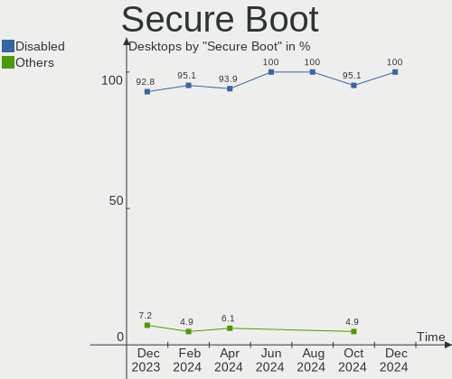
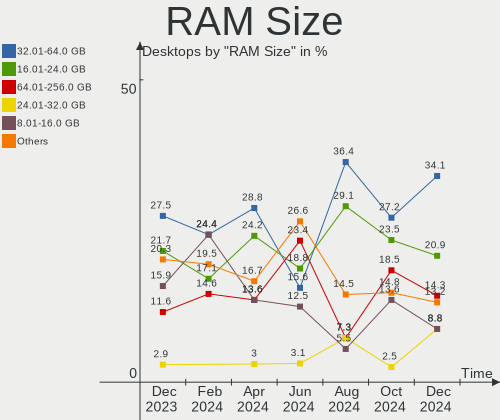
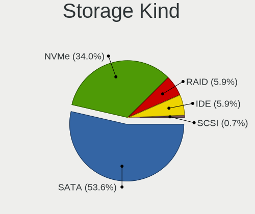
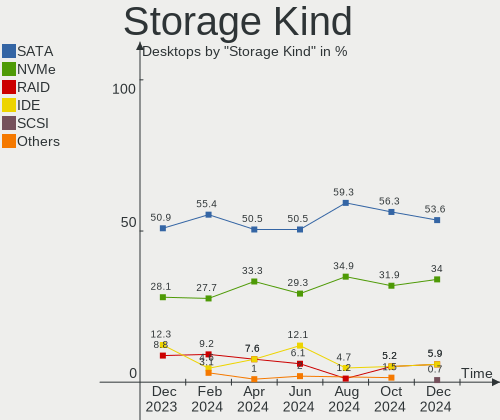
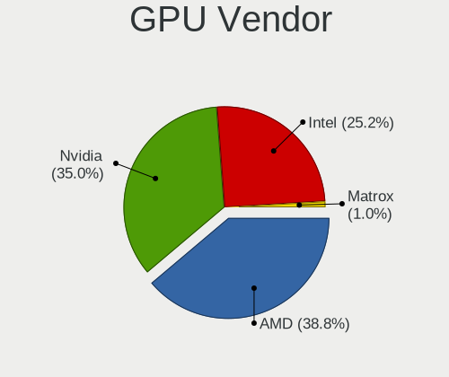
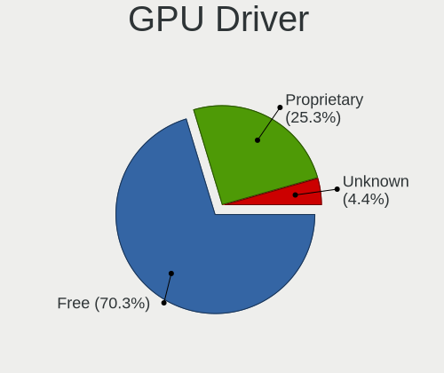
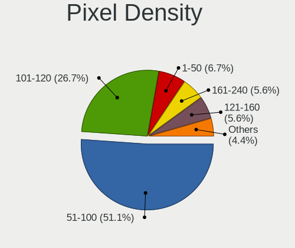

Linux in Canada - Hardware Trends (Desktops)
--------------------------------------------

A project to identify most popular hardware characteristics and track their change
over time based on data collected by Linux users at https://Linux-Hardware.org.

Anyone can contribute to this report by the [hw-probe](https://github.com/linuxhw/hw-probe) tool:

    sudo -E hw-probe -all -upload

Period: May, 2023.

Contents
--------

* [ System ](#system)
  - [ OS                       ](#os)
  - [ OS Family                ](#os-family)
  - [ Kernel                   ](#kernel)
  - [ Kernel Family            ](#kernel-family)
  - [ Kernel Major Ver.        ](#kernel-major-ver)
  - [ Arch                     ](#arch)
  - [ DE                       ](#de)
  - [ Display Server           ](#display-server)
  - [ Display Manager          ](#display-manager)
  - [ OS Lang                  ](#os-lang)
  - [ Boot Mode                ](#boot-mode)
  - [ Filesystem               ](#filesystem)
  - [ Part. scheme             ](#part-scheme)
  - [ Dual Boot with Linux/BSD ](#dual-boot-with-linuxbsd)
  - [ Dual Boot (Win)          ](#dual-boot-win)

* [ Board ](#board)
  - [ Vendor                   ](#vendor)
  - [ Model                    ](#model)
  - [ Model Family             ](#model-family)
  - [ MFG Year                 ](#mfg-year)
  - [ Form Factor              ](#form-factor)
  - [ Secure Boot              ](#secure-boot)
  - [ Coreboot                 ](#coreboot)
  - [ RAM Size                 ](#ram-size)
  - [ RAM Used                 ](#ram-used)
  - [ Total Drives             ](#total-drives)
  - [ Has CD-ROM               ](#has-cd-rom)
  - [ Has Ethernet             ](#has-ethernet)
  - [ Has WiFi                 ](#has-wifi)
  - [ Has Bluetooth            ](#has-bluetooth)

* [ Location ](#location)
  - [ Country                  ](#country)
  - [ City                     ](#city)

* [ Drives ](#drives)
  - [ Drive Vendor             ](#drive-vendor)
  - [ Drive Model              ](#drive-model)
  - [ HDD Vendor               ](#hdd-vendor)
  - [ SSD Vendor               ](#ssd-vendor)
  - [ Drive Kind               ](#drive-kind)
  - [ Drive Connector          ](#drive-connector)
  - [ Drive Size               ](#drive-size)
  - [ Space Total              ](#space-total)
  - [ Space Used               ](#space-used)
  - [ Malfunc. Drives          ](#malfunc-drives)
  - [ Malfunc. Drive Vendor    ](#malfunc-drive-vendor)
  - [ Malfunc. HDD Vendor      ](#malfunc-hdd-vendor)
  - [ Malfunc. Drive Kind      ](#malfunc-drive-kind)
  - [ Failed Drives            ](#failed-drives)
  - [ Failed Drive Vendor      ](#failed-drive-vendor)
  - [ Drive Status             ](#drive-status)

* [ Storage controller ](#storage-controller)
  - [ Storage Vendor           ](#storage-vendor)
  - [ Storage Model            ](#storage-model)
  - [ Storage Kind             ](#storage-kind)

* [ Processor ](#processor)
  - [ CPU Vendor               ](#cpu-vendor)
  - [ CPU Model                ](#cpu-model)
  - [ CPU Model Family         ](#cpu-model-family)
  - [ CPU Cores                ](#cpu-cores)
  - [ CPU Sockets              ](#cpu-sockets)
  - [ CPU Threads              ](#cpu-threads)
  - [ CPU Op-Modes             ](#cpu-op-modes)
  - [ CPU Microcode            ](#cpu-microcode)
  - [ CPU Microarch            ](#cpu-microarch)

* [ Graphics ](#graphics)
  - [ GPU Vendor               ](#gpu-vendor)
  - [ GPU Model                ](#gpu-model)
  - [ GPU Combo                ](#gpu-combo)
  - [ GPU Driver               ](#gpu-driver)
  - [ GPU Memory               ](#gpu-memory)

* [ Monitor ](#monitor)
  - [ Monitor Vendor           ](#monitor-vendor)
  - [ Monitor Model            ](#monitor-model)
  - [ Monitor Resolution       ](#monitor-resolution)
  - [ Monitor Diagonal         ](#monitor-diagonal)
  - [ Monitor Width            ](#monitor-width)
  - [ Aspect Ratio             ](#aspect-ratio)
  - [ Monitor Area             ](#monitor-area)
  - [ Pixel Density            ](#pixel-density)
  - [ Multiple Monitors        ](#multiple-monitors)

* [ Network ](#network)
  - [ Net Controller Vendor    ](#net-controller-vendor)
  - [ Net Controller Model     ](#net-controller-model)
  - [ Wireless Vendor          ](#wireless-vendor)
  - [ Wireless Model           ](#wireless-model)
  - [ Ethernet Vendor          ](#ethernet-vendor)
  - [ Ethernet Model           ](#ethernet-model)
  - [ Net Controller Kind      ](#net-controller-kind)
  - [ Used Controller          ](#used-controller)
  - [ NICs                     ](#nics)
  - [ IPv6                     ](#ipv6)

* [ Bluetooth ](#bluetooth)
  - [ Bluetooth Vendor         ](#bluetooth-vendor)
  - [ Bluetooth Model          ](#bluetooth-model)

* [ Sound ](#sound)
  - [ Sound Vendor             ](#sound-vendor)
  - [ Sound Model              ](#sound-model)

* [ Memory ](#memory)
  - [ Memory Vendor            ](#memory-vendor)
  - [ Memory Model             ](#memory-model)
  - [ Memory Kind              ](#memory-kind)
  - [ Memory Form Factor       ](#memory-form-factor)
  - [ Memory Size              ](#memory-size)
  - [ Memory Speed             ](#memory-speed)

* [ Printers & scanners ](#printers--scanners)
  - [ Printer Vendor           ](#printer-vendor)
  - [ Printer Model            ](#printer-model)
  - [ Scanner Vendor           ](#scanner-vendor)
  - [ Scanner Model            ](#scanner-model)

* [ Camera ](#camera)
  - [ Camera Vendor            ](#camera-vendor)
  - [ Camera Model             ](#camera-model)

* [ Security ](#security)
  - [ Fingerprint Vendor       ](#fingerprint-vendor)
  - [ Fingerprint Model        ](#fingerprint-model)
  - [ Chipcard Vendor          ](#chipcard-vendor)
  - [ Chipcard Model           ](#chipcard-model)

* [ Unsupported ](#unsupported)
  - [ Unsupported Devices      ](#unsupported-devices)
  - [ Unsupported Device Types ](#unsupported-device-types)

System
------

OS
--

Installed operating systems

| Name                         | Desktops | Percent |
|------------------------------|----------|---------|
| Ubuntu 22.04                 | 12       | 13.04%  |
| Ubuntu 23.04                 | 9        | 9.78%   |
| OpenMandriva 23.03           | 8        | 8.7%    |
| Pop!_OS 22.04                | 7        | 7.61%   |
| Linux Mint 21.1              | 7        | 7.61%   |
| Arch Rolling                 | 7        | 7.61%   |
| Fedora 38                    | 6        | 6.52%   |
| ArcoLinux Rolling            | 5        | 5.43%   |
| Zorin 16                     | 3        | 3.26%   |
| Linux Mint 20.3              | 3        | 3.26%   |
| EndeavourOS Rolling          | 3        | 3.26%   |
| Debian 11                    | 3        | 3.26%   |
| Kubuntu 22.04                | 2        | 2.17%   |
| Xubuntu 23.04                | 1        | 1.09%   |
| Rocky Linux 8.7              | 1        | 1.09%   |
| RHEL 9                       | 1        | 1.09%   |
| Parrot 4.11                  | 1        | 1.09%   |
| openSUSE Tumbleweed-XXXXXXXX | 1        | 1.09%   |
| OpenMandriva 4.50            | 1        | 1.09%   |
| OpenMandriva 23.01           | 1        | 1.09%   |
| MX 21                        | 1        | 1.09%   |
| Manjaro 23.0.0               | 1        | 1.09%   |
| Manjaro 22.1.1               | 1        | 1.09%   |
| Kubuntu 22.10                | 1        | 1.09%   |
| KDE neon 22.04               | 1        | 1.09%   |
| Kali 2023.1                  | 1        | 1.09%   |
| Gentoo 2.13                  | 1        | 1.09%   |
| Garuda Linux Soaring         | 1        | 1.09%   |
| ChimeraOS 41                 | 1        | 1.09%   |
| AlmaLinux 8.8                | 1        | 1.09%   |

OS Family
---------

OS without a version

| Name         | Desktops | Percent |
|--------------|----------|---------|
| Ubuntu       | 21       | 22.83%  |
| OpenMandriva | 10       | 10.87%  |
| Linux Mint   | 10       | 10.87%  |
| Pop!_OS      | 7        | 7.61%   |
| Arch         | 7        | 7.61%   |
| Fedora       | 6        | 6.52%   |
| ArcoLinux    | 5        | 5.43%   |
| Zorin        | 3        | 3.26%   |
| Kubuntu      | 3        | 3.26%   |
| EndeavourOS  | 3        | 3.26%   |
| Debian       | 3        | 3.26%   |
| Manjaro      | 2        | 2.17%   |
| Xubuntu      | 1        | 1.09%   |
| Rocky Linux  | 1        | 1.09%   |
| RHEL         | 1        | 1.09%   |
| Parrot       | 1        | 1.09%   |
| openSUSE     | 1        | 1.09%   |
| MX           | 1        | 1.09%   |
| KDE neon     | 1        | 1.09%   |
| Kali         | 1        | 1.09%   |
| Gentoo       | 1        | 1.09%   |
| Garuda Linux | 1        | 1.09%   |
| ChimeraOS    | 1        | 1.09%   |
| AlmaLinux    | 1        | 1.09%   |

Kernel
------

Version of the Linux kernel

| Version                 | Desktops | Percent |
|-------------------------|----------|---------|
| 6.2.0-20-generic        | 9        | 9.78%   |
| 5.19.0-41-generic       | 9        | 9.78%   |
| 6.2.6-desktop-1omv2390  | 8        | 8.7%    |
| 5.15.0-71-generic       | 6        | 6.52%   |
| 6.3.2-arch1-1           | 4        | 4.35%   |
| 6.2.6-76060206-generic  | 4        | 4.35%   |
| 5.15.0-72-generic       | 4        | 4.35%   |
| 6.3.1-zen1-1-zen        | 2        | 2.17%   |
| 6.2.9-300.fc38.x86_64   | 2        | 2.17%   |
| 6.2.15-300.fc38.x86_64  | 2        | 2.17%   |
| 6.2.14-300.fc38.x86_64  | 2        | 2.17%   |
| 6.2.13-arch1-1          | 2        | 2.17%   |
| 5.10.0-23-amd64         | 2        | 2.17%   |
| 6.3.5-arch1-1           | 1        | 1.09%   |
| 6.3.4-x64v1-xanmod1     | 1        | 1.09%   |
| 6.3.4-arch2-1           | 1        | 1.09%   |
| 6.3.4-arch1-1           | 1        | 1.09%   |
| 6.3.3-zen1-1-zen        | 1        | 1.09%   |
| 6.3.2-zen1-1-zen        | 1        | 1.09%   |
| 6.3.2-1-default         | 1        | 1.09%   |
| 6.3.2-060302-generic    | 1        | 1.09%   |
| 6.3.1-zen2-1-zen        | 1        | 1.09%   |
| 6.3.1-x64v2-xanmod1     | 1        | 1.09%   |
| 6.3.1-arch1-1           | 1        | 1.09%   |
| 6.3.1-3-MANJARO         | 1        | 1.09%   |
| 6.2.14-1-liquorix-amd64 | 1        | 1.09%   |
| 6.2.13-gentoo-dist      | 1        | 1.09%   |
| 6.2.13-1-MANJARO        | 1        | 1.09%   |
| 6.2.0-76060200-generic  | 1        | 1.09%   |
| 6.1.27-1-lts            | 1        | 1.09%   |
| 6.1.21-1-lts            | 1        | 1.09%   |
| 6.1.1-desktop-1omv2290  | 1        | 1.09%   |
| 6.1.0-kali9-amd64       | 1        | 1.09%   |
| 6.1.0-1parrot1-amd64    | 1        | 1.09%   |
| 6.0.2-76060002-generic  | 1        | 1.09%   |
| 5.4.0-148-generic       | 1        | 1.09%   |
| 5.4.0-144-generic       | 1        | 1.09%   |
| 5.4.0-128-generic       | 1        | 1.09%   |
| 5.19.0-42-generic       | 1        | 1.09%   |
| 5.19.0-38-generic       | 1        | 1.09%   |

Kernel Family
-------------

Linux kernel without a distro release

| Version | Desktops | Percent |
|---------|----------|---------|
| 6.2.6   | 12       | 13.04%  |
| 5.19.0  | 12       | 13.04%  |
| 5.15.0  | 12       | 13.04%  |
| 6.2.0   | 10       | 10.87%  |
| 6.3.2   | 7        | 7.61%   |
| 6.3.1   | 6        | 6.52%   |
| 6.2.13  | 4        | 4.35%   |
| 6.3.4   | 3        | 3.26%   |
| 6.2.14  | 3        | 3.26%   |
| 5.4.0   | 3        | 3.26%   |
| 5.10.0  | 3        | 3.26%   |
| 6.2.9   | 2        | 2.17%   |
| 6.2.15  | 2        | 2.17%   |
| 6.1.0   | 2        | 2.17%   |
| 4.18.0  | 2        | 2.17%   |
| 6.3.5   | 1        | 1.09%   |
| 6.3.3   | 1        | 1.09%   |
| 6.1.27  | 1        | 1.09%   |
| 6.1.21  | 1        | 1.09%   |
| 6.1.1   | 1        | 1.09%   |
| 6.0.2   | 1        | 1.09%   |
| 5.15.20 | 1        | 1.09%   |
| 5.14.0  | 1        | 1.09%   |
| 5.12.4  | 1        | 1.09%   |

Kernel Major Ver.
-----------------

Linux kernel major version

| Version | Desktops | Percent |
|---------|----------|---------|
| 6.2     | 33       | 35.87%  |
| 6.3     | 18       | 19.57%  |
| 5.15    | 13       | 14.13%  |
| 5.19    | 12       | 13.04%  |
| 6.1     | 5        | 5.43%   |
| 5.4     | 3        | 3.26%   |
| 5.10    | 3        | 3.26%   |
| 4.18    | 2        | 2.17%   |
| 6.0     | 1        | 1.09%   |
| 5.14    | 1        | 1.09%   |
| 5.12    | 1        | 1.09%   |

Arch
----

OS architecture (x86_64, i586, etc.)

| Name   | Desktops | Percent |
|--------|----------|---------|
| x86_64 | 92       | 100%    |

DE
--

Desktop Environment

| Name       | Desktops | Percent |
|------------|----------|---------|
| GNOME      | 42       | 45.65%  |
| KDE5       | 24       | 26.09%  |
| X-Cinnamon | 9        | 9.78%   |
| XFCE       | 7        | 7.61%   |
| Unknown    | 6        | 6.52%   |
| MATE       | 2        | 2.17%   |
| i3         | 1        | 1.09%   |
| Hyprland   | 1        | 1.09%   |

Display Server
--------------

X11 or Wayland

| Name    | Desktops | Percent |
|---------|----------|---------|
| X11     | 64       | 69.57%  |
| Wayland | 19       | 20.65%  |
| Tty     | 5        | 5.43%   |
| Unknown | 4        | 4.35%   |

Display Manager
---------------

SDDM, LightDM, etc.

| Name    | Desktops | Percent |
|---------|----------|---------|
| Unknown | 37       | 40.22%  |
| SDDM    | 21       | 22.83%  |
| GDM3    | 21       | 22.83%  |
| LightDM | 9        | 9.78%   |
| GDM     | 4        | 4.35%   |

OS Lang
-------

Language

| Lang  | Desktops | Percent |
|-------|----------|---------|
| en_CA | 52       | 56.52%  |
| en_US | 34       | 36.96%  |
| fr_CA | 5        | 5.43%   |
| C     | 1        | 1.09%   |

Boot Mode
---------

EFI or BIOS

| Mode | Desktops | Percent |
|------|----------|---------|
| BIOS | 49       | 53.26%  |
| EFI  | 43       | 46.74%  |

Filesystem
----------

Type of filesystem

| Type    | Desktops | Percent |
|---------|----------|---------|
| Ext4    | 52       | 56.52%  |
| Btrfs   | 15       | 16.3%   |
| Tmpfs   | 14       | 15.22%  |
| Overlay | 8        | 8.7%    |
| Xfs     | 3        | 3.26%   |

Part. scheme
------------

Scheme of partitioning

| Type    | Desktops | Percent |
|---------|----------|---------|
| GPT     | 46       | 50%     |
| Unknown | 32       | 34.78%  |
| MBR     | 14       | 15.22%  |

Dual Boot with Linux/BSD
------------------------

Hosting more than one Linux/BSD

| Dual boot | Desktops | Percent |
|-----------|----------|---------|
| No        | 68       | 73.91%  |
| Yes       | 24       | 26.09%  |

Dual Boot (Win)
---------------

Hosting Linux and Windows

| Dual boot | Desktops | Percent |
|-----------|----------|---------|
| No        | 72       | 78.26%  |
| Yes       | 20       | 21.74%  |

Board
-----

Vendor
------

Motherboard manufacturer

| Name                | Desktops | Percent |
|---------------------|----------|---------|
| ASUSTek Computer    | 26       | 28.26%  |
| Gigabyte Technology | 13       | 14.13%  |
| Hewlett-Packard     | 10       | 10.87%  |
| ASRock              | 10       | 10.87%  |
| MSI                 | 9        | 9.78%   |
| Dell                | 9        | 9.78%   |
| Lenovo              | 6        | 6.52%   |
| Acer                | 2        | 2.17%   |
| Supermicro          | 1        | 1.09%   |
| Pegatron            | 1        | 1.09%   |
| EVGA                | 1        | 1.09%   |
| Datto               | 1        | 1.09%   |
| ASRockRack          | 1        | 1.09%   |
| Alienware           | 1        | 1.09%   |
| Unknown             | 1        | 1.09%   |

Model
-----

Motherboard model

| Name                                | Desktops | Percent |
|-------------------------------------|----------|---------|
| Gigabyte X570 AORUS ELITE           | 2        | 2.17%   |
| Dell Precision WorkStation T3500    | 2        | 2.17%   |
| ASUS TUF Gaming X570-PLUS           | 2        | 2.17%   |
| ASUS ROG CROSSHAIR VIII HERO        | 2        | 2.17%   |
| ASUS PRIME B550-PLUS                | 2        | 2.17%   |
| ASRock B450M Pro4                   | 2        | 2.17%   |
| Supermicro AS -2124US-TNRP          | 1        | 1.09%   |
| Pegatron NP267AA-A2L e9180f         | 1        | 1.09%   |
| MSI Pro 3000/3080                   | 1        | 1.09%   |
| MSI MS-7D69                         | 1        | 1.09%   |
| MSI MS-7C95                         | 1        | 1.09%   |
| MSI MS-7C91                         | 1        | 1.09%   |
| MSI MS-7C84                         | 1        | 1.09%   |
| MSI MS-7C35                         | 1        | 1.09%   |
| MSI MS-7B33                         | 1        | 1.09%   |
| MSI MS-7A39                         | 1        | 1.09%   |
| MSI MEG Z590 Aegis Ti5 (MS-B931)    | 1        | 1.09%   |
| Lenovo ThinkCentre M93p 10A9000SUS  | 1        | 1.09%   |
| Lenovo ThinkCentre M92p 3238F5U     | 1        | 1.09%   |
| Lenovo ThinkCentre M83 10AM0007US   | 1        | 1.09%   |
| Lenovo ThinkCentre M82 2756AT9      | 1        | 1.09%   |
| Lenovo ThinkCentre M71e 5033A1U     | 1        | 1.09%   |
| Lenovo ThinkCentre M58p 6137AU8     | 1        | 1.09%   |
| HP Z800 Workstation                 | 1        | 1.09%   |
| HP Z620 Workstation                 | 1        | 1.09%   |
| HP ProDesk 400 G1 SFF               | 1        | 1.09%   |
| HP ProDesk 400 G1 MT                | 1        | 1.09%   |
| HP EliteDesk 800 G1 TWR             | 1        | 1.09%   |
| HP Compaq Pro 6300 MT               | 1        | 1.09%   |
| HP Compaq dc7900 Ultra-Slim Desktop | 1        | 1.09%   |
| HP Compaq dc7900 Small Form Factor  | 1        | 1.09%   |
| HP Compaq 8000 Elite USDT PC        | 1        | 1.09%   |
| HP 260-a129                         | 1        | 1.09%   |
| Gigabyte Z97X-UD3H                  | 1        | 1.09%   |
| Gigabyte Z390 UD                    | 1        | 1.09%   |
| Gigabyte Z390 AORUS PRO WIFI        | 1        | 1.09%   |
| Gigabyte Z170X-Gaming 7             | 1        | 1.09%   |
| Gigabyte X670 AORUS ELITE AX        | 1        | 1.09%   |
| Gigabyte X570S AERO G               | 1        | 1.09%   |
| Gigabyte X570 AORUS PRO WIFI        | 1        | 1.09%   |

Model Family
------------

Motherboard model prefix

| Name                     | Desktops | Percent |
|--------------------------|----------|---------|
| ASUS ROG                 | 8        | 8.7%    |
| Lenovo ThinkCentre       | 6        | 6.52%   |
| ASUS PRIME               | 5        | 5.43%   |
| HP Compaq                | 4        | 4.35%   |
| Dell OptiPlex            | 4        | 4.35%   |
| Gigabyte X570            | 3        | 3.26%   |
| Dell Precision           | 3        | 3.26%   |
| HP ProDesk               | 2        | 2.17%   |
| Gigabyte Z390            | 2        | 2.17%   |
| ASUS TUF                 | 2        | 2.17%   |
| ASRock Z97               | 2        | 2.17%   |
| ASRock B450M             | 2        | 2.17%   |
| Acer Aspire              | 2        | 2.17%   |
| Supermicro AS            | 1        | 1.09%   |
| Pegatron NP267AA-A2L     | 1        | 1.09%   |
| MSI Pro                  | 1        | 1.09%   |
| MSI MS-7D69              | 1        | 1.09%   |
| MSI MS-7C95              | 1        | 1.09%   |
| MSI MS-7C91              | 1        | 1.09%   |
| MSI MS-7C84              | 1        | 1.09%   |
| MSI MS-7C35              | 1        | 1.09%   |
| MSI MS-7B33              | 1        | 1.09%   |
| MSI MS-7A39              | 1        | 1.09%   |
| MSI MEG                  | 1        | 1.09%   |
| HP Z800                  | 1        | 1.09%   |
| HP Z620                  | 1        | 1.09%   |
| HP EliteDesk             | 1        | 1.09%   |
| HP 260-a129              | 1        | 1.09%   |
| Gigabyte Z97X-UD3H       | 1        | 1.09%   |
| Gigabyte Z170X-Gaming    | 1        | 1.09%   |
| Gigabyte X670            | 1        | 1.09%   |
| Gigabyte X570S           | 1        | 1.09%   |
| Gigabyte GB-BRi5(H)-8250 | 1        | 1.09%   |
| Gigabyte B660M           | 1        | 1.09%   |
| Gigabyte B650            | 1        | 1.09%   |
| Gigabyte 970A-DS3P       | 1        | 1.09%   |
| EVGA 151-HE-E999         | 1        | 1.09%   |
| Dell Vostro              | 1        | 1.09%   |
| Dell Inspiron            | 1        | 1.09%   |
| Datto SSD                | 1        | 1.09%   |

MFG Year
--------

Motherboard manufacture year

| Year | Desktops | Percent |
|------|----------|---------|
| 2022 | 10       | 10.87%  |
| 2018 | 10       | 10.87%  |
| 2019 | 8        | 8.7%    |
| 2013 | 8        | 8.7%    |
| 2021 | 7        | 7.61%   |
| 2020 | 7        | 7.61%   |
| 2014 | 6        | 6.52%   |
| 2012 | 6        | 6.52%   |
| 2011 | 6        | 6.52%   |
| 2017 | 4        | 4.35%   |
| 2015 | 4        | 4.35%   |
| 2010 | 4        | 4.35%   |
| 2009 | 4        | 4.35%   |
| 2016 | 3        | 3.26%   |
| 2008 | 3        | 3.26%   |
| 2023 | 1        | 1.09%   |
| 2007 | 1        | 1.09%   |

Form Factor
-----------

Physical design of the computer

| Name    | Desktops | Percent |
|---------|----------|---------|
| Desktop | 92       | 100%    |

Secure Boot
-----------

Enabled or disabled

| State    | Desktops | Percent |
|----------|----------|---------|
| Disabled | 90       | 97.83%  |
| Enabled  | 2        | 2.17%   |

Coreboot
--------

Have coreboot on board

| Used | Desktops | Percent |
|------|----------|---------|
| No   | 92       | 100%    |

RAM Size
--------

Total RAM memory

| Size in GB      | Desktops | Percent |
|-----------------|----------|---------|
| 32.01-64.0      | 29       | 31.52%  |
| 16.01-24.0      | 21       | 22.83%  |
| 8.01-16.0       | 12       | 13.04%  |
| 3.01-4.0        | 10       | 10.87%  |
| 4.01-8.0        | 7        | 7.61%   |
| 64.01-256.0     | 6        | 6.52%   |
| 24.01-32.0      | 3        | 3.26%   |
| 1.01-2.0        | 3        | 3.26%   |
| More than 256.0 | 1        | 1.09%   |

RAM Used
--------

Used RAM memory

| Used GB    | Desktops | Percent |
|------------|----------|---------|
| 4.01-8.0   | 23       | 25%     |
| 2.01-3.0   | 21       | 22.83%  |
| 1.01-2.0   | 18       | 19.57%  |
| 3.01-4.0   | 14       | 15.22%  |
| 8.01-16.0  | 10       | 10.87%  |
| 16.01-24.0 | 2        | 2.17%   |
| 0.51-1.0   | 2        | 2.17%   |
| 32.01-64.0 | 1        | 1.09%   |
| 0.01-0.5   | 1        | 1.09%   |

Total Drives
------------

Number of drives on board

| Drives | Desktops | Percent |
|--------|----------|---------|
| 1      | 30       | 32.61%  |
| 2      | 24       | 26.09%  |
| 3      | 14       | 15.22%  |
| 5      | 8        | 8.7%    |
| 4      | 7        | 7.61%   |
| 6      | 6        | 6.52%   |
| 8      | 3        | 3.26%   |

Has CD-ROM
----------

Has CD-ROM on board

| Presented | Desktops | Percent |
|-----------|----------|---------|
| No        | 58       | 63.04%  |
| Yes       | 34       | 36.96%  |

Has Ethernet
------------

Has Ethernet on board

| Presented | Desktops | Percent |
|-----------|----------|---------|
| Yes       | 92       | 100%    |

Has WiFi
--------

Has WiFi module

| Presented | Desktops | Percent |
|-----------|----------|---------|
| Yes       | 53       | 57.61%  |
| No        | 39       | 42.39%  |

Has Bluetooth
-------------

Has Bluetooth module

| Presented | Desktops | Percent |
|-----------|----------|---------|
| Yes       | 50       | 54.35%  |
| No        | 42       | 45.65%  |

Location
--------

Country
-------

Geographic location (country)

| Country | Desktops | Percent |
|---------|----------|---------|
| Canada  | 92       | 100%    |

City
----

Geographic location (city)

| City                      | Desktops | Percent |
|---------------------------|----------|---------|
| Montreal                  | 14       | 15.22%  |
| Toronto                   | 6        | 6.52%   |
| Ottawa                    | 4        | 4.35%   |
| Winnipeg                  | 3        | 3.26%   |
| Edmonton                  | 3        | 3.26%   |
| Calgary                   | 3        | 3.26%   |
| Weston                    | 2        | 2.17%   |
| Vancouver                 | 2        | 2.17%   |
| Scarborough               | 2        | 2.17%   |
| Oshawa                    | 2        | 2.17%   |
| Longueuil                 | 2        | 2.17%   |
| Alliston                  | 2        | 2.17%   |
| Windsor                   | 1        | 1.09%   |
| Waterloo                  | 1        | 1.09%   |
| Vankleek Hill             | 1        | 1.09%   |
| Tillsonburg               | 1        | 1.09%   |
| Temiskaming Shores        | 1        | 1.09%   |
| Sydney                    | 1        | 1.09%   |
| Surrey                    | 1        | 1.09%   |
| Sarnia                    | 1        | 1.09%   |
| Saint-Raymond-de-Portneuf | 1        | 1.09%   |
| Saint-Laurent             | 1        | 1.09%   |
| Saint-Jude                | 1        | 1.09%   |
| Saint-Hyacinthe           | 1        | 1.09%   |
| Saint-Honore              | 1        | 1.09%   |
| Rouyn-Noranda             | 1        | 1.09%   |
| Ridgetown                 | 1        | 1.09%   |
| Richmond Hill             | 1        | 1.09%   |
| Québec                   | 1        | 1.09%   |
| Port Coquitlam            | 1        | 1.09%   |
| Pincourt                  | 1        | 1.09%   |
| Pierrefonds               | 1        | 1.09%   |
| Owen Sound                | 1        | 1.09%   |
| North Vancouver           | 1        | 1.09%   |
| Niagara Falls             | 1        | 1.09%   |
| New Glasgow               | 1        | 1.09%   |
| Nepean                    | 1        | 1.09%   |
| Nelson                    | 1        | 1.09%   |
| Nanaimo                   | 1        | 1.09%   |
| Mississauga               | 1        | 1.09%   |

Drives
------

Drive Vendor
------------

Hard drive vendors

| Vendor                       | Desktops | Drives | Percent |
|------------------------------|----------|--------|---------|
| Seagate                      | 41       | 57     | 22.16%  |
| Samsung Electronics          | 32       | 55     | 17.3%   |
| WDC                          | 31       | 49     | 16.76%  |
| Sandisk                      | 16       | 19     | 8.65%   |
| Kingston                     | 8        | 8      | 4.32%   |
| Intel                        | 7        | 7      | 3.78%   |
| Crucial                      | 5        | 7      | 2.7%    |
| A-DATA Technology            | 5        | 5      | 2.7%    |
| Toshiba                      | 4        | 4      | 2.16%   |
| PNY                          | 3        | 3      | 1.62%   |
| HGST                         | 3        | 3      | 1.62%   |
| Unknown                      | 2        | 2      | 1.08%   |
| Team                         | 2        | 2      | 1.08%   |
| Phison                       | 2        | 2      | 1.08%   |
| Micron/Crucial Technology    | 2        | 2      | 1.08%   |
| KingFast                     | 2        | 2      | 1.08%   |
| JMicron Technology           | 2        | 2      | 1.08%   |
| WDC WDS2                     | 1        | 1      | 0.54%   |
| TO Exter                     | 1        | 1      | 0.54%   |
| Timetec                      | 1        | 1      | 0.54%   |
| T-FORCE                      | 1        | 1      | 0.54%   |
| SK hynix                     | 1        | 1      | 0.54%   |
| Silicon Motion               | 1        | 2      | 0.54%   |
| Shenzhen Longsys Electronics | 1        | 1      | 0.54%   |
| Realtek                      | 1        | 1      | 0.54%   |
| Phison Electronics           | 1        | 1      | 0.54%   |
| Mushkin                      | 1        | 1      | 0.54%   |
| Micron Technology            | 1        | 1      | 0.54%   |
| Lexar                        | 1        | 1      | 0.54%   |
| KingSpec                     | 1        | 1      | 0.54%   |
| Hitachi                      | 1        | 1      | 0.54%   |
| Hewlett-Packard              | 1        | 1      | 0.54%   |
| ADROITLARK                   | 1        | 1      | 0.54%   |
| ADATA Technology             | 1        | 1      | 0.54%   |
| Unknown                      | 1        | 1      | 0.54%   |

Drive Model
-----------

Hard drive models

| Model                                               | Desktops | Percent |
|-----------------------------------------------------|----------|---------|
| Samsung NVMe SSD Controller PM9A1/PM9A3/980PRO 1TB  | 8        | 3.54%   |
| Seagate ST4000DM004-2CV104 4TB                      | 5        | 2.21%   |
| Samsung NVMe SSD Controller SM981/PM981/PM983 256GB | 5        | 2.21%   |
| Seagate ST31000524AS 1TB                            | 3        | 1.33%   |
| Seagate Expansion Desk 4TB                          | 3        | 1.33%   |
| Sandisk WD Black SN750 / PC SN730 NVMe SSD 256GB    | 3        | 1.33%   |
| Samsung SSD 980 1TB                                 | 3        | 1.33%   |
| WDC WD1002FAEX-00Z3A0 1TB                           | 2        | 0.88%   |
| Seagate ST2000DM008-2FR102 2TB                      | 2        | 0.88%   |
| Seagate ST2000DM006-2DM164 2TB                      | 2        | 0.88%   |
| Seagate ST2000DM001-1ER164 2TB                      | 2        | 0.88%   |
| Seagate ST1000DM003-1ER162 1TB                      | 2        | 0.88%   |
| Sandisk WD_BLACK SN770 1TB                          | 2        | 0.88%   |
| Samsung SSD 970 EVO Plus 2TB                        | 2        | 0.88%   |
| Samsung SSD 870 EVO 500GB                           | 2        | 0.88%   |
| Samsung SSD 870 EVO 1TB                             | 2        | 0.88%   |
| Samsung SSD 860 EVO 500GB                           | 2        | 0.88%   |
| Samsung SSD 850 EVO 250GB                           | 2        | 0.88%   |
| Micron/Crucial P2 NVMe PCIe SSD 1TB                 | 2        | 0.88%   |
| Kingston SV300S37A120G 120GB SSD                    | 2        | 0.88%   |
| Kingston SA400S37240G 240GB SSD                     | 2        | 0.88%   |
| KingFast 512GB                                      | 2        | 0.88%   |
| JMicron Tech 250GB                                  | 2        | 0.88%   |
| Crucial CT480M500SSD1 480GB                         | 2        | 0.88%   |
| A-DATA SX900 128GB SSD                              | 2        | 0.88%   |
| WDC WDS500G2B0A-00SM50 500GB SSD                    | 1        | 0.44%   |
| WDC WDS250G2B0A-00SM50 250GB SSD                    | 1        | 0.44%   |
| WDC WDS2 50G1B0A-00H9H0 250GB SSD                   | 1        | 0.44%   |
| WDC WD7501AALS-00J7B1 752GB                         | 1        | 0.44%   |
| WDC WD6003FZBX-00GXAB0 6TB                          | 1        | 0.44%   |
| WDC WD6000HLHX-01JJPV0 600GB                        | 1        | 0.44%   |
| WDC WD5000AVCS-612DY1 500GB                         | 1        | 0.44%   |
| WDC WD5000AAKX-001CA0 500GB                         | 1        | 0.44%   |
| WDC WD40PURZ-85TTDY0 4TB                            | 1        | 0.44%   |
| WDC WD40PURX-64GVNY0 4TB                            | 1        | 0.44%   |
| WDC WD40EZRX-00SPEB0 4TB                            | 1        | 0.44%   |
| WDC WD40EZAZ-00SF3B0 4TB                            | 1        | 0.44%   |
| WDC WD40EFRX-68N32N0 4TB                            | 1        | 0.44%   |
| WDC WD40EFAX-68JH4N1 4TB                            | 1        | 0.44%   |
| WDC WD40 PURX-64GVNY0 4TB                           | 1        | 0.44%   |

HDD Vendor
----------

Hard disk drive vendors

| Vendor              | Desktops | Drives | Percent |
|---------------------|----------|--------|---------|
| Seagate             | 40       | 54     | 50%     |
| WDC                 | 30       | 47     | 37.5%   |
| Toshiba             | 3        | 3      | 3.75%   |
| HGST                | 3        | 3      | 3.75%   |
| Samsung Electronics | 2        | 2      | 2.5%    |
| Unknown             | 1        | 1      | 1.25%   |
| Hitachi             | 1        | 1      | 1.25%   |

SSD Vendor
----------

Solid state drive vendors

| Vendor              | Desktops | Drives | Percent |
|---------------------|----------|--------|---------|
| Samsung Electronics | 16       | 25     | 28.57%  |
| Kingston            | 6        | 6      | 10.71%  |
| Crucial             | 5        | 7      | 8.93%   |
| Intel               | 4        | 4      | 7.14%   |
| A-DATA Technology   | 4        | 4      | 7.14%   |
| SanDisk             | 3        | 4      | 5.36%   |
| PNY                 | 3        | 3      | 5.36%   |
| WDC                 | 2        | 2      | 3.57%   |
| Team                | 2        | 2      | 3.57%   |
| Seagate             | 2        | 2      | 3.57%   |
| WDC WDS2            | 1        | 1      | 1.79%   |
| Toshiba             | 1        | 1      | 1.79%   |
| TO Exter            | 1        | 1      | 1.79%   |
| Timetec             | 1        | 1      | 1.79%   |
| Mushkin             | 1        | 1      | 1.79%   |
| Lexar               | 1        | 1      | 1.79%   |
| KingSpec            | 1        | 1      | 1.79%   |
| Hewlett-Packard     | 1        | 1      | 1.79%   |
| ADROITLARK          | 1        | 1      | 1.79%   |

Drive Kind
----------

HDD or SSD

| Kind    | Desktops | Drives | Percent |
|---------|----------|--------|---------|
| HDD     | 59       | 111    | 38.56%  |
| SSD     | 48       | 68     | 31.37%  |
| NVMe    | 39       | 61     | 25.49%  |
| Unknown | 7        | 8      | 4.58%   |

Drive Connector
---------------

SATA, SAS, NVMe, etc.

| Type | Desktops | Drives | Percent |
|------|----------|--------|---------|
| SATA | 76       | 170    | 59.84%  |
| NVMe | 39       | 60     | 30.71%  |
| SAS  | 12       | 18     | 9.45%   |

Drive Size
----------

Size of hard drive

| Size in TB | Desktops | Drives | Percent |
|------------|----------|--------|---------|
| 0.01-0.5   | 45       | 63     | 35.43%  |
| 0.51-1.0   | 36       | 55     | 28.35%  |
| 1.01-2.0   | 20       | 26     | 15.75%  |
| 3.01-4.0   | 16       | 21     | 12.6%   |
| 2.01-3.0   | 4        | 4      | 3.15%   |
| 10.01-20.0 | 4        | 6      | 3.15%   |
| 4.01-10.0  | 2        | 4      | 1.57%   |

Space Total
-----------

Amount of disk space available on the file system

| Size in GB     | Desktops | Percent |
|----------------|----------|---------|
| More than 3000 | 26       | 28.26%  |
| 251-500        | 16       | 17.39%  |
| 501-1000       | 16       | 17.39%  |
| 1001-2000      | 9        | 9.78%   |
| 2001-3000      | 7        | 7.61%   |
| 101-250        | 6        | 6.52%   |
| 1-20           | 5        | 5.43%   |
| Unknown        | 5        | 5.43%   |
| 21-50          | 1        | 1.09%   |
| 51-100         | 1        | 1.09%   |

Space Used
----------

Amount of used disk space

| Used GB        | Desktops | Percent |
|----------------|----------|---------|
| 1-20           | 16       | 17.39%  |
| 21-50          | 13       | 14.13%  |
| 1001-2000      | 10       | 10.87%  |
| 51-100         | 10       | 10.87%  |
| More than 3000 | 9        | 9.78%   |
| 101-250        | 8        | 8.7%    |
| 501-1000       | 8        | 8.7%    |
| 251-500        | 7        | 7.61%   |
| 2001-3000      | 6        | 6.52%   |
| Unknown        | 5        | 5.43%   |

Malfunc. Drives
---------------

Drive models with a malfunction

| Model                                 | Desktops | Drives | Percent |
|---------------------------------------|----------|--------|---------|
| WDC WD20EADS-14R6B0 2TB               | 1        | 1      | 7.14%   |
| WDC WD15EADS-22P8B0 1TB               | 1        | 1      | 7.14%   |
| WDC WD1003FBYZ-010FB0 1TB             | 1        | 2      | 7.14%   |
| Seagate ST500LM021-1KJ152 500GB       | 1        | 1      | 7.14%   |
| Seagate ST3320813AS 320GB             | 1        | 1      | 7.14%   |
| Seagate ST3250310AS 250GB             | 1        | 2      | 7.14%   |
| Seagate ST3160815AS 160GB             | 1        | 1      | 7.14%   |
| Seagate ST31000528AS 1TB              | 1        | 1      | 7.14%   |
| Seagate ST2000DM008-2FR102 2TB        | 1        | 1      | 7.14%   |
| Seagate ST2000DM001-1ER164 2TB        | 1        | 1      | 7.14%   |
| Seagate ST14000NM0018-2H4101 14TB     | 1        | 1      | 7.14%   |
| Samsung Electronics SSD 960 EVO 250GB | 1        | 1      | 7.14%   |
| Kingston SV300S37A120G 120GB SSD      | 1        | 1      | 7.14%   |
| HGST HTS725050A7E630 500GB            | 1        | 1      | 7.14%   |

Malfunc. Drive Vendor
---------------------

Vendors of faulty drives

| Vendor              | Desktops | Drives | Percent |
|---------------------|----------|--------|---------|
| Seagate             | 8        | 9      | 57.14%  |
| WDC                 | 3        | 4      | 21.43%  |
| Samsung Electronics | 1        | 1      | 7.14%   |
| Kingston            | 1        | 1      | 7.14%   |
| HGST                | 1        | 1      | 7.14%   |

Malfunc. HDD Vendor
-------------------

Vendors of faulty HDD drives

| Vendor  | Desktops | Drives | Percent |
|---------|----------|--------|---------|
| Seagate | 8        | 9      | 66.67%  |
| WDC     | 3        | 4      | 25%     |
| HGST    | 1        | 1      | 8.33%   |

Malfunc. Drive Kind
-------------------

Kinds of faulty drives

| Kind | Desktops | Drives | Percent |
|------|----------|--------|---------|
| HDD  | 12       | 14     | 85.71%  |
| NVMe | 1        | 1      | 7.14%   |
| SSD  | 1        | 1      | 7.14%   |

Failed Drives
-------------

Failed drive models

Zero info for selected period =(

Failed Drive Vendor
-------------------

Failed drive vendors

Zero info for selected period =(

Drive Status
------------

Number of failed and malfunc. drives

| Status   | Desktops | Drives | Percent |
|----------|----------|--------|---------|
| Detected | 56       | 135    | 52.34%  |
| Works    | 37       | 97     | 34.58%  |
| Malfunc  | 14       | 16     | 13.08%  |

Storage controller
------------------

Storage Vendor
--------------

Storage controller vendors

| Vendor                       | Desktops | Percent |
|------------------------------|----------|---------|
| Intel                        | 56       | 36.36%  |
| AMD                          | 37       | 24.03%  |
| Samsung Electronics          | 21       | 13.64%  |
| SanDisk                      | 13       | 8.44%   |
| ASMedia Technology           | 8        | 5.19%   |
| Phison Electronics           | 3        | 1.95%   |
| JMicron Technology           | 3        | 1.95%   |
| VIA Technologies             | 2        | 1.3%    |
| Micron/Crucial Technology    | 2        | 1.3%    |
| Kingston Technology Company  | 2        | 1.3%    |
| ADATA Technology             | 2        | 1.3%    |
| SK hynix                     | 1        | 0.65%   |
| Silicon Motion               | 1        | 0.65%   |
| Shenzhen Longsys Electronics | 1        | 0.65%   |
| Micron Technology            | 1        | 0.65%   |
| Broadcom / LSI               | 1        | 0.65%   |

Storage Model
-------------

Storage controller models

| Model                                                                          | Desktops | Percent |
|--------------------------------------------------------------------------------|----------|---------|
| AMD FCH SATA Controller [AHCI mode]                                            | 27       | 14.67%  |
| Samsung NVMe SSD Controller SM981/PM981/PM983                                  | 9        | 4.89%   |
| Samsung NVMe SSD Controller PM9A1/PM9A3/980PRO                                 | 9        | 4.89%   |
| Intel SATA Controller [RAID mode]                                              | 9        | 4.89%   |
| ASMedia ASM1062 Serial ATA Controller                                          | 7        | 3.8%    |
| Intel 8 Series/C220 Series Chipset Family 6-port SATA Controller 1 [AHCI mode] | 6        | 3.26%   |
| AMD 500 Series Chipset SATA Controller                                         | 6        | 3.26%   |
| SanDisk WD Black SN770 NVMe SSD                                                | 5        | 2.72%   |
| Intel 7 Series/C210 Series Chipset Family 6-port SATA Controller [AHCI mode]   | 5        | 2.72%   |
| Intel Alder Lake-S PCH SATA Controller [AHCI Mode]                             | 4        | 2.17%   |
| Intel 4 Series Chipset PT IDER Controller                                      | 4        | 2.17%   |
| AMD 400 Series Chipset SATA Controller                                         | 4        | 2.17%   |
| SanDisk WD Black SN750 / PC SN730 NVMe SSD                                     | 3        | 1.63%   |
| Samsung NVMe SSD Controller 980                                                | 3        | 1.63%   |
| Intel 9 Series Chipset Family SATA Controller [AHCI Mode]                      | 3        | 1.63%   |
| Intel 82801JD/DO (ICH10 Family) SATA AHCI Controller                           | 3        | 1.63%   |
| Intel 6 Series/C200 Series Chipset Family 6 port Desktop SATA AHCI Controller  | 3        | 1.63%   |
| VIA VT6415 PATA IDE Host Controller                                            | 2        | 1.09%   |
| SanDisk WD Blue SN570 NVMe SSD 1TB                                             | 2        | 1.09%   |
| Samsung NVMe SSD Controller SM961/PM961/SM963                                  | 2        | 1.09%   |
| Micron/Crucial P2 NVMe PCIe SSD                                                | 2        | 1.09%   |
| Intel Volume Management Device NVMe RAID Controller                            | 2        | 1.09%   |
| Intel Q170/Q150/B150/H170/H110/Z170/CM236 Chipset SATA Controller [AHCI Mode]  | 2        | 1.09%   |
| Intel Cannon Lake PCH SATA AHCI Controller                                     | 2        | 1.09%   |
| Intel C610/X99 series chipset sSATA Controller [AHCI mode]                     | 2        | 1.09%   |
| Intel C610/X99 series chipset 6-Port SATA Controller [AHCI mode]               | 2        | 1.09%   |
| Intel 500 Series Chipset Family SATA AHCI Controller                           | 2        | 1.09%   |
| Intel 200 Series PCH SATA controller [AHCI mode]                               | 2        | 1.09%   |
| AMD SB7x0/SB8x0/SB9x0 SATA Controller [AHCI mode]                              | 2        | 1.09%   |
| AMD SB7x0/SB8x0/SB9x0 IDE Controller                                           | 2        | 1.09%   |
| AMD 300 Series Chipset SATA Controller                                         | 2        | 1.09%   |
| SK hynix PC400 NVMe SSD                                                        | 1        | 0.54%   |
| Silicon Motion SM2262/SM2262EN SSD Controller                                  | 1        | 0.54%   |
| Shenzhen Longsys Non-Volatile memory controller                                | 1        | 0.54%   |
| SanDisk WD Blue SN550 NVMe SSD                                                 | 1        | 0.54%   |
| SanDisk WD Black 2018/SN750 / PC SN720 NVMe SSD                                | 1        | 0.54%   |
| SanDisk Non-Volatile memory controller                                         | 1        | 0.54%   |
| Samsung NVMe SSD Controller SM951/PM951                                        | 1        | 0.54%   |
| Samsung Electronics Non-Volatile memory controller                             | 1        | 0.54%   |
| Phison PS5013 E13 NVMe Controller                                              | 1        | 0.54%   |

Storage Kind
------------

Kind of storage controller (IDE, SATA, NVMe, SAS, ...)

| Kind | Desktops | Percent |
|------|----------|---------|
| SATA | 76       | 53.15%  |
| NVMe | 39       | 27.27%  |
| RAID | 14       | 9.79%   |
| IDE  | 13       | 9.09%   |
| SAS  | 1        | 0.7%    |

Processor
---------

CPU Vendor
----------

Processor vendors

| Vendor | Desktops | Percent |
|--------|----------|---------|
| Intel  | 55       | 59.78%  |
| AMD    | 37       | 40.22%  |

CPU Model
---------

Processor models

| Model                                  | Desktops | Percent |
|----------------------------------------|----------|---------|
| Intel Core 2 Duo CPU E8400 @ 3.00GHz   | 4        | 4.35%   |
| AMD Ryzen 7 3700X 8-Core Processor     | 4        | 4.35%   |
| Intel Core i5-4570 CPU @ 3.20GHz       | 3        | 3.26%   |
| AMD Ryzen 5 5600X 6-Core Processor     | 3        | 3.26%   |
| Intel Core i7-6700K CPU @ 4.00GHz      | 2        | 2.17%   |
| Intel Core i7-4790 CPU @ 3.60GHz       | 2        | 2.17%   |
| Intel Core i5-4590 CPU @ 3.30GHz       | 2        | 2.17%   |
| Intel Core i3-2100 CPU @ 3.10GHz       | 2        | 2.17%   |
| Intel 12th Gen Core i5-12400           | 2        | 2.17%   |
| AMD Ryzen 9 5900X 12-Core Processor    | 2        | 2.17%   |
| AMD Ryzen 7 5700G with Radeon Graphics | 2        | 2.17%   |
| AMD Ryzen 7 3800X 8-Core Processor     | 2        | 2.17%   |
| AMD Ryzen 5 7600X 6-Core Processor     | 2        | 2.17%   |
| AMD Ryzen 5 2600 Six-Core Processor    | 2        | 2.17%   |
| Intel Xeon CPU W3680 @ 3.33GHz         | 1        | 1.09%   |
| Intel Xeon CPU W3530 @ 2.80GHz         | 1        | 1.09%   |
| Intel Xeon CPU E5620 @ 2.40GHz         | 1        | 1.09%   |
| Intel Xeon CPU E5-2643 0 @ 3.30GHz     | 1        | 1.09%   |
| Intel Xeon CPU E5-1607 v4 @ 3.10GHz    | 1        | 1.09%   |
| Intel Core i9-9900K CPU @ 3.60GHz      | 1        | 1.09%   |
| Intel Core i9-10850K CPU @ 3.60GHz     | 1        | 1.09%   |
| Intel Core i7-9700K CPU @ 3.60GHz      | 1        | 1.09%   |
| Intel Core i7-7700K CPU @ 4.20GHz      | 1        | 1.09%   |
| Intel Core i7-6900K CPU @ 3.20GHz      | 1        | 1.09%   |
| Intel Core i7-5775C CPU @ 3.30GHz      | 1        | 1.09%   |
| Intel Core i7-4790K CPU @ 4.00GHz      | 1        | 1.09%   |
| Intel Core i7-4770 CPU @ 3.40GHz       | 1        | 1.09%   |
| Intel Core i7-3770 CPU @ 3.40GHz       | 1        | 1.09%   |
| Intel Core i7-2600 CPU @ 3.40GHz       | 1        | 1.09%   |
| Intel Core i7 CPU 920 @ 2.67GHz        | 1        | 1.09%   |
| Intel Core i7 CPU 860 @ 2.80GHz        | 1        | 1.09%   |
| Intel Core i5-9600K CPU @ 3.70GHz      | 1        | 1.09%   |
| Intel Core i5-8250U CPU @ 1.60GHz      | 1        | 1.09%   |
| Intel Core i5-3570K CPU @ 3.40GHz      | 1        | 1.09%   |
| Intel Core i5-3570 CPU @ 3.40GHz       | 1        | 1.09%   |
| Intel Core i5-3470T CPU @ 2.90GHz      | 1        | 1.09%   |
| Intel Core i5-3450 CPU @ 3.10GHz       | 1        | 1.09%   |
| Intel Core i5-2400 CPU @ 3.10GHz       | 1        | 1.09%   |
| Intel Core i5 CPU 750 @ 2.67GHz        | 1        | 1.09%   |
| Intel Core i5 CPU 650 @ 3.20GHz        | 1        | 1.09%   |

CPU Model Family
----------------

Processor model prefix

| Model                  | Desktops | Percent |
|------------------------|----------|---------|
| Intel Core i7          | 14       | 15.22%  |
| Intel Core i5          | 14       | 15.22%  |
| AMD Ryzen 5            | 12       | 13.04%  |
| AMD Ryzen 7            | 11       | 11.96%  |
| Intel Core i3          | 8        | 8.7%    |
| Other                  | 6        | 6.52%   |
| Intel Core 2 Duo       | 6        | 6.52%   |
| AMD Ryzen 9            | 6        | 6.52%   |
| Intel Xeon             | 5        | 5.43%   |
| Intel Core i9          | 2        | 2.17%   |
| AMD Phenom II X4       | 2        | 2.17%   |
| AMD A8                 | 2        | 2.17%   |
| AMD Ryzen Threadripper | 1        | 1.09%   |
| AMD FX                 | 1        | 1.09%   |
| AMD EPYC               | 1        | 1.09%   |
| AMD A6                 | 1        | 1.09%   |

CPU Cores
---------

Number of processor cores

| Number | Desktops | Percent |
|--------|----------|---------|
| 4      | 31       | 33.7%   |
| 8      | 17       | 18.48%  |
| 6      | 17       | 18.48%  |
| 2      | 14       | 15.22%  |
| 12     | 5        | 5.43%   |
| 16     | 4        | 4.35%   |
| 3      | 2        | 2.17%   |
| 128    | 1        | 1.09%   |
| 10     | 1        | 1.09%   |

CPU Sockets
-----------

Number of sockets

| Number | Desktops | Percent |
|--------|----------|---------|
| 1      | 89       | 96.74%  |
| 2      | 3        | 3.26%   |

CPU Threads
-----------

Threads per core (Hyper-Threading)

| Number | Desktops | Percent |
|--------|----------|---------|
| 2      | 65       | 70.65%  |
| 1      | 27       | 29.35%  |

CPU Op-Modes
------------

CPU Operation Modes (32-bit, 64-bit)

| Op mode        | Desktops | Percent |
|----------------|----------|---------|
| 32-bit, 64-bit | 92       | 100%    |

CPU Microcode
-------------

Microcode number

| Number     | Desktops | Percent |
|------------|----------|---------|
| Unknown    | 54       | 58.7%   |
| 0x0a601203 | 5        | 5.43%   |
| 0x306c3    | 4        | 4.35%   |
| 0x0a50000d | 3        | 3.26%   |
| 0x0a20120a | 2        | 2.17%   |
| 0x0a201025 | 2        | 2.17%   |
| 0x08701030 | 2        | 2.17%   |
| 0x08701021 | 2        | 2.17%   |
| 0x08001138 | 2        | 2.17%   |
| 0x906eb    | 1        | 1.09%   |
| 0x906e9    | 1        | 1.09%   |
| 0x6fd      | 1        | 1.09%   |
| 0x406f1    | 1        | 1.09%   |
| 0x306a9    | 1        | 1.09%   |
| 0x206c2    | 1        | 1.09%   |
| 0x206a7    | 1        | 1.09%   |
| 0x106e5    | 1        | 1.09%   |
| 0x106a4    | 1        | 1.09%   |
| 0x0a201016 | 1        | 1.09%   |
| 0x0a001173 | 1        | 1.09%   |
| 0x08701013 | 1        | 1.09%   |
| 0x0800820c | 1        | 1.09%   |
| 0x07030105 | 1        | 1.09%   |
| 0x03000027 | 1        | 1.09%   |
| 0x010000c8 | 1        | 1.09%   |

CPU Microarch
-------------

Microarchitecture

| Name             | Desktops | Percent |
|------------------|----------|---------|
| Zen 3            | 10       | 10.87%  |
| Haswell          | 10       | 10.87%  |
| Zen 2            | 9        | 9.78%   |
| Unknown          | 9        | 9.78%   |
| KabyLake         | 7        | 7.61%   |
| SandyBridge      | 6        | 6.52%   |
| Penryn           | 5        | 5.43%   |
| IvyBridge        | 5        | 5.43%   |
| Zen+             | 4        | 4.35%   |
| Nehalem          | 4        | 4.35%   |
| Broadwell        | 4        | 4.35%   |
| Westmere         | 3        | 3.26%   |
| Zen              | 2        | 2.17%   |
| Skylake          | 2        | 2.17%   |
| Piledriver       | 2        | 2.17%   |
| K10              | 2        | 2.17%   |
| CometLake        | 2        | 2.17%   |
| Alderlake Hybrid | 2        | 2.17%   |
| Puma             | 1        | 1.09%   |
| K10 Llano        | 1        | 1.09%   |
| Icelake          | 1        | 1.09%   |
| Core             | 1        | 1.09%   |

Graphics
--------

GPU Vendor
----------

Vendors of graphics cards

| Vendor            | Desktops | Percent |
|-------------------|----------|---------|
| Nvidia            | 37       | 36.27%  |
| AMD               | 33       | 32.35%  |
| Intel             | 30       | 29.41%  |
| ASPEED Technology | 2        | 1.96%   |

GPU Model
---------

Graphics card models

| Model                                                                       | Desktops | Percent |
|-----------------------------------------------------------------------------|----------|---------|
| Intel Xeon E3-1200 v3/4th Gen Core Processor Integrated Graphics Controller | 8        | 7.41%   |
| AMD Ellesmere [Radeon RX 470/480/570/570X/580/580X/590]                     | 5        | 4.63%   |
| Nvidia GP107 [GeForce GTX 1050 Ti]                                          | 4        | 3.7%    |
| Nvidia GP104 [GeForce GTX 1070]                                             | 4        | 3.7%    |
| Intel 4 Series Chipset Integrated Graphics Controller                       | 4        | 3.7%    |
| Intel 2nd Generation Core Processor Family Integrated Graphics Controller   | 4        | 3.7%    |
| AMD Raphael                                                                 | 4        | 3.7%    |
| AMD Navi 21 [Radeon RX 6800/6800 XT / 6900 XT]                              | 4        | 3.7%    |
| Nvidia GK208B [GeForce GT 710]                                              | 3        | 2.78%   |
| Nvidia GA106 [GeForce RTX 3060 Lite Hash Rate]                              | 3        | 2.78%   |
| AMD Navi 22 [Radeon RX 6700/6700 XT/6750 XT / 6800M/6850M XT]               | 3        | 2.78%   |
| AMD Cezanne [Radeon Vega Series / Radeon Vega Mobile Series]                | 3        | 2.78%   |
| Nvidia TU104 [GeForce RTX 2070 SUPER]                                       | 2        | 1.85%   |
| Nvidia AD104 [GeForce RTX 4070]                                             | 2        | 1.85%   |
| Intel Xeon E3-1200 v2/3rd Gen Core processor Graphics Controller            | 2        | 1.85%   |
| Intel IvyBridge GT2 [HD Graphics 4000]                                      | 2        | 1.85%   |
| Intel CoffeeLake-S GT2 [UHD Graphics 630]                                   | 2        | 1.85%   |
| Intel 4th Generation Core Processor Family Integrated Graphics Controller   | 2        | 1.85%   |
| ASPEED Technology ASPEED Graphics Family                                    | 2        | 1.85%   |
| AMD Navi 24 [Radeon RX 6400/6500 XT/6500M]                                  | 2        | 1.85%   |
| Nvidia TU116 [GeForce GTX 1660]                                             | 1        | 0.93%   |
| Nvidia TU104 [GeForce RTX 2080 Rev. A]                                      | 1        | 0.93%   |
| Nvidia GT218 [GeForce 210]                                                  | 1        | 0.93%   |
| Nvidia GP108 [GeForce GT 1030]                                              | 1        | 0.93%   |
| Nvidia GP107 [GeForce GTX 1050]                                             | 1        | 0.93%   |
| Nvidia GP106GL [Quadro P2200]                                               | 1        | 0.93%   |
| Nvidia GP104 [GeForce GTX 1080]                                             | 1        | 0.93%   |
| Nvidia GP102 [GeForce GTX 1080 Ti]                                          | 1        | 0.93%   |
| Nvidia GM206GL [Quadro M2000]                                               | 1        | 0.93%   |
| Nvidia GM204 [GeForce GTX 970]                                              | 1        | 0.93%   |
| Nvidia GM107 [GeForce GTX 750 Ti]                                           | 1        | 0.93%   |
| Nvidia GM107 [GeForce GTX 745]                                              | 1        | 0.93%   |
| Nvidia GK208B [GeForce GT 730]                                              | 1        | 0.93%   |
| Nvidia GK110 [GeForce GTX 780]                                              | 1        | 0.93%   |
| Nvidia GK107 [GeForce GT 640]                                               | 1        | 0.93%   |
| Nvidia GK106 [GeForce GTX 650 Ti]                                           | 1        | 0.93%   |
| Nvidia GK104 [GeForce GTX 660 Ti]                                           | 1        | 0.93%   |
| Nvidia GA104 [GeForce RTX 3070 Lite Hash Rate]                              | 1        | 0.93%   |
| Nvidia GA104 [GeForce RTX 3060]                                             | 1        | 0.93%   |
| Nvidia GA102 [GeForce RTX 3090]                                             | 1        | 0.93%   |

GPU Combo
---------

Combinations of graphics cards

| Name             | Desktops | Percent |
|------------------|----------|---------|
| 1 x Nvidia       | 30       | 32.61%  |
| 1 x AMD          | 25       | 27.17%  |
| 1 x Intel        | 19       | 20.65%  |
| 2 x Intel        | 4        | 4.35%   |
| 2 x AMD          | 3        | 3.26%   |
| Intel + Nvidia   | 3        | 3.26%   |
| Intel + AMD      | 2        | 2.17%   |
| 1 x ASPEED       | 2        | 2.17%   |
| AMD + Nvidia     | 2        | 2.17%   |
| 2 x Nvidia       | 1        | 1.09%   |
| AMD + 2 x Nvidia | 1        | 1.09%   |

GPU Driver
----------

Free vs proprietary

| Driver      | Desktops | Percent |
|-------------|----------|---------|
| Free        | 61       | 66.3%   |
| Proprietary | 27       | 29.35%  |
| Unknown     | 4        | 4.35%   |

GPU Memory
----------

Total video memory

| Size in GB | Desktops | Percent |
|------------|----------|---------|
| Unknown    | 49       | 53.26%  |
| 8.01-16.0  | 9        | 9.78%   |
| 7.01-8.0   | 8        | 8.7%    |
| 3.01-4.0   | 7        | 7.61%   |
| 1.01-2.0   | 6        | 6.52%   |
| 0.51-1.0   | 6        | 6.52%   |
| 0.01-0.5   | 5        | 5.43%   |
| 4.01-5.0   | 1        | 1.09%   |
| 16.01-24.0 | 1        | 1.09%   |

Monitor
-------

Monitor Vendor
--------------

Monitor vendors

| Vendor               | Desktops | Percent |
|----------------------|----------|---------|
| Goldstar             | 14       | 14.58%  |
| Acer                 | 11       | 11.46%  |
| Hewlett-Packard      | 9        | 9.38%   |
| Dell                 | 8        | 8.33%   |
| ASUSTek Computer     | 7        | 7.29%   |
| Samsung Electronics  | 6        | 6.25%   |
| Ancor Communications | 5        | 5.21%   |
| Seiki                | 4        | 4.17%   |
| BenQ                 | 4        | 4.17%   |
| ViewSonic            | 3        | 3.13%   |
| Sceptre Tech         | 3        | 3.13%   |
| Gigabyte Technology  | 3        | 3.13%   |
| MSI                  | 2        | 2.08%   |
| Lenovo               | 2        | 2.08%   |
| Unknown              | 2        | 2.08%   |
| Westinghouse         | 1        | 1.04%   |
| Wacom                | 1        | 1.04%   |
| Unknown (XXX)        | 1        | 1.04%   |
| RTK                  | 1        | 1.04%   |
| Pixio                | 1        | 1.04%   |
| Philips              | 1        | 1.04%   |
| Onkyo                | 1        | 1.04%   |
| JVC                  | 1        | 1.04%   |
| Insignia             | 1        | 1.04%   |
| CNC                  | 1        | 1.04%   |
| Chimei Innolux       | 1        | 1.04%   |
| AUS                  | 1        | 1.04%   |
| AOC                  | 1        | 1.04%   |

Monitor Model
-------------

Monitor models

| Model                                                                   | Desktops | Percent |
|-------------------------------------------------------------------------|----------|---------|
| Seiki SE20HY SEK0CA8 1360x768 440x250mm 19.9-inch                       | 4        | 3.85%   |
| Goldstar HDR 4K GSM7707 3840x2160 600x340mm 27.2-inch                   | 2        | 1.92%   |
| Dell U2412M DELA07A 1920x1200 518x324mm 24.1-inch                       | 2        | 1.92%   |
| ASUSTek Computer VG245 AUS24A1 1920x1080 531x299mm 24.0-inch            | 2        | 1.92%   |
| Unknown                                                                 | 2        | 1.92%   |
| Westinghouse VR-3225 WDT6400 1920x1080 710x400mm 32.1-inch              | 1        | 0.96%   |
| Wacom Cintiq 16 WAC1071 1920x1080 344x193mm 15.5-inch                   | 1        | 0.96%   |
| ViewSonic VX3211-2K VSCF634 2560x1440 698x392mm 31.5-inch               | 1        | 0.96%   |
| ViewSonic VX2703 SERIES VSCF62B 1920x1080 597x336mm 27.0-inch           | 1        | 0.96%   |
| ViewSonic VX2233wm-1 VSC1D22 1920x1080 477x268mm 21.5-inch              | 1        | 0.96%   |
| Unknown (XXX) Beyond TV XXX9615 3840x2160 1210x680mm 54.6-inch          | 1        | 0.96%   |
| Sceptre Tech X246W-1080p SPT2303 1920x1080 521x293mm 23.5-inch          | 1        | 0.96%   |
| Sceptre Tech Sceptre M27 SPT0ACD 1920x1080 598x336mm 27.0-inch          | 1        | 0.96%   |
| Sceptre Tech Sceptre E20 SPT080D 1600x900 410x280mm 19.5-inch           | 1        | 0.96%   |
| Samsung Electronics SyncMaster SAM0657 1920x1080                        | 1        | 0.96%   |
| Samsung Electronics SyncMaster SAM043F 1920x1200 518x324mm 24.1-inch    | 1        | 0.96%   |
| Samsung Electronics SyncMaster SAM010F 1280x1024 376x301mm 19.0-inch    | 1        | 0.96%   |
| Samsung Electronics LCD Monitor SAM71FF 3840x2160 1872x1053mm 84.6-inch | 1        | 0.96%   |
| Samsung Electronics LCD Monitor SAM0A7A 1920x1080 1060x626mm 48.5-inch  | 1        | 0.96%   |
| Samsung Electronics LCD Monitor SAM07BC 1360x768                        | 1        | 0.96%   |
| Samsung Electronics LC24RG50 SAM0F90 1920x1080 532x304mm 24.1-inch      | 1        | 0.96%   |
| RTK FHD HDR RTK3B3A 1920x1080 344x195mm 15.6-inch                       | 1        | 0.96%   |
| Pixio PX277P PNS0277 2560x1440 697x392mm 31.5-inch                      | 1        | 0.96%   |
| Philips PHL 322E1 PHLC20F 1920x1080 700x390mm 31.5-inch                 | 1        | 0.96%   |
| Onkyo AV Receiver ONK1150 3840x2160 1872x1053mm 84.6-inch               | 1        | 0.96%   |
| MSI Optix G241VC MSI1462 1920x1080 521x294mm 23.6-inch                  | 1        | 0.96%   |
| MSI AG321CQR MSI3DB4 2560x1440 700x390mm 31.5-inch                      | 1        | 0.96%   |
| Lenovo LEN T2454pA LEN60C9 1920x1080 518x324mm 24.1-inch                | 1        | 0.96%   |
| Lenovo LEN T2254pC LEN60CC 1680x1050 474x296mm 22.0-inch                | 1        | 0.96%   |
| JVC FPDUS-FN JVC21B0 1920x540                                           | 1        | 0.96%   |
| Insignia NS-32D20SNA14 BBY0032 1360x768 544x326mm 25.0-inch             | 1        | 0.96%   |
| Hewlett-Packard w2338h HWP281C 1920x1080 509x286mm 23.0-inch            | 1        | 0.96%   |
| Hewlett-Packard w1907 HWP26A3 1440x900 408x255mm 18.9-inch              | 1        | 0.96%   |
| Hewlett-Packard LA2206 HWP2947 1920x1080 477x268mm 21.5-inch            | 1        | 0.96%   |
| Hewlett-Packard E223 HPN345C 1920x1080 476x268mm 21.5-inch              | 1        | 0.96%   |
| Hewlett-Packard 27f HPN354B 1920x1080 598x336mm 27.0-inch               | 1        | 0.96%   |
| Hewlett-Packard 24es HWP3321 1920x1080 527x296mm 23.8-inch              | 1        | 0.96%   |
| Hewlett-Packard 24es HWP3320 1920x1080 527x296mm 23.8-inch              | 1        | 0.96%   |
| Hewlett-Packard 23xw HWP318C 1920x1080 509x286mm 23.0-inch              | 1        | 0.96%   |
| Hewlett-Packard 23xw HWP318B 1920x1080 509x286mm 23.0-inch              | 1        | 0.96%   |

Monitor Resolution
------------------

Monitor screen resolution

| Resolution         | Desktops | Percent |
|--------------------|----------|---------|
| 1920x1080 (FHD)    | 41       | 43.16%  |
| 3840x2160 (4K)     | 10       | 10.53%  |
| 2560x1440 (QHD)    | 10       | 10.53%  |
| 1600x900 (HD+)     | 6        | 6.32%   |
| 1360x768           | 6        | 6.32%   |
| 1680x1050 (WSXGA+) | 5        | 5.26%   |
| 2560x1080          | 4        | 4.21%   |
| 1920x1200 (WUXGA)  | 3        | 3.16%   |
| 3840x1080          | 2        | 2.11%   |
| 3440x1440          | 2        | 2.11%   |
| 1920x540           | 2        | 2.11%   |
| 2560x2880          | 1        | 1.05%   |
| 1440x900 (WXGA+)   | 1        | 1.05%   |
| 1280x1024 (SXGA)   | 1        | 1.05%   |
| Unknown            | 1        | 1.05%   |

Monitor Diagonal
----------------

Diagonal size in inches

| Inches  | Desktops | Percent |
|---------|----------|---------|
| 27      | 20       | 20.83%  |
| 24      | 12       | 12.5%   |
| 31      | 11       | 11.46%  |
| 21      | 8        | 8.33%   |
| Unknown | 7        | 7.29%   |
| 23      | 6        | 6.25%   |
| 34      | 5        | 5.21%   |
| 39      | 4        | 4.17%   |
| 20      | 4        | 4.17%   |
| 19      | 4        | 4.17%   |
| 22      | 3        | 3.13%   |
| 84      | 2        | 2.08%   |
| 48      | 2        | 2.08%   |
| 15      | 2        | 2.08%   |
| 54      | 1        | 1.04%   |
| 49      | 1        | 1.04%   |
| 32      | 1        | 1.04%   |
| 28      | 1        | 1.04%   |
| 26      | 1        | 1.04%   |
| 13      | 1        | 1.04%   |

Monitor Width
-------------

Physical width

| Width in mm | Desktops | Percent |
|-------------|----------|---------|
| 501-600     | 34       | 36.17%  |
| 401-500     | 20       | 21.28%  |
| 601-700     | 13       | 13.83%  |
| Unknown     | 7        | 7.45%   |
| 701-800     | 6        | 6.38%   |
| 801-900     | 4        | 4.26%   |
| 1001-1500   | 4        | 4.26%   |
| 301-350     | 3        | 3.19%   |
| 1501-2000   | 2        | 2.13%   |
| 351-400     | 1        | 1.06%   |

Aspect Ratio
------------

Proportional relationship between the width and the height

| Ratio   | Desktops | Percent |
|---------|----------|---------|
| 16/9    | 58       | 69.88%  |
| 16/10   | 9        | 10.84%  |
| 21/9    | 6        | 7.23%   |
| Unknown | 4        | 4.82%   |
| 32/9    | 2        | 2.41%   |
| 5/4     | 1        | 1.2%    |
| 3/2     | 1        | 1.2%    |
| 1.96    | 1        | 1.2%    |
| 0.89    | 1        | 1.2%    |

Monitor Area
------------

Area in inch²

| Area in inch² | Desktops | Percent |
|----------------|----------|---------|
| 201-250        | 22       | 23.16%  |
| 301-350        | 20       | 21.05%  |
| 351-500        | 16       | 16.84%  |
| 151-200        | 12       | 12.63%  |
| Unknown        | 7        | 7.37%   |
| 501-1000       | 6        | 6.32%   |
| 251-300        | 5        | 5.26%   |
| More than 1000 | 4        | 4.21%   |
| 101-110        | 2        | 2.11%   |
| 81-90          | 1        | 1.05%   |

Pixel Density
-------------

Pixels per inch

| Density | Desktops | Percent |
|---------|----------|---------|
| 51-100  | 49       | 55.68%  |
| 101-120 | 15       | 17.05%  |
| 1-50    | 8        | 9.09%   |
| Unknown | 7        | 7.95%   |
| 121-160 | 6        | 6.82%   |
| 161-240 | 3        | 3.41%   |

Multiple Monitors
-----------------

Total monitors connected

| Total | Desktops | Percent |
|-------|----------|---------|
| 1     | 62       | 67.39%  |
| 2     | 16       | 17.39%  |
| 0     | 8        | 8.7%    |
| 3     | 4        | 4.35%   |
| 4     | 2        | 2.17%   |

Network
-------

Net Controller Vendor
---------------------

Controller vendors

| Vendor                   | Desktops | Percent |
|--------------------------|----------|---------|
| Intel                    | 52       | 39.1%   |
| Realtek Semiconductor    | 46       | 34.59%  |
| Qualcomm Atheros         | 8        | 6.02%   |
| Broadcom                 | 5        | 3.76%   |
| MediaTek                 | 4        | 3.01%   |
| Linksys                  | 4        | 3.01%   |
| D-Link                   | 3        | 2.26%   |
| Ralink                   | 2        | 1.5%    |
| Wacom                    | 1        | 0.75%   |
| TP-Link                  | 1        | 0.75%   |
| STMicroelectronics       | 1        | 0.75%   |
| Samsung Electronics      | 1        | 0.75%   |
| Ralink Technology        | 1        | 0.75%   |
| Microsoft                | 1        | 0.75%   |
| Micro Star International | 1        | 0.75%   |
| DisplayLink              | 1        | 0.75%   |
| Aquantia                 | 1        | 0.75%   |

Net Controller Model
--------------------

Controller models

| Model                                                             | Desktops | Percent |
|-------------------------------------------------------------------|----------|---------|
| Realtek RTL8111/8168/8411 PCI Express Gigabit Ethernet Controller | 33       | 19.64%  |
| Realtek RTL8125 2.5GbE Controller                                 | 10       | 5.95%   |
| Intel Wi-Fi 6 AX200                                               | 7        | 4.17%   |
| Intel I211 Gigabit Network Connection                             | 7        | 4.17%   |
| Intel Ethernet Controller I225-V                                  | 7        | 4.17%   |
| Intel Ethernet Connection I217-LM                                 | 7        | 4.17%   |
| Intel Wi-Fi 6 AX210/AX211/AX411 160MHz                            | 6        | 3.57%   |
| Intel 82579LM Gigabit Network Connection (Lewisville)             | 6        | 3.57%   |
| Intel Alder Lake-S PCH CNVi WiFi                                  | 4        | 2.38%   |
| Intel 82567LM-3 Gigabit Network Connection                        | 4        | 2.38%   |
| MediaTek MT7922 802.11ax PCI Express Wireless Network Adapter     | 3        | 1.79%   |
| Intel Wireless-AC 9260                                            | 3        | 1.79%   |
| Intel Ethernet Connection (2) I219-V                              | 3        | 1.79%   |
| Intel Ethernet Connection (2) I218-V                              | 3        | 1.79%   |
| Realtek RTL8812AU 802.11a/b/g/n/ac 2T2R DB WLAN Adapter           | 2        | 1.19%   |
| Realtek 802.11ac NIC                                              | 2        | 1.19%   |
| Linksys AE1200 802.11bgn Wireless Adapter [Broadcom BCM43235]     | 2        | 1.19%   |
| Intel I210 Gigabit Network Connection                             | 2        | 1.19%   |
| Intel Dual Band Wireless-AC 3168NGW [Stone Peak]                  | 2        | 1.19%   |
| D-Link 802.11ac WLAN Adapter                                      | 2        | 1.19%   |
| D-Link 802.11ac NIC                                               | 2        | 1.19%   |
| Broadcom NetXtreme BCM5761 Gigabit Ethernet PCIe                  | 2        | 1.19%   |
| Wacom ACK-40401 [Wireless Accessory Kit]                          | 1        | 0.6%    |
| TP-Link TL-WN823N v2/v3 [Realtek RTL8192EU]                       | 1        | 0.6%    |
| STMicroelectronics Virtual COM Port                               | 1        | 0.6%    |
| Samsung Galaxy series, misc. (tethering mode)                     | 1        | 0.6%    |
| Realtek RTL8852BE PCIe 802.11ax Wireless Network Controller       | 1        | 0.6%    |
| Realtek RTL8822BE 802.11a/b/g/n/ac WiFi adapter                   | 1        | 0.6%    |
| Realtek RTL8723BE PCIe Wireless Network Adapter                   | 1        | 0.6%    |
| Realtek RTL8192EU 802.11b/g/n WLAN Adapter                        | 1        | 0.6%    |
| Realtek RTL8153 Gigabit Ethernet Adapter                          | 1        | 0.6%    |
| Realtek 802.11ac WLAN Adapter                                     | 1        | 0.6%    |
| Ralink RT5370 Wireless Adapter                                    | 1        | 0.6%    |
| Ralink RT3090 Wireless 802.11n 1T/1R PCIe                         | 1        | 0.6%    |
| Ralink RT3060 Wireless 802.11n 1T/1R                              | 1        | 0.6%    |
| Qualcomm Atheros QCA9565 / AR9565 Wireless Network Adapter        | 1        | 0.6%    |
| Qualcomm Atheros QCA9377 802.11ac Wireless Network Adapter        | 1        | 0.6%    |
| Qualcomm Atheros Killer E2500 Gigabit Ethernet Controller         | 1        | 0.6%    |
| Qualcomm Atheros Killer E2400 Gigabit Ethernet Controller         | 1        | 0.6%    |
| Qualcomm Atheros Killer E220x Gigabit Ethernet Controller         | 1        | 0.6%    |

Wireless Vendor
---------------

Wireless vendors

| Vendor                   | Desktops | Percent |
|--------------------------|----------|---------|
| Intel                    | 26       | 44.07%  |
| Realtek Semiconductor    | 8        | 13.56%  |
| Qualcomm Atheros         | 6        | 10.17%  |
| MediaTek                 | 4        | 6.78%   |
| Linksys                  | 4        | 6.78%   |
| D-Link                   | 3        | 5.08%   |
| Ralink                   | 2        | 3.39%   |
| Wacom                    | 1        | 1.69%   |
| TP-Link                  | 1        | 1.69%   |
| Ralink Technology        | 1        | 1.69%   |
| Microsoft                | 1        | 1.69%   |
| Micro Star International | 1        | 1.69%   |
| Broadcom                 | 1        | 1.69%   |

Wireless Model
--------------

Wireless models

| Model                                                                      | Desktops | Percent |
|----------------------------------------------------------------------------|----------|---------|
| Intel Wi-Fi 6 AX200                                                        | 7        | 11.48%  |
| Intel Wi-Fi 6 AX210/AX211/AX411 160MHz                                     | 6        | 9.84%   |
| Intel Alder Lake-S PCH CNVi WiFi                                           | 4        | 6.56%   |
| MediaTek MT7922 802.11ax PCI Express Wireless Network Adapter              | 3        | 4.92%   |
| Intel Wireless-AC 9260                                                     | 3        | 4.92%   |
| Realtek RTL8812AU 802.11a/b/g/n/ac 2T2R DB WLAN Adapter                    | 2        | 3.28%   |
| Realtek 802.11ac NIC                                                       | 2        | 3.28%   |
| Linksys AE1200 802.11bgn Wireless Adapter [Broadcom BCM43235]              | 2        | 3.28%   |
| Intel Dual Band Wireless-AC 3168NGW [Stone Peak]                           | 2        | 3.28%   |
| D-Link 802.11ac WLAN Adapter                                               | 2        | 3.28%   |
| D-Link 802.11ac NIC                                                        | 2        | 3.28%   |
| Wacom ACK-40401 [Wireless Accessory Kit]                                   | 1        | 1.64%   |
| TP-Link TL-WN823N v2/v3 [Realtek RTL8192EU]                                | 1        | 1.64%   |
| Realtek RTL8852BE PCIe 802.11ax Wireless Network Controller                | 1        | 1.64%   |
| Realtek RTL8822BE 802.11a/b/g/n/ac WiFi adapter                            | 1        | 1.64%   |
| Realtek RTL8723BE PCIe Wireless Network Adapter                            | 1        | 1.64%   |
| Realtek RTL8192EU 802.11b/g/n WLAN Adapter                                 | 1        | 1.64%   |
| Realtek 802.11ac WLAN Adapter                                              | 1        | 1.64%   |
| Ralink RT5370 Wireless Adapter                                             | 1        | 1.64%   |
| Ralink RT3090 Wireless 802.11n 1T/1R PCIe                                  | 1        | 1.64%   |
| Ralink RT3060 Wireless 802.11n 1T/1R                                       | 1        | 1.64%   |
| Qualcomm Atheros QCA9565 / AR9565 Wireless Network Adapter                 | 1        | 1.64%   |
| Qualcomm Atheros QCA9377 802.11ac Wireless Network Adapter                 | 1        | 1.64%   |
| Qualcomm Atheros AR9485 Wireless Network Adapter                           | 1        | 1.64%   |
| Qualcomm Atheros AR928X Wireless Network Adapter (PCI-Express)             | 1        | 1.64%   |
| Qualcomm Atheros AR9227 Wireless Network Adapter                           | 1        | 1.64%   |
| Qualcomm Atheros AR5212/5213/2414 Wireless Network Adapter                 | 1        | 1.64%   |
| Microsoft Wireless XBox Controller Dongle                                  | 1        | 1.64%   |
| Micro Star International MS-3871 802.11bgn Wireless Module [Ralink RT8070] | 1        | 1.64%   |
| MediaTek MT7921K (RZ608) Wi-Fi 6E 80MHz                                    | 1        | 1.64%   |
| Linksys WUSB54GC v1 802.11g Adapter [Ralink RT73]                          | 1        | 1.64%   |
| Linksys AE6000 802.11a/b/g/n/ac Wireless Adapter [MediaTek MT7610U]        | 1        | 1.64%   |
| Intel Wireless 3160                                                        | 1        | 1.64%   |
| Intel Tiger Lake PCH CNVi WiFi                                             | 1        | 1.64%   |
| Intel Centrino Wireless-N 2230                                             | 1        | 1.64%   |
| Intel Cannon Lake PCH CNVi WiFi                                            | 1        | 1.64%   |
| Broadcom BCM43228 802.11a/b/g/n                                            | 1        | 1.64%   |

Ethernet Vendor
---------------

Ethernet vendors

| Vendor                | Desktops | Percent |
|-----------------------|----------|---------|
| Intel                 | 47       | 47%     |
| Realtek Semiconductor | 42       | 42%     |
| Qualcomm Atheros      | 4        | 4%      |
| Broadcom              | 4        | 4%      |
| Samsung Electronics   | 1        | 1%      |
| DisplayLink           | 1        | 1%      |
| Aquantia              | 1        | 1%      |

Ethernet Model
--------------

Ethernet models

| Model                                                               | Desktops | Percent |
|---------------------------------------------------------------------|----------|---------|
| Realtek RTL8111/8168/8411 PCI Express Gigabit Ethernet Controller   | 33       | 31.13%  |
| Realtek RTL8125 2.5GbE Controller                                   | 10       | 9.43%   |
| Intel I211 Gigabit Network Connection                               | 7        | 6.6%    |
| Intel Ethernet Controller I225-V                                    | 7        | 6.6%    |
| Intel Ethernet Connection I217-LM                                   | 7        | 6.6%    |
| Intel 82579LM Gigabit Network Connection (Lewisville)               | 6        | 5.66%   |
| Intel 82567LM-3 Gigabit Network Connection                          | 4        | 3.77%   |
| Intel Ethernet Connection (2) I219-V                                | 3        | 2.83%   |
| Intel Ethernet Connection (2) I218-V                                | 3        | 2.83%   |
| Intel I210 Gigabit Network Connection                               | 2        | 1.89%   |
| Broadcom NetXtreme BCM5761 Gigabit Ethernet PCIe                    | 2        | 1.89%   |
| Samsung Galaxy series, misc. (tethering mode)                       | 1        | 0.94%   |
| Realtek RTL8153 Gigabit Ethernet Adapter                            | 1        | 0.94%   |
| Qualcomm Atheros Killer E2500 Gigabit Ethernet Controller           | 1        | 0.94%   |
| Qualcomm Atheros Killer E2400 Gigabit Ethernet Controller           | 1        | 0.94%   |
| Qualcomm Atheros Killer E220x Gigabit Ethernet Controller           | 1        | 0.94%   |
| Qualcomm Atheros Attansic L1 Gigabit Ethernet                       | 1        | 0.94%   |
| Intel Ethernet Controller X710 for 10GBASE-T                        | 1        | 0.94%   |
| Intel Ethernet Controller X710 for 10 Gigabit SFP+                  | 1        | 0.94%   |
| Intel Ethernet Controller X550                                      | 1        | 0.94%   |
| Intel Ethernet Connection I219-V                                    | 1        | 0.94%   |
| Intel Ethernet Connection I217-V                                    | 1        | 0.94%   |
| Intel Ethernet Connection (7) I219-V                                | 1        | 0.94%   |
| Intel Ethernet Connection (14) I219-V                               | 1        | 0.94%   |
| Intel Ethernet Connection (12) I219-V                               | 1        | 0.94%   |
| Intel Ethernet Connection (10) I219-V                               | 1        | 0.94%   |
| Intel 82579V Gigabit Network Connection                             | 1        | 0.94%   |
| Intel 82574L Gigabit Network Connection                             | 1        | 0.94%   |
| Intel 82567V-2 Gigabit Network Connection                           | 1        | 0.94%   |
| DisplayLink StarTech USB3DOCKHDPC                                   | 1        | 0.94%   |
| Broadcom NetXtreme BCM5764M Gigabit Ethernet PCIe                   | 1        | 0.94%   |
| Broadcom NetLink BCM57780 Gigabit Ethernet PCIe                     | 1        | 0.94%   |
| Aquantia AQC113CS NBase-T/IEEE 802.3bz Ethernet Controller [AQtion] | 1        | 0.94%   |

Net Controller Kind
-------------------

Ethernet, WiFi or modem

| Kind     | Desktops | Percent |
|----------|----------|---------|
| Ethernet | 92       | 63.01%  |
| WiFi     | 53       | 36.3%   |
| Modem    | 1        | 0.68%   |

Used Controller
---------------

Currently used network controller

| Kind     | Desktops | Percent |
|----------|----------|---------|
| Ethernet | 71       | 73.96%  |
| WiFi     | 25       | 26.04%  |

NICs
----

Total network controllers on board

| Total | Desktops | Percent |
|-------|----------|---------|
| 2     | 44       | 47.83%  |
| 1     | 40       | 43.48%  |
| 3     | 7        | 7.61%   |
| 4     | 1        | 1.09%   |

IPv6
----

IPv6 vs IPv4

| Used | Desktops | Percent |
|------|----------|---------|
| No   | 80       | 86.96%  |
| Yes  | 12       | 13.04%  |

Bluetooth
---------

Bluetooth Vendor
----------------

Controller vendors

| Vendor                          | Desktops | Percent |
|---------------------------------|----------|---------|
| Intel                           | 26       | 50%     |
| Cambridge Silicon Radio         | 8        | 15.38%  |
| MediaTek                        | 4        | 7.69%   |
| Realtek Semiconductor           | 3        | 5.77%   |
| Qualcomm Atheros Communications | 3        | 5.77%   |
| ASUSTek Computer                | 3        | 5.77%   |
| TP-Link                         | 1        | 1.92%   |
| Micro Star International        | 1        | 1.92%   |
| IMC Networks                    | 1        | 1.92%   |
| Dynex                           | 1        | 1.92%   |
| Broadcom                        | 1        | 1.92%   |

Bluetooth Model
---------------

Controller models

| Model                                                        | Desktops | Percent |
|--------------------------------------------------------------|----------|---------|
| Cambridge Silicon Radio Bluetooth Dongle (HCI mode)          | 8        | 15.38%  |
| Intel AX200 Bluetooth                                        | 7        | 13.46%  |
| Intel AX210 Bluetooth                                        | 6        | 11.54%  |
| MediaTek Wireless_Device                                     | 4        | 7.69%   |
| Intel AX201 Bluetooth                                        | 4        | 7.69%   |
| Realtek Bluetooth Radio                                      | 3        | 5.77%   |
| Intel Wireless-AC 9260 Bluetooth Adapter                     | 3        | 5.77%   |
| Qualcomm Atheros  Bluetooth Device                           | 2        | 3.85%   |
| Intel Wireless-AC 3168 Bluetooth                             | 2        | 3.85%   |
| TP-Link UB500 Adapter                                        | 1        | 1.92%   |
| Qualcomm Atheros Bluetooth USB Host Controller               | 1        | 1.92%   |
| Micro Star International Bluetooth Device                    | 1        | 1.92%   |
| Intel Centrino Bluetooth Wireless Transceiver                | 1        | 1.92%   |
| Intel Bluetooth wireless interface                           | 1        | 1.92%   |
| Intel Bluetooth Device                                       | 1        | 1.92%   |
| Intel Bluetooth 9460/9560 Jefferson Peak (JfP)               | 1        | 1.92%   |
| IMC Networks Bluetooth Radio                                 | 1        | 1.92%   |
| Dynex Bluetooth 4.0 Adapter [Broadcom, 1.12, BCM20702A0]     | 1        | 1.92%   |
| Broadcom 2045 Bluetooth 2.0 USB-UHE Device with trace filter | 1        | 1.92%   |
| ASUS Broadcom BCM20702A0 Bluetooth                           | 1        | 1.92%   |
| ASUS BCM20702A0                                              | 1        | 1.92%   |
| ASUS ASUS USB-BT500                                          | 1        | 1.92%   |

Sound
-----

Sound Vendor
------------

Sound card vendors

| Vendor                                        | Desktops | Percent |
|-----------------------------------------------|----------|---------|
| Intel                                         | 52       | 30.77%  |
| AMD                                           | 46       | 27.22%  |
| Nvidia                                        | 36       | 21.3%   |
| Logitech                                      | 4        | 2.37%   |
| C-Media Electronics                           | 4        | 2.37%   |
| SteelSeries ApS                               | 3        | 1.78%   |
| Creative Labs                                 | 3        | 1.78%   |
| Creative Technology                           | 2        | 1.18%   |
| Corsair                                       | 2        | 1.18%   |
| ASUSTek Computer                              | 2        | 1.18%   |
| XMOS                                          | 1        | 0.59%   |
| VIA Technologies                              | 1        | 0.59%   |
| Texas Instruments                             | 1        | 0.59%   |
| Realtek Semiconductor                         | 1        | 0.59%   |
| Razer USA                                     | 1        | 0.59%   |
| Micro Star International                      | 1        | 0.59%   |
| Medeli Electronics                            | 1        | 0.59%   |
| M-Audio                                       | 1        | 0.59%   |
| Kingston Technology                           | 1        | 0.59%   |
| Hewlett-Packard                               | 1        | 0.59%   |
| GN Netcom                                     | 1        | 0.59%   |
| Focusrite-Novation                            | 1        | 0.59%   |
| Ensoniq                                       | 1        | 0.59%   |
| DSEA A/S                                      | 1        | 0.59%   |
| Beijing Chushifengmang Technology Development | 1        | 0.59%   |

Sound Model
-----------

Sound card models

| Model                                                                                           | Desktops | Percent |
|-------------------------------------------------------------------------------------------------|----------|---------|
| AMD Starship/Matisse HD Audio Controller                                                        | 15       | 7.28%   |
| AMD Navi 21/23 HDMI/DP Audio Controller                                                         | 10       | 4.85%   |
| Intel Xeon E3-1200 v3/4th Gen Core Processor HD Audio Controller                                | 8        | 3.88%   |
| AMD Family 17h/19h HD Audio Controller                                                          | 8        | 3.88%   |
| Intel 8 Series/C220 Series Chipset High Definition Audio Controller                             | 7        | 3.4%    |
| Intel 7 Series/C216 Chipset Family High Definition Audio Controller                             | 6        | 2.91%   |
| AMD Family 17h (Models 00h-0fh) HD Audio Controller                                             | 6        | 2.91%   |
| Nvidia GP104 High Definition Audio Controller                                                   | 5        | 2.43%   |
| Intel 82801JI (ICH10 Family) HD Audio Controller                                                | 5        | 2.43%   |
| AMD Ellesmere HDMI Audio [Radeon RX 470/480 / 570/580/590]                                      | 5        | 2.43%   |
| Nvidia GP107GL High Definition Audio Controller                                                 | 4        | 1.94%   |
| Nvidia GK208 HDMI/DP Audio Controller                                                           | 4        | 1.94%   |
| Intel Alder Lake-S HD Audio Controller                                                          | 4        | 1.94%   |
| Intel 9 Series Chipset Family HD Audio Controller                                               | 4        | 1.94%   |
| Intel 82801JD/DO (ICH10 Family) HD Audio Controller                                             | 4        | 1.94%   |
| AMD Rembrandt Radeon High Definition Audio Controller                                           | 4        | 1.94%   |
| SteelSeries ApS SteelSeries Arctis 7                                                            | 3        | 1.46%   |
| Nvidia TU104 HD Audio Controller                                                                | 3        | 1.46%   |
| Nvidia GA106 High Definition Audio Controller                                                   | 3        | 1.46%   |
| Intel Cannon Lake PCH cAVS                                                                      | 3        | 1.46%   |
| Intel 6 Series/C200 Series Chipset Family High Definition Audio Controller                      | 3        | 1.46%   |
| Intel 5 Series/3400 Series Chipset High Definition Audio                                        | 3        | 1.46%   |
| AMD SBx00 Azalia (Intel HDA)                                                                    | 3        | 1.46%   |
| AMD Renoir Radeon High Definition Audio Controller                                              | 3        | 1.46%   |
| AMD FCH Azalia Controller                                                                       | 3        | 1.46%   |
| Nvidia GM107 High Definition Audio Controller [GeForce 940MX]                                   | 2        | 0.97%   |
| Nvidia GA104 High Definition Audio Controller                                                   | 2        | 0.97%   |
| Nvidia Audio device                                                                             | 2        | 0.97%   |
| Logitech Blue Microphones                                                                       | 2        | 0.97%   |
| Intel Tiger Lake-H HD Audio Controller                                                          | 2        | 0.97%   |
| Intel C610/X99 series chipset HD Audio Controller                                               | 2        | 0.97%   |
| Intel Broadwell-U Audio Controller                                                              | 2        | 0.97%   |
| Intel 200 Series PCH HD Audio                                                                   | 2        | 0.97%   |
| Intel 100 Series/C230 Series Chipset Family HD Audio Controller                                 | 2        | 0.97%   |
| Creative Labs CA0132 Sound Core3D [Sound Blaster Recon3D / Z-Series / Sound BlasterX AE-5 Plus] | 2        | 0.97%   |
| C-Media Electronics USB Audio Device                                                            | 2        | 0.97%   |
| ASUSTek Computer USB Audio                                                                      | 2        | 0.97%   |
| AMD Oland/Hainan/Cape Verde/Pitcairn HDMI Audio [Radeon HD 7000 Series]                         | 2        | 0.97%   |
| AMD Baffin HDMI/DP Audio [Radeon RX 550 640SP / RX 560/560X]                                    | 2        | 0.97%   |
| XMOS JDS Labs Element II                                                                        | 1        | 0.49%   |

Memory
------

Memory Vendor
-------------

Memory module vendors

| Vendor              | Desktops | Percent |
|---------------------|----------|---------|
| Corsair             | 11       | 22%     |
| G.Skill             | 9        | 18%     |
| Samsung Electronics | 7        | 14%     |
| Unknown             | 4        | 8%      |
| SK hynix            | 4        | 8%      |
| Micron Technology   | 4        | 8%      |
| Kingston            | 4        | 8%      |
| Team                | 1        | 2%      |
| Ramaxel Technology  | 1        | 2%      |
| Patriot             | 1        | 2%      |
| Elpida              | 1        | 2%      |
| ASint Technology    | 1        | 2%      |
| A-DATA Technology   | 1        | 2%      |
| Unknown             | 1        | 2%      |

Memory Model
------------

Memory module models

| Model                                                   | Desktops | Percent |
|---------------------------------------------------------|----------|---------|
| G.Skill RAM F4-3200C16-8GVKB 8GB DIMM DDR4 3866MT/s     | 3        | 5.56%   |
| Corsair RAM CMK16GX4M2B3200C16 8GB DIMM DDR4 3600MT/s   | 2        | 3.7%    |
| Unknown RAM Module 4GB DIMM DDR3 1066MT/s               | 1        | 1.85%   |
| Unknown RAM Module 2GB DIMM DDR3 1066MT/s               | 1        | 1.85%   |
| Unknown RAM Module 2GB DIMM DDR2 1067MT/s               | 1        | 1.85%   |
| Unknown RAM Module 2GB DIMM DDR 1333MT/s                | 1        | 1.85%   |
| Unknown RAM Module 1GB DIMM DDR2 667MT/s                | 1        | 1.85%   |
| Team RAM TEAMGROUP-UD4-3600 8GB DIMM DDR4 3600MT/s      | 1        | 1.85%   |
| SK hynix RAM HYMP125U64CP8-S6 2GB DIMM DDR2 49926MT/s   | 1        | 1.85%   |
| SK hynix RAM HMT451U6BFR8A-PB 4096MB DIMM DDR3 1648MT/s | 1        | 1.85%   |
| SK hynix RAM HMT41GU6AFR8C-PB 8GB DIMM DDR3 1600MT/s    | 1        | 1.85%   |
| SK hynix RAM HMT325U7EFR8C-PB 2GB DIMM DDR3 1600MT/s    | 1        | 1.85%   |
| SK hynix RAM HMT325U7CFR8C-PB 2GB DIMM DDR3 1600MT/s    | 1        | 1.85%   |
| Samsung RAM Module 2GB DIMM DDR3 1333MT/s               | 1        | 1.85%   |
| Samsung RAM M4 70T2864QZ3-CF7 1GB DIMM DDR2 800MT/s     | 1        | 1.85%   |
| Samsung RAM M391B5773CH0-YH9 2GB DIMM DDR3 1333MT/s     | 1        | 1.85%   |
| Samsung RAM M378B5773DH0-CH9 2GB DIMM DDR3 1333MT/s     | 1        | 1.85%   |
| Samsung RAM M378B5673FH0-CF8 2GB DIMM DDR3 1067MT/s     | 1        | 1.85%   |
| Samsung RAM M378B1G73EB0-YK0 8GB DIMM DDR3 1600MT/s     | 1        | 1.85%   |
| Samsung RAM M378A4G43MB1-CTD 32GB DIMM DDR4 3466MT/s    | 1        | 1.85%   |
| Ramaxel RAM RMR5030ME68F9F1600 4GB DIMM DDR3 1600MT/s   | 1        | 1.85%   |
| Ramaxel RAM RMR5030EF68F9W1600 4GB DIMM DDR3 1600MT/s   | 1        | 1.85%   |
| Patriot RAM 3200 C16 Series 16GB DIMM DDR4 3266MT/s     | 1        | 1.85%   |
| Micron RAM 8JTF25664AZ-1G4H1 2GB DIMM DDR3 1333MT/s     | 1        | 1.85%   |
| Micron RAM 8JSF25664HZ-1G4D1 2GB DIMM DDR3 1333MT/s     | 1        | 1.85%   |
| Micron RAM 36ASF8G72PZ-3G2F1 64GB DIMM DDR4 3200MT/s    | 1        | 1.85%   |
| Micron RAM 16JTF25664AY-1G4D1 2GB DIMM 1333MT/s         | 1        | 1.85%   |
| Kingston RAM XJ69DF-HYA 8GB DIMM DDR4 2933MT/s          | 1        | 1.85%   |
| Kingston RAM KHX1600C10D3/8G 8GB DIMM DDR3 1600MT/s     | 1        | 1.85%   |
| Kingston RAM KF3600C18D4/16GX 16GB DIMM DDR4 3600MT/s   | 1        | 1.85%   |
| Kingston RAM 9905471-011.A00LF 4GB DIMM DDR3 1600MT/s   | 1        | 1.85%   |
| G.Skill RAM F5-6000J3238G32G 32GB DIMM DDR5 4800MT/s    | 1        | 1.85%   |
| G.Skill RAM F5-6000J3238F16G 16GB DIMM DDR5 6000MT/s    | 1        | 1.85%   |
| G.Skill RAM F4-3200C14-8GTZR 8GB DIMM DDR4 4000MT/s     | 1        | 1.85%   |
| G.Skill RAM F4-3200C14-8GFX 8GB DIMM DDR4 3733MT/s      | 1        | 1.85%   |
| G.Skill RAM F4-3000C16-8GISB 8192MB DIMM DDR4 3200MT/s  | 1        | 1.85%   |
| G.Skill RAM F3-2133C10-8GXM 8GB DIMM DDR3 2132MT/s      | 1        | 1.85%   |
| G.Skill RAM F3-14900CL10-8GBXL 8GB DIMM DDR3 1867MT/s   | 1        | 1.85%   |
| Elpida RAM EBJ10UE8BBF0-DJ-F 1GB DIMM 1066MT/s          | 1        | 1.85%   |
| Corsair RAM CMW32GX4M2E3200C16 16GB DIMM DDR4 3200MT/s  | 1        | 1.85%   |

Memory Kind
-----------

Memory module kinds

| Kind    | Desktops | Percent |
|---------|----------|---------|
| DDR4    | 20       | 43.48%  |
| DDR3    | 14       | 30.43%  |
| DDR5    | 5        | 10.87%  |
| DDR2    | 4        | 8.7%    |
| SDRAM   | 1        | 2.17%   |
| DDR     | 1        | 2.17%   |
| Unknown | 1        | 2.17%   |

Memory Form Factor
------------------

Physical design of the memory module

| Name   | Desktops | Percent |
|--------|----------|---------|
| DIMM   | 45       | 97.83%  |
| SODIMM | 1        | 2.17%   |

Memory Size
-----------

Memory module size

| Size  | Desktops | Percent |
|-------|----------|---------|
| 8192  | 16       | 32.65%  |
| 2048  | 12       | 24.49%  |
| 16384 | 9        | 18.37%  |
| 32768 | 4        | 8.16%   |
| 4096  | 4        | 8.16%   |
| 1024  | 3        | 6.12%   |
| 65536 | 1        | 2.04%   |

Memory Speed
------------

Memory module speed

| Speed | Desktops | Percent |
|-------|----------|---------|
| 1333  | 7        | 13.73%  |
| 1600  | 5        | 9.8%    |
| 3600  | 4        | 7.84%   |
| 3200  | 4        | 7.84%   |
| 4800  | 3        | 5.88%   |
| 3866  | 3        | 5.88%   |
| 3733  | 2        | 3.92%   |
| 1867  | 2        | 3.92%   |
| 1067  | 2        | 3.92%   |
| 1066  | 2        | 3.92%   |
| 49926 | 1        | 1.96%   |
| 6000  | 1        | 1.96%   |
| 5800  | 1        | 1.96%   |
| 4000  | 1        | 1.96%   |
| 3666  | 1        | 1.96%   |
| 3534  | 1        | 1.96%   |
| 3466  | 1        | 1.96%   |
| 3266  | 1        | 1.96%   |
| 3100  | 1        | 1.96%   |
| 2933  | 1        | 1.96%   |
| 2800  | 1        | 1.96%   |
| 2400  | 1        | 1.96%   |
| 2133  | 1        | 1.96%   |
| 2132  | 1        | 1.96%   |
| 1648  | 1        | 1.96%   |
| 800   | 1        | 1.96%   |
| 667   | 1        | 1.96%   |

Printers & scanners
-------------------

Printer Vendor
--------------

Printer device vendors

| Vendor              | Desktops | Percent |
|---------------------|----------|---------|
| Samsung Electronics | 3        | 50%     |
| Hewlett-Packard     | 2        | 33.33%  |
| Seiko Epson         | 1        | 16.67%  |

Printer Model
-------------

Printer device models

| Model                                | Desktops | Percent |
|--------------------------------------|----------|---------|
| Seiko Epson ET-2800 Series           | 1        | 16.67%  |
| Samsung SCX-4500 Laser Printer       | 1        | 16.67%  |
| Samsung ML-2850 Series               | 1        | 16.67%  |
| Samsung ML-216x Series Laser Printer | 1        | 16.67%  |
| HP LaserJet 1020                     | 1        | 16.67%  |
| HP ENVY Pro 6400 series              | 1        | 16.67%  |

Scanner Vendor
--------------

Scanner device vendors

| Vendor          | Desktops | Percent |
|-----------------|----------|---------|
| Hewlett-Packard | 1        | 100%    |

Scanner Model
-------------

Scanner device models

| Model            | Desktops | Percent |
|------------------|----------|---------|
| HP ScanJet 82x0C | 1        | 100%    |

Camera
------

Camera Vendor
-------------

Camera device vendors

| Vendor                        | Desktops | Percent |
|-------------------------------|----------|---------|
| Logitech                      | 5        | 27.78%  |
| Generalplus Technology        | 2        | 11.11%  |
| AVerMedia Technologies        | 2        | 11.11%  |
| Apple                         | 2        | 11.11%  |
| webcam                        | 1        | 5.56%   |
| Sunplus Innovation Technology | 1        | 5.56%   |
| Samsung Electronics           | 1        | 5.56%   |
| Pixart Imaging                | 1        | 5.56%   |
| MacroSilicon                  | 1        | 5.56%   |
| Intel                         | 1        | 5.56%   |
| A4Tech                        | 1        | 5.56%   |

Camera Model
------------

Camera device models

| Model                                    | Desktops | Percent |
|------------------------------------------|----------|---------|
| Logitech Webcam C270                     | 2        | 10.53%  |
| Logitech HD Pro Webcam C920              | 2        | 10.53%  |
| AVerMedia Live Streamer CAM 313          | 2        | 10.53%  |
| Apple iPhone 5/5C/5S/6/SE/7/8/X          | 2        | 10.53%  |
| webcam webcam                            | 1        | 5.26%   |
| Sunplus Aoni FHD Camera                  | 1        | 5.26%   |
| Samsung Galaxy series, misc. (MTP mode)  | 1        | 5.26%   |
| Pixart Imaging GE 1.3 MP MiniCam Pro     | 1        | 5.26%   |
| MacroSilicon usb video                   | 1        | 5.26%   |
| Logitech Webcam C170                     | 1        | 5.26%   |
| Intel RealSense SR300                    | 1        | 5.26%   |
| Generalplus GENERAL WEBCAM               | 1        | 5.26%   |
| Generalplus 808 Camera #9 (web-cam mode) | 1        | 5.26%   |
| Apple iPod Touch 2.Gen                   | 1        | 5.26%   |
| A4Tech FHD 1080P PC Camera               | 1        | 5.26%   |

Security
--------

Fingerprint Vendor
------------------

Fingerprint sensor vendors

Zero info for selected period =(

Fingerprint Model
-----------------

Fingerprint sensor models

Zero info for selected period =(

Chipcard Vendor
---------------

Chipcard module vendors

| Vendor      | Desktops | Percent |
|-------------|----------|---------|
| Alcor Micro | 1        | 100%    |

Chipcard Model
--------------

Chipcard module models

| Model                        | Desktops | Percent |
|------------------------------|----------|---------|
| Alcor Micro Watchdata W 1981 | 1        | 100%    |

Unsupported
-----------

Unsupported Devices
-------------------

Total unsupported devices on board

| Total | Desktops | Percent |
|-------|----------|---------|
| 0     | 76       | 82.61%  |
| 1     | 11       | 11.96%  |
| 3     | 2        | 2.17%   |
| 2     | 2        | 2.17%   |
| 4     | 1        | 1.09%   |

Unsupported Device Types
------------------------

Types of unsupported devices

| Type                     | Desktops | Percent |
|--------------------------|----------|---------|
| Graphics card            | 8        | 32%     |
| Net/wireless             | 6        | 24%     |
| Unassigned class         | 2        | 8%      |
| Bluetooth                | 2        | 8%      |
| Tv card                  | 1        | 4%      |
| Multimedia controller    | 1        | 4%      |
| Modem                    | 1        | 4%      |
| Dvb card                 | 1        | 4%      |
| Communication controller | 1        | 4%      |
| Chipcard                 | 1        | 4%      |
| Camera                   | 1        | 4%      |

