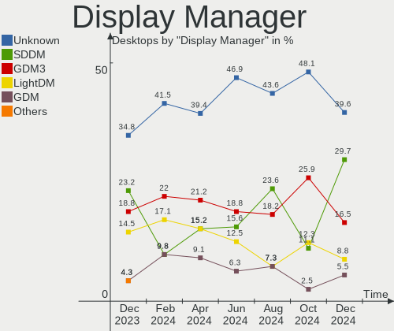
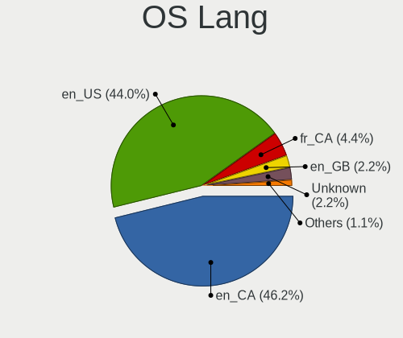
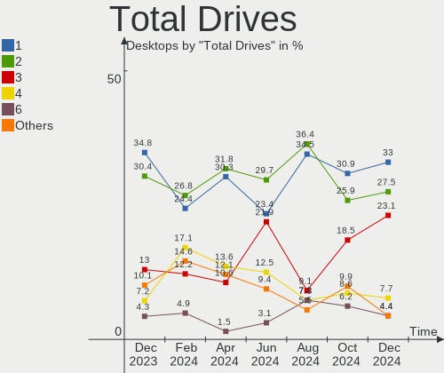
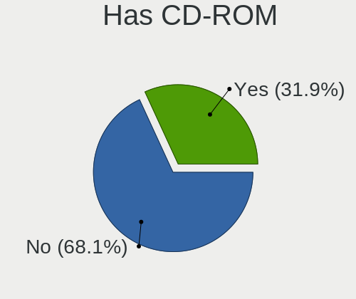
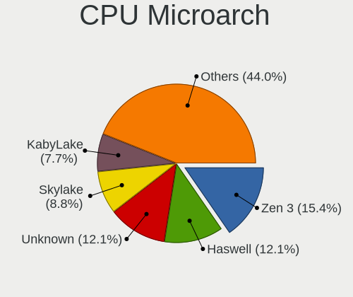
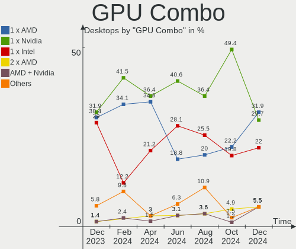
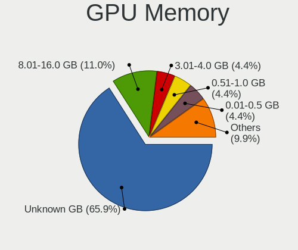
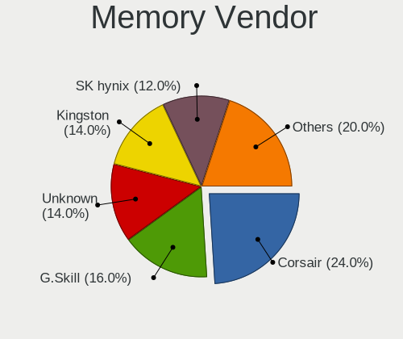
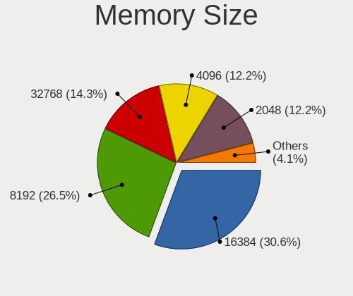

Linux in Canada - Hardware Trends (Desktops)
--------------------------------------------

A project to identify most popular hardware characteristics and track their change
over time based on data collected by Linux users at https://Linux-Hardware.org.

Anyone can contribute to this report by the [hw-probe](https://github.com/linuxhw/hw-probe) tool:

    sudo -E hw-probe -all -upload

Period: Jun, 2023.

Contents
--------

* [ System ](#system)
  - [ OS                       ](#os)
  - [ OS Family                ](#os-family)
  - [ Kernel                   ](#kernel)
  - [ Kernel Family            ](#kernel-family)
  - [ Kernel Major Ver.        ](#kernel-major-ver)
  - [ Arch                     ](#arch)
  - [ DE                       ](#de)
  - [ Display Server           ](#display-server)
  - [ Display Manager          ](#display-manager)
  - [ OS Lang                  ](#os-lang)
  - [ Boot Mode                ](#boot-mode)
  - [ Filesystem               ](#filesystem)
  - [ Part. scheme             ](#part-scheme)
  - [ Dual Boot with Linux/BSD ](#dual-boot-with-linuxbsd)
  - [ Dual Boot (Win)          ](#dual-boot-win)

* [ Board ](#board)
  - [ Vendor                   ](#vendor)
  - [ Model                    ](#model)
  - [ Model Family             ](#model-family)
  - [ MFG Year                 ](#mfg-year)
  - [ Form Factor              ](#form-factor)
  - [ Secure Boot              ](#secure-boot)
  - [ Coreboot                 ](#coreboot)
  - [ RAM Size                 ](#ram-size)
  - [ RAM Used                 ](#ram-used)
  - [ Total Drives             ](#total-drives)
  - [ Has CD-ROM               ](#has-cd-rom)
  - [ Has Ethernet             ](#has-ethernet)
  - [ Has WiFi                 ](#has-wifi)
  - [ Has Bluetooth            ](#has-bluetooth)

* [ Location ](#location)
  - [ Country                  ](#country)
  - [ City                     ](#city)

* [ Drives ](#drives)
  - [ Drive Vendor             ](#drive-vendor)
  - [ Drive Model              ](#drive-model)
  - [ HDD Vendor               ](#hdd-vendor)
  - [ SSD Vendor               ](#ssd-vendor)
  - [ Drive Kind               ](#drive-kind)
  - [ Drive Connector          ](#drive-connector)
  - [ Drive Size               ](#drive-size)
  - [ Space Total              ](#space-total)
  - [ Space Used               ](#space-used)
  - [ Malfunc. Drives          ](#malfunc-drives)
  - [ Malfunc. Drive Vendor    ](#malfunc-drive-vendor)
  - [ Malfunc. HDD Vendor      ](#malfunc-hdd-vendor)
  - [ Malfunc. Drive Kind      ](#malfunc-drive-kind)
  - [ Failed Drives            ](#failed-drives)
  - [ Failed Drive Vendor      ](#failed-drive-vendor)
  - [ Drive Status             ](#drive-status)

* [ Storage controller ](#storage-controller)
  - [ Storage Vendor           ](#storage-vendor)
  - [ Storage Model            ](#storage-model)
  - [ Storage Kind             ](#storage-kind)

* [ Processor ](#processor)
  - [ CPU Vendor               ](#cpu-vendor)
  - [ CPU Model                ](#cpu-model)
  - [ CPU Model Family         ](#cpu-model-family)
  - [ CPU Cores                ](#cpu-cores)
  - [ CPU Sockets              ](#cpu-sockets)
  - [ CPU Threads              ](#cpu-threads)
  - [ CPU Op-Modes             ](#cpu-op-modes)
  - [ CPU Microcode            ](#cpu-microcode)
  - [ CPU Microarch            ](#cpu-microarch)

* [ Graphics ](#graphics)
  - [ GPU Vendor               ](#gpu-vendor)
  - [ GPU Model                ](#gpu-model)
  - [ GPU Combo                ](#gpu-combo)
  - [ GPU Driver               ](#gpu-driver)
  - [ GPU Memory               ](#gpu-memory)

* [ Monitor ](#monitor)
  - [ Monitor Vendor           ](#monitor-vendor)
  - [ Monitor Model            ](#monitor-model)
  - [ Monitor Resolution       ](#monitor-resolution)
  - [ Monitor Diagonal         ](#monitor-diagonal)
  - [ Monitor Width            ](#monitor-width)
  - [ Aspect Ratio             ](#aspect-ratio)
  - [ Monitor Area             ](#monitor-area)
  - [ Pixel Density            ](#pixel-density)
  - [ Multiple Monitors        ](#multiple-monitors)

* [ Network ](#network)
  - [ Net Controller Vendor    ](#net-controller-vendor)
  - [ Net Controller Model     ](#net-controller-model)
  - [ Wireless Vendor          ](#wireless-vendor)
  - [ Wireless Model           ](#wireless-model)
  - [ Ethernet Vendor          ](#ethernet-vendor)
  - [ Ethernet Model           ](#ethernet-model)
  - [ Net Controller Kind      ](#net-controller-kind)
  - [ Used Controller          ](#used-controller)
  - [ NICs                     ](#nics)
  - [ IPv6                     ](#ipv6)

* [ Bluetooth ](#bluetooth)
  - [ Bluetooth Vendor         ](#bluetooth-vendor)
  - [ Bluetooth Model          ](#bluetooth-model)

* [ Sound ](#sound)
  - [ Sound Vendor             ](#sound-vendor)
  - [ Sound Model              ](#sound-model)

* [ Memory ](#memory)
  - [ Memory Vendor            ](#memory-vendor)
  - [ Memory Model             ](#memory-model)
  - [ Memory Kind              ](#memory-kind)
  - [ Memory Form Factor       ](#memory-form-factor)
  - [ Memory Size              ](#memory-size)
  - [ Memory Speed             ](#memory-speed)

* [ Printers & scanners ](#printers--scanners)
  - [ Printer Vendor           ](#printer-vendor)
  - [ Printer Model            ](#printer-model)
  - [ Scanner Vendor           ](#scanner-vendor)
  - [ Scanner Model            ](#scanner-model)

* [ Camera ](#camera)
  - [ Camera Vendor            ](#camera-vendor)
  - [ Camera Model             ](#camera-model)

* [ Security ](#security)
  - [ Fingerprint Vendor       ](#fingerprint-vendor)
  - [ Fingerprint Model        ](#fingerprint-model)
  - [ Chipcard Vendor          ](#chipcard-vendor)
  - [ Chipcard Model           ](#chipcard-model)

* [ Unsupported ](#unsupported)
  - [ Unsupported Devices      ](#unsupported-devices)
  - [ Unsupported Device Types ](#unsupported-device-types)

System
------

OS
--

Installed operating systems

| Name                         | Desktops | Percent |
|------------------------------|----------|---------|
| Fedora 38                    | 8        | 12.5%   |
| Linux Mint 21.1              | 7        | 10.94%  |
| Ubuntu 22.04                 | 6        | 9.38%   |
| Ubuntu 23.04                 | 5        | 7.81%   |
| ArcoLinux Rolling            | 5        | 7.81%   |
| Manjaro                      | 3        | 4.69%   |
| Debian 12                    | 3        | 4.69%   |
| Arch Rolling                 | 3        | 4.69%   |
| Xero Rolling                 | 2        | 3.13%   |
| Pop!_OS 22.04                | 2        | 3.13%   |
| openSUSE Leap-15.5           | 2        | 3.13%   |
| OpenMandriva 23.03           | 2        | 3.13%   |
| Manjaro 23.0.0               | 2        | 3.13%   |
| Zorin 16                     | 1        | 1.56%   |
| Ubuntu 22.10                 | 1        | 1.56%   |
| Ubuntu 20.04                 | 1        | 1.56%   |
| openSUSE Tumbleweed-XXXXXXXX | 1        | 1.56%   |
| MX 21                        | 1        | 1.56%   |
| Mabox 23.06                  | 1        | 1.56%   |
| Linux Mint 21                | 1        | 1.56%   |
| Linux Mint 20.3              | 1        | 1.56%   |
| KDE neon 22.04               | 1        | 1.56%   |
| Garuda Linux Rolling         | 1        | 1.56%   |
| Debian 11                    | 1        | 1.56%   |
| ChimeraOS 42                 | 1        | 1.56%   |
| ArcoLinux                    | 1        | 1.56%   |
| AlmaLinux 8.8                | 1        | 1.56%   |

OS Family
---------

OS without a version

| Name         | Desktops | Percent |
|--------------|----------|---------|
| Ubuntu       | 13       | 20.31%  |
| Linux Mint   | 9        | 14.06%  |
| Fedora       | 8        | 12.5%   |
| ArcoLinux    | 6        | 9.38%   |
| Manjaro      | 5        | 7.81%   |
| Debian       | 4        | 6.25%   |
| openSUSE     | 3        | 4.69%   |
| Arch         | 3        | 4.69%   |
| Xero         | 2        | 3.13%   |
| Pop!_OS      | 2        | 3.13%   |
| OpenMandriva | 2        | 3.13%   |
| Zorin        | 1        | 1.56%   |
| MX           | 1        | 1.56%   |
| Mabox        | 1        | 1.56%   |
| KDE neon     | 1        | 1.56%   |
| Garuda Linux | 1        | 1.56%   |
| ChimeraOS    | 1        | 1.56%   |
| AlmaLinux    | 1        | 1.56%   |

Kernel
------

Version of the Linux kernel

| Version                      | Desktops | Percent |
|------------------------------|----------|---------|
| 5.15.0-75-generic            | 5        | 7.81%   |
| 5.15.0-73-generic            | 5        | 7.81%   |
| 5.19.0-45-generic            | 4        | 6.25%   |
| 6.3.5-2-MANJARO              | 3        | 4.69%   |
| 6.2.0-20-generic             | 3        | 4.69%   |
| 6.1.0-9-amd64                | 3        | 4.69%   |
| 5.19.0-43-generic            | 3        | 4.69%   |
| 6.3.5-arch1-1                | 2        | 3.13%   |
| 6.3.4-201.fc38.x86_64        | 2        | 3.13%   |
| 6.2.6-desktop-1omv2390       | 2        | 3.13%   |
| 6.2.6-76060206-generic       | 2        | 3.13%   |
| 6.2.0-23-generic             | 2        | 3.13%   |
| 5.14.21-150500.53-default    | 2        | 3.13%   |
| 6.3.9-lqx1-1-lqx             | 1        | 1.56%   |
| 6.3.9-arch1-1                | 1        | 1.56%   |
| 6.3.9-1-MANJARO              | 1        | 1.56%   |
| 6.3.8-zen1-1-zen             | 1        | 1.56%   |
| 6.3.7-arch1-1                | 1        | 1.56%   |
| 6.3.7-200.fc38.x86_64        | 1        | 1.56%   |
| 6.3.6-200.fc38.x86_64        | 1        | 1.56%   |
| 6.3.5-200.fc38.x86_64        | 1        | 1.56%   |
| 6.3.5-1-MANJARO              | 1        | 1.56%   |
| 6.3.4-zen1-1-zen             | 1        | 1.56%   |
| 6.3.4-1-default              | 1        | 1.56%   |
| 6.3.4-060304-generic         | 1        | 1.56%   |
| 6.3.3-x64v1-xanmod1-1        | 1        | 1.56%   |
| 6.2.9-300.fc38.x86_64        | 1        | 1.56%   |
| 6.2.15-300.fc38.x86_64       | 1        | 1.56%   |
| 6.1.35-1-lts                 | 1        | 1.56%   |
| 6.1.33-1-lts                 | 1        | 1.56%   |
| 6.1.32-1-lts                 | 1        | 1.56%   |
| 6.1.31-200.fc38.x86_64       | 1        | 1.56%   |
| 6.1.31-2-MANJARO             | 1        | 1.56%   |
| 6.1.27-1-lts                 | 1        | 1.56%   |
| 6.0.0-6mx-amd64              | 1        | 1.56%   |
| 5.15.94-1-lts                | 1        | 1.56%   |
| 5.15.102-1-pve               | 1        | 1.56%   |
| 5.15.0-76-generic            | 1        | 1.56%   |
| 4.18.0-477.10.1.el8_8.x86_64 | 1        | 1.56%   |

Kernel Family
-------------

Linux kernel without a distro release

| Version  | Desktops | Percent |
|----------|----------|---------|
| 5.15.0   | 11       | 17.19%  |
| 6.3.5    | 7        | 10.94%  |
| 5.19.0   | 7        | 10.94%  |
| 6.3.4    | 5        | 7.81%   |
| 6.2.0    | 5        | 7.81%   |
| 6.2.6    | 4        | 6.25%   |
| 6.3.9    | 3        | 4.69%   |
| 6.1.0    | 3        | 4.69%   |
| 6.3.7    | 2        | 3.13%   |
| 6.1.31   | 2        | 3.13%   |
| 5.14.21  | 2        | 3.13%   |
| 6.3.8    | 1        | 1.56%   |
| 6.3.6    | 1        | 1.56%   |
| 6.3.3    | 1        | 1.56%   |
| 6.2.9    | 1        | 1.56%   |
| 6.2.15   | 1        | 1.56%   |
| 6.1.35   | 1        | 1.56%   |
| 6.1.33   | 1        | 1.56%   |
| 6.1.32   | 1        | 1.56%   |
| 6.1.27   | 1        | 1.56%   |
| 6.0.0    | 1        | 1.56%   |
| 5.15.94  | 1        | 1.56%   |
| 5.15.102 | 1        | 1.56%   |
| 4.18.0   | 1        | 1.56%   |

Kernel Major Ver.
-----------------

Linux kernel major version

| Version | Desktops | Percent |
|---------|----------|---------|
| 6.3     | 20       | 31.25%  |
| 5.15    | 13       | 20.31%  |
| 6.2     | 11       | 17.19%  |
| 6.1     | 9        | 14.06%  |
| 5.19    | 7        | 10.94%  |
| 5.14    | 2        | 3.13%   |
| 6.0     | 1        | 1.56%   |
| 4.18    | 1        | 1.56%   |

Arch
----

OS architecture (x86_64, i586, etc.)

| Name   | Desktops | Percent |
|--------|----------|---------|
| x86_64 | 64       | 100%    |

DE
--

Desktop Environment

| Name          | Desktops | Percent |
|---------------|----------|---------|
| GNOME         | 23       | 35.94%  |
| KDE5          | 19       | 29.69%  |
| X-Cinnamon    | 10       | 15.63%  |
| Unknown       | 3        | 4.69%   |
| XFCE          | 2        | 3.13%   |
| GNOME Classic | 2        | 3.13%   |
| i3            | 1        | 1.56%   |
| Hyprland      | 1        | 1.56%   |
| herbstluftwm  | 1        | 1.56%   |
| Deepin        | 1        | 1.56%   |
| Cinnamon      | 1        | 1.56%   |

Display Server
--------------

X11 or Wayland

| Name    | Desktops | Percent |
|---------|----------|---------|
| X11     | 40       | 62.5%   |
| Wayland | 20       | 31.25%  |
| Tty     | 3        | 4.69%   |
| Unknown | 1        | 1.56%   |

Display Manager
---------------

SDDM, LightDM, etc.

| Name    | Desktops | Percent |
|---------|----------|---------|
| Unknown | 33       | 51.56%  |
| GDM3    | 13       | 20.31%  |
| SDDM    | 11       | 17.19%  |
| LightDM | 7        | 10.94%  |

OS Lang
-------

Language

| Lang  | Desktops | Percent |
|-------|----------|---------|
| en_CA | 38       | 59.38%  |
| en_US | 22       | 34.38%  |
| fr_CA | 3        | 4.69%   |
| en_GB | 1        | 1.56%   |

Boot Mode
---------

EFI or BIOS

| Mode | Desktops | Percent |
|------|----------|---------|
| BIOS | 37       | 57.81%  |
| EFI  | 27       | 42.19%  |

Filesystem
----------

Type of filesystem

| Type    | Desktops | Percent |
|---------|----------|---------|
| Ext4    | 30       | 46.88%  |
| Btrfs   | 22       | 34.38%  |
| Tmpfs   | 10       | 15.63%  |
| Overlay | 2        | 3.13%   |

Part. scheme
------------

Scheme of partitioning

| Type    | Desktops | Percent |
|---------|----------|---------|
| Unknown | 30       | 46.88%  |
| GPT     | 25       | 39.06%  |
| MBR     | 9        | 14.06%  |

Dual Boot with Linux/BSD
------------------------

Hosting more than one Linux/BSD

| Dual boot | Desktops | Percent |
|-----------|----------|---------|
| No        | 54       | 84.38%  |
| Yes       | 10       | 15.63%  |

Dual Boot (Win)
---------------

Hosting Linux and Windows

| Dual boot | Desktops | Percent |
|-----------|----------|---------|
| No        | 48       | 75%     |
| Yes       | 16       | 25%     |

Board
-----

Vendor
------

Motherboard manufacturer

| Name                | Desktops | Percent |
|---------------------|----------|---------|
| ASUSTek Computer    | 19       | 29.69%  |
| MSI                 | 17       | 26.56%  |
| ASRock              | 6        | 9.38%   |
| Hewlett-Packard     | 5        | 7.81%   |
| Gigabyte Technology | 5        | 7.81%   |
| Lenovo              | 3        | 4.69%   |
| Dell                | 3        | 4.69%   |
| AZW                 | 1        | 1.56%   |
| ASRockRack          | 1        | 1.56%   |
| Apple               | 1        | 1.56%   |
| Alienware           | 1        | 1.56%   |
| Acer                | 1        | 1.56%   |
| Unknown             | 1        | 1.56%   |

Model
-----

Motherboard model

| Name                               | Desktops | Percent |
|------------------------------------|----------|---------|
| MSI MS-7E06                        | 2        | 3.13%   |
| MSI MS-7C37                        | 2        | 3.13%   |
| Dell OptiPlex 755                  | 2        | 3.13%   |
| ASUS TUF Gaming X570-PLUS          | 2        | 3.13%   |
| MSI MS-7E12                        | 1        | 1.56%   |
| MSI MS-7C94                        | 1        | 1.56%   |
| MSI MS-7B98                        | 1        | 1.56%   |
| MSI MS-7B93                        | 1        | 1.56%   |
| MSI MS-7A64                        | 1        | 1.56%   |
| MSI MS-7A39                        | 1        | 1.56%   |
| MSI MS-7A37                        | 1        | 1.56%   |
| MSI MS-7972                        | 1        | 1.56%   |
| MSI MS-7893                        | 1        | 1.56%   |
| MSI MS-7821                        | 1        | 1.56%   |
| MSI MS-7758                        | 1        | 1.56%   |
| MSI MS-7673                        | 1        | 1.56%   |
| MSI MPG H410 Trident 3 (MS-B932)   | 1        | 1.56%   |
| Lenovo ThinkCentre M900 10FLS0A000 | 1        | 1.56%   |
| Lenovo ThinkCentre M83 10AM000UUS  | 1        | 1.56%   |
| Lenovo ThinkCentre M57 6072BJU     | 1        | 1.56%   |
| HP Slim Desktop 290-a0xxx          | 1        | 1.56%   |
| HP ProDesk 400 G4 SFF              | 1        | 1.56%   |
| HP EliteDesk 800 G4 SFF            | 1        | 1.56%   |
| HP EliteDesk 800 G2 DM 35W         | 1        | 1.56%   |
| HP Compaq dc5800 Small Form Factor | 1        | 1.56%   |
| Gigabyte X570 AORUS ELITE          | 1        | 1.56%   |
| Gigabyte B560M AORUS PRO AX        | 1        | 1.56%   |
| Gigabyte B550 UD AC                | 1        | 1.56%   |
| Gigabyte B450 AORUS M              | 1        | 1.56%   |
| Gigabyte 970A-DS3P                 | 1        | 1.56%   |
| Dell Precision WorkStation 490     | 1        | 1.56%   |
| AZW MINI S                         | 1        | 1.56%   |
| ASUS TUF B450M-PLUS GAMING         | 1        | 1.56%   |
| ASUS ROG STRIX Z690-E GAMING WIFI  | 1        | 1.56%   |
| ASUS ROG STRIX B550-XE GAMING WIFI | 1        | 1.56%   |
| ASUS ROG STRIX B550-F GAMING       | 1        | 1.56%   |
| ASUS ROG STRIX B450-F GAMING       | 1        | 1.56%   |
| ASUS ROG CROSSHAIR VIII DARK HERO  | 1        | 1.56%   |
| ASUS PRIME Z370-A II               | 1        | 1.56%   |
| ASUS PRIME X570-P                  | 1        | 1.56%   |

Model Family
------------

Motherboard model prefix

| Name                   | Desktops | Percent |
|------------------------|----------|---------|
| ASUS ROG               | 5        | 7.81%   |
| ASUS PRIME             | 4        | 6.25%   |
| Lenovo ThinkCentre     | 3        | 4.69%   |
| ASUS TUF               | 3        | 4.69%   |
| MSI MS-7E06            | 2        | 3.13%   |
| MSI MS-7C37            | 2        | 3.13%   |
| HP EliteDesk           | 2        | 3.13%   |
| Dell OptiPlex          | 2        | 3.13%   |
| MSI MS-7E12            | 1        | 1.56%   |
| MSI MS-7C94            | 1        | 1.56%   |
| MSI MS-7B98            | 1        | 1.56%   |
| MSI MS-7B93            | 1        | 1.56%   |
| MSI MS-7A64            | 1        | 1.56%   |
| MSI MS-7A39            | 1        | 1.56%   |
| MSI MS-7A37            | 1        | 1.56%   |
| MSI MS-7972            | 1        | 1.56%   |
| MSI MS-7893            | 1        | 1.56%   |
| MSI MS-7821            | 1        | 1.56%   |
| MSI MS-7758            | 1        | 1.56%   |
| MSI MS-7673            | 1        | 1.56%   |
| MSI MPG                | 1        | 1.56%   |
| HP Slim                | 1        | 1.56%   |
| HP ProDesk             | 1        | 1.56%   |
| HP Compaq              | 1        | 1.56%   |
| Gigabyte X570          | 1        | 1.56%   |
| Gigabyte B560M         | 1        | 1.56%   |
| Gigabyte B550          | 1        | 1.56%   |
| Gigabyte B450          | 1        | 1.56%   |
| Gigabyte 970A-DS3P     | 1        | 1.56%   |
| Dell Precision         | 1        | 1.56%   |
| AZW MINI               | 1        | 1.56%   |
| ASUS Nobilis           | 1        | 1.56%   |
| ASUS Maximus           | 1        | 1.56%   |
| ASUS M5A99X            | 1        | 1.56%   |
| ASUS M5A97             | 1        | 1.56%   |
| ASUS H110M-A           | 1        | 1.56%   |
| ASUS GN553AA-ABA       | 1        | 1.56%   |
| ASUS F2A85-V           | 1        | 1.56%   |
| ASRockRack X470D4U2-2T | 1        | 1.56%   |
| ASRock Z77             | 1        | 1.56%   |

MFG Year
--------

Motherboard manufacture year

| Year | Desktops | Percent |
|------|----------|---------|
| 2018 | 10       | 15.63%  |
| 2019 | 8        | 12.5%   |
| 2020 | 6        | 9.38%   |
| 2012 | 6        | 9.38%   |
| 2022 | 5        | 7.81%   |
| 2015 | 4        | 6.25%   |
| 2007 | 4        | 6.25%   |
| 2023 | 3        | 4.69%   |
| 2021 | 3        | 4.69%   |
| 2017 | 3        | 4.69%   |
| 2016 | 2        | 3.13%   |
| 2014 | 2        | 3.13%   |
| 2011 | 2        | 3.13%   |
| 2008 | 2        | 3.13%   |
| 2013 | 1        | 1.56%   |
| 2010 | 1        | 1.56%   |
| 2009 | 1        | 1.56%   |
| 2006 | 1        | 1.56%   |

Form Factor
-----------

Physical design of the computer

| Name    | Desktops | Percent |
|---------|----------|---------|
| Desktop | 64       | 100%    |

Secure Boot
-----------

Enabled or disabled

| State    | Desktops | Percent |
|----------|----------|---------|
| Disabled | 62       | 96.88%  |
| Enabled  | 2        | 3.13%   |

Coreboot
--------

Have coreboot on board

| Used | Desktops | Percent |
|------|----------|---------|
| No   | 64       | 100%    |

RAM Size
--------

Total RAM memory

| Size in GB  | Desktops | Percent |
|-------------|----------|---------|
| 32.01-64.0  | 16       | 25%     |
| 16.01-24.0  | 16       | 25%     |
| 64.01-256.0 | 11       | 17.19%  |
| 8.01-16.0   | 9        | 14.06%  |
| 4.01-8.0    | 4        | 6.25%   |
| 3.01-4.0    | 4        | 6.25%   |
| 24.01-32.0  | 2        | 3.13%   |
| 2.01-3.0    | 1        | 1.56%   |
| 1.01-2.0    | 1        | 1.56%   |

RAM Used
--------

Used RAM memory

| Used GB    | Desktops | Percent |
|------------|----------|---------|
| 4.01-8.0   | 17       | 26.56%  |
| 2.01-3.0   | 16       | 25%     |
| 1.01-2.0   | 11       | 17.19%  |
| 8.01-16.0  | 8        | 12.5%   |
| 3.01-4.0   | 7        | 10.94%  |
| 32.01-64.0 | 2        | 3.13%   |
| 16.01-24.0 | 1        | 1.56%   |
| 0.51-1.0   | 1        | 1.56%   |
| 0.01-0.5   | 1        | 1.56%   |

Total Drives
------------

Number of drives on board

| Drives | Desktops | Percent |
|--------|----------|---------|
| 1      | 21       | 32.81%  |
| 2      | 15       | 23.44%  |
| 3      | 11       | 17.19%  |
| 4      | 8        | 12.5%   |
| 6      | 3        | 4.69%   |
| 5      | 2        | 3.13%   |
| 13     | 1        | 1.56%   |
| 11     | 1        | 1.56%   |
| 9      | 1        | 1.56%   |
| 7      | 1        | 1.56%   |

Has CD-ROM
----------

Has CD-ROM on board

| Presented | Desktops | Percent |
|-----------|----------|---------|
| No        | 45       | 70.31%  |
| Yes       | 19       | 29.69%  |

Has Ethernet
------------

Has Ethernet on board

| Presented | Desktops | Percent |
|-----------|----------|---------|
| Yes       | 64       | 100%    |

Has WiFi
--------

Has WiFi module

| Presented | Desktops | Percent |
|-----------|----------|---------|
| Yes       | 38       | 59.38%  |
| No        | 26       | 40.63%  |

Has Bluetooth
-------------

Has Bluetooth module

| Presented | Desktops | Percent |
|-----------|----------|---------|
| No        | 35       | 54.69%  |
| Yes       | 29       | 45.31%  |

Location
--------

Country
-------

Geographic location (country)

| Country | Desktops | Percent |
|---------|----------|---------|
| Canada  | 64       | 100%    |

City
----

Geographic location (city)

| City                     | Desktops | Percent |
|--------------------------|----------|---------|
| Toronto                  | 9        | 14.06%  |
| Calgary                  | 4        | 6.25%   |
| Winnipeg                 | 3        | 4.69%   |
| Montreal                 | 3        | 4.69%   |
| London                   | 3        | 4.69%   |
| Victoria                 | 2        | 3.13%   |
| Surrey                   | 2        | 3.13%   |
| Red Lake                 | 2        | 3.13%   |
| Ottawa                   | 2        | 3.13%   |
| North Vancouver          | 2        | 3.13%   |
| Laval                    | 2        | 3.13%   |
| Alliston                 | 2        | 3.13%   |
| Williams Lake            | 1        | 1.56%   |
| Waterloo                 | 1        | 1.56%   |
| Vernon                   | 1        | 1.56%   |
| Vancouver                | 1        | 1.56%   |
| Thunder Bay              | 1        | 1.56%   |
| Spruce Grove             | 1        | 1.56%   |
| Sarnia                   | 1        | 1.56%   |
| Sainte-Anne-de-la-Perade | 1        | 1.56%   |
| Saint-Honore             | 1        | 1.56%   |
| Riviere-Beaudette        | 1        | 1.56%   |
| Richmond                 | 1        | 1.56%   |
| Oakville                 | 1        | 1.56%   |
| Morin-Heights            | 1        | 1.56%   |
| Moose Jaw                | 1        | 1.56%   |
| Mono                     | 1        | 1.56%   |
| Mississauga              | 1        | 1.56%   |
| Milverton                | 1        | 1.56%   |
| Maple Ridge              | 1        | 1.56%   |
| Langley                  | 1        | 1.56%   |
| Kitchener                | 1        | 1.56%   |
| Kingston                 | 1        | 1.56%   |
| Hammonds Plains          | 1        | 1.56%   |
| Greater Sudbury          | 1        | 1.56%   |
| Camrose                  | 1        | 1.56%   |
| Burnaby                  | 1        | 1.56%   |
| Bois-des-Filion          | 1        | 1.56%   |
| Beauharnois              | 1        | 1.56%   |
| Airdrie                  | 1        | 1.56%   |

Drives
------

Drive Vendor
------------

Hard drive vendors

| Vendor                       | Desktops | Drives | Percent |
|------------------------------|----------|--------|---------|
| WDC                          | 27       | 40     | 19.15%  |
| Seagate                      | 26       | 44     | 18.44%  |
| Samsung Electronics          | 17       | 25     | 12.06%  |
| Kingston                     | 8        | 9      | 5.67%   |
| Sandisk                      | 7        | 8      | 4.96%   |
| Toshiba                      | 6        | 6      | 4.26%   |
| Crucial                      | 6        | 6      | 4.26%   |
| PNY                          | 3        | 4      | 2.13%   |
| Hitachi                      | 3        | 3      | 2.13%   |
| A-DATA Technology            | 3        | 3      | 2.13%   |
| SK hynix                     | 2        | 2      | 1.42%   |
| Silicon Motion               | 2        | 3      | 1.42%   |
| QNAP                         | 2        | 2      | 1.42%   |
| Phison Electronics           | 2        | 2      | 1.42%   |
| Kingston Technology Company  | 2        | 2      | 1.42%   |
| HGST                         | 2        | 2      | 1.42%   |
| Corsair                      | 2        | 2      | 1.42%   |
| XPG                          | 1        | 1      | 0.71%   |
| Vaseky                       | 1        | 1      | 0.71%   |
| Unknown                      | 1        | 1      | 0.71%   |
| Team                         | 1        | 1      | 0.71%   |
| StoreJet                     | 1        | 1      | 0.71%   |
| SPCC                         | 1        | 1      | 0.71%   |
| Shenzhen Longsys Electronics | 1        | 1      | 0.71%   |
| Realtek Semiconductor        | 1        | 1      | 0.71%   |
| Plextor                      | 1        | 1      | 0.71%   |
| OWC                          | 1        | 2      | 0.71%   |
| OCZ                          | 1        | 1      | 0.71%   |
| Netac                        | 1        | 1      | 0.71%   |
| Micron Technology            | 1        | 1      | 0.71%   |
| MAXIO Technology (Hangzhou)  | 1        | 1      | 0.71%   |
| Lexar                        | 1        | 1      | 0.71%   |
| KingFast                     | 1        | 1      | 0.71%   |
| JMicron Technology           | 1        | 1      | 0.71%   |
| Intel                        | 1        | 1      | 0.71%   |
| Hewlett-Packard              | 1        | 1      | 0.71%   |
| ASMT                         | 1        | 1      | 0.71%   |
| ADATA Technology             | 1        | 1      | 0.71%   |

Drive Model
-----------

Hard drive models

| Model                                               | Desktops | Percent |
|-----------------------------------------------------|----------|---------|
| Seagate ST2000DM008-2FR102 2TB                      | 5        | 2.98%   |
| Samsung NVMe SSD Controller SM981/PM981/PM983 250GB | 4        | 2.38%   |
| WDC WD40EZRZ-00GXCB0 4TB                            | 3        | 1.79%   |
| Seagate ST1000DM010-2EP102 1TB                      | 3        | 1.79%   |
| SanDisk NVMe SSD Drive 1TB                          | 3        | 1.79%   |
| WDC WD40EFZX-68AWUN0 4TB                            | 2        | 1.19%   |
| WDC WD40EFRX-68N32N0 4TB                            | 2        | 1.19%   |
| WDC WD10EZEX-60WN4A0 1TB                            | 2        | 1.19%   |
| Toshiba DT01ACA200 2TB                              | 2        | 1.19%   |
| Seagate ST3000DM001-1ER166 3TB                      | 2        | 1.19%   |
| Samsung SSD 870 EVO 1TB                             | 2        | 1.19%   |
| QNAP iSCSI Storage 2.1TB                            | 2        | 1.19%   |
| Kingston SNV2S500G 500GB                            | 2        | 1.19%   |
| XPG GAMMIX S70 BLADE 2TB                            | 1        | 0.6%    |
| WDC WDS960G2G0C-00AJM0 960GB                        | 1        | 0.6%    |
| WDC WDS500G2B0B 500GB SSD                           | 1        | 0.6%    |
| WDC WDS500G2B0A-00SM50 500GB SSD                    | 1        | 0.6%    |
| WDC WDS250G1B0A-00H9H0 250GB SSD                    | 1        | 0.6%    |
| WDC WDS100T3X0C-00SJG0 1TB                          | 1        | 0.6%    |
| WDC WDS100T2B0C-00PXH0 1TB                          | 1        | 0.6%    |
| WDC WD80EAZZ-00BKLB0 8TB                            | 1        | 0.6%    |
| WDC WD6400AAKS-65A7B2 640GB                         | 1        | 0.6%    |
| WDC WD5000BEVT-22A0RT0 500GB                        | 1        | 0.6%    |
| WDC WD5000AAJS-00TKA0 500GB                         | 1        | 0.6%    |
| WDC WD50 00LPLX-60ZNT 500GB                         | 1        | 0.6%    |
| WDC WD40EFAX-68JH4N1 4TB                            | 1        | 0.6%    |
| WDC WD2500JS-75NCB3 249GB                           | 1        | 0.6%    |
| WDC WD2500JS-22NCB1 250GB                           | 1        | 0.6%    |
| WDC WD2500JD-00HBB0 250GB                           | 1        | 0.6%    |
| WDC WD20EFRX-68AX9N0 2TB                            | 1        | 0.6%    |
| WDC WD20EARX-00PASB0 2TB                            | 1        | 0.6%    |
| WDC WD2000FYYZ-01UL1B0 2TB                          | 1        | 0.6%    |
| WDC WD10JPVX-00JC3T0 1TB                            | 1        | 0.6%    |
| WDC WD10EZEX-75WN4A1 1TB                            | 1        | 0.6%    |
| WDC WD10EZEX-00BBHA0 1TB                            | 1        | 0.6%    |
| WDC WD10EAVS-00D7B1 1TB                             | 1        | 0.6%    |
| WDC WD1003FBYX-05Y7B0 1TB                           | 1        | 0.6%    |
| WDC WD1002FBYS-18W8B0 1TB                           | 1        | 0.6%    |
| WDC WD Blue SA510 2.5 1000GB SSD                    | 1        | 0.6%    |
| Vaseky V800/128G 128GB                              | 1        | 0.6%    |

HDD Vendor
----------

Hard disk drive vendors

| Vendor              | Desktops | Drives | Percent |
|---------------------|----------|--------|---------|
| Seagate             | 25       | 37     | 39.68%  |
| WDC                 | 23       | 33     | 36.51%  |
| Toshiba             | 6        | 6      | 9.52%   |
| Hitachi             | 3        | 3      | 4.76%   |
| QNAP                | 2        | 2      | 3.17%   |
| HGST                | 2        | 2      | 3.17%   |
| Unknown             | 1        | 1      | 1.59%   |
| Samsung Electronics | 1        | 2      | 1.59%   |

SSD Vendor
----------

Solid state drive vendors

| Vendor              | Desktops | Drives | Percent |
|---------------------|----------|--------|---------|
| Samsung Electronics | 14       | 15     | 29.79%  |
| Crucial             | 5        | 5      | 10.64%  |
| WDC                 | 4        | 4      | 8.51%   |
| PNY                 | 3        | 4      | 6.38%   |
| Kingston            | 3        | 4      | 6.38%   |
| A-DATA Technology   | 2        | 2      | 4.26%   |
| Vaseky              | 1        | 1      | 2.13%   |
| Team                | 1        | 1      | 2.13%   |
| StoreJet            | 1        | 1      | 2.13%   |
| SPCC                | 1        | 1      | 2.13%   |
| SK hynix            | 1        | 1      | 2.13%   |
| Seagate             | 1        | 1      | 2.13%   |
| SanDisk             | 1        | 1      | 2.13%   |
| Plextor             | 1        | 1      | 2.13%   |
| OWC                 | 1        | 2      | 2.13%   |
| OCZ                 | 1        | 1      | 2.13%   |
| Micron Technology   | 1        | 1      | 2.13%   |
| Lexar               | 1        | 1      | 2.13%   |
| Intel               | 1        | 1      | 2.13%   |
| Hewlett-Packard     | 1        | 1      | 2.13%   |
| Corsair             | 1        | 1      | 2.13%   |
| ASMT                | 1        | 1      | 2.13%   |

Drive Kind
----------

HDD or SSD

| Kind    | Desktops | Drives | Percent |
|---------|----------|--------|---------|
| HDD     | 44       | 86     | 38.26%  |
| SSD     | 39       | 51     | 33.91%  |
| NVMe    | 29       | 41     | 25.22%  |
| Unknown | 3        | 7      | 2.61%   |

Drive Connector
---------------

SATA, SAS, NVMe, etc.

| Type | Desktops | Drives | Percent |
|------|----------|--------|---------|
| SATA | 58       | 123    | 59.18%  |
| NVMe | 29       | 40     | 29.59%  |
| SAS  | 11       | 22     | 11.22%  |

Drive Size
----------

Size of hard drive

| Size in TB | Desktops | Drives | Percent |
|------------|----------|--------|---------|
| 0.01-0.5   | 35       | 49     | 35%     |
| 0.51-1.0   | 27       | 39     | 27%     |
| 1.01-2.0   | 14       | 15     | 14%     |
| 3.01-4.0   | 10       | 17     | 10%     |
| 4.01-10.0  | 7        | 9      | 7%      |
| 2.01-3.0   | 6        | 7      | 6%      |
| 10.01-20.0 | 1        | 1      | 1%      |

Space Total
-----------

Amount of disk space available on the file system

| Size in GB     | Desktops | Percent |
|----------------|----------|---------|
| More than 3000 | 16       | 25%     |
| 101-250        | 12       | 18.75%  |
| 1001-2000      | 12       | 18.75%  |
| 501-1000       | 11       | 17.19%  |
| 251-500        | 4        | 6.25%   |
| 2001-3000      | 3        | 4.69%   |
| 1-20           | 2        | 3.13%   |
| Unknown        | 2        | 3.13%   |
| 21-50          | 1        | 1.56%   |
| 51-100         | 1        | 1.56%   |

Space Used
----------

Amount of used disk space

| Used GB        | Desktops | Percent |
|----------------|----------|---------|
| 101-250        | 11       | 17.19%  |
| 21-50          | 9        | 14.06%  |
| More than 3000 | 8        | 12.5%   |
| 1-20           | 8        | 12.5%   |
| 251-500        | 6        | 9.38%   |
| 501-1000       | 6        | 9.38%   |
| 51-100         | 6        | 9.38%   |
| 1001-2000      | 5        | 7.81%   |
| 2001-3000      | 3        | 4.69%   |
| Unknown        | 2        | 3.13%   |

Malfunc. Drives
---------------

Drive models with a malfunction

| Model                                                     | Desktops | Drives | Percent |
|-----------------------------------------------------------|----------|--------|---------|
| Seagate ST4000DM000-1F2168 4TB                            | 1        | 1      | 14.29%  |
| Seagate ST33000651AS 3TB                                  | 1        | 1      | 14.29%  |
| Seagate ST3200822AS 200GB                                 | 1        | 1      | 14.29%  |
| Seagate ST3000DM001-1CH166 3TB                            | 1        | 1      | 14.29%  |
| Seagate ST2000DL003-9VT166 2TB                            | 1        | 1      | 14.29%  |
| Realtek Semiconductor RTS5763DL NVMe SSD Controller 512GB | 1        | 1      | 14.29%  |
| Hitachi HCS5C3232SLA380 320GB                             | 1        | 1      | 14.29%  |

Malfunc. Drive Vendor
---------------------

Vendors of faulty drives

| Vendor                | Desktops | Drives | Percent |
|-----------------------|----------|--------|---------|
| Seagate               | 4        | 5      | 66.67%  |
| Realtek Semiconductor | 1        | 1      | 16.67%  |
| Hitachi               | 1        | 1      | 16.67%  |

Malfunc. HDD Vendor
-------------------

Vendors of faulty HDD drives

| Vendor  | Desktops | Drives | Percent |
|---------|----------|--------|---------|
| Seagate | 4        | 5      | 80%     |
| Hitachi | 1        | 1      | 20%     |

Malfunc. Drive Kind
-------------------

Kinds of faulty drives

| Kind | Desktops | Drives | Percent |
|------|----------|--------|---------|
| HDD  | 4        | 6      | 80%     |
| NVMe | 1        | 1      | 20%     |

Failed Drives
-------------

Failed drive models

Zero info for selected period =(

Failed Drive Vendor
-------------------

Failed drive vendors

Zero info for selected period =(

Drive Status
------------

Number of failed and malfunc. drives

| Status   | Desktops | Drives | Percent |
|----------|----------|--------|---------|
| Detected | 49       | 116    | 66.22%  |
| Works    | 20       | 62     | 27.03%  |
| Malfunc  | 5        | 7      | 6.76%   |

Storage controller
------------------

Storage Vendor
--------------

Storage controller vendors

| Vendor                       | Desktops | Percent |
|------------------------------|----------|---------|
| Intel                        | 35       | 31.82%  |
| AMD                          | 29       | 26.36%  |
| SanDisk                      | 9        | 8.18%   |
| Samsung Electronics          | 7        | 6.36%   |
| Kingston Technology Company  | 7        | 6.36%   |
| ASMedia Technology           | 6        | 5.45%   |
| Phison Electronics           | 3        | 2.73%   |
| ADATA Technology             | 3        | 2.73%   |
| Silicon Motion               | 2        | 1.82%   |
| SK hynix                     | 1        | 0.91%   |
| Silicon Image                | 1        | 0.91%   |
| Shenzhen Longsys Electronics | 1        | 0.91%   |
| Realtek Semiconductor        | 1        | 0.91%   |
| Netac Technology             | 1        | 0.91%   |
| Micron/Crucial Technology    | 1        | 0.91%   |
| MAXIO Technology (Hangzhou)  | 1        | 0.91%   |
| Marvell Technology Group     | 1        | 0.91%   |
| JMicron Technology           | 1        | 0.91%   |

Storage Model
-------------

Storage controller models

| Model                                                                         | Desktops | Percent |
|-------------------------------------------------------------------------------|----------|---------|
| AMD FCH SATA Controller [AHCI mode]                                           | 18       | 14.06%  |
| AMD 500 Series Chipset SATA Controller                                        | 6        | 4.69%   |
| Intel Q170/Q150/B150/H170/H110/Z170/CM236 Chipset SATA Controller [AHCI Mode] | 5        | 3.91%   |
| ASMedia ASM1062 Serial ATA Controller                                         | 5        | 3.91%   |
| AMD 400 Series Chipset SATA Controller                                        | 5        | 3.91%   |
| SanDisk Non-Volatile memory controller                                        | 4        | 3.13%   |
| Samsung NVMe SSD Controller SM981/PM981/PM983                                 | 4        | 3.13%   |
| AMD SB7x0/SB8x0/SB9x0 SATA Controller [AHCI mode]                             | 4        | 3.13%   |
| Kingston Company Company Non-Volatile memory controller                       | 3        | 2.34%   |
| Intel Cannon Lake PCH SATA AHCI Controller                                    | 3        | 2.34%   |
| Intel 82Q35 Express PT IDER Controller                                        | 3        | 2.34%   |
| Intel 82801IR/IO/IH (ICH9R/DO/DH) 6 port SATA Controller [AHCI mode]          | 3        | 2.34%   |
| Intel 82801I (ICH9 Family) 2 port SATA Controller [IDE mode]                  | 3        | 2.34%   |
| Intel 700 Series Chipset Family SATA AHCI Controller                          | 3        | 2.34%   |
| Intel 200 Series PCH SATA controller [AHCI mode]                              | 3        | 2.34%   |
| SanDisk WD Black SN770 NVMe SSD                                               | 2        | 1.56%   |
| Samsung NVMe SSD Controller 980                                               | 2        | 1.56%   |
| Phison E18 PCIe4 NVMe Controller                                              | 2        | 1.56%   |
| Kingston Company FURY Renegade NVMe SSD                                       | 2        | 1.56%   |
| Intel 82801JI (ICH10 Family) SATA AHCI Controller                             | 2        | 1.56%   |
| Intel 82801IR/IO/IH (ICH9R/DO/DH) 4 port SATA Controller [IDE mode]           | 2        | 1.56%   |
| Intel 7 Series/C210 Series Chipset Family 6-port SATA Controller [AHCI mode]  | 2        | 1.56%   |
| AMD 300 Series Chipset SATA Controller                                        | 2        | 1.56%   |
| ADATA A Non-Volatile memory controller                                        | 2        | 1.56%   |
| SK hynix PC300 NVMe Solid State Drive 256GB                                   | 1        | 0.78%   |
| Silicon Motion SM2263EN/SM2263XT SSD Controller                               | 1        | 0.78%   |
| Silicon Motion SM2262/SM2262EN SSD Controller                                 | 1        | 0.78%   |
| Silicon Image SiI 3132 Serial ATA Raid II Controller                          | 1        | 0.78%   |
| Shenzhen Longsys Non-Volatile memory controller                               | 1        | 0.78%   |
| SanDisk WD PC SN810 / Black SN850 NVMe SSD                                    | 1        | 0.78%   |
| SanDisk WD Black SN750 / PC SN730 NVMe SSD                                    | 1        | 0.78%   |
| SanDisk WD Black 2018/SN750 / PC SN720 NVMe SSD                               | 1        | 0.78%   |
| Samsung NVMe SSD Controller SM961/PM961/SM963                                 | 1        | 0.78%   |
| Realtek RTS5763DL NVMe SSD Controller                                         | 1        | 0.78%   |
| Phison PS5013 E13 NVMe Controller                                             | 1        | 0.78%   |
| Netac Non-Volatile memory controller                                          | 1        | 0.78%   |
| Micron/Crucial P2 NVMe PCIe SSD                                               | 1        | 0.78%   |
| MAXIO (Hangzhou) NVMe SSD Controller MAP1202                                  | 1        | 0.78%   |
| Marvell Group 88SE9123 PCIe SATA 6.0 Gb/s controller                          | 1        | 0.78%   |
| Kingston Company NVMe Controller                                              | 1        | 0.78%   |

Storage Kind
------------

Kind of storage controller (IDE, SATA, NVMe, SAS, ...)

| Kind | Desktops | Percent |
|------|----------|---------|
| SATA | 57       | 57.58%  |
| NVMe | 29       | 29.29%  |
| IDE  | 9        | 9.09%   |
| RAID | 4        | 4.04%   |

Processor
---------

CPU Vendor
----------

Processor vendors

| Vendor | Desktops | Percent |
|--------|----------|---------|
| Intel  | 35       | 54.69%  |
| AMD    | 29       | 45.31%  |

CPU Model
---------

Processor models

| Model                                       | Desktops | Percent |
|---------------------------------------------|----------|---------|
| AMD Ryzen 7 5800X 8-Core Processor          | 5        | 7.81%   |
| AMD Ryzen 5 1600 Six-Core Processor         | 3        | 4.69%   |
| AMD FX-8350 Eight-Core Processor            | 3        | 4.69%   |
| Intel Core i5-6500T CPU @ 2.50GHz           | 2        | 3.13%   |
| Intel Core i5-3570K CPU @ 3.40GHz           | 2        | 3.13%   |
| Intel Core i3-6100 CPU @ 3.70GHz            | 2        | 3.13%   |
| Intel 13th Gen Core i7-13700K               | 2        | 3.13%   |
| AMD Ryzen 7 5700X 8-Core Processor          | 2        | 3.13%   |
| AMD Ryzen 5 5600 6-Core Processor           | 2        | 3.13%   |
| Intel Xeon CPU X5690 @ 3.47GHz              | 1        | 1.56%   |
| Intel Xeon CPU 5120 @ 1.86GHz               | 1        | 1.56%   |
| Intel Pentium Dual-Core CPU E5200 @ 2.50GHz | 1        | 1.56%   |
| Intel Pentium Dual CPU E2160 @ 1.80GHz      | 1        | 1.56%   |
| Intel N100                                  | 1        | 1.56%   |
| Intel Core i9-10900KF CPU @ 3.70GHz         | 1        | 1.56%   |
| Intel Core i7-9700K CPU @ 3.60GHz           | 1        | 1.56%   |
| Intel Core i7-6700 CPU @ 3.40GHz            | 1        | 1.56%   |
| Intel Core i7-4790 CPU @ 3.60GHz            | 1        | 1.56%   |
| Intel Core i7-10700F CPU @ 2.90GHz          | 1        | 1.56%   |
| Intel Core i7 CPU X 980 @ 3.33GHz           | 1        | 1.56%   |
| Intel Core i5-9400 CPU @ 2.90GHz            | 1        | 1.56%   |
| Intel Core i5-8500 CPU @ 3.00GHz            | 1        | 1.56%   |
| Intel Core i5-8400 CPU @ 2.80GHz            | 1        | 1.56%   |
| Intel Core i5-6500 CPU @ 3.20GHz            | 1        | 1.56%   |
| Intel Core i5-6400 CPU @ 2.70GHz            | 1        | 1.56%   |
| Intel Core i5-4590 CPU @ 3.30GHz            | 1        | 1.56%   |
| Intel Core i5-2400 CPU @ 3.10GHz            | 1        | 1.56%   |
| Intel Core 2 Quad CPU Q9450 @ 2.66GHz       | 1        | 1.56%   |
| Intel Core 2 Quad CPU Q8400 @ 2.66GHz       | 1        | 1.56%   |
| Intel Core 2 Quad CPU Q6600 @ 2.40GHz       | 1        | 1.56%   |
| Intel Core 2 Quad CPU @ 2.40GHz             | 1        | 1.56%   |
| Intel Core 2 Duo CPU E4500 @ 2.20GHz        | 1        | 1.56%   |
| Intel 12th Gen Core i9-12900F               | 1        | 1.56%   |
| Intel 12th Gen Core i7-12700K               | 1        | 1.56%   |
| Intel 11th Gen Core i5-11400 @ 2.60GHz      | 1        | 1.56%   |
| Intel 11th Gen Core i5-1135G7 @ 2.40GHz     | 1        | 1.56%   |
| AMD Ryzen 9 7900X 12-Core Processor         | 1        | 1.56%   |
| AMD Ryzen 9 5950X 16-Core Processor         | 1        | 1.56%   |
| AMD Ryzen 9 3950X 16-Core Processor         | 1        | 1.56%   |
| AMD Ryzen 9 3900X 12-Core Processor         | 1        | 1.56%   |

CPU Model Family
----------------

Processor model prefix

| Model                   | Desktops | Percent |
|-------------------------|----------|---------|
| Intel Core i5           | 11       | 17.19%  |
| AMD Ryzen 7             | 10       | 15.63%  |
| Other                   | 8        | 12.5%   |
| AMD Ryzen 5             | 8        | 12.5%   |
| Intel Core i7           | 5        | 7.81%   |
| Intel Core 2 Quad       | 4        | 6.25%   |
| AMD Ryzen 9             | 4        | 6.25%   |
| AMD FX                  | 4        | 6.25%   |
| Intel Xeon              | 2        | 3.13%   |
| Intel Core i3           | 2        | 3.13%   |
| Intel Pentium Dual-Core | 1        | 1.56%   |
| Intel Pentium Dual      | 1        | 1.56%   |
| Intel Core i9           | 1        | 1.56%   |
| Intel Core 2 Duo        | 1        | 1.56%   |
| AMD Ryzen 3             | 1        | 1.56%   |
| AMD A10                 | 1        | 1.56%   |

CPU Cores
---------

Number of processor cores

| Number | Desktops | Percent |
|--------|----------|---------|
| 4      | 21       | 32.81%  |
| 6      | 13       | 20.31%  |
| 8      | 12       | 18.75%  |
| 2      | 8        | 12.5%   |
| 16     | 5        | 7.81%   |
| 12     | 3        | 4.69%   |
| 10     | 1        | 1.56%   |
| 3      | 1        | 1.56%   |

CPU Sockets
-----------

Number of sockets

| Number | Desktops | Percent |
|--------|----------|---------|
| 1      | 64       | 100%    |

CPU Threads
-----------

Threads per core (Hyper-Threading)

| Number | Desktops | Percent |
|--------|----------|---------|
| 2      | 42       | 65.63%  |
| 1      | 22       | 34.38%  |

CPU Op-Modes
------------

CPU Operation Modes (32-bit, 64-bit)

| Op mode        | Desktops | Percent |
|----------------|----------|---------|
| 32-bit, 64-bit | 64       | 100%    |

CPU Microcode
-------------

Microcode number

| Number     | Desktops | Percent |
|------------|----------|---------|
| Unknown    | 38       | 59.38%  |
| 0x0a20120a | 3        | 4.69%   |
| 0x08001138 | 3        | 4.69%   |
| 0x6fd      | 2        | 3.13%   |
| 0x0a201016 | 2        | 3.13%   |
| 0x08701013 | 2        | 3.13%   |
| 0x06000852 | 2        | 3.13%   |
| 0xb0671    | 1        | 1.56%   |
| 0xa0655    | 1        | 1.56%   |
| 0x906ec    | 1        | 1.56%   |
| 0x6f6      | 1        | 1.56%   |
| 0x506e3    | 1        | 1.56%   |
| 0x206c2    | 1        | 1.56%   |
| 0x1067a    | 1        | 1.56%   |
| 0x0a601203 | 1        | 1.56%   |
| 0x0a201204 | 1        | 1.56%   |
| 0x0a201009 | 1        | 1.56%   |
| 0x08701030 | 1        | 1.56%   |
| 0x08600106 | 1        | 1.56%   |

CPU Microarch
-------------

Microarchitecture

| Name             | Desktops | Percent |
|------------------|----------|---------|
| Zen 3            | 11       | 17.19%  |
| Skylake          | 7        | 10.94%  |
| Zen 2            | 6        | 9.38%   |
| Piledriver       | 5        | 7.81%   |
| Core             | 5        | 7.81%   |
| KabyLake         | 4        | 6.25%   |
| Zen              | 3        | 4.69%   |
| Penryn           | 3        | 4.69%   |
| Unknown          | 3        | 4.69%   |
| Zen+             | 2        | 3.13%   |
| Westmere         | 2        | 3.13%   |
| IvyBridge        | 2        | 3.13%   |
| Haswell          | 2        | 3.13%   |
| CometLake        | 2        | 3.13%   |
| Alderlake Hybrid | 2        | 3.13%   |
| TigerLake        | 1        | 1.56%   |
| SandyBridge      | 1        | 1.56%   |
| Icelake          | 1        | 1.56%   |
| Gracemont        | 1        | 1.56%   |
| Excavator        | 1        | 1.56%   |

Graphics
--------

GPU Vendor
----------

Vendors of graphics cards

| Vendor            | Desktops | Percent |
|-------------------|----------|---------|
| AMD               | 29       | 42.03%  |
| Nvidia            | 23       | 33.33%  |
| Intel             | 16       | 23.19%  |
| ASPEED Technology | 1        | 1.45%   |

GPU Model
---------

Graphics card models

| Model                                                                       | Desktops | Percent |
|-----------------------------------------------------------------------------|----------|---------|
| AMD Ellesmere [Radeon RX 470/480/570/570X/580/580X/590]                     | 6        | 8.57%   |
| Intel HD Graphics 530                                                       | 5        | 7.14%   |
| Nvidia GP107 [GeForce GTX 1050 Ti]                                          | 4        | 5.71%   |
| AMD Navi 23 [Radeon RX 6600/6600 XT/6600M]                                  | 3        | 4.29%   |
| Nvidia TU116 [GeForce GTX 1660 SUPER]                                       | 2        | 2.86%   |
| Nvidia GF119 [GeForce GT 610]                                               | 2        | 2.86%   |
| Nvidia GA104 [GeForce RTX 3070 Ti]                                          | 2        | 2.86%   |
| Nvidia GA102 [GeForce RTX 3080]                                             | 2        | 2.86%   |
| Intel CoffeeLake-S GT2 [UHD Graphics 630]                                   | 2        | 2.86%   |
| AMD Navi 22 [Radeon RX 6700/6700 XT/6750 XT / 6800M/6850M XT]               | 2        | 2.86%   |
| AMD Navi 21 [Radeon RX 6800/6800 XT / 6900 XT]                              | 2        | 2.86%   |
| AMD Navi 10 [Radeon RX 5600 OEM/5600 XT / 5700/5700 XT]                     | 2        | 2.86%   |
| AMD Hawaii XT / Grenada XT [Radeon R9 290X/390X]                            | 2        | 2.86%   |
| Nvidia TU106 [GeForce RTX 2070]                                             | 1        | 1.43%   |
| Nvidia TU106 [GeForce GTX 1650]                                             | 1        | 1.43%   |
| Nvidia TU104 [GeForce RTX 2080 SUPER]                                       | 1        | 1.43%   |
| Nvidia NV44 [Quadro NVS 285]                                                | 1        | 1.43%   |
| Nvidia GT218 [GeForce 210]                                                  | 1        | 1.43%   |
| Nvidia GP106 [GeForce GTX 1060 6GB]                                         | 1        | 1.43%   |
| Nvidia GP104 [GeForce GTX 1070 Ti]                                          | 1        | 1.43%   |
| Nvidia GM107 [GeForce GTX 750 Ti]                                           | 1        | 1.43%   |
| Nvidia GM107 [GeForce GTX 745]                                              | 1        | 1.43%   |
| Nvidia GA106 [GeForce RTX 3060]                                             | 1        | 1.43%   |
| Nvidia GA104 [GeForce RTX 3060 Ti Lite Hash Rate]                           | 1        | 1.43%   |
| Intel Xeon E3-1200 v3/4th Gen Core Processor Integrated Graphics Controller | 1        | 1.43%   |
| Intel TigerLake-LP GT2 [Iris Xe Graphics]                                   | 1        | 1.43%   |
| Intel RocketLake-S GT1 [UHD Graphics 730]                                   | 1        | 1.43%   |
| Intel Raptor Lake-S GT1 [UHD Graphics 770]                                  | 1        | 1.43%   |
| Intel IvyBridge GT2 [HD Graphics 4000]                                      | 1        | 1.43%   |
| Intel DG2 [Arc A770]                                                        | 1        | 1.43%   |
| Intel Alder Lake-N [UHD Graphics]                                           | 1        | 1.43%   |
| Intel 82Q35 Express Integrated Graphics Controller                          | 1        | 1.43%   |
| Intel 82Q33 Express Integrated Graphics Controller                          | 1        | 1.43%   |
| Intel 82G33/G31 Express Integrated Graphics Controller                      | 1        | 1.43%   |
| ASPEED Technology ASPEED Graphics Family                                    | 1        | 1.43%   |
| AMD Vega 10 XL/XT [Radeon RX Vega 56/64]                                    | 1        | 1.43%   |
| AMD Turks PRO [Radeon HD 6570/7570/8550 / R5 230]                           | 1        | 1.43%   |
| AMD Trinity [Radeon HD 7660D]                                               | 1        | 1.43%   |
| AMD Stoney [Radeon R2/R3/R4/R5 Graphics]                                    | 1        | 1.43%   |
| AMD RV610 [Radeon HD 2400 PRO/XT]                                           | 1        | 1.43%   |

GPU Combo
---------

Combinations of graphics cards

| Name         | Desktops | Percent |
|--------------|----------|---------|
| 1 x AMD      | 26       | 40.63%  |
| 1 x Nvidia   | 21       | 32.81%  |
| 1 x Intel    | 12       | 18.75%  |
| AMD + Nvidia | 2        | 3.13%   |
| 2 x Intel    | 1        | 1.56%   |
| Intel + AMD  | 1        | 1.56%   |
| 1 x ASPEED   | 1        | 1.56%   |

GPU Driver
----------

Free vs proprietary

| Driver      | Desktops | Percent |
|-------------|----------|---------|
| Free        | 47       | 73.44%  |
| Proprietary | 15       | 23.44%  |
| Unknown     | 2        | 3.13%   |

GPU Memory
----------

Total video memory

| Size in GB | Desktops | Percent |
|------------|----------|---------|
| Unknown    | 34       | 53.13%  |
| 7.01-8.0   | 11       | 17.19%  |
| 3.01-4.0   | 7        | 10.94%  |
| 8.01-16.0  | 4        | 6.25%   |
| 5.01-6.0   | 3        | 4.69%   |
| 1.01-2.0   | 2        | 3.13%   |
| 0.51-1.0   | 2        | 3.13%   |
| 0.01-0.5   | 1        | 1.56%   |

Monitor
-------

Monitor Vendor
--------------

Monitor vendors

| Vendor               | Desktops | Percent |
|----------------------|----------|---------|
| Samsung Electronics  | 14       | 19.72%  |
| Goldstar             | 8        | 11.27%  |
| Acer                 | 8        | 11.27%  |
| Ancor Communications | 5        | 7.04%   |
| Hewlett-Packard      | 4        | 5.63%   |
| ViewSonic            | 3        | 4.23%   |
| Toshiba              | 2        | 2.82%   |
| TCT                  | 2        | 2.82%   |
| Sony                 | 2        | 2.82%   |
| MSI                  | 2        | 2.82%   |
| Dell                 | 2        | 2.82%   |
| ASUSTek Computer     | 2        | 2.82%   |
| Unknown              | 1        | 1.41%   |
| Sharp                | 1        | 1.41%   |
| Sceptre Tech         | 1        | 1.41%   |
| SANYO                | 1        | 1.41%   |
| Ruijiang             | 1        | 1.41%   |
| Philips              | 1        | 1.41%   |
| NXG                  | 1        | 1.41%   |
| NEC Computers        | 1        | 1.41%   |
| Microstep            | 1        | 1.41%   |
| Marantz              | 1        | 1.41%   |
| InnoView             | 1        | 1.41%   |
| Hitachi              | 1        | 1.41%   |
| HannStar             | 1        | 1.41%   |
| Gigabyte Technology  | 1        | 1.41%   |
| CND                  | 1        | 1.41%   |
| AOC                  | 1        | 1.41%   |
| Unknown              | 1        | 1.41%   |

Monitor Model
-------------

Monitor models

| Model                                                                   | Desktops | Percent |
|-------------------------------------------------------------------------|----------|---------|
| TCT DP1080P60 TCT0270 2560x1600 480x270mm 21.7-inch                     | 2        | 2.5%    |
| Samsung Electronics U32J59x SAM0F35 3840x2160 697x392mm 31.5-inch       | 2        | 2.5%    |
| Samsung Electronics C49RG9x SAM0F9C 3840x1080 1193x336mm 48.8-inch      | 2        | 2.5%    |
| Goldstar HDR 4K GSM7707 3840x2160 600x340mm 27.2-inch                   | 2        | 2.5%    |
| Goldstar FULL HD GSM5B55 1920x1080 480x270mm 21.7-inch                  | 2        | 2.5%    |
| Acer VG280K ACR0747 3840x2160 621x341mm 27.9-inch                       | 2        | 2.5%    |
| ViewSonic VX3258 series VSCDE35 2560x1440 700x390mm 31.5-inch           | 1        | 1.25%   |
| ViewSonic VX2476 Series VSCD332 1920x1080 530x300mm 24.0-inch           | 1        | 1.25%   |
| ViewSonic VA2703 Series VSC622A 1920x1080 598x336mm 27.0-inch           | 1        | 1.25%   |
| Unknown LCD Monitor SAMSUNG 1360x768                                    | 1        | 1.25%   |
| Toshiba TV TSB0206 1920x1080 886x498mm 40.0-inch                        | 1        | 1.25%   |
| Toshiba TV TSB0200 1360x768 409x230mm 18.5-inch                         | 1        | 1.25%   |
| Sony TV *30 SNYB905 3840x2160 1439x809mm 65.0-inch                      | 1        | 1.25%   |
| Sony TV *00 SNY7105 3840x2160 1218x685mm 55.0-inch                      | 1        | 1.25%   |
| Sharp HDMI SHP0FFC 1920x1080 640x360mm 28.9-inch                        | 1        | 1.25%   |
| Sceptre Tech Sceptre F24 SPT09AB 1920x1080 530x290mm 23.8-inch          | 1        | 1.25%   |
| SANYO TV SAN0206 1920x1080 886x498mm 40.0-inch                          | 1        | 1.25%   |
| Samsung Electronics SyncMaster SAM0560 1440x900 408x255mm 18.9-inch     | 1        | 1.25%   |
| Samsung Electronics SyncMaster SAM0423 1920x1080                        | 1        | 1.25%   |
| Samsung Electronics S27A950D SAM079F 1920x1080 598x336mm 27.0-inch      | 1        | 1.25%   |
| Samsung Electronics S27A950D SAM079E 1920x1080 598x336mm 27.0-inch      | 1        | 1.25%   |
| Samsung Electronics S27A950D SAM079D 1920x1080 598x336mm 27.0-inch      | 1        | 1.25%   |
| Samsung Electronics S24F350 SAM0D21 1920x1080 521x293mm 23.5-inch       | 1        | 1.25%   |
| Samsung Electronics S24D590 SAM0B46 1920x1080 521x293mm 23.5-inch       | 1        | 1.25%   |
| Samsung Electronics S22D390 SAM0B62 1920x1080 477x268mm 21.5-inch       | 1        | 1.25%   |
| Samsung Electronics LS32B30 SAM7247 1920x1080 698x393mm 31.5-inch       | 1        | 1.25%   |
| Samsung Electronics LS32B30 SAM7246 1920x1080 698x393mm 31.5-inch       | 1        | 1.25%   |
| Samsung Electronics LCD Monitor SAM7108 3840x1600 950x540mm 43.0-inch   | 1        | 1.25%   |
| Samsung Electronics LCD Monitor SAM7017 3840x2160 1872x1053mm 84.6-inch | 1        | 1.25%   |
| Samsung Electronics LCD Monitor SAM0D47 1920x1080 885x498mm 40.0-inch   | 1        | 1.25%   |
| Samsung Electronics LC24RG50 SAM0F90 1920x1080 532x304mm 24.1-inch      | 1        | 1.25%   |
| Samsung Electronics C32F391 SAM0D34 1920x1080 698x393mm 31.5-inch       | 1        | 1.25%   |
| Ruijiang RJT HDMI RJT1200 1920x1080 320x180mm 14.5-inch                 | 1        | 1.25%   |
| Philips 224E PHLC053 1920x1080 480x270mm 21.7-inch                      | 1        | 1.25%   |
| NXG NX-EDG34 NXG0052 3440x1440 797x334mm 34.0-inch                      | 1        | 1.25%   |
| NEC Computers EA273WMi NEC695B 1920x1080 598x336mm 27.0-inch            | 1        | 1.25%   |
| NEC Computers EA273WM NEC6861 1920x1080 598x337mm 27.0-inch             | 1        | 1.25%   |
| MSI G271CQP MSI4CC3 2560x1440 600x330mm 27.0-inch                       | 1        | 1.25%   |
| MSI G24C6 MSI3BA0 1920x1080 520x290mm 23.4-inch                         | 1        | 1.25%   |
| Microstep LCD Monitor MSI MAG2732 5760x2160                             | 1        | 1.25%   |

Monitor Resolution
------------------

Monitor screen resolution

| Resolution         | Desktops | Percent |
|--------------------|----------|---------|
| 1920x1080 (FHD)    | 32       | 46.38%  |
| 3840x2160 (4K)     | 13       | 18.84%  |
| 2560x1440 (QHD)    | 9        | 13.04%  |
| 1680x1050 (WSXGA+) | 3        | 4.35%   |
| 3840x1080          | 2        | 2.9%    |
| 1440x900 (WXGA+)   | 2        | 2.9%    |
| 5760x2160          | 1        | 1.45%   |
| 3840x1600          | 1        | 1.45%   |
| 3440x1440          | 1        | 1.45%   |
| 1920x1200 (WUXGA)  | 1        | 1.45%   |
| 1600x900 (HD+)     | 1        | 1.45%   |
| 1366x768 (WXGA)    | 1        | 1.45%   |
| 1360x768           | 1        | 1.45%   |
| Unknown            | 1        | 1.45%   |

Monitor Diagonal
----------------

Diagonal size in inches

| Inches  | Desktops | Percent |
|---------|----------|---------|
| 27      | 17       | 23.61%  |
| 23      | 9        | 12.5%   |
| 31      | 8        | 11.11%  |
| 21      | 7        | 9.72%   |
| 24      | 4        | 5.56%   |
| Unknown | 4        | 5.56%   |
| 84      | 3        | 4.17%   |
| 20      | 3        | 4.17%   |
| 48      | 2        | 2.78%   |
| 19      | 2        | 2.78%   |
| 86      | 1        | 1.39%   |
| 85      | 1        | 1.39%   |
| 74      | 1        | 1.39%   |
| 72      | 1        | 1.39%   |
| 65      | 1        | 1.39%   |
| 43      | 1        | 1.39%   |
| 40      | 1        | 1.39%   |
| 34      | 1        | 1.39%   |
| 33      | 1        | 1.39%   |
| 32      | 1        | 1.39%   |
| 28      | 1        | 1.39%   |
| 15      | 1        | 1.39%   |
| 14      | 1        | 1.39%   |

Monitor Width
-------------

Physical width

| Width in mm | Desktops | Percent |
|-------------|----------|---------|
| 501-600     | 24       | 34.78%  |
| 601-700     | 13       | 18.84%  |
| 401-500     | 12       | 17.39%  |
| 1501-2000   | 6        | 8.7%    |
| Unknown     | 4        | 5.8%    |
| 701-800     | 3        | 4.35%   |
| 1001-1500   | 3        | 4.35%   |
| 801-900     | 1        | 1.45%   |
| 301-350     | 1        | 1.45%   |
| 201-300     | 1        | 1.45%   |
| 901-1000    | 1        | 1.45%   |

Aspect Ratio
------------

Proportional relationship between the width and the height

| Ratio   | Desktops | Percent |
|---------|----------|---------|
| 16/9    | 51       | 79.69%  |
| 16/10   | 5        | 7.81%   |
| Unknown | 3        | 4.69%   |
| 32/9    | 2        | 3.13%   |
| 4/3     | 1        | 1.56%   |
| 3/2     | 1        | 1.56%   |
| 21/9    | 1        | 1.56%   |

Monitor Area
------------

Area in inch

| Area in inch | Desktops | Percent |
|----------------|----------|---------|
| 201-250        | 19       | 26.76%  |
| 301-350        | 17       | 23.94%  |
| 351-500        | 12       | 16.9%   |
| More than 1000 | 7        | 9.86%   |
| 151-200        | 5        | 7.04%   |
| 501-1000       | 4        | 5.63%   |
| Unknown        | 4        | 5.63%   |
| 101-110        | 2        | 2.82%   |
| 251-300        | 1        | 1.41%   |

Pixel Density
-------------

Pixels per inch

| Density | Desktops | Percent |
|---------|----------|---------|
| 51-100  | 42       | 60%     |
| 101-120 | 11       | 15.71%  |
| 121-160 | 9        | 12.86%  |
| Unknown | 4        | 5.71%   |
| 1-50    | 2        | 2.86%   |
| 161-240 | 2        | 2.86%   |

Multiple Monitors
-----------------

Total monitors connected

| Total | Desktops | Percent |
|-------|----------|---------|
| 1     | 47       | 73.44%  |
| 2     | 12       | 18.75%  |
| 3     | 3        | 4.69%   |
| 4     | 1        | 1.56%   |
| 0     | 1        | 1.56%   |

Network
-------

Net Controller Vendor
---------------------

Controller vendors

| Vendor                   | Desktops | Percent |
|--------------------------|----------|---------|
| Realtek Semiconductor    | 40       | 39.22%  |
| Intel                    | 39       | 38.24%  |
| Qualcomm Atheros         | 7        | 6.86%   |
| MediaTek                 | 3        | 2.94%   |
| D-Link                   | 2        | 1.96%   |
| Broadcom                 | 2        | 1.96%   |
| VIA Technologies         | 1        | 0.98%   |
| TP-Link                  | 1        | 0.98%   |
| Mellanox Technologies    | 1        | 0.98%   |
| Marvell Technology Group | 1        | 0.98%   |
| Linksys                  | 1        | 0.98%   |
| Gemtek                   | 1        | 0.98%   |
| D-Link System            | 1        | 0.98%   |
| Broadcom Limited         | 1        | 0.98%   |
| Aquantia                 | 1        | 0.98%   |

Net Controller Model
--------------------

Controller models

| Model                                                             | Desktops | Percent |
|-------------------------------------------------------------------|----------|---------|
| Realtek RTL8111/8168/8411 PCI Express Gigabit Ethernet Controller | 26       | 21.85%  |
| Intel Wi-Fi 6 AX200                                               | 10       | 8.4%    |
| Realtek RTL8125 2.5GbE Controller                                 | 6        | 5.04%   |
| Intel Ethernet Controller I225-V                                  | 6        | 5.04%   |
| Intel I211 Gigabit Network Connection                             | 4        | 3.36%   |
| Intel 82566DM-2 Gigabit Network Connection                        | 4        | 3.36%   |
| Realtek 802.11ac NIC                                              | 3        | 2.52%   |
| Intel Wi-Fi 6 AX210/AX211/AX411 160MHz                            | 3        | 2.52%   |
| Intel Dual Band Wireless-AC 3168NGW [Stone Peak]                  | 3        | 2.52%   |
| Qualcomm Atheros Killer E220x Gigabit Ethernet Controller         | 2        | 1.68%   |
| Intel Wireless-AC 9260                                            | 2        | 1.68%   |
| Intel Ethernet Connection (7) I219-V                              | 2        | 1.68%   |
| Intel Ethernet Connection (2) I219-V                              | 2        | 1.68%   |
| Intel Ethernet Connection (2) I219-LM                             | 2        | 1.68%   |
| Intel 700 Series Chipset Family Wi-Fi                             | 2        | 1.68%   |
| VIA VT6102/VT6103 [Rhine-II]                                      | 1        | 0.84%   |
| TP-Link Archer T4U ver.3                                          | 1        | 0.84%   |
| Realtek RTL8821CE 802.11ac PCIe Wireless Network Adapter          | 1        | 0.84%   |
| Realtek RTL8188FTV 802.11b/g/n 1T1R 2.4G WLAN Adapter             | 1        | 0.84%   |
| Realtek RTL8153 Gigabit Ethernet Adapter                          | 1        | 0.84%   |
| Realtek RTL810xE PCI Express Fast Ethernet controller             | 1        | 0.84%   |
| Realtek RTL-8100/8101L/8139 PCI Fast Ethernet Adapter             | 1        | 0.84%   |
| Realtek Killer E3000 2.5GbE Controller                            | 1        | 0.84%   |
| Realtek 8821CE PCIe 802.11ac Wireless Network Controller          | 1        | 0.84%   |
| Realtek 802.11ac WLAN Adapter                                     | 1        | 0.84%   |
| Qualcomm Atheros QCA986x/988x 802.11ac Wireless Network Adapter   | 1        | 0.84%   |
| Qualcomm Atheros QCA9377 802.11ac Wireless Network Adapter        | 1        | 0.84%   |
| Qualcomm Atheros AR93xx Wireless Network Adapter                  | 1        | 0.84%   |
| Qualcomm Atheros AR922X Wireless Network Adapter                  | 1        | 0.84%   |
| Qualcomm Atheros AR9227 Wireless Network Adapter                  | 1        | 0.84%   |
| Mellanox MT27520 Family [ConnectX-3 Pro]                          | 1        | 0.84%   |
| MediaTek MT7922 802.11ax PCI Express Wireless Network Adapter     | 1        | 0.84%   |
| MediaTek MT7921 802.11ax PCI Express Wireless Network Adapter     | 1        | 0.84%   |
| MediaTek Armor X10 Pro                                            | 1        | 0.84%   |
| Marvell Group 88E8056 PCI-E Gigabit Ethernet Controller           | 1        | 0.84%   |
| Linksys AE1200 802.11bgn Wireless Adapter [Broadcom BCM43235]     | 1        | 0.84%   |
| Intel Wireless 3165                                               | 1        | 0.84%   |
| Intel I210 Gigabit Network Connection                             | 1        | 0.84%   |
| Intel Ethernet Controller X550                                    | 1        | 0.84%   |
| Intel Ethernet Controller I225-LM                                 | 1        | 0.84%   |

Wireless Vendor
---------------

Wireless vendors

| Vendor                | Desktops | Percent |
|-----------------------|----------|---------|
| Intel                 | 22       | 51.16%  |
| Realtek Semiconductor | 7        | 16.28%  |
| Qualcomm Atheros      | 5        | 11.63%  |
| MediaTek              | 2        | 4.65%   |
| D-Link                | 2        | 4.65%   |
| TP-Link               | 1        | 2.33%   |
| Linksys               | 1        | 2.33%   |
| Gemtek                | 1        | 2.33%   |
| Broadcom Limited      | 1        | 2.33%   |
| Broadcom              | 1        | 2.33%   |

Wireless Model
--------------

Wireless models

| Model                                                           | Desktops | Percent |
|-----------------------------------------------------------------|----------|---------|
| Intel Wi-Fi 6 AX200                                             | 10       | 23.26%  |
| Realtek 802.11ac NIC                                            | 3        | 6.98%   |
| Intel Wi-Fi 6 AX210/AX211/AX411 160MHz                          | 3        | 6.98%   |
| Intel Dual Band Wireless-AC 3168NGW [Stone Peak]                | 3        | 6.98%   |
| Intel Wireless-AC 9260                                          | 2        | 4.65%   |
| Intel 700 Series Chipset Family Wi-Fi                           | 2        | 4.65%   |
| TP-Link Archer T4U ver.3                                        | 1        | 2.33%   |
| Realtek RTL8821CE 802.11ac PCIe Wireless Network Adapter        | 1        | 2.33%   |
| Realtek RTL8188FTV 802.11b/g/n 1T1R 2.4G WLAN Adapter           | 1        | 2.33%   |
| Realtek 8821CE PCIe 802.11ac Wireless Network Controller        | 1        | 2.33%   |
| Realtek 802.11ac WLAN Adapter                                   | 1        | 2.33%   |
| Qualcomm Atheros QCA986x/988x 802.11ac Wireless Network Adapter | 1        | 2.33%   |
| Qualcomm Atheros QCA9377 802.11ac Wireless Network Adapter      | 1        | 2.33%   |
| Qualcomm Atheros AR93xx Wireless Network Adapter                | 1        | 2.33%   |
| Qualcomm Atheros AR922X Wireless Network Adapter                | 1        | 2.33%   |
| Qualcomm Atheros AR9227 Wireless Network Adapter                | 1        | 2.33%   |
| MediaTek MT7922 802.11ax PCI Express Wireless Network Adapter   | 1        | 2.33%   |
| MediaTek MT7921 802.11ax PCI Express Wireless Network Adapter   | 1        | 2.33%   |
| Linksys AE1200 802.11bgn Wireless Adapter [Broadcom BCM43235]   | 1        | 2.33%   |
| Intel Wireless 3165                                             | 1        | 2.33%   |
| Intel Alder Lake-N Wireless-AC                                  | 1        | 2.33%   |
| Gemtek WUBR-177G [Ralink RT2571W]                               | 1        | 2.33%   |
| D-Link 802.11ac NIC                                             | 1        | 2.33%   |
| D-Link 802.11 n WLAN                                            | 1        | 2.33%   |
| Broadcom Limited BCM4360 802.11ac Wireless Network Adapter      | 1        | 2.33%   |
| Broadcom BCM4360 802.11ac Wireless Network Adapter              | 1        | 2.33%   |

Ethernet Vendor
---------------

Ethernet vendors

| Vendor                   | Desktops | Percent |
|--------------------------|----------|---------|
| Realtek Semiconductor    | 35       | 48.61%  |
| Intel                    | 28       | 38.89%  |
| Qualcomm Atheros         | 2        | 2.78%   |
| VIA Technologies         | 1        | 1.39%   |
| Mellanox Technologies    | 1        | 1.39%   |
| MediaTek                 | 1        | 1.39%   |
| Marvell Technology Group | 1        | 1.39%   |
| D-Link System            | 1        | 1.39%   |
| Broadcom                 | 1        | 1.39%   |
| Aquantia                 | 1        | 1.39%   |

Ethernet Model
--------------

Ethernet models

| Model                                                             | Desktops | Percent |
|-------------------------------------------------------------------|----------|---------|
| Realtek RTL8111/8168/8411 PCI Express Gigabit Ethernet Controller | 26       | 34.21%  |
| Realtek RTL8125 2.5GbE Controller                                 | 6        | 7.89%   |
| Intel Ethernet Controller I225-V                                  | 6        | 7.89%   |
| Intel I211 Gigabit Network Connection                             | 4        | 5.26%   |
| Intel 82566DM-2 Gigabit Network Connection                        | 4        | 5.26%   |
| Qualcomm Atheros Killer E220x Gigabit Ethernet Controller         | 2        | 2.63%   |
| Intel Ethernet Connection (7) I219-V                              | 2        | 2.63%   |
| Intel Ethernet Connection (2) I219-V                              | 2        | 2.63%   |
| Intel Ethernet Connection (2) I219-LM                             | 2        | 2.63%   |
| VIA VT6102/VT6103 [Rhine-II]                                      | 1        | 1.32%   |
| Realtek RTL8153 Gigabit Ethernet Adapter                          | 1        | 1.32%   |
| Realtek RTL810xE PCI Express Fast Ethernet controller             | 1        | 1.32%   |
| Realtek RTL-8100/8101L/8139 PCI Fast Ethernet Adapter             | 1        | 1.32%   |
| Realtek Killer E3000 2.5GbE Controller                            | 1        | 1.32%   |
| Mellanox MT27520 Family [ConnectX-3 Pro]                          | 1        | 1.32%   |
| MediaTek Armor X10 Pro                                            | 1        | 1.32%   |
| Marvell Group 88E8056 PCI-E Gigabit Ethernet Controller           | 1        | 1.32%   |
| Intel I210 Gigabit Network Connection                             | 1        | 1.32%   |
| Intel Ethernet Controller X550                                    | 1        | 1.32%   |
| Intel Ethernet Controller I225-LM                                 | 1        | 1.32%   |
| Intel Ethernet Connection I217-LM                                 | 1        | 1.32%   |
| Intel Ethernet Connection (7) I219-LM                             | 1        | 1.32%   |
| Intel Ethernet Connection (13) I219-V                             | 1        | 1.32%   |
| Intel Ethernet Connection (12) I219-V                             | 1        | 1.32%   |
| Intel 82599ES 10-Gigabit SFI/SFP+ Network Connection              | 1        | 1.32%   |
| Intel 82574L Gigabit Network Connection                           | 1        | 1.32%   |
| Intel 82567V-2 Gigabit Network Connection                         | 1        | 1.32%   |
| Intel 82566DC-2 Gigabit Network Connection                        | 1        | 1.32%   |
| D-Link System RTL8139 Ethernet                                    | 1        | 1.32%   |
| Broadcom NetXtreme BCM5752 Gigabit Ethernet PCI Express           | 1        | 1.32%   |
| Aquantia AQC107 NBase-T/IEEE 802.3bz Ethernet Controller [AQtion] | 1        | 1.32%   |

Net Controller Kind
-------------------

Ethernet, WiFi or modem

| Kind     | Desktops | Percent |
|----------|----------|---------|
| Ethernet | 64       | 62.75%  |
| WiFi     | 38       | 37.25%  |

Used Controller
---------------

Currently used network controller

| Kind     | Desktops | Percent |
|----------|----------|---------|
| Ethernet | 49       | 76.56%  |
| WiFi     | 15       | 23.44%  |

NICs
----

Total network controllers on board

| Total | Desktops | Percent |
|-------|----------|---------|
| 2     | 32       | 50%     |
| 1     | 25       | 39.06%  |
| 3     | 7        | 10.94%  |

IPv6
----

IPv6 vs IPv4

| Used | Desktops | Percent |
|------|----------|---------|
| No   | 46       | 71.88%  |
| Yes  | 18       | 28.13%  |

Bluetooth
---------

Bluetooth Vendor
----------------

Controller vendors

| Vendor                          | Desktops | Percent |
|---------------------------------|----------|---------|
| Intel                           | 20       | 66.67%  |
| Cambridge Silicon Radio         | 3        | 10%     |
| ASUSTek Computer                | 2        | 6.67%   |
| Apple                           | 2        | 6.67%   |
| Realtek Semiconductor           | 1        | 3.33%   |
| Qualcomm Atheros Communications | 1        | 3.33%   |
| IMC Networks                    | 1        | 3.33%   |

Bluetooth Model
---------------

Controller models

| Model                                               | Desktops | Percent |
|-----------------------------------------------------|----------|---------|
| Intel AX200 Bluetooth                               | 8        | 26.67%  |
| Intel Wireless-AC 3168 Bluetooth                    | 3        | 10%     |
| Intel AX210 Bluetooth                               | 3        | 10%     |
| Cambridge Silicon Radio Bluetooth Dongle (HCI mode) | 3        | 10%     |
| Intel Wireless-AC 9260 Bluetooth Adapter            | 2        | 6.67%   |
| Intel Bluetooth Device                              | 2        | 6.67%   |
| ASUS Broadcom BCM20702A0 Bluetooth                  | 2        | 6.67%   |
| Apple Bluetooth USB Host Controller                 | 2        | 6.67%   |
| Realtek  Bluetooth 4.2 Adapter                      | 1        | 3.33%   |
| Qualcomm Atheros  Bluetooth Device                  | 1        | 3.33%   |
| Intel Bluetooth wireless interface                  | 1        | 3.33%   |
| Intel AX201 Bluetooth                               | 1        | 3.33%   |
| IMC Networks Wireless_Device                        | 1        | 3.33%   |

Sound
-----

Sound Vendor
------------

Sound card vendors

| Vendor                               | Desktops | Percent |
|--------------------------------------|----------|---------|
| AMD                                  | 38       | 32.48%  |
| Intel                                | 33       | 28.21%  |
| Nvidia                               | 22       | 18.8%   |
| Logitech                             | 4        | 3.42%   |
| C-Media Electronics                  | 3        | 2.56%   |
| Texas Instruments                    | 2        | 1.71%   |
| Blue Microphones                     | 2        | 1.71%   |
| XMOS                                 | 1        | 0.85%   |
| VIA Technologies                     | 1        | 0.85%   |
| Thesycon Systemsoftware & Consulting | 1        | 0.85%   |
| Shure                                | 1        | 0.85%   |
| Realtek Semiconductor                | 1        | 0.85%   |
| Razer USA                            | 1        | 0.85%   |
| Kingston Technology                  | 1        | 0.85%   |
| JOUNIVO JV601P                       | 1        | 0.85%   |
| Hewlett-Packard                      | 1        | 0.85%   |
| FDUCE PRO AUDIO MADE                 | 1        | 0.85%   |
| DSEA A/S                             | 1        | 0.85%   |
| Creative Labs                        | 1        | 0.85%   |
| ASUSTek Computer                     | 1        | 0.85%   |

Sound Model
-----------

Sound card models

| Model                                                               | Desktops | Percent |
|---------------------------------------------------------------------|----------|---------|
| AMD Starship/Matisse HD Audio Controller                            | 14       | 10.07%  |
| AMD Navi 21/23 HDMI/DP Audio Controller                             | 8        | 5.76%   |
| Intel 82801I (ICH9 Family) HD Audio Controller                      | 6        | 4.32%   |
| AMD Ellesmere HDMI Audio [Radeon RX 470/480 / 570/580/590]          | 6        | 4.32%   |
| Nvidia GP107GL High Definition Audio Controller                     | 4        | 2.88%   |
| Intel 100 Series/C230 Series Chipset Family HD Audio Controller     | 4        | 2.88%   |
| AMD SBx00 Azalia (Intel HDA)                                        | 4        | 2.88%   |
| AMD Family 17h/19h HD Audio Controller                              | 4        | 2.88%   |
| AMD Family 17h (Models 00h-0fh) HD Audio Controller                 | 4        | 2.88%   |
| Nvidia GA104 High Definition Audio Controller                       | 3        | 2.16%   |
| Intel 700 Series Chipset Family Precise Touch and Stylus Port #1    | 3        | 2.16%   |
| Intel 200 Series PCH HD Audio                                       | 3        | 2.16%   |
| Texas Instruments PCM2902 Audio Codec                               | 2        | 1.44%   |
| Nvidia TU116 High Definition Audio Controller                       | 2        | 1.44%   |
| Nvidia TU106 High Definition Audio Controller                       | 2        | 1.44%   |
| Nvidia GM107 High Definition Audio Controller [GeForce 940MX]       | 2        | 1.44%   |
| Nvidia GF119 HDMI Audio Controller                                  | 2        | 1.44%   |
| Nvidia GA102 High Definition Audio Controller                       | 2        | 1.44%   |
| Intel Cannon Lake PCH cAVS                                          | 2        | 1.44%   |
| Intel 82801JI (ICH10 Family) HD Audio Controller                    | 2        | 1.44%   |
| Intel 7 Series/C216 Chipset Family High Definition Audio Controller | 2        | 1.44%   |
| AMD Renoir Radeon High Definition Audio Controller                  | 2        | 1.44%   |
| AMD Navi 10 HDMI Audio                                              | 2        | 1.44%   |
| AMD Hawaii HDMI Audio [Radeon R9 290/290X / 390/390X]               | 2        | 1.44%   |
| AMD Baffin HDMI/DP Audio [Radeon RX 550 640SP / RX 560/560X]        | 2        | 1.44%   |
| XMOS SMSL M100 v1.0                                                 | 1        | 0.72%   |
| VIA Technologies FX-AUDIO-DAC-X6                                    | 1        | 0.72%   |
| Thesycon Systemsoftware & Consulting D50s                           | 1        | 0.72%   |
| Shure MV7                                                           | 1        | 0.72%   |
| Realtek Semiconductor Alienware 510H                                | 1        | 0.72%   |
| Razer USA Razer Seiren Mini                                         | 1        | 0.72%   |
| Nvidia TU104 HD Audio Controller                                    | 1        | 0.72%   |
| Nvidia High Definition Audio Controller                             | 1        | 0.72%   |
| Nvidia GP106 High Definition Audio Controller                       | 1        | 0.72%   |
| Nvidia GP104 High Definition Audio Controller                       | 1        | 0.72%   |
| Nvidia GA106 High Definition Audio Controller                       | 1        | 0.72%   |
| Logitech Headset H340                                               | 1        | 0.72%   |
| Logitech H390 headset with microphone                               | 1        | 0.72%   |
| Logitech G935 Gaming Headset                                        | 1        | 0.72%   |
| Logitech G432 Gaming Headset                                        | 1        | 0.72%   |

Memory
------

Memory Vendor
-------------

Memory module vendors

| Vendor              | Desktops | Percent |
|---------------------|----------|---------|
| Kingston            | 6        | 20.69%  |
| Samsung Electronics | 5        | 17.24%  |
| Corsair             | 5        | 17.24%  |
| G.Skill             | 4        | 13.79%  |
| Micron Technology   | 2        | 6.9%    |
| Crucial             | 2        | 6.9%    |
| Unknown             | 1        | 3.45%   |
| Team                | 1        | 3.45%   |
| SK hynix            | 1        | 3.45%   |
| Patriot             | 1        | 3.45%   |
| GeIL                | 1        | 3.45%   |

Memory Model
------------

Memory module models

| Model                                                     | Desktops | Percent |
|-----------------------------------------------------------|----------|---------|
| Kingston RAM KF3200C16D4/32GX 32GB DIMM DDR4 3933MT/s     | 2        | 6.67%   |
| Kingston RAM KF3200C16D4/16GX 16GB DIMM DDR4 3200MT/s     | 2        | 6.67%   |
| G.Skill RAM F4-3600C16-16GVKC 16GB DIMM DDR4 3866MT/s     | 2        | 6.67%   |
| Corsair RAM CMK32GX4M2E3200C16 16GB DIMM DDR4 3534MT/s    | 2        | 6.67%   |
| Unknown RAM Module 2GB DIMM SDRAM                         | 1        | 3.33%   |
| Team RAM TEAMGROUP-UD4-3200 8GB DIMM DDR4 3800MT/s        | 1        | 3.33%   |
| SK hynix RAM HMA851U6CJR6N-VK 4096MB DIMM DDR4 2667MT/s   | 1        | 3.33%   |
| Samsung RAM M471A1K43CB1-CTD 8GB SODIMM DDR4 2667MT/s     | 1        | 3.33%   |
| Samsung RAM M378A4G43MB1-CTD 32GB DIMM DDR4 3466MT/s      | 1        | 3.33%   |
| Samsung RAM M3 78T5663QZ3-CF7 2GB DIMM DDR2 800MT/s       | 1        | 3.33%   |
| Samsung RAM M3 78T2953EZ3-CE6 1GB DIMM DDR2 667MT/s       | 1        | 3.33%   |
| Samsung RAM M3 78T2863DZS-CE6 1GB DIMM DDR2 667MT/s       | 1        | 3.33%   |
| Patriot RAM PSD34G160081 4GB DIMM DDR3 1600MT/s           | 1        | 3.33%   |
| Micron RAM Module 16GB DIMM DDR4 3200MT/s                 | 1        | 3.33%   |
| Micron RAM 4HTF6464AY-667E1 512MB DIMM DDR2 667MT/s       | 1        | 3.33%   |
| Kingston RAM Module 1GB DIMM DDR2 667MT/s                 | 1        | 3.33%   |
| Kingston RAM KF560C36-16 16GB DIMM 6000MT/s               | 1        | 3.33%   |
| Kingston RAM KF1600C10D3/8G 8GB DIMM DDR3 1600MT/s        | 1        | 3.33%   |
| GeIL RAM CL16-16-16 D4-2400 8GB DIMM DDR4 2400MT/s        | 1        | 3.33%   |
| G.Skill RAM F4-3600C18-32GTZN 32GB DIMM DDR4 3800MT/s     | 1        | 3.33%   |
| G.Skill RAM F3-12800CL9-4GBXL 4GB DIMM DDR3 1867MT/s      | 1        | 3.33%   |
| Crucial RAM CT32G4SFD832A.C16FE 32GB SODIMM DDR4 3200MT/s | 1        | 3.33%   |
| Crucial RAM CT16G4DFRA32A.C8FF 16GB DIMM DDR4 3200MT/s    | 1        | 3.33%   |
| Corsair RAM CMK8GX4M1A2400C16 8GB DIMM DDR4 2800MT/s      | 1        | 3.33%   |
| Corsair RAM CMK32GX5M2B5600C36 16GB DIMM DDR5 5800MT/s    | 1        | 3.33%   |
| Corsair RAM CMK16GX4M2B3200C16 8192MB DIMM DDR4 3600MT/s  | 1        | 3.33%   |

Memory Kind
-----------

Memory module kinds

| Kind  | Desktops | Percent |
|-------|----------|---------|
| DDR4  | 17       | 65.38%  |
| SDRAM | 3        | 11.54%  |
| DDR5  | 2        | 7.69%   |
| DDR3  | 2        | 7.69%   |
| DDR2  | 2        | 7.69%   |

Memory Form Factor
------------------

Physical design of the memory module

| Name   | Desktops | Percent |
|--------|----------|---------|
| DIMM   | 23       | 92%     |
| SODIMM | 2        | 8%      |

Memory Size
-----------

Memory module size

| Size  | Desktops | Percent |
|-------|----------|---------|
| 16384 | 9        | 33.33%  |
| 32768 | 6        | 22.22%  |
| 8192  | 5        | 18.52%  |
| 4096  | 2        | 7.41%   |
| 2048  | 2        | 7.41%   |
| 1024  | 2        | 7.41%   |
| 512   | 1        | 3.7%    |

Memory Speed
------------

Memory module speed

| Speed   | Desktops | Percent |
|---------|----------|---------|
| 3200    | 4        | 14.81%  |
| 3933    | 2        | 7.41%   |
| 3866    | 2        | 7.41%   |
| 3800    | 2        | 7.41%   |
| 3534    | 2        | 7.41%   |
| 2667    | 2        | 7.41%   |
| 1600    | 2        | 7.41%   |
| 667     | 2        | 7.41%   |
| 6000    | 1        | 3.7%    |
| 5800    | 1        | 3.7%    |
| 3600    | 1        | 3.7%    |
| 3466    | 1        | 3.7%    |
| 2800    | 1        | 3.7%    |
| 2400    | 1        | 3.7%    |
| 1867    | 1        | 3.7%    |
| 1639    | 1        | 3.7%    |
| Unknown | 1        | 3.7%    |

Printers & scanners
-------------------

Printer Vendor
--------------

Printer device vendors

| Vendor                | Desktops | Percent |
|-----------------------|----------|---------|
| Seiko Epson           | 1        | 25%     |
| Lexmark International | 1        | 25%     |
| Hewlett-Packard       | 1        | 25%     |
| Brother Industries    | 1        | 25%     |

Printer Model
-------------

Printer device models

| Model                         | Desktops | Percent |
|-------------------------------|----------|---------|
| Seiko Epson ET-2800 Series    | 1        | 25%     |
| Lexmark International B2236dw | 1        | 25%     |
| HP DeskJet F4200 series       | 1        | 25%     |
| Brother Printer               | 1        | 25%     |

Scanner Vendor
--------------

Scanner device vendors

| Vendor      | Desktops | Percent |
|-------------|----------|---------|
| Seiko Epson | 1        | 100%    |

Scanner Model
-------------

Scanner device models

| Model                                         | Desktops | Percent |
|-----------------------------------------------|----------|---------|
| Seiko Epson GT-8300UF [Perfection 1660 PHOTO] | 1        | 100%    |

Camera
------

Camera Vendor
-------------

Camera device vendors

| Vendor                 | Desktops | Percent |
|------------------------|----------|---------|
| Logitech               | 8        | 47.06%  |
| Microdia               | 3        | 17.65%  |
| Generalplus Technology | 2        | 11.76%  |
| Microsoft              | 1        | 5.88%   |
| Linux Foundation       | 1        | 5.88%   |
| AVerMedia Technologies | 1        | 5.88%   |
| 2M UVC CAMERA          | 1        | 5.88%   |

Camera Model
------------

Camera device models

| Model                                 | Desktops | Percent |
|---------------------------------------|----------|---------|
| Generalplus GENERAL WEBCAM            | 2        | 11.76%  |
| Microsoft Microsoft LifeCam HD-5001 | 1        | 5.88%   |
| Microdia Webcam Vitade AF             | 1        | 5.88%   |
| Microdia USB Camera                   | 1        | 5.88%   |
| Microdia USB 2.0 Camera               | 1        | 5.88%   |
| Logitech Webcam C270                  | 1        | 5.88%   |
| Logitech Webcam C200                  | 1        | 5.88%   |
| Logitech QuickCam Pro 9000            | 1        | 5.88%   |
| Logitech HD Webcam C525               | 1        | 5.88%   |
| Logitech HD Pro Webcam C920           | 1        | 5.88%   |
| Logitech C505 HD Webcam               | 1        | 5.88%   |
| Logitech BRIO Ultra HD Webcam         | 1        | 5.88%   |
| Logitech Brio 500                     | 1        | 5.88%   |
| Linux Foundation EEM Gadget           | 1        | 5.88%   |
| AVerMedia Live Streamer CAM 313       | 1        | 5.88%   |
| 2M UVC CAMERA NexiGo N660 FHD Webcam  | 1        | 5.88%   |

Security
--------

Fingerprint Vendor
------------------

Fingerprint sensor vendors

| Vendor                | Desktops | Percent |
|-----------------------|----------|---------|
| Elan Microelectronics | 1        | 100%    |

Fingerprint Model
-----------------

Fingerprint sensor models

| Model                                       | Desktops | Percent |
|---------------------------------------------|----------|---------|
| Elan fingerprint sensor [FeinTech FPS00200] | 1        | 100%    |

Chipcard Vendor
---------------

Chipcard module vendors

Zero info for selected period =(

Chipcard Model
--------------

Chipcard module models

Zero info for selected period =(

Unsupported
-----------

Unsupported Devices
-------------------

Total unsupported devices on board

| Total | Desktops | Percent |
|-------|----------|---------|
| 0     | 55       | 85.94%  |
| 1     | 9        | 14.06%  |

Unsupported Device Types
------------------------

Types of unsupported devices

| Type                     | Desktops | Percent |
|--------------------------|----------|---------|
| Net/wireless             | 3        | 33.33%  |
| Graphics card            | 2        | 22.22%  |
| Communication controller | 2        | 22.22%  |
| Storage/ide              | 1        | 11.11%  |
| Fingerprint reader       | 1        | 11.11%  |

