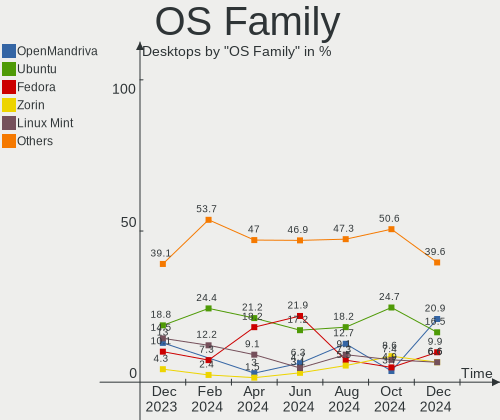
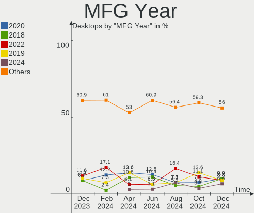
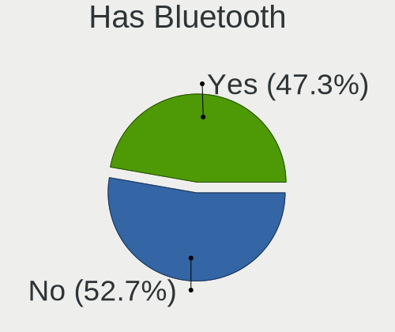
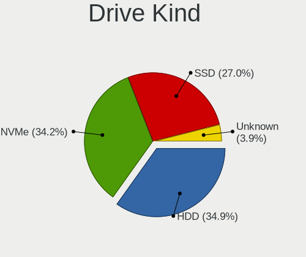
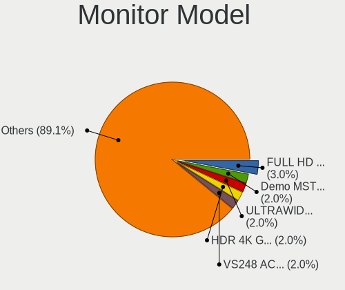
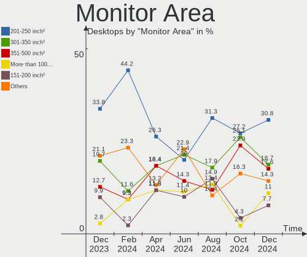
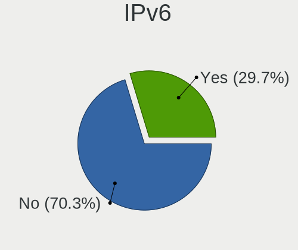
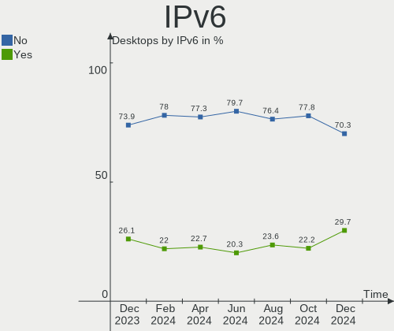

Linux in Canada - Hardware Trends (Desktops)
--------------------------------------------

A project to identify most popular hardware characteristics and track their change
over time based on data collected by Linux users at https://Linux-Hardware.org.

Anyone can contribute to this report by the [hw-probe](https://github.com/linuxhw/hw-probe) tool:

    sudo -E hw-probe -all -upload

Period: Jan, 2023.

Contents
--------

* [ System ](#system)
  - [ OS                       ](#os)
  - [ OS Family                ](#os-family)
  - [ Kernel                   ](#kernel)
  - [ Kernel Family            ](#kernel-family)
  - [ Kernel Major Ver.        ](#kernel-major-ver)
  - [ Arch                     ](#arch)
  - [ DE                       ](#de)
  - [ Display Server           ](#display-server)
  - [ Display Manager          ](#display-manager)
  - [ OS Lang                  ](#os-lang)
  - [ Boot Mode                ](#boot-mode)
  - [ Filesystem               ](#filesystem)
  - [ Part. scheme             ](#part-scheme)
  - [ Dual Boot with Linux/BSD ](#dual-boot-with-linuxbsd)
  - [ Dual Boot (Win)          ](#dual-boot-win)

* [ Board ](#board)
  - [ Vendor                   ](#vendor)
  - [ Model                    ](#model)
  - [ Model Family             ](#model-family)
  - [ MFG Year                 ](#mfg-year)
  - [ Form Factor              ](#form-factor)
  - [ Secure Boot              ](#secure-boot)
  - [ Coreboot                 ](#coreboot)
  - [ RAM Size                 ](#ram-size)
  - [ RAM Used                 ](#ram-used)
  - [ Total Drives             ](#total-drives)
  - [ Has CD-ROM               ](#has-cd-rom)
  - [ Has Ethernet             ](#has-ethernet)
  - [ Has WiFi                 ](#has-wifi)
  - [ Has Bluetooth            ](#has-bluetooth)

* [ Location ](#location)
  - [ Country                  ](#country)
  - [ City                     ](#city)

* [ Drives ](#drives)
  - [ Drive Vendor             ](#drive-vendor)
  - [ Drive Model              ](#drive-model)
  - [ HDD Vendor               ](#hdd-vendor)
  - [ SSD Vendor               ](#ssd-vendor)
  - [ Drive Kind               ](#drive-kind)
  - [ Drive Connector          ](#drive-connector)
  - [ Drive Size               ](#drive-size)
  - [ Space Total              ](#space-total)
  - [ Space Used               ](#space-used)
  - [ Malfunc. Drives          ](#malfunc-drives)
  - [ Malfunc. Drive Vendor    ](#malfunc-drive-vendor)
  - [ Malfunc. HDD Vendor      ](#malfunc-hdd-vendor)
  - [ Malfunc. Drive Kind      ](#malfunc-drive-kind)
  - [ Failed Drives            ](#failed-drives)
  - [ Failed Drive Vendor      ](#failed-drive-vendor)
  - [ Drive Status             ](#drive-status)

* [ Storage controller ](#storage-controller)
  - [ Storage Vendor           ](#storage-vendor)
  - [ Storage Model            ](#storage-model)
  - [ Storage Kind             ](#storage-kind)

* [ Processor ](#processor)
  - [ CPU Vendor               ](#cpu-vendor)
  - [ CPU Model                ](#cpu-model)
  - [ CPU Model Family         ](#cpu-model-family)
  - [ CPU Cores                ](#cpu-cores)
  - [ CPU Sockets              ](#cpu-sockets)
  - [ CPU Threads              ](#cpu-threads)
  - [ CPU Op-Modes             ](#cpu-op-modes)
  - [ CPU Microcode            ](#cpu-microcode)
  - [ CPU Microarch            ](#cpu-microarch)

* [ Graphics ](#graphics)
  - [ GPU Vendor               ](#gpu-vendor)
  - [ GPU Model                ](#gpu-model)
  - [ GPU Combo                ](#gpu-combo)
  - [ GPU Driver               ](#gpu-driver)
  - [ GPU Memory               ](#gpu-memory)

* [ Monitor ](#monitor)
  - [ Monitor Vendor           ](#monitor-vendor)
  - [ Monitor Model            ](#monitor-model)
  - [ Monitor Resolution       ](#monitor-resolution)
  - [ Monitor Diagonal         ](#monitor-diagonal)
  - [ Monitor Width            ](#monitor-width)
  - [ Aspect Ratio             ](#aspect-ratio)
  - [ Monitor Area             ](#monitor-area)
  - [ Pixel Density            ](#pixel-density)
  - [ Multiple Monitors        ](#multiple-monitors)

* [ Network ](#network)
  - [ Net Controller Vendor    ](#net-controller-vendor)
  - [ Net Controller Model     ](#net-controller-model)
  - [ Wireless Vendor          ](#wireless-vendor)
  - [ Wireless Model           ](#wireless-model)
  - [ Ethernet Vendor          ](#ethernet-vendor)
  - [ Ethernet Model           ](#ethernet-model)
  - [ Net Controller Kind      ](#net-controller-kind)
  - [ Used Controller          ](#used-controller)
  - [ NICs                     ](#nics)
  - [ IPv6                     ](#ipv6)

* [ Bluetooth ](#bluetooth)
  - [ Bluetooth Vendor         ](#bluetooth-vendor)
  - [ Bluetooth Model          ](#bluetooth-model)

* [ Sound ](#sound)
  - [ Sound Vendor             ](#sound-vendor)
  - [ Sound Model              ](#sound-model)

* [ Memory ](#memory)
  - [ Memory Vendor            ](#memory-vendor)
  - [ Memory Model             ](#memory-model)
  - [ Memory Kind              ](#memory-kind)
  - [ Memory Form Factor       ](#memory-form-factor)
  - [ Memory Size              ](#memory-size)
  - [ Memory Speed             ](#memory-speed)

* [ Printers & scanners ](#printers--scanners)
  - [ Printer Vendor           ](#printer-vendor)
  - [ Printer Model            ](#printer-model)
  - [ Scanner Vendor           ](#scanner-vendor)
  - [ Scanner Model            ](#scanner-model)

* [ Camera ](#camera)
  - [ Camera Vendor            ](#camera-vendor)
  - [ Camera Model             ](#camera-model)

* [ Security ](#security)
  - [ Fingerprint Vendor       ](#fingerprint-vendor)
  - [ Fingerprint Model        ](#fingerprint-model)
  - [ Chipcard Vendor          ](#chipcard-vendor)
  - [ Chipcard Model           ](#chipcard-model)

* [ Unsupported ](#unsupported)
  - [ Unsupported Devices      ](#unsupported-devices)
  - [ Unsupported Device Types ](#unsupported-device-types)

System
------

OS
--

Installed operating systems

| Name                | Desktops | Percent |
|---------------------|----------|---------|
| OpenMandriva 23.01  | 26       | 24.3%   |
| Ubuntu 22.04        | 14       | 13.08%  |
| Debian 11           | 9        | 8.41%   |
| Pop!_OS 22.04       | 7        | 6.54%   |
| Ubuntu 22.10        | 6        | 5.61%   |
| Linux Mint 21.1     | 5        | 4.67%   |
| Fedora 37           | 5        | 4.67%   |
| Zorin 16            | 3        | 2.8%    |
| Linux Mint 21       | 3        | 2.8%    |
| Linux Mint 20.3     | 3        | 2.8%    |
| Kubuntu 22.04       | 2        | 1.87%   |
| KDE neon 22.04      | 2        | 1.87%   |
| EndeavourOS Rolling | 2        | 1.87%   |
| Debian              | 2        | 1.87%   |
| Xubuntu 20.04       | 1        | 0.93%   |
| Ubuntu 20.04        | 1        | 0.93%   |
| Ubuntu 18.04        | 1        | 0.93%   |
| Rocky Linux 9.1     | 1        | 0.93%   |
| RHEL 9              | 1        | 0.93%   |
| Nobara 37           | 1        | 0.93%   |
| Nobara 36           | 1        | 0.93%   |
| Manjaro             | 1        | 0.93%   |
| Linux Mint 19.2     | 1        | 0.93%   |
| Kubuntu 18.04       | 1        | 0.93%   |
| KDE neon 20.04      | 1        | 0.93%   |
| Gnoppix 23          | 1        | 0.93%   |
| Elementary 5.1.7    | 1        | 0.93%   |
| CentOS 7            | 1        | 0.93%   |
| Artix               | 1        | 0.93%   |
| Arch Rolling        | 1        | 0.93%   |
| Alpine 3.16.1       | 1        | 0.93%   |
| AlmaLinux 8.7       | 1        | 0.93%   |

OS Family
---------

OS without a version

| Name         | Desktops | Percent |
|--------------|----------|---------|
| OpenMandriva | 26       | 24.3%   |
| Ubuntu       | 22       | 20.56%  |
| Linux Mint   | 12       | 11.21%  |
| Debian       | 11       | 10.28%  |
| Pop!_OS      | 7        | 6.54%   |
| Fedora       | 5        | 4.67%   |
| Zorin        | 3        | 2.8%    |
| Kubuntu      | 3        | 2.8%    |
| KDE neon     | 3        | 2.8%    |
| Nobara       | 2        | 1.87%   |
| EndeavourOS  | 2        | 1.87%   |
| Xubuntu      | 1        | 0.93%   |
| Rocky Linux  | 1        | 0.93%   |
| RHEL         | 1        | 0.93%   |
| Manjaro      | 1        | 0.93%   |
| Gnoppix      | 1        | 0.93%   |
| Elementary   | 1        | 0.93%   |
| CentOS       | 1        | 0.93%   |
| Artix        | 1        | 0.93%   |
| Arch         | 1        | 0.93%   |
| Alpine       | 1        | 0.93%   |
| AlmaLinux    | 1        | 0.93%   |

Kernel
------

Version of the Linux kernel

| Version                         | Desktops | Percent |
|---------------------------------|----------|---------|
| 6.1.1-desktop-1omv2290          | 24       | 22.43%  |
| 5.15.0-58-generic               | 16       | 14.95%  |
| 5.15.0-56-generic               | 9        | 8.41%   |
| 6.0.12-76060006-generic         | 6        | 5.61%   |
| 5.4.0-137-generic               | 5        | 4.67%   |
| 5.15.0-57-generic               | 5        | 4.67%   |
| 6.1.7-200.fc37.x86_64           | 3        | 2.8%    |
| 5.10.0-20-amd64                 | 3        | 2.8%    |
| 6.1.2-desktop-1omv2301          | 2        | 1.87%   |
| 6.0.15-300.fc37.x86_64          | 2        | 1.87%   |
| 6.0.0-6-amd64                   | 2        | 1.87%   |
| 5.19.17-1-pve                   | 2        | 1.87%   |
| 5.19.0-29-generic               | 2        | 1.87%   |
| 5.19.0-28-generic               | 2        | 1.87%   |
| 5.10.0-14-amd64                 | 2        | 1.87%   |
| 6.1.6-203.fsync.fc37.x86_64     | 1        | 0.93%   |
| 6.1.4-zen2-1-zen                | 1        | 0.93%   |
| 6.1.1-zen1-1-zen                | 1        | 0.93%   |
| 6.1.1-x64v1-xanmod1-1           | 1        | 0.93%   |
| 6.1.1-arch1-1                   | 1        | 0.93%   |
| 6.1.1-1-MANJARO                 | 1        | 0.93%   |
| 6.0.6-76060006-generic          | 1        | 0.93%   |
| 6.0.14-201.fsync.fc36.x86_64    | 1        | 0.93%   |
| 6.0.0-kali6-amd64               | 1        | 0.93%   |
| 6.0.0-0.deb11.6-amd64           | 1        | 0.93%   |
| 5.4.0-54-generic                | 1        | 0.93%   |
| 5.4.0-122-generic               | 1        | 0.93%   |
| 5.19.0-2mx-amd64                | 1        | 0.93%   |
| 5.19.0-26-generic               | 1        | 0.93%   |
| 5.19.0-21-generic               | 1        | 0.93%   |
| 5.15.80                         | 1        | 0.93%   |
| 5.15.0-41-generic               | 1        | 0.93%   |
| 5.14.0-162.6.1.el9_1.0.1.x86_64 | 1        | 0.93%   |
| 5.14.0-162.12.1.el9_1.x86_64    | 1        | 0.93%   |
| 4.19.187                        | 1        | 0.93%   |
| 4.18.0-425.3.1.el8.x86_64       | 1        | 0.93%   |
| 4.15.0-54-generic               | 1        | 0.93%   |

Kernel Family
-------------

Linux kernel without a distro release

| Version  | Desktops | Percent |
|----------|----------|---------|
| 5.15.0   | 31       | 28.97%  |
| 6.1.1    | 28       | 26.17%  |
| 5.4.0    | 7        | 6.54%   |
| 5.19.0   | 7        | 6.54%   |
| 6.0.12   | 6        | 5.61%   |
| 5.10.0   | 5        | 4.67%   |
| 6.0.0    | 4        | 3.74%   |
| 6.1.7    | 3        | 2.8%    |
| 6.1.2    | 2        | 1.87%   |
| 6.0.15   | 2        | 1.87%   |
| 5.19.17  | 2        | 1.87%   |
| 5.14.0   | 2        | 1.87%   |
| 6.1.6    | 1        | 0.93%   |
| 6.1.4    | 1        | 0.93%   |
| 6.0.6    | 1        | 0.93%   |
| 6.0.14   | 1        | 0.93%   |
| 5.15.80  | 1        | 0.93%   |
| 4.19.187 | 1        | 0.93%   |
| 4.18.0   | 1        | 0.93%   |
| 4.15.0   | 1        | 0.93%   |

Kernel Major Ver.
-----------------

Linux kernel major version

| Version | Desktops | Percent |
|---------|----------|---------|
| 6.1     | 35       | 32.71%  |
| 5.15    | 32       | 29.91%  |
| 6.0     | 14       | 13.08%  |
| 5.19    | 9        | 8.41%   |
| 5.4     | 7        | 6.54%   |
| 5.10    | 5        | 4.67%   |
| 5.14    | 2        | 1.87%   |
| 4.19    | 1        | 0.93%   |
| 4.18    | 1        | 0.93%   |
| 4.15    | 1        | 0.93%   |

Arch
----

OS architecture (x86_64, i586, etc.)

| Name   | Desktops | Percent |
|--------|----------|---------|
| x86_64 | 107      | 100%    |

DE
--

Desktop Environment

| Name            | Desktops | Percent |
|-----------------|----------|---------|
| GNOME           | 44       | 41.12%  |
| KDE5            | 37       | 34.58%  |
| X-Cinnamon      | 9        | 8.41%   |
| Unknown         | 8        | 7.48%   |
| XFCE            | 2        | 1.87%   |
| Pantheon        | 1        | 0.93%   |
| MATE            | 1        | 0.93%   |
| LXQt            | 1        | 0.93%   |
| LXDE            | 1        | 0.93%   |
| KDE4            | 1        | 0.93%   |
| GNOME Flashback | 1        | 0.93%   |
| Cinnamon        | 1        | 0.93%   |

Display Server
--------------

X11 or Wayland

| Name    | Desktops | Percent |
|---------|----------|---------|
| X11     | 72       | 67.29%  |
| Wayland | 26       | 24.3%   |
| Tty     | 5        | 4.67%   |
| Unknown | 4        | 3.74%   |

Display Manager
---------------

SDDM, LightDM, etc.

| Name    | Desktops | Percent |
|---------|----------|---------|
| SDDM    | 35       | 32.71%  |
| Unknown | 34       | 31.78%  |
| GDM3    | 20       | 18.69%  |
| LightDM | 10       | 9.35%   |
| GDM     | 8        | 7.48%   |

OS Lang
-------

Language

| Lang    | Desktops | Percent |
|---------|----------|---------|
| en_CA   | 51       | 47.66%  |
| en_US   | 44       | 41.12%  |
| fr_CA   | 5        | 4.67%   |
| C       | 4        | 3.74%   |
| Unknown | 2        | 1.87%   |
| en_GB   | 1        | 0.93%   |

Boot Mode
---------

EFI or BIOS

| Mode | Desktops | Percent |
|------|----------|---------|
| BIOS | 60       | 56.07%  |
| EFI  | 47       | 43.93%  |

Filesystem
----------

Type of filesystem

| Type    | Desktops | Percent |
|---------|----------|---------|
| Ext4    | 70       | 65.42%  |
| Overlay | 26       | 24.3%   |
| Btrfs   | 7        | 6.54%   |
| Xfs     | 2        | 1.87%   |
| Zfs     | 1        | 0.93%   |
| Tmpfs   | 1        | 0.93%   |

Part. scheme
------------

Scheme of partitioning

| Type    | Desktops | Percent |
|---------|----------|---------|
| GPT     | 65       | 60.75%  |
| Unknown | 26       | 24.3%   |
| MBR     | 16       | 14.95%  |

Dual Boot with Linux/BSD
------------------------

Hosting more than one Linux/BSD

| Dual boot | Desktops | Percent |
|-----------|----------|---------|
| No        | 76       | 71.03%  |
| Yes       | 31       | 28.97%  |

Dual Boot (Win)
---------------

Hosting Linux and Windows

| Dual boot | Desktops | Percent |
|-----------|----------|---------|
| No        | 72       | 67.29%  |
| Yes       | 35       | 32.71%  |

Board
-----

Vendor
------

Motherboard manufacturer

| Name                | Desktops | Percent |
|---------------------|----------|---------|
| ASUSTek Computer    | 41       | 38.32%  |
| MSI                 | 12       | 11.21%  |
| Dell                | 10       | 9.35%   |
| Lenovo              | 9        | 8.41%   |
| Hewlett-Packard     | 8        | 7.48%   |
| Gigabyte Technology | 8        | 7.48%   |
| ASRock              | 8        | 7.48%   |
| ASRockRack          | 3        | 2.8%    |
| Foxconn             | 2        | 1.87%   |
| Acer                | 2        | 1.87%   |
| Pegatron            | 1        | 0.93%   |
| Intel               | 1        | 0.93%   |
| ECS                 | 1        | 0.93%   |
| Alienware           | 1        | 0.93%   |

Model
-----

Motherboard model

| Name                                    | Desktops | Percent |
|-----------------------------------------|----------|---------|
| ASUS All Series                         | 6        | 5.61%   |
| Dell OptiPlex 7040                      | 3        | 2.8%    |
| MSI MS-7B85                             | 2        | 1.87%   |
| MSI MS-7885                             | 2        | 1.87%   |
| Pegatron p6-2310                        | 1        | 0.93%   |
| MSI MS-7D53                             | 1        | 0.93%   |
| MSI MS-7C91                             | 1        | 0.93%   |
| MSI MS-7C56                             | 1        | 0.93%   |
| MSI MS-7B50                             | 1        | 0.93%   |
| MSI MS-7917                             | 1        | 0.93%   |
| MSI MS-7641                             | 1        | 0.93%   |
| MSI MS-7640                             | 1        | 0.93%   |
| MSI MS-7599                             | 1        | 0.93%   |
| Lenovo ThinkStation P910 30B8S0EN00     | 1        | 0.93%   |
| Lenovo ThinkCentre XXXX 7360EHF         | 1        | 0.93%   |
| Lenovo ThinkCentre M93p 10AB0016US      | 1        | 0.93%   |
| Lenovo ThinkCentre M92P 3237EJ3         | 1        | 0.93%   |
| Lenovo ThinkCentre M83 10AL000GUS       | 1        | 0.93%   |
| Lenovo ThinkCentre M73 10AXS5C102       | 1        | 0.93%   |
| Lenovo MAHOBAY No DPK                   | 1        | 0.93%   |
| Lenovo Legion T730-28ICO 90JF00AXUS     | 1        | 0.93%   |
| Lenovo IdeaCentre 5 14IMB05 90NA0001US  | 1        | 0.93%   |
| Intel DQ77MK AAG39642-500               | 1        | 0.93%   |
| HP Pavilion Gaming Desktop TG01-0xxx    | 1        | 0.93%   |
| HP EliteDesk 800 G1 TWR                 | 1        | 0.93%   |
| HP EliteDesk 800 G1 SFF                 | 1        | 0.93%   |
| HP Compaq Pro 6300 SFF                  | 1        | 0.93%   |
| HP Compaq dc7800p Convertible Minitower | 1        | 0.93%   |
| HP Compaq 8200 Elite SFF PC             | 1        | 0.93%   |
| HP 8433 11                              | 1        | 0.93%   |
| HP 500-d09w                             | 1        | 0.93%   |
| Gigabyte Z390 AORUS ULTRA               | 1        | 0.93%   |
| Gigabyte X670 AORUS ELITE AX            | 1        | 0.93%   |
| Gigabyte X570S I AORUS PRO AX           | 1        | 0.93%   |
| Gigabyte H81M-S2PV                      | 1        | 0.93%   |
| Gigabyte GA-MA770-UD3                   | 1        | 0.93%   |
| Gigabyte B450M DS3H                     | 1        | 0.93%   |
| Gigabyte B450 AORUS PRO WIFI            | 1        | 0.93%   |
| Gigabyte B450 AORUS M                   | 1        | 0.93%   |
| Foxconn nT-A3000 series                 | 1        | 0.93%   |

Model Family
------------

Motherboard model prefix

| Name                  | Desktops | Percent |
|-----------------------|----------|---------|
| ASUS PRIME            | 10       | 9.35%   |
| Dell OptiPlex         | 7        | 6.54%   |
| ASUS All              | 6        | 5.61%   |
| Lenovo ThinkCentre    | 5        | 4.67%   |
| ASUS ROG              | 5        | 4.67%   |
| HP Compaq             | 3        | 2.8%    |
| MSI MS-7B85           | 2        | 1.87%   |
| MSI MS-7885           | 2        | 1.87%   |
| HP EliteDesk          | 2        | 1.87%   |
| Gigabyte B450         | 2        | 1.87%   |
| ASRock B450M          | 2        | 1.87%   |
| Acer Aspire           | 2        | 1.87%   |
| Pegatron p6-2310      | 1        | 0.93%   |
| MSI MS-7D53           | 1        | 0.93%   |
| MSI MS-7C91           | 1        | 0.93%   |
| MSI MS-7C56           | 1        | 0.93%   |
| MSI MS-7B50           | 1        | 0.93%   |
| MSI MS-7917           | 1        | 0.93%   |
| MSI MS-7641           | 1        | 0.93%   |
| MSI MS-7640           | 1        | 0.93%   |
| MSI MS-7599           | 1        | 0.93%   |
| Lenovo ThinkStation   | 1        | 0.93%   |
| Lenovo MAHOBAY        | 1        | 0.93%   |
| Lenovo Legion         | 1        | 0.93%   |
| Lenovo IdeaCentre     | 1        | 0.93%   |
| Intel DQ77MK          | 1        | 0.93%   |
| HP Pavilion           | 1        | 0.93%   |
| HP 8433               | 1        | 0.93%   |
| HP 500-d09w           | 1        | 0.93%   |
| Gigabyte Z390         | 1        | 0.93%   |
| Gigabyte X670         | 1        | 0.93%   |
| Gigabyte X570S        | 1        | 0.93%   |
| Gigabyte H81M-S2PV    | 1        | 0.93%   |
| Gigabyte GA-MA770-UD3 | 1        | 0.93%   |
| Gigabyte B450M        | 1        | 0.93%   |
| Foxconn nT-A3000      | 1        | 0.93%   |
| Foxconn ALOE          | 1        | 0.93%   |
| ECS A55F-M2           | 1        | 0.93%   |
| Dell Vostro           | 1        | 0.93%   |
| Dell G5               | 1        | 0.93%   |

MFG Year
--------

Motherboard manufacture year

| Year | Desktops | Percent |
|------|----------|---------|
| 2020 | 14       | 13.08%  |
| 2022 | 12       | 11.21%  |
| 2018 | 11       | 10.28%  |
| 2013 | 11       | 10.28%  |
| 2012 | 9        | 8.41%   |
| 2014 | 7        | 6.54%   |
| 2007 | 7        | 6.54%   |
| 2011 | 6        | 5.61%   |
| 2015 | 5        | 4.67%   |
| 2009 | 5        | 4.67%   |
| 2021 | 4        | 3.74%   |
| 2019 | 4        | 3.74%   |
| 2016 | 4        | 3.74%   |
| 2017 | 3        | 2.8%    |
| 2010 | 2        | 1.87%   |
| 2008 | 2        | 1.87%   |
| 2006 | 1        | 0.93%   |

Form Factor
-----------

Physical design of the computer

| Name    | Desktops | Percent |
|---------|----------|---------|
| Desktop | 107      | 100%    |

Secure Boot
-----------

Enabled or disabled

| State    | Desktops | Percent |
|----------|----------|---------|
| Disabled | 103      | 96.26%  |
| Enabled  | 4        | 3.74%   |

Coreboot
--------

Have coreboot on board

| Used | Desktops | Percent |
|------|----------|---------|
| No   | 106      | 99.07%  |
| Yes  | 1        | 0.93%   |

RAM Size
--------

Total RAM memory

| Size in GB  | Desktops | Percent |
|-------------|----------|---------|
| 16.01-24.0  | 29       | 27.1%   |
| 32.01-64.0  | 22       | 20.56%  |
| 8.01-16.0   | 19       | 17.76%  |
| 4.01-8.0    | 16       | 14.95%  |
| 64.01-256.0 | 8        | 7.48%   |
| 24.01-32.0  | 6        | 5.61%   |
| 3.01-4.0    | 4        | 3.74%   |
| 1.01-2.0    | 2        | 1.87%   |
| 2.01-3.0    | 1        | 0.93%   |

RAM Used
--------

Used RAM memory

| Used GB    | Desktops | Percent |
|------------|----------|---------|
| 1.01-2.0   | 35       | 32.71%  |
| 4.01-8.0   | 23       | 21.5%   |
| 2.01-3.0   | 19       | 17.76%  |
| 3.01-4.0   | 14       | 13.08%  |
| 0.51-1.0   | 7        | 6.54%   |
| 16.01-24.0 | 3        | 2.8%    |
| 8.01-16.0  | 3        | 2.8%    |
| 32.01-64.0 | 2        | 1.87%   |
| 24.01-32.0 | 1        | 0.93%   |

Total Drives
------------

Number of drives on board

| Drives | Desktops | Percent |
|--------|----------|---------|
| 2      | 35       | 32.71%  |
| 1      | 35       | 32.71%  |
| 3      | 15       | 14.02%  |
| 4      | 10       | 9.35%   |
| 5      | 8        | 7.48%   |
| 7      | 2        | 1.87%   |
| 13     | 1        | 0.93%   |
| 6      | 1        | 0.93%   |

Has CD-ROM
----------

Has CD-ROM on board

| Presented | Desktops | Percent |
|-----------|----------|---------|
| No        | 62       | 57.94%  |
| Yes       | 45       | 42.06%  |

Has Ethernet
------------

Has Ethernet on board

| Presented | Desktops | Percent |
|-----------|----------|---------|
| Yes       | 107      | 100%    |

Has WiFi
--------

Has WiFi module

| Presented | Desktops | Percent |
|-----------|----------|---------|
| Yes       | 58       | 54.21%  |
| No        | 49       | 45.79%  |

Has Bluetooth
-------------

Has Bluetooth module

| Presented | Desktops | Percent |
|-----------|----------|---------|
| No        | 60       | 56.07%  |
| Yes       | 47       | 43.93%  |

Location
--------

Country
-------

Geographic location (country)

| Country | Desktops | Percent |
|---------|----------|---------|
| Canada  | 107      | 100%    |

City
----

Geographic location (city)

| City                      | Desktops | Percent |
|---------------------------|----------|---------|
| Toronto                   | 11       | 10.28%  |
| Montreal                  | 9        | 8.41%   |
| Vancouver                 | 6        | 5.61%   |
| Ottawa                    | 6        | 5.61%   |
| Québec                   | 4        | 3.74%   |
| Etobicoke                 | 3        | 2.8%    |
| Winnipeg                  | 2        | 1.87%   |
| Windsor                   | 2        | 1.87%   |
| Richmond Hill             | 2        | 1.87%   |
| Laval                     | 2        | 1.87%   |
| Kingston                  | 2        | 1.87%   |
| Greater Sudbury           | 2        | 1.87%   |
| Gatineau                  | 2        | 1.87%   |
| Edmonton                  | 2        | 1.87%   |
| Calgary                   | 2        | 1.87%   |
| Beauharnois               | 2        | 1.87%   |
| Bathurst                  | 2        | 1.87%   |
| Airdrie                   | 2        | 1.87%   |
| Woodville                 | 1        | 0.93%   |
| Wolfville                 | 1        | 0.93%   |
| Thornhill                 | 1        | 0.93%   |
| Temiskaming Shores        | 1        | 0.93%   |
| Teeswater                 | 1        | 0.93%   |
| Sturgeon Falls            | 1        | 0.93%   |
| Stittsville               | 1        | 0.93%   |
| St. John's                | 1        | 0.93%   |
| Spruce Grove              | 1        | 0.93%   |
| Scotstown                 | 1        | 0.93%   |
| Scarborough               | 1        | 0.93%   |
| Sault Ste. Marie          | 1        | 0.93%   |
| Salaberry-de-Valleyfield  | 1        | 0.93%   |
| Sainte-Marie              | 1        | 0.93%   |
| Saint-Lambert             | 1        | 0.93%   |
| Saint-Joachim-de-Shefford | 1        | 0.93%   |
| Saint-Eustache            | 1        | 0.93%   |
| Red Deer                  | 1        | 0.93%   |
| Prescott                  | 1        | 0.93%   |
| Port Perry                | 1        | 0.93%   |
| Port Coquitlam            | 1        | 0.93%   |
| Pitt Meadows              | 1        | 0.93%   |

Drives
------

Drive Vendor
------------

Hard drive vendors

| Vendor                    | Desktops | Drives | Percent |
|---------------------------|----------|--------|---------|
| WDC                       | 48       | 68     | 22.75%  |
| Seagate                   | 36       | 46     | 17.06%  |
| Samsung Electronics       | 36       | 49     | 17.06%  |
| Kingston                  | 21       | 23     | 9.95%   |
| SanDisk                   | 16       | 19     | 7.58%   |
| Hitachi                   | 6        | 6      | 2.84%   |
| Crucial                   | 6        | 7      | 2.84%   |
| Intel                     | 5        | 6      | 2.37%   |
| Toshiba                   | 4        | 5      | 1.9%    |
| Silicon Motion            | 4        | 5      | 1.9%    |
| Team                      | 2        | 2      | 0.95%   |
| SPCC                      | 2        | 2      | 0.95%   |
| SK hynix                  | 2        | 2      | 0.95%   |
| OCZ                       | 2        | 2      | 0.95%   |
| Micron/Crucial Technology | 2        | 2      | 0.95%   |
| HGST                      | 2        | 2      | 0.95%   |
| Corsair                   | 2        | 2      | 0.95%   |
| Timetec                   | 1        | 1      | 0.47%   |
| T-FORCE                   | 1        | 1      | 0.47%   |
| Seagate Technology        | 1        | 1      | 0.47%   |
| PNY                       | 1        | 1      | 0.47%   |
| Phison Electronics        | 1        | 1      | 0.47%   |
| Mushkin                   | 1        | 1      | 0.47%   |
| Micron Technology         | 1        | 1      | 0.47%   |
| LaCie                     | 1        | 1      | 0.47%   |
| KingSpec                  | 1        | 1      | 0.47%   |
| KingDian                  | 1        | 1      | 0.47%   |
| JMicron Technology        | 1        | 1      | 0.47%   |
| HL-DT-ST                  | 1        | 1      | 0.47%   |
| ASMT                      | 1        | 1      | 0.47%   |
| AMD                       | 1        | 1      | 0.47%   |
| ADATA Technology          | 1        | 1      | 0.47%   |

Drive Model
-----------

Hard drive models

| Model                                               | Desktops | Percent |
|-----------------------------------------------------|----------|---------|
| Kingston SA400S37240G 240GB SSD                     | 7        | 2.85%   |
| Seagate ST1000DM010-2EP102 1TB                      | 5        | 2.03%   |
| WDC WD10EZEX-08WN4A0 1TB                            | 4        | 1.63%   |
| Samsung SSD 850 EVO 500GB                           | 4        | 1.63%   |
| WDC WDBNCE5000PNC 500GB SSD                         | 3        | 1.22%   |
| Seagate ST2000DM008-2FR102 2TB                      | 3        | 1.22%   |
| Seagate Backup+ Hub BK 8TB                          | 3        | 1.22%   |
| SanDisk NVMe SSD Drive 500GB                        | 3        | 1.22%   |
| SanDisk NVMe SSD Drive 1TB                          | 3        | 1.22%   |
| Samsung SSD 970 EVO Plus 500GB                      | 3        | 1.22%   |
| Samsung SSD 870 QVO 1TB                             | 3        | 1.22%   |
| Samsung SSD 850 EVO 250GB                           | 3        | 1.22%   |
| Samsung NVMe SSD Controller SM981/PM981/PM983 500GB | 3        | 1.22%   |
| Kingston SA400S37480G 480GB SSD                     | 3        | 1.22%   |
| Kingston SA400S37120G 120GB SSD                     | 3        | 1.22%   |
| WDC WDS500G2B0A 500GB SSD                           | 2        | 0.81%   |
| WDC WD40EZRZ-00GXCB0 4TB                            | 2        | 0.81%   |
| Silicon Motion SM2262/SM2262EN SSD Controller 1TB   | 2        | 0.81%   |
| Seagate ST8000VN0022-2EL112 8TB                     | 2        | 0.81%   |
| Seagate ST2000DM001-1ER164 2TB                      | 2        | 0.81%   |
| Seagate ST1000DM003-1ER162 1TB                      | 2        | 0.81%   |
| Seagate ST1000DM003-1CH162 1TB                      | 2        | 0.81%   |
| Sandisk WD Blue SN570 500GB                         | 2        | 0.81%   |
| Samsung SSD 870 EVO 500GB                           | 2        | 0.81%   |
| Samsung SSD 860 EVO 250GB                           | 2        | 0.81%   |
| Samsung SSD 840 Series 120GB                        | 2        | 0.81%   |
| Kingston SUV400S37240G 240GB SSD                    | 2        | 0.81%   |
| Intel SSD 660P Series 512GB                         | 2        | 0.81%   |
| WDC WDS500G2B0C-00PXH0 500GB                        | 1        | 0.41%   |
| WDC WDS500G2B0A-00SM50 500GB SSD                    | 1        | 0.41%   |
| WDC WDS250G2B0A-00SM50 250GB SSD                    | 1        | 0.41%   |
| WDC WDS120G2G0A-00JH30 120GB SSD                    | 1        | 0.41%   |
| WDC WDS100T3X0C-00SJG0 1TB                          | 1        | 0.41%   |
| WDC WDS100T2B0A-00SM50 1TB SSD                      | 1        | 0.41%   |
| WDC WDBNCE0010PNC-WRSN 1TB SSD                      | 1        | 0.41%   |
| WDC WDBNCE0010PNC 1TB SSD                           | 1        | 0.41%   |
| WDC WD80EMAZ-00WJTA0 8TB                            | 1        | 0.41%   |
| WDC WD80EFAX-68KNBN0 8TB                            | 1        | 0.41%   |
| WDC WD800JD-60JRA0 80GB                             | 1        | 0.41%   |
| WDC WD7500BPVT-60HXZT3 752GB                        | 1        | 0.41%   |

HDD Vendor
----------

Hard disk drive vendors

| Vendor              | Desktops | Drives | Percent |
|---------------------|----------|--------|---------|
| WDC                 | 38       | 53     | 43.18%  |
| Seagate             | 35       | 44     | 39.77%  |
| Hitachi             | 6        | 6      | 6.82%   |
| Toshiba             | 4        | 4      | 4.55%   |
| Samsung Electronics | 2        | 2      | 2.27%   |
| HGST                | 2        | 2      | 2.27%   |
| JMicron Technology  | 1        | 1      | 1.14%   |

SSD Vendor
----------

Solid state drive vendors

| Vendor              | Desktops | Drives | Percent |
|---------------------|----------|--------|---------|
| Samsung Electronics | 23       | 29     | 29.11%  |
| Kingston            | 20       | 22     | 25.32%  |
| WDC                 | 11       | 13     | 13.92%  |
| Crucial             | 5        | 6      | 6.33%   |
| SanDisk             | 3        | 3      | 3.8%    |
| Team                | 2        | 2      | 2.53%   |
| SPCC                | 2        | 2      | 2.53%   |
| OCZ                 | 2        | 2      | 2.53%   |
| Toshiba             | 1        | 1      | 1.27%   |
| Timetec             | 1        | 1      | 1.27%   |
| T-FORCE             | 1        | 1      | 1.27%   |
| SK hynix            | 1        | 1      | 1.27%   |
| Seagate             | 1        | 1      | 1.27%   |
| PNY                 | 1        | 1      | 1.27%   |
| Mushkin             | 1        | 1      | 1.27%   |
| KingSpec            | 1        | 1      | 1.27%   |
| KingDian            | 1        | 1      | 1.27%   |
| Intel               | 1        | 1      | 1.27%   |
| Corsair             | 1        | 1      | 1.27%   |

Drive Kind
----------

HDD or SSD

| Kind    | Desktops | Drives | Percent |
|---------|----------|--------|---------|
| HDD     | 69       | 112    | 38.33%  |
| SSD     | 64       | 90     | 35.56%  |
| NVMe    | 44       | 58     | 24.44%  |
| Unknown | 3        | 3      | 1.67%   |

Drive Connector
---------------

SATA, SAS, NVMe, etc.

| Type | Desktops | Drives | Percent |
|------|----------|--------|---------|
| SATA | 90       | 194    | 62.07%  |
| NVMe | 44       | 58     | 30.34%  |
| SAS  | 11       | 11     | 7.59%   |

Drive Size
----------

Size of hard drive

| Size in TB | Desktops | Drives | Percent |
|------------|----------|--------|---------|
| 0.01-0.5   | 63       | 83     | 42.28%  |
| 0.51-1.0   | 46       | 69     | 30.87%  |
| 1.01-2.0   | 15       | 17     | 10.07%  |
| 2.01-3.0   | 8        | 8      | 5.37%   |
| 4.01-10.0  | 8        | 12     | 5.37%   |
| 3.01-4.0   | 7        | 10     | 4.7%    |
| 10.01-20.0 | 2        | 3      | 1.34%   |

Space Total
-----------

Amount of disk space available on the file system

| Size in GB     | Desktops | Percent |
|----------------|----------|---------|
| 101-250        | 20       | 18.69%  |
| 501-1000       | 19       | 17.76%  |
| 251-500        | 17       | 15.89%  |
| More than 3000 | 14       | 13.08%  |
| 1-20           | 11       | 10.28%  |
| 1001-2000      | 9        | 8.41%   |
| Unknown        | 7        | 6.54%   |
| 2001-3000      | 5        | 4.67%   |
| 21-50          | 3        | 2.8%    |
| 51-100         | 2        | 1.87%   |

Space Used
----------

Amount of used disk space

| Used GB        | Desktops | Percent |
|----------------|----------|---------|
| 1-20           | 43       | 40.19%  |
| 21-50          | 16       | 14.95%  |
| 101-250        | 9        | 8.41%   |
| 1001-2000      | 8        | 7.48%   |
| Unknown        | 7        | 6.54%   |
| 51-100         | 6        | 5.61%   |
| More than 3000 | 5        | 4.67%   |
| 251-500        | 5        | 4.67%   |
| 501-1000       | 5        | 4.67%   |
| 2001-3000      | 2        | 1.87%   |
| 0              | 1        | 0.93%   |

Malfunc. Drives
---------------

Drive models with a malfunction

| Model                               | Desktops | Drives | Percent |
|-------------------------------------|----------|--------|---------|
| WDC WD800JD-60JRA0 80GB             | 1        | 1      | 7.14%   |
| WDC WD5000AAKS-00UU3A0 500GB        | 1        | 1      | 7.14%   |
| WDC WD40EFRX-68N32N0 4TB            | 1        | 1      | 7.14%   |
| WDC WD30EZRX-00SPEB0 3TB            | 1        | 1      | 7.14%   |
| WDC WD30EFRX-68EUZN0 3TB            | 1        | 1      | 7.14%   |
| WDC WD1001FALS-00J7B1 1TB           | 1        | 1      | 7.14%   |
| Seagate ST500LM021-1KJ152 500GB     | 1        | 1      | 7.14%   |
| Seagate ST2000LX001-1RG174-SSHD 2TB | 1        | 1      | 7.14%   |
| Seagate ST1000DM003-9YN162 1TB      | 1        | 1      | 7.14%   |
| Samsung Electronics SSD 980 PRO 1TB | 1        | 1      | 7.14%   |
| Samsung Electronics SSD 870 EVO 1TB | 1        | 2      | 7.14%   |
| Kingston SA400S37480G 480GB SSD     | 1        | 1      | 7.14%   |
| Kingston SA400S37120G 120GB SSD     | 1        | 1      | 7.14%   |
| Hitachi HTS542516K9SA00 160GB       | 1        | 1      | 7.14%   |

Malfunc. Drive Vendor
---------------------

Vendors of faulty drives

| Vendor              | Desktops | Drives | Percent |
|---------------------|----------|--------|---------|
| WDC                 | 6        | 6      | 42.86%  |
| Seagate             | 3        | 3      | 21.43%  |
| Samsung Electronics | 2        | 3      | 14.29%  |
| Kingston            | 2        | 2      | 14.29%  |
| Hitachi             | 1        | 1      | 7.14%   |

Malfunc. HDD Vendor
-------------------

Vendors of faulty HDD drives

| Vendor  | Desktops | Drives | Percent |
|---------|----------|--------|---------|
| WDC     | 6        | 6      | 60%     |
| Seagate | 3        | 3      | 30%     |
| Hitachi | 1        | 1      | 10%     |

Malfunc. Drive Kind
-------------------

Kinds of faulty drives

| Kind | Desktops | Drives | Percent |
|------|----------|--------|---------|
| HDD  | 9        | 10     | 69.23%  |
| SSD  | 3        | 4      | 23.08%  |
| NVMe | 1        | 1      | 7.69%   |

Failed Drives
-------------

Failed drive models

Zero info for selected period =(

Failed Drive Vendor
-------------------

Failed drive vendors

Zero info for selected period =(

Drive Status
------------

Number of failed and malfunc. drives

| Status   | Desktops | Drives | Percent |
|----------|----------|--------|---------|
| Works    | 58       | 128    | 47.15%  |
| Detected | 52       | 120    | 42.28%  |
| Malfunc  | 13       | 15     | 10.57%  |

Storage controller
------------------

Storage Vendor
--------------

Storage controller vendors

| Vendor                      | Desktops | Percent |
|-----------------------------|----------|---------|
| Intel                       | 57       | 33.14%  |
| AMD                         | 49       | 28.49%  |
| SanDisk                     | 15       | 8.72%   |
| Samsung Electronics         | 15       | 8.72%   |
| ASMedia Technology          | 7        | 4.07%   |
| JMicron Technology          | 6        | 3.49%   |
| Silicon Motion              | 4        | 2.33%   |
| Nvidia                      | 3        | 1.74%   |
| Micron/Crucial Technology   | 3        | 1.74%   |
| Seagate Technology          | 2        | 1.16%   |
| Phison Electronics          | 2        | 1.16%   |
| Marvell Technology Group    | 2        | 1.16%   |
| SK hynix                    | 1        | 0.58%   |
| Silicon Image               | 1        | 0.58%   |
| Micron Technology           | 1        | 0.58%   |
| LSI Logic / Symbios Logic   | 1        | 0.58%   |
| Kingston Technology Company | 1        | 0.58%   |
| Broadcom / LSI              | 1        | 0.58%   |
| ADATA Technology            | 1        | 0.58%   |

Storage Model
-------------

Storage controller models

| Model                                                                          | Desktops | Percent |
|--------------------------------------------------------------------------------|----------|---------|
| AMD FCH SATA Controller [AHCI mode]                                            | 22       | 10.33%  |
| AMD 400 Series Chipset SATA Controller                                         | 14       | 6.57%   |
| Samsung NVMe SSD Controller SM981/PM981/PM983                                  | 9        | 4.23%   |
| Intel 8 Series/C220 Series Chipset Family 6-port SATA Controller 1 [AHCI mode] | 8        | 3.76%   |
| AMD SB7x0/SB8x0/SB9x0 SATA Controller [AHCI mode]                              | 8        | 3.76%   |
| ASMedia ASM1062 Serial ATA Controller                                          | 7        | 3.29%   |
| AMD SB7x0/SB8x0/SB9x0 IDE Controller                                           | 7        | 3.29%   |
| SanDisk Non-Volatile memory controller                                         | 6        | 2.82%   |
| Intel SATA Controller [RAID mode]                                              | 6        | 2.82%   |
| Intel 7 Series/C210 Series Chipset Family 6-port SATA Controller [AHCI mode]   | 6        | 2.82%   |
| JMicron JMB363 SATA/IDE Controller                                             | 5        | 2.35%   |
| Intel Cannon Lake PCH SATA AHCI Controller                                     | 5        | 2.35%   |
| AMD 500 Series Chipset SATA Controller                                         | 5        | 2.35%   |
| Samsung NVMe SSD Controller PM9A1/PM9A3/980PRO                                 | 4        | 1.88%   |
| Intel 9 Series Chipset Family SATA Controller [AHCI Mode]                      | 4        | 1.88%   |
| Intel 200 Series PCH SATA controller [AHCI mode]                               | 4        | 1.88%   |
| AMD SATA controller                                                            | 4        | 1.88%   |
| SanDisk WD Blue SN570 NVMe SSD                                                 | 3        | 1.41%   |
| Intel SSD 660P Series                                                          | 3        | 1.41%   |
| Intel 82801I (ICH9 Family) 2 port SATA Controller [IDE mode]                   | 3        | 1.41%   |
| Intel 6 Series/C200 Series Chipset Family 6 port Desktop SATA AHCI Controller  | 3        | 1.41%   |
| AMD SB7x0/SB8x0/SB9x0 SATA Controller [IDE mode]                               | 3        | 1.41%   |
| Silicon Motion SM2263EN/SM2263XT SSD Controller                                | 2        | 0.94%   |
| Silicon Motion SM2262/SM2262EN SSD Controller                                  | 2        | 0.94%   |
| SanDisk WD Blue SN550 NVMe SSD                                                 | 2        | 0.94%   |
| SanDisk WD Black SN750 / PC SN730 NVMe SSD                                     | 2        | 0.94%   |
| Samsung NVMe SSD Controller 980                                                | 2        | 0.94%   |
| Phison E12 NVMe Controller                                                     | 2        | 0.94%   |
| Micron/Crucial P2 NVMe PCIe SSD                                                | 2        | 0.94%   |
| Intel Q170/Q150/B150/H170/H110/Z170/CM236 Chipset SATA Controller [AHCI Mode]  | 2        | 0.94%   |
| Intel Comet Lake SATA AHCI Controller                                          | 2        | 0.94%   |
| Intel C610/X99 series chipset sSATA Controller [AHCI mode]                     | 2        | 0.94%   |
| Intel 82801IR/IO/IH (ICH9R/DO/DH) 4 port SATA Controller [IDE mode]            | 2        | 0.94%   |
| Intel 82801HR/HO/HH (ICH8R/DO/DH) 2 port SATA Controller [IDE mode]            | 2        | 0.94%   |
| Intel 82801H (ICH8 Family) 4 port SATA Controller [IDE mode]                   | 2        | 0.94%   |
| SK hynix BC511                                                                 | 1        | 0.47%   |
| Silicon Image SiI 3114 [SATALink/SATARaid] Serial ATA Controller               | 1        | 0.47%   |
| Seagate Non-Volatile memory controller                                         | 1        | 0.47%   |
| Seagate FireCuda 510 SSD                                                       | 1        | 0.47%   |
| SanDisk WD Black 2018/SN750 / PC SN720 NVMe SSD                                | 1        | 0.47%   |

Storage Kind
------------

Kind of storage controller (IDE, SATA, NVMe, SAS, ...)

| Kind | Desktops | Percent |
|------|----------|---------|
| SATA | 91       | 53.22%  |
| NVMe | 44       | 25.73%  |
| IDE  | 24       | 14.04%  |
| RAID | 11       | 6.43%   |
| SAS  | 1        | 0.58%   |

Processor
---------

CPU Vendor
----------

Processor vendors

| Vendor | Desktops | Percent |
|--------|----------|---------|
| Intel  | 56       | 52.34%  |
| AMD    | 51       | 47.66%  |

CPU Model
---------

Processor models

| Model                                       | Desktops | Percent |
|---------------------------------------------|----------|---------|
| AMD Ryzen 7 5700G with Radeon Graphics      | 6        | 5.61%   |
| Intel Core i7-9700 CPU @ 3.00GHz            | 2        | 1.87%   |
| Intel Core i7-4790K CPU @ 4.00GHz           | 2        | 1.87%   |
| Intel Core i7-4790 CPU @ 3.60GHz            | 2        | 1.87%   |
| Intel Core i7-4770 CPU @ 3.40GHz            | 2        | 1.87%   |
| Intel Core i7-3770 CPU @ 3.40GHz            | 2        | 1.87%   |
| Intel Core i5-9600K CPU @ 3.70GHz           | 2        | 1.87%   |
| Intel Core i5-6500 CPU @ 3.20GHz            | 2        | 1.87%   |
| Intel Core i5-4570 CPU @ 3.20GHz            | 2        | 1.87%   |
| Intel Core i5-3470T CPU @ 2.90GHz           | 2        | 1.87%   |
| Intel Core i5-2500K CPU @ 3.30GHz           | 2        | 1.87%   |
| Intel Core i3-6100T CPU @ 3.20GHz           | 2        | 1.87%   |
| AMD Ryzen 9 5950X 16-Core Processor         | 2        | 1.87%   |
| AMD Ryzen 7 7700X 8-Core Processor          | 2        | 1.87%   |
| AMD Ryzen 7 3700X 8-Core Processor          | 2        | 1.87%   |
| AMD Ryzen 5 3600 6-Core Processor           | 2        | 1.87%   |
| AMD Ryzen 5 2600X Six-Core Processor        | 2        | 1.87%   |
| AMD Ryzen 5 1600 Six-Core Processor         | 2        | 1.87%   |
| AMD Phenom II X6 1090T Processor            | 2        | 1.87%   |
| AMD FX-8350 Eight-Core Processor            | 2        | 1.87%   |
| Intel Xeon E-2274G CPU @ 4.00GHz            | 1        | 0.93%   |
| Intel Xeon CPU E5-2640 v4 @ 2.40GHz         | 1        | 0.93%   |
| Intel Xeon CPU E3-1225 V2 @ 3.20GHz         | 1        | 0.93%   |
| Intel Pentium Dual-Core CPU E5400 @ 2.70GHz | 1        | 0.93%   |
| Intel Pentium D CPU 3.20GHz                 | 1        | 0.93%   |
| Intel Pentium CPU G630 @ 2.70GHz            | 1        | 0.93%   |
| Intel Pentium CPU G3250T @ 2.80GHz          | 1        | 0.93%   |
| Intel Core i9-9900K CPU @ 3.60GHz           | 1        | 0.93%   |
| Intel Core i9-10900X CPU @ 3.70GHz          | 1        | 0.93%   |
| Intel Core i9-10900KF CPU @ 3.70GHz         | 1        | 0.93%   |
| Intel Core i7-7700 CPU @ 3.60GHz            | 1        | 0.93%   |
| Intel Core i7-5930K CPU @ 3.50GHz           | 1        | 0.93%   |
| Intel Core i7-5820K CPU @ 3.30GHz           | 1        | 0.93%   |
| Intel Core i7-4770K CPU @ 3.50GHz           | 1        | 0.93%   |
| Intel Core i7-3770K CPU @ 3.50GHz           | 1        | 0.93%   |
| Intel Core i7-10700 CPU @ 2.90GHz           | 1        | 0.93%   |
| Intel Core i7 CPU 920 @ 2.67GHz             | 1        | 0.93%   |
| Intel Core i5-6400 CPU @ 2.70GHz            | 1        | 0.93%   |
| Intel Core i5-4690K CPU @ 3.50GHz           | 1        | 0.93%   |
| Intel Core i5-4570T CPU @ 2.90GHz           | 1        | 0.93%   |

CPU Model Family
----------------

Processor model prefix

| Model                   | Desktops | Percent |
|-------------------------|----------|---------|
| Intel Core i7           | 17       | 15.89%  |
| Intel Core i5           | 16       | 14.95%  |
| AMD Ryzen 7             | 16       | 14.95%  |
| AMD Ryzen 5             | 9        | 8.41%   |
| AMD Ryzen 9             | 6        | 5.61%   |
| Intel Core i3           | 5        | 4.67%   |
| AMD FX                  | 5        | 4.67%   |
| Intel Xeon              | 3        | 2.8%    |
| Intel Core i9           | 3        | 2.8%    |
| Intel Core 2 Duo        | 3        | 2.8%    |
| AMD Phenom II X6        | 3        | 2.8%    |
| AMD Phenom II X2        | 3        | 2.8%    |
| Other                   | 2        | 1.87%   |
| Intel Pentium           | 2        | 1.87%   |
| Intel Core 2 Quad       | 2        | 1.87%   |
| AMD A6                  | 2        | 1.87%   |
| AMD A10                 | 2        | 1.87%   |
| Intel Pentium Dual-Core | 1        | 0.93%   |
| Intel Pentium D         | 1        | 0.93%   |
| Intel Core 2            | 1        | 0.93%   |
| AMD Ryzen 3             | 1        | 0.93%   |
| AMD E                   | 1        | 0.93%   |
| AMD Athlon II X3        | 1        | 0.93%   |
| AMD Athlon 64 X2        | 1        | 0.93%   |
| AMD A4                  | 1        | 0.93%   |

CPU Cores
---------

Number of processor cores

| Number | Desktops | Percent |
|--------|----------|---------|
| 4      | 30       | 28.04%  |
| 2      | 25       | 23.36%  |
| 8      | 21       | 19.63%  |
| 6      | 17       | 15.89%  |
| 16     | 4        | 3.74%   |
| 12     | 3        | 2.8%    |
| 3      | 3        | 2.8%    |
| 10     | 2        | 1.87%   |
| 20     | 1        | 0.93%   |
| 1      | 1        | 0.93%   |

CPU Sockets
-----------

Number of sockets

| Number | Desktops | Percent |
|--------|----------|---------|
| 1      | 106      | 99.07%  |
| 2      | 1        | 0.93%   |

CPU Threads
-----------

Threads per core (Hyper-Threading)

| Number | Desktops | Percent |
|--------|----------|---------|
| 2      | 67       | 62.62%  |
| 1      | 40       | 37.38%  |

CPU Op-Modes
------------

CPU Operation Modes (32-bit, 64-bit)

| Op mode        | Desktops | Percent |
|----------------|----------|---------|
| 32-bit, 64-bit | 106      | 99.07%  |
| Unknown        | 1        | 0.93%   |

CPU Microcode
-------------

Microcode number

| Number     | Desktops | Percent |
|------------|----------|---------|
| Unknown    | 22       | 20.56%  |
| 0x306c3    | 11       | 10.28%  |
| 0x506e3    | 6        | 5.61%   |
| 0x306a9    | 6        | 5.61%   |
| 0x0a601203 | 4        | 3.74%   |
| 0x906ed    | 3        | 2.8%    |
| 0x206a7    | 3        | 2.8%    |
| 0x08701021 | 3        | 2.8%    |
| 0x0800820d | 3        | 2.8%    |
| 0x08001138 | 3        | 2.8%    |
| 0xa0655    | 2        | 1.87%   |
| 0x906ec    | 2        | 1.87%   |
| 0x1067a    | 2        | 1.87%   |
| 0x0a50000d | 2        | 1.87%   |
| 0x0a50000b | 2        | 1.87%   |
| 0x0a20120a | 2        | 1.87%   |
| 0x0a201016 | 2        | 1.87%   |
| 0x06000852 | 2        | 1.87%   |
| 0x010000dc | 2        | 1.87%   |
| 0xf62      | 1        | 0.93%   |
| 0xa0671    | 1        | 0.93%   |
| 0xa0653    | 1        | 0.93%   |
| 0x906ea    | 1        | 0.93%   |
| 0x90672    | 1        | 0.93%   |
| 0x6fb      | 1        | 0.93%   |
| 0x6f7      | 1        | 0.93%   |
| 0x6f6      | 1        | 0.93%   |
| 0x50657    | 1        | 0.93%   |
| 0x306f2    | 1        | 0.93%   |
| 0x20652    | 1        | 0.93%   |
| 0x0a50000c | 1        | 0.93%   |
| 0x08701030 | 1        | 0.93%   |
| 0x08701013 | 1        | 0.93%   |
| 0x08108109 | 1        | 0.93%   |
| 0x0600611a | 1        | 0.93%   |
| 0x06000822 | 1        | 0.93%   |
| 0x0600063e | 1        | 0.93%   |
| 0x06000613 | 1        | 0.93%   |
| 0x0500010d | 1        | 0.93%   |
| 0x03000027 | 1        | 0.93%   |

CPU Microarch
-------------

Microarchitecture

| Name             | Desktops | Percent |
|------------------|----------|---------|
| Haswell          | 15       | 14.02%  |
| Zen 3            | 13       | 12.15%  |
| IvyBridge        | 8        | 7.48%   |
| Zen 2            | 7        | 6.54%   |
| Skylake          | 7        | 6.54%   |
| KabyLake         | 7        | 6.54%   |
| K10              | 7        | 6.54%   |
| Zen+             | 5        | 4.67%   |
| Piledriver       | 4        | 3.74%   |
| Penryn           | 4        | 3.74%   |
| Unknown          | 4        | 3.74%   |
| Zen              | 3        | 2.8%    |
| SandyBridge      | 3        | 2.8%    |
| Core             | 3        | 2.8%    |
| CometLake        | 3        | 2.8%    |
| K10 Llano        | 2        | 1.87%   |
| Bulldozer        | 2        | 1.87%   |
| Westmere         | 1        | 0.93%   |
| NetBurst         | 1        | 0.93%   |
| Nehalem          | 1        | 0.93%   |
| K8 Hammer        | 1        | 0.93%   |
| Jaguar           | 1        | 0.93%   |
| Icelake          | 1        | 0.93%   |
| Excavator        | 1        | 0.93%   |
| Broadwell        | 1        | 0.93%   |
| Bobcat           | 1        | 0.93%   |
| Alderlake Hybrid | 1        | 0.93%   |

Graphics
--------

GPU Vendor
----------

Vendors of graphics cards

| Vendor            | Desktops | Percent |
|-------------------|----------|---------|
| Nvidia            | 43       | 36.13%  |
| AMD               | 42       | 35.29%  |
| Intel             | 31       | 26.05%  |
| ASPEED Technology | 3        | 2.52%   |

GPU Model
---------

Graphics card models

| Model                                                                       | Desktops | Percent |
|-----------------------------------------------------------------------------|----------|---------|
| Intel Xeon E3-1200 v3/4th Gen Core Processor Integrated Graphics Controller | 9        | 7.2%    |
| Nvidia GP107 [GeForce GTX 1050 Ti]                                          | 5        | 4%      |
| Intel HD Graphics 530                                                       | 5        | 4%      |
| Intel Xeon E3-1200 v2/3rd Gen Core processor Graphics Controller            | 4        | 3.2%    |
| AMD Raphael                                                                 | 4        | 3.2%    |
| AMD Ellesmere [Radeon RX 470/480/570/570X/580/580X/590]                     | 4        | 3.2%    |
| Nvidia GM107 [GeForce GTX 750 Ti]                                           | 3        | 2.4%    |
| ASPEED Technology ASPEED Graphics Family                                    | 3        | 2.4%    |
| AMD Navi 22 [Radeon RX 6700/6700 XT/6750 XT / 6800M]                        | 3        | 2.4%    |
| AMD Navi 21 [Radeon RX 6800/6800 XT / 6900 XT]                              | 3        | 2.4%    |
| AMD Cezanne [Radeon Vega Series / Radeon Vega Mobile Series]                | 3        | 2.4%    |
| Nvidia TU116 [GeForce GTX 1660 Ti]                                          | 2        | 1.6%    |
| Nvidia TU106 [GeForce RTX 2070]                                             | 2        | 1.6%    |
| Nvidia GP104 [GeForce GTX 1070]                                             | 2        | 1.6%    |
| Nvidia GA104 [GeForce RTX 3060]                                             | 2        | 1.6%    |
| Intel IvyBridge GT2 [HD Graphics 4000]                                      | 2        | 1.6%    |
| Intel CometLake-S GT2 [UHD Graphics 630]                                    | 2        | 1.6%    |
| Nvidia TU116 [GeForce GTX 1660 SUPER]                                       | 1        | 0.8%    |
| Nvidia TU116 [GeForce GTX 1650 SUPER]                                       | 1        | 0.8%    |
| Nvidia TU104 [GeForce RTX 2070 SUPER]                                       | 1        | 0.8%    |
| Nvidia GT218 [GeForce 8400 GS Rev. 3]                                       | 1        | 0.8%    |
| Nvidia GP108 [GeForce GT 1030]                                              | 1        | 0.8%    |
| Nvidia GP107GL [Quadro P400]                                                | 1        | 0.8%    |
| Nvidia GP107 [GeForce GTX 1050]                                             | 1        | 0.8%    |
| Nvidia GP106 [GeForce GTX 1060 6GB]                                         | 1        | 0.8%    |
| Nvidia GP106 [GeForce GTX 1060 3GB]                                         | 1        | 0.8%    |
| Nvidia GP102 [GeForce GTX 1080 Ti]                                          | 1        | 0.8%    |
| Nvidia GM204 [GeForce GTX 980]                                              | 1        | 0.8%    |
| Nvidia GM200 [GeForce GTX 980 Ti]                                           | 1        | 0.8%    |
| Nvidia GK208B [GeForce GT 730]                                              | 1        | 0.8%    |
| Nvidia GK208B [GeForce GT 710]                                              | 1        | 0.8%    |
| Nvidia GK208 [GeForce GT 630 Rev. 2]                                        | 1        | 0.8%    |
| Nvidia GK110 [GeForce GTX TITAN]                                            | 1        | 0.8%    |
| Nvidia GK107GL [Quadro K420]                                                | 1        | 0.8%    |
| Nvidia GK104GL [Quadro K4200]                                               | 1        | 0.8%    |
| Nvidia GK104 [GeForce GTX 770]                                              | 1        | 0.8%    |
| Nvidia GF119 [GeForce GT 520]                                               | 1        | 0.8%    |
| Nvidia GF108 [GeForce GT 730]                                               | 1        | 0.8%    |
| Nvidia GF108 [GeForce GT 620]                                               | 1        | 0.8%    |
| Nvidia GA106 [Geforce RTX 3050]                                             | 1        | 0.8%    |

GPU Combo
---------

Combinations of graphics cards

| Name            | Desktops | Percent |
|-----------------|----------|---------|
| 1 x Nvidia      | 34       | 31.78%  |
| 1 x AMD         | 32       | 29.91%  |
| 1 x Intel       | 23       | 21.5%   |
| AMD + Nvidia    | 5        | 4.67%   |
| 2 x AMD         | 4        | 3.74%   |
| 2 x Intel       | 2        | 1.87%   |
| Intel + Nvidia  | 2        | 1.87%   |
| 1 x ASPEED      | 2        | 1.87%   |
| 2 x Nvidia      | 1        | 0.93%   |
| Nvidia + ASPEED | 1        | 0.93%   |
| Intel + AMD     | 1        | 0.93%   |

GPU Driver
----------

Free vs proprietary

| Driver      | Desktops | Percent |
|-------------|----------|---------|
| Free        | 84       | 78.5%   |
| Proprietary | 21       | 19.63%  |
| Unknown     | 2        | 1.87%   |

GPU Memory
----------

Total video memory

| Size in GB | Desktops | Percent |
|------------|----------|---------|
| Unknown    | 45       | 42.06%  |
| 1.01-2.0   | 15       | 14.02%  |
| 3.01-4.0   | 10       | 9.35%   |
| 0.01-0.5   | 10       | 9.35%   |
| 7.01-8.0   | 9        | 8.41%   |
| 8.01-16.0  | 7        | 6.54%   |
| 0.51-1.0   | 6        | 5.61%   |
| 5.01-6.0   | 4        | 3.74%   |
| 16.01-24.0 | 1        | 0.93%   |

Monitor
-------

Monitor Vendor
--------------

Monitor vendors

| Vendor               | Desktops | Percent |
|----------------------|----------|---------|
| Samsung Electronics  | 17       | 15.32%  |
| Goldstar             | 13       | 11.71%  |
| Hewlett-Packard      | 10       | 9.01%   |
| Ancor Communications | 10       | 9.01%   |
| Acer                 | 10       | 9.01%   |
| Dell                 | 9        | 8.11%   |
| ASUSTek Computer     | 7        | 6.31%   |
| BenQ                 | 4        | 3.6%    |
| ViewSonic            | 3        | 2.7%    |
| Unknown              | 3        | 2.7%    |
| AOC                  | 3        | 2.7%    |
| Sony                 | 2        | 1.8%    |
| Sharp                | 2        | 1.8%    |
| Lenovo               | 2        | 1.8%    |
| Unknown              | 2        | 1.8%    |
| ___                  | 1        | 0.9%    |
| Zoran                | 1        | 0.9%    |
| Xiaomi               | 1        | 0.9%    |
| SHI                  | 1        | 0.9%    |
| RCA                  | 1        | 0.9%    |
| Lenovo Group Limited | 1        | 0.9%    |
| Hitachi              | 1        | 0.9%    |
| GVV                  | 1        | 0.9%    |
| Gigabyte Technology  | 1        | 0.9%    |
| Gateway              | 1        | 0.9%    |
| eMachines            | 1        | 0.9%    |
| BBY                  | 1        | 0.9%    |
| AOpen                | 1        | 0.9%    |
| AOD                  | 1        | 0.9%    |

Monitor Model
-------------

Monitor models

| Model                                                                   | Desktops | Percent |
|-------------------------------------------------------------------------|----------|---------|
| Sony TV SNYEA01 1920x1080                                               | 2        | 1.71%   |
| Samsung Electronics S24F350 SAM0D20 1920x1080 521x293mm 23.5-inch       | 2        | 1.71%   |
| Hewlett-Packard w2207 HWP26A9 1680x1050 473x296mm 22.0-inch             | 2        | 1.71%   |
| Goldstar IPS FULLHD GSM5AB8 1920x1080 480x270mm 21.7-inch               | 2        | 1.71%   |
| ASUSTek Computer VP28U AUS28B1 3840x2160 621x341mm 27.9-inch            | 2        | 1.71%   |
| AOC 24G2W1G4 AOC2402 1920x1080 527x296mm 23.8-inch                      | 2        | 1.71%   |
| Ancor Communications VE228 ACI22FA 1920x1080 477x268mm 21.5-inch        | 2        | 1.71%   |
| Ancor Communications ASUS VE278 ACI27F6 1920x1080 598x336mm 27.0-inch   | 2        | 1.71%   |
| Unknown                                                                 | 2        | 1.71%   |
| ___ LCDTV16 ___0101 1360x768                                            | 1        | 0.85%   |
| Zoran ZORAN ZRN02E9 1280x720 440x250mm 19.9-inch                        | 1        | 0.85%   |
| Xiaomi Woieyeks-4K XMD009A 2880x1800 480x270mm 21.7-inch                | 1        | 0.85%   |
| ViewSonic VX2776 Series VSC3E32 1920x1080 598x336mm 27.0-inch           | 1        | 0.85%   |
| ViewSonic VX2376 Series VSC3B32 1920x1080 509x286mm 23.0-inch           | 1        | 0.85%   |
| ViewSonic VA902b VSC211C 1280x1024 376x301mm 19.0-inch                  | 1        | 0.85%   |
| Unknown LCDTV16 0101 1920x1080 1600x900mm 72.3-inch                     | 1        | 0.85%   |
| Unknown LCD Monitor SAMSUNG                                             | 1        | 0.85%   |
| Unknown LCD Monitor ELE ELSFWC401?ELSFWC401 1920x1080                   | 1        | 0.85%   |
| SHI LCD-TV**** SHI6102 1360x768 708x398mm 32.0-inch                     | 1        | 0.85%   |
| Sharp LC55LBU591C SHP4353 3840x2160 800x450mm 36.1-inch                 | 1        | 0.85%   |
| Sharp HDMI SHP0FFB 1920x1080 820x460mm 37.0-inch                        | 1        | 0.85%   |
| Samsung Electronics SyncMaster SAM037C 1680x1050 470x300mm 22.0-inch    | 1        | 0.85%   |
| Samsung Electronics SyncMaster SAM02B6 1920x1200 518x324mm 24.1-inch    | 1        | 0.85%   |
| Samsung Electronics SyncMaster SAM022A 1280x1024 338x270mm 17.0-inch    | 1        | 0.85%   |
| Samsung Electronics SyncMaster SAM0124 1280x1024 338x270mm 17.0-inch    | 1        | 0.85%   |
| Samsung Electronics SE790C SAM0BFD 3440x1440 797x333mm 34.0-inch        | 1        | 0.85%   |
| Samsung Electronics SA300/SA350 SAM0791 1920x1080 510x287mm 23.0-inch   | 1        | 0.85%   |
| Samsung Electronics LS32A600N SAM715E 2560x1440 698x393mm 31.5-inch     | 1        | 0.85%   |
| Samsung Electronics LCD Monitor SAM7202 3840x2160 1872x1053mm 84.6-inch | 1        | 0.85%   |
| Samsung Electronics LCD Monitor SAM0F09 3840x2160 1872x1053mm 84.6-inch | 1        | 0.85%   |
| Samsung Electronics LCD Monitor SAM0C39 1920x1080 885x498mm 40.0-inch   | 1        | 0.85%   |
| Samsung Electronics LCD Monitor SAM0BB4 3840x2160 890x500mm 40.2-inch   | 1        | 0.85%   |
| Samsung Electronics LCD Monitor SAM099C 1920x1080 1210x680mm 54.6-inch  | 1        | 0.85%   |
| Samsung Electronics LCD Monitor SAM065D 1920x1080                       | 1        | 0.85%   |
| Samsung Electronics LCD Monitor LC24RG50                                | 1        | 0.85%   |
| Samsung Electronics LC27G5xT SAM707A 2560x1440 597x336mm 27.0-inch      | 1        | 0.85%   |
| Samsung Electronics C32F391 SAM0D34 1920x1080 698x393mm 31.5-inch       | 1        | 0.85%   |
| RCA RTR3261-B-CA RCA0B01 1920x1080 698x392mm 31.5-inch                  | 1        | 0.85%   |
| Lenovo P27h-20 LEN61E9 2560x1440 609x349mm 27.6-inch                    | 1        | 0.85%   |
| Lenovo LEN C32q-20 LEN65F8 2560x1440 698x393mm 31.5-inch                | 1        | 0.85%   |

Monitor Resolution
------------------

Monitor screen resolution

| Resolution         | Desktops | Percent |
|--------------------|----------|---------|
| 1920x1080 (FHD)    | 52       | 47.71%  |
| 2560x1440 (QHD)    | 12       | 11.01%  |
| 3840x2160 (4K)     | 11       | 10.09%  |
| 1680x1050 (WSXGA+) | 6        | 5.5%    |
| 3440x1440          | 5        | 4.59%   |
| 1280x1024 (SXGA)   | 4        | 3.67%   |
| 1920x1200 (WUXGA)  | 3        | 2.75%   |
| 1600x900 (HD+)     | 3        | 2.75%   |
| Unknown            | 3        | 2.75%   |
| 1600x1200          | 2        | 1.83%   |
| 1440x900 (WXGA+)   | 2        | 1.83%   |
| 7680x2160          | 1        | 0.92%   |
| 3840x1080          | 1        | 0.92%   |
| 3600x1080          | 1        | 0.92%   |
| 3520x1080          | 1        | 0.92%   |
| 2560x1080          | 1        | 0.92%   |
| 1280x720 (HD)      | 1        | 0.92%   |

Monitor Diagonal
----------------

Diagonal size in inches

| Inches  | Desktops | Percent |
|---------|----------|---------|
| 27      | 18       | 16.07%  |
| 23      | 17       | 15.18%  |
| 21      | 14       | 12.5%   |
| 24      | 9        | 8.04%   |
| 31      | 8        | 7.14%   |
| Unknown | 7        | 6.25%   |
| 22      | 5        | 4.46%   |
| 34      | 4        | 3.57%   |
| 20      | 4        | 3.57%   |
| 19      | 4        | 3.57%   |
| 84      | 3        | 2.68%   |
| 72      | 3        | 2.68%   |
| 17      | 3        | 2.68%   |
| 36      | 2        | 1.79%   |
| 32      | 2        | 1.79%   |
| 54      | 1        | 0.89%   |
| 52      | 1        | 0.89%   |
| 49      | 1        | 0.89%   |
| 47      | 1        | 0.89%   |
| 43      | 1        | 0.89%   |
| 37      | 1        | 0.89%   |
| 28      | 1        | 0.89%   |
| 26      | 1        | 0.89%   |
| 25      | 1        | 0.89%   |

Monitor Width
-------------

Physical width

| Width in mm | Desktops | Percent |
|-------------|----------|---------|
| 501-600     | 38       | 34.86%  |
| 401-500     | 26       | 23.85%  |
| 601-700     | 14       | 12.84%  |
| 701-800     | 8        | 7.34%   |
| Unknown     | 7        | 6.42%   |
| 1501-2000   | 6        | 5.5%    |
| 1001-1500   | 4        | 3.67%   |
| 301-350     | 3        | 2.75%   |
| 801-900     | 1        | 0.92%   |
| 351-400     | 1        | 0.92%   |
| 901-1000    | 1        | 0.92%   |

Aspect Ratio
------------

Proportional relationship between the width and the height

| Ratio   | Desktops | Percent |
|---------|----------|---------|
| 16/9    | 69       | 71.13%  |
| 16/10   | 12       | 12.37%  |
| Unknown | 6        | 6.19%   |
| 21/9    | 5        | 5.15%   |
| 5/4     | 4        | 4.12%   |
| 32/9    | 1        | 1.03%   |

Monitor Area
------------

Area in inch²

| Area in inch² | Desktops | Percent |
|----------------|----------|---------|
| 201-250        | 36       | 32.43%  |
| 301-350        | 19       | 17.12%  |
| 351-500        | 14       | 12.61%  |
| 151-200        | 10       | 9.01%   |
| More than 1000 | 8        | 7.21%   |
| 251-300        | 8        | 7.21%   |
| Unknown        | 7        | 6.31%   |
| 501-1000       | 6        | 5.41%   |
| 141-150        | 3        | 2.7%    |

Pixel Density
-------------

Pixels per inch

| Density | Desktops | Percent |
|---------|----------|---------|
| 51-100  | 59       | 57.84%  |
| 101-120 | 22       | 21.57%  |
| Unknown | 7        | 6.86%   |
| 1-50    | 6        | 5.88%   |
| 121-160 | 6        | 5.88%   |
| 161-240 | 2        | 1.96%   |

Multiple Monitors
-----------------

Total monitors connected

| Total | Desktops | Percent |
|-------|----------|---------|
| 1     | 76       | 71.03%  |
| 2     | 25       | 23.36%  |
| 0     | 5        | 4.67%   |
| 3     | 1        | 0.93%   |

Network
-------

Net Controller Vendor
---------------------

Controller vendors

| Vendor                          | Desktops | Percent |
|---------------------------------|----------|---------|
| Realtek Semiconductor           | 61       | 37.42%  |
| Intel                           | 54       | 33.13%  |
| Qualcomm Atheros                | 11       | 6.75%   |
| MediaTek                        | 4        | 2.45%   |
| TP-Link                         | 3        | 1.84%   |
| Marvell Technology Group        | 3        | 1.84%   |
| D-Link                          | 3        | 1.84%   |
| Broadcom                        | 3        | 1.84%   |
| ASUSTek Computer                | 3        | 1.84%   |
| Ralink Technology               | 2        | 1.23%   |
| Ralink                          | 2        | 1.23%   |
| Qualcomm Atheros Communications | 2        | 1.23%   |
| Nvidia                          | 2        | 1.23%   |
| D-Link System                   | 2        | 1.23%   |
| ASIX Electronics                | 2        | 1.23%   |
| Aquantia                        | 2        | 1.23%   |
| Linksys                         | 1        | 0.61%   |
| Belkin                          | 1        | 0.61%   |
| American Megatrends             | 1        | 0.61%   |
| 3Com                            | 1        | 0.61%   |

Net Controller Model
--------------------

Controller models

| Model                                                             | Desktops | Percent |
|-------------------------------------------------------------------|----------|---------|
| Realtek RTL8111/8168/8411 PCI Express Gigabit Ethernet Controller | 45       | 23.08%  |
| Realtek RTL8125 2.5GbE Controller                                 | 8        | 4.1%    |
| Intel I211 Gigabit Network Connection                             | 7        | 3.59%   |
| Intel Wi-Fi 6 AX200                                               | 6        | 3.08%   |
| Intel Ethernet Controller I225-V                                  | 6        | 3.08%   |
| Intel Ethernet Connection (2) I218-V                              | 5        | 2.56%   |
| Intel 82579LM Gigabit Network Connection (Lewisville)             | 5        | 2.56%   |
| Intel Wi-Fi 6 AX210/AX211/AX411 160MHz                            | 4        | 2.05%   |
| Intel Ethernet Connection I217-LM                                 | 4        | 2.05%   |
| Realtek RTL88x2bu [AC1200 Techkey]                                | 3        | 1.54%   |
| Realtek RTL8822CE 802.11ac PCIe Wireless Network Adapter          | 3        | 1.54%   |
| Realtek RTL8812AE 802.11ac PCIe Wireless Network Adapter          | 3        | 1.54%   |
| Realtek RTL8153 Gigabit Ethernet Adapter                          | 3        | 1.54%   |
| Intel Wireless-AC 9260                                            | 3        | 1.54%   |
| Intel Ethernet Connection (2) I219-LM                             | 3        | 1.54%   |
| TP-Link 802.11ac NIC                                              | 2        | 1.03%   |
| Realtek RTL8822BE 802.11a/b/g/n/ac WiFi adapter                   | 2        | 1.03%   |
| Qualcomm Atheros QCA9377 802.11ac Wireless Network Adapter        | 2        | 1.03%   |
| Qualcomm Atheros Killer E220x Gigabit Ethernet Controller         | 2        | 1.03%   |
| Qualcomm Atheros AR9485 Wireless Network Adapter                  | 2        | 1.03%   |
| Qualcomm Atheros AR9287 Wireless Network Adapter (PCI-Express)    | 2        | 1.03%   |
| MediaTek MT7922 802.11ax PCI Express Wireless Network Adapter     | 2        | 1.03%   |
| MediaTek MT7921K (RZ608) Wi-Fi 6E 80MHz                           | 2        | 1.03%   |
| Intel I210 Gigabit Network Connection                             | 2        | 1.03%   |
| Intel Ethernet Controller X550                                    | 2        | 1.03%   |
| Intel Ethernet Connection I217-V                                  | 2        | 1.03%   |
| Intel Ethernet Connection (7) I219-V                              | 2        | 1.03%   |
| Intel Centrino Wireless-N 105                                     | 2        | 1.03%   |
| Intel Cannon Lake PCH CNVi WiFi                                   | 2        | 1.03%   |
| Intel 82574L Gigabit Network Connection                           | 2        | 1.03%   |
| TP-Link Archer T2U PLUS [RTL8821AU]                               | 1        | 0.51%   |
| Realtek USB 10/100/1G/2.5G LAN                                    | 1        | 0.51%   |
| Realtek RTL8821CE 802.11ac PCIe Wireless Network Adapter          | 1        | 0.51%   |
| Realtek RTL8821AE 802.11ac PCIe Wireless Network Adapter          | 1        | 0.51%   |
| Realtek RTL8192EE PCIe Wireless Network Adapter                   | 1        | 0.51%   |
| Realtek RTL8188EUS 802.11n Wireless Network Adapter               | 1        | 0.51%   |
| Realtek RTL810xE PCI Express Fast Ethernet controller             | 1        | 0.51%   |
| Realtek Realtek Network controller                                | 1        | 0.51%   |
| Realtek Killer E3000 2.5GbE Controller                            | 1        | 0.51%   |
| Realtek Killer E2500 Gigabit Ethernet Controller                  | 1        | 0.51%   |

Wireless Vendor
---------------

Wireless vendors

| Vendor                          | Desktops | Percent |
|---------------------------------|----------|---------|
| Intel                           | 20       | 30.77%  |
| Realtek Semiconductor           | 15       | 23.08%  |
| Qualcomm Atheros                | 7        | 10.77%  |
| MediaTek                        | 4        | 6.15%   |
| TP-Link                         | 3        | 4.62%   |
| D-Link                          | 3        | 4.62%   |
| ASUSTek Computer                | 3        | 4.62%   |
| Ralink Technology               | 2        | 3.08%   |
| Ralink                          | 2        | 3.08%   |
| Qualcomm Atheros Communications | 2        | 3.08%   |
| Linksys                         | 1        | 1.54%   |
| D-Link System                   | 1        | 1.54%   |
| Broadcom                        | 1        | 1.54%   |
| Belkin                          | 1        | 1.54%   |

Wireless Model
--------------

Wireless models

| Model                                                                                | Desktops | Percent |
|--------------------------------------------------------------------------------------|----------|---------|
| Intel Wi-Fi 6 AX200                                                                  | 6        | 8.96%   |
| Intel Wi-Fi 6 AX210/AX211/AX411 160MHz                                               | 4        | 5.97%   |
| Realtek RTL88x2bu [AC1200 Techkey]                                                   | 3        | 4.48%   |
| Realtek RTL8822CE 802.11ac PCIe Wireless Network Adapter                             | 3        | 4.48%   |
| Realtek RTL8812AE 802.11ac PCIe Wireless Network Adapter                             | 3        | 4.48%   |
| Intel Wireless-AC 9260                                                               | 3        | 4.48%   |
| TP-Link 802.11ac NIC                                                                 | 2        | 2.99%   |
| Realtek RTL8822BE 802.11a/b/g/n/ac WiFi adapter                                      | 2        | 2.99%   |
| Qualcomm Atheros QCA9377 802.11ac Wireless Network Adapter                           | 2        | 2.99%   |
| Qualcomm Atheros AR9485 Wireless Network Adapter                                     | 2        | 2.99%   |
| Qualcomm Atheros AR9287 Wireless Network Adapter (PCI-Express)                       | 2        | 2.99%   |
| MediaTek MT7922 802.11ax PCI Express Wireless Network Adapter                        | 2        | 2.99%   |
| MediaTek MT7921K (RZ608) Wi-Fi 6E 80MHz                                              | 2        | 2.99%   |
| Intel Centrino Wireless-N 105                                                        | 2        | 2.99%   |
| Intel Cannon Lake PCH CNVi WiFi                                                      | 2        | 2.99%   |
| TP-Link Archer T2U PLUS [RTL8821AU]                                                  | 1        | 1.49%   |
| Realtek RTL8821CE 802.11ac PCIe Wireless Network Adapter                             | 1        | 1.49%   |
| Realtek RTL8821AE 802.11ac PCIe Wireless Network Adapter                             | 1        | 1.49%   |
| Realtek RTL8192EE PCIe Wireless Network Adapter                                      | 1        | 1.49%   |
| Realtek RTL8188EUS 802.11n Wireless Network Adapter                                  | 1        | 1.49%   |
| Realtek Realtek Network controller                                                   | 1        | 1.49%   |
| Ralink RT5372 Wireless Adapter                                                       | 1        | 1.49%   |
| Ralink MT7601U Wireless Adapter                                                      | 1        | 1.49%   |
| Ralink RT5390R 802.11bgn PCIe Wireless Network Adapter                               | 1        | 1.49%   |
| Ralink RT3090 Wireless 802.11n 1T/1R PCIe                                            | 1        | 1.49%   |
| Qualcomm Atheros TP-Link TL-WN821N v3 / TL-WN822N v2 802.11n [Atheros AR7010+AR9287] | 1        | 1.49%   |
| Qualcomm Atheros AR9271 802.11n                                                      | 1        | 1.49%   |
| Qualcomm Atheros AR9462 Wireless Network Adapter                                     | 1        | 1.49%   |
| Linksys WUSB6300 V2                                                                  | 1        | 1.49%   |
| Intel Wireless Gigabit 17265                                                         | 1        | 1.49%   |
| Intel Wireless 7260                                                                  | 1        | 1.49%   |
| Intel Dual Band Wireless-AC 3168NGW [Stone Peak]                                     | 1        | 1.49%   |
| Intel Centrino Wireless-N 1000 [Condor Peak]                                         | 1        | 1.49%   |
| D-Link System DWA-125 Wireless N 150 Adapter(rev.A2) [Ralink RT3070]                 | 1        | 1.49%   |
| D-Link DWL-G132 [Atheros AR5523]                                                     | 1        | 1.49%   |
| D-Link 802.11ac WLAN Adapter                                                         | 1        | 1.49%   |
| D-Link 802.11ac NIC                                                                  | 1        | 1.49%   |
| Broadcom BCM4360 802.11ac Wireless Network Adapter                                   | 1        | 1.49%   |
| Belkin F5D7000 v7000 Wireless G Desktop Card [Realtek RTL8185]                       | 1        | 1.49%   |
| ASUS USB-N13 802.11n Network Adapter (rev. A1) [Ralink RT3072]                       | 1        | 1.49%   |

Ethernet Vendor
---------------

Ethernet vendors

| Vendor                   | Desktops | Percent |
|--------------------------|----------|---------|
| Realtek Semiconductor    | 58       | 48.33%  |
| Intel                    | 44       | 36.67%  |
| Qualcomm Atheros         | 4        | 3.33%   |
| Marvell Technology Group | 3        | 2.5%    |
| Nvidia                   | 2        | 1.67%   |
| Broadcom                 | 2        | 1.67%   |
| ASIX Electronics         | 2        | 1.67%   |
| Aquantia                 | 2        | 1.67%   |
| D-Link System            | 1        | 0.83%   |
| American Megatrends      | 1        | 0.83%   |
| 3Com                     | 1        | 0.83%   |

Ethernet Model
--------------

Ethernet models

| Model                                                                          | Desktops | Percent |
|--------------------------------------------------------------------------------|----------|---------|
| Realtek RTL8111/8168/8411 PCI Express Gigabit Ethernet Controller              | 45       | 35.16%  |
| Realtek RTL8125 2.5GbE Controller                                              | 8        | 6.25%   |
| Intel I211 Gigabit Network Connection                                          | 7        | 5.47%   |
| Intel Ethernet Controller I225-V                                               | 6        | 4.69%   |
| Intel Ethernet Connection (2) I218-V                                           | 5        | 3.91%   |
| Intel 82579LM Gigabit Network Connection (Lewisville)                          | 5        | 3.91%   |
| Intel Ethernet Connection I217-LM                                              | 4        | 3.13%   |
| Realtek RTL8153 Gigabit Ethernet Adapter                                       | 3        | 2.34%   |
| Intel Ethernet Connection (2) I219-LM                                          | 3        | 2.34%   |
| Qualcomm Atheros Killer E220x Gigabit Ethernet Controller                      | 2        | 1.56%   |
| Intel I210 Gigabit Network Connection                                          | 2        | 1.56%   |
| Intel Ethernet Controller X550                                                 | 2        | 1.56%   |
| Intel Ethernet Connection I217-V                                               | 2        | 1.56%   |
| Intel Ethernet Connection (7) I219-V                                           | 2        | 1.56%   |
| Intel 82574L Gigabit Network Connection                                        | 2        | 1.56%   |
| Realtek USB 10/100/1G/2.5G LAN                                                 | 1        | 0.78%   |
| Realtek RTL810xE PCI Express Fast Ethernet controller                          | 1        | 0.78%   |
| Realtek Killer E3000 2.5GbE Controller                                         | 1        | 0.78%   |
| Realtek Killer E2500 Gigabit Ethernet Controller                               | 1        | 0.78%   |
| Qualcomm Atheros Attansic L1 Gigabit Ethernet                                  | 1        | 0.78%   |
| Qualcomm Atheros AR8131 Gigabit Ethernet                                       | 1        | 0.78%   |
| Nvidia MCP77 Ethernet                                                          | 1        | 0.78%   |
| Nvidia MCP73 Ethernet                                                          | 1        | 0.78%   |
| Marvell Group Yukon Optima 88E8059 [PCIe Gigabit Ethernet Controller with AVB] | 1        | 0.78%   |
| Marvell Group 88E8056 PCI-E Gigabit Ethernet Controller                        | 1        | 0.78%   |
| Marvell Group 88E8053 PCI-E Gigabit Ethernet Controller                        | 1        | 0.78%   |
| Intel X540 Ethernet Controller Virtual Function                                | 1        | 0.78%   |
| Intel Ethernet Controller 10-Gigabit X540-AT2                                  | 1        | 0.78%   |
| Intel Ethernet controller                                                      | 1        | 0.78%   |
| Intel Ethernet Connection (5) I219-LM                                          | 1        | 0.78%   |
| Intel Ethernet Connection (2) I219-V                                           | 1        | 0.78%   |
| Intel Ethernet Connection (2) I218-LM                                          | 1        | 0.78%   |
| Intel Ethernet Connection (11) I219-V                                          | 1        | 0.78%   |
| Intel 82579V Gigabit Network Connection                                        | 1        | 0.78%   |
| Intel 82567LM-3 Gigabit Network Connection                                     | 1        | 0.78%   |
| Intel 82566DM-2 Gigabit Network Connection                                     | 1        | 0.78%   |
| D-Link System RTL8139 Ethernet                                                 | 1        | 0.78%   |
| Broadcom NetXtreme BCM5754 Gigabit Ethernet PCI Express                        | 1        | 0.78%   |
| Broadcom BCM4401-B0 100Base-TX                                                 | 1        | 0.78%   |
| ASIX AX88772B                                                                  | 1        | 0.78%   |

Net Controller Kind
-------------------

Ethernet, WiFi or modem

| Kind     | Desktops | Percent |
|----------|----------|---------|
| Ethernet | 107      | 64.85%  |
| WiFi     | 58       | 35.15%  |

Used Controller
---------------

Currently used network controller

| Kind     | Desktops | Percent |
|----------|----------|---------|
| Ethernet | 81       | 73.64%  |
| WiFi     | 29       | 26.36%  |

NICs
----

Total network controllers on board

| Total | Desktops | Percent |
|-------|----------|---------|
| 2     | 53       | 49.53%  |
| 1     | 47       | 43.93%  |
| 3     | 4        | 3.74%   |
| 4     | 2        | 1.87%   |
| 8     | 1        | 0.93%   |

IPv6
----

IPv6 vs IPv4

| Used | Desktops | Percent |
|------|----------|---------|
| No   | 89       | 83.18%  |
| Yes  | 18       | 16.82%  |

Bluetooth
---------

Bluetooth Vendor
----------------

Controller vendors

| Vendor                          | Desktops | Percent |
|---------------------------------|----------|---------|
| Intel                           | 16       | 33.33%  |
| Cambridge Silicon Radio         | 9        | 18.75%  |
| Realtek Semiconductor           | 6        | 12.5%   |
| ASUSTek Computer                | 4        | 8.33%   |
| Qualcomm Atheros Communications | 3        | 6.25%   |
| MediaTek                        | 3        | 6.25%   |
| Realtek                         | 2        | 4.17%   |
| Broadcom                        | 2        | 4.17%   |
| Nintendo                        | 1        | 2.08%   |
| IMC Networks                    | 1        | 2.08%   |
| Foxconn / Hon Hai               | 1        | 2.08%   |

Bluetooth Model
---------------

Controller models

| Model                                                     | Desktops | Percent |
|-----------------------------------------------------------|----------|---------|
| Cambridge Silicon Radio Bluetooth Dongle (HCI mode)       | 9        | 18.75%  |
| Intel AX200 Bluetooth                                     | 6        | 12.5%   |
| Realtek Bluetooth Radio                                   | 4        | 8.33%   |
| Intel AX210 Bluetooth                                     | 4        | 8.33%   |
| MediaTek Wireless_Device                                  | 3        | 6.25%   |
| Realtek Bluetooth Radio                                   | 2        | 4.17%   |
| Qualcomm Atheros  Bluetooth Device                        | 2        | 4.17%   |
| Intel Wireless-AC 9260 Bluetooth Adapter                  | 2        | 4.17%   |
| Intel Bluetooth 9460/9560 Jefferson Peak (JfP)            | 2        | 4.17%   |
| Broadcom BCM20702A0 Bluetooth 4.0                         | 2        | 4.17%   |
| ASUS Broadcom BCM20702A0 Bluetooth                        | 2        | 4.17%   |
| Realtek RTL8822BE Bluetooth 4.2 Adapter                   | 1        | 2.08%   |
| Realtek  Bluetooth 4.2 Adapter                            | 1        | 2.08%   |
| Qualcomm Atheros Bluetooth USB Host Controller            | 1        | 2.08%   |
| Nintendo Broadcom BCM2045A Bluetooth Radio [Nintendo Wii] | 1        | 2.08%   |
| Intel Wireless-AC 3168 Bluetooth                          | 1        | 2.08%   |
| Intel Bluetooth wireless interface                        | 1        | 2.08%   |
| IMC Networks Bluetooth Radio                              | 1        | 2.08%   |
| Foxconn / Hon Hai Wireless_Device                         | 1        | 2.08%   |
| ASUS Bluetooth Device                                     | 1        | 2.08%   |
| ASUS ASUS USB-BT500                                       | 1        | 2.08%   |

Sound
-----

Sound Vendor
------------

Sound card vendors

| Vendor                     | Desktops | Percent |
|----------------------------|----------|---------|
| AMD                        | 56       | 31.82%  |
| Intel                      | 52       | 29.55%  |
| Nvidia                     | 43       | 24.43%  |
| C-Media Electronics        | 5        | 2.84%   |
| Razer USA                  | 3        | 1.7%    |
| Realtek Semiconductor      | 2        | 1.14%   |
| Focusrite-Novation         | 2        | 1.14%   |
| Sound Devices              | 1        | 0.57%   |
| Shure                      | 1        | 0.57%   |
| Samson Technologies        | 1        | 0.57%   |
| PreSonus Audio Electronics | 1        | 0.57%   |
| Micro Star International   | 1        | 0.57%   |
| Medeli Electronics         | 1        | 0.57%   |
| Jieli Technology           | 1        | 0.57%   |
| JBL                        | 1        | 0.57%   |
| Hewlett-Packard            | 1        | 0.57%   |
| Generalplus Technology     | 1        | 0.57%   |
| Creative Labs              | 1        | 0.57%   |
| Cambridge Silicon Radio    | 1        | 0.57%   |
| ASUSTek Computer           | 1        | 0.57%   |

Sound Model
-----------

Sound card models

| Model                                                                      | Desktops | Percent |
|----------------------------------------------------------------------------|----------|---------|
| AMD SBx00 Azalia (Intel HDA)                                               | 11       | 5.02%   |
| AMD Family 17h/19h HD Audio Controller                                     | 11       | 5.02%   |
| AMD Starship/Matisse HD Audio Controller                                   | 10       | 4.57%   |
| Intel Xeon E3-1200 v3/4th Gen Core Processor HD Audio Controller           | 9        | 4.11%   |
| Intel 8 Series/C220 Series Chipset High Definition Audio Controller        | 9        | 4.11%   |
| AMD Renoir Radeon High Definition Audio Controller                         | 8        | 3.65%   |
| Nvidia GP107GL High Definition Audio Controller                            | 7        | 3.2%    |
| Intel 7 Series/C216 Chipset Family High Definition Audio Controller        | 7        | 3.2%    |
| AMD Navi 21/23 HDMI/DP Audio Controller                                    | 7        | 3.2%    |
| AMD Family 17h (Models 00h-0fh) HD Audio Controller                        | 7        | 3.2%    |
| Intel 100 Series/C230 Series Chipset Family HD Audio Controller            | 5        | 2.28%   |
| Nvidia TU116 High Definition Audio Controller                              | 4        | 1.83%   |
| Intel 9 Series Chipset Family HD Audio Controller                          | 4        | 1.83%   |
| Intel 6 Series/C200 Series Chipset Family High Definition Audio Controller | 4        | 1.83%   |
| Intel 200 Series PCH HD Audio                                              | 4        | 1.83%   |
| AMD Rembrandt Radeon High Definition Audio Controller                      | 4        | 1.83%   |
| AMD Oland/Hainan/Cape Verde/Pitcairn HDMI Audio [Radeon HD 7000 Series]    | 4        | 1.83%   |
| AMD FCH Azalia Controller                                                  | 4        | 1.83%   |
| AMD Ellesmere HDMI Audio [Radeon RX 470/480 / 570/580/590]                 | 4        | 1.83%   |
| Nvidia GM107 High Definition Audio Controller [GeForce 940MX]              | 3        | 1.37%   |
| Nvidia GK208 HDMI/DP Audio Controller                                      | 3        | 1.37%   |
| Intel Cannon Lake PCH cAVS                                                 | 3        | 1.37%   |
| Intel C610/X99 series chipset HD Audio Controller                          | 3        | 1.37%   |
| Razer USA Razer Seiren Mini                                                | 2        | 0.91%   |
| Nvidia TU106 High Definition Audio Controller                              | 2        | 0.91%   |
| Nvidia GP106 High Definition Audio Controller                              | 2        | 0.91%   |
| Nvidia GP104 High Definition Audio Controller                              | 2        | 0.91%   |
| Nvidia GK104 HDMI Audio Controller                                         | 2        | 0.91%   |
| Nvidia GF119 HDMI Audio Controller                                         | 2        | 0.91%   |
| Nvidia GA104 High Definition Audio Controller                              | 2        | 0.91%   |
| Nvidia GA102 High Definition Audio Controller                              | 2        | 0.91%   |
| Intel Comet Lake PCH cAVS                                                  | 2        | 0.91%   |
| Intel 82801I (ICH9 Family) HD Audio Controller                             | 2        | 0.91%   |
| Intel 82801H (ICH8 Family) HD Audio Controller                             | 2        | 0.91%   |
| Focusrite-Novation Scarlett Solo USB                                       | 2        | 0.91%   |
| C-Media Electronics CMI8788 [Oxygen HD Audio]                              | 2        | 0.91%   |
| C-Media Electronics Blue Snowball                                          | 2        | 0.91%   |
| AMD Turks HDMI Audio [Radeon HD 6500/6600 / 6700M Series]                  | 2        | 0.91%   |
| AMD Tobago HDMI Audio [Radeon R7 360 / R9 360 OEM]                         | 2        | 0.91%   |
| AMD Kabini HDMI/DP Audio                                                   | 2        | 0.91%   |

Memory
------

Memory Vendor
-------------

Memory module vendors

| Vendor              | Desktops | Percent |
|---------------------|----------|---------|
| Kingston            | 13       | 16.25%  |
| G.Skill             | 13       | 16.25%  |
| Corsair             | 10       | 12.5%   |
| Samsung Electronics | 9        | 11.25%  |
| SK hynix            | 7        | 8.75%   |
| Unknown             | 6        | 7.5%    |
| Ramaxel Technology  | 4        | 5%      |
| Team                | 3        | 3.75%   |
| Micron Technology   | 3        | 3.75%   |
| Crucial             | 3        | 3.75%   |
| Unknown             | 3        | 3.75%   |
| A-DATA Technology   | 2        | 2.5%    |
| Patriot             | 1        | 1.25%   |
| Nanya Technology    | 1        | 1.25%   |
| Mushkin             | 1        | 1.25%   |
| Elpida              | 1        | 1.25%   |

Memory Model
------------

Memory module models

| Model                                                    | Desktops | Percent |
|----------------------------------------------------------|----------|---------|
| Corsair RAM CMK16GX4M2B3000C15 8GB DIMM DDR4 3200MT/s    | 3        | 3.57%   |
| Unknown                                                  | 3        | 3.57%   |
| Team RAM TEAMGROUP-UD4-3200 16GB DIMM DDR4 3800MT/s      | 2        | 2.38%   |
| SK hynix RAM HMA451U6AFR8N-TF 4GB DIMM DDR4 2133MT/s     | 2        | 2.38%   |
| Samsung RAM M471A1G43DB0-CPB 8GB SODIMM DDR4 2400MT/s    | 2        | 2.38%   |
| Kingston RAM 99U5471-036.A00LF 8GB DIMM DDR3 1600MT/s    | 2        | 2.38%   |
| Unknown RAM Module 8GB DIMM DDR3 1333MT/s                | 1        | 1.19%   |
| Unknown RAM Module 4GB DIMM DDR 1333MT/s                 | 1        | 1.19%   |
| Unknown RAM Module 2GB DIMM DDR2 667MT/s                 | 1        | 1.19%   |
| Unknown RAM Module 2GB DIMM DDR2 1067MT/s                | 1        | 1.19%   |
| Unknown RAM Module 1GB DIMM SDRAM 667MT/s                | 1        | 1.19%   |
| Unknown RAM 1600 CL9 Series 8192MB DIMM DDR3 1066MT/s    | 1        | 1.19%   |
| Team RAM TEAMGROUP-UD4-2400 8GB DIMM DDR4 3007MT/s       | 1        | 1.19%   |
| SK hynix RAM HYMP512U64CP8-Y5 1GB DIMM DDR 667MT/s       | 1        | 1.19%   |
| SK hynix RAM HMT451U6AFR8C-PB 4GB DIMM DDR3 1600MT/s     | 1        | 1.19%   |
| SK hynix RAM HMT41GU6AFR8C-PB 8GB DIMM DDR3 1600MT/s     | 1        | 1.19%   |
| SK hynix RAM HMA81GU6JJR8N-VK 8192MB DIMM DDR4 2667MT/s  | 1        | 1.19%   |
| SK hynix RAM HMA81GU6CJR8N-VK 8GB DIMM DDR4 2667MT/s     | 1        | 1.19%   |
| SK hynix RAM HMA81GU6AFR8N-UH 8192MB DIMM DDR4 2400MT/s  | 1        | 1.19%   |
| SK hynix RAM HMA41GU6AFR8N-TF 8GB DIMM DDR4 2465MT/s     | 1        | 1.19%   |
| Samsung RAM M471B1G73DB0-YK0 8GB SODIMM DDR3 1600MT/s    | 1        | 1.19%   |
| Samsung RAM M391A2K43BB1-CTD 16GB DIMM DDR4 3600MT/s     | 1        | 1.19%   |
| Samsung RAM M378B5173QH0-CK0 4GB DIMM DDR3 1600MT/s      | 1        | 1.19%   |
| Samsung RAM M378B1G73EB0-CK0 8GB DIMM DDR3 1600MT/s      | 1        | 1.19%   |
| Samsung RAM M378A4G43MB1-CTD 32GB DIMM DDR4 3466MT/s     | 1        | 1.19%   |
| Samsung RAM M378A2G43AB3-CWE 16GB DIMM DDR4 3200MT/s     | 1        | 1.19%   |
| Samsung RAM M378A1K43CB2-CTD 8GB DIMM DDR4 3200MT/s      | 1        | 1.19%   |
| Ramaxel RAM RMUA5180ME78HBF-2666 16GB DIMM DDR4 2667MT/s | 1        | 1.19%   |
| Ramaxel RAM RMT3160ED58E9W1600 4GB SODIMM DDR3 1600MT/s  | 1        | 1.19%   |
| Ramaxel RAM RMR5040ED58E9W16 4GB DIMM DDR3 800MT/s       | 1        | 1.19%   |
| Ramaxel RAM RMR5030EF68F9W1600 4GB DIMM DDR3 1600MT/s    | 1        | 1.19%   |
| Patriot RAM PSD44G240082 4GB DIMM DDR4 2400MT/s          | 1        | 1.19%   |
| Nanya RAM NT4GC64B8HG0NF-CG 4GB DIMM DDR3 1333MT/s       | 1        | 1.19%   |
| Mushkin RAM 991769 (996769)000 4096MB DIMM 1333MT/s      | 1        | 1.19%   |
| Micron RAM 4ATF51264AZ-3G2J1 4GB DIMM DDR4 3200MT/s      | 1        | 1.19%   |
| Micron RAM 4ATF1G64HZ-3G2F1 8GB SODIMM DDR4 3200MT/s     | 1        | 1.19%   |
| Micron RAM 16KTF1G64HZ-1G6E1 8GB SODIMM DDR3 1600MT/s    | 1        | 1.19%   |
| Kingston RAM X0N6VG-HYD2 16GB DIMM DDR4 3333MT/s         | 1        | 1.19%   |
| Kingston RAM Module 1GB DIMM DDR 667MT/s                 | 1        | 1.19%   |
| Kingston RAM KMKYF9-MIH 8GB SODIMM DDR4 2400MT/s         | 1        | 1.19%   |

Memory Kind
-----------

Memory module kinds

| Kind    | Desktops | Percent |
|---------|----------|---------|
| DDR4    | 36       | 52.94%  |
| DDR3    | 21       | 30.88%  |
| SDRAM   | 3        | 4.41%   |
| DDR5    | 3        | 4.41%   |
| DDR2    | 2        | 2.94%   |
| DDR     | 2        | 2.94%   |
| Unknown | 1        | 1.47%   |

Memory Form Factor
------------------

Physical design of the memory module

| Name   | Desktops | Percent |
|--------|----------|---------|
| DIMM   | 61       | 91.04%  |
| SODIMM | 6        | 8.96%   |

Memory Size
-----------

Memory module size

| Size  | Desktops | Percent |
|-------|----------|---------|
| 8192  | 32       | 42.11%  |
| 4096  | 18       | 23.68%  |
| 16384 | 13       | 17.11%  |
| 32768 | 6        | 7.89%   |
| 2048  | 4        | 5.26%   |
| 1024  | 3        | 3.95%   |

Memory Speed
------------

Memory module speed

| Speed | Desktops | Percent |
|-------|----------|---------|
| 1600  | 12       | 15.38%  |
| 3200  | 8        | 10.26%  |
| 1333  | 8        | 10.26%  |
| 2400  | 6        | 7.69%   |
| 3600  | 5        | 6.41%   |
| 3466  | 4        | 5.13%   |
| 2667  | 4        | 5.13%   |
| 2133  | 4        | 5.13%   |
| 3800  | 3        | 3.85%   |
| 1866  | 3        | 3.85%   |
| 667   | 3        | 3.85%   |
| 2933  | 2        | 2.56%   |
| 800   | 2        | 2.56%   |
| 6000  | 1        | 1.28%   |
| 5800  | 1        | 1.28%   |
| 4800  | 1        | 1.28%   |
| 3866  | 1        | 1.28%   |
| 3733  | 1        | 1.28%   |
| 3666  | 1        | 1.28%   |
| 3333  | 1        | 1.28%   |
| 3007  | 1        | 1.28%   |
| 2802  | 1        | 1.28%   |
| 2666  | 1        | 1.28%   |
| 2465  | 1        | 1.28%   |
| 2132  | 1        | 1.28%   |
| 1867  | 1        | 1.28%   |
| 1067  | 1        | 1.28%   |

Printers & scanners
-------------------

Printer Vendor
--------------

Printer device vendors

| Vendor              | Desktops | Percent |
|---------------------|----------|---------|
| Hewlett-Packard     | 2        | 28.57%  |
| Canon               | 2        | 28.57%  |
| Brother Industries  | 2        | 28.57%  |
| Samsung Electronics | 1        | 14.29%  |

Printer Model
-------------

Printer device models

| Model                     | Desktops | Percent |
|---------------------------|----------|---------|
| Samsung ML-2950 Series    | 1        | 14.29%  |
| HP LaserJet 1020          | 1        | 14.29%  |
| HP Deskjet 2510 series    | 1        | 14.29%  |
| Canon MG2100 series       | 1        | 14.29%  |
| Canon MF4410              | 1        | 14.29%  |
| Brother HL-L2390DW        | 1        | 14.29%  |
| Brother HL-L2370DW series | 1        | 14.29%  |

Scanner Vendor
--------------

Scanner device vendors

| Vendor          | Desktops | Percent |
|-----------------|----------|---------|
| Hewlett-Packard | 1        | 100%    |

Scanner Model
-------------

Scanner device models

| Model              | Desktops | Percent |
|--------------------|----------|---------|
| HP ScanJet 3400cse | 1        | 100%    |

Camera
------

Camera Vendor
-------------

Camera device vendors

| Vendor                        | Desktops | Percent |
|-------------------------------|----------|---------|
| Logitech                      | 11       | 42.31%  |
| Microdia                      | 4        | 15.38%  |
| Microsoft                     | 2        | 7.69%   |
| MacroSilicon                  | 2        | 7.69%   |
| 2M UVC CAMERA                 | 2        | 7.69%   |
| Z-Star Microelectronics       | 1        | 3.85%   |
| Sunplus Innovation Technology | 1        | 3.85%   |
| Realtek Semiconductor         | 1        | 3.85%   |
| HD WEBCAM                     | 1        | 3.85%   |
| Google                        | 1        | 3.85%   |

Camera Model
------------

Camera device models

| Model                                   | Desktops | Percent |
|-----------------------------------------|----------|---------|
| Microdia Webcam Vitade AF               | 3        | 11.54%  |
| Logitech Webcam C270                    | 3        | 11.54%  |
| MacroSilicon USB Video                  | 2        | 7.69%   |
| Logitech HD Pro Webcam C920             | 2        | 7.69%   |
| Logitech C922 Pro Stream Webcam         | 2        | 7.69%   |
| 2M UVC CAMERA NexiGo N660 FHD Webcam    | 2        | 7.69%   |
| Z-Star Lenovo USB 2.0 UVC Camera        | 1        | 3.85%   |
| Sunplus ZET USB WEBCAM                  | 1        | 3.85%   |
| Realtek Full HD webcam                  | 1        | 3.85%   |
| Microsoft LifeCam HD-3000               | 1        | 3.85%   |
| Microsoft LifeCam Cinema                | 1        | 3.85%   |
| Microdia USB 2.0 Camera                 | 1        | 3.85%   |
| Logitech Webcam Pro 9000                | 1        | 3.85%   |
| Logitech Webcam C170                    | 1        | 3.85%   |
| Logitech QuickCam Pro 9000              | 1        | 3.85%   |
| Logitech C920 PRO HD Webcam             | 1        | 3.85%   |
| HD WEBCAM Web Camera                    | 1        | 3.85%   |
| Google Nexus/Pixel Device (MTP + debug) | 1        | 3.85%   |

Security
--------

Fingerprint Vendor
------------------

Fingerprint sensor vendors

Zero info for selected period =(

Fingerprint Model
-----------------

Fingerprint sensor models

Zero info for selected period =(

Chipcard Vendor
---------------

Chipcard module vendors

Zero info for selected period =(

Chipcard Model
--------------

Chipcard module models

Zero info for selected period =(

Unsupported
-----------

Unsupported Devices
-------------------

Total unsupported devices on board

| Total | Desktops | Percent |
|-------|----------|---------|
| 0     | 81       | 75.7%   |
| 1     | 22       | 20.56%  |
| 2     | 4        | 3.74%   |

Unsupported Device Types
------------------------

Types of unsupported devices

| Type                     | Desktops | Percent |
|--------------------------|----------|---------|
| Net/wireless             | 11       | 39.29%  |
| Graphics card            | 6        | 21.43%  |
| Communication controller | 5        | 17.86%  |
| Unassigned class         | 3        | 10.71%  |
| Storage/raid             | 1        | 3.57%   |
| Storage/ata              | 1        | 3.57%   |
| Net/ethernet             | 1        | 3.57%   |

