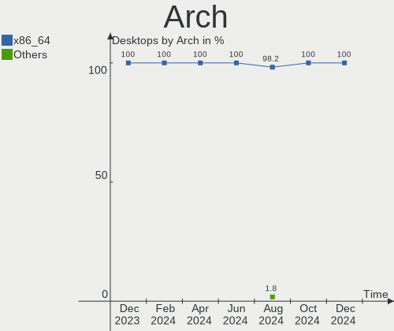
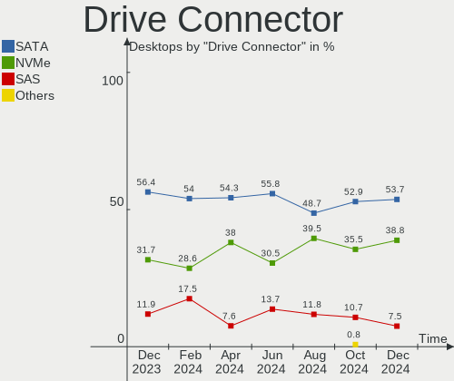
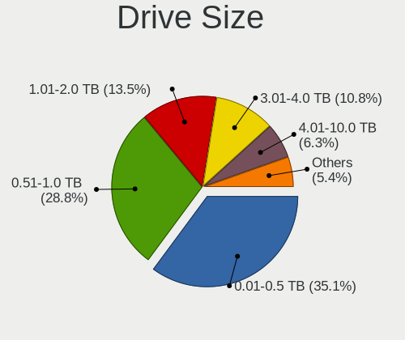
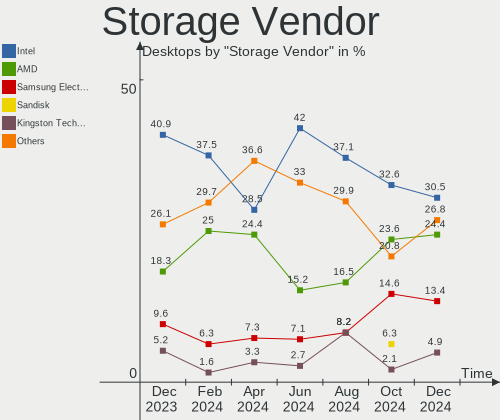
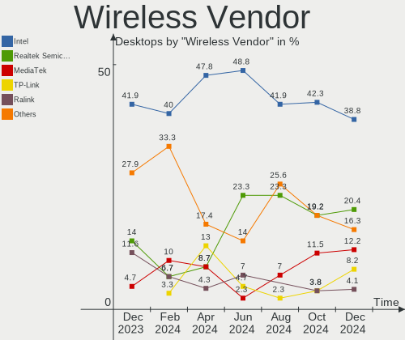
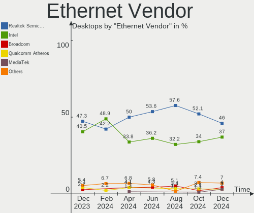
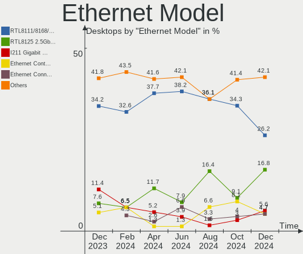
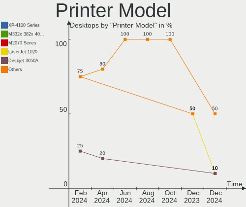

Linux in Canada - Hardware Trends (Desktops)
--------------------------------------------

A project to identify most popular hardware characteristics and track their change
over time based on data collected by Linux users at https://Linux-Hardware.org.

Anyone can contribute to this report by the [hw-probe](https://github.com/linuxhw/hw-probe) tool:

    sudo -E hw-probe -all -upload

Period: Sep, 2023.

Contents
--------

* [ System ](#system)
  - [ OS                       ](#os)
  - [ OS Family                ](#os-family)
  - [ Kernel                   ](#kernel)
  - [ Kernel Family            ](#kernel-family)
  - [ Kernel Major Ver.        ](#kernel-major-ver)
  - [ Arch                     ](#arch)
  - [ DE                       ](#de)
  - [ Display Server           ](#display-server)
  - [ Display Manager          ](#display-manager)
  - [ OS Lang                  ](#os-lang)
  - [ Boot Mode                ](#boot-mode)
  - [ Filesystem               ](#filesystem)
  - [ Part. scheme             ](#part-scheme)
  - [ Dual Boot with Linux/BSD ](#dual-boot-with-linuxbsd)
  - [ Dual Boot (Win)          ](#dual-boot-win)

* [ Board ](#board)
  - [ Vendor                   ](#vendor)
  - [ Model                    ](#model)
  - [ Model Family             ](#model-family)
  - [ MFG Year                 ](#mfg-year)
  - [ Form Factor              ](#form-factor)
  - [ Secure Boot              ](#secure-boot)
  - [ Coreboot                 ](#coreboot)
  - [ RAM Size                 ](#ram-size)
  - [ RAM Used                 ](#ram-used)
  - [ Total Drives             ](#total-drives)
  - [ Has CD-ROM               ](#has-cd-rom)
  - [ Has Ethernet             ](#has-ethernet)
  - [ Has WiFi                 ](#has-wifi)
  - [ Has Bluetooth            ](#has-bluetooth)

* [ Location ](#location)
  - [ Country                  ](#country)
  - [ City                     ](#city)

* [ Drives ](#drives)
  - [ Drive Vendor             ](#drive-vendor)
  - [ Drive Model              ](#drive-model)
  - [ HDD Vendor               ](#hdd-vendor)
  - [ SSD Vendor               ](#ssd-vendor)
  - [ Drive Kind               ](#drive-kind)
  - [ Drive Connector          ](#drive-connector)
  - [ Drive Size               ](#drive-size)
  - [ Space Total              ](#space-total)
  - [ Space Used               ](#space-used)
  - [ Malfunc. Drives          ](#malfunc-drives)
  - [ Malfunc. Drive Vendor    ](#malfunc-drive-vendor)
  - [ Malfunc. HDD Vendor      ](#malfunc-hdd-vendor)
  - [ Malfunc. Drive Kind      ](#malfunc-drive-kind)
  - [ Failed Drives            ](#failed-drives)
  - [ Failed Drive Vendor      ](#failed-drive-vendor)
  - [ Drive Status             ](#drive-status)

* [ Storage controller ](#storage-controller)
  - [ Storage Vendor           ](#storage-vendor)
  - [ Storage Model            ](#storage-model)
  - [ Storage Kind             ](#storage-kind)

* [ Processor ](#processor)
  - [ CPU Vendor               ](#cpu-vendor)
  - [ CPU Model                ](#cpu-model)
  - [ CPU Model Family         ](#cpu-model-family)
  - [ CPU Cores                ](#cpu-cores)
  - [ CPU Sockets              ](#cpu-sockets)
  - [ CPU Threads              ](#cpu-threads)
  - [ CPU Op-Modes             ](#cpu-op-modes)
  - [ CPU Microcode            ](#cpu-microcode)
  - [ CPU Microarch            ](#cpu-microarch)

* [ Graphics ](#graphics)
  - [ GPU Vendor               ](#gpu-vendor)
  - [ GPU Model                ](#gpu-model)
  - [ GPU Combo                ](#gpu-combo)
  - [ GPU Driver               ](#gpu-driver)
  - [ GPU Memory               ](#gpu-memory)

* [ Monitor ](#monitor)
  - [ Monitor Vendor           ](#monitor-vendor)
  - [ Monitor Model            ](#monitor-model)
  - [ Monitor Resolution       ](#monitor-resolution)
  - [ Monitor Diagonal         ](#monitor-diagonal)
  - [ Monitor Width            ](#monitor-width)
  - [ Aspect Ratio             ](#aspect-ratio)
  - [ Monitor Area             ](#monitor-area)
  - [ Pixel Density            ](#pixel-density)
  - [ Multiple Monitors        ](#multiple-monitors)

* [ Network ](#network)
  - [ Net Controller Vendor    ](#net-controller-vendor)
  - [ Net Controller Model     ](#net-controller-model)
  - [ Wireless Vendor          ](#wireless-vendor)
  - [ Wireless Model           ](#wireless-model)
  - [ Ethernet Vendor          ](#ethernet-vendor)
  - [ Ethernet Model           ](#ethernet-model)
  - [ Net Controller Kind      ](#net-controller-kind)
  - [ Used Controller          ](#used-controller)
  - [ NICs                     ](#nics)
  - [ IPv6                     ](#ipv6)

* [ Bluetooth ](#bluetooth)
  - [ Bluetooth Vendor         ](#bluetooth-vendor)
  - [ Bluetooth Model          ](#bluetooth-model)

* [ Sound ](#sound)
  - [ Sound Vendor             ](#sound-vendor)
  - [ Sound Model              ](#sound-model)

* [ Memory ](#memory)
  - [ Memory Vendor            ](#memory-vendor)
  - [ Memory Model             ](#memory-model)
  - [ Memory Kind              ](#memory-kind)
  - [ Memory Form Factor       ](#memory-form-factor)
  - [ Memory Size              ](#memory-size)
  - [ Memory Speed             ](#memory-speed)

* [ Printers & scanners ](#printers--scanners)
  - [ Printer Vendor           ](#printer-vendor)
  - [ Printer Model            ](#printer-model)
  - [ Scanner Vendor           ](#scanner-vendor)
  - [ Scanner Model            ](#scanner-model)

* [ Camera ](#camera)
  - [ Camera Vendor            ](#camera-vendor)
  - [ Camera Model             ](#camera-model)

* [ Security ](#security)
  - [ Fingerprint Vendor       ](#fingerprint-vendor)
  - [ Fingerprint Model        ](#fingerprint-model)
  - [ Chipcard Vendor          ](#chipcard-vendor)
  - [ Chipcard Model           ](#chipcard-model)

* [ Unsupported ](#unsupported)
  - [ Unsupported Devices      ](#unsupported-devices)
  - [ Unsupported Device Types ](#unsupported-device-types)

System
------

OS
--

Installed operating systems

| Name                         | Desktops | Percent |
|------------------------------|----------|---------|
| Ubuntu 22.04                 | 11       | 15.71%  |
| OpenMandriva 23.08           | 7        | 10%     |
| OpenMandriva 23.09           | 6        | 8.57%   |
| Ubuntu 23.04                 | 5        | 7.14%   |
| Fedora 38                    | 5        | 7.14%   |
| Linux Mint 21.2              | 4        | 5.71%   |
| Pop!_OS 22.04                | 3        | 4.29%   |
| Debian 12                    | 3        | 4.29%   |
| Zorin 16                     | 2        | 2.86%   |
| Xero Rolling                 | 2        | 2.86%   |
| Ubuntu 20.04                 | 2        | 2.86%   |
| openSUSE Tumbleweed-XXXXXXXX | 2        | 2.86%   |
| Garuda Linux Rolling         | 2        | 2.86%   |
| ArcoLinux Rolling            | 2        | 2.86%   |
| Arch Rolling                 | 2        | 2.86%   |
| OpenMandriva 23.03           | 1        | 1.43%   |
| LMDE 5                       | 1        | 1.43%   |
| Linux Mint 21.1              | 1        | 1.43%   |
| Linux Mint 20.3              | 1        | 1.43%   |
| Kubuntu 23.04                | 1        | 1.43%   |
| KDE neon 22.04               | 1        | 1.43%   |
| Fedora 39                    | 1        | 1.43%   |
| Elementary 7                 | 1        | 1.43%   |
| Debian 11                    | 1        | 1.43%   |
| CentOS 7                     | 1        | 1.43%   |
| BunsenLabs 11                | 1        | 1.43%   |
| ArcoLinux                    | 1        | 1.43%   |

OS Family
---------

OS without a version

| Name         | Desktops | Percent |
|--------------|----------|---------|
| Ubuntu       | 18       | 25.71%  |
| OpenMandriva | 14       | 20%     |
| Linux Mint   | 6        | 8.57%   |
| Fedora       | 6        | 8.57%   |
| Debian       | 4        | 5.71%   |
| Pop!_OS      | 3        | 4.29%   |
| ArcoLinux    | 3        | 4.29%   |
| Zorin        | 2        | 2.86%   |
| Xero         | 2        | 2.86%   |
| openSUSE     | 2        | 2.86%   |
| Garuda Linux | 2        | 2.86%   |
| Arch         | 2        | 2.86%   |
| LMDE         | 1        | 1.43%   |
| Kubuntu      | 1        | 1.43%   |
| KDE neon     | 1        | 1.43%   |
| Elementary   | 1        | 1.43%   |
| CentOS       | 1        | 1.43%   |
| BunsenLabs   | 1        | 1.43%   |

Kernel
------

Version of the Linux kernel

| Version                      | Desktops | Percent |
|------------------------------|----------|---------|
| 6.2.0-32-generic             | 7        | 10%     |
| 6.2.0-33-generic             | 6        | 8.57%   |
| 6.5.0-desktop-1omv2390       | 5        | 7.14%   |
| 5.15.0-83-generic            | 5        | 7.14%   |
| 6.4.12-arch1-1               | 4        | 5.71%   |
| 6.4.6-76060406-generic       | 3        | 4.29%   |
| 6.4.11-desktop-1omv2390      | 3        | 4.29%   |
| 6.5.3-arch1-1                | 2        | 2.86%   |
| 6.5.2-zen1-1-zen             | 2        | 2.86%   |
| 6.5.2-desktop-1omv2390       | 2        | 2.86%   |
| 6.4.8-desktop-2omv2390       | 2        | 2.86%   |
| 6.2.9-300.fc38.x86_64        | 2        | 2.86%   |
| 6.2.0-31-generic             | 2        | 2.86%   |
| 5.15.0-84-generic            | 2        | 2.86%   |
| 5.10.0-25-amd64              | 2        | 2.86%   |
| 6.6.0-desktop-0.rc3.1omv2390 | 1        | 1.43%   |
| 6.5.5-300.fc39.x86_64        | 1        | 1.43%   |
| 6.5.5-200.fc38.x86_64        | 1        | 1.43%   |
| 6.5.4-1-default              | 1        | 1.43%   |
| 6.4.16-hardened1-1-hardened  | 1        | 1.43%   |
| 6.4.15-200.fc38.x86_64       | 1        | 1.43%   |
| 6.4.13-200.fc38.x86_64       | 1        | 1.43%   |
| 6.4.12-1-default             | 1        | 1.43%   |
| 6.2.6-desktop-1omv2390       | 1        | 1.43%   |
| 6.2.0-26-generic             | 1        | 1.43%   |
| 6.2.0-20-generic             | 1        | 1.43%   |
| 6.1.0-12-amd64               | 1        | 1.43%   |
| 6.1.0-11-amd64               | 1        | 1.43%   |
| 6.1.0-10-amd64               | 1        | 1.43%   |
| 5.4.0-159-generic            | 1        | 1.43%   |
| 5.15.0-79-generic            | 1        | 1.43%   |
| 5.15.0-78-generic            | 1        | 1.43%   |
| 5.15.0-76-generic            | 1        | 1.43%   |
| 5.15.0-58-generic            | 1        | 1.43%   |
| 5.10.0-20-686                | 1        | 1.43%   |
| 3.10.0-1062.9.1.el7.x86_64   | 1        | 1.43%   |

Kernel Family
-------------

Linux kernel without a distro release

| Version | Desktops | Percent |
|---------|----------|---------|
| 6.2.0   | 17       | 24.29%  |
| 5.15.0  | 11       | 15.71%  |
| 6.5.0   | 5        | 7.14%   |
| 6.4.12  | 5        | 7.14%   |
| 6.5.2   | 4        | 5.71%   |
| 6.4.6   | 3        | 4.29%   |
| 6.4.11  | 3        | 4.29%   |
| 6.1.0   | 3        | 4.29%   |
| 5.10.0  | 3        | 4.29%   |
| 6.5.5   | 2        | 2.86%   |
| 6.5.3   | 2        | 2.86%   |
| 6.4.8   | 2        | 2.86%   |
| 6.2.9   | 2        | 2.86%   |
| 6.6.0   | 1        | 1.43%   |
| 6.5.4   | 1        | 1.43%   |
| 6.4.16  | 1        | 1.43%   |
| 6.4.15  | 1        | 1.43%   |
| 6.4.13  | 1        | 1.43%   |
| 6.2.6   | 1        | 1.43%   |
| 5.4.0   | 1        | 1.43%   |
| 3.10.0  | 1        | 1.43%   |

Kernel Major Ver.
-----------------

Linux kernel major version

| Version | Desktops | Percent |
|---------|----------|---------|
| 6.2     | 20       | 28.57%  |
| 6.4     | 16       | 22.86%  |
| 6.5     | 14       | 20%     |
| 5.15    | 11       | 15.71%  |
| 6.1     | 3        | 4.29%   |
| 5.10    | 3        | 4.29%   |
| 6.6     | 1        | 1.43%   |
| 5.4     | 1        | 1.43%   |
| 3.10    | 1        | 1.43%   |

Arch
----

OS architecture (x86_64, i586, etc.)

| Name   | Desktops | Percent |
|--------|----------|---------|
| x86_64 | 69       | 98.57%  |
| i686   | 1        | 1.43%   |

DE
--

Desktop Environment

| Name       | Desktops | Percent |
|------------|----------|---------|
| GNOME      | 29       | 41.43%  |
| KDE5       | 23       | 32.86%  |
| X-Cinnamon | 5        | 7.14%   |
| LXQt       | 3        | 4.29%   |
| Unknown    | 3        | 4.29%   |
| XFCE       | 2        | 2.86%   |
| MATE       | 2        | 2.86%   |
| Pantheon   | 1        | 1.43%   |
| LXDE       | 1        | 1.43%   |
| KDE4       | 1        | 1.43%   |

Display Server
--------------

X11 or Wayland

| Name    | Desktops | Percent |
|---------|----------|---------|
| X11     | 34       | 48.57%  |
| Wayland | 31       | 44.29%  |
| Tty     | 5        | 7.14%   |

Display Manager
---------------

SDDM, LightDM, etc.

| Name    | Desktops | Percent |
|---------|----------|---------|
| Unknown | 26       | 37.14%  |
| SDDM    | 20       | 28.57%  |
| GDM3    | 16       | 22.86%  |
| LightDM | 4        | 5.71%   |
| GDM     | 4        | 5.71%   |

OS Lang
-------

Language

| Lang  | Desktops | Percent |
|-------|----------|---------|
| en_CA | 42       | 60%     |
| en_US | 19       | 27.14%  |
| fr_CA | 4        | 5.71%   |
| fr_FR | 2        | 2.86%   |
| POSIX | 1        | 1.43%   |
| en_GB | 1        | 1.43%   |
| C     | 1        | 1.43%   |

Boot Mode
---------

EFI or BIOS

| Mode | Desktops | Percent |
|------|----------|---------|
| EFI  | 36       | 51.43%  |
| BIOS | 34       | 48.57%  |

Filesystem
----------

Type of filesystem

| Type    | Desktops | Percent |
|---------|----------|---------|
| Ext4    | 33       | 47.14%  |
| Btrfs   | 14       | 20%     |
| Tmpfs   | 13       | 18.57%  |
| Overlay | 9        | 12.86%  |
| Xfs     | 1        | 1.43%   |

Part. scheme
------------

Scheme of partitioning

| Type    | Desktops | Percent |
|---------|----------|---------|
| GPT     | 39       | 55.71%  |
| Unknown | 24       | 34.29%  |
| MBR     | 7        | 10%     |

Dual Boot with Linux/BSD
------------------------

Hosting more than one Linux/BSD

| Dual boot | Desktops | Percent |
|-----------|----------|---------|
| No        | 54       | 77.14%  |
| Yes       | 16       | 22.86%  |

Dual Boot (Win)
---------------

Hosting Linux and Windows

| Dual boot | Desktops | Percent |
|-----------|----------|---------|
| No        | 46       | 65.71%  |
| Yes       | 24       | 34.29%  |

Board
-----

Vendor
------

Motherboard manufacturer

| Name                | Desktops | Percent |
|---------------------|----------|---------|
| ASUSTek Computer    | 15       | 21.43%  |
| Dell                | 11       | 15.71%  |
| Hewlett-Packard     | 9        | 12.86%  |
| Gigabyte Technology | 9        | 12.86%  |
| MSI                 | 6        | 8.57%   |
| ASRock              | 5        | 7.14%   |
| Intel               | 4        | 5.71%   |
| Lenovo              | 3        | 4.29%   |
| Acer                | 3        | 4.29%   |
| Compaq Presario 06  | 1        | 1.43%   |
| BESSTAR Tech        | 1        | 1.43%   |
| AZW                 | 1        | 1.43%   |
| Alienware           | 1        | 1.43%   |
| Unknown             | 1        | 1.43%   |

Model
-----

Motherboard model

| Name                                | Desktops | Percent |
|-------------------------------------|----------|---------|
| Dell OptiPlex 7010                  | 2        | 2.86%   |
| ASUS M32CD_A_F_K20CD_K31CD          | 2        | 2.86%   |
| MSI MS-7D75                         | 1        | 1.43%   |
| MSI MS-7D19                         | 1        | 1.43%   |
| MSI MS-7C95                         | 1        | 1.43%   |
| MSI MS-7C87                         | 1        | 1.43%   |
| MSI MS-7B98                         | 1        | 1.43%   |
| MSI MS-7B86                         | 1        | 1.43%   |
| Lenovo ThinkStation P910 30B8S0EN00 | 1        | 1.43%   |
| Lenovo ThinkCentre M900 10FGS1400W  | 1        | 1.43%   |
| Lenovo ThinkCentre M58p 7484AEF     | 1        | 1.43%   |
| Intel X79F1 V2.0                    | 1        | 1.43%   |
| Intel DQ77KB AAG40294-401           | 1        | 1.43%   |
| Intel DN2800MT AAG23738-803         | 1        | 1.43%   |
| Intel B75                           | 1        | 1.43%   |
| HP Z420 Workstation                 | 1        | 1.43%   |
| HP rp5800                           | 1        | 1.43%   |
| HP ProDesk 600 G1 SFF               | 1        | 1.43%   |
| HP EliteDesk 800 G2 DM 35W          | 1        | 1.43%   |
| HP EliteDesk 800 G1 SFF             | 1        | 1.43%   |
| HP EliteDesk 800 G1 DM              | 1        | 1.43%   |
| HP Compaq Pro 6300 SFF              | 1        | 1.43%   |
| HP Compaq 8200 Elite Convertible MT | 1        | 1.43%   |
| HP Compaq 6200 Pro SFF PC           | 1        | 1.43%   |
| Gigabyte Z270X-UD5                  | 1        | 1.43%   |
| Gigabyte Z170X-Gaming 7             | 1        | 1.43%   |
| Gigabyte X670 AORUS ELITE AX        | 1        | 1.43%   |
| Gigabyte X470 AORUS ULTRA GAMING    | 1        | 1.43%   |
| Gigabyte GA-78LMT-USB3              | 1        | 1.43%   |
| Gigabyte B660M AORUS PRO AX DDR4    | 1        | 1.43%   |
| Gigabyte B560M AORUS PRO AX         | 1        | 1.43%   |
| Gigabyte B450M DS3H WIFI            | 1        | 1.43%   |
| Gigabyte B450 AORUS M               | 1        | 1.43%   |
| Dell XPS 8900                       | 1        | 1.43%   |
| Dell XPS 8500                       | 1        | 1.43%   |
| Dell Studio XPS 8100                | 1        | 1.43%   |
| Dell Precision T1700                | 1        | 1.43%   |
| Dell OptiPlex 9020                  | 1        | 1.43%   |
| Dell OptiPlex 745                   | 1        | 1.43%   |
| Dell OptiPlex 7040                  | 1        | 1.43%   |

Model Family
------------

Motherboard model prefix

| Name                          | Desktops | Percent |
|-------------------------------|----------|---------|
| Dell OptiPlex                 | 6        | 8.57%   |
| ASUS PRIME                    | 5        | 7.14%   |
| HP EliteDesk                  | 3        | 4.29%   |
| HP Compaq                     | 3        | 4.29%   |
| Lenovo ThinkCentre            | 2        | 2.86%   |
| Dell XPS                      | 2        | 2.86%   |
| ASUS TUF                      | 2        | 2.86%   |
| ASUS M32CD                    | 2        | 2.86%   |
| Acer Aspire                   | 2        | 2.86%   |
| MSI MS-7D75                   | 1        | 1.43%   |
| MSI MS-7D19                   | 1        | 1.43%   |
| MSI MS-7C95                   | 1        | 1.43%   |
| MSI MS-7C87                   | 1        | 1.43%   |
| MSI MS-7B98                   | 1        | 1.43%   |
| MSI MS-7B86                   | 1        | 1.43%   |
| Lenovo ThinkStation           | 1        | 1.43%   |
| Intel X79F1                   | 1        | 1.43%   |
| Intel DQ77KB                  | 1        | 1.43%   |
| Intel DN2800MT                | 1        | 1.43%   |
| Intel B75                     | 1        | 1.43%   |
| HP Z420                       | 1        | 1.43%   |
| HP rp5800                     | 1        | 1.43%   |
| HP ProDesk                    | 1        | 1.43%   |
| Gigabyte Z270X-UD5            | 1        | 1.43%   |
| Gigabyte Z170X-Gaming         | 1        | 1.43%   |
| Gigabyte X670                 | 1        | 1.43%   |
| Gigabyte X470                 | 1        | 1.43%   |
| Gigabyte GA-78LMT-USB3        | 1        | 1.43%   |
| Gigabyte B660M                | 1        | 1.43%   |
| Gigabyte B560M                | 1        | 1.43%   |
| Gigabyte B450M                | 1        | 1.43%   |
| Gigabyte B450                 | 1        | 1.43%   |
| Dell Studio                   | 1        | 1.43%   |
| Dell Precision                | 1        | 1.43%   |
| Dell Inspiron                 | 1        | 1.43%   |
| Compaq Presario 06 DC477A-ABA | 1        | 1.43%   |
| BESSTAR Tech UM700            | 1        | 1.43%   |
| AZW MINI                      | 1        | 1.43%   |
| ASUS VM42                     | 1        | 1.43%   |
| ASUS ROG                      | 1        | 1.43%   |

MFG Year
--------

Motherboard manufacture year

| Year | Desktops | Percent |
|------|----------|---------|
| 2021 | 9        | 12.86%  |
| 2012 | 8        | 11.43%  |
| 2022 | 6        | 8.57%   |
| 2020 | 6        | 8.57%   |
| 2018 | 6        | 8.57%   |
| 2013 | 6        | 8.57%   |
| 2019 | 5        | 7.14%   |
| 2016 | 5        | 7.14%   |
| 2015 | 4        | 5.71%   |
| 2014 | 3        | 4.29%   |
| 2011 | 3        | 4.29%   |
| 2010 | 2        | 2.86%   |
| 2007 | 2        | 2.86%   |
| 2023 | 1        | 1.43%   |
| 2017 | 1        | 1.43%   |
| 2009 | 1        | 1.43%   |
| 2008 | 1        | 1.43%   |
| 2002 | 1        | 1.43%   |

Form Factor
-----------

Physical design of the computer

| Name    | Desktops | Percent |
|---------|----------|---------|
| Desktop | 70       | 100%    |

Secure Boot
-----------

Enabled or disabled

| State    | Desktops | Percent |
|----------|----------|---------|
| Disabled | 67       | 95.71%  |
| Enabled  | 3        | 4.29%   |

Coreboot
--------

Have coreboot on board

| Used | Desktops | Percent |
|------|----------|---------|
| No   | 70       | 100%    |

RAM Size
--------

Total RAM memory

| Size in GB  | Desktops | Percent |
|-------------|----------|---------|
| 16.01-24.0  | 20       | 28.57%  |
| 32.01-64.0  | 16       | 22.86%  |
| 4.01-8.0    | 11       | 15.71%  |
| 8.01-16.0   | 8        | 11.43%  |
| 3.01-4.0    | 6        | 8.57%   |
| 24.01-32.0  | 4        | 5.71%   |
| 64.01-256.0 | 3        | 4.29%   |
| 2.01-3.0    | 1        | 1.43%   |
| 0.51-1.0    | 1        | 1.43%   |

RAM Used
--------

Used RAM memory

| Used GB   | Desktops | Percent |
|-----------|----------|---------|
| 2.01-3.0  | 22       | 31.43%  |
| 1.01-2.0  | 20       | 28.57%  |
| 4.01-8.0  | 17       | 24.29%  |
| 3.01-4.0  | 6        | 8.57%   |
| 8.01-16.0 | 4        | 5.71%   |
| 0.51-1.0  | 1        | 1.43%   |

Total Drives
------------

Number of drives on board

| Drives | Desktops | Percent |
|--------|----------|---------|
| 1      | 31       | 44.29%  |
| 2      | 17       | 24.29%  |
| 3      | 15       | 21.43%  |
| 4      | 4        | 5.71%   |
| 6      | 2        | 2.86%   |
| 0      | 1        | 1.43%   |

Has CD-ROM
----------

Has CD-ROM on board

| Presented | Desktops | Percent |
|-----------|----------|---------|
| No        | 46       | 65.71%  |
| Yes       | 24       | 34.29%  |

Has Ethernet
------------

Has Ethernet on board

| Presented | Desktops | Percent |
|-----------|----------|---------|
| Yes       | 67       | 95.71%  |
| No        | 3        | 4.29%   |

Has WiFi
--------

Has WiFi module

| Presented | Desktops | Percent |
|-----------|----------|---------|
| Yes       | 38       | 54.29%  |
| No        | 32       | 45.71%  |

Has Bluetooth
-------------

Has Bluetooth module

| Presented | Desktops | Percent |
|-----------|----------|---------|
| No        | 42       | 60%     |
| Yes       | 28       | 40%     |

Location
--------

Country
-------

Geographic location (country)

| Country | Desktops | Percent |
|---------|----------|---------|
| Canada  | 70       | 100%    |

City
----

Geographic location (city)

| City                   | Desktops | Percent |
|------------------------|----------|---------|
| Montreal               | 10       | 14.29%  |
| Edmonton               | 4        | 5.71%   |
| Winnipeg               | 3        | 4.29%   |
| Burlington             | 3        | 4.29%   |
| Victoria               | 2        | 2.86%   |
| Vancouver              | 2        | 2.86%   |
| Saskatoon              | 2        | 2.86%   |
| Mississauga            | 2        | 2.86%   |
| Kitchener              | 2        | 2.86%   |
| Coldwater              | 2        | 2.86%   |
| Calgary                | 2        | 2.86%   |
| Wolfville              | 1        | 1.43%   |
| Wetaskiwin             | 1        | 1.43%   |
| Trail                  | 1        | 1.43%   |
| Toronto                | 1        | 1.43%   |
| Surrey                 | 1        | 1.43%   |
| Strathroy              | 1        | 1.43%   |
| Spruce Grove           | 1        | 1.43%   |
| Sherbrooke             | 1        | 1.43%   |
| Scarborough            | 1        | 1.43%   |
| Sault Ste. Marie       | 1        | 1.43%   |
| Saint-Joseph-de-Beauce | 1        | 1.43%   |
| Riviere-Rouge          | 1        | 1.43%   |
| Red Lake               | 1        | 1.43%   |
| Québec                | 1        | 1.43%   |
| Prince George          | 1        | 1.43%   |
| Port Perry             | 1        | 1.43%   |
| North Vancouver        | 1        | 1.43%   |
| New Westminster        | 1        | 1.43%   |
| Nanaimo                | 1        | 1.43%   |
| Morden                 | 1        | 1.43%   |
| Moncton                | 1        | 1.43%   |
| Miramichi              | 1        | 1.43%   |
| Midland                | 1        | 1.43%   |
| Lloydminster           | 1        | 1.43%   |
| Levis                  | 1        | 1.43%   |
| Laval                  | 1        | 1.43%   |
| Keswick                | 1        | 1.43%   |
| Headingley             | 1        | 1.43%   |
| Hamilton               | 1        | 1.43%   |

Drives
------

Drive Vendor
------------

Hard drive vendors

| Vendor                      | Desktops | Drives | Percent |
|-----------------------------|----------|--------|---------|
| Seagate                     | 22       | 29     | 18.33%  |
| WDC                         | 20       | 25     | 16.67%  |
| Samsung Electronics         | 13       | 16     | 10.83%  |
| Toshiba                     | 8        | 8      | 6.67%   |
| Sandisk                     | 8        | 11     | 6.67%   |
| Kingston                    | 7        | 8      | 5.83%   |
| Crucial                     | 7        | 7      | 5.83%   |
| SPCC                        | 4        | 4      | 3.33%   |
| Hitachi                     | 4        | 4      | 3.33%   |
| Team                        | 3        | 3      | 2.5%    |
| China                       | 3        | 3      | 2.5%    |
| Kingston Technology Company | 2        | 2      | 1.67%   |
| A-DATA Technology           | 2        | 2      | 1.67%   |
| XPG                         | 1        | 1      | 0.83%   |
| WDC WDS5                    | 1        | 1      | 0.83%   |
| Unknown                     | 1        | 1      | 0.83%   |
| Timetec                     | 1        | 1      | 0.83%   |
| T-FORCE                     | 1        | 1      | 0.83%   |
| SK hynix                    | 1        | 1      | 0.83%   |
| Realtek Semiconductor       | 1        | 1      | 0.83%   |
| PNY                         | 1        | 1      | 0.83%   |
| Patriot                     | 1        | 1      | 0.83%   |
| Micron Technology           | 1        | 1      | 0.83%   |
| Maxone                      | 1        | 1      | 0.83%   |
| Lexar                       | 1        | 1      | 0.83%   |
| KIOXIA                      | 1        | 1      | 0.83%   |
| KingFast                    | 1        | 1      | 0.83%   |
| Intel                       | 1        | 1      | 0.83%   |
| Fanxiang                    | 1        | 1      | 0.83%   |
| Corsair                     | 1        | 1      | 0.83%   |

Drive Model
-----------

Hard drive models

| Model                                               | Desktops | Percent |
|-----------------------------------------------------|----------|---------|
| Toshiba DT01ACA200 2TB                              | 3        | 2.31%   |
| WDC WD6400AAKS-22A7B2 640GB                         | 2        | 1.54%   |
| WDC WD10EZEX-08WN4A0 1TB                            | 2        | 1.54%   |
| SPCC Solid State Disk 1TB                           | 2        | 1.54%   |
| Seagate ST1000DM003-1SB102 1TB                      | 2        | 1.54%   |
| Samsung SSD 850 EVO 250GB                           | 2        | 1.54%   |
| Samsung NVMe SSD Controller SM981/PM981/PM983 256GB | 2        | 1.54%   |
| Kingston SA400S37240G 240GB SSD                     | 2        | 1.54%   |
| XPG SPECTRIX S20G 1TB                               | 1        | 0.77%   |
| WDC WDS5 00G2B0A-00SM 500GB SSD                     | 1        | 0.77%   |
| WDC WDS250G2B0A 250GB SSD                           | 1        | 0.77%   |
| WDC WDBNCE0010PNC 1TB SSD                           | 1        | 0.77%   |
| WDC WD7500BPVT-22HXZT1 752GB                        | 1        | 0.77%   |
| WDC WD6400AAKS-65A7B2 640GB                         | 1        | 0.77%   |
| WDC WD5000AAKX-75U6AA0 500GB                        | 1        | 0.77%   |
| WDC WD5000AAKX-001CA0 500GB                         | 1        | 0.77%   |
| WDC WD40EFAX-68JH4N1 4TB                            | 1        | 0.77%   |
| WDC WD3200AAKS-00L9A0 320GB                         | 1        | 0.77%   |
| WDC WD30EZRX-00MMMB0 3TB                            | 1        | 0.77%   |
| WDC WD2500AAJS-08L7A0 250GB                         | 1        | 0.77%   |
| WDC WD20EZRZ-00Z5HB0 2TB                            | 1        | 0.77%   |
| WDC WD20EURX-63T0FY0 2TB                            | 1        | 0.77%   |
| WDC WD20EADS-65R6B1 2TB                             | 1        | 0.77%   |
| WDC WD2003FZEX-00Z4SA0 2TB                          | 1        | 0.77%   |
| WDC WD10EZEX-75WN4A1 1TB                            | 1        | 0.77%   |
| WDC WD10EALX-009BA0 1TB                             | 1        | 0.77%   |
| WDC WD10EADS-22M2B0 1TB                             | 1        | 0.77%   |
| WDC WD1002FAEX-00Y9A0 1TB                           | 1        | 0.77%   |
| WDC WD Blue SA510 2.5 1000GB                        | 1        | 0.77%   |
| Unknown SD/MMC/MS PRO 128GB                         | 1        | 0.77%   |
| Toshiba XG6 NVMe SSD Controller 512GB               | 1        | 0.77%   |
| Toshiba MQ04ABF100 1TB                              | 1        | 0.77%   |
| Toshiba MQ03ABB200 2TB                              | 1        | 0.77%   |
| Toshiba MK6459GSXP 640GB                            | 1        | 0.77%   |
| Toshiba DT01ACA300 3TB                              | 1        | 0.77%   |
| Timetec 35TTFP6PCIE-1TB                             | 1        | 0.77%   |
| Team TM8FP6512G 512GB                               | 1        | 0.77%   |
| Team T253X2001T 1TB SSD                             | 1        | 0.77%   |
| Team T253X1120G 120GB SSD                           | 1        | 0.77%   |
| T-FORCE 1TB                                         | 1        | 0.77%   |

HDD Vendor
----------

Hard disk drive vendors

| Vendor  | Desktops | Drives | Percent |
|---------|----------|--------|---------|
| Seagate | 21       | 28     | 41.18%  |
| WDC     | 17       | 21     | 33.33%  |
| Toshiba | 7        | 7      | 13.73%  |
| Hitachi | 4        | 4      | 7.84%   |
| Unknown | 1        | 1      | 1.96%   |
| Maxone  | 1        | 1      | 1.96%   |

SSD Vendor
----------

Solid state drive vendors

| Vendor              | Desktops | Drives | Percent |
|---------------------|----------|--------|---------|
| Samsung Electronics | 8        | 10     | 21.05%  |
| Crucial             | 6        | 6      | 15.79%  |
| SPCC                | 4        | 4      | 10.53%  |
| Kingston            | 4        | 4      | 10.53%  |
| WDC                 | 3        | 4      | 7.89%   |
| China               | 3        | 3      | 7.89%   |
| Team                | 2        | 2      | 5.26%   |
| WDC WDS5            | 1        | 1      | 2.63%   |
| SK hynix            | 1        | 1      | 2.63%   |
| SanDisk             | 1        | 1      | 2.63%   |
| PNY                 | 1        | 1      | 2.63%   |
| Lexar               | 1        | 1      | 2.63%   |
| KingFast            | 1        | 1      | 2.63%   |
| Fanxiang            | 1        | 1      | 2.63%   |
| A-DATA Technology   | 1        | 1      | 2.63%   |

Drive Kind
----------

HDD or SSD

| Kind    | Desktops | Drives | Percent |
|---------|----------|--------|---------|
| HDD     | 39       | 62     | 38.61%  |
| SSD     | 34       | 41     | 33.66%  |
| NVMe    | 27       | 35     | 26.73%  |
| Unknown | 1        | 1      | 0.99%   |

Drive Connector
---------------

SATA, SAS, NVMe, etc.

| Type | Desktops | Drives | Percent |
|------|----------|--------|---------|
| SATA | 59       | 97     | 63.44%  |
| NVMe | 27       | 35     | 29.03%  |
| SAS  | 7        | 7      | 7.53%   |

Drive Size
----------

Size of hard drive

| Size in TB | Desktops | Drives | Percent |
|------------|----------|--------|---------|
| 0.01-0.5   | 33       | 39     | 40.24%  |
| 0.51-1.0   | 29       | 39     | 35.37%  |
| 1.01-2.0   | 12       | 15     | 14.63%  |
| 4.01-10.0  | 4        | 4      | 4.88%   |
| 3.01-4.0   | 2        | 4      | 2.44%   |
| 2.01-3.0   | 2        | 2      | 2.44%   |

Space Total
-----------

Amount of disk space available on the file system

| Size in GB     | Desktops | Percent |
|----------------|----------|---------|
| 1001-2000      | 12       | 17.14%  |
| More than 3000 | 11       | 15.71%  |
| 251-500        | 10       | 14.29%  |
| 1-20           | 10       | 14.29%  |
| 101-250        | 9        | 12.86%  |
| 501-1000       | 9        | 12.86%  |
| 2001-3000      | 5        | 7.14%   |
| 51-100         | 3        | 4.29%   |
| Unknown        | 1        | 1.43%   |

Space Used
----------

Amount of used disk space

| Used GB        | Desktops | Percent |
|----------------|----------|---------|
| 1-20           | 30       | 42.86%  |
| 101-250        | 9        | 12.86%  |
| 21-50          | 8        | 11.43%  |
| 501-1000       | 7        | 10%     |
| More than 3000 | 4        | 5.71%   |
| 251-500        | 4        | 5.71%   |
| 1001-2000      | 3        | 4.29%   |
| 51-100         | 3        | 4.29%   |
| 2001-3000      | 1        | 1.43%   |
| Unknown        | 1        | 1.43%   |

Malfunc. Drives
---------------

Drive models with a malfunction

| Model                           | Desktops | Drives | Percent |
|---------------------------------|----------|--------|---------|
| WDC WD5000AAKX-001CA0 500GB     | 1        | 1      | 16.67%  |
| WDC WD10EZEX-08WN4A0 1TB        | 1        | 1      | 16.67%  |
| Toshiba MK6459GSXP 640GB        | 1        | 1      | 16.67%  |
| Seagate ST3500414CS 500GB       | 1        | 1      | 16.67%  |
| Seagate ST1000LX015-1U7172 1TB  | 1        | 2      | 16.67%  |
| A-DATA Technology SWORDFISH 1TB | 1        | 1      | 16.67%  |

Malfunc. Drive Vendor
---------------------

Vendors of faulty drives

| Vendor            | Desktops | Drives | Percent |
|-------------------|----------|--------|---------|
| WDC               | 2        | 2      | 33.33%  |
| Seagate           | 2        | 3      | 33.33%  |
| Toshiba           | 1        | 1      | 16.67%  |
| A-DATA Technology | 1        | 1      | 16.67%  |

Malfunc. HDD Vendor
-------------------

Vendors of faulty HDD drives

| Vendor  | Desktops | Drives | Percent |
|---------|----------|--------|---------|
| WDC     | 2        | 2      | 40%     |
| Seagate | 2        | 3      | 40%     |
| Toshiba | 1        | 1      | 20%     |

Malfunc. Drive Kind
-------------------

Kinds of faulty drives

| Kind | Desktops | Drives | Percent |
|------|----------|--------|---------|
| HDD  | 5        | 6      | 83.33%  |
| NVMe | 1        | 1      | 16.67%  |

Failed Drives
-------------

Failed drive models

Zero info for selected period =(

Failed Drive Vendor
-------------------

Failed drive vendors

Zero info for selected period =(

Drive Status
------------

Number of failed and malfunc. drives

| Status   | Desktops | Drives | Percent |
|----------|----------|--------|---------|
| Detected | 39       | 70     | 50.65%  |
| Works    | 32       | 62     | 41.56%  |
| Malfunc  | 6        | 7      | 7.79%   |

Storage controller
------------------

Storage Vendor
--------------

Storage controller vendors

| Vendor                       | Desktops | Percent |
|------------------------------|----------|---------|
| Intel                        | 46       | 43.81%  |
| AMD                          | 22       | 20.95%  |
| SanDisk                      | 7        | 6.67%   |
| Samsung Electronics          | 6        | 5.71%   |
| Kingston Technology Company  | 4        | 3.81%   |
| JMicron Technology           | 3        | 2.86%   |
| Realtek Semiconductor        | 2        | 1.9%    |
| Nvidia                       | 2        | 1.9%    |
| MAXIO Technology (Hangzhou)  | 2        | 1.9%    |
| ASMedia Technology           | 2        | 1.9%    |
| VIA Technologies             | 1        | 0.95%   |
| Toshiba America Info Systems | 1        | 0.95%   |
| Silicon Motion               | 1        | 0.95%   |
| Seagate Technology           | 1        | 0.95%   |
| Phison Electronics           | 1        | 0.95%   |
| Micron/Crucial Technology    | 1        | 0.95%   |
| Micron Technology            | 1        | 0.95%   |
| Marvell Technology Group     | 1        | 0.95%   |
| KIOXIA                       | 1        | 0.95%   |

Storage Model
-------------

Storage controller models

| Model                                                                          | Desktops | Percent |
|--------------------------------------------------------------------------------|----------|---------|
| AMD FCH SATA Controller [AHCI mode]                                            | 11       | 8.66%   |
| Intel Q170/Q150/B150/H170/H110/Z170/CM236 Chipset SATA Controller [AHCI Mode]  | 6        | 4.72%   |
| Intel 7 Series/C210 Series Chipset Family 6-port SATA Controller [AHCI mode]   | 6        | 4.72%   |
| AMD 500 Series Chipset SATA Controller                                         | 5        | 3.94%   |
| AMD 400 Series Chipset SATA Controller                                         | 5        | 3.94%   |
| Intel SATA Controller [RAID mode]                                              | 4        | 3.15%   |
| Intel 6 Series/C200 Series Chipset Family 6 port Desktop SATA AHCI Controller  | 4        | 3.15%   |
| Samsung NVMe SSD Controller PM9A1/PM9A3/980PRO                                 | 3        | 2.36%   |
| Intel Cannon Lake PCH SATA AHCI Controller                                     | 3        | 2.36%   |
| Intel Alder Lake-S PCH SATA Controller [AHCI Mode]                             | 3        | 2.36%   |
| Intel 8 Series/C220 Series Chipset Family 6-port SATA Controller 1 [AHCI mode] | 3        | 2.36%   |
| AMD SB7x0/SB8x0/SB9x0 SATA Controller [AHCI mode]                              | 3        | 2.36%   |
| Sandisk Western Digital WD Black SN850X NVMe SSD                               | 2        | 1.57%   |
| SanDisk WD Black SN770 / PC SN740 256GB / PC SN560 (DRAM-less) NVMe SSD        | 2        | 1.57%   |
| Samsung NVMe SSD Controller SM981/PM981/PM983                                  | 2        | 1.57%   |
| Realtek RTS5763DL NVMe SSD Controller (DRAM-less)                              | 2        | 1.57%   |
| Nvidia MCP61 SATA Controller                                                   | 2        | 1.57%   |
| Nvidia MCP61 IDE                                                               | 2        | 1.57%   |
| MAXIO (Hangzhou) NVMe SSD Controller MAP1202                                   | 2        | 1.57%   |
| JMicron JMB363 SATA/IDE Controller                                             | 2        | 1.57%   |
| Intel Volume Management Device NVMe RAID Controller                            | 2        | 1.57%   |
| Intel 500 Series Chipset Family SATA AHCI Controller                           | 2        | 1.57%   |
| ASMedia ASM1062 Serial ATA Controller                                          | 2        | 1.57%   |
| AMD SB7x0/SB8x0/SB9x0 IDE Controller                                           | 2        | 1.57%   |
| VIA VT82C586A/B/VT82C686/A/B/VT823x/A/C PIPC Bus Master IDE                    | 1        | 0.79%   |
| Toshiba America Info Systems XG6 NVMe SSD Controller                           | 1        | 0.79%   |
| Silicon Motion SM2263EN/SM2263XT (DRAM-less) NVMe SSD Controllers              | 1        | 0.79%   |
| Seagate FireCuda 520 SSD                                                       | 1        | 0.79%   |
| SanDisk WD Green SN350 NVMe SSD 240GB (DRAM-less)                              | 1        | 0.79%   |
| SanDisk WD Blue SN570 NVMe SSD 1TB                                             | 1        | 0.79%   |
| SanDisk WD Black SN750 / PC SN730 NVMe SSD                                     | 1        | 0.79%   |
| SanDisk PC SN735 NVMe SSD (DRAM-less)                                          | 1        | 0.79%   |
| Samsung NVMe SSD Controller SM961/PM961/SM963                                  | 1        | 0.79%   |
| Realtek RTS5765DL NVMe SSD Controller (DRAM-less)                              | 1        | 0.79%   |
| Phison E7 NVMe Controller                                                      | 1        | 0.79%   |
| Micron/Crucial P2 [Nick P2] / P3 / P3 Plus NVMe PCIe SSD (DRAM-less)           | 1        | 0.79%   |
| Micron 2210 NVMe SSD [Cobain]                                                  | 1        | 0.79%   |
| Marvell Group 88SE9215 PCIe 2.0 x1 4-port SATA 6 Gb/s Controller               | 1        | 0.79%   |
| KIOXIA NVMe SSD Controller XG7                                                 | 1        | 0.79%   |
| Kingston Company U-SNS8154P3 NVMe SSD                                          | 1        | 0.79%   |

Storage Kind
------------

Kind of storage controller (IDE, SATA, NVMe, SAS, ...)

| Kind | Desktops | Percent |
|------|----------|---------|
| SATA | 58       | 54.72%  |
| NVMe | 27       | 25.47%  |
| IDE  | 13       | 12.26%  |
| RAID | 7        | 6.6%    |
| SAS  | 1        | 0.94%   |

Processor
---------

CPU Vendor
----------

Processor vendors

| Vendor | Desktops | Percent |
|--------|----------|---------|
| Intel  | 45       | 64.29%  |
| AMD    | 25       | 35.71%  |

CPU Model
---------

Processor models

| Model                                  | Desktops | Percent |
|----------------------------------------|----------|---------|
| Intel Core i7-6700 CPU @ 3.40GHz       | 3        | 4.29%   |
| AMD Ryzen 5 5600X 6-Core Processor     | 3        | 4.29%   |
| Intel Core i5-8400 CPU @ 2.80GHz       | 2        | 2.86%   |
| Intel Core i5-6500T CPU @ 2.50GHz      | 2        | 2.86%   |
| Intel Core i5-3470 CPU @ 3.20GHz       | 2        | 2.86%   |
| Intel 12th Gen Core i5-12400           | 2        | 2.86%   |
| Intel 11th Gen Core i5-11400 @ 2.60GHz | 2        | 2.86%   |
| AMD Ryzen 7 5700G with Radeon Graphics | 2        | 2.86%   |
| AMD Ryzen 5 5600G with Radeon Graphics | 2        | 2.86%   |
| Intel Xeon CPU E5-2670 v2 @ 2.50GHz    | 1        | 1.43%   |
| Intel Xeon CPU E5-2640 v4 @ 2.40GHz    | 1        | 1.43%   |
| Intel Xeon CPU E5-1620 0 @ 3.60GHz     | 1        | 1.43%   |
| Intel Xeon CPU E3-1271 v3 @ 3.60GHz    | 1        | 1.43%   |
| Intel Core i9-9900K CPU @ 3.60GHz      | 1        | 1.43%   |
| Intel Core i7-7700K CPU @ 4.20GHz      | 1        | 1.43%   |
| Intel Core i7-6700K CPU @ 4.00GHz      | 1        | 1.43%   |
| Intel Core i7-4790 CPU @ 3.60GHz       | 1        | 1.43%   |
| Intel Core i7-4770 CPU @ 3.40GHz       | 1        | 1.43%   |
| Intel Core i7-3770 CPU @ 3.40GHz       | 1        | 1.43%   |
| Intel Core i7-2600K CPU @ 3.40GHz      | 1        | 1.43%   |
| Intel Core i7 CPU 870 @ 2.93GHz        | 1        | 1.43%   |
| Intel Core i5-9400 CPU @ 2.90GHz       | 1        | 1.43%   |
| Intel Core i5-8500 CPU @ 3.00GHz       | 1        | 1.43%   |
| Intel Core i5-6500 CPU @ 3.20GHz       | 1        | 1.43%   |
| Intel Core i5-4590T CPU @ 2.00GHz      | 1        | 1.43%   |
| Intel Core i5-4570 CPU @ 3.20GHz       | 1        | 1.43%   |
| Intel Core i5-3570 CPU @ 3.40GHz       | 1        | 1.43%   |
| Intel Core i5-3470T CPU @ 2.90GHz      | 1        | 1.43%   |
| Intel Core i5-2500 CPU @ 3.30GHz       | 1        | 1.43%   |
| Intel Core i5-2400 CPU @ 3.10GHz       | 1        | 1.43%   |
| Intel Core i5-10400 CPU @ 2.90GHz      | 1        | 1.43%   |
| Intel Core i5 CPU 750 @ 2.67GHz        | 1        | 1.43%   |
| Intel Core i3-2120 CPU @ 3.30GHz       | 1        | 1.43%   |
| Intel Core 2 Duo CPU E8600 @ 3.33GHz   | 1        | 1.43%   |
| Intel Core 2 Duo CPU E8400 @ 3.00GHz   | 1        | 1.43%   |
| Intel Core 2 CPU 6600 @ 2.40GHz        | 1        | 1.43%   |
| Intel Celeron N5095 @ 2.00GHz          | 1        | 1.43%   |
| Intel Celeron 2957U @ 1.40GHz          | 1        | 1.43%   |
| Intel Atom CPU N2800 @ 1.86GHz         | 1        | 1.43%   |
| Intel 12th Gen Core i7-12700F          | 1        | 1.43%   |

CPU Model Family
----------------

Processor model prefix

| Model             | Desktops | Percent |
|-------------------|----------|---------|
| Intel Core i5     | 17       | 24.29%  |
| Intel Core i7     | 10       | 14.29%  |
| AMD Ryzen 5       | 8        | 11.43%  |
| AMD Ryzen 7       | 7        | 10%     |
| Other             | 6        | 8.57%   |
| Intel Xeon        | 4        | 5.71%   |
| AMD FX            | 3        | 4.29%   |
| Intel Core 2 Duo  | 2        | 2.86%   |
| Intel Celeron     | 2        | 2.86%   |
| AMD Ryzen 9       | 2        | 2.86%   |
| Intel Core i9     | 1        | 1.43%   |
| Intel Core i3     | 1        | 1.43%   |
| Intel Core 2      | 1        | 1.43%   |
| Intel Atom        | 1        | 1.43%   |
| AMD Ryzen 3       | 1        | 1.43%   |
| AMD Phenom II X6  | 1        | 1.43%   |
| AMD Athlon XP     | 1        | 1.43%   |
| AMD Athlon II X3  | 1        | 1.43%   |
| AMD Athlon II Neo | 1        | 1.43%   |

CPU Cores
---------

Number of processor cores

| Number | Desktops | Percent |
|--------|----------|---------|
| 4      | 28       | 40%     |
| 6      | 18       | 25.71%  |
| 8      | 8        | 11.43%  |
| 2      | 8        | 11.43%  |
| 12     | 2        | 2.86%   |
| 3      | 2        | 2.86%   |
| 20     | 1        | 1.43%   |
| 10     | 1        | 1.43%   |
| 5      | 1        | 1.43%   |
| 1      | 1        | 1.43%   |

CPU Sockets
-----------

Number of sockets

| Number | Desktops | Percent |
|--------|----------|---------|
| 1      | 69       | 98.57%  |
| 2      | 1        | 1.43%   |

CPU Threads
-----------

Threads per core (Hyper-Threading)

| Number | Desktops | Percent |
|--------|----------|---------|
| 2      | 45       | 64.29%  |
| 1      | 25       | 35.71%  |

CPU Op-Modes
------------

CPU Operation Modes (32-bit, 64-bit)

| Op mode        | Desktops | Percent |
|----------------|----------|---------|
| 32-bit, 64-bit | 69       | 98.57%  |
| 32-bit         | 1        | 1.43%   |

CPU Microcode
-------------

Microcode number

| Number     | Desktops | Percent |
|------------|----------|---------|
| Unknown    | 44       | 62.86%  |
| 0x0a20120a | 4        | 5.71%   |
| 0x206a7    | 3        | 4.29%   |
| 0x306c3    | 2        | 2.86%   |
| 0x0a601203 | 2        | 2.86%   |
| 0x0a50000c | 2        | 2.86%   |
| 0x0a201016 | 2        | 2.86%   |
| 0x906ea    | 1        | 1.43%   |
| 0x90672    | 1        | 1.43%   |
| 0x506e3    | 1        | 1.43%   |
| 0x30661    | 1        | 1.43%   |
| 0x0a50000d | 1        | 1.43%   |
| 0x08701030 | 1        | 1.43%   |
| 0x08108109 | 1        | 1.43%   |
| 0x0800820d | 1        | 1.43%   |
| 0x0600081c | 1        | 1.43%   |
| 0x010000dc | 1        | 1.43%   |
| 0x010000c8 | 1        | 1.43%   |

CPU Microarch
-------------

Microarchitecture

| Name             | Desktops | Percent |
|------------------|----------|---------|
| Zen 3            | 11       | 15.71%  |
| Skylake          | 7        | 10%     |
| KabyLake         | 6        | 8.57%   |
| IvyBridge        | 6        | 8.57%   |
| Haswell          | 6        | 8.57%   |
| SandyBridge      | 5        | 7.14%   |
| Unknown          | 5        | 7.14%   |
| Piledriver       | 3        | 4.29%   |
| K10              | 3        | 4.29%   |
| Icelake          | 3        | 4.29%   |
| Zen+             | 2        | 2.86%   |
| Penryn           | 2        | 2.86%   |
| Nehalem          | 2        | 2.86%   |
| Alderlake Hybrid | 2        | 2.86%   |
| Zen 2            | 1        | 1.43%   |
| Zen              | 1        | 1.43%   |
| K6               | 1        | 1.43%   |
| Core             | 1        | 1.43%   |
| CometLake        | 1        | 1.43%   |
| Broadwell        | 1        | 1.43%   |
| Bonnell          | 1        | 1.43%   |

Graphics
--------

GPU Vendor
----------

Vendors of graphics cards

| Vendor | Desktops | Percent |
|--------|----------|---------|
| Intel  | 29       | 39.19%  |
| Nvidia | 25       | 33.78%  |
| AMD    | 20       | 27.03%  |

GPU Model
---------

Graphics card models

| Model                                                                       | Desktops | Percent |
|-----------------------------------------------------------------------------|----------|---------|
| Intel HD Graphics 530                                                       | 7        | 9.09%   |
| AMD Ellesmere [Radeon RX 470/480/570/570X/580/580X/590]                     | 5        | 6.49%   |
| Intel Xeon E3-1200 v3/4th Gen Core Processor Integrated Graphics Controller | 4        | 5.19%   |
| Intel Xeon E3-1200 v2/3rd Gen Core processor Graphics Controller            | 4        | 5.19%   |
| Intel 2nd Generation Core Processor Family Integrated Graphics Controller   | 4        | 5.19%   |
| AMD Raphael                                                                 | 3        | 3.9%    |
| AMD Cezanne [Radeon Vega Series / Radeon Vega Mobile Series]                | 3        | 3.9%    |
| Nvidia TU116 [GeForce GTX 1660 Ti]                                          | 2        | 2.6%    |
| Nvidia GP106 [GeForce GTX 1060 6GB]                                         | 2        | 2.6%    |
| Nvidia GP104 [GeForce GTX 1070]                                             | 2        | 2.6%    |
| Intel CoffeeLake-S GT2 [UHD Graphics 630]                                   | 2        | 2.6%    |
| AMD Navi 22 [Radeon RX 6700/6700 XT/6750 XT / 6800M/6850M XT]               | 2        | 2.6%    |
| Nvidia TU116 [GeForce GTX 1660]                                             | 1        | 1.3%    |
| Nvidia TU116 [GeForce GTX 1660 SUPER]                                       | 1        | 1.3%    |
| Nvidia TU106 [GeForce RTX 2070 Rev. A]                                      | 1        | 1.3%    |
| Nvidia TU104 [GeForce RTX 2060]                                             | 1        | 1.3%    |
| Nvidia NV34 [GeForce FX 5500]                                               | 1        | 1.3%    |
| Nvidia GT218M [ION]                                                         | 1        | 1.3%    |
| Nvidia GT218 [GeForce 310]                                                  | 1        | 1.3%    |
| Nvidia GT216GL [Quadro 400]                                                 | 1        | 1.3%    |
| Nvidia GT200 [GeForce GTX 260]                                              | 1        | 1.3%    |
| Nvidia GP107 [GeForce GTX 1050 Ti]                                          | 1        | 1.3%    |
| Nvidia GM206 [GeForce GTX 960]                                              | 1        | 1.3%    |
| Nvidia GM107 [GeForce GTX 750]                                              | 1        | 1.3%    |
| Nvidia GK208B [GeForce GT 730]                                              | 1        | 1.3%    |
| Nvidia GK107GL [Quadro K420]                                                | 1        | 1.3%    |
| Nvidia GK107 [GeForce GT 640 OEM]                                           | 1        | 1.3%    |
| Nvidia GF108GL [Quadro 600]                                                 | 1        | 1.3%    |
| Nvidia GF106 [GeForce GTS 450]                                              | 1        | 1.3%    |
| Nvidia GA106 [GeForce RTX 3060 Lite Hash Rate]                              | 1        | 1.3%    |
| Nvidia GA104 [GeForce RTX 3070 Lite Hash Rate]                              | 1        | 1.3%    |
| Nvidia GA104 [GeForce RTX 3060]                                             | 1        | 1.3%    |
| Intel RocketLake-S GT1 [UHD Graphics 750]                                   | 1        | 1.3%    |
| Intel RocketLake-S GT1 [UHD Graphics 730]                                   | 1        | 1.3%    |
| Intel JasperLake [UHD Graphics]                                             | 1        | 1.3%    |
| Intel Haswell-ULT Integrated Graphics Controller                            | 1        | 1.3%    |
| Intel CometLake-S GT2 [UHD Graphics 630]                                    | 1        | 1.3%    |
| Intel Atom Processor D2xxx/N2xxx Integrated Graphics Controller             | 1        | 1.3%    |
| Intel Alder Lake-S GT1 [UHD Graphics 730]                                   | 1        | 1.3%    |
| Intel 82Q963/Q965 Integrated Graphics Controller                            | 1        | 1.3%    |

GPU Combo
---------

Combinations of graphics cards

| Name           | Desktops | Percent |
|----------------|----------|---------|
| 1 x Intel      | 24       | 34.29%  |
| 1 x Nvidia     | 21       | 30%     |
| 1 x AMD        | 18       | 25.71%  |
| Intel + Nvidia | 3        | 4.29%   |
| 2 x AMD        | 2        | 2.86%   |
| 2 x Nvidia     | 1        | 1.43%   |
| 2 x Intel      | 1        | 1.43%   |

GPU Driver
----------

Free vs proprietary

| Driver      | Desktops | Percent |
|-------------|----------|---------|
| Free        | 54       | 77.14%  |
| Proprietary | 15       | 21.43%  |
| Unknown     | 1        | 1.43%   |

GPU Memory
----------

Total video memory

| Size in GB | Desktops | Percent |
|------------|----------|---------|
| Unknown    | 39       | 55.71%  |
| 7.01-8.0   | 8        | 11.43%  |
| 5.01-6.0   | 6        | 8.57%   |
| 1.01-2.0   | 4        | 5.71%   |
| 8.01-16.0  | 4        | 5.71%   |
| 0.01-0.5   | 4        | 5.71%   |
| 0.51-1.0   | 3        | 4.29%   |
| 3.01-4.0   | 1        | 1.43%   |
| 16.01-24.0 | 1        | 1.43%   |

Monitor
-------

Monitor Vendor
--------------

Monitor vendors

| Vendor               | Desktops | Percent |
|----------------------|----------|---------|
| Samsung Electronics  | 17       | 24.29%  |
| Goldstar             | 8        | 11.43%  |
| Dell                 | 8        | 11.43%  |
| Hewlett-Packard      | 7        | 10%     |
| Lenovo               | 5        | 7.14%   |
| Acer                 | 5        | 7.14%   |
| BenQ                 | 3        | 4.29%   |
| LG Electronics       | 2        | 2.86%   |
| AOC                  | 2        | 2.86%   |
| Unknown              | 2        | 2.86%   |
| Wacom                | 1        | 1.43%   |
| Toshiba              | 1        | 1.43%   |
| Sony                 | 1        | 1.43%   |
| Seiki                | 1        | 1.43%   |
| Philips              | 1        | 1.43%   |
| OOO                  | 1        | 1.43%   |
| MSI                  | 1        | 1.43%   |
| Lenovo Group Limited | 1        | 1.43%   |
| IBM                  | 1        | 1.43%   |
| AOD                  | 1        | 1.43%   |
| Ancor Communications | 1        | 1.43%   |

Monitor Model
-------------

Monitor models

| Model                                                                  | Desktops | Percent |
|------------------------------------------------------------------------|----------|---------|
| Lenovo LEN T24i-10 LEN61CE 1920x1080 527x296mm 23.8-inch               | 3        | 4.05%   |
| Samsung Electronics C32F391 SAM0D34 1920x1080 698x393mm 31.5-inch      | 2        | 2.7%    |
| Goldstar IPS FULLHD GSM5AB8 1920x1080 480x270mm 21.7-inch              | 2        | 2.7%    |
| Unknown                                                                | 2        | 2.7%    |
| Wacom One 13 WAC1070 1920x1080 294x166mm 13.3-inch                     | 1        | 1.35%   |
| Toshiba LCD Monitor TV 1920x1080                                       | 1        | 1.35%   |
| Sony TV SNYF301 1920x1080                                              | 1        | 1.35%   |
| Seiki SC32FI SEK3201 1680x1050 698x392mm 31.5-inch                     | 1        | 1.35%   |
| Samsung Electronics U28E590 SAM0C4E 3840x2160 608x345mm 27.5-inch      | 1        | 1.35%   |
| Samsung Electronics U28E590 SAM0C4D 3840x2160 610x350mm 27.7-inch      | 1        | 1.35%   |
| Samsung Electronics SyncMaster SAM03EF 1680x1050 433x271mm 20.1-inch   | 1        | 1.35%   |
| Samsung Electronics SyncMaster SAM0380 1680x1050 459x296mm 21.5-inch   | 1        | 1.35%   |
| Samsung Electronics SyncMaster SAM030A 1280x1024 376x301mm 19.0-inch   | 1        | 1.35%   |
| Samsung Electronics S24F350 SAM0D20 1920x1080 521x293mm 23.5-inch      | 1        | 1.35%   |
| Samsung Electronics S22C300 SAM0A20 1920x1080 477x268mm 21.5-inch      | 1        | 1.35%   |
| Samsung Electronics LCD Monitor SAM0A7A 1920x1080 1060x626mm 48.5-inch | 1        | 1.35%   |
| Samsung Electronics LCD Monitor SAM08FE 1920x1080                      | 1        | 1.35%   |
| Samsung Electronics LCD Monitor SAM07C3 1920x1080 700x390mm 31.5-inch  | 1        | 1.35%   |
| Samsung Electronics LCD Monitor SAM07BA 1920x1080 890x500mm 40.2-inch  | 1        | 1.35%   |
| Samsung Electronics LCD Monitor SAM050D 1920x1080                      | 1        | 1.35%   |
| Samsung Electronics LCD Monitor SAM03A6 1360x768 885x498mm 40.0-inch   | 1        | 1.35%   |
| Samsung Electronics LCD Monitor SAM0298 1360x768                       | 1        | 1.35%   |
| Samsung Electronics LC27G5xT SAM707A 2560x1440 597x336mm 27.0-inch     | 1        | 1.35%   |
| Samsung Electronics C32F391 SAM0D35 1920x1080 698x393mm 31.5-inch      | 1        | 1.35%   |
| Philips PHL 241P4 PHL08D5 1920x1080 531x299mm 24.0-inch                | 1        | 1.35%   |
| OOO 15.6' monitor OOO0001 1920x1080 409x230mm 18.5-inch                | 1        | 1.35%   |
| MSI MP241X MSI3BA9 1920x1080 527x296mm 23.8-inch                       | 1        | 1.35%   |
| LG Electronics LCD Monitor LG ULTRAGEAR 4480x1440                      | 1        | 1.35%   |
| LG Electronics LCD Monitor LG ULTRAGEAR                                | 1        | 1.35%   |
| LG Electronics LCD Monitor 47LV4400 3840x1080                          | 1        | 1.35%   |
| Lenovo P24h-10 LEN61AE 2560x1440 527x296mm 23.8-inch                   | 1        | 1.35%   |
| Lenovo L24i-30 LEN66BD 1920x1080 527x296mm 23.8-inch                   | 1        | 1.35%   |
| Lenovo Group Limited LCD Monitor L2251x Wide 3600x1080                 | 1        | 1.35%   |
| IBM C190 CRT IBM1A53 1600x1200 360x256mm 17.4-inch                     | 1        | 1.35%   |
| Hewlett-Packard w2408 HWP26CF 1920x1200 518x324mm 24.1-inch            | 1        | 1.35%   |
| Hewlett-Packard w2207 HWP26A9 1680x1050 473x296mm 22.0-inch            | 1        | 1.35%   |
| Hewlett-Packard S2331 HWP2908 1920x1080 509x286mm 23.0-inch            | 1        | 1.35%   |
| Hewlett-Packard LCD Monitor 2159 1920x1080                             | 1        | 1.35%   |
| Hewlett-Packard L1702 HWP2601 1280x1024 340x270mm 17.1-inch            | 1        | 1.35%   |
| Hewlett-Packard E22 G4 HPN3682 1920x1080 476x267mm 21.5-inch           | 1        | 1.35%   |

Monitor Resolution
------------------

Monitor screen resolution

| Resolution         | Desktops | Percent |
|--------------------|----------|---------|
| 1920x1080 (FHD)    | 34       | 50%     |
| 1680x1050 (WSXGA+) | 6        | 8.82%   |
| 3840x2160 (4K)     | 5        | 7.35%   |
| 2560x1440 (QHD)    | 5        | 7.35%   |
| 1280x1024 (SXGA)   | 3        | 4.41%   |
| Unknown            | 3        | 4.41%   |
| 1920x1200 (WUXGA)  | 2        | 2.94%   |
| 1600x900 (HD+)     | 2        | 2.94%   |
| 1360x768           | 2        | 2.94%   |
| 4480x1440          | 1        | 1.47%   |
| 3840x1080          | 1        | 1.47%   |
| 3600x1080          | 1        | 1.47%   |
| 1920x540           | 1        | 1.47%   |
| 1600x1200          | 1        | 1.47%   |
| 1024x768 (XGA)     | 1        | 1.47%   |

Monitor Diagonal
----------------

Diagonal size in inches

| Inches  | Desktops | Percent |
|---------|----------|---------|
| Unknown | 11       | 15.71%  |
| 27      | 9        | 12.86%  |
| 24      | 9        | 12.86%  |
| 23      | 9        | 12.86%  |
| 21      | 8        | 11.43%  |
| 31      | 5        | 7.14%   |
| 20      | 4        | 5.71%   |
| 72      | 2        | 2.86%   |
| 22      | 2        | 2.86%   |
| 19      | 2        | 2.86%   |
| 17      | 2        | 2.86%   |
| 54      | 1        | 1.43%   |
| 48      | 1        | 1.43%   |
| 46      | 1        | 1.43%   |
| 40      | 1        | 1.43%   |
| 36      | 1        | 1.43%   |
| 15      | 1        | 1.43%   |
| 13      | 1        | 1.43%   |

Monitor Width
-------------

Physical width

| Width in mm | Desktops | Percent |
|-------------|----------|---------|
| 501-600     | 24       | 34.78%  |
| 401-500     | 15       | 21.74%  |
| Unknown     | 11       | 15.94%  |
| 601-700     | 7        | 10.14%  |
| 1001-1500   | 3        | 4.35%   |
| 351-400     | 2        | 2.9%    |
| 301-350     | 2        | 2.9%    |
| 1501-2000   | 2        | 2.9%    |
| 801-900     | 1        | 1.45%   |
| 701-800     | 1        | 1.45%   |
| 201-300     | 1        | 1.45%   |

Aspect Ratio
------------

Proportional relationship between the width and the height

| Ratio   | Desktops | Percent |
|---------|----------|---------|
| 16/9    | 43       | 68.25%  |
| 16/10   | 8        | 12.7%   |
| Unknown | 8        | 12.7%   |
| 5/4     | 2        | 3.17%   |
| 4/3     | 2        | 3.17%   |

Monitor Area
------------

Area in inch²

| Area in inch² | Desktops | Percent |
|----------------|----------|---------|
| 201-250        | 22       | 33.33%  |
| Unknown        | 11       | 16.67%  |
| 301-350        | 9        | 13.64%  |
| 151-200        | 6        | 9.09%   |
| 351-500        | 5        | 7.58%   |
| More than 1000 | 4        | 6.06%   |
| 501-1000       | 3        | 4.55%   |
| 251-300        | 2        | 3.03%   |
| 141-150        | 2        | 3.03%   |
| 71-80          | 1        | 1.52%   |
| 101-110        | 1        | 1.52%   |

Pixel Density
-------------

Pixels per inch

| Density | Desktops | Percent |
|---------|----------|---------|
| 51-100  | 37       | 54.41%  |
| Unknown | 11       | 16.18%  |
| 101-120 | 9        | 13.24%  |
| 1-50    | 6        | 8.82%   |
| 121-160 | 3        | 4.41%   |
| 161-240 | 2        | 2.94%   |

Multiple Monitors
-----------------

Total monitors connected

| Total | Desktops | Percent |
|-------|----------|---------|
| 1     | 55       | 78.57%  |
| 2     | 11       | 15.71%  |
| 0     | 3        | 4.29%   |
| 3     | 1        | 1.43%   |

Network
-------

Net Controller Vendor
---------------------

Controller vendors

| Vendor                | Desktops | Percent |
|-----------------------|----------|---------|
| Intel                 | 44       | 41.9%   |
| Realtek Semiconductor | 35       | 33.33%  |
| MediaTek              | 4        | 3.81%   |
| Broadcom              | 4        | 3.81%   |
| Qualcomm Atheros      | 3        | 2.86%   |
| Ralink                | 2        | 1.9%    |
| Nvidia                | 2        | 1.9%    |
| D-Link System         | 2        | 1.9%    |
| D-Link                | 2        | 1.9%    |
| ASIX Electronics      | 2        | 1.9%    |
| TP-Link               | 1        | 0.95%   |
| Ralink Technology     | 1        | 0.95%   |
| QinHeng Electronics   | 1        | 0.95%   |
| NetGear               | 1        | 0.95%   |
| Google                | 1        | 0.95%   |

Net Controller Model
--------------------

Controller models

| Model                                                                | Desktops | Percent |
|----------------------------------------------------------------------|----------|---------|
| Realtek RTL8111/8168/8411 PCI Express Gigabit Ethernet Controller    | 21       | 17.5%   |
| Intel 82579LM Gigabit Network Connection (Lewisville)                | 8        | 6.67%   |
| Realtek RTL8125 2.5GbE Controller                                    | 6        | 5%      |
| Intel Wi-Fi 6 AX200                                                  | 6        | 5%      |
| Intel Ethernet Connection I217-LM                                    | 5        | 4.17%   |
| Intel I211 Gigabit Network Connection                                | 4        | 3.33%   |
| Intel Ethernet Controller I225-V                                     | 4        | 3.33%   |
| Realtek 802.11ac NIC                                                 | 3        | 2.5%    |
| Intel Wi-Fi 6 AX210/AX211/AX411 160MHz                               | 3        | 2.5%    |
| Intel Ethernet Connection (2) I219-V                                 | 3        | 2.5%    |
| Intel Ethernet Connection (2) I219-LM                                | 3        | 2.5%    |
| Intel Dual Band Wireless-AC 3168NGW [Stone Peak]                     | 3        | 2.5%    |
| Nvidia MCP61 Ethernet                                                | 2        | 1.67%   |
| MediaTek MT7922 802.11ax PCI Express Wireless Network Adapter        | 2        | 1.67%   |
| Intel Wireless 7265                                                  | 2        | 1.67%   |
| Intel Alder Lake-S PCH CNVi WiFi                                     | 2        | 1.67%   |
| Intel 82574L Gigabit Network Connection                              | 2        | 1.67%   |
| D-Link System DWA-140 RangeBooster N Adapter(rev.B1) [Ralink RT2870] | 2        | 1.67%   |
| ASIX AX88179 Gigabit Ethernet                                        | 2        | 1.67%   |
| TP-Link Archer T2U PLUS [RTL8821AU]                                  | 1        | 0.83%   |
| Realtek RTL8822CE 802.11ac PCIe Wireless Network Adapter             | 1        | 0.83%   |
| Realtek RTL8821AE 802.11ac PCIe Wireless Network Adapter             | 1        | 0.83%   |
| Realtek RTL8723BE PCIe Wireless Network Adapter                      | 1        | 0.83%   |
| Realtek RTL8153 Gigabit Ethernet Adapter                             | 1        | 0.83%   |
| Realtek RTL810xE PCI Express Fast Ethernet controller                | 1        | 0.83%   |
| Realtek RTL-8100/8101L/8139 PCI Fast Ethernet Adapter                | 1        | 0.83%   |
| Realtek Killer E3000 2.5GbE Controller                               | 1        | 0.83%   |
| Ralink RT2870/RT3070 Wireless Adapter                                | 1        | 0.83%   |
| Ralink RT5392 PCIe Wireless Network Adapter                          | 1        | 0.83%   |
| Ralink RT2790 Wireless 802.11n 1T/2R PCIe                            | 1        | 0.83%   |
| Qualcomm Atheros Killer E2400 Gigabit Ethernet Controller            | 1        | 0.83%   |
| Qualcomm Atheros Attansic L1 Gigabit Ethernet                        | 1        | 0.83%   |
| Qualcomm Atheros AR9485 Wireless Network Adapter                     | 1        | 0.83%   |
| QinHeng USB Single Serial                                            | 1        | 0.83%   |
| NetGear A6210                                                        | 1        | 0.83%   |
| MediaTek MT7921K (RZ608) Wi-Fi 6E 80MHz                              | 1        | 0.83%   |
| MediaTek MT7921 802.11ax PCI Express Wireless Network Adapter        | 1        | 0.83%   |
| Intel Wireless-AC 9260                                               | 1        | 0.83%   |
| Intel Wireless 7260                                                  | 1        | 0.83%   |
| Intel Wireless 3165                                                  | 1        | 0.83%   |

Wireless Vendor
---------------

Wireless vendors

| Vendor                | Desktops | Percent |
|-----------------------|----------|---------|
| Intel                 | 20       | 48.78%  |
| Realtek Semiconductor | 6        | 14.63%  |
| MediaTek              | 4        | 9.76%   |
| Ralink                | 2        | 4.88%   |
| D-Link System         | 2        | 4.88%   |
| D-Link                | 2        | 4.88%   |
| TP-Link               | 1        | 2.44%   |
| Ralink Technology     | 1        | 2.44%   |
| Qualcomm Atheros      | 1        | 2.44%   |
| NetGear               | 1        | 2.44%   |
| Broadcom              | 1        | 2.44%   |

Wireless Model
--------------

Wireless models

| Model                                                                        | Desktops | Percent |
|------------------------------------------------------------------------------|----------|---------|
| Intel Wi-Fi 6 AX200                                                          | 6        | 13.95%  |
| Realtek 802.11ac NIC                                                         | 3        | 6.98%   |
| Intel Wi-Fi 6 AX210/AX211/AX411 160MHz                                       | 3        | 6.98%   |
| Intel Dual Band Wireless-AC 3168NGW [Stone Peak]                             | 3        | 6.98%   |
| MediaTek MT7922 802.11ax PCI Express Wireless Network Adapter                | 2        | 4.65%   |
| Intel Wireless 7265                                                          | 2        | 4.65%   |
| Intel Alder Lake-S PCH CNVi WiFi                                             | 2        | 4.65%   |
| D-Link System DWA-140 RangeBooster N Adapter(rev.B1) [Ralink RT2870]         | 2        | 4.65%   |
| TP-Link Archer T2U PLUS [RTL8821AU]                                          | 1        | 2.33%   |
| Realtek RTL8822CE 802.11ac PCIe Wireless Network Adapter                     | 1        | 2.33%   |
| Realtek RTL8821AE 802.11ac PCIe Wireless Network Adapter                     | 1        | 2.33%   |
| Realtek RTL8723BE PCIe Wireless Network Adapter                              | 1        | 2.33%   |
| Ralink RT2870/RT3070 Wireless Adapter                                        | 1        | 2.33%   |
| Ralink RT5392 PCIe Wireless Network Adapter                                  | 1        | 2.33%   |
| Ralink RT2790 Wireless 802.11n 1T/2R PCIe                                    | 1        | 2.33%   |
| Qualcomm Atheros AR9485 Wireless Network Adapter                             | 1        | 2.33%   |
| NetGear A6210                                                                | 1        | 2.33%   |
| MediaTek MT7921K (RZ608) Wi-Fi 6E 80MHz                                      | 1        | 2.33%   |
| MediaTek MT7921 802.11ax PCI Express Wireless Network Adapter                | 1        | 2.33%   |
| Intel Wireless-AC 9260                                                       | 1        | 2.33%   |
| Intel Wireless 7260                                                          | 1        | 2.33%   |
| Intel Wireless 3165                                                          | 1        | 2.33%   |
| Intel Centrino Advanced-N 6230 [Rainbow Peak]                                | 1        | 2.33%   |
| Intel Cannon Lake PCH CNVi WiFi                                              | 1        | 2.33%   |
| D-Link DWA-160 802.11abgn Xtreme N Dual Band Adapter(rev.B2) [Ralink RT5572] | 1        | 2.33%   |
| D-Link 802.11ac WLAN Adapter                                                 | 1        | 2.33%   |
| D-Link 802.11ac NIC                                                          | 1        | 2.33%   |
| Broadcom BCM4360 802.11ac Wireless Network Adapter                           | 1        | 2.33%   |

Ethernet Vendor
---------------

Ethernet vendors

| Vendor                | Desktops | Percent |
|-----------------------|----------|---------|
| Intel                 | 32       | 43.84%  |
| Realtek Semiconductor | 31       | 42.47%  |
| Broadcom              | 3        | 4.11%   |
| Qualcomm Atheros      | 2        | 2.74%   |
| Nvidia                | 2        | 2.74%   |
| ASIX Electronics      | 2        | 2.74%   |
| Google                | 1        | 1.37%   |

Ethernet Model
--------------

Ethernet models

| Model                                                             | Desktops | Percent |
|-------------------------------------------------------------------|----------|---------|
| Realtek RTL8111/8168/8411 PCI Express Gigabit Ethernet Controller | 21       | 27.63%  |
| Intel 82579LM Gigabit Network Connection (Lewisville)             | 8        | 10.53%  |
| Realtek RTL8125 2.5GbE Controller                                 | 6        | 7.89%   |
| Intel Ethernet Connection I217-LM                                 | 5        | 6.58%   |
| Intel I211 Gigabit Network Connection                             | 4        | 5.26%   |
| Intel Ethernet Controller I225-V                                  | 4        | 5.26%   |
| Intel Ethernet Connection (2) I219-V                              | 3        | 3.95%   |
| Intel Ethernet Connection (2) I219-LM                             | 3        | 3.95%   |
| Nvidia MCP61 Ethernet                                             | 2        | 2.63%   |
| Intel 82574L Gigabit Network Connection                           | 2        | 2.63%   |
| ASIX AX88179 Gigabit Ethernet                                     | 2        | 2.63%   |
| Realtek RTL8153 Gigabit Ethernet Adapter                          | 1        | 1.32%   |
| Realtek RTL810xE PCI Express Fast Ethernet controller             | 1        | 1.32%   |
| Realtek RTL-8100/8101L/8139 PCI Fast Ethernet Adapter             | 1        | 1.32%   |
| Realtek Killer E3000 2.5GbE Controller                            | 1        | 1.32%   |
| Qualcomm Atheros Killer E2400 Gigabit Ethernet Controller         | 1        | 1.32%   |
| Qualcomm Atheros Attansic L1 Gigabit Ethernet                     | 1        | 1.32%   |
| Intel I210 Gigabit Network Connection                             | 1        | 1.32%   |
| Intel Ethernet Connection (7) I219-V                              | 1        | 1.32%   |
| Intel Ethernet Connection (2) I218-LM                             | 1        | 1.32%   |
| Intel Ethernet Connection (17) I219-V                             | 1        | 1.32%   |
| Intel 82578DC Gigabit Network Connection                          | 1        | 1.32%   |
| Intel 82567LM-3 Gigabit Network Connection                        | 1        | 1.32%   |
| Google Pixel 7 Pro                                                | 1        | 1.32%   |
| Broadcom NetXtreme II BCM5709 Gigabit Ethernet                    | 1        | 1.32%   |
| Broadcom NetXtreme BCM5754 Gigabit Ethernet PCI Express           | 1        | 1.32%   |
| Broadcom NetLink BCM57780 Gigabit Ethernet PCIe                   | 1        | 1.32%   |

Net Controller Kind
-------------------

Ethernet, WiFi or modem

| Kind     | Desktops | Percent |
|----------|----------|---------|
| Ethernet | 67       | 63.21%  |
| WiFi     | 38       | 35.85%  |
| Modem    | 1        | 0.94%   |

Used Controller
---------------

Currently used network controller

| Kind     | Desktops | Percent |
|----------|----------|---------|
| Ethernet | 49       | 69.01%  |
| WiFi     | 22       | 30.99%  |

NICs
----

Total network controllers on board

| Total | Desktops | Percent |
|-------|----------|---------|
| 1     | 36       | 51.43%  |
| 2     | 28       | 40%     |
| 3     | 3        | 4.29%   |
| 0     | 2        | 2.86%   |
| 4     | 1        | 1.43%   |

IPv6
----

IPv6 vs IPv4

| Used | Desktops | Percent |
|------|----------|---------|
| No   | 48       | 68.57%  |
| Yes  | 22       | 31.43%  |

Bluetooth
---------

Bluetooth Vendor
----------------

Controller vendors

| Vendor                          | Desktops | Percent |
|---------------------------------|----------|---------|
| Intel                           | 17       | 56.67%  |
| MediaTek                        | 3        | 10%     |
| Realtek Semiconductor           | 2        | 6.67%   |
| ASUSTek Computer                | 2        | 6.67%   |
| TP-Link                         | 1        | 3.33%   |
| Qualcomm Atheros Communications | 1        | 3.33%   |
| Lite-On Technology              | 1        | 3.33%   |
| IMC Networks                    | 1        | 3.33%   |
| Cambridge Silicon Radio         | 1        | 3.33%   |
| Apple                           | 1        | 3.33%   |

Bluetooth Model
---------------

Controller models

| Model                                               | Desktops | Percent |
|-----------------------------------------------------|----------|---------|
| Intel AX200 Bluetooth                               | 5        | 16.13%  |
| MediaTek Wireless_Device                            | 3        | 9.68%   |
| Intel Wireless-AC 3168 Bluetooth                    | 3        | 9.68%   |
| Intel AX210 Bluetooth                               | 3        | 9.68%   |
| Realtek Bluetooth Radio                             | 2        | 6.45%   |
| Intel Bluetooth wireless interface                  | 2        | 6.45%   |
| Intel AX201 Bluetooth                               | 2        | 6.45%   |
| TP-Link UB5A Adapter                                | 1        | 3.23%   |
| Qualcomm Atheros Bluetooth USB Host Controller      | 1        | 3.23%   |
| Lite-On Bluetooth Radio                             | 1        | 3.23%   |
| Intel Wireless-AC 9260 Bluetooth Adapter            | 1        | 3.23%   |
| Intel Centrino Advanced-N 6230 Bluetooth adapter    | 1        | 3.23%   |
| Intel Bluetooth 9460/9560 Jefferson Peak (JfP)      | 1        | 3.23%   |
| IMC Networks Wireless_Device                        | 1        | 3.23%   |
| Cambridge Silicon Radio Bluetooth Dongle (HCI mode) | 1        | 3.23%   |
| ASUS Bluetooth Radio                                | 1        | 3.23%   |
| ASUS ASUS USB-BT500                                 | 1        | 3.23%   |
| Apple Bluetooth Host Controller                     | 1        | 3.23%   |

Sound
-----

Sound Vendor
------------

Sound card vendors

| Vendor                      | Desktops | Percent |
|-----------------------------|----------|---------|
| Intel                       | 44       | 38.26%  |
| AMD                         | 27       | 23.48%  |
| Nvidia                      | 23       | 20%     |
| Logitech                    | 3        | 2.61%   |
| C-Media Electronics         | 3        | 2.61%   |
| Focusrite-Novation          | 2        | 1.74%   |
| Blue Microphones            | 2        | 1.74%   |
| VIA Technologies            | 1        | 0.87%   |
| Universal Audio             | 1        | 0.87%   |
| Texas Instruments           | 1        | 0.87%   |
| Micro Star International    | 1        | 0.87%   |
| Lenovo                      | 1        | 0.87%   |
| KTMicro                     | 1        | 0.87%   |
| Generalplus Technology      | 1        | 0.87%   |
| FiiO Electronics Technology | 1        | 0.87%   |
| Dell                        | 1        | 0.87%   |
| Corsair                     | 1        | 0.87%   |
| ASUSTek Computer            | 1        | 0.87%   |

Sound Model
-----------

Sound card models

| Model                                                                      | Desktops | Percent |
|----------------------------------------------------------------------------|----------|---------|
| AMD Family 17h/19h HD Audio Controller                                     | 9        | 6.34%   |
| Intel 100 Series/C230 Series Chipset Family HD Audio Controller            | 7        | 4.93%   |
| AMD Starship/Matisse HD Audio Controller                                   | 7        | 4.93%   |
| Intel 7 Series/C216 Chipset Family High Definition Audio Controller        | 6        | 4.23%   |
| Intel 8 Series/C220 Series Chipset High Definition Audio Controller        | 5        | 3.52%   |
| AMD Renoir Radeon High Definition Audio Controller                         | 5        | 3.52%   |
| AMD Ellesmere HDMI Audio [Radeon RX 470/480 / 570/580/590]                 | 5        | 3.52%   |
| Nvidia TU116 High Definition Audio Controller                              | 4        | 2.82%   |
| Intel Xeon E3-1200 v3/4th Gen Core Processor HD Audio Controller           | 4        | 2.82%   |
| Intel Cannon Lake PCH cAVS                                                 | 4        | 2.82%   |
| Intel 6 Series/C200 Series Chipset Family High Definition Audio Controller | 4        | 2.82%   |
| AMD SBx00 Azalia (Intel HDA)                                               | 4        | 2.82%   |
| Intel Alder Lake-S HD Audio Controller                                     | 3        | 2.11%   |
| C-Media Electronics Audio Adapter (Unitek Y-247A)                          | 3        | 2.11%   |
| AMD Rembrandt Radeon High Definition Audio Controller                      | 3        | 2.11%   |
| AMD Navi 21/23 HDMI/DP Audio Controller                                    | 3        | 2.11%   |
| Nvidia MCP61 High Definition Audio                                         | 2        | 1.41%   |
| Nvidia High Definition Audio Controller                                    | 2        | 1.41%   |
| Nvidia GP106 High Definition Audio Controller                              | 2        | 1.41%   |
| Nvidia GP104 High Definition Audio Controller                              | 2        | 1.41%   |
| Nvidia GK107 HDMI Audio Controller                                         | 2        | 1.41%   |
| Nvidia GA104 High Definition Audio Controller                              | 2        | 1.41%   |
| Logitech Wireless Speaker Z515                                             | 2        | 1.41%   |
| Intel Tiger Lake-H HD Audio Controller                                     | 2        | 1.41%   |
| Intel 5 Series/3400 Series Chipset High Definition Audio                   | 2        | 1.41%   |
| Blue Microphones Yeti Stereo Microphone                                    | 2        | 1.41%   |
| AMD Navi 31 HDMI/DP Audio                                                  | 2        | 1.41%   |
| AMD Juniper HDMI Audio [Radeon HD 5700 Series]                             | 2        | 1.41%   |
| AMD Family 17h (Models 00h-0fh) HD Audio Controller                        | 2        | 1.41%   |
| VIA Technologies VT8233/A/8235/8237 AC97 Audio Controller                  | 1        | 0.7%    |
| Universal Audio Volt 1                                                     | 1        | 0.7%    |
| Texas Instruments PCM2904 Audio Codec                                      | 1        | 0.7%    |
| Nvidia TU106 High Definition Audio Controller                              | 1        | 0.7%    |
| Nvidia TU104 HD Audio Controller                                           | 1        | 0.7%    |
| Nvidia GT216 HDMI Audio Controller                                         | 1        | 0.7%    |
| Nvidia GP107GL High Definition Audio Controller                            | 1        | 0.7%    |
| Nvidia GM206 High Definition Audio Controller                              | 1        | 0.7%    |
| Nvidia GM107 High Definition Audio Controller [GeForce 940MX]              | 1        | 0.7%    |
| Nvidia GK208 HDMI/DP Audio Controller                                      | 1        | 0.7%    |
| Nvidia GF108 High Definition Audio Controller                              | 1        | 0.7%    |

Memory
------

Memory Vendor
-------------

Memory module vendors

| Vendor              | Desktops | Percent |
|---------------------|----------|---------|
| Kingston            | 8        | 19.51%  |
| Unknown             | 5        | 12.2%   |
| SK hynix            | 5        | 12.2%   |
| Corsair             | 5        | 12.2%   |
| Micron Technology   | 4        | 9.76%   |
| G.Skill             | 4        | 9.76%   |
| Samsung Electronics | 3        | 7.32%   |
| Crucial             | 3        | 7.32%   |
| Team                | 2        | 4.88%   |
| Unknown (0x7FFF)    | 1        | 2.44%   |
| Elpida              | 1        | 2.44%   |

Memory Model
------------

Memory module models

| Model                                                        | Desktops | Percent |
|--------------------------------------------------------------|----------|---------|
| SK hynix RAM HMA41GU6AFR8N-TF 8GB DIMM DDR4 2465MT/s         | 2        | 4.35%   |
| Corsair RAM CMK32GX4M2D3600C18 16GB DIMM DDR4 3800MT/s       | 2        | 4.35%   |
| Unknown RAM Module 8192MB DIMM DDR3 1600MT/s                 | 1        | 2.17%   |
| Unknown RAM Module 512MB DIMM                                | 1        | 2.17%   |
| Unknown RAM Module 4GB DIMM DDR3 1333MT/s                    | 1        | 2.17%   |
| Unknown RAM Module 4GB DIMM DDR3 1066MT/s                    | 1        | 2.17%   |
| Unknown RAM Module 4GB DIMM 1333MT/s                         | 1        | 2.17%   |
| Unknown RAM Module 2GB DIMM DDR3 1066MT/s                    | 1        | 2.17%   |
| Unknown RAM Module 256MB DIMM                                | 1        | 2.17%   |
| Unknown (0x7FFF) RAM 3200 C18 Series 32GB DIMM DDR4 2667MT/s | 1        | 2.17%   |
| Team RAM TEAMGROUP-UD4-3600 8GB DIMM DDR4 3600MT/s           | 1        | 2.17%   |
| Team RAM TEAMGROUP-UD4-3000 8GB DIMM DDR4 3200MT/s           | 1        | 2.17%   |
| SK hynix RAM Module 4GB DIMM DDR3 1333MT/s                   | 1        | 2.17%   |
| SK hynix RAM Module 4096MB DIMM DDR3 1333MT/s                | 1        | 2.17%   |
| SK hynix RAM HYMP512U64CP8-Y5 1GB DIMM DDR2 1331MT/s         | 1        | 2.17%   |
| SK hynix RAM HMT351U6CFR8C-PB 4GB DIMM DDR3 1800MT/s         | 1        | 2.17%   |
| Samsung RAM M471B5173EB0-YK0 4GB SODIMM DDR3 1600MT/s        | 1        | 2.17%   |
| Samsung RAM M378B5673FH0-CH9 2GB DIMM DDR3 1600MT/s          | 1        | 2.17%   |
| Samsung RAM M378B5273DH0-CK0 4GB DIMM DDR3 2200MT/s          | 1        | 2.17%   |
| Samsung RAM M378B5273CH0-CH9 4GB DIMM 1867MT/s               | 1        | 2.17%   |
| Micron RAM Module 4GB DIMM DDR3 1333MT/s                     | 1        | 2.17%   |
| Micron RAM 8JTF51264AZ-1G6E1 4GB DIMM DDR3 1600MT/s          | 1        | 2.17%   |
| Micron RAM 16JTF51264AZ-1G6M1 4GB DIMM DDR3 1600MT/s         | 1        | 2.17%   |
| Micron RAM 16ATF1G64AZ-2G1A2 8GB DIMM DDR4 2400MT/s          | 1        | 2.17%   |
| Kingston RAM Module 1GB DIMM DDR 667MT/s                     | 1        | 2.17%   |
| Kingston RAM KF3200C16D4/16GX 16GB DIMM DDR4 3200MT/s        | 1        | 2.17%   |
| Kingston RAM HP24D4U7S8MBP-8 8GB DIMM DDR4 2400MT/s          | 1        | 2.17%   |
| Kingston RAM CBD32D4S2S1MF-8 8GB SODIMM DDR4 3200MT/s        | 1        | 2.17%   |
| Kingston RAM CBD26D4S9S8K1C-8 8GB SODIMM DDR4 2667MT/s       | 1        | 2.17%   |
| Kingston RAM 99U5428-069.A00LF 8GB SODIMM DDR3 1600MT/s      | 1        | 2.17%   |
| Kingston RAM 9905700-076.A00G 8GB SODIMM DDR4 2400MT/s       | 1        | 2.17%   |
| Kingston RAM 9905471-006.A00LF 4GB DIMM DDR3 1333MT/s        | 1        | 2.17%   |
| G.Skill RAM F5-6000J3038F16G 16GB DIMM DDR5 6000MT/s         | 1        | 2.17%   |
| G.Skill RAM F4-3600C19-8GVRB 8GB DIMM DDR4 3666MT/s          | 1        | 2.17%   |
| G.Skill RAM F4-3200C16-8GTZR 8GB DIMM DDR4 3200MT/s          | 1        | 2.17%   |
| G.Skill RAM F4-3200C16-16GVK 16GB DIMM DDR4 3600MT/s         | 1        | 2.17%   |
| Elpida RAM EBJ40UG8EFU0-GN-F 4GB SODIMM DDR3 1600MT/s        | 1        | 2.17%   |
| Crucial RAM CT8G4SFRA32A.M8FJ 8GB SODIMM DDR4 3200MT/s       | 1        | 2.17%   |
| Crucial RAM CT32G4SFD832A.M16FF 32GB SODIMM DDR4 3200MT/s    | 1        | 2.17%   |
| Crucial RAM BLS8G4D240FSC.16FBD2 8GB DIMM DDR4 2933MT/s      | 1        | 2.17%   |

Memory Kind
-----------

Memory module kinds

| Kind    | Desktops | Percent |
|---------|----------|---------|
| DDR4    | 19       | 51.35%  |
| DDR3    | 11       | 29.73%  |
| SDRAM   | 2        | 5.41%   |
| DDR5    | 2        | 5.41%   |
| Unknown | 2        | 5.41%   |
| DDR     | 1        | 2.7%    |

Memory Form Factor
------------------

Physical design of the memory module

| Name   | Desktops | Percent |
|--------|----------|---------|
| DIMM   | 29       | 82.86%  |
| SODIMM | 6        | 17.14%  |

Memory Size
-----------

Memory module size

| Size  | Desktops | Percent |
|-------|----------|---------|
| 8192  | 15       | 38.46%  |
| 4096  | 9        | 23.08%  |
| 16384 | 7        | 17.95%  |
| 32768 | 3        | 7.69%   |
| 2048  | 2        | 5.13%   |
| 1024  | 1        | 2.56%   |
| 512   | 1        | 2.56%   |
| 256   | 1        | 2.56%   |

Memory Speed
------------

Memory module speed

| Speed   | Desktops | Percent |
|---------|----------|---------|
| 1600    | 6        | 14.29%  |
| 3600    | 5        | 11.9%   |
| 3200    | 5        | 11.9%   |
| 1333    | 5        | 11.9%   |
| 2400    | 3        | 7.14%   |
| 6000    | 2        | 4.76%   |
| 3800    | 2        | 4.76%   |
| 2667    | 2        | 4.76%   |
| 2465    | 2        | 4.76%   |
| 1066    | 2        | 4.76%   |
| 3666    | 1        | 2.38%   |
| 2933    | 1        | 2.38%   |
| 2200    | 1        | 2.38%   |
| 1867    | 1        | 2.38%   |
| 1800    | 1        | 2.38%   |
| 1331    | 1        | 2.38%   |
| 667     | 1        | 2.38%   |
| Unknown | 1        | 2.38%   |

Printers & scanners
-------------------

Printer Vendor
--------------

Printer device vendors

| Vendor              | Desktops | Percent |
|---------------------|----------|---------|
| Brother Industries  | 3        | 75%     |
| Samsung Electronics | 1        | 25%     |

Printer Model
-------------

Printer device models

| Model                    | Desktops | Percent |
|--------------------------|----------|---------|
| Samsung C460 Series      | 1        | 25%     |
| Brother MFC-J6530DW      | 1        | 25%     |
| Brother MFC-7360N        | 1        | 25%     |
| Brother HL-5370DW series | 1        | 25%     |

Scanner Vendor
--------------

Scanner device vendors

Zero info for selected period =(

Scanner Model
-------------

Scanner device models

Zero info for selected period =(

Camera
------

Camera Vendor
-------------

Camera device vendors

| Vendor                  | Desktops | Percent |
|-------------------------|----------|---------|
| Logitech                | 6        | 35.29%  |
| Z-Star Microelectronics | 2        | 11.76%  |
| Microdia                | 2        | 11.76%  |
| Sonix Technology        | 1        | 5.88%   |
| Ruision                 | 1        | 5.88%   |
| Razer USA               | 1        | 5.88%   |
| Huawei Technologies     | 1        | 5.88%   |
| Generalplus Technology  | 1        | 5.88%   |
| AVerMedia Technologies  | 1        | 5.88%   |
| Aveo Technology         | 1        | 5.88%   |

Camera Model
------------

Camera device models

| Model                                | Desktops | Percent |
|--------------------------------------|----------|---------|
| Logitech HD Pro Webcam C920          | 3        | 17.65%  |
| Z-Star Lenovo USB 2.0 UVC Camera     | 1        | 5.88%   |
| Z-Star A4 tech USB2.0 Camera         | 1        | 5.88%   |
| Sonix Lihappe8 Webcam L4085A2SN      | 1        | 5.88%   |
| Ruision UVC Camera                   | 1        | 5.88%   |
| Razer USA Gaming Webcam [Kiyo]       | 1        | 5.88%   |
| Microdia Webcam Vitade AF            | 1        | 5.88%   |
| Microdia USB Live camera             | 1        | 5.88%   |
| Logitech StreamCam                   | 1        | 5.88%   |
| Logitech C930c                       | 1        | 5.88%   |
| Logitech Brio 500                    | 1        | 5.88%   |
| Huawei HiCamera                      | 1        | 5.88%   |
| Generalplus CAMERA - UVC             | 1        | 5.88%   |
| AVerMedia Live Streamer CAM 313      | 1        | 5.88%   |
| Aveo UVC camera (Bresser microscope) | 1        | 5.88%   |

Security
--------

Fingerprint Vendor
------------------

Fingerprint sensor vendors

Zero info for selected period =(

Fingerprint Model
-----------------

Fingerprint sensor models

Zero info for selected period =(

Chipcard Vendor
---------------

Chipcard module vendors

Zero info for selected period =(

Chipcard Model
--------------

Chipcard module models

Zero info for selected period =(

Unsupported
-----------

Unsupported Devices
-------------------

Total unsupported devices on board

| Total | Desktops | Percent |
|-------|----------|---------|
| 0     | 59       | 84.29%  |
| 1     | 10       | 14.29%  |
| 2     | 1        | 1.43%   |

Unsupported Device Types
------------------------

Types of unsupported devices

| Type                     | Desktops | Percent |
|--------------------------|----------|---------|
| Graphics card            | 3        | 27.27%  |
| Communication controller | 2        | 18.18%  |
| Unassigned class         | 1        | 9.09%   |
| Storage/ide              | 1        | 9.09%   |
| Net/wireless             | 1        | 9.09%   |
| Multimedia controller    | 1        | 9.09%   |
| Card reader              | 1        | 9.09%   |
| Bluetooth                | 1        | 9.09%   |

