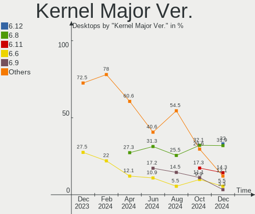
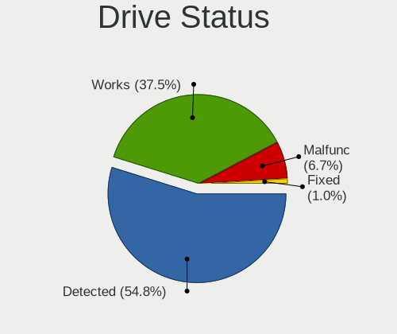
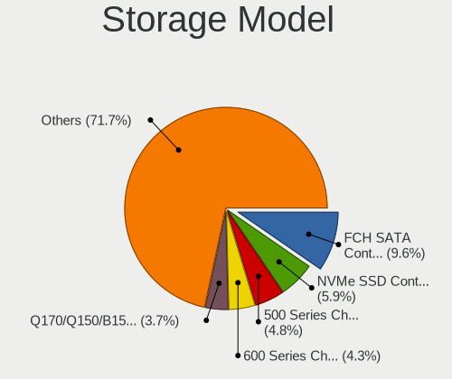
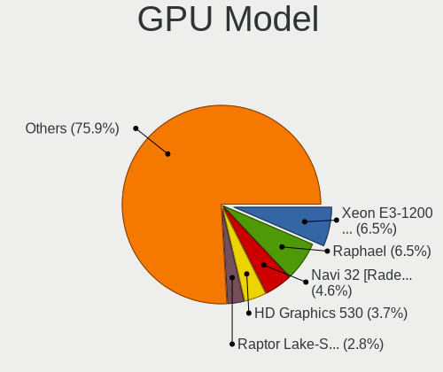
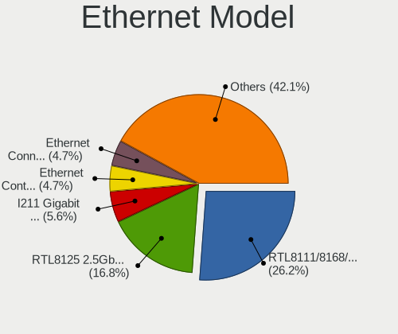
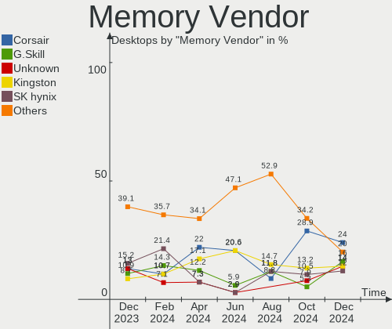
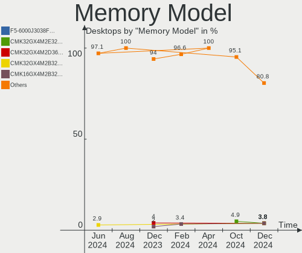
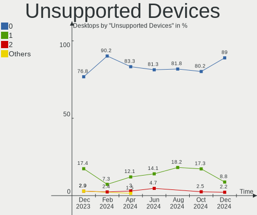

Linux in Canada - Hardware Trends (Desktops)
--------------------------------------------

A project to identify most popular hardware characteristics and track their change
over time based on data collected by Linux users at https://Linux-Hardware.org.

Anyone can contribute to this report by the [hw-probe](https://github.com/linuxhw/hw-probe) tool:

    sudo -E hw-probe -all -upload

Period: Nov, 2022.

Contents
--------

* [ System ](#system)
  - [ OS                       ](#os)
  - [ OS Family                ](#os-family)
  - [ Kernel                   ](#kernel)
  - [ Kernel Family            ](#kernel-family)
  - [ Kernel Major Ver.        ](#kernel-major-ver)
  - [ Arch                     ](#arch)
  - [ DE                       ](#de)
  - [ Display Server           ](#display-server)
  - [ Display Manager          ](#display-manager)
  - [ OS Lang                  ](#os-lang)
  - [ Boot Mode                ](#boot-mode)
  - [ Filesystem               ](#filesystem)
  - [ Part. scheme             ](#part-scheme)
  - [ Dual Boot with Linux/BSD ](#dual-boot-with-linuxbsd)
  - [ Dual Boot (Win)          ](#dual-boot-win)

* [ Board ](#board)
  - [ Vendor                   ](#vendor)
  - [ Model                    ](#model)
  - [ Model Family             ](#model-family)
  - [ MFG Year                 ](#mfg-year)
  - [ Form Factor              ](#form-factor)
  - [ Secure Boot              ](#secure-boot)
  - [ Coreboot                 ](#coreboot)
  - [ RAM Size                 ](#ram-size)
  - [ RAM Used                 ](#ram-used)
  - [ Total Drives             ](#total-drives)
  - [ Has CD-ROM               ](#has-cd-rom)
  - [ Has Ethernet             ](#has-ethernet)
  - [ Has WiFi                 ](#has-wifi)
  - [ Has Bluetooth            ](#has-bluetooth)

* [ Location ](#location)
  - [ Country                  ](#country)
  - [ City                     ](#city)

* [ Drives ](#drives)
  - [ Drive Vendor             ](#drive-vendor)
  - [ Drive Model              ](#drive-model)
  - [ HDD Vendor               ](#hdd-vendor)
  - [ SSD Vendor               ](#ssd-vendor)
  - [ Drive Kind               ](#drive-kind)
  - [ Drive Connector          ](#drive-connector)
  - [ Drive Size               ](#drive-size)
  - [ Space Total              ](#space-total)
  - [ Space Used               ](#space-used)
  - [ Malfunc. Drives          ](#malfunc-drives)
  - [ Malfunc. Drive Vendor    ](#malfunc-drive-vendor)
  - [ Malfunc. HDD Vendor      ](#malfunc-hdd-vendor)
  - [ Malfunc. Drive Kind      ](#malfunc-drive-kind)
  - [ Failed Drives            ](#failed-drives)
  - [ Failed Drive Vendor      ](#failed-drive-vendor)
  - [ Drive Status             ](#drive-status)

* [ Storage controller ](#storage-controller)
  - [ Storage Vendor           ](#storage-vendor)
  - [ Storage Model            ](#storage-model)
  - [ Storage Kind             ](#storage-kind)

* [ Processor ](#processor)
  - [ CPU Vendor               ](#cpu-vendor)
  - [ CPU Model                ](#cpu-model)
  - [ CPU Model Family         ](#cpu-model-family)
  - [ CPU Cores                ](#cpu-cores)
  - [ CPU Sockets              ](#cpu-sockets)
  - [ CPU Threads              ](#cpu-threads)
  - [ CPU Op-Modes             ](#cpu-op-modes)
  - [ CPU Microcode            ](#cpu-microcode)
  - [ CPU Microarch            ](#cpu-microarch)

* [ Graphics ](#graphics)
  - [ GPU Vendor               ](#gpu-vendor)
  - [ GPU Model                ](#gpu-model)
  - [ GPU Combo                ](#gpu-combo)
  - [ GPU Driver               ](#gpu-driver)
  - [ GPU Memory               ](#gpu-memory)

* [ Monitor ](#monitor)
  - [ Monitor Vendor           ](#monitor-vendor)
  - [ Monitor Model            ](#monitor-model)
  - [ Monitor Resolution       ](#monitor-resolution)
  - [ Monitor Diagonal         ](#monitor-diagonal)
  - [ Monitor Width            ](#monitor-width)
  - [ Aspect Ratio             ](#aspect-ratio)
  - [ Monitor Area             ](#monitor-area)
  - [ Pixel Density            ](#pixel-density)
  - [ Multiple Monitors        ](#multiple-monitors)

* [ Network ](#network)
  - [ Net Controller Vendor    ](#net-controller-vendor)
  - [ Net Controller Model     ](#net-controller-model)
  - [ Wireless Vendor          ](#wireless-vendor)
  - [ Wireless Model           ](#wireless-model)
  - [ Ethernet Vendor          ](#ethernet-vendor)
  - [ Ethernet Model           ](#ethernet-model)
  - [ Net Controller Kind      ](#net-controller-kind)
  - [ Used Controller          ](#used-controller)
  - [ NICs                     ](#nics)
  - [ IPv6                     ](#ipv6)

* [ Bluetooth ](#bluetooth)
  - [ Bluetooth Vendor         ](#bluetooth-vendor)
  - [ Bluetooth Model          ](#bluetooth-model)

* [ Sound ](#sound)
  - [ Sound Vendor             ](#sound-vendor)
  - [ Sound Model              ](#sound-model)

* [ Memory ](#memory)
  - [ Memory Vendor            ](#memory-vendor)
  - [ Memory Model             ](#memory-model)
  - [ Memory Kind              ](#memory-kind)
  - [ Memory Form Factor       ](#memory-form-factor)
  - [ Memory Size              ](#memory-size)
  - [ Memory Speed             ](#memory-speed)

* [ Printers & scanners ](#printers--scanners)
  - [ Printer Vendor           ](#printer-vendor)
  - [ Printer Model            ](#printer-model)
  - [ Scanner Vendor           ](#scanner-vendor)
  - [ Scanner Model            ](#scanner-model)

* [ Camera ](#camera)
  - [ Camera Vendor            ](#camera-vendor)
  - [ Camera Model             ](#camera-model)

* [ Security ](#security)
  - [ Fingerprint Vendor       ](#fingerprint-vendor)
  - [ Fingerprint Model        ](#fingerprint-model)
  - [ Chipcard Vendor          ](#chipcard-vendor)
  - [ Chipcard Model           ](#chipcard-model)

* [ Unsupported ](#unsupported)
  - [ Unsupported Devices      ](#unsupported-devices)
  - [ Unsupported Device Types ](#unsupported-device-types)

System
------

OS
--

Installed operating systems

| Name                         | Desktops | Percent |
|------------------------------|----------|---------|
| Ubuntu 22.04                 | 10       | 15.38%  |
| Debian 11                    | 8        | 12.31%  |
| Ubuntu 20.04                 | 7        | 10.77%  |
| Pop!_OS 22.04                | 5        | 7.69%   |
| Zorin 16                     | 3        | 4.62%   |
| OpenMandriva 4.3             | 3        | 4.62%   |
| Fedora 36                    | 3        | 4.62%   |
| openSUSE Tumbleweed-XXXXXXXX | 2        | 3.08%   |
| OpenMandriva 4.50            | 2        | 3.08%   |
| Manjaro                      | 2        | 3.08%   |
| Linux Mint 21                | 2        | 3.08%   |
| Linux Mint 20.3              | 2        | 3.08%   |
| Arch Rolling                 | 2        | 3.08%   |
| Xubuntu 22.04                | 1        | 1.54%   |
| Ubuntu 22.10                 | 1        | 1.54%   |
| Ubuntu 18.04                 | 1        | 1.54%   |
| RHEL 9                       | 1        | 1.54%   |
| Redcore Rolling              | 1        | 1.54%   |
| MX 21                        | 1        | 1.54%   |
| KDE neon 22.04               | 1        | 1.54%   |
| Gentoo 2.8                   | 1        | 1.54%   |
| Garuda Linux Rolling         | 1        | 1.54%   |
| Feren OS 20.04               | 1        | 1.54%   |
| EndeavourOS Rolling          | 1        | 1.54%   |
| CentOS 8                     | 1        | 1.54%   |
| CentOS 7                     | 1        | 1.54%   |
| ArcoLinux Rolling            | 1        | 1.54%   |

OS Family
---------

OS without a version

| Name         | Desktops | Percent |
|--------------|----------|---------|
| Ubuntu       | 19       | 29.23%  |
| Debian       | 8        | 12.31%  |
| Pop!_OS      | 5        | 7.69%   |
| OpenMandriva | 5        | 7.69%   |
| Linux Mint   | 4        | 6.15%   |
| Zorin        | 3        | 4.62%   |
| Fedora       | 3        | 4.62%   |
| openSUSE     | 2        | 3.08%   |
| Manjaro      | 2        | 3.08%   |
| CentOS       | 2        | 3.08%   |
| Arch         | 2        | 3.08%   |
| Xubuntu      | 1        | 1.54%   |
| RHEL         | 1        | 1.54%   |
| Redcore      | 1        | 1.54%   |
| MX           | 1        | 1.54%   |
| KDE neon     | 1        | 1.54%   |
| Gentoo       | 1        | 1.54%   |
| Garuda Linux | 1        | 1.54%   |
| Feren OS     | 1        | 1.54%   |
| EndeavourOS  | 1        | 1.54%   |
| ArcoLinux    | 1        | 1.54%   |

Kernel
------

Version of the Linux kernel

| Version                     | Desktops | Percent |
|-----------------------------|----------|---------|
| 5.15.0-53-generic           | 11       | 16.92%  |
| 5.15.0-52-generic           | 11       | 16.92%  |
| 5.10.0-19-amd64             | 4        | 6.15%   |
| 6.0.8-edge                  | 3        | 4.62%   |
| 6.0.6-76060006-generic      | 3        | 4.62%   |
| 5.16.7-desktop-1omv4003     | 3        | 4.62%   |
| 5.4.0-131-generic           | 2        | 3.08%   |
| 5.19.12-desktop-2omv4090    | 2        | 3.08%   |
| 6.0.9-060009-generic        | 1        | 1.54%   |
| 6.0.8-zen1-1-zen            | 1        | 1.54%   |
| 6.0.8-arch1-1               | 1        | 1.54%   |
| 6.0.7-200.fc36.x86_64       | 1        | 1.54%   |
| 6.0.7-1-default             | 1        | 1.54%   |
| 6.0.6-zen1-1-zen            | 1        | 1.54%   |
| 6.0.6-arch1-1               | 1        | 1.54%   |
| 6.0.5-200.fc36.x86_64       | 1        | 1.54%   |
| 6.0.5-1-default             | 1        | 1.54%   |
| 6.0.2-76060002-generic      | 1        | 1.54%   |
| 6.0.10-arch2-1              | 1        | 1.54%   |
| 6.0.0-0.deb11.2-amd64       | 1        | 1.54%   |
| 5.19.15-xanmod1             | 1        | 1.54%   |
| 5.19.11-200.fc36.x86_64     | 1        | 1.54%   |
| 5.19.0-23-generic           | 1        | 1.54%   |
| 5.15.78-1-MANJARO           | 1        | 1.54%   |
| 5.15.71-redcore-lts         | 1        | 1.54%   |
| 5.15.41-gentoo-x86_64       | 1        | 1.54%   |
| 5.15.30-2-pve               | 1        | 1.54%   |
| 5.15.0-47-generic           | 1        | 1.54%   |
| 5.14.0-70.22.1.el9_0.x86_64 | 1        | 1.54%   |
| 5.13.0-44-generic           | 1        | 1.54%   |
| 5.13.0-39-generic           | 1        | 1.54%   |
| 5.10.148-1-MANJARO          | 1        | 1.54%   |
| 4.19.187                    | 1        | 1.54%   |
| 4.18.0-348.2.1.el8_5.x86_64 | 1        | 1.54%   |

Kernel Family
-------------

Linux kernel without a distro release

| Version  | Desktops | Percent |
|----------|----------|---------|
| 5.15.0   | 23       | 35.38%  |
| 6.0.8    | 5        | 7.69%   |
| 6.0.6    | 5        | 7.69%   |
| 5.10.0   | 4        | 6.15%   |
| 5.16.7   | 3        | 4.62%   |
| 6.0.7    | 2        | 3.08%   |
| 6.0.5    | 2        | 3.08%   |
| 5.4.0    | 2        | 3.08%   |
| 5.19.12  | 2        | 3.08%   |
| 5.13.0   | 2        | 3.08%   |
| 6.0.9    | 1        | 1.54%   |
| 6.0.2    | 1        | 1.54%   |
| 6.0.10   | 1        | 1.54%   |
| 6.0.0    | 1        | 1.54%   |
| 5.19.15  | 1        | 1.54%   |
| 5.19.11  | 1        | 1.54%   |
| 5.19.0   | 1        | 1.54%   |
| 5.15.78  | 1        | 1.54%   |
| 5.15.71  | 1        | 1.54%   |
| 5.15.41  | 1        | 1.54%   |
| 5.15.30  | 1        | 1.54%   |
| 5.14.0   | 1        | 1.54%   |
| 5.10.148 | 1        | 1.54%   |
| 4.19.187 | 1        | 1.54%   |
| 4.18.0   | 1        | 1.54%   |

Kernel Major Ver.
-----------------

Linux kernel major version

| Version | Desktops | Percent |
|---------|----------|---------|
| 5.15    | 27       | 41.54%  |
| 6.0     | 18       | 27.69%  |
| 5.19    | 5        | 7.69%   |
| 5.10    | 5        | 7.69%   |
| 5.16    | 3        | 4.62%   |
| 5.4     | 2        | 3.08%   |
| 5.13    | 2        | 3.08%   |
| 5.14    | 1        | 1.54%   |
| 4.19    | 1        | 1.54%   |
| 4.18    | 1        | 1.54%   |

Arch
----

OS architecture (x86_64, i586, etc.)

| Name   | Desktops | Percent |
|--------|----------|---------|
| x86_64 | 65       | 100%    |

DE
--

Desktop Environment

| Name            | Desktops | Percent |
|-----------------|----------|---------|
| GNOME           | 29       | 44.62%  |
| KDE5            | 13       | 20%     |
| Unknown         | 9        | 13.85%  |
| X-Cinnamon      | 6        | 9.23%   |
| XFCE            | 3        | 4.62%   |
| sway            | 1        | 1.54%   |
| KDE4            | 1        | 1.54%   |
| i3              | 1        | 1.54%   |
| GNOME Flashback | 1        | 1.54%   |
| awesome         | 1        | 1.54%   |

Display Server
--------------

X11 or Wayland

| Name    | Desktops | Percent |
|---------|----------|---------|
| X11     | 43       | 66.15%  |
| Wayland | 12       | 18.46%  |
| Tty     | 7        | 10.77%  |
| Unknown | 3        | 4.62%   |

Display Manager
---------------

SDDM, LightDM, etc.

| Name    | Desktops | Percent |
|---------|----------|---------|
| Unknown | 35       | 53.85%  |
| GDM3    | 10       | 15.38%  |
| SDDM    | 9        | 13.85%  |
| GDM     | 6        | 9.23%   |
| LightDM | 3        | 4.62%   |
| XDM     | 1        | 1.54%   |
| GREETD  | 1        | 1.54%   |

OS Lang
-------

Language

| Lang    | Desktops | Percent |
|---------|----------|---------|
| en_CA   | 28       | 43.08%  |
| en_US   | 27       | 41.54%  |
| fr_CA   | 6        | 9.23%   |
| Unknown | 2        | 3.08%   |
| zh_TW   | 1        | 1.54%   |
| en_GB   | 1        | 1.54%   |

Boot Mode
---------

EFI or BIOS

| Mode | Desktops | Percent |
|------|----------|---------|
| BIOS | 35       | 53.85%  |
| EFI  | 30       | 46.15%  |

Filesystem
----------

Type of filesystem

| Type    | Desktops | Percent |
|---------|----------|---------|
| Ext4    | 50       | 76.92%  |
| Btrfs   | 8        | 12.31%  |
| Overlay | 4        | 6.15%   |
| Xfs     | 2        | 3.08%   |
| Zfs     | 1        | 1.54%   |

Part. scheme
------------

Scheme of partitioning

| Type    | Desktops | Percent |
|---------|----------|---------|
| GPT     | 33       | 50.77%  |
| Unknown | 24       | 36.92%  |
| MBR     | 8        | 12.31%  |

Dual Boot with Linux/BSD
------------------------

Hosting more than one Linux/BSD

| Dual boot | Desktops | Percent |
|-----------|----------|---------|
| No        | 55       | 84.62%  |
| Yes       | 10       | 15.38%  |

Dual Boot (Win)
---------------

Hosting Linux and Windows

| Dual boot | Desktops | Percent |
|-----------|----------|---------|
| No        | 45       | 69.23%  |
| Yes       | 20       | 30.77%  |

Board
-----

Vendor
------

Motherboard manufacturer

| Name                | Desktops | Percent |
|---------------------|----------|---------|
| ASUSTek Computer    | 22       | 33.85%  |
| Dell                | 9        | 13.85%  |
| MSI                 | 8        | 12.31%  |
| Gigabyte Technology | 8        | 12.31%  |
| Hewlett-Packard     | 6        | 9.23%   |
| ASRock              | 5        | 7.69%   |
| Lenovo              | 2        | 3.08%   |
| Pegatron            | 1        | 1.54%   |
| AZW                 | 1        | 1.54%   |
| Acidanthera         | 1        | 1.54%   |
| Acer                | 1        | 1.54%   |
| Unknown             | 1        | 1.54%   |

Model
-----

Motherboard model

| Name                                 | Desktops | Percent |
|--------------------------------------|----------|---------|
| MSI MS-7C95                          | 2        | 3.08%   |
| Gigabyte 990FXA-UD3                  | 2        | 3.08%   |
| ASUS P8Z68 DELUXE/GEN3               | 2        | 3.08%   |
| Pegatron 600-1352                    | 1        | 1.54%   |
| MSI MS-7C94                          | 1        | 1.54%   |
| MSI MS-7C91                          | 1        | 1.54%   |
| MSI MS-7B89                          | 1        | 1.54%   |
| MSI MS-7B79                          | 1        | 1.54%   |
| MSI MS-7A37                          | 1        | 1.54%   |
| MSI MS-7599                          | 1        | 1.54%   |
| Lenovo ThinkStation P910 30B8S0EN00  | 1        | 1.54%   |
| Lenovo ThinkCentre M91p 4518RS8      | 1        | 1.54%   |
| HP Z440 Workstation                  | 1        | 1.54%   |
| HP Z420 Workstation                  | 1        | 1.54%   |
| HP Z400 Workstation                  | 1        | 1.54%   |
| HP EliteDesk 800 G2 SFF              | 1        | 1.54%   |
| HP EliteDesk 800 G1 TWR              | 1        | 1.54%   |
| HP Compaq Pro 6300 MT                | 1        | 1.54%   |
| Gigabyte Z490 AORUS ELITE AC         | 1        | 1.54%   |
| Gigabyte Z390 AORUS PRO WIFI         | 1        | 1.54%   |
| Gigabyte Z370 AORUS Ultra Gaming     | 1        | 1.54%   |
| Gigabyte B85M-D3H                    | 1        | 1.54%   |
| Gigabyte B650M AORUS ELITE AX        | 1        | 1.54%   |
| Gigabyte B450 AORUS PRO WIFI         | 1        | 1.54%   |
| Dell Vostro 460                      | 1        | 1.54%   |
| Dell Precision WorkStation T3500     | 1        | 1.54%   |
| Dell Precision Tower 3620            | 1        | 1.54%   |
| Dell OptiPlex 980                    | 1        | 1.54%   |
| Dell OptiPlex 5050                   | 1        | 1.54%   |
| Dell OptiPlex 3020M                  | 1        | 1.54%   |
| Dell OptiPlex 3010                   | 1        | 1.54%   |
| Dell Inspiron 530                    | 1        | 1.54%   |
| Dell Inspiron 3847                   | 1        | 1.54%   |
| AZW Gemini T34                       | 1        | 1.54%   |
| ASUS Z170-E                          | 1        | 1.54%   |
| ASUS TUF Gaming X570-PLUS            | 1        | 1.54%   |
| ASUS ROG STRIX Z690-A GAMING WIFI D4 | 1        | 1.54%   |
| ASUS ROG Maximus Z690 HERO           | 1        | 1.54%   |
| ASUS ROG CROSSHAIR VIII HERO         | 1        | 1.54%   |
| ASUS ROG CROSSHAIR VIII DARK HERO    | 1        | 1.54%   |

Model Family
------------

Motherboard model prefix

| Name                | Desktops | Percent |
|---------------------|----------|---------|
| ASUS PRIME          | 5        | 7.69%   |
| Dell OptiPlex       | 4        | 6.15%   |
| ASUS ROG            | 4        | 6.15%   |
| MSI MS-7C95         | 2        | 3.08%   |
| HP EliteDesk        | 2        | 3.08%   |
| Gigabyte 990FXA-UD3 | 2        | 3.08%   |
| Dell Precision      | 2        | 3.08%   |
| Dell Inspiron       | 2        | 3.08%   |
| ASUS P8Z68          | 2        | 3.08%   |
| ASUS P8H77-M        | 2        | 3.08%   |
| ASUS P8H61-M        | 2        | 3.08%   |
| Pegatron 600-1352   | 1        | 1.54%   |
| MSI MS-7C94         | 1        | 1.54%   |
| MSI MS-7C91         | 1        | 1.54%   |
| MSI MS-7B89         | 1        | 1.54%   |
| MSI MS-7B79         | 1        | 1.54%   |
| MSI MS-7A37         | 1        | 1.54%   |
| MSI MS-7599         | 1        | 1.54%   |
| Lenovo ThinkStation | 1        | 1.54%   |
| Lenovo ThinkCentre  | 1        | 1.54%   |
| HP Z440             | 1        | 1.54%   |
| HP Z420             | 1        | 1.54%   |
| HP Z400             | 1        | 1.54%   |
| HP Compaq           | 1        | 1.54%   |
| Gigabyte Z490       | 1        | 1.54%   |
| Gigabyte Z390       | 1        | 1.54%   |
| Gigabyte Z370       | 1        | 1.54%   |
| Gigabyte B85M-D3H   | 1        | 1.54%   |
| Gigabyte B650M      | 1        | 1.54%   |
| Gigabyte B450       | 1        | 1.54%   |
| Dell Vostro         | 1        | 1.54%   |
| AZW Gemini          | 1        | 1.54%   |
| ASUS Z170-E         | 1        | 1.54%   |
| ASUS TUF            | 1        | 1.54%   |
| ASUS P8P67          | 1        | 1.54%   |
| ASUS P8H67-M        | 1        | 1.54%   |
| ASUS M2N-E          | 1        | 1.54%   |
| ASUS CM6870         | 1        | 1.54%   |
| ASUS All            | 1        | 1.54%   |
| ASRock Z77          | 1        | 1.54%   |

MFG Year
--------

Motherboard manufacture year

| Year | Desktops | Percent |
|------|----------|---------|
| 2011 | 9        | 13.85%  |
| 2020 | 7        | 10.77%  |
| 2018 | 7        | 10.77%  |
| 2013 | 7        | 10.77%  |
| 2012 | 6        | 9.23%   |
| 2021 | 5        | 7.69%   |
| 2019 | 5        | 7.69%   |
| 2010 | 4        | 6.15%   |
| 2017 | 3        | 4.62%   |
| 2016 | 3        | 4.62%   |
| 2015 | 3        | 4.62%   |
| 2022 | 2        | 3.08%   |
| 2014 | 2        | 3.08%   |
| 2007 | 1        | 1.54%   |
| 2006 | 1        | 1.54%   |

Form Factor
-----------

Physical design of the computer

| Name    | Desktops | Percent |
|---------|----------|---------|
| Desktop | 65       | 100%    |

Secure Boot
-----------

Enabled or disabled

| State    | Desktops | Percent |
|----------|----------|---------|
| Disabled | 61       | 93.85%  |
| Enabled  | 4        | 6.15%   |

Coreboot
--------

Have coreboot on board

| Used | Desktops | Percent |
|------|----------|---------|
| No   | 65       | 100%    |

RAM Size
--------

Total RAM memory

| Size in GB  | Desktops | Percent |
|-------------|----------|---------|
| 16.01-24.0  | 20       | 30.77%  |
| 32.01-64.0  | 17       | 26.15%  |
| 64.01-256.0 | 8        | 12.31%  |
| 4.01-8.0    | 7        | 10.77%  |
| 8.01-16.0   | 6        | 9.23%   |
| 3.01-4.0    | 4        | 6.15%   |
| 24.01-32.0  | 2        | 3.08%   |
| 2.01-3.0    | 1        | 1.54%   |

RAM Used
--------

Used RAM memory

| Used GB    | Desktops | Percent |
|------------|----------|---------|
| 2.01-3.0   | 19       | 29.23%  |
| 1.01-2.0   | 13       | 20%     |
| 4.01-8.0   | 11       | 16.92%  |
| 3.01-4.0   | 8        | 12.31%  |
| 8.01-16.0  | 6        | 9.23%   |
| 0.51-1.0   | 4        | 6.15%   |
| 32.01-64.0 | 3        | 4.62%   |
| 0.01-0.5   | 1        | 1.54%   |

Total Drives
------------

Number of drives on board

| Drives | Desktops | Percent |
|--------|----------|---------|
| 2      | 21       | 32.31%  |
| 1      | 18       | 27.69%  |
| 5      | 8        | 12.31%  |
| 4      | 7        | 10.77%  |
| 3      | 6        | 9.23%   |
| 10     | 2        | 3.08%   |
| 12     | 1        | 1.54%   |
| 11     | 1        | 1.54%   |
| 7      | 1        | 1.54%   |

Has CD-ROM
----------

Has CD-ROM on board

| Presented | Desktops | Percent |
|-----------|----------|---------|
| No        | 33       | 50.77%  |
| Yes       | 32       | 49.23%  |

Has Ethernet
------------

Has Ethernet on board

| Presented | Desktops | Percent |
|-----------|----------|---------|
| Yes       | 64       | 98.46%  |
| No        | 1        | 1.54%   |

Has WiFi
--------

Has WiFi module

| Presented | Desktops | Percent |
|-----------|----------|---------|
| No        | 34       | 52.31%  |
| Yes       | 31       | 47.69%  |

Has Bluetooth
-------------

Has Bluetooth module

| Presented | Desktops | Percent |
|-----------|----------|---------|
| No        | 37       | 56.92%  |
| Yes       | 28       | 43.08%  |

Location
--------

Country
-------

Geographic location (country)

| Country | Desktops | Percent |
|---------|----------|---------|
| Canada  | 65       | 100%    |

City
----

Geographic location (city)

| City                     | Desktops | Percent |
|--------------------------|----------|---------|
| Montreal                 | 7        | 10.77%  |
| Toronto                  | 6        | 9.23%   |
| Ottawa                   | 4        | 6.15%   |
| Vancouver                | 3        | 4.62%   |
| Laval                    | 3        | 4.62%   |
| Edmonton                 | 3        | 4.62%   |
| Calgary                  | 3        | 4.62%   |
| Tillsonburg              | 2        | 3.08%   |
| Sherwood Park            | 2        | 3.08%   |
| Québec                  | 2        | 3.08%   |
| Maple Ridge              | 2        | 3.08%   |
| Kingston                 | 2        | 3.08%   |
| Winnipeg                 | 1        | 1.54%   |
| Welland                  | 1        | 1.54%   |
| Waterloo                 | 1        | 1.54%   |
| Vanderhoof               | 1        | 1.54%   |
| Surrey                   | 1        | 1.54%   |
| Saint-Lambert            | 1        | 1.54%   |
| Saint-Jean-sur-Richelieu | 1        | 1.54%   |
| Saint-Eustache           | 1        | 1.54%   |
| Saguenay                 | 1        | 1.54%   |
| Richmond Hill            | 1        | 1.54%   |
| Regina                   | 1        | 1.54%   |
| Red Deer                 | 1        | 1.54%   |
| Rawdon                   | 1        | 1.54%   |
| Oakville                 | 1        | 1.54%   |
| Newmarket                | 1        | 1.54%   |
| Nanaimo                  | 1        | 1.54%   |
| Milton                   | 1        | 1.54%   |
| Larouche                 | 1        | 1.54%   |
| Knowlton                 | 1        | 1.54%   |
| Joliette                 | 1        | 1.54%   |
| Fredericton              | 1        | 1.54%   |
| Charlottetown            | 1        | 1.54%   |
| Burk's Falls             | 1        | 1.54%   |
| Blainville               | 1        | 1.54%   |
| Beeton                   | 1        | 1.54%   |
| Alma                     | 1        | 1.54%   |

Drives
------

Drive Vendor
------------

Hard drive vendors

| Vendor                      | Desktops | Drives | Percent |
|-----------------------------|----------|--------|---------|
| WDC                         | 34       | 51     | 22.82%  |
| Seagate                     | 27       | 43     | 18.12%  |
| Samsung Electronics         | 22       | 28     | 14.77%  |
| Kingston                    | 10       | 14     | 6.71%   |
| Sandisk                     | 9        | 9      | 6.04%   |
| Crucial                     | 7        | 10     | 4.7%    |
| A-DATA Technology           | 7        | 9      | 4.7%    |
| Intel                       | 4        | 6      | 2.68%   |
| Toshiba                     | 3        | 3      | 2.01%   |
| Phison Electronics          | 3        | 3      | 2.01%   |
| Hitachi                     | 3        | 3      | 2.01%   |
| SPCC                        | 2        | 2      | 1.34%   |
| OCZ                         | 2        | 2      | 1.34%   |
| HGST                        | 2        | 2      | 1.34%   |
| China                       | 2        | 2      | 1.34%   |
| Unknown                     | 1        | 2      | 0.67%   |
| Timetec                     | 1        | 1      | 0.67%   |
| Silicon Motion              | 1        | 1      | 0.67%   |
| SABRENT                     | 1        | 1      | 0.67%   |
| Phison                      | 1        | 1      | 0.67%   |
| Micron/Crucial Technology   | 1        | 1      | 0.67%   |
| Micron Technology           | 1        | 1      | 0.67%   |
| Kingston Technology Company | 1        | 1      | 0.67%   |
| JMicron Technology          | 1        | 1      | 0.67%   |
| ADATA Technology            | 1        | 1      | 0.67%   |
| 1TBE                        | 1        | 1      | 0.67%   |
| Unknown                     | 1        | 1      | 0.67%   |

Drive Model
-----------

Hard drive models

| Model                                               | Desktops | Percent |
|-----------------------------------------------------|----------|---------|
| Samsung NVMe SSD Controller SM981/PM981/PM983 1TB   | 5        | 2.75%   |
| Samsung SSD 850 EVO 250GB                           | 3        | 1.65%   |
| Kingston SA400S37240G 240GB SSD                     | 3        | 1.65%   |
| WDC WDS500G2B0A-00SM50 500GB SSD                    | 2        | 1.1%    |
| WDC WD60EFAX-68JH4N1 6TB                            | 2        | 1.1%    |
| WDC WD40EZRZ-00GXCB0 4TB                            | 2        | 1.1%    |
| WDC WD20EARS-42S0XB0 2TB                            | 2        | 1.1%    |
| WDC WD10EZEX-08WN4A0 1TB                            | 2        | 1.1%    |
| SPCC Solid State Disk 256GB                         | 2        | 1.1%    |
| Seagate ST8000DM004-2CX188 8TB                      | 2        | 1.1%    |
| Seagate ST500DM002-1BD142 500GB                     | 2        | 1.1%    |
| Seagate ST2000DM006-2DM164 2TB                      | 2        | 1.1%    |
| Seagate ST2000DM001-1CH164 2TB                      | 2        | 1.1%    |
| Seagate ST1000DM010-2EP102 1TB                      | 2        | 1.1%    |
| Sandisk WD Blue SN550 NVMe SSD 1TB                  | 2        | 1.1%    |
| Samsung SSD 960 PRO 512GB                           | 2        | 1.1%    |
| Samsung SSD 860 EVO 500GB                           | 2        | 1.1%    |
| Samsung NVMe SSD Controller SM961/PM961/SM963 250GB | 2        | 1.1%    |
| Phison E16 PCIe4 NVMe Controller 1TB                | 2        | 1.1%    |
| Crucial CT1000MX500SSD1 1TB                         | 2        | 1.1%    |
| A-DATA SU800 512GB SSD                              | 2        | 1.1%    |
| A-DATA SU800 1TB SSD                                | 2        | 1.1%    |
| WDC WDS500G3X0C-00SJG0 500GB                        | 1        | 0.55%   |
| WDC WDS250G2B0B-00YS70 250GB SSD                    | 1        | 0.55%   |
| WDC WDS250G2B0A-00SM50 250GB SSD                    | 1        | 0.55%   |
| WDC WDS250G1B0A-00H9H0 250GB SSD                    | 1        | 0.55%   |
| WDC WDS200T1X0E-00AFY0 2TB                          | 1        | 0.55%   |
| WDC WDS100T2B0C 1TB                                 | 1        | 0.55%   |
| WDC WDS100T2B0A-00SM50 1TB SSD                      | 1        | 0.55%   |
| WDC WDBNCE5000PNC 500GB SSD                         | 1        | 0.55%   |
| WDC WD80EZAZ-11TDBA0 8TB                            | 1        | 0.55%   |
| WDC WD6400AAKS-65A7B0 640GB                         | 1        | 0.55%   |
| WDC WD60EZAZ-00ZGHB0 6TB                            | 1        | 0.55%   |
| WDC WD5000LUCT-61C26Y0 500GB                        | 1        | 0.55%   |
| WDC WD5000LPVX-22V0TT0 500GB                        | 1        | 0.55%   |
| WDC WD5000AAKX-75U6AA0 500GB                        | 1        | 0.55%   |
| WDC WD5000AAKX-00ERMA0 500GB                        | 1        | 0.55%   |
| WDC WD5000AAKS-00UU3A0 500GB                        | 1        | 0.55%   |
| WDC WD40EZRZ-19GXCB0 4TB                            | 1        | 0.55%   |
| WDC WD40EZAZ-19SF3B0 4TB                            | 1        | 0.55%   |

HDD Vendor
----------

Hard disk drive vendors

| Vendor  | Desktops | Drives | Percent |
|---------|----------|--------|---------|
| WDC     | 28       | 40     | 45.16%  |
| Seagate | 26       | 42     | 41.94%  |
| Toshiba | 3        | 3      | 4.84%   |
| Hitachi | 3        | 3      | 4.84%   |
| HGST    | 2        | 2      | 3.23%   |

SSD Vendor
----------

Solid state drive vendors

| Vendor              | Desktops | Drives | Percent |
|---------------------|----------|--------|---------|
| Samsung Electronics | 14       | 16     | 25.93%  |
| Kingston            | 9        | 12     | 16.67%  |
| Crucial             | 7        | 10     | 12.96%  |
| A-DATA Technology   | 7        | 9      | 12.96%  |
| WDC                 | 6        | 7      | 11.11%  |
| SanDisk             | 3        | 3      | 5.56%   |
| SPCC                | 2        | 2      | 3.7%    |
| OCZ                 | 2        | 2      | 3.7%    |
| China               | 2        | 2      | 3.7%    |
| Timetec             | 1        | 1      | 1.85%   |
| Micron Technology   | 1        | 1      | 1.85%   |

Drive Kind
----------

HDD or SSD

| Kind    | Desktops | Drives | Percent |
|---------|----------|--------|---------|
| HDD     | 47       | 90     | 39.83%  |
| SSD     | 41       | 65     | 34.75%  |
| NVMe    | 25       | 39     | 21.19%  |
| Unknown | 4        | 4      | 3.39%   |
| MMC     | 1        | 2      | 0.85%   |

Drive Connector
---------------

SATA, SAS, NVMe, etc.

| Type | Desktops | Drives | Percent |
|------|----------|--------|---------|
| SATA | 57       | 153    | 64.77%  |
| NVMe | 25       | 38     | 28.41%  |
| SAS  | 5        | 7      | 5.68%   |
| MMC  | 1        | 2      | 1.14%   |

Drive Size
----------

Size of hard drive

| Size in TB | Desktops | Drives | Percent |
|------------|----------|--------|---------|
| 0.01-0.5   | 44       | 69     | 44%     |
| 0.51-1.0   | 22       | 34     | 22%     |
| 1.01-2.0   | 13       | 18     | 13%     |
| 3.01-4.0   | 7        | 10     | 7%      |
| 2.01-3.0   | 7        | 7      | 7%      |
| 4.01-10.0  | 5        | 8      | 5%      |
| 10.01-20.0 | 2        | 9      | 2%      |

Space Total
-----------

Amount of disk space available on the file system

| Size in GB     | Desktops | Percent |
|----------------|----------|---------|
| More than 3000 | 15       | 23.08%  |
| 501-1000       | 12       | 18.46%  |
| 251-500        | 8        | 12.31%  |
| 101-250        | 7        | 10.77%  |
| 1001-2000      | 7        | 10.77%  |
| 2001-3000      | 4        | 6.15%   |
| 51-100         | 4        | 6.15%   |
| Unknown        | 4        | 6.15%   |
| 21-50          | 2        | 3.08%   |
| 1-20           | 2        | 3.08%   |

Space Used
----------

Amount of used disk space

| Used GB        | Desktops | Percent |
|----------------|----------|---------|
| 1-20           | 16       | 24.62%  |
| 101-250        | 11       | 16.92%  |
| 501-1000       | 7        | 10.77%  |
| 21-50          | 6        | 9.23%   |
| More than 3000 | 5        | 7.69%   |
| 251-500        | 4        | 6.15%   |
| 2001-3000      | 4        | 6.15%   |
| 1001-2000      | 4        | 6.15%   |
| 51-100         | 4        | 6.15%   |
| Unknown        | 4        | 6.15%   |

Malfunc. Drives
---------------

Drive models with a malfunction

| Model                           | Desktops | Drives | Percent |
|---------------------------------|----------|--------|---------|
| WDC WD6400AAKS-65A7B0 640GB     | 1        | 1      | 14.29%  |
| WDC WD5000LPVX-22V0TT0 500GB    | 1        | 1      | 14.29%  |
| WDC WD5000AAKX-00ERMA0 500GB    | 1        | 1      | 14.29%  |
| Seagate ST2000DM008-2FR102 2TB  | 1        | 1      | 14.29%  |
| Seagate ST2000DL003-9VT166 2TB  | 1        | 1      | 14.29%  |
| China SSD 120GB                 | 1        | 1      | 14.29%  |
| A-DATA Technology SU800 1TB SSD | 1        | 2      | 14.29%  |

Malfunc. Drive Vendor
---------------------

Vendors of faulty drives

| Vendor            | Desktops | Drives | Percent |
|-------------------|----------|--------|---------|
| WDC               | 3        | 3      | 42.86%  |
| Seagate           | 2        | 2      | 28.57%  |
| China             | 1        | 1      | 14.29%  |
| A-DATA Technology | 1        | 2      | 14.29%  |

Malfunc. HDD Vendor
-------------------

Vendors of faulty HDD drives

| Vendor  | Desktops | Drives | Percent |
|---------|----------|--------|---------|
| WDC     | 3        | 3      | 60%     |
| Seagate | 2        | 2      | 40%     |

Malfunc. Drive Kind
-------------------

Kinds of faulty drives

| Kind | Desktops | Drives | Percent |
|------|----------|--------|---------|
| HDD  | 5        | 5      | 71.43%  |
| SSD  | 2        | 3      | 28.57%  |

Failed Drives
-------------

Failed drive models

Zero info for selected period =(

Failed Drive Vendor
-------------------

Failed drive vendors

Zero info for selected period =(

Drive Status
------------

Number of failed and malfunc. drives

| Status   | Desktops | Drives | Percent |
|----------|----------|--------|---------|
| Detected | 37       | 101    | 51.39%  |
| Works    | 29       | 91     | 40.28%  |
| Malfunc  | 6        | 8      | 8.33%   |

Storage controller
------------------

Storage Vendor
--------------

Storage controller vendors

| Vendor                      | Desktops | Percent |
|-----------------------------|----------|---------|
| Intel                       | 45       | 40.54%  |
| AMD                         | 20       | 18.02%  |
| Samsung Electronics         | 11       | 9.91%   |
| SanDisk                     | 9        | 8.11%   |
| Marvell Technology Group    | 6        | 5.41%   |
| Phison Electronics          | 4        | 3.6%    |
| ASMedia Technology          | 4        | 3.6%    |
| LSI Logic / Symbios Logic   | 2        | 1.8%    |
| Kingston Technology Company | 2        | 1.8%    |
| JMicron Technology          | 2        | 1.8%    |
| ADATA Technology            | 2        | 1.8%    |
| VIA Technologies            | 1        | 0.9%    |
| Silicon Motion              | 1        | 0.9%    |
| Nvidia                      | 1        | 0.9%    |
| Micron/Crucial Technology   | 1        | 0.9%    |

Storage Model
-------------

Storage controller models

| Model                                                                                   | Desktops | Percent |
|-----------------------------------------------------------------------------------------|----------|---------|
| AMD FCH SATA Controller [AHCI mode]                                                     | 9        | 6.34%   |
| Samsung NVMe SSD Controller SM981/PM981/PM983                                           | 7        | 4.93%   |
| Intel 200 Series PCH SATA controller [AHCI mode]                                        | 6        | 4.23%   |
| Intel SATA Controller [RAID mode]                                                       | 5        | 3.52%   |
| Intel 8 Series/C220 Series Chipset Family 6-port SATA Controller 1 [AHCI mode]          | 5        | 3.52%   |
| Intel 6 Series/C200 Series Chipset Family 6 port Desktop SATA AHCI Controller           | 5        | 3.52%   |
| AMD 500 Series Chipset SATA Controller                                                  | 5        | 3.52%   |
| AMD 400 Series Chipset SATA Controller                                                  | 5        | 3.52%   |
| Samsung NVMe SSD Controller SM961/PM961/SM963                                           | 4        | 2.82%   |
| Intel 7 Series/C210 Series Chipset Family 6-port SATA Controller [AHCI mode]            | 4        | 2.82%   |
| ASMedia ASM1062 Serial ATA Controller                                                   | 4        | 2.82%   |
| SanDisk WD Blue SN550 NVMe SSD                                                          | 3        | 2.11%   |
| Phison E16 PCIe4 NVMe Controller                                                        | 3        | 2.11%   |
| Intel Q170/Q150/B150/H170/H110/Z170/CM236 Chipset SATA Controller [AHCI Mode]           | 3        | 2.11%   |
| Intel 6 Series/C200 Series Chipset Family Desktop SATA Controller (IDE mode, ports 4-5) | 3        | 2.11%   |
| Intel 6 Series/C200 Series Chipset Family Desktop SATA Controller (IDE mode, ports 0-3) | 3        | 2.11%   |
| AMD SB7x0/SB8x0/SB9x0 SATA Controller [AHCI mode]                                       | 3        | 2.11%   |
| Marvell Group 88SE9172 SATA 6Gb/s Controller                                            | 2        | 1.41%   |
| Marvell Group 88SE9128 PCIe SATA 6 Gb/s RAID controller with HyperDuo                   | 2        | 1.41%   |
| LSI Logic / Symbios Logic SAS2008 PCI-Express Fusion-MPT SAS-2 [Falcon]                 | 2        | 1.41%   |
| Kingston Company Company Non-Volatile memory controller                                 | 2        | 1.41%   |
| JMicron JMB362 SATA Controller                                                          | 2        | 1.41%   |
| Intel Volume Management Device NVMe RAID Controller                                     | 2        | 1.41%   |
| Intel Celeron N3350/Pentium N4200/Atom E3900 Series SATA AHCI Controller                | 2        | 1.41%   |
| Intel Cannon Lake PCH SATA AHCI Controller                                              | 2        | 1.41%   |
| Intel C610/X99 series chipset sSATA Controller [AHCI mode]                              | 2        | 1.41%   |
| Intel C610/X99 series chipset 6-Port SATA Controller [AHCI mode]                        | 2        | 1.41%   |
| Intel Alder Lake-S PCH SATA Controller [AHCI Mode]                                      | 2        | 1.41%   |
| AMD SB7x0/SB8x0/SB9x0 IDE Controller                                                    | 2        | 1.41%   |
| AMD 300 Series Chipset SATA Controller                                                  | 2        | 1.41%   |
| VIA VT6415 PATA IDE Host Controller                                                     | 1        | 0.7%    |
| Silicon Motion SM2263EN/SM2263XT SSD Controller                                         | 1        | 0.7%    |
| SanDisk WD PC SN810 / Black SN850 NVMe SSD                                              | 1        | 0.7%    |
| SanDisk WD Blue SN570 NVMe SSD                                                          | 1        | 0.7%    |
| SanDisk WD Blue SN500 / PC SN520 NVMe SSD                                               | 1        | 0.7%    |
| SanDisk WD Black SN750 / PC SN730 NVMe SSD                                              | 1        | 0.7%    |
| SanDisk WD Black 2018/SN750 / PC SN720 NVMe SSD                                         | 1        | 0.7%    |
| SanDisk Non-Volatile memory controller                                                  | 1        | 0.7%    |
| Samsung NVMe SSD Controller PM9A1/PM9A3/980PRO                                          | 1        | 0.7%    |
| Phison E12 NVMe Controller                                                              | 1        | 0.7%    |

Storage Kind
------------

Kind of storage controller (IDE, SATA, NVMe, SAS, ...)

| Kind | Desktops | Percent |
|------|----------|---------|
| SATA | 53       | 52.48%  |
| NVMe | 25       | 24.75%  |
| IDE  | 12       | 11.88%  |
| RAID | 8        | 7.92%   |
| SAS  | 3        | 2.97%   |

Processor
---------

CPU Vendor
----------

Processor vendors

| Vendor | Desktops | Percent |
|--------|----------|---------|
| Intel  | 44       | 67.69%  |
| AMD    | 21       | 32.31%  |

CPU Model
---------

Processor models

| Model                                  | Desktops | Percent |
|----------------------------------------|----------|---------|
| Intel Core i7-3770 CPU @ 3.40GHz       | 2        | 3.08%   |
| Intel Core i7-2600K CPU @ 3.40GHz      | 2        | 3.08%   |
| Intel Core i5-3570K CPU @ 3.40GHz      | 2        | 3.08%   |
| Intel Core i5-3470 CPU @ 3.20GHz       | 2        | 3.08%   |
| Intel Core i5-2500 CPU @ 3.30GHz       | 2        | 3.08%   |
| AMD Ryzen 5 5600G with Radeon Graphics | 2        | 3.08%   |
| AMD Ryzen 5 3600X 6-Core Processor     | 2        | 3.08%   |
| Intel Xeon CPU X5680 @ 3.33GHz         | 1        | 1.54%   |
| Intel Xeon CPU X5650 @ 2.67GHz         | 1        | 1.54%   |
| Intel Xeon CPU E5-2640 v4 @ 2.40GHz    | 1        | 1.54%   |
| Intel Xeon CPU E5-2620 v3 @ 2.40GHz    | 1        | 1.54%   |
| Intel Xeon CPU E5-1607 0 @ 3.00GHz     | 1        | 1.54%   |
| Intel Xeon CPU E3-1220 v5 @ 3.00GHz    | 1        | 1.54%   |
| Intel Pentium Gold G5400 CPU @ 3.70GHz | 1        | 1.54%   |
| Intel Pentium CPU P6100 @ 2.00GHz      | 1        | 1.54%   |
| Intel Core i9-9900KS CPU @ 4.00GHz     | 1        | 1.54%   |
| Intel Core i7-8700K CPU @ 3.70GHz      | 1        | 1.54%   |
| Intel Core i7-7700K CPU @ 4.20GHz      | 1        | 1.54%   |
| Intel Core i7-7700 CPU @ 3.60GHz       | 1        | 1.54%   |
| Intel Core i7-6700K CPU @ 4.00GHz      | 1        | 1.54%   |
| Intel Core i7-6700 CPU @ 3.40GHz       | 1        | 1.54%   |
| Intel Core i7-4790 CPU @ 3.60GHz       | 1        | 1.54%   |
| Intel Core i7-4770 CPU @ 3.40GHz       | 1        | 1.54%   |
| Intel Core i7-3770K CPU @ 3.50GHz      | 1        | 1.54%   |
| Intel Core i7-2600 CPU @ 3.40GHz       | 1        | 1.54%   |
| Intel Core i7-10700K CPU @ 3.80GHz     | 1        | 1.54%   |
| Intel Core i5-9600K CPU @ 3.70GHz      | 1        | 1.54%   |
| Intel Core i5-9400 CPU @ 2.90GHz       | 1        | 1.54%   |
| Intel Core i5-8400 CPU @ 2.80GHz       | 1        | 1.54%   |
| Intel Core i5-7500 CPU @ 3.40GHz       | 1        | 1.54%   |
| Intel Core i5-4670K CPU @ 3.40GHz      | 1        | 1.54%   |
| Intel Core i5-4590T CPU @ 2.00GHz      | 1        | 1.54%   |
| Intel Core i5-4460 CPU @ 3.20GHz       | 1        | 1.54%   |
| Intel Core i5-2500K CPU @ 3.30GHz      | 1        | 1.54%   |
| Intel Core i5-2400 CPU @ 3.10GHz       | 1        | 1.54%   |
| Intel Core i5 CPU 650 @ 3.20GHz        | 1        | 1.54%   |
| Intel Core 2 Duo CPU E4600 @ 2.40GHz   | 1        | 1.54%   |
| Intel Celeron CPU N3450 @ 1.10GHz      | 1        | 1.54%   |
| Intel Celeron CPU J3455 @ 1.50GHz      | 1        | 1.54%   |
| Intel 12th Gen Core i9-12900KS         | 1        | 1.54%   |

CPU Model Family
----------------

Processor model prefix

| Model              | Desktops | Percent |
|--------------------|----------|---------|
| Intel Core i5      | 16       | 24.62%  |
| Intel Core i7      | 14       | 21.54%  |
| AMD Ryzen 5        | 8        | 12.31%  |
| Intel Xeon         | 6        | 9.23%   |
| AMD Ryzen 7        | 5        | 7.69%   |
| AMD Ryzen 9        | 3        | 4.62%   |
| Other              | 2        | 3.08%   |
| Intel Celeron      | 2        | 3.08%   |
| AMD FX             | 2        | 3.08%   |
| Intel Pentium Gold | 1        | 1.54%   |
| Intel Pentium      | 1        | 1.54%   |
| Intel Core i9      | 1        | 1.54%   |
| Intel Core 2 Duo   | 1        | 1.54%   |
| AMD Phenom II X6   | 1        | 1.54%   |
| AMD E              | 1        | 1.54%   |
| AMD Athlon 64 X2   | 1        | 1.54%   |

CPU Cores
---------

Number of processor cores

| Number | Desktops | Percent |
|--------|----------|---------|
| 4      | 30       | 46.15%  |
| 6      | 16       | 24.62%  |
| 8      | 7        | 10.77%  |
| 2      | 6        | 9.23%   |
| 16     | 3        | 4.62%   |
| 12     | 2        | 3.08%   |
| 10     | 1        | 1.54%   |

CPU Sockets
-----------

Number of sockets

| Number | Desktops | Percent |
|--------|----------|---------|
| 1      | 64       | 98.46%  |
| 2      | 1        | 1.54%   |

CPU Threads
-----------

Threads per core (Hyper-Threading)

| Number | Desktops | Percent |
|--------|----------|---------|
| 2      | 39       | 60%     |
| 1      | 26       | 40%     |

CPU Op-Modes
------------

CPU Operation Modes (32-bit, 64-bit)

| Op mode        | Desktops | Percent |
|----------------|----------|---------|
| 32-bit, 64-bit | 65       | 100%    |

CPU Microcode
-------------

Microcode number

| Number     | Desktops | Percent |
|------------|----------|---------|
| Unknown    | 21       | 32.31%  |
| 0x306c3    | 5        | 7.69%   |
| 0x206a7    | 5        | 7.69%   |
| 0x306a9    | 4        | 6.15%   |
| 0x906ea    | 3        | 4.62%   |
| 0x906ed    | 2        | 3.08%   |
| 0x906e9    | 2        | 3.08%   |
| 0x506e3    | 2        | 3.08%   |
| 0x206c2    | 2        | 3.08%   |
| 0x08701021 | 2        | 3.08%   |
| 0x0800820d | 2        | 3.08%   |
| 0xa0655    | 1        | 1.54%   |
| 0x90672    | 1        | 1.54%   |
| 0x6fd      | 1        | 1.54%   |
| 0x506c9    | 1        | 1.54%   |
| 0x206d7    | 1        | 1.54%   |
| 0x20655    | 1        | 1.54%   |
| 0x0a50000d | 1        | 1.54%   |
| 0x0a50000c | 1        | 1.54%   |
| 0x0a201205 | 1        | 1.54%   |
| 0x0a201016 | 1        | 1.54%   |
| 0x0a201009 | 1        | 1.54%   |
| 0x08701013 | 1        | 1.54%   |
| 0x08001138 | 1        | 1.54%   |
| 0x05000028 | 1        | 1.54%   |
| 0x010000dc | 1        | 1.54%   |

CPU Microarch
-------------

Microarchitecture

| Name        | Desktops | Percent |
|-------------|----------|---------|
| KabyLake    | 9        | 13.85%  |
| SandyBridge | 8        | 12.31%  |
| IvyBridge   | 7        | 10.77%  |
| Zen 2       | 6        | 9.23%   |
| Haswell     | 6        | 9.23%   |
| Zen 3       | 5        | 7.69%   |
| Westmere    | 4        | 6.15%   |
| Zen+        | 3        | 4.62%   |
| Skylake     | 3        | 4.62%   |
| Unknown     | 3        | 4.62%   |
| Piledriver  | 2        | 3.08%   |
| Goldmont    | 2        | 3.08%   |
| Zen         | 1        | 1.54%   |
| K8 Hammer   | 1        | 1.54%   |
| K10         | 1        | 1.54%   |
| Core        | 1        | 1.54%   |
| CometLake   | 1        | 1.54%   |
| Broadwell   | 1        | 1.54%   |
| Bobcat      | 1        | 1.54%   |

Graphics
--------

GPU Vendor
----------

Vendors of graphics cards

| Vendor | Desktops | Percent |
|--------|----------|---------|
| Nvidia | 29       | 39.19%  |
| AMD    | 23       | 31.08%  |
| Intel  | 22       | 29.73%  |

GPU Model
---------

Graphics card models

| Model                                                                       | Desktops | Percent |
|-----------------------------------------------------------------------------|----------|---------|
| Intel 2nd Generation Core Processor Family Integrated Graphics Controller   | 4        | 5.13%   |
| AMD Ellesmere [Radeon RX 470/480/570/570X/580/580X/590]                     | 4        | 5.13%   |
| Nvidia GF119 [GeForce GT 610]                                               | 3        | 3.85%   |
| Intel Xeon E3-1200 v3/4th Gen Core Processor Integrated Graphics Controller | 3        | 3.85%   |
| Intel CoffeeLake-S GT2 [UHD Graphics 630]                                   | 3        | 3.85%   |
| Nvidia TU117 [GeForce GTX 1650]                                             | 2        | 2.56%   |
| Nvidia GP104 [GeForce GTX 1080]                                             | 2        | 2.56%   |
| Intel Xeon E3-1200 v2/3rd Gen Core processor Graphics Controller            | 2        | 2.56%   |
| Intel IvyBridge GT2 [HD Graphics 4000]                                      | 2        | 2.56%   |
| Intel HD Graphics 500                                                       | 2        | 2.56%   |
| Intel Core Processor Integrated Graphics Controller                         | 2        | 2.56%   |
| AMD Navi 10 [Radeon RX 5600 OEM/5600 XT / 5700/5700 XT]                     | 2        | 2.56%   |
| AMD Cezanne [Radeon Vega Series / Radeon Vega Mobile Series]                | 2        | 2.56%   |
| Nvidia TU116 [GeForce GTX 1660 Ti]                                          | 1        | 1.28%   |
| Nvidia TU106 [GeForce RTX 2060 SUPER]                                       | 1        | 1.28%   |
| Nvidia TU104 [GeForce RTX 2080 SUPER]                                       | 1        | 1.28%   |
| Nvidia TU102 [GeForce RTX 2080 Ti Rev. A]                                   | 1        | 1.28%   |
| Nvidia GP107 [GeForce GTX 1050]                                             | 1        | 1.28%   |
| Nvidia GP107 [GeForce GTX 1050 Ti]                                          | 1        | 1.28%   |
| Nvidia GP106GL [Quadro P2200]                                               | 1        | 1.28%   |
| Nvidia GP106 [GeForce GTX 1060 6GB]                                         | 1        | 1.28%   |
| Nvidia GP104GL [Quadro P4000]                                               | 1        | 1.28%   |
| Nvidia GP102 [GeForce GTX 1080 Ti]                                          | 1        | 1.28%   |
| Nvidia GM204 [GeForce GTX 970]                                              | 1        | 1.28%   |
| Nvidia GM107 [GeForce GTX 750]                                              | 1        | 1.28%   |
| Nvidia GM107 [GeForce GTX 750 Ti]                                           | 1        | 1.28%   |
| Nvidia GM107 [GeForce GTX 745]                                              | 1        | 1.28%   |
| Nvidia GK208B [GeForce GT 710]                                              | 1        | 1.28%   |
| Nvidia GK208 [GeForce GT 630 Rev. 2]                                        | 1        | 1.28%   |
| Nvidia GK110 [GeForce GTX 780]                                              | 1        | 1.28%   |
| Nvidia GK107GL [Quadro K420]                                                | 1        | 1.28%   |
| Nvidia GF119 [GeForce GT 620 OEM]                                           | 1        | 1.28%   |
| Nvidia GF106GL [Quadro 2000]                                                | 1        | 1.28%   |
| Nvidia GF100GL [Quadro 4000]                                                | 1        | 1.28%   |
| Nvidia GA106 [GeForce RTX 3060]                                             | 1        | 1.28%   |
| Nvidia GA106 [GeForce RTX 3060 Lite Hash Rate]                              | 1        | 1.28%   |
| Nvidia GA104 [GeForce RTX 3060 Ti Lite Hash Rate]                           | 1        | 1.28%   |
| Intel HD Graphics 630                                                       | 1        | 1.28%   |
| Intel HD Graphics 530                                                       | 1        | 1.28%   |
| Intel CoffeeLake-S GT1 [UHD Graphics 610]                                   | 1        | 1.28%   |

GPU Combo
---------

Combinations of graphics cards

| Name               | Desktops | Percent |
|--------------------|----------|---------|
| 1 x Nvidia         | 24       | 36.92%  |
| 1 x AMD            | 18       | 27.69%  |
| 1 x Intel          | 15       | 23.08%  |
| 2 x AMD            | 2        | 3.08%   |
| AMD + Nvidia       | 2        | 3.08%   |
| Other              | 1        | 1.54%   |
| 2 x Nvidia         | 1        | 1.54%   |
| Intel + 2 x Nvidia | 1        | 1.54%   |
| Intel + AMD        | 1        | 1.54%   |

GPU Driver
----------

Free vs proprietary

| Driver      | Desktops | Percent |
|-------------|----------|---------|
| Free        | 45       | 69.23%  |
| Proprietary | 15       | 23.08%  |
| Unknown     | 5        | 7.69%   |

GPU Memory
----------

Total video memory

| Size in GB | Desktops | Percent |
|------------|----------|---------|
| Unknown    | 31       | 47.69%  |
| 7.01-8.0   | 6        | 9.23%   |
| 1.01-2.0   | 6        | 9.23%   |
| 3.01-4.0   | 5        | 7.69%   |
| 0.51-1.0   | 5        | 7.69%   |
| 8.01-16.0  | 4        | 6.15%   |
| 0.01-0.5   | 4        | 6.15%   |
| 5.01-6.0   | 2        | 3.08%   |
| 4.01-5.0   | 1        | 1.54%   |
| 2.01-3.0   | 1        | 1.54%   |

Monitor
-------

Monitor Vendor
--------------

Monitor vendors

| Vendor               | Desktops | Percent |
|----------------------|----------|---------|
| Acer                 | 11       | 16.42%  |
| Samsung Electronics  | 8        | 11.94%  |
| Goldstar             | 8        | 11.94%  |
| BenQ                 | 5        | 7.46%   |
| Dell                 | 4        | 5.97%   |
| ASUSTek Computer     | 4        | 5.97%   |
| Hewlett-Packard      | 3        | 4.48%   |
| Unknown              | 3        | 4.48%   |
| Toshiba              | 2        | 2.99%   |
| Ancor Communications | 2        | 2.99%   |
| ViewSonic            | 1        | 1.49%   |
| UTV                  | 1        | 1.49%   |
| Unknown (AAA)        | 1        | 1.49%   |
| Sony                 | 1        | 1.49%   |
| Sharp                | 1        | 1.49%   |
| Sceptre Tech         | 1        | 1.49%   |
| Ruijiang             | 1        | 1.49%   |
| MSI                  | 1        | 1.49%   |
| MiTAC                | 1        | 1.49%   |
| LG Electronics       | 1        | 1.49%   |
| Lenovo Group Limited | 1        | 1.49%   |
| HKC                  | 1        | 1.49%   |
| Gigabyte Technology  | 1        | 1.49%   |
| Gateway              | 1        | 1.49%   |
| eMachines            | 1        | 1.49%   |
| AUS                  | 1        | 1.49%   |
| AOC                  | 1        | 1.49%   |

Monitor Model
-------------

Monitor models

| Model                                                                | Desktops | Percent |
|----------------------------------------------------------------------|----------|---------|
| Unknown                                                              | 3        | 4%      |
| Toshiba TSB-TV TSB0205 1920x1080 531x398mm 26.1-inch                 | 2        | 2.67%   |
| Acer P206HV ACR01ED 1600x900 443x249mm 20.0-inch                     | 2        | 2.67%   |
| ViewSonic VA2431 Series VSCD824 1920x1080 521x293mm 23.5-inch        | 1        | 1.33%   |
| UTV MONITOR UTV002F 3840x2160 1872x1053mm 84.6-inch                  | 1        | 1.33%   |
| Unknown (AAA) LCDTV AAA3393 1360x768 890x500mm 40.2-inch             | 1        | 1.33%   |
| Sony TV XV SNY8300 1920x1080                                         | 1        | 1.33%   |
| Sony LCD Monitor TV XV                                               | 1        | 1.33%   |
| Sharp HDMI SHP0FFB 1920x1080 820x460mm 37.0-inch                     | 1        | 1.33%   |
| Sceptre Tech Sceptre M27 SPT0ACD 1920x1080 598x336mm 27.0-inch       | 1        | 1.33%   |
| Samsung Electronics SyncMaster SAM0657 1920x1080                     | 1        | 1.33%   |
| Samsung Electronics SyncMaster SAM037C 1680x1050 470x300mm 22.0-inch | 1        | 1.33%   |
| Samsung Electronics SyncMaster SAM010F 1280x1024 376x301mm 19.0-inch | 1        | 1.33%   |
| Samsung Electronics SMT24A350 SAM07AC 1920x1080 531x299mm 24.0-inch  | 1        | 1.33%   |
| Samsung Electronics SME2020 SAM06A0 1600x900 443x249mm 20.0-inch     | 1        | 1.33%   |
| Samsung Electronics S27R35A SAM7126 1920x1080 600x340mm 27.2-inch    | 1        | 1.33%   |
| Samsung Electronics LS49AG95 SAM71AC 2560x1440 1193x336mm 48.8-inch  | 1        | 1.33%   |
| Samsung Electronics LCD Monitor SAM0C3C 1366x768 609x347mm 27.6-inch | 1        | 1.33%   |
| Samsung Electronics LCD Monitor S24R65x 3840x1080                    | 1        | 1.33%   |
| Samsung Electronics LCD Monitor S24R65x                              | 1        | 1.33%   |
| Ruijiang RJT HDMI RJT1200 1920x1200 320x180mm 14.5-inch              | 1        | 1.33%   |
| MSI G27C6 MSI5CA9 1920x1080 600x340mm 27.2-inch                      | 1        | 1.33%   |
| MSI G27C6 MSI5CA9 1920x1080 598x336mm 27.0-inch                      | 1        | 1.33%   |
| MiTAC MTC26T42 MTC0B01 1920x540 700x390mm 31.5-inch                  | 1        | 1.33%   |
| LG Electronics LCD Monitor 47LV4400                                  | 1        | 1.33%   |
| Lenovo Group Limited LCD Monitor L2251x Wide                         | 1        | 1.33%   |
| HKC LCD Monitor TV 1366x768                                          | 1        | 1.33%   |
| Hewlett-Packard E232 HWP3279 1920x1080 509x286mm 23.0-inch           | 1        | 1.33%   |
| Hewlett-Packard 23xw HWP318B 1920x1080 509x286mm 23.0-inch           | 1        | 1.33%   |
| Hewlett-Packard 23xw HWP318A 1920x1080 509x286mm 23.0-inch           | 1        | 1.33%   |
| Hewlett-Packard 2311xi HWP301B 1920x1080 509x286mm 23.0-inch         | 1        | 1.33%   |
| Hewlett-Packard 22bw HWP3048 1920x1080 480x270mm 21.7-inch           | 1        | 1.33%   |
| Goldstar W1942 GSM4B70 1440x900 408x255mm 18.9-inch                  | 1        | 1.33%   |
| Goldstar ULTRAWIDE GSM76E4 3440x1440 800x335mm 34.1-inch             | 1        | 1.33%   |
| Goldstar TV SSCR2 GSMC0C8 3840x2160                                  | 1        | 1.33%   |
| Goldstar L1953T GSM4B45 1280x1024 338x270mm 17.0-inch                | 1        | 1.33%   |
| Goldstar HDR 4K GSM7706 3840x2160 600x340mm 27.2-inch                | 1        | 1.33%   |
| Goldstar HD GSM5ACC 1366x768 410x230mm 18.5-inch                     | 1        | 1.33%   |
| Goldstar 566LM GSM3B5D 1024x768 304x228mm 15.0-inch                  | 1        | 1.33%   |
| Goldstar 19MB35 GSM4C22 1280x1024 376x301mm 19.0-inch                | 1        | 1.33%   |

Monitor Resolution
------------------

Monitor screen resolution

| Resolution         | Desktops | Percent |
|--------------------|----------|---------|
| 1920x1080 (FHD)    | 24       | 37.5%   |
| 2560x1440 (QHD)    | 11       | 17.19%  |
| 3840x2160 (4K)     | 4        | 6.25%   |
| 1600x900 (HD+)     | 4        | 6.25%   |
| 1366x768 (WXGA)    | 4        | 6.25%   |
| 1680x1050 (WSXGA+) | 3        | 4.69%   |
| 1280x1024 (SXGA)   | 3        | 4.69%   |
| Unknown            | 3        | 4.69%   |
| 3840x1080          | 2        | 3.13%   |
| 5760x1080          | 1        | 1.56%   |
| 3600x1080          | 1        | 1.56%   |
| 3440x1440          | 1        | 1.56%   |
| 1920x540           | 1        | 1.56%   |
| 1280x720 (HD)      | 1        | 1.56%   |
| 1024x768 (XGA)     | 1        | 1.56%   |

Monitor Diagonal
----------------

Diagonal size in inches

| Inches  | Desktops | Percent |
|---------|----------|---------|
| 27      | 12       | 18.46%  |
| 23      | 8        | 12.31%  |
| Unknown | 7        | 10.77%  |
| 31      | 6        | 9.23%   |
| 24      | 6        | 9.23%   |
| 72      | 4        | 6.15%   |
| 22      | 3        | 4.62%   |
| 20      | 3        | 4.62%   |
| 19      | 3        | 4.62%   |
| 21      | 2        | 3.08%   |
| 18      | 2        | 3.08%   |
| 86      | 1        | 1.54%   |
| 84      | 1        | 1.54%   |
| 48      | 1        | 1.54%   |
| 40      | 1        | 1.54%   |
| 37      | 1        | 1.54%   |
| 34      | 1        | 1.54%   |
| 32      | 1        | 1.54%   |
| 17      | 1        | 1.54%   |
| 15      | 1        | 1.54%   |

Monitor Width
-------------

Physical width

| Width in mm | Desktops | Percent |
|-------------|----------|---------|
| 501-600     | 23       | 36.51%  |
| 401-500     | 11       | 17.46%  |
| 601-700     | 7        | 11.11%  |
| Unknown     | 7        | 11.11%  |
| 1501-2000   | 6        | 9.52%   |
| 801-900     | 2        | 3.17%   |
| 701-800     | 2        | 3.17%   |
| 351-400     | 2        | 3.17%   |
| 301-350     | 2        | 3.17%   |
| 1001-1500   | 1        | 1.59%   |

Aspect Ratio
------------

Proportional relationship between the width and the height

| Ratio   | Desktops | Percent |
|---------|----------|---------|
| 16/9    | 41       | 73.21%  |
| Unknown | 6        | 10.71%  |
| 5/4     | 3        | 5.36%   |
| 16/10   | 3        | 5.36%   |
| 4/3     | 1        | 1.79%   |
| 32/9    | 1        | 1.79%   |
| 21/9    | 1        | 1.79%   |

Monitor Area
------------

Area in inch²

| Area in inch² | Desktops | Percent |
|----------------|----------|---------|
| 201-250        | 17       | 26.56%  |
| 301-350        | 12       | 18.75%  |
| 351-500        | 8        | 12.5%   |
| 151-200        | 7        | 10.94%  |
| Unknown        | 7        | 10.94%  |
| More than 1000 | 6        | 9.38%   |
| 141-150        | 3        | 4.69%   |
| 501-1000       | 3        | 4.69%   |
| 101-110        | 1        | 1.56%   |

Pixel Density
-------------

Pixels per inch

| Density | Desktops | Percent |
|---------|----------|---------|
| 51-100  | 37       | 60.66%  |
| 101-120 | 9        | 14.75%  |
| Unknown | 7        | 11.48%  |
| 1-50    | 6        | 9.84%   |
| 161-240 | 1        | 1.64%   |
| 121-160 | 1        | 1.64%   |

Multiple Monitors
-----------------

Total monitors connected

| Total | Desktops | Percent |
|-------|----------|---------|
| 1     | 43       | 66.15%  |
| 0     | 9        | 13.85%  |
| 2     | 7        | 10.77%  |
| 3     | 4        | 6.15%   |
| 4     | 2        | 3.08%   |

Network
-------

Net Controller Vendor
---------------------

Controller vendors

| Vendor                | Desktops | Percent |
|-----------------------|----------|---------|
| Realtek Semiconductor | 40       | 38.83%  |
| Intel                 | 37       | 35.92%  |
| Qualcomm Atheros      | 5        | 4.85%   |
| Broadcom              | 4        | 3.88%   |
| D-Link                | 3        | 2.91%   |
| Mellanox Technologies | 2        | 1.94%   |
| 3Com                  | 2        | 1.94%   |
| TP-Link               | 1        | 0.97%   |
| Ralink                | 1        | 0.97%   |
| Prusa                 | 1        | 0.97%   |
| Nvidia                | 1        | 0.97%   |
| MediaTek              | 1        | 0.97%   |
| Linksys               | 1        | 0.97%   |
| DisplayLink           | 1        | 0.97%   |
| Databook              | 1        | 0.97%   |
| ASUSTek Computer      | 1        | 0.97%   |
| ASIX Electronics      | 1        | 0.97%   |

Net Controller Model
--------------------

Controller models

| Model                                                             | Desktops | Percent |
|-------------------------------------------------------------------|----------|---------|
| Realtek RTL8111/8168/8411 PCI Express Gigabit Ethernet Controller | 35       | 29.41%  |
| Realtek RTL8125 2.5GbE Controller                                 | 6        | 5.04%   |
| Intel I211 Gigabit Network Connection                             | 5        | 4.2%    |
| Intel Ethernet Connection (2) I219-V                              | 5        | 4.2%    |
| Intel Wi-Fi 6 AX200                                               | 4        | 3.36%   |
| Intel Dual Band Wireless-AC 3168NGW [Stone Peak]                  | 4        | 3.36%   |
| Intel 82579LM Gigabit Network Connection (Lewisville)             | 3        | 2.52%   |
| Qualcomm Atheros AR928X Wireless Network Adapter (PCI-Express)    | 2        | 1.68%   |
| Mellanox MT27500 Family [ConnectX-3]                              | 2        | 1.68%   |
| Intel Wireless-AC 9260                                            | 2        | 1.68%   |
| Intel Wireless 3165                                               | 2        | 1.68%   |
| Intel Ethernet Controller I225-V                                  | 2        | 1.68%   |
| Intel Ethernet Connection (2) I218-LM                             | 2        | 1.68%   |
| Intel 82579V Gigabit Network Connection                           | 2        | 1.68%   |
| D-Link 802.11ac NIC                                               | 2        | 1.68%   |
| TP-Link 802.11ac WLAN Adapter                                     | 1        | 0.84%   |
| Realtek USB 10/100/1G/2.5G LAN                                    | 1        | 0.84%   |
| Realtek RTL8169 PCI Gigabit Ethernet Controller                   | 1        | 0.84%   |
| Realtek RTL8153 Gigabit Ethernet Adapter                          | 1        | 0.84%   |
| Realtek 802.11ac NIC                                              | 1        | 0.84%   |
| Ralink RT3092 Wireless 802.11n 2T/2R PCIe                         | 1        | 0.84%   |
| Qualcomm Atheros QCA9565 / AR9565 Wireless Network Adapter        | 1        | 0.84%   |
| Qualcomm Atheros AR9462 Wireless Network Adapter                  | 1        | 0.84%   |
| Qualcomm Atheros AR8131 Gigabit Ethernet                          | 1        | 0.84%   |
| Prusa Original Prusa i3 MK3                                       | 1        | 0.84%   |
| Nvidia MCP55 Ethernet                                             | 1        | 0.84%   |
| MediaTek MT7922 802.11ax PCI Express Wireless Network Adapter     | 1        | 0.84%   |
| Linksys WUSB6300 V2                                               | 1        | 0.84%   |
| Intel Wireless 8260                                               | 1        | 0.84%   |
| Intel Wireless 7260                                               | 1        | 0.84%   |
| Intel Wireless 3160                                               | 1        | 0.84%   |
| Intel Wi-Fi 6 AX210/AX211/AX411 160MHz                            | 1        | 0.84%   |
| Intel I210 Gigabit Network Connection                             | 1        | 0.84%   |
| Intel Ethernet Connection I217-V                                  | 1        | 0.84%   |
| Intel Ethernet Connection I217-LM                                 | 1        | 0.84%   |
| Intel Ethernet Connection (7) I219-V                              | 1        | 0.84%   |
| Intel Ethernet Connection (5) I219-V                              | 1        | 0.84%   |
| Intel Ethernet Connection (2) I219-LM                             | 1        | 0.84%   |
| Intel Centrino Ultimate-N 6300                                    | 1        | 0.84%   |
| Intel Cannon Lake PCH CNVi WiFi                                   | 1        | 0.84%   |

Wireless Vendor
---------------

Wireless vendors

| Vendor                | Desktops | Percent |
|-----------------------|----------|---------|
| Intel                 | 18       | 58.06%  |
| Qualcomm Atheros      | 4        | 12.9%   |
| D-Link                | 3        | 9.68%   |
| TP-Link               | 1        | 3.23%   |
| Realtek Semiconductor | 1        | 3.23%   |
| Ralink                | 1        | 3.23%   |
| MediaTek              | 1        | 3.23%   |
| Linksys               | 1        | 3.23%   |
| ASUSTek Computer      | 1        | 3.23%   |

Wireless Model
--------------

Wireless models

| Model                                                                | Desktops | Percent |
|----------------------------------------------------------------------|----------|---------|
| Intel Wi-Fi 6 AX200                                                  | 4        | 12.9%   |
| Intel Dual Band Wireless-AC 3168NGW [Stone Peak]                     | 4        | 12.9%   |
| Qualcomm Atheros AR928X Wireless Network Adapter (PCI-Express)       | 2        | 6.45%   |
| Intel Wireless-AC 9260                                               | 2        | 6.45%   |
| Intel Wireless 3165                                                  | 2        | 6.45%   |
| D-Link 802.11ac NIC                                                  | 2        | 6.45%   |
| TP-Link 802.11ac WLAN Adapter                                        | 1        | 3.23%   |
| Realtek 802.11ac NIC                                                 | 1        | 3.23%   |
| Ralink RT3092 Wireless 802.11n 2T/2R PCIe                            | 1        | 3.23%   |
| Qualcomm Atheros QCA9565 / AR9565 Wireless Network Adapter           | 1        | 3.23%   |
| Qualcomm Atheros AR9462 Wireless Network Adapter                     | 1        | 3.23%   |
| MediaTek MT7922 802.11ax PCI Express Wireless Network Adapter        | 1        | 3.23%   |
| Linksys WUSB6300 V2                                                  | 1        | 3.23%   |
| Intel Wireless 8260                                                  | 1        | 3.23%   |
| Intel Wireless 7260                                                  | 1        | 3.23%   |
| Intel Wireless 3160                                                  | 1        | 3.23%   |
| Intel Wi-Fi 6 AX210/AX211/AX411 160MHz                               | 1        | 3.23%   |
| Intel Centrino Ultimate-N 6300                                       | 1        | 3.23%   |
| Intel Cannon Lake PCH CNVi WiFi                                      | 1        | 3.23%   |
| D-Link DWA-171 AC600 DB Wireless Adapter(rev.A1) [Realtek RTL8811AU] | 1        | 3.23%   |
| ASUS USB-N53 802.11abgn Network Adapter [Ralink RT3572]              | 1        | 3.23%   |

Ethernet Vendor
---------------

Ethernet vendors

| Vendor                | Desktops | Percent |
|-----------------------|----------|---------|
| Realtek Semiconductor | 40       | 50.63%  |
| Intel                 | 26       | 32.91%  |
| Broadcom              | 4        | 5.06%   |
| Mellanox Technologies | 2        | 2.53%   |
| 3Com                  | 2        | 2.53%   |
| Qualcomm Atheros      | 1        | 1.27%   |
| Nvidia                | 1        | 1.27%   |
| DisplayLink           | 1        | 1.27%   |
| Databook              | 1        | 1.27%   |
| ASIX Electronics      | 1        | 1.27%   |

Ethernet Model
--------------

Ethernet models

| Model                                                             | Desktops | Percent |
|-------------------------------------------------------------------|----------|---------|
| Realtek RTL8111/8168/8411 PCI Express Gigabit Ethernet Controller | 35       | 40.23%  |
| Realtek RTL8125 2.5GbE Controller                                 | 6        | 6.9%    |
| Intel I211 Gigabit Network Connection                             | 5        | 5.75%   |
| Intel Ethernet Connection (2) I219-V                              | 5        | 5.75%   |
| Intel 82579LM Gigabit Network Connection (Lewisville)             | 3        | 3.45%   |
| Mellanox MT27500 Family [ConnectX-3]                              | 2        | 2.3%    |
| Intel Ethernet Controller I225-V                                  | 2        | 2.3%    |
| Intel Ethernet Connection (2) I218-LM                             | 2        | 2.3%    |
| Intel 82579V Gigabit Network Connection                           | 2        | 2.3%    |
| Realtek USB 10/100/1G/2.5G LAN                                    | 1        | 1.15%   |
| Realtek RTL8169 PCI Gigabit Ethernet Controller                   | 1        | 1.15%   |
| Realtek RTL8153 Gigabit Ethernet Adapter                          | 1        | 1.15%   |
| Qualcomm Atheros AR8131 Gigabit Ethernet                          | 1        | 1.15%   |
| Nvidia MCP55 Ethernet                                             | 1        | 1.15%   |
| Intel I210 Gigabit Network Connection                             | 1        | 1.15%   |
| Intel Ethernet Connection I217-V                                  | 1        | 1.15%   |
| Intel Ethernet Connection I217-LM                                 | 1        | 1.15%   |
| Intel Ethernet Connection (7) I219-V                              | 1        | 1.15%   |
| Intel Ethernet Connection (5) I219-V                              | 1        | 1.15%   |
| Intel Ethernet Connection (2) I219-LM                             | 1        | 1.15%   |
| Intel 82599ES 10-Gigabit SFI/SFP+ Network Connection              | 1        | 1.15%   |
| Intel 82578DM Gigabit Network Connection                          | 1        | 1.15%   |
| Intel 82574L Gigabit Network Connection                           | 1        | 1.15%   |
| Intel 82562V-2 10/100 Network Connection                          | 1        | 1.15%   |
| Intel 82541PI Gigabit Ethernet Controller                         | 1        | 1.15%   |
| DisplayLink USB 3.0 DOCK                                          | 1        | 1.15%   |
| Databook Ethernet controller                                      | 1        | 1.15%   |
| Broadcom NetXtreme II BCM57810 10 Gigabit Ethernet                | 1        | 1.15%   |
| Broadcom NetXtreme BCM5764M Gigabit Ethernet PCIe                 | 1        | 1.15%   |
| Broadcom NetXtreme BCM5761 Gigabit Ethernet PCIe                  | 1        | 1.15%   |
| Broadcom NetLink BCM57788 Gigabit Ethernet PCIe                   | 1        | 1.15%   |
| ASIX AX88179 Gigabit Ethernet                                     | 1        | 1.15%   |
| 3Com 3c905C-TX/TX-M [Tornado]                                     | 1        | 1.15%   |
| 3Com 3c905B 100BaseTX [Cyclone]                                   | 1        | 1.15%   |

Net Controller Kind
-------------------

Ethernet, WiFi or modem

| Kind     | Desktops | Percent |
|----------|----------|---------|
| Ethernet | 64       | 66.67%  |
| WiFi     | 31       | 32.29%  |
| Modem    | 1        | 1.04%   |

Used Controller
---------------

Currently used network controller

| Kind     | Desktops | Percent |
|----------|----------|---------|
| Ethernet | 55       | 82.09%  |
| WiFi     | 12       | 17.91%  |

NICs
----

Total network controllers on board

| Total | Desktops | Percent |
|-------|----------|---------|
| 2     | 28       | 43.08%  |
| 1     | 28       | 43.08%  |
| 3     | 9        | 13.85%  |

IPv6
----

IPv6 vs IPv4

| Used | Desktops | Percent |
|------|----------|---------|
| No   | 49       | 75.38%  |
| Yes  | 16       | 24.62%  |

Bluetooth
---------

Bluetooth Vendor
----------------

Controller vendors

| Vendor                          | Desktops | Percent |
|---------------------------------|----------|---------|
| Intel                           | 17       | 56.67%  |
| Cambridge Silicon Radio         | 4        | 13.33%  |
| ASUSTek Computer                | 3        | 10%     |
| Qualcomm Atheros Communications | 2        | 6.67%   |
| Realtek Semiconductor           | 1        | 3.33%   |
| Realtek                         | 1        | 3.33%   |
| MediaTek                        | 1        | 3.33%   |
| Broadcom                        | 1        | 3.33%   |

Bluetooth Model
---------------

Controller models

| Model                                               | Desktops | Percent |
|-----------------------------------------------------|----------|---------|
| Intel Bluetooth wireless interface                  | 5        | 16.67%  |
| Intel Wireless-AC 3168 Bluetooth                    | 4        | 13.33%  |
| Intel AX200 Bluetooth                               | 4        | 13.33%  |
| Cambridge Silicon Radio Bluetooth Dongle (HCI mode) | 4        | 13.33%  |
| Intel Wireless-AC 9260 Bluetooth Adapter            | 2        | 6.67%   |
| Realtek Bluetooth Radio                             | 1        | 3.33%   |
| Realtek Bluetooth Radio                             | 1        | 3.33%   |
| Qualcomm Atheros AR9462 Bluetooth                   | 1        | 3.33%   |
| Qualcomm Atheros AR3011 Bluetooth                   | 1        | 3.33%   |
| MediaTek Wireless_Device                            | 1        | 3.33%   |
| Intel Bluetooth 9460/9560 Jefferson Peak (JfP)      | 1        | 3.33%   |
| Intel AX210 Bluetooth                               | 1        | 3.33%   |
| Broadcom BCM20702A0 Bluetooth 4.0                   | 1        | 3.33%   |
| ASUS Bluetooth Device                               | 1        | 3.33%   |
| ASUS Bluetooth Adapter                              | 1        | 3.33%   |
| ASUS ASUS USB-BT500                                 | 1        | 3.33%   |

Sound
-----

Sound Vendor
------------

Sound card vendors

| Vendor                               | Desktops | Percent |
|--------------------------------------|----------|---------|
| Intel                                | 42       | 34.15%  |
| Nvidia                               | 30       | 24.39%  |
| AMD                                  | 30       | 24.39%  |
| C-Media Electronics                  | 4        | 3.25%   |
| Logitech                             | 3        | 2.44%   |
| Thesycon Systemsoftware & Consulting | 2        | 1.63%   |
| SteelSeries ApS                      | 2        | 1.63%   |
| ASUSTek Computer                     | 2        | 1.63%   |
| XMOS                                 | 1        | 0.81%   |
| RODE Microphones                     | 1        | 0.81%   |
| Realtek Semiconductor                | 1        | 0.81%   |
| Razer USA                            | 1        | 0.81%   |
| NAD Electronics                      | 1        | 0.81%   |
| Huawei Technologies                  | 1        | 0.81%   |
| GN Netcom                            | 1        | 0.81%   |
| Audio-Technica                       | 1        | 0.81%   |

Sound Model
-----------

Sound card models

| Model                                                                      | Desktops | Percent |
|----------------------------------------------------------------------------|----------|---------|
| AMD Starship/Matisse HD Audio Controller                                   | 9        | 6.47%   |
| Intel 6 Series/C200 Series Chipset Family High Definition Audio Controller | 8        | 5.76%   |
| Intel 200 Series PCH HD Audio                                              | 6        | 4.32%   |
| Intel 8 Series/C220 Series Chipset High Definition Audio Controller        | 5        | 3.6%    |
| Intel 7 Series/C216 Chipset Family High Definition Audio Controller        | 5        | 3.6%    |
| Nvidia GF119 HDMI Audio Controller                                         | 4        | 2.88%   |
| AMD SBx00 Azalia (Intel HDA)                                               | 4        | 2.88%   |
| AMD Family 17h (Models 00h-0fh) HD Audio Controller                        | 4        | 2.88%   |
| AMD Ellesmere HDMI Audio [Radeon RX 470/480 / 570/580/590]                 | 4        | 2.88%   |
| Nvidia GP104 High Definition Audio Controller                              | 3        | 2.16%   |
| Nvidia GM107 High Definition Audio Controller [GeForce 940MX]              | 3        | 2.16%   |
| Intel Xeon E3-1200 v3/4th Gen Core Processor HD Audio Controller           | 3        | 2.16%   |
| Intel 100 Series/C230 Series Chipset Family HD Audio Controller            | 3        | 2.16%   |
| AMD Navi 21/23 HDMI/DP Audio Controller                                    | 3        | 2.16%   |
| AMD Family 17h/19h HD Audio Controller                                     | 3        | 2.16%   |
| Nvidia TU107 GeForce GTX 1650 High Definition Audio Controller             | 2        | 1.44%   |
| Nvidia GP107GL High Definition Audio Controller                            | 2        | 1.44%   |
| Nvidia GP106 High Definition Audio Controller                              | 2        | 1.44%   |
| Nvidia GK208 HDMI/DP Audio Controller                                      | 2        | 1.44%   |
| Nvidia GA106 High Definition Audio Controller                              | 2        | 1.44%   |
| Logitech Blue Microphones                                                  | 2        | 1.44%   |
| Intel Celeron N3350/Pentium N4200/Atom E3900 Series Audio Cluster          | 2        | 1.44%   |
| Intel Cannon Lake PCH cAVS                                                 | 2        | 1.44%   |
| Intel C610/X99 series chipset HD Audio Controller                          | 2        | 1.44%   |
| Intel Alder Lake-S HD Audio Controller                                     | 2        | 1.44%   |
| Intel 82801JI (ICH10 Family) HD Audio Controller                           | 2        | 1.44%   |
| Intel 5 Series/3400 Series Chipset High Definition Audio                   | 2        | 1.44%   |
| ASUSTek Computer USB Audio                                                 | 2        | 1.44%   |
| AMD Renoir Radeon High Definition Audio Controller                         | 2        | 1.44%   |
| AMD Navi 10 HDMI Audio                                                     | 2        | 1.44%   |
| AMD Baffin HDMI/DP Audio [Radeon RX 550 640SP / RX 560/560X]               | 2        | 1.44%   |
| XMOS JDS Labs Atom DAC                                                     | 1        | 0.72%   |
| Thesycon Systemsoftware & Consulting SMSL USB AUDIO                        | 1        | 0.72%   |
| Thesycon Systemsoftware & Consulting D90                                   | 1        | 0.72%   |
| SteelSeries ApS SteelSeries Arctis 1 Wireless                              | 1        | 0.72%   |
| SteelSeries ApS Arctis 7 wireless adapter                                  | 1        | 0.72%   |
| RODE Microphones RODE NT-USB Mini                                          | 1        | 0.72%   |
| Realtek Semiconductor Maono AU-PM401                                       | 1        | 0.72%   |
| Razer USA Kraken Tournament Edition                                        | 1        | 0.72%   |
| Nvidia TU116 High Definition Audio Controller                              | 1        | 0.72%   |

Memory
------

Memory Vendor
-------------

Memory module vendors

| Vendor            | Desktops | Percent |
|-------------------|----------|---------|
| Kingston          | 7        | 21.88%  |
| Corsair           | 7        | 21.88%  |
| G.Skill           | 4        | 12.5%   |
| SK hynix          | 3        | 9.38%   |
| Crucial           | 2        | 6.25%   |
| A-DATA Technology | 2        | 6.25%   |
| Unknown (ABCD)    | 1        | 3.13%   |
| Unknown           | 1        | 3.13%   |
| Team              | 1        | 3.13%   |
| Patriot           | 1        | 3.13%   |
| Nanya Technology  | 1        | 3.13%   |
| Mushkin           | 1        | 3.13%   |
| Micron Technology | 1        | 3.13%   |

Memory Model
------------

Memory module models

| Model                                                        | Desktops | Percent |
|--------------------------------------------------------------|----------|---------|
| Unknown RAM Module 512MB DIMM 533MT/s                        | 1        | 2.78%   |
| Unknown RAM Module 2GB DIMM 533MT/s                          | 1        | 2.78%   |
| Unknown (ABCD) RAM 123456789012345678 4GB DIMM DDR4 2400MT/s | 1        | 2.78%   |
| Team RAM TEAMGROUP-UD4-3200 16GB DIMM DDR4 3800MT/s          | 1        | 2.78%   |
| SK hynix RAM HYMP112U64CP8-S6 1GB DIMM DDR2 800MT/s          | 1        | 2.78%   |
| SK hynix RAM HMT41GU6AFR8C-PB 8GB DIMM DDR3 1600MT/s         | 1        | 2.78%   |
| SK hynix RAM HMT351R7BFR4A-H9 4GB DIMM DDR3 1333MT/s         | 1        | 2.78%   |
| Patriot RAM 3600 C18 Series 32GB DIMM DDR4 3600MT/s          | 1        | 2.78%   |
| Nanya RAM M2Y1G64TU8HB4B-25C 1GB DIMM DDR2 667MT/s           | 1        | 2.78%   |
| Mushkin RAM 991769 (996769)000 4096MB DIMM 1333MT/s          | 1        | 2.78%   |
| Micron RAM 18JSF25672PDZ1G4F 2GB DIMM DDR3 1333MT/s          | 1        | 2.78%   |
| Kingston RAM Module 2GB DIMM DDR3 1333MT/s                   | 1        | 2.78%   |
| Kingston RAM Module 1GB DIMM DDR3 1333MT/s                   | 1        | 2.78%   |
| Kingston RAM KNWMX1-ETB 4GB SODIMM DDR3 1600MT/s             | 1        | 2.78%   |
| Kingston RAM KHX1600C9D3/4GX 4GB DIMM DDR3 2400MT/s          | 1        | 2.78%   |
| Kingston RAM KHX1600C10D3/8G 8192MB DIMM DDR3 1600MT/s       | 1        | 2.78%   |
| Kingston RAM KF3600C18D4/32GX 32GB DIMM DDR4 3600MT/s        | 1        | 2.78%   |
| Kingston RAM HP26D4U9S8ME-8 8GB DIMM DDR4 2667MT/s           | 1        | 2.78%   |
| Kingston RAM 9905471-074.A00LF 8GB SODIMM DDR3 1333MT/s      | 1        | 2.78%   |
| Kingston RAM 9905403-011.A03LF 2GB DIMM DDR3 1333MT/s        | 1        | 2.78%   |
| G.Skill RAM F4-3200C16-16GVK 16GB DIMM DDR4 3600MT/s         | 1        | 2.78%   |
| G.Skill RAM F4-2400C15-16GIS 16GB DIMM DDR4 2400MT/s         | 1        | 2.78%   |
| G.Skill RAM F3-14900CL10-8GBZL 8192MB DIMM DDR3 1333MT/s     | 1        | 2.78%   |
| G.Skill RAM F3-12800CL10-8GBXL 8GB DIMM DDR3 1600MT/s        | 1        | 2.78%   |
| Crucial RAM BLS4G3D1609DS1S00. 4GB DIMM DDR3 1600MT/s        | 1        | 2.78%   |
| Crucial RAM BL8G32C16U4B.M8FE1 8GB DIMM DDR4 3600MT/s        | 1        | 2.78%   |
| Corsair RAM CMZ8GX3M1A1600C10 8192MB DIMM DDR3 1600MT/s      | 1        | 2.78%   |
| Corsair RAM CMZ16GX3M4A1600C9 4096MB DIMM DDR3 1600MT/s      | 1        | 2.78%   |
| Corsair RAM CMT64GX5M2B5200C40 32GB DIMM 4000MT/s            | 1        | 2.78%   |
| Corsair RAM CMK8GX4M1A2400C14 8GB DIMM DDR4 2800MT/s         | 1        | 2.78%   |
| Corsair RAM CMK16GX4M2E3200C16 8GB DIMM DDR4 3200MT/s        | 1        | 2.78%   |
| Corsair RAM CMK16GX4M2B3200C16 8GB DIMM DDR4 3600MT/s        | 1        | 2.78%   |
| Corsair RAM CMK16GX4M2B3000C15 8GB DIMM DDR4 3200MT/s        | 1        | 2.78%   |
| Corsair RAM CMD16GX4M2B3000C15 8GB DIMM DDR4 3100MT/s        | 1        | 2.78%   |
| A-DATA RAM DDR4 3200 2OZ 16GB DIMM DDR4 3200MT/s             | 1        | 2.78%   |
| A-DATA RAM DDR4 3000 8GB DIMM DDR4 3600MT/s                  | 1        | 2.78%   |

Memory Kind
-----------

Memory module kinds

| Kind    | Desktops | Percent |
|---------|----------|---------|
| DDR4    | 13       | 43.33%  |
| DDR3    | 12       | 40%     |
| Unknown | 3        | 10%     |
| LPDDR4  | 1        | 3.33%   |
| DDR2    | 1        | 3.33%   |

Memory Form Factor
------------------

Physical design of the memory module

| Name   | Desktops | Percent |
|--------|----------|---------|
| DIMM   | 28       | 93.33%  |
| SODIMM | 2        | 6.67%   |

Memory Size
-----------

Memory module size

| Size  | Desktops | Percent |
|-------|----------|---------|
| 8192  | 12       | 35.29%  |
| 4096  | 6        | 17.65%  |
| 16384 | 5        | 14.71%  |
| 32768 | 4        | 11.76%  |
| 2048  | 4        | 11.76%  |
| 1024  | 2        | 5.88%   |
| 512   | 1        | 2.94%   |

Memory Speed
------------

Memory module speed

| Speed | Desktops | Percent |
|-------|----------|---------|
| 3600  | 6        | 18.18%  |
| 1600  | 6        | 18.18%  |
| 1333  | 6        | 18.18%  |
| 2400  | 3        | 9.09%   |
| 3200  | 2        | 6.06%   |
| 4000  | 1        | 3.03%   |
| 3800  | 1        | 3.03%   |
| 3466  | 1        | 3.03%   |
| 3100  | 1        | 3.03%   |
| 2800  | 1        | 3.03%   |
| 2667  | 1        | 3.03%   |
| 1867  | 1        | 3.03%   |
| 800   | 1        | 3.03%   |
| 667   | 1        | 3.03%   |
| 533   | 1        | 3.03%   |

Printers & scanners
-------------------

Printer Vendor
--------------

Printer device vendors

| Vendor             | Desktops | Percent |
|--------------------|----------|---------|
| Brother Industries | 1        | 100%    |

Printer Model
-------------

Printer device models

| Model            | Desktops | Percent |
|------------------|----------|---------|
| Brother DCP-7040 | 1        | 100%    |

Scanner Vendor
--------------

Scanner device vendors

Zero info for selected period =(

Scanner Model
-------------

Scanner device models

Zero info for selected period =(

Camera
------

Camera Vendor
-------------

Camera device vendors

| Vendor                  | Desktops | Percent |
|-------------------------|----------|---------|
| Logitech                | 6        | 33.33%  |
| Microdia                | 2        | 11.11%  |
| Z-Star Microelectronics | 1        | 5.56%   |
| Samsung Electronics     | 1        | 5.56%   |
| Realtek Semiconductor   | 1        | 5.56%   |
| Razer USA               | 1        | 5.56%   |
| MacroSilicon            | 1        | 5.56%   |
| Generalplus Technology  | 1        | 5.56%   |
| Cubeternet              | 1        | 5.56%   |
| Chicony Electronics     | 1        | 5.56%   |
| AVerMedia Technologies  | 1        | 5.56%   |
| Apple                   | 1        | 5.56%   |

Camera Model
------------

Camera device models

| Model                                   | Desktops | Percent |
|-----------------------------------------|----------|---------|
| Logitech Webcam C270                    | 2        | 11.11%  |
| Logitech HD Pro Webcam C920             | 2        | 11.11%  |
| Z-Star Lenovo USB 2.0 UVC Camera        | 1        | 5.56%   |
| Samsung Galaxy series, misc. (MTP mode) | 1        | 5.56%   |
| Realtek WEB CAMERA M9 Pro               | 1        | 5.56%   |
| Razer USA Gaming Webcam [Kiyo]          | 1        | 5.56%   |
| Microdia Webcam Vitade AF               | 1        | 5.56%   |
| Microdia Hy-HD-Camera                   | 1        | 5.56%   |
| MacroSilicon USB Video                  | 1        | 5.56%   |
| Logitech Webcam C210                    | 1        | 5.56%   |
| Logitech C922 Pro Stream Webcam         | 1        | 5.56%   |
| Generalplus GENERAL WEBCAM              | 1        | 5.56%   |
| Cubeternet WebCam                       | 1        | 5.56%   |
| Chicony CNF8050 Webcam                  | 1        | 5.56%   |
| AVerMedia Live Streamer CAM 313         | 1        | 5.56%   |
| Apple iPhone 5/5C/5S/6/SE               | 1        | 5.56%   |

Security
--------

Fingerprint Vendor
------------------

Fingerprint sensor vendors

Zero info for selected period =(

Fingerprint Model
-----------------

Fingerprint sensor models

Zero info for selected period =(

Chipcard Vendor
---------------

Chipcard module vendors

Zero info for selected period =(

Chipcard Model
--------------

Chipcard module models

Zero info for selected period =(

Unsupported
-----------

Unsupported Devices
-------------------

Total unsupported devices on board

| Total | Desktops | Percent |
|-------|----------|---------|
| 0     | 51       | 78.46%  |
| 1     | 13       | 20%     |
| 2     | 1        | 1.54%   |

Unsupported Device Types
------------------------

Types of unsupported devices

| Type                     | Desktops | Percent |
|--------------------------|----------|---------|
| Graphics card            | 6        | 40%     |
| Net/wireless             | 4        | 26.67%  |
| Unassigned class         | 2        | 13.33%  |
| Net/ethernet             | 1        | 6.67%   |
| Multimedia controller    | 1        | 6.67%   |
| Communication controller | 1        | 6.67%   |

