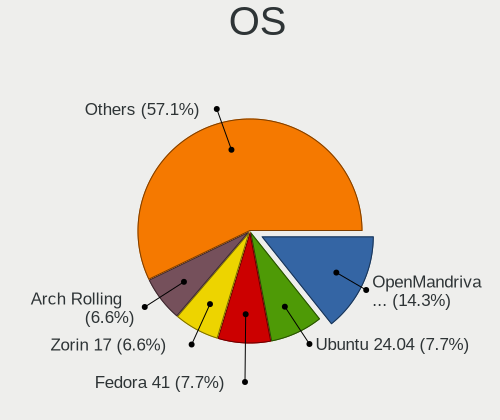
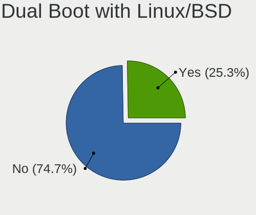
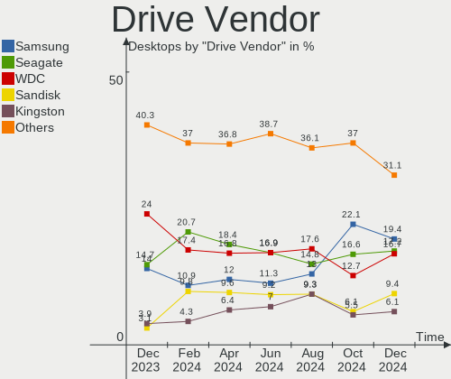
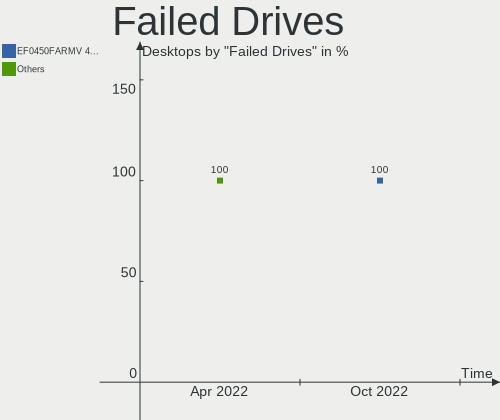
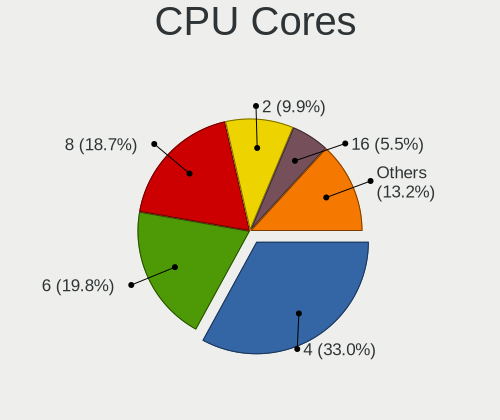
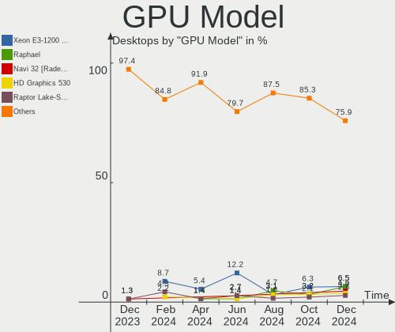
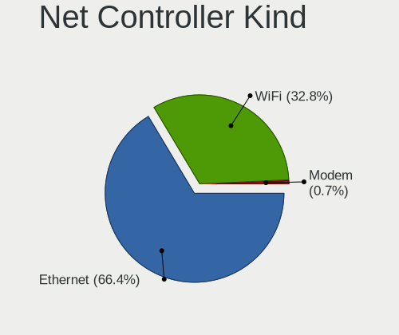
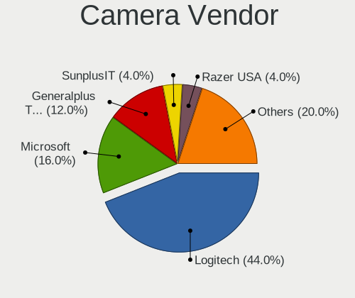

Linux in Canada - Hardware Trends (Desktops)
--------------------------------------------

A project to identify most popular hardware characteristics and track their change
over time based on data collected by Linux users at https://Linux-Hardware.org.

Anyone can contribute to this report by the [hw-probe](https://github.com/linuxhw/hw-probe) tool:

    sudo -E hw-probe -all -upload

Period: Oct, 2022.

Contents
--------

* [ System ](#system)
  - [ OS                       ](#os)
  - [ OS Family                ](#os-family)
  - [ Kernel                   ](#kernel)
  - [ Kernel Family            ](#kernel-family)
  - [ Kernel Major Ver.        ](#kernel-major-ver)
  - [ Arch                     ](#arch)
  - [ DE                       ](#de)
  - [ Display Server           ](#display-server)
  - [ Display Manager          ](#display-manager)
  - [ OS Lang                  ](#os-lang)
  - [ Boot Mode                ](#boot-mode)
  - [ Filesystem               ](#filesystem)
  - [ Part. scheme             ](#part-scheme)
  - [ Dual Boot with Linux/BSD ](#dual-boot-with-linuxbsd)
  - [ Dual Boot (Win)          ](#dual-boot-win)

* [ Board ](#board)
  - [ Vendor                   ](#vendor)
  - [ Model                    ](#model)
  - [ Model Family             ](#model-family)
  - [ MFG Year                 ](#mfg-year)
  - [ Form Factor              ](#form-factor)
  - [ Secure Boot              ](#secure-boot)
  - [ Coreboot                 ](#coreboot)
  - [ RAM Size                 ](#ram-size)
  - [ RAM Used                 ](#ram-used)
  - [ Total Drives             ](#total-drives)
  - [ Has CD-ROM               ](#has-cd-rom)
  - [ Has Ethernet             ](#has-ethernet)
  - [ Has WiFi                 ](#has-wifi)
  - [ Has Bluetooth            ](#has-bluetooth)

* [ Location ](#location)
  - [ Country                  ](#country)
  - [ City                     ](#city)

* [ Drives ](#drives)
  - [ Drive Vendor             ](#drive-vendor)
  - [ Drive Model              ](#drive-model)
  - [ HDD Vendor               ](#hdd-vendor)
  - [ SSD Vendor               ](#ssd-vendor)
  - [ Drive Kind               ](#drive-kind)
  - [ Drive Connector          ](#drive-connector)
  - [ Drive Size               ](#drive-size)
  - [ Space Total              ](#space-total)
  - [ Space Used               ](#space-used)
  - [ Malfunc. Drives          ](#malfunc-drives)
  - [ Malfunc. Drive Vendor    ](#malfunc-drive-vendor)
  - [ Malfunc. HDD Vendor      ](#malfunc-hdd-vendor)
  - [ Malfunc. Drive Kind      ](#malfunc-drive-kind)
  - [ Failed Drives            ](#failed-drives)
  - [ Failed Drive Vendor      ](#failed-drive-vendor)
  - [ Drive Status             ](#drive-status)

* [ Storage controller ](#storage-controller)
  - [ Storage Vendor           ](#storage-vendor)
  - [ Storage Model            ](#storage-model)
  - [ Storage Kind             ](#storage-kind)

* [ Processor ](#processor)
  - [ CPU Vendor               ](#cpu-vendor)
  - [ CPU Model                ](#cpu-model)
  - [ CPU Model Family         ](#cpu-model-family)
  - [ CPU Cores                ](#cpu-cores)
  - [ CPU Sockets              ](#cpu-sockets)
  - [ CPU Threads              ](#cpu-threads)
  - [ CPU Op-Modes             ](#cpu-op-modes)
  - [ CPU Microcode            ](#cpu-microcode)
  - [ CPU Microarch            ](#cpu-microarch)

* [ Graphics ](#graphics)
  - [ GPU Vendor               ](#gpu-vendor)
  - [ GPU Model                ](#gpu-model)
  - [ GPU Combo                ](#gpu-combo)
  - [ GPU Driver               ](#gpu-driver)
  - [ GPU Memory               ](#gpu-memory)

* [ Monitor ](#monitor)
  - [ Monitor Vendor           ](#monitor-vendor)
  - [ Monitor Model            ](#monitor-model)
  - [ Monitor Resolution       ](#monitor-resolution)
  - [ Monitor Diagonal         ](#monitor-diagonal)
  - [ Monitor Width            ](#monitor-width)
  - [ Aspect Ratio             ](#aspect-ratio)
  - [ Monitor Area             ](#monitor-area)
  - [ Pixel Density            ](#pixel-density)
  - [ Multiple Monitors        ](#multiple-monitors)

* [ Network ](#network)
  - [ Net Controller Vendor    ](#net-controller-vendor)
  - [ Net Controller Model     ](#net-controller-model)
  - [ Wireless Vendor          ](#wireless-vendor)
  - [ Wireless Model           ](#wireless-model)
  - [ Ethernet Vendor          ](#ethernet-vendor)
  - [ Ethernet Model           ](#ethernet-model)
  - [ Net Controller Kind      ](#net-controller-kind)
  - [ Used Controller          ](#used-controller)
  - [ NICs                     ](#nics)
  - [ IPv6                     ](#ipv6)

* [ Bluetooth ](#bluetooth)
  - [ Bluetooth Vendor         ](#bluetooth-vendor)
  - [ Bluetooth Model          ](#bluetooth-model)

* [ Sound ](#sound)
  - [ Sound Vendor             ](#sound-vendor)
  - [ Sound Model              ](#sound-model)

* [ Memory ](#memory)
  - [ Memory Vendor            ](#memory-vendor)
  - [ Memory Model             ](#memory-model)
  - [ Memory Kind              ](#memory-kind)
  - [ Memory Form Factor       ](#memory-form-factor)
  - [ Memory Size              ](#memory-size)
  - [ Memory Speed             ](#memory-speed)

* [ Printers & scanners ](#printers--scanners)
  - [ Printer Vendor           ](#printer-vendor)
  - [ Printer Model            ](#printer-model)
  - [ Scanner Vendor           ](#scanner-vendor)
  - [ Scanner Model            ](#scanner-model)

* [ Camera ](#camera)
  - [ Camera Vendor            ](#camera-vendor)
  - [ Camera Model             ](#camera-model)

* [ Security ](#security)
  - [ Fingerprint Vendor       ](#fingerprint-vendor)
  - [ Fingerprint Model        ](#fingerprint-model)
  - [ Chipcard Vendor          ](#chipcard-vendor)
  - [ Chipcard Model           ](#chipcard-model)

* [ Unsupported ](#unsupported)
  - [ Unsupported Devices      ](#unsupported-devices)
  - [ Unsupported Device Types ](#unsupported-device-types)

System
------

OS
--

Installed operating systems

| Name                | Desktops | Percent |
|---------------------|----------|---------|
| Ubuntu 22.04        | 9        | 18.75%  |
| Pop!_OS 22.04       | 5        | 10.42%  |
| Zorin 16            | 4        | 8.33%   |
| OpenMandriva 4.50   | 3        | 6.25%   |
| Ubuntu 22.10        | 2        | 4.17%   |
| Ubuntu 20.04        | 2        | 4.17%   |
| Linux Mint 20.3     | 2        | 4.17%   |
| Gentoo 2.8          | 2        | 4.17%   |
| EndeavourOS Rolling | 2        | 4.17%   |
| Arch Rolling        | 2        | 4.17%   |
| Rocky Linux 8.6     | 1        | 2.08%   |
| Nobara 36           | 1        | 2.08%   |
| Manjaro             | 1        | 2.08%   |
| LMDE 5              | 1        | 2.08%   |
| Linux Mint 20.2     | 1        | 2.08%   |
| Linux Mint 20       | 1        | 2.08%   |
| Kubuntu 22.04       | 1        | 2.08%   |
| KDE neon 20.04      | 1        | 2.08%   |
| Kali 2022.3         | 1        | 2.08%   |
| Feren OS 20.04      | 1        | 2.08%   |
| Fedora 36           | 1        | 2.08%   |
| Debian 11           | 1        | 2.08%   |
| CentOS 7            | 1        | 2.08%   |
| Artix               | 1        | 2.08%   |
| ArcoLinux Rolling   | 1        | 2.08%   |

OS Family
---------

OS without a version

| Name         | Desktops | Percent |
|--------------|----------|---------|
| Ubuntu       | 13       | 27.08%  |
| Pop!_OS      | 5        | 10.42%  |
| Zorin        | 4        | 8.33%   |
| Linux Mint   | 4        | 8.33%   |
| OpenMandriva | 3        | 6.25%   |
| Gentoo       | 2        | 4.17%   |
| EndeavourOS  | 2        | 4.17%   |
| Arch         | 2        | 4.17%   |
| Rocky Linux  | 1        | 2.08%   |
| Nobara       | 1        | 2.08%   |
| Manjaro      | 1        | 2.08%   |
| LMDE         | 1        | 2.08%   |
| Kubuntu      | 1        | 2.08%   |
| KDE neon     | 1        | 2.08%   |
| Kali         | 1        | 2.08%   |
| Feren OS     | 1        | 2.08%   |
| Fedora       | 1        | 2.08%   |
| Debian       | 1        | 2.08%   |
| CentOS       | 1        | 2.08%   |
| Artix        | 1        | 2.08%   |
| ArcoLinux    | 1        | 2.08%   |

Kernel
------

Version of the Linux kernel

| Version                                 | Desktops | Percent |
|-----------------------------------------|----------|---------|
| 5.15.0-48-generic                       | 8        | 16.67%  |
| 5.15.0-52-generic                       | 7        | 14.58%  |
| 5.19.5-desktop-1omv4090                 | 3        | 6.25%   |
| 5.19.0-76051900-generic                 | 3        | 6.25%   |
| 5.15.0-50-generic                       | 3        | 6.25%   |
| 6.0.2-arch1-1                           | 2        | 4.17%   |
| 5.19.16-76051916-generic                | 2        | 4.17%   |
| 5.19.0-21-generic                       | 2        | 4.17%   |
| 6.0.1-arch2-1                           | 1        | 2.08%   |
| 6.0.0-zen1-1-zen                        | 1        | 2.08%   |
| 6.0.0                                   | 1        | 2.08%   |
| 5.4.0-131-generic                       | 1        | 2.08%   |
| 5.4.0-126-generic                       | 1        | 2.08%   |
| 5.4.0-122-generic                       | 1        | 2.08%   |
| 5.19.14-201.fsync.fc36.x86_64           | 1        | 2.08%   |
| 5.19.13-200.fc36.x86_64                 | 1        | 2.08%   |
| 5.18.12-arch1-1                         | 1        | 2.08%   |
| 5.18.0-kali5-amd64                      | 1        | 2.08%   |
| 5.15.74-3-MANJARO                       | 1        | 2.08%   |
| 5.15.72-gentoo                          | 1        | 2.08%   |
| 5.15.55-rt48-xanmod1-linux-xanmod-rt515 | 1        | 2.08%   |
| 5.15.0-47-generic                       | 1        | 2.08%   |
| 5.10.0-19-amd64                         | 1        | 2.08%   |
| 5.10.0-18-amd64                         | 1        | 2.08%   |
| 4.18.0-372.32.1.el8_6.x86_64            | 1        | 2.08%   |
| 3.10.0-1160.31.1.el7.x86_64             | 1        | 2.08%   |

Kernel Family
-------------

Linux kernel without a distro release

| Version | Desktops | Percent |
|---------|----------|---------|
| 5.15.0  | 19       | 39.58%  |
| 5.19.0  | 5        | 10.42%  |
| 5.4.0   | 3        | 6.25%   |
| 5.19.5  | 3        | 6.25%   |
| 6.0.2   | 2        | 4.17%   |
| 6.0.0   | 2        | 4.17%   |
| 5.19.16 | 2        | 4.17%   |
| 5.10.0  | 2        | 4.17%   |
| 6.0.1   | 1        | 2.08%   |
| 5.19.14 | 1        | 2.08%   |
| 5.19.13 | 1        | 2.08%   |
| 5.18.12 | 1        | 2.08%   |
| 5.18.0  | 1        | 2.08%   |
| 5.15.74 | 1        | 2.08%   |
| 5.15.72 | 1        | 2.08%   |
| 5.15.55 | 1        | 2.08%   |
| 4.18.0  | 1        | 2.08%   |
| 3.10.0  | 1        | 2.08%   |

Kernel Major Ver.
-----------------

Linux kernel major version

| Version | Desktops | Percent |
|---------|----------|---------|
| 5.15    | 22       | 45.83%  |
| 5.19    | 12       | 25%     |
| 6.0     | 5        | 10.42%  |
| 5.4     | 3        | 6.25%   |
| 5.18    | 2        | 4.17%   |
| 5.10    | 2        | 4.17%   |
| 4.18    | 1        | 2.08%   |
| 3.10    | 1        | 2.08%   |

Arch
----

OS architecture (x86_64, i586, etc.)

| Name   | Desktops | Percent |
|--------|----------|---------|
| x86_64 | 48       | 100%    |

DE
--

Desktop Environment

| Name       | Desktops | Percent |
|------------|----------|---------|
| GNOME      | 22       | 45.83%  |
| KDE5       | 12       | 25%     |
| X-Cinnamon | 4        | 8.33%   |
| Unknown    | 4        | 8.33%   |
| XFCE       | 2        | 4.17%   |
| MATE       | 2        | 4.17%   |
| i3         | 1        | 2.08%   |
| Cinnamon   | 1        | 2.08%   |

Display Server
--------------

X11 or Wayland

| Name    | Desktops | Percent |
|---------|----------|---------|
| X11     | 39       | 81.25%  |
| Wayland | 5        | 10.42%  |
| Tty     | 2        | 4.17%   |
| Unknown | 2        | 4.17%   |

Display Manager
---------------

SDDM, LightDM, etc.

| Name    | Desktops | Percent |
|---------|----------|---------|
| Unknown | 20       | 41.67%  |
| GDM3    | 12       | 25%     |
| SDDM    | 7        | 14.58%  |
| GDM     | 5        | 10.42%  |
| LightDM | 4        | 8.33%   |

OS Lang
-------

Language

| Lang    | Desktops | Percent |
|---------|----------|---------|
| en_CA   | 28       | 58.33%  |
| en_US   | 10       | 20.83%  |
| fr_CA   | 7        | 14.58%  |
| en_IN   | 1        | 2.08%   |
| C       | 1        | 2.08%   |
| Unknown | 1        | 2.08%   |

Boot Mode
---------

EFI or BIOS

| Mode | Desktops | Percent |
|------|----------|---------|
| BIOS | 30       | 62.5%   |
| EFI  | 18       | 37.5%   |

Filesystem
----------

Type of filesystem

| Type    | Desktops | Percent |
|---------|----------|---------|
| Ext4    | 39       | 81.25%  |
| Btrfs   | 5        | 10.42%  |
| Overlay | 3        | 6.25%   |
| Xfs     | 1        | 2.08%   |

Part. scheme
------------

Scheme of partitioning

| Type    | Desktops | Percent |
|---------|----------|---------|
| GPT     | 25       | 52.08%  |
| Unknown | 17       | 35.42%  |
| MBR     | 6        | 12.5%   |

Dual Boot with Linux/BSD
------------------------

Hosting more than one Linux/BSD

| Dual boot | Desktops | Percent |
|-----------|----------|---------|
| No        | 38       | 79.17%  |
| Yes       | 10       | 20.83%  |

Dual Boot (Win)
---------------

Hosting Linux and Windows

| Dual boot | Desktops | Percent |
|-----------|----------|---------|
| No        | 37       | 77.08%  |
| Yes       | 11       | 22.92%  |

Board
-----

Vendor
------

Motherboard manufacturer

| Name                | Desktops | Percent |
|---------------------|----------|---------|
| ASUSTek Computer    | 14       | 29.17%  |
| ASRock              | 7        | 14.58%  |
| Lenovo              | 5        | 10.42%  |
| Dell                | 5        | 10.42%  |
| MSI                 | 4        | 8.33%   |
| Gigabyte Technology | 4        | 8.33%   |
| Hewlett-Packard     | 3        | 6.25%   |
| Pegatron            | 2        | 4.17%   |
| Alienware           | 2        | 4.17%   |
| Intel               | 1        | 2.08%   |
| Acer                | 1        | 2.08%   |

Model
-----

Motherboard model

| Name                                | Desktops | Percent |
|-------------------------------------|----------|---------|
| Pegatron h8-1549                    | 1        | 2.08%   |
| Pegatron h8-1503                    | 1        | 2.08%   |
| MSI MS-7C91                         | 1        | 2.08%   |
| MSI MS-7C80                         | 1        | 2.08%   |
| MSI MS-7B09                         | 1        | 2.08%   |
| MSI MS-7A37                         | 1        | 2.08%   |
| Lenovo ThinkStation P910 30B8S0EN00 | 1        | 2.08%   |
| Lenovo ThinkCentre M93p 10A9000SUS  | 1        | 2.08%   |
| Lenovo ThinkCentre M92p 2988D9U     | 1        | 2.08%   |
| Lenovo ThinkCentre M73 10AXS0FX01   | 1        | 2.08%   |
| Lenovo ThinkCentre A57 9851CDF      | 1        | 2.08%   |
| Intel D33217GKE G76540-201          | 1        | 2.08%   |
| HP ProLiant ML310e Gen8 v2          | 1        | 2.08%   |
| HP EliteDesk 800 G1 TWR             | 1        | 2.08%   |
| HP 410-019                          | 1        | 2.08%   |
| Gigabyte Z370P D3                   | 1        | 2.08%   |
| Gigabyte X470 AORUS ULTRA GAMING    | 1        | 2.08%   |
| Gigabyte GA-990FXA-UD5              | 1        | 2.08%   |
| Gigabyte B450 AORUS PRO WIFI        | 1        | 2.08%   |
| Dell Vostro 430                     | 1        | 2.08%   |
| Dell Precision T7600                | 1        | 2.08%   |
| Dell Precision T1650                | 1        | 2.08%   |
| Dell OptiPlex 740 Enhanced          | 1        | 2.08%   |
| Dell Inspiron 3847                  | 1        | 2.08%   |
| ASUS TUF Gaming X570-PRO            | 1        | 2.08%   |
| ASUS ROG STRIX X670E-I GAMING WIFI  | 1        | 2.08%   |
| ASUS ROG STRIX B450-F GAMING        | 1        | 2.08%   |
| ASUS ROG CROSSHAIR VIII HERO        | 1        | 2.08%   |
| ASUS ROG CROSSHAIR VII HERO         | 1        | 2.08%   |
| ASUS PRIME Z690-A                   | 1        | 2.08%   |
| ASUS PRIME H370-A                   | 1        | 2.08%   |
| ASUS PRIME A320I-K                  | 1        | 2.08%   |
| ASUS P8H77-M                        | 1        | 2.08%   |
| ASUS M5A99X EVO R2.0                | 1        | 2.08%   |
| ASUS M4A89GTD-PRO/USB3              | 1        | 2.08%   |
| ASUS K30AD_M31AD_M51AD              | 1        | 2.08%   |
| ASUS Crosshair V Formula            | 1        | 2.08%   |
| ASUS All Series                     | 1        | 2.08%   |
| ASRock Z97 Anniversary              | 1        | 2.08%   |
| ASRock Z77 Extreme3                 | 1        | 2.08%   |

Model Family
------------

Motherboard model prefix

| Name                   | Desktops | Percent |
|------------------------|----------|---------|
| Lenovo ThinkCentre     | 4        | 8.33%   |
| ASUS ROG               | 4        | 8.33%   |
| ASUS PRIME             | 3        | 6.25%   |
| Dell Precision         | 2        | 4.17%   |
| ASRock X570            | 2        | 4.17%   |
| Pegatron h8-1549       | 1        | 2.08%   |
| Pegatron h8-1503       | 1        | 2.08%   |
| MSI MS-7C91            | 1        | 2.08%   |
| MSI MS-7C80            | 1        | 2.08%   |
| MSI MS-7B09            | 1        | 2.08%   |
| MSI MS-7A37            | 1        | 2.08%   |
| Lenovo ThinkStation    | 1        | 2.08%   |
| Intel D33217GKE        | 1        | 2.08%   |
| HP ProLiant            | 1        | 2.08%   |
| HP EliteDesk           | 1        | 2.08%   |
| HP 410-019             | 1        | 2.08%   |
| Gigabyte Z370P         | 1        | 2.08%   |
| Gigabyte X470          | 1        | 2.08%   |
| Gigabyte GA-990FXA-UD5 | 1        | 2.08%   |
| Gigabyte B450          | 1        | 2.08%   |
| Dell Vostro            | 1        | 2.08%   |
| Dell OptiPlex          | 1        | 2.08%   |
| Dell Inspiron          | 1        | 2.08%   |
| ASUS TUF               | 1        | 2.08%   |
| ASUS P8H77-M           | 1        | 2.08%   |
| ASUS M5A99X            | 1        | 2.08%   |
| ASUS M4A89GTD-PRO      | 1        | 2.08%   |
| ASUS K30AD             | 1        | 2.08%   |
| ASUS Crosshair         | 1        | 2.08%   |
| ASUS All               | 1        | 2.08%   |
| ASRock Z97             | 1        | 2.08%   |
| ASRock Z77             | 1        | 2.08%   |
| ASRock Z270            | 1        | 2.08%   |
| ASRock B550M           | 1        | 2.08%   |
| ASRock B365M           | 1        | 2.08%   |
| Alienware X51          | 1        | 2.08%   |
| Alienware Aurora       | 1        | 2.08%   |
| Acer Aspire            | 1        | 2.08%   |

MFG Year
--------

Motherboard manufacture year

| Year | Desktops | Percent |
|------|----------|---------|
| 2020 | 6        | 12.5%   |
| 2013 | 6        | 12.5%   |
| 2019 | 5        | 10.42%  |
| 2018 | 5        | 10.42%  |
| 2014 | 5        | 10.42%  |
| 2017 | 4        | 8.33%   |
| 2012 | 4        | 8.33%   |
| 2021 | 3        | 6.25%   |
| 2011 | 3        | 6.25%   |
| 2022 | 2        | 4.17%   |
| 2016 | 1        | 2.08%   |
| 2015 | 1        | 2.08%   |
| 2010 | 1        | 2.08%   |
| 2009 | 1        | 2.08%   |
| 2008 | 1        | 2.08%   |

Form Factor
-----------

Physical design of the computer

| Name    | Desktops | Percent |
|---------|----------|---------|
| Desktop | 48       | 100%    |

Secure Boot
-----------

Enabled or disabled

| State    | Desktops | Percent |
|----------|----------|---------|
| Disabled | 47       | 97.92%  |
| Enabled  | 1        | 2.08%   |

Coreboot
--------

Have coreboot on board

| Used | Desktops | Percent |
|------|----------|---------|
| No   | 48       | 100%    |

RAM Size
--------

Total RAM memory

| Size in GB  | Desktops | Percent |
|-------------|----------|---------|
| 32.01-64.0  | 16       | 33.33%  |
| 16.01-24.0  | 15       | 31.25%  |
| 8.01-16.0   | 8        | 16.67%  |
| 64.01-256.0 | 6        | 12.5%   |
| 3.01-4.0    | 1        | 2.08%   |
| 24.01-32.0  | 1        | 2.08%   |
| 1.01-2.0    | 1        | 2.08%   |

RAM Used
--------

Used RAM memory

| Used GB     | Desktops | Percent |
|-------------|----------|---------|
| 2.01-3.0    | 14       | 29.17%  |
| 4.01-8.0    | 10       | 20.83%  |
| 3.01-4.0    | 10       | 20.83%  |
| 1.01-2.0    | 8        | 16.67%  |
| 8.01-16.0   | 2        | 4.17%   |
| 0.51-1.0    | 2        | 4.17%   |
| 64.01-256.0 | 1        | 2.08%   |
| 0.01-0.5    | 1        | 2.08%   |

Total Drives
------------

Number of drives on board

| Drives | Desktops | Percent |
|--------|----------|---------|
| 1      | 14       | 29.17%  |
| 2      | 11       | 22.92%  |
| 3      | 8        | 16.67%  |
| 4      | 6        | 12.5%   |
| 5      | 3        | 6.25%   |
| 10     | 2        | 4.17%   |
| 6      | 2        | 4.17%   |
| 11     | 1        | 2.08%   |
| 8      | 1        | 2.08%   |

Has CD-ROM
----------

Has CD-ROM on board

| Presented | Desktops | Percent |
|-----------|----------|---------|
| No        | 26       | 54.17%  |
| Yes       | 22       | 45.83%  |

Has Ethernet
------------

Has Ethernet on board

| Presented | Desktops | Percent |
|-----------|----------|---------|
| Yes       | 48       | 100%    |

Has WiFi
--------

Has WiFi module

| Presented | Desktops | Percent |
|-----------|----------|---------|
| Yes       | 25       | 52.08%  |
| No        | 23       | 47.92%  |

Has Bluetooth
-------------

Has Bluetooth module

| Presented | Desktops | Percent |
|-----------|----------|---------|
| Yes       | 24       | 50%     |
| No        | 24       | 50%     |

Location
--------

Country
-------

Geographic location (country)

| Country | Desktops | Percent |
|---------|----------|---------|
| Canada  | 48       | 100%    |

City
----

Geographic location (city)

| City            | Desktops | Percent |
|-----------------|----------|---------|
| Toronto         | 7        | 14.58%  |
| Montreal        | 4        | 8.33%   |
| Regina          | 3        | 6.25%   |
| Vancouver       | 2        | 4.17%   |
| Saskatoon       | 2        | 4.17%   |
| Edmonton        | 2        | 4.17%   |
| Victoria        | 1        | 2.08%   |
| Surrey          | 1        | 2.08%   |
| Sarnia          | 1        | 2.08%   |
| Saguenay        | 1        | 2.08%   |
| Repentigny      | 1        | 2.08%   |
| Red Deer        | 1        | 2.08%   |
| Québec         | 1        | 2.08%   |
| Pilot Mound     | 1        | 2.08%   |
| Otterburn Park  | 1        | 2.08%   |
| Ottawa          | 1        | 2.08%   |
| Oshawa          | 1        | 2.08%   |
| Oromocto        | 1        | 2.08%   |
| Oakville        | 1        | 2.08%   |
| North Vancouver | 1        | 2.08%   |
| Milton          | 1        | 2.08%   |
| London          | 1        | 2.08%   |
| Lachine         | 1        | 2.08%   |
| Knowlton        | 1        | 2.08%   |
| Kitchener       | 1        | 2.08%   |
| Kingston        | 1        | 2.08%   |
| Kelowna         | 1        | 2.08%   |
| Halifax         | 1        | 2.08%   |
| Guelph          | 1        | 2.08%   |
| Gatineau        | 1        | 2.08%   |
| Fort St. John   | 1        | 2.08%   |
| Etobicoke       | 1        | 2.08%   |
| Drummondville   | 1        | 2.08%   |
| Calgary         | 1        | 2.08%   |

Drives
------

Drive Vendor
------------

Hard drive vendors

| Vendor                      | Desktops | Drives  | Percent |
|-----------------------------|----------|---------|---------|
| WDC                         | 22       | 30      | 20.37%  |
| Seagate                     | 20       | 29      | 18.52%  |
| Samsung Electronics         | 17       | 25      | 15.74%  |
| Kingston                    | 10       | 10      | 9.26%   |
| Toshiba                     | 6        | 6       | 5.56%   |
| Hitachi                     | 4        | 8       | 3.7%    |
| Sandisk                     | 3        | 3       | 2.78%   |
| Crucial                     | 3        | 4       | 2.78%   |
| Phison Electronics          | 2        | 3       | 1.85%   |
| OCZ                         | 2        | 2       | 1.85%   |
| Micron/Crucial Technology   | 2        | 2       | 1.85%   |
| Micron Technology           | 2        | 2       | 1.85%   |
| Kingston Technology Company | 2        | 2       | 1.85%   |
| Unknown                     | 1        | 1       | 0.93%   |
| Timetec                     | 1        | 1       | 0.93%   |
| SABRENT                     | 1        | 1       | 0.93%   |
| Realtek Semiconductor       | 1        | 1       | 0.93%   |
| PNY                         | 1        | 1       | 0.93%   |
| Phison                      | 1        | 1       | 0.93%   |
| Patriot                     | 1        | 1       | 0.93%   |
| Intel                       | 1        | 1       | 0.93%   |
| Hjwdz                       | 1        | Unknown | 0.93%   |
| HGST                        | 1        | 1       | 0.93%   |
| Hewlett-Packard             | 1        | 8       | 0.93%   |
| ADATA Technology            | 1        | 1       | 0.93%   |
| A-DATA Technology           | 1        | 1       | 0.93%   |

Drive Model
-----------

Hard drive models

| Model                                                | Desktops | Percent |
|------------------------------------------------------|----------|---------|
| Samsung NVMe SSD Controller SM981/PM981/PM983 500GB  | 5        | 3.88%   |
| WDC WDS100T2B0A-00SM50 1TB SSD                       | 3        | 2.33%   |
| WDC WD10EZEX-08WN4A0 1TB                             | 3        | 2.33%   |
| Toshiba DT01ACA200 2TB                               | 3        | 2.33%   |
| Seagate ST8000DM004-2CX188 8TB                       | 3        | 2.33%   |
| Kingston SA400S37240G 240GB SSD                      | 3        | 2.33%   |
| WDC WD4005FZBX-00K5WB0 4TB                           | 2        | 1.55%   |
| WDC WD2002FAEX-007BA0 2TB                            | 2        | 1.55%   |
| Seagate ST4000DM004-2CV104 4TB                       | 2        | 1.55%   |
| Seagate ST3000DM001-1CH166 3TB                       | 2        | 1.55%   |
| Sandisk WD Blue SN550 NVMe SSD 1TB                   | 2        | 1.55%   |
| Samsung SSD 870 EVO 1TB                              | 2        | 1.55%   |
| Samsung NVMe SSD Controller SM961/PM961/SM963 250GB  | 2        | 1.55%   |
| Samsung NVMe SSD Controller PM9A1/PM9A3/980PRO 250GB | 2        | 1.55%   |
| Kingston SV300S37A120G 120GB SSD                     | 2        | 1.55%   |
| WDC WDS500G2B0A-00SM50 500GB SSD                     | 1        | 0.78%   |
| WDC WDBNCE2500PNC 250GB SSD                          | 1        | 0.78%   |
| WDC WD80EZAZ-11TDBA0 8TB                             | 1        | 0.78%   |
| WDC WD40EZRZ-00GXCB0 4TB                             | 1        | 0.78%   |
| WDC WD40EFRX-68WT0N0 4TB                             | 1        | 0.78%   |
| WDC WD30EZRX-00MMMB0 3TB                             | 1        | 0.78%   |
| WDC WD20EZAZ-00GGJB0 2TB                             | 1        | 0.78%   |
| WDC WD20EARS-42S0XB0 2TB                             | 1        | 0.78%   |
| WDC WD2000FYYZ-01UL1B2 2TB                           | 1        | 0.78%   |
| WDC WD10JPVX-75JC3T0 1TB                             | 1        | 0.78%   |
| WDC WD10EZEX-22MFCA0 1TB                             | 1        | 0.78%   |
| WDC WD10EZEX-08M2NA0 1TB                             | 1        | 0.78%   |
| WDC WD10EZEX-00ZF5A0 1TB                             | 1        | 0.78%   |
| WDC WD10EACS-00D6B0 1TB                              | 1        | 0.78%   |
| WDC WD1003FZEX-00K3CA0 1TB                           | 1        | 0.78%   |
| WDC WD1002FAEX-00Z3A0 1TB                            | 1        | 0.78%   |
| WDC WD1001FALS-00J7B0 1TB                            | 1        | 0.78%   |
| Unknown SD/MMC/MS PRO 1TB                            | 1        | 0.78%   |
| Toshiba XG6 NVMe SSD Controller 512GB                | 1        | 0.78%   |
| Toshiba HDWQ140 4TB                                  | 1        | 0.78%   |
| Toshiba HDWD120 2TB                                  | 1        | 0.78%   |
| Timetec MS05 256GB SSD                               | 1        | 0.78%   |
| Seagate ST5000VN0001-1SF17X 5TB                      | 1        | 0.78%   |
| Seagate ST5000DM000-1FK178 5TB                       | 1        | 0.78%   |
| Seagate ST4000DX001-1CE168 4TB                       | 1        | 0.78%   |

HDD Vendor
----------

Hard disk drive vendors

| Vendor              | Desktops | Drives | Percent |
|---------------------|----------|--------|---------|
| Seagate             | 20       | 29     | 38.46%  |
| WDC                 | 18       | 25     | 34.62%  |
| Toshiba             | 5        | 5      | 9.62%   |
| Hitachi             | 4        | 8      | 7.69%   |
| Unknown             | 1        | 1      | 1.92%   |
| Samsung Electronics | 1        | 1      | 1.92%   |
| SABRENT             | 1        | 1      | 1.92%   |
| HGST                | 1        | 1      | 1.92%   |
| Hewlett-Packard     | 1        | 8      | 1.92%   |

SSD Vendor
----------

Solid state drive vendors

| Vendor              | Desktops | Drives | Percent |
|---------------------|----------|--------|---------|
| Kingston            | 9        | 9      | 29.03%  |
| Samsung Electronics | 7        | 10     | 22.58%  |
| WDC                 | 5        | 5      | 16.13%  |
| OCZ                 | 2        | 2      | 6.45%   |
| Micron Technology   | 2        | 2      | 6.45%   |
| Crucial             | 2        | 2      | 6.45%   |
| Timetec             | 1        | 1      | 3.23%   |
| PNY                 | 1        | 1      | 3.23%   |
| Patriot             | 1        | 1      | 3.23%   |
| A-DATA Technology   | 1        | 1      | 3.23%   |

Drive Kind
----------

HDD or SSD

| Kind    | Desktops | Drives  | Percent |
|---------|----------|---------|---------|
| HDD     | 35       | 79      | 42.17%  |
| SSD     | 26       | 34      | 31.33%  |
| NVMe    | 21       | 32      | 25.3%   |
| Unknown | 1        | Unknown | 1.2%    |

Drive Connector
---------------

SATA, SAS, NVMe, etc.

| Type | Desktops | Drives | Percent |
|------|----------|--------|---------|
| SATA | 42       | 108    | 60.87%  |
| NVMe | 21       | 32     | 30.43%  |
| SAS  | 6        | 5      | 8.7%    |

Drive Size
----------

Size of hard drive

| Size in TB | Desktops | Drives | Percent |
|------------|----------|--------|---------|
| 0.01-0.5   | 25       | 37     | 33.33%  |
| 0.51-1.0   | 21       | 28     | 28%     |
| 1.01-2.0   | 13       | 21     | 17.33%  |
| 3.01-4.0   | 8        | 10     | 10.67%  |
| 2.01-3.0   | 5        | 11     | 6.67%   |
| 4.01-10.0  | 3        | 6      | 4%      |

Space Total
-----------

Amount of disk space available on the file system

| Size in GB     | Desktops | Percent |
|----------------|----------|---------|
| More than 3000 | 9        | 18.75%  |
| 101-250        | 9        | 18.75%  |
| 1001-2000      | 8        | 16.67%  |
| 251-500        | 7        | 14.58%  |
| 501-1000       | 7        | 14.58%  |
| 51-100         | 3        | 6.25%   |
| 21-50          | 2        | 4.17%   |
| 1-20           | 2        | 4.17%   |
| 2001-3000      | 1        | 2.08%   |

Space Used
----------

Amount of used disk space

| Used GB        | Desktops | Percent |
|----------------|----------|---------|
| 1-20           | 14       | 29.17%  |
| 21-50          | 11       | 22.92%  |
| 101-250        | 6        | 12.5%   |
| 2001-3000      | 4        | 8.33%   |
| 501-1000       | 4        | 8.33%   |
| More than 3000 | 3        | 6.25%   |
| 51-100         | 3        | 6.25%   |
| 1001-2000      | 2        | 4.17%   |
| 251-500        | 1        | 2.08%   |

Malfunc. Drives
---------------

Drive models with a malfunction

| Model                          | Desktops | Drives | Percent |
|--------------------------------|----------|--------|---------|
| WDC WD40EFRX-68WT0N0 4TB       | 1        | 1      | 16.67%  |
| WDC WD30EZRX-00MMMB0 3TB       | 1        | 2      | 16.67%  |
| Seagate ST31500341AS 1TB       | 1        | 1      | 16.67%  |
| Seagate ST3000DM001-1ER166 3TB | 1        | 1      | 16.67%  |
| Seagate ST3000DM001-1CH166 3TB | 1        | 1      | 16.67%  |
| Seagate ST2000DM001-1CH164 2TB | 1        | 1      | 16.67%  |

Malfunc. Drive Vendor
---------------------

Vendors of faulty drives

| Vendor  | Desktops | Drives | Percent |
|---------|----------|--------|---------|
| Seagate | 3        | 4      | 60%     |
| WDC     | 2        | 3      | 40%     |

Malfunc. HDD Vendor
-------------------

Vendors of faulty HDD drives

| Vendor  | Desktops | Drives | Percent |
|---------|----------|--------|---------|
| Seagate | 3        | 4      | 60%     |
| WDC     | 2        | 3      | 40%     |

Malfunc. Drive Kind
-------------------

Kinds of faulty drives

| Kind | Desktops | Drives | Percent |
|------|----------|--------|---------|
| HDD  | 5        | 7      | 100%    |

Failed Drives
-------------

Failed drive models

| Model                             | Desktops | Drives | Percent |
|-----------------------------------|----------|--------|---------|
| Hewlett-Packard EF0450FARMV 450GB | 1        | 4      | 100%    |

Failed Drive Vendor
-------------------

Failed drive vendors

| Vendor          | Desktops | Drives | Percent |
|-----------------|----------|--------|---------|
| Hewlett-Packard | 1        | 4      | 100%    |

Drive Status
------------

Number of failed and malfunc. drives

| Status   | Desktops | Drives | Percent |
|----------|----------|--------|---------|
| Detected | 29       | 80     | 51.79%  |
| Works    | 21       | 54     | 37.5%   |
| Malfunc  | 5        | 7      | 8.93%   |
| Failed   | 1        | 4      | 1.79%   |

Storage controller
------------------

Storage Vendor
--------------

Storage controller vendors

| Vendor                       | Desktops | Percent |
|------------------------------|----------|---------|
| Intel                        | 28       | 34.57%  |
| AMD                          | 19       | 23.46%  |
| Samsung Electronics          | 11       | 13.58%  |
| SanDisk                      | 3        | 3.7%    |
| Phison Electronics           | 3        | 3.7%    |
| Micron/Crucial Technology    | 3        | 3.7%    |
| Kingston Technology Company  | 3        | 3.7%    |
| ASMedia Technology           | 3        | 3.7%    |
| Toshiba America Info Systems | 1        | 1.23%   |
| Realtek Semiconductor        | 1        | 1.23%   |
| Nvidia                       | 1        | 1.23%   |
| Marvell Technology Group     | 1        | 1.23%   |
| LSI Logic / Symbios Logic    | 1        | 1.23%   |
| JMicron Technology           | 1        | 1.23%   |
| Hewlett-Packard              | 1        | 1.23%   |
| ADATA Technology             | 1        | 1.23%   |

Storage Model
-------------

Storage controller models

| Model                                                                          | Desktops | Percent |
|--------------------------------------------------------------------------------|----------|---------|
| AMD FCH SATA Controller [AHCI mode]                                            | 12       | 12.5%   |
| Samsung NVMe SSD Controller SM981/PM981/PM983                                  | 7        | 7.29%   |
| Intel 8 Series/C220 Series Chipset Family 6-port SATA Controller 1 [AHCI mode] | 6        | 6.25%   |
| AMD 400 Series Chipset SATA Controller                                         | 5        | 5.21%   |
| Intel SATA Controller [RAID mode]                                              | 4        | 4.17%   |
| Intel 7 Series/C210 Series Chipset Family 6-port SATA Controller [AHCI mode]   | 4        | 4.17%   |
| AMD SB7x0/SB8x0/SB9x0 SATA Controller [AHCI mode]                              | 4        | 4.17%   |
| Samsung NVMe SSD Controller SM961/PM961/SM963                                  | 3        | 3.13%   |
| Intel 200 Series PCH SATA controller [AHCI mode]                               | 3        | 3.13%   |
| ASMedia ASM1062 Serial ATA Controller                                          | 3        | 3.13%   |
| SanDisk WD Blue SN550 NVMe SSD                                                 | 2        | 2.08%   |
| Samsung NVMe SSD Controller PM9A1/PM9A3/980PRO                                 | 2        | 2.08%   |
| Phison E16 PCIe4 NVMe Controller                                               | 2        | 2.08%   |
| Micron/Crucial P1 NVMe PCIe SSD                                                | 2        | 2.08%   |
| Intel C610/X99 series chipset 6-Port SATA Controller [AHCI mode]               | 2        | 2.08%   |
| AMD 500 Series Chipset SATA Controller                                         | 2        | 2.08%   |
| Toshiba America Info Systems XG6 NVMe SSD Controller                           | 1        | 1.04%   |
| SanDisk WD Black SN750 / PC SN730 NVMe SSD                                     | 1        | 1.04%   |
| Realtek RTS5763DL NVMe SSD Controller                                          | 1        | 1.04%   |
| Phison E12 NVMe Controller                                                     | 1        | 1.04%   |
| Nvidia MCP51 Serial ATA Controller                                             | 1        | 1.04%   |
| Micron/Crucial P2 NVMe PCIe SSD                                                | 1        | 1.04%   |
| Marvell Group 88SE9172 SATA 6Gb/s Controller                                   | 1        | 1.04%   |
| LSI Logic / Symbios Logic MegaRAID SAS 2008 [Falcon]                           | 1        | 1.04%   |
| Kingston Company U-SNS8154P3 NVMe SSD                                          | 1        | 1.04%   |
| Kingston Company Company Non-Volatile memory controller                        | 1        | 1.04%   |
| Kingston Company A2000 NVMe SSD                                                | 1        | 1.04%   |
| JMicron JMB361 AHCI/IDE                                                        | 1        | 1.04%   |
| Intel Volume Management Device NVMe RAID Controller                            | 1        | 1.04%   |
| Intel SSD 600P Series                                                          | 1        | 1.04%   |
| Intel Q170/Q150/B150/H170/H110/Z170/CM236 Chipset SATA Controller [AHCI Mode]  | 1        | 1.04%   |
| Intel NM10/ICH7 Family SATA Controller [IDE mode]                              | 1        | 1.04%   |
| Intel Comet Lake SATA AHCI Controller                                          | 1        | 1.04%   |
| Intel C610/X99 series chipset sSATA Controller [IDE mode]                      | 1        | 1.04%   |
| Intel C610/X99 series chipset sSATA Controller [AHCI mode]                     | 1        | 1.04%   |
| Intel C610/X99 series chipset IDE-r Controller                                 | 1        | 1.04%   |
| Intel C600/X79 series chipset 6-Port SATA AHCI Controller                      | 1        | 1.04%   |
| Intel Alder Lake-S PCH SATA Controller [AHCI Mode]                             | 1        | 1.04%   |
| Intel 9 Series Chipset Family SATA Controller [AHCI Mode]                      | 1        | 1.04%   |
| Intel 82801G (ICH7 Family) IDE Controller                                      | 1        | 1.04%   |

Storage Kind
------------

Kind of storage controller (IDE, SATA, NVMe, SAS, ...)

| Kind | Desktops | Percent |
|------|----------|---------|
| SATA | 41       | 56.16%  |
| NVMe | 21       | 28.77%  |
| RAID | 7        | 9.59%   |
| IDE  | 4        | 5.48%   |

Processor
---------

CPU Vendor
----------

Processor vendors

| Vendor | Desktops | Percent |
|--------|----------|---------|
| Intel  | 28       | 58.33%  |
| AMD    | 20       | 41.67%  |

CPU Model
---------

Processor models

| Model                                           | Desktops | Percent |
|-------------------------------------------------|----------|---------|
| Intel Core i7-3770 CPU @ 3.40GHz                | 4        | 8.33%   |
| Intel Core i7-4790 CPU @ 3.60GHz                | 3        | 6.25%   |
| AMD Ryzen 7 3800X 8-Core Processor              | 2        | 4.17%   |
| AMD Ryzen 7 2700X Eight-Core Processor          | 2        | 4.17%   |
| Intel Xeon CPU E5-2680 0 @ 2.70GHz              | 1        | 2.08%   |
| Intel Xeon CPU E5-2640 v4 @ 2.40GHz             | 1        | 2.08%   |
| Intel Xeon CPU E3-1270 V2 @ 3.50GHz             | 1        | 2.08%   |
| Intel Xeon CPU E3-1230 v3 @ 3.30GHz             | 1        | 2.08%   |
| Intel Core i7-8700K CPU @ 3.70GHz               | 1        | 2.08%   |
| Intel Core i7-8086K CPU @ 4.00GHz               | 1        | 2.08%   |
| Intel Core i7-7700K CPU @ 4.20GHz               | 1        | 2.08%   |
| Intel Core i7-5930K CPU @ 3.50GHz               | 1        | 2.08%   |
| Intel Core i7-4790T CPU @ 2.70GHz               | 1        | 2.08%   |
| Intel Core i7-4770 CPU @ 3.40GHz                | 1        | 2.08%   |
| Intel Core i7-10700K CPU @ 3.80GHz              | 1        | 2.08%   |
| Intel Core i7 CPU 860 @ 2.80GHz                 | 1        | 2.08%   |
| Intel Core i5-9400 CPU @ 2.90GHz                | 1        | 2.08%   |
| Intel Core i5-6400 CPU @ 2.70GHz                | 1        | 2.08%   |
| Intel Core i5-4570 CPU @ 3.20GHz                | 1        | 2.08%   |
| Intel Core i5-4460 CPU @ 3.20GHz                | 1        | 2.08%   |
| Intel Core i5-4430 CPU @ 3.00GHz                | 1        | 2.08%   |
| Intel Core i5-3570K CPU @ 3.40GHz               | 1        | 2.08%   |
| Intel Core i3-3217U CPU @ 1.80GHz               | 1        | 2.08%   |
| Intel Core 2 Duo CPU E8200 @ 2.66GHz            | 1        | 2.08%   |
| Intel 12th Gen Core i9-12900KF                  | 1        | 2.08%   |
| AMD Ryzen Threadripper 2970WX 24-Core Processor | 1        | 2.08%   |
| AMD Ryzen 9 7950X 16-Core Processor             | 1        | 2.08%   |
| AMD Ryzen 9 5900X 12-Core Processor             | 1        | 2.08%   |
| AMD Ryzen 9 3950X 16-Core Processor             | 1        | 2.08%   |
| AMD Ryzen 7 5700X 8-Core Processor              | 1        | 2.08%   |
| AMD Ryzen 7 3700X 8-Core Processor              | 1        | 2.08%   |
| AMD Ryzen 7 2700 Eight-Core Processor           | 1        | 2.08%   |
| AMD Ryzen 7 1800X Eight-Core Processor          | 1        | 2.08%   |
| AMD Ryzen 5 2600X Six-Core Processor            | 1        | 2.08%   |
| AMD Ryzen 5 2600 Six-Core Processor             | 1        | 2.08%   |
| AMD Ryzen 5 1600 Six-Core Processor             | 1        | 2.08%   |
| AMD Phenom II X6 1100T Processor                | 1        | 2.08%   |
| AMD Phenom II X6 1090T Processor                | 1        | 2.08%   |
| AMD FX-8350 Eight-Core Processor                | 1        | 2.08%   |
| AMD FX-8320 Eight-Core Processor                | 1        | 2.08%   |

CPU Model Family
----------------

Processor model prefix

| Model                  | Desktops | Percent |
|------------------------|----------|---------|
| Intel Core i7          | 15       | 31.25%  |
| AMD Ryzen 7            | 8        | 16.67%  |
| Intel Core i5          | 6        | 12.5%   |
| Intel Xeon             | 4        | 8.33%   |
| AMD Ryzen 9            | 3        | 6.25%   |
| AMD Ryzen 5            | 3        | 6.25%   |
| AMD Phenom II X6       | 2        | 4.17%   |
| AMD FX                 | 2        | 4.17%   |
| Other                  | 1        | 2.08%   |
| Intel Core i3          | 1        | 2.08%   |
| Intel Core 2 Duo       | 1        | 2.08%   |
| AMD Ryzen Threadripper | 1        | 2.08%   |
| AMD Athlon 64 X2       | 1        | 2.08%   |

CPU Cores
---------

Number of processor cores

| Number | Desktops | Percent |
|--------|----------|---------|
| 4      | 20       | 41.67%  |
| 8      | 9        | 18.75%  |
| 6      | 9        | 18.75%  |
| 16     | 4        | 8.33%   |
| 2      | 3        | 6.25%   |
| 24     | 1        | 2.08%   |
| 20     | 1        | 2.08%   |
| 12     | 1        | 2.08%   |

CPU Sockets
-----------

Number of sockets

| Number | Desktops | Percent |
|--------|----------|---------|
| 1      | 46       | 95.83%  |
| 2      | 2        | 4.17%   |

CPU Threads
-----------

Threads per core (Hyper-Threading)

| Number | Desktops | Percent |
|--------|----------|---------|
| 2      | 37       | 77.08%  |
| 1      | 11       | 22.92%  |

CPU Op-Modes
------------

CPU Operation Modes (32-bit, 64-bit)

| Op mode        | Desktops | Percent |
|----------------|----------|---------|
| 32-bit, 64-bit | 48       | 100%    |

CPU Microcode
-------------

Microcode number

| Number     | Desktops | Percent |
|------------|----------|---------|
| Unknown    | 17       | 35.42%  |
| 0x306c3    | 5        | 10.42%  |
| 0x306a9    | 4        | 8.33%   |
| 0x906ea    | 3        | 6.25%   |
| 0x0800820d | 3        | 6.25%   |
| 0x08001138 | 2        | 4.17%   |
| 0x06000852 | 2        | 4.17%   |
| 0x010000dc | 2        | 4.17%   |
| 0xa0655    | 1        | 2.08%   |
| 0x506e3    | 1        | 2.08%   |
| 0x406f1    | 1        | 2.08%   |
| 0x306f2    | 1        | 2.08%   |
| 0x206d7    | 1        | 2.08%   |
| 0x106e5    | 1        | 2.08%   |
| 0x0a601201 | 1        | 2.08%   |
| 0x0a201016 | 1        | 2.08%   |
| 0x08701021 | 1        | 2.08%   |
| 0x0800820b | 1        | 2.08%   |

CPU Microarch
-------------

Microarchitecture

| Name        | Desktops | Percent |
|-------------|----------|---------|
| Haswell     | 10       | 20.83%  |
| IvyBridge   | 7        | 14.58%  |
| Zen+        | 6        | 12.5%   |
| Zen 2       | 4        | 8.33%   |
| KabyLake    | 4        | 8.33%   |
| Zen 3       | 2        | 4.17%   |
| Zen         | 2        | 4.17%   |
| Piledriver  | 2        | 4.17%   |
| K10         | 2        | 4.17%   |
| Unknown     | 2        | 4.17%   |
| Skylake     | 1        | 2.08%   |
| SandyBridge | 1        | 2.08%   |
| Penryn      | 1        | 2.08%   |
| Nehalem     | 1        | 2.08%   |
| K8 Hammer   | 1        | 2.08%   |
| CometLake   | 1        | 2.08%   |
| Broadwell   | 1        | 2.08%   |

Graphics
--------

GPU Vendor
----------

Vendors of graphics cards

| Vendor                     | Desktops | Percent |
|----------------------------|----------|---------|
| Nvidia                     | 25       | 45.45%  |
| AMD                        | 18       | 32.73%  |
| Intel                      | 11       | 20%     |
| Matrox Electronics Systems | 1        | 1.82%   |

GPU Model
---------

Graphics card models

| Model                                                                       | Desktops | Percent |
|-----------------------------------------------------------------------------|----------|---------|
| Intel Xeon E3-1200 v3/4th Gen Core Processor Integrated Graphics Controller | 7        | 12.07%  |
| AMD Ellesmere [Radeon RX 470/480/570/570X/580/580X/590]                     | 4        | 6.9%    |
| AMD Navi 10 [Radeon RX 5600 OEM/5600 XT / 5700/5700 XT]                     | 3        | 5.17%   |
| Nvidia TU104 [GeForce RTX 2070 SUPER]                                       | 2        | 3.45%   |
| Nvidia GP107 [GeForce GTX 1050 Ti]                                          | 2        | 3.45%   |
| Nvidia GP104 [GeForce GTX 1070]                                             | 2        | 3.45%   |
| Nvidia GM107 [GeForce GTX 745]                                              | 2        | 3.45%   |
| Nvidia GK104 [GeForce GTX 670]                                              | 2        | 3.45%   |
| Intel IvyBridge GT2 [HD Graphics 4000]                                      | 2        | 3.45%   |
| AMD Navi 22 [Radeon RX 6700/6700 XT/6750 XT / 6800M]                        | 2        | 3.45%   |
| Nvidia TU117 [GeForce GTX 1650]                                             | 1        | 1.72%   |
| Nvidia TU116 [GeForce GTX 1660]                                             | 1        | 1.72%   |
| Nvidia TU116 [GeForce GTX 1660 Ti]                                          | 1        | 1.72%   |
| Nvidia TU116 [GeForce GTX 1650 SUPER]                                       | 1        | 1.72%   |
| Nvidia TU106 [GeForce RTX 2060 Rev. A]                                      | 1        | 1.72%   |
| Nvidia TU104 [GeForce RTX 2080 SUPER]                                       | 1        | 1.72%   |
| Nvidia GP108 [GeForce GT 1030]                                              | 1        | 1.72%   |
| Nvidia GP106 [GeForce GTX 1060 6GB]                                         | 1        | 1.72%   |
| Nvidia GP104 [GeForce GTX 1080]                                             | 1        | 1.72%   |
| Nvidia GM206 [GeForce GTX 960]                                              | 1        | 1.72%   |
| Nvidia GK107GL [Quadro K420]                                                | 1        | 1.72%   |
| Nvidia GF108GL [Quadro 600]                                                 | 1        | 1.72%   |
| Nvidia GF108 [GeForce GT 630]                                               | 1        | 1.72%   |
| Nvidia GA106 [GeForce RTX 3060]                                             | 1        | 1.72%   |
| Nvidia GA106 [Geforce RTX 3050]                                             | 1        | 1.72%   |
| Nvidia G84GL [Quadro FX 1700]                                               | 1        | 1.72%   |
| Matrox Electronics Systems MGA G200EH                                       | 1        | 1.72%   |
| Intel HD Graphics 530                                                       | 1        | 1.72%   |
| Intel 3rd Gen Core processor Graphics Controller                            | 1        | 1.72%   |
| AMD Vega 20 [Radeon VII]                                                    | 1        | 1.72%   |
| AMD Tobago PRO [Radeon R7 360 / R9 360 OEM]                                 | 1        | 1.72%   |
| AMD RV710 [Radeon HD 4350/4550]                                             | 1        | 1.72%   |
| AMD RV620 LE [Radeon HD 3450]                                               | 1        | 1.72%   |
| AMD RV610 [Radeon HD 2400 PRO/XT]                                           | 1        | 1.72%   |
| AMD Oland [Radeon HD 8570 / R5 430 OEM / R7 240/340 / Radeon 520 OEM]       | 1        | 1.72%   |
| AMD Oland PRO [Radeon R7 240/340 / Radeon 520]                              | 1        | 1.72%   |
| AMD Navi 21 [Radeon RX 6800/6800 XT / 6900 XT]                              | 1        | 1.72%   |
| AMD Lexa PRO [Radeon 540/540X/550/550X / RX 540X/550/550X]                  | 1        | 1.72%   |
| AMD Caicos [Radeon HD 6450/7450/8450 / R5 230 OEM]                          | 1        | 1.72%   |
| AMD Baffin [Radeon Pro WX 4100]                                             | 1        | 1.72%   |

GPU Combo
---------

Combinations of graphics cards

| Name         | Desktops | Percent |
|--------------|----------|---------|
| 1 x Nvidia   | 23       | 47.92%  |
| 1 x AMD      | 13       | 27.08%  |
| 1 x Intel    | 6        | 12.5%   |
| 2 x AMD      | 2        | 4.17%   |
| 2 x Nvidia   | 1        | 2.08%   |
| 1 x Matrox   | 1        | 2.08%   |
| Intel + AMD  | 1        | 2.08%   |
| AMD + Nvidia | 1        | 2.08%   |

GPU Driver
----------

Free vs proprietary

| Driver      | Desktops | Percent |
|-------------|----------|---------|
| Free        | 31       | 64.58%  |
| Proprietary | 16       | 33.33%  |
| Unknown     | 1        | 2.08%   |

GPU Memory
----------

Total video memory

| Size in GB | Desktops | Percent |
|------------|----------|---------|
| Unknown    | 21       | 43.75%  |
| 7.01-8.0   | 10       | 20.83%  |
| 3.01-4.0   | 5        | 10.42%  |
| 5.01-6.0   | 3        | 6.25%   |
| 1.01-2.0   | 3        | 6.25%   |
| 8.01-16.0  | 2        | 4.17%   |
| 0.51-1.0   | 2        | 4.17%   |
| 0.01-0.5   | 2        | 4.17%   |

Monitor
-------

Monitor Vendor
--------------

Monitor vendors

| Vendor               | Desktops | Percent |
|----------------------|----------|---------|
| Goldstar             | 10       | 17.54%  |
| Dell                 | 8        | 14.04%  |
| Acer                 | 6        | 10.53%  |
| Samsung Electronics  | 5        | 8.77%   |
| Hewlett-Packard      | 5        | 8.77%   |
| Ancor Communications | 4        | 7.02%   |
| ViewSonic            | 2        | 3.51%   |
| Sony                 | 2        | 3.51%   |
| Lenovo Group Limited | 2        | 3.51%   |
| ASUSTek Computer     | 2        | 3.51%   |
| Vizio                | 1        | 1.75%   |
| Unknown (AAA)        | 1        | 1.75%   |
| Unknown              | 1        | 1.75%   |
| Ruijiang             | 1        | 1.75%   |
| NEC Computers        | 1        | 1.75%   |
| LG Electronics       | 1        | 1.75%   |
| Gigabyte Technology  | 1        | 1.75%   |
| BenQ                 | 1        | 1.75%   |
| AUS                  | 1        | 1.75%   |
| AOD                  | 1        | 1.75%   |
| Unknown              | 1        | 1.75%   |

Monitor Model
-------------

Monitor models

| Model                                                                | Desktops | Percent |
|----------------------------------------------------------------------|----------|---------|
| Goldstar Ultra HD GSM5B08 3840x2160 600x340mm 27.2-inch              | 2        | 3.33%   |
| Vizio P552ui-B2 VIZ1010 3840x2160 708x398mm 32.0-inch                | 1        | 1.67%   |
| ViewSonic VX2452 Series VSCDE2E 1920x1080 521x293mm 23.5-inch        | 1        | 1.67%   |
| ViewSonic VG2230wm VSCA21E 1680x1050 474x296mm 22.0-inch             | 1        | 1.67%   |
| Unknown LCD Monitor SAMSUNG                                          | 1        | 1.67%   |
| Unknown (AAA) LCDTV AAA3393 1360x768 890x500mm 40.2-inch             | 1        | 1.67%   |
| Sony TV *00 SNYF303 1920x1080 1439x809mm 65.0-inch                   | 1        | 1.67%   |
| Sony LCD Monitor TV XV                                               | 1        | 1.67%   |
| Samsung Electronics SyncMaster SAM01B7 1280x1024 340x270mm 17.1-inch | 1        | 1.67%   |
| Samsung Electronics S32F351 SAM0D24 1920x1080 698x393mm 31.5-inch    | 1        | 1.67%   |
| Samsung Electronics S27C230 SAM0A86 1920x1080 598x336mm 27.0-inch    | 1        | 1.67%   |
| Samsung Electronics S24R35xFZ SAM71A8 1920x1080 527x296mm 23.8-inch  | 1        | 1.67%   |
| Samsung Electronics S24F350 SAM0D20 1920x1080 521x293mm 23.5-inch    | 1        | 1.67%   |
| Samsung Electronics LCD Monitor SAM07BC 1360x768 700x390mm 31.5-inch | 1        | 1.67%   |
| Ruijiang RJT HDMI RJT1200 1920x1200 320x180mm 14.5-inch              | 1        | 1.67%   |
| NEC Computers V423 NEC68AC 1920x1080 930x523mm 42.0-inch             | 1        | 1.67%   |
| LG Electronics LCD Monitor 47LV4400                                  | 1        | 1.67%   |
| Lenovo Group Limited LCD Monitor LEN S22e-19 3840x1080               | 1        | 1.67%   |
| Lenovo Group Limited LCD Monitor L2251x Wide 3600x1080               | 1        | 1.67%   |
| Lenovo Group Limited LCD Monitor L2251x Wide                         | 1        | 1.67%   |
| Hewlett-Packard LE1901w HWP2842 1440x900 410x256mm 19.0-inch         | 1        | 1.67%   |
| Hewlett-Packard 27es HWP3325 1920x1080 598x336mm 27.0-inch           | 1        | 1.67%   |
| Hewlett-Packard 27cw HWP3194 1920x1080 598x336mm 27.0-inch           | 1        | 1.67%   |
| Hewlett-Packard 24es HWP3321 1920x1080 527x296mm 23.8-inch           | 1        | 1.67%   |
| Hewlett-Packard 23xw HWP318A 1920x1080 509x286mm 23.0-inch           | 1        | 1.67%   |
| Goldstar W2052 GSM4E89 1680x1050 474x296mm 22.0-inch                 | 1        | 1.67%   |
| Goldstar ULTRAGEAR GSM774B 3440x1440 800x335mm 34.1-inch             | 1        | 1.67%   |
| Goldstar ULTRAGEAR GSM5BB2 1920x1080 527x296mm 23.8-inch             | 1        | 1.67%   |
| Goldstar Ultra HD GSM5B09 3840x2160 600x340mm 27.2-inch              | 1        | 1.67%   |
| Goldstar L226W GSM566A 1680x1050 474x296mm 22.0-inch                 | 1        | 1.67%   |
| Goldstar L1953T GSM4B46 1280x1024 338x270mm 17.0-inch                | 1        | 1.67%   |
| Goldstar HDR QHD GSM5B95 2560x1440 698x392mm 31.5-inch               | 1        | 1.67%   |
| Goldstar HD GSM5ACC 1366x768 410x230mm 18.5-inch                     | 1        | 1.67%   |
| Gigabyte Technology G27Q GBT2709 2560x1440 598x336mm 27.0-inch       | 1        | 1.67%   |
| Dell S3220DGF DELD0F4 2560x1440 697x392mm 31.5-inch                  | 1        | 1.67%   |
| Dell S2721DGF DEL41D9 2560x1440 597x336mm 27.0-inch                  | 1        | 1.67%   |
| Dell P2419H DELD0D8 1920x1080 527x296mm 23.8-inch                    | 1        | 1.67%   |
| Dell P2416D DELA0C4 2560x1440 530x300mm 24.0-inch                    | 1        | 1.67%   |
| Dell E2310H DELD033 1920x1080 510x287mm 23.0-inch                    | 1        | 1.67%   |
| Dell E228WFP DELD015 1680x1050 473x296mm 22.0-inch                   | 1        | 1.67%   |

Monitor Resolution
------------------

Monitor screen resolution

| Resolution         | Desktops | Percent |
|--------------------|----------|---------|
| 1920x1080 (FHD)    | 20       | 37.74%  |
| 2560x1440 (QHD)    | 7        | 13.21%  |
| 3840x2160 (4K)     | 4        | 7.55%   |
| 1680x1050 (WSXGA+) | 4        | 7.55%   |
| 1280x1024 (SXGA)   | 3        | 5.66%   |
| Unknown            | 3        | 5.66%   |
| 3440x1440          | 2        | 3.77%   |
| 2560x1080          | 2        | 3.77%   |
| 5760x1080          | 1        | 1.89%   |
| 3840x1080          | 1        | 1.89%   |
| 3600x1080          | 1        | 1.89%   |
| 1600x900 (HD+)     | 1        | 1.89%   |
| 1600x1200          | 1        | 1.89%   |
| 1440x900 (WXGA+)   | 1        | 1.89%   |
| 1366x768 (WXGA)    | 1        | 1.89%   |
| 1360x768           | 1        | 1.89%   |

Monitor Diagonal
----------------

Diagonal size in inches

| Inches  | Desktops | Percent |
|---------|----------|---------|
| 27      | 11       | 20%     |
| 23      | 9        | 16.36%  |
| 31      | 5        | 9.09%   |
| 24      | 5        | 9.09%   |
| 22      | 4        | 7.27%   |
| Unknown | 3        | 5.45%   |
| 34      | 2        | 3.64%   |
| 21      | 2        | 3.64%   |
| 19      | 2        | 3.64%   |
| 17      | 2        | 3.64%   |
| 86      | 1        | 1.82%   |
| 75      | 1        | 1.82%   |
| 42      | 1        | 1.82%   |
| 40      | 1        | 1.82%   |
| 36      | 1        | 1.82%   |
| 35      | 1        | 1.82%   |
| 32      | 1        | 1.82%   |
| 28      | 1        | 1.82%   |
| 20      | 1        | 1.82%   |
| 18      | 1        | 1.82%   |

Monitor Width
-------------

Physical width

| Width in mm | Desktops | Percent |
|-------------|----------|---------|
| 501-600     | 21       | 42%     |
| 401-500     | 8        | 16%     |
| 601-700     | 6        | 12%     |
| 801-900     | 3        | 6%      |
| 701-800     | 3        | 6%      |
| Unknown     | 3        | 6%      |
| 301-350     | 2        | 4%      |
| 1501-2000   | 2        | 4%      |
| 351-400     | 1        | 2%      |
| 901-1000    | 1        | 2%      |

Aspect Ratio
------------

Proportional relationship between the width and the height

| Ratio   | Desktops | Percent |
|---------|----------|---------|
| 16/9    | 32       | 68.09%  |
| 16/10   | 5        | 10.64%  |
| 21/9    | 4        | 8.51%   |
| 5/4     | 3        | 6.38%   |
| Unknown | 3        | 6.38%   |

Monitor Area
------------

Area in inch²

| Area in inch² | Desktops | Percent |
|----------------|----------|---------|
| 201-250        | 17       | 32.08%  |
| 301-350        | 11       | 20.75%  |
| 351-500        | 9        | 16.98%  |
| 151-200        | 3        | 5.66%   |
| 141-150        | 3        | 5.66%   |
| 501-1000       | 3        | 5.66%   |
| Unknown        | 3        | 5.66%   |
| More than 1000 | 2        | 3.77%   |
| 251-300        | 2        | 3.77%   |

Pixel Density
-------------

Pixels per inch

| Density | Desktops | Percent |
|---------|----------|---------|
| 51-100  | 27       | 60%     |
| 101-120 | 7        | 15.56%  |
| 1-50    | 4        | 8.89%   |
| Unknown | 3        | 6.67%   |
| 161-240 | 2        | 4.44%   |
| 121-160 | 2        | 4.44%   |

Multiple Monitors
-----------------

Total monitors connected

| Total | Desktops | Percent |
|-------|----------|---------|
| 1     | 25       | 52.08%  |
| 2     | 14       | 29.17%  |
| 0     | 6        | 12.5%   |
| 3     | 3        | 6.25%   |

Network
-------

Net Controller Vendor
---------------------

Controller vendors

| Vendor                   | Desktops | Percent |
|--------------------------|----------|---------|
| Intel                    | 33       | 42.86%  |
| Realtek Semiconductor    | 22       | 28.57%  |
| Broadcom                 | 5        | 6.49%   |
| Qualcomm Atheros         | 3        | 3.9%    |
| D-Link                   | 2        | 2.6%    |
| ASIX Electronics         | 2        | 2.6%    |
| Unknown                  | 1        | 1.3%    |
| TP-Link                  | 1        | 1.3%    |
| Sigma Designs            | 1        | 1.3%    |
| Samsung Electronics      | 1        | 1.3%    |
| Ralink                   | 1        | 1.3%    |
| Microchip Technology     | 1        | 1.3%    |
| MediaTek                 | 1        | 1.3%    |
| Marvell Technology Group | 1        | 1.3%    |
| Linksys                  | 1        | 1.3%    |
| DisplayLink              | 1        | 1.3%    |

Net Controller Model
--------------------

Controller models

| Model                                                                  | Desktops | Percent |
|------------------------------------------------------------------------|----------|---------|
| Realtek RTL8111/8168/8411 PCI Express Gigabit Ethernet Controller      | 14       | 15.22%  |
| Intel Wi-Fi 6 AX200                                                    | 11       | 11.96%  |
| Intel I211 Gigabit Network Connection                                  | 8        | 8.7%    |
| Realtek RTL8125 2.5GbE Controller                                      | 4        | 4.35%   |
| Intel Ethernet Controller I225-V                                       | 4        | 4.35%   |
| Intel 82579LM Gigabit Network Connection (Lewisville)                  | 3        | 3.26%   |
| Realtek 802.11ac NIC                                                   | 2        | 2.17%   |
| Qualcomm Atheros AR8161 Gigabit Ethernet                               | 2        | 2.17%   |
| Intel Ethernet Connection I217-V                                       | 2        | 2.17%   |
| Intel Ethernet Connection I217-LM                                      | 2        | 2.17%   |
| Intel Ethernet Connection (2) I219-V                                   | 2        | 2.17%   |
| Intel Ethernet Connection (2) I218-V                                   | 2        | 2.17%   |
| D-Link 802.11ac NIC                                                    | 2        | 2.17%   |
| TP-Link AC600 wireless Realtek RTL8811AU [Archer T2U Nano]             | 1        | 1.09%   |
| Sigma Designs Aeotec Z-Stick Gen5 (ZW090) - UZB                        | 1        | 1.09%   |
| Samsung Galaxy series, misc. (tethering mode)                          | 1        | 1.09%   |
| Realtek RTL8821AE 802.11ac PCIe Wireless Network Adapter               | 1        | 1.09%   |
| Realtek RTL8192EU 802.11b/g/n WLAN Adapter                             | 1        | 1.09%   |
| Realtek RTL8188EE Wireless Network Adapter                             | 1        | 1.09%   |
| Realtek RTL8153 Gigabit Ethernet Adapter                               | 1        | 1.09%   |
| Realtek Killer E2600 Gigabit Ethernet Controller                       | 1        | 1.09%   |
| Ralink RT5390R 802.11bgn PCIe Wireless Network Adapter                 | 1        | 1.09%   |
| Qualcomm Atheros AR9485 Wireless Network Adapter                       | 1        | 1.09%   |
| Microchip MCP2200 USB Serial Port Emulator                             | 1        | 1.09%   |
| MediaTek MT7922 802.11ax PCI Express Wireless Network Adapter          | 1        | 1.09%   |
| Marvell Group 88E8056 PCI-E Gigabit Ethernet Controller                | 1        | 1.09%   |
| Linksys WUSB6300 802.11a/b/g/n/ac Wireless Adapter [Realtek RTL8812AU] | 1        | 1.09%   |
| Intel Wireless 3165                                                    | 1        | 1.09%   |
| Intel Wireless 3160                                                    | 1        | 1.09%   |
| Intel Wi-Fi 6 AX210/AX211/AX411 160MHz                                 | 1        | 1.09%   |
| Intel I210 Gigabit Network Connection                                  | 1        | 1.09%   |
| Intel Ethernet Connection (7) I219-V                                   | 1        | 1.09%   |
| Intel Ethernet Connection (2) I218-LM                                  | 1        | 1.09%   |
| Intel Dual Band Wireless-AC 3168NGW [Stone Peak]                       | 1        | 1.09%   |
| Intel 82599 10 Gigabit Network Connection                              | 1        | 1.09%   |
| Intel 82583V Gigabit Network Connection                                | 1        | 1.09%   |
| Intel 82579V Gigabit Network Connection                                | 1        | 1.09%   |
| Intel 82574L Gigabit Network Connection                                | 1        | 1.09%   |
| DisplayLink Targus USB3 DV4K DOCK w PD60W                              | 1        | 1.09%   |
| Broadcom NetXtreme BCM5754 Gigabit Ethernet PCI Express                | 1        | 1.09%   |

Wireless Vendor
---------------

Wireless vendors

| Vendor                | Desktops | Percent |
|-----------------------|----------|---------|
| Intel                 | 15       | 51.72%  |
| Realtek Semiconductor | 5        | 17.24%  |
| D-Link                | 2        | 6.9%    |
| Broadcom              | 2        | 6.9%    |
| TP-Link               | 1        | 3.45%   |
| Ralink                | 1        | 3.45%   |
| Qualcomm Atheros      | 1        | 3.45%   |
| MediaTek              | 1        | 3.45%   |
| Linksys               | 1        | 3.45%   |

Wireless Model
--------------

Wireless models

| Model                                                                  | Desktops | Percent |
|------------------------------------------------------------------------|----------|---------|
| Intel Wi-Fi 6 AX200                                                    | 11       | 37.93%  |
| Realtek 802.11ac NIC                                                   | 2        | 6.9%    |
| D-Link 802.11ac NIC                                                    | 2        | 6.9%    |
| TP-Link AC600 wireless Realtek RTL8811AU [Archer T2U Nano]             | 1        | 3.45%   |
| Realtek RTL8821AE 802.11ac PCIe Wireless Network Adapter               | 1        | 3.45%   |
| Realtek RTL8192EU 802.11b/g/n WLAN Adapter                             | 1        | 3.45%   |
| Realtek RTL8188EE Wireless Network Adapter                             | 1        | 3.45%   |
| Ralink RT5390R 802.11bgn PCIe Wireless Network Adapter                 | 1        | 3.45%   |
| Qualcomm Atheros AR9485 Wireless Network Adapter                       | 1        | 3.45%   |
| MediaTek MT7922 802.11ax PCI Express Wireless Network Adapter          | 1        | 3.45%   |
| Linksys WUSB6300 802.11a/b/g/n/ac Wireless Adapter [Realtek RTL8812AU] | 1        | 3.45%   |
| Intel Wireless 3165                                                    | 1        | 3.45%   |
| Intel Wireless 3160                                                    | 1        | 3.45%   |
| Intel Wi-Fi 6 AX210/AX211/AX411 160MHz                                 | 1        | 3.45%   |
| Intel Dual Band Wireless-AC 3168NGW [Stone Peak]                       | 1        | 3.45%   |
| Broadcom BCM4360 802.11ac Wireless Network Adapter                     | 1        | 3.45%   |
| Broadcom BCM43228 802.11a/b/g/n                                        | 1        | 3.45%   |

Ethernet Vendor
---------------

Ethernet vendors

| Vendor                   | Desktops | Percent |
|--------------------------|----------|---------|
| Intel                    | 26       | 47.27%  |
| Realtek Semiconductor    | 19       | 34.55%  |
| Broadcom                 | 3        | 5.45%   |
| Qualcomm Atheros         | 2        | 3.64%   |
| ASIX Electronics         | 2        | 3.64%   |
| Samsung Electronics      | 1        | 1.82%   |
| Marvell Technology Group | 1        | 1.82%   |
| DisplayLink              | 1        | 1.82%   |

Ethernet Model
--------------

Ethernet models

| Model                                                             | Desktops | Percent |
|-------------------------------------------------------------------|----------|---------|
| Realtek RTL8111/8168/8411 PCI Express Gigabit Ethernet Controller | 14       | 23.33%  |
| Intel I211 Gigabit Network Connection                             | 8        | 13.33%  |
| Realtek RTL8125 2.5GbE Controller                                 | 4        | 6.67%   |
| Intel Ethernet Controller I225-V                                  | 4        | 6.67%   |
| Intel 82579LM Gigabit Network Connection (Lewisville)             | 3        | 5%      |
| Qualcomm Atheros AR8161 Gigabit Ethernet                          | 2        | 3.33%   |
| Intel Ethernet Connection I217-V                                  | 2        | 3.33%   |
| Intel Ethernet Connection I217-LM                                 | 2        | 3.33%   |
| Intel Ethernet Connection (2) I219-V                              | 2        | 3.33%   |
| Intel Ethernet Connection (2) I218-V                              | 2        | 3.33%   |
| Samsung Galaxy series, misc. (tethering mode)                     | 1        | 1.67%   |
| Realtek RTL8153 Gigabit Ethernet Adapter                          | 1        | 1.67%   |
| Realtek Killer E2600 Gigabit Ethernet Controller                  | 1        | 1.67%   |
| Marvell Group 88E8056 PCI-E Gigabit Ethernet Controller           | 1        | 1.67%   |
| Intel I210 Gigabit Network Connection                             | 1        | 1.67%   |
| Intel Ethernet Connection (7) I219-V                              | 1        | 1.67%   |
| Intel Ethernet Connection (2) I218-LM                             | 1        | 1.67%   |
| Intel 82599 10 Gigabit Network Connection                         | 1        | 1.67%   |
| Intel 82583V Gigabit Network Connection                           | 1        | 1.67%   |
| Intel 82579V Gigabit Network Connection                           | 1        | 1.67%   |
| Intel 82574L Gigabit Network Connection                           | 1        | 1.67%   |
| DisplayLink Targus USB3 DV4K DOCK w PD60W                         | 1        | 1.67%   |
| Broadcom NetXtreme BCM5754 Gigabit Ethernet PCI Express           | 1        | 1.67%   |
| Broadcom NetXtreme BCM5720 Gigabit Ethernet PCIe                  | 1        | 1.67%   |
| Broadcom NetLink BCM57780 Gigabit Ethernet PCIe                   | 1        | 1.67%   |
| ASIX AX88772A Fast Ethernet                                       | 1        | 1.67%   |
| ASIX AX88179 Gigabit Ethernet                                     | 1        | 1.67%   |

Net Controller Kind
-------------------

Ethernet, WiFi or modem

| Kind     | Desktops | Percent |
|----------|----------|---------|
| Ethernet | 48       | 63.16%  |
| WiFi     | 25       | 32.89%  |
| Modem    | 2        | 2.63%   |
| Unknown  | 1        | 1.32%   |

Used Controller
---------------

Currently used network controller

| Kind     | Desktops | Percent |
|----------|----------|---------|
| Ethernet | 44       | 83.02%  |
| WiFi     | 9        | 16.98%  |

NICs
----

Total network controllers on board

| Total | Desktops | Percent |
|-------|----------|---------|
| 1     | 22       | 45.83%  |
| 2     | 21       | 43.75%  |
| 3     | 4        | 8.33%   |
| 4     | 1        | 2.08%   |

IPv6
----

IPv6 vs IPv4

| Used | Desktops | Percent |
|------|----------|---------|
| No   | 42       | 87.5%   |
| Yes  | 6        | 12.5%   |

Bluetooth
---------

Bluetooth Vendor
----------------

Controller vendors

| Vendor                  | Desktops | Percent |
|-------------------------|----------|---------|
| Intel                   | 15       | 57.69%  |
| Cambridge Silicon Radio | 5        | 19.23%  |
| Realtek Semiconductor   | 1        | 3.85%   |
| IMC Networks            | 1        | 3.85%   |
| Foxconn / Hon Hai       | 1        | 3.85%   |
| Dynex                   | 1        | 3.85%   |
| Broadcom                | 1        | 3.85%   |
| ASUSTek Computer        | 1        | 3.85%   |

Bluetooth Model
---------------

Controller models

| Model                                                    | Desktops | Percent |
|----------------------------------------------------------|----------|---------|
| Intel AX200 Bluetooth                                    | 11       | 42.31%  |
| Cambridge Silicon Radio Bluetooth Dongle (HCI mode)      | 5        | 19.23%  |
| Intel Bluetooth wireless interface                       | 2        | 7.69%   |
| Realtek Bluetooth Radio                                  | 1        | 3.85%   |
| Intel Wireless-AC 3168 Bluetooth                         | 1        | 3.85%   |
| Intel AX210 Bluetooth                                    | 1        | 3.85%   |
| IMC Networks Bluetooth Radio                             | 1        | 3.85%   |
| Foxconn / Hon Hai Wireless_Device                        | 1        | 3.85%   |
| Dynex Bluetooth 4.0 Adapter [Broadcom, 1.12, BCM20702A0] | 1        | 3.85%   |
| Broadcom HP Portable Bumble Bee                          | 1        | 3.85%   |
| ASUS Broadcom BCM20702 Single-Chip Bluetooth 4.0 + LE    | 1        | 3.85%   |

Sound
-----

Sound Vendor
------------

Sound card vendors

| Vendor              | Desktops | Percent |
|---------------------|----------|---------|
| Intel               | 26       | 28.26%  |
| Nvidia              | 25       | 27.17%  |
| AMD                 | 24       | 26.09%  |
| Creative Labs       | 2        | 2.17%   |
| C-Media Electronics | 2        | 2.17%   |
| Blue Microphones    | 2        | 2.17%   |
| Samson Technologies | 1        | 1.09%   |
| RODE Microphones    | 1        | 1.09%   |
| NAD Electronics     | 1        | 1.09%   |
| Logitech            | 1        | 1.09%   |
| JMTek               | 1        | 1.09%   |
| GN Netcom           | 1        | 1.09%   |
| Focusrite-Novation  | 1        | 1.09%   |
| EVGA                | 1        | 1.09%   |
| Creative Technology | 1        | 1.09%   |
| Chicony Electronics | 1        | 1.09%   |
| ASUSTek Computer    | 1        | 1.09%   |

Sound Model
-----------

Sound card models

| Model                                                                   | Desktops | Percent |
|-------------------------------------------------------------------------|----------|---------|
| Intel Xeon E3-1200 v3/4th Gen Core Processor HD Audio Controller        | 7        | 6.31%   |
| Intel 8 Series/C220 Series Chipset High Definition Audio Controller     | 7        | 6.31%   |
| AMD Family 17h (Models 00h-0fh) HD Audio Controller                     | 7        | 6.31%   |
| Intel 7 Series/C216 Chipset Family High Definition Audio Controller     | 6        | 5.41%   |
| AMD Starship/Matisse HD Audio Controller                                | 6        | 5.41%   |
| AMD SBx00 Azalia (Intel HDA)                                            | 4        | 3.6%    |
| AMD Ellesmere HDMI Audio [Radeon RX 470/480 / 570/580/590]              | 4        | 3.6%    |
| Nvidia TU116 High Definition Audio Controller                           | 3        | 2.7%    |
| Nvidia TU104 HD Audio Controller                                        | 3        | 2.7%    |
| Nvidia GP104 High Definition Audio Controller                           | 3        | 2.7%    |
| Intel 200 Series PCH HD Audio                                           | 3        | 2.7%    |
| AMD Navi 21/23 HDMI/DP Audio Controller                                 | 3        | 2.7%    |
| AMD Navi 10 HDMI Audio                                                  | 3        | 2.7%    |
| Nvidia GP107GL High Definition Audio Controller                         | 2        | 1.8%    |
| Nvidia GM107 High Definition Audio Controller [GeForce 940MX]           | 2        | 1.8%    |
| Nvidia GK104 HDMI Audio Controller                                      | 2        | 1.8%    |
| Nvidia GF108 High Definition Audio Controller                           | 2        | 1.8%    |
| Nvidia GA106 High Definition Audio Controller                           | 2        | 1.8%    |
| Intel C610/X99 series chipset HD Audio Controller                       | 2        | 1.8%    |
| Blue Microphones Yeti Stereo Microphone                                 | 2        | 1.8%    |
| AMD Oland/Hainan/Cape Verde/Pitcairn HDMI Audio [Radeon HD 7000 Series] | 2        | 1.8%    |
| AMD Baffin HDMI/DP Audio [Radeon RX 550 640SP / RX 560/560X]            | 2        | 1.8%    |
| Samson Technologies Q2U handheld mic with XLR                           | 1        | 0.9%    |
| RODE Microphones RODE NT-USB Mini                                       | 1        | 0.9%    |
| Nvidia TU107 GeForce GTX 1650 High Definition Audio Controller          | 1        | 0.9%    |
| Nvidia TU106 High Definition Audio Controller                           | 1        | 0.9%    |
| Nvidia MCP51 High Definition Audio                                      | 1        | 0.9%    |
| Nvidia GP108 High Definition Audio Controller                           | 1        | 0.9%    |
| Nvidia GP106 High Definition Audio Controller                           | 1        | 0.9%    |
| Nvidia GM206 High Definition Audio Controller                           | 1        | 0.9%    |
| Nvidia GK107 HDMI Audio Controller                                      | 1        | 0.9%    |
| NAD Electronics USB Audio                                               | 1        | 0.9%    |
| Logitech G430 Surround Sound Gaming Headset                             | 1        | 0.9%    |
| JMTek USB PnP Audio Device                                              | 1        | 0.9%    |
| Intel NM10/ICH7 Family High Definition Audio Controller                 | 1        | 0.9%    |
| Intel Comet Lake PCH cAVS                                               | 1        | 0.9%    |
| Intel Cannon Lake PCH cAVS                                              | 1        | 0.9%    |
| Intel C600/X79 series chipset High Definition Audio Controller          | 1        | 0.9%    |
| Intel Alder Lake-S HD Audio Controller                                  | 1        | 0.9%    |
| Intel 9 Series Chipset Family HD Audio Controller                       | 1        | 0.9%    |

Memory
------

Memory Vendor
-------------

Memory module vendors

| Vendor              | Desktops | Percent |
|---------------------|----------|---------|
| Corsair             | 6        | 24%     |
| SK hynix            | 5        | 20%     |
| Samsung Electronics | 3        | 12%     |
| G.Skill             | 3        | 12%     |
| Unknown             | 2        | 8%      |
| Patriot             | 1        | 4%      |
| Micron Technology   | 1        | 4%      |
| Hewlett-Packard     | 1        | 4%      |
| Elpida              | 1        | 4%      |
| Crucial             | 1        | 4%      |
| Unknown             | 1        | 4%      |

Memory Model
------------

Memory module models

| Model                                                   | Desktops | Percent |
|---------------------------------------------------------|----------|---------|
| Unknown RAM Module 8GB DIMM 1600MT/s                    | 1        | 4%      |
| Unknown RAM Module 4GB DIMM DDR3 1600MT/s               | 1        | 4%      |
| SK hynix RAM Module 8GB DIMM DDR3 1600MT/s              | 1        | 4%      |
| SK hynix RAM HMT41GU6AFR8C-PB 8GB DIMM DDR3 1600MT/s    | 1        | 4%      |
| SK hynix RAM HMT41GR7AFR4A-PB 8192MB DIMM DDR3 1600MT/s | 1        | 4%      |
| SK hynix RAM HMT351U6CFR8C-H9 4096MB DIMM DDR3 1600MT/s | 1        | 4%      |
| SK hynix RAM HMA41GR7AFR8N-UH 8GB DIMM DDR4 2400MT/s    | 1        | 4%      |
| Samsung RAM M378B5773DH0-CH9 2GB DIMM DDR3 1333MT/s     | 1        | 4%      |
| Samsung RAM M378B5173DB0-CK0 4GB DIMM DDR3 1600MT/s     | 1        | 4%      |
| Samsung RAM M378B1G73DB0-CK0 8GB DIMM DDR3 2133MT/s     | 1        | 4%      |
| Patriot RAM 2666 C16 Series 4096MB DIMM DDR4 2667MT/s   | 1        | 4%      |
| Micron RAM 16JTF1G64AZ-1G6E1 8GB DIMM DDR3 1600MT/s     | 1        | 4%      |
| HP RAM 669239-081 8GB DIMM DDR3 1600MT/s                | 1        | 4%      |
| G.Skill RAM F4-3200C16-32GTZN 32GB DIMM DDR4 3200MT/s   | 1        | 4%      |
| G.Skill RAM F4-3200C16-16GVK 16GB DIMM DDR4 3600MT/s    | 1        | 4%      |
| G.Skill RAM F3-14900CL9-4GBXL 4096MB DIMM DDR3 1866MT/s | 1        | 4%      |
| Elpida RAM EBJ20UF8BDW0-GN-F 2GB DIMM DDR3 1600MT/s     | 1        | 4%      |
| Crucial RAM CT102464BD160B.C16 8GB DIMM DDR3 1600MT/s   | 1        | 4%      |
| Corsair RAM VS2GB1333D4 2GB DIMM 1600MT/s               | 1        | 4%      |
| Corsair RAM CMY16GX3M2A1600C9 8GB DIMM 2133MT/s         | 1        | 4%      |
| Corsair RAM CMW128GX4M8C3200C16 16GB DIMM DDR4 2933MT/s | 1        | 4%      |
| Corsair RAM CMK32GX4M2A2133C13 16GB DIMM DDR4 2133MT/s  | 1        | 4%      |
| Corsair RAM CMK16GX4M2B3000C15 8GB DIMM DDR4 3200MT/s   | 1        | 4%      |
| Corsair RAM CMD16GX4M2B3200C16 8GB DIMM DDR4 3200MT/s   | 1        | 4%      |
| Unknown                                                 | 1        | 4%      |

Memory Kind
-----------

Memory module kinds

| Kind    | Desktops | Percent |
|---------|----------|---------|
| DDR3    | 13       | 52%     |
| DDR4    | 8        | 32%     |
| SDRAM   | 2        | 8%      |
| DDR5    | 1        | 4%      |
| Unknown | 1        | 4%      |

Memory Form Factor
------------------

Physical design of the memory module

| Name | Desktops | Percent |
|------|----------|---------|
| DIMM | 23       | 100%    |

Memory Size
-----------

Memory module size

| Size  | Desktops | Percent |
|-------|----------|---------|
| 8192  | 12       | 48%     |
| 16384 | 5        | 20%     |
| 4096  | 5        | 20%     |
| 2048  | 2        | 8%      |
| 32768 | 1        | 4%      |

Memory Speed
------------

Memory module speed

| Speed | Desktops | Percent |
|-------|----------|---------|
| 1600  | 11       | 45.83%  |
| 2133  | 3        | 12.5%   |
| 3200  | 2        | 8.33%   |
| 4800  | 1        | 4.17%   |
| 3600  | 1        | 4.17%   |
| 3466  | 1        | 4.17%   |
| 2933  | 1        | 4.17%   |
| 2667  | 1        | 4.17%   |
| 2400  | 1        | 4.17%   |
| 1867  | 1        | 4.17%   |
| 1333  | 1        | 4.17%   |

Printers & scanners
-------------------

Printer Vendor
--------------

Printer device vendors

| Vendor             | Desktops | Percent |
|--------------------|----------|---------|
| Hewlett-Packard    | 1        | 50%     |
| Brother Industries | 1        | 50%     |

Printer Model
-------------

Printer device models

| Model              | Desktops | Percent |
|--------------------|----------|---------|
| HP LaserJet 4250   | 1        | 50%     |
| Brother MFC-J450DW | 1        | 50%     |

Scanner Vendor
--------------

Scanner device vendors

Zero info for selected period =(

Scanner Model
-------------

Scanner device models

Zero info for selected period =(

Camera
------

Camera Vendor
-------------

Camera device vendors

| Vendor                   | Desktops | Percent |
|--------------------------|----------|---------|
| Logitech                 | 5        | 33.33%  |
| Razer USA                | 2        | 13.33%  |
| Z-Star Microelectronics  | 1        | 6.67%   |
| WaveRider Communications | 1        | 6.67%   |
| Realtek Semiconductor    | 1        | 6.67%   |
| Microsoft                | 1        | 6.67%   |
| MacroSilicon             | 1        | 6.67%   |
| LG Electronics           | 1        | 6.67%   |
| Generalplus Technology   | 1        | 6.67%   |
| Apple                    | 1        | 6.67%   |

Camera Model
------------

Camera device models

| Model                                                 | Desktops | Percent |
|-------------------------------------------------------|----------|---------|
| Razer USA Gaming Webcam [Kiyo]                        | 2        | 13.33%  |
| Logitech HD Pro Webcam C920                           | 2        | 13.33%  |
| Z-Star Lenovo USB 2.0 UVC Camera                      | 1        | 6.67%   |
| WaveRider USB 2.0 Camera                              | 1        | 6.67%   |
| Realtek NexiGo N660P FHD Webcam                       | 1        | 6.67%   |
| Microsoft LifeCam Cinema                              | 1        | 6.67%   |
| MacroSilicon USB Video                                | 1        | 6.67%   |
| Logitech Webcam C310                                  | 1        | 6.67%   |
| Logitech Webcam C270                                  | 1        | 6.67%   |
| Logitech C922 Pro Stream Webcam                       | 1        | 6.67%   |
| LG LM-X420xxx/G2/G3 Android Phone (MTP/download mode) | 1        | 6.67%   |
| Generalplus GENERAL WEBCAM                            | 1        | 6.67%   |
| Apple iPhone 5/5C/5S/6/SE                             | 1        | 6.67%   |

Security
--------

Fingerprint Vendor
------------------

Fingerprint sensor vendors

Zero info for selected period =(

Fingerprint Model
-----------------

Fingerprint sensor models

Zero info for selected period =(

Chipcard Vendor
---------------

Chipcard module vendors

Zero info for selected period =(

Chipcard Model
--------------

Chipcard module models

Zero info for selected period =(

Unsupported
-----------

Unsupported Devices
-------------------

Total unsupported devices on board

| Total | Desktops | Percent |
|-------|----------|---------|
| 0     | 38       | 79.17%  |
| 1     | 9        | 18.75%  |
| 2     | 1        | 2.08%   |

Unsupported Device Types
------------------------

Types of unsupported devices

| Type             | Desktops | Percent |
|------------------|----------|---------|
| Net/wireless     | 4        | 36.36%  |
| Unassigned class | 2        | 18.18%  |
| Sound            | 1        | 9.09%   |
| Network          | 1        | 9.09%   |
| Net/ethernet     | 1        | 9.09%   |
| Graphics card    | 1        | 9.09%   |
| Camera           | 1        | 9.09%   |

