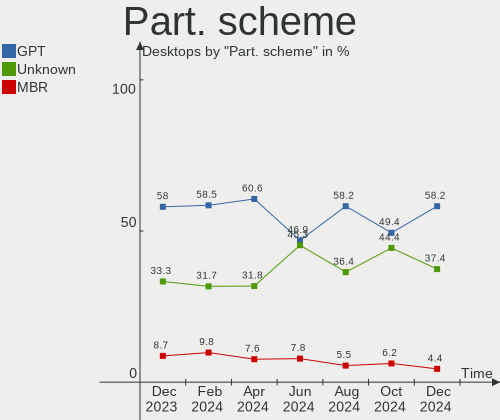
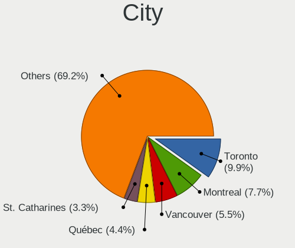
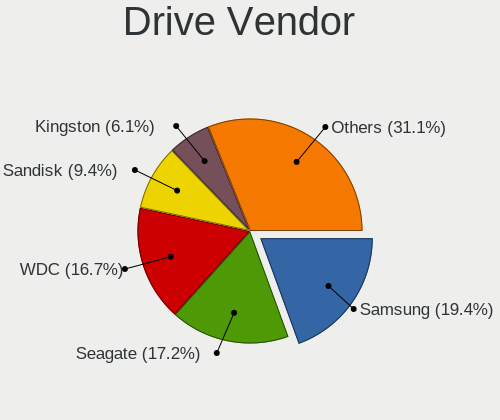
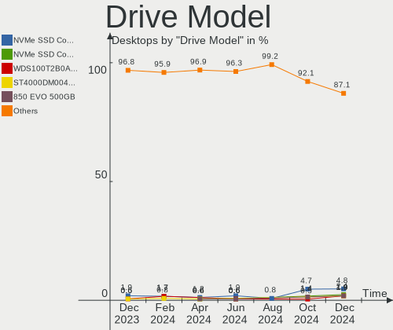
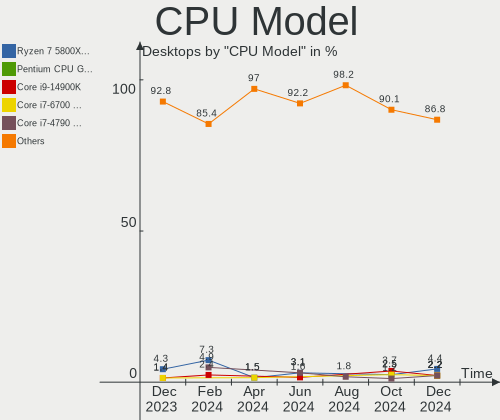
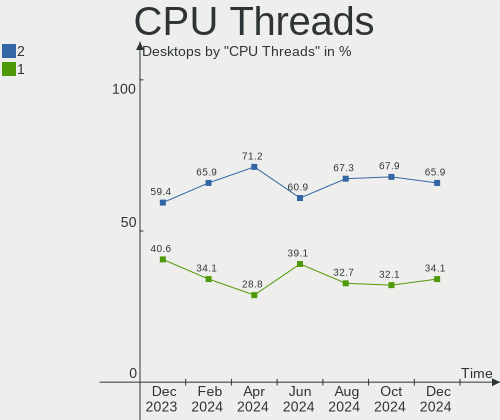
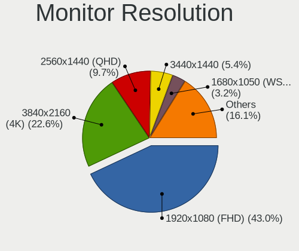
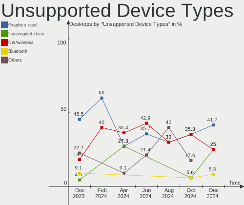

Linux in Canada - Hardware Trends (Desktops)
--------------------------------------------

A project to identify most popular hardware characteristics and track their change
over time based on data collected by Linux users at https://Linux-Hardware.org.

Anyone can contribute to this report by the [hw-probe](https://github.com/linuxhw/hw-probe) tool:

    sudo -E hw-probe -all -upload

Period: Mar, 2023.

Contents
--------

* [ System ](#system)
  - [ OS                       ](#os)
  - [ OS Family                ](#os-family)
  - [ Kernel                   ](#kernel)
  - [ Kernel Family            ](#kernel-family)
  - [ Kernel Major Ver.        ](#kernel-major-ver)
  - [ Arch                     ](#arch)
  - [ DE                       ](#de)
  - [ Display Server           ](#display-server)
  - [ Display Manager          ](#display-manager)
  - [ OS Lang                  ](#os-lang)
  - [ Boot Mode                ](#boot-mode)
  - [ Filesystem               ](#filesystem)
  - [ Part. scheme             ](#part-scheme)
  - [ Dual Boot with Linux/BSD ](#dual-boot-with-linuxbsd)
  - [ Dual Boot (Win)          ](#dual-boot-win)

* [ Board ](#board)
  - [ Vendor                   ](#vendor)
  - [ Model                    ](#model)
  - [ Model Family             ](#model-family)
  - [ MFG Year                 ](#mfg-year)
  - [ Form Factor              ](#form-factor)
  - [ Secure Boot              ](#secure-boot)
  - [ Coreboot                 ](#coreboot)
  - [ RAM Size                 ](#ram-size)
  - [ RAM Used                 ](#ram-used)
  - [ Total Drives             ](#total-drives)
  - [ Has CD-ROM               ](#has-cd-rom)
  - [ Has Ethernet             ](#has-ethernet)
  - [ Has WiFi                 ](#has-wifi)
  - [ Has Bluetooth            ](#has-bluetooth)

* [ Location ](#location)
  - [ Country                  ](#country)
  - [ City                     ](#city)

* [ Drives ](#drives)
  - [ Drive Vendor             ](#drive-vendor)
  - [ Drive Model              ](#drive-model)
  - [ HDD Vendor               ](#hdd-vendor)
  - [ SSD Vendor               ](#ssd-vendor)
  - [ Drive Kind               ](#drive-kind)
  - [ Drive Connector          ](#drive-connector)
  - [ Drive Size               ](#drive-size)
  - [ Space Total              ](#space-total)
  - [ Space Used               ](#space-used)
  - [ Malfunc. Drives          ](#malfunc-drives)
  - [ Malfunc. Drive Vendor    ](#malfunc-drive-vendor)
  - [ Malfunc. HDD Vendor      ](#malfunc-hdd-vendor)
  - [ Malfunc. Drive Kind      ](#malfunc-drive-kind)
  - [ Failed Drives            ](#failed-drives)
  - [ Failed Drive Vendor      ](#failed-drive-vendor)
  - [ Drive Status             ](#drive-status)

* [ Storage controller ](#storage-controller)
  - [ Storage Vendor           ](#storage-vendor)
  - [ Storage Model            ](#storage-model)
  - [ Storage Kind             ](#storage-kind)

* [ Processor ](#processor)
  - [ CPU Vendor               ](#cpu-vendor)
  - [ CPU Model                ](#cpu-model)
  - [ CPU Model Family         ](#cpu-model-family)
  - [ CPU Cores                ](#cpu-cores)
  - [ CPU Sockets              ](#cpu-sockets)
  - [ CPU Threads              ](#cpu-threads)
  - [ CPU Op-Modes             ](#cpu-op-modes)
  - [ CPU Microcode            ](#cpu-microcode)
  - [ CPU Microarch            ](#cpu-microarch)

* [ Graphics ](#graphics)
  - [ GPU Vendor               ](#gpu-vendor)
  - [ GPU Model                ](#gpu-model)
  - [ GPU Combo                ](#gpu-combo)
  - [ GPU Driver               ](#gpu-driver)
  - [ GPU Memory               ](#gpu-memory)

* [ Monitor ](#monitor)
  - [ Monitor Vendor           ](#monitor-vendor)
  - [ Monitor Model            ](#monitor-model)
  - [ Monitor Resolution       ](#monitor-resolution)
  - [ Monitor Diagonal         ](#monitor-diagonal)
  - [ Monitor Width            ](#monitor-width)
  - [ Aspect Ratio             ](#aspect-ratio)
  - [ Monitor Area             ](#monitor-area)
  - [ Pixel Density            ](#pixel-density)
  - [ Multiple Monitors        ](#multiple-monitors)

* [ Network ](#network)
  - [ Net Controller Vendor    ](#net-controller-vendor)
  - [ Net Controller Model     ](#net-controller-model)
  - [ Wireless Vendor          ](#wireless-vendor)
  - [ Wireless Model           ](#wireless-model)
  - [ Ethernet Vendor          ](#ethernet-vendor)
  - [ Ethernet Model           ](#ethernet-model)
  - [ Net Controller Kind      ](#net-controller-kind)
  - [ Used Controller          ](#used-controller)
  - [ NICs                     ](#nics)
  - [ IPv6                     ](#ipv6)

* [ Bluetooth ](#bluetooth)
  - [ Bluetooth Vendor         ](#bluetooth-vendor)
  - [ Bluetooth Model          ](#bluetooth-model)

* [ Sound ](#sound)
  - [ Sound Vendor             ](#sound-vendor)
  - [ Sound Model              ](#sound-model)

* [ Memory ](#memory)
  - [ Memory Vendor            ](#memory-vendor)
  - [ Memory Model             ](#memory-model)
  - [ Memory Kind              ](#memory-kind)
  - [ Memory Form Factor       ](#memory-form-factor)
  - [ Memory Size              ](#memory-size)
  - [ Memory Speed             ](#memory-speed)

* [ Printers & scanners ](#printers--scanners)
  - [ Printer Vendor           ](#printer-vendor)
  - [ Printer Model            ](#printer-model)
  - [ Scanner Vendor           ](#scanner-vendor)
  - [ Scanner Model            ](#scanner-model)

* [ Camera ](#camera)
  - [ Camera Vendor            ](#camera-vendor)
  - [ Camera Model             ](#camera-model)

* [ Security ](#security)
  - [ Fingerprint Vendor       ](#fingerprint-vendor)
  - [ Fingerprint Model        ](#fingerprint-model)
  - [ Chipcard Vendor          ](#chipcard-vendor)
  - [ Chipcard Model           ](#chipcard-model)

* [ Unsupported ](#unsupported)
  - [ Unsupported Devices      ](#unsupported-devices)
  - [ Unsupported Device Types ](#unsupported-device-types)

System
------

OS
--

Installed operating systems

| Name                | Desktops | Percent |
|---------------------|----------|---------|
| Ubuntu 22.04        | 15       | 18.52%  |
| OpenMandriva 23.03  | 9        | 11.11%  |
| Debian 11           | 8        | 9.88%   |
| Linux Mint 21.1     | 7        | 8.64%   |
| Pop!_OS 22.04       | 5        | 6.17%   |
| OpenMandriva 23.01  | 4        | 4.94%   |
| Fedora 37           | 4        | 4.94%   |
| Fedora 38           | 3        | 3.7%    |
| Zorin 16            | 2        | 2.47%   |
| Ubuntu 22.10        | 2        | 2.47%   |
| ArcoLinux Rolling   | 2        | 2.47%   |
| Xubuntu 22.04       | 1        | 1.23%   |
| Xubuntu 20.04       | 1        | 1.23%   |
| PCLinuxOS 2023      | 1        | 1.23%   |
| OpenMandriva 4.90   | 1        | 1.23%   |
| OpenMandriva 4.3    | 1        | 1.23%   |
| Nobara 37           | 1        | 1.23%   |
| Manjaro             | 1        | 1.23%   |
| LMDE 5              | 1        | 1.23%   |
| Linux Mint 21       | 1        | 1.23%   |
| Linux Mint 20.3     | 1        | 1.23%   |
| Kubuntu 22.10       | 1        | 1.23%   |
| Kubuntu 22.04       | 1        | 1.23%   |
| Kubuntu 18.04       | 1        | 1.23%   |
| KDE neon 22.04      | 1        | 1.23%   |
| Gentoo 2.13         | 1        | 1.23%   |
| EndeavourOS Rolling | 1        | 1.23%   |
| Elementary 7        | 1        | 1.23%   |
| BunsenLabs 11       | 1        | 1.23%   |
| Arch Rolling        | 1        | 1.23%   |
| AlmaLinux 8.7       | 1        | 1.23%   |

OS Family
---------

OS without a version

| Name         | Desktops | Percent |
|--------------|----------|---------|
| Ubuntu       | 17       | 20.99%  |
| OpenMandriva | 15       | 18.52%  |
| Linux Mint   | 9        | 11.11%  |
| Debian       | 8        | 9.88%   |
| Fedora       | 7        | 8.64%   |
| Pop!_OS      | 5        | 6.17%   |
| Kubuntu      | 3        | 3.7%    |
| Zorin        | 2        | 2.47%   |
| Xubuntu      | 2        | 2.47%   |
| ArcoLinux    | 2        | 2.47%   |
| PCLinuxOS    | 1        | 1.23%   |
| Nobara       | 1        | 1.23%   |
| Manjaro      | 1        | 1.23%   |
| LMDE         | 1        | 1.23%   |
| KDE neon     | 1        | 1.23%   |
| Gentoo       | 1        | 1.23%   |
| EndeavourOS  | 1        | 1.23%   |
| Elementary   | 1        | 1.23%   |
| BunsenLabs   | 1        | 1.23%   |
| Arch         | 1        | 1.23%   |
| AlmaLinux    | 1        | 1.23%   |

Kernel
------

Version of the Linux kernel

| Version                      | Desktops | Percent |
|------------------------------|----------|---------|
| 5.15.0-67-generic            | 12       | 14.81%  |
| 5.19.0-35-generic            | 11       | 13.58%  |
| 6.2.6-desktop-1omv2390       | 7        | 8.64%   |
| 5.10.0-21-amd64              | 7        | 8.64%   |
| 6.1.1-desktop-1omv2290       | 4        | 4.94%   |
| 6.2.2-desktop-1omv2390       | 2        | 2.47%   |
| 6.2.0-76060200-generic       | 2        | 2.47%   |
| 6.1.14-200.fc37.x86_64       | 2        | 2.47%   |
| 5.4.0-144-generic            | 2        | 2.47%   |
| 5.19.0-38-generic            | 2        | 2.47%   |
| 5.19.0-32-generic            | 2        | 2.47%   |
| 5.15.0-69-generic            | 2        | 2.47%   |
| 5.15.0-56-generic            | 2        | 2.47%   |
| 6.2.8-arch1-1                | 1        | 1.23%   |
| 6.2.8-300.fc38.x86_64        | 1        | 1.23%   |
| 6.2.7-300.fc38.x86_64        | 1        | 1.23%   |
| 6.2.7-200.fc37.x86_64        | 1        | 1.23%   |
| 6.2.6-zen1-1-zen             | 1        | 1.23%   |
| 6.2.3-300.fc38.x86_64        | 1        | 1.23%   |
| 6.2.2-x64v3-xanmod1          | 1        | 1.23%   |
| 6.2.1-zen1-1-zen             | 1        | 1.23%   |
| 6.1.18-200.fc37.x86_64       | 1        | 1.23%   |
| 6.1.14-201.fsync.fc37.x86_64 | 1        | 1.23%   |
| 6.1.12-gentoo                | 1        | 1.23%   |
| 6.1.11-arch1-1               | 1        | 1.23%   |
| 6.1.11-76060111-generic      | 1        | 1.23%   |
| 6.0.13-pclos1                | 1        | 1.23%   |
| 6.0.12-76060006-generic      | 1        | 1.23%   |
| 5.19.0-21-generic            | 1        | 1.23%   |
| 5.18.12-desktop-3omv4090     | 1        | 1.23%   |
| 5.16.13-desktop-1omv4003     | 1        | 1.23%   |
| 5.15.85-1-pve                | 1        | 1.23%   |
| 5.15.102-1-pve               | 1        | 1.23%   |
| 5.15.102-1-MANJARO           | 1        | 1.23%   |
| 5.15.0-60-lowlatency         | 1        | 1.23%   |
| 5.10.0-15-amd64              | 1        | 1.23%   |
| 4.18.0-425.13.1.el8_7.x86_64 | 1        | 1.23%   |

Kernel Family
-------------

Linux kernel without a distro release

| Version  | Desktops | Percent |
|----------|----------|---------|
| 5.15.0   | 17       | 20.99%  |
| 5.19.0   | 16       | 19.75%  |
| 6.2.6    | 8        | 9.88%   |
| 5.10.0   | 8        | 9.88%   |
| 6.1.1    | 4        | 4.94%   |
| 6.2.2    | 3        | 3.7%    |
| 6.1.14   | 3        | 3.7%    |
| 6.2.8    | 2        | 2.47%   |
| 6.2.7    | 2        | 2.47%   |
| 6.2.0    | 2        | 2.47%   |
| 6.1.11   | 2        | 2.47%   |
| 5.4.0    | 2        | 2.47%   |
| 5.15.102 | 2        | 2.47%   |
| 6.2.3    | 1        | 1.23%   |
| 6.2.1    | 1        | 1.23%   |
| 6.1.18   | 1        | 1.23%   |
| 6.1.12   | 1        | 1.23%   |
| 6.0.13   | 1        | 1.23%   |
| 6.0.12   | 1        | 1.23%   |
| 5.18.12  | 1        | 1.23%   |
| 5.16.13  | 1        | 1.23%   |
| 5.15.85  | 1        | 1.23%   |
| 4.18.0   | 1        | 1.23%   |

Kernel Major Ver.
-----------------

Linux kernel major version

| Version | Desktops | Percent |
|---------|----------|---------|
| 5.15    | 20       | 24.69%  |
| 6.2     | 19       | 23.46%  |
| 5.19    | 16       | 19.75%  |
| 6.1     | 11       | 13.58%  |
| 5.10    | 8        | 9.88%   |
| 6.0     | 2        | 2.47%   |
| 5.4     | 2        | 2.47%   |
| 5.18    | 1        | 1.23%   |
| 5.16    | 1        | 1.23%   |
| 4.18    | 1        | 1.23%   |

Arch
----

OS architecture (x86_64, i586, etc.)

| Name   | Desktops | Percent |
|--------|----------|---------|
| x86_64 | 81       | 100%    |

DE
--

Desktop Environment

| Name       | Desktops | Percent |
|------------|----------|---------|
| GNOME      | 32       | 39.51%  |
| KDE5       | 20       | 24.69%  |
| Unknown    | 9        | 11.11%  |
| X-Cinnamon | 7        | 8.64%   |
| XFCE       | 5        | 6.17%   |
| Cinnamon   | 2        | 2.47%   |
| Pantheon   | 1        | 1.23%   |
| MATE       | 1        | 1.23%   |
| LXQt       | 1        | 1.23%   |
| LXDE       | 1        | 1.23%   |
| i3         | 1        | 1.23%   |
| bspwm      | 1        | 1.23%   |

Display Server
--------------

X11 or Wayland

| Name    | Desktops | Percent |
|---------|----------|---------|
| X11     | 61       | 75.31%  |
| Wayland | 14       | 17.28%  |
| Tty     | 3        | 3.7%    |
| Unknown | 3        | 3.7%    |

Display Manager
---------------

SDDM, LightDM, etc.

| Name    | Desktops | Percent |
|---------|----------|---------|
| Unknown | 29       | 35.8%   |
| SDDM    | 17       | 20.99%  |
| GDM3    | 15       | 18.52%  |
| LightDM | 14       | 17.28%  |
| GDM     | 6        | 7.41%   |

OS Lang
-------

Language

| Lang  | Desktops | Percent |
|-------|----------|---------|
| en_CA | 46       | 56.79%  |
| en_US | 24       | 29.63%  |
| fr_CA | 4        | 4.94%   |
| C     | 4        | 4.94%   |
| fr_FR | 2        | 2.47%   |
| en_GB | 1        | 1.23%   |

Boot Mode
---------

EFI or BIOS

| Mode | Desktops | Percent |
|------|----------|---------|
| EFI  | 42       | 51.85%  |
| BIOS | 39       | 48.15%  |

Filesystem
----------

Type of filesystem

| Type    | Desktops | Percent |
|---------|----------|---------|
| Ext4    | 62       | 76.54%  |
| Btrfs   | 11       | 13.58%  |
| Overlay | 7        | 8.64%   |
| Zfs     | 1        | 1.23%   |

Part. scheme
------------

Scheme of partitioning

| Type    | Desktops | Percent |
|---------|----------|---------|
| GPT     | 52       | 64.2%   |
| Unknown | 23       | 28.4%   |
| MBR     | 6        | 7.41%   |

Dual Boot with Linux/BSD
------------------------

Hosting more than one Linux/BSD

| Dual boot | Desktops | Percent |
|-----------|----------|---------|
| No        | 62       | 76.54%  |
| Yes       | 19       | 23.46%  |

Dual Boot (Win)
---------------

Hosting Linux and Windows

| Dual boot | Desktops | Percent |
|-----------|----------|---------|
| No        | 60       | 74.07%  |
| Yes       | 21       | 25.93%  |

Board
-----

Vendor
------

Motherboard manufacturer

| Name                | Desktops | Percent |
|---------------------|----------|---------|
| ASUSTek Computer    | 24       | 29.63%  |
| MSI                 | 12       | 14.81%  |
| Gigabyte Technology | 10       | 12.35%  |
| Hewlett-Packard     | 9        | 11.11%  |
| Dell                | 6        | 7.41%   |
| ASRock              | 4        | 4.94%   |
| Lenovo              | 3        | 3.7%    |
| ECS                 | 2        | 2.47%   |
| Acer                | 2        | 2.47%   |
| Wistron             | 1        | 1.23%   |
| Win element         | 1        | 1.23%   |
| Supermicro          | 1        | 1.23%   |
| Shuttle             | 1        | 1.23%   |
| Intel               | 1        | 1.23%   |
| Biostar             | 1        | 1.23%   |
| BESSTAR Tech        | 1        | 1.23%   |
| ASRockRack          | 1        | 1.23%   |
| Apple               | 1        | 1.23%   |

Model
-----

Motherboard model

| Name                                    | Desktops | Percent |
|-----------------------------------------|----------|---------|
| MSI MS-7817                             | 2        | 2.47%   |
| Wistron ProLiant ML110 G5               | 1        | 1.23%   |
| Win element M600                        | 1        | 1.23%   |
| Supermicro PIO-1UDP10-01-AI036          | 1        | 1.23%   |
| Shuttle XH270                           | 1        | 1.23%   |
| MSI MS-7D42                             | 1        | 1.23%   |
| MSI MS-7D06                             | 1        | 1.23%   |
| MSI MS-7C95                             | 1        | 1.23%   |
| MSI MS-7C91                             | 1        | 1.23%   |
| MSI MS-7C56                             | 1        | 1.23%   |
| MSI MS-7C37                             | 1        | 1.23%   |
| MSI MS-7B86                             | 1        | 1.23%   |
| MSI MS-7B48                             | 1        | 1.23%   |
| MSI MS-7850                             | 1        | 1.23%   |
| MSI MS-7693                             | 1        | 1.23%   |
| Lenovo ThinkCentre M92p 2988D9U         | 1        | 1.23%   |
| Lenovo ThinkCentre M91p 4524B61         | 1        | 1.23%   |
| Lenovo IdeaCentre 720-18ICB 90HT0001US  | 1        | 1.23%   |
| Intel 945GCT-M                          | 1        | 1.23%   |
| HP Z440 Workstation                     | 1        | 1.23%   |
| HP Z1 Entry Tower G5                    | 1        | 1.23%   |
| HP xw4600 Workstation                   | 1        | 1.23%   |
| HP ProOne 600 G1 AiO                    | 1        | 1.23%   |
| HP ProDesk 600 G1 DM                    | 1        | 1.23%   |
| HP EliteDesk 800 G1 TWR                 | 1        | 1.23%   |
| HP Compaq Pro 6300 SFF                  | 1        | 1.23%   |
| HP Compaq dc7800p Convertible Minitower | 1        | 1.23%   |
| HP 750-437cb                            | 1        | 1.23%   |
| Gigabyte Z87X-UD3H                      | 1        | 1.23%   |
| Gigabyte Z77X-UD3H                      | 1        | 1.23%   |
| Gigabyte Z77P-D3                        | 1        | 1.23%   |
| Gigabyte Z390 UD                        | 1        | 1.23%   |
| Gigabyte Z170X-UD3 Ultra                | 1        | 1.23%   |
| Gigabyte X570 AORUS PRO WIFI            | 1        | 1.23%   |
| Gigabyte B550 VISION D-P                | 1        | 1.23%   |
| Gigabyte B550 AORUS PRO AC              | 1        | 1.23%   |
| Gigabyte B450M DS3H                     | 1        | 1.23%   |
| Gigabyte B450 AORUS PRO WIFI            | 1        | 1.23%   |
| ECS X58B-A                              | 1        | 1.23%   |
| ECS G31T-M                              | 1        | 1.23%   |

Model Family
------------

Motherboard model prefix

| Name                           | Desktops | Percent |
|--------------------------------|----------|---------|
| ASUS PRIME                     | 7        | 8.64%   |
| Dell OptiPlex                  | 5        | 6.17%   |
| MSI MS-7817                    | 2        | 2.47%   |
| Lenovo ThinkCentre             | 2        | 2.47%   |
| HP Compaq                      | 2        | 2.47%   |
| Gigabyte B550                  | 2        | 2.47%   |
| ASUS ROG                       | 2        | 2.47%   |
| ASUS M5A78L-M                  | 2        | 2.47%   |
| Acer Aspire                    | 2        | 2.47%   |
| Wistron ProLiant               | 1        | 1.23%   |
| Win element M600               | 1        | 1.23%   |
| Supermicro PIO-1UDP10-01-AI036 | 1        | 1.23%   |
| Shuttle XH270                  | 1        | 1.23%   |
| MSI MS-7D42                    | 1        | 1.23%   |
| MSI MS-7D06                    | 1        | 1.23%   |
| MSI MS-7C95                    | 1        | 1.23%   |
| MSI MS-7C91                    | 1        | 1.23%   |
| MSI MS-7C56                    | 1        | 1.23%   |
| MSI MS-7C37                    | 1        | 1.23%   |
| MSI MS-7B86                    | 1        | 1.23%   |
| MSI MS-7B48                    | 1        | 1.23%   |
| MSI MS-7850                    | 1        | 1.23%   |
| MSI MS-7693                    | 1        | 1.23%   |
| Lenovo IdeaCentre              | 1        | 1.23%   |
| Intel 945GCT-M                 | 1        | 1.23%   |
| HP Z440                        | 1        | 1.23%   |
| HP Z1                          | 1        | 1.23%   |
| HP xw4600                      | 1        | 1.23%   |
| HP ProOne                      | 1        | 1.23%   |
| HP ProDesk                     | 1        | 1.23%   |
| HP EliteDesk                   | 1        | 1.23%   |
| HP 750-437cb                   | 1        | 1.23%   |
| Gigabyte Z87X-UD3H             | 1        | 1.23%   |
| Gigabyte Z77X-UD3H             | 1        | 1.23%   |
| Gigabyte Z77P-D3               | 1        | 1.23%   |
| Gigabyte Z390                  | 1        | 1.23%   |
| Gigabyte Z170X-UD3             | 1        | 1.23%   |
| Gigabyte X570                  | 1        | 1.23%   |
| Gigabyte B450M                 | 1        | 1.23%   |
| Gigabyte B450                  | 1        | 1.23%   |

MFG Year
--------

Motherboard manufacture year

| Year | Desktops | Percent |
|------|----------|---------|
| 2020 | 10       | 12.35%  |
| 2018 | 10       | 12.35%  |
| 2012 | 9        | 11.11%  |
| 2014 | 8        | 9.88%   |
| 2007 | 7        | 8.64%   |
| 2016 | 5        | 6.17%   |
| 2013 | 5        | 6.17%   |
| 2009 | 5        | 6.17%   |
| 2022 | 4        | 4.94%   |
| 2019 | 4        | 4.94%   |
| 2011 | 4        | 4.94%   |
| 2017 | 3        | 3.7%    |
| 2015 | 3        | 3.7%    |
| 2021 | 2        | 2.47%   |
| 2010 | 1        | 1.23%   |
| 2008 | 1        | 1.23%   |

Form Factor
-----------

Physical design of the computer

| Name    | Desktops | Percent |
|---------|----------|---------|
| Desktop | 81       | 100%    |

Secure Boot
-----------

Enabled or disabled

| State    | Desktops | Percent |
|----------|----------|---------|
| Disabled | 79       | 97.53%  |
| Enabled  | 2        | 2.47%   |

Coreboot
--------

Have coreboot on board

| Used | Desktops | Percent |
|------|----------|---------|
| No   | 80       | 98.77%  |
| Yes  | 1        | 1.23%   |

RAM Size
--------

Total RAM memory

| Size in GB  | Desktops | Percent |
|-------------|----------|---------|
| 32.01-64.0  | 26       | 32.1%   |
| 16.01-24.0  | 20       | 24.69%  |
| 4.01-8.0    | 8        | 9.88%   |
| 3.01-4.0    | 8        | 9.88%   |
| 8.01-16.0   | 8        | 9.88%   |
| 64.01-256.0 | 6        | 7.41%   |
| 1.01-2.0    | 4        | 4.94%   |
| 0.51-1.0    | 1        | 1.23%   |

RAM Used
--------

Used RAM memory

| Used GB    | Desktops | Percent |
|------------|----------|---------|
| 1.01-2.0   | 25       | 30.86%  |
| 4.01-8.0   | 19       | 23.46%  |
| 2.01-3.0   | 13       | 16.05%  |
| 3.01-4.0   | 12       | 14.81%  |
| 8.01-16.0  | 6        | 7.41%   |
| 0.51-1.0   | 4        | 4.94%   |
| 32.01-64.0 | 1        | 1.23%   |
| 0.01-0.5   | 1        | 1.23%   |

Total Drives
------------

Number of drives on board

| Drives | Desktops | Percent |
|--------|----------|---------|
| 1      | 29       | 35.8%   |
| 2      | 20       | 24.69%  |
| 3      | 13       | 16.05%  |
| 4      | 9        | 11.11%  |
| 5      | 3        | 3.7%    |
| 8      | 2        | 2.47%   |
| 13     | 1        | 1.23%   |
| 9      | 1        | 1.23%   |
| 7      | 1        | 1.23%   |
| 6      | 1        | 1.23%   |
| 0      | 1        | 1.23%   |

Has CD-ROM
----------

Has CD-ROM on board

| Presented | Desktops | Percent |
|-----------|----------|---------|
| No        | 46       | 56.79%  |
| Yes       | 35       | 43.21%  |

Has Ethernet
------------

Has Ethernet on board

| Presented | Desktops | Percent |
|-----------|----------|---------|
| Yes       | 79       | 97.53%  |
| No        | 2        | 2.47%   |

Has WiFi
--------

Has WiFi module

| Presented | Desktops | Percent |
|-----------|----------|---------|
| No        | 42       | 51.85%  |
| Yes       | 39       | 48.15%  |

Has Bluetooth
-------------

Has Bluetooth module

| Presented | Desktops | Percent |
|-----------|----------|---------|
| No        | 53       | 65.43%  |
| Yes       | 28       | 34.57%  |

Location
--------

Country
-------

Geographic location (country)

| Country | Desktops | Percent |
|---------|----------|---------|
| Canada  | 81       | 100%    |

City
----

Geographic location (city)

| City                       | Desktops | Percent |
|----------------------------|----------|---------|
| Montreal                   | 7        | 8.64%   |
| Vancouver                  | 4        | 4.94%   |
| Toronto                    | 3        | 3.7%    |
| Mississauga                | 3        | 3.7%    |
| Courtice                   | 3        | 3.7%    |
| Winnipeg                   | 2        | 2.47%   |
| Surrey                     | 2        | 2.47%   |
| Port Perry                 | 2        | 2.47%   |
| Ottawa                     | 2        | 2.47%   |
| Kitchener                  | 2        | 2.47%   |
| Coquitlam                  | 2        | 2.47%   |
| Belleville                 | 2        | 2.47%   |
| Whitehorse                 | 1        | 1.23%   |
| West Kelowna               | 1        | 1.23%   |
| Viking                     | 1        | 1.23%   |
| Vaudreuil-Dorion           | 1        | 1.23%   |
| Trois-Rivières            | 1        | 1.23%   |
| Terrace                    | 1        | 1.23%   |
| Summerside                 | 1        | 1.23%   |
| Stephenville Crossing      | 1        | 1.23%   |
| Sorel-Tracy                | 1        | 1.23%   |
| Sherbrooke                 | 1        | 1.23%   |
| Scarborough                | 1        | 1.23%   |
| Saskatoon                  | 1        | 1.23%   |
| Sarnia                     | 1        | 1.23%   |
| Sainte-Catherine           | 1        | 1.23%   |
| Saint-Hyacinthe            | 1        | 1.23%   |
| Saint-Bruno-de-Montarville | 1        | 1.23%   |
| Regina                     | 1        | 1.23%   |
| Québec                    | 1        | 1.23%   |
| Portage la Prairie         | 1        | 1.23%   |
| Port Coquitlam             | 1        | 1.23%   |
| Penticton                  | 1        | 1.23%   |
| Oshawa                     | 1        | 1.23%   |
| North York                 | 1        | 1.23%   |
| Niagara Falls              | 1        | 1.23%   |
| Medicine Hat               | 1        | 1.23%   |
| Margaretsville             | 1        | 1.23%   |
| Laval                      | 1        | 1.23%   |
| Laurier-station            | 1        | 1.23%   |

Drives
------

Drive Vendor
------------

Hard drive vendors

| Vendor                      | Desktops | Drives | Percent |
|-----------------------------|----------|--------|---------|
| WDC                         | 34       | 52     | 21.79%  |
| Seagate                     | 28       | 40     | 17.95%  |
| Samsung Electronics         | 21       | 31     | 13.46%  |
| Kingston                    | 11       | 12     | 7.05%   |
| Sandisk                     | 9        | 14     | 5.77%   |
| Toshiba                     | 8        | 11     | 5.13%   |
| Crucial                     | 6        | 9      | 3.85%   |
| Hitachi                     | 5        | 5      | 3.21%   |
| Micron/Crucial Technology   | 3        | 3      | 1.92%   |
| Intel                       | 3        | 3      | 1.92%   |
| A-DATA Technology           | 3        | 3      | 1.92%   |
| SK hynix                    | 2        | 2      | 1.28%   |
| Silicon Motion              | 2        | 3      | 1.28%   |
| Micron Technology           | 2        | 2      | 1.28%   |
| Zheino                      | 1        | 1      | 0.64%   |
| Unknown                     | 1        | 1      | 0.64%   |
| TO Exter                    | 1        | 1      | 0.64%   |
| Timetec                     | 1        | 1      | 0.64%   |
| Team                        | 1        | 1      | 0.64%   |
| SPCC                        | 1        | 1      | 0.64%   |
| Seagate Technology          | 1        | 1      | 0.64%   |
| PNY                         | 1        | 1      | 0.64%   |
| Phison Electronics          | 1        | 1      | 0.64%   |
| Mushkin                     | 1        | 1      | 0.64%   |
| LITEON                      | 1        | 1      | 0.64%   |
| Kingston Technology Company | 1        | 1      | 0.64%   |
| KingFast                    | 1        | 1      | 0.64%   |
| HGST                        | 1        | 1      | 0.64%   |
| Hewlett-Packard             | 1        | 1      | 0.64%   |
| Fanxiang                    | 1        | 1      | 0.64%   |
| BIWIN                       | 1        | 1      | 0.64%   |
| ADATA Technology            | 1        | 2      | 0.64%   |
| Unknown                     | 1        | 1      | 0.64%   |

Drive Model
-----------

Hard drive models

| Model                                               | Desktops | Percent |
|-----------------------------------------------------|----------|---------|
| Samsung SSD 860 EVO 500GB                           | 4        | 2.12%   |
| Samsung NVMe SSD Controller SM981/PM981/PM983 250GB | 4        | 2.12%   |
| Kingston SA400S37120G 120GB SSD                     | 4        | 2.12%   |
| Toshiba MK2555GSXF 250GB                            | 3        | 1.59%   |
| Seagate ST2000DM008-2FR102 2TB                      | 3        | 1.59%   |
| Seagate ST2000DM001-1ER164 2TB                      | 3        | 1.59%   |
| Samsung SSD 970 EVO Plus 500GB                      | 3        | 1.59%   |
| Samsung SSD 850 EVO 500GB                           | 3        | 1.59%   |
| Samsung SSD 850 EVO 250GB                           | 3        | 1.59%   |
| WDC WDS500G2B0A-00SM50 500GB SSD                    | 2        | 1.06%   |
| WDC WDS250G2B0A-00SM50 250GB SSD                    | 2        | 1.06%   |
| WDC WDS100T2G0A-00JH30 1TB SSD                      | 2        | 1.06%   |
| WDC WD20EZAZ-00L9GB0 2TB                            | 2        | 1.06%   |
| WDC WD10EZEX-08WN4A0 1TB                            | 2        | 1.06%   |
| Toshiba DT01ACA200 2TB                              | 2        | 1.06%   |
| Toshiba DT01ACA100 1TB                              | 2        | 1.06%   |
| Seagate ST380815AS 80GB                             | 2        | 1.06%   |
| Seagate ST31500341AS 1TB                            | 2        | 1.06%   |
| Seagate ST2000DM006-2DM164 2TB                      | 2        | 1.06%   |
| Seagate ST2000DM001-9YN164 2TB                      | 2        | 1.06%   |
| Seagate ST2000DM001-1CH164 2TB                      | 2        | 1.06%   |
| Seagate ST1000LM035-1RK172 1TB                      | 2        | 1.06%   |
| Sandisk WD Blue SN550 NVMe SSD 256GB                | 2        | 1.06%   |
| Sandisk WD Black SN750 / PC SN730 NVMe SSD 1TB      | 2        | 1.06%   |
| SanDisk NVMe SSD Drive 1TB                          | 2        | 1.06%   |
| Samsung SSD 870 QVO 2TB                             | 2        | 1.06%   |
| Micron/Crucial P2 NVMe PCIe SSD 1TB                 | 2        | 1.06%   |
| Kingston SA400S37240G 240GB SSD                     | 2        | 1.06%   |
| Kingston SA2000M81000G 1TB                          | 2        | 1.06%   |
| Hitachi HDT721010SLA360 1TB                         | 2        | 1.06%   |
| Crucial CT250MX500SSD1 250GB                        | 2        | 1.06%   |
| Zheino CHN-mSATAM3-256 256GB                        | 1        | 0.53%   |
| WDC WDS500G2B0A 500GB SSD                           | 1        | 0.53%   |
| WDC WDS250G1B0A-00H9H0 250GB SSD                    | 1        | 0.53%   |
| WDC WDS240G2G0A-00JH30 240GB SSD                    | 1        | 0.53%   |
| WDC WDS200T2B0A-00SM50 2TB SSD                      | 1        | 0.53%   |
| WDC WDS100T2B0A-00SM50 1TB SSD                      | 1        | 0.53%   |
| WDC WDBNCE5000PNC 500GB SSD                         | 1        | 0.53%   |
| WDC WD800JD-22LSA0 80GB                             | 1        | 0.53%   |
| WDC WD6400AAKS-22A7B2 640GB                         | 1        | 0.53%   |

HDD Vendor
----------

Hard disk drive vendors

| Vendor  | Desktops | Drives | Percent |
|---------|----------|--------|---------|
| Seagate | 28       | 40     | 41.18%  |
| WDC     | 25       | 39     | 36.76%  |
| Toshiba | 8        | 11     | 11.76%  |
| Hitachi | 5        | 5      | 7.35%   |
| Unknown | 1        | 1      | 1.47%   |
| HGST    | 1        | 1      | 1.47%   |

SSD Vendor
----------

Solid state drive vendors

| Vendor              | Desktops | Drives | Percent |
|---------------------|----------|--------|---------|
| Samsung Electronics | 14       | 17     | 23.33%  |
| WDC                 | 13       | 13     | 21.67%  |
| Kingston            | 8        | 9      | 13.33%  |
| Crucial             | 6        | 9      | 10%     |
| A-DATA Technology   | 3        | 3      | 5%      |
| SanDisk             | 2        | 2      | 3.33%   |
| Micron Technology   | 2        | 2      | 3.33%   |
| Intel               | 2        | 2      | 3.33%   |
| TO Exter            | 1        | 1      | 1.67%   |
| Timetec             | 1        | 1      | 1.67%   |
| Team                | 1        | 1      | 1.67%   |
| SPCC                | 1        | 1      | 1.67%   |
| SK hynix            | 1        | 1      | 1.67%   |
| PNY                 | 1        | 1      | 1.67%   |
| Mushkin             | 1        | 1      | 1.67%   |
| LITEON              | 1        | 1      | 1.67%   |
| KingFast            | 1        | 1      | 1.67%   |
| BIWIN               | 1        | 1      | 1.67%   |

Drive Kind
----------

HDD or SSD

| Kind    | Desktops | Drives | Percent |
|---------|----------|--------|---------|
| HDD     | 53       | 97     | 40.46%  |
| SSD     | 46       | 67     | 35.11%  |
| NVMe    | 30       | 44     | 22.9%   |
| MMC     | 1        | 1      | 0.76%   |
| Unknown | 1        | 1      | 0.76%   |

Drive Connector
---------------

SATA, SAS, NVMe, etc.

| Type | Desktops | Drives | Percent |
|------|----------|--------|---------|
| SATA | 72       | 159    | 66.06%  |
| NVMe | 30       | 44     | 27.52%  |
| SAS  | 6        | 6      | 5.5%    |
| MMC  | 1        | 1      | 0.92%   |

Drive Size
----------

Size of hard drive

| Size in TB | Desktops | Drives | Percent |
|------------|----------|--------|---------|
| 0.01-0.5   | 50       | 68     | 43.48%  |
| 0.51-1.0   | 29       | 44     | 25.22%  |
| 1.01-2.0   | 21       | 31     | 18.26%  |
| 2.01-3.0   | 6        | 7      | 5.22%   |
| 3.01-4.0   | 4        | 6      | 3.48%   |
| 4.01-10.0  | 4        | 7      | 3.48%   |
| 10.01-20.0 | 1        | 1      | 0.87%   |

Space Total
-----------

Amount of disk space available on the file system

| Size in GB     | Desktops | Percent |
|----------------|----------|---------|
| 101-250        | 18       | 22.22%  |
| More than 3000 | 13       | 16.05%  |
| 1001-2000      | 12       | 14.81%  |
| 501-1000       | 12       | 14.81%  |
| 251-500        | 9        | 11.11%  |
| Unknown        | 6        | 7.41%   |
| 21-50          | 4        | 4.94%   |
| 51-100         | 4        | 4.94%   |
| 2001-3000      | 2        | 2.47%   |
| 1-20           | 1        | 1.23%   |

Space Used
----------

Amount of used disk space

| Used GB        | Desktops | Percent |
|----------------|----------|---------|
| 1-20           | 25       | 30.86%  |
| 21-50          | 15       | 18.52%  |
| 51-100         | 8        | 9.88%   |
| 1001-2000      | 7        | 8.64%   |
| Unknown        | 6        | 7.41%   |
| More than 3000 | 5        | 6.17%   |
| 101-250        | 5        | 6.17%   |
| 501-1000       | 4        | 4.94%   |
| 251-500        | 3        | 3.7%    |
| 2001-3000      | 3        | 3.7%    |

Malfunc. Drives
---------------

Drive models with a malfunction

| Model                           | Desktops | Drives | Percent |
|---------------------------------|----------|--------|---------|
| Toshiba MK2555GSXF 250GB        | 3        | 3      | 16.67%  |
| WDC WD30EZRX-00MMMB0 3TB        | 1        | 2      | 5.56%   |
| WDC WD10JPVX-22JC3T0 1TB        | 1        | 1      | 5.56%   |
| WDC WD10EADS-00L5B1 1TB         | 1        | 1      | 5.56%   |
| Seagate ST910021AS 100GB        | 1        | 1      | 5.56%   |
| Seagate ST500LM021-1KJ152 500GB | 1        | 1      | 5.56%   |
| Seagate ST31500341AS 1TB        | 1        | 1      | 5.56%   |
| Seagate ST2000DM001-9YN164 2TB  | 1        | 1      | 5.56%   |
| Seagate ST1000VM002-1CT162 1TB  | 1        | 3      | 5.56%   |
| Seagate ST1000DM003-1SB102 1TB  | 1        | 1      | 5.56%   |
| Mushkin MKNSSDRE1TB             | 1        | 1      | 5.56%   |
| Kingston SA400S37120G 120GB SSD | 1        | 1      | 5.56%   |
| Hitachi HDT725050VLA380 500GB   | 1        | 1      | 5.56%   |
| Hitachi HDT721010SLA360 1TB     | 1        | 1      | 5.56%   |
| Hitachi HDS721010CLA332 1TB     | 1        | 1      | 5.56%   |
| Hewlett-Packard SSD EX900 250GB | 1        | 1      | 5.56%   |

Malfunc. Drive Vendor
---------------------

Vendors of faulty drives

| Vendor          | Desktops | Drives | Percent |
|-----------------|----------|--------|---------|
| Seagate         | 5        | 8      | 29.41%  |
| WDC             | 3        | 4      | 17.65%  |
| Toshiba         | 3        | 3      | 17.65%  |
| Hitachi         | 3        | 3      | 17.65%  |
| Mushkin         | 1        | 1      | 5.88%   |
| Kingston        | 1        | 1      | 5.88%   |
| Hewlett-Packard | 1        | 1      | 5.88%   |

Malfunc. HDD Vendor
-------------------

Vendors of faulty HDD drives

| Vendor  | Desktops | Drives | Percent |
|---------|----------|--------|---------|
| Seagate | 5        | 8      | 35.71%  |
| WDC     | 3        | 4      | 21.43%  |
| Toshiba | 3        | 3      | 21.43%  |
| Hitachi | 3        | 3      | 21.43%  |

Malfunc. Drive Kind
-------------------

Kinds of faulty drives

| Kind | Desktops | Drives | Percent |
|------|----------|--------|---------|
| HDD  | 10       | 18     | 76.92%  |
| SSD  | 2        | 2      | 15.38%  |
| NVMe | 1        | 1      | 7.69%   |

Failed Drives
-------------

Failed drive models

Zero info for selected period =(

Failed Drive Vendor
-------------------

Failed drive vendors

Zero info for selected period =(

Drive Status
------------

Number of failed and malfunc. drives

| Status   | Desktops | Drives | Percent |
|----------|----------|--------|---------|
| Detected | 40       | 101    | 44.44%  |
| Works    | 37       | 88     | 41.11%  |
| Malfunc  | 13       | 21     | 14.44%  |

Storage controller
------------------

Storage Vendor
--------------

Storage controller vendors

| Vendor                      | Desktops | Percent |
|-----------------------------|----------|---------|
| Intel                       | 52       | 41.94%  |
| AMD                         | 27       | 21.77%  |
| Samsung Electronics         | 11       | 8.87%   |
| SanDisk                     | 7        | 5.65%   |
| ASMedia Technology          | 6        | 4.84%   |
| Kingston Technology Company | 4        | 3.23%   |
| Silicon Motion              | 3        | 2.42%   |
| Micron/Crucial Technology   | 3        | 2.42%   |
| JMicron Technology          | 3        | 2.42%   |
| Marvell Technology Group    | 2        | 1.61%   |
| SK hynix                    | 1        | 0.81%   |
| Seagate Technology          | 1        | 0.81%   |
| Phison Electronics          | 1        | 0.81%   |
| LSI Logic / Symbios Logic   | 1        | 0.81%   |
| INNOGRIT                    | 1        | 0.81%   |
| ADATA Technology            | 1        | 0.81%   |

Storage Model
-------------

Storage controller models

| Model                                                                                   | Desktops | Percent |
|-----------------------------------------------------------------------------------------|----------|---------|
| AMD 500 Series Chipset SATA Controller                                                  | 10       | 6.54%   |
| Samsung NVMe SSD Controller SM981/PM981/PM983                                           | 9        | 5.88%   |
| AMD FCH SATA Controller [AHCI mode]                                                     | 9        | 5.88%   |
| Intel 8 Series/C220 Series Chipset Family 6-port SATA Controller 1 [AHCI mode]          | 7        | 4.58%   |
| Intel SATA Controller [RAID mode]                                                       | 5        | 3.27%   |
| Intel 200 Series PCH SATA controller [AHCI mode]                                        | 5        | 3.27%   |
| ASMedia ASM1062 Serial ATA Controller                                                   | 5        | 3.27%   |
| AMD 400 Series Chipset SATA Controller                                                  | 5        | 3.27%   |
| Intel NM10/ICH7 Family SATA Controller [IDE mode]                                       | 4        | 2.61%   |
| Intel Cannon Lake PCH SATA AHCI Controller                                              | 4        | 2.61%   |
| Intel 82801G (ICH7 Family) IDE Controller                                               | 4        | 2.61%   |
| Kingston Company A2000 NVMe SSD                                                         | 3        | 1.96%   |
| Intel 82801I (ICH9 Family) 2 port SATA Controller [IDE mode]                            | 3        | 1.96%   |
| Intel 7 Series/C210 Series Chipset Family 6-port SATA Controller [AHCI mode]            | 3        | 1.96%   |
| AMD SB7x0/SB8x0/SB9x0 SATA Controller [IDE mode]                                        | 3        | 1.96%   |
| AMD SB7x0/SB8x0/SB9x0 SATA Controller [AHCI mode]                                       | 3        | 1.96%   |
| AMD SB7x0/SB8x0/SB9x0 IDE Controller                                                    | 3        | 1.96%   |
| Sandisk Western Digital WD Black SN850X NVMe SSD                                        | 2        | 1.31%   |
| SanDisk WD Blue SN550 NVMe SSD                                                          | 2        | 1.31%   |
| SanDisk WD Black SN750 / PC SN730 NVMe SSD                                              | 2        | 1.31%   |
| SanDisk NVMe Controller                                                                 | 2        | 1.31%   |
| Micron/Crucial P2 NVMe PCIe SSD                                                         | 2        | 1.31%   |
| Marvell Group 88SE9172 SATA 6Gb/s Controller                                            | 2        | 1.31%   |
| JMicron JMB363 SATA/IDE Controller                                                      | 2        | 1.31%   |
| Intel Q170/Q150/B150/H170/H110/Z170/CM236 Chipset SATA Controller [AHCI Mode]           | 2        | 1.31%   |
| Intel 9 Series Chipset Family SATA Controller [AHCI Mode]                               | 2        | 1.31%   |
| Intel 82Q35 Express PT IDER Controller                                                  | 2        | 1.31%   |
| Intel 82801IR/IO/IH (ICH9R/DO/DH) 4 port SATA Controller [IDE mode]                     | 2        | 1.31%   |
| Intel 7 Series/C210 Series Chipset Family 4-port SATA Controller [IDE mode]             | 2        | 1.31%   |
| Intel 7 Series/C210 Series Chipset Family 2-port SATA Controller [IDE mode]             | 2        | 1.31%   |
| Intel 6 Series/C200 Series Chipset Family Desktop SATA Controller (IDE mode, ports 4-5) | 2        | 1.31%   |
| Intel 6 Series/C200 Series Chipset Family Desktop SATA Controller (IDE mode, ports 0-3) | 2        | 1.31%   |
| Intel 6 Series/C200 Series Chipset Family 6 port Desktop SATA AHCI Controller           | 2        | 1.31%   |
| SK hynix Non-Volatile memory controller                                                 | 1        | 0.65%   |
| Silicon Motion SM2263EN/SM2263XT SSD Controller                                         | 1        | 0.65%   |
| Silicon Motion SM2262/SM2262EN SSD Controller                                           | 1        | 0.65%   |
| Silicon Motion Non-Volatile memory controller                                           | 1        | 0.65%   |
| Seagate FireCuda 520 SSD                                                                | 1        | 0.65%   |
| SanDisk WD Blue SN570 NVMe SSD 1TB                                                      | 1        | 0.65%   |
| SanDisk Non-Volatile memory controller                                                  | 1        | 0.65%   |

Storage Kind
------------

Kind of storage controller (IDE, SATA, NVMe, SAS, ...)

| Kind | Desktops | Percent |
|------|----------|---------|
| SATA | 61       | 52.59%  |
| NVMe | 30       | 25.86%  |
| IDE  | 18       | 15.52%  |
| RAID | 5        | 4.31%   |
| SAS  | 2        | 1.72%   |

Processor
---------

CPU Vendor
----------

Processor vendors

| Vendor | Desktops | Percent |
|--------|----------|---------|
| Intel  | 53       | 65.43%  |
| AMD    | 28       | 34.57%  |

CPU Model
---------

Processor models

| Model                                  | Desktops | Percent |
|----------------------------------------|----------|---------|
| Intel Core i7-3770 CPU @ 3.40GHz       | 3        | 3.7%    |
| Intel Core i5-4460 CPU @ 3.20GHz       | 3        | 3.7%    |
| AMD Ryzen 5 5600X 6-Core Processor     | 3        | 3.7%    |
| Intel Core i7-7700K CPU @ 4.20GHz      | 2        | 2.47%   |
| Intel Core i7-4790 CPU @ 3.60GHz       | 2        | 2.47%   |
| Intel Core i5-2400 CPU @ 3.10GHz       | 2        | 2.47%   |
| AMD Ryzen 7 5800X3D 8-Core Processor   | 2        | 2.47%   |
| AMD Ryzen 5 5600G with Radeon Graphics | 2        | 2.47%   |
| AMD Ryzen 5 3600 6-Core Processor      | 2        | 2.47%   |
| AMD Ryzen 5 3500X 6-Core Processor     | 2        | 2.47%   |
| Intel Xeon CPU X3220 @ 2.40GHz         | 1        | 1.23%   |
| Intel Xeon CPU W3530 @ 2.80GHz         | 1        | 1.23%   |
| Intel Xeon CPU E5405 @ 2.00GHz         | 1        | 1.23%   |
| Intel Xeon CPU E5-2667 v2 @ 3.30GHz    | 1        | 1.23%   |
| Intel Xeon CPU E5-2620 v3 @ 2.40GHz    | 1        | 1.23%   |
| Intel Xeon CPU E3110 @ 3.00GHz         | 1        | 1.23%   |
| Intel Xeon CPU 5150 @ 2.66GHz          | 1        | 1.23%   |
| Intel Pentium Dual CPU E2140 @ 1.60GHz | 1        | 1.23%   |
| Intel Core i9-9900K CPU @ 3.60GHz      | 1        | 1.23%   |
| Intel Core i9-10850K CPU @ 3.60GHz     | 1        | 1.23%   |
| Intel Core i7-9700K CPU @ 3.60GHz      | 1        | 1.23%   |
| Intel Core i7-9700 CPU @ 3.00GHz       | 1        | 1.23%   |
| Intel Core i7-8700K CPU @ 3.70GHz      | 1        | 1.23%   |
| Intel Core i7-8700 CPU @ 3.20GHz       | 1        | 1.23%   |
| Intel Core i7-7700 CPU @ 3.60GHz       | 1        | 1.23%   |
| Intel Core i7-6700 CPU @ 3.40GHz       | 1        | 1.23%   |
| Intel Core i7 CPU 920 @ 2.67GHz        | 1        | 1.23%   |
| Intel Core i5-9600K CPU @ 3.70GHz      | 1        | 1.23%   |
| Intel Core i5-7600 CPU @ 3.50GHz       | 1        | 1.23%   |
| Intel Core i5-7200U CPU @ 2.50GHz      | 1        | 1.23%   |
| Intel Core i5-6500 CPU @ 3.20GHz       | 1        | 1.23%   |
| Intel Core i5-6400 CPU @ 2.70GHz       | 1        | 1.23%   |
| Intel Core i5-4590S CPU @ 3.00GHz      | 1        | 1.23%   |
| Intel Core i5-4590 CPU @ 3.30GHz       | 1        | 1.23%   |
| Intel Core i5-3570K CPU @ 3.40GHz      | 1        | 1.23%   |
| Intel Core i5-2320 CPU @ 3.00GHz       | 1        | 1.23%   |
| Intel Core i3-4170 CPU @ 3.70GHz       | 1        | 1.23%   |
| Intel Core i3-4160T CPU @ 3.10GHz      | 1        | 1.23%   |
| Intel Core i3-3225 CPU @ 3.30GHz       | 1        | 1.23%   |
| Intel Core i3-3220 CPU @ 3.30GHz       | 1        | 1.23%   |

CPU Model Family
----------------

Processor model prefix

| Model              | Desktops | Percent |
|--------------------|----------|---------|
| Intel Core i7      | 14       | 17.28%  |
| Intel Core i5      | 14       | 17.28%  |
| AMD Ryzen 5        | 13       | 16.05%  |
| Intel Xeon         | 7        | 8.64%   |
| Intel Core i3      | 7        | 8.64%   |
| AMD Ryzen 7        | 5        | 6.17%   |
| AMD FX             | 5        | 6.17%   |
| Intel Core 2 Duo   | 4        | 4.94%   |
| Other              | 2        | 2.47%   |
| Intel Core i9      | 2        | 2.47%   |
| AMD Ryzen 9        | 2        | 2.47%   |
| AMD A8             | 2        | 2.47%   |
| Intel Pentium Dual | 1        | 1.23%   |
| Intel Core 2 Quad  | 1        | 1.23%   |
| Intel Atom         | 1        | 1.23%   |
| AMD Phenom II X6   | 1        | 1.23%   |

CPU Cores
---------

Number of processor cores

| Number | Desktops | Percent |
|--------|----------|---------|
| 4      | 34       | 41.98%  |
| 6      | 19       | 23.46%  |
| 2      | 15       | 18.52%  |
| 8      | 9        | 11.11%  |
| 16     | 2        | 2.47%   |
| 10     | 1        | 1.23%   |
| 3      | 1        | 1.23%   |

CPU Sockets
-----------

Number of sockets

| Number | Desktops | Percent |
|--------|----------|---------|
| 1      | 79       | 97.53%  |
| 2      | 2        | 2.47%   |

CPU Threads
-----------

Threads per core (Hyper-Threading)

| Number | Desktops | Percent |
|--------|----------|---------|
| 2      | 52       | 64.2%   |
| 1      | 29       | 35.8%   |

CPU Op-Modes
------------

CPU Operation Modes (32-bit, 64-bit)

| Op mode        | Desktops | Percent |
|----------------|----------|---------|
| 32-bit, 64-bit | 81       | 100%    |

CPU Microcode
-------------

Microcode number

| Number     | Desktops | Percent |
|------------|----------|---------|
| Unknown    | 33       | 40.74%  |
| 0x306a9    | 5        | 6.17%   |
| 0x08701021 | 5        | 6.17%   |
| 0x1067a    | 3        | 3.7%    |
| 0x0a201016 | 3        | 3.7%    |
| 0x906ed    | 2        | 2.47%   |
| 0x6fd      | 2        | 2.47%   |
| 0x306c3    | 2        | 2.47%   |
| 0x206a7    | 2        | 2.47%   |
| 0x0a50000d | 2        | 2.47%   |
| 0xa0655    | 1        | 1.23%   |
| 0xa0653    | 1        | 1.23%   |
| 0x906e9    | 1        | 1.23%   |
| 0x90675    | 1        | 1.23%   |
| 0x806c2    | 1        | 1.23%   |
| 0x6fb      | 1        | 1.23%   |
| 0x506e3    | 1        | 1.23%   |
| 0x406c4    | 1        | 1.23%   |
| 0x306f2    | 1        | 1.23%   |
| 0x306e4    | 1        | 1.23%   |
| 0x20652    | 1        | 1.23%   |
| 0x10676    | 1        | 1.23%   |
| 0x0a50000c | 1        | 1.23%   |
| 0x0a404102 | 1        | 1.23%   |
| 0x0a20120a | 1        | 1.23%   |
| 0x08701013 | 1        | 1.23%   |
| 0x0800820d | 1        | 1.23%   |
| 0x08001138 | 1        | 1.23%   |
| 0x0600111f | 1        | 1.23%   |
| 0x06000852 | 1        | 1.23%   |
| 0x0600081f | 1        | 1.23%   |
| 0x0600081c | 1        | 1.23%   |

CPU Microarch
-------------

Microarchitecture

| Name             | Desktops | Percent |
|------------------|----------|---------|
| KabyLake         | 11       | 13.58%  |
| Haswell          | 10       | 12.35%  |
| Zen 3            | 9        | 11.11%  |
| Zen 2            | 7        | 8.64%   |
| Piledriver       | 7        | 8.64%   |
| IvyBridge        | 7        | 8.64%   |
| Penryn           | 5        | 6.17%   |
| Core             | 5        | 6.17%   |
| Skylake          | 3        | 3.7%    |
| SandyBridge      | 3        | 3.7%    |
| Zen+             | 2        | 2.47%   |
| Westmere         | 2        | 2.47%   |
| Nehalem          | 2        | 2.47%   |
| CometLake        | 2        | 2.47%   |
| Zen              | 1        | 1.23%   |
| TigerLake        | 1        | 1.23%   |
| Silvermont       | 1        | 1.23%   |
| K10              | 1        | 1.23%   |
| Alderlake Hybrid | 1        | 1.23%   |
| Unknown          | 1        | 1.23%   |

Graphics
--------

GPU Vendor
----------

Vendors of graphics cards

| Vendor                     | Desktops | Percent |
|----------------------------|----------|---------|
| Intel                      | 31       | 35.63%  |
| Nvidia                     | 30       | 34.48%  |
| AMD                        | 23       | 26.44%  |
| Matrox Electronics Systems | 2        | 2.3%    |
| ASPEED Technology          | 1        | 1.15%   |

GPU Model
---------

Graphics card models

| Model                                                                       | Desktops | Percent |
|-----------------------------------------------------------------------------|----------|---------|
| Intel Xeon E3-1200 v3/4th Gen Core Processor Integrated Graphics Controller | 6        | 6.82%   |
| Intel IvyBridge GT2 [HD Graphics 4000]                                      | 4        | 4.55%   |
| Nvidia GP107 [GeForce GTX 1050 Ti]                                          | 3        | 3.41%   |
| Nvidia GT218 [GeForce 210]                                                  | 2        | 2.27%   |
| Nvidia GP104 [GeForce GTX 1080]                                             | 2        | 2.27%   |
| Nvidia GP104 [GeForce GTX 1070]                                             | 2        | 2.27%   |
| Nvidia GK208B [GeForce GT 730]                                              | 2        | 2.27%   |
| Nvidia GA104 [GeForce RTX 3070 Ti]                                          | 2        | 2.27%   |
| Intel HD Graphics 630                                                       | 2        | 2.27%   |
| Intel HD Graphics 530                                                       | 2        | 2.27%   |
| Intel Core Processor Integrated Graphics Controller                         | 2        | 2.27%   |
| Intel CoffeeLake-S GT2 [UHD Graphics 630]                                   | 2        | 2.27%   |
| Intel 82945G/GZ Integrated Graphics Controller                              | 2        | 2.27%   |
| Intel 4th Generation Core Processor Family Integrated Graphics Controller   | 2        | 2.27%   |
| Intel 2nd Generation Core Processor Family Integrated Graphics Controller   | 2        | 2.27%   |
| AMD Navi 10 [Radeon RX 5600 OEM/5600 XT / 5700/5700 XT]                     | 2        | 2.27%   |
| AMD Ellesmere [Radeon RX 470/480/570/570X/580/580X/590]                     | 2        | 2.27%   |
| AMD Cezanne [Radeon Vega Series / Radeon Vega Mobile Series]                | 2        | 2.27%   |
| Nvidia TU116 [GeForce GTX 1660]                                             | 1        | 1.14%   |
| Nvidia TU116 [GeForce GTX 1660 SUPER]                                       | 1        | 1.14%   |
| Nvidia TU104 [GeForce RTX 2070 SUPER]                                       | 1        | 1.14%   |
| Nvidia GT218 [GeForce 8400 GS Rev. 3]                                       | 1        | 1.14%   |
| Nvidia GP107 [GeForce GTX 1050]                                             | 1        | 1.14%   |
| Nvidia GP106 [GeForce GTX 1060 6GB]                                         | 1        | 1.14%   |
| Nvidia GP104GL [Quadro P4000]                                               | 1        | 1.14%   |
| Nvidia GP104 [GeForce GTX 1070 Ti]                                          | 1        | 1.14%   |
| Nvidia GM204 [GeForce GTX 980]                                              | 1        | 1.14%   |
| Nvidia GK208B [GeForce GT 710]                                              | 1        | 1.14%   |
| Nvidia GK107 [GeForce GT 740]                                               | 1        | 1.14%   |
| Nvidia GK106 [GeForce GTX 660]                                              | 1        | 1.14%   |
| Nvidia GK106 [GeForce GTX 650 Ti]                                           | 1        | 1.14%   |
| Nvidia GA106 [Geforce RTX 3050]                                             | 1        | 1.14%   |
| Nvidia GA104 [GeForce RTX 3070]                                             | 1        | 1.14%   |
| Nvidia GA104 [GeForce RTX 3070 Lite Hash Rate]                              | 1        | 1.14%   |
| Nvidia GA102 [GeForce RTX 3080]                                             | 1        | 1.14%   |
| Nvidia G73 [GeForce 7300 GT]                                                | 1        | 1.14%   |
| Matrox Electronics Systems MGA G200eW WPCM450                               | 1        | 1.14%   |
| Matrox Electronics Systems MGA G200e [Pilot] ServerEngines (SEP1)           | 1        | 1.14%   |
| Intel TigerLake-LP GT2 [Iris Xe Graphics]                                   | 1        | 1.14%   |
| Intel HD Graphics 620                                                       | 1        | 1.14%   |

GPU Combo
---------

Combinations of graphics cards

| Name           | Desktops | Percent |
|----------------|----------|---------|
| 1 x Nvidia     | 28       | 34.57%  |
| 1 x Intel      | 27       | 33.33%  |
| 1 x AMD        | 20       | 24.69%  |
| 2 x Nvidia     | 1        | 1.23%   |
| 1 x Matrox     | 1        | 1.23%   |
| Intel + Nvidia | 1        | 1.23%   |
| Intel + AMD    | 1        | 1.23%   |
| 1 x ASPEED     | 1        | 1.23%   |
| AMD + Matrox   | 1        | 1.23%   |

GPU Driver
----------

Free vs proprietary

| Driver      | Desktops | Percent |
|-------------|----------|---------|
| Free        | 60       | 74.07%  |
| Proprietary | 16       | 19.75%  |
| Unknown     | 5        | 6.17%   |

GPU Memory
----------

Total video memory

| Size in GB | Desktops | Percent |
|------------|----------|---------|
| Unknown    | 43       | 53.09%  |
| 7.01-8.0   | 13       | 16.05%  |
| 0.01-0.5   | 8        | 9.88%   |
| 3.01-4.0   | 5        | 6.17%   |
| 0.51-1.0   | 5        | 6.17%   |
| 5.01-6.0   | 3        | 3.7%    |
| 1.01-2.0   | 2        | 2.47%   |
| 2.01-3.0   | 1        | 1.23%   |
| 8.01-16.0  | 1        | 1.23%   |

Monitor
-------

Monitor Vendor
--------------

Monitor vendors

| Vendor               | Desktops | Percent |
|----------------------|----------|---------|
| Samsung Electronics  | 14       | 17.5%   |
| Acer                 | 10       | 12.5%   |
| Goldstar             | 8        | 10%     |
| Hewlett-Packard      | 7        | 8.75%   |
| Ancor Communications | 7        | 8.75%   |
| Dell                 | 6        | 7.5%    |
| BenQ                 | 5        | 6.25%   |
| ASUSTek Computer     | 5        | 6.25%   |
| ViewSonic            | 3        | 3.75%   |
| AOpen                | 3        | 3.75%   |
| LG Electronics       | 2        | 2.5%    |
| Lenovo               | 2        | 2.5%    |
| Unknown              | 2        | 2.5%    |
| PRI                  | 1        | 1.25%   |
| NEC Computers        | 1        | 1.25%   |
| MSI                  | 1        | 1.25%   |
| InnoView             | 1        | 1.25%   |
| HSI                  | 1        | 1.25%   |
| Apple                | 1        | 1.25%   |

Monitor Model
-------------

Monitor models

| Model                                                                   | Desktops | Percent |
|-------------------------------------------------------------------------|----------|---------|
| BenQ GW2750H BNQ78C3 1920x1080 598x336mm 27.0-inch                      | 2        | 2.27%   |
| ASUSTek Computer VG249 AUS2421 1920x1080 527x296mm 23.8-inch            | 2        | 2.27%   |
| Acer X223W ACR0050 1680x1050 474x296mm 22.0-inch                        | 2        | 2.27%   |
| Unknown                                                                 | 2        | 2.27%   |
| ViewSonic VX3276-FHD VSCE735 1920x1080 698x393mm 31.5-inch              | 1        | 1.14%   |
| ViewSonic VG1930wm VSC9D1E 1440x900 410x256mm 19.0-inch                 | 1        | 1.14%   |
| ViewSonic VA2055 Series VSC3C31 1920x1080 435x239mm 19.5-inch           | 1        | 1.14%   |
| Samsung Electronics SyncMaster SAM027E 1680x1050 474x296mm 22.0-inch    | 1        | 1.14%   |
| Samsung Electronics S24C300 SAM0A2A 1920x1080 521x293mm 23.5-inch       | 1        | 1.14%   |
| Samsung Electronics S22D390 SAM0B63 1920x1080 477x268mm 21.5-inch       | 1        | 1.14%   |
| Samsung Electronics S22D300 SAM0B3F 1920x1080 477x268mm 21.5-inch       | 1        | 1.14%   |
| Samsung Electronics LCD Monitor SyncMaster 5520x1080                    | 1        | 1.14%   |
| Samsung Electronics LCD Monitor SMB2430H                                | 1        | 1.14%   |
| Samsung Electronics LCD Monitor SAM7202 3840x2160 1872x1053mm 84.6-inch | 1        | 1.14%   |
| Samsung Electronics LCD Monitor SAM7083 2560x1440 597x336mm 27.0-inch   | 1        | 1.14%   |
| Samsung Electronics LCD Monitor SAM0FB9 3840x2160 1872x1053mm 84.6-inch | 1        | 1.14%   |
| Samsung Electronics LCD Monitor SAM08FC 1366x768                        | 1        | 1.14%   |
| Samsung Electronics LCD Monitor SAM065D 1920x1080                       | 1        | 1.14%   |
| Samsung Electronics LCD Monitor SAM03A7 1920x540                        | 1        | 1.14%   |
| Samsung Electronics LCD Monitor LC24RG50                                | 1        | 1.14%   |
| Samsung Electronics LC32G5xT SAM7080 2560x1440 698x393mm 31.5-inch      | 1        | 1.14%   |
| Samsung Electronics LC27G7xT SAM105E 2560x1440 597x336mm 27.0-inch      | 1        | 1.14%   |
| Samsung Electronics LC24RG50 SAM0F90 1920x1080 532x304mm 24.1-inch      | 1        | 1.14%   |
| PRI LCD Monitor BBY LCD TV 4480x1792                                    | 1        | 1.14%   |
| NEC Computers LCD2190UXi NEC66B2 1600x1200 432x324mm 21.3-inch          | 1        | 1.14%   |
| MSI MAG245R MSI3BA4 1920x1080 527x296mm 23.8-inch                       | 1        | 1.14%   |
| LG Electronics LCD Monitor LG IPS FULLHD                                | 1        | 1.14%   |
| LG Electronics LCD Monitor LG FULL HD 3840x1080                         | 1        | 1.14%   |
| LG Electronics LCD Monitor LG FULL HD                                   | 1        | 1.14%   |
| Lenovo T23d-10 LEN61C3 1920x1200 518x324mm 24.1-inch                    | 1        | 1.14%   |
| Lenovo LEN L27q-30 LEN65FC 2560x1440 597x336mm 27.0-inch                | 1        | 1.14%   |
| InnoView M156LR-OTA YCTAB12 3840x2160 290x270mm 15.6-inch               | 1        | 1.14%   |
| HSI LED-TV HSI0001 1920x1080 708x398mm 32.0-inch                        | 1        | 1.14%   |
| Hewlett-Packard w2007 HWP26A7 1680x1050 433x271mm 20.1-inch             | 1        | 1.14%   |
| Hewlett-Packard w2007 HWP26A6 1680x1050 433x271mm 20.1-inch             | 1        | 1.14%   |
| Hewlett-Packard LCD Monitor 2159 1920x1080                              | 1        | 1.14%   |
| Hewlett-Packard LCD Monitor 2009 3520x1080                              | 1        | 1.14%   |
| Hewlett-Packard HPQ 600 AIO HWP108B 1920x1080 477x268mm 21.5-inch       | 1        | 1.14%   |
| Hewlett-Packard 27ea HPN3395 1920x1080 527x296mm 23.8-inch              | 1        | 1.14%   |
| Hewlett-Packard 2711 HWP2940 1920x1080 598x337mm 27.0-inch              | 1        | 1.14%   |

Monitor Resolution
------------------

Monitor screen resolution

| Resolution         | Desktops | Percent |
|--------------------|----------|---------|
| 1920x1080 (FHD)    | 37       | 43.53%  |
| 3840x2160 (4K)     | 9        | 10.59%  |
| 1680x1050 (WSXGA+) | 8        | 9.41%   |
| Unknown            | 7        | 8.24%   |
| 2560x1440 (QHD)    | 6        | 7.06%   |
| 1440x900 (WXGA+)   | 3        | 3.53%   |
| 3840x1080          | 2        | 2.35%   |
| 1920x1200 (WUXGA)  | 2        | 2.35%   |
| 5520x1080          | 1        | 1.18%   |
| 4480x2023          | 1        | 1.18%   |
| 4480x1792          | 1        | 1.18%   |
| 3520x1080          | 1        | 1.18%   |
| 3280x1080          | 1        | 1.18%   |
| 2560x1080          | 1        | 1.18%   |
| 1920x540           | 1        | 1.18%   |
| 1600x900 (HD+)     | 1        | 1.18%   |
| 1600x1200          | 1        | 1.18%   |
| 1366x768 (WXGA)    | 1        | 1.18%   |
| 1280x1024 (SXGA)   | 1        | 1.18%   |

Monitor Diagonal
----------------

Diagonal size in inches

| Inches  | Desktops | Percent |
|---------|----------|---------|
| 27      | 18       | 22.78%  |
| 24      | 12       | 15.19%  |
| 21      | 10       | 12.66%  |
| Unknown | 9        | 11.39%  |
| 23      | 6        | 7.59%   |
| 22      | 6        | 7.59%   |
| 31      | 4        | 5.06%   |
| 19      | 4        | 5.06%   |
| 20      | 3        | 3.8%    |
| 84      | 2        | 2.53%   |
| 72      | 1        | 1.27%   |
| 34      | 1        | 1.27%   |
| 28      | 1        | 1.27%   |
| 18      | 1        | 1.27%   |
| 15      | 1        | 1.27%   |

Monitor Width
-------------

Physical width

| Width in mm | Desktops | Percent |
|-------------|----------|---------|
| 501-600     | 32       | 41.56%  |
| 401-500     | 23       | 29.87%  |
| Unknown     | 9        | 11.69%  |
| 601-700     | 7        | 9.09%   |
| 1501-2000   | 3        | 3.9%    |
| 701-800     | 1        | 1.3%    |
| 351-400     | 1        | 1.3%    |
| 201-300     | 1        | 1.3%    |

Aspect Ratio
------------

Proportional relationship between the width and the height

| Ratio   | Desktops | Percent |
|---------|----------|---------|
| 16/9    | 47       | 64.38%  |
| 16/10   | 13       | 17.81%  |
| Unknown | 8        | 10.96%  |
| 21/9    | 2        | 2.74%   |
| 5/4     | 1        | 1.37%   |
| 4/3     | 1        | 1.37%   |
| 11/10   | 1        | 1.37%   |

Monitor Area
------------

Area in inch²

| Area in inch² | Desktops | Percent |
|----------------|----------|---------|
| 201-250        | 27       | 35.06%  |
| 301-350        | 18       | 23.38%  |
| 151-200        | 11       | 14.29%  |
| Unknown        | 9        | 11.69%  |
| 351-500        | 5        | 6.49%   |
| More than 1000 | 3        | 3.9%    |
| 251-300        | 3        | 3.9%    |
| 121-130        | 1        | 1.3%    |

Pixel Density
-------------

Pixels per inch

| Density       | Desktops | Percent |
|---------------|----------|---------|
| 51-100        | 42       | 58.33%  |
| 101-120       | 14       | 19.44%  |
| Unknown       | 9        | 12.5%   |
| 1-50          | 2        | 2.78%   |
| 161-240       | 2        | 2.78%   |
| 121-160       | 2        | 2.78%   |
| More than 240 | 1        | 1.39%   |

Multiple Monitors
-----------------

Total monitors connected

| Total | Desktops | Percent |
|-------|----------|---------|
| 1     | 53       | 65.43%  |
| 2     | 17       | 20.99%  |
| 0     | 8        | 9.88%   |
| 3     | 3        | 3.7%    |

Network
-------

Net Controller Vendor
---------------------

Controller vendors

| Vendor                   | Desktops | Percent |
|--------------------------|----------|---------|
| Realtek Semiconductor    | 45       | 39.13%  |
| Intel                    | 38       | 33.04%  |
| Qualcomm Atheros         | 9        | 7.83%   |
| Broadcom                 | 4        | 3.48%   |
| MediaTek                 | 3        | 2.61%   |
| Ralink Technology        | 2        | 1.74%   |
| D-Link                   | 2        | 1.74%   |
| Broadcom Limited         | 2        | 1.74%   |
| TP-Link                  | 1        | 0.87%   |
| Ralink                   | 1        | 0.87%   |
| NetGear                  | 1        | 0.87%   |
| Marvell Technology Group | 1        | 0.87%   |
| Linksys                  | 1        | 0.87%   |
| HMD Global               | 1        | 0.87%   |
| Google                   | 1        | 0.87%   |
| D-Link System            | 1        | 0.87%   |
| ASUSTek Computer         | 1        | 0.87%   |
| Aquantia                 | 1        | 0.87%   |

Net Controller Model
--------------------

Controller models

| Model                                                                  | Desktops | Percent |
|------------------------------------------------------------------------|----------|---------|
| Realtek RTL8111/8168/8411 PCI Express Gigabit Ethernet Controller      | 34       | 26.15%  |
| Realtek RTL8125 2.5GbE Controller                                      | 8        | 6.15%   |
| Intel Wi-Fi 6 AX200                                                    | 6        | 4.62%   |
| Intel Ethernet Controller I225-V                                       | 5        | 3.85%   |
| Intel I211 Gigabit Network Connection                                  | 4        | 3.08%   |
| Intel Ethernet Connection I217-LM                                      | 4        | 3.08%   |
| Intel Ethernet Connection (7) I219-V                                   | 3        | 2.31%   |
| Intel Dual Band Wireless-AC 3168NGW [Stone Peak]                       | 3        | 2.31%   |
| Intel 82579LM Gigabit Network Connection (Lewisville)                  | 3        | 2.31%   |
| Broadcom BCM4360 802.11ac Wireless Network Adapter                     | 3        | 2.31%   |
| Realtek RTL88x2bu [AC1200 Techkey]                                     | 2        | 1.54%   |
| Realtek RTL810xE PCI Express Fast Ethernet controller                  | 2        | 1.54%   |
| Ralink MT7601U Wireless Adapter                                        | 2        | 1.54%   |
| MediaTek MT7921 802.11ax PCI Express Wireless Network Adapter          | 2        | 1.54%   |
| Intel Wireless 7260                                                    | 2        | 1.54%   |
| Intel Ethernet Connection (2) I219-V                                   | 2        | 1.54%   |
| Intel 82566DM-2 Gigabit Network Connection                             | 2        | 1.54%   |
| TP-Link Archer T2U PLUS [RTL8821AU]                                    | 1        | 0.77%   |
| Realtek USB 10/100/1G/2.5G LAN                                         | 1        | 0.77%   |
| Realtek RTL8822BE 802.11a/b/g/n/ac WiFi adapter                        | 1        | 0.77%   |
| Realtek RTL8192EU 802.11b/g/n WLAN Adapter                             | 1        | 0.77%   |
| Realtek RTL8153 Gigabit Ethernet Adapter                               | 1        | 0.77%   |
| Realtek 802.11ac WLAN Adapter                                          | 1        | 0.77%   |
| Realtek 802.11ac NIC                                                   | 1        | 0.77%   |
| Ralink RT2561/RT61 802.11g PCI                                         | 1        | 0.77%   |
| Qualcomm Atheros QCA9377 802.11ac Wireless Network Adapter             | 1        | 0.77%   |
| Qualcomm Atheros QCA8171 Gigabit Ethernet                              | 1        | 0.77%   |
| Qualcomm Atheros Killer E220x Gigabit Ethernet Controller              | 1        | 0.77%   |
| Qualcomm Atheros Attansic L2 Fast Ethernet                             | 1        | 0.77%   |
| Qualcomm Atheros Attansic L1 Gigabit Ethernet                          | 1        | 0.77%   |
| Qualcomm Atheros AR93xx Wireless Network Adapter                       | 1        | 0.77%   |
| Qualcomm Atheros AR9227 Wireless Network Adapter                       | 1        | 0.77%   |
| Qualcomm Atheros AR8161 Gigabit Ethernet                               | 1        | 0.77%   |
| Qualcomm Atheros AR8121/AR8113/AR8114 Gigabit or Fast Ethernet         | 1        | 0.77%   |
| Qualcomm Atheros AR5416 Wireless Network Adapter [AR5008 802.11(a)bgn] | 1        | 0.77%   |
| Qualcomm Atheros AR5212/5213/2414 Wireless Network Adapter             | 1        | 0.77%   |
| NetGear A6150                                                          | 1        | 0.77%   |
| MediaTek MT7921K (RZ608) Wi-Fi 6E 80MHz                                | 1        | 0.77%   |
| Marvell Group 88w8335 [Libertas] 802.11b/g Wireless                    | 1        | 0.77%   |
| Linksys AE6000 802.11a/b/g/n/ac Wireless Adapter [MediaTek MT7610U]    | 1        | 0.77%   |

Wireless Vendor
---------------

Wireless vendors

| Vendor                   | Desktops | Percent |
|--------------------------|----------|---------|
| Intel                    | 15       | 35.71%  |
| Realtek Semiconductor    | 5        | 11.9%   |
| Qualcomm Atheros         | 5        | 11.9%   |
| MediaTek                 | 3        | 7.14%   |
| Broadcom                 | 3        | 7.14%   |
| Ralink Technology        | 2        | 4.76%   |
| D-Link                   | 2        | 4.76%   |
| TP-Link                  | 1        | 2.38%   |
| Ralink                   | 1        | 2.38%   |
| NetGear                  | 1        | 2.38%   |
| Marvell Technology Group | 1        | 2.38%   |
| Linksys                  | 1        | 2.38%   |
| D-Link System            | 1        | 2.38%   |
| ASUSTek Computer         | 1        | 2.38%   |

Wireless Model
--------------

Wireless models

| Model                                                                        | Desktops | Percent |
|------------------------------------------------------------------------------|----------|---------|
| Intel Wi-Fi 6 AX200                                                          | 6        | 13.95%  |
| Intel Dual Band Wireless-AC 3168NGW [Stone Peak]                             | 3        | 6.98%   |
| Broadcom BCM4360 802.11ac Wireless Network Adapter                           | 3        | 6.98%   |
| Realtek RTL88x2bu [AC1200 Techkey]                                           | 2        | 4.65%   |
| Ralink MT7601U Wireless Adapter                                              | 2        | 4.65%   |
| MediaTek MT7921 802.11ax PCI Express Wireless Network Adapter                | 2        | 4.65%   |
| Intel Wireless 7260                                                          | 2        | 4.65%   |
| TP-Link Archer T2U PLUS [RTL8821AU]                                          | 1        | 2.33%   |
| Realtek RTL8822BE 802.11a/b/g/n/ac WiFi adapter                              | 1        | 2.33%   |
| Realtek RTL8192EU 802.11b/g/n WLAN Adapter                                   | 1        | 2.33%   |
| Realtek 802.11ac WLAN Adapter                                                | 1        | 2.33%   |
| Realtek 802.11ac NIC                                                         | 1        | 2.33%   |
| Ralink RT2561/RT61 802.11g PCI                                               | 1        | 2.33%   |
| Qualcomm Atheros QCA9377 802.11ac Wireless Network Adapter                   | 1        | 2.33%   |
| Qualcomm Atheros AR93xx Wireless Network Adapter                             | 1        | 2.33%   |
| Qualcomm Atheros AR9227 Wireless Network Adapter                             | 1        | 2.33%   |
| Qualcomm Atheros AR5416 Wireless Network Adapter [AR5008 802.11(a)bgn]       | 1        | 2.33%   |
| Qualcomm Atheros AR5212/5213/2414 Wireless Network Adapter                   | 1        | 2.33%   |
| NetGear A6150                                                                | 1        | 2.33%   |
| MediaTek MT7921K (RZ608) Wi-Fi 6E 80MHz                                      | 1        | 2.33%   |
| Marvell Group 88w8335 [Libertas] 802.11b/g Wireless                          | 1        | 2.33%   |
| Linksys AE6000 802.11a/b/g/n/ac Wireless Adapter [MediaTek MT7610U]          | 1        | 2.33%   |
| Intel Wireless-AC 9260                                                       | 1        | 2.33%   |
| Intel Wireless 7265                                                          | 1        | 2.33%   |
| Intel Wi-Fi 6 AX210/AX211/AX411 160MHz                                       | 1        | 2.33%   |
| Intel Alder Lake-S PCH CNVi WiFi                                             | 1        | 2.33%   |
| D-Link System AirPlus G DWL-G122 Wireless Adapter(rev.C1) [Ralink RT2571W]   | 1        | 2.33%   |
| D-Link DWA-160 802.11abgn Xtreme N Dual Band Adapter(rev.B2) [Ralink RT5572] | 1        | 2.33%   |
| D-Link 802.11ac NIC                                                          | 1        | 2.33%   |
| ASUS USB-N53 802.11abgn Network Adapter [Ralink RT3572]                      | 1        | 2.33%   |

Ethernet Vendor
---------------

Ethernet vendors

| Vendor                | Desktops | Percent |
|-----------------------|----------|---------|
| Realtek Semiconductor | 43       | 51.19%  |
| Intel                 | 29       | 34.52%  |
| Qualcomm Atheros      | 6        | 7.14%   |
| Broadcom Limited      | 2        | 2.38%   |
| HMD Global            | 1        | 1.19%   |
| Google                | 1        | 1.19%   |
| Broadcom              | 1        | 1.19%   |
| Aquantia              | 1        | 1.19%   |

Ethernet Model
--------------

Ethernet models

| Model                                                             | Desktops | Percent |
|-------------------------------------------------------------------|----------|---------|
| Realtek RTL8111/8168/8411 PCI Express Gigabit Ethernet Controller | 34       | 39.08%  |
| Realtek RTL8125 2.5GbE Controller                                 | 8        | 9.2%    |
| Intel Ethernet Controller I225-V                                  | 5        | 5.75%   |
| Intel I211 Gigabit Network Connection                             | 4        | 4.6%    |
| Intel Ethernet Connection I217-LM                                 | 4        | 4.6%    |
| Intel Ethernet Connection (7) I219-V                              | 3        | 3.45%   |
| Intel 82579LM Gigabit Network Connection (Lewisville)             | 3        | 3.45%   |
| Realtek RTL810xE PCI Express Fast Ethernet controller             | 2        | 2.3%    |
| Intel Ethernet Connection (2) I219-V                              | 2        | 2.3%    |
| Intel 82566DM-2 Gigabit Network Connection                        | 2        | 2.3%    |
| Realtek USB 10/100/1G/2.5G LAN                                    | 1        | 1.15%   |
| Realtek RTL8153 Gigabit Ethernet Adapter                          | 1        | 1.15%   |
| Qualcomm Atheros QCA8171 Gigabit Ethernet                         | 1        | 1.15%   |
| Qualcomm Atheros Killer E220x Gigabit Ethernet Controller         | 1        | 1.15%   |
| Qualcomm Atheros Attansic L2 Fast Ethernet                        | 1        | 1.15%   |
| Qualcomm Atheros Attansic L1 Gigabit Ethernet                     | 1        | 1.15%   |
| Qualcomm Atheros AR8161 Gigabit Ethernet                          | 1        | 1.15%   |
| Qualcomm Atheros AR8121/AR8113/AR8114 Gigabit or Fast Ethernet    | 1        | 1.15%   |
| Intel Ethernet Controller X550                                    | 1        | 1.15%   |
| Intel Ethernet Controller 10-Gigabit X540-AT2                     | 1        | 1.15%   |
| Intel Ethernet Connection I217-V                                  | 1        | 1.15%   |
| Intel Ethernet Connection (7) I219-LM                             | 1        | 1.15%   |
| Intel Ethernet Connection (2) I218-LM                             | 1        | 1.15%   |
| Intel 80003ES2LAN Gigabit Ethernet Controller (Copper)            | 1        | 1.15%   |
| HMD Global Nokia7.2                                               | 1        | 1.15%   |
| Google Nexus/Pixel Device (tether)                                | 1        | 1.15%   |
| Broadcom NetXtreme BCM5761 Gigabit Ethernet PCIe                  | 1        | 1.15%   |
| Broadcom Limited NetXtreme BCM5755 Gigabit Ethernet PCI Express   | 1        | 1.15%   |
| Broadcom Limited NetXtreme BCM5722 Gigabit Ethernet PCI Express   | 1        | 1.15%   |
| Aquantia AQC107 NBase-T/IEEE 802.3bz Ethernet Controller [AQtion] | 1        | 1.15%   |

Net Controller Kind
-------------------

Ethernet, WiFi or modem

| Kind     | Desktops | Percent |
|----------|----------|---------|
| Ethernet | 79       | 66.95%  |
| WiFi     | 39       | 33.05%  |

Used Controller
---------------

Currently used network controller

| Kind     | Desktops | Percent |
|----------|----------|---------|
| Ethernet | 64       | 76.19%  |
| WiFi     | 20       | 23.81%  |

NICs
----

Total network controllers on board

| Total | Desktops | Percent |
|-------|----------|---------|
| 1     | 44       | 54.32%  |
| 2     | 32       | 39.51%  |
| 3     | 4        | 4.94%   |
| 0     | 1        | 1.23%   |

IPv6
----

IPv6 vs IPv4

| Used | Desktops | Percent |
|------|----------|---------|
| No   | 64       | 79.01%  |
| Yes  | 17       | 20.99%  |

Bluetooth
---------

Bluetooth Vendor
----------------

Controller vendors

| Vendor                  | Desktops | Percent |
|-------------------------|----------|---------|
| Intel                   | 12       | 41.38%  |
| TP-Link                 | 4        | 13.79%  |
| Realtek Semiconductor   | 3        | 10.34%  |
| Cambridge Silicon Radio | 3        | 10.34%  |
| IMC Networks            | 2        | 6.9%    |
| ASUSTek Computer        | 2        | 6.9%    |
| MediaTek                | 1        | 3.45%   |
| Foxconn / Hon Hai       | 1        | 3.45%   |
| Broadcom                | 1        | 3.45%   |

Bluetooth Model
---------------

Controller models

| Model                                               | Desktops | Percent |
|-----------------------------------------------------|----------|---------|
| Intel AX200 Bluetooth                               | 6        | 20.69%  |
| TP-Link UB500 Adapter                               | 4        | 13.79%  |
| Realtek Bluetooth Radio                             | 3        | 10.34%  |
| Intel Wireless-AC 3168 Bluetooth                    | 3        | 10.34%  |
| Cambridge Silicon Radio Bluetooth Dongle (HCI mode) | 3        | 10.34%  |
| MediaTek Wireless_Device                            | 1        | 3.45%   |
| Intel Bluetooth wireless interface                  | 1        | 3.45%   |
| Intel Bluetooth Device                              | 1        | 3.45%   |
| Intel AX210 Bluetooth                               | 1        | 3.45%   |
| IMC Networks Wireless_Device                        | 1        | 3.45%   |
| IMC Networks Bluetooth Device                       | 1        | 3.45%   |
| Foxconn / Hon Hai Wireless_Device                   | 1        | 3.45%   |
| Broadcom BCM20702A0 Bluetooth 4.0                   | 1        | 3.45%   |
| ASUS Broadcom BCM20702A0 Bluetooth                  | 1        | 3.45%   |
| ASUS ASUS USB-BT500                                 | 1        | 3.45%   |

Sound
-----

Sound Vendor
------------

Sound card vendors

| Vendor                   | Desktops | Percent |
|--------------------------|----------|---------|
| Intel                    | 49       | 36.03%  |
| AMD                      | 36       | 26.47%  |
| Nvidia                   | 29       | 21.32%  |
| JMTek                    | 4        | 2.94%   |
| Creative Labs            | 3        | 2.21%   |
| Corsair                  | 2        | 1.47%   |
| C-Media Electronics      | 2        | 1.47%   |
| Tenx Technology          | 1        | 0.74%   |
| Realtek Semiconductor    | 1        | 0.74%   |
| Micro Star International | 1        | 0.74%   |
| Medeli Electronics       | 1        | 0.74%   |
| Logitech                 | 1        | 0.74%   |
| Huawei Technologies      | 1        | 0.74%   |
| GYROCOM C&C              | 1        | 0.74%   |
| Generalplus Technology   | 1        | 0.74%   |
| Blue Microphones         | 1        | 0.74%   |
| Audioengine              | 1        | 0.74%   |
| Apple                    | 1        | 0.74%   |

Sound Model
-----------

Sound card models

| Model                                                                      | Desktops | Percent |
|----------------------------------------------------------------------------|----------|---------|
| AMD Starship/Matisse HD Audio Controller                                   | 12       | 7.59%   |
| Intel Xeon E3-1200 v3/4th Gen Core Processor HD Audio Controller           | 8        | 5.06%   |
| Nvidia GP104 High Definition Audio Controller                              | 6        | 3.8%    |
| Intel 8 Series/C220 Series Chipset High Definition Audio Controller        | 6        | 3.8%    |
| Intel 200 Series PCH HD Audio                                              | 6        | 3.8%    |
| AMD SBx00 Azalia (Intel HDA)                                               | 6        | 3.8%    |
| Intel 7 Series/C216 Chipset Family High Definition Audio Controller        | 5        | 3.16%   |
| Nvidia GP107GL High Definition Audio Controller                            | 4        | 2.53%   |
| Nvidia GA104 High Definition Audio Controller                              | 4        | 2.53%   |
| Intel NM10/ICH7 Family High Definition Audio Controller                    | 4        | 2.53%   |
| Intel Cannon Lake PCH cAVS                                                 | 4        | 2.53%   |
| Intel 82801I (ICH9 Family) HD Audio Controller                             | 4        | 2.53%   |
| Intel 6 Series/C200 Series Chipset Family High Definition Audio Controller | 4        | 2.53%   |
| AMD Navi 21/23 HDMI/DP Audio Controller                                    | 4        | 2.53%   |
| AMD Family 17h/19h HD Audio Controller                                     | 4        | 2.53%   |
| Nvidia High Definition Audio Controller                                    | 3        | 1.9%    |
| Nvidia GK208 HDMI/DP Audio Controller                                      | 3        | 1.9%    |
| AMD Renoir Radeon High Definition Audio Controller                         | 3        | 1.9%    |
| AMD Navi 10 HDMI Audio                                                     | 3        | 1.9%    |
| AMD Family 17h (Models 00h-0fh) HD Audio Controller                        | 3        | 1.9%    |
| Nvidia TU116 High Definition Audio Controller                              | 2        | 1.27%   |
| Nvidia GK106 HDMI Audio Controller                                         | 2        | 1.27%   |
| JMTek USB PnP Audio Device                                                 | 2        | 1.27%   |
| Intel 82801JI (ICH10 Family) HD Audio Controller                           | 2        | 1.27%   |
| Intel 5 Series/3400 Series Chipset High Definition Audio                   | 2        | 1.27%   |
| Intel 100 Series/C230 Series Chipset Family HD Audio Controller            | 2        | 1.27%   |
| AMD Trinity HDMI Audio Controller                                          | 2        | 1.27%   |
| AMD FCH Azalia Controller                                                  | 2        | 1.27%   |
| AMD Ellesmere HDMI Audio [Radeon RX 470/480 / 570/580/590]                 | 2        | 1.27%   |
| Tenx Technology USB AUDIO                                                  | 1        | 0.63%   |
| Realtek Semiconductor USB SPDIF Adapter                                    | 1        | 0.63%   |
| Nvidia TU104 HD Audio Controller                                           | 1        | 0.63%   |
| Nvidia GP106 High Definition Audio Controller                              | 1        | 0.63%   |
| Nvidia GM204 High Definition Audio Controller                              | 1        | 0.63%   |
| Nvidia GK107 HDMI Audio Controller                                         | 1        | 0.63%   |
| Nvidia GA106 High Definition Audio Controller                              | 1        | 0.63%   |
| Nvidia GA102 High Definition Audio Controller                              | 1        | 0.63%   |
| Micro Star International USB Audio                                         | 1        | 0.63%   |
| Medeli Electronics MU900                                                   | 1        | 0.63%   |
| Logitech Headset H340                                                      | 1        | 0.63%   |

Memory
------

Memory Vendor
-------------

Memory module vendors

| Vendor              | Desktops | Percent |
|---------------------|----------|---------|
| Unknown             | 8        | 15.69%  |
| Kingston            | 8        | 15.69%  |
| Samsung Electronics | 6        | 11.76%  |
| SK hynix            | 5        | 9.8%    |
| G.Skill             | 5        | 9.8%    |
| Corsair             | 5        | 9.8%    |
| Micron Technology   | 4        | 7.84%   |
| Crucial             | 3        | 5.88%   |
| Ramaxel Technology  | 2        | 3.92%   |
| Unifosa             | 1        | 1.96%   |
| Team                | 1        | 1.96%   |
| Super Talent        | 1        | 1.96%   |
| Patriot             | 1        | 1.96%   |
| Nanya Technology    | 1        | 1.96%   |

Memory Model
------------

Memory module models

| Model                                                          | Desktops | Percent |
|----------------------------------------------------------------|----------|---------|
| Unknown RAM Module 1GB DIMM SDRAM                              | 2        | 3.33%   |
| Unknown RAM Module 8GB DIMM 1600MT/s                           | 1        | 1.67%   |
| Unknown RAM Module 512MB DIMM DDR2 667MT/s                     | 1        | 1.67%   |
| Unknown RAM Module 2GB DIMM SDRAM                              | 1        | 1.67%   |
| Unknown RAM Module 2GB DIMM DDR3 1600MT/s                      | 1        | 1.67%   |
| Unknown RAM Module 2GB DIMM DDR2 800MT/s                       | 1        | 1.67%   |
| Unknown RAM Module 2GB DIMM DDR 1333MT/s                       | 1        | 1.67%   |
| Unknown RAM 3733 C17 Series 8192MB DIMM DDR4 2133MT/s          | 1        | 1.67%   |
| Unifosa RAM GU512303EP0202 2GB DIMM DDR3 1333MT/s              | 1        | 1.67%   |
| Team RAM TEAMGROUP-UD4-3200 8GB DIMM DDR4 3800MT/s             | 1        | 1.67%   |
| Super Talent RAM SUPERTALENT02 4GB DIMM DDR3 1600MT/s          | 1        | 1.67%   |
| SK hynix RAM HMT451U6BFR8A-PB 4GB DIMM DDR3 1648MT/s           | 1        | 1.67%   |
| SK hynix RAM HMT451U6AFR8C-PB 4GB DIMM DDR3 1600MT/s           | 1        | 1.67%   |
| SK hynix RAM HMT41GU6BFR8A-PB 8GB DIMM DDR3 2000MT/s           | 1        | 1.67%   |
| SK hynix RAM HMT41GU6AFR8C-PB 8GB DIMM DDR3 1600MT/s           | 1        | 1.67%   |
| SK hynix RAM HMA41GU6AFR8N-TF 8GB DIMM DDR4 2465MT/s           | 1        | 1.67%   |
| SK hynix RAM HKNNNFBMAVAR-NEH 2GB Row Of Chips LPDDR4 3200MT/s | 1        | 1.67%   |
| Samsung RAM M393B1G70QH0-YK0 8GB DIMM DDR3 1600MT/s            | 1        | 1.67%   |
| Samsung RAM M393B1G70BH0-YK0 8GB DIMM DDR3 1600MT/s            | 1        | 1.67%   |
| Samsung RAM M378B1G73AH0-K0 8192MB DIMM DDR3 1600MT/s          | 1        | 1.67%   |
| Samsung RAM M378A4G43MB1-CTD 32GB DIMM DDR4 3466MT/s           | 1        | 1.67%   |
| Samsung RAM M378A1K43CB2-CTD 8GB DIMM DDR4 3266MT/s            | 1        | 1.67%   |
| Samsung RAM M3 91T2953EZ3-CE6 1GB DIMM DDR2 667MT/s            | 1        | 1.67%   |
| Samsung RAM M3 78T5663QZ3-CF7 2GB DIMM SDRAM                   | 1        | 1.67%   |
| Ramaxel RAM RMR5030EB68F9W1600 4GB DIMM DDR3 1600MT/s          | 1        | 1.67%   |
| Ramaxel RAM Module 4GB SODIMM DDR4 2667MT/s                    | 1        | 1.67%   |
| Ramaxel RAM Module 4GB SODIMM DDR4 2133MT/s                    | 1        | 1.67%   |
| Patriot RAM 3200 C16 Series 16GB DIMM DDR4 3266MT/s            | 1        | 1.67%   |
| Nanya RAM NT2GC64B88G0NF-CG 2GB DIMM DDR3 1333MT/s             | 1        | 1.67%   |
| Micron RAM 8JTF51264AZ-1G6E1 4GB DIMM DDR3 1600MT/s            | 1        | 1.67%   |
| Micron RAM 18JSF25672AZ-1G1F1 2GB DIMM DDR3 1067MT/s           | 1        | 1.67%   |
| Micron RAM 18JSF1G72PZ-1G6D1 8GB DIMM DDR3 1600MT/s            | 1        | 1.67%   |
| Micron RAM 16KTF1G64HZ-1G6N1 8GB SODIMM DDR3 1600MT/s          | 1        | 1.67%   |
| Kingston RAM Module 8GB DIMM DDR4 2667MT/s                     | 1        | 1.67%   |
| Kingston RAM KHX2666C16/8G 8GB DIMM DDR4 3466MT/s              | 1        | 1.67%   |
| Kingston RAM KHX2400C14S4/8G 8GB SODIMM DDR4 2400MT/s          | 1        | 1.67%   |
| Kingston RAM KHX2133C14/8G 8GB DIMM DDR4 2400MT/s              | 1        | 1.67%   |
| Kingston RAM KHX1600C10D3/8G 8GB DIMM DDR3 1600MT/s            | 1        | 1.67%   |
| Kingston RAM KHX1600C10D3/4G 4GB DIMM DDR3 1866MT/s            | 1        | 1.67%   |
| Kingston RAM ASU16D3LU1KBG/8G 8GB DIMM DDR3 1600MT/s           | 1        | 1.67%   |

Memory Kind
-----------

Memory module kinds

| Kind    | Desktops | Percent |
|---------|----------|---------|
| DDR4    | 20       | 44.44%  |
| DDR3    | 15       | 33.33%  |
| SDRAM   | 3        | 6.67%   |
| DDR2    | 3        | 6.67%   |
| LPDDR4  | 1        | 2.22%   |
| DDR5    | 1        | 2.22%   |
| DDR     | 1        | 2.22%   |
| Unknown | 1        | 2.22%   |

Memory Form Factor
------------------

Physical design of the memory module

| Name         | Desktops | Percent |
|--------------|----------|---------|
| DIMM         | 40       | 88.89%  |
| SODIMM       | 4        | 8.89%   |
| Row Of Chips | 1        | 2.22%   |

Memory Size
-----------

Memory module size

| Size  | Desktops | Percent |
|-------|----------|---------|
| 8192  | 19       | 38%     |
| 4096  | 8        | 16%     |
| 2048  | 8        | 16%     |
| 32768 | 6        | 12%     |
| 16384 | 5        | 10%     |
| 1024  | 3        | 6%      |
| 512   | 1        | 2%      |

Memory Speed
------------

Memory module speed

| Speed   | Desktops | Percent |
|---------|----------|---------|
| 1600    | 10       | 18.87%  |
| 3600    | 5        | 9.43%   |
| 1333    | 5        | 9.43%   |
| 3866    | 2        | 3.77%   |
| 3466    | 2        | 3.77%   |
| 3400    | 2        | 3.77%   |
| 3266    | 2        | 3.77%   |
| 2667    | 2        | 3.77%   |
| 2400    | 2        | 3.77%   |
| 1867    | 2        | 3.77%   |
| 667     | 2        | 3.77%   |
| Unknown | 2        | 3.77%   |
| 4800    | 1        | 1.89%   |
| 4400    | 1        | 1.89%   |
| 3800    | 1        | 1.89%   |
| 3733    | 1        | 1.89%   |
| 3666    | 1        | 1.89%   |
| 3200    | 1        | 1.89%   |
| 3100    | 1        | 1.89%   |
| 2465    | 1        | 1.89%   |
| 2133    | 1        | 1.89%   |
| 2000    | 1        | 1.89%   |
| 1866    | 1        | 1.89%   |
| 1648    | 1        | 1.89%   |
| 1639    | 1        | 1.89%   |
| 1067    | 1        | 1.89%   |
| 800     | 1        | 1.89%   |

Printers & scanners
-------------------

Printer Vendor
--------------

Printer device vendors

| Vendor             | Desktops | Percent |
|--------------------|----------|---------|
| Brother Industries | 3        | 33.33%  |
| Seiko Epson        | 2        | 22.22%  |
| Canon              | 2        | 22.22%  |
| Hewlett-Packard    | 1        | 11.11%  |
| Dymo-CoStar        | 1        | 11.11%  |

Printer Model
-------------

Printer device models

| Model                       | Desktops | Percent |
|-----------------------------|----------|---------|
| Brother HL-L2320D series    | 2        | 22.22%  |
| Seiko Epson XP-7100 Series  | 1        | 11.11%  |
| Seiko Epson WF-3520 Series  | 1        | 11.11%  |
| HP LaserJet 1020            | 1        | 11.11%  |
| Dymo-CoStar LabelWriter 400 | 1        | 11.11%  |
| Canon TR7500 series         | 1        | 11.11%  |
| Canon PIXMA MG3100 Series   | 1        | 11.11%  |
| Brother HL-5370DW series    | 1        | 11.11%  |

Scanner Vendor
--------------

Scanner device vendors

Zero info for selected period =(

Scanner Model
-------------

Scanner device models

Zero info for selected period =(

Camera
------

Camera Vendor
-------------

Camera device vendors

| Vendor                 | Desktops | Percent |
|------------------------|----------|---------|
| Logitech               | 9        | 42.86%  |
| Microsoft              | 3        | 14.29%  |
| Generalplus Technology | 2        | 9.52%   |
| Apple                  | 2        | 9.52%   |
| Realtek Semiconductor  | 1        | 4.76%   |
| Microdia               | 1        | 4.76%   |
| MacroSilicon           | 1        | 4.76%   |
| Cubeternet             | 1        | 4.76%   |
| Aveo Technology        | 1        | 4.76%   |

Camera Model
------------

Camera device models

| Model                                      | Desktops | Percent |
|--------------------------------------------|----------|---------|
| Logitech C922 Pro Stream Webcam            | 3        | 14.29%  |
| Generalplus GENERAL WEBCAM                 | 2        | 9.52%   |
| Realtek HP 2.0MP High Definition Webcam    | 1        | 4.76%   |
| Microsoft LifeCam VX-2000                  | 1        | 4.76%   |
| Microsoft LifeCam HD-3000                  | 1        | 4.76%   |
| Microsoft LifeCam Cinema                   | 1        | 4.76%   |
| Microdia USB Live camera                   | 1        | 4.76%   |
| MacroSilicon USB Video                     | 1        | 4.76%   |
| Logitech Webcam C270                       | 1        | 4.76%   |
| Logitech QuickCam Communicate Deluxe/S7500 | 1        | 4.76%   |
| Logitech HD Webcam C525                    | 1        | 4.76%   |
| Logitech HD Pro Webcam C920                | 1        | 4.76%   |
| Logitech C920 PRO HD Webcam                | 1        | 4.76%   |
| Logitech BRIO Ultra HD Webcam              | 1        | 4.76%   |
| Cubeternet WebCam                          | 1        | 4.76%   |
| Aveo UVC camera (Bresser microscope)       | 1        | 4.76%   |
| Apple iSight in LED Cinema Display         | 1        | 4.76%   |
| Apple iPhone 5/5C/5S/6/SE/7/8/X            | 1        | 4.76%   |

Security
--------

Fingerprint Vendor
------------------

Fingerprint sensor vendors

Zero info for selected period =(

Fingerprint Model
-----------------

Fingerprint sensor models

Zero info for selected period =(

Chipcard Vendor
---------------

Chipcard module vendors

Zero info for selected period =(

Chipcard Model
--------------

Chipcard module models

Zero info for selected period =(

Unsupported
-----------

Unsupported Devices
-------------------

Total unsupported devices on board

| Total | Desktops | Percent |
|-------|----------|---------|
| 0     | 62       | 76.54%  |
| 1     | 17       | 20.99%  |
| 2     | 2        | 2.47%   |

Unsupported Device Types
------------------------

Types of unsupported devices

| Type                     | Desktops | Percent |
|--------------------------|----------|---------|
| Net/wireless             | 8        | 38.1%   |
| Graphics card            | 8        | 38.1%   |
| Communication controller | 2        | 9.52%   |
| Unassigned class         | 1        | 4.76%   |
| Dvb card                 | 1        | 4.76%   |
| Bluetooth                | 1        | 4.76%   |

