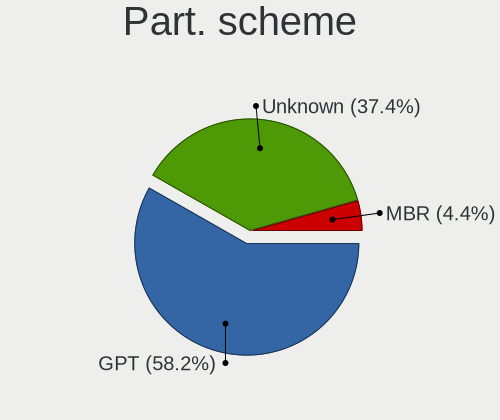
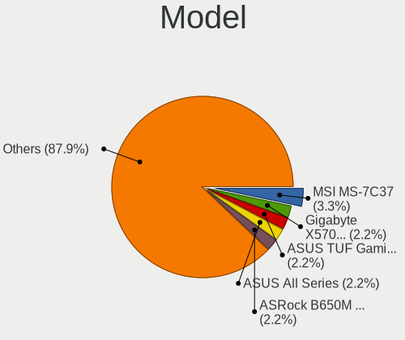
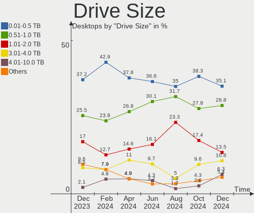
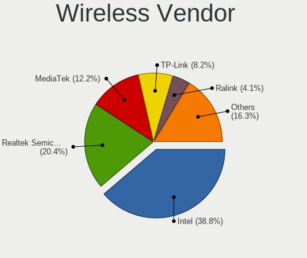
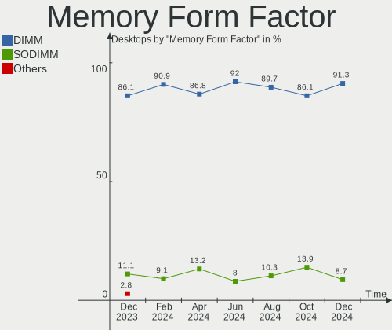

Linux in Canada - Hardware Trends (Desktops)
--------------------------------------------

A project to identify most popular hardware characteristics and track their change
over time based on data collected by Linux users at https://Linux-Hardware.org.

Anyone can contribute to this report by the [hw-probe](https://github.com/linuxhw/hw-probe) tool:

    sudo -E hw-probe -all -upload

Period: Aug, 2022.

Contents
--------

* [ System ](#system)
  - [ OS                       ](#os)
  - [ OS Family                ](#os-family)
  - [ Kernel                   ](#kernel)
  - [ Kernel Family            ](#kernel-family)
  - [ Kernel Major Ver.        ](#kernel-major-ver)
  - [ Arch                     ](#arch)
  - [ DE                       ](#de)
  - [ Display Server           ](#display-server)
  - [ Display Manager          ](#display-manager)
  - [ OS Lang                  ](#os-lang)
  - [ Boot Mode                ](#boot-mode)
  - [ Filesystem               ](#filesystem)
  - [ Part. scheme             ](#part-scheme)
  - [ Dual Boot with Linux/BSD ](#dual-boot-with-linuxbsd)
  - [ Dual Boot (Win)          ](#dual-boot-win)

* [ Board ](#board)
  - [ Vendor                   ](#vendor)
  - [ Model                    ](#model)
  - [ Model Family             ](#model-family)
  - [ MFG Year                 ](#mfg-year)
  - [ Form Factor              ](#form-factor)
  - [ Secure Boot              ](#secure-boot)
  - [ Coreboot                 ](#coreboot)
  - [ RAM Size                 ](#ram-size)
  - [ RAM Used                 ](#ram-used)
  - [ Total Drives             ](#total-drives)
  - [ Has CD-ROM               ](#has-cd-rom)
  - [ Has Ethernet             ](#has-ethernet)
  - [ Has WiFi                 ](#has-wifi)
  - [ Has Bluetooth            ](#has-bluetooth)

* [ Location ](#location)
  - [ Country                  ](#country)
  - [ City                     ](#city)

* [ Drives ](#drives)
  - [ Drive Vendor             ](#drive-vendor)
  - [ Drive Model              ](#drive-model)
  - [ HDD Vendor               ](#hdd-vendor)
  - [ SSD Vendor               ](#ssd-vendor)
  - [ Drive Kind               ](#drive-kind)
  - [ Drive Connector          ](#drive-connector)
  - [ Drive Size               ](#drive-size)
  - [ Space Total              ](#space-total)
  - [ Space Used               ](#space-used)
  - [ Malfunc. Drives          ](#malfunc-drives)
  - [ Malfunc. Drive Vendor    ](#malfunc-drive-vendor)
  - [ Malfunc. HDD Vendor      ](#malfunc-hdd-vendor)
  - [ Malfunc. Drive Kind      ](#malfunc-drive-kind)
  - [ Failed Drives            ](#failed-drives)
  - [ Failed Drive Vendor      ](#failed-drive-vendor)
  - [ Drive Status             ](#drive-status)

* [ Storage controller ](#storage-controller)
  - [ Storage Vendor           ](#storage-vendor)
  - [ Storage Model            ](#storage-model)
  - [ Storage Kind             ](#storage-kind)

* [ Processor ](#processor)
  - [ CPU Vendor               ](#cpu-vendor)
  - [ CPU Model                ](#cpu-model)
  - [ CPU Model Family         ](#cpu-model-family)
  - [ CPU Cores                ](#cpu-cores)
  - [ CPU Sockets              ](#cpu-sockets)
  - [ CPU Threads              ](#cpu-threads)
  - [ CPU Op-Modes             ](#cpu-op-modes)
  - [ CPU Microcode            ](#cpu-microcode)
  - [ CPU Microarch            ](#cpu-microarch)

* [ Graphics ](#graphics)
  - [ GPU Vendor               ](#gpu-vendor)
  - [ GPU Model                ](#gpu-model)
  - [ GPU Combo                ](#gpu-combo)
  - [ GPU Driver               ](#gpu-driver)
  - [ GPU Memory               ](#gpu-memory)

* [ Monitor ](#monitor)
  - [ Monitor Vendor           ](#monitor-vendor)
  - [ Monitor Model            ](#monitor-model)
  - [ Monitor Resolution       ](#monitor-resolution)
  - [ Monitor Diagonal         ](#monitor-diagonal)
  - [ Monitor Width            ](#monitor-width)
  - [ Aspect Ratio             ](#aspect-ratio)
  - [ Monitor Area             ](#monitor-area)
  - [ Pixel Density            ](#pixel-density)
  - [ Multiple Monitors        ](#multiple-monitors)

* [ Network ](#network)
  - [ Net Controller Vendor    ](#net-controller-vendor)
  - [ Net Controller Model     ](#net-controller-model)
  - [ Wireless Vendor          ](#wireless-vendor)
  - [ Wireless Model           ](#wireless-model)
  - [ Ethernet Vendor          ](#ethernet-vendor)
  - [ Ethernet Model           ](#ethernet-model)
  - [ Net Controller Kind      ](#net-controller-kind)
  - [ Used Controller          ](#used-controller)
  - [ NICs                     ](#nics)
  - [ IPv6                     ](#ipv6)

* [ Bluetooth ](#bluetooth)
  - [ Bluetooth Vendor         ](#bluetooth-vendor)
  - [ Bluetooth Model          ](#bluetooth-model)

* [ Sound ](#sound)
  - [ Sound Vendor             ](#sound-vendor)
  - [ Sound Model              ](#sound-model)

* [ Memory ](#memory)
  - [ Memory Vendor            ](#memory-vendor)
  - [ Memory Model             ](#memory-model)
  - [ Memory Kind              ](#memory-kind)
  - [ Memory Form Factor       ](#memory-form-factor)
  - [ Memory Size              ](#memory-size)
  - [ Memory Speed             ](#memory-speed)

* [ Printers & scanners ](#printers--scanners)
  - [ Printer Vendor           ](#printer-vendor)
  - [ Printer Model            ](#printer-model)
  - [ Scanner Vendor           ](#scanner-vendor)
  - [ Scanner Model            ](#scanner-model)

* [ Camera ](#camera)
  - [ Camera Vendor            ](#camera-vendor)
  - [ Camera Model             ](#camera-model)

* [ Security ](#security)
  - [ Fingerprint Vendor       ](#fingerprint-vendor)
  - [ Fingerprint Model        ](#fingerprint-model)
  - [ Chipcard Vendor          ](#chipcard-vendor)
  - [ Chipcard Model           ](#chipcard-model)

* [ Unsupported ](#unsupported)
  - [ Unsupported Devices      ](#unsupported-devices)
  - [ Unsupported Device Types ](#unsupported-device-types)

System
------

OS
--

Installed operating systems

| Name              | Desktops | Percent |
|-------------------|----------|---------|
| OpenMandriva 4.3  | 5        | 12.82%  |
| Fedora 36         | 5        | 12.82%  |
| Ubuntu 20.04      | 4        | 10.26%  |
| Zorin 16          | 3        | 7.69%   |
| Ubuntu 22.04      | 3        | 7.69%   |
| Pop!_OS 22.04     | 2        | 5.13%   |
| Linux Mint 21     | 2        | 5.13%   |
| Linux Mint 20.3   | 2        | 5.13%   |
| Ubuntu MATE 22.04 | 1        | 2.56%   |
| Ubuntu MATE 20.04 | 1        | 2.56%   |
| SteamOS 3.3       | 1        | 2.56%   |
| OpenMandriva 4.90 | 1        | 2.56%   |
| Manjaro           | 1        | 2.56%   |
| Linux Mint 20.2   | 1        | 2.56%   |
| Kubuntu 22.04     | 1        | 2.56%   |
| Kali 2022.3       | 1        | 2.56%   |
| Elementary 6.1    | 1        | 2.56%   |
| Elementary 5.1.7  | 1        | 2.56%   |
| Debian 11         | 1        | 2.56%   |
| CentOS 7          | 1        | 2.56%   |
| Arch              | 1        | 2.56%   |

OS Family
---------

OS without a version

| Name         | Desktops | Percent |
|--------------|----------|---------|
| Ubuntu       | 7        | 17.95%  |
| OpenMandriva | 6        | 15.38%  |
| Linux Mint   | 5        | 12.82%  |
| Fedora       | 5        | 12.82%  |
| Zorin        | 3        | 7.69%   |
| Ubuntu MATE  | 2        | 5.13%   |
| Pop!_OS      | 2        | 5.13%   |
| Elementary   | 2        | 5.13%   |
| SteamOS      | 1        | 2.56%   |
| Manjaro      | 1        | 2.56%   |
| Kubuntu      | 1        | 2.56%   |
| Kali         | 1        | 2.56%   |
| Debian       | 1        | 2.56%   |
| CentOS       | 1        | 2.56%   |
| Arch         | 1        | 2.56%   |

Kernel
------

Version of the Linux kernel

| Version                                      | Desktops | Percent |
|----------------------------------------------|----------|---------|
| 5.15.0-46-generic                            | 8        | 20.51%  |
| 5.16.7-desktop-1omv4003                      | 5        | 12.82%  |
| 5.15.0-43-generic                            | 3        | 7.69%   |
| 5.4.0-124-generic                            | 2        | 5.13%   |
| 5.4.0-122-generic                            | 2        | 5.13%   |
| 5.18.16-200.fc36.x86_64                      | 2        | 5.13%   |
| 5.19.0-76051900-generic                      | 1        | 2.56%   |
| 5.18.5-200.fc36.x86_64                       | 1        | 2.56%   |
| 5.18.18-200.fc36.x86_64                      | 1        | 2.56%   |
| 5.18.16-arch1-1                              | 1        | 2.56%   |
| 5.18.15-200.fc36.x86_64                      | 1        | 2.56%   |
| 5.18.14-1-MANJARO                            | 1        | 2.56%   |
| 5.18.12-desktop-3omv4090                     | 1        | 2.56%   |
| 5.18.10-76051810-generic                     | 1        | 2.56%   |
| 5.18.0-kali5-amd64                           | 1        | 2.56%   |
| 5.18.0-1-generic                             | 1        | 2.56%   |
| 5.15.0-41-generic                            | 1        | 2.56%   |
| 5.15.0-25-generic                            | 1        | 2.56%   |
| 5.14.0-1047-oem                              | 1        | 2.56%   |
| 5.13.0-valve22-1-neptune-02213-gb68995364335 | 1        | 2.56%   |
| 5.11.0-7614-generic                          | 1        | 2.56%   |
| 5.10.0-16-amd64                              | 1        | 2.56%   |
| 3.10.0-1160.76.1.el7.x86_64                  | 1        | 2.56%   |

Kernel Family
-------------

Linux kernel without a distro release

| Version | Desktops | Percent |
|---------|----------|---------|
| 5.15.0  | 13       | 33.33%  |
| 5.16.7  | 5        | 12.82%  |
| 5.4.0   | 4        | 10.26%  |
| 5.18.16 | 3        | 7.69%   |
| 5.18.0  | 2        | 5.13%   |
| 5.19.0  | 1        | 2.56%   |
| 5.18.5  | 1        | 2.56%   |
| 5.18.18 | 1        | 2.56%   |
| 5.18.15 | 1        | 2.56%   |
| 5.18.14 | 1        | 2.56%   |
| 5.18.12 | 1        | 2.56%   |
| 5.18.10 | 1        | 2.56%   |
| 5.14.0  | 1        | 2.56%   |
| 5.13.0  | 1        | 2.56%   |
| 5.11.0  | 1        | 2.56%   |
| 5.10.0  | 1        | 2.56%   |
| 3.10.0  | 1        | 2.56%   |

Kernel Major Ver.
-----------------

Linux kernel major version

| Version | Desktops | Percent |
|---------|----------|---------|
| 5.15    | 13       | 33.33%  |
| 5.18    | 11       | 28.21%  |
| 5.16    | 5        | 12.82%  |
| 5.4     | 4        | 10.26%  |
| 5.19    | 1        | 2.56%   |
| 5.14    | 1        | 2.56%   |
| 5.13    | 1        | 2.56%   |
| 5.11    | 1        | 2.56%   |
| 5.10    | 1        | 2.56%   |
| 3.10    | 1        | 2.56%   |

Arch
----

OS architecture (x86_64, i586, etc.)

| Name   | Desktops | Percent |
|--------|----------|---------|
| x86_64 | 39       | 100%    |

DE
--

Desktop Environment

| Name       | Desktops | Percent |
|------------|----------|---------|
| GNOME      | 19       | 48.72%  |
| KDE5       | 8        | 20.51%  |
| MATE       | 4        | 10.26%  |
| Pantheon   | 2        | 5.13%   |
| i3         | 2        | 5.13%   |
| Cinnamon   | 2        | 5.13%   |
| X-Cinnamon | 1        | 2.56%   |
| Unknown    | 1        | 2.56%   |

Display Server
--------------

X11 or Wayland

| Name    | Desktops | Percent |
|---------|----------|---------|
| X11     | 33       | 84.62%  |
| Wayland | 5        | 12.82%  |
| Unknown | 1        | 2.56%   |

Display Manager
---------------

SDDM, LightDM, etc.

| Name    | Desktops | Percent |
|---------|----------|---------|
| Unknown | 17       | 43.59%  |
| SDDM    | 7        | 17.95%  |
| GDM3    | 6        | 15.38%  |
| LightDM | 5        | 12.82%  |
| GDM     | 4        | 10.26%  |

OS Lang
-------

Language

| Lang  | Desktops | Percent |
|-------|----------|---------|
| en_CA | 20       | 51.28%  |
| en_US | 14       | 35.9%   |
| fr_CA | 5        | 12.82%  |

Boot Mode
---------

EFI or BIOS

| Mode | Desktops | Percent |
|------|----------|---------|
| EFI  | 21       | 53.85%  |
| BIOS | 18       | 46.15%  |

Filesystem
----------

Type of filesystem

| Type    | Desktops | Percent |
|---------|----------|---------|
| Ext4    | 22       | 56.41%  |
| Btrfs   | 9        | 23.08%  |
| Overlay | 6        | 15.38%  |
| Zfs     | 1        | 2.56%   |
| Xfs     | 1        | 2.56%   |

Part. scheme
------------

Scheme of partitioning

| Type    | Desktops | Percent |
|---------|----------|---------|
| Unknown | 21       | 53.85%  |
| GPT     | 16       | 41.03%  |
| MBR     | 2        | 5.13%   |

Dual Boot with Linux/BSD
------------------------

Hosting more than one Linux/BSD

| Dual boot | Desktops | Percent |
|-----------|----------|---------|
| No        | 32       | 82.05%  |
| Yes       | 7        | 17.95%  |

Dual Boot (Win)
---------------

Hosting Linux and Windows

| Dual boot | Desktops | Percent |
|-----------|----------|---------|
| No        | 23       | 58.97%  |
| Yes       | 16       | 41.03%  |

Board
-----

Vendor
------

Motherboard manufacturer

| Name                | Desktops | Percent |
|---------------------|----------|---------|
| ASUSTek Computer    | 16       | 41.03%  |
| Dell                | 7        | 17.95%  |
| Hewlett-Packard     | 4        | 10.26%  |
| Gigabyte Technology | 4        | 10.26%  |
| Lenovo              | 2        | 5.13%   |
| MSI                 | 1        | 2.56%   |
| JGINYUE             | 1        | 2.56%   |
| Intel               | 1        | 2.56%   |
| Biostar             | 1        | 2.56%   |
| ASRock              | 1        | 2.56%   |
| Acer                | 1        | 2.56%   |

Model
-----

Motherboard model

| Name                                | Desktops | Percent |
|-------------------------------------|----------|---------|
| ASUS TUF Gaming X570-PLUS           | 2        | 5.13%   |
| ASUS All Series                     | 2        | 5.13%   |
| MSI MPG H510 Trident 3 (MS-B935)    | 1        | 2.56%   |
| Lenovo ThinkStation P500 30A6S24K00 | 1        | 2.56%   |
| Lenovo ThinkCentre M92p 3212DF9     | 1        | 2.56%   |
| JGINYUE B85I PLUS V2.1              | 1        | 2.56%   |
| Intel DH87RL AAG74240-401           | 1        | 2.56%   |
| HP ProDesk 600 G2 SFF               | 1        | 2.56%   |
| HP Pavilion 590-p0049 3LC38AA       | 1        | 2.56%   |
| HP EliteDesk 800 G1 TWR             | 1        | 2.56%   |
| HP Compaq Pro 6300 SFF              | 1        | 2.56%   |
| Gigabyte Z690I AORUS ULTRA DDR4     | 1        | 2.56%   |
| Gigabyte X570 AORUS MASTER          | 1        | 2.56%   |
| Gigabyte H370AORUSGAMING3WIFI       | 1        | 2.56%   |
| Gigabyte B450 I AORUS PRO WIFI      | 1        | 2.56%   |
| Dell XPS 8500                       | 1        | 2.56%   |
| Dell Vostro 430                     | 1        | 2.56%   |
| Dell OptiPlex 9020                  | 1        | 2.56%   |
| Dell OptiPlex 7020                  | 1        | 2.56%   |
| Dell OptiPlex 7010                  | 1        | 2.56%   |
| Dell OptiPlex 3060                  | 1        | 2.56%   |
| Dell Inspiron 5675                  | 1        | 2.56%   |
| Biostar TA880GU3+                   | 1        | 2.56%   |
| ASUS TUF Z390-PLUS GAMING           | 1        | 2.56%   |
| ASUS TUF Gaming B550-PLUS           | 1        | 2.56%   |
| ASUS ROG STRIX Z690-E GAMING WIFI   | 1        | 2.56%   |
| ASUS ROG Strix G10DK_G10DK          | 1        | 2.56%   |
| ASUS PRIME Z390-A                   | 1        | 2.56%   |
| ASUS PRIME H370-A                   | 1        | 2.56%   |
| ASUS PRIME B550M-A                  | 1        | 2.56%   |
| ASUS PRIME B450M-A                  | 1        | 2.56%   |
| ASUS PRIME B350M-E                  | 1        | 2.56%   |
| ASUS P5GC-MX                        | 1        | 2.56%   |
| ASUS M4A78-E                        | 1        | 2.56%   |
| ASUS K30AD_M31AD_M51AD              | 1        | 2.56%   |
| ASRock B450M Pro4                   | 1        | 2.56%   |
| Acer Aspire TC-885                  | 1        | 2.56%   |

Model Family
------------

Motherboard model prefix

| Name                          | Desktops | Percent |
|-------------------------------|----------|---------|
| ASUS PRIME                    | 5        | 12.82%  |
| Dell OptiPlex                 | 4        | 10.26%  |
| ASUS TUF                      | 4        | 10.26%  |
| ASUS ROG                      | 2        | 5.13%   |
| ASUS All                      | 2        | 5.13%   |
| MSI MPG                       | 1        | 2.56%   |
| Lenovo ThinkStation           | 1        | 2.56%   |
| Lenovo ThinkCentre            | 1        | 2.56%   |
| JGINYUE B85I                  | 1        | 2.56%   |
| Intel DH87RL                  | 1        | 2.56%   |
| HP ProDesk                    | 1        | 2.56%   |
| HP Pavilion                   | 1        | 2.56%   |
| HP EliteDesk                  | 1        | 2.56%   |
| HP Compaq                     | 1        | 2.56%   |
| Gigabyte Z690I                | 1        | 2.56%   |
| Gigabyte X570                 | 1        | 2.56%   |
| Gigabyte H370AORUSGAMING3WIFI | 1        | 2.56%   |
| Gigabyte B450                 | 1        | 2.56%   |
| Dell XPS                      | 1        | 2.56%   |
| Dell Vostro                   | 1        | 2.56%   |
| Dell Inspiron                 | 1        | 2.56%   |
| Biostar TA880GU3+             | 1        | 2.56%   |
| ASUS P5GC-MX                  | 1        | 2.56%   |
| ASUS M4A78-E                  | 1        | 2.56%   |
| ASUS K30AD                    | 1        | 2.56%   |
| ASRock B450M                  | 1        | 2.56%   |
| Acer Aspire                   | 1        | 2.56%   |

MFG Year
--------

Motherboard manufacture year

| Year | Desktops | Percent |
|------|----------|---------|
| 2018 | 10       | 25.64%  |
| 2021 | 4        | 10.26%  |
| 2019 | 4        | 10.26%  |
| 2012 | 4        | 10.26%  |
| 2014 | 3        | 7.69%   |
| 2013 | 3        | 7.69%   |
| 2022 | 2        | 5.13%   |
| 2020 | 2        | 5.13%   |
| 2015 | 2        | 5.13%   |
| 2017 | 1        | 2.56%   |
| 2011 | 1        | 2.56%   |
| 2010 | 1        | 2.56%   |
| 2009 | 1        | 2.56%   |
| 2007 | 1        | 2.56%   |

Form Factor
-----------

Physical design of the computer

| Name    | Desktops | Percent |
|---------|----------|---------|
| Desktop | 39       | 100%    |

Secure Boot
-----------

Enabled or disabled

| State    | Desktops | Percent |
|----------|----------|---------|
| Disabled | 38       | 97.44%  |
| Enabled  | 1        | 2.56%   |

Coreboot
--------

Have coreboot on board

| Used | Desktops | Percent |
|------|----------|---------|
| No   | 39       | 100%    |

RAM Size
--------

Total RAM memory

| Size in GB  | Desktops | Percent |
|-------------|----------|---------|
| 32.01-64.0  | 13       | 33.33%  |
| 16.01-24.0  | 13       | 33.33%  |
| 8.01-16.0   | 5        | 12.82%  |
| 4.01-8.0    | 3        | 7.69%   |
| 3.01-4.0    | 2        | 5.13%   |
| 24.01-32.0  | 1        | 2.56%   |
| 64.01-256.0 | 1        | 2.56%   |
| 1.01-2.0    | 1        | 2.56%   |

RAM Used
--------

Used RAM memory

| Used GB   | Desktops | Percent |
|-----------|----------|---------|
| 1.01-2.0  | 13       | 33.33%  |
| 4.01-8.0  | 8        | 20.51%  |
| 2.01-3.0  | 8        | 20.51%  |
| 3.01-4.0  | 6        | 15.38%  |
| 8.01-16.0 | 3        | 7.69%   |
| 0.51-1.0  | 1        | 2.56%   |

Total Drives
------------

Number of drives on board

| Drives | Desktops | Percent |
|--------|----------|---------|
| 2      | 15       | 38.46%  |
| 1      | 10       | 25.64%  |
| 3      | 8        | 20.51%  |
| 6      | 2        | 5.13%   |
| 5      | 2        | 5.13%   |
| 4      | 2        | 5.13%   |

Has CD-ROM
----------

Has CD-ROM on board

| Presented | Desktops | Percent |
|-----------|----------|---------|
| Yes       | 23       | 58.97%  |
| No        | 16       | 41.03%  |

Has Ethernet
------------

Has Ethernet on board

| Presented | Desktops | Percent |
|-----------|----------|---------|
| Yes       | 38       | 97.44%  |
| No        | 1        | 2.56%   |

Has WiFi
--------

Has WiFi module

| Presented | Desktops | Percent |
|-----------|----------|---------|
| Yes       | 24       | 61.54%  |
| No        | 15       | 38.46%  |

Has Bluetooth
-------------

Has Bluetooth module

| Presented | Desktops | Percent |
|-----------|----------|---------|
| Yes       | 21       | 53.85%  |
| No        | 18       | 46.15%  |

Location
--------

Country
-------

Geographic location (country)

| Country | Desktops | Percent |
|---------|----------|---------|
| Canada  | 39       | 100%    |

City
----

Geographic location (city)

| City                   | Desktops | Percent |
|------------------------|----------|---------|
| Toronto                | 4        | 10.26%  |
| Ottawa                 | 3        | 7.69%   |
| Montreal               | 3        | 7.69%   |
| Sherbrooke             | 2        | 5.13%   |
| Langley                | 2        | 5.13%   |
| Calgary                | 2        | 5.13%   |
| Woodstock              | 1        | 2.56%   |
| Winnipeg               | 1        | 2.56%   |
| Waterloo               | 1        | 2.56%   |
| Victoria               | 1        | 2.56%   |
| Trois-Rivières        | 1        | 2.56%   |
| Terrace                | 1        | 2.56%   |
| Sarnia                 | 1        | 2.56%   |
| Saint-Joseph-de-Beauce | 1        | 2.56%   |
| Port Hawkesbury        | 1        | 2.56%   |
| Morden                 | 1        | 2.56%   |
| Milton                 | 1        | 2.56%   |
| London                 | 1        | 2.56%   |
| Lloydminster           | 1        | 2.56%   |
| Laval                  | 1        | 2.56%   |
| Kelowna                | 1        | 2.56%   |
| Joliette               | 1        | 2.56%   |
| Halifax                | 1        | 2.56%   |
| Fonthill               | 1        | 2.56%   |
| Edmonton               | 1        | 2.56%   |
| Daniel's Harbour       | 1        | 2.56%   |
| Cowansville            | 1        | 2.56%   |
| Chateauguay            | 1        | 2.56%   |
| Airdrie                | 1        | 2.56%   |

Drives
------

Drive Vendor
------------

Hard drive vendors

| Vendor              | Desktops | Drives | Percent |
|---------------------|----------|--------|---------|
| Seagate             | 14       | 20     | 19.18%  |
| WDC                 | 13       | 17     | 17.81%  |
| SanDisk             | 8        | 8      | 10.96%  |
| Samsung Electronics | 7        | 12     | 9.59%   |
| Crucial             | 5        | 8      | 6.85%   |
| Kingston            | 4        | 6      | 5.48%   |
| Toshiba             | 3        | 3      | 4.11%   |
| KingFast            | 3        | 3      | 4.11%   |
| Intel               | 3        | 3      | 4.11%   |
| SPCC                | 2        | 2      | 2.74%   |
| Silicon Motion      | 1        | 2      | 1.37%   |
| Realtek             | 1        | 1      | 1.37%   |
| PNY                 | 1        | 1      | 1.37%   |
| Patriot             | 1        | 1      | 1.37%   |
| Mushkin             | 1        | 1      | 1.37%   |
| Micron Technology   | 1        | 1      | 1.37%   |
| Hitachi             | 1        | 1      | 1.37%   |
| Fujitsu             | 1        | 1      | 1.37%   |
| DAS                 | 1        | 3      | 1.37%   |
| Corsair             | 1        | 1      | 1.37%   |
| A-DATA Technology   | 1        | 1      | 1.37%   |

Drive Model
-----------

Hard drive models

| Model                               | Desktops | Percent |
|-------------------------------------|----------|---------|
| SanDisk NVMe SSD Drive 1TB          | 5        | 5.49%   |
| Seagate ST2000DM008-2FR102 2TB      | 4        | 4.4%    |
| WDC WDS500G2B0A-00SM50 500GB SSD    | 2        | 2.2%    |
| WDC WDS100T2B0A-00SM50 1TB SSD      | 2        | 2.2%    |
| WDC WD2003FZEX-00SRLA0 2TB          | 2        | 2.2%    |
| Seagate ST2000DM001-1ER164 2TB      | 2        | 2.2%    |
| Samsung SSD 870 EVO 1TB             | 2        | 2.2%    |
| Samsung SSD 860 EVO 500GB           | 2        | 2.2%    |
| Kingston NVMe SSD Drive 250GB       | 2        | 2.2%    |
| Crucial CT2000MX500SSD1 2TB         | 2        | 2.2%    |
| Crucial CT1000MX500SSD1 1TB         | 2        | 2.2%    |
| WDC WD5000AAKX-22ERMA0 500GB        | 1        | 1.1%    |
| WDC WD5000AAKS-00V1A0 500GB         | 1        | 1.1%    |
| WDC WD40EZRZ-00GXCB0 4TB            | 1        | 1.1%    |
| WDC WD3200AAKS-00SBA0 320GB         | 1        | 1.1%    |
| WDC WD20EZRZ-00Z5HB0 2TB            | 1        | 1.1%    |
| WDC WD20EZRX-00DC0B0 2TB            | 1        | 1.1%    |
| WDC WD20EARS-00MVWB0 2TB            | 1        | 1.1%    |
| WDC WD2003FZEX-00Z4SA0 2TB          | 1        | 1.1%    |
| WDC WD10EZEX-00ZF5A0 1TB            | 1        | 1.1%    |
| WDC WD10EFRX-68PJCN0 1TB            | 1        | 1.1%    |
| WDC WD101EMAZ-11G7DA0 10TB          | 1        | 1.1%    |
| Toshiba DT01ACA200 2TB              | 1        | 1.1%    |
| Toshiba DT01ACA100 1TB              | 1        | 1.1%    |
| Toshiba DT01ACA050 500GB            | 1        | 1.1%    |
| SPCC Solid State Disk 256GB         | 1        | 1.1%    |
| SPCC M.2 PCIe SSD 1TB               | 1        | 1.1%    |
| Silicon Motion NVMe SSD Drive 512GB | 1        | 1.1%    |
| Silicon Motion NVME SSD 512GB       | 1        | 1.1%    |
| Seagate ST8000DM004-2CX188 8TB      | 1        | 1.1%    |
| Seagate ST500LT012-1DG142 500GB     | 1        | 1.1%    |
| Seagate ST500DM002-1BD142 500GB     | 1        | 1.1%    |
| Seagate ST3000DM008-2DM166 3TB      | 1        | 1.1%    |
| Seagate ST240HM000-1G5152 240GB SSD | 1        | 1.1%    |
| Seagate ST2000LX001-1RG174 2TB      | 1        | 1.1%    |
| Seagate ST2000DM001-9YN164 2TB      | 1        | 1.1%    |
| Seagate ST2000DM 008-2FR102 2TB     | 1        | 1.1%    |
| Seagate ST1000LM049-2GH172 1TB      | 1        | 1.1%    |
| Seagate ST1000DX001-1CM162 1TB      | 1        | 1.1%    |
| Seagate ST1000DM003-1CH162 1TB      | 1        | 1.1%    |
| Seagate Expansion Desk 4TB          | 1        | 1.1%    |
| Seagate BUP Portable 5TB            | 1        | 1.1%    |
| SanDisk NVMe SSD Drive 512GB        | 1        | 1.1%    |
| SanDisk NVMe SSD Drive 500GB        | 1        | 1.1%    |
| SanDisk NVMe SSD Drive 2TB          | 1        | 1.1%    |
| Samsung SSD 970 EVO Plus 1TB        | 1        | 1.1%    |
| Samsung SSD 860 EVO 250GB           | 1        | 1.1%    |
| Samsung SSD 860 EVO 1TB             | 1        | 1.1%    |
| Samsung SSD 850 EVO 500GB           | 1        | 1.1%    |
| Samsung SSD 850 EVO 250GB           | 1        | 1.1%    |
| Samsung SSD 840 EVO 250GB           | 1        | 1.1%    |
| Samsung NVMe SSD Drive 500GB        | 1        | 1.1%    |
| Samsung NVMe SSD Drive 2TB          | 1        | 1.1%    |
| Realtek RTL9210 NVME 250GB          | 1        | 1.1%    |
| PNY SSD2SC240G3CL4763C121S488 240GB | 1        | 1.1%    |
| Patriot Blast 480GB SSD             | 1        | 1.1%    |
| Mushkin MKNSSDRE1TB                 | 1        | 1.1%    |
| Micron 1100 SATA 256GB SSD          | 1        | 1.1%    |
| Kingston SUV400S37240G 240GB SSD    | 1        | 1.1%    |
| Kingston SHSS37A240G 240GB SSD      | 1        | 1.1%    |

HDD Vendor
----------

Hard disk drive vendors

| Vendor  | Desktops | Drives | Percent |
|---------|----------|--------|---------|
| Seagate | 14       | 19     | 46.67%  |
| WDC     | 10       | 13     | 33.33%  |
| Toshiba | 3        | 3      | 10%     |
| Hitachi | 1        | 1      | 3.33%   |
| Fujitsu | 1        | 1      | 3.33%   |
| DAS     | 1        | 3      | 3.33%   |

SSD Vendor
----------

Solid state drive vendors

| Vendor              | Desktops | Drives | Percent |
|---------------------|----------|--------|---------|
| Samsung Electronics | 5        | 9      | 20%     |
| Crucial             | 5        | 8      | 20%     |
| WDC                 | 4        | 4      | 16%     |
| Kingston            | 2        | 2      | 8%      |
| KingFast            | 2        | 2      | 8%      |
| SPCC                | 1        | 1      | 4%      |
| Seagate             | 1        | 1      | 4%      |
| PNY                 | 1        | 1      | 4%      |
| Patriot             | 1        | 1      | 4%      |
| Mushkin             | 1        | 1      | 4%      |
| Micron Technology   | 1        | 1      | 4%      |
| A-DATA Technology   | 1        | 1      | 4%      |

Drive Kind
----------

HDD or SSD

| Kind    | Desktops | Drives | Percent |
|---------|----------|--------|---------|
| HDD     | 24       | 40     | 40%     |
| SSD     | 18       | 32     | 30%     |
| NVMe    | 17       | 23     | 28.33%  |
| Unknown | 1        | 1      | 1.67%   |

Drive Connector
---------------

SATA, SAS, NVMe, etc.

| Type | Desktops | Drives | Percent |
|------|----------|--------|---------|
| SATA | 36       | 66     | 63.16%  |
| NVMe | 16       | 22     | 28.07%  |
| SAS  | 5        | 8      | 8.77%   |

Drive Size
----------

Size of hard drive

| Size in TB | Desktops | Drives | Percent |
|------------|----------|--------|---------|
| 0.01-0.5   | 18       | 27     | 32.73%  |
| 1.01-2.0   | 17       | 19     | 30.91%  |
| 0.51-1.0   | 14       | 18     | 25.45%  |
| 3.01-4.0   | 3        | 4      | 5.45%   |
| 4.01-10.0  | 2        | 3      | 3.64%   |
| 2.01-3.0   | 1        | 1      | 1.82%   |

Space Total
-----------

Amount of disk space available on the file system

| Size in GB     | Desktops | Percent |
|----------------|----------|---------|
| 1001-2000      | 7        | 17.95%  |
| More than 3000 | 5        | 12.82%  |
| 251-500        | 5        | 12.82%  |
| 101-250        | 5        | 12.82%  |
| 1-20           | 5        | 12.82%  |
| 501-1000       | 5        | 12.82%  |
| 2001-3000      | 4        | 10.26%  |
| Unknown        | 2        | 5.13%   |
| 51-100         | 1        | 2.56%   |

Space Used
----------

Amount of used disk space

| Used GB        | Desktops | Percent |
|----------------|----------|---------|
| 1-20           | 11       | 28.21%  |
| 21-50          | 6        | 15.38%  |
| 501-1000       | 5        | 12.82%  |
| 51-100         | 5        | 12.82%  |
| More than 3000 | 3        | 7.69%   |
| 251-500        | 3        | 7.69%   |
| 101-250        | 3        | 7.69%   |
| Unknown        | 2        | 5.13%   |
| 2001-3000      | 1        | 2.56%   |

Malfunc. Drives
---------------

Drive models with a malfunction

| Model                               | Desktops | Drives | Percent |
|-------------------------------------|----------|--------|---------|
| WDC WD5000AAKS-00V1A0 500GB         | 1        | 1      | 33.33%  |
| Samsung Electronics SSD 870 EVO 1TB | 1        | 1      | 33.33%  |
| Hitachi HDT721010SLA360 1TB         | 1        | 1      | 33.33%  |

Malfunc. Drive Vendor
---------------------

Vendors of faulty drives

| Vendor              | Desktops | Drives | Percent |
|---------------------|----------|--------|---------|
| WDC                 | 1        | 1      | 33.33%  |
| Samsung Electronics | 1        | 1      | 33.33%  |
| Hitachi             | 1        | 1      | 33.33%  |

Malfunc. HDD Vendor
-------------------

Vendors of faulty HDD drives

| Vendor  | Desktops | Drives | Percent |
|---------|----------|--------|---------|
| WDC     | 1        | 1      | 50%     |
| Hitachi | 1        | 1      | 50%     |

Malfunc. Drive Kind
-------------------

Kinds of faulty drives

| Kind | Desktops | Drives | Percent |
|------|----------|--------|---------|
| HDD  | 2        | 2      | 66.67%  |
| SSD  | 1        | 1      | 33.33%  |

Failed Drives
-------------

Failed drive models

Zero info for selected period =(

Failed Drive Vendor
-------------------

Failed drive vendors

Zero info for selected period =(

Drive Status
------------

Number of failed and malfunc. drives

| Status   | Desktops | Drives | Percent |
|----------|----------|--------|---------|
| Detected | 23       | 56     | 51.11%  |
| Works    | 19       | 37     | 42.22%  |
| Malfunc  | 3        | 3      | 6.67%   |

Storage controller
------------------

Storage Vendor
--------------

Storage controller vendors

| Vendor                      | Desktops | Percent |
|-----------------------------|----------|---------|
| Intel                       | 27       | 45%     |
| AMD                         | 14       | 23.33%  |
| SanDisk                     | 8        | 13.33%  |
| Samsung Electronics         | 3        | 5%      |
| Phison Electronics          | 2        | 3.33%   |
| Kingston Technology Company | 2        | 3.33%   |
| ASMedia Technology          | 2        | 3.33%   |
| Silicon Motion              | 1        | 1.67%   |
| Broadcom / LSI              | 1        | 1.67%   |

Storage Model
-------------

Storage controller models

| Model                                                                          | Desktops | Percent |
|--------------------------------------------------------------------------------|----------|---------|
| Intel 8 Series/C220 Series Chipset Family 6-port SATA Controller 1 [AHCI mode] | 7        | 9.86%   |
| AMD FCH SATA Controller [AHCI mode]                                            | 6        | 8.45%   |
| SanDisk WD Blue SN550 NVMe SSD                                                 | 4        | 5.63%   |
| Intel SATA Controller [RAID mode]                                              | 4        | 5.63%   |
| Intel 7 Series/C210 Series Chipset Family 6-port SATA Controller [AHCI mode]   | 4        | 5.63%   |
| Intel SSD 660P Series                                                          | 3        | 4.23%   |
| AMD 500 Series Chipset SATA Controller                                         | 3        | 4.23%   |
| AMD 400 Series Chipset SATA Controller                                         | 3        | 4.23%   |
| Samsung NVMe SSD Controller SM981/PM981/PM983                                  | 2        | 2.82%   |
| Phison E12 NVMe Controller                                                     | 2        | 2.82%   |
| Intel Cannon Lake PCH SATA AHCI Controller                                     | 2        | 2.82%   |
| Intel Alder Lake-S PCH SATA Controller [AHCI Mode]                             | 2        | 2.82%   |
| ASMedia ASM1062 Serial ATA Controller                                          | 2        | 2.82%   |
| AMD SB7x0/SB8x0/SB9x0 IDE Controller                                           | 2        | 2.82%   |
| AMD 300 Series Chipset SATA Controller                                         | 2        | 2.82%   |
| Silicon Motion SM2263EN/SM2263XT SSD Controller                                | 1        | 1.41%   |
| SanDisk WD PC SN810 / Black SN850 NVMe SSD                                     | 1        | 1.41%   |
| SanDisk WD Black SN750 / PC SN730 NVMe SSD                                     | 1        | 1.41%   |
| SanDisk WD Black 2018/SN750 / PC SN720 NVMe SSD                                | 1        | 1.41%   |
| SanDisk Non-Volatile memory controller                                         | 1        | 1.41%   |
| Samsung NVMe SSD Controller PM9A1/PM9A3/980PRO                                 | 1        | 1.41%   |
| Kingston Company U-SNS8154P3 NVMe SSD                                          | 1        | 1.41%   |
| Kingston Company Company Non-Volatile memory controller                        | 1        | 1.41%   |
| Kingston Company A2000 NVMe SSD                                                | 1        | 1.41%   |
| Intel Volume Management Device NVMe RAID Controller                            | 1        | 1.41%   |
| Intel Q170/Q150/B150/H170/H110/Z170/CM236 Chipset SATA Controller [AHCI Mode]  | 1        | 1.41%   |
| Intel NM10/ICH7 Family SATA Controller [IDE mode]                              | 1        | 1.41%   |
| Intel C610/X99 series chipset sSATA Controller [AHCI mode]                     | 1        | 1.41%   |
| Intel C610/X99 series chipset IDE-r Controller                                 | 1        | 1.41%   |
| Intel C610/X99 series chipset 6-Port SATA Controller [AHCI mode]               | 1        | 1.41%   |
| Intel 9 Series Chipset Family SATA Controller [AHCI Mode]                      | 1        | 1.41%   |
| Intel 82801G (ICH7 Family) IDE Controller                                      | 1        | 1.41%   |
| Intel 500 Series Chipset Family SATA AHCI Controller                           | 1        | 1.41%   |
| Intel 5 Series/3400 Series Chipset 6 port SATA AHCI Controller                 | 1        | 1.41%   |
| Broadcom / LSI SAS2116 PCI-Express Fusion-MPT SAS-2 [Meteor]                   | 1        | 1.41%   |
| AMD X370 Series Chipset SATA Controller                                        | 1        | 1.41%   |
| AMD SB7x0/SB8x0/SB9x0 SATA Controller [IDE mode]                               | 1        | 1.41%   |
| AMD SB7x0/SB8x0/SB9x0 SATA Controller [AHCI mode]                              | 1        | 1.41%   |

Storage Kind
------------

Kind of storage controller (IDE, SATA, NVMe, SAS, ...)

| Kind | Desktops | Percent |
|------|----------|---------|
| SATA | 34       | 56.67%  |
| NVMe | 16       | 26.67%  |
| RAID | 5        | 8.33%   |
| IDE  | 4        | 6.67%   |
| SAS  | 1        | 1.67%   |

Processor
---------

CPU Vendor
----------

Processor vendors

| Vendor | Desktops | Percent |
|--------|----------|---------|
| Intel  | 25       | 64.1%   |
| AMD    | 14       | 35.9%   |

CPU Model
---------

Processor models

| Model                                       | Desktops | Percent |
|---------------------------------------------|----------|---------|
| Intel Core i7-4790 CPU @ 3.60GHz            | 3        | 7.69%   |
| Intel Core i7-3770 CPU @ 3.40GHz            | 3        | 7.69%   |
| Intel Core i5-9400 CPU @ 2.90GHz            | 2        | 5.13%   |
| AMD Ryzen 5 5600X 6-Core Processor          | 2        | 5.13%   |
| AMD Ryzen 5 3600X 6-Core Processor          | 2        | 5.13%   |
| Intel Xeon CPU E5-1650 v3 @ 3.50GHz         | 1        | 2.56%   |
| Intel Pentium Dual CPU E2140 @ 1.60GHz      | 1        | 2.56%   |
| Intel Core i9-9900KS CPU @ 4.00GHz          | 1        | 2.56%   |
| Intel Core i7-9700 CPU @ 3.00GHz            | 1        | 2.56%   |
| Intel Core i7-8700 CPU @ 3.20GHz            | 1        | 2.56%   |
| Intel Core i7-4790K CPU @ 4.00GHz           | 1        | 2.56%   |
| Intel Core i7-4770 CPU @ 3.40GHz            | 1        | 2.56%   |
| Intel Core i5-8500T CPU @ 2.10GHz           | 1        | 2.56%   |
| Intel Core i5-6500 CPU @ 3.20GHz            | 1        | 2.56%   |
| Intel Core i5-4690 CPU @ 3.50GHz            | 1        | 2.56%   |
| Intel Core i5-4570 CPU @ 3.20GHz            | 1        | 2.56%   |
| Intel Core i5-4430 CPU @ 3.00GHz            | 1        | 2.56%   |
| Intel Core i5-3570 CPU @ 3.40GHz            | 1        | 2.56%   |
| Intel Core i5 CPU 650 @ 3.20GHz             | 1        | 2.56%   |
| Intel 12th Gen Core i7-12700K               | 1        | 2.56%   |
| Intel 12th Gen Core i5-12600K               | 1        | 2.56%   |
| Intel 11th Gen Core i7-11700F @ 2.50GHz     | 1        | 2.56%   |
| AMD Ryzen 9 3900XT 12-Core Processor        | 1        | 2.56%   |
| AMD Ryzen 7 5800X 8-Core Processor          | 1        | 2.56%   |
| AMD Ryzen 7 3700X 8-Core Processor          | 1        | 2.56%   |
| AMD Ryzen 7 1700X Eight-Core Processor      | 1        | 2.56%   |
| AMD Ryzen 5 5600G with Radeon Graphics      | 1        | 2.56%   |
| AMD Ryzen 5 3600 6-Core Processor           | 1        | 2.56%   |
| AMD Ryzen 5 2400G with Radeon Vega Graphics | 1        | 2.56%   |
| AMD Ryzen 3 1300X Quad-Core Processor       | 1        | 2.56%   |
| AMD Processor model unknown                 | 1        | 2.56%   |
| AMD Phenom II X4 810 Processor              | 1        | 2.56%   |

CPU Model Family
----------------

Processor model prefix

| Model              | Desktops | Percent |
|--------------------|----------|---------|
| Intel Core i7      | 10       | 25.64%  |
| Intel Core i5      | 9        | 23.08%  |
| AMD Ryzen 5        | 7        | 17.95%  |
| Other              | 4        | 10.26%  |
| AMD Ryzen 7        | 3        | 7.69%   |
| Intel Xeon         | 1        | 2.56%   |
| Intel Pentium Dual | 1        | 2.56%   |
| Intel Core i9      | 1        | 2.56%   |
| AMD Ryzen 9        | 1        | 2.56%   |
| AMD Ryzen 3        | 1        | 2.56%   |
| AMD Phenom II X4   | 1        | 2.56%   |

CPU Cores
---------

Number of processor cores

| Number | Desktops | Percent |
|--------|----------|---------|
| 4      | 16       | 41.03%  |
| 6      | 12       | 30.77%  |
| 8      | 6        | 15.38%  |
| 12     | 2        | 5.13%   |
| 2      | 2        | 5.13%   |
| 10     | 1        | 2.56%   |

CPU Sockets
-----------

Number of sockets

| Number | Desktops | Percent |
|--------|----------|---------|
| 1      | 39       | 100%    |

CPU Threads
-----------

Threads per core (Hyper-Threading)

| Number | Desktops | Percent |
|--------|----------|---------|
| 2      | 25       | 64.1%   |
| 1      | 14       | 35.9%   |

CPU Op-Modes
------------

CPU Operation Modes (32-bit, 64-bit)

| Op mode        | Desktops | Percent |
|----------------|----------|---------|
| 32-bit, 64-bit | 39       | 100%    |

CPU Microcode
-------------

Microcode number

| Number     | Desktops | Percent |
|------------|----------|---------|
| Unknown    | 11       | 28.21%  |
| 0x306c3    | 6        | 15.38%  |
| 0x906ea    | 4        | 10.26%  |
| 0x306a9    | 4        | 10.26%  |
| 0x906ed    | 2        | 5.13%   |
| 0x90672    | 2        | 5.13%   |
| 0x08701021 | 2        | 5.13%   |
| 0x6fd      | 1        | 2.56%   |
| 0x306f2    | 1        | 2.56%   |
| 0x20652    | 1        | 2.56%   |
| 0x0a50000b | 1        | 2.56%   |
| 0x08701013 | 1        | 2.56%   |
| 0x08001129 | 1        | 2.56%   |
| 0x010000dc | 1        | 2.56%   |
| 0x010000db | 1        | 2.56%   |

CPU Microarch
-------------

Microarchitecture

| Name             | Desktops | Percent |
|------------------|----------|---------|
| Haswell          | 9        | 23.08%  |
| KabyLake         | 6        | 15.38%  |
| Zen 2            | 5        | 12.82%  |
| Zen 3            | 4        | 10.26%  |
| IvyBridge        | 4        | 10.26%  |
| Zen              | 3        | 7.69%   |
| K10              | 2        | 5.13%   |
| Alderlake Hybrid | 2        | 5.13%   |
| Westmere         | 1        | 2.56%   |
| Skylake          | 1        | 2.56%   |
| Core             | 1        | 2.56%   |
| Unknown          | 1        | 2.56%   |

Graphics
--------

GPU Vendor
----------

Vendors of graphics cards

| Vendor | Desktops | Percent |
|--------|----------|---------|
| Nvidia | 19       | 45.24%  |
| Intel  | 13       | 30.95%  |
| AMD    | 10       | 23.81%  |

GPU Model
---------

Graphics card models

| Model                                                                       | Desktops | Percent |
|-----------------------------------------------------------------------------|----------|---------|
| Intel Xeon E3-1200 v3/4th Gen Core Processor Integrated Graphics Controller | 5        | 11.9%   |
| AMD Ellesmere [Radeon RX 470/480/570/570X/580/580X/590]                     | 3        | 7.14%   |
| Nvidia TU117 [GeForce GTX 1650]                                             | 2        | 4.76%   |
| Intel IvyBridge GT2 [HD Graphics 4000]                                      | 2        | 4.76%   |
| Intel CoffeeLake-S GT2 [UHD Graphics 630]                                   | 2        | 4.76%   |
| Intel AlderLake-S GT1                                                       | 2        | 4.76%   |
| Nvidia TU116 [GeForce GTX 1660]                                             | 1        | 2.38%   |
| Nvidia TU116 [GeForce GTX 1660 Ti]                                          | 1        | 2.38%   |
| Nvidia TU106 [GeForce RTX 2060 Rev. A]                                      | 1        | 2.38%   |
| Nvidia TU104 [GeForce RTX 2060]                                             | 1        | 2.38%   |
| Nvidia GT218 [GeForce 310]                                                  | 1        | 2.38%   |
| Nvidia GT218 [GeForce 210]                                                  | 1        | 2.38%   |
| Nvidia GP108 [GeForce GT 1030]                                              | 1        | 2.38%   |
| Nvidia GP107 [GeForce GTX 1050 Ti]                                          | 1        | 2.38%   |
| Nvidia GP102 [GeForce GTX 1080 Ti]                                          | 1        | 2.38%   |
| Nvidia GM107 [GeForce GTX 750]                                              | 1        | 2.38%   |
| Nvidia GM107 [GeForce GTX 750 Ti]                                           | 1        | 2.38%   |
| Nvidia GK208B [GeForce GT 730]                                              | 1        | 2.38%   |
| Nvidia GK107 [GeForce GT 640 OEM]                                           | 1        | 2.38%   |
| Nvidia GK104 [GeForce GTX 760]                                              | 1        | 2.38%   |
| Nvidia GF119 [GeForce GT 610]                                               | 1        | 2.38%   |
| Nvidia GA106 [GeForce RTX 3060 Lite Hash Rate]                              | 1        | 2.38%   |
| Nvidia GA102 [GeForce RTX 3080 12GB]                                        | 1        | 2.38%   |
| Intel HD Graphics 530                                                       | 1        | 2.38%   |
| Intel 82945G/GZ Integrated Graphics Controller                              | 1        | 2.38%   |
| AMD RS780D [Radeon HD 3300]                                                 | 1        | 2.38%   |
| AMD Raven Ridge [Radeon Vega Series / Radeon Vega Mobile Series]            | 1        | 2.38%   |
| AMD Navi 23 [Radeon RX 6600/6600 XT/6600M]                                  | 1        | 2.38%   |
| AMD Navi 22 [Radeon RX 6700/6700 XT/6750 XT / 6800M]                        | 1        | 2.38%   |
| AMD Juniper XT [Radeon HD 6770]                                             | 1        | 2.38%   |
| AMD Cezanne                                                                 | 1        | 2.38%   |
| AMD Cape Verde XT [Radeon HD 7770/8760 / R7 250X]                           | 1        | 2.38%   |

GPU Combo
---------

Combinations of graphics cards

| Name           | Desktops | Percent |
|----------------|----------|---------|
| 1 x Nvidia     | 17       | 43.59%  |
| 1 x Intel      | 10       | 25.64%  |
| 1 x AMD        | 10       | 25.64%  |
| Intel + Nvidia | 2        | 5.13%   |

GPU Driver
----------

Free vs proprietary

| Driver      | Desktops | Percent |
|-------------|----------|---------|
| Free        | 27       | 69.23%  |
| Proprietary | 12       | 30.77%  |

GPU Memory
----------

Total video memory

| Size in GB | Desktops | Percent |
|------------|----------|---------|
| Unknown    | 15       | 38.46%  |
| 1.01-2.0   | 5        | 12.82%  |
| 5.01-6.0   | 4        | 10.26%  |
| 0.51-1.0   | 4        | 10.26%  |
| 3.01-4.0   | 3        | 7.69%   |
| 8.01-16.0  | 3        | 7.69%   |
| 0.01-0.5   | 3        | 7.69%   |
| 7.01-8.0   | 2        | 5.13%   |

Monitor
-------

Monitor Vendor
--------------

Monitor vendors

| Vendor               | Desktops | Percent |
|----------------------|----------|---------|
| Samsung Electronics  | 7        | 17.5%   |
| Dell                 | 6        | 15%     |
| Hewlett-Packard      | 4        | 10%     |
| Goldstar             | 4        | 10%     |
| Panasonic            | 3        | 7.5%    |
| Acer                 | 3        | 7.5%    |
| ViewSonic            | 2        | 5%      |
| Ancor Communications | 2        | 5%      |
| Unknown              | 1        | 2.5%    |
| Sony                 | 1        | 2.5%    |
| Philips              | 1        | 2.5%    |
| Medion Akoya         | 1        | 2.5%    |
| Lenovo               | 1        | 2.5%    |
| HKC                  | 1        | 2.5%    |
| BenQ                 | 1        | 2.5%    |
| AUS                  | 1        | 2.5%    |
| AOC                  | 1        | 2.5%    |

Monitor Model
-------------

Monitor models

| Model                                                                   | Desktops | Percent |
|-------------------------------------------------------------------------|----------|---------|
| Goldstar FULL HD GSM5B55 1920x1080 480x270mm 21.7-inch                  | 2        | 4.55%   |
| ViewSonic VA702b VSC231C 1280x1024 338x270mm 17.0-inch                  | 1        | 2.27%   |
| ViewSonic VA1938 Series VSC0626 1366x768 410x230mm 18.5-inch            | 1        | 2.27%   |
| Unknown LCD Monitor SKYDATA S.P.A. TV-monitor 1360x768                  | 1        | 2.27%   |
| Sony LCD Monitor TV XV 1920x1080                                        | 1        | 2.27%   |
| Samsung Electronics SyncMaster SAM04E6 1920x1080 477x268mm 21.5-inch    | 1        | 2.27%   |
| Samsung Electronics S34J55x SAM0F72 1720x1440                           | 1        | 2.27%   |
| Samsung Electronics S27C230 SAM0A87 1920x1080 598x336mm 27.0-inch       | 1        | 2.27%   |
| Samsung Electronics S24F350 SAM0D20 1920x1080 521x293mm 23.5-inch       | 1        | 2.27%   |
| Samsung Electronics LCD Monitor SAM0F9F 3840x2160 1872x1053mm 84.6-inch | 1        | 2.27%   |
| Samsung Electronics C49RG9x SAM0F9C 3840x1080 1193x336mm 48.8-inch      | 1        | 2.27%   |
| Samsung Electronics C32F391 SAM0D34 1920x1080 698x393mm 31.5-inch       | 1        | 2.27%   |
| Philips LCD Monitor PHL 276E8V                                          | 1        | 2.27%   |
| Panasonic TV MEIA08F 1920x540                                           | 1        | 2.27%   |
| Panasonic PanasonicTV0 MEIA0AF 1920x540                                 | 1        | 2.27%   |
| Panasonic LCD Monitor TV 1920x1080                                      | 1        | 2.27%   |
| Medion Akoya MEC-N-3-H MEC0001 3840x2160 1150x650mm 52.0-inch           | 1        | 2.27%   |
| Lenovo L2251x Wide LEN0A12 1680x1050 474x296mm 22.0-inch                | 1        | 2.27%   |
| HKC LCD Monitor TV 1920x1080                                            | 1        | 2.27%   |
| Hewlett-Packard w2007 HWP26A6 1680x1050 433x271mm 20.1-inch             | 1        | 2.27%   |
| Hewlett-Packard w1707 HWP2800 1440x900 370x230mm 17.2-inch              | 1        | 2.27%   |
| Hewlett-Packard Compaq WF1907 HWP26A5 1440x900 408x255mm 18.9-inch      | 1        | 2.27%   |
| Hewlett-Packard 2311 HWP293A 1920x1080 509x286mm 23.0-inch              | 1        | 2.27%   |
| Goldstar W2242 GSM5677 1680x1050 474x296mm 22.0-inch                    | 1        | 2.27%   |
| Goldstar HDR WFHD GSM7757 2560x1080 798x334mm 34.1-inch                 | 1        | 2.27%   |
| Dell U4919DW DELA10D 3840x1080 1198x337mm 49.0-inch                     | 1        | 2.27%   |
| Dell U2719D DEL415A 2560x1440 597x336mm 27.0-inch                       | 1        | 2.27%   |
| Dell U2417H DEL40E7 1920x1080 527x296mm 23.8-inch                       | 1        | 2.27%   |
| Dell U2311H DELA05F 1920x1080 510x290mm 23.1-inch                       | 1        | 2.27%   |
| Dell SE198WFP DELF003 1440x900 408x255mm 18.9-inch                      | 1        | 2.27%   |
| Dell P2312H DEL4077 1920x1080 510x287mm 23.0-inch                       | 1        | 2.27%   |
| Dell P2210 DEL404E 1680x1050 474x296mm 22.0-inch                        | 1        | 2.27%   |
| Dell P2210 DEL404C 1680x1050 474x296mm 22.0-inch                        | 1        | 2.27%   |
| BenQ EX2780Q BNQ7F76 2560x1440 600x340mm 27.2-inch                      | 1        | 2.27%   |
| AUS LCD Monitor PA248QV 3840x1200                                       | 1        | 2.27%   |
| AUS LCD Monitor PA248QV                                                 | 1        | 2.27%   |
| AOC 2460G5 AOC0001 1920x1080 531x299mm 24.0-inch                        | 1        | 2.27%   |
| Ancor Communications ASUS VP228 ACI22C3 1920x1080 476x268mm 21.5-inch   | 1        | 2.27%   |
| Ancor Communications ASUS VE278 ACI27F6 1920x1080 598x336mm 27.0-inch   | 1        | 2.27%   |
| Acer LCD Monitor P243W 5760x2160                                        | 1        | 2.27%   |
| Acer LCD Monitor KG271                                                  | 1        | 2.27%   |
| Acer LCD Monitor KA242Y B 3840x1080                                     | 1        | 2.27%   |
| Acer G247HYL ACR0427 1920x1080 527x296mm 23.8-inch                      | 1        | 2.27%   |

Monitor Resolution
------------------

Monitor screen resolution

| Resolution         | Desktops | Percent |
|--------------------|----------|---------|
| 1920x1080 (FHD)    | 14       | 33.33%  |
| 3840x2160 (4K)     | 4        | 9.52%   |
| 1680x1050 (WSXGA+) | 4        | 9.52%   |
| 3840x1080          | 3        | 7.14%   |
| 1440x900 (WXGA+)   | 3        | 7.14%   |
| Unknown            | 3        | 7.14%   |
| 2560x1440 (QHD)    | 2        | 4.76%   |
| 1920x540           | 2        | 4.76%   |
| 5760x2160          | 1        | 2.38%   |
| 3840x1200          | 1        | 2.38%   |
| 3440x1440          | 1        | 2.38%   |
| 2560x1080          | 1        | 2.38%   |
| 1366x768 (WXGA)    | 1        | 2.38%   |
| 1360x768           | 1        | 2.38%   |
| 1280x1024 (SXGA)   | 1        | 2.38%   |

Monitor Diagonal
----------------

Diagonal size in inches

| Inches  | Desktops | Percent |
|---------|----------|---------|
| Unknown | 9        | 22.5%   |
| 23      | 5        | 12.5%   |
| 27      | 4        | 10%     |
| 21      | 4        | 10%     |
| 24      | 3        | 7.5%    |
| 34      | 2        | 5%      |
| 22      | 2        | 5%      |
| 18      | 2        | 5%      |
| 17      | 2        | 5%      |
| 84      | 1        | 2.5%    |
| 52      | 1        | 2.5%    |
| 49      | 1        | 2.5%    |
| 48      | 1        | 2.5%    |
| 31      | 1        | 2.5%    |
| 20      | 1        | 2.5%    |
| 19      | 1        | 2.5%    |

Monitor Width
-------------

Physical width

| Width in mm | Desktops | Percent |
|-------------|----------|---------|
| 401-500     | 11       | 28.95%  |
| 501-600     | 9        | 23.68%  |
| Unknown     | 9        | 23.68%  |
| 1001-1500   | 3        | 7.89%   |
| 701-800     | 2        | 5.26%   |
| 601-700     | 1        | 2.63%   |
| 351-400     | 1        | 2.63%   |
| 301-350     | 1        | 2.63%   |
| 1501-2000   | 1        | 2.63%   |

Aspect Ratio
------------

Proportional relationship between the width and the height

| Ratio   | Desktops | Percent |
|---------|----------|---------|
| 16/9    | 17       | 44.74%  |
| Unknown | 7        | 18.42%  |
| 16/10   | 6        | 15.79%  |
| 32/9    | 4        | 10.53%  |
| 21/9    | 2        | 5.26%   |
| 5/4     | 1        | 2.63%   |
| 3/2     | 1        | 2.63%   |

Monitor Area
------------

Area in inch²

| Area in inch² | Desktops | Percent |
|----------------|----------|---------|
| 201-250        | 12       | 30.77%  |
| Unknown        | 9        | 23.08%  |
| 301-350        | 4        | 10.26%  |
| 151-200        | 4        | 10.26%  |
| 351-500        | 3        | 7.69%   |
| More than 1000 | 2        | 5.13%   |
| 141-150        | 2        | 5.13%   |
| 501-1000       | 2        | 5.13%   |
| 131-140        | 1        | 2.56%   |

Pixel Density
-------------

Pixels per inch

| Density | Desktops | Percent |
|---------|----------|---------|
| 51-100  | 22       | 59.46%  |
| Unknown | 9        | 24.32%  |
| 101-120 | 6        | 16.22%  |

Multiple Monitors
-----------------

Total monitors connected

| Total | Desktops | Percent |
|-------|----------|---------|
| 1     | 32       | 82.05%  |
| 2     | 7        | 17.95%  |

Network
-------

Net Controller Vendor
---------------------

Controller vendors

| Vendor                          | Desktops | Percent |
|---------------------------------|----------|---------|
| Intel                           | 23       | 39.66%  |
| Realtek Semiconductor           | 21       | 36.21%  |
| Qualcomm Atheros                | 5        | 8.62%   |
| TP-Link                         | 1        | 1.72%   |
| Realtek                         | 1        | 1.72%   |
| Ralink Technology               | 1        | 1.72%   |
| Qualcomm Atheros Communications | 1        | 1.72%   |
| Microsoft                       | 1        | 1.72%   |
| D-Link                          | 1        | 1.72%   |
| Broadcom                        | 1        | 1.72%   |
| ASIX Electronics                | 1        | 1.72%   |
| Aquantia                        | 1        | 1.72%   |

Net Controller Model
--------------------

Controller models

| Model                                                               | Desktops | Percent |
|---------------------------------------------------------------------|----------|---------|
| Realtek RTL8111/8168/8411 PCI Express Gigabit Ethernet Controller   | 17       | 25.37%  |
| Intel Wi-Fi 6 AX200                                                 | 5        | 7.46%   |
| Intel Ethernet Controller I225-V                                    | 3        | 4.48%   |
| Intel Ethernet Connection I217-LM                                   | 3        | 4.48%   |
| Intel Ethernet Connection (7) I219-V                                | 3        | 4.48%   |
| Intel 82579LM Gigabit Network Connection (Lewisville)               | 3        | 4.48%   |
| Realtek RTL8125 2.5GbE Controller                                   | 2        | 2.99%   |
| Intel Wireless-AC 9260                                              | 2        | 2.99%   |
| Intel Wi-Fi 6 AX210/AX211/AX411 160MHz                              | 2        | 2.99%   |
| Intel I211 Gigabit Network Connection                               | 2        | 2.99%   |
| Intel Ethernet Connection I217-V                                    | 2        | 2.99%   |
| Intel Cannon Lake PCH CNVi WiFi                                     | 2        | 2.99%   |
| TP-Link Archer T1U 802.11a/n/ac Wireless Adapter [MediaTek MT7610U] | 1        | 1.49%   |
| Realtek RTL8822CE 802.11ac PCIe Wireless Network Adapter            | 1        | 1.49%   |
| Realtek RTL8822BE 802.11a/b/g/n/ac WiFi adapter                     | 1        | 1.49%   |
| Realtek RTL8821AE 802.11ac PCIe Wireless Network Adapter            | 1        | 1.49%   |
| Realtek RTL8192EE PCIe Wireless Network Adapter                     | 1        | 1.49%   |
| Realtek 802.11ac NIC                                                | 1        | 1.49%   |
| Ralink MT7601U Wireless Adapter                                     | 1        | 1.49%   |
| Qualcomm Atheros QCA9377 802.11ac Wireless Network Adapter          | 1        | 1.49%   |
| Qualcomm Atheros QCA6174 802.11ac Wireless Network Adapter          | 1        | 1.49%   |
| Qualcomm Atheros AR9271 802.11n                                     | 1        | 1.49%   |
| Qualcomm Atheros Attansic L2 Fast Ethernet                          | 1        | 1.49%   |
| Qualcomm Atheros AR9485 Wireless Network Adapter                    | 1        | 1.49%   |
| Qualcomm Atheros AR8121/AR8113/AR8114 Gigabit or Fast Ethernet      | 1        | 1.49%   |
| Qualcomm Atheros AR5212/5213/2414 Wireless Network Adapter          | 1        | 1.49%   |
| Microsoft XBOX ACC                                                  | 1        | 1.49%   |
| Intel Ethernet Connection (2) I218-LM                               | 1        | 1.49%   |
| Intel Alder Lake-S PCH CNVi WiFi                                    | 1        | 1.49%   |
| D-Link 802.11 n WLAN                                                | 1        | 1.49%   |
| Broadcom NetLink BCM57780 Gigabit Ethernet PCIe                     | 1        | 1.49%   |
| ASIX AX88772                                                        | 1        | 1.49%   |
| Aquantia AQC107 NBase-T/IEEE 802.3bz Ethernet Controller [AQtion]   | 1        | 1.49%   |

Wireless Vendor
---------------

Wireless vendors

| Vendor                          | Desktops | Percent |
|---------------------------------|----------|---------|
| Intel                           | 12       | 46.15%  |
| Realtek Semiconductor           | 4        | 15.38%  |
| Qualcomm Atheros                | 4        | 15.38%  |
| TP-Link                         | 1        | 3.85%   |
| Realtek                         | 1        | 3.85%   |
| Ralink Technology               | 1        | 3.85%   |
| Qualcomm Atheros Communications | 1        | 3.85%   |
| Microsoft                       | 1        | 3.85%   |
| D-Link                          | 1        | 3.85%   |

Wireless Model
--------------

Wireless models

| Model                                                               | Desktops | Percent |
|---------------------------------------------------------------------|----------|---------|
| Intel Wi-Fi 6 AX200                                                 | 5        | 19.23%  |
| Intel Wireless-AC 9260                                              | 2        | 7.69%   |
| Intel Wi-Fi 6 AX210/AX211/AX411 160MHz                              | 2        | 7.69%   |
| Intel Cannon Lake PCH CNVi WiFi                                     | 2        | 7.69%   |
| TP-Link Archer T1U 802.11a/n/ac Wireless Adapter [MediaTek MT7610U] | 1        | 3.85%   |
| Realtek RTL8822CE 802.11ac PCIe Wireless Network Adapter            | 1        | 3.85%   |
| Realtek RTL8822BE 802.11a/b/g/n/ac WiFi adapter                     | 1        | 3.85%   |
| Realtek RTL8821AE 802.11ac PCIe Wireless Network Adapter            | 1        | 3.85%   |
| Realtek RTL8192EE PCIe Wireless Network Adapter                     | 1        | 3.85%   |
| Realtek 802.11ac NIC                                                | 1        | 3.85%   |
| Ralink MT7601U Wireless Adapter                                     | 1        | 3.85%   |
| Qualcomm Atheros QCA9377 802.11ac Wireless Network Adapter          | 1        | 3.85%   |
| Qualcomm Atheros QCA6174 802.11ac Wireless Network Adapter          | 1        | 3.85%   |
| Qualcomm Atheros AR9271 802.11n                                     | 1        | 3.85%   |
| Qualcomm Atheros AR9485 Wireless Network Adapter                    | 1        | 3.85%   |
| Qualcomm Atheros AR5212/5213/2414 Wireless Network Adapter          | 1        | 3.85%   |
| Microsoft XBOX ACC                                                  | 1        | 3.85%   |
| Intel Alder Lake-S PCH CNVi WiFi                                    | 1        | 3.85%   |
| D-Link 802.11 n WLAN                                                | 1        | 3.85%   |

Ethernet Vendor
---------------

Ethernet vendors

| Vendor                | Desktops | Percent |
|-----------------------|----------|---------|
| Realtek Semiconductor | 19       | 46.34%  |
| Intel                 | 17       | 41.46%  |
| Qualcomm Atheros      | 2        | 4.88%   |
| Broadcom              | 1        | 2.44%   |
| ASIX Electronics      | 1        | 2.44%   |
| Aquantia              | 1        | 2.44%   |

Ethernet Model
--------------

Ethernet models

| Model                                                             | Desktops | Percent |
|-------------------------------------------------------------------|----------|---------|
| Realtek RTL8111/8168/8411 PCI Express Gigabit Ethernet Controller | 17       | 41.46%  |
| Intel Ethernet Controller I225-V                                  | 3        | 7.32%   |
| Intel Ethernet Connection I217-LM                                 | 3        | 7.32%   |
| Intel Ethernet Connection (7) I219-V                              | 3        | 7.32%   |
| Intel 82579LM Gigabit Network Connection (Lewisville)             | 3        | 7.32%   |
| Realtek RTL8125 2.5GbE Controller                                 | 2        | 4.88%   |
| Intel I211 Gigabit Network Connection                             | 2        | 4.88%   |
| Intel Ethernet Connection I217-V                                  | 2        | 4.88%   |
| Qualcomm Atheros Attansic L2 Fast Ethernet                        | 1        | 2.44%   |
| Qualcomm Atheros AR8121/AR8113/AR8114 Gigabit or Fast Ethernet    | 1        | 2.44%   |
| Intel Ethernet Connection (2) I218-LM                             | 1        | 2.44%   |
| Broadcom NetLink BCM57780 Gigabit Ethernet PCIe                   | 1        | 2.44%   |
| ASIX AX88772                                                      | 1        | 2.44%   |
| Aquantia AQC107 NBase-T/IEEE 802.3bz Ethernet Controller [AQtion] | 1        | 2.44%   |

Net Controller Kind
-------------------

Ethernet, WiFi or modem

| Kind     | Desktops | Percent |
|----------|----------|---------|
| Ethernet | 38       | 61.29%  |
| WiFi     | 24       | 38.71%  |

Used Controller
---------------

Currently used network controller

| Kind     | Desktops | Percent |
|----------|----------|---------|
| Ethernet | 31       | 70.45%  |
| WiFi     | 13       | 29.55%  |

NICs
----

Total network controllers on board

| Total | Desktops | Percent |
|-------|----------|---------|
| 1     | 20       | 51.28%  |
| 2     | 18       | 46.15%  |
| 4     | 1        | 2.56%   |

IPv6
----

IPv6 vs IPv4

| Used | Desktops | Percent |
|------|----------|---------|
| No   | 33       | 84.62%  |
| Yes  | 6        | 15.38%  |

Bluetooth
---------

Bluetooth Vendor
----------------

Controller vendors

| Vendor                          | Desktops | Percent |
|---------------------------------|----------|---------|
| Intel                           | 11       | 52.38%  |
| Qualcomm Atheros Communications | 3        | 14.29%  |
| Cambridge Silicon Radio         | 2        | 9.52%   |
| Realtek Semiconductor           | 1        | 4.76%   |
| Lite-On Technology              | 1        | 4.76%   |
| IMC Networks                    | 1        | 4.76%   |
| Broadcom                        | 1        | 4.76%   |
| ASUSTek Computer                | 1        | 4.76%   |

Bluetooth Model
---------------

Controller models

| Model                                               | Desktops | Percent |
|-----------------------------------------------------|----------|---------|
| Intel AX200 Bluetooth                               | 4        | 19.05%  |
| Qualcomm Atheros  Bluetooth Device                  | 2        | 9.52%   |
| Intel Wireless-AC 9260 Bluetooth Adapter            | 2        | 9.52%   |
| Intel Bluetooth 9460/9560 Jefferson Peak (JfP)      | 2        | 9.52%   |
| Intel AX210 Bluetooth                               | 2        | 9.52%   |
| Cambridge Silicon Radio Bluetooth Dongle (HCI mode) | 2        | 9.52%   |
| Realtek  Bluetooth 4.2 Adapter                      | 1        | 4.76%   |
| Qualcomm Atheros Bluetooth USB Host Controller      | 1        | 4.76%   |
| Lite-On Bluetooth Radio                             | 1        | 4.76%   |
| Intel AX201 Bluetooth                               | 1        | 4.76%   |
| IMC Networks Bluetooth Radio                        | 1        | 4.76%   |
| Broadcom BCM20702A0 Bluetooth 4.0                   | 1        | 4.76%   |
| ASUS ASUS USB-BT500                                 | 1        | 4.76%   |

Sound
-----

Sound Vendor
------------

Sound card vendors

| Vendor               | Desktops | Percent |
|----------------------|----------|---------|
| Intel                | 24       | 32.43%  |
| Nvidia               | 19       | 25.68%  |
| AMD                  | 15       | 20.27%  |
| Corsair              | 4        | 5.41%   |
| C-Media Electronics  | 3        | 4.05%   |
| Texas Instruments    | 2        | 2.7%    |
| ASUSTek Computer     | 2        | 2.7%    |
| XMOS                 | 1        | 1.35%   |
| Oculus VR            | 1        | 1.35%   |
| M-Audio              | 1        | 1.35%   |
| JMTek                | 1        | 1.35%   |
| Giga-Byte Technology | 1        | 1.35%   |

Sound Model
-----------

Sound card models

| Model                                                                   | Desktops | Percent |
|-------------------------------------------------------------------------|----------|---------|
| AMD Starship/Matisse HD Audio Controller                                | 8        | 9.09%   |
| Intel 8 Series/C220 Series Chipset High Definition Audio Controller     | 7        | 7.95%   |
| Intel Xeon E3-1200 v3/4th Gen Core Processor HD Audio Controller        | 5        | 5.68%   |
| Intel Cannon Lake PCH cAVS                                              | 5        | 5.68%   |
| Intel 7 Series/C216 Chipset Family High Definition Audio Controller     | 4        | 4.55%   |
| AMD Ellesmere HDMI Audio [Radeon RX 470/480 / 570/580/590]              | 3        | 3.41%   |
| Nvidia TU116 High Definition Audio Controller                           | 2        | 2.27%   |
| Nvidia TU107 GeForce GTX 1650 High Definition Audio Controller          | 2        | 2.27%   |
| Nvidia High Definition Audio Controller                                 | 2        | 2.27%   |
| Nvidia GM107 High Definition Audio Controller [GeForce 940MX]           | 2        | 2.27%   |
| Intel Alder Lake-S HD Audio Controller                                  | 2        | 2.27%   |
| Corsair Corsair VOID PRO Surround USB Adapter                           | 2        | 2.27%   |
| C-Media Electronics Blue Snowball                                       | 2        | 2.27%   |
| AMD SBx00 Azalia (Intel HDA)                                            | 2        | 2.27%   |
| AMD Navi 21/23 HDMI/DP Audio Controller                                 | 2        | 2.27%   |
| AMD Family 17h/19h HD Audio Controller                                  | 2        | 2.27%   |
| AMD Family 17h (Models 00h-0fh) HD Audio Controller                     | 2        | 2.27%   |
| XMOS iFi (by AMR) HD USB Audio                                          | 1        | 1.14%   |
| Texas Instruments PCM2902 Audio Codec                                   | 1        | 1.14%   |
| Texas Instruments PCM2704 16-bit stereo audio DAC                       | 1        | 1.14%   |
| Oculus VR Rift CV1 Audio                                                | 1        | 1.14%   |
| Nvidia TU106 High Definition Audio Controller                           | 1        | 1.14%   |
| Nvidia TU104 HD Audio Controller                                        | 1        | 1.14%   |
| Nvidia GP108 High Definition Audio Controller                           | 1        | 1.14%   |
| Nvidia GP107GL High Definition Audio Controller                         | 1        | 1.14%   |
| Nvidia GP102 HDMI Audio Controller                                      | 1        | 1.14%   |
| Nvidia GK208 HDMI/DP Audio Controller                                   | 1        | 1.14%   |
| Nvidia GK107 HDMI Audio Controller                                      | 1        | 1.14%   |
| Nvidia GK104 HDMI Audio Controller                                      | 1        | 1.14%   |
| Nvidia GF119 HDMI Audio Controller                                      | 1        | 1.14%   |
| Nvidia GA106 High Definition Audio Controller                           | 1        | 1.14%   |
| Nvidia GA102 High Definition Audio Controller                           | 1        | 1.14%   |
| M-Audio M-Audio MobilePre                                               | 1        | 1.14%   |
| JMTek USB PnP Audio Device                                              | 1        | 1.14%   |
| Intel Tiger Lake-H HD Audio Controller                                  | 1        | 1.14%   |
| Intel NM10/ICH7 Family High Definition Audio Controller                 | 1        | 1.14%   |
| Intel C610/X99 series chipset HD Audio Controller                       | 1        | 1.14%   |
| Intel 9 Series Chipset Family HD Audio Controller                       | 1        | 1.14%   |
| Intel 5 Series/3400 Series Chipset High Definition Audio                | 1        | 1.14%   |
| Intel 100 Series/C230 Series Chipset Family HD Audio Controller         | 1        | 1.14%   |
| Giga-Byte Technology USB Audio                                          | 1        | 1.14%   |
| Corsair VOID ELITE Wireless Gaming Dongle                               | 1        | 1.14%   |
| Corsair Corsair VOID PRO USB Gaming Headset                             | 1        | 1.14%   |
| C-Media Electronics CM106 Like Sound Device                             | 1        | 1.14%   |
| ASUSTek Computer USB Audio                                              | 1        | 1.14%   |
| ASUSTek Computer ASUS TUF H5 Headset                                    | 1        | 1.14%   |
| AMD RS780 HDMI Audio [Radeon 3000/3100 / HD 3200/3300]                  | 1        | 1.14%   |
| AMD Renoir Radeon High Definition Audio Controller                      | 1        | 1.14%   |
| AMD Raven/Raven2/Fenghuang HDMI/DP Audio Controller                     | 1        | 1.14%   |
| AMD Oland/Hainan/Cape Verde/Pitcairn HDMI Audio [Radeon HD 7000 Series] | 1        | 1.14%   |
| AMD Juniper HDMI Audio [Radeon HD 5700 Series]                          | 1        | 1.14%   |

Memory
------

Memory Vendor
-------------

Memory module vendors

| Vendor              | Desktops | Percent |
|---------------------|----------|---------|
| SK hynix            | 4        | 19.05%  |
| G.Skill             | 4        | 19.05%  |
| Kingston            | 3        | 14.29%  |
| Samsung Electronics | 2        | 9.52%   |
| Micron Technology   | 2        | 9.52%   |
| Crucial             | 2        | 9.52%   |
| Unknown             | 1        | 4.76%   |
| Sesame              | 1        | 4.76%   |
| Patriot             | 1        | 4.76%   |
| Corsair             | 1        | 4.76%   |

Memory Model
------------

Memory module models

| Model                                                     | Desktops | Percent |
|-----------------------------------------------------------|----------|---------|
| Unknown RAM Module 2048MB DIMM DDR 800MT/s                | 1        | 3.7%    |
| SK hynix RAM Module 8GB DIMM DDR4 2133MT/s                | 1        | 3.7%    |
| SK hynix RAM HMT451U6BFR8A-PB 4GB DIMM DDR3 1600MT/s      | 1        | 3.7%    |
| SK hynix RAM HMT351U6CFR8C-PB 4GB DIMM DDR3 1800MT/s      | 1        | 3.7%    |
| SK hynix RAM HMA81GS6JJR8N-VK 8GB SODIMM DDR4 2667MT/s    | 1        | 3.7%    |
| Sesame RAM S939A2UGS-ITR 8GB DIMM DDR3 1600MT/s           | 1        | 3.7%    |
| Samsung RAM M378B5273DH0-CK0 4GB DIMM DDR3 2200MT/s       | 1        | 3.7%    |
| Samsung RAM M378B5173QH0-CK0 4GB DIMM DDR3 1866MT/s       | 1        | 3.7%    |
| Samsung RAM M378B5173DB0-CK0 4GB DIMM DDR3 1600MT/s       | 1        | 3.7%    |
| Samsung RAM M378B1G73DB0-CK0 8GB DIMM DDR3 2133MT/s       | 1        | 3.7%    |
| Patriot RAM 2400 C16 Series 16GB DIMM DDR4 2400MT/s       | 1        | 3.7%    |
| Micron RAM 8JTF51264AZ-1G6E1 4096MB DIMM DDR3 1600MT/s    | 1        | 3.7%    |
| Micron RAM 36ASF2G72PZ-2G1A2 16GB DIMM DDR4 2133MT/s      | 1        | 3.7%    |
| Kingston RAM Module 8GB DIMM DDR4 2666MT/s                | 1        | 3.7%    |
| Kingston RAM Module 4GB DIMM DDR4 2666MT/s                | 1        | 3.7%    |
| Kingston RAM KF3200C16D4/16GX 16GB DIMM DDR4 3200MT/s     | 1        | 3.7%    |
| Kingston RAM 99U5584-005.A00LF 4GB DIMM DDR3 1600MT/s     | 1        | 3.7%    |
| Kingston RAM 99U5584-003.A00LF 4GB DIMM DDR3 1600MT/s     | 1        | 3.7%    |
| Kingston RAM 99U5474-016.A00LF 4GB DIMM DDR3 1600MT/s     | 1        | 3.7%    |
| Kingston RAM 9905584-015.A00LF 4GB DIMM 1600MT/s          | 1        | 3.7%    |
| G.Skill RAM F4-3200C16-8GVKB 8GB DIMM DDR4 3200MT/s       | 1        | 3.7%    |
| G.Skill RAM F4-3200C16-16GVK 16GB DIMM DDR4 3600MT/s      | 1        | 3.7%    |
| G.Skill RAM F4-3200C16-16GTZKW 16GB DIMM DDR4 3200MT/s    | 1        | 3.7%    |
| G.Skill RAM F4-3000C15-8GVKB 8GB DIMM DDR4 3066MT/s       | 1        | 3.7%    |
| Crucial RAM CT51264BA1339.C16F 4GB DIMM DDR3 1333MT/s     | 1        | 3.7%    |
| Crucial RAM BLS8G3D1609DS1S00. 8GB DIMM DDR3 1600MT/s     | 1        | 3.7%    |
| Corsair RAM CMK32GX4M2A2666C16 16384MB DIMM DDR4 3100MT/s | 1        | 3.7%    |

Memory Kind
-----------

Memory module kinds

| Kind | Desktops | Percent |
|------|----------|---------|
| DDR4 | 9        | 45%     |
| DDR3 | 9        | 45%     |
| DRAM | 1        | 5%      |
| DDR  | 1        | 5%      |

Memory Form Factor
------------------

Physical design of the memory module

| Name   | Desktops | Percent |
|--------|----------|---------|
| DIMM   | 19       | 95%     |
| SODIMM | 1        | 5%      |

Memory Size
-----------

Memory module size

| Size  | Desktops | Percent |
|-------|----------|---------|
| 8192  | 8        | 38.1%   |
| 4096  | 7        | 33.33%  |
| 16384 | 5        | 23.81%  |
| 2048  | 1        | 4.76%   |

Memory Speed
------------

Memory module speed

| Speed | Desktops | Percent |
|-------|----------|---------|
| 1600  | 6        | 26.09%  |
| 2133  | 3        | 13.04%  |
| 3200  | 2        | 8.7%    |
| 3600  | 1        | 4.35%   |
| 3466  | 1        | 4.35%   |
| 3100  | 1        | 4.35%   |
| 3066  | 1        | 4.35%   |
| 2667  | 1        | 4.35%   |
| 2666  | 1        | 4.35%   |
| 2400  | 1        | 4.35%   |
| 2200  | 1        | 4.35%   |
| 1866  | 1        | 4.35%   |
| 1800  | 1        | 4.35%   |
| 1333  | 1        | 4.35%   |
| 800   | 1        | 4.35%   |

Printers & scanners
-------------------

Printer Vendor
--------------

Printer device vendors

| Vendor              | Desktops | Percent |
|---------------------|----------|---------|
| Brother Industries  | 3        | 50%     |
| Samsung Electronics | 1        | 16.67%  |
| Hewlett-Packard     | 1        | 16.67%  |
| Dymo-CoStar         | 1        | 16.67%  |

Printer Model
-------------

Printer device models

| Model                               | Desktops | Percent |
|-------------------------------------|----------|---------|
| Samsung CLP-310 Color Laser Printer | 1        | 16.67%  |
| HP LaserJet 4250                    | 1        | 16.67%  |
| Dymo-CoStar LabelWriter 450         | 1        | 16.67%  |
| Brother MFC-L5700DW series          | 1        | 16.67%  |
| Brother MFC-L2720DW                 | 1        | 16.67%  |
| Brother HL-L2320D series            | 1        | 16.67%  |

Scanner Vendor
--------------

Scanner device vendors

Zero info for selected period =(

Scanner Model
-------------

Scanner device models

Zero info for selected period =(

Camera
------

Camera Vendor
-------------

Camera device vendors

| Vendor                  | Desktops | Percent |
|-------------------------|----------|---------|
| Logitech                | 4        | 50%     |
| Z-Star Microelectronics | 2        | 25%     |
| Razer USA               | 1        | 12.5%   |
| Cubeternet              | 1        | 12.5%   |

Camera Model
------------

Camera device models

| Model                            | Desktops | Percent |
|----------------------------------|----------|---------|
| Z-Star Venus USB2.0 Camera       | 1        | 12.5%   |
| Z-Star Lenovo USB 2.0 UVC Camera | 1        | 12.5%   |
| Razer USA Razer Kiyo Pro         | 1        | 12.5%   |
| Logitech Webcam C270             | 1        | 12.5%   |
| Logitech HD Webcam C615          | 1        | 12.5%   |
| Logitech HD Pro Webcam C920      | 1        | 12.5%   |
| Logitech C505 HD Webcam          | 1        | 12.5%   |
| Cubeternet GL-UPC822 UVC WebCam  | 1        | 12.5%   |

Security
--------

Fingerprint Vendor
------------------

Fingerprint sensor vendors

Zero info for selected period =(

Fingerprint Model
-----------------

Fingerprint sensor models

Zero info for selected period =(

Chipcard Vendor
---------------

Chipcard module vendors

| Vendor     | Desktops | Percent |
|------------|----------|---------|
| Yubico.com | 1        | 100%    |

Chipcard Model
--------------

Chipcard module models

| Model                       | Desktops | Percent |
|-----------------------------|----------|---------|
| Yubico.com Yubikey 4/5 CCID | 1        | 100%    |

Unsupported
-----------

Unsupported Devices
-------------------

Total unsupported devices on board

| Total | Desktops | Percent |
|-------|----------|---------|
| 0     | 35       | 89.74%  |
| 1     | 4        | 10.26%  |

Unsupported Device Types
------------------------

Types of unsupported devices

| Type             | Desktops | Percent |
|------------------|----------|---------|
| Net/wireless     | 3        | 75%     |
| Unassigned class | 1        | 25%     |

