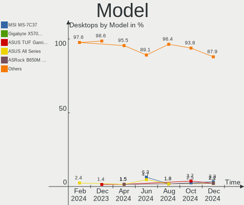
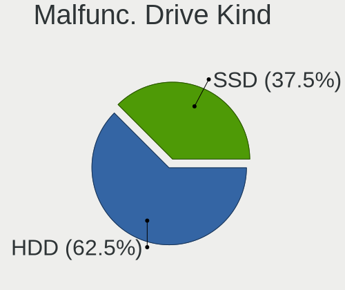
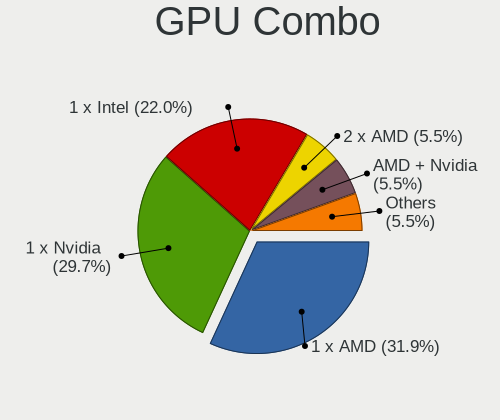
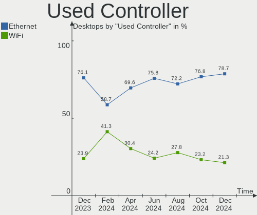
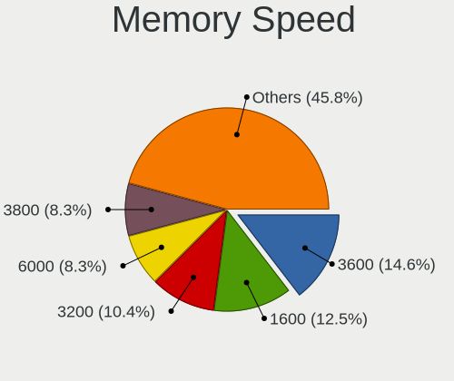
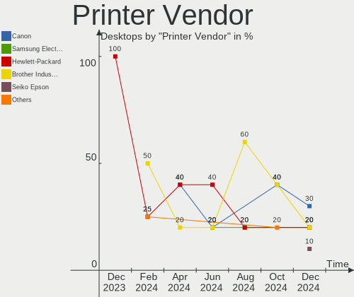
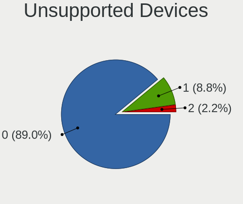

Linux in Canada - Hardware Trends (Desktops)
--------------------------------------------

A project to identify most popular hardware characteristics and track their change
over time based on data collected by Linux users at https://Linux-Hardware.org.

Anyone can contribute to this report by the [hw-probe](https://github.com/linuxhw/hw-probe) tool:

    sudo -E hw-probe -all -upload

Period: Dec, 2023.

Contents
--------

* [ System ](#system)
  - [ OS                       ](#os)
  - [ OS Family                ](#os-family)
  - [ Kernel                   ](#kernel)
  - [ Kernel Family            ](#kernel-family)
  - [ Kernel Major Ver.        ](#kernel-major-ver)
  - [ Arch                     ](#arch)
  - [ DE                       ](#de)
  - [ Display Server           ](#display-server)
  - [ Display Manager          ](#display-manager)
  - [ OS Lang                  ](#os-lang)
  - [ Boot Mode                ](#boot-mode)
  - [ Filesystem               ](#filesystem)
  - [ Part. scheme             ](#part-scheme)
  - [ Dual Boot with Linux/BSD ](#dual-boot-with-linuxbsd)
  - [ Dual Boot (Win)          ](#dual-boot-win)

* [ Board ](#board)
  - [ Vendor                   ](#vendor)
  - [ Model                    ](#model)
  - [ Model Family             ](#model-family)
  - [ MFG Year                 ](#mfg-year)
  - [ Form Factor              ](#form-factor)
  - [ Secure Boot              ](#secure-boot)
  - [ Coreboot                 ](#coreboot)
  - [ RAM Size                 ](#ram-size)
  - [ RAM Used                 ](#ram-used)
  - [ Total Drives             ](#total-drives)
  - [ Has CD-ROM               ](#has-cd-rom)
  - [ Has Ethernet             ](#has-ethernet)
  - [ Has WiFi                 ](#has-wifi)
  - [ Has Bluetooth            ](#has-bluetooth)

* [ Location ](#location)
  - [ Country                  ](#country)
  - [ City                     ](#city)

* [ Drives ](#drives)
  - [ Drive Vendor             ](#drive-vendor)
  - [ Drive Model              ](#drive-model)
  - [ HDD Vendor               ](#hdd-vendor)
  - [ SSD Vendor               ](#ssd-vendor)
  - [ Drive Kind               ](#drive-kind)
  - [ Drive Connector          ](#drive-connector)
  - [ Drive Size               ](#drive-size)
  - [ Space Total              ](#space-total)
  - [ Space Used               ](#space-used)
  - [ Malfunc. Drives          ](#malfunc-drives)
  - [ Malfunc. Drive Vendor    ](#malfunc-drive-vendor)
  - [ Malfunc. HDD Vendor      ](#malfunc-hdd-vendor)
  - [ Malfunc. Drive Kind      ](#malfunc-drive-kind)
  - [ Failed Drives            ](#failed-drives)
  - [ Failed Drive Vendor      ](#failed-drive-vendor)
  - [ Drive Status             ](#drive-status)

* [ Storage controller ](#storage-controller)
  - [ Storage Vendor           ](#storage-vendor)
  - [ Storage Model            ](#storage-model)
  - [ Storage Kind             ](#storage-kind)

* [ Processor ](#processor)
  - [ CPU Vendor               ](#cpu-vendor)
  - [ CPU Model                ](#cpu-model)
  - [ CPU Model Family         ](#cpu-model-family)
  - [ CPU Cores                ](#cpu-cores)
  - [ CPU Sockets              ](#cpu-sockets)
  - [ CPU Threads              ](#cpu-threads)
  - [ CPU Op-Modes             ](#cpu-op-modes)
  - [ CPU Microcode            ](#cpu-microcode)
  - [ CPU Microarch            ](#cpu-microarch)

* [ Graphics ](#graphics)
  - [ GPU Vendor               ](#gpu-vendor)
  - [ GPU Model                ](#gpu-model)
  - [ GPU Combo                ](#gpu-combo)
  - [ GPU Driver               ](#gpu-driver)
  - [ GPU Memory               ](#gpu-memory)

* [ Monitor ](#monitor)
  - [ Monitor Vendor           ](#monitor-vendor)
  - [ Monitor Model            ](#monitor-model)
  - [ Monitor Resolution       ](#monitor-resolution)
  - [ Monitor Diagonal         ](#monitor-diagonal)
  - [ Monitor Width            ](#monitor-width)
  - [ Aspect Ratio             ](#aspect-ratio)
  - [ Monitor Area             ](#monitor-area)
  - [ Pixel Density            ](#pixel-density)
  - [ Multiple Monitors        ](#multiple-monitors)

* [ Network ](#network)
  - [ Net Controller Vendor    ](#net-controller-vendor)
  - [ Net Controller Model     ](#net-controller-model)
  - [ Wireless Vendor          ](#wireless-vendor)
  - [ Wireless Model           ](#wireless-model)
  - [ Ethernet Vendor          ](#ethernet-vendor)
  - [ Ethernet Model           ](#ethernet-model)
  - [ Net Controller Kind      ](#net-controller-kind)
  - [ Used Controller          ](#used-controller)
  - [ NICs                     ](#nics)
  - [ IPv6                     ](#ipv6)

* [ Bluetooth ](#bluetooth)
  - [ Bluetooth Vendor         ](#bluetooth-vendor)
  - [ Bluetooth Model          ](#bluetooth-model)

* [ Sound ](#sound)
  - [ Sound Vendor             ](#sound-vendor)
  - [ Sound Model              ](#sound-model)

* [ Memory ](#memory)
  - [ Memory Vendor            ](#memory-vendor)
  - [ Memory Model             ](#memory-model)
  - [ Memory Kind              ](#memory-kind)
  - [ Memory Form Factor       ](#memory-form-factor)
  - [ Memory Size              ](#memory-size)
  - [ Memory Speed             ](#memory-speed)

* [ Printers & scanners ](#printers--scanners)
  - [ Printer Vendor           ](#printer-vendor)
  - [ Printer Model            ](#printer-model)
  - [ Scanner Vendor           ](#scanner-vendor)
  - [ Scanner Model            ](#scanner-model)

* [ Camera ](#camera)
  - [ Camera Vendor            ](#camera-vendor)
  - [ Camera Model             ](#camera-model)

* [ Security ](#security)
  - [ Fingerprint Vendor       ](#fingerprint-vendor)
  - [ Fingerprint Model        ](#fingerprint-model)
  - [ Chipcard Vendor          ](#chipcard-vendor)
  - [ Chipcard Model           ](#chipcard-model)

* [ Unsupported ](#unsupported)
  - [ Unsupported Devices      ](#unsupported-devices)
  - [ Unsupported Device Types ](#unsupported-device-types)

System
------

OS
--

Installed operating systems

| Name                      | Desktops | Percent |
|---------------------------|----------|---------|
| Linux Mint 21.2           | 8        | 11.59%  |
| Ubuntu 23.10              | 6        | 8.7%    |
| Fedora 39                 | 6        | 8.7%    |
| Ubuntu 22.04              | 5        | 7.25%   |
| OpenMandriva 5.0          | 4        | 5.8%    |
| Zorin 16                  | 3        | 4.35%   |
| Nobara 38                 | 3        | 4.35%   |
| Xubuntu 18.04             | 2        | 2.9%    |
| Pop!_OS 22.04             | 2        | 2.9%    |
| Kubuntu 23.10             | 2        | 2.9%    |
| EndeavourOS Rolling       | 2        | 2.9%    |
| Debian Testing/unstable   | 2        | 2.9%    |
| Debian 12                 | 2        | 2.9%    |
| ArcoLinux Rolling         | 2        | 2.9%    |
| Arch Rolling              | 2        | 2.9%    |
| Ubuntu 22.10              | 1        | 1.45%   |
| Ubuntu 20.04              | 1        | 1.45%   |
| openSUSE Microos-XXXXXXXX | 1        | 1.45%   |
| OpenMandriva 4.50         | 1        | 1.45%   |
| OpenMandriva 23.11        | 1        | 1.45%   |
| OpenMandriva 23.08        | 1        | 1.45%   |
| OpenMandriva 23.03        | 1        | 1.45%   |
| OpenMandriva 23.01        | 1        | 1.45%   |
| Manjaro 23.1.0            | 1        | 1.45%   |
| Manjaro                   | 1        | 1.45%   |
| Linux Mint 21.1           | 1        | 1.45%   |
| Linux Mint 20.1           | 1        | 1.45%   |
| KDE neon 22.04            | 1        | 1.45%   |
| Kali 2023.4               | 1        | 1.45%   |
| Garuda Linux Soaring      | 1        | 1.45%   |
| Fedora 38                 | 1        | 1.45%   |
| Debian 12-updates         | 1        | 1.45%   |
| AlmaLinux 9.3             | 1        | 1.45%   |

OS Family
---------

OS without a version

| Name         | Desktops | Percent |
|--------------|----------|---------|
| Ubuntu       | 13       | 18.84%  |
| Linux Mint   | 10       | 14.49%  |
| OpenMandriva | 9        | 13.04%  |
| Fedora       | 7        | 10.14%  |
| Debian       | 5        | 7.25%   |
| Zorin        | 3        | 4.35%   |
| Nobara       | 3        | 4.35%   |
| Xubuntu      | 2        | 2.9%    |
| Pop!_OS      | 2        | 2.9%    |
| Manjaro      | 2        | 2.9%    |
| Kubuntu      | 2        | 2.9%    |
| EndeavourOS  | 2        | 2.9%    |
| ArcoLinux    | 2        | 2.9%    |
| Arch         | 2        | 2.9%    |
| openSUSE     | 1        | 1.45%   |
| KDE neon     | 1        | 1.45%   |
| Kali         | 1        | 1.45%   |
| Garuda Linux | 1        | 1.45%   |
| AlmaLinux    | 1        | 1.45%   |

Kernel
------

Version of the Linux kernel

| Version                      | Desktops | Percent |
|------------------------------|----------|---------|
| 6.5.0-14-generic             | 7        | 10.14%  |
| 5.15.0-91-generic            | 7        | 10.14%  |
| 6.6.2-desktop-1omv2390       | 5        | 7.25%   |
| 6.2.0-37-generic             | 4        | 5.8%    |
| 5.15.0-89-generic            | 4        | 5.8%    |
| 5.10.10-64                   | 3        | 4.35%   |
| 6.6.7-zen1-1-zen             | 2        | 2.9%    |
| 6.6.7-200.fc39.x86_64        | 2        | 2.9%    |
| 6.5.6-300.fc39.x86_64        | 2        | 2.9%    |
| 6.5.11-7-pve                 | 2        | 2.9%    |
| 6.4.10-202.fsync.fc38.x86_64 | 2        | 2.9%    |
| 6.6.7-4-MANJARO              | 1        | 1.45%   |
| 6.6.6-76060606-generic       | 1        | 1.45%   |
| 6.6.6-1-default              | 1        | 1.45%   |
| 6.6.5-060605-generic         | 1        | 1.45%   |
| 6.6.4-arch1-1                | 1        | 1.45%   |
| 6.6.4-200.fc39.x86_64        | 1        | 1.45%   |
| 6.6.3-arch1-1                | 1        | 1.45%   |
| 6.6.2-arch1-1                | 1        | 1.45%   |
| 6.6.2-201.fsync.fc38.x86_64  | 1        | 1.45%   |
| 6.6.2-201.fc39.x86_64        | 1        | 1.45%   |
| 6.5.6-76060506-generic       | 1        | 1.45%   |
| 6.5.0-kali3-amd64            | 1        | 1.45%   |
| 6.5.0-9-generic              | 1        | 1.45%   |
| 6.4.11-desktop-1omv2390      | 1        | 1.45%   |
| 6.4.11-arch1-1               | 1        | 1.45%   |
| 6.2.9-300.fc38.x86_64        | 1        | 1.45%   |
| 6.2.6-desktop-1omv2390       | 1        | 1.45%   |
| 6.2.0-060200-generic         | 1        | 1.45%   |
| 6.1.67-1-lts                 | 1        | 1.45%   |
| 6.1.1-desktop-1omv2290       | 1        | 1.45%   |
| 5.15.138-1-MANJARO           | 1        | 1.45%   |
| 5.15.0-88-generic            | 1        | 1.45%   |
| 5.15.0-87-generic            | 1        | 1.45%   |
| 5.15.0-78-generic            | 1        | 1.45%   |
| 5.15.0-76-generic            | 1        | 1.45%   |
| 5.15.0-43-generic            | 1        | 1.45%   |
| 5.14.14-desktop-1omv4050     | 1        | 1.45%   |
| 5.14.0-362.8.1.el9_3.x86_64  | 1        | 1.45%   |
| 4.15.0-29-generic            | 1        | 1.45%   |

Kernel Family
-------------

Linux kernel without a distro release

| Version  | Desktops | Percent |
|----------|----------|---------|
| 5.15.0   | 16       | 23.19%  |
| 6.5.0    | 9        | 13.04%  |
| 6.6.2    | 8        | 11.59%  |
| 6.6.7    | 5        | 7.25%   |
| 6.2.0    | 5        | 7.25%   |
| 6.5.6    | 3        | 4.35%   |
| 5.10.10  | 3        | 4.35%   |
| 6.6.6    | 2        | 2.9%    |
| 6.6.4    | 2        | 2.9%    |
| 6.5.11   | 2        | 2.9%    |
| 6.4.11   | 2        | 2.9%    |
| 6.4.10   | 2        | 2.9%    |
| 6.6.5    | 1        | 1.45%   |
| 6.6.3    | 1        | 1.45%   |
| 6.2.9    | 1        | 1.45%   |
| 6.2.6    | 1        | 1.45%   |
| 6.1.67   | 1        | 1.45%   |
| 6.1.1    | 1        | 1.45%   |
| 5.15.138 | 1        | 1.45%   |
| 5.14.14  | 1        | 1.45%   |
| 5.14.0   | 1        | 1.45%   |
| 4.15.0   | 1        | 1.45%   |

Kernel Major Ver.
-----------------

Linux kernel major version

| Version | Desktops | Percent |
|---------|----------|---------|
| 6.6     | 19       | 27.54%  |
| 5.15    | 17       | 24.64%  |
| 6.5     | 14       | 20.29%  |
| 6.2     | 7        | 10.14%  |
| 6.4     | 4        | 5.8%    |
| 5.10    | 3        | 4.35%   |
| 6.1     | 2        | 2.9%    |
| 5.14    | 2        | 2.9%    |
| 4.15    | 1        | 1.45%   |

Arch
----

OS architecture (x86_64, i586, etc.)

| Name   | Desktops | Percent |
|--------|----------|---------|
| x86_64 | 69       | 100%    |

DE
--

Desktop Environment

| Name          | Desktops | Percent |
|---------------|----------|---------|
| GNOME         | 23       | 33.33%  |
| KDE5          | 22       | 31.88%  |
| XFCE          | 7        | 10.14%  |
| X-Cinnamon    | 7        | 10.14%  |
| LXDE          | 3        | 4.35%   |
| GNOME Classic | 2        | 2.9%    |
| Unknown       | 2        | 2.9%    |
| MATE          | 1        | 1.45%   |
| Cutefish      | 1        | 1.45%   |
| Cinnamon      | 1        | 1.45%   |

Display Server
--------------

X11 or Wayland

| Name    | Desktops | Percent |
|---------|----------|---------|
| X11     | 45       | 65.22%  |
| Wayland | 21       | 30.43%  |
| Tty     | 3        | 4.35%   |

Display Manager
---------------

SDDM, LightDM, etc.

| Name    | Desktops | Percent |
|---------|----------|---------|
| Unknown | 24       | 34.78%  |
| SDDM    | 16       | 23.19%  |
| GDM3    | 13       | 18.84%  |
| LightDM | 10       | 14.49%  |
| GDM     | 3        | 4.35%   |
| NODM    | 2        | 2.9%    |
| KDM     | 1        | 1.45%   |

OS Lang
-------

Language

| Lang  | Desktops | Percent |
|-------|----------|---------|
| en_US | 30       | 43.48%  |
| en_CA | 29       | 42.03%  |
| fr_CA | 6        | 8.7%    |
| C     | 2        | 2.9%    |
| ja_JP | 1        | 1.45%   |
| en_GB | 1        | 1.45%   |

Boot Mode
---------

EFI or BIOS

| Mode | Desktops | Percent |
|------|----------|---------|
| EFI  | 38       | 55.07%  |
| BIOS | 31       | 44.93%  |

Filesystem
----------

Type of filesystem

| Type    | Desktops | Percent |
|---------|----------|---------|
| Ext4    | 34       | 49.28%  |
| Tmpfs   | 12       | 17.39%  |
| Btrfs   | 12       | 17.39%  |
| Overlay | 5        | 7.25%   |
| Rootfs  | 3        | 4.35%   |
| Zfs     | 1        | 1.45%   |
| Xfs     | 1        | 1.45%   |
| Ext3    | 1        | 1.45%   |

Part. scheme
------------

Scheme of partitioning

| Type    | Desktops | Percent |
|---------|----------|---------|
| GPT     | 40       | 57.97%  |
| Unknown | 23       | 33.33%  |
| MBR     | 6        | 8.7%    |

Dual Boot with Linux/BSD
------------------------

Hosting more than one Linux/BSD

| Dual boot | Desktops | Percent |
|-----------|----------|---------|
| No        | 54       | 78.26%  |
| Yes       | 15       | 21.74%  |

Dual Boot (Win)
---------------

Hosting Linux and Windows

| Dual boot | Desktops | Percent |
|-----------|----------|---------|
| No        | 46       | 66.67%  |
| Yes       | 23       | 33.33%  |

Board
-----

Vendor
------

Motherboard manufacturer

| Name                | Desktops | Percent |
|---------------------|----------|---------|
| ASUSTek Computer    | 15       | 21.74%  |
| Hewlett-Packard     | 10       | 14.49%  |
| Gigabyte Technology | 10       | 14.49%  |
| MSI                 | 9        | 13.04%  |
| Dell                | 5        | 7.25%   |
| ASRock              | 5        | 7.25%   |
| Lenovo              | 3        | 4.35%   |
| Acer                | 3        | 4.35%   |
| Alienware           | 2        | 2.9%    |
| Unknown             | 2        | 2.9%    |
| Pegatron            | 1        | 1.45%   |
| HC Technology.      | 1        | 1.45%   |
| Foxconn             | 1        | 1.45%   |
| EVGA                | 1        | 1.45%   |
| Apple               | 1        | 1.45%   |

Model
-----

Motherboard model

| Name                                    | Desktops | Percent |
|-----------------------------------------|----------|---------|
| MSI MS-7C95                             | 2        | 2.9%    |
| Gigabyte X570 AORUS ELITE WIFI          | 2        | 2.9%    |
| Unknown                                 | 2        | 2.9%    |
| Pegatron 600-1352                       | 1        | 1.45%   |
| MSI MS-7D98                             | 1        | 1.45%   |
| MSI MS-7D91                             | 1        | 1.45%   |
| MSI MS-7C91                             | 1        | 1.45%   |
| MSI MS-7B86                             | 1        | 1.45%   |
| MSI MS-7B18                             | 1        | 1.45%   |
| MSI MS-7A38                             | 1        | 1.45%   |
| MSI MEG Z590 Aegis Ti5 (MS-B931)        | 1        | 1.45%   |
| Lenovo ThinkSmart Hub 500 10V50000US    | 1        | 1.45%   |
| Lenovo ThinkCentre M58p 6234AE5         | 1        | 1.45%   |
| Lenovo IdeaCentre 510A-15ICB 90HV001FCF | 1        | 1.45%   |
| HP Z800 Workstation                     | 1        | 1.45%   |
| HP xw6600 Workstation                   | 1        | 1.45%   |
| HP Slim Desktop 290-a0xxx               | 1        | 1.45%   |
| HP rp5800                               | 1        | 1.45%   |
| HP QQ416US#ABA                          | 1        | 1.45%   |
| HP Compaq Pro 6300 SFF                  | 1        | 1.45%   |
| HP Compaq Elite 8300 SFF                | 1        | 1.45%   |
| HP Compaq 6000 Pro SFF PC               | 1        | 1.45%   |
| HP 870-119                              | 1        | 1.45%   |
| HP 2ADC                                 | 1        | 1.45%   |
| HC Technology. HCAR5000-MI              | 1        | 1.45%   |
| Gigabyte Z790 AORUS MASTER X            | 1        | 1.45%   |
| Gigabyte Z690 UD AX DDR4                | 1        | 1.45%   |
| Gigabyte Z490 VISION G                  | 1        | 1.45%   |
| Gigabyte Z270P-D3                       | 1        | 1.45%   |
| Gigabyte X570 AORUS MASTER              | 1        | 1.45%   |
| Gigabyte M68MT-S2                       | 1        | 1.45%   |
| Gigabyte GA-890FXA-UD7                  | 1        | 1.45%   |
| Gigabyte B450 AORUS PRO WIFI            | 1        | 1.45%   |
| Foxconn p7-1243                         | 1        | 1.45%   |
| EVGA E685 0.0                           | 1        | 1.45%   |
| Dell Precision T3610                    | 1        | 1.45%   |
| Dell OptiPlex 980                       | 1        | 1.45%   |
| Dell OptiPlex 7050                      | 1        | 1.45%   |
| Dell OptiPlex 7010                      | 1        | 1.45%   |
| Dell OptiPlex 5050                      | 1        | 1.45%   |

Model Family
------------

Motherboard model prefix

| Name                       | Desktops | Percent |
|----------------------------|----------|---------|
| ASUS PRIME                 | 6        | 8.7%    |
| Dell OptiPlex              | 4        | 5.8%    |
| HP Compaq                  | 3        | 4.35%   |
| Gigabyte X570              | 3        | 4.35%   |
| ASUS TUF                   | 3        | 4.35%   |
| Acer Aspire                | 3        | 4.35%   |
| MSI MS-7C95                | 2        | 2.9%    |
| Alienware Aurora           | 2        | 2.9%    |
| Unknown                    | 2        | 2.9%    |
| Pegatron 600-1352          | 1        | 1.45%   |
| MSI MS-7D98                | 1        | 1.45%   |
| MSI MS-7D91                | 1        | 1.45%   |
| MSI MS-7C91                | 1        | 1.45%   |
| MSI MS-7B86                | 1        | 1.45%   |
| MSI MS-7B18                | 1        | 1.45%   |
| MSI MS-7A38                | 1        | 1.45%   |
| MSI MEG                    | 1        | 1.45%   |
| Lenovo ThinkSmart          | 1        | 1.45%   |
| Lenovo ThinkCentre         | 1        | 1.45%   |
| Lenovo IdeaCentre          | 1        | 1.45%   |
| HP Z800                    | 1        | 1.45%   |
| HP xw6600                  | 1        | 1.45%   |
| HP Slim                    | 1        | 1.45%   |
| HP rp5800                  | 1        | 1.45%   |
| HP QQ416US#ABA             | 1        | 1.45%   |
| HP 870-119                 | 1        | 1.45%   |
| HP 2ADC                    | 1        | 1.45%   |
| HC Technology. HCAR5000-MI | 1        | 1.45%   |
| Gigabyte Z790              | 1        | 1.45%   |
| Gigabyte Z690              | 1        | 1.45%   |
| Gigabyte Z490              | 1        | 1.45%   |
| Gigabyte Z270P-D3          | 1        | 1.45%   |
| Gigabyte M68MT-S2          | 1        | 1.45%   |
| Gigabyte GA-890FXA-UD7     | 1        | 1.45%   |
| Gigabyte B450              | 1        | 1.45%   |
| Foxconn p7-1243            | 1        | 1.45%   |
| EVGA E685                  | 1        | 1.45%   |
| Dell Precision             | 1        | 1.45%   |
| ASUS ROG                   | 1        | 1.45%   |
| ASUS P7P55D                | 1        | 1.45%   |

MFG Year
--------

Motherboard manufacture year

| Year | Desktops | Percent |
|------|----------|---------|
| 2022 | 8        | 11.59%  |
| 2019 | 7        | 10.14%  |
| 2021 | 6        | 8.7%    |
| 2020 | 6        | 8.7%    |
| 2018 | 6        | 8.7%    |
| 2010 | 6        | 8.7%    |
| 2016 | 5        | 7.25%   |
| 2012 | 5        | 7.25%   |
| 2017 | 3        | 4.35%   |
| 2013 | 3        | 4.35%   |
| 2011 | 3        | 4.35%   |
| 2009 | 3        | 4.35%   |
| 2008 | 3        | 4.35%   |
| 2014 | 2        | 2.9%    |
| 2023 | 1        | 1.45%   |
| 2015 | 1        | 1.45%   |
| 2007 | 1        | 1.45%   |

Form Factor
-----------

Physical design of the computer

| Name    | Desktops | Percent |
|---------|----------|---------|
| Desktop | 69       | 100%    |

Secure Boot
-----------

Enabled or disabled

| State    | Desktops | Percent |
|----------|----------|---------|
| Disabled | 64       | 92.75%  |
| Enabled  | 5        | 7.25%   |

Coreboot
--------

Have coreboot on board

| Used | Desktops | Percent |
|------|----------|---------|
| No   | 69       | 100%    |

RAM Size
--------

Total RAM memory

| Size in GB  | Desktops | Percent |
|-------------|----------|---------|
| 32.01-64.0  | 19       | 27.54%  |
| 16.01-24.0  | 15       | 21.74%  |
| 8.01-16.0   | 11       | 15.94%  |
| 4.01-8.0    | 10       | 14.49%  |
| 64.01-256.0 | 8        | 11.59%  |
| 3.01-4.0    | 3        | 4.35%   |
| 24.01-32.0  | 2        | 2.9%    |
| 1.01-2.0    | 1        | 1.45%   |

RAM Used
--------

Used RAM memory

| Used GB    | Desktops | Percent |
|------------|----------|---------|
| 1.01-2.0   | 20       | 28.99%  |
| 2.01-3.0   | 18       | 26.09%  |
| 4.01-8.0   | 17       | 24.64%  |
| 3.01-4.0   | 7        | 10.14%  |
| 16.01-24.0 | 3        | 4.35%   |
| 8.01-16.0  | 3        | 4.35%   |
| 0.51-1.0   | 1        | 1.45%   |

Total Drives
------------

Number of drives on board

| Drives | Desktops | Percent |
|--------|----------|---------|
| 1      | 24       | 34.78%  |
| 2      | 21       | 30.43%  |
| 3      | 9        | 13.04%  |
| 4      | 5        | 7.25%   |
| 6      | 3        | 4.35%   |
| 9      | 2        | 2.9%    |
| 5      | 2        | 2.9%    |
| 13     | 1        | 1.45%   |
| 10     | 1        | 1.45%   |
| 7      | 1        | 1.45%   |

Has CD-ROM
----------

Has CD-ROM on board

| Presented | Desktops | Percent |
|-----------|----------|---------|
| No        | 41       | 59.42%  |
| Yes       | 28       | 40.58%  |

Has Ethernet
------------

Has Ethernet on board

| Presented | Desktops | Percent |
|-----------|----------|---------|
| Yes       | 68       | 98.55%  |
| No        | 1        | 1.45%   |

Has WiFi
--------

Has WiFi module

| Presented | Desktops | Percent |
|-----------|----------|---------|
| Yes       | 36       | 52.17%  |
| No        | 33       | 47.83%  |

Has Bluetooth
-------------

Has Bluetooth module

| Presented | Desktops | Percent |
|-----------|----------|---------|
| No        | 38       | 55.07%  |
| Yes       | 31       | 44.93%  |

Location
--------

Country
-------

Geographic location (country)

| Country | Desktops | Percent |
|---------|----------|---------|
| Canada  | 69       | 100%    |

City
----

Geographic location (city)

| City                     | Desktops | Percent |
|--------------------------|----------|---------|
| Toronto                  | 9        | 13.04%  |
| Montreal                 | 8        | 11.59%  |
| Vancouver                | 6        | 8.7%    |
| Edmonton                 | 4        | 5.8%    |
| Woodbridge               | 2        | 2.9%    |
| Windsor                  | 2        | 2.9%    |
| Saskatoon                | 2        | 2.9%    |
| Richmond                 | 2        | 2.9%    |
| Levis                    | 2        | 2.9%    |
| Calgary                  | 2        | 2.9%    |
| Zurich                   | 1        | 1.45%   |
| Winnipeg                 | 1        | 1.45%   |
| Whitehorse               | 1        | 1.45%   |
| Valcourt                 | 1        | 1.45%   |
| Terrebonne               | 1        | 1.45%   |
| Surrey                   | 1        | 1.45%   |
| Steinbach                | 1        | 1.45%   |
| St-Hippolyte             | 1        | 1.45%   |
| Sarnia                   | 1        | 1.45%   |
| Salaberry-de-Valleyfield | 1        | 1.45%   |
| Saint-Hyacinthe          | 1        | 1.45%   |
| Saint-Anselme            | 1        | 1.45%   |
| Rexdale                  | 1        | 1.45%   |
| Repentigny               | 1        | 1.45%   |
| Québec                  | 1        | 1.45%   |
| Port Coquitlam           | 1        | 1.45%   |
| Peterborough             | 1        | 1.45%   |
| Owen Sound               | 1        | 1.45%   |
| Nipigon                  | 1        | 1.45%   |
| Newmarket                | 1        | 1.45%   |
| Moose Jaw                | 1        | 1.45%   |
| Jonquiere                | 1        | 1.45%   |
| Hamilton                 | 1        | 1.45%   |
| Grande Prairie           | 1        | 1.45%   |
| Gatineau                 | 1        | 1.45%   |
| Courtenay                | 1        | 1.45%   |
| Collingwood              | 1        | 1.45%   |
| Brantford                | 1        | 1.45%   |
| Barrie                   | 1        | 1.45%   |
| Amherst                  | 1        | 1.45%   |

Drives
------

Drive Vendor
------------

Hard drive vendors

| Vendor                      | Desktops | Drives | Percent |
|-----------------------------|----------|--------|---------|
| WDC                         | 31       | 52     | 24.03%  |
| Seagate                     | 19       | 34     | 14.73%  |
| Samsung Electronics         | 18       | 25     | 13.95%  |
| Toshiba                     | 5        | 5      | 3.88%   |
| Kingston Technology Company | 5        | 5      | 3.88%   |
| Kingston                    | 5        | 7      | 3.88%   |
| Sandisk                     | 4        | 4      | 3.1%    |
| Intel                       | 4        | 4      | 3.1%    |
| A-DATA Technology           | 4        | 4      | 3.1%    |
| Hitachi                     | 3        | 3      | 2.33%   |
| Crucial                     | 3        | 4      | 2.33%   |
| ADATA Technology            | 3        | 4      | 2.33%   |
| Unknown                     | 2        | 2      | 1.55%   |
| TO Exter                    | 2        | 2      | 1.55%   |
| Timetec                     | 2        | 2      | 1.55%   |
| PNY                         | 2        | 2      | 1.55%   |
| Vaseky                      | 1        | 1      | 0.78%   |
| UB88RRF6                    | 1        | 1      | 0.78%   |
| Transcend                   | 1        | 1      | 0.78%   |
| Team                        | 1        | 1      | 0.78%   |
| SSK                         | 1        | 1      | 0.78%   |
| SK hynix                    | 1        | 1      | 0.78%   |
| Seagate Technology          | 1        | 1      | 0.78%   |
| Phison Electronics          | 1        | 1      | 0.78%   |
| Phison                      | 1        | 1      | 0.78%   |
| Patriot                     | 1        | 1      | 0.78%   |
| MAXIO Technology (Hangzhou) | 1        | 1      | 0.78%   |
| Lenovo                      | 1        | 1      | 0.78%   |
| JMicron Technology          | 1        | 1      | 0.78%   |
| Hewlett-Packard             | 1        | 1      | 0.78%   |
| H/W                         | 1        | 7      | 0.78%   |
| Fujitsu                     | 1        | 1      | 0.78%   |
| ASMT                        | 1        | 1      | 0.78%   |

Drive Model
-----------

Hard drive models

| Model                                                             | Desktops | Percent |
|-------------------------------------------------------------------|----------|---------|
| Kingston Company SNV2S1000G 1TB                                   | 4        | 2.53%   |
| WDC WD10EZEX-08WN4A0 1TB                                          | 3        | 1.9%    |
| Samsung NVMe SSD Controller SM981/PM981/PM983 512GB               | 3        | 1.9%    |
| Samsung NVMe SSD Controller PM9A1/PM9A3/980PRO 2TB                | 3        | 1.9%    |
| WDC WD20EZAZ-00GGJB0 2TB                                          | 2        | 1.27%   |
| Unknown SD/MMC/MS PRO 512GB                                       | 2        | 1.27%   |
| TO Exter nal USB 3.0 480GB                                        | 2        | 1.27%   |
| Seagate ST500DM002-1BD142 500GB                                   | 2        | 1.27%   |
| Seagate ST2000DM008-2FR102 2TB                                    | 2        | 1.27%   |
| Seagate ST2000DM006-2DM164 2TB                                    | 2        | 1.27%   |
| Seagate ST2000DM001-1ER164 2TB                                    | 2        | 1.27%   |
| Seagate Expansion 2TB                                             | 2        | 1.27%   |
| Samsung SSD 860 EVO 500GB                                         | 2        | 1.27%   |
| Samsung SSD 860 EVO 1TB                                           | 2        | 1.27%   |
| Kingston SA400S37480G 480GB SSD                                   | 2        | 1.27%   |
| Kingston SA400S37120G 120GB SSD                                   | 2        | 1.27%   |
| ADATA XPG SX8200 Pro PCIe Gen3x4 M.2 2280 Solid State Drive 512GB | 2        | 1.27%   |
| WDC WDS500G2B0A-00SM50 500GB SSD                                  | 1        | 0.63%   |
| WDC WDS500G1R0A-68A4W0 500GB SSD                                  | 1        | 0.63%   |
| WDC WDS100T2B0C 1TB                                               | 1        | 0.63%   |
| WDC WDS100T2B0A-00SM50 1TB SSD                                    | 1        | 0.63%   |
| WDC WDBNCE0010PNC 1TB SSD                                         | 1        | 0.63%   |
| WDC WD80EAZZ-00BKLB0 8TB                                          | 1        | 0.63%   |
| WDC WD6003FZBX-00K5WB0 6TB                                        | 1        | 0.63%   |
| WDC WD5000LPVX-22V0TT0 500GB                                      | 1        | 0.63%   |
| WDC WD5000BPVT-00HXZT1 500GB                                      | 1        | 0.63%   |
| WDC WD5000BEKT-00KA9T0 500GB                                      | 1        | 0.63%   |
| WDC WD5000AZLX-60K2TA1 500GB                                      | 1        | 0.63%   |
| WDC WD5000AAKX-75U6AA0 500GB                                      | 1        | 0.63%   |
| WDC WD5000AAKX-003CA0 500GB                                       | 1        | 0.63%   |
| WDC WD5000AAKS-00UU3A0 500GB                                      | 1        | 0.63%   |
| WDC WD40EZAZ-22SF3B0 4TB                                          | 1        | 0.63%   |
| WDC WD40EFZX-68AWUN0 4TB                                          | 1        | 0.63%   |
| WDC WD40EFRX-68N32N0 4TB                                          | 1        | 0.63%   |
| WDC WD40EFPX-68C6CN0 4TB                                          | 1        | 0.63%   |
| WDC WD40EFAX-68JH4N1 4TB                                          | 1        | 0.63%   |
| WDC WD4005FZBX-00K5WB0 4TB                                        | 1        | 0.63%   |
| WDC WD30EZRX-00DC0B0 3TB                                          | 1        | 0.63%   |
| WDC WD30EZRX-00D8PB0 3TB                                          | 1        | 0.63%   |
| WDC WD2500JS-60NCB1 250GB                                         | 1        | 0.63%   |

HDD Vendor
----------

Hard disk drive vendors

| Vendor              | Desktops | Drives | Percent |
|---------------------|----------|--------|---------|
| WDC                 | 29       | 46     | 45.31%  |
| Seagate             | 19       | 34     | 29.69%  |
| Toshiba             | 4        | 4      | 6.25%   |
| Hitachi             | 3        | 3      | 4.69%   |
| Unknown             | 2        | 2      | 3.13%   |
| TO Exter            | 2        | 2      | 3.13%   |
| Samsung Electronics | 2        | 2      | 3.13%   |
| Hewlett-Packard     | 1        | 1      | 1.56%   |
| H/W                 | 1        | 7      | 1.56%   |
| Fujitsu             | 1        | 1      | 1.56%   |

SSD Vendor
----------

Solid state drive vendors

| Vendor              | Desktops | Drives | Percent |
|---------------------|----------|--------|---------|
| Samsung Electronics | 6        | 9      | 17.65%  |
| Kingston            | 5        | 6      | 14.71%  |
| WDC                 | 4        | 4      | 11.76%  |
| Intel               | 3        | 3      | 8.82%   |
| Crucial             | 3        | 3      | 8.82%   |
| A-DATA Technology   | 3        | 3      | 8.82%   |
| PNY                 | 2        | 2      | 5.88%   |
| Vaseky              | 1        | 1      | 2.94%   |
| Transcend           | 1        | 1      | 2.94%   |
| Timetec             | 1        | 1      | 2.94%   |
| SanDisk             | 1        | 1      | 2.94%   |
| Patriot             | 1        | 1      | 2.94%   |
| Lenovo              | 1        | 1      | 2.94%   |
| JMicron Technology  | 1        | 1      | 2.94%   |
| ASMT                | 1        | 1      | 2.94%   |

Drive Kind
----------

HDD or SSD

| Kind    | Desktops | Drives | Percent |
|---------|----------|--------|---------|
| HDD     | 49       | 102    | 45.79%  |
| NVMe    | 32       | 41     | 29.91%  |
| SSD     | 25       | 38     | 23.36%  |
| Unknown | 1        | 1      | 0.93%   |

Drive Connector
---------------

SATA, SAS, NVMe, etc.

| Type | Desktops | Drives | Percent |
|------|----------|--------|---------|
| SATA | 57       | 121    | 56.44%  |
| NVMe | 32       | 40     | 31.68%  |
| SAS  | 12       | 21     | 11.88%  |

Drive Size
----------

Size of hard drive

| Size in TB | Desktops | Drives | Percent |
|------------|----------|--------|---------|
| 0.01-0.5   | 34       | 50     | 36.56%  |
| 0.51-1.0   | 24       | 31     | 25.81%  |
| 1.01-2.0   | 16       | 26     | 17.2%   |
| 3.01-4.0   | 8        | 14     | 8.6%    |
| 2.01-3.0   | 5        | 6      | 5.38%   |
| 10.01-20.0 | 4        | 11     | 4.3%    |
| 4.01-10.0  | 2        | 2      | 2.15%   |

Space Total
-----------

Amount of disk space available on the file system

| Size in GB     | Desktops | Percent |
|----------------|----------|---------|
| More than 3000 | 17       | 24.64%  |
| 251-500        | 10       | 14.49%  |
| 101-250        | 8        | 11.59%  |
| 51-100         | 8        | 11.59%  |
| 1001-2000      | 7        | 10.14%  |
| 501-1000       | 7        | 10.14%  |
| 2001-3000      | 6        | 8.7%    |
| 1-20           | 5        | 7.25%   |
| 21-50          | 1        | 1.45%   |

Space Used
----------

Amount of used disk space

| Used GB        | Desktops | Percent |
|----------------|----------|---------|
| 1-20           | 25       | 36.23%  |
| 1001-2000      | 9        | 13.04%  |
| 251-500        | 8        | 11.59%  |
| 51-100         | 8        | 11.59%  |
| More than 3000 | 7        | 10.14%  |
| 21-50          | 4        | 5.8%    |
| 101-250        | 4        | 5.8%    |
| 501-1000       | 4        | 5.8%    |

Malfunc. Drives
---------------

Drive models with a malfunction

| Model                           | Desktops | Drives | Percent |
|---------------------------------|----------|--------|---------|
| WDC WD5000AAKS-00UU3A0 500GB    | 1        | 1      | 16.67%  |
| Toshiba DT01ACA050 500GB        | 1        | 1      | 16.67%  |
| Seagate ST9500325AS 500GB       | 1        | 1      | 16.67%  |
| Seagate ST4000NE 001-2MA101 4TB | 1        | 1      | 16.67%  |
| Seagate ST3000NC000 3TB         | 1        | 1      | 16.67%  |
| Seagate ST2000DM006-2DM164 2TB  | 1        | 1      | 16.67%  |

Malfunc. Drive Vendor
---------------------

Vendors of faulty drives

| Vendor  | Desktops | Drives | Percent |
|---------|----------|--------|---------|
| Seagate | 4        | 4      | 66.67%  |
| WDC     | 1        | 1      | 16.67%  |
| Toshiba | 1        | 1      | 16.67%  |

Malfunc. HDD Vendor
-------------------

Vendors of faulty HDD drives

| Vendor  | Desktops | Drives | Percent |
|---------|----------|--------|---------|
| Seagate | 4        | 4      | 66.67%  |
| WDC     | 1        | 1      | 16.67%  |
| Toshiba | 1        | 1      | 16.67%  |

Malfunc. Drive Kind
-------------------

Kinds of faulty drives

| Kind | Desktops | Drives | Percent |
|------|----------|--------|---------|
| HDD  | 6        | 6      | 100%    |

Failed Drives
-------------

Failed drive models

Zero info for selected period =(

Failed Drive Vendor
-------------------

Failed drive vendors

Zero info for selected period =(

Drive Status
------------

Number of failed and malfunc. drives

| Status   | Desktops | Drives | Percent |
|----------|----------|--------|---------|
| Detected | 44       | 93     | 55%     |
| Works    | 30       | 83     | 37.5%   |
| Malfunc  | 6        | 6      | 7.5%    |

Storage controller
------------------

Storage Vendor
--------------

Storage controller vendors

| Vendor                       | Desktops | Percent |
|------------------------------|----------|---------|
| Intel                        | 47       | 40.87%  |
| AMD                          | 21       | 18.26%  |
| Samsung Electronics          | 11       | 9.57%   |
| Kingston Technology Company  | 6        | 5.22%   |
| SanDisk                      | 5        | 4.35%   |
| JMicron Technology           | 5        | 4.35%   |
| ASMedia Technology           | 5        | 4.35%   |
| ADATA Technology             | 3        | 2.61%   |
| Silicon Motion               | 2        | 1.74%   |
| Phison Electronics           | 2        | 1.74%   |
| Toshiba America Info Systems | 1        | 0.87%   |
| SK hynix                     | 1        | 0.87%   |
| Seagate Technology           | 1        | 0.87%   |
| Nvidia                       | 1        | 0.87%   |
| Micron/Crucial Technology    | 1        | 0.87%   |
| MAXIO Technology (Hangzhou)  | 1        | 0.87%   |
| Marvell Technology Group     | 1        | 0.87%   |
| Adaptec                      | 1        | 0.87%   |

Storage Model
-------------

Storage controller models

| Model                                                                         | Desktops | Percent |
|-------------------------------------------------------------------------------|----------|---------|
| AMD FCH SATA Controller [AHCI mode]                                           | 10       | 7.41%   |
| Intel 6 Series/C200 Series Chipset Family 6 port Desktop SATA AHCI Controller | 6        | 4.44%   |
| Intel 200 Series PCH SATA controller [AHCI mode]                              | 6        | 4.44%   |
| AMD 500 Series Chipset SATA Controller                                        | 6        | 4.44%   |
| JMicron JMB363 SATA/IDE Controller                                            | 5        | 3.7%    |
| Samsung NVMe SSD Controller SM981/PM981/PM983                                 | 4        | 2.96%   |
| Samsung NVMe SSD Controller PM9A1/PM9A3/980PRO                                | 4        | 2.96%   |
| Kingston Company NV2 NVMe SSD SM2267XT                                        | 4        | 2.96%   |
| Intel 700 Series Chipset Family SATA AHCI Controller                          | 4        | 2.96%   |
| ASMedia ASM1062 Serial ATA Controller                                         | 4        | 2.96%   |
| AMD SB7x0/SB8x0/SB9x0 IDE Controller                                          | 4        | 2.96%   |
| Intel SATA Controller [RAID mode]                                             | 3        | 2.22%   |
| Intel Comet Lake SATA AHCI Controller                                         | 3        | 2.22%   |
| Intel 7 Series/C210 Series Chipset Family 6-port SATA Controller [AHCI mode]  | 3        | 2.22%   |
| AMD SB7x0/SB8x0/SB9x0 SATA Controller [IDE mode]                              | 3        | 2.22%   |
| AMD 400 Series Chipset SATA Controller                                        | 3        | 2.22%   |
| Samsung NVMe SSD Controller 980 (DRAM-less)                                   | 2        | 1.48%   |
| JMicron JMB368 IDE controller                                                 | 2        | 1.48%   |
| Intel Q170/Q150/B150/H170/H110/Z170/CM236 Chipset SATA Controller [AHCI Mode] | 2        | 1.48%   |
| Intel Cannon Lake PCH SATA AHCI Controller                                    | 2        | 1.48%   |
| Intel Alder Lake-S PCH SATA Controller [AHCI Mode]                            | 2        | 1.48%   |
| Intel 82801JD/DO (ICH10 Family) SATA AHCI Controller                          | 2        | 1.48%   |
| Intel 631xESB/632xESB IDE Controller                                          | 2        | 1.48%   |
| Intel 5 Series/3400 Series Chipset 6 port SATA AHCI Controller                | 2        | 1.48%   |
| Intel 4 Series Chipset PT IDER Controller                                     | 2        | 1.48%   |
| ADATA XPG SX8200 Pro PCIe Gen3x4 M.2 2280 Solid State Drive                   | 2        | 1.48%   |
| Toshiba America Info Systems XG4 NVMe SSD Controller                          | 1        | 0.74%   |
| SK hynix Gold P31/BC711/PC711 NVMe Solid State Drive                          | 1        | 0.74%   |
| Silicon Motion SM2263EN/SM2263XT (DRAM-less) NVMe SSD Controllers             | 1        | 0.74%   |
| Silicon Motion SM2262/SM2262EN SSD Controller                                 | 1        | 0.74%   |
| Seagate FireCuda/IronWolf 510 SSD                                             | 1        | 0.74%   |
| Sandisk WD Black SN850X NVMe SSD                                              | 1        | 0.74%   |
| SanDisk WD Black SN770 / PC SN740 256GB / PC SN560 (DRAM-less) NVMe SSD       | 1        | 0.74%   |
| SanDisk Ultra 3D / WD Blue SN570 NVMe SSD (DRAM-less)                         | 1        | 0.74%   |
| SanDisk Ultra 3D / WD Blue SN550 NVMe SSD                                     | 1        | 0.74%   |
| SanDisk Extreme Pro / WD Black SN750 / PC SN730 / Red SN700 NVMe SSD          | 1        | 0.74%   |
| Samsung NVMe SSD Controller SM961/PM961/SM963                                 | 1        | 0.74%   |
| Samsung NVMe SSD Controller S4LV008[Pascal]                                   | 1        | 0.74%   |
| Phison E18 PCIe4 NVMe Controller                                              | 1        | 0.74%   |
| Phison E12 NVMe Controller                                                    | 1        | 0.74%   |

Storage Kind
------------

Kind of storage controller (IDE, SATA, NVMe, SAS, ...)

| Kind | Desktops | Percent |
|------|----------|---------|
| SATA | 58       | 50.88%  |
| NVMe | 32       | 28.07%  |
| IDE  | 14       | 12.28%  |
| RAID | 10       | 8.77%   |

Processor
---------

CPU Vendor
----------

Processor vendors

| Vendor | Desktops | Percent |
|--------|----------|---------|
| Intel  | 47       | 68.12%  |
| AMD    | 22       | 31.88%  |

CPU Model
---------

Processor models

| Model                                  | Desktops | Percent |
|----------------------------------------|----------|---------|
| Intel Core i5-3470 CPU @ 3.20GHz       | 3        | 4.35%   |
| AMD Ryzen 7 5800X 8-Core Processor     | 3        | 4.35%   |
| Intel Core 2 Duo CPU E8400 @ 3.00GHz   | 2        | 2.9%    |
| AMD Ryzen 7 5700G with Radeon Graphics | 2        | 2.9%    |
| Intel Xeon CPU X5680 @ 3.33GHz         | 1        | 1.45%   |
| Intel Xeon CPU E5440 @ 2.83GHz         | 1        | 1.45%   |
| Intel Xeon CPU E5-2650 0 @ 2.00GHz     | 1        | 1.45%   |
| Intel Xeon CPU E5-2630 0 @ 2.30GHz     | 1        | 1.45%   |
| Intel Xeon CPU 5160 @ 3.00GHz          | 1        | 1.45%   |
| Intel Pentium CPU P6100 @ 2.00GHz      | 1        | 1.45%   |
| Intel Core i9-14900K                   | 1        | 1.45%   |
| Intel Core i7-8700 CPU @ 3.20GHz       | 1        | 1.45%   |
| Intel Core i7-7700T CPU @ 2.90GHz      | 1        | 1.45%   |
| Intel Core i7-7700K CPU @ 4.20GHz      | 1        | 1.45%   |
| Intel Core i7-6800K CPU @ 3.40GHz      | 1        | 1.45%   |
| Intel Core i7-6700 CPU @ 3.40GHz       | 1        | 1.45%   |
| Intel Core i7-2600K CPU @ 3.40GHz      | 1        | 1.45%   |
| Intel Core i7-2600 CPU @ 3.40GHz       | 1        | 1.45%   |
| Intel Core i7-14700K                   | 1        | 1.45%   |
| Intel Core i7-10700K CPU @ 3.80GHz     | 1        | 1.45%   |
| Intel Core i5-9400F CPU @ 2.90GHz      | 1        | 1.45%   |
| Intel Core i5-8400 CPU @ 2.80GHz       | 1        | 1.45%   |
| Intel Core i5-7600K CPU @ 3.80GHz      | 1        | 1.45%   |
| Intel Core i5-7600 CPU @ 3.50GHz       | 1        | 1.45%   |
| Intel Core i5-7500T CPU @ 2.70GHz      | 1        | 1.45%   |
| Intel Core i5-7500 CPU @ 3.40GHz       | 1        | 1.45%   |
| Intel Core i5-6400 CPU @ 2.70GHz       | 1        | 1.45%   |
| Intel Core i5-3570 CPU @ 3.40GHz       | 1        | 1.45%   |
| Intel Core i5-2400 CPU @ 3.10GHz       | 1        | 1.45%   |
| Intel Core i5-10400 CPU @ 2.90GHz      | 1        | 1.45%   |
| Intel Core i5 CPU 750 @ 2.67GHz        | 1        | 1.45%   |
| Intel Core i5 CPU 660 @ 3.33GHz        | 1        | 1.45%   |
| Intel Core i5 CPU 650 @ 3.20GHz        | 1        | 1.45%   |
| Intel Core i3-3220 CPU @ 3.30GHz       | 1        | 1.45%   |
| Intel Core i3-2100 CPU @ 3.10GHz       | 1        | 1.45%   |
| Intel Core i3-10100 CPU @ 3.60GHz      | 1        | 1.45%   |
| Intel Core 2 Quad CPU Q9550 @ 2.83GHz  | 1        | 1.45%   |
| Intel Celeron CPU N3150 @ 1.60GHz      | 1        | 1.45%   |
| Intel Celeron CPU J1900 @ 1.99GHz      | 1        | 1.45%   |
| Intel Atom Processor E3940 @ 1.60GHz   | 1        | 1.45%   |

CPU Model Family
----------------

Processor model prefix

| Model             | Desktops | Percent |
|-------------------|----------|---------|
| Intel Core i5     | 16       | 23.19%  |
| Intel Core i7     | 9        | 13.04%  |
| AMD Ryzen 7       | 9        | 13.04%  |
| Other             | 7        | 10.14%  |
| Intel Xeon        | 5        | 7.25%   |
| AMD Ryzen 5       | 5        | 7.25%   |
| Intel Core i3     | 3        | 4.35%   |
| AMD Phenom II X6  | 3        | 4.35%   |
| Intel Core 2 Duo  | 2        | 2.9%    |
| Intel Celeron     | 2        | 2.9%    |
| AMD Ryzen 9       | 2        | 2.9%    |
| Intel Pentium     | 1        | 1.45%   |
| Intel Core i9     | 1        | 1.45%   |
| Intel Core 2 Quad | 1        | 1.45%   |
| Intel Atom        | 1        | 1.45%   |
| AMD FX            | 1        | 1.45%   |
| AMD Athlon II X4  | 1        | 1.45%   |

CPU Cores
---------

Number of processor cores

| Number | Desktops | Percent |
|--------|----------|---------|
| 4      | 25       | 36.23%  |
| 8      | 14       | 20.29%  |
| 6      | 14       | 20.29%  |
| 2      | 8        | 11.59%  |
| 12     | 4        | 5.8%    |
| 14     | 2        | 2.9%    |
| 24     | 1        | 1.45%   |
| 20     | 1        | 1.45%   |

CPU Sockets
-----------

Number of sockets

| Number | Desktops | Percent |
|--------|----------|---------|
| 1      | 66       | 95.65%  |
| 2      | 3        | 4.35%   |

CPU Threads
-----------

Threads per core (Hyper-Threading)

| Number | Desktops | Percent |
|--------|----------|---------|
| 2      | 41       | 59.42%  |
| 1      | 28       | 40.58%  |

CPU Op-Modes
------------

CPU Operation Modes (32-bit, 64-bit)

| Op mode        | Desktops | Percent |
|----------------|----------|---------|
| 32-bit, 64-bit | 69       | 100%    |

CPU Microcode
-------------

Microcode number

| Number     | Desktops | Percent |
|------------|----------|---------|
| Unknown    | 38       | 55.07%  |
| 0x206a7    | 3        | 4.35%   |
| 0x0a50000d | 3        | 4.35%   |
| 0x0a20120e | 3        | 4.35%   |
| 0x906e9    | 2        | 2.9%    |
| 0x306a9    | 2        | 2.9%    |
| 0x010000bf | 2        | 2.9%    |
| 0xb0671    | 1        | 1.45%   |
| 0x906ea    | 1        | 1.45%   |
| 0x90672    | 1        | 1.45%   |
| 0x506ca    | 1        | 1.45%   |
| 0x20655    | 1        | 1.45%   |
| 0x106e5    | 1        | 1.45%   |
| 0x1067a    | 1        | 1.45%   |
| 0x0a20120a | 1        | 1.45%   |
| 0x0a201016 | 1        | 1.45%   |
| 0x08701030 | 1        | 1.45%   |
| 0x08701021 | 1        | 1.45%   |
| 0x0800820d | 1        | 1.45%   |
| 0x08008206 | 1        | 1.45%   |
| 0x06000852 | 1        | 1.45%   |
| 0x010000dc | 1        | 1.45%   |
| 0x010000b6 | 1        | 1.45%   |

CPU Microarch
-------------

Microarchitecture

| Name             | Desktops | Percent |
|------------------|----------|---------|
| Zen 3            | 11       | 15.94%  |
| KabyLake         | 9        | 13.04%  |
| SandyBridge      | 6        | 8.7%    |
| IvyBridge        | 5        | 7.25%   |
| Alderlake Hybrid | 5        | 7.25%   |
| Westmere         | 4        | 5.8%    |
| Penryn           | 4        | 5.8%    |
| K10              | 4        | 5.8%    |
| Zen 2            | 3        | 4.35%   |
| CometLake        | 3        | 4.35%   |
| Zen+             | 2        | 2.9%    |
| Skylake          | 2        | 2.9%    |
| Silvermont       | 2        | 2.9%    |
| Unknown          | 2        | 2.9%    |
| Piledriver       | 1        | 1.45%   |
| Nehalem          | 1        | 1.45%   |
| Icelake          | 1        | 1.45%   |
| Goldmont         | 1        | 1.45%   |
| Excavator        | 1        | 1.45%   |
| Core             | 1        | 1.45%   |
| Broadwell        | 1        | 1.45%   |

Graphics
--------

GPU Vendor
----------

Vendors of graphics cards

| Vendor | Desktops | Percent |
|--------|----------|---------|
| AMD    | 26       | 34.67%  |
| Nvidia | 25       | 33.33%  |
| Intel  | 24       | 32%     |

GPU Model
---------

Graphics card models

| Model                                                                                    | Desktops | Percent |
|------------------------------------------------------------------------------------------|----------|---------|
| Intel Xeon E3-1200 v2/3rd Gen Core processor Graphics Controller                         | 4        | 5.19%   |
| Intel HD Graphics 630                                                                    | 4        | 5.19%   |
| Intel Core Processor Integrated Graphics Controller                                      | 3        | 3.9%    |
| AMD Navi 23 [Radeon RX 6600/6600 XT/6600M]                                               | 3        | 3.9%    |
| AMD Navi 22 [Radeon RX 6700/6700 XT/6750 XT / 6800M/6850M XT]                            | 3        | 3.9%    |
| AMD Ellesmere [Radeon RX 470/480/570/570X/580/580X/590]                                  | 3        | 3.9%    |
| Nvidia GP106 [GeForce GTX 1060 6GB]                                                      | 2        | 2.6%    |
| Nvidia GA104 [GeForce RTX 3070]                                                          | 2        | 2.6%    |
| Nvidia AD106 [GeForce RTX 4060 Ti 16GB]                                                  | 2        | 2.6%    |
| Intel CoffeeLake-S GT2 [UHD Graphics 630]                                                | 2        | 2.6%    |
| Intel 2nd Generation Core Processor Family Integrated Graphics Controller                | 2        | 2.6%    |
| AMD Navi 21 [Radeon RX 6800/6800 XT / 6900 XT]                                           | 2        | 2.6%    |
| AMD Navi 10 [Radeon RX 5600 OEM/5600 XT / 5700/5700 XT]                                  | 2        | 2.6%    |
| AMD Cezanne [Radeon Vega Series / Radeon Vega Mobile Series]                             | 2        | 2.6%    |
| Nvidia TU116 [GeForce GTX 1660 Ti]                                                       | 1        | 1.3%    |
| Nvidia TU116 [GeForce GTX 1660 SUPER]                                                    | 1        | 1.3%    |
| Nvidia GT200GL [Quadro FX 3800]                                                          | 1        | 1.3%    |
| Nvidia GP108 [GeForce GT 1030]                                                           | 1        | 1.3%    |
| Nvidia GP107 [GeForce GTX 1050 Ti]                                                       | 1        | 1.3%    |
| Nvidia GP106 [GeForce GTX 1060 3GB]                                                      | 1        | 1.3%    |
| Nvidia GP104 [GeForce GTX 1080]                                                          | 1        | 1.3%    |
| Nvidia GM107GL [Quadro K620]                                                             | 1        | 1.3%    |
| Nvidia GK107 [NVS 510]                                                                   | 1        | 1.3%    |
| Nvidia GK106GL [Quadro K4000]                                                            | 1        | 1.3%    |
| Nvidia GK106 [GeForce GTX 650 Ti]                                                        | 1        | 1.3%    |
| Nvidia GF119 [GeForce GT 620 OEM]                                                        | 1        | 1.3%    |
| Nvidia GF106 [GeForce GTS 450]                                                           | 1        | 1.3%    |
| Nvidia GA104 [GeForce RTX 3070 Lite Hash Rate]                                           | 1        | 1.3%    |
| Nvidia GA104 [GeForce RTX 3060 Ti Lite Hash Rate]                                        | 1        | 1.3%    |
| Nvidia GA102 [GeForce RTX 3080 Ti]                                                       | 1        | 1.3%    |
| Nvidia G92 [GeForce 9600 GSO]                                                            | 1        | 1.3%    |
| Nvidia G71 [GeForce 7950 GT]                                                             | 1        | 1.3%    |
| Nvidia C61 [GeForce 7025 / nForce 630a]                                                  | 1        | 1.3%    |
| Intel RocketLake-S GT1 [UHD Graphics 750]                                                | 1        | 1.3%    |
| Intel Raptor Lake-S GT1 [UHD Graphics 770]                                               | 1        | 1.3%    |
| Intel HD Graphics 500                                                                    | 1        | 1.3%    |
| Intel DG2 [Arc A380]                                                                     | 1        | 1.3%    |
| Intel CometLake-S GT2 [UHD Graphics 630]                                                 | 1        | 1.3%    |
| Intel Atom/Celeron/Pentium Processor x5-E8000/J3xxx/N3xxx Integrated Graphics Controller | 1        | 1.3%    |
| Intel Atom Processor Z36xxx/Z37xxx Series Graphics & Display                             | 1        | 1.3%    |

GPU Combo
---------

Combinations of graphics cards

| Name                 | Desktops | Percent |
|----------------------|----------|---------|
| 1 x Nvidia           | 22       | 31.88%  |
| 1 x AMD              | 21       | 30.43%  |
| 1 x Intel            | 20       | 28.99%  |
| Intel + AMD          | 2        | 2.9%    |
| 2 x AMD + 1 x Nvidia | 1        | 1.45%   |
| 2 x AMD              | 1        | 1.45%   |
| Intel + Nvidia       | 1        | 1.45%   |
| AMD + Nvidia         | 1        | 1.45%   |

GPU Driver
----------

Free vs proprietary

| Driver      | Desktops | Percent |
|-------------|----------|---------|
| Free        | 49       | 71.01%  |
| Proprietary | 12       | 17.39%  |
| Unknown     | 8        | 11.59%  |

GPU Memory
----------

Total video memory

| Size in GB | Desktops | Percent |
|------------|----------|---------|
| Unknown    | 39       | 56.52%  |
| 7.01-8.0   | 10       | 14.49%  |
| 8.01-16.0  | 4        | 5.8%    |
| 0.51-1.0   | 4        | 5.8%    |
| 0.01-0.5   | 4        | 5.8%    |
| 5.01-6.0   | 3        | 4.35%   |
| 1.01-2.0   | 3        | 4.35%   |
| 2.01-3.0   | 2        | 2.9%    |

Monitor
-------

Monitor Vendor
--------------

Monitor vendors

| Vendor               | Desktops | Percent |
|----------------------|----------|---------|
| Samsung Electronics  | 15       | 21.43%  |
| Goldstar             | 10       | 14.29%  |
| Dell                 | 7        | 10%     |
| Acer                 | 7        | 10%     |
| BenQ                 | 5        | 7.14%   |
| Hewlett-Packard      | 3        | 4.29%   |
| Ancor Communications | 3        | 4.29%   |
| ViewSonic            | 2        | 2.86%   |
| Sony                 | 2        | 2.86%   |
| Philips              | 2        | 2.86%   |
| Toshiba              | 1        | 1.43%   |
| Seiki                | 1        | 1.43%   |
| NEC Computers        | 1        | 1.43%   |
| MSI                  | 1        | 1.43%   |
| LLP                  | 1        | 1.43%   |
| Lenovo               | 1        | 1.43%   |
| Insignia             | 1        | 1.43%   |
| HKC                  | 1        | 1.43%   |
| Gigabyte Technology  | 1        | 1.43%   |
| CHR                  | 1        | 1.43%   |
| BDS                  | 1        | 1.43%   |
| AU Optronics         | 1        | 1.43%   |
| ASUSTek Computer     | 1        | 1.43%   |
| AOC                  | 1        | 1.43%   |

Monitor Model
-------------

Monitor models

| Model                                                                 | Desktops | Percent |
|-----------------------------------------------------------------------|----------|---------|
| Acer ED320QR S ACR0805 1920x1080 698x393mm 31.5-inch                  | 2        | 2.7%    |
| ViewSonic VX2000 VSC4208 1600x1200 408x306mm 20.1-inch                | 1        | 1.35%   |
| ViewSonic VA2447-FHD VSC303B 1920x1080 527x296mm 23.8-inch            | 1        | 1.35%   |
| Toshiba TV TSB0200 1360x768 409x230mm 18.5-inch                       | 1        | 1.35%   |
| Sony TV SNY9C01 1360x768                                              | 1        | 1.35%   |
| Sony LCD Monitor TV  *00 3840x2160                                    | 1        | 1.35%   |
| Seiki SE32HXC1TCA SEK6308 1366x768 700x390mm 31.5-inch                | 1        | 1.35%   |
| Samsung Electronics SyncMaster SAM05ED 1920x1080 600x340mm 27.2-inch  | 1        | 1.35%   |
| Samsung Electronics SyncMaster SAM0498 1600x900 443x249mm 20.0-inch   | 1        | 1.35%   |
| Samsung Electronics SyncMaster SAM037C 1680x1050 474x296mm 22.0-inch  | 1        | 1.35%   |
| Samsung Electronics SyncMaster SAM027D 1680x1050 433x271mm 20.1-inch  | 1        | 1.35%   |
| Samsung Electronics SMS27A850 SAM083C 2560x1440 518x324mm 24.1-inch   | 1        | 1.35%   |
| Samsung Electronics SMBX2450L SAM0720 1920x1080 521x293mm 23.5-inch   | 1        | 1.35%   |
| Samsung Electronics SMB2230H SAM0648 1920x1080                        | 1        | 1.35%   |
| Samsung Electronics S32D850 SAM0BCB 2560x1440 708x398mm 32.0-inch     | 1        | 1.35%   |
| Samsung Electronics S27F350 SAM0D22 1920x1080 598x336mm 27.0-inch     | 1        | 1.35%   |
| Samsung Electronics LF27T35 SAM707F 1920x1080 598x337mm 27.0-inch     | 1        | 1.35%   |
| Samsung Electronics LCD Monitor SAM0F13 3840x2160 950x540mm 43.0-inch | 1        | 1.35%   |
| Samsung Electronics LCD Monitor SAM07BB 1360x768 410x256mm 19.0-inch  | 1        | 1.35%   |
| Samsung Electronics LCD Monitor SAM065D 1920x1080                     | 1        | 1.35%   |
| Samsung Electronics C32F391 SAM0D35 1920x1080 698x393mm 31.5-inch     | 1        | 1.35%   |
| Samsung Electronics C27JG5x SAM0F56 2560x1440 597x336mm 27.0-inch     | 1        | 1.35%   |
| Philips PHL 436M6VBP PHLC179 3840x2160 941x529mm 42.5-inch            | 1        | 1.35%   |
| Philips 170S PHL081E 1280x1024 338x270mm 17.0-inch                    | 1        | 1.35%   |
| NEC Computers E231W NEC67EB 1920x1080 510x287mm 23.0-inch             | 1        | 1.35%   |
| MSI AG321CQR MSI3DB4 2560x1440 700x390mm 31.5-inch                    | 1        | 1.35%   |
| LLP 32V3H-H6A LLP4C54 1440x900 697x392mm 31.5-inch                    | 1        | 1.35%   |
| Lenovo LEN L28u-30 LEN65FA 3840x2160 621x341mm 27.9-inch              | 1        | 1.35%   |
| Insignia NS-32D310NA17 BBY0050 1360x768 760x450mm 34.8-inch           | 1        | 1.35%   |
| HKC 24E6C HKC2401 1920x1080 522x294mm 23.6-inch                       | 1        | 1.35%   |
| Hewlett-Packard w2007 HWP26A7 1680x1050 433x271mm 20.1-inch           | 1        | 1.35%   |
| Hewlett-Packard All-in-One HWP4213 1920x1080 510x286mm 23.0-inch      | 1        | 1.35%   |
| Hewlett-Packard 23xi HWP3032 1920x1080 509x286mm 23.0-inch            | 1        | 1.35%   |
| Goldstar W2340 GSM57A9 1920x1080 510x290mm 23.1-inch                  | 1        | 1.35%   |
| Goldstar ULTRAWIDE GSM59F1 2560x1080 673x284mm 28.8-inch              | 1        | 1.35%   |
| Goldstar LG ULTRAGEAR+ GSM5BBF 3840x2160 600x340mm 27.2-inch          | 1        | 1.35%   |
| Goldstar LG Ultra HD GSM5B09 3840x2160 600x340mm 27.2-inch            | 1        | 1.35%   |
| Goldstar LG IPS FULLHD GSM5AB8 1920x1080 480x270mm 21.7-inch          | 1        | 1.35%   |
| Goldstar L196W GSM4B69 1440x900 408x255mm 18.9-inch                   | 1        | 1.35%   |
| Goldstar FULL HD GSM5ABA 1920x1080 480x270mm 21.7-inch                | 1        | 1.35%   |

Monitor Resolution
------------------

Monitor screen resolution

| Resolution         | Desktops | Percent |
|--------------------|----------|---------|
| 1920x1080 (FHD)    | 37       | 55.22%  |
| 3840x2160 (4K)     | 7        | 10.45%  |
| 2560x1440 (QHD)    | 7        | 10.45%  |
| 1680x1050 (WSXGA+) | 3        | 4.48%   |
| 1280x1024 (SXGA)   | 3        | 4.48%   |
| 1920x1200 (WUXGA)  | 2        | 2.99%   |
| 1440x900 (WXGA+)   | 2        | 2.99%   |
| 3440x1440          | 1        | 1.49%   |
| 2560x1080          | 1        | 1.49%   |
| 1600x900 (HD+)     | 1        | 1.49%   |
| 1600x1200          | 1        | 1.49%   |
| 1536x2048          | 1        | 1.49%   |
| 1360x768           | 1        | 1.49%   |

Monitor Diagonal
----------------

Diagonal size in inches

| Inches  | Desktops | Percent |
|---------|----------|---------|
| 27      | 14       | 19.72%  |
| 23      | 10       | 14.08%  |
| 24      | 8        | 11.27%  |
| 21      | 7        | 9.86%   |
| 31      | 6        | 8.45%   |
| 20      | 5        | 7.04%   |
| Unknown | 4        | 5.63%   |
| 34      | 2        | 2.82%   |
| 25      | 2        | 2.82%   |
| 19      | 2        | 2.82%   |
| 17      | 2        | 2.82%   |
| 84      | 1        | 1.41%   |
| 72      | 1        | 1.41%   |
| 42      | 1        | 1.41%   |
| 41      | 1        | 1.41%   |
| 35      | 1        | 1.41%   |
| 32      | 1        | 1.41%   |
| 22      | 1        | 1.41%   |
| 18      | 1        | 1.41%   |
| 11      | 1        | 1.41%   |

Monitor Width
-------------

Physical width

| Width in mm | Desktops | Percent |
|-------------|----------|---------|
| 501-600     | 30       | 44.12%  |
| 401-500     | 15       | 22.06%  |
| 601-700     | 7        | 10.29%  |
| Unknown     | 4        | 5.88%   |
| 701-800     | 3        | 4.41%   |
| 301-350     | 3        | 4.41%   |
| 1501-2000   | 2        | 2.94%   |
| 901-1000    | 2        | 2.94%   |
| 801-900     | 1        | 1.47%   |
| 201-300     | 1        | 1.47%   |

Aspect Ratio
------------

Proportional relationship between the width and the height

| Ratio   | Desktops | Percent |
|---------|----------|---------|
| 16/9    | 44       | 69.84%  |
| 16/10   | 11       | 17.46%  |
| 5/4     | 2        | 3.17%   |
| 21/9    | 2        | 3.17%   |
| Unknown | 2        | 3.17%   |
| 4/3     | 1        | 1.59%   |
| 0.75    | 1        | 1.59%   |

Monitor Area
------------

Area in inch²

| Area in inch² | Desktops | Percent |
|----------------|----------|---------|
| 201-250        | 24       | 33.8%   |
| 301-350        | 14       | 19.72%  |
| 351-500        | 9        | 12.68%  |
| 151-200        | 7        | 9.86%   |
| 251-300        | 5        | 7.04%   |
| Unknown        | 4        | 5.63%   |
| 501-1000       | 3        | 4.23%   |
| More than 1000 | 2        | 2.82%   |
| 141-150        | 2        | 2.82%   |
| 51-60          | 1        | 1.41%   |

Pixel Density
-------------

Pixels per inch

| Density | Desktops | Percent |
|---------|----------|---------|
| 51-100  | 41       | 64.06%  |
| 101-120 | 12       | 18.75%  |
| Unknown | 4        | 6.25%   |
| 121-160 | 3        | 4.69%   |
| 1-50    | 2        | 3.13%   |
| 161-240 | 2        | 3.13%   |

Multiple Monitors
-----------------

Total monitors connected

| Total | Desktops | Percent |
|-------|----------|---------|
| 1     | 48       | 69.57%  |
| 2     | 14       | 20.29%  |
| 0     | 6        | 8.7%    |
| 3     | 1        | 1.45%   |

Network
-------

Net Controller Vendor
---------------------

Controller vendors

| Vendor                          | Desktops | Percent |
|---------------------------------|----------|---------|
| Realtek Semiconductor           | 37       | 36.27%  |
| Intel                           | 37       | 36.27%  |
| Ralink                          | 5        | 4.9%    |
| Qualcomm Atheros                | 5        | 4.9%    |
| Microsoft                       | 2        | 1.96%   |
| MediaTek                        | 2        | 1.96%   |
| Marvell Technology Group        | 2        | 1.96%   |
| Broadcom                        | 2        | 1.96%   |
| Ralink Technology               | 1        | 0.98%   |
| Qualcomm Technologies           | 1        | 0.98%   |
| Qualcomm Atheros Communications | 1        | 0.98%   |
| Nvidia                          | 1        | 0.98%   |
| Netchip Technology              | 1        | 0.98%   |
| Linksys                         | 1        | 0.98%   |
| D-Link System                   | 1        | 0.98%   |
| D-Link                          | 1        | 0.98%   |
| ASUSTek Computer                | 1        | 0.98%   |
| Aquantia                        | 1        | 0.98%   |

Net Controller Model
--------------------

Controller models

| Model                                                                          | Desktops | Percent |
|--------------------------------------------------------------------------------|----------|---------|
| Realtek RTL8111/8168/8411 PCI Express Gigabit Ethernet Controller              | 28       | 22.95%  |
| Intel I211 Gigabit Network Connection                                          | 9        | 7.38%   |
| Realtek RTL8125 2.5GbE Controller                                              | 6        | 4.92%   |
| Intel 82579LM Gigabit Network Connection (Lewisville)                          | 6        | 4.92%   |
| Intel Wi-Fi 6 AX200                                                            | 4        | 3.28%   |
| Intel Ethernet Controller I225-V                                               | 4        | 3.28%   |
| Realtek RTL8821CE 802.11ac PCIe Wireless Network Adapter                       | 3        | 2.46%   |
| Intel Dual Band Wireless-AC 3168NGW [Stone Peak]                               | 3        | 2.46%   |
| Intel 700 Series Chipset Family Wi-Fi                                          | 3        | 2.46%   |
| Microsoft Wireless XBox Controller Dongle                                      | 2        | 1.64%   |
| MediaTek MT7921K (RZ608) Wi-Fi 6E 80MHz                                        | 2        | 1.64%   |
| Intel Wireless 8265 / 8275                                                     | 2        | 1.64%   |
| Intel Ethernet Connection (7) I219-V                                           | 2        | 1.64%   |
| Intel Ethernet Connection (2) I219-V                                           | 2        | 1.64%   |
| Intel Alder Lake-S PCH CNVi WiFi                                               | 2        | 1.64%   |
| Intel 82567LM-3 Gigabit Network Connection                                     | 2        | 1.64%   |
| Realtek USB 10/100/1G/2.5G LAN                                                 | 1        | 0.82%   |
| Realtek RTL8814AU 802.11a/b/g/n/ac Wireless Adapter                            | 1        | 0.82%   |
| Realtek RTL8188ETV Wireless LAN 802.11n Network Adapter                        | 1        | 0.82%   |
| Realtek Killer E3000 2.5GbE Controller                                         | 1        | 0.82%   |
| Realtek 802.11ac WLAN Adapter                                                  | 1        | 0.82%   |
| Ralink RT2870/RT3070 Wireless Adapter                                          | 1        | 0.82%   |
| Ralink RT5392 PCIe Wireless Network Adapter                                    | 1        | 0.82%   |
| Ralink RT5390 Wireless 802.11n 1T/1R PCIe                                      | 1        | 0.82%   |
| Ralink RT3290 Wireless 802.11n 1T/1R PCIe                                      | 1        | 0.82%   |
| Ralink RT3092 Wireless 802.11n 2T/2R PCIe                                      | 1        | 0.82%   |
| Ralink RT3090 Wireless 802.11n 1T/1R PCIe                                      | 1        | 0.82%   |
| Qualcomm Network controller                                                    | 1        | 0.82%   |
| Qualcomm Atheros QCA9377 802.11ac Wireless Network Adapter                     | 1        | 0.82%   |
| Qualcomm Atheros QCA8171 Gigabit Ethernet                                      | 1        | 0.82%   |
| Qualcomm Atheros Killer E2500 Gigabit Ethernet Controller                      | 1        | 0.82%   |
| Qualcomm Atheros AR9271 802.11n                                                | 1        | 0.82%   |
| Qualcomm Atheros AR93xx Wireless Network Adapter                               | 1        | 0.82%   |
| Qualcomm Atheros AR8121/AR8113/AR8114 Gigabit or Fast Ethernet                 | 1        | 0.82%   |
| Qualcomm Atheros AR242x / AR542x Wireless Network Adapter (PCI-Express)        | 1        | 0.82%   |
| Nvidia MCP61 Ethernet                                                          | 1        | 0.82%   |
| Netchip Linux-USB Serial Gadget (CDC ACM mode)                                 | 1        | 0.82%   |
| Marvell Group Yukon Optima 88E8059 [PCIe Gigabit Ethernet Controller with AVB] | 1        | 0.82%   |
| Marvell Group 88E8057 PCI-E Gigabit Ethernet Controller                        | 1        | 0.82%   |
| Linksys WUSB6100M 802.11a/b/g/n/ac Wireless Adapter                            | 1        | 0.82%   |

Wireless Vendor
---------------

Wireless vendors

| Vendor                          | Desktops | Percent |
|---------------------------------|----------|---------|
| Intel                           | 18       | 42.86%  |
| Realtek Semiconductor           | 6        | 14.29%  |
| Ralink                          | 5        | 11.9%   |
| Qualcomm Atheros                | 3        | 7.14%   |
| Microsoft                       | 2        | 4.76%   |
| MediaTek                        | 2        | 4.76%   |
| Ralink Technology               | 1        | 2.38%   |
| Qualcomm Atheros Communications | 1        | 2.38%   |
| Linksys                         | 1        | 2.38%   |
| D-Link System                   | 1        | 2.38%   |
| D-Link                          | 1        | 2.38%   |
| ASUSTek Computer                | 1        | 2.38%   |

Wireless Model
--------------

Wireless models

| Model                                                                             | Desktops | Percent |
|-----------------------------------------------------------------------------------|----------|---------|
| Intel Wi-Fi 6 AX200                                                               | 4        | 9.52%   |
| Realtek RTL8821CE 802.11ac PCIe Wireless Network Adapter                          | 3        | 7.14%   |
| Intel Dual Band Wireless-AC 3168NGW [Stone Peak]                                  | 3        | 7.14%   |
| Intel 700 Series Chipset Family Wi-Fi                                             | 3        | 7.14%   |
| Microsoft Wireless XBox Controller Dongle                                         | 2        | 4.76%   |
| MediaTek MT7921K (RZ608) Wi-Fi 6E 80MHz                                           | 2        | 4.76%   |
| Intel Wireless 8265 / 8275                                                        | 2        | 4.76%   |
| Intel Alder Lake-S PCH CNVi WiFi                                                  | 2        | 4.76%   |
| Realtek RTL8814AU 802.11a/b/g/n/ac Wireless Adapter                               | 1        | 2.38%   |
| Realtek RTL8188ETV Wireless LAN 802.11n Network Adapter                           | 1        | 2.38%   |
| Realtek 802.11ac WLAN Adapter                                                     | 1        | 2.38%   |
| Ralink RT2870/RT3070 Wireless Adapter                                             | 1        | 2.38%   |
| Ralink RT5392 PCIe Wireless Network Adapter                                       | 1        | 2.38%   |
| Ralink RT5390 Wireless 802.11n 1T/1R PCIe                                         | 1        | 2.38%   |
| Ralink RT3290 Wireless 802.11n 1T/1R PCIe                                         | 1        | 2.38%   |
| Ralink RT3092 Wireless 802.11n 2T/2R PCIe                                         | 1        | 2.38%   |
| Ralink RT3090 Wireless 802.11n 1T/1R PCIe                                         | 1        | 2.38%   |
| Qualcomm Atheros QCA9377 802.11ac Wireless Network Adapter                        | 1        | 2.38%   |
| Qualcomm Atheros AR9271 802.11n                                                   | 1        | 2.38%   |
| Qualcomm Atheros AR93xx Wireless Network Adapter                                  | 1        | 2.38%   |
| Qualcomm Atheros AR242x / AR542x Wireless Network Adapter (PCI-Express)           | 1        | 2.38%   |
| Linksys WUSB6100M 802.11a/b/g/n/ac Wireless Adapter                               | 1        | 2.38%   |
| Intel Wireless 7265                                                               | 1        | 2.38%   |
| Intel Wireless 3160                                                               | 1        | 2.38%   |
| Intel Wi-Fi 6 AX210/AX211/AX411 160MHz                                            | 1        | 2.38%   |
| Intel Comet Lake PCH CNVi WiFi                                                    | 1        | 2.38%   |
| D-Link System DWA-131 802.11n Wireless N Nano Adapter(rev.A1) [Realtek RTL8192SU] | 1        | 2.38%   |
| D-Link 802.11 n WLAN                                                              | 1        | 2.38%   |
| ASUS USB-AC55 802.11a/b/g/n/ac Wireless Adapter [MediaTek MT7612U]                | 1        | 2.38%   |

Ethernet Vendor
---------------

Ethernet vendors

| Vendor                   | Desktops | Percent |
|--------------------------|----------|---------|
| Realtek Semiconductor    | 35       | 47.3%   |
| Intel                    | 30       | 40.54%  |
| Qualcomm Atheros         | 3        | 4.05%   |
| Marvell Technology Group | 2        | 2.7%    |
| Broadcom                 | 2        | 2.7%    |
| Nvidia                   | 1        | 1.35%   |
| Aquantia                 | 1        | 1.35%   |

Ethernet Model
--------------

Ethernet models

| Model                                                                          | Desktops | Percent |
|--------------------------------------------------------------------------------|----------|---------|
| Realtek RTL8111/8168/8411 PCI Express Gigabit Ethernet Controller              | 28       | 35.9%   |
| Intel I211 Gigabit Network Connection                                          | 9        | 11.54%  |
| Realtek RTL8125 2.5GbE Controller                                              | 6        | 7.69%   |
| Intel 82579LM Gigabit Network Connection (Lewisville)                          | 6        | 7.69%   |
| Intel Ethernet Controller I225-V                                               | 4        | 5.13%   |
| Intel Ethernet Connection (7) I219-V                                           | 2        | 2.56%   |
| Intel Ethernet Connection (2) I219-V                                           | 2        | 2.56%   |
| Intel 82567LM-3 Gigabit Network Connection                                     | 2        | 2.56%   |
| Realtek USB 10/100/1G/2.5G LAN                                                 | 1        | 1.28%   |
| Realtek Killer E3000 2.5GbE Controller                                         | 1        | 1.28%   |
| Qualcomm Atheros QCA8171 Gigabit Ethernet                                      | 1        | 1.28%   |
| Qualcomm Atheros Killer E2500 Gigabit Ethernet Controller                      | 1        | 1.28%   |
| Qualcomm Atheros AR8121/AR8113/AR8114 Gigabit or Fast Ethernet                 | 1        | 1.28%   |
| Nvidia MCP61 Ethernet                                                          | 1        | 1.28%   |
| Marvell Group Yukon Optima 88E8059 [PCIe Gigabit Ethernet Controller with AVB] | 1        | 1.28%   |
| Marvell Group 88E8057 PCI-E Gigabit Ethernet Controller                        | 1        | 1.28%   |
| Intel Ethernet Controller I226-V                                               | 1        | 1.28%   |
| Intel Ethernet Connection (5) I219-V                                           | 1        | 1.28%   |
| Intel Ethernet Connection (2) I219-LM                                          | 1        | 1.28%   |
| Intel Ethernet Connection (2) I218-V                                           | 1        | 1.28%   |
| Intel Ethernet Connection (11) I219-V                                          | 1        | 1.28%   |
| Intel Ethernet Connection (10) I219-V                                          | 1        | 1.28%   |
| Intel 82578DM Gigabit Network Connection                                       | 1        | 1.28%   |
| Intel 80003ES2LAN Gigabit Ethernet Controller (Copper)                         | 1        | 1.28%   |
| Broadcom NetXtreme BCM5764M Gigabit Ethernet PCIe                              | 1        | 1.28%   |
| Broadcom NetXtreme BCM5755 Gigabit Ethernet PCI Express                        | 1        | 1.28%   |
| Aquantia AQC113C NBase-T/IEEE 802.3bz Ethernet Controller [AQtion]             | 1        | 1.28%   |

Net Controller Kind
-------------------

Ethernet, WiFi or modem

| Kind     | Desktops | Percent |
|----------|----------|---------|
| Ethernet | 68       | 64.15%  |
| WiFi     | 36       | 33.96%  |
| Modem    | 1        | 0.94%   |
| Unknown  | 1        | 0.94%   |

Used Controller
---------------

Currently used network controller

| Kind     | Desktops | Percent |
|----------|----------|---------|
| Ethernet | 54       | 76.06%  |
| WiFi     | 17       | 23.94%  |

NICs
----

Total network controllers on board

| Total | Desktops | Percent |
|-------|----------|---------|
| 2     | 31       | 44.93%  |
| 1     | 30       | 43.48%  |
| 3     | 8        | 11.59%  |

IPv6
----

IPv6 vs IPv4

| Used | Desktops | Percent |
|------|----------|---------|
| No   | 51       | 73.91%  |
| Yes  | 18       | 26.09%  |

Bluetooth
---------

Bluetooth Vendor
----------------

Controller vendors

| Vendor                          | Desktops | Percent |
|---------------------------------|----------|---------|
| Intel                           | 19       | 61.29%  |
| Realtek Semiconductor           | 3        | 9.68%   |
| MediaTek                        | 2        | 6.45%   |
| Broadcom                        | 2        | 6.45%   |
| Ralink                          | 1        | 3.23%   |
| Qualcomm Atheros Communications | 1        | 3.23%   |
| IMC Networks                    | 1        | 3.23%   |
| Foxconn / Hon Hai               | 1        | 3.23%   |
| ASUSTek Computer                | 1        | 3.23%   |

Bluetooth Model
---------------

Controller models

| Model                                            | Desktops | Percent |
|--------------------------------------------------|----------|---------|
| Intel Bluetooth Device                           | 6        | 19.35%  |
| Intel Bluetooth wireless interface               | 5        | 16.13%  |
| Intel AX200 Bluetooth                            | 4        | 12.9%   |
| Intel Wireless-AC 3168 Bluetooth                 | 3        | 9.68%   |
| Realtek Bluetooth Radio                          | 2        | 6.45%   |
| MediaTek Wireless_Device                         | 2        | 6.45%   |
| Realtek  Bluetooth 4.2 Adapter                   | 1        | 3.23%   |
| Ralink RT3290 Bluetooth                          | 1        | 3.23%   |
| Qualcomm Atheros  Bluetooth Device               | 1        | 3.23%   |
| Intel AX210 Bluetooth                            | 1        | 3.23%   |
| IMC Networks Bluetooth Radio                     | 1        | 3.23%   |
| Foxconn / Hon Hai Bluetooth Device               | 1        | 3.23%   |
| Broadcom BCM92046DG-CL1ROM Bluetooth 2.1 Adapter | 1        | 3.23%   |
| Broadcom BCM20702A0 Bluetooth 4.0                | 1        | 3.23%   |
| ASUS Broadcom BCM20702A0 Bluetooth               | 1        | 3.23%   |

Sound
-----

Sound Vendor
------------

Sound card vendors

| Vendor                   | Desktops | Percent |
|--------------------------|----------|---------|
| Intel                    | 47       | 40.52%  |
| AMD                      | 29       | 25%     |
| Nvidia                   | 22       | 18.97%  |
| SteelSeries ApS          | 3        | 2.59%   |
| C-Media Electronics      | 3        | 2.59%   |
| Kingston Technology      | 2        | 1.72%   |
| BEHRINGER International  | 2        | 1.72%   |
| Micro Star International | 1        | 0.86%   |
| Lenovo                   | 1        | 0.86%   |
| JMTek                    | 1        | 0.86%   |
| iCON                     | 1        | 0.86%   |
| DSEA A/S                 | 1        | 0.86%   |
| Creative Technology      | 1        | 0.86%   |
| Creative Labs            | 1        | 0.86%   |
| BR23                     | 1        | 0.86%   |

Sound Model
-----------

Sound card models

| Model                                                                      | Desktops | Percent |
|----------------------------------------------------------------------------|----------|---------|
| AMD Starship/Matisse HD Audio Controller                                   | 10       | 7.35%   |
| AMD Navi 21/23 HDMI/DP Audio Controller                                    | 9        | 6.62%   |
| Intel 200 Series PCH HD Audio                                              | 7        | 5.15%   |
| Intel 6 Series/C200 Series Chipset Family High Definition Audio Controller | 6        | 4.41%   |
| Nvidia GA104 High Definition Audio Controller                              | 4        | 2.94%   |
| Intel 700 Series Chipset Family Precise Touch and Stylus Port #1           | 4        | 2.94%   |
| Intel 7 Series/C216 Chipset Family High Definition Audio Controller        | 4        | 2.94%   |
| Intel 5 Series/3400 Series Chipset High Definition Audio                   | 4        | 2.94%   |
| AMD SBx00 Azalia (Intel HDA)                                               | 4        | 2.94%   |
| AMD Renoir Radeon High Definition Audio Controller                         | 4        | 2.94%   |
| AMD Family 17h/19h HD Audio Controller                                     | 4        | 2.94%   |
| Nvidia GP106 High Definition Audio Controller                              | 3        | 2.21%   |
| AMD Ellesmere HDMI Audio [Radeon RX 470/480 / 570/580/590]                 | 3        | 2.21%   |
| Nvidia TU116 High Definition Audio Controller                              | 2        | 1.47%   |
| Nvidia GK106 HDMI Audio Controller                                         | 2        | 1.47%   |
| Nvidia Audio device                                                        | 2        | 1.47%   |
| Intel Comet Lake PCH cAVS                                                  | 2        | 1.47%   |
| Intel Cannon Lake PCH cAVS                                                 | 2        | 1.47%   |
| Intel Alder Lake-S HD Audio Controller                                     | 2        | 1.47%   |
| Intel 82801JI (ICH10 Family) HD Audio Controller                           | 2        | 1.47%   |
| Intel 82801JD/DO (ICH10 Family) HD Audio Controller                        | 2        | 1.47%   |
| Intel 631xESB/632xESB High Definition Audio Controller                     | 2        | 1.47%   |
| Intel 100 Series/C230 Series Chipset Family HD Audio Controller            | 2        | 1.47%   |
| C-Media Electronics Blue Snowball                                          | 2        | 1.47%   |
| AMD Turks HDMI Audio [Radeon HD 6500/6600 / 6700M Series]                  | 2        | 1.47%   |
| AMD Navi 10 HDMI Audio                                                     | 2        | 1.47%   |
| AMD Juniper HDMI Audio [Radeon HD 5700 Series]                             | 2        | 1.47%   |
| AMD Family 17h (Models 00h-0fh) HD Audio Controller                        | 2        | 1.47%   |
| SteelSeries ApS SteelSeries Arctis 7                                       | 1        | 0.74%   |
| SteelSeries ApS SteelSeries Arctis 1 Wireless                              | 1        | 0.74%   |
| SteelSeries ApS Arctis 7 wireless adapter                                  | 1        | 0.74%   |
| Nvidia MCP61 High Definition Audio                                         | 1        | 0.74%   |
| Nvidia GP108 High Definition Audio Controller                              | 1        | 0.74%   |
| Nvidia GP107GL High Definition Audio Controller                            | 1        | 0.74%   |
| Nvidia GP104 High Definition Audio Controller                              | 1        | 0.74%   |
| Nvidia GM107 High Definition Audio Controller [GeForce 940MX]              | 1        | 0.74%   |
| Nvidia GK107 HDMI Audio Controller                                         | 1        | 0.74%   |
| Nvidia GF119 HDMI Audio Controller                                         | 1        | 0.74%   |
| Nvidia GF106 High Definition Audio Controller                              | 1        | 0.74%   |
| Nvidia GA102 High Definition Audio Controller                              | 1        | 0.74%   |

Memory
------

Memory Vendor
-------------

Memory module vendors

| Vendor                       | Desktops | Percent |
|------------------------------|----------|---------|
| SK hynix                     | 7        | 15.22%  |
| Unknown                      | 6        | 13.04%  |
| Corsair                      | 6        | 13.04%  |
| Samsung Electronics          | 5        | 10.87%  |
| G.Skill                      | 5        | 10.87%  |
| Kingston                     | 4        | 8.7%    |
| Team                         | 3        | 6.52%   |
| Micron Technology            | 2        | 4.35%   |
| Transcend                    | 1        | 2.17%   |
| Patriot Memory (PDP Systems) | 1        | 2.17%   |
| ASint Technology             | 1        | 2.17%   |
| 2C0C0938D64355CB             | 1        | 2.17%   |
| 2C0C0938D64355C8             | 1        | 2.17%   |
| 2C0C0938D64355B4             | 1        | 2.17%   |
| 2C0C0938D64355B2             | 1        | 2.17%   |
| Unknown                      | 1        | 2.17%   |

Memory Model
------------

Memory module models

| Model                                                                    | Desktops | Percent |
|--------------------------------------------------------------------------|----------|---------|
| Unknown RAM Module 4GB DIMM 1333MT/s                                     | 2        | 4%      |
| G.Skill RAM F4-3200C16-8GTZR 8GB DIMM DDR4 3200MT/s                      | 2        | 4%      |
| Corsair RAM CMK32GX4M2D3600C18 16GB DIMM DDR4 3800MT/s                   | 2        | 4%      |
| Corsair RAM CMK16GX4M2D3600C18 8GB DIMM DDR4 3600MT/s                    | 2        | 4%      |
| Unknown RAM Module 4096MB DIMM DDR 1333MT/s                              | 1        | 2%      |
| Unknown RAM Module 2GB DIMM DDR2 800MT/s                                 | 1        | 2%      |
| Unknown RAM Module 2GB DIMM DDR2 1067MT/s                                | 1        | 2%      |
| Unknown RAM Module 2GB DIMM 1333MT/s                                     | 1        | 2%      |
| Unknown RAM Module 16384MB DIMM DDR4 3200MT/s                            | 1        | 2%      |
| Transcend RAM TS1GSK64W6H-I 8GB SODIMM DDR3 1600MT/s                     | 1        | 2%      |
| Team RAM TEAMGROUP-UD4-3600 8GB DIMM DDR4 3733MT/s                       | 1        | 2%      |
| Team RAM TEAMGROUP-UD4-3200 8GB DIMM DDR4 3733MT/s                       | 1        | 2%      |
| Team RAM TEAMGROUP-UD4-3000 8192MB DIMM DDR4 3200MT/s                    | 1        | 2%      |
| SK hynix RAM Module 4GB DIMM DDR3 1333MT/s                               | 1        | 2%      |
| SK hynix RAM Module 2GB DIMM DDR3 1333MT/s                               | 1        | 2%      |
| SK hynix RAM HMT351U6EFR8C-PB 4GB DIMM DDR3 1800MT/s                     | 1        | 2%      |
| SK hynix RAM HMT351R7EFR8A-H9 4GB DIMM DDR3 1333MT/s                     | 1        | 2%      |
| SK hynix RAM HMT31GR7CFR4C-H9 8GB DIMM DDR3 1333MT/s                     | 1        | 2%      |
| SK hynix RAM HMAA2GU6AJR8N-XN 16GB DIMM DDR4 3200MT/s                    | 1        | 2%      |
| SK hynix RAM HMA851S6CJR6N-VK 4GB SODIMM DDR4 2667MT/s                   | 1        | 2%      |
| SK hynix RAM HMA41GU6AFR8N-TF 8GB DIMM DDR4 2465MT/s                     | 1        | 2%      |
| Samsung RAM Module 2GB DIMM DDR3 1333MT/s                                | 1        | 2%      |
| Samsung RAM M471B1G73QH0-YK0 8GB SODIMM DDR3 1867MT/s                    | 1        | 2%      |
| Samsung RAM M393B2G70QH0 16GB DIMM DDR3 1866MT/s                         | 1        | 2%      |
| Samsung RAM M393B1K70CH0-CH9 8GB DIMM 1333MT/s                           | 1        | 2%      |
| Samsung RAM M391B5273DH0-YH9 4GB DIMM DDR3 1333MT/s                      | 1        | 2%      |
| Patriot Memory (PDP Systems) RAM 3600 C18 Series 32GB DIMM DDR4 3600MT/s | 1        | 2%      |
| Micron RAM 8JTF51264AZ-1G6E1 4GB DIMM DDR3 1600MT/s                      | 1        | 2%      |
| Micron RAM 36JSF2G72PZ-1 16GB DIMM DDR3 1866MT/s                         | 1        | 2%      |
| Kingston RAM Module 4GB FB-DIMM DDR2 667MT/s                             | 1        | 2%      |
| Kingston RAM Module 4GB DIMM DDR3 1333MT/s                               | 1        | 2%      |
| Kingston RAM Module 2GB DIMM DDR3 1333MT/s                               | 1        | 2%      |
| Kingston RAM KHX2133C14/8G 8192MB DIMM DDR4 2666MT/s                     | 1        | 2%      |
| Kingston RAM KF3600C17D4/8GX 8GB DIMM DDR4 3600MT/s                      | 1        | 2%      |
| G.Skill RAM F4-3600C18-8GTZRX 8GB DIMM DDR4 3600MT/s                     | 1        | 2%      |
| G.Skill RAM F4-3200C16-8GVKB 8GB DIMM DDR4 3866MT/s                      | 1        | 2%      |
| G.Skill RAM F4-2666C15-8GVR 8GB DIMM DDR4 2800MT/s                       | 1        | 2%      |
| G.Skill RAM F3-10666CL9-4GBSQ 4GB DIMM DDR3 1333MT/s                     | 1        | 2%      |
| Corsair RAM CMK64GX4M2E3200C16 32GB DIMM DDR4 3200MT/s                   | 1        | 2%      |
| Corsair RAM CMK16GX4M2B3200C16 8GB DIMM DDR4 3600MT/s                    | 1        | 2%      |

Memory Kind
-----------

Memory module kinds

| Kind    | Desktops | Percent |
|---------|----------|---------|
| DDR4    | 20       | 55.56%  |
| DDR3    | 10       | 27.78%  |
| DDR2    | 3        | 8.33%   |
| Unknown | 2        | 5.56%   |
| DDR     | 1        | 2.78%   |

Memory Form Factor
------------------

Physical design of the memory module

| Name    | Desktops | Percent |
|---------|----------|---------|
| DIMM    | 31       | 86.11%  |
| SODIMM  | 4        | 11.11%  |
| FB-DIMM | 1        | 2.78%   |

Memory Size
-----------

Memory module size

| Size  | Desktops | Percent |
|-------|----------|---------|
| 8192  | 14       | 35%     |
| 4096  | 9        | 22.5%   |
| 16384 | 6        | 15%     |
| 2048  | 6        | 15%     |
| 32768 | 4        | 10%     |
| 1024  | 1        | 2.5%    |

Memory Speed
------------

Memory module speed

| Speed | Desktops | Percent |
|-------|----------|---------|
| 1333  | 9        | 23.68%  |
| 3600  | 5        | 13.16%  |
| 3200  | 5        | 13.16%  |
| 3800  | 2        | 5.26%   |
| 3733  | 2        | 5.26%   |
| 3666  | 2        | 5.26%   |
| 2667  | 2        | 5.26%   |
| 1600  | 2        | 5.26%   |
| 3866  | 1        | 2.63%   |
| 2800  | 1        | 2.63%   |
| 2666  | 1        | 2.63%   |
| 2465  | 1        | 2.63%   |
| 1866  | 1        | 2.63%   |
| 1800  | 1        | 2.63%   |
| 1067  | 1        | 2.63%   |
| 800   | 1        | 2.63%   |
| 667   | 1        | 2.63%   |

Printers & scanners
-------------------

Printer Vendor
--------------

Printer device vendors

| Vendor          | Desktops | Percent |
|-----------------|----------|---------|
| Hewlett-Packard | 2        | 100%    |

Printer Model
-------------

Printer device models

| Model                        | Desktops | Percent |
|------------------------------|----------|---------|
| HP OfficeJet Pro 7740 series | 1        | 50%     |
| HP LaserJet 1020             | 1        | 50%     |

Scanner Vendor
--------------

Scanner device vendors

Zero info for selected period =(

Scanner Model
-------------

Scanner device models

Zero info for selected period =(

Camera
------

Camera Vendor
-------------

Camera device vendors

| Vendor                                  | Desktops | Percent |
|-----------------------------------------|----------|---------|
| Logitech                                | 8        | 44.44%  |
| Realtek Semiconductor                   | 2        | 11.11%  |
| WaveRider Communications                | 1        | 5.56%   |
| Sunplus Innovation Technology           | 1        | 5.56%   |
| Samsung Electronics                     | 1        | 5.56%   |
| Microdia                                | 1        | 5.56%   |
| MacroSilicon                            | 1        | 5.56%   |
| IMC Networks                            | 1        | 5.56%   |
| Future Technology Devices International | 1        | 5.56%   |
| Chicony Electronics                     | 1        | 5.56%   |

Camera Model
------------

Camera device models

| Model                                         | Desktops | Percent |
|-----------------------------------------------|----------|---------|
| Logitech C920 PRO HD Webcam                   | 2        | 11.11%  |
| WaveRider USB 2.0 Camera                      | 1        | 5.56%   |
| Sunplus Integrated_Webcam_HD                  | 1        | 5.56%   |
| Samsung Galaxy series, misc. (MTP mode)       | 1        | 5.56%   |
| Realtek Integrated_Webcam_HD                  | 1        | 5.56%   |
| Realtek HP 1.0MP High Definition Webcam       | 1        | 5.56%   |
| Microdia USB Camera                           | 1        | 5.56%   |
| MacroSilicon ShadowCast                       | 1        | 5.56%   |
| Logitech Webcam C930e                         | 1        | 5.56%   |
| Logitech Webcam C310                          | 1        | 5.56%   |
| Logitech Webcam C270                          | 1        | 5.56%   |
| Logitech Webcam C170                          | 1        | 5.56%   |
| Logitech QuickCam Pro 9000                    | 1        | 5.56%   |
| Logitech HD Webcam C525                       | 1        | 5.56%   |
| IMC Networks Integrated Camera                | 1        | 5.56%   |
| Future Devices International MV360 AHD Device | 1        | 5.56%   |
| Chicony CNF8050 Webcam                        | 1        | 5.56%   |

Security
--------

Fingerprint Vendor
------------------

Fingerprint sensor vendors

Zero info for selected period =(

Fingerprint Model
-----------------

Fingerprint sensor models

Zero info for selected period =(

Chipcard Vendor
---------------

Chipcard module vendors

Zero info for selected period =(

Chipcard Model
--------------

Chipcard module models

Zero info for selected period =(

Unsupported
-----------

Unsupported Devices
-------------------

Total unsupported devices on board

| Total | Desktops | Percent |
|-------|----------|---------|
| 0     | 54       | 78.26%  |
| 1     | 11       | 15.94%  |
| 2     | 2        | 2.9%    |
| 5     | 1        | 1.45%   |
| 3     | 1        | 1.45%   |

Unsupported Device Types
------------------------

Types of unsupported devices

| Type                     | Desktops | Percent |
|--------------------------|----------|---------|
| Graphics card            | 9        | 42.86%  |
| Net/wireless             | 4        | 19.05%  |
| Bluetooth                | 2        | 9.52%   |
| Video                    | 1        | 4.76%   |
| Unassigned class         | 1        | 4.76%   |
| Sound                    | 1        | 4.76%   |
| Network                  | 1        | 4.76%   |
| Communication controller | 1        | 4.76%   |
| Camera                   | 1        | 4.76%   |

