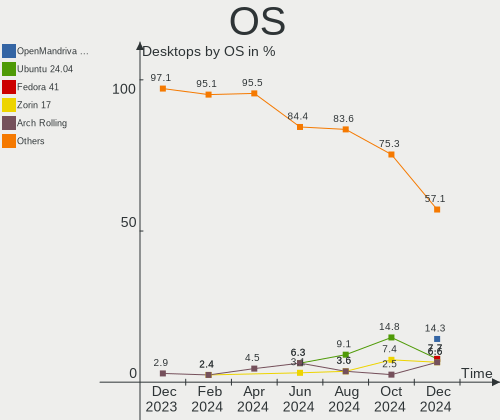
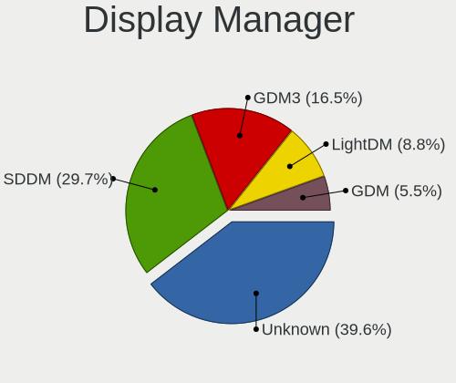
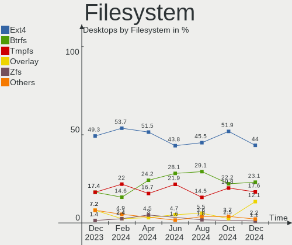
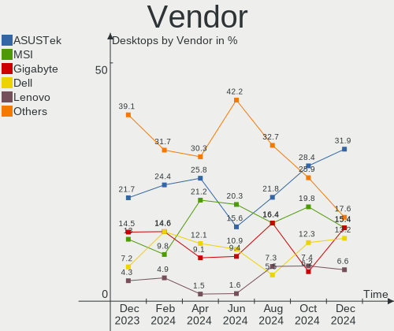
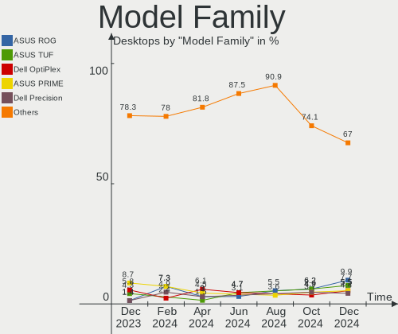
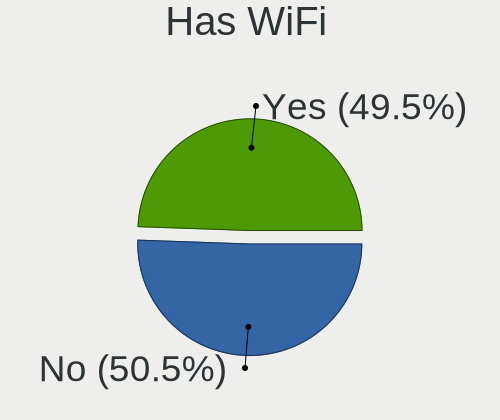
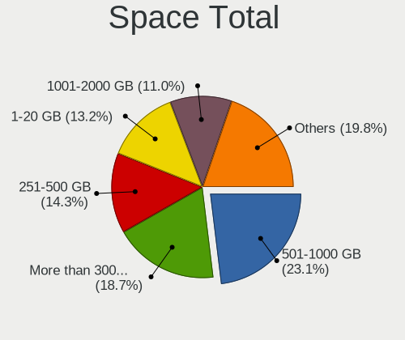
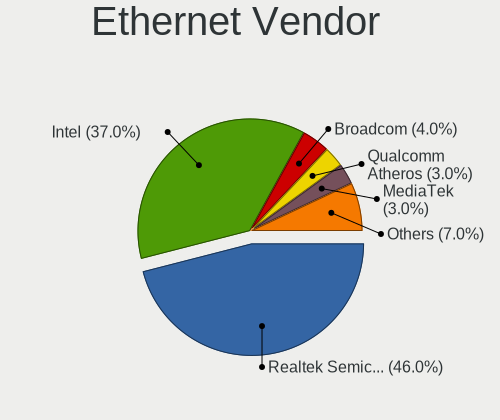
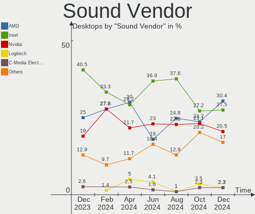
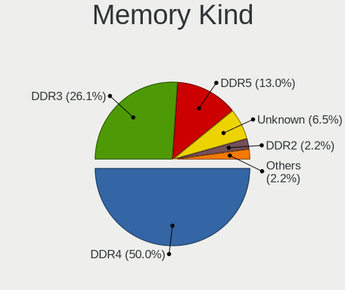

Linux in Canada - Hardware Trends (Desktops)
--------------------------------------------

A project to identify most popular hardware characteristics and track their change
over time based on data collected by Linux users at https://Linux-Hardware.org.

Anyone can contribute to this report by the [hw-probe](https://github.com/linuxhw/hw-probe) tool:

    sudo -E hw-probe -all -upload

Period: Jan, 2024.

Contents
--------

* [ System ](#system)
  - [ OS                       ](#os)
  - [ OS Family                ](#os-family)
  - [ Kernel                   ](#kernel)
  - [ Kernel Family            ](#kernel-family)
  - [ Kernel Major Ver.        ](#kernel-major-ver)
  - [ Arch                     ](#arch)
  - [ DE                       ](#de)
  - [ Display Server           ](#display-server)
  - [ Display Manager          ](#display-manager)
  - [ OS Lang                  ](#os-lang)
  - [ Boot Mode                ](#boot-mode)
  - [ Filesystem               ](#filesystem)
  - [ Part. scheme             ](#part-scheme)
  - [ Dual Boot with Linux/BSD ](#dual-boot-with-linuxbsd)
  - [ Dual Boot (Win)          ](#dual-boot-win)

* [ Board ](#board)
  - [ Vendor                   ](#vendor)
  - [ Model                    ](#model)
  - [ Model Family             ](#model-family)
  - [ MFG Year                 ](#mfg-year)
  - [ Form Factor              ](#form-factor)
  - [ Secure Boot              ](#secure-boot)
  - [ Coreboot                 ](#coreboot)
  - [ RAM Size                 ](#ram-size)
  - [ RAM Used                 ](#ram-used)
  - [ Total Drives             ](#total-drives)
  - [ Has CD-ROM               ](#has-cd-rom)
  - [ Has Ethernet             ](#has-ethernet)
  - [ Has WiFi                 ](#has-wifi)
  - [ Has Bluetooth            ](#has-bluetooth)

* [ Location ](#location)
  - [ Country                  ](#country)
  - [ City                     ](#city)

* [ Drives ](#drives)
  - [ Drive Vendor             ](#drive-vendor)
  - [ Drive Model              ](#drive-model)
  - [ HDD Vendor               ](#hdd-vendor)
  - [ SSD Vendor               ](#ssd-vendor)
  - [ Drive Kind               ](#drive-kind)
  - [ Drive Connector          ](#drive-connector)
  - [ Drive Size               ](#drive-size)
  - [ Space Total              ](#space-total)
  - [ Space Used               ](#space-used)
  - [ Malfunc. Drives          ](#malfunc-drives)
  - [ Malfunc. Drive Vendor    ](#malfunc-drive-vendor)
  - [ Malfunc. HDD Vendor      ](#malfunc-hdd-vendor)
  - [ Malfunc. Drive Kind      ](#malfunc-drive-kind)
  - [ Failed Drives            ](#failed-drives)
  - [ Failed Drive Vendor      ](#failed-drive-vendor)
  - [ Drive Status             ](#drive-status)

* [ Storage controller ](#storage-controller)
  - [ Storage Vendor           ](#storage-vendor)
  - [ Storage Model            ](#storage-model)
  - [ Storage Kind             ](#storage-kind)

* [ Processor ](#processor)
  - [ CPU Vendor               ](#cpu-vendor)
  - [ CPU Model                ](#cpu-model)
  - [ CPU Model Family         ](#cpu-model-family)
  - [ CPU Cores                ](#cpu-cores)
  - [ CPU Sockets              ](#cpu-sockets)
  - [ CPU Threads              ](#cpu-threads)
  - [ CPU Op-Modes             ](#cpu-op-modes)
  - [ CPU Microcode            ](#cpu-microcode)
  - [ CPU Microarch            ](#cpu-microarch)

* [ Graphics ](#graphics)
  - [ GPU Vendor               ](#gpu-vendor)
  - [ GPU Model                ](#gpu-model)
  - [ GPU Combo                ](#gpu-combo)
  - [ GPU Driver               ](#gpu-driver)
  - [ GPU Memory               ](#gpu-memory)

* [ Monitor ](#monitor)
  - [ Monitor Vendor           ](#monitor-vendor)
  - [ Monitor Model            ](#monitor-model)
  - [ Monitor Resolution       ](#monitor-resolution)
  - [ Monitor Diagonal         ](#monitor-diagonal)
  - [ Monitor Width            ](#monitor-width)
  - [ Aspect Ratio             ](#aspect-ratio)
  - [ Monitor Area             ](#monitor-area)
  - [ Pixel Density            ](#pixel-density)
  - [ Multiple Monitors        ](#multiple-monitors)

* [ Network ](#network)
  - [ Net Controller Vendor    ](#net-controller-vendor)
  - [ Net Controller Model     ](#net-controller-model)
  - [ Wireless Vendor          ](#wireless-vendor)
  - [ Wireless Model           ](#wireless-model)
  - [ Ethernet Vendor          ](#ethernet-vendor)
  - [ Ethernet Model           ](#ethernet-model)
  - [ Net Controller Kind      ](#net-controller-kind)
  - [ Used Controller          ](#used-controller)
  - [ NICs                     ](#nics)
  - [ IPv6                     ](#ipv6)

* [ Bluetooth ](#bluetooth)
  - [ Bluetooth Vendor         ](#bluetooth-vendor)
  - [ Bluetooth Model          ](#bluetooth-model)

* [ Sound ](#sound)
  - [ Sound Vendor             ](#sound-vendor)
  - [ Sound Model              ](#sound-model)

* [ Memory ](#memory)
  - [ Memory Vendor            ](#memory-vendor)
  - [ Memory Model             ](#memory-model)
  - [ Memory Kind              ](#memory-kind)
  - [ Memory Form Factor       ](#memory-form-factor)
  - [ Memory Size              ](#memory-size)
  - [ Memory Speed             ](#memory-speed)

* [ Printers & scanners ](#printers--scanners)
  - [ Printer Vendor           ](#printer-vendor)
  - [ Printer Model            ](#printer-model)
  - [ Scanner Vendor           ](#scanner-vendor)
  - [ Scanner Model            ](#scanner-model)

* [ Camera ](#camera)
  - [ Camera Vendor            ](#camera-vendor)
  - [ Camera Model             ](#camera-model)

* [ Security ](#security)
  - [ Fingerprint Vendor       ](#fingerprint-vendor)
  - [ Fingerprint Model        ](#fingerprint-model)
  - [ Chipcard Vendor          ](#chipcard-vendor)
  - [ Chipcard Model           ](#chipcard-model)

* [ Unsupported ](#unsupported)
  - [ Unsupported Devices      ](#unsupported-devices)
  - [ Unsupported Device Types ](#unsupported-device-types)

System
------

OS
--

Installed operating systems

| Name                         | Desktops | Percent |
|------------------------------|----------|---------|
| Ubuntu 22.04                 | 16       | 21.33%  |
| Linux Mint 21.2              | 8        | 10.67%  |
| Zorin 17                     | 5        | 6.67%   |
| Debian 12                    | 4        | 5.33%   |
| Zorin 16                     | 3        | 4%      |
| Ubuntu 23.10                 | 3        | 4%      |
| ArcoLinux Rolling            | 3        | 4%      |
| Arch Rolling                 | 3        | 4%      |
| Void Linux Rolling           | 2        | 2.67%   |
| Ubuntu 20.04                 | 2        | 2.67%   |
| OpenMandriva 5.0             | 2        | 2.67%   |
| Nobara 39                    | 2        | 2.67%   |
| Manjaro                      | 2        | 2.67%   |
| Fedora 39                    | 2        | 2.67%   |
| Xubuntu 22.04                | 1        | 1.33%   |
| Vanilla 2.0                  | 1        | 1.33%   |
| Ubuntu Unity 16.04           | 1        | 1.33%   |
| Ubuntu MATE 20.04            | 1        | 1.33%   |
| Rocky Linux 8.8              | 1        | 1.33%   |
| Pop!_OS 22.04                | 1        | 1.33%   |
| openSUSE Tumbleweed-XXXXXXXX | 1        | 1.33%   |
| Nobara 38                    | 1        | 1.33%   |
| Lubuntu 22.04                | 1        | 1.33%   |
| LMDE 6                       | 1        | 1.33%   |
| Linux Mint 21.3              | 1        | 1.33%   |
| Kubuntu 23.10                | 1        | 1.33%   |
| KDE neon 22.04               | 1        | 1.33%   |
| Kali 2023.4                  | 1        | 1.33%   |
| Gentoo 2.14                  | 1        | 1.33%   |
| Garuda Linux Rolling         | 1        | 1.33%   |
| Endless 5.1.1                | 1        | 1.33%   |
| Debian                       | 1        | 1.33%   |

OS Family
---------

OS without a version

| Name         | Desktops | Percent |
|--------------|----------|---------|
| Ubuntu       | 21       | 28%     |
| Linux Mint   | 9        | 12%     |
| Zorin        | 8        | 10.67%  |
| Debian       | 5        | 6.67%   |
| Nobara       | 3        | 4%      |
| ArcoLinux    | 3        | 4%      |
| Arch         | 3        | 4%      |
| Void Linux   | 2        | 2.67%   |
| OpenMandriva | 2        | 2.67%   |
| Manjaro      | 2        | 2.67%   |
| Fedora       | 2        | 2.67%   |
| Xubuntu      | 1        | 1.33%   |
| Vanilla      | 1        | 1.33%   |
| Ubuntu Unity | 1        | 1.33%   |
| Ubuntu MATE  | 1        | 1.33%   |
| Rocky Linux  | 1        | 1.33%   |
| Pop!_OS      | 1        | 1.33%   |
| openSUSE     | 1        | 1.33%   |
| Lubuntu      | 1        | 1.33%   |
| LMDE         | 1        | 1.33%   |
| Kubuntu      | 1        | 1.33%   |
| KDE neon     | 1        | 1.33%   |
| Kali         | 1        | 1.33%   |
| Gentoo       | 1        | 1.33%   |
| Garuda Linux | 1        | 1.33%   |
| Endless      | 1        | 1.33%   |

Kernel
------

Version of the Linux kernel

| Version                      | Desktops | Percent |
|------------------------------|----------|---------|
| 5.15.0-91-generic            | 11       | 14.67%  |
| 6.2.0-39-generic             | 10       | 13.33%  |
| 6.5.0-14-generic             | 8        | 10.67%  |
| 6.5.0-15-generic             | 5        | 6.67%   |
| 6.6.2-desktop-1omv2390       | 2        | 2.67%   |
| 6.6.11_1                     | 2        | 2.67%   |
| 6.5.0-17-generic             | 2        | 2.67%   |
| 6.1.0-17-amd64               | 2        | 2.67%   |
| 6.7.1-zen1-1-zen             | 1        | 1.33%   |
| 6.7.1-x64v3-xanmod1          | 1        | 1.33%   |
| 6.7.1-arch1-1                | 1        | 1.33%   |
| 6.7.0-204.fsync.fc39.x86_64  | 1        | 1.33%   |
| 6.7.0-0-MANJARO              | 1        | 1.33%   |
| 6.6.9-arch1-1                | 1        | 1.33%   |
| 6.6.9-200.fc39.x86_64        | 1        | 1.33%   |
| 6.6.8-zen1                   | 1        | 1.33%   |
| 6.6.7-zen1-1-zen             | 1        | 1.33%   |
| 6.6.7-203.fsync.fc39.x86_64  | 1        | 1.33%   |
| 6.6.6-76060606-generic       | 1        | 1.33%   |
| 6.6.13-amd64                 | 1        | 1.33%   |
| 6.6.11-1-lts                 | 1        | 1.33%   |
| 6.6.11-1-default             | 1        | 1.33%   |
| 6.6.10-zen1-1-zen            | 1        | 1.33%   |
| 6.5.8-kim1+                  | 1        | 1.33%   |
| 6.5.8-arch1-1                | 1        | 1.33%   |
| 6.5.6-300.fc39.x86_64        | 1        | 1.33%   |
| 6.5.13-7-MANJARO             | 1        | 1.33%   |
| 6.5.11-7-pve                 | 1        | 1.33%   |
| 6.5.0-kali3-amd64            | 1        | 1.33%   |
| 6.5.0-5-amd64                | 1        | 1.33%   |
| 6.5.0-10-generic             | 1        | 1.33%   |
| 6.4.10-202.fsync.fc38.x86_64 | 1        | 1.33%   |
| 6.2.0-060200-generic         | 1        | 1.33%   |
| 6.1.0-14-amd64               | 1        | 1.33%   |
| 5.4.0-169-generic            | 1        | 1.33%   |
| 5.19.0-32-generic            | 1        | 1.33%   |
| 5.15.0-92-generic            | 1        | 1.33%   |
| 5.15.0-89-generic            | 1        | 1.33%   |
| 5.15.0-86-generic            | 1        | 1.33%   |
| 4.4.0-31-generic             | 1        | 1.33%   |

Kernel Family
-------------

Linux kernel without a distro release

| Version | Desktops | Percent |
|---------|----------|---------|
| 6.5.0   | 18       | 24%     |
| 5.15.0  | 14       | 18.67%  |
| 6.2.0   | 11       | 14.67%  |
| 6.6.11  | 4        | 5.33%   |
| 6.7.1   | 3        | 4%      |
| 6.1.0   | 3        | 4%      |
| 6.7.0   | 2        | 2.67%   |
| 6.6.9   | 2        | 2.67%   |
| 6.6.7   | 2        | 2.67%   |
| 6.6.2   | 2        | 2.67%   |
| 6.5.8   | 2        | 2.67%   |
| 6.6.8   | 1        | 1.33%   |
| 6.6.6   | 1        | 1.33%   |
| 6.6.13  | 1        | 1.33%   |
| 6.6.10  | 1        | 1.33%   |
| 6.5.6   | 1        | 1.33%   |
| 6.5.13  | 1        | 1.33%   |
| 6.5.11  | 1        | 1.33%   |
| 6.4.10  | 1        | 1.33%   |
| 5.4.0   | 1        | 1.33%   |
| 5.19.0  | 1        | 1.33%   |
| 4.4.0   | 1        | 1.33%   |
| 4.18.0  | 1        | 1.33%   |

Kernel Major Ver.
-----------------

Linux kernel major version

| Version | Desktops | Percent |
|---------|----------|---------|
| 6.5     | 23       | 30.67%  |
| 6.6     | 14       | 18.67%  |
| 5.15    | 14       | 18.67%  |
| 6.2     | 11       | 14.67%  |
| 6.7     | 5        | 6.67%   |
| 6.1     | 3        | 4%      |
| 6.4     | 1        | 1.33%   |
| 5.4     | 1        | 1.33%   |
| 5.19    | 1        | 1.33%   |
| 4.4     | 1        | 1.33%   |
| 4.18    | 1        | 1.33%   |

Arch
----

OS architecture (x86_64, i586, etc.)

| Name   | Desktops | Percent |
|--------|----------|---------|
| x86_64 | 75       | 100%    |

DE
--

Desktop Environment

| Name          | Desktops | Percent |
|---------------|----------|---------|
| GNOME         | 34       | 45.33%  |
| KDE5          | 14       | 18.67%  |
| XFCE          | 9        | 12%     |
| X-Cinnamon    | 7        | 9.33%   |
| MATE          | 3        | 4%      |
| Hyprland      | 2        | 2.67%   |
| Unity         | 1        | 1.33%   |
| sway          | 1        | 1.33%   |
| LXQt          | 1        | 1.33%   |
| Endless:GNOME | 1        | 1.33%   |
| Budgie        | 1        | 1.33%   |
| Unknown       | 1        | 1.33%   |

Display Server
--------------

X11 or Wayland

| Name    | Desktops | Percent |
|---------|----------|---------|
| X11     | 44       | 58.67%  |
| Wayland | 26       | 34.67%  |
| Tty     | 4        | 5.33%   |
| Unknown | 1        | 1.33%   |

Display Manager
---------------

SDDM, LightDM, etc.

| Name    | Desktops | Percent |
|---------|----------|---------|
| Unknown | 38       | 50.67%  |
| GDM3    | 18       | 24%     |
| SDDM    | 8        | 10.67%  |
| LightDM | 8        | 10.67%  |
| GDM     | 2        | 2.67%   |
| GREETD  | 1        | 1.33%   |

OS Lang
-------

Language

| Lang  | Desktops | Percent |
|-------|----------|---------|
| en_CA | 40       | 53.33%  |
| en_US | 23       | 30.67%  |
| fr_CA | 7        | 9.33%   |
| en_GB | 2        | 2.67%   |
| C     | 2        | 2.67%   |
| fr_FR | 1        | 1.33%   |

Boot Mode
---------

EFI or BIOS

| Mode | Desktops | Percent |
|------|----------|---------|
| BIOS | 44       | 58.67%  |
| EFI  | 31       | 41.33%  |

Filesystem
----------

Type of filesystem

| Type    | Desktops | Percent |
|---------|----------|---------|
| Ext4    | 49       | 65.33%  |
| Btrfs   | 12       | 16%     |
| Tmpfs   | 10       | 13.33%  |
| Overlay | 2        | 2.67%   |
| Zfs     | 1        | 1.33%   |
| Xfs     | 1        | 1.33%   |

Part. scheme
------------

Scheme of partitioning

| Type    | Desktops | Percent |
|---------|----------|---------|
| GPT     | 37       | 49.33%  |
| Unknown | 35       | 46.67%  |
| MBR     | 3        | 4%      |

Dual Boot with Linux/BSD
------------------------

Hosting more than one Linux/BSD

| Dual boot | Desktops | Percent |
|-----------|----------|---------|
| No        | 64       | 85.33%  |
| Yes       | 11       | 14.67%  |

Dual Boot (Win)
---------------

Hosting Linux and Windows

| Dual boot | Desktops | Percent |
|-----------|----------|---------|
| No        | 64       | 85.33%  |
| Yes       | 11       | 14.67%  |

Board
-----

Vendor
------

Motherboard manufacturer

| Name                                 | Desktops | Percent |
|--------------------------------------|----------|---------|
| ASUSTek Computer                     | 23       | 30.67%  |
| MSI                                  | 12       | 16%     |
| Dell                                 | 11       | 14.67%  |
| Hewlett-Packard                      | 6        | 8%      |
| Gigabyte Technology                  | 6        | 8%      |
| ASRock                               | 3        | 4%      |
| Acer                                 | 3        | 4%      |
| Lenovo                               | 2        | 2.67%   |
| Unknown                              | 2        | 2.67%   |
| Shuttle                              | 1        | 1.33%   |
| Shenzhen Meigao Electronic Equipment | 1        | 1.33%   |
| NZXT                                 | 1        | 1.33%   |
| Huanan                               | 1        | 1.33%   |
| Ciara Technologies                   | 1        | 1.33%   |
| AZW                                  | 1        | 1.33%   |
| Alienware                            | 1        | 1.33%   |

Model
-----

Motherboard model

| Name                                          | Desktops | Percent |
|-----------------------------------------------|----------|---------|
| Dell OptiPlex 7050                            | 2        | 2.67%   |
| ASUS P8P67 DELUXE                             | 2        | 2.67%   |
| Unknown                                       | 2        | 2.67%   |
| Shuttle SG31                                  | 1        | 1.33%   |
| Shenzhen Meigao Electronic Equipment UM560 XT | 1        | 1.33%   |
| NZXT N7 B650E                                 | 1        | 1.33%   |
| MSI Z1-7641                                   | 1        | 1.33%   |
| MSI MS-7E27                                   | 1        | 1.33%   |
| MSI MS-7E12                                   | 1        | 1.33%   |
| MSI MS-7D73                                   | 1        | 1.33%   |
| MSI MS-7D25                                   | 1        | 1.33%   |
| MSI MS-7C95                                   | 1        | 1.33%   |
| MSI MS-7C56                                   | 1        | 1.33%   |
| MSI MS-7B98                                   | 1        | 1.33%   |
| MSI MS-7B79                                   | 1        | 1.33%   |
| MSI MS-7A38                                   | 1        | 1.33%   |
| MSI MS-7A37                                   | 1        | 1.33%   |
| MSI H310 Gaming Infinite S (MS-B928)          | 1        | 1.33%   |
| Lenovo ThinkCentre M93p 10AB004DUS            | 1        | 1.33%   |
| Lenovo ThinkCentre M900 10FGS0MX08            | 1        | 1.33%   |
| Huanan X99-QD4 V1.0                           | 1        | 1.33%   |
| HP Z840 Workstation                           | 1        | 1.33%   |
| HP Compaq Pro 6305 SFF                        | 1        | 1.33%   |
| HP Compaq Pro 4300 SFF PC                     | 1        | 1.33%   |
| HP Compaq Elite 8300 SFF                      | 1        | 1.33%   |
| HP Compaq 6005 Pro SFF PC                     | 1        | 1.33%   |
| HP Compaq 6000 Pro SFF PC                     | 1        | 1.33%   |
| Gigabyte Z790 AORUS MASTER X                  | 1        | 1.33%   |
| Gigabyte X570 AORUS ELITE                     | 1        | 1.33%   |
| Gigabyte GA-MA78GM-US2H                       | 1        | 1.33%   |
| Gigabyte B650 GAMING X AX                     | 1        | 1.33%   |
| Gigabyte AB350-Gaming 3                       | 1        | 1.33%   |
| Gigabyte A520M S2H                            | 1        | 1.33%   |
| Dell XPS 8930                                 | 1        | 1.33%   |
| Dell Vostro 430                               | 1        | 1.33%   |
| Dell Precision WorkStation T7400              | 1        | 1.33%   |
| Dell Precision Tower 7810                     | 1        | 1.33%   |
| Dell OptiPlex SFF Plus 7010                   | 1        | 1.33%   |
| Dell OptiPlex 755                             | 1        | 1.33%   |
| Dell OptiPlex 7020                            | 1        | 1.33%   |

Model Family
------------

Motherboard model prefix

| Name                                       | Desktops | Percent |
|--------------------------------------------|----------|---------|
| Dell OptiPlex                              | 7        | 9.33%   |
| ASUS ROG                                   | 7        | 9.33%   |
| ASUS PRIME                                 | 7        | 9.33%   |
| HP Compaq                                  | 5        | 6.67%   |
| Acer Aspire                                | 3        | 4%      |
| Lenovo ThinkCentre                         | 2        | 2.67%   |
| Dell Precision                             | 2        | 2.67%   |
| ASUS P8P67                                 | 2        | 2.67%   |
| Unknown                                    | 2        | 2.67%   |
| Shuttle SG31                               | 1        | 1.33%   |
| Shenzhen Meigao Electronic Equipment UM560 | 1        | 1.33%   |
| NZXT N7                                    | 1        | 1.33%   |
| MSI Z1-7641                                | 1        | 1.33%   |
| MSI MS-7E27                                | 1        | 1.33%   |
| MSI MS-7E12                                | 1        | 1.33%   |
| MSI MS-7D73                                | 1        | 1.33%   |
| MSI MS-7D25                                | 1        | 1.33%   |
| MSI MS-7C95                                | 1        | 1.33%   |
| MSI MS-7C56                                | 1        | 1.33%   |
| MSI MS-7B98                                | 1        | 1.33%   |
| MSI MS-7B79                                | 1        | 1.33%   |
| MSI MS-7A38                                | 1        | 1.33%   |
| MSI MS-7A37                                | 1        | 1.33%   |
| MSI H310                                   | 1        | 1.33%   |
| Huanan X99-QD4                             | 1        | 1.33%   |
| HP Z840                                    | 1        | 1.33%   |
| Gigabyte Z790                              | 1        | 1.33%   |
| Gigabyte X570                              | 1        | 1.33%   |
| Gigabyte GA-MA78GM-US2H                    | 1        | 1.33%   |
| Gigabyte B650                              | 1        | 1.33%   |
| Gigabyte AB350-Gaming                      | 1        | 1.33%   |
| Gigabyte A520M                             | 1        | 1.33%   |
| Dell XPS                                   | 1        | 1.33%   |
| Dell Vostro                                | 1        | 1.33%   |
| Ciara Q77M-XG                              | 1        | 1.33%   |
| AZW SEi                                    | 1        | 1.33%   |
| ASUS UN65U                                 | 1        | 1.33%   |
| ASUS RK569AA-ABA                           | 1        | 1.33%   |
| ASUS ProArt                                | 1        | 1.33%   |
| ASUS P8H77-M                               | 1        | 1.33%   |

MFG Year
--------

Motherboard manufacture year

| Year | Desktops | Percent |
|------|----------|---------|
| 2017 | 11       | 14.67%  |
| 2022 | 9        | 12%     |
| 2023 | 7        | 9.33%   |
| 2020 | 7        | 9.33%   |
| 2021 | 6        | 8%      |
| 2009 | 6        | 8%      |
| 2012 | 5        | 6.67%   |
| 2019 | 4        | 5.33%   |
| 2016 | 3        | 4%      |
| 2015 | 3        | 4%      |
| 2014 | 3        | 4%      |
| 2018 | 2        | 2.67%   |
| 2013 | 2        | 2.67%   |
| 2010 | 2        | 2.67%   |
| 2006 | 2        | 2.67%   |
| 2011 | 1        | 1.33%   |
| 2008 | 1        | 1.33%   |
| 2007 | 1        | 1.33%   |

Form Factor
-----------

Physical design of the computer

| Name    | Desktops | Percent |
|---------|----------|---------|
| Desktop | 75       | 100%    |

Secure Boot
-----------

Enabled or disabled

| State    | Desktops | Percent |
|----------|----------|---------|
| Disabled | 74       | 98.67%  |
| Enabled  | 1        | 1.33%   |

Coreboot
--------

Have coreboot on board

| Used | Desktops | Percent |
|------|----------|---------|
| No   | 74       | 98.67%  |
| Yes  | 1        | 1.33%   |

RAM Size
--------

Total RAM memory

| Size in GB  | Desktops | Percent |
|-------------|----------|---------|
| 16.01-24.0  | 16       | 21.33%  |
| 32.01-64.0  | 15       | 20%     |
| 64.01-256.0 | 15       | 20%     |
| 4.01-8.0    | 10       | 13.33%  |
| 8.01-16.0   | 10       | 13.33%  |
| 3.01-4.0    | 4        | 5.33%   |
| 24.01-32.0  | 3        | 4%      |
| 1.01-2.0    | 2        | 2.67%   |

RAM Used
--------

Used RAM memory

| Used GB    | Desktops | Percent |
|------------|----------|---------|
| 2.01-3.0   | 18       | 24%     |
| 4.01-8.0   | 17       | 22.67%  |
| 3.01-4.0   | 15       | 20%     |
| 1.01-2.0   | 12       | 16%     |
| 8.01-16.0  | 8        | 10.67%  |
| 0.51-1.0   | 3        | 4%      |
| 24.01-32.0 | 1        | 1.33%   |
| 16.01-24.0 | 1        | 1.33%   |

Total Drives
------------

Number of drives on board

| Drives | Desktops | Percent |
|--------|----------|---------|
| 1      | 27       | 36%     |
| 2      | 18       | 24%     |
| 3      | 10       | 13.33%  |
| 5      | 8        | 10.67%  |
| 4      | 5        | 6.67%   |
| 8      | 3        | 4%      |
| 6      | 2        | 2.67%   |
| 25     | 1        | 1.33%   |
| 7      | 1        | 1.33%   |

Has CD-ROM
----------

Has CD-ROM on board

| Presented | Desktops | Percent |
|-----------|----------|---------|
| No        | 49       | 65.33%  |
| Yes       | 26       | 34.67%  |

Has Ethernet
------------

Has Ethernet on board

| Presented | Desktops | Percent |
|-----------|----------|---------|
| Yes       | 75       | 100%    |

Has WiFi
--------

Has WiFi module

| Presented | Desktops | Percent |
|-----------|----------|---------|
| Yes       | 45       | 60%     |
| No        | 30       | 40%     |

Has Bluetooth
-------------

Has Bluetooth module

| Presented | Desktops | Percent |
|-----------|----------|---------|
| Yes       | 41       | 54.67%  |
| No        | 34       | 45.33%  |

Location
--------

Country
-------

Geographic location (country)

| Country | Desktops | Percent |
|---------|----------|---------|
| Canada  | 75       | 100%    |

City
----

Geographic location (city)

| City                     | Desktops | Percent |
|--------------------------|----------|---------|
| Toronto                  | 8        | 10.67%  |
| Montreal                 | 8        | 10.67%  |
| Calgary                  | 8        | 10.67%  |
| Winnipeg                 | 4        | 5.33%   |
| Edmonton                 | 4        | 5.33%   |
| Richmond                 | 3        | 4%      |
| Surrey                   | 2        | 2.67%   |
| Steinbach                | 2        | 2.67%   |
| Oshawa                   | 2        | 2.67%   |
| Mississauga              | 2        | 2.67%   |
| London                   | 2        | 2.67%   |
| Greater Sudbury          | 2        | 2.67%   |
| Burnaby                  | 2        | 2.67%   |
| Whitby                   | 1        | 1.33%   |
| Victoria                 | 1        | 1.33%   |
| Vernon                   | 1        | 1.33%   |
| Verdun                   | 1        | 1.33%   |
| Vancouver                | 1        | 1.33%   |
| Swift Current            | 1        | 1.33%   |
| Summerland               | 1        | 1.33%   |
| Sturgeon County          | 1        | 1.33%   |
| Ste-Anne-Des-Monts       | 1        | 1.33%   |
| St. Claude               | 1        | 1.33%   |
| Salaberry-de-Valleyfield | 1        | 1.33%   |
| Saint-Colomban           | 1        | 1.33%   |
| Saint John               | 1        | 1.33%   |
| Regina                   | 1        | 1.33%   |
| Port Coquitlam           | 1        | 1.33%   |
| Pierrefonds              | 1        | 1.33%   |
| Peterborough             | 1        | 1.33%   |
| Lavaltrie                | 1        | 1.33%   |
| Kelowna                  | 1        | 1.33%   |
| Fredericton              | 1        | 1.33%   |
| Coquitlam                | 1        | 1.33%   |
| Chatham                  | 1        | 1.33%   |
| Brantford                | 1        | 1.33%   |
| Biencourt                | 1        | 1.33%   |
| Beloeil                  | 1        | 1.33%   |
| Amherst                  | 1        | 1.33%   |

Drives
------

Drive Vendor
------------

Hard drive vendors

| Vendor                       | Desktops | Drives | Percent |
|------------------------------|----------|--------|---------|
| Seagate                      | 28       | 53     | 17.72%  |
| WDC                          | 27       | 45     | 17.09%  |
| Samsung Electronics          | 23       | 35     | 14.56%  |
| Kingston                     | 10       | 12     | 6.33%   |
| Toshiba                      | 9        | 12     | 5.7%    |
| Sandisk                      | 9        | 12     | 5.7%    |
| Hitachi                      | 7        | 9      | 4.43%   |
| Unknown                      | 3        | 3      | 1.9%    |
| Kingston Technology Company  | 3        | 3      | 1.9%    |
| Intel                        | 3        | 3      | 1.9%    |
| Crucial                      | 3        | 3      | 1.9%    |
| Timetec                      | 2        | 2      | 1.27%   |
| Shenzhen Longsys Electronics | 2        | 2      | 1.27%   |
| PNY                          | 2        | 2      | 1.27%   |
| Phison Electronics           | 2        | 2      | 1.27%   |
| MAXIO Technology (Hangzhou)  | 2        | 2      | 1.27%   |
| Fujitsu                      | 2        | 2      | 1.27%   |
| China                        | 2        | 2      | 1.27%   |
| Apple                        | 2        | 2      | 1.27%   |
| SPCC                         | 1        | 1      | 0.63%   |
| SK hynix                     | 1        | 1      | 0.63%   |
| Seagate Technology           | 1        | 1      | 0.63%   |
| SABRENT                      | 1        | 1      | 0.63%   |
| Phison                       | 1        | 1      | 0.63%   |
| Patriot                      | 1        | 1      | 0.63%   |
| Mushkin                      | 1        | 1      | 0.63%   |
| Micron/Crucial Technology    | 1        | 1      | 0.63%   |
| LITEON                       | 1        | 1      | 0.63%   |
| JMicron Technology           | 1        | 1      | 0.63%   |
| HGST                         | 1        | 1      | 0.63%   |
| Hewlett-Packard              | 1        | 1      | 0.63%   |
| FORESEE                      | 1        | 1      | 0.63%   |
| FIKWOT                       | 1        | 1      | 0.63%   |
| External                     | 1        | 1      | 0.63%   |
| Corsair                      | 1        | 1      | 0.63%   |
| ADATA Technology             | 1        | 1      | 0.63%   |

Drive Model
-----------

Hard drive models

| Model                                               | Desktops | Percent |
|-----------------------------------------------------|----------|---------|
| Samsung NVMe SSD Controller PM9A1/PM9A3/980PRO 2TB  | 5        | 2.42%   |
| Samsung NVMe SSD Controller SM981/PM981/PM983 1TB   | 4        | 1.93%   |
| Samsung NVMe SSD Controller SM961/PM961/SM963 256GB | 4        | 1.93%   |
| WDC WD20EARX-00PASB0 2TB                            | 3        | 1.45%   |
| SanDisk NVMe SSD Drive 1TB                          | 3        | 1.45%   |
| Kingston SA400S37240G 240GB SSD                     | 3        | 1.45%   |
| WDC WD5000AAKX-22ERMA0 500GB                        | 2        | 0.97%   |
| WDC WD40EFAX-68JH4N1 4TB                            | 2        | 0.97%   |
| WDC WD10EZEX-08M2NA0 1TB                            | 2        | 0.97%   |
| Unknown SD/MMC/MS PRO 256GB                         | 2        | 0.97%   |
| Toshiba XG4 NVMe SSD Controller 512GB               | 2        | 0.97%   |
| Toshiba DT01ACA100 1TB                              | 2        | 0.97%   |
| Timetec SD08 512GB SSD                              | 2        | 0.97%   |
| Seagate ST500DM002-1BD142 500GB                     | 2        | 0.97%   |
| Seagate ST4000VN008-2DR166 4TB                      | 2        | 0.97%   |
| Seagate ST4000LM024-2AN17V 4TB                      | 2        | 0.97%   |
| Seagate ST4000DM004-2CV104 4TB                      | 2        | 0.97%   |
| Seagate ST3500418AS 500GB                           | 2        | 0.97%   |
| Seagate ST3400820AS 400GB                           | 2        | 0.97%   |
| Seagate Expansion 1TB                               | 2        | 0.97%   |
| Samsung SSD 860 EVO 500GB                           | 2        | 0.97%   |
| Samsung SSD 860 EVO 1TB                             | 2        | 0.97%   |
| Kingston SA400S37960G 960GB SSD                     | 2        | 0.97%   |
| Kingston SA400S37480G 480GB SSD                     | 2        | 0.97%   |
| WDC WDS120G1G0A-00SS50 120GB SSD                    | 1        | 0.48%   |
| WDC WDS100T2B0C-00PXH0 1TB                          | 1        | 0.48%   |
| WDC WDS100T2B0B-00YS70 1TB SSD                      | 1        | 0.48%   |
| WDC WDBNCE0010PNC 1TB SSD                           | 1        | 0.48%   |
| WDC WD7500BPVT-22HXZT3 752GB                        | 1        | 0.48%   |
| WDC WD5000LPVX-28V0TT0 500GB                        | 1        | 0.48%   |
| WDC WD5000LPVX-22V0TT0 500GB                        | 1        | 0.48%   |
| WDC WD5000LPLX-60ZNTT1 500GB                        | 1        | 0.48%   |
| WDC WD5000LPLX-08ZNTT0 500GB                        | 1        | 0.48%   |
| WDC WD5000BEVT-60A0RT0 500GB                        | 1        | 0.48%   |
| WDC WD5000BEVT-22A0RT0 500GB                        | 1        | 0.48%   |
| WDC WD5000AVDS-63U7B1 500GB                         | 1        | 0.48%   |
| WDC WD5000AAJB-00UHA0 500GB                         | 1        | 0.48%   |
| WDC WD40EFAX-68JH4N0 4TB                            | 1        | 0.48%   |
| WDC WD3200BPVT-22JJ5T0 320GB                        | 1        | 0.48%   |
| WDC WD30EZRX-00SPEB0 3TB                            | 1        | 0.48%   |

HDD Vendor
----------

Hard disk drive vendors

| Vendor              | Desktops | Drives | Percent |
|---------------------|----------|--------|---------|
| Seagate             | 27       | 50     | 35.53%  |
| WDC                 | 23       | 41     | 30.26%  |
| Toshiba             | 7        | 10     | 9.21%   |
| Hitachi             | 7        | 9      | 9.21%   |
| Unknown             | 2        | 2      | 2.63%   |
| Samsung Electronics | 2        | 2      | 2.63%   |
| Fujitsu             | 2        | 2      | 2.63%   |
| Apple               | 2        | 2      | 2.63%   |
| JMicron Technology  | 1        | 1      | 1.32%   |
| HGST                | 1        | 1      | 1.32%   |
| Hewlett-Packard     | 1        | 1      | 1.32%   |
| External            | 1        | 1      | 1.32%   |

SSD Vendor
----------

Solid state drive vendors

| Vendor              | Desktops | Drives | Percent |
|---------------------|----------|--------|---------|
| Samsung Electronics | 12       | 14     | 27.27%  |
| Kingston            | 10       | 12     | 22.73%  |
| WDC                 | 3        | 3      | 6.82%   |
| Timetec             | 2        | 2      | 4.55%   |
| SanDisk             | 2        | 2      | 4.55%   |
| PNY                 | 2        | 2      | 4.55%   |
| Crucial             | 2        | 2      | 4.55%   |
| China               | 2        | 2      | 4.55%   |
| SPCC                | 1        | 1      | 2.27%   |
| Seagate             | 1        | 2      | 2.27%   |
| SABRENT             | 1        | 1      | 2.27%   |
| Patriot             | 1        | 1      | 2.27%   |
| Mushkin             | 1        | 1      | 2.27%   |
| LITEON              | 1        | 1      | 2.27%   |
| FORESEE             | 1        | 1      | 2.27%   |
| FIKWOT              | 1        | 1      | 2.27%   |
| Corsair             | 1        | 1      | 2.27%   |

Drive Kind
----------

HDD or SSD

| Kind | Desktops | Drives | Percent |
|------|----------|--------|---------|
| HDD  | 48       | 122    | 40.68%  |
| NVMe | 36       | 51     | 30.51%  |
| SSD  | 33       | 49     | 27.97%  |
| MMC  | 1        | 1      | 0.85%   |

Drive Connector
---------------

SATA, SAS, NVMe, etc.

| Type | Desktops | Drives | Percent |
|------|----------|--------|---------|
| SATA | 63       | 155    | 57.8%   |
| NVMe | 35       | 50     | 32.11%  |
| SAS  | 10       | 17     | 9.17%   |
| MMC  | 1        | 1      | 0.92%   |

Drive Size
----------

Size of hard drive

| Size in TB | Desktops | Drives | Percent |
|------------|----------|--------|---------|
| 0.01-0.5   | 41       | 75     | 40.2%   |
| 0.51-1.0   | 30       | 41     | 29.41%  |
| 1.01-2.0   | 16       | 20     | 15.69%  |
| 3.01-4.0   | 7        | 18     | 6.86%   |
| 4.01-10.0  | 5        | 6      | 4.9%    |
| 2.01-3.0   | 3        | 11     | 2.94%   |

Space Total
-----------

Amount of disk space available on the file system

| Size in GB     | Desktops | Percent |
|----------------|----------|---------|
| More than 3000 | 15       | 20%     |
| 101-250        | 14       | 18.67%  |
| 251-500        | 11       | 14.67%  |
| 1001-2000      | 11       | 14.67%  |
| 501-1000       | 11       | 14.67%  |
| 1-20           | 5        | 6.67%   |
| 2001-3000      | 4        | 5.33%   |
| Unknown        | 2        | 2.67%   |
| 21-50          | 1        | 1.33%   |
| 51-100         | 1        | 1.33%   |

Space Used
----------

Amount of used disk space

| Used GB        | Desktops | Percent |
|----------------|----------|---------|
| 1-20           | 16       | 21.33%  |
| 21-50          | 12       | 16%     |
| 101-250        | 12       | 16%     |
| 501-1000       | 9        | 12%     |
| 51-100         | 8        | 10.67%  |
| 251-500        | 5        | 6.67%   |
| 1001-2000      | 5        | 6.67%   |
| More than 3000 | 3        | 4%      |
| 2001-3000      | 3        | 4%      |
| Unknown        | 2        | 2.67%   |

Malfunc. Drives
---------------

Drive models with a malfunction

| Model                          | Desktops | Drives | Percent |
|--------------------------------|----------|--------|---------|
| WDC WD5000LPVX-28V0TT0 500GB   | 1        | 1      | 6.25%   |
| WDC WD5000LPLX-08ZNTT0 500GB   | 1        | 1      | 6.25%   |
| WDC WD5000AVDS-63U7B1 500GB    | 1        | 2      | 6.25%   |
| WDC WD5000AAKX-22ERMA0 500GB   | 1        | 1      | 6.25%   |
| WDC WD5000AAJB-00UHA0 500GB    | 1        | 1      | 6.25%   |
| WDC WD40EFAX-68JH4N1 4TB       | 1        | 1      | 6.25%   |
| WDC WD20EARX-00PASB0 2TB       | 1        | 1      | 6.25%   |
| Seagate ST3500418AS 500GB      | 1        | 1      | 6.25%   |
| Seagate ST3160811AS 160GB      | 1        | 1      | 6.25%   |
| Seagate ST1000LM035-1RK172 1TB | 1        | 1      | 6.25%   |
| Seagate ST1000DM003-9YN162 1TB | 1        | 1      | 6.25%   |
| Hitachi HTS547575A9E384 752GB  | 1        | 1      | 6.25%   |
| Hitachi HDT725025VLA380 250GB  | 1        | 1      | 6.25%   |
| Hitachi HDT721016SLA380 160GB  | 1        | 3      | 6.25%   |
| Hitachi HCS721050CLA362 499GB  | 1        | 1      | 6.25%   |
| Corsair Performance3 SSD 128GB | 1        | 1      | 6.25%   |

Malfunc. Drive Vendor
---------------------

Vendors of faulty drives

| Vendor  | Desktops | Drives | Percent |
|---------|----------|--------|---------|
| WDC     | 4        | 8      | 30.77%  |
| Seagate | 4        | 4      | 30.77%  |
| Hitachi | 4        | 6      | 30.77%  |
| Corsair | 1        | 1      | 7.69%   |

Malfunc. HDD Vendor
-------------------

Vendors of faulty HDD drives

| Vendor  | Desktops | Drives | Percent |
|---------|----------|--------|---------|
| WDC     | 4        | 8      | 33.33%  |
| Seagate | 4        | 4      | 33.33%  |
| Hitachi | 4        | 6      | 33.33%  |

Malfunc. Drive Kind
-------------------

Kinds of faulty drives

| Kind | Desktops | Drives | Percent |
|------|----------|--------|---------|
| HDD  | 9        | 18     | 90%     |
| SSD  | 1        | 1      | 10%     |

Failed Drives
-------------

Failed drive models

Zero info for selected period =(

Failed Drive Vendor
-------------------

Failed drive vendors

Zero info for selected period =(

Drive Status
------------

Number of failed and malfunc. drives

| Status   | Desktops | Drives | Percent |
|----------|----------|--------|---------|
| Detected | 55       | 132    | 61.8%   |
| Works    | 25       | 72     | 28.09%  |
| Malfunc  | 9        | 19     | 10.11%  |

Storage controller
------------------

Storage Vendor
--------------

Storage controller vendors

| Vendor                       | Desktops | Percent |
|------------------------------|----------|---------|
| Intel                        | 46       | 36.51%  |
| AMD                          | 29       | 23.02%  |
| Samsung Electronics          | 13       | 10.32%  |
| Sandisk                      | 8        | 6.35%   |
| ASMedia Technology           | 4        | 3.17%   |
| Phison Electronics           | 3        | 2.38%   |
| Marvell Technology Group     | 3        | 2.38%   |
| Kingston Technology Company  | 3        | 2.38%   |
| JMicron Technology           | 3        | 2.38%   |
| Toshiba America Info Systems | 2        | 1.59%   |
| Shenzhen Longsys Electronics | 2        | 1.59%   |
| Micron/Crucial Technology    | 2        | 1.59%   |
| MAXIO Technology (Hangzhou)  | 2        | 1.59%   |
| SK hynix                     | 1        | 0.79%   |
| Seagate Technology           | 1        | 0.79%   |
| Nvidia                       | 1        | 0.79%   |
| LSI Logic / Symbios Logic    | 1        | 0.79%   |
| Broadcom / LSI               | 1        | 0.79%   |
| ADATA Technology             | 1        | 0.79%   |

Storage Model
-------------

Storage controller models

| Model                                                                          | Desktops | Percent |
|--------------------------------------------------------------------------------|----------|---------|
| AMD FCH SATA Controller [AHCI mode]                                            | 9        | 5.81%   |
| AMD 600 Series Chipset SATA Controller                                         | 8        | 5.16%   |
| AMD 500 Series Chipset SATA Controller                                         | 6        | 3.87%   |
| Samsung NVMe SSD Controller PM9A1/PM9A3/980PRO                                 | 5        | 3.23%   |
| Intel 200 Series PCH SATA controller [AHCI mode]                               | 5        | 3.23%   |
| SanDisk WD Black SN770 / PC SN740 256GB / PC SN560 (DRAM-less) NVMe SSD        | 4        | 2.58%   |
| Samsung NVMe SSD Controller SM981/PM981/PM983                                  | 4        | 2.58%   |
| Samsung NVMe SSD Controller SM961/PM961/SM963                                  | 4        | 2.58%   |
| Intel SATA Controller [RAID mode]                                              | 4        | 2.58%   |
| Intel Alder Lake-S PCH SATA Controller [AHCI Mode]                             | 4        | 2.58%   |
| Intel 8 Series/C220 Series Chipset Family 6-port SATA Controller 1 [AHCI mode] | 4        | 2.58%   |
| Intel 6 Series/C200 Series Chipset Family 6 port Desktop SATA AHCI Controller  | 4        | 2.58%   |
| AMD 300 Series Chipset SATA Controller                                         | 4        | 2.58%   |
| Kingston Company NV2 NVMe SSD SM2267XT (DRAM-less)                             | 3        | 1.94%   |
| Intel Comet Lake SATA AHCI Controller                                          | 3        | 1.94%   |
| ASMedia ASM1061/ASM1062 Serial ATA Controller                                  | 3        | 1.94%   |
| AMD SB7x0/SB8x0/SB9x0 SATA Controller [IDE mode]                               | 3        | 1.94%   |
| AMD SB7x0/SB8x0/SB9x0 IDE Controller                                           | 3        | 1.94%   |
| Toshiba America Info Systems XG4 NVMe SSD Controller                           | 2        | 1.29%   |
| Shenzhen Longsys Lexar NM790 NVME SSD (DRAM-less)                              | 2        | 1.29%   |
| Sandisk WD Black SN850X NVMe SSD                                               | 2        | 1.29%   |
| JMicron JMB363 SATA/IDE Controller                                             | 2        | 1.29%   |
| Intel Volume Management Device NVMe RAID Controller Intel Corporation          | 2        | 1.29%   |
| Intel SSD 660P Series                                                          | 2        | 1.29%   |
| Intel Raptor Lake SATA AHCI Controller                                         | 2        | 1.29%   |
| Intel Q170/Q150/B150/H170/H110/Z170/CM236 Chipset SATA Controller [AHCI Mode]  | 2        | 1.29%   |
| Intel 7 Series/C210 Series Chipset Family 4-port SATA Controller [IDE mode]    | 2        | 1.29%   |
| Intel 7 Series/C210 Series Chipset Family 2-port SATA Controller [IDE mode]    | 2        | 1.29%   |
| SK hynix Gold P31/BC711/PC711 NVMe Solid State Drive                           | 1        | 0.65%   |
| Seagate FireCuda 530 SSD                                                       | 1        | 0.65%   |
| Seagate FireCuda 520/IronWolf 525 SSD                                          | 1        | 0.65%   |
| SanDisk WD Blue SN570 NVMe SSD 2TB                                             | 1        | 0.65%   |
| SanDisk WD Black NVMe SSD                                                      | 1        | 0.65%   |
| SanDisk Ultra 3D / WD Blue SN550 NVMe SSD                                      | 1        | 0.65%   |
| Sandisk PC SN740 NVMe SSD (DRAM-less)                                          | 1        | 0.65%   |
| Samsung NVMe SSD Controller SM951/PM951                                        | 1        | 0.65%   |
| Samsung NVMe SSD Controller S4LV008[Pascal]                                    | 1        | 0.65%   |
| Phison PS5013-E13 PCIe3 NVMe Controller (DRAM-less)                            | 1        | 0.65%   |
| Phison E18 PCIe4 NVMe Controller                                               | 1        | 0.65%   |
| Phison E16 PCIe4 NVMe Controller                                               | 1        | 0.65%   |

Storage Kind
------------

Kind of storage controller (IDE, SATA, NVMe, SAS, ...)

| Kind | Desktops | Percent |
|------|----------|---------|
| SATA | 65       | 53.28%  |
| NVMe | 35       | 28.69%  |
| IDE  | 12       | 9.84%   |
| RAID | 8        | 6.56%   |
| SAS  | 2        | 1.64%   |

Processor
---------

CPU Vendor
----------

Processor vendors

| Vendor | Desktops | Percent |
|--------|----------|---------|
| Intel  | 45       | 60%     |
| AMD    | 30       | 40%     |

CPU Model
---------

Processor models

| Model                                 | Desktops | Percent |
|---------------------------------------|----------|---------|
| Intel Core i5-3470 CPU @ 3.20GHz      | 3        | 4%      |
| AMD Ryzen 9 7950X 16-Core Processor   | 3        | 4%      |
| AMD Ryzen 7 5700X 8-Core Processor    | 3        | 4%      |
| Intel Core i7-7700T CPU @ 2.90GHz     | 2        | 2.67%   |
| Intel 12th Gen Core i5-12600K         | 2        | 2.67%   |
| Intel Xeon CPU E5410 @ 2.33GHz        | 1        | 1.33%   |
| Intel Xeon CPU E5-2687W v3 @ 3.10GHz  | 1        | 1.33%   |
| Intel Xeon CPU E5-2680 v4 @ 2.40GHz   | 1        | 1.33%   |
| Intel Xeon CPU E5-2620 v4 @ 2.10GHz   | 1        | 1.33%   |
| Intel Xeon CPU E3-1275 V2 @ 3.50GHz   | 1        | 1.33%   |
| Intel N95                             | 1        | 1.33%   |
| Intel Core i9-7900X CPU @ 3.30GHz     | 1        | 1.33%   |
| Intel Core i9-14900K                  | 1        | 1.33%   |
| Intel Core i7-8700K CPU @ 3.70GHz     | 1        | 1.33%   |
| Intel Core i7-8700 CPU @ 3.20GHz      | 1        | 1.33%   |
| Intel Core i7-4790 CPU @ 3.60GHz      | 1        | 1.33%   |
| Intel Core i7-2600K CPU @ 3.40GHz     | 1        | 1.33%   |
| Intel Core i7-10700K CPU @ 3.80GHz    | 1        | 1.33%   |
| Intel Core i7 CPU 860 @ 2.80GHz       | 1        | 1.33%   |
| Intel Core i5-9400F CPU @ 2.90GHz     | 1        | 1.33%   |
| Intel Core i5-9400 CPU @ 2.90GHz      | 1        | 1.33%   |
| Intel Core i5-7600K CPU @ 3.80GHz     | 1        | 1.33%   |
| Intel Core i5-7400 CPU @ 3.00GHz      | 1        | 1.33%   |
| Intel Core i5-7200U CPU @ 2.50GHz     | 1        | 1.33%   |
| Intel Core i5-6600 CPU @ 3.30GHz      | 1        | 1.33%   |
| Intel Core i5-4590T CPU @ 2.00GHz     | 1        | 1.33%   |
| Intel Core i5-2500K CPU @ 3.30GHz     | 1        | 1.33%   |
| Intel Core i5-10600T CPU @ 2.40GHz    | 1        | 1.33%   |
| Intel Core i5-10500 CPU @ 3.10GHz     | 1        | 1.33%   |
| Intel Core i5 CPU 750 @ 2.67GHz       | 1        | 1.33%   |
| Intel Core i3-4160 CPU @ 3.60GHz      | 1        | 1.33%   |
| Intel Core i3-3220 CPU @ 3.30GHz      | 1        | 1.33%   |
| Intel Core 2 Quad CPU Q8200 @ 2.33GHz | 1        | 1.33%   |
| Intel Core 2 Quad CPU @ 2.40GHz       | 1        | 1.33%   |
| Intel Core 2 Duo CPU E8400 @ 3.00GHz  | 1        | 1.33%   |
| Intel Core 2 Duo CPU E6750 @ 2.66GHz  | 1        | 1.33%   |
| Intel Celeron CPU J3455 @ 1.50GHz     | 1        | 1.33%   |
| Intel 13th Gen Core i9-13900KF        | 1        | 1.33%   |
| Intel 13th Gen Core i7-13700          | 1        | 1.33%   |
| Intel 13th Gen Core i5-13600K         | 1        | 1.33%   |

CPU Model Family
----------------

Processor model prefix

| Model             | Desktops | Percent |
|-------------------|----------|---------|
| Intel Core i5     | 14       | 18.67%  |
| Other             | 9        | 12%     |
| AMD Ryzen 7       | 9        | 12%     |
| Intel Core i7     | 8        | 10.67%  |
| AMD Ryzen 5       | 8        | 10.67%  |
| Intel Xeon        | 5        | 6.67%   |
| AMD Ryzen 9       | 5        | 6.67%   |
| Intel Core i9     | 2        | 2.67%   |
| Intel Core i3     | 2        | 2.67%   |
| Intel Core 2 Quad | 2        | 2.67%   |
| Intel Core 2 Duo  | 2        | 2.67%   |
| AMD FX            | 2        | 2.67%   |
| Intel Celeron     | 1        | 1.33%   |
| AMD Ryzen 3       | 1        | 1.33%   |
| AMD Phenom II X4  | 1        | 1.33%   |
| AMD Phenom II X2  | 1        | 1.33%   |
| AMD Athlon 64 X2  | 1        | 1.33%   |
| AMD A8            | 1        | 1.33%   |
| AMD A4            | 1        | 1.33%   |

CPU Cores
---------

Number of processor cores

| Number | Desktops | Percent |
|--------|----------|---------|
| 4      | 23       | 30.67%  |
| 6      | 14       | 18.67%  |
| 8      | 12       | 16%     |
| 2      | 9        | 12%     |
| 16     | 5        | 6.67%   |
| 10     | 4        | 5.33%   |
| 24     | 2        | 2.67%   |
| 14     | 2        | 2.67%   |
| 12     | 2        | 2.67%   |
| 20     | 1        | 1.33%   |
| 1      | 1        | 1.33%   |

CPU Sockets
-----------

Number of sockets

| Number | Desktops | Percent |
|--------|----------|---------|
| 1      | 72       | 96%     |
| 2      | 3        | 4%      |

CPU Threads
-----------

Threads per core (Hyper-Threading)

| Number | Desktops | Percent |
|--------|----------|---------|
| 2      | 53       | 70.67%  |
| 1      | 22       | 29.33%  |

CPU Op-Modes
------------

CPU Operation Modes (32-bit, 64-bit)

| Op mode        | Desktops | Percent |
|----------------|----------|---------|
| 32-bit, 64-bit | 75       | 100%    |

CPU Microcode
-------------

Microcode number

| Number     | Desktops | Percent |
|------------|----------|---------|
| Unknown    | 53       | 70.67%  |
| 0x08001138 | 3        | 4%      |
| 0xa0653    | 2        | 2.67%   |
| 0x0a20120e | 2        | 2.67%   |
| 0x08701021 | 2        | 2.67%   |
| 0xb0671    | 1        | 1.33%   |
| 0x506e3    | 1        | 1.33%   |
| 0x506c9    | 1        | 1.33%   |
| 0x406f1    | 1        | 1.33%   |
| 0x306a9    | 1        | 1.33%   |
| 0x0a601206 | 1        | 1.33%   |
| 0x0a601203 | 1        | 1.33%   |
| 0x0a50000d | 1        | 1.33%   |
| 0x0a20120a | 1        | 1.33%   |
| 0x08101016 | 1        | 1.33%   |
| 0x06000852 | 1        | 1.33%   |
| 0x0600063e | 1        | 1.33%   |
| 0x010000c8 | 1        | 1.33%   |

CPU Microarch
-------------

Microarchitecture

| Name             | Desktops | Percent |
|------------------|----------|---------|
| Unknown          | 14       | 18.67%  |
| KabyLake         | 9        | 12%     |
| Zen 3            | 7        | 9.33%   |
| IvyBridge        | 5        | 6.67%   |
| Zen 2            | 4        | 5.33%   |
| Zen              | 4        | 5.33%   |
| Haswell          | 4        | 5.33%   |
| Piledriver       | 3        | 4%      |
| Penryn           | 3        | 4%      |
| CometLake        | 3        | 4%      |
| Alderlake Hybrid | 3        | 4%      |
| Skylake          | 2        | 2.67%   |
| SandyBridge      | 2        | 2.67%   |
| Nehalem          | 2        | 2.67%   |
| K10              | 2        | 2.67%   |
| Core             | 2        | 2.67%   |
| Broadwell        | 2        | 2.67%   |
| K8 Hammer        | 1        | 1.33%   |
| Gracemont        | 1        | 1.33%   |
| Goldmont         | 1        | 1.33%   |
| Bulldozer        | 1        | 1.33%   |

Graphics
--------

GPU Vendor
----------

Vendors of graphics cards

| Vendor | Desktops | Percent |
|--------|----------|---------|
| Nvidia | 33       | 38.37%  |
| AMD    | 27       | 31.4%   |
| Intel  | 26       | 30.23%  |

GPU Model
---------

Graphics card models

| Model                                                                       | Desktops | Percent |
|-----------------------------------------------------------------------------|----------|---------|
| AMD Raphael                                                                 | 6        | 6.67%   |
| Intel Xeon E3-1200 v2/3rd Gen Core processor Graphics Controller            | 4        | 4.44%   |
| Intel HD Graphics 630                                                       | 4        | 4.44%   |
| Intel CometLake-S GT2 [UHD Graphics 630]                                    | 3        | 3.33%   |
| AMD Navi 32 [Radeon RX 7700 XT / 7800 XT]                                   | 3        | 3.33%   |
| AMD Ellesmere [Radeon RX 470/480/570/570X/580/580X/590]                     | 3        | 3.33%   |
| Nvidia GT218 [GeForce 210]                                                  | 2        | 2.22%   |
| Nvidia GP106 [GeForce GTX 1060 6GB]                                         | 2        | 2.22%   |
| Nvidia GK208B [GeForce GT 710]                                              | 2        | 2.22%   |
| Nvidia GA106 [GeForce RTX 3060 Lite Hash Rate]                              | 2        | 2.22%   |
| Intel Xeon E3-1200 v3/4th Gen Core Processor Integrated Graphics Controller | 2        | 2.22%   |
| Intel Raptor Lake-S GT1 [UHD Graphics 770]                                  | 2        | 2.22%   |
| Intel CoffeeLake-S GT2 [UHD Graphics 630]                                   | 2        | 2.22%   |
| AMD Navi 31 [Radeon RX 7900 XT/7900 XTX/7900M]                              | 2        | 2.22%   |
| AMD Navi 21 [Radeon RX 6800/6800 XT / 6900 XT]                              | 2        | 2.22%   |
| Nvidia TU117 [GeForce GTX 1650]                                             | 1        | 1.11%   |
| Nvidia TU117 [GeForce GTX 1630]                                             | 1        | 1.11%   |
| Nvidia TU116 [GeForce GTX 1660]                                             | 1        | 1.11%   |
| Nvidia TU104 [GeForce RTX 2070 SUPER]                                       | 1        | 1.11%   |
| Nvidia TU104 [GeForce RTX 2060]                                             | 1        | 1.11%   |
| Nvidia GP108 [GeForce GT 1030]                                              | 1        | 1.11%   |
| Nvidia GP107 [GeForce GTX 1050]                                             | 1        | 1.11%   |
| Nvidia GP106 [GeForce GTX 1060 6GB Rev. 2]                                  | 1        | 1.11%   |
| Nvidia GP104 [GeForce GTX 1070]                                             | 1        | 1.11%   |
| Nvidia GP102 [GeForce GTX 1080 Ti]                                          | 1        | 1.11%   |
| Nvidia GM107 [GeForce GTX 750 Ti]                                           | 1        | 1.11%   |
| Nvidia GK110GL [Quadro K5200]                                               | 1        | 1.11%   |
| Nvidia GK107 [GeForce GT 640]                                               | 1        | 1.11%   |
| Nvidia GK104 [GeForce GTX 670]                                              | 1        | 1.11%   |
| Nvidia GF119 [GeForce GT 620 OEM]                                           | 1        | 1.11%   |
| Nvidia GF114 [GeForce GTX 560 Ti]                                           | 1        | 1.11%   |
| Nvidia GF108 [GeForce GT 730]                                               | 1        | 1.11%   |
| Nvidia GA106 [Geforce RTX 3050]                                             | 1        | 1.11%   |
| Nvidia GA104 [GeForce RTX 3070]                                             | 1        | 1.11%   |
| Nvidia GA104 [GeForce RTX 3070 Lite Hash Rate]                              | 1        | 1.11%   |
| Nvidia GA102 [GeForce RTX 3080 Ti]                                          | 1        | 1.11%   |
| Nvidia C51 [GeForce 6150 LE]                                                | 1        | 1.11%   |
| Nvidia AD106 [GeForce RTX 4060 Ti]                                          | 1        | 1.11%   |
| Nvidia AD106 [GeForce RTX 4060 Ti 16GB]                                     | 1        | 1.11%   |
| Nvidia AD104 [GeForce RTX 4070]                                             | 1        | 1.11%   |

GPU Combo
---------

Combinations of graphics cards

| Name           | Desktops | Percent |
|----------------|----------|---------|
| 1 x Nvidia     | 27       | 36%     |
| 1 x AMD        | 22       | 29.33%  |
| 1 x Intel      | 17       | 22.67%  |
| Intel + Nvidia | 4        | 5.33%   |
| 2 x AMD        | 2        | 2.67%   |
| AMD + Nvidia   | 2        | 2.67%   |
| Intel + AMD    | 1        | 1.33%   |

GPU Driver
----------

Free vs proprietary

| Driver      | Desktops | Percent |
|-------------|----------|---------|
| Free        | 51       | 68%     |
| Proprietary | 20       | 26.67%  |
| Unknown     | 4        | 5.33%   |

GPU Memory
----------

Total video memory

| Size in GB | Desktops | Percent |
|------------|----------|---------|
| Unknown    | 41       | 54.67%  |
| 7.01-8.0   | 8        | 10.67%  |
| 8.01-16.0  | 8        | 10.67%  |
| 0.51-1.0   | 6        | 8%      |
| 5.01-6.0   | 4        | 5.33%   |
| 1.01-2.0   | 4        | 5.33%   |
| 3.01-4.0   | 2        | 2.67%   |
| 16.01-24.0 | 1        | 1.33%   |
| 0.01-0.5   | 1        | 1.33%   |

Monitor
-------

Monitor Vendor
--------------

Monitor vendors

| Vendor               | Desktops | Percent |
|----------------------|----------|---------|
| Samsung Electronics  | 14       | 16.09%  |
| Goldstar             | 12       | 13.79%  |
| Dell                 | 11       | 12.64%  |
| Acer                 | 8        | 9.2%    |
| ViewSonic            | 4        | 4.6%    |
| ASUSTek Computer     | 4        | 4.6%    |
| BenQ                 | 3        | 3.45%   |
| Ancor Communications | 3        | 3.45%   |
| Sceptre Tech         | 2        | 2.3%    |
| SANSUI               | 2        | 2.3%    |
| LG Electronics       | 2        | 2.3%    |
| Lenovo               | 2        | 2.3%    |
| Hewlett-Packard      | 2        | 2.3%    |
| Gigabyte Technology  | 2        | 2.3%    |
| AOC                  | 2        | 2.3%    |
| Xiaomi               | 1        | 1.15%   |
| Vizio                | 1        | 1.15%   |
| Toshiba              | 1        | 1.15%   |
| Sony                 | 1        | 1.15%   |
| RCA                  | 1        | 1.15%   |
| Philips              | 1        | 1.15%   |
| NEC Computers        | 1        | 1.15%   |
| Insignia             | 1        | 1.15%   |
| HKC                  | 1        | 1.15%   |
| Hitachi              | 1        | 1.15%   |
| eMachines            | 1        | 1.15%   |
| CND                  | 1        | 1.15%   |
| Apple                | 1        | 1.15%   |
| Unknown              | 1        | 1.15%   |

Monitor Model
-------------

Monitor models

| Model                                                                  | Desktops | Percent |
|------------------------------------------------------------------------|----------|---------|
| Samsung Electronics LCD Monitor SAM71B4 3840x2160 1210x680mm 54.6-inch | 2        | 2.15%   |
| Goldstar FULL HD GSM5B55 1920x1080 480x270mm 21.7-inch                 | 2        | 2.15%   |
| Xiaomi Mi TV XMD009A 2880x1800 600x340mm 27.2-inch                     | 1        | 1.08%   |
| Vizio P552ui-B2 VIZ1010 3840x2160 1330x750mm 60.1-inch                 | 1        | 1.08%   |
| ViewSonic VX2739 Series VSC3F24 1920x1080 598x336mm 27.0-inch          | 1        | 1.08%   |
| ViewSonic VX2418C SER VSC1A3D 1920x1080 520x300mm 23.6-inch            | 1        | 1.08%   |
| ViewSonic VA702b VSC231C 1280x1024 338x270mm 17.0-inch                 | 1        | 1.08%   |
| ViewSonic VA2251 SERIES VSC112B 1920x1080 480x270mm 21.7-inch          | 1        | 1.08%   |
| Toshiba LCD Monitor LCD1775 1280x1024 340x270mm 17.1-inch              | 1        | 1.08%   |
| Sony AVSYSTEM SNY050A 1280x720 708x398mm 32.0-inch                     | 1        | 1.08%   |
| Sceptre Tech X409BV-FHDR SPT0F70 1920x1080 698x392mm 31.5-inch         | 1        | 1.08%   |
| Sceptre Tech X246W-1080p SPT2303 1920x1080 521x293mm 23.5-inch         | 1        | 1.08%   |
| SANSUI ES-27F1 XEC1658 1920x1080 597x336mm 27.0-inch                   | 1        | 1.08%   |
| SANSUI ES-22F1 XEC3150 1920x1080 476x268mm 21.5-inch                   | 1        | 1.08%   |
| Samsung Electronics SyncMaster SAM04D4 1920x1080 531x298mm 24.0-inch   | 1        | 1.08%   |
| Samsung Electronics SyncMaster SAM043F 1920x1200 518x324mm 24.1-inch   | 1        | 1.08%   |
| Samsung Electronics SyncMaster SAM0354 1920x1200 291x364mm 18.3-inch   | 1        | 1.08%   |
| Samsung Electronics SMB2230H SAM0648 1920x1080                         | 1        | 1.08%   |
| Samsung Electronics S24D330 SAM0D92 1920x1080 531x299mm 24.0-inch      | 1        | 1.08%   |
| Samsung Electronics S22F350 SAM0D1A 1920x1080 477x268mm 21.5-inch      | 1        | 1.08%   |
| Samsung Electronics LU28R55 SAM1017 3840x2160 632x360mm 28.6-inch      | 1        | 1.08%   |
| Samsung Electronics LS27AG55x SAM71E1 2560x1440 600x340mm 27.2-inch    | 1        | 1.08%   |
| Samsung Electronics LF24T40 SAM703D 1920x1080 521x293mm 23.5-inch      | 1        | 1.08%   |
| Samsung Electronics LCD Monitor SAM08FE 1920x1080                      | 1        | 1.08%   |
| Samsung Electronics LCD Monitor SAM0503 1920x1080                      | 1        | 1.08%   |
| Samsung Electronics C49RG9x SAM0F9C 3840x1080 1193x336mm 48.8-inch     | 1        | 1.08%   |
| Samsung Electronics C27F390 SAM0D32 1920x1080 598x336mm 27.0-inch      | 1        | 1.08%   |
| RCA RTRU4328CA RCA0B01 3840x2160 800x450mm 36.1-inch                   | 1        | 1.08%   |
| Philips 190VW PHLC021 1440x900 408x255mm 18.9-inch                     | 1        | 1.08%   |
| NEC Computers LCD92VX NEC66AF 1280x1024 380x300mm 19.1-inch            | 1        | 1.08%   |
| LG Electronics LCD Monitor LG ULTRAGEAR 1920x1080                      | 1        | 1.08%   |
| LG Electronics LCD Monitor LG HDR 4K 5760x2160                         | 1        | 1.08%   |
| Lenovo LEN LT2452pwC LEN1144 1920x1200 518x324mm 24.1-inch             | 1        | 1.08%   |
| Lenovo C27-30 LEN62AA 1920x1080 597x336mm 27.0-inch                    | 1        | 1.08%   |
| Insignia NS28D310NA15 BBY0028 1680x1050 640x384mm 29.4-inch            | 1        | 1.08%   |
| HKC 24N5C HKC2451 1920x1080 523x293mm 23.6-inch                        | 1        | 1.08%   |
| Hitachi HISENSE HEC002F 3840x2160 1872x1053mm 84.6-inch                | 1        | 1.08%   |
| Hewlett-Packard 27er HWP3326 1920x1080 598x336mm 27.0-inch             | 1        | 1.08%   |
| Hewlett-Packard 20bw HWP302B 1600x900 443x249mm 20.0-inch              | 1        | 1.08%   |
| Goldstar W2043 GSM4E9E 1600x900 450x250mm 20.3-inch                    | 1        | 1.08%   |

Monitor Resolution
------------------

Monitor screen resolution

| Resolution         | Desktops | Percent |
|--------------------|----------|---------|
| 1920x1080 (FHD)    | 34       | 40.96%  |
| 3840x2160 (4K)     | 15       | 18.07%  |
| 2560x1440 (QHD)    | 9        | 10.84%  |
| 1600x900 (HD+)     | 4        | 4.82%   |
| 1680x1050 (WSXGA+) | 3        | 3.61%   |
| 1280x1024 (SXGA)   | 3        | 3.61%   |
| 3440x1440          | 2        | 2.41%   |
| 2560x1080          | 2        | 2.41%   |
| 1920x1200 (WUXGA)  | 2        | 2.41%   |
| 1440x900 (WXGA+)   | 2        | 2.41%   |
| 5760x2160          | 1        | 1.2%    |
| 3840x1080          | 1        | 1.2%    |
| 2880x1440          | 1        | 1.2%    |
| 2560x2880          | 1        | 1.2%    |
| 1600x1200          | 1        | 1.2%    |
| 1360x768           | 1        | 1.2%    |
| Unknown            | 1        | 1.2%    |

Monitor Diagonal
----------------

Diagonal size in inches

| Inches  | Desktops | Percent |
|---------|----------|---------|
| 27      | 20       | 23.53%  |
| 21      | 10       | 11.76%  |
| 31      | 9        | 10.59%  |
| Unknown | 8        | 9.41%   |
| 20      | 7        | 8.24%   |
| 24      | 5        | 5.88%   |
| 23      | 5        | 5.88%   |
| 84      | 3        | 3.53%   |
| 34      | 2        | 2.35%   |
| 19      | 2        | 2.35%   |
| 18      | 2        | 2.35%   |
| 17      | 2        | 2.35%   |
| 60      | 1        | 1.18%   |
| 48      | 1        | 1.18%   |
| 42      | 1        | 1.18%   |
| 41      | 1        | 1.18%   |
| 40      | 1        | 1.18%   |
| 36      | 1        | 1.18%   |
| 35      | 1        | 1.18%   |
| 28      | 1        | 1.18%   |
| 26      | 1        | 1.18%   |
| 22      | 1        | 1.18%   |

Monitor Width
-------------

Physical width

| Width in mm | Desktops | Percent |
|-------------|----------|---------|
| 501-600     | 29       | 34.52%  |
| 401-500     | 19       | 22.62%  |
| 601-700     | 12       | 14.29%  |
| Unknown     | 8        | 9.52%   |
| 701-800     | 3        | 3.57%   |
| 1501-2000   | 3        | 3.57%   |
| 801-900     | 2        | 2.38%   |
| 301-350     | 2        | 2.38%   |
| 1001-1500   | 2        | 2.38%   |
| 901-1000    | 2        | 2.38%   |
| 351-400     | 1        | 1.19%   |
| 201-300     | 1        | 1.19%   |

Aspect Ratio
------------

Proportional relationship between the width and the height

| Ratio   | Desktops | Percent |
|---------|----------|---------|
| 16/9    | 52       | 70.27%  |
| 16/10   | 7        | 9.46%   |
| Unknown | 4        | 5.41%   |
| 5/4     | 3        | 4.05%   |
| 21/9    | 3        | 4.05%   |
| 4/3     | 1        | 1.35%   |
| 32/9    | 1        | 1.35%   |
| 2.00    | 1        | 1.35%   |
| 0.89    | 1        | 1.35%   |
| 0.80    | 1        | 1.35%   |

Monitor Area
------------

Area in inch

| Area in inch | Desktops | Percent |
|----------------|----------|---------|
| 301-350        | 21       | 24.42%  |
| 201-250        | 18       | 20.93%  |
| 351-500        | 14       | 16.28%  |
| 151-200        | 12       | 13.95%  |
| Unknown        | 8        | 9.3%    |
| 501-1000       | 5        | 5.81%   |
| More than 1000 | 4        | 4.65%   |
| 251-300        | 2        | 2.33%   |
| 141-150        | 2        | 2.33%   |

Pixel Density
-------------

Pixels per inch

| Density | Desktops | Percent |
|---------|----------|---------|
| 51-100  | 40       | 51.95%  |
| 101-120 | 17       | 22.08%  |
| 121-160 | 9        | 11.69%  |
| Unknown | 8        | 10.39%  |
| 161-240 | 2        | 2.6%    |
| 1-50    | 1        | 1.3%    |

Multiple Monitors
-----------------

Total monitors connected

| Total | Desktops | Percent |
|-------|----------|---------|
| 1     | 44       | 58.67%  |
| 2     | 21       | 28%     |
| 0     | 7        | 9.33%   |
| 3     | 2        | 2.67%   |
| 4     | 1        | 1.33%   |

Network
-------

Net Controller Vendor
---------------------

Controller vendors

| Vendor                    | Desktops | Percent |
|---------------------------|----------|---------|
| Intel                     | 44       | 36.07%  |
| Realtek Semiconductor     | 39       | 31.97%  |
| MediaTek                  | 6        | 4.92%   |
| TP-Link                   | 4        | 3.28%   |
| Broadcom                  | 4        | 3.28%   |
| Qualcomm Atheros          | 3        | 2.46%   |
| NetGear                   | 3        | 2.46%   |
| Broadcom Limited          | 3        | 2.46%   |
| Ralink Technology         | 2        | 1.64%   |
| Marvell Technology Group  | 2        | 1.64%   |
| Aquantia                  | 2        | 1.64%   |
| Zaber Technologies        | 1        | 0.82%   |
| Solarflare Communications | 1        | 0.82%   |
| Qualcomm Technologies     | 1        | 0.82%   |
| Nvidia                    | 1        | 0.82%   |
| Microsoft                 | 1        | 0.82%   |
| Linksys                   | 1        | 0.82%   |
| D-Link                    | 1        | 0.82%   |
| Chelsio Communications    | 1        | 0.82%   |
| ASUSTek Computer          | 1        | 0.82%   |
| 3Com                      | 1        | 0.82%   |

Net Controller Model
--------------------

Controller models

| Model                                                                          | Desktops | Percent |
|--------------------------------------------------------------------------------|----------|---------|
| Realtek RTL8111/8168/8211/8411 PCI Express Gigabit Ethernet Controller         | 29       | 20.71%  |
| Realtek RTL8125 2.5GbE Controller                                              | 8        | 5.71%   |
| Intel Ethernet Controller I225-V                                               | 6        | 4.29%   |
| Intel Wi-Fi 6E(802.11ax) AX210/AX1675* 2x2 [Typhoon Peak]                      | 5        | 3.57%   |
| Intel Wi-Fi 6 AX200                                                            | 4        | 2.86%   |
| Intel Ethernet Connection (2) I219-V                                           | 4        | 2.86%   |
| MediaTek MT7922 802.11ax PCI Express Wireless Network Adapter                  | 3        | 2.14%   |
| MediaTek MT7921K (RZ608) Wi-Fi 6E 80MHz                                        | 3        | 2.14%   |
| Intel Ethernet Connection I217-LM                                              | 3        | 2.14%   |
| Intel Dual Band Wireless-AC 3168NGW [Stone Peak]                               | 3        | 2.14%   |
| Intel Alder Lake-S PCH CNVi WiFi                                               | 3        | 2.14%   |
| TP-Link 802.11ac NIC                                                           | 2        | 1.43%   |
| Realtek RTL8822BE 802.11a/b/g/n/ac WiFi adapter                                | 2        | 1.43%   |
| NetGear A6150                                                                  | 2        | 1.43%   |
| Intel Wireless 8265 / 8275                                                     | 2        | 1.43%   |
| Intel I211 Gigabit Network Connection                                          | 2        | 1.43%   |
| Intel Ethernet Connection (5) I219-LM                                          | 2        | 1.43%   |
| Intel 82579V Gigabit Network Connection                                        | 2        | 1.43%   |
| Intel 82579LM Gigabit Network Connection (Lewisville)                          | 2        | 1.43%   |
| Zaber X-MCC3                                                                   | 1        | 0.71%   |
| TP-Link Archer T4U ver.3                                                       | 1        | 0.71%   |
| TP-Link Archer T3U [Realtek RTL8812BU]                                         | 1        | 0.71%   |
| Solarflare SFC9020 10G Ethernet Controller                                     | 1        | 0.71%   |
| Realtek RTL8852CE PCIe 802.11ax Wireless Network Controller                    | 1        | 0.71%   |
| Realtek RTL8852BE PCIe 802.11ax Wireless Network Controller                    | 1        | 0.71%   |
| Realtek Killer E3000 2.5GbE Controller                                         | 1        | 0.71%   |
| Ralink RT2870/RT3070 Wireless Adapter                                          | 1        | 0.71%   |
| Ralink MT7610U ("Archer T2U" 2.4G+5G WLAN Adapter                              | 1        | 0.71%   |
| Qualcomm WCN785x Wi-Fi 7(802.11be) 320MHz 2x2 [FastConnect 7800]               | 1        | 0.71%   |
| Qualcomm Atheros QCA9377 802.11ac Wireless Network Adapter                     | 1        | 0.71%   |
| Qualcomm Atheros QCA6174 802.11ac Wireless Network Adapter                     | 1        | 0.71%   |
| Qualcomm Atheros Killer E2400 Gigabit Ethernet Controller                      | 1        | 0.71%   |
| Qualcomm Atheros AR9227 Wireless Network Adapter                               | 1        | 0.71%   |
| Nvidia MCP51 Ethernet Controller                                               | 1        | 0.71%   |
| NetGear A6210                                                                  | 1        | 0.71%   |
| Microsoft Xbox Wireless Adapter for Windows                                    | 1        | 0.71%   |
| Marvell Group Yukon Optima 88E8059 [PCIe Gigabit Ethernet Controller with AVB] | 1        | 0.71%   |
| Marvell Group 88E8057 PCI-E Gigabit Ethernet Controller                        | 1        | 0.71%   |
| Linksys AE6000 802.11a/b/g/n/ac Wireless Adapter [MediaTek MT7610U]            | 1        | 0.71%   |
| Intel Wireless 8260                                                            | 1        | 0.71%   |

Wireless Vendor
---------------

Wireless vendors

| Vendor                | Desktops | Percent |
|-----------------------|----------|---------|
| Intel                 | 23       | 45.1%   |
| MediaTek              | 6        | 11.76%  |
| TP-Link               | 4        | 7.84%   |
| Realtek Semiconductor | 4        | 7.84%   |
| Qualcomm Atheros      | 3        | 5.88%   |
| NetGear               | 3        | 5.88%   |
| Ralink Technology     | 2        | 3.92%   |
| Microsoft             | 1        | 1.96%   |
| Linksys               | 1        | 1.96%   |
| D-Link                | 1        | 1.96%   |
| Broadcom Limited      | 1        | 1.96%   |
| Broadcom              | 1        | 1.96%   |
| ASUSTek Computer      | 1        | 1.96%   |

Wireless Model
--------------

Wireless models

| Model                                                                | Desktops | Percent |
|----------------------------------------------------------------------|----------|---------|
| Intel Wi-Fi 6E(802.11ax) AX210/AX1675* 2x2 [Typhoon Peak]            | 5        | 9.8%    |
| Intel Wi-Fi 6 AX200                                                  | 4        | 7.84%   |
| MediaTek MT7922 802.11ax PCI Express Wireless Network Adapter        | 3        | 5.88%   |
| MediaTek MT7921K (RZ608) Wi-Fi 6E 80MHz                              | 3        | 5.88%   |
| Intel Dual Band Wireless-AC 3168NGW [Stone Peak]                     | 3        | 5.88%   |
| Intel Alder Lake-S PCH CNVi WiFi                                     | 3        | 5.88%   |
| TP-Link 802.11ac NIC                                                 | 2        | 3.92%   |
| Realtek RTL8822BE 802.11a/b/g/n/ac WiFi adapter                      | 2        | 3.92%   |
| NetGear A6150                                                        | 2        | 3.92%   |
| Intel Wireless 8265 / 8275                                           | 2        | 3.92%   |
| TP-Link Archer T4U ver.3                                             | 1        | 1.96%   |
| TP-Link Archer T3U [Realtek RTL8812BU]                               | 1        | 1.96%   |
| Realtek RTL8852CE PCIe 802.11ax Wireless Network Controller          | 1        | 1.96%   |
| Realtek RTL8852BE PCIe 802.11ax Wireless Network Controller          | 1        | 1.96%   |
| Ralink RT2870/RT3070 Wireless Adapter                                | 1        | 1.96%   |
| Ralink MT7610U ("Archer T2U" 2.4G+5G WLAN Adapter                    | 1        | 1.96%   |
| Qualcomm Atheros QCA9377 802.11ac Wireless Network Adapter           | 1        | 1.96%   |
| Qualcomm Atheros QCA6174 802.11ac Wireless Network Adapter           | 1        | 1.96%   |
| Qualcomm Atheros AR9227 Wireless Network Adapter                     | 1        | 1.96%   |
| NetGear A6210                                                        | 1        | 1.96%   |
| Microsoft Xbox Wireless Adapter for Windows                          | 1        | 1.96%   |
| Linksys AE6000 802.11a/b/g/n/ac Wireless Adapter [MediaTek MT7610U]  | 1        | 1.96%   |
| Intel Wireless 8260                                                  | 1        | 1.96%   |
| Intel Wireless 7265                                                  | 1        | 1.96%   |
| Intel Wireless 7260                                                  | 1        | 1.96%   |
| Intel Wireless 3165                                                  | 1        | 1.96%   |
| Intel Raptor Lake-S PCH CNVi WiFi                                    | 1        | 1.96%   |
| Intel Comet Lake PCH CNVi WiFi                                       | 1        | 1.96%   |
| D-Link DWA-171 AC600 DB Wireless Adapter(rev.A1) [Realtek RTL8811AU] | 1        | 1.96%   |
| Broadcom Limited BCM4360 802.11ac Dual Band Wireless Network Adapter | 1        | 1.96%   |
| Broadcom BCM43142 802.11b/g/n                                        | 1        | 1.96%   |
| ASUS USB-N13 802.11n Network Adapter (rev. B1) [Realtek RTL8192CU]   | 1        | 1.96%   |

Ethernet Vendor
---------------

Ethernet vendors

| Vendor                    | Desktops | Percent |
|---------------------------|----------|---------|
| Realtek Semiconductor     | 37       | 45.12%  |
| Intel                     | 31       | 37.8%   |
| Broadcom                  | 3        | 3.66%   |
| Marvell Technology Group  | 2        | 2.44%   |
| Broadcom Limited          | 2        | 2.44%   |
| Aquantia                  | 2        | 2.44%   |
| Solarflare Communications | 1        | 1.22%   |
| Qualcomm Atheros          | 1        | 1.22%   |
| Nvidia                    | 1        | 1.22%   |
| Chelsio Communications    | 1        | 1.22%   |
| 3Com                      | 1        | 1.22%   |

Ethernet Model
--------------

Ethernet models

| Model                                                                             | Desktops | Percent |
|-----------------------------------------------------------------------------------|----------|---------|
| Realtek RTL8111/8168/8211/8411 PCI Express Gigabit Ethernet Controller            | 29       | 33.33%  |
| Realtek RTL8125 2.5GbE Controller                                                 | 8        | 9.2%    |
| Intel Ethernet Controller I225-V                                                  | 6        | 6.9%    |
| Intel Ethernet Connection (2) I219-V                                              | 4        | 4.6%    |
| Intel Ethernet Connection I217-LM                                                 | 3        | 3.45%   |
| Intel I211 Gigabit Network Connection                                             | 2        | 2.3%    |
| Intel Ethernet Connection (5) I219-LM                                             | 2        | 2.3%    |
| Intel 82579V Gigabit Network Connection                                           | 2        | 2.3%    |
| Intel 82579LM Gigabit Network Connection (Lewisville)                             | 2        | 2.3%    |
| Solarflare SFC9020 10G Ethernet Controller                                        | 1        | 1.15%   |
| Realtek Killer E3000 2.5GbE Controller                                            | 1        | 1.15%   |
| Qualcomm Atheros Killer E2400 Gigabit Ethernet Controller                         | 1        | 1.15%   |
| Nvidia MCP51 Ethernet Controller                                                  | 1        | 1.15%   |
| Marvell Group Yukon Optima 88E8059 [PCIe Gigabit Ethernet Controller with AVB]    | 1        | 1.15%   |
| Marvell Group 88E8057 PCI-E Gigabit Ethernet Controller                           | 1        | 1.15%   |
| Intel I210 Gigabit Network Connection                                             | 1        | 1.15%   |
| Intel Ethernet Controller I226-V                                                  | 1        | 1.15%   |
| Intel Ethernet Controller 10-Gigabit X540-AT2                                     | 1        | 1.15%   |
| Intel Ethernet Connection (7) I219-V                                              | 1        | 1.15%   |
| Intel Ethernet Connection (2) I219-LM                                             | 1        | 1.15%   |
| Intel Ethernet Connection (2) I218-LM                                             | 1        | 1.15%   |
| Intel Ethernet Connection (17) I219-LM                                            | 1        | 1.15%   |
| Intel Ethernet Connection (14) I219-V                                             | 1        | 1.15%   |
| Intel Ethernet Connection (11) I219-LM                                            | 1        | 1.15%   |
| Intel 82580 Gigabit Network Connection                                            | 1        | 1.15%   |
| Intel 82567LM-3 Gigabit Network Connection                                        | 1        | 1.15%   |
| Intel 82566DM-2 Gigabit Network Connection                                        | 1        | 1.15%   |
| Intel 82566DC Gigabit Network Connection                                          | 1        | 1.15%   |
| Chelsio T320 10GbE Dual Port Adapter                                              | 1        | 1.15%   |
| Broadcom NetXtreme BCM5761 Gigabit Ethernet PCIe                                  | 1        | 1.15%   |
| Broadcom NetXtreme BCM5754 Gigabit Ethernet PCI Express                           | 1        | 1.15%   |
| Broadcom NetLink BCM57780 Gigabit Ethernet PCIe                                   | 1        | 1.15%   |
| Broadcom Limited NetXtreme BCM5761 Gigabit Ethernet PCIe                          | 1        | 1.15%   |
| Broadcom Limited NetLink BCM57788 Gigabit Ethernet PCIe                           | 1        | 1.15%   |
| Aquantia AQtion AQC113CS NBase-T/IEEE 802.3an Ethernet Controller [Antigua 10G]   | 1        | 1.15%   |
| Aquantia AQC113C NBase-T/IEEE 802.3an Ethernet Controller [Marvell Scalable mGig] | 1        | 1.15%   |
| 3Com 3c980-TX Fast Etherlink XL Server Adapter [Cyclone]                          | 1        | 1.15%   |
| 3Com 3c905B 100BaseTX [Cyclone]                                                   | 1        | 1.15%   |

Net Controller Kind
-------------------

Ethernet, WiFi or modem

| Kind     | Desktops | Percent |
|----------|----------|---------|
| Ethernet | 75       | 61.48%  |
| WiFi     | 45       | 36.89%  |
| Modem    | 1        | 0.82%   |
| Unknown  | 1        | 0.82%   |

Used Controller
---------------

Currently used network controller

| Kind     | Desktops | Percent |
|----------|----------|---------|
| Ethernet | 52       | 66.67%  |
| WiFi     | 26       | 33.33%  |

NICs
----

Total network controllers on board

| Total | Desktops | Percent |
|-------|----------|---------|
| 2     | 37       | 49.33%  |
| 1     | 32       | 42.67%  |
| 3     | 5        | 6.67%   |
| 17    | 1        | 1.33%   |

IPv6
----

IPv6 vs IPv4

| Used | Desktops | Percent |
|------|----------|---------|
| No   | 48       | 64%     |
| Yes  | 27       | 36%     |

Bluetooth
---------

Bluetooth Vendor
----------------

Controller vendors

| Vendor                          | Desktops | Percent |
|---------------------------------|----------|---------|
| Intel                           | 20       | 44.44%  |
| Cambridge Silicon Radio         | 5        | 11.11%  |
| MediaTek                        | 4        | 8.89%   |
| Realtek Semiconductor           | 3        | 6.67%   |
| ASUSTek Computer                | 3        | 6.67%   |
| TP-Link                         | 2        | 4.44%   |
| Qualcomm Atheros Communications | 2        | 4.44%   |
| Foxconn / Hon Hai               | 2        | 4.44%   |
| Lite-On Technology              | 1        | 2.22%   |
| Dynex                           | 1        | 2.22%   |
| Broadcom                        | 1        | 2.22%   |
| Apple                           | 1        | 2.22%   |

Bluetooth Model
---------------

Controller models

| Model                                                    | Desktops | Percent |
|----------------------------------------------------------|----------|---------|
| Intel Bluetooth wireless interface                       | 6        | 13.33%  |
| Intel AX210 Bluetooth                                    | 5        | 11.11%  |
| Cambridge Silicon Radio Bluetooth Dongle (HCI mode)      | 5        | 11.11%  |
| MediaTek Wireless_Device                                 | 4        | 8.89%   |
| Realtek Bluetooth Radio                                  | 3        | 6.67%   |
| Intel Wireless-AC 3168 Bluetooth                         | 3        | 6.67%   |
| Intel AX201 Bluetooth                                    | 3        | 6.67%   |
| TP-Link UB500 Adapter                                    | 2        | 4.44%   |
| Intel Bluetooth Device                                   | 2        | 4.44%   |
| ASUS Bluetooth Radio                                     | 2        | 4.44%   |
| Qualcomm Atheros  Bluetooth Device                       | 1        | 2.22%   |
| Qualcomm Atheros AR3011 Bluetooth                        | 1        | 2.22%   |
| Lite-On Qualcomm Atheros QCA9377 Bluetooth               | 1        | 2.22%   |
| Intel AX200 Bluetooth                                    | 1        | 2.22%   |
| Foxconn / Hon Hai Wireless_Device                        | 1        | 2.22%   |
| Foxconn / Hon Hai Bluetooth Device                       | 1        | 2.22%   |
| Dynex Bluetooth 4.0 Adapter [Broadcom, 1.12, BCM20702A0] | 1        | 2.22%   |
| Broadcom BCM43142A0 Bluetooth 4.0                        | 1        | 2.22%   |
| ASUS ASUS USB-BT500                                      | 1        | 2.22%   |
| Apple Bluetooth USB Host Controller                      | 1        | 2.22%   |

Sound
-----

Sound Vendor
------------

Sound card vendors

| Vendor                                       | Desktops | Percent |
|----------------------------------------------|----------|---------|
| Intel                                        | 43       | 32.09%  |
| AMD                                          | 37       | 27.61%  |
| Nvidia                                       | 33       | 24.63%  |
| C-Media Electronics                          | 5        | 3.73%   |
| ASUSTek Computer                             | 3        | 2.24%   |
| Logitech                                     | 2        | 1.49%   |
| Zoran Co. Personal Media Division (Nogatech) | 1        | 0.75%   |
| Texas Instruments                            | 1        | 0.75%   |
| Tenx Technology                              | 1        | 0.75%   |
| TEAC                                         | 1        | 0.75%   |
| Realtek Semiconductor                        | 1        | 0.75%   |
| Micro Star International                     | 1        | 0.75%   |
| JMTek                                        | 1        | 0.75%   |
| Hewlett-Packard                              | 1        | 0.75%   |
| GYROCOM C&C                                  | 1        | 0.75%   |
| Focusrite-Novation                           | 1        | 0.75%   |
| BR23                                         | 1        | 0.75%   |

Sound Model
-----------

Sound card models

| Model                                                                      | Desktops | Percent |
|----------------------------------------------------------------------------|----------|---------|
| AMD Family 17h/19h HD Audio Controller                                     | 10       | 6.29%   |
| AMD Starship/Matisse HD Audio Controller                                   | 9        | 5.66%   |
| Intel 200 Series PCH HD Audio                                              | 7        | 4.4%    |
| AMD Rembrandt Radeon High Definition Audio Controller                      | 6        | 3.77%   |
| AMD Navi 31 HDMI/DP Audio                                                  | 5        | 3.14%   |
| Nvidia Audio device                                                        | 4        | 2.52%   |
| Intel Alder Lake-S HD Audio Controller                                     | 4        | 2.52%   |
| Intel 8 Series/C220 Series Chipset High Definition Audio Controller        | 4        | 2.52%   |
| AMD SBx00 Azalia (Intel HDA)                                               | 4        | 2.52%   |
| AMD Navi 21/23 HDMI/DP Audio Controller                                    | 4        | 2.52%   |
| Nvidia GP106 High Definition Audio Controller                              | 3        | 1.89%   |
| Nvidia GA106 High Definition Audio Controller                              | 3        | 1.89%   |
| Intel 7 Series/C216 Chipset Family High Definition Audio Controller        | 3        | 1.89%   |
| Intel 6 Series/C200 Series Chipset Family High Definition Audio Controller | 3        | 1.89%   |
| ASUSTek Computer USB Audio                                                 | 3        | 1.89%   |
| AMD Family 17h (Models 00h-0fh) HD Audio Controller                        | 3        | 1.89%   |
| AMD Ellesmere HDMI Audio [Radeon RX 470/480 / 570/580/590]                 | 3        | 1.89%   |
| Nvidia TU107 GeForce GTX 1650 High Definition Audio Controller             | 2        | 1.26%   |
| Nvidia TU104 HD Audio Controller                                           | 2        | 1.26%   |
| Nvidia High Definition Audio Controller                                    | 2        | 1.26%   |
| Nvidia GK208 HDMI/DP Audio Controller                                      | 2        | 1.26%   |
| Nvidia GA104 High Definition Audio Controller                              | 2        | 1.26%   |
| Intel Xeon E3-1200 v3/4th Gen Core Processor HD Audio Controller           | 2        | 1.26%   |
| Intel Raptor Lake High Definition Audio Controller                         | 2        | 1.26%   |
| Intel Comet Lake PCH cAVS                                                  | 2        | 1.26%   |
| Intel C610/X99 series chipset HD Audio Controller                          | 2        | 1.26%   |
| Intel 5 Series/3400 Series Chipset High Definition Audio                   | 2        | 1.26%   |
| Intel 100 Series/C230 Series Chipset Family HD Audio Controller            | 2        | 1.26%   |
| C-Media Electronics Blue Snowball                                          | 2        | 1.26%   |
| AMD Trinity HDMI Audio Controller                                          | 2        | 1.26%   |
| AMD Renoir Radeon High Definition Audio Controller                         | 2        | 1.26%   |
| AMD FCH Azalia Controller                                                  | 2        | 1.26%   |
| Zoran Co. Personal Media Division (Nogatech) USB Audio and HID             | 1        | 0.63%   |
| Texas Instruments PCM2901 Audio Codec                                      | 1        | 0.63%   |
| Tenx Technology USB AUDIO                                                  | 1        | 0.63%   |
| TEAC TEAC AI-101 Audio                                                     | 1        | 0.63%   |
| Realtek Semiconductor USB Audio                                            | 1        | 0.63%   |
| Nvidia TU116 High Definition Audio Controller                              | 1        | 0.63%   |
| Nvidia MCP51 High Definition Audio                                         | 1        | 0.63%   |
| Nvidia GP108 High Definition Audio Controller                              | 1        | 0.63%   |

Memory
------

Memory Vendor
-------------

Memory module vendors

| Vendor                       | Desktops | Percent |
|------------------------------|----------|---------|
| Kingston                     | 7        | 17.95%  |
| Corsair                      | 7        | 17.95%  |
| Samsung Electronics          | 4        | 10.26%  |
| G.Skill                      | 4        | 10.26%  |
| Crucial                      | 4        | 10.26%  |
| SK hynix                     | 3        | 7.69%   |
| Unknown                      | 2        | 5.13%   |
| Micron Technology            | 2        | 5.13%   |
| Unknown (009E80B380CE)       | 1        | 2.56%   |
| Ramaxel Technology           | 1        | 2.56%   |
| Patriot Memory (PDP Systems) | 1        | 2.56%   |
| Patriot                      | 1        | 2.56%   |
| Elpida                       | 1        | 2.56%   |
| A-DATA Technology            | 1        | 2.56%   |

Memory Model
------------

Memory module models

| Model                                                                    | Desktops | Percent |
|--------------------------------------------------------------------------|----------|---------|
| Unknown RAM Module 4GB DIMM DDR 1333MT/s                                 | 1        | 2.38%   |
| Unknown RAM Module 2GB DIMM 800MT/s                                      | 1        | 2.38%   |
| Unknown RAM Module 1GB DIMM DDR 1333MT/s                                 | 1        | 2.38%   |
| Unknown (009E80B380CE) RAM CM72FB2048-667 2GB FB-DIMM DDR2 667MT/s       | 1        | 2.38%   |
| SK hynix RAM HMT41GU6BFR8C-PB 8GB DIMM DDR3 1600MT/s                     | 1        | 2.38%   |
| SK hynix RAM HMT125U6BFR8C-H9 2GB DIMM DDR3 1333MT/s                     | 1        | 2.38%   |
| SK hynix RAM HMA42GR7AFR4N-UH 16GB DIMM DDR4 2400MT/s                    | 1        | 2.38%   |
| Samsung RAM M395T6553EZ4-CE65 512MB FB-DIMM DDR2 667MT/s                 | 1        | 2.38%   |
| Samsung RAM M393A4K40BB1-CRC 32GB DIMM DDR4 2400MT/s                     | 1        | 2.38%   |
| Samsung RAM M393A1G43DB0-CPB 8GB RIMM DDR4 2133MT/s                      | 1        | 2.38%   |
| Samsung RAM M323R2GA3BB0-CQKOL 16GB DIMM DDR5 4802MT/s                   | 1        | 2.38%   |
| Ramaxel RAM Module 4GB SODIMM DDR4 2667MT/s                              | 1        | 2.38%   |
| Ramaxel RAM Module 4GB SODIMM DDR4 2133MT/s                              | 1        | 2.38%   |
| Patriot RAM 3200 C16 Series 16GB DIMM DDR4 3600MT/s                      | 1        | 2.38%   |
| Patriot Memory (PDP Systems) RAM 4000 C20 Series 16GB DIMM DDR4 3600MT/s | 1        | 2.38%   |
| Micron RAM Module 4GB Row Of Chips LPDDR5 6400MT/s                       | 1        | 2.38%   |
| Micron RAM 8ATF1G64HZ-3G2R1 8GB SODIMM DDR4 3200MT/s                     | 1        | 2.38%   |
| Kingston RAM LV48U40BS8MA-16FIM 16GB DIMM DDR5 4200MT/s                  | 1        | 2.38%   |
| Kingston RAM KHX3200C16D4/16GX 16GB DIMM DDR4 3600MT/s                   | 1        | 2.38%   |
| Kingston RAM KHX2666C16/8G 8GB DIMM DDR4 3466MT/s                        | 1        | 2.38%   |
| Kingston RAM KHX1600C10D3/8G 8GB DIMM DDR3 1648MT/s                      | 1        | 2.38%   |
| Kingston RAM KF3200C16D4/16GX 16GB DIMM DDR4 3200MT/s                    | 1        | 2.38%   |
| Kingston RAM ACR24D4U7S8MB-8 8GB DIMM DDR4 2400MT/s                      | 1        | 2.38%   |
| Kingston RAM 99U5474-010.A00LF 2GB DIMM DDR3 1333MT/s                    | 1        | 2.38%   |
| Kingston RAM 99U5471-040.A00LF 8192MB DIMM DDR3 1333MT/s                 | 1        | 2.38%   |
| G.Skill RAM F5-6800J3445G32G 32GB DIMM DDR5 4800MT/s                     | 1        | 2.38%   |
| G.Skill RAM F5-6400J3239G32G 32GB DIMM DDR5 6400MT/s                     | 1        | 2.38%   |
| G.Skill RAM F4-3200C16-16GTZA 16GB DIMM DDR4 3600MT/s                    | 1        | 2.38%   |
| G.Skill RAM F4-3000C16-8GISB 8192MB DIMM DDR4 3200MT/s                   | 1        | 2.38%   |
| Elpida RAM EBJ41UF8BDW0-GN-F 4GB DIMM DDR3 1600MT/s                      | 1        | 2.38%   |
| Crucial RAM CT8G4SFS832A.M8FR 8GB SODIMM DDR4 3200MT/s                   | 1        | 2.38%   |
| Crucial RAM CT8G4DFRA266.C8FP 8GB DIMM DDR4 2667MT/s                     | 1        | 2.38%   |
| Crucial RAM CT16G52C42U5.M8G1 16GB DIMM DDR5 5200MT/s                    | 1        | 2.38%   |
| Crucial RAM BLS4G3D1609DS1S00. 4GB DIMM DDR3 1600MT/s                    | 1        | 2.38%   |
| Corsair RAM CMZ16GX3M4A1600C9 4GB DIMM DDR3 1600MT/s                     | 1        | 2.38%   |
| Corsair RAM CMK64GX5M2B5600C40 32GB DIMM DDR5 5600MT/s                   | 1        | 2.38%   |
| Corsair RAM CMK32GX5M2B6400C32 16GB DIMM DDR5 4800MT/s                   | 1        | 2.38%   |
| Corsair RAM CMK32GX4M2E3200C16 16GB DIMM DDR4 3534MT/s                   | 1        | 2.38%   |
| Corsair RAM CMK32GX4M2B3200C16 16GB DIMM DDR4 3800MT/s                   | 1        | 2.38%   |
| Corsair RAM CMK16GX4M2E3200C16 8GB DIMM DDR4 3200MT/s                    | 1        | 2.38%   |

Memory Kind
-----------

Memory module kinds

| Kind    | Desktops | Percent |
|---------|----------|---------|
| DDR4    | 15       | 48.39%  |
| DDR5    | 6        | 19.35%  |
| DDR3    | 5        | 16.13%  |
| SDRAM   | 1        | 3.23%   |
| LPDDR5  | 1        | 3.23%   |
| DDR2    | 1        | 3.23%   |
| DDR     | 1        | 3.23%   |
| Unknown | 1        | 3.23%   |

Memory Form Factor
------------------

Physical design of the memory module

| Name         | Desktops | Percent |
|--------------|----------|---------|
| DIMM         | 24       | 80%     |
| SODIMM       | 3        | 10%     |
| Row Of Chips | 1        | 3.33%   |
| RIMM         | 1        | 3.33%   |
| FB-DIMM      | 1        | 3.33%   |

Memory Size
-----------

Memory module size

| Size  | Desktops | Percent |
|-------|----------|---------|
| 16384 | 10       | 27.78%  |
| 8192  | 10       | 27.78%  |
| 4096  | 6        | 16.67%  |
| 32768 | 5        | 13.89%  |
| 2048  | 3        | 8.33%   |
| 1024  | 1        | 2.78%   |
| 512   | 1        | 2.78%   |

Memory Speed
------------

Memory module speed

| Speed | Desktops | Percent |
|-------|----------|---------|
| 3200  | 5        | 14.29%  |
| 3600  | 4        | 11.43%  |
| 2400  | 3        | 8.57%   |
| 1333  | 3        | 8.57%   |
| 6400  | 2        | 5.71%   |
| 4800  | 2        | 5.71%   |
| 2667  | 2        | 5.71%   |
| 2133  | 2        | 5.71%   |
| 1600  | 2        | 5.71%   |
| 5600  | 1        | 2.86%   |
| 5200  | 1        | 2.86%   |
| 4802  | 1        | 2.86%   |
| 4200  | 1        | 2.86%   |
| 3800  | 1        | 2.86%   |
| 3534  | 1        | 2.86%   |
| 3466  | 1        | 2.86%   |
| 1867  | 1        | 2.86%   |
| 800   | 1        | 2.86%   |
| 667   | 1        | 2.86%   |

Printers & scanners
-------------------

Printer Vendor
--------------

Printer device vendors

| Vendor                | Desktops | Percent |
|-----------------------|----------|---------|
| Brother Industries    | 3        | 50%     |
| Seiko Epson           | 1        | 16.67%  |
| Lexmark International | 1        | 16.67%  |
| Hewlett-Packard       | 1        | 16.67%  |

Printer Model
-------------

Printer device models

| Model                         | Desktops | Percent |
|-------------------------------|----------|---------|
| Seiko Epson ET-4850 Series    | 1        | 16.67%  |
| Lexmark International MX310dn | 1        | 16.67%  |
| HP ENVY 5000 series           | 1        | 16.67%  |
| Brother MFC-J435W             | 1        | 16.67%  |
| Brother HL-2230 series        | 1        | 16.67%  |
| Brother HL-2170W series       | 1        | 16.67%  |

Scanner Vendor
--------------

Scanner device vendors

Zero info for selected period =(

Scanner Model
-------------

Scanner device models

Zero info for selected period =(

Camera
------

Camera Vendor
-------------

Camera device vendors

| Vendor                        | Desktops | Percent |
|-------------------------------|----------|---------|
| Logitech                      | 6        | 33.33%  |
| Microsoft                     | 3        | 16.67%  |
| Sunplus Innovation Technology | 2        | 11.11%  |
| Z-Star Microelectronics       | 1        | 5.56%   |
| webcamvendor                  | 1        | 5.56%   |
| Unknown                       | 1        | 5.56%   |
| Samsung Electronics           | 1        | 5.56%   |
| Nintendo                      | 1        | 5.56%   |
| eMeet                         | 1        | 5.56%   |
| Apple                         | 1        | 5.56%   |

Camera Model
------------

Camera device models

| Model                                     | Desktops | Percent |
|-------------------------------------------|----------|---------|
| Microsoft LifeCam Cinema                  | 2        | 11.11%  |
| Logitech HD Pro Webcam C920               | 2        | 11.11%  |
| Z-Star Venus USB2.0 Camera                | 1        | 5.56%   |
| webcamvendor NexiGo N660 FHD Webcam Audio | 1        | 5.56%   |
| Unknown HD camera                         | 1        | 5.56%   |
| Sunplus USB Camera                        | 1        | 5.56%   |
| Sunplus Full HD webcam                    | 1        | 5.56%   |
| Samsung Galaxy series, misc. (MTP mode)   | 1        | 5.56%   |
| Nintendo USB Camera                       | 1        | 5.56%   |
| Microsoft LifeCam Studio                  | 1        | 5.56%   |
| Logitech Webcam C270                      | 1        | 5.56%   |
| Logitech HD Webcam C910                   | 1        | 5.56%   |
| Logitech HD Webcam C525                   | 1        | 5.56%   |
| Logitech C920 PRO HD Webcam               | 1        | 5.56%   |
| eMeet HD Webcam C960                      | 1        | 5.56%   |
| Apple iPhone 5/5C/5S/6/SE/7/8/X/XR        | 1        | 5.56%   |

Security
--------

Fingerprint Vendor
------------------

Fingerprint sensor vendors

Zero info for selected period =(

Fingerprint Model
-----------------

Fingerprint sensor models

Zero info for selected period =(

Chipcard Vendor
---------------

Chipcard module vendors

Zero info for selected period =(

Chipcard Model
--------------

Chipcard module models

Zero info for selected period =(

Unsupported
-----------

Unsupported Devices
-------------------

Total unsupported devices on board

| Total | Desktops | Percent |
|-------|----------|---------|
| 0     | 60       | 80%     |
| 1     | 14       | 18.67%  |
| 2     | 1        | 1.33%   |

Unsupported Device Types
------------------------

Types of unsupported devices

| Type                     | Desktops | Percent |
|--------------------------|----------|---------|
| Graphics card            | 7        | 43.75%  |
| Unassigned class         | 2        | 12.5%   |
| Net/wireless             | 2        | 12.5%   |
| Sound                    | 1        | 6.25%   |
| Network                  | 1        | 6.25%   |
| Net/ethernet             | 1        | 6.25%   |
| Multimedia controller    | 1        | 6.25%   |
| Communication controller | 1        | 6.25%   |

