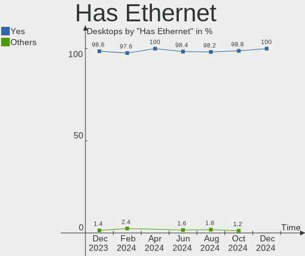
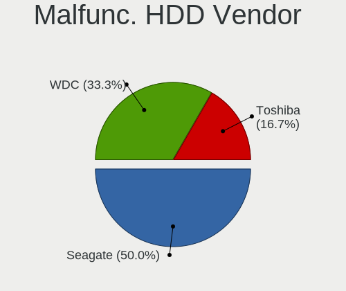
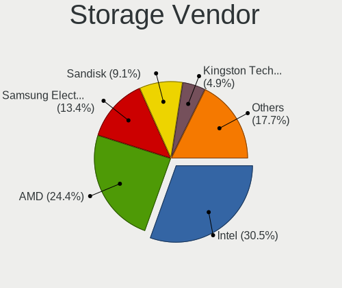
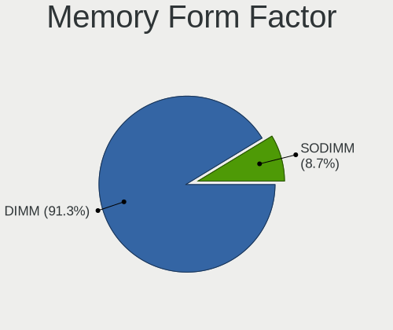
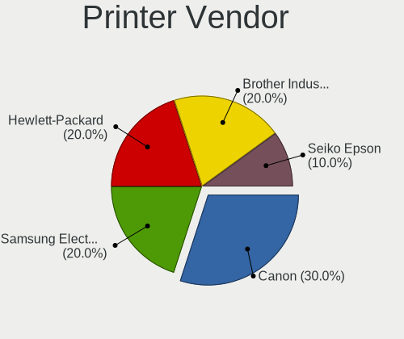
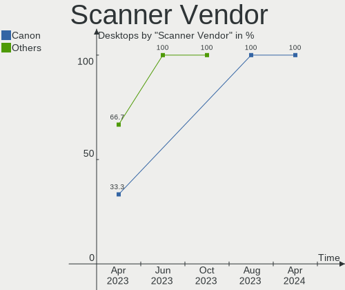

Linux in Canada - Hardware Trends (Desktops)
--------------------------------------------

A project to identify most popular hardware characteristics and track their change
over time based on data collected by Linux users at https://Linux-Hardware.org.

Anyone can contribute to this report by the [hw-probe](https://github.com/linuxhw/hw-probe) tool:

    sudo -E hw-probe -all -upload

Period: Sep, 2022.

Contents
--------

* [ System ](#system)
  - [ OS                       ](#os)
  - [ OS Family                ](#os-family)
  - [ Kernel                   ](#kernel)
  - [ Kernel Family            ](#kernel-family)
  - [ Kernel Major Ver.        ](#kernel-major-ver)
  - [ Arch                     ](#arch)
  - [ DE                       ](#de)
  - [ Display Server           ](#display-server)
  - [ Display Manager          ](#display-manager)
  - [ OS Lang                  ](#os-lang)
  - [ Boot Mode                ](#boot-mode)
  - [ Filesystem               ](#filesystem)
  - [ Part. scheme             ](#part-scheme)
  - [ Dual Boot with Linux/BSD ](#dual-boot-with-linuxbsd)
  - [ Dual Boot (Win)          ](#dual-boot-win)

* [ Board ](#board)
  - [ Vendor                   ](#vendor)
  - [ Model                    ](#model)
  - [ Model Family             ](#model-family)
  - [ MFG Year                 ](#mfg-year)
  - [ Form Factor              ](#form-factor)
  - [ Secure Boot              ](#secure-boot)
  - [ Coreboot                 ](#coreboot)
  - [ RAM Size                 ](#ram-size)
  - [ RAM Used                 ](#ram-used)
  - [ Total Drives             ](#total-drives)
  - [ Has CD-ROM               ](#has-cd-rom)
  - [ Has Ethernet             ](#has-ethernet)
  - [ Has WiFi                 ](#has-wifi)
  - [ Has Bluetooth            ](#has-bluetooth)

* [ Location ](#location)
  - [ Country                  ](#country)
  - [ City                     ](#city)

* [ Drives ](#drives)
  - [ Drive Vendor             ](#drive-vendor)
  - [ Drive Model              ](#drive-model)
  - [ HDD Vendor               ](#hdd-vendor)
  - [ SSD Vendor               ](#ssd-vendor)
  - [ Drive Kind               ](#drive-kind)
  - [ Drive Connector          ](#drive-connector)
  - [ Drive Size               ](#drive-size)
  - [ Space Total              ](#space-total)
  - [ Space Used               ](#space-used)
  - [ Malfunc. Drives          ](#malfunc-drives)
  - [ Malfunc. Drive Vendor    ](#malfunc-drive-vendor)
  - [ Malfunc. HDD Vendor      ](#malfunc-hdd-vendor)
  - [ Malfunc. Drive Kind      ](#malfunc-drive-kind)
  - [ Failed Drives            ](#failed-drives)
  - [ Failed Drive Vendor      ](#failed-drive-vendor)
  - [ Drive Status             ](#drive-status)

* [ Storage controller ](#storage-controller)
  - [ Storage Vendor           ](#storage-vendor)
  - [ Storage Model            ](#storage-model)
  - [ Storage Kind             ](#storage-kind)

* [ Processor ](#processor)
  - [ CPU Vendor               ](#cpu-vendor)
  - [ CPU Model                ](#cpu-model)
  - [ CPU Model Family         ](#cpu-model-family)
  - [ CPU Cores                ](#cpu-cores)
  - [ CPU Sockets              ](#cpu-sockets)
  - [ CPU Threads              ](#cpu-threads)
  - [ CPU Op-Modes             ](#cpu-op-modes)
  - [ CPU Microcode            ](#cpu-microcode)
  - [ CPU Microarch            ](#cpu-microarch)

* [ Graphics ](#graphics)
  - [ GPU Vendor               ](#gpu-vendor)
  - [ GPU Model                ](#gpu-model)
  - [ GPU Combo                ](#gpu-combo)
  - [ GPU Driver               ](#gpu-driver)
  - [ GPU Memory               ](#gpu-memory)

* [ Monitor ](#monitor)
  - [ Monitor Vendor           ](#monitor-vendor)
  - [ Monitor Model            ](#monitor-model)
  - [ Monitor Resolution       ](#monitor-resolution)
  - [ Monitor Diagonal         ](#monitor-diagonal)
  - [ Monitor Width            ](#monitor-width)
  - [ Aspect Ratio             ](#aspect-ratio)
  - [ Monitor Area             ](#monitor-area)
  - [ Pixel Density            ](#pixel-density)
  - [ Multiple Monitors        ](#multiple-monitors)

* [ Network ](#network)
  - [ Net Controller Vendor    ](#net-controller-vendor)
  - [ Net Controller Model     ](#net-controller-model)
  - [ Wireless Vendor          ](#wireless-vendor)
  - [ Wireless Model           ](#wireless-model)
  - [ Ethernet Vendor          ](#ethernet-vendor)
  - [ Ethernet Model           ](#ethernet-model)
  - [ Net Controller Kind      ](#net-controller-kind)
  - [ Used Controller          ](#used-controller)
  - [ NICs                     ](#nics)
  - [ IPv6                     ](#ipv6)

* [ Bluetooth ](#bluetooth)
  - [ Bluetooth Vendor         ](#bluetooth-vendor)
  - [ Bluetooth Model          ](#bluetooth-model)

* [ Sound ](#sound)
  - [ Sound Vendor             ](#sound-vendor)
  - [ Sound Model              ](#sound-model)

* [ Memory ](#memory)
  - [ Memory Vendor            ](#memory-vendor)
  - [ Memory Model             ](#memory-model)
  - [ Memory Kind              ](#memory-kind)
  - [ Memory Form Factor       ](#memory-form-factor)
  - [ Memory Size              ](#memory-size)
  - [ Memory Speed             ](#memory-speed)

* [ Printers & scanners ](#printers--scanners)
  - [ Printer Vendor           ](#printer-vendor)
  - [ Printer Model            ](#printer-model)
  - [ Scanner Vendor           ](#scanner-vendor)
  - [ Scanner Model            ](#scanner-model)

* [ Camera ](#camera)
  - [ Camera Vendor            ](#camera-vendor)
  - [ Camera Model             ](#camera-model)

* [ Security ](#security)
  - [ Fingerprint Vendor       ](#fingerprint-vendor)
  - [ Fingerprint Model        ](#fingerprint-model)
  - [ Chipcard Vendor          ](#chipcard-vendor)
  - [ Chipcard Model           ](#chipcard-model)

* [ Unsupported ](#unsupported)
  - [ Unsupported Devices      ](#unsupported-devices)
  - [ Unsupported Device Types ](#unsupported-device-types)

System
------

OS
--

Installed operating systems

| Name                         | Desktops | Percent |
|------------------------------|----------|---------|
| Ubuntu 22.04                 | 18       | 28.57%  |
| Ubuntu 20.04                 | 4        | 6.35%   |
| Fedora 36                    | 4        | 6.35%   |
| Xubuntu 22.04                | 3        | 4.76%   |
| Nobara 36                    | 3        | 4.76%   |
| Linux Mint 21                | 3        | 4.76%   |
| Linux Mint 20.3              | 3        | 4.76%   |
| Fedora 37                    | 3        | 4.76%   |
| Debian 11                    | 3        | 4.76%   |
| Ubuntu MATE 22.04            | 2        | 3.17%   |
| Pop!_OS 22.04                | 2        | 3.17%   |
| Arch Rolling                 | 2        | 3.17%   |
| Arch                         | 2        | 3.17%   |
| Xubuntu 20.04                | 1        | 1.59%   |
| Ubuntu Unity 22.04           | 1        | 1.59%   |
| openSUSE Tumbleweed-XXXXXXXX | 1        | 1.59%   |
| OpenMandriva 4.50            | 1        | 1.59%   |
| OpenMandriva 4.2             | 1        | 1.59%   |
| Kubuntu 18.04                | 1        | 1.59%   |
| EndeavourOS Rolling          | 1        | 1.59%   |
| EndeavourOS                  | 1        | 1.59%   |
| CentOS 7                     | 1        | 1.59%   |
| ArcoLinux Rolling            | 1        | 1.59%   |
| AlmaLinux 9.0                | 1        | 1.59%   |

OS Family
---------

OS without a version

| Name         | Desktops | Percent |
|--------------|----------|---------|
| Ubuntu       | 22       | 34.92%  |
| Fedora       | 7        | 11.11%  |
| Linux Mint   | 6        | 9.52%   |
| Xubuntu      | 4        | 6.35%   |
| Arch         | 4        | 6.35%   |
| Nobara       | 3        | 4.76%   |
| Debian       | 3        | 4.76%   |
| Ubuntu MATE  | 2        | 3.17%   |
| Pop!_OS      | 2        | 3.17%   |
| OpenMandriva | 2        | 3.17%   |
| EndeavourOS  | 2        | 3.17%   |
| Ubuntu Unity | 1        | 1.59%   |
| openSUSE     | 1        | 1.59%   |
| Kubuntu      | 1        | 1.59%   |
| CentOS       | 1        | 1.59%   |
| ArcoLinux    | 1        | 1.59%   |
| AlmaLinux    | 1        | 1.59%   |

Kernel
------

Version of the Linux kernel

| Version                      | Desktops | Percent |
|------------------------------|----------|---------|
| 5.15.0-47-generic            | 14       | 22.22%  |
| 5.15.0-48-generic            | 10       | 15.87%  |
| 5.4.0-125-generic            | 4        | 6.35%   |
| 5.19.9-zen1-1-zen            | 2        | 3.17%   |
| 5.19.9-200.fc36.x86_64       | 2        | 3.17%   |
| 5.19.7-204.fsync.fc36.x86_64 | 2        | 3.17%   |
| 5.19.0-76051900-generic      | 2        | 3.17%   |
| 5.15.0-46-generic            | 2        | 3.17%   |
| 6.0.0-rc7-rt-amd64           | 1        | 1.59%   |
| 5.8.15-301.fc33.x86_64       | 1        | 1.59%   |
| 5.4.0-72-generic             | 1        | 1.59%   |
| 5.4.0-124-generic            | 1        | 1.59%   |
| 5.19.9-arch1-1               | 1        | 1.59%   |
| 5.19.9-300.fc37.x86_64       | 1        | 1.59%   |
| 5.19.9-201.fsync.fc36.x86_64 | 1        | 1.59%   |
| 5.19.8-zen1-1-zen            | 1        | 1.59%   |
| 5.19.8-300.fc37.x86_64       | 1        | 1.59%   |
| 5.19.8-1-default             | 1        | 1.59%   |
| 5.19.6-arch1-1               | 1        | 1.59%   |
| 5.19.6-200.fc36.x86_64       | 1        | 1.59%   |
| 5.19.5-desktop-1omv4090      | 1        | 1.59%   |
| 5.19.11-arch1-1              | 1        | 1.59%   |
| 5.17.5-300.fc36.x86_64       | 1        | 1.59%   |
| 5.17.0-1018-oem              | 1        | 1.59%   |
| 5.17.0-1003-oem              | 1        | 1.59%   |
| 5.15.71-1-lts                | 1        | 1.59%   |
| 5.15.30-2-pve                | 1        | 1.59%   |
| 5.15.0-43-generic            | 1        | 1.59%   |
| 5.14.0-70.22.1.el9_0.x86_64  | 1        | 1.59%   |
| 5.13.0-48-generic            | 1        | 1.59%   |
| 5.10.14-desktop-1omv4002     | 1        | 1.59%   |
| 5.10.0-17-amd64              | 1        | 1.59%   |
| 4.19.187                     | 1        | 1.59%   |

Kernel Family
-------------

Linux kernel without a distro release

| Version  | Desktops | Percent |
|----------|----------|---------|
| 5.15.0   | 27       | 42.86%  |
| 5.19.9   | 7        | 11.11%  |
| 5.4.0    | 6        | 9.52%   |
| 5.19.8   | 3        | 4.76%   |
| 5.19.7   | 2        | 3.17%   |
| 5.19.6   | 2        | 3.17%   |
| 5.19.0   | 2        | 3.17%   |
| 5.17.0   | 2        | 3.17%   |
| 6.0.0    | 1        | 1.59%   |
| 5.8.15   | 1        | 1.59%   |
| 5.19.5   | 1        | 1.59%   |
| 5.19.11  | 1        | 1.59%   |
| 5.17.5   | 1        | 1.59%   |
| 5.15.71  | 1        | 1.59%   |
| 5.15.30  | 1        | 1.59%   |
| 5.14.0   | 1        | 1.59%   |
| 5.13.0   | 1        | 1.59%   |
| 5.10.14  | 1        | 1.59%   |
| 5.10.0   | 1        | 1.59%   |
| 4.19.187 | 1        | 1.59%   |

Kernel Major Ver.
-----------------

Linux kernel major version

| Version | Desktops | Percent |
|---------|----------|---------|
| 5.15    | 29       | 46.03%  |
| 5.19    | 18       | 28.57%  |
| 5.4     | 6        | 9.52%   |
| 5.17    | 3        | 4.76%   |
| 5.10    | 2        | 3.17%   |
| 6.0     | 1        | 1.59%   |
| 5.8     | 1        | 1.59%   |
| 5.14    | 1        | 1.59%   |
| 5.13    | 1        | 1.59%   |
| 4.19    | 1        | 1.59%   |

Arch
----

OS architecture (x86_64, i586, etc.)

| Name   | Desktops | Percent |
|--------|----------|---------|
| x86_64 | 63       | 100%    |

DE
--

Desktop Environment

| Name            | Desktops | Percent |
|-----------------|----------|---------|
| GNOME           | 36       | 57.14%  |
| KDE5            | 7        | 11.11%  |
| XFCE            | 5        | 7.94%   |
| X-Cinnamon      | 3        | 4.76%   |
| MATE            | 3        | 4.76%   |
| Unknown         | 3        | 4.76%   |
| i3              | 2        | 3.17%   |
| GNOME Flashback | 2        | 3.17%   |
| Unity           | 1        | 1.59%   |
| KDE4            | 1        | 1.59%   |

Display Server
--------------

X11 or Wayland

| Name    | Desktops | Percent |
|---------|----------|---------|
| X11     | 43       | 68.25%  |
| Wayland | 18       | 28.57%  |
| Tty     | 2        | 3.17%   |

Display Manager
---------------

SDDM, LightDM, etc.

| Name    | Desktops | Percent |
|---------|----------|---------|
| GDM3    | 18       | 28.57%  |
| Unknown | 18       | 28.57%  |
| LightDM | 12       | 19.05%  |
| GDM     | 8        | 12.7%   |
| SDDM    | 7        | 11.11%  |

OS Lang
-------

Language

| Lang  | Desktops | Percent |
|-------|----------|---------|
| en_CA | 43       | 68.25%  |
| en_US | 15       | 23.81%  |
| fr_CA | 5        | 7.94%   |

Boot Mode
---------

EFI or BIOS

| Mode | Desktops | Percent |
|------|----------|---------|
| BIOS | 40       | 63.49%  |
| EFI  | 23       | 36.51%  |

Filesystem
----------

Type of filesystem

| Type    | Desktops | Percent |
|---------|----------|---------|
| Ext4    | 48       | 76.19%  |
| Btrfs   | 13       | 20.63%  |
| Xfs     | 1        | 1.59%   |
| Overlay | 1        | 1.59%   |

Part. scheme
------------

Scheme of partitioning

| Type    | Desktops | Percent |
|---------|----------|---------|
| Unknown | 39       | 61.9%   |
| GPT     | 20       | 31.75%  |
| MBR     | 4        | 6.35%   |

Dual Boot with Linux/BSD
------------------------

Hosting more than one Linux/BSD

| Dual boot | Desktops | Percent |
|-----------|----------|---------|
| No        | 49       | 77.78%  |
| Yes       | 14       | 22.22%  |

Dual Boot (Win)
---------------

Hosting Linux and Windows

| Dual boot | Desktops | Percent |
|-----------|----------|---------|
| No        | 42       | 66.67%  |
| Yes       | 21       | 33.33%  |

Board
-----

Vendor
------

Motherboard manufacturer

| Name                      | Desktops | Percent |
|---------------------------|----------|---------|
| ASUSTek Computer          | 17       | 26.98%  |
| Hewlett-Packard           | 8        | 12.7%   |
| MSI                       | 7        | 11.11%  |
| Gigabyte Technology       | 7        | 11.11%  |
| Lenovo                    | 5        | 7.94%   |
| ASRock                    | 4        | 6.35%   |
| Acer                      | 4        | 6.35%   |
| Intel                     | 2        | 3.17%   |
| Dell                      | 2        | 3.17%   |
| IBT.ca (IBT Technologies) | 1        | 1.59%   |
| Gateway                   | 1        | 1.59%   |
| ECS                       | 1        | 1.59%   |
| DFI                       | 1        | 1.59%   |
| BESSTAR Tech              | 1        | 1.59%   |
| AZW                       | 1        | 1.59%   |
| Unknown                   | 1        | 1.59%   |

Model
-----

Motherboard model

| Name                                | Desktops | Percent |
|-------------------------------------|----------|---------|
| MSI MS-7C37                         | 2        | 3.17%   |
| MSI MS-7599                         | 2        | 3.17%   |
| Lenovo ThinkStation P910 30B8S0EN00 | 2        | 3.17%   |
| HP EliteDesk 800 G1 SFF             | 2        | 3.17%   |
| MSI MS-7A38                         | 1        | 1.59%   |
| MSI MS-7845                         | 1        | 1.59%   |
| MSI MS-7817                         | 1        | 1.59%   |
| Lenovo ThinkStation P350 30E6S20S00 | 1        | 1.59%   |
| Lenovo ThinkCentre M93p 10A8S33600  | 1        | 1.59%   |
| Lenovo ThinkCentre M92p 3238E5U     | 1        | 1.59%   |
| Intel DQ67SW AAG12527-306           | 1        | 1.59%   |
| Intel DP35DP AAD81073-208           | 1        | 1.59%   |
| IBT.ca (IBT Technologies) MI836     | 1        | 1.59%   |
| HP Z440 Workstation                 | 1        | 1.59%   |
| HP OMEN by Desktop PC 880-p0xx      | 1        | 1.59%   |
| HP Compaq Elite 8300 USDT           | 1        | 1.59%   |
| HP Compaq dc7900 Small Form Factor  | 1        | 1.59%   |
| HP Compaq 8200 Elite USDT PC        | 1        | 1.59%   |
| HP 23-d027c                         | 1        | 1.59%   |
| Gigabyte Z690I AORUS ULTRA DDR4     | 1        | 1.59%   |
| Gigabyte X570 AORUS PRO WIFI        | 1        | 1.59%   |
| Gigabyte X570 AORUS MASTER          | 1        | 1.59%   |
| Gigabyte GA-870A-UD3                | 1        | 1.59%   |
| Gigabyte EP45-UD3R                  | 1        | 1.59%   |
| Gigabyte B450 I AORUS PRO WIFI      | 1        | 1.59%   |
| Gigabyte A520M DS3H AC              | 1        | 1.59%   |
| Gateway DX4860                      | 1        | 1.59%   |
| ECS FK557AA-A2L a6602f              | 1        | 1.59%   |
| DFI HD631-Q87CRM                    | 1        | 1.59%   |
| Dell XPS 8950                       | 1        | 1.59%   |
| Dell OptiPlex 755                   | 1        | 1.59%   |
| BESSTAR Tech TH50                   | 1        | 1.59%   |
| AZW GK mini                         | 1        | 1.59%   |
| ASUS TUF Gaming X570-PLUS           | 1        | 1.59%   |
| ASUS TUF B350M-PLUS GAMING          | 1        | 1.59%   |
| ASUS SABERTOOTH P67                 | 1        | 1.59%   |
| ASUS ROG STRIX X470-F GAMING        | 1        | 1.59%   |
| ASUS ROG STRIX B450-I GAMING        | 1        | 1.59%   |
| ASUS ROG STRIX B450-F GAMING        | 1        | 1.59%   |
| ASUS Q170M-C                        | 1        | 1.59%   |

Model Family
------------

Motherboard model prefix

| Name                            | Desktops | Percent |
|---------------------------------|----------|---------|
| Lenovo ThinkStation             | 3        | 4.76%   |
| HP Compaq                       | 3        | 4.76%   |
| ASUS ROG                        | 3        | 4.76%   |
| ASUS PRIME                      | 3        | 4.76%   |
| Acer Aspire                     | 3        | 4.76%   |
| MSI MS-7C37                     | 2        | 3.17%   |
| MSI MS-7599                     | 2        | 3.17%   |
| Lenovo ThinkCentre              | 2        | 3.17%   |
| HP EliteDesk                    | 2        | 3.17%   |
| Gigabyte X570                   | 2        | 3.17%   |
| ASUS TUF                        | 2        | 3.17%   |
| ASRock B450M                    | 2        | 3.17%   |
| MSI MS-7A38                     | 1        | 1.59%   |
| MSI MS-7845                     | 1        | 1.59%   |
| MSI MS-7817                     | 1        | 1.59%   |
| Intel DQ67SW                    | 1        | 1.59%   |
| Intel DP35DP                    | 1        | 1.59%   |
| IBT.ca (IBT Technologies) MI836 | 1        | 1.59%   |
| HP Z440                         | 1        | 1.59%   |
| HP OMEN                         | 1        | 1.59%   |
| HP 23-d027c                     | 1        | 1.59%   |
| Gigabyte Z690I                  | 1        | 1.59%   |
| Gigabyte GA-870A-UD3            | 1        | 1.59%   |
| Gigabyte EP45-UD3R              | 1        | 1.59%   |
| Gigabyte B450                   | 1        | 1.59%   |
| Gigabyte A520M                  | 1        | 1.59%   |
| Gateway DX4860                  | 1        | 1.59%   |
| ECS FK557AA-A2L                 | 1        | 1.59%   |
| DFI HD631-Q87CRM                | 1        | 1.59%   |
| Dell XPS                        | 1        | 1.59%   |
| Dell OptiPlex                   | 1        | 1.59%   |
| BESSTAR Tech TH50               | 1        | 1.59%   |
| AZW GK                          | 1        | 1.59%   |
| ASUS SABERTOOTH                 | 1        | 1.59%   |
| ASUS Q170M-C                    | 1        | 1.59%   |
| ASUS PX724AA-ABA                | 1        | 1.59%   |
| ASUS P8H61-M                    | 1        | 1.59%   |
| ASUS KCMA-D8                    | 1        | 1.59%   |
| ASUS F2A85-V                    | 1        | 1.59%   |
| ASUS ET2040I                    | 1        | 1.59%   |

MFG Year
--------

Motherboard manufacture year

| Year | Desktops | Percent |
|------|----------|---------|
| 2019 | 10       | 15.87%  |
| 2022 | 8        | 12.7%   |
| 2018 | 6        | 9.52%   |
| 2013 | 6        | 9.52%   |
| 2011 | 6        | 9.52%   |
| 2012 | 5        | 7.94%   |
| 2014 | 4        | 6.35%   |
| 2008 | 4        | 6.35%   |
| 2015 | 3        | 4.76%   |
| 2010 | 3        | 4.76%   |
| 2017 | 2        | 3.17%   |
| 2021 | 1        | 1.59%   |
| 2020 | 1        | 1.59%   |
| 2016 | 1        | 1.59%   |
| 2009 | 1        | 1.59%   |
| 2007 | 1        | 1.59%   |
| 2005 | 1        | 1.59%   |

Form Factor
-----------

Physical design of the computer

| Name    | Desktops | Percent |
|---------|----------|---------|
| Desktop | 63       | 100%    |

Secure Boot
-----------

Enabled or disabled

| State    | Desktops | Percent |
|----------|----------|---------|
| Disabled | 59       | 93.65%  |
| Enabled  | 4        | 6.35%   |

Coreboot
--------

Have coreboot on board

| Used | Desktops | Percent |
|------|----------|---------|
| No   | 63       | 100%    |

RAM Size
--------

Total RAM memory

| Size in GB  | Desktops | Percent |
|-------------|----------|---------|
| 16.01-24.0  | 20       | 31.75%  |
| 32.01-64.0  | 15       | 23.81%  |
| 3.01-4.0    | 8        | 12.7%   |
| 4.01-8.0    | 6        | 9.52%   |
| 8.01-16.0   | 6        | 9.52%   |
| 64.01-256.0 | 5        | 7.94%   |
| 0.51-1.0    | 2        | 3.17%   |
| 24.01-32.0  | 1        | 1.59%   |

RAM Used
--------

Used RAM memory

| Used GB   | Desktops | Percent |
|-----------|----------|---------|
| 2.01-3.0  | 18       | 28.57%  |
| 4.01-8.0  | 12       | 19.05%  |
| 3.01-4.0  | 12       | 19.05%  |
| 1.01-2.0  | 12       | 19.05%  |
| 8.01-16.0 | 5        | 7.94%   |
| 0.51-1.0  | 4        | 6.35%   |

Total Drives
------------

Number of drives on board

| Drives | Desktops | Percent |
|--------|----------|---------|
| 1      | 25       | 39.68%  |
| 2      | 12       | 19.05%  |
| 4      | 10       | 15.87%  |
| 3      | 9        | 14.29%  |
| 5      | 3        | 4.76%   |
| 6      | 2        | 3.17%   |
| 10     | 1        | 1.59%   |
| 7      | 1        | 1.59%   |

Has CD-ROM
----------

Has CD-ROM on board

| Presented | Desktops | Percent |
|-----------|----------|---------|
| Yes       | 36       | 57.14%  |
| No        | 27       | 42.86%  |

Has Ethernet
------------

Has Ethernet on board

| Presented | Desktops | Percent |
|-----------|----------|---------|
| Yes       | 63       | 100%    |

Has WiFi
--------

Has WiFi module

| Presented | Desktops | Percent |
|-----------|----------|---------|
| Yes       | 33       | 52.38%  |
| No        | 30       | 47.62%  |

Has Bluetooth
-------------

Has Bluetooth module

| Presented | Desktops | Percent |
|-----------|----------|---------|
| No        | 39       | 61.9%   |
| Yes       | 24       | 38.1%   |

Location
--------

Country
-------

Geographic location (country)

| Country | Desktops | Percent |
|---------|----------|---------|
| Canada  | 63       | 100%    |

City
----

Geographic location (city)

| City                   | Desktops | Percent |
|------------------------|----------|---------|
| Montreal               | 8        | 12.7%   |
| Vancouver              | 4        | 6.35%   |
| Toronto                | 4        | 6.35%   |
| Surrey                 | 3        | 4.76%   |
| Rouyn-Noranda          | 2        | 3.17%   |
| Ottawa                 | 2        | 3.17%   |
| North Vancouver        | 2        | 3.17%   |
| Nanaimo                | 2        | 3.17%   |
| Edmonton               | 2        | 3.17%   |
| Winnipeg               | 1        | 1.59%   |
| Weston                 | 1        | 1.59%   |
| Wabasca-Desmarais      | 1        | 1.59%   |
| Terrebonne             | 1        | 1.59%   |
| Terrace                | 1        | 1.59%   |
| Sydney                 | 1        | 1.59%   |
| Steinbach              | 1        | 1.59%   |
| Spruce Grove           | 1        | 1.59%   |
| Saint-Remi             | 1        | 1.59%   |
| Saint-Joseph-de-Beauce | 1        | 1.59%   |
| Saguenay               | 1        | 1.59%   |
| Raymond                | 1        | 1.59%   |
| Port Coquitlam         | 1        | 1.59%   |
| Perth-Andover          | 1        | 1.59%   |
| New Maryland           | 1        | 1.59%   |
| Lethbridge             | 1        | 1.59%   |
| Lanigan                | 1        | 1.59%   |
| Knowlton               | 1        | 1.59%   |
| Kitimat                | 1        | 1.59%   |
| Kingston               | 1        | 1.59%   |
| Keswick                | 1        | 1.59%   |
| Heriot Bay             | 1        | 1.59%   |
| Halifax                | 1        | 1.59%   |
| Guelph                 | 1        | 1.59%   |
| Grande Prairie         | 1        | 1.59%   |
| Georgetown             | 1        | 1.59%   |
| Fonthill               | 1        | 1.59%   |
| Duncan                 | 1        | 1.59%   |
| Cochrane               | 1        | 1.59%   |
| Chestermere            | 1        | 1.59%   |
| Canmore                | 1        | 1.59%   |

Drives
------

Drive Vendor
------------

Hard drive vendors

| Vendor                       | Desktops | Drives | Percent |
|------------------------------|----------|--------|---------|
| Seagate                      | 29       | 46     | 22.66%  |
| WDC                          | 27       | 36     | 21.09%  |
| Samsung Electronics          | 13       | 19     | 10.16%  |
| Crucial                      | 10       | 10     | 7.81%   |
| SanDisk                      | 8        | 9      | 6.25%   |
| Kingston                     | 7        | 7      | 5.47%   |
| Toshiba                      | 4        | 4      | 3.13%   |
| Intel                        | 3        | 3      | 2.34%   |
| Hitachi                      | 3        | 3      | 2.34%   |
| A-DATA Technology            | 3        | 3      | 2.34%   |
| Unknown                      | 2        | 2      | 1.56%   |
| Micron/Crucial Technology    | 2        | 2      | 1.56%   |
| JMicron Technology           | 2        | 2      | 1.56%   |
| Team                         | 1        | 1      | 0.78%   |
| SK hynix                     | 1        | 1      | 0.78%   |
| Shenzhen Longsys Electronics | 1        | 1      | 0.78%   |
| Seagate Technology           | 1        | 1      | 0.78%   |
| PNY                          | 1        | 1      | 0.78%   |
| Phison Electronics           | 1        | 1      | 0.78%   |
| Phison                       | 1        | 1      | 0.78%   |
| Patriot                      | 1        | 1      | 0.78%   |
| OCZ                          | 1        | 1      | 0.78%   |
| NGFF                         | 1        | 1      | 0.78%   |
| Maxtor                       | 1        | 1      | 0.78%   |
| LITEONIT                     | 1        | 1      | 0.78%   |
| Corsair                      | 1        | 1      | 0.78%   |
| CHN25SATAS1                  | 1        | 1      | 0.78%   |
| Apple                        | 1        | 1      | 0.78%   |

Drive Model
-----------

Hard drive models

| Model                                               | Desktops | Percent |
|-----------------------------------------------------|----------|---------|
| Seagate ST1000DM003-1SB102 1TB                      | 3        | 2%      |
| Crucial CT1000MX500SSD1 1TB                         | 3        | 2%      |
| WDC WD800JD-75MSA3 80GB                             | 2        | 1.33%   |
| WDC WD60EFZX-68B3FN0 6TB                            | 2        | 1.33%   |
| WDC WD30EFRX-68EUZN0 3TB                            | 2        | 1.33%   |
| WDC WD20EZRZ-00Z5HB0 2TB                            | 2        | 1.33%   |
| WDC WD10EZEX-08WN4A0 1TB                            | 2        | 1.33%   |
| Toshiba DT01ACA300 3TB                              | 2        | 1.33%   |
| Seagate ST500DM002-1BD142 500GB                     | 2        | 1.33%   |
| Seagate ST4000DM004-2CV104 4TB                      | 2        | 1.33%   |
| Seagate ST3320418AS 320GB                           | 2        | 1.33%   |
| Seagate ST2000DM008-2FR102 2TB                      | 2        | 1.33%   |
| Seagate ST1000LM024 HN-M101MBB 1TB                  | 2        | 1.33%   |
| Seagate ST1000DM003-1ER162 1TB                      | 2        | 1.33%   |
| Seagate BUP Portable 4TB                            | 2        | 1.33%   |
| Sandisk WD Blue SN550 NVMe SSD 1024GB               | 2        | 1.33%   |
| Sandisk WD Black SN750 / PC SN730 NVMe SSD 1024GB   | 2        | 1.33%   |
| Samsung SSD 840 EVO 250GB                           | 2        | 1.33%   |
| Samsung NVMe SSD Controller SM981/PM981/PM983 256GB | 2        | 1.33%   |
| Kingston SA400S37240G 240GB SSD                     | 2        | 1.33%   |
| Kingston SA400S37120G 120GB SSD                     | 2        | 1.33%   |
| WDC WDS500G2B0C-00PXH0 500GB                        | 1        | 0.67%   |
| WDC WDS500G2B0A-00SM50 500GB SSD                    | 1        | 0.67%   |
| WDC WDBNCE5000PNC 500GB SSD                         | 1        | 0.67%   |
| WDC WD5000AVCS-612DY1 500GB                         | 1        | 0.67%   |
| WDC WD5000AAKX-603CA0 500GB                         | 1        | 0.67%   |
| WDC WD40EZRZ-00GXCB0 4TB                            | 1        | 0.67%   |
| WDC WD3200BEVT-22ZCT0 320GB                         | 1        | 0.67%   |
| WDC WD30EZRX-00D8PB0 3TB                            | 1        | 0.67%   |
| WDC WD2500JS-22NCB1 250GB                           | 1        | 0.67%   |
| WDC WD20EFRX-68AX9N0 2TB                            | 1        | 0.67%   |
| WDC WD20EARS-42S0XB0 2TB                            | 1        | 0.67%   |
| WDC WD20EARS-00MVWB0 2TB                            | 1        | 0.67%   |
| WDC WD2003FZEX-00SRLA0 2TB                          | 1        | 0.67%   |
| WDC WD2003FYYS-02W0B0 2TB                           | 1        | 0.67%   |
| WDC WD1600AAJS-60M0A0 160GB                         | 1        | 0.67%   |
| WDC WD10JPVX-22JC3T0 1TB                            | 1        | 0.67%   |
| WDC WD1003FZEX-00MK2A0 1TB                          | 1        | 0.67%   |
| WDC WD1002FBYS-18W8B0 1TB                           | 1        | 0.67%   |
| WDC WD1002FAEX-00Z3A0 1TB                           | 1        | 0.67%   |

HDD Vendor
----------

Hard disk drive vendors

| Vendor             | Desktops | Drives | Percent |
|--------------------|----------|--------|---------|
| Seagate            | 27       | 43     | 43.55%  |
| WDC                | 24       | 32     | 38.71%  |
| Toshiba            | 4        | 4      | 6.45%   |
| Hitachi            | 3        | 3      | 4.84%   |
| Unknown            | 1        | 1      | 1.61%   |
| Maxtor             | 1        | 1      | 1.61%   |
| JMicron Technology | 1        | 1      | 1.61%   |
| Apple              | 1        | 1      | 1.61%   |

SSD Vendor
----------

Solid state drive vendors

| Vendor              | Desktops | Drives | Percent |
|---------------------|----------|--------|---------|
| Samsung Electronics | 12       | 14     | 30%     |
| Crucial             | 9        | 9      | 22.5%   |
| Kingston            | 5        | 5      | 12.5%   |
| WDC                 | 2        | 2      | 5%      |
| SanDisk             | 2        | 2      | 5%      |
| A-DATA Technology   | 2        | 2      | 5%      |
| Team                | 1        | 1      | 2.5%    |
| Seagate             | 1        | 1      | 2.5%    |
| PNY                 | 1        | 1      | 2.5%    |
| Patriot             | 1        | 1      | 2.5%    |
| OCZ                 | 1        | 1      | 2.5%    |
| NGFF                | 1        | 1      | 2.5%    |
| LITEONIT            | 1        | 1      | 2.5%    |
| Corsair             | 1        | 1      | 2.5%    |

Drive Kind
----------

HDD or SSD

| Kind    | Desktops | Drives | Percent |
|---------|----------|--------|---------|
| HDD     | 46       | 86     | 43.81%  |
| SSD     | 33       | 42     | 31.43%  |
| NVMe    | 22       | 29     | 20.95%  |
| Unknown | 3        | 3      | 2.86%   |
| MMC     | 1        | 1      | 0.95%   |

Drive Connector
---------------

SATA, SAS, NVMe, etc.

| Type | Desktops | Drives | Percent |
|------|----------|--------|---------|
| SATA | 56       | 121    | 63.64%  |
| NVMe | 22       | 28     | 25%     |
| SAS  | 9        | 11     | 10.23%  |
| MMC  | 1        | 1      | 1.14%   |

Drive Size
----------

Size of hard drive

| Size in TB | Desktops | Drives | Percent |
|------------|----------|--------|---------|
| 0.01-0.5   | 36       | 55     | 39.13%  |
| 0.51-1.0   | 26       | 33     | 28.26%  |
| 1.01-2.0   | 14       | 19     | 15.22%  |
| 3.01-4.0   | 6        | 8      | 6.52%   |
| 2.01-3.0   | 5        | 7      | 5.43%   |
| 4.01-10.0  | 5        | 6      | 5.43%   |

Space Total
-----------

Amount of disk space available on the file system

| Size in GB     | Desktops | Percent |
|----------------|----------|---------|
| More than 3000 | 14       | 22.22%  |
| 101-250        | 14       | 22.22%  |
| 251-500        | 13       | 20.63%  |
| 501-1000       | 8        | 12.7%   |
| 1001-2000      | 6        | 9.52%   |
| 2001-3000      | 4        | 6.35%   |
| 51-100         | 2        | 3.17%   |
| 21-50          | 1        | 1.59%   |
| 1-20           | 1        | 1.59%   |

Space Used
----------

Amount of used disk space

| Used GB        | Desktops | Percent |
|----------------|----------|---------|
| 1-20           | 16       | 25.4%   |
| 21-50          | 9        | 14.29%  |
| 101-250        | 9        | 14.29%  |
| More than 3000 | 7        | 11.11%  |
| 1001-2000      | 6        | 9.52%   |
| 501-1000       | 6        | 9.52%   |
| 251-500        | 5        | 7.94%   |
| 51-100         | 4        | 6.35%   |
| 2001-3000      | 1        | 1.59%   |

Malfunc. Drives
---------------

Drive models with a malfunction

| Model                                 | Desktops | Drives | Percent |
|---------------------------------------|----------|--------|---------|
| WDC WD3200BEVT-22ZCT0 320GB           | 1        | 1      | 10%     |
| WDC WD2003FYYS-02W0B0 2TB             | 1        | 2      | 10%     |
| Seagate ST500LT012-1DG142 500GB       | 1        | 1      | 10%     |
| Seagate ST500LM021-1KJ152 500GB       | 1        | 1      | 10%     |
| Seagate ST3160815AS 160GB             | 1        | 1      | 10%     |
| Seagate ST1000LX015-1U7172 1TB        | 1        | 1      | 10%     |
| Samsung Electronics SSD 840 EVO 250GB | 1        | 1      | 10%     |
| Hitachi HUS724030ALE641 3TB           | 1        | 1      | 10%     |
| Hitachi HDS725050KLA360 500GB         | 1        | 1      | 10%     |
| Crucial CT960M500SSD1 960GB           | 1        | 1      | 10%     |

Malfunc. Drive Vendor
---------------------

Vendors of faulty drives

| Vendor              | Desktops | Drives | Percent |
|---------------------|----------|--------|---------|
| WDC                 | 2        | 3      | 25%     |
| Seagate             | 2        | 4      | 25%     |
| Hitachi             | 2        | 2      | 25%     |
| Samsung Electronics | 1        | 1      | 12.5%   |
| Crucial             | 1        | 1      | 12.5%   |

Malfunc. HDD Vendor
-------------------

Vendors of faulty HDD drives

| Vendor  | Desktops | Drives | Percent |
|---------|----------|--------|---------|
| WDC     | 2        | 3      | 33.33%  |
| Seagate | 2        | 4      | 33.33%  |
| Hitachi | 2        | 2      | 33.33%  |

Malfunc. Drive Kind
-------------------

Kinds of faulty drives

| Kind | Desktops | Drives | Percent |
|------|----------|--------|---------|
| HDD  | 6        | 9      | 75%     |
| SSD  | 2        | 2      | 25%     |

Failed Drives
-------------

Failed drive models

Zero info for selected period =(

Failed Drive Vendor
-------------------

Failed drive vendors

Zero info for selected period =(

Drive Status
------------

Number of failed and malfunc. drives

| Status   | Desktops | Drives | Percent |
|----------|----------|--------|---------|
| Detected | 46       | 108    | 62.16%  |
| Works    | 21       | 42     | 28.38%  |
| Malfunc  | 7        | 11     | 9.46%   |

Storage controller
------------------

Storage Vendor
--------------

Storage controller vendors

| Vendor                       | Desktops | Percent |
|------------------------------|----------|---------|
| Intel                        | 39       | 41.05%  |
| AMD                          | 24       | 25.26%  |
| SanDisk                      | 7        | 7.37%   |
| Samsung Electronics          | 4        | 4.21%   |
| Micron/Crucial Technology    | 3        | 3.16%   |
| Marvell Technology Group     | 3        | 3.16%   |
| JMicron Technology           | 3        | 3.16%   |
| ASMedia Technology           | 3        | 3.16%   |
| Phison Electronics           | 2        | 2.11%   |
| Kingston Technology Company  | 2        | 2.11%   |
| SK hynix                     | 1        | 1.05%   |
| Shenzhen Longsys Electronics | 1        | 1.05%   |
| Seagate Technology           | 1        | 1.05%   |
| Nvidia                       | 1        | 1.05%   |
| ADATA Technology             | 1        | 1.05%   |

Storage Model
-------------

Storage controller models

| Model                                                                          | Desktops | Percent |
|--------------------------------------------------------------------------------|----------|---------|
| AMD FCH SATA Controller [AHCI mode]                                            | 15       | 12.4%   |
| Intel 8 Series/C220 Series Chipset Family 6-port SATA Controller 1 [AHCI mode] | 7        | 5.79%   |
| Intel 6 Series/C200 Series Chipset Family 6 port Desktop SATA AHCI Controller  | 6        | 4.96%   |
| AMD 400 Series Chipset SATA Controller                                         | 6        | 4.96%   |
| AMD SB7x0/SB8x0/SB9x0 IDE Controller                                           | 4        | 3.31%   |
| SanDisk WD Blue SN550 NVMe SSD                                                 | 3        | 2.48%   |
| Samsung NVMe SSD Controller SM981/PM981/PM983                                  | 3        | 2.48%   |
| Intel C610/X99 series chipset sSATA Controller [AHCI mode]                     | 3        | 2.48%   |
| Intel C610/X99 series chipset 6-Port SATA Controller [AHCI mode]               | 3        | 2.48%   |
| Intel 7 Series/C210 Series Chipset Family 6-port SATA Controller [AHCI mode]   | 3        | 2.48%   |
| ASMedia ASM1062 Serial ATA Controller                                          | 3        | 2.48%   |
| AMD 300 Series Chipset SATA Controller                                         | 3        | 2.48%   |
| SanDisk WD Black SN750 / PC SN730 NVMe SSD                                     | 2        | 1.65%   |
| Phison E16 PCIe4 NVMe Controller                                               | 2        | 1.65%   |
| Micron/Crucial P1 NVMe PCIe SSD                                                | 2        | 1.65%   |
| JMicron JMB363 SATA/IDE Controller                                             | 2        | 1.65%   |
| Intel SSD 660P Series                                                          | 2        | 1.65%   |
| Intel C610/X99 series chipset IDE-r Controller                                 | 2        | 1.65%   |
| Intel Alder Lake-S PCH SATA Controller [AHCI Mode]                             | 2        | 1.65%   |
| Intel 6 Series/C200 Series Chipset Family IDE-r Controller                     | 2        | 1.65%   |
| Intel 500 Series Chipset Family SATA AHCI Controller                           | 2        | 1.65%   |
| AMD SB7x0/SB8x0/SB9x0 SATA Controller [IDE mode]                               | 2        | 1.65%   |
| SK hynix Non-Volatile memory controller                                        | 1        | 0.83%   |
| Shenzhen Longsys SM2263EN/SM2263XT-based OEM SSD                               | 1        | 0.83%   |
| Seagate FireCuda 520 SSD                                                       | 1        | 0.83%   |
| SanDisk WD Black 2018/SN750 / PC SN720 NVMe SSD                                | 1        | 0.83%   |
| SanDisk Non-Volatile memory controller                                         | 1        | 0.83%   |
| Samsung NVMe SSD Controller PM9A1/PM9A3/980PRO                                 | 1        | 0.83%   |
| Nvidia MCP61 SATA Controller                                                   | 1        | 0.83%   |
| Nvidia MCP61 IDE                                                               | 1        | 0.83%   |
| Micron/Crucial P2 NVMe PCIe SSD                                                | 1        | 0.83%   |
| Marvell Group 88SE9215 PCIe 2.0 x1 4-port SATA 6 Gb/s Controller               | 1        | 0.83%   |
| Marvell Group 88SE9172 SATA 6Gb/s Controller                                   | 1        | 0.83%   |
| Marvell Group 88SE6101/6102 single-port PATA133 interface                      | 1        | 0.83%   |
| Kingston Company OM3PDP3 NVMe SSD                                              | 1        | 0.83%   |
| Kingston Company A2000 NVMe SSD                                                | 1        | 0.83%   |
| JMicron JMB362 SATA Controller                                                 | 1        | 0.83%   |
| Intel Volume Management Device NVMe RAID Controller                            | 1        | 0.83%   |
| Intel Tiger Lake-LP SATA Controller                                            | 1        | 0.83%   |
| Intel SSD Pro 7600p/760p/E 6100p Series                                        | 1        | 0.83%   |

Storage Kind
------------

Kind of storage controller (IDE, SATA, NVMe, SAS, ...)

| Kind | Desktops | Percent |
|------|----------|---------|
| SATA | 54       | 56.84%  |
| NVMe | 22       | 23.16%  |
| IDE  | 15       | 15.79%  |
| RAID | 4        | 4.21%   |

Processor
---------

CPU Vendor
----------

Processor vendors

| Vendor | Desktops | Percent |
|--------|----------|---------|
| Intel  | 38       | 60.32%  |
| AMD    | 25       | 39.68%  |

CPU Model
---------

Processor models

| Model                                     | Desktops | Percent |
|-------------------------------------------|----------|---------|
| Intel Xeon CPU E5-2640 v4 @ 2.40GHz       | 2        | 3.17%   |
| Intel Core i7-4790 CPU @ 3.60GHz          | 2        | 3.17%   |
| AMD Ryzen 9 3900X 12-Core Processor       | 2        | 3.17%   |
| AMD Ryzen 7 3800X 8-Core Processor        | 2        | 3.17%   |
| AMD Ryzen 7 3700X 8-Core Processor        | 2        | 3.17%   |
| AMD Phenom II X6 1090T Processor          | 2        | 3.17%   |
| AMD A10-5800K APU with Radeon HD Graphics | 2        | 3.17%   |
| Intel Xeon W-1350 @ 3.30GHz               | 1        | 1.59%   |
| Intel Xeon CPU E5-2660 v3 @ 2.60GHz       | 1        | 1.59%   |
| Intel Pentium D CPU 3.00GHz               | 1        | 1.59%   |
| Intel Pentium CPU G630 @ 2.70GHz          | 1        | 1.59%   |
| Intel Core i7-7700K CPU @ 4.20GHz         | 1        | 1.59%   |
| Intel Core i7-6700 CPU @ 3.40GHz          | 1        | 1.59%   |
| Intel Core i7-4790K CPU @ 4.00GHz         | 1        | 1.59%   |
| Intel Core i7-4770 CPU @ 3.40GHz          | 1        | 1.59%   |
| Intel Core i7-2600K CPU @ 3.40GHz         | 1        | 1.59%   |
| Intel Core i7-2600 CPU @ 3.40GHz          | 1        | 1.59%   |
| Intel Core i5-4590 CPU @ 3.30GHz          | 1        | 1.59%   |
| Intel Core i5-4570 CPU @ 3.20GHz          | 1        | 1.59%   |
| Intel Core i5-4460 CPU @ 3.20GHz          | 1        | 1.59%   |
| Intel Core i5-3570S CPU @ 3.10GHz         | 1        | 1.59%   |
| Intel Core i5-3570K CPU @ 3.40GHz         | 1        | 1.59%   |
| Intel Core i5-3470T CPU @ 2.90GHz         | 1        | 1.59%   |
| Intel Core i5-3330S CPU @ 2.70GHz         | 1        | 1.59%   |
| Intel Core i5-2400S CPU @ 2.50GHz         | 1        | 1.59%   |
| Intel Core i5-2400 CPU @ 3.10GHz          | 1        | 1.59%   |
| Intel Core i5-10400 CPU @ 2.90GHz         | 1        | 1.59%   |
| Intel Core i5 CPU 650 @ 3.20GHz           | 1        | 1.59%   |
| Intel Core i3-4130 CPU @ 3.40GHz          | 1        | 1.59%   |
| Intel Core i3-2120 CPU @ 3.30GHz          | 1        | 1.59%   |
| Intel Core 2 Quad CPU Q6700 @ 2.66GHz     | 1        | 1.59%   |
| Intel Core 2 Duo CPU E8400 @ 3.00GHz      | 1        | 1.59%   |
| Intel Core 2 Duo CPU E7500 @ 2.93GHz      | 1        | 1.59%   |
| Intel Core 2 Duo CPU E4600 @ 2.40GHz      | 1        | 1.59%   |
| Intel Celeron J4125 CPU @ 2.00GHz         | 1        | 1.59%   |
| Intel Celeron CPU J1800 @ 2.41GHz         | 1        | 1.59%   |
| Intel Atom x6425E Processor @ 2.00GHz     | 1        | 1.59%   |
| Intel Atom x5-Z8350 CPU @ 1.44GHz         | 1        | 1.59%   |
| Intel 12th Gen Core i7-12700              | 1        | 1.59%   |
| Intel 12th Gen Core i5-12600K             | 1        | 1.59%   |

CPU Model Family
----------------

Processor model prefix

| Model             | Desktops | Percent |
|-------------------|----------|---------|
| Intel Core i5     | 11       | 17.46%  |
| Intel Core i7     | 8        | 12.7%   |
| AMD Ryzen 7       | 8        | 12.7%   |
| AMD Ryzen 5       | 6        | 9.52%   |
| Intel Xeon        | 4        | 6.35%   |
| Other             | 3        | 4.76%   |
| Intel Core 2 Duo  | 3        | 4.76%   |
| AMD Ryzen 9       | 3        | 4.76%   |
| Intel Core i3     | 2        | 3.17%   |
| Intel Celeron     | 2        | 3.17%   |
| Intel Atom        | 2        | 3.17%   |
| AMD Phenom II X6  | 2        | 3.17%   |
| AMD A10           | 2        | 3.17%   |
| Intel Pentium D   | 1        | 1.59%   |
| Intel Pentium     | 1        | 1.59%   |
| Intel Core 2 Quad | 1        | 1.59%   |
| AMD Phenom        | 1        | 1.59%   |
| AMD Opteron       | 1        | 1.59%   |
| AMD FX            | 1        | 1.59%   |
| AMD Athlon II X4  | 1        | 1.59%   |

CPU Cores
---------

Number of processor cores

| Number | Desktops | Percent |
|--------|----------|---------|
| 4      | 24       | 38.1%   |
| 2      | 12       | 19.05%  |
| 6      | 9        | 14.29%  |
| 8      | 8        | 12.7%   |
| 12     | 3        | 4.76%   |
| 20     | 2        | 3.17%   |
| 10     | 2        | 3.17%   |
| 3      | 2        | 3.17%   |
| 16     | 1        | 1.59%   |

CPU Sockets
-----------

Number of sockets

| Number | Desktops | Percent |
|--------|----------|---------|
| 1      | 61       | 96.83%  |
| 2      | 2        | 3.17%   |

CPU Threads
-----------

Threads per core (Hyper-Threading)

| Number | Desktops | Percent |
|--------|----------|---------|
| 2      | 40       | 63.49%  |
| 1      | 23       | 36.51%  |

CPU Op-Modes
------------

CPU Operation Modes (32-bit, 64-bit)

| Op mode        | Desktops | Percent |
|----------------|----------|---------|
| 32-bit, 64-bit | 63       | 100%    |

CPU Microcode
-------------

Microcode number

| Number     | Desktops | Percent |
|------------|----------|---------|
| Unknown    | 27       | 42.86%  |
| 0x08701021 | 5        | 7.94%   |
| 0x206a7    | 4        | 6.35%   |
| 0x306c3    | 3        | 4.76%   |
| 0x0800820d | 2        | 3.17%   |
| 0x010000dc | 2        | 3.17%   |
| 0xf44      | 1        | 1.59%   |
| 0xa0671    | 1        | 1.59%   |
| 0xa0653    | 1        | 1.59%   |
| 0x906e9    | 1        | 1.59%   |
| 0x90672    | 1        | 1.59%   |
| 0x90661    | 1        | 1.59%   |
| 0x806c2    | 1        | 1.59%   |
| 0x706a8    | 1        | 1.59%   |
| 0x6fb      | 1        | 1.59%   |
| 0x506e3    | 1        | 1.59%   |
| 0x406f1    | 1        | 1.59%   |
| 0x406c4    | 1        | 1.59%   |
| 0x306a9    | 1        | 1.59%   |
| 0x30678    | 1        | 1.59%   |
| 0x20652    | 1        | 1.59%   |
| 0x0a20120a | 1        | 1.59%   |
| 0x0a201016 | 1        | 1.59%   |
| 0x0600063e | 1        | 1.59%   |
| 0x0600063d | 1        | 1.59%   |
| 0x010000db | 1        | 1.59%   |

CPU Microarch
-------------

Microarchitecture

| Name             | Desktops | Percent |
|------------------|----------|---------|
| Haswell          | 9        | 14.29%  |
| Zen 2            | 8        | 12.7%   |
| SandyBridge      | 6        | 9.52%   |
| Zen+             | 4        | 6.35%   |
| K10              | 4        | 6.35%   |
| IvyBridge        | 4        | 6.35%   |
| Zen 3            | 3        | 4.76%   |
| Zen              | 2        | 3.17%   |
| Silvermont       | 2        | 3.17%   |
| Piledriver       | 2        | 3.17%   |
| Penryn           | 2        | 3.17%   |
| Core             | 2        | 3.17%   |
| Bulldozer        | 2        | 3.17%   |
| Broadwell        | 2        | 3.17%   |
| Westmere         | 1        | 1.59%   |
| Tremont          | 1        | 1.59%   |
| TigerLake        | 1        | 1.59%   |
| Skylake          | 1        | 1.59%   |
| NetBurst         | 1        | 1.59%   |
| KabyLake         | 1        | 1.59%   |
| Icelake          | 1        | 1.59%   |
| Goldmont plus    | 1        | 1.59%   |
| CometLake        | 1        | 1.59%   |
| Alderlake Hybrid | 1        | 1.59%   |
| Unknown          | 1        | 1.59%   |

Graphics
--------

GPU Vendor
----------

Vendors of graphics cards

| Vendor | Desktops | Percent |
|--------|----------|---------|
| Nvidia | 25       | 37.31%  |
| Intel  | 23       | 34.33%  |
| AMD    | 19       | 28.36%  |

GPU Model
---------

Graphics card models

| Model                                                                                    | Desktops | Percent |
|------------------------------------------------------------------------------------------|----------|---------|
| Intel Xeon E3-1200 v3/4th Gen Core Processor Integrated Graphics Controller              | 4        | 5.8%    |
| AMD Ellesmere [Radeon RX 470/480/570/570X/580/580X/590]                                  | 4        | 5.8%    |
| Intel Xeon E3-1200 v2/3rd Gen Core processor Graphics Controller                         | 3        | 4.35%   |
| Intel 2nd Generation Core Processor Family Integrated Graphics Controller                | 3        | 4.35%   |
| Nvidia TU104 [GeForce RTX 2060]                                                          | 2        | 2.9%    |
| Nvidia GP106 [GeForce GTX 1060 3GB]                                                      | 2        | 2.9%    |
| Nvidia GM200 [GeForce GTX TITAN X]                                                       | 2        | 2.9%    |
| Nvidia GK107GL [Quadro K420]                                                             | 2        | 2.9%    |
| AMD Trinity [Radeon HD 7660D]                                                            | 2        | 2.9%    |
| AMD Navi 23 [Radeon RX 6600/6600 XT/6600M]                                               | 2        | 2.9%    |
| AMD Navi 10 [Radeon RX 5600 OEM/5600 XT / 5700/5700 XT]                                  | 2        | 2.9%    |
| Nvidia TU116 [GeForce GTX 1660]                                                          | 1        | 1.45%   |
| Nvidia TU116 [GeForce GTX 1660 SUPER]                                                    | 1        | 1.45%   |
| Nvidia TU116 [GeForce GTX 1650 SUPER]                                                    | 1        | 1.45%   |
| Nvidia TU106 [GeForce RTX 2070 Rev. A]                                                   | 1        | 1.45%   |
| Nvidia GT218 [GeForce 210]                                                               | 1        | 1.45%   |
| Nvidia GP106 [GeForce GTX 1060 6GB]                                                      | 1        | 1.45%   |
| Nvidia GM206 [GeForce GTX 960]                                                           | 1        | 1.45%   |
| Nvidia GM206 [GeForce GTX 950]                                                           | 1        | 1.45%   |
| Nvidia GM204 [GeForce GTX 970]                                                           | 1        | 1.45%   |
| Nvidia GM107 [GeForce GTX 750]                                                           | 1        | 1.45%   |
| Nvidia GM107 [GeForce GTX 745]                                                           | 1        | 1.45%   |
| Nvidia GK208 [GeForce GT 630 Rev. 2]                                                     | 1        | 1.45%   |
| Nvidia GF108 [GeForce GT 730]                                                            | 1        | 1.45%   |
| Nvidia GA102 [GeForce RTX 3080 Ti]                                                       | 1        | 1.45%   |
| Nvidia GA102 [GeForce RTX 3080 Lite Hash Rate]                                           | 1        | 1.45%   |
| Nvidia G92 [GeForce 9800 GT]                                                             | 1        | 1.45%   |
| Nvidia C61 [GeForce 6150SE nForce 430]                                                   | 1        | 1.45%   |
| Intel VGA compatible controller                                                          | 1        | 1.45%   |
| Intel TigerLake-LP GT2 [Iris Xe Graphics]                                                | 1        | 1.45%   |
| Intel RocketLake-S GT1 [UHD Graphics P750]                                               | 1        | 1.45%   |
| Intel IvyBridge GT2 [HD Graphics 4000]                                                   | 1        | 1.45%   |
| Intel HD Graphics 530                                                                    | 1        | 1.45%   |
| Intel GeminiLake [UHD Graphics 600]                                                      | 1        | 1.45%   |
| Intel Core Processor Integrated Graphics Controller                                      | 1        | 1.45%   |
| Intel CometLake-S GT2 [UHD Graphics 630]                                                 | 1        | 1.45%   |
| Intel Atom/Celeron/Pentium Processor x5-E8000/J3xxx/N3xxx Integrated Graphics Controller | 1        | 1.45%   |
| Intel Atom Processor Z36xxx/Z37xxx Series Graphics & Display                             | 1        | 1.45%   |
| Intel AlderLake-S GT1                                                                    | 1        | 1.45%   |
| Intel 82Q35 Express Integrated Graphics Controller                                       | 1        | 1.45%   |

GPU Combo
---------

Combinations of graphics cards

| Name           | Desktops | Percent |
|----------------|----------|---------|
| 1 x Nvidia     | 22       | 34.92%  |
| 1 x Intel      | 19       | 30.16%  |
| 1 x AMD        | 17       | 26.98%  |
| Intel + Nvidia | 3        | 4.76%   |
| 2 x AMD        | 2        | 3.17%   |

GPU Driver
----------

Free vs proprietary

| Driver      | Desktops | Percent |
|-------------|----------|---------|
| Free        | 44       | 69.84%  |
| Proprietary | 17       | 26.98%  |
| Unknown     | 2        | 3.17%   |

GPU Memory
----------

Total video memory

| Size in GB | Desktops | Percent |
|------------|----------|---------|
| Unknown    | 37       | 58.73%  |
| 7.01-8.0   | 9        | 14.29%  |
| 1.01-2.0   | 5        | 7.94%   |
| 5.01-6.0   | 4        | 6.35%   |
| 3.01-4.0   | 4        | 6.35%   |
| 0.01-0.5   | 2        | 3.17%   |
| 8.01-16.0  | 1        | 1.59%   |
| 0.51-1.0   | 1        | 1.59%   |

Monitor
-------

Monitor Vendor
--------------

Monitor vendors

| Vendor               | Desktops | Percent |
|----------------------|----------|---------|
| Goldstar             | 11       | 16.67%  |
| Samsung Electronics  | 10       | 15.15%  |
| Dell                 | 7        | 10.61%  |
| Hewlett-Packard      | 6        | 9.09%   |
| BenQ                 | 5        | 7.58%   |
| Ancor Communications | 5        | 7.58%   |
| Acer                 | 4        | 6.06%   |
| ViewSonic            | 2        | 3.03%   |
| LG Electronics       | 2        | 3.03%   |
| Lenovo Group Limited | 2        | 3.03%   |
| ASUSTek Computer     | 2        | 3.03%   |
| AOC                  | 2        | 3.03%   |
| Unknown              | 2        | 3.03%   |
| Westinghouse         | 1        | 1.52%   |
| Philips              | 1        | 1.52%   |
| Insignia             | 1        | 1.52%   |
| HKC                  | 1        | 1.52%   |
| HannStar             | 1        | 1.52%   |
| CHR                  | 1        | 1.52%   |

Monitor Model
-------------

Monitor models

| Model                                                                 | Desktops | Percent |
|-----------------------------------------------------------------------|----------|---------|
| Lenovo Group Limited LCD Monitor L2251x Wide                          | 2        | 2.78%   |
| Goldstar 32inch FHD GSM76F3 1920x1080 698x392mm 31.5-inch             | 2        | 2.78%   |
| Unknown                                                               | 2        | 2.78%   |
| Westinghouse WE50UR4200 WET6586 1920x1080 708x398mm 32.0-inch         | 1        | 1.39%   |
| ViewSonic VA2448 SERIES VSC3828 1920x1080 521x293mm 23.5-inch         | 1        | 1.39%   |
| ViewSonic VA1948 SERIES VSCE827 1440x900 408x255mm 18.9-inch          | 1        | 1.39%   |
| Samsung Electronics SyncMaster SAM058C 1600x900 443x249mm 20.0-inch   | 1        | 1.39%   |
| Samsung Electronics SyncMaster SAM037C 1680x1050 470x300mm 22.0-inch  | 1        | 1.39%   |
| Samsung Electronics SyncMaster SAM02B6 1920x1200 518x324mm 24.1-inch  | 1        | 1.39%   |
| Samsung Electronics SyncMaster SAM027F 1680x1050 474x296mm 22.0-inch  | 1        | 1.39%   |
| Samsung Electronics SA300/SA350 SAM0793 1920x1080 531x299mm 24.0-inch | 1        | 1.39%   |
| Samsung Electronics S27R35A SAM7126 1920x1080 598x336mm 27.0-inch     | 1        | 1.39%   |
| Samsung Electronics S24R35xFZ SAM71A8 1920x1080 521x293mm 23.5-inch   | 1        | 1.39%   |
| Samsung Electronics S24F350 SAM0D20 1920x1080 521x293mm 23.5-inch     | 1        | 1.39%   |
| Samsung Electronics LCD Monitor SAM07BB 1360x768 410x256mm 19.0-inch  | 1        | 1.39%   |
| Samsung Electronics LC27T55 SAM701F 1920x1080 609x349mm 27.6-inch     | 1        | 1.39%   |
| Philips 170S PHL082B 1280x1024 338x270mm 17.0-inch                    | 1        | 1.39%   |
| LG Electronics LCD Monitor LG ULTRAWIDE 6400x2160                     | 1        | 1.39%   |
| LG Electronics LCD Monitor LG HDR 4K 6400x2160                        | 1        | 1.39%   |
| LG Electronics LCD Monitor 22MP65 1920x1080                           | 1        | 1.39%   |
| Insignia NS-24E340A13 BBY2413 1920x1080 521x293mm 23.5-inch           | 1        | 1.39%   |
| HKC LCD MONITOR HKC03D7 1440x900 410x256mm 19.0-inch                  | 1        | 1.39%   |
| Hewlett-Packard M22f FHD HPN3704 1920x1080 476x267mm 21.5-inch        | 1        | 1.39%   |
| Hewlett-Packard LCD Monitor HWP1001 1920x1080 477x268mm 21.5-inch     | 1        | 1.39%   |
| Hewlett-Packard 24o HPN337B 1920x1080 531x299mm 24.0-inch             | 1        | 1.39%   |
| Hewlett-Packard 23xw HWP318A 1920x1080 509x286mm 23.0-inch            | 1        | 1.39%   |
| Hewlett-Packard 23es HWP331E 1920x1080 509x286mm 23.0-inch            | 1        | 1.39%   |
| Hewlett-Packard 2011 HWP2935 1600x900 443x249mm 20.0-inch             | 1        | 1.39%   |
| HannStar JW199D HSD08C6 1440x900 410x257mm 19.1-inch                  | 1        | 1.39%   |
| Goldstar W2442 GSM56CC 1920x1080 531x299mm 24.0-inch                  | 1        | 1.39%   |
| Goldstar W2343 GSM5700 1920x1080 474x296mm 22.0-inch                  | 1        | 1.39%   |
| Goldstar ULTRAGEAR GSM5BB4 2560x1440 597x336mm 27.0-inch              | 1        | 1.39%   |
| Goldstar L206W GSM5669 1680x1050 434x270mm 20.1-inch                  | 1        | 1.39%   |
| Goldstar L1710S GSM4357 1280x1024 338x270mm 17.0-inch                 | 1        | 1.39%   |
| Goldstar IPS FULLHD GSM5AB6 1920x1080 480x270mm 21.7-inch             | 1        | 1.39%   |
| Goldstar HDR WFHD GSM7757 2560x1080 798x334mm 34.1-inch               | 1        | 1.39%   |
| Goldstar FULL HD GSM5B55 1920x1080 480x270mm 21.7-inch                | 1        | 1.39%   |
| Goldstar FULL HD GSM5ABA 1920x1080 480x270mm 21.7-inch                | 1        | 1.39%   |
| Goldstar BK550Y GSM5B42 1920x1080 600x340mm 27.2-inch                 | 1        | 1.39%   |
| Goldstar 27GL650F GSM5B71 1920x1080 597x336mm 27.0-inch               | 1        | 1.39%   |

Monitor Resolution
------------------

Monitor screen resolution

| Resolution         | Desktops | Percent |
|--------------------|----------|---------|
| 1920x1080 (FHD)    | 34       | 50.75%  |
| 2560x1440 (QHD)    | 6        | 8.96%   |
| 1680x1050 (WSXGA+) | 5        | 7.46%   |
| 1280x1024 (SXGA)   | 4        | 5.97%   |
| 1440x900 (WXGA+)   | 3        | 4.48%   |
| Unknown            | 3        | 4.48%   |
| 3840x2160 (4K)     | 2        | 2.99%   |
| 3600x1080          | 2        | 2.99%   |
| 1920x1200 (WUXGA)  | 2        | 2.99%   |
| 1600x900 (HD+)     | 2        | 2.99%   |
| 6400x2160          | 1        | 1.49%   |
| 3840x1080          | 1        | 1.49%   |
| 2560x1080          | 1        | 1.49%   |
| 1360x768           | 1        | 1.49%   |

Monitor Diagonal
----------------

Diagonal size in inches

| Inches  | Desktops | Percent |
|---------|----------|---------|
| 27      | 13       | 19.4%   |
| 24      | 12       | 17.91%  |
| 23      | 11       | 16.42%  |
| Unknown | 6        | 8.96%   |
| 19      | 5        | 7.46%   |
| 21      | 4        | 5.97%   |
| 20      | 4        | 5.97%   |
| 31      | 3        | 4.48%   |
| 22      | 3        | 4.48%   |
| 17      | 3        | 4.48%   |
| 34      | 1        | 1.49%   |
| 32      | 1        | 1.49%   |
| 25      | 1        | 1.49%   |

Monitor Width
-------------

Physical width

| Width in mm | Desktops | Percent |
|-------------|----------|---------|
| 501-600     | 29       | 47.54%  |
| 401-500     | 15       | 24.59%  |
| Unknown     | 6        | 9.84%   |
| 601-700     | 5        | 8.2%    |
| 301-350     | 3        | 4.92%   |
| 701-800     | 2        | 3.28%   |
| 351-400     | 1        | 1.64%   |

Aspect Ratio
------------

Proportional relationship between the width and the height

| Ratio   | Desktops | Percent |
|---------|----------|---------|
| 16/9    | 37       | 61.67%  |
| 16/10   | 12       | 20%     |
| Unknown | 6        | 10%     |
| 5/4     | 3        | 5%      |
| 6/5     | 1        | 1.67%   |
| 21/9    | 1        | 1.67%   |

Monitor Area
------------

Area in inch

| Area in inch | Desktops | Percent |
|----------------|----------|---------|
| 201-250        | 23       | 36.51%  |
| 301-350        | 13       | 20.63%  |
| 151-200        | 10       | 15.87%  |
| Unknown        | 6        | 9.52%   |
| 351-500        | 5        | 7.94%   |
| 251-300        | 3        | 4.76%   |
| 141-150        | 3        | 4.76%   |

Pixel Density
-------------

Pixels per inch

| Density | Desktops | Percent |
|---------|----------|---------|
| 51-100  | 43       | 75.44%  |
| 101-120 | 7        | 12.28%  |
| Unknown | 6        | 10.53%  |
| 121-160 | 1        | 1.75%   |

Multiple Monitors
-----------------

Total monitors connected

| Total | Desktops | Percent |
|-------|----------|---------|
| 1     | 45       | 71.43%  |
| 2     | 13       | 20.63%  |
| 3     | 3        | 4.76%   |
| 0     | 2        | 3.17%   |

Network
-------

Net Controller Vendor
---------------------

Controller vendors

| Vendor                | Desktops | Percent |
|-----------------------|----------|---------|
| Intel                 | 42       | 43.75%  |
| Realtek Semiconductor | 32       | 33.33%  |
| Qualcomm Atheros      | 6        | 6.25%   |
| Ralink                | 3        | 3.13%   |
| Ralink Technology     | 2        | 2.08%   |
| Microsoft             | 2        | 2.08%   |
| TP-Link               | 1        | 1.04%   |
| Samsung Electronics   | 1        | 1.04%   |
| Nvidia                | 1        | 1.04%   |
| MediaTek              | 1        | 1.04%   |
| D-Link System         | 1        | 1.04%   |
| D-Link                | 1        | 1.04%   |
| Broadcom              | 1        | 1.04%   |
| ASIX Electronics      | 1        | 1.04%   |
| 3Com                  | 1        | 1.04%   |

Net Controller Model
--------------------

Controller models

| Model                                                             | Desktops | Percent |
|-------------------------------------------------------------------|----------|---------|
| Realtek RTL8111/8168/8411 PCI Express Gigabit Ethernet Controller | 24       | 21.62%  |
| Intel I211 Gigabit Network Connection                             | 8        | 7.21%   |
| Intel Wi-Fi 6 AX200                                               | 5        | 4.5%    |
| Intel 82579LM Gigabit Network Connection (Lewisville)             | 5        | 4.5%    |
| Intel I210 Gigabit Network Connection                             | 4        | 3.6%    |
| Intel Ethernet Connection I217-LM                                 | 4        | 3.6%    |
| Intel Ethernet Connection (2) I218-LM                             | 3        | 2.7%    |
| Intel Dual Band Wireless-AC 3168NGW [Stone Peak]                  | 3        | 2.7%    |
| Realtek RTL8822BE 802.11a/b/g/n/ac WiFi adapter                   | 2        | 1.8%    |
| Realtek RTL8723BU 802.11b/g/n WLAN Adapter                        | 2        | 1.8%    |
| Realtek RTL8125 2.5GbE Controller                                 | 2        | 1.8%    |
| Realtek 802.11ac NIC                                              | 2        | 1.8%    |
| Ralink MT7601U Wireless Adapter                                   | 2        | 1.8%    |
| Ralink RT3090 Wireless 802.11n 1T/1R PCIe                         | 2        | 1.8%    |
| Qualcomm Atheros AR9485 Wireless Network Adapter                  | 2        | 1.8%    |
| Qualcomm Atheros AR8131 Gigabit Ethernet                          | 2        | 1.8%    |
| Microsoft Xbox 360 Wireless Adapter                               | 2        | 1.8%    |
| Intel Ethernet Controller I225-V                                  | 2        | 1.8%    |
| TP-Link Archer T2U PLUS [RTL8821AU]                               | 1        | 0.9%    |
| Samsung Galaxy series, misc. (tethering mode)                     | 1        | 0.9%    |
| Realtek RTL8192EU 802.11b/g/n WLAN Adapter                        | 1        | 0.9%    |
| Realtek RTL8192EE PCIe Wireless Network Adapter                   | 1        | 0.9%    |
| Realtek RTL8153 Gigabit Ethernet Adapter                          | 1        | 0.9%    |
| Realtek Killer E3000 2.5GbE Controller                            | 1        | 0.9%    |
| Ralink RT3290 Wireless 802.11n 1T/1R PCIe                         | 1        | 0.9%    |
| Qualcomm Atheros Killer E220x Gigabit Ethernet Controller         | 1        | 0.9%    |
| Qualcomm Atheros AR9462 Wireless Network Adapter                  | 1        | 0.9%    |
| Nvidia MCP61 Ethernet                                             | 1        | 0.9%    |
| MediaTek MT7921K (RZ608) Wi-Fi 6E 80MHz                           | 1        | 0.9%    |
| Intel Wireless-AC 9260                                            | 1        | 0.9%    |
| Intel Wireless 8260                                               | 1        | 0.9%    |
| Intel Wireless 3165                                               | 1        | 0.9%    |
| Intel Wi-Fi 6 AX210/AX211/AX411 160MHz                            | 1        | 0.9%    |
| Intel NM10/ICH7 Family LAN Controller                             | 1        | 0.9%    |
| Intel I350 Gigabit Network Connection                             | 1        | 0.9%    |
| Intel Ethernet Controller (2) I225-IT                             | 1        | 0.9%    |
| Intel Ethernet Connection (2) I219-V                              | 1        | 0.9%    |
| Intel Ethernet Connection (2) I219-LM                             | 1        | 0.9%    |
| Intel Ethernet Connection (2) I218-V                              | 1        | 0.9%    |
| Intel Ethernet Connection (14) I219-V                             | 1        | 0.9%    |

Wireless Vendor
---------------

Wireless vendors

| Vendor                | Desktops | Percent |
|-----------------------|----------|---------|
| Intel                 | 14       | 40%     |
| Realtek Semiconductor | 7        | 20%     |
| Ralink                | 3        | 8.57%   |
| Qualcomm Atheros      | 3        | 8.57%   |
| Ralink Technology     | 2        | 5.71%   |
| Microsoft             | 2        | 5.71%   |
| TP-Link               | 1        | 2.86%   |
| MediaTek              | 1        | 2.86%   |
| D-Link                | 1        | 2.86%   |
| Broadcom              | 1        | 2.86%   |

Wireless Model
--------------

Wireless models

| Model                                              | Desktops | Percent |
|----------------------------------------------------|----------|---------|
| Intel Wi-Fi 6 AX200                                | 5        | 13.89%  |
| Intel Dual Band Wireless-AC 3168NGW [Stone Peak]   | 3        | 8.33%   |
| Realtek RTL8822BE 802.11a/b/g/n/ac WiFi adapter    | 2        | 5.56%   |
| Realtek RTL8723BU 802.11b/g/n WLAN Adapter         | 2        | 5.56%   |
| Realtek 802.11ac NIC                               | 2        | 5.56%   |
| Ralink MT7601U Wireless Adapter                    | 2        | 5.56%   |
| Ralink RT3090 Wireless 802.11n 1T/1R PCIe          | 2        | 5.56%   |
| Qualcomm Atheros AR9485 Wireless Network Adapter   | 2        | 5.56%   |
| Microsoft Xbox 360 Wireless Adapter                | 2        | 5.56%   |
| TP-Link Archer T2U PLUS [RTL8821AU]                | 1        | 2.78%   |
| Realtek RTL8192EU 802.11b/g/n WLAN Adapter         | 1        | 2.78%   |
| Realtek RTL8192EE PCIe Wireless Network Adapter    | 1        | 2.78%   |
| Ralink RT3290 Wireless 802.11n 1T/1R PCIe          | 1        | 2.78%   |
| Qualcomm Atheros AR9462 Wireless Network Adapter   | 1        | 2.78%   |
| MediaTek MT7921K (RZ608) Wi-Fi 6E 80MHz            | 1        | 2.78%   |
| Intel Wireless-AC 9260                             | 1        | 2.78%   |
| Intel Wireless 8260                                | 1        | 2.78%   |
| Intel Wireless 3165                                | 1        | 2.78%   |
| Intel Wi-Fi 6 AX210/AX211/AX411 160MHz             | 1        | 2.78%   |
| Intel Centrino Advanced-N 6205 [Taylor Peak]       | 1        | 2.78%   |
| Intel Alder Lake-S PCH CNVi WiFi                   | 1        | 2.78%   |
| D-Link 802.11ac NIC                                | 1        | 2.78%   |
| Broadcom BCM4360 802.11ac Wireless Network Adapter | 1        | 2.78%   |

Ethernet Vendor
---------------

Ethernet vendors

| Vendor                | Desktops | Percent |
|-----------------------|----------|---------|
| Intel                 | 34       | 48.57%  |
| Realtek Semiconductor | 28       | 40%     |
| Qualcomm Atheros      | 3        | 4.29%   |
| Samsung Electronics   | 1        | 1.43%   |
| Nvidia                | 1        | 1.43%   |
| D-Link System         | 1        | 1.43%   |
| ASIX Electronics      | 1        | 1.43%   |
| 3Com                  | 1        | 1.43%   |

Ethernet Model
--------------

Ethernet models

| Model                                                             | Desktops | Percent |
|-------------------------------------------------------------------|----------|---------|
| Realtek RTL8111/8168/8411 PCI Express Gigabit Ethernet Controller | 24       | 32%     |
| Intel I211 Gigabit Network Connection                             | 8        | 10.67%  |
| Intel 82579LM Gigabit Network Connection (Lewisville)             | 5        | 6.67%   |
| Intel I210 Gigabit Network Connection                             | 4        | 5.33%   |
| Intel Ethernet Connection I217-LM                                 | 4        | 5.33%   |
| Intel Ethernet Connection (2) I218-LM                             | 3        | 4%      |
| Realtek RTL8125 2.5GbE Controller                                 | 2        | 2.67%   |
| Qualcomm Atheros AR8131 Gigabit Ethernet                          | 2        | 2.67%   |
| Intel Ethernet Controller I225-V                                  | 2        | 2.67%   |
| Samsung Galaxy series, misc. (tethering mode)                     | 1        | 1.33%   |
| Realtek RTL8153 Gigabit Ethernet Adapter                          | 1        | 1.33%   |
| Realtek Killer E3000 2.5GbE Controller                            | 1        | 1.33%   |
| Qualcomm Atheros Killer E220x Gigabit Ethernet Controller         | 1        | 1.33%   |
| Nvidia MCP61 Ethernet                                             | 1        | 1.33%   |
| Intel NM10/ICH7 Family LAN Controller                             | 1        | 1.33%   |
| Intel I350 Gigabit Network Connection                             | 1        | 1.33%   |
| Intel Ethernet Controller (2) I225-IT                             | 1        | 1.33%   |
| Intel Ethernet Connection (2) I219-V                              | 1        | 1.33%   |
| Intel Ethernet Connection (2) I219-LM                             | 1        | 1.33%   |
| Intel Ethernet Connection (2) I218-V                              | 1        | 1.33%   |
| Intel Ethernet Connection (14) I219-V                             | 1        | 1.33%   |
| Intel Ethernet Connection (14) I219-LM                            | 1        | 1.33%   |
| Intel 82579V Gigabit Network Connection                           | 1        | 1.33%   |
| Intel 82574L Gigabit Network Connection                           | 1        | 1.33%   |
| Intel 82567LM-3 Gigabit Network Connection                        | 1        | 1.33%   |
| Intel 82566DM-2 Gigabit Network Connection                        | 1        | 1.33%   |
| Intel 82566DC-2 Gigabit Network Connection                        | 1        | 1.33%   |
| D-Link System RTL8139 Ethernet                                    | 1        | 1.33%   |
| ASIX AX88179 Gigabit Ethernet                                     | 1        | 1.33%   |
| 3Com 3c905C-TX/TX-M [Tornado]                                     | 1        | 1.33%   |

Net Controller Kind
-------------------

Ethernet, WiFi or modem

| Kind     | Desktops | Percent |
|----------|----------|---------|
| Ethernet | 63       | 65.63%  |
| WiFi     | 33       | 34.38%  |

Used Controller
---------------

Currently used network controller

| Kind     | Desktops | Percent |
|----------|----------|---------|
| Ethernet | 48       | 70.59%  |
| WiFi     | 20       | 29.41%  |

NICs
----

Total network controllers on board

| Total | Desktops | Percent |
|-------|----------|---------|
| 1     | 31       | 49.21%  |
| 2     | 26       | 41.27%  |
| 3     | 5        | 7.94%   |
| 4     | 1        | 1.59%   |

IPv6
----

IPv6 vs IPv4

| Used | Desktops | Percent |
|------|----------|---------|
| No   | 49       | 77.78%  |
| Yes  | 14       | 22.22%  |

Bluetooth
---------

Bluetooth Vendor
----------------

Controller vendors

| Vendor                     | Desktops | Percent |
|----------------------------|----------|---------|
| Intel                      | 14       | 56%     |
| Realtek Semiconductor      | 2        | 8%      |
| Cambridge Silicon Radio    | 2        | 8%      |
| Ralink                     | 1        | 4%      |
| MediaTek                   | 1        | 4%      |
| Lite-On Technology         | 1        | 4%      |
| Integrated System Solution | 1        | 4%      |
| IMC Networks               | 1        | 4%      |
| Broadcom                   | 1        | 4%      |
| ASUSTek Computer           | 1        | 4%      |

Bluetooth Model
---------------

Controller models

| Model                                                 | Desktops | Percent |
|-------------------------------------------------------|----------|---------|
| Intel AX200 Bluetooth                                 | 5        | 20%     |
| Intel Wireless-AC 3168 Bluetooth                      | 3        | 12%     |
| Intel Wireless-AC 9260 Bluetooth Adapter              | 2        | 8%      |
| Intel Bluetooth wireless interface                    | 2        | 8%      |
| Cambridge Silicon Radio Bluetooth Dongle (HCI mode)   | 2        | 8%      |
| Realtek  Bluetooth 4.2 Adapter                        | 1        | 4%      |
| Realtek Bluetooth Radio                               | 1        | 4%      |
| Ralink RT3290 Bluetooth                               | 1        | 4%      |
| MediaTek Wireless_Device                              | 1        | 4%      |
| Lite-On Bluetooth Device                              | 1        | 4%      |
| Intel AX210 Bluetooth                                 | 1        | 4%      |
| Intel AX201 Bluetooth                                 | 1        | 4%      |
| Integrated System Solution KY-BT100 Bluetooth Adapter | 1        | 4%      |
| IMC Networks Atheros AR3012 Bluetooth 4.0 Adapter     | 1        | 4%      |
| Broadcom BCM20702A0 Bluetooth 4.0                     | 1        | 4%      |
| ASUS Broadcom BCM20702A0 Bluetooth                    | 1        | 4%      |

Sound
-----

Sound Vendor
------------

Sound card vendors

| Vendor                      | Desktops | Percent |
|-----------------------------|----------|---------|
| Intel                       | 34       | 34%     |
| AMD                         | 25       | 25%     |
| Nvidia                      | 24       | 24%     |
| C-Media Electronics         | 5        | 5%      |
| Texas Instruments           | 2        | 2%      |
| XMOS                        | 1        | 1%      |
| Logitech                    | 1        | 1%      |
| Kingston Technology         | 1        | 1%      |
| Giga-Byte Technology        | 1        | 1%      |
| GHW Micro                   | 1        | 1%      |
| FiiO Electronics Technology | 1        | 1%      |
| Creative Technology         | 1        | 1%      |
| Creative Labs               | 1        | 1%      |
| Corsair                     | 1        | 1%      |
| Cirrus Logic                | 1        | 1%      |

Sound Model
-----------

Sound card models

| Model                                                                      | Desktops | Percent |
|----------------------------------------------------------------------------|----------|---------|
| AMD Starship/Matisse HD Audio Controller                                   | 10       | 8.47%   |
| Intel 6 Series/C200 Series Chipset Family High Definition Audio Controller | 7        | 5.93%   |
| AMD Family 17h (Models 00h-0fh) HD Audio Controller                        | 6        | 5.08%   |
| Intel Xeon E3-1200 v3/4th Gen Core Processor HD Audio Controller           | 5        | 4.24%   |
| Intel 8 Series/C220 Series Chipset High Definition Audio Controller        | 5        | 4.24%   |
| AMD SBx00 Azalia (Intel HDA)                                               | 4        | 3.39%   |
| AMD Navi 21/23 HDMI/DP Audio Controller                                    | 4        | 3.39%   |
| AMD Ellesmere HDMI Audio [Radeon RX 470/480 / 570/580/590]                 | 4        | 3.39%   |
| Nvidia TU116 High Definition Audio Controller                              | 3        | 2.54%   |
| Nvidia GP106 High Definition Audio Controller                              | 3        | 2.54%   |
| Intel C610/X99 series chipset HD Audio Controller                          | 3        | 2.54%   |
| Intel 7 Series/C216 Chipset Family High Definition Audio Controller        | 3        | 2.54%   |
| AMD Navi 10 HDMI Audio                                                     | 3        | 2.54%   |
| Nvidia TU104 HD Audio Controller                                           | 2        | 1.69%   |
| Nvidia GM206 High Definition Audio Controller                              | 2        | 1.69%   |
| Nvidia GM200 High Definition Audio                                         | 2        | 1.69%   |
| Nvidia GM107 High Definition Audio Controller [GeForce 940MX]              | 2        | 1.69%   |
| Nvidia GK107 HDMI Audio Controller                                         | 2        | 1.69%   |
| Nvidia GA102 High Definition Audio Controller                              | 2        | 1.69%   |
| Intel Audio device                                                         | 2        | 1.69%   |
| Intel Alder Lake-S HD Audio Controller                                     | 2        | 1.69%   |
| Intel 82801I (ICH9 Family) HD Audio Controller                             | 2        | 1.69%   |
| C-Media Electronics Blue Snowball                                          | 2        | 1.69%   |
| C-Media Electronics Audio Adapter (Unitek Y-247A)                          | 2        | 1.69%   |
| AMD FCH Azalia Controller                                                  | 2        | 1.69%   |
| AMD Baffin HDMI/DP Audio [Radeon RX 550 640SP / RX 560/560X]               | 2        | 1.69%   |
| XMOS JDS Labs Element II                                                   | 1        | 0.85%   |
| Texas Instruments PCM2912A Audio Codec                                     | 1        | 0.85%   |
| Texas Instruments PCM2902 Audio Codec                                      | 1        | 0.85%   |
| Nvidia TU106 High Definition Audio Controller                              | 1        | 0.85%   |
| Nvidia MCP61 High Definition Audio                                         | 1        | 0.85%   |
| Nvidia High Definition Audio Controller                                    | 1        | 0.85%   |
| Nvidia GM204 High Definition Audio Controller                              | 1        | 0.85%   |
| Nvidia GK208 HDMI/DP Audio Controller                                      | 1        | 0.85%   |
| Nvidia GF108 High Definition Audio Controller                              | 1        | 0.85%   |
| Logitech Headset H340                                                      | 1        | 0.85%   |
| Kingston Technology HyperX QuadCast                                        | 1        | 0.85%   |
| Intel Tiger Lake-LP Smart Sound Technology Audio Controller                | 1        | 0.85%   |
| Intel NM10/ICH7 Family High Definition Audio Controller                    | 1        | 0.85%   |
| Intel Celeron/Pentium Silver Processor High Definition Audio               | 1        | 0.85%   |

Memory
------

Memory Vendor
-------------

Memory module vendors

| Vendor              | Desktops | Percent |
|---------------------|----------|---------|
| Kingston            | 6        | 21.43%  |
| Unknown             | 5        | 17.86%  |
| SK hynix            | 4        | 14.29%  |
| Corsair             | 4        | 14.29%  |
| G.Skill             | 2        | 7.14%   |
| Transcend           | 1        | 3.57%   |
| Samsung Electronics | 1        | 3.57%   |
| Nanya Technology    | 1        | 3.57%   |
| Mushkin             | 1        | 3.57%   |
| Micron Technology   | 1        | 3.57%   |
| HBS                 | 1        | 3.57%   |
| Crucial             | 1        | 3.57%   |

Memory Model
------------

Memory module models

| Model                                                   | Desktops | Percent |
|---------------------------------------------------------|----------|---------|
| Unknown RAM Module 512MB DIMM DDR2 533MT/s              | 1        | 3.45%   |
| Unknown RAM Module 4GB DIMM DDR3 1600MT/s               | 1        | 3.45%   |
| Unknown RAM Module 4GB DIMM DDR3 1333MT/s               | 1        | 3.45%   |
| Unknown RAM Module 16GB DIMM DDR4 3800MT/s              | 1        | 3.45%   |
| Unknown RAM DDR4 NB 8G 2400 8192MB SODIMM DDR4 2667MT/s | 1        | 3.45%   |
| Transcend RAM TS512MSH64V1H 4096MB SODIMM DDR4 2133MT/s | 1        | 3.45%   |
| SK hynix RAM HMT41GU6BFR8C-PB 8GB DIMM DDR3 1600MT/s    | 1        | 3.45%   |
| SK hynix RAM HMT41GU6AFR8C-PB 8GB DIMM DDR3 1600MT/s    | 1        | 3.45%   |
| SK hynix RAM HMT351U6BFR8C-H9 4096MB DIMM DDR3 1333MT/s | 1        | 3.45%   |
| SK hynix RAM HMA41GR7AFR8N-UH 8GB DIMM DDR4 2400MT/s    | 1        | 3.45%   |
| Samsung RAM M393B1G73BH0-CK0 8GB DIMM DDR3 800MT/s      | 1        | 3.45%   |
| Nanya RAM NT4GC64B8HG0NF-CG 4096MB DIMM DDR3 1333MT/s   | 1        | 3.45%   |
| Mushkin RAM 991769 (996769)000 4096MB DIMM 1333MT/s     | 1        | 3.45%   |
| Micron RAM 9ASF2G72AZ-3G2B1 16GB DIMM DDR4 3200MT/s     | 1        | 3.45%   |
| Kingston RAM Module 4GB DIMM DDR3 1600MT/s              | 1        | 3.45%   |
| Kingston RAM KHX3200C16D4/8GX 8GB DIMM DDR4 3600MT/s    | 1        | 3.45%   |
| Kingston RAM KHX1600C10D3/8GX 8GB DIMM DDR3 1600MT/s    | 1        | 3.45%   |
| Kingston RAM KF3200C16D4/16GX 16GB DIMM DDR4 3200MT/s   | 1        | 3.45%   |
| Kingston RAM 99U5471-020.A00LF 4GB DIMM DDR3 1600MT/s   | 1        | 3.45%   |
| Kingston RAM 99U5402-052.A00LF 4GB DIMM DDR3 1600MT/s   | 1        | 3.45%   |
| Kingston RAM 9965745-002.A00G 16GB DIMM DDR4 3000MT/s   | 1        | 3.45%   |
| HBS RAM SO8G1600CL11L 8GB SODIMM DDR3 1600MT/s          | 1        | 3.45%   |
| G.Skill RAM F4-3200C16-16GTZR 16GB DIMM DDR4 3333MT/s   | 1        | 3.45%   |
| G.Skill RAM F4-2400C15-8GVR 8GB DIMM DDR4 3200MT/s      | 1        | 3.45%   |
| Crucial RAM BL8G26C16U4B.8FD 8GB DIMM DDR4 2667MT/s     | 1        | 3.45%   |
| Corsair RAM CMZ8GX3M2A1600C9 4096MB DIMM DDR3 1600MT/s  | 1        | 3.45%   |
| Corsair RAM CMK64GX4M2E3200C16 32GB DIMM DDR4 3200MT/s  | 1        | 3.45%   |
| Corsair RAM CMK16GX4M2Z2400C16 8GB DIMM DDR4 2400MT/s   | 1        | 3.45%   |
| Corsair RAM CMK16GX4M2B3000C15 8GB DIMM DDR4 3200MT/s   | 1        | 3.45%   |

Memory Kind
-----------

Memory module kinds

| Kind    | Desktops | Percent |
|---------|----------|---------|
| DDR4    | 14       | 51.85%  |
| DDR3    | 11       | 40.74%  |
| DDR2    | 1        | 3.7%    |
| Unknown | 1        | 3.7%    |

Memory Form Factor
------------------

Physical design of the memory module

| Name   | Desktops | Percent |
|--------|----------|---------|
| DIMM   | 24       | 88.89%  |
| SODIMM | 3        | 11.11%  |

Memory Size
-----------

Memory module size

| Size  | Desktops | Percent |
|-------|----------|---------|
| 8192  | 12       | 42.86%  |
| 4096  | 9        | 32.14%  |
| 16384 | 5        | 17.86%  |
| 32768 | 1        | 3.57%   |
| 512   | 1        | 3.57%   |

Memory Speed
------------

Memory module speed

| Speed | Desktops | Percent |
|-------|----------|---------|
| 1600  | 8        | 29.63%  |
| 3200  | 4        | 14.81%  |
| 1333  | 3        | 11.11%  |
| 3600  | 2        | 7.41%   |
| 2667  | 2        | 7.41%   |
| 2400  | 2        | 7.41%   |
| 3800  | 1        | 3.7%    |
| 3466  | 1        | 3.7%    |
| 3333  | 1        | 3.7%    |
| 2133  | 1        | 3.7%    |
| 800   | 1        | 3.7%    |
| 533   | 1        | 3.7%    |

Printers & scanners
-------------------

Printer Vendor
--------------

Printer device vendors

| Vendor          | Desktops | Percent |
|-----------------|----------|---------|
| Seiko Epson     | 1        | 33.33%  |
| Hewlett-Packard | 1        | 33.33%  |
| Canon           | 1        | 33.33%  |

Printer Model
-------------

Printer device models

| Model                      | Desktops | Percent |
|----------------------------|----------|---------|
| Seiko Epson XP-4100 Series | 1        | 33.33%  |
| HP LaserJet 4250           | 1        | 33.33%  |
| Canon PIXMA MP240          | 1        | 33.33%  |

Scanner Vendor
--------------

Scanner device vendors

| Vendor | Desktops | Percent |
|--------|----------|---------|
| Canon  | 1        | 100%    |

Scanner Model
-------------

Scanner device models

| Model                                  | Desktops | Percent |
|----------------------------------------|----------|---------|
| Canon CanoScan LiDE 50/LiDE 35/LiDE 40 | 1        | 100%    |

Camera
------

Camera Vendor
-------------

Camera device vendors

| Vendor                  | Desktops | Percent |
|-------------------------|----------|---------|
| Logitech                | 15       | 53.57%  |
| Microsoft               | 4        | 14.29%  |
| Z-Star Microelectronics | 2        | 7.14%   |
| Realtek Semiconductor   | 2        | 7.14%   |
| Samsung Electronics     | 1        | 3.57%   |
| Microdia                | 1        | 3.57%   |
| Chicony Electronics     | 1        | 3.57%   |
| Apple                   | 1        | 3.57%   |
| 2M UVC CAMERA           | 1        | 3.57%   |

Camera Model
------------

Camera device models

| Model                                     | Desktops | Percent |
|-------------------------------------------|----------|---------|
| Logitech Webcam C270                      | 4        | 14.29%  |
| Logitech HD Pro Webcam C920               | 3        | 10.71%  |
| Z-Star Lenovo USB 2.0 UVC Camera          | 2        | 7.14%   |
| Samsung Galaxy A5 (MTP)                   | 1        | 3.57%   |
| Realtek USB Camera                        | 1        | 3.57%   |
| Realtek HP 1.0MP High Definition Webcam   | 1        | 3.57%   |
| Microsoft Modern Webcam                   | 1        | 3.57%   |
| Microsoft LifeCam VX-7000 (UVC-compliant) | 1        | 3.57%   |
| Microsoft LifeCam VX-5000                 | 1        | 3.57%   |
| Microsoft LifeCam Studio                  | 1        | 3.57%   |
| Microdia USB 2.0 Camera                   | 1        | 3.57%   |
| Logitech Webcam B500                      | 1        | 3.57%   |
| Logitech QuickCam Pro 9000                | 1        | 3.57%   |
| Logitech HD Webcam C910                   | 1        | 3.57%   |
| Logitech HD Webcam C615                   | 1        | 3.57%   |
| Logitech HD Webcam C510                   | 1        | 3.57%   |
| Logitech C922 Pro Stream Webcam           | 1        | 3.57%   |
| Logitech C920 PRO HD Webcam               | 1        | 3.57%   |
| Logitech BRIO Ultra HD Webcam             | 1        | 3.57%   |
| Chicony USB2.0 HD UVC WebCam              | 1        | 3.57%   |
| Apple iPhone5/5C/5S/6                     | 1        | 3.57%   |
| 2M UVC CAMERA NexiGo N60 FHD Webcam       | 1        | 3.57%   |

Security
--------

Fingerprint Vendor
------------------

Fingerprint sensor vendors

Zero info for selected period =(

Fingerprint Model
-----------------

Fingerprint sensor models

Zero info for selected period =(

Chipcard Vendor
---------------

Chipcard module vendors

| Vendor           | Desktops | Percent |
|------------------|----------|---------|
| In Focus Systems | 1        | 100%    |

Chipcard Model
--------------

Chipcard module models

| Model                                 | Desktops | Percent |
|---------------------------------------|----------|---------|
| In Focus Systems EMV Smartcard Reader | 1        | 100%    |

Unsupported
-----------

Unsupported Devices
-------------------

Total unsupported devices on board

| Total | Desktops | Percent |
|-------|----------|---------|
| 0     | 51       | 80.95%  |
| 1     | 8        | 12.7%   |
| 2     | 2        | 3.17%   |
| 8     | 1        | 1.59%   |
| 3     | 1        | 1.59%   |

Unsupported Device Types
------------------------

Types of unsupported devices

| Type                     | Desktops | Percent |
|--------------------------|----------|---------|
| Net/wireless             | 4        | 20%     |
| Unassigned class         | 3        | 15%     |
| Graphics card            | 3        | 15%     |
| Sound                    | 2        | 10%     |
| Bluetooth                | 2        | 10%     |
| Network                  | 1        | 5%      |
| Net/ethernet             | 1        | 5%      |
| Multimedia controller    | 1        | 5%      |
| Dvb card                 | 1        | 5%      |
| Communication controller | 1        | 5%      |
| Chipcard                 | 1        | 5%      |

