Linux in Canada - Hardware Trends (Desktops)
--------------------------------------------

A project to identify most popular hardware characteristics and track their change
over time based on data collected by Linux users at https://Linux-Hardware.org.

Anyone can contribute to this report by the [hw-probe](https://github.com/linuxhw/hw-probe) tool:

    sudo -E hw-probe -all -upload

Period: Oct, 2023.

Contents
--------

* [ System ](#system)
  - [ OS                       ](#os)
  - [ OS Family                ](#os-family)
  - [ Kernel                   ](#kernel)
  - [ Kernel Family            ](#kernel-family)
  - [ Kernel Major Ver.        ](#kernel-major-ver)
  - [ Arch                     ](#arch)
  - [ DE                       ](#de)
  - [ Display Server           ](#display-server)
  - [ Display Manager          ](#display-manager)
  - [ OS Lang                  ](#os-lang)
  - [ Boot Mode                ](#boot-mode)
  - [ Filesystem               ](#filesystem)
  - [ Part. scheme             ](#part-scheme)
  - [ Dual Boot with Linux/BSD ](#dual-boot-with-linuxbsd)
  - [ Dual Boot (Win)          ](#dual-boot-win)

* [ Board ](#board)
  - [ Vendor                   ](#vendor)
  - [ Model                    ](#model)
  - [ Model Family             ](#model-family)
  - [ MFG Year                 ](#mfg-year)
  - [ Form Factor              ](#form-factor)
  - [ Secure Boot              ](#secure-boot)
  - [ Coreboot                 ](#coreboot)
  - [ RAM Size                 ](#ram-size)
  - [ RAM Used                 ](#ram-used)
  - [ Total Drives             ](#total-drives)
  - [ Has CD-ROM               ](#has-cd-rom)
  - [ Has Ethernet             ](#has-ethernet)
  - [ Has WiFi                 ](#has-wifi)
  - [ Has Bluetooth            ](#has-bluetooth)

* [ Location ](#location)
  - [ Country                  ](#country)
  - [ City                     ](#city)

* [ Drives ](#drives)
  - [ Drive Vendor             ](#drive-vendor)
  - [ Drive Model              ](#drive-model)
  - [ HDD Vendor               ](#hdd-vendor)
  - [ SSD Vendor               ](#ssd-vendor)
  - [ Drive Kind               ](#drive-kind)
  - [ Drive Connector          ](#drive-connector)
  - [ Drive Size               ](#drive-size)
  - [ Space Total              ](#space-total)
  - [ Space Used               ](#space-used)
  - [ Malfunc. Drives          ](#malfunc-drives)
  - [ Malfunc. Drive Vendor    ](#malfunc-drive-vendor)
  - [ Malfunc. HDD Vendor      ](#malfunc-hdd-vendor)
  - [ Malfunc. Drive Kind      ](#malfunc-drive-kind)
  - [ Failed Drives            ](#failed-drives)
  - [ Failed Drive Vendor      ](#failed-drive-vendor)
  - [ Drive Status             ](#drive-status)

* [ Storage controller ](#storage-controller)
  - [ Storage Vendor           ](#storage-vendor)
  - [ Storage Model            ](#storage-model)
  - [ Storage Kind             ](#storage-kind)

* [ Processor ](#processor)
  - [ CPU Vendor               ](#cpu-vendor)
  - [ CPU Model                ](#cpu-model)
  - [ CPU Model Family         ](#cpu-model-family)
  - [ CPU Cores                ](#cpu-cores)
  - [ CPU Sockets              ](#cpu-sockets)
  - [ CPU Threads              ](#cpu-threads)
  - [ CPU Op-Modes             ](#cpu-op-modes)
  - [ CPU Microcode            ](#cpu-microcode)
  - [ CPU Microarch            ](#cpu-microarch)

* [ Graphics ](#graphics)
  - [ GPU Vendor               ](#gpu-vendor)
  - [ GPU Model                ](#gpu-model)
  - [ GPU Combo                ](#gpu-combo)
  - [ GPU Driver               ](#gpu-driver)
  - [ GPU Memory               ](#gpu-memory)

* [ Monitor ](#monitor)
  - [ Monitor Vendor           ](#monitor-vendor)
  - [ Monitor Model            ](#monitor-model)
  - [ Monitor Resolution       ](#monitor-resolution)
  - [ Monitor Diagonal         ](#monitor-diagonal)
  - [ Monitor Width            ](#monitor-width)
  - [ Aspect Ratio             ](#aspect-ratio)
  - [ Monitor Area             ](#monitor-area)
  - [ Pixel Density            ](#pixel-density)
  - [ Multiple Monitors        ](#multiple-monitors)

* [ Network ](#network)
  - [ Net Controller Vendor    ](#net-controller-vendor)
  - [ Net Controller Model     ](#net-controller-model)
  - [ Wireless Vendor          ](#wireless-vendor)
  - [ Wireless Model           ](#wireless-model)
  - [ Ethernet Vendor          ](#ethernet-vendor)
  - [ Ethernet Model           ](#ethernet-model)
  - [ Net Controller Kind      ](#net-controller-kind)
  - [ Used Controller          ](#used-controller)
  - [ NICs                     ](#nics)
  - [ IPv6                     ](#ipv6)

* [ Bluetooth ](#bluetooth)
  - [ Bluetooth Vendor         ](#bluetooth-vendor)
  - [ Bluetooth Model          ](#bluetooth-model)

* [ Sound ](#sound)
  - [ Sound Vendor             ](#sound-vendor)
  - [ Sound Model              ](#sound-model)

* [ Memory ](#memory)
  - [ Memory Vendor            ](#memory-vendor)
  - [ Memory Model             ](#memory-model)
  - [ Memory Kind              ](#memory-kind)
  - [ Memory Form Factor       ](#memory-form-factor)
  - [ Memory Size              ](#memory-size)
  - [ Memory Speed             ](#memory-speed)

* [ Printers & scanners ](#printers--scanners)
  - [ Printer Vendor           ](#printer-vendor)
  - [ Printer Model            ](#printer-model)
  - [ Scanner Vendor           ](#scanner-vendor)
  - [ Scanner Model            ](#scanner-model)

* [ Camera ](#camera)
  - [ Camera Vendor            ](#camera-vendor)
  - [ Camera Model             ](#camera-model)

* [ Security ](#security)
  - [ Fingerprint Vendor       ](#fingerprint-vendor)
  - [ Fingerprint Model        ](#fingerprint-model)
  - [ Chipcard Vendor          ](#chipcard-vendor)
  - [ Chipcard Model           ](#chipcard-model)

* [ Unsupported ](#unsupported)
  - [ Unsupported Devices      ](#unsupported-devices)
  - [ Unsupported Device Types ](#unsupported-device-types)

System
------

OS
--

Installed operating systems

| Name                         | Desktops | Percent |
|------------------------------|----------|---------|
| Ubuntu 22.04                 | 9        | 12.5%   |
| Zorin 16                     | 8        | 11.11%  |
| Fedora 38                    | 8        | 11.11%  |
| Ubuntu 23.04                 | 4        | 5.56%   |
| Pop!_OS 22.04                | 3        | 4.17%   |
| Nobara 38                    | 3        | 4.17%   |
| Debian 12                    | 3        | 4.17%   |
| Ubuntu 23.10                 | 2        | 2.78%   |
| Ubuntu 20.04                 | 2        | 2.78%   |
| OpenMandriva 4.3             | 2        | 2.78%   |
| Kubuntu 23.04                | 2        | 2.78%   |
| KDE neon 22.04               | 2        | 2.78%   |
| Garuda Linux Soaring         | 2        | 2.78%   |
| Elementary 7.1               | 2        | 2.78%   |
| ArcoLinux Rolling            | 2        | 2.78%   |
| Ultramarine 38               | 1        | 1.39%   |
| Rocky Linux 8.8              | 1        | 1.39%   |
| openSUSE Tumbleweed-XXXXXXXX | 1        | 1.39%   |
| OpenMandriva 23.90           | 1        | 1.39%   |
| OpenMandriva 23.09           | 1        | 1.39%   |
| OpenMandriva 23.08           | 1        | 1.39%   |
| Nobara 37                    | 1        | 1.39%   |
| Manjaro 23.0.3               | 1        | 1.39%   |
| Manjaro                      | 1        | 1.39%   |
| Linux Mint 21.2              | 1        | 1.39%   |
| Linux Mint 20.1              | 1        | 1.39%   |
| Linux Mint 20                | 1        | 1.39%   |
| Kubuntu 23.10                | 1        | 1.39%   |
| Kubuntu 22.04                | 1        | 1.39%   |
| Gentoo 2.14                  | 1        | 1.39%   |
| EndeavourOS Rolling          | 1        | 1.39%   |
| Debian                       | 1        | 1.39%   |
| Arch Rolling                 | 1        | 1.39%   |

OS Family
---------

OS without a version

| Name         | Desktops | Percent |
|--------------|----------|---------|
| Ubuntu       | 17       | 23.61%  |
| Zorin        | 8        | 11.11%  |
| Fedora       | 8        | 11.11%  |
| OpenMandriva | 5        | 6.94%   |
| Nobara       | 4        | 5.56%   |
| Kubuntu      | 4        | 5.56%   |
| Debian       | 4        | 5.56%   |
| Pop!_OS      | 3        | 4.17%   |
| Linux Mint   | 3        | 4.17%   |
| Manjaro      | 2        | 2.78%   |
| KDE neon     | 2        | 2.78%   |
| Garuda Linux | 2        | 2.78%   |
| Elementary   | 2        | 2.78%   |
| ArcoLinux    | 2        | 2.78%   |
| Ultramarine  | 1        | 1.39%   |
| Rocky Linux  | 1        | 1.39%   |
| openSUSE     | 1        | 1.39%   |
| Gentoo       | 1        | 1.39%   |
| EndeavourOS  | 1        | 1.39%   |
| Arch         | 1        | 1.39%   |

Kernel
------

Version of the Linux kernel

| Version                             | Desktops | Percent |
|-------------------------------------|----------|---------|
| 6.2.0-34-generic                    | 8        | 11.11%  |
| 5.15.0-87-generic                   | 6        | 8.33%   |
| 5.15.0-86-generic                   | 5        | 6.94%   |
| 6.2.0-35-generic                    | 4        | 5.56%   |
| 6.5.5-200.fc38.x86_64               | 3        | 4.17%   |
| 5.15.0-84-generic                   | 3        | 4.17%   |
| 6.5.8-200.fsync.fc38.x86_64         | 2        | 2.78%   |
| 6.5.6-76060506-generic              | 2        | 2.78%   |
| 6.5.6-200.fc38.x86_64               | 2        | 2.78%   |
| 6.5.5-desktop-1omv2390              | 2        | 2.78%   |
| 6.2.0-33-generic                    | 2        | 2.78%   |
| 6.1.0-13-amd64                      | 2        | 2.78%   |
| 5.4.0-164-generic                   | 2        | 2.78%   |
| 5.16.7-desktop-1omv4003             | 2        | 2.78%   |
| 6.6.0-1-MANJARO                     | 1        | 1.39%   |
| 6.5.9-200.fsync.fc38.x86_64         | 1        | 1.39%   |
| 6.5.8-arch1-1                       | 1        | 1.39%   |
| 6.5.8-200.fc38.x86_64               | 1        | 1.39%   |
| 6.5.8-1-default                     | 1        | 1.39%   |
| 6.5.7-200.fc38.x86_64               | 1        | 1.39%   |
| 6.5.5-zen1-1-zen                    | 1        | 1.39%   |
| 6.5.4-zen2-1-zen                    | 1        | 1.39%   |
| 6.5.3-200.fsync.fc37.x86_64         | 1        | 1.39%   |
| 6.5.0-9-generic                     | 1        | 1.39%   |
| 6.5.0-5-generic                     | 1        | 1.39%   |
| 6.5.0-10-generic                    | 1        | 1.39%   |
| 6.4.6-76060406-generic              | 1        | 1.39%   |
| 6.4.16-5-MANJARO                    | 1        | 1.39%   |
| 6.4.15-200.fc38.x86_64              | 1        | 1.39%   |
| 6.4.11-desktop-1omv2390             | 1        | 1.39%   |
| 6.4.11-200.fc38.x86_64              | 1        | 1.39%   |
| 6.4.0-4-amd64                       | 1        | 1.39%   |
| 6.3.8-arch1-1                       | 1        | 1.39%   |
| 6.2.0-36-generic                    | 1        | 1.39%   |
| 6.2.0-32-generic                    | 1        | 1.39%   |
| 6.2.0-1014-gcp                      | 1        | 1.39%   |
| 6.1.58-1-lts                        | 1        | 1.39%   |
| 6.1.53-gentoo-r1-wireless_bluetooth | 1        | 1.39%   |
| 6.1.0-12-amd64                      | 1        | 1.39%   |
| 5.16.11-arch1-1                     | 1        | 1.39%   |

Kernel Family
-------------

Linux kernel without a distro release

| Version | Desktops | Percent |
|---------|----------|---------|
| 6.2.0   | 17       | 23.61%  |
| 5.15.0  | 14       | 19.44%  |
| 6.5.5   | 6        | 8.33%   |
| 6.5.8   | 5        | 6.94%   |
| 6.5.6   | 4        | 5.56%   |
| 6.5.0   | 3        | 4.17%   |
| 6.1.0   | 3        | 4.17%   |
| 6.4.11  | 2        | 2.78%   |
| 5.4.0   | 2        | 2.78%   |
| 5.16.7  | 2        | 2.78%   |
| 6.6.0   | 1        | 1.39%   |
| 6.5.9   | 1        | 1.39%   |
| 6.5.7   | 1        | 1.39%   |
| 6.5.4   | 1        | 1.39%   |
| 6.5.3   | 1        | 1.39%   |
| 6.4.6   | 1        | 1.39%   |
| 6.4.16  | 1        | 1.39%   |
| 6.4.15  | 1        | 1.39%   |
| 6.4.0   | 1        | 1.39%   |
| 6.3.8   | 1        | 1.39%   |
| 6.1.58  | 1        | 1.39%   |
| 6.1.53  | 1        | 1.39%   |
| 5.16.11 | 1        | 1.39%   |
| 4.18.0  | 1        | 1.39%   |

Kernel Major Ver.
-----------------

Linux kernel major version

| Version | Desktops | Percent |
|---------|----------|---------|
| 6.5     | 22       | 30.56%  |
| 6.2     | 17       | 23.61%  |
| 5.15    | 14       | 19.44%  |
| 6.4     | 6        | 8.33%   |
| 6.1     | 5        | 6.94%   |
| 5.16    | 3        | 4.17%   |
| 5.4     | 2        | 2.78%   |
| 6.6     | 1        | 1.39%   |
| 6.3     | 1        | 1.39%   |
| 4.18    | 1        | 1.39%   |

Arch
----

OS architecture (x86_64, i586, etc.)

| Name   | Desktops | Percent |
|--------|----------|---------|
| x86_64 | 72       | 100%    |

DE
--

Desktop Environment

| Name       | Desktops | Percent |
|------------|----------|---------|
| GNOME      | 37       | 51.39%  |
| KDE5       | 18       | 25%     |
| Unknown    | 5        | 6.94%   |
| X-Cinnamon | 3        | 4.17%   |
| Pantheon   | 2        | 2.78%   |
| awesome    | 2        | 2.78%   |
| MATE       | 1        | 1.39%   |
| LXQt       | 1        | 1.39%   |
| i3         | 1        | 1.39%   |
| Cinnamon   | 1        | 1.39%   |
| Budgie     | 1        | 1.39%   |

Display Server
--------------

X11 or Wayland

| Name    | Desktops | Percent |
|---------|----------|---------|
| X11     | 47       | 65.28%  |
| Wayland | 19       | 26.39%  |
| Unknown | 4        | 5.56%   |
| Tty     | 2        | 2.78%   |

Display Manager
---------------

SDDM, LightDM, etc.

| Name    | Desktops | Percent |
|---------|----------|---------|
| Unknown | 39       | 54.17%  |
| GDM3    | 13       | 18.06%  |
| SDDM    | 11       | 15.28%  |
| GDM     | 6        | 8.33%   |
| LightDM | 3        | 4.17%   |

OS Lang
-------

Language

| Lang  | Desktops | Percent |
|-------|----------|---------|
| en_CA | 43       | 59.72%  |
| en_US | 23       | 31.94%  |
| fr_CA | 3        | 4.17%   |
| en_GB | 2        | 2.78%   |
| C     | 1        | 1.39%   |

Boot Mode
---------

EFI or BIOS

| Mode | Desktops | Percent |
|------|----------|---------|
| EFI  | 37       | 51.39%  |
| BIOS | 35       | 48.61%  |

Filesystem
----------

Type of filesystem

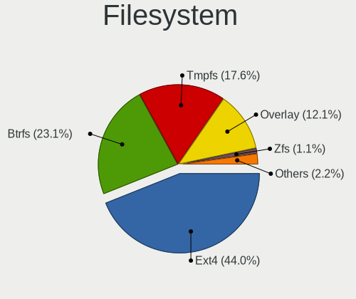

| Type    | Desktops | Percent |
|---------|----------|---------|
| Ext4    | 37       | 51.39%  |
| Btrfs   | 17       | 23.61%  |
| Tmpfs   | 11       | 15.28%  |
| Xfs     | 3        | 4.17%   |
| Overlay | 3        | 4.17%   |
| F2fs    | 1        | 1.39%   |

Part. scheme
------------

Scheme of partitioning

| Type    | Desktops | Percent |
|---------|----------|---------|
| GPT     | 35       | 48.61%  |
| Unknown | 34       | 47.22%  |
| MBR     | 3        | 4.17%   |

Dual Boot with Linux/BSD
------------------------

Hosting more than one Linux/BSD

| Dual boot | Desktops | Percent |
|-----------|----------|---------|
| No        | 62       | 86.11%  |
| Yes       | 10       | 13.89%  |

Dual Boot (Win)
---------------

Hosting Linux and Windows

| Dual boot | Desktops | Percent |
|-----------|----------|---------|
| No        | 59       | 81.94%  |
| Yes       | 13       | 18.06%  |

Board
-----

Vendor
------

Motherboard manufacturer

| Name                | Desktops | Percent |
|---------------------|----------|---------|
| ASUSTek Computer    | 15       | 20.83%  |
| Gigabyte Technology | 9        | 12.5%   |
| Dell                | 9        | 12.5%   |
| MSI                 | 8        | 11.11%  |
| ASRock              | 7        | 9.72%   |
| Lenovo              | 6        | 8.33%   |
| Hewlett-Packard     | 5        | 6.94%   |
| Acer                | 4        | 5.56%   |
| Pegatron            | 3        | 4.17%   |
| Intel               | 3        | 4.17%   |
| Win element         | 1        | 1.39%   |
| SZMZ                | 1        | 1.39%   |
| LORD ELECTRONICS    | 1        | 1.39%   |

Model
-----

Motherboard model

| Name                                                              | Desktops | Percent |
|-------------------------------------------------------------------|----------|---------|
| MSI MS-7B93                                                       | 2        | 2.78%   |
| Gigabyte B550I AORUS PRO AX                                       | 2        | 2.78%   |
| Dell OptiPlex 9020                                                | 2        | 2.78%   |
| Dell OptiPlex 7050                                                | 2        | 2.78%   |
| ASUS All Series                                                   | 2        | 2.78%   |
| ASRock B450 Pro4                                                  | 2        | 2.78%   |
| Win element M600                                                  | 1        | 1.39%   |
| SZMZ X99M-G2                                                      | 1        | 1.39%   |
| Pegatron p7-1238                                                  | 1        | 1.39%   |
| Pegatron NY428AA-A2L p6110f                                       | 1        | 1.39%   |
| Pegatron 600-1352                                                 | 1        | 1.39%   |
| MSI MS-7D73                                                       | 1        | 1.39%   |
| MSI MS-7C37                                                       | 1        | 1.39%   |
| MSI MS-7B86                                                       | 1        | 1.39%   |
| MSI MS-7B48                                                       | 1        | 1.39%   |
| MSI MS-7693                                                       | 1        | 1.39%   |
| MSI KJ384AA-A2L SR5410F                                           | 1        | 1.39%   |
| LORD ELECTRONICS Guso G4x + ICH7 Series MotherBoard G41I6510V0.1A | 1        | 1.39%   |
| Lenovo ThinkCentre M93p 10AB000KUS                                | 1        | 1.39%   |
| Lenovo ThinkCentre M93p 10A8S00200                                | 1        | 1.39%   |
| Lenovo ThinkCentre M92p 3228A1U                                   | 1        | 1.39%   |
| Lenovo ThinkCentre M58p 7484ANU                                   | 1        | 1.39%   |
| Lenovo ThinkCentre M58p 6234AE5                                   | 1        | 1.39%   |
| Lenovo IdeaCentre 510A-15ICB 90HV001FCF                           | 1        | 1.39%   |
| Intel X99                                                         | 1        | 1.39%   |
| Intel Jasper Lake Client Platform                                 | 1        | 1.39%   |
| Intel D53427RKE G87971-406                                        | 1        | 1.39%   |
| HP Z420 Workstation                                               | 1        | 1.39%   |
| HP ProDesk 600 G2 SFF                                             | 1        | 1.39%   |
| HP EliteDesk 800 G2 SFF                                           | 1        | 1.39%   |
| HP Compaq 8000 Elite SFF PC                                       | 1        | 1.39%   |
| HP 500-119c                                                       | 1        | 1.39%   |
| Gigabyte Z390 M GAMING                                            | 1        | 1.39%   |
| Gigabyte Z370P D3                                                 | 1        | 1.39%   |
| Gigabyte X570 AORUS PRO WIFI                                      | 1        | 1.39%   |
| Gigabyte H55M-USB3                                                | 1        | 1.39%   |
| Gigabyte B85M-D3H                                                 | 1        | 1.39%   |
| Gigabyte B650I AORUS ULTRA                                        | 1        | 1.39%   |
| Gigabyte B450M DS3H WIFI V2                                       | 1        | 1.39%   |
| Dell XPS 8900                                                     | 1        | 1.39%   |

Model Family
------------

Motherboard model prefix

| Name                  | Desktops | Percent |
|-----------------------|----------|---------|
| Dell OptiPlex         | 6        | 8.33%   |
| Lenovo ThinkCentre    | 5        | 6.94%   |
| ASUS ROG              | 5        | 6.94%   |
| ASUS PRIME            | 3        | 4.17%   |
| MSI MS-7B93           | 2        | 2.78%   |
| Gigabyte B550I        | 2        | 2.78%   |
| Dell XPS              | 2        | 2.78%   |
| ASUS TUF              | 2        | 2.78%   |
| ASUS All              | 2        | 2.78%   |
| ASRock B450           | 2        | 2.78%   |
| Acer Aspire           | 2        | 2.78%   |
| Win element M600      | 1        | 1.39%   |
| SZMZ X99M-G2          | 1        | 1.39%   |
| Pegatron p7-1238      | 1        | 1.39%   |
| Pegatron NY428AA-A2L  | 1        | 1.39%   |
| Pegatron 600-1352     | 1        | 1.39%   |
| MSI MS-7D73           | 1        | 1.39%   |
| MSI MS-7C37           | 1        | 1.39%   |
| MSI MS-7B86           | 1        | 1.39%   |
| MSI MS-7B48           | 1        | 1.39%   |
| MSI MS-7693           | 1        | 1.39%   |
| MSI KJ384AA-A2L       | 1        | 1.39%   |
| LORD ELECTRONICS Guso | 1        | 1.39%   |
| Lenovo IdeaCentre     | 1        | 1.39%   |
| Intel X99             | 1        | 1.39%   |
| Intel Jasper          | 1        | 1.39%   |
| Intel D53427RKE       | 1        | 1.39%   |
| HP Z420               | 1        | 1.39%   |
| HP ProDesk            | 1        | 1.39%   |
| HP EliteDesk          | 1        | 1.39%   |
| HP Compaq             | 1        | 1.39%   |
| HP 500-119c           | 1        | 1.39%   |
| Gigabyte Z390         | 1        | 1.39%   |
| Gigabyte Z370P        | 1        | 1.39%   |
| Gigabyte X570         | 1        | 1.39%   |
| Gigabyte H55M-USB3    | 1        | 1.39%   |
| Gigabyte B85M-D3H     | 1        | 1.39%   |
| Gigabyte B650I        | 1        | 1.39%   |
| Gigabyte B450M        | 1        | 1.39%   |
| Dell Precision        | 1        | 1.39%   |

MFG Year
--------

Motherboard manufacture year

| Year | Desktops | Percent |
|------|----------|---------|
| 2019 | 12       | 16.67%  |
| 2018 | 8        | 11.11%  |
| 2013 | 8        | 11.11%  |
| 2020 | 6        | 8.33%   |
| 2022 | 5        | 6.94%   |
| 2017 | 5        | 6.94%   |
| 2021 | 4        | 5.56%   |
| 2015 | 4        | 5.56%   |
| 2014 | 4        | 5.56%   |
| 2010 | 3        | 4.17%   |
| 2009 | 3        | 4.17%   |
| 2023 | 2        | 2.78%   |
| 2012 | 2        | 2.78%   |
| 2011 | 2        | 2.78%   |
| 2008 | 2        | 2.78%   |
| 2016 | 1        | 1.39%   |
| 2007 | 1        | 1.39%   |

Form Factor
-----------

Physical design of the computer

| Name    | Desktops | Percent |
|---------|----------|---------|
| Desktop | 72       | 100%    |

Secure Boot
-----------

Enabled or disabled

| State    | Desktops | Percent |
|----------|----------|---------|
| Disabled | 67       | 93.06%  |
| Enabled  | 5        | 6.94%   |

Coreboot
--------

Have coreboot on board

| Used | Desktops | Percent |
|------|----------|---------|
| No   | 72       | 100%    |

RAM Size
--------

Total RAM memory

| Size in GB  | Desktops | Percent |
|-------------|----------|---------|
| 16.01-24.0  | 18       | 25%     |
| 32.01-64.0  | 17       | 23.61%  |
| 64.01-256.0 | 12       | 16.67%  |
| 8.01-16.0   | 10       | 13.89%  |
| 4.01-8.0    | 9        | 12.5%   |
| 3.01-4.0    | 4        | 5.56%   |
| 24.01-32.0  | 2        | 2.78%   |

RAM Used
--------

Used RAM memory

| Used GB    | Desktops | Percent |
|------------|----------|---------|
| 4.01-8.0   | 18       | 25%     |
| 1.01-2.0   | 18       | 25%     |
| 2.01-3.0   | 16       | 22.22%  |
| 3.01-4.0   | 9        | 12.5%   |
| 8.01-16.0  | 8        | 11.11%  |
| 16.01-24.0 | 1        | 1.39%   |
| 0.51-1.0   | 1        | 1.39%   |
| 0.01-0.5   | 1        | 1.39%   |

Total Drives
------------

Number of drives on board

| Drives | Desktops | Percent |
|--------|----------|---------|
| 1      | 24       | 33.33%  |
| 2      | 22       | 30.56%  |
| 3      | 13       | 18.06%  |
| 5      | 6        | 8.33%   |
| 4      | 6        | 8.33%   |
| 6      | 1        | 1.39%   |

Has CD-ROM
----------

Has CD-ROM on board

| Presented | Desktops | Percent |
|-----------|----------|---------|
| No        | 38       | 52.78%  |
| Yes       | 34       | 47.22%  |

Has Ethernet
------------

Has Ethernet on board

| Presented | Desktops | Percent |
|-----------|----------|---------|
| Yes       | 72       | 100%    |

Has WiFi
--------

Has WiFi module

| Presented | Desktops | Percent |
|-----------|----------|---------|
| Yes       | 42       | 58.33%  |
| No        | 30       | 41.67%  |

Has Bluetooth
-------------

Has Bluetooth module

| Presented | Desktops | Percent |
|-----------|----------|---------|
| Yes       | 36       | 50%     |
| No        | 36       | 50%     |

Location
--------

Country
-------

Geographic location (country)

| Country | Desktops | Percent |
|---------|----------|---------|
| Canada  | 72       | 100%    |

City
----

Geographic location (city)

| City          | Desktops | Percent |
|---------------|----------|---------|
| Toronto       | 15       | 20.83%  |
| Montreal      | 7        | 9.72%   |
| Ottawa        | 4        | 5.56%   |
| Vancouver     | 3        | 4.17%   |
| Québec       | 3        | 4.17%   |
| Calgary       | 3        | 4.17%   |
| Winnipeg      | 2        | 2.78%   |
| Mississauga   | 2        | 2.78%   |
| Guelph        | 2        | 2.78%   |
| Edmonton      | 2        | 2.78%   |
| Wolfville     | 1        | 1.39%   |
| Victoria      | 1        | 1.39%   |
| Vernon        | 1        | 1.39%   |
| Trail         | 1        | 1.39%   |
| Thunder Bay   | 1        | 1.39%   |
| Saskatoon     | 1        | 1.39%   |
| Sarnia        | 1        | 1.39%   |
| Richmond Hill | 1        | 1.39%   |
| Richmond      | 1        | 1.39%   |
| Red Deer      | 1        | 1.39%   |
| Penticton     | 1        | 1.39%   |
| Oshawa        | 1        | 1.39%   |
| Ohsweken      | 1        | 1.39%   |
| Oakville      | 1        | 1.39%   |
| Nipigon       | 1        | 1.39%   |
| Niagara Falls | 1        | 1.39%   |
| Newmarket     | 1        | 1.39%   |
| Nelson        | 1        | 1.39%   |
| London        | 1        | 1.39%   |
| Langley       | 1        | 1.39%   |
| Kingston      | 1        | 1.39%   |
| Kelowna       | 1        | 1.39%   |
| Ingersoll     | 1        | 1.39%   |
| Glace Bay     | 1        | 1.39%   |
| Creston       | 1        | 1.39%   |
| Cambridge     | 1        | 1.39%   |
| Burnaby       | 1        | 1.39%   |
| Brantford     | 1        | 1.39%   |
| Baie-Comeau   | 1        | 1.39%   |

Drives
------

Drive Vendor
------------

Hard drive vendors

| Vendor                      | Desktops | Drives | Percent |
|-----------------------------|----------|--------|---------|
| Seagate                     | 26       | 34     | 19.4%   |
| WDC                         | 21       | 27     | 15.67%  |
| Samsung Electronics         | 19       | 26     | 14.18%  |
| Kingston                    | 9        | 9      | 6.72%   |
| Sandisk                     | 8        | 11     | 5.97%   |
| Toshiba                     | 5        | 6      | 3.73%   |
| A-DATA Technology           | 4        | 4      | 2.99%   |
| Crucial                     | 3        | 3      | 2.24%   |
| China                       | 3        | 3      | 2.24%   |
| Unknown                     | 2        | 3      | 1.49%   |
| SPCC                        | 2        | 2      | 1.49%   |
| Silicon Motion              | 2        | 2      | 1.49%   |
| Phison Electronics          | 2        | 2      | 1.49%   |
| Micron/Crucial Technology   | 2        | 3      | 1.49%   |
| Micron Technology           | 2        | 2      | 1.49%   |
| Intel                       | 2        | 2      | 1.49%   |
| Hitachi                     | 2        | 2      | 1.49%   |
| ADATA Technology            | 2        | 3      | 1.49%   |
| XrayDisk                    | 1        | 1      | 0.75%   |
| USB3.0                      | 1        | 1      | 0.75%   |
| Unknown (CF)                | 1        | 1      | 0.75%   |
| TSA                         | 1        | 1      | 0.75%   |
| Timetec                     | 1        | 2      | 0.75%   |
| Team                        | 1        | 1      | 0.75%   |
| Realtek Semiconductor       | 1        | 1      | 0.75%   |
| PNY                         | 1        | 1      | 0.75%   |
| Patriot                     | 1        | 1      | 0.75%   |
| Mushkin                     | 1        | 1      | 0.75%   |
| Maxone                      | 1        | 1      | 0.75%   |
| MAXIO Technology (Hangzhou) | 1        | 1      | 0.75%   |
| LITEONIT                    | 1        | 1      | 0.75%   |
| Lexar                       | 1        | 1      | 0.75%   |
| Kingston Technology Company | 1        | 1      | 0.75%   |
| KingFast                    | 1        | 1      | 0.75%   |
| Corsair                     | 1        | 1      | 0.75%   |
| Unknown                     | 1        | 1      | 0.75%   |

Drive Model
-----------

Hard drive models

| Model                                                 | Desktops | Percent |
|-------------------------------------------------------|----------|---------|
| Seagate ST2000DM008-2FR102 2TB                        | 8        | 5.16%   |
| Samsung NVMe SSD Controller SM981/PM981/PM983 1TB     | 6        | 3.87%   |
| WDC WDS100T2B0A-00SM50 1TB SSD                        | 3        | 1.94%   |
| Kingston SA400S37240G 240GB SSD                       | 3        | 1.94%   |
| Toshiba DT01ACA100 1TB                                | 2        | 1.29%   |
| Silicon Motion SM2263EN/SM2263XT SSD Controller 256GB | 2        | 1.29%   |
| Seagate ST2000DM008-2UB102 2TB                        | 2        | 1.29%   |
| Seagate ST2000DM006-2DM164 2TB                        | 2        | 1.29%   |
| Sandisk WD Blue SN550 NVMe SSD 1TB                    | 2        | 1.29%   |
| Samsung SSD 860 EVO 500GB                             | 2        | 1.29%   |
| Samsung SSD 850 EVO 500GB                             | 2        | 1.29%   |
| Micron/Crucial P2 NVMe PCIe SSD 500GB                 | 2        | 1.29%   |
| Kingston SA400S37480G 480GB SSD                       | 2        | 1.29%   |
| Crucial CT500MX500SSD1 500GB                          | 2        | 1.29%   |
| XrayDisk 480GB SSD                                    | 1        | 0.65%   |
| WDC WDS500G2B0A-00SM50 500GB SSD                      | 1        | 0.65%   |
| WDC WDS250G2B0C-00PXH0 250GB                          | 1        | 0.65%   |
| WDC WDS200T2B0A-00SM50 2TB SSD                        | 1        | 0.65%   |
| WDC WD7500BPVT-22HXZT1 752GB                          | 1        | 0.65%   |
| WDC WD6400AAKS-65A7B2 640GB                           | 1        | 0.65%   |
| WDC WD6004FZWX-00BKVA0 6TB                            | 1        | 0.65%   |
| WDC WD5003AZEX-00K3CA0 500GB                          | 1        | 0.65%   |
| WDC WD5000AAKS-22V1A0 500GB                           | 1        | 0.65%   |
| WDC WD5000AAKS-00UU3A0 500GB                          | 1        | 0.65%   |
| WDC WD5000AAJS-08A8B0 500GB                           | 1        | 0.65%   |
| WDC WD5000AADS-56S9B0 499GB                           | 1        | 0.65%   |
| WDC WD40EZRZ-00GXCB0 4TB                              | 1        | 0.65%   |
| WDC WD30EZRX-00D8PB0 3TB                              | 1        | 0.65%   |
| WDC WD20EZRX-19D8PB0 2TB                              | 1        | 0.65%   |
| WDC WD20EZAZ-00GGJB0 2TB                              | 1        | 0.65%   |
| WDC WD1600AAJS-08L7A0 160GB                           | 1        | 0.65%   |
| WDC WD10EZEX-08WN4A0 1TB                              | 1        | 0.65%   |
| WDC WD10EZEX-00WN4A0 1TB                              | 1        | 0.65%   |
| WDC WD10EZEX-00BN5A0 1TB                              | 1        | 0.65%   |
| WDC WD1001FAES-60Z2A0 1TB                             | 1        | 0.65%   |
| WDC PC SN810 NVMe 1024GB                              | 1        | 0.65%   |
| USB3.0 Disk 500GB                                     | 1        | 0.65%   |
| Unknown SD/MMC/MS PRO 16GB                            | 1        | 0.65%   |
| Unknown SD/MMC 2GB                                    | 1        | 0.65%   |
| Unknown M.S./M.S.Pro/HG 16GB                          | 1        | 0.65%   |

HDD Vendor
----------

Hard disk drive vendors

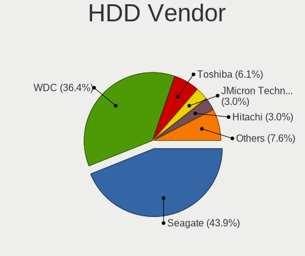

| Vendor  | Desktops | Drives | Percent |
|---------|----------|--------|---------|
| Seagate | 25       | 33     | 52.08%  |
| WDC     | 16       | 20     | 33.33%  |
| Toshiba | 2        | 2      | 4.17%   |
| Hitachi | 2        | 2      | 4.17%   |
| USB3.0  | 1        | 1      | 2.08%   |
| Unknown | 1        | 1      | 2.08%   |
| Maxone  | 1        | 1      | 2.08%   |

SSD Vendor
----------

Solid state drive vendors

| Vendor              | Desktops | Drives | Percent |
|---------------------|----------|--------|---------|
| Samsung Electronics | 10       | 12     | 20.41%  |
| Kingston            | 6        | 6      | 12.24%  |
| WDC                 | 5        | 5      | 10.2%   |
| A-DATA Technology   | 4        | 4      | 8.16%   |
| Crucial             | 3        | 3      | 6.12%   |
| China               | 3        | 3      | 6.12%   |
| Toshiba             | 2        | 3      | 4.08%   |
| SPCC                | 2        | 2      | 4.08%   |
| XrayDisk            | 1        | 1      | 2.04%   |
| Unknown (CF)        | 1        | 1      | 2.04%   |
| TSA                 | 1        | 1      | 2.04%   |
| Timetec             | 1        | 2      | 2.04%   |
| Team                | 1        | 1      | 2.04%   |
| PNY                 | 1        | 1      | 2.04%   |
| Patriot             | 1        | 1      | 2.04%   |
| Mushkin             | 1        | 1      | 2.04%   |
| Micron Technology   | 1        | 1      | 2.04%   |
| LITEONIT            | 1        | 1      | 2.04%   |
| Lexar               | 1        | 1      | 2.04%   |
| Intel               | 1        | 1      | 2.04%   |
| Corsair             | 1        | 1      | 2.04%   |
| Unknown             | 1        | 1      | 2.04%   |

Drive Kind
----------

HDD or SSD

| Kind    | Desktops | Drives | Percent |
|---------|----------|--------|---------|
| HDD     | 41       | 60     | 34.17%  |
| SSD     | 40       | 53     | 33.33%  |
| NVMe    | 36       | 46     | 30%     |
| Unknown | 3        | 4      | 2.5%    |

Drive Connector
---------------

SATA, SAS, NVMe, etc.

| Type | Desktops | Drives | Percent |
|------|----------|--------|---------|
| SATA | 60       | 107    | 57.69%  |
| NVMe | 36       | 46     | 34.62%  |
| SAS  | 8        | 10     | 7.69%   |

Drive Size
----------

Size of hard drive

| Size in TB | Desktops | Drives | Percent |
|------------|----------|--------|---------|
| 0.01-0.5   | 38       | 49     | 40.86%  |
| 0.51-1.0   | 27       | 29     | 29.03%  |
| 1.01-2.0   | 20       | 26     | 21.51%  |
| 3.01-4.0   | 3        | 3      | 3.23%   |
| 2.01-3.0   | 3        | 4      | 3.23%   |
| 4.01-10.0  | 2        | 2      | 2.15%   |

Space Total
-----------

Amount of disk space available on the file system

| Size in GB     | Desktops | Percent |
|----------------|----------|---------|
| More than 3000 | 21       | 29.17%  |
| 251-500        | 12       | 16.67%  |
| 101-250        | 11       | 15.28%  |
| 501-1000       | 11       | 15.28%  |
| 1001-2000      | 7        | 9.72%   |
| 2001-3000      | 5        | 6.94%   |
| Unknown        | 3        | 4.17%   |
| 1-20           | 2        | 2.78%   |

Space Used
----------

Amount of used disk space

| Used GB        | Desktops | Percent |
|----------------|----------|---------|
| 1-20           | 14       | 19.44%  |
| 251-500        | 9        | 12.5%   |
| 21-50          | 9        | 12.5%   |
| 501-1000       | 9        | 12.5%   |
| More than 3000 | 8        | 11.11%  |
| 1001-2000      | 6        | 8.33%   |
| 101-250        | 5        | 6.94%   |
| 51-100         | 5        | 6.94%   |
| 2001-3000      | 4        | 5.56%   |
| Unknown        | 3        | 4.17%   |

Malfunc. Drives
---------------

Drive models with a malfunction

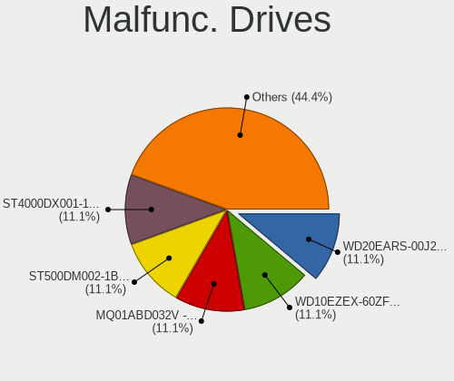

| Model                                 | Desktops | Drives | Percent |
|---------------------------------------|----------|--------|---------|
| WDC WD5000AAKS-00UU3A0 500GB          | 1        | 1      | 14.29%  |
| WDC WD30EZRX-00D8PB0 3TB              | 1        | 1      | 14.29%  |
| Toshiba THNSNK128GCS8 SATA 128GB SSD  | 1        | 1      | 14.29%  |
| Seagate ST31500341AS 1TB              | 1        | 1      | 14.29%  |
| Seagate ST1000DM003-1ER162 1TB        | 1        | 1      | 14.29%  |
| Samsung Electronics SSD 840 EVO 120GB | 1        | 1      | 14.29%  |
| A-DATA Technology SU635 480GB SSD     | 1        | 1      | 14.29%  |

Malfunc. Drive Vendor
---------------------

Vendors of faulty drives

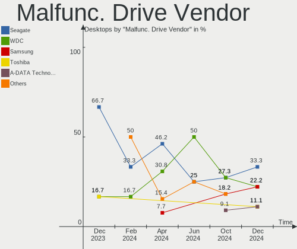

| Vendor              | Desktops | Drives | Percent |
|---------------------|----------|--------|---------|
| WDC                 | 2        | 2      | 28.57%  |
| Seagate             | 2        | 2      | 28.57%  |
| Toshiba             | 1        | 1      | 14.29%  |
| Samsung Electronics | 1        | 1      | 14.29%  |
| A-DATA Technology   | 1        | 1      | 14.29%  |

Malfunc. HDD Vendor
-------------------

Vendors of faulty HDD drives

| Vendor  | Desktops | Drives | Percent |
|---------|----------|--------|---------|
| WDC     | 2        | 2      | 50%     |
| Seagate | 2        | 2      | 50%     |

Malfunc. Drive Kind
-------------------

Kinds of faulty drives

| Kind | Desktops | Drives | Percent |
|------|----------|--------|---------|
| HDD  | 4        | 4      | 57.14%  |
| SSD  | 3        | 3      | 42.86%  |

Failed Drives
-------------

Failed drive models

Zero info for selected period =(

Failed Drive Vendor
-------------------

Failed drive vendors

Zero info for selected period =(

Drive Status
------------

Number of failed and malfunc. drives

| Status   | Desktops | Drives | Percent |
|----------|----------|--------|---------|
| Detected | 47       | 102    | 59.49%  |
| Works    | 25       | 54     | 31.65%  |
| Malfunc  | 7        | 7      | 8.86%   |

Storage controller
------------------

Storage Vendor
--------------

Storage controller vendors

| Vendor                       | Desktops | Percent |
|------------------------------|----------|---------|
| Intel                        | 46       | 37.7%   |
| AMD                          | 24       | 19.67%  |
| Samsung Electronics          | 13       | 10.66%  |
| Sandisk                      | 10       | 8.2%    |
| ASMedia Technology           | 8        | 6.56%   |
| Kingston Technology Company  | 4        | 3.28%   |
| Silicon Motion               | 2        | 1.64%   |
| Phison Electronics           | 2        | 1.64%   |
| Micron/Crucial Technology    | 2        | 1.64%   |
| JMicron Technology           | 2        | 1.64%   |
| ADATA Technology             | 2        | 1.64%   |
| Toshiba America Info Systems | 1        | 0.82%   |
| Realtek Semiconductor        | 1        | 0.82%   |
| Nvidia                       | 1        | 0.82%   |
| Micron Technology            | 1        | 0.82%   |
| MAXIO Technology (Hangzhou)  | 1        | 0.82%   |
| LSI Logic / Symbios Logic    | 1        | 0.82%   |
| Broadcom / LSI               | 1        | 0.82%   |

Storage Model
-------------

Storage controller models

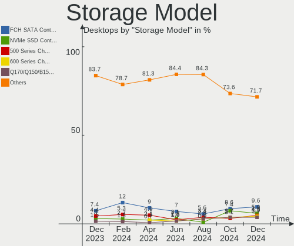

| Model                                                                          | Desktops | Percent |
|--------------------------------------------------------------------------------|----------|---------|
| AMD FCH SATA Controller [AHCI mode]                                            | 16       | 11.35%  |
| Samsung NVMe SSD Controller SM981/PM981/PM983                                  | 8        | 5.67%   |
| Intel 8 Series/C220 Series Chipset Family 6-port SATA Controller 1 [AHCI mode] | 8        | 5.67%   |
| AMD 400 Series Chipset SATA Controller                                         | 8        | 5.67%   |
| ASMedia ASM1062 Serial ATA Controller                                          | 7        | 4.96%   |
| Intel Cannon Lake PCH SATA AHCI Controller                                     | 6        | 4.26%   |
| Intel SATA Controller [RAID mode]                                              | 5        | 3.55%   |
| Intel 200 Series PCH SATA controller [AHCI mode]                               | 5        | 3.55%   |
| SanDisk WD Black SN770 / PC SN740 256GB / PC SN560 (DRAM-less) NVMe SSD        | 3        | 2.13%   |
| SanDisk Ultra 3D / WD Blue SN550 NVMe SSD                                      | 3        | 2.13%   |
| Intel Alder Lake-S PCH SATA Controller [AHCI Mode]                             | 3        | 2.13%   |
| Intel 82801JD/DO (ICH10 Family) SATA AHCI Controller                           | 3        | 2.13%   |
| AMD 500 Series Chipset SATA Controller                                         | 3        | 2.13%   |
| Silicon Motion SM2263EN/SM2263XT (DRAM-less) NVMe SSD Controllers              | 2        | 1.42%   |
| SanDisk WD PC SN810 / Black SN850 NVMe SSD                                     | 2        | 1.42%   |
| Samsung NVMe SSD Controller SM961/PM961/SM963                                  | 2        | 1.42%   |
| Samsung NVMe SSD Controller PM9A1/PM9A3/980PRO                                 | 2        | 1.42%   |
| Samsung NVMe SSD Controller 980 (DRAM-less)                                    | 2        | 1.42%   |
| Micron/Crucial P2 [Nick P2] / P3 / P3 Plus NVMe PCIe SSD (DRAM-less)           | 2        | 1.42%   |
| Intel Volume Management Device NVMe RAID Controller                            | 2        | 1.42%   |
| Intel Q170/Q150/B150/H170/H110/Z170/CM236 Chipset SATA Controller [AHCI Mode]  | 2        | 1.42%   |
| Intel NM10/ICH7 Family SATA Controller [IDE mode]                              | 2        | 1.42%   |
| Intel C600/X79 series chipset SATA RAID Controller                             | 2        | 1.42%   |
| Intel C600/X79 series chipset IDE-r Controller                                 | 2        | 1.42%   |
| Intel 7 Series/C210 Series Chipset Family 6-port SATA Controller [AHCI mode]   | 2        | 1.42%   |
| Intel 5 Series/3400 Series Chipset 6 port SATA AHCI Controller                 | 2        | 1.42%   |
| Intel 4 Series Chipset PT IDER Controller                                      | 2        | 1.42%   |
| Toshiba America Info Systems XG4 NVMe SSD Controller                           | 1        | 0.71%   |
| Sandisk WD Black SN850X NVMe SSD                                               | 1        | 0.71%   |
| SanDisk WD Black NVMe SSD                                                      | 1        | 0.71%   |
| SanDisk Ultra 3D / WD Blue SN570 NVMe SSD (DRAM-less)                          | 1        | 0.71%   |
| SanDisk PC SN735 NVMe SSD (DRAM-less)                                          | 1        | 0.71%   |
| Realtek RTS5765DL NVMe SSD Controller (DRAM-less)                              | 1        | 0.71%   |
| Phison E16 PCIe4 NVMe Controller                                               | 1        | 0.71%   |
| Phison E12 NVMe Controller                                                     | 1        | 0.71%   |
| Nvidia MCP61 SATA Controller                                                   | 1        | 0.71%   |
| Nvidia MCP61 IDE                                                               | 1        | 0.71%   |
| Micron 2300 NVMe SSD [Santana]                                                 | 1        | 0.71%   |
| MAXIO (Hangzhou) NVMe SSD Controller MAP1202                                   | 1        | 0.71%   |
| LSI Logic / Symbios Logic MegaRAID SAS 2208 [Thunderbolt]                      | 1        | 0.71%   |

Storage Kind
------------

Kind of storage controller (IDE, SATA, NVMe, SAS, ...)

| Kind | Desktops | Percent |
|------|----------|---------|
| SATA | 59       | 50.43%  |
| NVMe | 36       | 30.77%  |
| IDE  | 11       | 9.4%    |
| RAID | 9        | 7.69%   |
| SAS  | 2        | 1.71%   |

Processor
---------

CPU Vendor
----------

Processor vendors

| Vendor | Desktops | Percent |
|--------|----------|---------|
| Intel  | 46       | 63.89%  |
| AMD    | 26       | 36.11%  |

CPU Model
---------

Processor models

| Model                                       | Desktops | Percent |
|---------------------------------------------|----------|---------|
| Intel Core i5-8400 CPU @ 2.80GHz            | 4        | 5.56%   |
| Intel Core i7-4770 CPU @ 3.40GHz            | 3        | 4.17%   |
| Intel Core 2 Duo CPU E8400 @ 3.00GHz        | 3        | 4.17%   |
| AMD Ryzen 9 5950X 16-Core Processor         | 3        | 4.17%   |
| AMD Ryzen 7 3700X 8-Core Processor          | 3        | 4.17%   |
| Intel Core i7-9700 CPU @ 3.00GHz            | 2        | 2.78%   |
| Intel Core i7-4790 CPU @ 3.60GHz            | 2        | 2.78%   |
| Intel Core i5-6500 CPU @ 3.20GHz            | 2        | 2.78%   |
| Intel Xeon CPU E5-2680 v2 @ 2.80GHz         | 1        | 1.39%   |
| Intel Xeon CPU E5-2670 v3 @ 2.30GHz         | 1        | 1.39%   |
| Intel Xeon CPU E5-2650 v4 @ 2.20GHz         | 1        | 1.39%   |
| Intel Xeon CPU E5-1620 0 @ 3.60GHz          | 1        | 1.39%   |
| Intel Pentium Dual-Core CPU E5300 @ 2.60GHz | 1        | 1.39%   |
| Intel Pentium Dual CPU E2160 @ 1.80GHz      | 1        | 1.39%   |
| Intel Pentium CPU P6100 @ 2.00GHz           | 1        | 1.39%   |
| Intel Core i9-9900K CPU @ 3.60GHz           | 1        | 1.39%   |
| Intel Core i7-9700K CPU @ 3.60GHz           | 1        | 1.39%   |
| Intel Core i7-8700K CPU @ 3.70GHz           | 1        | 1.39%   |
| Intel Core i7-7820X CPU @ 3.60GHz           | 1        | 1.39%   |
| Intel Core i7-7700T CPU @ 2.90GHz           | 1        | 1.39%   |
| Intel Core i7-6700 CPU @ 3.40GHz            | 1        | 1.39%   |
| Intel Core i7-4790K CPU @ 4.00GHz           | 1        | 1.39%   |
| Intel Core i7-3770 CPU @ 3.40GHz            | 1        | 1.39%   |
| Intel Core i5-6600T CPU @ 2.70GHz           | 1        | 1.39%   |
| Intel Core i5-4670 CPU @ 3.40GHz            | 1        | 1.39%   |
| Intel Core i5-4570T CPU @ 2.90GHz           | 1        | 1.39%   |
| Intel Core i5-3570 CPU @ 3.40GHz            | 1        | 1.39%   |
| Intel Core i5-3427U CPU @ 1.80GHz           | 1        | 1.39%   |
| Intel Core i5-2500K CPU @ 3.30GHz           | 1        | 1.39%   |
| Intel Core i3-4330 CPU @ 3.50GHz            | 1        | 1.39%   |
| Intel Core i3 CPU 530 @ 2.93GHz             | 1        | 1.39%   |
| Intel Core 2 Quad CPU Q9650 @ 3.00GHz       | 1        | 1.39%   |
| Intel Core 2 Quad CPU Q6600 @ 2.40GHz       | 1        | 1.39%   |
| Intel Celeron N5095A @ 2.00GHz              | 1        | 1.39%   |
| Intel 13th Gen Core i7-13700                | 1        | 1.39%   |
| Intel 12th Gen Core i9-12900F               | 1        | 1.39%   |
| Intel 12th Gen Core i7-12700K               | 1        | 1.39%   |
| Intel 12th Gen Core i7-12700F               | 1        | 1.39%   |
| AMD Ryzen 9 7900X 12-Core Processor         | 1        | 1.39%   |
| AMD Ryzen 9 7900 12-Core Processor          | 1        | 1.39%   |

CPU Model Family
----------------

Processor model prefix

| Model                   | Desktops | Percent |
|-------------------------|----------|---------|
| Intel Core i7           | 14       | 19.44%  |
| Intel Core i5           | 12       | 16.67%  |
| AMD Ryzen 7             | 8        | 11.11%  |
| AMD Ryzen 9             | 7        | 9.72%   |
| Other                   | 4        | 5.56%   |
| Intel Xeon              | 4        | 5.56%   |
| AMD Ryzen 5             | 4        | 5.56%   |
| Intel Core 2 Duo        | 3        | 4.17%   |
| Intel Core i3           | 2        | 2.78%   |
| Intel Core 2 Quad       | 2        | 2.78%   |
| AMD A10                 | 2        | 2.78%   |
| Intel Pentium Dual-Core | 1        | 1.39%   |
| Intel Pentium Dual      | 1        | 1.39%   |
| Intel Pentium           | 1        | 1.39%   |
| Intel Core i9           | 1        | 1.39%   |
| Intel Celeron           | 1        | 1.39%   |
| AMD Ryzen 7 PRO         | 1        | 1.39%   |
| AMD Ryzen 3             | 1        | 1.39%   |
| AMD FX                  | 1        | 1.39%   |
| AMD Athlon II Neo       | 1        | 1.39%   |
| AMD A8                  | 1        | 1.39%   |

CPU Cores
---------

Number of processor cores

| Number | Desktops | Percent |
|--------|----------|---------|
| 4      | 23       | 31.94%  |
| 8      | 15       | 20.83%  |
| 2      | 13       | 18.06%  |
| 6      | 8        | 11.11%  |
| 12     | 6        | 8.33%   |
| 16     | 5        | 6.94%   |
| 24     | 1        | 1.39%   |
| 20     | 1        | 1.39%   |

CPU Sockets
-----------

Number of sockets

| Number | Desktops | Percent |
|--------|----------|---------|
| 1      | 70       | 97.22%  |
| 2      | 2        | 2.78%   |

CPU Threads
-----------

Threads per core (Hyper-Threading)

| Number | Desktops | Percent |
|--------|----------|---------|
| 2      | 44       | 61.11%  |
| 1      | 28       | 38.89%  |

CPU Op-Modes
------------

CPU Operation Modes (32-bit, 64-bit)

| Op mode        | Desktops | Percent |
|----------------|----------|---------|
| 32-bit, 64-bit | 72       | 100%    |

CPU Microcode
-------------

Microcode number

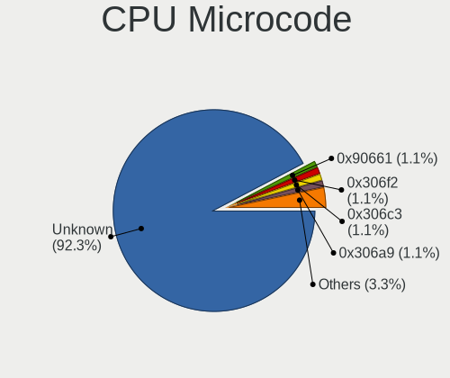

| Number     | Desktops | Percent |
|------------|----------|---------|
| Unknown    | 38       | 52.78%  |
| 0x306c3    | 4        | 5.56%   |
| 0x08701021 | 4        | 5.56%   |
| 0x906ea    | 2        | 2.78%   |
| 0x506e3    | 2        | 2.78%   |
| 0x1067a    | 2        | 2.78%   |
| 0x0a201009 | 2        | 2.78%   |
| 0x08108109 | 2        | 2.78%   |
| 0x06003106 | 2        | 2.78%   |
| 0xb0671    | 1        | 1.39%   |
| 0x6fd      | 1        | 1.39%   |
| 0x306f2    | 1        | 1.39%   |
| 0x306e4    | 1        | 1.39%   |
| 0x306a9    | 1        | 1.39%   |
| 0x20652    | 1        | 1.39%   |
| 0x0a601206 | 1        | 1.39%   |
| 0x0a601203 | 1        | 1.39%   |
| 0x0a50000d | 1        | 1.39%   |
| 0x0a404102 | 1        | 1.39%   |
| 0x0a20120a | 1        | 1.39%   |
| 0x08701013 | 1        | 1.39%   |
| 0x0800820d | 1        | 1.39%   |
| 0x08001138 | 1        | 1.39%   |

CPU Microarch
-------------

Microarchitecture

| Name             | Desktops | Percent |
|------------------|----------|---------|
| KabyLake         | 10       | 13.89%  |
| Haswell          | 10       | 13.89%  |
| Zen 2            | 7        | 9.72%   |
| Unknown          | 7        | 9.72%   |
| Zen 3            | 6        | 8.33%   |
| Skylake          | 5        | 6.94%   |
| Penryn           | 5        | 6.94%   |
| IvyBridge        | 4        | 5.56%   |
| Zen+             | 3        | 4.17%   |
| Westmere         | 2        | 2.78%   |
| Steamroller      | 2        | 2.78%   |
| SandyBridge      | 2        | 2.78%   |
| Core             | 2        | 2.78%   |
| Alderlake Hybrid | 2        | 2.78%   |
| Zen              | 1        | 1.39%   |
| Piledriver       | 1        | 1.39%   |
| K10 Llano        | 1        | 1.39%   |
| K10              | 1        | 1.39%   |
| Broadwell        | 1        | 1.39%   |

Graphics
--------

GPU Vendor
----------

Vendors of graphics cards

| Vendor | Desktops | Percent |
|--------|----------|---------|
| Nvidia | 29       | 37.66%  |
| Intel  | 24       | 31.17%  |
| AMD    | 24       | 31.17%  |

GPU Model
---------

Graphics card models

| Model                                                                       | Desktops | Percent |
|-----------------------------------------------------------------------------|----------|---------|
| Intel Xeon E3-1200 v3/4th Gen Core Processor Integrated Graphics Controller | 6        | 7.59%   |
| Intel HD Graphics 530                                                       | 4        | 5.06%   |
| Nvidia GK208B [GeForce GT 710]                                              | 3        | 3.8%    |
| Intel CoffeeLake-S GT2 [UHD Graphics 630]                                   | 3        | 3.8%    |
| Intel 4 Series Chipset Integrated Graphics Controller                       | 3        | 3.8%    |
| AMD Navi 22 [Radeon RX 6700/6700 XT/6750 XT / 6800M/6850M XT]               | 3        | 3.8%    |
| AMD Ellesmere [Radeon RX 470/480/570/570X/580/580X/590]                     | 3        | 3.8%    |
| Nvidia GP106 [GeForce GTX 1060 6GB]                                         | 2        | 2.53%   |
| Nvidia GA104 [GeForce RTX 3060 Ti]                                          | 2        | 2.53%   |
| Nvidia AD104 [GeForce RTX 4070]                                             | 2        | 2.53%   |
| Intel Core Processor Integrated Graphics Controller                         | 2        | 2.53%   |
| AMD Raphael                                                                 | 2        | 2.53%   |
| AMD Polaris 20 XL [Radeon RX 580 2048SP]                                    | 2        | 2.53%   |
| AMD Picasso/Raven 2 [Radeon Vega Series / Radeon Vega Mobile Series]        | 2        | 2.53%   |
| AMD Kaveri [Radeon R7 Graphics]                                             | 2        | 2.53%   |
| AMD Hawaii PRO [Radeon R9 290/390]                                          | 2        | 2.53%   |
| Nvidia TU117 [GeForce GTX 1650]                                             | 1        | 1.27%   |
| Nvidia TU116 [GeForce GTX 1650]                                             | 1        | 1.27%   |
| Nvidia TU106 [GeForce RTX 2060 Rev. A]                                      | 1        | 1.27%   |
| Nvidia GT218M [ION]                                                         | 1        | 1.27%   |
| Nvidia GP108 [GeForce GT 1030]                                              | 1        | 1.27%   |
| Nvidia GP107 [GeForce GTX 1050]                                             | 1        | 1.27%   |
| Nvidia GP104 [GeForce GTX 1070]                                             | 1        | 1.27%   |
| Nvidia GP104 [GeForce GTX 1070 Ti]                                          | 1        | 1.27%   |
| Nvidia GM206GL [Quadro M2000]                                               | 1        | 1.27%   |
| Nvidia GM204 [GeForce GTX 980]                                              | 1        | 1.27%   |
| Nvidia GM107 [GeForce GTX 745]                                              | 1        | 1.27%   |
| Nvidia GK106 [GeForce GTX 660]                                              | 1        | 1.27%   |
| Nvidia GF119 [GeForce GT 520]                                               | 1        | 1.27%   |
| Nvidia GF108 [GeForce GT 630]                                               | 1        | 1.27%   |
| Nvidia GA106 [GeForce RTX 3060]                                             | 1        | 1.27%   |
| Nvidia GA104 [GeForce RTX 3070 Ti]                                          | 1        | 1.27%   |
| Nvidia GA102 [GeForce RTX 3090]                                             | 1        | 1.27%   |
| Nvidia GA102 [GeForce RTX 3080 Ti]                                          | 1        | 1.27%   |
| Nvidia AD104 [GeForce RTX 4070 Ti]                                          | 1        | 1.27%   |
| Nvidia AD103 [GeForce RTX 4080]                                             | 1        | 1.27%   |
| Intel Xeon E3-1200 v2/3rd Gen Core processor Graphics Controller            | 1        | 1.27%   |
| Intel Raptor Lake-S GT1 [UHD Graphics 770]                                  | 1        | 1.27%   |
| Intel JasperLake [UHD Graphics]                                             | 1        | 1.27%   |
| Intel HD Graphics 630                                                       | 1        | 1.27%   |

GPU Combo
---------

Combinations of graphics cards

| Name           | Desktops | Percent |
|----------------|----------|---------|
| 1 x Nvidia     | 24       | 33.33%  |
| 1 x Intel      | 21       | 29.17%  |
| 1 x AMD        | 21       | 29.17%  |
| Intel + Nvidia | 3        | 4.17%   |
| AMD + Nvidia   | 2        | 2.78%   |
| 2 x AMD        | 1        | 1.39%   |

GPU Driver
----------

Free vs proprietary

| Driver      | Desktops | Percent |
|-------------|----------|---------|
| Free        | 43       | 59.72%  |
| Proprietary | 23       | 31.94%  |
| Unknown     | 6        | 8.33%   |

GPU Memory
----------

Total video memory

| Size in GB | Desktops | Percent |
|------------|----------|---------|
| Unknown    | 42       | 58.33%  |
| 7.01-8.0   | 10       | 13.89%  |
| 1.01-2.0   | 6        | 8.33%   |
| 8.01-16.0  | 5        | 6.94%   |
| 3.01-4.0   | 4        | 5.56%   |
| 5.01-6.0   | 2        | 2.78%   |
| 0.51-1.0   | 2        | 2.78%   |
| 0.01-0.5   | 1        | 1.39%   |

Monitor
-------

Monitor Vendor
--------------

Monitor vendors

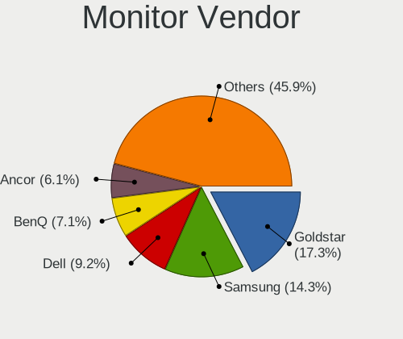

| Vendor               | Desktops | Percent |
|----------------------|----------|---------|
| Samsung Electronics  | 18       | 21.18%  |
| Dell                 | 10       | 11.76%  |
| Ancor Communications | 9        | 10.59%  |
| Hewlett-Packard      | 8        | 9.41%   |
| Goldstar             | 7        | 8.24%   |
| Acer                 | 7        | 8.24%   |
| ViewSonic            | 3        | 3.53%   |
| Sony                 | 2        | 2.35%   |
| Philips              | 2        | 2.35%   |
| Lenovo               | 2        | 2.35%   |
| BenQ                 | 2        | 2.35%   |
| ASUSTek Computer     | 2        | 2.35%   |
| AOC                  | 2        | 2.35%   |
| Unknown              | 1        | 1.18%   |
| Toshiba              | 1        | 1.18%   |
| STD                  | 1        | 1.18%   |
| Sceptre Tech         | 1        | 1.18%   |
| RCA                  | 1        | 1.18%   |
| NEC Computers        | 1        | 1.18%   |
| Huion                | 1        | 1.18%   |
| HKC                  | 1        | 1.18%   |
| HJW                  | 1        | 1.18%   |
| GreenWood            | 1        | 1.18%   |
| AU Optronics         | 1        | 1.18%   |

Monitor Model
-------------

Monitor models

| Model                                                                 | Desktops | Percent |
|-----------------------------------------------------------------------|----------|---------|
| ViewSonic VX2257 VSCB731 1920x1080 477x268mm 21.5-inch                | 1        | 1.09%   |
| ViewSonic VA2446 SERIES VSC732E 1920x1080 520x290mm 23.4-inch         | 1        | 1.09%   |
| ViewSonic TD2220 VSC052C 1920x1080 480x270mm 21.7-inch                | 1        | 1.09%   |
| Unknown LCD Monitor FFFF 2288x1287 2550x2550mm 142.0-inch             | 1        | 1.09%   |
| Toshiba TSB-TV TSB0206 1360x768 930x520mm 41.9-inch                   | 1        | 1.09%   |
| STD HDMI TV STD00C7 1680x1050 698x392mm 31.5-inch                     | 1        | 1.09%   |
| Sony TV SNY4C03 1920x1080 1063x598mm 48.0-inch                        | 1        | 1.09%   |
| Sony TV  *00 SNYF303 1920x1080 1220x680mm 55.0-inch                   | 1        | 1.09%   |
| Sceptre Tech Sceptre M27 SPT0ACD 1920x1080 598x336mm 27.0-inch        | 1        | 1.09%   |
| Samsung Electronics U32J59x SAM0F35 3840x2160 697x392mm 31.5-inch     | 1        | 1.09%   |
| Samsung Electronics SyncMaster SAM062E 1280x1024 376x301mm 19.0-inch  | 1        | 1.09%   |
| Samsung Electronics SyncMaster SAM027F 1680x1050 474x296mm 22.0-inch  | 1        | 1.09%   |
| Samsung Electronics SyncMaster SAM027D 1680x1050 430x270mm 20.0-inch  | 1        | 1.09%   |
| Samsung Electronics SyncMaster SAM0255 1680x1050 474x296mm 22.0-inch  | 1        | 1.09%   |
| Samsung Electronics SyncMaster SAM0226 1440x900 410x257mm 19.1-inch   | 1        | 1.09%   |
| Samsung Electronics SMBX2431 SAM0771 1920x1080 531x299mm 24.0-inch    | 1        | 1.09%   |
| Samsung Electronics S27E330 SAM0D90 1920x1080 598x336mm 27.0-inch     | 1        | 1.09%   |
| Samsung Electronics S27B370 SAM08E0 1920x1080 598x336mm 27.0-inch     | 1        | 1.09%   |
| Samsung Electronics S24B240 SAM08E9 1920x1080 521x293mm 23.5-inch     | 1        | 1.09%   |
| Samsung Electronics LS32B30 SAM7247 1920x1080 698x393mm 31.5-inch     | 1        | 1.09%   |
| Samsung Electronics LS32B30 SAM7246 1920x1080 698x393mm 31.5-inch     | 1        | 1.09%   |
| Samsung Electronics LF27T35 SAM707F 1920x1080 598x337mm 27.0-inch     | 1        | 1.09%   |
| Samsung Electronics LF24T40 SAM703D 1920x1080 520x290mm 23.4-inch     | 1        | 1.09%   |
| Samsung Electronics LCD Monitor SAM71B4 3840x2160 950x540mm 43.0-inch | 1        | 1.09%   |
| Samsung Electronics LCD Monitor SAM0F13 3840x2160 890x500mm 40.2-inch | 1        | 1.09%   |
| Samsung Electronics LCD Monitor SAM0D42 3840x2160 890x500mm 40.2-inch | 1        | 1.09%   |
| Samsung Electronics LCD Monitor SAM08FE 1920x1080                     | 1        | 1.09%   |
| Samsung Electronics LCD Monitor SAM07BC 1360x768                      | 1        | 1.09%   |
| Samsung Electronics LCD Monitor LF24T40                               | 1        | 1.09%   |
| Samsung Electronics C49RG9x SAM0F9C 3840x1080 1193x336mm 48.8-inch    | 1        | 1.09%   |
| Samsung Electronics C27F390 SAM0D32 1920x1080 598x336mm 27.0-inch     | 1        | 1.09%   |
| RCA RTRU4328CA RCA0B01 3840x2160 800x450mm 36.1-inch                  | 1        | 1.09%   |
| Philips 273PQPY PHLC096 1920x1080 597x336mm 27.0-inch                 | 1        | 1.09%   |
| Philips 170S PHL081E 1280x1024 338x270mm 17.0-inch                    | 1        | 1.09%   |
| NEC Computers LCD2690WUXi2 NEC675D 1920x1200 550x344mm 25.5-inch      | 1        | 1.09%   |
| Lenovo T23d-10 LEN61C3 1920x1200 518x324mm 24.1-inch                  | 1        | 1.09%   |
| Lenovo LEN S27i-10 LEN61C7 1920x1080 598x336mm 27.0-inch              | 1        | 1.09%   |
| Huion Kamvas 13 HAT1330 1920x1080 294x165mm 13.3-inch                 | 1        | 1.09%   |
| HKC 27E6QC HKC274F 2560x1440 597x336mm 27.0-inch                      | 1        | 1.09%   |
| HJW MACROSILICON HJW1836 1680x1050 530x290mm 23.8-inch                | 1        | 1.09%   |

Monitor Resolution
------------------

Monitor screen resolution

| Resolution         | Desktops | Percent |
|--------------------|----------|---------|
| 1920x1080 (FHD)    | 36       | 46.75%  |
| 3840x2160 (4K)     | 8        | 10.39%  |
| 1680x1050 (WSXGA+) | 5        | 6.49%   |
| 1280x1024 (SXGA)   | 5        | 6.49%   |
| 2560x1440 (QHD)    | 4        | 5.19%   |
| 1920x1200 (WUXGA)  | 4        | 5.19%   |
| 1600x900 (HD+)     | 3        | 3.9%    |
| 3840x1080          | 2        | 2.6%    |
| 1440x900 (WXGA+)   | 2        | 2.6%    |
| Unknown            | 2        | 2.6%    |
| 2880x1024          | 1        | 1.3%    |
| 2560x1600          | 1        | 1.3%    |
| 2560x1080          | 1        | 1.3%    |
| 2288x1287          | 1        | 1.3%    |
| 1400x1050          | 1        | 1.3%    |
| 1360x768           | 1        | 1.3%    |

Monitor Diagonal
----------------

Diagonal size in inches

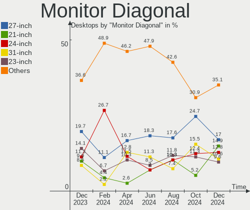

| Inches  | Desktops | Percent |
|---------|----------|---------|
| 27      | 15       | 18.07%  |
| 23      | 11       | 13.25%  |
| 24      | 9        | 10.84%  |
| 31      | 8        | 9.64%   |
| 19      | 6        | 7.23%   |
| 22      | 4        | 4.82%   |
| Unknown | 4        | 4.82%   |
| 84      | 3        | 3.61%   |
| 21      | 3        | 3.61%   |
| 20      | 3        | 3.61%   |
| 48      | 2        | 2.41%   |
| 25      | 2        | 2.41%   |
| 15      | 2        | 2.41%   |
| 142     | 1        | 1.2%    |
| 75      | 1        | 1.2%    |
| 74      | 1        | 1.2%    |
| 72      | 1        | 1.2%    |
| 40      | 1        | 1.2%    |
| 36      | 1        | 1.2%    |
| 34      | 1        | 1.2%    |
| 29      | 1        | 1.2%    |
| 18      | 1        | 1.2%    |
| 17      | 1        | 1.2%    |
| 13      | 1        | 1.2%    |

Monitor Width
-------------

Physical width

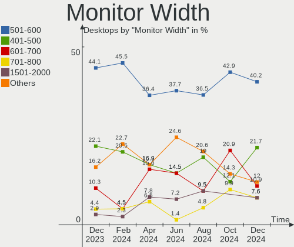

| Width in mm    | Desktops | Percent |
|----------------|----------|---------|
| 501-600        | 32       | 41.03%  |
| 401-500        | 12       | 15.38%  |
| 601-700        | 10       | 12.82%  |
| 1501-2000      | 6        | 7.69%   |
| 351-400        | 4        | 5.13%   |
| Unknown        | 4        | 5.13%   |
| 301-350        | 3        | 3.85%   |
| 701-800        | 2        | 2.56%   |
| 1001-1500      | 2        | 2.56%   |
| More than 2000 | 1        | 1.28%   |
| 801-900        | 1        | 1.28%   |
| 201-300        | 1        | 1.28%   |

Aspect Ratio
------------

Proportional relationship between the width and the height

| Ratio   | Desktops | Percent |
|---------|----------|---------|
| 16/9    | 47       | 67.14%  |
| 16/10   | 12       | 17.14%  |
| 5/4     | 4        | 5.71%   |
| Unknown | 3        | 4.29%   |
| 6/5     | 1        | 1.43%   |
| 32/9    | 1        | 1.43%   |
| 21/9    | 1        | 1.43%   |
| 1.00    | 1        | 1.43%   |

Monitor Area
------------

Area in inch²

| Area in inch² | Desktops | Percent |
|----------------|----------|---------|
| 201-250        | 20       | 24.69%  |
| 301-350        | 15       | 18.52%  |
| 151-200        | 11       | 13.58%  |
| 351-500        | 10       | 12.35%  |
| More than 1000 | 7        | 8.64%   |
| 251-300        | 6        | 7.41%   |
| 501-1000       | 4        | 4.94%   |
| Unknown        | 4        | 4.94%   |
| 71-80          | 1        | 1.23%   |
| 141-150        | 1        | 1.23%   |
| 101-110        | 1        | 1.23%   |
| 91-100         | 1        | 1.23%   |

Pixel Density
-------------

Pixels per inch

| Density       | Desktops | Percent |
|---------------|----------|---------|
| 51-100        | 49       | 68.06%  |
| 121-160       | 6        | 8.33%   |
| 101-120       | 6        | 8.33%   |
| 1-50          | 5        | 6.94%   |
| Unknown       | 4        | 5.56%   |
| More than 240 | 1        | 1.39%   |
| 161-240       | 1        | 1.39%   |

Multiple Monitors
-----------------

Total monitors connected

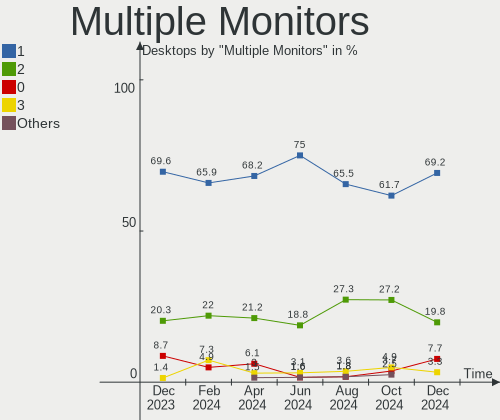

| Total | Desktops | Percent |
|-------|----------|---------|
| 1     | 43       | 59.72%  |
| 2     | 16       | 22.22%  |
| 0     | 8        | 11.11%  |
| 3     | 4        | 5.56%   |
| 4     | 1        | 1.39%   |

Network
-------

Net Controller Vendor
---------------------

Controller vendors

| Vendor                | Desktops | Percent |
|-----------------------|----------|---------|
| Realtek Semiconductor | 44       | 40.74%  |
| Intel                 | 41       | 37.96%  |
| MediaTek              | 6        | 5.56%   |
| Qualcomm Atheros      | 4        | 3.7%    |
| Ralink Technology     | 2        | 1.85%   |
| Ralink                | 2        | 1.85%   |
| Microsoft             | 2        | 1.85%   |
| D-Link System         | 2        | 1.85%   |
| TP-Link               | 1        | 0.93%   |
| Nvidia                | 1        | 0.93%   |
| NetGear               | 1        | 0.93%   |
| Broadcom Limited      | 1        | 0.93%   |
| ASIX Electronics      | 1        | 0.93%   |

Net Controller Model
--------------------

Controller models

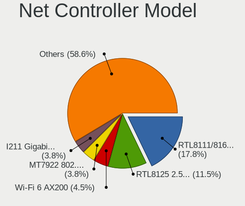

| Model                                                                     | Desktops | Percent |
|---------------------------------------------------------------------------|----------|---------|
| Realtek RTL8111/8168/8411 PCI Express Gigabit Ethernet Controller         | 29       | 22.48%  |
| Realtek RTL8125 2.5GbE Controller                                         | 8        | 6.2%    |
| Intel I211 Gigabit Network Connection                                     | 7        | 5.43%   |
| Intel Wi-Fi 6 AX200                                                       | 6        | 4.65%   |
| Intel Ethernet Connection I217-LM                                         | 4        | 3.1%    |
| Intel Cannon Lake PCH CNVi WiFi                                           | 4        | 3.1%    |
| Intel 82579LM Gigabit Network Connection (Lewisville)                     | 4        | 3.1%    |
| Realtek RTL8821CE 802.11ac PCIe Wireless Network Adapter                  | 3        | 2.33%   |
| Realtek 802.11ac NIC                                                      | 3        | 2.33%   |
| MediaTek MT7921K (RZ608) Wi-Fi 6E 80MHz                                   | 3        | 2.33%   |
| Intel Ethernet Controller I225-V                                          | 3        | 2.33%   |
| Intel Ethernet Connection (7) I219-V                                      | 3        | 2.33%   |
| Intel Dual Band Wireless-AC 3168NGW [Stone Peak]                          | 3        | 2.33%   |
| Intel 82567LM-3 Gigabit Network Connection                                | 3        | 2.33%   |
| Qualcomm Atheros Killer E220x Gigabit Ethernet Controller                 | 2        | 1.55%   |
| Qualcomm Atheros AR9485 Wireless Network Adapter                          | 2        | 1.55%   |
| MediaTek MT7922 802.11ax PCI Express Wireless Network Adapter             | 2        | 1.55%   |
| Intel Ethernet Connection (5) I219-LM                                     | 2        | 1.55%   |
| Intel Ethernet Connection (2) I219-V                                      | 2        | 1.55%   |
| Intel Ethernet Connection (2) I219-LM                                     | 2        | 1.55%   |
| TP-Link TL-WN722N v2/v3 [Realtek RTL8188EUS]                              | 1        | 0.78%   |
| Realtek RTL88x2bu [AC1200 Techkey]                                        | 1        | 0.78%   |
| Realtek RTL8821AE 802.11ac PCIe Wireless Network Adapter                  | 1        | 0.78%   |
| Realtek RTL8723BU 802.11b/g/n WLAN Adapter                                | 1        | 0.78%   |
| Realtek RTL8723BE PCIe Wireless Network Adapter                           | 1        | 0.78%   |
| Realtek RTL8192CU 802.11n WLAN Adapter                                    | 1        | 0.78%   |
| Realtek RTL8188EUS 802.11n Wireless Network Adapter                       | 1        | 0.78%   |
| Realtek RTL8169 PCI Gigabit Ethernet Controller                           | 1        | 0.78%   |
| Realtek RTL810xE PCI Express Fast Ethernet controller                     | 1        | 0.78%   |
| Realtek 802.11ac WLAN Adapter                                             | 1        | 0.78%   |
| Ralink RT2870/RT3070 Wireless Adapter                                     | 1        | 0.78%   |
| Ralink MT7601U Wireless Adapter                                           | 1        | 0.78%   |
| Ralink RT5390 Wireless 802.11n 1T/1R PCIe                                 | 1        | 0.78%   |
| Ralink RT3092 Wireless 802.11n 2T/2R PCIe                                 | 1        | 0.78%   |
| Nvidia MCP61 Ethernet                                                     | 1        | 0.78%   |
| NetGear Nighthawk A7000 802.11ac Wireless Adapter AC1900 [Realtek 8814AU] | 1        | 0.78%   |
| Microsoft Xbox Wireless Adapter for Windows                               | 1        | 0.78%   |
| Microsoft Wireless XBox Controller Dongle                                 | 1        | 0.78%   |
| MediaTek MT7921 802.11ax PCI Express Wireless Network Adapter             | 1        | 0.78%   |
| Intel Wireless 8265 / 8275                                                | 1        | 0.78%   |

Wireless Vendor
---------------

Wireless vendors

| Vendor                | Desktops | Percent |
|-----------------------|----------|---------|
| Intel                 | 19       | 37.25%  |
| Realtek Semiconductor | 13       | 25.49%  |
| MediaTek              | 6        | 11.76%  |
| Ralink Technology     | 2        | 3.92%   |
| Ralink                | 2        | 3.92%   |
| Qualcomm Atheros      | 2        | 3.92%   |
| Microsoft             | 2        | 3.92%   |
| D-Link System         | 2        | 3.92%   |
| TP-Link               | 1        | 1.96%   |
| NetGear               | 1        | 1.96%   |
| Broadcom Limited      | 1        | 1.96%   |

Wireless Model
--------------

Wireless models

| Model                                                                     | Desktops | Percent |
|---------------------------------------------------------------------------|----------|---------|
| Intel Wi-Fi 6 AX200                                                       | 6        | 11.76%  |
| Intel Cannon Lake PCH CNVi WiFi                                           | 4        | 7.84%   |
| Realtek RTL8821CE 802.11ac PCIe Wireless Network Adapter                  | 3        | 5.88%   |
| Realtek 802.11ac NIC                                                      | 3        | 5.88%   |
| MediaTek MT7921K (RZ608) Wi-Fi 6E 80MHz                                   | 3        | 5.88%   |
| Intel Dual Band Wireless-AC 3168NGW [Stone Peak]                          | 3        | 5.88%   |
| Qualcomm Atheros AR9485 Wireless Network Adapter                          | 2        | 3.92%   |
| MediaTek MT7922 802.11ax PCI Express Wireless Network Adapter             | 2        | 3.92%   |
| TP-Link TL-WN722N v2/v3 [Realtek RTL8188EUS]                              | 1        | 1.96%   |
| Realtek RTL88x2bu [AC1200 Techkey]                                        | 1        | 1.96%   |
| Realtek RTL8821AE 802.11ac PCIe Wireless Network Adapter                  | 1        | 1.96%   |
| Realtek RTL8723BU 802.11b/g/n WLAN Adapter                                | 1        | 1.96%   |
| Realtek RTL8723BE PCIe Wireless Network Adapter                           | 1        | 1.96%   |
| Realtek RTL8192CU 802.11n WLAN Adapter                                    | 1        | 1.96%   |
| Realtek RTL8188EUS 802.11n Wireless Network Adapter                       | 1        | 1.96%   |
| Realtek 802.11ac WLAN Adapter                                             | 1        | 1.96%   |
| Ralink RT2870/RT3070 Wireless Adapter                                     | 1        | 1.96%   |
| Ralink MT7601U Wireless Adapter                                           | 1        | 1.96%   |
| Ralink RT5390 Wireless 802.11n 1T/1R PCIe                                 | 1        | 1.96%   |
| Ralink RT3092 Wireless 802.11n 2T/2R PCIe                                 | 1        | 1.96%   |
| NetGear Nighthawk A7000 802.11ac Wireless Adapter AC1900 [Realtek 8814AU] | 1        | 1.96%   |
| Microsoft Xbox Wireless Adapter for Windows                               | 1        | 1.96%   |
| Microsoft Wireless XBox Controller Dongle                                 | 1        | 1.96%   |
| MediaTek MT7921 802.11ax PCI Express Wireless Network Adapter             | 1        | 1.96%   |
| Intel Wireless 8265 / 8275                                                | 1        | 1.96%   |
| Intel Wireless 7265                                                       | 1        | 1.96%   |
| Intel Wi-Fi 6 AX210/AX211/AX411 160MHz                                    | 1        | 1.96%   |
| Intel Dual Band Wireless-AC 3165 Plus Bluetooth                           | 1        | 1.96%   |
| Intel Centrino Wireless-N 105                                             | 1        | 1.96%   |
| Intel Alder Lake-S PCH CNVi WiFi                                          | 1        | 1.96%   |
| D-Link System DWA-140 RangeBooster N Adapter(rev.B2) [Ralink RT3072]      | 1        | 1.96%   |
| D-Link System DWA-125 Wireless N 150 Adapter(rev.A2) [Ralink RT3070]      | 1        | 1.96%   |
| Broadcom Limited BCM4360 802.11ac Dual Band Wireless Network Adapter      | 1        | 1.96%   |

Ethernet Vendor
---------------

Ethernet vendors

| Vendor                | Desktops | Percent |
|-----------------------|----------|---------|
| Realtek Semiconductor | 39       | 50.65%  |
| Intel                 | 34       | 44.16%  |
| Qualcomm Atheros      | 2        | 2.6%    |
| Nvidia                | 1        | 1.3%    |
| ASIX Electronics      | 1        | 1.3%    |

Ethernet Model
--------------

Ethernet models

| Model                                                             | Desktops | Percent |
|-------------------------------------------------------------------|----------|---------|
| Realtek RTL8111/8168/8411 PCI Express Gigabit Ethernet Controller | 29       | 37.18%  |
| Realtek RTL8125 2.5GbE Controller                                 | 8        | 10.26%  |
| Intel I211 Gigabit Network Connection                             | 7        | 8.97%   |
| Intel Ethernet Connection I217-LM                                 | 4        | 5.13%   |
| Intel 82579LM Gigabit Network Connection (Lewisville)             | 4        | 5.13%   |
| Intel Ethernet Controller I225-V                                  | 3        | 3.85%   |
| Intel Ethernet Connection (7) I219-V                              | 3        | 3.85%   |
| Intel 82567LM-3 Gigabit Network Connection                        | 3        | 3.85%   |
| Qualcomm Atheros Killer E220x Gigabit Ethernet Controller         | 2        | 2.56%   |
| Intel Ethernet Connection (5) I219-LM                             | 2        | 2.56%   |
| Intel Ethernet Connection (2) I219-V                              | 2        | 2.56%   |
| Intel Ethernet Connection (2) I219-LM                             | 2        | 2.56%   |
| Realtek RTL8169 PCI Gigabit Ethernet Controller                   | 1        | 1.28%   |
| Realtek RTL810xE PCI Express Fast Ethernet controller             | 1        | 1.28%   |
| Nvidia MCP61 Ethernet                                             | 1        | 1.28%   |
| Intel Ethernet Connection (7) I219-LM                             | 1        | 1.28%   |
| Intel Ethernet Connection (17) I219-LM                            | 1        | 1.28%   |
| Intel 82580 Gigabit Network Connection                            | 1        | 1.28%   |
| Intel 82579V Gigabit Network Connection                           | 1        | 1.28%   |
| Intel 82566DC-2 Gigabit Network Connection                        | 1        | 1.28%   |
| ASIX AX88179 Gigabit Ethernet                                     | 1        | 1.28%   |

Net Controller Kind
-------------------

Ethernet, WiFi or modem

| Kind     | Desktops | Percent |
|----------|----------|---------|
| Ethernet | 72       | 63.16%  |
| WiFi     | 42       | 36.84%  |

Used Controller
---------------

Currently used network controller

| Kind     | Desktops | Percent |
|----------|----------|---------|
| Ethernet | 54       | 70.13%  |
| WiFi     | 23       | 29.87%  |

NICs
----

Total network controllers on board

| Total | Desktops | Percent |
|-------|----------|---------|
| 2     | 34       | 47.22%  |
| 1     | 32       | 44.44%  |
| 3     | 4        | 5.56%   |
| 6     | 1        | 1.39%   |
| 0     | 1        | 1.39%   |

IPv6
----

IPv6 vs IPv4

| Used | Desktops | Percent |
|------|----------|---------|
| No   | 53       | 73.61%  |
| Yes  | 19       | 26.39%  |

Bluetooth
---------

Bluetooth Vendor
----------------

Controller vendors

| Vendor                          | Desktops | Percent |
|---------------------------------|----------|---------|
| Intel                           | 18       | 47.37%  |
| MediaTek                        | 5        | 13.16%  |
| Realtek Semiconductor           | 3        | 7.89%   |
| Cambridge Silicon Radio         | 3        | 7.89%   |
| ASUSTek Computer                | 3        | 7.89%   |
| IMC Networks                    | 2        | 5.26%   |
| TP-Link                         | 1        | 2.63%   |
| Realtek                         | 1        | 2.63%   |
| Qualcomm Atheros Communications | 1        | 2.63%   |
| Apple                           | 1        | 2.63%   |

Bluetooth Model
---------------

Controller models

| Model                                               | Desktops | Percent |
|-----------------------------------------------------|----------|---------|
| Intel AX200 Bluetooth                               | 6        | 15.79%  |
| MediaTek Wireless_Device                            | 5        | 13.16%  |
| Intel Bluetooth 9460/9560 Jefferson Peak (JfP)      | 4        | 10.53%  |
| Realtek Bluetooth Radio                             | 3        | 7.89%   |
| Intel Wireless-AC 3168 Bluetooth                    | 3        | 7.89%   |
| Intel Bluetooth wireless interface                  | 3        | 7.89%   |
| Cambridge Silicon Radio Bluetooth Dongle (HCI mode) | 3        | 7.89%   |
| ASUS ASUS USB-BT500                                 | 2        | 5.26%   |
| TP-Link UB500 Adapter                               | 1        | 2.63%   |
| Realtek Bluetooth Radio                             | 1        | 2.63%   |
| Qualcomm Atheros Bluetooth USB Host Controller      | 1        | 2.63%   |
| Intel AX210 Bluetooth                               | 1        | 2.63%   |
| Intel AX201 Bluetooth                               | 1        | 2.63%   |
| IMC Networks Wireless_Device                        | 1        | 2.63%   |
| IMC Networks Bluetooth Radio                        | 1        | 2.63%   |
| ASUS Bluetooth Adapter                              | 1        | 2.63%   |
| Apple Bluetooth USB Host Controller                 | 1        | 2.63%   |

Sound
-----

Sound Vendor
------------

Sound card vendors

| Vendor                               | Desktops | Percent |
|--------------------------------------|----------|---------|
| Intel                                | 45       | 33.83%  |
| AMD                                  | 32       | 24.06%  |
| Nvidia                               | 29       | 21.8%   |
| C-Media Electronics                  | 7        | 5.26%   |
| Logitech                             | 2        | 1.5%    |
| Focusrite-Novation                   | 2        | 1.5%    |
| Thesycon Systemsoftware & Consulting | 1        | 0.75%   |
| Texas Instruments                    | 1        | 0.75%   |
| Tenx Technology                      | 1        | 0.75%   |
| SteelSeries ApS                      | 1        | 0.75%   |
| RODE Microphones                     | 1        | 0.75%   |
| Razer USA                            | 1        | 0.75%   |
| Micro Star International             | 1        | 0.75%   |
| Kingston Technology                  | 1        | 0.75%   |
| JOUNIVO                              | 1        | 0.75%   |
| JMTek                                | 1        | 0.75%   |
| Giga-Byte Technology                 | 1        | 0.75%   |
| FDUCE PRO AUDIO MADE                 | 1        | 0.75%   |
| Blue Microphones                     | 1        | 0.75%   |
| ASUSTek Computer                     | 1        | 0.75%   |
| AKAI Professional M.I.               | 1        | 0.75%   |
| Aisa Expert                          | 1        | 0.75%   |

Sound Model
-----------

Sound card models

| Model                                                               | Desktops | Percent |
|---------------------------------------------------------------------|----------|---------|
| AMD Starship/Matisse HD Audio Controller                            | 11       | 6.96%   |
| Intel 8 Series/C220 Series Chipset High Definition Audio Controller | 9        | 5.7%    |
| Intel Cannon Lake PCH cAVS                                          | 7        | 4.43%   |
| AMD Family 17h/19h HD Audio Controller                              | 7        | 4.43%   |
| AMD Navi 21/23 HDMI/DP Audio Controller                             | 6        | 3.8%    |
| Intel Xeon E3-1200 v3/4th Gen Core Processor HD Audio Controller    | 5        | 3.16%   |
| Intel 200 Series PCH HD Audio                                       | 5        | 3.16%   |
| AMD Ellesmere HDMI Audio [Radeon RX 470/480 / 570/580/590]          | 5        | 3.16%   |
| Nvidia Audio device                                                 | 4        | 2.53%   |
| Nvidia GK208 HDMI/DP Audio Controller                               | 3        | 1.9%    |
| Nvidia GA104 High Definition Audio Controller                       | 3        | 1.9%    |
| Intel Alder Lake-S HD Audio Controller                              | 3        | 1.9%    |
| Intel 82801JD/DO (ICH10 Family) HD Audio Controller                 | 3        | 1.9%    |
| Intel 100 Series/C230 Series Chipset Family HD Audio Controller     | 3        | 1.9%    |
| C-Media Electronics Audio Adapter (Unitek Y-247A)                   | 3        | 1.9%    |
| AMD Rembrandt Radeon High Definition Audio Controller               | 3        | 1.9%    |
| AMD FCH Azalia Controller                                           | 3        | 1.9%    |
| Nvidia GP106 High Definition Audio Controller                       | 2        | 1.27%   |
| Nvidia GP104 High Definition Audio Controller                       | 2        | 1.27%   |
| Nvidia GA102 High Definition Audio Controller                       | 2        | 1.27%   |
| Intel NM10/ICH7 Family High Definition Audio Controller             | 2        | 1.27%   |
| Intel C600/X79 series chipset High Definition Audio Controller      | 2        | 1.27%   |
| Intel 82801I (ICH9 Family) HD Audio Controller                      | 2        | 1.27%   |
| Intel 7 Series/C216 Chipset Family High Definition Audio Controller | 2        | 1.27%   |
| Intel 5 Series/3400 Series Chipset High Definition Audio            | 2        | 1.27%   |
| C-Media Electronics CMI8788 [Oxygen HD Audio]                       | 2        | 1.27%   |
| AMD Renoir Radeon High Definition Audio Controller                  | 2        | 1.27%   |
| AMD Raven/Raven2/Fenghuang HDMI/DP Audio Controller                 | 2        | 1.27%   |
| AMD Kaveri HDMI/DP Audio Controller                                 | 2        | 1.27%   |
| AMD Hawaii HDMI Audio [Radeon R9 290/290X / 390/390X]               | 2        | 1.27%   |
| AMD Family 17h (Models 00h-0fh) HD Audio Controller                 | 2        | 1.27%   |
| Thesycon Systemsoftware & Consulting DX3 Pro+                       | 1        | 0.63%   |
| Texas Instruments PCM2902 Audio Codec                               | 1        | 0.63%   |
| Tenx Technology USB AUDIO                                           | 1        | 0.63%   |
| SteelSeries ApS Arctis 7 wireless adapter                           | 1        | 0.63%   |
| RODE Microphones RODE NT-USB Mini                                   | 1        | 0.63%   |
| Razer USA Nari (Wireless)                                           | 1        | 0.63%   |
| Nvidia TU116 High Definition Audio Controller                       | 1        | 0.63%   |
| Nvidia TU107 GeForce GTX 1650 High Definition Audio Controller      | 1        | 0.63%   |
| Nvidia TU106 High Definition Audio Controller                       | 1        | 0.63%   |

Memory
------

Memory Vendor
-------------

Memory module vendors

| Vendor              | Desktops | Percent |
|---------------------|----------|---------|
| Kingston            | 5        | 15.63%  |
| Corsair             | 5        | 15.63%  |
| SK hynix            | 4        | 12.5%   |
| G.Skill             | 4        | 12.5%   |
| Samsung Electronics | 3        | 9.38%   |
| Micron Technology   | 3        | 9.38%   |
| Unknown             | 3        | 9.38%   |
| Crucial             | 2        | 6.25%   |
| Unknown             | 1        | 3.13%   |
| Patriot             | 1        | 3.13%   |
| A-DATA Technology   | 1        | 3.13%   |

Memory Model
------------

Memory module models

| Model                                                    | Desktops | Percent |
|----------------------------------------------------------|----------|---------|
| Unknown                                                  | 3        | 8.82%   |
| Corsair RAM CMK16GX4M2B3200C16 8GB DIMM DDR4 3600MT/s    | 2        | 5.88%   |
| Unknown RAM Module 2GB DIMM DDR2 1067MT/s                | 1        | 2.94%   |
| SK hynix RAM HMT451U6AFR8C-PB 4GB DIMM DDR3 1600MT/s     | 1        | 2.94%   |
| SK hynix RAM HMT42GR7MFR4A-PB 16GB DIMM DDR3 1600MT/s    | 1        | 2.94%   |
| SK hynix RAM HMT425U6AFR6C-PB 2GB DIMM DDR3 1600MT/s     | 1        | 2.94%   |
| SK hynix RAM HMT351U6EFR8A-PB 8GB DIMM DDR3 1600MT/s     | 1        | 2.94%   |
| SK hynix RAM HMA851U6CJR6N-VK 4096MB DIMM DDR4 2667MT/s  | 1        | 2.94%   |
| Samsung RAM M425R4GA3BB0-CQKOD 32GB SODIMM DDR5 4800MT/s | 1        | 2.94%   |
| Samsung RAM M393A4K40BB1-CRC 32GB DIMM DDR4 2400MT/s     | 1        | 2.94%   |
| Samsung RAM M378B1G73EB0-CK0 8GB DIMM DDR3 1600MT/s      | 1        | 2.94%   |
| Patriot RAM 3200 C16 Series 8GB DIMM DDR4 3266MT/s       | 1        | 2.94%   |
| Micron RAM MTC8C1084S1UC48BA1 16384MB DIMM 5200MT/s      | 1        | 2.94%   |
| Micron RAM 4ATF51264HZ-2G3E1 4GB SODIMM DDR4 2667MT/s    | 1        | 2.94%   |
| Micron RAM 16JTF51264AZ-1G4M 4GB DIMM DDR3 1333MT/s      | 1        | 2.94%   |
| Micron RAM 16JTF51264AZ-1G4D 4GB DIMM DDR3 1333MT/s      | 1        | 2.94%   |
| Kingston RAM KHX3000C15D4/8GX 8GB DIMM DDR4 3400MT/s     | 1        | 2.94%   |
| Kingston RAM KHX2666C16D4/4G 4GB DIMM DDR4 2667MT/s      | 1        | 2.94%   |
| Kingston RAM KHX1600C9D3/4GX 4GB DIMM DDR3 1600MT/s      | 1        | 2.94%   |
| Kingston RAM KF3200C16D4/16GX 16GB DIMM DDR4 3200MT/s    | 1        | 2.94%   |
| Kingston RAM 9965516-138.A00LF 16GB DIMM DDR3 1600MT/s   | 1        | 2.94%   |
| G.Skill RAM F5-6000J3038F16G 16GB DIMM DDR5 6000MT/s     | 1        | 2.94%   |
| G.Skill RAM F4-3600C16-16GTZNC 16GB DIMM DDR4 3600MT/s   | 1        | 2.94%   |
| G.Skill RAM F3-1600C9-8GXM 8192MB DIMM DDR3 1867MT/s     | 1        | 2.94%   |
| G.Skill RAM F3-12800CL10-8GBXL 8GB DIMM DDR3 1600MT/s    | 1        | 2.94%   |
| Crucial RAM CT8G4DFS824A.C8FP 8GB DIMM DDR4 2400MT/s     | 1        | 2.94%   |
| Crucial RAM CT16G4DFD824A.C16FHD 16GB DIMM DDR4 2400MT/s | 1        | 2.94%   |
| Corsair RAM CMW32GX4M2Z3600C18 16GB DIMM DDR4 3733MT/s   | 1        | 2.94%   |
| Corsair RAM CMK32GX4M2A2133C13 16GB DIMM DDR4 2133MT/s   | 1        | 2.94%   |
| Corsair RAM CMK16GX4M2D3000C16 8GB DIMM DDR4 3200MT/s    | 1        | 2.94%   |
| A-DATA RAM DDR4 3000 16GB DIMM DDR4 3600MT/s             | 1        | 2.94%   |

Memory Kind
-----------

Memory module kinds

| Kind | Desktops | Percent |
|------|----------|---------|
| DDR4 | 17       | 62.96%  |
| DDR3 | 6        | 22.22%  |
| DDR5 | 3        | 11.11%  |
| DDR2 | 1        | 3.7%    |

Memory Form Factor
------------------

Physical design of the memory module

| Name   | Desktops | Percent |
|--------|----------|---------|
| DIMM   | 25       | 92.59%  |
| SODIMM | 2        | 7.41%   |

Memory Size
-----------

Memory module size

| Size  | Desktops | Percent |
|-------|----------|---------|
| 16384 | 10       | 32.26%  |
| 8192  | 8        | 25.81%  |
| 4096  | 6        | 19.35%  |
| 32768 | 4        | 12.9%   |
| 2048  | 2        | 6.45%   |
| 1024  | 1        | 3.23%   |

Memory Speed
------------

Memory module speed

| Speed | Desktops | Percent |
|-------|----------|---------|
| 3600  | 4        | 13.79%  |
| 2400  | 4        | 13.79%  |
| 1600  | 4        | 13.79%  |
| 2667  | 3        | 10.34%  |
| 3200  | 2        | 6.9%    |
| 2133  | 2        | 6.9%    |
| 6000  | 1        | 3.45%   |
| 5200  | 1        | 3.45%   |
| 4800  | 1        | 3.45%   |
| 3733  | 1        | 3.45%   |
| 3400  | 1        | 3.45%   |
| 3266  | 1        | 3.45%   |
| 3000  | 1        | 3.45%   |
| 1867  | 1        | 3.45%   |
| 1333  | 1        | 3.45%   |
| 1067  | 1        | 3.45%   |

Printers & scanners
-------------------

Printer Vendor
--------------

Printer device vendors

| Vendor              | Desktops | Percent |
|---------------------|----------|---------|
| Samsung Electronics | 1        | 25%     |
| Hewlett-Packard     | 1        | 25%     |
| Dymo-CoStar         | 1        | 25%     |
| Brother Industries  | 1        | 25%     |

Printer Model
-------------

Printer device models

| Model                       | Desktops | Percent |
|-----------------------------|----------|---------|
| Samsung ML-2510 Series      | 1        | 25%     |
| HP DeskJet 3630 series      | 1        | 25%     |
| Dymo-CoStar LabelWriter 450 | 1        | 25%     |
| Brother Printer             | 1        | 25%     |

Scanner Vendor
--------------

Scanner device vendors

| Vendor      | Desktops | Percent |
|-------------|----------|---------|
| Seiko Epson | 1        | 100%    |

Scanner Model
-------------

Scanner device models

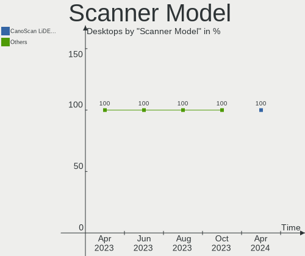

| Model                                                   | Desktops | Percent |
|---------------------------------------------------------|----------|---------|
| Seiko Epson GT-F720 [GT-S620/Perfection V30/V300 Photo] | 1        | 100%    |

Camera
------

Camera Vendor
-------------

Camera device vendors

| Vendor                        | Desktops | Percent |
|-------------------------------|----------|---------|
| Logitech                      | 5        | 25%     |
| Sunplus Innovation Technology | 3        | 15%     |
| Samsung Electronics           | 2        | 10%     |
| Microdia                      | 2        | 10%     |
| Microsoft                     | 1        | 5%      |
| MacroSilicon                  | 1        | 5%      |
| HD 2MP WEBCAM                 | 1        | 5%      |
| Generalplus Technology        | 1        | 5%      |
| eMeet                         | 1        | 5%      |
| Chicony Electronics           | 1        | 5%      |
| AVerMedia Technologies        | 1        | 5%      |
| ARC International             | 1        | 5%      |

Camera Model
------------

Camera device models

| Model                                   | Desktops | Percent |
|-----------------------------------------|----------|---------|
| Logitech Webcam C270                    | 4        | 20%     |
| Sunplus Full HD webcam                  | 2        | 10%     |
| Samsung Galaxy series, misc. (MTP mode) | 2        | 10%     |
| Sunplus MTD Camera                      | 1        | 5%      |
| Microsoft LifeCam Cinema                | 1        | 5%      |
| Microdia USB 2.0 Camera                 | 1        | 5%      |
| Microdia PC-LM1E                        | 1        | 5%      |
| MacroSilicon USB Video                  | 1        | 5%      |
| Logitech HD Webcam C525                 | 1        | 5%      |
| HD 2MP WEBCAM HD 2MP WEBCAM             | 1        | 5%      |
| Generalplus GENERAL WEBCAM              | 1        | 5%      |
| eMeet HD Webcam C960                    | 1        | 5%      |
| Chicony CNF8050 Webcam                  | 1        | 5%      |
| AVerMedia Live Streamer CAM 313         | 1        | 5%      |
| ARC International Camera                | 1        | 5%      |

Security
--------

Fingerprint Vendor
------------------

Fingerprint sensor vendors

Zero info for selected period =(

Fingerprint Model
-----------------

Fingerprint sensor models

Zero info for selected period =(

Chipcard Vendor
---------------

Chipcard module vendors

Zero info for selected period =(

Chipcard Model
--------------

Chipcard module models

Zero info for selected period =(

Unsupported
-----------

Unsupported Devices
-------------------

Total unsupported devices on board

| Total | Desktops | Percent |
|-------|----------|---------|
| 0     | 56       | 77.78%  |
| 1     | 14       | 19.44%  |
| 5     | 1        | 1.39%   |
| 2     | 1        | 1.39%   |

Unsupported Device Types
------------------------

Types of unsupported devices

| Type                     | Desktops | Percent |
|--------------------------|----------|---------|
| Graphics card            | 6        | 30%     |
| Communication controller | 5        | 25%     |
| Net/wireless             | 4        | 20%     |
| Sound                    | 2        | 10%     |
| Unassigned class         | 1        | 5%      |
| Camera                   | 1        | 5%      |
| Bluetooth                | 1        | 5%      |

