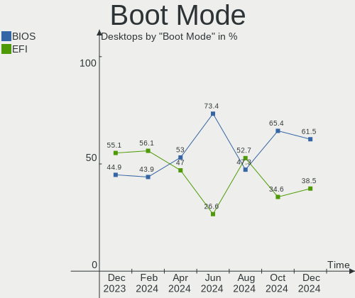
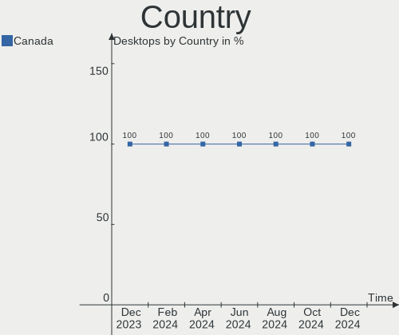
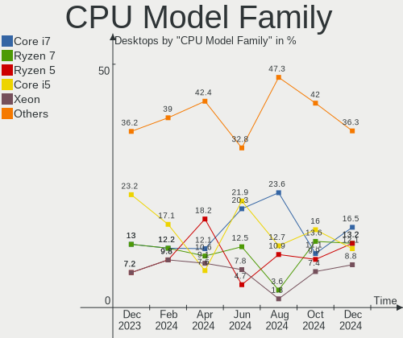
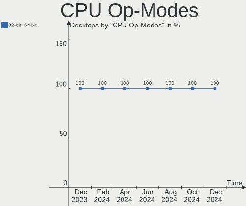
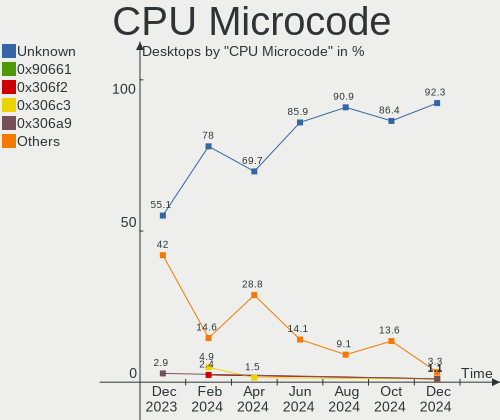
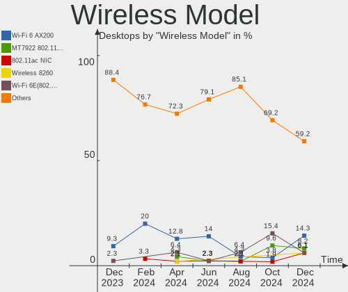
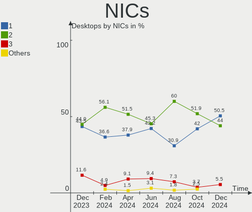
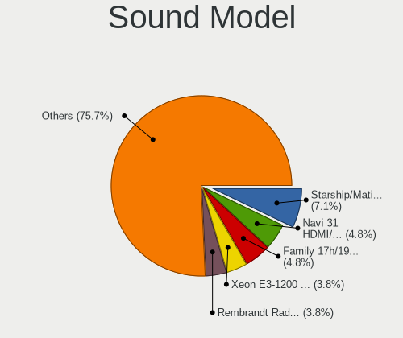

Linux in Canada - Hardware Trends (Desktops)
--------------------------------------------

A project to identify most popular hardware characteristics and track their change
over time based on data collected by Linux users at https://Linux-Hardware.org.

Anyone can contribute to this report by the [hw-probe](https://github.com/linuxhw/hw-probe) tool:

    sudo -E hw-probe -all -upload

Period: Dec, 2022.

Contents
--------

* [ System ](#system)
  - [ OS                       ](#os)
  - [ OS Family                ](#os-family)
  - [ Kernel                   ](#kernel)
  - [ Kernel Family            ](#kernel-family)
  - [ Kernel Major Ver.        ](#kernel-major-ver)
  - [ Arch                     ](#arch)
  - [ DE                       ](#de)
  - [ Display Server           ](#display-server)
  - [ Display Manager          ](#display-manager)
  - [ OS Lang                  ](#os-lang)
  - [ Boot Mode                ](#boot-mode)
  - [ Filesystem               ](#filesystem)
  - [ Part. scheme             ](#part-scheme)
  - [ Dual Boot with Linux/BSD ](#dual-boot-with-linuxbsd)
  - [ Dual Boot (Win)          ](#dual-boot-win)

* [ Board ](#board)
  - [ Vendor                   ](#vendor)
  - [ Model                    ](#model)
  - [ Model Family             ](#model-family)
  - [ MFG Year                 ](#mfg-year)
  - [ Form Factor              ](#form-factor)
  - [ Secure Boot              ](#secure-boot)
  - [ Coreboot                 ](#coreboot)
  - [ RAM Size                 ](#ram-size)
  - [ RAM Used                 ](#ram-used)
  - [ Total Drives             ](#total-drives)
  - [ Has CD-ROM               ](#has-cd-rom)
  - [ Has Ethernet             ](#has-ethernet)
  - [ Has WiFi                 ](#has-wifi)
  - [ Has Bluetooth            ](#has-bluetooth)

* [ Location ](#location)
  - [ Country                  ](#country)
  - [ City                     ](#city)

* [ Drives ](#drives)
  - [ Drive Vendor             ](#drive-vendor)
  - [ Drive Model              ](#drive-model)
  - [ HDD Vendor               ](#hdd-vendor)
  - [ SSD Vendor               ](#ssd-vendor)
  - [ Drive Kind               ](#drive-kind)
  - [ Drive Connector          ](#drive-connector)
  - [ Drive Size               ](#drive-size)
  - [ Space Total              ](#space-total)
  - [ Space Used               ](#space-used)
  - [ Malfunc. Drives          ](#malfunc-drives)
  - [ Malfunc. Drive Vendor    ](#malfunc-drive-vendor)
  - [ Malfunc. HDD Vendor      ](#malfunc-hdd-vendor)
  - [ Malfunc. Drive Kind      ](#malfunc-drive-kind)
  - [ Failed Drives            ](#failed-drives)
  - [ Failed Drive Vendor      ](#failed-drive-vendor)
  - [ Drive Status             ](#drive-status)

* [ Storage controller ](#storage-controller)
  - [ Storage Vendor           ](#storage-vendor)
  - [ Storage Model            ](#storage-model)
  - [ Storage Kind             ](#storage-kind)

* [ Processor ](#processor)
  - [ CPU Vendor               ](#cpu-vendor)
  - [ CPU Model                ](#cpu-model)
  - [ CPU Model Family         ](#cpu-model-family)
  - [ CPU Cores                ](#cpu-cores)
  - [ CPU Sockets              ](#cpu-sockets)
  - [ CPU Threads              ](#cpu-threads)
  - [ CPU Op-Modes             ](#cpu-op-modes)
  - [ CPU Microcode            ](#cpu-microcode)
  - [ CPU Microarch            ](#cpu-microarch)

* [ Graphics ](#graphics)
  - [ GPU Vendor               ](#gpu-vendor)
  - [ GPU Model                ](#gpu-model)
  - [ GPU Combo                ](#gpu-combo)
  - [ GPU Driver               ](#gpu-driver)
  - [ GPU Memory               ](#gpu-memory)

* [ Monitor ](#monitor)
  - [ Monitor Vendor           ](#monitor-vendor)
  - [ Monitor Model            ](#monitor-model)
  - [ Monitor Resolution       ](#monitor-resolution)
  - [ Monitor Diagonal         ](#monitor-diagonal)
  - [ Monitor Width            ](#monitor-width)
  - [ Aspect Ratio             ](#aspect-ratio)
  - [ Monitor Area             ](#monitor-area)
  - [ Pixel Density            ](#pixel-density)
  - [ Multiple Monitors        ](#multiple-monitors)

* [ Network ](#network)
  - [ Net Controller Vendor    ](#net-controller-vendor)
  - [ Net Controller Model     ](#net-controller-model)
  - [ Wireless Vendor          ](#wireless-vendor)
  - [ Wireless Model           ](#wireless-model)
  - [ Ethernet Vendor          ](#ethernet-vendor)
  - [ Ethernet Model           ](#ethernet-model)
  - [ Net Controller Kind      ](#net-controller-kind)
  - [ Used Controller          ](#used-controller)
  - [ NICs                     ](#nics)
  - [ IPv6                     ](#ipv6)

* [ Bluetooth ](#bluetooth)
  - [ Bluetooth Vendor         ](#bluetooth-vendor)
  - [ Bluetooth Model          ](#bluetooth-model)

* [ Sound ](#sound)
  - [ Sound Vendor             ](#sound-vendor)
  - [ Sound Model              ](#sound-model)

* [ Memory ](#memory)
  - [ Memory Vendor            ](#memory-vendor)
  - [ Memory Model             ](#memory-model)
  - [ Memory Kind              ](#memory-kind)
  - [ Memory Form Factor       ](#memory-form-factor)
  - [ Memory Size              ](#memory-size)
  - [ Memory Speed             ](#memory-speed)

* [ Printers & scanners ](#printers--scanners)
  - [ Printer Vendor           ](#printer-vendor)
  - [ Printer Model            ](#printer-model)
  - [ Scanner Vendor           ](#scanner-vendor)
  - [ Scanner Model            ](#scanner-model)

* [ Camera ](#camera)
  - [ Camera Vendor            ](#camera-vendor)
  - [ Camera Model             ](#camera-model)

* [ Security ](#security)
  - [ Fingerprint Vendor       ](#fingerprint-vendor)
  - [ Fingerprint Model        ](#fingerprint-model)
  - [ Chipcard Vendor          ](#chipcard-vendor)
  - [ Chipcard Model           ](#chipcard-model)

* [ Unsupported ](#unsupported)
  - [ Unsupported Devices      ](#unsupported-devices)
  - [ Unsupported Device Types ](#unsupported-device-types)

System
------

OS
--

Installed operating systems

| Name                         | Desktops | Percent |
|------------------------------|----------|---------|
| Ubuntu 22.04                 | 13       | 18.06%  |
| Pop!_OS 22.04                | 12       | 16.67%  |
| OpenMandriva 4.3             | 5        | 6.94%   |
| Debian 11                    | 5        | 6.94%   |
| Ubuntu 20.04                 | 3        | 4.17%   |
| Linux Mint 21.1              | 3        | 4.17%   |
| Linux Mint 20.3              | 3        | 4.17%   |
| Fedora 36                    | 3        | 4.17%   |
| openSUSE Tumbleweed-XXXXXXXX | 2        | 2.78%   |
| KDE neon 22.04               | 2        | 2.78%   |
| Zorin 16                     | 1        | 1.39%   |
| Ubuntu Unity 22.04           | 1        | 1.39%   |
| Ubuntu 18.04                 | 1        | 1.39%   |
| ROSA 12.3                    | 1        | 1.39%   |
| Rocky Linux 9.1              | 1        | 1.39%   |
| Nobara 36                    | 1        | 1.39%   |
| NixOS 22.11                  | 1        | 1.39%   |
| Manjaro 21.3.2               | 1        | 1.39%   |
| LMDE 5                       | 1        | 1.39%   |
| Linux Mint 21                | 1        | 1.39%   |
| Linux Mint 19.2              | 1        | 1.39%   |
| Linux Lite 5.2               | 1        | 1.39%   |
| Kylin V10                    | 1        | 1.39%   |
| Kubuntu 22.04                | 1        | 1.39%   |
| Gentoo 2.9                   | 1        | 1.39%   |
| Garuda Linux Rolling         | 1        | 1.39%   |
| Fedora 37                    | 1        | 1.39%   |
| EndeavourOS Rolling          | 1        | 1.39%   |
| ArcoLinux Rolling            | 1        | 1.39%   |
| Arch Rolling                 | 1        | 1.39%   |
| AlmaLinux 9.1                | 1        | 1.39%   |

OS Family
---------

OS without a version

| Name         | Desktops | Percent |
|--------------|----------|---------|
| Ubuntu       | 17       | 23.61%  |
| Pop!_OS      | 12       | 16.67%  |
| Linux Mint   | 8        | 11.11%  |
| OpenMandriva | 5        | 6.94%   |
| Debian       | 5        | 6.94%   |
| Fedora       | 4        | 5.56%   |
| openSUSE     | 2        | 2.78%   |
| KDE neon     | 2        | 2.78%   |
| Zorin        | 1        | 1.39%   |
| Ubuntu Unity | 1        | 1.39%   |
| ROSA         | 1        | 1.39%   |
| Rocky Linux  | 1        | 1.39%   |
| Nobara       | 1        | 1.39%   |
| NixOS        | 1        | 1.39%   |
| Manjaro      | 1        | 1.39%   |
| LMDE         | 1        | 1.39%   |
| Linux Lite   | 1        | 1.39%   |
| Kylin        | 1        | 1.39%   |
| Kubuntu      | 1        | 1.39%   |
| Gentoo       | 1        | 1.39%   |
| Garuda Linux | 1        | 1.39%   |
| EndeavourOS  | 1        | 1.39%   |
| ArcoLinux    | 1        | 1.39%   |
| Arch         | 1        | 1.39%   |
| AlmaLinux    | 1        | 1.39%   |

Kernel
------

Version of the Linux kernel

| Version                            | Desktops | Percent |
|------------------------------------|----------|---------|
| 5.15.0-56-generic                  | 19       | 26.39%  |
| 6.0.6-76060006-generic             | 9        | 12.5%   |
| 5.16.7-desktop-1omv4003            | 5        | 6.94%   |
| 5.4.0-135-generic                  | 4        | 5.56%   |
| 6.1.0-x64v1-xanmod1                | 2        | 2.78%   |
| 6.0.12-200.fc36.x86_64             | 2        | 2.78%   |
| 5.15.0-48-generic                  | 2        | 2.78%   |
| 5.10.0-20-amd64                    | 2        | 2.78%   |
| 6.1.1-zen1-1-zen                   | 1        | 1.39%   |
| 6.1.0-1-default                    | 1        | 1.39%   |
| 6.0.8-zen1-1-zen                   | 1        | 1.39%   |
| 6.0.5-200.fc36.x86_64              | 1        | 1.39%   |
| 6.0.12-76060006-generic            | 1        | 1.39%   |
| 6.0.12-300.fc37.x86_64             | 1        | 1.39%   |
| 6.0.12                             | 1        | 1.39%   |
| 6.0.11-zen1-1-zen                  | 1        | 1.39%   |
| 6.0.10-arch2-1                     | 1        | 1.39%   |
| 6.0.10-201.fc36.x86_64             | 1        | 1.39%   |
| 6.0.10-1-default                   | 1        | 1.39%   |
| 5.4.0-131-generic                  | 1        | 1.39%   |
| 5.4.0-128-generic                  | 1        | 1.39%   |
| 5.15.81-1-MANJARO                  | 1        | 1.39%   |
| 5.15.75-gentoo-x86_64              | 1        | 1.39%   |
| 5.15.75-generic-1rosa2021.1-x86_64 | 1        | 1.39%   |
| 5.15.74-1-pve                      | 1        | 1.39%   |
| 5.15.0-53-generic                  | 1        | 1.39%   |
| 5.15.0-43-generic                  | 1        | 1.39%   |
| 5.15.0-1025-oracle                 | 1        | 1.39%   |
| 5.14.0-162.6.1.el9_1.x86_64        | 1        | 1.39%   |
| 5.14.0-162.6.1.el9_1.0.1.x86_64    | 1        | 1.39%   |
| 5.10.0-19-amd64                    | 1        | 1.39%   |
| 5.10.0-15-amd64                    | 1        | 1.39%   |
| 5.10.0-12-amd64                    | 1        | 1.39%   |
| 4.15.0-54-generic                  | 1        | 1.39%   |
| 4.15.0-194-generic                 | 1        | 1.39%   |

Kernel Family
-------------

Linux kernel without a distro release

| Version | Desktops | Percent |
|---------|----------|---------|
| 5.15.0  | 24       | 33.33%  |
| 6.0.6   | 9        | 12.5%   |
| 5.4.0   | 6        | 8.33%   |
| 6.0.12  | 5        | 6.94%   |
| 5.16.7  | 5        | 6.94%   |
| 5.10.0  | 5        | 6.94%   |
| 6.1.0   | 3        | 4.17%   |
| 6.0.10  | 3        | 4.17%   |
| 5.15.75 | 2        | 2.78%   |
| 5.14.0  | 2        | 2.78%   |
| 4.15.0  | 2        | 2.78%   |
| 6.1.1   | 1        | 1.39%   |
| 6.0.8   | 1        | 1.39%   |
| 6.0.5   | 1        | 1.39%   |
| 6.0.11  | 1        | 1.39%   |
| 5.15.81 | 1        | 1.39%   |
| 5.15.74 | 1        | 1.39%   |

Kernel Major Ver.
-----------------

Linux kernel major version

| Version | Desktops | Percent |
|---------|----------|---------|
| 5.15    | 28       | 38.89%  |
| 6.0     | 20       | 27.78%  |
| 5.4     | 6        | 8.33%   |
| 5.16    | 5        | 6.94%   |
| 5.10    | 5        | 6.94%   |
| 6.1     | 4        | 5.56%   |
| 5.14    | 2        | 2.78%   |
| 4.15    | 2        | 2.78%   |

Arch
----

OS architecture (x86_64, i586, etc.)

| Name   | Desktops | Percent |
|--------|----------|---------|
| x86_64 | 72       | 100%    |

DE
--

Desktop Environment

| Name       | Desktops | Percent |
|------------|----------|---------|
| GNOME      | 32       | 44.44%  |
| KDE5       | 15       | 20.83%  |
| X-Cinnamon | 8        | 11.11%  |
| Unknown    | 6        | 8.33%   |
| XFCE       | 4        | 5.56%   |
| Unity      | 1        | 1.39%   |
| sway       | 1        | 1.39%   |
| MATE       | 1        | 1.39%   |
| LXQt       | 1        | 1.39%   |
| LXDE       | 1        | 1.39%   |
| Deepin     | 1        | 1.39%   |
| awesome    | 1        | 1.39%   |

Display Server
--------------

X11 or Wayland

| Name    | Desktops | Percent |
|---------|----------|---------|
| X11     | 52       | 72.22%  |
| Wayland | 12       | 16.67%  |
| Tty     | 4        | 5.56%   |
| Unknown | 3        | 4.17%   |
| Web     | 1        | 1.39%   |

Display Manager
---------------

SDDM, LightDM, etc.

| Name    | Desktops | Percent |
|---------|----------|---------|
| Unknown | 27       | 37.5%   |
| GDM3    | 21       | 29.17%  |
| SDDM    | 10       | 13.89%  |
| LightDM | 9        | 12.5%   |
| GDM     | 4        | 5.56%   |
| GREETD  | 1        | 1.39%   |

OS Lang
-------

Language

| Lang    | Desktops | Percent |
|---------|----------|---------|
| en_CA   | 37       | 51.39%  |
| en_US   | 28       | 38.89%  |
| C       | 3        | 4.17%   |
| POSIX   | 1        | 1.39%   |
| fr_CA   | 1        | 1.39%   |
| es_BO   | 1        | 1.39%   |
| Unknown | 1        | 1.39%   |

Boot Mode
---------

EFI or BIOS

| Mode | Desktops | Percent |
|------|----------|---------|
| BIOS | 44       | 61.11%  |
| EFI  | 28       | 38.89%  |

Filesystem
----------

Type of filesystem

| Type    | Desktops | Percent |
|---------|----------|---------|
| Ext4    | 50       | 69.44%  |
| Overlay | 8        | 11.11%  |
| Btrfs   | 7        | 9.72%   |
| Zfs     | 3        | 4.17%   |
| Xfs     | 3        | 4.17%   |
| Tmpfs   | 1        | 1.39%   |

Part. scheme
------------

Scheme of partitioning

| Type    | Desktops | Percent |
|---------|----------|---------|
| GPT     | 40       | 55.56%  |
| Unknown | 22       | 30.56%  |
| MBR     | 10       | 13.89%  |

Dual Boot with Linux/BSD
------------------------

Hosting more than one Linux/BSD

| Dual boot | Desktops | Percent |
|-----------|----------|---------|
| No        | 57       | 79.17%  |
| Yes       | 15       | 20.83%  |

Dual Boot (Win)
---------------

Hosting Linux and Windows

| Dual boot | Desktops | Percent |
|-----------|----------|---------|
| No        | 44       | 61.11%  |
| Yes       | 28       | 38.89%  |

Board
-----

Vendor
------

Motherboard manufacturer

| Name                    | Desktops | Percent |
|-------------------------|----------|---------|
| ASUSTek Computer        | 23       | 31.94%  |
| MSI                     | 9        | 12.5%   |
| Gigabyte Technology     | 9        | 12.5%   |
| Dell                    | 9        | 12.5%   |
| Hewlett-Packard         | 6        | 8.33%   |
| Lenovo                  | 4        | 5.56%   |
| Acer                    | 4        | 5.56%   |
| ASRock                  | 3        | 4.17%   |
| Supermicro              | 1        | 1.39%   |
| Pegatron                | 1        | 1.39%   |
| GIFA Industrial Control | 1        | 1.39%   |
| Foxconn                 | 1        | 1.39%   |
| Alienware               | 1        | 1.39%   |

Model
-----

Motherboard model

| Name                                          | Desktops | Percent |
|-----------------------------------------------|----------|---------|
| MSI MS-7900                                   | 2        | 2.78%   |
| HP EliteDesk 800 G1 TWR                       | 2        | 2.78%   |
| Gigabyte 990FXA-UD3                           | 2        | 2.78%   |
| Dell Precision WorkStation T3500              | 2        | 2.78%   |
| ASUS M51BC                                    | 2        | 2.78%   |
| Supermicro X9DR3-F                            | 1        | 1.39%   |
| Pegatron p7-1219                              | 1        | 1.39%   |
| MSI MS-7C91                                   | 1        | 1.39%   |
| MSI MS-7C56                                   | 1        | 1.39%   |
| MSI MS-7A62                                   | 1        | 1.39%   |
| MSI MS-7A38                                   | 1        | 1.39%   |
| MSI MS-7972                                   | 1        | 1.39%   |
| MSI MS-7817                                   | 1        | 1.39%   |
| MSI Gseries                                   | 1        | 1.39%   |
| Lenovo ThinkCentre M93p 10A9000SUS            | 1        | 1.39%   |
| Lenovo ThinkCentre M92z 3314D9U               | 1        | 1.39%   |
| Lenovo ThinkCentre M78 10BSS0230J             | 1        | 1.39%   |
| Lenovo H50-55 90BG0021CF                      | 1        | 1.39%   |
| HP ProDesk 600 G1 SFF                         | 1        | 1.39%   |
| HP Pavilion Gaming Desktop TG01-2xxx          | 1        | 1.39%   |
| HP Compaq Elite 8300 SFF                      | 1        | 1.39%   |
| HP Compaq 8200 Elite CMT PC                   | 1        | 1.39%   |
| Gigabyte Z97X-SLI                             | 1        | 1.39%   |
| Gigabyte Z790 AORUS MASTER                    | 1        | 1.39%   |
| Gigabyte X79-UP4                              | 1        | 1.39%   |
| Gigabyte GA-970A-D3                           | 1        | 1.39%   |
| Gigabyte GA-78LMT-USB3 6.0                    | 1        | 1.39%   |
| Gigabyte B75M-D3H                             | 1        | 1.39%   |
| Gigabyte B660M AORUS PRO AX DDR4              | 1        | 1.39%   |
| GIFA Industrial Control 000-F2221-FBA004-1000 | 1        | 1.39%   |
| Foxconn p7-1256c                              | 1        | 1.39%   |
| Dell XPS 8950                                 | 1        | 1.39%   |
| Dell Precision T1650                          | 1        | 1.39%   |
| Dell OptiPlex 780                             | 1        | 1.39%   |
| Dell OptiPlex 7010                            | 1        | 1.39%   |
| Dell OptiPlex 3020M                           | 1        | 1.39%   |
| Dell OptiPlex 3010                            | 1        | 1.39%   |
| Dell Dimension E521                           | 1        | 1.39%   |
| ASUS TUF Z270 MARK 2                          | 1        | 1.39%   |
| ASUS TUF Gaming X570-PLUS                     | 1        | 1.39%   |

Model Family
------------

Motherboard model prefix

| Name                                          | Desktops | Percent |
|-----------------------------------------------|----------|---------|
| ASUS ROG                                      | 5        | 6.94%   |
| Dell OptiPlex                                 | 4        | 5.56%   |
| ASUS PRIME                                    | 4        | 5.56%   |
| Lenovo ThinkCentre                            | 3        | 4.17%   |
| Dell Precision                                | 3        | 4.17%   |
| ASUS TUF                                      | 3        | 4.17%   |
| Acer Aspire                                   | 3        | 4.17%   |
| MSI MS-7900                                   | 2        | 2.78%   |
| HP EliteDesk                                  | 2        | 2.78%   |
| HP Compaq                                     | 2        | 2.78%   |
| Gigabyte 990FXA-UD3                           | 2        | 2.78%   |
| ASUS M51BC                                    | 2        | 2.78%   |
| Supermicro X9DR3-F                            | 1        | 1.39%   |
| Pegatron p7-1219                              | 1        | 1.39%   |
| MSI MS-7C91                                   | 1        | 1.39%   |
| MSI MS-7C56                                   | 1        | 1.39%   |
| MSI MS-7A62                                   | 1        | 1.39%   |
| MSI MS-7A38                                   | 1        | 1.39%   |
| MSI MS-7972                                   | 1        | 1.39%   |
| MSI MS-7817                                   | 1        | 1.39%   |
| MSI Gseries                                   | 1        | 1.39%   |
| Lenovo H50-55                                 | 1        | 1.39%   |
| HP ProDesk                                    | 1        | 1.39%   |
| HP Pavilion                                   | 1        | 1.39%   |
| Gigabyte Z97X-SLI                             | 1        | 1.39%   |
| Gigabyte Z790                                 | 1        | 1.39%   |
| Gigabyte X79-UP4                              | 1        | 1.39%   |
| Gigabyte GA-970A-D3                           | 1        | 1.39%   |
| Gigabyte GA-78LMT-USB3                        | 1        | 1.39%   |
| Gigabyte B75M-D3H                             | 1        | 1.39%   |
| Gigabyte B660M                                | 1        | 1.39%   |
| GIFA Industrial Control 000-F2221-FBA004-1000 | 1        | 1.39%   |
| Foxconn p7-1256c                              | 1        | 1.39%   |
| Dell XPS                                      | 1        | 1.39%   |
| Dell Dimension                                | 1        | 1.39%   |
| ASUS P8P67                                    | 1        | 1.39%   |
| ASUS P8H77-M                                  | 1        | 1.39%   |
| ASUS P8H67-M                                  | 1        | 1.39%   |
| ASUS P7P55D                                   | 1        | 1.39%   |
| ASUS P5K                                      | 1        | 1.39%   |

MFG Year
--------

Motherboard manufacture year

| Year | Desktops | Percent |
|------|----------|---------|
| 2013 | 10       | 13.89%  |
| 2012 | 9        | 12.5%   |
| 2021 | 6        | 8.33%   |
| 2014 | 6        | 8.33%   |
| 2011 | 6        | 8.33%   |
| 2022 | 5        | 6.94%   |
| 2017 | 5        | 6.94%   |
| 2020 | 4        | 5.56%   |
| 2019 | 4        | 5.56%   |
| 2015 | 4        | 5.56%   |
| 2016 | 3        | 4.17%   |
| 2010 | 3        | 4.17%   |
| 2018 | 2        | 2.78%   |
| 2009 | 2        | 2.78%   |
| 2007 | 2        | 2.78%   |
| 2005 | 1        | 1.39%   |

Form Factor
-----------

Physical design of the computer

| Name    | Desktops | Percent |
|---------|----------|---------|
| Desktop | 72       | 100%    |

Secure Boot
-----------

Enabled or disabled

| State    | Desktops | Percent |
|----------|----------|---------|
| Disabled | 72       | 100%    |

Coreboot
--------

Have coreboot on board

| Used | Desktops | Percent |
|------|----------|---------|
| No   | 72       | 100%    |

RAM Size
--------

Total RAM memory

| Size in GB  | Desktops | Percent |
|-------------|----------|---------|
| 16.01-24.0  | 20       | 27.78%  |
| 32.01-64.0  | 13       | 18.06%  |
| 8.01-16.0   | 11       | 15.28%  |
| 4.01-8.0    | 10       | 13.89%  |
| 64.01-256.0 | 7        | 9.72%   |
| 3.01-4.0    | 6        | 8.33%   |
| 24.01-32.0  | 4        | 5.56%   |
| 1.01-2.0    | 1        | 1.39%   |

RAM Used
--------

Used RAM memory

| Used GB    | Desktops | Percent |
|------------|----------|---------|
| 1.01-2.0   | 23       | 31.94%  |
| 4.01-8.0   | 17       | 23.61%  |
| 2.01-3.0   | 16       | 22.22%  |
| 8.01-16.0  | 7        | 9.72%   |
| 3.01-4.0   | 4        | 5.56%   |
| 0.51-1.0   | 4        | 5.56%   |
| 16.01-24.0 | 1        | 1.39%   |

Total Drives
------------

Number of drives on board

| Drives | Desktops | Percent |
|--------|----------|---------|
| 1      | 21       | 29.17%  |
| 2      | 20       | 27.78%  |
| 5      | 8        | 11.11%  |
| 3      | 8        | 11.11%  |
| 4      | 7        | 9.72%   |
| 6      | 4        | 5.56%   |
| 10     | 1        | 1.39%   |
| 9      | 1        | 1.39%   |
| 7      | 1        | 1.39%   |
| 0      | 1        | 1.39%   |

Has CD-ROM
----------

Has CD-ROM on board

| Presented | Desktops | Percent |
|-----------|----------|---------|
| No        | 41       | 56.94%  |
| Yes       | 31       | 43.06%  |

Has Ethernet
------------

Has Ethernet on board

| Presented | Desktops | Percent |
|-----------|----------|---------|
| Yes       | 68       | 94.44%  |
| No        | 4        | 5.56%   |

Has WiFi
--------

Has WiFi module

| Presented | Desktops | Percent |
|-----------|----------|---------|
| Yes       | 39       | 54.17%  |
| No        | 33       | 45.83%  |

Has Bluetooth
-------------

Has Bluetooth module

| Presented | Desktops | Percent |
|-----------|----------|---------|
| No        | 42       | 58.33%  |
| Yes       | 30       | 41.67%  |

Location
--------

Country
-------

Geographic location (country)

| Country | Desktops | Percent |
|---------|----------|---------|
| Canada  | 72       | 100%    |

City
----

Geographic location (city)

| City            | Desktops | Percent |
|-----------------|----------|---------|
| Toronto         | 8        | 11.11%  |
| Cambridge       | 3        | 4.17%   |
| Vancouver       | 2        | 2.78%   |
| Thornhill       | 2        | 2.78%   |
| St. Paul        | 2        | 2.78%   |
| St. John's      | 2        | 2.78%   |
| Québec         | 2        | 2.78%   |
| Port Perry      | 2        | 2.78%   |
| Montreal        | 2        | 2.78%   |
| Markham         | 2        | 2.78%   |
| Hamilton        | 2        | 2.78%   |
| Dartmouth       | 2        | 2.78%   |
| Calgary         | 2        | 2.78%   |
| Winnipeg        | 1        | 1.39%   |
| Whitehorse      | 1        | 1.39%   |
| Victoria        | 1        | 1.39%   |
| Verdun          | 1        | 1.39%   |
| Trois-Rivières | 1        | 1.39%   |
| Summerside      | 1        | 1.39%   |
| St. Albert      | 1        | 1.39%   |
| Spruce Grove    | 1        | 1.39%   |
| Smithers        | 1        | 1.39%   |
| Sherwood Park   | 1        | 1.39%   |
| Saskatoon       | 1        | 1.39%   |
| Ottawa          | 1        | 1.39%   |
| Oshawa          | 1        | 1.39%   |
| Nanaimo         | 1        | 1.39%   |
| Mississauga     | 1        | 1.39%   |
| Maple           | 1        | 1.39%   |
| Lamont          | 1        | 1.39%   |
| Lac La Biche    | 1        | 1.39%   |
| Kamloops        | 1        | 1.39%   |
| Hazelton        | 1        | 1.39%   |
| Greely          | 1        | 1.39%   |
| Greater Sudbury | 1        | 1.39%   |
| Fort St. John   | 1        | 1.39%   |
| Fonthill        | 1        | 1.39%   |
| Etobicoke       | 1        | 1.39%   |
| Edmonton        | 1        | 1.39%   |
| Digby           | 1        | 1.39%   |

Drives
------

Drive Vendor
------------

Hard drive vendors

| Vendor                    | Desktops | Drives | Percent |
|---------------------------|----------|--------|---------|
| WDC                       | 30       | 60     | 20.41%  |
| Seagate                   | 29       | 45     | 19.73%  |
| Samsung Electronics       | 25       | 32     | 17.01%  |
| Kingston                  | 10       | 12     | 6.8%    |
| Intel                     | 6        | 7      | 4.08%   |
| Hitachi                   | 6        | 6      | 4.08%   |
| Sandisk                   | 5        | 6      | 3.4%    |
| Crucial                   | 5        | 7      | 3.4%    |
| Toshiba                   | 4        | 4      | 2.72%   |
| A-DATA Technology         | 4        | 4      | 2.72%   |
| HGST                      | 3        | 3      | 2.04%   |
| SABRENT                   | 2        | 2      | 1.36%   |
| JMicron Technology        | 2        | 2      | 1.36%   |
| ADATA Technology          | 2        | 3      | 1.36%   |
| XPG                       | 1        | 2      | 0.68%   |
| USB 3.0                   | 1        | 1      | 0.68%   |
| Timetec                   | 1        | 1      | 0.68%   |
| SYMWAVE                   | 1        | 1      | 0.68%   |
| SPCC                      | 1        | 1      | 0.68%   |
| SK hynix                  | 1        | 1      | 0.68%   |
| Silicon Motion            | 1        | 1      | 0.68%   |
| Phison Electronics        | 1        | 1      | 0.68%   |
| Phison                    | 1        | 1      | 0.68%   |
| Micron/Crucial Technology | 1        | 1      | 0.68%   |
| LaCie                     | 1        | 1      | 0.68%   |
| KIOXIA                    | 1        | 1      | 0.68%   |
| Hewlett-Packard           | 1        | 1      | 0.68%   |
| FC-1307                   | 1        | 1      | 0.68%   |

Drive Model
-----------

Hard drive models

| Model                                                           | Desktops | Percent |
|-----------------------------------------------------------------|----------|---------|
| Samsung SSD 860 EVO 500GB                                       | 5        | 2.76%   |
| Seagate ST2000DM001-9YN164 2TB                                  | 3        | 1.66%   |
| Seagate ST1000DM003-1CH162 1TB                                  | 3        | 1.66%   |
| Samsung SSD 850 EVO 500GB                                       | 3        | 1.66%   |
| WDC WDS100T2B0A-00SM50 1TB SSD                                  | 2        | 1.1%    |
| WDC WDBNCE5000PNC 500GB SSD                                     | 2        | 1.1%    |
| WDC WD40EZRZ-00GXCB0 4TB                                        | 2        | 1.1%    |
| WDC WD40EFRX-68N32N0 4TB                                        | 2        | 1.1%    |
| WDC WD20EARS-00J2GB0 2TB                                        | 2        | 1.1%    |
| WDC WD1002FAEX-00Y9A0 1TB                                       | 2        | 1.1%    |
| Toshiba DT01ACA200 2TB                                          | 2        | 1.1%    |
| Seagate ST8000DM004-2CX188 8TB                                  | 2        | 1.1%    |
| Seagate ST5000DM000-1FK178 5TB                                  | 2        | 1.1%    |
| Seagate ST4000DM004-2CV104 4TB                                  | 2        | 1.1%    |
| Seagate ST3000DM001-9YN166 3TB                                  | 2        | 1.1%    |
| Seagate ST3000DM001-1CH166 3TB                                  | 2        | 1.1%    |
| Seagate ST2000DM006-2DM164 2TB                                  | 2        | 1.1%    |
| Seagate ST2000DL003-9VT166 2TB                                  | 2        | 1.1%    |
| Seagate Expansion Desk 5TB                                      | 2        | 1.1%    |
| Seagate Expansion 4TB                                           | 2        | 1.1%    |
| Samsung SSD 970 EVO Plus 1TB                                    | 2        | 1.1%    |
| Samsung SSD 860 EVO 1TB                                         | 2        | 1.1%    |
| Samsung SSD 850 EVO 250GB                                       | 2        | 1.1%    |
| Samsung NVMe SSD Controller SM981/PM981/PM983 500GB             | 2        | 1.1%    |
| Samsung HD161GJ 160GB                                           | 2        | 1.1%    |
| Kingston SA400S37480G 480GB SSD                                 | 2        | 1.1%    |
| Kingston SA400S37240G 240GB SSD                                 | 2        | 1.1%    |
| ADATA XPG SX8200 Pro PCIe Gen3x4 M.2 2280 Solid State Drive 1TB | 2        | 1.1%    |
| XPG GAMMIX S11 Pro 512GB                                        | 1        | 0.55%   |
| WDC WDS500G2B0C-00PXH0 500GB                                    | 1        | 0.55%   |
| WDC WDS500G2B0A-00SM50 500GB SSD                                | 1        | 0.55%   |
| WDC WDS100T3X0C-00SJG0 1TB                                      | 1        | 0.55%   |
| WDC WDS100T2B0B-00YS70 1TB SSD                                  | 1        | 0.55%   |
| WDC WD80EZAZ-11TDBA0 8TB                                        | 1        | 0.55%   |
| WDC WD80EFBX-68AZZN0 8TB                                        | 1        | 0.55%   |
| WDC WD80EFAX-68KNBN0 8TB                                        | 1        | 0.55%   |
| WDC WD6400AAKS-22A7B2 640GB                                     | 1        | 0.55%   |
| WDC WD5000LPVX-08V0TT5 500GB                                    | 1        | 0.55%   |
| WDC WD5000AAKX-22ERMA0 500GB                                    | 1        | 0.55%   |
| WDC WD5000AAKX-001CA0 500GB                                     | 1        | 0.55%   |

HDD Vendor
----------

Hard disk drive vendors

| Vendor              | Desktops | Drives | Percent |
|---------------------|----------|--------|---------|
| Seagate             | 28       | 44     | 38.36%  |
| WDC                 | 27       | 52     | 36.99%  |
| Hitachi             | 6        | 6      | 8.22%   |
| Toshiba             | 4        | 4      | 5.48%   |
| HGST                | 3        | 3      | 4.11%   |
| Samsung Electronics | 2        | 2      | 2.74%   |
| USB 3.0             | 1        | 1      | 1.37%   |
| SABRENT             | 1        | 1      | 1.37%   |
| JMicron Technology  | 1        | 1      | 1.37%   |

SSD Vendor
----------

Solid state drive vendors

| Vendor              | Desktops | Drives | Percent |
|---------------------|----------|--------|---------|
| Samsung Electronics | 17       | 21     | 34.69%  |
| Kingston            | 8        | 9      | 16.33%  |
| WDC                 | 6        | 6      | 12.24%  |
| Crucial             | 5        | 7      | 10.2%   |
| Intel               | 4        | 5      | 8.16%   |
| A-DATA Technology   | 4        | 4      | 8.16%   |
| SanDisk             | 3        | 3      | 6.12%   |
| Timetec             | 1        | 1      | 2.04%   |
| SPCC                | 1        | 1      | 2.04%   |

Drive Kind
----------

HDD or SSD

| Kind    | Desktops | Drives | Percent |
|---------|----------|--------|---------|
| HDD     | 58       | 114    | 46.4%   |
| SSD     | 41       | 57     | 32.8%   |
| NVMe    | 22       | 33     | 17.6%   |
| Unknown | 4        | 4      | 3.2%    |

Drive Connector
---------------

SATA, SAS, NVMe, etc.

| Type | Desktops | Drives | Percent |
|------|----------|--------|---------|
| SATA | 67       | 163    | 66.34%  |
| NVMe | 22       | 32     | 21.78%  |
| SAS  | 12       | 13     | 11.88%  |

Drive Size
----------

Size of hard drive

| Size in TB | Desktops | Drives | Percent |
|------------|----------|--------|---------|
| 0.01-0.5   | 45       | 59     | 39.13%  |
| 0.51-1.0   | 26       | 36     | 22.61%  |
| 1.01-2.0   | 14       | 22     | 12.17%  |
| 3.01-4.0   | 11       | 19     | 9.57%   |
| 4.01-10.0  | 10       | 23     | 8.7%    |
| 2.01-3.0   | 9        | 12     | 7.83%   |

Space Total
-----------

Amount of disk space available on the file system

| Size in GB     | Desktops | Percent |
|----------------|----------|---------|
| 251-500        | 17       | 23.61%  |
| More than 3000 | 14       | 19.44%  |
| 101-250        | 10       | 13.89%  |
| 1-20           | 7        | 9.72%   |
| 2001-3000      | 5        | 6.94%   |
| 1001-2000      | 5        | 6.94%   |
| 51-100         | 5        | 6.94%   |
| 501-1000       | 4        | 5.56%   |
| Unknown        | 4        | 5.56%   |
| 21-50          | 1        | 1.39%   |

Space Used
----------

Amount of used disk space

| Used GB        | Desktops | Percent |
|----------------|----------|---------|
| 1-20           | 24       | 33.33%  |
| 101-250        | 8        | 11.11%  |
| More than 3000 | 7        | 9.72%   |
| 21-50          | 7        | 9.72%   |
| 51-100         | 7        | 9.72%   |
| 2001-3000      | 5        | 6.94%   |
| 251-500        | 4        | 5.56%   |
| Unknown        | 4        | 5.56%   |
| 1001-2000      | 3        | 4.17%   |
| 501-1000       | 3        | 4.17%   |

Malfunc. Drives
---------------

Drive models with a malfunction

| Model                                        | Desktops | Drives | Percent |
|----------------------------------------------|----------|--------|---------|
| WDC WD6400AAKS-22A7B2 640GB                  | 1        | 1      | 11.11%  |
| WDC WD5000LPVX-08V0TT5 500GB                 | 1        | 1      | 11.11%  |
| WDC WD30EZRZ-00Z5HB0 3TB                     | 1        | 1      | 11.11%  |
| WDC WD20EARS-00J2GB0 2TB                     | 1        | 1      | 11.11%  |
| Seagate ST500LM021-1KJ152 500GB              | 1        | 1      | 11.11%  |
| Samsung Electronics SSD 840 PRO Series 512GB | 1        | 1      | 11.11%  |
| Intel SSDSC2BF180A4H 180GB                   | 1        | 1      | 11.11%  |
| Hitachi HTS541612J9SA00 120GB                | 1        | 1      | 11.11%  |
| Crucial CT275MX300SSD1 275GB                 | 1        | 1      | 11.11%  |

Malfunc. Drive Vendor
---------------------

Vendors of faulty drives

| Vendor              | Desktops | Drives | Percent |
|---------------------|----------|--------|---------|
| WDC                 | 4        | 4      | 44.44%  |
| Seagate             | 1        | 1      | 11.11%  |
| Samsung Electronics | 1        | 1      | 11.11%  |
| Intel               | 1        | 1      | 11.11%  |
| Hitachi             | 1        | 1      | 11.11%  |
| Crucial             | 1        | 1      | 11.11%  |

Malfunc. HDD Vendor
-------------------

Vendors of faulty HDD drives

| Vendor  | Desktops | Drives | Percent |
|---------|----------|--------|---------|
| WDC     | 4        | 4      | 66.67%  |
| Seagate | 1        | 1      | 16.67%  |
| Hitachi | 1        | 1      | 16.67%  |

Malfunc. Drive Kind
-------------------

Kinds of faulty drives

| Kind | Desktops | Drives | Percent |
|------|----------|--------|---------|
| HDD  | 6        | 6      | 66.67%  |
| SSD  | 3        | 3      | 33.33%  |

Failed Drives
-------------

Failed drive models

Zero info for selected period =(

Failed Drive Vendor
-------------------

Failed drive vendors

Zero info for selected period =(

Drive Status
------------

Number of failed and malfunc. drives

| Status   | Desktops | Drives | Percent |
|----------|----------|--------|---------|
| Detected | 39       | 105    | 46.43%  |
| Works    | 36       | 94     | 42.86%  |
| Malfunc  | 9        | 9      | 10.71%  |

Storage controller
------------------

Storage Vendor
--------------

Storage controller vendors

| Vendor                       | Desktops | Percent |
|------------------------------|----------|---------|
| Intel                        | 45       | 39.47%  |
| AMD                          | 26       | 22.81%  |
| Samsung Electronics          | 8        | 7.02%   |
| Marvell Technology Group     | 5        | 4.39%   |
| SanDisk                      | 4        | 3.51%   |
| Nvidia                       | 3        | 2.63%   |
| JMicron Technology           | 3        | 2.63%   |
| ASMedia Technology           | 3        | 2.63%   |
| ADATA Technology             | 3        | 2.63%   |
| Silicon Motion               | 2        | 1.75%   |
| Silicon Image                | 2        | 1.75%   |
| Phison Electronics           | 2        | 1.75%   |
| Kingston Technology Company  | 2        | 1.75%   |
| VIA Technologies             | 1        | 0.88%   |
| Toshiba America Info Systems | 1        | 0.88%   |
| SK hynix                     | 1        | 0.88%   |
| Seagate Technology           | 1        | 0.88%   |
| Micron/Crucial Technology    | 1        | 0.88%   |
| LSI Logic / Symbios Logic    | 1        | 0.88%   |

Storage Model
-------------

Storage controller models

| Model                                                                          | Desktops | Percent |
|--------------------------------------------------------------------------------|----------|---------|
| AMD FCH SATA Controller [AHCI mode]                                            | 12       | 9.09%   |
| AMD SB7x0/SB8x0/SB9x0 SATA Controller [AHCI mode]                              | 8        | 6.06%   |
| Intel SATA Controller [RAID mode]                                              | 6        | 4.55%   |
| Intel 8 Series/C220 Series Chipset Family 6-port SATA Controller 1 [AHCI mode] | 6        | 4.55%   |
| Intel 7 Series/C210 Series Chipset Family 6-port SATA Controller [AHCI mode]   | 6        | 4.55%   |
| Intel 6 Series/C200 Series Chipset Family 6 port Desktop SATA AHCI Controller  | 5        | 3.79%   |
| Samsung NVMe SSD Controller SM981/PM981/PM983                                  | 4        | 3.03%   |
| Samsung NVMe SSD Controller PM9A1/PM9A3/980PRO                                 | 4        | 3.03%   |
| Marvell Group 88SE9172 SATA 6Gb/s Controller                                   | 4        | 3.03%   |
| AMD 500 Series Chipset SATA Controller                                         | 4        | 3.03%   |
| Intel Alder Lake-S PCH SATA Controller [AHCI Mode]                             | 3        | 2.27%   |
| Intel 200 Series PCH SATA controller [AHCI mode]                               | 3        | 2.27%   |
| AMD SB7x0/SB8x0/SB9x0 IDE Controller                                           | 3        | 2.27%   |
| ADATA XPG SX8200 Pro PCIe Gen3x4 M.2 2280 Solid State Drive                    | 3        | 2.27%   |
| SanDisk Non-Volatile memory controller                                         | 2        | 1.52%   |
| Phison E16 PCIe4 NVMe Controller                                               | 2        | 1.52%   |
| JMicron JMB363 SATA/IDE Controller                                             | 2        | 1.52%   |
| Intel Volume Management Device NVMe RAID Controller                            | 2        | 1.52%   |
| Intel C600/X79 series chipset 6-Port SATA AHCI Controller                      | 2        | 1.52%   |
| Intel 9 Series Chipset Family SATA Controller [AHCI Mode]                      | 2        | 1.52%   |
| ASMedia ASM1062 Serial ATA Controller                                          | 2        | 1.52%   |
| AMD SATA controller                                                            | 2        | 1.52%   |
| VIA VT6415 PATA IDE Host Controller                                            | 1        | 0.76%   |
| Toshiba America Info Systems XG6 NVMe SSD Controller                           | 1        | 0.76%   |
| SK hynix Gold P31/PC711 NVMe Solid State Drive                                 | 1        | 0.76%   |
| Silicon Motion SM2263EN/SM2263XT SSD Controller                                | 1        | 0.76%   |
| Silicon Motion SM2262/SM2262EN SSD Controller                                  | 1        | 0.76%   |
| Silicon Image SiI 3132 Serial ATA Raid II Controller                           | 1        | 0.76%   |
| Silicon Image SiI 3114 [SATALink/SATARaid] Serial ATA Controller               | 1        | 0.76%   |
| Seagate FireCuda 530 SSD                                                       | 1        | 0.76%   |
| SanDisk WD Blue SN550 NVMe SSD                                                 | 1        | 0.76%   |
| SanDisk WD Black SN750 / PC SN730 NVMe SSD                                     | 1        | 0.76%   |
| Samsung NVMe SSD Controller SM961/PM961/SM963                                  | 1        | 0.76%   |
| Nvidia MCP78S [GeForce 8200] SATA Controller (non-AHCI mode)                   | 1        | 0.76%   |
| Nvidia MCP78S [GeForce 8200] IDE                                               | 1        | 0.76%   |
| Nvidia MCP51 Serial ATA Controller                                             | 1        | 0.76%   |
| Nvidia CK804 Serial ATA Controller                                             | 1        | 0.76%   |
| Nvidia CK804 IDE                                                               | 1        | 0.76%   |
| Micron/Crucial P2 NVMe PCIe SSD                                                | 1        | 0.76%   |
| Marvell Group 88SE9215 PCIe 2.0 x1 4-port SATA 6 Gb/s Controller               | 1        | 0.76%   |

Storage Kind
------------

Kind of storage controller (IDE, SATA, NVMe, SAS, ...)

| Kind | Desktops | Percent |
|------|----------|---------|
| SATA | 59       | 56.73%  |
| NVMe | 22       | 21.15%  |
| IDE  | 11       | 10.58%  |
| RAID | 10       | 9.62%   |
| SAS  | 2        | 1.92%   |

Processor
---------

CPU Vendor
----------

Processor vendors

| Vendor | Desktops | Percent |
|--------|----------|---------|
| Intel  | 43       | 59.72%  |
| AMD    | 29       | 40.28%  |

CPU Model
---------

Processor models

| Model                                           | Desktops | Percent |
|-------------------------------------------------|----------|---------|
| AMD FX-8320 Eight-Core Processor                | 4        | 5.56%   |
| Intel Core i7-9700 CPU @ 3.00GHz                | 2        | 2.78%   |
| Intel Core i7-4790 CPU @ 3.60GHz                | 2        | 2.78%   |
| Intel Core i5-2400 CPU @ 3.10GHz                | 2        | 2.78%   |
| Intel Core i3-2120 CPU @ 3.30GHz                | 2        | 2.78%   |
| Intel Core 2 Duo CPU E8600 @ 3.33GHz            | 2        | 2.78%   |
| AMD Ryzen 9 7950X 16-Core Processor             | 2        | 2.78%   |
| AMD Ryzen 7 5700G with Radeon Graphics          | 2        | 2.78%   |
| AMD Ryzen 5 5600X 6-Core Processor              | 2        | 2.78%   |
| AMD Ryzen 5 5600G with Radeon Graphics          | 2        | 2.78%   |
| AMD FX-6300 Six-Core Processor                  | 2        | 2.78%   |
| AMD A10-7850K Radeon R7, 12 Compute Cores 4C+8G | 2        | 2.78%   |
| Intel Xeon CPU X5690 @ 3.47GHz                  | 1        | 1.39%   |
| Intel Xeon CPU X5650 @ 2.67GHz                  | 1        | 1.39%   |
| Intel Xeon CPU E5-2697 v2 @ 2.70GHz             | 1        | 1.39%   |
| Intel Xeon CPU E3-1245 V2 @ 3.40GHz             | 1        | 1.39%   |
| Intel Xeon CPU E3-1225 V2 @ 3.20GHz             | 1        | 1.39%   |
| Intel Pentium CPU G630 @ 2.70GHz                | 1        | 1.39%   |
| Intel Core i7-9700K CPU @ 3.60GHz               | 1        | 1.39%   |
| Intel Core i7-7700K CPU @ 4.20GHz               | 1        | 1.39%   |
| Intel Core i7-4790K CPU @ 4.00GHz               | 1        | 1.39%   |
| Intel Core i7-4770 CPU @ 3.40GHz                | 1        | 1.39%   |
| Intel Core i7-3820 CPU @ 3.60GHz                | 1        | 1.39%   |
| Intel Core i7-2600K CPU @ 3.40GHz               | 1        | 1.39%   |
| Intel Core i5-7500 CPU @ 3.40GHz                | 1        | 1.39%   |
| Intel Core i5-6600K CPU @ 3.50GHz               | 1        | 1.39%   |
| Intel Core i5-6500 CPU @ 3.20GHz                | 1        | 1.39%   |
| Intel Core i5-4590T CPU @ 2.00GHz               | 1        | 1.39%   |
| Intel Core i5-4590 CPU @ 3.30GHz                | 1        | 1.39%   |
| Intel Core i5-4570 CPU @ 3.20GHz                | 1        | 1.39%   |
| Intel Core i5-3470T CPU @ 2.90GHz               | 1        | 1.39%   |
| Intel Core i5-3470S CPU @ 2.90GHz               | 1        | 1.39%   |
| Intel Core i5-3470 CPU @ 3.20GHz                | 1        | 1.39%   |
| Intel Core i5-3330 CPU @ 3.00GHz                | 1        | 1.39%   |
| Intel Core i5-2320 CPU @ 3.00GHz                | 1        | 1.39%   |
| Intel Core i5 CPU 750 @ 2.67GHz                 | 1        | 1.39%   |
| Intel Core i3-8100 CPU @ 3.60GHz                | 1        | 1.39%   |
| Intel Core i3-4170 CPU @ 3.70GHz                | 1        | 1.39%   |
| Intel Celeron CPU J3355 @ 2.00GHz               | 1        | 1.39%   |
| Intel 13th Gen Core i9-13900K                   | 1        | 1.39%   |

CPU Model Family
----------------

Processor model prefix

| Model                  | Desktops | Percent |
|------------------------|----------|---------|
| Intel Core i5          | 14       | 19.44%  |
| Intel Core i7          | 10       | 13.89%  |
| AMD FX                 | 8        | 11.11%  |
| Other                  | 6        | 8.33%   |
| Intel Xeon             | 5        | 6.94%   |
| Intel Core i3          | 4        | 5.56%   |
| AMD Ryzen 7            | 4        | 5.56%   |
| AMD Ryzen 5            | 4        | 5.56%   |
| AMD Ryzen 9            | 3        | 4.17%   |
| AMD A10                | 3        | 4.17%   |
| Intel Core 2 Duo       | 2        | 2.78%   |
| AMD Athlon 64 X2       | 2        | 2.78%   |
| AMD A8                 | 2        | 2.78%   |
| Intel Pentium          | 1        | 1.39%   |
| Intel Celeron          | 1        | 1.39%   |
| AMD Ryzen Threadripper | 1        | 1.39%   |
| AMD Phenom II X6       | 1        | 1.39%   |
| AMD Athlon II X2       | 1        | 1.39%   |

CPU Cores
---------

Number of processor cores

| Number | Desktops | Percent |
|--------|----------|---------|
| 4      | 29       | 40.28%  |
| 2      | 16       | 22.22%  |
| 8      | 9        | 12.5%   |
| 6      | 8        | 11.11%  |
| 16     | 4        | 5.56%   |
| 24     | 2        | 2.78%   |
| 3      | 2        | 2.78%   |
| 12     | 1        | 1.39%   |
| 1      | 1        | 1.39%   |

CPU Sockets
-----------

Number of sockets

| Number | Desktops | Percent |
|--------|----------|---------|
| 1      | 71       | 98.61%  |
| 2      | 1        | 1.39%   |

CPU Threads
-----------

Threads per core (Hyper-Threading)

| Number | Desktops | Percent |
|--------|----------|---------|
| 2      | 45       | 62.5%   |
| 1      | 27       | 37.5%   |

CPU Op-Modes
------------

CPU Operation Modes (32-bit, 64-bit)

| Op mode        | Desktops | Percent |
|----------------|----------|---------|
| 32-bit, 64-bit | 72       | 100%    |

CPU Microcode
-------------

Microcode number

| Number     | Desktops | Percent |
|------------|----------|---------|
| Unknown    | 19       | 26.39%  |
| 0x306a9    | 6        | 8.33%   |
| 0x306c3    | 5        | 6.94%   |
| 0x206a7    | 4        | 5.56%   |
| 0x06003106 | 3        | 4.17%   |
| 0x06000822 | 3        | 4.17%   |
| 0xa0671    | 2        | 2.78%   |
| 0x906e9    | 2        | 2.78%   |
| 0x90672    | 2        | 2.78%   |
| 0x0a601203 | 2        | 2.78%   |
| 0x0a50000d | 2        | 2.78%   |
| 0x0a50000c | 2        | 2.78%   |
| 0x06000852 | 2        | 2.78%   |
| 0xb0671    | 1        | 1.39%   |
| 0x906eb    | 1        | 1.39%   |
| 0x90675    | 1        | 1.39%   |
| 0x506e3    | 1        | 1.39%   |
| 0x506c9    | 1        | 1.39%   |
| 0x306e4    | 1        | 1.39%   |
| 0x206d7    | 1        | 1.39%   |
| 0x206c2    | 1        | 1.39%   |
| 0x106e5    | 1        | 1.39%   |
| 0x1067a    | 1        | 1.39%   |
| 0x0a20120a | 1        | 1.39%   |
| 0x0a201204 | 1        | 1.39%   |
| 0x0800820d | 1        | 1.39%   |
| 0x08001137 | 1        | 1.39%   |
| 0x06001119 | 1        | 1.39%   |
| 0x0600063d | 1        | 1.39%   |
| 0x010000dc | 1        | 1.39%   |
| 0x010000c7 | 1        | 1.39%   |

CPU Microarch
-------------

Microarchitecture

| Name             | Desktops | Percent |
|------------------|----------|---------|
| Piledriver       | 9        | 12.5%   |
| SandyBridge      | 8        | 11.11%  |
| Haswell          | 8        | 11.11%  |
| Zen 3            | 7        | 9.72%   |
| IvyBridge        | 7        | 9.72%   |
| KabyLake         | 6        | 8.33%   |
| Unknown          | 4        | 5.56%   |
| Steamroller      | 3        | 4.17%   |
| Alderlake Hybrid | 3        | 4.17%   |
| Westmere         | 2        | 2.78%   |
| Skylake          | 2        | 2.78%   |
| Penryn           | 2        | 2.78%   |
| K8 Hammer        | 2        | 2.78%   |
| K10              | 2        | 2.78%   |
| Zen+             | 1        | 1.39%   |
| Zen 2            | 1        | 1.39%   |
| Zen              | 1        | 1.39%   |
| Nehalem          | 1        | 1.39%   |
| Icelake          | 1        | 1.39%   |
| Goldmont         | 1        | 1.39%   |
| Bulldozer        | 1        | 1.39%   |

Graphics
--------

GPU Vendor
----------

Vendors of graphics cards

| Vendor | Desktops | Percent |
|--------|----------|---------|
| Nvidia | 32       | 40%     |
| Intel  | 25       | 31.25%  |
| AMD    | 23       | 28.75%  |

GPU Model
---------

Graphics card models

| Model                                                                       | Desktops | Percent |
|-----------------------------------------------------------------------------|----------|---------|
| Intel Xeon E3-1200 v3/4th Gen Core Processor Integrated Graphics Controller | 6        | 7.32%   |
| Nvidia GP107 [GeForce GTX 1050 Ti]                                          | 5        | 6.1%    |
| Intel Xeon E3-1200 v2/3rd Gen Core processor Graphics Controller            | 5        | 6.1%    |
| Intel 2nd Generation Core Processor Family Integrated Graphics Controller   | 5        | 6.1%    |
| AMD Ellesmere [Radeon RX 470/480/570/570X/580/580X/590]                     | 3        | 3.66%   |
| AMD Cezanne [Radeon Vega Series / Radeon Vega Mobile Series]                | 3        | 3.66%   |
| Nvidia TU106 [GeForce RTX 2070 Rev. A]                                      | 2        | 2.44%   |
| Nvidia GP106 [GeForce GTX 1060 6GB]                                         | 2        | 2.44%   |
| Nvidia GK208B [GeForce GT 710]                                              | 2        | 2.44%   |
| Intel CoffeeLake-S GT2 [UHD Graphics 630]                                   | 2        | 2.44%   |
| AMD Raphael                                                                 | 2        | 2.44%   |
| AMD Navi 23 [Radeon RX 6600/6600 XT/6600M]                                  | 2        | 2.44%   |
| AMD Navi 22 [Radeon RX 6700/6700 XT/6750 XT / 6800M]                        | 2        | 2.44%   |
| AMD Kaveri [Radeon R7 Graphics]                                             | 2        | 2.44%   |
| Nvidia TU106 [GeForce RTX 2070]                                             | 1        | 1.22%   |
| Nvidia TU106 [GeForce RTX 2060 SUPER]                                       | 1        | 1.22%   |
| Nvidia TU106 [GeForce RTX 2060 Rev. A]                                      | 1        | 1.22%   |
| Nvidia TU104 [GeForce RTX 2070 SUPER]                                       | 1        | 1.22%   |
| Nvidia GT218 [GeForce 210]                                                  | 1        | 1.22%   |
| Nvidia GP107 [GeForce GTX 1050]                                             | 1        | 1.22%   |
| Nvidia GP106GL [Quadro P2200]                                               | 1        | 1.22%   |
| Nvidia GP104 [GeForce GTX 1080]                                             | 1        | 1.22%   |
| Nvidia GP104 [GeForce GTX 1070]                                             | 1        | 1.22%   |
| Nvidia GM204 [GeForce GTX 970]                                              | 1        | 1.22%   |
| Nvidia GM107 [GeForce GTX 750]                                              | 1        | 1.22%   |
| Nvidia GM107 [GeForce GTX 750 Ti]                                           | 1        | 1.22%   |
| Nvidia GK208B [GeForce GT 730]                                              | 1        | 1.22%   |
| Nvidia GK110B [GeForce GTX 780 Ti]                                          | 1        | 1.22%   |
| Nvidia GK107 [GeForce GTX 650]                                              | 1        | 1.22%   |
| Nvidia GK107 [GeForce GT 640]                                               | 1        | 1.22%   |
| Nvidia GF119 [NVS 315]                                                      | 1        | 1.22%   |
| Nvidia GA106 [GeForce RTX 3060]                                             | 1        | 1.22%   |
| Nvidia GA106 [GeForce RTX 3060 Lite Hash Rate]                              | 1        | 1.22%   |
| Nvidia GA102 [GeForce RTX 3090]                                             | 1        | 1.22%   |
| Nvidia G72 [GeForce 7300 LE]                                                | 1        | 1.22%   |
| Nvidia AD103 [GeForce RTX 4080]                                             | 1        | 1.22%   |
| Intel Raptor Lake-S UHD Graphics                                            | 1        | 1.22%   |
| Intel HD Graphics 630                                                       | 1        | 1.22%   |
| Intel HD Graphics 530                                                       | 1        | 1.22%   |
| Intel HD Graphics 500                                                       | 1        | 1.22%   |

GPU Combo
---------

Combinations of graphics cards

| Name           | Desktops | Percent |
|----------------|----------|---------|
| 1 x Nvidia     | 25       | 34.72%  |
| 1 x AMD        | 19       | 26.39%  |
| 1 x Intel      | 18       | 25%     |
| Intel + Nvidia | 3        | 4.17%   |
| 2 x Nvidia     | 2        | 2.78%   |
| Intel + AMD    | 2        | 2.78%   |
| Other          | 1        | 1.39%   |
| 2 x AMD        | 1        | 1.39%   |
| AMD + Nvidia   | 1        | 1.39%   |

GPU Driver
----------

Free vs proprietary

| Driver      | Desktops | Percent |
|-------------|----------|---------|
| Free        | 46       | 63.89%  |
| Proprietary | 19       | 26.39%  |
| Unknown     | 7        | 9.72%   |

GPU Memory
----------

Total video memory

| Size in GB | Desktops | Percent |
|------------|----------|---------|
| Unknown    | 38       | 52.78%  |
| 0.51-1.0   | 9        | 12.5%   |
| 7.01-8.0   | 8        | 11.11%  |
| 3.01-4.0   | 4        | 5.56%   |
| 1.01-2.0   | 3        | 4.17%   |
| 8.01-16.0  | 3        | 4.17%   |
| 0.01-0.5   | 3        | 4.17%   |
| 5.01-6.0   | 2        | 2.78%   |
| 2.01-3.0   | 1        | 1.39%   |
| 16.01-24.0 | 1        | 1.39%   |

Monitor
-------

Monitor Vendor
--------------

Monitor vendors

| Vendor               | Desktops | Percent |
|----------------------|----------|---------|
| Samsung Electronics  | 12       | 16.44%  |
| Acer                 | 12       | 16.44%  |
| Ancor Communications | 8        | 10.96%  |
| ASUSTek Computer     | 7        | 9.59%   |
| Goldstar             | 6        | 8.22%   |
| Dell                 | 6        | 8.22%   |
| Hewlett-Packard      | 5        | 6.85%   |
| ViewSonic            | 4        | 5.48%   |
| BenQ                 | 3        | 4.11%   |
| Lenovo               | 2        | 2.74%   |
| eMachines            | 2        | 2.74%   |
| SKY                  | 1        | 1.37%   |
| Sharp                | 1        | 1.37%   |
| Philips              | 1        | 1.37%   |
| Gigabyte Technology  | 1        | 1.37%   |
| Gateway              | 1        | 1.37%   |
| Unknown              | 1        | 1.37%   |

Monitor Model
-------------

Monitor models

| Model                                                                   | Desktops | Percent |
|-------------------------------------------------------------------------|----------|---------|
| Ancor Communications VE247 ACI2493 1920x1080 530x300mm 24.0-inch        | 3        | 3.8%    |
| ViewSonic VX2233wm-1 VSC1D22 1920x1080 477x268mm 21.5-inch              | 2        | 2.53%   |
| ViewSonic VX2776 Series VSC3E32 1920x1080 598x336mm 27.0-inch           | 1        | 1.27%   |
| ViewSonic VX2453 Series VSC0C28 1920x1080 520x290mm 23.4-inch           | 1        | 1.27%   |
| SKY TV Monitor SKY1502 3840x2160 1430x800mm 64.5-inch                   | 1        | 1.27%   |
| Sharp LCD SHP0FFC 1600x1200                                             | 1        | 1.27%   |
| Samsung Electronics U28D590 SAM0B81 3840x2160 608x345mm 27.5-inch       | 1        | 1.27%   |
| Samsung Electronics SyncMaster SAM044C 1680x1050 474x296mm 22.0-inch    | 1        | 1.27%   |
| Samsung Electronics SyncMaster SAM030C 1680x1050 474x296mm 22.0-inch    | 1        | 1.27%   |
| Samsung Electronics SMS27A850 SAM083C 2560x1440 518x324mm 24.1-inch     | 1        | 1.27%   |
| Samsung Electronics S24R65x SAM1028 1920x1080 527x296mm 23.8-inch       | 1        | 1.27%   |
| Samsung Electronics S24F350 SAM0D20 1920x1080 520x290mm 23.4-inch       | 1        | 1.27%   |
| Samsung Electronics S24D360 SAM0B25 1920x1080 521x293mm 23.5-inch       | 1        | 1.27%   |
| Samsung Electronics LCD Monitor SyncMaster 5520x1080                    | 1        | 1.27%   |
| Samsung Electronics LCD Monitor SMB2430H                                | 1        | 1.27%   |
| Samsung Electronics LCD Monitor SAM7103 3840x2160 700x390mm 31.5-inch   | 1        | 1.27%   |
| Samsung Electronics LCD Monitor SAM7017 3840x2160 1872x1053mm 84.6-inch | 1        | 1.27%   |
| Samsung Electronics LCD Monitor SAM0FEE 3840x2160 1872x1053mm 84.6-inch | 1        | 1.27%   |
| Samsung Electronics LCD Monitor SAM0505 1360x768                        | 1        | 1.27%   |
| Samsung Electronics LCD Monitor S27R35A 1920x1080                       | 1        | 1.27%   |
| Philips 247ELPH PHLC086 1920x1080 521x293mm 23.5-inch                   | 1        | 1.27%   |
| Lenovo P24q-10 LEN61A5 2560x1440 527x296mm 23.8-inch                    | 1        | 1.27%   |
| Lenovo LEN-M92z-B LEN0092 1920x1080 509x286mm 23.0-inch                 | 1        | 1.27%   |
| Hewlett-Packard w2007 HWP26A7 1680x1050 433x271mm 20.1-inch             | 1        | 1.27%   |
| Hewlett-Packard LCD Monitor 2159 1920x1080                              | 1        | 1.27%   |
| Hewlett-Packard 25xi HWP3034 1920x1080 553x311mm 25.0-inch              | 1        | 1.27%   |
| Hewlett-Packard 24es HWP3321 1920x1080 527x296mm 23.8-inch              | 1        | 1.27%   |
| Hewlett-Packard 2159 HWP282C 1920x1080 479x269mm 21.6-inch              | 1        | 1.27%   |
| Goldstar ULTRAGEAR GSM5BB2 1920x1080 527x296mm 23.8-inch                | 1        | 1.27%   |
| Goldstar L1952TX GSM4AE2 1280x1024 376x301mm 19.0-inch                  | 1        | 1.27%   |
| Goldstar HDR WQHD GSM772B 3440x1440 800x335mm 34.1-inch                 | 1        | 1.27%   |
| Goldstar HDR 4K GSM7707 3840x2160 600x340mm 27.2-inch                   | 1        | 1.27%   |
| Goldstar HD GSM5ACC 1366x768 410x230mm 18.5-inch                        | 1        | 1.27%   |
| Goldstar E2241 GSM5819 1920x1080 477x268mm 21.5-inch                    | 1        | 1.27%   |
| Gigabyte Technology G27Q GBT2709 2560x1440 598x336mm 27.0-inch          | 1        | 1.27%   |
| Gateway FHD2102 GWY0085 1920x1080 473x265mm 21.3-inch                   | 1        | 1.27%   |
| eMachines E202H EMA00B5 1600x900 443x249mm 20.0-inch                    | 1        | 1.27%   |
| eMachines Acer E203H EMA01A0 1600x900 443x249mm 20.0-inch               | 1        | 1.27%   |
| Dell U3419W DELA131 3440x1440 800x335mm 34.1-inch                       | 1        | 1.27%   |
| Dell U2717D DEL40EB 2560x1440 597x336mm 27.0-inch                       | 1        | 1.27%   |

Monitor Resolution
------------------

Monitor screen resolution

| Resolution         | Desktops | Percent |
|--------------------|----------|---------|
| 1920x1080 (FHD)    | 33       | 45.21%  |
| 2560x1440 (QHD)    | 9        | 12.33%  |
| 3840x2160 (4K)     | 8        | 10.96%  |
| 1680x1050 (WSXGA+) | 5        | 6.85%   |
| 1280x1024 (SXGA)   | 3        | 4.11%   |
| 3440x1440          | 2        | 2.74%   |
| 1600x900 (HD+)     | 2        | 2.74%   |
| 1366x768 (WXGA)    | 2        | 2.74%   |
| Unknown            | 2        | 2.74%   |
| 5760x1080          | 1        | 1.37%   |
| 5520x1080          | 1        | 1.37%   |
| 3840x1080          | 1        | 1.37%   |
| 1920x540           | 1        | 1.37%   |
| 1600x1200          | 1        | 1.37%   |
| 1440x900 (WXGA+)   | 1        | 1.37%   |
| 1024x768 (XGA)     | 1        | 1.37%   |

Monitor Diagonal
----------------

Diagonal size in inches

| Inches  | Desktops | Percent |
|---------|----------|---------|
| 24      | 14       | 19.44%  |
| 27      | 10       | 13.89%  |
| 23      | 10       | 13.89%  |
| Unknown | 8        | 11.11%  |
| 21      | 7        | 9.72%   |
| 20      | 4        | 5.56%   |
| 22      | 3        | 4.17%   |
| 19      | 3        | 4.17%   |
| 18      | 3        | 4.17%   |
| 84      | 2        | 2.78%   |
| 34      | 2        | 2.78%   |
| 64      | 1        | 1.39%   |
| 43      | 1        | 1.39%   |
| 31      | 1        | 1.39%   |
| 25      | 1        | 1.39%   |
| 17      | 1        | 1.39%   |
| 15      | 1        | 1.39%   |

Monitor Width
-------------

Physical width

| Width in mm | Desktops | Percent |
|-------------|----------|---------|
| 501-600     | 29       | 42.03%  |
| 401-500     | 18       | 26.09%  |
| Unknown     | 8        | 11.59%  |
| 601-700     | 4        | 5.8%    |
| 701-800     | 2        | 2.9%    |
| 351-400     | 2        | 2.9%    |
| 301-350     | 2        | 2.9%    |
| 1501-2000   | 2        | 2.9%    |
| 1001-1500   | 1        | 1.45%   |
| 901-1000    | 1        | 1.45%   |

Aspect Ratio
------------

Proportional relationship between the width and the height

| Ratio   | Desktops | Percent |
|---------|----------|---------|
| 16/9    | 46       | 68.66%  |
| 16/10   | 7        | 10.45%  |
| Unknown | 6        | 8.96%   |
| 5/4     | 3        | 4.48%   |
| 4/3     | 2        | 2.99%   |
| 21/9    | 2        | 2.99%   |
| 32/9    | 1        | 1.49%   |

Monitor Area
------------

Area in inch²

| Area in inch² | Desktops | Percent |
|----------------|----------|---------|
| 201-250        | 25       | 34.72%  |
| 151-200        | 11       | 15.28%  |
| 301-350        | 10       | 13.89%  |
| Unknown        | 8        | 11.11%  |
| 251-300        | 7        | 9.72%   |
| More than 1000 | 3        | 4.17%   |
| 351-500        | 3        | 4.17%   |
| 141-150        | 3        | 4.17%   |
| 101-110        | 1        | 1.39%   |
| 501-1000       | 1        | 1.39%   |

Pixel Density
-------------

Pixels per inch

| Density | Desktops | Percent |
|---------|----------|---------|
| 51-100  | 37       | 55.22%  |
| 101-120 | 16       | 23.88%  |
| Unknown | 8        | 11.94%  |
| 121-160 | 5        | 7.46%   |
| 161-240 | 1        | 1.49%   |

Multiple Monitors
-----------------

Total monitors connected

| Total | Desktops | Percent |
|-------|----------|---------|
| 1     | 49       | 68.06%  |
| 2     | 13       | 18.06%  |
| 0     | 8        | 11.11%  |
| 3     | 2        | 2.78%   |

Network
-------

Net Controller Vendor
---------------------

Controller vendors

| Vendor                          | Desktops | Percent |
|---------------------------------|----------|---------|
| Realtek Semiconductor           | 38       | 36.54%  |
| Intel                           | 32       | 30.77%  |
| Qualcomm Atheros                | 9        | 8.65%   |
| TP-Link                         | 3        | 2.88%   |
| Ralink                          | 3        | 2.88%   |
| Nvidia                          | 2        | 1.92%   |
| MediaTek                        | 2        | 1.92%   |
| D-Link                          | 2        | 1.92%   |
| Broadcom                        | 2        | 1.92%   |
| Qualcomm Atheros Communications | 1        | 0.96%   |
| OPPO Electronics                | 1        | 0.96%   |
| Marvell Technology Group        | 1        | 0.96%   |
| Linksys                         | 1        | 0.96%   |
| FlexRadio                       | 1        | 0.96%   |
| Chelsio Communications          | 1        | 0.96%   |
| Belkin Components               | 1        | 0.96%   |
| Belkin                          | 1        | 0.96%   |
| ASIX Electronics                | 1        | 0.96%   |
| Aquantia                        | 1        | 0.96%   |
| Apple                           | 1        | 0.96%   |

Net Controller Model
--------------------

Controller models

| Model                                                                                | Desktops | Percent |
|--------------------------------------------------------------------------------------|----------|---------|
| Realtek RTL8111/8168/8411 PCI Express Gigabit Ethernet Controller                    | 30       | 24.79%  |
| Intel 82579LM Gigabit Network Connection (Lewisville)                                | 6        | 4.96%   |
| Realtek RTL8125 2.5GbE Controller                                                    | 5        | 4.13%   |
| Intel Ethernet Controller I225-V                                                     | 5        | 4.13%   |
| Intel Wi-Fi 6 AX200                                                                  | 4        | 3.31%   |
| Intel Ethernet Connection I217-LM                                                    | 4        | 3.31%   |
| Intel I211 Gigabit Network Connection                                                | 3        | 2.48%   |
| Realtek RTL8153 Gigabit Ethernet Adapter                                             | 2        | 1.65%   |
| Qualcomm Atheros Killer E2500 Gigabit Ethernet Controller                            | 2        | 1.65%   |
| Qualcomm Atheros Killer E220x Gigabit Ethernet Controller                            | 2        | 1.65%   |
| Qualcomm Atheros AR93xx Wireless Network Adapter                                     | 2        | 1.65%   |
| Intel Wi-Fi 6 AX210/AX211/AX411 160MHz                                               | 2        | 1.65%   |
| Intel Cannon Lake PCH CNVi WiFi                                                      | 2        | 1.65%   |
| Intel Alder Lake-S PCH CNVi WiFi                                                     | 2        | 1.65%   |
| TP-Link UE300 10/100/1000 LAN (ethernet mode) [Realtek RTL8153]                      | 1        | 0.83%   |
| TP-Link Archer T2U PLUS [RTL8821AU]                                                  | 1        | 0.83%   |
| TP-Link 802.11ac WLAN Adapter                                                        | 1        | 0.83%   |
| Realtek RTL88x2bu [AC1200 Techkey]                                                   | 1        | 0.83%   |
| Realtek RTL8822CE 802.11ac PCIe Wireless Network Adapter                             | 1        | 0.83%   |
| Realtek RTL8822BE 802.11a/b/g/n/ac WiFi adapter                                      | 1        | 0.83%   |
| Realtek RTL8821AE 802.11ac PCIe Wireless Network Adapter                             | 1        | 0.83%   |
| Realtek RTL8812AE 802.11ac PCIe Wireless Network Adapter                             | 1        | 0.83%   |
| Realtek RTL8188EUS 802.11n Wireless Network Adapter                                  | 1        | 0.83%   |
| Realtek Killer E3000 2.5GbE Controller                                               | 1        | 0.83%   |
| Realtek 802.11ac NIC                                                                 | 1        | 0.83%   |
| Ralink RT5392 PCIe Wireless Network Adapter                                          | 1        | 0.83%   |
| Ralink RT3060 Wireless 802.11n 1T/1R                                                 | 1        | 0.83%   |
| Ralink RT2760 Wireless 802.11n 1T/2R                                                 | 1        | 0.83%   |
| Qualcomm Atheros QCA9377 802.11ac Wireless Network Adapter                           | 1        | 0.83%   |
| Qualcomm Atheros TP-Link TL-WN821N v3 / TL-WN822N v2 802.11n [Atheros AR7010+AR9287] | 1        | 0.83%   |
| Qualcomm Atheros Attansic L1 Gigabit Ethernet                                        | 1        | 0.83%   |
| Qualcomm Atheros AR9462 Wireless Network Adapter                                     | 1        | 0.83%   |
| Qualcomm Atheros AR922x Wireless Network Adapter                                     | 1        | 0.83%   |
| OPPO RMX3263                                                                         | 1        | 0.83%   |
| Nvidia MCP77 Ethernet                                                                | 1        | 0.83%   |
| Nvidia CK804 Ethernet Controller                                                     | 1        | 0.83%   |
| MediaTek MT7922 802.11ax PCI Express Wireless Network Adapter                        | 1        | 0.83%   |
| MediaTek MT7921K (RZ608) Wi-Fi 6E 80MHz                                              | 1        | 0.83%   |
| Marvell Group 88E8053 PCI-E Gigabit Ethernet Controller                              | 1        | 0.83%   |
| Linksys WUSB6300 802.11a/b/g/n/ac Wireless Adapter [Realtek RTL8812AU]               | 1        | 0.83%   |

Wireless Vendor
---------------

Wireless vendors

| Vendor                          | Desktops | Percent |
|---------------------------------|----------|---------|
| Intel                           | 15       | 37.5%   |
| Realtek Semiconductor           | 7        | 17.5%   |
| Qualcomm Atheros                | 5        | 12.5%   |
| Ralink                          | 3        | 7.5%    |
| TP-Link                         | 2        | 5%      |
| MediaTek                        | 2        | 5%      |
| D-Link                          | 2        | 5%      |
| Qualcomm Atheros Communications | 1        | 2.5%    |
| Linksys                         | 1        | 2.5%    |
| Belkin Components               | 1        | 2.5%    |
| Belkin                          | 1        | 2.5%    |

Wireless Model
--------------

Wireless models

| Model                                                                                | Desktops | Percent |
|--------------------------------------------------------------------------------------|----------|---------|
| Intel Wi-Fi 6 AX200                                                                  | 4        | 10%     |
| Qualcomm Atheros AR93xx Wireless Network Adapter                                     | 2        | 5%      |
| Intel Wi-Fi 6 AX210/AX211/AX411 160MHz                                               | 2        | 5%      |
| Intel Cannon Lake PCH CNVi WiFi                                                      | 2        | 5%      |
| Intel Alder Lake-S PCH CNVi WiFi                                                     | 2        | 5%      |
| TP-Link Archer T2U PLUS [RTL8821AU]                                                  | 1        | 2.5%    |
| TP-Link 802.11ac WLAN Adapter                                                        | 1        | 2.5%    |
| Realtek RTL88x2bu [AC1200 Techkey]                                                   | 1        | 2.5%    |
| Realtek RTL8822CE 802.11ac PCIe Wireless Network Adapter                             | 1        | 2.5%    |
| Realtek RTL8822BE 802.11a/b/g/n/ac WiFi adapter                                      | 1        | 2.5%    |
| Realtek RTL8821AE 802.11ac PCIe Wireless Network Adapter                             | 1        | 2.5%    |
| Realtek RTL8812AE 802.11ac PCIe Wireless Network Adapter                             | 1        | 2.5%    |
| Realtek RTL8188EUS 802.11n Wireless Network Adapter                                  | 1        | 2.5%    |
| Realtek 802.11ac NIC                                                                 | 1        | 2.5%    |
| Ralink RT5392 PCIe Wireless Network Adapter                                          | 1        | 2.5%    |
| Ralink RT3060 Wireless 802.11n 1T/1R                                                 | 1        | 2.5%    |
| Ralink RT2760 Wireless 802.11n 1T/2R                                                 | 1        | 2.5%    |
| Qualcomm Atheros QCA9377 802.11ac Wireless Network Adapter                           | 1        | 2.5%    |
| Qualcomm Atheros TP-Link TL-WN821N v3 / TL-WN822N v2 802.11n [Atheros AR7010+AR9287] | 1        | 2.5%    |
| Qualcomm Atheros AR9462 Wireless Network Adapter                                     | 1        | 2.5%    |
| Qualcomm Atheros AR922x Wireless Network Adapter                                     | 1        | 2.5%    |
| MediaTek MT7922 802.11ax PCI Express Wireless Network Adapter                        | 1        | 2.5%    |
| MediaTek MT7921K (RZ608) Wi-Fi 6E 80MHz                                              | 1        | 2.5%    |
| Linksys WUSB6300 802.11a/b/g/n/ac Wireless Adapter [Realtek RTL8812AU]               | 1        | 2.5%    |
| Intel Wireless 8265 / 8275                                                           | 1        | 2.5%    |
| Intel Wireless 8260                                                                  | 1        | 2.5%    |
| Intel Wireless 7260                                                                  | 1        | 2.5%    |
| Intel Centrino Wireless-N 2230                                                       | 1        | 2.5%    |
| Intel Centrino Advanced-N 6235                                                       | 1        | 2.5%    |
| D-Link DWA-160 802.11abgn Xtreme N Dual Band Adapter(rev.B2) [Ralink RT5572]         | 1        | 2.5%    |
| D-Link 802.11ac NIC                                                                  | 1        | 2.5%    |
| Belkin F5D7000 v7000 Wireless G Desktop Card [Realtek RTL8185]                       | 1        | 2.5%    |
| Belkin Components F5D8053 N Wireless USB Adapter v3000 [Ralink RT2870]               | 1        | 2.5%    |

Ethernet Vendor
---------------

Ethernet vendors

| Vendor                   | Desktops | Percent |
|--------------------------|----------|---------|
| Realtek Semiconductor    | 36       | 46.15%  |
| Intel                    | 26       | 33.33%  |
| Qualcomm Atheros         | 5        | 6.41%   |
| Nvidia                   | 2        | 2.56%   |
| Broadcom                 | 2        | 2.56%   |
| TP-Link                  | 1        | 1.28%   |
| OPPO Electronics         | 1        | 1.28%   |
| Marvell Technology Group | 1        | 1.28%   |
| Chelsio Communications   | 1        | 1.28%   |
| ASIX Electronics         | 1        | 1.28%   |
| Aquantia                 | 1        | 1.28%   |
| Apple                    | 1        | 1.28%   |

Ethernet Model
--------------

Ethernet models

| Model                                                             | Desktops | Percent |
|-------------------------------------------------------------------|----------|---------|
| Realtek RTL8111/8168/8411 PCI Express Gigabit Ethernet Controller | 30       | 37.5%   |
| Intel 82579LM Gigabit Network Connection (Lewisville)             | 6        | 7.5%    |
| Realtek RTL8125 2.5GbE Controller                                 | 5        | 6.25%   |
| Intel Ethernet Controller I225-V                                  | 5        | 6.25%   |
| Intel Ethernet Connection I217-LM                                 | 4        | 5%      |
| Intel I211 Gigabit Network Connection                             | 3        | 3.75%   |
| Realtek RTL8153 Gigabit Ethernet Adapter                          | 2        | 2.5%    |
| Qualcomm Atheros Killer E2500 Gigabit Ethernet Controller         | 2        | 2.5%    |
| Qualcomm Atheros Killer E220x Gigabit Ethernet Controller         | 2        | 2.5%    |
| TP-Link UE300 10/100/1000 LAN (ethernet mode) [Realtek RTL8153]   | 1        | 1.25%   |
| Realtek Killer E3000 2.5GbE Controller                            | 1        | 1.25%   |
| Qualcomm Atheros Attansic L1 Gigabit Ethernet                     | 1        | 1.25%   |
| OPPO RMX3263                                                      | 1        | 1.25%   |
| Nvidia MCP77 Ethernet                                             | 1        | 1.25%   |
| Nvidia CK804 Ethernet Controller                                  | 1        | 1.25%   |
| Marvell Group 88E8053 PCI-E Gigabit Ethernet Controller           | 1        | 1.25%   |
| Intel Network controller                                          | 1        | 1.25%   |
| Intel I350 Gigabit Network Connection                             | 1        | 1.25%   |
| Intel Ethernet Connection I217-V                                  | 1        | 1.25%   |
| Intel Ethernet Connection (7) I219-V                              | 1        | 1.25%   |
| Intel Ethernet Connection (2) I219-V                              | 1        | 1.25%   |
| Intel Ethernet Connection (2) I218-V                              | 1        | 1.25%   |
| Intel 82579V Gigabit Network Connection                           | 1        | 1.25%   |
| Intel 82567LM-3 Gigabit Network Connection                        | 1        | 1.25%   |
| Chelsio S310-CR 10GbE Single Port Adapter                         | 1        | 1.25%   |
| Broadcom NetXtreme BCM5761 Gigabit Ethernet PCIe                  | 1        | 1.25%   |
| Broadcom BCM4401-B0 100Base-TX                                    | 1        | 1.25%   |
| ASIX AX88179 Gigabit Ethernet                                     | 1        | 1.25%   |
| Aquantia Ethernet controller                                      | 1        | 1.25%   |
| Apple iPad 2                                                      | 1        | 1.25%   |

Net Controller Kind
-------------------

Ethernet, WiFi or modem

| Kind     | Desktops | Percent |
|----------|----------|---------|
| Ethernet | 68       | 62.96%  |
| WiFi     | 39       | 36.11%  |
| Modem    | 1        | 0.93%   |

Used Controller
---------------

Currently used network controller

| Kind     | Desktops | Percent |
|----------|----------|---------|
| Ethernet | 51       | 68%     |
| WiFi     | 24       | 32%     |

NICs
----

Total network controllers on board

| Total | Desktops | Percent |
|-------|----------|---------|
| 1     | 39       | 54.17%  |
| 2     | 31       | 43.06%  |
| 3     | 2        | 2.78%   |

IPv6
----

IPv6 vs IPv4

| Used | Desktops | Percent |
|------|----------|---------|
| No   | 57       | 79.17%  |
| Yes  | 15       | 20.83%  |

Bluetooth
---------

Bluetooth Vendor
----------------

Controller vendors

| Vendor                          | Desktops | Percent |
|---------------------------------|----------|---------|
| Intel                           | 14       | 45.16%  |
| Cambridge Silicon Radio         | 6        | 19.35%  |
| Realtek Semiconductor           | 3        | 9.68%   |
| Broadcom                        | 3        | 9.68%   |
| Qualcomm Atheros Communications | 2        | 6.45%   |
| MediaTek                        | 1        | 3.23%   |
| Lite-On Technology              | 1        | 3.23%   |
| Foxconn / Hon Hai               | 1        | 3.23%   |

Bluetooth Model
---------------

Controller models

| Model                                               | Desktops | Percent |
|-----------------------------------------------------|----------|---------|
| Cambridge Silicon Radio Bluetooth Dongle (HCI mode) | 6        | 19.35%  |
| Intel AX200 Bluetooth                               | 4        | 12.9%   |
| Realtek Bluetooth Radio                             | 2        | 6.45%   |
| Intel Bluetooth wireless interface                  | 2        | 6.45%   |
| Intel Bluetooth 9460/9560 Jefferson Peak (JfP)      | 2        | 6.45%   |
| Intel AX210 Bluetooth                               | 2        | 6.45%   |
| Intel AX201 Bluetooth                               | 2        | 6.45%   |
| Broadcom BCM20702A0 Bluetooth 4.0                   | 2        | 6.45%   |
| Realtek RTL8821A Bluetooth                          | 1        | 3.23%   |
| Qualcomm Atheros  Bluetooth Device                  | 1        | 3.23%   |
| Qualcomm Atheros AR3011 Bluetooth                   | 1        | 3.23%   |
| MediaTek Wireless_Device                            | 1        | 3.23%   |
| Lite-On Bluetooth Device                            | 1        | 3.23%   |
| Intel Centrino Bluetooth Wireless Transceiver       | 1        | 3.23%   |
| Intel Bluetooth Device                              | 1        | 3.23%   |
| Foxconn / Hon Hai Wireless_Device                   | 1        | 3.23%   |
| Broadcom BCM2045 Bluetooth                          | 1        | 3.23%   |

Sound
-----

Sound Vendor
------------

Sound card vendors

| Vendor                | Desktops | Percent |
|-----------------------|----------|---------|
| Intel                 | 40       | 32.26%  |
| AMD                   | 36       | 29.03%  |
| Nvidia                | 33       | 26.61%  |
| ASUSTek Computer      | 4        | 3.23%   |
| C-Media Electronics   | 2        | 1.61%   |
| Realtek Semiconductor | 1        | 0.81%   |
| NAD Electronics       | 1        | 0.81%   |
| M-Audio               | 1        | 0.81%   |
| KTMicro               | 1        | 0.81%   |
| JMTek                 | 1        | 0.81%   |
| Focusrite-Novation    | 1        | 0.81%   |
| Elgato Systems        | 1        | 0.81%   |
| Corsair               | 1        | 0.81%   |
| Blue Microphones      | 1        | 0.81%   |

Sound Model
-----------

Sound card models

| Model                                                                      | Desktops | Percent |
|----------------------------------------------------------------------------|----------|---------|
| AMD SBx00 Azalia (Intel HDA)                                               | 9        | 6.16%   |
| Intel Xeon E3-1200 v3/4th Gen Core Processor HD Audio Controller           | 7        | 4.79%   |
| Intel 6 Series/C200 Series Chipset Family High Definition Audio Controller | 7        | 4.79%   |
| Nvidia GP107GL High Definition Audio Controller                            | 6        | 4.11%   |
| Intel 8 Series/C220 Series Chipset High Definition Audio Controller        | 6        | 4.11%   |
| Nvidia TU106 High Definition Audio Controller                              | 5        | 3.42%   |
| Intel 7 Series/C216 Chipset Family High Definition Audio Controller        | 5        | 3.42%   |
| AMD FCH Azalia Controller                                                  | 5        | 3.42%   |
| AMD Starship/Matisse HD Audio Controller                                   | 4        | 2.74%   |
| AMD Renoir Radeon High Definition Audio Controller                         | 4        | 2.74%   |
| AMD Navi 21/23 HDMI/DP Audio Controller                                    | 4        | 2.74%   |
| Nvidia GP106 High Definition Audio Controller                              | 3        | 2.05%   |
| Nvidia GK208 HDMI/DP Audio Controller                                      | 3        | 2.05%   |
| Intel Cannon Lake PCH cAVS                                                 | 3        | 2.05%   |
| Intel Alder Lake-S HD Audio Controller                                     | 3        | 2.05%   |
| Intel 200 Series PCH HD Audio                                              | 3        | 2.05%   |
| ASUSTek Computer USB Audio                                                 | 3        | 2.05%   |
| AMD Family 17h/19h HD Audio Controller                                     | 3        | 2.05%   |
| AMD Ellesmere HDMI Audio [Radeon RX 470/480 / 570/580/590]                 | 3        | 2.05%   |
| Nvidia GP104 High Definition Audio Controller                              | 2        | 1.37%   |
| Nvidia GM107 High Definition Audio Controller [GeForce 940MX]              | 2        | 1.37%   |
| Nvidia GK107 HDMI Audio Controller                                         | 2        | 1.37%   |
| Nvidia GA106 High Definition Audio Controller                              | 2        | 1.37%   |
| Intel 9 Series Chipset Family HD Audio Controller                          | 2        | 1.37%   |
| Intel 82801JI (ICH10 Family) HD Audio Controller                           | 2        | 1.37%   |
| Intel 100 Series/C230 Series Chipset Family HD Audio Controller            | 2        | 1.37%   |
| AMD Trinity HDMI Audio Controller                                          | 2        | 1.37%   |
| AMD Rembrandt Radeon High Definition Audio Controller                      | 2        | 1.37%   |
| AMD Kaveri HDMI/DP Audio Controller                                        | 2        | 1.37%   |
| AMD Family 17h (Models 00h-0fh) HD Audio Controller                        | 2        | 1.37%   |
| Realtek Semiconductor USB SPDIF Adapter                                    | 1        | 0.68%   |
| Nvidia TU104 HD Audio Controller                                           | 1        | 0.68%   |
| Nvidia MCP72XE/MCP72P/MCP78U/MCP78S High Definition Audio                  | 1        | 0.68%   |
| Nvidia MCP51 High Definition Audio                                         | 1        | 0.68%   |
| Nvidia High Definition Audio Controller                                    | 1        | 0.68%   |
| Nvidia GM204 High Definition Audio Controller                              | 1        | 0.68%   |
| Nvidia GK110 High Definition Audio Controller                              | 1        | 0.68%   |
| Nvidia GF119 HDMI Audio Controller                                         | 1        | 0.68%   |
| Nvidia GA102 High Definition Audio Controller                              | 1        | 0.68%   |
| Nvidia CK804 AC'97 Audio Controller                                        | 1        | 0.68%   |

Memory
------

Memory Vendor
-------------

Memory module vendors

| Vendor              | Desktops | Percent |
|---------------------|----------|---------|
| Kingston            | 10       | 22.22%  |
| G.Skill             | 7        | 15.56%  |
| Samsung Electronics | 5        | 11.11%  |
| Unknown             | 4        | 8.89%   |
| Corsair             | 4        | 8.89%   |
| SK hynix            | 3        | 6.67%   |
| Unknown             | 3        | 6.67%   |
| Crucial             | 2        | 4.44%   |
| Undefi              | 1        | 2.22%   |
| Team                | 1        | 2.22%   |
| Patriot             | 1        | 2.22%   |
| Nanya Technology    | 1        | 2.22%   |
| Micron Technology   | 1        | 2.22%   |
| Elpida              | 1        | 2.22%   |
| A-DATA Technology   | 1        | 2.22%   |

Memory Model
------------

Memory module models

| Model                                                   | Desktops | Percent |
|---------------------------------------------------------|----------|---------|
| Unknown                                                 | 3        | 6%      |
| Unknown RAM Module 8GB DIMM DDR 1333MT/s                | 1        | 2%      |
| Unknown RAM Module 8192MB DIMM DDR3 1600MT/s            | 1        | 2%      |
| Unknown RAM Module 4GB DIMM 1333MT/s                    | 1        | 2%      |
| Unknown RAM Module 2048MB DIMM DDR2 800MT/s             | 1        | 2%      |
| Undefi RAM Module 2GB SODIMM DDR3 1600MT/s              | 1        | 2%      |
| Team RAM TEAMGROUP-UD4-3600 16GB DIMM DDR4 3600MT/s     | 1        | 2%      |
| SK hynix RAM HMT42GR7AFR4A 16GB DIMM DDR3 1600MT/s      | 1        | 2%      |
| SK hynix RAM HMT41GU6AFR8C-PB 8GB DIMM DDR3 1600MT/s    | 1        | 2%      |
| SK hynix RAM HMT351U6CFR8C-PB 4096MB DIMM DDR3 1800MT/s | 1        | 2%      |
| Samsung RAM M471B5173QH0-YK0 4GB SODIMM DDR3 1600MT/s   | 1        | 2%      |
| Samsung RAM M471B5173DB0-YK0 4GB SODIMM DDR3 1600MT/s   | 1        | 2%      |
| Samsung RAM M378B5273EB0-CK0 4GB DIMM DDR3 1800MT/s     | 1        | 2%      |
| Samsung RAM M378B5273DH0-CH9 4096MB DIMM DDR3 2133MT/s  | 1        | 2%      |
| Samsung RAM M378B5173QH0-CK0 4GB DIMM DDR3 1600MT/s     | 1        | 2%      |
| Samsung RAM M378B1G73EB0-CK0 8GB DIMM DDR3 1600MT/s     | 1        | 2%      |
| Patriot RAM PSD38G16002 8GB DIMM DDR3 1600MT/s          | 1        | 2%      |
| Nanya RAM NT4GC64B8HG0NF-CG 4096MB DIMM DDR3 1333MT/s   | 1        | 2%      |
| Micron RAM Module 4GB DIMM DDR4 2400MT/s                | 1        | 2%      |
| Kingston RAM Module 8GB DIMM DDR4 3200MT/s              | 1        | 2%      |
| Kingston RAM KHX1866C10D3/4G 4GB DIMM DDR3 1867MT/s     | 1        | 2%      |
| Kingston RAM KHX1600C9D3/4GX 4GB DIMM DDR3 2400MT/s     | 1        | 2%      |
| Kingston RAM KHX1600C10D3/8G 8192MB DIMM DDR3 1600MT/s  | 1        | 2%      |
| Kingston RAM KF560C36-16 16GB DIMM DDR5 4800MT/s        | 1        | 2%      |
| Kingston RAM KF3600C18D4/32GX 32GB DIMM DDR4 3600MT/s   | 1        | 2%      |
| Kingston RAM KF2666C16D4/8G 8GB DIMM DDR4 2667MT/s      | 1        | 2%      |
| Kingston RAM ACR256X64D3U1333C9 2GB DIMM DDR3 1333MT/s  | 1        | 2%      |
| Kingston RAM 99U5584-010.A00LF 4GB DIMM DDR3 1866MT/s   | 1        | 2%      |
| Kingston RAM 99U5584-005.A00LF 4GB DIMM DDR3 1600MT/s   | 1        | 2%      |
| Kingston RAM 99U5474-038.A00LF 4GB DIMM DDR3 1333MT/s   | 1        | 2%      |
| Kingston RAM 99U5474-016.A00LF 4GB DIMM DDR3 1600MT/s   | 1        | 2%      |
| Kingston RAM 99U5471-050.A00LF 8GB DIMM DDR3 1600MT/s   | 1        | 2%      |
| Kingston RAM 9905403-011.A03LF 2GB DIMM DDR3 1333MT/s   | 1        | 2%      |
| G.Skill RAM F5-6000J3636F16G 16GB DIMM DDR5 6400MT/s    | 1        | 2%      |
| G.Skill RAM F4-3600C18-16GVK 16GB DIMM DDR4 3733MT/s    | 1        | 2%      |
| G.Skill RAM F4-3200C16-8GTZR 8GB DIMM DDR4 3200MT/s     | 1        | 2%      |
| G.Skill RAM F4-3200C16-16GVK 16GB DIMM DDR4 3600MT/s    | 1        | 2%      |
| G.Skill RAM F4-3000C15-8GVKB 8GB DIMM DDR4 3066MT/s     | 1        | 2%      |
| G.Skill RAM F4-2400C15-8GVS 8GB DIMM DDR4 2400MT/s      | 1        | 2%      |
| G.Skill RAM F3-14900CL10-8GBXL 8GB DIMM DDR3 1867MT/s   | 1        | 2%      |

Memory Kind
-----------

Memory module kinds

| Kind    | Desktops | Percent |
|---------|----------|---------|
| DDR3    | 20       | 48.78%  |
| DDR4    | 14       | 34.15%  |
| DDR5    | 4        | 9.76%   |
| DDR2    | 1        | 2.44%   |
| DDR     | 1        | 2.44%   |
| Unknown | 1        | 2.44%   |

Memory Form Factor
------------------

Physical design of the memory module

| Name   | Desktops | Percent |
|--------|----------|---------|
| DIMM   | 39       | 95.12%  |
| SODIMM | 2        | 4.88%   |

Memory Size
-----------

Memory module size

| Size  | Desktops | Percent |
|-------|----------|---------|
| 8192  | 16       | 37.21%  |
| 4096  | 12       | 27.91%  |
| 16384 | 8        | 18.6%   |
| 2048  | 4        | 9.3%    |
| 32768 | 3        | 6.98%   |

Memory Speed
------------

Memory module speed

| Speed | Desktops | Percent |
|-------|----------|---------|
| 1600  | 11       | 23.91%  |
| 1333  | 7        | 15.22%  |
| 3600  | 4        | 8.7%    |
| 4800  | 3        | 6.52%   |
| 3200  | 3        | 6.52%   |
| 2400  | 3        | 6.52%   |
| 3733  | 2        | 4.35%   |
| 2133  | 2        | 4.35%   |
| 1867  | 2        | 4.35%   |
| 1866  | 2        | 4.35%   |
| 1800  | 2        | 4.35%   |
| 6400  | 1        | 2.17%   |
| 3400  | 1        | 2.17%   |
| 3066  | 1        | 2.17%   |
| 2667  | 1        | 2.17%   |
| 800   | 1        | 2.17%   |

Printers & scanners
-------------------

Printer Vendor
--------------

Printer device vendors

| Vendor              | Desktops | Percent |
|---------------------|----------|---------|
| Samsung Electronics | 1        | 25%     |
| Hewlett-Packard     | 1        | 25%     |
| Canon               | 1        | 25%     |
| Brother Industries  | 1        | 25%     |

Printer Model
-------------

Printer device models

| Model                    | Desktops | Percent |
|--------------------------|----------|---------|
| Samsung M2020 Series     | 1        | 25%     |
| HP DeskJet F4200 series  | 1        | 25%     |
| Canon PIXMA MX920 Series | 1        | 25%     |
| Brother HL-5370DW series | 1        | 25%     |

Scanner Vendor
--------------

Scanner device vendors

| Vendor          | Desktops | Percent |
|-----------------|----------|---------|
| Hewlett-Packard | 1        | 100%    |

Scanner Model
-------------

Scanner device models

| Model            | Desktops | Percent |
|------------------|----------|---------|
| HP ScanJet 5200c | 1        | 100%    |

Camera
------

Camera Vendor
-------------

Camera device vendors

| Vendor                  | Desktops | Percent |
|-------------------------|----------|---------|
| Logitech                | 7        | 53.85%  |
| Samsung Electronics     | 2        | 15.38%  |
| Z-Star Microelectronics | 1        | 7.69%   |
| Microdia                | 1        | 7.69%   |
| MacroSilicon            | 1        | 7.69%   |
| Google                  | 1        | 7.69%   |

Camera Model
------------

Camera device models

| Model                                   | Desktops | Percent |
|-----------------------------------------|----------|---------|
| Logitech HD Pro Webcam C920             | 3        | 23.08%  |
| Samsung Galaxy A5 (MTP)                 | 2        | 15.38%  |
| Z-Star Integrated Camera                | 1        | 7.69%   |
| Microdia USB 2.0 Camera                 | 1        | 7.69%   |
| MacroSilicon USB Video                  | 1        | 7.69%   |
| Logitech Webcam C270                    | 1        | 7.69%   |
| Logitech Webcam C170                    | 1        | 7.69%   |
| Logitech C922 Pro Stream Webcam         | 1        | 7.69%   |
| Logitech C920 PRO HD Webcam             | 1        | 7.69%   |
| Google Nexus/Pixel Device (MTP + debug) | 1        | 7.69%   |

Security
--------

Fingerprint Vendor
------------------

Fingerprint sensor vendors

Zero info for selected period =(

Fingerprint Model
-----------------

Fingerprint sensor models

Zero info for selected period =(

Chipcard Vendor
---------------

Chipcard module vendors

Zero info for selected period =(

Chipcard Model
--------------

Chipcard module models

Zero info for selected period =(

Unsupported
-----------

Unsupported Devices
-------------------

Total unsupported devices on board

| Total | Desktops | Percent |
|-------|----------|---------|
| 0     | 55       | 76.39%  |
| 1     | 15       | 20.83%  |
| 5     | 1        | 1.39%   |
| 2     | 1        | 1.39%   |

Unsupported Device Types
------------------------

Types of unsupported devices

| Type                     | Desktops | Percent |
|--------------------------|----------|---------|
| Graphics card            | 8        | 42.11%  |
| Communication controller | 4        | 21.05%  |
| Net/wireless             | 2        | 10.53%  |
| Sound                    | 1        | 5.26%   |
| Network                  | 1        | 5.26%   |
| Card reader              | 1        | 5.26%   |
| Camera                   | 1        | 5.26%   |
| Bluetooth                | 1        | 5.26%   |

